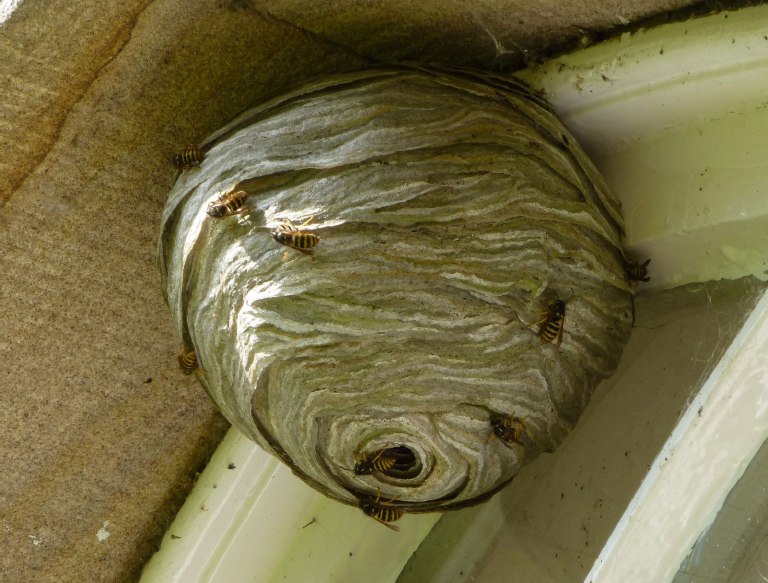
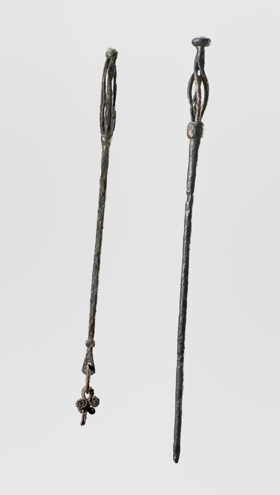
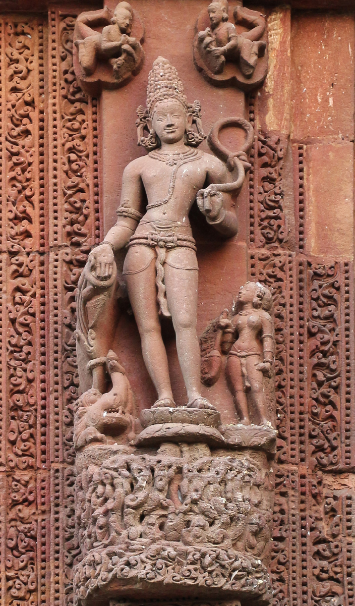
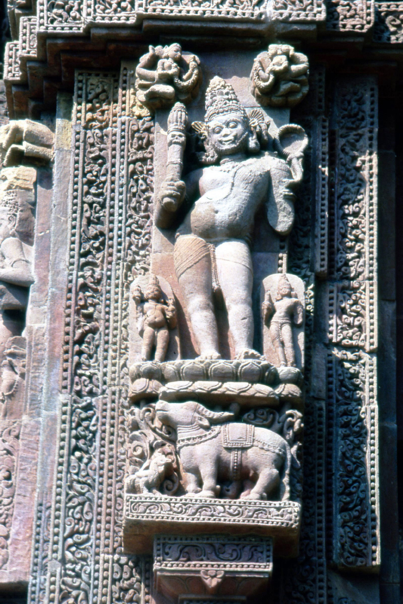
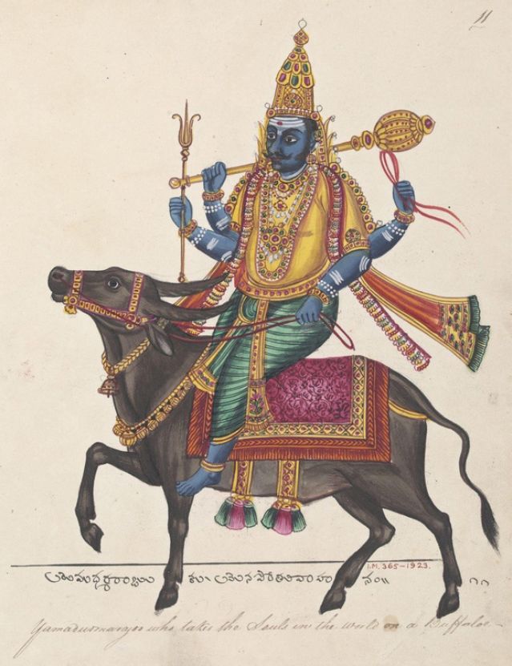
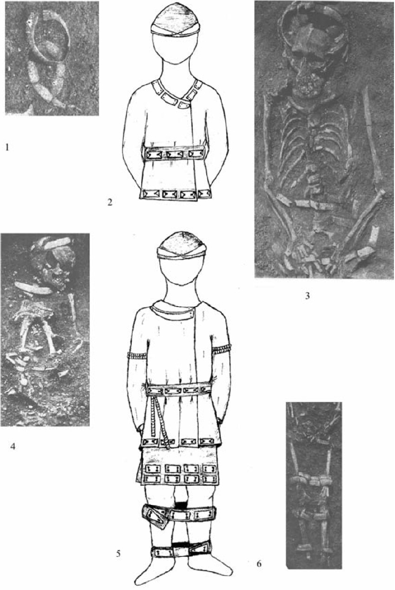

<!-- page: 121 -->

# 8. Tied to the underworld

Birgit Anette Olsen

University of Copenhagen

## Abstract

One of the common Indo-Europeans ideas of afterlife is the notion that the deceased person is wrapped or covered and somehow tied to the underworld. The present chapter investigates this concept in a linguistic, mythological and archaeological context with special reference to the Proto-Indo-European roots *sh₂ai̯- ‘bind’, also magically, and *u̯elhu̯- ‘wrap, cover’ as mirrored by burial practices of early Indo-European societies.

## 1. Introduction

A peculiar feature of what seems to be a common Indo-European view of afterlife is the idea that the deceased person is wrapped or covered and somehow tied to the underworld.[^1] These concepts, which may be corroborated by linguistic and possibly also archaeological evidence, are commonly, if not exclusively, expressed by derivatives of three inherited roots:

1. (*sh₂ei̯-)> *sh₂ai̯- or *sah₂i̯-, zero-grade *sh₂i-> *sih₂- ‘tie, bind’ (LIV²: 544–545 with addendum; Rasmussen 1989: 59–60)

2. *deh₁- ‘bind’ (LIV²: 102–103) and

3. *u̯elh̯u̯-, zero-grade *u̯lhu-> *u̯luh-, ‘enclose, cover’ and ‘roll’ (LIV²: 674–675; Rasmussen 1989: 99–100; Rasmussen 2011).[^2]

<!-- page: 122 -->

## 2. The root *sh₂ai̯-

A root (*sh₂ei̯->) *sh₂ai̯- with zero-grade *sh₂i-> *sih₂- ‘tie, bind’ is attested as what may be a reduplicated present in CLuw. 3.pl. ḫisḫii̯anti ‘bind’, Hitt. išḫii̯anzi ‘bind, tie’,[^3] a nasal present in Ved. sinā́ti ‘ties’, Lith. dial. sienù ‘bind’, and a perfect in Ved. ā́ siṣāya, Av. ā-hišāiiā ‘holds tied up’.[^4]

Besides the literal sense of ‘bind, tie’, a metaphorical meaning, ‘bind by magic’, must be attributed to the proto-language as argued by Janda (2000: 119); cf. e.g. HLuw. hišhiš- ‘spell’ from *‘binding’ (Melchert 2001a: 70).

An agent noun *sh₂ai̯-tér-> Ved. setár- ‘binder’, used as an instrument noun ‘bond’ in a metaphorical sense, is found in RV 7.84.2 (Indra and Varuṇa):

> yuvó rāṣṭrám bṛhád invati dyaúr yaú setṛ́bhir arajjúbhiḥ sinītháḥ
>
> pári no héḷo váruṇasya vṛjyā urúṃ na índrah kṛṇavad u lokám
>
> Heaven speeds the lofty rule of your two, who bind with ropeless bonds. Might the anger of Varuṇa avoid us. Indra will make a wide, wide world for us.[^5]

Characteristically, both setṛ́bhir and the corresponding verb sinītháḥ are associated with the god Varuṇa, feared by men for his fetters, which he uses to bind those who transgress the divine commandments.

This agent noun in turn is the basis of the well-attested instrument noun *sh₂ai̯-tlo/ah₂- in ON seil ‘rope’, OE sál ‘rope, tether’, Germ. Seil ‘rope, noose’, Latv. saiklis (m) ‘string, band’. A remarkable semantic development is common to Italic and Celtic; cf. Lat. saeculum ‘generation, lifetime’, W hoedl ‘lifespan, age’. Here the underlying idea may be that of the ‘thread of life’, spun by the (predecessors of) the Moirai/Parcae/Norns. The Slavic comparanda have zero grade in the root, *sh₂i-tlo/ah₂-> *sih₂-tlo/ah₂- in OCS silo, Pol. sidło/-a ‘noose, snare’.

From a nominal derivative of the to-participle, *sh₂ai̯-to- or *sh₂oi̯-to-, we find Lith. saῖtas ‘tie, leash, cord’, but also ‘magic’ and

<!-- page: 123 -->

OCS sětь ‘snare, trap’, identical with W hud ‘magic’ and ON seiðr ‘spell, charm, oath’, especially denoting a particular sort of magic or witchcraft carried out with a seiðrstafr. ON also has the corresponding verb síða ‘work charms’ <*sih₂ite/o- <*sih₂te/o-, and it is noteworthy that Odin, whose functional range is in many ways similar to that of Varuṇa, was the master of seiðr. This fits well with the fact that the closely related Vedic tu-stem sétu- ‘band’, is a characteristic feature of (Mitra and) Varuṇa, thus e.g. RV 7.65.3:

> tā́ bhū́ripāśāv ánṛtasya sétū duratyétū ripáve mártyāya
>
> ṛtásya mitrāvaruṇā pathā́ vām apó ná nā́vā duritā́ tarema
>
> These two have many fetters, are bonds for untruth, and are hard to overcome for the cheating mortal.
>
> By your path of truth, Mitra and Varuṇa, we would cross over difficulties, as [we would] waters by a boat.

Similarly RV 8.67.8 (Ādityas – including Varuṇa, the foremost āditya of all, and Mitra):

> mā́ naḥ sétuḥ siṣed ayám
>
> Let this fetter here not bind us

The formal identity between Ved. sétu- and OIr. saeth (u-st.) ‘disease, illness’ suggests that the idea that disease is caused by magic binding goes back to at least Core Indo-European.

An extended root form root *sh₂ai̯u̯- seems to be continued in Ved. sévate ‘remain at sth., be tied up with sth., be attached to sby’ (LIV²: 544; EWAia II: 747; Gotō 1987: 328–330) or simply ‘bind’, often used in the sense of ‘binding by magic’ with the aim of causing disease as elaborated by Janda (2000: 69–138) with an abundant collection of material, also including other roots with the basic meaning ‘bind’. In conclusion, it is unnecessary to assume two homonymous roots *sh₂ai̯-.[^6]

Thus, the thematic stem *sh₂ai̯u̯o- (Janda 2000: 119) would have undergone a semantic development from ‘bound by magic’ to ‘“krank”, “schmerzend”, “leidvoll”, “rasend”, “grausig”’, whence Lat. saevus ‘harsh, savage, ferocious’ beside the *-ro- derivative *sh₂ai̯ro-> Goth. sair ‘pain’, ON sár ‘wound’, pain, illness’.

<!-- page: 124 -->

This leads Janda (2000: 114–121) to a lengthy discussion of the Greek consonant stem Ἄϊδ-, gen. Ἄϊδος (usually gen. for ‘Hades’ house’), Hom. also Ἀϊδης, -αο ‘Hades’. The etymological background of this difficult word is disputed (cf. Frisk I: 33–34; LfgrE A: 273–278). Among the most prominent suggestions is a privative compound *n̥-u̯id- ‘unseen’, the solution preferred by Beekes (2010: 34), and *sm̥-u̯id- ‘meeting (with the ancestors)’ (Thieme 1952). Chantraine (2009: 30) laconically sums up the situation: “several uncertain hypotheses that there is no reason to repeat” (“nombreuses hypothèses incertaines qu’il n’y a pas lieu de répéter”).

However, even before this, Wackernagel (1885: 277; 1897: 7)[^7] anticipated the alternative scenario favoured by Janda: “*Αίιδ- is most naturally traced back to *Αίϝιδ-, and this, if not to *yaivid-, then to *saivid-. Thus, we are immediately reminded of lat. saevus, the idea of which comes close enough to the nature of the god of the underworld”.[^8] While Wackernagel spells out neither the precise semantic development nor the morphological details, Janda (2000: 127) points out the suggestive Latin expression saeva vincula ‘cruel chains’ and, as for the derivational pattern leading to *sai̯u̯id-, he suggests a Proto-Greek “hai̯u̯o- “bindend, (gebunden)” → *hai̯u̯id- “die Bindende, Bindung, Fessel”> *Ἀϊς” (p. 131).

With this interpretation, Hades’ house would be ‘the house of the binder’, and, as usual, the Gk. -ιδ-stem would at least functionally correspond to the Old Indic vṛkī́ḥ-stems, i.e. substantives of appurtenance or singulatives.[^9] The only slight problem here is the unexpected barytonesis, which Janda explains as a result of the onomastic use of the word, as e.g. in adj. γλαυκός → PN Γλαῦκος, probably triggered by the accent retraction of the vocative (cf. Schwyzer 1959: 380).

The additional *-u̯- seen in *sh₂ai̯u̯o- and in Ved. sévate may also be suspected in an old *-u̯el/u̯en- heteroclitic. As argued in Olsen (2010: 78), the most economical way to combine Hitt. išḫial- (n) ‘bond, band, belt’ with išḫiul- (n) ‘binding, obligation, treaty’ seems to be starting from a heteroclitic *sh₂iu̯ōl-> Hitt. išḫial- with loss of *-u̯- as in idālu- ‘bad, evil’ <*h₁ed-u̯ōl- (cf. Melchert 1984: 30; Rasmussen 1992b:

<!-- page: 125 -->

364; Rieken 1999: 446–448), the derivational basis of *sh₂iulo-> Hitt. išḫiul-, where the connection between *-u̯ōl(-) and a derivative in *-ulV- is paralleled by cases such as *u̯ei̯d-u̯ōl-> Gk. εἴδωλον ‘phantom, image’ beside *u̯(e)id-ul- in Gk. εἰδυλίς ‘acquainted with, knowing’, Lith. pavìdulis ‘(very) image’, Ved. vidurá- ‘wise, knowing’. According to Rieken (2008: 253), elaborating on Melchert’s discovery of syncope of *-o- in the sequences *-Cros/m, *-Clos/m,[^10] “none of the inflectional or derivational morphemes ending in -ēl, -īl, and -ūl in Hittite go back to athematic endings or suffixes, but all originate instead from the loss of the final syllable of thematic *-lo-stems”. The wide-reaching consequence of this is the elimination of most alleged primary l-stems or l/n-stems that would otherwise only be attested in Anatolian. On the other hand, tracing Hitt. išḫial- back to a lo-stem where the final syllable is continued as *-l̥> -al,[^11] is morphologically less obvious, while the analysis proposed here has the advantage of uniting the two derivatives under one common heading. Apart from the assumed loss of *-u̯- in the sequence *-u̯ōl- – as in idālu- – the suggested analysis is thus identical with that of Rieken (1999: 446) “*sh₂i-ṓl”.[^12]

The preceding conclusion, in turn, is potentially relevant to the evaluation of the Germanic word for ‘soul’, saiwalō-> Goth. saiwala (f), OE sāwol (m), OS seola (f), OHG sēula, sēla (f) ‘id.’, whose etymology is most often considered unknown.[^13]

However, according to Janda (2000: 134–135), we may be dealing with a proto-form *sh₂ai̯u̯o-lah₂-, yet another derivative of the same stem as Lat. saevus.[^14] Since the ‘soul’ was primarily perceived as the soul of the dead, we would have an expression with the same semantic connection between ‘binding’ and ‘death’ as assumed for Hades. The basic idea may seem quite plausible but, considering the existence of a *-u̯el/u̯en- heteroclitic for this root, Janda’s idea of a diminutive “die kleine gefesselte (Leiche o. ä.)”, may not be the most natural analysis.[^15]

<!-- page: 126 -->

A simpler and semantically more straightforward interpretation would be a simple ah₂-stem derivative of the heteroclitic, *sh₂ai̯-u̯ol-ah₂- ‘the one associated with a bond’.

## 3. The root *deh₁-

Verbal forms of *deh₁- ‘bind’ (LIV²: 102) include a i̯-present, probably *dh₁-i̯é-, in Anatolian, Hitt. tiya ipv. ‘bind’!, Greek δέω, and in Indo-Iranian, Ved. dyati ‘binds’, OAv. ipv. middle, ni.diiātąm. A potentially old reduplicated present is found in Gk. δίδηµι.

While the root apparently simply means ‘bind’ without the magic connotations of *sh₂ai̯-, the verb is still used in connection with burial practices, as in the famous Hittite “Song of Nesa”, where the dead soldier cries out:

> Nešaš TÚG.I.A Nešaš TÚG.I.A tiya=mu tiya
>
> nu=mu
>
> annaš=maš katta arnut tiya=mu tiya
>
> nu=mu uwaš=maš katta arnut tiya=mu tiya
>
> Clothes of Nesa, clothes of Nesa, bind me, bind!
>
> Bring me down [for burial] with my mother – bind me, bind!
>
> Bring me down [for burial] with my nurse [?] – bind me, bind![^16]

The Hittite match of the sumerogram túg.i.a ‘clothing’ is u̯ašpa- (cf. also HLuw. u̯ašpant- ‘wearing shrouds’ (?); Melchert 2001a: 265), and as ingeniously demonstrated by Watkins (1969), this corresponds to the basic stem of Lat. vespillō ‘undertaker (for the poorest classes)’, later ‘grave robber, a thief who steals the clothes from a corpse’. The present author (2016) has argued that the common root segment is probably *u̯obʰ-s- from *u̯ebʰ- ‘weave’ rather than the generally assumed *(h)uo̯s-p- from *(h)u̯es- ‘dress’, and thus connected with the word for ‘wasp’, *u̯obʰsah₂-> *u̯opsah₂-> OE wæfs, MP waβz, OPr. wobse (metathesized *u̯osbʰah₂-> *u̯ospah₂-> Lat. vespa, OE wæsp). This suggests that the wasp, from the way its nest is constructed, was perceived as a ‘wrapper’, *u̯obʰsó-, and that a corpse back in PIE times could be wrapped in a shroud, *u̯óbʰso-, consisting of several thin layers of woven material.

<!-- page: 127 -->

Pre-dialectal nominal derivatives of *deh₁- include the men-stem *déh₁-mn̥- in Gk. -δηµα and Ved. dā́man- ‘band, rope’ and the zero-grade ti-stem *dh₁-ti- in Gk. δέσις ‘binding’ = Ved. -diti-.

Characteristically, dā́man- is compared to Varuṇa’s invisible fetters, c.f. RV.2.28.6 (Varuṇa):

> dā́meva vatsā́d vi mumugdhy áṅho nahí tvád āré nimiṣaś canéśe
>
> Like a rope from a calf, untie confining straits [from me], for I cannot be away from you even for the blink of an eye.

RV.7.86.5 (Varuṇa)

> áva drugdhā́ni pítrya sṛjā nó’va yā́ vayám cakṛmā́ tanū́bhih
>
> áva rājan paśutṛ́paṃ ná tāyúṃ sṛjā́ vatsáṃ ná dā́mno vásiṣṭham
>
> Release from us ancestral deceits and those that we ouselves have committed. O king, release Vasistha from his bond like a cattle-stealing thief, like a calf.

Varuṇa, with Mitra and Aryaman, is the foremost ādityá-, a vṛddhi derivative ‘son of Áditi-’ <*ń̥-dh₁ti- ‘unboundednes’, or “the goddess

<!-- page: 128 -->

who personifies freedom from offense and its consequences” (Brereton 1981: 197). He is constantly prayed to for forgiveness from guilt, as if being untied from a rope, and thus his function in a Vedic context is rather that of unbinding than of binding.

## 4. The root *u̯elhu-, zero grade *u̯lhu-> *u̯luh-

There is no general agreement on the reconstruction of our third root. LIV²: 674, 675 tentatively operates with a root *u̯el- ‘einschliessen, verhüllen’ and a *u̯el- ‘drehen, rollen’, leaving it an open question whether the two were originally identical.

The problem is complicated by a potential partial semantic and phonological merger of *u̯el- and *u̯elhu̯- owing to the morphophonemic alternations of “eRu/Rū”-roots where both the laryngeal and the root-final *-u̯- would regularly be lost in some contexts, notably word-finally (cf. Rasmussen 1989: 103–104). At least the concepts of ‘covering’ and ‘wrapping, rolling’ are semantically compatible, so it seems reasonable to reconstruct a basic root *u̯elhu̯- with the double meaning.

An old derivative is the men-stem *u̯elhu-mn̥- → *u̯eluh-mn̥- ‘roll, covering’, continued in Lat. volūmen, Gk. εἴλ̅υµα and Arm. gelowmn. Here the regular full grade *u̯elhu- has been contaminated with the zero grade *u̯lhu-> *u̯luh- with regular metathesis to the hybrid *u̯eluh-mn̥-, at least in Italic and Greek.[^17] As a secondary thematic derivative one would regularly get *u̯elhu-mn-ó- ‘associated with covering’ that, with regular simplification of the cluster *-mn-> -n- would yield *u̯elhu-n-o-,[^18] so that the theonym Váruṇa-, again with ‘vocatival’ accentuation, could in principle be interpreted as ‘the one associated with covering’, depending on an analysis of Váruṇa’s functional area. Another option might be a derivation from the weak stem of a heteroclitic *u̯elhu̯r/un- as suggested by Janda (2000: 111), allegedly continued in εἶλαρ with

<!-- page: 129 -->

the approximate meaning ‘parapet, protective wall’. However, this is preferably derived from εἰλέω ‘press together, draw together, fence in’ rather than the homonymous ‘roll, turn, wind’.

There is no general agreement on the etymological background of Váruṇa- and suggestions abound, not least because an Indo-Iranian root segment *var⁽ⁱ⁾- with PIE *-l- or *-r- and with or without a root- final and/or initial laryngeal has so many potential sources. As neatly summed up by Mayrhofer (KEWA III: 151), “Even if no appellative meaning may be demonstrated, the number of root-etymologies that may all claim a certain probablility remains too large.”[^19] (cf. also EWAia II: 515–516).

A certain priority has been given to a connection with vratá- ‘commandment’; compare EWAia loc. cit: “Einiges spricht für eine auch sprachgeschichtliche Verbindung mit vratá-” and Jamison & Brereton (The Rigveda I: 43): “The most prominent of the Ādityas is Varuṇa, whose name is related to vratá “commandment” and who therefore is the god of commandments”.[^20]

However, it is difficult to account for the morphological pattern if vratá- and Váruṇa- are derived from the same root. Presumably, vratá- is from *u̯erh₁- ‘speak’,[^21] while Váruṇa-, in consideration of the rarity of the suffix -una-,[^22] is better understood if -u- is part of the basic root, which means that *u̯elhu̯- would be the obvious candidate. In that case, as suggested above, a proto-form *u̯elhu-no- would be morphologically coherent.

The same root is the basis of ON vǫlr ‘round stick’[^23] <*ualu- <*u̯olhu-, from which *u̯alu̯ōn-> vǫlva, probably from a Hoffmann-compound *u̯olhu̯(o)-h₃onh₂-, lit. ‘the one in charge of the stick, a stick-carrier’, using her stick during seiðr.

<!-- page: 130 -->

<!-- page: 131 -->

Finally, the old designation of the pastures of the dead, Hitt. wellu- (c/n) ‘meadow, pasture’ (Weitenberg 1984: 181–182), ON vǫllr ‘meadow, pasture’ and Gk. Ἠλύσιον (πεδίον) ‘The Elysian Fields’, appears to be connected with this root. This point will be elaborated in Olsen forthcoming.

## 5. Varuṇa and Yama

In the Old Indic pantheon, two gods in particular are associated with binding and unbinding, Varuṇa and Yama, and both of them carry a noose, pā́śa-, as an attribute. But, while Yama has the sinister role of getting hold of his victims and binding them to death, Varuṇa is mostly invoked to release poor mortals from their spiritual fetters, caused by moral transgressions.

Thus, RV 1.24.13:

> śúnaḥśépo hy áhvad gṛbhītás tríṣv ādityáṁ drupadéṣu baddháḥ
>
> ávainam rā́jā Váruṇaḥ sasṛjyād vidvā́ṅ ádabdho ví mumoktu pā́śān
>
> Since Śunahśepa, seized and bound in three stocks, called upon the Aditya, King Varuna should set him loose. Let him – the knowing one, never cheated – release the fetters.

or RV.7.88.7:

> vy àsmát pā́śaṁ váruṇo mumocat
>
> Varuna will release his fetter from us,

following the poet Vasiṣṭha’s regret of his transgressions and his hope for not having to pay for them.

Cf. also RV 2.28.5–2.28.6:

> ví mác chrathāya raśanā́m ivā́ga ṛdhyā́ma te varuṇa khā́m ṛtásya
>
> mā́ tántuś chedi váyato dhī́yam me mā́ mā́trā śāry apásaḥ purá ṛtóḥ
>
> ápo sú myakṣa varuṇa bhiyásam mát sámrāḷ ṛtāvó ʹnu mā gṛbhāya
>
> dā́meva vatsā́d ví mumugdhy áṅho […]
>
> Loosen my offense from me like a halter. We would succeed in reaching the wellspring of your truth, Varuṇa.
>
> Let my thread not be cut as I weave my insight. Let not the full measure of my work be broken before its season.
>
> Unfasten fear from me, o Varuṇa! Hold me close, o truth-possessing universal king!
>
> Like a rope from a calf, untie confining straits […]

<!-- page: 132 -->

<!-- page: 133 -->

As noted by Janda (2000: 126), the same idea of mental binding has a parallel in Avestan, Y.29.1b, about the soul of the cow:

> ā mā aēšmō hazascā rəmō āhišāiiā dərəšca təuuišca
>
> [For] the cruelty of fury and violence, of bondage and might, hold me in captivity.[^24]

In some cases, Varuṇa’s fetters are described as being three in number: the uppermost, the midmost and the lowest. Compare, besides the above-mentioned tríṣu ‘threefold’ in RV 1.24.13, also RV 1.24.15:

> úd uttamám varuṇa pā́śam asmád ávādhamaṃ ví madhyamáṃ śrathāya
>
> átha vayám aditya vraté távā́nagaso áditaye syāma
>
> Loosen above the uppermost fetter from us, o Varuna, below the lowest, away the midmost. Then under your commandment, o Aditya, we would be without offence for Aditi

RV.1.25.21 (Varuṇa):

> úd uttamám mumugdhi no ví pā́śam madhyamáṃ cṛta ávādhamā́ni jīváse
>
> Release above the uppermost fetter from us, unbind away the midmost, [loosen] below those lowest, in order for us to live

As Varuṇa’s primary domain is the maintenance of ṛta, the divine order, he is constantly invoked to release mortals from mortal sin. However, while he cannot be described as an actual god of death, he does have the power to draw the consequences of man’s transgressions, and if he is not appeased death must necessarily follow; compare RV 1.24.11:

> áheḷamāno varuṇehá bodhy úruśaṅsa mā́ na ā́yuḥ prá moṣīḥ
>
> Become no longer angry now, Varuṇa! O you of wide fame, do not steal away our lifetime!

– and, equally ominously, RV.7.89.1:

> mó ṣu varuṇa mṛnmáyaṃ gṛháṃ rājann aháṃ gamam
>
> mṛḷā́ sukṣatra mṛḷáya
>
> O King Varuna, let me not go to the house of clay!
>
> Be merciful, o you whose dominion is great. Have mercy.

<!-- page: 134 -->

<!-- page: 135 -->

Here the ‘house of clay’, according to Lincoln’s convincing analysis (1982), refers to the burial mound.

In one enigmatic passage, termed by Geldner a “Rätselvers”, Varuṇa is even compared with a cloak, ‘enveloping all the created thing’. RV.8.41.7:

> <!-- page: 136 -->
>
> yá āsv átka āśáye víśvā jātány eṣām
>
> pári dhā́māni mármṛśad váruṇasya puró gáye víśve devā́ ánu vratáṃ
>
> nábhantām anyaké same
>
> Who lies on these [fem. = the waters?] [like] a cloak, while enveloping all the created thing of these [masc. = the gods?] and their domains – in Varuna’s household, in front [of him], are all the gods, following his commandment.

Such connections with fettering and covering are also characteristic of Yama, the death god, who mainly appears in the later parts of the Rig Veda, especially books 1 and 10. Like Varuṇa, he is traditionally depicted with a noose, but he also carries a stave, daṇḍa.

In one of the funeral hymns, RV 10.14.2, the deceased is told that Yama was the first to find the way to the pasture-land (gávyūti-) of the forefathers, and now it is his turn:

> yamó no gātúm prathamó viveda naiṣá gávyūti ápabhartavā́ u
>
> yátrā naḥ pū́rve pitáraḥ pareyúr ená jajñānáḥ pathyā̀ ánu svā́ḥ
>
> Yama first found the way for us: this pasture-land is not to be taken away. [The way] on which our ancient forefathers departed, along that [do] those who have since been born [follow] along their own paths.

On his travel to the other side, he is going to meet both Yama and Varuṇa (RV 10.14.7):

> préhi préhi pathíbhiḥ pūrvyébhir yátrā naḥ pū́rve pitáraḥ pareyúḥ
>
> ubhā́ rā́jana svadháyā mádantā yamám paśyāsi váruṇaṃ ca devám
>
> Go forth, go forth along the ancient paths on which our ancient forefathers departed.
>
> You will see both kings become exhilarated on the svadhā[-cry], Yama and Varuṇa the god.

A remarkable feature of Yama is his association with weaving and covering, presumably covering up the dead body. Thus RV 7.33.9:

> yaména tatám paridhíṃ váyanto
>
> weaving the covering [garment] stretched by Yama

and RV.7.33.12:

> yaména tatám paridhíṃ vayiṣyánn
>
> intending to weave the covering stretched by Yama

<!-- page: 137 -->

## 6. The völva

In Old Norse tradition, the völva, as a specialist of witchcraft, connects the realms of the living and the dead.

In the poem Baldr’s dreams, probably from the 10th century (transl. Henry Adam Bellows), Baldr is having disturbing nightmares and in order to find out what is going to happen, Odin, himself the “father of magic” and a specialist of seidr, seeks help from a dead völva in her grave (vv. 3–4):

| Sá var blóðugr | Bloody he was |
| --- | --- |
| um brjóst framan | on his breast before, |
| ok galdrs föður | At the father of magic |
| gól of lengi; | he howled from afar; |
| fram reið Óðinn, | Forward rode Othin, |
| foldvegr dunði; | the earth resounded |
| hann kom at hávu | Till the house so high |
| Heljar ranni. | of Hel he reached. |
| Þá reið Óðinn | Then Othin rode |
| fyrir austan dyrr, | to the eastern door, |
| þar er hann vissi | There, he knows well, |
| völu leiði; | was the wise-woman’s grave |
| nam hann vittugri | Magic he spoke |
| valgaldr kveða, | and mighty charms, |
| unz nauðig reis, | Till spell-bound she rose, |
| nás orð of kvað: | And in death she spoke |

Knowing that she can see into the future, Odin asks her (v. 8):

| “Þegj-at-tu, völva, | “Wise-woman, cease not! |
| --- | --- |
| þik vil ek fregna, | I seek from thee |
| unz alkunna, | All to know |
| vil ek enn vita: | that I fain would ask: |
| Hverr mun Baldr | Who shall be bane |
| at bana verða | of Baldr become, |
| ok Óðins son | And steal the life |
| aldri ræna?” | from Othin’s son?” |

Another relevant text is the Eddic poem Grógaldr, where Svipdag raises his mother Groa, a völva, from the dead (v. 6):

| “Vaki þú, Gróa, | “Wake thee, Groa! |
| --- | --- |
| vaki þú, góð kona, | wake, mother good! |
| vek ek þik dauðra dura; | At the doors of the dead I call thee; |
| <!-- page: 138 -->  ef þú þat mant, | Thy son, bethink thee, |
| at þú þinn mög bæðir | thou badst to seek |
| til kumbldysjar koma.” | Thy help at the hill of death.” |

Gróa is willing to help her son by magic, and among the long series of the favours she grants him is the following about the loosening of fetters (v. 10):

| “Þann gel ek þér inn fimta, | “Then fifth I will chant thee, |
| --- | --- |
| ef þér fjöturr verðr | if fetters perchance |
| borinn at boglimum: | Shall bind thy bending limbs: |
| leysigaldr læt ek | O’er thy thighs do I chant |
| þér fyr legg of kveðinn, | a loosening-charm, |
| ok stökkr þá láss af limum, | and the lock is burst from the limbs, |
| en af fótum fjöturr.” | And the fetters fall from the feet.” |

## 7. The terminology of binding and wrapping

Summing up this preliminary linguistic survey, the Indo-European proto-language possessed at least two roots with the meaning ‘bind’, *deh₁- and *sh₂ai̯-.[^25] Of these, *deh₁- appears to be the neutral term, although it does occur in contexts relating to the binding of the dead and in a metaphorical sense in Ved. Áditi- ‘unboundedness’ and the corresponding vṛddhi derivative āditya-, of which Varuṇa-, the god of divine right and unbinding from transgressions, is the most prominent.

*sh₂ai̯- and the extended version *sh₂ai̯d-, on the other hand, has a connotation of magic, which is undoubtedly original, with traces in Anatolian, Italic, Celtic, Germanic, Greek, Baltic and Indo-Iranian. More specifically, the *-to-derivative *sh₂ai̯to- or *sh₂oi̯to- in the meaning ‘magic’ is clearly pre-dialectal.

The etymological connection between Hitt. wašpa- ‘clothing’ and Lat. vespillō ‘undertaker’ indicates that the tradition of shrouding the dead goes back to Proto-Indo-European. The striking correspondence between the proto-form *u̯óbʰs-o- and the assumed agent noun *u̯obʰsó- in the word for ‘wasp’ further suggests that the shroud may have looked somewhat like a mummy wrap or a wasp’s nest.

The actual act of wrapping or shrouding may have been expressed by a derivative of the root *u̯elhu̯- with the double meaning of ‘rolling, wrapping’ and ‘concealing’. This is consistent with the suggested

<!-- page: 139 -->

analysis of the theonym Váruṇa- as *u̯elhu-no- <*u̯elhu-mno- ‘the one connected with wrapping or concealing’, a secondary derivative of the well-attested *u̯elhu-mn̥- → *u̯lhu-mn̥-> *u̯luh-mn̥-. On the one hand, Varuna is clearly connected with ‘binding’ and ‘unbinding’, and in a single passage even ‘enveloping’. On the other, he is the one invoked not to let the singer go to the ‘house of clay’, that is, the mound, which encloses and conceals the deceased.

## 8. Mythological aspects

Several mythological traditions of the Indo-European world share the idea that fate and death are associated with magical binding. This would account for the Greek name of Hades, and in ancient India the gods representing the same line of thought are Yama and Varuṇa, both characterized by their noose, pā́śa-. While Varuṇa mostly specializes in spiritual ‘binding’ as a consequence of transgressions against divine right, Yama is more explicitly the god of death, the psychopomp that leads the deceased to their final destination. He is the one that weaves the shroud, and in this capacity he may be compared with the völvas or norns in Norse mythology, where the völva’s staff, the vǫlr, is seen as a distaff. What Yama’s daṇḍa originally represents apart from an instrument of punishment is difficult to determine, but at least its top part in traditional iconography is reminiscent of thread on a distaff.[^26]

The three Nordic norns, like the Greek µοῖραι and the Roman Parcae have the role of spinning, measuring and finally cutting off the life thread of all human beings.[^27]

A particularly gory variant of this idea is found in the skaldic Darraðarljóð, dated to the beginning of the tenth century, which has been inserted in Chapter 157 of the Njáls saga, where twelve Valkyries are weaving the fate of warriors:[^28]

| <!-- page: 140 -->  1. Vítt’er orpið | See! warp is stretched |
| --- | --- |
| fyrir valfalli | For warriors’fall, |
| rifs reiðiský. | Lo! weft in loom |
| rignir blóði; | ’Tis wet with blood; |
| nú er fyrir geirum | Now fight foreboding, |
| grár upp kominn | ’Neath friends’ swift fingers, |
| vefr, verþjóðar | Our gray woof waxeth |
| ær þær vinur fylla | With war’s alarms, |
| rauðum vefti | Our warp bloodred, |
| Randvés bana. | Our weft corseblue. |
| 2. Sjá er orpinn vefr | This woof is y-woven |
| ýta þörmum | With entrails of men, |
| og harðkléaðr | This warp is hardweighted |
| höfðum manna; | With heads of the slain, |
| eru dreyrrekin | Spears blood-besprinkled |
| dörr að sköftum | For spindles we use, |
| járnvarðr yllir, | Our loom ironbound, |
| en örum hrælaðr. | And arrows our reels; |
| skulum slá sverðum | With swords for our shuttles |
| sigrvef þenna | this war-woof we work, |
| 3. Gengr Hildr vefa | Now War-winner walketh |
| ok hjörþrimul, | To weave in her turn. |
| Sanngríðr, Svipul | Now Swordswinger steppeth, |
| sverðum tognum. | Now Swiftstroke, now Storm; |
| Skaft mun gnesta | When they speed the shuttle |
| skjöldr mun bresta, | How spear-heads shall flash! |
| mun hjálmgagarr | Shields crash, and helmgnawer |
| í hlíf koma. | On harness bite hard! |

## 9. Archaeological perspectives

It would now be established that linguistic evidence pointing to a strong association of binding and weaving with death is widespread among early Indo-European traditions, but it remains to be seen in how far these ideas may be corroborated by material findings. The following brief sketch is quite tentative, and hopefully it will be possible for archaeologists with an interest in these matters to provide a supplement, whether confirming or rejecting the suggestions offered by actual archaeological evidence.

<!-- page: 141 -->

<!-- page: 142 -->

Burial mounds are a significant feature of Indo-European culture, known from the Yamnaya in the steppes to the Scandinavian Bronze Age and the Sintashta culture of the Indo-Iranians. Even in the Rig Veda, we have a beautiful description of the earth gently covering the dead (RV 10.18.10):

> Úc chvañcasva pṛthivi mā́ ní bādhatāḥ sūpayān ā́smai bhava sūpavañcanā́ mātā́ putráṃ yáthā sicā́bhy ènam bhūma ūrṇuhi
>
> Arch up, Earth; do not press down. Become easy to approach for him, easy to curl up in.
>
> Like a mother her son with her hem, cover him, Earth.[^29]

But before the deceased is led to the grave and covered by the mound where rich meadows for grazing of his herds will recreate the ideal world of the living, as already suggested by the Hittite phrase about the dead king that he will ‘go to his meadow’,[^30] he has to go through elements of binding and shrouding.

As we have already seen, the use of a shroud would be established on linguistic grounds by the Hittite–Latin correspondence between u̯ašpa- and vespillō. It is, however, also remarkable that early skeletons from the steppe (Dnjepr-Donetsk or Mariupol culture, about 4500 bce, predecessors of the Yamnaya horizon), are usually “heavily contracted at the sides” (cf. Telegin & Potekhina 1987). As noted by David Anthony (pers. comm.), “[t]his may be indicative of the fact that prior to burial the dead were tightly bound or swaddled”.

Still, it is an open question whether the dead were only swaddled or also fettered. According to the Rig Veda, Varuṇa enigmatically makes use of three fetters, the uppermost, uttamá-, the middle, madhyamá-, and the lowest, adhamá-, or his fettering is simply described as threefold, tríṣu. As a universal king, Varuṇa must certainly be assumed to have authority over the entire universe, and so Renou (1960: 355) interprets these occurrences as references to the triple division of space. However, if this is the correct analysis, it seems peculiar that the listing of the three adjectives, uttamá-, madhyamá-, adhamá-, does not correspond to explicitly cosmic references, where we find avamá- rather than adhamá- and paramá- beside uttamá-, which means that we cannot be dealing with a set phrase; compare:

<!-- page: 143 -->

RV 1.108.9–1.108.10 (Indra & Agni):

> yád indrāgnī avamásyām pṛthivyā́m madhyamásyām paramásyām utá stháḥ […]
>
> yád indrāgnī paramásyā́m pṛthivyā́m madhyamásyām avamásyām utá stháh
>
> When, o Indra and Agni, you are on the lowest earth, on the middle one, and on the highest one […]
>
> When, o Indra and Agni, you are on the highest earth, on the middle one, and on the lowest one […]

RV 5.60.6 (Maruts):

> yád uttamé maruto madhyamé vā yád vāvamé subhagāso diví sthá
>
> If you are in the highest heaven, o Maruts, or in the middle one, or if you are in the lowest one, you of good fortune.

On this background, one may perhaps quite tentatively venture the idea that the three fetters in question could refer to the preparation of the dead body. In her investigation of burial clothing from the same cultural horizon as the contracted skeletons, it appears that fetters on ankles, shins and waist also occur. Might this ancient practice be mirrored in Varuṇa’s lower, middle and upmost fetters?

Of course, a suggestion of this kind must be taken with all possible caution. Nevertheless, the language of religious conventions has been known to be long-lived, and if the apparent similarity is not simply accidental we must assume a continuous tradition spanning thousands of years.
---

[^1]: The work on the present chapter has been supported by the LAMP (Language and Mythology in Prehistory) project, financed by Riksbankens Jubileumsfond. I wish to thank the participants at the LAMP seminar Afterlife, Uppsala, 30 March 2023, for a fruitful and inspirational discussion.

[^2]: The quality of the laryngeal is uncertain, depending on the precise analysis of Gk. εἰλέω ‘roll, turn, wind, revolve’, cf. Frisk I, 457–458, Beekes 2010: 384, Chantraine 2009: 304–305.

[^3]: The morphological interpretation is somewhat uncertain. According to Rasmussen (1989: 36), the proto-form is *sh₂(i)i̯e/o-, which means that the initial ḫ- of the Luwian form must be secondary, while Melchert (1984: 111) assumes a reduplicated *h₂i-sh₂i- with dissimilation in Hittite. Cf. also Kloekhorst 2008: 391–393.

[^4]: Cf. also LIV² addenda and Cheung 2007: 137 on Iranian evidence.

[^5]: Translations of the Rig Veda by Jamison and Brereton 2014.

[^6]: Cf. also de Vaan (2008: 534): “Since ‘to rage’ an[d] ‘to be in pain’ are sometimes expressed by means of ‘to be tied, to be controlled by an outer force’, it is conceivable that the PIE root *sh₂i- ‘to rage, be in pain’ is ultimately the same as *sh₂i- ‘to tie’”.

[^7]: Cf. also Wackernagel 1885: 277 on the development of *ai̯u̯i.

[^8]: “*Αίιδ- liegt es am nächsten auf *Αίϝιδ- und dieses, wenn nicht auf *yaivid-, so auf *saivid- zurückzuführen. Damit werden wir sofort an lat. saevus erinnert, dessen Begriff dem Wesen des Unterweltgottes nahe genug liegt.”

[^9]: Cf. Meier 1975: 81–87 for a survey of explanations offered for the origin of the Greek suffix -ίδ-. Meier’s conclusion is that the dental in Greek is “(n)icht erklärbar”, and that the attempt to consider it a laryngeal reflex (thus Rosén 1956–1957; Olsen 2000) is unsatisfactory.

[^10]: Cf. Melchert 2001a and 1994: 87, and see also Melchert 2001b on Hittite stems in -il.

[^11]: Melchert 2001b: 161. Cf. also Oettinger 1986: 16–17.

[^12]: Cf. also Kloekhorst 2008: 391–393. Further discussion of the relation between *r and *l in heteroclitics and their secondary derivatives in Olsen 2010: 77.

[^13]: Cf. e.g. Lehmann 1986: 292; Casaretto 2004: 401; Kroonen 2013: 423.

[^14]: Thus already Grienberger 1900: 179, though with a different semantic motivation.

[^15]: Casaretto (2004) objects that an adjective as a basis of a diminutive may be unlikely, so that this would be a formation with a connecting vowel. In that case, the derivational basis is enigmatic.

[^16]: Cf. Melchert 1998: 492 for text and translation. ‘Bind’ is the only interpretation of tiya that fits the context; cf. also Kloekhorst 2008: 880–881.

[^17]: Strictly speaking, it is impossible to know the quantity of the -u- (ow) in Armenian, but it is unlikely that this early development took place independently in Italic and Greek, while Armenian, a ‘Balkanic’ language like Greek, would be left out.

[^18]: The regular distribution is *-mn-> *-m- after neutral roots, *-n- after roots containing a labial, as is archaic forms of the [inst.sg](http://inst.sg). of man-stems in Vedic (cf. MacDonell 1910: 208 and, earlier, Schmidt 1895: 121–122), e.g. drāghmā́ from draghimán- ‘length’ vs. prathinā́ from prathimán- ‘breadth’. Though *-mo- is productive at the expense of *-no-, the same distribution is observed in nominal derivation, cf. e.g. *le/ou̯ksmn̥> Lat. lūmen vs. *le/ou̯ksnah₂-> Lat. lūna etc. (cf. Rasmussen 1989: 199–203 for material).

[^19]: “Läßt sich keine appellativische Bedeutung nachweisen, dann bleibt die Zahl von Wurzel-Etymologien für den Gottesnamen allzu groß, deren jede eine gewisse Wahrscheinlichkeit beanspruchen kann.”

[^20]: Cf. the detailed analysis of Varuṇa’s function as the god of commandments, vratá-, by Brereton (1981: 63–92), who, unfortunately, fails to explain the formal details.

[^21]: Cf. Rasmussen 1992a: 24–25 for a discussion of the complicated relation between Ved. vratá- (n) ‘religious rule, command; religious vow, oath’, OAv. uruuatəm (Y.31.3) with variant uruuātəm, but also uruuāϑā ‘friend’ and OCS rota ‘oath, vow’. The aspirate in uruuāϑā probably reflects the cluster *-h₁t-> *-th₁-> -ϑ- with trace of the root-final laryngeal.

[^22]: Cf. Wackernagel & Debrunner 1954: 484–486.

[^23]: Also Goth. walus* (m) ‘stick’, OFr. walu-bera ‘pilgrim’ (cf. Casaretto 2004: 199–200). The corresponding adjective is ON valr ‘round’, as if <*u̯olho-.

[^24]: Translation by Insler 1975.

[^25]: *bʰendʰ- (or perhaps *bʰendh₁-; cf. LIV²: 75) may be restricted to Core Indo-European.

[^26]: The Greek psychopomp, Hermes, also carries a staff, the κηρύκειον, but its adornment with two intertwined snakes seems to have been taken over from the Sumerian-Babylonian deity Ningishzida (ᴰNin-giš-zi-da), who is also a god of the underworld.

[^27]: At least this motif seems to go back to Core Indo-European; cf. the extensive treatment by Giannakis (1999). As for the Roman tradition, Lipp (2016) has demonstrated that the form Neuna, attested on two of three cippae near Lavinium from the early 3rd century, Parca.Maurtia/dono ‘Parcae Martiae donum’, Neuna.dono ‘Nonae donum’ and Neuna.Fatae ‘Nonae Fatae’ must be derived from a stem *snē-uen- ‘spinning’, the n-stem alternant of the heteroclitic *sneh₁-u̯r̥-.

[^28]: Translation by George Webbe Dasent (1861), Icelandic Saga Database.

[^29]: Cf. Kuz’mina (2007: 185–204) on the mortuary practices of the Indo-Iranians.

[^30]: Cf. Puhvel 1969 and Olsen forthcoming on the formal details.

---

How to cite this book chapter:

Olsen, B. A. (2025). Tied to the underworld. In: Larsson, J. H., Olander, T., & Jørgensen, A. R. (eds.), Indo-European Afterlives: Interdisciplinary Perspectives on Life beyond Death, pp. 121–147. Stockholm: Stockholm University Press. DOI: [https://doi.org/10.16993/bcw.h](https://doi.org/10.16993/bcw.h). License: CC BY 4.0
