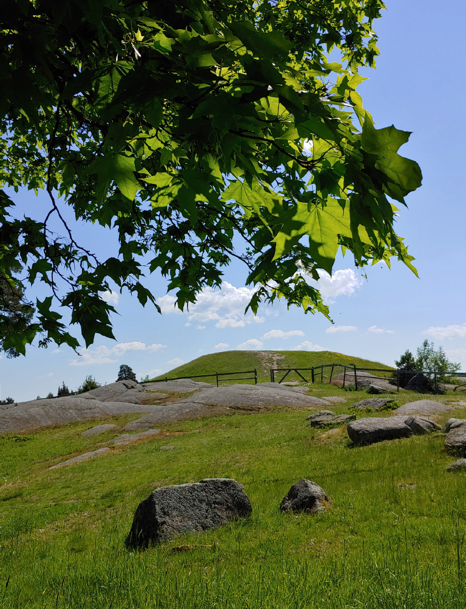
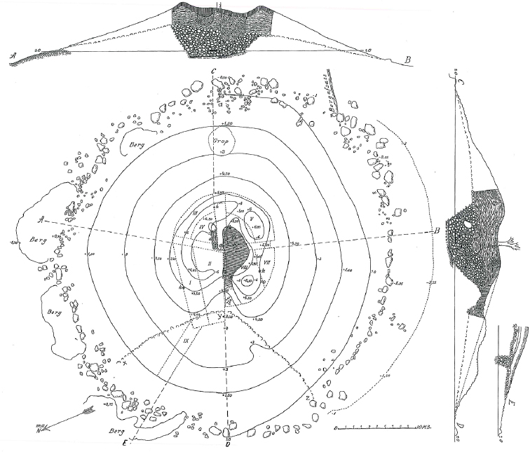
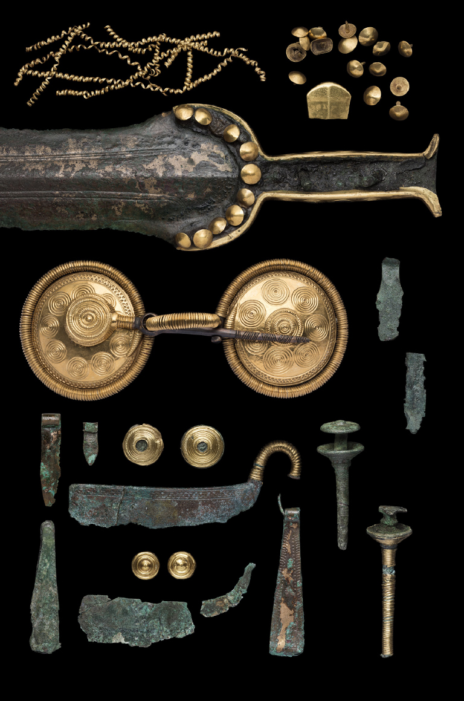
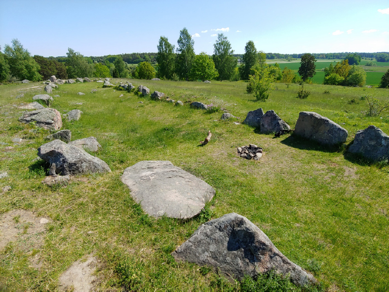
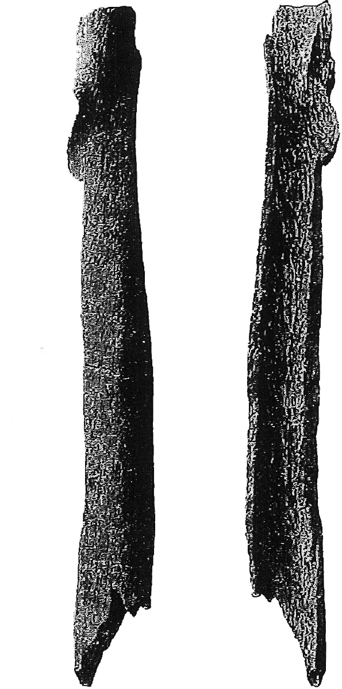
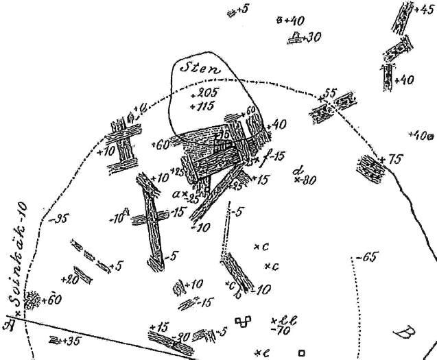
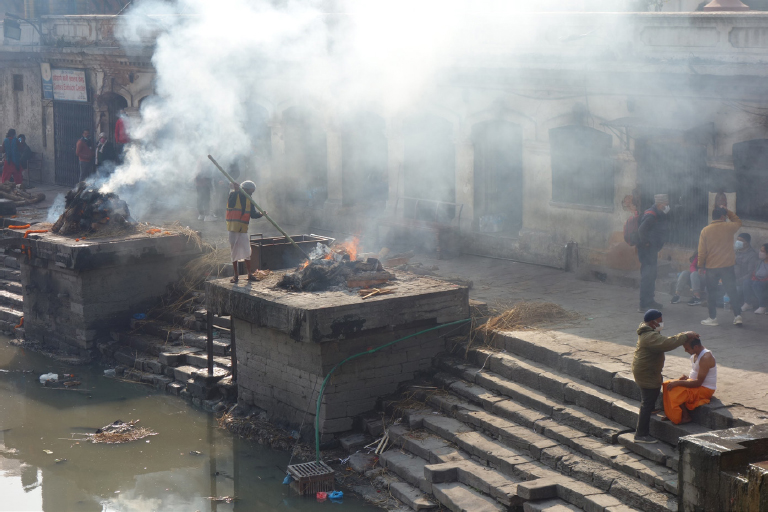
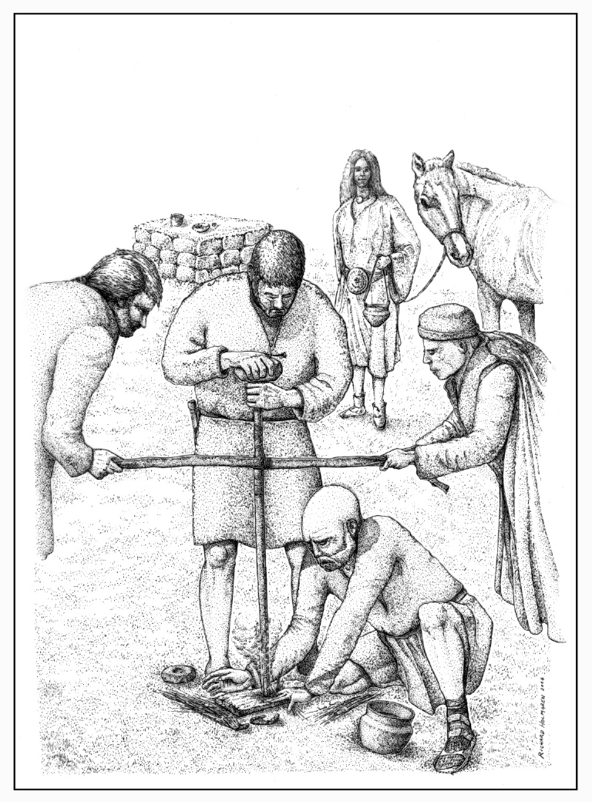
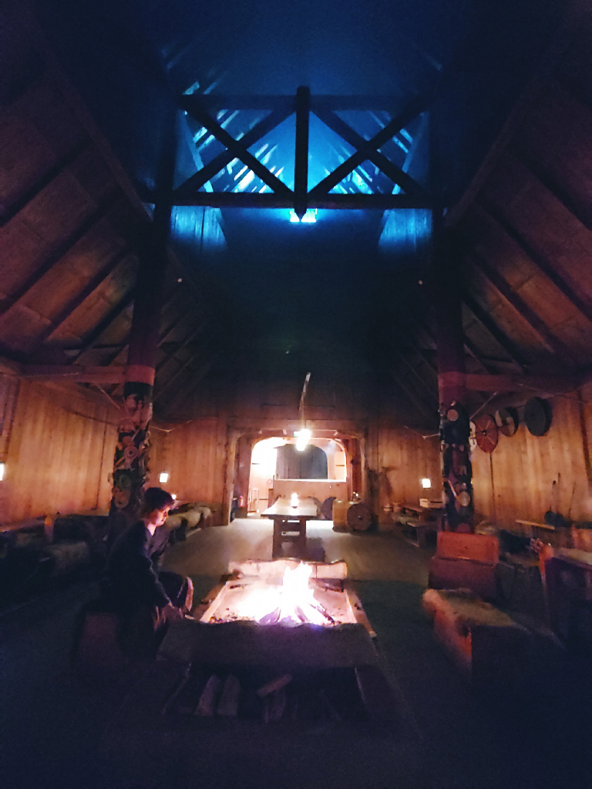
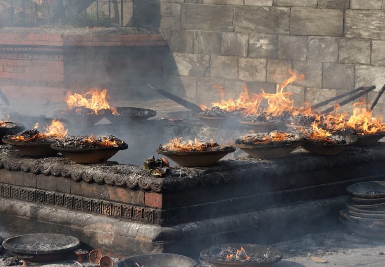

<!-- page: 149 -->

# 9. Indo-European cremations and cosmic fires

A comparative analysis of the funeral and fire rites of Bronze Age Håga, Sweden

Anders Kaliff and Terje Oestigaard

Uppsala University and Linnaeus University

## Abstract

The Håga grave mound outside Uppsala, Sweden, is unique in Scandinavian Bronze Age. About a third of all bronzes and bronze fragments in Sweden’s Bronze Age were found in this grave, dated to around 1000 bce. While the riches are spectacular, the funeral and not least the fire rituals are equally unique. The cremated king or chieftain was buried in an oak-log coffin and this is the northernmost oak-logged coffin burial in Scandinavia and also the oldest with cremation as a funeral practice. The role of fire in the funeral and rituals has been a neglected area of study and in Håga there are massive layers of charcoal measuring up to nearly 1 metre in depth. This most likely reflects complex fire rituals in the centuries before the cremation of the main deceased. The role of massive fire rituals is analysed in a comparative Indo-European perspective with an emphasis on seasonal and agricultural rituals. By combining ethnographic sources in Europe with insights from the Vedic traditions, some of Håga’s enigmas are discussed highlighting fire in culture and cosmology.

## 1. Introduction

In Scandinavian prehistory, cremation was one of the dominant funeral practices, together with inhumation; although water and air burials were probably also common, they leave fewer traces in the archaeological material. Today, the image of cremation is often associated with Hindu cremations on open pyres along the holy rivers on the Indian subcontinent, but in prehistory there were a great variation in the ways of conducting cremations as a specific mortuary ritual. While cremation as a funeral practice

<!-- page: 150 -->

becomes more popular in the Early Bronze Age (c. 1750–1100 bce) and dominates in many periods and places from the Late Bronze Age (c. 1100–500 bce) onwards, cremations have in fact been conducted for 10,000 years in Scandinavia, and one of the earliest cremations has been found from the Maglemose culture in Hammelev in Southern Jutland, dated to c. 8250 cal. bce (Eriksen & Andersen 2016). Still, cremation as a funeral practice in Scandinavia is intimately connected to later Indo-European traditions from the Bronze Age onwards and closely associated with metallurgy, the mastering of extreme heat and intensive use of fire in rituals, including agricultural and seasonal rites.

From the early days of comparative Indo-European mythology and religion (e.g. Müller 1856, 1859, 1879), it was obviously clear that there were structural and cultural connections between the ancient Vedic and later Hindu traditions in the east and the European and Scandinavian practices and beliefs from the Bronze Age to modern times, as also evident in the rich ethnographic material documented in the 19th century by, for instance, the Grimm brothers, Wilhelm Mannhardt and James G. Frazer. In archaeology, however, apart from using this wealth of documentation as analogies or inspirational sources, until recently this knowledge could not be included as actual culture history connecting continents and belief systems from Norway to Nepal or Ireland to India (see Kaliff & Oestigaard 2020, 2022, 2023a). With the breakthrough of aDNA studies addressing Indo-European questions from 2015 onwards, it is now possible to show actual migrations and how flows of people and ideas connect and create continuities on structural levels in history but also how cultural and religious practices and beliefs develop throughout the ages in processes that may be called cultural and religious “dialectification”: distinct traditions have a shared origin, enabling both cultural and religious uniqueness and independent historic development within an overall Indo-European frame and fundamental structure.

In this chapter, we will address aspects of Indo-European afterlives by a comparative analysis of the funeral and fire rites of Bronze Age Håga in Sweden. This is the richest and most spectacular Bronze Age grave in Sweden structured around cremation and intensive uses of fire. Thus, we will discuss and analyse three main themes. First, we will present the great Håga funeral in a Scandinavian context; second, we will contextualise the finds by exploring parts of the 19th and early 20th century ethnography documented in Europe with a focus on agricultural and seasonal rites and fires and, finally, highlight historic and contemporary funeral practices, cremations and fire rituals in India and Nepal, before summarising with a concluding discussion.

<!-- page: 151 -->

## 2. The Håga cremation and burial complex

Located some few kilometres west of Uppsala, the Håga grave mound was excavated in 1902–1903. The mound itself has a diameter of 43 to 49 metres and a height varying between 6.25 and 8.75 metres, since it was built in a slightly sloping topography, giving the mound a great visual and monumental impression from the surroundings (Figure 1).

<!-- page: 152 -->

Greater than the look was the actual construction and the finds. Before the mound as built, a huge cremation took place at the gravel level where the mound later was built. This pyre seems to have had a diameter of 7 to 8 metres, indicating the monumental size of the fire. After the fire was extinguished, the bones were collected and a layer of stone was constructed as a kind of platform. This stone platform was about 40 metres in diameter and 1 metre in height. On top of this stone platform, a layer of oak logs was put, mostly oriented in an east–west direction, creating a ritual platform. On this oak-logged platform, the cremated remains of the king or chieftain was laid in an oak-log coffin and this coffin was placed in a chamber also built of oak. The grave chamber, with precious grave gifts, was covered by a huge cairn, covering the bottom of the mound and measuring some 40 metres in diameters. The cairn, having a height of about 4.5 metres, was covered by turfs creating the mound (Figure 2) (Almgren 1905).

<!-- page: 153 -->

The Håga burial is the northernmost oak-log burial in Scandinavia and the closest parallels are the Danish oak-log burials, of which Egtved is the most famous. However, the Egtved burial is several centuries older than Håga, which was dated to period IV or the beginning of the Late Bronze Age (Almgren 1905). The dating places the Håga burial and the construction of the mound around 1000 bce, or in the time span 1100–900 bce (Ullén & Drenzel 2018: 129; 2022: 9–10).

Håga was for a long time forgotten but, after more than a century in the shadows of Old Uppsala, in recent years there has been a growing interest in Håga (Kaliff & Oestigaard 2018, 2023b; Oestigaard 2022; Ojala & Østigård 2022; Zachrisson, Ullén & Olausson 2022). There are several reasons why Håga regains attention and fame (Figure 3). Apart from the fact that the grave is similar to the Danish oak-log burials in splendour and elite status, Håga surpasses all other Nordic counterparts in richness. In Sweden, about 150 gold artefacts and fragments are known from the Late Neolithic and the Bronze Age, and about 50 of these were found in the Håga burial. Although many of these gold items are small or fragmented, it is nevertheless astonishing that about a third of all gold finds (in numbers, not in weight) from this time era in Sweden come from one grave: Håga (Eriksson 2008, 2022). As the excavator Oscar Almgren points out, “[t]his magnificent grave find from the Bronze Age Period IV, so far north in Sweden and in Uppsala, was by all means a total surprise” (Almgren 1905: 45). There are yet other finds and reasons that make Håga exceptional by all standards.

Near the mound itself there are two stone foundation houses, also called cult houses. In Sweden, there are documented more than 60 houses of this type, and the largest at Håga, also called the “Håga Church” (Figure 4), have outer walls measuring 45 metres in length and 18 metres in width, with the inner room measuring 33 metres in length and 5 metres in width (Olausson & Göthberg 2022: 78). These dimensions make this cult house perhaps the biggest in Sweden, although there is another 45-metre-long cult house next to the Kivik cairn in Skåne. The average length of the cult houses is about 19 metres (Victor 2002: 78–79; Goldhahn 2013: 423–424). The oldest dates of this house, as with the other smaller one, are several centuries older than the mound, and it is difficult to say with certainty which of the cult houses is the older one, although the smaller has usually been seen as predating the bigger one (Victor 2002). The “Håga Church” dates back to 1400–1200 bce, but the use of the house also continues long

<!-- page: 154 -->

<!-- page: 155 -->

after the construction of the mound. Although there might have been phases without use and direct continuity, the latest dates are 600–500 bce (Olausson & Göthberg 2022: 78). In other words, the Håga area has been a central and ritual place for centuries prior to and after the cremation and the construction of the great mound. Also, Håga seems to have been an era and area of extreme ritual intensification and mobilisation. This includes also finds of numerous unburnt animal and human bones found in the mound.

Since Almgren’s excavation of the mound, it has been assumed that the bones – animal and human – dated back to the main funeral rite and the construction of the mound itself, but new dating has shown that the animal bones of cattle, pigs and geese were 100 to 200 years older than the cremation of the dead and the mound itself. The dates of the human remains are even more remarkable. There were at least 3 unburnt individuals, who were most likely 300–400 years older that the deceased in the oak-log coffin, dating back to period II (1500–1300 bce) and most likely to the 14th century (Ullén & Drenzel 2022: 19, 25). In particular, one of the bones, several centuries older, has received a lot

<!-- page: 156 -->

of attention, since it is perhaps one of the clearest examples of ritual cannibalism in Scandinavian prehistory (Kaliff & Oestigaard 2017: 153–156). In the upper layers of the mound, at the depth of just 1 to 1.5 metres, the remains of a 26.5-centimetre-long femur was found. This femur was cleaved in the middle and had sharp cut marks and the intention was probably to get the bone marrow (Figure 5). In Almgren’s words, “[t]he only viable conclusion is that humans were sacrificed in a similar way to animals, and, most probably also eaten to honour the dead chief” (Almgren 1905: 44).

Although there are no doubts that the femur is cleaved, a sharp bone fracture in itself is not automatically evidence of ritual cannibalism, since that is human consumption of flesh or bloody parts of a human in a religious context, like a funeral. On the one hand, if such practices have taken place at Håga, the cleaving, extraction and consumption of the bone marrow have most likely happened centuries before the construction and deposition of the bone in the mound. On the other hand, an alternative hypothesis some archaeologist put forward in discussions is that the femur was unintentionally destroyed at a later stage when the bone was removed or dug with a spade (although, if this had been the case, one would expect the bone to be crushed instead of clear-cut and cleaved). The latter interpretation is not, however, very likely. When all the unburnt human bones are seen together, they seem to represent a very intentional use and deposition of century old bones. In the Bronze Age, the anatomical knowledge was great and the ritual participants were intimately familiar with handling and circulating human bones – burnt as well as unburnt – from for instance one grave to another. Thus, the bones were almost like relics and the older, unburnt bones in the Håga mound were probably part of an ancestral cult putting emphasis on the importance of generational continuity and spiritual community with the forefathers (Ullén & Drenzel 2022: 19–21, 25).

The bones of the main deceased buried in the mound had another character. In the oak-log coffin, there were found about 790 grams of burnt human remains. The deceased was burnt at temperatures of about or above 850 degrees. It was impossible to determine the biological sex based on the bone material itself but the individual was 40 to 60 years old – probably closer to 60 than 40 – and the find material of swords and razors supports an interpretation that the deceased was a man (although also typical female objects were found) (Ullén & Drenzel 2022: 11). In the following discussion, the gender of the deceased is irrelevant, and, as seen with the Egtved girl, also women got high status elite funerals

<!-- page: 157 -->

<!-- page: 158 -->

and oak-log burials. The presence of almost 800 grams of the deceased’s burnt bones is, however, important and represents a substantial amount of cremated remains. By necessity, these bones were collected after the cremation and taken meticulously care of while the stone platform with the oak layer was built. The most likely place and scenario is that the cremated bones were stored in an urn in one of the cult houses, and if the other human bones were not collected from other graves it is plausible that even these together with the animal bones were stored in the cult houses, which were built centuries before the great mound. There are yet other indications that the cult houses had a central ritual role long before the deceased was cremated and the mound constructed.

The documentation of the charcoal layer at the bottom of the mound had, as indicated, a diameter of 7 to 8 metres (Figure 6). This would have been a pyre of great dimensions, but in the excavation report from 1905 Oscar Almgren points out another feature that has not received

<!-- page: 159 -->

much attention: the depth of the charcoal layer. Large parts of the charcoal layer were more than 50 centimetres deep and the greatest depth was 95 centimetres, although one has to be cautious when estimating the exact thicknesses of the layer since the bottom ground was sloping. However, Almgren emphasised that the charcoal layer was substantial and a layer between 0.5 and 1 metre represents fundamentally more than one fire or a single cremation. In fact, even large full-scale cremations may not deposit large amounts of charcoal since the primary aim is to burn and combust everything. An open-air Hindu cremation (Figure 7), on the other hand, is very small, partly since wood is expensive, and may consist of some 300 kilograms or up to 500 kilograms and occasionally more, and the volume of the pyre hardly exceeds 2 cubic metres (Oestigaard 2005: 15).

As a comparative example, Terje Gansum reanalysed and re- excavated parts of the Haugar Viking mound in Tønsberg, Norway. One central find meticulously documented was a thick layer of charcoal and, to figure out the extent of the fire rituals, estimations of the amount of wood necessary for leaving a charcoal layer of this size were conducted. The estimate of the amount of charcoal was based on a radius of 10 metres where the thickness of the charcoal in the outermost

<!-- page: 160 -->

5 metres was 15 centimetres and the thickness in the innermost 5 metres was 30 centimetres. Based on this estimate, the amount of charcoal was 59 cubic metres; if translated into the area of forest that had to be burnt to create that volume of charcoal, assuming the wood was completely burnt, this equals 16–22 hectares of forest, or about the size 4 full-scale football pitches. If we are translating 59 cubic metres of wood into not only the size of the forest but also an estimated weight of the actual wood before burnt, it may amount to about 330 tons of fresh wood (see Gansum 1995: 40–42).

If one compares this to a cremation pyre consisting of some 300 kilograms of wood, 59 cubic metres of charcoal would equal about 1,000 cremations of Hindu modern open-air cremations. Although there are numerous uncertainties with all such estimates, they are nevertheless thought-provoking and good to think with. After today’s 1 May or Midsummer bonfires, there is very little charcoal left. It impossible to say with certainty how much wood and how many fires have been burnt at the bottom ground at Håga where the mound was later built, but it is certain that the charcoal layer represents something else and more than just the cremation of the person buried in the mound. The charcoal layer is substantial and may amount to the size of the mound Gansum re-excavated and analysed. Whether the charcoal came from more or fewer fires than pyres equalling 1,000 Hindu cremations is impossible to know, and many pyres and bonfires may have been significantly bigger. In any event, it is evident that there had been many huge fires at Håga prior to the great cremation. This puts emphasis on the cult houses and the ritual activities spanning several centuries earlier than the mound itself. If ceremonial fires had been organised from the cult houses and these had been prominent activities defining the ritual space at Håga for centuries, what kind of Indo-European fires are possible to identify and document in a comparative perspective?

## 3. Indo-European fire rituals in agriculture and European ethnography

The great Indo-European fire rituals are intimately connected to the agricultural world and the seasonality of the year, which affected humans, animals and the growth forces alike. Håga was constructed at a time when the historic farm was institutionalised. While the earliest agriculture was introduced around 4000–3800 bce and the revolution in secondary products took place in the period 3000–1500 bce, from

<!-- page: 161 -->

1200–800 bce agriculture became the wholly dominant mode of subsistence as north as Uppland and the Håga region. Also, the historical farm with outbuildings and sometimes byres became a dominant feature in the landscape in the period 1000–800 bce (Welinder 2011: 23, 43). Thus, the era of Håga was a time of agricultural intensification, which is reflected in a ritual mobilisation and extreme and extravagant rituals. It was a total ritualisation of cosmos and an intensification of culture and cosmology. “In Håga, it was not just a single funeral rite, but many, and they included male and female objects or identities, numerous animal offerings, as well as agrarian rites. In other words, it was a totality and a cosmic origin and source of power” (Oestigaard 2022: 65).

In the ethnographic record documented in Europe in the 19th century, the most important and lavish rituals were fire rituals in relation to the agricultural and seasonal festivals (for an in-depth discussion, see Kaliff & Oestigaard 2023a).

Today, the spring and midsummer fires are the most well-known and the midwinter fires centred around “the Yule log [which] was only the winter counterpart of the Midsummer bonfire, kindled within doors instead of in the open air on account of the cold and inclement weather of the season” (Frazer 1913: 247). The Yule log was at the heart of the house – in the hearth, where fire-gods and ancestors also lived. There were also Lenten and Eastern fires, but the most important and biggest fires were the Beltane fires and rituals taking place around 1 May, when the cattle were taken out to the fields or the highlands after the winter. This need-fire was a fire wall of protection between the cattle and dangerous spirits. When the animals passed through the flames of the fires, the heat was too much for the bad spirits following the cattle and they dropped in faint from the animal’s saddle or horns, and hence the cattle escaped evil by crossing the smoke and flames (Frazer 1913: 282, 285–286).

Similarly, the Halloween fires in the autumn, when the animals came back home from the pastures, were equally important, and this took place on the last day of October or Allhallow Even, since All Saint’s Day and New Year’s Day were, in many pastoral societies, the same day. Frazer says: “[T]he annual kindling of a new fire takes place most naturally at the beginning of the year, in order that the blessed influence of the fresh fire may last throughout the whole period of twelve months” (Frazer 1913: 225).

These fire festivals were originally or primarily part of the pastoral worlds, but, given that most farmers keeping animals also cultivated

<!-- page: 162 -->

fields, there were often overlapping rituals taking place more or less at the same time. In many regions and ecological zones the time when the animals were taken out of the barns paralleled to the season of sowing and the return of the animals corresponding to the season of harvesting. Bonfires, therefore, Frazer says, were not only protecting animals but also fertilising the fields: “it appears that the heat of the fires was thought to fertilise the fields, not directly by quickening the seeds in the ground, but indirectly by counteracting the baleful influence of witchcraft or perhaps by burning up the persons of the witches” (Frazer 1913: 156–157).

As part of the harvest festivals, sacrifices were common. It was believed that the spirit of the corn embodied the last sheaf and it was essential for the next year’s harvest to catch and transfer it to the next season. The growth force could also embody animals, and the killing and sacrifice of these animals and the ritual consumption were essential in safeguarding and protecting the life forces. Frazer sums up:

> The corn-spirit is conceived as embodiment in an animal; this divine animal is slain, and its flesh and blood are partaken by the harvesters. Thus, the cock, the goose, the hare, the cat, the goat, and the ox are eaten sacramentally by the harvesters, and the pig is eaten sacramentally by ploughmen in spring […] the death of the corn-spirit is represented by killing (in reality or pretence) either his human or his animal representative; and the worshippers partake sacramentally either of the actual body or blood of the representative (human or animal) of the divinity, or of bread made in his likeness. (Frazer 1890: 31, 33)

In the ethnography documented in 19th-century Europe, there are many myths and stories about human sacrifices, involving clubbing people to death, hanging or strangulating them, slitting the throat, killing by decapitation or penetrating the heart with scythes or sickles. In fact, such mock killings were played out as ritual dramas for entertainment throughout Europe. In the archaeological record, on the other hand, one finds evidence of such deadly traumas and ways of killing, indicating that throughout the millennia there has been a shift from real practices to myths or symbolism, and from human sacrifices to animal sacrifices (Kaliff & Oestigaard 2022: 189). Still, it is worth noting how such sacrifices could take place:

> In the neighbourhood of Klausenburg, Transylvania, a cock is buried on the harvest-field in the earth, so that only its head appears. A young man then takes a scythe and cuts off the cock’s head at a single stroke. If he fails to do
>
> <!-- page: 163 -->
>
> this, he is called the Red Cock for a whole year, and people fear that next year’s crop will be bad. (Frazer 1890: 9)

With this background, one may return to Håga and the remains of animals and humans, including the cleaved femur that strongly indicates ritual cannibalism. Is it reasonable to suggest that humans may even have been sacrificed in similar ways to the above-mentioned cock? During the excavation it was pointed out that human and animal bones shared my similarities and there were in particular many fragments of jaws, femurs and tibia, and the selection of specific bones strongly suggests that the deposition of the bones were intentional and that one may rule out any argument that the bones were randomly collected and unintentionally deposited. Almgren writes:

> All the other bones were clearly deposited when the mound was built, and there are probably various reasons for their presence. They are all edible animals (except the remains of the fox, which may have been transported by the soil and natural processes); they are all, almost without exception, fragmented, and they are also all thrown in from all directions in distinct layers. It seems obvious that these are remains of meals, partly eaten during the main funeral, and partly or perhaps mainly during the time-consuming job of the building of the mound. The fact that only some bone fragments were found can be explained by the fact that only parts of the mound were investigated and that many of the bones of the consumed animals were never deposited on the mound itself, but thrown on the ground beside the mound where they soon decayed. However, the most peculiar thing is that the parts of unburnt humans that were found were in a similar state to the animal bones. (Almgren 1905: 35)

This description of the bones fits very well with agricultural and seasonal rites and such rituals were part of the great fire festivals. Even the use and consumption of bone marrow makes sense in such rites, since, together with blood or the brain, these are bodily substances embodying the life forces more than any other bodily substances. It is impossible, of course, to say with certainty whether humans partook in ritual meals involving human or animal sacrifices or if these meals were solely given to gods and the ancestors. Still, in archaeology the aim is not to explain away significant finds such as a cleaved femur but to present reasonable interpretations, even if these are not tasteful to everyone. The European ethnography provides sufficient support for interpreting these bones within a seasonal and sacrificial perspective, although there are also other possibilities.

<!-- page: 164 -->

The thick charcoal layer at Håga suggests annual festivals or reoccurring rituals through the decades and probably centuries. An intriguing part of rituals like the Beltane fire festivals is the ways these fires were ignited, but also how they involved the whole community (Figure 8).

<!-- page: 165 -->

The Beltane fires were part of the pastoral world and in some places “[t]hey were called bone-fires. The people believed that on that evening and night the witches were abroad and busy casting spells on cattle and stealing cows’ milk” (Frazer 1913: 154). In fact, the word “bonfire” means “bone-fire”, referring to actual bones being burnt (cf. Kaliff 2007: 166). The Beltane fires were burning away the witches and hurting malevolent animals and people alike. The way these fires were made are instructive, because it links them to the hearth in the household and whole community. “Charred logs and faggots used in the May Beltane were carefully preserved, and from them the next fire was lighted. May fires were always started with old faggots of the previous year, and midsummer from those of the last summer,” Marie Trevelyan writes from Wales: “People carried the ashes left after these fires to their homes, and a charred brand was not only effectual against pestilence, but magical in its use. A few of the ashes placed in a person’s shoes protected the wearer from any great sorrow or woe” (Trevelyan 1909: 23–24).

There will always variation in the actual ritual practices – even between neighbouring regions there might be a “dialectification”, like Marie Trevelyan saying that May fires were always started with old faggots from the last year, whereas at other places the new fires were made by friction of wood but this was not the task of a single person. The new fires were made as a collective rite by as many as 81 men, which Frazer highlights:

> It deserves, further, to be noticed that in North Uist the wood used to kindle the need-fire was oak, and that the nine times nine men by whose exertions the flame was elicited were all first-born sons. Apparently, the first-born son of a family was thought to be endowed with more magical virtue than his younger brothers. (Frazer 1913: 295)

The fertility aspect and the magnitude of these fires is striking, since they involved as many as 81 unmarried and fertile men. Another important aspect that has tremendous implication for the understanding of prehistory is what happened with the ember after the great rituals. All hearths and domestic fires in the parish were extinguished before and during the collective fire ritual, but afterwards all households got their new homely fire from the Beltane fire. Youngsters went from farm to farm giving each family a new fire. Thus, the family fire in the household’s hearth came from the collective bonfire and this was annually renewed (Frazer 1890: 251; 1913: 289). This is a scenario that fits very well with the long continuity of fire rituals at Håga and the extensive layers of charcoal at the bottom of the mound, indicating years or perhaps even centuries with fire festivals prior to the grand cremation and funeral.

<!-- page: 166 -->

There are yet other fragments of information suggesting a very close connection of these fires with death and cremation. In southern parts of Norway, a particular goddess or female ancestor is documented living in the hearth on each farm and her name is Eldbjørg. Her children

<!-- page: 167 -->

lived in the hearth and she punished the household if they neglected sacrificing milk and bread on a daily basis and beer and meat during celebrations (Olrik & Ellekilde 1926–1951: 254–259; Celander 1928: 351–355; Oestigaard & Kaliff 2020: 86–98). Eld means fire, and the name bjørg means “protection, help, salvation”, in particular in relation to food supply and fodder for the animals. As such, this ancestral fire goddess, living in the hearth, is the protector of the living and the dead but has a particular pastoral origin and function (Figure 9).

Building on the above-mentioned European ethnography and comparative Indo-European religion, there is one particular way an ancestral fire goddess may live and take place in the hearth of the homes: the daily and protective fires in the hearths were taken not only from collective and seasonal fires but also from actual cremation pyres. The ancestral fires were brought back in urns and ceramic pots to the household, linking death and life, the ancestral world and the ancestors as protectors of the living and the future (Kaliff & Oestigaard 2023a: 79–82).

## 4. Moving embers: Vedic fires and Hindu cremations

Although we usually think about flames when we talk about fires, in ritual practices it is the ember and glowing charcoal that contains the fire – the flames ignite from within and consume the wood and the fire is kept alive by the glowing embers. And this ember is portable and carried in ceramic pots – in the past and the present.

The traditional Hindu practices may give hints of how the ritual fires were used also in prehistoric Indo-European contexts. Being a householder, or in other words being married, contained numerous ritual obligations and a special role and importance was put on the fire from the wedding ceremony. If the Brahman was an Agnihotra, meaning that he chose to observe complex fire rituals for the rest of his life, he had to protect and worship the fire in daily rituals (Staal 1996). In fact, this ritual fire was brought from his father-in-law’s house during the wedding and, as long as his wife was alive, the fire was not allowed to be extinguished (Stevenson 1920: 107). Fire rituals were a central part of the weddings and brought from the bride’s house. “Whilst they are looking at each other, the priest puts a fire of burning charcoal into the square fenced in with the string and earthen pots. […] During all the remaining wedding ceremonies this fire must never be allowed to go out” (Stevenson 1920: 79).

Among orthodox Brahmins, this fire should be kept burning continuously throughout the marriage and used to light the husband’s

<!-- page: 168 -->

cremation pyre in death. David M. Knipe explains in detail that, since the new marriage fire is actually a continuation of the father-in-law’s marriage fire:

> The certified Veda pandit and his wife may now establish residence, take embers in a fire pan (ukha) from the marriage in her parents’ home and set a domestic fire for the new “household,” either within or outside the joint family in which he has grown up. The couple will now make daily offerings (homa) into this single fire, the aupasana, also called the household (grhya) or domestic (smarta) fire. (Knipe 2015: 34–35)

The continuity of the lineage and fathers having sons to mourn and conduct their cremations are also illustrated by the sons getting their marriage fire from the father-in-law’s marriage fire. As part of the fire rituals, the newly wedded couple undergoes an initiatory death and rebirth consecration (Knipe 2015: 45), and this wedding fire is used as the cremation fire. Priests may also have three fires or hearths, and during the cremation of a priest:

> Embers from each hearth were then dropped into the kunda, terra-cotta pots. […] These were carried in front of the body out the door and down the path by [the] son…Embers from [the] three hearths were now transferred a final time onto [the priest’s] body, the ahavaniya offering fire beside his head, the daksinagni beside his chest, the garha-patya cooking fire by his right thigh, each igniting straw that then set wood alight. Within three hours [the priest’s] body was no more, his agni-hotra fires being burned together and conjoined as Agni. (Knipe 2015: 34–35)

The ritual household fire not only cremates the householder or priest; it also dies on the cremation pyre. In this case, the marriage fire was also the cremation fire, brought from the domestic hearth, but there are also examples of fires being carried the other way or uses of cremation fires as domestic or household fires, although they are rare.

In Varanasi or Kashi in India, the “City of Light”, cremation pyres burn all day and night and it is the most auspicious place for a Hindu to be cremated, whereupon the ashes are given to the holy river Ganga. The holiest cremation ground is the Manikarnika Ghat and here there is a particular temple with a holy and venerated cremation fire. In Varanasi, the cremations are conducted by a special group of undertakers known as Dom (Parry 1994). “In brief, their main role in the death ritual of all castes is to arrange the funeral pyre, provide the wood and sacred fire, which is kept alive perennially,” Meena Kaushik writes.

<!-- page: 169 -->

“The sacred fire is seen to symbolise the fire of the ascetic Śiva. It is auspicious and kept alight perennially. It is believed that if it were not kept alight, misfortunes would strike the Doms” (Kaushik 1976: 269). This special fire is surrounded by many myths and specific practices. It is perpetual and must never die and some say that it is 3,500 years old. It is constantly refuelled by burnt logs from cremation pyres and thereby kept alive by the Doms in the temple at the ghat. The Dom Raja, the king of the cremators, and his family, also use these logs and the fires from cremations when cooking their daily food. This fire should also be used to light each new cremation. Thus, it is a perpetual cremation fire: each cremation should be lit by this fire and burnt logs from cremations refuel the fire making it perpetual – it is a cosmogonic fire and ritual.

There is yet another ritual scenario found in Vedic traditions that may have relevance for understanding many archaeological contexts, especially those with great time depth in seemingly continuous ritual performances, like the thick charcoal layer at Håga. While the Vedic fire altars are often square stone constructions (Figure 10), the importance is the fire itself and hence altars can be heaps of fire cracked stones or merely huge charcoal layers (Kaliff 2007), since the latter are

<!-- page: 170 -->

testimonies of returning ritual activities at a particular place defining a holy space. In Vedic traditions, the fire altar was a means for obtaining immortality for kings, royalty and other noblemen. In this process, the body was restored and mummified before it was burnt and the fire was the link between this and the other world; the mummification restored life to the dead body and cremation revitalised it. It has therefore been argued that the actual cremation equals the fire altar (Levin 1930).

In Hindu and Vedic thought, the body is an altar and a miniature of the cosmos and hence a source of the sacred. Restoring life through cremation has also other implications and a special practice is the cremation of a surrogate body if the body is lost, for instance if the deceased drowned at sea or disappeared in the mountains. A surrogate body or the effigy is made out of 360 stalks, seen as identical to the number of bones in a human body but also representing the days in a year. The effigy becomes food for the fire and in a ritual context the body contains food-substances, expressed in the statement “whether I live or die, I am barley”. Apart from rituals to ensure the spiritual elements or the soul as part of the effigy and the cremation, the time dimension involved in these rituals is of particular interest. In general, there was a time limit of 12 years to declare someone lost as being dead, although one text mentions 15 years as the time for declaring lost people dead. However, even when declared dead, the surrogate body of the deceased could not be burnt immediately; the family had to wait before burning the effigy until the deceased would have been one hundred years old. In other cases, if there was a partial recovery of the body, the bones were wrapped in deerskin, which was explicitly seen as the skin of the deceased. In the latter case, the ritual fire of the dead fire-holder was kept alive until his bones were brought back to the village, whereupon he was cremated in his own ritual fire (Timalsina 2009).

## 5. The great fires at Håga

Returning to Håga and the heavy charcoal layer at the bottom of the mound, the Vedic or Hindu parallels are not identical to the ritual practices that took place outside Uppsala some 3,000 years ago but, if seen as a process of dialectification and ritual variation within an overall Indo-European cultural and religious tradition, one may discuss different ritual and religious scenarios.

Given the time depth at Håga, evident by not only the several century older cult houses but also the bones of humans and animals found

<!-- page: 171 -->

in the mound, Håga has been a ritual place since long before the mound was constructed. Also, although there has not been multiple C14 dates of the various parts of the charcoal layer, it seems reasonable to assume that there were a number of fires before and apart from the cremation of the main deceased buried in the oak-log coffin in the oak chamber in the cairn.

From the western examples in Ireland and Norway to the eastern examples in India and Nepal, there is a structural pattern in the fire rituals. The fire goddess Eldbjørg lived in the hearth of the household with the ancestors. In the Beltane or 1 May fires, the household fires were extinguished before the collective fires were made, and embers from this were used to reignite all household fires. Importantly, both Eldbjørg and the 1 May fires were closely associated with cattle and thereby an early pastoral lifestyle and cosmology. From India and Nepal, the marriage fire was used to light the cremation pyre and, in Varanasi, burning logs from cremations refuelled the perpetual cosmic fire at the cemetery, which was also used for cooking.

From this perspective, it is reasonable to assume that cosmic fire rituals played a central role in institutionalising the practices at Håga and thereby also an Indo-European cosmology. These fires fit very well with pastoral lifeworlds, but the era of Håga was also a time in history when agriculture intensified and the historic farm was established. Thus, the finds, in particular the bones of humans and animals, must also be seen in a perspective that combines agriculture and the life-giving processes in nature with death and new life of humans as ancestors and grow forces in field and animals, as evident in European ethnography from the 19th century.

The bones, including the cleaved femur, strongly suggest an intentional and deliberate reuse of older bodily parts. Whether they were used as effigies is uncertain, and in the Vedic examples the surrogate bodies were burnt and in Håga the bones are unburnt. Still, bones in general are a very efficient way of symbolising or rebuilding bodies. Given that all unburn bones found in Håga are older than the main person cremated and buried, there were prolonged rituals that actively built on and included past ritual practices and bodily remains of human and animals.

## 6. Conclusion

The spectacular finds and riches of gold in the Håga mound have for obvious reasons gained most attention in analyses of this unique grave

<!-- page: 172 -->

complex, but Håga may still contain new and other empirical entrances to a deeper understanding of Bronze Age cosmology in Scandinavia in general and the specific Indo-Europeanisation process that took place in particular. The new analyses of the cult houses and the dates of the bones of humans and animals have revealed hitherto unknown time depths, which make the history of Håga even more complex. It seems that the main ritualisation of the area took place at a time when intensified agriculture was institutionalised in this region, and this economic and technological process was accompanied in tandem with a cosmological and ritual intensification that has hardly taken place in Scandinavia before or after. Central in this ritualisation were fire rituals that in later historic documentation were intimately interwoven in agricultural and pastoral worlds and livelihoods, and these fires were also the cremation fires, uniting the worlds of the living and the dead. If the great fire rituals at Håga were the cosmological frame for intensive and partly new ecological adaptations, it also highlights that the growth forces were literally rooted in death and the ancestors. The afterlife of the deceased forefathers and ancestors was the source of life for the descendants and the living, and the fires connected the realms and gained strength through the ritualisation at Håga. It was a place where the forces of fire were a constant source for the future and where people returned to conduct new fire rituals. From this perspective, there could not have been a better place to burn and bury their greatest leader of all time.
---

How to cite this book chapter:

Kaliff, A., & Oestigaard, T. (2025). Indo-European cremations and cosmic fires: A comparative analysis of the funeral and fire rites of Bronze Age Håga, Sweden. In: Larsson, J. H., Olander, T., & Jørgensen, A. R. (eds.), Indo-European Afterlives: Interdisciplinary Perspectives on Life beyond Death, pp. 149–175. Stockholm: Stockholm University Press. DOI: [https://doi.org/10.16993/bcw.i](https://doi.org/10.16993/bcw.i). License: CC BY 4.0
