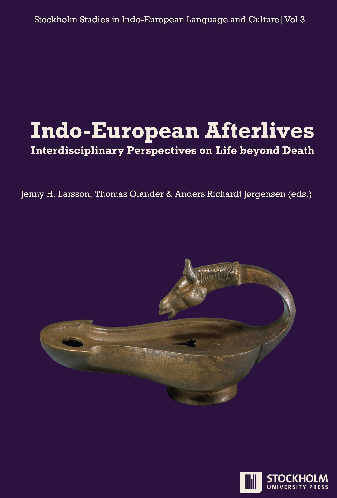
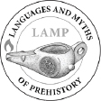

<!-- page: i -->

# Indo-European Afterlives

## Interdisciplinary Perspectives on Life beyond Death

Edited by

Jenny H. Larsson, Thomas Olander & Anders Richardt Jørgensen

<!-- page: ii -->

Published by

Stockholm University Press

Stockholm University Library

Universitetsvägen 10

SE-106 91 Stockholm

Sweden

[www.stockholmuniversitypress.se](http://www.stockholmuniversitypress.se)

Text © The Author(s) 2025

License CC BY 4.0

Supporting Agency (funding): Stiftelsen Riksbankens Jubileumsfond (LAMP: Languages and Myths of Prehistory, grant number: M19-0625:1); VR Center of Excellence, the Center for the Human Past under the Swedish Research Council grant number 2022-06620_VR, Swedish Collegium for Advanced Study.

First published 2025

Cover designed by Amber Dalgleish

Cover image: Bronze oil lamp in the form of a horse. Roman Imperial Period, c. 50–150 ce

Cover image credit: © The Trustees of the British Museum. Shared under a Creative Commons Attribution-NonCommercial-ShareAlike 4.0 International (CC BY-NC-SA 4.0) licence

Stockholm Studies in Indo-European Language and Culture (Online) ISSN: 2004-9080

Series number: 3

ISBN (Paperback): 978-91-7635-284-7

ISBN (PDF): 978-91-7635-283-0

ISBN (EPUB): 978-91-7635-285-4

ISBN (Mobi): 978-91-7635-286-1

DOI: [https://doi.org/10.16993/bcw](https://doi.org/10.16993/bcw)

This work is licensed under the Creative Commons Attribution 4.0 International License (unless stated otherwise within the content of the work). To view a copy of this license, visit [https://creativecommons.org/licenses/by/4.0/](https://creativecommons.org/licenses/by/4.0/) or send a letter to Creative Commons, 444 Castro Street, Suite 900, Mountain View, California, 94041, USA. This license allows for copying any part of the work for personal and commercial use, providing author attribution is clearly stated.

Suggested citation:

Larsson, J. H., Olander, T., & Jørgensen, A. R. (eds.) 2025. Indo-European Afterlives: Interdisciplinary Perspectives on Life beyond Death. Stockholm: Stockholm University Press. DOI: [https://doi.org/10.16993/bcw](https://doi.org/10.16993/bcw). License: CC BY 4.0

To read the free, open access version of this book online, visit [https://doi.org/10.16993/bcw](https://doi.org/10.16993/bcw) or scan this QR code with your mobile device.

<!-- page: iii -->

# Stockholm Studies in Indo-European Language and Culture

Stockholm Studies in Indo-European Language and Culture (ISSN 2004-9080) is a peer-reviewed series of monographs and edited volumes published by Stockholm University Press. The series is cross-disciplinary and aimed at scholars researching aspects of the Indo-European language family from a multitude of perspectives, including linguistics, archaeology, genetics and comparative mythology.

The series strives to meet the need for a well-structured, peer-reviewed and modern open access option for scholars interested in expanding the field of Indo-European Studies. Submissions are accepted from scholars from all over the world.

## Editorial Board

• Jenny Larsson, Professor, Department of Slavic and Baltic Studies, Finnish, Dutch and German, Stockholm University, Sweden (Chairperson)

• George Hinge, Associate Professor, School of Culture and Society, Classical Philology, Aarhus University, Denmark

• Daniel Kölligan, Professor, Institut für Altertumswissenschaften, Lehrstuhl für vergleichende Sprachwissenschaft, University of Würzburg, Germany

• Olof Sundqvist, Professor, Department of Ethnology, History of Religions and Gender Studies, Stockholm University, Sweden

• Nicholas Zair, Senior Lecturer in Classics, Classical Linguistics & Comparative Philology, University of Cambridge, United Kingdom

<!-- page: iv -->

## Titles in the series

1. Larsson, J., Olander, T., & Jørgensen, A. R. (eds.) 2024. Indo-European Interfaces: Integrating Linguistics, Mythology and Archaeology. Stockholm: Stockholm University Press. DOI: [https://doi.org/10.16993/bcn](https://doi.org/10.16993/bcn). License: CC BY-NC

2. Larsson, J. H., Olander, T., & Jørgensen, A. R. (eds.) 2025. Indo-European Ecologies: Cattle and Milk – Snakes and Water. Stockholm: Stockholm University Press. DOI: [https://doi.org/10.16993/bcu](https://doi.org/10.16993/bcu). License: CC BY 4.0

3. Larsson, J. H., Olander, T., & Jørgensen, A. R. (eds.) 2025. Indo-European Afterlives: Interdisciplinary Perspectives on Life beyond Death. Stockholm: Stockholm University Press. DOI: [https://doi.org/10.16993/bcw](https://doi.org/10.16993/bcw). License: CC BY 4.0

<!-- page: v -->

# Peer Review Policies

Stockholm University Press ensures that all book publications are peer reviewed in two stages. Each book proposal submitted to the Press will be sent to a dedicated Editorial Board of experts in the subject area. The Board can be considered biased if the Author or Editor has a close collaboration with the majority of its members. In such cases the proposal will be sent to at least one, but preferably two external reviewers before a decision is made. The full manuscript will always be peer-reviewed by chapter or as a whole by two independent experts. Publishing decisions are made by a Publishing Committee, considering the recommendations of the Editorial Board alongside with the reviewers’ comments.

A full description of Stockholm University Press’ peer review policies can be found on the website: [https://www.stockholmuniversitypress.se/site/peer-review-policies/](https://www.stockholmuniversitypress.se/site/peer-review-policies/).

The peer-review process for this particular book has been handled by a member of the Editorial Board who is not working closely with the Editors, namely Nicholas Zair, Senior Lecturer in Classics, Classical Linguistics & Comparative Philology, Cambridge University, United Kingdom. The Chairperson of the Editorial Board has not been involved in the editorial process for this volume.

## Recognition for reviewers

The Editorial Board of Stockholm Studies in Indo-European Languages and Culture applies a single-blind review procedure for assessing both the book proposal and the book manuscript, meaning that the reviewers remain anonymous to the Editors and Authors until the manuscript has been accepted for publication. The board would like to thank all stakeholders involved in this process.

<!-- page: vi -->

Reviewing a book manuscript is an important and time-consuming effort. The board would, therefore, like to send a special thanks to the referees who have been performing the peer review of this book.

Michael Weiss, Professor, Department of Linguistics, Cornell University, United States. ORCID: [https://orcid.org/0000-0002-5561-7708](https://orcid.org/0000-0002-5561-7708)

Timothy G. Barnes, Dr., Departmental Lecturer in Classical Philology, Faculty of Classics, University of Oxford, United Kingdom. ORCID: [https://orcid.org/0000-0002-3481-7196](https://orcid.org/0000-0002-3481-7196)

<!-- page: vii -->

# Contents

List of illustrations

Acknowledgements

1. Exploring the afterlife in Indo-European traditions

Jenny H. Larsson

2. Dwellings undwindling: Towards an Indo-European poetics of perlocutionary sites

Peter Jackson Rova

3. Initials for initiates: Phonic mystagogy, “audiovisuality” and the eschatology of the Gathas

Martin Schwartz

4. Orpheus and the R̥bhus: Fashioning drinks for the afterlife

Laura Massetti

5. Indo-European motifs in the Greek underworlds

Jan N. Bremmer

6. The god of the night sky as a guide to the afterlife

Michael Janda

7. The love life of the dead: Norse Valkyries from an Indo-European perspective

Riccardo Ginevra

8. Tied to the underworld

Birgit Anette Olsen

9. Indo-European cremations and cosmic fires: A comparative analysis of the funeral and fire rites of Bronze Age Håga, Sweden

Anders Kaliff and Terje Oestigaard

<!-- page: viii -->

10. Mourning among the speakers of Proto-Indo-European: *k̑eh₂d- ‘to fall’ and ‘to mourn’

Anders Richardt Jørgensen

Biographies

<!-- page: ix -->

# List of Illustrations

## Chapter 2. Dwellings undwindling: Towards an Indo-European poetics of perlocutionary sites

1. Conceptual model. Graphics: Peter Jackson Rova © License: CC BY-NC

2. Welcome to Valhall! Picture stone from Broa in Halla, Gotland (c. 8th to 9th century), found in conjunction with a burial site. Photo: W.carter, Wikimedia Commons © License: CC BY-SA 4.0

## Chapter 6. The god of the night sky as a guide to the afterlife

1. From left to right: Orion (with belt and right foot Rigel), Alpha Tauri/Aldebaran (in the head of the “bull” Taurus) and the cluster of the Pleiades. Photo: Panda~thwiki, Wikimedia Commons © License: CC BY 4.0

## Chapter 8. Tied to the underworld

1. A wasp’s nest. Photo: Russel Wills, Wikimedia Commons © License: CC BY-SA 2.0

2. The staff of the völva. Photo: Arnold Mikkelsen, Nationalmuseet Danmark © License: CC BY-SA

3. Varuṇa with noose. Rajarani temple, 11th c. Photo: Bernard Gagnon. Wikimedia Commons © License: CC BY-SA 3.0

4. Varuṇa with noose and daṇḍa. Rajarani temple, 11th c. Photo: Benjamín Preciado Solis, Centro de Estudios de Asia y Africa, El Colegio de Mexico. Wikimedia Commons © License: CC BY-SA 3.0

<!-- page: x -->

5. Yama, painting, ca. 1820–25. Victoria and Albert Museum, London © License: CC BY-NC

6. Burials with reconstructions of the clothing from the Mariupol cemetary. From Kotova 2010 © License: CC BY-SA 4.0

## Chapter 9. Indo-European cremations and cosmic fires: A comparative analysis of the funeral and fire rites of Bronze Age Håga, Sweden

1. The Håga mound, Uppsala, Sweden. Photo: Terje Oestigaard © License: CC BY-NC

2. Documentation of the excavation and the complete mound. From Almgren 1905, plate III. License: CC-PD

3. Finds from the Håga mound. Photo: Ola Myrin, Statens historiska museer, Stockholm © License: CC BY

4. The cult house known as the “Håga Church”. Photo: Terje Oestigaard © License: CC BY-NC

5. The cleaved femur found in the Håga mound during excavation. From Almgren 1905: 26, fig. 28. License: CC-PD

6. Original documentation of the excavation, 1903. The bold dark line indicates the extent of the charcoal layer at the bottom of the mound. Source: Antikvarisk-topografiska arkivet, Stockholm. License: CC-PD

7. Hindu cremation along Bagmati River, Pashupatinath temple, Kathmandu, Nepal, 2022. Photo: Terje Oestigaard © License: CC BY-NC

8. Illustration of making a need-fire or making fire by drilling. From Kaliff 2007: 188, fig. 14. Drawing: Richard Holmgren, ARCDOC © License: CC BY-NC

9. Eldbjørg – the fire in the hearth. The Viking Hall ‘Gildehallen’, Midgard Viking Centre, Borre, Norway. Photo: Terje Oestigaard © License: CC BY-NC

10. Fire altar. The Shivaratri festival at Pashupatinath, 2022. Photo: Terje Oestigaard © License: CC BY-NC

<!-- page: xi -->

# Acknowledgements

The Editors and Authors of this volume would like to sincerely thank the grant agency and the foundations that made it possible to produce this volume:

– Stiftelsen Riksbankens Jubileumsfond – M19-0625:1 – LAMP: Languages and Myths of Prehistory

– VR Center of Excellence, the Center for the Human Past under the Swedish Research Council grant number 2022-06620_VR

– Swedish Collegium for Advanced Study
