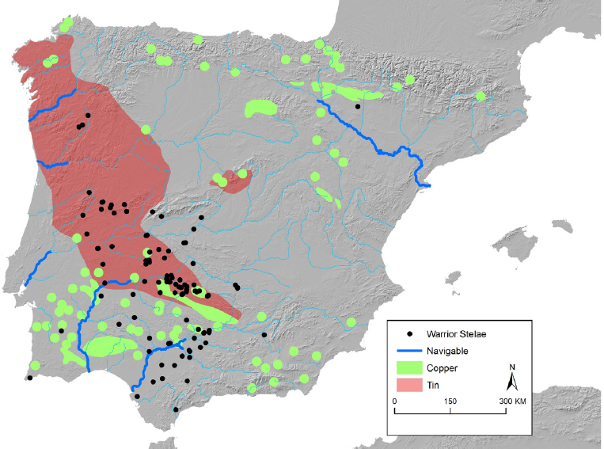
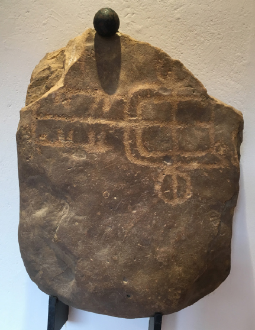
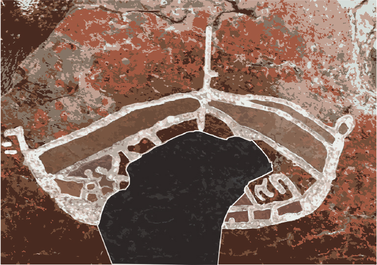

# 10. Celto-Germanic and North-West Indo-European vocabulary

# Resonances in myth and rock art iconography

<i>John T. Koch</i>

University of Wales Centre for Advanced Welsh and Celtic Studies

## Abstract

The chapter develops historical linguistic work undertaken as part of a four-year cross-disciplinary project funded by the Swedish Research Council. New evidence tracing metals in Bronze Age artefacts has revealed that Scandinavia was in trade contact with metal-rich regions in Wales and the Iberian Peninsula, as well as the Italian Alps. This new knowledge leads to reopening two long-known, but poorly explained phenomena: (1) a large body of inherited vocabulary shared by Celtic and Germanic languages, but not Indo-European generally, and (2) detailed similarities shared by the Bronze Age rock art of Scandinavia and the “warrior” stelae of the Iberian Peninsula. In the past, the Celto-Germanic words have been explained as reflecting contacts in Central Europe from 500 BC down to the Roman period. However, that dating seemed possibly too late as many of the words pre-dated Grimm’s Law and lacked earmarks as loanwords, looking instead like inheritances from Proto-Indo-European with limited geographic distributions. Recent archaeogenetic discoveries have also undermined the once prevalent view that only non-Indo-European languages were spoken in Ireland, Britain, Brittany and western Iberia until ~1000 BC or later. Therefore, we now pursue the hypothesis that shared rock art motifs and Celto-Germanic words can be better explained as reflections of the ideology and language of highly mobile Bronze Age warrior/traders who brought copper from Atlantic and Central Europe to metal-poor Scandinavia. The Celto-Germanic word stock highlighted in this paper has to do with myths, beliefs, ideology and their possible resonances in rock art iconography.

## 1. A research project

Geochemical and isotopic tests have recently shown that metal-poor Scandinavia was importing copper from Wales from the Late Neolithic to Middle Bronze Age (Nørgaard et al. 2019; Williams & Le Carlier de Veslud 2019), then from the Western Iberian Peninsula in the Late Bronze Age (Ling et al. 2013; 2014; 2019; Melheim et al. 2018; Radivojević et al. 2018). Much remains to be explained about this trade:

- What was its volume?

- When and why it began and ended?

- What areas and communities were directly involved?

- Who were its primary agents?

To investigate these questions we launched, in March 2019, a four-year cross-disciplinary project funded by the Swedish Research Council: “Rock Art, Atlantic Europe, Words & Warriors (RAW)” [Hällristningar, språk och maritim interaktion i Atlantiska Europa]. Johan Ling is project leader.

This discovery also calls for the reopening of two long-known, but poorly explained phenomena:

- numerous close parallels in the motifs recurring in Bronze Age Scandinavian rock art and the so-called “warrior” stelae densely concentrated in the metal-rich southwestern Iberian Peninsula (Almagro Basch 1966; Harrison 2004; Koch 2013; 2019) and

- a large body of inherited words shared by the Celtic and Germanic languages, but not the other branches of Indo-European (De Vries 1960; Schmidt 1986a; 1986b; 1991). Semantic domains heavily represented are warfare and ideology (Hyllested 2010).

In the light of this newly discovered trade, an obvious explanatory hypothesis is that these phenomena might have a unified explanation. To be more specific, they possibly reflect the ideology and shared language of seafaring warriors who brought copper from the Atlantic façade to Scandinavia in the Bronze Age. The possibility of a shared language may be considered as either of two somewhat different scenarios, depending on how far apart we think the dialect(s) ancestral to the Celtic languages and those that became Germanic had evolved by the period of contact. Should we be thinking in terms of dialects at a later stage of Proto-Indo-European – perhaps Proto-Indo-European’s very latest or terminal stage before the full separation of the primary branches – still retaining a high degree of mutual intelligibility between them (cf. Mallory 1996; Ringe, Warnow & Taylor 2002)? That would mean that far-flung participants in the Bronze Age system could still efficiently communicate using their first languages. Or alternatively, were Pre-/Proto-Celtic and Pre-Germanic effectively separate languages at the period of contact? Is more of the evidence better explained on the assumption that, in order to participate, Pre-Germanic speakers had to learn a Pre-/Proto-Celtic lingua franca as a second language?

As a matter to be determined using phonological criteria, evidence seen as favouring the first model would be examples that did not show the diagnostic features of loanwords, but differed from forms and developments assignable to Proto-Indo-European only in that their geographic distribution was limited to contiguous branches in the North and West. On the other hand, the lingua franca scenario would be consistent with a subset of Germanic items showing Proto-Indo-European > Proto-Celtic sound changes (or conversely the fewer Celtic items showing Proto-Indo-European to Proto-Germanic sound changes in Celtic). As this trade continued for centuries and involved many local communities, there is no necessity that the entire corpus of Celto-Germanic words arose in the same way at all times and all places. It may become possible to identify the earmarks of earlier and later chronological strata.

## 2. Language and the Bronze Age in the North and West

My work in the RAW project includes a monograph, which first appeared as an open-access e-book in 2020 (Koch 2020). An expanded and revised edition is anticipated to be brought out following the end of the project in 2027.

This 2020 e-monograph collects 173 Celto-Germanic (“CG”) words or unique developments of words, that is, examples attested in one or more language(s) in those two branches, but not in the other branches of Indo-European. The e-monograph also contains a total of 278 “CG+” words. The latter figure is arrived at by adding to the 173 CG words any found in both Celtic and Germanic and also in one or more of the other North-West Indo-European branches: Italic and/or Baltic and/or Slavic. Thus, within this CG+ category of 278 items, there are subsets of 45 (16.2%) Italo-Celtic and Germanic (ICG) items, 34 (12.2%) Celto-Germanic and Baltic and/or Slavic items (CGBS), 26 items (9.4%) occurring in all the North-West branches (ANW), i.e. Celtic, Germanic, Italic, Baltic and/or Slavic. However, as a negative defining feature, none of the CG or CG+ words occur in any Indo-European branches outside the North and West of the Indo-European world, i.e. not in Indo-Iranian, not in Greek, Anatolian, etc. Note that of the various subsets listed above as making up the CG+ total, Celto-Germanic with its 173 items is by far the largest (62.2%), which is both striking and probably significant, suggesting a stage at which the forerunners of Celtic and Germanic were interacting closely with each other but less so with their other Indo-European sister dialects.

To appreciate these figures as an order of magnitude (i.e. 173 CG words, 278 CG+ words, etc.), note that Mallory and Adams (1997) count 1,364 Proto-Indo-European lexemes. That total does not include words limited to the North-west branches (1997; Mallory 2019). The looser criteria of Pokorny (1959–1969) netted 2,044 Proto-Indo-European roots. Even so, the 173 CG and 276 CG+ totals stack up as a significant phenomenon alongside these statistics.

Breaking the Mallory and Adams figure down as lexemes attested in each branch, the highest proportion of Proto-Indo-European lexemes occurs in Indic: 925 words, 68% of the total. Germanic and Celtic come in with significantly fewer with 761 words (56%) and 539 (40%), respectively. The archaism, copiousness, and early attestation of Sanskrit are major factors favouring this disparity. This detail also underscores the fact that a key negative defining feature of the CG and CG+ sets is that they do not have Indic comparanda. That suggests that on the whole, though not necessarily holding for each individual item, we are dealing with regional phenomena that occurred after the dialects ancestral to Indo-Iranian had separated from those that gave rise to the northwestern Indo-European branches, a stage when innovations were no longer shared across a continuum ancestral to both.

From the CG and CG+ totals I have excluded loanwords that belong to the post-Roman Migration Period or Viking Age. These are in most cases easily identified by either or both of the following criteria.

- They show phonological innovations known to have occurred in Celtic or Germanic during the historical period, often in a specific Celtic or Germanic language or dialect group rather than across the entire family.

- They refer to a feature of post-Roman culture.

In earlier studies, CG items have been explained as arising through contact between Celtic and Germanic speakers in Central Europe during the La Tène Iron Age, ~500 BC to the <i>Zeitenwende</i> (De Vries 1960; Schmidt 1986a; 1986b; 1991; Schumacher 2007; Ringe 2017). There are two reasons why contact between Scandinavia and the Atlantic façade in the Bronze Age had not been obvious earlier as an alternative scenario:

- It has only recently been discovered that Welsh and Iberian copper was traded to Bronze Age Scandinavia.

- Only recently has ancient DNA shown that large numbers of people with high levels of steppe ancestry (thus now thought likely to be Indo-European speakers) were established over the Atlantic façade by ~2000 BC (Cassidy et al. 2016; Olalde et al. 2018; 2019; Szecsenyi-Nagy et al. 2017; Reich 2018; Valdiosera et al. 2018). Previously it was thought possible that Ireland, Britain, Brittany, and the Western Iberian Peninsula were wholly non-Indo-European until ~1000 BC or later (cf. Cunliffe & Koch 2010).

The research embodied in the monograph is more consistent with the Bronze Age scenario for most of the CG words for three reasons:

- <i>First</i>, most of the 173 CG words – remember discernible Anglo-Saxon and Viking Period loans have been excluded – show no signs of being loanwords from Celtic to Germanic or <i>vice versa</i>. Instead, the words behave phonologically like inheritances from Proto-Indo-European with restricted geographical distributions. I have excluded the words common to Celtic and Germanic which post-date Grimm’s Law 1 and 2 from the CG set, as clear loanwords probably later than the period of interest. The consensus date for Grimm’s Law is ~500 BC (cf. Mallory 1996; Mallory & Adams 2006: 103; Ringe 2017: 84–85, 241). Grimm’s Law is usually recognized as comprising three successive changes, which must occur in the following order, though it is less clear whether much time intervened between them or they were more or less simultaneous with rule ordering.

- Grimm 1 <i>*p, *t, *k, *kʷ</i> > <i>*f</i> [φ], *<i>þ</i> [θ], <i>*h</i> [χ], <i>*hʷ</i> [χ<i>ʷ</i>];

- followed by Grimm 2 (<i>*b</i>,) <i>*d</i>, <i>*g</i>, <i>*gʷ</i> > (<i>*p,</i>) <i>*t</i>, <i>*k</i>, <i>*kʷ</i>;

- followed by Grimm 3 <i>*bʰ</i>, <i>*dʰ</i>, <i>*gʰ</i>, <i>*gʷʰ</i> > <i>*b</i> [β], <i>*d</i> [ð], <i>*g</i> [γ], <i>*gʷ</i> [γ<i>ʷ</i>]

With words containing the relevant consonants, Grimm 1 and 2 make loanwords between prehistoric Celtic and Germanic detectable. Because the Indo-European voiced aspirate stops developed in Celtic as in Grimm 3 in Germanic, this change does not provide a useful diagnostic. 58.4% of the CG corpus have the relevant consonants and can be seen to predate (i.e. been in the stream ancestral to the attested Germanic languages prior to) the operation of Grimm 1 (49.1%) and/or Grimm 2 (21.4%). (16 of CG words [9.2%] show the operation of Grimm 2, but lack the relevant consonants from Grimm 1; 21 words show both changes]).

- <i>Second</i>, in the earliest fully attested Germanic and Celtic languages, 132 (76.3%) of the 173 CG words are attested in Old Norse, 119 (68.8%) in Old English, and 109 (63.0%) in Old High German; 141 (81.5%) are attested in Old and/or Middle Irish, and 132 (76.3%) in Early Brythonic (mostly Medieval Welsh). In other words, the highest percentages of attestations are not in languages where Germanic moved into Celtic territory in Germany and England, but in Scandinavia and Ireland, which were not in contact at all between the Bronze Age and Viking Age.

- <i>Third</i>, correspondences to the iconography of Bronze Age rock art, and more generally linguistic palaeontology (relating reconstructed vocabularies to archaeological cultures), point towards, or are at least consistent with, Bronze Age contexts.

A point raised by Erik Elgh at the Indo-European Interfaces conference is that a method approaching Bronze Age contacts between the Atlantic zone and Scandinavia through the early attested Celtic and Germanic languages involves an assumption that the prehistoric varieties of Indo-European that gave rise to these branches were already situated in the relevant regions. The “archaeogenetic revolution” now shows that high percentages of the steppe cluster had reached both regions in the third millennium BC, supporting the inference that Indo-European speech reached these regions at the same time. However, that inference would not by itself exclude the possibility that these migrations had first brought different or undocumented varieties of Indo-European.

In the case of Germanic, the aDNA evidence can be seen as consistent with what was already a widespread and longstanding view that the ancestor of Germanic was more or less coterminous with the Nordic Bronze Age (e.g. van Coetsem 1994: 136; Nielsen 2000: 29–31, 299–303; Faarlund 2008). For Celtic, on the other hand, the idea the Atlantic façade was wholly non-Indo-European linguistically until ~1000 BC remained credible as part of a model in which Proto-Celtic expanded westward from Central Europe together with material culture of La Tène-type and its Hallstatt predecessor, at any event no earlier than the Urnfield Late Bronze Age. On an archaeological basis, this traditional model was challenged by the “Celtic from the West” idea (Cunliffe 2001; Cunliffe & Koch 2010), seeing the Atlantic Bronze Age of c. 1250–800 BC as Celtic linguistically. With the advent of aDNA evidence (esp. Cassidy et al. 2016), the Celtic from the West model finds archaeogenetic support. Not only had high levels of steppe ancestry reached the Atlantic façade by the Early Bronze Age, but the sequenced Irish genomes of this period also showed significant continuity with the modern populations of Ireland, Scotland, and Wales. In other words, while this evidence does not decisively rule out the replacement of an undocumented Indo-European language by Celtic in later prehistory, such a secondary migration is no longer required to explain the data. Thus, evolution <i>in situ</i> of the language of the first arrivals with steppe ancestry in the West is for now a viable hypothesis.[^1]

In the western Iberian Peninsula, there is evidence for a pre-Roman Indo-European language that does not easily fit the established definition of Celtic. This language is usually called “Lusitanian”. But the meagre and ambiguous evidence can be seen as a continuum of dialects, possibly ranging without a break to Celtic (Búa 1997). Some researchers have seen Lusitanian as an archaic member of the Celtic branch, having split off before some of the defining sound changes common to the other languages of the branch had occurred, most notably the weakening, followed by loss in most positions, of Proto-Indo-European <i>*p</i> (Evans 1977; Untermann 1985–1986; Ballester 2004). Others see it as more closely aligned with Italic (Prósper & Villar 2009), while others identify features in Lusitanian that could link it to Celtic and/or Italic with too few secure etymologies to classify it one way or the other (Wodtko 2009; 2010; Vallejo 2013). It has also been proposed that both Celtic and Lusitanian arise from a common milieu deeply rooted in the cultures of the Iberian Peninsula (Almagro-Gorbea 1993; 2016). Forms that have been classified as Lusitanian have in all cases been found geographically nearby others that are unproblematically Celtic, sometimes side by side in a single brief text. In any case, for present purposes, the evidence labelled “Lusitanian” cannot be seen as reflecting an Indo-European language with features and a history outside North-West Indo-European and starkly different from the Celtic widely spoken on the Atlantic façade in the Late Bronze Age.

## 3. Some culturally significant fields of meaning

Dividing the CG and CG+ word sets according to domains of meaning renders the material more accessible to archaeologists and researchers interested in cultural history and mythology. Examples from three such semantic groups are presented below: (1) “the horse and wheeled vehicle package”, meanings often seen as of special significance in process of Indo-Europeanization (Anthony 2007); (2) “maritime words”, potentially significant as evidence for long-distance contact by sea between western and northern Europe; and (3) “mythology and beliefs”, resonating with a leading theme of the 2020 Uppsala conference and LAMP Project.[^2]

 (SHFA). License: CC BY 4.0.](images/larsson-ed-2024-ie-interfaces-ch10-fig2.jpg)

### 3.1. The horse and wheeled vehicle package

All of the following word meanings are also depicted in the iconography of both Scandinavian rock art and the Late Bronze Age “warrior” stelae of the Iberian Peninsula. The carvings of chariots in these distant regions are stylistically closely parallel and also coeval, or nearly so, ~1250–900 BC.

- ‘axle’: Proto-Germanic *<i>ahsula-</i> and Proto-Celtic <b>*aχsilā</b> from Proto-Indo-European √<i>h₂ek̑s-i-</i> ‘axle’.

- ‘horse+ride’: Proto-Germanic <b>*ehʷa-rīdaz</b> and Proto-Celtic <b>*ekʷo-rēdo-</b> reflect a unique CG compound.

- ‘horse’ <b>1</b>: Proto-Germanic <b>*hangistaz ~ *hanhistaz</b> ‘horse, stallion, etc.’ and Proto-Celtic <b>*kanχsikā</b>- < <b>*kank-s-ikā</b>- ‘horse, mare’. This peculiarly Celto-Germanic synonym and the nearly synonymous item below reflect the special importance of the horse in the cultural field common to the two language subfamilies.

- ‘horse’ <b>2</b>: Proto-Germanic <b>*marhaz</b> ‘horse, steed’ and Proto-Celtic <b>*markos</b> ‘horse, steed’.

- ‘mane (of a horse)’: Proto-Germanic <b>*mankan-</b> ‘mane, upper part of a horse’s neck’ and Proto-Celtic <b>*mongo- ~ *mongā</b>- ‘mane’.

- ‘ride (a horse or horse-drawn vehicle)’: Proto-Germanic <b>*rīdan-</b> ‘ride a horse or vehicle; to move, swing, rock’ and Proto-Celtic <b>*rēde-</b> < <b>*reidʰ-e-</b> ‘ride a horse or vehicle, move swiftly’.

- ‘wheel’ (CG+): Proto-Germanic <b>*raþa-</b>, Proto-Celtic <b>*rotos</b>, Proto-Italic <b>*rotā</b> <b>‘wheel’</b>, and Baltic reflected in Lithuanian <i>rãtas</i> ‘wheel, circle, ring, (plural) cart’. Proto-Indo-European <i>*(H)róth₂-o/eh₂</i>- probably meant ‘wheel’ rather than ‘wheeled vehicle’, but the meaning ‘wheel’ either survived or developed only in northwestern branches. As Olander (2019) suggests, Latin <i>rota</i> was possibly borrowed from Celtic.

- ‘wheeled vehicle’: Proto-Germanic <b>*wagna-</b> and Proto-Celtic <b>*wegno-</b> from Proto-Indo-European <i>√weg̑ʰ</i>- ‘move’.

### 3.2. Maritime words

- ‘harbour, shelter for vessels’: Proto-Germanic <b>*habanō</b>- ‘harbour, shelter for boats’ < <b>*χaφánā</b>- and Proto-Celtic <b>*kawno-</b> ‘haven, harbour, port, bay’ < <b>*ka(p)ono-</b>.

- ‘load, carry a load’: Proto-Germanic <b>*hlaþan- ~ *hlōþ-</b> < <b>*χlāþ-</b> ‘to burden, load down’ and Proto-Celtic <b>*klout-</b> ‘carriage, the action of carrying, load, burden, heap, pack, bundle, baggage’ possibly from North-West Indo-European <i>√kleh₂</i>- ‘spread out flat’.

- ‘mast’ (CG+): Proto-Germanic <b>*masta-</b> ‘post, mast’ from Pre-Germanic <b>*mazdo-</b>, Proto-Celtic <b>*mazdyo- ~</b> <b>*mazdlo-</b> ‘mast, post’, and Proto-Italic <b>*mazdlos</b> > Latin <i>mālus</i> ‘pole, mast’. There are examples of Scandinavian rock art which appear to depict masts and rigging (Bengtsson 2017).

- ‘boatload (of people, domestic animals, or material of value)’: Proto-Germanic <b>*flukka(n)-</b> and Proto-Celtic <b>*(p)luχtu-</b> < Pre-Celtic <b>*pluk-tu-</b> from a Proto-Indo-European enlarged root √<i>pleuk-</i> < √<i>pleu-</i> ‘float, swim, flow’.

- ‘great waterway, Rhine’: Proto-Germanic <b>*Rīnaz</b> ‘Rhine’ and Proto-Celtic <b>*rēnos</b> ‘sea, ocean, course, route, path’ < Pre-Celtic <b>*reino-</b>. Latin <i>Rhēnus</i>, Greek Ῥῆνος ‘Rhine’ are borrowed from Celtic.

- ‘row, paddle’ (verb): Proto-Germanic <b>*rōan-</b> < Pre-Germanic <b>*rā</b>- and Proto-Celtic <b>*rāmyom ~ *rāmā</b>. As noted by Hyllested (2010), what is uniquely Celto-Germanic is for <i>√h₁erh₁</i>- ‘row’ to be a primary verb, CG <b>*rō</b>-. There are numerous examples in Scandinavian rock art depicting sea-going vessels with rowers or paddlers.

- ‘sail’: Proto-Germanic <b>*segla-</b> ‘sail, canvas’ < Pre-Germanic <b>*sigʰlo-</b> (see Schrijver 1995: 357) and Proto-Celtic <b>*siglo- ~ *siglā</b>-. For evidence of sails in Bronze Age Scandinavia, see Bengtsson 2017.

 (SHFA). License: CC BY 4.0.](images/larsson-ed-2024-ie-interfaces-ch10-fig5.jpg)

 (SHFA). License: CC BY 4.0.](images/larsson-ed-2024-ie-interfaces-ch10-fig6.jpg)

### 3.3. Mythology and beliefs: a core of Post-Proto-Indo-European myth

- ‘thunder, thunder god’ <b>1</b>: Proto-Germanic <b>*þunraz</b> and Proto-Celtic <b>*tonaros</b> > <b>*toranos</b> from Proto-Indo-European <i>√(s)tenh₂</i>- ‘thunder’.[^3]

- ‘hammer of the thunder god = lightning’ (CG+): Proto-Germanic <b>*meldunjaz</b> ‘“Mjöllnir”, hammer of the thunder god’, Proto-Celtic <b>*meldo-</b> ‘lightning’ < ‘hammer of the thunder god’, and Proto-Balto-Slavic <b>*mild-n-</b> <b>~</b> <b>*meld-n</b> ‘lightning bolt, hammer of the thunder god’ from Proto-Indo-European <i>√melh₂</i>- ‘grind’, cf. Latin <i>malleus</i> ‘hammer’ < Proto-Italic <b>*mol-tlo-</b> < <i>*molh₂-tlo-</i>.

- ‘thunder, thunder god’ <b>2</b> (CG+): Proto-Germanic <b>*fergunja-</b> ‘mountain’ < <b>*φerχunyā</b> < Pre-Germanic <b>*Perkʷunyā</b>, Proto-Celtic place-name <b>*(P)erkunyā</b> in the Latinized Gaulish <i>silva Hercynia</i>, and Balto-Slavic forms including Lithuanian <i>perkū́nas</i> ‘thunder, thunder god’, Old Russian <i>Perunъ</i> ‘thunder god’. Old Norse <i>Fjǫrgyn</i> and <i>Fjǫrgynn</i> imply that use as a god’s name was not limited to Balto-Slavic, but was eclipsed by other names, such as <b>*þunraz</b> < <b>*ton(a)ros ~ *tn°ros</b> above.

- ‘All-father, Great-father (divine epithet)’: Proto-Germanic <b>*Ala-fader</b> < <b>*Ala-faþēr</b> and Proto-Celtic <b>*Olo-(p)atīr</b>.

- ‘military commander (as divine epithet)’: Proto-Germanic <b>*harjanaz</b> and Proto-Celtic <b>*koryonos</b>. The Indo-European word occurs also as Greek κοίρανος ‘ruler, commander, lord’.

- ‘divine strength’: Proto-Germanic <b>*nerþu-</b> in <i>Nerthus</i> ‘terra mater’ of the Suebi according to Tacitus (<i>Germania</i> §40) and Proto-Celtic <b>*nerto-</b> in the Old Welsh personal name <i>Duinerth</i> ‘having a god’s strength’, based on Proto-Indo-European <i>√h₂ner-</i> ‘man, hero, be strong’.

- ‘People of the High Goddess’: Proto-Germanic <b>*Burgunþaz</b> and Proto-Celtic <b>*Brigantes</b> <b>~</b> <b>*Brigantioi</b>. These are suffixed forms derived from Proto-Indo-European <i>*bʰr̥g̑ʰ</i>- ‘high, hill’.

## 4. When was most of the contact reflected in the CG words?

For most items, the evidence sits more comfortably within the period ~2500–500 BC, the Greater Bronze Age, as opposed to the following half millennium, ~500 BC to the <i>Zeitenwende</i>. Linguistically, because most CG words do not look like loanwords, they are to be explained by shared developments during a period of continued high levels of mutual intelligibility. A smaller set show some Proto-Indo-European to Proto-Celtic sound laws in the Germanic forms and can thus be seen as a later stratum, suggesting an interpretation of Proto-Celtic used as a lingua franca by speakers of Pre-Germanic, i.e. the Germanic branch before Grimm’s Law operated. Overall, the semantic content indicates a period of shared ideological development including mythology and beliefs, as well as interest in, and idealization of, warriors, chariots, seafaring, and a stratified complex society (88 of the CG words or 50.9%). If we turn to the CG+ words (including Italo-Celtic Germanic, Celto-Germanic/Balto-Slavic, and all North-west Indo-European), the meanings connected with warfare and complex stratified societies decreases as a percentage: 12 of the 45 ICG words (26.7%), 6 of the 34 CGBS words (17.6%), and 7 of the 26 ANW words (26.9%). This pattern suggests that these more widely distributed words, as groups, do not reflect the zenith of the Bronze Age so intensely as the larger set found in Celtic and Germanic only. Thus, as groups, they probably reflect earlier layers, as the wider distributions also suggest.

## 5. A way forward

At present, the “Archaeogenetic Revolution” is seen as providing confirmation for a version of the “Steppe Hypothesis” of the homeland and dispersal of Proto-Indo-European. The gist of this emerging consensus can be summarized as a three-way equivalence: Post-Anatolian Indo-European = Yamnaya Cultures = the steppe genetic component (approximately 50% Eastern Hunter-Gatherer [EHG]: 50% Caucasian Hunter-Gatherer [CHG]). We need to call this a <i>version</i> of the Steppe Hypothesis, because in its pre-archaeogenetic form (e.g. Mallory 1989; Anthony 2007), the ancestor of all the Indo-European branches, including Anatolian (the first to split off from Proto-Indo-European), was traced back to the Pontic-Caspian Steppe. As I write this, the full-genome sequencing of ancient DNA remains more consistent with a model in which Proto-Indo-European itself is identified with a homeland south of the Caucasus and lacking the EHG constituent essential in the definition of the steppe cluster (de Barros Damgaard et al. 2018; Lazaridis 2018; Reich 2018: 120).

In the days before aDNA sequencing, Mallory (1996) characterized the period between Proto-Indo-European and the early attested Indo-European languages as the “Indo-European Dark Ages”. Despite any instinctive expectation that matters should become easier and clearer as we move towards the horizon of written evidence, the whereabouts of several branches in later prehistory remain obscure, contrasting with the growing confidence in tracing Post-Anatolian Indo-European to the Pontic-Caspian steppe. Broadly speaking, the Indo-European Dark Ages correspond to the Greater Bronze Age mentioned above, ~2500–500 BC. Even for Post-Anatolian branches attested in the 2nd millennium BC, i.e. Greek and Indo-Iranian, the whereabouts and archaeological contexts of their linguistic forbears ~2500 BC remain uncertain.

Fortuitously, the stage at which the Steppe Hypothesis predicted that Indo-European speech expanded from the Pontic-Caspian steppe corresponded to an episode of stark genetic transformation. Massive gene flow brought double-digit percentages of the steppe component to wide swathes of Western Eurasia in the 3rd millennium BC. The signal was unmissable and more or less exactly when and where we were looking. The great mixing of previously long isolated populations was comparable to what occurred with the European expansion to the New World in modern times. For Europe’s population structure, the changes that have occurred in the past 4000 years are subtle by comparison to the changes that occurred in the 3rd millennium BC. That means that for detecting discontinuities after ~2000 BC, as might mark shifts in language, we will have to pick up more subtle signals: such as shifts in relative proportions of steppe and European Neolithic ancestry, shifting levels of survival or resurgence of Hunter-Gatherer genes, post-Yamnaya mutations traceable to their epicentres, and specific details of forward continuity or discontinuity of regional gene pools from the time of the first arrival of steppe ancestry down to the times when the languages of these regions are attested. It is evidence of the last sort that led to the proposal that an Indo-European speech that arrived in Ireland in the Beaker period then evolved <i>in situ</i> into Irish Celtic (Cassidy et al. 2016). This is not a new idea (Dillon & Chadwick 1967; Harbison 1975), but represents a major departure from a longstanding prevailing view equating the westward expansion of Celtic with that of Hallstatt- and La Tène-type material culture in the Iron Age.

As the data becomes more extensive and is subjected to more sophisticated analyses, this will improve prospects for credibly locating reconstructed languages in their archaeological contexts. These advances will also enable new methods for linking prehistoric iconography and evidence for rituals to the traditional myths and heroic narratives of the early Indo-European literatures. We can hope to move beyond simply lumping together various comparable details into an omnibus category of the “Indo-European”. Prospects will improve for identifying those ideas that changed or arose within regional subsets of Indo-European and determining how local pre-Indo-European knowledge and traditions influenced these.

<b>How to cite this book chapter:</b>

Koch, J. T. (2024). Celto-Germanic and North-West Indo-European vocabulary: Resonances in myth and rock art iconography. In: Larsson, J., Olander, T., & Jørgensen, A. R. (eds.), <i>Indo-European Interfaces: Integrating Linguistics, Mythology and Archaeology</i>, pp. 195–216. Stockholm: Stockholm University Press. DOI: [https://doi.org/10.16993/bcn.j](https://doi.org/10.16993/bcn.j). License: CC BY-NC.

## Footnotes

[^1]: The important archaeogenetic study Patterson et al. 2022 was published after the Indo-European Interfaces conference was held and after this paper was written. Its proposal that Celtic arrived in southern Britain in the Middle to Late Bronze Age (~1300–800 BC) is not incompatible with the present proposals. Its more conclusive negative finding (that there was little population movement from the Continent into what is now England and Wales ~800 BC–AD 43) is strongly consistent with the present proposals.

[^2]: Longer and more detailed entries for these and other Celto-Germanic and North-West Indo-European lexical items are included in Koch (2020). The entries there include lists of the principal attestations that are the basis of the reconstructed forms, as well as detailed statistical analyses according to semantic categories and lexical items shared between branches. Although I have often deviated from earlier published work in the reconstructed forms, the chief resources consulted for that include: Mallory and Adams (2006) for Proto-Indo-European roots and the CG+ subset; Hyllested (2010) for CG words; Kroonen (2013), Ringe (2017), and Fulk (2018) for Germanic; LEIA, GPC, and Matasović (2009) for Celtic; de Vaan (2008) for Italic; ALEW and Derksen (2015) for Balto-Slavic.

[^3]: As usefully raised by Peter Kahlke Olesen at the Indo-European Interfaces conference, a comparison of Celtic <i>Taranus</i> with the Hittite god’s name <i>Tarḫunzaš/Tarḫunnaš</i> has been proposed (Watkins 1995: 343, citing Mark Hale). However, that would mean that Ancient Brythonic or Celtiberian <b>TANARO</b>, Cisalpine <i>Tanarus</i>, and all the Germanic forms had undergone metathesis and were unrelated to Proto-Indo-European <i>√(s)tenH₂</i>-. Recognizing these difficulties, Watkins suggested “folk etymology or tabu deformation” as possible explanations for associating ultimately non-cognate names. In any case, the unique persistence of this god’s name in Celtic and Germanic amongst the Post-Anatolian branches would remain noteworthy.
