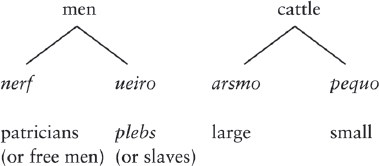

# 12. Priests, oxen and the Indo-European taxonomy of wealth in the Iguvine Tables

<i>Nicholas Zair</i>

Swedish Collegium for Advanced Study & Peterhouse, Cambridge

## Abstract

The Iguvine Tables are seven bronze tablets from Iguvium (modern-day Gubbio) in Italy, dating from between the late third to late second or early first century BC. They are written in Umbrian, a Sabellic language, and record the rituals and acts of a group of priests, known as the Atiedian brotherhood. In this chapter I will focus on the word <i>arsmo</i> and its derivatives, which are attested in a number of contexts. In general, <i>arsmo</i> has been translated as something like like ‘rites, rituals’, or ‘priests, magistrates’, which is largely a guess based on its appearance in contexts of formulae like the following: <i>nerf. arsmo. ueiro pequo. castruo. fri. pihatu.</i> ‘purify the magistrates, <i>arsmo</i>, men, cattle, heads (of corn?), crops’. I argue that <i>arsmo</i> should be understood as the Umbrian equivalent of Latin <i>armenta</i> ‘herds of (large) cattle’, and that this formula is an expanded version of a well-attested Indo-European merism which represents the types of mobile wealth *<i>u̯iHro- pek̑u-</i> ‘men and cattle’; in this case each member has been subject to a doubling. The first member has been divided into <i>nerf</i> ‘magistrates, upper class men’, and <i>ueiro</i> ‘(other) men’, and the second into <i>arsmo</i> ‘large cattle’ and <i>pequo</i> ‘small cattle’. Derivatives of <i>arsmo</i> are found in <i>arsmahamo</i> ‘form up into groups’ and in <i>perca arsmatiam</i> ‘cowherd’s staff’. The latter is part of the equipment of the Umbrian augur, suggesting that the Atiedian brothers, like Roman and Etruscan augurs, carried a crook which was originally the equipment of an animal herder.

## 1. Introduction

The Iguvine Tables are seven bronze tablets from Iguvium (modern-day Gubbio) in Italy, dating from between the late third and late second or early first century BC.[^1] They are written in Umbrian, a Sabellic language, and record the rituals and acts of a group of priests, known as the Atiedian brotherhood.[^2] In this chapter I will focus on the word <i>arsmo(r)</i> and its derivatives, which are attested in a number of contexts. In general, <i>arsmo(r)</i> has been translated as something like ‘rites, rituals’, ‘priests’, or ‘social orders’, which is largely a guess based on its appearance in formulaic contexts. I argue that <i>arsmo(r)</i> should be understood as the Umbrian equivalent of Latin <i>armenta</i> ‘herds of (large) cattle’, and that this formula is an expanded version of a well-attested Indo-European merism which represents the types of mobile wealth *<i>u̯iHro- pek̑u-</i> ‘men and cattle’;[^3] in this case each member has been subject to a doubling. The first member has been divided into <i>nerf</i> ‘magistrates, patricians’, and <i>ueiro</i> ‘(other) men, <i>plebs</i>’,[^4] and the second into <i>arsmo(r)</i> ‘large cattle’ and <i>pequo</i> ‘small cattle’. Derivatives of <i>arsmo(r)</i> are found in <i>arsmahamo</i> ‘form up into groups’ and in <i>perca arsmatia(m)</i> ‘cowherd’s staff’. The latter is part of the equipment of the priest known as the <i>arsfertur</i>, suggesting that the Atiedian brothers, like Roman and Etruscan priests, carried a crook which was originally the equipment of an animal herder.

## 2. <i>arsmo(r)</i> and its derivatives in the Iguvine Tables

The last two tablets of the Iguvine Tables feature two repeated formulas involving the neuter plural noun <i>arsmo(r)</i>.[^5] In addition, derivatives of this word are also attested, in the form of the imperative verb <b>arma<m>u</b>, <i>arsmahamo</i> and the adjective <i>arsmatia(m)</i>.[^6] Sometimes the form <b>ařmune</b> (IIb 7) is also associated with <i>arsmo(r)</i>, but the meaning and origin of this word is completely uncertain (Untermann 2000: 51–52), and it will not be considered further.

Passages (1a) and (1b) are two variants of a prayer, addressed to Jupiter Grabovius, differing only in what verb (-phrase) is used:

(1a) <i>nerf. arsmo. ueiro pequo. castruo. fri. pihatu.</i> (VIa 30)[^7]

‘Purify the magistrates, <i>arsmo</i>, men, cattle, heads (of corn?), crops’

(1b) <i>nerf. arsmo. ueiro. pequo. castruo fri. salua / seritu.</i> (VIa 32–33)[^8]

‘Keep safe the magistrates, <i>arsmo</i>, men, cattle, heads (of corn?), crops’.

Passage (2) forms part of another prayer, as part of the purification of the Fisian mount:

(2) <i>persei. ocre. fisie. pir. orto. est. toteme. iouine. arsmor. dersecor / subator. sent. pusei. neip. heritu.</i> (VIa 26–27)[^9]

‘If fire has arisen on the Fisian mount, (if) the <i>dersecor</i> <i>arsmo</i> have been <i>subator</i> in the Iguvine state, (be it) as not intended’.

Passages (3a) and (b) are the same formula in an earlier and later tablet, which addresses the ‘men of Iguvium’ (<b>ikuvinu</b>, <i>iouinur</i>) involved in the <i>lustrum</i>, and orders them to do something represented by two denominative verbs. As Poultney (1959: 276) observes: “it is clear that the Iguvini are ordered to arrange themselves in formation, and it is altogether unlikely that <i>arsmahamo</i> and <i>caterahamo</i> are merely synonyms”.[^10]

(3a) <b>arma<m>u: kateramu: ikuvinu</b> (Ib 19)[^11]

(3b) <i>arsmahamo. caterahamo. iouinur</i> (VIb 56)

‘Men of Iguvium, <i>arsmahamo</i>, form into troops’.

Passages (4a) and (4b) are from parts of the text describing the purification of the Fisian mount and the lustration of the people respectively. In each case, the auspices have been taken by observing the flight of birds prior to the ceremony (involving both the <i>arsfertur</i> and another priest). In both cases, the <i>arsfertur</i> should hold a <i>perca arsmatia(m)</i>. The translations are based on those of Poultney (1959).

(4a) <i>esisco. esoneir. seueir popler. anferener. et. ocrer. pihaner. perca. arsmatia. habitu.</i> (VIa 18–19)

‘At each of these rites for the lustration of the people and the purification of the mount he shall have an <i>arsmatia perca</i>.’

(4b) <i>ape. angla. combifianśiust. perca. arsmatiam. anouihimu. cringatro hatu destrame. scapla. anouihimu … pone esonome. ferar. pufe. pir. entelust. ere. fertu. poe perca. arsmatiam. habiest</i> (VIb 49–50)

‘When he has announced the birds he shall <i>anouihimu</i> an <i>arsmatiam perca</i>, take a stole, and <i>anouihimu</i> it over his right shoulder… When that in which he has placed the fire is brought to the sacrifice, he who holds the <i>arsmatiam perca</i> shall carry it’

Of these passages, the variants of (1) have tended to be the basis for claims regarding the meaning and origin of <i>arsmo</i>, since the rest of this part of the prayer is reasonably well understood. The word <i>nerf</i> is found also in South Picene and in Oscan, and here represents the politically active citizens of Iguvium (Untermann 2000: 496).[^12] By comparison, <i>ueiro</i> means ‘men’ in the sense of the labouring population in a rural economy (possibly only the slaves, but perhaps also lower class free or freed-men: the <i>plebs</i>; Untermann 2000: 858–859).[^13] The forms <i>pequo</i> (= Latin <i>pecua</i>) and <i>frif</i> (= Latin <i>frūgēs</i>) mean ‘(small) cattle, sheep’ and ‘crops’ respectively (Untermann 2000: 527–528 and 297–298 respectively). Less clear is the signification of <i>castruo</i>, for which two main possibilities arise: either it means something like ‘fields’, and is to be compared with Latin <i>castra</i> ‘military encampment, fort’, or it means ‘heads’, which has no good etymological support but is based on the expression <b>pusti: kastruvuf:</b> (e.g. Va 13). The context is how much the Atiedian brothers should pay; while ‘per head’ seems the more natural reading, ‘per estate’ is not impossible.[^14] On all this see Untermann (2000: 374–375).[^15]

In any case, the overall context is clear. We have here a list of items that together consist of the things that are required to be protected by Jupiter Grabovius for the Iguvine state to prosper. Moreover, it is a poetic formula which – at least in part – is of a type which can be traced back a significant distance into Italic and Indo-European prehistory, which Watkins (1979; 1995: 42–43, 210–213; see also Benveniste 1970) calls the “Indo-European folk taxonomy of wealth”. The phraseology <i>ueiro pequo … salua seritu</i> is paralleled by Cato’s prayer to Mars <i>pastores pecuaque … salua seruassis</i> ‘that you shall keep the shepherds and flocks safe’ (<i>De Agri Cultura</i> 141.3), while <i>ueiro pequo</i> is a merism representing both kinds of mobile wealth, men (i.e., originally, slaves) and animals, which has exact cognates in Old and Young Avestan phrases and in Vedic <i>virapśá-</i> ‘wealth, abundance’ < *<i>u̯iHro-pk̑u̯-o-</i> (Schmitt 1967: 213–217; Mayrhofer 1986–2001: 2. 559). Immobile wealth is (probably) represented by another merism <i>castruo frif</i>, if this means ‘land and crops’ or ‘heads of grain and (other) crops’.

One of the characteristic features of this taxonomy is that it forms a branching tree that allows greater specificity as one proceeds through the tree’s nodes, by means of what I will call ‘doubling’. Thus, for example, Watkins shows that the lexeme *<i>pek̑u-</i> could stand for ‘cattle’ in general, but this category could also be split into small cattle (sheep, goats etc.), which were then also represented by *<i>pek̑u-</i>, and into large cattle (oxen, horses etc.). He gives a Vedic example of the splitting of the formula in this way, where <i>gā́m áśvaṃ</i> together represent the category of large cattle: <i>gā́m áśvaṃ</i> <i>puruṣaṃ</i> <i>paśúm</i> (Atharva Veda 8. 7. 11) ‘cow, horse, man, small cattle’. Another instance of this doubling is found in Cato’s prayer as <i>fruges frumenta uineta uirgultaque</i>, which Watkins (1995: 205) sees as reflecting an original formula *<i>fruges uinetaque</i> ‘grape and grain’. We also find doubling in the Umbrian formula, in the case of the splitting of the category of ‘menfolk’ into <i>nerf</i> and <i>ueiro</i>,[^16] and perhaps in the case of <i>castruo frif</i>, if this means ‘heads of grain and (other) crops’, which would be the equivalent of Cato’s <i>fruges frumenta</i>.

All this being established, we can now turn to the meaning of <i>arsmo(r)</i>. Up to now, notwithstanding Untermann’s (2000: 123–124) observation that the meaning of <i>arsmo(r)</i> is “nicht sicher bestimmt”, the scholars whose views he describes have generally agreed that it falls in the semantic field of priestly activity: depending on the context, it has generally been seen as meaning something like ‘rites, rituals’, ‘priests, magistrates’, although ‘assemblies’ or ‘social orders’ more generally have also been suggested.[^17]

None of these meanings are really satisfactory, either semantically, or for phonological or morphological reasons (or both). For example, Devoto (1937: 225–227) defines <i>arsmo</i> as “<i>ordo</i>, <i>collegium sacrum</i>, ce qui est disposé (en sens abstrait), ordonné (avec des buts sacraux)”, <i>arsmahamo</i> as “<i>ordinare</i>, se disposer par collèges (sacrés)”, and <i>arsmatia(m)</i> as “qui appartient à un membre du collège sacré”. This has the advantage of providing for passages (3a) and (3b) a meaning “arrange yourselves in priestly ranks and military ranks” (thus Poultney 1959: 22, 164, 276), but this sort of meaning does not really work in the context of passages (1a) and (1b), which otherwise lists concrete items that are essential to Iguvium’s safety either in terms of personnel or sources of food and wealth. Abstract notions do not belong in this context (as Poultney 1959: 245 notes).

Still too abstract is the suggestion of Ancillotti (1993: 23 fn. 12), Ancillotti and Cerri (1996: 340) that <i>arsmo</i> means ‘assembly, equivalent to Latin <i>curia</i>’, although it produces reasonably good sense for both formulas in which <i>arsmo</i> appears, and allows the verb <b>arma<m>u</b>, <i>arsmahamo</i> to be understood as ‘group yourselves into <i>curiae</i>’ (cf. Cicero, <i>De Republica</i> 2. 32: <i>populum consuluit curiatim</i>).[^18]

Most of these proposed meanings, including those of Devoto and Ancillotti and Cerri, assume a connection with another Umbrian word, <i>arsier</i>, <i>asier</i> (gen. sg., VIa 24, VIb 27, VIb 8), <i>arsie</i> (abl. sg.?, VIa 24, VIb 8, VIb 27). This lexeme is generally taken as meaning ‘sacrifice’ or ‘ritual’, or possibly an adjective ‘holy’ (Untermann 2000: 121), but the context does not allow any greater certainty than does that of <i>arsmo</i>. If <i>arsier</i> does indeed belong to this semantic field, it could be exactly cognate with Old Irish <i>adae</i> ‘due, fitting, suitable’ < *<i>ad-i̯o-</i> (oddly not mentioned by Untermann);[^19] to the same root are Middle Irish <i>ad</i> ‘law, custom’ < *<i>ad-o-</i>, from which <i>adae</i> is presumably derived, and further derivatives in Old Irish <i>adas</i> ‘according to; fit, suitable’, Middle Irish <i>adma</i> ‘knowledgeable, skillful, dexterous’.

While the connection with <i>adae</i> works well for <i>arsier</i> – assuming the semantics are correct – it is much less satisfactory with regard to <i>arsmo</i>. Devoto implies a reconstruction *<i>ad-mo-</i> for <i>arsmo</i>, which is also commonly stated by other scholars (e.g. Poultney 1959: 287; Hamp 1973: 322; Ancillotti and Cerri 1996: 340; Heidermanns 1996: 118), but is impossible since *<i>-d-</i> > <i>-rs-</i> otherwise takes place only intervocalically (Meiser 1986: 222–226). So <i>arsmo</i> would need to reflect a more complex derivational history: Untermann (2000: 124) suggests *<i>ado-mo-</i>, but the suffix *<i>-mo-</i> is not generally added to thematic stems. In the abstract, it would be more plausible to suppose *<i>ad-imo-</i> or *<i>ad-umo-</i>, with a suffix derived by adding *<i>-mo-</i> onto an original <i>i-</i> or <i>u-</i>stem. However, there is no direct comparative evidence for *<i>ad-i-</i> or *<i>ad-u-</i>, and the complex suffixes are not very productive in Sabellic, as far as we can tell.[^20] The only candidate I know of is South Picene <b>meitims</b> (Interamnia Praetuttiorum 1/TE 5), <b>meitimúm</b> (Asculum Picenum 2/AP 2) ‘memorial’ < *<i>met̯-imo-</i>. In neither case would <i>arsmo</i> be exactly cognate with Middle Irish <i>adma</i>, which goes back to *<i>admi̯os</i>,[^21] and this lessens the attractiveness of the comparison significantly.

There are also phonological reasons to doubt that <i>arsmo</i> goes back to something like *<i>ad-imo-</i>. Such a preform entails that the sequence <i>-rs-</i> in <i>arsmo</i> represents the result of intervocalic *<i>d</i>, which regularly becomes a phoneme represented in the Umbrian alphabet by the grapheme <<b>ř</b>>, and in the Latin alphabet by <rs> (Meiser 1986: 222–226). But <i>arsmo</i> and its derivatives are found almost entirely in the Latin alphabet, so it is not possible to tell whether <rs> actually represents the sequence /rs/ or the reflex of intervocalic *<i>d</i>.[^22] And, in fact, /rs/ is more likely, given the variant spelling <i>asmo</i> (VIa 49). Although Buck (1928: 48, 83) states that <r> is omitted before <s> both for <i>-rs-</i> < *<i>d</i> and *<i>-rs-</i>, in fact there are very few instances for *<i>d</i>: I have found only <i>Acesoniame</i> (VIb 52) ‘into Acedonia’,[^23] <i>atropusatu</i> (VIb 36) ‘perform a <i>tripudium</i>’,[^24] and <i>asier</i> (if this does come from *<i>ad-i̯̯o-</i>).

By comparison, in original *<i>-rs-</i> sequences the <r> is omitted much more frequently, including in the Umbrian alphabet: <b>fasiu</b> (IIa 12), <i>fasio</i> (VIb 44) ‘spelt cakes’ < *<i>bʰarsei̯o-</i>;[^25] <i>śesna</i> (Vb 9, 13, 15, and 18) ‘dinner’ < *<i>kersnā</i>; <b>pesnimu</b> (twenty-three times between Ia 6 and IIb 20), <i>pesnimu</i> (VIb 9 and 23) ‘let him pray’, <i>pesnimumo</i> (VIb 64 and 65, VIIa 1) ‘let them pray’, <i>pesnis</i> (VIb 40 and 41) ‘prayed’, <i>pesclu</i> (VIb 15, VIIa 8), <i>pescler</i> (VIa 47 and 48, twice in VIb 30) ‘prayer’ < *<i>perk-sk-</i>, all ultimately derived with a renewed full grade from *<i>pr̥k̑-sk̑e/o-</i> (LIV 490);[^26] <b>pestu</b> (IIb 19) ‘let him lay’, <i>pepescus</i> (VIIa 8) ‘he will have lain’ < *<i>perk̑-ske/o-</i>, derived with a renewed full grade from *<i>pr̥k̑-sk̑e/o-</i> (?, LIV 476);[^27] <b>pesuntrum</b> (Ia 30), <b>pesuntru</b> (Ia 27), <b>pesutru</b> (IIa 8), <i>pesondro</i> (VIb 24, twice at VIb 37, VIb 39 and 40), <i>persondrisco</i> (VIb 40) ‘a kind of offering’;[^28] <b>Tuse</b> (Ib 31 and 43) ‘a goddess’ < *<i>torsā</i>;[^29] <i>tuscer</i> (VIb 54 and 59, VIIa 12, 48); <i>tuscom</i> (VIb 58, VIIa 47) ‘Etruscan’ < *<i>tursko-</i>;[^30] <b>tuseṫu</b> (Ib 40) ‘let him terrify’, <b>tusetutu</b> (Ib 41) ‘let them terrify’ < *<i>torsē</i>-;[^31] <b>vepesutra</b> (IIb 15 and 18), <b>vempesuntres</b> (IV 7), uncertain translation.[^32]

Given this imbalance in the absence of <r>, I take it that there was an actual weakening of *<i>r</i> before <i>s</i> (Poultney 1959: 72), which led it not to be written in many cases, whereas the occasional omission in the sequence <rs> representing *<i>d</i> is a mere error. The spelling <i>asmo</i>, therefore, while not completely probative, makes an original *<i>arsmo-</i> far more likely than *<i>adimo-</i>.

We should turn, therefore, to analyses of <i>arsmo</i> which fit this criterion. Bader (1978: 149) sees <i>arsmo</i> as meaning ‘institutions’, ‘political and social order’ and as possibly coming from *<i>ard-smo-</i> or *<i>ard(i)-mo-</i>, to the same ‘root’ as Latin <i>ordo</i> ‘order’. Of the proposed preforms, the former might be possible if *<i>d</i> was lost in this context, the latter is not. This suggestion could be made to fit all examples of <i>arsmo</i> and its derivatives semantically, but again is too abstract for the ‘taxonomy of wealth’ formula in passages (1a) and (1b). It is also rather otiose if <i>nerf</i> and <i>ueiro</i> mean ‘patricians’ and ‘<i>plebs</i>’. Latin <i>ordo</i> < *<i>h₁or-d-ōn</i> is probably built on the root *<i>h₁ar-</i> of Greek ἀραρίσκω ‘fit together’, Vedic <i>ṛtá-</i> ‘true; truth, order’ (LIV 269–270, with note 0), but the origin of the <i>d</i> is itself mysterious (de Vaan 2008: 434), so it is better not to assume that an ‘extended’ root *<i>h₁ard-</i> was available and used to form other derivations.

The reconstruction *<i>h₁r̥s-mo-</i> implied by Pisani’s (1964: 135) connection with the Hesychian gloss ἄρσιον· δίκαιον (backformed from ἀνάρσιος ‘incongruous, strange’; Beekes 2010: 99), Vedic <i>ṛ́ṣi-</i> ‘poet, seer, singer’, is phonologically acceptable. Again, *<i>h₁r̥s-</i> is considered to be a version of the root *<i>h₁ar-</i>. Whether <i>ṛ́ṣi-</i> really belongs here is uncertain (Mayrhofer 1986–2001: 261), so the ‘<i>s</i>-extension’ *<i>h₁ars-</i> is on rather shaky ground, but one could operate instead with a suffix *<i>-smo-</i>, to the root *<i>h₁ar-</i> (see below).

However, there remains the problem of the semantics: Pisani (1964: 146) considers <i>arsmo</i> to be the equivalent of both Latin <i>ordo</i> and <i>ritus</i>: “e precisam(ente) ‘ordo’ come ‘rito, procedimento stabilito’ in passi quale il presente [i.e. in the formula <i>arsmor. dersecor / subator. sent</i>], ‘ordo’ come ‘ordine sociale’ nella formula <i>nerf</i> <i>arsmo</i>”; this polysemy arises from the difficulty of matching the meaning of <i>arsmo</i> and its derivatives to all the contexts in which it appears, and seems close to special pleading. In the same way, Poultney (1959: 244; comment at 243, 245 and 276) translates <i>arsmor</i> as ‘rites’ (at VIa 26) and as ‘priesthoods’ (at VIa 30),[^33] but does not explain how the same word can mean both (and operates with the impossible preform *<i>ad-mo-</i>). Both are anyway overly abstract, and, at least if <i>nerf</i> refers to the patrician class, there would be no need to include ‘priests’ in the categories to be protected, since in the context of Italic religion these would not consist of a separate group from the <i>nerf</i>. [^34]

It is particularly difficult to get useful information of the meaning of <i>arsmo(r)</i> from passage (2) due to uncertainty regarding the two words <i>dersecor</i> and <i>subator</i>, which modify <i>arsmor</i>. The <i>communis opinio</i> is that the former means something like ‘due, appropriate’ (Untermann 2000: 168), while the latter means something like ‘neglected’ (Untermann 2000: 705–706). In the case of <i>dersecor</i>, it is attested nowhere else in the tablets, so no other context is available. It is generally taken to be a reduplicated thematic adjective *<i>de-dek̑-o-</i> based on the root *<i>dek̑</i>- found in Latin <i>decet</i> ‘it is fitting, suitable’ (Untermann 2000: 168). On the other hand, Prosdocimi (1978: 657) suggests precisely the opposite meaning (“indebitamente”), as do Ancillotti and Cerri (1996), analysing it as the same root with a privative prefix *<i>de-</i>.

Both suggestions have their disadvantages. Untermann compares *<i>de-dek̑-o-</i> to reduplicated (substantivized) adjectives in Greek and Vedic: Greek <i>τετανός</i> ‘stretched, rigid’ < *<i>te-tn̥h₂-o-</i>, Vedic <i>dadhṛṣá-</i> ‘bold’ < *<i>dʰe-dʰr̥s-o-</i>, <i>sasrá-</i> ‘flowing’ < *<i>se-sr-o-</i>, <i>vavrá-</i> ‘hole’ < *<i>u̯e-u̯r-o-</i>[^35] (Wackernagel and Debrunner 1954: 85). However, the antiquity of this type is unclear. The proto-language certainly had a reduplicated formation of the same shape, which made (agent?) nouns, and of which the most certain example is *<i>kʷé-kʷl̥h₁-o-</i> > Vedic <i>cakrá-</i>, Greek κύκλος etc. ‘wheel’ < *‘the one that rolls’ (on this type and with other examples see Rix 1995: 82–83; Oettinger 2012), and this may reflect substantivization of original adjectives. On the other hand, the adjectival forms in Greek and Vedic could be secondary: τετανός could be backformed from the ‘wheel’-type noun τέτανος ‘erection; convulsive straining, tetanus’, which is attested slightly earlier, by analogy with the pattern whereby adjectives in *<i>-no-</i> tend to be stressed on the suffix, while nouns (especially those in *<i>-ano-</i>) tend to be stressed on the root (Probert 2006: 200–208, 229).[^36] In any case, τετανός ‘stretched, rigid’ cannot in fact reflect *<i>te-tn̥h₂-o-</i> directly, since this would have given *<i>tetno-</i> by the νεογνός-rule, which deleted laryngeals in compounds and reduplicated formations, so it must have undergone a certain amount of remodelling.[^37] Wackernagel and Debrunner (1954: 85, 291–293) suggest that <i>dadhṛṣá-</i>, <i>sasrá-</i> and <i>vavrá-</i> could be new formations based on the <i>i</i>-stem reduplicated category such as <i>sásri-</i> ‘sliding’ < *<i>se-sr-i-</i>.

In any case, neither of these formations seem to have been particularly productive in the individual languages, especially in Italic,[^38] and the root is consistently in the zero-grade, unlike in the proposed *<i>de-dek̑-o-</i>.[^39] Of course, we could assume replacement of expected *<i>dedko-</i> by *<i>dedeko-</i> by the influence of the full grade of the verb (which exists in Umbrian <b>tiçit</b> ‘ought’, IIa 17, as well as Latin <i>decet</i>). But overall the justification for the continued existence into Umbrian of a reduplicated thematic adjective of this type does not seem very strong.

The alternative reconstruction with *<i>de-</i> as a privative prefix is also problematic. Since *<i>ē</i> is also spelt <e> in the Latin alphabet, *<i>dē</i>- can be proposed instead, which at least would have the advantage of matching Latin. But there is still the difficulty that there is no proof that *<i>dē</i>- existed in Sabellic: the equivalent preposition to Latin <i>dē</i> ‘(away) from, of etc.’ appears to be *<i>dā(d)</i>, attested in Oscan <i>dat</i> (Bantia 1.6,.8,.9/Lu 1), and in Umbrian as a preverb in <i>daetom</i> (VIa 28, 37 and 47, VIb 30) ‘gone away, missing’. Even if we accept its existence, no parallels are put forward for a Proto-Italic derivational process which would have produced an <i>o-</i>stem adjective in <i>dersecor</i> beside an <i>s-</i>stem noun in Latin <i>dēdecus</i> ‘disgrace, honour, shame’.

As for <i>subahtor</i>, most scholars translate <i>arsmor. dersecor / subator. sent</i> as ‘the due (?) <i>arsmor</i> have been neglected’, on the basis that this verb, used in the imperative <b>subahtu</b>, <i>subotu</i>, seems to mean something like ‘leave behind, put down’. The relevant passages are:

(5) <b>amparihmu: statita: subahtu</b> (IIa 42)

‘He is to stand up (?), he is to leave (?) the things which have been set up’

(6) <i>capirso. subotu</i> (VIb 25)

‘He is to put down (?) the cup’

Passage (5) describes what is to happen after the ceremony whereby the <i>arsfertur</i> sacrifices a puppy to <i>Hondus Jovius</i>. Passage (6) takes place during one of the sacrifices involved in the purification of the Fisian mount, and follows the instruction that the <i>arsfertur</i> shall hold the cup in his left hand, apparently to perform a libation. There are a couple of possible suggestions for the etymology, on which see Untermann (2000: 705–706).[^40]

As can be seen, while the meanings attributed to the imperative forms are plausible – although not absolutely certain – from the context, the application to the <i>arsmo(r)</i> requires something of an extension of the semantics. On the whole, I am inclined to accept a sense ‘the appropriate <i>arsmo(r)</i> have been neglected’ for <i>arsmor. dersecor / subator. sent</i>, but I do not rule out alternative possibilities.

Turning to passages (3a) and (3b), the standard explanation of <b>kateramu</b>, <i>caterahamo</i> is that it is derived from *<i>katesu̯ā</i>, which gives Latin <i>caterua</i> ‘mob, troop, crowd’, while <b>arma<m>u</b>, <i>arsmahamo</i> is derived from <i>arsmo</i>. There is a phonological problem with <b>arma<m>u</b>, because the <<b>r</b>> does not reflect either of the possible phonological environments which could produce the <rs> spelling in the Latin alphabet, either intervocalic *<i>d</i> or *<i>-rs-</i>. Under the etymologies which involved *<i>ad(V)mo-</i>, it was usually supposed to be a mistake for <<b>ř</b>>. This is possible; as we shall see, there are a couple of other instances where a scribe may have used the letter <<b>ř</b>> instead of <<b>r</b>>.[^41] But, if we should reconstruct *<i>-rs-</i>, it is equally possible that he accidentally omitted the <<b>s</b>> in what should be <b>ar<s>ma<m>u</b>.

Meiser (1986: 286–287) operates with a different approach, suggesting that a sound law operated in Umbrian whereby the sound represented by <<b>ř</b>> became /r/ regularly before a labial, but was often restored on the basis of instances where <<b>ř</b>> was not before a labial. This explanation is used to explain cases of <i>arfertur</i> (VIa 3, VIIb 3) ‘a kind of priest’ beside <b>ařfertur</b> (Ib 41, IIa 16, Va 3 and 10), <i>arsfertur</i> (VIa 8), <b>ařferture</b> (Vb 3, 5, and 6), <i>arsferturo</i> (VIa 17), <i>arsferture</i> (VIa 2), and <b>arveitu</b> (Ib 6), <i>arueitu</i> (VIb 23) ‘add’ beside <b>ařveitu</b> (IIa 12 and 29, IIb 13, III 34, IV 5), <i>arsueitu</i> (11 times between VIa 56 and VIIa 54), as well as <b>arma<m>u</b>.

However, this theory has a number of problems which make it hard to accept. In the first place, while the replacement of <b>ar</b>- with <b>ař</b>- is conceivable in words like <b>ařfertur</b> and <b>ařveitu</b>, where it is a preverb, and existed as <b>ař</b>- in other phonological contexts, this is not the case in <i>arsmo</i>, <i>arsmahamo</i>, where <i>ars-</i> is part of the stem. So, once <i>arsmo</i>, *<b>ařmamu</b> had become *<i>armo</i>, <b>arma<m>u</b> by regular change there should have been no model for its recreation as <i>arsmo</i>, <i>arsmahamo</i>. Secondly, we also find examples of <<b>r</b>> and <r> for <<b>ř</b>> and <rs> in words where they are not before a labial: <i>arnipo</i> (VIb 25 and 41) ‘until’, and <b>tertu</b> (IV 28) ‘give’ < *<i>didatōd</i> beside <b>teřtu</b> (IIa 40, twice), <i>dirstu</i> (VIb 17, 38, twice, and 39, VIIa 5). According to Meiser, in <i>arnipo</i>, the opposite process has occurred, with spread of the <i>ar-</i> allomorph appropriate before a labial. This seems implausible, given the clear drift in favour of the <i>ars-</i> allomorph even before labials. And even then, <b>tertu</b> must still be attributed to scribal error. The simpler explanation is to be preferred, that in all these – very infrequent – cases, we are dealing with scribal error: either the use of <<b>r</b>> instead of <<b>ř</b>> (<b>arveitu</b>, <b>tertu</b>), or the omission of <<b>s</b>> (<b>arma<m>u</b>) or <s> (<i>arfertur</i>, <i>arueitu</i>, <i>arnipo</i>).

For the meaning of the adjective <i>arsmatia(m)</i> in passages (4a) and (4b), it is crucial to identify what the <i>perca</i> it modifies might be. It is generally agreed that this is the equivalent of Latin <i>pertica</i> ‘staff’, but there are two schools of thought as to what it might mean in this context.[^42] The more straightforward approach is to also translate it as ‘staff’. There is evidence for the carrying of staffs by Roman priests, in particular the <i>flamines</i> and augurs (Siebert 1999: 130–132, 267–268). The alternative view is that <i>perca</i> means a type of clothing characterized by a coloured stripe. Although Latin <i>pertica</i> does not carry this meaning, similar semantics are found in <i>trabea</i> ‘robe of state’, which is derived from <i>trabs</i> ‘beam, timber’, and in <i>clauus</i> ‘nail; stripe on a tunic’. The argument in favour of this second approach comes from the fact that <i>perca</i> is the object of the same verb, <i>anouihimu</i>, as the <i>cringatro</i>, which is to be placed on the right shoulder. The <i>cringatro</i> is generally agreed to be an item of clothing (Untermann 2000: 404), while <i>anouihimu</i> is identified as cognate with Latin <i>induō</i> ‘I put on’. As Untermann (2000: 536) observes, if <i>perca</i> is a staff of some kind, <i>anouihimu</i> will have had to undergo a widening of meaning to add ‘take up, hold’ to the basic meaning ‘put on’.[^43] All other instances of <i>perca</i> in the Iguvine Tables are the object of the verb ‘to have’, which does not help us any further with the semantics. For a good brief discussion of the issue see Poultney (1959: 239). I agree with his conclusion that the easier analysis is to accept that <i>perca</i> means ‘staff’.

In both the case of <b>arma<m>u</b>, <i>arsmahamo</i>, and <i>arsmatia(m)</i>, no further information on the origin and meaning of <i>arsmo</i> is really supplied: the context shows that <i>arsmo</i> must mean something that can be used as the basis for a denominative verb which represents some kind of gathering of men, while <i>arsmatia(m)</i> must be plausibly capable of modifying a ‘staff’ (or ‘toga’). Most of the suggestions for the meaning of <i>arsmo</i> already mentioned can be stretched to cover both these uses with varying degrees of plausibility, and will not be further discussed here.

## 3. A new suggestion for <i>arsmo</i>

As we have seen, none of the previous attempts to provide a meaning or etymology for <i>arsmo</i> and its derivatives have been entirely successful or satisfactory. I suggest a completely different approach, which is that <i>arsmo</i> is to be understood instead with the meaning ‘herds of (large) cattle’.

This would both make sense within the context of passages (1a) and (1b), and also fit the Indo-European formulaic context extremely well. If <i>arsmo</i> means ‘large cattle’, then we have exactly the same doubling of the category ‘cattle’ into ‘large’ and ‘small’ as in the Vedic version of the formula <i>gā́m áśvaṃ</i> <i>puruṣaṃ</i> <i>paśúm</i>. However, unlike in Vedic, doubling has affected both items in the *<i>u̯iHro- pek̑u-</i> merism: in addition to ‘cattle’ being split into <i>arsmo</i> and <i>pequo</i>, ‘men’ has been separated into <i>nerf</i> ‘patricians’ (or ‘free men’) and <i>ueiro</i> ‘<i>plebs</i>’ (or ‘slaves’). This subdivision is shown in Figure 1.

On this reading, <i>arsmo</i> would be the Umbrian equivalent of Latin <i>armenta</i> ‘herds of cattle’. Although Cato’s prayer does not include the doubled merism *<i>armenta pecuaque</i>, the two are found together in a poetic context in both Virgil and Lucretius (with the minor difference of use of <i>pecudes</i> ‘(heads of) small cattle’ rather than <i>pecua</i>).[^44] In both cases, the poets use the phrase as part of a larger sequence describing the living creatures of the earth, which suggests a similar kind of taxonomical context to the wealth formula. Thus we have <i>uariae crescunt pecudes armenta feraeque</i> (Lucretius, <i>De Rerum Natura</i> 5.228) ‘the various sheep, cattle and wild animals grow’, while the two are separated in <i>uolucres armenta feraeque et pecudes et equae</i> (Lucretius <i>De Rerum Natura</i> 4. 1197–1198) ‘birds, cattle, wild beasts, sheep and mares’. In the case of the line of Virgil, the list even includes <i>uiros</i>: <i>pecudes, armenta, uiros, genus omne ferarum</i> (Virgil, <i>Georgics</i> 4. 223): ‘sheep, cattle, men, every type of wild beast’.[^45]

Etymologically, <i>arsmo</i> would then consist of the same root as in Latin <i>armenta</i> (which we will represent for now simply as *<i>ar-</i>), but with an apparent suffix *<i>-smo-</i> rather than *<i>-mento-</i> as in Latin.[^46] However, these suffixes can both be traced back to an original stem formant *<i>-(s)mn̥</i>. Latin *<i>-mento-</i> is the “neuter substantivization of a possessive derivative in <i>-to-</i> derived from neuters in <i>-men</i>” (Weiss 2020: 334). Meanwhile, <i>arsmo</i> < *<i>ar-smo-</i> < *<i>ar-smn-o-</i> reflects a similar derivation from *<i>ar-smn̥</i>, this time by means of the thematic vowel, since in a sequence *<i>-CmnV-</i> in Indo-European either the *<i>m</i> or the *<i>n</i> was lost; exactly what the conditioning environment was is not yet clear.[^47]

The stem variant *<i>-smen</i> beside *<i>-men</i> is found frequently in a number of Indo-European languages, including Latin, where it is attested in forms like <i>iouxmenta</i> (CIL 1².1) > <i>iūmenta</i> ‘beasts of burden’, *<i>leu̯k̑-smn̥</i> > <i>lūmen</i> ‘light’, *<i>-h₂eg̑-smn̥</i> in <i>exāmen</i> ‘swarm’ beside <i>agmen</i> ‘train, march’ (Brugmann and Delbrück 1897–1900: 2. 242–243; Stüber 1998: 52–53).[^48] Since in Latin *<i>-s-</i> was lost before *<i>-m-</i> without reflex after long vowels and liquids, the original form can equally be *<i>ar-smen-to-</i> or *<i>ar-men-to-</i>.

Exactly what the root of <i>arsmo</i> and <i>armentum</i> may be is not entirely clear. In order to assess the possibilities, it is important to understand exactly what meanings <i>armentum</i>, its plural <i>armenta</i>, and the feminine form <i>armenta</i>* have associated with them. This is not an easy task. The OLD (188–189), under the headword <i>armentum</i>, gives the following meanings: (1) ‘herd, drove (of cattle etc.)’; (2) ‘an individual bull etc.; a head of cattle; (plural or collective singular) cattle’; (3) (plural) ‘the larger domesticated animals, cattle’. However, on the basis of the passages given in the OLD and TLL, it appears that the sense ‘an individual bull etc.’ is not attested for <i>armentum</i>. In the singular, <i>armentum</i> has only the meanings ‘herd’ (i.e. a count noun),[^49] and ‘cattle, horseflesh etc.’ (a mass noun).[^50] The plural <i>armenta</i>, however, can mean ‘heads of cattle, horses etc.’,[^51] as well as ‘herds’.[^52] In addition, the early feminine <i>armentae</i> also exists, only attested in the plural: <i>ipsus ad armentas eosdem</i> (Ennius, <i>Annales</i> 604, Skutsch 1985), for which the context does not allow a translation, and <i>tu pascere cornifrontes soles armentas</i> (Pacuvius 5, Schierl 2006) ‘you are accustomed to pasture (a) horn-headed <i>armentas</i>’, in which <i>armentae</i> could be translated as any of ‘herd’, ‘herds’ (thus Schierl), ‘cattle’, or ‘cows, heads of cattle’.

In this regard, <i>armentum</i>, <i>-a</i>, <i>armenta</i> fits with the general tendencies of Latin nouns in <i>-mentum</i>, which often have a more abstract meaning in the singular, and more usually appear in the plural with more concrete meanings, and exist beside a feminine which appears only or predominantly in the plural (Perrot 1961: 263–267, 300–308). According to Perrot (1961: 340), the feminine plural represents “un collectif conçu comme un ensemble d’unités individualisées” (which would presumably equate to ‘herd’ for <i>armentas</i>).

Notwithstanding Perrot’s monograph, an updated and wide-ranging examination of the relationship between nouns in <i>-mentum</i>, <i>-menta</i> and the verbal nouns in <i>-men</i> in Latin is clearly required. However, the most plausible picture in my view is that ‘cattle’ is the original meaning of <i>armentum</i> because this explains how <i>armenta</i> can come to mean ‘heads of cattle’. In Latin when – if – neuter mass nouns form plurals, the effect of pluralisation is to make bounded, and hence countable, nouns whose semantic relationship to the singular is rather unpredictable: <i>aes</i> ‘money’, <i>aera</i> ‘wages’; <i>frumentum</i> ‘grain’, <i>frumenta</i> ‘cereals’; <i>lignum</i> ‘wood’, <i>ligna</i> ‘pieces of wood’; <i>fragmen</i> (originally) ‘the action of breaking’, ‘a piece broken off’, <i>fragmines</i> ‘woodchips’ (some of these examples taken from Nussbaum 2014b: 303). This sort of relationship is visible in <i>armentum</i> ‘cattle’ → <i>armenta</i> ‘heads of cattle’, ‘herds’. If <i>armentum</i> had originally meant ‘herd’, this would have been straightforwardly pluralised as ‘herds’, and not have developed the sense ‘heads of cattle’. I take it that the meaning ‘herd’ for <i>armentum</i> emerged from ‘cattle’ partly by semantic shift: ‘look at the cattle in that field’ ≈ ‘look at the herd in that field’, partly by analogy with the plural meaning ‘herds’, and partly due to taking over the semantics of <i>armentae</i>, if it indeed meant ‘herd’, when this fell out of use.

The most commonly reported etymology for <i>armentum</i> involves the root *<i>h₁ar-</i> ‘join’, with the suffix *<i>-mento-</i> (Walde and Hofmann 1938–1954: 1. 68; Ernout and Meillet 1985: 47; de Vaan 2008: 54 s.v. <i>arma</i>). So <i>arsmo</i>, <i>armentum</i> would have originally meant ‘a joining together’, and undergone a semantic shift to ‘a grouping of animals, herd’. An origin in this root has the advantage that Greek <i>ἅρμα</i> ‘chariot’ < *<i>h₁ar-smn̥</i> and <i>ἁρμός</i> ‘joint (in masonry), peg, arm joint’ < *<i>h₁ar-smo-</i>, with their initial /h/, also demonstrate the *<i>-smo-</i>/<i>-smn̥</i> variants. The disadvantage of this approach, as pointed out by Nussbaum (2014a: 256–257), is that it is semantically difficult, since it “ignores the ample evidence indicating that <i>*h₂ar(hx)-</i> [i.e. *<i>h₁ar-</i>, NZ] first and foremost meant ‘join, fit (together), articulate’ rather than ‘join, associate’ or, still less, ‘join, aggregate’, as well as providing no explanation for why <i>armentum</i> (and its early variant <i>armenta</i>) can mean a single animal”.

Nussbaum’s (2014a: 256–257) etymology for <i>armentum</i> sees it as an “instantial”, “a <i>nomen rei actae</i> that denotes not a concrete thing like a patient or a result, but rather an individual instance of an action, event, or state” (Nussbaum 2014a: 247).[^53] So, from *<i>h₂enh₁-mn̥</i> ‘breath of life’ is formed *<i>h₂enh₁-mn̥-to-</i> as a possessive adjective, substantivized as ‘living thing, livestock’, with a semantic narrowing to ‘large cattle’ under pressure from a subsequent derivative <i>animal</i>. Nussbaum makes a plausible argument for this origin story, but it is not entirely straightforward even in its own terms. I do not understand whether Nussbaum means to imply that both the count noun meaning ‘living thing’ and the mass meaning ‘livestock’ belong to <i>armentum</i>, or whether ‘livestock’ belongs with the neuter or feminine plural forms. But certainly a mass noun is not what his own theory of derivation would predict as the neuter substantivization of *<i>h₂enh₁-mn̥-to-</i>: according to him (Nussbaum 2014a: 241, 249), an instantial is a type of “delibative”, which is a count noun derived, via a possessive suffix, from a mass noun (which is unbounded, but may or may not be internally unsubdivided). It essentially adds boundedness, allowing pluralisability (Nussbaum 2014a: 240; 2014b: 278). This being the case, Nussbaum’s theory would predict that <i>armentum</i> would mean ‘living thing’ → ‘head of cattle’, or possibly ‘herd’, but not ‘livestock’ → ‘cattle’. Since <i>armentum</i> primarily means ‘cattle’, this raises a problem. Now, semantics of these related formulations are clearly prone to change, and Nussbaum himself (2014a: 250) notes that there tends to be a slippage between the verbal abstract and the noun derived from it. Nonetheless, the meaning ‘cattle’ rather than ‘head of cattle’ for <i>armentum</i> leads to doubt about the precise chain of derivational events which might have taken place, and similar latitude, at least, ought to be extended to etymologies from different roots.

At any rate, Nussbaum’s etymology is not compatible with Umbrian <i>arsmo</i>, since Umbrian does not undergo the same change *<i>-nm-</i> > <i>-rm-</i> as Latin. So if the link between <i>arsmo</i> and <i>armentum</i> is correct, we must look for another etymology, of which there are a number of possibilities. Nussbaum is sceptical of a derivation from *<i>h₂erh₃</i>- ‘plough’ on several grounds. One of these is that <i>armentum</i> is a type of herd animal, not a plough animal. This assertion is strange, since (a) this etymology goes back to the ancients, and it seems unlikely that they would have believed it if a member of an <i>armentum</i> could not be used for ploughing, and (b) there is literary evidence for oxen used for ploughing treated as members of an <i>armentum</i> (Ovid, <i>Ex Ponto</i> 3.7.15, Juvenal, <i>Satires</i> 8.109). Another is that Lithuanian <i>armuõ</i>, <i>armenà</i>, the only (other) good evidence for an original <i>men-</i>stem, mean ‘field’ (but also ‘ploughing’, according to NIL 322). In fact, this latter point seems to me an advantage for the *<i>h₂erh₃</i>- etymology. It is quite difficult to see how a verbal abstract *<i>h₂erh₃-mn̥</i> meaning ‘ploughing’ could come to mean ‘cattle’,[^54] but if it had already come to mean ‘field’, we could operate with a possessive adjective *<i>h₂erh₃-mn̥-to-</i> ‘having the field, living in the field’, which could have been substantivized to give <i>armentum</i> ‘that which lives in the field’, i.e. ‘cattle’.

An alternative connection could be Old Norse <i>jǫrmuni</i> ‘horse, ox’, which looks as though it could reflect something like *<i>h₁erH-mn̥</i> ‘great size’ (cf. OHG <i>ermun-</i> ‘immense, large’, Old Russian <i>ramjanŭ</i> ‘huge’; IEW 58), which would work well as the basis for <i>armentum</i>.[^55] Another possibility that springs to mind – and which I do not believe has yet been suggested – is a connection with the root *<i>h₃er-</i> ‘set oneself in motion’ (LIV 299–301); <i>arsmo</i> and <i>armentum</i> in the sense of ‘mobile wealth; cattle’ could then be possessive derivatives of a putative <i>men</i>-stem *<i>h₃r̥-smen-</i> ‘motion’, with the same semantic shift seen in present-day English <i>gang</i> ‘a group of people’, originally ‘a going’, and Oscan <b>eítuns</b> (e.g. Pompeii 2/Po 34) ‘group of people on the march’ < *<i>ei̯tōn</i>- ‘having a way’ ← *<i>ei̯-tom</i> ‘a going’ (Weiss 2022: 952–954). It must be noted, however, that there is no comparative evidence for the existence of a <i>(s)men-</i>stem to this root.

In short, the advantages of the connection between <i>arsmo</i> and <i>armentum</i> seem to me to outweigh the advantages of Nussbaum’s etymology based on *<i>h₂enh₁-mn̥-to-</i>. Whichever etymology is ultimately correct is less important to understanding the Umbrian forms than the recognition that these forms are the equivalent of each other in their respective languages.

As far as passage (2) goes, given the essential nature of correct sacrifice in the Italic world, and the number of sacrifices required in the rituals of the Atiedian brotherhood, a meaning something like “the due cattle have been neglected” fits perfectly well here. But since the meaning of the whole phrase is on rather shaky ground, other translations are also possible. For passages (3a) and (3b), although the exact difference between ‘forming into troops’ and ‘forming into herds’ remains uncertain, the latter provides a plausible meaning in context.

For passages (4a) and (4b), I suggest that the <i>arsmatia(m) perca</i> should be understood as a ‘herder’s staff’. The derivational chain will have been: *<i>ars-mo-</i> ‘cattle’ → *<i>arsmā-to-</i> ‘having cattle’,[^56] substantivized to mean ‘cattle-herd’ → *<i>arsmāt-i̯̯o-</i> ‘pertaining to the cattle-herd’. Why should we imagine that the <i>arsfertur</i> should carry a herdsman’s staff? Because one of his Roman counterparts did, although in this case it was a shepherd’s staff. The characteristic equipment of an augur was the crooked staff known as the <i>lituus</i>, which was based on that of a shepherd.[^57] This may be connected with the idea of rulers as ‘shepherds of the people’,[^58] a concept well attested in Indo-European languages, as well as in Hebrew (Watkins 1995: 45), but staffs – presumably originally those of herdsmen – were also used in ritual contexts in Etruria and the Near East (Ambos and Krauskopf 2010).

## 4. Conclusion

The previous suggestions as to the meaning of <i>arsmo(r)</i> and its derivatives <i>arsmahamo</i> and <i>arsmatia(m)</i> are unsatisfying semantically, or phonologically or morphologically problematic (or both). A better meaning for <i>arsmo(r)</i> is ‘cattle, herds’, which can be connected with Latin <i>armentum</i>, and which perfectly suits the context of the formulaic language connected to the Indo-European taxonomy of wealth, providing the expected ‘large cattle’ counterpart to <i>pequo</i> ‘small cattle’. This identification also provides plausible meanings for <i>arsmahamo</i> (‘form into herds’) and <i>arsmatia(m)</i> (‘belonging to the herder’). The idea that Umbrian priests carry a herder’s staff is in tune with the origin of the Roman <i>lituus</i> as a shepherd’s staff, and with the use of a herder’s staff in similar contexts by the Etruscans as well as cultures in the Near East.

<b>How to cite this book chapter:</b>

Zair, N. (2024). Priests, oxen and the Indo-European taxonomy of wealth in the Iguvine Tables. In: Larsson, J., Olander, T., & Jørgensen, A. R. (eds.), <i>Indo-European Interfaces: Integrating Linguistics, Mythology and Archaeology</i>, pp. 249–274. Stockholm: Stockholm University Press. DOI: [https://doi.org/10.16993/bcn.l](https://doi.org/10.16993/bcn.l). License: CC BY-NC.

## Footnotes

[^1]: I would like to thank the editors for inviting me to contribute to the present volume, Michael Weiss for sending me his unpublished article, and Tim Barnes for listening to me talk about this topic at length in the pub (and giving me sage advice). As usual, I am to blame for errors and omissions. This chapter was written while I held a Pro Futura Scientia Fellowship, funded by the Stiftelsen Riksbankens Jubileumsfond.

[^2]: All Umbrian forms in this article are quoted from the edition of the Iguvine Tables given as Um 1 in Rix (2002). Words in other Sabellic languages come from Crawford et al. (2011), though Rix’s numeration is also provided.

[^3]: A merism is “a two-part figure which makes reference to the totality of a single higher concept” (Watkins 1995: 9; see also 46).

[^4]: Or ‘free men’ and ‘slaves’; see below.

[^5]: Neuter plurals in Umbrian were sometimes marked with the animate endings (Buck 1928: 118–119), so the ending of <i>arsmor</i> reflects *-<i>ā</i> <i>+ s</i>. On the variant spelling <i>asmo</i> see further below.

[^6]: The form is in the accusative in both contexts in which it appears, but final <i>-m</i> is often omitted in Umbrian.

[^7]: Also, with minor spelling variations, at VIa 39–40 and 49–50.

[^8]: Also, with minor spelling variations, at VIa 42 and 52, VIIa 17 and 30–31.

[^9]: Also, with minor spelling variations, at VIa 36–37, 46–47, and VIb 29.

[^10]: He goes on to suggest that “one may refer to larger and the other to smaller military units, the former including the latter, or one may refer to infantry and the other to cavalry units”.

[^11]: The tablet has <b>armanu</b>, but the <<b>n</b>> is generally agreed to be a mistake for correct <<b>m</b>>. These verbs appear to be deponents with the 2nd singular imperative ending, but the context requires a 2nd plural (Buck 1928: 176–177).

[^12]: Whether this applies only to the upper-class or all free citizens is, I think, unclear. Compare Untermann (2000: 496), who states that the <i>nerf</i> are those belonging to the upper-class and suggests ‘patricians’, ‘magistrates’, or ‘senate’ as translations and (2000: 858), where he states that they are the free men of the city.

[^13]: On the neuter plural (collective) ending see Eichner (1985: 146–147).

[^14]: If <i>castruo</i> means ‘fields’, the connection with the other things belonging to the Iguvine state that are to be protected is obvious; if it means ‘heads’, the context is more complex – it could refer to ‘heads of cattle’ or ‘heads of corn’, or be a metaphorical usage to mean ‘lives’. In the latter case, the preceding <i>ueiro pequo</i> could in principle be genitive plurals dependent on <i>castruo</i> (although the <i>communis opinio</i> is that they are neuter plurals). For recent, but inconclusive, discussions of the problem see Prosdocimi (2015: 447–451), and Zair (2021: 199–201).

[^15]: And, on the meaning ‘head (of grain)’, Watkins (1995: 210 fn. 20).

[^16]: Since <i>nerf</i> clearly refers to (at least) free men, if not the nobility, it has no place in the original taxonomy of wealth. However, whereas Cato’s prayer is on behalf of a single owner’s estate, in the Iguvine Tables the original context has been expanded to include the ‘wealth’, broadly defined, of the entire state of Iguvium, including its free population. On this point see Prosdocimi (2015: 428–429, 446–447).

[^17]: In addition to the translations mentioned by Untermann, Watkins (1995: 210, 221) chooses the rather unpromising ‘formulations’.

[^18]: Although the proposed semantic shift from a substantivized adjective “l’ente ritualizzato” to “organismo rituale per eccellenza”, i.e. the <i>curia</i>, is unconvincing.

[^19]: Matasović (2009: 26) wrongly identifies <i>adae</i> (in its Middle Irish spelling <i>ada</i>) as the genitive of <i>ad</i>, which he thus takes to be a <i>u</i>-stem (eDIL gives it as a <i>i̯o</i>-stem, as its earliest spelling <i>adae</i> shows).

[^20]: Or in Latin: Leumann (1977: 319) mentions <i>uictima</i> ‘victim’ and <i>lacrima</i> ‘tear’ (which is derived from a <i>u</i>-stem, assuming it is not somehow borrowed from Greek <i>δάκρυμα</i>).

[^21]: Later sources in eDIL s.v. <i>adma</i> have the spelling <i>adhma</i>, which implies /aðmə/. A preform *<i>adVmii̯os</i>, where <i>V</i> was *<i>ā̆</i> or *<i>o</i>, would have given /aðṽə/ (spelt <i>xadhmha</i> in late sources), while *<i>adimii̯os</i> or *<i>adumii̯os</i> would have resulted in <i>xaidma</i> and *<i>audma</i> respectively (McCone 1996: 116 and 111–112 respectively).

[^22]: On <b>arma<m>u</b>, the only relevant form in the Umbrian alphabet, see below.

[^23]: Beside <i>Acersoniem</i> (VIIa 52), and, confirming the original *<i>d</i>, <b>Akeřuniamem</b> (Ib 16), <b>Akeřunie</b> (Ib 43).

[^24]: Beside <i>ahatripursatu</i> (VIIa 23), <i>atripursatu</i> (VIb 16), <b>ahtrepuřatu</b> (IIa 24, 25, 31, and 38), <b>atre{:}puřatu</b> (IIb 18).

[^25]: Beside <i>farsio</i> (VIb 2).

[^26]: Beside <b>persnimu</b> (Ib 7 and 21, IV 8 and 10), <b>persnihmu</b> (eleven times between IIa 27 and IIa 42, IV 11, 23, 25, and 29), <i>persnimu</i> (twenty times between VIa 55 and VIIa 54), <i>persnihimu</i> (VIb 17, VIIa 9, 39, and 45), <i>persnimumo</i> (VIb 57), <i>persnihimumo</i> (VIIa 47), <i>persnis</i> (VIb 39), <b>persklum</b> (Ia 1), <i>persclo</i> (VIa 1), <b>persklumař</b> (III 21), <i>perscler</i> (VIa 27, 28, 37, and 38), <b>persklu</b> (III 12), <i>persclu</i> (VIb 36, VIIa 20, 24, and 34).

[^27]: Beside <b>perstu</b> (IIa 32), <i>peperscust</i> (VIb 5).

[^28]: Beside <b>persuntru</b> (IV 17 and 19), <b>persuntre</b> (IV 21), <b>persutru</b> (IIb 13), <i>persontru</i> (VIb 28), <i>persondru</i> (VIb 31 and 35).

[^29]: Beside <b>turse</b> (IV 19), <i>turse</i> (VIIa 41 and 53), <i>tursar</i> (VIIa 46), <i>tursa</i> (VIb 58 and 61, VIIa 47 and 49).

[^30]: Beside <b>turskum</b> (Ib 17), <i>tursce</i> (VIIa 12).

[^31]: Beside <i>tursitu</i> (VIb 60, VIIa 49), <i>tursituto</i> (VIIa 51), <i>tursiandu</i> (VIIb 2).

[^32]: Beside <b>v̇enpersuntra</b> (IIa 30).

[^33]: Very similar is the translation of Prosdocimi (1978: 651, with not particularly clarificatory comments at 750), “(sacri) collegi” for passage (2), “(sacri) istituti” for passage (1a).

[^34]: Untermann attributes to Heidermanns, in the 1999 version of his 1996 Habilitationsschrift, an etymology “Prv. <i>ad-</i> + Vb.-Subst. *<i>emo-</i> zur Wz. *<i>em-</i> ‘nehmen’, als ‘angenommener Ritus’”. Unfortunately, despite being intended as part of the <i>Handbuch der italischen Dialekte</i>, this version has never been published, and consequently no further information or argumentation is available. In the 1996 version, there is no sign of this etymology.

[^35]: If this is a substantivized adjective, rather than a ‘wheel’-type form (on which see directly below).

[^36]: Of course, τετανός is not, diachronically speaking, an adjective in *<i>-(a)no-</i>, but this may not have been clear synchronically. The opposite process is also possible: substantivization of τετανός with accent retraction to give τέτανος.

[^37]: Presumably under the influence of forms like <i>τιταίνω</i> ‘stretch’, ταναός ‘outstretched, tall’.

[^38]: I know of no other instances of the adjectival type and of the agent noun type only Latin <i>populus</i> ‘people’ < *<i>pe-pl̥h₁-o-</i> (Rix 1995: 82; Oettinger 2012: 245), <i>aurum</i> ‘gold’ < *<i>h₂e-h₂us-o-</i> (Driessen 2003), whose original reduplication must have been obscured early due to the loss of the laryngeals.

[^39]: There is a tendency for TeT roots (where T represents any obstruent) to appear in the full grade in zero-grade contexts to avoid problematic consonant clusters, but this is primarily when another consonant rather than a vowel follows (Vine 2004: 360).

[^40]: It cannot be connected with Latin <i>subigo</i> ‘bring under, up’ (thus e.g. Prosdocimi 1978: 750). While *<i>sub-ag-to-</i> would give <i>subator</i> without difficulty, in the imperative *<i>sub-ag-e-tōd</i> should have given x<i>subeitu</i> (Meiser 1986: 124–125).

[^41]: Note that <<b>r</b>> and <<b>ř</b>> are different letters in the Umbrian alphabet; the issue is not one of simply omitting a diacritic as the graphemic representation implies.

[^42]: Yet another interpretation is that of Prosdocimi (1978: 783–784), who sees the <i>perca</i> as a twig on the headgear worn by the priest; he recently recanted this view (Prosdocimi 2015: 1366–1371).

[^43]: Poultney (1959: 296) glosses <i>anouihimu</i> as ‘wear, put on, hold (clothing, etc.)’.

[^44]: For the (undoubled) ‘men and cattle’ formula in classical Roman poetry, cf. <i>hominumque boumque labores</i> (Virgil, <i>Georgics</i> 1.118), <i>pecudesque uirosque</i> (Ovid, <i>Metamorphoses</i> 1.286) (Watkins 1995: 15, 211 fn. 23).

[^45]: The same formula may also lie in the background of <i>siluas armenta uirosque</i> (Virgil, <i>Aeneid</i> 12.688), which describes the victims of a large boulder rolling down a hillside, where <i>armenta uirosque</i> ‘cattle and men’ is the equivalent of Cato’s <i>pastores pecuaque</i>. But an echo of <i>arma uirumque</i> from the first line of the Aeneid is also in play here.

[^46]: It must be said that there is very little other evidence for *<i>-smo-</i> in Italic (the derivation of Latin <i>rēmus</i> ‘oar’ from *<i>h₁ret-smo-</i> depends on <i>triresmos</i> ‘triremes’ in CIL 1².25 reflecting an original spelling rather than being a false archaism; otherwise *<i>h₁reh₁-mo-</i> is possible). But the suffix *<i>-mo-</i> is unproductive in this language family anyway, and in many contexts it is not possible to tell the difference between *<i>-smo-</i> and <i>*-mo-</i> in Latin: of the eight nouns in *<i>-mo-</i> (and *<i>-meh₂</i>) listed by Weiss (2020: 286), all but two could equally reflect *<i>-smo-</i> (or *<i>-smeh₂</i>). For examples of *<i>-mo-</i> in Sabellic, see Heidermanns (1996: 118–120).

[^47]: The more commonly cited examples involve loss of *<i>m</i> rather than *<i>n</i>, but cf. *<i>gʷʰer-mn̥</i> ‘heat, warmth’ > Armenian <i>ǰermn</i> ‘fever’ beside *<i>gʷʰer-mn-o-</i> > <i>*gʷʰer-mo-</i> > Greek θερμός ‘hot’. For this example, brief discussion and further references see Steer (2015: 211–214), and for some more examples Nussbaum (2014a: 249).

[^48]: There seems to be no semantic difference between *<i>-men-</i> and *<i>-smen-</i>, and both could exist within the same language, as demonstrated by <i>exāmen</i> ‘swarm’ beside <i>agmen</i>, and, e.g., Attic πρᾶγμα ‘deed’ < *<i>preh₂g-mn̥</i> beside Ionic πρη̃χμα < *<i>preh₂g-smn̥</i>.

[^49]: Not always easily distinguishable from ‘cattle’, but e.g. <i>ductus ab armento taurus detrectet aratrum</i> (Ovid, <i>Ex Ponto</i> 3. 7. 15) ‘led away from the herd, the bull refuses the plough’.

[^50]: E.g. <i>dum Priami Paridisque busto insultet armentum et catulos ferae celent inultae</i> (Horace, <i>Odes</i> 3. 3. 41) ‘so long as cattle trample upon the tombs of Priam and Paris, and wild animals, unpunished, hide their cubs’; <i>Pan erat armenti, Pan illic numen equarum</i> (Ovid, <i>Fasti</i> 2. 277) ‘Pan was the god of cattle there, Pan the god of horses’, <i>amissa parente in grege armenti reliquae fetae educant orbum</i> (Pliny the Elder, <i>Naturalis Historia</i> 8.165) ‘if a foal loses its mother in the herd of horses, the other mares bring up the orphan’. It can also have the sense ‘a (specific) type of domesticated animal’, e.g. <i>tauros III milia, pretiosum in ea regione acceptumque animis regnantium armentum</i> ‘(he gave) three thousand bulls, which in that region were a precious type of cattle and well-received by rulers’ (Curtius Rufus 8. 12. 11), <i>eiusmodi armentum maritima et aprica hiberna desiderat</i> ‘cattle of this type needs sunny winters near the sea’, <i>externi frigoris tolerantior equino armento vacca est</i> ‘the cow is more tolerant of the cold outside than is equine cattle’ (both Columella 6.22).

[^51]: E.g. <i>qui gregem armentorum emere uult</i> ‘who wants to buy a herd of cows…’ (Varro, <i>De Re Rustica</i> 2. 5. 7).

[^52]: E.g. <i>multi greges ouium, multa ibi equorum, boum armenta</i> (Pliny, <i>Epistulae</i> 2. 17. 3) ‘there you will find many flocks of sheep, many herds of horses and cows’.

[^53]: I am grateful to Sergio Neri for drawing my attention to this article.

[^54]: Possessive suffixes can also have agentive semantics, but it is hard to see how a substantivized adjective meaning ‘the one who ploughs’ could end up as <i>armentum</i> ‘cattle’ rather than x<i>armentus</i> ‘ox’.

[^55]: This connection is owed to a presentation on “*<i>arm-</i>. The link between a wheel, an arm and an ox”, given by Isabelle de Meyer at the <i>Form and Meaning: Nominal Word Formation and Derivational Semantics in Indo-European</i> conference held at the University of Copenhagen on 13–14 November 2020.

[^56]: The (originally collective) <i>ā</i>-stem is regularly the basis for possessive adjectives in *<i>-to-</i> to <i>o</i>-stems in Italic. Cf. Oscan <b>Pukalatúí</b> (Abella 1/Cm 1) ‘having a lot of children’ < *<i>puklā-to-</i> ← *<i>puklo-</i> ‘child’, Latin <i>argentātus</i> ‘silvered; moneyed’ ← <i>argentum</i> ‘money’ (Hajnal 1993).

[^57]: As we are informed by glossators: <i>lituo: nunc tuba, alias lituus est baculum curuum quo augures utuntur uel pastores</i> (<i>Glossae Vergilianae</i>, Goetz 1888–1923: 4. 450. 21), ‘the <i>lituus</i>: here with the sense “a trumpet”, elsewhere the <i>lituus</i> means a curved staff which augurs or shepherds used’; <i>lituo: uirga incurua pastoralis</i> (Placidus, <i>Libri Glossarum</i>, Goetz 1888–1923: 5. 81. 11; Grondeux and Cinato 2016: LI570), ‘the <i>lituus</i>: a curved shepherd’s staff’.

[^58]: As pointed out to me by Riccardo Ginevra.
