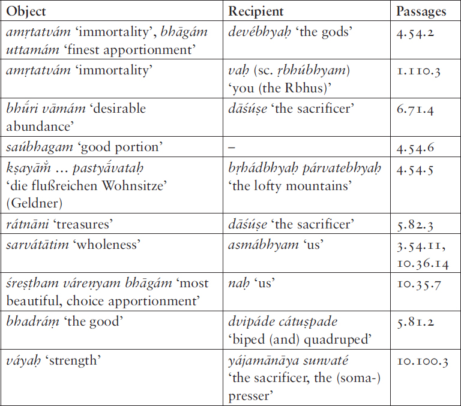

# 2. The distribution of goods and lordship in Indo-European

# ‘Givers of goods’ and Vedic <i>vásu savⁱ</i>-, Toch. B <i>saswe</i> ‘lord’, and Hittite <i>aššu šuwe-</i>

<i>Timothy G. Barnes</i>

University of Oxford

## Abstract

In 1872, Theodor Benfey noticed the remarkable three-way parallel of Vedic <i>dātā́</i> <i>vásu</i> / <i>vásūni</i> and <i>dātā́</i> <i>vásūnām</i> = Avestan <i>vohunąm dātārō</i>, <i>dāta vaŋhuuąm</i> = Greek δωτῆρες / δῶτορ ἐάων (Hom., Hes.), all ‘giver(s) of good(s)/wealth’. This inherited phrase participates in a larger phraseological system. The main focus of this paper is on the formula ‘set in motion/supply the goods’, PIE *<i>h₁o/esu</i>- (~ *<i>h₁u̯o/esu</i>) <i>seu̯h₁</i>-, which, I argue, is reflected in: (1) the Hitt. phrase <i>aššu šuwai</i> (KUB 45.23 passim), which appears amongst a series of “Bitten für die Genesung und das Wohlbefinden des Labarna”, (2) Vedic <i>vásūni savⁱ</i>- ‘set in motion, supply the goods’, and (3) Toch. B <i>saswe</i> ‘lord’ < *<i>su</i>-<i>su̯</i>-<i>on</i>- < *<i>h₁su</i>-<i>suh₁</i>-+. Further, the use of the verb *<i>seu̯h₁</i> in this phrase must in turn be related to its appearance in several terms for ‘lord, chief, authority’ in Indo-Iranian: Ved. <i>svāmín</i>- (TB+) ‘lord’ << *<i>su̯aH-mi</i>-, <i>sūrí</i>- ‘Opferherr, Herr, Schirmherr’ < *<i>suh₁</i>-<i>ri</i>-; Proto-Iranian *<i>hu̯aH-i̯ah</i>- (: Bactr. χοιιαχο etc.), *<i>hu̯aH-išta</i>- (: Avestan <i>huuoišta</i>- ‘best; eldest’, Khot. <i>hvāṣṭa</i>- ‘best, chief, master’, Sogd. <i>xwyštr</i> ‘superior, chief’, Ossetic Dig. <i>xestær</i>, Ir. <i>xistær</i> etc.).

## 1. Introduction

In 1872, Theodor Benfey (1809–1881) discovered a remarkable three-way phraseological parallel: Vedic <i>dā́tā</i> <i>vásu</i> / <i>vásūni</i> and <i>dātā́</i> <i>vásūnām</i> = Avestan <i>vohunąm dātārō</i>, <i>dāta vaŋhuuąm</i> = Greek δωτῆρες/ δῶτορ ἐάων (Homer, Hesiod), all meaning ‘giver(s) of good(s)’ (Benfey 1872: 57 n. 58). Benfey’s equation is well-known in the literature on “Indogermanische Dichtersprache” (e.g. Schmitt 1967: 142–148), and is also noteworthy, on the Greek side, as the likely vehicle for the preservation of the lexical archaism seen in ἐάων (Hoffmann 1976: 593–604; Nussbaum 1998: 130–145; Nussbaum 2014; and below, §3). The aim of the present contribution is to show how this ‘giver of goods’ formula is embedded in a larger phraseological system, both synchronically within Vedic, and diachronically, reaching back into the proto-language. First, the status of the formula within Vedic is assessed. This discussion will then allow us to focus on a second, related formula (represented in Vedic by the phrase <i>vásūni savⁱ</i>- ‘impel, set in motion the goods’), and with reflexes, both direct and indirect, in Iranian, Tocharian, and Hittite.[^1]

## Part I. Givers of goods

## 2. ‘Givers of goods’ in Vedic

First, I show that the Vedic phrase (which appears in two variants, the barytone type <i>dā́tā</i> <i>vásu</i> / <i>vásūni</i> and the oxytone <i>dātā́</i> <i>vásūnām</i>)[^2] forms part of a larger synchronic system within the Ṛgveda (RV). This system has two dimensions. First, what are the other things of which a god may be a ‘giver’ (§2.1)? Second, with what other verbs do <i>vásu</i>, <i>vásūni</i> (along with those parallel other things) appear as direct object (§2.2)? This second topic will, in turn, form the springboard for Part II, the investigation of the formula <i>vásūni savⁱ</i>- ‘impel, set in motion the goods’ and its Indo-European background.

### 2.1. ‘Giver of x’

#### 2.1.1. Barytone dǡtar- c. acc. objecti

There are three examples in the Ṛgveda of barytone <i>dā́tar</i>- with <i>vásu</i> ‘good(s), wealth’ as direct object.[^3] The barytone nomen agentis is generally held to designate a habitual agent (<i>tacchīlam</i>, per Pāṇini 3.2.135)[^4] – see for example Tichy’s treatment (1995: passim) – but a proper assessment of this view cannot be undertaken within the compass of the present contribution. In all three instances the epithet is applied to Indra. In 6.23.3 the recipient is the <i>stuvant</i>- ‘praiser’, in 7.20.2 it is the <i>dāśvā́m̐s</i>- ‘offerer, pious man’, and in 10.55.6 there is no overt recipient:

<i>pā́tā</i> <i>sutám índro astu sómam praṇenī́r ugró jaritā́ram</i> <i>ūtī́</i>

<i>kártā</i> <i>vīrā́ya súṣvaya ulokáṃ</i> <b><i>dā́tā</i></b> <b><i>vásu</i></b> <i>stuvaté kīráye cit</i> (RV 6.23.3)

‘Let Indra be the drinker of the pressed soma, the mighty one ever leading the singer forward with his help, / the maker of the wide space for the hero (and) the soma-presser, <b>the giver of goods</b> to his praiser, even a feeble one’[^5]

<i>hántā</i> <i>vṛtrám índraḥ</i> <i>śū́śuvānaḥ prā́vīn nú vīró jaritā́ram</i> <i>ūtī́</i>

<i>kártā</i> <i>sudā́se áha vā́</i> <i>ulokáṃ</i> <b><i>dā́tā</i></b> <b><i>vásu</i></b> <i>múhur</i> <i>ā́</i> <i>dāśúṣe bhūt</i> (7.20.2)

‘The smasher of Vṛtra, Indra, swollen with strength-the hero has now aided the singer with help. / The maker of the wide space for Sudās, certainly that too! – in an instant he has become <b>the giver of goods</b> to the pious man.’

<i>śā́kmanā</i> <i>śākó aruṇáḥ suparṇá</i> <i>ā́</i> <i>yó maháḥ</i> <i>śū́raḥ sanā́d ánīḷaḥ</i>

<i>yác cikéta satyám ít tán ná móghaṃ</i> <b><i>vásu spārhám utá jétotá dā́tā</i></b> (10.55.6)

‘Through his power he is the powerful, ruddy eagle, who, as the nestless champion from of old, (has power) over the great. / What he perceives, that is truly real, not false. <b>He is</b> <b>both the winner and the giver of the eagerly sought good</b>.’

These three instances cannot, in turn, be separated from the instances of barytone <i>dā́tar</i>- with other direct objects in the same semantic sphere (cf. Tichy 1995: 263). In order not to overburden the discussion of the material, I include the full exemplification in an appendix. (It is noteworthy that in a number of these passages – as indeed in the three passages just quoted – the <i>tar</i>-agent nouns, being stylistically marked, tend to cluster together.)[^6]

Barytone <i>dā́tar</i>- is found with the following accusative objects:

- with <i>rā́dhas</i>- ‘bounty’: <i>dā́tā</i> <i>rā́dha stuvaté</i> (2.22.3, said of Indra), <i>dā́tā</i> <i>rā́dhāṃsi</i> <i>śumbhati</i> (1.22.8, said of Savitar)

- with <i>maghá</i>- ‘gift, bounty, offering’: <i>dā́tā</i> <i>yó vánitā</i> <i>maghám</i> (3.13.3, said of Agni), <i>dā́tā</i> <i>maghā́ni maghávā</i> <i>surā́dhāḥ</i> (4.17.8, said of Indra)

- with <i>ukthíya</i>- (sc. <i>vásu</i>) ‘praiseworthy (good)’: <i>dā́tā</i> <i>jaritrá ukthyàm</i> (8.66.2, said of Indra)

#### 2.1.2. Oxytone dātár- c. gen. objecti

The oxytone stem <i>dātár</i>- is found with a similar range of genitive objects as its barytone counterpart. Agents of this type have various non- general functions expressing ability, actuality and the like; Tichy speaks of a ‘situative Funktion’ (Tichy 1995: 378 and elsewhere). As already indicated, these distinctions of meaning are worth further study in their own right but for the purposes of this study such an investigation is not a pressing concern.

A single example of oxytone <i>dātár</i>- with genitive object <i>vásūnām</i> is found, again said of Indra, and with the recipient of the gift specified by the 1pl. enclitic pronoun:

<i>yó no</i> <b><i>dātā́</i></b> <b><i>vásūnām</i></b> <i>índraṃ táṃ hūmahe vayám</i>

<i>vidmā́</i> <i>hy àsya sumatíṃ návīyasīṃ gaméma gómati vrajé</i> (8.51.5)

‘He who is <b>the giver of goods</b> to us, that Indra we invoke, / for we know his ever newer favor. Might we go to a pen full of cattle.’

Further, the oxytone form appears frequently with other direct objects in the same semantic sphere (cf. Tichy 1995: 193):

- with <i>rā́dhas</i>-: <i>tváṃ</i> <b><i>dātā́</i></b> <i>prathamó</i> <b><i>rā́dhasām</i></b> <i>asy</i> (8.90.2, said of Indra)

- with <i>bhū́ri</i>- ‘much, plenty’: <b><i>bhū́rer dātā́raṁ</i></b> <i>sátpatiṃ gṛṇīṣe</i> (2.33.12, said of Rudra)

- with <i>rāyí</i>- ‘wealth’: <i>índro</i> <b><i>rāyó</i></b> <i>viśvávārasya</i> <b><i>dātā́</i></b> (6.23.10, said of Indra)

- with <i>rāyí</i>- and <i>íṣ</i>- ‘refreshment, invigoration’: <i>tvā́ṃ</i> <i>hí satyám adrivo vidmá</i> <b><i>dātā́ram iṡā́m</i></b> <i>| vidmá</i> <b><i>dātā́raṁ</i></b> <b><i>rayīṅā́m</i></b> (8.46.2, said of Indra)

- with <i>vājá</i>- ‘prize’: <i>índro</i> <b><i>vā́jasya</i></b> <i>sthávirasya</i> <b><i>dātā́</i></b> (6.37.5, said of Indra); <i>dātā́</i> <i>vā́jasya gómataḥ</i> (5.23.2, said of Agni); <i>sá vā́jasya</i> <i>śravasyàsya dātā́</i> (8.96.20, said of Indra), <i>índra ín no mahā́nāṃ</i> <i>dātā́</i> <i>vā́jānāṃ</i> (8.92.3, said of Indra)

- with <i>dātrá-</i> ‘gift’: <i>ási bhágo ási dātrásya dātā́</i> (9.97.55, said of Soma)

Given the complete parallelism of the expressions involving <i>vásu</i> / <i>vásūni</i> with those involving the related and, in most cases, more specific material prosperity terms (<i>rā́dhas</i>-, <i>maghá</i>-, etc.), one might suggest that <i>vásu</i> / <i>vásūni</i> represents the general term encompassing all such items. In what follows, let us refer to <i>vásu</i> / <i>vásūni</i> as ‘the good(s)’ and the set of material prosperity terms encompassed thereby as ‘specific goods’.

### 2.2. VERB ‘the good(s)’/ ‘specific goods’

The second point to make about the synchronic system within Vedic is that ‘give’ is interchangeable with a number of other semantically similar verbs.

#### 2.2.1. Semantically similar verbs exchangeable with ‘give’

The formulaic template VERB ‘the good(s)’ is attested with a number of different verbs with similar semantics to ‘give’ filling the VERB slot. A selection of examples:

<i>ay</i>-² ‘set in motion’ (6.5.3cd <i>áta</i> <b><i>inoṡi</i></b> <i>vidhaté cikitvo vy</i> <i>ā́nuṣág jātavedo</i> <b><i>vásūni</i></b>)

<i>day</i>- ‘distribute’ (6.30.1c <i>éko ajuryó</i> <b><i>dayate vásūni</i></b>, etc.)

<i>dhavⁱ</i>- ‘set in motion’ (3.45.4cd <b><i>dhūnuhī́</i></b><i>ndra</i> <b><i>sampā́ranṅaṁ</i></b> <b><i>vásu</i></b>)

<i>dhā</i>- ‘place, establish’ (6.7.3cd <i>vaíśvānara tvám asmā́su</i> <b><i>dhehi vásūni</i></b> <i>rājan</i> <b><i>spṙhayā́yyāṅi</i></b>, etc. etc.)

<i>nayⁱ</i>-, <i>ā/abhi nayⁱ</i>- ‘bring’ (6.53.2 <b><i>abhí</i></b> <i>no</i> <b><i>náryaṁ</i></b> <b><i>vásu</i></b> <i>vīrám práyatadakṣiṇam | vāmáṃ gṛhápatiṃ</i> <b><i>naya</i></b>, etc.)

<i>vi bhaj-</i> ‘distribute’ (10.85.29b <i>brahmábhyo</i> <b><i>ví bhajā</i></b> <b><i>vásu</i></b>, etc.)

<i>bhar</i>-, <i>ā</i> <i>bhar</i>- ‘bring’ (7.77.4cd <i>yāváya dvéṣa</i> <b><i>ā́</i></b> <b><i>bharā</i></b> <b><i>vásūni</i></b> <i>codáya rā́dho gṛṇaté maghoni</i>, etc.)

<i>yam</i>-, <i>pra yam</i>- ‘give’ (8.17.10 <i>dīrghás te astv aṅkuśó yénā</i> <b><i>vásu prayáchasi</i></b> <i>| yájamānāya sunvaté</i>, etc.)

<i>vah</i>- ‘convey’ (1.51.3c <i>saséna cid vimadā́y</i><b><i>āvaho vásv</i></b>, etc.)

<i>savⁱ</i>- ‘id.’, <i>ā</i> <i>savⁱ</i>- ‘set in motion’ (3.56.6, 5.42.3, 7.45.3 – see below, Part II)

Most of these verbs, of course, also appear with ‘specific goods’; a detailed exemplification would be tedious: merely note, exempli gratia, to <i>day</i>- ‘distribute’ direct objects <i>vā́ryāni</i> (5.49.3), <i>maghā́ni</i> (7.21.77), <i>vā́jān</i> (8.2.31), and so on.

#### 2.2.2. tar- agent nouns governing ‘the good(s) / specific goods’

Particularly noteworthy is the frequency of <i>tar</i>-agent nouns in the type of phraseology under examination. Thus, in addition to the formulas discussed above, viz.:

<i>dātár-</i> <i>vā́jasya, dātrásya, bhū́reḥ, vásūnām, iṣā́m, rayīṇā́m, rā́dhasām, vā́jānām</i>

<i>dā́tar-</i> <i>vásu, rā́dhaḥ, maghám, maghā́ni</i>

we also find, to semantically similar verbs (e.g. <i>vi-bhaj</i>- ‘distribute’, <i>vah</i>- ‘convey’):

<i>vibhaktár-</i> <i>vásoḥ, rā́dhasaḥ, rāyáḥ, maghā́nām</i>

<i>víbhaktar-</i> <i>bhāgám, vā́jam</i>

<i>voḷhár-</i> <i>iṣā́m</i>

<i>vóḷhar-</i> <i>vásu</i>

and so on (for further examples see Tichy 1995: 193 and 263). I will argue in Part II that the divine name (<i>devá</i>-) <i>savitár</i>- has been generated from this system.

### 2.3. Summary

By way of summary, the basic point to draw from the material presented in this paragraph is that, from the Vedic-internal (and, broadly speaking, synchronic) perspective, we are dealing with a formulaic system, a network of phraseology involving: a set of related material prosperity terms; verbs of giving, offering, conveying, setting in motion, etc.; and the preference for a stylistically marked morphological category, the <i>tar</i>-agent noun. The ‘givers of goods’ formula is <i>merely one piece of this system</i>. A question immediately arises: if the phrase under consideration is embedded in a synchronic system in the way described, does this suggest that Benfey’s equation is a mirage? But the Avestan and especially the Greek parallel (which is patently archaic) should be enough to satisfy the sceptic that the ‘giver of goods’ formula was not coined within the recent prehistory of Vedic.[^7] Instead, this situation should lead us to ask a different question: if the ‘giver of goods’ formula is inherited into Vedic, <i>how many of the other elements of the Vedic system outlined in this paragraph are inherited?</i> In what follows, I turn the attention to one possible further ingredient of the system in PIE, represented in Vedic by the phrase <i>vásūni savⁱ</i>- ‘impel, set in motion the goods’.

Since I will argue below that this ‘giver/impeller/etc. of goods’ phraseology is also operative “behind the scenes”, as it were, in the creation of several words for ‘lord’, it will be useful to interject two notes expanding on the two halves of the ‘giver of goods’ formula discussed in this paragraph and their relation to notions of ‘lordship’.

## 3. <i>Interiectum</i> 1. Givers and lordship

Much has been written on giving and gift-exchange in early Indo-European societies, in the wake of Mauss’s classic <i>Essai sur le don</i>, especially as channelled by Benveniste in his influential discussions of the vocabulary of gift-exchange. Benveniste wrote of Mauss:

Il a montré que le don n’est qu’un élément d’un système de prestations réciproques à la fois libres et contraignantes, la liberté du don obligeant le donataire à un contre-don, ce qui engendre un va-et-vient continu de dons offerts et de dons compensatoires. Là est le principe d’un <i>échange</i> qui, généralisé non seulement entre les individus, mais entre les groupes et les classes, provoque une circulation de richesses à travers la société entière (Benveniste 1948–1949: 7)

However, when one turns to the phraseology we have been investigating here, what is striking is how inapplicable the Maussian notion of reciprocity is, at the verbal level: in the Ṛgveda, the simplex <i>dā</i>- and its nominal derivatives (<i>dāna</i>-, <i>dātra</i>-) are used almost exclusively[^8] of one direction of the exchange: the one which proceeds from the stronger party.[^9] The divine givers are of a radically different status from the mortal recipients. Rather than a constant “va-et-vient” of gifts and counter-gifts, we have rather a situation in which the divine gift cannot be reciprocated in a commensurate way: “do ut des” is, in literal Vedic terms, impossible.

The power dynamics implied by this sort of giving is most clearly articulated, perhaps unexpectedly, in a passage of Classical Sanskrit drama, the Mudrārākṣasa, where, significantly, we find an example of the Vedic ‘giver of goods’ formulaic template (underlined):

<i>mauryo ’sau svāmiputraḥ – paricaraṇaparo mitraputras tavāhaṃ;</i>

<u><b><i>dātā</i></b></u> <b><i>so ’</i></b><u><b><i>rthasya</i></b></u> <b><i>tubhyamṃ</i></b> <b><i>svamatam</i></b> <i>anugatas</i> – <b><i>tvamṃ</i></b> <b><i>tu mahya</i></b> <b><i>dadāsi;</i></b>

<i>dāsyaṃ satkārapūrvaṃ nanu sacivapadaṃ tatra te –</i> <b><i>svāmyam</i></b> <i>atra (5.19)</i>

‘That Maurya is the son of (your) lord – I, whose business is to serve (you), am the son of your friend;

<b>he is a</b> <u><b>giver of wealth</b></u> <b>to you according to his own will</b>, when attended (by you) – <b>but you give to me</b>;

your role as minister there is honorable servitude – here it is <b>lordship</b>.’

In this passage of the Mudrārākṣasa, the speaker, Malayaketu, endeavours to convince the minister Rākṣasa to join his side against the Maurya king Candragupta. Malayaketu argues that Rākṣasa will be all but a servant at the court of Candragupta: Candragupta will be the one that gives <i>him</i> wealth (<i>dātā</i> <i>so ’rthasya tubhyaṃ</i>). With Malayaketu, by contrast, Rākṣasa will have the status of lord: <i>he</i> will be the one who gives (<i>tvaṃ tu mahyaṃ dadāsi</i>). In this differential model, the recipient of such a gift cannot properly reciprocate, but is instead placed in a state of obligation. The ‘lord’ is the one who gives, <i>par excellence</i>.

## 4. <i>Interiectum</i> 2. Goods and lordship: ἐάων and the derivation of Hitt. <i>išḫa</i>- ‘lord’, Lat. <i>erus</i> ‘id.’

The second component of the Greek reflex of the ‘giver of goods’ formula – the gen. pl. ἐάων – has been the subject of much discussion, in particular by Alan Nussbaum (1998: 130–145; 2014). Nussbaum’s discussion in the 1998 monograph has now been superseded in the details relevant here by his 2014 paper. A brief summary of the argument as it relates to ἐάων:

(a) Attempts to derive ἐάων from (1) the exact counterpart of Avestan <i>vaŋhuuąm</i> – viz. *<i>h₁u̯ésu̯ōm</i> > *ἐε¯´ων, or (2) the more expectable *<i>h₁ésu̯ōm</i> > *<i>ḗōn</i> or *<i>h₁eséu̯ōm</i> > *<i>ehewōn</i> (and so on) are beset with various difficulties.

(b) It is possible instead to leverage evidence for both *<i>h₁es-o</i>- ‘good’ and its abstract *<i>h₁(e)s-e-h₂</i> ‘good(s)’ to suggest that ἐάων is simply what it looks like: the gen. pl of a stem *<i>ehā</i>- < *<i>h₁(e)seh₂</i> ‘good, thing of value’. Further evidence for *<i>h₁(e)seh₂</i> is seen in the Lat. adj. <i>sānus</i>, which is convincingly and brilliantly derived from *<i>h₁seh₂-no-</i>.

(c) Thus in the ‘giver of goods’ phraseology we have semantically identical variants in the basic meaning ‘goods’: [gen.pl](http://gen.pl). *<i>h₁u̯ésu̯ōm</i> inherited in Indo-Iranian, *<i>h₁(e)seh₂sōm</i> in Greek.

Of special relevance in the present context is the convincing derivation from this same *<i>h₁(e)s-e-h₂</i> of two synchronically isolated words for ‘lord’ in Hittite and Latin: *<i>h₁(e)seh₂</i> ‘good(s), thing of value, property’ → *<i>h₁esh₂-ó</i>- (with possessive -<i>ó</i>-) ‘propertied, proprietor’ > Hitt. <i>išḫā</i>-, Lat. <i>erus</i>, both ‘lord’. The ‘lord’ was thus, in Indo-European terms, both the one who has the goods (*<i>hxi̯ósmōi h₁eseh₂</i> <i>h₁ésti,</i> *<i>h₁esh₂-ó</i>-) and who gives (*<i>hxi̯ós dédoh₃ti</i>, *<i>déh₃tor</i>-). As I will argue in what follows, he was also the one who ‘sets in motion’ – in the sense of distributing – the goods.

## Part II. The formula <i>vásūni savⁱ</i>- and words for ‘lord’

## 5. <i>vásūni savⁱ-, savitár</i>- and Tocharian B <i>saswe</i> ‘lord’

In Barnes 2013, I argued that Tocharian B <i>saswe</i> ‘lord’ was the reflex of a compound made up of the same ingredients (<i>mutatis mutandis</i>) as those seen in the Vedic formula <i>vásūni savⁱ</i>-. In this section I will summarize the argument of 2013, which I will go on to update with the new material of paragraphs 6 and 7.

### 5.1. Vedic examples

Three passages in the Ṛgveda contain the phrase <i>vásūni savⁱ</i>- (3.56.6, 5.42.3, 7.45.3, cf. above §2.2.1):

<i>trír</i> <i>ā́</i> <i>diváḥ savitar vā́ryāṇi divé-diva</i> <i>ā́</i> <i>suva trír no áhnaḥ</i>

<i>tridhā́tu rāyá</i> <b><i>ā́</i></b> <b><i>suvā</i></b> <b><i>vásūni</i></b> <i>bhága trātar dhiṣaṇe sātáye dhāḥ</i> (3.56.6)

‘Three times a day, every day, o Savitar, impel valuables to us, three times daily. / Threefold riches and <b>goods impel</b> here. O Bhaga, o Protector, o Holy Place, position (them) for winning’

<i>úd</i> <i>īraya kavítamaṃ kavīnā́m unáttainam abhí mádhvā</i> <i>ghṛténa</i>

<i>sá no</i> <b><i>vásūni</i></b> <i>práyatā</i> <i>hitā́ni candrā́ṇi deváḥ savitā́</i> <b><i>suvāti</i></b> (5.42.3)

‘Rouse the best poet of poets. Wet him with honey, with ghee. / He – god Savitar – <b>will propel</b> to us the golden <b>goods</b> that have been held forth and set out.’

<i>sá ghā</i> <i>no deváḥ savitā́</i> <i>sahā́v</i><b><i>ā́</i></b> <b><i>sāvisṃad</i></b> <i>vásupatir</i> <b><i>vásūni</i></b>

<i>viśráyamāṇo amátim urūcī́m martabhójanam ádha rāsate naḥ</i> (7.45.3)

‘The overpowering god Savitar <b>will impel good things</b> here as the lord of goods. / Spreading wise his broad emblem, he will then grant to us the sustenance for mortals.’

### 5.2. Interpretation of the Vedic material

In principle, one might suppose that these three instances simply play upon the divine name <i>savitár</i>-. But there are compelling reasons for supposing the reverse, namely that the divine name itself has been generated from this and other phraseology characteristic of the divinity, involving the verb <i>savⁱ</i>-. Tichy writes:

Die Benennung <i>savitár</i>- ‘Antreiber’ ist durch die charakteristische Wirkung motiviert, die der betreffende Gott bei Sonnenaufgang auf alles bewegte und unbewegte Leben ausübt. (1995: 198)

This – which is indeed the traditional understanding – is correct in general outline, but it is rarely noted that the ‘Antreibung’ which is in fact characteristic of <i>savitár</i>- in the hymns themselves is, in the vast majority of cases, not the quickening effect of the sun on the natural world, but rather precisely the setting-in-motion by a divine authority of ‘the goods’ bzw. ‘specific goods’ of various kinds. In other words, the answer to the question: “what does <i>savitár</i>- <i>savⁱ</i>-?” is, somewhat unexpectedly:

Only with the upasarga <i>prá</i> do we find the meaning ‘set in motion, enliven’: at 1.157.1 (<i>jágat</i>), 1.124.1 (<i>prā́sávīd dvipát prá cátuṣpad ityaí</i>), 4.53.3 (<i>prasuvánn aktúbhir jágat</i>), 7.45.1 (<i>bhū́ma</i>). Indeed, the form <i>prasavitár</i>- or <i>prasavītár</i>- (4.53.6, etc.) is attested in precisely this meaning.

### 5.3. Tocharian B <i>saswe</i> ‘lord’

The phrase <i>vásūni savⁱ</i>- suggests in turn the analysis of Toch. B <i>saswe</i> ‘lord’ as < pre-PT *<i>su</i>-<i>su̯</i>-<i>o(n)</i>-, ultimately deriving from a verbal governing compound *<i>h₁su-suh₁</i>- ‘setting in motion the good’, i.e. distributing, giving out wealth. On the “zeroed-out” first compositional member *<i>h₁su</i>-º (to acrostatic *<i>h₁ósu</i>- / <i>h₁ésu</i>-), see now Nussbaum 2014: 231.

## 6. Further Indo-Iranian examples

To this dossier we may now add an important further group of Indo-Iranian words studied – unbeknownst to me in the 2013 article – by Sims-Williams and Tucker 2005.

### 6.1. Iranian <i>*hu̯aH-</i>

Iranian attests a set of primary comparatives and superlatives built descriptively to a Proto-Iranian *<i>hu̯aH-</i>:

(a) comparative *<i>hu̯aH</i>-<i>i̯ah</i>- (via *<i>hu̯āi̯ah</i>-<i>aka</i>-) in Bactrian χοιιαχο (χοιαχο, χαιιαχο) ‘elder’ as well as in the morphologically renewed χοιιαδαρο ‘id.’.

(b) superlative *<i>hu̯aH-išta</i>- (with vocalism remodelled as *<i>hu̯āi̯išta</i>- after the comparative *<i>hu̯āi̯ah-</i>) in Avestan <i>huuoišta</i>- ‘best; eldest’, Khotanese <i>hvāṣṭa</i>- ‘best, chief, master’, Sogd. <i>xwyštr</i> ‘superior, chief’, Ossetic Dig. <i>xestær</i>, Ir. <i>xistær</i> ‘elder, eldest, biggest (finger, i.e. the thumb)’.

What is *<i>hu̯aH</i>-? Sims-Williams writes:

A connection with the root <i>hū</i>-, OIA <i>savⁱ</i>- (<i>sū</i>-) ‘to impel’ was proposed by Bartholomae (1901: 127 n. 3; 1904: 1856): “Superl[ativ] zum V[erbum] ²<i>hav</i>-; eig[entlich] ‘der am meisten Anregung gibt, der autoritativste’”.

Bartholomae’s interpretation, somewhat implausible on its own, derives strong support from Tucker’s interpretation of Vedic <i>svāmín</i>- ‘lord’.

### 6.2. Vedic <i>svāmín</i>- ‘lord’.

Vedic <i>svāmín</i>- ‘lord’ is argued by Tucker (Sims-Williams & Tucker 2005: 595–602) to derive from the same root, again in “state II” *<i>su̯aH</i>- < *<i>su̯eh₁</i>-.[^10] Originally this was a -<i>mi</i>- stem *<i>su̯aH-mi</i>- < *<i>su̯eh₁-mi</i>- according to Tucker (cf. OAv. <i>dāmi-</i>, etc.).

### 6.3. Vedic <i>sūrí-</i> ‘Opferherr’

One can go further. I think we can add Vedic <i>sūrí</i>- ‘Opferherr, Herr, Schirmherr’ < *<i>suh₁</i>-<i>ri</i>-, as (with different details) already in PW s.v.:

(1) (von 1 <i>su</i>) a) (eig. Antreiber) Veranstalter, Auftraggeber, derjenige, welcher Priester u. s. w. zu einer ihm zugute kommenden heiligen Handlung veranlasst und dieselben belohnt.

As in the material given in §6.1–2, the meaning is in the basic sphere of ‘person endowed with authority’. Formally, this is preferable to setting up a unique compound with second member *-<i>Hri</i>-. The formation is that seen in e.g. <i>bhū́ri</i>-, Gk ἴδρις < *<i>u̯id</i>-<i>ri</i>- and elsewhere (AiGr II/2: 859 (§688)).

### 6.4. Phraseologisches?

The Iranian nasal infix present *<i>hu-na-H-</i> is attested twice in Old Avestan (Y.31.15, Y.35.5), both times with <i>xšaϑrəm</i> ‘power, command’ as the direct object:

<i>yə¯ drəguuāitē</i> <i>xšaϑrəm hunāitī</i> (Y.31.15) ‘who delegates power to the deceitful one’

<i>xšaϑrəm … aibī</i> <i>dadəmahicā</i> <i>cīṣ̌mahicā</i> <i>+huuąnmahicā</i> (Y.35.5) ‘we … assign, commit and delegate the power’[^11]

J. Narten writes (Narten 1986 ad Y.35.5):

Daß die beiden altavestischen Belege das Präsensstammes <i>hunā</i>- / <i>hun</i>- das gleiche Objekt haben, kann Zufall sein. Doch ist nicht auszuschliessen, dass <i>xšaϑrəm hū</i> ebenfalls ein alter Terminus der Herrschaftsübertragung sein könnte, vergleichbar dem Ausdruck <i>kṣatrám dhā</i> / <i>xšaϑrəm dā</i>.

As Narten remarks (earlier in the same note), this recalls the Vedic constructions of <i>savⁱ</i>- with the recipient in the dative and as object various ‘specific goods’, abstract as well as material: precisely the material surveyed above. As a possible ‘alter Terminus der Herrschaftsübertragung’ it also recalls the later, Vedic-internal development of the verb <i>savⁱ</i>- in the sense ‘consecrate’: indeed, it might be noted, the very same combination appears – independently! – in the Aitareya Brāhmaṇa <b><i>sūyate</i></b> <i>ha vā</i> <i>asya</i> <b><i>kṡatraṁ</i></b> <i>yo díkṣate kṣatriyaḥ san</i> (8.5.1) ‘his royal power is consecrated, who being a <i>kṣatriya</i> consecrates himself’.

Much more could be said about this and related uses of Vedic <i>savⁱ</i>- / Avestan <i>hū</i>-,[^12] but the key point to note is the obvious relationship between, on the one hand, the designations for persons endowed with authority built to this root in Iranian and Vedic discussed in this paragraph, and, on the other, the Vedic and Tocharian phraseology discussed above in §5.

## 7. Hittite <i>aššu šuwai</i>

We can add one further reflex of the ‘impel, set in motion the goods’ formula, this one from Hittite, a source which guarantees a fascinating antiquity for the phraseology under investigation. Hittite attests a phrase which appears to combine (<i>mutatis mutandis</i>) the very same elements discussed in §5, found in the 2sg. imperative as <i>aššu šuwai</i>, corresponding to 2pl. <i>šuwatten</i>. Let us first canvass the attestations.

### 7.1. Attestations

The phrase is attested in the assembly of prayers for the health of the king collected under the heading of CTH 458.10.1. These are generally agreed to represent new script (NS) copies of an Old Hittite (OH) original. The verb appears in the imperative, both 2sg. and 2pl.:

LÚAZU ma-al-ti a-aš-šu-u ša-⌈ku⌉-wa-at![-te-et la-a-ak]

<b>nu la-ba-ar-na-an a-aš-šu šu-ú-wa-i</b> ⌈e⌉[-eš-ri-iš-še-et ne-wa-a-aḫ]

na-an EGIR-pa ma-ia-an-ta-aḫ (KUB 41.23 ii 9–11, ed. Fuscagni, [hethiter.net/](http://hethiter.net/): CTH 458.10.1 (INTR 2013-02-05), plus CHD S s.v. <b>šuwaye-, šuwaya-, šuwai-</b> 2. (p. 541))

CHD translate “the exorcist priest recites: ‘incline your kind eyes and <b>watch the Labarna favorably</b>; renew his frame and make him young again’.” Fuscagni has a different rendering: “Der AZU-Priester rezitiert (folgendermaßen): [Neige] wohlwollend d[eine] Augen! <b>Fülle Labarna mit Wohl!</b> [Erneuere seine] G[estalt!] Mache ihn wieder kräftig!” (see below §7.2 for further discussion).

Parallel passages exist in several related texts:

[… nu la-b]a-ar-na-an a-aš-šu šu-wa-at-t[e-en (KBo 59.183 iii 3, part of the same text CTH 458.10.1)

nu la-b]a-ar-na-an a-aš-šu šu-wa[-i(a) e-eš-ri-še-et]

[ne-wa-a-a]ḫ n-an EGIR-pa GURUŠ-aḫ (Bo 3995 ii 14–15, CTH 458.10.3 ed. Fuscagni).

The phrase <i>a-aš-šu šu-wa-at-te-en</i> also appears twice at KBo 12.18 i 5–7 (plus duplicates).

A related sequence is found in the MH prayer to the Sun Goddess of the Earth (CTH 371), uttered by an officiant on behalf of the king:

a-aš-šu-u IGIḪI.A-<i>KA</i> la-a-ak <i>LI</i>-<i>IM</i> ⌈la⌉-ap-li-ip-pu-uš kar-ap na-[ … ]

[L]UGAL-un an-da a-aš-šu ša-ku-wa-ya nu a-aš-šu ut-⌈tar⌉

[i]š-⌈ta⌉-ma-aš

“Neige deine gütigen Augen! Hebe (deine) tausend Wimpern und [ … ] blicke den [K]önig gütig an!

<Neige deine Ohren> und [h]öre (sein) gutes Wort!” (trans. Rieken)[^13]

### 7.2. Interpretation

As indicated in the survey of passages just given, there is disagreement as to the interpretation of the verb <i>šuwai</i>, 2pl. <i>šuwatten</i>. One may compare the formulation of CHD s.v. <b>šuwe</b>-: “due to similar spellings in later Hittite, attribution of forms to <i>šuwaye</i>- ‘to see’, <i>šu(wa)-</i> ‘to fill’ or <i>šuwe</i>- ‘to push’ is sometimes problematic”. Let us consider each of these three possibilities in turn:

(a) <i>Pace</i> Fuscagni, ‘fill’ can be eliminated – there is no evidence for a stem <i>šuwai</i>- to the verb <i>šū</i>-, <i>šūwa</i>- ‘fill’; at KUB 24.10 iii 12 the sg. imp. šu-wa-a-i[d-du (OH/NS) is to <i>šuwe</i>- ‘push’; see Kloekhorst s.v. <i>šuu̯e/a</i>-<i>zⁱ</i>, followed by CTH s.v. <b>šū</b> -, <b>šūwa</b>-.

(b) In context a form of <i>šuwaye</i>-/<i>šuwaya</i>-/<i>šuwai</i>- ‘look’ clearly makes excellent sense. Indeed, this seems to be how the phrase was understood by Hittite speakers, to judge by its apparent replacement in Middle Hittite with the phrase attested in the passage of CTH 371 given above (<i>ḫaššun anda aššu šakuwaya</i> ‘blicke den [K]önig gütig an!’). However, it is suspicious that this is the <b>only</b> context in which the verb <i>šuwaye</i>-/<i>šuwaya</i>-/<i>šuwai</i>- ‘look’ takes an accusative direct object.

(c) Formally, a form of the verb <i>šuwe</i>- ‘to push’ is equally possible, since the confusion with the <i>hatrae</i>- class which the form <i>šuwai</i> displays is also found in OH/NS mss. in forms of the 3sg. written <i>šu-wa-a-iz-zi</i>.[^14] <i>šuwe</i>-, of course, is uncontroversially the Hittite reflex of PIE *<i>seu̯h₁</i>-.

Taking (b) and (c) together, it might be suggested that the phrase *<i>h₁o/esu</i>- (~ *<i>h₁u̯o/esu</i>) <i>seu̯h₁</i>- did indeed give Hittite <i>aššu šuwe</i>- ‘impel a good, a favor’, and that this phrase was in turn misunderstood or reanalysed by speakers, within the history of Hittite, as containing the verb <i>šuwaye</i>-/<i>šuwaya</i>-/<i>šuwai</i>- ‘look’. This would have been facilitated by the semantic development of the verb <i>šuwe</i>- from ‘set in motion, impel’ > ‘push (away), banish’.[^15]

## 8. Summing up

To sum up the results of Part II of this study, I have argued for:

(a) A three-way set: Vedic <i>vásūni savⁱ</i>-, Toch. B <i>saswe</i> < *<i>su</i>-<i>su̯</i>-<i>o(n)</i>- < *<i>h₁su</i>-<i>suh₁</i>-+, OHittite <i>aššu</i> <i>šuwe</i>- < PIE *<i>h₁o/esu</i>- (~ *<i>h₁u̯o/esu</i>) <i>seu̯h₁</i>-.

(b) *<i>seu̯h₁</i>- as an element in terms for ‘lord, chief, authority’: again Toch. B <i>saswe</i> ‘lord’; Ved. <i>svāmín</i>- ‘lord’ << *<i>su̯aH-mi</i>-, <i>sūrí</i>- ‘Opferherr, Herr, Schirmherr’ < *<i>suh₁</i>-<i>ri</i>-; Proto-Iranian *<i>hu̯aH-i̯ah</i>- (: Bactr. χοιιαχο etc.), *<i>hu̯aH-išta</i>- (: Avestan <i>huuoišta</i>- ‘best; eldest’, Khot. <i>hvāṣṭa</i>- ‘best, chief, master’, Sogd. <i>xwyštr</i> ‘superior, chief’, Ossetic Dig. <i>xestær</i>, Ir. <i>xistær</i> etc.).

Returning, by way of conclusion, to the ‘giver of goods’ formula with which we started, it may be said that the Indo-European ‘lord’ was the one who both possessed and distributed good things. The act of distributing could be referred to by using various verbs, of which *<i>deh₃</i>- and *<i>seu̯h₁</i>- are the most prominent, but others listed in §2.2.1 above are also likely to have been used. Many further connections may be made; one thinks, to take one example, of Old English poetic formulas such as the standing epithets of lords <i>synces brytta</i> ‘distributor of treasure’ (<i>Beo</i>. 607, 1170, 1922, 2071 and elsewhere) and <i>beaga brytta</i> ‘distributer of rings’ (<i>Beo</i>. 1487, etc.), and in general the near obsession with treasures, rings and the like, and their distribution, which is characteristic of Old English poetry[^16] – but this would be a topic for another paper.

## Appendix: Complete list examples of the “givers” template in the <i>Ṛ</i>gveda

6.23.3 <i>pā́tā</i> <i>sutám índro astu sómam praṇenī́r ugró jaritā́ram</i> <i>ūtī́</i>

<i>kártā</i> <i>vīrā́ya súṣvaya ulokáṃ</i> <b><i>dā́tā</i></b> <b><i>vásu</i></b> <i>stuvaté kīráye cit</i>

7.20.2 <i>hántā</i> <i>vṛtrám índraḥ</i> <i>śū́śuvānaḥ prā́vīn nú vīró jaritā́ram</i> <i>ūtī́</i>

<i>kártā</i> <i>sudā́se áha vā́</i> <i>ulokáṃ</i> <b><i>dā́tā</i></b> <b><i>vásu</i></b> <i>múhur</i> <i>ā́</i> <i>dāśúṣe bhūt</i>

10.55.6 <i>śā́kmanā</i> <i>śākó aruṇáḥ suparṇá</i> <i>ā́</i> <i>yó maháḥ</i> <i>śū́raḥ sanā́d ánīḷaḥ</i>

<i>yác cikéta satyám ít tán ná móghaṃ</i> <b><i>vásu spārhám utá jétotá dā́tā</i></b>

2.22.3 <i>sākáṃ jātáḥ krátunā</i> <i>sākám ójasā</i> <i>vavakṣitha</i>

<i>sākáṃ vṛddhó vīryaìḥ sāsahír mŕ̥dho vícarṣaṇiḥ</i>

<b><i>dā́tā</i></b> <b><i>rā́dha stuvaté kā́myamṃ</i></b> <b><i>vásu</i></b>

<i>saínaṃ saścad devó deváṃ satyám índraṃ satyá índuḥ</i>

1.22.8 <i>sákhāya</i> <i>ā́</i> <i>ní</i> <i>ṣīdata savitā́</i> <i>stómyo nú naḥ</i>

<b><i>dā́tā</i></b> <b><i>rā́dhāmṃsi</i></b> <i>śumbhati</i>

8.66.2 <i>ná yáṃ dudhrā́</i> <i>várante ná sthirā́</i> <i>múro máde suśiprám ándhasaḥ</i>

<b><i>yá</i></b> <b><i>ādŕ°tyā</i></b> <b><i>śaśamānā́ya sunvaté dā́tā</i></b> <b><i>jaritrá ukthyàm</i></b>

3.13.3 <i>sá yantā́</i> <i>vípra eṣāṃ sá yajñā́nām áthā</i> <i>hí</i> <i>ṣáḥ</i>

<i>agníṃ táṃ vo duvasyata</i> <b><i>dā́tā</i></b> <b><i>yó vánitā</i></b> <b><i>maghám</i></b>

4.17.8 <i>satrāháṇaṃ dā́dhṛṣiṃ túmram índram mahā́m apāráṃ vṛṣabháṃ suvájram</i>

<i>hántā</i> <i>yó vṛtráṃ sánitotá vā́jaṃ</i> <b><i>dā́tā</i></b> <b><i>maghā́ni</i></b> <i>maghávā</i> <i>surā́dhāḥ</i>

<b>ad</b> <b>2.1.2.</b> oxytone type <i>dātár</i>- c. gen. objecti:

8.51.5 <i>yó no</i> <b><i>dātā́</i></b> <b><i>vásūnām</i></b> <i>índraṃ táṃ hūmahe vayám</i>

<i>vidmā́</i> <i>hy àsya sumatíṃ návīyasīṃ gaméma gómati vrajé</i>

and with other direct objects in the same semantic sphere:

8.90.2 <i>tváṃ</i> <b><i>dātā́</i></b> <i>prathamó</i> <b><i>rā́dhasām asy</i></b> <i>ási satyá</i> <i>īśānakŕ̥t</i>

<i>tuvidyumnásya yújyā́</i> <i>vṛṇīmahe putrásya</i> <i>śávaso maháḥ</i>

2.33.12 <i>kumāráś</i> <i>cit pitáraṃ vándamānam práti nānāma rudropayántam</i>

<b><i>bh</i></b>ū́<b><i>rer dātā́ramṃ</i></b> <i>sátpatiṃ gṛṇīṣe stutás tvám bheṣajā́</i> <i>rāsy asmé</i>

6.23.10 <i>evéd índraḥ suté astāvi sóme bharádvājeṣu kṣáyad ín maghónaḥ</i>

<i>ásad yáthā</i> <i>jaritrá utá sūrír índro</i> <b><i>rāyó viśvávārasya dātā́</i></b>

6.37.5 <b><i>índro vā́jasya sthávirasya dāté</i></b><i>ndro gīrbhír vardhatāṃ vṛddhámahāḥ</i>

<i>índro vṛtráṃ hániṣṭho astu sátvā́</i> <i>tā́</i> <i>sūríḥ pṛṇati tū́tujānaḥ</i>

5.23.2 <i>tám agne pṛtanāṣáhaṃ rayíṃ sahasva</i> <i>ā́</i> <i>bhara</i>

<i>tváṃ hí satyó ádbhuto</i> <b><i>dātā́</i></b> <b><i>vā́jasya gómatahṃ</i></b>

8.96.20 <i>sá vṛtrahéndraś</i> <i>carṣaṇīdhŕ̥t táṃ suṣṭutyā́</i> <i>hávyaṃ huvema</i>

<i>sá prāvitā́</i> <i>maghávā</i> <i>no ‘dhivaktā́</i> <b><i>sá vā́jasya</i></b> <b><i>śravasyàsya dātā́</i></b>

8.92.3 <i>índra ín no</i> <b><i>mahā́nāmṃ</i></b> <b><i>dātā́</i></b> <b><i>vā́jānāmṃ</i></b> <i>nṛtúḥ</i>

<i>mahā́m̐</i> <i>abhijñv</i> <i>ā́</i> <i>yamat</i>

8.46.2 <i>tvā́ṃ hí satyám adrivo vidmá</i> <b><i>dātā́ram isṃā́m</i></b>

<i>vidmá</i> <b><i>dātā́ramṃ</i></b> <b><i>rayīnṃā́m</i></b>

9.97.55 <i>sáṃ trī́ pavítrā</i> <i>vítatāny eṣy ánv ékaṃ dhāvasi pūyámānaḥ</i>

<i>ási bhágo</i> <b><i>ási dātrásya dātā́</i></b><i>si maghávā</i> <i>maghávadbhya indo</i>

<b>How to cite this book chapter:</b>

Barnes, T. G. (2024). The distribution of goods and lordship in Indo-European: ‘Givers of goods’ and Vedic <i>vásu savⁱ</i>-, Toch. B <i>saswe</i> ‘lord’, and Hittite <i>aššu šuwe-</i>. In: Larsson, J., Olander, T., & Jørgensen, A. R. (eds.), <i>Indo-European Interfaces: Integrating Linguistics, Mythology and Archaeology</i>, pp. 3–22. Stockholm: Stockholm University Press. DOI: [https://doi.org/10.16993/bcn.b](https://doi.org/10.16993/bcn.b). License: CC BY-NC.

## Footnotes

[^1]: I plan to treat the same material in greater detail in a chapter of my monograph on Indo-European poetics, currently in preparation. I hereby thank the organizers of the Indo-European Interfaces conference, from which this volume is drawn, for allowing me the opportunity to present these ideas on that occasion.

[^2]: On these types, see Tichy’s monographic treatment of 1995, and the brief indications at the relevant points <i>infra</i>, §2.1.1, §2.1.2.

[^3]: N.b. the surface form <i>vásu</i> is ambiguous between the regular neuter singular and the variant form of the inherited plural (i.e., with ending -<i>u</i> for -<i>ū</i>), when there is no adjective to disambiguate (AiGr III: 161 (§80), with references to earlier discussions). Since the short vowel variant is prevalent at pada end, it is possible that this originated in the phenomenon of laryngeal loss in pausa (see Jeon 2001: 87–89).

[^4]: The whole sūtra, to be sure, distinguishes three different, but related, uses: <i>tacchīla-taddharma-tatsādhukāriṣu</i> ‘having that (action) as his habit, duty or special skill’.

[^5]: The RV translations of Jamison-Brereton are given throughout.

[^6]: This is also the case in Avestan: cf., e.g., the sequence <i>spašta nąma ahmi, vīta nąma ahmi, dāta nąma ahmi, pāta nąma ahmi,</i> <i>ϑrāta nąma ahmi, žnāta nąma ahmi, žnōišta nąma ahmi</i> (Yt. 1.13).

[^7]: A full discussion of the Avestan and Greek material, however, cannot be undertaken here.

[^8]: The only example of <i>dā</i>- used of a human offering to the gods I see in the RV is 10.116.5.

[^9]: Thus we may take the example of <i>dātra</i>- (frequently in a figura etymologica with a form of the verb <i>dā</i>-), which without exception, in the RV, designates the gift of a divinity. In the majority of cases it is accompanied by a genitive referring to that divinity: so 1.116.6 (Aśvins), 1.166.12 (Maruts), 1.185.3 (Aditi), 4.38.1 (either Mitra and Varuṇa or Indra and Varuṇa [see Geldner ad loc.]), 6.61.1 (Sarasvatī), 7.56.21 (Maruts), 8.43.33 (Agni), 8.49.2 (Indra). Without genitive: in the fomula <i>dātraṃ rakṣ</i>- (3.54.16, 10.69.4), <i>dātraṃ dā</i> (6.20.7, 9.97.55 [<i>dātrásya dātā́</i>]), and lastly in the phrase <i>īṣiṣe vā́ryasya...dātrásya</i> (8.44.18, said of Agni). A parallel distribution applies to <i>dāna</i>- which, as is well known, refers to the gifts not of divinities, but of wealthy patrons.

[^10]: The ablaut patterns shown by the root are an interesting topic in their own right, but one which cannot be pursued here.

[^11]: The translations are those of Humbach 1991.

[^12]: For example, it seems possible to analyse the OP royal name <i>Uvaxš(a)tra</i>- (: Κυαξάρης) as a φερέοικος type *<i>huua-xštra</i>-. For the zeroing-out of second member, see perhaps Av. <i>bixəδra</i>- < *<i>du̯i-gHtra</i>- besides Ved. <i>gātrá</i>- < *<i>gaHtra-</i>, Av. <i>ərəduuafšna</i>- < *-<i>fštna</i>- besides <i>fštāna</i>-, Ved. <i>stána</i>-, (: Gk παρ-θένο-); the origin of this phenomenon is presumably to be sought in some analogy with the pattern seen e.g. in Ved. <i>jā́nu</i>: °-<i>jñu</i>- et sim.

[^13]: Further literature in Lebrun 1980: 83–91; Rieken et al. (ed.), [hethiter.net/](http://hethiter.net/): CTH 371.1 (accessed 18 January 2016).

[^14]: See the material in Oettinger 2002: 293–298, esp. 296.

[^15]: The syntax of the phrase is still difficult under this supposition, but it is difficult under any interpretation.

[^16]: Friendly reminder of Riccardo Ginevra in the discussion after the paper.
