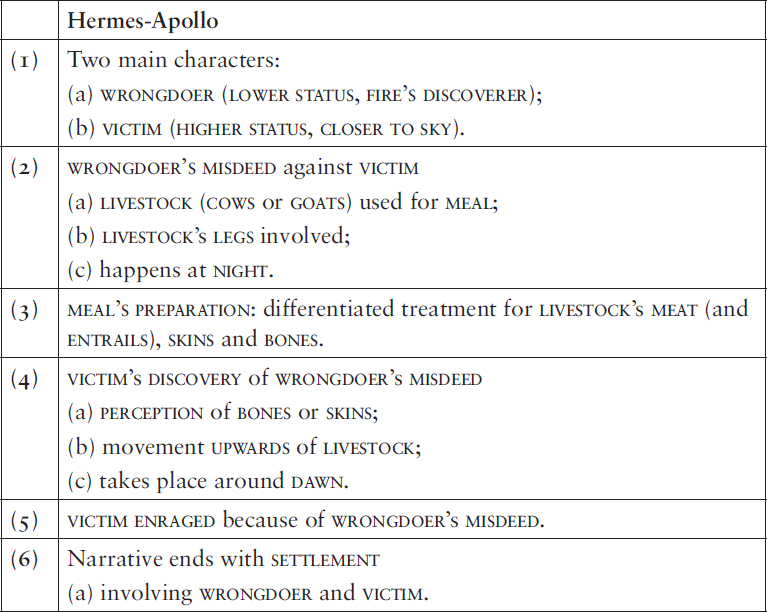
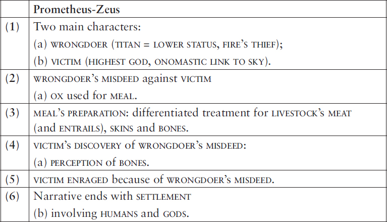
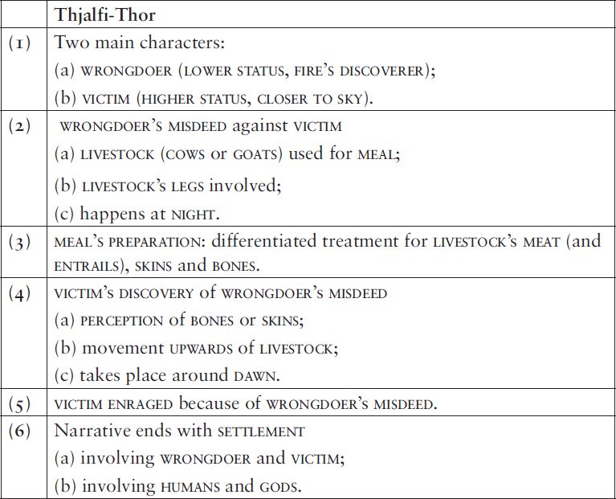
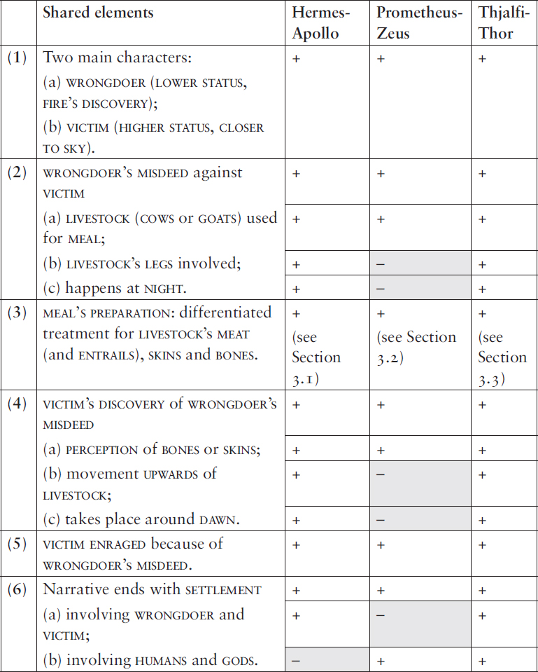
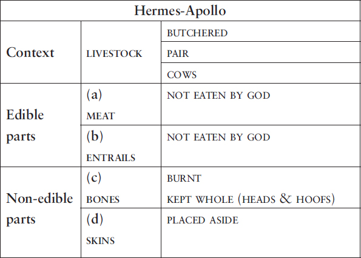
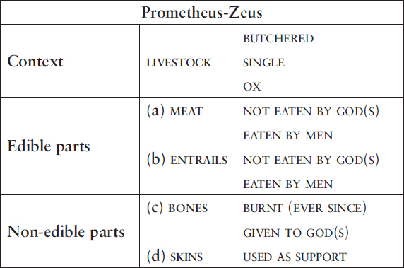
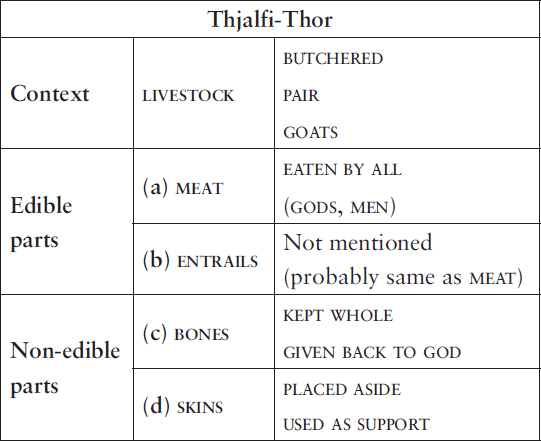
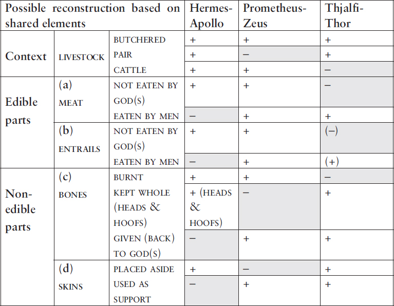
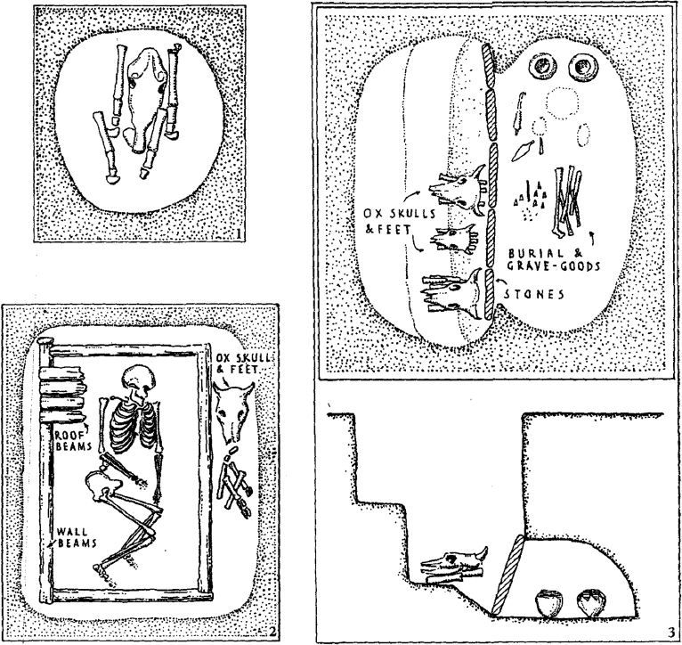

# 3. Hermes and Prometheus in Scandinavia – or Thor and Thjalfi in Greece

# Reconstructing an Indo-European aetiological myth about a prehistoric steppe ritual

<i>Riccardo Ginevra</i>

Università Cattolica del Sacro Cuore, Milano

## Abstract

The aim of this paper is twofold. Firstly, a case will be made for the Old Norse myth of Thjalfi’s laming of Thor’s goat (chiefly attested in <i>Gylfaginning</i> 44) as a Scandinavian counterpart to two Ancient Greek myths, the myth of Hermes’s theft of Apollo’s cows (and slaughter of two of them), most extensively attested in the <i>Homeric</i> <i>Hymn to Hermes</i>, and the myth of Prometheus’s (attempted) deception of Zeus during the slaughter of a cow at Mekone, attested in Hesiod’s <i>Theogony</i>, whose several correspondences allow for the reconstruction of an ancient Indo-European tradition in which the aetiology of a ritual was connected with a mythological incident involving livestock. Secondly, an attempt will be made to reconstruct the corresponding ritual with the aid of insights from prehistoric archaeology.

## 1. Introduction

In recent years, the increased integration between researchers working in the fields of historical linguistics and archaeology – an approach that has been referred to as “archaeolinguistics” – has led to important discoveries that have deeply transformed our understanding of Eurasian prehistory.[^1] By combining a comparative analysis of the poetics of three Indo-European mythological traditions with the findings of prehistoric archaeology, the present study argues that the integration of textual and archaeological evidence in the reconstruction of Indo-European symbolic culture – an approach that we may correspondingly call “archaeopoetics” – may help us achieve a more advanced (even if partial) understanding of the poetic culture and religious beliefs and practices of the speakers of prehistoric varieties of Indo-European.

The first tradition taken into consideration here is the Ancient Greek myth of Hermes’s theft of Apollo’s cows and slaughter of two of them; its main source is the <i>Homeric Hymn to Hermes</i>, but several variants are attested elsewhere in Classical literature (cf. Vergados 2013: 76ff), see, e.g., the account in Apollodorus’s <i>Library</i> 3.10 (which is different in many respects). The plot of the <i>Hymn</i> may be summarized as follows:

The narrative starts with the birth of Hermes in a cave on Earth, where the god lives with his mother, apart from the other deities who live on Olympus close to the sky, such as his brother Apollo. Jealous of Apollo’s wealth and prestige, Hermes decides to steal his cattle at night and hide them in a cave. He does so and, after having discovered how to make fire from firesticks, Hermes kills two of Apollo’s cows and cooks them, following a peculiar procedure, but refrains from eating them. After dawn, Apollo discovers that his cows are missing and searches for them, eventually discovering that Hermes has stolen them and forcing him to give them back. Towards the end of the <i>Hymn</i>, however, Apollo finds out that Hermes has killed two of his cows, gets very mad at him and threatens to make him pay. Hermes, however, softens Apollo’s wrath by giving him the lyre (which he had previously built himself) as a present, and the two become friends for eternity.

The second narrative analysed here is the myth of Prometheus’s deception of Zeus during the slaughter of a cow at Mekone, as told in Hesiod’s <i>Theogony</i> (535–557). The many parallels of this passage with Hermes’s myth have long been noted: for instance, Henri Jeanmaire (1945: 81) already observed a close correspondence between Hermes’s peculiar slaughter of Apollo’s cows in the <i>Hymn</i> and the <i>Theogony</i>’s aetiological scene of Prometheus’s division of portions between gods and humans, while the two texts’ common use of oral-traditional material connected to the “trickery” theme was first discussed at length by Cora Angiers Sowa (1984: 198ff). The basic plot of the episode may be summarized as follows:

Gods and human beings are reaching a settlement regarding the division of the portions of an ox during a shared meal. The Titan Prometheus (who, for some reason, acts as representative of the humans) attempts to deceive Zeus, king of the gods, by tricking him into thinking that the best portion is the one covered by a layer of fat (under which are actually only bones), and hiding the animal’s meat inside its stomach. After Zeus lifts the fat and sees that there are only bones under it, he gets very mad and hides fire from men; but Prometheus manages to steal fire from the gods and give it to the mortals, who ever since have been burning bones on the altars for the gods during ritual meals.

These two Greek narratives have several parallels in mythological narratives attested in other Indo-European (IE) languages, e.g., Latin (cf., e.g., Vergados 2013: 284) and Vedic Sanskrit and Avestan (Jackson 2014). As argued in this contribution, a further counterpart may be identified in the Old Norse myth of Thjalfi’s laming of one of Thor’s goats, a narrative that is chiefly attested in Snorri Sturluson’s <i>Gylfaginning</i> (44); its plot may be summarized as follows:

While travelling on his chariot pulled by two goats, Thor arrives at a farm, where he is hosted for the night. When dinner time comes, Thor kills both his goats, cooks them, and invites the farmer and his family for dinner. Thor encourages his human hosts to eat the meat, but asks them to throw the bones on top of the animals’ skins; the farmer’s son, Thjalfi, however, breaks one of the bones in an effort to get at the marrow. When morning comes, Thor resurrects the goats, realizes that a bone has been broken, and gets extremely angry. The farmer begs Thor to spare him and his family at whatever cost, and Thor accepts, taking Thjalfi and his sister Roskva as servants.

Snorri records this tale as the initial part of his larger account of Thor’s journey to a foreign land called <i>Útgarðr</i>, for which several narrative parallels have long been noted (cf. already von Sydow 1910), both in other IE traditions and in non-IE ones (see the extensive overview and discussion in Tolley 2012). Most of the observed correspondences, however, may not be traced back to a single tradition – probably reflecting widespread motifs of international storytelling (some details even occur within accounts of witch trials in 15th-century northern Italy; Bertolotti 1991) – and the tale of Thjalfi’s meal with Thor does not seem to have received much attention within IE studies, except for an article by Joshua Katz (2016) focusing on the specific detail of Thjalfi’s consumption of the goat’s marrow (which shall not be discussed here).

Given that generic similarities between mythological traditions do not necessarily reflect a common inheritance, we shall here focus on the specific poetic devices by which these traditional texts were constructed, namely their phraseology and thematic structures (for an excellent demonstration of the methodology see, e.g., Watkins 1995: 468 and passim); a well-known example of the latter are the so-called “traditional type-scenes” of oral literature, i.e. fixed narrative structures traditionally employed to describe specific events (such as a departure or a meal), which were first observed in Homeric poetry by Walter Arend (1933) and may possibly be reconstructed for IE poetics as well (Ginevra 2020: 122–125). The aim of the present contribution is thus to argue that a comparative analysis of the poetics of the myths of Hermes, Prometheus, and Thjalfi leads to the identification of a series of parallels with enough “arbitrary linkage” (cf. Watkins 1995: 468) to allow for the reconstruction of an inherited IE tradition underlying them. Within this tradition, a mythological incident involving a misdeed, some livestock, and a meal (Section 2) was employed as the narrative frame for the aetiology of a specific ritual practice, namely sacrificial offerings of bones to the gods after ritual feasts involving the consumption of meat by humans (Section 3); with the aid of insights from the history of religions and archaeology, this practice will be traced back to customs such as the so-called “head-and-hoof sacrifices”, which are archaeologically attested among prehistoric Steppe communities (Section 4).

## 2. Reconstructing Indo-European myth

Let us first focus on the comparative analysis of these three texts composed in IE languages, to verify whether they share enough traits to justify the reconstruction of an inherited IE mythological tradition.

### 2.1. Hermes’s theft of Apollo’s cows and his slaughter of two of them

The following elements of the myth of Hermes and Apollo are most relevant to our analysis:

#### (1) The narrative is built around two main characters: (a) the WRONGDOER Hermes and (b) the VICTIM Apollo.

The WRONGDOER Hermes is a newborn god of LOWER STATUS (ex. [1]), who lives in a cave on earth and – at least within this narrative – is closely associated with FIRE (van Berg 2001) and especially with ITS DISCOVERY (ex. [2]). The VICTIM Apollo is an adult god of HIGHER STATUS who lives among the gods on Olympus, closer to the SKY (ex. [3]).

[1] […] οὐδὲ θεοῖσιν / νῶϊ μετ᾿ ἀθανάτοισιν <b>α</b><i>᾿</i><b>δώρητοι</b> καì <b>ά</b>’<b>λιστοι</b> / αὐτοῦ τῆιδε μένοντες ἀνεξόμεθ᾿ […]

‘We (i.e. Hermes and his mother) won’t put up with staying here (i.e. in a cave) and being <b>without offerings or prayers</b> alone of all the immortals […]’ (<i>HHerm</i>. 167–169)

[2] Ἑρμῆς τοι <b>πρώτιστα</b> <b>πυρήϊα</b> <b>π</b>ῦ<b>ρ</b> <b>τ</b>’ <b>α</b><i>᾿</i><b>νέδωκεν</b>.

‘Hermes it was who <b>first delivered up the firesticks and fire</b>’ (<i>HHerm</i>. 111)

[3] βέλτερον ἢματα πάντα <b>μετ</b>’ <b>α</b><i>᾿</i><b>θανάτοις</b> ὀαρίζειν / <b>πλούσιον</b> <b>α</b><i>᾿</i><b>φνειòν</b> <b>πολυλήϊον</b> ἢ κατὰ δῶμα […] / κἀγὼ τῆς ὁσίης ἐπιβήσομαι, ‘ῆ<b>ς</b> <b>περ</b> <i>᾿</i><b>Aπόλλων</b>.

‘It’s better to spend every day in pleasant chat <b>among the gods, with wealth and riches and substance</b> […]. I (i.e. Hermes) am going to enter on my rights, <b>the same as Apollo</b>.’ (<i>HHerm</i>. 170–173)

#### (2) The WRONGDOER Hermes commits a MISDEED against the VICTIM Apollo. The MISDEED involves (a) COWS used for a MEAL, whose (b) LEGS are altered, and (c) it happens at NIGHT.

Hermes steals (a) Apollo’s COWS (ex. [4]) and butchers two of them in order to prepare a MEAL (ex. [5]), hiding the rest of the herd in a cave; in stealing the cows, Hermes magically (b) reverses their HOOFS in order to obscure the tracks (ex. [4]); the whole misdeed takes place (c) during the NIGHT (examples [6] and [7]).

[4] πεντήκοντ᾿ ἀγέλης ἀπετάμνετο βοῦς ἐριμύκους. / […] / ’<b>ίχνι</b>’ <b>α</b><i>᾿</i><b>ποστρέψας</b>, […] <b>α</b><i>᾿</i><b>ντία</b> <b>ποιήσας</b> <b>ο</b><i>῾</i><b>πλάς</b>, <b>τὰς</b> <b>πρόσθεν</b> ’<b>όπισθεν</b>, <b>/</b> <b>τὰς</b> <b>δ’ ’όπιθεν</b> <b>πρόσθεν</b>, κατὰ δ᾿ ἔμπαλιν αὐτὸς ἔβαινεν.

‘(Hermes) cut fifty lowing cows off from their herd, […] <b>turning their footprints round</b> […]; <b>he turned their hoofs opposite ways, fore to back and hinder to front</b>, while he himself walked backwards.’ (<i>HHerm</i>. 74–78)

[5] τόφρα δ᾿ ὑπωροφίας ἕλικας <b>βο</b>ῦ<b>ς</b> εἷλκε θύραζε / <b>δοιὰς</b> ἄγχι πυρός· […] ἔργωι δ᾿ ἔργον ὄπαζε <b>ταμὼν</b> <b>κρέα</b> <b>πίονα</b> <b>δημ</b>ῶ<b>ι· /</b> ’<b>ώπτα</b> […]

‘he dragged <b>two</b> of the curly-horned <b>cows</b> that were under shelter out towards the fire […]. Following one job with another, <b>he cut up the meat, rich with fat, and roasted it</b>’ (<i>HHerm</i>. 116–121)

[6] <b>ε</b><i>῾</i><b>σπέριος</b> βοῦς κλέψεν ἑκηβόλου Ἀπόλλωνος

‘<b>in the evening</b> he stole the cattle of far-shooting Apollo’ (<i>HHerm</i>. 18)

[7] Κυλλήνης δ᾿ αι’͂ψ᾿ αυ’͂τις ἀφίκετο δ͂ια κάρηνα / ’<b>όρθριος</b>

‘<b>Right before dawn</b>, he swiftly returned to Cyllene’s noble peaks (after the misdeed)’ (<i>HHerm</i>. 142–143)

#### (3) Hermes prepares a MEAL which involves a specific differentiated treatment for the two COWS’ MEAT, ENTRAILS, SKINS and BONES.

This detail is discussed extensively below (Section 3.1).

#### (4) Apollo’s DISCOVERY of Hermes’s MISDEED involves (a) PERCEPTION of the COWS’ SKINS, (b) the COWS’ UPWARD MOVEMENT, and it happens (c) around DAWN.

The VICTIM Apollo DISCOVERS that the WRONGDOER Hermes has butchered two of his cows (a) when he SEES their SKINS (ex. [8]), which had been left on the ground by Hermes; this happens while Hermes is actually returning the rest of the COWS to Apollo, by (b) “driving” them “into the light” out of a cave (ex. [9]), a phraseological collocation that is associated with rescue from death or danger in Ancient Greek and Indo-European (Ginevra 2019); the scene takes place (c) after DAWN (ex. [10]).

[8] Λητοίδης δ᾿ <b>α</b>᾿<b>πάτερθεν</b> <b>ι</b>᾿<b>δὼν</b> <b>ε</b>᾿<b>νόησε</b> <b>βοείας</b> / πέτρηι ἔπ᾿ ἠλιβάτωι, τάχα δ᾿ ἢρετο κύδιμον Ἑρμῆν· / “πῶς ἐδύνω, δολομῆτα, <b>δύω</b> <b>βόε</b> <b>δειροτομ</b>ῆ<b>σαι</b>, / ω‛͂δε νεογνὸς ἐὼν καì νήπιος […]”

‘But Apollo, <b>looking away, saw the hides</b> on the rock face, and straightway asked glorious Hermes: “How were you able <b>to slaughter two cows</b>, trickster, newborn infant that you are?”’ (HHerm. 403–406)

[9] ἔνθ᾿ ‘<b>Ερμ</b>ῆ<b>ς</b> μὲν ἔπειτα κιὼν παρὰ λάϊνον ἄντρον / <b>ε</b>᾿<b>ς</b> <b>φάος</b> <b>ε</b>᾿<b>ξήλαυνε</b> <b>βο</b>ῶ<b>ν</b> ἴφθιμα <b>κάρηνα·</b>

‘There <b>Hermes</b> went the length of the rocky cavern and <b>drove the</b> sturdy <b>cattle out into the light</b>’ (<i>HHerm</i>. 401–402)

[10] ἦλθεν ἐς ἡμετέρου διζήμενος εἰλίποδας βοῦς / <b>σήμερον</b> <b>η</b>᾿<b>ελίοιο</b> <b>νέον</b> <b>ε</b>᾿<b>πιτελλομένοιο</b>

‘(Apollo) came to our place (i.e. Hermes and his mother’s) in search of his shambling cattle <b>today as the sun was just rising</b>.’ (<i>HHerm</i>. 370–371)

#### (5) Apollo is ENRAGED.

Apollo becomes extremely mad once he finds out about Hermes’s MISDEED, going as far as to threaten the latter’s safety (ex. 11).

[11] […] <b>ου</b>᾿<b>δὲ</b> <b>τί</b> <b>σε</b> <b>χρή</b> <b>/</b> <b>μακρὸν</b> <b>α</b>᾿<b>έξεσθαι</b>, Κυλλήνιε Μαιάδος υἱέ.

‘(Apollo to Hermes:) <b>You better not go on growing much longer</b>, Cyllenian son of Maia.’ (<i>HHerm</i>. 407–408)

#### (6) The narrative ends with a SETTLEMENT (a) between the WRONGDOER Hermes and the VICTIM Apollo.

The resolution of the quarrel (ex. [12]) explicitly involves a SETTLEMENT – the Ancient Greek verb διακρινέεσθαι ‘to achieve a settlement’ is used – between (a) the WRONGDOER Hermes and the VICTIM Apollo: the latter shall receive Hermes’s lyre in reparation for the loss of his cattle (closely resembling a patron-client relationship, cf. Jackson 2014: 112).

[12] <b>η</b><i>῾</i><b>συχίως</b> καì ἔπειτα <b>διακρινέεσθαι</b> ὀΐω

‘(Apollo says to Hermes:) I think <b>we shall</b> yet <b>achieve</b> <b>a peaceful settlement</b>’ (<i>HHerm</i>. 438)

The elements of the myth of Hermes and Apollo that are most relevant to us are summarized in Table 1.

Let us now move on to the other Ancient Greek tradition which is relevant to our analysis: the myth of Prometheus and Zeus.

### 2.2. Prometheus’s (attempted) deception of Zeus during the slaughter of a cow

The following elements of the myth of Prometheus and Zeus are relevant to our investigation:

#### (1) The narrative is built around two main characters: (a) the WRONGDOER Prometheus and (b) the VICTIM Zeus.

The WRONGDOER Prometheus is a Titan (i.e. a divine being of LOWER STATUS, at least compared to the ruling class of gods in Greek mythology, the Olympians) who is most famously associated with the THEFT of FIRE and its DELIVERY to humans (ex. [13]).[^2] The VICTIM Zeus (ex. [14]) is the Greek deity of HIGHEST STATUS (he is the king of the gods) and a SKY-god, whose name is a reflex of the Proto-Indo-European term *<i>di̯éu̯</i>- ‘sky(-god)’.

[13] <b>κλέψας</b> ἀκαμάτοιο <b>πυρὸς</b> τηλέσκοπον <b>αυ</b><i>᾿</i><b>γὴν</b> / ἐν κοίλῳ νάρθηκι·

‘(<b>Prometheus</b>,) <b>stealing</b> <b>the</b> far-seen <b>gleam</b> <b>of</b> tireless <b>fire</b> in a hollow fennel stalk.’ (Hes. <i>Th</i>. 566–567)

[14] καì γὰρ ὅτ’ ἐκρίνοντο θεοì θνητοί τ’ ἄνθρωποι / […] <b>Διὸς</b> <b>νόον</b> <b>ε</b><i>᾿</i><b>ξαπαφίσκων</b>

‘For when the gods and mortal men were reaching a settlement […], (<b>Prometheus</b>,) <b>trying to deceive Zeus’ mind</b>’ (Hes. <i>Th</i>. 535–537)

#### (2) The WRONGDOER Prometheus commits a MISDEED against the VICTIM Zeus. The MISDEED involves (a) CATTLE used for a MEAL.

Prometheus commits a MISDEED against Zeus: he attempts to deceive the king of the gods during (a) a MEAL whose main component is a big OX, by tricking him into choosing a bunch of bones hidden in fat as his and the gods’ portion of the animal (ex. [15]).

[15] […] τότ’ ἔπειτα μέγαν <b>βο</b>ῦ<b>ν</b> πρόφρονι θυμῷ / <b>δασσάμενος</b> <b>προύθηκε</b>, <b>Διὸς</b> <b>νόον</b> <b>ε</b><i>᾿</i><b>ξαπαφίσκων</b>. / τῷ μὲν γὰρ σάρκάς τε καì ἔγκατα πίονα δημῷ / ἐν ῥινῷ κατέθηκε, καλύψας γαστρì βοείῃ / <b>τ</b>ῶ<b>̮</b> <b>δ</b>’ <b>αυ</b><i>᾿</i>͂<b>τ</b>’ <b>ο</b><i>᾿</i><b>στέα</b> <b>λευκὰ</b> <b>βοὸς</b> <b>δολί̮η</b> <b>ε</b><i>᾿</i><b>πì</b> <b>τέχν̮η</b> <b>/</b> <b>ευ</b><i>᾿</i><b>θετίσας</b> <b>κατέθηκε</b>, <b>καλύψας</b> <b>α</b><i>᾿</i><b>ργέτι</b> <b>δημ</b>ῶ<b>̮</b>. […] ‘Ζεῦ κύδιστε μέγιστε θεῶν αἰειγενετάων, / τῶν δ’ ἕλευ ὁπποτέρην σε ἐνì φρεσì θυμὸς ἀνώγει.’ / <b>φ</b>ῆ <b>ρ</b>῾<b>α</b> <b>δολοφρονέων</b>· […]

‘(Prometheus) with eager spirit <b>divided up a</b> great <b>ox and, trying to deceive Zeus’ mind, set it before him</b>. For he set down on the skin before him the meat and the innards, rich with fat, hiding them in the ox’s stomach; <b>and then</b> <b>he set down before him in turn the ox’s white bones, arranging them with deceptive craft, hiding them with gleaming fat</b>. […] “Zeus, most renowned, greatest of the eternally living gods, choose from these whichever your spirit in your breast bids you.” <b>So he spoke, plotting deception</b>.’ (Hes. <i>Th</i>. 536–550)

#### (3) Prometheus’s preparation of the MEAL with Zeus involves a very specific differentiated treatment for the CATTLE’S MEAT, ENTRAILS, SKINS and BONES.

This detail of the narrative is discussed extensively below (Section 3.2).

#### (4) Zeus’s DISCOVERY OF Prometheus’s MISDEED involves (a) the PERCEPTION of the CATTLE’S BONES.

The VICTIM Zeus DISCOVERS that the WRONGDOER Prometheus has deceptively divided the CATTLE when he lifts the fat up and (a) SEES the OX’s BONES beneath it (ex. [16]), which shall from now on be his and the gods’ portion.

[16] χερσì δ’ ὅ γ’ ἀμφοτέρῃσιν ἀνείλετο λευκὸν ἄλειφαρ, […] / ὡς ’<b>ίδεν</b> <b>ο</b><i>᾿</i><b>στέα</b> λευκὰ <b>βοὸς</b> <b>δολί̮η</b> ἐπì τέχνῃ.

‘With both hands he grasped the white fat, and […] when <b>he saw the ox’s white bones</b>, the result of the <b>deceptive</b> craft’ (Hes. <i>Th</i>. 553–555).

Hesiod actually tells us that Zeus already knew what was going to happen, but this detail obviously contradicts the logic of the narrative: as noted, e.g., by Martin L. West (1966: 321) it is a clearly secondary modification, probably by Hesiod himself, of the traditional narrative, which most likely originally featured a character Zeus who had no idea of the MISDEED that had been prepared for him.

#### (5) Zeus is enraged.

Zeus gets extremely angry once he recognizes Prometheus’s MISDEED (ex. [17]).

[17] <b>χώσατο</b> δὲ φρένας ἀμφί, <b>χόλος</b> <b>δέ</b> <b>μιν</b> <i>῾</i><b>ίκετο</b> <b>θυμόν</b>

‘and <b>he (Zeus) became enraged</b> in his breast and <b>wrath came upon his spirit</b>’ (Hes. <i>Th</i>. 554)

#### (6) The narrative ends with a SETTLEMENT between (b) HUMANS and GODS.

The whole episode of the division of the ox’s parts at Mekone is described as a SETTLEMENT by Hesiod: as the narrative begins, we are told that GODS and HUMANS ἐκρίνοντο ‘were reaching a settlement’ (ex. [18]) – a form of the same verb κρίνω employed (in prefixed form) in the corresponding element (6) of the Hermes narrative (see above, Section 2.1; cf. Jackson 2014: 115); at the end of the passage, we learn that this settlement has resulted in the custom by which HUMANS offer BONES to the GODS (ex. [19]).

[18] καì γὰρ ὅτ’ <b>ε</b><i>᾿</i><b>κρίνοντο</b> <b>θεοì</b> <b>θνητοί</b> <b>τ’ ’άνθρωποι</b> / Μηκώνῃ […]

‘For when <b>the gods and mortal men were reaching a settlement</b> in Mecone’ (Hes. <i>Th</i>. 535–536)

[19] ε᾿<b>κ</b> <b>το</b>ῦ <b>δ</b>’ <b>α</b><i>᾿</i><b>θανάτοισιν</b> ἐπì χθονì <b>φ</b>ῦ<b>λ</b>’ <b>α</b><i>᾿</i><b>νθρώπων</b> <b>/</b> <b>καίουσ</b>’ <b>ο</b><i>᾿</i><b>στέα</b> λευκὰ θυηέντων ἐπì βωμῶν.

‘<b>And ever since then the tribes of human beings</b> upon the earth <b>burn</b> white <b>bones</b> upon smoking altars <b>for the immortals</b>.’ (Hes. <i>Th</i>. 556–557)

The elements of the myth of Prometheus and Zeus that are most relevant to us are summarized in Table 2.

Let us now move on to our third mythological text, composed in a different Indo-European language: the Old Norse myth of Thjalfi and Thor.

### 2.3. Thjalfi’s laming of Thor’s goat

The following elements of the myth of Thjalfi and Thor are most relevant to this study:

#### (1) The narrative is built around two main characters: (a) the WRONGDOER Thjalfi and (b) the VICTIM Thor.

The WRONGDOER Thialfi (Old Norse <i>Þjalfi</i>, the expected reflex of *<i>þelb-an-</i>) is the son of a PEASANT (ex. [20]); in another Scandinavian traditional narrative, the <i>Gutasaga</i> ‘Saga of the Gotlanders’ (ex. [21]), a clearly connected character with a very similar name (Old Gutnish <i>Þieluar</i>, reflex of *<i>þelb-ara-</i>) is said to be the person who FIRST BROUGHT FIRE to the land of Gotland (on this connection see, e.g., Tolley 2012: 113–114 n. 50). The VICTIM Thor is a god of HIGH STATUS (as the son of Odin, the supreme Norse deity) and the STRONGEST of all sentient beings (ex. [22]); at some point in history, he must have been closely associated with the SKY, given that his name is a reflex of Proto-Germanic *<i>þunara</i>-, the source of English <i>thunder</i> (Old English <i>þunor</i>) and German <i>Donner</i> (Old High German <i>donar</i>).

[20] <i>Ǫkuþórr fór með hafra sína ok reið ok með honum sá Áss er Loki er kallaðr. Koma þeir at kveldi til eins búanda ok fá þar náttstað.</i> […] <b><i>Sonr búa hét Þjálfi</i></b> <i>en Rǫskva dóttir.</i>

‘Oku-Thor set off with his goats and chariot and with him the god called Loki. In the evening they arrived at a peasant’s house and were given a night’s lodging there. […] The <b>farmer’s son was called Thialfi</b>, his daughter Roskva.’ (<i>Gylf</i>. 44)

[21] <i>Gutland hitti fyrsti maþr þann, sum</i> <b><i>Þieluar</i></b> <i>hit. Þa war gutland so eluist et þet dagum sanc ok natum var uppi. En</i> <b><i>þann</i></b> <b><i>maþr</i></b> <b><i>quam fyrsti eldi a land</i></b><i>, ok siþan sank þet aldri.</i>

‘Gotland was first discovered by a man named <b>Þieluar</b>. At that time the island was so bewitched that it sank by day and rose up at night. <b>That man</b>, however, <b>was the first that brought fire to the island</b>, and afterwards it never sank again.’ (<i>Gutasaga</i> 1)

[22] <i>Hann er</i> <b><i>sterkastr allra guðanna ok manna</i></b>

‘He (i.e. Thor) is <b>strongest of all the gods and men</b>’ (<i>Gylf</i>. 21)

#### (2) The WRONGDOER Thjalfi commits a MISDEED against the VICTIM Thor. The MISDEED involves (a) GOATS used for a MEAL, whose (b) LEGS are altered, and it happens (c) at NIGHT.

Thjalfi commits a MISDEED against Thor (ex. [23]): he damages (a) one of Thor’s GOATS during a MEAL in which they are the main course (the god himself had previously butchered and cooked the goats for dinner); more precisely, Thjalfi defies Thor’s explicit instructions by breaking (b) a LEG bone of one of the goats; the whole scene takes place (c) at NIGHT.

[23] […] <i>En</i> <b><i>um kveldit</i></b> <i>tók Þórr hafra sína ok skar báða.</i> <i>Eptir þat váru þeir flegnir ok bornir til ketils. En er soðit var þá settisk Þórr til náttverðar ok þeir lagsmenn.</i> <b><i>Þórr bauð til matar með sér búandanum ok konu hans ok bo˛rnum þeira</i></b><i>. […] Þá lagði Þórr hafrstǫkurnar útar frá eldinum ok mælti at búandi ok heimamenn hans skyldu kasta á hafrstǫkurnar beinunum.</i> <b><i>Þjálfi, son búanda, helt á lærlegg hafrsins ok spretti á knífi sínum ok braut til mergjar</i></b>.

‘[…] <b>During the evening</b> Thor took his goats and slaughtered them both. After this they were skinned and put in the pot. When it was cooked Thor sat down to his evening meal, he and his companion. <b>Thor invited the peasant and his wife and their children to share the meal with him</b>. […] Then Thor placed the goatskins on the other side of the fire and instructed the peasant and his household to throw the bones on to the goatskins. <b>Thialfi, the peasant’s son, took hold of the goat’s leg-bone and split it open with his knife and broke it to get at the marrow</b>.’ (<i>Gylf</i>. 44)

#### (3) Thor prepares a MEAL for Thjalfi’s family which involves a specific differentiated treatment for the two GOATS’ MEAT, SKINS and BONES.

This detail is discussed extensively below (Section 3.3).

#### (4) Thor’s DISCOVERY of Thjalfi’s MISDEED involves (a) PERCEPTION of the GOAT’S broken BONE, (b) the GOAT’S UPWARD MOVEMENT, and it happens (c) around DAWN.

The VICTIM Thor DISCOVERS that the WRONGDOER Thjalfi has violated his instructions (ex. [24]) when (a) he SEES that one goat is limping and realizes that its leg BONE is broken; this happens after Thor has magically resurrected both goats with his hammer, making them (b) “stand up”, right (c) before DAWN.

[24] <i>Þórr dvalðisk þar of nóttina, en</i> <b><i>í óttu fyrir dag</i></b> <i>stóð hann upp ok klæddi sik, tók hamarinn Mjǫllni ok brá upp ok vígði hafrstǫkurnar.</i> <b><i>Stóðu þá upp hafrarnir</i></b> <i>ok var þá annarr haltr eptra fœti.</i> <b><i>Þat fann Þórr</i></b> <i>ok talði at búandinn eða hans hjón</i> <b><i>mundi</i></b> <b><i>eigi skynsamliga hafa farit með beinum hafrsins</i></b>. <b><i>Kennir hann at brotinn var lærleggrinn</i></b>.

‘Thor stayed the night there, and <b>in the small hours before dawn</b> he got up and dressed, took the hammer Miollnir and raised it and blessed the goatskins. <b>Then the goats stood</b> <b>up</b> and one of them was lame in the hind leg. <b>Thor noticed this</b> and declared that the peasant or one of his people <b>must have not treated the goat’s bones with proper care</b>. <b>He realized that the leg-bone was broken</b>.’ (<i>Gylf</i>. 44)

#### (5) Thor is ENRAGED.

Thor gets extremely angry because of Thjalfi’s MISDEED, terrifying the peasant and his family (ex. [25]).

[25] <i>Eigi þarf langt frá því at segja, vita megu þat allir hversu hræddr búandinn mundi vera er hann sá at</i> <b><i>Þórr lét síga br  ýnnar ofan f  yrir augun</i></b>

‘There is no need to make a long tale about it, everyone can imagine how terrified the peasant must have been when he saw <b>Thor making his brows sink down over his eyes</b>’ (<i>Gylf</i>. 44)

#### (6) The narrative ends with a SETTLEMENT (a) involving the WRONGDOER Thjalfi and the VICTIM Thor, i.e (b) a HUMAN and a GOD.

Thankfully, the raging god does not end up killing his poor hosts: the episode ends with a SETTLEMENT (ex. [26]) – the Old Norse expression <i>tók í sætt</i> “accepted in settlement” is explicitly used – involving (a) the WRONGDOER Thjalfi (or, more precisely, his family) and the VICTIM Thor, who are also (b) a HUMAN (at least within this narrative)[^3] and a GOD: the latter shall receive Thjalfi and his (actually innocent) sister Roskva as servants in reparation for the laming of his goat.

[26] <i>En er hann sá hræzlu þeira þá gekk af honum móðrinn ok sefaðisk hann ok</i> <b><i>tók af þeim í sætt bo˛rn þeira Þjálfa ok Ro˛sku ok gerðusk þau þá skyldir þjónustumenn Þórs ok fylgja þau honum jafnan síðan.</i></b>

‘And when he saw their terror then his wrath left him and he calmed down and <b>accepted from them in settlement their children Thialfi and Roskva, and they then became Thor’s bondservants and they have attended him ever since.</b>’ (<i>Gylf</i>. 44)

The elements of the Norse myth of Thjalfi and Thor that are most relevant to this contribution are summarized in Table 3.

After having analysed each of the three IE traditions separately, the next section is dedicated to the identification of a series of parallels between all of them.

### 2.4. Comparison and reconstruction: IE myths of the MISDEED (involving LIVESTOCK and a MEAL) of a FIRE-DISCOVERER against a HEAVENLY VICTIM

The following elements are shared by the three IE traditions discussed above:

(1) All narratives are built around two main characters, a WRONGDOER and a VICTIM: (a) the WRONGDOER (Hermes, Prometheus, Thjalfi) is always a character of LOWER STATUS who (in at least some traditions) is associated with FIRE and its DISCOVERY/DELIVERY; (b) the VICTIM (Apollo, Zeus, Thor) is always a character of HIGHER STATUS who is more closely associated with the SKY.

(2) The WRONGDOER commits a MISDEED against the VICTIM. The MISDEED (a) always involves LIVESTOCK (COWS or GOATS) used for the preparation of a MEAL. The MISDEED may also (b) involve the LIVESTOCK’s LEGS (Hermes’s trick with the HOOFS of the cows; Thjalfi breaks one goat’s LEG bone) and (c) take place at NIGHT (as in the case of Hermes’s and Thjalfi’s MISDEEDS).

(3) The preparation of the MEAL always involves a specific differentiated treatment for the LIVESTOCK’s MEAT (and ENTRAILS, when they are mentioned), SKINS and BONES; this detail will be extensively discussed in the next section.

(4) The VICTIM’s DISCOVERY of the WRONGDOER’s MISDEED (a) always involves the PERCEPTION of BONES or SKINS; (b) it may also involve movement UPWARDS of the LIVESTOCK, a detail which may be linked to the orientational metaphor HEALTH AND LIFE ARE UP, SICKNESS AND DEATH ARE DOWN (cf. Ginevra 2021: 197–198); it (c) may also take place around DAWN (Apollo: after dawn; Thor: right before dawn).

(5) The VICTIM becomes ENRAGED because of the WRONGDOER’s MISDEED.

(6) The narrative ends with a SETTLEMENT (Greek διακρινέεσθαι, ἐκρίνοντο, Old Norse <i>tók</i> <i>í sætt</i>), involving (a) the WRONGDOER (Hermes, Thjalfi) and the VICTIM (Apollo, Thor) and/or (b) HUMANS (Prometheus, Thjalfi) and GODS (Zeus, Thor).

The various parallels between these three IE narratives are summarized in Table 4.

## 3. Reconstructing Indo-European ritual

As anticipated above – element 3 in the previous sections – each of these narratives involves the preparation of a meal in which some sort of livestock (either cows or goats) is butchered and its meat (and entrails, when mentioned), bones and skins are given a specific and differentiated treatment, most likely reflecting actual ritual practice. In what follows, a comparative analysis of the three scenes of meal preparation shall be carried out (Sections 3.1–3), leading to a possible reconstruction of their common background (Section 3.4).

### 3.1. Hermes’s preparation of a meal and division of the two cows’ portions

Within the <i>Homeric Hymn to Hermes</i>, after stealing Apollo’s herd of cows, Hermes singles out two of the animals and prepares a meal following a specific procedure:

- Hermes BUTCHERS a PAIR of COWS (see ex. [27]).

- The animals’ (a) MEAT and (b) ENTRAILS are cooked (see ex. [28]), but NOT EATEN by Hermes – for the specific reason that he is a GOD (see ex. [29]).

- Some portions with WHOLE HOOFS and WHOLE HEADS – i.e. (c) BONES – are BURNT by Hermes (see ex. [30]).

- The animals’ (d) SKINS are PLACED ASIDE by the god (see ex. [31]).

[27] ἔργωι δ᾿ ἔργον ὄπαζε <b>ταμὼν</b> <b>κρέα</b> πίονα δημῶι

‘Following one job with another, <b>he</b> <b>cut up the meat</b>, rich with fat’ (<i>HHerm</i>. 120)

[28] ’<b>ώπτα</b> δ᾿ ἀμφ᾿ ὀβελο͂ισι πεπαρμένα δουρατέοισιν, / <b>σάρκας</b> ὁμοῦ καì <b>ν</b>ῶ<b>τα</b> γεράσμια καì μέλαν <b>αι</b><i>῾</i>͂<b>μα</b> <b>/</b> <b>ε</b><i>᾿</i><b>ργμένον</b> <b>ε</b><i>᾿</i><b>ν</b> <b>χολάδεσσι·</b> […]

‘He <b>roasted</b>, fixed on wooden spits, the <b>flesh</b> <b>pieces</b> together with the honorific <b>chines</b> and the dark <b>blood in sausages of tripe</b> […]’ (<i>HHerm</i>. 121–123)

[29] ἔνθ᾿ <b>ο</b><i>῾</i><b>σίης</b> <b>κρεάων</b> <b>η</b><i>᾿</i><b>ράσσατο</b> κύδιμος ‘<b>Ερμ</b>ῆ<b>ς·</b> / ὀδμὴ γάρ μιν ἔτειρε <b>καì</b> <b>α</b><i>᾿</i><b>θάνατόν</b> <b>περ</b> <b>ε</b><i>᾿</i><b>όντα</b> / ἡδε͂ι᾿· <b>α</b><i>᾿</i><b>λλ</b>’ <b>ου</b><i>᾿</i><b>δ</b>’ <b>ω</b><i>῾</i>͂<b>ς</b> <b>οı</b><i>῾</i> <b>ε</b><i>᾿</i><b>πείθετο</b> <b>θυμὸς</b> <b>α</b><i>᾿</i><b>γήνωρ</b> <b>/</b> <b>καί</b> <b>τε</b> <b>μάλ</b>’ <b>ı</b><i>῾</i><b>μείροντι</b> <b>περãν</b> <b>ı</b><i>῾</i><b>ερ</b>ῆ<b>ς</b> <b>κατὰ</b> <b>δειρ</b>ῆ<b>ς</b>

‘Whereupon glorious <b>Hermes craved his own due of meat</b>, for the sweet smell tormented him, <b>immortal though he was</b>. <b>Nevertheless his stout heart did not give way to his longing to let it pass down his holy throat</b>’ (<i>HHerm</i>. 130–133)

[30] […] ἐπì δὲ ξύλα κάγκαν᾿ ἀγείρας / <b>ου</b><i>᾿</i><b>λόποδ</b>’ <b>ου</b><i>᾿</i><b>λοκάρηνα</b> <b>πυρὸς</b> <b>κατεδάμνατ</b>’ <b>α</b><i>᾿</i><b>ϋτμ</b>ῆ<b>ι</b>.

‘Gathering dry logs, <b>he</b> <b>consumed (the bones) with whole hoofs and with whole heads in the heat of the fire.</b>’ (<i>HHerm</i>. 136–137)

[31] <b>ρ</b><i>῾</i><b>ινοὺς</b> δ᾿ <b>ε</b><i>᾿</i><b>ξετάνυσσε</b> καταστυφέλωι ἐνì πέτρηι

‘The <b>hides he spread out</b> on a rugged rock’ (<i>HHerm</i>. 124)

Since Hermes does not end up eating the meal or even offering it to anyone else, this complex procedure makes no logical sense within the narrative of the <i>Hymn</i>: it is best understood as the reflex of an actual ritual practice that must have been well known to the audience of the poem (see Section 4). As we shall see, the structural elements of this meal preparation, summarized in Table 5, find a number of parallels in the other two texts taken into consideration here.

### 3.2. Prometheus’s preparation of a meal and division of an ox’s parts

Within the Hesiodic narrative, Zeus is tricked by Prometheus, who prepares a meal according to the following procedure:

- Prometheus DIVIDES up a SINGLE OX (see ex. [32]).

- The ox’s (a) MEAT and (b) ENTRAILS are hidden in a stomach and GIVEN TO HUMANS (see ex. [33]).

- The animal’s (c) BONES are GIVEN TO the GOD Zeus, hidden in fat (see ex. [34]); ever since humans have been BURNING them FOR the GODS during sacrifices (see ex. [35]).

- The ox’s SKIN is USED AS SUPPORT for portions (see ex. [33]).

[32] […] τότ’ ἔπειτα μέγαν <b>βο</b>ῦ<b>ν</b> πρόφρονι θυμῷ / <b>δασσάμενος</b> προύθηκε, Διὸς νόον ἐξαπαφίσκων

‘(Prometheus) with eager spirit <b>divided up a</b> great <b>ox</b> and, trying to deceive Zeus’ mind, set it before him.’ (Hes. <i>Theog</i>. 536–537)

[33] <i>τ</i>ῷ μὲν γὰρ <b>σάρκάς</b> τε καì <b>ε</b><i>᾿</i><b>́γκατα</b> πίονα δημῷ / <b>ε</b><i>᾿</i><b>ν</b> <b>ρ</b><i>῾</i><b>ιν</b>ῶ<b>̮</b> κατέθηκε, <b>καλύψας</b> <b>γαστρì</b> <b>βοεί̮η</b>

‘For he set down <b>on the skin</b> before him the <b>meat</b> and the <b>innards</b>, rich with fat, <b>hiding them in the ox’s stomach</b>’ (Hes. <i>Theog</i>. 538–539)

[34] <b>τ</b>ῶ<b>̮</b> <b>δ</b>’ <b>αυ</b><i>᾿</i>͂<b>τ</b>’ <b>ο</b><i>᾿</i><b>στέα</b> <b>λευκὰ</b> <b>βοὸς</b> δολίῃ ἐπì τέχνῃ / εὐθετίσας <b>κατέθηκε</b>, καλύψας ἀργέτι δημῷ. […]

‘<b>and then he (Prometheus) set down</b> <b>before him (Zeus) in</b> <b>turn the ox’s white bones</b>, arranging them with deceptive craft, hiding them with gleaming fat’ (Hes. <i>Theog</i>. 540–541)

[35] ἐκ τοῦ δ’ <b>α</b><i>᾿</i><b>θανάτοισιν</b> <b>ε</b><i>᾿</i><b>πì</b> <b>χθονì</b> <b>φ</b>ῦ<b>λ</b>’ <b>α</b><i>᾿</i><b>νθρώπων</b> <b>/</b> <b>καίουσ</b>’ <b>ο</b><i>᾿</i><b>στέα</b> <b>λευκὰ</b> θυηέντων ἐπì βωμῶν

‘And ever since then <b>the tribes of human beings upon the earth burn white bones</b> upon smoking altars <b>for the immortals</b>.’ (Hes. <i>Theog</i>. 556–557)

Within this text (in contrast to the previous one), this complex procedure for the division of portions is explicitly linked both to a mischievous trick and to the origin of a well-known ritual practice (see Section 4). The structural elements of Prometheus’s meal, summarized in Table 6, have correspondences both in the strange meal described in the <i>Homeric Hymn to Hermes</i>, discussed in the previous section, and in the peculiar meal shared by Thor and Thjalfi, as we shall see in the following section.

### 3.3. Thor’s preparation of a meal and division of his goats’ parts

The Norse sequence of Thor’s dinner with Thjalfi’s family attests the following procedure:

- Thor prepares a meal by BUTCHERING a PAIR of GOATS (see ex. [36]).

- The goats’ (a) MEAT is COOKED and EATEN by everyone, GOD(S) and HUMANS (see ex. [37]); there is no mention of (b) ENTRAILS, but one may suppose that they had been COOKED and EATEN together with the MEAT.

- The animals’ (c) BONES must be GIVEN BACK TO the GOD Thor (see ex. [38]); they must be WHOLE, not BROKEN (see ex. [39]).

- The goats’ (d) SKINS are PLACED ASIDE and USED AS SUPPORT for the BONES (see ex.[38]).

[36] <i>tók Þórr hafra sína ok</i> <b><i>skar báða</i></b><i>. Eptir þat váru þeir flegnir ok bornir til ketils.</i>

‘Thor took his goats and <b>slaughtered them both</b>. After this they were skinned and put in the pot.’ (<i>Gylf</i>. 44)

[37] <b><i>En er soðit var þá settisk Þórr til náttverðar</i></b> <i>ok þeir lagsmenn.</i> <b><i>Þórr bauð til matar með sér búandanum ok konu hans ok bo˛rnum þeira.</i></b>

‘<b>When it was cooked Thor sat down to his evening meal</b>, he and his companion. <b>Thor invited the peasant and his wife and their children to share the meal with him</b>.’ (<i>Gylf</i>. 44)

[38] <i>Þá</i> <b><i>lagði</i></b> <i>Þórr</i> <b><i>hafrsto˛kurnar útar frá eldinum</i></b> <i>ok</i> <b><i>mælti at</i></b> <i>búandi ok heimamenn hans</i> <b><i>skyldu kasta á hafrsto˛kurnar beinunum.</i></b>

‘Then Thor <b>placed the goatskins on the other side of the fire</b> and <b>instructed</b> the peasant and his household <b>to throw the bones</b> <b>on to the goatskins</b>.’ (<i>Gylf</i>. 44)

[39] <i>Þat […] talði at búandinn eða hans hjón mundi</i> <b><i>eigi skynsamliga hafa farit með beinum hafrsins.</i></b> <i>Kennir hann</i> <i>at</i> <b><i>brotinn var lærleggrinn</i></b>.

‘Thor […] declared that the peasant or one of his people <b>must have not treated the goat’s bones with proper care</b>. He realized that <b>the leg-bone was broken</b>.’ (<i>Gylf</i>. 44)

Thor’s instructions for the preservation of bones have been linked to attested ritual practices as well (see Section 4); as we shall see in the next section, a number of parallels may be observed between the structural elements of this Scandinavian mythological meal, summarized in Table 7, and the corresponding scenes discussed in the previous sections.

### 3.4. Comparison and reconstruction: a fixed procedure for the division of portions of a butchered animal

The series of correspondences between Hermes’s, Prometheus’s, and Thjalfi’s myths (hereinafter: H, P, and T, respectively) allows us to identify a fixed, most likely ritual (see next section) procedure for the division of portions at a common meal, a procedure that seems to underlie all of these scenes. The elements that are attested in more than one tradition and may thus reflect shared heritage are the following:

- Some LIVESTOCK is BUTCHERED (H+P+T), possibly a PAIR (H+T) of CATTLE (H+P).

- The LIVESTOCK’s (a) MEAT and (b) ENTRAILS are NOT EATEN BY GODS (H+P), they are EATEN BY HUMANS (P+T).

- The LIVESTOCK’s (c) BONES are BURNT (H+P) and GIVEN TO GODS (P+T); they are kept WHOLE (H+T), perhaps including their HEADS AND HOOFS (only H – but see next section).

- The LIVESTOCK’s (d) SKINS are PLACED ASIDE (H+T) and USED AS SUPPORT (P+T).

The features shared by Hermes’s, Prometheus’s, and Thjalfi’s meals allow for the reconstruction of a traditional structure embedded within the mythical narrative reconstructed above (in Section 2.4). This structure clearly resembles the description of a sacrificial ritual, involving the butchering of a pair of cattle, whose meat and entrails are eaten by humans, while the bones are kept whole (especially heads and hoofs), burnt and/or dedicated to the gods. As we shall see in the next section, this hypothesis finds support not only in the history of the corresponding religious traditions, but also in archaeological reconstructions based on prehistoric findings.

## 4. Ritual feasts and bone offerings: parallels from history of religions and archaeology

From the perspective of the history of religions, all three mythological traditions taken in consideration here have been linked, at some point in the history of their reception (either in antiquity or modern times), to sacrificial rituals involving animal victims and shared meals.

### 4.1. The connections with ritual practice of the Greek and Norse traditions

On the one hand, the Greek narratives have long been considered to reflect some sort of cultic practice. As is well known, Hesiod in his <i>Theogony</i> (see ex. [40]) already explicitly presents Prometheus’s deception of Zeus as the aetiology (i.e. the origin myth) of the so-called <i>thysia</i> ritual, within which the gods’ portion exclusively consisted of bones wrapped in fat and burnt on the altar. Correspondingly, in the <i>Homeric Hymn</i> (see ex. [41]), Hermes is said to be acting κατὰ χρέος, which literally means ‘according to necessity’, but may also be understood as ‘according to set [i.e. ritual] procedure’, as argued by Thomas (2017: 187). If Hermes’s actions in the <i>Hymn</i> do indeed reflect Ancient Greek ritual practice, they may be interpreted as resembling either the same <i>thysia</i> ritual as the Prometheus myth (as per Ekroth 2008: 96)[^4] or a combination of <i>thysia</i> and of the so-called <i>theoxenia</i> ritual (as per Ekroth 2017: 32),[^5] in which some of the meat was displayed and symbolically “offered” to the gods, before being eaten by humans anyways. Both Prometheus’s and Hermes’s myths seem thus to have been employed as narrative frames for the aetiology of <i>thysia</i> sacrifice (or of a variant of it), a Greek ritual which already Walter Burkert (1983: 1ff) traced back to customs typical of archaic hunter societies, in which the consumption of the animal’s meat was followed by the “restitution” of its bones to the gods who had provided them in the first place.

[40] <b>ε</b><i>᾿</i><b>κ</b> <b>το</b>ῦ <b>δ</b>’ <b>α</b><i>᾿</i><b>θανάτοισιν</b> ἐπì χθονì <b>φ</b>ῦ<b>λ</b>’ <b>α</b><i>᾿</i><b>νθρώπων</b> <b>/</b> <b>καίουσ</b>’ <b>ο</b><i>᾿</i><b>στέα</b> λευκὰ θυηέντων ἐπì βωμῶν.

‘<b>And ever since then</b> <b>the</b> <b>tribes</b> <b>of</b> <b>human beings</b> upon the earth <b>burn</b> white <b>bones</b> upon smoking altars <b>for the immortals</b>.’ (Hes. <i>Theog</i>. 556–557)

[41] αὐτὰρ ἐπεì δὴ <b>πάντα</b> <b>κατὰ</b> <b>χρέος</b> ‘<b>ήνυσε</b> δαίμων

‘When the god <b>had</b> <b>accomplished all according to necessity/set procedure</b>’ (<i>HHerm</i>. 138)

On the other hand, the Old Norse narrative of Thor and Thjalfi was already interpreted as reminiscent of ritual practice by Jan de Vries (1956: 1. 419),[^6] who claimed that Thor’s careful handling of the goats’ bones seems to preserve memory (“scheint eine Erinnerung daran zu bewahren”) of a typical sacrificial ritual (“ein typisches Opferritual”), in which the butchering of the sacrificial animal was regulated by fixed rules (“Das Aufschneiden des Opfertieres war von festen Regeln bestimmt”). Indeed, on the basis of texts composed in both Old West Norse (see ex. [42]) and Old East Norse (see ex. [43]) varieties, meals like Thor and Thjalfi’s seem to have been the most important part of the Old Norse <i>blót</i> ‘sacrifice’ (Hultgård 1993: 238): within this ritual, the animals’ meat was cooked in cauldrons and eaten by humans, while blood was sprinkled on the altar, as in Greece. Even though bones are not mentioned in any of the literary accounts, their ritual deposition is clearly attested by archaeological findings (Hultgård 1997: 32ff; Magnell & Iregren 2010; Sundqvist 2016: 340; Magnell 2019; cf. Kaliff & Oestigaard 2020: passim), and a whole bone layer in the archaeological site of Uppåkra has been interpreted “as the result of repeated feasting with accompanying partial offerings of mainly cattle” (Thilderkvist 2013: 140). In the same way as claimed by Burkert with respect to the Greek myth, the restitution of bones to the god Thor after the consumption of meat has been traced back to hunting rituals (attested, e.g., among the neighbouring Sámi people) by Clive Tolley (2012: 86ff).

[42] <i>Þar var ok</i> <b><i>drepinn</i></b> <i>alls konar</i> <b><i>smali</i></b> <i>ok svá hross, […] skyldi</i> <b><i>rjóða stallana</i></b> <i>öllu saman […], en</i> <b><i>slátr</i></b> <i>skyldi</i> <b><i>sjóða til mannfagnaðar</i></b><i>. Eldar skyldu vera í miðju gólfi í hofinu</i> <i>ok þar</i> <b><i>katlar</i></b> <i>yfir.</i>

‘All kinds of <b>domestic animals were slaughtered</b> there, including horses; […] the <b>altars</b> were to be <b>reddened</b> all over [<b>with blood</b>], […] while the <b>meat</b> was to be <b>cooked for a feast</b>. There would be fires down the middle of the floor in the temple with <b>cauldrons</b> over them.’ (<i>Saga Hákonar góða</i> 14)

[43] <i>En smeri þing hafþu mindri</i> <b><i>blotan miþ</i></b> <b><i>fileþi, mati ok mungati</i></b><i>, sum haita</i> <b><i>suþnautar</i></b><i>, þy et þair</i> <b><i>suþu</i></b> <i>allir</i> <b><i>saman</i></b>.

‘But smaller assemblies held a lesser <b>sacrifice with cattle, food, and drink</b>. Those involved were called ‘<b>boiling-companions’</b> because they all <b>cooked their sacrificial meals together</b>.’ (<i>Gutasaga</i> 1)

### 4.2. Ritual feasts with bone offerings in the prehistoric Pontic Steppe and parallels in modern Caucasian and Central Asian folklore

Given that both the Greek and the Norse mythological traditions analysed here have been connected with ritual feasts involving meat consumption and bone offerings, this shared association may reflect an ancient feature of IE heritage: the inherited mythological structures and elements reconstructed above (in Sections 2.4 and 3.4) may have already been associated with rituals involving the shared consumption of livestock meat and the offering of bones to the gods in prehistoric times. This reconstruction is indeed supported by the findings of prehistoric archaeology: even though it is very difficult to distinguish between ritual and non-ritual bone deposits in archaeological sites, an unambiguous type of prehistoric bone offerings has long been noted by archaeologists, namely the so-called “head-and-hoof deposits” (Piggott 1962; see Figure 1), which are first attested among prehistoric Steppe cultures and which have usually been connected by specialists with ritual feasts. This practice is very clearly described by Steppe archaeologist David Anthony with respect to the Khvalynsk archaeological culture (which is attested between 4700 and 3800 BCE in the Pontic Steppe):

The head-and-hoof form of sacrifice appeared for the first time: at least 17 sheep/goat and 9 cattle were slaughtered and only the skull and lower leg bones were buried, probably still attached to the animal’s hide. In later Steppe funerals the custom of hanging a hide containing the head and hoofs over the grave or burying it in the grave was very common. The head and hide symbolized a gift to the gods, and the flesh was doled out to guests at the funeral feast. (Anthony 2007: 184)

The prehistoric attestation of head-and-hoof sacrifices thus provides us with evidence that the ritual context proposed above for the reconstructed IE myth, namely feasts involving consumption of meat and offering of bones to the gods, is indeed archaeologically attested among prehistoric Steppe communities (which were likely IE-speaking). Furthermore, it may also provide us with an explanation of why, in the <i>Homeric Hymn</i>, Hermes carefully burns the cows’ bones οὐλόποδ᾿ οὐλοκάρηνα “with whole hoofs and whole heads” (see ex. [30] above), a detail that may possibly attest that the head-and-hoof form of sacrifice was still alive in Ancient Greek ritual practice during the 1st millennium BCE.

It may be further noted that the reconstruction proposed here finds support in anthropological research on traditional cultures of the Pontic area. As mentioned above, both the Greek ritual of the burning of the cattle’s bones on the altar and the Norse detail of the restitution of the bones to the god Thor have been traced back to hunting rituals which required that after the consumption of animal meat the bones had to be given back to the gods who had provided the food: it is conceivable that such beliefs were already widespread among prehistoric Pontic Steppe communities, because they are still recorded (although much later, in modern times, as is usual for folklore) among indigenous cultures of the nearby Caucasus area (as well as of other parts of Eurasia and North America), as extensively discussed by Kevin Tuite (1997: 23–24):

[the game animals shepherded by the mountain deities] are believed to be a renewable resource, and as long as the hunters who kill them for their meat treat the remains with proper respect, and do not exceed a reasonable quota, they will be assured of a continual renewal of the stocks […]. The belief is widespread throughout Eurasia and native North America that game animals are reborn from their bones, which the hunter must take care to preserve intact and return to their proper place. This can be done by throwing them into the water, a practice observed among the Svans (Mak’alatia 1985), and the Tsimshians of British Columbia (Boas 1916/1970: 773–774), or by burying or burning them, as in many indigenous cultures of northern Eurasia and Siberia. (Paulson 1959; 1965)

In his study, Tuite compares the structures of the Greek myth of Pelops and of the “Hazel-witch tales” from the Alpine area with Caucasian and Central Asian traditional narratives in which supernatural beings kill and eat an ibex, gather its bones in its skin, and later resuscitate it by striking it with a stick or pronouncing an invocation; the resuscitated animal, however, is usually missing one bone that has either been lost or stolen by a hunter. The similarity of these tales to the Norse myth of Thor and Thjalfi has also been noted by Tolley (2012: 95ff), who, however, excludes the possibility that the Norse myth has an “origin on the Steppe from very ancient, Proto-Indo-European times”, which in his opinion “seems unlikely unless we accept a high level of motif integrity over huge timespans”, and rather favours an interpretation of this similarity as the result of contact during the Middle Ages between Norse travellers and Caucasian communities.

This is, of course, possible; the Norse myth, however, also attests several features that are not recorded in the folktales, some of which, as shown in Sections 2 and 3, are instead shared by the Greek myths of Hermes and Prometheus and the Norse myth of Thjalfi: for instance, Thor “is not the most obvious candidate in the Norse pantheon to take on a role assumed [in the folktales] by fairy-type spirits or women” (Tolley 2012: 106), but he closely matches the Greek myths’ victims Apollo and Zeus (they are all high status gods associated with the sky). As argued in this contribution, the many parallels between the Greek and Norse narratives actually do allow for the reconstruction of an inherited Indo-European mythological structure, which was probably associated with the consumption of meat and with sacrificial offerings of bones in the context of feasts, practices that are archaeologically attested among the – likely IE-speaking – prehistoric cultures of the Pontic Steppe, very close to both Caucasus and Central Asia. The Greek and Norse myths may thus broadly be regarded as reflexes of – specifically IE – variants of the same widespread story-type attested by the Caucasian and Central Asian folktales; after all, if a late (medieval) cultural borrowing such as the one posited by Tolley did indeed take place, it is conceivable that it would have been facilitated by the previous existence of an already similar Old Norse narrative, reflecting ancient IE religious practice and poetic heritage.

## 5. Conclusion: an IE aetiological myth for a prehistoric Steppe custom (ritual feasts involving meat consumption and offerings of bones to the gods)

In this contribution I have argued for a number of correspondences between the Greek myths of Hermes’s theft of Apollo’s cows (<i>Homeric Hymn to Hermes</i>) and of Prometheus’s deception of Zeus (Hesiod’s <i>Theogony</i>) and the Norse myth of Thjalfi’s laming of Thor’s goat (Snorri’s <i>Gylfaginning</i> 44), correspondences that allow for the reconstruction of an inherited Indo-European myth in which the aetiology of a specific ritual – a ritual that is actually attested among prehistoric Steppe communities – was connected with a mythological incident involving livestock and misdeed. The results of this study may be summarized as follows.

- A common narrative structure underlies the Greek and Norse myths, namely:

(1) A WRONGDOER of LOWER STATUS associated with FIRE’s DISCOVERY commits a MISDEED against a VICTIM of HIGHER STATUS more closely associated with the SKY. (2) The MISDEED involves (the LEGS of) LIVESTOCK (COWS or GOATS) and the preparation of a (NIGHTLY) MEAL, in which (3) MEAT (and ENTRAILS), SKINS, and BONES receive a differentiated treatment. (4) The VICTIM DISCOVERS the WRONGDOER’s MISDEED by PERCEIVING either BONES or SKINS (around DAWN) and (5) becomes ENRAGED. (6) In the end, WRONGDOER and VICTIM and/or HUMANS and GODS reach a SETTLEMENT.

- All narratives include scenes describing a differentiated treatment of MEAT, ENTRAILS (only in Greek), SKINS, AND BONES, scenes that seem to reflect a common pattern (of likely ritual character) as well, namely:

LIVESTOCK (possibly a PAIR of CATTLE) is BUTCHERED. (a) MEAT and (b) ENTRAILS (the latter only in the Greek myths) are consumed by HUMAN BEINGS. (c) BONES (whose integrity is stressed; also mention of HEADS and HOOFS in Hermes’s myth) are burnt and/or given (back) to the GODS. (d) SKINS are just placed aside and/or used as support.

- The three mythological traditions taken into consideration are either explicitly aetiological of ritual feasts involving meat consumption and bone offerings (as in the case of Prometheus’s myth) or have been (in my opinion, correctly) interpreted as such (as in the case of Hermes’s and Thjalfi’s narratives): it is thus conceivable that this association was already a feature of the inherited Indo-European narrative, an aetiological myth connected to an actual ritual practice that must have been common among the earliest speakers of Indo-European.

- Such a reconstruction does find (at least some) support in the data made available by prehistoric archaeology: the reconstructed ritual procedure matches the so-called “head-and-hoof deposits”, offerings of livestock bones – more precisely of their heads and hoofs (closely paralleling the <i>Hymn</i>’s detail of Hermes burning the cattle’s bones with “whole heads and whole hoofs”). This practice is indeed archaeologically well attested among prehistoric Steppe cultures (the most likely speakers of the earliest Indo-European varieties) and have been interpreted by archaeologists as evidence for ritual feasts involving meat consumption and offerings of bones to the gods, a practice that may in turn be rooted in the ancient belief of hunting societies that animal bones must be given back to the gods in order to ensure the renewal of wildlife (still attested in Caucasian and Central Asian folklore in modern times).

<b>How to cite this book chapter:</b>

Ginevra, R. (2024). Hermes and Prometheus in Scandinavia – or Thor and Thjalfi in Greece: Reconstructing an Indo-European aetiological myth about a prehistoric steppe ritual. In: Larsson, J., Olander, T., & Jørgensen, A. R. (eds.), <i>Indo-European Interfaces: Integrating Linguistics, Mythology and Archaeology</i>, pp. 23–56. Stockholm: Stockholm University Press. DOI: [https://doi.org/10.16993/bcn.c](https://doi.org/10.16993/bcn.c). License: CC BY-NC.

## Footnotes

[^1]: This publication is part of the project “SunSHINE – The Sun-chariot’s Journey Towards the Nordic Sky: on the (Pre-)History of Ideas on Sky, Sun, and Sunlight in Northern Europe”, which has received funding from the European Union’s Horizon 2020 research and innovation programme under the Marie Skłodowska-Curie grant agreement no. 890522. It is my great pleasure to thank the members of the Roots of Europe research group at the University of Copenhagen, where my project was based, for their support, and especially my project’s academic supervisor, Birgit Olsen. The analysis laid out in Sections 2 and 3 is a revision and reworking of research that I originally discussed in my 2014 Master’s thesis “Sacrificio e trasgressione. Riflessi greci e italici di narrazioni indoeuropee” (“Sacrifice and misdeed. Greek and Italic reflexes of Indo-European narratives”), written at the Università Cattolica del Sacro Cuore di Milano under the supervision of José Luis García Ramón, for whose guidance I would like to express my deepest gratitude. I am also grateful to Jenny Larsson and the other members of the LAMP project for welcoming me among them and allowing me to engage in fruitful discussions on the integration of Indo-European linguistics, comparative mythology, and prehistoric archaeology. The translations are adapted from Faulkes 1987 (<i>Gylfaginning</i>), Finlay and Faulkes 2011 (<i>Saga Hákonar góða</i>), Most 2018 (<i>Theogony</i>), Peel 1999 (<i>Gutasaga</i>), and West 2003 (<i>Homeric Hymn to Hermes</i>). Standard abbreviations are employed for Snorri’s <i>Gylfaginning</i> (<i>Gylf</i>.), Hesiod’s <i>Theogony</i> (Hes. <i>Th.</i>), and the <i>Homeric Hymn to Hermes</i> (<i>HHerm.</i>).

[^2]: Cf. Jackson 2014: 115 “I leave to others the exposition of […] the significance of Prometheus’ <i>theft</i> of fire versus Hermes’ <i>invention</i> of the art of fire in the light of the sacrificial etiologies considered above”.

[^3]: Even though the myth’s ending – Thjalfi becoming Thor’s servant for eternity – obviously requires Thjalfi to become immortal, his original status as mortal human may be inferred from the fact that the whole narrative clearly reflects the two motifs of “wandering gods bestowing divine gifts on mankind” and “humans offending a divinity that visits them” (Tolley 2012: 104–105).

[^4]: More precisely: “[…] the <i>Homeric hymn to Hermes</i> […] describes some kind of proto-thysia sacrifice. Here, the infant god slaughters two cows, threads the meat onto spits and grills it. The fumes from the grilled meat are very tempting and Hermes longs to eat, even though he is a god, but he can finally contain himself from tasting and thereby proves his divinity […]” (Ekroth 2008: 96).

[^5]: More precisely: “[…] To perform a <i>theoxenia</i> ceremony, and to invite the deity and offer him a table with food […] have been interpreted as means for intensifying a <i>thysia</i> […]. The display and burning of the bones from the meat at some instances of <i>theoxenia</i> can be seen as an additional way of modification. In the end, almost the entire skeleton would join the thighbones and the <i>osphys</i> on the altar. [Fn. 68:] A similar ritual may actually be referred to in the <i>Homeric Hymn to Hermes</i> (136–137) when the god burns the hoofs and heads of the slaughtered cattle, after having cooked and divided the meat […]” (Ekroth 2017: 32).

[^6]: The full remark goes as follows: “Das Aufschneiden des Opfertieres war von festen Regeln bestimmt. […] Die bekannte Geschichte, wie Thor seine Böcke tötet und verspeist (SnE 49), scheint eine Erinnerung daran zu bewahren […]. Das gilt namentlich von dem Zug, daß die Knochen nicht aufgeschlitzt werden dürfen, um das Mark herauszuholen. Am nächsten Morgen legt der Gott die Knochen der Böcke auf die Häute und macht die Tiere mit seinem Hammer wieder lebendig. Das ist ein typisches Opferritual” (de Vries 1956: 1. 419).
