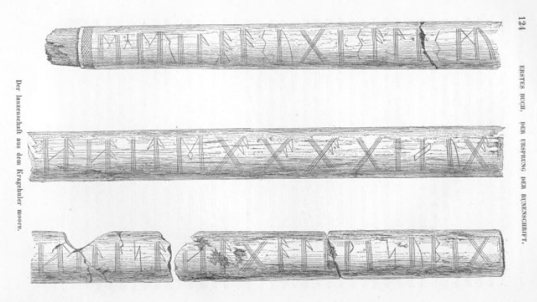

# 5. Travelling myths or Indo-European tradition?

# The Irano-Scandinavian correspondences

<i>Anders Hultgård</i>

Uppsala University

## Abstract

The presence of striking similarities between Scandinavian and Iranian myths has long attracted the curiosity of scholars. The attempts of explaining them follow mainly two lines of reasoning. The first one holds that traditions from Iran spread to northern Europe through different ways in the first millennium CE. The other way round was not proposed – unless we mention Olof Rudbeck and his <i>Atlantica</i> of the 17th century. The second one emphasizes the idea of common Indo-European roots. In this chapter the arguments of both explanation models are discussed and evaluated. Some of the correspondences that have been previously known and discussed by scholars, such as the great winter and the mythic wisdom contest, will be reconsidered. Attention will also be paid to some similarities so far not elaborated, e.g. the anthropogonic myth and the eschatological battle. In the discussion I will point out the problems of the comparative approach but also its advantages. The conclusion to be drawn is that the similarities between Scandinavian and Iranian mythology essentially go back to a shared heritage of myths belonging to the Indo-European period.

## 1. Introduction

Scholars working with Scandinavian mythology have long noticed some striking similarities with Iranian myths. The question of how these similarities can be explained has been answered in different ways. Two main models of explanation have been proposed, diffusion from one centre and a common Indo-European tradition. A third one, less often referred to, however, must be mentioned: that of an independent polytopic origin. We begin with some remarks on the research history.

## 2. Research history

The first to be mentioned is the Swedish author and poet Viktor Rydberg and his <i>Undersökningar i germanisk mythologi</i> (1886–1889). The work is divided in two parts of which only the first one was translated into English with the title <i>Teutonic mythology: Gods and goddesses of the Northland</i> (1889). In the second part, Rydberg comes across as a skilful comparativist and brings a variety of Iranian and Vedic traditions into his comparisons. He is surprisingly fluent in Iranian mythology and very familiar with the texts that had been made available in scholarly translations towards the end of the 19th century. In his interpretations of Norse mythology, Rydberg nevertheless allows his imagination to shine through too much for his arguments to be convincing. When treating the Ragnarök myth, however, Rydberg is not at all speculative. He summarizes the Scandinavian myth and sets it up against the Iranian eschatology in order to show the similarities. He also points out that Indic mythology is less relevant in this context. Rydberg words his conclusion thus:

That this world is doomed to perish and that the destruction does not mean annihilation but a purification from evil through fire and a rebirth of life to blessedness, is an idea common to the Germanic peoples and their Iranian relatives (<i>Undersökningar II</i>, 165; my translation from the Swedish original).

The Danish ethnologist Axel Olrik frequently referred to Iranian traditions in his studies of the Ragnarök myth: <i>Om Ragnarok</i> from 1902 and <i>Om Ragnarok: Anden afdeling</i> from 1914. They superseded previous studies due to the author’s familiarity with the Old Norse source material and with folkloristic traditions in general and, last but not least, due to his comparative approach. The work attracted a great deal of attention, especially after it was translated into German by Wilhelm Ranisch in 1922, five years after Olrik’s death. To Olrik, the Ragnarök myth appeared as a mosaic wherein the differently coloured stones represented different mythical motifs. It was the poet of <i>Vǫluspá</i> who first created the coherent eschatological myth which we know as Ragnarök. These motifs had different origins; on the one hand common, popular conceptions, especially eastern ones, which he labelled “pagan” and on the other hand motifs linked to specific religious traditions: Christianity, Celtic mythology, and Persian religion. According to Olrik, the Great Winter and the motif of the human couple who survived the cosmic destruction originated in Iran and spread all the way to Scandinavia.

The idea of travelling myths was also embraced by the German philologist Richard Reitzenstein in the 1920s. Iranian myths were adopted by the Manichaeans who carried them farther north into central Europe and the Baltic area. Manichean myths are behind the Scandinavian narratives about how the gods created the world from the different parts of the giant Ymir’s body (<i>Vafþrúðnismál</i> 21, <i>Grímnismál</i> 40–41 and <i>Gylfaginning</i> ch. 8). The second part of the <i>Vǫluspá</i> (stanzas 40–66) recalls in terms of its structure the Christian universal eschatology, but even more so the Iranian tradition on the end of the world.

Another German historian of religions, Will-Erich Peuckert, took up the theme of the Manichaeans as mediators of Iranian traditions to the North (Peuckert 1935). The French linguist Émile Benveniste published an Iranian apocalyptic text with translation in 1932 (Benveniste 1932). Peuckert was struck by the similarity between an expression in the Iranian text: ‘The time of the wolf shall end and the time of the lamb shall begin’ and the wording in <i>Vǫluspá</i> about ‘storm age, wolf age, before the world collapses’ (stanza 45). He found further correspondences and concluded that at least three important motifs in the <i>Vǫluspá</i>’s depiction of the Ragnarök myth ultimately stem from Iranian-Manichean eschatology. These are the evil ‘wolf age’ with its moral disintegration, the final battle and, surprisingly, the mighty figure who will arrive from above and rule over everything mentioned in the Hauksbók version of <i>Vǫluspá</i> (stanza 65) and in <i>Hyndluljóð</i> 43–44.

With Stig Wikander and Georges Dumézil the emphasis of the comparative material shifted from Iran to India. Although they noticed some Iranian correspondences (the <i>Bundahišn</i> and the <i>Shāhnāmeh</i>), both scholars highlighted Indic traditions, in particular those found in the great epos <i>Mahābhārata</i>, which they thought provided the best parallels for Scandinavian mythology, especially the Ragnarök story (Wikander 1960; Dumézil 1959 and 1965). The following years saw a tendency to return to Iranian traditions for comparisons with Scandinavian mythology; in this case it concerned mostly motifs embedded in the Ragnarök myth. Present-day research on Scandinavian mythology is less preoccupied with ideas of diffusion or common origins. Instead discussion revolves around the impact of medieval Christianity.

## 3. Mythical correspondences

The mythical correspondences indicated by previous scholars include:

- The Great winter (Old Norse <i>fimbulvetr</i>) and the surviving couple

- The first humans – sprung from trees

- The cosmic tree

I have treated these correspondences elsewhere (Hultgård 2003; 2007; 2017) but some remarks here may here be appropriate. As for the Great winter, Olrik categorized it among the nature motifs and these he considered to be folk beliefs. In this capacity they could spread across great distances. The motif originated in the steppes of northeastern Iran with its cold winters and spread to Scandinavia through the intermediary of the Goths in southern Russia. In my opinion, the explanation of a common origin is far more probable since the great winter is a rare motif and intimately bound up with the survival of a human couple; in Scandinavia Líf and Lífþrasir hide in a small wood, while in Iran the man and the woman survive in a subterranean enclosure, the <i>vara</i> of Yima. Both myths emphasize the role of the surviving human couple in bringing forth new generations. The precise correspondences make an independent polytopic origin less probable.

The cosmic tree is a motif which is most elaborated in Iranian and Scandinavian mythology. To me this points to a common Indo-European origin. Martin West, who takes up the idea of the cosmic tree in his book on <i>Indo-European poetry and myth</i> (2007: 345–347), suggests that the Greek motif of a world tree could be borrowed from the Near East. The Indic and Germanic ideas of a world pillar would derive from shamanistic cosmologies of Finno-Ugric and Siberian peoples. The reference to the Iranian world tree which he does not mention would perhaps have changed his mind.

## 4. Further correspondences

There are several other correspondences that have not been recognized so far, as it seems. Most of them are treated in my book on Ragnarök (see Hultgård 2022) and will only be presented briefly. One further correspondence will be discussed in more detail, however.

The similarities between the wisdom contest in <i>Vafþrúðnismál</i> and the Iranian story of the rivalry between the truthful Yōišta and demonic Axtya were set out in a previous publication (Hultgård 2009). It was emphasized that the Iranian story was alluded to in one of the Avestan sacrificial hymns which was composed no later than the 5th century BCE.

Further support for the early date of the Iranian wisdom contest comes from the Indian <i>brahmódya</i> genre. It is met with already in the <i>Rigveda</i> and takes the form of a contest in eloquence and poetry making.[^1] For the Vedic tribes competence in eloquence was just as important as skilfulness in combat. The <i>brahmódya</i> was usually performed between two or more groups represented by their leader or poet; sometimes also within the group when the position of its leader was questioned.[^2] Indra was invoked as the deity who could lend victory in such a contest. In later Vedic tradition the <i>brahmódya</i> included a contest in sacred knowledge and became a fixed part of the sacrificial ritual. The two officiating priests, the <i>adhvaryú</i> and the <i>hótṛ</i> (or the <i>brahmán</i>), seen as adversaries, exchanged questions and answers usually in the form of riddles.[^3] The <i>Taittirīya</i>-<i>Brā́hmaṇa</i> gives an example of a <i>brahmódya</i> acted out at the horse sacrifice, the <i>aśvamedha</i>.[^4] The <i>brahmán</i> priest identified with Bṛhaspáti, the sacrificial divinity, is seated on the right whereas the <i>adhvaryú</i> priest representing Agni is on the lefthand side. The <i>adhvaryú</i> priest poses the questions and the <i>brahmán</i> priest answers. For example: ‘which was the First Thought?’ and the answer goes: ‘the First Thought was truly the Sky, the rain’. Another example is the following: ‘Who, then, was the great bird?’ to which the <i>brahmán</i> answers: ‘the great bird was truly the Horse’. Although some of the questions and answers to them are no longer clear to us, they must be understood from the mythical world-view of Vedic India.[^5] The purpose of the rite was according to the <i>Taittirīya</i>-<i>Brā́hmaṇa</i> to impart good sacrificial mood (<i>bráhman</i>), glory and splendour on the person who sacrifices. Some features that appear in the Scandinavian and Iranian counterparts are less evident in the Vedic <i>brahmódya</i>. This is the case with the fate of the loser and with the more or less evil character of the adversary. On the other hand, the Vedic material shows a clear ritual setting of the wisdom contest which might suggest that the Scandinavian and Iranian traditions originally had a cultic context.

In one passage (stanza 6) the <i>Vǫluspá</i> says that the sun, the moon and the stars did not know their course and had to be set in motion by the gods. Iranian mythology includes a similar tradition. The heavenly bodies could not move until the <i>fravaši</i>, the protective divinities, showed them their course. According to both Iranian and Scandinavian tradition, sun, moon and stars were and will be exposed to the hostility of evil forces.

The closest analogy of the Scandinavian heavenly warriors, the Einheriar, is found in the semi-divine host of warriors that appears in various forms in the Iranian tradition. The connection between heavenly warriors and outstanding fighting men is clearly expressed in the sources. The hope of being welcomed in a heavenly body of chosen warriors must have inspired both Scandinavians and Iranians to fight with more bravery.

Cosmic eschatology includes both destruction and renewal. Compared with other religions Scandinavian and Iranian eschatology share a remarkable interest in the reshaping of the earth and nature.

Most strikingly is the dominance of the number ‘nine’ in the Scandinavian and Iranian traditions, in particular cosmology and ritual. The world tree, Yggdrasill, has nine branches and the prophetess of <i>Vǫluspá</i> sees nine worlds (stanza 2). Odin is hanging nine nights in the world tree (<i>Hávamál</i> 138 and 140). Thor takes nine steps before falling to the ground deadly injured by the poison of the Serpent (<i>Vǫluspá</i> 56). The Stentoften rune stone tells us that a chieftain gave good crops by sacrificing nine he-goats and nine stallions.

In Iran ‘nine’ and its derivative ‘ninety-nine’ are the preponderant numbers. The cosmic tree contains in its trunk nine mountains and nine thousand ninety-nine millions of rivulets (<i>Bundahišn</i> 24,8–9). As pointed out by different sources the creation of the world was a process of nine thousand years (e.g <i>Menōg</i> <i>ī</i> <i>Xrad</i> 8,9–10; <i>Bundahišn</i> 1,26–28). The primordial man, Yima, made the world larger during a period of nine hundred years and the <i>vara</i>- (‘protective building’) he constructed contains nine passage-ways (<i>Vidēvdā́d</i> 2,16 and 30). In the great purification ritual (Avestan <i>barəšnūm</i>) ‘nine’ figures frequently (<i>Vidēvdā́d</i> 9). Further examples can be adduced from both Scandinavian and Iranian traditions but the ones I have adduced suffice to show the importance of number ‘nine’.

## 5. Early runic inscriptions and Iranian theophany formulas

A group of early runic inscriptions refer to a person called <i>erilaR</i> or <i>irilaR</i>. He introduces himself with an emphatic <i>ek</i>, ‘I, the eril’. Usually an attribute or a name follows, sometimes a verbal form is added indicating his activity. Actually twelve such inscriptions are known mainly from southwestern Scandinavia. Five of them form a particular category within the <i>ek erilaR/irilaR</i> group since they are characterized by the presence of the words <i>haitē</i> or <i>haiteka</i> ‘I am called’ together with one or two epithets. Some other runic inscriptions also begin with an emphatic <i>ek</i> followed by a verbal form in the first person and an attribute but without mentioning <i>erilaR</i> / <i>irilaR</i>. As with the <i>ek</i> <i>erilaR</i> inscriptions they may be included in the category of runic self-presentations.

As an example I take the Kragehul spear shaft (Figure 1). It was discovered in 1877 in a moor on the island of Funen, Denmark. The site had been used as a cult place for more than three centuries and a wide variety of objects were discovered.[^6] The shaft had been stuck into the moor but was broken into five pieces. The runes are carefully carved with many ligatures. The inscription is dated to the 5th century CE. There is consensus among runologists to transliterate it as follows:

<b>ekerilarasugisalasmuhahaitegagagaginugahe</b>

<b>…lija…hagalawijubig…</b>

In transcription and translation:

<i>ek erilaR</i> <i>a(n)sugisalas muha haitē</i> <i>gagaga ginugahe</i>

<i>…lija…hagala wīju big…</i>

‘I, the eril of Ansugisalar, I am called <i>muha</i>, <i>ga ga ga ginnugahe</i>…<i>lija</i>…hail, I consecrate <i>big</i>…’

These runic inscriptions have usually been interpreted as the rune master’s self-presentation for magical purposes. However, I suggest a different interpretation guided mainly by the Iranian correspondences. The Avestan yašts dedicated to Ahura Mazdā and Vayu include repeated name revelations in which the deity presents himself to the worshippers. A passage from the yašt to Ahura Mazdā may serve as example (Yt.1,13):

<i>spašta nąma ahmi</i> ‘I am called the watcher’

<i>vīta</i> <i>nąma ahmi</i> ‘I am called the persecutor’

<i>dā́ta nąma ahmi</i> ‘I am called the creator/giver’

<i>pā́ta</i> <i>nąma ahmi</i> ‘I am called the protector’

<i>θrāta</i> <i>nąma ahmi</i> ‘I am called the guardian’

<i>žnāta nąma ahmi</i> ‘I am called the knowing one’

Besides this type of formulas, the Ahura Mazda yašt shows another variant of name revelation. The deity discloses to Zarathuštra his twenty names in a numbered list. It starts thus (Yt.1,7):

‘First I am called (<i>nąma ahmi</i>) abundant giver, truthful Zarathuštra, secondly, guardian of herds, thirdly…’ etc.

The Vayu yašt presents a long list of the god’s names (Yt.15,43–47) which is introduced by the words <i>vaiiuš bā́</i> <i>nąma ahmi</i> ‘Vayu I am called indeed’. Then follow name revelations of the same type as in the yašt to Ahura Mazdā. A passage runs:

<i>saocahi nąma ahmi</i> ‘I am called the scorching one’

<i>bucahi nąma ahmi</i> ‘I am called the yelling one’

<i>buxtiš nąma ahmi</i> ‘I am called saviour’

<i>saiδiš nąma ahmi</i> ‘I am called the one who is seen (?)’

The Vedic material brings further evidence for the importance of name revelations. Already in the Yajurveda we encounter the tradition of Rudra’s hundred names, the <i>śatarudrīya</i> but here it is man who turns to the god and recites his names. Such ritual name catalogues are continued in the Mahābhārata and is in Hindu tradition denoted as <i>nāmastotra</i>. The type of name revelations presented by the deity itself is uncommon in the Vedas. However, self-presentations occur sometimes, as in the following passage from the Rigveda (X, 48):

<i>ahám bhuvaṃ</i> <i>vásunaḥ pūrviyás pátir…</i>

‘I became the first lord over wealth’,

<i>máṃ havante pitáraṃ ná jantavo …</i>

‘humans invoke me like a father …’

<i>ahám indro ródho vákṣo átharvaṇas.</i>

‘I am Indra, the fire priest’s protection and defence’.

As shown the Indo-Iranian tradition is characterized by the importance attached to the names of the deity. The Ahura Mazdā yašt repeatedly proclaims the power inherent in his personal name and in his many other names, in particular when they are recited in the sacrificial cult. The Vayu yašt has several times the god announce: ‘with these names you shall invoke me …’. Epithets and formulas reveal the importance of the name as in yašt one (Ahura Mazdā speaking): ‘I am called the one whose power is in the name (<i>nąmō.xšaϑrō</i>).’

The epithet <i>aoxtō</i>. <i>nāmana yasna</i> ‘sacrifice with name invocation’ attributed to some deities in the Avesta indicates that the ritual also should include name recitation. Similar epithets and statements are found in ancient Indic tradition. Indra is said to be <i>śatakratu</i>; he has a hundred qualities (<i>dhā́māni</i>) and his names are invoked with praise (Rigveda III,37,3–4).

## 6. Types of theophanies

Theophany texts are well known from the religions of the Greco-Roman world and the ancient Near East. From a phenomenological view point we may distinguish three types, the Indo-Iranian tradition included:

(1) Self-presentations. The deity presents its name with a short explanation.

(2) Name revelations. These usually develop into name-lists of varying length. Emphasis is put on the deity’s names and their significance.

(3) Self-proclamations. Here the character and accomplishments of the deity are in focus. The repeated proclamations form what is called an aretalogy (from the Greek <i>aretḗ</i> ‘virtue, act of power’).

An example of the first category comes from Mesoptamia. The goddess Ishtar says to king Assarhaddon:

‘I am Ishtar of Arbela. I will walk in front of you and behind you. Have no fear’ (cf. Ringgren 1979: 123).

The cult of Isis in the Hellenistic-Roman world is accompanied by inscriptions where the goddess herself speaks using the ἐγώ εἰμι, ‘I am’, formula. Here we find self-proclamations that have developed into aretalogies. The one from Kyme in western Asia illustrates the character as these lines show (Greek text from Bergman 1968):

|  |  |
| --- | --- |
| 3a: Ει’͂σις ἐγώ εἰμι ἡ τύραννος πάσης χώρας | ‘I am Isis, ruler of every country’ |
| 7: ἐγώ εἰμι ἡ καρπὸν ἀνθρώποις εὑροῦσα | ‘I am she who found fruits and crops for humankind’ |
| 10: ἐγώ εἰμι ἡ παρὰ γυναιξὶ θεὸς καλουμένη | ‘I am she who is called goddess among women’ |
| 12: ἐγὼ ἐχώρισα γῆν ἀπ᾿οὐρανοῦ | ‘I separated the earth from the sky’ |
| 55: ἐγὼ τὸ ἱμαρμένον νικῶ | ‘I overcome fate’ |
| 56: ἐμοῦ τὸ εἱμαρμένον ἀκούει | ‘Fate obeys me’ |

## 7. Conclusion

The theophany texts from the Hellenistic-Roman world texts present many similarities with the <i>ek erilaR</i> inscriptions and a diffusion of such theophany formulas to Scandinavia may well be argued. However, the Iranian and Scandinavian texts stand out by their emphasis on the names of the deity and their use of the <i>nąma ahmi</i> and the <i>haitē/haiteka</i> formulas. In my opinion, the runic formulas are fragments borrowed from ritual texts, similar to the Iranian ones, and recited by the eril as the deity’s representative.

As with the other cases of Irano-Scandinavian correspondences that I have presented they suggest a common Indo-European background. The explanation in terms of diffusion or travelling myths seems to me less probable.

<b>How to cite this book chapter:</b>

Hultgård, A. (2024). Travelling myths or Indo-European tradition? The Irano-Scandinavian correspondences. In: Larsson, J., Olander, T., & Jørgensen, A. R. (eds.), <i>Indo-European Interfaces: Integrating Linguistics, Mythology and Archaeology</i>, pp. 91–102. Stockholm: Stockholm University Press. DOI: [https://doi.org/10.16993 /bcn.e](https://doi.org/10.16993/bcn.e). License: CC BY-NC.

## Footnotes

[^1]: <i>Rigveda</i> I,152,7; VI,24,6; VIII,100,3; X,166.

[^2]: Oberlies 2012: 24–25.

[^3]: As stated by the <i>Taittirīya Samhitā</i> III,1,7 the <i>adhvaryú</i> and the <i>hótṛ</i> ‘contend as to the deities’ and a number of other things, see further Keith 1914: 128.

[^4]: III,9,5.

[^5]: Cf. Varenne 1967: 192.

[^6]: For the archaeology, see Ilkjær 2001.
