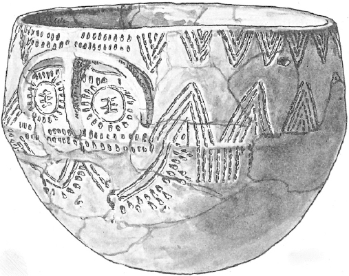
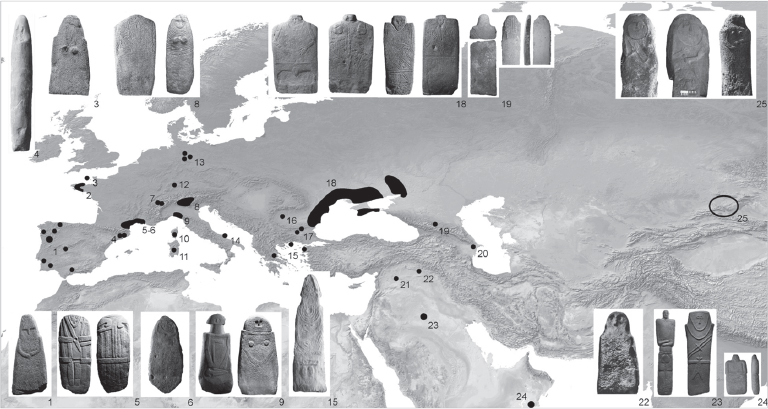
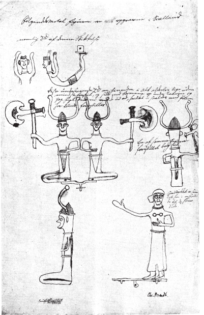
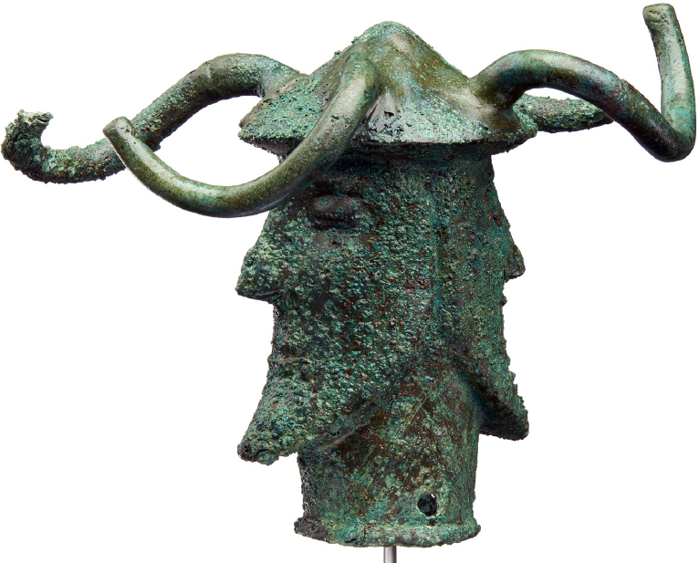

# 6. Issues with the steppe hypothesis: An archaeological perspective

# Iconography, mythology and language in Neolithic and Early Bronze Age southern Scandinavia

<i>Rune Iversen</i>

University of Copenhagen

## Abstract

In southern Scandinavia, Neolithic iconography was focused on non- figurative (<i>aniconic</i>) geometric motifs resembling those found as engravings on large stones across western Europe in areas where megalithic tombs were built. Such engravings are generally referred to as megalithic art. However, a certain group of elaborate anthropomorphic standing stones, <i>statue menhirs</i>, dating to the late 4th and early 3rd millennium BC, is known from western Europe and has clear parallels further east in the North Pontic area, in the Caucasus and as far away as the Altai Mountains. Are the personifications represented in these Chalcolithic statue menhirs expressing new social conducts, manifestations of elite groups and Indo-European mythologies? If so, why was this new mode of expression not adopted in southern Scandinavia with the introduction of Yamnaya/Corded Ware influences and early Indo-European around 2800 BC? It was not until the 2nd millennium BC (the Early Bronze Age in southern Scandinavia) that this region saw human representations and indications of Indo-European mythology. Taking the iconological changes of the Early Nordic Bronze Age as a point of departure, this paper argues against a single wave of steppe migration as the sole explanation for the <i>Indo-Europeanization</i> of southern Scandinavia. Instead, at least two major rounds of steppe innovation and influences are identified.

## 1. Introduction

Iconography plays an important and immediate role in our understanding of the past. The decoding of prehistoric art and images holds a great potential and can tell us a lot about the societies that created them including insights into ritual and social practices, religious beliefs and world views. In this paper, I will approach the profound iconographic changes that appeared in southern Scandinavia with the beginning of the Bronze Age during the early 2nd millennium BC and relate these to changes in social organization and a supposed second round of Indo-European influences, which is not immediately explained by the prevalent version of the steppe hypothesis.

In order to understand a second round of Indo-European influences, we need to look at the preceding Neolithic period, not least the developments that took place during the early 3rd millennium BC. In the early 3rd millennium BC we see significant changes in the material culture associated with the archaeologically defined Single Grave culture (c. 2850–2250 BC), which is part of the overall Corded Ware complex. In a Danish chronological context, the Single Grave culture belongs to the later Middle Neolithic (c. 2850–2350 BC) whereupon the Late Neolithic begins (c. 2350–1700 BC), which again is followed by the Bronze Age starting out in the early 2nd millennium BC (c. 1700–500 BC). Both the emergence of Single Grave communities and the beginning of the Bronze Age about a thousand years later are associated with significant material culture changes, which to a varying degree seem to coincide with social, demographic, language and mythological shifts. In the following, I will associate the marked changes in material culture with a supposed first and second round of “Indo-Europeanization”. However, it is not until the second round of Indo-European influences, during the Early Bronze Age, that significant iconographic and resulting evidence of mythological changes can be observed.

Before I start this long journey, I find it necessary to define what is meant by <i>Indo-Europeanization</i>. This is relevant not least because Indo-European is a linguistic term and I do not begin from a linguistic starting point but from an archaeological one. Indo-European refers to a widely spoken language family that includes most of the languages spoken in present-day Europe (and settled oversea areas such as The Americas and Australia) and southwest and south Asia. This group of related languages have a common ancestor referred to as Proto-Indo-European. Where and when this language was spoken has caused a heated debate – the so-called <i>Indo-European</i> <i>homeland debate</i>. These discussions, and their research historical backgrounds, have been summarized several times (some very informative examples are Anthony 2007, in particular Ch. 1 and Ch. 5; Olander 2019) so there is no need to recapitulate them here. The issue is not finally settled but it is suitable to stress that most evidence (and scholars) point at the steppe hypothesis, which places the origins of Proto-Indo-European on the steppes of southern Russia and Ukraine somewhere between 4500–2500 BC (but see Heggarty et al. 2023 for a hybrid model).

From a purely linguistic perspective, Indo-Europeanization refers to the introduction of Indo-European languages in Europe (Joseph 2018: 15). However, the term has also been used to describe a range of cultural changes that appeared throughout Europe during the 5th, 4th and 3rd millennia BC affecting economy, social organization, material culture, demography, genetic ancestry, ideology, mythology etc. (Gimbutas 1993). Now, this opens for a possible confusion of archaeological cultures (defined on the basis of material culture), language communities and biologically defined genetic groupings. It is important to stress that there is no direct <i>a priori</i> relationship between archaeological culture, language community and genetic profile. Sometimes these can coincide to a certain degree but we cannot take any such relationships for granted.

Hence, Indo-Europeanization implies a process by which something (e.g. material culture, organizations, societal structures, practices etc.) or someone is influenced by Indo-European speakers, which surely enables a very broad range of things and processes through time and space. In this particular context, I will use the term to describe influences coming from the Pontic-Caspian steppe region, or influences mediated via this region, of supposed proto and early Indo-European speakers. Such influences include the language itself, certain elements of material culture and aspects of ritual behaviour and belief systems/mythology. As mentioned in the beginning of this introduction, I will focus on the obvious iconographical changes that occurred during the Early Bronze Age in southern Scandinavia (mid-2nd millennium BC). These changes constitute a significant break with the previous non-figurative Neolithic imagery and indicates the introduction of mythological elements known from early Indo-European recordings as handed down in e.g. contemporary Vedic texts written in Old Indic/Indo-Aryan (Mallory 1989: 35–48; Erdosy 1995: 6–8; Anthony 2007: 49 n. 14).

## 2. Prelude: Neolithization and <i>aniconism</i> in northwestern Europe

Agriculture and Neolithic life developed in the Fertile Crescent, covering the Levant, southern Anatolia and Mesopotamia, during the 10th millennium BC. From its early appearance in the Near East, Neolithic life spread through western Anatolia and southeastern Europe from the 8th to the 6th millennium BC. In addition to domesticated crops and animals, pottery making, use of polished stone and flint tools and conglomerated settlements, clay figurines seem to be an integrated part of the so-called “Neolithic package” from early on. However, as farming reached central Europe in the 6th millennium BC, the number of figurines was strongly reduced even though they remained in use in southeastern Europe (Becker 2011; Bánffy 2017).

Thus, at the beginning of the northern and western European Neolithic, in the 6th, 5th, and 4th millennium BC, we see a significant lack of figurative representations (<i>aniconism</i>), which in some areas, such as northwestern Europe, lasted until the beginning of the Bronze Age at the onset of the 2nd millennium BC (Iversen, Becker & Bristow 2024).

It is significant that the number of figurines almost ceases completely as agriculture reaches western and northern Europe characterized by scattered and dispersed settlement patterns. The transition from conglomerated tells/settlement mounds to open dispersed settlements seems to have happened in the Carpathian Basin (Bánffy 2013; Jakucs et al. 2018; Bánffy 2019) meaning that central Europe and the earliest agricultural communities of this region, the Linear Pottery culture (LBK), played an import role in this transition. The LBK stretched from Ukraine, Moldova and Rumania to the Paris Basin between c. 5550–4900 BC. Figurines are part of the LBK and are primarily found in settlement contexts probably due to Balkan influences. The LBK figurines have been thoroughly recorded showing that the number decreases significantly in the westernmost parts of the LBK and they generally seem to be lacking among the succeeding Neolithic groups inhabiting the former northern and western LBK areas (Becker 2011; Becker & Dębiec 2014; Hofmann 2014; Bánffy 2017). Comparing the situation of southeastern Europe and Anatolia with that of northern and western Europe, we are certainly facing two very uneven processes of Neolithization resulting in markedly different approaches to settlement organization, development of social complexity and material culture, including use of figurines.

Despite the apparent absence of figurines in the northern and western European Neolithic, this region did not lack decoration. In fact, Neolithic pottery is among the finest and most elaborately decorated found within western European prehistory. From the onset of the South Scandinavian Middle Neolithic (around 3300 BC) we see highly complex geometric compositions executed with great accuracy and artistic skills. Not until c. 3000 BC do figurative features in the form of stylized “rayed sun-eyes” accompanied with eyebrows occur as seen on a certain group of Middle Neolithic face pots from Zealand, Denmark (Figure 1). Similar facial motifs are found on e.g. the eyed-vases (<i>occulados</i>) of the Chalcolithic Los Millares culture, Spain, and on the contemporary Iberian eyed-idols (<i>ídolos oculados</i>) and biomorph engraved stone plaques. Eyes, though not “sun-eyes”, and eyebrows are also known from Britain appearing on two of the three chalk cylinders, known as the <i>Folkton drums</i>, recovered from a burial mound in Folkton, North Yorkshire, dated to the early 3rd millennium BC (Ebbesen 1979; Thomas 2005; Scarre 2007; Lillios 2008; Recchia-Quiniou 2017).

Megalithic art is another significant form of decoration. This phenomenon is concentrated in e.g. eastern Ireland, in particularly the Boyne Valley area where the passage graves Knowth and Newgrange stand out. The megalithic art of Ireland and Britain (primarily Orkney) resemble to some extent the non-representative and geometric decoration found on contemporary pottery and includes spirals, arcs, chevrons, triangles, lozenges, circles, meander lines etc. Several scholars have emphasized the obvious lack of clear figurative representations in the megalithic art found on the British Isles (Twohig 1981; 1998; Thomas 2005; Scarre 2007; 2017). Other areas with certain concentrations of megalithic art are Brittany, central western France and, northern and western Iberia. In Iberia, Brittany and Orkney both carved and painted decoration has been documented within the megalithic tombs. The decorated stones were in more cases standing stones, which were reused as building material for the megalithic tombs, perhaps as the result of ideological changes or even part of <i>iconoclastic</i> ideas (Cassen 2000; Bradley 2009: 79–83, 216–217). The Iberian megalithic art was also mainly non-representational but recognizable figurative features such as animals (including whales), stylized anthropomorphic figures, and sun-symbols have been defined. Some of these figurative elements are also found in Brittany’s megalithic art which shows whales, quadrupeds and hafted axes (Twohig 1981; Briard & Duval 1993; Bradley 1997; 2002; L’Helgouach, Le Roux & Lecornec 1997; Whittle 2000; Alves 2012; Cassen et al. 2015; Fairén-Jiménez 2015; Jones, Cochrane & Diaz-Guardamino 2017). Thus, some recognizable figurative features may occur here and there in the otherwise highly stylized and geometrical megalithic art and in the form of partly human-shaped, but undecorated, standing stones dating back to the 5th millennium BC.

## 3. Iconography and social stratification across Chalcolithic Europe: the <i>anthropomorphic stelae</i>

When discussing megalithic art and its figurative elements, the so-called <i>anthropomorphic</i> <i>stelae</i> or <i>statue menhirs</i> (Breton meaning ‘long stone’) become relevant. The anthropomorphic stelae are highly stylized standing stones, which have been modified to represent human shapes including marked heads and shoulders. The more elaborate specimens are carved showing details such as facial features, cloths, weapons (e.g. daggers, axes, halberds, and bows), belts, sandals and ornaments and can on the basis of these details be dated to the late 4th and 3rd millennium BC. The anthropomorphic stelae have a wide distribution and are known from Brittany, western Iberia, southern France, northern Italy, the western Alps and the eastern Mediterranean with clear parallels further east in the Pontic-Caspian steppe region, in the Caucasus and as far away as the Altai Mountains (Figure 2). Even though there are differences across this vast area, the anthropomorphic stelae also display striking similarities in their display of the human body, gender and social marking (Telegin & Mallory 1994; Anthony 2007: 336–339; Robb 2009; Heyd 2017; Reinhold 2018).

The occurrence of similar detailed anthropomorphic stelae over vast areas of Eurasia during the late 4th and 3rd millennium BC seems to express new social conducts. When it comes to the elaborate West European stelae, they have been interpreted as representing the manifestations of elite groups:

They [the statue menhirs] may have celebrated a restricted elite, and so the carvings were modified as the social order changed. It may be no coincidence that these public images assumed greater importance during the Bell Beaker phase, when long distance networks became increasingly important in ancient Europe. Individual burials also appear at this time. (Bradley 2009: 93)

Thus it might well be that figuration and social hierarchization were interlinked in 3rd millennium BC western Europe. Due to great stylistic similarities and identical dating, occurring from around 3300 BC, the origins of the anthropomorphic stelae phenomenon is immediately hard to pinpoint. Thus, based on stylistic analogy and chronology it is not possible to identify one single wave of diffusion from East to West or the other way round (Jeunesse 2015; Reinhold 2018: 69). The anthropomorphic stelae are frequently associated with funerary contexts. More than 300 stelae have been found in Yamnaya and Catacomb graves where they have been re-used as grave covers (Telegin & Mallory 1994; Anthony 2007: 336–339). However, as accounted for by Sabine Reinhold (2018), it is striking that Yamnaya graves generally do not contain objects depicted on the stelae. Prototypes of the weapons depicted on the stelae are on the contrary found in the North Caucasian Maikop elite graves (c. 3700–3000 BC). Thus, it is very probable that certain social conducts focusing on the <i>warrior figure</i>, hierarchization and a distinct display of power developed in early 4th millennium BC Maikop societies and were transferred to e.g. the North Pontic area where the anthropomorphic stelae came to express the new social order and martial focus (Reinhold 2012; 2018; Jeunesse 2015).

The wide distribution of the anthropomorphic stelae with their iconographic presentation of the warrior ideal (circa one third of the anthropomorphic stelae are armed cf. Reinhold 2018) can be seen as a prelude to a series of population and cultural changes that characterize the early 3rd millennium BC, which are usually ascribed to the Corded Ware and Bell Beaker archaeological phenomena (Allentoft et al. 2015; Haak et al. 2015; Heyd 2016; 2017; Kristiansen et al. 2017; Olalde et al. 2018; Olalde et al. 2019; Sjögren et al. 2020; Linderholm et al. 2020; Allentoft et al. 2022).

## 4. The 1st round of Indo-Europeanization: Language and the Corded Ware

In the early 3rd millennium BC we see significant changes in the material culture throughout northern and eastern Europe including single graves under low burial mounds, cord-decorated beakers, stone battle-axes and various dress ornaments made of amber, teeth, copper etc. This archaeological complex is usually referred to as the Corded Ware culture (in Denmark the Single Grave culture, in Sweden the Battle Axe culture) and in particular the burial practice shows strong affinities to the Yamnaya burials known from the Pontic-Caspian steppe (Kristiansen et al. 2017: 336). From early on the migration perspective dominated theories about the emergence of the Single Grave culture on the Jutland Peninsula (Iversen 2019). Sophus Müller was the first to present a thorough description of the Danish single graves and he saw the appearance of the “single grave people” as the result of immigrations from Central Europe (Müller 1898: 274–281). About 50 years after Müller’s initial study, Peter Vilhelm Glob published a thorough study of the Jutland Single Grave culture and presented a dramatic increase in the number of known graves (Glob 1945). Developing the ideas of Sophus Müller, Glob presents a colourful and vivid interpretation of the introduction of the Corded Ware adding two more components to the material culture: the domesticated horse and the Indo-European language.

The home of the Jutland Battle-axe peoples lay far to the east, on the other side of the Volga, in mountainous steppe-lands that continue uninterrupted into central Asia – where in the third millennium a nomadic cattle-breeding culture developed in a marginal zone outside the urban cultures of the Middle East but showing little influence from them. [...] Tribe after tribe dispersed in long caravans of waggons, led by men on horseback, to seek new pastures in other parts of the world. These were the Indo-Europeans, who broke out of their homeland and scattered in every direction. Wherever they came they caused amazement and fear, for in most places no one had ever before seen men on horseback. [...] Wherever the Battle-axe people came they made themselves masters over the peasants and any others who were settled in the area. Prepared and well armed as they were, it was in most cases an easy matter to subdue peaceful farmers. (Glob 1971: 106–107)

Despite this critique and attempts to explain the emergence of the Single Grave culture as the resident Neolithic Funnel Beaker farmers adopting a new culture and ideology (Malmros 1980; Damm 1993; Hübner 2005: 694–719), the migration perspective was not abandoned by all scholars (Kristiansen 1991; 2009; 2012a).

The idea that the Corded Ware was created as a result of migrating Indo-European speaking populations from the Pontic-Caspian steppe region was further fuelled by genetic studies showing the spread of “steppe ancestry” into Central Europe in the course of the early 3rd millennium BC (Haak et al. 2015; Allentoft et al. 2015; Kristiansen et al. 2017; Goldberg et al. 2017; Linderholm et al. 2020; Allentoft, Sikora, Refoyo-Martínez et al. 2024). That such movements eventually also influenced southern Scandinavia has been supported by recent aDNA studies of the Swedish Battle Axe culture and the Danish Single Grave culture (Malmström et al. 2019; Egfjord et al. 2021; Allentoft, Sikora, Fischer et al. 2024). The migration of people from the steppe in the early 3rd millennium BC could explain the spread of Indo-European to Europe as advocated for in the linguistic steppe hypothesis.

By comparing lexical similarities in different Indo-European branches, historical linguistics have been able to reconstruct parts of the original Proto-Indo-European vocabulary including words for dairy production (cow, ‘to milk’, cheese etc.), wool production (sheep, lamb, wool), horse breeding (horse, foal, ‘to tame’) and wagon technology (e.g. wheel, nave, axel, yoke-pin) (Mallory & Adams 2006; Iversen & Kroonen 2017: 515–516, table 1). So, should we for example add woollen clothes to Glob’s vivid scenario of the battle-axe-brandishing, Indo-European-speaking mounted nomads? Probably not!

One of the premises of the paleolinguistic method is that when a specific word can be reconstructed its speaker must be familiar with the concept referred to by that word. Thus, Proto-Indo-European relates to a region and a time holding the elements listed above and can therefore not be earlier than the Chalcolithic. Generally, it fits with the pastoral-nomadic Yamnaya culture of the Pontic-Caspian steppe, c. 3300–2500 BC (the steppe hypothesis) (Iversen & Kroonen 2017: 515). In addition to the naïve and simplistic view on cultural change, Glob’s hypothesis also transfers a stereotypical steppe scenario on the Corded Ware. One of the big issues is the chronology. It was not until the Early Bronze Age (c. 1200 years after the emergence of the Single Grave culture in Denmark) that we see evidence of domesticated horses and woollen clothes in southern Scandinavia (cf. below). Furthermore, widespread lactose tolerance now seems to occur quite late, probably not until, and especially after, the Bronze Age (Burger et al. 2020). Thus, none of these features seems to be caused by 3rd millennium BC steppe expansions as earlier believed.

As the evidence is at present, we may safely assume that migrations from the steppe had profound impact on the Neolithic societies of early 3rd millennium BC Europe and that these migrations ultimately also influenced southern Scandinavia. Such large-scale movements, probably preceded and guided by already existing networks and well-established contact routes (e.g. Heyd 2017; Iversen 2019), are obvious events to facilitate language changes. If early Indo-European was introduced together with Corded Ware/Yamnaya influences during the early 3rd millennium BC – why do we not see evidence of the material culture known from the early Indo-European vocabulary c. 2800 BC? Features such as domesticated horses, wool, metal, Indo-European mythological representations like the divine twins (the <i>Aśvins</i>) are missing, as are elite manifestations and figurative representations/statue menhirs. Even though the <i>Aśvins</i> are known from the somewhat later recorded Rigvedic hymns, dated to c. 1500–1300 BC, they are supposed to originate in the early Proto-Indo-European period (Ward 1968; Anthony 2007: 454 with references).

However, it has been argued that Proto-Indo-European mythological aspects were already present in the Single Grave culture as double burials are seen as a reference to twin male rituals illustrating foster brothers or twin leaders representing a prototype of the divine twins (Kristiansen & Larsson 2005: 265). Double burials do occur within the Single Grave and Battle Axe cultures but these are rare exceptions. In more cases, they certainly do not hold male twins (or even illustrations of this theme) as male and female are buried together (Glob 1945: 163, 179–180; Lindahl & Gejvall 1954; Malmer 1962: 201–202; Madsen 1971; Hübner 2005: 593–594; Poulsen & Grundvad 2018: 77–80). On this basis, I do not think that the few double burials of the Single Grave culture make a convincing argument for a reference to the divine twins.

## 5. The 2nd round of Indo-Europeanization: horses, chariots, wool and figurative iconography

From an iconographic perspective, the emergence of the Single Grave culture did not change much. Figurative representations were still absent and pottery decoration consisted of geometric compositions: horizontal cord-line impressions, engraved lines, herringbone pattern, tooth stamps, incised triangles and chevrons (Hübner 2005: 165–310). This absence continued throughout the Late Neolithic (c. 2350–1700 BC) and the first phase of the Bronze Age, period IA (1700–1600 BC), but changes were on their way.

### The figurative Bronze Age and twin symbolism

In period IB (1600–1500 BC) a few recognizable depictions start to occur on bronzes such as the ship motif on one of the Rørby scimitars and the eight fish on the huge Valsømagle spearhead, both from Zealand (Vandkilde 2014, figs. 10–11). With the succeeding period II (c. 1500–1300 BC), the number of figurative depictions increases and we see realistic representations, some of which are cast in advanced <i>cire perdue</i> techniques such as the famous sun-horse from Trundholm Mose, northwestern Zealand (the so-called Sun Chariot). Two additional bronze horses from the same period were recovered as part of a hoard at Tågaborg in Scania (Randsborg 1993: 90, Figure 49). It is also during period II that we see a range of characteristic bronze razors with handles terminating in sculptured horse heads (Kaul 2013: 462, Figure 4).

It is not just the horse motif that characterizes the blooming figurative art of the mid-2nd millennium BC, since human figures are also known from this period. One well-known example is a razor with a handle formed as a human head with pageboy haircut found in a burial mound at Gjerdrup, north of Roskilde, Zealand. An interesting find for the discussion of Indo-European mythological aspects is two identical male bronze figures deposited together with bronze axes, belt plates, tutuli, neck collars and arm rings at Stockhult, Scania. The two figures wear pointed hats and miss the arms as these originally were separately attached to the figures (Arne 1909: 183–184; Kristiansen & Larsson 2005: 311–313).

A series of small bronze figurines dating to the Late Bronze Age, Montelius’ period IV/V (c. 1100–700 BC), have been recorded in two Danish hoards from Fårdal, central Jutland and Grevensvænge, southern Zealand (Kjær 1927: 242–262; Djupedal & Broholm 1953). In addition to a range of other objects, the Fårdal hoard holds five figurines: a kneeling female with a corded skirt, a snake, two horse heads with horns and a lyre-shaped bronze piece composed of two laterally reversed horned horse heads with an attached waterfowl placed in between them. The Grevensvænge find originally included three identical backwards-bending females in what seems to be an acrobatic posture with widespread parallels (Iversen 2014), two inverted squatting men wearing horned helmets holding large cultic axes and a single standing woman with a fibula on her chest. The two squatting men and the standing woman are fixed to their own plate and a “free” space on the woman’s plate indicates that another figure, probably one mirroring the depicted woman, was originally placed beside her. Unfortunately, only one of the horned helmet men and one of the female acrobats have survived; the complete find is only known from late eighteenth- century antiquarian recordings (Figure 3). Each of the figures from the two finds have a peg that indicates that they were originally fastened to some kind of, not preserved, organic base – perhaps a ship model, as indicated by contemporary rock art (Djupedal & Broholm 1953: 53–54; Glob 1962).

The strange constellation of actors that make up the Grevensvænge find can be found on West Swedish rock carvings. At Backa and Sottorp in Bohuslän, backwards-bended female (?) acrobats are depicted leaping over ships containing crews of “matchstick figures” including larger standing persons wearing horned helmets and carrying cultic axes (see Iversen 2014: 242–246, with references). A somewhat similar constellation, but without the leaping ladies, is depicted on a razor from Vestrup, northern Jutland. Here, two two-horned helmet men with cultic axes are sitting in a ship next to a standing woman (Djupedal & Broholm 1953: 51–52). In this context, a very interesting hoard was excavated in 2019 at Kallerup in Thy, northwestern Jutland. The find is dated to the Late Bronze Age and constisted of a large ceremonial/cult axe, two mountings with double horse’s heads, and finally a peculiar two-faced figure wearing a “double two-horned helmet” (MuseumThy 2019; Møller & Posselt forthcoming; see also Vandkilde et al. 2022). It appears as if the Grevensvænge twins are fused together in one single representation (Figure 4).

Duality or twin symbolism reoccur in the double deposition of objects such as massive cult axes, the aforementioned Rørby scimitars and in the deposition of a pair of horned helmets comparable to those worn by the Grevensvænge figures, in a bog near Viksø, northern Zealand. Furthermore, the Late Bronze Age lures are also often found in pairs. Thus, despite the variety of applied media, materials and scale (rock art, bronze miniatures, “life size” bronzes etc.), the twin symbolism recurs over vast distances and its basic (mythological) meaning must have been well-known and recognizable throughout Bronze Age Scandinavia. The twin symbolism in the Nordic Bronze Age and its relation to the Indo-European mythological divine twins (the <i>Aśvins</i> known from the Rigveda) has been thoroughly dealt with and summarized by Kristian Kristiansen & Thomas B. Larsson (2005: 258–282). However, it is not only the representations of the divine twins that might refer to Indo-European mythology, the posture of several of the Bronze Age figurines also hint at bodily practices described in the Rigveda as pointed out by Kristin Armstrong Oma and Lene Melheim (2019: 127–133). The idea that the sun is being pulled by a horse/horses, as depicted on several rock carvings and the Trundholm sun-horse, is also found in e.g. the Rigveda, where seven horses are pulling the Sun God’s chariot (Fergus 2017: 1:50, 1:164). Further parallels between contemporary Vedic texts, Scandinavian rock art and Bronze Age iconography and rituals have been suggested by several scholars (Østmo 1997; Kaliff 2005; Kristiansen 2012b; Melheim 2013; Oma & Melheim 2019).

The figurative iconography that comes through from period IB/II of the Nordic Bronze Age onwards is in particular prominent in the many figurative rock art depictions showing ships, chariots, weapons, animals including sun-horses, humans, hands, footprints and the like. When discussing influences from the steppe, two particular motifs are of interest: the horse and the chariot. That these motifs held a prominent position in the Nordic Bronze Age is e.g. seen from the elaborate Kivik cist in eastern Scania and the engraved stone slabs dominated by horse motifs from the Sagaholm burial mound near Jönköping, Sweden (Randsborg 1993; Goldhahn 1999; Kristiansen & Larsson 2005: 186–193, 267–270; Goldhahn 2013). Among the Kivik cist’s rich imagery is a realistic depiction of a charioteer driving a two-wheeled chariot pulled by a team of horses. Chariots are a reoccurring motif in the general Scandinavian rock art and seems to date back to period II and perhaps even period I (J. W. Johannsen 2010; 2011).

## 6. Implications of Indo-European influences in the Nordic Bronze Age

Both the tamed horse and the chariot seem to be inventions of the steppe (Anthony 2007: 196–206; Ludwig et al. 2009; de Barros Damgaard et al. 2018; Gaunitz et al. 2018). While the main source for the domestic horses that have been used for the last c. 4000 years has been a disputed topic until recently (Librado et al. 2021), the earliest chariots have been recovered from c. 2100–1800 BC Sintashta culture burials found at the eponymous Sintashta site in the northern steppes, just east of the Ural Mountains. The funeral sacrifices, which included whole horses, chariots with spoked wheels, copper and arsenical bronze axes, daggers and socketed spearheads together with pottery and small silver and gold ornaments have been compared with those described in the Rigveda (Anthony 2007: 371–375). However, the wheel itself, in the form of solid disc wheels, as well as wagons/carts are far older than the chariot and dates back to the middle of the 4th millennium BC. Especially after 3400 BC, evidence become abundant from various places including northern, central and eastern Europe, the steppes of Russia and Ukraine and Mesopotamia (Anthony 2007: 65–72; Burmeister 2017; Reinhold et al. 2017).

Wool is another characteristic feature of the Early Bronze Age with an associated Proto-Indo European vocabulary (Iversen & Kroonen 2017). The Danish Bronze Age is in particular known for its well- preserved oak-log coffins holding Bronze Age males and females buried in woollen clothes. The preservation of the woollen textiles in the Bronze Age oak coffins from period II/III (c. 1500–1100 BC) is caused by geochemical processes within the burial mounds. The core of the mounds are built of wet grass sods, which create an anaerobic atmosphere within the mounds (Holst, Breuning-Madsen, and Rasmussen 2001; Breuning-Madsen et al. 2003). Thus, it is obvious to state that the reason we have preserved woollen garments from the Early Bronze Age and not before, is due to preservation and simply caused by the application of this specific burial practice. However, the simple cutting to size of the woollen garments found in the oak coffins shows that they were modelled after skin costumes, which implies that the wool- technology was still rather new in the Early Bronze Age (Broholm & Hald 1935: 328–329; Mannering 2017: 19).

Thus, we face a situation in which Indo-European was probably introduced to central Europe with migrating populations from the steppes (the steppe hypothesis) forming what we know as the Corded Ware and Bell Beaker complexes (Kristiansen et al. 2017; Allentoft, Sikora, Refoyo-Martínez et al. 2024). The wide distribution of these two major archaeological complexes and the genetic changes that can be observed throughout Europe in the course of the early 3rd millennium BC would definitely make an obvious scenario for the spread of Indo-European from a supposed origin on the Pontic-Caspian steppe to most of Europe. However, this does not seem to be the end of the story.

What I have tried to show in this section is that we see significant gaps of c. 500–600 years and c. 1200–1300 years, respectively, between the supposed introduction of Indo-European language in southern Scandinavia and the material things referred to in the common Proto-Indo-European steppe vocabulary. According to the prevalent scenario, the Indo-European language (incl. its wagon, wool and horse terminology) came with the Single Grave culture c. 2850 BC. However, the wheel and wagon technology was already present in southern Scandinavia from the mid/late 4th millennium BC (i.e. c. 500–600 years <i>before</i> the Single Grave culture) as can be deduced from preserved cart tracks and supposed wagon burials (Piggott 1969: 308; N. N. Johannsen & Laursen 2010; Mischka 2011). This does not in itself constitute a problem as the “old Neolithic” words associated with wagons could be replaced by the new Indo-European vocabulary.

In contrast, it is more problematic to imagine the introduction of a terminology for materials and processes that were not introduced. Wild horses were of course known, but not tamed ones, so why adopt horse breeding vocabulary? Wool garments were, as far as can be determined, not produced or worn, so why adopt the vocabulary? To adopt new words into a language that describes concepts and features unknown to its speakers seems to go against the paleolinguistic method. These concepts, together with signs of Indo-European mythology, first appeared in the Early Bronze Age, period IB/II, c.1600/1500 BC (i.e. c. 1200–1300 years <i>after</i> the Single Grave culture and the supposed introduction of Indo-European). Hence, we must expect at least a “second round” of influences from the steppes introducing new words (originating in Proto-Indo-European vocabulary) together with new features such as woollen clothes, domesticated horses, spoke-wheeled chariots and figurative mythologically loaded iconography. A driver for this development could be the Sintashta chieftains. How precisely and through which routes these new innovations were transmitted to southern Scandinavia can be debated. But if we assume that early Indo-European words associated with wool production and horse breeding followed these technologies, it is most likely that they were introduced more or less directly from the steppe together with domesticated horses, which expanded rapidly across Eurasia from c. 2000 BC (Librado et al. 2021) instead of being transmitted indirectly via a long way around e.g. through the Mediterranean. However, further and more thorough archaeological, archaeogenetic and linguistic analyses are needed to justify such direct connections.

## 7. Conclusion

In this paper, I have considered the significant material, cultural and social changes of the 3rd and early 2nd millennium BC from an iconographic perspective and applied this to mythological interpretations and prevailing linguistic models focusing on the steppe hypothesis. Obtaining a long-term perspective makes it clear that the Indo-Europeanization of northern Europe was not a one-off event of Yamnaya migrations into Europe resulting in the occurrence of the Corded Ware archaeological complex. Genetic studies show a significant amount of <i>steppe ancestry</i> in individuals buried in Corded Ware and Bell Beaker associated graves. With a supposed origin of Proto-Indo-European on the Pontic-Caspian steppe, the emergence and distribution of the major early 3rd millennium BC Corded Ware and Bell Beaker complexes certainly provide an overall explanatory model for the spread of Indo-European languages across the continent. However, looking at just one area (in this case southern Scandinavia) we see quite a large time gap between the introductions of different Indo-European/steppe elements. Whereas the material, subsistence economic and mortuary changes that are associated with the Jutland Single Grave culture and the Swedish Battle Axe culture ultimately relate to steppe influences (probably including Indo-European), wool-technology, the tamed horse and iconographic features resembling early Indo-European practices and mythologies first occur c. 1200 years later. This discrepancy makes it obvious that we are not dealing with a simple one-directional event or “package” that introduces a new language, innovations/technologies, practices, mythology and associated iconography at the same time. As is the case with the emergence of the Corded Ware and Bell Beaker phenomena, there are no simple explanations that can be boiled down to one explanatory model. We are certainly dealing with complex interhuman and intercultural relations spanning large geographical distances and a significant time depth. These processes had regional and local preconditions and consequently they unfolded and manifested themselves differently across Europe.

<b>How to cite this book chapter:</b>

Iversen, R. (2024). Issues with the steppe hypothesis: An archaeological perspective: Iconography, mythology and language in Neolithic and Early Bronze Age southern Scandinavia. In: Larsson, J., Olander, T., & Jørgensen, A. R. (eds.), <i>Indo-European Interfaces: Integrating Linguistics, Mythology and Archaeology</i>, pp. 103–129. Stockholm: Stockholm University Press. DOI: [https://doi.org/10.16993/bcn.f](https://doi.org/10.16993/bcn.f). License: CC BY-NC.
