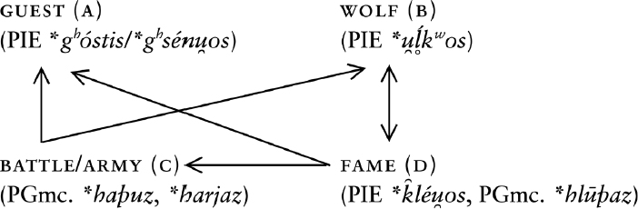
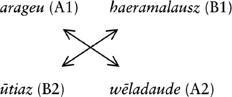

# 7. The inverse of praise

# Epigraphic practices of Indo-European cursing[^1]

<i>Peter Jackson Rova</i>

Stockholm University

## Abstract

Ritual practices of cursing and heroic commemoration among speakers of ancient Indo-European languages exhibit numerous features of inherited juridico-religious vocabulary. Through its grounding in the ethos of a pre-ancient, semi-nomadic tribal society, this vocabulary can be linked to a set of contiguous notions, such as the poetic realization of glory, afterlife recompense, the wolfish persona of warrior chieftains, and the humiliating treatment of cowards and criminals through strangulation and phallic aggression. In what follows, an attempt is made to demonstrate the tenacity of this conceptual system by paying brief initial attention to a Greek funerary epigram from 6th BCE century Rhodes, and then by analysing two runic inscriptions from 6th to 7th century CE southern Sweden (Björketorp and Stentoften).

## 1. Introduction

The Runic inscriptions examined below represent a category of epigraphic texts that I have provisionally chosen to label “lithic proxies”. A lithic proxy is a durable scriptural statement designed to replace and perpetuate a speech act.[^2] The skills and resources invested in an epigraphic monument give us reason to assume that the pre-literary models of such illocutionary statements – e.g. oaths, verdicts, praise poetry, laments, and curses – were of a likewise costly nature, involving ritual elaboration, public participation, and the work of hired professionals. In addition to exemplifying such ritual peculiarities, the examples discussed below will also shed light on crucial aspects of Indo-European religion and society that seem to have survived independently among the ancient speakers of Greek and Germanic long after their routes parted some five to four millennia ago.

## 2. The Indo-European legacy of fame, hospitality, and cursing: Preliminary remarks

The concept of undying fame (PIE <i>*k̑léu̯os</i>) is admittedly one of the most culturally informed items of Indo-European vocabulary. Its lingering impact on the ideology of a group of widely dispersed communities – ranging from the Celtic tribes of Iberia to the Indo-Aryans of northern India – need not be rehearsed here. As suggested by the repository of inherited poetic and onomastic coinages, this ideology is likely to have prevailed among these groups prior their geographical dispersal.

Indo-European poetry was a predominantly oral concern – it was supposed to be sung and heard. This is a fact to which the ancient Greeks continued to bear witness long after the spread of alphabetic writing. Yet, while maintaining its strong bearing on oral culture in what still typically functioned as transcripts of sung performances by the Late Archaic period, the evocation of lasting fame also found an early equivalent in the extended context of epigraphic commemoration.

An example is the following funerary epigram from Rhodes (IG XII,1 737; c. 600–575 BCE):

Recto: σᾶμα τόζ’ Ἰδα-

μενεὺς ποίη-

σα hίνα κλέος

εἴη̇ |

Verso: Ζεὺ‹δ› δέ νιν ὅστις

πημαίνοι λειṓ-

λη θείη.

‘I, Idameneus, have made this monument that there be glory, / but may Zeus bring complete destruction on whosoever may do harm.’

One immediately perceives the stark contrast between Idameneus’ κλέος and the λειώλης (= πανώλης [‘complete destruction’]) brought down on the hypothetical violator. What the <i>making</i> (cf. ποιέω) of the monument is supposed to accomplish beyond its mere physical realization, the <i>destruction</i> (cf. πημαίνω) of the monument inevitably has to reverse beyond its mere fact of physical damage: it completely destroys the violator through an act of divine intervention.

### 2.1. The Germanic legacy of fame and hospitality

Although the two runic monuments from Blekinge do not contain any explicit reflexes of PIE <i>*k̑léu̯os</i> (> PGmc. <i>*hlewaz</i>), the costly practices of cursing and commemoration to which the two inscriptions testify cannot be fully appreciated without recourse to the notion of enduring glory. As suggested by the Rhodes epitaph, the interest in safeguarding one’s posthumous reputation was always counterbalanced by the fear (or threat) of disrepute, destruction, and forgetfulness. Furthermore, the singular attestation of the noun <i>hlewa-</i> on the 5th-century lesser horn from Gallehus – the first element of a dithematic personal name <i>Hlewa</i>gastiz – is strongly indicative of surviving practices of Indo-European poetics and onomastics among Germanic peoples in the Migration Period.

The personal name recalls the Greek name <i>Kleoxenos</i> (were the second element appears to contain the zero-grade of the same verbal root as in <i>-gastiz</i>, i.e. PIE <i>*gʰes</i>) and the etymologically identical Slavic variants <i>Slavogost, Slavogast</i>, latinized <i>Slavogostus</i> etc. The two onomastic components also add on to a broader repertoire of personal names in Celtic (cf. Lepontic <i>uvamo-kozis</i>), Venetic (<i>ho.s.tihauo.s</i>), and Indo-Iranian (cf. Ved. <i>Mitrāthiti</i> and <i>Upamaśravas</i>) seen to variously combine the elements Glory/Fame (<i>*k̑léu̯os</i>) and Guest (<i>*gʰóstis</i>/<i>*gʰsénu̯os</i>, IIr. <i>*</i>[<i>H</i>]<i>átHti</i>- [cf. Pinault 1998 and Garnier 2013]) with notions of excellence and divine fellowship. These are not just fancy words, but ideal representations of functions expected to sustain an ancient tribal economy. In so far as these names still spoke to their bearers in more than just genealogical terms, they must have conveyed a message roughly concordant with the poetry in which those ‘of famous name’ (Toch. A <i>ñom-klyu</i>, Gr. ὀνομάκλυτος) lived on in the minds of their descendants. Names were not just conveying notions analogous to those expressed in poetry; they were the necessary vehicles of poetic praise, identifying and resuscitating the recipient of praise.

### 2.2. A note on Germanic anthroponomastics

The controversial inscription on the bronze helmet B from Negau has been taken by some scholars to contain an early North Italic scriptural rendering of the Germanic name Harigastiz (<i>hariχasti</i>; cf. Nedoma 1995). If the name can be assumed to be Germanic in origin, and to contain the initial element PGmc <i>*harjaz</i> (voc. <i>*hari</i>) in spite of the morphological difficulties, it may also be taken to represent a missing link between the two otherwise disconnected onomastic elements <i>*gastiz</i> (a) and <i>*wulfaz</i> (b) (as seen in the lycophoric names <i>Hariwulf</i> and <i>Haþuwulf</i> attested in three of the Blekinge inscriptions) according to the following logic of contiguity:

<b>DA:</b> Run. <i>Hlewagastiz</i> = Slav. <i>Slavogast</i> ≈ Gr. Κλεόξενος ‘Guest of honour/Having famous guests’

<b>CA:</b> PGmc. <i>*Harjagastiz</i> ‘Guest of the army’

<b>CB:</b> PGmc. <i>*Harjawulfaz</i> ‘Wolf of the army’

<b>CB:</b> PGmc. <i>*Haþuwulfaz</i> = Eburonic <i>Catuvolcus</i> ‘Battle wolf’ (?)[^3]

<b>DB/BD:</b> PGmc. <i>*Hlūþawulfaz</i> ≈ Slav. <i>Vlьkoslavь</i> ‘Famous wolf’

<b>DC:</b> PGmc. <i>*Hlūþaharjaz</i> ≈ Gr. Κλεόμαχος ‘Fame in battle’

Or, according to the principles of variation shown in Figure 1:

## 3. The anatomy of a runic curse

Now let us turn to the inscriptions on the stones of Björketorp (= Bj.) and Stentoften (= St.). They are found on epigraphic monuments usually treated together as a group of four (including Gummarp [= Gum.] and Istaby [= Ist.]). Dated to the 6th to 7th century CE, the stones are all assumed to have been erected on the south-east coast of Sweden by local chieftains in what was at this period probably Danish territory. While only one of the monuments still stands <i>in situ</i> (Bj.), all four inscriptions show such striking runological and semantic similarities – not least owing to the variant curse on Bj. and St., and the recurrent lycophoric names Haþuwulf (Gum., Ist., and St.), Haeruwulf (Ist.), and Hariwulf (Ist. and St.) – that they seem to have had a common source.

Bj. is a menhir measuring 4.2m in height. It belongs to a larger structure, including two high uninscribed menhirs with which it forms a triangular pattern.

They stand on an Iron Age burial field in the vicinity of a number of still visible ancient remains, among which are found two stone circles (so-called <i>domarringar</i>), two pavings, and several lower raised stones. According to a document from the late 15th century (1493), the three menhirs were still granted geopolitical recognition in that they marked out the borders between the parishes Edestad, Listerby, and Hjortsberga.

### 3.1. Case 1: Björketorp

The inscription on what has conveniently been considered the recto of Bj. (facing the two other menhirs) follows a left-to-right pattern running from the bottom line up:

<i>sAzþAtbArutz</i>

<i>utiAzwelAdAude</i>

<i>hAerAmAlAusz</i>

<i>inArunAzArAgeu</i>

<i>fAlAhAkhA[i]derAg</i>

<i>hAidzrunoronu</i>

The inscription on the verso appears to function – pace Looijenga’s (2013) attempt to insert the sequence between the uppermost and second uppermost row of the recto – as a deterrent qualifier of the curse on the verso. It reads:

<i>uþArAbAsbA</i>

The privative noun <i>ūþaraba</i> corresponds to Old Englsh <i>unþearf</i> ‘disadvantage’ (from the strong verb OE <i>þurfan</i> ‘to require, to need’; cf. Arista 2019: 170). The second element <i>spā</i> can be taken either as the 1sg. pres. ind. of a verb corresponding to the ON infinitive <i>spá</i> (< PGmc <i>*spahōjanan</i>) ‘I prophesy, I foresee’, or as a derived noun signifying ‘prophecy, foresight’ (cf. ON <i>spá</i> < PGmc <i>*spahō</i>).[^4] With regard to the specific semantic sense of the noun <i>ūþaraba</i>, however, runologists have not paid sufficient attention to the cultic and eschatological associations of the inherited verb (PIE <i>*terp-</i> > PGmc <i>*þarfa-</i>) and its deverbatives in other Indo-European languages. This is a regrettable neglect in consideration of the overt religious significance of the inscription.

In order to work out these cultic and eschatological associations, it is illuminating to compare how the Vedic causative <i>tarpáyati</i> (‘satiates, satisfies’) and Gr. τέρπω (‘give delight’) can be used to signify the satiating influence of words, songs, and offerings on their divine or human recipients (Callimachus, fr. 186; cf. Massetti 2019). By extension, the adjective τερπνός can be used to characterize the abodes of the blessed in the afterlife as being ‘delightful’ (Pindar, fr. 129) or, vice versa, its privative counterpart ἀτερπής as a qualifier of the correspondingly ‘joyless’ place of the unsung dead in the netherworld (Od. 11.94; Empedocles, EGP, V [Emp. D24]). It is helpful to interpret such adjectives not just in their trivial descriptive sense, but as the qualification of a state of affairs brought about through the ritual enforcement of songs and offerings as well as of curses and other harmful ritual actions.

Priests, poets, and soothsayers have played a crucial role in laying claims to such proficiencies. Plato refers disapprovingly in the second book of <i>Republic</i> (363c–d) to Musaeus and Eumolpus, two legendary figures associated with Orpheus, who are said to ‘extol’ (ἐγκωμιάζω) justice, bringing their righteous benefactors down to Hades so as to let them enjoy eternal drunkenness at a symposium, whereas the unjust are buried in mud and forced to carry water in a sieve. Poetic ‘praise’ (ἔπαινος) and ‘blame’ (ψόγος) can be claimed here to falsely determine virtues and vices in terms of mere appearances (363e). In a similar (yet less deprecatory) statement, Pindar (<i>Nem</i>. 7.61–63) refers to the gloom of ψόγος as the conceptual inverse of the genuine (or truthful) ‘glory’ (κλέος) that the encomiast proffers to his patron in anticipation of a fee:

ξεῖνός εἰμι: σκοτεινὸν ἀπέχων ψόγον,

ὕδατος ὥτε ῥοὰς φίλον ἐς ἄνδρ᾽ ἄγων

κλέος ἐτήτυμον αἰνέσω: ποτίφορος δ᾽ ἀγαθοῖσι μισθὸς οῦ῾τος.

I am (your [i.e. Thearion’s]) guest-friend. Keeping away dark blame,

like streams of water with praises to the man who is my friend

I shall bring true fame: for that is the proper reward for good men.

(<i>Nem</i>. 7.61–63, Race [mod. trans.] 1997)

Notice, also, that the passage presents a veritable gloss on two of the focal themes (Guest + Fame) featuring in the onomastic tradition touched upon above.

In coming back to the caption <i>ūþaraba spā</i>, comparative evidence suggests that the verb <i>*terp</i> (+ deverbatives and privatives) could be used in cultic settings to signify the ritual means by which words or offerings were thought to act upon their addressee, causing pleasure or joylessness even beyond the confines of mortal life. The anticipated state of discomfort announced by the verb (or deverbative) <i>spā</i> can thus be securely linked to the assumed illocutionary force of the inscription as a whole. It is not just a prediction in a strict prognostic sense, but an expression designed to realize a future state of affairs by the very force of its pronouncement. A more detailed account of the actual means, conditions, and ends of the predicted infliction is conveyed by the curse proper.

The inscription on the recto (A) is usually segmented and rearranged from the top line down, and then completed by the isolated inscription on the verso (B), in the following fashion:

A: <i>haidz rūnōrōnū</i> (asf.)

<i>falah</i> (1 sg. pret. ind.) <i>ak haidera</i>

(<i>ra</i>)<i>ginarūnāz</i> (apf.) <i>arageu</i> (dsf.)

<i>haeramalausz</i>

<i>ūtiaz wēladaude</i> (dsm.)

<i>saz þat barutz</i> (3sg. pres. ind.)

B: <i>uþArAbAsbA</i>

I propose the following translation, relying in part on Tineke Looijenga’s (2013) interpretation:

Recto (A): A clear rune row

I concealed here,

incantations from the ruling gods; through (shameful) emasculation

restless,

farther away through death by treachery,

(is) he who breaks this (monument).

Verso (B): I foresee misfortune

The initial part of the inscription seems to recall circumstances relevant to the codification and authorization of the curse to follow. Unlike Looijenga (and others), however, I see no reason to interpret <i>rūnō</i> (pl. <i>rūnāz</i>) in scriptural terms (= ‘letter of the runic alphabet’). This likewise applies to the verb <i>falh</i>, which does not unambiguously suggest an act of concealment by means of carving perfectly visible letters into stone. As indicated already by the Gothic rendering of the Greek collocation μυστήριον τὸ ἀποκεκρυμμένον (Col 1:26) = <i>runa sei gafulgina</i> (as. <i>ga-fulgins</i> from <i>ga-filhan</i> [with Verner’s Law alternation!]), the PGmc verb <i>*felhan</i> could apparently take <i>*rūnō</i> as its habitual object in a pre-literary setting to denote the act of consigning (or concealing) confidential knowledge. A similar idiomatic sense is retained in the Old Norse expression <i>fela í rúnum</i> (with <i>rún</i> as the indirect object), which refers to the act of codifying a message in an arcane, enigmatic, or poetic form (cf. Kries 2004). Germanic *<i>rūnō</i> thus brings to mind – alongside its Celtic congeners OIr. <i>rún</i> ‘secret, mystery, charm’, OBret. <i>rin</i> ‘secret, mystery’ – a piece of sung, spoken, or whispered discourse with a characteristic propensity to be entrusted, concealed, investigated, and revealed.

In addition to the general sense of *<i>rūnō</i>, OHG <i>helliruna</i> (a gloss on Lat. <i>necromantia</i>) and OE <i>helrūna</i> (‘necromancer’) also show that the term could be brought to bear on oracular speech with a particular emphasis on its otherworldly origin. Such connotations seem perfectly cogent in view of the etymological treatment of *<i>rūnō</i> as the reflex of a noun formed from PIE √<i>*h₁reh₁</i> (‘ask’ [cf. Gr. ἐρέω]) on the same morphological basis as Gr. ἔρευνα (‘inquiry, search’) and ἐρευνάω (‘search for, search after’).[^5] An especially illuminating parallel with regard to the divinatory connotations of *<i>rūnō</i> is Pindar’s (fr. 7B.20) use of the verb ἐρευνάω in the technical sense of searching for oracular ‘counsels’ ([τὰ θεῶν] βουλεύματα). Besides the cognate denominative verb, the choice of βουλεύματα as the designated (divine) object of inquiry is also helpful in working out the semantics of the Germanic noun, because the Gothic rendering of βουλή (not least in reference to a counsel <i>of God</i>) was precisely <i>runa</i> (e.g. τὴν βουλήν τοῦ θεοῦ = <i>runa gudis</i> [L.7:30]).

On account of its earliest associations, it seems plausible that PGmc. *<i>rūnō</i> signified some kind of divine (or divinely inspired) diction that could function both as prediction and malediction, that is, as a prophetic foretelling of an event whose future occurrence it was also thought to bring about. Hence, it referred to a piece of mantic/divinatory diction in the sense of conveying confidential <i>information</i> about hidden or unforeseen circumstances, but it was also a piece of diction in the magical/incantatory sense of actively <i>informing</i> such circumstances (that is, in the literal sense of Latin <i>informo</i> meaning ‘to shape, mould, fashion’). A similar logic is implicit in the necromantic sayings (the ‘words of a corpse’ [<i>nás orð</i>]) uttered by the summoned vǫlva in the Eddic poem <i>Baldrs draumar</i>. These utterings can be understood in the immediate context of the poem as both predicting and inflicting the death of the god Balder, which the god Óðinn repeatedly seeks to undo by asking the vǫlva to keep quiet.

The sequence <i>haidz rūnō</i>- recurs in the mythological name of the goat Heiðrún (cf. also the Frankish woman’s name <i>Chaiderūna</i> [‘die ein herrliches Geheimnis besitzt’ {de Vries 1977, s.v. <i>Heiðrún</i>}]), who is said to feed on the leaves of the tree Laeraðr while producing clear mead from her teats (Grm. 25). The rationale behind this topos and the mythological characterization of runes in Old Norse poetry is the notion that the runes were somehow thought to reside in the mead (e.g. Sd. 15–18, Háv. 138–143) as a divine source of insight and potency.

Looijenga (2013) cleverly suggests a doubling of the final syllable in <i>haidera</i> to obtain the alliterative form <i>(ra)ginarunaz</i> ‘runes from the ruling (gods)’ (by analogy with the formulaic sequence <i>runo</i> […] <i>raginaku</i>[<i>n</i>]<i>do</i> on the Noleby stone [and elsewhere]).[^6] This interpretation strengthens the impression that (1) the message was intentionally composed in accordance with a set of poetic devices, such as assonance and alliteration, and (2) that it self-referentially characterizes this genre of speech as having a divine origin.[^7]

In direct conjunction to its statement of divine licence (ending in the middle of the third line from the bottom line up), the curse continues to pronounce its actual nature of infliction: <i>arageu</i> (dsf.) <i>haeramalausz,</i> <i>ūtiaz wēladaude</i> (dsm.). Unlike the variant curse on St., however, the focal segment of the Bj. curse is devised according to a chiastic structure with two nouns in the (instrumental?) dative singular at its beginning and end (Figure 2).

‘Through (shameful) emasculation (A1) restless (B1),

farther away (B2) through death by treachery (A2)’

We may take this rhetorical device to indicate the performative climax of the curse. The compound adjective <i>heramalausz</i> may hint at the familiar legal category of outlawry (cf. Antonsen’s [1975: 86] suggested translation ‘protectionless’), whereas the sequence <i>ūtiaz wēladaude</i> apparently proclaims a deceitful, inglorious death – with the adv. comp. <i>utiaz</i> (cf. ON <i>útar</i>) possibly adding a sense of physical or social remoteness – as the final outcome of an already pernicious situation.

### 3.2. Excursus

A brief excursus is in order here if we are to fully appreciate the socio-legal aspects of corporeal infamy and outlawry evoked by the curse formula. The initial dative <i>arageu</i> (with an epenthetic second <i>a</i> < PGmc <i>*argīn</i> <i>←</i> adj. <i>*argaz</i> [cf. ON <i>argr</i>]) represents a familiar feature of Old Norse defamatory discourse, and as such it can also be linked to a specifically runic genre of curse formulas still in use by the end of the pagan period (e.g. the 10th-century Saleby runestone [Vg 67]). Yet, it is only when we start paying closer attention to the semantic prehistory of the noun that we begin to perceive its full spectrum of associations.

The basics are laid out in two groundbreaking papers by Calvert Watkins (1975) and Jaan Puhvel (1986) touching respectively on the family of the Greek word for ‘testicle’ (ὄρχις) and a quasi-legal narrative in the archaic Hittite ritual of Zuwi (KUB XII 63 Vs. 21) involving a group of protagonists referring to themselves as <i>hurkilas pesnes</i> (‘men of strangulation’).[^8] Without going into too much detail, a synthesis of the two papers could be outlined as follows: (1) comparative textual evidence supports the existence of two unisonant verbal roots PIE <i>*h₁erg̑ʰ/*h₂u̯erg̑ʰ</i> (cf. LIV <i>*h₁erg̑ʰ/*u̯erg̑ʰ</i> [IEW 1154]) referring to the culturally associated acts of bestial copulation (cf. Hitt. <i>ark-</i> ‘to mount, copulate’, Gr. <i>ὀρχέομαι</i> ‘to dance [lascivously]’ < ‘performing coital motions’) and punitive strangulation (cf. Hitt. <i>hurkel</i> ‘hanging matter’, Anglo-Latin <i>wargus</i> ‘outlaw, criminal’ [> wolf] [cf. OE <i>wyrgan</i> ‘to strangle’]) – (2) the male passive subject of such acts (the <i>*h₁órg̑ʰos</i> or <i>*h₂u̯órg̑ʰos</i>) typically denotes someone deserving or experiencing punishment, whereas the active (virile or strangulating) aggressor (the <i>*h₁org̑ʰós</i> or <i>*h₂u̯org̑ʰós</i>) rather stands free of charge.[^9]

Puhvel saw a possible reflex of such notions and practices in a 4th-century CE account of pederastic initiation rites among the Germanic (or possibly Iranian) Taifali (Ammianus Marcellinus, <i>Rerum Gestarum</i>, 31.9.5).[^10] He also called attention to Tacitus’ account of the Germanic custom to punish “cowardly, unwarlike, and bodily heinous persons” (<i>ignavos et imbelles et corpore infames corpores</i> [<i>Germ</i>. 12]) by having them sunk into the mud of marches and covered with hurdles (Puhvel 1986: 154). Another noteworthy example (overlooked by Puhvel) is a paragraph concerning the punishment of temple-robbers in a draft version of the Frisian Law Code (<i>Lex Frisionum</i> [Add. XI 1]). The text was recorded in Latin sometime after Charlemagne’s defeat of the Saxon leader Widukind in the year 785. Since the paragraph has an overtly pagan content, it was supposedly destined to be edited out in the official version of the code:

<i>Qui fanum effregerit, et ibi aliquid de sacris tulerit, ducitur ad mare, et in sabulo, quod accessus maris operire solte, finduntur aures eius, et castratur, et immolatur Diis quorum templa violavit.</i>

He who breaks open a shrine, and carries away sacred items from there, shall be led to the sea, and on the sand, which will be covered by the flood of the sea, his ears shall be cleft, and he will be castrated, and sacrificed to the gods whose temples he has profaned.

Emasculation was apparently not uniquely associated with the violation of sacred sites among Germanic peoples. It is also found among the injunctions in a long list of archaic religious taboos preserved in Hesiod’s <i>Works and Days</i> (706–764 [750–753]):

μηδ᾽ ἐπ᾽ ἀκινήτοισι καθιζέμεν, οὐ γὰρ ἄμεινον,

παῖδα δυωδεκαταῖον, ὅτ᾽ ἀνέρ᾽ ἀνήνορα ποιεῖ,

μηδὲ δυωδεκάμηνον: ἴσον καὶ τοῦτο τέτυκται.

And do not seat a twelve-day-old boy upon things that cannot be moved [= sacred things],

for that is not better – it makes a man unmanly –

nor a twelve-month-old one: this too is established in the same way

(WD 706–764 [750–753], Most [tr.] 2006)

The final sequence of the recto of Bj. makes a clarifying statement as to the kind of action expected to effectuate the curse: <i>saz þat barutz</i>. It conforms with the statement on the Rhodes epitaph (ὅστις πημαίνοι [3sg. pres. opt.] “whosoever may do harm”) in that it open-endedly pertains to acts both of physical harm as well as to the intangible transgression of an oath (cf. Il. 3.299).

### 3.3. Case 2: Stentoften

The Stentoften (St.) inscription contains the same curse as the one found on Bj., yet with a few variants in its orthography, wording, and syntax to suggest a common source in the form of an oral medium:

Bj: <i>haidzrunoronu fAlAh Ak hAderA</i>

St: <i>hidezrunono felAh ekA hederA</i>

Bj: <i>ginArunAz ArAgeu hAerAmAlAusz</i>

St: <i>ginoronoz herAmAlAsAz ArAgeu</i>

Bj: <i>utiAz welAdAude sAz þAt bArutz</i>

St: <i>welAdud sA þAt bAriutiþ</i>

The most striking difference between the two inscriptions is the highlighted commemorative formula on the Stentoften stone. It consists of three vertical lines in the left bottom part of the inscribed surface so as to form the graphical core of the message:

I: <i>niu hAborumz</i> (dpm.)

II: <i>niu hagestumz</i> (dpm.)

III: <i>hAþuwolAfz gaf</i> (3sg. pret. ind.) j

I: With nine steeds

II: With nine rams

II: Haþuwolafz gave y(ear [= ‘harvest’, ‘prosperity’])

According to Lillemor Santeson’s (1989) persuasive interpretation of the introductory (core) segment of the inscription, it records a sacrificial feast (with 9x2 male animals) organized by the chieftain Haþuwulf for the stated purpose of obtaining bountiful crops. References to the ritual slaughter of male animals in groups of nine as well as the seasonal organization of sacrificial feasts <i>til árs</i> (<i>ok friðar</i>) ‘for a good year (and peace)’ feature prominently in more recent sources to Old Norse religion. Yet, we also have reason to believe that Haþuwulf’s seasonal sacrifice had a substantial precedent. As suggested by the cumulative evidence of ancient Greek, Indo-Iranian, and Anatolian texts, the canonical grouping of nine sacrificial animals was perhaps already an established custom among the prehistoric speakers of PIE. This custom conformed to a non-trivial logic of idealistically grouping sacrificial animals in hundreds (e.g. the familiar Greek offering of a ‘hundred oxen’ [ἑκατόμβη]) as opposed to the more realistic grouping of nines (e.g. the possessive compound noun PIE <i>*neu̯m̥-gʷ</i>[<i>o</i>]<i>u̯</i>-[<i>y</i>]<i>o-</i> ‘having nine cows’ (> Ved. <i>návagva-</i> and Gr. ἐννεάβοιος [Il. 6.236]; cf. Oettinger 2008).

The commemorative formula is distinctly framed by the remaining part of the message in the form of three curved lines apparently intended to resemble a multilayered fence: first a lacunary sequence beginning with another lycophoric name <i>HAriwolAfz mA??usnuh?e</i>, and then the variant curse formula (from the beginning of the second curved line) as given above. It is striking to note how the carefully devised graphic design of the St. inscription is counterbalanced by the verbal design of the chiastic curse formula in the less intricate visual display of the Bj. inscription. This would seem to suggest that the epigraphic practice of cursing was still largely informed by a flexible and continuously changing oral tradition. Since the language of the Bj. inscription reveals certain palpable features of renewal (such as the syncopated form <i>barutz</i> [Bj.] versus <i>bariutiþ</i> [St.]), we are led to assume that the verbal design of the Bj. curse formula was grafted onto an older variant of that same formula in an attempt to render it more efficacious.

It seems likely that the St. monument was commissioned by a local chieftain on the same pretext as similar votive monuments commissioned throughout the ancient Mediterranean world, that is, with the “purpose of indicating to gods and men a sacred action that should be remembered” (Spickermann 2015: 412). A probable member of the famous clan of the Wulfings (‘wolf clan’), the 6th-century BCE chieftain Haþuwulf was apparently eager to perpetuate the memory of his role as the generous host of a grandiose communal sacrifice. In considering that a single butchered horse would yield more than 100 kilograms of meat, we need to assume that the collected meat from a sum total of 18 steeds and rams could easily have fed hundreds of guests for weeks.

## 4. Bestiality and sovereignty

In order to add yet another component to the conceptual system in question, we must take into account that the recurrent lycophoric element (<i>-wulfaz</i> < PIE <i>*u̯ĺ̥kʷos</i>) in the names of the Blekinge chieftains probably carried some sort of ideological significance beyond its function as an arbitrary genealogical qualifier. This it would have done by highlighting the salience of the wolf as a token of war-like sodalities (so-called <i>Männer-</i> or <i>Jugendbünde</i>) among Germanic tribal groups (cf. the discussion in Sundqvist and Hultgård 2004). In spite of the scholarly controversies as to the definition and function of such institutions, there can be little doubt that they existed among various historical speakers of Indo-European languages in some form or another. More importantly, however, they seem to have done so – as suggested by the overwhelming evidence of onomastics, myths, rituals, historiography, and folklore – on the premise of a shared legacy.[^11] Furthermore, it seems reasonable to assume that it was initially in prehistoric societies of competing pastoralists, and not chiefly among sedentary farmers or in small-scale bands of hunters and gatherers, that practices of systematic looting and the accumulation of prestige afforded their most immediate ideological pay-back.

My best guess in this connection is that the lycophoric names of the Blekinge chieftains were still “speaking names” in the sense that they recalled an aristocratic ideology characterized by the valorization of glory <i>won</i> in battle, and <i>perpetuated</i> in times of peace through costly rites of commensality. Nevertheless, the glory of an aristocratic lycanthrope was of a decidedly different nature than the wolfish traits imposed on a potential violator of that glory. Hence, we may assume that the latter’s shame and wolfish perversity corresponded inversely to the former’s glory and wolfish bellicosity. A comparable logic of non-duality can be linked to the ancient Roman legal category of <i>homo sacer</i> (“the sacred [or accursed] man”):

The ban is the force of simultaneous attraction and repulsion that ties together the two poles of the sovereign: bare life and power, <i>homo sacer</i> and the sovereign. Because of this alone can the ban signify both the insignia of sovereignty (---) and expulsion from the community. (Agamben 1998: 110–111)

## 5. Conclusion

So where does all this bring us? What conclusions can be drawn from these discrete cases? And how can they be used to elucidate the underlying structure of a shared Indo-European legacy?

- Both the Rhodes epitaph and the messages on the two Blekinge stones show a strong dependency on oral genres of ritual performance, which they variously seek to mimic and perpetuate. They are “lithic proxies” in the sense that they represent a culture still dominated (1) by the spoken word, and (2) a trust in the capacity of hired ritual professionals to impose fame or blame beyond the confines of mortal existence.

- Against their proper PIE background, these discrete cases explicitly or implicitly evoke the concept of enduring fame (PIE <i>*k̑léu̯os</i>) as a prime motivator behind the good host’s (= the chieftain’s) eagerness to appease his gods, treat his guests, and award hired professionals.

- As evidenced by the lycophoric names on the Blekinge stones, furthermore, the role of the good host in times of peace and prosperity could positively transform into the “wolfish” traits of a fierce warrior in times of conflict.

- In stark contrast to the predatory persona of the chieftain, however, the cursed transgressor of the chieftain’s law rather assumes wolfish traits as a token of outlawry and shameful perversion (PGmc <i>*wargaz/*argaz</i>). I.e. they (the chieftain and the outlaw) both inhabit an extralegal sphere in accordance with the familiar pattern of the beast and the sovereign.

<b>How to cite this book chapter:</b>

Rova, P. J. (2024). The inverse of praise: Epigraphic practices of Indo-European cursing. In: Larsson, J., Olander, T., & Jørgensen, A. R. (eds.), <i>Indo-European Interfaces: Integrating Linguistics, Mythology and Archaeology</i>, pp. 131–148. Stockholm: Stockholm University Press. DOI: [https://doi.org/10.16993/bcn.g](https://doi.org/10.16993/bcn.g). License: CC BY-NC.

## Footnotes

[^1]: A modified and slightly extended version of this article is forthcoming in the anthology <i>Crafting Memories</i> (Brepols) under the title “Lithic Proxies: Epigraphic Practices of Indo-European Praise and Cursing”.

[^2]: A similar sense of <i>proxy</i> has been proposed with reference to the so-called Bacchic gold leaves (cf. Graf and Johnston 2007: 95).

[^3]: Though superficially suggestive, an etymological match between Run. <i>-wulfaz</i> and Ebur. <i>-volcus</i> can only be posited at the cost of numerous aberrations from the rules of expected sound change (Anders Jørgensen, personal communication), but see Hughes 2012.

[^4]: Besides its general sense ‘to see’, IE <i>*spek̑</i> could also be used in the technical sense of divinatory vision, as evidenced by Lat. <i>haruspex, haruspicium, inspicio</i>, etc.

[^5]: PGmc <i>*raunō</i> (‘trial, experiment’) is usually treated as an archaic ablaut grade related to <i>*rūnō</i>.

[^6]: Such a doubling effect may be purposely foregrounded in the design of the inscription. Whereas the other lines all begin with a new word, this one breaks up in a fashion that would otherwise have seemed unmotivated ([---] <i>hA[i]derAg / inArunAz</i> [---]).

[^7]: One is particularly struck by the complex sound pattern evoked through the repetition of the syllables <i>ha</i> and <i>ra</i>.

[^8]: Puhvel’s paraphrase of the passage runs as follows: “<i>hurkilas</i> LÚ.MEŠ <i>wēs</i> ‘men of hurkil we (are)’. In the next two lines the house (= temple) of the storm-god speaks to those men: ‘what I say [you shall do], and this I give, and you shall bring it to pass.’ The men answer (24–27): ‘Say it to us, we shall do it‚’ ‘The long (<i>talugaus</i>) roads [and the short ones] lengthen (<i>taluganuttin</i>), the high (<i>pargawus</i>) mountains shorten (<i>manikuandahtin</i>) and the short ones (<i>manikuandus</i>) [heighten], catch a wolf by the hand (<i>kissarta</i>), catch a lion with the knee (<i>ganut;</i> cf. Greek <i>gnúks</i>), the river (ÍD<i>-an</i> = <i>hapan</i>) […], use the <i>zuwāluwal</i> (a ritual tool) on a snake and take him to the King’s Gate (LUGAL<i>-was</i> <i>āska</i>, the royal tribunal), and [his judgement shall be rendered].’ After the refrain (28) the story resumes (29–34): ‘The men came back, and they spoke thus: ‘We aren’t up to it. (<i>ŪL-as daluganula</i>), the high mountains, [we cannot shorten them,] the small [<i>kappaus</i>] mountains, we cannot heighten them (<i>ŪL-us parganula</i>). A wolf by the hand they had not [caught], the river and the boulder (<i>kawankunurr-a</i>; cf. <i>kunkunuzzi</i> ‘rock’?) they had given up on (<i>pessir</i>), and it had not been crushed (<i>harratta</i> <i>ŪL</i>), a snake [they had not used the <i>zuwāluwal</i> on, and him to the King’s Gate] they had not brought, and his judgement had not been rendered (<i>hannessa.set hamnat</i> <i>ŪL</i>). The case was aggravated (<i>utar na[kkest</i>)a.”

[^9]: Compare the combination of the two deverbatives (<i>goðvarg</i> […] <i>argan</i> [<i>*argr goðvargr</i>]) in a defamatory verse ascribed to the 10th-century skald Þorvaldr veili (Puhvel 1986: 155). The shift in meaning depends on the accent according to the familiar pattern of barytone action/result nouns (e.g. <i>ápas</i> ‘work’, <i>phóros</i> ‘tribute’) vs. oxytone agent nouns (e.g. <i>apás</i> ‘working’, <i>phorós</i> ‘bringing’; cf. Kiparsky 2010: 13).

[^10]: Puhvel’s translation of the full passage runs as follows: “We have learned that the Taifali are a shameful lot, so mired in deprived practices that among them young boys are coupled with the men in a bond of unspeakable cohabitation, to waste the flower of their youth, perversely used by those men. Yet if someone, upon growing up, alone catches a boar or kills a huge bear, he is freed from the stain of unchastity.” (Puhvel 1986: 155).

[^11]: I am not primarily referring here to the overly speculative and politically biased theories of Otto Höfler, but to more recent and moderate accounts of scholars such as Kim McCone and Harry Falk. A representative sample of recent scholarship (including contributions both from McCone and Falk) is found in the edited volume <i>Geregeltes Ungestüm: Bruderschaften und Jungerbünde bei indogermanischen Völkern</i> (Das 2003). Conspicuous examples of how lycophoric names were still featuring as tokens of aristocratic sodalities long after the official Christianization of the Germanic speaking world are found in Wernher der Gartnaere’s 13th-century poem Meier Helmbrect (cf. Oettinger 1992).
