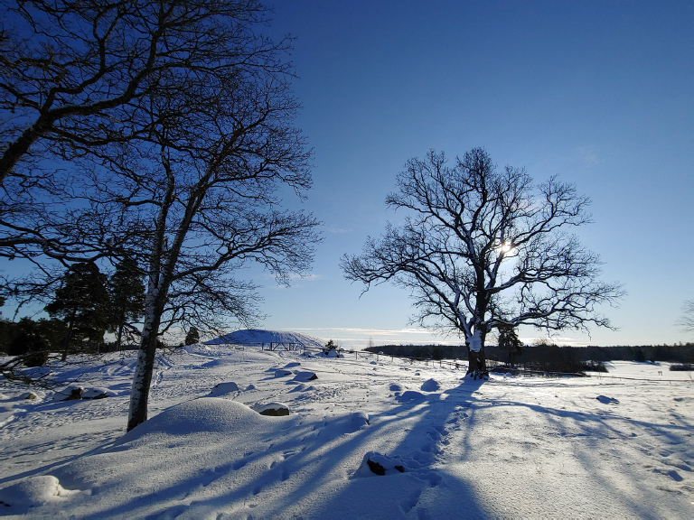
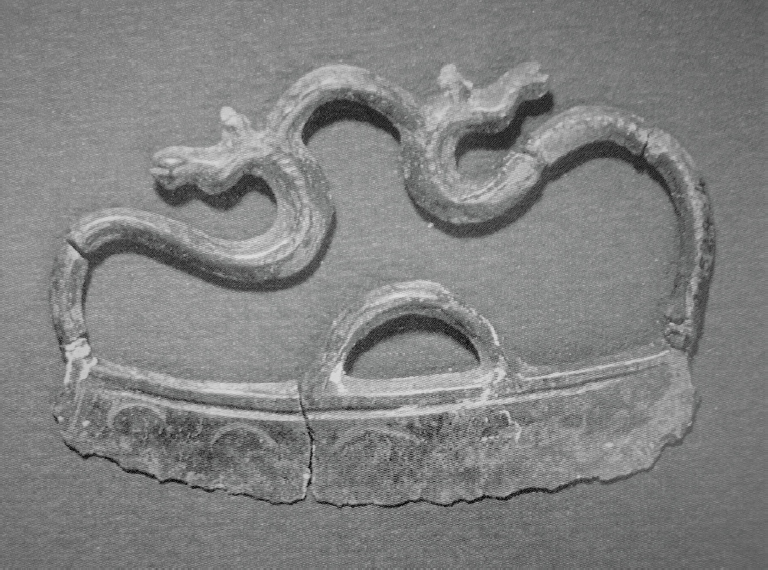

# 9. Fighting the winter

# Indo-European rituals and cosmogony in cold climates

<i>Anders Kaliff & Terje Oestigaard</i>

Uppsala University

## Abstract

In Indo-European mythology, there is a strong focus on the horse and the sun in a water and fertility perspective. However, if there is one particular characteristic of the northern and Scandinavian ecology, it is the long, cold and dark winters. The seasonality of the Scandinavian ecology structured all life and wealth in prehistoric Scandinavia. The winter limited and defined the agricultural growth season and when it was possible to travel on boats further south and partake in exchange networks. Cosmologically, it was not the sun that melted away the snow during the spring, but particular water powers like springs, rivers and waterfalls were “eating away” the snow from beneath and the underworld. The Scandinavian skeid tradition with horse-fights, rituals and sacrifices is one of the longest living traditions in the world with 4000 years of continuity. The last remains of this great tradition was found in late 19th-century rural Norway and Sweden. Using archaeological and ethnographic examples, the aim of this chapter is to analyse the specific type of Indo-European ritual tradition and cosmogony when the powers of the winter were fought and overcome in Scandinavia.

## 1. Introduction

In Scandinavia, the long and cold winters were the greatest challenges to wealth and health. Not only did they define the agricultural seasons and movements on land and water, but in the old days age was not counted in years, but in how many winters one had survived. Thus, the winter represented the greatest challenge in prehistoric Scandinavia where innumerable forces and powers were at work; both benevolent and malevolent where the former were life-giving sources and a resource for protection, and the latter hostile and lethal threats capable of terminating all life at all times. This extreme ecology was also ritualized. Following Max Weber, the world of religion is <i>differentiated</i>, which is essential for understanding religion as a social process (Weber 1964). “Ritual would be utterly pointless if everything were charged with power. It is based on the belief that some things have power and others have not” (Hocart 1954: 31). Hence, there was no simple or single ‘winter god’ or ‘summer god’ because there were many different weather phenomena, and even the sun had distinct and different qualities during cold days in January or warm days in June. During the winter, the sun may represent minus 30 degrees, but plus 30 degrees during the summer. The extreme ecological variation and seasonal changes in the cold north simply refuted any cosmological schemes presenting prehistoric cosmologies as a cyclic sun journey: it was a fight against malevolent forces where the aim was to activate and engage the benevolent ones. The powers in nature were changing throughout the seasons, and our main aim is therefore to approach the prehistoric ecology of seasonality by analysing how divine powers embodied natural phenomena and how people understood and ritualized the fight against hostile forces during the winter.

The Scandinavian ethnography and folklore is a rich cultural- historical source, which gives glimpses of parts of this prehistoric conceptual world. We will frame this in an Indo-European perspective and analyse how the winter was ritually fought and overcome in cultures and cosmology in Scandinavia from the Bronze Age (c. 1700–500 BC) onwards (Figure 1). This will enable us to develop new approaches that unite ecology and cosmology and ways to understanding ritualization of health and wealth. In Scandinavian climates, the structuring cosmogony and cosmological principle in rituals and religion was to <i>incite and activate the life-giving forces in nature</i>. From the Bronze Age to the early 20th century, this principle structured most religious practices and beliefs associated with fertility, farming and the seasonality of the agricultural year (Lid 1933: 39–40; Kaliff & Oestigaard 2020: 294–295; Oestigaard 2021a; 2021b). There were immanent forces in nature – in fields and underground – and these were intimately connected to water and the seasonal growth power. Therefore, the main aim of the rites associated with the ritual calendar was to clear the fields of snow and enable a bountiful and fruitful harvest season.

We will re-introduce an agricultural cosmology in Scandinavian archaeology and develop a coherent perspective to enable an understanding of how terrestrial and celestial gods and spirits were believed to work together in culture and cosmos. This will be done by (1) presenting a theoretical framework to combine ecology and cosmology and thereafter to integrate this with ritual and religious theory, (2) discussing how one may overcome methodological challenges by using the Nordic ethnography as a source for understanding Indo-European traditions, (3) analysing specific archaeological cases and contexts in Scandinavian prehistory, and (4) synthesizing and concluding by pointing out new potential and fruitful avenues of research.

## 2. Interdisciplinary Indo-European studies

From William Jones’s pioneering linguistic observations in the late 18th century to Max Müller’s comparative mythological studies in the 19th century and the highly problematic archaeological interpretations in the first half of the 20th century (for an overview, see Kaliff & Oestigaard 2020: 39–65), the spread of languages, cultures, mythologies and religious beliefs have puzzled researchers and caused much academic controversy. Until the groundbreaking aDNA results from 2015 onwards (Allentoft et al. 2015; Haak et al. 2015), there was no agreement regarding how the spread of language, culture and religion took place. With analyses of ancient DNA (aDNA), it is now clear that the main spread was caused by migration of people and not cultural evolution and diffusion, but the overall picture is still highly complicated where processes of migration and cultural diffusion still interact and intersect.

Analyses of the complexity of Bronze Age societies and interactions have a long history (see Kristiansen 1998; Kristiansen & Larsson 2005), and recent advances in aDNA studies (e.g. Allentoft et al. 2015; Haak et al. 2015; Olalde et al. 2018) as well as strontium analyses of human remains (e.g. Frei et al. 2015) and analyses of isotopes in metals (e.g. Ling et al. 2014; 2019; Melheim et al. 2018) have contributed to a significant new understanding of mobility patterns, exchange networks and patterns of warfare (Ling, Earle & Kristiansen 2018; Horn & Kristiansen 2018). In Scandinavia, the total amount of metal objects amounts to about 20,000 and it is estimated that between 1–2 tons of bronze were consumed each year (Kristiansen & Stig Sørensen 2020). Bronze represented extreme value, but in this trade network locally produced wool was a precious resource: it is estimated that 2 kg wool was worth 1 kg copper (Bergerbrant 2020). People and goods moved constantly across the European continent, and this was part of various Indo-European processes in time and space.

Thus, today we have very different opportunities to conduct not only multi-disciplinary research in a comparative perspective, but also to advance new insight into century-long Indo-European questions. With the scientific developments in a number of fields, one may also propose a broad interdisciplinary definition of Indo-European studies (Kaliff & Oestigaard 2023: 3–4):

Interdisciplinary Indo-European studies cannot be restricted by disciplinary boundaries, but have to use whatever relevant theoretical, methodological and empirical resources from any discipline. The great strength of interdisciplinary Indo-European studies is precisely that, because of a shared core Indo-European origin, it focuses on common structures and cultural features that are possible to identify across other differing cultural, religious, geographical and temporal variables and variabilities. Thus, in many cases, the core and origin will not be the most interesting, but the distribution, continuity and consequences of the very different and multifaceted Indo-European processes up to today, which have made world history and constituted large parts of Eurasia for millennia.

With this open definition, one may use various empirical sources in a more dynamic and flexible way while addressing specific research questions, like understanding the role of seasonal rites in relation to the ritual calendar.

## 3. Ecology, technology and cosmology

Studying technology (boats) and cosmology (the sun) has a long research tradition in Scandinavia. However, J. P. Allen commented in 1892: “When an archaeologist is in doubt he always falls back on the sun-god,” adding that “By far the most interesting fact disclosed by the Swedish rock sculptures is that even in the Bronze Age the Scandinavians were already a maritime people” (Allen 1892: 71). Thus, many of the main themes in Bronze Age research were developed more than a century ago. Importantly, the early pioneers of archaeology developed ecological perspectives combining ethnography and cosmology. In 1882, J. J. A. Worsaae wrote: “As far back as written accounts extend, the struggle between Light and Darkness, Summer and Winter, Good and Evil, has formed the principal foundation of the religious belief of the people of the North” (Worsaae 1882: 177–178). Oscar Montelius emphasized the duality of rain and thunder, on the one hand, and the sun, on the other, and that throughout known history these qualities have been incorporated into one god or as a cosmological pair (Montelius 1910). The god(s) could also be twins, which perhaps are reflected in divine Twin rulers as a religious and political institution (Kristiansen 2004; 2006).

Still, in the history of archaeological thought, most studies have not analysed and combined ecology, technology and cosmology. A Water-System approach, on the other hand, is especially developed to overcome both nature reductionism and nature determinism by analysing particular water-society relationships in time and space. Analytically, a water-system can be seen as consisting of three different, closely interconnected but not hierarchical analytical “layers” (Tvedt 2006–2016; 2016):

- The first layer addresses <i>water’s physical form and behaviour</i>, which includes precipitations patters, rivers and, from our perspective, the winter and snow. This part of nature and the landscape is always in a state of flux, and the physical presence or absence of water changes throughout the seasons.

- The second layer addresses <i>human modifications and adaptations to actual water-worlds</i>. While prehistoric people had few possibilities of modifying the weather itself (rain/snow), agricultural adaptation not only altered the landscape, but also changed the actual ways water flowed in fields and among farms, and with advanced boat technology, rivers and seascapes were not only obstacles, but also great opportunities enabling wealth.

- The third layer addresses <i>cultural and religious concepts of water</i>. While the sun has been emphasized in Bronze Age cosmology, we will include and highlight water, winter and the weather, since these forces in culture and cosmos define all life and well-being. This will involve focusing on the relation between the sun and water, which is often expressed and ritualized with horses – and boats.

This perspective enables one to combine ecology, technology and cosmology. From an ecological perspective, the Scandinavian seasonality was a decisive factor in the production and accumulation of wealth combining agricultural produce and products with long-distance trade on boats and horses. Although frozen waterways have enabled transport and mobility in the cold north, in general the winter has not only been a barrier isolating maritime communities in Europe, but also defining the agricultural season representing a time of suffering and hardship (Fagan 2000). The length and the intensity of the winter were decisive factors in pre-modern agriculture, because it determined the growth season; too long and cold springs or too early autumns with night frosts could jeopardize the whole harvest (Charpentier Ljungqvist 2015; 2017). Moreover, throughout the growing season, a successful harvest was dependent upon the right combination of water (rain) and sun in the right amount; too little water or rain could be as devastating as too much (Tvedt & Oestigaard 2016). Thus, not only the agricultural production of wealth, but also the transport systems and modes of exchange, depended upon the Scandinavian seasonality of summer and winter.

Although studies highlighting natural factors and variables have often been criticized as nature reductionism and determinism, interpretations favouring the sun have been dominant in analyses of Bronze Age iconography and rock art (e.g. Goldhahn 2005; 2006; 2013). Flemming Kaul says: “the minds of people of Scandinavia were almost obsessed with the religious ideas involving the voyage of the sun […] Everything suggests that the sun was the most significant power which was worshipped” (Kaul 1998: 251; see also 2004).

However, the cultural and cosmological role of the sun has been seen apart from ecology and agriculture, despite the role it has in the relation between the winter and summer and weather and water in defining the year. Thus, if water and the winter are centrally placed in ecology and cosmology, another picture emerges as evident in the ethnology and folklore in Scandinavia, and a central theme on rock art panels are precisely water from beneath or underground overflowing depictions of the sun, boats and horses – and people fighting (Figure 2). These life-giving water sources from beneath have historically been vital powers overpowering the winter, and the ritual challenge has been: how is it possible to activate and incite these forces? This probes into the core of a 150-year-old debate of religious practice and what defines religion.

 (SHFA). License: CC BY 4.0.](images/larsson-ed-2024-ie-interfaces-ch9-fig2.jpg)

## 4. Religion and ritualization – terrestrial and celestial gods

In studies of religion, religion has been seen from functional and substantive approaches (Schilbrack 2013a; 2013b). In 1871, the British anthropologist Edward Tylor said: “Religious rites fall theoretically into two divisions, though they blend in practice. In part, they are expressive and symbolic performances, the dramatic utterance of religious thought, the gesture-language of theology […] In part, they are means of intercourse with and influence on spiritual beings, and as such, their intention is as directly practical as any chemical or mechanical process, for doctrine and worship correlate as theory and practice” (Tylor 1871: 362). Durkheim, for instance, can be seen as advocating functional approaches. He writes: “In reality, then, there are no religions which are false. All are true in their own fashion; all answer, though in different ways, to the given conditions of human existence…They respond to the same needs, they play the same role, they depend upon the same causes; they can also well serve to show the nature of the religious life, and consequently to resolve the problem which we wish to study” (Durkheim 1915: 3). The Church father Augustine, on the other hand, is clearly in the other category when he said that religion means ‘worship of God’ (in <i>The city of God against the pagans</i>). In practice, there is not necessarily a contradiction between the two approaches, because a god needs to exist as an ontological substance if the divinity is to work and function (Oestigaard 2013). Importantly, not only in Christianity but in all religions, ‘god works in mysterious ways’: humans are always inferior in the reciprocal relations and engagements with divinities. Human intentions are often quite different from divine interventions. In a religious world-view, cosmic causes and consequences determine human life and well-being, and gods are not necessarily good; they may also be malevolent and dangerous. Therefore, rituals and sacrifices are necessary (Figure 3).

A century ago, there was a huge and intensive debate in Scandinavia whether there was ancestral worship or fertility (corn) spirits, which in practice also related to whether the prehistoric Christmas or midwinter sacrifice was primarily an ancestral cult or fertility ritual. This was also a debate about where the life-giving forces came from: above (the celestial approach) or beneath (the terrestrial approach) and at that time it was difficult to combine the various positions (e.g. Feilberg 1904; Celander 1920; 1928; 1936; 1955; Nilsson 1936). Olrik & Ellekilde, for instance, argued that other people may have been worshippers of death, but in the Scandinavian north they were not (Olrik & Ellekilde 1926–1951: 324). In practice, a terrestrial perspective was seen as in opposition to a celestial perspective, and scholars worked mainly in two competing paradigms: one focusing on ancestors/celestial divinities and another on fertility- and corn-spirits (Oestigaard 2021a). Moreover, in ethnology or folklore there was a theoretical school opposing all religious interpretations, but in particular interpretations of agrarian spirits were criticized (e.g. von Sydow 1930; 1934; 1941).

These debates regarding the nature of rural farming communities have had long historical trajectories in the research history and the relation between ethnology and archaeology. In practice, rural communities in Scandinavia were seen as representing a break with tradition, cult and continuity, and hence ethnology became hardly relevant for archaeological studies. With the functional perspectives dominating processual archaeology, prehistoric religion was further neglected (Hawkes 1954). When religious interpretations became dominant in post-processual archaeology, the interpreter became the dominant actor and this linguistic turn fitted well with a celestial perspective: the focus was on cosmology and celestial interpretations; not ecology, agriculture and terrestrial corn-spirits. This dominant research trend is particularly evident in many studies of Scandinavian rock art and Bronze Age religion: iconography is interpreted apart from ecology and cosmology, and it is not integrated with the evidence of Bronze Age cultures explaining why these perceptions were rationally believed in and ritualized.

Thus, in Bronze Age research the celestial paradigm has dominated the last decades, although there have been some early studies aiming to combine terrestrial and celestial approaches by focusing on fertility spirits (Kaliff 1992; 1997). This approach has been further developed in an Indo-European perspective (Kaliff & Oestigaard 2004; 2013; 2017; 2020). Still, based on an analysis of birds and the sun, there have been arguments in favour of a celestial perceptive, because apparently “most ritual practices and engagements aim to enact and recreate human belief and cosmological understandings” (Goldhahn 2019: 158). Although Edmund Leach once said that “myth implies ritual, ritual implies myth, they are one and the same” (Leach 1954: 13ff), most researchers today will argue that the relationship is much more complex, and that myths and rituals possess qualitatively different aspects. Rituals are not only about recreating human belief; they also relate to functions and outcomes of rituals in relation to the agricultural season.

Thus, we will argue that one cannot understand rituals such as funerals and sacrifice unless one includes terrestrial and celestial perspectives, like the famous Sagaholm burial (c. 1500–1100) in Jönköping Län, central, southern Sweden (Goldhahn 1999; 2016). The horse rituals depicted on the stone slabs cannot be properly explained and understood without an Indo-European perspective contextualizing the rituals in an ecological and fertility perspective (Figure 4). This core motive is a cosmological ritual inciting cosmic forces and uniting celestial and terrestrial perspectives (Kaliff & Oestigaard 2020: 250–253). Hence, without having an Indo-European perspective on Scandinavian cosmology in the Bronze Age onwards (Kaliff 2007; 2018), one cannot satisfactorily grasp the cultural frameworks in which the rituals are embedded.

 (SHFA). License: CC BY 4.0.](images/larsson-ed-2024-ie-interfaces-ch9-fig4.jpg)

Of key interest for our discussion here are the cosmological beliefs evident in various Indo-European traditions. The world was seen as having been created by gods who dismembered the body of a primordial being and this myth is evident in Old Norse (e.g. <i>Grímnísmál</i> 40–41; <i>Gylfaginning</i> 6–8) as well as Vedic (e.g. <i>Rigveda</i> 10.90; <i>Aitreya Upanishad</i> 1.4), and also several other ancient Indo-European traditions (e.g. Lincoln 1986: 11–20). All parts of existence arise from the body parts of the dismembered primordial being. Everything once broken up will return to its origin and hence be put together again and new life will arise. This cosmology is the basis for both sacrifices and funeral rituals. From this perspective, seemingly contradictory features in the archaeological record, for instance votive deposits in water or earth in relation to burnt offerings, may constitute a meaningful and coherent picture (Kaliff 2007: 65–84). This Indo-European approach also enables one to fully use the rich ethnographic past as an interpretative framework.

## 5. Ethnology and folklore: Analogies and retrospective/retrogressive methods

All archaeology uses analogies in various ways and forms, following Ian Hodder’s definition of relational analogies, which “demonstrate that similarities between past and present situations are relevant to the “unknowns” that are being interpreted, whereas the differences that can be observed do not really matter; they are not relevant because there is little link between what is different and what is suggested as being the same” (Hodder 1982: 19). From this perspective, one may use whatever ethnography as an inspiration, because “all archaeology is based on analogy and the process of analogical reasoning can be explicit or rigorous. But we cannot strictly test the analogies and hypotheses, which result from their use. Archaeologists cannot prove or falsify their hypotheses on independent data. <i>All they can achieve is a demonstration that one hypothesis or analogy is better or worse than another, both theoretically and in relation to data</i>” (Hodder 1982: 9, our emphasis).

Still, there are long historical trajectories, or what Braudel called “longue durée”, slower rhythms in history with long continuities despite of, or because of, continuous changes through time (Braudel 1980). In particular, ethnology or folklore from rural communities in the 18th and 19th century may be an invaluable source for understanding historical processes and structures. In archaeology, starting with the present (ethnography and folklore) and tracing traditions backwards is commonly seen as a “retrospective” method (e.g. Heide & Bek-Pedersen 2014) whereas following history chronologically from the past to the present is seen a cultural-historical approach (see Trigger 1994). However, the archaeological ways of using “retrospective methods” may cause some confusion, since it contradicts in particular the tradition developed by French historical geography.

In F. W. Maitland’s <i>Domesday book and beyond</i> from 1897, he says: “I have followed that retrogressive method ‘from the known to the unknown’” (Maitland 1897: v). According to Marc Bloch (1954), the fundamental purpose of the retrogressive method is to understand the past by examining the present. And to quote Alan R. H. Baker: “The retrospective approach is thus focused upon the present (the past being considered in so far as it furthers an understanding of the present), while the retrogressive method is focussed upon the past (the present or recent past being considered in so far as it furthers an understanding of earlier conditions). For both, the point of departure can be the present. But with the retrospective approach the present is not only the beginning but also the end, while with the retrogressive method the present is a means to an end. The retrospective method approaches relict features, for example, as landscape elements to be explained. The retrogressive method approaches them as source materials” (Baker 1968: 245).

From this perspective, parts of the cultural-historical and chronological approach represent a retrospective methodology. Still, we will also use retrogressive methods, and both these methods are fundamentally analogies, as Geertz says with regards to “thick descriptions”: “[…] how you can tell a better account from a worse one […] it is not against a body of uninterpreted data […] but against the power of the scientific imagination [and how] to bring us into touch with the lives of strangers” (Geertz 1973: 16). In other words, it is possible to seek a “best explanation” where the various interpretations are not contradicted by the data (Anthony 1995: 86–87). Ethnology and folklore may thus be a source enabling a) relevant analogies, b) the present (recent past) as an understanding of the distant past (retrogressive method) and c) the present (recent past, in practice as an analogy) as a means to construct a cultural history from the past to the present. In the following analysis, we will use these various methods interchangeably. By combining ethnology and archaeology in an Indo-European perspective, one may shed new light on prehistoric people and processes.

## 6. Well-water, horse-fights and water-tournaments

Spring-wells or holy wells have dominated the Nordic ecology and cosmology since the Mesolithic. The most renowned sites in Sweden include Röekillorna, Gårdlösa, Hindby, Käringsjön, Skedemose and Old Uppsala, and in Denmark Varbrogaard and Rislev (Stjernquist 1997). In fact, in Denmark altogether 3266 spring-wells or holy wells have been documented (Tillhagen 1997: 21). These wells, in particular if they were flowing northwards, were seen as being inhabited by living spirits. Even during the coldest winters some wells never froze over, and underground water bubbling from beneath was believed to be the spirits’ breath (Reichborn-Kjennerud 1928: 17). These spiritual beings were literally terrestrial and underground. Many were directly related to agriculture and fertility, but others were also seen as malignant and malevolent. Importantly, it was paramount to please dangerous deities through sacrifice, and many forces had the potential to become benevolent and turn chaos into cosmos – and barren fields into fertility (Oestigaard 2021a). Thus, the aim was to incite and engage the cosmic forces that had the possibility to combat and overcome the hostile and desolate powers blocking the growth-forces in agricultural fields and thereby enabling fertility and farming – and life.

Equally fundamental to the ritualization of health and wealth were the horse-fights: a prosperous agricultural season with bountiful harvests (Figure 5). The Scandinavian horse-fight and skeid tradition is best documented in Setesdal in Norway, and parts of Småland and Östergötland in Sweden, where there have been continuous traditions from prehistoric times to the early 20th century. Strong men used a <i>skeidstong</i> – a long rod – to fend off the horses when they were fighting for a mare. While the historic tradition in Setesdal is famous for the horse-fights and rides in early autumn, it was the second day skeid early in the morning on 26 December that was cosmologically the most important. The aim was to water the horses in specific wells and the farmers who won the races would get the first and best harvest in the following season. “People rode or drove out to water the horses in so-called <i>fro-brunnar</i>, special springs or special places at rivers or lakes. These were springs which never froze, or openings in the ice which kept open throughout the winter,” Svale Solheim writes, “The water in these springs was thought to be especially powerful and health giving. When the horses got to drink this water on the morning of the second Christmas Day, they were supposed to thrive and become especially healthy. People competed to come first to the springs, for then the water was thought to be best. The competitions often turned into fight” (Solheim 1956: 153).

 (SHFA). License: CC BY 4.0.](images/larsson-ed-2024-ie-interfaces-ch9-fig5.jpg)

In Sweden, St. Stephanus (Staffan), the patron saint of horses, has been the subject of special worship in Flistad parish in Östergötland where horse races and well worship have a long history, as Elias Wessén notes: “One can hardly avoid the idea that in this intense St. Stephan’s worship in Flistad, documented as early as the 1100s and continued to our own time, are hidden memories of an ancient Frey cult in this locality. The assumption is strongly supported by place names in the neighbourhood” (Wessén 1921: 119).

In Christian times, these wells have been seen as holy, but originally the name characterized their specific quality: <i>frobrunn</i>, literally ‘froth well’ or a frothing spring. The water “frothed” throughout the winter (Skar 1909: 45). The water was always flowing, and the most powerful springs also flowed towards the north; the cold and hostile regions. The waters in these springs were overpowering the winter, like many waterfalls; when the whole landscape was desolate and without life, the fertile and forthcoming sources were living underground and bubbling from beneath. By drinking and inciting the water and the underground forces, the aim was to activate the mighty powers and processes that had the power to “eat” the snow (Lid 1933: 40). Therefore, it was not the sun during the spring that melted away the snow; this was too late: the process and battle started much earlier by fighting the winter through activating the powers “eating” away the winter and snow from beneath.

Sacrifices to such wells have been a common and dominant ritual feature throughout prehistory, and in the Nordic countries the most spectacular well is perhaps Levänluhta in Finland, located about 50 km east of Wasa. Being located in Finland and outside the core area of Indo-European languages, the ritual practices themselves may give testimonies to ritualization processes and Indo-European influences, which illustrate the complexity and inter-relation between ideology, cosmology and ecology. Originally, there were at least three springs, but only two are active today, and importantly, they never freeze during the winter. Altogether, there are remains of almost 100 humans who were sacrificed or offered to the springs. Intriguingly, the majority of the deceased were women, and although the cause of death is uncertain, they had not died in childbirth, i.e. not died a bad death. The dating spans major parts of the Iron Age, but there is an intensification of deposits around 550/600 AD. Moreover, sacrifices continued up to the 19th century, and animals replaced humans in historic times. From 1345 to 1850 cattle and horses were sacrificed, and cattle were given to the springs in 18th and 19th century. 43% of the animals were horses (Wessman 2009; 2010; Wessman et al. 2018; Oinonen et al. 2020). The intensification of deposits and sacrifices around the climate crisis in 536/537 AD (Gräslund 2007; Gräslund & Price 2012) strongly suggests a ritual response to changing and worsening weather and winter conditions. Intriguigly, apart from the ritual language that clearly referred to Indo-European conceptions and practices, a Vestland-cauldron was also found in the springs – a bronze cauldron common in cremation burials in SW Norway during the Roman and Migration period (Hauken 1984). While the rituals and finds clearly speak a common language, the springs are nevertheless an enigma since there are no folklore or documented stories of healing powers of the waters, despite the fact that the last sacrifices are less than 200 years old (Wessman 2009).

Turning to the Indo-European core areas in Scandinavia, horse-fights are well documented in the archaeological record. Skedemosse on Öland, Sweden, is one of the most famous places, and Ulf Erik Hagberg says: “Probably Skedemosse can be considered as a cult site, perhaps common to a large district, where the cattle were rounded up, where practical affairs were discussed, competitions and games were arranged, and offerings were made to the gods” (Hagberg 1967: 80). Although the horse-fighting scene on the Häggeby stone in Uppland, Sweden, dated to c. 500 AD (e.g. Østmo 1998), has been seen as one of the earliest pieces of evidence, we have argued that many of the depictions on Bronze Age rock art are best understood from this perspective (Kaliff & Oestigaard 2020).

Depictions of fighting scenes may obviously refer to real battles and warfare, but in agrarian communities there were also specific rationales behind ritualized fights. One of the most important battles was against the winter. In a cosmology where the forces of nature and growth powers could be activated and incited to work for human betterment, ritual intensification, competition and fights were means by which these forces were dramatically played out (Lid 1933: 39–40). These ritualized fights could take numerous forms and expressions. Olaus Magnus, the last (titular) Catholic archbishop of Uppsala, published his famous <i>Historia de Gentibus Septentrionalibus</i> or <i>A Description of the Northern Peoples</i> in 1555, when in exile in Rome. In Book 15 (chapters 8–[^9]), he describes a communal festival around 1 May as a symbolic horse-fight between two riders – the Winter and the Summer – the former dressed up in thick cloths and the latter, who always won, was draped in flowers (Figure 6).

![Figure 6. Symbolic horse-fight between the Winter and the Summer. From Olaus Magnus 1555 [2001]. License: CC-PD.](images/larsson-ed-2024-ie-interfaces-ch9-fig6.jpg)

In the Iron Age there is even evidence of horse-fights and skeid rituals on board ships like Oseberg, where it seems that the oars have been used as fighting poles (Stylegar 2006; Kaliff & Oestigaard 2020: 238–241). Moreover, Snorri Sturlusson describes the large Viking ship or warship as <i>skeið</i> (Snorri, p. 26). Thus, the horse-fighting scenes in the Bronze Age have also to be seen in relation to the sun and boat-fighting scenes. The ethnography and folklore provide yet other clues to broaden our understanding of this cosmology in relation to ecology.

In Denmark, as late as the 20th century there was a living tradition of water-tournaments, or <i>dystløb</i>. Historically, the tradition can be documented at least to the 16th century, but the tradition seems to have much longer and deeper roots. Older Danish names were <i>waterspil</i> and also <i>støde i vandet</i>, the latter meaning ‘push into the water’. The water-tournaments usually took place on Shrove-Monday (late February-early March) and in the old calendar St. Peter’s Day 22nd February was seen as the first day of the spring. However, these tournaments were not held annually, but at irregular occasions. The tournament took place among and between sailors and fishermen, and often the ice had to be cut through the night before the event, if the ice had not already melted away. In each boat, there was a team of rowers carrying their oars on their shoulders while the combatants used their poles or lances to push the other competitor into the water (Henningsen 1949) – these poles were similar to the skeidstongs used in the traditional horse-fights in Setesdal, or for instance the oars in Oseberg. In Book 15 (Chapter 21), Olaus Magnus also mentions this type of water-tournament (Figure 7), and following him, the reason for this practice is that it was either as a practical rehearsal with lances or as a penalty for sailors, who will suffer in the cold waters when hit with the lances (Magnus 2001).

![Figure 7. Boat fight or water-tournament. From Olaus Magnus 1555 [2001]. License: CC-PD.](images/larsson-ed-2024-ie-interfaces-ch9-fig7.jpg)

The size of the boats could vary, from small to large vessels, and the winner from one competition continued fighting the winner on another boat until there was only one champion left in the tournament, just like the skeid and horse-fights in Setesdal. The boatmen were nicely dressed up and in later traditions the tournament was closely associated with the royal court. Also, it was a collective and popular event, with plenty of alcohol where all the participants and onlookers contributed financially to the festivities. Moreover, there is a long tradition in Denmark of carrying boats on cars or on wheels (or on a sledge when there was snow) in the villages (Henningsen 1953). Intriguingly, Oscar Almgren pointed also out such a connection in his classic study of rock art in 1927: many boats were pulled by horses on land (Almgren 1927). Nevertheless, any direct connection between horse-fights on land and the water-tournaments as battles between Winter and Summer did not exist in the 19th and 20th centuries (Henningsen 1949: 129). Still, such a connection seems to be a reasonable interpretation with regards to prehistory.

In modern times, sailors and maritime enterprises were professionals and professions independent of agriculture and hence the intimate connections one may expect to have existed in the past were lost. Still, the melting of ice on water has been essential throughout history, and in the Bronze Age it seems that this process was ritualized as fights and processions on boats (Figure 8). In this case, the ethnography may only work as an analogy, but the prehistoric context and the ecology of communities and their attempt to control and fight the hostile forces of nature may suggest that we are here talking about real cultural- historical events and developments.

 (SHFA). License: CC BY 4.0.](images/larsson-ed-2024-ie-interfaces-ch9-fig8.jpg)

## 7. Fertility, farming and an agrarian paradigm change

Sexual magic seems to have been omnipotent and potent throughout prehistory. Huge phalluses are particularly evident on rock art, which include direct penetration following a common Indo-European scheme like the depiction in Sagaholm (for a detailed comparative analysis, see Kaliff & Oestigaard 2020: 24–37), but also together with other depictions of horses, boats and water-tournaments, and in agricultural ploughing scenes (Figure 9). In the Nordic ethnography, sexual magic is not uncommon (Kuusela 2014), and there is even evidence that exposing the sexual organs were a prophylactic means expressing and manifesting cosmic force and strength (Klintberg 1978). In the past, it seems that such ritual practices released potent forces. Hence, more powers were activated and incited when it included huge phalluses – human, horses or in combination – and the ultimate reference point in culture and cosmos was agriculture, the fertility of the fields and a successful harvest. In this seasonal world, the greatest challenge was the winter, since it defines the length of the growing season and hence whether it would be a year of plenty or famine, and ultimately of suffering and death (Oestigaard 2021a).

 (SHFA). License: CC BY 4.0.](images/larsson-ed-2024-ie-interfaces-ch9-fig9.jpg)

Although the inclusion of natural and ecological variables has been seen as reductionism and determinism in post-processual archaeology, it is in fact a primarily celestial approach that is ultimately reductionist, because it minimalizes prehistoric people and their agricultural practices and beliefs. Moreover, a sole focus on celestial gods cannot explain the rich material culture evident in funerals and sacrifices – and depicted on rock art. Importantly, it is neither capable of explaining processes of ritualization and why there is a huge variation in material culture, and why there are changes throughout time. As we have shown, since Tylor (1871) there has been a debate whether religion should be analysed from functional or substantive approaches, and obviously there are no contradictions between the perspectives, since a god needs to exist to work and without divinities there are no holy works. Similarly, the dichotomy between celestial and terrestrial perspectives is also an academic construct, which does not reflect prehistoric realities, because the ethnographic and archaeological record clearly documents that the spirits and ancestors were everywhere – above, beneath and within various spheres and seemingly incompatible fields (e.g. Hyltén-Cavallius 1863–1868; Hagberg 2016).

After almost a century, it is time to re-introduce agricultural rites and cosmology in Scandinavian archaeology. There are several reasons why we need this paradigmatic re-invention. First, despite many post-processual interpretations, agriculture was the foundation of culture and cosmology in Bronze Age societies onwards. The very Indo-European processes followed literally in the footsteps of horses from the steppes (Anthony 2007, see Kaliff 2018), and elaborate horse rituals were intimately related to and defined fertile fields and bountiful harvests (see Doniger 1980). Second, farming and fertility are not only central parts of Indo-European cosmologies (e.g. Lincoln 1986; 1991; 1991), but are also world-wide phenomena in all agricultural cultures (e.g. Eliade 1993; Frazer 1996). Hence, it is not only highly unlikely that there were no such defining cosmologies in Scandinavia, but if this was the case, an absence of such prehistoric cosmologies would have been unique in world history. Fortunately, and not surprisingly, this is not the case. Third, water-worlds, ecologies and climate change have in all societies impacted on culture and cosmological constructions (Oestigaard 2018; 2019), because to “accept religion in its own terms is really to deny that it has any ideological function” (Morris 1987: 177). All religious phenomena are historical and religious phenomena cannot be understood outside of its “history” (Allen 1988: 552). Hence, water and agriculture are fundamental parameters. Fourth, an Indo-European perspective combining archaeology and ethnology may solve many of the seemingly theoretical and methodological challenges (see Kaliff & Oestigaard 2020). If one analyses the past in an Indo-European framework, one is inevitably forced to develop perspectives synthesizing terrestrial and celestial approaches firmly rooted in an agricultural life-world of the living and the dead (Figure 10). In Scandinavia, this was very much a cold world of snow and ice.

## 8. Conclusion

Understanding how prehistoric people fought the winter delves into the heart of Indo-European rituals and cosmogony in cold climates. This was the real life and the challenges people of the past faced, and failure would lead to suffering, starvation and possible death. An ecological approach focusing on the seasonal changes and the ritualized ways the winter was part of culture and cosmology may provide new perspectives for interpreting parts of the prehistoric religion in Scandinavia. The agricultural season and the year started with the ritual processes fighting the winter and activating the forces immanent in the soil and beneath the snow; the waters from the deep living below and eating away the winter from within. The fighting and actual dramas were inciting the latent forces of nature, and this included horse- and boat-fights. The importance of these rituals is testified by the long continuities up to modern times, and hence the ethnology and folklore documenting these rituals are invaluable sources whether they are used as analogies or methods to write retrospective or retrogressive histories. An Indo-European perspective which focuses on agricultural studies of cosmologies and ritual practices has been a neglected field in archaeological research for many decades. By analysing the interplay between ecology and cosmology one may overcome the interpretative challenges that have defined parts of archaeology for more than a century and enable unifying approaches that focus on the complexity of terrestrial and celestial gods and ancestors – from the cradle to the grave, and from fields to funerals. The prehistoric cultures and cosmologies in Scandinavia are unique in the sense that compared to many other known religions there are no clear and identifiable water gods or goddesses – or sun god. The reason is that the very ecology in the cold north was much more dramatic with a great variety and complexity, and the forces in and beyond nature were everywhere. Thus, hydrology and cosmology seen in relation to the agrarian seasons unite ancestral rites and fertility cults, because they were essentially various embodiments of growing life-forces.

<b>How to cite this book chapter:</b>

Kaliff, A. and Oestigaard, T. (2024). Fighting the winter: Indo-European rituals and cosmogony in cold climates. In: Larsson, J., Olander, T., & Jørgensen, A. R. (eds.), <i>Indo-European Interfaces: Integrating Linguistics, Mythology and Archaeology</i>, pp. 165–194. Stockholm: Stockholm University Press. DOI: [https://doi.org/10.16993 /bcn.i](https://doi.org/10.16993/bcn.i). License: CC BY-NC.
