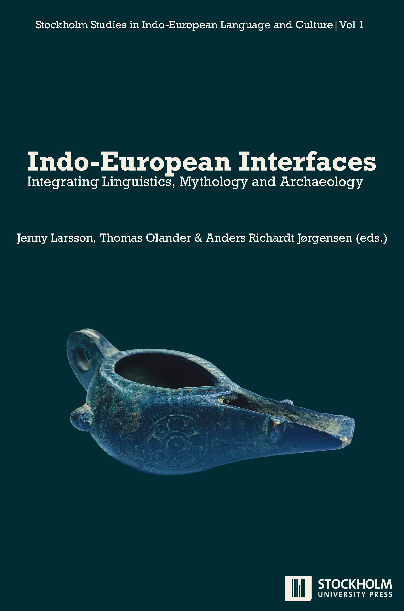

# Indo-European Interfaces

## Integrating Linguistics, Mythology and Archaeology

<i>Jenny Larsson, Thomas Olander & Anders Richardt Jørgensen (eds.)</i>

Published by

Stockholm University Press

Stockholm University Library

Universitetsvägen 10

SE-106 91 Stockholm

Sweden

[www.stockholmuniversitypress.se](https://www.stockholmuniversitypress.se)

Text © The Author(s) 2024

License CC BY-NC

Author ORCiDs: Jenny Larsson: [https://orcid.org/0000-0002-7251-3513](https://orcid.org/0000-0002-7251-3513), Timothy G. Barnes: [https://orcid.org/0000-0002-3481-7196](https://orcid.org/0000-0002-3481-7196), Riccardo Ginevra: [https://orcid.org/0000-0002-6731-6494](https://orcid.org/0000-0002-6731-6494), Stefan Höfler: [https://orcid.org/0000-0003-3085-2047](https://orcid.org/0000-0003-3085-2047), Anders Hultgård: [https://orcid.org/0000-0002-2693-8035](https://orcid.org/0000-0002-2693-8035), Rune Iversen: [https://orcid.org/0000-0001-7618-625X](https://orcid.org/0000-0001-7618-625X), Peter Jackson Rova: [https://orcid.org/0000-0002-0742-6640](https://orcid.org/0000-0002-0742-6640), Anders Kaliff: [https://orcid.org/0000-0002-0611-2631](https://orcid.org/0000-0002-0611-2631), Terje Oestigaard: [https://orcid.org/0000-0001-7775-5434](https://orcid.org/0000-0001-7775-5434), John T. Koch: [https://orcid.org/0000-0002-0809-3622](https://orcid.org/0000-0002-0809-3622), Birgit Anette Olsen: [https://orcid.org/0000-0002-8064-7351](https://orcid.org/0000-0002-8064-7351).

Supporting Agency (funding): Stiftelsen Riksbankens Jubileumsfond (LAMP: Languages and Myths of Prehistory, grant number: M19-0625:1); Olle Engkvists Stiftelse; Siléns Stiftelse.

First published 2024

Cover designed by Stockholm University Press

Cover image: Bronze lamp from Luristan (Iran), c. 1000 BCE

Cover image credit: Jenny Larsson

Stockholm Studies in Indo-European Language and Culture (Online) ISSN: 2004-9080 Series number: 1

ISBN (Paperback): 978-91-7635-218-2

ISBN (PDF): 978-91-7635-219-9

ISBN (EPUB): 978-91-7635-220-5

ISBN (Mobi): 978-91-7635-221-2

DOI: [https://doi.org/10.16993/bcn](https://doi.org/10.16993/bcn)

This work is licensed under the Creative Commons Attribution-NonCommercial 4.0 International (CC BY-NC 4.0) License (unless stated otherwise within the content of the work). To view a copy of this license, visit [https://creativecommons.org/licenses/by-nc/4.0/](https://creativecommons.org/licenses/by-nc/4.0/) or send a letter to Creative Commons, 444 Castro Street, Suite 900, Mountain View, California, 94041, USA. This license allows for copying and distributing the work, providing author attribution is clearly stated and that you are not using the material for commercial purposes.

Suggested citation:

Larsson, J., Olander, T. & Jørgensen, A. R. (eds.) 2024. <i>Indo-European Interfaces: Integrating Linguistics, Mythology and Archaeology</i>. Stockholm: Stockholm University Press. DOI: [https://doi.org/10.16993/bcn](https://doi.org/10.16993/bcn). License: CC BY-NC

To read the free, open access version of this book online, visit [https://doi.org/10.16993/bcn](https://doi.org/10.16993/bcn) or scan this QR code with your mobile device.

# Stockholm Studies in Indo-European Language and Culture

<i>Stockholm Studies in Indo-European Language and Culture</i> (ISSN 2004-9080) is a peer-reviewed series of monographs and edited volumes published by Stockholm University Press. The series is cross-disciplinary and aimed at scholars researching aspects of the Indo-European language family from a multitude of perspectives, including linguistics, archaeology, genetics and comparative mythology.

The series strives to meet the need for a well-structured, peer-reviewed and modern open access option for scholars interested in expanding the field of Indo-European Studies. Submissions are accepted from scholars from all over the world.

## Editorial Board

- Jenny Larsson, Professor, Department of Slavic and Baltic Studies, Finnish, Dutch and German, Stockholm University, Sweden (Chairperson). E-mail: [jenny.larsson@balt.su.se](mailto:jenny.larsson@balt.su.se)

- George Hinge, Associate Professor, School of Culture and Society, Classical Philology, Aarhus University, Denmark

- Daniel Kölligan, Professor, Institut für Altertumswissenschaften, Lehrstuhl für vergleichende Sprachwissenschaft, University of Würzburg, Germany

- Olof Sundqvist, Professor, Department of Ethnology, History of Religions and Gender Studies, Stockholm University, Sweden

- Nicholas Zair, Senior Lecturer in Classics, Classical Linguistics & Comparative Philology, University of Cambridge, United Kingdom

## Titles in the series

1. Larsson, J., Olander, T., & Jørgensen, A. R. (eds.) 2024. <i>Indo-European Interfaces: Integrating Linguistics, Mythology</i> <i>and Archaeology</i>. Stockholm: Stockholm University Press. DOI: [https://doi.org/10.16993/bcn](https://doi.org/10.16993/bcn). License: CC BY-NC

# Peer Review Policies

Stockholm University Press ensures that all book publications are peer reviewed in two stages. Each book proposal submitted to the Press will be sent to a dedicated Editorial Board of experts in the subject area. The Board can be considered biased if the Author or Editor has a close collaboration with the majority of its members. In such cases the proposal will be sent to at least one, but preferably two external reviewers before a decision is made. The full manuscript will always be peer-reviewed by chapter or as a whole by two independent experts. Publishing decisions are made by a Publishing Committee, considering the recommendations of the Editorial Board alongside with the reviewers’ comments.

A full description of Stockholm University Press’ peer review policies can be found on the website: [https://www.stockholmuniversitypress.se /site/peer-review-policies/](https://www.stockholmuniversitypress.se/site/peer-review-policies/).

The peer-review process for this particular book has been handled by a member of the Editorial Board who is not working closely with the Editors, namely Prof. Dr. Daniel Kölligan, Chair of Comparative Philology, Julius-Maximilians-Universität Würzburg, Germany. The Chairperson of the Editorial Board has not been involved in the editorial process for this volume.

## Recognition for reviewers

The Editorial Board of <i>Stockholm Studies in Indo-European Languages and Culture</i> applies a single-blind review procedure for assessing both the book proposal and the book manuscript, meaning that the reviewers remain anonymous to the Editors and Authors until the manuscript has been accepted for publication. The board would like to thank all stakeholders involved in this process.

Reviewing a book manuscript is an important and time-consuming effort. The board would, therefore, like to send a special thanks to the referees who have been performing the peer review of this book. All reviewers are invited to be named in the published version. The following person has accepted to be affiliated with the review of this book.

Christiane Schaefer, Associate Professor, Department of Linguistics and Philology, Uppsala University, Sweden. ORCiD: [https://orcid.org /0000-0001-5495-975X](https://orcid.org/0000-0001-5495-975X)

# Contents

List of illustrations

Acknowledgements

1. The many interfaces of Indo-European

<i>Jenny Larsson</i>

2. The distribution of goods and lordship in Indo-European

<i>Timothy G. Barnes</i>

3. Hermes and Prometheus in Scandinavia – or Thor and Thjalfi in Greece

<i>Riccardo Ginevra</i>

4. Linnaean linguistics

<i>Stefan Höfler</i>

5. Travelling myths or Indo-European tradition?

<i>Anders Hultgård</i>

6. Issues with the steppe hypothesis: An archaeological perspective

<i>Rune Iversen</i>

7. The inverse of praise

<i>Peter Jackson Rova</i>

8. The night sky of the Indo-Europeans

<i>Michael Janda</i>

9. Fighting the winter

<i>Anders Kaliff & Terje Oestigaard</i>

10. Celto-Germanic and North-West Indo-European vocabulary

<i>John T. Koch</i>

11. The Indo-European vocabulary of dairy products

<i>Birgit Anette Olsen</i>

12. Priests, oxen and the Indo-European taxonomy of wealth in the Iguvine Tables

<i>Nicholas Zair</i>

# List of illustrations

## Chapter 3. Hermes and Prometheus in Scandinavia – or Thor and Thjalfi in Greece: Reconstructing an Indo-European aetiological myth about a prehistoric steppe ritual

1. Examples of “head-and-hoof deposits”. From: Piggott 1962: 113 © Antiquity Publications Ltd 1962. License: CC BY-NC

## Chapter 5. Travelling myths or Indo-European tradition?: The Irano-Scandinavian correspondences

1. The Kragehul spear shaft. From: Wimmer 1887: 124. License: CC-PD

## Chapter 6. Issues with the steppe hypothesis: An archaeological perspective: Iconography, mythology and language in Neolithic and Early Bronze Age southern Scandinavia

1. Face pot from a passage grave at Svinø, southern Zealand, Denmark. From: Sophus Müller 1918, no. 164. License: CC-PD

2. Distribution of anthropomorphic stelae/statue menhirs across Eurasia. From: Sabine Reinhold, 2018, fig. 2 © License: CC BY-NC

3. The bronze figurines from Grevensvænge, Southern Zealand, Denmark. Drawn by Christian Brandt c. 1779/80. From: Djupedal and Broholm 1953. License: CC-PD

4. The two-faced figure from Kallerup, Thy, Denmark. Photo: Søren Greve, The National Museum of Denmark © License: CC BY-SA 4.0

## Chapter 7. The inverse of praise: Epigraphic practices of Indo-European cursing

1. Principles of variation in a set of dithematic names. Graphics: Peter Jackson Rova © License: CC BY-NC

2. Chiastic structure of the climactic segment in the Björketorp curse. Graphics: Peter Jackson Rova © License: CC BY-NC

## Chapter 9. Fighting the winter: Indo-European rituals and cosmogony in cold climates

1. The Bronze-Age (ca. 1000 BC) Håga mound in Uppsala, Sweden, 6 February 2021. Photo: Terje Oestigaard © License: CC BY-NC

2. Water from the underground overflowing rock-art. Tanum, Aspeberget. Photo. Bertil Almgren © shfa.dh.gu.se (SHFA). License: CC BY 4.0

3. Celestial and terrestrial powers in practice and working together. The sun shines from above and underground forces keep the water alive during cold winters. Historic source at Håga, Uppsala, Sweden 6. February 2021. Photo: Terje Oestigaard © License: CC BY-NC

4. Sagaholm. Slab 30 in situ with depiction of an Indo-European horse ritual. Photo: Bertil Almgren © shfa.dh.gu.se (SHFA). License: CC BY 4.0

5. Skeid depicted on rock art. Litsleby 2 Tanum, Bohuslän, Sweden. Date: Younger Bronze Age. Photo: Gerhard Milstreu © shfa.dh.gu.se (SHFA). License: CC BY 4.0

6. Symbolic horse fight between the Winter and the Summer. From Olaus Magnus 1555 [2001]. License: CC-PD

7. Boat fight or water-tournament. From Olaus Magnus 1555 [2001]. License: CC-PD

8. Symbolic water-tournament with naked fighters (note the skee-name): Massleberg Skee, Bohuslän. Date: Younger Bronze Age. Photo: Torsten Högberg © shfa.dh.gu.se (SHFA). License: CC BY 4.0

9. Fields and fertility during ploughing ritual. Litsleby 6 Tanum, Bohuslän, Sweden. Photo: Gerhard Milstreu © shfa.dh.gu.se (SHFA). License: CC BY 4.0

10. Late Bronze Age (ca. 700 BC) razor with horses and ship found in 1958, Rinkeby, Sweden. Photo: Jan Eve Olsson, RAÄ © License: CC BY-NC

## Chapter 10. Celto-Germanic and North-West Indo-European vocabulary: Resonances in myth and rock art iconography

1. Map showing Iberian Late Bronze Age warrior stelae, rivers navigable in later prehistory, copper and tin deposits. From: M. Díaz-Guardamino 2017 © License: CC BY-NC

2. Rubbing of rock art image of a chariot and two-horse team from Frännarp, Skåne, Sweden, showing recurrent conventional representation of the horse, chariot frame, wheels, axles, spokes, yoke, and yoke pole. Photo: Dietrich Evers © shfa.dh.gu.se (SHFA). License: CC BY 4.0

3. Fragmentary Late Bronze Age stela depicting chariot with two-horse team: El Tejadillo, Capilla, Badajoz, Spain; Museo Arqueológico Provincial de Badajoz. Photo: J. Koch © License: CC BY-NC

4. Rock carving depicting a sea-going vessel with a mast, rigging, and crew: Auga dos Cebros, Galicia, Spain. Drawing: J. Koch © License: CC BY-NC

5. Bronze Age rock carving depicting a sea-going vessel with a mast, rigging, and crew: Järrested, Skåne, Sweden. Photo: Catarina Bertilsson © shfa.dh.gu.se (SHFA). License: CC BY 4.0

6. Bronze Age rock carving of a sea-going boat with a crew of paddlers and large bihorned figure, from Tanum, Bohuslän, Sweden. Photo: Gerhard Milstreu, Tanums Hällristningsmuseum © shfa.dh.gu.se (SHFA). License: CC BY 4.0

7. Rock carving, in which a large bihorned figure standing on a chariot pulled by a small horned quadruped to the apparent wonder of man standing aboard a vessel below (Vitlycke panel, Tanum, Bohuslän, Sweden) is reminiscent of the associations of Thor in Norse mythological literature, riding through the sky in a chariot pulled by goats. The zigzag in front of him might represent the namesake thunder bolt. Photo: J. Koch © License: CC BY-NC

## Chapter 12. Priests, oxen and the Indo-European taxonomy of wealth in the Iguvine Tables

1. Doubling of the ‘men and cattle’ merism. Graphics: Nicholas Zair © License: CC BY-NC

# Acknowledgements

The Editors and Authors of this volume would like to sincerely thank the grant agency and the foundations that made it possible to produce this volume:

Stiftelsen Riksbankens Jubileumsfond (LAMP: Languages and Myths of Prehistory, grant number: M19-0625:1); Olle Engkvists Stiftelse; Siléns Stiftelse.
