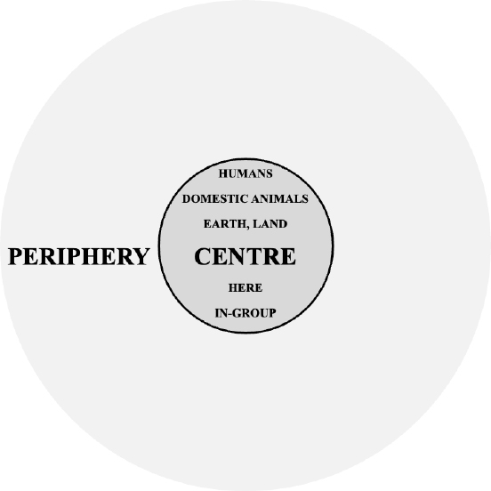
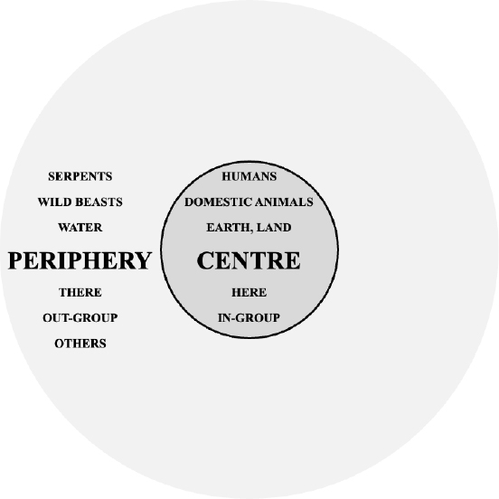

# 2. Strangers from the waters – serpents, canids, horses and others

**Indo-European conceptions of human ecology and the CENTRE–PERIPHERY spatial schema[^1]**

_Riccardo Ginevra_

Università Cattolica del Sacro Cuore, Milan

## Abstract

<!-- p. 7 -->

The study provides a historical-comparative analysis of the linguistic and textual data attested in various Indo-European traditions in connection with beings associated with WATER and described as monstrous creatures, cosmic strangers and/or ontological others. On the basis of these entities’ shared features, a conceptual system is reconstructed, which nicely fits into the set of beliefs that may be referred to as “Indo-European ecologies”.

## 1. Introduction

<!-- p. 8 -->

The present contribution deals with several kinds of beings described within Indo-European (IE) mythological and legendary traditions as monstrous creatures, cosmic strangers and/or ontological others, all of which share an association with locations linked to the concept WATER. By means of a historical-comparative methodology rooted in linguistics and philology, it is argued that the shared features of these peripheral characters allow for the reconstruction of a system of associations that easily fit into some inherited cultural conceptions that, as explained immediately below, may be referred to as _Indo-European ecologies_.

According to widespread conventions, in the next sections lexemes are printed in italics (e.g. Vedic _áhi_- ‘serpent’) and conceptual items in small caps (e.g. WATER).

### 1.1. Indo-European ecologies

The English term _ecology_, most often currently used in the sense “branch of biology that deals with the relationships between living organisms and their environment[; a]lso: the relationships themselves” (_OED_, s.v. _ecology_, §1.a), is a compound of two lexical elements of Greek origin: the well-known English prefixoid _eco_- ‘relating to the environment’, a reflex of the Ancient Greek noun _oîkos_ ‘house, dwelling-place, home, household’, and the equally widespread English suffixoid -_logy_ ‘science of, study of’, which must ultimately be traced back to the Ancient Greek noun _lógos_ ‘computation, account, esteem, reason; speech, word, statement’. The various senses of Greek _lógos_ may be broadly approximated by means of the English term _discourse_, in the two senses that are current within linguistics and humanities, namely “body of statements, analysis, opinions, etc., relating to a particular domain of intellectual or social activity […]; the set of shared beliefs, values, etc., implied or expressed by this” and “connected series of utterances by which meaning is communicated, esp. one forming a unit for analysis; spoken or written communication regarded as consisting of such utterances” (_OED_, s.v. _discourse_, §§7–8).

In its etymological sense, an _eco-logy_ is thus a ‘discourse on the household’, i.e. a ‘body of statements relating to the household, and the set of shared beliefs implied or expressed by such statements’. The phrase _IE ecologies_ is here correspondingly used to refer to ‘IE discourses on the household’, i.e. bodies of statements relating to the household as attested within IE traditions, and the sets of shared beliefs implied or expressed by

<!-- p. 9 -->

such statements. This definition is actually relatively close to the current meaning of _human ecology_, which refers to the discipline that “addresses the relationships of humans to their environment” (Freese 2001: 6975): as it is impossible to reconstruct a Proto-Indo-European (PIE) word for ‘environment’ or ‘nature’, whereas, within the clan-based societies where the earliest varieties of IE were spoken, words for ‘household’ clearly referred to the centre of a human being’s living environment, our best pathway to the reconstruction of prehistoric conceptions of human ecology is precisely the comparative analysis of historically attested IE discourses relating to the household, i.e. _IE ecologies_.

Given that most of the data analysed in this study occurs within texts that deal with mythological topics, it must be noted that an interest in the interrelationship between religion and ecology is nothing particularly new to the field of the history of religions. An “ecological approach to religion” was previously advocated by Åke Hultkrantz (1966; 1974), who first stressed the importance of the “ecological and technological conditions” within which a religion is practised (Hultkrantz 1966: 147–148). Within the field of IE studies, this ecological approach was successfully applied by Bruce Lincoln (1981: 49–162) to the Indo-Iranian belief system that may be reconstructed on the basis of correspondences between Vedic Sanskrit and Avestan religious texts. Lincoln’s ecological investigation was part of a larger comparative analysis between the religions of the speakers of the Nuer language (South Sudan and Ethiopia) and of the earliest Indo-Iranian languages (Western and South Asia). Since the shared elements of Nuer and Indo-Iranian religious discourses may not be traced back to a common ancestor (Nuer being a Nilotic language, not an IE one), Lincoln convincingly linked them to the fact that “the ecological base of both cultures is the possession of cattle”, which led him to the conclusion that “the given features of ecology serve to mould or shape culture, which in turn serves to mould or shape religion” (ibid.: 173).

Following Hultkrantz’s (1974: 5) view that the means of subsistence of a religious community should be at the centre of any cross-cultural ecological comparison, Lincoln’s comparative analysis focuses on the role of cattle, which both Nuer and Indo-Iranian speakers saw as “an integral part of the community”, as the social order was “thought to include both people _and_ cattle” (Lincoln 1981: 7; original emphasis).[^2]

<!-- p. 10 -->

Conversely, the present investigation takes as a starting point some features of a monstrous category that, in both Indo-Iranian and other IE mythological traditions, stood at the opposite end of the ecological space, as the adversaries par excellence of mythological heroes in their struggle for the possession of cattle: serpentine beings, explicitly identified with enemies and outsiders (Lincoln 1981: 107; 122),[^3] who are often said to be located by the WATER.

### 1.2. IE serpents of the (watery) deep

As is well known, the onomastics and phraseology occurring in texts composed in a variety of ancient IE languages allow for the comparative reconstruction of an inherited mythological figure that may be referred to as the “Serpent of the Deep”: a SERPENTINE BEING who lives in DEEP WATER.[^4] Such beasts are especially well attested in Indic and Norse mythology, with the former tradition recording at least three mythical characters that are relevant to this investigation.

First, Vedic _Áhi- Bhudnyá-_ “Serpent of-the-Deep” (see [1]) is attested as the name of a “water-born serpent” who “sits in the depth of the rivers, in the dusky realms” in [2], and who “has been set in the depths” – a place most likely identical to “the seat of the waters” – in [3]. More precisely, within the passage [2], the locative _rájassu_ ‘in the dusky realms’ clearly refers to the same location as _budhné nadīnāṁ_ “in the depth of the rivers”, whereas, in the next passage [3], the locative _budhnéṣu_ ‘in the depths’ is contextually associated with the goal _apáaṁ sádanāya_ “toward the seat of the waters”. The same connection between _rájas_- ‘dusky realm’, _budhná_- ‘depth, base, foundation’ and the concept WATER is attested in a further passage (see [4]) where the phrase _budhné rájaso_ “at the base of the realm” is used to refer to the birth-place of the god Agni (‘Fire’), who was famously born _apm upásthe_ “in the lap of the Waters” (see [5]). Such parallels allow for the interpretation of the name “Serpent of the Deep” as specifically referring to DEEP WATER, and not just to any deep location: we are dealing with a “Serpent of Deep Water”, or a “Serpent of the Watery Depth”, here.[^5]

<!-- p. 11 -->

[1] _m no_ **_áhir budhníyo_** _riṣé dhād / asmkam bhūd upamātivániḥ_ “Let **the Serpent of the Deep** not set us up to suffer harm. For us let there be winnings at the distribution (of prizes)” (RV 5.41.16de)

[2] **_abjáam_** _ukthaír_ **_áhiṁ_** _gr̥ṇīṣe /_ **_budhné nadī´nāṁ rájassu ṣī´dan_** _// m no_ **_áhir budhníyo_** _riṣé dhān / m yajñó asya sridhad ṛtāyóḥ_ “I will sing **to the water-born serpent** with hymns: **he is sitting in the depth of the rivers, in the dusky realms**. Let **the Serpent of the Deep** not set us up for harm; let the sacrifice of him who seeks the truth not fail.” (RV 7.34.16–17)

[3] _utá no náktam_ **_apáaṁ_** _vṛṣaṇvasū / sryāmsā_ **_sádanāya_** _sadhaníyā / sácā yát_ **_sā´di_** _eṣaam /_ **_áhir budhnéṣu budhníyaḥ“And for us by night (and by day), o you two of bullish goods [= Aśvins], the Sun and Moon are our joint guides_ toward the seat of the waters**, when in company with them **the Serpent of the Deep has been set in the depths**” (RV 10.93.5)

[4] **_sá jāyata_** _prathamáḥ pastíyāsu / mahó_ **_budhné rájaso_** _asyá yónau_ “**He (Agni) was born** first in the dwelling places, **at the base of this** great **realm**, as his womb” (RV 4.1.11ab)

[5] **_apā´m upásthe mahiṣó_** _vavardha_ “**The buffalo (Agni)** has grown strong **in the lap of the waters**” (RV 10.8.1d)

The formulaic line _m no áhir budhníyo riṣé dhād_ “let the Serpent of the Deep not set us up to suffer harm”, occurring both in [1] and [2], attests to the fact that this divine character was not only invoked in prayers as a god but also seen as a potentially harmful character: as already proposed by Macdonell (1897: 73), this “baleful aspect” of the Serpent of the Deep may be evidence of the fact that the beast “was originally not different from Ahi Vr̥tra” and represented the latter’s “beneficent side” (ibid.: 153).

The most famous antagonist of Vedic mythology, the great ‘serpent’ (_áhi_-) called _Vṛtrá_- ‘Obstacle’, is said to be killed by the warrior-god Indra (e.g. in [6]) within a dragon-slaying myth whose IE heritage is the main topic of a famous book by Calvert Watkins (1995). As noted by Watkins (ibid.: 298), a connection with chthonic waters is “a general attribute of the dragon” who is slain by the warrior-god in Indo-Iranian myth; the same scholar (ibid.: 460–463, with an overview of previous relevant scholarship) also argues for the original identity of the Dragon and the Serpent of the Deep in Indic and IE mythology in general. This identification finds support, inter alia, in the fact that

<!-- p. 12 -->

passages describing the location of Vr̥tra attest the same connection between _rájas_- ‘dusky realm’, _budhná_- ‘depth, base, foundation’ and the concept WATER noticed above for the location of the Serpent of the Deep: in text [7], the location _rájaso budhnám_ “on the foundation of the dusky realm”, where Vr̥tra is said to lie, has the same referent as the locative _pravaṇé_ ‘in the (waters’) torrent’. Vr̥tra’s connection with WATER is further attested by his mother’s name, _Dnu_- (see [8]), which is identical with a neuter noun meaning ‘drop, stream’ (also attested once as a feminine); the same name is also used to refer to Vr̥tra himself, who also has a _vṛddhi_ metronymic _Dānavá_- ‘(son) of Dānu’, which may also be interpreted as ‘(the serpent) of the drops, of the streams’.[^6]

[6] _áhan_ **_vṛtráṁ_** _vṛtratáraṁ víaṁsam / índro vájreṇa mahat vadhéna / skándhāṁsīva kúliśenā vívṛkṇā /_ **_áhi_**ḥ_śayata upapŕ̥k pr̥thivyḥ_ “Indra smashed **Vṛtra [/Obstacle]** the very great obstacle, whose shoulders were spread apart, with his mace, his great weapon. Like logs hewn apart by an axe, **the serpent** would lie, embracing the earth [/soaking the earth (with his blood)]” (RV 1.32.5)

[7] _apó vṛtvī_ **_rájaso budhnám ā´śayat_** _/ vṛtrásya yát_ **_pravaṇé_** _durgŕ̥bhiśvano / nijaghántha hánuvor indra tanyatúm_ “**He [=Vṛtra]**, having obstructed the waters, **was lying on the foundation of the dusky realm**, when you, Indra, struck your thunder down upon the jaws of Vr̥tra, Hard-to-Grasp, **in the (waters’) torrent**” (RV 1.52.6bcd)

[8] _nīcvayā abhavad_ **_vṛtráputrā_** _/ índro asyā áva vádhar jabhāra / úttarā sr ádharaḥ putrá āsīd /_ **_dā´nu_**ḥ_śaye sahávatsā ná dhenúḥ_ “The strength of **Vṛtra’s mother** ebbed; Indra bore his weapon down upon her. The mother was above; the son below: **Dānu** lies like a milk-cow with her calf” (RV 1.32.9)

A third relevant character attested in the Indic epic tradition is the great serpent Śeṣa, also known as Ananta, who supports the earth from beneath, lying around the four oceans. While this serpentine being is not usually linked to either the Serpent of the Deep or Vr̥tra, he clearly shares the associations of both with the concepts DEPTH and WATER: various passages of the _Mahābhārata_ (see [9], [10] and [11]) describe Śeṣa

<!-- p. 13 -->

as he carries the earth on his head from beneath, lying with his endless coils around its circumference (as in [10]) or around the oceans (as in [9]) that surround it (see [11]).

[9] **_bibharti_** _devīṃ śirasā_ **_mahīm_** _imāṃ_ **_samudranemiṁ parigṛhya sarvata_**ḥ“(**Śeṣa**) **carries** the Goddess **Earth** on his head, **encompassing all around the circumference of the oceans**” (_Mahābhārata_ 1.32.22.2)

[10] **_śeṣo_** _‘si nāgottama dharmadevo_ **_mahīm_** _imāṃ_ **_dhārayase_** _yad ekaḥ /_ **_anantabhoga_**ḥ**_parigṛhya sarvāṁ_** _yathāham evaṃ balabhid yathā vā_ “Thou art **Śeṣa**, greatest of Snakes, thou art the God of Law, for thou alone **lendest support to** this **earth, encircling her entire with endless coils**, not less than I support her, or the Cleaver of Vala” (_Mahābhārata_ 1.32.23)

[11] **_catu_**ḥ**_samudraparyantāṁ_** _merumandarabhūṣaṇām /_ **_śeṣo bhūtvāham_** _evaitāṃ_ **_dhārayāmi vasuṁ dharām_** “**as Śeṣa I support this treasure-filled earth that is girt by the four oceans** and adorned with the Meru and Mandara” (_Mahābhārata_ 3.187.10)

As long noted (e.g. West 2007: 347–348), the great serpents of Indic myth have close parallels in the Norse mythological serpent par excellence: the _Miðgarðsormr_ ‘Midgard Serpent’, also known as _Jǫrmungandr_ (of unclear meaning), a giant snake that lies at the bottom of the ocean. As Thor’s greatest adversary, the Midgard Serpent is the Norse counterpart to the Indic warrior-god Indra’s adversary Vr̥tra (see Watkins 1995: 419–424), but, as shown in [12], the Norse snake is also closely associated with the concepts DEPTH and WATER, like the Vedic Serpent of the Deep and the epic snake Śeṣa and, as the latter, he is even said to surround all lands with his endless coils. Furthermore, just like Śeṣa upholds the earth from beneath, the Midgard Serpent is also linked to the balance between ocean and land, as attested in [13]: when the End of Time (Ragnarok) comes, the Midgard Serpent shall leave the ocean and “make its way ashore”, and all lands will be covered in water.

[12] _kastaði hann_ **_orminum í inn djúpa sæ er liggr um o˛ll lo˛nd_**_, ok óx sá ormr svá at hann_ **_liggr í miðju hafinu of o˛ll lo˛nd_** _ok bítr í sporð sér_. “he (Odin) threw **the serpent into that deep sea which lies round all lands**, and this serpent grew so that it **lies

<!-- p. 14 -->

in the midst of the ocean encircling all lands** and bites on its own tail” (Snorri Sturluson, _Gylfaginning_ 34)

[13] _Þá_ **_geysisk hafit á lo˛ndin_** _fyrir því at þá snýsk_ **_Miðgarðsormr_** _í jǫtunmóð ok_ **_sœkir upp á landit_**. “Then **the ocean will surge up on to the lands** because the **Midgard serpent** will fly into a giant rage and **make its way ashore**” (_Gylfaginning_ 51)

As is well known, the Indic and Norse “Serpents of Deep Water” have various counterparts in other IE traditions, such as the Ancient Greek monster associated with the underground spring of Delphi and famously slain by the god Apollo: the Python (sometimes described as a male, but sometimes as a female and referred to as _drákaina_ ‘she-dragon’). As seen in [14] and [15], this Greek monster is called both _óphis_ ‘serpent’, which is a reflex of PIE \*_h₃égʷʰi_- ‘id.’ (Beekes 2010, s.v. ὄφις) and thus an exact cognate of Vedic Sanskrit _áhi_- ‘id.’, as well as _Pýth-ōn_, a proper name clearly linked with the toponym _Pyth-ṓ_ for Delphi and reflecting the same PIE root \*_bʰudʰ_- ‘deep’ occurring in Vedic _budhnyá_- ‘of the deep’. Greek _Pýthōn óphis_ “the snake Python” in [14] is thus a very close etymological match for the Vedic name _Áhi- Budhnyá-_ “Serpent of-the-Deep”.

[14] ἡ˜κεν εἰς Δελφούς, χρησµῳδούσης τότε Θέµιδος· ὡς δὲ ὁ φρουρω˜ν τὸ µαντει˜ον **Πύθων ὄφις** ἐκώλυεν αὐτὸν παρελθει˜ν ἐπὶ τὸ **χάσµα**, του˜τον ἀνελὼν τὸ µαντει˜ον παραλαµβάνει “he (Apollo) came to Delphi, where Themis at that time used to deliver oracles and when the **snake Python**, which guarded the oracle, would have hindered him from approaching the **chasm**, he killed it and took over the oracle” (Apollodorus 1.4)

[15] **Πυθώ** τοι κατιόντι συνήντετο δαιµόνιος θήρ, / αἰνὸς **ὄφις**. τὸν µὲν σὺ κατήναρες ἄλλον ἐπ’ ἄλλῳ / βάλλων ὠκὺν ὀϊστόν “As thou wert going down to **Pytho**, there met thee a beast unearthly, a dread **snake**. And him thou didst slay, shooting swift arrows one upon the other” (Callimachus _Hymn_ 2.100–102)

The parallels between all the mythological deep-water serpents mentioned so far have been subject to extensive treatment elsewhere (e.g. Toporov 1974; Watkins 1995: 460–463; West 2007: 255–259; 347–349; Ginevra 2024a:159–173) and shall not be discussed any

<!-- p. 15 -->

further in this contribution.[^7] The present study rather focuses on the linguistic and conceptual association between mythological SERPENTS and DEEP WATER and on its cultural significance, which has been described as puzzling by scholars such as Martin L. West (2007: 348), who notes that “[i]f the Indo-Europeans had a myth of a great serpent of the watery deeps, we must confess that we do not know what it signified”. The same scholar (ibid.: 349) also observed that “[t]he idea that it encircled the whole earth would seem to presuppose the belief that the earth was surrounded by water”, but “we have no sufficient ground for attributing it to the IEs”, even though this view is explicitly attested in Indic, Germanic and Greek sources. This apparently problematic system of conceptual associations may be summarized as in Table 1 below.

**Table 1.** Association between SERPENTS and (DEEP) WATER surrounding the EARTH.

| - | - | - |
| --- | --- | --- |
| SERPENTS |  |  |
| (DEEP) WATER | surrounding | EARTH, LAND |

### 1.3. Aim, methodology and structure of the study

The aim of this contribution is to propose that the conceptual association with the location (DEEP) WATER is not an exclusive trait of mythological SERPENTS in IE mythology but rather a common feature of several mythological others (both monstrous and not) within IE traditions, and that

<!-- p. 16 -->

this association rests on the conceptualization of the location WATER as a periphery of human ecology in IE culture. This proposal will be argued for by means of a historical-comparative analysis of the conceptual associations, onomastics and phraseology linked to a series of mythological and legendary creatures associated with WATER within IE traditions. Phraseological items will be represented according to the conventional system [SEMANTIC.ELEMENT (_corresponding.lexemes_) – semantic/syntactic.relationship SEMANTIC.ELEMENT (_corresponding.lexemes_)]: e.g. the association between two concepts SERPENT and DEPTH underlies the inherited phrase [SERPENT (\*_h₃égʷʰi_-) – of the DEEP (\*_bʰudʰ_-)] that may be reconstructed on the basis of the Vedic name _Áhi- Budhnyá-_ “Serpent of-the-Deep” and of the Ancient Greek _Pýthōn óphis_ “the snake Python” discussed above.

The study is structured as follows. Section 2 is devoted to SERPENTS in general; it is argued that not all IE legendary and mythological serpents are associated with WATER, nor are they always HOSTILE, but most are PERIPHERAL beings who are said to “come from somewhere else”. Section 3 is devoted to WATER-creatures other than SERPENTS: several mythological beings described as HOSTILE or FRIENDLY OTHERS, both zoomorphic (canids and horses) and humanoid, are shown to share an association with WATER. The last part, Section 4, is devoted to the conceptualization of WATER as a PERIPHERY of HUMAN LIFE, identified as a possible reason for the connection of SERPENTS and other mythological OTHERS with WATER, while the idea that earth was surrounded by water is thus shown to nicely fit in the way human ecology was conceptualized by the earliest speakers of IE varieties.

## 2. Serpents as peripheral beings: serpentine enemies and guests

Even though the “Serpents of Deep Water” attested (among others) in the Indic and Norse traditions may securely be reconstructed as an inherited feature of IE poetic culture, it must be pointed out that, within IE traditional texts, SERPENTS are not always described as HOSTILE beings living in or arriving from WATERY places but rather as PERIPHERAL beings that may be either FRIENDLY (i.e. GUESTS) or HOSTILE (i.e. ENEMIES).[^8]

<!-- p. 17 -->

In Hittite myth and Old English poetry, e.g. HOSTILE SERPENTS are described as creatures that COME (i.e. move towards a conceptual CENTRE or deictic HERE) from PERIPHERAL locations (a deictic THERE) to the place that they will torment – with no reference whatsoever to WATER. In Hittite passage [16], from a narrative about the monster called _Illuyanka_- ‘Serpent’, the latter is invited as a GUEST in a feast thrown by the goddess Inara, a banquet to which the Serpent and his offspring are said to “come up” (_šarā wēr_) and from which, after the feast, they do not want to “go back down into their hole again” (_namma ḫattešnaš kattand_[_a_?] _pānzi_), thus overstaying their welcome as GUESTS and becoming ENEMIES. Within text [17], from the Old English epic poem _Beowulf_, the great serpent who kills the hero Beowulf and destroys his kingdom, called _wyrm_ ‘worm, serpent, dragon’, lives in a barrow (a traditional Germanic theme) and thus not in water, but is said to ‘come’ (_cwōm_) like a “terrible evil-guest” (_atol inwit-gæst_), figuratively fulfilling both roles of GUEST and ENEMY. In passage [18] from the Old English _Nine Herbs Charm_, a _wyrm_ ‘worm, serpent, dragon’ (the same word used for _Beowulf_’s serpent) is said to “come sneaking” (_com snican_) from some PERIPHERY to a location where it kills a human being, prompting the god Woden’s slaying of the beast; the charm is explicitly said to make it impossible for the snake to enter the HOUSEHOLD (_on hus bugan_ “go into the house”) from some unspecified PERIPHERY.

[16] d_inarašš=a=z unuttat n=ašta_ MUŠ**_illuyank_[_an_] _h˘antešnaz šarā_** _kallišta kāša=wa_ EZEN₄-_an iyami nu=wa adanna akuwanna_ **_eh˘u n=ašta_** MUŠ**_illuyankaš QADU_ [DUMU**MEŠ-**_ŠU_] _šarā wēr_** _nu=za eter ekwe_[_r_] _n=ašta_ DUG_palḫan ḫūmandan ek_[_wer_] _n=e=za ninkēr_ **_n=e namma h˘attešnaš kattand_[_a_**?**] _nūmān pānzi_** “Inara dressed herself up and called **the serpent up from its hole**, (saying:) ‘I’m preparing a feast. **Come** eat and drink.’ **The serpent and [his offspring] came up**, and they ate and drank. They drank up every vessel, so that they became drunk. **Now they do not want to go back down into their hole again**.” (KUB 17.5 Vs. I 5’–14’)

[17] _Æfter ðām wordum_ **_wyrm_** _yrre_ **_cwōm_**, / _atol_ **_inwitgæst_** _ōðre sīðe_ / _fȳrwylmum fāh fīonda nīos(ị)an_, / _lāðra manna_ “After these words, the **worm came** in anger, terrible **evil-guest**, a second time, with hostile swirling fires, in pursuit of his enemies” (_Beowulf_ 2669–2672)

<!-- p. 18 -->

[18] **_Wyrm com snican, toslat he man_**; / _ða genam Woden VIIII wuldortanas_ / _sloh ða þa næddran þæt heo on VIIII tofleah_. / _þær geændade æppel and attor_, / **_þæt heo næfre ne wolde on hus bugan_** “A **worm came sneaking, it slew a man**. Then Woden took nine glory-twigs and struck the serpent so that in nine parts it flew. There the apple destroyed (the serpent) and its poison, **so that it never should go into the house**” (_Nine Herbs Charm_ 31–35)

In [16] and [17] above, HOSTILE SERPENTS are described as unwanted GUESTS, i.e. ANTI-GUESTS (on which see Watkins 1995: 404–407; Jackson 2014), but SERPENTS may also have FRIENDLY, GUEST-like relationships with human beings, as attested in, e.g. the Indic and Baltic traditions. In the Sanskrit epic _Mahābhārata_, lexemes for ‘serpent’ like _nāga_- and _pannaga_- refer to sentient creatures who, as shown in [19], are organized in a human-like monarchic society based on fixed rules and may even be on FRIENDLY terms with human beings, to the point of contracting matrimony with them. As for the Baltic traditions, Jenny Larsson (this volume) discusses the archaic Baltic custom of keeping snakes at home, feeding them and treating them like gods, as attested, e.g. in text [20] from a 1557 report by Sigismund von Herberstein of a journey through north-western Lithuania. Such a custom (if it was ever historically practised) or belief clearly rests on the idea that SERPENTS may behave FRIENDLY towards human beings, to the point of living within their own HOUSEHOLD (which is not usually attested for such creatures).

[19] _tasya śāpasya śāntyarthaṃ_ **_pradadau pannagottama_**ḥ_/_ **_svasāram ṛṣaye_** _tasmai suvratāya tapasvine // sa ca tāṃ pratijagrāha vidhidṛṣṭena karmaṇā / āstīko nāma putraśca tasyāṃ jajñe mahātmanaḥ_ “It was to appease this curse that **the princely Snake gave his sister to the** great-spirited **(human) seer** of good vows. And he accepted her with the ritual that is found in the Rules. A son was born to her: the strong-willed Āstīka” (_Mahābhārata_ 1.13.36–1.13.37)

[20] “Even today one can find many pagan beliefs in these remote lands; some people [worship] fire, others trees, furthermore the sun and moon. However, there are others who keep their gods in their homes, i.e. snakes, resembling lizards but larger, with four legs, black and thick, measuring about three spans in length. Some call them Giowites, others Jastzuka, and still others Szmya. **They have a certain time when they** **feed their gods. They place some milk in the middle of the

<!-- p. 19 -->

house and then kneel down on the benches. Then the snake crawls out** and hisses at the people like angry geese and the people pray to them with great reverence. If something bad happens to someone, then he blames himself for not having fed his god properly.” (Sigismund von Herberstein, _Rerum Moscoviticarum Commentarii_, from Larsson, this volume)

To sum up briefly what has been discussed so far, in IE mythological and religious traditions SERPENTS are not always associated with WATER, but they are usually described as PERIPHERAL creatures who COME from “somewhere else” (a conceptual PERIPHERY, a deictic THERE), at least from the perspective of the human authors or protagonists of these texts (their conceptual CENTRE, a deictic HERE). From this point of view, SERPENTS can either be HOSTILE (ENEMIES) or FRIENDLY (GUESTS), but they are always clearly separate from – “other than” – HUMAN BEINGS (or their patrons, the gods). SERPENTS may thus be described as quintessential ontological OTHERS belonging to a separate social group, a so-called OUT-GROUP, in opposition to the IN-GROUP represented by one’s own HOUSEHOLD. This system of associations may be summarized as in Table 2.

**Table 2.** Association between SERPENTS, PERIPHERY and OUT-GROUP.

| - | - | - |
| --- | --- | --- |
| SERPENTS | different from, other than | HUMANS |
| PERIPHERY, THERE | opposed to | CENTRE, HERE |
| OUT-GROUP, OTHERS | hostile or friendly towards | IN-GROUP, HOUSEHOLD |

## 3. Peripheral water-creatures: enemies and guests from the waters

Serpentine beings like the “Serpent of the Deep” are not the only hostile mythological characters associated with water. Creatures linked with aquatic environments are a special category in IE mythology, and the linguistic data attested by the phraseology and onomastics associated with these creatures deserves particular attention. Each of the following subsections is devoted to a specific category of water-creatures that is cross-culturally attested in several IE traditions: hostile WATER-CANIDS (3.1), hostile WATER-HORSES (3.2) and hostile and friendly WATER-HUMANOIDS (3.3).[^9]

### 3.1. Monstrous canids from the waters

A first monstrous “Canid from the Waters”

<!-- p. 20 -->

is attested in texts from medieval Scandinavia (but possibly even earlier in Scandinavian art):[^10] the Norse monster called _Fenris-ulfr_, or simply _Fenrir_. As is well known, this mythological wolf, a brother of the Midgard Serpent, is destined to destroy the universe and the gods, and is thus taken by the deities to a water basin, “a lake called Amsvartnir” (see [21]), in order to imprison him; there he lies, immobilized, “at the mouth of a river” until Ragnarok, the End of Time (see [22]). Then, Fenrir shall get free from his water-prison, come to land with the enemies of the gods and slay deities like Odin (see [23]), contributing (together with his brother the Midgard Serpent; see above [13]) to the final destruction of the world (see [24]).

[21] _allar spár sǫgðu at hann mundi vera lagðr til skaða þeim_ […] _Þá fóru Æsirnir út í_ **_vatn þat er Ámsvartnir heitir_**_, í hólm þann er Lyngvi er kallaðr, ok_ **_ko˛lluðu með sér úlfinn_** “all prophecies foretold that it (Fenrir) was destined to cause them harm […] Then the gods went out on to **a lake called Amsvartnir**, onto an island called Lyngvi, and **summoned with them the wolf**” (_Gylfaginning_ 34)

[22] **_Úlf_** _sé ec_ **_liggia_ / _árósi fyrir,_** / _unz riúfaz regin_ “**A wolf** (Fenrir) I see **lying before a river mouth**, until the Powers are torn asunder” (_Lokasenna_ 41.1–41.3)

[23] **_Muspells megir_** _sœkja fram á þann vǫll er Vígríðr heitir._ **_Þar kemr ok þá Fenrisúlfr_** […] **_Úlfrinn gleypir Óðin_**_. Verðr þat hans bani_ “**Muspell’s lads (i.e. the enemies of the gods)** will advance to the field called Vigrid. **Then there will also arrive there Fenriswolf** […] **The wolf (Fenrir) will swallow Odin**. That will be the cause of his death.” (_Gylfaginning_ 51)

[24] _Mun_ **_óbundinn_** _/_ **_á ýta sjo˛t_** _/_ **_Fenrisulfr fara,_** _/ áðr jafngóðr / á auða trǫð / konungmaðr komi_ “**The wolf Fenrir, unbound, will enter the abode of men** (i.e. **the world will end**) before so good a royal person comes onto the vacant path” (Eyvindr skáldaspillir Finnsson, _Hákonarmál_ 20).

Old Norse _Fen-ri-r_ (which I analyse as a reflex of \*_fani̯_-_arii̯a_-_z_) is clearly etymologically linked to the term _fen_ ‘water basin, swamp, fen’, as has long been noted,[^11]

<!-- p. 21 -->

and basically means ‘(the one) of the water basin, swamp, fen’; the name _Fenris-ulfr_ may correspondingly be loosely translated as ‘Wolf of the Fen’, allowing for the identification, both on mythological (as a WOLF imprisoned in a WATERY location) and onomastic grounds, of Fenrir as the reflex of a “monstrous WATER-CANID” motif that, as argued in the remainder of this section, has correspondences in at least two other IE traditions. Further parallels involving Fenrir’s mythological role as an eschatological world-destroyer are discussed in the next two sections (3.2 and 3.3).

ON _fen_ is the outcome of Proto-Germanic \*_fani̯a-_ ‘water basin, swamp, fen’, expected reflex of PIE \*_poni̯o_-, also attested by Proto-Baltic \*_pani̯a-_ (Old Prussian _pannean_ ‘id.’ and Eastern Lithuanian _pania_° in _pania-bùdė_ ‘mushroom growing in humid places’) and close to Proto-Baltic \*_pani̯ā_ (Latvian _pane_ ‘water with dung’).[^12] These correspondences allow for the reconstruction of a PIE neuter \*_pon-i̯o-_ ‘basin of (stagnating) water, swamp’ with a collective plural \*_pon-i̯eh₂_-.[^13] The same PIE lexical root \*_pen_- ‘humid, water’ is also attested by Old Irish _en_ ‘water’ and Irish _enach_ ‘swamp’, reflexes of Proto-Celtic \*_en-o-_ (from PIE \*_pen-o-_) and \*_enā-ko-_, respectively, with the latter being a -_ko-_ derivative of Proto-Celtic \*_en-ā_- (from PIE \*_pen-eh₂-_), attested by Gaulish _anam_ ‘_paludem_’ and Middle Irish _an_ ‘water’.[^14] A further close Celtic parallel for Old Norse _fen_ (PIE \*_pon-i̯o_-) in _Fen-rir_ may thus be found in Old Irish _on°_ ‘water’ (PIE \*_pon-o-_),

<!-- p. 22 -->

which occurs as first element of compounds such as _on-fais_ ‘immersion’ and _On-chú_ ‘water-dog’.

The latter is one of the names, first attested in texts from medieval Ireland, of our second monstrous “Canid from the Waters”: the Irish monster called _On-chú_ or _Dobar-chú_ ‘water-dog’. The compound _On-chú_ ‘water-dog’ (also attested as a masculine anthroponym) already occurs in early Irish texts, such as _Mesca Ulad_ (see [25]), as the name of a species of fantastic beasts,[^15] which are described in Irish folklore as ferocious monsters who live in water basins (_on_°), especially lakes, from where they come out in order to slay human beings and livestock (Williams 1989: 66), as exemplified by text [26] from the Early Modern Irish romance _Caithréim Cellaig_, where a female Onchú living by two lakes is said to kill nine people. Just like the Norse Fenrir Wolf, the Irish Onchú is thus a ferocious canid linked to water basins, and the two monsters may have even shared similar iconographic representations, as they are both described with gaping mouths (indexically referring to their voracious nature) in [25] and [27] (the latter also matches Fenrir’s representation on the so-called Gosforth Cross, on which see Oehrl 2011: 162–166). It must correspondingly be noted that both _Fenris-ulfr_ and _On-chú_ are compounds whose first element may ultimately be traced back to a thematic derivative with -_o_- grade of the PIE root \*_pen_- ‘humid’ and whose second elements refers to a canid (‘wolf’ and ‘dog’, respectively): these onomastic and thematic parallels allow for the identification of both names as reflexes of an inherited phrase [CANID – of WATER (\*_pon-_(_i̯_)_o_-)], which may have been used in prehistoric times to refer to a monstrous mythological beast.

[25] **_Onchú óbéli_** _cechtar a dá gúaland_ “An **Onchú with gaping mouth** on each of his shoulders” (_Mesca Ulad_ 724–725)

[26] […] **_Loch Con 7 Loch Cuilind_** _7 do éirig_ **_onchú neimneach_** _do bí ar an c_[_h_]_oingilt dóib 7 ro marb nónbar dia muindtir ’na f_[_h_]_iadnaisi féin_ “[…] **Lake Con and Lake Cuilinn**. To guard which Congheilt **a venomous Onchú** opposed them, presently and before his face killing nine of his people” (_Caithréim Cellaig_ 534–536; Mulchrone 1933: 17)

[27] _En_ **_Fenrisúlfr ferr með gapanda munn_** _ok er hinn efri kjǫptr við himni en hinn neðri við jǫrðu._ **_Gapa mundi hann meira ef rúm væri til_** “But **Fenriswolf will go with mouth agape** and its upper jaw will be against the sky and its lower one against the earth. **It would gape wider if there was room**” (_Gylfaginning_ 51)

The Irish Onchú

<!-- p. 23 -->

was most likely a hybrid monster, half-reptile and half-mammal (Williams 1989: 71–74), just like the Norse wolf Fenrir on the Gosforth Cross (Oehrl 2011: 165), as well as the Greek monsters Scylla and Typhon (on which see below). Various scholars (e.g. Nagy 1985–1986) identify the Onchú with the otter, whose Old Irish name _dobur-chú_ (also attested as a masculine anthroponym) literally means ‘water-dog’ as well. In addition to being a term for ‘otter’, however, _Dobar-chú_ ‘water-dog’ is also used as the name of a legendary monster of Irish folklore, a beast that was still thought to attack and kill humans in the eighteenth century, as shown by the famous case of Grace Connolly from Lake Glenade, who according to her husband was killed by a Dobarchú in 1722. Just like the Onchú, the Dobarchú is said to infest water basins (Williams 1989: 74), and is still (rarely) spotted by Irish cryptozoologists (just like Nessie in Scotland). From an etymological perspective, Old Irish _dobur-chú_ and its exact Welsh cognate _dyfr-gi_ ‘water-dog, i.e. otter’ both reflect Proto- Celtic \*_dubro-kū_- ‘water-dog’, a compound of \*_kū_- ‘dog’ (reflex of PIE \*_ḱu̯ṓn-_) and \*_dubro_° ‘water’.[^16] The latter is a substantivization of PIE \*_dʰubʰ_-_ró-_ ‘deep, dark, dirty’ (Matasović 2009, s.v.), a derivative of the same PIE lexical root \*_dʰeu̯bʰ_- that also underlies Greek _Typháōn_ (see Watkins 1995: 461–462). Therefore, while _On-chú_ is etymologically linked to Old Norse _Fenrir_ (both reflecting PIE \*_pen-_ ‘water, humid’), _Dobar-chú_ is etymologically linked to Greek _Typʰáōn_, name of another IE mythological water-being analysed below (Section 3.3). These two synonyms may be interpreted as two variant names of the same legendary beast, a Celtic Water-Dog with close parallels in the Norse Wolf of the Fen Fenrir and in the Greek sea-dog Scylla, discussed immediately below. This Irish Water-Dog may at some point have been identified with the otter, of course, but as noted by Pettit (2016: 69) in his treatment of the Onchú, “if it is an otter, it is a _monstrous_ otter” (original emphasis).[^17]

<!-- p. 24 -->

The third mythological tradition relevant for this section is the Greek one, which attests at least two monstrous water-beings who are said to have canid features: Scylla, “the sea she-dog”, and her half-sister the Hydra, “the she-hound of Lerna”. According to Greek mythology, Scylla, daughter of Typhon and Echidna according to text [31] (but of Kratais and Trienus/Phorkos according to text [30]), lived in a cave close to the sea by the Strait of Messina. Her name _Skýllē_ is a feminine noun closely resembling the Hesychian gloss _skýllon_ · _tḕn kýna légousin_ “_s_. they call the she-dog” and thus most likely meaning ‘She-Dog’ (Beekes 2010, s.v. σκύλαξ). This semantic interpretation is supported by passage [28] from the _Odyssey_, where Scylla is said to bark with the voice ‘of a puppy’ (_skýlakos_); further support comes from texts [29], [30], and [31] by later authors Anaxilas, Apollodorus and Hyginus, where Scylla is described as a canid-like being. The monster is even explicitly called _pontía kýōn_ “sea she-dog” in [29], an epithet that exactly matches the phrase [CANID – of WATER] reconstructed on the basis of the Norse and Irish data discussed above. If Greek _póntos_ ‘sea’ were not currently traced back to a PIE noun \*_pont-eH_- ‘path’ (see, e.g. Beekes 2010, s.v. πόντος), one may even take _póntos_ ‘sea’ for another thematic derivative with -_o_- grade of the PIE root \*_pen_- ‘humid’, and correspondingly trace Greek _pontía kýōn_ “sea she-dog” back to the same inherited collocation [CANID – of WATER (\*_pon-_(_t_/_i̯_)_o_-)] reconstructed above on the basis of the names of Scylla’s Norse and Irish counterparts.

[28] **ἔνθα δ᾿ ἐνὶ Σκύλλη ναίει δεινὸν λελακυι˜α. / τη**˜**ς ἠ**˜ **τοι φωνὴ µὲν ὅση σκύλακος νεογιλη**˜**ς / γίγνεται**, αὐτὴ δ᾿ αὐ˜τε πέλωρ κακόν· “**In it dwells Scylla, yelping terribly. Her voice to be sure is only as loud as the voice of a newborn whelp**, but she herself is an evil monster” (_Odyssey_ 12.85–12.87)

[29] ἢ τρίκρανος **Σκύλλα**, **ποντία κύων** “O **Scylla** with three heads, **sea she-dog**” (Anaxilas _Neottis_ K-A 22)

[30] ἠ˜ν δὲ ἐν µὲν θατέρῳ **Σκύλλα**, **Κραταιίδος θυγάτηρ καὶ †Τριήνου ἢ Φόρκου**, πρόσωπον ἔχουσα καὶ στέρνα γυναικός, **ἐκ λαγόνων** δὲ **κεφαλὰς ἓξ καὶ δώδεκα πόδας κυνω˜ν** “and in one of them was **Scylla**, **a daughter of Crataeis and Trienus or Phorcus**,

<!-- p. 25 -->

with the face and breast of a woman, but **from the flanks she had six heads and twelve feet of dogs**” (Apollodorus _Epitome_ 7.20)

[31] **_Ex Typhone_** _et Echidna_: […] **_Scylla_** _quae superiorem partem feminae,_ **_inferiorem canis_** _habuit_ “**From Typhon** and Echidna: **Skylla**, who had the upper part of a woman, **the lower one of a dog**” (Hyginus _Praefatio_ 39)

As for the Hydra, a many-headed female monster famously slain by the hero Herakles, she is referred to as _tán_ […] _kýna Lérnas_ / _hýdran_ “the she-hound of Lerna, the Hydra” in passage [32] and _tḗn_ […] _kýna_ / _hýdran_ “the she-hound, the Hydra” in passage [33] below; both are from Euripides’s _Herakles_, a tragedy in which this author clearly employs very archaic formulaic material (see Watkins 1995: 378–381; 493–495; and _passim_). Since Lerna was also a WATERY location – a complex of springs, a swamp or a lake (see the ancient sources cited in _Neue Pauly_, s.v. _Lerna_) – the epithet _kýna Lérnas_ “she-hound of Lerna” may reflect the same traditional phrase [CANID – of WATER] that also underlies the Norse, Irish and Greek data discussed above, allowing for the identification of the Hydra as a further reflex of the IE monstrous WATER-CANID.[^18]

[32] **τάν** τε µυριόκρανον / πολύφονον **κύνα Λέρνας / ὕδραν** ἐξεπύρωσεν “**The** myriad-headed murderous **she-hound of Lerna, the Hydra**, he destroyed by fire” (Euripides _Herakles_ 419–421)

[33] **τήν** τ᾿ ἀµφίκρανον καὶ παλιµβλαστη˜ **κύνα / ὕδραν** φονεύσας “I killed **the she-hound** whose many heads on all sides grow back again, **the Hydra**” (ibid. 1274–1275)

If the Hydra had originally been another WATER-CANID, she must have already been provided with serpentine features before the seventh century BCE, since by that time it may be safely assumed on the basis of both literary sources (the first being Peisander of Rhodes, mid-seventh century) and iconographic representations (the earliest being a Boeotian fibula from _c_. 700 BCE) that the monster was usually imagined as a serpentine being with many serpentine heads, perhaps after having been conflated

<!-- p. 26 -->

with the monstrous adversary par excellence, the “Serpent of the Deep” discussed above (Section 1.2), or even by association with the noun _hýdros_ ‘water-snake’. This is not unconceivable, given that the other Norse, Celtic and Greek WATER-CANIDS discussed above are also represented as hybrid monsters whose appearance mixes features of both canid and other beings (also serpents, e.g. in the case of Fenrir, see Oehrl 2011: 165). As a reflex of the IE WATER-CANID, the Hydra would have originally been more similar to three of her siblings, who were born, like her, from Typhon and Echidna, namely: the two mythological dogs Kerberos (the hell-hound) and Orth(r)os (guardian of Geryon’s herd),[^19] as well as their sister (at least according to [31] above) Scylla, “the sea she-hound”. Furthermore, an original canid-like form for the Hydra is also supported by her name’s etymological parallels in other IE traditions: as long noted (see e.g. Nagy 1985–1986: 123), the Greek formation _Hýdr-ā_ is similar (differing only in the gender) or even identical (same gender) to several terms for ‘otter’ in various IE traditions (including English _otter_), all of which are substantivized reflexes of the PIE adjective \*_udr-ó_- ‘of water, aquatic’, and several of which are even feminine, e.g. Latin _lutr-a_ (with initial _l_- from _lavō_ ‘wash’ or _lupus_ ‘wolf’; de Vaan 2008: 355) or German _Otter_ from Proto-Germanic \*_utr-ō_- (see Kroonen 2013: 562). The latter feminine nouns may be transposed as PIE \*_udr-eh₂_-, exactly like Homeric Greek _Hýdr-ē_: since otters are so-called Caniformia (i.e. canid-like mammals) and, as seen above, are even called “water-dogs” in Celtic languages, this etymological connection supports an original canid-like (rather than serpent-like) shape for the Hydra.

If this were the case, just like Ancient Greek noun _hýdros_ ‘water-snake’ was likely substantivized by accent-retraction from the adjective \*_hydrós_ ‘of water, aquatic’ of a phrase \*_hydrós óphis_ “aquatic serpent”, the name _Hýdr-ā_ ‘Water-Female’ may have been substantivized by accent-retraction from the adjective \*_hydrá_ ‘of water, aquatic’ of an original phrase \*_hydrá kýōn_ “aquatic she-hound”, another Ancient Greek reflex of the inherited phrase [CANID – of WATER] used in several IE texts to refer to a monstrous being. The feminine gender would be relatively expected, since Greek _kýōn_ ‘dog (masculine or feminine)’ is usually feminine when it refers to a ‘hound (dog used for killing)’ (_LSJ_, s.v.). Even though the formulaic phrase \*_hydrá kýōn_ reconstructed above is obviously not attested in any Greek text, it may underlie Euripides’s passages [32] and [33] above, both of which peculiarly

<!-- p. 27 -->

attest appositional phrases _tán/tḗn kýna hýdran_ “the she-hound, the Hydra”, which seem to intentionally evoke the same formulaic phrase \*_hydrá kýōn_ “acquatic she-hound”, of which Scylla’s epithet _pontía kýōn_ “sea she-hound” [29] may either be an innovative variant (if Greek _póntos_ ‘sea’ is an innovation) or a more archaic one (if Greek _póntos_ is related to Old Norse _fen_ and Old Irish _on°_, see above). In any case, the assumption of such a formulaic phrase \*_hydrá kýōn_, although attractive in some respects, is not necessary to the reconstruction proposed here, namely that the Hydra may have been imagined as a monstrous “Water Canid”, which is mainly grounded on the correspondence between Euripides’s phraseology, the cognates for Hydra’s name in other IE languages, and the canine nature of her siblings in Greek myth.

### 3.2. Monstrous horses from the waters

The evidence for the reconstruction of an IE monstrous WATER-CANID figure seems particularly compelling to the present author,[^20] but cross- cultural comparison of the onomastics and phraseology associated with monstrous beasts from the waters in IE traditions also allows for the identification of at least one alternative variant of the WATER-BEAST: the monstrous WATER-HORSE.

A first specimen of this figure is attested within the Indic tradition, where the eschatological role of slayer of the gods and destroyer of the world is not ascribed to a WATER-CANID – as in the case of the Norse Wolf of the Fen – but to a WATER-HORSE: the Indic fire-monster called _Vāḍava-_ ‘(the being) of the mare, of the she-horse’, because it has the shape of a mare, and _Aurva-_ ‘(the being) of the ocean-basin’, because it inhabits the ocean. The myth of the Indic Ocean-Mare (on which see, e.g. Doniger O’Flaherty 1980: 213–217 and _passim_) closely resembles that of the Norse Wolf of the Fen: she is destined to destroy the universe and the gods (see [34] and compare Norse text [21]); therefore, the gods take her to the ocean and imprison her there (see [35] and compare Norse texts [21] and [22]); when the End of Time comes, the Ocean-Mare shall get free from her water-prison, slay the gods, and destroy the whole world (see [36] and compare Norse texts [23] and [24]).

<!-- p. 28 -->

[34] _vaḍaveti smaran vipraḥ kṛtyāpi vaḍavākṛtiḥ /_ **_sarvasattvavināśāya_** _prabhūtānalagarbhiṇī_ “The demon that came out of his eyes had the shape and features of a mare. She contained within herself plenty of fire **for destroying all living beings**’” (_Brahma Purāṇa_ 110.124c–110.125a)

[35] [_brahmovāca_] **_vad˙avāmukhe ‘sya vasati_**ḥ**_samudre vai bhaviṣyati_** […] **_praviveśārṇavamukhaṁ_** _nikṣipya pitari prabhām_ “[Brahma said:] **its dwelling shall be at the Mare’s Mouth in the Ocean** […] **It entered the ocean’s mouth** covering its father with splendor” (_Harivaṃśa_ 1.45.58ab; 1.4.62; cf. _Matsya Purāṇa_ 175.58ab–175.59; 175.62)

[36] _tato yugānte bhūtānām eṣa cāhaṃ ca suvrata /_ **_sahitau vicari_**ṣ**_yāvo ni_**ṣ**_prāṇanakarāv iha_ / […] _dahana_**ḥ**_sarvabhūtānāṁ sadevāsurarak_**ṣ**_asām_** “When the End of Time comes and the hour of destruction of all creatures, **we will join forces to devour the worlds. […] It (the Ocean-Mare) will devour all beings, together with Gods, Asuras and Rakshasas**” (_Harivaṃśa_ 1.45.60–1.45.61; cf. _Matsya Purāṇa_ 175.60–175.61)

Besides sharing the same role in mythology and eschatology, the Indic Ocean-Mare and the Norse Wolf of the Fen have correspondences in their names as well. As anticipated above, one of the names of the Indic monster is Sanskrit _Vāḍava-_ ‘of the mare, of the she-horse’, which is a derivative (_vṛddhi_-type) of the noun _vaḍavā_- ‘mare, she-horse’, a beast that was associated with voracity and danger in both Indic and other IE traditions (see Doniger O’Flaherty 1980: 196; 237), just like the wolf in the Norse one. The other prominent name of this monster is _Aurva-_ ‘of the ocean basin’, which is a derivative – of the same _vṛddhi_-type – of the Vedic Sanskrit noun _ūrvá-_ ‘container, basin’ (Doniger O’Flaherty 1980: 226), which in the _Rigveda_ often means ‘ocean basin’, the ‘container’ par excellence where all rivers flow (see RV 2.13.7; 2.35.3; 3.30.19);[^21] one may compare with this last detail the image of Fenrir lying, gaping, at the mouth of a river (see [22] above). Sanskrit _Aurva-_ ‘of the ocean basin’ is thus a close Indic counterpart to the Old Norse name of the wolf _Fenrir_ ‘of the water basin, swamp, fen’, allowing for the identification of both these characters as reflexes of an IE WATER-BEAST that was

<!-- p. 29 -->

imprisoned in a watery location and destined to destroy the universe at the End of Time.

However, a folkloric parallel for the Indic Ocean-Mare in texts from medieval Ireland allows for the assumption that the WATER-HORSE was not an Indic innovation that departed from the more usual WATER-CANID but rather a variant WATER-BEAST of IE heritage. Just like the Norse WATER-CANID Fenrir Wolf has a geographically distant but mythologically close parallel in the Indic Ocean-Mare, the Irish monstrous WATER-CANID Onchú or Dobarchú has a (geographically very close) variant in an equine monster living in lakes that is called _Each uisce_ “Horse of water” (Williams 1989: 75), a name that is already attested in Old Irish as _ech usci_, see text [37] from the _Triads of Ireland_.

[37] […] _Míl Leittreach Dalláin, cenn duine fair, dénam builc gobann olchena_ **_.i. ech usci robói isind loch_** _i tóeb na cille, is hé dochúaid ar ingin in tsacairt co ndergene in míl frie_ “The Beast of Lettir Dallan. It has a human head and otherwise the shape of a smith’s bellows. **The water-horse which lived in the lake** by the side of the church cohabited with the daughter of the priest and begot the beast upon her.” (_Triads of Ireland_ 236)

This parallel is particularly significant on two levels. On the one hand, Old Irish _ech usci_ and Irish _each uisce_ ‘horse of water’ quite closely match the two Sanskrit names of the Indic Ocean-Mare _Vāḍava-_ ‘of the mare’ and _Aurva-_ ‘of the ocean basin’, and may thus allow for the reconstruction of a phrase [HORSE – of WATER] as the name of a monstrous beast within IE poetic-mythological culture. On the other hand, the Irish legendary beasts, the Water-Dog and the Water-Horse, attest to the coexistence of both a monstrous WATER-CANID and a monstrous WATER-HORSE within a single IE tradition, a synchronic variation which matches the crosslinguistic variation observed for the eschatological WATER-BEAST in Norse (WATER-CANID) and Indic (WATER-HORSE). Rather than assuming that one eschatological monster was older than the other, these correspondences may allow us to reconstruct both the WATER-CANID and the WATER-HORSE as two synchronic variants within early IE tradition of the same mythological WATER-BEAST, a murderous and voracious monster that was destined to destroy the world at the End of Time.

Before moving on to the next section, a consideration is in order. In contrast with SERPENTS, who (as shown above) were PERIPHERAL beings

<!-- p. 30 -->

even without any association to WATER, both CANIDS and HORSES had already been domesticated in IE prehistory (Anthony 2007: _passim_) and were thus effectively considered part of the IN-GROUP of a HUMAN HOUSEHOLD. Thus, the specification of these monstrous CANIDS and HORSES as WATER-creatures most likely expresses their status as WILD and UNDOMESTICATED animals who come from the PERIPHERY of the HUMAN world, WATER, and thus has the function to distinguish them from normal, non-WATER-linked domesticated dogs and horses, who belong in the HUMAN HOUSEHOLD. In other words, it may be proposed that, within IE culture, to associate an otherwise domestic animal with WATER, to call it [BEAST (CANID, HORSE) – of WATER], was a way to describe it as a WILD BEAST, a PERIPHERAL animal that may become dangerous if it reaches the HUMAN HOUSEHOLD, just like (aquatic or non-aquatic) SERPENTS.

### 3.3. Humanoid beings from the waters

In the previous two sections, several IE examples of WATER-BEASTS have been discussed; as is well known, however, numerous mythological beings associated with WATER are not animal-shaped but have rather humanoid features. Since a great number of humanoid sea deities and water deities are attested in IE mythology, for reasons of both space and relevance the present discussion is only limited to a small selection of WATER-linked HUMANOID figures, who are explicitly set in opposition to the gods in three distinct IE traditions: the dangerous Greek monster Typhon, the ambivalent Irish Fomoiri and the friendly Norse sea-giant Ægir.

The first character discussed in this section is an utterly hostile one: Typhon, a monstrous being (offspring of the gods Earth and Tartarus or of the goddess Hera alone) who in both iconographic sources and later texts is represented as a creature of hybrid – half-humanoid and half-serpent – shape (see [38]), just like the Norse Fenrir, the Irish Water-Dog, and the Greek Scylla. The latter monster and the Hydra are also both said to be Typhon’s daughters, for example in text [31] above: Typhon is thus associated with WATER-BEASTS from a genealogical perspective. It is thus particularly noteworthy that this character’s role within Greek mythology is quite similar to those of the Norse Wolf of the Fen and the Indic Ocean-Mare in their respective traditions: Typhon threatens to conquer the gods and is thus fought off by Zeus (see [39]), who manages to imprison him in a location “by the narrows of the sea”, Mount Etna, from which, someday, he shall get free and destroy the land of Sicily (see [40]).

<!-- p. 31 -->

[38] µεµιγµένην ἔχοντα φύσιν **ἀνδρὸς καὶ θηρίου**. […] ἠ˜ν δὲ αὐτῳ˜ τὰ µὲν ἄχρι µηρω˜ν ἄπλετον µέγεθος **ἀνδρόµορφον**, […] τὰ δὲ ἀπὸ µηρω˜ν **σπείρας** εἰ˜χεν ὑπερµεγέθεις **ἐχιδνω˜ν** “[**Typhon** was] a hybrid between **man and beast**. […] As far as the thighs he was **of human shape** […] From the thighs downward he had huge **coils of vipers**” (Apollodorus 6)

[39] **καί νύ κεν ἔπλετο ἔργον ἀµήχανον ἣµατι κείνῳ, / καί κεν ὅ γε θνητοι˜σι καὶ ἀθανάτοισιν ἄναξεν**, / εἰ µὴ ἄρ’ ὀξὺ νόησε πατὴρ ἀνδρω˜ν τε θεω˜ν τε “**And on that very day an intractable deed would have been accomplished, and he would have ruled over mortals and immortals,** if the father of men and of gods had not taken sharp notice” (Hesiod _Theogony_ 836–838)

[40] καὶ νυ˜ν ἀχρει˜ον καὶ παράορον δέµας / **κει˜ται στενωπου˜ πλησίον θαλασσίου** / ἰπούµενος ῥίζαισιν Αἰτναίαις ὕπο· / κορυφαι˜ς δ᾿ ἐν ἄκραις ἥµενος µυδροκτυπει˜ / Ἥφαιστος, **ἔνθεν ἐκραγήσονταί ποτε / ποταµοὶ πυρὸς δάπτοντες ἀγρίαις γνάθοις / τη˜ς καλλικάρπου Σικελίας λευροὺς γύας· / τοιόνδε Τυφω˜ς ἐξαναζέσει χόλον /** θερµοι˜ς ἀπλάτου βέλεσι πυρπνόου ζάλης, / καίπερ κεραυνῳ˜ Ζηνὸς ἠνθρακωµένος “And now **he lies**, a sprawled, inert body, **near the narrows of the sea**, crushed under the roots of Mount Etna; on its topmost peaks Hephaestus sits forging red-hot iron, **and from thence one day will burst forth rivers of fire, devouring with their savage jaws the smooth fields of Sicily with their fine crops. Such is the rage in which Typhos will boil over**, raining hot darts of fiery breath that no one can touch, even though he has been calcinated by the thunderbolt of Zeus” (Aeschylus _Prometheus Bound_ 363–372)

The parallels between Typhon and the IE WATER-BEASTS discussed above, however, are not only mythological in character; they involve onomastics as well. The name _Typháōn_ and its several variants (e.g. _Typhōeús_) have been analysed as reflexes of the PIE root \*_dʰeu̯bʰ_- ‘deep’ by Watkins (1995: 461–462),[^22] who compared Typhon to the Indic and Greek “Serpents of the Deep” mentioned above, but did not get into the details of the derivational history and semantic interpretations of

<!-- p. 32 -->

these formations. At least for the variant _Typháōn_, one may assume that it is the reflex of \*_Typh-wōn_ ‘(being) associated with depth’, a -_won_- onomastic derivative of an abstract noun \*_typh-_- ‘depth’, of the well-attested derivational type of Homeric Greek _Aret-_(_w_)_ōn_ (_Iliad_ 6.31) from _aret-ḗ_ (earlier \*_aret-_-) ‘excellence’.[^23] The derivational base of Typhon’s name, Greek \*_typh-_- ‘depth’ (PIE \*_dʰubʰ_-_éh₂_-), would then be a cognate of the Proto-Celtic formation \*_dub-ro_- ‘water’ (PIE \*_dʰubʰ-ró-_ ‘deep, dark, dirty’) reflected by the first element of the name of the Irish monster _Dobar-chu_ ‘water-dog’, both being reflexes of PIE \*_dʰeu̯bʰ_- ‘deep’. Given the etymological connection with the Irish Water- Dog, and given that Typhon, just like the Norse Wolf of the Fen and the Indic Ocean-Mare, is said to lie in a WATERY location in [40], it is conceivable that the lexeme \*_typh-_- ‘depth’ associated with this character referred precisely to WATERY DEPTHS, and that _Typháōn_ (\*_Typh-wōn_) should be interpreted as ‘(monster) associated with watery depths’, another reflex of the structure [BEAST (CANID, HORSE, HUMANOID) – of WATER] that underlies several names of monsters in IE traditions, as shown above. Both thematic and onomastic parallels thus allow for the analysis of Typhon as another Greek “Monster from the Waters” – just like his daughters Scylla and the Hydra – but also as a humanoid reflex of the same IE character attested by the Norse Wolf and the Indic Mare: an eschatological WATER-BEAST (variously conceptualized as either a CANID, a HORSE or a HUMANOID being) associated with the destruction of the world. At some point, this character may also have been conflated with a Greek reflex of the “Serpent of the Deep”, if Watkins (1995: 462) was right in assuming that Typhon is another reflex of his mythological Dragon.

As is well known, however, within IE mythology, relationships with WATER-linked beings must not always be on violent terms: especially when these beings are HUMANOID, it is at least possible to have social relations with them, as shown by the following two examples (among many others). A first example is found in mythological texts from medieval Ireland, such as passage [41] from the _Cath Mag Tuired_, where the gods are said to battle a race of supernatural humanoid beings called _Fo-moire_, a name that already in the Middle Ages was interpreted (among other things, see the discussion in Rodway 2010: 16–17) as ‘(those who live or come from) under (_fo_) the sea (_muir_)’, matching the fact that these

<!-- p. 33 -->

beings are indeed associated with the SEA in Old Irish texts.[^24] As noted by Mark Williams (2016: 94), in later texts the Fomoiri “became the monsters _par excellence_ of Irish tradition – variously deformed, fishlike, or fanged – but in several early sagas […] they look much the same as the god-peoples and can be just as beautiful”, as seen in [42]; before entering a war with the gods, the Fomoiri were actually their close allies, to the point of mixed unions between the two, as shown in [43].

[41] _Ní tánic doqum n-Érenn drem bud mó_ **_gráin nó adhúath indá in slóg-sin na Fomoiridhi_** “No host ever came to Ireland which was more **terrifying or dreadful than that host of the Fomoiri**” (_Cath Mag Tuired_ 51)

[42] _Co n-acqu íarum pa duine ba_ **_ferr delph_**. **_Mogg órbuide foir goa díb gúaillib_** “Then she saw that it was a man of **fairest appearance. He had golden-yellow hair down to his shoulders**” (_Cath Mag Tuired_ 16)

[43] **_Gnísit íarum Túadh Dé caratrad fri Fomorib_** _& debert Balar úa Néit a ingin.i. Ethne, de Cén mac Díen Cécht. Gonad í-side ruc a ngen mbúadha.i. Lucc_ “**The Túatha Dé then made an alliance with the Fomoiri,** and Balor the grandson of Nét gave his daughter Ethne to Cían the son of Dían Cécht. And she bore the glorious child, Lug” (_Cath Mag Tuired_ 8)

A second prominent example of FRIENDLY, GUEST-LIKE character closely associated with a WATERY location is attested in Old Norse texts from medieval Scandinavia such as [44], in which the gods are said to be in a guest–host relationship with a ‘giant’ (_jǫtunn_) called _Ægir_ (Jackson 2014: 98–99), a ruler of the ocean. Ægir’s name is used in Norse poetics as a synonym of _sær_ ‘sea’, as attested in passage [45], where the latter is called both “visitor to the gods” and “father of Ægir’s daughters”, and thus clearly identified with Ægir.[^25] Correspondingly, Old Norse _Ægir_ has long been analysed (Darms 1978: 25–33) as a reflex of Proto-Germanic \*_ēg-ija_- and PIE \*_h₂ēk_ʷ-_i̯ó_- ‘of water, pertaining to water, aquatic’, a _vṛddhi_ derivative of the PIE term \*_h₂ek_ʷ-_eh₂_- ‘water’ reflected, for example, by Latin _aqu-a_, Gothic _aƕ-a_.

<!-- p. 34 -->

[44] **_Ægir sótti heimboð til Ásgarðs_**_, en er hann var búinn til heimferðar þá_ **_bauð hann til sín Óðni ok o˛llum Ásum_** _á þriggja mánaða fresti_ “**Ægir went as a guest to Asgard**, and when he was about to return home, **he invited Odin and all the gods to visit him** after an interval of three months” (Snorri Sturluson, _Skáldskaparmál_ 33)

[45] _Hvernig skal_ **_sæ_** _kenna? Svá at kalla hann Ymis blóð,_ **_heimsœkir guðanna_**_, verr <R>ánar,_ **_faðir Ægis dœtra_** “How shall **sea** be referred to? By calling it Ymir’s blood, **visitor to the gods**, husband of Ran, **father of Ægir’s daughters**” (_Skáldskaparmál_ 25)

These last two examples, the Irish case of the Fomoiri and the Norse case of Ægir, make it clear that, within IE mythology and religion, it was possible to establish FRIENDLY relationships with WATER-linked beings, especially if HUMANOID. Nonetheless, the latter were still regarded as STRANGERS, i.e. as OUTSIDERS from an OUT-GROUP with whom one may entertain either GUEST-LIKE (as for Ægir) or HOSTILE relations (as in the case of the Fomoiri).

### 3.4. To sum up: hostile and friendly others from the waters

Partial results of the research presented so far may be summarized as follows. On the one hand, SERPENTS were not the only WATER-linked HOSTILE creatures in IE mythology: both linguistic and thematic parallels support the reconstruction of IE monstrous WATER-CANIDS, WATER-HORSES and even WATER-HUMANOIDS, as well as of an IE eschatological myth about a monstrous (animal or humanoid) WATER-BEAST linked with world- destruction. On the other hand, it is clear that within early IE mythology and religion, just like it was possible to have FRIENDLY relationships with SERPENTS, it was also possible to establish FRIENDLY relationships with WATER-linked HUMANOID characters: both SERPENTS and WATER- beings were simply conceptualized as essentially PERIPHERAL creatures, natural OTHERS with whom one may entertain either HOSTILE or FRIENDLY relations, as members of an ontological OUT-GROUP opposed to the IN-GROUP of the HUMAN HOUSEHOLD (together with its patrons and mythological proxies, the GODS). In contrast, WATER-CANIDS and WATER-HORSES are usually characterized as dangerous WILD BEASTS in opposition to normal, non-aquatic CANIDS and HORSES, domesticated animals that were considered members of the HUMAN HOUSEHOLD: this

<!-- p. 35 -->

opposition makes it clear that the WATERY specification of these legendary CANIDS and HORSES has precisely the function to signal their status as WILD BEASTS: the phrases [CANID – of WATER] and [HORSE – of WATER] refer to WILD BEASTS precisely in opposition to simple DOGS and HORSES, which are DOMESTIC ANIMALS. This system of associations is summarized in Table 3.

**Table 3.** Associations between WILD BEAST, WATER, PERIPHERY and OUT-GROUP.

| - | - | - |
| --- | --- | --- |
| SERPENT, WILD BEAST | **OTHER THAN** | HUMAN, DOMESTIC ANIMALS |
| (DEEP) WATER |  |  |
| PERIPHERY, THERE | **OPPOSED TO** | CENTRE, HERE |
| OUT-GROUP, OTHERS | **HOSTILE OR FRIENDLY TOWARDS** | IN-GROUP, HOUSEHOLD |

## 4. Earth and water: a coherent system of spatial associations

The IE comparanda discussed in the previous sections allow for the reconstruction of a more or less coherent system of associations, according to which SERPENTS and WATER-linked creatures are associated with spatial PERIPHERY – they are said to “come from somewhere else” (from a deictic THERE opposed to HERE) – and social OTHERNESS – they are described as (either HOSTILE or FRIENDLY) members of an OUT-GROUP (opposed to our own IN-GROUP). It is first necessary to briefly review some idealized conceptualizations of HUMAN LIFE attested in IE traditions (Section 4.1), in order to understand how this conceptual system came to be developed (Section 4.2).

### 4.1. Idealized conceptualizations of human life as ‘being on land, here, with your in-group’ in early IE traditions

First, as is well known, within early IE traditions, HUMAN LIFE was ideally linked to the location EARTH and closely associated with the possibility of “standing up” or “walking on the earth, on land” (see, e.g., West 2007: 125; Ginevra 2020a: 112–113). This association is nicely exemplified, for example, by two features of Homeric Greek poetic phraseology, namely the use of the adjective _epi-chthónios_ ‘(that is) on earth’ as a traditional epithet of HUMAN BEINGS (see [46]) and the formulaic verse _athanátōn te theōˆn chamaì erchoménōn t’ anthrṓpōn_ “of immortal gods and of men who walk upon the earth” (see [47]), in which WALKING ON EARTH

<!-- p. 36 -->

is just as characteristic for HUMAN BEINGS as IMMORTALITY is for GODS. This situation finds an exact parallel in, for example, Old Norse poetic phraseology, where _manna þeira er mold troða_ “of those men who tread upon the earth” is used to simply refer to all living MEN (see [48]) and _moldveg sporna_ “to kick on the earth (for the first time)” actually means TO BE BORN (see [49]). The association of HUMAN LIFE with WALKING ON EARTH was so prominent in early IE traditions that it even left reflexes in the lexicon of Lithuanian, which has a term for ‘man’, _žmo-gùs_, that etymologically reflects a compound ‘earth-walker’ (_ALEW_, s.v.), and of various Germanic languages, which attest reflexes of a Proto-Germanic term \*_kwikwa_- for ‘alive’ (e.g. English _quick_), which has been convincingly analysed by Daniel Kölligan (2020) as the reflex of a PIE formation \*_g_ʷ_ig_ʷ_h₂ó_- meaning ‘walking, moving’.

[46] Ἴδεώ θ᾿, ὃς κάρτιστος **ἐπιχθονίων** γένετ᾿ **ἀνδρω˜ν / τω˜ν τότε** “of Idas, who was mightiest **of men who were then on the face of earth**” (_Iliad_ 9.558–9.559)

[47] ἀθανάτων τε θεω˜ν **χαµαὶ ἐρχοµένων** τ᾿ **ἀνθρώπων** “(the race) of immortal gods and that **of men who walk upon the earth**” (_Iliad_ 5.442)

[48] **_manna þeira_** / **_er mold troða_** / _þic qveð ec óblauðastan alinn_ “**Of those men who tread upon the earth** I declare you’ve been raised the least cowardly” (_Fáfnismál_ 23.4–23.6)

[49] _Knátti_ **_mær_** _oc_ **_mo˛gr_** _/_ **_moldveg sporna_** ‘A **girl** and a **boy** were able **to kick on the earth** [= **they were born**]’ (_Oddrúnargrátr_ 8.1–8.2)

Second, a further well-known, most likely universal, conceptual association attested in a number of IE traditions is that between HUMAN LIFE and BEING HERE, still frequent in English (e.g. _she left us_, meaning “she died”, _he is still with us_, meaning “he is still alive”; see Lakoff and Turner 1989: 1 and _passim_) and various modern IE languages (e.g. Italian _è scomparso_ “he disappeared”, meaning “he died”). This association underlies, for example, the Ancient Greek passages [50] and [51] below, where loved ones are said to be “taken away” when they die, as well as Sanskrit text [52] and Old Norse text [53], where the act of dying is conceptualized as going away to the palace of the death-deity.

[50] τίς λίθος οὐκ ἐγόησεν, ὅτ᾿ **ἐξήρπαξεν ἐκείνην** / εὐρυβίης **Ἀΐδης ἀνδρὸς ἀπ᾿ ἀγκαλίδων** “What stone did not mourn when mighty

**<!-- p. 37 -->

Hades seized her away from her husband’s arms** **(i.e. she died)**?” (_Anthologia Palatina_ 7.599.5–7.599.6)

[51] Ἤριννα, Μουσω˜ν ἄνθεα δρεπτοµέναν, / **Ἄιδας εἰς ὑµέναιον ἀνάρπασεν** “As Erinna was gathering the flowers of the Muses, **Hades carried her off to wed her [i.e. she died]**” (_Anthologia Palatina_ 7.13.2–7.13.3)

[52] _bhīmaḥ saptaśatān_ **_vīrān anayad yamasādanam_** “And Bhima then **led** seven hundred **heroes to the abode of Yama (the death-god; i.e. he killed them)**” (_Mahābhārata_ 6.50.73)

[53] **_sendoð systr Helio_**_, / slícs ec mest kennomc_ “**you sent** my **sister off to Hel (the death-goddess; i.e. you killed her)**, that upsets me most” (_Atlamál_ 56.9–56.10)

A third and last conceptual association that is relevant here is the connection between the idealized concept of HUMAN LIFE and the condition of BEING IN THE COMPANY OF YOUR IN-GROUP. This (likely also universal) association is attested, for example, in a number of passages from various IE traditions (on which see more specifically Ginevra 2020b: 121 and _passim_) in which the dissolution of the bonds of kinship (the IN-GROUP par excellence) is used to describe either the worst possible location that one can reach – the Realm of the Dead – as in Hittite text [54], or a dystopic future taking place right before the End of Time, when human society will stop functioning correctly, as in Greek text [55], Old Norse text [56] (taking place right before the Midgard Serpent and Fenrir destroy the world together) and Old Irish passage [57].

[54] _annanekē_[š UL _kan_]_ēššanzi_ **_pappa_**-**ŠE**[**Š**MEŠ **_UL kan_**]**_ēššanzi annaš_**_=za_ **DUMU**-**_a_**[**_n UL k_**]**_anēšzi_** [**DUMU_-aš_**_=za_] **AMA**-**_a_**[**_n UL k_**]**_anēšzi_** “Sisters having the same mother do [**not**] recognize (each other). **Brothers having the same father** do [**not**] **recognize** (each other). **A mother** does [**not**] **recognize** [her] own **child**. [A **child**] does [**not**] **recognize** [its own] **mother**” (KBo 22.178 ii 3–7 + KUB 48.109 ii 4–8; Hoffner 1998: 34)

[55] **οὐδὲ πατὴρ παίδεσσιν ὁµοίιος** οὐδέ τι παι˜δες, / […] / **οὐδὲ κασίγνητος φίλος** ἔσσεται, ὡς τὸ πάρος περ “**Father** will **not** be **like-minded with sons**, nor the sons (with their father), […] **nor** will **the brother** be **dear** (**to his own brother**), as he once was” (Hesiod _Works and Days_ 182–184)

<!-- p. 38 -->

[56] **_Brœðr muno beriaz_** _/ oc_ **_at bo˛nom verðaz_** _/ muno_ **_systrungar_** / **_sifiom spilla_** “**brothers will fight** and **kill each other**, **sisters’ children** will **defile kinship**” (_Vǫluspá_ 45)

[57] **_Foglaid cech mac_**_. Ragaid mac i lligie a athar. Ragaid athair a lligi a meic_. […] **_immera mac a athair_** “**Every son an enemy** [**of his father**]. The son will go to the bed of his father, the father will go to the bed of his son. […] **Son will betray his father”** (_Cath Mag Tuired_ 838–840)

The three conceptual associations discussed above[^26] are systematically attested in several IE (and most likely also non-IE) traditions and thus allow for the reconstruction of an ancient conception of human ecology that may be summarized as in Table 4: HUMAN LIFE is supposed to be based on EARTH/LAND, it marks the conceptual CENTRE and deictic HERE par excellence, and it is supposed to be experienced together with ONE’S OWN IN-GROUP/HOUSEHOLD.

**Table 4.** Associations between HUMAN LIFE, EARTH/LAND, HERE and IN-GROUP.

| - |
| --- |
| HUMANS |
| EARTH, LAND |
| CENTRE, HERE |
| IN-GROUP, HOUSEHOLD |

### 4.2. The CENTRE–PERIPHERY spatial schema and its associations

In order to better understand this system of associations, a discussion of the CENTRE–PERIPHERY spatial schema in language and cognition is in order. As first formulated within the framework of cognitive linguistics by Mark Johnson (1987: 29), human thought and (correspondingly) language make use of a limited number of fundamental spatial schemas (“embodied image schemata” in Johnson’s terminology): these are “recurrent pattern[s], shape[s], and regularit[ies] in, or of, [our] ongoing ordering activities”, which “emerge as meaningful structures for us chiefly at the level of our bodily movements through space, our manipulation of objects, and our perceptual interactions”. Perhaps the

<!-- p. 39 -->

most basic of such meaningful structures is the CENTRE–PERIPHERY spatial schema, which may be described as follows:

Our world radiates out from _our bodies_ as perceptual centers from which we see, hear, touch, taste, and smell our world. […] At a certain distance from this perceptual center our world “fades off” into a perceptual horizon which no longer presents us with discrete objects. […] [T]he schema is a recurrent structure in my _experiential space_. […] [S]ome things, events, and persons […] are more central to my interactions. Others are relatively peripheral at a given point in time. One’s spouse, lover, or friend are more central forces in my interactional world. […] [The CENTER–PERIPHERY schema] shows itself not only in the structure of my perceptual field but equally important as a structure of my social, economic, political, religious, and philosophical world. (Johnson 1987: 124–125; original emphasis)

As is obvious, within our perceptual and interactional experience of the world, the CENTRE–PERIPHERY schema almost never occurs by itself but it is rather experienced together with several other spatial schemas that “are superimposed upon it to define my orientation toward my world” (Johnson 1987: 125): among others, Johnson mentions NEAR–FAR, INNER–OUTER, SUBJECT–OBJECT, SELF–OTHER and MINE–THINE. The superimposition upon the CENTRE–PERIPHERY schema of the NEAR–FAR schema or the SELF–OTHER one clearly parallels the IE conceptual associations of (idealized) HUMAN LIFE with spatial concepts like CENTRE and HERE (opposed to PERIPHERY and THERE) and with the social concept of IN-GROUP (opposed to OUT-GROUP), as discussed above and summarized in Table 4. This entails that this IE system of conceptual associations of HUMAN LIFE may rather be represented in terms of a CENTRE–PERIPHERY schema, as in Figure 1: the items HUMANS, DOMESTIC ANIMALS, EARTH/LAND, HERE and IN-GROUP/HOUSEHOLD may be described as the CENTRE of the perceptual and interactional experience of the speakers of the earliest IE varieties. The next and final part of this contribution correspondingly explores what the PERIPHERY that surrounded this CENTRE should have looked like.

**Figure 1**. IE conceptions of HUMAN LIFE and the CENTRE–PERIPHERY spatial schema. Graphics: Riccardo Ginevra © License: CC BY-NC.

### 4.3. The periphery of human ecology in Indo-European: there, where water, serpents, wild beasts and others are

The ecological conception of HUMAN LIFE as an experience based on EARTH/LAND and its connection to the CENTRE–PERIPHERY spatial schema are key to understanding the reason why WATER was associated with PERIPHERAL

<!-- p. 40 -->

beings in IE mythology, but also to evaluating if EARTH may have been surrounded by WATER in IE cosmology.

Within IE poetics (details in Ginevra 2019), [EARTH and WATER] was a merism, i.e. a polar formulaic phrase comprising two elements that together referred to a hyperonymic concept, i.e. LOWER WORLD-HALF under the SKY (conceptualized as the UPPER WORLD-HALF).[^27] As polar expressions, merisms are obviously made up of two opposite poles: the merism [EARTH and WATER] for LOWER WORLD-HALF thus also attests to an opposition of the concepts EARTH vs. WATER, as two distinct SECTIONS OF THE LOWER WORLD-HALF under the sky (a “humid section” and a “dry section”: cf. e.g. Latin _terr-a_ ‘earth, land’ from \*_ters-ā_- ‘dry [section of the lower-world half]’), as schematically shown in Table 5.

**Table 5.** EARTH and WATER in IE poetics.

| - | - | - |
| --- | --- | --- |
| UPPER WORLD-HALF | SKY |  |
| **LOWER WORLD**-**HALF** | **WATER (HUMID SECTION)** | **EARTH**, **LAND (DRY SECTION)** |

Since EARTH

<!-- p. 41 -->

was regarded as the CENTRE of HUMAN LIFE in IE ecological thought, the domain of what is PERIPHERAL to HUMAN LIFE would have logically been identified with WATER, the opposite pole of the LOWER WORLD-HALF; the UPPER WORLD-HALF, the SKY, was already occupied, as the exclusive seat of the GODS (the PIE term \*_dei̯u̯-ó_- ‘god’ originally meant ‘heavenly’), who, in any case, were closely related to the HUMAN HOUSEHOLD (as its patrons) and often (but not always) functioned as mythological proxies of HUMAN BEINGS in religion. In other words, the cosmological opposition between EARTH and WATER straightforwardly prompted the following analogical proportion:

**EARTH**: **HUMAN = WATER : X, HENCE X = NON**-**HUMAN**

This line of reasoning allowed WATER to be conceptualized as the natural ecological niche of the quintessential NON-HUMAN creatures: supernatural SERPENTS as the ultimate ontological OTHERS, but also dangerous WILD BEASTS in opposition to pacific DOMESTIC ANIMALS (who, by definition, live together with HUMAN BEINGS on LAND), as well as HUMANOID OTHERS with either FRIENDLY or HOSTILE intentions.

Correspondingly, by means of the system of associations described above, WATER also came to be associated with the deictic THERE (opposed to the HERE of HUMAN LIFE) par excellence, i.e. the place where all dead people go when they are “not here anymore”: as long noted, within several IE traditions “the boundary between the worlds of the living and the dead was marked by a stream or a body of water, as frontiers between peoples often are in the upper world” (West 2007: 389).

The final sentence of the quotation also anticipates the last relevant opposition, the one between OUT-GROUP and IN-GROUP: LAND being where one’s own HOUSEHOLD thrives, WATER easily came to be conceptualized as the periphery from where OTHERS approach – either with hostile intentions (like the Irish Fomoiri) or friendly ones (like Ægir) – in order to reach the HOUSEHOLD, as well as the place where these OTHERS are supposed to go back to once their business with the HOUSEHOLD is over.

The

<!-- p. 42 -->

relatively well-attested system of conceptual associations and oppositions described in this contribution is summarized in Table 6.

**Table 6.** The complete system of associations discussed in this contribution.

| - | - | - | - |
| --- | --- | --- | --- |
| **IE ecology** | **PERIPHERY** | **surrounding** | **CENTRE** |
| **Creature** | SERPENTS, WILD BEASTS | **different from** | HUMANS, DOMESTIC ANIMALS |
| **Location** | (DEEP) WATER | **separated from** | EARTH, LAND |
| **Deixis** | THERE | **distant from** | HERE |
| **Society** | OUT-GROUP, OTHERS | **hostile or friendly towards** | IN-GROUP, HOUSEHOLD |

A complex system of ecological associations arising by analogical processes thus underlies IE mythological conceptions such as those of the “Serpent of the Deep” and of the other “Beasts from the Waters”. Of course, the development of such mythical figures must have been influenced by other factors as well, for example the observation of the natural fact that some dangerous SERPENTS and WILD BEASTS really do live in WATERY environments, but this trivial detail by itself is not enough to account for the cultural prominence of these mythological figures within IE traditions. The Serpent of the Deep was clearly the most PERIPHERAL creature imaginable within IE mythology, as SERPENTS were already quintessential PERIPHERAL beings for speakers of IE, even without any association to WATER.

From a cosmological perspective, these results may also provide us with a tentative answer to the question of whether the earliest speakers of IE conceived of EARTH as surrounded by WATER. Since EARTH was ideally conceptualized as the CENTRE of HUMAN experience, whereas WATER was associated with its PERIPHERY, and since any PERIPHERY is obviously imagined as surrounding its CENTRE according to the universal spatial schema, the cosmological belief that WATER surrounds the EARTH would have nicely fitted into the ecological system described in this contribution, as shown in Figure 2. This ecological and cosmological view of EARTH as a CENTRE that is surrounded by WATER as its PERIPHERY may have easily been combined with the mythological theme of the “Serpent of the (Watery) Deep”, the most PERIPHERAL creature imaginable by the earliest speakers of IE (as both a SERPENT and a WATER-BEAST). The result of this conceptual blend was the – likely inherited –

<!-- p. 43 -->

belief attested within the Indic and Norse traditions according to which, even if you dare leave behind the land where your household and domestic animals are, and you attempt to travel far away through watery borderlands inhabited by serpents, wild beasts, and other strangers, you shall never reach beyond the gigantic serpent that lies in the deepest water and encircles all earth with its unending coils.

**Figure 2**. IE conceptions of human ecology and CENTRE–PERIPHERY spatial schema. Graphics: Riccardo Ginevra © License: CC BY-NC.

## Notes

[^1]: This contribution stems from my 2022–2023 appointment as Associate in Hellenic Studies at Harvard University’s Center for Hellenic Studies within the framework of the project “Concise Inventory of Greek Etymologies”. For valuable criticism, discussion and help with various aspects of this research, I would like to express my gratitude to the other project members (Douglas Frame, Olga Levaniouk, Laura Massetti, Leonard Muellner and Gregory Nagy), as well as to Andrea Covini, Davide Ermacora, Peter Jackson Rova, Daniel Kölligan, Bruce Lincoln and Kim McCone. I also wish to thank Robert Tegethoff for improving my English version. The usual disclaimers apply.
    
    Translations of classical sources, unless otherwise specified, are adapted from the Loeb Classical Library; other translations are adapted from van Buitenen 1973 (_Mahābhārata_), Faulkes 1987 (_Prose Edda_), Fulk 2012 (_Hákonarmál_), Gray 1982 (_Cath Mag Tuired_), Grendon 1909 (_Nine Herbs Charm_), Hoffner 1998 (KUB 17.5; KBo 22.178 + KUB 48.109), Jamison and Brereton 2014 (_Ṛ̥gveda_), Larrington 2014 (_Poetic Edda_), Meyer 1906 (_Triads of Ireland_), O’Grady 1892 (_Caithréim Cellaig_), and Shastri and Bhatt 1985–1988 (_Brahmapurāṇa_).

[^2]: For further references on this topic, see Lincoln 1981: 7 fn. 33 and Watkins 1995: 15.

[^3]: See Lincoln 1981: 122 and _passim_ for further features of this reconstructed myth, which are not relevant to the investigation at hand.

[^4]: This section is based on Ginevra 2024a: 159–173.

[^5]: Words and phrases that are particularly relevant to the discussion will be marked in bold type in the examples.

[^6]: On the character of Dānu and this lexical family, see e.g. Macdonell 1897: 158; _EWAia_: 719–720; Jamison 2021, ad 1.32.9.

[^7]: Further etymological and thematic parallels have been noted by Toporov (1974) and Martirosyan (2018) in folklore from two modern IE traditions, those on the Serbo-Croatian _bȁdnjāk_ ‘yule log’ and the Armenian _Andndayin ōj_ “Abyssal Serpent”, respectively, both of which seem to attest reflexes of PIE \*_bʰudʰ_- ‘deep’ as well (Armenian _ōj_ may also be related to AGk _óphis_ and Vedic _áhi_-, see Martirosyan 2018: 193 and fn. 5 with references). As pointed out to me by Kim McCone (pers. comm.), a further interesting parallel is provided by the Irish saga _Togail Bruidne Da Derga_ (lines 502–503 in Knott 1936), where a character utters the following words: “unless it is the Leviathan which encircles the world [_in Leuidan timchella in domun_], that strikes its tail to put the earth over its head”. As noted by McCone, no biblical descriptions of the Leviathan (Job 41, Psalms 74:14 and 104:26, Isaiah 27:1) ever make any reference to it encircling the world. Knott (1936: 82) notices that this “medieval belief” is common to both Irish and Norse mythology; McCone thus suggests that we may be dealing with an inherited earth-girding sea monster secondarily identified with the biblical Leviathan by a monastic redactor of the extant saga. A similar remark was also independently made by Martin West (2007: 348 fn. 29), who even mentions a passage of Pseudo-Bede (_De mundi constitutione, Patrol. Lat. cx_. 884) as a further possible reflex of this theme, but also cautions that both texts may reflect Rabbinical lore.

[^8]: On the (most likely universal) ambivalent attitude of human communities towards strangers, see, e.g. Paul Thieme’s (1938) classic study of the Vedic term _arí_- ‘stranger’, which occurs in very diverse contexts where it can refer to either a ‘guest’ or an ‘enemy’.

[^9]: Parts of this section are based on Ginevra 2024a: 173–194.

[^10]: See also, e.g., Oehrl 2011: 194.

[^11]: For a closer look at the formal analysis and semantic interpretation of ON _Fenrir_, see Ginevra 2018a: 295–336. A connection of _Fenrir_ with ON _fen_ underlies various other etymological proposals (see Dillmann 1994: 367; Deeg 2016: 66–69) and goes back at least to Weinhold (1849: 17), if not to Snorri himself (as argued by Deeg 2016: 69–74).

[^12]: On this lexical family, see _EWA_, s.v. _fenni_; Mažiulis 1988–1997, s.v. _pannean_; Petit 2010: 148.

[^13]: Further derivatives of a PIE lexical root \*_pen_- ‘humid, water’ are also attested, e.g., by the reflexes of Proto-Germanic \*_fun-h-ta_ ‘humid’ (Old English _fūht_, Old High German _fūht-_, German _Feucht_), reflex of PIE \*_pn̥-k-tó-_, maybe with the same velar-suffix of Proto-Germanic \*_fan-ga-_, perhaps attested as a loan in Romance (Italian _fango_) and reflex of the same PIE \*_ponkó-_ attested in Vedic _páṅka-_ ‘mud’ (see _EWAia_, s.v.). Romance formations like Italian _fango_ may also be loans from Proto-Germanic \*_fanja-_; see Italian _vengo_ from Latin _venio_.

[^14]: This etymology is often regarded as doubtful because of the initial _a_ instead of _e_ (Matasović 2009, s.v. \*_feno-_), but this is unnecessary (Ginevra 2018b: 71 fn. 18), as these forms may reflect a secondary stem \*_an-a-_ developed by analogical levelling on the basis of acc. sg. \*_an-am_ (with shortening of _ā_ after nasal, see McCone 1996: 61) and voc. sg. \*_an-a_ (with expected short *-_a_, see Joseph 1980: 17), where Proto-Celtic \*_an-a_ developed from \*_en-a-_ by Joseph’s Rule. Of course, Joseph himself restricts his law to the effects of non-final _a_, but he does so chiefly on account of the acc. sg. _bein_ (\*_ben-am_) of Old Irish _ben_ ‘woman’, whose development may have actually been influenced by other analogical processes (see Matasović 2009, s.v. \*_benā_, \*_bena_).

[^15]: Also attested as a masculine proper name; cf. _EWA_, s.v. _fenni_.

[^16]: A lexeme attested by Gaulish _dubra-_, Old Irish _dobor_, Welsh _dwfyr_, MCorn. _dowr_ and Bret. _dour_ (Matasović 2009, s.v.; Schrijver 1995: 353).

[^17]: In later hagiographic narratives about Christian saints, water-dogs/otters are also attested as benevolent figures (Nagy 1985–1986: 126–127); rather than showing that these creatures were thought to be friendly, however, the friendship between a saint and a water-dog serves the narrative function of exalting the protagonist as a holy man who is able to befriend dangerous and wild animals, just like Saint Francis is said to have befriended the Wolf of Gubbio (_Lupo d’Agobbio_) in Chapter 21 of the medieval Italian hagiographic text _Fioretti di San Francesco_.

[^18]: The parallel between Euripides’s canid-like Hydra and the Norse Fenrir Wolf was already suggested en passant by McCone 1987: 125 (briefly resuming and expanding the treatment in McCone 1984: 23–26).

[^19]: See McCone 1984: 25 for a previous intepretation of the Hydra as “an Otherworld hound-monster very much like Orthus and Cerberus”.

[^20]: Davide Ermacora (pers. comm.) points out to me that _water-wolf_ is further attested in English folklore as the name of a smaller monster, a parasite that can be swallowed by a man “when drinking out of a stream” and then, “it is said, lives and grows in his stomach” (Addy 1888: 276).

[^21]: See Grassmann 1873–1875, s.v.; Doniger O’Flaherty 1980: 226; Jamison and Brereton 2014, ad RV 2.13. The etymology of _ūrvá_- is uncertain (_EWAia_, s.v.).

[^22]: Watkins (ibid.) justifies the attested alternation between long and short _u_ as “expressive lengthening”.

[^23]: See Ginevra 2024a: 188–189; on this onomastic formation and type, see Massetti 2013–2014: 142.

[^24]: See Rodway 2010: 17 fn. 72 and _passim_ for more details on the association of the Fomoiri and their mythic ancestors with the sea.

[^25]: Cf. also poetic periphrases such as _Ægis grund_ “Ægir’s field” for SEA and _Ægis dœtr_ “daughters of Ægir” for WAVES (Meissner 1921: 92; 98).

[^26]: For an extensive discussion of these conceptualizations in IE from a historical-comparative and cognitive linguistic perspective, see Ginevra 2024b.

[^27]: See e.g. […] **οὐδὲ θάλασσα / οὔθ᾿ ὕδωρ ποταµω˜ν οὔτ᾿ ἄγκεα ποιήεντα** / ἵππων ἀθανάτων **οὔτ᾿ ἄκριες** ἔσχεθον ὁρµήν, / ἀλλ᾿ **ὑπὲρ αὐτάων** βαθὺν ἠέρα τέµνον ἰόντες **“Neither sea nor the rivers’ water nor grassy glens nor mountain peaks** stayed the immortal steeds’ impetus, but they passed **over them [i.e. over the lower world-half]** cleaving the deep air **[i.e. flying in the sky]”** (_Homeric Hymn to Demeter_ 380–383).

## How to cite this book chapter

Ginevra, R. (2025). Strangers from the waters – serpents, canids, horses and others: Indo-European conceptions of human ecology and the CENTRE–PERIPHERY spatial schema. In: Larsson, J. H., Olander, T., & Jørgensen, A. R. (eds.), _Indo-European Ecologies: Cattle and Milk – Snakes and Water_, pp. 7–48. Stockholm: Stockholm University Press. DOI: <https://doi.org/10.16993/bcu.b>. License: CC BY 4.0
