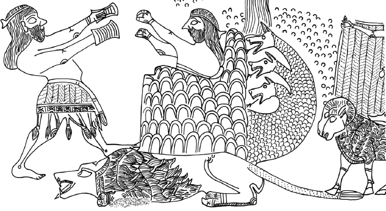
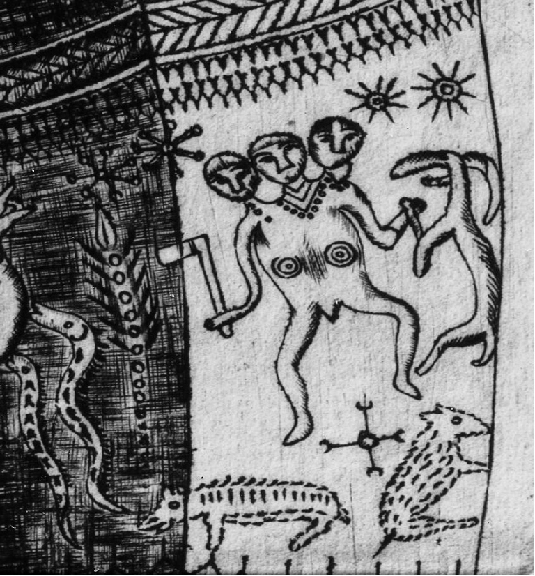

<!-- p. 77 -->

# 4. Monsters and cattle

**A topos and its mutations in Indo-European mythology**

_Peter Jackson Rova_

Stockholm University

## Abstract

This chapter seeks to substantiate a few general assumptions about the social significance of cattle-stealing monsters in various IE traditions. By taking into account that these monsters appear under variously socially distinguishable guises – traversing the whole spectrum of an intruding guest, a bad host, a stingy patron and a malicious client – it can be argued that these myths mainly revolved around the perceived crisis of hospitality and ritual economy. Examples are given to illustrate particularities of this pattern in what seems to be offshoots of a linguistically encoded tradition: one with a possible Core Indo-European (CIE) basis (the tricephalus myth) and the other dating back at least to the time of Proto-Indo-Iranian (the Vala myth). In the final analysis, an attempt is made to demonstrate how the notion of the cattle-stealing monster – considered here as a variation of the milk-suckler reptile – can be rendered culturally meaningful in terms of certain prevalent ecological and socio-economic factors.

The controversial cases of the Anatolian Illuyanka myth and the visual representation of a tricephalic monster on the fifth-century CE lesser horn (B) from Gallehus are briefly commented upon in two additional excurses (addenda 1 and 2).

## 1. Background

The hyperbolic representation of friends and foes in Indo-European (IE) mythological traditions suggests that the distinctiveness of these roles was not as clear-cut as one might initially expect. Monsters are

<!-- p. 78 -->

not always unambiguously depicted as chaotic and malevolent beings. They are, for instance (as indicated by the cases of Vedic Vala [RV 10.68.10] and Greek Geryon [see below]), typically inclined to weep and show genuine human feelings. They are also – despite their distinctly non-human, serpentine or otherwise preternatural appearance – represented as cultural beings. Unlike animals, they may use utensils while eating and they make their own cheese. Another cultural trait of the monster is its desire for livestock and other human commodities. Monsters are not gods in a strict sense; they have to be mortal, since one of their primary functions in myth is to get killed or at least severely impaired; while typically found in the wilderness or in some distant region, they still inhabit the same ontological plane as their heroic adversaries.

All this seems to imply that the quintessential IE monster can be understood as a hypercorrective to a category of human agents with whom the intended auditors of the monster myths had interacted and familiarized themselves on a regular basis, either within the framework of certain formalized and potentially precarious social settings (e.g. trading, guest–host relations and patron–client relations) or in the less formalized context of raids and exploitations of neighbouring groups from which similar acts of hostility could be expected in return.

These tendencies all seem informed by an underlying cultural proposition: the monster affords its monstrosity _in spite of_, not _in the absence of_ certain recognizably human traits. Unlike a wild animal attracted to an exterior object through an uncontrolled force of instinct (say of hunger, self-defence or sexual reproduction), the monster makes a feasible (albeit neglected) claim to ownership. Consequently, the preternatural appearance of the monster can be understood as a mask mythologically designed to divert attention from the fact that this is not just an _unnatural_ but in fact a _cultural_ being.

In what follows, I intend to make a few general assumptions about the social significance of cattle-stealing monsters in various IE traditions. Examples are given to illustrate particularities of this pattern in what seems to be local offshoots of a linguistically encoded tradition: one with a possible Core Indo-European (CIE) basis (the tricephalus myth) and the other dating back at least to the time of Proto-Indo-Iranian (the Vala myth). In the final analysis, an attempt is made to demonstrate how the notion of the cattle-stealing monster – considered here as a variation of the milk-suckler reptile (see Ermacora 2017) – can be rendered culturally meaningful in terms of certain prevalent ecological and socio-economic factors.

## 2. Social and ecological conditions

<!-- p. 79 -->

The rationale behind the perceived adversarial claiming, stealing and keeping of livestock in IE mythologies (Cacus [Æn. VIII 190ff.; Prop. IV 9], Geryon, Vala etc.) apparently amounts to more than a general proclivity for treating livestock as a prominent measure of wealth. In order to provide a more complete picture, it is essential to distinguish between the specific systems of exchange in which such quantities of wealth were invested.[^1]

As we shall see, no simple binary (e.g. insider vs. outsider) will suffice to make sense of such systems. Also, the two systems (or forms of relation) are both flexible and overlapping. The first system is based on principles of hospitality, that is, on how to maintain and establish social bonds through prescribed rules of conduct. Festive occasions of sacrificial food-sharing provide the most apparent setting for such forms of conduct.[^2] They do so both in an imaginary (vertical) sense by inviting gods to partake as guests in a sacrificial meal and in a more realistic (horizontal) sense by conjoining members of a sacrificial community through rites of commensality. The second system is based instead on principles of patronage, that is, on how to administer the practical means to such a hospitable end through the recruitment of ritual professionals. This latter group can best be grasped through the

<!-- p. 80 -->

semi-mythical category of so-called poet-sacrificers (or poet-priests) in Vedic and Avestan.

Whereas guest–host relations tend to involve equally resourceful insiders and outsiders sharing the same interests and moral obligations, patron–client relations require an employment contract (see the introductory chapter). Even if patrons and clients need not share the same interests, they may still find a durable form of coexistence in which to mutually benefit one another. If these principles are understood to have been violated or obfuscated by one (or some) of the involved parties, however, there are various familiar means by which to address such failures. Guests and hosts may become estranged (see the semantics of Latin _hostilis_) by dishonouring the principles of hospitality, that is, if the guest fails to reciprocate the favours of the host or if the host fails to adequately entertain and protect his guest. Similarly, patrons may provide miserable working conditions for their clients and clients may seek to cheat, or even disempower, their patrons by misrepresenting or misusing their skills.

Consequently, the monster need not just assume the role of an uninvited (out-group) creature who parasitically benefits from its host’s (in-group) table. In addition to this familiar pattern, monsters may also appear in the guise of either hosts, patrons or clients. The theme of unlawfully claiming livestock can thus be taken to reflect a perceived crisis of hospitality and ritual economy:

> Stranger/anti-guest (AS Grendel, ON Hrungnir) ←
>
> GUEST-HOST → Stranger/anti-host (Gr. Polyphemus, Geirrøðr)
>
> Charlatan/anti-client (Ved. Dasyus [_√sarp_], OAv. Karapan and Usij) ←
>
> CLIENT-PATRON → Cheapskate/anti-patron (Ved. Vala, Paṇis [_√rod_])

Since we may assume clients (= hired poets) to have been particularly responsible for crafting and creatively reshaping the myths with which we are concerned here, it seems consistent to assume that the rhetorical ingenuity with which the monster is made to traverse the whole social spectrum of an intruding guest, a bad host, a stingy patron and a malicious client (= competitor of another client) (see below the serpentine Vedic Dasyus, and the Avestan Karapan and Usij) also conformed to certain priestly interests. We can imagine a straightforward admonition of the following kind to have been variously encrypted by priestly clients through the medium of poetry and myth: _Beware, o patron, of leaving to others the fashioning of your good reputation as a host, and beware of leaving me (your client) without a generous fee_. As I

<!-- p. 81 -->

intend to show in the following, many of the poetic statements involving monsters and cattle among archaic speakers of IE can be effectively decrypted along these lines.[^3]

## 3. Basic features of the tricephalus myth

It is reasonable to assume that the speakers of CIE already made references in their oral poetry to a myth involving a heroic figure killing a tricephalic, cattle-stealing monster in some far-off region. The myth can be reconstructed on the basis of its non-trivial linguistic realization in Vedic (Indra [or Trita Āptya] killing [or carrying off cattle from] the three-headed Viśvarūpa [e.g. 10.8.9]), Avestan (Θraētaona killing Aži Dahāka), and Greek (Herakles killing Geryon/Geryoneus) (Hes. Theog. 287–294 and fragments of Stesichorus’s _Gēryonēís_ [SLG 13,4; 14,8] [see Figure 1]). Diagnostic traits in what seems to be a Latin rendering of an otherwise unknown Greek version of the Geryon myth (Hercules killing Cacus) suggest the myth’s close proximity to another narrative complex in Greek and Indo-Iranian involving the hiding, tracking and exchange of cattle in its capacity of a sacrificial fee.[^4]

**Figure 1**. Heracles and Geryon. Depiction on a Chalcidian amphora produced in Calabria (c. 530 BCE), Cabinet des Médailles, Paris (De Ridder.202) with painted inscription: ATHENAIE, GARUWONES, HERAKLES. Photo: Serge Oboukhoff / BnF-CNRS-MSH Mondes © License: CC BY-NC.

In the Avestan version of the myth (Yt. 5.33–5.35, 15.23–15.24; Y. 9.7–9.8; Vd. 1.18), the name of the adversary conquered by the hero Θraētaona

<!-- p. 82 -->

significantly combines a serpentine appearance (_aži_-) with an attribute (_dahā_-) originally intended to emphasize its out-group ethnic appearance.[^5] The correlation is equally pertinent in Vedic, where _dāsá_- or _dásyu_- (see also the neutral sense of YAv. _dax´iiu_- ‘inhabitant [of a land], people’) – the terms often occur in opposition to _aryá_- – denotes not just any kind of demon but more precisely a stranger not (or at least _not yet_) qualified to become an Aryan guest-friend. In spite of the lack of a direct match in Vedic (\*_áhidāsá_-), a combination of the two elements to suggest a “serpentine barbarian” in various Iranian traditions can be correlated with a class of beings (the snake [_áhi_-] and the _dāsá_-/_dásyu_- [see 6.45.25 below]) all subjected to the positively encoded violence of the god Indra in Vedic.

**Figure 2**. Depiction on the golden bowl of Hasanlu (detail), north-west Iran (late 2nd millennium BCE). Image 96557, courtesy of the Penn Museum © License: CC BY-NC.

<!-- p. 83 -->

In order to better grasp the focal message of the myth, it should be added that a combination of derivatives of either of the nouns PIE \*_gʷṓws_ ‘cow’ or \*_ógʷʰis_ ‘snake’(or an analogous adversarial being) with a verb reflecting PIE \*_gʷʰen_ ‘slay’ can be arranged in contrastive clusters on the primary basis of Indian, Iranian, Greek and (perhaps) Celtic evidence.[^6] This contrastive logic presupposes an underlying notion of the cow as the ultimate token of wealth in the sense of that which is _not to be killed_ or destroyed, and the snake as the reversed token of that logic (the obstacle to, withholder or snatcher of wealth) in the sense of what rather _ought to be killed_ and destroyed.

Ved. _ághnyā_-, OAv. _agǝniiā_- ‘cow’

?Gr. ἄφενος ‘revenue, riches, wealth, abundance (< ‘cattle’ [?])’

PII \*_a-ghn-ii̯ā˘_-‘cow’ (lit. ‘not to be slain’)

Ved. _go-hán_- ‘cow-slaying’

Gr. βούφονος, βουφόνια ‘id.’

?OIr. _bóguine_ (reformed) ‘id.’

Ved. _áhann áhim_ etc. ‘he (Indra)

<!-- p. 84 -->

slew the serpent’

Ved. _ahihán_-, _dasyuhán_- (e.g. 6.45.24: “For the smiter of Dasys [_dasyhā́_] will certainly go forth to somebody’s cattle enclosure [_gómantam_]; with his [= Indra’s] powers he will open it up.”)

Gr. ἔπεφνεν Χίµαιραν, Γόργονα (δρακόντων φόβαισιν) ‘he slew the Ch., G.’ Etc.

Gr. κτει˜νε ὄφιν (*ἔπεφνεν ὄφιν) ‘he slew the serpent’

Gr. ὀφιοκτόνος ‘serpent-kiler’ (Eust. 183.12), δρακοντοφόνος ‘dragon-killer’ (*ὀφιοφόντης, *ὀφιοφόνος)

A comparison between these contrasting phrases and compounds yields the following social message:

> KILL CATTLE (= negative, murderous)

> KILL CATTLE THIEF (= positive, heroic)

In noting the basic features of the IE tricephalus myth, Watkins (1995: 468) transcribes the formulaic semantic structure underlying the Graeco-Indo-Iranian variants as follows:

> HERO (variable), SLAY (\*_gʷʰen_), a MONSTER (\*_ógʷʰis_, not in Greek) who is THREE (\*_tri_)-HEADED (variable) and SIX (\*_swek̑s_)-EYED (\*_h₃okʷþ_, not in Greek), with the aid of a GOD (variable). As a result HERO DRIVE OFF (\*_h₂agʷ_, replaced in Greek by ἣλασε) MONSTER’s COWS (\*_gʷṓs_, replaced in Avestan by WOMEN)

I prefer a slightly modified version:

> HERO, SLAY, a MONSTER who is preternaturally THREEFOLD (+ variants × 2, × 3 = (\*_tri/_\*_swek̑s_-), HERO DRIVE OFF MONSTER’s unlawfully claimed MOVABLE PROPERTY

My reason for suggesting this slight adjustment is twofold. (1) While the preternatural anatomy of the monster could apparently vary (according to a simple arithmetic involving the number three) within a single tradition (e.g. Geryon), it seems unnecessary to specify these anatomical features in too rigid a fashion. In terms of mythical imagination, it seems perfectly apt to represent a preternatural monster as the one-eyed, six-eyed, three-headed or nine-headed odd one out in a natural fauna dominated by pairs and quadruples.

(2) I am exchanging the parameter CATTLE for MOVABLE PROPERTY so as to provide a more flexible codification of the myth in its Lévi-Straussian sense of a “sum of its variants.”

<!-- p. 85 -->

I see no reason why LIVESTOCK, or even PROPERTY in general, should be considered secondary variants of a primary reference to cattle. The social message would easily pertain to all tangible things (including enslaved humans) that may come under the threat of someone else’s proprietary claims.

## 4. Agonies of the cattle-thief: the cases of Geryon and Vala

Heracles’s killing of Geryon is described by Stesichorus in the following metaphorical terms (SLG 15 ii 14–17):

ἐµίαινε δ’ ἄρ’ αἵµατι πορφ[υρέωι

θώρακά τε καὶ βροτόεντ[α µέλεα·

ἀπέκλινε δ’ ἄρ’ αὐχένα Γαρ[υόνας

ἐπικάρσιον, ὡς ὅκα µ[ά]κω[ν

ἅτε καταιχύνοισ’ ἁπαλὸν [δέµας

αἰ˜ψ’ ἀπὸ φύλλα βαλλοι˜σα ν[

And (the arrow) stained with dark-red blood

his breast plate and gory limbs.

Geryon let down his neck

to the side just like when a poppy,

shaming its tender body,

drops it petals at once.[^7]

While the image of a tree or plant shedding its leaves is a recurrent elegiac feature in Greek and Latin poetry (e.g. in Homer and Ovid), it may appear surprising to find such delicate evocations of grief and pain in the context of a dying monster. Page observed that Stesichorus seems to have portrayed Geryon as a “noble and sympathetic person.” (Page 1973: 150). Watkins follows Page in noticing Stesichorus’s sympathetic portrayal of Geryon in these terms, commenting on the crucial passage SLG 15 ii 14–17 that “(w)e are a long way from a monster, and a long way from the topos of the adversary felled by the hero like a great tree.” (Watkins 1995: 466) (Figure 1). On closer inspection, this unexpected sympathy for the monster should not be seen as an idiosyncrasy peculiar to Stesichorus. Vedic

<!-- p. 86 -->

Vala, another cattle-stealing creature (see below), is depicted in similar elegiac terms at the moment of lamenting his lost cows:

RV 10.68.10:

_himéva parṇā́ muṣitā́ vánāni | bṛ´haspátinākṛpayad való gā́ḥ_

As the woods (lament) their leaves stolen (pp.) by cold, Vala lamented (ipf.) for the cows (stolen) by Bṛhaspati.[^8]

Notice the nicely devised elliptical figure, omitting one of the key verbs in each hemistich.

Similarly, in the preceding hymn, it is said of Indra that “he made the Paṇis wail (_árodayat paṇím_): verily he stole the(ir) cows (_ā́ gā́ amuṣṇāt_)” (10.67.6). To this example one might add yet another: the Anglo-Saxon case of the monstrous anti-guest Grendel’s miserable suffering (“he endured sorrowfully” [_earfoðlīce_ […] _geþolode_ [86–87]) at the sound of rejoicing in Hrothgar’s mead hall (86–103).

As these discrete cases all seem to suggest, the ambiguity of the monster should not just be understood as a matter of its preternatural appearance but also as a potential invitation to sympathy. This is a delicate reminder of the monster’s cultural and emotional proximity to the in-group, both in the cynical sense of someone (or rather _something_) acting as an impostor, and in the tragic sense of an ill-fated outcast who ultimately deserves recognition and remedy.

## 5. Versions and inversions of the Vala myth

It is plausible that the professional poets of various IE tribal groups were prompted by a shared tradition to invent their own textualized persona in an ongoing interaction with certain mythical role models.[^9] This

<!-- p. 87 -->

creative process of confabulation makes it difficult to tell the hen apart from the egg. A “textualized existence” (_Zitathaftes Leben_) can be understood in these circumstances as a means to creatively translate a familiar repertoire of mythical motifs into living practice, and to enhance the role of the poet-sacrificer as a mediator between gods and men.[^10] Conversely, this process would also cause the mythical repertoire to be continuously enriched and expanded as the inventions of singular poets eventually received a semi-canonical status beyond the horizon of living memory.

Such a strategy is clear from the verbal realization of the Gāthic strophe Y 44.20, which apparently borrows its poetic building material from the hymnic realization of an ancient myth. The strophe marks the end (and summary statement) of the so-called _Questions to the Lord-Gāthā_, with its otherwise recurrent pattern of cosmological questions and answers, all of which seem to gravitate towards a final and more hands-on approach to the expected quantity of the poet-sacrificer’s ritual fee (“Shall I deserve that prize [_mīžda-_] […] ten mares with a stallion” [18]. By combining no fewer than six lexical items recurrent in Vedic allusions to the so-called Vala myth, the strophe ingeniously echoes a familiar plot of previous hymnic performances through a consistent reuse of the poetic vocabulary (see Jackson 2014a). These verbal echoes suggest that the author of the Gāthic strophe was familiar not just with the plot of the Vala myth (see above) but also with the verbal characteristics of its performance as evidenced by the RV versions. In recognizing how the Gāthic strophe systematically inverts the underlying logic of the Vala myth, furthermore, we are better equipped to elucidate the subtext of the Vedic (and to some necessary degree Indo-Iranian) myth: what superficially appears as the story about a primordial cattle-raid now rather turns out to be a myth about the proper performance of (and expected recompense [the so-called _dákṣinā_-] for) ritual services. Hence, the familiar myth could be variously explored and exploited as a rhetorical device linked to the precarious situation of competing traders in ritual.

<!-- p. 88 -->

According to the Vedic versions, cattle is kept by monstruous creatures (Vala or the Paṇis) within a cave or rock, whereupon the cows are ritually “sung out” from the cave by priestly figures (the An˙girases), assisted by the god Indra. In the Gāthic strophe, however, it is now rather the protagonist poet-sacrificers of the Vedic (and supposedly pre-Gāthic) versions who appear in the roles of malicious sacrificers:

> 44.20: _ciθǝnā mazdā # huxšaθrā daēuuā aηharǝ¯_
>
> _at̰ īt̰ pǝrǝsā # yōi_ **_piš´iiein˙tī_** _aēibiiō kąm_
>
> _yāiš gąm_ **_karapā_** _#_ **_usixšcā_** _aēšǝmāi dātā_
>
> _yācā_ **_kauuā_** _# ąnmǝ¯nī_ **_urūdōiiatā_**
>
> **_|_**_nōit̰ hīm mīzǝ¯n #_ **_aš˙ā_** _vāstrǝm frādaiη´hē_
>
> Have there ever been Daēvas of god rule, O Wise one?
>
> But let me ask that (of those) who block (alt. shall hold back) pleasure, in accordance with those (words)
>
> with which the Karapan and the Usij [_usixšcā_] seize the cow for wrath(ful) (treatment)
>
> and with which (wrath) the Kavi [_kəəuuā_] makes (the cow) weep in her soul.[^11] They do not foster her (the cow) to promote the (herds in) pastures with truth.

Consider the concordances between the strophe Y 44.20 and hymnic realizations of the Vala myth throughout the RV:

> **RV**: _uśij_-
>
> The An˙girases or Uśijas have tracked down and released the cows.
>
> **Y 44.20**: _usij_-
>
> The Karapan and the Usij have seized the cow for wrathful treatment.
>
> **RV**: _kávi_-
>
> The An˙girases or Uśijas bear the title _kávi_- (e.g. 2.23.1 and 2.24.7). The most prominent representative of their group, Bṛhaspati, is even “most kavi of kavis” (_kavítamam kavīnām_ [5.42.3a]).
>
> **Y 44.20**: _kəəuuai_-
>
> <!-- p. 89 -->
>
> The Kavi causes the cow to wheep in her soul.
>
> **RV**: _ṛtá_-, _ṛténa_
>
> The An˙girases or Uśijas possess truth (_ṛtá_-), destroy falsehood (_drúh_-) and split open the cave “by means of truth” (_ṛténa_) (e.g. RV 4.3.11).
>
> **Y 44.20**: _aša_-, _aša¯̣_
>
> The Karapan, the Usij and the Kavi do _not_ foster the cow to promote herds in the pasture “with truth” (_aša¯̣_).
>
> **RV**: _√pī_ (→ _gó_-, _dákṣinā_)
>
> The cave of Vala is ‘defying’ (_pīyatas_ 10.68.6a), i.e. it holds the cows (= _dákṣinā_) back from their legitimate owner. Cf. 10.28.11b: “those (patrons) who protest against rewarding (_pratipīyanti_) the priests with food.”
>
> **Y 44.20**: _paēš/piš_ (or _pai/pī_) (→ _kąm_-, _mīzda_-)
>
> The Karapan, the Usij and the Kavi ‘block’ (_paēš/piš_) or ‘defy’ (_pai/pī_) pleasure (_kąm_-).
>
> **RV**: _√rud_, _árodayat_ (causative)
>
> Indra releases the cows, thus making the Paṇis weep (_árodayat_) (RV 10.67.6).
>
> **Y44.20**: _raod/rud_, _urūdōiiatā_ (causative)
>
> The Kavi makes the cow weep (_urūdōiiatā_) in her soul.

## 6. Further malicious clients

RV 8.14 begins with the poet’s indirect address to his patron in anticipation of a generous fee: “Indra, if I, like you, were, all alone, lord over goods [_ī´śīya vásva_], my praiser would have cows as his companions.” Towards the end of the same hymn, the poet passes on from references to more familiar exploits of the god Indra (the splitting of the Vala cave [7–9] and the decapitation of Namuci [13]) to a less familiar story about a group of Dasyus who used their deceitful _māyā́_- in order to conquer heaven.

> 8.14.14:
>
> _māyā́bhir utsísr̥psata | índra dyā́m ārúrukṣataḥ | áva dasyū́r adhūnuthāḥ ||_
>
> <!-- p. 90 -->
>
> They who, through their viles, were trying to creep [_utsísṛpsata_ [_√sarp_]] up and mount to heaven, Indra, those Dasyus did you send tumbling down.

The theme of deviant ritualism continues in the final strophe with its reference to Indra making “the non-(Soma)pressing community” (_asunvā́m_ […] _saṃsádaṃ_) vanish away in all directions. The curious detail signalled by the verb _sarp_- adds a serpentine feature to the Dasyus, which can be considered to vaguely echo the Avestan epithet Aži Dahāka. Another noteworthy context for the focal noun _māyā́_- is suggested by the rare compound _áhimāyā_- (e.g. RV 6.52.15), ‘snake-sly’ according to Jamison and Brereton. It is a term likely to be taken here (and elsewhere) in the general sense of aberrant ritual practices through which foreign groups could be identified by their out-group allegiances (_their_ malignant sorcery vs. _our_ pious religiosity). It would even seem plausible that the itinerant ritual specialists of early (pre-canonical) Vedic society could have used the noun _māyā́_- as a denigrating characterization of competing ritual communities within their own society.

## 7. Milk-stealing agents in Scandinavian folklore

The hyperbolic representation of cultural others as preternatural monsters in ancient IE traditions can be effectively compared with recent folkloristic accounts of milk-stealing creatures in various parts of post-medieval Europe without the insistence on any significant shifts in the underlying sociocultural message (cf. Ermacora 2017: 70). This circumstance alone does not prove much but it does testify to the tenacity and suggestiveness of a pastoral ideology that was already pertinent among the earliest speakers of IE. Consider, for instance, the following paragraphs from Gunnar Olof Hyltén-Cavallius’s pioneering work _Wärend och Wirdarne: Försök i svensk etnologi_ (published between 1863 and 1868):

> If we are now to examine the attitude towards the ancient trolls that has long been common in the lands of Wärend and Gothia, it is clear that they have been perceived as an alien race, which no longer counted as “folk,” “Christian folk,” and whose ethnonym, Troll (n.), does not even have a gender. We must conclude from this that the trolls have had a different nationality separate from ours, with a foreign appearance, language, habits, and customs. The same applies in an equal or even higher degree to their religious practises and conceptions, which were regarded with the utmost contempt
>
> <!-- p. 91 -->
>
> by the new tribes, and summed up in the word _Trolldom_ (“witchcraft”), – a word which has been derived from the ethnonym Troll, and which according to its derivation signifies the customs, traditions, and general essence of this people […] to _kusa_ or take advantage of someone else’s cattle, guns, fishing tools, farmland, baking, brewing etc. and “to snatch from the neighbours a portion of the cattle’s milk.” The latter could be done by various means but most prominently through so-called mountain-hares, troll-hares, milk-hares, which were sent by the witches to suck the peasants’ cows. The mountain-hares were manufactured during the holy week by sticks, burnt in both ends, and thrown on the floor by the witch. There were also so-called Milking-sticks, which were milked by the witches.[^12]

A more recent instantiation of this popular imaginary is Fritz Hippler’s infamous propaganda film _Der ewige Jude_ from 1940. Jews are depicted here as the progeny of an essentially evil race, adopting the clothing and manners of the German bourgeoisie in an attempt to parasitically exploit a superior civilisation from within. They are also represented as engaging in cruel and deranged religious practices in the form of ruthless routines of ritual slaughter and repetitive balderdash.

## 8. Concluding remarks

The logic of socio-economic reasoning from which these discrete topics of myth derive their ultimate raison d’être could of course prove viable without the insistence on some distant common heritage. Nevertheless, if there is enough cumulative linguistic and archaeological evidence to support the existence of such a cultural ancestry, and not least so if there is

<!-- p. 92 -->

additional evidence to support the existence of culturally contiguous tribal communities in which such a pre-ancient sociology would have made perfect sense, then we should remain open to the possibility that it was precisely among these tribal groups that this logic of reasoning developed its first rudimentary characteristics. The semi-nomadic pastoralists of the Pontic-Caspian steppes fit neatly into this framework. Furthermore, we should take into account the possibility that the notion of the parasitic monster initially set a precedent for (or at least accompanied, justified, extrapolated etc.) certain forms of organized behaviour, such as the extension of frontiers and the exploitation of out-group communities in order to increase wealth and prestige, that may have appeared both redundant and inhumane among sedentary farmers and small-scale bands of hunter-gatherers. Such a reorientation of interest can only be fully grasped in view of certain basic conditions of ecological affordance. There were surely prehistoric and pre-ancient societies in which a cultural preference for such forms of symbolic and material excess would either have had devastating consequences (see also the so-called “Easter Island Syndrome”), or simply appear too costly in the first place.

## Addenda: Serpentine dead ends? Illuyanka and the Gallehus tricephalus

## Addendum 1

It would be opportunistic to address the pre-ancient paradigm of monsters in the context of defunct commensality without touching upon the Hittite story of the Storm-god, the goddess Inaras, and the serpent Illuyanka in the mythological fragments from the archive in Boğazköy (Esp. KUB XVII 5; KUB XVII 6):

> Inara dressed herself up and invited the serpent up from his hole (saying): “I’m preparing a feast – come eat and drink!” / Then the serpent came up together with [his children], and they ate [and] dra[nk] up every vessel and were sated. / They were no longer able to go back down into [their] hole, [so that] Ḫupašiya came and tied up the serpent with a cord. / The Storm-god came and _slew the serpent_ [_kuenta illuyankan_]. The [other] gods were at his side. [§§9–12]) (tr. Beckman 1982)

There are a few details in this narrative that fit well into the mythological pattern of the IE cattle-stealing monster: a semi-cultivated, preternatural (serpentine) guest/

<!-- p. 93 -->

stranger subjected to violations of hospitality. Also, the Hittite storm-god is depicted as killing the tied-up serpent through the use of a verbal formula that many Indo-Europeanists now identify as the most emblematic feature of the IE dragon/monster-slaying myth (= HERO SLAY [\*_gʷʰen_-] SERPENT).

Such analogies notwithstanding, the perceived Indo-European background of the Anatolian Illuyanka myth may prove misleading. Consider, especially, Norbert Oettinger’s recent call for hesitation:

> He (Watkins) assumed that the sentence ‘The Storm God killed the Snake’ […] was the old wording of the Proto-Indo-European dragon slayer myth, but the only formal congruence is the word for ‘kill’ itself, and this congruence is better explained by chance. The true Proto-Indo-European myth, preserved in Vedic, Avestan and Greek mythology, deals with the killing of a dragon that is characterized by three heads, six eyes and the possession of cattle. These specific features are missing in the myths of Illuyanka; specific Oriental features being found there instead. (Oettinger forthcoming, 3).

Oettinger’s critique is informed by a justified scepticism about the idea that the myths adopted in the official Hittite cult, which was clearly dominated by Hattic tradition, had a PIE provenance: “So far no myths of evident Proto-Indo-European provenance have been found in the corpus (i.e. of Anatolian myths) although they probably existed somewhere but were not adopted in the official Hittite cult that was dominated by Hattic tradition.” (p. 1).

Even if the Hittite mythological corpus need not have been exclusively Hattic in origin, it seems to consist of translations (or transnarrations) of myths that were all generically linked to the cuneiform scribal milieus of Mesopotamia and Asia Minor. An analogous case would be that of Roman mythology, which depended almost exclusively on Greek literary culture, whereas the (no doubt once extant) stock of indigenous Italic mythology _stricto sensu_ was reworked by Roman annalists from the second century BCE onwards according to the pattern of _ab urbe condita_, that is, to an all-inclusive narrative about the founding and early history of Rome.

## Addendum 2

Among the enigmatic figurations on the fifth-century CE lesser horn (B) from Gallehus, the representation of a tricephalic humanoid with an axe and a tethered horned (and bearded!) animal has suggested to some scholars (e.g. Lincoln 1976: 58)

<!-- p. 94 -->

an otherwise unattested Germanic reflex of the PIE/CIE tricephalus myth (Vedic [Viśvarūpa RV 10.8.9]; Iranian [Aži Dahāka], and Greek [Geryon/Geryneus]). I believe that this suggestion has to be treated with caution.[^13] And yet a few philological and iconographic observations might be adduced in its support.

The obsolete Old Norse myth of Þórr and Þrívaldi is only very briefly alluded to in two isolated Skaldic fragments – one from the tenth-century Icelandic skald Vetrliði Sumarliðason and the other from the ninth-century Norwegian skald Bragi inn gamli Boddason (fr. 3). A first observation to be made in regard to these fragments is that they both take the otherwise rare form of direct (cultic/hymnic) address to a god, namely Þórr. This unusual feature could indicate a deviation from the familiar poetic genre in other respects as well. The addressee in early Skaldic poetry is usually a chief and/or patron (as in Bragi’s _Ragnarsdrápa_), whereas gods in both Skaldic and Eddaic poetry are typically referred to in the third-person narrative mode. Vetrliði’s strophe simply states that “you (= Þórr) thrashed/made lame (_lamði_ [_lemja_]) Þrívaldi.” Bragi’s strophe begins with a kenning (_sundrkljúfr níu hǫfða Þrívalda_ [“cleaver asunder of the nine heads of Þ.”] = Þórr). This reference could be taken either at face value or as a reference to a feat of Þórr in another myth than the one alluded to in the fragment (as seen elsewhere in Bragi’s poetry [e.g. “the terrifier of Ǫflubarði [= Þórr] lifted the hammer in his right hand, when he recognized the boundary-saithe of all lands [= Miðgarðsormr]”]). In either case, however, the kenning is self- explanatory in so far as it identifies Þrívaldi (“the One three times mighty”) as one of Þórr’s canonical adversaries. Þrívaldi was most likely a _jǫtunn_ conceived as a creature with nine heads, or possibly as a tricephalic creature thrice killed by Þórr (cf. Simek 1993: 328).

A similar variation on the theme of threefold anatomy (3, 3×2, 3×3) can be observed in the stories both of Geryon (one body and three heads, three bodies and one head, six eyes, etc.) and Aži Dahāka (three heads and six eyes). Interestingly, Bragi’s strophe praises Þórr for having “well driven back your draught animals (_eykjar_ [sg. _eykr_] = Þórr’s two goats?) (_Vel hafið yðrum eykjum aptr_ […] _haldit_) […] from/above the famous drink-provider of the drinking party” (_of mærum simbli sumbls_ = either Þrívaldi or some other giant [Ægir?]). According to the

<!-- p. 95 -->

most common interpretation, the implied sense is that Þórr drove home over the sea. The ancient sea-god/_jǫtunn_ Ægir is occasionally referred to in Old Norse poetry and prose as the host of a large drinking-feast, the so-called _Ægisdrekka_. A less commonplace interpretation of the strophe would be to bypass the classical function of kennings, taking the _mærr simblir sumbls_ as a direct reference to Þrívaldi, and the fragment as a whole as a pre-classical allusion to a myth in which Þórr retrieves his two goats from a nine-headed (or thrice-killed three-headed) giant who had stolen them from him in order to arrange a “drinking-feast” (_sumbl_). This last possibility might gain some ground in view of the following observations.

Snorri’s story of how Þórr acquired his servants Þjálfi and Rǫskva (ch. 44) somewhat strengthens the assumption not just that the god’s two draught animals were considered worthy topics of myth but that their function in myth could involve Þórr as a provider of food in a typical guest–host situation. Since the stories both of Ægir’s drinking- feast (st. 1) and the paralysed buck (st. 37–38) are alluded to in the Eddaic poem _Hymiskviða_, it ought not to be ruled out that these stories once formed parts of a continuous whole rather than representing a relatively late patchwork of once unrelated narratives. Observations along similar lines are made by Edith Marold in her analysis of the Gotlandic picture stone from Ardre VIII (Marold 1998). Furthermore, there is indirect support for the notion of a giant feasting on a goat’s meat in a kenning for TANNER preserved in one of Þjóðólfr Arnórsson’s _Lausavísur_ (5): “proud giant/(eater [?]) of the goat’s meat” (_hǫldnum jǫtni kjǫts hafra_). Þjóðólfr’s extemporaneous strophe depicts the quarrel between a blacksmith and a tanner by presenting the antagonists in the context of Þórr’s (= the blacksmith’s) encounter with the giant Geirrøðr (= the tanner). Since the noun _jǫtunn_ is usually assumed to be derived from the PGmc. verb \*_etaną_ ‘to eat’, it is possible that the etymological sense was still perceptible by the late tenth century so that the noun could have functioned as an agent noun.[^14]

While the recursive use of a mythological kenning may seem unwarranted at first glance (e.g. in Clunies Ross’s sceptical words: “[i]n spite of the direct address, the stanza [Bragi, fr. 3] itself is unlikely to be part of a telling of that myth.” [Clunies Ross 2017]), it could also be taken to represent an archaism on a par with the unexpected use of direct (hymnic)

<!-- p. 96 -->

address. For further support, consider the early example of Vedic poetry: “With your mace as Vr̥tra-smiter [_vájrena hí vṛtrahā́_] you [Indra] laid Vr̥tra low [_vṛtrám ástar_ [_√star_]]” [10.111.6a]; “Smash obstacles, o smasher of obstacles” [8.17.9c]).

Lastly, it has so far gone largely unnoticed in the iconographical discussion of the lesser Gallehus horn that the tricephalus – at least to judge from J. R. Paulli’s 1734/1735 drawing of the now lost artefact – represents a figure with a few conspicuous markers of ambiguous gender such as breasts and vulva (?), necklace and an axe (see Figure 3). This could be understood

<!-- p. 97 -->

as an emphasis of preternatural disorder by contrast to the typical features of a classical monster-slayer, who rather appears as a propagandistic exemplar of order through the promotion of male dominance and virile aggression. Indra’s monstrous opponents are sometimes characterized as castrated steers (sg. _vádhri_- [e.g. RV 1.32.7c [of Vr̥tra]]) to match his own appearance as a potent bull (_vṛ´ṣan_-).

**Figure 3**. Snakes and tricephalic monster with an axe and a tethered horned animal. Eighteenth-century rendering of a depiction of the fifth-century CE lesser horn (B) from Gallehus. Photo: Malene Thyssen. From: Wikimedia Commons. License: CC-PD.

Transgendered imagery may also be associated with the three-headed Viśvarūpa, who (unless v. is to be taken here as a modifier of _vṛṣabháḥ_ rather than a proper noun) is said to be a bull and to have three udders and offspring in great quantity (3.56.3) (see Schröder’s [1955] discussion of this strophe in his comparative-mythological reading of the Eddic poem _Hymiskvða_). According to the fascinating interpretation suggested by Joshua Katz, furthermore, an obsolete theme of male initiation with apparent connotations to pederastic practices seems to underlie the topos of the paralysed buck’s extracted marrow (Katz 2014). While this topos need not have been properly understood by the end of the pre-Christian era, it could still have made sense in the context of early Germanic tribal practices (such as the ones described with disgust by the historian Ammianus Marcellinus in his fourth-century account of the Germanic (or possibly Sarmatian) Taifals [31.9.5]), thus adding yet another dimension to the symbolism of the cattle-stealing monster. It could well be that the shame of emasculation, passive homosexuality and oblique gender was variously imposed on the groups and individuals (real or imaginary, human or monstrous) who were subjected to the fame-winning practices of cattle-raiding, just as it would have applied to the shameful condition of liminality to be overcome by ordeals of heroic confrontation (e.g. the catching of a boar or killing of a huge bear, according to A. Marcellinus’s description). The monster can thus be potentially understood as an objectification of that liminal condition.

## Notes

[^1]: For an ecologically and socio-economically informed comparative study of myth, ritual and social organization among semi-settled pastoralist groups (the test case being Proto-Indo-Iranians and the present-day Nilotic peoples of Africa), see especially Lincoln 1981. Bruce Lincoln (personal communication) kindly reminds me of the likely tendency in pre-monetary pastoral economies to treat livestock, not just as “tokens of wealth” but as both means of production and means of exchange.

[^2]: The search for a universally coherent, original significance of sacrifice – as undertaken by prominent students of religion over the last centuries – has been refuted in more recent times as a largely misinformed pursuit (see Parker 2011: 125–126). Still, one circumstance should remain fairly clear in so far as the archaeological and historical manifestations (rather than the advanced priestly exegesis) of sacrifice is concerned: the social significance of sacrifice seems far more premised on principles of sharing and bonding rather than on the notion of giving things up. The extended “meaning” of sacrifice – not least according to the relatively recent Judeo-Christian notion of the unconditional gift – has thus come to overshadow some of the early preconditions for ritual slaughter. Animal sacrifice is virtually unthinkable without the domestication and organized distribution of natural resources (see Smith 1987). The sacrificial slaughter of animals (+ the distribution of food within the group) does not just sustain the group by supplying its members with food; it also symbolically defines and maintains social relations within that group. There is even archaeological evidence to suggest that “cattle and sheep […] were initially more important in funeral rituals than in daily diet.” (Anthony 2007: 159).

[^3]: One is reminded here of what could be provisionally referred to as the _paradox of encryption in myth_. While myths are cross-culturally recognized as narrative representations of things and events apart from how they ostensively appear in real life, they will inevitably arouse the suspicion of speaking covertly about certain overt real-life concerns. Processes of encryption tend to leave behind traces of encryption.

[^4]: It has long been noticed (see the entry “Cacus” in RE) that features that appear to reveal an ancient Italic origin of the Hercules/Cacus myth may turn out to be false, because the whole story was assumedly nothing but a relatively late transference of a Greek Herakles adventure onto Roman soil, and under a Latin caption. Nevertheless, some of the motifs in the Hercules/Cacus myth are not found in earlier Greek accounts of the Herakles/Geryon myth – the cave and boulder, the inversed tracks – but rather in the story of Hermes’s cattle-theft (HomHerm and Eur.). This coincidence could either indicate that the Cacus myth was simply a relatively late bricolage of various disconnected literary traditions, or it could testify to an otherwise lost oral tradition according to which these motifs were still interconnected. The Cacus myth is the only classical example to associate the semiotic motif of the inversed trail – a trick otherwise attributed to the god Hermes in the Greek myth – with that of a monstrous cattle-thief. A third variation on the theme is found in Vedic renderings of the Vala myth (see below), according to which the track-seeking An˙girases retrieve cattle from a monstrous cattle-thief.

[^5]: A possible early depiction of the figure is found on the late second-millennium BCE golden bowl of Hasanlu (see Figure 2). This represents a heroic (?) figure attacking a throned opponent and a scaled, tricephalic monster.

[^6]: A verbal phrase *ἔπεφνεν ὄφιν remains so far unattested in Greek in spite of its apparent echoes in phrases and compounds such as ἔπεφνεν Χίµαιραν, κτει˜νε ὄφιν, ὀφιοκτόνος, and δρακοντοφόνος (see Watkins 1995: _passim_).

[^7]: I follow the translation in Franzen (2009: 70) save for a few changes of word order intended to accommodate the metrical segmentation of the edited Greek text. I have omitted dots under letters that mark faint letters in the papyrus.

[^8]: This and the following translations from the RV are all based (with the exception of a few minor deviations) Jamison/Brereton 2014.

[^9]: Skjaervø (2015) rejects Zarathustra’s historicity on the grounds that this character, from the perspective of the earliest Gāthic compositions, has already received the mythical status of a first poet-sacrificer on a par with figures such as Vedic Manu and Vivasvat. Yet the same can be said of a figure like Vasiṣṭha (cf. Gotō 1997), who eventually became canonized as one of the seven sages (_saptarṣī_). At one stage or another in the process of textual accumulation, the caption “Zarathustra” will nonetheless only begin to make sense as a cover-term representing a distinct tradition of ritual poetics, just like the captions “Homer” or “Orpheus” may have served as generic markers of epic and melic poetry in the archaic Greek tradition.

[^10]: The concept of _zitathaftes Leben_ was first used by Thomas Mann in his _Freud-Rede_ from 1936. It was meant to capture the sense of an artist’s life lived according to a preconceived literary pattern that could be mistaken for a secondary, merely literary add-on to the biographical narrative.

[^11]: I follow the 1991 translation of Humbach, Elfenbein and Skjærvø with the exception of the crucial fourth stanza (_yācā kauuā…_). The locative singular _ąnmǝ¯nī_ (instead of the lectio difficilior _ąnmǝ¯nē_ [dative singular] preferred by Humbach et al.) is the reading of the manuscript K₄. Duchesne-Guillemin (1948: 209) maintains here what seems to me the better rendering (“le faire gémir en son âme”) in accordance with previous suggestions by Nyberg and Lommel.

[^12]: Granska vi nu det förhållningssätt om de forntida trollen, som i Wärend och i Göta rike af ålder varit gängse, så framgår såsom bestämdt givet, att de varit betraktade såsom ett främmande slägte, hvilket icke räknades till »folk», »christet folk», och vars etniska namn, Troll, i språket icke ens har något genus. Vi måste häraf ledas till den slutsatsen, att trollen varit af en från våra förfäders skild nationalitet, med främmande utseende, språk, lefnadssätt och seder. Detsamma gäller i lika eller ännu högre grad om deras religiösa bruk och föreställningar, vilka av de nya stammarne betraktades med den yttersta avsky och i språket sammanfattades med ordet _Trolldom_, – ett ord, som blifvit bildadt ur sjelfa folknamnet Troll, och enligt sin härledning betecknar detta folks seder, bruk och väsende i allmänhet (§26, p. 111) […] att kusa eller taga nyttan av andras kreatur, skjutredskap, fiskdon, åkrar, bak, brygd o.s.v. samt »förtaga grannarne en del af boskapens mjölk». Det sednare skedde på flera sätt, men förnämligast genom s.k. Bjergaharar, Trollharar, Mjölkharar, hvilka af trollpackorna utsändes för att dia böndernas kor. Bjergahararne förfärdigades i dymmel-veckan af stickestubbar, brända i begge ändar, hvilka af trollqvinnan kastades på golfvet. Äfven förekommo s.k. Mjölk-käppar, som af trollkärringarne mjölkades. (p. 115)

[^13]: It should be added that Bruce Lincoln would now most likely agree on this in consideration of his increasingly sceptical attitude towards the reconstruction of an Indo-European cultural heritage.

[^14]: For further thoughts on the overlapping semantics of PGmc. \*_etunaz_ and \*_gastiz_ (≈ “eater” → “stranger with whom one shares a table”), see Jackson 2014b.

## How to cite this book chapter

Rova, P. J. (2025). Monsters and cattle: A topos and its mutations in Indo-European mythology. In: Larsson, J. H., Olander, T., & Jørgensen, A. R. (eds.), _Indo-European Ecologies: Cattle and Milk – Snakes and Water_, pp. 77–99. Stockholm: Stockholm University Press. DOI: <https://doi.org/10.16993/bcu.d>. License: CC BY 4.0
