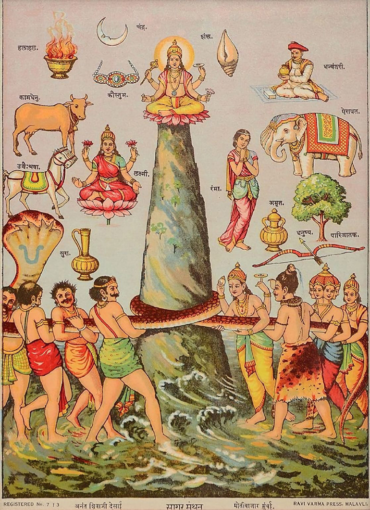
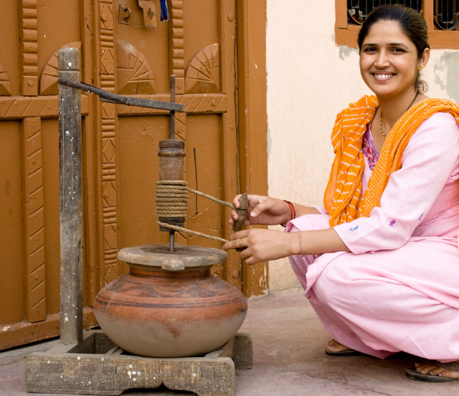

<!-- p. 101 -->

# 5. Churning the ocean of milk – a historical-comparative study of the Indo-European root *menth₁/₂-

_Birgit Anette Olsen_

University of Copenhagen

## Abstract

In the Indic myth known under the name of _samudramanthana_ or _Churning the Ocean of Milk_, attested since the Vishnu Purāṇa and the Maha¯bhārata, a multitude of mythological motifs have been combined. The present chapter takes up the linguistic foundation for some of these for new consideration, in particular the root \*_menth₁/₂_- ‘churn’, but also the possible background of the magical Finnish _sampo_ in the Kalevala and the Serpent of the Deep.[^1]

## Introduction

The peculiar idea of a connection between milk and snakes or similar creatures is known from several Indo-European-speaking communities. Either the creature is assumed to suckle the cows, as proved by the inherited word for ‘cow-suckler’ in the meaning of ‘lizard’ or ‘toad’, or humans actively offer milk to house snakes, as is particularly striking in Baltic tradition.[^2]

Incidentally, the combination of snakes and milk plays an important role in one of the most popular myths of Hinduism from ancient India to the present day: the _samudramanthana_ or Churning the Ocean of Milk, which had the purpose of retrieving the _amṛ´tam_/ἀµβρόσια, the

<!-- p. 102 -->

divine drink granting immortality to the gods. In the following, I will discuss in how far this tale is likely to bear traces of Indo-European heritage and, if so, whether we are dealing with an original mythological complex or a later combination of inherited features. The basis of the investigation will be a historical-comparative study of the root \*_menth₁/₂_- ‘churn’.

## 1. The samudramanthana

With some variation, the myth of the Churning of the Ocean first appears in the Purāṇas and in the great epics of the Maha¯bhārata and the Ra¯māyaṇa. The following is an abbreviated version of the Maha¯bhārata, section 18 (translation by Ganguli 1883–1896):

> There is a mountain called Mandara adorned with cloud-like peaks. […] The gods wanted to tear it up and use it as a churning rod but failing to do so came to Vishnu and Brahman who were sitting together, and said unto them, “Devise some efficient scheme, consider, ye gods, how Mandara may be dislodged for our good.”
>
> And the gods came to the shore of the Ocean with Ananta [the celestial snake, lit. ‘unending’] and addressed the Ocean, saying, “O Ocean; we have come to churn thy waters for obtaining nectar.” And the Ocean replied, “Be it so, as I shall not go without a share of it. I am able to bear the prodigious agitation of my waters set up by the mountain.” The gods then went to the king of tortoises [= Vishnu] and said to him, “O Tortoise-king, thou wilt have to hold the mountain on thy back!” The Tortoise-king agreed, and Indra contrived to place the mountain on the former’s back.
>
> And the gods and the _Asuras_ made of Mandara a churning staff and Vasuki [king of the nagas/serpents] the cord, and set about churning the deep for _amrita_. The _Asuras_ held Vasuki by the hood and the gods held him by the tail. And Ananta, who was on the side of the gods, at intervals raised the snake’s hood and suddenly lowered it. […]
>
> After the churning, O Brahmana, had gone on for some time, gummy exudations of various trees and herbs vested with the properties of _amrita_ mingled with the waters of the Ocean. And the celestials attained to immortality by drinking of the water mixed with those gums and with the liquid extract of gold. By degrees, the milky water of the agitated deep turned into clarified butter by virtue of those gums and juices. But nectar did not appear even then. The gods came before the boon-granting Brahman seated on his seat and said, “Sire, we are spent up, we have no strength left to churn
>
> <!-- p. 103 -->
>
> further. Nectar hath not yet arisen so that now we have no resource save Narayana [here also an avatar of Vishnu].”

**Figure 1**. The Churning of the Ocean. From: Wikimedia Commons. License: CC-PD.

> On hearing them, Brahman said to Narayana, “O Lord, condescend to grant the gods strength to churn the deep afresh.”
>
> Then
>
> <!-- p. 104 -->
>
> Narayana agreeing to grant their various prayers, said, “Ye wise ones, I grant you sufficient strength. Go, put the mountain in position again and churn the water.”
>
> Re-established thus in strength, the gods recommenced churning. After a while, the mild Moon of a thousand rays emerged from the Ocean. Thereafter sprung forth Lakshmi dressed in white, then Soma, then the White Steed, and then the celestial gem _Kaustubha_ which graces the breast of Narayana. Then Lakshmi, Soma and the Steed, fleet as the mind, all came before the gods on high. Then arose the divine Dhanwantari himself [god of medicine, an avatar of Vishnu] with the white vessel of nectar in his hand. And seeing him, the _Asuras_ set up a loud cry, saying, “It be ours.”
>
> […] But with the churning still going on, the poison Kalakuta appeared at last. Engulfing the Earth it suddenly blazed up like a fire attended with fumes. And by the scent of the fearful Kalakuta, the three worlds were stupefied. And then Siva, being solicited by Brahman, swallowed that poison for the safety of the creation […] Seeing all these wondrous things, the Asuras were filled with despair, and got themselves prepared for entering into hostilities with the gods for the possession of Lakshmi and Amrita. Thereupon Narayana called his bewitching Maya (illusive power) to his aid, and assuming the form of an enticing female, coquetted with the Danavas [a group of demigods associated with the primordial waters]. The Danavas and the Daityas [lower-ranking half-brothers of the devas] charmed with her exquisite beauty and grace lost their reason and unanimously placed the Amrita in the hands of that fair damsel.”

## 2. The root *menth₁/₂- > manth- ‘churn’ in Indo-Iranian

An essential linguistic element in the evaluation of the myth is the verb used for ‘churn’. The Sanskrit root used to denote this process is _manth_- < \*_menth₁/₂_-,[^3] including the following forms in the oldest language:

- thematic present \*_ménth₁/₂e/o_- > _mánthati_ (RV+)[^4]

- root aorist → _iṣ_-aorist \*_ménth₁/₂-s_-: only _ámanthiṣṭām_ (RV 3.23.2)[^5]

- causative \*_month₁/₂-éi̯e/o_- > _mantháyati_ ‘lets stir (milk)’ (sūtras+)

- passive ptc. \*_mn̥th₁/₂-h₁i̯ó-mh₁no_- → _mathyámāna_- (RV)

- _to_-participle \*_mn̥th₁/₂-tó_- > _mathitá_- (RV+)

<!-- p. 105 -->

In the Rigveda, however, the verb is almost exclusively used in the specialized meaning of fire making, especially in Agni hymns, e.g.:

RV 3.29.6 (Agni):

> _yádi mánthanti bāhúbhir_[^6]
>
> “when they churn him [Agni] with their arms”

Similarly, RV 6.15.17 (_manthanti_), 6.16.13 (_amanthata_), 3.29.1 (_manthāma_), 3.29.5 (_manthata_), 3.23.2 (_amantiṣṭām_), 5.11.6 (_mathyámānaḥ_), 6.48.5 (_mathitáḥ_), 2.29.12 and 3.23.1 (_nír matithaḥ_), all in hymns to Agni. Further, in the Soma hymn 8.48.6 (_mathitám_) where a comparison is made between the inciting effect of soma and the churned fire.

Another common comparison is that between the kindling of fire and the sexual act, as found in the pregnancy charm RV 10.184.3:

> _hiraṇyáyī aráṇī yáṃ nirmánthato aśvínā_
>
> “the one [i.e. the embryo] that the Aśvins churned out of the two kindling sticks”[^7]

Occasionally the context is the stirring of soma, thus RV 10.136.7:

> _Vāyúr asmā úpāmanthat_
>
> “Vayu churned it for him”

Here the stirred substance refers to soma mixed with meal = _manthín_-, and the same meaning is also intended in RV 3.32.2 (_manthínām_), and 9.46.4 (_manthínā_) and in the thematic derivative _manthá_- in RV 10.86.15.

The root is the basis of several nominal derivatives. Thus the term for churning stick, _mánthā_- (RV+),[^8] and the agent noun for ‘crusher’, _mánthitar_- (AV).[^9]

<!-- p. 106 -->

In his capacity of shaker of the universe, Shiva is referred to by the middle participle _manthāna_-. Whereas these derivatives are all found in contexts where a solid substance is involved, others are either additionally or exclusively associated with the churning of milk. This goes for _manthana_- ‘kindling fire by friction; churning stick’[^10] but also, in the Maha¯bhārata, ‘churning milk into butter, churning out of _amṛta_’ in the _samudramanthana_.[^11]

A particularly well-attested stem is the participle _mathitá_- ‘stirred, churned’, substantivized (n) in the meaning ‘buttermilk churned without water’. Continuations in Middle and Modern Indic languages include Pali _mathita_- (adj.) ‘upset mentally’ and (n) ‘buttermilk’, Prakrit _mahia_- ‘churned’, Sindhi _mahī_ ‘sour milk and water churned together, buttermilk’, Hindi _mahī_ and Nepali _mahi_ ‘buttermilk’, and Oriya _mai_ ‘sour whey used for curdling’ (Turner 1966: 561).

Besides the Old Indic evidence, the verb is continued in Iranian and Indo-Iranian border languages, partly with the meaning of ‘churning, making butter’ (_KeWA_ II: 579; III: 774). Thus, for example, Prakrit _manthaï_ ‘hits, harms, churns’, Shina _manóĭki̯_ ‘thresh, churn (buttermilk)’ (Turner 1966: 565), OKhot. _maṃth_ ‘churn, stir’, Buddh. Sogd. _mnδ’_ ‘agitate, stir, churn’, Bal. _mant_- ‘churn, shake a churn’, Oss. _æzmæntun_ ‘mix, stir’ (Cheung 2007: 264).[^12]

The Iranian attestations suggest that the use of _manth_- in connection with churning of butter is at least of Indo-Iranian age even if it is missing in the very oldest texts. When the meaning of fire making is so predominant in the Rigveda in opposition to later texts, this is most likely due to the ritual character of the Rigvedic hymns, with their extreme emphasis on Agni and the sacrificial fire. This may be seen in opposition to the more domestic genre of the Atharva Veda, where we find _mathitá_- in the meaning of ‘buttermilk’ since the supplementary text of the Kauśikasutra.

<!-- p. 107 -->

Incidentally, the divergent semantic specializations of a root with an original basic meaning ‘grind, stir’ make good sense if one considers the technology of the two processes. As described by Jamison & Brereton (2014 II: 503):

> fire was created through friction using a fire drill that consisted of two pieces of wood. The upper fire-churning stick was held vertically with one end in a recessed area in the lower piece of wood which was horizontal. Wood chips were placed around the recessed area on the area of the lower plank. The upper stick was then rotated back and forth like a churn. In the later ritual this is done by wrapping a rope around the upper stick and pulling on one side and then the other to make the stick rotate back and forth. Eventually, enough heat was generated so that the wood chips caught fire.

In much the same way, churning of butter, to this day, is practised by pulling a rope round the churning stick.

**Figure 2**. Churning butter. From: WebExhibits. License: CC BY-NC.

## 3. The root *menth₁/₂- in Tocharian and its Vedic counterparts

<!-- p. 108 -->

Apart from Indo-Iranian, the root \*_menth₁/₂_- (_IEW_ 732; Mallory & Adams 1997: 547; _LIV_ 438–439) is attested in at least Tocharian, Balto-Slavic and Germanic. More sporadic evidence comes from Italic, and possibly also Greek. The most remarkable similarity with the Vedic verbal complex comes from Tocharian.

Thomas (1987: 173–174) was the first to suggest an equation between [Toch.AB](http://Toch.AB) _mänt_- and Ved. _ma(n)th_-:

> Vielleicht bietet sich eine Verbindung zu der von J. Pokorny angesetzten Wz. \***menth**-, \***meth**- ‘quirlen, drehend bewegen’ an, die uns im Aind. in der Bedeutung ‘quirlen, rühren, schütteln’, aber auch ‘hart mitnehmen, aufreiben, klein machen, zerstören, beschädigen, in Unordnung bringen’ (PW)[^13] u. dgl. begegnet.

Undoubtedly, Thomas’s conjecture holds true, and the Tocharian verb not only secures the root for “Indo-Tocharian”’, the first node of the Indo-European family tree after the split of Anatolian. It also reveals a remarkable set of morphological correspondences between Tocharian and Indo-Iranian.

In his etymological dictionary, Adams (2013: 486–487) offers the following translation of Toch.B _mänt_-: “‘stir (up), remove (utterly) from its place, destroy, pour out’; (middle/trans.): ‘move from its place, disturb, meddle with’; (middle/intr.) ‘fall into misfortune, be stirred up, be angry, be irritated, feel malice’”. He further refers to Malzahn’s interpretation (2010: 753–755): “the basic meaning is ‘stir’ (e.g. ‘stir clay’), whence more broadly ‘destroy’. In the medio-passive we have the passive ‛be stirred, be destroyed’ (and ‛be deleted’) and the figurative ‛be stirred up, be angry’”.

As pointed out by Hackstein (1995: 29–30), two sets of present stems in Tocharian have exact equations in Vedic:

> Toch. _mäntänā_-: Ved. _mathnā_-
>
> Toch. _mäntan˜n˜_-: Ved. _mathāya_-

<!-- p. 109 -->

Morphologically, the first set goes back to a simple nasal present \*_mn̥t-neh₁/₂_-, the second to a derived yod-present \*_mn̥tn̥h₁/₂-i̯e/o_-, i.e. a pair with the same structure as Ved. _grbhṇ̣ā́ti_ vs. _gṛbhāyáti_ ‘grab’.

In an influential paper, Narten (1960) has made it clear that within Old Indic we must operate with two roots, _manth_- ‘churn’ etc. and _math_- ‘seize, steal, rob’.[^14] This is indeed an accurate synchronic description. In the latter meaning, the Old Indic root never has an -_n_- on the surface, while the nasal always appears in the Tocharian forms, whether the meaning is ‘stir, churn’ or ‘remove’. However, it is impossible to tell whether an Indic -_a_- in all cases represents an earlier *-_e_- or *-_n̥_-, and, in fact, there are cases of overlap between forms of the two synchronic verbs, thus the participle _mathitá_- ‘churned’ or ‘stolen’.

Since Narten’s investigation, the idea of two originally distinct roots \*_menth₂_- (_LIV_ 438–439: ‘quirlen, umrühren’) and \*_meth₂_- (_LIV_ 442–443: ‘wegreißen’) has been generally accepted. Even Adams (2013: 486–487) and Hackstein (1995: 29–30), while fully acknowledging the striking morphological correspondence between Tocharian and Vedic and the semantic breadth of the Tocharian forms, including ‘move from its place’ (= Ved. _math_- ‘seize, rob, steal’), have deemed it necessary to assume a partial convergence between two original roots in Tocharian.

## 4. Vedic manth- ‘churn’ vs. math- ‘steal’: the split of a paradigm

Apart from the semantic overlap between Tocharian _mänt_- on the one hand and Vedic _manth_- and _math_- on the other, it is remarkable that the alleged root \*_meth₂_- ‘steal’ has no convincing cognates in the related languages. _LIV_ (442) does adduce Lat. _mandō_ ‘chew’ with reference to Meiser (1991: §236) and Rix (1995: 405), assuming a semantic development “‘wegreißen’ → ‘(Beute) reißen’ → ‘zerfleischen’ → ‘fressen’ → ‘kauen’”, but this seems quite speculative. A derivation from \*_menth₁/₂_- ‘churn’, on the other hand, would be semantically more straightforward; cf. such expressions as ‘churning’ or ‘grinding’ one’s teeth.[^15]

If _mandō_

<!-- p. 110 -->

does belong here, as seems very likely, its morphological analysis is debatable. Starting from \*_meth₂_- without a radical nasal, the Meiser–Rix–_LIV_ scenario implies a thematicized nasal present \*_m_ₑ_t-n̥-h₂-e_- > \*_matane_-> \*_matne_- > _mande_-. De Vaan (2008: 361–362), on the other hand, combines the nasal present with a basic root \*_menth₂_- “with a phonetic development as in _pandō_”, i.e. \*_mand-n_- and \*_pand-n_- respectively, even though the starting points are not quite parallel in so far as the root of _pandō_ ‘spread out, extend’ is \*_peth₂_-, i.e. the only original nasal belongs to the infix. Still, if we assume a proto-form \*_m_ₑ_nt-n̥-h₁/₂-e_- > \*_mantane_-, _mande_- is probably also the expected output. A simpler option is a thematic stem \*_m_ₑ_nth₁/₂e_-, with -_a_- as the usual zero-grade substitution. For the Latin verb, we may further include the old comparison with Gk. µασάοµαι ‘chew, bite’ that may reflect a denominative \*_mn̥th₁/₂-i̯ah₂_-_i̯e_- rather than \*_m_ₑ_th₁/₂-i̯ah₂_-_i̯e_- or \*_math₁/₂-i̯ah₂_-_i̯e_- (see _LIV_ 442 and _GEW_ 2: 179–180).[^16]

As for the Vedic attestations of the verb meaning ‘seize, steal’, the present (imperfect) stem is either with a nasal infix _mathnā́ti_ or the derived type _mathāyáti_, apparently without any semantic difference; see, e.g., RV 1.93.6 (Agni and Soma):

_ā́nyám dívo Mātaríśvā jabhā́rāmathnād anyam pári śyénó ádhreḥ_

“Mātariśvan bore the one [the fire] here from heaven; the falcon stole the other [soma] from the rock”

beside RV 9.77.2 (Soma):

_sá pūrvyáḥ pavate yáṃ divás pári śyenó mathāyád iṣitás tiró rájaḥ_

“the primordial one purifies himself – he whom the falcon, propelled across the airy realm, stole from heaven”

As expected, these imperfect stems are connected with a root aorist, thus RV 1.71.4 (Agni):

> _máthīd yád īṃ víbhṛto Mātaríśvā grḥé-gṛhe śyetó jényo bhūt_
>
> “when Mātariśvan, borne away, stole him, and he of worthy birth came to be gleaming in every house”

Similarly also RV 1.148.1 (Agni):

> _máthīd yád īṃ viṣṭo Mātaríśvā_
>
> “since with effort Mātariśvan stole him”

From a root \*_menth₁/₂_-

<!-- p. 111 -->

we should strictly speaking expect a full-grade aorist singular \*_manthīd_, which is what seems to be the basis of the isolated secondary _iṣ_-aorist _ámanthiṣṭhām_ ‘churned fire’.[^17] Here we would then have the only formal argument in favour of an original distinction between \*_menth₁/₂_- and \*_meth₁/₂_-. However, I think it is easy to overcome this difficulty by assuming influence from the morphologically almost identical paradigm of _grabh_- < \*_gʰrebh₁/₂_- ‘grab’ (_LIV_ 201):

> _gṛbhṇā́ti_: _mathnā́ti_
>
> _gṛbhāyáti_: _mathāyáti_
>
> _ágrabhīt_: \*_ámanthīt_ → _(á)mathīt_

Apart from the paradigmatic similarity, the meaning of the two roots is practically identical, at least in the aorist, ‘grab, snatch’.

Thus, it is possible to simplify the input and dispense with a distinct root \*_meth₁/₂_-. Apparently, we are faced with a case of _di_vergence in Old Indic rather than _con_vergence in Tocharian.

The original averbo, based on Indo-Iranian, Tocharian and Latin with supplementary evidence from Balto-Slavic, must have been approximately as follows:

- Root aorist \*_menth₁/₂_-/\*_mn̥th₁/₂_- → Ved. _mathīt, ámanthiṣṭhām_

- → thematicized present, Ved. _manthati_, Lat. _mandō_ (?); also Lith. _(į-)mę˜sti_, OCS _męsti_ (see Section 5 below)

- Nasal present: \*_mn̥t-né/n-h₂_- > Ved. _mathnā́ti_, Toch. _mäntänā_-

- Derived yod-present: \*_mn̥tn̥h₁/₂-i̯é/o_- > Ved. _mathāyáti_, Toch. _mäntan˜n˜_-

- Causative/iterative: \*_month₁/₂-éi̯e/o_- > Ved. _mantháyati_, OCS _mǫtiti_ ‘disquiet’ etc. (see Section 5 below)

- Stative/essive (> passive): \*_mn̥th₁/₂-h₁i̯é/ó-_ > Ved. ptc. _mathyámāna_-

<!-- p. 112 -->

Our final problem concerns the meaning: how is it possible for a single root to cover the wide semantic spectrum from ‘stir, grind, churn, crush, destroy’ to ‘steal, rob, remove’? Most likely, this is originally a question of aspect, and here Lat. _mandō_ may hold the key to an explanation. If ‘chewing, gnawing’ is more or less the same as ‘grinding, churning’, the corresponding aorist must be expected to mean something like ‘snapping’ or ‘snatching’, which again is equivalent to ‘pinching, stealing’ and hence ‘removing’. The snatching or stealing of the fire is exactly such a momentary action, and it does not seem unlikely that the Indians themselves were aware of the etymological connection between the two verbs that are so prominent in Agni hymns, describing the two important activities in connection with fire: its ritual grinding and its theft by Mātariśvan.

Thus Narten’s tentative comparison between Ved. _math_- ‘steal’ and Gk. Προµηθεύς, Dor. Προµᾱθεύς (1960: 135; see also West 2007: 272–274) may very well be correct despite the puzzling vowel lengthening in Greek.[^18] We can then maintain Kuhn’s old etymological suggestion (1859: 12–18), while adjusting – in agreement with Narten – the translation from ‘fire-driller’ to ‘fire-snatcher’ (see also Watkins 1995: 256).[^19]

## 5. *menth₁/₂- in Balto-Slavic

<!-- p. 113 -->

In Balto-Slavic, especially Baltic, the root \*_menth₁/₂_- is well attested, in verbal as well as nominal formations. Thus, Lithuanian has a _i̯_-present _mę˜sti_ (_menčiù_) ‘stir (by food preparation)’ with the compounded _į-mę˜sti_ ‘stir in (flour)’ (_ALEW_ 2: 634, Fraenkel 1962: 437–438, Derksen 2015: 314). Internally the verb is connected with several nominal derivatives such as _men˜te˙_/_mentė_ ‘ladle for stirring dough or mash, trowel, shovel’, _mentalas_ ‘porridge’ and _mentùris, men˜turis, mentury˜s_ ‘whorl stick’, with an exact match in Latv. _mieturs, mìeturis_ ‘whorl stick, mashing stick, churning stick’ (Mühlenbach 1925–1927: 656–657).

Of the Slavic cognates one may mention OCS _męsti_ ‘trouble, disturb’, SCr. _mésti_ ‘disturb, mix, stir’ with the corresponding causative/iterative OCS _mǫtiti_ ‘disquiet’, _mǫtati sę_ ‘be agitated’, Czech _moutiti_ ‘make cloudy, grieve worry; mix, churn, (butter)’ with the same stem formation as Ved. _mantháyati_ ‘lets stir (milk)’, and the instrument nouns Pol. _mątew_ ‘whorl stick’, OCzech _mutev_ ‘pestle’ (Specht 1935: 256 and 1937: 13; Derksen 2008: and 315 339–330; _E˙SSJa_ 19: 12–13).[^20]

## 6. *menth₁/₂- in Germanic

In Germanic the only commonly acknowledged derivative of the root is the instrument noun ON _mǫndull_ ‘handle on a grinding mill’ < \*_mandula_- (Kroonen 2013: 352–353), i.e. \*_month₁/₂ulo_-.

However, an additional example may be found in the name of the mythological character _Mundil-fœri_ or -_fari_, for which I would advocate an analysis as ‘the one leading, i.e. turning the grinding mill’ (see Section 9 below).

This would connect _mundil_- with the archaic subgroup of Germanic instrument nouns in -_ila_- exhibiting zero grade in the root, the type of \*_tugilaz_ ‘rein’: OHG _ziohan_ ‘draw’ or \*_slutilaz_ ‘key’: OHG _sliozan_ ‘close’. The exact morphological analysis of these nouns has been subject to some discussion. Thus, Rasmussen (1999) considered them *-_tlo_- derivatives with introduction of the thematic vowel from the corresponding verb and the Verner variant of the suffix *-_ðla_- > *-_lla_- > -_la_-, where the geminate was regularly simplified after the non-initial syllable.

While this is in principle an attractive explanation, it fails to account for the ablaut difference between zero-grade nouns and full-grade verbs.

<!-- p. 114 -->

Besides, as objected by Kroonen (2017: 106), “*-_etlo_-, *-_edʰlo_- [or, we may add, *-_etʰlo_-] would have resulted in PGm. **-_e-la_-” since “non-initial *-_e_- is not otherwise raised to -_i_- in Germanic, as is demonstrated by the difference in umlaut between G _er fährt_ and _ihr fahrt_ < PGm. \*_fareþi_: _fareþe_ < PIE *-_eti_, *-_e-th₁e_”. Alternatively, Kroonen therefore assumes that the connecting -_i_- is taken over from *-_i̯e/o_-verbs, but this is equally unsatisfactory as there is no evidence for such a present formation in the relevant verbs.

Consequently, the -_i_-vowel is probably best considered a prop vowel. Such a vowel may have been inserted after the loss of an internal laryngeal identical with the stative suffix, leading to a “transposit” \*_mn̥th₁/₂-ǝ₁-tlo-_. Such a type does seem to be secured for the proto-language, and irrespective of the precise historical analysis, -_ila_- following a zero-grade root is, as we have seen, known from other instrument nouns.[^21] In compounds whose first member is an _a_-stem, as in \*_mundila-fœri_ > _mundilfœri_, loss of the compositional vowel -_a_- is regular in an original third syllable; cf. Goth. _þiudan-gardi_ ‘kingdom’ from _þiudana_- and _anþar-leikō_ ‘otherwise’ from _anþara_- (Meid 1967: 21).

## 7. *menth₁/₂- in Italic and Greek

Apart from the verb _mandō_ discussed above, the only commonly accepted relic of \*_menth₁/₂_- in Italic is the technical term _mamphur_ (probably Oscan), explained as follows: _appellatur loro circumvolutum mediocris longitudinis lignum rotundum, quod circumagunt fabri in operibus tornandis_, that is, a round stick, rotated by a strap and used by carpenters (see Ernout & Meillet 1959⁴: 381). This description corresponds quite precisely to the above-mentioned Indian mechanisms for making fire and churning butter, and it fits in equally well with the Germanic idea of the handle of a hand mill. With some formal variation (proto-forms \*_manfar_-, as in Sabellic, and \*_mandar_-), the word has survived into Romance, e.g. Cors. _mánfaru_ ‘crank’, Prov. _mandre_ ‘lever’ and south Fr. _mandra_ ‘penis’, with a similar semantic development as the Vedic verb _manthati_ (see Section 2).

Similarly, one may consider Vendryès’s old suggestion (1920) to derive Lat. _mentula_ ‘penis’ from the same root. Apart from the full

<!-- p. 115 -->

grade or zero grade in the root, the word formation would be identical with that of ON _mǫndull_ (see Section 6), assuming a development *-_ntʰ_- > -_nt_- as in _centō_ ‘blanket’: Skt. _kanthā_- ‘rag, patched cloth’.

Finally, a somewhat overlooked term from Greek might belong here, viz. the scantily attested Hesychean µονθυλεύειν, with the same meaning as ὀνθυλεύειν ‘dress with forced meat or stuffing’ (_GEW_ 2: 395; Beekes 2010: 1083). The latter is generally assumed to be the correct form, but if it were the other way round we would have, once more, a basic stem \*_month₁/₂-ulo_-, exactly matching the Old Norse form, and the meaning would not be all that surprising as the stuffing would consist of finely ground ingredients stirred together.

## 8. The root *menth₁/₂- – nominal derivatives and semantics

As we have now seen, an actual verb based on the root \*_menth₁/₂_- can be safely demonstrated for Tocharian, Indo-Iranian and Balto-Slavic. If Lat. _mandō_ ‘chew’ is added, the primary meaning may be narrowed down to ‘grind (by stirring), churn, chew’ in the imperfective aspect vs. ‘snap, snatch’, whence ‘steal, remove’ in the aorist.

Turning to the inventory of nominal formations, we observe certain common features. As already noticed by Specht in his above-mentioned works from the 1930s, an underlying _u_-stem seems to be predominant, as in the West Slavic terms, Pol. _mątew_, OCzech _mutev_. This is consistent with the fairly widespread segment *-_ur_- or *-_ul_-:

- *-_ur_-: Lith. _mentùris_, Latv. _mìetur(i)s_, Oscan (?) _mamphur_

- *-_ul_-: ON _mǫndull_, Lat. _mentula_, Gk. µονθυλεύειν (?)

This is perhaps most easily understood on the background of an original *-_u̯er_/_u̯en_-heteroclitic with neuter *-_u̯r̥_ and a corresponding collective *-_u̯ōl_ (see Olsen 2010: 77). Here *-_ur_- would be derived from the analogical weak cases of the former stem, *-_ul_- of the latter. See, for example, from \*_h₁ed_- ‘gnaw, chew’,[^22] \*_h₁édu̯r_̥ > Gk. εἰ˜δαρ ‘food’ vs. \*_h₁édu̯ōl_ → Hitt. _idālu_- ‘evil’, and for \*_-u̯ōl_ vs. \*_-ul-_ e.g. from \*_u̯ei̯d_- ‘see’, \*_u̯ei̯du̯ōl_ → Gk. εἴδωλον ‘picture’: εἰδυλίς ‘acquainted with’, Lith. _pa-vìdulis_ ‘look’, OPr. _weydulis_ ‘eyeball’, or from \*_sh₂ei̯_- ‘tie, bind’, \*_sh₂iu̯ōl_- > Hitt. _išḫial_- ‘cord’: _išḫiul_- ‘connection, treaty’.

<!-- p. 116 -->

On the semantic level, it is worth noticing that the application of the root \*_menth₁/₂_- to dairy terminology is only attested for Indo-Iranian and Balto-Slavic. This is consistent with the fact that inherited elements within this word field are particularly richly represented in Germanic, Baltic and Indo-Iranian, and thus perhaps a tiny indication for an “Indo-Slavic” node in the Indo-European family tree, as per Thomas Olander (2019).

A more original meaning of the verb in a technological sense seems to be something like ‘churning or stirring together either solid or a combination of solid and fluid ingredients’, as in Tocharian _mänt_- about clay, and the terminology pertaining to porridge, gruel, mash and so on in Balto-Slavic as well as Indo-Iranian. Here it is perhaps not too daring to see a linguistic reminiscence of the food dishes mixed of cereals and animal protein found in Corded Ware ceramics (Oudemans & Martens 2015).

## 9. The cosmic mill in Norse mythology

Returning to the Indic myth of the Churning of the Ocean, we dimly perceive some ancient features, though it would seem that what we are dealing with is really a conflation of several mythical motifs rather than one coherent narrative going back to a distant past.

The primary motif is the act of churning, whether with the aim of generating blessings, as part of a cosmogonic myth or a combination of the two. The folklorist Clive Tolley (1995) begins a meticulous investigation of this theme in the Finnish epic Kalevala and in Old Norse with a reference to the Indic myth:

> The milk ocean is churned, in Indian myth, with an outlier of the world mountain to produce the _soma_ of immortality, as well as a host of other guarantors of the world’s fertility and well-being, such as the sun and the moon. […] No myth relating anything precisely comparable to this striking event appears to exist in Norse, yet the image of a cosmic mill […] may be recognized in certain fragmentary myths.

It is indeed true that the information we get from Norse tradition is quite scanty. One source is the Eddic Song of the Mill or _Gróttasöngr_, where two slave girls grind wealth from a magic grindstone.[^23] Another one,

<!-- p. 117 -->

which is more important for our purpose, is a passage from the Vafþrúðnismál (23):

_Mundilfœri heitir hann er Máni faðir ok svá Sóla it sama; himin hverfa þau skulo hverien dag áldom at ártali_

“He is called Mundilfœri the father of Moon and also of Sun, they are to turn heaven every day for the reckoning of years for men”[^24]

As noted by Tolley (1992), “the cosmic mill was not, in extant Norse sources, a widely developed mythologem. Nonetheless, the myth of Mundilfœri connects the turning of the cosmos via a ‘mill-handle’ with the regulation of seasons”.

What is important here is that, beside the etymologically related _mǫndull_ ‘mill’, the very name _Mundilfœri_ strongly suggests an inherited feature. For the final member of the compound, -_fœri_, Tolley (1992: 75) reasonably assumes a meaning ‘mover, carrier’ with reference to Fritzner (1986: 528–530). For _Mundil_-, on the other hand, he offers several explanations: it “may be related to _mund_ ‘hand’ or _mund_ ‘time’;[^25] there may even be a play on both senses accounting for the uniqueness of the word”. However, failing to explain the complete word formation, including the suffix -_ila_-, this is not convincing. Therefore, it is preferable to follow the alternative interpretation quoted from Cleasby & Vigfússon (1957) that _mundil_- is “akin to _möndull_ referring to the veering round or revolution of the heavens” (see Section 6 above for the derivation).

Thus, derivatives of the root \*_menth₁/₂_- occur in both Indic and Germanic tradition to indicate some kind of cosmic churning. In the Indic myth, the churning, expressed by the verb _manthati_, takes place in

<!-- p. 118 -->

the ocean, and the moon was the first boon to appear, while in Germanic mythology _Mundilfœri_ was the father of Sun and Moon.

## 10. An Indo-Iranian–Uralic connection: skambhá- and sampo

Beside the sporadic references in Old Norse literature, the idea of a magical device with cosmic implications in a North European context is best known as a striking leitmotiv of the Finnish national epic, the Kalevala. This device is the _sampo_. Compare for example the following description of the mission to be carried out by the smith Ilmarinen to retrieve the beautiful “maiden of Pohyola” (Saga X):

> _Fairest maiden of Pohyola,_
>
> _Daughter of the earth and ocean._
>
> _From her temples beams the moonlight,_
>
> _From her breast, the gleam of sunshine,_
>
> _From her forehead shines the rainbow,_
>
> _On her neck, the seven starlets,_
>
> _And the Great Bear from her shoulder._
>
> _“Thou the only skillful blacksmith,_
>
> _Go and see her wondrous beauty,_
>
> _See her gold and silver garments,_
>
> _See her robed in finest raiment,_
>
> _See her sitting on the rainbow,_
>
> _Walking on the clouds of purple._
>
> _Forge for her the magic Sampo,_
>
> _Forge the lid in many colors,_
>
> _Thy reward shall be the virgin,_
>
> _Thou shalt win this bride of beauty;_
>
> _Go and bring the lovely maiden_
>
> _To thy home in Kalevala_.”[^26]

The cosmic references to the rainbow, moon, sun and stars are reminiscent of the Indic and Germanic texts, but hardly diagnostic for a historical evaluation without any linguistic support, as similar concepts are widespread throughout north-west Eurasia. What may be important, however, is the designation of the _sampo_.

Tolley (1995: 65) defines _sampo_ or \*_sampoi_ morphologically as an adjectival derivative of an unattested and etymologically unclear \*_sampa_, for

<!-- p. 119 -->

which he quotes and translates Haario’s description (1967: 200): “_sampa_ […] means part of a rotating machine in which the vertical axle is supported and in which the important part is the _sampa_”. This is exactly the function of the churning rod or world axis, the Mount Mandara in the Indic myth, and a linguistic clarification of the word would be an essential guideline.

According to the predominant view, \*_sampa_ is an early loanword form Indo-Iranian, but opinions differ as to whether the proto-form was \*_stambʰa_- or \*_skambʰa_-.

\*_stambʰa_- would be a derived from the root \*_stembʰh₁/₂_- or perhaps rather \*_stembh₁/₂_- ‘support’ (_EWAia_ II: 754; _LIV_ 595–596; Rasmussen 1989: 245) with the Vedic verb _stabhnā́ti_/_stabhāyáti_, Lith. _stem˜bti_ ‘resist’ etc., and in Sanskrit (Kāṭh.+) a thematic derivative _stambha_- occurs in the meaning ‘post, pillar, column; stem’. In his recent comprehensive treatment of the Indo-Iranian loanwords in Uralic, Holopainen (2019: 211) accepts the explanation of \*_stambʰa_- as the origin of Fi. _sammas_, Est. _sammas_, arch. _sambas_ ‘pillar’, as well as Fi. _sampo_, rejecting

<!-- p. 120 -->

the alternative derivation of the latter from \*_skambha_- as “not very likely”, knowing of no parallels to a phonetic substitution _sk_ → _s_. On the other hand, it is remarkable that even the assumed, and indeed very likely, substitution _st_ → _s_ is difficult to corroborate for loanwords of Indo-Iranian origin (p. 332): “There are not many examples of this development in Indo-Iranian loans (\*_sampas_ ‘pillar’ being perhaps the only one), but this suits the general substitution pattern of the early loanwords into the Uralic languages”.

For the fate of \*_sk_, it is true that we have _k_- in Germanic loanwords like Fi. _kaunis_ ‘beautiful’ < \*_skauni_-, Goth. _skauns_ etc., but from Indo-Iranian Holopainen’s only example of a loanword with \*_sk_- is Fi. _kanto_ ‘tree trunk’ (p. 120), allegedly from \*_skandʰa_- as in Skt. _skandhá_- ‘shoulder; tree trunk’. However, this isolated example may be misleading, as there apparently existed a variant \*_kandha_- without the initial \*_s_- in Kafiri and Dardic, e.g. Ashkun _kándā_ ‘stem, trunk’.[^27] Since we cannot know the precise source of the Uralic word, it is then ultimately unknown what we should expect from initial \*_sk_- in Indo-Iranian loanwords.

The alternative derivation of \*_sampa_, whence _sampo_, from \*_skambʰa_- was first suggested by Erdödi (1932), and later supported by, for example, Kuz’mina (2007: 56):[^28]

> The Indo-Aryan (and not Iranian) form, in the meaning ‘pillar’ and with the mythologized associations with a sacred column, was borrowed into the Finno-Ugrian languages. The image of the magic Sampo mill, an analogue of the world tree in Finnish mythology, originates from it. (Erdödi 1932: 214–219)

This would relate \*_sampa_- to Ved. _skambhá_- ‘pillar’ etc., Av. _fra-skəmba_- ‘supporting beam, vestibule’ with the corresponding verb _skabhnā́ti_ ‘supports’ (_LIV_ 549–550) and beyond Indo-Iranian to Lat. _scamnum_ ‘stool, bench’, presumably from \*_sk_ₑ_bʰno_-, with the diminutive _scabillum_.

From a semantic point of view, the derivation of \*_sampa_- from \*_skambʰa_- rather than \*_stambʰa_- is clearly preferable. While Skt. _stambha_- is the general prosaic word for ‘pillar’, unattested in the oldest period, Ved. _skambhá_- is loaded with mythological connotations closely resembling the description of the _sampo_. It is the world pillar, keeping heaven and earth apart. Thus, in the Atharva Veda, the whole hymn 10.8 is dedicated to the _skambhá_-; for example, AV 10.8.2:

> _skambhénemé víṣṭabhite dyaúś ca bhū´miś ca tiṣṭhataḥ skambhá idáṃ sárvam ātmanvád yát prāṇán nimiṣác ca yát_

> “By the _skambhá_ these two stand fixed apart, both sky and earth; in the _skambhá_ [is] all this that has soul, what [is] breathing and what winking”[^29]

Cf. also AV 10.7.35:

> _skambhó dādhāra dyā́vāpṛthivī´ ubhé imé skambhó dādhārorv àntárikṣam skambhó dādhāra pradíśaḥ ṣáḍ urvī´ḥ skambhá idáṃ víśvaṃ bhúvanam ā́ viveśa_

> “The _skambhá_ sustains both heaven-and-earth here; the _skambhá_ sustains the wide atmosphere; the _skambhá_ sustains the six wide directions; into the _skambhá_ hath entered this whole existence”

The idea of the _skambhá_-

<!-- p. 121 -->

as the world pillar also permeates the attestations in the RigVeda, thus RV 4.13.5 (Agni):

> _diva skambháḥ sámṛtaḥ pāti nákam_
>
> “as prop of heaven, utterly fixed, he protects the vault”

and RV 9.74.2 (Soma):

> _divó yá skambhó dharúṇaḥ svā̀tata ā́pūrṇo an˙śúḥ paryéti viśvátaḥ sémé mahī´ ródasī yakṣad āvṛ´tā samīcīné dādhāra sám íṣaḥ kavíḥ_
>
> “The [soma] plant, the prop and buttress of heaven, which, when well extended and fully filled, encompasses in every direction, that [plant] will offer sacrifice to these two great world-halves when they turn hither. The poet unites the united pair and the refreshing drinks”

Obviously, the final evaluation of the material is made difficult by the partial semantic overlap between Ved. _skambhá_- and Skt. _stambha_- and in general between the two underlying roots. Most likely, the nasal in _skambh_- with the verbal forms _skabhnā́ti_, _skabhāyáti_ is analogically transferred from _stambh_- with _stabhnā́ti_, _stabháyati_.[^30] Fi. _sammas_, Vog. _sammaz_, Est. _sammas_, _sampas_ all have the general meaning ‘pillar’, and here a derivation from \*_stambʰa_- is fairly straightforward. As for Fi. _sampo_, however, the use in a very specific mythological context clearly favours a connection with Ved. _skambhá_-, which would not be the only Indo-Iranian–Uralic borrowing from the religious sphere, thus \*_juma_ in Fi. _jumala_ ‘God’, presumably from \*_dyuman_-; cf. Ved. _dyumná-_ ‘heavenly glory’ (Holopainen 2019: 107–108 with ref.) and Fi. _taivas_ ‘sky, heaven’ from \*_daiwas_; cf. Ved. _devá_- ‘heavenly; god’ (p. 270 with ref.).

The question is then how to deal with this difficulty. We might assume a regular substitution \*_sk_- > \*_k_- vs. \*_st_- > \*_t_- or _s_-. This would imply a contamination between \*_sampa_- and \*_kampa_- at the expense of \*_kampa_- at some point due to the partial semantic overlap. Alternatively, one may consider whether \*_sk_ > _s_ could be the

<!-- p. 122 -->

regular sound substitution in Indo-Iranian loanwords. Germanic loans in \*_st_- are usually rendered by Finnish _t_-, but more rarely the cluster is simplified to _s_-.[^31] Thus, it is hardly inconceivable that \*_sk_- could undergo a similar development to _s_-, so that the two original stems \*_stambʰa_- and \*_skambʰa_- would merge phonetically.[^32] At any rate, it seems clear that the complex semantic impact of IIr. \*_skambʰa_- lives on in Fi. \*_sampa_.

## 11. The cosmic mill in Vedic, Nordic and Finnish

The idea of a cosmic mill is common to Old Indic, Nordic and Finnish mythology and, as we have now seen, there is some linguistic foundation for a historical connection between these three traditions. The Indic myth of the Churning of the Ocean and the less elaborate Old Norse story of Mundilfœri and his beautiful children, Sun and Moon, are united by the common use of the inherited root \*_menth₁/₂_-. In Indic, we have the verb indicating the actual churning and various nominal derivatives and, in Old Norse, the archaic instrument noun describing the device used for it.

There are, however, also notable differences. In the Germanic myth of Mundilfœri, there is nothing to indicate that the actual grinding or churning takes place in water. The supplementary texts of the _Gróttasöngr_ involve a quern by which all sorts of blessings are produced. In the end, though, the _Grótti_, the quern mill, is stolen by the sea king Mýsingr, it breaks, by sinking it produces a whirlpool, and all the salt that has been ground falls into the sea and makes it salty (see the detailed treatment in Tolley 1995).

When the setting of the Indic myth is a sea of milk, this is hardly original but rather mirrors the intense preoccupation of the old Indo-Iranians with the blessing of cows and everything they give to mankind. In the Viṣṇu Purāṇa (2.4),

<!-- p. 123 -->

we are presented with a list of seven concentric seas, _lavaṇa_- ‘salt water’, _ikṣu_- ‘syrup’, _surā_- ‘wine’, _ghṛta_- ‘clarified butter’, _dadhi_- ‘curds’, _dugdha_- ‘milk’ and _jala_- ‘fresh water’. This would mean that the sea of milk is only a step on the way to obtaining the _amṛta_, and that the original scene was simply the ocean.

The magic _sampo_ of the Kalevala has remarkable features in common with the Nordic _grótti_, and it may seem overly cautious when Tolley (1995: 78) argues that “many points speak against any influence”. After all, a mythological complex does not have to be transferred wholesale, and it is quite conceivable that we are dealing with mixtures of indigenous and foreign features. However, one aspect that is overlooked by Tolley is the likely derivation of _sampo_ from \*_stambʰa_- or, in other words, the Indo-Iranian–Uralic connection. Thus, when it is objected that “Grotti is a quern mill, and the sampo is often pictured as a mill, though its origins seem rather to be in the world pillar”, Old Indic provides us with the missing link. Here the _skambhá_- is the world pillar, and the Mount Mandara is at the same time the centre of the world and the churning stick.

## 12. Gathering the threads – the compilation of a myth

Attempting to understand the narrative of the Churning of the Ocean is like opening a Pandora’s box of mythological motifs known from various traditions, whether Indo-European, foreign or a combination of both. A detailed investigation of this complex subject matter would by far exceed the scope of the present linguistic approach, so I will leave out such remarkable aspects as the conflict between devas and asuras and the Dumézilian idea of an “Ambrosian cycle” (Dumézil 1924), confining myself to briefly pointing out a few formal details.

Judging from the linguistically based similarities between features shared with Germanic, the idea of a world mill would seem to go back to the common prehistory of Indo-Iranian and Germanic. How far back that is depends on the position of the two branches in the Indo-European family tree where especially the status of Germanic remains quite uncertain.

This motif, however, is interwoven with the idea of a world pillar, either in the form of a cosmic mountain or, more often, a tree or world pillar. In the Indic myth of the Churning of the Ocean, the churning stick is the Mount Mandara, as in the Avesta the mountain Haraiti is assumed to be the centre of the universe; cf. Yt.12.25:

> _yatcit ahi_ […] _upa taērəm Haraiθiiå barezo_ […] _yat me aiuuito uruuišəṇti starasca måsca huuarəca_
>
> “Whether thou […]
>
> <!-- p. 124 -->
>
> art upon the Taera of the height Haraiti, around which the stars, the moon, and the sun revolve” (based on Geldner 1896)

Additionally, since the Rigveda we have found the parallel concept of a world tree, the _skambhá_-, and a similar idea is known from the mythical Zoroastrian _gaokərəna_ tree (West 2007: 346 with ref.).[^33] The most striking account, however, relates to the Old Norse cosmic ash tree, the Yggdrasil, whose branches extend across the world, whose top is over the sky and whose roots are in Hel.

The very point of the churning is the acquisition of the _amṛ̣´tam_ (< \*_n̥-mr̥´tom_) with a close cognate in the Greek derivative ἀµβροσία, the drink of immortality (see Mallory & Adams 1997: 494–496). In Indo-Iranian tradition, this was generally replaced by \*_sauma_- > Ved. _soma-_, Av. _haoma_-, also one of the blessings churned out of the ocean.[^34] Hence, it is an interesting feature that the _skambháḥ_ in the Rigveda was identified with the soma plant, in much the same way as the Iranian _gaokərəna_ yielded soma.

A more sinister feature of the cosmic tree is its association with snakes and similar malevolent creatures. An evil lizard had its dwelling by the _gaokərəna_, and at the foot of the Yggdrasil a terrible serpent, the Nidhogg, was lurking. In the Grímnismál (v. 34), Odin himself tells that _Ormar fleiri liggja und aski Yggdrasils, en þat of hyggi hverr ósviðra apa_ “More serpents lie beneath the ash Yggdrasil than any fool can imagine”.

<!-- p. 125 -->

This naturally recalls the fearful Vasuki, used as a churning rope in the Indic myth.

Beside the Vasuki, the story also features a separate cosmic snake _Ananta_-, ‘Endless’, at the shore of the ocean, even though the two are likely to spring from the same original source. For a parallel of the _Ananta_-, we only have to think of the Nordic _Midgard Serpent_, biting its own tail and living in the deep ocean surrounding the world. However, in the case of a gigantic snake of the deep waters – whether the rivers or the ocean – we have the advantage of a reconstructable phrase for at least the stage preceding Balkanic and Indo-Iranian.

In his chapter on the ‘Serpent of the Deep’, Watkins (1995: 460–463) has expounded and elaborated previous literature[^35] on the connection between the Old Indic _Áhir Budhnyàḥ_ and the Greek Πῡθων/Τῡφω˜ν. This sea monster is pictured as living in the deep rivers in Vedic literature, thus RV 7.34.16–7.34.17:

> _abjā́m uktháir áhiṃ gṛṇīṣe_
>
> _budhné nadī´nāṃ rájassu ṣī´dan_
>
> _mā́ no áhir budhnyò riṣé dhān_
>
> _mā́ yajn˜ó asya sridhad ṛtāyóḥ_
>
> “With songs I praise water-born serpent
>
> Sitting in darkness in the depths of the rivers.
>
> May the serpent of the Deep not bring us to harm;
>
> May the worship of this (singer) who seeks truth not go wrong”[^36]

The Greek counterpart comes in two versions: Πῡθων, the dragon slain by Apollo, and Τῡφω˜ν, Τῡφώς, Τῠφάων, Τῠφωεύς, the monstrous adversary of Zeus, both assumed to be developments of a single myth. Watkins (1995) even points to the co-occurrence of Πῡθων and the word for ‘snake’, ὄφις, corresponding to Ved. _áhi_-, in Callimachus, Hymn 2.100–2.101:

> Πῡθώ τοι κατιόντι συνήντετο δαιµόνιος θήρ,
>
> αἰνὸς ὄφις
>
> “Going to the Pytho you were met by a marvelous beast,
>
> The terrible serpent”

On this background, it

<!-- p. 126 -->

has been possible to reconstruct the phrase “\*_ogʷʰi_- [i.e. \*_h₃ogʷʰi_-] _bʰudʰ_-” or in the reverse order “_bʰudʰ_- … _ogʷʰi_- [_h₃ogʰʷi_-]” where \*_bʰudʰ_-, as in Ved. _budhnyà_-, Gk. Πῡθων coexists with the variant \*_dʰubʰ_- – one of them metathesized – in Gk. Τῡφω˜ν from a root meaning ‘deep’ or ‘bottom’; cf. for example also Lith. _dubùs_ ‘hollow, deep’ contrasting with ON _botn_, OE _botm_ ‘bottom’.

More recently, Martirosyan (2018) has demonstrated the survival of the same phrase in an Armenian incantation against snakes and scorpions:

> _Kapim zōjǝ_
>
> _Kapim zkaričǝ_
>
> _Andndayin ōjǝ_
>
> “May I bind the serpent,
>
> May I bind the scorpion,
>
> The Abyssal Serpent”

Here _andndayin_ is an adjectival derivative of the privative compound _andowndk_ʽ (_o_-st.) ‘bottomless’, i.e. ‘abyss’, as if \*_n̥-dʰudʰno_-, presumably by distant assimilation from either *-_bʰudʰno_- or *-_dʰubʰno_-. The word for serpent, _ōj_ (_awj_, _i_-st.) < \*_h₂n̥gʷi_- or \*_h₂angʷi_-, is probably a lexical substitution for the predecessor of Gk. ὄφις, Ved. _áhi_- and historically related to Lat. _anguis_, Lith. _angìs_ < \*_h₂angʷi_-. When Martirosyan (2018: 193) argues that a “nasalless by-form of this PIE word is reflected in Gk. ὄφις ‘snake’, ἔχις ‘adder’, and Arm. _iž_, _i_-stem ‘viper’”, this is formally problematic as at least ἔχις precludes an initial \*_h₂_-. _Iž_ rather goes back to a proto-form \*_h₃ēgʷʰi_- with lengthened grade and non-colouration as a consequence of Eichner’s Law and would thus belong etymologically with ὄφις and _áhi_-.[^37]

Finally, Toporov (1974) has suggested a connection between the Vedic and Greek evidence and SCr. _bȁdnjak_ < \*_bʰudʰni_- ‘oak log lit on Christmas eve’ as a symbol of the winter solstice, the turning of the year. If this is correctly interpreted, it is an important indication of the original identity between the Serpent of the Deep and the snake under the cosmic tree.

<!-- p. 127 -->

Despite the convincing evidence of Ved. _Áhi_- _budhnyà_-: Gk. Πῡθώ … ὄφις: Arm. _Andndayin awj_ and perhaps SCr. _bȁdnjak_, there remains a formal detail for which a satisfactory solution is still missing: the underlying root of _budhnyà_- is \*_bʰeu̯dʰ_-/\*_dʰeu̯bʰ_-, and therefore the short ῠ of Gk. Τῠφωεύς, Τῠφάων is as expected, while the long ῡ of Πῡθων, Τῡφω˜ν is surprising. West (2007: 347) describes the variation as “problematic”, while Watkins boldly ventures to suggest “expressive lengthening”. However, according to a Greek sound law recently discovered by Kristoffersen (2019), it seems that a _u_-diphthong in Greek is regularly monophthongized to ῡ before a labial consonant. If we apply this rule to Πῡθων/Πῡθω and Τῡφω˜ν it is possible to eliminate the difficulties: Πῡθων/Πῡθω vacillates between an _oi̯_-stem and an _n_-stem, and in both cases a full grade is quite as expected; the same goes for the _ou̯_-stem Τῡφω˜ν.[^38] From a corresponding *-_men_-stem, as in Gk. πῠθµήν ‘bottom, ground’, on the other hand, we get the thematic derivative with zero grade in the root, \*_bʰudʰmnó_- > \*_bʰudʰnó_-[^39] whence \*_bʰudʰn(i)i̯o_- > Ved. _budhnyà_-.

It would then seem that the myth of the Churning of the Ocean incorporates two aspects of the cosmic serpent, the Vasuki representing the terrifying creature lurking at the root of the cosmic tree and the Ananta as a continuation of the Serpent of the Deep. Whether this deep was the ocean, as in the Indic narrative and the tradition of the Midgard Serpent, or the rivers, as in the Vedic _Áhir Budhnyàḥ_, may not be crucial. As noted by Terje Østigård at the _LAMP_ meeting in Uppsala, October 2021, to the people of the steppe with their herds of cattle and horses, the deep rivers were as terrifying and as much of a barrier against anything that might lie beyond as the ocean itself.

Despite a wealth of interesting details in the _samudramanthana_, it is necessary to end this survey by striking a somewhat negative note: there is milk and there are snakes, and there is ample evidence for an old connection between the two. Here, however, their meeting is most likely late and accidental.

## Notes

[^1]: The present work was generously supported by the _LAMP_ project, financed by _Riksbankens Jubileumsfond_.

[^2]: See also Ermacora 2017; Jørgensen, this volume; and Larsson, this volume.

[^3]: _LIV_ 438–439, _EWAia_ II: 311–312. According to the traditional reconstruction, the root-final laryngeal is \*_h₂_, but\*_h₁_ and \*_h₂_ both seem to trigger aspiration of an adjacent stop see e.g. Olsen 2010: 38–41.

[^4]: Gotō 1987: 239–240.

[^5]: Narten 1964: 191.

[^6]: Translations by Jamison & Brereton 2014.

[^7]: See also Jamison & Brereton for the more obscure passage of RV 10.24.4.

[^8]: Continued in Pali _mantha_- ‘churning-stick’, Marathi _māthā_ ‘head of a churning stick’ etc. (Turner 1966: 565).

[^9]: AV 8.2.17: _índro manthatu mánthitā_ “Indra soll zermalmen als der Zermalmer” (Tichy 1995: 260).

[^10]: See also Prakrit _maṁthaṇa_- (n) ‘churning’, (n/m) ‘churning vessel’, Bashkarīk (Dardic) _madan_ ‘churning stick’, Kashmiri _mandünü_ (f) ‘ball of butter’ (Turner 1966: 565).

[^11]: See also MBh _manthagiri_- ‘churning mountain, the mountain Mandara’ and the lexicographically attested _manthódaka_- ‘churning water, the ocean of milk’ and _manthódadhi_- ‘churning-sea, sea of milk’.

[^12]: From Iranian also, according to Benveniste (1964), NP _būmahan_ < *-_maþana_- ‘earthquake’.

[^13]: I.e. the “Petersburger Wörterbuch”: Otto Bötlingk & Rudolph Roth (eds), _Sanskrit-Wörterbuch, herausgegeben von der Kaiserlichen Akademie der Wissenschaften_, 462–465. Sankt Petersburg: Fünfter Theil (1865–1868).

[^14]: In particular about Mātariśvan stealing the fire from heaven.

[^15]: De Vaan (2008: 361–362) also favours a comparison between _mandō_ and _mánthati_, though his interpretation of PIt. \*_mand-n_- “to stir > chew” is easier to understand through an intermediate meaning “grind, churn > chew”. Hofmann (_LEW_ 2: 24) assumed that a root \*_menth_- ‘chew’ was possibly, but not certainly identical with \*_menth_- ‘stir’, while _IEW_ (732–733) stipulates two partly homonymous roots, “**1. menth-, meth-** ‚quirlen, drehend bewegen‘” and “**2. menth-** ‚kauen; Gebiß, Mund‘”.

[^16]: Cf. e.g. also Hes. µάθυιαι˙γνάθοι.

[^17]: As noted in _LIV_ (439), the full grade (not lengthened grade) in the active speaks against an old _s_-aorist.

[^18]: Even with the traditional explanation of Προµηθεύς as ‘the forethinking one’, from the root µαθ- of µανθάνω ‘understand’, as it was also interpreted by the Greeks themselves, it is difficult to account for the long vowel. In the supplement to Chantraine’s etymological dictionary (2009: 1348), de Lamberterie rightly observes: “L’analyse formelle de la base greque µᾱθ- fait difficulté de toute manière qu’on la rattache à µαθ- ou à Skt. _math_-”. At least it seems likely that the _s_-stem προµηθής ‘forethinking, cautious’ with the abstract προµήθεια ‘foresight, caution’ and the denominative προµηθέοµαι are derived from -µαθ-, perhaps with secondary influence from µήδοµαι ‘deliberate’ or µη˜τις ‘measure, skill, craft’ (Beekes 2010: 1237). Thus, rather than assuming one solution for the vowel length of προµηθής, another for that of Προµηθεύς, one might suggest that the latter was remodelled after the former by popular etymology.

[^19]: While basically accepting Kuhn’s theory, Drachmann (1911: 78–82) was acutely aware of the inherent contradiction between Prometheus’s action and the interpretation of his name: “obviously, ‘the fire-grinder’ cannot be the same god as the Πυρφόρος ‘the fire-bringer’. Making fire by grinding is something quite different from stealing it” (my translation). I am grateful to Bo Alkjær for fruitful discussion and for bringing my attention to Drachmann’s work.

[^20]: According to Vaillant (1974: 618), Russ. _smetana_ ‘sour milk’ does not belong here (thus _IEW_ 732), but is rather a substantivized participle of \*_sŭ-metati_ ‘throw together’.

[^21]: The prop vowel would initially have been inserted after root-final velars; see beside \*_lukila_-, \*_tugila_- also OE _slegel_, OHG _slegil_ ‘club’: vb. OHG _slahan_. See Olsen 2014 and Olsen in preparation for further discussion of this variant of *-_tlo_-derivatives.

[^22]: With this root meaning the participle \*_h₁dónt_- ‘tooth’ would be ‘chewing’ rather than ‘biting’, and we would not have to worry about an aspectual difference in relation to the root present ‘eat’.

[^23]: Rydberg (1886) has already treated the mythological complex of a ‘world mill’ in great detail.

[^24]: Translation by Tolley (1995: 75).

[^25]: Magnússon (1989: 641) also favours a connection with _mund_ ‘time’.

[^26]: Translation by J. M. Crawford.

[^27]: See Turner 1966: 785: “Absence of any trace of initial _s_- in Kafiri and Dardic supports possibility of IA. \*_kandha_- beside _sk°_”.

[^28]: See also _EWAia_ II: 750–751 and _KeWA_ III: 507.

[^29]: Translations of the Atharva Veda by Whitney (1905).

[^30]: _LIV_ 549: “? \***_skebhH-_** ‘stützen’ with note 1. “im Iir. sekundär nach bedeutungsnahem \*_stambʰH_- […] zu \*_skambʰH_- umgestaltet”, and _EWAia_ II: 750: “Der Nasal in iir. \*_skambʰH_- ist vielleicht von _stambh¹_ bezogen”. Cf. also Ved. _śámba_- ‘pole, stick, cudgel’ (also used about a weapon used by Indra).

[^31]: See Hofstra 1985: 69 and 163–165 for examples and references, especially to Koivulehto (1979), who was the first to demonstrate the development \*_st_- > _s_- in Germanic loanwords.

[^32]: Erdödi (1932: 214 and 218) considered the development \*_sk_ > _s_ regular in loanwords of Indic or Indo-Iranian origin, but his only example is Finn. _säle_ ‘segmen lini pinei’, Vog. _sili_ ‘cut up’, _silti_ ‘cleave’, Hung. _szel_ ‘scindere’ etc., which he derives from the root \*_skel_- ‘cleave’ (i.e. \*_skelH_-, _LIV_ 553,) as in Lith. _skiliù_ ‘set fire’, ON _skiljan_ ‘part, divide, separate’. However, this root is not attested with the mobile _s_- in Indo-Iranian, so if it is a loanword – and thus a parallel to the development \*_st_- > _s_- – it probably has another source. In consideration of the Hungarian cognate it must be quite old.

[^33]: See also West (2007: 346) on a possible Greek parallel in connection with the myth of Atlas. Thus, Od. 1.52–1.54: Ἄτλαντος θυγάτηρ ὀλόφρονος, ὅς τε θαλάσσης πάσης βένθεα οἰ˜δεν, ἔχει δέ τε κίονας αὐτός µακράς, αἳ γαι˜άν τε καὶ οὐρανὸν ἀµφὶς ἔχουσι _“_daughter of Atlas of baneful mind, who knows the depths of every sea, and himself holds the tall pillars which keep earth and heaven apart” (translated by A. T. Murray, Loeb Classical Library).

[^34]: For decennia, the identification of _soma_/_haoma_ has been a matter of heated debate. Perhaps it was an extract of the ephedra plant: see Mallory & Adams (1997: 494–496) and _EWAia_ II: 748–749 with ref. The closest cognate seems to be Arm. _k_ʽ_am_ ‘juice’ < \*_su̯āmo_- < \*_suh₂/₃mó_- (Olsen 1992: 135) from a root \*_seu̯h₂/₃_- ‘press’ (Ved. _sunóti_ ‘press soma’ for \*_sunā́ti_, cf. also _EWAia_ II: 713–714). This would make IIr. \*_sauma_- an _o_-grade derivative \*_sou̯h₁/₂mo_- > \*_sou̯mo_- with loss of the laryngeal due to the Saussure effect. The root-final laryngeal also explains the otherwise enigmatic Verschärfung of Icel. _söggur_ ‘wet, damp’ < \*_sou̯h₁/₂-o_- (see also Magnússon 1989: 1017).

[^35]: Especially Toporov 1974.

[^36]: Translation by Watkins 1995.

[^37]: For further discussion of this complicated word family, see _EWAia_ II: 156; Olsen 1999: 78; Schindler 1994; Martirosyan 2010: 153, 299–300.

[^38]: Cf. Schwyzer 1968: 479, 480, 558, 477.

[^39]: *-_mn_- > *-_n_- after roots containing a labial; see Rasmussen (1989: 187), elaborating on Schmidt (1875: 121–122).

## How to cite this book chapter

Olsen, B. A. (2025). Churning the ocean of milk – a historical-comparative study of the Indo-European root \*_menth₁/₂_-. In: Larsson, J. H., Olander, T., & Jørgensen, A. R. (eds.), _Indo-European Ecologies: Cattle and Milk – Snakes and Water_, pp. 101–132. Stockholm: Stockholm University Press. DOI: [https://doi.org/10.16993 /bcu.e](https://doi.org/10.16993/bcu.e). License: CC BY 4.0
