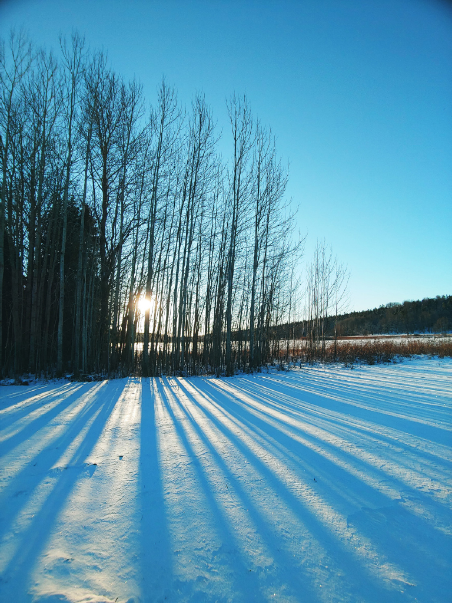
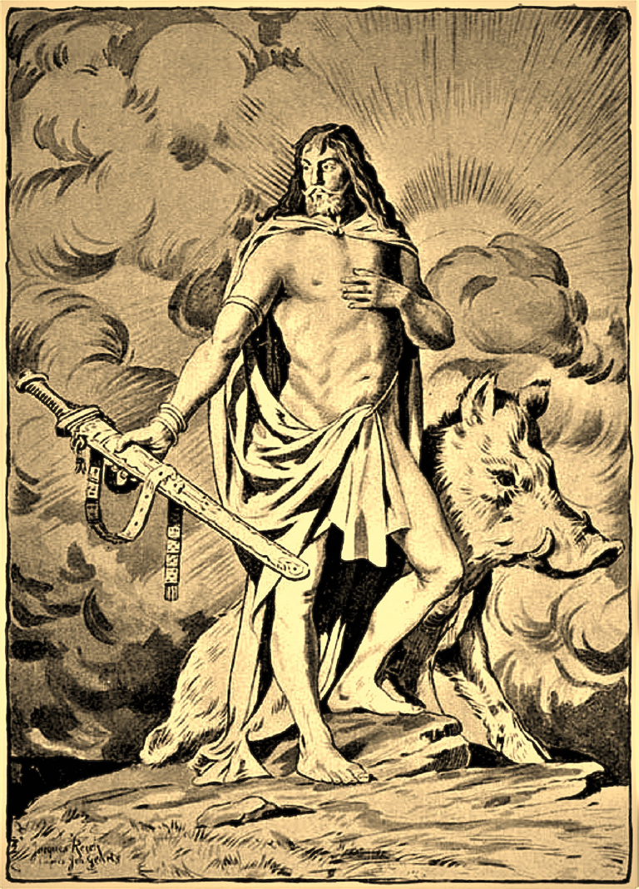
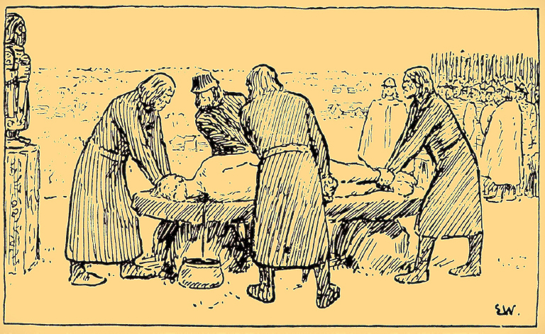
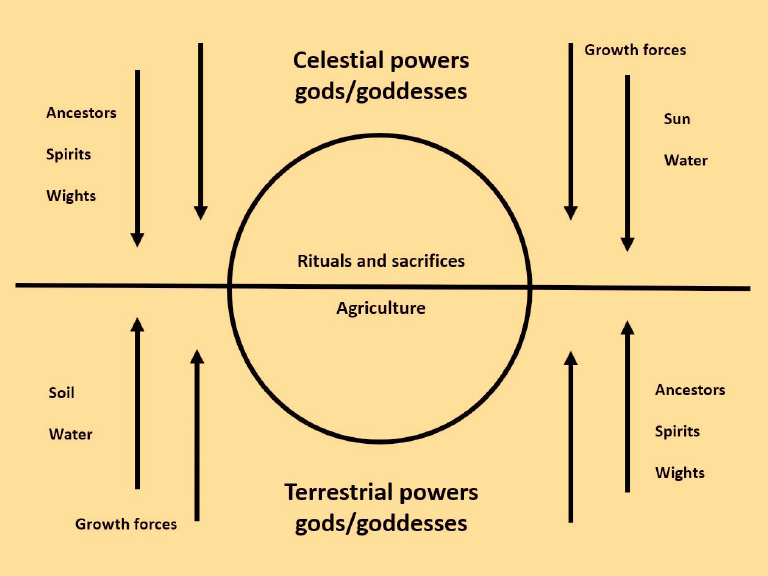
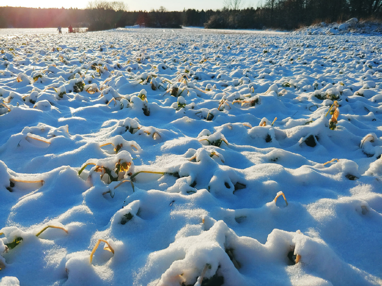
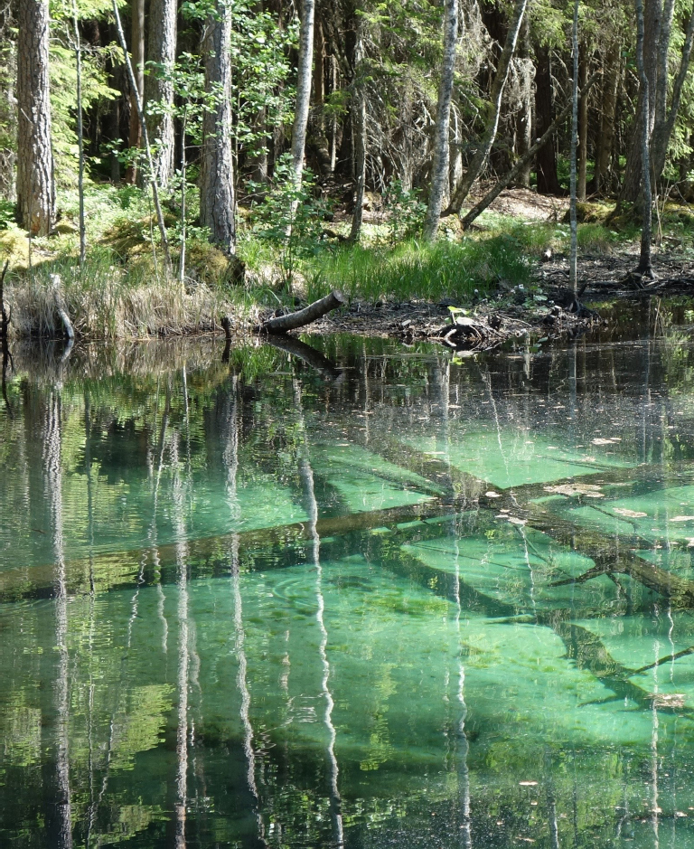
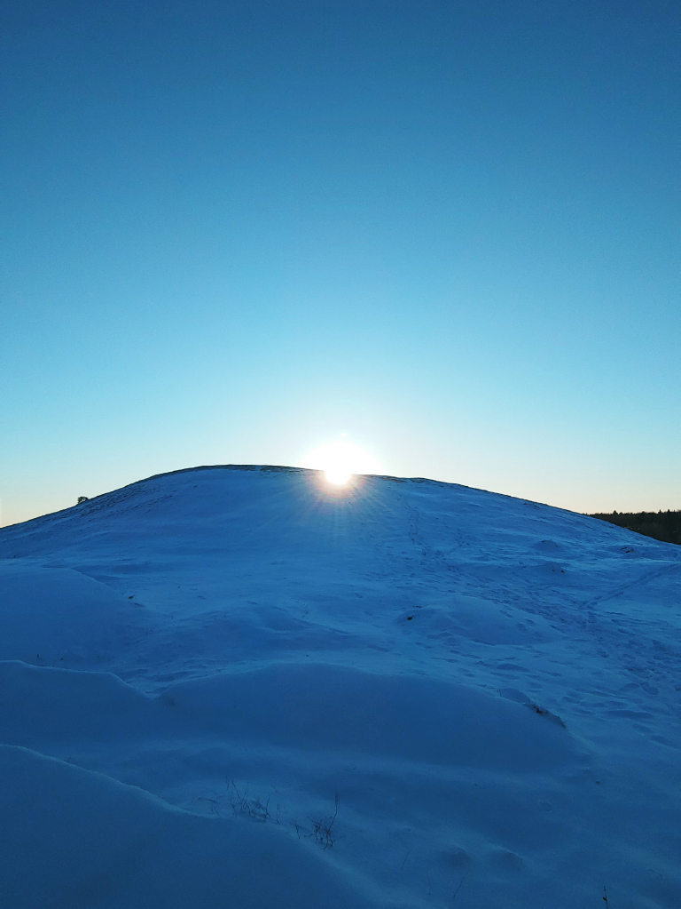
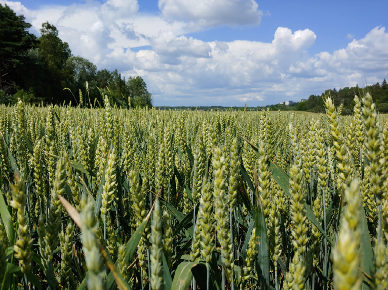

# 6. Farming, fertility and foaming water

<!-- p. 133 -->

**Indo-European ritualizations of life-giving growth forces in Scandinavian agriculture**

_Terje Oestigaard_

Linnaeus University & Uppsala University

## Abstract

The winter is a neglected theme in not only Indo-European studies but also ecological and water studies, despite the fundamental role of the cold and long season defining the life and well-being for all in agricultural and pastoral societies. Adapting to and surviving the hard and difficult season was the greatest challenge in all societies up to modern times, and throughout Europe north of the Alps there is a great uniformity in subsistence and ritual practices structured around the winter. By using comparative nineteenth-century ethnographic documentation of agricultural practices with a special focus on Scandinavia, and archaeological material spanning from the Bronze Age onwards, the unique Indo-European winter rituals and sacrifices are discussed in a water perspective. Compared to agricultural societies in temperate climates, in the cold north rainmaking rituals were rarely conducted because there was too much bad weather jeopardizing the harvest. In the north, the aim was to combat and overcome the winter as early as possible and to secure the continuity of the growth forces from the harvest through the winter until it was time to sow again. This was the primary ecological frame structuring the ritual year in Indo-European societies in the cold north.

## Introduction

The Nordic winter defined the seasons and the agricultural cycle, and whether it would be a year of famine or plenty. Farming in cold climates poses exceptional challenges and in pre-industrial cultures they were

<!-- p. 134 -->

sought to be solved by specific ritualizations believed to conquer and control hostile powers in nature. From the Bronze Age onwards, one can identify rituals that institutionalize Indo-European beliefs putting emphasis on the continuity between the seasons with a particular focus on winter and sacrifices. In all comparative religions, the relation between the sun and water is fundamental and structures rites and religious life, and the major rituals and sacrifices relate to hydrological and agrarian cycles. The essential agrarian rituals aimed to incite and active the latent forces in nature, which enabled new life and successful harvests. A fundamental challenge was how to overcome the winter and break the iron-grip of the cold, and in this world foaming water – always flowing and moving – was a powerful source to underground forces mightier than even King Winter (Oestigaard 2021a; 2021b).

By using archaeological examples in combination with ethnographic material from Scandinavia, the aim is to provide new insights into ritualisations of life-giving forces and fertility in Scandinavian agriculture, with an emphasis on different processes of inciting growth forces and activating life in nature. Thus, the main objective of this analysis is to conceptualise the ritualised ways and by which means immanent powers, ancestors and divinities were incited and activated as part of nature’s forces combating malevolent weather, wind and water – and the winter. This will be done by (1) discussing theoretical aspects and discourses in archaeology with an emphasis on the relation between culture and nature, and how the Norse mythology can be interpreted from, and incorporated into, an Indo-European ecology, (2) analysing ethnographic and folkloristic examples of agrarian cosmologies with a special focus on sowing and ploughing, cattle and snakes, (3) presenting and contextualising selected archaeological examples from the Swedish Bronze Age as part of an agrarian ecology and cosmology, and (4) discussing Indo-European traditions and how one can put preliminary dates on the developments of certain ritual practices.

## The culture–nature divide: seasonality and landscape studies

Scandinavian archaeology is a very good example of what historian Terje Tvedt has called “water blindness”: it is a history written without water, weather and winter. The ways water has been organized and controlled in society have significantly shaped its development, economy, social organization – and religious concepts (Tvedt 2006–2016; 2016; 2020). In particular, in the cold north, snow is the dominant form of water

<!-- p. 135 -->

throughout large parts of the year (Figure 1). The winter was the greatest challenge for living and surviving, and, even as late as in recent times, old people did not count how many years they had lived but how many winters they had survived. From Finland, the brutal

<!-- p. 136 -->

realities of being a farmer were seen directly in failed harvests with subsequent sufferings – and deaths. On average within a decade, only one harvest was good with abundant crops, two were lost or catastrophic, three were poor and four were mediocre or barely sufficient. In other words, within a decade, up to half of the harvests were lost or insufficient (Huhtamaa 2018; Huhtamaa & Helama 2017; see also Charpentier Ljungqvist 2015; 2017).

**Figure 1**. Fertile fields covered by snow. Håga Valley in Uppsala, Sweden, 6 January 2022. Photo: Terje Oestigaard © License: CC BY-NC.

Still, in Scandinavian archaeology a paradoxical perception has prevailed that ecology does not matter, despite the extreme seasonal variation where temperatures may change from minus 30 to plus 30 degrees. Even after decades of debates about climate change, social sciences have difficulties in conceptualizing culture–nature interactions. This is partly the consequence of processual archaeology’s nature deterministic approach, since New Archaeology adapted parts of the neo-evolution developed by Leslie White and Julian Steward (Trigger 1994: 292). In anthropology, Roy Rappaport (1979) describes parts of this polarized debate and the term “vulgar materialism”, as defined by Jonathan Friedman:

> Vulgar materialism, mechanical materialism, and economism are terms which refer to a simplistic kind of materialism, rejected by Marx, which envisages social forms as mere epiphenomena of technologies and environments, either by direct causation or by some economic rationality which makes institutions the products of social optimisation. (Friedman 1974: 456)

Marx himself wrote in 1859 in his _Contribution to the Critique of Political Economy_: “The mode of production of material life conditions the general process of social, political and intellectual life. _It is not the consciousness of men that determines their existence, but their social existence that determines their consciousness_” (Marx 1970: 20–21, my emphasis). Archaeologist Ian Hodder says that:

> [by] materialist approaches [I mean] those that infer cultural meanings from the relationship between people and their environment. Within such a framework the ideas in people’s minds can be predicted from their economy, technology, social and material production. Given a way of organizing matter and energy, an appropriate ideological framework can be predicted. (Hodder 1994: 19)

When it comes to culture and nature, this divide has been described as the “two cultures” – a universe of humanities and a universe of the natural sciences (Snow 1966).

<!-- p. 137 -->

This divide goes back to the founding fathers of sociology, and Émile Durkheim (1858–1917) established a dictum in social and human sciences that social facts or variables can only be explained by other social facts or variables (Durkheim 1966[1904]). This dogma has had a fundamental impact with regard to how humans and cultures have been understood. Anthony Giddens writes:

> The origins of risk society can be traced to two fundamental transformations which are affecting our lives today. […] The first transformation can be called the end of nature; and the second the end of tradition. The end of nature […] means that there are now few if any aspects of the physical world untouched by human intervention. […] For hundreds of years, people worried about what nature could do to us – earthquakes, floods, plagues, bad harvests and so on. At a certain point, somewhere over the past fifty years or so, we stopped worrying so much about what nature could do to us, and we started worrying more about what we have done to nature. The transition makes one major point of entry in risk society. It is a society which lives “after nature”. (Giddens 1999: 3)

Thus, about two decades ago one of the most influential sociologists of our time could argue that we lived “after nature” and “after tradition”. In archaeology, landscape studies fitted perfectly to this postmodern dogma. Originally introduced as a term in the English vocabulary in the late sixteenth century as a technical term in painting, it denoted connotation to “scenery” and “picturesque image” – and, importantly, the emphasis was put on the cognitive and cultural representations and the main actors (painters/academics) were somehow outside and apart from the landscape (Hirsch 1995). Landscape was seen as a linguistic construction without environmental constraints; reality was a representation and not a real world of hunger, struggle and suffering. In other words, landscapes were constructed and controlled by humans and their free will where the relations between signs and signifiers were arbitrary (e.g. Saussure 1960, Barthes 1973). In a world of human significations, nature’s constraints were vulgar, deterministic and irrelevant. Current studies of ontological relations and entanglements (e.g. Gell 1998; Hodder 2012; 2016; Olsen 2012; Robb 2004), for instance, are still within the postmodern paradigm (e.g. different kinds of agencies engaging in asymmetrical relations in various ways with human and non-human actors), albeit environments and ecologies are ascribed significance. Still, one needs another perspective if one attempt to study and understand prehistoric farming cosmologies, and early Indo-

<!-- p. 138 -->

European studies paved the way and ploughed the fields for such studies more than a century ago. Benoît Vermander writes:

> The development of “comparative religion” as an academic discipline from the mid-19th century onwards, the attention given to rituals and sacrifices in early anthropological studies, the fascination associated with endeavors such as Frazer’s _Golden Bough_ […] the role played by the study of folklore in asserting cultural and national identities, all contributed to the gathering of a vast array of material related to agrarian rituals, especially the ones centered on staple foods – cereals, mainly. […] Harvest festivals are often seen as constituting the climax or the exemplar of all agrarian rituals, an approach that needs to be qualified: in certain societies, rituals intervening before sowing or preparing the soil may be invested with particular importance, when such processes are loaded with danger (for instance, seeds may perish in cold climates). (Vermander 2021: 3)

Thus, a focus on seasons and seasonality probes to the heart of farming cultures and cosmologies. Homans says:

> Ritual actions do not produce a practical result on the external world – that is one of the reasons why we call them ritual. But to make this statement is not to say that ritual has no function. Its function is not related to the world external to the society but to the internal constitution of the society. It gives the members of the society confidence, it dispels their anxieties, it disciplines their social organization. (Homans 1941: 172)

From this perspective, one may approach parts of the ritualization and rationalization of a shared Indo-European ecology and cosmology.

## An ecology of the mythology

There are innumerable popular presentations and compilations of the Norse sagas and myths. One such book is _Myths of the Norsemen: From the Eddas and Sagas_ (1909) by Hélène Adeline Guerber (1859–1929). She was an American author born in Michigan to Swiss parents, but little is known about her life. Guerber wrote extensively about myths, including the Greek and Roman ones, and the particular intriguing aspect about the myths of the Norsemen is that the mythology is explicitly interpreted in an ecological perspective and more specifically in a pan-European or German framework. This European stratum of shared cosmological perceptions is evidently of great age and represents Indo-

<!-- p. 139 -->

European beliefs. Thus, in this analysis it is not the myths themselves that are of main interest but the nineteenth-century interpretative layer and horizon of understanding placing these gods and myths in an ecological perspective. All gods were ascribed with particular and specific weather phenomena and powers in nature; some were benevolent and fruitful; others were malevolent and fearful.

Light clouds were the works of Frigga. “Frigga was goddess of the atmosphere, or rather of the clouds, spinning golden thread or weaving long webs of bright-coloured clouds” (Guerber 1909: 42). Odin, on the other hand, embodied many facets and he appears with 204 names and forms (Price 2019: 62–68), which include strong winds and storms.

> Odin, as wind-god, was pictured as rushing through mid-air on his eight-footed steed. […] And as the souls of the dead were supposed to be wafted away on the wings of the storm, Odin was worshipped as the leader of all disembodied spirits. […] As the winds blew fiercest in autumn and winter, Odin was supposed to prefer hunting during that season, especially during the time between Christmas and Twelfth-night, and the peasants were always careful to leave the last sheaf or measure of grain out in the fields to serve as food for his horse. (Guerber 1909: 23; 25)

Moreover, we also meet Odin during the spring. “Until very lately there was always, on that day, a grand procession in Sweden, known as the May Ride, in which a flower-decked May king (Odin) pelted with blossoms the fur-enveloped Winter (his supplanter), until he put him to ignominious flight” (Guerber 1909: 38).

Thor was an ancient rain and thunder god, but he has also a fundamental role in fighting the winter. “Thor was the proud possessor of a magic hammer called Miölnir (the crusher) which he hurled at his enemies, the frost-giants, with destructive power” (Guerber 1909: 63). The fertility aspects are highlighted by his wife:

> Sif, Thor’s wife, was very vain of a magnificent head of long golden hair which covered her from head to foot like a brilliant veil; and as she too was a symbol of the earth, her hair was said to represent the long grass, or the golden grain covering the Northern harvest fields. Thor was very proud of his wife’s beautiful hair; imagine his dismay, therefore, upon waking one morning, to find her shorn, and as bald and denuded of ornament as the earth when the grain has been garnered, and nothing but the stubble remains! (Guerber 1909: 64)

It was Loki – the trickster –

<!-- p. 140 -->

who cut the hair and hence made the earth infertile, in the same way that he enabled the killing of Balder, the god symbolizing the sun and the summer. There were also different gods and goddesses for fertility and nature’s growth forces.

> Idun, the emblem of vegetation, is forcibly carried away in autumn, when Bragi is absent and the singing of the birds has ceased. The cold wintry wind, Thiassi, detains her in the frozen, barren north, where she cannot thrive, until Loki, the south wind, brings back the seed or the swallow, which are both precursors of the returning spring. The youth, beauty, and strength conferred by Idun are symbolical of Nature’s resurrection in spring after winter’s sleep, when colour and vigour return to the earth, which had grown wrinkled and grey. […] Idun’s fall from Yggdrasil is symbolical of the autumnal falling of the leaves, which lie limp and helpless on the cold bare ground until they are hidden from sight under the snow, represented by the wolfskin, which Odin, the sky, sends down to keep them warm. (Guerber 1909: 109–110)

Intriguingly, not only is Frey the optimal combination of sun and life-giving rain during the summer but his animal, the wild boar, taught humans how to plough (Figure 2).

**Figure 2**. Frey and wild-boar. By Jacques Reich (1852–1923). From: Guerber 1909: 118. License: CC-PD.

> Frey, or Fro, as he was called in Germany, was the son of Niörd and Nerthus […] the god of the golden sunshine and the warm summer showers. […] The dwarfs from Svart-alfa-heim gave Frey the golden-bristled boar Gullin-bursti (the golden-bristled), a personification of the sun. The radiant bristles of this animal were considered symbolical either of the solar rays, of the golden grain, which at his bidding waved over the harvest fields of Midgard, or of agriculture; for the boar (by tearing up the ground with his sharp tusk) was supposed to have first taught mankind how to plough. (Guerber 1909: 117–118)

Different forces were at work during the winter, and it was always a battle between powers fighting each other. It is also symptomatic that, although all of these gods were powerful, even the mightiest were not almighty. Each year the summer died and inevitably the winter came – and during the midwinter solstice it was believed that even the sun stood still. Nature was not natural but spiritual, and the powers embodied and materialized specific physical weather phenomena. While the seasonality clearly showed regularity on a broad scale, there were always huge variation in weather, wind and water. The forces in nature were not only unpredictable but they were also largely uncontrollable by the gods themselves. In other words, no single ritual or

<!-- p. 141 -->

sacrifice to a specific god would ensure and secure a good and bountiful harvest. There were too many forces and factors at work, and they were not always playing together for the betterment and best interest of humans.

## An ethnology of sacrifices, fertility and inciting growth forces

Snorri

<!-- p. 142 -->

Sturluson describes the great sacrifice of King Dolmade in Old Uppsala. After a year of hunger and famine, the chieftains decided to make sacrifices (Figure 3).

**Figure 3**. The sacrifice of Domalde in Old Uppsala. By Erik Werenskiold (1855–1938). From: Snorri 2011 [1899]. License: CC-PD.

> In the first autumn they sacrificed oxen, but even so there was no improvement in the season. The second autumn they held a human sacrifice, but the season was the same or worse. But the third autumn […] the leaders held a council and came to an agreement among themselves that their king, Dómaldi, must be the cause of the famine, and moreover, that they should sacrifice him for their prosperity, and attack him and kill him and redden the altars with his blood, and that is what they did. (Snorri 2011: 18)

This particular description of a cosmological sacrifice contains a wealth of knowledge about prehistoric rituals, ritualization and rationalizations. The natural world was a cosmic world empowered not only by divinities: humans could also intervene and impact on this balance between human and gods. Fundamentally, the gods controlled the weather and henceforth the outcomes of harvest. Humans could mitigate divine wrath by escalating and intensifying the sacrifices, which culminated with humans and ultimately the leaders of society as

<!-- p. 143 -->

responsible for the health and wealth of all society’s members (see Valeri 1985, Trigger 2003). Although Snorri does not describe the reasons why the divinities imposed calamites upon humans, Olaus Magnus gives a very vivid and detailed description in 1555 of the king’s cruelty, which is worth referring to in length:

> I should like a similar cruelty to be noted, that of King Domaldi. […] His realm was suffering the severest ill fortune when his courtiers, coming together under pretence of protecting their country and the innocent, ostensibly declared themselves to be the servants of justice and fair play, when they were in fact the enemies of the citizens and of all probity and virtue. Whatever corn lay in any stores they set before their horses to be eaten up, while wretched parents saw their children die of hunger and starvation, since there was not enough corn for bread, and they themselves were compelled to give up the ghost along with their offspring. […] For this reason, when famine so sharply attacked not merely the realm of Gotaland but also Svealand, which had once teemed with everything required for human sustenance, the temple priests who served the idol of Odin at Uppsala propounded one, sole remedy against the imminent collapse of all the northern lands: that King Domaldi, being a hideous enemy of the human race, should be bound in chains and sacrificed at Uppsala to the goddess Ceres. […] Since this was delivered as if from a divine oracle, it was no sooner said than done. […] His death was followed by a corn harvest and an abundance of everything far and wide. (Magnus 1998[1555]: ch. 45, p. 460)

King Domaldi, as “a hideous enemy of the human race”, letting horses eat the food of farmers so the children died of hunger, was a threat to wealth and health of all. Killing the cause was like treating cancer and a collective good. The important thing in this context is how the king and his cruelty also embodied and controlled the weather and the harvest. Also, Snorri points out that, after King Domalde was sacrificed, the son “ruled the domains for a long time, and there were good seasons and peace in his day” (Snorri 2011: 18). The bountiful harvests proved to the participants that the ritual and the sacrifice was successful. Order in culture and cosmos was restored.

The sacrifice of Domalde was triggered by a crisis: a famine causing hunger. All rituals are caused by a situation making ritual as an activity rational. “I consider ritualization as the process in which actions or reactions to specific situations make them distinct from ordinary situations. […] Every ritual performance is an act of ritualization that grows out of a situation, a _causa_” (Modéus 2005: 37). There are many reasons for

<!-- p. 144 -->

ritualisations and the most common cause in agrarian societies relates to cycles of nature, which trigger ritual responses aiming “to impose cultural schemes on the order of nature” (Bell 1997: 103). In short, agrarian rituals as part of the seasonal changes and cycle of nature are _proactive_: they aim to define the forthcoming year and successful harvest (Kaliff & Oestigaard 2022; Oestigaard 2022).

In an agrarian world in cold climates, it is precisely the continuity of life forces between the seasons that is emphasised in comparative Indo-European ethnology in Europe (Frazer 1890; 1912a; 1912b). “Cereal”, writes Benoît Vermander, “refers to the Roman goddess Ceres, who was assimilated with the Greek Demeter as well as to local earth goddesses. […] Ceres reigned over the cycle of crop production and represented the generative power of nature” (Vermander 2021: 2). This is also manifested in continuity rituals and the powers of the last sheaf. During the harvest, the corn was cut and killed, but during the sowing and ploughing rituals in the spring life was transferred back to the soil. The celebrations and sacrifices during Christmas or the pre-Christian _jól_ were essential in the corn-spirit’s continuity through the winter and the darkest times, and these traditions are well documented among farmers in the Nordic countries (Nikander 1916; Celander 1920; Lid 1928; 1933; Nilsson 1936; Olrik & Ellekilde 1951). However, it was not sufficient to plant the grains in the soil if the fields were infertile. Thus, there were at least two processes at work in parallel. On the one hand, it was to ensure and safeguard continuity of growth and life forces between the seasons, and on the other hand it was to activate and incite the latent and potent life forces in nature covered by snow or frozen in ice (Figure 4).

**Figure 4**. Terrestrial and celestial forces at work in agrarian cosmologies. Graphics: Terje Oestigaard © License: CC BY-NC.

The latter was also related to the sun and the darkest time of the year around Christmas. In Scandinavian peasant communities up to the early twentieth century it was generally believed that everything in culture and cosmos came to a standstill around Christmas. During midwinter solstice everything stood still by itself, and there were numerous taboos associated with this cosmic time of the year. Nobody should work and everything that could turn around and move should stay still, like grinding stones, spinning wheels, baking plates and wheels on wagons. Nothing should move, since this would contradict the laws of nature and cosmos (Olrik & Ellekilde 1951: 965–967). After the solstice, not only was the sun reactivated but everything had to be incited and activated again: this was not only a divine task but a human ritualization of growth and life forces. Throughout the Scandinavian countryside there

<!-- p. 145 -->

are reports about farmers shaking their agricultural tools, stamping on the fields with a club on Christmas Eve, and preparing all wheels for the coming year. If this was not done properly, the forthcoming harvest could fail (Lid 1933: 39).

The ultimate growth forces came from water: the pre-industrial cosmology in rural Scandinavia was largely evidence-based in the sense that all farmers were well aware of how the growth forces worked in these northerly and harsh conditions (Figure 5).

**Figure 5**. Growth forces living and manifesting themselves beneath the snow in early spring. Photo: Terje Oestigaard © License: CC BY-NC.

Hyltén-Cavallius writes from Småland in Sweden that the oldest religious conceptions were personifications of external and natural phenomena (Hyltén-Cavallius 1863: §54, p. 230), like changing weather and observable forces in nature, for instance strong winds, whirlpools or waterfalls. Nature and differences in water and weather phenomena were ultimately proof with regard to how good and bad forces worked. Every farmer had witnessed this innumerable times, and hence it is no wonder that James Frazer’s (1922) theory about sympathetic magic was largely developed and based on Indo-European practices in central and northern Europe, Scandinavia included. Like produces like and by touching

<!-- p. 146 -->

and imitating processes in nature farmers partook and activated and incited these life and growth forces.

In the cold north, the winter was the greatest challenge and hardship, not only for survival; it also determined the whole agricultural year: springs that were too long and cold or autumns that were too early and wet could jeopardize the harvest, with subsequent famine and hunger. Thus, the aim was to overcome and overpower the deadly winter, and the most powerful forces were seen in free-flowing water during the most enduring cold periods (Figure 6).

**Figure 6**. The never-freezing Ingbokällarna, Sweden. Photo: Terje Oestigaard © License: CC BY-NC.

A _frobrunn_ was a particular renowned spring or well with immense powers from beneath. The name literally means “froth well” or a frothing spring. “These were springs which never froze, or openings in the ice which kept open throughout the winter” (Solheim 1956: 153). Not only were they “eating” snow and frost from beneath and thereby manifesting and visualising the physical growth powers underground (Lid 1933: 40); the bubbles coming from the depths of these springs were also seen as embodiments of the living dead. They could be the souls of drowned people but also powerful wights or water spirits (Reichborn-Kjennerud 1928: 17).

<!-- p. 147 -->

Since this water was alive and bubbling up from beneath when all other types of water was frozen or dead, it was seen as “holy” and extremely powerful (Skar 1909: 45).

Although disputed and etymological uncertain (Vikstrand 2001: 175), it has been suggested that the prehistoric god Ull, with probable roots back to the Bronze Age, can be interpreted and seen as to “froth”, “foam” or “bubble”, like boiling (Elgqvist 1955: 39–50). Foamy rivers or “to foam”

<!-- p. 148 -->

is also an Indo-European feature found, for instance, in ancient Greece and, although the etymology and clear connection to divinities are discussed, the name of the “mother of all rivers [is probably] ‘foamy-ness, seething-ness’ (personified as a deity)” (Ginevra 2020: 102).

Across time and space in different Indo-European cultures and traditions on the European continent there are obviously great variations, but it seems certain that these powerful water manifestations in nature were divine openings where underground forces made themselves visible and accessible to humans and their needs. These life- giving growth forces could be ritually activated and incited by humans in seasonal rites, and these were mainly related to the winter: the harvest (end of summer and beginning of winter), midwinter and sowing and ploughing (end of winter and beginning of summer) (Kaliff & Oestigaard 2022).

## Cattle and snakes

A central Indo-European ritual has been horse fights and competitions in various forms, which in Scandinavian traditions are known as _skeid_ (Kaliff & Oestigaard 2020). The last historic trajectories were documented as late as the early twentieth century in the Scandinavian countries, and in particular the horse races around Christmas and more specifically early in the morning of 26 December were a cosmogonic ritual (Skar 1909; Solheim 1956; Stylegar 2006). “People rode or drove out to water the horses in so-called fro-brunnar, special springs or special places at rivers or lakes. These were springs which never froze, or openings in the ice which kept open throughout the winter,” Solheim writes.

> The water in these springs was thought to be especially powerful and health giving. When the horses got to drink this water on the morning of the second Christmas Day, they were supposed to thrive and become especially healthy. People competed to come first to the springs, for then the water was thought to be best. The competitions often turned into fight. (Solheim 1956: 153)

Importantly, it was believed that the ones who won the race – watering the horse in the well and being first back to the farm – would have the earliest and best harvest in the coming season (Wéssen 1922: 17; Lid 1933:40, see Kaliff & Oestigaard 2020: 183–214). Horse fights and races to foaming wells and springs were fertility rituals activating the new

<!-- p. 149 -->

year and inciting the agricultural growth forces, and it was believed that these rituals during the midwinter would “eat” away the snow.

Although the _skeid_ ritual with horses is historically the most famous, Frans-Arne Stylegar (2013) points out that the _skeid_ phenomenon includes a broad spectrum of rituals. In particular, in the coastal areas in Southern Norway, cow-_skeid_ has been common. Stylegar writes:

> In the cattle breeding inland region from Jæren in the west to Telemark in the east a particular type of skeid was practiced until the late 19th century. In these areas the cattle was kept in stables during the cold, snowy winters. When the cattle was let loose in springtime, the farmers had their bu-skeid (cow-skeid), i.e. they let the animals fight each other to decide which cow was to be this year’s bu-konge (cow-king). These cow-fights are best known from Sirdal, an inland valley between the countnies of Rogaland and Vest-Agder.

> Some cows were really wild. One cow in particular was traded from one farmer to the next, and this animal butted several others to death. Still, it gave prestige to own this cow. Especially the men from the Virak farm in Sirdal were known to travel long distances to acquire wild cows with big horns. The bu-konge had to be big, strong, and brave – and preferably have a set of horns sharp as knives. As long as the cow matched these demands, it did not really matter whether or not it was a good milk cow. (Stylegar 2013: 451)

The owner of the wildest and fiercest cow was renowned and it was prestigious to have the strongest animal. If the animals fought against each other and the farmers could not agree upon which animal was the strongest, the farmers could settle the dispute themselves with knifes and fists, and booze was obviously inciting the male combatants. While (drunk) fighting today is not seen as a particularly religious practice or a homage to god, there is logic behind all these farming practices that had a continuity into the twentieth century.

Nils Lid points out the cosmogonic structures behind these ancient traditions, which belongs to Frazer’s (1922) sympathetic magic. The ultimate aim was to incite the forces in nature that could overcome and overpower the winter. All fighting and inciting were an aim in itself: all life and growth forces had to be activated – through rituals, races or simple fights. Although these traditions were also festivities, entertainments and carnivals, behind the surface there was a religious structure and logic (Lid 1933: 39–40).

The

<!-- p. 150 -->

fertile and procreative aspects of cattle were especially emphasised when the animals were let loose in springtime after a long winter. In some places, the milkmaid stood high up on ladders in the doorway in the barn and the cattle had to pass through her thighs as if she were giving birth to the animals (Olrik & Elleklide 1951: 1160–1161). In the southern areas in Norway where the tradition with cow fights and “cow-kings” was strong, cows were also fed with snake heads believed to have healing and strengthening powers (Stylegar 2013: 451). Ideally, it was a grass snake and the first snake spotted on the melting ice in springtime; alternatively the cattle should be fed with the old Christmas bread the day they were let loose (Nikander 1916: 225; Olrik & Ellekilde 1951: 1157–1160). The snakes were closely associated with the ancestors and the life-giving forces in nature and underground (Østigård & Kaliff 2020). The cow’s ritual meal consisting of the Christmas bread is particularly interesting, because it directly relates to Frazer’s interpretations of the last sheaf (Frazer 1890; 1912a; 1912b). In the Scandinavian tradition, the continuity between the seasons through the midwinter sacrifices and celebrations (including Christmas or _jól_) was explicitly manifested in the Christmas bread. It was made by the last sheaf and the last grains harvested and the bread should lie uneaten on the Christmas table throughout the celebration. The last sheaf contained the harvest’s growth powers, and during sowing and ploughing the ploughman should eat parts of the bread and give some pieces to his horse and other animals, and the rest should be ploughed into the fields when the grains were sowed (Lid 1928: 70–71, 80). The ancestors and growth forces gave new life and harvest in yet another season and, as has been said in another context, ploughing “is the penetration of man into the sacred world, that is to say the unopened world” (Servier 1951: 184).

## Indo-European tradition in Bronze Age Sweden

In the last decades in the Mälardalen region in central Sweden, large contract archaeological excavations have revealed astonishing results and Sweden’s hitherto largest cult sites from the Bronze Age have been documented. There is a concentration and intensification in agriculture and domestication of new lands in the Late Bronze Age (from 1100 BCE onwards). This is also the era of Håga (Figure 7), located some kilometres outside Uppsala, where Scandinavia’s northernmost oak-log coffin is found (Almgren 1905; Kaliff & Oestigaard 2018), and the grave

<!-- p. 151 -->

is the richest in gold in the whole of Scandinavia: about a third of all gold and gold fragments found in Sweden’s 1,300-year-long Bronze Age period is found in Håga (Eriksson 2008). The Håga mound was built around 1000 BCE. The main sacrificial animal there was cattle and, apart from

<!-- p. 152 -->

remains of three humans external to the main deceased who was cremated, bone remains have been found of six or seven cattle, five or six sheep, one or two pigs, and dogs, among other species (Johnsen & Welinder 1993). Håga was excavated in 1902–1903, and based on this investigation it is difficult to say anything specific about cultivation, although there are agricultural fields, farms and living areas in the vicinity. The sacrificial animals in the mound indicate an emphasis on pastoral animals, from cattle to sheep and dogs guarding the herds (see Oestigaard 2022).

**Figure 7**. The Håga mound covered in snow, 6 January 2022. Photo: Terje Oestigaard © License: CC BY-NC.

The Bronze Age cult site Skeke in Rasbo, Uppland, with an intensive phase in the first part of Late Bronze Age, shows a combination of pastoralism and cultivation (Artursson, Kaliff & Larsson 2017). Outside one of the cult houses, there was a closed cooking pit with a boulder on top. The cooking pit contained not only remains of cattle but also bones from wolf (or dog), and the combination cattle–wolf/dog indicates a holy meal and communion in a pastoral cosmology (Larsson 2014: 170, 298, 318; Kaliff & Oestigaard 2022). On the other hand, there were also found numerous grinding stones in the graves at Skeke (Artursson et al. 2017: 104), and the combination of ground bones and grains is a ritual phenomenon that is found in many Bronze Age contexts and cemeteries (Kaliff 1997; 2007). Moreover, cremated bones are commonly found in agricultural fields, among other contexts, and it seems that cremated bones have been deliberately ground and spread as fertilising ashes on the fields, not as manure but for the purpose of human life and fertility: ancestral growth powers (Kaliff & Oestigaard 2004; 2017).

In 2007 Nibble in Uppland, one of Sweden’s largest Bronze Age cult sites, was excavated. The main ritual phases were dated to _c_. 900–700/600 BCE and centrally located on a site where there was a spring still flowing from underground. This cosmic spring seems to have been a founding well at the site (Artursson, Karlenby & Larsson 2011). In one of the cult houses a big stone labelled an “altar” was found, with flat sides measuring 1.90 × 0.90 × 0.75 metres and a weight of about two tons. The stone was slightly curved and it was clear that it had been used as a grinder. In the layers and pits below the stone there were numerous remains of ground items, including grains, but also burnt bones from sheep and humans, including a burnt fragment of a human skull. Thus, it seems that the stone had an “altar” function where grains and cremated bones, and perhaps more specifically human skulls, were ground and made into a holy meal (Artursson 2011: 298–309; Karlenby 2011: 141–143).

<!-- p. 153 -->

This interpretation was strengthened by another find in a depositional pit measuring _c_. 6.4 × 5.5 metres with a depth of 0.38 metres. After the use-phase was completed, the pit was closed with an estimated five- to eight-ton heavy stone. The debris and food remains in this pit were intriguing. Human remains were found scattered with other deposits. In general, human remains found at Nibble had an average of 2.7 grams, but the human remains in the garbage pit were significantly smaller and on average only 0.6 grams. Thus, the bones in the pit had been ground much finer and better than all the other human bones, and they were deposited with other remains from cooking of meals. The fact that this pit was closed after the preparation of the meal was completed, with a stone weighing several tons, indicates that this was not an ordinary and profane meal (Larsson 2011: 411–412).

The great Håga funeral and mound, dated to _c_.1000 BCE, including some century older remains of humans and animals, and all the other large Late Bronze Age cult sites in Mälardalen, fit into an overall picture of Indo-Europeanisation and intensive phase of expansive agriculture and domestication of the landscape in this area. Agriculture was introduced in Sweden around 4000–3800 BCE and the secondary product revolution with extensive pastoralism became dominant around 3000–1500 BCE. Stig Welinder writes:

> [I]t would seem that agriculture in the period 1200–800 BC was the wholly dominant way of life as far north as present-day Västergötland and Uppland. […] The advent of historical farms, 1000–800 BC. Over the course of a couple of centuries, farms began to be built with outbuildings, sometimes with byres. They had cleared, permanent, manured fields. The innovations of the previous millennia came together in an effective whole, helped along by iron tools, which were first manufactured at this point. (Welinder 2011: 23, 43)

Thus, the historic developments in Mälardalen are part of both an expansive phase of intensive agriculture and the advent of the historic farm, as well as Indo-European processes in time and space.

## Dating traditions and discussion

There can be no doubt that the ecology has been a vital and fundamental parameter in all Scandinavian societies throughout history, and in particular the winter has been the greatest challenge in agricultural and pastoral communities. The length of the winter determines the growth season, and cattle and

<!-- p. 154 -->

domestic animals cannot live unprotected outdoors without human support and secure supplies of fodder in cold winter environments. As seen with the Norse mythology, there was a shared Indo-European stratum of common conceptions in Europe seeing divinities and deities in an ecological perspective (Figure 8). The world and changing weather phenomena understood as fights between benevolent and malevolent forces in the cosmos could explain the dramatic and seasonal changes in nature. On the one hand, there were no almighty gods, but on the other hand there were powers and forces everywhere in nature, which could be propitiated, activated and incited. The sacrificial year and ritual practices were fundamentally structured around the waning and waxing growth forces. The ethnographic material and the ritual practices documented in Europe by Frazer and others by the end of the nineteenth century and beginning of the twentieth clearly support this interpretation. The challenging question is how far back in time it is possible to trace parts of this cosmology and mythology.

**Figure 8**. Fertile fields in the Håga Valley, Uppsala. Photo: Terje Oestigaard © License: CC BY-NC.

In studies of “deep” oral history, it is generally agreed that memories of particular events or persons seldom survive more than 500–800 years

<!-- p. 155 -->

because the information becomes so distorted after intergenerational transmissions that the original content is lost. However, the theoretical foundations for these assumptions are not always clear or convincing, and new studies have opened up avenues and approaches conceptualising greater time depths and continuities, like Aboriginal memories of a great inundation 7,000 years ago (Nunn & Reid 2016) or 5,000- to 6,000-year-old Indo-European stories (da Silva & Tehrani 2016). Questions about continuity and change are fundamental in all archaeological research, but often change is seen, at least implicitly, as more natural and obvious than continuity, since change implies notions of “development and progress” and continuity “stagnation”. However, in many cases it can be the opposite, as Roy Rappaport points out, and the crucial question is “What does this change maintain unchanged?” (Rappaport 2001: 7).

If an ecological adaption works and the cosmological worldview explains why and how the world, gods and humans function and relate to each other, and the rationalisations and ritualizations of this religious system have constituted all major and seasonal celebrations and the sacrifices have largely proved successful in the memory of mankind, there are more reasons to preserve the system than to change it. If there are changes, the aim is to maintain the tradition unchanged, and this is a probable scenario in many prehistoric cosmologies in relation to changing ecologies. From this perspective, it is possible to put a tentative date on some of the fundamental agrarian rites and Indo-European traditions in Scandinavia. While there were changes on the surface – gods changed names and forms – there were still structural continuities with regard to inciting growth forces of grain and cattle, the foaming waters and the holiness of the wells – _frobrunn_. The ritual year was structured around continuity between the seasons and the life-giving powers and spirits in the last sheaf, and harvesting and sowing and ploughing rituals and sacrifices. These Indo-European practices and perceptions seem to go back to at least the beginning of the Late Bronze Age in the agricultural areas of Scandinavia. In other words, they are at least 3,000 years old.

## How to cite this book chapter

Oestigaard, T. (2025). Farming, fertility and foaming water: Indo-European ritualizations of life-giving growth forces in Scandinavian agriculture. In: Larsson, J. H., Olander, T., & Jørgensen, A. R. (eds.), _Indo-European Ecologies: Cattle and Milk – Snakes and Water_, pp. 133–161. Stockholm: Stockholm University Press. DOI: <https://doi.org/10.16993/bcu.f>. License: CC BY 4.0
