# 4.5 Inscriptions from Italo-Celtic burials in the Seminario Maggiore (Verona)

Simona Marchesini and David Stifter

*From SIMA 149. J. Tabolli (ed.), From Invisible to Visible. New Methods and Data for the Archaeology of Infant and Child Burials in Pre-Roman Italy and Beyond*

© Astrom Editions 2018. ISBN 978-9925-7455-2-4.

## Abstract

Celtic inscriptions from northern Italy are only extant in a small corpus of fragmentary texts, mostly in the vernacular Lepontic script (derived from northern Etruscan), and reflecting two different, but closely-related languages, Lepontic and Gaulish. Recent finds from the necropolis in the episcopal seminar (Seminario Maggiore) in Verona have enlarged this corpus. These inscriptions are of interest for several reasons: first of all, they come from an area very far to the east of the central region of Italo-Celtic literacy, secondly they belong to the late phase of Italo-Celtic when the population was already under strong Roman influence, and, finally, a large proportion of the inscriptions belong to child burials. This chapter discusses the cultural, socio-linguistic and comparative-linguistic aspects of these grave inscriptions.

## 4.5.1 Introduction (S.M.)

Between 2005 and 2009 an extended necropolis was found during renovation work at the Episcopal Seminary in Verona. More than a thousand boxes filled with objects from the excavated area are stored in the Soprintendenza Archeologia, Belle Arti e Paesaggio in Verona, waiting for an exhaustive publication. On several occasions the excavations have been presented to the public and a short report on the excavation was recently published in the Rivista di Epigrafia Italica (Solinas 2016), together with a rough description and linguistic comment on the inscriptions, which are immediately recognisable as being written in the Lepontic script. For this reason, the archaeological data presented here are scarce and based on second-hand information. The local archaeological Superintendent has kindly supplied us with the archaeological record of each burial containing epigraphic data. The inscriptions themselves were analysed by me directly on two occasions, on 9th and 13th January 2017.

## 4.5.2 The context (S.M.)

The necropolis, situated not far from the river Adige and extending into the nearby via Carducci, can be dated from the second half of the 2nd to the first half of the 1st century BC. The earliest burial is dated between the 3rd and the 2nd century BC. One hundred and eighty-four tombs were excavated, 163 of which were located in the parking area of the Seminary. The corresponding settlement is probably located on Monte San Pietro, a hill 500m northwest of the necropolis. Seven of the 163 tombs were of cremated individuals, while 177 were inhumations. A high number of foetuses (57 cases), as well as ‘sub-adults’ (0–20 years old: 61 cases) were found. The majority of skeletons were oriented north/south, with the head pointing to the south. In two cases the burials contained two bodies. Seventy percent of the tombs had a modest amount of grave goods consisting mostly of common pottery: pots, cover-bowls (‘ciotole coperchio’), ollae, small ollae, small globular vases, olpai, jugs and some black painted vases. Bronze and iron equipment is represented by fibulae, knives and sickles. Coins are also attested: 15 asses and a semis date to the end of the 3rd quarter of the 2nd century BC. Some tombs also contain ritual depositions of animal skeletons (horses and dogs).

## 4.5.3 The inscriptions (S.M.)

(see catalogue at the end of chapter)

Apart from some simple crosses scratched on the base of vases, which are excluded from Solinas’ report, 11 longer inscriptions were scratched after firing onto the base or shoulder of the vases. The objects on which the inscriptions are written are of the same type as documented at contemporary Celtic sites in the Verona area (Povegliano, Santa Maria di Zevio, Isola Rizzo and Isola della Scala). Other necropoleis in this Celtic (Cenomani) district have child or infant burials with inscriptions from the same chronological timeframe: Valeggio sul Mincio (VR), Povegliano and Isola Rizza (see further Chapter 4.6.1).

## 4.5.4 Celtic languages in Italy (D.S.)

The Celtic languages of ancient northern Italy are only known from a small corpus of inscriptions, many of them fragmentary, mostly in the vernacular Lepontic script (older: alphabet of Lugano) which is derived from the northern variant of the Etruscan script. Only towards the end of the writing tradition, in the 2nd and 1st centuries BC, are Celtic graffiti in northern Italy also found in the Latin alphabet. The beginnings of writing Celtic in Italy are elusive. Maras (2014a and 2014b) has argued that the Lepontic script must have been borrowed from Etruscans around the middle of the 7th century BC, a perplexingly early date, considering that according to the traditional view the earliest known Lepontic inscriptions date to the late 6th century BC. The new, early dating has been arrived at through the re-assessment of two inscriptions in an archaic variant of the script from Sesto Calende in the Lepontic territory. While their dating to the second half of the 7th century BC may be palaeographically justified, it is far from clear if the names recorded in the graffiti are all local Celtic names, or if those graffiti really represent an early stage and an ancestor of the later local written tradition at all, or, instead, are rather stray finds from the Etruscan tradition. In any case, in the 6th century BC literacy in the local Celtic language Lepontic is securely established. Currently, some 400 Italo-Celtic texts are known. With only a few exceptions, the Lepontic script was in use in a narrowly circumscribed area in the north Italian lake region and in parts of the Swiss Canton Ticino, as well as in the Po Valley to the south of that region. The inscriptions reflect two different, albeit closely-related languages which are commonly called Lepontic and Cisalpine Gaulish. Traditionally, inscriptions from before the Gaulish invasion into northern Italy, which according to ancient historians occurred in the late 5th and 4th centuries BC, are believed to belong to the Lepontic language in the proper sense. Likewise, inscriptions from the Alpine valleys in a radius of 50km around the town of Lugano in southern Switzerland are also assigned to the Lepontic corpus. Everything else, especially texts found in the region that stretches along the Po Valley, is commonly regarded as Gaulish. To distinguish this Gaulish from the language of their relatives who stayed behind in Gaul, beyond the Alps, the language of the invaders of Italy, although to all intents and purposes grammatically identical with the Transalpine variant, is called Cisalpine Gaulish. The entire Italo-Celtic material, in the Lepontic and in the Latin alphabet, is available on the website Lexicon Leponticum (LexLep); all references to attested Italo-Celtic forms will be to LexLep entries, from which further literature can be easily retrieved. The texts that were known by the beginning of the millennium are collected in Morandi (2004). Motta (2000) offers a compact overview of what can be said about the language of the inscriptions.

Although the new finds from the necropolis in the episcopal seminar in Verona have expanded the Italo-Celtic corpus only slightly, the inscriptions are remarkable for several reasons: 1. Firstly, they come from an area far to the east of the central region of Italo-Celtic literacy, namely from the Veneto, a region where up to now no extensive finds of texts had been made. The geographic position renders it beyond any reasonable doubt that the Verona inscriptions belong to the Cisalpine Gaulish sub-corpus of Italo-Celtic. In fact, they are among the easternmost Italo-Celtic texts known so far, due allowance being made for special cases like the stray find of a Celtic name in Oderzo, in a Venetic milieu (TV·1; Eska & Wallace 1999). 2. Secondly, they are from the late phase of Italo-Celtic when the region was coming under notable Roman influence. This political and cultural superstrate can potentially have had linguistic and orthographic effects on the texts. 3. And finally, from a socio-linguistic point of view, some of the inscriptions belong to child burials. So far, only one, not entirely satisfying, publication has been devoted to these inscriptions (Solinas 2016). In the following, the cultural, socio-linguistic and etymological aspects of these funerary inscriptions will be investigated and an improved edition of the finds and of the inscriptions will be produced. The order of the texts follows that of Solinas (2016: 375–378); an additional graffito is added after 10.

1. eskikorikos
2. a (perhaps az)
3. toutoris
4. es
5. pritua (Solinas: prituli)
6. eskiko
7. a
8. kasipus (8a) p
9. ka
10. mar
11. titi (?)

## 4.5.5 Philological and linguistic analysis of the names (D.S.)

### 4.5.5.1 Palaeography

The variation in letter shapes conforms to that normally found in Italo-Celtic inscriptions of the late Republican era. Due to the unwieldy support objects, the graffiti are not very artfully executed, which is common for this type of private texts. Nevertheless, the letters are for the most part clearly legible, except for two or three cases where alternative readings with variant explanations are possible (nos 5, 8, 11). These will be discussed below. For a full appraisal of diachronic graphic variation in the Lepontic script, see the page ‘North Italic Script’ in LexLep (http://www.univie.ac.at/lexlep/wiki/North_Italic_Script).

Latin graphic influence makes itself felt in a number of ways, palaeographically and orthographically. Six of the twelve texts are dextroverse like Roman writing (1, 3, 4, 8a, 9, 10), five (2, 5, 6, 7, 8) show the traditional Lepontic sinistroverse directionality, one case is ambiguous (11). This relative distribution is in accordance with the general tendencies in Italo-Celtic inscriptions at the time (cf. Stifter 2015: 253–254). Only one object, a patera, carries two graffiti, kasipus (8) and p (8a). The two texts do not display any obvious connection with each other; they show a different directionality, and the execution of the letter P is distinctly different in the two; they were probably written by two different hands for different purposes; for example, one to record the name of the deceased, the other one perhaps a potter’s mark. Occasionally, the shapes of the letters display influence from their Roman counterparts, as is common in the late Italo-Celtic period. Some letters, such as K, I or U, have always been very similar or identical between Lepontic and Latin writing, because both alphabets ultimately go back to the same ancestor. Such letters do not lend themselves to a study of diachronic developments. Other letters have been more or less formally distinct from the earliest period. Of those letters with an original formal difference, A, M, O, S are represented in the Verona corpus. A occurs in its late shape where the gap between the left and the right oblique hasta is not closed; with the exception of one uncertain case (5), which, if the name is read as pritua instead of prituli, would show an older variant. The letter O has always the same height as the surrounding letters, as it does in Latin, but unlike in the Old Lepontic script where it hovered mid-high, being only half the height of other letters. M occurs in the Latinised shape familiar to modern eyes, not in the flag-like one that is typical of the early Italo-Celtic inscriptions. S shows some variation in the Verona corpus. It is found in its archaic variant of four or five strokes (3, 8), and in the younger, Latinised variant of three strokes (1, 4, 6). The older variant adheres always to the original practice of having the S facing against the direction of writing, whereas in the younger forms both the old direction (6) and the Latin-style one (1, 4) is found. It is noteworthy that all instances of three-stroked S could belong to the same name, Eskingorīχs, in its full and abbreviated form.

T, which looks like Latin X, and R, which resembles Latin D, never undergo replacement by their Roman counterparts, maybe precisely because they use glyphs that are identical in shape with other Roman letters, albeit not the ones with the same sound value. However, in 5, the R has been turned 270°. E and P appear in their normal Lepontic shapes.

### 4.5.5.2 Socio-linguistic notes

The following analysis builds strongly on the working hypothesis that the names found in the burials refer to the interred individuals. This is not

the only interpretation possible. Recent studies have pointed out that inscriptions found in tombs can contain names not matching the sex of the deceased (Pellegrino 2008: 439, n. 81, 447). Instead they could, for instance, belong to parents or other relatives, or to other persons who made funerary offerings. In the geographically and culturally proximate inscription VR·15 from Isola Rizza, the masculine name kośio is scratched on a bowl from a female burial. While the etymological analyses of the names in section 5.3. are unaffected by the question to who the names refer, the socio-linguistic interpretations depend largely on the assumption that the names belong to the deceased. Six of the graffiti (2–6, 8) are from burials of children or even of foetuses, five are of adults (1, 7, 9–11). In two cases, anthropologists have determined the sex of the interred to be female (2, 7), beside four males (1, 4, 9, 10). The rest are adults (11) and infants and small children (3, 5, 6, 8) of indeterminable sex. It is noteworthy that even this small sample of anthropologically determined burials shows a surprising diversity in gender and age groups. A priori, this speaks against the idea that the practices of name-giving and honouring the dead by funerary inscriptions would be exclusive to particular groups, although the limited corpus does not reveal a lot of information about social stratification. Before the material will be subjected to the usual morphological and etymological studies, attention will be given to the socio-linguistic question if these inscriptions can add anything to our understanding of the child burials, and to the role of the names and of name-giving in their society. Did people get names at birth, with a certain delay after birth, or did they completely change their names one, or even several, times later in their lives? It is of course methodologically problematic to compare two cultures that are separated by more than 1000 years and by more than 1500km, but in view of their linguistic relationship and their shared onomastic practices (related lexical items and similar morphological and derivational processes are used), we do believe that, bearing the requisite caveat in mind, parallels can be sought. These questions have received little attention in Celtic studies in the past. Ziegler (1994: 31–32) develops some arguments about names in Early Irish Ogam inscriptions on the basis of the assumption that several different stages of name-giving did exist during the life of an individual, but unfortunately she makes no specific reference to primary or secondary literature about this. However, there is some prominent medieval evidence that name-giving rituals must have held importance in the lives of people, and that people did, or at least could, acquire new names in the course of their lives after experiencing some sort of rite de passage. One of the chief motifs of the Middle Welsh tale Math vab Mathonwy is tricking the sorceress-like

Arianrhod into giving her illegitimate son a name. Unless named by her, he would not be able to receive a name for himself. Early Irish literature contains several famous narratives about how, after experiencing life-threatening situations, child prodigies are endowed with new names, which then become the names under which they are known for posterity. In that way, the small Setantae becomes the warrior Cú Chulainn ‘hound of Culann’ after slaying the monstrous dog of the smith Culann, and the young Deimne becomes the warrior Finn after eating the Salmon of Wisdom, or, in a different account, after having the door of an otherworld abode shut on his thumb. The story of Cú Chulainn is related in the section Macgnínmrada Con Culainn ‘The Boyhood Deeds of Cú Chulainn’ of the much larger epic Táin Bó Cúailnge ‘The Cattle-Raid of Cooley’. Finn’s story is found in Macgnímartha Finn ‘The Boyhood Deeds of Finn’. Likewise, without a tradition of secondary naming, a conspicuous dichotomy in Old Irish society would remain a mystery: the names of lay persons, especially of nobles (because they are the ones about whom most information is available to us), and those of clerics follow very different formal and semantic patterns. Aristocratic names tend to conform to the inherited type of Indo-European heroic names, i.e. they are usually compounds of two elements and belong preponderantly to the sphere of martial prowess in the widest sense. Beside this inherited type, there is also the innovatory type of phrasal names consisting of a set of generic nouns followed by a genitive that has been styled ‘non-Indo-European’ by O’Brien (1973), but these, too, are typically imbued with a warrior ethos. Clerical names (Russell 2001), on the other hand, can refer to weaknesses of body, mind or character, perhaps either intended mildly jokingly or to demonstrate the person’s meekness before God. Martial names are conspicuously rare among clerics. It is the most economic hypothesis to assume that this change of names occurred when holy orders were conferred on the young clerics, or when they formally entered a monastic community, as is still the practice with monastic names today. Again, this change of name happens in the context of an initiation or rite of passage. It is extremely improbable that the choice of birthnames determined the future career of persons, but rather that adult names could be determined by career choices made at the coming of age. These observations relate first of all to males. Medieval Irish female names, which are attested in considerably smaller numbers, have not been studied extensively enough to say whether the same principles applied to the renaming of persons during their lives. The collections of Stüber (2005, 2009) are chiefly based on secular sources, such as genealogies, but the body of saints’ names in calendars and martyrologies, which has not been properly taken into account yet, could alter some of the perspectives. Finally, one has to reckon with the possibility that, like today, sometimes new names can be given to people in the course of their lives without connection to any specific rite of passage or changes in phases of life. These names may not be manifestly descriptive, but their significance can only be understood before the full cultural background of the society in which the individuals live, something that we typically lack for ancient and medieval people. When we operate with the notion that names could change in the course of one’s life, sovereignty names such as Toutoris (3) and Eskingo(rīχs) (6) would be better suitable for young adults or adults, rather than for children. On this note, the names should not be assumed to refer to the deceased in the case of child burials.

### 4.5.5.3 Etymological analysis

The location of the finds in Verona, on the northeastern fringes of the Po Valley, strongly suggests that the language of the inscriptions is Cisalpine Gaulish, the purely geographical name that designates Gaulish as spoken in northern Italy. From a linguistic point of view, there is neither a necessity nor a criterion to be more specific than this, i.e. it makes no sense to define the language more narrowly, for instance as ‘Cenomanian’. What is known of Gaulish creates the impression of a very uniform language across the whole area of its extension from western to central Europe. Especially in the domain of onomastics, there is little with respect to phonology and morphology that allows us to distinguish one region from another. The character of the texts from Verona does not contradict this working hypothesis. In the formal analysis of the names, the terminologies and systems of O’Brien (1973), Uhlich (1993) and Stüber (2009) will be followed. Comparanda from ancient Celtic onomastics are obtained from Delamarre (2003, 2007) and Raybould and Sims-Williams (2009). Since the inscriptions of Verona are written in the local, underspecified Lepontic script which does not allow the expression of graphically important phonological distinctions of the language, such as vowel length, voicedness or nasality of vowels, a liberal amount of phonological interpretation is sometimes indispensable in order to arrive at suitable etymologies for the names, in accordance with the established practice in Italo-Celtic studies. Those interpretations will be in a near-phonological representation, using the common symbols of Celtic studies, but they will not be marked out specifically by phonological brackets / /. The graffiti which consist of merely a single letter, namely a(z) (2), a (7) and p (8a), will be not be studied because they are too short for meaningful linguistic analyses. These letters could function as abbreviations of full names, but in other contexts similar signs are often regarded as potters’ i.e. producers’ marks, especially when found on bases of vessels. The bottle on which inscription 11 is written is tiny so that the engraver may have found it hard to write on. The three strokes that constitute the left-most letter have been incised with some force (and cannot therefore be disregarded as chance scratches), but they do not conform to any normal letter. The inscription in its entirety is very difficult to read and allows for several completely different readings, for instance titi, aś, ka, or variations thereof, depending on what is regarded as the bottom and what direction of reading one chooses. It is not even excluded that the graffiti are simply ornamental. Hence no linguistic analysis of 11 will be attempted. The remaining graffiti, however, are substantial enough for a closer study.

#### 4.5.5.3.1

Eskikorikos (1) stands for Eskingorīgos, the genitive of the Gaulish name Eskingorīχs, the only word in the corpus that can be securely identified as a genitive. It is a compound name consisting of the Celtic preposition/preverb es- (dissimilated before the following guttural from *eχs ‘out (of)’, cf. Lat. ex), the verbal root *king- ‘to step, stride’ (cf. OIr. cingid ‘to step’, cing ‘foot-soldier’), and the noun *rīg- ‘ruler, king’ (cf. OIr. rí, gen. ríg ‘king’, Lat. rēx, rēgis). The first two elements already form a compound of their own, *esking-, probably ‘foot-soldier, warrior’, and this combines in a second step with rīg- to form the full compound ‘king of warriors’. This name had so far not been found in northern Italy, but it is well attested in Gaul, usually with the spelling Ex- instead of Es- (Raybould & Sims-Williams 2009: 154). Its presence in the Verona corpus thus underlines the linguistic link between those two regions. Other compounds beginning with es- are found in the Italo-Celtic corpus, namely Cisalpine Gaulish esopnos (PV·1), the possibly Lepontic esopnio (VB·28), and, in Latin script, Exobna (VB·24) ‘fearless’, cf. the very common Gaulish name Exobnius, Exomnius (Raybould & Sims-Williams 2009: 155–157); and the genitive esanekoti (NO·21.1), perhaps to be understood as Eχs-ande-kottos ‘very old’. The Italo-Celtic corpus also has two compounds ending in -rīg-, namely Ateporix ‘refuge king (?)’ (VR·7) in Latin letters, and perhaps ośoris (CO·62) with unclear first element. The meaning of rīg- has been subjected to a detailed study in recent years. While it used to be considered to be, like its Old Irish cognate rí and its Latin cognate rēx, a word for the ‘king’, Stüber (2005: 64–65) has demonstrated that it can also appear in female names, and that its primary meaning must have been ‘ruling over, having power over’ (further literature: Stifter 2012; Weiss 2017). The decision about the gender of the dead cannot therefore be made on the basis of the personal name, but depends on anthropological expertise. The buried person in Verona has been identified as a male adult.

#### 4.5.5.3.2

There is a possible linguistic link of the foregoing name to two of the children’s burials.

The same name is perhaps intended in the graffito eskiko (6), if it is an abbreviated spelling for Eskingorīχs. Alternatively, it can be interpreted as a formation with the individualising suffix -ū, genitive -onos, *Eskingū, derived from a common noun meaning ‘warrior’. The spelling of the final vowel with -o may reflect a genuine phonetic development of *ū in word-final position, or it could be due to Latin influence. This kind of morphophonetic influence from Latin unto Gaulish is not unparalleled, neither typologically, nor in the Italo-Celtic corpus itself; an exact parallel is found in Gaul. Excingo (Raybould & Sims-Williams 2009: 154). Finally, eskiko could also represent the nominative singular of an o-stem *Eskingos (cf. Excingus, Raybould & Sims-Williams 2009: 154–155) with loss of the final -s (for this phenomenon, see Stifter 2010–2011). In any case, the name is most likely masculine.

#### 4.5.5.3.3

The fragmentary es (4), belonging to a possibly male child, can be an abbreviation of the same name, or of some other compound name beginning with es- (cf. the examples above). Alternatively, a compound name containing the theonym (A)Esus as first element, such as Esunertos ‘having the strength of Esus’ or Esugenos ‘born from Esus’, is also possible (cf. further examples in Delamarre 2007: 98–99). The occurrence of two tokens of the same name, Eskingorīχs, or even three, if es belongs here too, in such a small corpus is noteworthy. A simple hypothesis could be that Eskingorīχs, given its martial, heroic connotations, was a particularly popular name at the time when the necropolis was in use. A more nuanced interpretation is that the interments belong to one family with the tradition of calling one’s sons in a specific way, e.g. after the grandfather, so that the same name will reoccur every second generation. Alternatively, the adult individual 1 Eskingorīχs may have been the father of 4 and 6, who were both named after him, but died prematurely.

#### 4.5.5.3.4

Another compound with rīg- is toutoris (3), the spelling representing Tou̯torīχs. In this case, the word appears in the nominative singular, the final sigma represents either the cluster -χs, or the single letter indicates that the cluster -χs had already been reduced to a simple sibilant in this position. The formation is similar to Eskingorīχs, with the one difference that the first element touto- is not itself a compound, but the simplex pan-Celtic political term tou̯tā ‘the people of a petty kingdom’. Tou̯torīχs, accordingly, means ‘ruler of the people’. This name has parallels elsewhere in the Celtic world, e.g. Gaul. Toutiorix (Delamarre 2007: 184), and not least Old Welsh Tutir, Middle Welsh Tudur, widely known in the Anglicised form Tudor. It has also Germanic equivalents in Gothic Theoderic, German Dietrich etc. Toutoris is very probably a masculine name.

#### 4.5.5.3.5

All other names in the corpus are not compounded, but, where the attestation allows a meaningful analysis, are instead formed from single stems through suffixation. The reading prituli (5), which is most straightforwardly analysed as a genitive of a masculine o-stem Pritulos or, less likely, as the nominative of a feminine ī-stem Pritulī, is uncertain. The R, if it is one (alternative interpretations, however, are even harder to justify), seems to be turned on its head in relation to the other letters of the name, or in any case has a rather unusual shape. The final part after the U, which Solinas transcribed as li, could also be a badly executed A, which would result in the female name pritua. The shape of this A would, however, deviate markedly from the rest of the Verona graffiti or from what is usual in the north Italian writing area. None of the analyses is excluded on anthropological grounds since the sex of the person, an infant of only a few weeks, has not been determined. Solinas (2014: 377) suggests a derivation from an ill-defined base *britu- which supposedly occurs in names such as Brit(t)us, Brit(t)o, Brittula (Delamarre 2007: 49). On the purely formal plane, the comparison with these names, especially with the latter, is unassailable. Prituli/pritua in Lepontic letters could indeed represent names of this shape. But Solinas’ proposal is questionable from the point of view of etymology. Following Delamarre (2003: 89), she compares the stem *britu- with OIr. brith ‘judgment; act of making a verdict’. This shaky comparison does not stand up to closer inspection. OIr. brith is a secondary, inner-Irish development from earlier breth, brought about by morphological change (Irslinger 2002: 387–390). Breth is an ā-stem that starts to show superficial i-stem features (i.e. brith) only in later stages of the language, and it is definitly not a u-stem, as would be required by the suffixal u in prituli/pritua. Delamarre also mentions that some of the Gaulish names with the stem Britt- could be built on the ethnonym Brittones ‘Britons’. This name, however, only appears in Roman onomastics of the imperial period, i.e. long after the time of the Verona graffiti, and can therefore not be relevant here. Alternatively, the name could be derived from Proto-Celtic *ku̯ritu- ‘shape, form’, cf. names such as Prito, Prittusa (Delamarre 2003: 253; 2007: 150), which would also explain the suffixal -u-. This opens up a possible connection with the poetic sphere, since *ku̯ritu- can be used for poetic compositions in the Insular Celtic languages (Stifter 2016: 42).

#### 4.5.5.3.6

Solinas (2014: 377–378) analyses the name kasipus (8) as a formation with the common onomastic element cassi- as derivational basis. Despite its wide attestation, the precise meaning of cassi- remains unclear. The meanings ‘tin, bronze’ and ‘hair, curly hair’ (cf. OIr. cas ‘curly’) have been suggested (Delamarre 2003: 109–110), but more meanings can be argued for. The word could, for instance, be related with OIr. cais ‘strong emotion (hate; love)’, Welsh cas ‘hatred’; or with Welsh cais ‘attempt, search’. To my knowledge, there is no parallel for a formation with a suffix -pu- or -bu- from one of those roots. Synchronically productive suffixes with a labial are altogether rare in the Celtic languages, which renders the analysis of this name all the more difficult. Very rarely, the letter L is found with a vertically flipped shape in the Italo-Celtic corpus, i.e. the characteristic hook is not at the bottom, but at the top. This would allow us to read the name as kasilus and to compare it with names of the shapes Cas(s)il(l)- which are comparatively well attested (Delamarre 2007: 59). The two certain examples, beside a handful of undecideable cases, of this alternative writing practice are MI·10.1 meśiolano and TI·36.3 metalui, but their isolation in the face of over 100 examples of this glyph representing P in the Italo-Celtic corpus affords this solution only an outsider status. Despite the lack of a convincing morphological analysis, the reading kasipus is therefore upheld here. The ending -us looks, at first sight, like the nominative singular of a masculine u-stem. U-stems are rather rare among names. An alternative, therefore, is to treat -us as a Latinised spelling for genuinely Celtic masculine -os, a phenomenon that can occasionally be observed elsewhere in the late phase of Italo-Celtic, e.g. esonius, probably for Eso(u)nios, on a mid-1st-century BC stone from Cerrione (BI·4). A third possibility, analysing -bus as a Latinising spelling of the vernacular dative plural ending -bos, has little plausibility since commemorative inscriptions on interments are usually not in the dative plural. The archaeological record also speaks of only a single individual in the burial. The potential parallels for such an interpretation are of a very different nature. One is uvezaruapus on the stela of a warrior in Villafranca in Lunigiana (MS·2), a form taken by some to be Celtic in a specifically Etruscan script (cf. Morandi 2004: 698–699), while others, given its location, regard it as a testimony of the rather elusive Ligurian language. If it is Celtic, it has to be assumed that the ending -ābos (or -obos?) had been unusually rendered with a u. The other parallel for the use of a dative plural rests on a secure foundation. It is Lepontic uvltiauiopos ariuonepos, on a doorsill from Prestino (CO·48), where the form in -pos expresses the indirect object, probably divine, within a longer dedicatory syntagm. However, there are clear differences between those two forms and the present name. Kasipus is written on an urn, a private and, by the very fact of its interment, decidedly non-public object, whereas uvezaruapus and uvltiauiopos ariuonepos appear on two big, public monuments. On the bottom, the bowl bears one more, isolated letter. It looks roughly like a P (8a), but it is unusual in that the oblique top stroke is not straight, but bent, as if the scribe had started to write a Lepontic R, but had not finished it.

#### 4.5.5.3.7

Ka (9) could be an abbreviation for kasipus (8), just like es (4) was possibly an abbreviation for Eskingorix. However, a variety of other possibilities exists besides it. LexLep contains a series of names starting with ka-. It is not always clear whether the etymons have to be read with g or k; some could be loans from Latin or other neighbouring languages. The names are kaio, kaialoiso, kalitietu, kaputus, kasikos, kasiloi, kasilos, kasios, and katua. In addition to these, another possibility is that ka is an abbreviation for a name with the common Celtic element *katu- ‘battle’ as first member.

#### 4.5.5.3.8

Solinas suggests that mar (10) is an abbreviation for a name starting with māro- ‘big, great’ (Delamarre 2007: 126–127 has a collection from ancient Celtic). This is a possibility, but homographic names with other elements such as *marko- ‘horse’ could also underlie this instance. So far, no other name beginning with mar- has been recorded in LexLep. Alternatively, if the first letter is taken as a representation of Ś, the letter san, the sequence could be read as śar (without further etymology). This is very unlikely since the letter san does not usually have a shape in the Italo-Celtic corpus that could be confused with M (Stifter 2010: 367).

## 4.5.6 Conclusions (D.S.)

Unfortunately, the sex of only four individuals has been anthropologically determined with certainty, of whom one is female. The reliability of the sex of two more, a foetus, perhaps female, and a small child, is uncertain. No final conclusions can therefore be drawn at the moment about the relationship between onomastic practice, that is to say the usage of compound or simple names or of specific grammatical forms, and the sex of the buried individuals. Incidentally, the graffiti of both allegedly female burials consist only of the letter a. I consider this finding coincidental and owed to the patchiness of the data, but not reflecting a common practice. However, some other preliminary observations are possible. In a single case, a fully spelt-out name, eskikorikos (1), which consequently can be assigned to a precise grammatical gender, can be correlated with anthropologically determined sex, namely that of a male interment. In all other cases of spelt-out names, toutoris (3, masculine?), prituli (5, masculine) or pritua (5, feminine), eskiko (6, masculine?), kasipus (8, masculine?), the sex cannot be verified. No correlation can be discerned between the use of abbreviated names and the age or the sex of the interred persons. A curious correlation that must surely be coincidental relates age group to directionality: all graffiti on child burials follow the vernacular left-ward orientation (2, 3, 4, 5, 6, 8), whereas all adult burials (1, 7, 9, 10, 11) have the innovative dextroverse orientation that gained ascendancy in the final phase of Italo-Celtic literacy under influence from Latin writing. When

all available information about sex of the burials and gender of the graffiti is aggregated and taken at face value, the Verona corpus consists of seven or eight male and two or three female interments, and one which is indeterminate. What is also lacking at the moment is information about the relative positions of the burials in the necropolis. If this were known, the relationship between individuals depending on the position of graves could be assessed, for example to answer the question if individuals with similar names (1, 4, 6; perhaps 8 and 9) are also interred close to each other. Typologically, the names fall in the following categories: Three are binomial (eskiko, toutoris) or even trinomial (eskikorikos) compound names of a widespread ancient Celtic heroic type. Whatever it stands for precisely, the abbreviated name es represents almost certainly also a binomial compound. Eskiko (and probably es) are prepositional governing compounds, eskikorikos and toutoris are determinative compounds. Prituli/pritua and kasipus are simple names derived through suffixation from simple base nouns. In the case of the remaining names, the fragmentary a, ka, mar, p, tit, the word formation is indeterminable. One name, eskikorikos, is securely in the genitive, another one, prituli could be, depending on the reading. Toutoris, kasipus, and, depending on the reading, pritua, are in the nominative. Eskiko allows for several analyses. No decision about the syntactical role can be made for the abbreviated names. As far as they are amenable to semantic interpretation, all name types fall in the traditional categories found across the ancient Indo-European world (cf. Stüber 2009: 36–55). Unsurprisingly, no non-Indo-European formations (cf. O’Brien 1973) are among the Verona corpus.

## 4.5.7 Comparisons (S.M.)

Even if not comparable with the situation in the Cenomanian territory in regard to the rate of documented cases, examples of child burials with inscriptions can be found in other regions and cultures of ancient Italy. No systematic survey of this special type of graffiti has been made so far, and this is certainly not the occasion to present an exhaustive list of all the cases of all epigraphical cultures. In older excavations, and at least up until the 1990s, anthropological data such as the gender or age of buried persons—including burials with inscriptions—was rarely given, so that this information is forever lost. Recently more attention has been paid to this kind of data (see for example Vitali 1991: 290 for the necropolis of Monterenzio, Bologna). The data taken into account for comparison (see list below) present a wider age range than that represented in the tombs from the Seminario Vescovile (see also Chapter 1.1). The boundaries between different age groups can be discussed from a strictly anthropological point of view—as happened on several occasions during this conference—but the perspective of the (socio)linguist can be different, assuming that a three-year-old child can bear the same name formula as a twelve-year-old child. We do not know what boundaries were set by the Cenomanian or the Etruscan cultures in distinguishing children from sub-adults, nor what distinctions were made, in terms of age, between sub-adults and adults. For this reason the comparisons offered here, aged ten years or younger, serve only as a general pre-Roman reference to other cultural areas, without pretending to be exhaustive. In addition, in many cases, solely the information ‘child’ is provided in the archaeological literature, thus removing any possibility of being more specific about the age.

### 4.5.7.1 Cenomanian area

It is also noteworthy that the necropolis of the Seminario Vescovile has the highest number of inscriptions in child burials in the Cenomanian area to date. In the small oppida, which surround the settlement of Verona (Valeggio sul Mincio, Santa Maria di Zevio, Povegliano, Vigasio, Isola Rizza), other inscriptions have been found, and some of them are associated with child burials. In all these necropoleis the practice of biritualism was the norm: men were mostly cremated, while women and children were inhumed (Salzani 1995: 46), with the exception of Valeggio, where inhumation was the norm, and S. Maria di Zevio, where exclusive incineration has been documented. In some cases, the burial equipment contains inscriptions, mostly one or two letter marks or individual names, such as, for example, the masculine individual name Kośio, inscribed on a bowl from tomb 58 of Isola Rizzo, necropolis of Casalandri, belonging to a cremated female individual, dated La Tène D1 (= 150–80 BC) (Salzani 1998: 38–39; Solinas 1998: 148, no. 7); or the (masculine) name Keleśu inscribed on a bowl pertaining to a cremated young adult individual dated again La Tène D1 (Salzani 1998: 24; Solinas 1998: 148, no. 6); or the masculine individual name Ateporix on a patera from an incineration tomb dated to La Tène D (80–15 BC: Salzani 1996: 29; Solinas 1996: 227, no. 1); or sometimes abbreviated names. A few child burials contain short inscriptions, comparable to those from the necropolis of the Seminario Vescovile in Verona. In the necropolis of Valeggio sul Mincio, via Gorizia, inhumation Tomb 3, dated La Tène D, contains the remains of a seven- to eight-year-old child (Salzani 1995: 13; Solinas 1995: 87, Nr. 2). The funerary equipment includes a small globular vase with the inscription ver, probably an abbreviation of a longer individual name. On a ‘fiaschetta’ vase from the same tomb the letter K is scratched (Salzani 1995: 13; Solinas 1995: 87, Nr. 2). From Tomb 29 in the same necropolis, dated La Tène C2 (200–150 BC), comes an inscribed carenate bowl (ciotola) probably belonging to a male child.

Unfortunately, in this case the inscription is in a bad state of conservation and it is impossible to read (Salzani 1995: 38; Solinas 1995: 88, no. 14). Scratched isolated letters are documented in other child burials, like the letter E on the surface of a bowl from an incineration tomb of a three- to four-year-old child in Isola Rizzo, necropolis of Casalandri, dated La Tène D1 (Salzani 1998: 19–20; Solinas 1998: 147, no. 1), or the butterfly sign (= ś) in the tomb of a cremated child from the same necropolis (Salzani 1998: 44; Solinas 1998: 147, no. 2). From recent archaeological investigations of the necropolis of Povegliano, locality Ortaia-Madonna dell’Uva Secca, carried out by Daniele Vitali from 2007 to 2009 (Vitali 2014: 201), we have evidence of inhumed children and neonates, whose burial equipment contains inscriptions: individual names, alphabetic signs and other scratched signs (crosses, asterisks, grid patterns etc.), which have not been epigraphically published until now. The necropolis dates to between the middle of the 2nd to the end of the 1st century BC.

### 4.5.7.2 The Etruscans

A few remarks must be made about the possibility of identifying inscriptions with child burials in the Etruscan epigraphic corpus, which consists of more than 11,000 inscriptions, dated from the 7th to the 1st century BC. Only in more recent times, i.e. after the 5th century, and mostly in the epigraphic districts of Tarquinia and Volterra (see below), does the inscription itself give information about the age of the buried child. In other cases, miniature vases could be indicators of child burials. Sadly, if not accompanied by anthropological data, they do not reveal anything about the age of the buried person, which could be a child, a teen (‘sub-adult’) or in some cases even an adult. Another heuristic, complex way has been suggested by E. Benelli (2015: 182 and n. 19), who—reconstructing the family tree of the gens Caicni—points out that in the tomb from Vigna Grande, Chiusi, two brothers had the same praenomen, which was the same as their father’s: that could happen only if they have not lived at the same time, i.e. one of the two must have died when he was very young. It can sometimes be read in archaeological or epigraphic reports that a name expressed in a diminutive form may indicate that the buried person was a child. As far as we know from onomastic studies (see for example Booij 2007: 14), it is generally recognised that a hypocoristic or a diminutive name does not necessarily designate a young person. This is well exemplified by the Italian name ‘Simonetta’, a first name which nowadays is taken also by adult persons (see also recently, for the Etrusco-Italic context, de Simone 2015: 86–87). For these reasons, even if some diminutive names actually do refer to young persons, this cannot be considered a reliable parameter in itself. In addition, it must be remarked that in many cases the name associated with a child burial does not refer to the child itself, rather to the name of the adult person (a parent) who dedicated an object to his or her dead child, as happens in the inscription from Pontecagnano mentioned below. With reference to Prosopographia Etrusca by Massimo Morandi Tarabella (PE), which by means of family names analyses and reconstructs family trees of all the gentes in south Etruria, only 15 inscriptions of a total of 1,290 can be ascribed to children thanks to their age being mentioned in the text. Two more cases are assigned to children judging from the small size of the burials. The data in Table 4.5.1, although focused on south Etruria, present some interesting results. One remarkable feature is the overwhelming provenance of inscriptions of child burials from Tarquinii and its territory. We know in this regard—as recently pointed out by Enrico Benelli (in press)—that every town in Etruria had its own epigraphic habits, an assumption which can be extended also to funerary habits. The evidence from Tarquinii reveals the relevance assigned to children within the society. Moreover, the inscriptions listed in the table belong equally to male and female burials. No gender distinction in funerary practice can therefore be observed. Children of prominent families (gentes) received burial in the family tomb and consequently a funerary inscription, like the other relatives buried in the same tomb. Usually the child’s name, expressed together with filiation (seχ ‘daughter’ or clan ‘son’, or simply using the name of the father/mother in the genitive case), is followed by the word avil ‘year’ (sometimes abbreviated as a(vil)) or ril (?), by the facultative expression of the verb s(valce) ‘vixit’, or lupuce ‘died’ and at the end by the number of years lived, written in numerals, as shown in the above table. As stated above, this epigraphic formula is not equally spread over Etruria. An analysis of the inscriptions from north Etruria (ET, REE, CIE) reveals similar cases from Volterra, where the great number of alabaster urns present only one inscription related to a child (Vt 1.160, two years old ravntza. urinati. ar. ril. II). In the early period, before the 5th century, it is more difficult to detect inscriptions from child burials. As an example of what the practice in archaic times may have looked like, we can report evidence from two other Etruscan districts: the Campania and the Po area in northwest Italy. In Campania, a tomb of a one-year-old child from the necropolis of Piazza Risorgimento at Pontecagnano (650–625 BC) was furnished with rich equipment, which contained also a bowl with an Etruscan dedicatory inscription: mi mulu Venelasi Velχaesi Rasuniesi. In the text, the recipient of the gift (mulu) is expressed by two names in the pertinentive case (a sort of dativus dedicationis) connected in asyndeton: Venel and Velχa Rasunie (on the inscription see Colonna 2002; de Simone 2004 and recently Pellegrino 2008: 424–425 and 2016: 50). The hermeneutics of the text can be discussed: who are the two persons addressed by the donor? Does the family name Rasunie (derived from the first name *rasu: *Rasu-na-ie) refer to both Venel and Velχa, and does one of the two names belong to the buried child? Whatever solution we accept for the exegesis of the inscription, the fact remains that the child was buried in a prestige context, where writing was a prestige tool of recent introduction in the Etruscan culture. Other archaic cases from Pontecagnano can be briefly added here: a tomb dated to the beginning of the 6th century BC belonging to a child provides the inscription kane (CIE 8838 = ET Cm 2.1), scratched on a bucchero bowl. The masculine individual name Kane is expressed in the nominative. Another example comes from a burial of a two- or three-year-old child, with the inscriptions artesta and pa (REE 65–68, 2002, no. 94) scratched respectively on the bottom and on the shoulder of a small bowl. In this case the name Artes, expressed in the genitive, is followed by ta, a deictic postposition, with a possible meaning ‘the one of Arte’. In northern Italy, from the Po Valley comes a document of the 5th century BC. In the necropolis of Valle Trebba, which belonged to the Etruscan town Spina, a tomb contained the inhumed remains of an ‘individuo molto giovane’, a very young individual, whose burial equipment included a black painted skyphos, dated 410–400 BC, with the Greek inscriptions ΒΛΕΓ/ΒΛΕΠ and ΒΛΕ, probably abbreviations of an individual name (Muggia 2004: 104–105). The inscribed bowl from an inhumation tomb of the same necropolis is assigned to a later period (320–280 BC; Muggia 2004: 53–54, 224). In the tomb of an inhumed female of ca seven years, a black painted bowl presents the Etruscan text Larθa Farakanas (name and gentile). As a first conclusion, even based on this incomplete frame, it appears that the practice of enriching the tomb of a child with an inscription was a relatively homogeneous trait in the Cenomanian territory, attested in almost all the main necropoleis. This seems to contrast with the evidence from contemporaneous Etruria, which reveals a heterogeneous situation, where each community exhibits its own funerary practice. It remains an open question, which requires further systematic analysis, if the different practices in the two epigraphic cultures are the result of different views towards child mortality.

### Table 4.5.1. Epigraphic evidence for children in Etruria

| PE | ET/REE | Place | Text (after ET) | Years lived/gender | Chronology |
|---|---|---|---|---|---|
| XVII, 13 | ET, AT 1.110 | Tarquinia | aleθnei: θana: ril: VII | 7, female | End C4th BC |
| XVII, 14 | ET, AT 1.1113 | Tarquinia | aleθnei: θana{i}: velus: aṇcarual seχ ²ril: VIII | 8, female | End C4th BC |
| XXIII, 9 | REE 63, 1999, 45 | Tarquinia | xxalsin[ - - -] / v a IIII | 4, male | Late Etruscan/Roman |
| XXX, 3 | ET, Ta 1.232 | Tarquinia | ani śeθra ²l. sec. ril. VIIỊ | 8, female | C3rd BC |
| XXX, 10 | ET, Ta 1.126 | Tarquinia | aninẹi. θana śθ ²svalce IIIII | 5, female | Recent age (C5th–C2nd BC) |
| LXXXV, 3 | ET, AH 1.56 | Orte (ager Volsiniensis) | ²cainiṣ. arnθ ¹ arnθal. up( ) | ? male (small burial pit) | C3rd BC |
| CVI, 4 | ET, Ta 1.234 | Tarquinia | ś. ceisinies ²ṇasu. s(valce). a(vil). ỊỊỊ | 3, male | C3rd–C2nd BC |
| CXLIV, 9 | Ta 1.234 | Tuscania | ²ca ravnθus curunal ¹śeθreśla | ?, female | End C4th, beginning C3rd BC |
| CCXI,4 | ET, AT 1.18 | Tuscania | vipinianas: velθur: ril: VI | 6, male | Recent age (C5th–C2nd BC) |
| CCCXII,1 | ET, Vs 1.179 | Volsinii, tomb Golini I | vel lẹịnies: larθial: ruva: arnθialum ²clan: velusum: prumaθś: avils: semφś ³lupuce | 7, male | Mid C4th BC |
| CCCXXIV, 1 | ET, Ta 1.219 | Tarquinia | luvcti. ve²la. ś. l(upu). a(vils). IIII | 4, female | C3rd–C2nd BC |
| CDIV,2 | ET, AT 1.165 | Norchia (ager Tarquiniensis) | eca: mutna pein²al: θanias V: lar³ isal: velisinal | 5, female | C2nd BC |
| CDXIII, 1 | ET, Ta 1.101 | Tarquinia | [ar]ntsus: petas ² [la]rθuruśa II | 2, male | C4th, C3rd BC |
| CDXXXI, 1 | ET, AH 1.49 | Ferentum (Ager Volsiniensis) | puθcnes ²v p VIIII | 9, male(?) | Recent age (C5th–C2nd BC) |
| DXV,1 | ET, AT 1.167 | Norchia (Ager Tarquiniensis) | smurinas: velθuriu / avilṣ VIII | 8, male | 275–250 BC |
| DXVIII, 3 | ET, Ta 1.111 | Tarquinia, Spitu tomb Nr. 4864 | spitus. l. l. ²ril. VIIII | 9, male | C3rd BC |
| DXXIV, 7 | ET, AT 1.37 | Tuscania, tomb Statlane II (ager Tarquiniensis) | st(at)lanes ²vel: arnθ̣al | ?, male (small size sarcophagus) | 275–250 BC |

## 4.5.8 Catalogue of inscriptions

### Catalogue no. 1

No. 1 (Fig. 4.5.1). VR 91591. Solinas 2014: no. 1, 375, tav. LV a.

From earth-cut pit-grave US 2631, with rich burial equipment of ceramic and metal objects, including coins. Inhumated adult individual, oriented north/south, with head pointing north; probably wrapped in a shroud; male, 50–60 years old. Inscription eskikorikos scratched on the shoulder, from right to left, of a small globular clay vase (6.6cm max diameter, 3.3cm mouth diameter and 5.2cm height). Inscription length 11.5cm; height of the letters 2.8–1cm (Su concessione del Ministero per i Beni e le Attività culturali; riproduzione vietata).

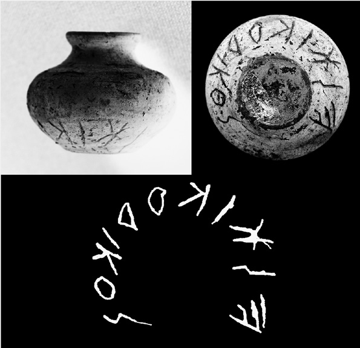

### Catalogue no. 2

No. 2. (Fig. 4.5.2). VR 91592. Solinas 2014: no. 2, 375, tav. LV c.

From earth-cut pit-grave US 2758 with poor burial equipment. A small dog was also buried in the tomb. Inhumated female foetus (38 weeks), northeast/southwest oriented with the head pointing northeast, with incomplete and partially handled skeleton. Next to the tomb is another pit with an inhumated dog. On the internal surface of the bottom of a umbelicated pyxis (max diameter: 9.1cm; height 5.5cm) is scratched from right to left the inscription of two connected letters a: only the letter a is easy to read; the second letter is illegible. Inscription length 3.5cm; height of the letters 3.3cm (Su concessione del Ministero per i Beni e le Attività culturali; riproduzione vietata).

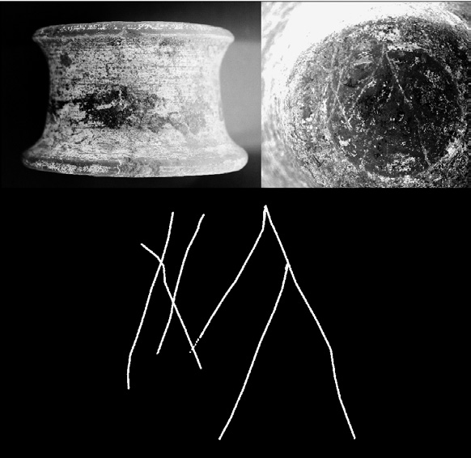

### Catalogue no. 3

No. 3 (Fig. 4.5.3). VR 2006 SV. Solinas 2014: no. 3, 376, tav. LV b.

From earth-cut pit-grave US 935 (earthy pit) with burial equipment of pottery, metal objects, vitreous paste fragments. Inhumated foetus of unknown gender, southwest/northeast oriented, with the head pointing to south, facing the east. Knee joints and other bones lacking. Flask vase (6.5cm height, 3.7cm diameter at the mouth, 6cm max diameter) with inscription toutoris scratched from left to right on the shoulder. Inscription length 10cm; height of the letters 1.5–2cm (Su concessione del Ministero per i Beni e le Attività culturali; riproduzione vietata).

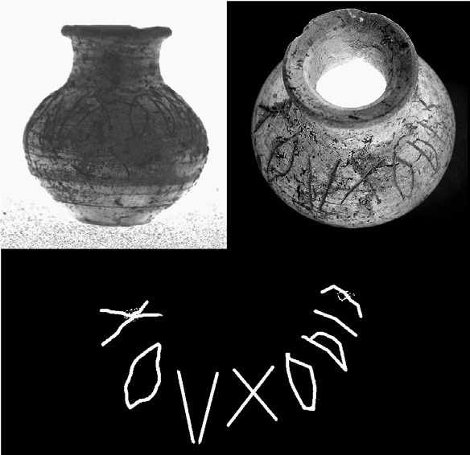

### Catalogue no. 4

No. 4 (Fig. 4.5.4). VR 91594. Solinas 2014: no. 4, 376, tav. LV d.

From earthcut pitgrave US 3178. Burial equipment of four clay vases and two bronze coins. In the tomb remains of animal skeleton. Inhumated two- to three-month-old child, probably male. Inscription on a clay cover-bowl, 14.5cm diameter, 6.6cm height: two letters ES of different sizes scratched from left to right. Height of letter S 2.5cm, height of letter E 5.5cm (Su concessione del Ministero per i Beni e le Attività culturali; riproduzione vietata).

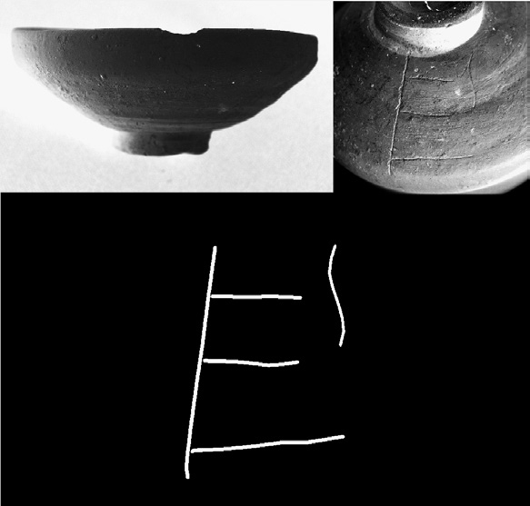

### Catalogue no. 5

No. 5 (Fig. 4.5.5). VR 91595. Solinas 2014: no. 5, 376–77, tav. LV e (reads prituli).

From earth-cut pit-grave US 3289. Inhumated 1.5 to three-month-old child of unknown gender. In the burial equipment pottery and metal objects. The inscription prituli or pritua is scratched on the shoulder of a small globular clay vase (diameter 14.5cm, diameter at the bottom 5cm, height 6.6cm). Inscription length 6.3cm; height of the letters 1.7 cm (Su concessione del Ministero per i Beni e le Attività culturali; riproduzione vietata).

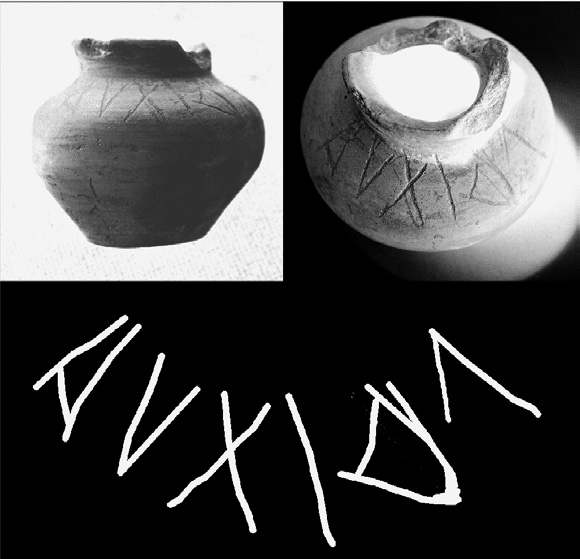

### Catalogue no. 6

No. 6 (Fig. 4.5.6). VR 91596. Solinas 2014: no. 6, 377, tav. LVI a.

From earth-cut pit-grave delimited by stones US 3243. In the burial equipment pottery, small metal objects and amber fragments. Incomplete skeleton of inhumated 40-week-old foetus, of unknown gender. On the external surface of a clay bowl/lid (max diameter 13.3cm; height 3.8cm) is scratched from left to right the inscription eskiko. Inscription length 6cm; height of the letters 1.3–1.6cm (Su concessione del Ministero per i Beni e le Attività culturali; riproduzione vietata).

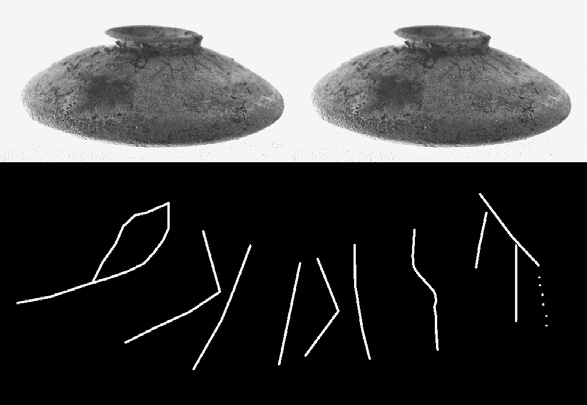

### Catalogue no. 7

No. 7 (Fig. 4.5.7). VR 91597. Solinas 2014: no. 7, 377, tav. LVI b.

From earth-cut pit-grave US 3195. Only the inscribed object as burial equipment. Incomplete skeleton of an adult individual, northwest/southeast oriented, with the head pointing northwest and facing east. On the internal surface of a black painted patera (form: Lamboley 28; max diameter 16.2cm; height 5.8cm), the letter A is scratched from right to left. Letter height 4.5cm; letter width 1cm (Su concessione del Ministero per i Beni e le Attività culturali; riproduzione vietata).

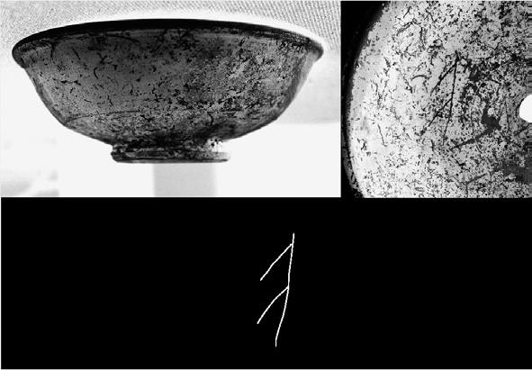

### Catalogue no. 8

No. 8 (Fig. 4.5.8). VR 91598. Solinas 2014: no. 8, 377–78, tav. LVI c.

From earth-cut pit-grave US 3206, with a rich burial equipment of pottery, a coin and small metal objects. Inhumated child (three to five years old) of unknown gender, north/south oriented, with the head pointing north, facing west. Incomplete skeleton. On the internal surface of a fragmented black painted patera (max diameter 19.5cm; height 5.8cm) is scratched from left to right the inscription kasipus, followed by a letter P. Inscription length 3cm; height of the letters 0.6–0.8cm. Height of letter P: 3.2cm (Su concessione del Ministero per i Beni e le Attività culturali; riproduzione vietata).

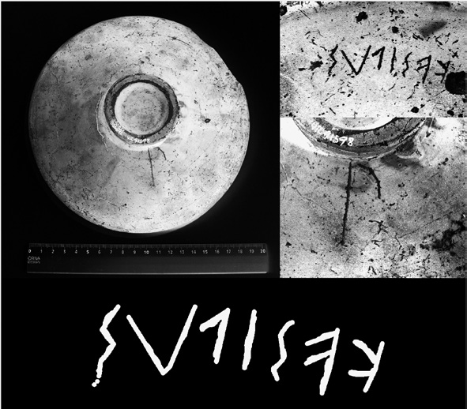

### Catalogue no. 9

No. 9 (Fig. 4.5.9). VR 91599. Solinas 2014: no. 9, 378, tav. LVI d.

From earth-cut pit-grave US 3277, with rich burial equipment of pottery, metal objects and animal bones. Inhumated male adult individual (45–50 years old). On the external surface of a fragmented black painted plate (diameter at the rim 22.5cm; height 5.4cm) are scratched from left to right the letters ka. Inscription length 2.3cm; height of the letters 2.3cm (Su concessione del Ministero per i Beni e le Attività culturali; riproduzione vietata).

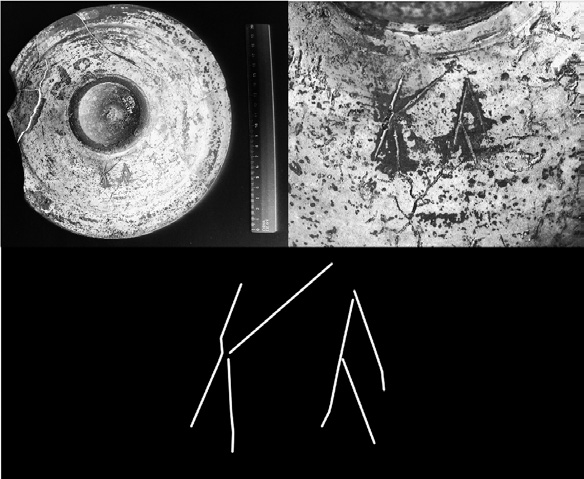

### Catalogue no. 10

No. 10 (Fig. 4.5.10). VR 91600. Solinas 2014: no. 10, 378, tav. LVI e.

From earth-cut pit-grave covered by stones US 3277, with rich burial equipment of pottery and metal objects. Inhumated adult male individual (45–50 years old), oriented northeast/southwest, with head pointing northeast. On the external surface of a fragmented umbelicated pyxis (reconstructed max diameter 7.9cm) is scratched from left to right the iscription mar. Inscription length 5.5cm; height of the letters 1.4–2.2cm (Su concessione del Ministero per i Beni e le Attività culturali; riproduzione vietata).

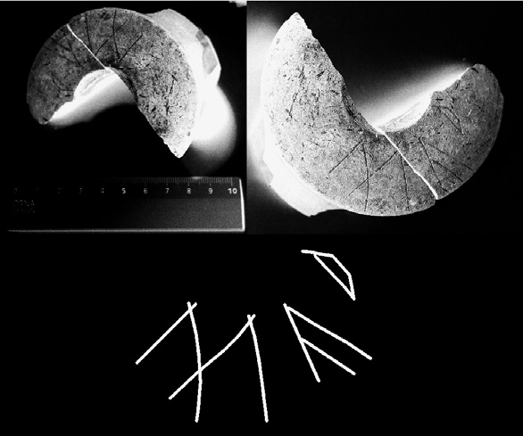

### Catalogue no. 11

No. 11 (Fig. 4.5.11). VR IG 91593. Unpublished.

From earth-cut pit-grave US 3218 with burial equipment only of the inscribed vase. Inhumated child, oriented north/south, with head pointing to north. Incomplete skeleton. On the shoulder of a small globular clay vase (max diameter 7cm; height 6.6cm) is scratched (from right to left?) the inscription XIXI or titi. Inscription length 3cm; height of the letters 3cm (Su concessione del Ministero per i Beni e le Attività culturali; riproduzione vietata).

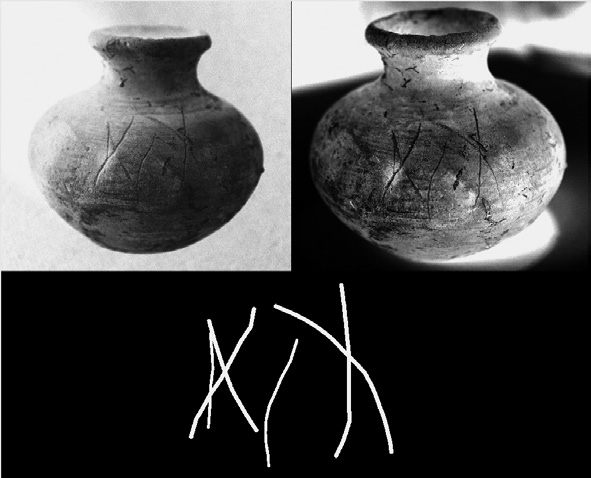
