<!-- source-page: 1 -->

2009
Ranko Matasović
Zagreb
11/19/2009
A READER IN COMPARATIVE INDO-EUROPEAN
MYTHOLOGY

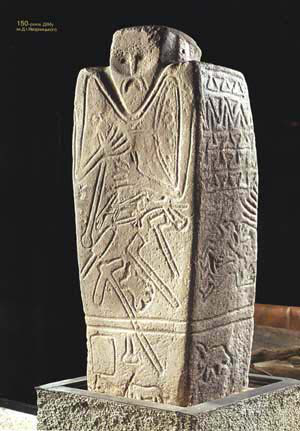

<!-- source-page: 2 -->

© This publication is intended primarily for the use of students of the University
of Zagreb.
It should not be copied or otherwise reproduced without a permission from the
author.

## Foreword
Comparative Indo-European religion is a study of the history of religious ideas. The central
idea of this approach is that by comparing the religious ideas of the peoples who speak (or
spoke) Indo-European languages we can plausibly reconstruct some of the religious ideas of
the speakers of the common Proto-Indo-European language, from which the attested
languages are descended. As in the case of the reconstruction of the PIE phonology and
morphology, the reconstruction of the PIE religion is not an end in itself. Rather, it is intended
to shed some light on the earliest history of religious ideas of the early historical communities
of speakers of IE languages.
The approach adopted here is strictly inductive; we do not make any a priori assumptions
about what the system of belief of Indo-Europeans may have been, nor do we posit any
original „ideology“, or mythopoetic „structure“. We believe we can know about the PIE
religion only what the reconstructed fragments of PIE religious texts can teach us. Since
„Proto-Indo-European“ is primarily a linguistic entity, our primary data are mythological texts
attested in different IE traditions, and all conclusions are based on their comparison.
It should be stressed that this booklet is not in the first place about what Indo-Europeans
believed, or how they represented their gods. It is about how they expressed their beliefs in
words, and how they addressed their gods in their prayers, hymns, and incantations. We hope
to reach a picture of this by a careful semantic reconstruction of the religious terminology of
PIE, including the poetic formulas dealing with religious matters These formulas have been
preserved thanks to the stubborn and uninterupted oral poetic tradition extending from PIE to
the daughter languages. Much in that picture is likely to remain fragmentary and unclear, but
a fragmentary reconstruction reached by sound methodology is preferable, in our opinion, to
aprioristic speculations of any kind, however persuasive and rational they might appear to the
uninformed reader.

Zagreb, November 2009

<!-- source-page: 3 -->

# Part I: Elements Of Proto-Indo-European Religion
## 1. Basic Religious Terminology Of PIE
### God
Since we have been living in a monotheist society for centuries, the very meaning of „god“ in
our modern languages has evolved: „god“ is the all-powerful who is in charge of, ultimately,
everything (or so many of us like to think). In societies unaffected by monotheist way of
thinking, this definition will obviously not do. For our purpsoses, we can consider as gods all
beings capable of entering into a religious bond with humans, so that they can be addressed in
prayers and expected to assist humans, provided that appropriate rites are performed. It
follows that it is not necessary to have a cover term for such a being, and indeed, there is little
reason to believe that there was an all-inclusive term for „god“ in PIE. What we have, is
rather a list of terms covering various aspects of divine beings:
PIE *deywos „caelestial god“: Lat. dīvus, Skt. devás, Lith. die͂ vas, OE Tīw, OIr. dia; this word
denotes the deity as a celestial being, in opposition to the earth-bound humans, the name of
which is derived from „earth“ in PIE (cf. Lat. homo: humus < *dʰg'ʰom-o-, OIr. duine <
*dʰg'ʰom-yo-).  Its meaning probably does not include chthonic deities (Lat. di inferi), or
deities belonging to the social sphere rather than to the cosmic sphere of existence.
PIE *dʰeh₁s / *dʰh₁sos „religious inspiration, religious gift“: Gr. theós, Arm. di-kc „gods“, Lat.
fānum „consecrated place“ < *fasnom, fēriae „religious festival“; this word did not
necessarily refer to gods, but rather to any divinely inspired being. In Greek, theós took on the
general meaning of „god“, while another word, daímōn, took the original semantic sphere of
*dʰeh₁s- („a divine power that may seize an individual“). In origin, daímōn is a derivative of
daíomai „divide, share“ (< PIE *deh₂i-, Ved. dáyate cf. the similar semantic development of
Slavic bogъ below).
*h₂nsu- > Hitt. aššu- „king“, OIc. áss „a kind of god“, Skt. ásura- „a kind of god“; I believe
this word originally referred to divine beings in their social aspect. In the Rig-Veda, the
Asuras (Bhaga, Mitra, Varuna, Aryaman) are notably the deities belonging to the social
sphere of existence (in contradistinction to the „cosmic“ devas.
*bʰh₂eg- (*bʰag-) > Skt. bhága- (one of the Asuras), Av. baγa- „god“, OCS bogъ. Some
linguists think that the Slavic word is an Iranian loanword, but I find that it is more probably
inherited. The old derivative OCS ubogъ „poor“ testifies that the original meaning in Slavic
was „share, lot“, as in Indo-Aryan. A further cognate might lie in Gr. phágos „a glutton“.
Gods are often represented as „bestowers of wealth“: Gr. Hom. dotéres eáōn, e.g. Od. 8.335,
Ved. dātā́ vásūnām RV 8. 51. 5 (cf. OCS daždьbogъ, Russ. dažbog). The PIE expression
would have been *deh₃tores h₁weswom.
In many traditions, we hear about „many-named“ gods, PIE *polh₁-h₃nomn-o- > Skt.
puruṇā́ man-, Gr. polyónymos (RV 8. 93. 17, AV 6. 99. 1, of Indra; Hymn. Dem. 18 and 32, of
Hades; Hymn. Ap. 82, of Apollo). Gods have many names, but the correct name must be used

<!-- source-page: 4 -->

in prayer, otherwise it is void. A Roman prayer invokes Jupiter Optimus Maximus sive quo
alio nomine te appelari volueris „or by whatever other name you wish to be addressed“
(Servius, Aen. II, 351).

Finally, in contrast to us mortals, the gods are, of course, „immortal“, PIE *n-mrtōs deywōs >
Skt. devā́  amŕtās RV 3. 4. 11, 5. 69. 4; Gr. athánatoi Il. 1.520. In this case it is probable that
Gr. athánatoi replaced the original epithet *ámbrotoi.

### Sacred
To conclude from the number of preserved cognates, PIE had a rather rich terminology
connected with the sacred sphere:
PIE *seh₂k-/ sh₂k- > Lat. sacer, sacerdōs, sācer „worthy to be sacrificed“, TochB sākre
„happy, blessed“, Lat. sancio „establish a law“, sanctus „sanctified“, Hitt. sāklāi „rite,
custom“.
PIE *k'wento- > Goth. hunsl „sacrifice“, Lith. šven͂ tas, OCS svętъ, Av. spǝnta-, perhaps
TochB känts- „right, firm“.
?*sewp- > Umbr. supa „viscera of sacrificed animal“, Hitt. suppa- „flesh of sacrificed
animal“, suppi- „pure“.
*weh₂ti- > OIr. fáith „prophet“, Lat. vātēs, Goth. wōds „demon-possessed“, Skt. api-vat-
„inspire“.
PIE *(H)ish₂ro- > Gr. hierós, hiarós, Skt. iširás
PIE *yag- > Gr. hágios, hagnós (Hom.); cf. házomai „I am afraid“, Skt. yaj- „sacrifice“,
yajn͂ a- „a sacrifice“
PIE *yewos- „divine rule“ > Lat. iūs, cf. iūdex „judge“: Av. yaož-dātar-, yaoždāta- „holy“.
Some linguists derive this term from PIE *h₂oyu- „life force“ (Skt. āyu-), but I find the
semantics of this etymology unconvincing.
PIE *noybʰo- ?“holy“ > OIr.  noíb „holy“, OPers. naiba- „good, beautiful“, cf. also MW nwyf
„passion, joy“.
In most early IE traditions there is a bipolar opposition between „holy“ as a negative concept
– something separated from the profane world (Lat. sacer, Gr. hágios, Goth. weihs, Av.
spǝnta-) and „holy“ as a positive concept – something endowed with a divine power  (Lat. sanctus,
Gr. hierós, Goth. heilags, Av. yaoždāta-).

### Priests
There is no common PIE term for „priest“; however, here are two terms that are at least
reasonably good candidates for PIE status, whatever their exact original meaning:

<!-- source-page: 5 -->

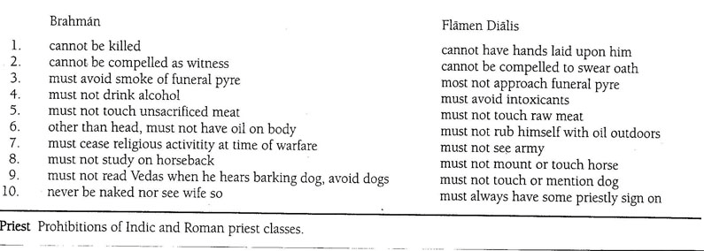

PIE *kowh₁- > Gr. koíēs „priest of the Samothracian mysteries“, Lyd. kaveś „priest“, OInd.
kaví- „seer“.
Lat. flāmen: Skt. brahmán- might, in principle, be from something like *bʰlag'smen, however
non-Indo-European that reconstruction looks. Note also that the Lat. word is usually derived
from *bleh₂-, cf. Goth. blōtan 'sacrifice'). Skt. brahmán- is also related to OIc. bragr „poetry“.
Although this etymology is disputed, it is interesting to note that there are several common
taboos affecting the desired behavior of both Roman flamines and Vedic brahmins:

### Sacrifice
The functions of the PIE priest would have included the performance of various rites,
including the sacrifice. The most common types of sacrifice are the libation and the slaugthter
of animals; of these, the cattle, the sheep and the horse are the most prominent sacrificial
animals, and there are several combinations, such as the Roman Suovetaurilia (the sacrifice of
a sheep, a pig, and a bull, chiefly during the festival of Ambarvalia in May, when the
sacrificial animals are led around the crops to protect them from blight).
Any self-respecting sacrificer ended the sacrifice with a feast, on which the sacrificed animal
was shared with the gods. This feast seems to be denoted by PIE *dapnom „sacrificial meal“
(Lat. daps, ON tafn „sacrificial animal“, Arm. tawn „feast“, Hitt. LUtappala- „person
responsible for court cooking“, Gr. dapánē „ostentatious expenditure“).
The term for libation is PIE*spend-, hence Lat. spondeo „promise, vow“, Gr. spendō „pour a
libation“, spondḗ, Hitt. išpand- „pour a libation“, TochAB spänt- „trust“. The development of
meaning in Lat. spondeo (cf. also sponsa „the promised bride, fiancée) is clear if we recall
that a libation is the proper time to make a promise to the deity in expectation of a returned
favor.
Another root which denoted the libation was *g'ʰew- > Gr. khéō, Phryg. zeuman „libation“,
Skt. hu- „pour“, hótar „priest“, Arm. jawnem „offer, consecrate“. The original meaning was
perhaps less tightly tied to the religious sphere.

| Brahmin | Flamen Dialis |
|---|---|
| cannot be killed | cannot have hands laid upon him |
| cannot be compelled as witness | cannot be compelled to swear oath |
| must avoid smoke of funeral pyre | must not approach funeral pyre |
| must not drink alcohol | must avoid intoxications |
| must not touch unconsecrated meat | must not touch raw meat |
| other than head, must not have oil on body | must not rub himself with oil outdoors |
| must cease religious activity at time of warfare | must not see army |
| must not study on horseback | must not mount or touch horse |
| must not read Vedas when he hears barking dog, avoid dogs | must not touch or mention dog |
| never be naked nor see wife so | must always have some priestly sign on |

Priest Prohibitions of Indic and Roman priest classes.

<!-- source-page: 6 -->

In contrast to PIE *spend-, which denoted the sacrificial pouring of a substantial amount of
liquid (milk, or mead, or anything pleasing the gods), PIE*leyb- probably meant „to pour a
few drops“ , hence Lat. lībo, lībum „sacrificial cake“, Gr. leíbō; de Vaan derives Lat. lībo
from *h₂leybʰ- „to anoint“ (Gr. aleíphō, áleiphar „unguent“), cf. Lat. lino.

### Prayer
Prayer is closely connected with incantation and magic, the chief difference being that, in a
prayer, you don't expect the desired outcome to occur as a direct consequence of your prayer
(as in a charm, or incantation); the prayer is intended to persuade the supernatural beings,
while the charm should coerce them. Moreover, since prayers usually involve a promise to the
deity that the supplicant would do certain things, it is clear that the words for „prayer“ will to
some extent overlap with the words for „vow“, or „solemn declaration“. There are several
verbal roots in PIE that can be translated as „to pray“; it is difficult to ascertain which of them
were used in the specifically religious sense of „prayer“.
PIE *meldʰ- > OE meldian „announce“, Lith. meldžiù „pray“, OCS moliti, Hitt. maldāi
„pray“; as Pol. modlić „pray“ shows, we have to assume the metathesis in Proto-Slavic (*ld >
*dl). I am not sure whether Arm. maltcem „pray“ also belongs here, because of the unexpected
–tc- (*d would be regular). The semantics of the reflexes in Germanic point to the conclusion
that the original meaning was probably „utter a solemn prayer“ or similar;
PIE *gwhedʰ- > OIr. guidid „pray“, Gr. théssasthai „ask, pray“, Av. ĵaiδyemi „pray“, OCS
žeždą „thirst“;
*h₁or- > Lat. oro, Hitt. ariya- „consult an oracle“;
*h₁weg'ʰ- „vow“ > Lat. voveo, Gr. eúkhomai „pray“, Skt. oh- „utter solemnly, pride oneself“,
Av. aog- „utter (with authority)“;
The correspondence between Lat. lito „to obtain or give favourable omens“ and Gr. litḗ
„request“ (usually a request for a compensation when one has been wronged, or when one has
wronged the gods); many linguists think that Lat. lito is a denominative verb from unattested
*lita, which is in turn borrowed from Gr. litḗ (cf. the Gr. denominative líssomai „beg“).
In several IE traditions, prayers begin with a standard invocation to the deity, PIE *k'ludʰi
moy „hear me“ > Gr. klythí moi (e.g. Il. 5.115), Skt. śrudhí me „hear me“ (e.g. RV 8.66.12).
Gods are then often called to come to the sacrifice, e.g. in RV 1.1.5 (of Agni): devó devébhir
ā́  gamat „the god may come here with the gods“; Sappho calls on Aphrodite (1. 5) thus: týid'
élth' aí pota katérōta tàs émas aúdas aíoisa pḗloi / éklyes „but come here, if ever at another
time you heard my voice far of and hearkened“. Other parts of the prayer may include a
reminiscence of the past services done to the deity, or of the past favours the deity has done to
the supplicant, and a detailed request, specifying what is desired of the deity. The preciseness
of formulation of such requests is particularly developed in Roman prayers, both private and
public.

<!-- source-page: 7 -->

A particular formula associated with IE prayers is „protect men and livestock“, PIE *wiHro-
*pek'u- peh₂-, reflected as Umbrian ueiro pequo ... salua seritu, Lat. pastores pecuaque salua
seruassis, Av. θrāyrāi pasvā vīrayā, Skt. trāyántām... púrušam páśum.

### Magic
Magic is the method of directly achieving one's goals – without the intercession of a deity that
needs to be persuaded – through magical deeds or incantations. In many languages, the
magical action is seen as „binding“, PIE *seh₁-i- (ON seiđr „band, belt“, Lith. saitas „bond,
fetter“, from which we have W hud „magic“, ON seiđ „magic“, perhaps also TochB nesait
„magic“. The root *kwer- „make, do“ may have been used in the technical sense of
performing magical rites or composing incantations, cf. OIr. creth, W prydydd „poet“, OCS
čari, Lith. kerai „magical spells“ and the Ved. formula  vācam kr- (e.g.  RV 10.71.2: vācam
akrata „they (the poets) made the Word“). It has been argued that the visible sign of
supernatural action was denoted by PIE *kewdos > Gr. kŷdos, OCS čudo (Gen. sg. čudese)
„miracle“.
In a number of traditions magical incantations have been preserved, e.g. the Gaulish
Phraseological correspondences have been discovered in a number of charms used for healing
the disjointed leg. The Atharva-Veda (4.12) heals the disjointed leg by putting „marrow to
marrow, skin to skin and flesh to flesh“, and the same procedure is applied in the OHG
„Second Merseburg Charm“, where various deities cure the leg of Baldur's horse by joining
ben zi bena, bluot zi bluoda, lid zi geliden „bone to bone, blood to blood, limb to limb“.
Finally, in the OIr. tale Cath Maige Tuired (34. 135-6) we read how the Irish physician Míach
tried to rejoin the severed arm of the god Núadu by chanting ault fri halt di, & féith fri féith
„joint to joint of it, and sinew to sinew“. Similar incantations are found in Hittite, Latvian, and
Russian, but in the absence of specific etymological correspondences, they may have spread
by diffusion, or simply be the result of chance (or similar ways of thinking about healing).

### Believe
In our modern world-view, „to believe“ is to have a particular attitude towards the truth of a
proposition. We „believe“ that there was a thing the physicists call the „Big Bang“, because
that belief is consistent with other things the physicists teach us, although this particular belief
does not affect our everyday lives and actions at all. This modern sense of „believe“,
however, is the result of a long semantic evolution; in pre-modern societies, „to believe“ is to
place one's trust into a set of actions, to establish a bond with the supernatural. In PIE, this is
the sense of the phrase *k'red-dʰeh₁- > Lat. credo, OIr. cretid, Skt. śrad-dhā-, Hitt. karatan-
dai; the first element of this compound is often related to PIE *k'erd- „heart“ (Lat. cor, OCS
srъdьce etc.), but this is doubtful, since this word never occurs with the full grade in the
second syllable (*k'red-). The appurtenance and the exact meaning of Hitt. karatan- have also
been doubted.

<!-- source-page: 8 -->

Perhaps it is possible to reconstruct another verb, PIE*h₂oh₃- „believe“ > Hitt. hā-zi, Lat.
ōmen „omen, augury“; the semantics of the connection would work if the original meaning of
*h₂eh₃- men- > Lat. ōmen was „the credible (sign of the gods)“. Note that an alternative
etymology derives Lat. ōmen from *h₃ew-s-men („what is seen“, from the root of oculus
„eye“).

<!-- source-page: 9 -->

## 2. Elements Of PIE Mythology

### Sky God
There are reasons to believe that PIE *dyēws „sky, Sky-god“ was the supreme deity of the
PIE pantheon. He was certeainly most often preserved in the individual pantheons, cf. Ved.
dyaús, Lat. Dius Fidius, Gr. Zeús, Hitt. sius; He is commonly addressed as „father“, PIE
*dyēws ph₂tēr „Sky Father“ > Lat. Iuppiter, Umbr. Iupater, Gr. Zeùs patēr, Skt. Dyauš pitā,
Luv. tātis tiwaz, Latv. Dievs debess tēvs; cf. also ON Óđinn Álföđr „Odin, father of all“ and
OIr. (Echu) Ollathir „(Echu) father of all“.
The sky god often bears the standard epithet „All-knowing“: Gr. eurýopa Zeús, RV 6.70.6
viśvávedas Dyaús.

### Dawn Goddess
The Vedas praise the Dawn as a young maiden, and Ved. Ušās is clearly the same etymon as
Gr. Hom. ēṓs; this deity plays almost no role in Greek mythology, so it seems that several of
her attributes were taken by other deities, chiefly Aphrodítē and Helénē < *welenā, from PIE
*welh₁- „wish, desire, choose“ (Lat. velle, OCS volja „will“). Similarly in Lat. aurora is just
an appelative, but the cult of the Dawn was preserved in the rites devoted to Mater Matuta. In
Lith. dainas Aušrinė „dawn“ is a young maiden often represented as marrying Mėnuo „the
moon“. Lasicius (a Polish writer of the 16th century, on Lith. Aušra): Ausca dea est radiorum
solis vel occumbentis vel supra horizontem ascendentis.

The Dawn was originally  the „daughter of the Sky“, PIE *dʰugh₂tēr diwos > Ved. duhitā́
divás, Gr. thygátēr Diós (especially of Aphrodite, Helen, and the Muses); Lith. Dievo dukrytė
(of Saule). The common epithet of the PIE dawn was „Shiny Dawn“, PIE *bʰeh₂- (RV 3. 6. 7:
Ušó vibhātī́, Gr. Hom. phaeinḗ); she was the one who regularly opened the „doors of heaven“
RV 1. 48. 15: dvā́ rau divás, Latv. dieva durvis, cf. RV 7.79.4 ví drl.hśya dúro ádrer aurṇoš
„you (Ušas) have opened the gates of the closed rock“. Vedic Ušas was a patron of the rishis,
the Vedic poets, and the Old Irish goddess Brigit (dea poetarum according to Cormac, who
wrote in the tenth century) was born at dawn. Her name comes from PCelt. *brigantī < PIE
*bʰrg'ntih₂ and the same proto-form is derived as one of the epithets of Ušas, brhatī „the
exalted one“.

### Mother Earth
Although it appears that the Earth was represented as „mother“ in most IE traditions, it is not
generally represented as the spouse of „father sky“; the Earth is a deity in Ved., where she is
called Prthivī́ (Gr. plateîa, Gaul. Litavi, OE folde) < *pltHwih₂ „The broad one“. Gr. Gaîa,
also called Khthṓn (Aesch. Eum. 6, fr. 44. 1 ), Gr. Dāmā́ tēr is sometimes believed to be a

<!-- source-page: 10 -->

personification of the same earth-goddess, but there is little evidence that dā- actually meant
„earth“. Other deities that belong here are Hitt. Dagan-zipas annas, Lith. Žemynė, ON Iörđ
(Odinn's wife), and perhaps Thracian Semele; In Old English we have Folde, fīra modor
„Earth, mother of men“ (in a charm). Tacitus claims that the Germans worship ‘Nerthum, id
est Terram matrem’ (Germ. 40. 2). Finally, OIr. Anu  is called mater deorum Hiberniensium
(by Cormac in the 10th century), cf. Dá chích Anann (in Killarney) „two breasts of Anu“.

The standard epiteths of earth is „dark“, cf. Hitt. dankuiš tekan, Gr. khthṓn mélaina, Russ.
Mat' čërnaja zemlja, perhaps OIr. domunn donn. Another common expression is „broad
earth“: Hom. eureîa khthṓn, RV 6.17.7. kšām urvīm

### Sun-God And Sun Maiden
The Sun is the only heavenly body that was worshipped by Indo-Europeans. In contrast to,
e.g., the Semitic religions, the Moon plays a very modest role in Indo-European mythologies.
The PIE word for „sun“, on the other hand, is a theonym in sevareal traditions. PIE *seh₂wōl
„sun“ is preserved as Ved. Sū́rya- and Sū́ryā, Gr. Hḗlios, Latv. Saule and Saules meita. As a
common noun, it is preserved in Lat. sōl, as well as in OCS slъnьce, etc.
As a mythological creature, the Sun shares a number of epithets across several IE traditions; e.
g. it is a „seer“, cf.Ved. sūryam...spaśam, RV 4. 13. 3 Gr. Eḗlion...skopón „sun, the seer“;
Also in Hymn to Demeter; since the sun is a „seer“, we can easily understand the semantic
evolution in OIr., where  súil  means „eye“, cf. also Arm. aregakn „sun“ < „eye of the sun“.
Moreover, the Sun drives across the sky in a chariot. Hence the expressions Ved. sūryasya
cákram, Gr. Hḗliou kýklos „the wheel of the sun“ Aesch. Pers. 504. Its course is „fast“, cf.
Mimnermus fr. 11a. ōkéos ēelíoio  and AV 13.2.2 āśúm Sū́ryam < PIE *h₁ōk'u- *seh₂wōl
„swift sun“.

### Storm-God (Thunderer)
The name of the PIE Storm-God is probably preserved in Hitt. Tarhunt-, ON Thórr, OIr.
torann < *torh₂-nt-; we find a rather different etymon in Lith. Perkūnas, Russ. Perún, ON
Fjörgynn (cf. also Gr. keraunós „thunder“) < PIE *per-kw-u-no-. In this PIE form, we may
have the amalgam of two distinct etymons, a word for „rock“ (cf. Hitt. peruna- „rock“, OInd.
parvata- < *perwn-to-), and the word for „oak“ (PIE *perkwu- > Lat. quercus). The thunder is
believed to be rocky (cf. the Byeloruss. expression kamen Peruna), and the oak is the tree
most often hit by thunder, hence it is dedicated to the Storm-God. On the other hand, these
theonyms are probably unrelated to Ved. Parjanya-, who is mostly associated with rain in the
RV, and whose name is difficult to reconcile with the PIE proto-form *per-kw-u-no- (which is
problematic anyway).

<!-- source-page: 11 -->

### Divine Twins
The following mythological creatures are divine twins, a mythological conception of probably
PIE origin: Gr. Dióskouroi (Castor and Polydeuces), Ved. Aśvínā (dual), also called Nāsatyā,
Latv. dieva dēli („the sons of Dievs). In the RV, the Aśvins are called „Descendents (or sons)
of the Sky“: Ved. divó napātā  RV1. 117. 12, 182. 1; they are often described as „youthful“,
yuvānā (RV 1. 117. 14), and in Latin, Castor and Pollux (< Polydeucēs) are called iuvenes
(Cicero, De natura deorum  2.6).
They are associated with horses: Pindar (Ol. 3. 39) calls them eúippoi, ‘having good horses’,
and RV 7.68.1 has suáśvā „with good horses“; Castor is usually called hippódamos „horse-
taming“ in Homer. They are „bright“: RV8.5.32: púruścandrā, The name of Polydeukēs is
probably dissimilated from *polyleukēs „with many lights“ (cf. Gr. leukós „white“).

They are brothers of the Dawn (in the RV), and of Helen (in Greek Myth); in both the Greek
and in the Vedic traditions they are invoked as the saviours, or helpers, Gr. sōtéres. Their
Vedic name Nāsatyā probably also originally meant „saviours“, cf. Goth. nasjands „Saviour,
Christ“.

### Horse Sacrifice
Ved. aśvamedha- was a ritual of royal inauguration; after running around the kingdom freely
for an amount of time, the queen was made to symbolically mate with it, and then it was
butchered. The Vedic name of the ritual is sometimes compared with the Gaul. name
Epomeduos, but this does not amount to much; more importantly, the coronation ritual of
Ulster kings, as recorded by Giraldus Cambrensis in the 12th century also included the ritual
slaughter of a horse, in whose broth the elected king was made to bath. One important
character in the Ulster sagas, Medb, is often seen as a sovereignty figure (she spends men
quite ostentatiously, including several kings), and her name contains the same element
(*medʰwo- „intoxication“) recognized in aśvamedha-. Finally, the Roman ritual October
Equus (unsurprisingly held in October) involved horse racing followed by the sacrifice of a
horse, whose head was put on a stake outside of the Regia. The ritual involved the Rex
sacrorum, so it is quite possible that it had something to do with the consecration of a king in
Rome's days of kingship. In the Slavic folklore songs studied by Radoslav Katičić, the hero
whose return marks the beginning of spring (Jarylo) is slaughtered in the form of a horse at
the end of the fertility rite.

### Dragon-Slaying Myth
It has been claimed that a PIE formula *gwhent h₃egwhim „he slew the serpent“ can be
reconstructed on the basis of the formulaic exprssions such as the following: Ved. áhann áhim
(of Indra, who slew the dragon Vrtra), Av. ĵanat ažīm (of Thraetaona, who slew the nasty
serpent Aži Dahaka, Hitt. mušIlluyankan kuenta (of the Storm God, Hitt. Tarhunt-), OIr. gono

<!-- source-page: 12 -->

míl „I slay the beast“ (in charm texts). Pindar also uses verbs from the same root, e.g.
épephnen, when describing the slaying of several monsters. For example, in his description of
how Bellerophontes slew the Chimaira (Il. 6. 179-186): prôton mén rha Khímairan
amaimakétēn ekéleusen pephnémen... tò tríton aû katépephnen Amazónas anianeíras „first he
decided to kill the terrible Chimaira... and thirdly he killed the Amazons, who were similar to
men“.  The same phraseology is used in Pindar's account of the same myth (Ol. 6. 179-186):
“So mounted, out of the cold gulfs of the high air forlorn, he smote the archered host of
women, the Amazons, and the Chimaira, breathing flame;  and the Solymoi, and slew
(épephnen) them” .
The original dragon-slayer was probably the Storm-God, PIE *torh₂nt-, as in the Slavic myth,
where the thunderer Perunъ slays the snaky dragon Velesъ (Volosъ in Russian).

### Drink Of Immortality
Many IE traditions have a story about the drink and/or food of the immortals; this substance is
often said to provide the consumer with immortality, cf. Ved. soma, Gr. ambrosía (the food of
the gods, from PIE *n-mrto- „immortal“), and néktar, the drink of the gods, from PIE *nek'-
terh₂- „death-overcoming“, with the regular loss of the laryngeal in compounds. Compare AV
4.35 tarāṇi mrtyum „I will overcome death“. In the Norse tradition, a parallel is perhaps
represented by the story of Mímir's well, a drink from which gives supernatural wisdom.

### Cosmogony
In a number of traditions, the origin of the world – either in its physical or in its social aspect
– is connected with the myth of the „twin“ (PIE *yemo- > Skt. yama-, Av. yima-, Latv. jumis,
ON Ymir, perhaps also Lat. Remus (if from *yemos on the analogy with Romulus). This
primeval twin has, in all appearances, nothing to do with the divine twins, the sons of the sky
(see above). In th Norse myth (Grīmnismál 40-41) the giant Ymir is dissected and the
mountains are formed from his skull, the trees from his hair, etc. Tacitus (in Germania, 2),
tells how the Germans believe that they originate from a primeval Tuisto (originally „twin“?),
who had a son called Mannus „man“. This is reminiscent of the Vedic myth, where Yama was
the first mortal to die, and he was subsequently given the rule of the Otherworld. His brother,
Manu, the progenitor of the humankind, sacrificed him. The legend of a miraculous birth of
twins also lies in the legend of the foundations of Emain Machae, the ancient capital of Ulster
in the Old Irish Ulster Cycle.

### Otherworld
There is no evidence for a consistent picture of the PIE otherworld. We do not know where it
was, but it appears that the abode of the dead is reachable by boat, cf. OIr. tír inna mban,

<!-- source-page: 13 -->

which is an island, as is the tech Duinn „the house of Donn“. Likewise, the island of Avalon
in the British legend is the resting place of heroes, such as King Arthur (Welsh Arthwr). OCS
navъ „the otherworld“ is derivable from the word for „boat“, PIE *neh₂u- (Lat. nāvis, Skt.
naú-, etc.), and in the Greek belief, one has to cross the river Styks to reach the otherworld.
The idea that one crosses the river is here combined with the other one, namely that the realm
of the dead is underground; in the Old Irish sagas, you enter it via the fairy mounds, the síd (<
PIE *sēdos „seat“). In a few traditions we find the idea that the dead abide in a wonderful
meadow, rich in horses, cf. Hitt. wēllu- „meadow (of the otherworld)“, Gr. (W)ēlýsion pedíon
„Elysean fields“, RV 10.14.2: „this cow pasture is not to be taken away“, OIr. mag mell; in
TochA the word walu „dead“ may be related, as well as ON val-höll „Valhalla“.
In the Rig Veda, we find a belief that the realm of the deceased („the fathers“, pitaras) is in
the sky, more precisely in the Milky Way (svarga-, which is compared to Gr. ólbios „blessed“
< *swel-gw(H)o-).
The otherworld may have been ruled by the original progenitor of mankind, *Yemo- (Skt.
Yama-, Av. Yima-).

### Fire In Water (?)
A mythological fiery protector of waters is reconstructed on the basis of Lat. Neptūnus, Skt.
Apā́ m Nápāt (< *h₂epom nepōt- „the descendant of water (ap-)“, identified with Agni, the
fire), OIr. Nechtan (a mythical spouse of Boand, the river Boyne), cf. also ON saevar niđr
„descendant of the sea“ (a kenning for „fire“). All of this, however, is on a very shaky soil.
Neptūnus is plausibly derived from PIE *nebʰ-tu- „moisture“ (Av. napta- „moist“), and
Nechtan may be from the root *neygw- „to wash“ (OIr. nigid).

### The World-Tree
In a number of traditions we find a conception of a world-tree, growing through the three
cosmic spheres: the earth, the middle sphere (Ved. antarikša-) and the sky. The most famous
example is the Old Norse yggdrásil. Here is its description in Grímnismál 32: Ratatoskr heitir
íkorni, / er renna skal /at aski Yggdrasils; /arnar orð /hann skal ofan bera /ok segja /iðhöggvi
niðr. "Ratatosk is the squirrel who shall run on the ash-tree Yggdrasil; from above it bears the
words of the eagle and tells them to Nidhogg (the world serpent) beneath". Similar motives
are found in Slavic folk-lore and in the Celtic mythology (e.g. the wonderful tree on which the
god Llew is sitting in the shape of the eagle in the Mabinogi). The first element of the name
Ygg-drasil contains the root *IHwo- “yew” which is also found in the name of the
mythological world-tree of the Hittite myth (GIŠEya-, KUB XVII, 10. IV 27-31.).

<!-- source-page: 14 -->

### Battle Of Gods
In a number of traditions, we find mention of „former gods“, Gr. theoì próteroi (Hesiod, Th.
424, 486, Ved. pū́rve devā́s (RV 1.164.50), Hitt. karuilies siunes. Also, in several traditions,
we find the two generations of gods fighting each other for supremacy, like Ved. Asuras and
Devas, Av. Daevas and Ahura Mazda (the supreme deity established by Zarathuštra), the
Greek Olympian gods and Titans, OIr. Túatha Dé Danann, the Fir Bolg and the Fomoire, and
the Norse Aesir and Vanir.

### A Few Other Mythological Creatures
Gr. Pān and Ved. Pūšán- < *pewh₂sōn; both deities are protectors of cattle and are associated
with wilderness and traveling.
Skt. rbhu- and Gr. Orpheús; the Rbhus are divine craftsmen in the Veda, resembling the
musical artistry of Orpheus; the rbhus have also been related to Norse Alfs (dwarves), but that
is even less convincing.
Skt. Aryamán- (Av. airyaman- „friendship“) and OIr. Éremón (son of Míl), OIc. Iormönr (a
name of Óđinn); all three names could be derived from the alleged PIE ethnonym *h₂eryo-
„the Aryan“.
„The fire-thief“ Gr. Promētheús bears a name similar to Skt. Māthava-, a mythical king who
had fire in his eyes. The root would have been PIE *meth₂- „to steal“ (Ved. mathnā́ ti).
Gr. ōkeanós (a mythical river encompassing the world) has been compared to the Vedic
epithet ā-śáyāna-, predicated of the dragon Vrtra- (e.g. RV 4.17.7), who captured the
cows/rivers (for the mythical equivalence of cows and rivers compare also OIr. Bóand  „the
river Boyne < *bow-windā „white cow“). And indeed, the Okeanos is represented with a
dragon-tail on some early Greek vases.
The hell-hound, or the dog guarding the entrance to the underworld, is sometimes posited on
the basis of the correspondence between Gr. Kérberos and Ved. śábala- (later also śárvara-
„speckled“, but the epithet is applied to the two hounds guarding the otherworld). However, a
proto-form *k'erbero- looks distinctly non-Indo-European, so it is probable that both Kérberos
and śábala- are loanwords from some unknown source.

<!-- source-page: 15 -->

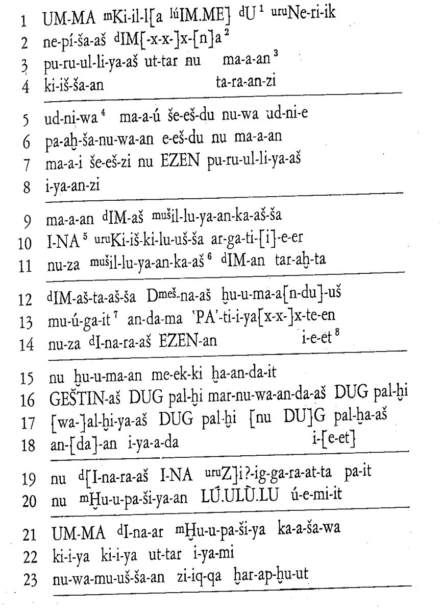

# Part II. A SELECTION OF TEXTS
## 1. Hittite
Principal theonyms: Wurusemmu, Wurukatte, Lelwanni, Taru, Telepinu, Estan, Halmašuitt
(Hattic), Šerri, and Hurri (two bulls), Šawoška, Tešub, Kumarbi (Hurrian), Sius (< *dyēws
„sky“, Tarhunt (< *torh₂nt- „thunder“), Dagan-zipa < *dʰeg'ʰom-, with the Hattic suffix –zipa.

### Illuyankas And The Storm God

<!-- source-page: 16 -->

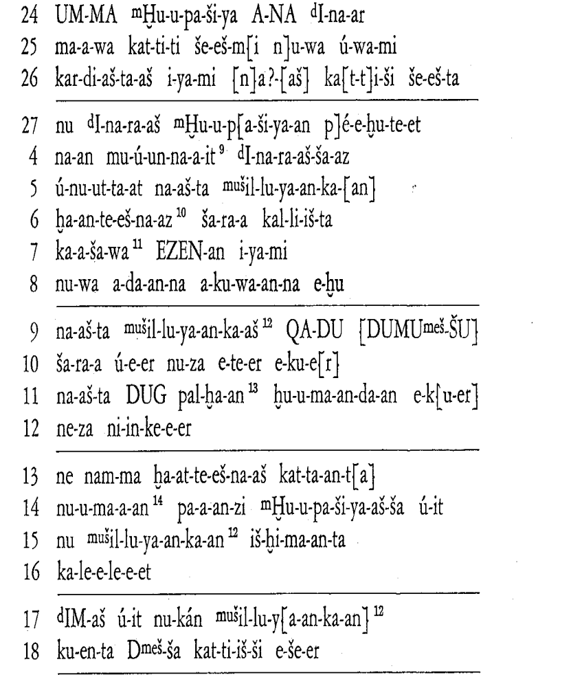

Thus speaks the priest Kilas of the city of Nerik
on the feast-day of the Tarhunt, the Caelestial One:
When the feast of Purulliya is held, they speak thus:
There should be peace in the land of Hatti
and the earth should be steadfast,
and when the earth is steadfast
Purulliya is held.
When Tarhunt, the Storm God escaped from Illuyanka
in the land of Kiskilu
Illuyanka overcame him.
Then Tarhunt became sad
and he was with all the gods.
Inara made a feast:
she prepared many things,

<!-- source-page: 17 -->

a barrel of wine, a barrel of beer
and a barrel of another drink.
There was plenty of drink there.
Inara then went to Zigarat
and found Hupasiyas.
Inara said:
„Hupasiyas, look, behold!
I will say something to you:
come here and join me!“
Hupasiyas said to Inara:
„I will do your heart's desire
if I may sleep with you.“
And she lay with him.
Inara took Hupasiyas to a temple,
and locked him there.
She called Illuyanka from its hole:
„Behold, I will make a feast,
come eat and drink!“
Then Illuyanka came with its offspring,
they ate and they drank,
they drank a barrel of each drink
and became very drunk.
Thus, they could not return to their hole,
and Hupasiyas tied Illuyanka with a rope.
Then Tarhunt came,
and slew Illuyanka,
and all the gods were with him.

<!-- source-page: 18 -->

The myth of Telipinu, the vanishing God
GIŠlu-ut-ta-a-us kam-ma-ra-a-as IṢ-BAT
É-er tuh-hu-is IṢ-BAT
I-NA GUNNI-ma kal-mi-i-sa-ni-is ú-i-su-u-ri-ya-an-ta-ti
is-ta-na-na-as an-da DINGIRMEŠ ú-i-su-u-ri-ya-an-ta-ti
I-NA TÙR an-da UDUHI.A KI.MIN
I-NA É.GU₄ an-da-an GU₄HI.A ú-i-su-u-ri-ya-an-ta-ti
UDU-us-za SILA₄-ZU mi-im-ma-as
GU₄-ma AMAR-ŠU mi-im-ma-as
DTe-le-pe-nu-sa ar-ha i-ya-an-ni-is
hal-ki-in DIm-mar-ni-in sa-al-hi-an-ti-en ma-an-ni-it-ti-en is-pi-ya-tar-ra pe-e-
da-as
gi-im-ri ú-e-el-lu-i mar-mar-as an-da-an DTe-le-pe-nu-sa pa-it
mar-mar-ri an-da-an ú-li-is-ta
se-e-ra-as-se-is-sa-an ha-le-en-zu hu-wa-i-is
nu nam-ma hal-ki-is ZÍZ-tar Ú-UL ma-a-i
nu-za nam-ma GU₄HI.A UDUHI.A DUMU.LÚ.U₁₉.LUMEŠ Ú-UL ar-ma-ah-ha-
an-zi ar-ma-u-wa-an-te-sa ku-i-es nu-za a-pi-ya Ú-UL ha-as-sa-an-zi
HUR.SAGDIDLI.HI.A ha-a-te-er
GIŠHI.A-ru ha-a-az-ta
na-as-ta par-as-du-us Ú-UL ú-e-ez-zi
ú-e-sa-es ha-a-te-er
TÚLHI.A ha-a-az-ta
nu KUR-ya an-da-an ka-a-as-za ki-i-sa-ti
DUMU.LÚ.U₁₉.LUMEŠ DINGIRMEŠ-sa ki-is-ta-an-ti-it har-ki-ya-an-zi
GAL-is-za DUTU-us EZEN₄-an i-e-et
nu-za 1 LI-IM DINGIRMEŠ-sa hal-za-i-is
e-te-er ne Ú-UL is-pi-i-e-er
e-ku-i-e-er-ma ne-za Ú-UL ha-as-si-ik-ke-er

5 the fog kept (filled) the windows; the smoke kept (filled) the
house;
6 the woods in the oven were smothered;
7 At the altars the god were smothered, the sheep in the fold were
smothered, in the stable
8 the cattle were smothered, the sheep refused her lamb,
9 the cow refused her calf.
10 Telipinu too went away;
11 the fertility of animals and seeds, their productivity and (also)
their abundance to desert and

<!-- source-page: 19 -->

12 meadow he took away. Telipinu too went into the field and in the
filed
13 he disappeared (mixed in). Over him, halenzu plant grew. So
14 the barley and the wheat haven’t grown anymore. Cattle, sheep
and human beings
15 didn’t become pregnant anymore and the pregnant ones didn’t
give birth.
16 In order to sprout not, mountains and trees got dry.
17 In order to be hunger in the country, pastures and springs got dry.
18 The human beings and the gods are dying of hunger.
19 The Great Sun God arranged a banquet and he invited thousand gods.
They ate.
20 But they weren’t full up; they drank, but they didn’t slake their thirst.

## 2. Vedic
Principal theonyms: Indra- (of unknown origin, no relation whatsoever to OCS jędrъ
„strong“), Mitra- (from the abstract noun mitrá- „contract“) , Varuṇa- (probably from the root
*wel- „to close, cover, ensnare“, Gr. élytron „covering, case“, no relation whatsoever to Slav.
Velesъ), Aśvinā(u) (dual, literally „horsemen“, from *h₁ek'wo- „horse“, Skt. áśva-), Ušās-
(the word for „dawn“, PIE *h₂ewsōs, Gr. ēṓs, etc.), Rudrá- < *(H)rewd- „be coarse“ (Lat.
rudis), Parjánya- (of unclear etymology, often connected to Lith. Perkūnas etc.; as a comon
noun, parjánya- means „rain cloud“), Dyauš (the word for „sky“, PIE *dyēws), Agni- (= agni-
„fire“ < *ngwni-, Lat. ignis), Rātrī- „Night“ (from the root rā- „to bestow“, rātí- „gift“ < PIE
*(H)reh₁-, cf. Lat. rēs „thing, wealth“), Soma- („what is being pressed, from *sew- „to
press“), Višṇu- (of unclear etymology, despite attempts to derive it from viś- „village“, Lat.
vīcus), Marutas (pl., presumably from the same root as Skt. marya- „young warrior“), Vāyú-
(the word for „wind“, PIE *weh₁-yu-, cf. Lith. vėjas), Savitar- („the impeller“, from the root
*sewH- „to impel, drive“), Pūšan- (like Gr. Pân a protector of cattle, PIE *pewh₂sōn).
RV I.1
agním īḷe puróhitaṃ
yajñásya devám ṛtvíjam |
hótāraṃ ratnadhā́tamam ||

agníḥ pū́rvebhir ṛ́ṣibhir
ī́ḍyo nū́tanair utá |
sá devā́ṁ éhá vakṣati ||

agnínā rayím aśnavat
póṣam evá divé-dive |

<!-- source-page: 20 -->

yaśásaṃ vīrávattamam ||

ágne yáṃ yajñám adhvaráṃ
viśvátaḥ paribhū́r ási |
sá íd devéṣu gachati ||

agnír hótā kavíkratuḥ
satyáś citráśravastamaḥ |
devó devébhir ā́ gamat ||

yád an̄gá dāśúṣe tvám
ágne bhadráṃ kariṣyási |
távét tát satyám an̄giraḥ ||

úpa tvāgne divé-dive
dóṣāvastar dhiyā́ vayám |
námo bháranta émasi ||

rā́jantam adhvarā́ṇāṃ
gopā́m ṛtásya dī́divim |
várdhamānaṃ své dáme ||

sá naḥ pitéva sūnáve-
-ágne sūpāyanó bhava |
sácasvā naḥ svastáye ||

1. I Laud Agni, the chosen Priest, God, minister of sacrifice,
The hotar, lavishest of wealth.

2. Worthy is Agni to be praised by living as by ancient seers.
He shall bring hitherward the Gods.

3. Through Agni man obtaineth wealth, yea, plenty waxing day by day,
Most rich in heroes, glorious.

4. Agni, the perfect sacrifice which thou encompassest about
Verily goeth to the Gods.

5. May Agni, sapient-minded Priest, truthful, most gloriously great,
The God, come hither with the Gods.

6. Whatever blessing, Agni, thou wilt grant unto thy worshipper,
That, Angiras, is indeed thy truth.

7. To thee, dispeller of the night, O Agni, day by day with prayer
Bringing thee reverence, we come.

8. Ruler of sacrifices, guard of Law eternal, radiant One,
Increasing in thine own abode.

9. Be to us easy of approach, even as a father to his son:
Agni, be with us for our weal.

<!-- source-page: 21 -->

RV I.32 1-5
1.  índrasya nú vīryāṇi prá vocaṃ
yā́ni cakā́ra prathamā́ni vajrī́ |
áhann áhim ánv apás tatarda
prá vakṣáṇā abhinat párvatānām ||

2. áhann áhim párvate śiśriyāṇáṃ
tváṣṭāsmai vájraṃ svaryàṃ tatakṣa |
vāśrā́ iva dhenávaḥ syándamānāḥ-
áñjaḥ samudrám áva jagmur ā́paḥ ||

3. vṛṣāyámāṇo 'vṛṇīta sómaṃ
tríkadrukeṣv apibat sutásya |
ā́ sā́yakam maghávādatta vájram
áhann enam prathamajā́m áhīnām ||

4. yád indrā́han prathamajā́m áhīnām
ā́n māyínām ámināḥ prótá māyā́ḥ |
ā́t sū́ryaṃ janáyan dyā́m uṣā́saṃ
tādī́tnā śátruṃ ná kílā vivitse ||

5. áhan vṛtráṃ vṛtratáraṃ vyàṃsam
índro vájreṇa mahatā́ vadhéna |
skándhāṃsīva kúliśenā vívṛkṇā-
-áhiḥ śayata upapṛ́k pṛthivyā́ḥ ||

1 I WILL declare the manly deeds of Indra, the first that he achieved, the Thunder-wielder.
He slew the Dragon, then disclosed the waters, and cleft the channels of the mountain
torrents.
2 He slew the Dragon lying on the mountain: his heavenly bolt of thunder Tvastar fashioned.
Like lowing kine in rapid flow descending the waters glided downward to the ocean.
3 Impetuous as a bull, he chose the Soma and in three sacred beakers drank the juices.
Maghavan grasped the thunder for his weapon, and smote to death this firstborn of the
dragons.
4 When, Indra, thou hadst slain the dragon's firstborn, and overcome the charms of the
enchanters,
Then, giving life to Sun and Dawn and Heaven, thou foundest not one foe to stand against
thee.
5 Indra with his own great and deadly thunder smote into pieces Vrtra, worst of Vrtras.
As trunks of trees, what time the axe hath felled them, low on the earth so lies the prostrate
Dragon.

<!-- source-page: 22 -->

RV 1.48
1. sahá vāména na uṣo

vy ùchā duhitar divaḥ |

sahá dyumnéna bṛhatā́ vibhāvari

rāyā́ devi dā́svatī ||

2. áśvāvatīr gómatīr viśvasuvído

bhū́ri cyavanta vástave |

úd īraya práti mā sūnṛ́tā uṣaś

códa rā́dho maghónām ||

3. uvā́soṣā́ uchā́c ca nú

devī́ jīrā́ ráthānām |

yé asyā ācáraṇeṣu dadhriré

samudré ná śravasyávaḥ ||

4. úṣo yé te prá yā́meṣu yuñjáte

máno dānā́ya sūráyaḥ |

átrā́ha tát káṇva eṣāṃ káṇvatamo

nā́ma gṛṇāti nṛṇā́m ||

5. ā́ ghā yóṣeva sūnárī-

uṣā́ yāti prabhuñjatī́ |

jaráyantī vṛ́janam padvád īyate-

út pātayati pakṣíṇaḥ ||

6. ví yā́ sṛjáti sámanaṃ vy àrthínaḥ

padáṃ ná vety ódatī |

váyo nákiṣ ṭe paptivā́ṃsa āsate

vyùṣṭau vājinīvati ||

7. eṣā́yukta parāvátaḥ

sū́ryasyodáyanād ádhi |

śatáṃ ráthebhiḥ subhágoṣā́ iyáṃ

ví yāty abhí mā́nuṣān ||

8. víśvam asyā nānāma cákṣase jágaj

jyótiṣ kṛṇoti sūnárī |

ápa dvéṣo maghónī duhitā́ diváḥ-

uṣā́ uchad ápa srídhaḥ ||

9. úṣa ā́ bhāhi bhānúnā

candréṇa duhitar divaḥ |

āváhantī bhū́ry asmábhyaṃ saúbhagaṃ

vyuchántī díviṣṭiṣu ||

10. víśvasya hí prā́ṇanaṃ jī́vanaṃ tvé

ví yád uchási sūnari |

sā́ no ráthena bṛhatā́ vibhāvari

śrudhí citrāmaghe hávam ||

<!-- source-page: 23 -->

11. úṣo vā́jaṃ hí váṃsva

yáś citró mā́nuṣe jáne |

ténā́ vaha sukṛ́to adhvarā́ṁ úpa

yé tvā gṛṇánti váhnayaḥ ||

12. víśvān devā́ṁ ā́ vaha sómapītaye

-antárikṣād uṣas tvám |

sā́smā́su dhā gómad áśvāvad ukthyàm

úṣo vā́jaṃ suvī́ryam ||

13. yásyā rúśanto arcáyaḥ

práti bhadrā́ ádṛkṣata |

sā́ no rayíṃ viśvávāraṃ supéśasam

uṣā́ dadātu súgmyam ||

14. yé cid dhí tvā́m ṛ́ṣayaḥ pū́rva ūtáye

juhūré 'vase mahi |

sā́ na stómāṁ abhí gṛṇīhi rā́dhasā-

-úṣaḥ śukréṇa śocíṣā ||

15. úṣo yád adyá bhānúnā

ví dvā́rāv ṛṇávo diváḥ |

prá no yachatād avṛkám pṛthú chardíḥ

prá devi gómatīr íṣaḥ ||

16. sáṃ no rāyā́ bṛhatā́ viśvápeśasā

mimikṣvā́ sám íḷābhir ā́ |

sáṃ dyumnéna viśvatúroṣo mahi

sáṃ vā́jair vājinīvati ||

DAWN on us with prosperity, O Usas, Daughter of the Sky,
Dawn with great glory, Goddess, Lady of the Light, dawn thou with riches, Bounteous One.
2 They, bringing steeds and kine, boon-givers of all wealth, have oft sped forth to lighten us.
O Usas, waken up for me the sounds of joy: send us the riches of the great.
3 Usas hath dawned, and now shall dawn, the Goddess, driver forth of cars
Which, as she cometh nigh, have fixed their thought on her, like glory-seekers on the flood.
4 Here Kanva, chief of Kanva's race, sings forth aloud the glories of the heroes' names,-
The. princes who, O Usas, as thou comest near, direct their thoughts to liberal gifts.
5 Like a good matron Usas comes carefully tending everything:
Rousing all life she stirs all creatures that have feet, and makes the birds of air fly up.
6 She sends the busy forth, each man to his pursuit: delay she knows not as she springs.
O rich in opulence, after thy dawning birds that have flown forth no longer rest.
7 This Dawn hath yoked her steeds afar, beyond the rising of the Sun:
Borne on a hundred chariots she, auspicious Dawn, advances on her way to Men.
8 To meet her glance all living creatures bend them down: Excellent One, she makes the light.
Usas, the Daughter of the Sky, the opulent, shines foes and enmities away.
9 Shine on us with thy radiant light, O Usas, Daughter of the Sky,
Bringing to us great store of high felicity, and bearning on our solemn rites.
10 For in thee is each living creature's breath and life, when, Excellent! thou dawnest forth.

<!-- source-page: 24 -->

Borne on thy lofty car, O Lady of the Light, hear, thou of wondrous wealth, our call.
11 O Usas, win thyself the strength which among men is wonderful.
Bring thou thereby the pious unto holy rites, those who as priests sing praise to thee.
12 Bring from the firmament, O Usas, all the Gods, that they may drink our Soma juice,
And, being what thou art, vouchsafe us kine and steeds, strength meet for praist and hero
might.
13 May Usas whose auspicious rays are seen resplendent round about,
Grant us great riches, fair in form, of all good things, wealth which light labour may attain.
14 Mighty One, whom the Rsis of old time invoked for their protection and their help,
O Usas, graciously answer our songs of praise with bounty and with brilliant
light.
15 Usas, as thou with light to day hast opened the twin doors of heaven,
So grant thou us a dwelling wide and free from foes. O Goddess, give us food with kine.
16 Bring us to wealth abundant, sent in every shape, to plentiful refreshing food,
To all-subduing splendour, Usas, Mighty One, to strength, thou rich in spoil and wealth.

## 2. Avestan
Principal theonyms: Mithra, Ahura Mazda, Haoma, Vāyu- (see the etymologies of the
equivalent Vedic theonyms), Rashnu „judge“, Sraosha „obedience“.

Yasna 29 1-2

xšmaibiiā gǝ:uš uruuā gǝrǝždā kahmāi mā θβarōdūm kǝ: mā tašat
ā mā aēšǝmō hazascā rǝmō [ā]hišāiiā dǝrǝšcā tǝuuišcā
nōit mōi vāstā xšmat aniiō aθā mōi sąstā vohū vāstriiā

adā tašā gǝ:uš pǝrǝsat aṩǝm kaθā tōi gauuōi ratuš
hiiat hīm dātā xšaiiaṇtō hadā vāstrā gaodāiiō θβaxšō
kǝ:m hōi uštā ahurǝm yǝ: drǝguuō dǝbīš aēšǝmǝm vādāiiōit

The soul of the cow complains to You: For whom did You shape me? Who fashioned me?
Wrath and oppresion, fury, spite and violence, hold me fettered.
I have no other shepherd other thanYou. So appear to me with good pastoral work.

<!-- source-page: 25 -->

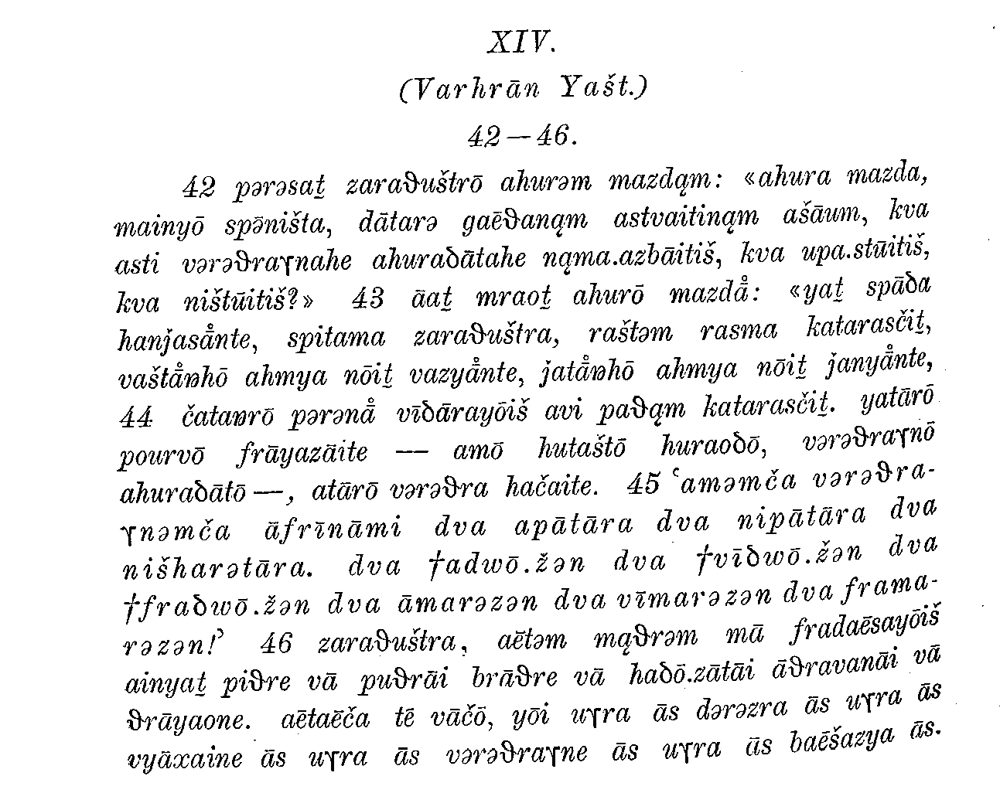

Thereupon the fashioner of the cow asks Truth: What is the nature of thy judgement for
the cow?
When cow-milking zeal, together with forage, takes possession of her, o you ruling ones,
whom do you wish to be her Ahura, one who might break through the wrath caused by the
deceitful?

<!-- source-page: 26 -->

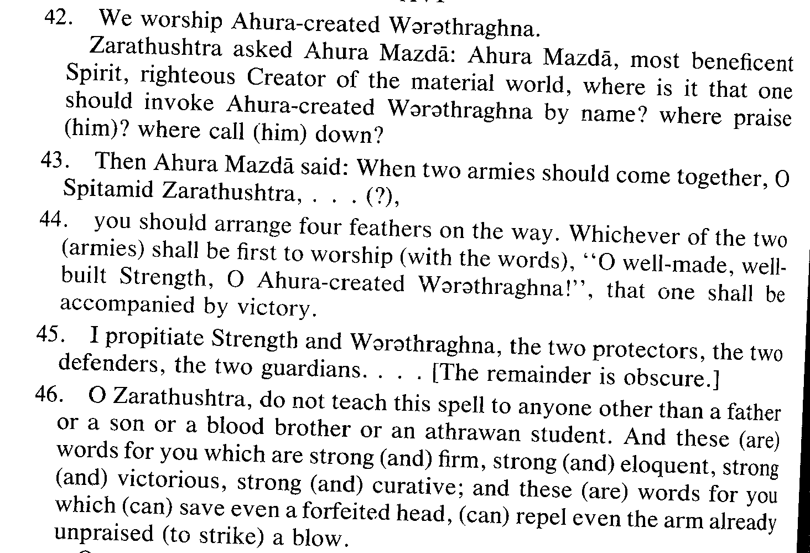

## 3. Greek
Principal theonyms: Zeús < *dyēws „sky“, Hḗra (Myc. E-ra, etymology unknown),
Apóllōn (though sometimes compared to ON afl „strength“ the etymology is ultimately
unknown; the name is probably borrowed from Anatolian, cf. the theonym Apalliunaš
attested in Hittite documents dealing with Wiluša/Troy), Athḗnē (Myc. A-ta-na, of Minoan
origin, perhaps „lady“), Árēs (from ará „curse“), Hḗphaistos (of unknown origin),
Aphrodítē (no relation whatsoever with aphrós „foam“, despite the folk-etymology; the
true origin of the name is unknown), Hermâs (Myc. E-ma-ha) < *ser- „fasten together“
(Gr. eiírō, Lat. sero „link together“, sermo „speech“, Skt. sísarti „stretches, extends“,
often of Mitra's hands), Poseidáōn (Myc. Po-si-da-wo-ne, dat.), originally *potey-dāwōn
„the lord (*potis) of *dā, whatever that is (cf. páti- dā́ nunas „the lord of waters“, RV
1.136.3 of Varuna), Ártemis (Myc. A-ti-mi-te, dat.) – probably pre-Greek (cf. Lyd.
Artimuś, Etruscan Aritimi), Pân (< *pewh₂son-, Ved. Pūšan-), Diónysos (Myc. Di-wo-nu-

<!-- source-page: 27 -->

so < *diwos nuso- „the nuso- of the Sky, whatever nuso- originally meant, Persephónē
(probably from peírein „pierce“ and phaós „light“), Haídēs (according to some from *sm-
wid- (?) „the place where one sees his ancestors again“, but more probably from
*Haywid- < *sh₂eyw-, cf. Lat. saevus „cruel“, from the root *sh₂ey-„to bind“, cf. Ved.
sétu-, the fetter of Varuna), Moûsa (< *montyā „memory“ < *men- „think“), Hestía (from
the word for „fireplace“, Gr. hestía < *westi-, cf. Lat. Vesta).

Homeric Hymn 6 to Aphrodite
αἰδοίην, χρυσοστέφανον, καλὴν Ἀφροδίτην
ᾁσομαι, ἣ πάσης Κύπρου κρήδεμνα λέλογχεν
εἰναλίης, ὅθι μιν Ζεφύρου μένος ὑγρὸν ἀέντος
ἤνεικεν κατὰ κῦμα πολυφλοίσβοιο θαλάσσης
5 ἀφρῷ ἔνι μαλακῷ: τὴν δὲ χρυσάμπυκες Ὧραι
δέξαντ᾽ ἀσπασίως, περὶ δ᾽ ἄμβροτα εἵματα ἕσσαν:
κρατὶ δ᾽ ἐπ᾽ ἀθανάτῳ στεφάνην εὔτυκτον ἔθηκαν
καλήν, χρυσείην: ἐν δὲ τρητοῖσι λοβοῖσιν
ἄνθεμ᾽ ὀρειχάλκου χρυσοῖό τε τιμήεντος:
10δειρῇ δ᾽ ἀμφ᾽ ἁπαλῇ καὶ στήθεσιν ἀργυφέοισιν
ὅρμοισι χρυσέοισιν ἐκόσμεον, οἷσί περ αὐταὶ
Ὧραι κοσμείσθην χρυσάμπυκες, ὁππότ᾽ ἴοιεν
ἐς χορὸν ἱμερόεντα θεῶν καὶ δώματα πατρός.
αὐτὰρ ἐπειδὴ πάντα περὶ χροῒ κόσμον ἔθηκαν,
15ἦγον ἐς ἀθανάτους: οἳ δ᾽ ἠσπάζοντο ἰδόντες
χερσί τ᾽ ἐδεξιόωντο καὶ ἠρήσαντο ἕκαστος
εἶναι κουριδίην ἄλοχον καὶ οἴκαδ᾽ ἄγεσθαι,
εἶδος θαυμάζοντες ἰοστεφάνου Κυθερείης.
χαῖρ᾽ ἑλικοβλέφαρε, γλυκυμείλιχε: δὸς δ᾽ ἐν ἀγῶνι
20νίκην τῷδε φέρεσθαι, ἐμὴν δ᾽ ἔντυνον ἀοιδήν.
αὐτὰρ ἐγὼ καὶ σεῖο καὶ ἄλλης μνήσομ᾽ ἀοιδῆς.
I will sing of stately Aphrodite, gold-crowned and beautiful, whose dominion is the walled
cities of all sea-set Cyprus. There the moist breath of the western wind wafted her over the
waves of the loud-moaning sea [5] in soft foam, and there the gold-filleted Hours welcomed
her joyously. They clothed her with heavenly garments: on her head they put a fine, well-
wrought crown of gold, and in her pierced ears they hung ornaments of orichalc and precious
gold, [10] and adorned her with golden necklaces over her soft neck and snow-white breasts,
jewels which the gold-filleted Hours wear themselves whenever they go to their father's house
to join the lovely dances of the gods. And when they had fully decked her, [15] they brought
her to the gods, who welcomed her when they saw her, giving her their hands. Each one of
them prayed that he might lead her home to be his wedded wife, so greatly were they amazed
at the beauty of violet-crowned Cytherea.
Hail, sweetly-winning, coy-eyed goddess! Grant that I may gain the victory in this contest,
[20] and order you my song. And now I will remember you and another song also.

<!-- source-page: 28 -->

Sappho, fr. 1 (Hymn to Aphrodite)

Ποικιλόθρον', ἀθάνατ' Ἀφρόδιτα,
παῖ Δίος, δολόπλοκε, λίσσομαί σε
μή μ' ἄσαισι μήτ' ὀνίαισι δάμνα,
πότνια, θῦμον·

ἀλλὰ τυῖδ' ἔλθ', αἴποτα κἀτέρωτα
τᾶς ἔμας αὔδως ἀΐοισα πήλυι
ἒκλυες, πάτρος δὲ δόμον λίποισα
χρύσιον ἦλθες

ἄρμ' ὐποζεύξαισα· κάλοι δέ σ' ἆγον
ὤκεες στροῦθοι περὶ γᾶς μελαίνας
πύκνα δινεῦντες πτέρ' ἀπ' ὠράνω αἴθε-
ρας διὰ μέσσω.

αἶψα δ' ἐξίκοντο· τὺ δ', ὦ μάκαιρα,
μειδιάσαισ' ἀθανάτῳ προσώπῳ,
ἤρε', ὄττι δηὖτε πέπονθα κὤττι
δηὖτε κάλημι,

κὤττι μοι μάλιστα θέλω γένεσθαι
μαινόλᾳ θύμῳ· τίνα δηὖτε Πείθω
μαῖς ἄγην ἐς σὰν φιλότατα, τίς σ', ὦ
Ψάπφ', ἀδικήει;

καὶ γὰρ αἰ φεύγει, ταχέως διώξει,
αἰ δὲ δῶρα μὴ δέκετ' ἀλλὰ δώσει,
αἰ δὲ μὴ φίλει, ταχέως φιλήσει
κωὐκ ἐθέλοισα.

ἔλθε μοι καὶ νῦν, χαλεπᾶν δὲ λῦσον
ἐκ μεριμνᾶν, ὄσσα δέ μοι τελέσσαι
θῦμος ἰμέρρει, τέλεσον· σὺ δ' αὔτα
σύμμαχος ἔσσο.

Immortal Aphrodite of the broidered throne, daughter of Zeus, weaver of wiles, I pray thee
break not my spirit with anguish and distress, O Queen. But come hither, if ever before thou
didst hear my voice afar, and listen, and leaving thy father's golden house camest with chariot
yoked, and fair fleet sparrows drew thee, flapping fast their wings around the dark earth, from
heaven through mid sky. Quickly arrived they; and thou, blessed one, smiling with immortal
countenance, didst ask What now is befallen me, and Why now I call, and What I in my mad
heart most desire to see. 'What Beauty now wouldst thou draw to love thee? Who wrongs
thee, Sappho? For even if she flies she shall soon follow, and if she rejects gifts shall yet give,
and if she loves not shall soon love, however loth.' Come, I pray thee, now too, and release
me from cruel cares; and all that my heart desires to accomplish, accomplish thou, and be
thyself my ally.

<!-- source-page: 29 -->

## 4. Italic
Principal theonyms: Jūpiter, Juppiter < *dyēws ph₂tēr „father Sky“, Jūno < Etruscan Uni, but
perhaps originally from *diw- „sky“, Quirīnus < *co-virīnus (originally the protector of the
community, cf. cūria < *co-viria), from *wiHro- „man“, Lat. vir, Mars < Mavors, of
unknown origin, Venus (originally abstract numen, from the neuter *wenos „desire, lust“, Skt.
vanas), Apollo (from Greek), Mercurius (from merx „commerce“, of unknown, perhaps
Etruscan origin), Janus (from iānus, „arched passage, doorway“ < PIE *yeh₂-no-, cf. Skt. yā́ ti
„goes“, Lith. jóti „ride“), Minerva (probably from Etruscan, but perhaps from *Mēneswā, a
derivative of PIE *meh₁nos- „moon“, Lith. mėnuo), Saturnus (of unknown origin, sometimes
compared to Ved. Savitar-), Faunus (of unknown origin, sometimes derived from *bʰh₂u-no-,
from the root „to be, become“), Vesta (= Gr. Hestía), Līber < *h₁lewdʰro- „free (man)“ (OCS
ljudьje, etc.), Volcanus (of unknown origin), Tellus, Lār < *Las, of unknown origin, Manēs
(pl. of unknown origin), Pales (of unknown origin), Lemures (of unknown origin), Bona Dea
(„the good goddess“), Fortūna (derived from fors „destiny, fate“, from the root *bʰer-
„carry“), Neptūnus (usually related to Skt. Apām Napāt „the descendant of waters“, an epithet
of Agni, but a different etymology is also viable: Neptūnus can be from the root *nebʰ-, as in
nebula „fog“, imber „rain“ with a dental suffix, i.e. *nebʰ-tu- > *neptu-).

Cato's prayer (Suovetaurilia, from „De re rustica“)

Mars pater, te precor quaesoque uti sies volens propitius mihi domo familiaeque nostrae,
quoius re ergo agrum terram fundumque meum suovitaurilia circumagi iussi, uti tu morbos
visos invisosque, viduertatem vastitudinemque, calamitates intemperiasque prohibessis
defendas averruncesque; utique tu fruges, frumenta, vineta virgultaque grandire beneque
evenire siris, pastores pecuaque salva servassis duisque bonam salutem valetudinemque mihi
domo familiaeque nostrae; harumce rerum ergo, fundi terrae agrique mei lustrandi lustrique
faciendi ergo, sicuti dixi, macte hisce suovitaurilibus lactentibus inmolandis esto; Mars pater,
eiusdem rei ergo macte hisce suovitaurilibus lactentibus esto
"Father Mars, I pray and beseech thee that thou be gracious and merciful to me, my house,
and my household; to which intent I have bidden this suovetaurilia to be led around my land,
my ground, my farm; that thou keep away, ward off, and remove sickness, seen and unseen,
barrenness and destruction, ruin and unseasonable influence; and that thou permit my
harvests, my grain, my vineyards, and my plantations to flourish and to come to good issue,
preserve in health my shepherds and my flocks, and give good health and strength to me, my
house, and my household. To this intent, to the intent of purifying my farm, my land, my
ground, and of making an expiation, as I have said, deign to accept the offering of these

<!-- source-page: 30 -->

suckling victims; Father Mars, to the same intent deign to accept the offering of these
suckling offering."
Augustine (De civitate dei, 6.9.3)
Cum mas et femina coniunguntur, adhibetur deus Iugatinus; sit hoc ferendum. Sed domum est
ducenda quae nubit; adhibetur et deus Domiducus; ut in domo sit, adhibetur deus Domitius; ut
maneat cum viro, additur dea Manturna. Quid ultra quaeritur? Parcatur humanae verecundiae;
peragat cetera concupiscentia carnis et sanguinis procurato secreto pudoris. Quid impletur
cubiculum turba numinum, quando et paranymphi inde discedunt? Et ad hoc impletur, non ut
eorum praesentia cogitata maior sit cura pudicitiae, sed ut feminae sexu infirmae, novitate
pavidae illis cooperantibus sine ulla difficultate virginitas auferatur. Adest enim dea
Virginensis et deus pater Subigus, et dea mater Prema et dea Pertunda, et Venus et Priapus.
Quid est hoc? Si omnino laborantem in illo opere virum ab diis adiuvari oportebat, non
sufficeret aliquis unus aut aliqua una? Numquid Venus sola parum esset, quae ob hoc etiam
dicitur nuncupata, quod sine vi femina virgo esse non desinat? Si est ulla frons in hominibus,
quae non est in numinibus, nonne, cum credunt coniugati tot deos utriusque sexus esse
praesentes et huic operi instantes, ita pudore afficiuntur, ut et ille minus moveatur et illa plus
reluctetur? Et certe si adest Virginensis dea, ut virgini zona solvatur; si adest deus Subigus, ut
viro subigatur; si adest dea Prema, ut subacta, ne se commoveat, comrpimatur: dea Pertunda
ibi quid facit? Erubescat, eat foras; agat aliquid et maritus.

<!-- source-page: 31 -->

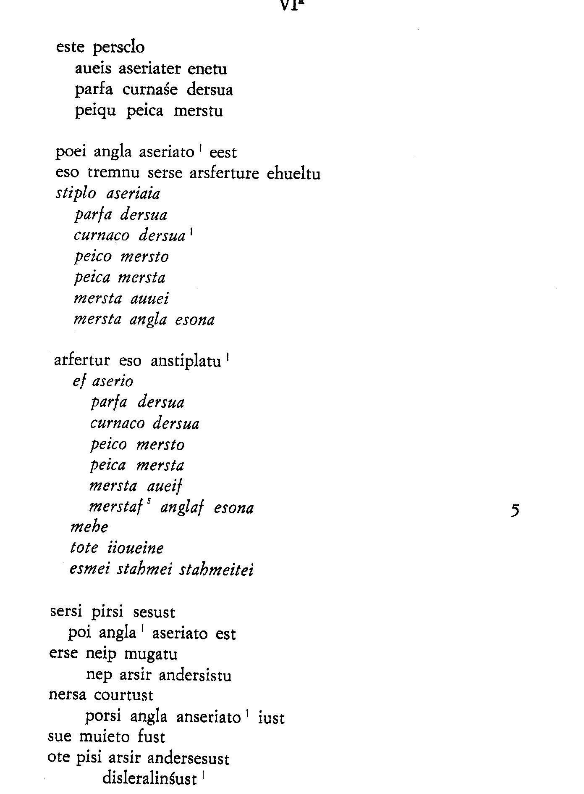

TABULAE IGUVINAE VIa:

This rite
shall start with the observation of the birds
parfa (?owl), the horned one, dersua
woodpecker, peica, merstu
He who will go to observe the messages (of birds)
should, sitting at the tremno ask the priest (arfertur):

<!-- source-page: 32 -->

Ascertain that I am observing
the owl, the dersua, the horned one dersua
the woodpecker merso
the peica mersta
mersta birds
mersta divine messengers.
The arfertur ascertains in his answer:
There you should observe
the owl, the dersua, the horned one dersua
the woodpecker merso
the peica mersta
mersta birds
mersta divine signs
for me,
for the city of Iguvium
in this stahmo stahmito.
When one who went to watch the messengers
will have sat on the seat,
no sound should be made,
and others should not sit at the same time (with him)
until he who went to watch the messengers
shall have returned.
If any sound is made
or if anyone sits in the meanwhile (with him)
the rite is void.

<!-- source-page: 33 -->

## 5. Celtic
Principal theonyms: Gaul. Lugus (of unknown origin, sometimes compared to Gr.
lýnks „lynx“), Maponos (from PCelt. *makkwo- „son, boy“, OIr. macc), Rosmerta (of
unknown origin), Taranis (probably from the same root as OIr. torann „thunder“),
Borvo (a god of termal spring, whose name is from the root of OIr. berbaid „brew“),
Teutates < *tewto- „tribe“, cf. OIr. túath, Epona (from *epos „horse“ < PIE
*h₁ek'wos, Lat. equus) OIr. Echu Ollathir (related to OIr. ech „horse“; his epithet
means „the father of all“; he is also called Dagdae „the good god“ < *dago-deywo-),
Étain (of unknown etymology), Danu (of unknown etymology), Brigit (< *brigantī <
*bʰrg'ʰntih₂ „the exalted one“, Ved. brhatī), Óengus < *oyno-gusto- „the only strong
one“, Lug (= Gaul. Lugos), Lir (= lir, W llyr „the sea“, perhaps from the root *leyH-
„to pour“, but this has been doubted on both semantic and formal grounds), Goibniu
(cf. gobae, gobann „smith“, perhaps related to Lat. faber < *gwhobʰ-), Anu (of
unknown origin), Ogmae (presumably the same as Gaul. Ogmios), Macha (of
unknown origin), W Mabon (= Gaul. Maponos, probably the same as OIr. Macc ind
Óc „the young son“), Rhiannon < *rīgantōnā „the great queen“ (from *(H)rēg's
„king“, OIr. rí, Lat. rēx), Llew (= Gaul. Lugos).

Caesar, De Bello Gallico VI, 17: Deorum maxime Mercurium colunt. Huius sunt maxima
simulacra, hunc omnium inventorem artium ferunt, hunc viarum atque itinerum ducem, hunc
ad questus pecuniae mercaturasque habere vim maximam arbitrantur. Post hunc Apollinem et
Martem et Iovem et Minervam. De his eandem fere quam reliquae gentes habent opinionem:
Apollinem morbos depellere, Minervam operum atque artificiorum initia tradere, Iovem
imperium caelestium tenere, Martem bella regere.
Among the gods they worship Mercury most of all. He is most often represented in pictures,
and they think of him as the inventor of all the arts and a guide on the roads and on journeys
and the most influential for money-making and commerce. After him, they worhip Apollo,
Mars, Jupiter and Minerva. They have almost the same opinion of them as the other peoples
do: they think that Apollo drives away diseases, that Minerva takes care of the works and arts,
that Jupiter holds the empire of the sky and that Mars rules over war.

Inscription from Chamalières: Andedion uediiumi diiiuion risun / aritumapon arueriiatin /
lopites snieđđic sosbrixtiaanderon / clucionfloronnigrinon adgarion aemili / on paterin
claudion legitumon caelion / pelign claudio pelign marcion uictorin asiaticonađđedilli etic
secoui toncnaman toncsiíontío meíon toncsesit buetid ollon reguccambion exops
pissíumítsoccantí rissuis onson bissíet luge dessummiíis luge dessumíis luge dessumíís luxe.

<!-- source-page: 34 -->

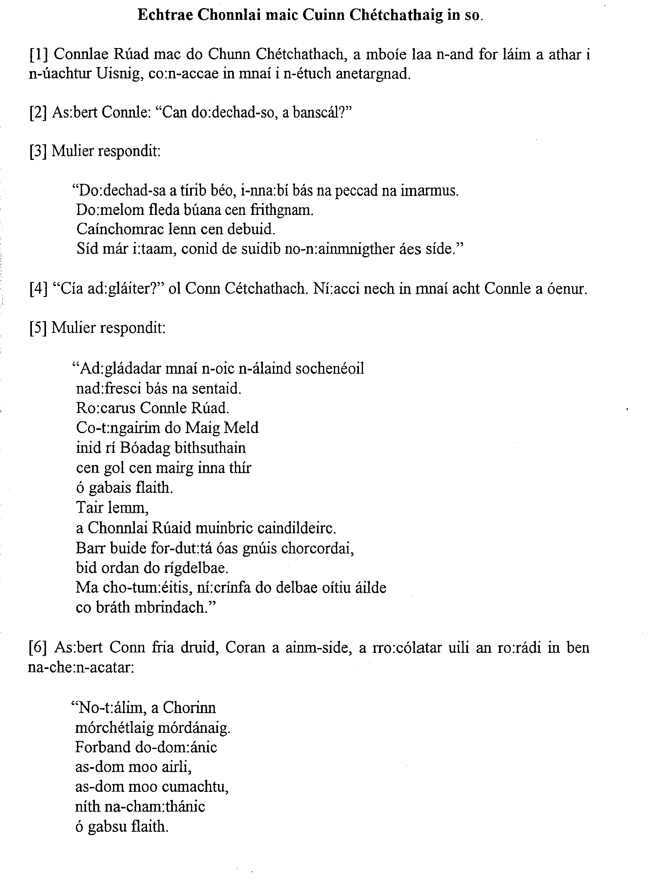

Tentative translation: „I invoke Maponos Arveriatis among the infernal deities; may you
punish (?) and torture them with infernal magic: Caius Lucius, Florus Nigrinus, the adgarios
(?“accuser“), Aemilius Paterinus, Claudius Legitumus, Caelius Pelignus, Claudius, Pelignus,
Marcus Victorinus, and Asiaticus Ađđedili.  And those who swear by such false oaths,
moreover, he swore: „May everything be crooked (?bad) to him! I see it blind (?). It will be
good (?)  for us (?). O Lugus, take them (?), take them, Lugus, take them, Lugus (?)“

<!-- source-page: 35 -->

This is the voyage of Connlae, the son of Conn Cétchathach.
1. Connlae the Red, the son of Conn Cétchatach, was standing once before his father on the
heights of Uisnech, when he saw a women in unusual clothes.
2. Connlae said: „Whence do you come, woman?“
3. Mulier respondit:
„I come from the Land of the Living, where there is no sin or transgression. We eat in
constant feasts without exertion. We have peace without strife. We live in a síd and therefore
they call us 'people of the síd'.
4. „Who are you talking to?“ asked Conn Cétchathach. Nobody saw the woman except
Connlae.
5. Mulier respondit: "He is speaking to a young, lovely woman from a good family, who does
not expect either death or old age. I have fallen in love with Connlae the Red. I call him to
Mag Mell, where the eternal Bóadag reigns, without cry or laments he is in his land since he
had assumed his throne. COme with me, Connlae the Red, o speckled-necked, candle-red one.
The red hair on your purple face will be the ornament of your royal appearance. If you come
with me, the youth and beauty of your appearance will not be lost until the Judgement.“
6. Conn said to his druid, whose name was Corann, because everyone heard what the woman
had said, but they have not seen her:
„I beseech you, Corann, with great song and great art, an excessive demand has come upon
me that is beyond my counsel, that is beyond my power, a struggle that has not come upon me
since I assumed sovereignty. It is a deceitful contest of unseen forms that compels me with a
view to stealing my exceedingly fair son through evil moves. Female charms take him away
from my royal hand.“
The Fourth Branch of the Mabinogi (Math mab Mathonwy), p. 176ff.:

Sef a wnaeth ynteu: edrych ym blaen y prenn; a phan edrych, ef a welei eryr ym blaen y
prenn. A phan ymysgytwei yr eryr, y syrthei y pryuet ar kic pwdyr ohonaw, ar hwch yn yssu y
rei hynny. Sef a wnaeth ynteu: medylyaw, mae Lleu, oed yr eryr; a chanu eglyn:

Dar a dyf yrwng deu lynn;
Gordu-wrych awyr a glynn:
Ony dywetaf i eu,
Oulodeu Lleu pan yw hynn.

<!-- source-page: 36 -->

"Then he looked at the top of the tree and saw an eagle; whenever the eagle shook, worms and
rotten flesh would drop off, and the sow would eat them. Gwydion thought that the eagle was
Lleu, and he sang an englyn:

An oak-tree grows between two lakes:
dark sky and a plain;
If I should not tell a lie,
these are Lleu's feathers."

## 6. Germanic
Principal theonyms (in the ON form): Óđinn (from *Wōdanaz, which is derived from PIE
*weh₂tu- „insight, inspiration“, cf. Lat. vātes „sooth-sayer“, OIr. fáith „prophet“, Thórr
(from the word for „thunder“, PIE *torh₂n-, Fjörgynn (often compared to Slav. Perunъ,
etc., but more likely derived from *pork'o- „furrow“, Lat. porca), Njörđ < *nertu-, most
probably from *ner-to- „under, deep“, Gr. nérteros, OIc. norđr „north“, Loki (of unknown
etymology, sometimes derived from PIE *lewg'- „break, crush“, cf. OE to-lūcan
„destroy“, Skt. rujáti „breaks“), Frejya < *priHyo- „friendly, pleasant“ (Skt. priya-, OCS
prijati etc.).

<!-- source-page: 37 -->

Völuspá 1-7.

1. Hljóðs bið ek allar
helgar kindir,
meiri ok minni
mögu Heimdallar;
viltu, at ek, Valföðr!
vel framtelja
forn spjöll fíra,
þau er fremst um man.
2. Ek man jötna
ár um borna,
þá er forðum
mik fœdda höfðu;
níu man ek heima,
níu íviði,
mjötvið mœran
fyr mold neðan.
3. Ár var alda
þar er Ýmir bygði,
vara sandr né sær
né svalar unnir,
jörð fannsk æva
né upphiminn,
gap var ginnunga,
en gras hvergi.
4. Áðr Burs synir
bjöðum um ypðu,
þeir er Miðgarð
mœran skópu;
sól skein sunnan
á salar steina,
þá var grund gróin
grœnum lauki.
5. Sól varp sunnan,
sinni mána,
hendi inni hœgri
um himinjódyr;
sól þat ne vissi
hvar hon sali átti,
máni þat ne vissi
hvat hann megins átti,
stjörnur þat ne vissu
hvar þær staði áttu.
6. Þá gengu regin öll
á rökstóla,
ginnheilug goð,
ok um þat gættusk;
nátt ok niðjum
nöfn um gáfu,
morgin hétu
ok miðjan dag,
undorn ok aptan,
árum at telja.
7. Hittusk æsir
á Iðavelli,
þeir er hörg ok hof
hátimbruðu,
afla lögðu,
auð smíðuðu,
tangir skópu
ok tól görðu.
1. Hearing I ask | from the holy races,
From Heimdall's sons, | both high and low;
Thou wilt, Valfather, | that well I relate
Old tales I remember | of men long ago.
2. I remember yet | the giants of yore,
Who gave me bread | in the days gone by;
Nine worlds I knew, | the nine in the tree
With mighty roots | beneath the mold.
3. Of old was the age | when Ymir lived;
Sea nor cool waves | nor sand there were;
Earth had not been, | nor heaven above,
But a yawning gap, | and grass nowhere.
4. Then Bur's sons lifted | the level land,
Mithgarth the mighty | there they made;
The sun from the south | warmed the stones
of earth,
And green was the ground | with growing
leeks.
5. The sun, the sister | of the moon, from
the south
Her right hand cast | over heaven's rim;
No knowledge she had | where her home
should be,
The moon knew not | what might was his,
The stars knew not | where their stations
were.

<!-- source-page: 38 -->

6. Then sought the gods | their assembly-
seats,
The holy ones, | and council held;
Names then gave they | to noon and
twilight,
Morning they named, | and the waning
moon,
Night and evening, | the years to number.

7. At Ithavoll met | the mighty gods,
Shrines and temples | they timbered high;
Forges they set, and | they smithied ore,
Tongs they wrought, | and tools they
fashioned.

2ND Merseburg Charm
Phol ende Uuôdan uuorun zi holza.
Dû uuart demo Balderes uolon sîn uuoz birenkit.
thû biguol en Sinthgunt, Sunna era suister,
thû biguol en Frîia, Uolla era suister;
thû biguol en Uuôdan sô hê uuola conda:
sôse bênrenkî, sôse bluotrenkî,
sôse lidirenkî:
bên zi bêna, bluot zi bluoda,
lid zi geliden, sôse gelimida sin!
Phol and Wodan rode to the wood.
There Balder's foal disjointed his foot.
Then Sinthgunt addressed him, and Sunna, her sister,
Then Friia addressed him, and Wolla, her sister.
Then Wodan addressed him, so as he understood:
As the bone disjointment, so the blood disjointment,
so the limb disjointment.
Leg to leg, blood to blood,
limb to limb, so they should be joined!

## 7. Armenian

The name of the mythical hero Vahagn is from Iranian, cf. Av. Vǝrǝthrahan-.
The birth of Vahagn (from „The History of Armenia“ of Mowsēs Kcorenacci)

<!-- source-page: 39 -->

Erknēr erkin, erknēr erkin
erknēr ew covn cirani;
erkn i covown ownēr ew zkarmrikn ełegnik;
ǝnd ełegan pcoł cux elanēr,
ǝnd ełegan pcoł bocc elanēr;
ew i boccoyn vazēr xarteaš patanekikna hur her unēr, bocc unēr mōrus,
ew ačckunkcn ēin aregakunkc.
"The Sky was in labour, the Earth was in labour,
The purple sea was also in labour;
Labour caught also a small red reed in the sea.
Through the reed's tube came a smoke,
and from the reed's tube came a flame,
and from the flame a red-haired youth jumped.
He had fire as hair, fire as beard,
and his eyes were Suns“.

## 8. Slavic
Principal theonyms: Perunъ < *peru-n- „rock“ and *perkwu- „oak“, Velesъ/Volosъ
(probably related to Lith. velė „soul of the deceased“, less certainly with Hitt. wellu-
„meadow“, etc.), Svarogъ (of unknown etymology), Daždьbogъ (a compound of dati
„give“ and bogъ), Svętovitъ (derived from svętъ „holy“ and vitъ ?), Morana (most likely
from moriti „to kill“), Triglavъ („three headed one“), Mokošь (of unknown origin; the
connection with OCS mokrъ „wet“ is slightly more probable than the relationship with
OIr. Macha, a goddess connected with horses in the Ulster cycle).

<!-- source-page: 40 -->

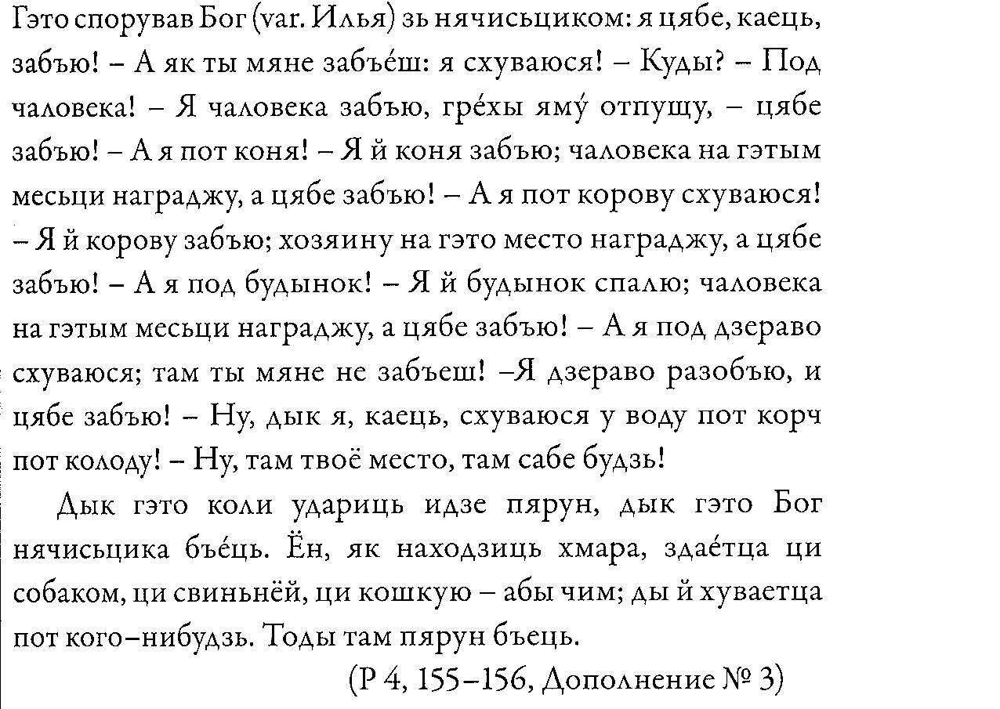

### A Byelorussian Charm

This is how God (var. Ilias) quarrelled with the Devil: I will, kill you, he says!. -And how
will you kill me? -I will hide. -Where? -Under a man! -I will kill the man, forgive his sins,
and kill you. -Then I will hide under a horse! -I will kill the horse, too. I will
recompensate the man, and kill you. -Then I will hide under a cow! -I will kill the cow
too, recompensate her master at once, and I will kill you. -Then I'll hide under a building.
-I will burn down the building, recompensate the man, and kill you. -Then I will hide
under a tree. There you will not kill me. -I will crush the tree, and kill you! -Then, he says,
I will hide in the water, under a trunk, under a plank! -Well, there is your place, there you
should be! So, when a thunder comes to strike, it is God who strikes the devil. He changes

<!-- source-page: 41 -->

into a dog, or a pig, or a cat, as the dark cloud comes. He will change into anything and
hide under anyone. Then the thunder strikes there.

## 9. Baltic
Principal theonyms (in Lith. form): Perkūnas < *perkwu- „oak“ (Lat. quercus), Saulė <
*seh₂wōl „sun“ (Lat. sol), Saulės dukrytė (= „sun's daughter“), Velnias (derived from velė
„soul of the deceased“, which might be connected to Hitt. wellu- „meadow“), Laimė
(abstract noun meaning „luck“, without a clear etymology), Žemynė (a deminutive of žemė
„earth“ < PIE *dʰg'ʰem- (OCS zemlja, Lat. humus, etc).
A Latvian Daina
Barons 34127.
Kuplis auga ozoliņš
Dieva nama galiņē;
Speŗ pērkons, rīb zemiņ',
Ne lapiņa nedrebēja.
„A branchy oak-tree grows
by the house of Dievs;
Perkons shot it, the earth trembled,
not a leaf shivered“.

A Lithuanian daina (Rhesa, 48 1-4)
Po klevelių šaltinaitis
Čystas vandenaitis.
Kur ateit Saulės dukrytės
anskti burną praustis.

Prie klevelio šaltinaičio
ėjau burną praustis;
man beprausiant baltą burną,
nuplovjau žiedaitį.

O atėjo Dievo suneliai
su šilku tinkleliais
Ir žvejavo mano žiedaitį
iš vandens gilumos.

Ir atjojo jauns bernytis
ant bėro žirtaičio;
O tas bėrasis žirgaitis

<!-- source-page: 42 -->

aukso padkavaitėms.

Under the ash-three there is a well
of clear water,
where the daughters of the Sun
come to wash their faces in the morning.

I went to the ash-tree by the well
to wash my face.
And I washed my white face,
and my ring fell off.

And God's sons came
with silk little nets
they caught my ring,
from the depth of the water.

And a young boy came
on a brown horse;
and that brown horse
had golden hooves.

<!-- source-page: 43 -->

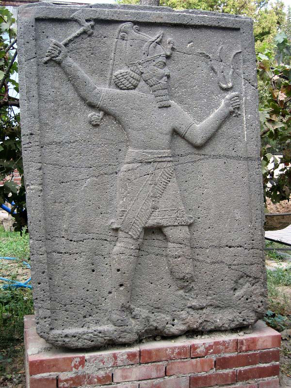

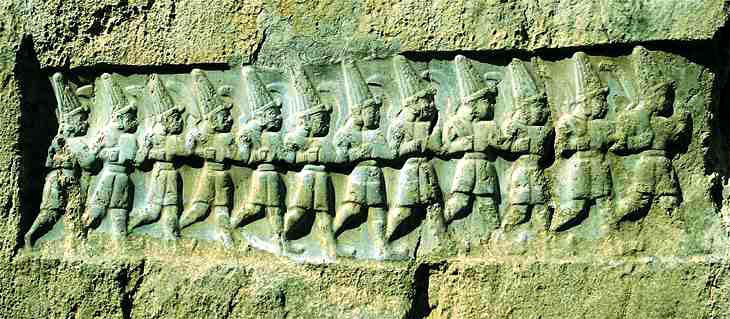

## Illustrations
A HITTITE GOD

A PROCESSION OF HITTITE GODS IN THE SANCTUARY AT YAZILIKAYA

<!-- source-page: 44 -->

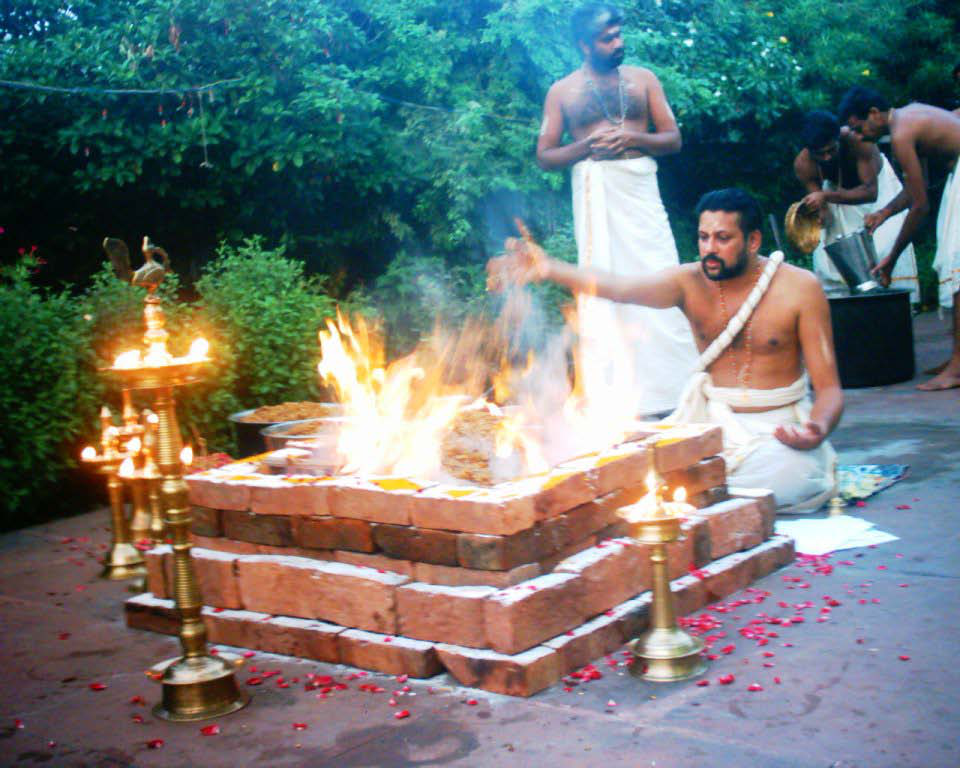

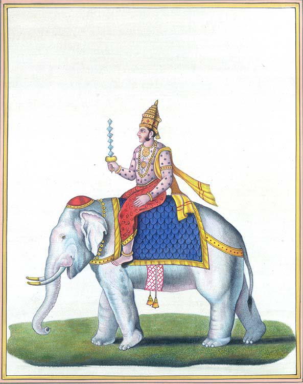

A VEDIC SACRIFICE

INDRA

<!-- source-page: 45 -->

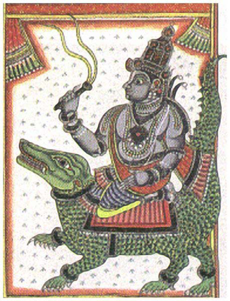

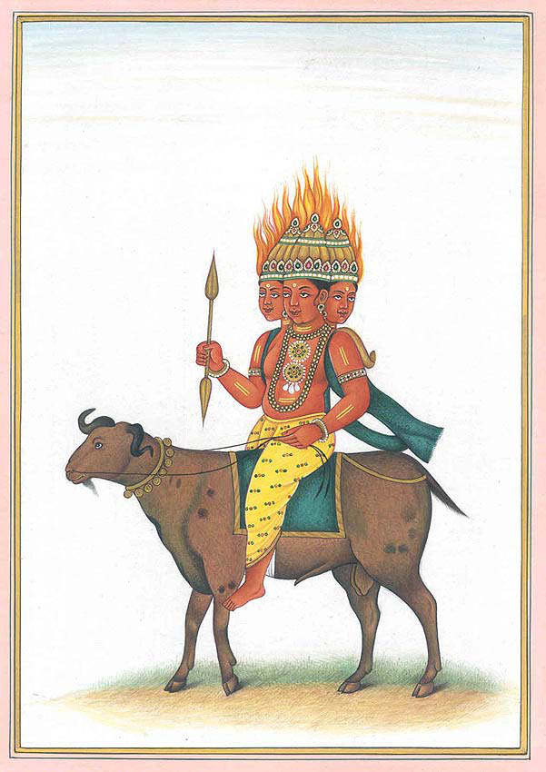

VARUNA

AGNI

<!-- source-page: 46 -->

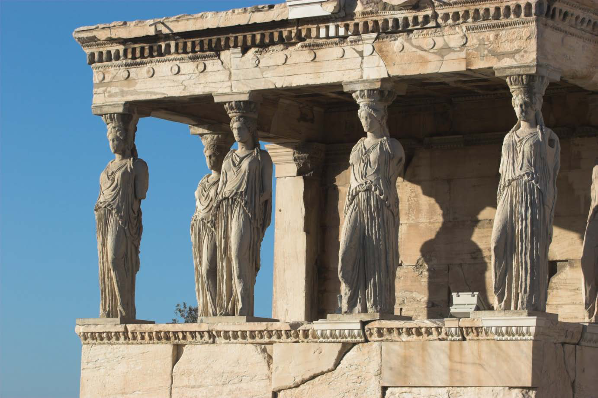

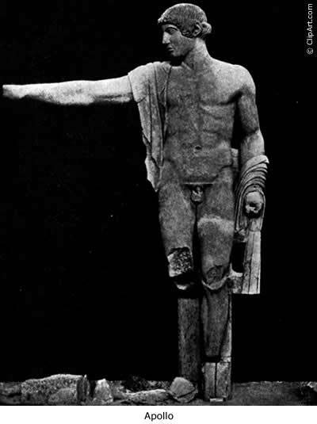

THE CARYATIDES FROM A GREEK TEMPLE

A STATUE OF APOLLO

<!-- source-page: 47 -->

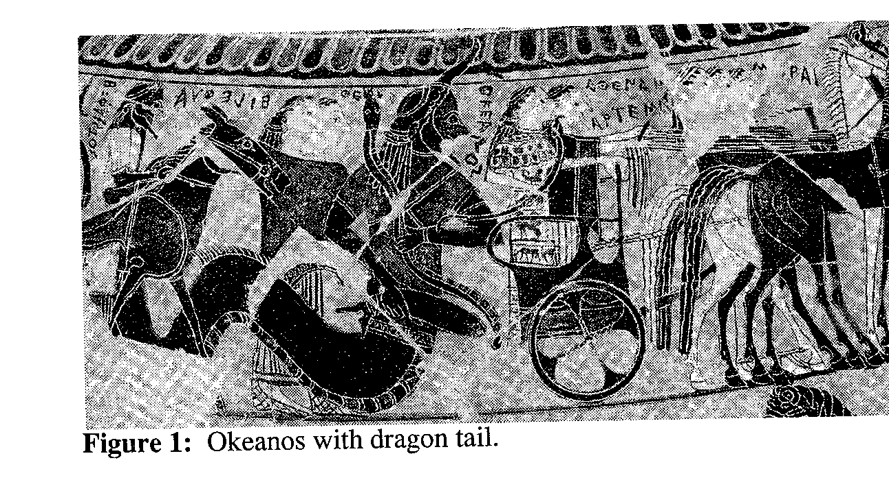

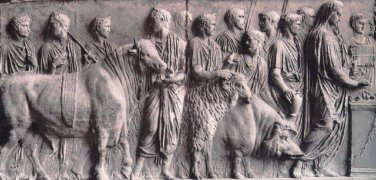

OKEANOS (FROM A GREEK VASE)

THE SUOVETAURILIA

<!-- source-page: 48 -->

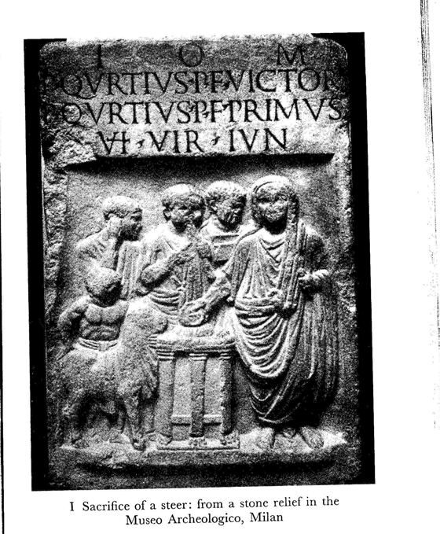

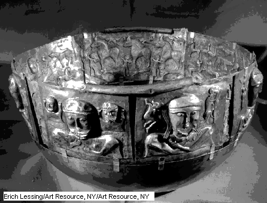

A ROMAN SACRIFICE

The Gundestrup Cauldron with Celtic deities

<!-- source-page: 49 -->

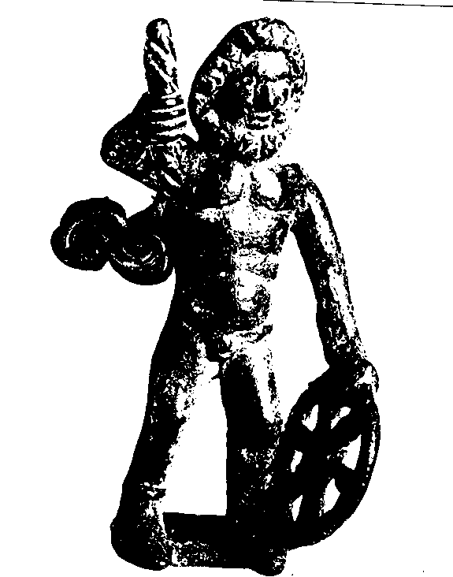

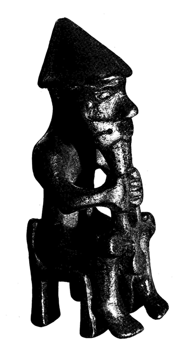

Taranis (Jupiter) from Châtelet:

Thórr

<!-- source-page: 50 -->

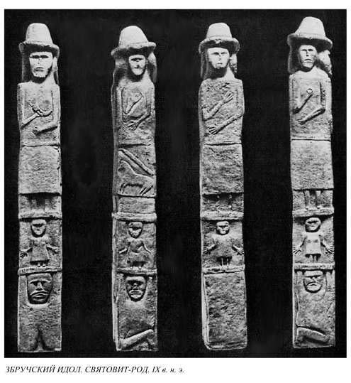

A pagan Slavic idol

<!-- source-page: 54 -->

## Abbreviations

## Texts:
AV = Atharva-Veda
Barons = Kr. Barons, Latvju dainas, Rīga
1922.
Il. = Homer, The Iliad
KUB = Keilschrifturkunden aus Boghaz-
köy
Od. = Homer, The Odyssey
RV = Rig-Veda

## Languages:
Alb. = Albanian
Arm. = Armenian
Gr. = Greek
Goth. = Gothic
Hitt. = Hittite
Hom. = Homeric
Lat. = Latin
Lith. = Lithuanian
Myc. = Mycenaean
OCS = Old Church Slavic
OE = Old English
OHG = Old High German
OIc. = Old Icelandic
OIr. = Old Irish
ON = Old Norse
PIE = Proto-Indo-European
Russ. = Russian
Skt. = Sanskrit
Ved. = Vedic
W = Welsh