# CHAPTER I

# Sounds

### INTRODUCTION

When I was hired to create Dothraki for *Game of Thrones*, I didn’t get many notes from the producers. Really there were only two things they wanted from the Dothraki language: (1) They wanted it to incorporate all the words George R. R. Martin had created in his books, and (2) they wanted it to sound harsh.

*Harsh*.

What does that mean when it comes to a language? Jason Momoa has described Dothraki as sounding like German. Many have described it as sounding like Arabic; a few like Russian. Most English speakers I’ve run into agree, though, that it sounds harsh. Why?

One tack might be to compare the languages that Dothraki is compared to. What sounds do they have in common? Quite a few, actually. Arabic, Russian, and German have all of these sounds in common: *b, s, z, sh, k, l, m, n, a, i* . . . Even more than that. Does having an *m* in a language make it sound harsh? Probably not. Almost every language on the planet has an *m* sound. In fact, a lot of languages feature those sounds listed above—including English—so perhaps we need to try something different. What sounds do Arabic, Russian, and German have in common that English lacks? Turns out it’s only one sound, and its phonetic transcription is \[x\]. You’ll often see it spelled *kh* and referred to as a “throaty” sound like the *ch* in German *Bach*. And, indeed, that does seem like a pretty “harsh” sound to an English speaker. It’s so . . . clearing-your-throat-sound-y. That must be it! The presence of that sound makes a language harsh.

But hang on. You know what other languages have that sound (or if not that sound exactly, something very, very close to that sound)? Spanish and French. It’s true. The *j* in the Spanish name *Javier* is pronounced pretty much exactly like the *ch* in German *Bach*. And the French *r* comes out as an even throatier version of this sound in words like *trente*, “thirty,” and *produit*, “product.” Do you know *any* English speaker who’s ever described either French or Spanish as “harsh” or “throaty” or “guttural”?

Clearly there’s more at work here than the presence or absence of a sound or two. In addition to the history of cultural stereotyping, which certainly plays a role, it’s the comparison of entire sound systems that produces a phonaesthetic character in the mind of the listener: the sounds present, the way they’re combined, the intonational phrasing, and the rate of speech—plus a number of sociological factors. All of this is compared with the sound systems present in the mind of a speaker. So German may sound harsh to an American English speaker, but might not to a Dutch speaker from the Netherlands.

Even if the judgments are subjective, a conlanger can use the expectations of their users/hearers to achieve a particular phonaesthetic effect. In this chapter, I’ll demonstrate how I’ve done that with some of my languages, and what’s involved.

For the most part, I will be focusing on how to construct naturalistic sound systems or **phonologies**, which is what I’ve spent the bulk of my conlanging career doing. At the end, though, I will touch on sign language phonology and what one might do if one were to construct an alien sound system. As a general note, when a conlanger begins to create a language, they can start anywhere. I like to start with the sounds, though, so that’s where we’ll begin.

### PHONETICS

All spoken languages on Earth use a small subset of the possible sounds a human can produce. For example, an English word like *lava* is pretty understandable: you’ve got an *l* sound, a nice open *a* vowel, a *v* sound, and then a kind of reduced *a* sound. Even though languages will use different sounds, it wouldn’t be surprising to find that type of word in any given language. It would be odd to find a word like *la§a* in a language. How do you pronounce *la§a*? Pretty much like *lava*, except instead of putting a *v* sound in between the *a* vowels, you clap your hands together once. So *l-a-CLAP!-a*. No natural language on Earth does this, except in songs or language games (remember that dog Bingo?). There’s no reason why a language couldn’t do this (it’d be fairly simple to incorporate it into a language. Try replacing the sound *f* with a clap in English. Takes practice, but you can do it), it’s simply the case that natural spoken languages don’t.

Instead, oral languages utilize sounds made with the mouth, throat, tongue, nose, and lungs. In this section I’ll introduce you to those sounds, with examples from both natlangs and conlangs. First, though, I want to talk a bit about transcription.

In English, we use a number of sounds to convey meaning. Sometimes, though, the same sound will be pronounced differently, even if we’re completely unaware of it. Try this test out yourself. Put your hand right in front of your mouth and pronounce the word *tall*. Do it a few times. You should feel a nice puff of air on your palm. Now try pronouncing the word *stall*. Focus on the *t*. Notice anything different? Try saying the pair *tall*/*stall* a few times. You should notice that that puff of air you feel when you pronounce *tall* is totally absent when you pronounce *stall*. And, in fact, even though we would call both of those *t* in English, the sounds are different. The *t* in *stall* is a regular *t* which we would transcribe this way: \[t\]. The *t* in *tall*, though, is an aspirated *t*, and we would transcribe it like this: 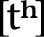. That tiny little superscript  tells you that the sound is pronounced with an accompanying puff of air. When we write English, we don’t bother noting the difference because English speakers don’t distinguish the sounds. In phonetics, though, we do make a note of the difference, since even though it doesn’t produce a meaningful distinction in English, it does in some languages.

Here, for example, are two different words of the Hindi language spoken in India (ignore the funny tail on the *t*; we’ll get to that):

  “teak”

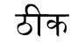 “okay”

These two words differ only in one respect: the  for the Hindi word for “okay” is aspirated (i.e. ) and  for the Hindi word for “teak” is not. So even though the distinction between \[t\] and  isn’t meaningful in English, such distinctions can be meaningful in other languages. This is probably why the two versions of *t* are spelled differently in Hindi ( vs. ), but they aren’t in English.

The spelling you see above in between brackets is what’s known as **phonetic transcription**. Any time in this book that you see words in between brackets \[ \], it means that, more or less, this is *exactly* how the word is pronounced, and that the word will be written in the **International Phonetic Alphabet (IPA)**. The IPA is a special alphabet used by linguists to transcribe any and all sounds made with the human vocal tract, regardless of native spelling systems. Phonetic transcription of this type contrasts with **phonemic transcription**, which gives you the most crucial phonetic information of a word but leaves out some of the details. Below, for example, is the English word *tall* in phonemic and phonetic transcription:

Notice that the phonemic transcription (which is always given between forward slashes) leaves off the aspiration marker . This is because it’s considered to be a predictable pronunciation detail. The same isn’t true of the aspiration in Hindi, which is not predictable. Here’s the same transcription for the Hindi word for “okay”:

They’re the same, because the aspiration is a crucial factor in determining the meaning of the word in Hindi.

When I sit down to create a new language, I start with the phonetic level of detail. That is, I draw from *all* possible human sounds before narrowing it down and deciding which ones will be important for distinguishing meaning. I’ll now take you on a tour of some of the plethora of sounds humans can make with their mouths.

### ORAL PHYSIOLOGY

Before we can talk about sounds, we have to talk a bit about what humans use to produce oral sounds. Below is what someone would look like if you sliced them in half from the top of their skull to their shoulders (perhaps with a sharpened hat, à la Kung Lao from *Mortal Kombat*).

Each of those spots labeled above is referenced in the production of speech sounds. In order to produce a speech sound, in addition to making use of an airstream mechanism, there is an **active articulator** and a **passive articulator**. The active articulator is the part of the mouth that moves to form a constriction. The passive articulator is the part of the mouth that the active articulator either touches or gets near to in order to produce the sound.

Below is a correspondence set of all the points in the mouth with the adjectival form of the word appearing in parentheses next to each noun (where necessary, further explication is given after the adjectival form):

A. Lungs (air coming from the lungs is referred to as *pulmonic*)

B. Larynx (laryngeal)

C. Glottis (glottal): At the bottom of the windpipe, the glottis is the space between the vocal folds.

D. Epiglottis (epiglottal): This is a little flap that closes when we swallow in order to ensure that food goes into the stomach and not the lungs.

E. Pharynx (pharyngeal): This is essentially the back of the throat.

F. Uvula (uvular): This is the little punching bag–like thing that hangs down at the back of the throat.

G. Nasal Cavity (sounds that feature air flowing through the nasal cavity are called *nasal*)

H. Velum (velar): The velum raises (i.e. closes) to block the passage between the nose and lungs, and lowers (i.e. opens) to allow air to flow from the nose to the lungs and vice versa. When we breathe through our noses, the velum is lowered. (Note: Also referred to sometimes as the *soft palate*.)

I. Hard Palate (palatal): Directly in front of the velum, this is often referred to as the roof of the mouth.

**J.** Alveolar Ridge (sounds produced using the alveolar ridge as a passive articulator are referred to as *alveolar*): The little bump directly behind your two front teeth.

**K.** Upper Teeth (sounds produced using the upper teeth as a passive articulator and the tongue as an active articulator are referred to as *dental*; sounds produced using the upper teeth as a passive articulator and the lower lip as an active articulator are referred to as *labiodental*)

**L.** Lower Teeth (dentolabial)

**M.** Lips (sounds involving the lips in some way are referred to as *labial*; sounds crucially involving both lips are referred to as *bilabial*)

**N****.** Tongue (lingual)

**O.** Tongue blade (laminal): This is defined as the part of the tongue behind the tip.

**P.** Tongue tip (apical)

This may seem like a lot of terms to keep track of, but honestly, velar (soft palate from which the uvula hangs), alveolar (bump behind the two front teeth), labial (lips), and palatal (roof of the mouth) are the words you’ll end up using the most. Feel free to bookmark this page, but I promise you by the time you get [here](#pageMap_90), you’ll have this down (unless you decide to skip directly [here](#pageMap_90); that’s cheating, and I guarantee nothing to a cheater).

### CONSONANTS

All sounds are produced either by having air pass out of the lungs and through the mouth, or by utilizing some sort of alternate air source that we can manipulate. Without force of some kind, no noise is produced (aside from the teeny tiny noises produced by having your organs move about). A **consonant** is a sound that puts some sort of obstruction in the way of the airflow, thereby changing the current and producing a different sound. Depending on how the current is affected, one can produce different types of sounds. The major divisions are listed below:

• Oral Stops: An oral stop is produced when airflow through the mouth is interrupted completely (i.e. stopped), and the velum is raised, allowing no air to pass through the nose.

• Fricative: A fricative is produced when a tight constriction is formed somewhere in the mouth. Forcing the air through this tight constriction produces turbulent airflow which we interpret as different types of sounds.

• Affricate: A sound that begins as an oral stop but is released as a fricative.

• Nasal Stops: A nasal stop is produced when airflow through the mouth is interrupted completely, but the velum is lowered, thus allowing air to pass through the nose.

• Approximant: An approximant occurs when the active articulator (the tongue or lips) approaches a position, but never forms a tight enough constriction to produce a fricative, resulting in a “liquid”-like sound. (Note: These sounds are also called glides.)

• Flap/Tap: Referred to using either word, a flap or tap occurs when an active articulator is catapulted against a passive articulator.

• Trill: A trill is when the root of an active articulator remains rigid, allowing the non-fixed portion of the articulator to flap back and forth aggressively in the airstream.

• Lateral: A lateral is an L-like sound that allows air to pass around the sides of the tongue.

Below is a chart of *some* of the major consonants found in the world’s languages:

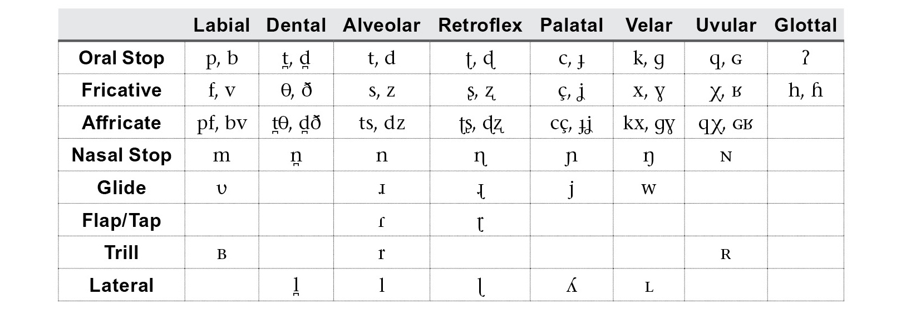

Since this is the first time we’ve seen it, let me tell you why most of these cells have two members. Speech sounds feature what in linguistics we call **voicing**. Sounds may be either **voiceless** (sometimes called **unvoiced**) or **voiced**. In each of the pairs above, the voiced sound appears on the right. A quick lexical example to show us the difference between the two are the English words *staple* and *stable*. These two words differ in only one respect, and that’s the voicing feature of the second stop in that word. In *staple*, we have a voiceless \[p\], whereas in *stable* we have a voiced \[b\].

If you can’t pinpoint the precise difference between these two, I’d like you to perform another throat experiment. I’d like you to place your hand against your throat right in the middle just above where the Adam’s apple is (this protrusion, known as the laryngeal prominence, is present in all humans; it’s just larger in males). Now what I want you to do is hiss like a snake, making an \[s\] sound: *ssssssssssss*. You should feel nothing interesting happening in your throat. While still semi-strangling yourself, I want you to do the same thing, except this time alternate between an *s* sound and a *z* sound. Something like:

*sssssssszzzzzzzzzssssssssszzzzzzzzzzssssss*

If you did the above, you should notice a considerable difference. For the *s* sound, your throat should have been relatively still. During *z*, though, you should have noticed a remarkable vibration. This is because *z* is a voiced sound. In order to produce a voiced sound, the vocal folds vibrate as air passes through the glottis. When the vocal folds vibrate in tandem with the production of a speech sound, that speech sound is referred to as voiced.

Now, the chart above is a lot to digest, I know, but it’s there primarily for reference. The nice thing about the IPA if you’re an English speaker is that it was devised primarily by English speakers, so the letter forms should look *fairly* close to their basic English counterparts. To get you into the consonant sounds of the IPA, I’ll go over the sounds of English—especially as it will require two symbols that are not present above—and then discuss sounds not found in English.

First we’ll begin with the stops of English. English has these six stops:

I want you to notice that no matter how the word is spelled, the phonetic transcription remains consistent. Even though there’s a spurious *c* in *rack*, there’s only a \[k\] in the transcription. IPA is used to transcribe the sound of a word, regardless of its spelling. This is important to keep in mind when examining English, whose orthography was devised by a team of misanthropic, megalomaniacal cryptographers who distrusted and despised one another, and so sought to hide the meanings they were tasked with encoding by employing crude, arcane spellings that no one can explain. (*“Ha, ha! I shall spell ‘could’ with an ell! They will* *be powerless to stop me!”*)

Before moving on to the sounds not found in English, take a look at the glottal column. Notice anything odd?  looks pretty lonely up there, doesn’t he? (And he also looks a bit like a question mark, making that last sentence look . . . clownish.) That sound is referred to as a glottal stop, and we’ve actually got it in English. When we say “uh-oh!” in that kind of exaggerated, mawkish way we use with children who appreciate it less and less with each passing year, we actually pronounce a glottal stop. A broad transcription of the phrase might be something like . That little catch in your throat in between the “uh” and the “oh” is a glottal stop. You’ll hear it in Cockney pronunciations of words like “bottle,” or in a native pronunciation of “Hawai‘i.” It’s a good sound used in a lot of languages, but the reason there’s no voiced version is that it’s produced by smacking the vocal folds together. The vocal folds are what need to be vibrating in order to produce voicing. Consequently, a voiced glottal stop is impossible.

The remaining stop sounds are found in other languages. For example, the appropriate pronunciation of Spanish *t* and *d* in the words *toro* and *mande* are dental (with the tongue tip against the top teeth), rather than alveolar, as with English *t* and *d*. Retroflex  and , as found in Hindi, are pronounced with the tongue tip bent backward, as if you were trying to swallow the tip of your tongue. The palatal stops can be found in Hungarian, and the uvular stop \[q\] can be found in Dothraki and High Valyrian from *Game of Thrones*.

Fricatives are among the most diverse consonantal sounds that exist. Here are the fricatives of English:

A couple of notes on these. Notice that English actually does distinguish the sounds \[θ\] and \[ð\]; it just doesn’t do a very good job of it. We spell both *th*, and it’s up to the speaker to realize that the pronunciations of *th* in *this* and *thin* are totally different (\[ð\] and \[θ\], respectively).

Second, you’ll notice that the post-alveolar symbols  and  don’t appear on the chart above. This is because the fricatives are the only major sounds that are produced at that point of articulation. We happen to have them in English (they also exist in French and Portuguese), and the sounds are quite common, so it’s important to know their symbols:  for *sh* and  for the voiced version like the *s* in *vision*. They’re contrasted in the pair of English words *Confucian* , as in a follower of Confucius, and *confusion*  (thanks to Kim Darnell for pointing this pair out to me!).

In between the post-alveolar  and glottal \[h\], there are a whole host of fricatives that enjoy wide use in many non-English languages. These are the so-called throaty or guttural sounds produced with the back of the tongue. There’s actually nothing uncommon or ugly about them. To truly appreciate them, one has to hear them in the original languages. Below I’ve given you some examples of some “guttural” fricatives in a few natural languages:

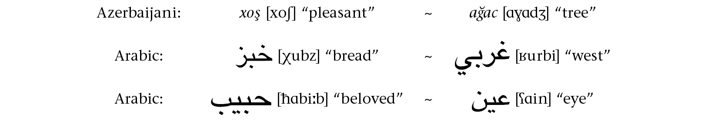

The latter two fricatives don’t appear on the chart above. They’re pharyngeal fricatives, which are rare, but not vanishingly so. The voiceless pharyngeal fricative \[ħ\] is like a heavy, forceful *h* sound (we produce it when fogging up a mirror), and the voiced pharyngeal fricative/approximant  sounds—and feels—very much like choking. It’s a really fun sound to practice!

Affricates are a combination of a stop and a fricative. It might seem odd to call such a combination a single sound until you realize that the two most prominent affricates in English are rather often thought of as single sounds:

Most English speakers would have no problem thinking of the *ch* and *j* sounds as single sounds, and yet they don’t sound the same running forward as they do backward (in fact, the word *mushed*  will sound almost identical to the word *chum*  if you record it and play it backward—and vice versa). That’s what an affricate is: a combination of a stop and fricative that speakers treat like single sounds. In English, the post-alveolar  and 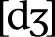 are the only true affricates, but many languages have others. For example, the *ts* in the Japanese word *tsunami* is an affricate, as is the *pf* in the German word for “horse,” *Pferd*. For other affricates, simply combine a stop with a fricative of the same voicing in the same place of articulation, as in the chart above.

The remaining consonants are much more restricted when it comes to where they are produced in the mouth. Nasal stops, for example, can only be produced at the uvula or forward. The reason is that a nasal consonant is identical to a voiced oral stop, except that the velum is lowered, allowing air to pass through the nose. Consequently, anything farther back than a uvular nasal is impossible, as the tongue would be blocking air from passing through the mouth *or* the nose.

Nasal stops are quite common in the world’s languages, but most languages have two or three of them only. In English, we have three types of nasal stops that distinguish meaning:

Notice that these only contrast at the end of a word. In some languages, like Vietnamese or Moro, spoken in Sudan and South Sudan, words can begin with all three of the nasals and others. Compare this pair of words from Moro:

When creating a language, it’s important not to get hemmed in by the phonological patterns of one’s own language. There’s a *lot* we can do with the sounds we can make with our mouths!

The remaining sounds all tend to get clumped together under the catchall term “approximant.” The first set are the glides. A glide is basically the consonantal version of a vowel. In English, we have three glides, as shown below:

Each of these is very closely associated with a vowel:  with ; \[j\] with \[i\]; and \[w\] with \[u\]. Consider these pairs of words:

*purr* 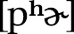 ~ *piranha* 

*me* \[mi\] ~ *meow* 

*who* \[hu\] ~ *whoever* 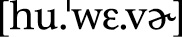

The first set you can pronounce and hold indefinitely. Then notice what happens with the second. The second set starts out as the first set does, but then the constriction in the mouth becomes tighter, and what was a vowel suddenly becomes a consonant. That’s what a glide is, and in the world’s languages they’re notoriously tricksy, in that they sometimes show up as consonants and sometimes as vowels. For a beginner, it’s best just to treat them like stable consonants. As you get more advanced, though, glides can do a lot of fun things.

Taps (or flaps) and trills are all *R*-like sounds. For example, the IPA symbol \[r\] is the trilled *r* in Spanish *rojo,* “red,” or the trilled double *rr* in Spanish *perro,* “dog.” A single instance of that Spanish *r* in between vowels is a flap, as in Spanish *pero,* “but.” We actually have this flap sound in English as the pronunciation of the first *t* in words like *pitiful* 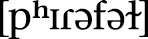, *gratitude* , and *catatonic* . Despite that fact, the trilled \[r\] has a reputation of being a difficult sound to pronounce. With practice, though, anyone can master it.

There are two other trills found in the world’s languages: the bilabial trill  and the uvular trill . The latter is found as a variant of *r* in many languages, including German and French. The bilabial trill is quite rare, but it’s a fun sound. It’s the sound that horses make when they blow a whole bunch of air out of their mouths and their lips flap together like window shades.

The last category is lateral approximants. These are the *L*-sounds. Most languages have just one *L*-sound, and it’s usually \[l\]. Some, though, have other variants, like the palatal  which is close to the *lli* in English *million*. Not featured on the chart are the voiceless and voiced lateral fricatives 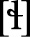 and . These sounds are somewhat rare, but  is found in Welsh. It sounds very much like an \[h\] and an \[l\] pronounced at the same time. It’s the sound at the beginning of the name *Lloyd*, if pronounced as a Welsh name. Funny story. The  sound was so bizarre to English speakers that they mistook the sound for \[fl\]. This is what gave birth to the new name *Floyd*.

This, of course, isn’t even half of the total consonants found in the world’s languages. **Nonpulmonic** consonants use an airstream mechanism other than the lungs. There are three main types of nonpulmonic consonants found in the world’s languages: **implosives**, **ejectives,** and **clicks**. Each is characterized by a different airstream mechanism. Briefly, implosives are produced by lowering the glottis, causing air to rush *into* the mouth in order to produce a stop sound. Ejectives, on the other hand, are simply oral stops produced while holding one’s breath, which causes the glottis itself to propel air out of the mouth. Clicks are produced by making two closures in the mouth: one at the velum or uvula, and another somewhere in front of that. Sucking air into that enclosure causes an explosive popping sound when the anterior closure is released.

For those creating their own languages, if you want to use any of the three of these types of consonants in your conlang, it is *strongly advised* that you investigate how these sounds work in natural languages. As a general bit of advice for each of the three:

• The bilabial implosive 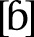 is the most common implosive. Implosives become rarer as you move away from the lips and toward the glottis. Sample language: Hausa (West Africa).

• The velar ejective \[k’\] is the most common ejective. Ejectives become rarer as you move away from the uvula toward the lips. Sample language: Hausa (West Africa).

• Click consonants occur in bunches. No language has just one click. Rather, they have clicks in at least three different places of articulation, and with at least three different voicings (e.g. nasal, voiced, palatalized, aspirated, etc.). So far, clicks have *only* been found at the beginning of a syllable. Sample language: !Xóõ (Botswana).

### VOWELS

Wherever you are (especially if you’re in a library, bookstore, or at work), open your mouth and scream. *Loud*.

*SCREAM!!!*

That’s a vowel.

A **vowel** sound is produced when air is allowed to pass out of the lungs totally unimpeded. We can move our tongues and lips around and even lower our velums and wiggle our epiglottises to alter the sound of the vowel, but so long as air is allowed to pass out of the lungs in an unimpeded stream, the resulting sound is a vowel. Vowels are among the most fluid sounds we have. They’re *desperately* hard to pin down. This is why the *i* in *burrito* is pronounced differently in English and Spanish, *even though they’re the exact same sound*. It’s easy to move your tongue *just* a little bit and change the overall character of a vowel. It’s also the hardest thing to approximate. Those who are able to do other accents well or who can make themselves sound like a native when speaking another language are incredible at imitating other vowel sounds. Consonants are a cakewalk with no admission fee compared to vowels.

Unlike consonants, which need to be dealt with based on their manner of articulation, we’re going to go ahead and look at all the vowels at once. Below is a chart of all the major vowels found in the world’s languages (where vowels appear in pairs, the vowel on the right features rounded lips):

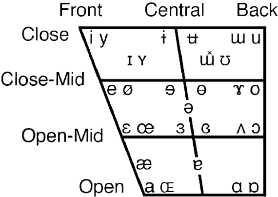

The first question you’ll probably have after seeing that chart is why is there an oddly shaped quadrilateral behind the vowel symbols. The reason has to do with how vowels are described by linguists. All vowels are defined by three basic measures: **backness** (whether the tongue body is closer to or farther away from the pharynx); **height** (whether the tongue body is closer to the roof of the mouth or closer to the bottom of the mouth); and **rounding** (whether the lips are rounded or not when pronouncing a vowel). The symbols are placed where they are to mirror the position of the tongue body. Consequently, the tongue body is quite high and forward in pronouncing a vowel like \[i\], but quite low and back when pronouncing a vowel like . You may also notice that your mouth is far more open for the vowel  than it is for \[i\]. **Openness** is another way of describing vowel height. In other words, rather than noting that the tongue body is low in the mouth for , you’d say the jaw is open. For our purposes, these two systems shall be treated as identical.

You can actually hear the effect of height and backness by doing two clever tricks that my phonetics professor John Ohala taught me. To hear the effect of height, what you should do is mouth, in order, the vowels in *meet* \[i\], *mate* \[e\], *met*  and *Matt* \[æ\]. Don’t actually pronounce them. While doing this, take your thumb and forefinger and flick the skin underneath your back jaw. This will produce a hollow popping sound (something like clapping your palm over an open bottle). As you move from the higher vowel to the lower vowel, the tone of that hollow popping sound will actually get higher. You can repeat the example with *moot* \[u\], *moat* \[o\] and *mot*  and hear the same result.

For backness, you can whisper the vowels and hear a difference. When whispering (no vocal fold vibration at all), you can’t affect the tone of your speech. The inherent tone of each vowel *decreases* the farther back in the mouth the tongue body goes. So if you whisper the vowels for *meet*, *mate*, *met*, *Matt,* *mot*, *moat,* and *moot* in that order, the pitch will get progressively lower. Neat, huh?

The last feature is lip rounding, which doesn’t really need a trick, as it’s pretty easy to tell when your lips are rounded and when they aren’t. You should notice that your lips round quite a bit when pronouncing *moo* , but unround completely when pronouncing *me* . That’s fairly standard. Now try to do the opposite. Keep your lips *completely* unrounded and pronounce *moo*. If you succeed, you should be pronouncing  (and sounding like a stereotypical Southern Californian in the process). Now try *me* with your lips *completely* rounded. If you succeed, you’ll be pronouncing . It may sound like a strange sound, but it’s found in French, German, and Turkish—and also English, in certain circumstances.

You know how at sporting events it’s not uncommon to chant the name of the home team in one fashion or another? Think about the teams you know that have a main \[i\] vowel. One that always comes to mind for me is the Miami Heat. When fans chant “Let’s go Heat!,” more often than not the name of the team comes out \[hyt\] rather than \[hit\]. The reason is that the lip rounding makes the sound more resonant: it lengthens the tube that is our vocal tract, so to speak, and allows the speaker to give more volume to what they’re saying. This is also why players with \[u\] in their name are much more likely to have their name chanted.

With this information in hand, you should be able to pronounce *any* vowel. It also should become clear how these vowel symbols are really just buoys on the vast ocean of vocalic possibility. I bet right now without even trying you can produce five or six different sounds that would qualify as \[i\] but which are all slightly different. The way a specific language works is there’s an entire range of sounds that qualify as a particular sound, and so long as you’re somewhere in that range, you’re fine. If you cross the boundary, though, you’ll either be pronouncing a different vowel or a strange sound that will ring false in the ear of a native speaker.

Since English has a goodly number of vowels, let’s go over them so you can note the differences and use these as reference. I’m assuming a Standard American pronunciation (so not even my pronunciation). If you need a reference for some of these words, think of a stuffy male news anchor pronouncing them, and that should be a good enough frame of reference:

With that inventory in mind, all the other vowels can basically be described in reference to English. For example, \[y\], , \[ø\], \[œ\] and  are simply the vowels \[i\], , \[e\], , and  pronounced with fully rounded lips. The vowels , , , and  on the other hand, are just like \[u\], , \[o\], and , pronounced with fully *un*rounded lips. The vowel \[a\] is like \[æ\], but lower.

Moving to central vowels, one that pops up a lot in language after language is schwa: . It’s the reduced vowel at the end of the word *sofa* . If you completely relax your jaw and produce the laziest sound in the world, you’ll be producing . As for the other central vowels, do you know the song “Better Man” by Pearl Jam? (No judgment if not; they’ve done better.) See if you can find it on YouTube. Listen to the part of the chorus where Eddie Vedder sings “Can’t find a better man.” Hear how his voices changes—how it kind of sounds huskier? This is something you heard a lot in the nineties (Scott Weiland did it; Shakira does it a lot; Dave Matthews did a lot \[or Dave, as his true fans call him\]). What Eddie Vedder is actually doing is centralizing all the front vowels. His typical pronunciation of “can’t find a better” is something I’d transcribe as 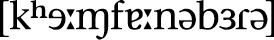. Naturally, he doesn’t *always* sing this way. Every so often he simply feels the need to kick it into overdrive, and so he centralizes all the vowels. It’s a noticeably different sound. As for why, the only thing I can come up with is that it obscures a lot of the vocalic variety of English (there are fewer distinctions for central vowels than for front vowels), and makes it easier to hold a tone. It’s also why *baby* comes out *babay* a lot of times (\[e\] is lower than \[i\], which means your mouth is open wider). Anyway, if you’re trying to nail central vowels, remember Eddie Vedder (but hopefully for “Corduroy,” “Yellow Ledbetter,” “Black,” “Guaranteed,” “Oceans,” and “I Got Id” rather than “Better Man”).

Now that we have all the vowels down, I’d like to discuss some properties of vowels that certain languages will make use of beyond vowel quality. The first is **vowel length**. Compare the vowel in the English word *bat* to the vowel in the English word *bad*. Yes, the stops at the end will be different, but pay attention to the length of the vowel. Notice how the *a* vowel of *bad* takes more time to pronounce than the *a* sound in *bat*. This is because vowels are naturally lengthened before voiced consonants in English—and, in narrow vocalic transcription, we’d transcribe those two words \[bæt\] and , respectively. You can try this experiment with any vowel pair in English, and the distinction should hold true: *bit*/*bid*, *rot*/*rod*, *neat*/*need*, *loot*/*lewd*, *mate*/*made*, etc. The mark we use to indicate a long vowel is a kind of modified colon that looks like this: . You place that mark after a vowel to indicate that it’s long. You can also use one little triangle after a vowel  to indicate that a vowel is *slightly* longer than a short vowel.

Unlike English, though, which uses vowel length phonetically, many languages use vowel length to distinguish meaning. Among natural languages, Hawaiian, Arabic, Japanese, Hungarian, Finnish, and Latin distinguish long and short vowels. Among conlangs created for television and film, High Valyrian from HBO’s *Game of Thrones*, Shiväisith from Marvel’s *Thor: The Dark World,* and Lishepus from Syfy’s *Dominion* contrast long and short vowels. Here’s an example from High Valyrian:

*kelin* \[kelin\] “I stop”

*kēlin*  “herd of cats”

Another common use of vowels is the **diphthong**. A diphthong is a vowel that starts out as one vowel but finishes as another. Consequently, it doesn’t sound the same going forward and backward—kind of like affricates. For example, try slowing down your pronunciation of the word *lie*. Notice where your tongue is when you start the vowel of that word and where it ends up. At the beginning, you should be pronouncing a vowel very much like \[a\], and at the end it should sound a lot like \[i\]. Despite that fact, we treat this as a single sound (English speakers will think of this as a “long *i*”). That’s what a diphthong is: a dynamic vowel that is treated as a single vowel. So, for example, the *i* in *light* \[lajt\] is a diphthong, as is the *ow* in *how* \[haw\], but the *ea* in *react* \[riækt\] is just two vowels occurring next to each other.

Also, as a note, vowels are, by default, voiced. Certain languages, though, have made use of voiceless (or whispered) vowels. For example, in Japanese, the high vowels \[i\] and  tend to be voiceless in between voiceless consonants. This is why names like *Daisuke* appear to be pronounced \[daiske\]. In fact, a name like that will be pronounced , with the vowel being whispered in between the two consonants.

Finally, a common feature of vowel systems is nasality. We’ve already discussed nasal consonants, so you understand how nasality works. Now apply those same principles to vowels. Try pronouncing a nice  vowel with your velum lowered. This will mean that air will primarily be passing out of your lungs but also will pass out through your nose. If you do this successfully, you’ll be pronouncing 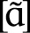, which is precisely how you pronounce French *an* (one of the words for “year” in French). Nasalization can be applied to any vowel, but most languages that employ nasal vowels only allow a subset of nasal vowels. French, for example, has eleven oral vowels (or regular vowels), but only three nasal vowels. This is usual, but not necessary. It’s perfectly possible to pronounce any vowel as oral or nasal: just pronounce the vowel with a lowered velum. (See one of the Gbe languages of West Africa for an example of a language that has the same number of oral and nasal vowels.)

It takes practice to be able to produce, distinguish, and remember the various sounds we’ve discussed thus far. Please feel free to use this section as a reference guide that you can refer to in future sections, as we’ll be relying on your understanding of the phonetic principles of language as we move through the book.

### PHONOLOGY

The phonology of a language is an abstract layer of understanding that treats actual sounds (**phones**) as subsets of other sounds (**phonemes**). The phonology of English is the reason we think of the *t* in *stall* as identical to the *t* in *tall*, even though the former is \[t\] and the latter 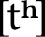, and there exist languages that treat them differently. We consider both sounds to be realizations of the phoneme /t/ (recall that phonemic transcription is written between forward slashes).

Throughout the rest of this section we’ll be discussing phonology and phonological phenomena. This is where things get interesting.

### SOUND SYSTEMS

You’ve seen the myriad speech sounds available to the human mouth. Being a speaker of a human language, you also should have noted that your language doesn’t utilize *every possible* speech sound. This is true of every language on the planet. How a language chooses sounds is a bit of a mystery (the history is lost to antiquity), but it’s up to the conlanger to choose the sounds for their language. The result will be the conlang’s **sound system**. In creating a naturalistic language, there are a number of principles that will help to guide a conlanger in doing so, and this section will detail those principles.

First, take a look at the phonology of *any* language. For example, let’s look at the consonantal inventory of Tukang Besi, an Austronesian language spoken in Indonesia whose reference grammar was written by superlinguist and martial arts expert Mark Donohue (he is literally both of those things).

Note that sounds marked with an asterisk appear only in loanwords, and everything other than \[r\], \[s\], and \[n\] in the **Dental/Alveolar** column is dental. What can we say about this? First, it’s worth noting that \[b\] and \[d\] aren’t native, and that there are only two implosives:  and . And the one place where there isn’t an implosive (the **Velar** column), there is a native \[g\]. Other than that, notice how balanced everything looks. There are basically four native stops in each major place of articulation: voiceless, voiced (either implosive or regular), and both prenasalized and plain. There’s one *r* sound, one *l* sound, a couple glottals, and then a sibilant (or strident) fricative \[s\] and a weaker voiced one \[β\]. This looks natural. The following, however, would strike me as bizarre:

This is basically the same phonological inventory with a couple changes. Notice that there’s now exactly one bilabial stop, and it’s a prenasalized voiceless bilabial stop . There’s also only one implosive, and it’s dental. There is no dental or alveolar \[n\], for apparently no reason; there’s a full series of plain, labialized, *and* palatalized velar fricatives (there are no other labialized or palatalized consonants); and there’s only one *L*-sound, and it’s a *voiceless* velar lateral.

This should strike you as exceedingly unnatural. That is, even though all of these are sounds human beings can produce (and without too much difficulty, I might add), I would *never* expect a language to exist that had precisely this phonological inventory. The reason behind the nonoccurrence of sound systems like this one is a principle that I call **acoustic economy**.

Acoustic economy is, simply, the idea that languages will conspire to take maximal advantage of the sounds available to human beings. They will do so *not* because certain sounds are more difficult to *pronounce* than others, but because certain distinctions are more difficult to *hear* than others. Let me illustrate what I mean by this.

In English, we distinguish *t* from *k* from *p* well enough (e.g. *kick* vs. *tick* vs. *pick*). Consider the word *September*, though. Would you expect there to exist an entirely separate word that was spelled *Sektember* (or maybe *Sectember*. Yeah, that looks more Englishy)? This would be a word totally unrelated to *September*, mind. It’s certainly something English *could* do, of course, but the place where the *p* occurs in *September* is, for a plethora of reasons, a really poor environment to distinguish those otherwise easily distinguished sounds. Again, it’s easy enough to pronounce *Sectember* (in fact, that *is* how my late stepfather used to pronounce *September*), but you have to think about it from the listener’s perspective. In noisy environments, with a word like this pronounced lazily on occasion, having to distinguish *September* and *Sectember* consistently wouldn’t work.

Now if you can pull back and imagine a language evolving over thousands of years, and there being billions of word pairs like this, and billions of interactions among billions of different speakers, you should be able to begin to understand the role that acoustics plays both in the organization and reorganization of sound systems, and in historical sound change (which we’ll discuss in detail later on). A user of a language reproduces the language in the way that they believe it’s supposed to be used, and that’s based on what they hear—and also what they read, if the language has a written form. Consequently if a certain distinction is routinely difficult to perceive, it can eventually collapse. This is what happened in English with many vowels before *r*. The words *fur*, *stir,* and *her* didn’t all used to rhyme.

In general, the principle of acoustic economy expects languages to maximize the phonological space available, so that words are audibly distinct. If they’re difficult to distinguish, the distinctions tend to collapse, ironed out by evolution. Competing with the idea of acoustic economy, though, is something I call the principle of **brand identity**. In marketing, the goal is to make sure that every piece of information related to a brand has the characteristics of its brand identity on it (logos, color schemes, slogans, fonts and typefaces, etc.). You should be able to look at anything associated with a particular brand and tell it’s from that brand. In language, the same principle applies, albeit a little differently.

Looking at sound systems, there are certain phonemes that have a rarer distribution crosslinguistically than others. For example, voiced aspirated stops are fairly rare. In Hindi, though, you get a voiced aspirated stop at every single possible place of articulation, as shown below—and words that use them are *everywhere* in the language!

  “bard”

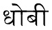  “washerman”

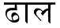  “shield”

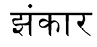  “chime”

  “hour”

This is a phenomenon you’ll see in language after language. It may be difficult to distinguish \[t\] from  or \[o\] from , for example, but if the language is going to do it, it will do it a *lot*. This actually helps to preserve the distinction. That is, if there is a *class* of pharyngealized sounds, or palatalized sounds, or glottalized sounds, or what have you, speakers and listeners get constant interaction with the phenomenon. If one is able to distinguish a nasalized vowel from an oral vowel, then it’s not a problem to distinguish a *particular* nasalized vowel from its oral counterpart.

This is what I mean by brand identity. A language will take advantage of its unique sounds and make them a hallmark of the language. From English, consider our rarer sounds: \[θ, ð, \]. The sound \[ð\] isn’t in a lot of words, but it does find itself in a lot of *really* high frequency words: *the* 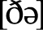, *this* , *that* \[ðæt\], *then* 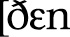\], *though* \[ðow\], etc. The sound \[θ\] is common enough, and is used in the -*th* ending in words like *width*, *warmth*, *depth,* and in the ending for ordinal numbers like *fifth*, *eighth*, *twentieth*, etc. And you can’t get through a sentence without using an *r*. It’s everywhere!

In building the sound system for a naturalistic language, then, I keep these two principles in mind. For those building their own language, one question might emerge that I can address—namely, how big or small does one’s sound system have to be?

On the high end, my suggestion is not to worry about the number of consonants or vowels. Instead, the question should be: Does my system make sense? For example, the !Xóõ language of Botswana has more than a hundred consonants (the majority of them clicks), but the distribution of consonants is still quite principled. The same is true of all natural languages.

Now, if you go in the *other* direction, that question is quite interesting.

The natural language with the fewest number of consonants is a language of Papua New Guinea called Rotokas. Depending on the dialect and the analysis, Rotokas is analyzed as having either six or nine consonants—and that’s it. They’re basically /p, t, k, b, d, g/ (don’t let the spelling of the name of the language fool you—its orthography uses the Roman alphabet and has some funky spelling rules). It has ten vowels (five qualities, long and short), so there’s plenty of syllabic possibilities (which is probably the real question that needs to be answered), but it looks like the answer to the question of how many consonants does a language *have* to have is six. You might be able to go smaller, but doing so would raise an eyebrow or two.

As for vowels, there are a group of languages all found in the Caucasus Mountains that are famous for having, depending on the analysis, exactly two vowels. Some argue there are three; some argue there are more than that. Nevertheless, a two-vowel analysis has been made for a number of languages in this region—in particular, Ubykh and Kabardian, though Abkhaz and Adyghe are often thrown in. What are the two vowels? It may surprise you: /a/ and . Each vowel ends up being realized in a lot of different ways depending on the consonants surrounding it, but since the realizations are consistent, the vowels are analyzed as being just /a/ and 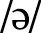, while each of these languages has an *extremely* large consonantal inventory.

Most languages have between four and six vowel qualities (not counting long vowels as separate), and between twenty and thirty consonants. English has an average number of consonants and an above average number of vowels. A language like Spanish is much more ordinary, with between eighteen and twenty consonants, depending on the dialect, and five vowels. That should give you an idea of what the usual bounds are for natural languages. So long as you’re aware of them, you can make a conscious decision to have your language fall within expected norms, or be an outlier.

In addition to the foregoing, here are some quick tips for those sitting down in front of a blank sheet of paper and creating their first sound system:

• Your system *will* be revised. Feel free to try things out to see how they work.

• Look at a variety of different languages’ sound systems for inspiration, or just to get a better idea of what kind of variety there is. Wikipedia is great for this. Search for “\[language name\] phonology” (or if it’s a lesser-known language, “\[language name\] language”) and jump to the phonology section. Most pages have nice big charts to look at.

• Remember that sounds come in groups—especially **obstruents** (stops, fricatives, and affricates). Don’t go to add a palatal *sound*: go to add a palatal *series*.

• **Sonorants** (vowels, laterals, trills, flaps, approximants, and nasals) tend to be voiced and tend not to have voiceless counterparts. Treat this as a default which can be circumvented if so desired.

• Bilabial obstruents are more likely to be voiced; velar/uvular obstruents are more likely to be voiceless. In between, distinguishing voicing is quite likely. This isn’t a rule, but a tendency.

• Implosives grow increasingly less common starting from the lips and moving inward; ejectives grow increasingly less common starting from the velum and moving in either direction (i.e. outward or inward).

• **Sibilants** (*s*-like and *sh*-like sounds) are acoustically strong; nonsibilant fricatives are acoustically weak. It’s not uncommon for a language to have one sibilant and one nonsibilant—and also not uncommon for nonsibilants to be confused for each other (e.g. \[f\] for \[θ\], \[h\] for , etc.).

• If a language has an opposite rounding vowel (i.e. front rounded or back unrounded), it will *almost* always have the regular version of the vowel as well. So if a language has \[y\], it will also have \[i\]. This isn’t a rule, but a tendency.

• Low vowels, whether front or back, are most commonly unrounded. You will find  in plenty of languages (it’s the *o* in Alan Rickman’s pronunciation of *Harry Potter*), but  is much more common.

• *Always* sound things out. It will help you to understand the sound and its acoustic effect better.

Of course, selecting the sounds one wants to use isn’t the extent of creating a phonology. Indeed, that’s just the beginning!

### PHONOTACTICS

Take an English word like *strong*. It’s a nice, sturdy English word. A phonetic transcription of it would be . The sounds that comprise that word are, without a doubt, English sounds. Consequently, one should be able to take those sounds and create a new word—say, a word like . That makes a nice plausible English word, right?

Channeling a young Jennifer Connelly: Of *course* it doesn’t! (Any *Labyrinth* fans out there? Those crickets I’m hearing?)

The reason it doesn’t is that the **phonotactics** of English simply do not permit a word like  to exist. If it had to exist, we’d probably end up pronouncing it . In other words, we’d modify the word so that it obeyed the phonotactics of English. That’s what the phonotactics are there for. They’re a set of rules that tell the speaker of a language which types of combinations of sounds form coherent words, and which don’t. This allows us to identify a given language and ignore everything that doesn’t sound like the language we’re listening for.

Once the sound system of a language has been set up, the next important step is deciding how the phonotactics of the language will work. In addition to the sounds present in the language, the phonotactic patterns present in a language are one of the three key factors in determining its phonaesthetic character (this will be discussed in detail later). If phonotactics are ignored, more often than not the phonotactic patterns of a conlanger’s native language are borrowed into their conlang, resulting in a conlang that behaves, for an English speaker, much more like English than the conlanger was intending.

The first step in creating a phonotactic system for a conlang is determining what constitutes a **syllable**. A syllable is a prosodic unit of measurement used to divide words into smaller parts. A syllable itself can be divided into two main parts: an **onset** and a **rhyme**. Onsets are optional in many languages, but rhymes are not. The rhyme can also be subdivided into two parts: the **nucleus** and **coda**. In a stereotypical syllable (something like the English word *dog* ), the onset is a consonant (\[d\]), and the rhyme is the rest of the syllable (). Within the rhyme, the vowel is the nucleus () and the last consonant is the coda (). Syllables are often diagrammed like this:

The symbols above come from Greek and are as follows: σ = syllable; ω = onset; ρ = rhyme; ν = nucleus; κ = coda. One of the most important parts in setting up the phonotactics of a conlang is determining which syllables are allowed. For example, all languages allow onsets, but some, like Arabic, require them. Many languages allow **closed syllables**—i.e. syllables with a coda—but not all of them do (Hawaiian requires **open syllables**, syllables without a coda). *All* languages have rules about what sounds are allowed in the onset, nucleus, and coda positions.

In addition to syllabic restrictions, there are also word boundary and word-internal restrictions. In discussing these restrictions, I’ll need to introduce a new bit of transcription. A period \[.\] is used to separate syllables. In future, all phonetic transcriptions will be broken down syllabically. Going back to boundary restrictions, in English the sound \[ŋ\] isn’t allowed to begin a word, but it may begin a syllable. So while there will never be a word of English that begins with \[ŋ\] (one of the reasons why English speakers have such a hard time with the last name Nguyen), the word *strongest* is best syllabified .

Since I transcribed the word, though, this is a good time to talk about **ambisyllabicity**. Certain sounds in certain languages often turn out to be neither a coda nor an onset—or they’re both. For example, \[ŋ\] ordinarily isn’t an onset, so in *strongest*, one almost wants to say that it’s both coda *and* onset. This happens a lot with , where in a word like *baron*, it’s hard to say if it should be  or , because the  is clearly having some sort of appreciable effect on the vowel the way a \[t\] or \[s\] wouldn’t. This is generally a fairly advanced concept, but I would like to use it to introduce **geminates**. A geminate is to a consonant what a long vowel is to a vowel. Compare the \[s\] sound when pronouncing *Miss Ally* versus *Miss Sally*. The \[s\] sound should be quite a bit longer in the second. In effect, that is what a geminate is: a long consonant. Any consonant can be a geminate. Certain languages treat geminates as the incidental co-occurrence of the same sound (as in English), but others treat geminates as longer versions of a single consonant—i.e. a consonant that is required to occupy both the coda of the previous syllable *and* the onset of a following syllable.

Many languages will place extra selectional restrictions on onsets and codas. For example, Japanese only allows \[n\] as a coda. In Dothraki, a largely permissive language when it comes to consonants and consonant clusters, the consonants , \[q\], and \[w\] can’t end a word, but may end a word-internal syllable. Thus, a word like *leqse* “rat” is transcribed \[leq.se\]. A verb like *haqat*, “to be tired,” though, which *should* be *haq* \[haq\] in the past tense, turns out to be *haqe* \[ha.qe\], because word-final \[q\] isn’t permitted. The addition of the \[e\] in Dothraki is what is known as a **repair strategy**. All languages have different types of repair strategies to ensure that their phonotactic rules aren’t violated. Consider all these words which came to English (ultimately) from Greek: *psychologist*, *pterodactyl*, *pneumonia*, *gnomic*. All of those words were pronounced with an initial \[p\] or  in Greek. In English, we simply can’t begin a word with consonant clusters like these. Our repair strategy was to pretend those initial consonants simply didn’t exist.

Other languages employ different strategies. For example, though it’s fine for a word to begin with \[st\] or \[sp\] or \[sn\] in English, it’s impossible in Spanish. No syllable in Spanish can begin with a fricative followed by a stop of any kind. Thus, when a Spanish speaker goes to a Starbucks, the way they’ll pronounce it is .

The strategy employed in both situations is to preserve the canonical syllable structure of each language. Part of defining the syllable structure is defining which consonant clusters are allowed. While English is more permissive in this regard than Spanish, it’s not as permissive as, say, Russian, where the Russian equivalent of *psychologist* leaves the \[p\] from Greek intact: психолог .

In order to avoid having to pair every single consonant in one’s inventory with every single other consonant, one generally uses classes of sounds (e.g. oral stops can be followed by approximants). How to decide which clusters will work and which won’t, though? Let me introduce the **sonority hierarchy**. The sonority hierarchy defines classes of sounds based on how likely they are to serve as the nucleus of a syllable. Going from least likely to be a nucleus to most, this is the sonority hierarchy:

Oral Stop \> Affricate \> Fricative \> Nasal \> Approximant \> Vowel

As you can see, vowels are most likely to be the nucleus of a syllable and stops are the least likely, which should be fairly intuitive. That is, if you have a basic syllable \[pa\], it’s pretty safe to say that, no matter what your language, \[p\] will be the onset and \[a\] will be the nucleus. It’s almost unimaginable to conceive of it any other way.

Having said this, the sonority hierarchy is more like a maxim than a law. Consider that if you obey the above hierarchy precisely as written and you had to arrange three consonants—\[t\], \[s\], and \[a\]—into a coda-less syllable, the optimal order would be \[tsa\]. In English, we know that won’t work, and that the nonoptimal order \[sta\] would be preferred. Hungarian, on the other hand, is perfectly fine with \[tsa\], and wouldn’t be okay with \[sta\]. This is part of what defines both languages.

That’s about how I make use of the sonority hierarchy in designing a sound system. It’s not a law that dictates how sounds should be arranged, but a guideline that can be used to help one define *one’s own* sound system. In English, for example, it’s not especially noteworthy that approximants like  and \[l\] can follow stops and fricatives. It is worth noting, though, that \[s\] (and occasionally ) can precede stops and nasals. Notice how English does that, though. Off the top of your head, you should be able to think of dozens of words that begin with \[sn\], \[sm\], \[st\], \[sp\], and \[sk\]. You should also be able to come up with a lot that begin with , , , and \[spl\]. How about \[skl\]? There’s *sclerosis*, but can you come up with any others? And how about \[stl\]? There are *none*. Think about how odd that is, given the classes of sounds. What’s wrong with \[tl\]—or \[dl\], for that matter? Other languages do it. One of my favorite Irathient words is  , which means “short visit.” In English, however, it’s forbidden.

By making use of and reference to the sonority hierarchy, it’s possible to identify what clusters and combinations are outlawed or allowed in a conlang that would be surprising or out of the ordinary. For example, Sanskrit allows the consonants \[r\] and \[l\] to serve as the nucleus of a syllable. Some languages are even more permissive than that. Here, for example, is a word from Georgian, with my best attempt at syllabification afterward: 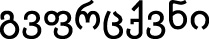 \[gv.prts.kvni\] “you peel us” (I’m sure there’s a context where this sentence would make sense). Pretty much anything that has even the *slightest* bit of continuity can serve as the nucleus of a syllable, if you want it bad enough. Consider *pssst!* in English. It’s not a word in the conventional sense, but it has clear meaning (“Hey! Pay attention to me, but don’t make it look like you are!”), and is quite clearly  with no vowel. In English, this isn’t wordlike enough to get word status, but why couldn’t it in a different language? And, indeed, words like this can and do occur in many languages around the world.

Before leaving the sonority hierarchy, it’s worth noting that if you run the sonority hierarchy in reverse . . .

Vowel \> Approximant \> Nasal \> Fricative \> Affricate \> Oral Stop

. . . it gives you the end of a syllable. The thing to remember about codas, though, is that they’re simultaneously *less* permissive and *more* permissive than onsets. For example, Ancient Greek allowed codas of \[n\], \[r\], and \[s\] *and that’s it*. Such a thing is far from uncommon. But look at English. Compared with a language like Spanish, we allow tons of onset types, but, my stars, the things we can end a word with! Bask in some of these truly, *truly* awful codas:

*strengths* 

*worlds* 

*sixths* 

*fifths* 

*crafts* 

If there’s anything to take away from this, it’s two linguistic tendencies. The first is that languages in general tend to place a lot more restrictions on codas than onsets. The second is that certain languages will pile up coda consonants—apparently because they think the word is done with and no one will notice or care.

For a conlang, though, all of this must be worked out and stated explicitly. As a language creator, doing so helps to craft words that look and feel like they all came from the same language, and it helps to prevent one’s native language intuitions from constraining the phonology.

### ALLOPHONY

Discussing allophony is really the first step toward understanding the systematicity of language. To explain it, let me take a fun topic like werewolves and ruin it by turning it into math.

The idea behind the most common version of the werewolf is simple. Some individual (we’ll call him Tony) is a regular human being, but when there’s a full moon in the sky, Tony becomes a werewolf: a wolflike man. Tony as Tony and Tony as the werewolf are never in the same place at the same time, because they’re one and the same person. Furthermore, assuming that Tony acquired his wolfish second skin via some sort of bite that he received late in life, we can say that Tony is *basically* human (i.e. he started out human, most of the time he’s human, and he thinks of himself as a human being with a bizarre ability). Furthermore, Tony doesn’t become a *wolf*: he becomes a wolf*man*. So he’s still basically human. If we wanted to describe Tony’s two states, then, we might describe them this way:

Tony as a Human = \[+human, -wolf\]

Tony as a Werewolf = \[+human, +wolf\]

Humans are naturally \[-wolf\] (that we know of), so really \[+human\] is all you need to describe Tony. After all, we would also assume he’s naturally \[-bird\], \[-car\], \[-credenza\], \[-butter\], etc. If you had to describe Tony using a set of equations, then, you might do so in the following way:

1. /Tony/ \> \[+wolf\] / \_sky\[+full moon\]

Translation: Tony becomes \[+wolf\] in the context of a sky that is \[+full moon\].

2. /Tony/ \> \[Tony\] / elsewhere

Translation: Tony remains regular Tony in all other contexts.

Here, the forward slashes make reference to a kind of meta-Tony that manifests himself in one of two ways. The greater than sign \> is used as an arrow to indicate that some change occurs in Tony. In equation (1), Tony acquires the feature \[+wolf\]; in equation (2), there is no change, so he comes out as natural Tony. After this comes a forward slash / after which appears the environment that effects the change. In equation (1), the underscore \_ stands for Tony, who is “occurring” (or existing) before a sky that has a full moon (in this case, it is \[+full moon\]). In equation (2), the environment is “elsewhere,” which indicates that every other possible environment will cause Tony to remain Tony.

If you can understand the alternation between Tony and his werewolf form, you can understand allophony.

**Allophony** describes the *regular* distribution of sounds in a language. Some sounds rarely change, or change very little (like  in English), but others change quite a bit. When the change is regular and predictable, we call each instantiation of the sound an **allophone** of one **phoneme**. Using our example above, Tony, the individual consciousness, would be a phoneme, and both human Tony and werewolf Tony would be allophones of the individual Tony. To use a relatively simple example from English, let’s talk about aspiration. Here’s one way you could write up the aspiration rule of English:

/p, t, k/ \> 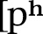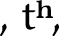 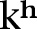 / \#\_

/p, t, k/ \> \[p, t, k\] / elsewhere

In other words, /p, t, k/ become aspirated at the beginning of a word (the little hashtag \# mark is used for a word boundary, so \#\_ means when the sound in question occurs with nothing before it), and they remain themselves otherwise. The actual details are a little more complex than this, but that’s the gist of it.

Now, as an English speaker you should have the sense that there is no important difference between \[p\] and . The *p* in *peak* feels like the same sound as the *p* in *speak*; you wouldn’t want to say they were different, even though they are. This is why we can refer to the phoneme as /p/ without too much trouble. Other languages experience changes just like this with their phonemes that we would perceive as rather different. For example, in Hawaiian, the phoneme /w/ surfaces as \[v\] when it occurs after \[i\] or \[e\]; as \[w\] when it occurs after \[o\] or \[u\]; and is in free variation between \[w\] and \[v\] after \[a\]. Basically \[v\] and \[w\] are treated as realizations of the same sound. In English, the two are quite different (consider *why* and *vie*), of course, but it’s the language that determines which distinctions are going to be relevant and which aren’t.

Instrumental in determining which sounds are relevant in a language is the presence or absence of **minimal pairs**. A minimal pair is a pair of words that have different meanings and *exactly one* phonetic difference. Compare the two English words mentioned above:

*why* \[waj\]

*vie* \[vaj\]

We know these are two different words with two different meanings. They also have *exactly one* phonetic difference: the first word begins with \[w\] and the second with \[v\]. Thus, we know that \[w\] and \[v\] are separate phonemes in English, and that English speakers think of these sounds as totally different. If English speakers thought the sounds were basically the same, we’d always be wondering if someone was saying *vie* or *why* (or *wet* or *vet*, or *wick* or *Vick*, etc.). German speakers have a lot of trouble distinguishing these sounds, though. In German, the sounds \[v\] and \[w\] are treated as basically the same, and the phonetic distinction is never used to distinguish words. Consequently, you can’t find a minimal pair in German with \[v\] and \[w\] the way you can in English, which means that \[v\] and \[w\] are not separate phonemes.

It can be difficult to distinguish between **synchronic** (or current) allophonic variation and **diachronic** (historical) sound changes, so common allophonic variation will be looked at in detail in the section on Phonological Evolution in Chapter III. For now, let’s move on to the role intonation plays in a language’s sound system.

### INTONATION

If the phonological structure of a language is the body, intonation is the blood. Intonation is why a language written down on paper looks stale, while a language spoken aloud is music. Intonation is what will take a conlang from being a construct to being a *language*.

Intonation is also *the* most difficult element of language to represent graphically.

Before getting into it, let me give you a couple English examples that will help to demonstrate what intonation is. Consider the word *subject* in the following sentences:

*Linguistics is my favorite subject.*

*Please don’t subject* *me to another boring lecture on linguistics.*

Notice the difference between the two instances of *subject*? What an English speaker does is alter the intonation of their voice to produce the two different meanings. In effect, that’s all intonation is: the principled modulation of the pitch of one’s voice for semantic or pragmatic reasons. Sometimes, as above, it’s used to distinguish meaning. Other times it’s used to convey extra information not encoded in the words. For example, say my friend Kyn invites Jon and me to Harbor House to eat food late at night like we were still in our twenties, and he says the following:

*I’m moving to Tallahassee.*

Either Jon or I is liable to respond thus:

*TALL-a-HASS-ee?!*

Without resorting to using any other type of machinery, if you’re an English speaker, you *should* recognize this intonation pattern. It’s what I’ve taken to calling the WTF intonation. The way it works is the word has to end in a dramatic high to low pitch contour. We do fun stuff with it depending on the number of syllables the word we’re expressing dismay over has. Consider:

*BO-ored?!* (1 syllable)

*AN-na?!* (2 syllables)

ba-NA-na?! (3 syllables)

*ME-nin-GI-tis?!* (4 syllables)

*bur-KI-na FA-so?!* (5 syllables)

*HOW* *i MET your MO-ther?!* (6 syllables)

But notice what happens when the intonational pattern doesn’t play nice with the natural stress pattern of the word!

*a-DU-ult?!* (2 syllables)

*ME-ri-da?!* (3 syllables)

*co-MU-ni-ty?!* (4 syllables)

Ahh, I love language . . . Looking back at the monosyllabic example, notice that in order to make the pattern work, we lengthen the vowel to accommodate the pitch contour. Neat, huh? Then in the ill-fitting examples above, we select the pattern the word should fit (1, 2, and 3 syllables, respectively), and the remaining syllable is kind of lumped on to the end (the beginning for the first example, and the end for the next two).

Intonation ends up being drastically important to language, but since we have absolutely no good way to transcribe it—and since many conlangs are rarely spoken—it often falls by the wayside for a lot of conlangers. In the coming sections I’ll point up a few fun things that can be done with intonation.

### PRAGMATIC INTONATION

I opened this section on intonation with an example of a very specific intonational pattern of English. All languages have specific patterns like that, but here I’d like to talk about some more general tendencies.

Before getting to examples, there is one general note that you should always keep in mind when it comes to oral language: Human beings have a *finite* amount of breath. Anything that a language does that requires breath will be easier to do at the beginning of an utterance.

One area where it’s easy to spot distinctive intonational patterns in a language is in questions. There are two types of basic questions: yes/no questions and WH-questions (there are also “I wonder” questions, but we’ll leave those aside for the moment). A **yes/no question** is a question that calls for an answer of “yes” or “no.” A **WH-question** is a question that typically, in English, has a word that begins with “wh.” These are questions that have *who*, *where*, *when*, *why*, *what*, *what kind*, *which*, *how,* and/or *how much*. Their intonational patterns are typically different. Consider the following three-way example from English (in this case, this is my English, so your mileage may vary):

1. *David Bowie is a genius.*

2. *Is* *David Bowie a genius?*

3. *What is David Bowie?*

In sentence 1, the pitch starts out high and kind of gradually lowers as the sentence progresses. In sentence 2, the pitch rises throughout the sentence, rising to its highest point on the last syllable. In sentence 3, the pitch starts high and remains high until the end, where it drops off sharply. (Also, the answers to 2 and 3 respectively are “yes” and “a genius.”) This is fairly standard for American English, but not all languages will show the same intonational patterns. Here, for example, is how you’d translate those sentences into Irathient:

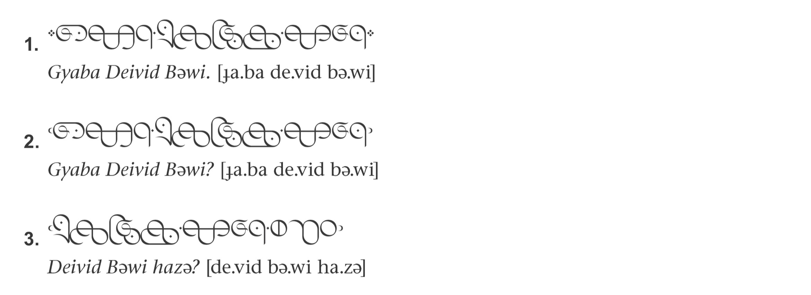

The pitch contours are markedly different, so I’ve recorded myself saying them and included images of the pitch tracks below:

As you can see, each intonational phrase has a part where it rises and a part where it falls. For statements in Irathient, the sharp fall is the first unstressed syllable after the focus (in this case, *gyaba*, “genius”). In yes/no questions, there is a rise, then the pitch stays high and lightly falls off at the end of the phrase. In WH-questions, the pitch rises very high and stays there until the unstressed portion of the final word (in this case, the last syllable), and then it drops *sharply*. As you can see, these are markedly different from English—and other languages have different patterns still. Even with the same language, patterns can differ. For example, some varieties of British English typically denote yes/no questions with a *falling* intonation at the end of the phrase—the exact opposite of American English.

Although questions are the most obvious place where intonation has a role to play in language, it is utilized in other constructions, as well. Consider the intonational patterns of the underlined elements in the following English sentences:

- <u>Him</u> *I like.*
- *I* *like* <u>Iron Maiden</u>*,* <u>Dream Theater</u>*,* <u>Sonata Arctica</u>*, and* <u>the</u> <u>Decemberists</u>*.*
- *You’re going* <u>home?!</u>
- *No, I’m going to the* <u>store.</u>
- *My sister,* <u>whom you all know as Natalie</u>*, loves* *mushrooms.*

Each of these constructions has a special intonation associated with it. There’s also the simple contrastive intonation we can use with any word in an English sentence, as shown below:

- *I ate the* <u>apple.</u> *(Not the banana!)*
- <u>I</u> *ate the* apple*. (It was me, not my sister!)*
- *I* <u>ate</u> *the apple. (I didn’t throw it away!)*
- *I* *ate* <u>the</u> *apple. (The one you begged me not to!)*

Again, while different languages will use different intonational patterns for different purposes, they all do something. And while there may be some universal tendencies (e.g. rising intonation with yes/no questions), I’d go so far as to say that the patterns are *entirely* language-specific, and that there are no universal characteristics for intonation crosslinguistically, outside this one point: Changing the intonation of something marks it in some way. If it’s usual to speak with a general fall, then marking something with a rising intonation will make it more noticeable, and vice versa. How a language will treat the fact that an item is more noteworthy than usual is language-specific.

The IPA doesn’t have any outstanding conventions for marking intonation in a phrase. It has two symbols: , which means the pitch basically goes up, and , which means the pitch basically goes down. They can be combined to form rising and falling intonational patterns. For me, this simply isn’t enough to capture the nature of intonation in a language, so I find using these things to be more trouble than it’s worth. When I’m working on shows like *Defiance*, I don’t even describe intonation patterns in the materials that go to the actors. Instead, I do two things. First, I break down every phrase syllabically and use all caps to indicate “high” tone and all lowercase to indicate “low” tone. Second, I record the line. The combination of those two things is usually good enough to get the right impression across.

If you’re creating a language on your own and you’re the only speaker, intonation is usually not high on the list of features to focus on, but intonational flavoring is well worth it (read: crucial) when it comes to making an authentic language.

### STRESS

**Stress** is a property of certain languages whereby some combination of pitch, vowel length, and/or volume is used to lend acoustic prominence to a particular syllable. Stress is usually a property of words, but in some languages (like French) it’s a property of phrases or clauses. Stress can be **lexical** (meaning that it’s different for every word and has to be memorized) or **fixed** (meaning that stress can be predicted by a number of language-specific principles). The best way to understand stress is to see how it works. Here are some English words stressed on the last or **ultimate** syllable, with stress marked using the IPA symbol for **primary stress** :

*alone* 

*portmanteau* 

*understand* 

Here are some English words stressed on the second-to-last or penultimate syllable:

*sofa* 

*illicit* 

*Mississippi* 

Here are some English words stressed on the third-to-last or antepenultimate syllable:

*mechanize* 

*infantilize* 

*un-American* 

In the last two sets you’ll see also that *sofa* and *mechanize* are stressed on the first or **initial** syllable. Given the general pattern of English, though, it’s more likely that the stress is assigned from the right edge, so it makes more sense to say the stress in *mechanize* is antepenultimate, rather than initial. For example, if you add more syllables, it’s easy to see the shift in stress, as with *mechanization*.

The mark  indicates primary stress. In addition to this, there is also **secondary stress**, which is marked with . However it’s realized in a particular language, secondary stress will be indicated in some lesser way than primary stress, but will have some sort of marking that will distinguish it from an unstressed syllable. Secondary stresses *tend* to radiate out from a syllable with primary stress, skipping every other syllable. For example, looking at *un-American* again, secondary stresses appear on the first and last syllables: . If you like the theory that  only appears in stressed syllables, syllables with secondary stress count, which is what licenses  in the first syllable, but not the second.

There are a couple of ways to design a good stress system depending on what kind of stress system you’d like to have. If you want to design a lexical stress system (i.e. stress placement is idiomatic and must be memorized), the only good way to do it is to evolve the system. The reason English has such a random stress system is because our words have lost a *lot* of sounds over the centuries, and we’ve borrowed a lot of words whose stresses we also borrow (sometimes). There were regular stress rules for English at one point, but with the way the language has evolved, it just threw up its hands and said “whatever.” English pretty much just sits around all day unwindulaxing on the couch in PJs watching reruns of *Chuck* (in other words, English is a lot like me). This is why English words are stressed all over the place: they derive from a *ton* of different regular patterns. To produce something like English, you have to emulate that history. You could also just decide randomly what syllables are going to have which stress, but the result will be artificial and unimpressive.

Fixed stress systems are a lot of fun. Certain stress systems in the world are very simple. In Finnish, for example, stress is always on the first syllable, and the first syllable is often special in some way. If you look at Finnish, you’ll notice a lot of the time the first syllable has either a long vowel, a diphthong, or a coda consonant. That’s not an accident. Finnish *loves* its initial stress system—so much so that certain dialects will actually geminate a following consonant if the first syllable is light and the next syllable is heavy. If anything, in Finnish placement of secondary stress is more interesting than placement of primary stress.

Aside from Finnish and languages like it, most languages have a series of complex rules to determine where primary stress is placed. For example, in Arabic, primary stress goes to the rightmost heavy syllable in the root (with the caveat that word-final case vowels have been dropped in many instances). If there are no heavy syllables, it goes to the antepenultimate syllable. Here are some examples:

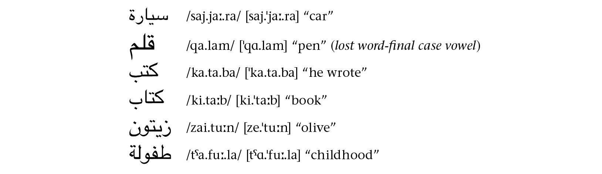

Most of the time it’s fairly predictable. But aside from simply saying what happens, how does this stuff actually *work*? How do Arabic speakers intuitively know what syllable to stress?

The best way I’ve seen to analyze fixed stress systems is with a linguistic framework called Optimality Theory (OT). Eric Baković was my OT instructor at UCSD, and though I’m not convinced that the framework is applicable to all areas of phonology, I think it works astonishingly well for fixed stress systems and level tone systems (more on those in the next section). There isn’t time to do a full introduction to OT here, but if you’re interested in seeing just what you can do with stress in a language, I recommend looking into it.

The main idea behind OT is that there are competing forces at work in any language, and what we produce orally is the *least bad* version of the language based on the various competing principles in our heads. So, with an Arabic word like 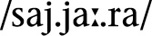 that could be stressed on any one of those three syllables, the version with penultimate stress, , is the least bad—or optimal—candidate. Why? Because Arabic likes to have the stress as close to the right edge as possible, but also likes heavy syllables to be stressed. Stressing those heavy syllables, though, is more important than getting the stress as far right as possible, so  is better than the impossible 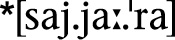 (we use an asterisk \* to indicate that a form is ungrammatical or unattested).

In order to create a system using competing candidates, one needs the appropriate set of tools. Below is a list of theoretical constructs that are particularly helpful in constructing fixed stress systems:

• Foot: A foot is a prosodic unit that many languages find useful in evaluating stress. A standard foot is composed of two light syllables, though it may have more. For example, *sofa* is a foot in English, and we write it in parentheses: . *Mississippi* has two feet: .

• Trochee: A trochee is a foot that has stress on the first syllable. For example, 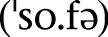 is a trochee in English.

• Iamb: An iamb is a foot that has stress on the ultimate syllable. For example, *ago*  is an iamb in English.

• Dactyl: A dactyl is a foot that has three syllables and initial stress. For example, *Canada*  could be analyzed as a dactyl in English.

• Anapest: An anapest is a foot that has three syllables and final stress. For example, *Illinois* 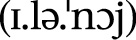 could be analyzed as an anapest in English.

• Amphibrach: An amphibrach is a foot that has three syllables and penultimate stress. For example, *Nevada*  could be analyzed as an amphibrach in English.

• Mora: A mora is a timing unit that can be useful in building stress systems. An open syllable with a short vowel is equal to one mora. An open syllable with a long vowel is equal to two mora. A closed syllable with a short vowel is also equal to two mora. Basically, each vowel unit is one mora, and each coda consonant is one mora. Some languages don’t count moras beyond two, but some do. It’s up to the conlanger to decide what works for a given conlang.

All right, I know this probably seems like a bunch of gobbledygook unless you’re familiar with poetics, but here’s what this buys you. Let’s make up some words (it doesn’t matter what they mean here, just that they have different shapes):

That’s enough for now. Where are these words stressed? If it’s lexical stress, it’s wherever the dictionary says they are. If it’s a super-regular system like Finnish, it’s always the same syllable. If it isn’t, this is where all our parameters come into play.

For example, let’s say that in this language . . .

1. A foot may consist of two syllables at most.

2. Extra syllables are not footed.

3. Feet are built from the right edge to the left.

4. Feet are iambic.

5. Main stress is on the right-most foot; secondary stress is placed on others.

Here’s our list again with stresses marked:

The result is that main stress is always on the last syllable and secondary stress on the antepenultimate syllable *except* in trisyllabic words. If you had a phonological rule that was sensitive to stress (like the  alternation we’ve seen in English), trisyllabic forms would behave differently from tetrasyllabic forms.

Now let’s change one thing. Let’s say instead of main stress being on the *right*-most foot it’s on the *left*-most foot. Here’s what happens:

And look at that! Everything is pretty much the same except that suddenly when you get to tetrasyllabic words, primary stress falls on the antepenultimate syllable. And all we did was make one *tiny* adjustment. Try taking some of the features listed above and making them *drastically* different. You’ll end up with a whole host of crazy stress patterns!

As with most linguistic frameworks, OT overgenerates, but for conlanging, that turns out to be a good thing, as it gives the conlanger more options. If operated correctly, though, any system generated with an OT framework should be *theoretically* *possible*, even if it doesn’t exist in the real world.

Allophonic rules that are sensitive to stress tend to work hand in hand with stress-placement rules, unless the effect is purely phonetic. So, for example, vowels becoming long in stressed syllables, vowels reducing or disappearing in unstressed syllables, geminating a following consonant to make a stressed syllable heavy—all of these types of changes occur because the point of stress is to make the stressed syllable prominent in some way. A conlanger can use these rules to their advantage in designing a system with the right sound.

### TONE

You’ve probably heard a thing or two about tone languages. You’ve probably heard languages such as Thai and Vietnamese described as “musical,” “singsong,” and “exotic” (all of this is the by-product of cultural stereotyping). It may also be the case that you’ve never heard of the tone languages of Africa—or America. In this section, I’ll give you the basics on tone, and give you an idea where to start if you want to create a tonal language.

First, **tone** in linguistics is the uniform association of pitch with phonological material used to distinguish meaning (either semantic or grammatical). The most famous example comes from Chinese, where four words with roughly the same phonetic representation—\[ma\]—have four different tones, and, consequently, four different meanings:

 *mā*  or \[ma55\] “mother”

 *má*  or \[ma35\] “hemp”

 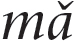  or \[ma214\] “horse”

 *mà*  or \[ma51\] “scold”

There’s also a fifth *ma* that gets its tone from context only. The four words above use the IPA characters associated with tone. The characters have a vertical line as a standard with a left-pointing bar that indicates the approximate level of the tone, with low being low and high being high. The characters are (in order of lowest to highest): , , , , . They can be put in order to indicate contours or vowel duration. These characters are often replaced with numbers, using 1 through 5 going from lowest to highest. Personally, I prefer the number system, so I’ll be using it throughout the rest of the book.

The first important thing to know about tone is that it is *not* the same as a musical scale. A note of G is a specific sound that can be further specified if you indicate the octave. Tone level in a tone language, though, is relative. If a word like \[ma55\] has a high tone associated with it, the tone will *always* be higher than a word with a dipping \[214\] tone in the same utterance, but it will *not* always be the same exact pitch. Such a thing requires perfect pitch, which not all people have. Furthermore, it’s unnecessary. Maintaining relative tone levels throughout a discourse is enough to distinguish meaning, and that’s what’s important for a language.

Second, regarding the number of tones, natural languages can run as high as nine, and as few as two. If there are two tones, they’re always high and low. Languages with more than three tones will have a contour tone of some kind. Languages that are claimed to have more than nine tones usually can’t produce minimal pairs with all examples (e.g. some tones will occur only with certain codas while others occur only without codas), so their status is debatable. It is theoretically possible for a human to distinguish each pitch that an ear can hear, but languages never come close to exploiting the physical limitations of humans. This is something that can be explored for engelangs which aren’t attempting to be naturalistic (or even user-friendly), but such a language would prove prohibitively challenging to use and understand.

Tone languages themselves seem to come in two varieties: contour tone languages and level or register tone languages. I’ll address each type briefly.

### CONTOUR TONE LANGUAGES

Though I’ll be introducing them here, I will start off with this caveat. If you’re a conlanger intending to create a contour tone language, it *must* be evolved. Based on what we know about the evolution of contour tone languages, there’s no way to do it faithfully without having a full history behind it. The same isn’t necessarily true of register tone languages.

With that out of the way, a **contour tone language** is a language that typically assigns a specific tone to a specific syllable, and that tone is fixed. Contour tone languages usually have at least four tones, and sometimes as many as nine. For a contour tone language, the word “tone” itself will often apply to a tone melody, rather than an actual pitch level. Most (but not all) contour tone languages in the world can be found in Southeast Asia. We’ve already seen the tones of Mandarin. Here’s an example from Thai:

  “paddy field”

  “nickname (i.e. this is someone in particular’s nickname)”

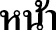 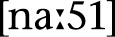 “face”

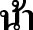  “maternal aunt”

  “thick”

Contour tone languages typically name the tones that are present in the language, and it’s known that a particular word has a particular tone. This is actually quite different from register tone languages, where tones may change for grammatical purposes, or when affixes are added. It’s also not uncommon for contour tone languages to have an overabundance of monosyllabic roots and words.

Though each syllable has a fixed tone, there are two exceptions to how tone is realized. Some words (*especially* function words) have no particular tone and simply adopt a tone from an adjacent word. In addition, the tone of other words that *do* have specific tones will change depending on what words precede or follow them. Both of these phenomena are instantiations of what we call **tone sandhi**. Tone sandhi rules differ from language to language, but they describe what happens when a word with a particular tone comes in contact with another word with a particular tone. Here’s an illustrative example from Chinese:

 *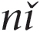* \[ni214\] “you” +   \[hao214\] “good” =  *ní * \[ni35.hao21\] “hello”

In Chinese linguistics, this is an example of the change that occurs when two “3” (or dipping) tones come together. The first “3” tone becomes a “2” (rising) tone, and the second “3” tone loses its rising intonation at the end. There’s nothing that would force this to happen phonetically: it just does.

If you’re interested in creating a contour tone language, it behooves you to examine the tone systems of various natural languages. Essentially, though, the sandhi rules are there for two reasons. The first reason is it makes pronunciation simpler. The second is it occurs as a natural result of compounding (i.e. making one word out of two distinct words). Now we’ll move on to register systems.

### REGISTER TONE LANGUAGES

**Register tone languages** have at most four tones, and often have as few as two. They are sometimes called level tone languages, because many such languages are analyzed as having *only* level tones, with all contour tones simply being combinations of the other level tones. Most register tone languages have a high (H) and low (L) level tone, though some will also have a mid tone. Those that have contours usually have only a falling (HL) tone or sometimes also a rising (LH) tone.

In many register tone languages, the low tone is treated as default, with other tones being treated as special. For example, some register languages put restrictions on how many high tones may appear in a root. Others may permit only certain tone contour patterns in a word. A common pattern is to allow only all H tones, all L tones, HL, or LHL. These types of restrictions vary widely from language to language, though, so it’s important to take a look at a variety of level tone languages if you’re a conlanger interested in producing one.

Here are some examples of words in the register tone language Hausa, spoken in Mali (tone pattern indicated in parentheses at the end and with diacritics; long vowels not marked):

*shekára*  “year” (LHL)

*shekarú*  “years” (LLH)

*surúká*  “mother-in-law” (LHH)

*surukúwá*  “mothers-in-law” (LLHH)

**  “to sneak up on” (HLH)

*kwáná*  “nighttime” (HH)

*kwanakí*  “nighttimes” (LLH)

*da*  “if” (L)

*dâ*  “previously” (HL)

I included a couple singular and plural pairs so you can see how the tones will shift around depending on the grammatical status of a word. This is far from uncommon. Take a look at these forms:

*tábbatá*  “to confirm” (HLH)

*tabbatáccé*  “confirmed (singular adjective)” (LLHH)

*tabbatattú*  “confirmed (plural adjective)” (LLLH)

*tábbátár* \[tab.ba.tar\] “to confirm (used with auxiliary)” (HHH)

The tones are moving about, but it’s clear that all of these word forms are coming from the same root. This isn’t something you’d see in a contour tone language. In effect, the difference between a contour tone language and a register tone language is the same as the difference between a lexical stress language and a fixed stress language. And, just as OT can be good for designing fixed stress systems, so can OT be good for designing register tone systems. When I was creating my register tone language Njaama, I kept the following questions in mind:

1. Inherent Tone: Will certain words have inherent tone? Which tones will be inherent: Just high? High and low?

2. Inherent Tone Melodies: Will tones or tone melodies be inherent? If the latter, which melodies? H, HL, LH, L, or more?

3. Default Tone: What’s the default tone? What happens to syllables that don’t have tone?

4. Repair Strategies: What happens when an affix with an inherent tone is added to a word and the result is an infelicitous melody? For example, say an H tone suffix is added to a word with an HL melody and the HLH melody is disallowed. What happens?

5. Contour: What happens when two tones are assigned to one syllable? What contour tones are allowed? If one is disallowed, what happens when that melody occurs on a single syllable?

How these questions are answered will determine the character of the register tone language. Also, it’s important to note that tone assignment can be sensitive to the tones of surrounding words. For example, the Hausa copula takes the opposite tone of whatever it follows:

*Sárkí ne.*  “It is a chief.”

*Yáro né.*  “It is a boy.”

In Njaama, subject and object pronouns are distinguished by a change in tone (*tekaané* means “saw” below):

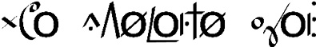  
*Wa* (L) *tekaané yáá* (H).  “I saw you.”

  
*Yaa* (L) *tekaané wá* (H).  “You saw me.”

It really depends on the language what the tone will or won’t do. Looking at a plethora of level tone languages can be confusing, so it’s ideal to take a look at one, figure out exactly how it works, and then move on to another. Everything that’s been discussed in this section is a possibility, though. In my opinion, register tone languages are among the most interesting languages I’ve seen, and I’d love to see more register tone conlangs.

### SIGN LANGUAGE ARTICULATION

Advance warning: This subject requires *its own book*. I’m going to try to fit as much as I can into a couple pages.

First, a **sign language** or **manual language** is one that uses the hands as its primary articulators. Sign languages also use facial expressions, eyebrow location, and other parts of the body in articulation. Sign languages have been in existence for as long as humans have had language and deafness has existed. Sign languages are full systems and are complete languages; they are *not* the same as the gesturing that occurs in spoken language or “body language.” Sign languages have the same expressive power as any spoken language—and, indeed, can do some incredible things that spoken languages cannot. The sign languages that exist in the world today are not based on spoken languages or in any way subordinate to them. This means that American Deaf signers who can read English are bilingual. Sign languages have their own histories that are independent from the histories of spoken languages. For example, modern French Sign Language (FSL) and modern American Sign Language (ASL) both have a common ancestor in Old French Sign Language (OFSL). British Sign Language (BSL) is unrelated to either. Sign languages are not used exclusively by deaf individuals. Many children of Deaf adults (CODAs) are fluent signers, as are other hearing individuals who have Deaf family members. Also, in American Deaf culture, *deaf* with a lowercase *d* refers to the inability to hear; *Deaf* with an uppercase *D* refers to the ability to sign.

That’s basically the first few weeks of a Deaf culture class in one paragraph. Now on to the languages themselves.

After I signed on to be David Perlmutter’s TA in his Deaf Culture course at UCSD, I found it disappointing, but not at all surprising, that no one had created a constructed sign language (CSL). The history of Deaf signing always lies somewhere below the surface of common knowledge. The lack of languages, though, wasn’t so much due to lack of interest, but due to a lack of ways to represent them. Video remains the best way to record and transmit a sign language when face-to-face communication is impossible, but it’s not (yet) convenient. This led me to create the Sign Language IPA (SLIPA), which was an attempt to encode the phonological structure of signed languages in ASCII.

Though the analogue isn’t perfect, sign languages can be described in roughly the same way as spoken languages if you assume the following:

Places (P) = Consonants

Movements (M) = Vowels

Handshape (HS) = Tone

Independent Hand Movement (IHM) = Secondary Articulations

In order to describe signs, then, I came up with this framework (think of the following as a syllable):

p\[HS\]Mp\[HS\]

Places are always written in lowercase; movements are always written in uppercase; handshapes are always written in uppercase and contained within brackets. Syllables are described as either starting or ending at a place via some manner of movement. A word can also be a place by itself if it has a secondary articulation.

To use a simple example, the word for “king” in ASL is as follows: The signer makes a \[K\] handshape (the ring and pinky fingers are tucked into the hand; the middle finger bends forward; the index finger is extended straight up; the thumb touches the middle finger) then touches their left shoulder (s_h). After that they pull their hand to their right hip (bl) in a low arc (E^G), as if they’re describing the path of a sash. To write that sign, you’d do the following (describing it from the signer’s perspective):

s_h\[K\]E^Gbl

It looks like something you’d see in a spam e-mail, but it does the trick. SLIPA isn’t the only transcription system that exists, but it’s the only one that will work with ASCII.

Now for what sign languages can do. First, they’re very much like spoken languages, in that they describe the world using nouns and verbs and place them in a particular order. Just like spoken languages, which rely on linear order, sign languages feature phenomena like affixation. For example, the ASL words for “teacher” and “student” each involve the signs for “teach” and “learn,” respectively, followed by a sign where one takes one’s flat hands and moves them from the shoulders down to the belt area. Thus, “teach” is a combination of “teach” and an agentive suffix, and “student” is a combination of “learn” and an agentive suffix.

Sign languages can also make use of their medium in ways that natural languages would never do. In ASL, for example, the sign for “week” requires the signer to make a \[1\] shape with their hand (like an English speaker holding up a number 1) and wipe it from left to right across the palm of their left hand. That’s the basic sign for “week.” Since handshape is used to indicate numbers, though, you can change the shape of your hand to indicate more than one week. I’m not sure how well it would work for numbers past ten, but it’s a simple thing to change the handshape and sign, in one motion, “two weeks,” “three weeks,” “seven weeks,” etc. Furthermore, since the region behind a signer is generally associated with the past and the region in front generally associated with the future, a signer can then pull their dominant hand backward at the end of a sign to mean “ago,” and push it ahead to mean “in the future.” Thus, this single sign can be used to indicate between one and at least ten weeks—*and* either in the past or the future, if the signer so chooses.

The equivalent of this in spoken language would be inflection. It would be as if you could say not only *week* and *weeks* in English, but *weekso* for “two weeks,” *weekt* for “three weeks,” *tweek* for “three weeks ago,” *fweek* for “four weeks in the future,” etc. This is something that a spoken language would *never* do because it’s needlessly complex. Since in ASL you *already* have to use a handshape in the production of the sign, though, why not change the handshape to add more information? Sign languages routinely take advantage of the medium of sign in ways just like this to make distinctions spoken languages never would. One of my favorite examples is the sign for “understand.” To form it, you face your hand toward you, raise it to your head, and then raise your index finger (kind of like a light going on). If you’re really annoyed at someone who’s explaining the same dumb thing to you for the fifty billionth time, though, you can go ahead and raise your middle finger instead as a way of saying, “Yeah. I get it, dude.”

This section on sign language is roughly like summarizing *War and Peace* in a haiku. If you’re a conlanger *at all* interested in producing a CSL, I strongly recommend you do a little investigating to see what sign languages can do so you can decide what you want to do with yours.

### ALIEN SOUND SYSTEMS

Humans can do some pretty amazing things with their mouths, hands, and bodies, but everything we can possibly do is still quite human. What if there was a being that didn’t have our unique physiology? How might they communicate?

At base, for language to work (as we understand it), one creature has to produce some sort of perceivable series of tokens, and another creature has to be able to perceive and decode those tokens correctly. As humans, we’re able to understand and work with our five senses, so an alien language would probably need to make use of at least one of those senses, unless you’re able to think up a distinct type of sense (thought doesn’t count). In order to determine what makes sense, you’ll first have to come up with an alien.

A lot of the aliens in television and film are humanoid, and differ from humans in ways that really have nothing to do with language. While Klingons have an extra set of lungs and forehead ridges, they still have one set of vocal folds, a vocal tract shaped like human vocal tracts, a tongue, an alveolar ridge, and ears. As aliens, they’re simply not *linguistically* alien enough to warrant anything other than a spoken human language—and the same goes for the aliens on *Alien Nation*, *Star-Crossed*, *Stargate*, *Roswell,* and most of the aliens in the *Star Wars* and *Defiance* universes.

If we’re focusing on speech and sound, in order to actually need different speech sounds, the aliens will need to have different vocal anatomy. How might one create a different vocal tract?

Now I’m no biologist, so I can’t answer questions about what’s plausible, but I do know how speech sounds work, so I can give you an idea. First, recall that our anatomy was not *designed* for language. It *allows* for it, sure, but our vocal tract is really for eating and breathing. The same will likely be true of aliens. (It would be a bizarre evolutionary trend to push *specifically* for speech, since language would already have to exist. These beings would need to have language but not be able to use it, so that those that *could* use it had a distinct, evolutionary advantage. It seems implausible, at the very least.) Since humans are the only creatures on Earth that can use their vocal tract to speak fluidly, it makes sense to take an in-depth look at it.

Other animals can produce speech sounds, of course. None of them can produce all the speech sounds humans use in language. Part of that is due to the facility of our tongue; part of it is due to the shape of the roof of the mouth; part of it is due to what we can do with our lips. A large part, though, is due to the acoustic properties of the sounds we can produce with our mouths. If the human vocal tract is modeled as a tube, this is what the tube’s standing wave’s first three resonant frequencies would look like:

Key (Top and Left): N = node, A = antinode, R = resonant frequency

Key (Bottom): G = glottis, E = epiglottis/pharynx, U = uvula, P = palate, A = alveolar ridge, L = lips

Let me explain what you’re seeing here. A sound wave travels from the lungs and out toward the world. When it hits the mouth, some of it escapes, but the rest bounces off the lips and heads back toward the glottis, but with opposite polarity. This can produce a standing wave in ideal conditions. The first wave (R1) of sound has the longest wavelength, and its first overtone (R2) has half the wavelength of the original, the second (R3) has a third the wavelength, the third (R4) a quarter, etc. For speech, the first three resonances are most relevant. Where the amplitudes of the positive and negative wave are equal, that’s called a node (N). Where the amplitudes are at their min and max, that’s called an antinode (A). The average male vocal tract is seventeen centimeters long.

Now here’s the key takeaway. If you look at where the nodes and antinodes lie for R3, they’re all at key points in the vocal tract. There’s a reason that a uvular stop sounds different from a velar stop, even though the surface is roughly the same. It’s the combination of all these factors that allows us to produce sounds that are acoustically distinct.

To design a different set of sounds, one has to design a different vocal tract—and perhaps a different set of ears. For example, while harmonics beyond the third can play a role in speech perception, it’s really just the first three that are most relevant for language. If beings had better ears, they might be able to make better use of harmonics beyond the third. The vocal tract, though, is the one that will require the most work. For example, two alveolar ridges in the mouth would add a passive articulator, but whether or not it would sound appreciably different depends on the length of the vocal tract, and whether or not that second ridge is at a node or antinode. Different holes in the tract (like a second nose with a passageway that led to a spot just below the pharynx) will mean that there will be different types of nasal-like sounds available. Depending on how well the tips could be controlled, a forked tongue might not be able to produce any stop consonants unless done with the tongue body. Also, imagine if a being had no tongue—or teeth—but two lips and two toothless alveolar ridges, one above and one below. What types of sounds might they be able to make?

If you’ve got plenty of resources, you can actually *design* a working vocal tract and simulate what it would sound like if there were a being with a nonhuman vocal tract. This is probably beyond the realm of practicality for most people (or even productions), but it exists as a possibility.

Moving beyond sound, what if there were an alien that didn’t have a mouth at all? What if it had one gigantic eyeball and forty-nine tentacles, seven of which were shorter and used as armlike appendages? This is the question Denis Moskowitz asked, and the language he created, Rikchik, is his answer. Rikchik is the language used by rikchiks, which look like this:

Since the seven tentacles rikchiks use to sign are the same, Denis created a language where words aren’t spelled out with the signed equivalent of phonemes; rather, words are combinations of a fixed set of shapes. Each word in Rikchik has four elements:

1. Four tentacles form the shape of a semantic category. These four tentacles are in the middle of the signing space.

2. One tentacle in the lower left-hand corner makes a shape that corresponds to the class of a word. This combines with the semantic shape to form a **lexeme** or word.

3. On the top of the signing space one tentacle tells you what role the word plays in the sentence (whether it’s a subject or object, etc.).

4. The last tentacle, on the lower right, indicates how many of the previous signs it “collects” (i.e. how many of the previous signs go together with the current sign).

In order to be able to convey the language, Denis had to create his own transcription system, so that a word looks like this:

The four lines in the middle are the four word tentacles that indicate that the word has something to do with crystal. The small circle indicates that this word doesn’t collect any others (it’s just a word on its own), and the swoosh at the top indicates that this word is a quality word (meaning that it defines the quality of whatever collects it). The last symbol, the Tetris-like shape in the lower left, indicates that the type of word it is is a modifier, so basically an adjective. Literally it would be “crystal-like,” but the actual definition is “sweet,” since rikchiks eat crystals as a kind of treat.

The “phonology” of Rikchik is defined by the shapes those seven tentacles can bend themselves into. While the glyph above is approximately what you will see, those are only the *ends* of the tentacles; the rest of them are connected to the body. The limitations, though, aren’t breath or tongue elasticity, but tentacle elasticity (how much they can bend and into what shapes). The language that Denis has built isn’t the only *possible* language that could be built using the physiology of the rikchiks; it’s just the one he built.

Once you move on to things like smell, taste, and touch, the question becomes what kind of language a conlanger wants to build. For example, if you consider the number of speech sounds the human mouth can make, it’s easy to construct languages that build words from sounds. If the number of possible sounds becomes too restrictive—or the time to produce them becomes too long—you may have to move away from words built up of arbitrary parts to a classification system like Rikchik uses. That, then, takes you beyond the realm of phonology, and into the realm of morphology and semantics.

The key point to remember in building a *truly* alien sound system (or sign system or smell system) is that there is no road map. Instead, the conlanger carves their own path using the basic principles we know about sound production, sound perception, object recognition, motor control, and physics. If you want to create a language for beings that can consciously change the color patterns on their wings, you need to become an expert in chromatophores. Once you know the science, then you can apply your knowledge of language to the being you’ve created and build on top of it.

 

Case Study

THE SOUND OF DOTHRAKI

I’m often asked what inspired me to create Dothraki, but I always find the question a little odd. The process I used for Dothraki—my first professional language—was different from any I had used before, because Dothraki was *not* my creation; the people did *not* spring from my imagination. It wasn’t as if I was inspired to create a particular type of language that ended up being Dothraki. Rather, it was as if I had been given a very small part of a puzzle that had been put together, and it was up to me not only to determine what the picture was, but also to create the rest of the pieces and then put them all together.

The bit that I started with was a set of Dothraki words and names from the first three books of *A Song of Ice and* *Fire*. This is a list of all those words (with George R. R. Martin’s spellings):

Unless I’ve missed any, that’s a total of fifty-six words, twenty-four of which are proper names. Ignoring grammar, the first job I had to do was figure out how to deal with the spelling. I knew going in that Martin didn’t care how fans pronounced the words and names in his books (though he does have a couple of pet peeves—like pronouncing *Jaime* ). Those of us who were applying for the Dothraki job didn’t have George R. R. Martin as a resource while creating our proposals, but it also didn’t seem appropriate to rely on him as a direct resource. Since he didn’t put out a pronunciation guide for his books, it was up to the fans to determine how things “ought” to be pronounced. My job, then, was to figure out how fans would most likely pronounce all the words on the list above. Figuring that the bulk of fans would be English speakers—and that the executive producers, Dave and Dan, were American—I decided to go with how I thought the words would be pronounced by an American English speaker.

That was the first constraint. The next was to filter that through the desire for this to be a foreign- and “harsh”-sounding language. That meant that, among other things, non-English consonants were *not* out of play. Here I was guided by the spelling. When George R. R. Martin uses spellings that are distinctly non-English, I felt that licensed the use of non-English sounds or clusters.

Finally, I was determined to treat the spelling as canon. I didn’t want to change the spellings unless it was simply to regularize them for the sake of consistency (so, for example, what was spelled *Cohollo* became *Kohollo*, since *c* is only used in the digraph *ch*). This would be the rough equivalent of changing a British spelling of *colour* to an American spelling of *color*, or vice versa. Otherwise, if two words were spelled differently, then they would be pronounced differently.

With those constraints in mind, I noticed two things:

1. The vowel *u* never occurs as a vowel; it only occurs in the cluster *qu*.

2. The consonants *p* and *b* are never used.

The only exception to the first point was in certain editions of *A* *Clash of Kings*, where *Vaes Tolorro* was misspelled *Vaes Tolorru*. This, though, was clearly a misprint. As for the second, if you take a careful look at the table above, you’ll notice that there are two key exceptions: *Pono* and *Bharbo*—the latter Drogo’s father. I missed these two names entirely when crafting my proposal. This would have consequences later on.

After these realizations, I started to make some decisions about the pronunciation of the various letterforms in the extant vocabulary:

• Vowels would have their cardinal pronunciations.

• Most consonants would be pronounced just like they looked—or, at least, to an English speaker. This meant that *j* would be pronounced  and *y* would be pronounced \[j\]. *Q*, however, would be pronounced \[q\], when occurring on its own.

• *Qu* would be reinterpreted as a sequence of \[k\] and \[w\], and would be respelled *kw* (though I also allowed the sequence \[qw\]).

• The spellings *th*, *sh*, *kh,* and *jh* would be pronounced \[θ\], , \[x\], and , respectively, and the latter would be respelled *zh*. Other instances of *h* would be pronounced separately as \[h\], no matter where it appeared in the word.

• All vowels would be pronounced separately, even when they occurred next to another vowel. This was inspired by a phenomenon I like in Spanish, where in a word like *creer*, there are two distinct vowel sounds: . This also meant I wouldn’t have to figure out a unique pronunciation for the *ae* digraphs which are ubiquitous in Martin’s works. They’d just be treated as *a* followed by *e*.

• *R* would work almost identically to *r* in Spanish. Phonetically, it would be a trilled \[r\] at the beginning or end of a word, and elsewhere it would be —unless it was doubled, in which case it would be \[r\].

• In order for the language to sound maximally different, all coronal consonants (\[t\], \[d\], \[n\], \[l\]) would be dental (pronounced with the tongue tip against the top teeth). If pronounced accurately, it would give the language a recognizably foreign sound.

• There would be no \[u\], \[p\], or \[b\]. I rationalized this by finding no instances of these sounds in the extant words (though this was a mistake!). My motivation for doing so was to give the language a unique sound (addition by subtraction, as it were). Plus, I dislike \[p\], \[b\], and \[u\]. I find them to be ugly sounds.

Having done this, I was able to put together the following phonetic inventory:

Most of the nasal consonants would simply be allophones of the phoneme /n/ occurring in specific contexts (i.e.  before \[q\], \[ŋ\] before \[x\], \[k\], and , etc.). Looking at the table I saw a couple of gaps, but the only one I decided to fill was adding  to the palatal column to pair with , which would be spelled *ch*. That’s the only sound I added to Dothraki that wasn’t present in the books, based on how I interpreted the spelling of the extant vocabulary.

For the most part, I think I did a pretty good job of matching fan expectations for the sound of Dothraki, though there are two deviations worth noting. First is George R. R. Martin’s pronunciation of the word *Dothraki*. He *consistently* pronounces it . This pronunciation is still, to me, unfathomable. I’m glad I didn’t know about his pronunciation before I did my work, and I think I did right by the fans by going with what I believe is the “usual” *doth-ROCK-ee* pronunciation.

One place where this didn’t work, though, was with the word *khaleesi*. Obviously if you look at that word, as an English speaker, you’re going to pronounce it —the way it’s currently pronounced by everyone—but in determining pronunciation, I had to adhere to my rule that George’s spellings were sacrosanct. By that rule, the word should be four syllables long, and the two *e*’s should be pronounced separately. This means its proper pronunciation is . Now, the change from \[x\] to  is to be expected (this is what we do with Greek borrowings into English, after all). If the word were *really* pronounced , though, then English speakers hearing it and turning it into an English word would naturally pronounce it either  or  (the latter as if it were spelled “kha-lacy”). Since Dothraki is a spoken language, not a written language, the pronunciation  should be impossible. It’d be like pronouncing *fiancé* 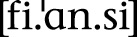; it just wouldn’t happen. Since we use the spelling system we do in the *real* world, though, English speakers will of course pronounce *khaleesi* . This is the one place I wish I would have made an exception. In order to reflect the real-world pronunciation, I should have changed the Dothraki spelling to *khalisi* and been done with it. Alas, it wasn’t to be, so the gaffe will live on, to my shame.

After determining the spelling system, the goal was to produce words that looked like the extant vocabulary. For example, if you know that *band* is a word in English, and it has the structure CVCC, you should expect for there to be other words like it, and there are: *cart*, *ford*, *lamp*, *sand*, *wind*, *bolt*, etc. Part of what will give a language its character is having a bunch of words that look like they obviously fit together. That’s what I did with Dothraki:

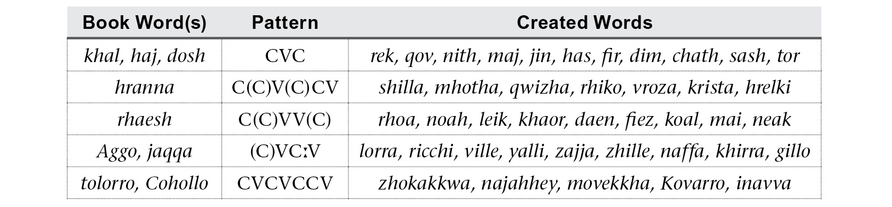

The next step was to ensure that a lot of high frequency words would have a kind of “harsh” or “foreign” sound. The first step was to design the stress system to ensure that the rhythm would differ from that of English. In English, for example, it’s rare for a word to be stressed on the last syllable, unless the word is borrowed, or a verb. In Dothraki, all words that end in a consonant are stressed on the last syllable. Referring to our discussion of stress systems, a Dothraki word looks at the right edge of the word to determine its stress. If the word ends in a consonant, the last syllable is stressed. If it ends in a vowel, it looks to the penultimate syllable. If that syllable is heavy, it’s stressed. Otherwise the first syllable is stressed. This would mean that several key words wouldn’t be stressed right (for example, *Dothraki* and *khaleesi* should both be stressed on the first syllable), but since they would be borrowings when spoken in English, that wasn’t a big deal. What was more important was ensuring that the dialogue had that characteristic Dothraki rhythm.

So given a normal Dothraki sentence like this . . .

*Lajak oga* *haz oqet ha khalaan.*

“The warrior is slaughtering that sheep for the khal.”

. . . the stresses of the first, fourth, and final words would be in the opposite place one would expect them to be if these were native English words.

The final step in making sure that the Dothraki-ness of Dothraki came through was to make sure some of the “harsh” sounds were used in high-frequency terms. Remember how I talked about brand identity? This is where it becomes important. What are the sounds that were characteristic of Dothraki? In my mind, it’s the doubled vowels, the voiceless velar fricative \[x\], geminate consonants, the trilled \[r\], the uvular \[q\], and the forceful \[h\], which often comes out as \[ħ\]. Since the audience of *Game of Thrones* would be hearing the language through the lines, I had some control over what Dothraki words they heard. I used that to my advantage.

First, I didn’t have to work very hard with \[x\]. Spelled *kh*, that sound is used in the words *khal*, *khaleesi,* and *arakh*, which are used frequently. Just to make sure I got as much mileage out of that sound as I could, though, I made the form of one of my objective derivational suffixes -*(i)kh*. This means that words ending in \[x\] are *extremely* common in Dothraki: *achrakh* “smell,” *mechikh* “roast quail,” *nesikh* “knowledge,” *sewafikh* “wine,” etc.

The sound \[r\] was already going to be common enough, but I created two productive suffixes that end in *r*. One was derived from George R. R. Martin’s word *khalasar*. This became a collective suffix that is used somewhat frequently: *astosor* “story,” *gimisir* “commoners,” *jereser* “market,” *lajasar* “army,” etc. I also created a new affix ending in *r* that forms abstract nominals, and *that* strategy is simply ubiquitous in Dothraki. It’s the strategy that turns *davra* “good” into *athdavrazar* “excellent,” and *jahak* “braid” into *athjahakar* “pride.”

I used a similar strategy with geminates, where turning a verb from a regular verb into a causative verb involves geminating the first consonant (e.g. *layafat* “to be happy” becomes *allayafat* “to please”), and also with double vowels (two grammatical suffixes attached to nouns are -*aan* and -*oon*), but with \[q\] and \[h\], I did something different. Neither sound really lends itself well to morphology, so instead I simply targeted words that either were high frequency or that I knew were going to be used in a script, and made sure to use \[h\] and/or \[q\]. For example, one of my favorite words, *mahrazh*, “man,” and the word for “horse,” *hrazef*, make prominent use of \[h\] in a position where English wouldn’t use it. A high frequency word that I knew would be used periodically is the word *qora,* which is the Dothraki word for both “hand” and “arm.” I also lucked out with the phrase “blood of my blood,” since one of the defined words from George R. R. Martin’s list was *qoy*, “blood.”

After this, though, it was all in the hands of the actors. Those actors who really put a lot of effort into it and took it seriously were the ones who were really able to sell it as a living, breathing language. Jason Momoa was a gift. Not even in my wildest dreams could I have imagined a better Drogo or a better ambassador for this language. Up to that point, he was the hulkiest, beefiest, dreamiest mountain of a human being ever to speak a created language, and he was speaking *my* language. Try calling *him* a nerd and see how far you get! Both his and Amrita Acharia’s performances sit near and dear to my heart.

Even though the process for Dothraki was a little different since I wasn’t creating a language from scratch, the principles I employed can be profitably reproduced in an original conlang. The phonetic inventory is just the starting point. The phonotactics, the stress system, and the common word endings are going to be what are most noticeable to the listener, since that’s what they’ll be hearing the most. A conlanger can use that to their advantage. By controlling those aspects of the language, they’ll be defining its character, and that’s what will give it a sound that is unmistakable and all its own.
