# CHAPTER II

# Words

### INTRODUCTION

When I was an undergraduate, an English professor of mine named Nikolai Popov turned me on to a book by William Butler Yeats called *A Vision*. He described it as one of the strangest books ever written, and, having now read it, I must admit he was right. As a graduate student I picked up a book purporting to analyze the work, hoping to gain some insight. In the introduction, the author wrote that he couldn’t begin to analyze a work like *A Vision* without first defining what a *book* was.

After reading that, I rolled my eyes and put the book back. I can’t *stand* stuff like that: simple questions that winkingly suggest they’re not as “simple” as they seem.

So it’s not without some irony and crow-eating that I now pose to you this question: What is a word?

It’s an odd question, because we all know what a word is, even if we’ve never had to define the concept explicitly. A word is what’s printed on paper or a screen that has blank space around it. Yet if one is to start examining claims like the number of words some such language has (English has a million words, say “sources”), one needs criteria.

Let’s go about it systematically. Is *cat* a word? You bet. No question. How about *cats*? Of course, it *is* a word, but it shouldn’t count as a separate word, right? If it did, you’d have to take all the nouns in English and double them to get a real word count. So even though *cats* is a word, we have to believe it’s not a separate word from *cat*, since it’s just the plural version of that word.

So what about *person* versus *people*? In one sense, *people* is just the plural of *person*. But you could also say something like *The* *Dothraki are a warlike people*. There it’s clear *people* is being used slightly differently. Consequently, we’ll have to assign wordhood to at least one sense of “people.”

And certainly the same logic that treats *cat* and *cats* as versions of the same word would also treat, say, *sleep* and *slept* as versions of the same word. *Slept* is just the past tense of *sleep*, and shouldn’t really count as a separate word. But what about *excite*, the verb, versus *excited*? The two are obviously related, and in certain circumstances, *excited* is the past tense of *excite*, but it’s also an adjective that, while related, is still different enough that it feels like it’s a separate word. So we’ll count that.

How about a *bank* where you keep your money and the *bank* of a river? Incidental homonyms. Obviously separate words. But what about a *plate* that you eat off and a tectonic *plate*? They’re likely related, but they refer to very different things. You might say the latter is a secondary definition of the former, but is it different enough to count as a different word? And how about an *email* versus the verb *email*? Clearly related, but they belong to different grammatical realms.

And what about all the new product names that keep entering our language? I’d say *kleenex* is enough of a word that it doesn’t even need to be capitalized anymore—and the same with *xerox*—but are we there yet with *google*? Can you still *TiVo* something if you don’t have TiVo, or do you have to say you’re *DVRing* it?

Also, is *one* a word? Sure. *Two?* Of course. *Twenty-three?* Yes . . . But if that’s the case, doesn’t English then have an infinite number of words . . . ?

And that’s just English. English is easy. Take a look at some of these words from the Siglitun variety of Inuktitut:

*tuktu* “caribou”

*tuktuaraaluk* “little caribou”

*tuktuaraalualuk  
*“pitiful old little caribou”

*tuktuaraalualutqiun  
*“spare pitiful old little caribou”

*tuktuaraalualutqiunnguaq  
*“spare pitiful old little toy caribou”

*tuktuaraalualutqiunngualiqiyi  
*“peddler of spare pitiful old little toy caribous”

I could keep going. I haven’t even used any of the verbal suffixes. If I were to add *-liaqtuaq* to the end of that last word, for example, I’d produce a word that meant “He went hunting peddlers of spare pitiful old little toy caribous.” Now you might say to yourself, “But that’s an entire sentence!” In English, it is. In Inuktitut, it’s a word. In fact, if you take any piece of discourse in a language like Inuktitut, the majority of the words will be used exactly once. In English, by contrast, most words are used multiple times (consider we have words like *the*, *a*, *is*, *and*, *but*, etc.).

So where does that leave us on the definition of *word*?

The answer, of course, is that what a word is is dependent both on the language one is examining and on the culture surrounding that language. Consider how evidence for wordhood may differ coming from a language with a writing system versus one without. In creating a language, it’s up to the conlanger to decide not only what counts as a word, but how words themselves will be used—how grammatical features like tense, number, and aspect will be reified. In linguistics, this is what’s known as **morphology**, and it’s where all the action is.

### KEY CONCEPTS

Before we get into it, let me introduce some key concepts. First, morphology is divided into two separate but related phenomena: **inflectional morphology** and **derivational morphology**. Inflectional morphology has to do with changes to a word that don’t affect its grammatical category (i.e. whether it’s a noun or verb or an adjective). An example of inflectional morphology would be noun pluralization. It doesn’t affect the base meaning of the noun, and doesn’t change its categorical status in any important way: it just tells you that there’s more than one of the noun. Derivational morphology is the opposite. When you change a word like *graphic* (a noun) to *graphical* (an adjective), you’ve *derived* the second word from the first. We’ll be looking at inflectional and derivational morphology separately in this section.

As we examine morphology, though, we’re going to see a couple of word changing strategies again and again. Here’s the vocabulary you’re going to need to be able to discuss them:

• Affix: This is a cover term for any type of phonological string that’s been added to a base word resulting in a new, modified word. Prefixes, suffixes, circumfixes, and infixes (defined below) are all types of affixes. Affixes are generally *not* independent words, and must appear attached to a base word.

• Suffix: A suffix is an affix that’s added to the end of a word. In English, the plural -*s* is an example of a suffix. Schematically, you can say that *cats* comprises a base *cat* and the suffix *-s*.

• Prefix: A prefix is an affix that’s added to the front of a word. In English, the negative *un-* is an example of a prefix. Schematically, you can say that *unpopular* comprises a base *popular* and the prefix *un-*. Prefixes are crosslinguistically common, but while there are languages that are exclusively suffixing (i.e. languages that have no other type of affix but suffixes), *no* natural language has been found to be exclusively prefixing. Inuktitut, the language shown in the introduction to this chapter, is an example of an exclusively suffixing language.

• Circumfix: A circumfix is a combination of a prefix and a suffix. Unlike the word *unbridled*, which has an independent *un-* prefix and a *-d* suffix, a circumfix *requires* both parts to form a full word. A marginal example from English is the word *elongate*. There is no word *longate* or *elong*: you *must* say *elongate*. Schematically, you can say that *elongate* comprises a base *long*, the suffix *–ate,* and the prefix *e-*. Circumfixing is not common, crosslinguistically, but it’s not rare. Georgian is a language that has a number of circumfixes. A common Dothraki circumfix is one that forms an abstract noun from a base word. For example, *jahak* is the Dothraki word for “braid”; *athjahakar* is the Dothraki word for “pride.” Neither *athjahak* nor *jahakar* is a licit word in Dothraki.

• Infix: An infix is an affix that is inserted into the middle of a word. The only marginal examples that exist in English are slang terms like *infreakingcredible*, or the two types of *Simpsons* infixation: Flanders-style (*scrumptious* \> *scrumdiddlyumptious*) and Homer-style (*saxophone* \> *saxomaphone*). Schematically, you can say that *saxomaphone* comprises a base *saxophone* and the infix *-ma-* (sometimes also written ‹*ma*›). Though *quite* rare, there are languages that use infixes. Tagalog is one such language, where the focus of a sentence is sometimes determined by a change in infix (it also has other types of affixes). For example, *bumilí* means “to buy,” with a focus on the person who’s buying something, while *binilí* means “to buy,” with a focus on the thing that’s purchased. The root is *bilí*. Infixes can often show up as prefixes or suffixes depending on the shape of the word. For example, if *-um-* is added to a word beginning with a vowel in Tagalog, it appears as a prefix. You can see this with the root *isip*, which becomes *umisip*, “to devise,” when *-um-* is added. It is my *strong* *recommendation* that infixes *not* be used in an inflectional or derivational system *unless* the language is being developed from a proto-language. It’s extremely difficult to create naturalistic infixation without evolving a system that supports it.

• Apophony: This is a cover term that refers to any type of word-internal process that is used to effect a change in a word (either inflectional or derivational). A nice example from English is the irregular plural of *goose*, *geese*. Rather than adding an *-s*, the interior of the word itself changes. There are many different types of apophony: vowel change, initial consonant change, final consonant change, tone change, stress change . . . Sometimes it’ll even be a combination of these. There should still be some part of the word that is identifiable, though, as with the initial  and final \[s\] of *geese* and *goose*. Schematically, there’s no specific way to deal with phenomena like this. The description tends to be language-specific.

• Suppletion: Suppletion is when two forms that *should* be related are not related at all. A great example from English is *good* and *better*. Take any other small adjective and compare similar forms to see how they’re related systematically—for example, *black* and *blacker*, *light* and *lighter*, *short* and *shorter*, etc. There’s absolutely no systematic relationship between *good* and *better* aside from the fact that they belong to the same paradigm (i.e. just as *shorter* means “more short,” so does *better* mean “more good”). In discussing forms like these, you’d say that *better* is the suppletive comparative form of *good*. Suppletion *only* arises from a language’s unique history, so one should be careful in using it in a naturalistic conlang.

• Reduplication: Reduplication is when part or all of a word is repeated for morphological reasons. Sometimes reduplicated forms are reduced or changed in some way as part of the process. For instance, words like *lovey-dovey*, *ooey-gooey*, *hanky-panky*, *super-duper,* and *hoity-toity* are all examples of reduplication in English. A separate pattern is the mocking *shm*-reduplication, for example *mall-shmall*, *game-shmame*, *dog-shmog*, etc. Just about every language uses reduplication in some form. When an entire word is repeated (e.g. “Is it *big* big, or is it just big?”), that’s called full reduplication. Other types of reduplication are called partial reduplication, and the reduplicated portion is often referred to as an affix, depending on where it appears in the word (Doug Ball’s Skerre uses a reduplicating prefix to indicate plurality in some nouns, e.g. *keki* “son” ~ *keekeki* “sons”).

• Paradigm: A paradigm is a set of inflectional forms. For example, *short*, *shorter,* and *shortest* form a paradigm for the adjective *short*. You’d illustrate it like this:

• Exponence: This is a cover term to refer to the reification or instantiation of any inflectional or derivational category. So, for example, in *cats*, the exponence for the plural is -*s*. In *geese*, the exponence is the apophony whereby *oo* becomes *ee*. It’s more general than the word “affix,” as it can refer to any affix or any other change effected in a word. If a word has no change (e.g. *hit* in the past tense is *hit*), then you’d say the word has no exponence for the category in question (in the case of *hit*, for the past tense).

I’ll be making reference to all of these terms in the sections to come, so feel free to bookmark this section. Now let’s move on to inflectional morphology!

### ALLOMORPHY

Before we delve into the exciting world of grammar (and it *is* exciting. Don’t you snicker! You bought this book!), let me touch very briefly on **allomorphy**. Allomorphy is to morphology as allophony is to phonology. The same principles introduced in the allophony section apply to allomorphy. The difference is that while allophony applies to sounds, allomorphy applies to grammatical realizations. Often allomorphy is based on the phonology, so it can be confusing to decide what type of phenomenon you’re looking at it. Consider the three main forms of the plural suffix in English:

*cats* /kæts/ = \[s\] suffix

*dogs*  = \[z\] suffix

*thrushes*  =  suffix

There are three different suffixes here, but I think English speakers will all agree that it’s really the same suffix. The rule is you get the  suffix after ; the \[z\] suffix after other voiced sounds; and the \[s\] suffix after other voiceless sounds. Thus, the phonology plays a part in this morphological rule. But this isn’t something that you would say about the sounds /s/ and /z/ in English. This is something you’d say about the plural suffix (or the third person singular present tense suffix, as it’s identical).

Perhaps a more obvious example of how phonology plays a part in determining grammatical exponence is the comparative *-er* suffix. Take a look at these pairs:

*sad* ~ *sadder*

*big* ~ *bigger*

*nice* ~ *nicer*

*strong* ~ *stronger*

*weak* ~ *weaker*

Now compare them to these (note: an asterisk \* means the form is ungrammatical):

*resplendent* ~ \**resplendenter*

*magical* ~ \**magicaler*

*hilarious* ~ \**hilariouser*

*important* ~ \**importanter*

As English speakers, we know we can’t say the forms on the right. Instead we have to say *more resplendent* or *more important*. How do we know whether we can use -*er* versus when we have to say *more x*? A simple characterization of just these data (this isn’t the complete answer) is that you can use *-er* with adjectives that are one syllable long; otherwise you have to say *more x*. Consequently, the formation of the comparative in English is dependent upon the phonology of the word (how many syllables it has), but its realization is pretty random (i.e. we wouldn’t want to say there’s any systematic *phonological* relationship between an -*er* suffix and a separate adjective *more*). That’s what makes the rule morphological.

And sometimes the allomorphy of a given category (say, plural) isn’t even really phonological. Consider the following singular/plural pairs:

*kid* ~ *kids*

*goose* ~ *geese*

*child* ~ *children*

*fish* ~ *fish*

We understand that all the forms on the right are plural forms, but the pairs don’t look anything alike. In this case, they are all realizations of plurality in English; they just take different shapes depending on the noun being pluralized. That is, the forms are irregular and must be memorized, but there’s no difference in the *meaning* of these plurals, so *geese* is to *goose* as *kids* is to *kid*. It doesn’t matter that the form is weird: it’s nothing more than a plural noun.

Most morphological categories exhibit some kind of allomorphy. It’s actually pretty rare to find one that always has the same realization. They exist (like -*ing* in English. Doesn’t matter what word you add that to; it’s always -*ing*), but more often than not the form of a category will change for some word—sometimes based on the phonology, but sometimes not. Keep this in mind as you go through this chapter.

### NOMINAL INFLECTION

For season four of *Game of Thrones*, I ran into a bit of a snag. For one particular scene, I was supposed to translate the sentence, “You stand before Daenerys Stormborn, the Unburnt, Queen of Meereen, Queen of the Andals and the Rhoynar and the First Men . . .” So I went about doing that. Notice that in the sentence above, Daenerys Stormborn is the object of the sentence (i.e. she is the one stood before; she’s not the one doing the standing). In English all that means is that the name *Daenerys Stormborn* has to come after the word *before*, and that the whole phrase will probably come after the verb. Not so in High Valyrian. Here’s what the first part of that sentence looked like when I first did the translation:

*Daenero Jelmāzmo naejot iōrā* . . .  

Why? Because the High Valyrian word *Daenerys* was the object of the postposition *naejot*, which means “before.” Consequently, the final *-ys* in *Daenerys* had to change to an *-o*. That’s just the way the grammar of the language works.

So I recorded that and sent it off. A little while later I got an email back from Dave and Dan. They said that they understood that I was just translating, but that the name *really* had to be *Daenerys*, so fans would recognize it. I told them that this was impossible, because of the construction that was being used. I said if we shifted the focus and said instead of “You stand before Daenerys” that “Daenerys sits before you,” I could swing it. They said that was fine, and so I changed the translation of the first part to the following:

*Daenerys Jelmāzmo aō naejot dēmas* . . .  

I also changed the English line so that the translation was appropriate and sent that all off.

I got another email from Dave and Dan later. They said the actors were confused because the translated lines didn’t match the lines in the script. And, indeed, that is what happened. Though *I* had changed the translation (I imagined the subtitle would read “Daenerys Stormborn sits before you” in English), they kept the line as written (“You stand before Daenerys Stormborn”). Dave and Dan said they were fine with the translation, but that the *English* line had to remain the same; it didn’t matter if the translation didn’t match up exactly—at which point I was like, “*Ohhhhhhhhh* . . .” (and I may have even typed that up in my email response).

It was much ado about nothing, really, but the tiny little linguistic detail that precipitated it all was the suffix on the name *Daenerys*. Dave and Dan—and most folks working on *Game of Thrones*—are native English speakers, and as native English speakers we’ve come to expect certain things from language. One of those things is that the form of a noun is invariant. Yes, a noun will change when it’s pluralized, but otherwise, nouns don’t change—and that goes double for names. Here, for example, is my name being used in a bunch of different grammatical contexts:

*David loves the cat*. (Subject)

*The cat loves* *David*. (Object)

*The cat often brings her string to David*. (Indirect Object)

*The cat is a fan of David*. (Possessor)

*The cat sits on David*. (Location)

*The cat likes to* *walk downstairs with David*. (Companion)

*David! It’s four a.m. and the cat is meowing! Go feed her!* (Addressee)

As you can see above, the name *David* never once changes its form: it always looks and sounds exactly the same. If this is your linguistic baseline, there’s no reason to ever imagine that a language *could* do anything different. But what if *David* were a name in High Valyrian—say, *Davidys*? Turns out the name would look quite a bit different in those exact same contexts:

*Davidys*  (Subject)

*Davidi*  (Object)

*Davidot*  (Indirect Object)

*Davido*  (Possessor)

*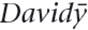*  (Location)

*Davidomy*  (Companion)

*Davidys*  (Addressee)

To give you an example of what this would look like in context, let’s take the sentence “The cat sits on David” and translate it into High Valyrian, along with its opposite, “David sits on the cat” (note: I don’t recommend this). Remember that the only difference in meaning between these two sentences is who’s sitting on whom:

*Kēli* is the word for “cat” above (and, yes, the name of my cat is Keli. I can do that because *I’m the* *conlanger* \[that sound you just heard was the mic dropping\]). Here the main difference between the two sentences is the form the nouns take. In fact, you could put the nouns in the same linear order in both sentences without changing the meaning. So, for example, * kēli dēmas* would still mean “The cat sits on David.”

Though High Valyrian and English differ in how they mark their nouns, all languages have some strategy for indicating (or not indicating, as the case may be) three core grammatical categories (though there are others): number, gender, and case. We’ll look at each of these in detail below, and then I’ll comment on how some other grammatical categories are reified in nouns.

### NOMINAL NUMBER

**Grammatical number** is a good place to start for nouns, as I believe it’s the simplest concept to grasp. All grammatical number refers to is how many of a particular noun there are, and how that is marked (or not marked) on the noun. In English, it’s fairly simple. An unmodified noun is considered to be singular, and a noun with an -*s* on the end is plural, meaning there’s more than one. There are other pluralization strategies, of course, but regarding meaning, that’s all there is to it. If we say *cat*, it refers to exactly one feline entity; if we say *cats*, it can refer to two, three, or an infinite number of cats—pretty much any number of cats except for exactly one.

Lots of languages do the same thing, but is that really all there is to nominal number? Not by a long shot! Outside of singular and plural, here are some other nominal numbers attested in natural languages:

• No Marking: Some languages make no morphological distinction between singular and plural outside of a couple instances. Nouns in Mandarin Chinese are neither singular nor plural; the only place where plural marking exists obligatorily is in the pronoun system. There, the suffix  \[men\] is added to the pronouns for “I”  w \[wo214\], “you” 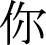  \[ni214\], and “she/he/it” 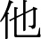 *tā* \[ta55\] to form their plurals “we” 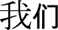  \[wo21.men4\], “you (plural)” 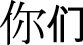  \[ni21.men4\], and “them” 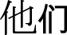 *tāmen* \[ta55.men2\]. This suffix can be used with certain other nouns in certain contexts, but this marking is always optional.

• Dual: A dual number refers to exactly two of some item. It’s fairly common in the world’s nominal systems. In Arabic, for example,   is “man” and 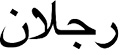  is “two men” (cf. 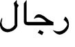  “men”).

• Trial: A trial number refers to exactly three of some item. It’s *extremely* uncommon in the world’s nominal systems. There are no attested systems that encode specific numbers beyond three. In Kamakawi, a language of mine,   is “the egret”;   is “the two egrets”; 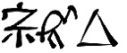  is “the three egrets”; and   is “the egrets.”

• Paucal: Paucal number refers to a few of some item, but not to a specific number. This is similar to the word “few” or “several” in English. In High Valyrian, the paucal is distinguished from the singular, plural, and collective numbers. For example, *vala*  is “man”; *vali*  is “men”; *valun*  is “some men,” and *valar*  is “all men.”

• Collective: The collective number refers to a large group of items. Sometimes these items are treated as the sum total of those items, while other times it refers to a large group as a unit. Using High Valyrian again, *valar* is “all men,” but *azantyr*  is “army” (cf. *azantys* , the singular, which means “knight”).

• Singulative: For languages that routinely mark groups of things or masses, the singulative refers to one of a group of items or a substance whose *most basic form* is plural or masslike. In Arabic, a word like   refers to trees in general as a mass; by adding a feminine suffix, you get  , which refers to a single tree. A rough English analogue might be *rice*, which is simpler than *grain of* *rice*.

• Distributive: Distributive number refers to a plural entity that’s evenly divided among a group. So, for example, if there are three dogs and each one has a leash, then the three dogs have leashes. If I own three leashes independently of any dogs, then I also have leashes. Some languages, though, would mark the second example as plural, and the first as distributive, since in the first example each dog has *one* leash. In Southern Paiute, distributive number is marked with initial partial reduplication. Compare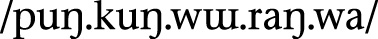 “our horses (that we all own collectively)” to  “our horses (each of us has one horse).” Here, the reduplicative prefix is used to indicate that each member has one horse, and ownership is not shared. Distributive number *frequently* co-occurs with possessive morphology.

Those are the categories that one finds in natural languages. Some languages may distinguish different types of paucals or different types of collectives, but that’s about it. Obviously in an alien language one could do plenty of things (tetral, quinqual, sextal, etc.), but in natural languages, that’s all we find.

Number Applicability

Having explicated all these systems, there are always certain instances where number marking appears to have trouble appearing. It will vary from language to language and lexeme to lexeme, but there are three categories you’ll want to pay attention to: **animacy**, **definiteness**, and **mass nouns** versus **count nouns**.

In Dothraki, only animate nouns get plural marking, and this is fairly common for languages that make animacy distinctions of any kind. For example:

It’s not the case that the singular is the same as the plural, as with English *deer*: the entire class of inanimate nouns makes no singular/plural distinction whatsoever, despite the existence of the plural category elsewhere in the language.

In many languages that make a distinction between definite and indefinite, an indefinite noun either can’t be realized as plural, or changes in some important way in the plural. In English, the presence of the definite article *the* has no bearing on the form of a noun in the singular or plural (e.g. *the cat* vs. *the cats*). The indefinite article *a*, though, can only accompany a singular noun (e.g. *a cat*; never \**a cats*). This is not the case with all languages. French, for example, allows indefinite plural nouns:

The translation we usually use for French *des* is “some,” but the actual connotation is slightly different (*some* has some peculiar properties in English). The takeaway is that it’s actually not surprising for a language to either include or exclude an indefinite plural form.

Finally, many languages make a distinction between *mass* and *count* nouns. Some English mass nouns are *water*, *blood*, *grass*, *mercury*, etc.—things that denote substances. They appear to be singular in form, but they tend to lack plurals, something count nouns do not. Whether or not a noun is a mass noun is language-specific, just as the way that mass nouns are treated in the grammar is language-specific. In English, for example, when mass nouns are forced to be count nouns, they take on a separate connotation. Here are some examples:

Some count nouns can be turned into mass nouns by removing the articles, turning them into substance-like nouns:

Pluralizing a mass noun in English always results in some sort of meaning shift (e.g. “I came to Casablanca for the waters,” “The many grasses of North America,” etc.). In their bare forms, mass nouns are treated as uncountable, boundless substances. Many idea nouns are treated in just this way (*life*, *love*, *happiness*, *death*, etc.).

### GRAMMATICAL GENDER

**Grammatical gender** gets a bad rap for the wrong reasons. People see examples like this . . .

*niño*  “child” (masculine gender, Spanish)

*vache*  “cow” (feminine gender, French)

*Mädchen*  “girl” (neuter gender, German)

. . . and cry, “*Sexism!*” And, listen, I will not say such cries are without merit, but first let me lay out all the relevant facts.

To understand what grammatical gender is, it’s important to understand *why* the original grammarians used the term “gender” when referring to the systems one sees in the Indo-European languages (Spanish, French, German, Greek, Russian, Latin, Sanskrit, etc.). The meanings of the words in these various languages tend to obscure the original intent. The idea behind calling these systems gender systems was to point up the fact that nouns in a given language are “born,” in essence, with a specific set of morphological properties. These morphological properties place the noun into one of however many genders the language has. In other words, it’s just like when the doctor holds up a newborn and says “It’s a girl!” based on whatever biological features are present (and the cultural associations the doctor’s culture places on those features). That’s what happens with words in languages with gender.

So a language like Spanish isn’t saying that there’s anything particularly feminine about tables or masculine about ceilings: the meanings of the words have nothing to do with it. The language is saying that the noun *mesa* is of a different gender from the noun *techo*, because *all* nouns *must* belong to one or the other gender.

What has confused things is the fact that the languages we commonly encounter in the Western world (i.e. every Indo-European language, and also the unrelated Semitic languages like Arabic and Hebrew) have sex-based gender systems (i.e. they all have a masculine and feminine gender, and some have a neuter). *Not all languages have gender systems* *based on sex*. A lot do, but it just so happens that the ones Westerners run into the most are pretty much all related to one another, and so, of course, they have the same genders (or none, if they’ve gotten rid of them, like English has).

Okay, if you’ve followed all this, then the remaining objection to the term “gender” would be recent discussions of the social construction of gender—that gender isn’t based purely on one’s biology, and is, in fact, a social construct. A better linguistic term than “gender,” then, might be “species” (instead of nominal gender, we’d call it nominal species), but I doubt that linguists will readily adopt the term. It’s too entrenched.

Another term used instead of gender is the term **noun class**. Unfortunately, there’s been some confusion in the field about the use of the term. Some linguists distinguish between gender and noun class; others say they’re synonymous. The term “noun class” tends to be used with Bantu and Australian languages, while “gender” is used with Indo-European and Semitic languages. Personally, I don’t care what it’s called, I just care what it does. I’ll probably use both terms in this section depending on the language. What will be important to look at will be how a specific system works, not the terminology, so if you’re able to follow that, you’re fine.

The main reason that gender systems exist (or survive, rather) is that they build redundancy into the language. Here’s what I mean by that. Take a look at the following Spanish sentences and their English translations:

*<u>Los</u> <u>libros</u>* *son rojos*. “<u>The books</u> are red.”

*<u>Las tarjetas</u> *son* *rojas**. “<u>The cards</u> are red.”

Let’s say you didn’t hear any of these sentences very well. How much could you pick up just by the endings? In English, you get two clues that the subjects of the sentences (underlined above) are plural. One is the verb *are*. If the sentence were singular, you’d have to use *is*. If you missed the first noun, by hearing *are*, you’d know the noun was plural. You also get the plural -*s*. If you miss most of the noun, the -*s* tells you the subject is plural.

Now let’s look at the Spanish. In Spanish, the word that translates as “the” is marked for plural (basically the -*s* ending); the subject is marked for plural (the -*s* ending again); the verb is conjugated for a third person plural subject (*son*), and the adjective has a plural ending, as well (-*s* again). There are a *ton* of cues that tell you the subject is plural. Even more, though, in the first sentence, the form *los*, the -*o* in *libros*, and the final -*o* in *rojos* tell you the subject is masculine. In the second sentence, the form *las*, the final -*a* in *tarjetas*, and the -*a* in *rojas* all tell you the subject is feminine. So if you’re listening to someone say either of these sentences in a noisy environment, the redundancy built into the language will give you multiple opportunities to decode the meaning of the sentence—opportunities you don’t have with English.

Though redundancy can be annoying, in language, it makes the message stronger. Grammatical gender exists in order to force the words around it to agree, and the agreement is what increases the number of cues for the listener. Of course, this does mean that the language learner has to *learn* all the genders, and must memorize additional agreement patterns and the gender of every single noun in the language, but, well, life is rough.

When considering employing a gender system, it’s important to understand that gender systems wouldn’t exist if they weren’t reified in some way. For example, we could say that English has a gender system, and assign every single word to a gender (*ship* is feminine, but *boat* is masculine, because why not?), but it wouldn’t take, because we don’t have adjectival agreement or verbal agreement that’s sensitive to gender. The most we have is a distinction made in third person singular pronouns, and that usage is already inconsistent. We have a *long* history of referring to inanimate objects that we admire as *she* (cars, boats, computers, etc.), and if you refer to anything as *he*, it’s somehow considered to be cute (like “Don’t you talk to him that way!,” said of a particularly charming toaster). In order for a gender system to work, the grammar has to make use of it in some crucial way, otherwise it’ll just fall by the wayside (looking at you, French).

Finally, gender systems are *mandatory*. If you’re creating a language where each noun is a member of one of four genders, but you can remove the suffix to use a genderless form of the noun, it’s not a gender system. Rather, it’s like what we do in English, where we can make reference to a *male aardvark* or *female aardvark*, but the grammar takes no notice of it.

Now let’s take a look at some systems.

• Sex-based gender systems assign nouns to either a masculine or feminine gender, with a neuter gender sometimes thrown in for flavor. Sex-based gender systems tend to arise from animal terminology, as it’s important for farmers to distinguish between, say, a bull and a cow. Words referring to human beings tend to be slotted into the appropriate genders, as do words for gendered animals, but after that assignment is more often than not based on the sound of the word. This is why *Mädchen*, the German word for “girl,” is assigned to the neuter, rather than the female gender. All German words that end in -*chen* are neuter, regardless of their biology. Sex-based gender systems tend to group mass swaths of word types into one or the other gender. Some key word types that regularly get lumped together are as follows:

•Naturally gendered humans

•Nongendered humans

•Animals

•Animate things

•Inanimate things

•Diminutives (small things)

•Augmentatives (big things)

•Instruments/tools

•Vessels

•Places

•Plants

• Animacy-based gender systems make reference either to how active a particular noun is, or how alive it is. Dothraki is typical of many languages that employ such a system. Some classifications are quite obvious:

Others are less so. For example, animals tend to be grouped as animate if they’re important or dangerous, and inanimate otherwise:

Nonliving entities tend to be grouped by their interactional properties:

As with sex-based gender systems, phonological similarity will tend to trump semantics in many cases. For example, in Dothraki, all words that end with a collective suffix are treated as animate, such as *hoyalasar* “music,” *ikhisir* “ash,” and *vovosor* “weaponry.”

• Semantic systems are larger than gender or animacy systems and take into account the actual semantics of a language. There will sometimes be crossover with a gender- or animacy-based system. For example, in the Australian language Dyirbal, all nouns are assigned to one of four classes, each taking a different article, presented below:

Class I: *bayi* /ba.ji/ = men and other animate things

Class II: *balan* /ba.lan/ = women and certain stinging things

Class III: *balam* /ba.lam/ = edible plants and trees with edible fruit

Class IV: *bala* /ba.la/ = everything else

As with all other classification systems, some assignments make sense, and some don’t. All such systems do have an “other” class, though, which is important. This is the default class that a noun that has no obvious designation gets dumped into. Otherwise, semantic systems usually group nouns into categories like the following: male entities; female entities; human beings; animate entities; inanimate entities; animals; plants; diminutives; augmentatives; groups; instruments/tools; ideas/abstracts; substances; exceptional entities; places; natural phenomena. In a conlang, though, one can always do strange or fun things just because. Here’s a classification system I came up with:

• Humans who love lentils

• Useless humans

• Lamps or things that could be confused for lamps

• Objects that cats consider chairs

• Spoons that have been been bent trying to scoop ice cream

• Cats and regular spoons

• Animals that cats believe to be divine (i.e. cats)

• Animals cats hold in disdain (i.e. all other animals)

• Rainbows, gems, unicorns, and other objects depicted on Trapper Keepers

• Celestial phenomena (not stars)

• Stars, birds, cooking pots, and certain types of treasure

• Everything else

Aside from the “everything else” class, this is pretty unrealistic, but not all conlangs need to be realistic.

Reification of Gender

Since gender is basically a random bit of semantic trivia attached to every single noun, it’s often (I really want to say *always*, but I’ll hedge for safety) attached to some other grammatical category. In other words, you won’t find a language where you can say, “That’s the gender suffix,” and it will do absolutely nothing else. Here are some usual combos you’ll see in a language:

1. *Gender + Definiteness*: In French, the only foolproof indication of gender co-occurs with the equivalent of the words “the” and “a.”

2. *Gender + Number*: In Swahili, every noun has a prefix that tells you its gender and number, for example, *mgeni*  “stranger” versus *wageni*  “strangers” (compare *kigeni*  “strangeness”).

3. *Gender + Case*: In Dyirbal, those initial words also tell you the grammatical role of the noun. For Class I, you use *bayi* with the subject of a sentence, but use *bagul* with the indirect object of a sentence (e.g. when someone is given something).

The piece of the noun that’s gender is almost never separable from some other crucial part of the word or grammar.

That said, gender systems based at least partially on phonology (like Spanish) are much more likely to survive than those based purely on semantics. Though the sound of a word will change over time, the entire class of words will change with it, so the gender cues should remain stable for the class (or be washed away in a group). Semantic classifications are always up for interpretation, and a system based purely on semantics may not always be successfully passed on to a younger generation.

### NOUN CASE

If you’ve ever taken a Latin class, you probably got all worked up about noun case. But listen. Noun case is *easy*. Verbs are tough. Verbs are a nightmare! Verbs are quite literally the worst thing to ever happen to human beings. Black Plague? I don’t know, I’m vaccinated; I like my odds. If I ever actually have to learn the verb system of Japanese, though—and not for fun, I mean, but to actually be *required to learn it*—I will be forever and officially done. *Nothing* that happens with or to a noun in a language—created or otherwise—should be cause for concern. Nouns are the carbs you never want to stop filling up on; verbs are castor oil or . . . *kale*.

Back to nouns, then, **noun case** is a form of a noun that indicates what role the noun plays in the sentence. It’s often looked at askance by English speakers because we don’t have much of it, but we do have some of it. Take, for example, the word *him*. Try using it in a sentence. Chances are you probably didn’t come up with a sentence like this:

*Him went to the store to pick up* *some temporary tattoos for his grandmother.*

That doesn’t work. Nor does a sentence like this work:

*Just give he* *the remote control so we can get out of here!*

You may never have given *he* versus *him* much thought, but you can tell straightaway that these sentences are ungrammatical—and, furthermore, that you’d never, *ever* produce sentences like these even by accident. The reason is that *him* can only be used in specific grammatical contexts, and *he* can only be used in a different set of specific grammatical contexts. The distinction is one of case. That is, *he* and *him* are two versions of the same word: they’re simply in two different noun cases.

In English, this applies only to a certain number of pronouns and demonstratives (yes, at the end of this section you will know how to use *who* and *whom*). In some languages, it applies to every single pronoun, noun, and demonstrative in the language—and sometimes adjectives, too. In this section, we’ll examine noun case and its many uses. Unfortunately, the discussion must start with an introduction to morphosyntactic alignment.

**Morphosyntactic alignment** is basically a fancy way of referring to how a language codes who does what to whom. There are many systems present in the world’s languages with many slight variations, but we’ll only go over the two main ones.

Nominative-Accusative Alignment

Every single Indo-European language, Finno-Ugric language, Semitic language, Japonic language, and Sinitic language is a nominative-accusative language. This means that if you speak English natively and have ever had experience with another language, odds are that language was nominative-accusative. In a nominative-accusative language, you will observe the following phenomenon:

In both sentences (1) and (2), *I* is the subject. This means that *I* does the sleeping and does the hugging. Since it is the subject in both sentences, it doesn’t change form. In sentence (4), though, *I* is the object, which means that it gets hugged. Consequently, it changes form to *me*.

In English, word order determines who does what to whom most of the time, but we see case distinctions with the pronouns when they occur as objects. In a language like High Valyrian, the form of the noun more than the word order determines who does what to whom. Compare these two sentences:

\(5\) *<u>Vala</u>* *abre vūjitas*.   
“<u>The man</u> kissed the woman.”

\(6\) *<u>Vale</u>* *abra vūjitas*.   
“The woman kissed <u>the</u> <u>man</u>.”

Above, the word order stays the same (man \> woman \> kissed), but the meanings change thanks to the ending on the nouns *vala* “man” and *abra* “woman.” Using just the first word, if *vala* is used, it’s the subject of the sentence (the one that does the kissing); if *vale* is used, it’s the object (the one that gets kissed). The difference between *vala* and *vale* is roughly the same as the difference between *I* and *me*.

The missing piece of the puzzle is something called **transitivity**. Transitivity refers to a verb’s ability to take an object. A verb like *kiss* in English is a **transitive** verb, because it has a subject (one who kisses) and an object (one who is kissed). A verb like *sleep* in English is an **intransitive** verb, because it has a subject (one who sleeps) and no object.

In nominative-accusative languages, both the subject of a transitive verb and the subject of an intransitive verb take the same form. This form is called the **nominative case**. Objects of transitive verbs take a different form, and that form is called the **accusative** **case**. Knowing this, we can set up a table for some of the English pronouns and High Valyrian nouns we’ve seen so far:

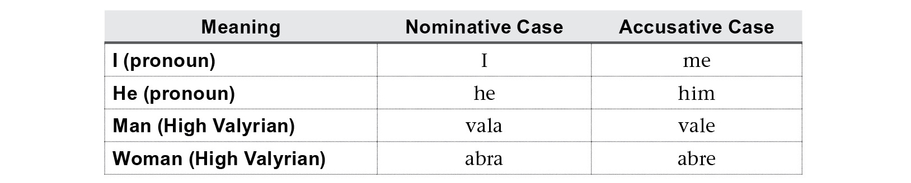

All of these will work the same way if you plug in different intransitive verbs (“cry,” “laugh,” “die”) and different transitive verbs (“see,” “take,” “pet”). If you think about some of English’s other pronouns, like *we*, *they,* and *her*, you can probably plug them into the table above fairly easily (and then try it with *who* and *whom*! *Mystery solved!*). Other pronouns like *you* and *it*, and every noun of English, on the other hand, will look the same in the nominative and accusative. This is partly why our word order is so strict. If the nouns look the same in the nominative and accusative, you won’t know who did what to whom unless you have a verb in the middle of them.

Hopefully this was fairly easy to follow. Now things will get a little tricky.

Ergative-Absolutive Alignment

If you get lost at any point during this short discussion, just remember this: ergative-absolutive languages are the mirror image of nominative-accusative languages.

Taking our four examples from above, *if* *English were an ergative-absolutive language*, those four sentences would look like this:

Before you throw this book in the garbage can, know that, yes, there are real languages that work this way. The key to understanding the difference between a language like English and an ergative-absolutive language is that the latter type of language focuses on the differing experiences of the participants in a sentence. That is, in an ergative-absolutive language, the subject of an intransitive verb (in the first and third sentence, the one who *experiences* sleep) and the object of a transitive verb (the one who *experiences* a hug) are marked with the same case. This is called the **absolutive case**. For the remaining role, the subject of a transitive verb (the one who perpetrates an act upon someone else) is marked with a different case. This is called the **ergative case**.

Let me show you an example from a natural language that will help to illustrate. Hindi is a language that displays ergativity in the past tense. Just as I showed you how cases worked with High Valyrian above, here’s how the ergative and absolutive cases work in Hindi.

(5) .  “<u>The man</u> saw a laborer.”

(6).  “The laborer saw <u>a man</u>.”

As with High Valyrian, the verb comes at the end. In Hindi, the 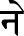 \[ne\] suffix indicates the noun it’s attached to is the actor—or agent—of the action of the sentence. In the first example, the man ( ) is the agent that enacts the action of seeing, and the one seen is the laborer (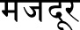 ). The situation is reversed in the second sentence.

Now compare the forms of the two nouns in the sentences above to their forms in these sentences:

\(7\) .  “The man slept.”

\(8\) .  “The laborer slept.”

Notice that the form for “man” in sentence (7),  , is identical to the *object* form in “The laborer saw the man” above. So, there you have it. Languages do this. Why? The answer lies in the history of each language, as is usually the case. But the phenomenon hits closer to home than you’d think.

Consider for a moment the suffix -*ee* in English (used in words like *awardee*, *refugee*, etc.). If you had to explain it to someone who didn’t know how to use it, how would you do it? The -*ee* suffix is usually associated with someone who *does* something, kind of, but we can do better than that. Let’s consider two -*ee* words: *escapee* and *employee*. What is an *escapee*? Someone who escapes. Now what is an *employee*? Someone who employs? No, that’s an *employer.* In fact, an *employee* is someone who is *employed*.

Does that pattern remind you of anything? The -*ee* suffix is *precisely* an absolutive suffix. It’s not case, of course—it’s a derivational suffix—but it remains true that -*ee*, when attached to an intransitive verb, produces a noun referring to the subject of that verb, while it produces a noun referring to the object of the verb when attached to a transitive verb. If you can understand how the -*ee* suffix works in English, you can understand an ergative-absolutive language.

With this info in mind, we can now set up a table much like we did above illustrating ergative and absolutive forms:

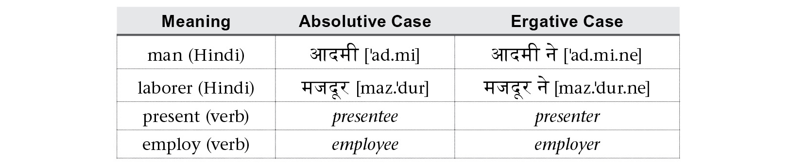

Most important, if you wanted to use these forms with an intransitive verb (a verb that has no object), you *must* take the forms from the absolutive column. The ergative column is used only with the subjects of transitive verbs.

With these alignment cases out of the way, we can move on to the rest of the many possible cases found in languages. Though they’ll be less familiar, they’ll be easier to understand and work with.

Indirect Objects

The canonical indirect object is the one to whom something is given when “give” is used as a verb. Here’s an example in English with roles marked:

*The man* (SUBJECT) *gave the dog* (INDIRECT OBJECT) *a treat* (DIRECT OBJECT)*.*

The treat is the thing that gets given, so it’s the direct object (the accusative argument, using our new terminology). The man is the one that does the giving, so the dog is just the one who gets it. It’s affected *indirectly* by the action of the verb, and since it has no other important role, it’s tagged as the indirect object.

Languages differ based on whether or not they treat an indirect object specially. English doesn’t. Compare the form of the pronoun *she* in the following contexts (its role will be in parentheses):

*I saw* *her.* (DIRECT OBJECT)

*I gave her a raise*. (INDIRECT OBJECT)

As you can see, the forms are identical. English treats indirect objects the same as direct objects; it just changes the word order. If you imagine a context where it would be appropriate to say *I gave her him*, *her* would be the indirect object, and *him* the direct object. Generally the indirect object is the first noun that follows a **ditransitive verb** (a verb that takes a direct and indirect object).

Some languages have a special case reserved just for indirect objects. This case is called the **dative**. Languages such as Latin, Russian, Turkish, and High Valyrian have a dedicated dative case, as does Shiväisith, the language of the Dark Elves in Marvel’s *Thor: The Dark World*. Take a look at the sentences below:

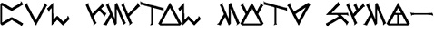 

The words in both sentences are in the exact same order: I gave child warrior. The difference is the ending on “child” (*läinie* vs. *läiniä*) and the ending on “warrior” (*geilää* vs. *geilee*). The versions that end in -*ä* are the dative versions of each noun, and the versions that end in -*e* are the accusative versions. Thus, *läiniä* means that the child is the one who received the gift, and *geilää* means that the warrior is the one who received the gift.

The dative case is one of the more common cases you’ll find in the world’s languages. Outside of the core alignment cases, the dative is most likely to be the third or fourth case found in a language. Those that lack a dative case (like Dothraki) typically use some other case or strategy to take care of indirect objects. For example, in English, this is actually the most common way to indicate an indirect object:

*I gave a* *scholarship to the student.*

Above, *the student* is the indirect object, and it’s preposed by *to*, which we understand to indicate the recipient in a giving construction. It’s not uncommon to have more than one strategy to indicate an indirect object in a single language.

Possession

When not indicated with a separate pronoun or adjectival construction, possession is handled by one of a couple nominal cases. The most common of these is the genitive. The **genitive case** is attached to the possessor in a possessive construction. Unlike all other cases, possessive cases like the genitive are more commonly associated with nouns than with verbs (i.e. a genitive case will be necessitated by the context of a noun as opposed to what it’s doing in the sentence). Here’s an example from Latin to help illustrate:

The underlined words above are in the genitive case, and are the possessors in these possessive phrases. The nonunderlined terms are the possessees, and are in the nominative case. They could be in any case, because the possessees are actually a part of the sentence. A possessor is just background information.

Sometimes possession works a little differently (you can see two examples in the English translations above). Languages are often characterized by whether the possessor comes after or before the possessee. Compare the first Latin example with its High Valyrian equivalent below:

In addition, while in all the examples we’ve seen the possessor is marked, sometimes the possessee is marked. It basically alerts the listener to the fact that it’s possessed by something, and that something is what follows. Here’s an example from the Sondiv language from the CW’s *Star-Crossed* (note: this example has been simplified for expository purposes):

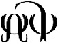 *zod* \[zod\] “son”

 *bor* \[bor\] “father”

 *zoda yabor*  “the father’s son”

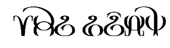 *bora yazod*  “the son’s father”

Ignore the *ya*- prefix above. Instead, focus on the -*a* suffix, which marks a noun as *being* possessed. It’s, in effect, the opposite of a genitive. This is another strategy for marking possession with case or something that’s caselike in a language.

Other Non-Local Cases

There are a variety of other cases that some languages have that are covered by prepositions in English, or other adpositions in various noncase languages. Below is a listing of some common non-local cases:

Instrumental: The **instrumental case** is used with a noun that’s used to accomplish the action of the sentence. Below is an example from Shiväisith:

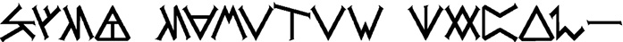

*Geilää* *liivinith* <u>jöhär</u>. (*jöh* “knife,” nominative)

“The warrior attacked <u>with a knife</u>.”

Comitative: The **comitative case** is used with a noun with whom another noun is associated. The instrumental and comitative cases are sometimes conflated, but they can appear as separate cases. Below is an example from Shiväisith:

*Geilää liivinith* <u>domintaath</u>. (*domintaa* “scout,” nominative)

“The warrior attacked <u>with a scout</u> (or accompanied by a scout).”

Benefactive: The **benefactive case** is used with a noun on behalf of whom the action of the sentence is accomplished. This role is sometimes taken care of by other cases (e.g. the dative), but it can appear as a separate case. Below is an example from Shiväisith:

*Geilää liivinith* <u>vörthevä</u>. (*vörth* “king,” nominative)

“The warrior attacked <u>for</u> <u>the king</u> (or on behalf of the king).”

Vocative: The **vocative case** is used with direct address, as when calling someone out by name. Below is an example in Castithan from Syfy’s *Defiance*:

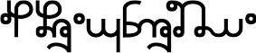  
<u>Tando!</u> *Usholu!* (*Tanda* “father,” nominative)  

“<u>Father</u>! Stop!”

There are many, many more than this, but these are some of the most common that you’ll run into.

Local Cases

**Local cases** are so called because they refer to a location of some kind. These are all covered by prepositions in English, or adpositions in other noncase languages. Many languages, though, change the form of the noun to indicate that the action of the verb is happening on or about or somehow in some spatial relation to that noun.

In Dothraki, for example, you can modify a noun to indicate whether an action happens moving toward that noun, or moving away from it. Here’s an example of each:

This will give you the idea. Now imagine any other spatial relation: on, onto, out of, over, under, avoiding, through, across, between—*anything*. There is a language somewhere that has a case that does exactly that.

Of course, some of these are more common than others, so here I’ll give you examples of some of the most common ones. Some key terminology to keep in mind (because the names for these are all Latin) is that -*essive* basically means “stationary” and -*lative* means “mobile.” These words combine with Latin prepositions to form case names. Here we go:

Locative: The **locative case** is the most basic local case. It’s used when the action of the verb takes place in some area having to do with a noun. Many languages have much more specific local cases, but a number will have a locative. The interpretation is usually based on the action and the noun. So, for example, the locative used with a verb like “stand” and a noun like “boulder” will be interpreted as “on the boulder.” If it’s used with a noun like “room,” though, it will probably be interpreted as “in the room.” Below is an example from Indojisnen from Syfy’s *Defiance*:

*Koraksut* <u>arkonyu</u> *chewtlen*. (*arkon* “boat,” absolutive)  

“The doctor stands <u>in the boat</u>.”

Adessive: The **adessive case** is used when the action of the sentence takes place near or at or around a noun. This case often gets used for other things, but this is its basic sense. Below is an example from Shiväisith:

*Geilää höyfith* <u>tukkasku</u>. (*tukka* “sheep,” nominative)  

“The warrior stands <u>near</u> <u>the sheep</u>.”

Allative: The **allative case** is used when the action of the sentence moves to or toward a noun. This case often gets used for other things, but this is its basic sense. Below is an example from Dothraki:

*Mahrazhi dothrash* <u>vaesaan</u>. (*vaes* “city,” nominative)  

“The men rode <u>to</u> <u>the city</u>.”

Ablative: The **ablative case** is used when the action of the sentence moves away from a noun. This case often gets used for other things, but this is its basic sense. Below is an example from Dothraki:

*Mahrazhi* *dothrash* <u>vaesoon</u>. (*vaes* “city,” nominative)

“The men rode <u>away</u> <u>from the city</u>.”

Inessive: The **inessive case** is used when the action of the sentence takes place inside of a noun. This case often gets used for other things, but this is its basic sense. Below is an example from Shiväisith:

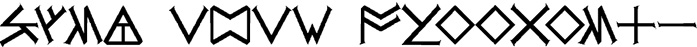

*Geilää imith* <u>djossaslu</u>. (*djosse* “crater,” nominative)

“The warrior sits <u>inside the</u> <u>crater</u>.”

Illative: The **illative case** is used when the action of the sentence moves into a noun. This case often gets used for other things, but this is its basic sense. Below is an example from Shiväisith:

*Geilää pythyth* <u>djossasla</u>. (*djosse* “crater,” nominative)

“The warrior runs <u>into the crater</u>.”

Elative: The **elative case** is used when the action of the sentence moves out of or out from a noun. This case often gets used for other things, but this is its basic sense. Below is an example from Shiväisith:

*Geilää pythyth* <u>djossasle</u>. (*djosse* “crater,” nominative)

“The warrior runs <u>out of the crater</u>.”

This barely scratches the surface. To give you an example, the Tsez language, spoken in the Caucasus mountains, has sixty-four cases, fifty-six of which are local (not a joke). If you can imagine it, there’s probably a case for it in Tsez or some other Caucasian language. There may or may not be a fancy name for it, but so long as its function can be adequately described, it doesn’t matter what it’s called.

### NOMINAL INFLECTION EXPONENCE

The various nominal inflections—case, number, gender, definiteness, possession, etc.—will be realized on or around the noun in various ways. In this section I’ll go over some of the most common strategies.

When it comes to marking a particular role, a language will use affixes, adpositions, some form of head-marking (this will be discussed later), or no marking. The closer the marking is to the noun, the tighter the connection will be between that meaning and the grammar of the language. Here’s what I mean by that. Take a look at these Finnish word forms and their English translations:

If you’re learning the Finnish language, you have to learn how to decline a noun so that it can take on these various forms. They mean the same thing as the English translations, but no one learns about the “abessive case” in English. All you do is learn what the word *without* means, and then you use it with whatever it needs to be used with. The meaning is compositional, and the words are separate. So while the construction is a part of English grammar, it’s not as integral as the abessive case is to Finnish grammar.

In many languages, one of the key differences is whether the construction is realized with an affix or with an **adposition**. An adposition is a separate word that has grammatical function, and it will generally come in one of two varieties. A **preposition** comes before a noun or noun phrase; a **postposition** comes after it. You can actually see both in High Valyrian while seeing where the language differs from English in how instrumental a given grammatical feature is to the grammar:

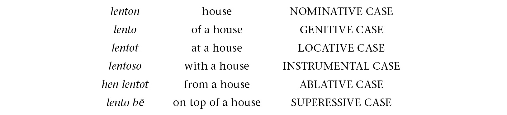

The last two examples, like English, require adpositions. In another language (like Tsez), you’d simply modify the form of the noun to create that meaning.

That said, some languages will *only* use adpositions for cases. Japanese is one such language, which uses postpositions exclusively. For a language with a split, though, the cases that are a part of the nominal inflection will be core, with the other constructions being peripheral.

How a conlang will encode all of these various things is up to the creator, though. Some languages separate each bit. In Turkish, for example, there’s a separate suffix for case, for number, and for possession:

Each of the suffixes is completely separable: the plural -*lar*; the ablative -*tan* or -*dan*; and the possessive -*ım*. There are rules about what order they can appear in (all languages have such rules, even if certain elements can appear in various orders), but each element can be included or excluded as one wishes.

Other languages conflate one or more of these. In Latin, case, number, and gender are absolutely inseparable, but possession is encoded with a separate word (as in English). Here’s that same table in Latin:

Looking above, it’s impossible to separate the “plural” part out of *librī* or *librīs*, or the “ablative” part out of *librō* or *librīs*. It is possible to extract the word “my,” though, which is *meus* (declined in four ways above).

Notice that when different meanings get conflated into a single exponence, the words are shorter, as with Latin, and when they’re left loose, the words are longer, as with Turkish. When you’re learning a natural language, you’re stuck with whatever you get. A language creator gets to decide what works best for the project at hand and go with that.

The last piece is the use of an **article**. An article is kind of like an adposition, except that a noun can never appear without an article, unless the grammar allows it. Articles can encode any number of features. In English, we have the articles *the* and *a* or *an*. They tell us whether a noun is **definite** (has a specific referent and/or has been referred to in conversation already) or **indefinite** (has no specific referent and/or is new to the conversation). The indefinite article *a* also tells us that the noun is singular. Only certain types of nouns can appear without an article of some kind, like mass nouns, ideas/emotions, or plural nouns. Languages that have articles will differ in their usage rules for articles. A key difference between English and Spanish is the use of articles with ideas. Consider these two sentences:

Word for word, the Spanish sentence translates as “The life is beautiful.” There’s no way you could say that in English unless you were referring to some specific life. In Spanish, there’s no way you could do the opposite (*Vida* *es bella* sounds . . . just hideous. It’s repugnant). As they say in French, *C’est la vie*: That’s life (or, literally, “That’s the life,” because, of course, French does it too).

We’ve already seen how Spanish articles encode gender and number. German articles are even beefier, encoding gender, number, *and* case. Take a look at these three, for example:

It’s kind of a nightmare learning German, because you have to distinguish between the “the” and “a” articles, and then each one has four case forms, three genders, and singular and plural versions. On top of that, the nouns themselves have singular and plural forms. And then the adjectives have to agree—and we haven’t even gotten to the verbs! Mathematically, it seems like the language should be impossible to learn. And yet, millions get along just fine with it. Go fig.

Ultimately, one has to figure out how every possible grammatical construction is reified in a given conlang. At the very least, the meanings will be achieved by combining strings of words (e.g. *I sat on a carpet that lies slightly to the* *northwest of the dead center of the room.* That could be encoded by a case, but doing so would seem . . . churlish). The tools in this section will allow you to decide, essentially, how much junk you want to include on your nouns before one has to resort to stringing words together. Take it from me: noun junk can be fun. Once you create a case language, you won’t go back—or at least not without a fight.

(And, yes, *without a fight* would be the abessive case.)

### VERBAL INFLECTION

I’ve already mentioned that creating verbs is the most difficult part of creating a language. They’re also the most difficult part of language, period. Verb systems are the most difficult part of a language to learn, to use fluently, to understand, and they’re also the most volatile; the most prone to change. No matter how simple or clear-cut a verb system is, a human user will find a way to muck it up. Nouns are pretty good at standing for what they’re supposed to, but verbs? What exactly does it mean to “deliberate”? Can toddlers do it, or does it have to be a bunch of suits? And tense?! Without resorting to auxiliaries, English has two tenses: past and nonpast. How do we manage to say things like this?

*If you would have had* *to have asked me first, I would have been in* *a position to have said “no.”*

Having to translate a sentence like that for a show is my nightmare—and you’d be surprised how often sentences *very* similar to that end up in a script. Dialogue always looks simple until you have to translate it.

Unlike with nouns, verbs have so many potential inflectional categories that it’s impossible to catalogue them all. In this section, I’m going to go over three main areas of verbal inflection: agreement; tense, modality, and aspect (often referred to as TMA); and valency. At the end of that, hopefully you’ll understand why verbs are the onions of the language world. (Note: onions are bad.)

### AGREEMENT

Verbs will often display some form of **agreement** with either their subjects or objects in one form or another. Verbs can agree with a noun in person, number, or sometimes gender. Verbs could agree with other properties of a noun (e.g. shirt color), but these are the only categories that are reified in natural languages. Agreement marking can’t—

No, I’m sorry, I can’t let this go. Why would anyone *ever* eat an onion or include it in food? *Onions taste bad*. Furthermore, they’re the culinary equivalent of multiplying by zero: add onion to *any* food, and it now tastes like nothing but onion. In conclusion, onions are bad. Stop using them.

Agreement most often shows up as a prefix or a suffix to a verb. This is likely due to the history of agreement affixes, which most often derive from pronouns that appear next to the verb. In English, we just have -*s* for the third person singular present tense for most verbs (many auxiliaries are invariant in form, like *can*, *may*, *will*, etc.). The -*s* is just there. If you’re reading a standard text, it feel wrong not to use -*s* on a verb with a third person singular subject in the present tense. How wrong? Well, how wrong did it feel to read that sentence? How much was your brain screaming, “*ARRGH! IT SHOULD BE ‘FEELS’!*” as you read that? That’s how wrong.

When it comes to agreement, there are two different types of behavior languages display with respect to the nouns referred to. In English, you always have to state the subject of the sentence. In other languages, though, the agreement morphology on the verb is sufficient to allow users to drop the subject entirely. This phenomenon is called **pro-drop**, since the pronouns get dropped. The more person and number marking appears on the verb, the more likely it is to be a pro-drop language (though this isn’t always the case, as demonstrated by Japanese).

Verbs will generally encode the categories person (first, second, or third), number, and/or gender of a subject, object, or indirect object. Languages differ depending on how many of these categories their verbs encode, and how they do it. Chinese verbs, for example, encode none of them. Arabic verbs, on the other hand, encode them all. Languages will also differ by how vigorously they encode each category. Take a look at the difference between these languages’ person marking strategies in the singular, for example:

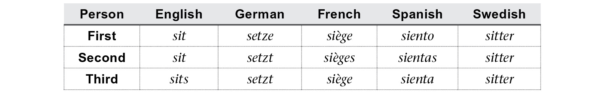

Disregarding how these words are pronounced, look at that nonsense! Every possible arrangement of three potentially discrete items is present above—and all five of these languages are related! But looking at the above, if you had to guess which one allowed verbs to be used without subject pronouns, you’d probably guess Spanish—and you’d be right.

Though rarer, gender can be encoded on the verb, as mentioned. In Arabic, verbs with a second and third person subject distinguish between masculine and feminine:

And Russian distinguishes between masculine, feminine, and neuter in the past tense, but only when the subject is singular:

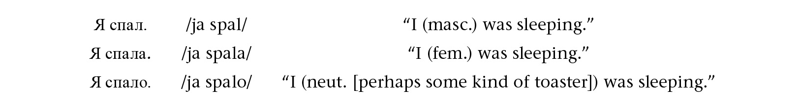

Languages that have a dual verb form will definitely have dual marking on nouns, but the inverse isn’t necessarily true.

In addition to subjects, though, many languages will mark objects on the verb. Some will even make at least passing reference to indirect objects (Georgian and Swahili come to mind). This is referred to as **head-marking**. Often languages will display object *marking* as opposed to object *agreement*. With agreement, the morphology must appear whether there’s an overt object or not. By contrast, languages with object marking use it only when there is no overt object in the clause, as shown below in the Væyne Zaanics language used in Nina Post’s *The Zaanics Deceit*:

Above, the only time the -*aw* suffix is used is when there is no overt object mentioned in the clause. When creating a language to be used in television or film, maximal subject agreement—and object marking, if possible—is best, as it allows for subjects to be dropped, and for lines, should they run long, to be shortened without sacrificing the basic meaning of the sentence.

### TENSE, MODALITY, ASPECT

And now we get to my least favorite part of language. Not just creating languages, or conlangs: language *period*. A given language’s number marking strategy may be simpler than another’s, and a given language may have more agreement patterns for the verbs, but *no* language ever created has a simple tense, modality, aspect system. Even a conlang created with the intent of having a simple system ends up complicating things, often unwittingly. Placing an action in time and with respect to other actions is *the* most difficult part of language. It’s also one of the most important parts, which makes everything just the worst.

So. Let’s jump right in!

**Tense** is the grammatical encoding of the time in or at which an action occurs. Unlike with crazy number marking strategies, if there’s a crazy tense you can think of, some natural language probably already has it. A special tense just for things that have been done since waking up? It’s called a **hodiernal** and lots of languages have it. A tense just for telling stories? It’s called the **narrative**, and lots of languages have it. A special tense for things that will take place in the distant future as opposed to the recent future? There’s a tense for each of those called, uncreatively, **distant future** and **recent future**. Makes English seem vanilla by comparison, doesn’t it?

Of course, here’s the catch. Every single language has the capability of expressing every single tense combination. The question is whether the verb *encodes* it or not. Taking our distant future, in English we can say *We’ll all be able to teleport to the* *moon in the distant future*, and that conveys the concept rather nicely. In some languages, though, rather than having to say *in the distant future* or *some day*, you’d simply use a different verb form (if English had it, maybe instead of saying *we will* you’d say *we* *woller*). The trick in creating a language is figuring out how the system will work. So in English, we have the past tense (generally -*ed*), and we have the nonpast, and that’s it. To express every other tense, we use a complex system of auxiliaries (*will*, *have*, *be*, etc.) or satellite temporal adverbs (*yesterday*, *soon*, etc.). When creating a system, the question I always ask is, “What do I want the verb to say on its own?” Everything else has to work itself out around it in order to express the gamut of temporal activity.

Tense interacts regularly with **aspect**, which defines how an action is presented. In English, for example, saying *I was running* is different from saying *I ran,* even though both actions occur in the past tense. In English we use an auxiliary to express this difference, but some languages take the distinction as important enough to encode on the verb itself. In Spanish, for example, the translation of those two phrases would be, in order, *corría* and *corrí*.

As with tenses, there are about as many aspects as you can think of. Below is a listing of some grammatical aspects—many of which require multiple English words to express, in contrast to the conlang exemplars (all subjects are third person singular):

Each aspect focuses on an act from a different perspective in order to convey a slightly different shade of meaning. Usually a language encodes a few of these on the verb and uses multiword expressions to convey the rest, as shown in the English column.

The last prong of the mighty TMA trident is **modality**, which deals with the point of view of the speaker. Basically, if it has to do with the action of the verb, but isn’t specifically about the time or manner of the action or the character of the participants, it’s modality. Most examples from English make use of modal auxiliaries (hence the name), but notice how in each of the examples below, the number and person of the subject are the same, as are the tense and aspect:

*We should go*.

*We must go.*

*We’re supposed to go.*

*We may go.*

*Let’s go!*

The thing that’s changing from example to example above is the mode or mood, and these are things that can be encoded on the verb. Again, all languages have a way of expressing all of them; some just have a special way of doing so. Some languages have few grammatical moods (English has just a couple), but some go overboard, like Tundra Nenets, a Samoyedic language of Russia, which has sixteen distinct grammatical moods marked on the verb.

When creating a language, the two moods that come up the most often are the **indicative**, which is just the basic form of a verb when making an ordinary statement, and the **imperative** or command form used for issuing commands. Some others are shown below (all subjects, aside from the imperative, are third person singular):

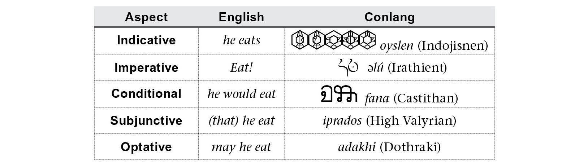

How moods will be used in a language tends to be idiosyncratic. Strike that. How *anything* about a verb is used in a language tends to be idiosyncratic. For example, the subjunctive in High Valyrian is used in all negative statements, in addition to its usual usage (e.g. the word *eat* in sentences like *I put half of the cake in the freezer, lest* *he eat it all*). And in Castithan, what amounts to the conditional form for dynamic predicates is a simple past tense for stative predicates (a simple *-a* suffix below):

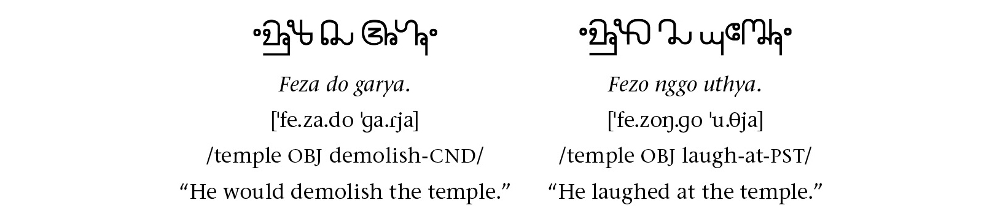

Now, it’s probably (read: definitely) my English speaker bias, but having a bunch of fancy grammatical moods is just more trouble than it’s worth. Sure, it may save me one or two syllables in one line once a season, but it’s a pain in the butterball to have to create a bunch of different grammatical moods and then remember how to use them. It still creeps me out to have a subjunctive in High Valyrian. *Bleh*. The subjunctive is the onion of grammatical moods. Most of them are just old future tenses vainly clinging to relevance *Sunset* *Boulevard*–style, anyway. Be gone with them, I say!

### VALENCY

**Valency** refers to the number of nominal arguments a verb has and what approximate role those arguments play. Valency is just the best. It may not seem like it, but that’s partly because valency is *super* boring in English. I’ll show you how it can be fun. First, though, let’s get our bearings.

A verb needs to get paired with some noun in order to express any meaning. This noun is called an **argument**. Some verbs require *exactly* one argument (the **subject**). These are called **monovalent** or **intransitive** verbs. A nice example in English is *sleep*. A simple sentence would be *The coyote slept*.

Verbs that require exactly two arguments are called **divalent** or **transitive**. With a transitive verb, one argument (the **agent**) interacts with the other (the **patient**) by means of the verb. In English, *disrespect* is a good example of a transitive verb, as in *The coyote disrespected the onion*.

Before moving on, notice what happens when you use either of these verbs with the inappropriate number of arguments:

The coyote slept the onion.

The coyote disrespected.

Neither of these seem like a grammatical English sentence (well, unless you play RPGs and you’re familiar with spell-casting jargon). The reason is that these verbs have strict requirements about the arguments they can occur with. Many English verbs, like *eat*, have no such requirements:

• *The* *coyote ate.*

• *The coyote ate the onion.*

A couple other types of verbs are **avalent** or **impersonal** verbs and **trivalent** or **ditransitive** verbs. An example of each is shown below:

• *It rained.*

• *The coyote gave the prisoner an onion.*

Ditransitive verbs are few in number, and their primary example, language after language, is a word meaning “give.” Many ditransitive verbs can require arguments that need to be in a particular case or sense. In English, for example, *put* requires a third locative argument of any kind. One can’t say simply *I put the book* or even *I put the* *book the table*. The verb *put* requires an expression like *on the table*, *under the table*, *there*—anything that has to do with a location.

Impersonal verbs, on the other hand, take no arguments whatsoever. Think about the English sentence *It rained*. *What* rained? The clouds? The sky? The . . . weather? You can’t even replace *it* with *water* in that sentence and have it mean the same thing. Rather, the verb simply describes an event, and since English requires a subject in all its sentences, we throw an *it* in there just because. (Note: Not all languages require their sentences to have subjects!)

That’s valency, in a nutshell. Now that we know what it is, what can we do with it?

The fun of valency comes when we decide to take one verb and change the number of arguments it has. We do so all the time when speaking a language. These valency changing operations come in two varieties: valency reducing operations and valency increasing operations. The most common valency reducing operation is **passivization**, which is when a transitive verb is turned into an intransitive verb by deleting the agent. Passives are incredibly useful when stringing clauses together. Functionally, passives are nothing more than intransitive verbs. Often some little piece of morphology on the verb will indicate that the verb is in the passive form, though. Compare these active and passive forms of the Castithan verb *fanu* “to eat”:

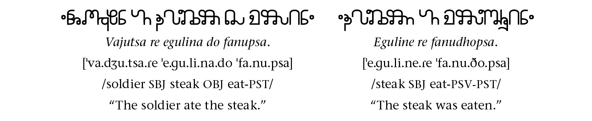

Above, the suffix -*dho* indicates the verb is in the passive, and this triggers the change in nominal suffixes (from *egulina do* to *eguline re*), promoting *egulino* “steak” to subject position.

A common valency increasing operation is **causativization**. A causative verb is one that includes an agent who causes someone to perform or undergo the action of the verb. When an intransitive verb is causativized, its total number of arguments is increased from one to two; when a transitive verb is causativized, the increase is from two to three. In English, we usually use *make* as an auxiliary to form causative verbs (e.g. from *He slept* to *I* *made him sleep*). Other languages mark it directly on the verb. Here’s an example from Castithan:

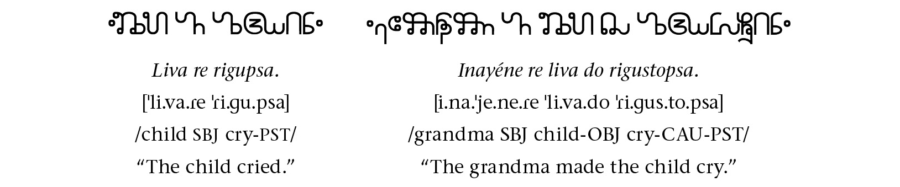

Above, the suffix -*sto* indicates the verb is a causative, and this triggers the change in nominal morphology (from *liva re* to *liva do*), and adds a causer to the argument structure.

The granddaddy of all valency changing operations, though, is the **applicative**. An applicative takes a nondirect or peripheral argument and promotes it to direct object position, deleting or demoting the old direct object, if there was one. A kind of hacky English example is the prefix *out-*. For example, you can say *I shot*; an intransitive clause. You can also say *I shot better than him*. It’s still an intransitive clause, but it has some extra info. This, however, is a transitive clause: *I outshot him*. You can’t get away with *I outshot*. That seems odd, at the very least. By adding *out-* to a verb you make it transitive, and take a peripheral argument and make it into a direct object, producing a new, more compact, and more convenient verb along the way.

Many languages have institutionalized this practice, producing applicative affixes that target specific arguments (so one that promotes only benefactive arguments, one that only promotes instruments, etc.). It’s really cool! But beyond that, why do it? Let me show you an example from one of my languages, Kamakawi.

In Kamakawi, relative clauses (sentences that tell you more about a noun, e.g. the phrase *I catapulted into space,* in the longer phrase *the onion I catapulted into space*) may only feature subjects or direct objects. In English, they can play any grammatical role (*the onion I gave a beating to, the onion* *whose taste I despise, the onion with whom I would* *not pose for a photo*, etc.), but some languages are more restrictive. What does one do if one has to build a relative clause featuring a different kind of object? This is where the applicative comes in. To see it, let’s start with a simple sentence like:

  
*Ka* *lalau ei ie hate aeiu kava.*  
/PST throw 1SG OBJ-DEF onion into fire/

“I threw the onion into the fire.”

Should be pretty easy to pick out the word for “onion” there. Anyway, by adding an applicative  -*ku* suffix to the verb  *lalau*, you get  *lalauku*, which means “to throw somewhere.” The direct object is where the whatever it is is thrown, as shown below:

  
*Ka lalauku ei ie kava.*  
/PST THROW-APL 1SG OBJ-DEF fire/

“I threw into the fire.”

Now that the word for “fire,”  *kava*, has been promoted to direct object position, it can be promoted to the subject of a sentence with a passive verb. By adding the passive suffix  -*’u* to the verb, we can now produce the following sentence:

  
*Ka lalauku’u kava.*

/PST throw-APL-PSV fire/

“The fire was thrown into.”

If you want to say what was thrown into the fire, you can add 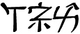 *ie hate* “the onion” to the end (as in the first sentence), and if you want to say who did it, you can add  *ti’i* “by me” to the end of that.

But now here comes the exciting part. Let’s say my friend Jon comes in as I’m talking to Scott about how I dispose of onions. Jon overhears me say something about a fire, and he says, “What fire are you talking about?” I’d then respond in Kamakawi (because why would I speak a language he understood?):

*E kava poke lalauku’u* *ie hate ti’i.*

/DEF fire REL-PST throw-APL-PSV OBJ-DEF onion INS-1SG/

“The fire I threw an onion into.”

Or, more accurately, “The fire that had an onion thrown into it by me.” And that, dear reader, is why there’s absolutely nothing wrong with using the passive voice in formal writing—and also why every language should have an applicative. Valency changing strategies exist simply to smooth transitions between disparate clauses. It’s easier to have the same subject for successive clauses, as it allows the narrative to flow more smoothly. I say that as a linguist, language creator, writer, English major, English professor, *and* occasional anonymous Wikipedia editor. There’s absolutely nothing wrong with any valency changing operation in any language.

### WORD ORDER

**Word order** refers to the order of elements in a phrase and a sentence. For example, English has Subject-Verb-Object—or SVO—word order, in that that’s the linear precedence of those three elements in a sentence that has all of them, as shown below:

Languages make use of many different word orders, though. Natural languages have been found that utilize all six logical orderings of subject, verb, and object as their default word order, and conlangers have done the same in their work:

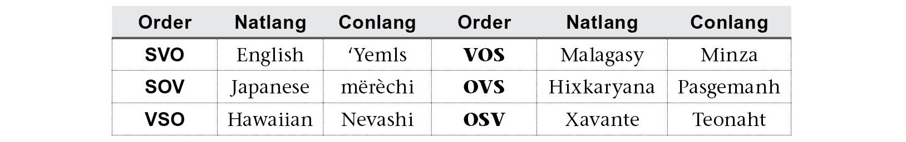

The three orderings in the left-hand column are quite common; the three on the right much less so. The ordering of the verb and its object often (but not always) aligns with the orderings of several other elements. Typologists classify languages by the various orderings of the following elements, and conlangers have followed suit:

• Noun-Adjective Order: An adjective (A) can precede or follow the noun it modifies (N). English places adjectives before nouns, as in *black cat*, while a language like Spanish places adjectives after nouns, as in *gato* *negro*, literally “cat black.” There are a number of languages that utilize both orderings.

• Noun-Genitive Order: A possessor (G) can precede or follow the thing it possesses (N). In English, “the onion’s stench” is G-N ordering, and “the stench of the onion” is N-G ordering. Many languages only feature one order.

• Adposition-Noun Order: An adposition (P) can precede or follow the noun phrase it governs (N). When the adposition comes before the noun, it’s called a **preposition**, and when it comes after, it’s called a **postposition**. English is a language with prepositions, while languages like Japanese and Turkish feature postpositions. Some languages feature both, such as Moro, a language of Sudan and South Sudan, and High Valyrian.

• Noun–Relative Clause Order: A relative clause (R) can precede or follow the noun (N) it modifies. In English, the relative clause follows the noun, as in “The man whom I saw,” whereas in a language like Japanese, Castithan, or Turkish, it would precede the noun it modifies—literally something like “The I saw man.”

Linguists and conlangers combine all these orderings to determine the typological profile of a language. Depending on how the orderings align, we can say that languages are either **head-initial** or **head-final**. Below is the ideal ordering of elements for each type:

Head-Initial: V-O, N-A, N-G, P-N, N-R

Head-Final: O-V, A-N, G-N, N-P, R-N

Not all languages line up in *precisely* this fashion. Instead, many will *primarily* use one set of orderings over the other, and this allows one to determine whether a language is largely head-initial or largely head-final. We’ll see more about how some of these orderings arise in the section on language evolution.

### DERIVATION

**Derivation** refers to the ability to change via morphology one word into another. All languages have some type of derivation, even if it’s **zero derivation** (no visible change to a word). Compare the word *mail* in *They’ll mail it to me* and *You’ve got mail*. In the first sentence, *mail* is a verb; in the second, a semantically related noun. They’re different words, despite looking and sounding alike.

Languages differ in how they make use of derivation. Two quick examples should illustrate. Below is a comparison between related concepts first in English and Spanish and then in English and Hawaiian:

That, in a nutshell, is derivation. Some languages will derive one concept from another in a more or less predictable fashion (*teach* vs. *teacher*); some will treat concepts as completely distinct (*enseñar* vs. *maestro* and *sit* vs. *chair*); and some will reuse the same word for different concepts (*noho* vs. *noho*).

An easy and effective way to make a language unique is to play with its derivational morphology, even if the meanings that take hold often have more to do with a language’s evolution than with its synchronic morphology. For example, the word *inspiration* has an odd meaning for its evolution. It began its existence as the Latin verb *spirare*, which means “to breathe.” By adding *in*- to the front, a new verb was derived that meant “to breathe in/into.” This was turned into the noun *inspirationem*, which came to us by way of French. It should mean “breathing in,” a generic noun, but it instead makes reference to an unseen deity literally breathing into a human being in order to give them ideas about stuff. That’s *inspiration*.

Arguably, our meaning for *inspiration* is more useful than a noun that means “breathing in,” but even so, derivations that produce unrelated words like this one are quite common. In Castithan, an old word for “tear,”  *thoryo*, had a collective suffix  -*bun* attached to it which produced  *thoribuno*, which is the modern word for “sorrow.” Using derivation in this way forces one to step back into the past (presumably spontaneous derivation is regular), but that’s a good thing. Creating a language at any point is an attempt to take a slice out of an eras-long progression. It’s better to accept that fact than to pretend the form one is creating is, was, and always will be.

Derivational strategies differ in whether they turn a word of one grammatical category into another or not. For example, -*ly* takes an adjective and turns it into an adverb (e.g. *sharp* \> *sharply*). *Re*-, though, takes a verb and produces a different verb with a slightly different meaning (e.g. *work* \> *rework*). Certain strategies will apply only to certain types of words while others will apply to many. These restrictions depend on the peculiar histories of the affixes or processes. For example, -*ity* tends to work only with Latinate words because it came from Latin. You can turn *fertile* into *fertility* but you can’t turn *red* into *reddity*. There’s no phonological reason this should be the case. We just know it doesn’t work, because no one does it. The only reason no one does it, though, is because the words that employ -*ity* all came to us from Latin (sometimes through French), and so why would we have ever used the strategy with any other word?

To close this section I’ll introduce you to an all-encompassing derivational system I created for one of the *Defiance* languages. As you look at it, though, it’s a good time to start thinking about the connection between language and history. Ultimately this is what the best conlangers wrestle with. Language is nothing more than the battered baton of an endless relay race. You can take a snapshot of that baton halfway through and recreate what you see, but doing so obscures the many hands that were involved in passing it to that point. How does one replicate the entire race without simply copying the baton? That’s the question I’ll tackle in the next section. For now, let’s look at some nominal morphology! Better than onions, I can tell you that.

 

Case Study

IRATHIENT NOUNS

Back in the fall of 2011, I had lunch with Tom Lieber and Rockne O’Bannon, executive producers for the Syfy series *Defiance*, which, at the time, was still in the planning stages. They’d shared with me an early draft of the pilot, and told me that they were looking for languages for two of the main alien races: the Castithans and Irathients. The only requirement was that they sound as different as possible on-screen. My first idea was that in order for them to be as different as possible, they should be opposites: one would be head-final, the other head-initial; one would be dependent-marking, the other head-marking; one would sound fast, the other slow.

*Slow*. Now that’s a trick. As soon as I said it, I began to wonder how it could be achieved, given that an actor only has so much time to speak a line on-screen. Most of the time when we hear a foreign language, we get the impression that it’s being spoken too quickly (as if slowing it down would help any!). Could a language exist that gave the opposite impression?

As it happens, I’d had indirect experience with just such a language. Many years prior, I watched the movie *Atanarjuat: The Fast Runner*, filmed entirely in Inuktitut—the language that opened this chapter. The movie was amazing, but above all I remember my impression upon first hearing the Inuktitut language. The language was spoken slowly and steadily. Even if you’d never heard it before, you could catch every single syllable. It was still incomprehensible, of course (it’s a different language), but you wouldn’t ever have to say, “Hey, slow down; I didn’t catch that.”

Now, the Inuktitut language, as demonstrated above, does what it does by creating enormous, sentence-long words. That wasn’t an option for Irathient. In order to fit the same amount of meaning into the amount of time it takes to speak an English line, the translation had to have equally short words, or fewer longer words.

My solution was to take the meaning required for a given utterance and spread it across the entire clause. That way if a sentence was running a little long, a word or two could be deleted with most of the meaning being preserved. An example sentence will help to illustrate how this works:

*Zahon  hudi zvoshakte.*

/AUX notice thief warrior/

“The warrior noticed the thief.”

Above, the order is auxiliary-verb-object-subject. The order is strict, so if both the auxiliary *zahon* and verb ** were deleted, one at least could understand that the warrior (*zvoshakte*) was doing something to the thief (*hudi*). Both nouns could be deleted, because the subject (*zvoshakte*) and object (*hudi*) are marked on the auxiliary (this is head-marking). If the verb ** were deleted, we’d know that the warrior (*zvoshakte*) did something to the thief (*hudi*) in the past, and if the auxiliary *zahon* were deleted, all we’d be missing was the tense. In fact, if you just used the first word by itself, it’d mean someone did something to someone in the past, so if one already knew who was being discussed and what the context was, that’d be plenty of information.

The key to make this work, though, was to add as much information to the noun as possible while minimizing its size. Take any noun of English—like one of Nina Post’s favorite words, *child*. There’s nothing about *child* that tells you anything important about it. That is, if you had never heard the English word *child* before, it could stand for pretty much anything. Furthermore, in order to pluralize it, you need to make it longer by adding -*ren* to the end, meaning that plural nouns will almost always take more time to pronounce than singular nouns (not much longer, but longer nonetheless).

With Irathient, I decided to do three things to the nouns to try to minimize the space. First, stems would be short (most are monosyllabic). Next, each noun would mark its number with a final vowel, meaning that singular and plural nouns would be the same length. Finally, each noun would have a class prefix. The class prefix would divide the lexicon into several different semantic classes so that just by looking at the first letter or two of the noun you’d know approximately what type of noun it was.

The noun class (or gender) system is reminiscent of Bantu, since the class markers are prefixes, but unlike Bantu, which changes prefixes depending on whether the noun is singular or plural (e.g. *kitabu* “book” vs. *vitabu* “books”), Irathient noun class prefixes are invariant. Nominal number is encoded by a suffixed vowel, which was directly inspired by an auxlang from the 1970s called Afrihili. Most of the time, I don’t directly copy anything from another language, but the vowel triangle system Afrihili used is so cool I simply had to use it in a language. Unlike Afrihili, Irathient couldn’t manage seven vowels (I didn’t want to have to try to get actors to consistently distinguish between the pairs  and \[e\] and  and \[o\]), so I created a vowel quadrangle:

The way it works is this: If a noun ends in a particular vowel, its plural will feature the *opposite* vowel in the quadrangle. Thus, if a singular word ends in , its plural will end in \[u\], and vice versa. If a word happens to end in a consonant, it takes the neutral vowel  for its plural.

In forming the noun classes of Irathient, I decided to assign a unique consonant-vowel combination to each prefix and make the singular suffix the opposite vowel from the prefix vowel. Thus, even if a given word wasn’t known, if the vowels rhymed, you’d know it was a plural noun; if not, singular.

As for the classes themselves, I decided to have fun with them, since Irathients are aliens from a distant galaxy. On Earth, certain languages have made the distinction between poisonous and nonpoisonous plants, so I decided to expand that model to various other areas of experience in the first ten noun classes (parentheses indicate the segment is optional):

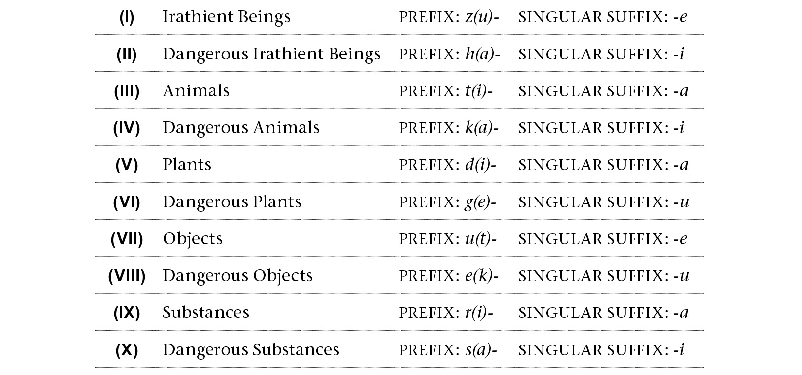

Outside of these first ten, there were others that had more specific or abstract designations, a couple of which were inspired directly by an older language of mine called Zhyler:

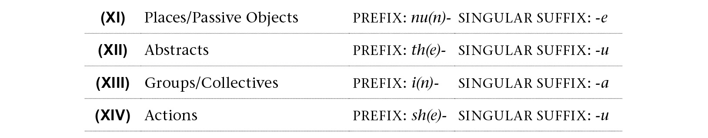

The remaining four classes were designated for diminutives and augmentatives and then further split by animacy. The augmentative class takes its prefix only if the root to which it’s added is monosyllabic:

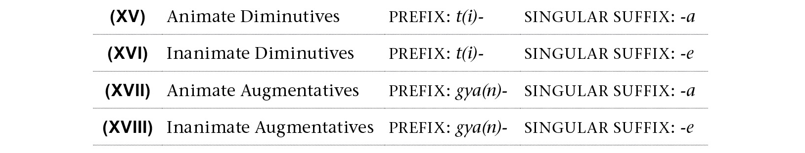

Though this is where the classes began, they ended up in different places after centuries of use. For example, although Class II started out housing words like 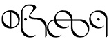 *hudi* “thief,”  *habasi* “idol,” and 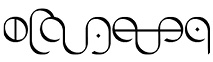 *heimbi* “loser,” when Irathients made first contact in their solar system, the class shifted to cover all aliens. Thus,  *zbaba* is “father” if the father is Irathient, and  *hababa* is “father” if the father is alien (e.g. human).

The other semantic categories drifted in similar fashions, admitting many members that ended up being quite far from the original intent. For example, a nice pair illustrating the origins of Classes VII and VIII are the words 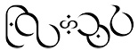 *unnire* “rain” and 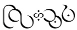 *enniru* “rainstorm.” As Class VIII covers dangerous objects, many weapons fall under Class VIII, like  *eziru* “spear.” Since weapons are manmade, Class VIII also came to encode words for artificial versions of natural objects, leading to pairs like 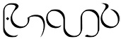 *utame* “face” and  *ekamu* “mask.” Building off the idea of weaponry or tools, surprising pairs also began to pop up, such as  *ulluze* “reason” versus  *elluzu* “excuse” and  *uttu* “advice” versus 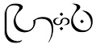 *ettu* “criticism.”

Classes XV through XVIII collectively became the “everything else” classes, for two reasons. First, diminutives can be anything; it’s all perception. Second, since Classes XVII and XVIII are the only classes that have an optional class prefix, most borrowed words ended up there. Now when a new word comes into the language—say,  *ledo*, the Castithan word for “emblem”—it gets stuffed into Class XVIII, regardless of whether it’s an augmentative or not, just as 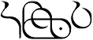 *leide* “badge” is not.

Part of the fun in having a system like this is working with borrowings that *do* fit into a class because of the phonology of the word. For example, the Castithan word  *dimo* “cover” was borrowed into Irathient as 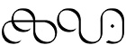 *dim* “clothes,” more commonly used in the plural,  *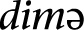*. Due to the initial *d*, it was treated as a Class V noun with a root of 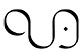 *im*. This led to the production of words like  *thim* “clothing” (Class XII) and  *tim* “wardrobe” (Class XVI), regardless of the fact that the *d* isn’t separable from the root in Castithan.

The best part about the system for me is that when sitting down to coin a new word in one class, I’m automatically asked by the system itself to imagine how else the concept of the root may be reified in the other seventeen noun classes. This leads to the creation of words I never would have thought of independently, like  *nunone*, a word for the usual or safe way of doing things, or  *utenye*, a mound of dirt that’s been formed as a result of an animal burrowing into the ground. I didn’t intend to create these words: they suggested themselves as I was coining other words. It makes coining new words fun, and that’s part of what’s made Irathient my favorite language of all the ones I’ve created thus far.
