# CHAPTER III

# Evolution

### INTRODUCTION

As is common knowledge, there are fewer content restrictions for cable television programs such as HBO’s *Game of Thrones* and Syfy’s *Defiance*. However, a standard of review does apply to content for broadcast television networks. For the CW’s *Star-Crossed*, the first show I’d worked on that appeared on network television, one of the early words I created for an Atrian tribe, , got turned back because it was too similar to the Chamorro pronunciation of Guam, *Guåhån*  (and props to CBS Legal: they were absolutely correct!). I’d never had to be concerned about things like that for the other shows I’d worked on, beyond a bit of self-policing—which, by the way, I’m usually pretty good at, despite my lack of familiarity with Chamorro beyond a relational grammar analysis of its voice system by linguist Sandra Chung.

In addition, though, most of the time when I create a word or translate a line, that’s the end of it. It may get cut, or may need retranslating if the English changes, but the language part of it is always my domain. Once in a blue moon, a change would be required, as with the *Daenero* to *Daenerys* change discussed in the previous section, or when Kevin Murphy, showrunner of *Defiance*, asked me for a new Irathient word for “paradise,” since my word had the potential to be said in a singsongy way (and he was right about that), but for the most part what I say goes. This is one of the things I like most about working as a language creator.

Not so on *Star-Crossed*, though. Whether it was because of legal concerns, or because the writers didn’t “like” a particular word, it seemed like I was getting requests every single week for different iterations on some word or name or another. The problem is that a language’s vocabulary is not a mere word list. It’s rare that I go in and create a single word for a single concept. Instead, a single word will give birth to a family of related words and concepts. Here, for example, is a full entry for one root in Sondiv that stemmed from a single request:

*ketur*  (adj.) sleepy; *ktor* \[ktor\] (ii) bed; *bektudon* 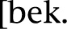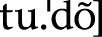 (vi) bedroom; *ektira*  (viii) dream (for “to dream” use a movement word with *ektira* as a destination); *ini m’ektira*  (expr.) to dream; *iktur*  (xiii) to sleep; *eketr*  (xi) a drug that can be used to induce sleep and affect dreams (see *ktovor*; the part of the plant used as a drug); *soktur*  (xv) sleep, a period of sleep (any length), nap; *ktovor*  (xxiv) a plant that induces sleep and can be used to affect the user’s dreams

The original request was for a drug that could be used to affect people’s dreams. Everything else I created using Sondiv’s derivational system. This is how I populated the language’s vocabulary, and also generated words that ended up being used later on in the show. Generating the vocabulary in advance like this saves me time, and the interrelationships of vocabulary items are a big part of what produces a naturalistic result, as words in every language are similarly interconnected. Changing a word, whatever the reason, has devastating consequences on the paradigm, and usually requires ripping out everything I’d already done, so I’m not a big fan of changing things after the fact.

For episode 109 of *Star-Crossed*, I needed to generate a bunch of Sondiv vocabulary, including a word for a kind of black box from an alien spaceship. Rather than record just the audio or video of a flight in the event of a crash, though, this object would allow anyone who interacted with it to experience the crash from the point of view of the pilot. I decided to base the word on the already established root used for memory. The word ended up being  *emern* , which, admittedly, doesn’t sound very good, but it’s a pretty cool word, as it basically means “a tool associated with memory,” or a “memory machine.” That, in effect, is what the thing is, after all.

News came back that the writers didn’t like the word—it was too similar to Emery, the name of the show’s main female character (true enough), and didn’t roll off the tongue (also true). I spun a bunch of alternatives, but didn’t hear anything back until poor Brian Studler, one of the show’s writers, emailed me saying that while he’d tried to argue for one of my alternatives, he was overruled, and tried to go with a compromise: the word *mirzan* .

*Mirzan* didn’t fit any of the established nominal patterns of Sondiv. The linear ordering of vowels and consonants in Sondiv is quite specific, and so doing something small—like having the word end with -*an* instead of -*on*—made the whole word *completely* impossible.

Or so I thought.

Because before I even pulled out my Sondiv dictionary I’d thought up a solution.

Even though there couldn’t be a word like *mirz*, and such a word could never end in -*an*, a word like *rzan* was perfectly possible. And even though it’s used to form reflexive verbs, there is a *mi*- prefix in Sondiv, meaning that, if the verb was turned into a noun via regular derivational patterns, there *could* actually be a noun *mirzan*. Now it was just a matter of figuring out what the heck it would mean.

The first step was seeing what similar words or roots existed. Sondiv, somewhat similar to Arabic, has a series of two- and three-consonant sequences that encode general semantic ideas, and then these consonants are arranged into series to produce specific nouns and verbs. A word like *mirzan* would need to come from a root with the consonants *R-Z-N* or *R-Z-M*, since the final *n* is just indicative of nasalization on the vowel at this stage, which can be triggered by a final \[n\] or \[m\]. The reason for this is that the consonants *R*, *Z,* and *N* appear in that order in the word *miRZaN*. As it happens, there already existed a root *R-Z*, which was used for, among other things, the verb  *idus* , which means “to touch.” This was a start.

Jumping off from here, I looked into the ancient derivational patterns I’d created just in case I needed them. The older language—the proto-language that gave birth to Sondiv—had a series of root extensions that altered the original meaning of the root in a series of ways. By adding a root letter *M* to the end, it’d produce a meaning that was metaphorically entailed by or related to the original concept. I used this to produce the verb *irzon* 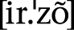, which means “to experience.” By adding the reflexive prefix *mi*-, it produced the verb *imirzon* , which means “to experience firsthand.” By retaining the *mi*- prefix and changing the root pattern, the result is 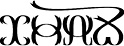 *mirzan*—our word—which is an animate word that refers to someone who has experienced something firsthand.

Getting from that to a flight recorder is a step, but not a difficult one. Often when a tool is developed that fulfills one or more of the functions of a human, it can be referred to by the name of the human agent. One of my favorite on-the-fly examples is from the show *The Venture Bros.*, when Dr. Venture refers to his bedrest pillow (a back pillow with armrests) as “the husband.” More generally, agentive words often can refer to humans or instruments, depending on what they do, for example, *conductor* (of electricity or a symphony), *driver* (of a car or a golf ball), *speaker* (at an event or at the end of a wire attached to a stereo), etc. Even in linguistics we routinely use the terms *mother* and *daughter* to refer to languages that have a similar genetic relationship. Anthropomorphization is a favorite human pastime, so if an alien species is sufficiently humanoid, why wouldn’t it be a favorite pastime of theirs, too? And so, *mirzan* came to exist quite happily as the alien black box.

Ultimately, the question I wish to raise is how do words come to mean what they mean? In the fictional history of the Atrians, the alien species in *Star-Crossed*, presumably they created this cool bit of technology and had to call it something. Humans find themselves in similar situations frequently. What we don’t do is create a brand-new root out of nothing. Instead, we use what we have to come up with an appropriate name for whatever new invention we’ve created. This is partly due to convenience, and partly due to marketing. After all, the best way to introduce an invention is to explain what it can do that will help make folks’ *current* lives better in some way. It has to be relatable. Thus we start with known experience and extrapolate to unknown experience, until it becomes a part of our shared history. This same principle applies to language evolution.

In this section I’ll discuss the three major forms of language evolution: phonological evolution, lexical evolution, and grammatical evolution. Understanding the principles of linguistic evolution is the most important prerequisite for understanding the tenets of naturalistic language creation. A fleshed-out history is what separates languages that are good enough from those that are excellent. Unfortunately, linguistic evolution is also the most difficult aspect of language creation, so, you know . . . no pressure. It’ll be fun! Like a stage play of *Ulysses* where all the characters are played by kittens. (*Stately, plump Buck Kittykins* . . .)

### PHONOLOGICAL EVOLUTION

Each of the three main areas of linguistic evolution has been studied by linguists, but some for a longer period of time than others. **Phonological evolution**, the way sounds change over time, has the longest academic track record of the three, and it’s the best understood. Consequently, it’s the best place to start.

English speakers have an unfair advantage when it comes to explaining sound changes since our gloriously appalling spelling system preserves, in many cases, an older state of the language. For example, take this word:

*knight*

We know how that’s pronounced: \[najt\]. Its pronunciation is identical to *night*. Neither word really looks like it should be pronounced that way based on the spelling—a better spelling for both would be *nite*—but speaking English means swallowing horse pills like this one and memorizing the darn words.

But have you ever wondered just *why* the word is spelled that way? What’s the point of it? It’s not as if our writing system is anything like Chinese’s, or like hieroglyphs, where pictures or abstract glyphs stand for concepts: Our writing system is *supposed* to clue us in to the pronunciation of the word. And it kind of does. But how did it even get to that point? Did someone sit down and decide to make a bunch of -*ite* words end in *-ight*—and then get drunk and decide to mess with people by creating the spelling *weight*?

Not so! Writing systems, as we’ll learn, are organic things, just like languages. As words come into a language, they gain spellings. And unless a language’s orthography is tightly regulated, as it is in Spanish, old pronunciations will be reflected in a word’s spelling. Looking at *knight*, the word used to be pronounced \[knixt\]. Yes, that *k* was originally pronounced just like a *k*, and that *gh* used to be pronounced, too—kind of like the *ch* in German *Bach*. To whoever came up with the spelling, then, they were spelling the word *exactly* as it was pronounced: *k* for \[k\]; *n* for \[n\]; *i* for \[i\]; *gh* for \[x\]; and *t* for \[t\].

Then a bunch of stuff happened. At some point in time, we stopped pronouncing a \[k\] sound in front of an \[n\] sound at the beginning of a word (hence *knot*, *knee*, *knock*, etc.). It might seem odd to a modern-day English speaker to ever have that combination of sounds begin a word, but it happens. Initial \[kn\] clusters are preserved in German (cf. *Knoblauch*  “garlic”) and in Russian (cf. книга  “book”). We even do it sometimes if we pronounce a word like *connect* really quickly. Despite the loss of the sound, though, we kept the *k* in the word’s spelling—maybe to distinguish the word from *night*, or maybe just out of habit. For whatever reason, we’re stuck with it today.

An entirely separate sequence of sound changes affected the *igh* part of the word. First, we lost the sound \[x\] represented by *gh* before a consonant. It just disappeared. It left something in its wake, though. As if compensating for the loss of the old \[x\] sound, the previous vowel was lengthened. Thus, the short \[i\] vowel became a long  vowel. This is important, because what happened next would change the face of English forever.

Ever wonder why an English speaker has to unlearn everything they know about vowels before learning another language? It’s because of something called the Great Vowel Shift. The Great Vowel Shift was an innovative period of great turmoil for English. We’ve learned previously that when a linguist calls a vowel long or short, they’re referring to literally how much time it takes to speak—not to its quality. English used to have short and long vowels like this. As a result of the Great Vowel Shift, the long vowels all became short *and* changed quality. Short vowels retained their short duration but became lax. Basically, every single vowel radically changed its pronunciation.

As you can see, it was a mess—and not super consistent (consider *lose* and *rose*). For our purposes, though, we saw that what was \[ix\] became . And, thanks to the Great Vowel Shift, what was  became \[aj\]. A sensible spelling system would have altered the spelling of the word, but instead we’re stuck with *knight*: the ghost of a former stage of the English language.

So, yeah, languages change pronunciation over time. All languages. There are three main reasons that languages do so, and they are:

1. **Ease** **of Articulation:** As a language is spoken more quickly or casually, certain distinctions maintained in careful speech can be lost. Consider how often the first *t* is left unpronounced in words like *argumentative*, *preventative,* and *Sacramento*.

2. **Acoustic Interference:** If a distinction isn’t always easily heard or is routinely obscured by its phonetic environment, it can be lost. This is what happened to the *l* in words like *talk*, *walk*, *folk,* and *yolk*. It’s also why many (including me) don’t have a rounded \[w\] sound before rounded vowels in words like *quart* or *quarter*.

3. **Innovation:** This is another way of saying that sometimes it just happens. Sometimes a group of speakers just ends up sounding different, and the change appears to be unmotivated—  
or the simple motivation is that speakers want two similar sounding words to sound different. The Great Vowel Shift is one of those changes, as are many of the subsequent vowel changes in English (consider the New Zealand pronunciation of *rest*, which sounds almost identical to the American pronunciation of *wrist*).

One of these motivations lies behind every sound change that has occurred in natural languages the world over. They also help lay the groundwork for what a language creator does in creating a naturalistic language. I’d call it the cheater’s way of introducing complexity into a system if employing naturalistic sound changes were actually cheating. But, no, it’s legit; it just *feels* like cheating. (Best of both worlds!)

There are innumerable sound changes that have occurred in the history of language, and an entire universe populated by sound changes that are plausible yet have never occurred. I’ll show you some of my favorites from each of the three categories introduced above.

Ease of Articulation

Sound changes that take place in order to maximize the ease of articulation are the simplest to understand. We’ve seen a little bit of this with tone sandhi, described in the first chapter of this book. The trick is defining what “ease” is. Let’s start with a basic example (thesaurus’s getting a workout! Wonder if I can work “facile” in?). Consider this nonce phonetic form:

It’s already pretty simple to pronounce, but what would make it simpler? Well, we have two identical  sounds and a naughty \[t\] separating them. One way to simplify the pronunciation would be to make the \[t\] more like the sounds around it. Now how to do that? For starters, the vowel  is voiced, but \[t\] is voiceless. That means to pronounce this word, your vocal folds will have to start vibrating to pronounce the , go still for the \[t\], and then start vibrating again for the . Wouldn’t it be nicer to our poor old vocal folds if they could just vibrate right on through the whole word? Let’s give it a try!

Now we’re cooking with gasoline! This is what in linguistics is known as **assimilation**, where one sound becomes similar to a sound before or after it. But you know what? Even though it’s voiced, that \[d\] is still a stop. Airflow through the mouth is completely closed off in the middle of the word. That’s a bummer. Why not speed things up a bit by reducing the duration of that closure as much as humanly possible? In other words, why not turn that \[d\] into a flap, ? It’ll still be alveolar, so it won’t have lost its identity; it’ll just come out a little smoother. So . . .

Voilà!

But you know what? It’s a pain to have to pronounce a full  vowel like the *a* in *father* at the end of the word. We put so much effort into pronouncing the first part of the word that we’re all out of breath by the time we get to the end! Wouldn’t it be easier if we just reduced the effort we put into pronouncing that vowel? Just a little bit! We’d still know it was a vowel—and not a high one, like \[i\] or \[u\]. Just something like . . .

Yeah, *that’s* it! That’s the money melon!

And notice what we’ve done. That is exactly how we pronounce the end of the word *ciabatta* in English—far different from its Italian pronunciation . This is a pronunciation that was a couple centuries in the making, but we did it for words like *knotted* , *rotted* , *cottage* , *oughta* , etc., and we now apply it to relevant words borrowed into our language.

Ease of articulation can produce some interesting alternations in language. Compare some of these High Valyrian words to their reflexes in one of the daughter languages of High Valyrian, Astapori Valyrian:

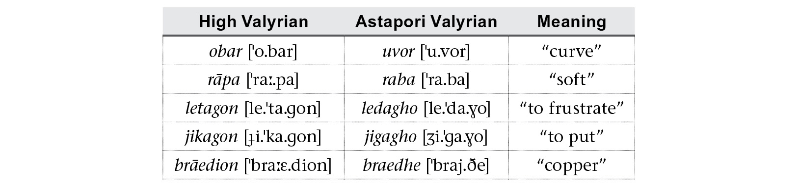

In the table above, look only at the sounds \[p, t, k, b, d, g\] in the High Valyrian column, and see what happened to them in the Astapori Valyrian column. To sum up, High Valyrian \[p, t, k\] became \[b, d, g\], respectively, in Astapori Valyrian in between vowels. A separate change also turned High Valyrian \[b, d, g\] into Astapori Valyrian \[v, ð, \] in the same environment. Each set moved one step closer to being more like the vowel sounds around them to make pronunciation easier. Notice that it occurred only in between two vowel sounds, though. That makes for some interesting alternations, as the one shown below:

Notice in the plural, the \[b\] is retained in Astapori Valyrian. This is because the original High Valyrian \[b\] occurs in between a vowel on the left, \[o\], and a consonant on the right, \[r\]. That blocks the sound change from occurring, and so an irregular plural is produced.

Also notice that the two sound changes—the one that turned \[p, t, k\] into \[b, d, g\], which is called **intervocalic voicing**, and the one other that turned \[b, d, g\] into \[v, ð, \], which is called **intervocalic spirantization**—had to occur in a precise order. Specifically, intervocalic spirantization *had* to occur before intervocalic voicing. If the inverse had happened to, for example, *rāpa*, “soft,” it would first have become *raba* in Astapori Valyrian, and then would immediately have become *rava*. As that didn’t happen, we have evidence of rule ordering—that is, when chronologically one change occurred with respect to the other.

Some other sound changes driven by ease of articulation are touched on below:

• **Vowel Harmony** causes affixed vowels to change their quality to be closer in quality to the vowels closest to them. In Shiväisith from *Thor: The Dark World*, for example, a suffix will have either a back vowel or a front vowel, depending on whether the previous vowel is a back vowel or a front vowel. Below is an example illustrating the distinction between the -*a*  variant of the dative suffix, and the -*ä* \[æ\] variant:

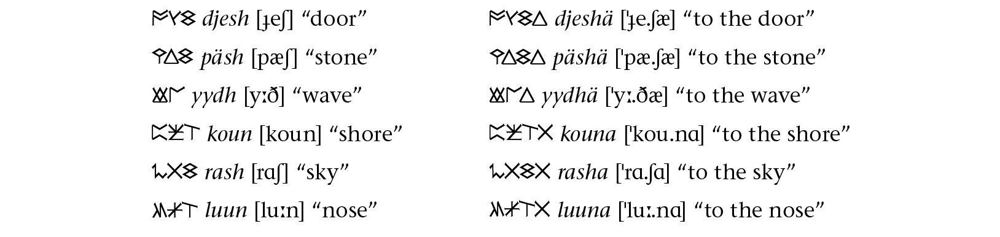

The original suffixed form was simply -*a* . Internal pressure to ease pronunciation, though, caused the vowel to move forward for words that had all front vowels. Thus, an older form would have been \**djesha* , and then, over time, it became modern *djeshä* 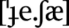, producing the modern vowel harmony system.

• **Word-Final** **Devoicing** sees voiced stops or fricatives becoming voiceless at the end of a word. When speaking, we start out with the highest volume of air coming out of our lungs, and wind up with less as it passes out of our mouths. If there’s less air at the end of a phrase, then it’s harder to maintain voicing. Consequently, a number of languages simply allow voiced consonants at the end of a word to lose their voicing. Indojisnen, from Syfy’s *Defiance*, is one such language. Compare the nominative and vocative forms of the pairs of words below, focusing on the final consonant of the stem:

To illustrate that this isn’t simply intervocalic voicing, though, compare the following forms, where the word-final voiceless consonants remain voiceless:

• **Neutralization** can affect segments in less prominent environments, as in unstressed syllables. In English, most vowels come out as schwa  in unstressed syllables, as shown in the pairs below:

In the history of Castithan, the high vowels \[i\] and \[u\] were lowered to \[e\] and \[o\], respectively, at the end of a word, so that the tongue could rest in a more relaxed position at the end of an utterance:

You may also notice that old Castithan was subject to intervocalic voicing, as evidenced by the modern word  “edible.”

These are three examples among many. And one need not rely exclusively on what has happened in the history of a natural language. I often set up some word forms based on my phonotactics and then try to pronounce them as quickly and fluently as possible. What I do with my mouth naturally to accomplish that will often be a clue as to how the system would evolve over the course of centuries.

Acoustic Interference

If I had to guess, I’d say that the majority of sound changes are driven by acoustic interference—that is, one speaker says *x*, and the other speaker thinks they hear *y*, and, pretty soon, the new way to say *x* is *y*. This won’t happen if the new form is heard by only one person: it has to be heard by thousands over and over again in order to take root.

An easy example comes from a set of English last names like mine that should be fairly transparent. My last name is *Peterson*, which breaks down as *Peter’s son*. Simple. And so we have *Jackson* which is *Jack’s* *son*; *Ericson* which is *Eric’s son*; *Dixon* which is *Dick’s son*; and *Thompson* which, logically, is *Thomp’s* *son*.

But hang on. There’s no such name *Thomp* (though there should be. Or no, wait. I’m thinking of *Thwomp*). In fact, the name comes from *Thom*, the original spelling of *Tom*, a shortening of *Thomas*. It should be *Thom’s son*. So where on earth did that *p* come from?

Thinking back to articulatory phonetics, moving from an \[m\] sound (lips closed, air passing through the nose, vibrating vocal folds) to an \[s\] sound (lips open, air passing through the mouth, vocal folds still) is not simple. It can be done, sure, but in casual speech, what ends up happening is we stop our vocal folds vibrating *before* opening our lips but *after* raising our velum. The result? Our vocal folds are still, our lips are closed, and the air is released through the mouth. That’s the textbook definition of \[p\]. Thus, an **epenthetic** or spontaneous \[p\] is produced in between the \[m\] and \[s\] sounds.

This satisfies the first part of the definition. The speaker *believes* they’re saying something like *Thomson*, but the hearer hears the speaker saying *Thompson*. Since the epenthetic \[p\] is a common phenomenon in this environment, *Thompson* will happen quite a bit. Thus, after centuries of English speakers saying *Thompson* with a \[p\] over and over again, eventually people began spelling it that way, and pronouncing the \[p\] *on purpose*, rather than by accident.

That’s the standard life cycle of a sound change based on acoustic interference. Here are a few other common sound changes based on acoustic interference:

• **Gemination** or consonant doubling can be caused by mishearing a consonant cluster. This happened in the history of Italian. Compare the Latin words on the left with the Italian words on the right (just look at the consonant clusters in the middle of the word):

Complex clusters like \[kt\], \[mn\], and \[ks\] were ironed out, producing doubles of the second member. Based on the fact that it can be difficult to determine the quality of the first member of a consonant cluster in environments like these, it’s understandable that, at least in Italian, the first member got replaced by a copy. This produces a consonantal event of the same duration, resulting in a similar acoustic effect. This type of change is quite common.

**Nasalization** has a muddying effect on a previous vowel. This effect is incidental and can be avoided in careful speech. Its presence, though, is enough to indicate to a hearer that the vowel coloring is the important distinction, rather than the final nasal. One potential result is that coda nasals can be lost, producing nasalization on a previous vowel, often affecting its quality. This happened in Sondiv, the alien language from the CW’s *Star-Crossed*, as shown below:

Notice that the high vowels \[i\] and \[u\] were lowered to \[e\] and \[o\], respectively, in Sondiv. In Irathient, from Syfy’s *Defiance*, a following nasal consonant remained, and while it didn’t affect the quality of high vowels, it did affect the quality of low vowels, raising them up from \[a\] and  to \[o\] and \[e\], respectively.

•**Compensatory Lengthening** is when a vowel is lengthened to compensate for the loss of a following consonant. Basically, a vowel followed by a consonant takes *x* amount of time to pronounce. Remove the consonant, and that unit now takes less time to pronounce—a noticeable difference. If the vowel, though, is lengthened so that it alone takes up *x* amount of time, the loss of the consonant might be less noticeable—and, in fact, one may be confused for the other. And that’s how this sound change works. We saw a real world example of compensatory lengthening with the elongation of the vowel in the English word *knight*. Compensatory lengthening also occurred for certain words in High Valyrian. This, for example, is what happened to the irregular verb *emagon*, “to have,” in the perfect:

Above, the first *n* in the stem was lost, and the previous *e* vowel was lengthened to compensate for the loss of the *n*.

There are more, of course, and these types of sound changes are fun to play with, because the question one needs to ask is, “How might a given word/phrase be misheard?” Misapprehension is one of the driving forces of language change.

Innovation

A language that changes very little is called conservative; one that changes a lot is called innovative. For example, Icelandic has allegedly changed very little in about a thousand years. On the other end of the spectrum, Portuguese split away from Spanish to the point of mutual unintelligibility in about the same time frame. Why does one language change while another remains stable? Happenstance, really. But it’s important to note that the Spanish and Portuguese *wanted* to sound different from each other—to distinguish themselves. Their social and political differences were magnified in language.

Another fine example is teenagers. Slang comes and goes every decade. Why? Because teenagers of every generation want to distinguish themselves from the previous generation in how they dress, in what they buy, in how they act, and in how they speak. Some of it sticks around (*cool*’s been around for more than seventy-five years), while some of it gets left in the dust (no one can—or should—say *gnarly* unironically). The same is true of speech patterns. Younger generations, if allowed to flourish, are endless sources of innovation. If they hang on to their innovations into adulthood, their innovative patterns solidify into regular patterns.

The key is, though, that *none* of these changes may have any motivation whatsoever. It’s not speakers trying to speak more quickly, or speaking more casually, or mishearing one another: They’re just doing it. Just. Because.

Of course that doesn’t mean the sound changes are totally random. They all have their own sense to them. Here are a couple examples of innovative sound changes:

• **Dissimilation** is when one sound spontaneously changes next to another similar sound. The idea behind dissimilation is to make the sound that changes *more* distinct, so that it doesn’t get lost in pronunciation the way the initial consonants in Italian consonant clusters from above did. In Dothraki, a stop will become a fricative when it occurs before another stop. This is easiest to see in compound words:

Since the final consonants in these words are not in an acoustically salient position, Dothraki speakers make them more distinct by turning, for example, /t/ into \[θ\]. One of my favorite dissimilations that I tend to overuse sees the glides /j/ and /w/ becoming the fricatives  and \[v\] before \[i\] and \[u\], respectively, as happens in Sondiv from *Star-Crossed*:

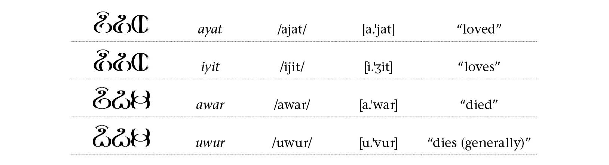

The idea with the above is that a glide like \[j\] is almost identical to a vowel like \[i\], so in order to alert listeners to its presence, it becomes even more of a consonant by becoming the fricative  sound.

• **Breaking** is one example of an unmotivated change to a vowel, where a single vowel becomes a diphthong or triphthong. This is a *great* way to produce differing accents from a single linguistic source. In the history of Castithan, short high vowels broke in stressed syllables, such that old /i/ and /u/ became modern \[je\] and \[wo\]. This change, though, did not affect long high vowels in stressed position—which later shortened—as shown below:

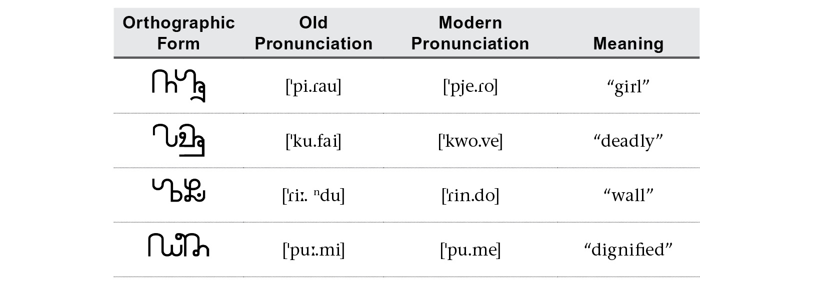

A similar change happened in the history of Spanish, as is seen in certain verbs in different conjugations, for example, *tienes* “you have” versus *tenemos* “we have.”

• **Epenthesis** is the spontaneous insertion of a sound to prevent two sounds from occurring next to each other. Epenthesis happens in just about every language in one form or another. In the history of Castithan, an epenthetic \[l\] was introduced whenever a long vowel or diphthong would have occurred next to another vowel, as shown with the following verb forms:

In Irathient, an epenthetic schwa  is inserted to break up difficult consonant clusters:

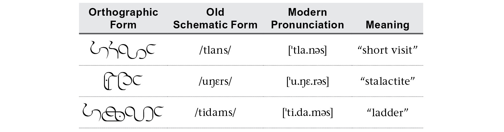

Notice that even a simple sound change like the epenthesis rule for Castithan can produce complexity that wouldn’t be there otherwise. For example, now in Castithan the present tense form has two suffixes—/-a/ and /-la/—and they’re added depending on whether the verb stem ends with a consonant or a vowel—this despite the alternation arising from a more or less regular system in the prehistory of the language. As a language creator, I’m constantly researching the histories of the languages we speak on Earth in order to add to my repertoire of potential sound changes. It’s one of the easiest ways to take a simple system and turn it into a complex, realistic one.

### LEXICAL EVOLUTION

The easiest of the three types of language evolution to understand is **lexical evolution**: the way words change meaning over time. Anyone who’s been alive at least sixteen years should be intimately familiar with this process. For those younger, I’ll catch you up to speed.

Last millennium, I started college as a freshman at UC Berkeley, which is in the middle of California—about four hundred miles north of where I grew up, as the dragon flies. In my first year I lived in the La Loma dorm at the northeast corner of the campus along with eleven other guys. Three of them came from a place known as Half Moon Bay, a short drive from Berkeley. Shortly after getting our new internet hooked up, the Half Moon Bay three were testing their download speeds, and one of them exclaimed in excitement, “*Sick!*”

This pronouncement—of joy, apparently—took me completely off guard. *Sick?!* Why would anyone describe superior download speeds as sickly? How does that make sense? It’s not even a lifeform; it can’t *get* sick. How could anyone say that about a . . . process or phenomenon? And why?

This was my very first encounter with the positive use of the word *sick*. I’ve had many more since then, of course, but that first one was quite jarring. It shouldn’t have been, though, because this type of semantic change is quite common. It’s a process whereby a word that expresses some extreme negative trait or quality is turned into a positive exclamation (a technical term for it is **autoantonymy**). Back when I was a kid, the one we would say was *bad* (thank you, Michael Jackson). I’ve also heard *stupid* and *ill* used positively, and if you come from an English-speaking area, you can probably come up with a dozen others. Some last (typically the adverbs expressing scale or extremity, like *terribly*, *awfully*, *horribly*, etc.); some don’t. But new ones always have—and always will—keep popping up.

As a conlanger, it’s very tempting to look at the vast lexical possibilities that exist and encode them all as if each meaning deserved a basic term—something like:

*mantak* (n.) the hair on the right side of a human’s head (from a viewer’s perspective), if the hair is parted exactly down the middle

*lumit* (n.) the sudden joy at realizing that one is not a squid, followed by a lingering feeling of melancholy over the plight of squids in general

*bolku* (n.) the piece you would need to finish a puzzle if you were putting together a puzzle

*nipak* (n.) the piece you need to finish a puzzle that you are actively putting together

*karev* (n.) an anecdote misremembered while you’re visiting your paternal aunt for lunch on a weekend when you have work or school the next day

There are limitless numbers of things that can be encoded in language, but most languages don’t do it with single words that arise ex nihilo. In English, for example, what’s the word for when you’re picking up your very first slice of pizza and your favorite topping tumbles off and falls to the floor *right* as you’re taking a bite? Is it *blorpy*? No. It’s nothing. There is no word for this. It doesn’t mean we can’t talk about it. And if we had to create a word for it, we wouldn’t go to our letterboard and come up with a brand-new form: we’d come up with a euphemism—like a DiCaprio, since that topping was *so* close to enjoying the lasting safety of your stomach acids if it’d just hung on to the pizza life raft for a few more milliseconds . . .

There are a number of principled ways that words change meaning over time. In this section, I’ll go over some of the most common or most important ones.

• **Specialization** is when a generic term comes to be used for something specific. An example from English is the word *salsa*, which we borrowed from Spanish. In Spanish, *salsa* just means “sauce” (both *salsa* and *sauce* even come from the same Latin root). In English, though, *salsa* refers only to a specific type of spicy sauce that comes from Mexico. In Castithan, the word  *tilo* used to refer to any type of veil, but now refers exclusively to the face covering worn by brides during their wedding. This is basically how the change works: anything that has a generic reference becomes associated with a particular item or event, and so the word comes to refer exclusively to that item or event.

• **Generalization** is the opposite of specialization and is quite common. It’s when a specific term comes to be used for something generic. Most modern examples refer to products. *Kleenex*, for example, used to refer exclusively to a brand of facial tissue, and now refers to facial tissue in general. *Google* is now a verb, regardless of what search engine one uses. And *pants*? It’s a shortening of *pantaloons*, which were named after a character in Italian comedies from the sixteenth century named *Pantaloun*. They were so named because *Pantaloun* used to wear a very specific type of (for lack of a better word) pants. So saying someone was wearing *pantaloons* at that time was like saying someone has a Janelle Monáe hairstyle nowadays. It eventually just became a word. In Castithan, the old word for water,  *tholo*, now refers to any type of fluid or liquid.

• **Metaphor** is referring to something as something else, in its most generic sense. Using a metaphor implies some kind of similarity between the two. For example, in English, the word *face* is used to refer to any flat surface. As a result of the fact that we consider where a person’s face is to be the front of the person, we also consider the face of an inanimate object to be the front or interactional side of that object. Metaphor deserves its own book, but luckily it’s got one: *Metaphors We* *Live By* by George Lakoff and Mark Johnson, which I *strongly* recommend all humans read. For a conlang, metaphorical concepts often come in bunches. Thus, in Dothraki, if the word for “head,” *nhare*, is the leafy part of a tree, *lenta*, “neck,” is used to mean “tree trunk”; *fotha*, “throat,” is used to refer to the interior of a tree; and *gadim*, “lungs,” begat *gadima*, the word for a tree’s subterranean root system. The result is a series of interconnected terms that describe an entire system of related concepts. Metaphor *must* be taken into consideration or metaphors from a conlanger’s own language will be unconsciously borrowed into the conlang.

• **Metonymy** is referring to one thing by means of something related to that thing. A simple example is referring to the entertainment industry as *Hollywood* or to the U.S. government as *Washington*. While such names are largely situational, metonymy can operate over the course of a language’s history. For example, the Castithan word  *chango* used to mean “fist.” It now is used to refer to a thug or a bouncer. Another very common example found not just in conlangs, but in all manner of natural languages—including English—is the use of the word for “tongue” to refer to “language.” The difference between metonymy and metaphor is that the two objects compared in a standard metaphor have nothing to do with each other (like a neck and a tree trunk). With metonymy, one object is used in the production of or involved with the other (as a tongue is with a spoken language).

• **Synecdoche** is a specific type of metonymy where an object that’s a small part of a larger object or system is used to refer to the whole thing. An oft-cited English example is the use of the word *hand* to refer to a worker (who, presumably, will be using his hands while doing the work in question). Another historical example from Castithan is the word  *wozo*, which was a word that used to refer to the top or crown of the head. It’s now a second person pronoun (“you”), where the idea was to use a body part to make reference to the entire person.

• **Ellipsis** refers to the creation of a new word from the shortening of a phrase or longer word. In English, both *cell* and *mobile* have attained new meanings referring to mobile phones, even though they already had other meanings. The same thing happened decades earlier with *phone*, which was a shortening of the word *telephone*. In Irathient, from *Defiance*, the same thing happened with the phrase  *thanaku parko*, literally “fall of an Ark,” which is used for when the huge Ark ships in orbit fall to Earth. Now arkfall events, as they’re called, are just referred to by  *thanaku*, which is simply the word for “fall.”

While these and other processes operate on lexical material throughout the history of a language, there are four outcomes that are often the result of the various changes words undergo. They are:

• **Augmentation:** A word with a neutral or lesser meaning intensifies. An easy example would be use of the word *whack* to mean “kill.” In Castithan, the word  *furíje*, which meant “beautiful,” now means “perfect.”

• **Diminution:** A word with an extreme meaning weakens. For example, the English word *peruse* used to mean “to pore over intensely,” whereas now it means “to casually glance through.” In Castithan, the word  *dailu*, which meant “to burn,” now means “to cook.”

• **Amelioration:** A word with a neutral or negative meaning becomes positive. The example that opened this section, *sick*, is an example of amelioration. In Castithan, the word  *cheni*, which meant “quiet,” now means “nice” or “proper.”

• **Pejoration:** A word with a neutral or positive meaning becomes negative. In English, *gross* used to mean “large”—and its German cognate, *groß*, still does. In Castithan, the word 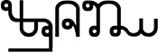 *zembalu*, which meant “to harvest,” now means “to kill.”

Before moving on, there is one specific area of lexical change in natural language I’d like to address. All languages—or if not all, most of them—have experienced what I’ll call **feminine pejoration**. This is a specific and frustrating type of change whereby if there are two otherwise equivalent words—one referring to a male, and the other to a female—the female-referring word has a much greater chance of undergoing pejoration than the male-referring word. In English, the word *cow*, which at one time referred primarily to female cattle, can be used in a derogatory fashion to refer to a woman. The same can’t be said of gender-neutral or male words for bovines (*bull*, *steer*, *cattle*, etc.), and some even have positive connotations (*strong as an* *ox*). The word *wench* used to be a rather neutral word for a girl, but attained negative connotations rather early on. Numerous words with negative connotations referring to females—*slut*, *whore*, *temptress*, *seductress*—have no obvious or equally negative male counterparts. And while the occasional word will pop up for use exclusively with males in roughly the same way (*bastard*, which originally only meant illegitimate child, appears to be an insult that can only be used with men), the overwhelming majority of such words refer exclusively to women. All the examples here are English, but the pattern is borne out in just about every natural language.

The pattern of misogyny illustrated here is a product not of language, but of those who use it. At any point in time users can put a stop to certain practices, and the results can be successful (cf. the ascendance of singular “they”). As a language creator, it’s often a difficult thing to balance realism and ethics. The Dothraki, for example, appear to be a fairly patriarchal bunch, all things considered. The language they employ is often misogynistic—and the same is true of the slavers in Slaver’s Bay and the Castithans from *Defiance*. Their histories would likely not be vastly different from our own with regard to patriarchy.

Even so, I’ve always kept in mind that creating a language means creating the vocabularies of *all* speakers. A language’s lexicon contains words used by the privileged and the disenfranchised; the elderly and the very young; warriors and artisans; men and women. The speech and behaviors of one character don’t define a language, and there’s always room for representation of all aspects of a culture in a single lexicon.

Getting back to lexical change in general, of paramount importance to me is the role semantic change plays in the construction of a lexicon. Though one thinks of a conlanger as someone who creates words, creating a *brand* new word is always my last resort. If a new word is needed, I always ask myself this question first: What have I already got? Recycle, reduce, reuse. This is what we do with our own languages, so it stands to reason that if one’s conlang is supposed to *look* like one of our languages, one should do the same.

### GRAMMATICAL EVOLUTION

**Grammatical evolution** is the most difficult, least described, and most exciting aspect of linguistic evolution. Grammatical evolution is how grammar itself emerges—basically, everything you saw in the last chapter: plurals, verb conjugation systems, noun marking systems, etc. When it comes to historical linguistics and language modeling, this is the final frontier. We know a lot, but there’s still a lot of fog out there in the depths of our linguistic history—and that means there’s a lot of territory for a conlanger to explore.

The idea behind grammatical evolution is that every single piece of grammar ultimately has a lexical source. That means a plural suffix, a past tense marker, an adverb marker, an evidential marker—all of that will ultimately come from one or more concrete words that have been eroded over the centuries. This is a bit of a counterintuitive notion, but it’s actually fairly simple to demonstrate.

Let’s start with a familiar example: -*ly*. We know that you add -*ly* to an adjective in English to form an adverb: *jaunty* \> *jauntily*; *fanciful* \> *fancifully*; *robust* \> *robustly*. Of course we also see this word added to nouns to make adjectives, which is a bit odd if you know the first rule: *friend* \> *friendly*; *knight* \> *knightly*; *king* \> *kingly*. You can’t say “I greeted him friendly”; despite its looks, the darn thing really isn’t an adverb. Why is that?

As it turns out, it has to do with the history of the suffix. It came from an actual word. You might be able to guess it by looking at it, but if not, maybe this will help. The -*ly* suffix in English is cognate with the -*lich* suffix in German. Starting to look familiar? It actually comes from a stem meaning something like “like” (and before that, meaning something like “body,” but the suffix derives from the “like” stage of its existence). Thus, someone who is knight-like is *knightly*, and if you perform an action quick-like, you do it *quickly*.

We can even witness changes like this one happening in modern times. For example, *alcohol* is a thing I don’t drink, but someone who drinks a lot of it is called an *alcoholic*. Some clever ad executive some time in the twentieth century thought, “Well, if an *alco*holic is someone who drinks alcohol to excess, then a *sugar*holic is someone who eats sugar to excess!” And so we were gifted with sugarholic—soon to be followed by shopaholic, workaholic, rage-aholic, blogaholic, cheese-aholic—pretty much whatever-you-want-aholic. A similar story can be told with the -*ous* suffix which came to us from a Latin word that originally meant “smelling of wine.”

It’s also worth noting that as much as these things may start out as lame jokes, they eventually become grammar. No one looks askance at you now for saying *vicious*, *cautious*, *gracious*, *strenuous*, or any of the many other words ending in -*ous*: it’s just a part of the language. The *-oholic/-aholic* suffix is on the way there, too—as is -*gate*, if things keep going the way they’re going (i.e. controversy + -*gate* = the social interest in and/or furor over the named controversy).

Imagine if you didn’t speak English, and you were being introduced to the suffixes of English and what they mean. Your instructor tells you, “And you add this suffix to any word and it forms a noun that means a media frenzy about the controversy associated with the word you added the suffix to.” That sounds *sooooooooooo* fake. Why would a language have a suffix for that?! If a conlanger did that, they’d be strung up by their ears!

And yet it exists. The reason *always* lies in the history of the language—in this case, in the scandal regarding a team working on behalf of Richard Nixon stealing documents from the opposing party in the 1972 presidential election (the scandal was named after the hotel where the documents were stolen: the Watergate). If you know the story, it actually becomes a little less mysterious. It makes sense.

And stories like this one lie behind *all* grammar.

There are several books on these processes, which, collectively, are called **grammaticalization**, and I strongly recommend them, as they’re *fascinating* (they also stack well). In this section, I’ll go over some of the general principles, and some of the common pathways of grammaticalization that I’ve utilized in the languages I’ve created.

Semantic Bleaching

The first step on the path of grammaticalization is **semantic** **bleaching**: when a common word loses some of its specific meaning, leaving behind a more general meaning. A nice way to break this down is to *really* tease out the meaning of a given lexeme that has evolved away from its original source. Take *can*, for example—the one that means “be able to.” It comes to us from a root that meant “to know” (in fact, it comes from the *exact* same root that gives us the word *know*). When used with another verb way back when, it meant “to know how to”—somewhat equivalent to if someone told me I couldn’t make stuffed mushrooms, and I replied, “Don’t tell me I can’t make stuffed mushrooms! I *know* making stuffed mushrooms!” Because I do. And they’re *great*.

When used in this context (that is, with *can* as the main verb and some other verb being used as the thing one knows how to do), here are the meanings associated with or entailed by *can*:

1. The subject has the mental capacity for performing the action in question.

2. The subject has the physical capacity for performing the action in question.

3. The subject knows what the action in question is.

4. The subject understands the process involved in performing the action in question.

So that’s what *can* meant way back when. What happened gradually over time is that meanings 3 and 4 began to be deemphasized, leaving behind simply 1 and 2: the subject has the physical and mental capacity to perform an action. That’s pretty close to our modern meaning of *can*, but it’s still a little too specific. What about a sentence like *That knife can cut a watermelon in* *half*? Certainly a knife has no mental capacity whatsoever. Furthermore, a knife can’t cut anything on its own: it needs an agent to operate it. What happened is that meanings 1 and 2 blended together and the mental and physical requirements were lost. Now we can say things like *That plan can work if everything falls into place*. A plan isn’t even a thing! Now *can* can refer simply to the plausibility of the assertion made by the clause.

And yet, all this started with a word that functioned almost exactly like our modern word *know*—and still does, in German, where *kennen* means “to know a person” (e.g. *Ich kenne deine Katze*, “I know your cat”). Little by little the meaning was eroded until the word had no function but its grammatical function (so you can no longer say *I can a lot about music* and expect that to mean anything). This is the beginning of the process: a potential future grammatical particle is targeted in a specific construction (e.g. the “know how” construction for *can*), and in that construction, it starts to lose its specific meaning, leaving grammatical meanings behind—eventually losing its ability to be used outside such constructions.

Phonological Erosion

As a word is becoming grammaticalized, it undergoes a process of **phonological** **erosion**. In so doing, its phonemes are “reduced” in a language-specific way, the form is shortened, and, ultimately, it becomes an affix. A great example is the English future tense—the *real* English future tense, not *will* or *shall*. One has always been able to say something like *I’m going to LA to see Eleni Mandell*. *Go* is a simple motion verb and we use it to imply generic motion of any kind. Looking at that sentence, though, the following meanings are implied:

1. The subject is traveling from somewhere that isn’t LA toward LA.

2. The subject is currently in the process of traveling there.

3. If the travel is successfully completed, the subject will see Eleni Mandell at some indefinite point in time in the future.

Presumably one could also leave out the destination, if one so wished, since a destination is implied when travel is happening. Looking at the last section, you can guess what happened: with the destination left out, the requirement for actual motion was lost, and all that was left was the assertion that something was going to happen at some indefinite time in the future.

But that’s not the story. The story is what happened to its phonological form. It started out as *be going to*: three separate words, the first conjugated depending on the subject of the verb and the desired tense. The first reduction that occurred was with *to*. The vowel changed from its usual \[u\] to , which is a reduced vowel in English. Then the words got smushed together, and the final velar nasal \[ŋ\] in *going*  became an alveolar nasal \[n\], assimilating in place to the following \[t\]. Next the \[t\] got deleted entirely (cf. *Sacramento*), and you got something like *goin’a*. Finally the complex vowel sequence \[oi\] was reduced to , and we got *gonna*. Then the  actually got reduced, so we were saying something like *unna*, that is, *I’m’unna see Eleni Mandell*. And as a final step in recent history, *the whole thing was reduced to* *a single schwa!* Thus, though it might be nonstandard, you can now say *I’m’a see Eleni Mandell*.

Now, this is a fairly extreme case of phonological erosion (a full phrase like *going to* reduced to a single lax vowel), but such things aren’t at all uncommon. This is how affixes are produced. And even though the origins may be obscured due to the lack of records, every affix has a story in a natural language. As a conlanger, I have the opportunity to write those stories myself.

Unidirectionality

**Unidirectionality** is a hypothesis that holds that words go from fully lexical to grammatical, and not vice versa. The history of *can* shown above is a nice example. It can never go back to meaning something like “know,” and even if it drops out of the grammar one day, it won’t lexicalize into another lexical form.

That said, this is a hypothesis, and there are some counterexamples. One of my favorites is *ish*. The suffix -*ish* attaches to adjectives and means “kind of”—hence, *reddish*, *bluish*, *oldish*, *youngish*, etc. Modern speakers have taken that suffix, loosed it from its moorings, and now use *ish* as a stand-alone adjective (or even adverb) meaning “kind of.” It’s made the jump, and others can too, but these instances are few and far between, so the unidirectionality hypothesis serves as a good guideline for grammaticalization.

 • • • 

Keeping these principles in mind, here is a nonexhaustive list of some of my favorite grammaticalization tricks—and “tricks” is really the best word for it. The more I learn about grammaticalization, the less mysterious language becomes. It really is like seeing a magician explain a magic trick. If you don’t want to see language spoilers, you may want to skip this section, because a’spoiling we will go!

• Adpositions: Adpositions derive most often from nouns and verbs. Whether they come before the noun they modify (as a preposition) or after (as a postposition) depends on how the language works. For example, if verbs come before their objects, and adpositions derive from verbs, then they’ll likely be coming before the nouns they modify and be prepositions. This happens in Irathient, where objects always follow verbs. Below is an example showing the verb *shebaktu*, which came to be used as a preposition:

In Castithan, a lot of the postpositions developed from nouns. Originally, the relationship between the two nouns was understood to be a genitival relationship, where the modified noun was the owner of the grammaticalized noun. Since possessors precede possessees in Castithan, it’s no wonder that grammaticalized nouns became postpositions. Below you can see the old word \**nat*-, which came separately to mean both “roof” and the postposition “on top of” (notice how the postposition has been reduced phonologically):

Some of the most common lexical items that grammaticalize into adpositions are listed below:

In addition, many adpositions are composed of several different adpositions (e.g. *in back of*). This is especially likely with adpositions derived from nominal sources, as illustrated by the example from Castithan below:

*lorishwano* *dime no*

/house back from/

“behind the house”

• Number Marking: First, specific nonplural/nonsingular number marking almost always comes from numerals. That is, a singulative number will come from the numeral “one” plus the noun, a dual number will come from the numeral “two” plus the noun, a trial will come from the numeral “three” plus the noun, etc. That source is so common I almost want to say it’s without exception, but I can’t, because there’s always exceptions to everything (this is language, after all). In my language Kamakawi, the combination is quite transparent:

Plural marking comes from a variety of sources, including words for “all,” “people,” “children,” reduplication (doubling all or part of the word), or even the numeral “three.” You can see the connection between the word for “all,” *eghi*, in old Dothraki and the plural suffix, -*i*, though the relationship by this stage is entirely opaque:

In modern Dothraki, the word *eghi* became *ei*, and is now used in front of the noun it modifies, so you can actually say *ei* *feshithi*, which means “all the trees.” Etymologically, that breaks down to “all tree all.” Etymological redundancies like this one occur all the time in natural languages.

• Perfective/Past Marking**:** Past tense marking usually comes from perfective marking, which indicates that an action has been completed, regardless of tense. Perfective marking arises in a number of ways. Some lexemes that give rise to perfective marking are verbs meaning “finish,” “stop,” “cease,” “end,” or similar lexemes, or words like “have” or “get.” In Castithan, an old verb \**pasu* meaning “finish” became the suffix -*ps* indicating the perfective aspect, and then separately became a verb *pazu* meaning “to conquer.” So, if one wanted to say, “The army conquered the city” . . .

*Tegibuna re* *fajiráwala do pazupsa.*

/army SBJ city OBJ finish-finish/

“The army conquered the city.”

Of course, at this stage, Castithan speakers don’t recognize a connection between the -*ps* suffix and the verb *pazu*. In forming these constructions, it’s important to note that new suffixes will fossilize from old constructions. So, for example, in older Castithan, the -*u* form of a verb was a nonfinite form that one would use in conjunction with another verb. The expression “finishes *x*-ing,” then, where *x* stands for any verb, would be *x*-*u pasa*. The latter got shortened to a single form in *x*-*upasa*, and eventually to *x*-*upsa*. That *u*, though, stems from the old multiword expression, which is why the past tense looks like a suffix has been added to an infinitival form.

• Future Tense Marking: Future tense marking comes from *everywhere*. A future tense is probably the easiest thing to evolve in a conlang because so many natural language future tenses are so transparent. Take the *go* future in English. We know *exactly* where *gonna* came from because it’s obvious. The *will* future is a little less obvious, but we still have phrases like *free will* and *do what you will*, so it’s somewhat figure-out-able. Future tenses arise from lexemes for “go,” “come,” “arrive,” “love,” “have to,” “want,” “be,” and adverbs like “tomorrow,” “then,” or “later.” An example of the latter is illustrated below in my language Kamakawi:

In the example on the left, *male* is in the position of an ordinary adverb. On the right it’s been moved in front of the verb where tense particles go, making it a part of the verb inflection system. In Irathient, one takes the standard present tense (an auxiliary plus a present participle, roughly equivalent to a phrase like “be sleeping”) and changes the main verb to an infinitive (roughly like “be to sleep”). This produces the future tense:

We have a similar construction in English, where one might say something like, “We are to arrive next Monday” (sounds a little stuffy, but it’s grammatical). This type of expression has conventionalized to become a standard future tense in Irathient, as it has in a number of other languages (e.g. Russian).

• Case: Case marking usually derives from adpositions, for which see above. The difference between a case and an adposition is slight, and varies language by language. Usually if the marking comes in the form of an affix, it’s safe to call it a case. If it’s not an affix, then a case phrase (a noun plus an adposition) can be so called if it’s obligatory, or required by certain verbs, and occurs closer to the verb than actual adpositional phrases, but even then, with languages that have *huge* numbers of cases, it’s sometimes tough to say. What we can say, though, is where a lot of these cases come from. Here are lexical sources for some of the key grammatical cases:

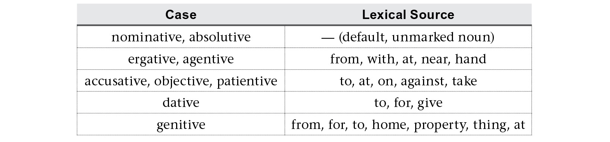

Other cases have more obvious historical antecedents:

One way that languages with large case inventories get all the nongrammatical cases is by building them off grammatical cases. In Shiväisith from Marvel’s *Thor: The Dark World*, I built twelve of the fifteen cases off the genitive, accusative, or dative. Here are examples of some that were built off the dative (marked by a suffixed -*a*):

How grammatical marking is typically reified in a language will determine how it will appear with respect to a noun, of course. The nice thing is that once a language has established the *idea* of case, future cases are easier to construct, and end up looking less and less mysterious.

• Pronouns: First and second person singular pronouns tend to be pretty old and may be semantic primitives in many languages. Plurals of these also tend to be pretty old, but those that aren’t are often formed from the singular plus some plural formation strategy (e.g. “we” could come from something like “I-person” or “I-people”). Third person pronouns routinely come from demonstratives (“this,” “that,” etc.). This is the source of all third person pronouns in the Romance languages (French, Spanish, Italian, Romanian, etc.). The presence of grammatical gender in Latin is what gave the Romance languages separate male and female third person pronouns. Indojisnen, from Syfy’s *Defiance*, lacks grammatical gender, and so its third person pronoun, drawn from the demonstrative series, is genderless:

Beyond the basic level, though, second person pronouns—especially formal, official, or polite second person pronouns—derive regularly either from second person plural pronouns, third person plural pronouns, or words referring to “proper” individuals like “master” or “lord” (cf. “your grace” or “your highness” or “your honor” as a form of address), or from family terms for respected (usually older) individuals, like “aunt,” “uncle,” “grandfather,” or “grandmother.” Beyond that, such pronouns can come from pretty much any word referring to an individual (specific or otherwise) or to a quality. Castithan has a number of these, like 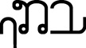 *yelako* (from “lowered one” or “sinner”),  *voritso* (from “biter,” a slang pronoun used only among men), and 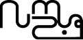 *pozwo* (a form of “they” used only with groups of sentient beings that comes from a verb for “gather” plus an honorific suffix).

• **Articles:** Indefinite articles pretty much always come from the numeral “one.” Definite articles can come from demonstratives (the same sources from Latin give Romance both its articles and pronouns) or pronouns. In the Slaver’s Bay variety of Valyrian, the definite articles all came from accusative forms of pronouns or the numeral “one,” depending on the article:

To get the sense of how this originally worked, think of colloquial English sentences like, “I don’t like them onions.” Now imagine English didn’t have the word *the*. This might not be a bad way to get one!

There have been books written on grammaticalization and historical change that go into greater detail and greater variety than I’ve got space for here. The lack of records we have regarding the very earliest days of language affords a conlanger a lot of leeway, though. There are processes we have evidence of, and then there are processes that seem plausible, but for which we have no direct evidence. A conlang itself is an argument for its own plausibility. One need not be constrained by what a natural language has done in the past: a conlang blazes its own trail. How successfully it has done so is up to its author and its audience to determine.

 

Case Study

HIGH VALYRIAN VERBS

In 2012 I was asked by Dave Benioff and Dan Weiss to create High Valyrian for season three of *Game of Thrones*. At that time, High Valyrian consisted of a ton of proper names and six words: *valonqar*, *valar*, *morghulis*, *dohaeris*, *dracarys*, and *maegi*. That might not seem like a lot to go on, but George R. R. Martin gifted me with these two phrases, written and translated precisely as follows:

*Valar morghulis*. “All men must die.”

*Valar dohaeris*. “All men must serve.”

These two phrases inspired the number system of High Valyrian along with its entire verbal framework.

As I stated before in discussing Dothraki, one of my goals in developing the *Song of Ice and* *Fire* languages was to preserve the spellings used in the books, save for the sake of regularity (e.g. *dracarys* became *drakarys* in spellings used on scripts for the sake of consistency). I also had extra motivation for keeping these phrases just as they are. In addition to their being rather famous in the books, I met a guy named Sean Endymion at a popular culture conference in Albuquerque who had VALAR tattooed on his right arm and MORGHULIS tattooed on his left arm. I didn’t want to invalidate his tattoo!

Despite only being asked in 2012 to create the language, I’d started toying with Valyrian as early as the fall of 2009—after I’d finished my work on the *Game of Thrones* pilot, but before *Game* *of Thrones* received its first-season pickup. I already knew fans of the books would be most excited about seeing High Valyrian of all the possible *Song of Ice and* *Fire* languages, and I knew if the show was successful, I’d eventually get the opportunity to create it. The verbal system was going to be the crux of the project, so I wanted to start working on it as soon as I could.

By giving us two phrases, George R. R. Martin gave us some important information. However the details worked out, I knew that *valar* would correspond to “all men,” *morghulis* would correspond to “must die,” and *dohaeris* would correspond to “must serve.” It’s possible to come up with other interpretations, but they require some trickery, and this interpretation seemed to me to be the most obvious. Tying “men” to *valar*, “die” to *morghulis,* and “serve” to *dohaeris* was simple; figuring out what to do with “all” and “must” would require more thought.

Since we’re here to talk about the verbs, I’ll deal with *valar* quickly. As the phrase is “all men” and not just “men,” I had to figure out a way to encode the “all” part on the noun. Rather than having suffixed adjectives (something I definitely did not want to do), I decided to do it with traditional number encoding. If High Valyrian had not only a singular and plural number but also a collective, that collective number could be interpreted as “all” given the right context. I decided, then, that *valar* would be the collective of a singular *vala*. I added a paucal number, as well, to give some balance to the system, which ended up looking like this:

The argument *valar*, then, would be treated as third person singular. All men are being treated as a cohesive, indivisible unit.

With that settled, I turned my attention to the verbs. George R. R. Martin gifted me with identical endings on the two verbs for two identical senses. Both *morghulis* and *dohaeris* end in -*is*, which means that that’s the part that’s going to contain “must” and whatever other tense/aspect information is in there. But what would that be?

To start, let me back up and talk about High Valyrian a little bit. The High Valyrian language is meant to be the language of the old Valyrian Freehold and its vast empire on Essos in ancient days. The Valyrians conquered many lands—including the old Ghiscari empire—thousands of years before the action of the *Song of* *Ice and Fire* series, and their influence stretched all the way to the Isle of Dragonstone across the Narrow Sea. At some point in time a cataclysmic event destroyed the Valyrian Freehold, and the empire was wiped out. Many languages descended from the old High Valyrian language. These came to be known as the Bastard Valyrian tongues. The history of Valyria was modeled somewhat after the history of the Roman Empire, and High Valyrian was intended to have the status of Latin, with its daughter languages intended to have the status of the Romance languages descended from Latin. I wanted to honor this intention with High Valyrian without simply copying Latin, so I decided to take some cues from it without actually using it as a model.

First, it seemed relatively uncontroversial to have the verbs agree with their subjects in person and number, giving each verb at least six different forms. Next, since Latin verbs had independent passive forms, I decided to add passive forms for each verb, bringing each paradigm to twelve unique forms. I also decided to have a formal subjunctive set, bringing each paradigm to twenty-four unique forms. After that all that was left was to determine how many tense/aspect combinations there would be.

The fact that the key phrases were translated as “*must* die” and “*must* serve” added a bit of a wrinkle to the formula. The word *must* in English is used in a few ways. Notice that there’s a difference between these three uses of the word *must*:

1. To get to the Emerald City, one must follow the Yellow Brick Road.

2. If the ball is put in play, the batter must run to first base.

3. Humans must breathe air.

The uses are all very similar, but the first phrase indicates volition on the part of the subject. That is, if one wishes to get to the Emerald City, one is obligated to follow the Yellow Brick Road. One could ignore this information; it’s being provided to indicate what’s needed to achieve the stated goal. In the second sentence, on the other hand, the rules of baseball state that a batter *must* run to first base if the ball is put in play. The batter has no choice in this if the batter wishes to follow the rules of baseball. Finally, humans *must* breathe air. There are absolutely no ifs, ands, or buts about it: humans must breathe air.

So even though all of these uses of *must* imply some sort of obligation, the immediacy of that obligation differs. In the phrases “all men must die” and “all men must serve,” it seems that the intended implication is closer to sense (3) than either sense (2) or (1). The phrases are meant as definitions—as prerequisites for being in the group “all men.” It’s a kind of obligation where volition simply isn’t a part of the equation.

Obligation is something all languages encode, but few encode it as, say, an affix on the verb, or as a form of the verb, especially at such an early stage. I didn’t want to get sucked into creating an “obligative” form of the verb for High Valyrian. After all, if there’s an obligative form, is there a permissive? A potential? A conditional? A dubitative? An optative? This didn’t feel right—especially since this is such a marginal case of strong obligation. Plus, as a conlanger, the question should always be “What have I got?” rather than “What new thing can I create?”

Looking back at Latin, one of the key features of its conjugation system is a dual stem system. Latin has two basic sets of personal endings, and then two basic stems associated with two different sets of tenses. With a verb like *portāre*, “to carry,” the imperfect stem is *port-*, and the perfect stem is *portāv-*. Each of these combines with two sets of person marking and a unique suffix (*-āb* for the imperfect stem and -*er* for the perfect stem) to form six unique tenses. Throw in a little irregularity to make sure similar-sounding forms aren’t too similar, and that’s the Latin tense system.

I *loved* this idea, so I decided to do my own version of it. I decided each verb would have an imperfect and perfect stem, as well, with the perfect having some added irregularities. The next step was creating this perfect stem. Going into the prehistory of High Valyrian, I decided the perfect stem would be formed from the imperfect (the basic or unmarked) stem by adding a basic form of *tat* to the end. *Tat* became the verb *tatagon*, which means “to finish.” Its perfect form, *tet*, would ultimately become attached to verb forms as -*et*, often being reduced further based on regular sound changes. For our two verbs, for example, the history looked something like this:

More often than not, *-et* would be reduced to a simple *-t* suffix.

Once the stems were set, the next step became forming the tenses. I decided to form three different sets of personal endings: regular endings, past endings, and tenseless or gnomic endings. These endings were added to verbs in different waves, based on the history of the language.

In the first stage, there were two sets—regular and gnomic—which, schematically, looked like this:

The personal endings themselves were derived from proto-forms that eventually became the pronouns of High Valyrian—*nyke* “I (first person),” *ao* “you (second person),” *ziry* “s/he (third person),” etc. The set of past tense personal endings that were originally applied directly to the stem were replaced by the new perfect stem forms, as shown below:

These innovative forms entirely replaced the old perfect (and part of the motivation for that replacement may have been that the forms were too similar acoustically to other tenses). At the time, this might have been replacing a regular past tense like “I walked” with something like “I done walked.” Eventually it became the new standard, producing four forms: a regular stem with regular and gnomic endings, and a perfect stem with regular and gnomic endings.

A separate innovation occurring at around the same time caused a new tense to form, filling in a gap in the past tense. An auxiliary verb *ilagon*, “to lie,” came to be used in the past tense with main verbs to indicate that an action was ongoing in the past tense. Eventually these verb forms fused to produce a new past tense progressive—or past imperfect—tense. Even though the old perfect was abandoned with main verbs, it stuck around for these suffixed verbs (*ilagon* and *tatagon*) which were understood to be irregular and treated as auxiliaries. Thus, the old perfect endings surfaced as part of a new past imperfect construction. They were also used with the perfect ending to produce a past perfect or pluperfect construction, resulting in two new tenses. The irregular auxiliaries, in effect, licensed the presence of the old perfect endings which had been lost for other verbs. These forms are shown below:

The lone remaining combination was the auxiliary *ilagon* used with the regular endings (the auxiliary construction wasn’t used with the gnomic endings). If the past imperfect construction meant “I lay serving,” the regular construction would mean something like “I lie serving,” which is roughly equivalent to the present tense. This forced a new interpretation of the construction, which was something like, “I lie to serve,” which was interpreted as a future tense. That produced the final tense of High Valyrian:

In order to better distinguish it from the imperfect, the form of the first person singular eventually became *dohaerinna*, and passive verb forms arose from an original auxiliary *kisagon*, which meant “to eat,” but otherwise those are the modern tenses of High Valyrian. The lone missing combination (something like *dohaertil*- or *dohaerilt*-) never occurred because the perfect and imperfect auxiliaries were never used in conjunction in the oldest form of the language. This is why there is no distinct future perfect form in High Valyrian.

The final question in figuring out the tense associated with *valar morghulis* and *valar dohaeris* is the modern interpretation of the gnomic or tenseless forms. The verb forms themselves are third person singular gnomic (or aorist, as they’re called in the modern language). These tenseless forms are used to denote habitual actions or general truths. A simple way to illustrate the difference is with the two sentences below:

*Jaohossa rhovis*. “The dogs are barking.” (PRESENT)

*Jaohossa rhovisi*. “Dogs bark.” (AORIST)

If this is the generic interpretation of these two tenses, what distinction would, say, using the collective of “dog” (*jaohor*) versus the plural of “dog” (*jaohossa*) make? The only possible distinction that could be made would be having emphasis placed on the fact that one was talking about *all* the dogs. Thus, the use of the collective *combined* with the use of the aorist is what produces the sense “all men” in “all men must die.”

Regarding “must,” the interpretation here is based on the pairing of the phrases “all men must die” and “all men must serve.” Dying is one of the few things that all humans do (go us?), but serving is not. Consequently, *valar dohaeris* is interpreted as “all men *must* serve,” since it couldn’t be a generic statement about the lives of men. Pairing it with the additional phrase *valar* *morghulis*, accompanied by the fact that the two phrases are inextricably intertwined, is what gives us the interpretation “all men must die.”

Some detail has been left out for the sake of brevity (ha!), but this is how I created the verb system of High Valyrian. Regarding the spelling, I thought I’d add one final note. Since I work for the canon within the show, I had to wait (somewhat breathlessly) for the last episode of season two of *Game of Thrones* to air in order to see how the actor who played Jaqen H’ghar, Tom Wlaschiha, would pronounce *valar morghulis*. There are a number of ways it could have been pronounced, and several would have proved disastrous for what I was planning for High Valyrian. As it turns out, he pronounced it the way I thought an average English speaker would: *VA-lar mor-GHU-lis* . When I heard that, I breathed a huge sigh of relief. The fact that the *gh* was pronounced as a regular —along with the English pronunciation of the *r*’s—could be easily explained by the fact that Jaqen H’ghar is not a native High Valyrian speaker.

Unfortunately, it did mean I had to do something with the stress system. As I’d planned it, High Valyrian would have a weight-sensitive stress system that would default to the penultimate syllable. Outside of resorting to some clever trickery, there was no way I could argue that the syllable *mor* was light. That meant that in order to get the stress on *ghu*, I had to make the vowel in that syllable long—which means that what is spelled *valar morghulis* should technically be *valar morghūlis*.

Of course, that isn’t that big a deal. After all, even in a language that uses macrons to mark long vowels, like Hawaiian, long vowels are often left unmarked. The program I use for the show, Final Draft, doesn’t even accept characters with macrons, so long vowels are never marked in the script. Plus, if Sean Endymion *really* wanted his tattoo to be 100 percent accurate, he could always add a macron (there’s room!). Even so, I say it’s all right. Nobody cares about macrons! They’re just crazy little vowel hats that the poor vowels don’t even want to wear. Set them free, I say!

As fun as creating this system was, it was even more fun to see the system destroyed as it evolved into Low Valyrian. Verb systems are highly complex and highly unstable. It’s like a game of Jenga that nobody wants to play. Nevertheless, the hallmark of any conlang will be its system of verbal conjugation, so it pays to put in the time and effort.
