# CHAPTER IV

# The Written Word

### INTRODUCTION

While creating the spoken languages for the Syfy show *Defiance*, I realized that the setting provided us with a unique opportunity to develop one or more novel writing systems for our aliens. In the show, eight alien species band together and seek refuge on Earth. The civilizations are at least a thousand years more advanced than Earth’s, so it stands to reason that they would have discovered computing, robotics, space travel, and, it goes without saying, writing. I created sketches for the three writing systems that would feature prominently in the series—Castithan, Irathient, and Indojisnen—and showed a sample to executive producer and showrunner Kevin Murphy:

Irathient

Castithan

Indojisnen

Of course, the sample didn’t look like that—that’s a finished product—but fortunately Kevin was able to see the potential that existed, and so he gave me the green light. Once I’d created the fonts for each of the writing systems and handed them over to the art department, they ran with it. The writing systems show up *everywhere* in the show: on street signs; as graffiti; on playing cards—even on a series of pill bottles that will only ever be seen in the background of a few interior shots for no more than a couple seconds. The day I set foot on the set and saw all of this with my own eyes was indescribable. While my work played only a small role in it, I’ll never forget the day I saw what Stephen Geaghan, Suki Parker, and the rest of the art department had done with the backlot of *Defiance*. It was the greatest professional moment of my life.

In this section, we’ll take a look at what it takes to go from doodling on a page to creating a full-fledged, fully functional writing system. First I’ll go over some background on the history of writing in our world, and then discuss how to create a writing system. I’ll introduce some of the basics of font making, and then go over how sound, history, and writing interact in a case study on the Castithan writing system.

Before going any further, though, if you’re interested in creating your own writing system and you’re the type of person who describes themselves as “not artistic,” worry not! Designing a good writing system has everything to do with the *system*, and nothing to do with the glyphs—and designing good fonts has more to do with copying and pasting and math than being able to draw a nice Bézier curve freehand. I firmly believe that designing writing systems is within the reach of anyone who can use a writing system—and if you can read this, you can use a writing system. So you’re set!

### ORTHOGRAPHY

Before we get too far in, let’s discuss some terminology. The term **orthography** comes to us from Greek, where it translates to something like “correct writing” or “the correct form of writing.” That translation is important to understanding the use of the term. Orthography implies a value judgment, and that value judgment is made by the users of a given language. In this book, I’m writing in the orthography for the English language. If ay disaydid to swich to som odhur form ov rayting, may editur wud pich o fit. Why? Because it’s not correct—that is, it’s not the form that the speakers of English agree is the correct way to write the language.

When creating a new language, the conlanger has to decide what the imaginary speakers think is correct for their own language. For example, the Dothraki have no written form of their language. This was made explicit by George R. R. Martin in the *Song of Ice and Fire* book series. Consequently, the language has no orthography. For the convenience of those of us in the real world, though, Dothraki does have a **romanization** system. A romanization is a way to transcribe a language using the Roman alphabet (what we use to write English). It exists purely to help speakers of languages whose orthographies use the Roman alphabet to read other languages that have a different orthography—or no orthography, as the case may be. While a romanization system and orthography *can* be the same thing (as they are in English), they are not generally the same thing. Below is a sample of the Arabic language written in its own orthography:

Now here’s that same passage written in an ad hoc romanization system I’ve devised to help you read what the above says:

Ana mutarjim fil’umim al-mutahida.

This is different from a narrow phonetic transcription, which would look something like this:

And that, of course, is different from a translation, which would be “I am a translator for the United Nations” (a key phrase all students of Arabic learn in their first year of study).

It’s important to distinguish these key terms as their functions should be quite different. For example, have you ever been reading a book with a “fictional” people in it and gotten annoyed by names like Sqrellexxx, or Mhanh’thor’acc, or ? If not, I envy you. This is a thing that authors will do to make names *look* foreign. And while they can’t be blamed for hitting the “random” button for their fictional world, given the history of romanization systems on Earth (there is an African language called !Xóõ, after all), in the real world, where the only relevant person is the reader, such names are simply uncooperative. Unless the characters in the book use the Roman alphabet for their own languages (something that may happen, but which seems unlikely in a fantasy setting), a romanization system should be as uncreative as possible. Anything else is a layer of complexity that has no reality in the fiction. Such quirks should be saved for the *actual* orthography, if it exists.

For example, in Syfy’s *Defiance* the Irathient Spirit Rider Sukar has a pet name for Irisa, one of the show’s main characters. The name is *tishinka* . In Irathient’s orthography, one spells it thus:

If I were to do a direct romanization for that word, it would be *tishingkka*. Why? First, you use a different glyph for the velar nasal \[ŋ\] than for the alveolar nasal \[n\]. In English, we don’t bother, when it comes before \[k\]. Second, Irathient doubles the glyphs for the sounds \[t\], \[p\], and \[k\] when they occur after nasals. The reason is lost to history (has to do with an old sound change), but such words are pronounced as if there’s only one of those sounds there. *Tishingkka* is a more accurate representation of how the word is spelled in the orthography, but such a spelling would be nothing but a distraction to the actors or to anyone simply trying to learn the language. Learning the orthography of any language is a challenge, but learning a romanization system should be a mere matter of minutes, if not seconds. I favor a *purely* functional romanization, if all the romanization is doing is conveying the sound of the language. After all, learning a language is enough work as it is!

### TYPES OF ORTHOGRAPHIES

Often I get questions about some of the systems I’ve developed that go something like, “How do you write my name in the Castithan alphabet?” Such questions make a presumption the askers are likely not aware of—namely, that Castithan’s writing system is an *alphabet*. In the coming sections, I will introduce you to the different types of writing systems that exist in the world. They are many and varied, and go far beyond the alphabet.

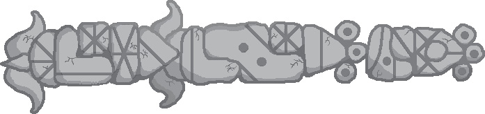

Gweydr’s Stone Script (David Peterson)

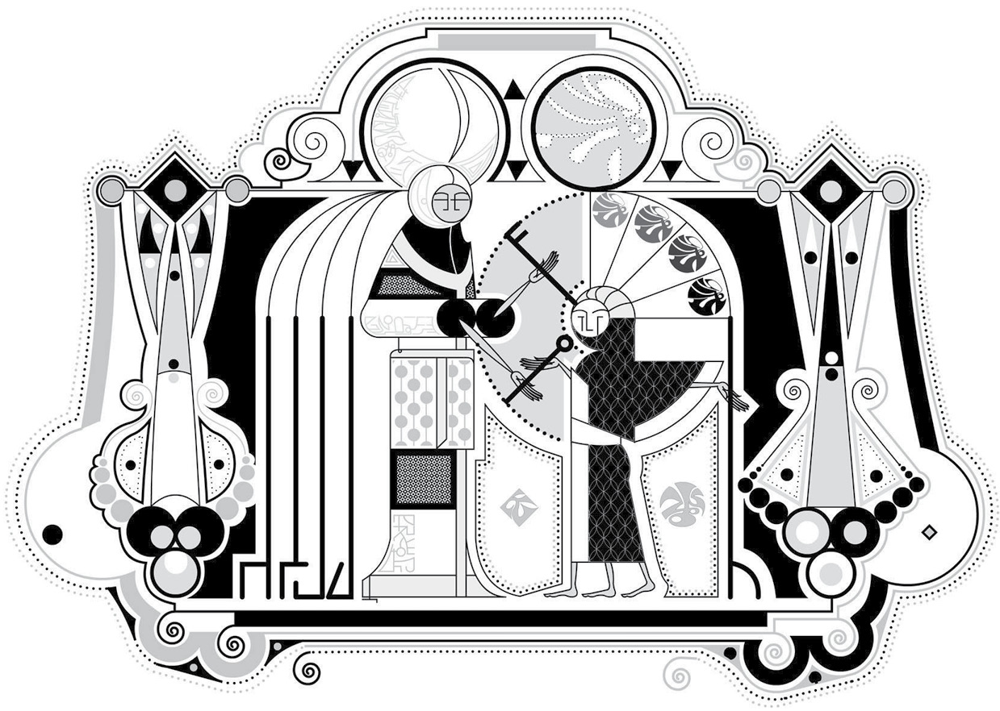

Idrani’s Ksatlai (Trent Pehrson)

Kēlen’s Ceremonial Interlace Alphabet (Sylvia Sotomayor)

### ALPHABET

Let’s start with what will be most familiar. An **alphabet** is a writing system that uses a distinct glyph for a distinct sound, whether it’s a vowel or a consonant. English uses an alphabet, as do all the languages of Europe. There are different alphabets, to be sure—compare the name Maria written in five different European alphabets below—but they all operate on the basis of one symbol = one sound.

Maria (Roman)

Мария (Cyrillic)

Μαρία (Greek)

 (Armenian)

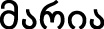 (Georgian)

Many alphabets on Earth have what’s known as **case**. This is a confusing term, as it’s identical to the term we use for noun case, but the relationship is incidental. All it refers to is a writing system having capital (majuscule) and lowercase (minuscule) letters. In our sample, the first four alphabets have an uppercase set, while Georgian does not.

In alphabets, one letter stands for one sound in an ideal case, but those letters aren’t always used for the same sounds. Consider the varying pronunciations of *O* in American English:

- *tome* \[tom\]
- *prom* 
- *lose* \[luz\]
- *Peterson* 
- *women* 
- *woman* 
- *ton* 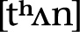
- *button* 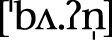

In addition, sometimes combinations of letters are used for single sounds:

- *shoe* 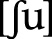
- *those* \[ðoz\]
- *thin* 
- *tack* 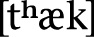
- *beautiful* 

And on certain occasions, single letters are used to express series of sounds:

- *fox* 
- *jam* 
- *I* \[aj\]

Crucially, though, alphabets take as basic the sound, rather than the syllable or some larger unit. Cases like the letter *X* in English or the letter Ψ in Greek which stands for \[ps\] are the exception, rather than the rule.

Historically, the alphabet is the latest writing system developed by humans. Though writing has evolved independently in several different areas, the alphabet, to the best of our knowledge, was developed once (outside of modern conscious creations, all alphabets are related to one another). For those creating a writing system for a fantasy setting, this fact should be taken into consideration. An alphabet would likely *not* be developed by an ancient society—or at least not initially. An alphabet is usually the *last* stage of development of a writing system, and often doesn’t evolve at all (as has been the case with many scripts from South, East, and Southeast Asia).

### ABJAD

Moving on to the next most familiar, an **abjad** or consonantal alphabet takes as its base the consonant rather than the vowel. Arabic and Hebrew both use abjadic writing systems. An abjad has one symbol for each *consonant* in a language’s sound system, but not necessarily for each vowel. Vowels are treated as secondary, and, in many cases, unimportant. This might seem less than ideal to an English speaker, but consider this sentence:

Wht r y dng rght nw?

Probably no English speaker has a problem understanding that that says, “What are you doing right now?” It also probably isn’t hard to see how you could take some of those same words and have them mean something totally different, as shown below:

Dng! Tht’s Sgfrd nd Ry’s wht tgr!

Now *dng* stands for “dang” instead of “doing,” and *wht* stands for “white” instead of “what.” Context helps to determine what precisely is meant, and, for the most part, there aren’t really any problems.

Here’s an example from Arabic. Below are the consonants *k*, *t,* and *b* written in a row (note: the script is read from right to left, and the letters connect, like English cursive):

That’s the equivalent of writing *ktb* in English. What does it mean? That all depends on the context. Take a look at the examples below (remember: read from right to left, and look for the word that looks just like the one above in the examples below):

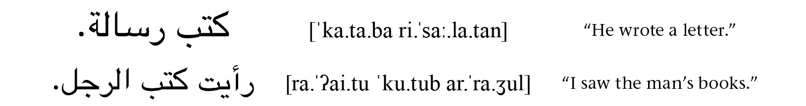

Notice that the word spelled 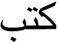 is pronounced  in the first sentence, but pronounced  in the second sentence. That’s because the first instance of the word means “he wrote,” and the second means “books.” It’s hard to imagine the top sentence meaning “Books a letter,” or the bottom sentence meaning “I saw he wrote the man’s.” The context helps determine which pronunciation is meant, and, consequently, which word is meant.

Most abjads have ways to indicate vowels if it’s absolutely necessary, but they usually appear as diacritics. For example, the two different *ktb* words can be written as follows in Arabic:

But in day-to-day life, this is never done. Really the only place you’d see it is in elementary textbooks, or in the spellings of foreign names or words that aren’t a part of common discourse.

One interesting feature of many abjads is that they will occasionally have full-fledged letters for vowels. These vocalic letters will often have consonantal uses in addition to vocalic uses, and will be used both as consonants and as vowels depending on the context they appear in. In Arabic, the two simplest ones to work with are the glyphs for \[w\] and \[j\], which double as the long vowels  and . Here are examples of each:

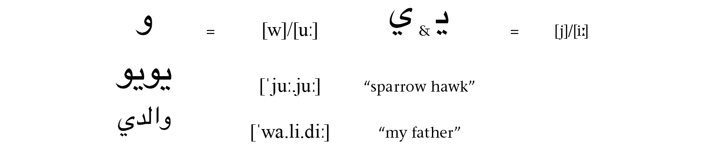

Because abjadic scripts tend to give short shrift to the vowels, the scripts can be more economical, albeit less precise. As with alphabets, they can be the end point of an evolutionary chain, but they also appear at an earlier stage of development than alphabets. Such scripts work very well for languages with smaller vowel inventories, and work far less well for vowel-heavy languages.

### ABUGIDA

The most common type of writing system found in India and many parts of Southeast Asia is the **abugida**. An abugida (also referred to as an alphasyllabary) is a script that, for the most part, adheres to the maxim that one glyph = one syllable. An abugida, though, will have a very obvious base glyph with a more or less predictable set of variations. The base glyph is usually a consonant, though it need not be, as vowels *do* have separate glyphs (for when two vowels come next to each other, for example). Below is an example of some syllables from a number of different abugidas:

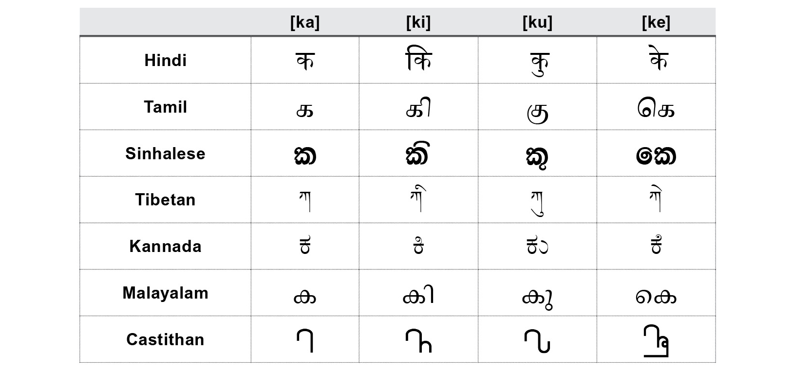

As you may have been able to guess, the first six of these scripts are related (the last, of course, is one of my scripts for *Defiance*). All seven scripts, though, have two things in common. The first is that the base consonantal form, whatever it happens to be, remains constant, with mandatory diacritics being added to produce CV syllables. The second is that the base form on its own stands for a syllable, not a bare consonant. This is the crucial difference between an alphabet and an abugida: the most basic form of any glyph is always a syllable, never a bare consonant.

Abugidas may vary as to which vowel is taken as its inherent vowel for a base glyph. In all the languages above, a short \[a\] is taken as the inherent vowel. As shown above, a vowel diacritic may combine with a base glyph in any number of ways, including coming before the base glyph. A base glyph may also combine with a vowel that comes before a consonant, or after a consonant, though the latter is much more common. Here’s an example of each from the *Defiance* abugidas:

Abugidas will differ in how they deal with single consonants. For example, neither of the *Defiance* scripts has any special marking for single consonants. The Irathient script allows a reader to pronounce any glyph as either a bare consonant or a bare consonant preceded by the reduced vowel . In Castithan, all characters have an inherent or specified vowel, and phonological rules determine whether the vowels are pronounced. Hindi’s Devanagari script, on the other hand, has a special symbol called a virāma which indicates that the inherent \[a\] vowel has been suppressed, as shown below:

Overall, the key to remember with an abugida is that the base glyph is the major feature, but that the vowel diacritics are *never* optional. That plus the fact that a base glyph stands for a syllable, not a sound, are the key distinctions between an abjad and an abugida.

### SYLLABARY

A full **syllabary** is like an abugida, except that there are no base glyphs. Instead, each symbol stands for a full syllable, and there may be little to no relationship between symbols that encode the same consonant or vowel. The most canonical examples are either of Japanese’s kana systems: katakana or hiragana. Below is a sample of some of the glyphs in Japanese’s hiragana:

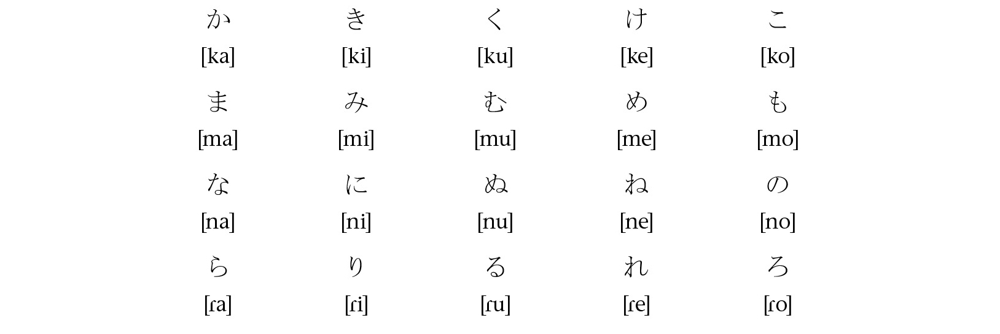

As you can see, this system is kind of a mess. It looks like a little loop is the only thing that distinguishes 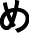 \[me\] from  \[nu\], and while  \[ne\] and 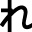 \[re\] look related, we don’t see the little vertical stick elsewhere, really. A loop appears to turn 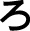 \[ro\] into 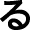 \[ru\], and we see a little line on 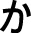 \[ka\],  \[na\], and  \[ra\] that *could* be indicative of an \[a\] vowel, but it’s not there for  \[ma\]. Basically the association between the form and meaning is arbitrary and must be memorized, just like an alphabet. The only difference is that each glyph stands for a syllable, not a sound.

Outside of the two Japanese scripts, there are no pure syllabaries in use by any natural language today that wouldn’t have an asterisk next to them. For example, the Vai syllabary, used to write the West African Vai language, is barely used today, and was a conscious construction of one man in the 1830s. The Yi syllabary is currently used to write at least one form of the Yi language in China, but it was developed in 1974. The Cherokee syllabary used to write Cherokee was developed by Sequoyah, who based the letterforms on the letters in an English-language Bible he owned, and so this too was a conscious construction. For whatever reason, it seems that pure syllabaries are disfavored as natural writing systems, despite the simplicity of their construction.

One possible reason that syllabaries don’t appear in greater numbers is the difficulty such systems have in rendering coda consonants. For example, if we wanted to build a syllabary for English that would handle coda consonants, the resultant system would need more than one thousand glyphs—all of which would need to be memorized. As nonsensical as English’s spelling system is, a syllabary—even a regular one—wouldn’t be an improvement. The same is true of many languages.

If a syllabary is going to encode coda consonants, it has a few options. One option is to do what Japanese does. Japanese has, in effect, only one coda consonant—a nasal—so it has a letter to spell its coda nasal, 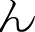. Thus, Japanese’s kana systems can be said to be pure syllabaries with one additional letter. Other potential solutions include synharmonic spelling (e.g. a spelling of *sa-ba* at the end of a word will be understood to be *sab*, since the vowel in the second syllable is the same), or just not writing the codas at all. This is apparently how Linear B was used to encode Ancient Greek (i.e. not very well). Despite their impracticality, syllabaries remain fruitful possibilities for language creators, depending on the phonology of the language.

### COMPLEX SYSTEMS

Any natural language writing system is bound to be more complicated than its label implies. The very fact that we as a people have allowed a movie with the title *Se7en* to exist should be cause for deep concern. The fact that it can make any kind of sense simply points up the fact that learning the twenty-six letters of the English alphabet is *not* enough to understand how to use and interact with our writing system.

But beyond innovative uses of the systems already discussed, there are systems that exist that are already fairly radical. One obvious one is the system of Chinese characters employed by the various Sinitic languages. In this system, which comprises more than 100,000 characters (not a typo), a glyph can stand for a syllable, a word, a concept, or a piece of a word. Sometimes a change in glyph is only indicative of a different meaning, rather than a different pronunciation (compare spellings in English like *here* and *hear* or *their*, *they’re,* and *there*):

-   “to implore”
-   “gloomy”

Notice both of these words are pronounced the same; they’re just “spelled” differently.

Some systems, like Egyptian hieroglyphs, have different systems layered one on top of the other. Hieroglyphic features an abjad (a consonantal alphabet), along with a series of glyphs that stand for two, three, or four consonant groups. In addition, it has a series of **pictographs**, which are glyphs that depict what they stand for.

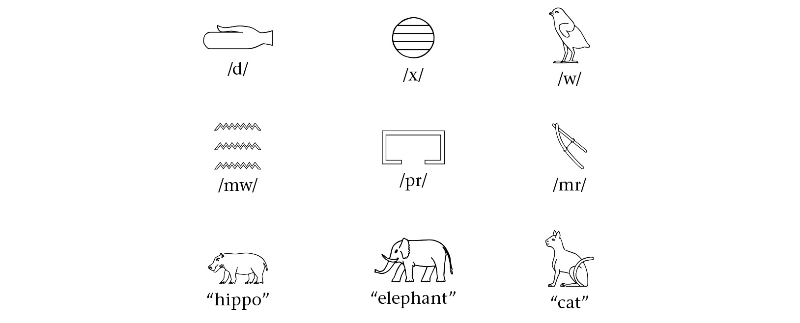

For the sake of accuracy, a usual Egyptian pictograph would have some sort of a phonetic clue as to how it was pronounced in the spelling of the word. The word for “cat,” for example, was spelled like this:

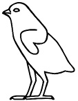   
/mjw/ “cat”

In order from left to right, the four glyphs that make up the word for “cat” serve the following functions:

1.  is a biliteral sign that stands for /mj/.

2. 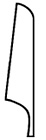 is a sign for the sound /j/, and is there to remind you how the sound for  is pronounced.

3.  is a sign for the sound /w/ and is serving a purely phonetic function.

4. 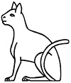 is a cat, to remind you that this is the word for “cat.”

Most full words written in hieroglyphs are written in this way. A lot of redundant information is built in to help writers and readers keep track of the comparatively large list of glyphs that constitute the system.

While the glyphs in a complex system can be pictographic, often they’re not—or are not obviously so (consider modern Chinese). Glyphs can be built up in various ways, as illustrated by one of my older languages, Kamakawi.

In Kamakawi, some of the glyphs are pictographs, and their designations are fairly obvious:

Others are formed in a variety of ways. For example, Kamakawi has a supplementary syllabary used for certain words and in conjunction with other types of glyphs. These syllabic glyphs have been used to form complex glyphs that spell out words:

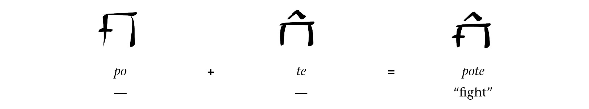

Other glyphs are formed by combinations of meanings, even if the words whose glyphs are used to create the new glyph have nothing in common with the new glyph’s pronunciation:

Above, even though neither the words *ta* nor *maka* appear in the word *alama*, the meanings associated with their glyphs are combined to form the new glyph for a sand crab. This association exists only in the writing system, not in the language proper.

Still other glyphs are formed by changing the orientation of fully formed glyphs. Here, for example, is a complex syllabic glyph, like *pote* above:

And here’s a word that’s formed by flipping the glyph for *moka* horizontally and vertically:

When a glyph is turned thus, the idea is that the opposite or a negative version of the word is meant. Thus, if you know *moka* is “metal,” you can look at this glyph and know it has something to do with the opposite of metal, or something deleterious with respect to metal—that is, rust.

Many glyphs in Chinese and in other complex scripts like Kamakawi’s have stories like these. Ultimately, the construction of a writing system is a *conscious* decision on the part of a group of speakers, unlike language. It’s subject to the whims of evolution, like everything else, but efforts to consciously change a writing system are much more effective than efforts to change a language ever are.

As a final note on complex systems, the larger the number of glyphs in a system, the more redundancy is built in. Memorizing twenty-six letters is child’s play. Memorizing ten semipredictable yet distinct forms for a set of thirty-three glyphs is challenging. Memorizing more than ten thousand glyphs is soul-crushing. To make the task possible, systems are set in place to aid the learner in assimilating and maintaining the information as quickly and efficiently as possible.

### USING A SYSTEM

Designing glyphs is only one part of the system. Before leaving writing systems in general, I just wanted to note a couple things about how systems are used. For example, in English, we put spaces in between each word. Notallwritingsystemsdothis. Those that don’t tend to have glyphs that are fairly evenly spaced. Chinese, for example, doesn’t put any spaces between its glyphs, but every glyph fits in a nice little glyph box that doesn’t impinge on the space of any other glyphs. As a result, adding extra space is unimportant.

The direction that one writes also is not fixed. In English and most Western languages, we write from left to right. Arabic and Hebrew are written from right to left. A nice illustration of the difference can be shown with Hindi and Urdu—in effect, the same language written in two different scripts:

Both the top and bottom line say , which means “I’m eating.” The difference is that Urdu, on the bottom, is written with a variant of the Arabic script that is written from right to left, and Hindi is written with Devanagari, which is written from left to right.

Languages can also be written from top to bottom. Both Chinese and Japanese use this as a stylistic variant. Mongolian traditionally is written from top to bottom. Egyptian hieroglyphs were frequently written from left to right, right to left, *and* top to bottom (both right-facing and left-facing). Writing from the bottom to the top is possible, but extremely rare. All directions exist as a possibility, though.

Some other variables to consider when developing a writing system are where the next line will start. In English, we write from left to right, and the next line starts on the bottom; it could very well start on the top. In book binding, one can also decide where the next page will be. Japanese books are fairly similar to English books, in that writing usually goes from left to right and then goes from top to bottom. The next page in a book, though, is in the opposite location an English speaker would expect, leading to manga books appearing “backwards” to English-speaking readers.

Something else to consider is what happens to the letters at the end of a line. What if, for example, when one got to the end of the line writing from left to right, one started over and wrote from right to left on the next line? Such systems existed, and that style of writing is referred to as boustrophedon. An example is given below:

All of this is in play—plus whatever else you can imagine.

Practically speaking, though (if you don’t want your parade rained on, stop reading here; if you can deal with it, turn up the Mazzy Star and let the rain parade begin), a system that works *exactly* the way English’s does (distinct glyphs written from left to right, with new rows appearing below, and the characters always facing the same way) will be the easiest to fontify and work with. If you don’t care about creating a font or using a word processor, there are really no constraints. Font creation programs and word processors and web browsers and graphics programs, though, *despise* writing systems that don’t work *exactly* like English’s. There’s probably a better way to do the boustrophedon example I constructed above, but using Photoshop Elements, I just created four distinct text lines in four different layers and flipped them around till they looked the way I wanted them to. There is no boustrophedon setting in Word (though I think there is a paperclip that laughs at you if you try to search for one). Pencil and paper is far superior when it comes to working with “deviant” systems. There’s nothing truly deviant about them, of course, it’s just that computing systems don’t support them. We’re gradually getting better and better, but the fact that inserting a single word of Arabic into an English sentence *destroys* the entire paragraph’s formatting and makes me want to rip out and devour my still-beating heart tells me that we’ve got a long way to go before our programs and apps can deal with the great variety of writing styles available to us.

### DRAFTING A PROTO-SYSTEM

Just as a naturalistic language starts off with a proto-language, so does a naturalistic writing system start off with a proto-system. This is how I created the Castithan and Irathient scripts for *Defiance* and the Sondiv script for *Star-Crossed* (the Indojisnen script for *Defiance* was a postdigital creation by the Indogene people, and so needed no proto-stage), and it’s the best first step to creating a naturalistic orthography.

Before you sit down to create glyphs, several questions have to be answered first—specifically, who are the speakers of the language who need a writing system? Where do they live? What plants and animals are around them? What resources are available to them? These are the same kinds of questions a language creator has to answer, but in drafting a writing system, they take on a different significance.

If you look at the history of our writing system—the Roman alphabet—you’ll discover that it came from an old pictographic system. Check this out:

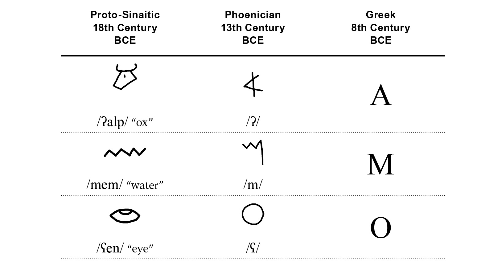

The Proto-Sinaitic system utilized pictographs, and Canaanite speakers were happy with that system. When the Phoenicians got hold of it, they took some of those pictographs and formed an abjadic writing system from them, taking the first consonant of each pictographic word and turning it into a consonantal letter. When the Greeks inherited the Phoenician system, they saw letters for a bunch of consonants that weren’t in Greek (e.g.  and ), but no letters for vowels, so the Greeks took the unneeded consonant letters and turned them into vowels.

Making reference to Proto-Sinaitic as stage 1 and Phoenician as stage 2, we can now discuss where a language creator begins. Obviously, for any type of system, one can always start at stage 1. The system that began as a simple pictographic system went all the way to an abjad in Hebrew, an abugida in Hindi, and an alphabet in English. An old series of pictographs affords one a *lot* of latitude. Certainly if one wants a complex system like that of Chinese or Egyptian, a simpler pictographic system is the way to start. Aside from a few art experiments (the works of Xu Bing, for instance), we’ve never seen a language go from an alphabetic/abjadic orthography to a complex/ideographic/logographic orthography; we have, however, seen the opposite, so starting at stage 1 keeps your options open. Starting at stage 2, though, is not a bad way to go if you haven’t got all the time in the world. That’s where I began for both Castithan and Irathient. Given that we’d be picking up with these aliens about a thousand years *after* they mastered space travel, going into their proto-history wasn’t feasible (working on a TV show means working with deadlines). Starting with a stage 2 system wasn’t a problem, though, and it helped to add to the realism of the systems.

In order to start drafting glyphs (after one has settled on stage 1 or stage 2), the next subject one has to tackle is resources—specifically, what did the people who speak this language have to write *on* and to write *with*? The importance of these two questions *cannot* be overstated when it comes to drafting a writing system. For example, have you ever seen cuneiform? It looks like this:

I don’t know what any of that means or how it’s pronounced, but just look at it. Who could possibly *tolerate* a system like that?! It looks so impractical! And it is, if you’re trying to draw these things with a pen or pencil on paper. But that’s not how cuneiform was written. Instead of paper, writers used a wet clay tablet upon which impressions could be made, and the thing they used to make these impressions had an end that looked a lot like this:

It was a long, blunted reed called a stylus that had a triangular end. If that was your implement and you were making impressions into wet clay, you should be able to see why it’d be easier to write  than something like *R*, for example.

Old forms of writing often included making impressions into wet clay tablets; carving onto solid materials like rocks, bones, shells, or wood; or painting on uneven surfaces like rock faces. Whether you’re developing a stage 1 or stage 2 system, the shapes you come up with should suit the writing implement and writing surface. Drawing shapes freehand was simply not an option for users of cuneiform. Similarly, the Ogham runes used to write Old Irish contained no curved characters at all. Since the runes were cut into wood or stone, curved characters would be impractical, or at least very difficult. An example of some of the runes is shown below:

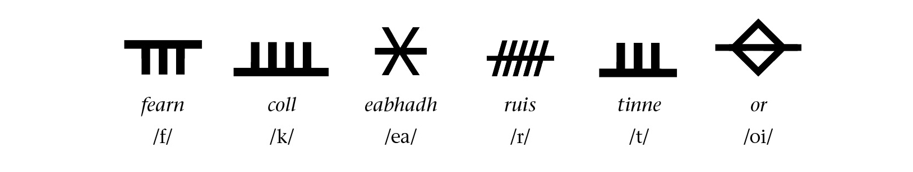

Someone painting on a cave wall, though, would have no problem with curvilinear shapes. The original medium *strongly* delimits what’s possible in a proto-system, whether it’s stage 1 or stage 2.

Creating the glyphs goes hand in hand with the language as it exists when the glyphs are supposed to have been created. Conspiracy theories aside, there are no cave paintings of catapults or airplanes. The things ancient civilizations chose to encode with writing were things they had and which were important: livestock, plants, goods, family members, tools, etc. An advanced alien civlization would likely have discovered writing centuries before they discovered machinery, let alone space travel. A stage 1 writing system has to start there.

For stage 2, all one has to do is establish the phonemic inventory that was current at that stage. In English, for example, we spell words like *wet* and *whet* differently because they were actually pronounced as different words at the time that we started regularizing our spelling system. If a language has a phoneme \[h\] when writing is encoded, the stage 2 writing system will probably have a glyph for \[h\], whether or not the modern language has that phoneme any longer.

Finally, remember that an alphabet, an abugida, and a syllabary are a later development than an abjad or a pictographic system. Most older systems were *really* imperfect. Often words that sounded similar were spelled the same; many details considered important by modern standards were completely omitted from the system; writing direction was a matter of style; glyph shapes weren’t standard; and spellings themselves weren’t standardized, either. All of these “necessities” are later developments. This makes proto-systems simpler to develop, but more difficult to understand.

When it comes to the glyphs themselves, remember: simpler is better. Simple pictures or simple shapes were how *all* our systems began their existence. The stylized elements arose as a matter of course—something we’ll examine in the next section.

### EVOLVING A MODERN SYSTEM

There are exactly two things that have revolutionized writing systems in our world: (1) using one system to write a language for which it wasn’t intended; and (2) technological advancement. Both of these steps can be utilized to take a proto-system and evolve it.

Looking back at cuneiform, that system started out as a pictographic system. Here are three key stages of its development:

The first stage on the left there was written on clay tablets with something sharp, but they were drawn, not stamped. The second stage is when the glyphs were put onto walls. The curves and details are gone, primarily to make it easier to carve. Then the last stage is the wedge stage which we’re familiar with, and you can see how what they were trying to do was create the stone carving using the wedge-shaped reeds. The lines are all there, basically, they just look funky. Eventually this stage would evolve too, as they tried to make it easier for reed stamping, and pretty soon people didn’t even know that what they were stamping was supposed to represent a human head.

Changing either writing implements or the writing surface requires a revision of the *entire* system. In evolving a system, then, you start out with a stage 1 or stage 2 system and make a decision about what comes next: A move from stone walls to clay tablets? From tablets to paper? From a stick to a stamping implement? From a stamping implement to a brush? A chisel to a stylus? Once the decision is made, the system will start to morph and take shape.

For those designing their own systems, it’s my strong recommendation to try, as practically as possible, to find the actual implements you’re considering and try them out. Trying to write one system with a different implement will prove quite illuminating. For example, when you move to pen and paper, it’s *really* easy to see how cursive emerges. Writing happens so quickly that picking the pen up between *every single word* is just a bother! Natural connections will emerge of necessity. Whether or not those connections become a part of the system (as they did in Arabic) or not (as they didn’t in Roman type) depends a bit on how quickly the language’s speakers develop typesetting and on happenstance. These are decisions the language creator must make.

For an example of how to evolve a script over the centuries, I implore you to take a look at this absolutely *outstanding* chart of the evolution of the Tamil script (and *thank you* to Wikipedia user Rrjanbiah for taking a photo of this chart and releasing it into the public domain)!

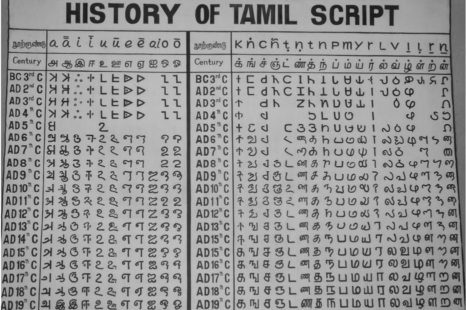

Enjoy the whole thing, but just *look* at some of the incredible changes! Look at the column headed by . In the third century BCE, the thing was basically a capital I, and now it looks like this: ! In the  column, a character that looks like a big capital C ends up looking like , and in the *n* column, a character that in the fourth century CE looked like a capital L now looks like this: 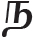! It’s insanity! Or it would be, if you weren’t able to look at the incremental changes that occurred to each character along the way.

You can see that there are certain points in time where a greater variety of changes occurred. For example, around the ninth and tenth centuries CE, lots of characters get noticeably funkier. One important driving force in the funkification of Tamil’s script was a shift to writing on palm leaves, which were apparently *really* easy to puncture. As a result, writers would try to have fewer points—so fewer places where you’d pick your writing implement up and put it down. This helped preserve the document (fewer tears led to a longer-lasting writing surface). Consequently, straight edges and sharp connections got smoothed out a bit. Evidently they switched to more permanent paper by the thirteenth century CE, because, as you can see, the straight edges returned. But by then the damage was done, and the system started on a path to becoming what it is today.

Once you’ve settled on a writing utensil and medium that’s supposed to last for several centuries, the key to evolving a writing system is the same as evolving a language. Each generation will learn how to write based on how the previous generation writes, not based on how the original generation wrote. What you need to do is simulate how the generations hand down knowledge from one to the next, and how each generation adds innovations. The latter is simple. If you’re working with pen and paper, for example, just try to write *faster*. Work with the script. See what happens naturally when you increase the speed of transcription; what your hand does to try to form the same characters in half the amount of time you usually do. Once you’ve got this down, look at the quickly written version of the old characters and form a new standard version of the script from those quickly written characters. After that, repeat the process until the script looks the way it ought.

Moving a script from one language to another is a great way to stretch a script to its limits. The Roman alphabet itself is just a modification of the Greek alphabet—as is the Cyrillic alphabet. The Roman script was developed for Latin, to which it was well suited. As it was extended to languages like Spanish, French, Italian, Romanian, English, German, Swedish, Albanian, Finnish, Turkish, Hungarian, Vietnamese—you name it—the script was stretched to its very limits. And so digraphs were introduced, as well as a supplemental cast of thousands: 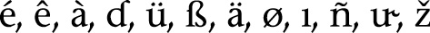, etc. (Side note: Many diacritics—including vocalic modifications in abugidas and abjads—are formed from shrunk-down versions of other letters. The tilde on top of the *ñ* began its existence as a second letter *n* written directly above the main *n*.)

The same principle can work for a created script. One fun trick to do is to create a sound system and writing system for a different proto-language and then use that writing system with the language one is actually creating. It will of necessity need to expand—or contract—in order to fit the sound system and phonotactics of the new language, and that will help to produce a realistic spelling system and little irregularities here and there.

Ultimately, it’s up to the creator to decide when the script is finished. The nice thing is that, unlike a lexicon of thousands of words, there is usually a fixed set of glyphs, so it’s possible to produce iteration after iteration without spending too much time. A writing system is probably the one area of language where a conlanger can reproduce a *perfect* example of a realistic linguistic subsystem.

### TYPOGRAPHY

Movable type changed humanity’s relationship to writing irrevocably, so at this stage it’s hard to conceive of writing without thinking about typesetting. In order to create a realistic system, one has to start at the oldest stages, but the truth is, we now spend most of our lives working with some sort of computer. As a conlanger, dealing with virtual typesetting is inevitable.

In this section, I’ll give you a brief introduction to font making, but be warned: it can be *quite* difficult. I’m not really a math guy, but getting deep into font making is kind of like being Neo and seeing the Matrix as just a mess of numbers (sorry for that spoiler, if you’re reading this in the year 1999). I spend more time on my calculator app than with the mouse when I’m creating a large font. If you want to create a more or less WYSIWYG font, you can probably find an online resource with a web interface that will let you create a simple font for free. If you want more, keep reading.

To start, let me define a couple of terms that are a part of our everyday vocabulary. A writing system is an abstract entity: a loose set of rules for how a number of glyphs are supposed to look, and how they’re supposed to fit together to form words. An orthography is a specific set of rules about how a writing system is used to encode a language. A font is a single instantiation of a writing system. On a computer, we can flip through tons of fonts: Helvetica, Palatino, Times, etc. Each of those is a single, unified encoding of the Roman alphabet. They look different because they’ve been designed by different people for different purposes. When talking about a created language, there’s usually only one font (i.e. not a lot of language creators create different fontified versions of their writing systems, since the one is tough enough). Even so, that font is not synonymous with the writing system: it’s just one version of it. And just as there are thousands of fonts with which to write the Roman alphabet, so could there be thousands of fonts to write Tolkien’s Tengwar script. The original version of a constructed script need not be the *only* version of a constructed script.

All the font programs I’ve worked with make use of the traditional U.S. letterboard (though most are now updating to Unicode, which is a good thing). The first step in creating a font, then, will be mapping the sound system of a conlang to the letterboard. Since I’m an English speaker and use a Qwerty keyboard, what I do first is develop a romanization system for the language I’m working with, and then map the romanization system to the letterboard. Technically, this is dishonest: when you type an *a* on your keyboard, it returns Unicode point 0061, which should look roughly like *a*—not , which is what you get if you type *a* in the font I created for the Sondiv language from *Star-Crossed*. The proper method—assigning all the characters to points in the Private Use Area of Unicode and creating either a special keyboard layout or a series of contextual ligatures to activate the correct keys by using the romanization system—takes *way* too much work, though, and not all word processors will recognize the result. Instead, I always decide to do something like this, as I did for Sondiv:

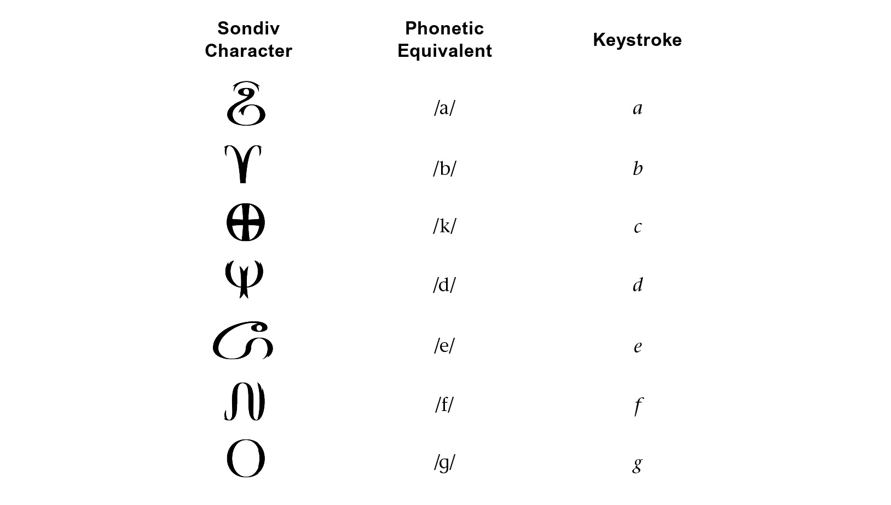

A mapping like this makes Sondiv look like an alphabet, even though it’s an abjad. It also ignores the fact that  is only ever used in foreign words,  is just a rarely used ligature, and  is a duplicate, since there is no equivalent of the English letter *c* in Sondiv. The font program expects the font to be an alphabet, and so it works like an alphabet. That makes creating a nonalphabetic font very difficult.

That aside, this will produce a typeable font. Until any of my writing systems make it into Unicode, that’s good enough for me.

Once the mapping is set, it’s time to start drawing the glyphs. In order to do so, I’m going to teach you the two most important words every font maker ever learns. Ready? Here they are:

1. *COPY*

2. *PASTE*

You may think I’m joking, but I am deadly serious. If I haven’t been fonting in a while and I return to it, I often forget these two vital words, to my detriment. I end up sitting there fooling around with the darn mouse and producing crap, when really all I should be doing is copying and pasting. More on this in a second.

While programs will differ, the glyph window in a font editor looks something like this:

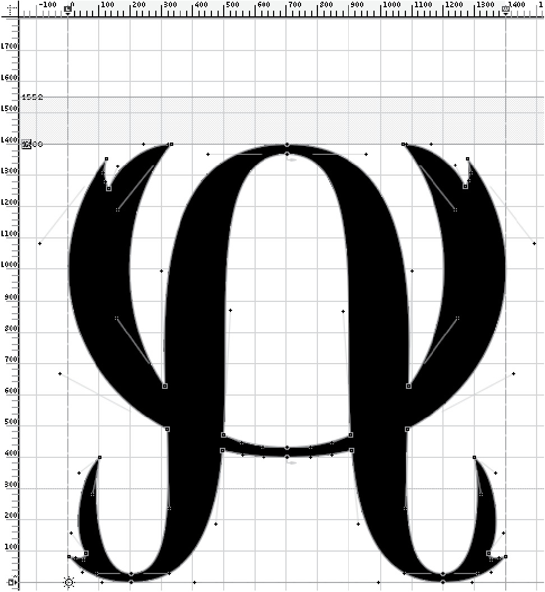

You’ve got a grid, an x and y axis with points, and a lot of space. The character shown above is the glyph for the \[z\] sound in Sondiv. The circles and boxes you see on the glyph are connection points, and the glyph does what it does all based on math. For example, the point at the very top, which I’ll call point A, interacts with the two points on the right and left (points C and B, respectively).

Each of these points (A, B, and C) have little lines sprouting from them with a plus at the end (the pluses for point A are very near to the two points that form the wingtips for the semicircle—ignore those). On the left side, there are points D and E. If you grab point E and drag it up with the mouse, the left side of the hump will get beefier, and will end up being taller than the hump on the right side.

If you tug on point D, on the other hand, the hump on the left gets fatter, pushing into the territory occupied by the left wing of the \[z\].

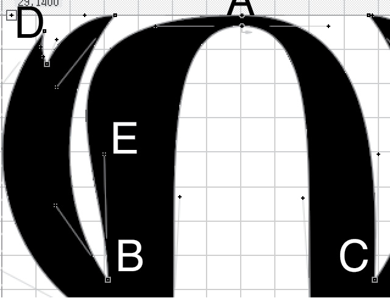

For this one character in the font for Sondiv, I produced ten different characters that were either variations on \[z\], or were built using the same pattern as \[z\], to say nothing of the characters that were very close in shape. If I’d had to draw all of them by hand, I would’ve invented a different writing system.

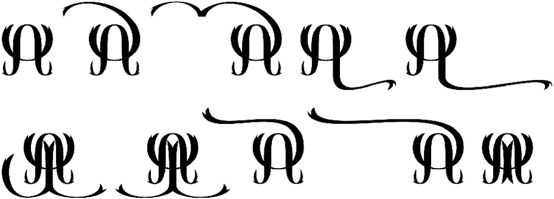

Instead, I just created the one and copied and pasted where relevant.

But it doesn’t actually stop there. Just as you can copy a whole character and move it from glyph to glyph, so can you copy *pieces* of characters. There are probably twenty or so unique pieces that make up the Sondiv writing system, and most of them are shown below:

That probably looks like a whole mess of nothing, but the truth is you can use these pieces (or parts of these pieces) to build just about every glyph in Sondiv. The circle glyph that I stuffed under Agrave for this example shows up *everywhere*. And the best part is I only had to create it once. The top half of that circle forms the main hump for the \[z\] glyph, but the midpoints have been stretched. After that, I took a quarter of the circle, rotated it, and added it to the bottom of each half of the hump to have it curve outward. Bit by bit you can copy and paste a few small pieces into a full writing system, and render perfectly what one can only do imperfectly by hand (or by mouse).

Once the glyphs are built, what remains is extremely complex, so I’ll simply mention it. **Kerning** is a set of rules that tell you how close one character is supposed to sit to a different character. If the rules aren’t set manually, a word processing program will line all glyphs up at their edges. The difference is quite noticeable, as can be seen with the Sondiv sample below.

Above, the second glyph is supposed to nestle right next to the first, with its little dippy-doo on top pointing to the middle of the first glyph. Kerning is what tells the characters to behave in this way. Without kerning, the left-most edge of the second glyph touches the right-most edge of the first, resulting in an infelicitous pairing.

The second complex bit about fonting applies to abjads, abugidas, and cursive scripts. When we write in cursive in English, we have to learn four forms of each letter, depending on whether the letter begins a word, comes at the end of a word, comes in the middle of a word, or is sitting by itself. The reason is that the letter must connect to what’s around it. That’s easy to handwrite; very difficult for a font. In order to make it work, the font itself must make use of what are called **contextual ligatures**. A contextual ligature is a little bit of code that basically says “Change X to Y in the environment Z.” Contextual ligatures are the difference between an Arabic word like /kita: b/ being rendered correctly, like so:

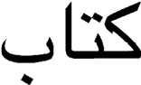

Or incorrectly, as below:

If you’re someone who codes on a regular basis, creating a series of ligatures may seem relatively simple, albeit tedious. If you’re me, it’s rage-inducing. The darn things never work the way they’re supposed to work! The reason is that a ligature is a bit of coded information that tells a word processor how a font should be rendered when two characters come in contact with each other. Since we have a fixed set of writing systems in the world, all Unicode-compliant fonts and all word processors are built to expect those—and *only* those—ligatures. This is why you can write in Arabic, Hindi, Sinhalese, etc., without any problems on any modern word processor. An invented script will have invented ligatures. When *that* happens, most word processors are just done. They can’t even. Just no. It’s as if they have some problem with us humans using a tool for its unintended purpose! (And eighties folk thought computers would take over . . .)

Hope springs eternal, though, so if you want to try to use ligatures in your font, this is how to do it. As an example, I’ll use the Yesuþoh script I created for the Væyne Zaanics language used in Nina Post’s *The Zaanics Deceit*. The language is a conlang in the fictional universe of the book, and the writing system is invented, as well. The creators wanted a script that was hard or impossible to decipher, and so they built in a lot of odd rules. One rule sees a glyph for \[k\] change its form depending on whether it comes after a “light” or “dark” vowel (their terms for front and back vowels, respectively). The font, then, has to be able to detect whether the \[k\] glyph comes after a vowel from the group , or after a vowel from the group  , and then change accordingly.

The first step is to teach the font what the groups are, since it has no way of knowing this. To start the process, I created a `feature` called `rlig` in the OpenType panel (where OpenType features are defined). This feature is recognized by most word processors (for those that don’t, a different feature, `liga`, can be used). After opening this feature, I defined two groups by labeling them with an `@` sign followed by their names (`DARK` and `LIGHT)` and listing the members for each group in brackets:

feature rlig {

\#GROUPS

@DARK = \[a alg o olg u ulg\];

@LIGHT = \[ae aelg e elg i ilg\];

} rlig;

If I didn’t know how to do this and saw that box, my head would explode, because it looks *super* computery. Basically, though, anything with `#` in front of it is just a note and isn’t recognized as a part of the code (I use it to let me know what parts are what). Every line has to end with `;`, otherwise it will all be treated as the same line. The curly brackets `{}` open and close a feature, and square brackets `[]` are used elsewhere to enclose other material, such as group members. The letters above are actual names recognized by all word processors, so `a` is always recognized as a lowercase *a*, etc. The ones that have `lg` after them are long vowels, and are names for special characters found only in this font. They won’t be rendered without the ligature information. Thus, typing `@LIGHT = [ae aelg e elg i ilg];` into the `rlig` feature is basically the same as saying the light vowels of Væyne Zaanics are 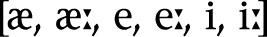.

Once those vowels have been labeled, they can be called as a group by their group name. So the next step is to tell the font what to do with the \[k\] glyph. Here’s how the code is expanded to do so:

feature rlig {

\#GROUPS

@DARK = \[a alg o olg u ulg\];

@LIGHT = \[ae aelg e elg i ilg\];

\#SUBSTITUTIONS

substitute k’ @DARK by kdk;

substitute k’ @LIGHT by klt;

} rlig;

The code there says that in the event that `k` is followed by anything from the group `@DARK`, replace `k` with `kdk` (and ditto with `klt` when `k` comes before a `@LIGHT` group member). The syntax is precise, and the little apostrophe `’` is the thing that tells the font what needs to be substituted out, but otherwise that’s how it works. The result looks like this:

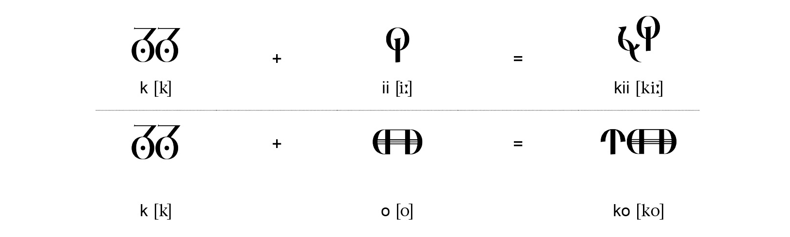

On the left is what \[k\] looks like when it comes before a consonant (its default form). When you add a vowel after it, the character changes dynamically (on the screen) depending on whether the vowel falls into the class `@LIGHT` or `@DARK`.

Knowing the kind of power that these sets of functions have (and I haven’t even come close to describing everything OpenType features can do), you can probably imagine any number of things that a font can do: change the form of a character at the edge of a word; change a full consonantal glyph to its reduced form in front of another consonant; make two vowel glyphs coalesce to form another vowel glyph; produce automatic smart quotes conditioned by the font. There are tons of possibilities, and really it takes a constructed script to take advantage of all of them.

To say I’ve just scratched the surface of font making is a gross understatement. The online manual for the program I use is *literally* 923 pages long—and that’s just to teach you how to use *that* particular program! While the learning curve is pretty steep, it’s possible to produce something minimally functional without getting too deep into the ins and outs of font making. And, from experience, I can tell you there are few things more satisfying than pulling up a new word processing document and typing in the font of a script *you* created.

 

Case Study

THE EVOLUTION OF THE  
CASTITHAN WRITING SYSTEM

When I realized there was a possibility that I could create writing systems for the languages I was creating for *Defiance*, I had to stop and take a deep breath. Creating writing systems is probably my favorite aspect of conlanging, and creating fonts is something that I’d been working on for over a decade. Even so, creating not just one, but *three* fonts for a major production like *Defiance* was daunting—incredible, but daunting. I had to think carefully about what exactly I was going to do.

As usual, whenever I start with any aspect of a language, I started with the people. The script I created for the Indogenes was a chance to just have some sci-fi fun. In the show, the Indogenes are a race of aliens that have, for centuries, been modifying themselves genetically to have superior sight, hearing, dexterity, etc. Their eyes can function as microscopes, and their hands are a thousand times more precise than the best human surgeon’s. Since they’re so keen on “improving” themselves, it made sense that they would have totally reworked whatever writing system they had to suit their new abilities. Consequently, their writing system is completely unnatural, and could never have evolved—and can’t even be written by hand with any consistency, unless you have the keen manual dexterity of an Indogene. Their script is a series of interlocking hexagons that’s featural, meaning that if you know how the pieces work, you can look at a hex and tell how it’s pronounced, as shown below.

Both the Castithan and Irathient systems I wanted to be naturalistic, though, meaning I wanted the scripts to evolve the way scripts on Earth had. I had a bit of leeway with Irathient, since Irathients have an insular culture, eschewing technology in favor of reclaiming the traditional nomadic lifestyle they’d lost centuries before. Their people, though numerous, were not the type to go out and colonize other planets, which meant that their writing system would, for the most part, be used only among Irathients. This meant that it could look pretty wild and be a little less practical than a script that was used by many different people. Consequently, I evolved it to look that way.

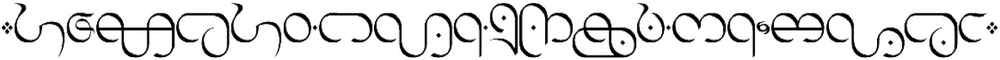

Castithan, though, was an entirely different matter. In *Defiance*, the Castithans are the savviest, cleverest, and most well-connected aliens among all the Votans (the name of the aliens who came to Earth). Consequently, they’re also the most powerful. Their cultural and political influence is vast, and though the Votanis Collective is supposed to represent all races equally, Castithans always tend to come out on top when disagreements arise. The upshot of this is that the Castithan language is the rough equivalent of English on Earth (everyone has their own language, but business is usually conducted in Castithan). The Castithan writing system, then, would be the Votan equivalent of the Roman alphabet.

Faced with this prospect, I made a couple of decisions. Of course, the Castithan writing system would have to look “cool” (it was an alien script), but it also needed to be versatile enough that it could be used *everywhere*. It had to look neat, but official—tame, compared with Irathient. It needed to be compact (Irathient is not) and easy to parse. But most important, it needed to not be an alphabet. Most invented scripts that had been created as set dressing up to that point for films and games (the Atlantean script for Disney’s *Atlantis*, the pIqaD script for Klingon, the D’ni script used in the *Myst* series, the Dovahkiin script for *Skyrim*) were alphabets, and, while achieving a certain aesthetic, were rather simplistic and unrealistic. With my *Defiance* scripts, I was aiming to create something that could sit alongside some of the other outstanding conscripts that had been created by conlangers, like Carsten Becker’s Tahano Hikamu, or anything by Trent Pehrson—something the like of which hadn’t been seen on television, but only online among the conlanging community.

Ayeri’s Tahano Hikamu (Carsten Becker)

The first step in the process was going back to Proto-Castithan, at a time when the script would have been developed. I decided to start at stage 2, rather than stage 1, since stage 1 for Castithan would have been so remote as to almost be erased by the passage of time. The sound system was very different at the time, with Proto-Castithan having an entire class of sounds modern Castithan had lost by the era the show takes place in, along with a host of other sound changes. This would have consequences for the spelling system, which I’ll discuss later on. For the stage 2 writing system itself, which was an abjad, I decided to go with glyphs that could be etched on stone or imprinted on a clay (or claylike) tablet. I didn’t know quite what the planet the Castithans came from would be like at this stage, but I figured that they would probably have the equivalent of stone or a substance that hardens like clay. The glyphs, while not completely devoid of curves (like Ogham), are nevertheless fairly simple, and wouldn’t be difficult to carve or etch—certainly much simpler than hieroglyphs.

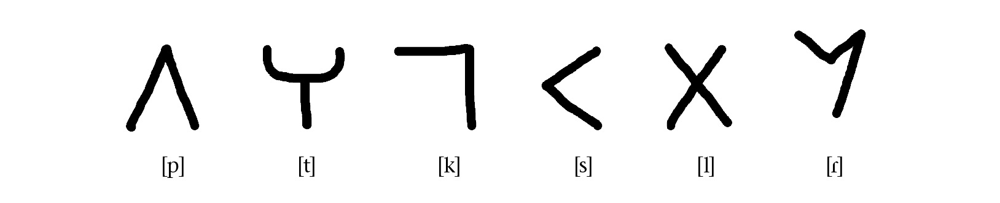

There’s also evidence in the system that even at the time it was current, some glyphs were much older than others. For example, while  and  had their own glyphs, all plain voiced consonants are modified versions of their voiceless counterparts—as are prenasalized consonants.

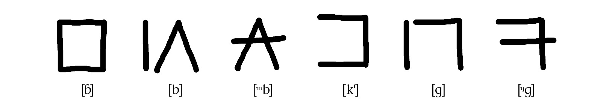

At this early stage, there were glyphs only for consonants. Vowels were indicated only where necessary, and even then, rather irregularly. Consonants were treated as the onsets of CV syllables with an inherent \[a\] vowel. Only a long  was indicated in the writing system, as well as the other vowels .

As a quirk of the system, the long  glyph  would be used for both short \[a\] and long  at the beginning of a word, once these vowel modifications started being used at the beginning of a word (they weren’t, at first). A full word might have looked something like this, during the Proto-Castithan stage.

The script changed when Castithans developed paper and the stylus, or their native equivalents thereof. My goal at this stage was to have Castithans not only write the script faster, but try to write each syllabic block with a single stroke, if possible. Several simplification principles were developed to achieve this goal. For example, the first was that all sharp, angled connections were rounded if they were approached from the bottom or left.

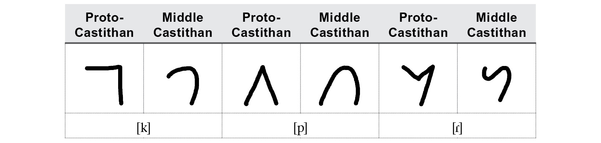

Next, full-length straight lines were no longer written starting at the top, but starting from someplace below.

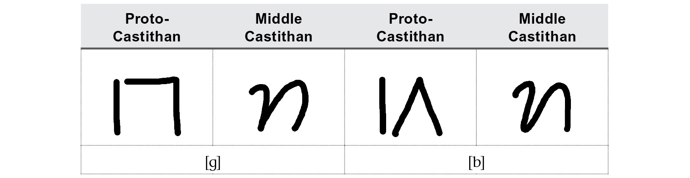

Above is also illustrated how glyphs that took more than one stroke began to be written with a single stroke.

The last step involved the introduction of the small loops that feature prominently in the Castithan writing system. Initially I was concerned about having so many characters with little loops, but I figured if Thai could get away with it, I could too.

The basic idea behind the loop is that if an original line was deleted or not written out in full, it would be represented by a loop. For writers, it would be kind of a shorthand way of indicating that they had intended to write a more detailed glyph—like saying “Hey, I tried, but I’m a busy Castithan. I got things to do. Space things.”

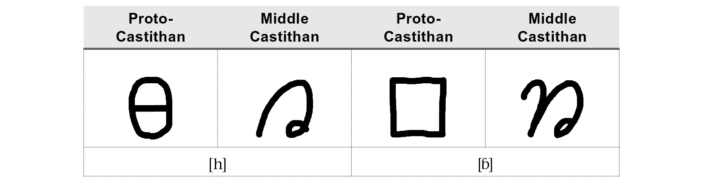

The major change, of course, was the inclusion of the vocalic pieces with the preceding consonant. Whether it was a long or short vowel, the additional glyphs were written with a single stroke, along with the rest of the character. Consonants followed by a short \[a\], again, were not modified.

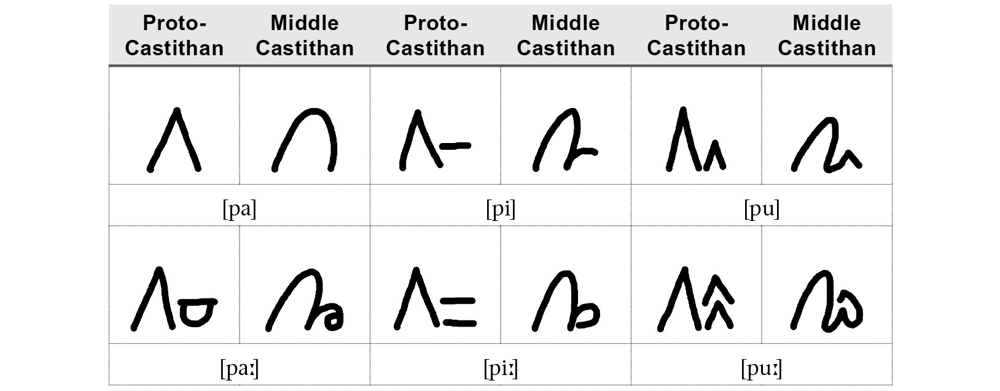

This period I’m calling “Middle Castithan” (which, incidentally, applies to the script only, not necessarily the language) persisted for a long time, eventually giving birth to the modern system. Once the Castithan equivalent of typesetting was invented, the system solidified, with a number of additional changes that occurred to stabilize and regularize the system. These can be summarized by examining the evolution of a few characters.

A small change was the use of the Castithan loop we’ve seen already as an initial element for orphaned lines at the beginning of a character.

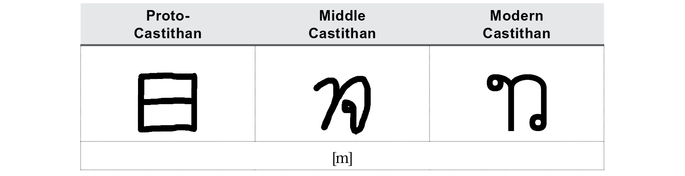

Certain characters added an additional stroke to distinguish them from characters that were too similar. Compare the characters for  below to those for \[m\] above.

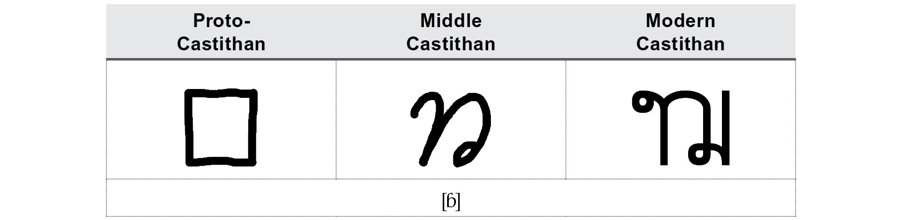

The vowel modifications for  got smoothed out a bit. In the case of \[u\] and , the result looks almost like the inverse of the original glyphs.

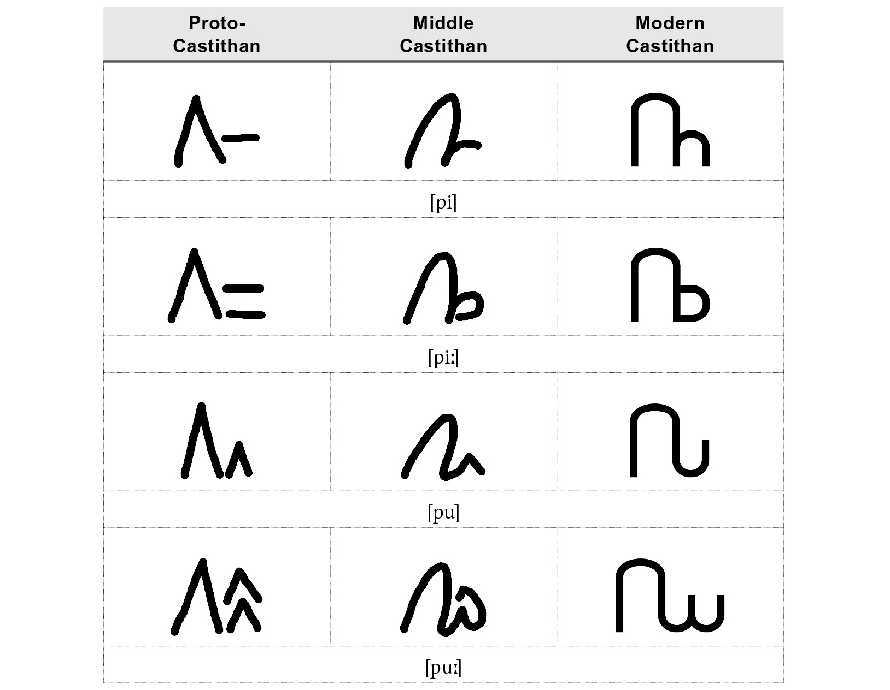

In certain vowel forms, characters that couldn’t easily take a distinguishing stroke added a distinguishing dot, which was a modern innovation.

Then, in addition to the remaining consonantal characters, a convention for writing diphthongs produced a new set of vowel characters that would come into play in the modern language, and would round out the system.

Now what makes the Castithan writing system fun is the fact that the spellings of most words were standardized at a time before the major sound changes that characterize the Castithan language began to take place, to say nothing of the grammatical and semantic changes. The result is a spelling system that’s notoriously difficult to manage—almost as difficult as English, if not more difficult. The writing system, then, works hand in hand with the evolution of the language itself to produce a system that is complex in precisely the way that a natural system is complex. Some examples of the mismatch in spelling and pronunciation are shown below.

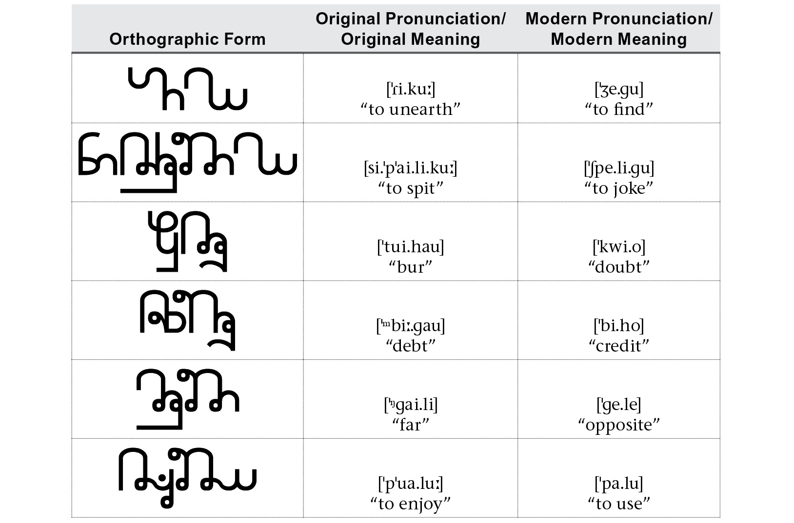

The complexity of the spelling system makes learning the Castithan language rather prohibitive—a source of consternation, no doubt, for the other Votan races for whom Castithan is a second language. Even though the writing system is a detail among the many facets of a large-scale production like *Defiance*, it can be used to further the artistic goals of the series. In this case, it becomes a part of the characterization of the Castithans—especially those in the upper echelons of society who continue to hold sway over the lives of other Votans.

As it stands, the Castithan writing system comprises more than eight hundred unique glyphs. Each consonant has sixteen forms, and I haven’t even touched on the base-twenty number system or the punctuation system. Creating an alphabet with twenty-six glyphs, each one corresponding to an English letter, likely would have sufficed for the art department’s purposes, and even for a majority of the audience. Productions today, though, have the ability to go above and beyond to maximize the authenticity of a world that doesn’t exist—or even couldn’t exist. And fans should demand nothing less. We can *do* immersive now, and do it well. When it comes to writing systems, I think the time has come to leave English ciphers behind. We can do better.
