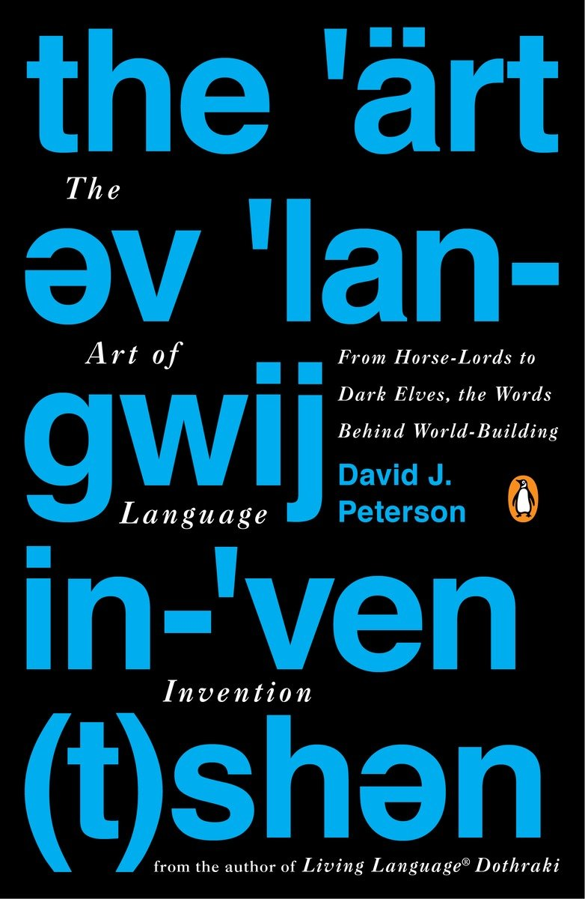
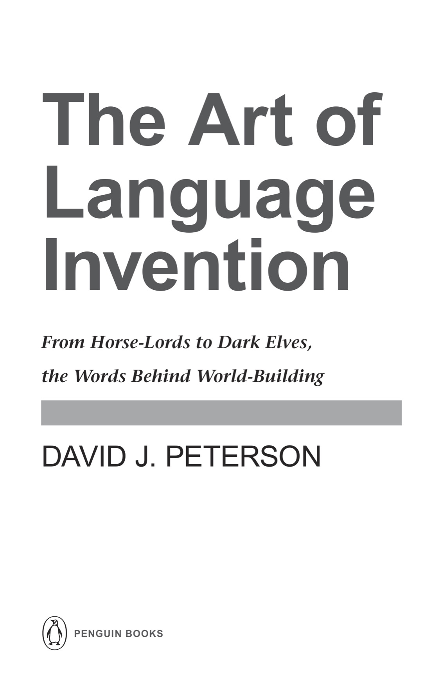

# Front Matter

Early praise for

THE ART OF LANGUAGE INVENTION

“David J. Peterson’s The Art of Language Invention accomplishes a minor miracle in taking a potentially arcane discipline and infusing it with life, humor, and passion. It makes a compelling and entertaining case for language creation as visual and aural poetry. I cherish words, I love books about words, and for me this is the best book about language since Stephen Fry’s The Ode Less Traveled. And, best of all, there’s a phrasebook!”

—Kevin Murphy, co-creator and showrunner of Syfy’s Defiance

“If you want to know how someone makes up a language from the ground up, you’ll find out how in this book—and the glory of it is that along the way you’ll get the handiest introduction now in existence to what linguistics is. In fact, read this even if you don’t feel like making up a language!”

—John McWhorter, author of The Language Hoax

“Accessible, entertaining, and thorough, Peterson has created an invaluable resource for authors, dedicated fans, and casual enthusiasts. This is the book I wish I’d had when I started writing.”

—Leigh Bardugo, New York Times bestselling author of Shadow and Bone

“This book not only lucidly ushers language invention into its own as an art form, it’s also an excellent introduction to linguistics.”

—Arika Okrent, author of In the Land of Invented Languages

“George R. R. Martin created Drogo, and David Benioff and Dan Weiss believed in me, but David Peterson gave me life.”

—Jason Momoa

PENGUIN BOOKS

THE ART OF LANGUAGE INVENTION

DAVID J. PETERSON was born in Long Beach, California, in 1981. He began creating languages in 2000, received his M.A. in linguistics from the University of California, San Diego, in 2005, and cofounded the Language Creation Society in 2007. The inventor of numerous languages for television, film, and novels, he is best known for creating Valyrian and Dothraki for HBO’s hit series *Game of Thrones*, adapted from George R. R. Martin’s *A Song of Ice and Fire* series. He is the bestselling author of *Living Language Dothraki:* *A Conversational Language Course Based on the Hit Original HBO* *Series Game of Thrones*. He has also created languages for Syfy’s *Defiance* and *Dominion*, as well as *Thor 2:* *The Dark World* and the CW’s *Star-Crossed* and *The 100*.

PENGUIN BOOKS

An imprint of Penguin Random House LLC

375 Hudson Street

New York, New York 10014

[penguin.com](http://penguin.com)

Copyright © 2015 by David J. Peterson

Penguin supports copyright. Copyright fuels creativity, encourages diverse voices, promotes free speech, and creates a vibrant culture. Thank you for buying an authorized edition of this book and for complying with copyright laws by not reproducing, scanning, or distributing any part of it in any form without permission. You are supporting writers and allowing Penguin to continue to publish books for every reader.

Ayeri’s Tahano Hikamu script used by permission of Carsten Becker. © Carsten Becker, 2014.

Sondiv (or Atrian) language from Star-Crossed television series. Courtesy of CBS Studios Inc.

The Dothraki and Valyarian languages from the HBO original series Game of Thrones. © 2011 Home Box Office, Inc. All rights reserved. HBO® and related service marks are the property of Home Box Office, Inc.

Dark Elf language appears courtesy of Marvel Studios.

Phrases from the SyFy television program *Defiance* appear courtesy of NBCUniversal Media, LLC.

Minza text from Conlang Relay 13 used by permission of Herman M. Miller. © 2006 Herman M. Miller.

Rikchik language used by permission of Denis Moskowitz. Copyright 1997–2014 by Denis Moskowitz.

Sakhi’i Widoshni (Naming Ceremony) illustration used by permission of Trent M. Pehrson. © 2014 Trent M. Pehrson.

Kēlen’s Ceremonial Interlace alphabet used by permission of Sylvia Sotomayor.

Da Mätz se Basa language from 13th Conlang Relay used by permission of Henrik Theiling.

LIBRARY OF CONGRESS CATALOGING IN PUBLICATION DATA

Peterson, David J., 1981–

The art of language invention : from Horse-Lords to Dark Elves, the words behind world-building / David J. Peterson.

pages cm

ISBN 978-0-698-15567-1

1. Languages, Artificial. I. Title.

PM8008.P48 2015

499'.99—dc23 2015003967

Cover design: Colin Webber

Version_1

*For Erin*

# Contents

[Praise for David J. Peterson](9780698155671_EPUB.xhtml#_idParaDest-1)

[About the Author](9780698155671_EPUB-1.xhtml#_idParaDest-2)

[Title Page](9780698155671_EPUB-2.xhtml#_idParaDest-3)

[Copyright](9780698155671_EPUB-3.xhtml#_idParaDest-4)

[Dedication](9780698155671_EPUB-4.xhtml#_idParaDest-5)

[Contents](9780698155671_EPUB-5.xhtml#_idParaDest-6)

[INTRODUCTION](9780698155671_EPUB-6.xhtml#_idParaDest-7)

[CHAPTER I: SOUNDS](9780698155671_EPUB-7.xhtml#_idParaDest-9)

[Phonetics](9780698155671_EPUB-7.xhtml#_idParaDest-11)  [Oral Physiology](9780698155671_EPUB-7.xhtml#_idParaDest-12)  [Consonants](9780698155671_EPUB-7.xhtml#_idParaDest-13)  [Vowels](9780698155671_EPUB-7.xhtml#_idParaDest-14)  [Phonology](9780698155671_EPUB-7.xhtml#_idParaDest-15)  [Sound Systems](9780698155671_EPUB-7.xhtml#_idParaDest-16)  [Phonotactics](9780698155671_EPUB-7.xhtml#_idParaDest-17)  [Allophony](9780698155671_EPUB-7.xhtml#_idParaDest-18)  [Intonation](9780698155671_EPUB-7.xhtml#_idParaDest-19)  [Pragmatic Intonation](9780698155671_EPUB-7.xhtml#_idParaDest-20)  [Stress](9780698155671_EPUB-7.xhtml#_idParaDest-21)  [Tone](9780698155671_EPUB-7.xhtml#_idParaDest-22)  [Contour Tone Languages](9780698155671_EPUB-7.xhtml#_idParaDest-23)  [Register Tone Languages](9780698155671_EPUB-7.xhtml#_idParaDest-24)  [Sign Language Articulation](9780698155671_EPUB-7.xhtml#_idParaDest-25)  [Alien Sound Systems](9780698155671_EPUB-7.xhtml#_idParaDest-26)

[CASE STUDY: The Sound of Dothraki](9780698155671_EPUB-7.xhtml#_idParaDest-27)

[CHAPTER II: WORDS](9780698155671_EPUB-8.xhtml#_idParaDest-28)

[Key Concepts](9780698155671_EPUB-8.xhtml#_idParaDest-30)  [Allomorphy](9780698155671_EPUB-8.xhtml#_idParaDest-31)  [Nominal Inflection](9780698155671_EPUB-8.xhtml#_idParaDest-32)  [Nominal Number](9780698155671_EPUB-8.xhtml#_idParaDest-33)  [Grammatical Gender](9780698155671_EPUB-8.xhtml#_idParaDest-34)  [Noun Case](9780698155671_EPUB-8.xhtml#_idParaDest-35)  [Nominal Inflection Exponence](9780698155671_EPUB-8.xhtml#_idParaDest-36)  [Verbal Inflection](9780698155671_EPUB-8.xhtml#_idParaDest-37)  [Agreement](9780698155671_EPUB-8.xhtml#_idParaDest-38)  [Tense, Modality, Aspect](9780698155671_EPUB-8.xhtml#_idParaDest-39)  [Valency](9780698155671_EPUB-8.xhtml#_idParaDest-40)  [Word Order](9780698155671_EPUB-8.xhtml#_idParaDest-41)  [Derivation](9780698155671_EPUB-8.xhtml#_idParaDest-42)

[CASE STUDY: Irathient Nouns](9780698155671_EPUB-8.xhtml#_idParaDest-43)

[CHAPTER III: EVOLUTION](9780698155671_EPUB-9.xhtml#_idParaDest-44)

[Phonological Evolution](9780698155671_EPUB-9.xhtml#_idParaDest-46)  [Lexical Evolution](9780698155671_EPUB-9.xhtml#_idParaDest-47)  [Grammatical Evolution](9780698155671_EPUB-9.xhtml#_idParaDest-48)

[CASE STUDY: High Valyrian Verbs](9780698155671_EPUB-9.xhtml#_idParaDest-49)

[CHAPTER IV: THE WRITTEN WORD](9780698155671_EPUB-10.xhtml#_idParaDest-50)

[Orthography](9780698155671_EPUB-10.xhtml#_idParaDest-52)  [Types of Orthographies](9780698155671_EPUB-10.xhtml#_idParaDest-53)  [Alphabet](9780698155671_EPUB-10.xhtml#_idParaDest-54)  [Abjad](9780698155671_EPUB-10.xhtml#_idParaDest-55)  [Abugida](9780698155671_EPUB-10.xhtml#_idParaDest-56)  [Syllabary](9780698155671_EPUB-10.xhtml#_idParaDest-57)  [Complex Systems](9780698155671_EPUB-10.xhtml#_idParaDest-58)  [Using a System](9780698155671_EPUB-10.xhtml#_idParaDest-59)  [Drafting a Proto-System](9780698155671_EPUB-10.xhtml#_idParaDest-60)  [Evolving a Modern System](9780698155671_EPUB-10.xhtml#_idParaDest-61)  [Typography](9780698155671_EPUB-10.xhtml#_idParaDest-62)

[CASE STUDY: The Evolution of the Castithan Writing System](9780698155671_EPUB-10.xhtml#_idParaDest-63)

[Postscript](9780698155671_EPUB-11.xhtml#_idParaDest-63)

[Acknowledgments](9780698155671_EPUB-12.xhtml#_idParaDest-64)

[Phrase Books](9780698155671_EPUB-14.xhtml)

[Dothraki](9780698155671_EPUB-14.xhtml#_idParaDest-66)  [High Valyrian](9780698155671_EPUB-15.xhtml#_idParaDest-67)  [Shiväisith](9780698155671_EPUB-16.xhtml#_idParaDest-68)  [Castithan](9780698155671_EPUB-17.xhtml#_idParaDest-69)  [Irathient](9780698155671_EPUB-18.xhtml#_idParaDest-70)  [Indojisnen](9780698155671_EPUB-19.xhtml#_idParaDest-71)  [Kamakawi](9780698155671_EPUB-20.xhtml#_idParaDest-72)  [Væyne Zaanics](9780698155671_EPUB-21.xhtml#_idParaDest-73)

[Glossary](9780698155671_EPUB-22.xhtml#_idParaDest-74)

[Index](9780698155671_EPUB-23.xhtml#_idParaDest-75)
