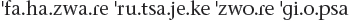

# Introduction

The first time I heard a language of mine spoken on-screen was at a cast and crew premiere event for the first season of HBO’s *Game of Thrones*. It was a lavish, but, comparatively speaking, poorly attended event. George R. R. Martin was there, but many of the seats reserved for cast members in the Ray Kurtzman Theater remained vacant throughout the screening of the first two episodes of the series. Needless to say, they didn’t know how big this thing would get (who did?), but I appreciated the extra legroom—and the front-row seat.

My initial reaction to hearing Dothraki, the language of the long-braided, horse-riding warriors, though, was one of dismay. The first line one hears in the series is in the pilot, when Illyrio Mopatis, welcoming Khal Drogo and his band into his courtyard to arrange a marriage, says *Athchomar chomakaan*—“Welcome” when said to one person. I misremembered how I’d translated it, though, and thought he should have said *Athchomar chomakea*—“Welcome” when said to more than one person. So even though Roger Allam’s performance was fine and it was I who was mistaken, I was a little miffed. After the screening had finished we all got in line to congratulate David Benioff and Dan Weiss on a successful premiere, and when they asked me how the Dothraki speakers did, my face must have betrayed me, for David said to me, “You know, we \[i.e. he and Dan\] were talking, and we realized, if any of the actors made a mistake, who would know it—except for you?”

This is actually a question I’ve gotten a lot since. That is, if there’s an actor performing in a created language that no one speaks, who will know if they make a mistake aside from the one who created the language? From experience, I can tell you that the actors always know (and it frustrates them when the takes with errors make their way into the final cut), but let me focus on the audience.

If you, as a viewer, sit down and listen to one line from a created language and nothing else, it’s nearly impossible to tell if it’s a created language, a natural language one doesn’t know (one that exists in our world), or gibberish—to say nothing about whether or not the actor gets all the words right. If that’s the extent of the linguistic material in the production, it doesn’t matter what work went into creating the line.

As the number of lines increases, though, the odds of the casual audience member picking up on inconsistencies increase. It’s not every fan who pays attention to what actors are saying in a language they don’t understand, but there are those who do. Furthermore, television shows and movies aren’t plays—that is, they aren’t events that happen at one moment in time and are never seen again. If the general public is anything like me, *most* of the television and movie viewing they do now isn’t done live—and if a show is worth its salt, they’ll watch it again and again and again and again.

As a language creator, I always had a bit of a different perspective. When I was creating Dothraki, I wasn’t creating it simply to fill out the requisite non-English dialogue. I had an idea that *Game of* *Thrones* could be big, and could occupy a special place in television history—just as George R. R. Martin’s books already do occupy a special place in the history of fantasy. The work I was doing, then, would need to be something that would stand the test of time. Because even if a fan who’s never heard of the books can’t tell if one actor makes a mistake in the premiere on their first viewing, fans five, ten, twenty years from now *will* be able to tell. And, of course, if mistakes crop up, they won’t belong to the show, the producers, or the actors: they’ll belong to me.

 • • • 

When I was a kid, the original *Star Wars* trilogy had just completed its initial run in theaters, and *Star Wars* was *everywhere*. I had a toy sand skimmer (which I broke), a toy TIE fighter (which I also broke), and a read-along *Return of* *the Jedi* picture book with accompanying record which would play the sound of a ship’s blaster when you were supposed to turn the page. (If you’re too young to be familiar with record players as anything other than “vinyl,” type “Pac-Man record read along” into YouTube to familiarize yourself with the concept. That was my childhood.)

In short, aside from *He-Man*, *Star Wars* was pretty much *the* thing if you were a child of four in 1985. At that age, when I watched movies, I didn’t really pay careful attention to the dialogue, and wasn’t able to follow stories that well. Consequently when the *Star Wars* trilogy was rereleased in 1995, I rewatched it eagerly. Once I got to *Return of the Jedi*, I was struck by what I thought was a particularly bizarre scene. In the beginning of the movie, Princess Leia, disguised as a bounty hunter, infiltrates Jabba the Hutt’s palace in order to rescue Han Solo. She pretends to have captured Chewbacca, and engages Jabba to negotiate a price for handing him over. In doing so, Leia pretends to speak (or evidently *does* speak, via some sort of voice modification device) a language Jabba doesn’t. He employs the recently acquired C-3PO as an intermediary. As near as I can tell, this is how the exchange goes (transcription is my own; accent marks indicate where the main stress is):

LEIA: *Yaté. Yaté. Yotó*. (SUBTITLE: “I have come for the bounty on this Wookiee.”)

*C-3PO relays this message and* *Jabba says he’ll offer 25,000 for Chewie.*

LEIA: *Yotó. Yotó.* (SUBTITLE: “50,000, no less.”)

*C-3PO relays* *this message and Jabba asks why he should pay so* *much.*

LEIA: *Eí yóto.*

*The above isn’t subtitled, but Leia pulls out a bomb and activates it.*

C-3PO: Because he’s holding a thermal detonator!

*Jabba* *is impressed by this and offers 35,000.*

LEIA: *Yató* *cha.*

*The above isn’t subtitled, but Leia deactivates* *the bomb and puts it away.*

C-3PO: He agrees.

*Order is restored.*

I want you to remember that I was in seventh or eighth grade at the time that I was rewatching this. I was not a “language” guy at that point by *any* stretch of the imagination. I never dreamed that a human could invent a language, and even if I had, I probably wouldn’t have been able to come up with a good reason for one to do so. Furthermore, up to that point, I’d never studied a second language, and the prospect filled me with dread (I had enough trouble understanding my Spanish-speaking relatives who always spoke too fast for me).

But even so, I knew something was wrong here. How on earth does Leia say the same thing twice and have it mean something different the second time? Even if we take C-3PO for an unreliable translator (he is quite loquacious, after all), that applies only to the last two phrases. How could one expect to have an unreliable *subtitle*? Subtitles are supposed to lie outside the world of the film. If you can’t rely on a subtitle provided by the film’s creators, how can you rely on anything?

In trying to resolve this conflict, it occurred to me that the only plausible explanation for this aberrant phenomenon is that the language itself was correct, but worked differently from all other human languages. In our languages (take English, for example), a word’s meaning can be affected by the context it’s in, but if you control for context, the word will always mean the same thing. Thus, if you’re telling a story about your dog, and you use the word “dog” several times throughout the story, it will still refer to a fur-covered animal that barks and covets nothing so highly as table scraps. This is fairly standard and uncontroversial.

What would happen if a language didn’t do that, though?

Take, for example, the word I have transcribed as *yotó* above. What if it changed its meaning over the duration of a discourse? Naturally, one would have to define a discourse, but I think it’s fair to consider this conversation featuring Leia, Jabba, and C-3PO a single discourse, so we can leave that concern aside for the moment. What if the word *yotó* has several definitions? Specifically, what if the first time it’s used in a conversation it means “this wookiee”; the second time it’s used it means “50,000”; and the third time it’s used it means “no less” (or the rough equivalent of those)? The same, then, applies for all other words in the language. That would resolve the ambiguity. How could one possibly use such a language? Well, they *are* all aliens (*Star Wars*, recall, takes place a long time ago in a galaxy far, far away). Maybe they’re just better at this stuff than humans. Why not?

This was where my brain went while rewatching *Return of the Jedi* for the first time. At some future date I may have shared this with a friend, but if I did, the response was likely an eyeroll. This quirk was just an unimportant detail in an otherwise fantastic movie. Why bother about it?

And so that’s pretty much where my thought experiment died. I didn’t take it any further, and no one was really interested, so I didn’t think about it again until college.

But that, of course, was a different era—a pre-internet era. Who does a teenager have to share news with other than their family, friends, and teachers? Who do they come in contact with? In 1995, that’s pretty much only the people who live near you and with whom you interact on a daily basis. How would you ever get ahold of anyone else? How would I have known that someone in the Bay Area, let’s say—less than five hundred miles away—had the same idea I’d had and also found that exchange interesting? In 1995, there was no way.

Then the internet happened.

Yes, the internet had been around for a while in 1995, but it wasn’t a thing that just anyone could have access to. America Online changed all that. Pretty soon it became a thing to race home from school and go into a chatroom with a bunch of random people to talk about . . . nothing. And that was how we entertained ourselves—*for hours*. What a world, where you could chat with someone who lived in Lancaster, Pennsylvania, about how Soundgarden rules!

As it turns out, though, I wasn’t the only person to pick up on this. Another conlanger I’d later meet at the First Language Creation Conference, Matt Haupt, asked exactly the same question, and devoted a blog post to deconstructing that scene specifically. And *we* weren’t the only ones. The Ubese language has its own entry on the Wookieepedia (yes, that’s a thing) where contributors have written up an entire backstory for the language that is, first of all, not a full language, and, ultimately, poorly constructed and not worthy of serious consideration.

So let me bring back David Benioff and Dan Weiss’s question to me on the night of the *Game of* *Thrones* premiere. If the actors speaking Dothraki or High Valyrian or Castithan or whatever make a mistake, who would know but the creator? Who would care? The truth is probably one in a thousand people will notice, and of those who do, maybe a quarter will care. In the 1980s that amounts to nothing. In the new millennium, though, one quarter of 0.001 percent can constitute a significant minority on Twitter. Or on Tumblr. Or Facebook. Or Reddit. Or on whatever other social media service is currently taking the internet by storm. To take a recent (at the time of writing) example, there was *Frozen* fan fiction and fan art circulating the internet *before the movie had even premiered*—and when it did premiere, it took a matter of hours for everyone to learn that Kristoff’s boots weren’t properly fastened, and that this was a big deal as it was disrespectful to the Sami people and their culture.

One of the most significant things about our new interconnected world is that the internet can amplify a minority voice exponentially. Yes, few people, comparatively speaking, will care if an actor makes a mistake with their conlang lines. But thanks to the internet, those few people will find each other, and when they do, they’ll be capable of making a *big* noise. Every single aspect of every single production on the big and small screen is analyzed and reanalyzed the world over—and in real time. Every level of every production is being held to a higher standard, and audiences are growing savvier by the day. Language—created or otherwise—is no exception. In order to meet the heightened expectations of audiences everywhere, we have to raise the bar for languages created for any purpose. After all, if we don’t, we’ll hear about it.

 • • • 

Though it might seem like language creation is a recent phenomenon, with the success of shows like *Game of Thrones* and films like *Avatar*, the conscious construction of language is probably as old as language itself. The earliest record we have of a consciously constructed language is Hildegard von Bingen’s *Lingua Ignota* (Latin for “unknown language”), which was developed some time in the twelfth century CE. The abbess’s creation wasn’t a language proper, but rather a vocabulary list of just over a thousand words (most of them nouns). Hildegard developed this “language” for use in song, dropping Lingua Ignota words into Latin sentences for, presumably, a specific kind of religio-aesthetic effect. The words, for the most part, look quite a bit different from either German or Latin, and feature an overrepresentation of the letter *z* (cf. *Aigonz* “God,” *sunchzil* “shoemaker,” *pasiz* “leprosy”)—and she wasn’t shy about creating words for concepts that were . . . less than holy (e.g. *amzglizia* “male pudendum,” *fragizlanz* “female pudendum,” *zirzer* “anus,” *maluizia* “prostitute”—the full list is fascinating).

The inspiration for Hildegard’s creation came, she believed, directly from God. The same is true for other projects found before the sixteenth century, such as Balaibalan, created in Turkey sometime in the fifteenth century. The impetus for the creation of these languages was always external and supernatural. As far as we know, no one had yet created a language for any other purpose.

Around the sixteenth century, a new type of language began to emerge: the philosophical language. These languages were born of philosophers and scientists who saw problems with our languages (in particular, the arbitrary association between form and meaning), and sought to correct them. Of these types of languages, John Wilkins’ philosophical language is likely the most famous example (though Ro from the twentieth century is a significant improvement on the concept). Using an example reproduced by Jorge Luis Borges, in Wilkins’ language, if *de* is the word for an element, then *deb* is the first or primary among the elements (i.e. fire), and *deba* is a part of the first of all the elements (i.e. a flame). Cave Beck had a different take on a potential universal philosophical language in 1657 which made use of numbers. Taking his favorite example, *3*, which has to do with the concept of abatement, *p3* is a man who abates; *pf3* is a woman who abates; *r3* is abatement; *x3* is the act of abating, and so forth. Another favorite: if *q317* is bold, then *qq317* is bolder and *qqq317* is boldest, but there it stops. I think he really missed out here, as it would be incredible to describe a mighty warrior as *qqqqqqqqqqqqqqqqqqqqqqqqqq317* (it just makes sense).

Generally, the goal of philosophical experiments such as these was to perfect language for the purposes of science. If language can obscure intention, on account of metaphor, idioms, and vagueness, then a precise language would be of vital and obvious value to the entire scientific community. As it happened, though, none of the philosophical languages from this era ever caught on, albeit not on account of a lack of effort on the part of their creators.

The entire character of the created languages discussion changed forever in the nineteenth century, though, with the advent of the concept of the international auxiliary language (IAL). Philosophical languages were intended to be precise, but not necessarily easy to learn or use (indeed, using languages featuring categorization systems such as those employed by Beck and Wilkins proved quite cumbersome). An IAL, by contrast, is created to be as simple to learn and use as possible, so that it can be learned and used by large numbers of people across the world—those who would otherwise share no common language.

Though at the time of printing there have been easily more than a thousand IALs produced, the two earliest successes were Volapük (1879) and Esperanto (1887). Volapük, created by German priest Johann Martin Schleyer, was the first IAL to gain major notoriety. Schleyer derived its vocabulary from English, German, and French, and intended for the words to be both recognizable and easy to pronounce. He was marginally successful in this regard, with, for example, the name of the language itself coming from two English words: *vol* from “world” and *pük* from “speak.” As the language gained a following, there were some who wanted to change the language (e.g. simplifying some of the tenses, getting rid of the vowels *ä*, *ü* and *ö*, adding *r*, etc.). Schleyer resisted any attempt to change the language, and insisted on maintaining complete control over its character and use. Splinter groups rose up creating knockoff versions of Volapük, and before long, the language had practically no following.

Part of its downfall, though, was no doubt due to the ascension of newcomer Esperanto, created by Ludwik Lejzer Zamenhof. In contrast to Schleyer’s methods in presenting Volapük, Zamenhof published his initial grammar of Esperanto under a pseudonym (Doktoro Esperanto—whence the name of the language), and laid no claims on the language’s use or distribution. He eschewed copyright, and said that the language was his gift to the world. As a consequence, when splinter groups arose, it was the community itself, rather than Zamenhof, that decided what to do. This led to a major schism, with the majority of Esperantists adhering to Zamenhof’s original conception of the language, and a minority splitting off and forming the Ido language: a modification of Esperanto. Both languages continue to enjoy success to this day, though Esperanto takes the lion’s share.

The success of Esperanto, in particular, gave rise to innumerable attempts at a simpler or more international auxiliary language. General enthusiasm for the widespread use of an IAL was quelled primarily by the world wars, but interest in their construction has, if anything, increased over time, with new ones popping up online almost every month. None have achieved the success that Esperanto has, and it seems unlikely that any will ever do so—let alone achieve the goal of all IALs, which is to become the world’s default auxiliary language.

The next wave of language creation began in the twentieth century, and is known as the artistic language (or artlang) movement. Though early works of fantasy or satire would often feature bits of supposedly fictional languages (cf. Jonathan Swift, James Cabell, Lord Dunsany, E. R. Eddison), none of these snippets were languages in the proper sense—they enjoy no existence outside the books they’re found in, and are largely haphazard or circumstantial in construction. The same is true of the work of Edgar Rice Burroughs, though in his works there’s a bit more linguistic material throughout. The first widely known author to use a more or less fully constructed language was J. R. R. Tolkien, who set the bar very high.

Unlike other authors before him—or most who would claim him as an inspiration afterward—Tolkien was a language creator before he penned his major works. In a way, the languages themselves served as the progenitors to the tales. He understood that language itself is inseparable from the culture that produces it (or “mythology,” as he put it), and he felt that if the languages he was creating had no place to breathe, they wouldn’t have any kind of vitality. Arda became the place where his languages could live, and so his legendarium was born.

In addition to being the first person on record to create a full language for a fictional context, Tolkien also did something no other language creator had done to that point: he created a language *family*. Quenya and Sindarin, his two most famous languages, descend from a common ancestor, Quendian, and themselves have languages that have descended from them, and other languages to which they are related. This is precisely how natural languages evolve in our world, and would naturally be appropriate for a fictional setting that has an alternate history with any kind of time depth similar to ours on Earth. The concept, though, was a novel one, and not fully appreciated in Tolkien’s time, as his works of fiction overshadowed his contributions to the history of conlanging.

There were other notable artistic conlang achievements in the twentieth century (for example M. A. R. Barker’s creations for the *Empire of the* *Petal Throne* role-playing game, or Christian Vander’s Kobaïan, used in song lyrics by his band Magma—even Vladimir Nabokov created a conlang sketch for his masterwork *Pale Fire*), but none attracted the attention that Tolkien’s work did. It was only a matter of time before the phenomenon moved to film and television. Early films and shows would often use ad hoc invented vocabulary for fictional foreign nations (cf. early episodes of *Danger Man*), or for languages the filmmakers didn’t want to bother to reproduce faithfully (cf. *Thoroughly Modern Millie*). A handful of films used actual Esperanto, with the most prominent (or infamous) example being the film *Incubus*, starring William Shatner. According to fluent Esperanto speakers who’ve seen it, the Esperanto is atrocious. Otherwise there was no noteworthy conlang work in a film or show before 1974’s *Land of the Lost*, which featured an invented language its creator called Paku (often referred to as Pakuni). Paku was created by UCLA linguist Victoria Fromkin, who was hired specifically for this purpose. Though a few dedicated fans have attempted to take down what little they can hear of the language in the show, the producers clearly didn’t think it was in their best interest to publicize the language the way conlangs attached to modern franchises are publicized, which is a pity. The creation of the Paku language was an important event in the history of conlanging, for unless there are other instances that haven’t yet come to light, this was the first time in history that an individual had been hired to create a language.

The idea of hiring out for a language was repeated a few times in the late twentieth century—most notably with Klingon, which was fleshed out by Marc Okrand for *Star Trek III: The Search for Spock*, but other notable examples exist, like Matt Pearson’s Thhtmaa language for NBC’s *Dark Skies*—but the wave really started to grow with the advent of the internet.

The first gathering of language creators—either virtual or in person—occurred on July 29, 1991. That’s the date of the first ever message sent to the Conlang Listserv: an online listserv dedicated to those who created languages. The original members of the listserv met on Usenet, and decided to create their own listserv just for language inventors. When they created it, the listserv needed a name, so they took the first syllable of “constructed” and the first syllable of “language” and created “conlang.” Thus the word “conlang” was born. At the time, there were a number of competing terms for an invented language—planned language, model language, artificial language, created language, ideal language—but conlang was the one that eventually won out, and which now has made its way into the *Oxford* *English Dictionary*. The portmanteau strategy proved useful for coining words for other types of conlangs, and so new terms began to spring up: artlang, loglang, engelang, auxlang, altlang, lostlang, jokelang . . . At this point, *-lang* could probably be considered a fairly productive derivational suffix.

The constructed languages listserv was originally run from the Boston University physics department by a fellow named John Ross, before it was moved to the Datalogisk Institut in Denmark, where it stayed for a bit. When it could no longer be housed there, though, David Durand, one of the original members, used his alumni connections from Brown University to get the list a permanent home there, where it remains to this day.

Though the original list members probably didn’t realize it at the time, the founding of the Conlang Listserv (hereafter Conlang) was a momentous occurrence in the history of language creation. Aside from contentious gatherings devoted to how to improve a specific auxiliary language, there had never before in history been a place where those who created languages would discuss strategies for doing so. For the first time language creators could compare their work to something other than Tolkien’s languages or Esperanto and its many imitators.

Of course, like any community, Conlang had its rocky moments. While many Conlang members were interested primarily in sharing their own work and learning from others who would share theirs, a sizable contingent were advocates of one of a number of IALs: Esperanto, Novial, Volapük, or creations of their own. Arguments would often break out over which was the best language, and which should be supported as the one language that all the world should speak. As a result of the constant bickering, in 1996 a separate listserv was created—the Auxlang Listserv—and advocacy of *any* language was banned from Conlang. Instead, discussion on Conlang would be specifically devoted to sharing non–auxiliary language work, and discussing strategies related specifically to language creation.

This proved to be a real turning point for the craft, as Conlang began to accrue more and more members and develop its own traditions thereafter. In the summer of 1999, Irina Rempt, creator of Valdyan, initiated the first conlang relay. In a conlang relay, the first participant writes a text in their conlang, and then passes on the text, grammatical notes, and a lexicon to the next participant. This next participant has forty-eight hours to use those materials to decode the text and then must translate it themselves into their own conlang, passing the text on with translation materials, and so forth, until all participants have had their turn with the text (called the “torch”). The resulting texts are often ridiculous, which is part of the fun. Here, for example, is the first line of the original text of the thirteenth conlang relay, which was composed by Henrik Theiling in his a posteriori language Da Mätz se Basa:

*An ein Muin* *äna Monat Wöpf kan ana da Drot s ano Bant* *fona Bos bänti s Urt da lei se Zän is* *sä ze.*

And here’s its translation:

One morning in December I could watch the following scene across the street from a bus stop:

Now here’s the rest of the text translated:

A boy, obviously on his way to school, stood in front of a garden wall. He had an enormous red tomcat on his shoulder and this animal balanced skillfully while the boy tried hard to shake him off. With increasing panic he watched the bus stop knowing the bus would be due any second now . . . The cat was quite undisturbed. Once, he put a paw on the wall, but seemingly it felt too cold, so he quickly retreated to the boy’s backpack. The moment when he was comfortably sitting, having tucked up his legs, the school bus arrived.

I suppose the cat spent quite an interesting day.

Now here’s the first line of the final translation of this same text into Minza by Herman Miller:

*Vyø jenzelu kaikat, seła køvu nintel vonyli rukumen røġisit.*

Here’s the first line translated:

Before the sun came out, a messenger woman was walking along bringing messages in a cart.

Now here’s the rest of the text translated:

She paused briefly as the cart arrived near the path which led to the market place, but then she disturbed an animal, which growled at her. The messenger woman held up a branch of a tree, and approached near the cougar.

Wanting to avoid danger, the messenger woman was anxious about the cougar, so she stopped far from him, but tried to obtain his trust. She gave a portion of food to the playful cougar. She thought he would approach the cart, but the shameful cougar wanted more food! It began to rain, the woman holding the branch, so she wanted to stay far away from the cougar.

With the branch of a tree, she protected herself quite well from the cougar. From there the messenger woman reached the end of the path with her cart. After that day when she set out, the growl of the cougar has made more women and more men nervous.

The stories are absurd, but the practice is useful. Members of Conlang have found dozens of ways to test out their languages over the years, improving them as they go along. For example, translating the “Babel Text” (Genesis 11:1–9) became a standard stress test for a new conlang, thanks to the website Langmaker.com, created by Jeffrey Henning, which hosted various conlangs’ translations of the Babel Text.

Conlang continued to grow and expand, until soon splinter communities began to emerge—including communities that held discussions in languages other than English (e.g. Ideolengua, the first Spanish-language conlang community). The various communities attracted some of the best language creators on the planet, and also produced a new generation of conlangers, of which I was one, whose conlanging heroes weren’t Tolkien or Zamenhof or Okrand, but other conlangers like Sally Caves, Sylvia Sotomayor, and Matt Pearson—names widely known and respected within the conlanging community, but virtually unknown without. To date, the best languages ever created were not created for television series or movies, but were created just for the joy of it—languages like Sally Caves’ Teonaht, Doug Ball’s Skerre, Sylvia Sotomayor’s Kēlen, Matt Pearson’s Okuna (formerly Tokana), Andrew Smith’s Brithenig, John Quijada’s Ithkuil, Carsten Becker’s Ayeri, and David Bell’s ámman îar, to name a few among hundreds.

A key feature of some of the best languages I’ve seen in that time—including all those listed here—is that they changed crucially as a result of contact with the community. This is the natural result of community in the most abstract sense. Consider: What artist never looks at any paintings but their own? What musician never listens to any music but the music they create? Yet this was precisely the state of conlanging prior to 1991. Some will have heard of Esperanto or Tolkien or Klingon, but a majority believed that they were the first person *ever* to create a language. For example, I believed I was the first one ever to create a language for purposes other than international communication—and that was in 2000. Part of this was due to a general lack of awareness, but part is also due to the nature of the activity.

Hobbies are what they are. People do things because they find them fun. Some hobbies can eventually lead to something bigger (painting, writing, sculpting, sports, etc.). Conlanging is a hobby that, even as late as 2009, no one in the conlanging community believed would amount to anything real. Part of this comes from older conlangers’ personal histories. Parents who found their children creating languages would consider the practice so bizarre that they believed it to be indicative of some sort of mental disorder. Esperantists and other auxlang advocates considered the practice counterproductive and silly. Linguists would, at turns, either dismiss or deride the practice (one of the earliest works by a linguist that discusses conlanging in any depth is Marina Yaguello’s 1984 work *Les* *Fous du Langage*, or *Lunatic Lovers of Language*, which is precisely as insightful as it sounds). On Conlang, members took to talking about their language creation using the same terms homosexuals would to talk about their homosexuality. Revealing to one’s parents, friends, or colleagues that one conlangs is still referred to as “coming out.”

The truth, of course, is that language creation is just a thing (and I mean that in *the* most prosaic sense). Conlanging is an activity that harms neither the conlanger nor the world around them. If anything, there’s an intrinsic benefit in engaging with linguistic material—created or otherwise—as it exercises the parts of the brain that use language, and gives conlangers a bit more of an open mind when they encounter languages other than those they speak natively. Even so, a lifetime of negative feedback has left its mark on the community, which has been tolerant of praise, but allergic to criticism, constructive or otherwise.

This lack of judgment was a key feature of the early Conlang community. Reactions to a piece of art are subjective, of course, but just as with any activity that requires any amount of skill or ingenuity, certain elements of language creation can be measured objectively. The community has routinely rejected any calls for objective measurement of any kind—or any criticism other than positive feedback. The thinking was that if this was a place where a conlanger could actually be themself, it should be a zone free of judgment. In many ways, this has helped to foster growth, but it’s also hindered the development of the craft.

What I would advocate is a goal-driven approach to conlang evaluation. That is, when one creates a language, one creates it for a number of reasons. Those reasons will determine the character of the language and the nature of what would amount to acceptable criticism. For example, if one creates a language for personal use and for no other reason, then the only acceptable criticism will come from the creator alone; all other criticism is immaterial. That shouldn’t be true of a language created for television or film. The constraints will differ, as paid language creators have to bow to the whims of producers, directors, and writers, and generally don’t have as much time to develop their work as a conlanger working for themself, but within those constraints, criticism is appropriate—and healthy for the community. If a language has been developed for a fictional race of people in an otherwise realistic setting, the language should likewise be as realistic as possible. Does such a language appear to be naturalistic in all respects? If not, how could it be improved—how might it appear more authentic? These are good questions to ask, and good examples to learn from.

Which brings us to today—and the conlangers of today. Up until, say, around 2004, I could confidently say that if there was anyone online who had even dabbled in language creation, I had heard of them and of their language, and could list a couple of key traits of that language. The community was tight-knit, and even though it had branched off a bit, everyone still was able to keep tabs on everyone else, for the most part. In 2015, this is beyond impossible. Not only is it impossible to know every language creator, it’s not even possible to know every language creation community. There are conlangers active on Tumblr, Twitter, and Facebook who have no connection to any of the original communities—and they’re drawing inspiration from languages that didn’t exist even five years ago. And while this is great, the newest conlangers lack any means of evaluation or instruction. They know the word “conlang,” but have never heard of the Conlang Listserv. They know Na’vi, but have never heard of Moten. They’ve never had to defend their work as not being a serious attempt to create a new universal language—the first accusation most artlang creators faced when presenting their new language on the web back in the nineties. They’re a new breed, and share none of the same assumptions that the early Conlang crowd did. This means they don’t have the hangups older conlangers do, but also that they lack the history—and, most important, the knowledge—accrued over years of steady interaction.

When I get an email from someone who’s eager to create their own language and wants to know where to begin, I have a tough time explaining what it is they should do. I think my conlang education was good, for what it was, but what exactly did it entail? I joined the Conlang Listserv and spent a decade there sharing my work, learning from others, and learning more about language. Should everyone have to do the same? Where is the collected wisdom of the early conlang community? Why is it not written down somewhere that if you’re creating a naturalistic ergative language, it will most likely be split ergative, and that those splits will happen in one of a small number of likely places in the grammar? This is something that every conlanger knows or eventually learns, but the information is only passed via word of mouth—it’s like we’re living in the 1300s, but we also have the internet and indoor plumbing!

This work is a sincere attempt to give new conlangers a place to start by detailing what things I take into account when creating a language. It won’t answer every question (no single book could hope to hold every scrap of information one needs to know to create a good language), but it should allow new conlangers to get a sense of the craft, and avoid having to reinvent every wheel that the conlang community as a whole has created and perfected over the last quarter century. My aim is to help conlangers avoid expending mental energy on some of the nuts and bolts of language creation so they can focus on the more important question: What do I want to say with this new language that I can’t say in my native language—or any other language that currently exists?

 • • • 

Before I get into the meat of the text, let me discuss some top-level terminology that will apply to the work as a whole. Many battles have been won and lost on the internet when it comes to conlang terminology, but we’ve reached a point where there is broad agreement about certain terms, so I’d like to set them down here in print in order to add some stability to the debate. Here are some terms you’ll need to know going through every section of the book (other terminology relevant to specific chapters will be discussed in those chapters):

• Conlang: The term *conlang* is short for “constructed language,” and is the consensus term for a created language. It was coined some time before the Conlang Listserv was founded in 1991, and has increased in use as the primary English term for a created language since then. Any language that has been *consciously* created by one or more individuals in its fullest form is a conlang, so long as either the intent or the result of the creation process is a fully functional linguistic system. This includes Esperanto, Quenya, Dothraki, Lojban, and Lingua Ignota, but doesn’t include modern revitalization projects like Modern Hawaiian, Modern Cornish, and Modern Hebrew—nor does it include creole languages like Tok Pisin, Bislama, or Saramaccan.

• Natlang: A natlang is a natural language (both terms are in regular use), which is any of the languages that happen to exist in the world and evolved naturally. This includes any spoken language, creole or otherwise (Spanish, Ainu, Moro, Estonian, Kituba . . .), as well as signed languages (ASL, FSL, BSL, TSL, etc.). It also includes revitalization projects like Modern Hawaiian and Modern Hebrew, and dead languages like Latin and Akkadian. The point of emphasis is the nature of the origin of the system. Languages that began their existence by an act of conscious creation will share important features in common with other created languages that they won’t share with natural languages. Consequently, even though Esperanto is now spoken natively by speakers all over the world, it’s still important to understand that it began as a created language, and that, as a result, there’s a reason it looks the way it does.

• Fictional Language: A fictional language is a language that’s supposed to exist in a given fictional context. For example, in the *Star Wars* scene I referred to above, Leia is supposed to be speaking the Ubese language to Jabba the Hutt. Similarly, the Dothraki language I created for *Game of Thrones* was created to be a real language in the *Song of Ice and Fire* fictional universe. Although in the real world Ubese is a sketch and Dothraki is a fully developed conlang, both are supposed to be real in their respective fictional contexts.

• Real Language: A real language is one that actually exists, regardless of its status. Conlangs and natural languages are both real languages, because they actually exist in our world—or exist to the fullest extent that a language *can* exist. (After all, languages aren’t objects: they’re ideas, or patterns of behavior. If all English speakers remain silent for a few minutes the world over, the language still exists.)

• Fake Language: Like Ubese, a fake language is one that’s meant to give the impression of a real language in some context without actually being a real language. For example, I could tell you that I went to Finland and saw a sign that read *Kioriluvinen tääriällinä hänäskä*, which means “Leave your skis outside,” and unless you knew I’ve never been to Finland, you might think, “Yeah, that’s Finnish, I guess.” Of course, it’s entirely made up. It’s based on nothing but my knowledge of the phonology and orthography of Finnish. Consequently, it’s fake language—or fake language material. A conlang is *not* a fake language. It may not be large, but that just means it’s not finished yet. Do not call a conlang a fake language. Those who do only make themselves look foolish.

• Code: I’ll also include here “cipher” and “language game.” All of these are systems that are created to hide meaning from those who don’t know the system—like the message about drinking Ovaltine in *A Christmas Story* (oh—spoiler alert). A key feature of all codes and ciphers is that they must *crucially* depend on another language in order to work. Take Pig Latin (e.g. *ake-tay ig-pay atin-lay*). No one will “get” Pig Latin if it’s based on a system no one knows (e.g. *iss-ray azdozgit-may ifthuliar-kay*). The point is to have an in-group and an out-group, with the in-group understanding the trick that will help them turn the cipher back into the original language. Consequently, none of these things are conlangs. Pig Latin, for example, is nothing more than a bizarre, uncooperative way of speaking English.

• Jargon: Once every couple of years a news report will emerge about a company where they speak their own “language.” What all of these reports end up pointing out is that any community of individuals will come up with a subset of vocabulary particular to their environment and experiences, and outsiders won’t know this vocabulary. This is why those who’ve seen *Office Space* will know the term “TPS report,” and those who haven’t won’t—or how a Hester is a term for returning a successful roll (or “through”) in Gentlemen’s Roll, a game my friends and I invented (patent pending). Crucially, no matter how many terms are invented, the language that they’re used in is English. I can say something like, “We thoroughfared seven bolsters before the LFC structural last middleseven,” and everyone can see that it’s still English. No one will know what an LFC structural is, but it’s clearly some sort of event. You have to be able to speak English in order for any of this to work, though, so vocabulary subsets like these are not actually separate languages.

• Dialect: An instantiation of a language is a dialect. Every human on Earth speaks a dialect of their own language. Your particular version of your language is called your idiolect (for example, I pronounce “both” with an “l” \[i.e. “bolth”\], and always have. Why? Because I do. Deal with it). A dialect isn’t a “type” of language—that is, it’s not as if some people will speak the English language, and others will speak a dialect of English. *Everyone* who speaks English speaks a dialect of English. That some dialects have higher prestige than others is an unfortunate by-product of social inequality and history. In the eyes of linguists, all dialects are equal, in that they all achieve the functional requirements of linguistic interaction.

• Artlang: Short for “artistic language,” this is a conlang created for aesthetic, fictional, or otherwise artistic purposes. Pete Bleackley’s Khangaþyagon is an example of an artlang.

• Auxlang: Short for “auxiliary language,” this is a conlang created for international communication (or sometimes for communication among a specific subset of the populace, as with Jan van Steenbergen’s pan-Slavic auxlang Slovianski).

• Engelang: Short for “engineered language,” this is a conlang created to achieve some specific type of linguistic effect (e.g. to create a language without verbs, as with Sylvia Sotomayor’s Kēlen, or to create a language that uses LIFO grammar, as with Jeffrey Henning’s Fith).

• Conlanger: Someone who creates a language—especially someone who engages in language creation regularly.

• Linguist: An individual employed by an academic linguistics or philology department who engages in the scientific study of language. (Important: This is *not* a synonym for “conlanger.”)

• A Priori: An a priori conlang is one whose grammar and vocabulary are not based on existing languages. Sondiv, which I created for the CW’s *Star-Crossed*, is an example of an a priori conlang.

• A Posteriori: An a posteriori conlang is one whose grammar and vocabulary are drawn from an existing source. Esperanto is an example of an a posteriori conlang.

• Translation: Translation is the practice of rendering the content of a clause from one language into a different one. Here, for example, is a sentence of Castithan translated into English:

The boy appreciated the flower.

Translation does not take into account anything about the clause’s original language: it simply renders the meaning in a different one.

• Transcription: Transcription takes the text of one language and puts it into a form that’s readable by a person who speaks a language that uses a different orthography—or into a neutral orthography. For example, here’s the same Castithan sentence from above first transcribed in a romanization system that can be more or less understood by English speakers, and then in the International Phonetic Alphabet, used by linguists and dictionaries throughout the world:

Fahazwa re rutsaye’ke zwore giopsa.

Transcription may take into account some of the conventions of the original language’s writing system or its phonology, but it is *not* a translation. It’s simply a method of rendering the same text in a different writing system.

• Gloss: A gloss (also referred to as an interlinear) gives the reader an idea what each word in a clause means, and/or what role it plays in the sentence. Combining actual language data with a transcription, translation, and gloss is crucial in determining not only what data in another language means, but *how* it means what it means. Below are two different ways of glossing the same sentence of Castithan used above (the latter with more detailed information than the former):

Boy flower appreciated.

Boy SBJ flower LOC good remain-PST.

A gloss often provides a reader with more information about a given sentence, but is less comprehensible than a full translation. In presenting language data, using both a gloss and a translation is standard practice.

Again, as more terminology is needed, it will be introduced. Otherwise, as the Dothraki would say, *dothralates*: Let’s ride!
