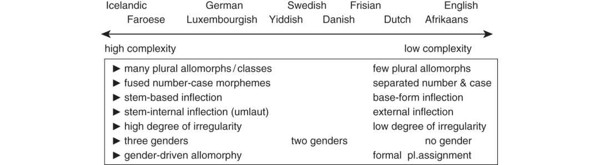
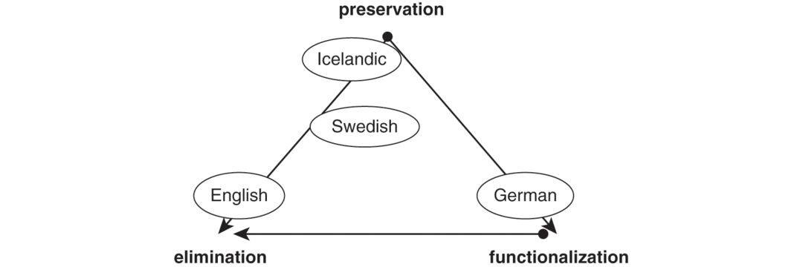
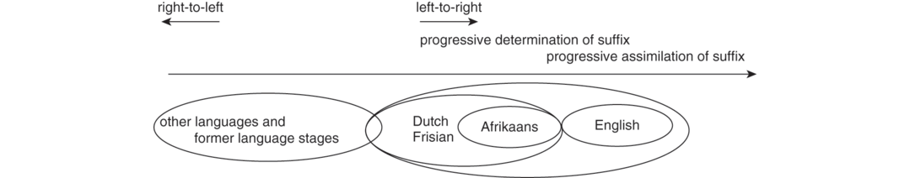

# [[page 214]] Chapter 10 Inflectional Morphology

# Nouns

**Contributor(s):** Damaris Nübling

## 10.1 Introduction

Today there are more than a dozen Germanic languages which derive from the same source, Proto-Germanic (Proto-GMC). While Proto-GMC still had a rather complex nominal inflectional system, the modern languages simplified it to different degrees ranging from rather conservative Icelandic with a broad variety of declension classes, four cases, and three genders to English with only one kind of declension, without cases (except the possessive ’*s*, a clitic which attaches to the last element of the possessor phrase) and without nominal gender (see Kürschner, Chapter 12). The only surviving category is number consisting of singular and plural (the dual had already disappeared in Proto-GMC). Therefore, in many languages the plural allomorphs are the last relics of the former declension classes. Due to initial stress, all GMC languages underwent rather radical reductions of unstressed word parts, above all the weakening of unstressed vowels to [ǝ] (except for Icelandic and Faroese) or even their loss. From a bird’s eye view the following phenomena developed in different ways and therefore deserve special attention:

- Today, some languages show many declension classes (Icelandic), others few (Danish) or even no classes (English). This is connected to the amount of plural allomorphy.

- Some languages preserved all three genders (Icelandic, Faroese, German, Luxembourgish), others only two (Swedish, Danish, Dutch, Frisian), and some completely lost this category (English, Afrikaans).

- In some languages, gender is crucial for noun inflection, in others it is not. Distributional criteria for declension can be found on different linguistic levels (Neef 2000a, 2000b): (a) Phonology, i.e., a plural allomorph may depend on the stem final sound, the number of syllables or [[page 215]] rhythmic principles (stress position); (b) Morphology, e.g., derivational affixes; (c) Semantics, i.e., animacy can be relevant for inflection; (d) Gender (located between grammar and lexicon); (e) Lexicon, i.e., specific nouns. In sum, these principles can be combined which leads to rather complex assignment systems.

- Some languages only use concatenative techniques (affixes), others nonconcatenative ones (modification), where plural (or case) expression affects the lexical part.

- Some languages extensively use umlaut and even grammaticalized it to indicate plural (German, Luxembourgish); others eliminated it partially (Swedish, Danish) or completely (English, Dutch).

- Some languages still express case and number in a fused portmanteau unit (Icelandic, Faroese); others separate these categories (most GMC languages).

- Some languages show (older) stem-based inflection (Icelandic, Faroese), others base-form inflection (the West-GMC languages), and others have both (Swedish).

- Some languages use zero plurals, especially in the neuter (North-GMC languages), others do not (most of the West-GMC languages); here, number is expressed by the whole noun phrase.

- In some languages, the inflectional endings caused modifications of the (lexical) stem (Icelandic, German, Luxembourgish), in others, it is the stem which influences the shape of the inflectional endings (Dutch, Frisian, English); thus the direction of determination differs.

In the following, we start with the common source, Proto-GMC (Section 10.2). Then, the majority of the GMC languages will be sketched briefly starting with some North-GMC (Scandinavian) languages (Section 10.3) and proceeding with the most West-GMC ones (Section 10.4). For lack of space, Faroese (which resembles Icelandic), Norwegian (which resembles Danish and Swedish), Yiddish, and Afrikaans, as well as all dialects, cannot be addressed. As proper names often develop differently, they have to be ignored in this chapter as well a foreign words. Section 10.5 presents the most important findings and draws some conclusions.

## 10.2 The Proto-Germanic Noun System

The GMC noun as it is supposed to have existed in the millennium BC showed stem-based inflection, i.e., the lexeme itself never occurred on its own (see Table 10.1). The noun had a tripartite structure: lexical root + primary suffix + grammatical ending: **fisk-a-z* ‘fish’ + *a*-class + masc.nom.sg. suffix. Only athematic nouns had no primary suffix: *mann-Ø-z* (m.) ‘man’ or **burg-Ø-s* (f.) ‘castle, town’. The primary suffix developed out of IE derivational morphology and determined the declension class of the noun. It is [[page 216]] [[page 217]] assumed that the IE declension classes were semantically motivated which became obsolete in GMC. This IE system can be best observed when looking at the GMC *r*-stems (see class no. 2.2 in Table 10.1) going back to IE *ter*-stems which always formed kinship terms (‘sister, mother, father’; today they do not constitute a declension class anymore). Other classes seem to have refunctionalized primary suffixes as the neuter nouns of the GMC *iz/az*-class (< IE de-verbal *es/os*-stems) which denoted animate objects (young domestic animals); this was not the case in IE. Most of the GMC noun classes were semantically empty. They also interacted with gender which is the second classification system inherited from IE. Declension is expressed on the noun itself whereas gender is a typical agreement category which is marked on specific targets (pronouns, adjectives, articles). Thus, gender was sometimes connected to specific declension classes; e.g., the *ō*-class exclusively contained feminine nouns.

**Table 10.1 Declension class system in Proto-Germanic (based on Krahe 1969 and Ramat 1981)**

```tsv
declension class	gender [colspan=3]	examples nom. sg. – nom. pl.	assignment principles / remarks
	**f.**	**m.**	**n.**
**1. vocalic stems**“strong inflection”					vocalic primary suffix in IE + Germ.
1.1 *a*-class (+ *ja/wa*)(IE *o*-cl.)	−	+	+	**wulfaz* (m.) – **wulfōz* ‘wolf’**wurðaⁿ* (n.) – **wurðo* ‘word’	large, productive class; (*ja-/wa-*stems with different endings)
1.2 *ō*-class (+ *jō /wō*)(IE *ā*-cl.)	+	−	−	**gebō* (f.) – **gebōz* ‘gift’	large, productive class; (*jō*-stems with different endings)
1.3 *i*-class(IE *i*-cl.)	+	+	(+)	* *dēðiz* (f.) – **ðedı̄z* ‘action’**gastiz* (m.) – **gastı̄z* ‘guest’	smaller class (almost no neuter nouns remain); merger with other classes: m. with *a*-class, f. with *ō*-class
1.4 *u*-class(IE *u*-cl.)	+	+	(+)	**handuz* (f.) ‘hand’ – (other class)**sunuz* (m.) – **suni(we)z* ‘son’**fehu* (n.) ‘cattle’ – (no pl.)	f. pl. has already changed to other classes; small class with many losses; already disappearing in GMC
**2. consonantal stems**					consonantal primary suffix or ending on consonant (VC)
2.1 *n*-stems“weak inflection”(as well as in IE)	+	+	+	**tungo* (f.) – **tungon(e)z* ‘tongue’**hanōn* (m.) – **hanan(e)z* ‘cock’**hertō⁽ⁿ⁾* (n.) – **hertōno* ‘heart’	large class; highly productive; later many syncretisms in Old GMC languages
2.2 *r*-stems(IE *ter*-stems + ablaut)	+	+	-	**mōðer* (f.) – **mōð(e)riz* ‘mother’**brōþar* (m.) – **brōþ(e)riz* ‘brother’	small class with kinship terms; unproductive
2.3 *nd*-stems(IE *-nt*-cl.)	−	+	−	**frijōnd* (m.) – **frijōnd(e)z* ‘friend’	originally participles; small class
2.4 athematic stems(as well as in IE)	+	(+)	(+)	**burgs* (f.) – **burgiz* ‘castle’**mann-z* (m.) – **manniz* ‘man’	small class; in GMC almost only feminine nouns
2.5 *iz/az*-stems(IE *s*- or *es/os*-class)	−	−	+	**lambiz* (n.) – **lambizō* ‘lamb’	only neuter nouns; very small class denoting predominantly animals
```

Subsequently, the Proto-GMC declension class assignment was formalized. Several classes were closed and many nouns changed their class: Some *i-*nouns moved to the *a-*class, while some athematic nouns shifted to the *u-*class. Later, nouns from the *u-*class often changed to the *a-* or the *i-*class etc. (Ramat [1981: 61]). This can be explained (in addition to the loss of meaning) by the decay of unstressed syllables at that time, which obscured class membership due to vocalic weakenings and reductions. Ramat (1981: 62) describes this collapse as a “crisis of the inflectional system in Germanic.”

GMC had six cases. The vocative and the instrumental later merged with the nominative and the dative, respectively. The case/number-suffix always occurred as a fused portmanteau. Case/number morphology was characterized by some syncretisms which increased considerably at later stages. In contrast to most of the modern GMC languages, the nominative singular is also expressed, i.e., zero-marked singulars versus marked plurals developed much later.

Table 10.1 provides a survey of the most important Proto-GMC declension classes. The first column indicates the declension class, the second one lists the genders corresponding to these classes. The third column contains examples in nom.sg. and nom.pl., respectively. The last column provides some additional remarks. In the following sections we cannot provide similarly detailed overviews for every language mentioned due to special constraints.

## 10.3 The North-Germanic Noun Systems

Proto-GMC did not have definite and indefinite articles yet. Their grammaticalization started in the Middle Ages. A principal difference between North- and West-GMC languages is the position of the definite article: In West-GMC, it precedes the noun, whereas in North-GMC, it originally [[page 218]] followed the noun and was later attached to it, i.e., after grammaticalization, Scandinavian nouns have an additional inflectional category, definiteness:¹

```tsv
West-Germanic [colspan=2]	North-Germanic [colspan=2]
Dutch:	*het huis*	Swedish:	*huset*
German:	*das Haus*	Icelandic:	*húsið*
	D<span class="sc">ef.</span>S<span class="sc">g.</span>N. house		house-D<span class="sc">ef.</span>S<span class="sc">g.</span>N.
```

### 10.3.1 Icelandic – Increase of Complexity by Accumulated Phonological Change

Icelandic and Faroese preserved and developed the most complex noun systems among the GMC languages which cannot be presented and examined in detail in this chapter. Number is expressed both in the singular and in the plural, and it is fused with case (underlined in Table 10.2). The attached definite article increased the overall complexity as can be seen in Table 10.2 with *hestur* (m., *a*-class) ‘horse’. The definite suffix (bold) also inflects for gender, case, and number. This kind of double-inflection (Icelandic *hest-s-in-s* horse-<span class="sc">gen.sg.-def-gen.sg.</span> ‘of the horse’: the genitive is expressed twice) was strongly reduced in languages of the Scandinavian mainland (Swedish *häst-en-s* horse<span class="sc">-def-gen</span> ‘of the horse’).

**Table 10.2 Inflectional paradigm for Icelandic *hestur* ‘horse’ (m), *a*-class**

```tsv
 [rowspan=2]	bare noun: ‘a horse’ [colspan=2]	noun + definite suffix: ‘the horse’ [colspan=2]
Sg.	Pl.	Sg.	Pl.
nom.	*hestur*	*hestar*	*hestur****inn***	*hestar****nir***
gen.	*hests*	*hesta*	*hests****ins***	*hesta****nna***
dat.	*hesti*	*hestum*	*hesti****num***	*hestu****num***
acc.	*hest*	*hesta*	*hest****inn***	*hesta****na***
```

Icelandic preserved most GMC declension classes, except the neuter *iz/az*-class (no. 2.5 in Table 10.1) which has been preserved only in some West-GMC languages. In addition, Icelandic developed a high number of subclasses due to the fact that assimilations between the grammatical endings (including the fused primary suffixes) and the lexical part caused many stem allomorphs (mostly occurring between AD 500 and 700). In contrast to many other languages most of these allomorphs have not been leveled out during the following centuries. Thus Icelandic is characterized by the accumulation of [[page 219]] regular phonological processes that were going on for centuries and which were neither functionalized to mark specific information (such as plural umlaut in German and Luxembourgish) nor eliminated. This led to a high amount of morphological diversity and even irregularity. Table 10.3 and Table 10.4 provide two frequent nouns of the *u-*class, Icelandic *völlur* (m) ‘field’ and *fjörður* (m) ‘fjord’. Whereas *i-* and *u-*umlaut (the latter is restricted to North-GMC) changed the stem vowel *a* of Proto-Norse **valþ*- (Table 10.3), Proto-Norse **ferþ-* was affected by rising of *e > i* before *-i* and by breaking, i.e., stressed short *e* before *u* > Old Norse *jǫ* [jɔ] > Icelandic *jö* [jø] and before *a* > Old Norse / Icelandic *ja* (Table 10.4; hyphens indicate the border between stem and inflectional ending). Except for acc.pl., no morphological change has occurred during language history. Until today, the consequences are rather heterogeneous paradigms which usually are explained by the fact that Icelandic has not been affected by language contact (and was hardly ever acquired as a second language). Faroese experienced a similar scenario, however it is less complex than Icelandic and lost the inflectional genitive.

**Table 10.3 The paradigm of Icelandic *völlur* ‘field’ (m), *u-*class**

```tsv
number	case	stem + ending in Proto-Norse (AD 200–500)	Old Norse > (since eighth c.)	Modern Icelandic (since sixteenth c.)	phonological processes AD 500–700
sg.	NGDA	*valþ-uR**valþ-ōR > -aR**valþ-iu**valþ-u*	*vǫll-r*/*vall-ar/**vell-i/**vǫll-Ø/*	*völl-ur**vall-ar**vell-i**völl*	*u*-umlaut*i*-umlaut*u*-umlaut
pl.	NGDA	*valþ-****i****uR**valþ-ō > -a**valþ-umR**valþ-un(n)*	*v****e****ll-ir/**vall-a/**vǫll-um/**vǫll-u/*	*vell-ir**vall-a**völl-um**vell-i*	*i*-umlaut*u*-umlaut*u*-umlaut, today leveled out
```

**Table 10.4 The paradigm of Icelandic *fjörður* ‘fjord’ (m), *u*-class**

```tsv
number	case	stem + ending in Proto-Norse (AD 200–500)	Old Norse > (since eighth c.)	Modern Icelandic (since sixteenth c.)	phonological processes AD 500–700
sg.	NGDA	**ferþ-uR***ferþ-ōR > -aR***ferþ-iu > firþ-iu***ferþ-u*	*fjǫrð-r**fjarð-ar**firð-i**fjǫrð*	*fjörð-ur**fjarð-ar**firð-i**fjörð*	*u*-breaking*a*-breakingrising*u*-breaking
pl.	NGDA	**ferþ-iuR > firþ-iuR***ferþ-ō > -a***ferþ-umR***ferþ-un(n)*	*firð-ir**fjarð-a**fjǫrð-um**fjǫrð-u*	*firð-ir**fjarð-a**fjörð-um**firð-i*	rising*a*-breaking*u*-breaking*u*-breaking, today leveled out
```

[[page 220]] In sum, there are three options of what can happen to the results of phonological change, the most important being umlaut: They can be preserved (Icelandic), they can be partially (Swedish, Danish) or completely eliminated (English, Frisian, Dutch), or they can be used morphologically and even made productive (analogical plural umlaut in German and Luxembourgish) (see Section 10.4.1). In principal, the same applies to verbal inflection (see Fertig,Chapter 9).

### 10.3.2 Swedish – Decrease of Complexity

In Swedish, a two-gender-system evolved and it distinguishes neuter from common gender (“cg.”). The same holds for Danish and Norwegian (Bokmål). Furthermore, number and case are dissociated. The dative and accusative endings have been lost on the noun, and the genitive (more accurately the possessive marker) is developing into a clitic (-*s*) which is conditioned syntactically and attaches to the last element of the possessor phrase, here the pronoun *mig* ‘me’ (see Norde 1997, 2006):

```tsv
[en	vän	till	mig]=**s**	företag
[a	friend	to	me]=<span class="sc">Gen</span>	company
→ ‘a friend of mine’s company’ [colspan=5]
```

In the singular, the definite suffix occurs after the stem (*hund-en* ‘the dog’), in the plural after the plural morpheme and in front of the possessive *-s: hund-ar-na-s* ‘dog<span class="sc">-pl.-def.pl.-gen.</span>’→ ‘of the dogs’. If the noun is preceded by an adjective, another definite article appears in the beginning of the NP: *den stora hunden* <span class="sc">‘def.sg.cg</span>. big-<span class="sc">def.</span> dog<span class="sc">-def.sg.cg.</span>’ → ‘the big dog’. In sum, definiteness (underlined) is expressed three times. The younger adjective-article *den* derives from the GER *d-* article and is a loan from Middle Low GER, which was widely spoken in continental Scandinavia during the Hanse period. This double determination, “double definiteness” (Roehrs, Chapter 23) or “over-determination” (Dahl 2004) is the result of two competing grammaticalization areas, the older suffixation in North-GMC (Icelandic, Faroese) and the West-GMC model (German, English) of preposed determiners in the south. Swedish combined both strategies.

Since Old Norse, the fused case and number suffix was separated in all Mainland Scandinavian languages and definiteness was morphologized. In these cases, an important serialization order evolved in correspondence to the relevance principle described by Bybee (1985, 1994): The less relevant case information is expressed in the rightmost periphery of the word form whereas the more relevant definiteness marker which marks that the denoted object is familiar is expressed closer to the stem.² The most relevant [[page 221]] information is number because it affects the meaning of the noun most strongly (it carries the information about the number of the denoted referents): All GMC languages with separated number and case affixes placed number (the plural) in front of case, i.e., directly after the stem – and even alter the vowel quality of the stem if we consider plural umlaut (Swedish *stad – städer* ‘city’).³ The likelihood of the most relevant categories to fuse with the stem increases if the lexeme has a high token- frequency. This relevance-driven order is best observable in Swedish *hund-ar-na-s* ‘dog<span class="sc">-pl.-def.pl.-gen.</span>’: <span class="sc">**lexeme**-number-definiteness-case</span> (see Kürschner and Dammel 2013: 50). The Old Norse (and Icelandic) double-inflection of case, e.g., *hund-s-in-s* ‘dog-<span class="sc">gen.sg.-def.-gen.sg</span>’ → ‘of the dog’ has been reduced in Swedish: *hund-en-s* ‘dog-<span class="sc">def.sg.-gen.</span>’ → ‘of the dog’. The same holds for Danish and Norwegian.

As we can see, Swedish is a language that is more agglutinative. However, it preserved some stem-based inflection (e.g., in class 3: *flick-a – flick-or*) and about 35 nouns with umlauting plurals which are not productive anymore and protected by their high token frequency: *man – män* ‘man’*, stad – städer* ‘city’*, bok – böcker* ‘book’, *dotter – döttrar* ‘daughter’, *tand – tänder* ‘tooth’, etc. The dominating inflection principle is base-form inflection, i.e., the complete singular form is part of the plural.

Thus, the five plural allomorphs *-ar, -(e)r, -or, -Ø* and *-n* are the last reminders of the former inflectional system (the possessive marker consists of uniform *-s*; see Norde 1997, 2006 and Börjars 2003 for further details). This is also due to the fact that Swedish preserved three unstressed vowels which facilitate the first three classes in Table 10.5. As can be seen, most plural allomorphs are highly sensitive to gender, i.e., the declension class system is tightly connected to gender. There are however some exceptions such as common gender nouns in class 5 ending in *-are* and *-ande: en lärare – två lärare* ‘a teacher – two teachers’, *en studerande – två studerande* ‘a student – two students’. The last two neuter classes are conditioned by the final sound: Neuter nouns ending in a vowel belong to class 4 (the plural *-n* is the result of a reanalysis of the definite plural suffix), those ending in a consonant take zero plural. Here, formal plural assignment rules have emerged.

**Table 10.5 The Swedish declension class system<sup>*4*</sup>**

```tsv
class [rowspan=2]	plural allomorph [rowspan=2]	gender [colspan=2]	Examples [colspan=2]
cg.	n.	– **definite** singular – plural	+ **definite** singular – plural
1 [rowspan=2]	*-ar* [rowspan=2]	+ [rowspan=2]	− [rowspan=2]	*hund – hundar* ‘dog’	*hunden – hundarna*
*dag – dagar* ‘day’	*dagen – dagarna*
2 [rowspan=2]	*-(e)r* [rowspan=2]	+ [rowspan=2]	− [rowspan=2]	*minut – minuter* ‘minute’	*minuten – minuterna*
*hustru – hustrur* ‘wife’	*hustrun – hustrurna*
3 [rowspan=2]	*-or* [rowspan=2]	+ [rowspan=2]	− [rowspan=2]	*flicka – flickor* ‘girl’	*flickan – flickorna*
*pizza – pizzor* ‘pizza’	*pizzan – pizzorna*
4 [rowspan=2]	*-n* [rowspan=2]	− [rowspan=2]	+ [rowspan=2]	*arbete – arbeten* ‘job’	*arbetet – arbetena*
*piano – pianon* ‘piano’	*pianot – pianona*
5 [rowspan=2]	*-Ø* [rowspan=2]	− [rowspan=2]	+ [rowspan=2]	*år – år* ‘year’	*året – åren*
*barn – barn* ‘child’	*barnet – barnen*
```

### 10.3.3 Danish – Representing the Most Simplified Scandinavian Noun Inflection

In comparison to Swedish, Danish is characterized by the development of the most simplified noun system and only uses base-form inflection. Similar to Swedish, the Danish genitive developed into a phrasal possessive clitic. Only three noun classes are left represented by three plural allomorphs (see Table 10.6). This simplification was supported by phonological [[page 222]] developments of Danish as all stressed vowels have been reduced to [ǝ]. In contrast to Swedish, there is a pure *e*-ending whose diachronic base is the acc.pl.-ending *-a* of the Old Norse masculine *a-*class (in Swedish, it was the Old Norse nom.pl. *-ar* which led to *-ar*). Although Danish equally preserved two genders, gender is irrelevant for plural assignment. It has been dissociated from the noun classes. Instead, the form of the noun is becoming more important (length, final sound). Many monosyllabic neuter and common gender nouns ending in a consonant shifted from the first to the second class, i.e., the number of syllables and the final sound are becoming relevant for the plural assignment. Thus, the high number of Old Norse neuter nouns with zero plurals has diminished: Many neuter nouns adopted the plural ending *-e* (*hus – huse* ‘house’, *land – lande* ‘country’) and *-er* if polysyllabic and/or ending in a vowel (*bi – bier* ‘bee’). In contrast to [[page 223]] Icelandic and Faroese, in Danish (and to a lesser extent also in Swedish) the category of number underwent remarkable upgrading. In Danish as well as in Swedish, the preposed as well as the suffixed definite article have specific plural forms, which explains the fact that zero marked neuter plural nouns are rather common (even more in Swedish than in Danish). Furthermore, animate nouns enter the *-e* plural class (2). There are still about 25 nouns showing (unproductive) umlaut in the plural: *barn – børn* ‘child’ can be traced back to *u-*umlaut, other plurals to *i-*umlaut: *stad – stæder* ‘city’, *bog – bøger* ‘book’, *hånd – hænder* ‘hand’, *datter – døtre* ‘daughter’, etc.

**Table 10.6 The Danish declension class system**

```tsv
class	plural allomorph	Examples [colspan=2]	Remarks
		**– definite** singular – plural	**+ definite**singular – plural
1 [rowspan=3]	*-(e)r* [ɐ] [rowspan=3]	*bil – biler* ‘car’	*bilen – bilerne*	mono- and polysyllabics, often with final vowel [rowspan=3]
*bi – bier* ‘bee’	*bien – bierne*
*dame – damer* ‘lady’	*damen – damerne*
2 [rowspan=3]	*-e* [ə] [rowspan=3]	*dag – dage* ‘day’	*dagen – dagene*	monosyllabics with final consonant; increasingly animates entering this class [rowspan=3]
*hund – hunde* ‘dog’	*hunden – hundene*
*hus – huse* ‘house’	*huset* – *husene*
3 [rowspan=2]	*-Ø* [rowspan=2]	*år – år* ‘Jahr’	*året – årene*	many (but not exclusively) neuter nouns [rowspan=2]
*barn – børn* ‘child’	*barnet – børnene*
```

Unlike Swedish, Danish did not develop double determination: As soon as an adjective appears, the definite suffix disappears and is replaced by the preposed adjective-article *den* (or *det*): *den store hund* ‘def.cg. big-def. dog’ → ‘the big dog’. In Danish a division of labor is exercised by using the West-GMC type in case of modifiers (*den store hund*) and otherwise the North-GMC type (*hunden* ‘the dog’) (Dahl 2004).

## 10.4 The West-Germanic Noun Systems

### 10.4.1 German and Luxembourgish – Morphological Umlaut

German preserved and developed a quite complex noun system consisting of about nine different noun classes. First of all, the GMC three-gender system has been continued. Gender is rather tightly connected to declension. In the course of time, the inflection of feminine nouns diverged more and more from that of masculine and neuter nouns. Most important is the fact that due to homophony of the feminine and the plural article (both *die*), there is no feminine noun with zero plural (*die Schüssel* (f) ‘the bowl’ – *die Schüsseln*) (see Table 10.7, class no. 1), but many disyllabic masculine and neuter nouns with zero plural (*der Schlüssel* (m) ‘the key’ – *die Schlüssel-Ø*, see Table 10.7, class no. 6). This demonstrates the relevance of the entire NP: As the inflection of nouns decreased in all GMC languages during the last two thousand years, a good deal of number and case information is managed by the NP, the most important unit carrying information being the definite and indefinite article. Thus, a rather complex division of labor has taken place which also includes the adjective. German clearly shows the connection between determiners and noun inflection (so-called noun group inflection, see Roehrs, Chapter 23).

**Table 10.7 The German declension class system (shaded rows: not productive)**

```tsv
 [rowspan=2]	gen.sg. / plural allomorph [rowspan=2]	Gender [colspan=3]	examples (gen.sg. – nom.pl.)	Notes
f.	m.	n.
1 [rowspan=2]	*Ø / -(e)n* [rowspan=2]	+ [rowspan=2]	− [rowspan=2]	− [rowspan=2]	*Dame – Damen* ‘lady’	biggest f. class; final [ə]→ *-n*, final consonant → *-en*, (pl. output: trochee) [rowspan=2]
*Schrift – Schriften* ‘script’
2 [rowspan=2]	*-(e)n / -(e)n* [rowspan=2]	− [rowspan=2]	+ [rowspan=2]	− [rowspan=2]	*Menschen – Menschen* ‘human’	only humans and higher animals, (mostly) trochees with final -[ə] → *-n*; (seldom) final consonant → *-en* [rowspan=2]
*Kurden – Kurden* ‘kurd’, *Affen – Affen* ‘ape’
3	*-s / -(e)n*	−	+	+	*Staats – Staaten* (m) ‘state’, *Hemds – Hemden* (n) ‘shirt’	small mixed (new) class: strong gen. + weak pl.
4	*-Ø / uml. + -e*	+	−	−	*Stadt – Städte* ‘town’, *Maus – Mäuse* ‘mouse’, *Kuh – Kühe* ‘cow’	small unproductive class; ~35 token frequent monosyllabic f. nouns
5	*-s / uml.* (*+ -e*)	−	+	−	*Hahns – Hähne* ‘cock’, *Ladens – Läden* ‘shop’	monosyllabics with *-e*, disyllabics with zero plural (pl. output: trochee)
6 [rowspan=2]	*-s /* (*+ -e*) [rowspan=2]	− [rowspan=2]	+ [rowspan=2]	+ [rowspan=2]	*Tags – Tage* (m) ‘day’,	trochees with zero plural, monosyllabics with *-e* (pl. output: trochee); former m. *a*-class, later opened for n. [rowspan=2]
*Brunnens – Brunnen* (m) ‘fountain’, *Ufers – Ufer* (n) ‘coast’
7	*-s / uml. + -er*	−	+	+	*Manns – Männer* (m) ‘man’, *Lamms – Lämmer* (n) ‘lamb’, *Hauses – Häuser* (n) ‘house’	originally small n. class (GMC *iz/az*), later opened for m.
8	*-s / -s*	−	+	+	*Zoos – Zoos* (m) ‘zoo’, *Klos – Klos* (n) ‘toilet’, *Kommas – Kommas* (n) ‘comma’	foreign words, short words, proper names (words with phonologically foreign structures) [rowspan=2]
9	*-Ø / -s/*	+	−	−	*Pizza – Pizzas* ‘pizza’
```

A reason for the complexity of the German declension class system is the fact that case still has to be considered, above all the three genitive allomorphs; furthermore some noun classes display specific dative and accusative endings (which will not be discussed any further in this chapter). There is also a specific dative plural suffix *-n* which attaches to every noun unless its plural form ends in *-n* or *-s*. As this phonological rule does not contribute to the morphological noun class system, only the genitive singular suffix in combination with the plural suffix is taken into account for declension. Table 10.7 contains the most relevant declension classes. As there is a rather [[page 224]] big group of phonologically deviating words which prefer *-s* in the plural (*-s* attaches to the lexeme but does not require any additional changes, thus the word remains more easily recognizable), classes 8 and 9 were added (in the North-GMC languages, *-s* plurals are not as common as in German).

Most feminine nouns belong to the first class and always form a well-marked plural while they never exhibit case markers (see also class nos. 4 and 9). They most clearly represent the diachronic upgrading of number, which always won when competing against case (Dammel and Gillmann 2014).⁵ Case is typically realized on the determiner. Another means of [[page 225]] upgrading number is the umlauting plural which occurs most frequently in the masculine (class nos. 5 and 7) and also in the neuter (class 7); the feminine nouns only preserved a small number out of the group of umlauting plurals (class 4) most members of which changed to the first (weak) class. The remaining nouns comprise about 35 types, which have been rather stable for many centuries.

Number upgrading becomes most evident if we consider class no. 7, the successor of the small neuter *iz/az*-class in Proto-GMC which has been completely lost in the North-GMC languages. In Old High German, this class had consisted of less than ten members, which denoted young animals (*lamb* ‘lamb’, *kalb* ‘calf’, *ei* ‘egg’, *huon* ‘hen’). Since then it has had a notable career by attracting more neuter nouns from the Proto-GMC *a-*class with zero markers in the nominative and accusative singular and plural. Later, some masculine nouns shifted to this class (*Mann* ‘man’, *Wald* ‘forest’, *Gott* ‘god’ etc. See Nübling 2018). Today, about 80 neuter and 15 masculine nouns with high token-frequencies belong to this highly number-profiled class which is characterized by forming its plural with {umlaut + *-er*}. Although today unproductive, the members of this class are stable, which shows that productivity should not be the only criterion for a “good” inflection class.

The most important development of the German inflection system is the rise of analogical (or morphological) umlaut. In this case, the results of phonological umlaut of the Proto-GMC *i-* (f., m.) and *iz/az*-class (n.) (classes 1.3 and 2.5 in Table 10.1) have been connected with plural meaning (grammaticalization) and subsequently attracted a lot of nouns which adopted this kind of explicit plural marking. Before becoming productive, phonological umlaut in the genitive and dative of the singular paradigms was eliminated. Especially masculine ({umlaut (+ -*e*)}, {umlaut + *-er*}) and neuter nouns ({umlaut + *-er*}) use analogical umlaut. In many disyllabic nouns, umlaut even progressed to become the only plural marker, e.g., *Apfel – Äpfel* ‘apple’, *Boden – Böden* ‘floor’. In contrast, the feminine nouns withdrew early from plural umlaut, which is only preserved in a small class of remnants, no. 4 in Table 10.7. In sum, the inflectional behavior of feminine nouns diverged more and more from that of nonfeminine nouns. Still, in present-day German, some umlauting plurals are competing against nonumlauting ones (e.g., *Wagen/Wägen* ‘cars’, *Erlasse/Erlässe* ‘decrees’, *Bogen/Bögen* ‘sheets’) although plural umlaut is not fully productive anymore. In the last centuries, numerous nouns shifted their class. Comparing masculine *-e* plurals with and without umlaut, Köpcke (1994: 83–86) showed that animacy favors umlaut (*Arzt/Ärzte* ‘doctor’, *Wolf/Wölfe* ‘wolf’ versus *Tag/Tage* ‘day’, *Dolch/Dolche* ‘dagger’).

Besides animacy, token frequencies and formal schemas are the driving forces behind the reorganization of the inflectional system and transitions to other classes (for further details, see Köpcke 1988, 1993, 1994, 1995, 2000, Kürschner 2008, Nübling 2008). Today, the famous weak masculine nouns (class no. 2) are restricted to human males and some mammals, furthermore to trochaic structures and final -[ə]. Many inanimate nouns [[page 226]] left this class. The most recent group that shifted classes were nouns denoting birds. They moved to class no. 5, cf. former *Hahn* ‘cock’ – *Hahnen* (also *Schwan* ‘swan’, *Storch* ‘stork’, etc.) with the current plural *Hähne* (*Schwäne, Störche*). Another option for former weak masculine nouns was class no. 6, e.g., *Brunnen, Balken, Kuchen* ‘fountain, beam, cake’; they changed their phonological schema by adopting *-n* in the nom.sg.: *der Brunne > der Brunnen, der Schade > der Schaden* ‘damage’. Therefore, any possibility of overtly distinguishing singular and plural has been lost. However, the distinctive plural article *die*<sub>pl.</sub> (against *der*<sub>m.sg.</sub>) compensates for this deficit.

Luxembourgish as a small language closely related to German is characterized by apocope, which does not allow for plurals in *-e*. In this language, three compensations can be observed: First, the originally neuter class {umlaut + *-er*} has considerably more members than the German one (in Luxembourgish it is productive to this day): compare Luxembourgish *Dësch – Dëscher* ‘table’ with German *Tisch – Tische* ‘table’. Second, *(e)n*-plural became extremely productive (see Dammel 2018). Third, umlaut is even more common than in German and spread to more noun classes: Luxembourgish *Aarm – Äerm* ‘arm’ versus German *Arm – Arme*, Luxembourgish *Rass – Rëss* ‘crack’ versus German *Riss – Risse*, Luxembourgish *Numm – Nimm* ‘name’ versus German *Name – Namen*.⁶ Even foreign words adopt umlaut: Luxembourgish *Mount – Méint* ‘month’ versus German *Monat – Monate*, Luxembourgish *Clubb – Clibb* ‘club’ versus German *Club – Clubs*. While German umlauting plural forms with *ä, ü, ö*, or *äu* clearly refer to singular forms with *a, u, o*, or *au*, Luxembourgish has cut this connection. There is a broad variety of (former) umlauts far away from a 1:1-relation to a specific vowel in the singular. Thus, umlaut has become rather arbitrary. In principle, this is comparable to ablaut in the verbal system: Umlaut is not fully predictable from the singular anymore (Nübling 2006, 2013; Dammel et al. 2010: 604–607; Dammel 2018).

### 10.4.2 Frisian: Conservation of Breaking

West Frisian, historically most closely related to ENG, is spoken in the Netherlands. As most speakers are bilingual, there are many contact-induced influences from Dutch, mostly on the lexical level. Like most GMC languages, Frisian reduced case on the noun so that plural class is identical to noun class. Frisian also reduced one gender. Its two-gender system consists of neuter and common gender (cg.) which is expressed on the definite article *it* [ət] (n.sg.) and *de* (cg.sg.) the last being homophonous to the plural article. This led to the fact that there are no zero plurals except for some animates usually occurring in groups such as *bern – bern* ‘child’, *skiep – skiep* ‘sheep’, etc. The same principle is known from English. Interestingly, gender is completely detached from plural formation. [[page 227]] Overall, a rather simple two-class noun system has evolved (Tiersma ²[1999]; Hoekstra and Tiersma [1994]).

Plural formation follows a simple, productive, and rather output-oriented rule: monosyllabic words take *-en* in the plural, disyllabic words ending in -[ə] take *-n* (this is the successor of the Proto-GMC n-stems or “weak inflection”, see no. 2.1 in Table 10.1). Other words including diminutives take *-s*. Evidently, plurals should form trochees. In the first class, however, there are many plurals with stem alternations going back to shortened vowels or broken diphthongs, a phonological rule from Middle Frisian (sixteenth–seventeenth century) where an additional syllable caused these alternations (De Graaf and Tiersma [1980], Tiersma [1983]). About half of the originally broken plurals are still preserved and concern the most frequent nouns; the others have been leveled out analogically, mostly resulting in the singular vowel. For some West-Frisian dialects, Tiersma (1982) described the other direction of leveling: Nouns which occur more frequently in the plural than in the singular used the broken plural forms as the base form for the new singular. Originally, *earm* ‘arm’ had the broken plural *jermen* ‘arms’. Today the singular is remodeled by using the plural stem *jerm – jermen*. The same holds for *goes* – *gwozzen* > *gwos* – *gwozzen* ‘goose – geese’; *kies* – [[page 228]] *kjizzen* > *kjizze* – *kjizzen* ‘tooth – teeth’; *hoas* – *vjazzen* > *vjazze* – *vjazzen* ‘stocking – stockings’. In Standard Frisian, real umlaut plurals have not survived, except *ko – kij* ‘cow’. It should be emphasized that all GMC languages underwent phonological *i-*umlaut (palatalization), North-GMC additionally *u-*umlaut (labialization of *a > ǫ* [ɔ], later > *ö*). However, vowel shortening and breaking was a typical Frisian phenomenon.

There are some exceptions to the productive two-class system (no. 3 in Table 10.8) which go back to former noun classes (*-e*). The ending *-ens* is a double suffix composed of *en+s* and attaches to nouns for objects which typically occur in pairs or groups: *reed – redens* ‘skate’, *lears – learzens* ‘boot’, *trep – treppens* ‘stair’.

**Table 10.8 The West Frisian declension class system (shaded rows: not productive)**

```tsv
class	plural allomorph	stem alternation	Examples	notes [colspan=2]
1a [rowspan=2]	*-(e)n* [rowspan=8]	no (productive) [rowspan=2]	*tsjerk – tsjerken* ‘church’	monosyllabics: *en*;	output: trochees [rowspan=13]
*kroade – kroaden* ‘pushcart’	disyllabics ending in -[ǝ]: *-n*
1b [rowspan=2]	shortening [rowspan=2]	[a:] – [a]: *hân*– *hannen* ‘hand’	unproductive [rowspan=2]
[u:] – [u]: *hûs*– *huzen* ‘house’
1c [rowspan=4]	breaking [rowspan=4]	[iǝ] – [jɪ]: *stien – stiennen* ‘stone’	unproductive [rowspan=4]
[ɪǝ] – [jɛ]: *beam – beammen* ‘tree’
[uǝ] – [wo]: *foet – fuotten* ‘foot’
[oǝ] – [wa]: *soan – soannen* ‘son’
2 [rowspan=3]	*-s* [rowspan=3]	no [rowspan=3]	*wurker – wurkers* ‘worker’	words ending in [ǝ] + sonorant;diminutives [rowspan=3]
*woartel – woartels* ‘carrot’
*boatsje – boatsjes* ‘small boat’
3 [rowspan=2]	*-ens*	no [rowspan=2]	*lears – learz-ens* ‘boot’	lexically and semantically restricted; unproductive [rowspan=2]
*-e*	*bean – beane* ‘bean’
```

### 10.4.3 Dutch – Elimination of Umlaut, Prosodic Constraints

The Dutch plural system is quite similar to the Frisian one. Dutch is also characterized by the development of a two-gender system and the dissociation of gender from declension which is restricted to plural formation, as case is not expressed on the noun anymore. Dutch also has two definite article forms: neuter *het* in the singular and *de* for cg. singular and cg./n. plural. Therefore Dutch also lacks zero plurals (Table 10.9).

**Table 10.9 The Dutch declension class system (shaded rows: not productive)**

```tsv
class	plural allomorph	stem alternation	Examples	Notes [colspan=2]
1a [rowspan=2]	*-(e)n* [rowspan=6]	no [rowspan=2]	*stoel* – *stoelen* ‘chair’	prosodisc/phonological (monosyllabic: *-en*; disyllabic*:- n*); productive [rowspan=2]	Output: trochees [rowspan=10]
*gave* – *gaven* ‘gift’
1b [rowspan=2]	voicing of final consonant [rowspan=2]	[s] – [z]: *huis – huizen* ‘house’	many native words; modifications of 1b and 1c can be combined [rowspan=2]
[f] – [v]: *graf – graven* ‘tomb’
1c [rowspan=2]	vowel lengthening [rowspan=2]	[ɔ] – [o:]: *hof – hoven* ‘court’	~ 30 nouns [rowspan=2]
[ɛ]– [e:]: *weg – wegen* ‘way’
2 [rowspan=4]	*-s* [rowspan=4]	no [rowspan=4]	*vogel – vogels* ‘bird’	phonologically conditioned: words ending in [ǝ] + sonorant; [rowspan=2]
*fietser – fietsers* ‘cyclist’
*hoogte – hoogtes* ‘height’	morphologically conditioned: many word formations, especially diminutives [rowspan=2]
*worstje – worstjes* ‘small sausage’
3	*-eren*	no	*kind – kinderen* ‘child’	~ 15 neuters; unproductive [colspan=2]
```

Just like in Frisian, Dutch plural formation is mostly conditioned by phonology and prosody. Only morphologically complex words such as [[page 229]] *hoogte* ‘height’ and the numerous diminutives contradict these rules by taking *-s* (instead of *-n*). Umlaut has been eliminated completely, the only exception is *stad – steden* ‘town’ (see Figure 10.2 in Section 10.5.2). Class no. 1 shows another peculiarity, the voicing of the stem final consonant in front of the plural marker *-en* and/or the lengthening of the stem vowel. This applies to a rather big group; however, loanwords do not undergo these processes (see ANS I: 165–175).

In contrast to German to which Dutch is closely related, Dutch noun inflection was dramatically simplified, formalized, and down-graded, i.e., the allomorphs *-(e)n* and *-s* are governed by prosodic and phonological rules (Kürschner 2008, chapter 3). Old Dutch had a rather complex noun inflection system, which was gradually simplified and eventually shifted to the weak declension class with *-en* after a consonant and *-n* after a vowel. In the thirteenth century, the plural allomorph *-s* emerged whose origin remains opaque and needs more research. It seems to be of Ingweonian origin (Marynissen 1994) or may result from a reanalysis of the genitive singular (Nübling and Schmuck 2010, Schmuck 2011). It started to occur exclusively with animate masculine nouns ending in -*er* (*ridders* ‘knights’, *wevers* ‘weavers’). Later, it expanded to nouns ending in *-ier* (*portiers*) and *-eur* (*gouverneurs*). Subsequently, animacy and gender lost in importance and were eventually given up (*bevers* ‘bibers’, *kamers* ‘rooms’). Today, every noun ending in [ə] + sonorant (*-er, -en, -el, -em*) takes the highly productive *s-*ending irrespective of the meaning of the word. Asyllabic *-s* preserves the trochaic structure of the word best. As the definite plural article is homophonous to the common gender singular article every noun obligatorily inflects for plural. Unlike German, Dutch does not display zero plurals. The *s-*allomorph after a final schwa-syllable avoids an additional syllable and thus guarantees the trochaic output.

Another peculiarity concerns class no. 3: Contrary to Frisian, Dutch preserved a small group of neuter nouns of the Proto-GMC *iz/az*-class, which enlarged their former plural ending *-er* by the weak ending *-en* to -*eren* (the so-called “stapelsuffix”). This leads to dactyls (*kind – kinderen* ‘child’, *ei – eieren* ‘egg’). The former phonological umlaut has also been eliminated: *lam – lammeren* ‘lamb’, *kalf – kalveren* ‘calf’. Although being an unproductive and small (although semantically related) group (they refer to animate concepts), these plurals are quite stable (ANS I: 176). For the Afrikaans noun system, see Donaldson (1993, 1994) and Dammel et al. (2010: 610–612).

### 10.4.4 English: The Simplest Noun Inflection System

English is characterized by the development of the simplest plural formation using *-s* as the only plural morpheme. Dependent on the preceding sound, some phonologically conditioned allomorphs exist, besides [s] after voiceless consonants (*cats*), [z] after voiced sounds (*cows*), and [ɪz] after [[page 230]] sibilants (*horses*). Thus, the only plural marker is phonologically influenced by the context to its left. Formerly, it was the plural marker which affected the stem, i.e., the direction of determination has changed (see Section 10.4). As the definite article *the* does not distinguish between singular and plural, there are no zero plurals comparable with German or the Scandinavian languages. Only for nouns denoting animals usually occurring in groups there is a possible zero expression (*many sheep, deer, fish, lion*). English is (besides Afrikaans) the only language without nominal gender. Similar to Dutch, about 20 nouns display voicing of their final consonant which is a remainder from Old and Middle English when the plural marker still was syllabic (*-es*). These alternations have been preserved until today in token-frequent words, e.g., between [s] and [z] in *house – houses* [haʊs – haʊzɪz], [f] and [v] in *calf – calves* (*wolf – wolves, wife – wives* etc.) and – with [ð] in the plural – *clothes*. Some of these alternations are not obligatory anymore. Other very frequent and furthermore animate nouns preserved their lexicalized plurals. They are relics of the former noun classes: *mouse – mice, louse – lice*, and *goose – geese* once belonged to the strong feminine nouns (class no. 1.3 in Table 10.1); *ox – oxen* still shows the weak masculine ending *-en* (class no. 2.1); and *foot – feet, tooth – teeth, man – men* (including *woman – women*) were once members of the masculine *i-*class (no. 1.3 in Table 10.1) albeit some of them originally stem from other classes. The plural form *child-ren* (< Old English *child-er-en*) corresponds to Dutch *kind-eren* as it combines two former plural endings, *-er* from the GMC *iz/az*-class and the weak ending *-en*. As can be clearly seen, high token-frequency and animacy support irregular plurals. The English plural -*s* seems to originate from the former masculine *a-*class: Old English *dag-as* developed to Middle English *daw-es* and was then syncopated to *day-s* (Krahe 1969, Vol. II: 28).

## 10.5 Findings and Further Topics

As real comparative studies of more than two GMC languages are rather rare and nominal inflection is hardly investigated compared to verbal inflection we have to refer to the limited existing research literature on various West- and North-GMC languages (Dammel and Kürschner 2008, Kürschner 2008, Kürschner and Dammel 2008, Dammel et al. 2010). In Romance and Slavic studies, however, the contrastive perspective is frequently employed.

The comparison of a variety of GMC languages and their development from one and the same diachronic source reveals insightful implications and interrelations between different parameters. Some of them will be addressed in the following section.

### [[page 231]] 10.5.1 Overall Complexity

There are different parameters for nominal complexity which are discussed in Kürschner (2008) and Dammel and Kürschner (2008). As we saw, not only the number of nominal classes or plural allomorphs is decisive. It is important whether case is still expressed on the noun and contributes to distinguishing different noun classes or if number and case still are fused in one portmanteau morpheme. Furthermore, the number of gender distinctions is relevant and whether there is a connection between gender and declension. Last but not least, the interaction between lexical stem and grammatical ending is an important factor. Apart from umlaut, some languages exhibit other phonologically determined stem alternations. Of course it is difficult to consider every factor. Nonetheless, from a bird’s eye view the GMC languages can be represented on a scale as in Figure 10.1. Icelandic is the most complex language with regard to noun inflection, English the least complex one. The presence or absence of an agglutinated article has been disregarded in this case.



### 10.5.2 How to Deal with Umlaut – Different Strategies

Every GMC language experienced a period where phonological umlaut was productive. However, the length of this period was different as well as the number of affected vowels. Nonetheless, the solutions to deal with the products of umlaut are quite varied: Some languages (Frisian, Dutch, Afrikaans, English) eliminated umlaut, others retained it more or less as it was when it emerged (Icelandic, Faroese), whereas German and Luxembourgish employed it systematically for expressing plural (and in word formation) and even made it productive (see Figure 10.2 based on Nübling 2013: 22). While German preserved a systematic relation between base (velar) vowel and umlaut (palatal) vowel, Luxembourgish cut this connection and exhibits a wide variety [[page 232]] of quite (although not absolutely) arbitrary vowel correspondences between singular and plural forms. After all, the degree of morphological productiveness is highest in Luxembourgish as it also includes foreign words.



Figure 10.2 shows the spectrum in these three strategies, with Icelandic, English, and German as representatives for different options. The whole space within the triangle can be used to locate any of the Germanic languages discussed in this paper. To present an example, Swedish should be located between preservation and elimination (most umlauts have disappeared), but the loss of umlaut was influenced functionally: If umlaut was preserved, then it was for functional purposes, i.e., for plural formation of highly token-frequent nouns. However, umlaut never became morphologized and thus productive. High token-frequency always has a conserving effect. Therefore, Swedish is situated within the triangle. Danish lies between Swedish and English. Dutch and Afrikaans can be located nearby English while Frisian preserved breaking as another phonological result. Luxembourgish (and apparently Yiddish) behaves in an even more extreme way than German.

### 10.5.3 Relative Strength of Lexical and Grammatical Morphemes

In Proto-GMC the grammatical endings together with the primary suffix were attached to the lexical base. If there was any phonological interaction it was always from right to left, i.e., the grammatical part affected the lexical one (regressive assimilations such as rising of *e > i* before *i, u* or *j, i-*umlaut, *u-*umlaut, breaking, vowel lengthening, or vowel shortening). This relative strength of the grammatical ending has been abolished and the direction of assimilation has even been reversed in some languages. In Dutch, Frisian, and Afrikaans (in parts also in German), phonological and prosodic properties of the stem govern the plural allomorph, i.e., the selection is determined by the stem. In English, it is exclusively the stem which determines one and the same plural morpheme *-s* by transferring phonetic properties from left to right (progressive assimilation). Here, it is [[page 233]] the stem which dominates over the grammatical ending. This can be interpreted as inflectional weakness and as a possible pre-stage of deflection. Interestingly, inflectional weakness is connected to few or even no allomorphs. Figure 10.3 (based on Dammel and Kürschner 2008: 255) illustrates this profound diachronic change. Again, the same well-known languages turned the original right-to-left into a left-to-right determination by formalizing and down-grading the plural assignment.⁷



### 10.5.4 Gender As a Determinant of Noun Inflection

It seems to be a principle that three-gender languages tightly connect gender and inflectional morphology. In Icelandic, German, and also Faroese (albeit to a lesser extent) plural and case allomorphs interact with gender. In German, gender has even been strengthened as it became increasingly important for declension: Feminine nouns concentrated on the former weak declension (plurals in *-(e)n*) whereas the neuter nouns left this class and the masculine restricted them consequently to the above mentioned phonosemantic schema, i.e., animate nouns (denoting male humans) ending in -[ǝ]; most stable are those with an additional pretonic syllable (xXx): *Gesélle, Matróse* ‘companion, sailor’ (see Section 10.3.1). On the other hand, the plural {umlaut + *-e*} was restricted to masculine and {umlaut + *-er*} primarily to neuter nouns. If languages lose one gender, they typically dissociate the remaining two genders from inflection. Only Swedish is an exception, whereas Danish, Dutch, and Frisian detached their plural formation from gender (see Kürschner, Chapter 12).

Principally, the relative strength of the two nominal classification systems, declension and gender, can differ. Enger (2004) addresses the question “[o]n the relation between gender and declension” and states that “DeclensionFirst” exists if declension dominates and determines gender (“Gender is predicted on the base of declension”) while in the case of “GenderFirst” gender is ranked higher than declension (“Declension is predicted on the base of gender”). In German, both interactions can be [[page 234]] observed. Examples for “GenderFirst” have been provided already. ”DeclensionFirst” applied when inanimate nouns of the weak masculine class became feminine and thus remained in the same class but not in the same gender.⁸ Interestingly, nouns for objects of low animacy such as fish, insects, reptiles, molluscs, furthermore body parts and plants changed their gender (*Schnake* ‘crane fly’, *Schnecke* ‘slug’, *Drohne* ‘drone’, *Schlange* ‘snake’, *Hode* ‘testicle’, *Niere* ‘kidney’, *Lilie* ‘lily’, *Traube* ‘grape’). Masculine nouns for completely inanimate objects formed a new class by adopting final *-n* in the nominative singular which used to be present only in the plural before (see Section 10.3.1). Thus, they take zero plurals (or pure umlaut plurals) and *-s* in the genitive singular: *der Brunnen*<sub>nom.sg.</sub> *– des Brunnens*<sub>gen.sg.</sub> *– die Brunnen-Ø*<sub>pl.</sub> ‘fountain’ < Middle High German *brunne; der Schaden*<sub>nom.sg.</sub> *– des Schadens*<sub>gen.sg.</sub> *– die Schäden*<sub>pl.</sub> ‘damage’ < Middle High German *schade*.

## 10.6 Conclusion

The modern GMC languages have simplified the Proto-GMC complex noun inflection system to very different degrees. Icelandic preserves the most complex structures whereas English gave up all declension classes as well as grammatical gender and case except the possessive clitic. Languages with three genders use them for the organization of their noun inflection (Icelandic, Faroese, German, Luxembourgish), whereas those with two genders tend to dissociate them from declension (Danish, Dutch, Frisian) except Swedish with full unstressed vowels and a preserved five-class system. The loss of gender is always connected to or more specifically preceded by a decrease of phonological distinctiveness. Interestingly, gender loss correlates with the loss of case. Thus, the declension class system of many languages is identical with the number of their plural allomorphs. Most languages formalized their plural expression, i.e., morphological, phonological, or prosodic features of the stem determine the plural allomorph. Only lexical plurals such as English *men, children, mice, oxen* are based on semantics and have a high token-frequency. German retained and further developed a rather complex noun class system, which is based on semantics, gender, and form. Moreover, the transition to other declension classes is mostly determined by semantics, by formal properties of the stem, and by gender. Thus, declension caused a clear feminine/nonfeminine distinction in German, a distinction which has even been sharpened in the last centuries.

Zero inflection can only be found in languages with distinct singular and plural articles. If these are homophonous, overt plural inflection is obligatory (Dutch, Frisian, English). These interrelations show that the noun is integrated into the NP and that all its components contribute to the expression of the nominal categories. Most important is the article, [[page 235]] which was grammaticalized after the Proto-GMC period. The Scandinavian languages even agglutinated it to the noun.

Umlaut (and further stem-affecting phonological effects) was treated highly differently: Some languages preserved it, resulting in rather heterogeneous paradigms, other languages eliminated it, and a third group developed it as a systematic means for expressing plural. In these languages, grammatical information is fused to the lexical stem. Animacy and high token-frequency mostly correlate with umlaut or other stem alternations. In these languages the dominance of the grammatical ending over the lexical stem still applies. Other languages reversed this direction: The stem governs the choice of the plural allomorph, which means that inflection has been weakened and could probably result in deflection.

## Footnotes
