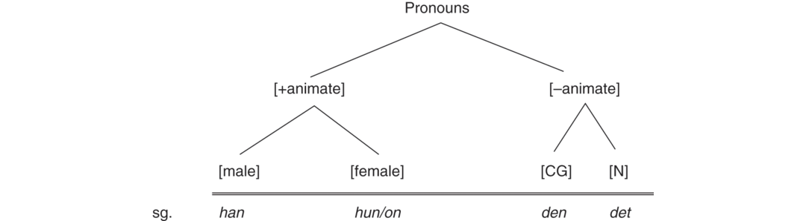

# [[page 259]] Chapter 12 Grammatical Gender in Modern Germanic Languages

**Contributor(s):** Sebastian Kürschner

## 12.1 Grammatical Gender

The term ‘grammatical gender’ is used for specific sorts of noun classes. These noun classes are not usually indicated by the morphological behavior of the noun itself, but are defined by agreement, reflected in the inflectional morphology of associated items such as articles, adjectives, or pronouns. Gender is thus grammatical variation “reflected in the behavior of associated words” (Hockett 1958: 231). The noun is the controller of the invariant gender information, and the associated elements in the noun phrase or in surrounding anaphoric elements are the targets reflecting the gender information in their variable inflectional morphology. Some examples of gender agreement in articles and adjectives from German are found in (1):

(1) ```tsv
  Definite	Indefinite
  ```

    a. ```tsv
      ***die*** *große Straße*, ***die*** *…*	*ein****e*** *groß****e*** *Straße*, ***die*** *…*
      the.F big street, that.F …	a-F big-F street, that.F
      ‘the big street that … ’	‘a big street that … ’
      ```

    b. ```tsv
      ***der*** *große Platz*, ***der*** *…*	*ein groß****er*** *Platz*, ***der***
      the.M big square, that.M	a.<span class="sc">Non</span>-F big-M square, that.M
      ‘the big square that … ’	‘a big square that … ’
      ```

    c. ```tsv
      ***das*** *große Fest*, ***das*** *…*	*ein groß****es*** *Fest*, ***das*** *…*
      the.N big party, that.N	a big.N party, that.N
      ‘the big party that … ’	‘a big party that … ’
      ```

While gender is generally reflected in associated words, the Scandinavian languages also grammaticalized a marker of gender as a noun clitic which in some languages turned into an inflectional suffix. In Danish, e.g., an unmodified noun is marked for definiteness in a noun [[page 260]] suffix (2a–2b), while definiteness is marked in an article word if the noun is premodified by an adjective (2c–2d). Since definiteness markers are main markers of gender in Germanic languages, gender has become part of noun morphology in the definiteness markers of unmodified nouns, whereas it is reflected in associated words only in premodified nouns.¹

(2) ```tsv
  Definite	Indefinite
  ```

    a. ```tsv
      *gade****n***	***en*** *gade*
      street-<span class="sc">Def.</span>CG	a.CG street
      ‘the street’	‘a street’
      ```

    b. ```tsv
      *land****et***	***et*** *land*
      country-<span class="sc">Def.</span>N	a.N country
      ‘the country’	‘a country’
      ```

    c. ```tsv
      ***den*** *store gade*	***en*** *stor gade*
      the.CG big-<span class="sc">Def</span> street	a.CG big street
      ‘the big street’	‘a big street’
      ```

    d. ```tsv
      ***det*** *store land*	***et*** *stor****t*** *land*
      the.N big-<span class="sc">Def</span> country	a.N big-N country
      ‘the big country’	‘a big country’
      ```

Articles are generally used for determining the adnominal gender of a noun, but gender is also reflected in other items showing agreement with nouns. A prominent target is found in pronouns. Table 12.1, adapted from Audring (2010: 697), presents an overview of the modern Germanic languages according to their gender systems as reflected in attributive elements (adnominal gender) and pronouns (pronominal gender).²

**Table 12.1 Overview of adnominal and pronominal genders in Germanic languages (adapted from Audring 2010: 697)**

```tsv
Language	Adnominal gender [colspan=3]	Pronominal gender [colspan=4]
German	M [rowspan=6]	F [rowspan=6]	N [rowspan=11]	M [rowspan=13]	F [rowspan=13]	N [rowspan=13]	− [rowspan=6]
Yiddish
Luxembourgish
Faroese
Icelandic
Norwegian (Nynorsk and radical Bokmål)
Norwegian (moderate Bokmål)	CG [colspan=2] [rowspan=5]	CG [rowspan=3]
Swedish
Danish
Dutch	− [rowspan=4]
West Frisian
English	− [colspan=3] [rowspan=2]
Afrikaans
```

Gender is inherited from an early Indo-European noun classification. Reconstructional linguistics believes that it arose as a semantically based classification system going back to a distinction of two classes probably based on animacy, agentivity, or the capability of subject marking (Meier-Brügger 2002: 80), and developed into a three-way distinction in later Proto-Indo-European.³ These three genders, masculine (M), feminine (F), and neuter (N), existed in Proto-Germanic and can still be found in some modern Germanic languages, e.g., German or Icelandic. Gender turned from a classification assigned to nouns for distinguishing between differing semantic classes into a grammaticalized system in which the semantic basis was being blurred and new semantic and formal assignment criteria became more relevant. In the further development new transparent semantically based classifications were added to parts of the gender [[page 261]] system (e.g., the marking of males and females that is still transparent today; cf. Wurzel [1986] on repeated classification). The grammaticalized system is reflected in Modern Germanic adnominal gender.

While we regard the agreement system as ‘grammatical gender’, we will follow Dahl (2000) in distinguishing between ‘lexical’ and ‘referential gender’. Referential gender refers to the referent of a noun phrase and applies, e.g., in sex-specific pronoun use. For example, the word *doctor* can be referred to by feminine or masculine pronouns in virtually any of the Germanic languages depending on the actual referent’s sex. Lexical gender, by contrast, is a lexical property of the noun. For example, there is no referential reason to use a masculine marker with a spoon in German (*der Löffel*), but the gender is part of the lexical information. Lexical gender can be traced back to semantic and formal gender assignment (see Section 12.3) and is stored in the lexical entry. While adnominal gender usually reflects lexical gender, pronominal gender is more open to referential uses, resulting in variable pronominal gender e.g., for the Dutch word *meisje* ‘girl’ which is lexically N (cf. *het meisje* ‘the girl’ – formally assigned because of the diminutive suffix *-je*) but referentially female, triggering variation between lexical (*het* ‘it’) and referential (*zij* ‘she’) pronoun use. English is an example of a language that lost lexical (and adnominal) gender and developed a purely referential pronominal gender system.

[[page 262]] While languages like German retained a three-gender distinction up to their modern form (see Table 12.1), some other Germanic languages – like Danish – reduced their lexical gender system to a two-way distinction, mostly by a merger of feminine and masculine nouns into a common gender (CG), e.g., Danish or Dutch. Some of the modern Germanic languages even totally lost lexical gender in the course of their history, namely English and Afrikaans. We will discuss these different types of lexical gender systems in Section 12.2.

Table 12.1 also shows that three pronominal gender markers are retained even when lexical gender is reduced, and the Mainland Scandinavian languages even enlarged the pronominal system by developing an additional pronominal marker (Section 12.4). In languages with gender reduction, this results in a mismatch for which different solutions can be found. Section 12.3 looks at factors relevant in the assignment of genders to nouns, and Section 12.4 looks into differing developments of adnominal (lexical) and pronominal (lexical or referential) gender more specifically, discussing the semantic reorganization of gender systems.

Gender is strongly connected with the inflectional morphology of nouns in Germanic languages. For example, declension classes in modern Germanic languages are often predictable based on gender information and vice versa. Section 12.5 treats aspects of the interaction of gender and noun inflection. A short conclusion is found in Section 12.6.

## 12.2 Lexical Gender Systems in Germanic

### 12.2.1 Three-Gender Systems

Three-gender systems exist in many standard and nonstandard varieties of Germanic today. Concerning the West-Germanic languages, Standard German retained three genders, just as most dialects of German, including all the High German and many Low German dialects (Section 12.2.2). Luxembourgish and Yiddish, two languages based on High German dialects, retain three genders as well (with exceptions in North-Eastern varieties of Yiddish, Section 12.2.2). In Dutch, where the standard variety reflects a two-gender system, many dialects are still characterized by the old three-gender system, especially in the Southern part of the Dutch-speaking area. East Frisian Saterlandic retains three genders, just as the mainland varieties of North Frisian, while North Frisian insular varieties reduced genders.

In North Germanic, three genders are retained in the group of the West Nordic so-called Insular Scandinavian languages, consisting of Faroese and Icelandic. In the group of Mainland Scandinavian languages, the more conservative Norwegian standard variety of New Norwegian (*Nynorsk*) reflects the old three-gender system while the more progressive standard variety of Dano- [[page 263]] Norwegian (*Bokmål*) shows variability between three- and two-gender systems (Section 12.2.2). While Standard Danish and Standard Swedish reflect a merger between masculine and feminine gender, many dialects of the Mainland Scandinavian languages still retain the classic three-gender system.

The fact that some of the Germanic languages retained all three genders while others reduced or even totally lost lexical gender, gives reason to ask if languages with three-gender systems have functionalized gender to a stronger extent than languages reducing genders. Reasons for a linguistic function of gender in Modern Germanic have been sought on various grounds. First, gender is useful in reference tracking in all Germanic languages, since ambiguities in anaphoric reference to nouns can be solved based on the gender information. This is useful when multiple nouns can be referred to, see (3) from German. However, with only three genders available, disambiguation is frequently likely to fail because of multiple nouns with identical genders (see example 4), so it is doubtful whether this functionality justifies the high learning and memorability costs of lexical gender.

1. (3) *Die Katze läuft dem Hund hinterher. Sie ist schneller.*

  the.F cat runs the.M dog … behind she.F is faster

  ‘The cat is running behind the dog. It is faster.’

2. (4) *Die Katze läuft der Maus hinterher. Sie ist schneller*.

  the.F cat runs the.F mouse behind she.F is faster

  ‘The cat is running behind the mouse. It is faster.’

Ronneberger-Sibold (2007) suggests another reason for retaining a strong gender system. According to her view, the retention of three genders in German is connected to a morphosyntactic property highly characteristic of German, namely the use of framing constructions. In such constructions, an element providing morphosyntactic information about a corresponding, morphosyntactically agreeing element provides the start of a frame of optional length that does not end before the element in agreement is found. German is shaped by such framing constructions both in its verb phrases and noun phrases, with gender playing an important role in noun phrases. NPs usually start with a determiner and end with the corresponding noun, and they can integrate further NPs shaped by the same characteristics. See (5) for an example where the frame opened by *eine* (nominative case) is closed by feminine *Wendung*, and the included frame opened by *dem* (dative case) is closed by masculine *Leser*.

(5) ```tsv
  *Eine*	*dem geschulten*	*Leser*	*häufig begegnende Wendung*
  a.F	the.M/N trained	reader.M often encountering collocation.F
  ‘A collocation that the trained reader often runs across’ [colspan=4]
  ```

[[page 264]] Together with case and number information, the stable gender information plays an important role in German NP framing. Since German typologically developed into a framing language, Ronneberger-Sibold argues that gender cues are highly important, motivating the retention of a three-gender distinction. Other functional aspects of gender systems that were suggested include, e.g., processing advantages (aid in lexical retrieval both in production and perception, cf. Köpcke and Zubin 2009) and the disambiguation of homonyms (German *der Kiefer* ‘the jaw’ versus *die Kiefer* ‘the pine tree’).

### 12.2.2 Two-Gender Systems

In Germanic, nearly all varieties that reduced the gender system to two genders retain the neuter gender and perform a merger between masculines and feminines. This is in sharp contrast with some other Indo-European languages which reduced genders, e.g., with Romance languages retaining masculine and feminine gender (e.g., French, Italian). Exceptions in Germanic are found, e.g., in the North-Frisian dialect of Föhring-Amring where feminines and neuters merge against masculines (Wahrig-Burfeind 1989, Nübling 2017: 198–203), or in North-Eastern varieties of Yiddish, where a feminine-masculine distinction is retained, but a subdivision of the feminine into three subgenders adds complexity to the gender system (see Jacobs et al. 2002, 402).

In the West Germanic group, the merger of masculines and feminines is found in Standard Dutch and West Frisian. While southern Low German dialects retain three genders, some northern Low German dialects also reflect the merger, e.g., in the region of East Friesland in the North-Western part of Germany, bordering with Dutch, and in the Slesvig region close to Denmark (see Wahrig-Burfeind 1989). In North Germanic, the standard languages of Danish and Swedish reflect the merger, and the Norwegian standard variety of Dano-Norwegian mainly shows the two-gender system as in Danish and Swedish. In variants of Dano-Norwegian, however, the distinction between masculine and feminine has been reintroduced by re-establishing feminine markers in definiteness and adjective inflection. These are mainly used with nouns denoting individuals (persons and some animals), and according to Braunmüller (2000: 27) also with “a couple of more or less frequent words …, the feminine gender of which is commonly well known by native Norwegians with a good command of their local dialects.” Examples of such words are *sol* ‘sun’, *tid* ‘time’, or *bok* ‘book’. Example (6) shows the variation between variants of *Bokmål* reflecting feminine gender (so-called radical variants of *Bokmål*, see 6a) and variants using only the common gender (so-called moderate variants, 6b). Given the intermediary status of the *Bokmål* system between a three-gender and a two-gender system, Braunmüller (2000) classifies it as a hybrid-gender system.

[[page 265]] (6) ```tsv
  Definite	Indefinite
  ```

    a. ```tsv
      ***den*** *lille bok****a***	***ei*** *lit****a*** *bok*
      the.CG little book-<span class="sc">Def.</span>F	a.F little-F book
      ‘the little book’	‘a little book’
      ```

    b. ```tsv
      ***den*** *lille bok****en***	***en*** *lille bok*
      the.CG little book-<span class="sc">Def.CG</span>	a.CG little book
      ```

We will take examples from West Germanic (Dutch) and, after that, from North Germanic (Danish and Swedish) to study the backgrounds of the merger. In Modern Dutch, the two genders are marked in the singular morphology of definite articles and in strong adjective declension (7).

(7) a. ```tsv
      ***het*** *boek*	***de*** *tafel*
      the.N book	the.CG table
      ‘the book’	‘the table’
      ```

    b. ```tsv
      *een goed boek*	*een grot****e*** *tafel*
      a good book	a large-CG table
      ‘a good book’	‘a large table’
      ```

In Old Dutch, the demonstrative – the form from which the definite article was grammaticalized – still differed for masculine (*thê / thie*) and feminine gender (*thiu [?]*) in the nominative singular (Quak and van der Horst 1997: 53, question mark original), in addition to neuter *that*. Toward Middle Dutch, unstressed vowels were reduced. The vowel quality of feminine and masculine articles merged, cf. emphatic *die* and unemphatic *de* versus neuter emphatic *dat* and unemphatic *’t*. At this point, a difference between masculines and feminines is still found in the nonnominative cases, e.g., in the accusative (M *dien / den* versus F *die / de*). However, the case system was lost in the further development, and only the merged form survived (the unemphatic form being generalized). In strong adjective declension, however, the Middle Dutch system showed no consistent merged use, yet, and sound change cannot explain the merger. Duke (2010: 660) therefore suggests that adjective declension may have been restructured as “a product of analogy with the definite article acting as a model.” The dialects of Dutch reflect the merger in the Northern part (including the parts most relevant in Dutch standardization), while Southern and Eastern dialects mostly stick to the old three-gender system.

Turning to the Mainland Scandinavian languages, some Danish dialects still retain a three-gender system while the standard language shifted towards a two-gender system. This is also the case in Swedish and some variants of Dano-Norwegian. Most of the dialects of Norwegian, however, retain the old three-gender system – the dialects in the region around the city of Bergen actually being the only dialects reflecting the two-way distinction. As for Dutch, we take a closer look at [[page 266]] definiteness marking and strong adjective declension to trace the development of the merger and possible reasons for it. In Old Swedish, e.g., masculines and feminines were distinguished both by case/number markers (masc. *–er* versus no marker in fem.) and by definiteness markers (resulting from an enclitic demonstrative marker, cf. masc. *–inn* versus fem. *–in*) in the nominative singular, with considerable variation found already at this time. The masculine nom.sg. marker *-er* (*fisk-er-inn* > *fisk-inn*) was eventually lost, and the definiteness suffixes merged (*-inn* > *-in*). The latter can be explained by the vulnerability of a morphological difference marked only by consonant length in the coda of an unstressed syllable (/nː/ versus /n/). From this starting point, the definiteness marker for CG nouns turned into the identical form *-en* after vowel reduction in unstressed position. This is the common form of Modern Swedish, Danish, and Dano-Norwegian, as opposed to N *-et*. Regarding strong adjectives, neuters were marked by a final *-t* in the Old Scandinavian dialects which is still in use today (cf. Danish *et stor-t hus* ‘a large house’). Masculines were distinguished from feminines by a nom.sg.-marker *-er*, which disappeared just as quickly as in noun inflection and left the two genders merged in adjective marking (cf. Danish *en stor gade* ‘a large street’).

There is an ongoing discussion about the question whether the merger was “only” the result of phonological mergers and morphological restructuring, or if language contact was involved in the process. The most influential contact situation in the Scandinavian Middle Ages was caused by the strong economic influence of the Hanseatic league that brought speakers of Low German to the coasts, and especially the economic centers, of the Scandinavian countries (c. 1300–1550). Pedersen (1999) points out that the gender merger appeared in groups of dialects that were surrounded by three-gender dialects, and these groups are located precisely in the trade centers of Copenhagen, Stockholm, and Bergen. This supports the idea that contact between the closely related varieties of Low German and Scandinavian dialects resulted in gender reduction, probably due to imperfect learning and accommodation effects. However, data suggests that gender reduction is not only an effect of language contact. Ringgaard (1986) shows that tendencies of deflection can be found in Jutish villages far away from the contact zone at the coast, and that coastal regions were affected only later than that, suggesting that the loss of categories (including gender) developed independently from language contact. The oldest law documents of Danish, dating from 1250 to 1300, also partly reflect fluctuating gender marking in the demonstrative pronoun (*thænn* versus *thæn*; cf. Duke 2010 for a discussion based on Ringgaard 1986). A likely conclusion is that language contact was not the primary trigger of the merger, but played a role in accelerating the process.

### [[page 267]] 12.2.3 Gender Loss

There are two standard varieties of Germanic languages which completely lost lexical gender, English and Afrikaans. Regarding dialectal varieties, some insular North Frisian (Syltring, Helgolandic) dialects reflect gender loss, just as West Jutish varieties of Danish do. All these varieties continue to have pronominal gender tracking, but adnominal gender is lost: The English definite article *the* and its indefinite counterpart *a(n)* occur with every noun, with pronunciation differences based on phonological grounds only (cf. *the* [ðə] *house* versus *the* [ði] *owl, a house* versus *an owl*). In Afrikaans, the definite article is invariable *die* and the indefinite article is invariable *’n*. Gender differences have no effect on strong adjective declension either. In the following section, we will have a closer look at how the two languages lost their lexical gender systems.

In English, the gender system went through significant changes at some point between 1000 and 1400, changing the system from a lexical gender system to a purely referential system. In current English, gender is only marked pronominally in the third person sg., see the pronouns *she/her, he/his*, and *it/its*, while adnominal gender has been lost. The modern gender system depends on the opposition of animate versus inanimate (N), with nouns denoting animates being marked for M or F, which are thus used to mark the sexes male and female.⁴

In Old English, however, there was still a lexical gender system distinguishing between the three genders, as observable in the demonstrative nom.sg. *sēo* (F), *se* (M), *þæt* (N) that still had a complex paradigm of inflectional forms in four cases and two numbers. In Middle English, there is considerable variation among the dialects, some of which still retain the marking of the lexical gender system, and some of which only keep an invariant marker *þe* as a definite article for nouns of all genders, which finally formed the basis for the modern English system. In the strong adjective paradigm, feminine marking still differed from nonfeminine marking by a suffix *-u* (> ME *-e*) in nom.sg. In Middle English, the distinction fell out of use, leaving adjectives unmarked as in Modern English.

There have been several recent studies suggesting multiple factors involved in gender loss in Old and Middle English, e.g., Curzan (2003), Stenroos (2008), Siemund and Dolberg (2011), Dolberg (2012, 2014). The studies differ regarding the question whether the first step consisted of pronominal gender changing to referential gender and providing a basis for the reanalysis of the adnominal gender system (supported by Dolberg, and Siemund and Dolberg, but contradicted by Curzan and Stenroos). It seems clear that referential gender was expressed in pronouns already in Old English for animates, and that gender was overall less frequently marked in the stage of transition towards a purely referential gender [[page 268]] system. The data support that mass nouns and abstracts were the first items transferred from lexical to referential gender.

Several reasons might have played a role in the loss of gender in English. It is unlikely that gender loss had purely phonological reasons. While some determiners and adjective declensions are rather similar, the overall differences between gender markers are too big to suggest a full phonological merger. However, gender loss goes parallel with significant de-flection in other parts of the inflectional system, thus pointing towards a possible typological drift.

It is a matter of discussion whether language contact has been involved. English went through heavy stages of intense language contact, of which contact with Scandinavian varieties is most likely to have played a role here. English was mostly affected by the contact situation in its northern dialects, in regions in which Scandinavians settled over a considerable period of time (the Danelaw area from around AD 870 to the time around the Norman conquest 1066). Dolberg (2014) shows that (at least parts of) the Danelaw area is the first to attest a change towards the referential system and loss of lexical gender, while the southern dialects retain the lexical gender system for a longer time. Moreover, a number of other innovations pointing in the direction of modern Standard English are shared early on among the northern dialects, while southern dialects do not adopt the innovations quickly. The strong changes in the northern dialects might be connected with the contact situation. We can assume that Old English and Old Norse were similar enough at that time to be used in a situation of receptive multilingualism, with speakers using their mother tongue and trying to understand speakers of another (closely related) variety. This kind of conversation usually includes accommodation processes. For mutual understanding to be possible, Dolberg (2014: 437) assumes that “aiming for simple syntactic structures, de-emphasis of inflections, and contrast-maximisation of paradigmatic closed-class items bearing high functional load, i.e. personal pronouns” are likely strategies. The contact situation might thus have accelerated or even caused the loss of English lexical gender. Although this is attested only much later in written language, the changes might have been transported orally, being reflected literally only when the scribes lost competence of the lexical gender system.

Turning to Afrikaans, we are dealing with a different sociolinguistic background. Dutch settlers at the Cape brought mainly Hollandic dialects with them that were probably in the process of merging masculines and feminines at that point of time (second half of the seventeenth century). The result was the Dutch two-gender system marking a difference between N (article *het* and demonstratives *dit* and *dat*) and CG (article *de* and demonstrative *die*), and this is reflected in early written evidence from the Cape. Current Afrikaans only uses the definite marker *die* (a demonstrative form in Modern Dutch) with all nouns. As Duke (2010) points out, no [[page 269]] phonological reasons play a role in the second merger of N and CG, since the markers are saliently different. We must assume that neuters were reclassified as CG nouns. Thinking of the high language contact situation at the Cape involving imperfect learning, indifferent learning of gender agreement with nouns might have resulted in a generalization of the CG marker.

Written documents from Cape Dutch show uncertainty in gender assignment from early on, i.e., already in the second half of the seventeenth century, and through the whole history. Only the late standardization in the nineteenth and twentieth centuries made it clear that no gender distinction is used in Standard Afrikaans nouns. It is therefore likely that differing varieties were used over the centuries, some closer to the original Dutch dialects, some reflecting the (emerging) Dutch standard variety, some more progressive in the direction of Modern Afrikaans, and Roberge (2002) assumes that speakers were used to accommodating according to context conditions. Gender was probably lost early on in basilectal varieties, while it was – at least partly – maintained in acrolectal varieties over a long period and into the twentieth century (Duke 2010).

## 12.3 Gender Assignment

While it is often said that gender is arbitrarily assigned to nouns in modern Germanic languages, there are reasons to argue that large parts of the lexicon show (partly) transparent assignment: There are several groups of nouns based on common formal (phonological and morphological) behavior and semantics that mostly appear with the same gender.

In-depth studies of the Modern German gender system were provided by Köpcke and Zubin (e.g., 1996, 2009). They found that gender assignment is far from arbitrary, and that based on formal and semantic clusters, nouns are found with predictable genders over large parts of the lexicon. The following levels are relevant in gender assignment according to their studies:

1. a) Formal levels

    1. i) sound-based: first and final sound(s), number of syllables

      Example: monosyllabic nouns ending in /ʃ/ → masculine

    2. ii) morphological: derivational suffixes

      Examples: nouns ending in *-heit* → feminine, *-ling* → masculine, *-chen* → neuter

2. b) Semantic levels

    1. i) referential: reference object must be known and classifiable

      exophoric reference to persons based on sex;

      name classes: ship names → feminine, car names → masculine, city names → neuter

    2. [[page 270]] ii) semantic: based on word semantics

      women → feminine, men → masculine;

      hyperonyms → neuter (*Tier* N ‘animal’), hyponyms → non-neuter (*Kuh* F ‘cow’*, Hund* M ‘dog’);

      fruits → feminine, etc.

Apart from these levels, there is lexical assignment that is arbitrary and cannot be deduced from any of the criteria named above. Nübling et al. (2014) complement the assignment factors by a sociopragmatic factor that they found relevant in the gender assignment on womens’ first names in some Western German dialects. This additional factor is introduced because in these dialects, female’s first names are used with hybrid F and N gender, according to the social and emotional relation between the speaker and the referent: For closely related women, a neuter gender target is used, while the use of a feminine target is the more likely, the less close the relation between the speaker and the woman is. Marital status is also relevant: Unmarried women are usually referred to with a neuter gender target, while a feminine target is used for married women (cf. Nübling 2017 for a broader analysis of Germanic languages regarding the use of N for persons).⁵ Sometimes there are also mismatches between adnominal and pronominal gender.

Such cases of mismatches between adnominal and pronominal gender are not uncommon in modern Germanic – recall that there is a higher degree of specification in pronominal than in adnominal gender in many Germanic languages (see Table 12.1 above). Examples from German show that mismatches even occur in languages with an identical number of three adnominal and pronominal genders. Panther (2009) and Köpcke et al. (2010) tried to capture the different uses of adnominal and pronominal genders by making a difference between grammatical and conceptual gender. Conceptual gender is not an inherent lexical characteristic, but assigned based on the semantics of a word (e.g., *girl* → F) or by characteristics of a referent (e.g., *the doctor* → F or M according to the referent’s sex). Note that, although the authors’ terminology differs slightly from Dahl’s introduced in Section 12.1, ‘grammatical gender’ corresponds roughly with what we call ‘lexical gender’, and ‘conceptual gender’ with what we call ‘referential gender’. Corbett (1979: 204) defined the Agreement Hierarchy that makes predictions about gender agreement and looks like the following:

attributive – predicate – relative pronoun – personal pronoun.

The possibility of syntactic agreements decreases monotonically from left to right. The further left an element on the hierarchy, the more likely syntactic agreement is to occur, the further right, the more likely semantic agreement.

[[page 271]] Concerning gender, the elements further to the left on the hierarchy are more likely to use lexical gender as a basis for agreement, and the elements further to the right are likely to use conceptual gender deriving from semantics or actual referents. Based on data from German, Köpcke et al. (2010) suggest that agreement varies between different gender target classes according to their pragmatic functions. For this reason, they adapt Corbett’s (1979) agreement hierarchy into a pragmatic hierarchy of gender agreement (cf. Figure 12.1).


The pragmatic functions are based on Speech Act Theory and correspond with prototypical parts of speech. The specifying function is mostly established by determiners – they lay an anchor for successful reference tracking in the following parts of the discourse. Attributive adjectives fulfill a modifying function and usually reflected the grammatical (lexical) gender. The predicating function is found in predicative adjectives or nouns, with adjectives being gender sensitive only in the modern North Germanic languages (cf. Danish *bilen er rød* [ʁœð̞] ‘the car is red’ versus *huset er rød****t*** [ʁœd̥] ‘the house is red’). The strongest basis for referent tracking is found in pronouns. While relative pronouns in German tend to reflect the grammatical (lexical) gender, personal and possessive pronouns are more flexible and show varying use of grammatical (lexical) and conceptual gender agreement. The pragmatic functions are interrelated with (and constrained by) other formal determinants like the linear distance between source and target, the syntactic domains in which source and target are situated and the grammatical category / function of the target.

As Köpcke et al.’s observations show, grammatical (lexical) and conceptual genders both play a role in reference tracking. It is therefore interesting to ask what relevance conceptual factors have in the development of gender systems and whether conceptual gender as reflected in pronominal gender might be relevant for the restructuring of adnominal gender. These questions are discussed in Section 12.4.

## 12.4 Pronominal Gender and Semantic Reorganization of Gender Systems

The names of the genders ‘masculine’ and ‘feminine’ reflect a sex-based difference marked by genders that is only relevant in a small part of the lexicon, denoting people and larger (individuated) animals. It is assumed that the three genders of Indo-European developed independently, and the [[page 272]] marking of sex differences was only later applied to the existing marking differences (see Section 12.1). As discussed in Section 12.3, modern Germanic languages with three-gender systems reflect the sex-based marking in relevant words, with the determiner and relative pronoun system (8a) reflecting lexical gender and the system of personal pronouns (8b) being more semantically flexible, see example (8) using the German word *Mädchen* ‘girl’.

(8) 1. a. *Da drüben steht ein Mädchen, das / *die auf jemanden wartet*.

      Over there stands a girl.N who.N / who.F for someone waits.

      ‘There is a girl standing over there who is waiting for someone.’

    2. b. *Da drüben steht ein Mädchen. Es / Sie wartet auf jemanden*.

      Over there stands a girl.N. It / she waits for someone.

      ‘There is a girl standing over there. She is waiting for someone.’

While cases of mismatch between lexical and referential gender, such as German *Mädchen*, are relatively rare in three-gender languages, the situation in Germanic languages with gender reduction and loss is especially interesting: Recall that in most two-gender languages it is precisely the masculine and feminine genders that merge, leaving sex-based differences unreflected in adnominal gender marking (cf. Danish *pige-n* ‘the girl’, *en pige* ‘a girl’, *dreng-en* ‘the boy’, *en dreng* ‘a boy’). Obviously, the same goes for the two languages with gender loss. However, as Table 12.1 shows, all Germanic languages retain pronoun systems that make it possible to distinguish between F, M, and N.

In the following, we will take a closer look at the interplay of gender agreement in articles and pronouns in languages with gender reduction and at the use of pronouns in languages that lost lexical gender. We will specifically look at gender reflected in the third person sg. pronominal system, since this is where we find variation today across all Germanic languages. It is, however, noteworthy that gender has been part of the third person pl. pronominal system in older stages of Germanic, and still is in modern Icelandic and Faroese, with consequences for referential gender marking: While groups of males are referred to by the masculine form (Icelandic *þeir* / Faroese *teir*), groups of females are referred to by the female form (*þær / tær*), and mixed groups or groups in which the sexes of the members are unknown are referred to using the neutral form (*þau / tey*).

Let us now turn to languages with lexical gender reduction. In Danish (just as in Swedish), the two lexical genders are reflected in the third person sg. pronominal system, see CG *den* and N *det*. Additionally, the pronominal system provides two pronouns that are used when a noun denotes a person or an individuated animal, cf. masculine *han* and feminine *hun* (Swedish *hon*).⁶ So while there are only two grammatical genders [[page 273]] left, and this is reflected in two pronouns for nonanimates, two additional sex-specific pronouns exist for nouns in which this distinction is relevant. In these cases, sex-based marking is even chosen when the grammatical gender is neuter but the sex is known (cf. *barn* N ‘child’, anaphorically referred to with *han* or *hun* if the sex is known, otherwise with neutral *det*). Danish and Swedish thus developed two formally different pronominal subsystems, one for syntactic agreement depending on lexical gender, and one for referential sex-based agreement. The choice for lexical versus referential agreement depends on semantics, namely, the question of whether the sex information is relevant to the concept of the noun. Interestingly, in the Norwegian standard variety of Dano-Norwegian, the same system of pronominal reference as in Danish and Swedish is used, although the feminine gender has been restituted, i.e., nonanimate feminine words like *dør* ‘door’ are referred to using the pronoun *den*, not feminine *hun*. Braunmüller (2007) summarizes the pronominal gender system as adapted in Figure 12.2.



In Dutch, there are pronouns for masculine (*hij*) and feminine (*zij*), but in contrast with Danish and Swedish, there is no CG pronoun to be used with nouns in which the sex information is irrelevant. Resulting from this, there are three pronominal targets for gender information (including neuter *het*) while there are only two lexical genders. The masculine and feminine pronouns therefore needed to be redistributed for nouns in which the sex information plays no role. Audring (2006) shows that in current spoken Dutch it is not the old, inherited gender information that is referred to when choosing a pronoun but that a new semantically based assignment has developed that involves all three pronominal gender markers and results in a high number of mismatches between determiner and pronominal gender. This new system is characterized by (a) using the feminine pronoun only for females, (b) using the masculine pronoun for males and for countable nonanimate entities, and (c) using the neuter pronoun for mass nouns. An alternative is provided by syntactic agreement for which either the old lexical gender information must be available [[page 274]] (which is usually not the case in CG) or demonstratives are used, because these (*deze* ‘this’, *die* ‘that’) do not provide different forms for masculine and feminine agreement (reflecting the CG) but clearly differ from neuter demonstratives (*dit, dat*).

Regarding languages with gender loss, Standard English was introduced in Section 12.2.3, showing a simple system of referentially based pronominal gender. The case is different with Afrikaans: While the feminine pronoun *sy* is used for sex-based reference to females only, masculine *hy* is used for most concrete nouns apart from mass nouns, while neutral *dit* has developed into a marker of abstracts and mass nouns. This distribution is not stable but varying depending on factors of medium, style, and affectivity of the speech situation (Ponelis 1979: 585ff., see Audring 2010: 700ff. for discussion). Although Dutch retained two grammatical genders and Afrikaans lost this category, the organization of pronominal gender is thus rather similar in both languages.

A look at dialectal varieties shows that an alternative development has also been possible for English, resembling the Dutch / Afrikaans pictures: As Siemund (2008) shows in a contrastive study, varieties of English organize pronominal gender differently. While sex-based differences are used referring to persons (including the use of anthroponyms) and (some or all) animals as in the standard variety, the masculine and neuter pronouns can be distributed differently in dialects, e.g., in the use of masculine *he* for nouns with inanimate concrete denotations, while *it* is reserved for abstract and mass nouns, e.g., in the South-Western variety of West Somerset English.

In all the systems discussed, quantification and individuation play a role, so differences according to very general and cognitively relevant semantic categorization are marked using the “overdistinguished” pronouns left from former three-gender systems. The Individuation Hierarchy (Sasse 1993, Siemund 2008) captures the most relevant categories in this respect. It expands the Animacy Hierarchy according to individuation and views proper names as most individuated, and mass nouns as least individuated, with the following steps on the cline as presented in (9):

1. (9) Individuation Hierarchy


We saw that the parameters of the Individuation Hierarchy played a role in several of the examples provided above. There are also examples from North Germanic that fit well with this picture. In Western Jutish dialects in which grammatical gender was lost (see above) the distinctions are reflected by use of the (former) CG pronoun *den* ‘it’ for concrete and countable nouns versus the (former) N pronoun *det* ‘it’ for abstract and [[page 275]] noncountable nouns (see Braunmüller 2000: 28–29). It is especially interesting that the marking difference can even occur at the level of determiners (compare *den hus* ‘the house’ with pronoun *den* versus *det mælk* ‘the milk’ with pronoun *det*), thus providing the start for reshaping even the adnominal gender system. Semantic reorganization at the level of determiners has also been observed, e.g., for the Dutch dialects of Groningen (cf. Audring and Booij 2009: 24–26), based on the features [±human] or [±animate], adding up nicely to the picture that the Individuation Hierarchy is most relevant for the reorganization of gender systems.

To this point, we looked at the reorganization of gender systems based on mismatches between grammatical and semantic gender and on the overspecification of pronominal gender in systems with gender reduction and loss. Gender can also be used to reorganize parts of the noun lexicon in which no gender information is naturally available, i.e., the part of the onomasticon with nonanimate referents. As Fahlbusch and Nübling (2014, 2016) show, proper names (like product names) are purely referential and do not provide semantic characteristics (or features). They refer to exactly one entity (or a class of identical entities in the case of product names), and the assignment of a gender is accordingly referentially based. Vice versa, the gender provides information about proper referents to the listener, as Fahlbusch and Nübling (2016: 108) exemplify by the German word *Admiral*: A feminine form (*die Admiral*) refers to a ship, a motor cycle, or a plane, a neuter form (*das Admiral*) to a hotel, restaurant, or beer, and the masculine form, unless the appellative ‘admiral’ is used, to a car or a mountain. So in a language like German, there are classes of referents associated with the adnominal gender of names, providing a new class system of onymic genders.

Starting from this observation, Nübling (2015, in press) interprets the gender system of proper names as an emerging classifier system consisting of six classes: The three classes named above, and three classes in which names do not usually occur with an article word but can be ascribed to a gender class (as in German place names like *Hamburg*, which are neuter (*das schöne Hamburg* ‘beautiful Hamburg’), and articleless names for women and men which are female or male, respectively). Nübling argues that an exaptation of the article and a degrammaticalization of the gender system form the background of this process.

## 12.5 The Interaction of Grammatical Gender and Inflection

Interaction between grammatical genders and the inflectional system of nouns (for details on the history of declensions, see Nübling, Chapter 10) can be encountered in all the Germanic languages, at least in their first documented historical stages. In the strong declension classes, e.g., an *s-*suffix marking the genitive has been found on masculines and neuters, [[page 276]] but never on feminines.⁷ Certain other case-number-affixes are also primarily conditioned by genders. This distribution is still characteristic across a couple of languages, mainly those which kept three-gender systems, e.g., Icelandic, Faroese, and German. In some other languages, the interaction between grammatical gender and declension is almost lost. In a study of a number of Germanic languages and dialects of German, Kürschner and Nübling (2011) found that the interaction of gender and declension can be grouped into four types, with (1) and (4) presenting the poles of a continuum:

1. (1) Gender and declension class merge, i.e., there are exactly as many declension classes as genders, and each gender corresponds to exactly one declension class (and, naturally, vice versa). New Norwegian tends to use this distribution, e.g., where more or less all feminines use the *er-*plural, masculines the *ar-*plural, and neuters show no plural marking (see Enger 2004). The same tendency is found in Alsatian dialects of German.

2. (2) There are more declension classes than genders. Each declension is bound to one specific gender. A system of this kind is found in Swedish, where the plural allomorphs *-ar, -er, -or*, and *-r* tend to occur with CG nouns, and *-n* and zero plurals are mostly reserved to neuters. This type is also found in dialectal three-gender systems, e.g., in the Swiss German dialect of Fribourg.

3. (3) There are exactly three genders and more than three declension classes. Each declension is bound to one or two out of the three genders. This is the case in Modern Standard German, where, e.g., strong declension with *er-*plural is found with neuters and masculines, the so-called mixed class (with strong declension in the singular and weak declension in the plural) is found in feminines and masculines, and the strong umlaut plural (*Hafen – Häfen* ‘harbor(s)’) is almost exclusively found on masculines.

4. (4) Gender and declension are fully dissociated (attested only in two-gender systems). Declensions are distributed according to factors other than gender. This is the case in Dutch in which the plural allomorphs *-s* and *-(e)n* are distributed on prosodic grounds (a plural form ends in a trochee, cf. *hand-en* ‘hand(s)’ versus *bezem-s* ‘brooms’, *gave-n* ‘gifts’), and the class characterized by *eren-*plural is the only reminder of the old gender-based assignment (restricted to 15 neuters). A comparable tendency has also been found for the Low German dialect of East Friesland.

Gender has thus had an impact on organizational changes in declension classes in the history of Germanic languages, at least in types (1) to (3). To illustrate this, the history of German feminines is revealing (see [[page 277]] Nübling, Chapter 10 for more details): While in Old High German, feminines were found in high numbers in the *ō*-stems, *i*-stems and the weak *n-*stems, they were reorganized in Early New High German, resulting in most feminines assembling in a mixed class characterized by the plural *n-*marker (cf. Standard German nom.sg. *Tasche –* nom.pl. *Taschen* ‘bag’). In this process, the link between feminine gender and “its” declension class was strengthened by abandoning the class of old *ō*-stems (which had developed a zero plural in the important nominative and accusative cases in Middle High German) and retaining only a limited set of approximately 35 feminines in the old *i-*stems (today: *e-*plural with umlaut, cf. *Kunst – Künste* ‘arts’).

Several reasons for the interaction of genders and declensions have been discussed. A particularly interesting discussion has been started by Wurzel (2001) who points out that declension classes existed in high numbers in Proto-Germanic but lacked a functional motivation, resulting in a low memorability. Declension classes were therefore linked to other, noninflectional structural characteristics of nouns to enhance memorability. One of these characteristics is the gender information (in addition to, e.g., word-formation affixes, prosodic structures, final sounds). Since the functional load of gender is relatively low as well, both categorization systems might have supported each other by being bound to each other.

Starting from this view, it is striking that the important (or ‘relevant’, in the sense of Bybee 1985) number information is profiled using both classification systems for each of the two numbers (singular and plural) in the further development of the modern Germanic languages and dialects (cf. Nübling 2008 on German and its the dialects): While the most reliable markers of declension class tend to be found in the plural allomorphy (with singular being unmarked and case allomorphy becoming less and less marked or even obsolete in some languages), gender is usually neutralized in the plural but is most clearly profiled in the singular (cf. the German *der, die, das* markers in nominative singular versus the neutralized *die* marker for all genders in nominative plural). This observation might also offer a starting point for explaining why some languages tend to retain a strong link between genders and declension classes: In the plural, gender information can be deduced from the inflectional morphology, while in the singular, possible declension classes can be deduced (and excluded) from the gender markers.

## 12.6 Conclusions

Gender in Germanic languages can be studied from a range of different perspectives. The lexical gender systems, reflected in adnominal markers, show a rather strong diversity across varieties of Modern Germanic, ranging from three- and two-gender systems to systems with no grammatical [[page 278]] gender. Apart from lexical gender, which is assigned based on semantic or formal characteristics, referential gender is found mainly in pronominal gender, sometimes causing mismatches with adnominal gender markers. Different patterns of reorganization resulted from a mismatch between the number of adnominal and pronominal genders in two-gender or genderless languages. A topic for further investigation is the extent to which the conceptual reorganization of pronominal gender has an influence on lexical gender.

Gender also interacts with other class systems, like declension classes. Both class systems share a long history of interrelations in the Germanic languages, and this might be due to increased memorability of both categories and/or the profiling of the highly relevant number category in nouns.

The many directions into which gender systems developed in a rather small language family leave a lot of questions to be dealt with in future (comparative) research, e.g., regarding the possible functions of gender and the reasons for reduction and loss, and still support the characterization that Corbett (1991: 1) gave in his seminal study of gender: “Gender is the most puzzling of the grammatical categories.”

## Footnotes
