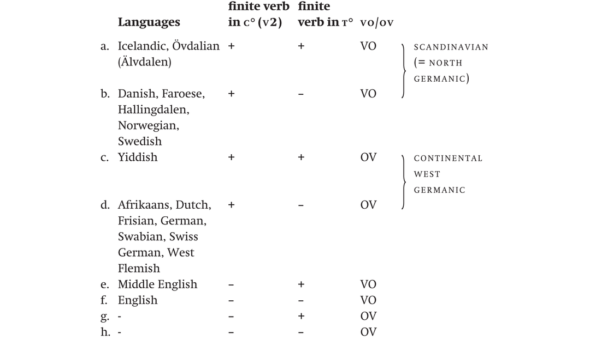
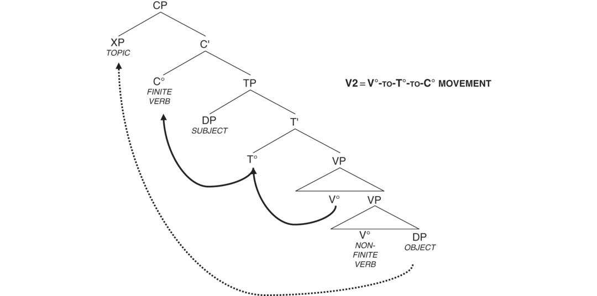
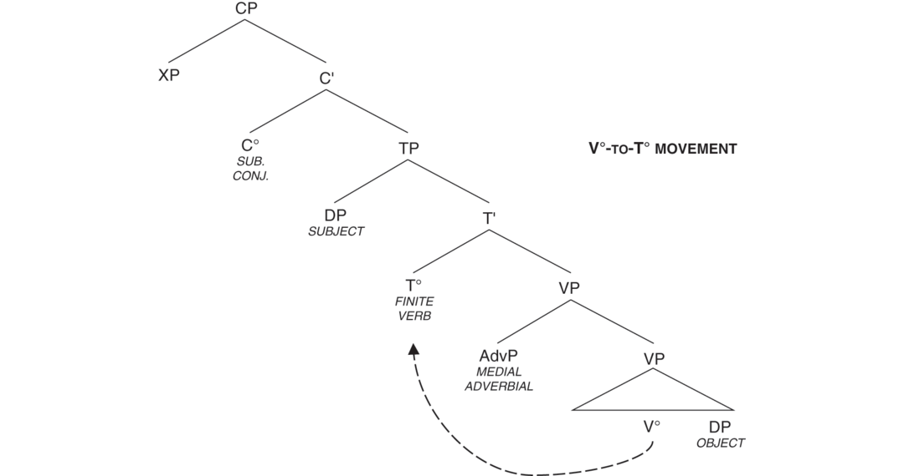
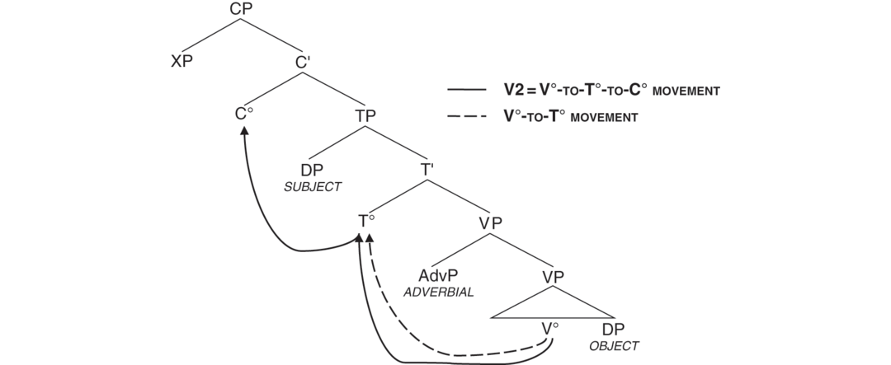
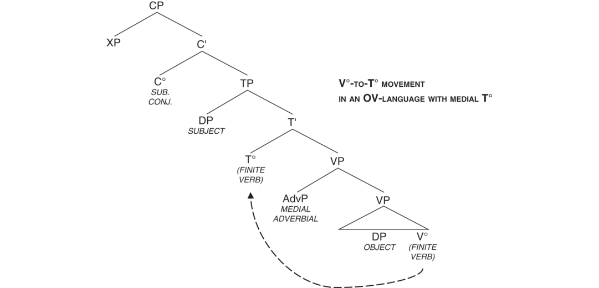
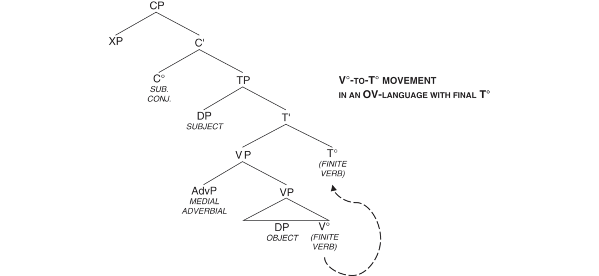

# [[page 365]] Chapter 16 The Placement of Finite Verbs

**Contributor(s):** Sten Vikner

## 16.1 Introduction

### Language abbreviations

```tsv
Af.	Afrikaans	Ic.	Icelandic
Be.	Swiss German from Bern	ME.	Middle English
Da.	Danish	Öd.	Övdalian (Älvdalen)
Du.	Dutch	SG.	Swiss German from Sankt Gallen
En.	English	St.	Swabian German from Stuttgart
Fa.	Faroese	WF.	West Flemish
Fs.	Frisian	Yi.	Yiddish
Ge.	Standard German	Zü.	Swiss German from Zürich
Hd.	Hallingdalen
```

In a clause in a Germanic language, there are three different positions in which the finite verb may occur:

(1) a. ```tsv
      The position immediately before the subject	(this position will be called C°)
      ```

    2. b.

      ```tsv
      The position immediately after the subject	(this position will be called T°)
      ```

    3. c.

      ```tsv
      The base position next to, e.g., the object	(this position will be called V°)
      ```

There is a choice associated with each of these positions, and this chapter will show how the exact position of the finite verb in [[page 366]] a particular type of clause in a given Germanic language depends on these three choices.

The first choice is whether or not the finite verb occurs in the position called C° (i.e., in the position immediately before the subject). This choice can be seen as one between having what is called V2 (which will be analyzed below as involving V°-to-T°-to-C° movement), as in (2a), where the finite verb is the second constituent, or not having V2, as in (2b):

```tsv
						**C°**	**Subject**			**V°**
(2)	a.	Danish		Den	mulighed	tænkte	vi	desværre	aldrig		på.
	b.	English		That	possibility		we	unfortunately	never	thought	of.
```

This first choice is only made once for each Germanic language, and it holds for all finite verbs in all main clauses (and in some embedded ones).

The second choice is whether or not the finite verb occurs in the position immediately after the subject (i.e., in the position called T°). This choice can be seen as one between having V°-to-T° movement, as in (3a), or not having V°-to-T° movement, as in (3b):

```tsv
						Subject	**T°**		**V°**
(3)	a.	Icelandic	Hún	spurði	hvers vegna	við	flyttum	ekki		til	Íslands.
	b.	Danish	Hun	spurgte	hvorfor	vi		ikke	flyttede	til	Island.
			*She*	*asked*	*why*	*we*	*(moved)*	*not*	*(moved)*	*to*	*Iceland*
```

This second choice is also only made once for each Germanic language, and it holds for all finite verbs in all clauses (even if its effect can only be observed when V2 does not apply).

The third and last choice is the one also discussed in Chapter 15, namely whether the base order is VO or OV, i.e., whether the verb (when it is in V°) comes before its complement, as in (4a), or after it, as in (4b):

```tsv
							**Verb**	**Object** [colspan=2]
(4)	a.	English	Many	linguists	who	already	know	this	book		find	it	useful.
	b.	German	Viele	Linguisten,	die	schon		dieses	Buch	kennen,	finden	es	nützlich.
								**Object** [colspan=2]	**Verb**
```

This third choice, between VO or OV, (4), is also only made once for each Germanic language, and it holds for all verbs in all clauses (even if its effect can only be observed for verbs which have not undergone movement either to C° [V2] or to T°).

These three binary choices can maximally result in eight different types of Germanic languages, but not all of these types are actually attested:

1. [[page 367]] (5)

  ```tsv

  ```

Only one of the Germanic languages spoken today is not V2, namely English, (5f). In order to maximize the number of non-V2-languages in the table, I have included a language no longer spoken, namely (late) Middle English, (5e), see Fischer et al. (2001: 132). Even so, there are still two possible types of non-V2-languages not attested among the Germanic languages, (5g, 5h).

To give an idea of the (simplified) analysis behind the use of the labels C°, T° and V°, here is what I take to be the structure of a clause (irrespective of whether it is a main or an embedded clause):

1. (6) A clause is a CP, the complement of the CP’s head (= C°) is a TP, and the complement of the TP’s head (= T°) is a VP.

For a clause in a VO-language with no auxiliary verbs and with a monotransitive main verb, the structure looks as follows:

1. (7)


[[page 368]] As will be illustrated below, the subject occurs at the left edge of TP and if there is a sentence-medial adverbial, it occurs at the left edge of VP. Furthermore, if the language in question had been OV, the sequence between the verb and its complement would be reversed.

## 16.2 Verb Second (V2)

### 16.2.1 V2 in All Main Clauses

In most Germanic languages, not including Middle English and Modern English, all main clauses are V2. This means that the finite verb occupies the second position in the clause, irrespective of which constituent occupies the first position:

(8) ```tsv
  **Verb second = V2** [colspan=2]
  **1**	–	**2**	–	**3**
  one constituent		the finite verb		the rest of the clause
  ```

It might appear that also in English, the finite verb occupies the second position:

(9) ```tsv
  a.	Da.	Peter	har	sandsynligvis	læst	den her	bog.
  b.	Ic.	Pétur	hefur	sennilega	lesið	þessa	bók.
  c.	Ge.	Peter	hat	wahrscheinlich		dieses	Buch	gelesen.
  d.	Af.	Pieter	het	waarskynlik		hierdie	boek	gelees.
  e.	En.	Peter	has	probably	read	this	book.
  ```

This is an illusion, though, and for declarative examples like (9), it only holds when we consider subject-initial main clauses with a finite auxiliary verb (see the discussion in Section 16.3 below, especially footnote 4). If we look at declarative clauses that have, e.g., an initial object, (10), or an initial adverbial, (11), we see that English clearly differs from the V2-languages. However, there are two sets of very specific circumstances, where also English has V2, namely after an initial *wh*-constituent, (12), or after an initial negative constituent, (17b) further below:

```tsv
						**C°**
(10)	a.	Da.		Den her	bog	har	Peter	læst.
	b.	Ic.		Þessa	bók	hefur	Pétur	lesið.
	c.	Ge.		Dieses	Buch	hat	Peter				gelesen.
	d.	Af.		Hierdie	boek	het	Pieter				gelees.
	e.	En.	***	This	book	has	Peter	read.
[[page 369]] (11)	a.	Da.		Nu		har	Peter	læst	den her	bog.
	b.	Ic.		Nú		hefur	Pétur	lesið	þessa	bók.
	c.	Ge.		Jetzt		hat	Peter		dieses	Buch	gelesen.
	d.	Af.		Nou		het	Pieter		hierdie	boek	gelees.
	e.	En.	***	Now		has	Peter	read	this	book.
(12)	a.	Da.		Hvad for en	bog	har	Peter	læst?
	b.	Ic.		Hvaða	bók	hefur	Pétur	lesið?
	c.	Ge.		Welches	Buch	hat	Peter				gelesen?
	d.	Af.		Watter	boek	het	Pieter				gelees?
	e.	En.		Which	book	has	Peter	read?
```

The discussion of V2 goes back to at least Wackernagel (1892) and Fourquet (1938). A common analysis of V2 which goes back to den Besten (1977, published as 1983) and Thiersch (1978) and found its canonical form in Platzack (1985) and Chomsky (1986: 6) is that the finite verb in V2-main clauses occupies the same position that the subordinating conjunction (also called the complementizer, e.g., *that, if, because*) occupies in an embedded clause. This position is called **C°**:

```tsv
				**C°**
(13)	Da.	a.	…	at	børnene	har	set	den her film.
		b.	Denne film	har	børnene	___	set	__________.
(14)	Ic.	a.	…	að	börnin	hafa	séð	þessa mynd.
		b.	Þessa mynd	hafa	börnin	___	séð	_________.
(15)	Ge.	a.	…	dass	die Kinder			diesen Film
		b.	Diesen Film	haben	die Kinder			_________
			gesehen	haben. [colspan=5]
			gesehen	_____. [colspan=5]
(16)	Af.	a.	…	dat	die kinders			hierdie film
		b.	Hierdie film	het	die kinders			_________
			gesien	het. [colspan=5]
			gesien	_____. [colspan=5]
(17)	En.	a.	…	that	the children	have	seen	this film.
		b.	None of these films	have	the children	___	seen	_________.
```

and here is the tree structure for such V2-clauses (for German and other OV-languages, the order inside the two VPs is reversed with V° being rightmost):

1. [[page 370]] (18)



The finite verb moves to C°, and some other constituent (e.g., the topic) moves into the specifier position of CP (CP-spec). This constituent in the first position can be, e.g., the subject, the object, an adverbial, or an embedded clause. If the first constituent is not the subject, then the subject has to occur in the third position (i.e., the DP that is the specifier of TP).

If a clause does not have V2, then either the finite verb does not move at all (i.e., it stays in V°) or it moves to T° and stays there, see Section 16.3 below.

Supporting evidence for the assumption that the finite verb (in a V2-main clause) occupies the same position that the complementizer occupies (in an embedded clause) may be found in conditional clauses, where the subject is preceded either by a complementizer (e.g., *if*) or by the finite verb (e.g., *had*), but not by both, see den Besten (1983: 117):

```tsv
				**C°**
(19)	Da.	a.		Hvis	jeg havde	haft	mere	tid,		…
	Ic.	b.		Ef	ég hefði	haft	meiri	tíma,		…
	Ge.	c.		Wenn	ich		mehr	Zeit	gehabt hätte,	…
	Af.	d.		As	ek		meer	tyd	gehad het,
	En.	e.		If	I had	had	more	time,		…
(20)	Da.	a.		Havde	jeg ____	haft	mere	tid,		…
	Ic.	b.		Hefði	ég ____	haft	meiri	tíma,		…
	Ge.	c.		Hätte	ich		mehr	Zeit	gehabt ____,	…
	Af.	d.		Het	ek		meer	tyd	gehad ____,
	En.	e.		Had	I ____	had	more	time,		…
[[page 371]] (21)	Da.	a.	***	Havde hvis	jeg ____	haft	mere	tid,		…
	Ic.	b.	***	Hefði ef	ég ____	haft	meiri	tíma,		…
	Ge.	c.	*	Hätte wenn	ich		mehr	Zeit	gehabt ____,	…
	Af.	d.	*	Het as	ek		meer	tyd	gehad ____,
	En.	e.	*	Had if	I ____	had	more	time,		…
(22)	Da.	a.	***	Hvis havde	jeg ____	haft	mere	tid,		…
	Ic.	b.	***	Ef hefði	ég ____	haft	meiri	tíma,		…
	Ge.	c.	*	Wenn hätte	ich		mehr	Zeit	gehabt ____,	…
	Af.	d.	*	As het	ek		meer	tyd	gehad ____,
	En.	e.	*	If had	I ____	had	more	time,		…
Da.	…	ville	jeg		have	lavet	et	endnu	længere	hand-out.
Ic.	…	myndi	ég		hafa	gert		ennþá	lengri	úthendu.
Ge.	…	hätte	ich				ein	noch	längeres	Thesenpapier	gemacht.
Af.	…	sou	ek				‘n	nog	langer	uitdeelstuk	gemaak	het.
En.	…		I	would	have	made	an	even	longer	hand-out.
```

Consider finally the following examples from two V2-languages, Danish and German:

```tsv
				**CP-spec**	**C°** [colspan=2]	**TP-spec**	**AdvP**	**V°**	**V°**	**DP**
(23)	Da.	a.	*	Derfor			jeg	desværre	burde	spise	mindre	chokolade.
		b.		Derfor	burde		jeg	desværre		spise	mindre	chokolade.
		c.	***	Derfor	burde	spise	jeg	desværre			mindre	chokolade
		d.	***	Derfor		spise	jeg	desværre	burde		mindre	chokolade.
				*Therefore*	*(ought)*	*(eat)*	*I*	*unfortunately*	*(ought)*	*(eat)*	*less*	*chocolate*
				**CP-spec**	**C°** [colspan=2]	**TP-spec**	**AdvP**	**DP** [colspan=2]	**V°**	**V°**
(24)	Ge.	a.	*	Deswegen			ich	leider	weniger	Schokolade	essen	sollte.
		b.		Deswegen	sollte		ich	leider	weniger	Schokolade	essen.
		c.	***	Deswegen	sollte	essen	ich	leider	weniger	Schokolade
		d.	***	Deswegen		essen	ich	leider	weniger	Schokolade		sollte.
				*Therefore*	*(should)*	*(eat)*	*I*	*unfortunately*	*less*	*chocolate*	*(eat)*	*(should)*
```

(23a, 23b) and (24a, 24b) again show that Danish and German are V2-languages, which is why the finite verb cannot occur to the right of the subject. Examples (23c) and (24c) show that only one verb may undergo V2. Examples (23d) and (24d) show that only a finite verb may undergo V2 (and not the infinitive *spise / essen* ‘eat’).

For a less simplified analysis of V2 than the one presented here, see, e.g., Holmberg (2015 in press).

### 16.2.2 V2 in English Main Clauses

As already mentioned, it is assumed that English is not a V2-language, but nevertheless, there are two sets of very specific circumstances, where even English has V2.

[[page 372]] One V2-context is (nonsubject-initial) interrogative main clauses (i.e., direct questions):

```tsv
					**C°**
(25)	a.	En.		Which book	has	Peter	___	read	_____	____?
	b.	En.	***	Which book		Peter	has	read	_____	____?
	c.	Da.		Hvad for en bog	har	Peter	___	læst	_____	____?
	d.	Ic.		Hvaða bók	hefur	Pétur	___	lesið	_____	____?
	e.	Ge.		Welches Buch	hat	Peter			_____	____	gelesen	___?
	g.	Af.		Watter boek	het	Pieter			_____	____	gelees	___?
(26)	a.	En.		Why	has	Peter	___	read	this	book?
	b.	En.	***	Why		Peter	has	read	this	book?
	c.	Da.		Hvorfor	har	Peter	___	læst	den her	bog?
	d.	Ic.		Af hverju	hefur	Pétur	___	lesið	þessa	bók?
	e.	Ge.		Warum	hat	Peter			dieses	Buch	gelesen	___?
	g.	Af.		Waarom	het	Pieter			hierdie	boek	gelees	___?
```

The other English V2-context is when there is an initial negative constituent:

```tsv
					**C°**
(27)	a.	En.		Never	have	the children	____	seen	such	a	bad	film.
	b.	En.	***	Never		the children	have	seen	such	a	bad	film.
	c.	Da.		Aldrig	har	børnene	____	set	sådan	en	dårlig	film.
	d.	Ic.		Aldrei	hafa	börnin	____	séð	svona		slæma	mynd.
	e.	Ge.		Nie	haben	die Kinder			so	einen	schlechten	Film	gesehen	___.
	g.	Af.		Nooit	het	die kinders			so	‘n	slegte	film	gesien	___	nie.
```

```tsv
					**C°**
(28)	a.	En.		Only in America	could	such a thing	_____	happen.
	b.	En.	***	Only in America		such a thing	could	happen.
	c.	Da.		Kun i Amerika	kunne	sådan noget	_____	ske.
	d.	Ic.		Aðeins í Bandaríkjunum	gæti	eitthvað svona	___	gerst.
	e.	Ge.		Nur in Amerika	könnte	so etwas		passieren	____.
	g.	Af.		Net in Amerika	kon	so ‘n ding		gebeur	____.
```

Notice that in the above examples, the finite verb is an auxiliary (see the discussion in Section 16.3 below, especially footnote 4). When the finite verb is a main verb, *do*-insertion is necessary:

```tsv
					**C°**
(29)	En.	a.		Which book	did	Peter	___	read	_____	____	?
		b.	***	Which book	read	Peter		____	_____	____	?
		c.	***	Which book		Peter		read	_____	____	?
```

```tsv
[[page 373]]					**C°**
(30)	En.	a.		Never	did	the children	____	see	such	a	bad	film.
		b.	***	Never	saw	the children		___	such	a	bad	film.
		c.	***	Never		the children		saw	such	a	bad	film.
```

As seen in (9) and (31a), subject-initial main clauses in English may look as if they are V2, but if an element is inserted to the left of the subject, the verb does not insist on ocurring in second position, (31b) (see also (2) above):

(31) ```tsv
  En.	a.		The	city	council	has	unfortunately	never	considered	this	possibility.
  	b.	Unfortunately,	the	city	council	has		never	considered	this	possibility.
  ```

Furthermore, at least for those cases where the finite verb is a main verb, it can be shown that subject-initial main clauses are not V2, because the finite verb has to follow any sentence-medial adverbials, and because *do*-insertion is not necessary:

```tsv
								**V°**
(32)	En.	a.		The	city	council	never	considered	this	possibility.
		b.		Which	city	council	never	considered	this	possibility?
		c.		No	city	council	ever	considered	this	possibility.
		d.	Unfortunately,	the	city	council	never	considered	this	possibility.
```

It would thus seem that in English, V2 is restricted to interrogative main clauses and to clauses with negative preposing, provided in both cases that the initial element is not the subject. No other main clauses in English are V2,¹ see also (10e) and (11e).

## 16.3 V°-to-T° Movement

Let us now consider what happens in situations where V2 cannot apply, i.e., where the finite verb cannot occur in the position immediately left of the subject. This leaves two options, namely that the finite verb occurs either in the position immediately right of the subject (i.e., in the position called T°), as in (33), or in its base position (i.e., the one called V°), as in (34).

```tsv
				C°	TP-spec	T°	AdvP	V°	DP
(33)	a.	En.	*	That	John	eats	often		tomatoes	(surprises most people.)
	b.	Da.	***	At	Johan	spiser	ofte		tomater	(overrasker de fleste.)
	c.	Fa.	***	At	Jón	etur	ofta		tomatir	(kemur óvart á tey flestu.)
	d.	Ic.		Að	Jón	borðar	oft		tómata	(kemur flestum á óvart.)
	e.	Yi.		Az	Jonas	est	oft		pomidorn	(iz a khidesh far alemen.)
[[page 374]]				**C°**	**TP-spec**	**T°**	**AdvP**	**V°**	**DP**
(34)	a.	En.		That	John		often	eats	tomatoes	(surprises most people.)
	b.	Da.		At	Johan		ofte	spiser	tomater	(overrasker de fleste.)
	c.	Fa.		At	Jón		ofta	etur	tomatir	(kemur óvart á tey flestu.)
	d.	Ic.	***	Að	Jón		oft	borðar	tómata	(kemur flestum á óvart.)
	e.	Yi.	***	Az	Jonas		oft	est	pomidorn	(iz a khidesh far alemen.)
```

A common analysis of this difference (which goes back to Emonds 1978 and Pollock 1989) is that two languages have V°-to-T° movement, namely Icelandic and Yiddish, as opposed to English, Danish, and Faroese. In Icelandic and Yiddish, the finite verb is therefore taken to always move from its position in V° to a position further left, namely T°. This movement can only be detected if something occurs to the right of T° but to the left of V°, in this case the medial adverbial *often*:

1. (35)



The following examples from Middle English and from two conservative Mainland Scandinavian dialects display the same difference. In embedded clauses, the finite verb precedes the medial adverbial or negation in Middle English and in the Swedish dialect Övdalian (from Älvdalen, see, e.g., Garbacz 2010), whereas the finite verb follows the medial adverbial or negation in the Norwegian dialect from Hallingdalen:

```tsv
										**T°**	**AdvP**	**V°**
(36)	a.	ME.		…	and	he	swore	that	he	talkyd	neuer		wyth	no	man.
				*…*	*and*	*he*	*swore*	*that*	*he*	*talked*	*never*		*with*	*no*	*man*
```

[[page 375]] (This example is from 1460, William Paston I, *Letter to John Paston I, May 2, 1460*, Davis 1971: 164)

```tsv
							**T°**	**AdvP**	**V°**
b.	Öd.		Ba	fo dye	at	ig	uild	int		fy	om
			*Just*	*because*	*that*	*I*	*would*	*not*		*follow*	*him*
```

(This example is from Levander 1909: 123, see also Platzack and Holmberg 1989: 70)

```tsv
									**T°**	**AdvP**	**V°**
c.	Hd.		… fisk,	jammvært	om	støræls’n	på	o		ikki	va	myky	skrytæ	tå
			*… fish*,	*although*		*size-the*	*of*	*them*		*not*	*was*	*much*	*brag*	*about*
```

(This example is from Venås [1977: 243], see also Trosterud 1989: 91 and Platzack and Holmberg 1989: 70)

Among the Germanic VO-languages, the ones without V°-to-T° movement are modern English² and five of the seven Scandinavian variants: Danish, Faroese, Hallingdalen Norwegian, Norwegian, and Swedish, see (34) above.

Among the Germanic OV-languages, only one language, Yiddish,³ (34e) above, seems to clearly have V°-to-T° movement. The discussion of the other Germanic OV-languages will therefore have to wait until Section 16.6 below.

Consider finally the following examples from the two languages with V°-to-T° movement, Icelandic and Yiddish:

```tsv
				**C°**	**TPsp**	**T°** [colspan=2]	**AdvP**	**V°**	**V°**	**DP**
(37)	Ic.	a.	*	Að	Jón			oft	hafi	borðað	tómata	(kemur flestum á óvart.)
		b.		Að	Jón	hafi		oft		borðað	tómata	(kemur flestum á óvart.)
		c.	***	Að	Jón	hafi	borðað	oft			tómata	(kemur flestum á óvart.)
		d.	***	Að	Jón		borðað	oft	hafi		tómata	(kemur flestum á óvart.)
[[page 376]] (38)	Yi.	a.	*	Az	Jonas			oft	hot	gegesn	pomidorn	(iz a khidesh far alemen.)
		b.		Az	Jonas	hot		oft		gegesn	pomidorn	(iz a khidesh far alemen.)
		c.	*<sup>??</sup>*	Az	Jonas	hot	gegesn	oft			pomidorn	(iz a khidesh far alemen.)
		d.	***	Az	Jonas		gegesn	oft	hot		pomidorn	(iz a khidesh far alemen.)
				*That*	*John*	*(has)*	*(eaten)*	*often*	*(has)*	*(eaten)*	*tomatoes*	*(surprises most people.)*
```

Examples (37a, 37b) and (38a, 38b) again show that Icelandic and Yiddish have V°-to-T° movement, and this is why the finite verb cannot remain in V°. Examples (37c) and (38c) show that only one verb may undergo V°-to-T° movement. Examples (37d) and (38d) show that only a finite verb may undergo V°-to-T° movement.

For a less simplified analysis of V°-to-T° movement than the one presented here, see, e.g., Bobaljik (2003) and Koeneman and Zeijlstra (2014).

## 16.4 Differences Between V°-to-T° Movement and V2

There are two main differences between V°-to-T° movement and V2:

1. (39)



V°-to-T° movement applies to all finite verbs, whereas V2 only applies to finite verbs in main clauses (and some embedded clauses). In other words, although V2 is not completely restricted to main clauses, it is only possible in a subset of finite embedded clauses, whereas V°-to-T° movement is obligatory for all finite verbs.

In a clause with V°-to-T° movement but without V2, the first element is the subject and the second element is the finite verb. In a clause with V2, [[page 377]] the second element is also the finite verb, but the first element can be any constituent (subject, object, adverbial, embedded clause, …).

The reason why the embedded clauses in (33)–(34) above are subject clauses is that this is a context where main clause word order (i.e., V2) is NOT allowed, see (40), and also (33b, 33c). This is relevant because there are also many embedded contexts where both main, (41) and (42), and embedded clause word orders, (43), are possible:

```tsv
						**C°**		**C°**			**V°**
(40)	a.	Da.	*			(At)	tomater	spiser	Johan	ofte			overrasker de fleste.
	b.	Fa.	*			(At)	tomatir	etur	Jón	ofta			kemur óvart á tey flestu.
						*That*	*tomatoes*	*eats*	*John*	*often*			*surprises most people*
(41)	a.	Da.		Hun	siger	at	tomater	spiser	Johan	ofte.
	b.	Fa.		Hon	sigur	at	tomatir	etur	Jón	ofta.
				*She*	*says*	*that*	*tomatoes*	*eats*	*John*	*often*
(42)	a.	Da.		Hun	siger	at	Johan	spiser		ofte		tomater.
	b.	Fa.		Hon	sigur	at	Jón	etur		ofta		tomatir.
				*She*	*says*	*that*	*John*	*eats*		*often*		*tomatoes*
(43)	a.	Da.		Hun	siger	at			Johan	ofte	spiser	tomater.
	b.	Fa.		Hon	sigur	at			Jón	ofta	etur	tomatir.
				*She*	*says*	*that*			*John*	*often*	*eats*	*tomatoes*
```

Provided the special conditions for V2 in English are observed, the judgments are very similar here:

```tsv
					**C°**		**C°**
(44)	En.	a.	*		That	in no way	could	we			be	held	responsible	must	now	be clear.
		b.			That			we	could	in no way	be	held	responsible	must	now	be clear.
(45)	En.			The judge emphasised … [colspan=10]
		a.		…	that	in no way	could	we			be	held	responsible.
		b.		…	that			we	could	in no way	be	held	responsible.
```

In, e.g., German, embedded V2 is only possible if the subordinating conjunction is left out. This is not the case in Scandinavian, Yiddish, and English, where the subordinating conjunction has to precede the embedded V2-clause, cf. (41), (42) and (45a). In other words, the complementary distibution shown in (19)–(22) does not hold here, and we therefore need two C°-positions (sometimes called CP-recursion), one for the conjunction and one for the finite verb (see e.g., Julien [2015] or Nyvad et al. [2017] and references there for more detailed analyses).⁴

[[page 378]] According to Vikner (2001b: 226), three conditions seem to be necessary for embedded V2 to be possible⁵ (whereas the non-V2-options are always possible, even when these three conditions are not observed, as shown below):

(46) 1. a. An embedded V2-clause requires certain matrix verbs (verbs of saying and believing).

    2. b. An embedded V2-clause requires the matrix verb not to be negated.

    3. c. An embedded V2-clause has to occur in object position.

## 16.5 Deriving V°-to-T° Movement

Both V2 and VO/OV seem to ‘run in the family’, i.e., these features are often shared by closely related languages, cf. (5) above. However, this is clearly not the case with V°-to-T° movement, since Icelandic (which has V°-to-T° movement) is much more closely related to the other Scandinavian languages (almost all of which do not have V°-to-T° movement) than it is related to Yiddish or French (both of which have V°-to-T° movement).

Chomsky (1995: 222) says about the ability of constituents to move in the syntax: “Minimalist assumptions suggest that this property should be reduced to morphology-driven movement.” This is the objective of quite a number of accounts, including the one in Vikner (1997, 1999), where finite verb movement is linked to verbal inflectional morphology in the following way:

1. (47) An SVO-language has V°-to-T° movement if and only if person morphology is found in all tenses. (Vikner 1997: 207, example (23))

There are many alternatives to this particular implementation of a link between V°-to-T° movement and a rich verbal inflectional system, e.g., Bobaljik and Thráinsson (1998), Rohrbacher (1999), Thraínsson (2009), Biberauer and Roberts (2010), Koeneman and Zeijlstra (2014). These suggestions (since Bobaljik [2003] commonly subsumed under the label RAH, [[page 379]] i.e., Rich Agreement Hypotheses) are all based on the fact that all the Germanic VO-languages without V°-to-T° movement (i.e., Danish, English, Faroese, Hallingdalen, Norwegian, and Swedish) have a much poorer verbal inflectional system than the Germanic (and Romance) languages that have V°-to-T° movement, e.g., Icelandic and Yiddish (and French).

Furthermore, these six languages also have in common both that they have a relatively poor verbal inflectional system, which was much richer not that long ago, and that they used to have V°-to-T° movement which they only lost relatively recently. In most of them, this change took place between 1450 and 1700, whereas in Faroese, it is much more recent (see Heycock et al. 2012).

The suggested link between V°-to-T° movement and a rich verbal inflectional system has also received a large amount of criticism, e.g., Sprouse (1998), Alexiadou and Fanselow (2002), Bobaljik (2003), Bentzen et al. (2007), Hrafnbjargarson and Wiklund (2010), Holmberg (2010), Angantýsson (2011), Heycock and Wallenberg (2013), Harbour (2016), Heycock and Sundquist (2017).

Some of these criticisms interestingly suggest alternative derivations which then lead to sets of predictions different from the predictions derived by the RAH, even if they frequently end up including revised versions of the RAH. An example of this is Heycock and Wallenberg (2013), which suggests a link with the availability of embedded V2, and given that embedded V2 is and was possible in all Scandinavian languages including Icelandic, which has not lost V°-to-T° movement, Heycock and Wallenberg (2013: 151–154) have to include a version of the RAH in their analysis.

Other criticisms do not link the difference to any other properties of the languages in question, and so no new predictions can be derived. This is of course not a completely unknown situation, in fact, it is rather like the situation concerning V2, where it is difficult to see which properties of Danish and English could be directly linked to the former, but not the latter, being V2. Given that there are a great many accounts available as to which properties of Icelandic and Danish could be directly linked to the former, but not the latter, still having V°-to-T° movement, such accounts still merit serious consideration.

## 16.6 V°-to-T° Movement and the OV-Languages

So far all Germanic OV-languages except Yiddish have been left out of the discussion of V°-to-T° movement. Some formulations of the RAH, including (47), explicitly only cover the VO-languages, whereas other formulations, e.g., the one in Koeneman and Zeijlstra (2014), apply to VO- and OV-languages alike.

[[page 380]] If any of the above mentioned versions of the RAH, including (47), would apply to the nine Germanic OV-languages / dialects in (48) below, then we would expect only Dutch and Afrikaans not to have V°-to-T° movement, whereas West Flemish, Frisian, German, Swabian German from Stuttgart, and the Swiss German variants from Sankt Gallen, Zürich, and Bern should all have V°-to-T° movement. However, in all of these languages, the finite verb does not precede the sentential adverb in those embedded clauses where main clause word order is not possible. In fact, the finite verb does not even precede its own object in any of these cases:

```tsv
					**Adv**	**Object**	**Verb**
(48)	a.	Du.	Dat	Johan	vaak	tomaten	eet	(verrast de meeste mensen.)
	b.	Af.	Dat	Johan	gereeld	tamaties	eet	(verras die meeste mense.)
	c.	WF.	Da	Johan	dikkerst	tematen	eet	(verwondert de meeste mensen.)
	d.	Fs.	Dat	Johan	faak	tomaten	yt	(die de measte minsken nij.)
	e.	Ge.	Dass	Johann	oft	Tomaten	isst	(überrascht die meisten Leute.)
	f.	St.	Dass	dr Johann	oft	Tomada	isst	(ieberrascht der maschde Leid.)
	g.	SG.	Dass	de Johann	öpedie	Tomaate	äst	(überascht di meischte Lüt.)
	h.	Zü.	Dass	de Johann	hüüfig	Tomaten	isst	(überrascht di mäischte Lüüt.)
	i.	Be.	Dass	dr Johann	hüüfig	Tomaten	isst	(überrascht di meischte Lüt.)
			*That*	*John*	*often*	*tomatoes*	*eats*	*(surprises most people)*
```

Assuming that all of these languages are OV (see also Chapter 15 above), there are still two open questions, namely whether T° precedes VP, as in (49), or follows it,⁶ as in (50), and whether there is V°-to-T° movement, as in (49) and (50) with the arrows, or not, as in (49) and (50) without the arrows:

1. (49)



2. [[page 381]] (50)



Let us go through the different options, referring to the German versions of (33), (34), (48):

(51) ```tsv
  Ge.	a.	***	Dass	Johann	isst	oft		Tomaten		(überrascht die meisten Leute.)
  	b.	***	Dass	Johann		oft	isst	Tomaten		(überrascht die meisten Leute.)
  	c.		Dass	Johann		oft		Tomaten	isst	(überrascht die meisten Leute.)
  			*That*	*John*	*(eats)*	*often*	*(eats)*	*tomatoes*	*(eats)*	*(surprises most people)*
  ```

As this is a context where embedded V2 is excluded, (51a) would have to have the structure in (49) with the arrow. The ill-formedness of (51a) could then be due to T° being final in German and / or to German not having V°-to-T° movement. (The corresponding example in Yiddish, (33e), is grammatical.)⁷

The ill-formedness of (51b) must be caused by German being an OV- rather than a VO-language, i.e., the order inside the German VP is DP-V° (and not V°-DP as in English or in the Scandinavian languages).

As for the well-formedness of (51c), it may either be the result of V°-to-T° movement provided T° is final, as in (50) with the arrow, or it may be the result of the lack of V°-to-T° movement, in which case we do not know [[page 382]] whether T° is medial or final, i.e., the structure could be either of (49) and (50) but crucially without the arrows.

Many analyses have taken German – and by extension many of the other examples in (48) – to have V°-to-T° movement to a final T°, e.g., den Besten (1986: 247), Grewendorf (1990: 87), Webelhuth (1992: 73), Vikner (1995: 153). However, there is a growing number of arguments against this and in favor of not having V°-to-T° movement at all, cf. also e.g., Haider (1997a, 1997b, 2010, 2013, 2015), of which I will only mention two.⁸

As discussed in, e.g., Vikner (2005), a number of complex verbs in German and Dutch have a peculiar distribution. They occur as nonfinite verbs in both main and embedded clauses, (52a, 52b), but as finite verbs, they only occur in embedded clauses, (52c), and not in main clauses, (52d, 52e):

(52) ```tsv
  Ge.	a.	Sie	will	bausparen. [colspan=2]
  		*She*	*wants (to)*	*building-save*
  		(‘She wants to save money with a building society’) [colspan=4]
  	b.	… weil	sie	bausparen	will.
  		*… because*	*she*	*building-save*	*wants*
  		(‘ … because she wants to save money with a building society’) [colspan=4]
  	c.	… weil	sie	bauspart. [colspan=2]
  		*… because*	*she*	*building-saves* [colspan=2]
  		(‘ … because she saves money with a building society’) [colspan=4]
  ```

(Example (52a)–(52c) adapted from Eisenberg 1998: 226, 324, (16a))

```tsv
	d.	*	Erst	jetzt	spart	sie	bau.
	e.	*	Erst	jetzt	bauspart	sie.
			*Only*	*now*	*(building-)saves*	*she*	*(building)*
			(Intended: ‘Only now does she save money with a building society.’) [colspan=5]
```

These data support the view that clause-final finite verbs do not undergo V°-to-T° movement. What (52a–52c) have in common is that the verbs here are all in V°, i.e., these verbs are unable to leave V°. Vikner (2005) suggests that the reason could be that they then would have to be treated either as separable or as nonseparable verbs, and the special property of these verbs is that they have to fulfill the conditions on verbs of both types.

The second argument for the view that in most OV-languages, clause-final finite verbs do not undergo V°-to-T° movement concerns the high amount of variation in the sequence of verbs found in embedded clauses like

[[page 383]] (53) ```tsv
  a.	Du.	…	dat	hij	haar		hoort	roepen.
  b.	Ge.	…	dass	er	sie	rufen	hört.
  		*…*	*that*	*he*	*her*	*(shout)*	*hears*	*(shout)*
  ```

both across the nine different Germanic OV-languages/dialects already discussed in (48) above and across six different constructions (perfect, passive, durative, causative, perception verbs, and modal verbs), as discussed in Vikner (2001b: 66–99) (see also Chapter 17 below on infinitival structures).

This variation in embedded clauses where one of the two verbs is finite, as in (53a, 53b), is almost identical to the variation in the sequence of the verbs in main clauses where none of the two verbs in question are finite, (54a, 54b):

(54) a. ```tsv
      Du.		Hij	zal	haar		horen	roepen.
      ```

    2. b.

      ```tsv
      Ge.		Er	wird	sie	rufen	hören.
      		*He*	*will*	*her*	*(shout)*	*hear*	*(shout)*
      ```

In other words, it makes no significant difference whether the higher of the two verbs concerned is finite, as *hoort* / *hört* in (53a, 53b), or nonfinite, as *horen* / *hören* in (54a, 54b), which again would seem to indicate that in embedded clauses in the nine OV-Germanic languages in (48), there is no obligatory movement that involves only finite verbs. Again the conclusion is that there is no V°-to-T° movement in the nine Germanic OV-languages in (48).⁹

Consider first the consequences for the derivation of V°-to-T° movement by means of the RAH. The data above present us with the following problem: If the RAH is valid for both VO- and OV-languages in Germanic, then seven of the nine Germanic OV-languages in (48), including German, ought to have V°-to-T° movement, but the data discussed in connection with (52)–(54) speak against this.

If the RAH is valid for only for VO-languages in Germanic, then we have nothing to say about the difference between German (48e) and Yiddish (33e), even though this difference would seem to be related to V°-to-T° movement.

Let us turn to the consequences for the clause structure in Germanic. If German and the other OV-languages in (48) lack V°-to-T° movement, then we have no evidence as to whether T° is medial or final in these languages, i.e., the structure could be either (49) or (50) but crucially without the arrows. This again makes it a distinct possibility that T° precedes VP, (49), which would have the interesting [[page 384]] consequence that the only difference between the clause structure of Germanic OV-languages and that of Germanic VO-languages is the position of V°, compare (49) to e.g., (39).

## 16.7 Conclusion

I have proposed an analysis where Germanic clauses consist of (among other things) CPs, TPs, and VPs. Within the Germanic languages, we find variation with respect to all three in relation to the position of the finite verb: The CP is the locus of the difference between V2-languages and non-V2-languages, where in the former group, the finite verbs in all main clauses (and in some embedded ones) move to C°.

The TP is the locus of the difference between languages with V°-to-T° movement and languages without it, where in the former group, all finite verbs in all clauses move to T°. Given that if the clause in question is V2, the verb will then move on from T° to C°, the effect of V°-to-T° movement can only be observed in clauses where V2 does not apply.

Finally, the VP is the locus of the difference between VO- and OV-languages. The VO- or OV-property holds for all verbs in a language, even if its effect can only be observed for verbs which have moved neither to C° / V2, nor to T°.

Here is a summary of these three properties:

(55) ```tsv
  	**Languages**	**finite verb in <span class="sc">C° (V2)</span>**	**finite verb in <span class="sc">T°</span>**	<span class="sc">**VO/OV**</span>
  a.	Icelandic, Övdalian (Älvdalen)	+	+	VO		<span class="sc">Scandinavian (= North Germanic)</span> [rowspan=2]
  b.	Danish, Faroese, Hallingdalen, Norwegian, Swedish	+	‒	VO
  c.	Yiddish	+	+	OV		<span class="sc">Continental West Germanic</span> [rowspan=2]
  d.	Afrikaans, Dutch, Frisian, German, Swabian, Swiss German, West Flemish	+	‒	OV
  e.	Middle English	‒	+	VO
  f.	English	‒	‒	VO
  g.	-	‒	*+*	OV
  h.	-	‒	‒	OV
  ```

## Footnotes
