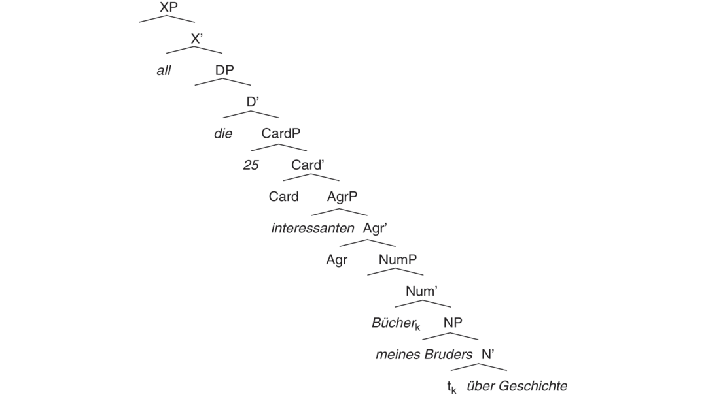
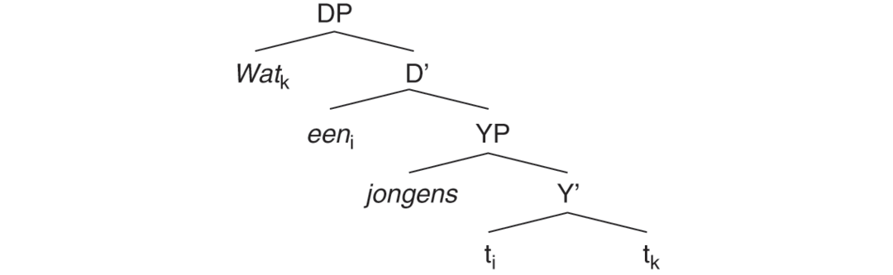

# [[page 537]] Chapter 23 Structure of Noun (NP) and Determiner Phrases (DP)

**Contributor(s):** Dorian Roehrs

## 23.1 Introduction

Following Abney’s (1987) seminal dissertation, many more phenomena in the noun phrase have been discovered and discussed. In this brief survey, I point out some recent results, some debated topics, and some new avenues for future research. I focus on structural aspects of the noun phrase discussing different nominal elements and how they relate to one another. I use contemporary German as a representative language. This is a highly inflected language, a fact that is often taken to provide clues about the analysis of certain linguistic phenomena. Other Germanic languages are discussed if they show an important relevant difference from German. I also point out some differences between North and West Germanic (East Germanic, e.g., Gothic, no longer exits).

I start with some general facts about the noun phrase that the Germanic languages instantiate and then move on to some Germanic-specific phenomena. Note that a number of discoveries of the structure of the noun phrase have been made on the basis of non-Germanic languages. These are only very briefly discussed here. Finally, a note on nomenclature is in order. If the syntactic structure is not relevant, I label the nominal string as noun phrase; if the structure is important, I specify it as, for instance, NP or DP.

### 23.1.1 A First Overview

Noun phrases vary in their complexity. Minimally, they consist of a head noun (1a). One might suggest that they simply project a NP (1b):

(1) a. ```tsv
      Bücher	sind	wichtig.
      books	are	important
      ‘Books are important.’ [colspan=3]
      ```

    2. [[page 538]] b.


In addition to the head noun, noun phrases may also involve quantifiers, determiners, numerals, adjectives, possessives, and other argumental elements. Typically, these elements occur in the fairly fixed order in (2a). The example (2b) is the equivalent of (2a) in the dative. One very common way to analyze these strings is the structure in (2c). The noun forms the head of the Noun Phrase (NP), the arguments of the noun are in the complement and specifier positions of the noun, number is mitigated by the Number Phrase (NumP), adjectives are in recurring Agreement Phrases (AgrP), numerals are in the Cardinal Phrase (CardP), articles and demonstratives are in the Determiner Phrase (DP), and elements preceding determiners are in – what I call here – XP. The head noun undergoes partial N-raising to Num:

(2) a. ```tsv
      All	die	25	interessanten	Bücher	meines	Bruders
      all	the	25	interesting	books	my-<span class="sc">gen</span>	brother
      über	Geschichte	sind	wichtig. [colspan=4]
      about	history	are	important [colspan=4]
      ‘All the 25 interesting books of my brother’s about history are important.’ [colspan=11]
      ```

    b. ```tsv
      mit	allen	diesen	25	interessanten	Büchern	meines
      with	all	these	25	interesting	books	my-<span class="sc">gen</span>
      Bruders	über	Geschichte [colspan=5]
      brother	about	history [colspan=5]
      ```

    3. c.



[[page 539]] According to Grimshaw (1991), the noun, the lexical head, projects structure from the bottom up yielding an extended projection of the noun topped off by functional structure (for some parallels between the nominal and clausal domains, see Grohmann and Haegeman 2003). All relevant elements are nominal in category and this categorial identity indicates one nominal domain. This single nominal domain becomes evident when the phrase (2a) is compared to (2b). With the exception of the two arguments of the noun, all elements share the same gender, number, and case. In other words, quantifiers, determiners, numerals, adjectives, and head nouns show agreement in features, something usually referred to as concord. With the arguments of the noun not participating in concord, they are considered not to be part of the nominal proper. In fact, given their own features for gender, number, and case, they make up their own nominal domain and are analyzed as embedded.

It is probably fair to state that most linguists working on the Germanic noun phrase agree that there is a DP on top of NP (except, e.g., Payne and Huddleston 2002). However, a consensus about the intermediate structure has not been reached but it seems to be emerging for some parts. Before I turn to a more detailed discussion, I should mention that there are some other important intermediate phrases not seen in (2c). For instance, scholars have proposed a Possessor Phrase (PossP), which is located between DP and CardP, and another phrase with a variety of labels (e.g., nP, DefP, ArtP), which is between AgrP and NumP. Following the extended projection line of the noun in (2c), I comment on the individual phrases moving bottom up.

### 23.1.2 NP: Noun Phrase

Nouns are an open, lexical class. In German, they may involve features for gender, number, and case (Nübling, Chapter 10). Gender is mostly an abstract lexical feature (Kürschner, Chapter 12). It is usually assumed to be specified on the noun itself but with the noun having no exponence of it, gender becomes visible only on higher elements like adjectives and determiners. In contrast, number is typically not inherent with a noun. With a few exceptions, the singular form of the noun corresponds to singular semantics and the plural form to plural semantics. Number is often taken to originate in NumP. Similarly, nouns are not fixed for morphological case but may vary according to their syntactic context. Sometimes, this is claimed to be mitigated by a Kase Phrase (KP). I return to both NumP and KP.

Exhibiting varying morpho-syntactic properties, nouns are categorized in different ways. I focus on the syntactic characteristics discussing three types of distinctions. Two differences suggest varying positions of the noun itself and one indicates different argument structures of the noun.

[[page 540]] The most basic distinction is between common noun and proper noun. When in argument (e.g., subject) position, common count nouns must have an article (3a). While proper nouns cannot take an article in many languages, certain dialects of German allow an optional article (3b):

(3) a. ```tsv
      Das	Auto	ist	klein.
      the	car	is	small
      ‘The car is small.’ [colspan=4]
      ```

    b. ```tsv
      (Der)	Peter	ist	klein.
      the	Peter	is	small
      ‘Peter is short.’ [colspan=4]
      ```

Based on cross-linguistic data, Longobardi (1994) argues that noun phrases involving proper nouns like *Peter* are also complex. Rather than head-to-specifier movement (i.e., N moves to Spec,NP), he argues that nouns move to the DP-level. Specifically, Longobardi (1994: 653) proposes that German has N-to-D movement (at LF) for cases like *Peter* but if an expletive article is present as in *der Peter*, a CHAIN is built. This analysis provides evidence for two head positions inside the noun phrase, one in DP and one in NP.

One way to subcategorize common nouns is along the opposition of lexical versus semi-lexical. Lexical nouns are the lowest elements in the extended projection. They determine the gender of the noun phrase, they may undergo compounding, and all agreeing adjectives precede the (compound) noun (4a). Semi-lexical nouns, sometimes also called classifiers, are different. For instance, in pseudo-partitives, they may occur with another (lower) noun but they themselves determine the gender of the determiner (4b). When in the singular, they may combine with a nonsingularity numeral (4c). Furthermore, considering that all elements in (4d) are in the nominative case, most clearly marked on the adjectives, one can state that adjectives can both precede and follow semi-lexical nouns:

(4) a. ```tsv
      das	/*der	neue	(Wein)glas
      the.<span class="sc">n</span>	/ the.<span class="sc">m</span>	new	wine.<span class="sc">m-</span>glass.<span class="sc">n</span>
      ‘the new wine glass’ [colspan=4]
      ```

    b. ```tsv
      das	/*der	Glas	Wein
      the.<span class="sc">n</span>	/ the.<span class="sc">m</span> glass.<span class="sc">n</span>	wine.<span class="sc">m</span>
      ‘the glass of wine’ [colspan=4]
      ```

    c. ```tsv
      zwei	Glas	Wein
      two	glass.<span class="sc">sg</span>	wine
      ‘two glasses of wine’ [colspan=3]
      ```

    d. ```tsv
      (?)	ein	großes	Glas	roter	Wein
      	a	big-<span class="sc">nom</span>	glass	red-<span class="sc">nom</span>	wine
      ‘a big glass of red wine’ [colspan=6]
      ```

Löbel (1990) proposes that both nouns in (4b–4d) are in one and the same extended projection where nouns like *Glas* are in an intermediate position [[page 541]] between the determiner and the lexical noun, in the head position of CardP. However, given the structure (2c), this does not immediately explain adjectives preceding this noun. Furthermore, although (4d) indicates one nominal domain with regard to case, gender (4b) and number (4c) may differ. Given these issues, van Riemsdijk (1998) refines the concept of extended projection proposing that these intermediate elements are semi-lexical nouns. Unlike (2c), his structure exhibits only one phrasal projection (at the top).

In addition to agreement in case (4d), the (lower) lexical noun and its related adjective may also exhibit other morphological cases (e.g., genitive). This means that at least for the latter instances, one typically argues for binominal structures where the second adjective and noun are not part of the same nominal as the first noun. Furthermore, while there is variation with regard to (4c), all Germanic languages allow the intermediate noun to be in the plural as in *zwei Gläser Wein* ‘two glasses of wine.’ Both strings have different interpretations: (4c) involves a quantity reading (wine in the amount of two glasses); the plural counterpart has a container reading (two glasses filled with wine). Subtypes for both constructions have been identified. Again, different structural proposals have been made (see, e.g., Section 23.2.4).

One way to subcategorize lexical common nouns is as concrete (5a), relational (5b), and deverbal (5c). The latter can be further subdivided into nominals with a result or event/process reading:

(5) a. ```tsv
      Auto,	Wein,	Seele
      car,	wine,	soul
      ```

    b. ```tsv
      Gesicht,	Mutter
      face,	mother
      ```

    c. ```tsv
      Eroberung,	Beteiligung
      conquest,	participation
      ```

Differences between these nouns emerge when they combine with possessors (broadly defined) as in *Peters Auto* ‘Peter’s car.’ Cases with the nouns in (5a) involve alienable possession where the possessor can have a variety of interpretations that, in some way, associate the possessor with the possessum head noun. In contrast, nouns in (5b), that is, names for body parts and kinship terms, present instances of inalienable possession where the possessor and the possessum are linked by an inherent (e.g., part-whole) relation between them. Alexiadou (2003) proposes that possessors in alienable possession are located higher in the structure than possessors in inalienable possession. The first are in PossP and the latter undergo complex predicate formation with the possessum noun. Although possessors seem to be optional with nouns of both (5a–5b), they are assumed to be present at least covertly with the nouns in (5b).

[[page 542]] This is different for the nouns in (5c) under the (complex) event reading. As argued by Grimshaw (1990), these types of nouns take obligatory (overt) arguments whose theta roles are similar to those of their corresponding verbs (e.g., agent and theme). Taking a cross-linguistic view, Alexiadou (2001) refines this proposal by arguing that variation in type and number of verbal projections like AspectP and vP above the lexical root explain the differences between these result and event/process nouns. Given the difference in obligatoriness of the dependents of the noun, it has been proposed that optional elements with concrete nouns are more like adjuncts and obligatory elements with process nouns are closer to arguments. Relational nouns and *picture*-nouns seem to have intermediate properties. As discussed by Broekhuis and Keizer (2012: chapter 2), this is a complex topic, complicated by the fact that dependents of the noun can be left out if implied or contextually recoverable.

There are word order restrictions as regards the dependents of nouns. Genitive DPs are usually required to stay syntactically close to the head noun:

(6) a. ```tsv
      das	Buch	meines	Bruders	über	Chomsky
      the	book	my-<span class="sc">gen</span>	brother	about	Chomsky
      ‘the book of my brother’s about Chomsky’ [colspan=6]
      ```

    b. ```tsv
      *	das	Buch	über	Chomsky	meines	Bruders
      	the	book	about	Chomsky	my-<span class="sc">gen</span>	brother
      ```

Replacing the genitive DP by *von meinem Bruder* ‘of my brother’s’ shows a similar restriction although the contrast is less strong. Given partial N-raising (next section), the possessor in (6a) is in a higher position than the *über*-PP, in the specifier and complement of N in (2c), respectively. This is similar to deverbal nouns where agent arguments have to precede themes (7a). Theme arguments can only be in a higher position if the agent is part of a *durch*-PP (7b):

(7) a. ```tsv
      Cäsars	Eroberung	Galliens/von	Gallien	dauerte	Jahre.
      Caesar’s	conquest	Gaul’s /of	Gaul	took	years
      ‘Caesar’s conquest of Gaul took years.’ [colspan=6]
      ```

    b. ```tsv
      Galliens	Eroberung	durch	Cäsar	dauerte	Jahre.
      Gaul’s	conquest	by	Caesar	took	years
      ‘Gaul’s conquest by Caesar took years.’ [colspan=6]
      ```

Other phenomena (binding, extraction, etc.) confirm that dependents of nouns are merged in certain positions subject to their theta roles. If the arguments are reordered as in (7b), there is debate as to whether the theme is base-generated in the higher position or moves there.

However, there is also some word order variation. Although the *über*-complement has a closer semantic relation to the head noun than the *auf*-adjunct, both word order possibilities exist (8a–8b). A relative clause follows a PP element (8c):

(8) a. ```tsv
      das	Buch	über	Chomsky	auf	Französisch
      the	book	about	Chomsky	in	French
      ‘the book about Chomsky in French’ [colspan=6]
      ```

    b. ```tsv
      das	Buch	auf	Französisch	über	Chomsky
      the	book	in	French	about	Chomsky
      ‘the book in French about Chomsky’ [colspan=6]
      ```

    c. ```tsv
      das	Buch	über	Chomsky/auf	Französisch,	das	ich	gelesen	habe
      the	book	about	Chomsky/in	French,	that	I	read	have
      ‘the book about Chomsky/in French that I have read’ [colspan=9]
      ```

Similarly, although relative clauses seem to be preferred to occur closer to the head noun than complement clauses, both orders are in principle fine (9a–9b). PP elements typically precede clausal dependents (9c):

(9) a. ```tsv
?	die	Behauptung,	dass	Madonna	kommt,	die	in	der	Zeitung	steht
      	the	claim	that	Madonna	comes	that	in	the	newspaper	is
      ‘the claim that Madonna is coming that is in the newspaper’ [colspan=11]
      ```

    b. ```tsv
      die	Behauptung,	die	in	der	Zeitung	steht,	dass	Madonna	kommt
      the	claim	that	in	the	newspaper	is	that	Madonna	comes
      ‘the claim that is in the newspaper that Madonna is coming’ [colspan=10]
      ```

    c. ```tsv
      die	Behauptung	in	der	Zeitung,	dass	Madonna	kommt
      the	claim	in	the	newspaper	that	Madonna	comes
      ‘the claim in the newspaper that Madonna is coming’ [colspan=10]
      ```

Thus, while word order restrictions are related to the theta role of the dependents, word order variation is subject to heaviness.

Nouns can be elided. Traditionally, there are two strategies to support NP-ellipsis. While some languages license the elided noun with adjectival inflection (10a), others exhibit *one*-insertion (10b).

(10) a. ```tsv
      Sie	hat	ein	großes	Auto,	und	er	hat	ein	kleines.
      she	has	a	big-<span class="sc">infl</span>	car	and	he	has	a	small-<span class="sc">infl</span>
      ```

    2. b. She has a big car and he has a small one.

The difference between these two strategies is often reduced to adjectival inflections, present in German but absent in English. Corver and van Koppen (2011) argue that there are languages where the licensing factor appears to be adjectival inflection but turns out to be a pronoun. Finally, *one*-insertion has been used as a diagnostic to distinguish between arguments and adjuncts of the head noun but there is growing evidence that this is not a reliable test.

### 23.1.3 NumP: Number Phrase

Ritter (1991) argues that the locus of the number specification of the noun phrase is in NumP. Borer (2005) proposes that all noun roots are mass in interpretation and that number brings about countability deriving the [[page 544]] traditional distinction of mass versus count nouns. In the languages with a discrete plural suffix, this suffix is often taken to be in Num and the head noun is suggested to move there to combine with it (Julien 2005a). This was indicated in a simplified way in (2c). There is evidence from DP-internal binding that the head noun moves to (at least) NumP.

Anaphors and pronouns have to be c-commanded by their antecedent to be bound (Lee-Schoenfeld, Chapter 21). We can state then that the genitive possessor in (11a) is higher than the PP-element: the possessor is in Spec,NP and the PP is the complement of N. Furthermore, it is a standard assumption that selection occurs in a local relation. However, while the head noun *Wut* selects the preposition *auf*, both elements are separated by the possessor. Similar argumentation applies to (11a) when *des* is replaced by *jedes* ‘each’ yielding a bound variable reading. These observations extend to (11b), where the head noun is separated from its clausal complement:

(11) a. ```tsv
      die	riese	Wut	des	Sohnesᵢ	auf	seinenᵢ	Vater
      the	huge	rage	the-<span class="sc">gen</span>	son	at	his	father
      ‘the huge rage of the son at his father’ [colspan=8]
      ```

    b. ```tsv
      die	Behauptung	des	Kriminellenᵢ,	dass	erᵢ	unschuldig	ist
      the	claim	the-<span class="sc">gen</span>	criminal	that	he	innocent	is
      ‘the claim of the criminal that he is innocent’ [colspan=8]
      ```

If we assume that the head noun originates in N and moves up to precede the possessor, then we can state that the noun locally selects its complement in its base position. This provides a strong argument for partial N-raising of common lexical nouns.

### 23.1.4 AgrP: Agreement Phrase

There are different kinds of adjectives, sometimes proposed to have different structural analyses (Bernstein 1993). Furthermore, different structural analyses have also been proposed for adjectives with restrictive versus nonrestrictive/appositive interpretation accounting for properties such as differences in word order and intonation (Alexiadou 2013: 478) as well as inflection (Pfaff 2015: chapter 3). I focus on restrictive adjectives.

In the Germanic noun phrase, adjectives are typically prenominal and inflected (12) (for exceptions in both regards, see Payne and Huddleston’s 2002: 445 discussion of English). Depending on the syntactic context, the inflection on the adjective can alternate between strong (<span class="sc">st</span>) and weak (<span class="sc">wk</span>) but adjacent adjectives typically have the same endings. In Section 23.2.2, I devote a separate discussion to this inflectional alternation. Second, if heavy as in coordinations, adjectives can also directly follow the noun (13), where the adjectives are uninflected in West Germanic but inflected in North Germanic. Third, adjectives can also be used predicatively in [[page 545]] corpular constructions (14). Again, adjectives are uninflected in West Germanic but inflected in North Germanic.

(12) a. ```tsv
      das	groß-e	teur-e	Haus	(German)
      the	big-<span class="sc">wk</span>	expensive-<span class="sc">wk</span>	house
      ‘the big expensive house’ [colspan=4]
      ```

    b. ```tsv
      det	stor-e	dyr-e	huset	(Norwegian)
      that	big-<span class="sc">wk</span>	expensive-<span class="sc">wk</span>	house-<span class="sc">def</span>
      ```

(13) a. ```tsv
      das	Haus,	groß	und	teuer	(German)
      the	house	big	and	expensive
      ‘the house, big and expensive’ [colspan=6]
      ```

    b. ```tsv
      det	huset,	stor-t	og	dyr-t	(Norwegian)
      that	house-<span class="sc">def</span>	big-<span class="sc">st</span>	and	expensive-<span class="sc">st</span>
      ```

(14) a. ```tsv
      Das	Haus	ist	groß	und	teuer.	(German)
      the	house	is	big	and	expensive
      ‘The house is big and expensive.’ [colspan=7]
      ```

    b. ```tsv
      Det	huset	er	stor-t	og	dyr-t.	(Norwegian)
      that	house-<span class="sc">def</span>	is	big-<span class="sc">st</span>	and	expensive-<span class="sc">st</span>
      ```

In both types of languages, adjectives in (13) and (14) pattern similarly, the same language-internally but in a different way cross-linguistically. It is sometimes proposed that not only (13) but also (12) is based on (14). In other words, adjectives are assigned a clausal analysis (Kayne 1994). Note though that both (13) and (14) must have a strong ending in North Germanic while (12) may alternate between a strong and a weak ending depending on the context (Section 23.2.2). This inflectional alternation does not immediately follow from a clausal analysis. Similarly, a clausal analysis leaves the very presence of any inflection on prenominal adjectives to be explained in West Germanic. Another argument against a clausal analysis is that not all prenominal adjectives can be used predicatively and vice versa (Alexiadou and Wilder 1998). Consequently, many scholars assume that adjectives have a nonclausal analysis.

There are three main structural analyses for restrictive adjectives. Traditionally, adjectives are assumed to be adjoined to some projection in the noun phrase (Jackendoff 1977). Second, Abney (1987) proposes that adjectives are in head positions in the extended projection line of the noun. Third, Cinque (2010) argues that they are in specifier positions of recurring AgrPs.

Abney (1987) proposes that adjectives are in head positions. One argument for this structural analysis comes from English. Adjectives can take arguments: *The father is proud of his son*. English allows no arguments with prenominal adjectives (15). This follows if the adjective selects NP as its complement and degree words are in Spec,AP. However, in formal style, the German counterpart allows arguments to precede the adjective (16). To [[page 546]] maintain the basic proposal, one could suggest that degree words are in a different, higher position. This simple structural adjustment does not account for the equivalent in Yiddish, which allows both preceding and following arguments (17):

(15) 1. a. * the [of his son] proud father

    2. b. * the proud [of his son] father

(16) 1. a. der [auf seinen Sohn] stolze Vater

    2. b. * der stolze [auf seinen Sohn] Vater

(17) 1. a. der [mit zayn zun] shtoltser tate (Yiddish)

    2. b. der shtoltser [mit zayn zun] tate

The very existence of (17b) undermines this argument for adjectives as heads. A second argument for adjectives as heads is made by Bošković (2005). Assuming phrasal movement, adjectives as heads cannot move out of the noun phrase thus explaining the ban on Left-branch Extraction of adjectives (18a). Importantly, demonstratives have to be analyzed as heads as well (18b). However, without further assumptions, arguments of adjectives, as phrases, should be able to move out of the noun phrase, contrary to fact (18c):

(18) a. ```tsv
      *	Stolze	habe	ich	Väter	gesehen.
      	proud	have	I	fathers	seen
      ```

    b. ```tsv
      *	Diese	habe	ich	Väter	gesehen.
      	these	have	I	fathers	seen
      ```

    c. ```tsv
      *	[Auf	ihre	Söhne]	habe	ich	stolze	Väter	gesehen.
      	of	their	sons	have	I	proud	fathers	seen
      ```

In Section 23.1.6, we see evidence that demonstratives are more likely to be in a specifier position; that is, both (18b) and (18c) raise issues for an account postulating adjectives are heads.

Corver (1997) argues that degree elements are inside the phrase containing the adjective. As pointed out by Svenonius (1994: 445–446), degree elements such as *sehr* take scope only over the adjective immediately on their right (# indicates absence of reading):

(19) ```tsv
  sehr	heißer	schwarzer	Kaffee
  very	hot-<span class="sc">st</span>	black-<span class="sc">st</span>	coffee
  ‘very hot black coffee’ [colspan=4]
  #‘very hot, very black coffee’ [colspan=4]
  ```

This observation is only compatible with adjectives in phrasal positions, either adjoined or as specifiers. Bošković (2016) provides a new account of the ban on Left-branch Extraction of adjectives. Crucially, it is based on adjectives as adjuncts to NP. Assuming phase theory, elements have to move through the edge to vacate a phase. Adjectives cannot move out of [[page 547]] the noun phrase as movement from a NP-adjoined position to Spec,DP, the edge, is anti-local (i.e., the movement is too short as it must cross more than phrasal segments). However, there is also data that suggests that adjectives are in specifier positions. Julien (2005a: 9) observes that prenominal adjectives in some Scandinavian dialects can be separated by indefinite articles (20). Julien proposes that the article is in α (our Agr) and the adjectival inflection is part of the complex specifier of the adjective:

(20) ```tsv
?	eit	stor-t	eit	styg-t	eit	hus	(Norwegian)
  	a	big-<span class="sc">st</span>	an	ugly-<span class="sc">st</span>	a	house
  ‘a big ugly house’ [colspan=8]
  ```

Adjectives may co-occur. Scott (2002) observes that they typically appear in a certain fixed sequence; for instance, size adjectives precede color adjectives. In accounts with adjoined adjectives, this is argued to be a semantico-cognitive phenomenon (Sproat and Shih 1991); in analyses with adjectives in specifiers, this is taken to be syntactic (Cinque 2010). Under certain conditions, adjectives can be reordered (capitalization indicates focus stress). This reordering does not change the inflections on the adjectives:

(21) a. ```tsv
      der	groß-e	rot-e	Ballon
      the	big-<span class="sc">wk</span>	red-<span class="sc">wk</span>	balloon
      ‘the big red balloon’ [colspan=4]
      ```

    b. ```tsv
      der	ROT-E	groß-e	Ballon
      the	red-<span class="sc">wk</span>	big-<span class="sc">wk</span>	balloon
      ```

It has been proposed that the focused adjective is in a Focus Phrase (FocP) above AgrP, although there is debate as to whether it is base-generated in FocP or moves there (for general discussion of DP-internal information structure, see Aboh et al. 2010).

### 23.1.5 CardP: Cardinal Phrase

There are two types of quantifiers. Simplifying here, so-called weak quantifiers have an existential interpretation and strong quantifiers have a universal interpretation. Weak quantificational elements consist of cardinal numerals and quantifiers like *viel*. They precede adjectives and follow determiners (22a–22b). Typically and in stark contrast to adjectives, only one of these elements is possible inside the DP (22c):

(22) a. ```tsv
      die	zwanzig	netten	Studenten
      the	twenty	nice	students
      ‘the twenty nice students’ [colspan=4]
      ```

    b. ```tsv
      die	vielen	netten	Studenten
      the	many	nice	students
      ‘the many nice students’ [colspan=4]
      ```

    [[page 548]] c. ```tsv
      *	Die	zwanzig	vielen / vielen	zwanzig	Studenten
      	the	twenty	many / many	twenty	students
      ```

Assuming that numerals and weak quantifiers are in the same positions, their complementary distribution follows.

There are many parallels between numerals / weak quantifiers and adjectives. First, although inflection is not fully productive or obligatory in most cases, the endings of numerals/quantifiers are the same as those on adjectives. While the singularity numeral is inflected in all morphological cases, the numerals for ‘two’ and ‘three’ occur with inflection only in the genitive (23a). As for quantifiers, the inflection is often morphologically optional (23b):

(23) a. ```tsv
      der	Verkauf	zwei-er	Häuser
      the	sale	two-<span class="sc">gen</span>	houses
      ‘the sale of two houses’ [colspan=4]
      ```

    b. ```tsv
      mit	viel(em)	Interesse
      with	much(-<span class="sc">dat</span>)	interest
      ‘with a lot of interest’ [colspan=4]
      ```

Second, numerals and quantifiers can also be modified by a degree word:

(24) a. ```tsv
      fast	hundert	Leute
      almost	hundred	people
      ‘almost one hundred people’ [colspan=3]
      ```

    b. ```tsv
      sehr	viele	Leute
      very	many	people
      ‘very many people’ [colspan=3]
      ```

Third, with contrastive stress on the adjective, cardinal numbers can follow:

(25) a. ```tsv
      die	zwei	roten	Autos
      the	two	red-<span class="sc">wk</span>	cars
      ‘the two red cars’ [colspan=4]
      ```

    b. ```tsv
      die	ROTEN	zwei	Autos
      the	red-<span class="sc">wk</span>	two	cars
      ```

Fourth, numerals and weak quantifiers have the same inflection as a following adjective:

(26) a. ```tsv
      viel-e	nett-e	Leute
      many-<span class="sc">st</span>	nice-<span class="sc">st</span>	people
      ‘many nice people’ [colspan=3]
      ```

    b. ```tsv
      die	viel-en	nett-en	Leute
      the	many-<span class="sc">wk</span>	nice-<span class="sc">wk</span>	people
      ‘the many nice people’ [colspan=4]
      ```

[[page 549]] All elements in (26) agree in gender, number, and case making up one nominal domain. Besides this possibility, quantifiers can also be followed by a DP in the genitive (27a) or a PP containing a DP (27b). These two strings are labeled partitive constructions. As recently discussed by Pfaff (2015: 84), Icelandic has a third possibility where a quantifier may be followed by a DP in concord (27c):

(27) a. ```tsv
      viele	der	netten	Leute		(German)
      many-<span class="sc">st</span>	the-<span class="sc">gen</span>	nice-<span class="sc">wk</span>	people
      ‘many of the nice people’ [colspan=6]
      ```

    b. ```tsv
      viele	von	den	netten	Leuten	(German)
      many-<span class="sc">st</span>	of	the-<span class="sc">dat</span>	nice-<span class="sc">wk</span>	people
      ‘many of the nice people’ [colspan=6]
      ```

    c. ```tsv
      margar	þessar	bækur			(Icelandic)
      many-<span class="sc">st</span>	these	books
      ‘many of these books’ [colspan=6]
      ```

Quantifiers like *viel* involve different interpretations: in the cardinal reading, (26a) asserts the existence of a large number of members of a set restricted by the adjective and noun; in the proportional reading, (26a) denotes a large number of members of a pre-established set restricted by the adjective and noun. The examples in (27) are only proportional in interpretation.

There are two main structural analyses of quantifiers: heads or specifiers. Their exact position has been argued for using different criteria. On the one hand, some scholars focus on the morpho-syntactic properties of these elements emphasizing the commonalities with or differences from adjectives. While Abney (1987) locates these elements in an intermediate head position, Julien (2005a) puts them in a specifier position. Danon (2012) argues for both. In contrast, Cardinaletti and Giusti (2006) propose that quantifiers are lexical heads at the bottom of the nominal structure. On the other hand, in the semantic literature, quantifiers have been argued to be in different positions depending on their reading: Quantifiers with a cardinal interpretation are in an intermediate position; quantifiers with a proportional reading are at the bottom of the matrix nominal.

Unlike adjectives, quantifiers are not proposed to be in an adjoined position. Taking the morpho-syntactic parallels to adjectives seriously, quantifiers can be located in the specifier of CardP in both (26) and (27a–27b). For the latter, one often assumes an elided noun and the quantified DP or PP is in the complement position of that noun. In Section 23.1.7, I return to the Icelandic pattern in (27c).

Strong (universal) quantifiers like *alle* and *jeder* have different properties from adjectives. Resembling determiners, they cannot be preceded by a definite article (although the equivalent of (28a) is possible in Yiddish: *di ale kleyne shtetlekh*):

(28) a. ```tsv
      *	die	alle(n)	kleinen	Städte
      	the	all-<span class="sc">st(wk)</span>	small-<span class="sc">wk</span>	towns
      ```

    b. ```tsv
      *	der	jede	gute	Student
      	the	every	good	student
      ```

Second, strong quantifiers have an influence on the inflection of following adjectives bringing about a weak ending:

(29) a. ```tsv
      alle	klein-en	Städte
      all-<span class="sc">st</span>	small-<span class="sc">wk</span>	towns
      ‘all small towns’ [colspan=3]
      ```

    b. ```tsv
      jeder	gut-e	Student
      every-<span class="sc">st</span>	good-<span class="sc">wk</span>	student
      ‘every good student’ [colspan=3]
      ```

One might claim that the difference between the existential quantifiers in (26) and the universal quantifiers in (29) has to do with definiteness such that only the definite elements in (29) trigger a weak ending on the following adjective. However, such a claim does not pan out for German (Section 23.2.2). Rather, strong quantifiers are suggested to be of a different category. They are in a higher surface position in the noun phrase, a structural level I turn to next.

### 23.1.6 DP: Determiner Phrase

Abney (1987) argues in detail for the DP-level, the location of determiners. Narrowly defined, determiners consist of definite articles and demonstratives (30a) as well as indefinite articles (30b) (note that Icelandic does not have the latter):

(30) a. ```tsv
      der	/ dieser	nette	Freund
      the	/ this	nice-<span class="sc">wk</span>	friend
      ‘the/this nice friend’ [colspan=4]
      ```

    b. ```tsv
      ein	netter	Freund
      a	nice-<span class="sc">st</span>	friend
      ‘a nice friend’ [colspan=4]
      ```

More broadly defined, one can also include in this group strong quantificational elements and question words (31a) as well as possessive pronouns and Saxon Genitives (31b). Typically, these elements are in complementary distribution with articles and demonstratives. As such, they are often referred to as determiner-like elements. With the exception of Saxon Genitives in German, these elements have to precede adjectives:

(31) a. ```tsv
      jeder	/ welcher	nette	Freund
      every	/ which	nice-<span class="sc">wk</span>	friend
      ‘every/which nice friend’ [colspan=4]
      ```

    [[page 551]] b. ```tsv
      sein	/ Peters	netter	Freund
      his	/ Peter’s	nice-<span class="sc">st</span>	friend
      ‘his/Peter’s nice friend’ [colspan=4]
      ```

Basically all scholars agree that the definite article *der* is a head. It cannot be modified and is thus assumed to be in D. There is some controversy with demonstratives. While a few scholars analyze it as a head in D, most argue that it is a phrasal element in Spec,DP. Diachronically, they form the source of the definite article whereby the latter has undergone specifier-head reanalysis (van Gelderen 2007). Synchronically, they may take reinforcers, a kind of modifier that reinforces or specifies the deixis of these elements (Roehrs 2010). While the combination of demonstrative and reinforcer is, for present purposes, not illuminating in German, other languages are more telling. Specifically, multiple reinforcers can follow in Eastern Norwegian or reinforcers can both precede and follow in Yiddish. No other element can intervene between the determiner and the reinforcer (reinforcers without a straightforward translation are glossed as <span class="sc">reinf)</span>:

(32) a. ```tsv
      [den	herre	her]	klokka	(Eastern Norwegian)
      this	here-<span class="sc">infl</span>	here	watch-<span class="sc">def</span>
      ‘this watch’ [colspan=5]
      ```

    b. ```tsv
      [ot-o	di	dozike]	froy	(Yiddish)
      here-<span class="sc">reinf</span>	this	here<span class="sc">-infl</span>	woman
      ‘this woman’ [colspan=5]
      ```

Leu (2015) proposes that similar to adjectives, demonstratives project complex structures.

There is also disagreement about the location of the indefinite article. While it is traditionally assumed to be in D, more recent work questions this simple analysis (Sections 23.2.2 and 23.2.4). Strong quantifiers were discussed in Section 23.1.5; possessors will be taken up again in Section 23.2. For the discussion of constructions like *solch ein* ‘such a’, see Wood and Vikner (2011).

Postal (1966) argues that personal pronouns are determiners. Often, these elements are interpreted as determiners of the first or second person. These pronouns can, in the plural, take a weak adjective – a hallmark of a determiner:

(33) ```tsv
  wir	dumm-en	Idioten
  we	stupid-<span class="sc">wk</span>	idiots
  ‘we stupid idiots’ [colspan=3]
  ```

Pronouns may have various functions and different morpho-syntactic properties. Consequently, different structures have been proposed (Cardinaletti and Starke 1999, Déchaine and Wiltschko 2002). For the discussion of indefinite pronouns like *something*, see Roehrs (2008).

[[page 552]] Besides distributional evidence for the DP-level, Abney (1987) highlights some parallels between the clausal and nominal domains, most clearly seen in some non-Germanic languages. Currently, there is no agreement as to whether DP corresponds to IP, as evidenced by agreement between the possessor/subject and the head noun, or CP, as suggested by subextraction of out DP. A third line of investigation tries to relate the two by proposing that subextraction indicates a DP/CP and possessor/subject agreement suggests PossP/IP.

### 23.1.7 XP: Pre-determiners

The nominal domain does not end at DP. All Germanic languages allow *all(e)* to precede a definite DP (34a). With some variation (Cirillo 2016), many languages also allow the combinations in (34b–34d):

(34) a. ```tsv
      all(<sup>?</sup>e)	die	Autos
      all(-<span class="sc">infl)</span>	the	cars
      ‘all the cars’ [colspan=3]
      ```

    b. ```tsv
      all(e)	meine	Autos
      all(-<span class="sc">infl)</span>	my	cars
      ‘all my cars’ [colspan=3]
      ```

    c. ```tsv
      all(e)	diese	Autos
      all(-<span class="sc">infl)</span>	these	cars
      ‘all these cars’ [colspan=3]
      ```

    d. ```tsv
      all(e)	diese	meine	Autos
      all(-<span class="sc">infl)</span>	these	my	cars
      ‘all these cars of mine’ [colspan=4]
      ```

It is fairly uncontroversial that possessors in (34b) are in Spec,DP and for many linguists demonstratives in (34c) are in that position too. If so, *all(e)* must be outside the DP proper. Considering (34d), there might be several DP-external positions. As briefly shown in the introduction, all these elements participate in concord; that is, they all belong to one nominal domain. In structure (2c), I labeled this phrasal level as XP. In Section 23.1.5, we have seen that Icelandic allows other quantifiers to precede an agreeing DP. The question arises as to whether we can specify XP as a Quantifier Phrase (QP) on top of DP. Given our current understanding, the answer appears to be negative.

It seems clear that nonquantificational elements can also occur in front of a DP; for instance, strongly inflected adjectives in Icelandic (Pfaff 2015). One might then suggest a category-neutral label like the Kase Phrase (KP), often argued to top off the DP (Bayer et al. 2001). Recalling that all elements in the extended projection line show concord in gender, number, and case, let us assume for a moment that this is correct. With KP at the top, case features have to spread downwards; with number and gender low in the [[page 553]] structure, the latter two features have to spread upwards. There is currently no consensus about the right way to analyze this type of agreement. For instance, Schoorlemmer (2009) argues for an Agree-based account and Norris (2014) proposes feature spreading with local feature copying. Thus, I retain the label XP.

That there are more positions above the DP is confirmed by other facts. For instance, PPs of various meanings can be topicalized from postnominal position. Note that the Verb-Second constraint in German indicates that these PPs form one constituent with the following DP:

(35) a. ```tsv
      Vor	OSTERN	die	Woche	geht	nicht.
      before	Easter	the	week	goes	not
      ‘The week before Easter does not work.’ [colspan=6]
      ```

    b. ```tsv
      Von	PETER	das	Auto	ist	klein.
      of	Peter	the	car	is	small
      ‘The car of Peter’s is small.’ [colspan=6]
      ```

The topicalized PP has to precede XP:

(36) a. ```tsv
      (?)	von	PETER	all	die	Bücher
      	of	Peter	all	the	books
      ‘all the books of Peter’s’ [colspan=6]
      ```

    b. ```tsv
?*	alle	von	PETER	die	Bücher
      	all	of	Peter	the	books
      ```

Interestingly, these topicalized PPs are not possible in North Germanic here illustrated with Norwegian (data provided by Marit Julien):

(37) a. ```tsv
      *	Før	PÅSKE	uka	går	ikke.	(Norwegian)
      	before	Easter	week-<span class="sc">def</span>	goes	not
      ```

    b. ```tsv
      *	Til	PETER	bilen	er	liten.
      	to	Peter	car-<span class="sc">def</span>	is	small
      ```

This empirical contrast between the two language groups aligns with differences in nominal left dislocation and possessor-related floating quantifiers (Grohmann and Haegeman 2003: 56–59). Compare the (a)-examples and the (b)-examples, respectively:

(38) a. ```tsv
      Verhofstadt	den	dienen	zen	fouten	(West Flemish)
      Verhofstadt	the	that.<span class="sc">m</span>	his	mistakes
      ‘Verhofstadt’s mistakes’ [colspan=6]
      ```

    b. ```tsv
      djoengers	al	under	us
      the-kids	all	their	house
      ‘all the kids’ house’ [colspan=4]
      ```

(39) a. ```tsv
      *	Per,	han	sin	plan	(Norwegian)
      	Per	him	his	plan
      ‘Per’s plan’ [colspan=6]
      ```

    [[page 554]] b. ```tsv
      *	barna	alle	sitt	hus
      	kid-<span class="sc">pl.def</span>	all	his	house
      ‘all the kids’ house’ [colspan=5]
      ```

While more work is needed here, we may tentatively state that West Germanic projects more structure, call it Topicalization Phrase (TopP), than North Germanic:

1. (40)


## 23.2 Germanic-Specific Phenomena

In this section, I single out some other interesting facts. While not exclusively restricted to Germanic, they have generated a lot of discussion among Germanic linguists and have been very influential in the discussion of the structure of the DP. Both Double Definiteness and the strong/weak alternation of adjective endings suggest the presence of another intermediate phrase. Discontinuous noun phrases, spurious indefinite articles, and doubly filled DPs are also discussed.

### 23.2.1 Double Definiteness

All Germanic languages have free-standing determiners, articles and demonstratives. In addition, the North Germanic languages also have suffixed determiners. Focusing on the main Scandinavian languages, bare nouns are followed by this suffixal determiner (41a). In contrast, modified nouns have a variety of distributions. They may be preceded by a determiner (41b), they may be sandwiched by two determiner elements (41c), or they may be followed by a suffixal determiner (41d). The distribution in (41c) is referred to as Double Definiteness and its two elements have been claimed to involve different semantics (Julien 2005a). I gloss the suffixal element as <span class="sc">def</span>:

(41) a. ```tsv
      mand-en			(Danish, [Norwegian, Swedish, Icelandic])
      man-<span class="sc">def</span>
      ‘the man’ [colspan=4]
      ```

    b. ```tsv
      den	gamle	mand	(Danish)
      the	old-<span class="sc">wk</span>	man
      ‘the old man’ [colspan=4]
      ```

    [[page 555]] c. ```tsv
      den	gamle	mann-en	(Norwegian, [Swedish])
      the	old-<span class="sc">wk</span>	man-<span class="sc">def</span>
      ‘the old man’ [colspan=4]
      ```

    d. ```tsv
      gamli	maður-inn	(Icelandic)
      old-<span class="sc">wk</span>	man-<span class="sc">def</span>
      ‘the old man’ [colspan=4]
      ```

A host of analyses have been proposed. To mention just a few milestones, Delsing (1993) proposes that the noun raises to D in (41a). Adjectives block this head movement in (41b–41d) and a variety of other operations explain these distributions. Julien (2005a) argues that determiners can be spelled out in two different positions depending on the language. In addition to DP, nP can host definiteness features. Located between AgrP and NumP in (2c), these features can be spelled out by the suffixal determiner. Simplifying somewhat, Schoorlemmer (2012) proposes that these two positions (our DP and nP) are related by movement of the determiner and some late language-specific copy-deletion rules account for the distributions in (41b–41d).

The above empirical picture becomes more complicated when restrictive relative clauses or possessors are added (Julien 2005a). Focusing on the latter and acknowledging some variation, if the possessor follows, both determiner elements are present (42a); if the possessor precedes, both disappear (42b):

(42) a. ```tsv
      det	store	hus-et	mitt	(Norwegian)
      the	big-<span class="sc">wk</span>	house-<span class="sc">def</span>	my
      ‘the big house of mine’ [colspan=5]
      ```

    b. ```tsv
      mitt	store	hus
      my	big-<span class="sc">wk</span>	house
      ‘my big house’ [colspan=3]
      ```

While the absence of the free determiner follows from the general complementary distribution of prenominal possessors and other determiners, the disappearance of the suffixal determiner is less clear. Julien (2005b) proposes that on their way to the DP-level, possessors move through the intermediate nP, the locus of the suffixal determiner, thus preventing its appearance.

Possessors show the greatest variation in the Germanic noun phrase. Possessors can take the forms of pronouns, proper names, full DPs, PPs, or even a combination of these, and they may occur in different positions depending on those forms. Harbert (2007: 156) observes that overall possessive pronouns and proper names seem to pattern together (versus genitive DPs and PPs). Some of this variation is discussed by Delsing (1998), who adopts PossP, a phrase between DP and CardP in (2c).

### [[page 556]] 23.2.2 Inflectional Alternation

With the exception of English, all Germanic languages have inflections on prenominal adjectives alternating between a strong or a weak ending. The set of strong endings is bigger thus providing more information about gender, number, and case than that of the weak endings. The basic patterns are as follows: a definite article is followed by a weak adjective (43a), an indefinite article by a strong adjective (43b), and an unpreceded adjective by a strong ending (43c):

(43) a. ```tsv
      das	kalt-e	Bier
      the	cold-<span class="sc">wk</span>	beer
      ‘the cold beer’ [colspan=3]
      ```

    b. ```tsv
      ein	kalt-es	Bier
      a	cold-<span class="sc">st</span>	beer
      ‘a cold beer’ [colspan=3]
      ```

    c. ```tsv
      kalt-es	Bier
      cold-<span class="sc">st</span>	beer
      ‘cold beer’ [colspan=3]
      ```

There are two basic analyses. On the one hand, definite elements like *das* cause the adjective to be weak (cf. Julien 2005a). On the other, if determiners like *das* have (or are interpreted as having) an inflection, then the adjective is weak (Esau 1973). Both the semantic and lexico-inflectional analysis work for (43).

Harbert (2007: 135) points out that the Germanic languages do not pattern the same. Among others, this is evident with possessors:

(44) a. ```tsv
      Peters	kalt-es	Bier
      Peter’s	cold-<span class="sc">st</span>	beer
      ‘Peter’s cold beer’ [colspan=3]
      ```

    b. ```tsv
      Pers	kald-e	øl	(Norwegian)
      Peter’s	cold-<span class="sc">wk</span>	beer
      ‘Peter’s cold beer’ [colspan=4]
      ```

Roehrs (2015) argues that the North Germanic languages have a semantic account. Definiteness features in Julien’s nP bring about a weak ending on the adjective. Dutch patterns with North Germanic. The (remaining) West Germanic languages have a lexical account such that only certain determiner elements bring about a weak ending. In all languages, the strong endings present the elsewhere case.

Adjectival inflections can also appear on determiners (broadly defined). Leu (2015) proposes that the (strong) inflection is on an Agr head inside the adjectival projection. If the adjective stem raises to Agr, (43c) obtains; if the adjective stem stays in situ, the inflection in Agr is supported by *d*- resulting in (43a); that is, the strong ending winds up on the determiner. Cases like (43b) have the analysis of (43c) with the indefinite article located [[page 557]] outside the adjectival projection. A challenge for this type of account is that not all Germanic languages are as transparent in their inflections as German (Roehrs 2013).

### 23.2.3 Discontinuous DPs

As briefly discussed in Section 23.1.4, Left-branch Extraction of adjectives is not possible. In contrast, dependents of nouns can be extracted (45a). Additionally, nouns as well as adjectives in combination with nouns can topicalize stranding higher elements of the noun phrase (45b–45c):

(45) a. ```tsv
      Von	wem	hast	du	ein	Bild	gemalt?
      of	whom	have	you	a	picture	painted
      ‘Of whom have you painted a picture?’ [colspan=7]
      ```

    b. ```tsv
      Bücher	habe	ich	interessante	gelesen.
      books	have	I	interesting	read
      ‘As for books, I have read interesting ones.’ [colspan=6]
      ```

    c. ```tsv
      Interessante	Bücher	habe	ich	keine	gelesen.
      interesting	books	have	I	none	read
      ‘As for interesting books, I have read none.’ [colspan=7]
      ```

The cases in (45b–45c) are often labeled Split Topicalization. Unlike (45a), this presumably does not involve a simple movement operation whereby the lower part of the noun phrase undergoes displacement. This becomes evident by the possibility of two determiners (46a) or even two lexical nouns (46b):

(46) a. ```tsv
      Ein	/ *Das	Buch	habe	ich	keins	gelesen.
      a	/ the	book	have	I	none	read
      ‘As for a book, I have read none.’ [colspan=7]
      ```

    b. ```tsv
      Bücher	habe	ich	Romane	gelesen.
      books	have	I	novels	read
      ‘As for books, I have read novels.’ [colspan=6]
      ```

Ott (2015) proposes that the two related nominals are base-generated low in the structure, separately but in a symmetric fashion. Assuming that syntax does not tolerate symmetry, one nominal has to undergo movement.

Another case of a discontinuous noun phrase is Quantifier Float where strong quantifiers like *alle* and *jeder* appear below their related noun phrase. While the inflection on *alle* is obligatory (cf. [34]), *jeder* exhibits a mismatch in number:

(47) a. ```tsv
      Diese	Städte	sind	all*(e)	klein.
      these	towns	are	all-<span class="sc">infl</span>	small
      ‘These towns are all small.’ [colspan=6]
      ```

    b. ```tsv
      Die	Kinder	haben	jedes	ein	Eis	gegessen.
      the	children	have	each-<span class="sc">sg</span>	an	ice-cream	eaten
      ‘The children have each eaten an ice-cream.’ [colspan=7]
      ```

[[page 558]] Bošković (2004) argues that *alle* and its related DP form a constituent at a certain point in the derivation and movement of the DP may strand the quantifier. As for *jeder*, given the mismatch in number, the quantifier and its related nominal are often argued to involve binomial structures.

### 23.2.4 Spurious Indefinite Articles

Bennis *et al.* (1998) discuss – what they call – spurious indefinite articles in Dutch, singular indefinite articles that are compatible with plural nouns:

(48) a. ```tsv
      Wat	*(een)	jongens!	(Dutch)
      what	a	boys
      ‘What boys!’ [colspan=4]
      ```

    b. ```tsv
      idioten	van	(een)	mannen
      idiots	of	a	men
      ‘idiots of men’ [colspan=4]
      ```

These linguists propose a small clause structure, represented by YP in (49), with some further functional positions on top. The nominal *jongens* is assumed to be the subject, *wat* is the predicate, and *een* is the head of the small clause. While *een* is proposed to move to D, the predicate *wat* undergoes fronting to Spec,DP:

1. (49)



This type of analysis, usually referred to as Predicate Inversion, has been extended to constructions like *that idiot of a doctor* (den Dikken 2006) and, as briefly discussed in section 23.1.2, pseudo-partitives (Corver 1998). It is fundamentally different from (2c) in that it does not involve the extended projection of a noun.

### 23.2.5 Doubly Filled DPs

There is an interesting contrast between Yiddish and Danish possessives. In Yiddish, there is no agreement in definiteness between the possessor and the indefinite article. This indefinite article is obligatory when the possessive pronoun has an inflection (50a). In Danish, the possessor and the definite article agree in definiteness but the article is possible only when an adjective is present (50b):

(50) a. ```tsv
      mayn-er	a	(guter)	khaver	(Yiddish)
      my-<span class="sc">infl</span>	a	good	friend
      ‘a good friend of mine’ [colspan=5]
      ```

    b. ```tsv
      min	(den)	sorte	kat	(Danish)
      my	the	black	cat
      ‘my black cat’ [colspan=5]
      ```

Most likely, the Yiddish construction does not involve a spurious indefinite article as all elements in (50a) have to be in the singular. In fact, this construction is restricted to singular. Considering that Germanic has null indefinite articles in the plural, one might suggest that *mayne khaveyrim* is the plural counterpart of (50a) meaning ‘friends of mine.’ However, it is only definite in interpretation ‘my friends.’ Given the nonagreement in definiteness in (50a), one could suggest that the possessor is in TopP in (40). In contrast, the Danish construction has been suggested to involve a doubly-filled DP, with the demonstrative in Spec,DP and the article in D.

More generally, it appears that West Germanic does not allow (definite) doubly filled DPs (51a) but North Germanic does (51b):

(51) a. ```tsv
      *	Poss/Dem Art Adj N (West Germanic) [colspan=4]
      ```

    b. ```tsv
      dette	(det)	høje	hus	(Danish)
      this	the	high	house
      ‘this tall house’ [colspan=5]
      ```

## 23.3 Summary

Taking the structure in (2c) as a starting point, we have arrived at the following hierarchy where phrases to the left are higher in the structure:

(52) ```tsv
  (TopP)	XP	DP	PossP	CardP	AgrP	nP	NumP	NP
  ```

Table 23.1 summarizes the five differences between the North and the West Germanic DPs (– indicates that no language has that property; √ means that at least some languages have that property):

**Table 23.1 Differences between North and West Germanic**

```tsv
	North Germanic	West Germanic
TopP above XP	−	√
Inflection on postnominal and predicative adjectives	√	−
Suffixal determiners	√	−
Weak/strong alternation relates to definiteness	√	− (except Dutch)
(Definite) doubly-filled DP	√	−
```

[[page 560]] Currently, it is not clear why North Germanic does not seem to project TopP but West Germanic does. Second, weak endings on adjectives occur only inside DPs. In North Germanic, they require definiteness. Strong endings present the elsewhere case, which includes postnominal adjectives. Diachronically, West Germanic has lost inflection on postnominal adjectives. Finally, there is work in progress that attempts to relate the last three differences in Table 23.1. Assuming that definiteness consists of subcomponents, it is suggested that in North Germanic, individual components are distributed across the higher levels of the DP and can be spelled out separately. In contrast, West Germanic has all these components in one feature bundle in the DP-level.
