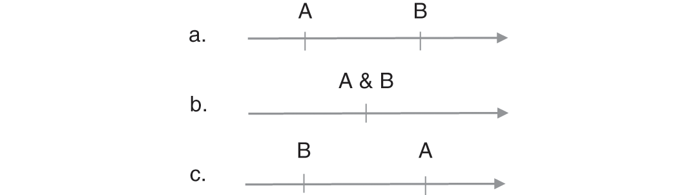
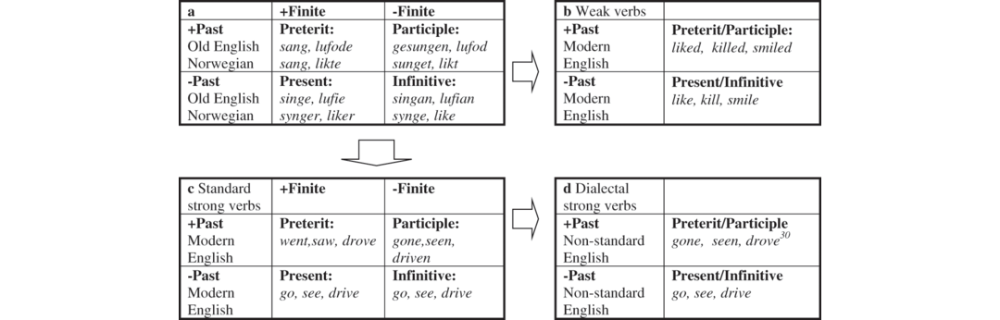

# [[page 591]] Chapter 25 Tense and Aspect in Germanic Languages

**Contributor(s):** Kristin Melum Eide

## 25.1 Introduction

Many natural languages signal via designated grammatical markers the time when a predicated event takes or took place; in the past, the present or the future. Such designated markers are for instance particular inflections (affixes), particles, or auxiliaries, usually elements with an affinity to the verbal domain. Exponents serving to locate a situation in time, especially relative to the moment of utterance or the speech event, are described as tense markers. Likewise, languages often encode the internal constituency of events and states, distinguishing a dynamic action from a stative one; denoting whether or not an action is bounded or unbounded, completed, or if it repeats itself. These features of an event are usually described as their aspect. Tense and aspect interact in intricate ways cross-linguistically and have been subjected to scrutiny by several generations of grammarians. This chapter examines some seminal assumptions and descriptions of these notions with a particular view to Germanic languages.

## 25.2 Tense

According to a widespread consensus, “tense is grammaticalized expression of location in time”; Comrie (1985a: 9). Tense as a grammatical category is used to locate a given situation (typically encoded by a predicate) relative to some other situation or time, usually the speech event or the moment of speech.¹ Hence, it falls under Lyon’s (1977: 637) definition of a deictic category, belonging to the category of *deixis*.

[[page 592]] By deixis is meant the location and identification of persons, objects, events, processes and activities talked about, or referred to, in relation to the spatiotemporal context created and sustained by the act of utterance and the participation in it, typically, of a single speaker and at least one addressee.

Thus, the sentences in (1a) and (1b) can be described as identical in all respects, involving the same situations, events, and participants, only their tense features differ. In (1a), the verb has a tense affix encoding (at least) *present*, locating the smiling event as simultaneous to the speech event; the corresponding verb in (1b) has a *preterit* tense affix encoding past and locating the smiling event at a point in time prior to the speech event.

(1) 1. a.

      ```tsv
      *Marit smiler.*	(Norwegian)
      Marit smile.PRES
      ‘Marit smiles.’
      ```

    b. ```tsv
      *Marit smilte.*	(Norwegian)
      Marit smile.PRET
      ‘Marit smiled.’
      ```

When temporally relating one event or situation to another, three relative orderings exhaust the potential of possible relations. The first event (A) may be past with respect to the second event (B); as in (2a); A can be simultaneous to B, as in (2b), or A can be subsequent to B, as in (2c). Take event A to be the situation depicted by the predicate, whereas event B is the speech situation, i.e., the “act of utterance”, as described by Lyons in the quote above. These three relations amount to past, present, and future time reference, respectively.

1. (2)



Whereas most Germanic languages employ tense affixes (as in (1)), certain languages, for instance many Creole languages, use freestanding tense particles. These particles encode tense, like the tense affixes in (1); they give rise to specific temporal construals and have scope over the proposition depicting the relevant event, as illustrated by the data in (3) from the English-based creole language Hawaiian Creole English; data from Bickerton (1999: 53–54), originally from Roberts (1993). The particles *bin, go*, and *stay* are unbound morphemes and encode past, future, and present, respectively.

(3) a. ```tsv
      *You*	*bin*	*say*	*go*	*up*	*on*	*roof*	*and*	*paint*	*him.*
      you	PAST	say	go	up	on	roof	and	paint	it
      ‘You told me to go up on the roof and paint it.’ [colspan=10]
      ```

    2. [[page 593]] b.

      ```tsv
      *Bimeby*	*I*	*go*	*look*	*one*	*tenement*	*house*	*in*	*Nuuanu*	*Street.*
      by-and-by	I	FUT	look	a	tenement	house	on	Nuuanu	Street
      ‘Soon I will look at a tenement house on Nuuanu Street.’ [colspan=10]
      ```

    3. c.

      ```tsv
      *This*	*time*	*he*	*stay*	*coming.*
      this	time	he	PRES	coming²
      ‘This time he is coming.’ [colspan=5]
      ```

Although all languages have means of expressing all three of the temporal relations in (2), either via lexical words and phrases (for instance adverbs) or via designated grammatical markers (as in (1) and (3)), many languages have only a two-way tense split in their primary, basic tense system. Hence, Comrie (1985a: 48 ff) discusses languages where (a) only a future/nonfuture distinction is encoded in the grammar – for instance the language *Hua* in New Guinea; (b) languages where only a past/nonpast distinction is present such as *German* and *Finnish*; and (c) “languages that lack tense altogether” (Comrie 1985a: 50), like *Burmese* and probably also the Australian language *Dyirbal*.³

This does not exclude the possibility of ternary (or *n*-ary) tense systems, of course, and all the Germanic languages have specific means (like auxiliaries) to single out for instance future time reference when this is specifically intended, e.g., the English future modal *will*. But as Comrie observes (op.cit. 48), most European languages (Germanic,⁴ non-Germanic, and non-Indo-European) have only a two-way split in their basic tense systems, past versus nonpast, “with subdivisions within non-past (especially future as opposed to the present) being at best secondary; thus the so-called present tense in such languages is frequently used for future time reference.” (see also Fertig, Chapter 9). In this perspective, only the paradigm of tense affixes (illustrated in (4) with German examples) constitute the primary tense system; the auxiliaries and the categories they denote belong to a secondary tense system.

(4) 1. a.

      ```tsv
      *Ich*	*lerne*	*für*	*mich*	*selbst*	*zu*	*denken.*	(German)
      I	learn.PRES	for	myself [colspan=2]	to	think
      ‘I am learning to think for myself.’ [colspan=7]
      ```

    b. ```tsv
      *Ich*	*lernte*	*dann*	*selbst*	*Linsen*	*zu*	*schleifen.*	(German)
      I	learned	then	myself	lenses	to	grind
      ‘I then learned to grind lenses on my own.’ [colspan=7]
      ```

[[page 594]] In the various Germanic languages, these simple tenses have restrictions, such that the English present tense usually cannot express ongoing actions (instead, the progressive is used), but only habitual situations (*I work as a teacher*), scheduled or repeated events (*The train arrives at noon*), or general truths (*Two plus two equals four*). Moreover, the simple present tense in English usually does not denote the future (see 5a), instead the auxiliary *will* is enrolled. Note however, that in adverbial clauses headed by temporal connectives like *when, before, until*, and others, only the simple present is possible and the auxiliary *will* is not only unnecessary, but ungrammatical (see 5b). As shown in (5c and 5e), both German and Norwegian allow for a simple present to express the future (in main clause declaratives), although the future can also be expressed by enrolling an auxiliary verb, for instance *werden* ‘will’ and *skulle* ‘shall’, respectively (cf. also Fertig, Chapter 9).

(5) 1. a.

      ```tsv
      *He *gives / will give it to you tomorrow.*	(English)
      ```

    b. ```tsv
      *She will see him before he arrives/*will arrive.*	(English)
      ```

    c. ```tsv
      *Ich*	*schreibe*	*dir*	*morgens*	*wieder.*	(German) [rowspan=3]
      I	write.PRES	you.DAT	tomorrow	again
      ‘I will write to you again tomorrow.’ [colspan=5]
      ```

    d. ```tsv
      *I*	*werde*	*dir*	*gelegentlich*	*schreiben.*	(German) [rowspan=3]
      I	will	you.DAT	occasionally	write.INF
      ‘I will write to you occasionally.’ [colspan=5]
      ```

    e. ```tsv
      *Jeg*	*skriver*	*til*	*deg*	*i morgen.*	(Norwegian) [rowspan=3]
      I	write.PRES	to	you	tomorrow
      ‘I will write to you tomorrow.’ [colspan=5]
      ```

    f. ```tsv
      *Jeg*	*skal*	*skrive*	*til*	*deg*	*senere*.	(Norwegian) [rowspan=3]
      I	shall	write.INF	to	you	later
      ‘I will write to you later.’ [colspan=6]
      ```

Likewise, in (standard) German the preterit is used in writing and especially in narratives, but in spoken German the present perfect is much more frequently used (except with the copula *zu sein* and with auxiliaries), and in several varieties the simple past is more or less extinct. A parallel situation can be observed for a range of standard and dialectal variants of closely related Germanic languages; here Harbert (2006: 314).

[I]n some G[erman] dialects, particularly in the south (e.g. Swiss G[erman], Keller 1961: 67), as well as southern dialects of D[utch] (de Vooys 1957: 42), Y[iddisch] (Jacobs 2005: 217) and A[frikaans] (Ponelis 1993: 383), the simple past tense has disappeared aside from relics, and the present perfect is the only means remaining of talking about past time.

We will return to the present perfect and other temporally complex constructions in more detail below, but let us note for now that all Germanic languages make use of auxiliaries, i.e., modal auxiliaries and perfective auxiliaries (the latter corresponding to HAVE and BE) to [[page 595]] construct complex tenses. We have already mentioned the modals *will* in English, *werden* in German, and *skulle* in Norwegian. However, all Germanic languages have an inventory of modal verbs allowing for an array of complex temporal and modal constructions, and a small set of perfective auxiliaries to form complex tenses. On the surface, these constructions seem rather identical semantically and syntactically from one Germanic language to the next, but as we have already suggested, the felicitous use and semantic-pragmatic restrictions on these complex tenses and modal constructions may vary tremendously from one Germanic language (and dialect) to the next.

## 25.3 The Reference of Tense Elements

As already mentioned, Comrie (1985a: 50) suggests that “in a tense system, the reference of each tense is a continuity.” The “reference” of tense elements – represented in (1) and (4) above by the present affixes -*er/-e* and the preterit -*te*, and by the particles *bin, go*, and *stay* in (3) – has been a topic of much debate. Hence there exist a wide range of proposals on the semantics and nature of tense elements. Prior (1967) and Montague (1974) suggest that tense elements are operators, taking the proposition (or predicated event) in their scope; others have suggested that tense elements are referential entities, resembling pronouns (Enç 1986, Partee 1973), even adverbial elements (Hornstein 1990). Moreover, a range of proposals have advocated that tense elements are best analyzed as predicates, see for instance Zagona (1995), Stowell (1995, 1996), Julien (2000, 2001), and Eide (2005, 2009a, 2009b).

If tense elements are predicates, what constitutes the arguments of these predicates? Reichenbach (1947) and Comrie (1985a), inter alia, suggest that tenses amount to a relation between time points. Reichenbach (1947) is the classical analysis of tense in Germanic languages, and tense is seen here as anchoring the clause to the utterance context (hence being deictic). Reichenbach proposed that three time points were relevant: Time of (predicated) event E, time of speech S, and a “mediating” Reference time R. Reichenbach believed that all tenses expressed in natural languages could be stated as a relative ordering of these three time points. A much-quoted approach which is seen by many as a refinement of Reichenbach’s theory is Klein’s theory on tense and finiteness (1994, 1998, 2006, 2009).⁵ In contrast to the role ascribed to tense in Reichenbachian proposals, Klein advocates instead the role of finiteness in anchoring. In this theory, finiteness is thus not merely a morphological category, but a host for the crucial elements *Assertion* and *Topic Time*. Assertion determines the illocutionary [[page 596]] force of a sentence, and Topic Time amounts to one of the three time spans distinguished, Time of Utterance (TU), Topic Time (TT), and Time of Situation (TSit). Topic Time refers to the time for which a particular utterance makes an assertion, referring to a time span to which the assertion made is constrained. In Klein’s view, tense expresses a temporal ordering between Time of Utterance and Topic Time, whereas Aspect expresses a temporal ordering relation between Topic Time and Time of Situation. Although Klein clearly builds on the insights from Reichenbach, there are some important differences between Klein’s notion of Topic Time and Reichenbach’s Reference Time R. Crucially, in Reichenbach’s theory, R is a mediator of a viewpoint, a relative time point serving as an anchor for the event time. Klein’s Topic Time, on the other hand, is a time for which the truth of the assertion is evaluated.

Reichenbach and Comrie hence see tense as a relation between time points, whereas Klein sees tense as a relation between time spans or time intervals (cf. also Bennett and Partee 1978, Demirdache and Uribe-Extebarria 2000, 2004). Others still claim instead that tense elements encode a relation between two *events* or situations (Giorgi and Pianesi 1997; Julien 2001; Eide 2005, 2009a, 2009b). As noted by Julien (2001: 127), when taking tense to express the relation between events, “It follows that the precise extension in time of the event or state becomes irrelevant”; and this allows for a certain underspecification of temporal relations which seems useful in characterizing the category tense in Germanic languages. This chapter will hence adhere to the latter view, assuming that tense is a grammatical category semantically consisting of a dyadic predicate, locating a situation on a temporal axis by means of creating a temporal relation between its two arguments, both being events (or situations), where the speech event may be one of these events. In anchoring the predicated event to the speech event, finite tense is the deictic anchoring category par excellence.

## 25.4 Aspect

In the literature on aspect, the distinction between stative (*states*) and dynamic (*events*) situations is considered of fundamental importance to conceptual and linguistic organization. For instance, Michaelis (1998: 16) quotes Langacker (1987: 258), for the claim that the distinction between states and events has “a primal character” because it is linked to a basic cognitive capacity – the ability to perceive change (or the lack of change) over time.

[E]vents … are situations which (a) have salient boundaries (i.e., points of inception and / or termination) and (b) involve change over time; states … are situations which do not involve change over time, and which do not have salient endpoints. I will maintain that the event-state distinction, as outlined here, should form the basis of all explanation in aspectology.

[[page 597]] In this chapter, we will use the term “event” to encompass both bounded events and unbounded states, hence as an overarching term for both types.⁶ Likewise, many linguists have found it useful to distinguish between *aktionsart* and (grammatical) aspect.⁷ The former is usually taken to denote the aspectually relevant inherent semantic properties of the verb, either in isolation or with its arguments. This is in contrast to aspectual properties acquired by the verb in specific syntactic environments.⁸ The aspectual properties of a verb may change when the “aktionsart” of the verb interacts with other lexical items in the clause such as adverbials. For instance, when a verb with a dynamic, punctual aktionsart (e.g., *flash*) combines with a durative adverbial (e.g., *until dawn*) and as a result produces an iterative reading (*The light flashed until dawn*), one may refer to this as iterative *aspect.*⁹

*Aspect* in its most restricted sense denotes a grammatical category, the “grammaticalization of the relevant semantic distinctions” (Comrie 1976: 7). When describing the differences between aspect and tense, Comrie (1976: 5) claims that the latter relates the time of a situation to some other time point. The relevant features of aspect however are described as follows:

Aspect is not concerned with relating the time of the situation to any other time-point, but rather with the internal temporal constituency of the one situation.

In the traditional literature on Germanic languages both the perfect (*John has read the book*) and the progressive (*John is reading a book*) have been considered aspectual categories. In both cases, there is an aspectual auxiliary heading the construction and – in combination with some relevant properties of the verbal complement – presumably providing this construction with specific aspectual and temporal properties. For our present purposes, the distinction between *aktionsart* and aspect is less important; we will use *aspect* as an overarching term and describe a certain construction simply as encoding some specific aspect although in some cases the term *aktionsart* might in fact be more accurate.¹⁰

At an informal level, aspect refers to how we conceptualize a situation or event with regard to how it begins, continues, and ends (and possibly repeats itself). Figure 25.1, for instance, illustrates a situation conceptualized as an event with a beginning, duration, and end. The figure implies a timeline from left to right, and correspondingly, the potential [[page 598]] boundaries of the event are often referred to as “left boundary” (the beginning) and “right boundary” (the end) of the event.


Before the event takes place, it does not yet exist (¬S; not-S). Likewise, when the event has ended, it no longer exists (¬S). At the point where the event begins, the state of affairs changes from ¬S to S. This change-of-state is encoded or at least implied by a range of predicate types. There are for instance lexical verbs such as the Norwegian *sovne* ‘fall asleep’ and *gjenkjenne* ‘recognize’; there are also (semi-)lexical verbs, such as the Norwegian inchoative copula *bli* ‘become’; and the Swedish verb *börja* ‘begin’, specialized to encode this aspectual information. Moreover, a range of Germanic languages have functional markers conveying exactly this type of information, for instance classes of verbal prefixes in German, cf. Maylor (2002:140).

The prefixes *ent-, er-, ver-* are found on many verbs that traditional grammars describe as inchoative, and describe not just a change of state, but rather more a coming into being.¹²

The aspectual information coercing a zooming in on the beginning of an event is often referred to as *inchoative* aspect, as mentioned above, or as *ingressive* aspect. Verbs that encode a change from ¬S to S are frequently also referred to as *dynamic* or *eventive* verbs.¹³

(6) 1. a.

      ```tsv
      *Die*	*Pflanze*	*erblühte.*	(German)¹⁴ [rowspan=3]
      the	plant	er-bloomed
      ‘The plant bloomed.’ [colspan=3]
      ```

    b. ```tsv
      *Kain*	*blev*	*vred*	*og*	*dræbte*	*sin*	*bror.*	(Danish) [rowspan=3]
      Kain	became	angry	and	killed	his	brother.
      ‘Cain got mad and killed his brother.’ [colspan=7]
      ```

    c. ```tsv
      *Det*	*började*	*regna*	*småsten.*	(Swedish) [rowspan=3]
      it	began	rain.INF	pebbles
      ‘It started to rain little pebbles.’ [colspan=4]
      ```

There is a large class of predicates that by themselves refer to (or imply) neither the beginning nor the end of the situation they describe; instead, they simply refer to the stative situation, S in Figure 25.3. Accordingly, these predicates are referred to as *stative*. Lexical predicates encoding this aspect are for instance *sove* ‘sleep’ (Norwegian), *veta* ‘know’ (Swedish), *være intelligent* ‘be intelligent’ (Danish / Norwegian), and *bleiben* ‘stay’ (German). Semi-lexical constructions are *blive ved med at* ‘keep v-ing’ (Danish), *forsätta at* ‘continue’ (Swedish), *holde på med å* ‘be in the process of’ (Norwegian), but also pseudo-coordination structures with posture verbs in several languages, like the Dutch *Ik zit te eten* ‘I am eating (while sitting)’ (cf. also Fertig, Chapter 9). Both the English progressive *be v-ing* and the Dutch *an het-*progressive have this aspectual feature as their core interpretation. Hence this aspect is sometimes referred to simply as *progressive* (ongoing), but also as *imperfective, continuative, durative*, *atelic* or simply *stative*. These different terms emphasize slightly different features of the stative event; for instance, both *imperfective* and *atelic* usually emphasize the lack of right boundary of the event, not the lack of left boundary, and the *progressive* is sometimes described as “seeing the event from within.” What they all have in common, however, is their focus on the stative, ongoing, and unbounded aspect of the situation. Adverbials denoting time spans, like *for a year*, are easily compatible with such predicates.

(7) 1. a.

      ```tsv
      *Die*	*Pflanze*	*blühte.*	(German) [rowspan=3]
      the	plant	bloomed
      ‘The plant bloomed.’ [colspan=3]
      ```

    [[page 600]] b. ```tsv
      *Jeg*	*forblev*	*i*	*landsbyen.*	(Danish) [rowspan=3]
      I	stayed	in	village.DEF
      ‘I stayed in the village.’ [colspan=4]
      ```

    c. ```tsv
      *Regnmolnen*	*fortsätter*	*att*	*driva*	*runt*	*över*	*landet.*	(Swedish) [rowspan=3]
      rain.clouds.DEF	continue	to	drift	around	over	country.DEF
      ‘The rain clouds keep drifting across the country.’ [colspan=7]
      ```

    d. ```tsv
      *Ik*	*ben*	*aan*	*het*	*werken*	(Dutch) [rowspan=3]
      I	am	at	the	working
      ‘I am working.’ [colspan=5]
      ```

    e. ```tsv
      *Jeg*	*sitter*	*og*	*spiser.*	(Norwegian) [rowspan=3]
      I	sit.PRES	and	eat.PRES
      ‘I am eating.’ [colspan=4]
      ```

Then there are predicates that encode information about the natural endpoint, or “the right boundary” of an event. For instance, predicates such as *eat an apple* or *paint a house* (unlike *eat apples* or *paint houses*) imply or encode the natural endpoint of the event they describe: The event will end when the apple is eaten or the house is painted.¹⁵ This type of aspect is often referred to as *telic* (*egressive* is a less common term), and telic predicates are typically compatible with time-frame adverbials such as *in an hour*, for instance *John reached the top in an hour.*


A grammaticalized exponent of such right endpoints, for instance as an affix, is typically referred to as the *perfective* aspect, and in Germanic, the prefix *ge-* has been ascribed exactly this function; cf. for instance van Gelderen (2004: 167) quoting Mustanoja (1960: 446) on Middle English, Salmons (2012: 199) on Modern German,¹⁶ Lockwood (1968: 104) on Middle High German. Semi-lexical predicates are verbs denoting quitting, stopping, or finishing, like Norwegian *slutte*, German *aufhören.*

(8) 1. a.

      ```tsv
      *Die*	*Pflanze*	*verblühte.*	(German) [rowspan=3]
      the	plant	withered
      ‘The plant withered.’ [colspan=3]
      ```

    [[page 601]] b. ```tsv
      *Lægen*	*forlod*	*hovedstaden.*	(Danish) [rowspan=3]
      doctor.DEF	left	capitol
      ‘The doctor left the capitol.’ [colspan=3]
      ```

    c. ```tsv
      *Flickorna*	*slutade*	*idrotta.*	(Swedish) [rowspan=3]
      girls.DEF	stopped	sporting
      ‘The girls stopped doing sports.’ [colspan=3]
      ```

In some languages, like Finnish, case alternations on the object (for instance partitive versus accusative; Kiparsky 1998) has been shown to induce a distinction between atelic and telic predicates in a manner resembling the alternation between bounded and unbounded themes mentioned above (e.g., *paint a house* versus *paint houses, eat an apple* versus *eat apples*). To some extent, a similar effect of morphological case can be observed in Germanic languages in the use of dative and accusative case in adverbial prepositional phrases; see for instance the German data in (9) from Zwarts (2006), see also Zwarts (Chapter 26, especially the discussion of examples 46 and 51). Here the preposition *in* allows for an alternation between dative case and accusative, and the dative conveys an atelic reading of the predicate, whereas the accusative induces a telic reading.¹⁷

(9) 1. a.

      ```tsv
      *Sie*	*tanzten*	*in*	*dem*	*Zimmer.*	(atelic) [rowspan=3]
      they	danced	in	the.DAT	room
      ‘They danced in the room.’ [colspan=5]
      ```

    b. ```tsv
      *Sie*	*tanzten*	*in*	*das*	*Zimmer.*	(telic) [rowspan=3]
      they	danced	in	the.ACC	room
      ‘They danced into the room.’ [colspan=5]
      ```

Some predicates imply both the left boundary and the right boundary of an event, and this particular aspect is sometimes called *punctual* aspect. *Marit datt* ‘Mary fell (down)’, *Den gamle mannen døde* ‘the old man died’ are examples of events that are typically construed as punctual or instantaneous.¹⁸


Finally, we will mention iterative (habitual, generic) aspect. These terms denote aspects of repeated or recurring events, and although each event by itself may be interpreted as bounded or even punctual, this repetition of events induces a reading where these punctual events are wrapped in a state. [[page 602]] Hence these predicates may be compatible in principle with punctual adverbials on a singular, punctual reading, but with time-span adverbials on an iterative reading. Moreover, adverbs like *often, usually, typically, always, regularly* are very much compatible with the iterative reading; in fact, these adverbs are exactly what brings about the iterative reading in many cases.

(10) 1. a.

      ```tsv
      *Kongen*	*spiser*	*middag*	*i*	*denne*	*restauranten.*	(Norwegian) [rowspan=3]
      king.DEF	eat.PRES	dinner	in	this	restaurant.DEF
      ‘The king eats/is eating his dinner in this restaurant.’ [colspan=6]
      ```

    b. ```tsv
      *Marit*	*spiller*	*tennis.*	(Norwegian) [rowspan=3]
      Marit	play.PRES	tennis
      Marit plays/is playing tennis. [colspan=3]
      ```

    c. ```tsv
      *Jon*	*drikker*	*ikke*	*øl*	*(akkurat nå / vanligvis).*	(Norwegian) [rowspan=4]
      Jon	drink.PRES	not	beer	(right now / usually)
      ‘John is not drinking beer right now/ [colspan=5]
      John does not usually drink beer.’ [colspan=5]
      ```

    d. ```tsv
      *The light flashed (once/until dawn).*	(English)
      ```


## 25.5 Complex and Periphrastic Tenses: Temporal and Aspectual Features

Germanic languages use auxiliaries to construct more complex tenses, and the temporal construal of these potentially long chains of auxiliaries modifying a main verb gave rise to Reichenbach’s (1947) system of nine tenses. As mentioned above, Reichenbach proposed the presence of a mediating reference point R to account for the temporal complexity of attested tenses. Vikner (1985) acknowledged that there are several attested temporal construals that even Reichenbach’s R is not able to account for, and suggested that we need at least one more reference time to account for certain temporal construals of Germanic tenses.¹⁹

1. [[page 603]] (11) *She promised in November that they would have received her paper by the first day of term.*

In this example, there are two reference times, Vikner says, *in November* and *the first day of term*, neither of which corresponds to the speech time S or the event time E. Hence, Vikner’s system employs four temporal primitives; the speech time S, the event time E, and two reference times, R₁ and R₂. Julien (2001) suggests instead that the number of reference times is a function of the number of tense elements that are present in the construction in question. This proposal has a predecessor in Janssen (1988: 99), who claims that “a separate time can in principle be assigned to each verb of a verbal group, whether an auxiliary or a main verb.” He illustrates this with Dutch data showing that in general it is the case that the more verbs and auxiliaries, the more temporal interpretation possibilities exist (1988: 121).²⁰

(12) 1. a.

      ```tsv
      *Wim*	*zal*	*morgenochtend*	*om*	*acht*	*uur*	*vertrokken*	*zijn.*	(Dutch)
      Wim	will	tomorrow.morning	at	eight	o’clock	left	be
      ‘Wim will have left tomorrow morning at eight.’ [colspan=8]
      ```

    b. ```tsv
      *Wim*	*zal*	*gistermorgen*	*om*	*acht*	*uur*	*vertrokken*	*zijn.*	(Dutch)
      Wim	will	yesterday	at	eight	o’clock	left	be
      ‘Wim will have left yesterday at eight.’ [colspan=8]
      ```

The examples illustrate how time adverbials may refer to the time of the perfect auxiliary in (12a) and the time of the main verb in (12b).²¹

The perfect, in particular, but also the progressive, has a long history in the literature on Germanic grammar as a bit hard to categorize as temporal or aspectual. Here Michaelis (1998: 3), discussing “the debate over whether the perfect is best regarded as tense or aspect”:

Analysts have long expressed uncertainty as to the appropriate categorization of the perfect within the tense-aspect system of English. Aspectual marking in general evokes the internal temporal constitution of a situation (Comrie 1976). By contrast, the perfect “tells us nothing directly about the situation in itself, but relates some state to a preceding situation” (Comrie 1976: 52). […] This fact has induced a number of analysts […] to regard the perfect as a relative tense.

Whether you analyze the perfect as an aspect or as a periphrastic tense, it is commonly assumed that the perfect encodes some kind of past-time reference; in the words of Dyvik (1999: footnote 1), the perfect is a “non- [[page 604]] referential relative past.”²² However, this by no means rules out the possibility that the garden variety Germanic perfect simultaneously encodes a (present) state, and in the literature we often find the claim that it indeed does, cf. ter Meulen (1995: 5–6):

The perfect Jane has sighed describes th[e] state caused by the end of [Jane’s] sighing. Such perfect states are atemporal in the sense that once they have begun, they never end … The difference between the simple past and the perfect is hence aspectual in nature: The former describes events in a context-dependent way, whereas the latter gives only stative information.

What this proposal suggests is that, unlike most states, the perfect denotes the event whose culmination *caused* the given state. The “relative past” reading is an inference: If there is a state described as commencing at the exact time of the culmination of the very event that caused the state, and the culmination of this event is an essential part of the description of the state, it follows that this event must already have taken place in order for the state to hold at the time of utterance. Therefore, the “past event” reading is an inevitable inference, according to this proposal. Michaelis (1998: 51), following Herweg (1991a, 1991b), refers to the perfect as a *stativizing operator*, an operator that maps an event predication true at one time (e.g., *Madge swallow-the fly*) into a stative predication true at a later time. This stative predication is described as the aftermath of the fly-swallowing event, just as in ter Meulen’s proposal. The perfect provides a stative construal of what would otherwise be an event predication. Several proposals hence suggest that the perfect encodes a stative situation. Moreover, it has been argued that the perfect is also some kind of present tense; Jespersen (1931: 47) claims that

The perfect … is itself a kind of present tense, and serves to connect the present time with the past. This is done in two ways: first, the perfect is a retrospective present, which looks upon the present state as a result of what has happened before in the past; and second, the perfect is an inclusive present, which speaks of a state that is continued from the past into the present time.

The progressive is widely taken to encode a stative aspect²³ (Langacker 1987, 1991; ter Meulen 1995: 66). Michaelis (1998: 52) follows Herweg (1991a, 1991b) in referring to the progressive as *a stativizing operator*, an operator that maps an event into a state. For any given event, there is a state that holds prior to the time at which that event has reached its point of culmination. This state is the progressive state. Thus, the event (interval) [[page 605]] “selected” by the progressive is not a state in and of itself (e.g., *Madge swallow the fly*), but the progressive selecting this event denotes a state (*Madge is swallowing a fly*), as argued in Michaelis (1998: 256). Likewise, most proposals on the subject suggest that the progressive encodes some kind of present tense; Kreidler (1998: 222), for example, states that

[The progressive] is also about the present moment but calls attention to the fact that the activity is in process now.

Julien (2001: 138) remarks that perfects, but not the progressive, are traditionally held to be tenses in descriptions of Germanic perfects.

This is reflected in works like Reichenbach (1947) and Vikner (1985), who both include a number of perfect constructions in their tense system while leaving out the progressive. The reason for this, one might guess, is that the temporal contribution of the past participle is more easily recognized than that of the progressive: whereas the progressive, being a present tense, never introduces a time that is not referred to by the auxiliary, the past participle introduces an event time which is different from any other time referred to in the same sentence.

Julien recognizes the progressive as a present tense, specifically a nonfinite periphrastic present tense. Like for instance Stowell (1996) she also ascribes a substantial temporal function to the past participle, and describes the perfect as a nonfinite past tense. Moreover, she assumes that since there are future finite tenses, there ought to be a non-finite future tense as well. Hence she proposes that (2001: 132)

[T]he progressive, the perfect, and the prospective are in fact tenses and not aspects. More precisely, the progressive is a nonfinite present, the perfect is a nonfinite past, and the prospective is a nonfinite future.

Of course, these tenses can perform in finite functions when they are headed by a finite auxiliary, but the perfect, the progressive and the prospective themselves are nonfinite, according to Julien.

Klein (1995) proposes that the difference between what we call tenses and what we call aspects should be analyzed as minimal, and Demirdache and Uribe-Extebarria (2000) pursue this idea of parallelism between tenses and aspects (2000: 161).²⁴

We reduce Tense and Aspect to the same set of semantic primitives by assuming that since Tense has been analysed as relating two times, Aspect should be analysed as relating two times. This is precisely the proposal made by Klein (1995).

The difference between tenses and aspect, on this view, is that aspects establish a relation between a reference time (Reichenbach’s R; Klein’s *assertion time*) and the predicate event time, whereas tenses relate a reference time to the utterance time, i.e. the time of the speech event.

## [[page 606]] 25.6 Finite and Nonfinite Tenses

Eide’s (2005, 2009a, 2009b, 2016) approach to finiteness emerges from Comrie’s (1985a: 36) observation that natural languages display examples of *absolute* and *relative tenses.* Absolute tenses (e.g., the preterit) typically take the moment of speech as their deictic centre and relative ones (e.g., participles) take some other contextually given time point as their point of reference. While in many languages specific verb forms encode the distinction between absolute and relative tenses, there are also languages, e.g., creoles, where the same verb form is used for both. This lack of formal distinctions between absolute and relative tense forms has traditionally been considered a lack of formal finiteness distinction in the literature on Creoles (cf. Romaine 1993; Muysken & Law 2001). In most Germanic languages, however, the finiteness distinction is morphologically encoded. Eide (2005, 2009a, 2009b, 2016) argues that even in Germanic languages the distinction between finite and nonfinite verb forms corresponds to the distinction between absolute and relative tense forms.

As Comrie (1985a: 48) observes, and as discussed above, most European languages have only a two-way split in their tense systems, past versus nonpast, “with subdivisions within non-past (especially future as opposed to the present) being at best secondary; thus the so-called present tense in such languages is frequently used for future time reference.” Pairing this assumption with the claim that the absolute-relative distinction equals the finiteness distinction in the relevant languages, we arrive at the paradigm in (13) for the garden variety of Germanic language. Here each and every verb form encodes a tense element consisting of two pieces of information: [±Past] and [±Finite].

(13) ```tsv
  	+Finite	−Finite
  +Past	Preterit	Participle
  −Past	Present	Infinitive
  ```

In this analysis, being tensed is an essential part of being a verb,²⁵ and this ties in nicely with the proposal of Janssen (1988), where each verb and auxiliary in a verbal chain provides some temporal contribution to the construction. However, it differs from Julien’s approach, where some nonfinite verb forms are ascribed tense features (e.g., the past participle) and some are not (e.g., the infinitive), and some auxiliaries are ascribed tense properties (*will*) and others not (infinitival *have*).²⁶ In Eide’s approach all verb [[page 607]] forms, main verbs and auxiliaries alike, are ascribed tense features, and they all contribute temporal points to the construction. The difference between finite and nonfinite tenses is that the latter are unable to relate to the moment of utterance (or the speech event), whereas the former typically do relate to it. Hence, nonfinite tenses will usually be embedded under some other, finite verbal element, whereas finite tenses occur as the highest tense element in a sentence functioning as a complete utterance.

Unlike Creole languages most of the Germanic languages productively encode finiteness with all types of verbs; any verb form in for instance Norwegian is inherently specified with respect to finiteness.²⁷ A [+Finite] form like *spiser* ‘eat.PRES’ or *spiste* ‘eat.PRET’ has distinct morphology showing that it is a finite (i.e., typically absolute) tense form; no context needs to be provided to determine this. Likewise, *spise* ‘eat.INF’ and *spist* ‘eat.PART’ are unambiguously nonfinite, regardless of context. In contrast, an out-of-context main verb in English, e.g., *love* or *loved*, could be either a finite (absolute) or a nonfinite (relative) tense form. *Loved* may be either a preterit or a participle, *love* either a present or an infinitive (in fact, *love* might even be a subjunctive or an imperative).

This could be an accidental fact of formal homonomy and need not point to anything profound separating English morphology from Norwegian morphology. However, it is certainly possible to compare paradigms of basic verb forms and expect the formal syncretism, e.g., the systematic correspondence of two forms, preterit and participle to one, generalized [+past] form; to involve the across-the-board deletion of one specific morphosyntactic feature. To see the consequences of this particular syncretism, we need to acknowledge that the infinitive and the past participle are genuine, full-fledged participants in the basic tense system, giving rise to a four-way tense paradigm with two finite and two nonfinite forms; see the table in (13), repeated here as (14a). Over time, English (weak) main verbs developed into a system employing the collapsed paradigm in (14b); here the finiteness distinction, the distinction between absolute and relative tense forms, is lost.

1. (14)


This loss results in a paradigm employing one generalized [+Past] form and one generalized [−Past] form (“the bare form”). Old English, like present day Norwegian, had distinct forms for all four cells in this paradigm for both strong verbs like *singan* and weak verbs like *lufian*, see paradigm (15a). However, English is changing and becoming more like the Creole languages mentioned earlier. The finiteness distinction starts to disappear in weak verbs, adhering to the collapsed paradigm in (15b). In [[page 608]] (15b), one generalized [+Past] form covers the function of the preterit and the past participle, and one [−Past] form (“the bare form”) covers the present and the infinitive.²⁸

1. (15)



While English regular weak verbs have been inflected according to the collapsed paradigm in (15b) for centuries, irregular strong verbs have maintained a slightly more complex system. Although there is only one generalized [−Past] form, there are distinct forms for the preterit and the past participle; instead of a four-way system, there is a three-way system in Standard English, see (15c). Currently, these remains of the finiteness distinction in main verbs, hitherto maintained in strong irregular verbs, are disappearing from many variants and dialects of English, resulting in alignment with the rest of the system (15d).

English modals, on the other hand, only come in finite forms (in the standard varieties) and hence occur in only finite surroundings,²⁹ and the only verbal elements occurring in both finite and nonfinite contexts are the auxiliaries *have* and *be* (see Eide 2016 for details).

## 25.7 The Present Perfect Puzzle: Remote and Immediate Past

The “present perfect puzzle” (Klein 1992) is usually characterized as the observation that a punctual past-denoting adverbial such as *yesterday* cannot co-occur with the present perfect. However, “current cycle” adverbials, i.e., adverbials denoting the present daily, weekly, monthly, or yearly cycle [[page 609]] are always licit with the present perfect in Norwegian. Adverbials setting up a cycle, such as *hver gang* ‘every time’, are also perfectly fine.³⁰

(16) a. ```tsv
      **Jeg*	*har*	*sett*	*ham*	*i går.*
      I	have	seen	him	yesterday
      ‘I have seen him yesterday.’ [colspan=5]
      ```

    b. ```tsv
      *Hver*	*gang*	*jeg*	*ringer*	*min*	*mor,*	*har*	*hun*	*sovet*	*dårlig*	*natten*	*før.*
      Every	time	I	call	my	mother,	has	she	slept	poorly	night.DEF	before
      ‘Every time I call my mother, she has slept poorly the night before.’ [colspan=12]
      ```

Thus, it is possible to describe the present perfect as a tense construction signifying “there currently exists a state consisting of the aftermath of a past event”, where “currently” can be paraphrased ”within some (salient) current cycle.” In Norwegian, the present perfect is hence the proper “past tense for the current cycle”, and it seems legitimate to characterize it as an *immediate past*. Any event taking place in the previous cycle must be signaled by the preterit, which acts as the *remote past*. As observed by Bybee et al. (1994: 100), many languages distinguish between immediate and remote pasts, and Norwegian seems to be such a language. This is the reason for the “present relevance” reading of the present perfect – it denotes a state consisting of the aftermath of a past event that took place within the current cycle. One important difference between the uses of the German and the Norwegian present perfect is that Norwegian makes the distinction between immediate and remote past, whereas German does not. The German present perfect can be used to describe a situation in the previous cycle, unlike its Norwegian counterpart. It is thus not necessary to assume that the semantics of the German present perfect is very different from the present perfect in Norwegian. It is more a question of usage; the German present perfect has a wider domain of functions as it is allowed to signify previous cycle, unlike Norwegian present perfect.

The distinction between remote past (preterit) and immediate past (present perfect) disappears when the present perfect is embedded under a modal, as in (17a). In this context (unlike in the present perfect, cf. (17b)), the participle may be modified by an adverbial denoting previous cycle.

(17) a. ```tsv
      *Jon*	*må*	*ha*	*kommet*	*i går.*	(Norwegian)
      Jon	must	have	arrived	yesterday
      ‘Jon must have arrived yesterday.’ [colspan=5]
      ```

    b. ```tsv
      **Jon*	*har*	*kommet*	*i går.*	(Norwegian)
      Jon	has	arrived	yesterday
      ‘Jon has arrived yesterday.’ [colspan=4]
      ```

[[page 610]] In cases like (17a), the domain of the immediate past, the present perfect, is extended to cover the remote past, the preterit, which semantically would be the correct past in this construction. In such cases, there are conflicting requirements from the syntax and the semantics. The semantic component requires the remote past as the adverbial *i går* denotes previous cycle. However, there is no way to embed a remote past under a modal, due to the modal’s strict syntactic selectional requirements, which specify that it accepts only a complement with the matrix [−PAST, −FIN]. Hence, as observed by Hofmann (1976: 94), the preterit must be replaced by the nonfinite perfect under a modal, and is “of course, the only way to represent past time [under a] modal.” The remote past is replaced by the immediate past, fulfilling the syntactic requirements: The auxiliary *ha* contributes the right feature specification and the past participle provides the past tense element. Hence B is the answer to the question in (18b) as well as the one in (18a).

(18) 1. a.

      ```tsv
      A:	*Tror*	*du*	*Marit*	*har*	*drept*	*ham?*	(Norwegian)
      	believe	you	Marit	has	killed	him
      	‘Do you believe that Marit has killed him?’ [colspan=6]
      ```

    b. ```tsv
      A:	*Tror*	*du*	*Marit*	*drepte*	*ham?*	(Norwegian)
      	believe	you	Marit	killed	him
      	‘Do you believe that Marit killed him?’ [colspan=5]
      B:	*Hun*	*må*	*ha*	*drept*	*ham!*	(Norwegian)
      	she	must	have	killed	him
      	‘She must have killed him.’ [colspan=5]
      ```

The nonfinite present shows up not only under modals, but in every case where the semantic component requires the preterit and the selecting element requires a nonfinite complement. The clause in (19b) is the nonfinite version of the one in (19a). It employs the nonfinite perfect to express the past expressed by the preterit in the corresponding finite clause. The infinitival marker *å* requires a complement with a matrix [−PAST, −FIN], just like a modal; the way to meet this requirement and preserve the past reading is to employ the immediate past, i.e., the (nonfinite) present perfect, as a substitute for the remote past, the preterit.

(19) a. ```tsv
      *Hun*	*hevder*	*at*	*hun*	*ankom*	*i går.*	(Norwegian)
      she	claims	that	she	arrived	yesterday
      ‘She claims that she arrived yesterday.’ [colspan=6]
      ```

    b. ```tsv
      *Hun*	*hevder*	*å*	*ha*	*ankommet*	*i går.*	(Norwegian)
      she	claims	to	have	arrived	yesterday
      ‘She claims to have arrived yesterday.’ [colspan=6]
      ```

## [[page 611]] 25.8 Conclusion

The tense and aspect systems of Germanic languages are not extremely complex when compared to certain other language groups, but are constantly subject to fresh scrutiny from new generations of linguists and philosophers nevertheless. The underlying meaning of tense and aspect markers seemingly never cease to attract interest and attention, and felicitous usage of particular tenses and aspects in context always poses a challenge to any learner of a language, even the Germanic ones. The choice between the simple tenses and the complex, periphrastic tenses in particular constructions is governed by different sets of rules from one Germanic language to the next, and the ways of expressing particular aspectual features vary from one language to another. An inventory of aspectual prefixes and the availability of specific Case marking give, e.g., German a wider range of fine-grained formal markers in the aspectual domain, as compared to for instance Mainland Scandinavian languages, where many aspectual features are left to be specified via lexical or semi-lexical means. Likewise, the morphological expression of finiteness is not evenly distributed across the Germanic languages; English and Afrikaans, for instance, employ productive verbal paradigms with a lot fewer morphological distinctions than German and Icelandic.

## Footnotes
