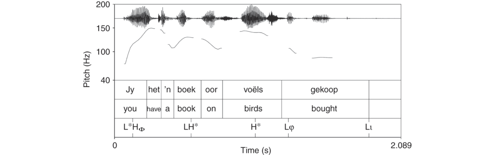
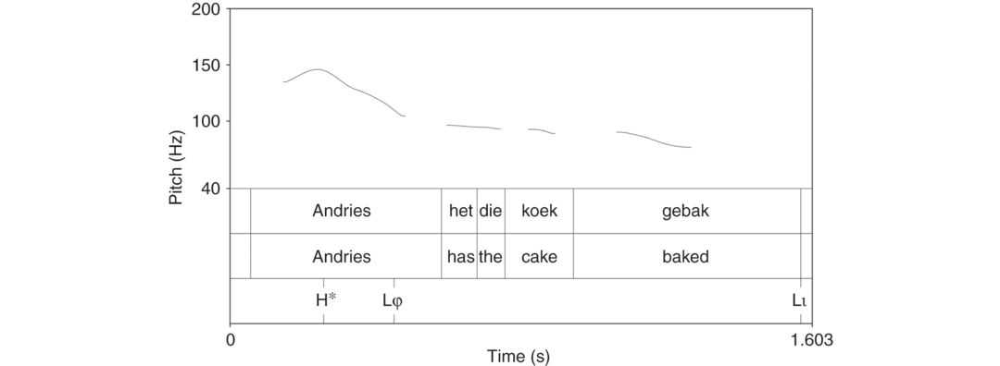
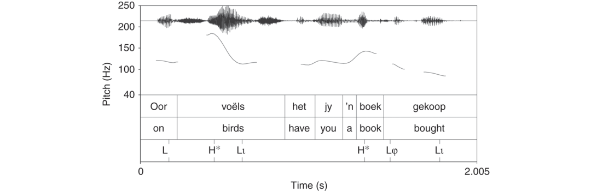

# [[page 661]] Chapter 28 Grammatical Reflexes of Information Structure in Germanic Languages

**Contributor(s):** Caroline Féry

## 28.1 Introduction

The effect of information structure (IS) on prosody and syntax in Germanic languages cannot be overestimated. Focus, topic, and givenness, which are related to the way information is stored in human memory and organized in communication, have a profound influence on the prosodic and syntactic structure of sentences. They can add and delete pitch accents or words, use focus and discourse particles, and change the word order of sentences in significant ways. These properties have numerous consequences for the architecture of grammar. In this handbook, IS is relevant in the discussions of nearly half of the chapters, and this chapter is intended to review its effects on grammar.

We will see that different Germanic languages use similar strategies in implementing IS in grammar – especially as compared to other families of languages –but that they also differ from each other in the detail of IS’s grammatical effects.

Before turning to these strategies, Section 28.2 presents a summary of the notions of information structure as they are used in this chapter. Section 28.3 discusses the effects of IS grammar on prosodic structure (Section 28.3.1), on syntax (Section 28.3.2), and on focus particles (Section 28.3.3). Section 28.4 offers a conclusion.

## 28.2 Notions of Information Structure

Three pairs of information structural notions are present in every sentence: focus-background, given-new, topic-comment. For each of these pairs, one [[page 662]] of them is considered the default and the other one the complementary part. Part of the sentence is focused, and the remainder is backgrounded; part of it is given and the remainder is new; part of it is the topic and the remainder is the comment.¹ It will be shown that these pairs are orthogonal to each other, and that all three are necessary, thereby falsifying attempts to collapse givenness with background, or focus with newness.

### 28.2.1 Focus/Background

Consider first the pair, focus-background. Either the entire sentence is in focus, or only part of it is. The parts of the sentence that are not focused form the background. The definition of focus used in this chapter is based on the theory of alternative semantics of focus proposed by Rooth (1985, 1992, 2016): Focus assigned to a linguistic expression α always indicates that there are alternatives to α relevant in the current discourse. Putting it differently, anything that does not indicate any alternatives to α should be called background. Krifka (2008: 247) defines focus as in (1).²

1. (1) Focus

  Focus indicates the presence of alternatives that are relevant for the interpretation of linguistic expressions.

The semantic use of focus affects the truth-conditional aspects of the discourse in the sense that the position of the focus changes the meaning of the sentence. The sentences in (2) have different presupposition structures: the first reading can be paraphrased in the following way: in (2a), when she makes a call, Justine calls somebody other than her father; and the second reading, in (2b), means: Whatever relationship Justine has with her father, it does not include calling him. Subscripted F indicates focus, and capital letters a pitch accent.

(2) 1. a. Justine never calls [her <span class="sc">father</span>]<sub>F</sub>.

    2. b. Justine never [<span class="sc">calls</span>]<sub>F</sub> her father.

Sentence (3a) can be uttered by speaker A as an answer to a question like “What happened?” Speaker B, who knows better, can correct speaker A’s utterance by changing the person who ordered pizza, the result being a narrow focus on *Alicia*. The alternatives induced by focus are contextually restricted, as for instance the individuals in (3c), to the persons in an office who have worked late and are now hungry. Thus the alternative set [[page 663]] consists of the individuals who may have ordered pizza in the particular context of this utterance. (3b) presupposes that somebody ordered pizza. *Ordered pizza* is the noncontrastive part of the sentence, the *background*, which is accepted by speaker B and which is complementary to the focused part, i.e., the person who did the ordering. Rooth’s intuition is that the focus contrasts with all possible right and wrong answers to a contextually given question – its ‘Hamblin denotation’ (Hamblin 1973).

(3) 1. a. A: [Gregory ordered <span class="sc">pizza</span>]<sub>F</sub>

    2. b. B: No, [<span class="sc">Alicia</span>]<sub>F</sub> ordered pizza.

    3. c. Alternative set: {<span class="sc">Gregory</span> ordered pizza, <span class="sc">Alicia</span> ordered pizza, <span class="sc">Fatima</span> ordered pizza}

In the Roothian version of the theory, focus in English has a uniform semantic import related to “contrast” within a set of alternatives: One of the alternatives is the correct one, the others are wrong. In this survey, contrast is not a special information structural notion, because every focus – and every topic – introduces some contrast, relative to the other members of the alternative set. Thus, contrast is an inherent feature of focus.³

The classic use of focus is to highlight the part of an answer that corresponds to the *wh*-part of a constituent question, as illustrated in (4a)–(4b), usually by a pitch accent. The *wh*-question does not need to be overt: It can be covert, and structured by implicit questions. Focus is generally sub-sentential, that is, it only affects one part of the sentence, the other parts being backgrounded (except in so-called ‘fragment sentences’ in which the backgrounded material is elided). But a sentence can also contain more than one focus; (4c) is a dual focus sentence (see Wang and Féry 2018, for the prosodic correlates of such sentences in German).

(4) 1. a.

      A:

      What did Mary order?

      B:

      She ordered [

      pizza

      ]

      F

    2. b.

      A:

      What did Mary do?

      B:

      She [ordered

      pizza

      ]

      F

    3. c.

      A:

      A: Who ordered what?

      B:

      [

      Mary

      ]

      F

      ordered [

      pizza

      ]

      F

If the accent is not on the item requested via a *wh*-question, the result is infelicitous, as illustrated in the dialogue (5), where *Alicia* is accented and *ordered cake* is deaccented. In this case, a backgrounded constituent (here *Alicia*, a given constituent) is assigned a pitch accent, and the focus (*cake*) is deaccented.

1. (5)

  A:

  What did Alicia order?

  B:

  #

  Alicia

  ordered [cake]

  F

.

[[page 664]] In a spoken sentence, the hearer generally knows which element is focused because the context specifies what element is new in the sentence. The reason for adding a pitch accent on the focus may be related to attentional factors. The mechanism consisting of accenting the focus and deaccenting the background facilitates processing of new information. Furthermore, pitch accents are present for purely syntactic purposes, and since they are part of the prosodic structure of Germanic languages anyway, it may be simply more economical to use them for signalling the focus structure as well.

Finally, notice that focus cannot be conflated with new, and background is not the same as given. Selection and correction focus in (6) and (7) respectively, show that a given constituent can be focused rather than backgrounded.

1. (6) Selection focus

  A:

  Did Louise

  ’

  s father or mother pick her up?

  B:

  It was [her

  mother

  ]

  F

.

2. (7) Confirmation focus

  A:

  Did Alicia order a pizza?

  B:

  Yes, everybody thought Gregory did it, but it was indeed [

  Alicia

  ]

  F

.

### 28.2.2 Given/New

The second pair of information structural notions is given/new. If a referent is new, it means that it has been inactive in the conscience of the listener (or at least the speaker supposes it to be inactive) at the point of its introduction into the discourse. If it is given, it is already active in the consciousness of the interlocutors when it is mentioned.⁴ Givenness is divided into text-givenness (previously mentioned in the discourse) and context-givenness (contextually salient). See (8) for a definition.

1. (8) Givenness

  A referent or part of a sentence is given if it is anaphoric to a constituent mentioned previously in the discourse, if it is entailed by the previous discourse, or it is salient in the context.

For Schwarzschild (1999) and for Halliday (1967/1968), givenness is entailed by the preceding discourse. See also Rochemont (2016) for a presuppositional account of salience-based givenness based on entailment and coreference. For these authors, givenness is not a gradient property of referents. By contrast, Prince (1981) and Baumann & Riester (2013) have proposed hierarchies of givenness. A constituent can be more or less given. The hierarchy in (9) comes from Prince (1981): Going from left to right, givenness increases.

[[page 665]] (9) ```tsv
  Assumed familiarity: Unanchored brand-new < Anchored brand-new < Non-containing inferable < Containing inferable < Textually evoked < Situationally evoked
  ```

According to this hierarchy, a given constituent needs not to have been mentioned in the discourse, or to be situationally available. It can also be accessible or predictable. Examples of accessibility (or inferability, or bridging) appear in (10), adapted from Prince. Many concerts involve a singer, and by mentioning *concert* in (10a), *singer* may become cognitively available (inferable or accessible). In the second part of (10b), the singer has been mentioned, and is given (textually evoked). But things may be more complicated. In (10a), *singer* is not necessarily deaccented. Deaccenting is a device that is used when the referent is available. But this availability is a matter of how we share knowledge of the world. If the interlocutors were discussing symphonies just before, *singer* is definitely not available in (10a). The subscripted G indicates givenness.

(10) 1. a. Max went to a concert and the *singer* was hoarse.

    2. b. Max listened to the singer and noticed that the *singer<sub>G</sub>* was hoarse.

Givenness can also involve co-referent expressions, as illustrated in (11).

1. (11) Leila listened to what the new president had to say and found the idiot laughable.

Rochemont (1986, 2016) cites examples of entailments like the following one illustrating that a hyponym can trigger givenness of its hypernym but the contrary is not true.

(12) 1. a. John traps gorillas and he also <span class="sc">trains</span> animals.

    2. b. #John traps animals and he also <span class="sc">trains</span> gorillas.

### 28.2.3 Topic/Comment

The last pair of information structural notions is topic-comment. A “topic” is analysed here as a referent that the remainder of the sentence is about, possibly contrasting with other referents under discussion, and necessarily followed by a comment, which itself contains a focus constituent.⁵ A sentence can have a topic or not. Sentences divided into a topic and a comment are called “categorical”, and sentences consisting of a comment only are called “thetic”. We return to this distinction at the end of this subsection.

The topic has often, but not necessarily, been previously introduced into the discourse. It can be new or given, again showing that the three IS pairs [[page 666]] of notions cannot be conflated. A topic constituent is characterized as in (13); see also Reinhart (1981), Jacobs (2001) and Krifka (2008: 265) for alternative definitions.

1. (13) Topic

  A topic is a denotation of a referential expression about which the remainder of the sentence expresses a proposition.

Consider the following examples containing *aboutness* topics. In (14)B, the topic is *the beans* and in (14)C, it is *the meat. Top* stands for topic, and *Com* for comment. In both (14)B and (14)C, the entire VP is new and focused.

1. (14)

  A:

  What a delicious smell! How did you prepare the food?

  B:

  [The

  beans

  ]

  Top

  [were cooked together with the

  meat

  ]

  Com

  C:

  [The

  meat

  ]

  Top

  [was cooked together with the

  beans

  ]

  Com

Besides aboutness topics, it is useful to further distinguish between contrastive topics and frame-setting topics. Contrastive topics resemble focus. Consider the example in (15)B, where *my younger daughter* and *my older daughter* are topics and contrast with each other. In each clause, the entire subject is the contrastive topic. Additionally, within each of them, *younger* and *older* are contrastively focused, demonstrating that a topic can have an embedded focus.

1. (15)

  A:

  What do your children do?

  B:

  [My [[

  younger

  ]

  F

  daughter

  ]]

  Top

  [studies

  law

  ]

  Com

, and [my [

  older

  ]

  F

  daughter]

  Top

  [wants to travel to

  Brazil

  ]

  Com

.

According to Büring (2003, 2016), Tomioka (2010), and Constant (2014) among others, a contrastive topic elicits a set of alternative propositions, which are explicitly not used for an exhaustive answer. A contrastive topic thus deliberately leaves aside other referents that are relevant in the context. The actual utterance does not provide all the information that is expected, as is illustrated in (16). This is why we often find contrastive topics using a strategy of incremental answering, as exemplified, in which an issue is split into sub-issues, as in (15). See Roberts (1996) for this proposal. In (16), there may be other relevant information pertaining to what happened. Such a partial answer to a question may be the best the speaker can come up with in a particular context. “CTop” stands for “contrastive topic.”

1. (16)

  A:

  What happened while I was away?

  B:

  [The

  cat

  ]

  Ctop

  [[lost its

  tail

  ]

  F

  ]

  Com

As for the last kind of topic mentioned here, the frame-setting topic is used “to limit the applicability of the main predication to a certain restricted domain” (Chafe 1976). The use of such a topic implies that there are other aspects for which other predications might hold. In this respect they are [[page 667]] similar to contrastive topics, as they too split up a complex issue into subissues. “FrTop” stands for “frame-setting topic.”

1. (17)

  A:

  How is Pamela?

  B:

  [Healthwise/As for her health]

  FrTop

, she is [

  fine

  ]

  F

Turning now to thetic sentences, these are sentences lacking a topic. The most remarkable examples of thetic sentences are discourse-new intransitive ones, denoting a whole event. The nuclear accent is falling on the unique argument which happens to be the subject, so that the accent pattern of these sentences is unremarkable (see Féry 2011 for German); see the examples in (18).

(18) 1. a. [Your <span class="sc">hair</span>’s on fire]<span class="sc"><sub>Com</sub></span>

    2. b. [My <span class="sc">husband</span> is gone]<span class="sc"><sub>Com</sub></span>

    3. c. [The <span class="sc">car</span> broke down]<span class="sc"><sub>Com</sub></span>

After this rather cursory introduction to the information-structural notions, the grammatical means of expressing them are elaborated in Section 28.3

## 28.3 Grammatical Reflexes of IS

In the remainder of the chapter, the grammatical reflexes of IS in Germanic languages are summed up. All Germanic languages rely on prosodic and syntactic reflexes for the expression of IS, and all have focus particles. For instance, all of them use pitch accents, but pre- and post-nuclear pitch accents can be more or less compressed or even deleted. Germanic languages differ even more with respect to their syntactic reflexes. Presence versus absence of word order flexibility, verb-second versus verb-final properties, scrambling, A- and A-bar movement are all factors that can greatly influence the role of syntax in the expression of IS. Finally, focus particles play a role in all languages, but they have different properties across the different languages.

### 28.3.1 Prosodic Correlates of Information Structure

The main reflex of focus in all Germanic languages is a prominent pitch accent on the so-called focus exponent, at least in their standard varieties.⁶ This strategy goes hand in hand with the reduction of prominence of the given parts of the sentence, especially in the post-nuclear position; i.e., there is deaccenting or compression of the fundamental frequency (F0) in [[page 668]] this region (see O’Brien, Chapter 8). Accentuation and deaccentuation are ways to intensify the difference between focus and given. As for the topic, it is phrased individually, generally at the beginning of the sentence and it is bounded by a boundary tone. As a result, it is prosodically separated from the comment. Let us first take a look at the prosodic structure on which phrasing, accenting, and deaccenting take place before we examine the prosodic correlates of IS in more detail.

#### 28.3.1.1 Prosodic Structure

The representation of focus-related prosodic prominence goes through the elaboration of a prosodic structure erected by mapping the syntactic structure of a sentence onto a corresponding prosodic structure, as illustrated in (19). The higher prosodic constituents, prosodic words (ω-words), prosodic phrases (Φ-phrases), and intonation phrases (ι-phrases), are organized hierarchically. They roughly correspond to syntactic constituents of the size of a grammatical word, a syntactic phrase and a clause respectively. These constituents are derived from the syntactic structure, but rhythmic factors can reshape them, as can IS. It is assumed here that prosodic constituents can be recursive. In (19), there are two layers of ω-words and two layers of Φ-phrases.

(19) ```tsv
  Prosodic hierarchy
  (			)	ι-phrases
  ()	(	(	))	(	(	))	Φ-phrases
  (Elena) (watched) ((Breaking) (Bad))	(last) (Monday)		ω-words
  ```

All prosodic constituents have a head in the form of a metrical prominence, as shown in (20). Metrical prominence reflects the hierarchical relationship between the prosodic constituents at each level, represented by the relative heights of the grid columns.

(20) ```tsv
  Metrical	prominence
  (					×)	ι-phrases
  (×)	(		× )	(	×)	Φ-phrases
  (×)	(	(	× )	(	(×)	Φ-phrases
  (×)	(×)	(	×)	(×)	(×)	ω-words
  (×)	(×)	(×)	(×)	(×)	(×)	ω-words
  Elena	watched	Breaking	Bad	last	Monday
  ```

Each prosodic constituent obeys the principle of Culminativity, formulated in (21) which posits that there is exactly one metrical head in each higher-level prosodic constituent.⁷

1. [[page 669]] (21) Culminativity

  A prosodic domain (ω-word, Φ-phrase, ι-phrase) has a unique head reflected as a metrical prominence. This head attracts the main pitch accent in its domain.

Besides a syntactically motivated prosodic pattern and Culminativity, the metrical grid also reflects rhythm, where rhythm tends to create well-balanced prosodic patterns, that is, maximal alternation between weak (less prominent) and strong (more prominent) constituents. A further factor influencing the metrical grid is IS, which tends to create prosodic patterns, thereby helping the speakers to process IS. In line with all these principles, but especially in line with Culminativity, there is only one maximally prominent locus of stress, called the nuclear accent (Chomsky and Halle 1968).

The highest prominence in such a sentence is assigned by default to the most prominent position of the final Φ-phrase in the ι-phrase. The pitch accent associated with the highest prominence can also project to any category dominating the accented word or phrase, provided that it sits on the projecting branch in the syntactic structure (see Arregi 2016 for a summary of focus projection). In (19), it is on *Monday.*

### 28.3.2 The Role of Focus and Givenness

Changing the focus-background structure of a sentence may imply changing the prominence structure. For illustration, let us take a look at a typical Germanic pattern with an Afrikaans sentence in (22). Afrikaans exhibits prototypical Germanic prosody. Assuming a recursive prosodic structure, the direct object is phrased alone but it is also part of the larger Φ-phrase containing the VP. It is thus phrased together with both parts of the verb, the auxiliary and the participle, and the nuclear pitch accent is on the embedded Φ-phrase containing the direct object. In the Φ-phrase consisting of the VP, the direct object carries the main accent, and within the direct object, the embedded Φ-phrase contains the prepositional phrase (see Féry 2011 for a detailed analysis for German, another verb-final language). Afrikaans is a verb-final language, and due to this recursive prosodic structure, the final verb is unaccented.

```tsv
	L*H<sub>Φ</sub>	LH* H* L<sub>Φ</sub>	L<sub>ι</sub>
```

(22) ```tsv
  (Jy)<sub>Φ</sub>	(	het (’n boek (oor	voëls)<sub>Φ</sub>)<sub>Φ</sub>	gekoop)<sub>Φ</sub>]<sub>ι</sub>
  You	have	a	book	about	birds	bought
  ‘You bought a book about birds.’ [colspan=7]
  ```

The melodic pattern of this sentence is illustrated in Figure 28.1.⁸ It has three pitch accents, one on *jy* ‘you’, one on *boek* ‘book’ and one on *voëls* ‘birds’.⁹ The second pitch accent is downstepped relatively to the first one. [[page 670]] It is realized on a lower F0 level than the first one. By contrast, the last one, the nuclear accent, is higher than the preceding one, although it is slightly lower than the first one. The upstep in F0 on the nuclear accent renders it more prominent than the preceding ones. Figure 28.1 illustrates a typical tonal scaling pattern also found in Dutch, English, and German.



In an Afrikaans all-new sentence, every adjunct and every argument is mapped to a Φ-phrase, and the last one also includes the predicate. As seen in (20), this holds of English as well, but Afrikaans, being verb-final, illustrates the integration of the predicate in the adjacent Φ-phrase better. Because the verb is post-nuclear, it is unaccented, and as a result, its F0 (fundamental frequency contour) is low and flat. The first argument, the pronoun *jy* ‘you’ has a rising contour analysed here as a pitch accent L* associated with the ω-word, and a high tone H<sub>Φ</sub>. The last pitch accent, on *voëls*, is the nuclear one and it has a falling pattern in a declarative sentence, annotated with H* L<sub>Φ</sub>. The last tone of the sentence is a low boundary tone L<sub>ι</sub>. Between the two final low tones, the F0 on the participle remains low and flat. The lower-ranked boundary tones L<sub>Φ</sub> and H<sub>Φ</sub> are aligned with the syllables immediately following the pitch accents, and the final Lι delimits the intonation phrase.

The Focus Prominence Principle in (23) is adapted from the Focus Rule of Jackendoff (1972: 247), which expresses F0 raising in terms of “highest stress”, and from Truckenbrodt’s (1995) notion of focus prominence. It posits that a focus attracts the highest prominence of an ι-phrase. The consequence of this principle is that a focus may change the prominence pattern of the entire ι-phrase.

1. (23) Focus Prominence Principle

The highest prominence of an ι-phrase is assigned to the focus.

However, the effect of focus is not limited to assigning highest stress on the focus. It also changes the relationship between the different parts of a sentence. Accenting the focused constituent goes together with [[page 671]] deaccenting the given or backgrounded postnuclear parts of the sentence, and this is why we examine both effects together in this section. It must nevertheless be kept in mind that the two effects, focus prominence principle and deaccenting as a consequence of givenness are separate processes, not necessarily linked. In West Germanic languages, givenness has a double effect: in the postfocal position, deaccenting or at least extreme compression of the register is the rule. In the prefocal position, reduction of pitch accents is often achieved, but no deaccenting results from givenness. Consider sentence (24), uttered as an answer to a question like *Who baked the cake?*, illustrated in Figure 28.2.



```tsv
H* L<sub>Φ</sub>		L<sub>ι</sub>
```

(24) ```tsv
  (Andries)<sub>Φ</sub>	(	het (die koek )<sub>Φ</sub>	gebak)<sub>Φ</sub>]<sub>ι</sub>
  Andries	has the cake baked
  ‘Andries baked	the cake.’
  ```

Some words are unaccented due to their syntactic position rather than to their information structural status, as is the case for the participle *gekoop* ‘bought’ in (22) and *gebak* ‘baked’ in (24). This word would be unaccented in a wide focus context as well. The unaccented status of the participles is thus not due to givenness, but rather to its position in the sentence. The only instance in which it could be accented is when it carries a narrow focus.

Prosodically, deaccenting because of givenness and postfocal compression cannot be distinguished. In both cases, it may even be the case that accents are not completely deleted, but rather extremely compressed (see Katz and Selkirk 2011 and Kügler and Féry 2016).

In (25A), the default nuclear pitch accent placement is on *cookies*. As a result, it is not the best carrier of pitch accent for speaker B. The other accentable element in the Φ-phrase formed on the VP is the verb, which gets the nuclear accent. Notice that, for the sake of nuclear accent assignment, it does not [[page 672]] matter whether *cookies* is discourse-given, context-given, or accessible. As far as accent assignment is concerned, it is unstressable for speaker B.

1. (25)

  A:

  Hou Andries van koekies?

  ‘

  Does Andries like cookies?

  ’

  B:

  Andries [[

  hou

  nie]

  F

  [van koekies]

  G

  nie]

  Φ

.

  ‘Andries doesn’t like cookies.’

From these remarks, it can be concluded that, if an element is deaccented that would be accented if the sentence were all-new, it is interpreted as given. The same is true if it is deleted. The reverse does not hold: It is not the case that, if an element is given or accessible, its prosody and accentuation can be predicted: Discourse givenness has no invariant prosody. A given referent can still be a topic or a focus, as in example (26), adapted from Schwarzschild (1999). Even though *Mary* is already mentioned in the preceding question in (26), it is still the focus in the answer, because it answers the wh-question. Here the focus wins and the constituent is accented.

1. (26)

  A:

  Who did Mary

  ’

  s grandmother greet first?

  B:

  She greeted [

  Mary

  ]

  G/F

  first.

In other situations, as for instance in Second Occurrence Focus (SOF), where an element is also both focused and given, givenness wins in certain circumstances, as in (27), where *to Sue* is text-given, but focused by being associated with the focus operator *only*. When the SOF is in the postnuclear position, as in (27), it is deaccented.

1. (27)

  A:

  Yesterday Bill only introduced his friends [

  to Sue

  ]

  F

  B:

  Even [

  today

  ]

  F

  Bill only introduced his friends [to Sue]

  SOF

.

The asymmetry in the deaccenting strategy of languages such as German is accounted for by the alignment effect of focus. Metrical heads are preferably aligned with the right edge of an ι-phrase (see Selkirk 2000, Féry 2011, 2013). If they are not aligned, for example if there is additional material after a narrow focus, the post-nuclear material is deaccented. The prefocal material is left untouched or only slightly compressed because additional accents in this position do not affect right alignment.

To sum up, the role of accenting for expressing focus and the role of deaccentuation of the postfocal material for expressing givenness are related but crucially independent of each other.

Northern Germanic languages present some differences from the West Germanic that are well documented in the literature (see Bruce 1977, Myrberg and Riad 2016 for Swedish). Similar to the West Germanic languages, Swedish and Norwegian have a nuclear accent in every ι-phrase, the so-called “focal accent”, that has the same properties of Culminativity as noted above. The main difference between the two groups of languages comes from a binary lexical accent [[page 673]] distinction between Accent 1 and Accent 2. Individual words are realized differently according to this lexical accent. The choice between Accent 1 and Accent 2 is determined by the morphemic and the phonological structure of the words (Riad 2014).

The nuclear accent is a combination of the word accent and an extra tone. Following Bruce (1977), Myrberg and Riad (2016) distinguish between *word accents*, which appear on every ω-word and *focal accent* (or *big accent*), which is assigned at a higher prosodic level. In Stockholm Swedish, the realization is as follows:

```tsv
	Word accent	Focal accent
Lexical accent 1	HL*	L*H
Lexical accent 2	H*L	H*LH (in compounds: H*L*H)
```

Post-nuclear givenness is related to the absence of focal accent rather than to deaccentuation at the lexical level. The contrastive word accents are maintained in the post-nuclear part of the sentence.

### 28.3.3 The Role of Topic

Topics usually occupy the first position in a clause. Germanic languages with V2 properties allow not only subjects, but any constituent in this position. In all Germanic languages, a subject can have properties that are more or less typical for topics.

In prosody, a topicalized constituent has the effect of creating a separate phrase, as shown in (28) and Figure 28.3 for Afrikaans. This sentence shows reordering of the constituents relative to (22), with the PP that was embedded into the direct object now topicalized at the beginning of the sentence. Afrikaans is a V2 language, as reflected in the auxiliary-subject inversion. As before, nuclear stress is on the direct object, but this time on *boek*.



```tsv
		H* L<sub>ι</sub>	H* L<sub>Φ</sub> L<sub>ι</sub>
```

(28) ```tsv
  [	Oor	voëls)<sub>Φ</sub>	(	het	jy (’n boek)<sub>Φ</sub>	gekoop)<sub>Φ</sub>]<sub>ι</sub>
  about	birds	have	you	a	book	bought
  ‘You bought a book about birds.’ [colspan=7]
  ```

The pitch track shows a falling contour on the topic, and downstep of the pitch accent on *boek*. The pronoun has lost its status as topic that it had in Figure 28.1, and is now unaccented.

In sum, both focus and topic are singled out by prosody: The focus attracts the prominence of the sentence and the topic exhibits particular phrasing properties. The given and backgrounded parts do not show the same tendency, and the result is that given parts of a sentence (in the information-structural sense) may intervene between topic and focus or be [[page 674]] located at the beginning or end of the sentence. When this happens, they have different prosodic properties. Word order plays an important role, and we therefore now examine syntax.

## 28.4 Syntactic Correlates of Information Structure

Since prosodic correlates are predominant in Germanic languages, it is sometimes assumed that the syntactic changes merely accompany the prosodic changes, which are themselves the reflexes of information structure. For instance, since the nuclear accent is obligatorily on the focused constituent, and since the nuclear accent is preferably aligned with the end of the sentence, there is a tendency to realize backgrounded constituents before focused ones. In this view, syntax is flexible and delivers all possible word order options, and prosody decides which of the structures is most appropriate in a particular context. The prosodic effect of placing a nuclear accent as far to the end of the sentence as possible has been related to the psycholinguistic principle Given-before-New in (29). See Clark and Haviland (1977) for this principle.

1. (29) Given-before-New: the given material precedes the new material.

However, it will be shown in this section that most syntactic changes are not exclusively motivated by IS, but by other factors as well.

In examining syntactic correlates, it is important to make a distinction between the correlates of the different notions of IS on the one hand, and the syntactic strategies like word order changes and constituent deletions or ellipsis on the other hand. In Icelandic, for example, the subject can precede or follow an adverb, like *still* in (30). However, the choice of the subject position is only partly related to IS considerations (Svenonius 2002). Scope considerations can be another factor.

(30) a. ```tsv
      Þess	vegan	ögra	ennÞá	mör g	leikrit	áhorfendum	nútimans
      this	cause	provoke	still	many	plays	audiences	today’s
      ‘Because of this many plays still provoke today’s audiences’ [colspan=8]
      ```

    2. b. Þess vegan ögra mör g leikrit ennÞá áhorfendum nútimans.

Word order changes take different forms: scrambling, topicalization, focus preposing, stylistic fronting, object shift, heavy NP shift, extraposition, and verb inversion are some of them, and they have different effects. Some syntactic strategies are specialized for information structural notions: topicalization affects topics, word order changes affect focus, and pronominalization, deletion, or ellipsis only affect given constituents.

Moreover, not all Germanic languages behave alike even though the syntactic reflexes of information structure are similar. SOV languages like German, Afrikaans, and Dutch allow constituent scrambling, but this option is not available, or it is heavily restricted, in languages like Swedish and English. As a result, SOV languages have greater freedom in their constituent order than SVO languages.

In this section, we first review word order changes, and we end the section with pronominalization and ellipsis. See Fanselow (2016) for a more detailed review of the correlates of IS in Germanic syntax.

### 28.4.1 Scrambling

Scrambling is used in SOV languages as a standard means to change the order of the constituents. It is generally analyzed in generative syntax as Ā-movement, where adverbials are involved, and A-movement, where only arguments are reordered. However, some analysts consider the different word orders as base generated. The question arises whether changes in constituent order are primarily the consequence of prosodic preferences that are themselves triggered by IS, as proposed by different authors (see for instance Zubizarreta 1998), or whether syntactic reordering does not need such a motivation. In this short overview, only the effects of word order on IS can be addressed; a formal analysis of word order variation goes beyond the scope of this chapter.

It has been shown a number of times that IS is only one of the factors affecting scrambling, others being an optimization of the LF interface, as for example to mark scope (Frey 1993), to enable binding relations, or to avoid superiority and weak crossover violations (Haider 1981, Fanselow 2001).

In German, scrambling can affect arguments, and adjuncts alike and it can take place both in main and in embedded clauses. In a German sentence like (31)a, the focus is naturally located on *Paket*, while it is preferably on *gestern* in (31)b. In other words, the object is normally in the immediately preverbal position, as in (31)a, but in (31)b, the given object has been [[page 676]] scrambled in front of the focused adjunct. See Neeleman and van de Koot (2016) for similar examples in Dutch, which demonstrate that whether scrambling applies in a specific circumstance depends on the kind of adverb the object has to cross.

(31) a. ```tsv
      Peter	denkt,	dass	Beata	gestern	das	<span class="sc">Paket</span>	geschickt	hat.
      Peter	thinks	that	Beata	yesterday	the	package	sent	has
      ‘Peter thinks that Beata has sent the package yesterday.’ [colspan=9]
      ```

    1. b. Peter denkt, dass Beata [das Paket<span class="sc">]</span><sub>G</sub> <span class="sc">gestern</span> geschickt hat.

To sum up, whether scrambling is obligatory for the sake of IS or not is subject to discussion. There is a difference between A- and Ā-movement, and there are also important differences among languages. Comparing Dutch and German, scrambling is more readily applied to German, probably because case-marking disambiguates constituent roles.

### 28.4.2 Leftward-Movements: Topicalization, Passivization, Dative Construction, Object-Shift

In topicalization, or focus preposing, a constituent is placed in a preverbal position. See the examples in (32). In the German tradition, there is only one such position called *Vorfeld* or prefield. The verb or the auxiliary occupies then the second position of the sentence, and the element preceding it can be the subject – the unmarked option – as in (32b) and (32d), or any constituent of the sentence, with some exceptions. For a more thorough discussion see Chapter 15 by Haider. If a constituent is a true topic, it occupies the highest syntactic position, that is before sentence adverbials.¹⁰

(32) a. ```tsv
      In	Hamburg	wurde	endlich	die	Elbphilharmonie	fertiggebaut.
      In	Hamburg	became	at.last	the	Elbphilharmony	ready.built.
      ‘At last they finished building the Elbphilharmony in Hamburg.’ [colspan=7]
      ```

    2. b. Die Elbphilharmonie wurde in Hamburg endlich fertiggebaut.

    3. c. Endlich wurde die Elbphilharmonie in Hamburg fertiggebaut.

    4. d. Die Stadt Hamburg baute die Elbphilharmonie endlich fertig.

V2 characteristics are crucial for word order in general. In German, the prefield position is obligatorily occupied, and the verb is in the second position. Compare the passive sentences in (33). In (33)a, the prefield position is occupied by the adverb and there is no subject. In (33)b, when the adverb is postverbal, the prefield position must be filled by an expletive pronoun.

(33) a. ```tsv
      Morgen	wird	gestreikt.
      tomorrow be.3sg	striked
      ‘Tomorrow there will be a strike.’ [colspan=3]
      ```

    2. b.

      ```tsv
      Es wird morgen gestreikt.
      ```

Because of the operation consisting in fronting the object, passivization is directly related to IS, but it also suppresses the agent or expresses it in a prepositional phrase, both processes that do not necessarily relate to IS. Thus, a sentence like (32a) and (32b) can easily be interpreted as containing a topic. This process can even be considered as focus preposing, but it does not have to.

Fanselow and Lenertová (2010) show that in many languages, the highest argument of the verb can occupy the prefield in a wide focus reading, in which case the fronted argument is accented, like in example (34). Notice that *die Zeitung* ‘the newspaper’ is not a topic in this sentence, as it does not need an actual referent. The focus is the entire VP *would like to read the newspaper*. Such “formal fronting” is only possible if there is no other accentable element in the sentence. The whole sentence has to form one Φ-phrase to be interpreted as wide focus.

(34) ```tsv
  {What do you like to do tomorrow?}
  Die <span class="sc">Zeitung</span>	würde	ich	gerne	lesen.
  the	newspaper	would	I	with.pleasure	read
  ‘I would like to read the newspaper.’
  ```

In German, Dutch, and Afrikaans, a contrastive focus can be preposed, as in (35).

(35) ```tsv
  A: Who prepared the desserts? [colspan=3]
  B: [Die <span class="sc">suur</span>lemoenkoek]<sub>F</sub>	het Tom gemaak	en
  The lemon pie	has Tom made	and
  [die <span class="sc">mal</span>vapoeding]<sub>F</sub>	het Alain gemaak. [colspan=2]
  the malva pudding	has Alain made. [colspan=2]
  ‘Tom made the lemon pie and Alain the tiramisu.’ [colspan=3]
  ```

It has been demonstrated by Givón (1984) and Bresnan and Nikitina (2008) among others that in a dative construction like the one in (36), the dative is more prone to be given than in the corresponding prepositional phrase construction, although the relationship between construction and IS is again not systematic or obligatory.

(36) 1. a. Annalisa gave the magpie her grandmother’s ring.

    2. b. Annalisa gave her grandmother’s ring to the magpie.

In Swedish and Icelandic, there is a clause-internal leftward movement called Object Shift that places the object before certain adverbials and the negation (Holmberg 1986). Again, several authors have shown a relationship between object shift and IS. Object Shift is the subject of [[page 678]] a chapter in this handbook (see Broekhuis Chapter 18), and for this reason, it is not commented upon here.

### 28.4.3 Rightward Movements: Extraposition, Right-Dislocation, Heavy NP-Shift, Afterthought

Until now, we have seen how given constituents, topics, and sometimes even focus can be located further to the beginning of the sentence than in their neutral position because of IS. Let us next turn to XPs that move to the right of their canonical position, in particular to clause-final positions. Extraposition, right-dislocation, heavy NP-shift and afterthought can also be IS sensitive. Extraposition is the only rightward movement that is intonationally integrated into the main clause. All others are dislocated.

Rochemont’s example of PP extraposition in English in (37)a requires a presentational predicate, as does heavy-NP-shift in (37)b, to a lesser extent. Moreover, it has been proposed that focusing the direct object or part of it licenses its displacement to the right. See Rochemont and Culicover (1990) among many others.

(37) 1. a. There a man came in with blond hair.

    2. b. On the next day, Mary introduced to her mother the man she intended to marry next week.

In Scandinavian languages, extraposition is possible, but it is heavily constrained. Compare the following sentence from Norwegian. The clausal complement of the main verb appears after the temporal adjuncts, resulting in a marked word order.¹¹

(38) ```tsv
  Jeg	hadde	fortalt	henne	alt	i	forgårs	om
  I	had	told	her	already	in	foreyester about [colspan=2]
  hva	som	hadde	skjedd	on market.<span class="sc">def</span> [colspan=3]
  what	that	had	happened	på markedet [colspan=3]
  ‘I had already told her the day before yesterday what had happened at the market.’ [colspan=13]
  ```

In Dutch and German, both PPs and clauses can be extraposed. This operation correlates with length of the constituents, definiteness/indefiniteness of the PP, and IS. Given constituents are more readily extraposed than focused ones. However, the preference is not strong. Compare the following sentences from Dutch.¹² In (39), the extraposed constituent is given, but in (40), it is the narrow focus, and it is equally good.

[[page 679]] (39) ```tsv
  A: Kun je iets over je vader vertellen? ‘Can you tell something about your father?’ [colspan=10]
  B: Ik heb [rowspan=5]	afgelopen week	over	de	financiële crisis gesproken [colspan=6]
  I	have	last	week	about	the	finance	crisis	spoken
  met	mijn	vader. [colspan=7]
  with	my	father [colspan=7]
  ‘Last week I spoke about the finance crisis with my father.’ [colspan=9]
  ```

(40) ```tsv
  A: What did you speak with your father about? [colspan=10]
  B: Ik heb	met	hem	gesproken	over	de	financiële crisis. [colspan=4]
  	I	have	with	him	spoken	about	the	finance	crisis
  ```

In both Dutch and German, extraposition of complement clauses is nearly obligatory. In the preverbal positions, such complements are barely acceptable if at all.

(41) ```tsv
  We	hebben	in	de	vergadering	gisteren	besloten,	dat
  We	have	in	the	meeting	yesterday	decided	that
  we	nieuwe	bureaus	gaan	kopen. [colspan=4]
  we	new	desks	will	buy [colspan=4]
  Yesterday at the meeting we decided that we will new desks. [colspan=11]
  ```

Finally, discontinuous nominal phrases may arise as a consequence of the need to separate two IS roles in one constituent. In (42), the fronted head noun is a topic and the remnant, a quantifier, is the focus. The roles of the two parts may vary, but the very fact that both parts have different roles legitimates discontinuity.

(42) ```tsv
  Seeadler	hat	Derk schon	sehr	viele	gesehen.
  White-tailed eagles	has	Derk already	very	many seen
  ‘Derk already saw a lot of white-tailed eagles.’ [colspan=6]
  ```

### 28.4.5 Pronominalization and Ellipsis

It does not come as a surprise that givenness correlates with pronominalization and deletion of constituents. Pronominalization and deletion in syntax correspond to compression and deletion of pitch accents in the prosody, thus to absence of the highlighting correlates of focus. Specific anaphoric expressions, like personal pronouns, clitics, demonstratives, and definite articles are the usual anaphoric elements of given referents; see (43) with *she* and *him*.

1. (43) Leilaᵢ saw the blond clownⱼ, sheᵢ even listened to himⱼ, but in the end, sheᵢ didn’t trust himⱼ.

In the same way as established previously for word order, the use of such devices is not limited to the expression of IS, but they have other functions [[page 680]] as well. In the present case, they help to establish coherence in discourse. A main pitch accent on a pronoun is of course possible, but it implies an unusual anaphoric relation between pronoun and antecedent, as in Halliday’s (1967) oft-cited example in (44). If the pronouns *he* and *him* are accented in (44), a hearer assumes that the anaphoric relationship between the pronouns and antecedents is reversed.¹³ In other words, the referents are given since previously mentioned, but the pitch accents on the pronouns indicate newness of their roles.

1. (44) John called Bill a Republican and then <span class="sc">he</span> insulted <span class="sc">him</span>.

Deletion or ellipsis of given material correlates with contrastive remnants (see Merchant 2001, 2004, Vicente 2006, Winkler 2016 among others). Examples of ellipsis appear in (45). The following constraints are crucial for deletion: (1) Two constituents are coordinated, (2) one of the constituents contains the antecedent of the deleted constituent in the other constituent (they have to be semantically identical), (3) at least part of the remnant is in a constrasting or parallel relationship with the corresponding constituent.

1. (45) Ellipsis

    1. a. Gapping: Beata reads a book and Peter _ the newspaper.

    2. b. Right-Node-Raising: Beata writes _ and Peter corrects their joint paper.

    3. c. Sluicing: Someone’s writing a paper, but I don’t know who _.

## 28.5 Particles

When focus is associated with focus-sensitive particles like exclusive *only*, additive *also* and scalar *even*, we talk of “association with focus”, following Jackendoff (1972). Such focus particles may have an effect on the truth-conditions of the sentence altogether, but this is not necessarily the case. Rooth’s (1985) sentence (46) has different truth-conditions depending on the location of focus, which is indicated by small capital letters. In a context where John introduced Bill to Sue (and did not introduce anyone else to Sue), the sentence is true if the pitch accent is on *Bill*, as in (46)a but false if the pitch accent is on *Sue*, as in (46)b. Particles like these are semantic operators whose interpretational effects depend on focus.

(46) 1. a. John *only* introduced <span class="sc">Bill</span> to Sue.

    2. b. John *only* introduced Bill to <span class="sc">Sue</span>.

[[page 681]] By contrast, the sentences (47) and (48) have the same truth values with or without the focus particles. In (48), for instance, the second part of the sentence means that Bernard had a car crash. The particle *too* suggests that he was not the only one who had a car crash. In fact, the word *too* in such a sentence can serve as a pitch accent carrier, since the remainder of the comment is given. In other words, in (47) and (48), the association with focus does not contribute to the (communicated) truth conditions of the sentence but adds a “side condition” (conventional implicature).

(47) 1. a. The magpies *also* [flew <span class="sc">away</span>]<sub>F</sub> (not only the ravens did).

    2. b. The elk *even* broke a [<span class="sc">fence</span>]<sub>F</sub> (and it also destroyed the flower bed).

2. (48) {What did you see yesterday?}

  [David]<span class="sc"><sub>Top</sub></span> [had a <span class="sc">car</span> crash]<sub>F</sub>, and [Bernard]<span class="sc"><sub>Top</sub></span> [did <span class="sc">too</span>]<sub>F</sub> (have a car crash).

Some discourse particles have a larger role to play in IS, and can be themselves the bearer of IS. In German, a double role for focus particles is not so rare and has been analyzed a number of times in the literature. This double function is illustrated here with *wieder* ‘again’ and *schon* ‘already’ that change their role depending whether they are straightforward focus particles, and unstressed, or they carry the focus themselves, and are stressed. Examples are provided in (49) and (50). In the first versions, pitch accent is on the associated constituent of the focus particle. Example (49a) implies that the garbage bin is usually or at least often full, and Alicia has restored this state. Sentence (50)a with main stress on *gin and tonic* may suggest either that Albert had already a gin and tonic before or that the time of the day is early for having this drink, or both. In the second versions, the focus is on the particle itself. Sentence (49)b suggests that Alicia or someone else already filled the garbage bin before and that this action has been repeated. Example (50b) highlights the fact that Albert already had this drink, that the sentence is true. It has an additional component of possibly refuting incredulity.

(49) 1. a.

      ```tsv
      Alicia hat die Mülltonne *wieder* <span class="sc">voll</span> gemacht.
      ```

    2. b.

      ```tsv
      Alicia	hat	die	Mülltonne	<span class="sc">*wieder*</span>	voll	gemacht.
      Alicia	has	the	garbage bin	again	full	made.
      ‘Alicia filled the garbage bin again.’ [colspan=7]
      ```

(50) 1. a.

      ```tsv
      Albert hat *schon* gin and <span class="sc">tonic</span> getrunken.
      ```

    2. b.

      ```tsv
      Albert	hat	<span class="sc">*schon*</span>	gin	and	tonic	getrunken.
      Albert	has	already	gin and	tonic	drunk.
      ‘Albert already drank gin and tonic.’ [colspan=7]
      ```

The use of focus particles in the Germanic languages, although not rare, remains marginal, as compared to other languages. Prosody and syntax are the primary strategies used in the marking of focus and topic.

## [[page 682]] 28.6 Conclusion

This contribution investigated elements of information structure, and its interaction with other domains of grammar (e.g., prosody, morphology, syntax, semantics) across Germanic languages. In doing so, it has followed a pattern that is often found in the literature: Each information structural notion is investigated independently and the same is true for each grammatical strategy used as a reflex of IS. But in fact, this is a simplification. If focus is expressed by prosodic means, by assigning a higher pitch accent than would be the case if the constituent were part of an all-new sentence, the probability is high that the postfocal given material is realized with deaccenting or compression. If the focus is realized by scrambling, and results in right-alignment, the given material finds itself in prenuclear position, and there is no reason to deaccent it. In short, how the information structural blocks are “packaged” is best studied in comparing the blocks with each other.

## Footnotes
