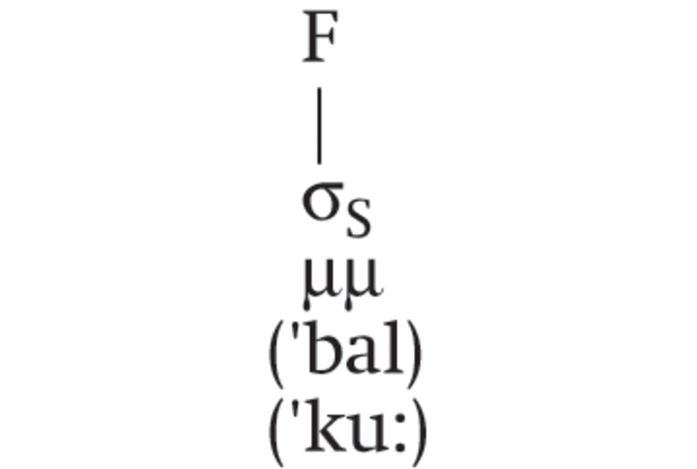
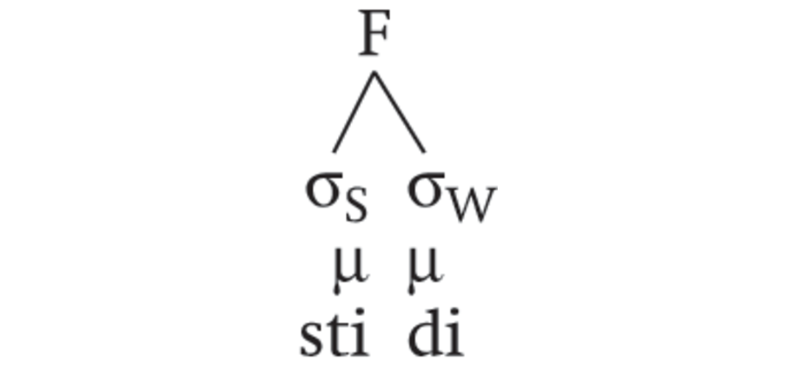
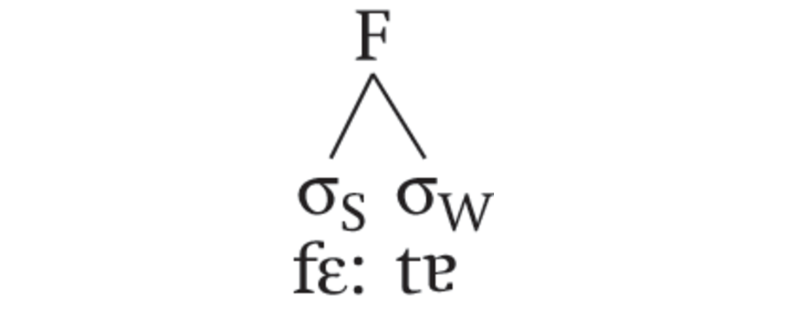
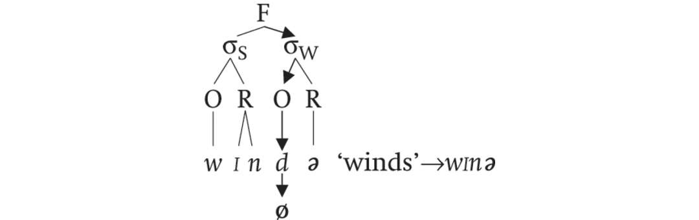
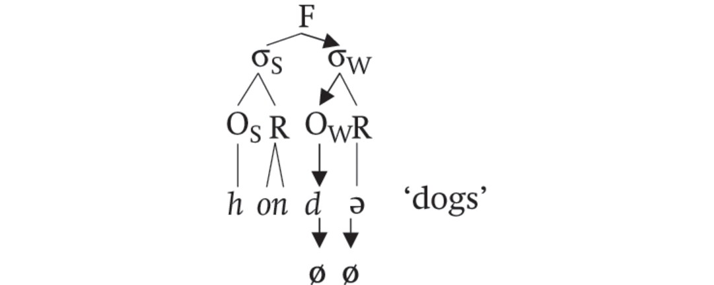
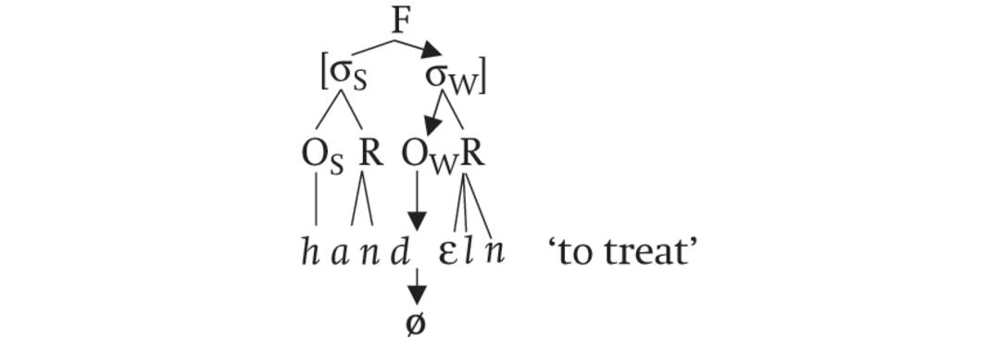
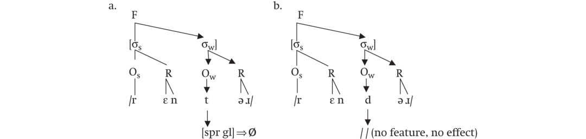

# [[page 49]] Chapter 3 The Role of Foot Structure in Germanic

**Contributor(s):** Laura Catharine Smith

## 3.1 Introduction

For students and scholars of Germanic, it is difficult to deny prosody’s important role in shaping the history of the Germanic languages from their earliest written monuments to the modern varieties spoken today. Just as analyses of historical phenomena drew on the syllable (e.g. Murray and Vennemann 1983), stress (e.g. Verner’s Law), quantity and quantity changes, as well as the contrast between heavy (long) and light (short) stems, these same elements of prosody continue to shape the modern languages. Indeed, the role of these prosodic units is important enough that syllables, stress, accent, and quantity in Modern Germanic are each treated as separate chapters in this volume.

One additional level of the prosodic hierarchy has in more recent decades shown promise in accounting for phonological and morphophonological patterns in Germanic, namely the foot, and more specifically the trochaic foot. Appealing to the trochee which ties the syllable, stress and in some cases quantity together highlights a common thread linking historical developments such as Siever’s Law in Gothic and high vowel deletion in Old English to seemingly unrelated patterns in the modern Germanic languages such as lenition and plural formation in Standard German and Dutch.

Focusing on data from the modern Germanic languages and varieties, this chapter seeks to demonstrate the various ways by which the trochee plays a role in these languages ranging from a phonological role licensing segments and segmental features to a morphophonological role in which the trochee determines the stem shape of lexical classes. As such, the foot in Germanic serves as a prosodic template underpinning various aspects of the languages. This chapter does not set out to provide an exhaustive survey of all modern Germanic languages, nor does it seek to discuss the specifics of foot structure, extrametricality, [[page 50]] or the likes; instead this chapter is intended to highlight how the foot and foot-based templates can help us better understand linguistic phenomena in the modern German languages. By drawing primarily on data from West Germanic, the chapter’s intention is to invite other scholars to consider additional potential linguistic phenomena which may be better analyzed in terms of the foot and foot-based templates.

To this end, the chapter begins in Section 3.2 by introducing the reader to the formation of both the moraic and syllabic trochees at work in the modern Germanic languages. Next in Section 3.3, I outline the role of the foot in phonological patterns including cluster simplification and consonant lenition in medial onsets as well as vowel reduction. Next, Section 3.4 explores how the trochee has shaped morphological patterns such as German and Dutch plurals as well as Dutch diminutive formation. Section 3.5 highlights how rethinking Frisian and Scandinavian vowel balance in terms of the trochee ties this phenomenon to other Germanic data. The chapter concludes in Section 3.6.

## 3.2 Foot Formation and the Foot-Based Template in Germanic

To understand the foot’s role in the Germanic languages, it is critical to define the structure of the trochee and foot-based templates. As illustrated in the Prosodic Hierarchy in (1), individual sounds combine to form syllables which in turn come together to form feet.

1. (1)


As noted, the predominant foot in Germanic is the trochee. Although this foot type is typically defined in terms of a sequence of two syllables, the first of which is more prominent or salient (see van der Hulst 1999, Löhken 1997, etc.), e.g., German *Vá.ter* ‘father’, *Brú.der* ‘brother’ where the period represents the syllable break, there are actually two types of trochees at work in the modern Germanic languages, namely the moraic trochee and the bisyllabic trochee. Both types of trochees arise from the principle of foot binarity (see Prince and Smolensky 1993) which stipulates that trochaic feet must have either two syllables as in *wín.ter*, or they must have two moras as in German *Kuh* ‘cow’.

### [[page 51]] 3.2.1 Moraic Trochees

Since the moraic trochee appears in weight (or quantity) sensitive languages, we see it in all the modern Germanic languages except Faroese and Icelandic (Lahiri, Riad, and Jacob 1999, Árnason 2011). Foot binarity emerges in this trochee in terms of bimoricity where either a single heavy syllable ending in a long vowel (V:) or a closed syllable with a short vowel (VC) can form a foot on its own as in (2) below. Foot boundaries are denoted using square brackets.¹

(2) 1. a. Moraic trochee: single heavy syllables, e.g., German *Ball* ‘ball’ and *Kuh* ‘cow’

      ```tsv
      F	Foot level (F=Foot)
      (ˈH)	Syllabic level (H=heavy syllable of 2 moras)
      μμ	Moraic level (μ=mora)
      (ˈbal) ‘ball’ VC	Segmental level [rowspan=2]
      (ˈku:) ‘cow’ V:
      ```

    2. b.



In heavy syllables, the segmental material in the rhyme contributes to the weight. Each single short vowel and consonant is assigned a single mora as *Ball* illustrates, while long vowels are bimoraic as in *Kuh* [ku:] (see Broselow 1995). With their two moras, heavy syllables are capable of forming a foot. As depicted in (2b), the foot branches down to a single strong, i.e., stressed, syllable denoted by σ<sub>S</sub>.

The two moras necessary for moraic trochees, however, need not occur within the same syllable but can be spread across two adjacent syllables such that two light syllables, i.e., those ending in a short vowel, are seen as equivalent to the heavy footed syllable. This is illustrated in (3) for Old Frisian *stidi* ‘place’.

1. (3) a. Moraic trochee: light + light syllables, e.g., Old Frisian *stidi* ‘place’

  ```tsv
  F	Foot level (F=Foot)
  (L L)	Syllabic level (L=light syllable, 1 mora each)
  μ μ	Moraic level (μ=mora)
  [sti di] ‘place’	Segmental level
  ```

    1. [[page 52]] b.



Here the short vowel in each syllable is monomoraic meaning that the resulting syllable is light. Although the first light syllable is unable to build a foot on its own, it can do so with the following light syllable resulting in a bimoraic foot (ˈLL) equivalent to that of the single heavy syllable (ˈH). As the prominent syllable, the first syllable in the (ˈLL) foot attracts stress as marked by the subscript “s” in (3b) while the unstressed syllable is marked as weak, i.e., σ<sub>W</sub>.

### 3.2.2 Syllabic Trochees

These moraic trochees of the shape (ˈLL) with initial stress lend themselves to reinterpretation as syllabic trochees of the shape (ˈσσ) where syllable weight plays no role. Consider German *Vä́.ter* ‘fathers’ and *Brǘ.der* ‘brothers’. Both conform to the pattern of a stressed syllable followed by an unstressed syllable, i.e., (ˈσσ) as found for the (ˈσσ) foot above. However, in these words, initial syllables with their long vowels are actually heavy and yet the weight of the first syllable is irrelevant.

(4) 1. a. Syllabic trochee: (ˈσσ), e.g., German *Vä́.ter* ‘fathers’

      ```tsv
      F	Foot level (F = Foot)
      (ˈσ σ)	Syllabic level (L = light syllable, 1 mora each)
      μμ μ	Moraic level (μ = mora): irrelevant
      (fɛː tɐ) ‘fathers’	Segmental level
      ```

    2. b.



This heavy first syllable does not form a foot on its own. Instead, it is the sequence of two syllables, the first of which is stressed. This structure is critical in forming this trochee which plays a crucial role in the plural systems of Standard German and Dutch (see Section 3.4.1 below).

### 3.2.3 Moraic Versus Syllabic Trochees

We can thus summarize the two trochaic types as follows:

1. [[page 53]] (5) Summary of trochaic foot types

  Moraic trochee = (ˈH) or (ˈLL)

  Syllabic trochee = (ˈσσ)

Interestingly, both Löhken (1997) and Booij (1995, 1998) argue that the syllabic trochee is the most common or unmarked foot type for German and Dutch respectively. The heavy monosyllabic foot, Löhken notes, is a second possible foot type for German. As data in this chapter will demonstrate, e.g., German and Dutch plural formation, there is a role for syllabic trochees which are blind to the weight of the individual syllables even in languages where stress is influenced by weight sensitivity (cf. Alber, Chapter 4). Indeed, both syllabic trochees and moraic trochees formed by heavy syllables play a role in those languages. This role comes in the form of prosodic templates governing how sounds and phonological features are licensed in certain prosodic positions and how different morphological processes are shaped by the foot. In each case, the specific foot type, i.e., the moraic trochee or the syllabic trochee will be outlined.

### 3.2.4 Foot-Based Templates

Before continuing, it is critical to define what prosodic templates are. In many of the world’s languages, morphemes tend to have a “general phonemic shape” or “canonical form” which often matches or aligns with prosodic constituents such as syllables and feet (Downing 2006: 22). These canonical forms, or templates as they have come to be known, determine the shape of stems for morphological operations such as affixation, reduplication, croppings, or the shape of the output of these processes (cf. McCarthy and Prince 1995). Cross-linguistically, the canonical shape of lexical morphemes such as stems appears to be the foot (Downing 2006).

However, these templates have also played a role beyond shaping morphological stems and patterns. Just as syllables have been shown to license certain segments and segmental features (cf. Itô 1986), so, too, can the foot provide the basis for understanding the occurrence of some phonological patterns where for instance some processes such as lenition target certain foot positions which could not otherwise be explained using the syllable.

It will be in the application of foot-based templates to the data which follows that we gain a better understanding of how both moraic and weight-insensitive syllabic trochees play a role in shaping the Germanic languages. With this in mind, I now turn to a discussion of the trochee’s role in phonological patterns in Germanic before examining its role in shaping morphophonological patterns.

## [[page 54]] 3.3 The Role of the Foot in Phonological Patterns

As noted, scholars have demonstrated the foot’s role in phonological patterns in West Germanic (e.g., Booij 1995, Holsinger and Houseman 1998, Holsinger 2000). In this section, I outline how divergent processes such as lenition and loss of medial consonants, the licencing of the phonological feature [spread glottis] and vowel reduction are best explained by appealing to one common structure: a foot-based template.

### 3.3.1 Cluster Simplification in Medial Onsets²

In a number of German and Dutch dialects, medial nasal + stop clusters simplify by losing the stop. In word final position, however, these clusters are retained. This pattern is illustrated by the data from Buttelstedt German in (6).

1. (6) Medial simplification versus final retention in Buttelstedt German (Thuringian, East Central German dialect, data from Kürsten and Bremer 1910: 46, cited in Holsinger 2000)

  ```tsv
  Buttelstedt German	Standard German
  *wind ~ winə* ~ *winɪχ*	*Wind, Winde, windig*	‘wind, winds, windy’
  *khind ~ kinr̥*	*Kind, Kinder*	‘child, children’
  *blind ~ blinr̩*	*blind, blinder*	‘blind, blind [masc.sg. strong adj.]’
  *hund ~ hunǝχn̩*	*Hund, Hündchen*	‘dog, doggy’
  ```

In Standard German (middle column in (6)), the *nd* sequence is pronounced in medial and final position. However, in Buttelstedt, this consonant sequence is only retained in word final position, e.g., *wind, khind, blind*. In medial position, the *d* has been lost entirely. Medial weakening is not unusual. Indeed, “the canonical weakening environment is medial” (Lavoie 2001: 7). The question then remains how to best account for lenition in medial position. From a purely syllabic perspective, lenition of a medial onset consonant is perplexing. As the onset of the second syllable, the *d* in a word like *windig* (cf. 7) should be less likely to undergo loss or lenition than a preceding coda consonant, e.g., the *n*:

1. (7) Syllable structure of *Winde* ‘winds’


[[page 55]] The preference for the loss of coda consonants over onset consonants stems from the observation that the ideal syllable shape cross-linguistically is CV. According to Vennemann and others (e.g., Murray and Vennemann 1983, Vennemann 1988, also Hooper 1976), consonants in coda position are more likely to undergo lenition whereas onsets are more likely to be positions of consonantal strengthening, particularly in syllable contacts where a consonant in a syllable coda is immediately followed by another consonant in onset position as seen in (7). Thus, a syllabic perspective cannot adequately account for the medial plosive loss.

Similar difficulties arise for analyses drawing on perceptual cues such as Licensing by Cue (cf. Côté 2000, 2004) which have also been proposed to account for phonological patterns including consonant cluster simplification. This approach argues that consonants are more likely to be retained when adjacent to vowels which can convey their perceptual cues. Conversely, without an adjacent vowel to convey their cues, these consonants are more likely to undergo lenition and loss. Consider now the example *Wind~Winde~windig* in (6). When the *nd* cluster is in final position, the final *d* lacks a cue-carrying adjacent vowel. Conversely, when this same cluster appears in medial position, a following vowel *i* is available to carry the perceptual and acoustic cues of the *d*, meaning it would be less likely to be lost in medial position than in word final position. However, this is precisely the opposite to what happens: *d* is lost in the more favorable position in terms of perceptual cues. This theoretical approach thus fails to make accurate predictions for the West Germanic data.

Seen through the lens of the syllabic trochee, these data find a straightforward explanation. As Holsinger (2000) argues, the loss or lenition of consonants in West Germanic correlates well with foot medial position. In short, in *nd* clusters, *d* is more likely to undergo lenition and outright loss in the onset of a weak branch of a bisyllabic foot, i.e., the second syllable of the syllabic trochee. This is reflected in (8) where arrows point to the onset of the weak foot branch targeted for lenition and loss:

1. (8) *nd* clusters: loss of *d* in onset of weak branch of foot



As (8) illustrates, the voiced stop is unlicensed in the weak position of the trochaic foot in Buttelstedt. Such an approach is confirmed by [[page 56]] findings elsewhere. For instance, Raymond et al. (2006) argue that a strong head of a foot, i.e., a strongly stressed first syllable, is more likely to trigger consonant deletion or lenition in the onset of a following syllable. Strongly stressed syllables such as foot initial syllables permit consonants to be more fully articulated in that foot position than consonants found in less stressed syllables, i.e., nonheads of a foot.

Similar alternations between *nd~n* in final and medial positions arising from word cluster simplification are found in a variety of other dialects such as North Saxon and Northern Bavarian shown in (9):³

1. (9) *nd~n* alternations in German dialects: *Kind-Kinder* ‘child~children’ (Holsinger 2000)

  ```tsv
  Dialect	Final ~ Medial
  North Saxon, Holstein	*Ki****nd*** ~ *Ki****nn****er*
  Northern Bavarian	*ghi****nd*** ~ *ghi****n****ə*
  ```

Despite differences in the pronunciation of the initial consonants and plural endings, the loss of *d* in the medial *nd* cluster remains constant across these dialect forms and can be summed up as follows: *d* is lost in onsets of the weak branch of the trochee.

The same analysis can be applied to account for subtractive plurals in Hessian in which the plural form has less segmental material than the singular noun, e.g., *hond* (sg.) *~hon* (pl.) ‘dog~dogs’. As the examples in (10) illustrate, it is not only the *nd* clusters which simplify, but rather sonorant + stop clusters.

1. (10) Medial cluster simplification and subtractive plurals in Hessian (LC, NC) (data from Holsinger and Houseman 1998)

  ```tsv
  Original form	Loss of medial stop	Loss of plural ending
  *ho****nd****+e*	→ *ho****nn****e*	→ *ho****n*** ‘dogs’
  *va****ld****+er*	→ *vɛ****ll****er*	→ *vɛ****l*** ‘forest’
  *bɛ****rg****+e*	→ *be****rr****e*	→ *be****r*** ‘mountains’
  ```

In these examples, the double consonants indicate a preceding short vowel rather than the assimilation of the medial stop to the preceding sonorant. The subtractive plurals then arise from two processes. First, the failure of [[page 57]] the stop to be licensed in the onset of the weak branch of the foot leads to its loss which is next followed by the loss of the plural vowel ending. This is illustrated in (11).

1. (11) Hessian subtractive plurals



  Step 1: *d* in *nd* consonant clusters lost in onset of weak branch of foot

  Step 2: plural ending schwa is lost

As a result of the two steps, the plural has less segmental material *hon* than the original singular form *hond*.

Cluster simplification in other word forms in Hessian support the analysis above in which clusters simplify before schwa loss. Consider the word forms in (12) related to the root *Hand* in Westerwald.

1. (12) Cluster simplification in Hessian (examples from Westerwald, Hessian; Hommer 1910)

  ```tsv
  Hessian	Standard German
  *ha****nd*** ~ *hɛ****n*** *~ha****n****ɛln*	*Ha****nd****~Hä****nd****e~ha****nd****eln*	‘hand, hands, to treat, act’
  ```

As expected, the plural for *hɛ****n*** lacks both the plural ending and consonant cluster found word-finally in the singular *ha****nd***. The cluster has also been simplified word medially in the verb *handeln*, the loss of which is shown in (13).

1. (13) Loss of *d* in *handeln* in Westerwald German



Since *d* is in the onset of the nonhead of the foot, i.e., the weak branch of the foot, then it is targeted for loss. Next, the *n* in the coda of the first syllable is resyllabified as the onset of the following syllable.

In every example, the foot serves as a prosodic template where the realization of a consonant, i.e., fully realized versus lenited or completely lost, is dependent on the consonant’s position within the foot. Consonants within the head of the foot, i.e., the strong foot-initial [[page 58]] position are more strongly articulated with less variability than those found in the onset of the weak branch of the foot, i.e., the nonhead of the foot. Indeed, the medial stop lenition in the German dialects discussed above results from templatic constraints regarding the expression of features in specific positions of the foot, a result not restricted to consonant cluster simplification. Let us now turn to another type of word-medial consonant lenition.

### 3.3.2 Foot-Medial Consonant Lenition: Variability of Segmental Realization

The cluster reduction examples just discussed demonstrated one potential outcome for lenition in foot-medial onsets: the complete loss of the consonant. Loss, however, is not the sole outcome. Consider the variable articulation of the *nt* in American English *renter*. An informal survey by Smith et al. (2005) asking linguistically aware colleagues who were unaware of the purpose of the inquiry revealed the following (in)variability in pronunciation of word medial /nt/ and /nd/ clusters in *renter* versus *render*:

1. (14) Reported pronunciation for /nt/ and /nd/ clusters (Smith et al. 2005)

  ```tsv
  *renter*	[ɹɛ.nəɹ], [ɹɛ̃.ɾ̃əɹ]	highly variable (deletion, flapping, full articulation)
  *render*	[ɹɛn.dəɹ]	no variation
  ```

As the examples in (14) show, the /nd/ cluster in *render* lacks the variability of the /nt/ in *renter*. Since the two plosives are distinguished based on the unary feature [spread glottis] (cf. Holsinger 2000, and Salmons Chapter 6), the contrasting behavior can be explained in terms of the licensing of this feature drawing on Holsinger’s (2001) weak position constraint schema:

1. (15) Weak position constraint schema (Holsinger 2001: 103)

  “A feature is constrained in the non-head sector of a headed prosodic domain.”

As illustrated in (16), this means that [spread glottis] is constrained in the nonhead syllable, i.e., the weak or right branch of a trochaic foot. Consequently, since /d/ lacks the feature [spread glottis], then the appearance of this sound in the weak branch onset is left unaffected (16b). Conversely, since [spread glottis] applies to /t/, then its appearance in the nonhead, i.e., weak branch of the foot is impacted by the weak position constraint in (15) as highlighted by the arrows pointing to the parts of the weak branch syllable [σ<sub>w</sub>]:

1. [[page 59]] (16)



In other words, [spread glottis] is not licensed in the nonhead syllable of a foot. As such, the realization of /t/ is variable including the nasalized flap [ɾ̃] and even the deletion of *t*.

As these data illustrate, appealing to the syllable is inadequate since licensing of the feature [spread glottis] is done at the level of the foot. While the feature is explicitly licensed in head positions, i.e., the left branch of a trochee, the same is not true for its appearance in nonhead position.

Lenition of fortis plosives is also found in German dialects such as Odenwald (Freiling 1929, cited in Holsinger 2000) where [spread glottis] is only licensed in the onset of a strong branch of a foot, i.e., head of a foot, when the stop is immediately followed by a vowel. Thus /t p k/ are realized in this position as [tʰ pʰ kʰ], but in a trochee. In all other positions, e.g., syllable codas, consonant clusters, and onsets of nonhead syllables of feet, the allophone is the voiced or lenis counterpart, i.e., [d b g] respectively as in (17).

1. (17) [spread glottis] in Odenwald (Freiling 1929, cited in Holsinger 2000):

  ```tsv
  	***Prevocalic onset***	***In onset clusters***	***Medial***	***Final***⁴
  /t/	[**tʰ**a:dəl], [**tʰ**e:dər]		[fa:**d**ər]	[kʰol**d**]
  	Täter ‘perpetrator’		Vater ‘father’	kalt ‘cold’
  	*versus /d/ = [d] in all positions* [colspan=4]
  /p/ [rowspan=2]	[**pʰ**ebern]	[**b**lads]		[kʰal**b**]
  pappeln ‘to babble’	Platz ‘place’		Kalb ‘calf’
  	*versus /b/ = [b] in all positions* [colspan=4]
  /k/ [rowspan=2]	[**kʰ**abə]	[**g**lobə]		[ja**g**]
  Kappe ‘hood’	klopfen ‘to knock’		Jacke ‘jacket’
  	*versus /g/ = [g] in all positions* [colspan=4]
  ```

In sum, stops are fully realized as [spread glottis] in foot initial position. In all other positions, these underlyingly fortis stops are not fully realized as fortis and are subject to lenition.

[[page 60]] This analysis can be extended to account for other types of word medial lenition beyond those involving [spread glottis]. Holsinger (2000) provides a catalogue of the types of lenition processes impacting the onset of the nonhead syllable of the syllabic trochee in German, Dutch, and even some Scandinavian dialects. These processes include voicing of stops and fricatives, spirantization of stops, sonorization of stops, and deletion of fricatives. The interested reader is directed to Holsinger (2000: 21–22) for more details. In each of these cases of lenition, the data can be analyzed in terms of a failure of the relevant segmental feature to be licensed in the nonhead foot position leading to lenition.

### 3.3.3 Vowel Reduction in Nonhead Branches of Feet

Before concluding this section on the role of the foot-based template on segmental reduction, it is critical to acknowledge the role of the foot on vowels (see also Section 3.5). As for consonants, full articulation of vowels is more likely to be found in the head of a foot, i.e., the strong branch of a foot while vowels in the weak branch of a foot are subject to reduction or are already underlyingly centralized vowels such as [ǝ] or [ɐ] (cf. Booij 1995: 134). Examples from German illustrate this patterning:

1. (18)


Since vowels can be fully articulated in the head of a foot, for tense vowels this means their long allophone, e.g., [u:], [a:]. However, when tense vowels occur in the weak branch of the foot, they surface as the short allophones, e.g., [i] in *Uni*, or they are underlyingly short or reduced, /ɐ/ or /ǝ/.

### 3.3.4 Shaping Phonological Patterns: The Trochee as a Prosodic Template

To summarize, reduction processes impacting both consonants and vowels tend to stem from weak position constraints where features and the segments they define are fully expressed in the head of a foot, but weakly expressed – if at all – in other foot positions, e.g., the nonhead of the foot. Since the foot thus often serves to license features and segments in Germanic, it can consequently be viewed as a prosodic template stipulating the potential phonological form of words. Perhaps most interesting is that the trochee used in the consonantal and vocalic examples was a nonweight-sensitive syllabic trochee. And yet the actual choice of tense-lax phonemes in German is guided by syllable weight and shape: lax vowels occur in closed [[page 61]] syllables while tense vowels occur in open syllables. This underscores the distinction between the syllabic trochee used in these prosodic templates regardless of syllable weight and the weight-sensitive moraic trochee at work in determining stress placement.

Having shown the foot’s ability to license segments and segmental features, I next demonstrate its ability to shape morphological and lexical classes in West Germanic.

## 3.4 The Role of the Trochee in Shaping Lexical Classes and Patterns: German and Dutch Plurals

In addition to the trochee’s role in shaping phonological patterns, this foot type has also been shown to shape lexical patterns in Germanic. For instance, plural formation in German and Dutch is strongly guided by the syllabic trochee, as is diminutive formation in Dutch. For the sake of space, this section focuses on plural formation in Standard German and Dutch while also highlighting the foot’s role in the various dialects. For a description of the foot’s role in Dutch diminutives, the interested reader is directed to Smith (2009).

### 3.4.1 Plurals in Standard German and Dutch

Although the plural suffixes used in Dutch and German are different, plural formation in both languages is shaped by the syllabic trochee. Plurals of native words in both languages tend to end in a syllabic trochee thanks to the choice of suffix which is critical in aligning the plural form with the trochaic template. For Dutch, the choice between the plural endings *-en* and -*s* is determined by the shape of the singular noun (Booij 1998, van der Hulst and Kooij 1998). When the singular stem already ends in a trochee, then –*s* is added since it will not disturb the pre-existing trochaic pattern (19a). On the other hand, if the noun stem does not already satisfy the required trochaic shape, then the syllabic ending *-en* will be added to help the noun conform to the syllabic trochee (19b).

1. (19) Plural formation in Standard Dutch

  ```tsv
  **a. Stem is a syllabic trochee, -*s*: (ˈσσ) ➔ (ˈσσ)**	**b. Stem is not a syllabic trochee, -*en*: (ˈH) ➔ (ˈσσ)**
  vader – vaders ‘father—fathers’	boek – boeken ‘book—books’
  natie – naties ‘nation—nations’	non – nonnen ‘nun—nuns’
  ```

Thus, the plural suffix aligns the plural noun with the syllabic trochee template for the plural.

A similar pattern emerges in German where a variety of plural endings are available to help align the plural with the syllabic template (see 20). As for Dutch, when the noun stem already ends in a syllabic trochee, the [[page 62]] nonsyllabic plural options *-n* or Ø (no ending) ensure the noun continues to conform to the final syllabic trochee (20a). Conversely, for nouns not already ending in a trochee, the syllabic suffixes *-en, -e* or *-er* add the necessary unstressed syllable needed for the plural to map to the trochee (20b).⁵

1. (20) Plural formation in Standard German

  ```tsv
  a. Stem is a syllabic trochee: **(ˈσσ) ➔ (ˈσσ)** [colspan=2]	b. Stem is not a syllabic trochee: **(ˈσ) ➔ (ˈσσ)** [colspan=2]
  Ta fel***n*** ‘tables’	-*n* [rowspan=2]	Uh r***en*** ‘clocks’ Frau	-*en* [rowspan=2]
  Tan te***n*** ‘aunts’	***en*** ‘women’
  Leh rer ‘teachers’	No ending [rowspan=2]	Freun d***e*** ‘friends’	-*e* [rowspan=2]
  On kel ‘uncles’	Jah r***e*** ‘years’
  Vä ter ‘fathers’	No ending (with umlaut) [rowspan=2]	Bü ch***er*** ‘books’	-*er* (with or without umlaut) [rowspan=2]
  Brü der ‘brothers’	Kin d***er***
  ```

The five choices of plural suffixes in German are thus delimited based on the prosodic shape of the stem. Trochaic stems select from *-n* or *-Ø*, while choices for nontrochaic stems are *-en, -er*, and *-e*. These specific choices of ending are further determined by other factors such as gender, e.g., feminine nouns are more likely to end in -*n*.⁶

Two additional points can be made regarding German and Dutch plurals. First, the template constraining the output of plural formation as a syllabic trochee without reference to syllable weight, and second the mapping of plurals to this trochaic template is done at the right edge of the word. Interestingly, these prosodically driven plurals end in schwa syllables in the nonhead syllable of the foot. This schwa will either be part of the stem as for the trochaic singular nouns, e.g., German *Taf****e****ln, Onkel*,⁷ and Dutch *vaders*, or it will arise from the plural suffix itself. The plural template for German and Dutch can thus be formalized as in (21) (Smith 2007b: 362):

1. (21) Template for German and Dutch plurals


[[page 63]] As (21) illustrates, the template is mapped to the right edge of the word where the word must end in a bisyllabic foot, the last syllable of which must contain a schwa or syllabic sonorant.

The reality of the trochaic template for plurals has been confirmed in a variety of studies for German. Comparing the acquisition of German plurals by native-speaking German children with and without language learning difficulties, Kauschke et al. (2013: 574) found that children without speech problems performed better than children with language deficits at forming prosodically appropriate plurals of real and nonsense words. Children with language deficit seemed to “show a reduced sensitivity to prosodic requirements.” In another study, Smith et al. (2016) found that native German speakers overwhelmingly produced plural forms of nonsense words ending in a syllabic trochee. Moreover, subjects tended to rate incorrect plural forms matching the trochee, e.g., *Schlüssels* (incorrect but trochaic) more favorably than those which did not, e.g., *Schlüsselen* (incorrect but not trochaic). As these studies illustrate, the trochaic plural template is a part of a native speaker’s intuition which can be extended to new words. Indeed, even when natives failed to agree on endings in these studies, what was constant was their reliance on the trochaic plural form.

### 3.4.2 Plurals in German Dialects

Plurals in the German dialects reveal some differences from the standard language. For instance, in north central German dialects, the plural suffixes may not always match those in Standard German, e.g., *Fensters*, but the syllabic trochee nevertheless continues to shape the plural forms in these dialects as in (22):

1. (22) Plural forms using the syllabic trochee (unexpected endings bolded)

  ```tsv
  	Dialect Sg. – Plural	Standard German	Glosses of singular
  West- and	Schååp – Schååpe	Schaf – Schafe	‘sheep’
  Eastphalian	Aug(e) – Augen	Auge – Augen	‘eye’
  (Durrell 1989)	Fenster – Fenster**s**	Fenster – Fenster	‘window’
  Upper Saxon	[dag] – [da:ɣə]	Tag – Tage	‘day’
  (Bergmann 1989)	[jast] – [jestə]	Gast – Gäste	‘guest’
  	[dorf] – [derfər]	Dorf – Dörfer	‘town’
  ```

Likewise in East Low German, plurals by and large conform to the syllabic trochee as in (23). However, some monosyllabic stems undergo vowel lengthening, e.g., [dax] ‘day’ – [daːːx] ‘days’ creating a single superheavy monosyllabic trochee. This results from the loss of final –*e* which is used to mark the Standard German plural forms for [[page 64]] words like *Tage*. Consequently, it is the lengthened stem vowel which denotes the plural form. These plurals nonetheless conform to a foot, but instead of the syllabic trochee (ˈσσ), they conform to a superheavy moraic trochee. Although it could be argued that the single form was already a (ˈH) moraic trochee, this lengthening draws on the superheavy syllable and foot at work in, for instance, Dutch (Booij 1998) and creates a greater distinction between the singular and suffixless plural.

1. (23) Plurals in East Low German: syllabic trochees and vowel lengthening in monosyllables

  ```tsv
  	Dialect Sg. – Plural	Standard German	Glosses of singular
  East Low German (Schönfeld 1989)	[slœːtl] – [slœːtl**s**]	Schüssel – Schlüssel	‘key’
  	[stɔk] – [stœkæ]	Stock – Stöcke	‘stick’
  	[haːrt] – [haːrtn]	Herz – Herzen	‘heart’
  BUT:	[dax] – [daːːx]	Tag – Tage	‘day’
  	[slax] – [slεːːç]	Schlag – Schläge	‘hit’
  ```

Vowel lengthening has been found in the plurals of other dialects such as in North Saxon as well. In this dialect, some plurals which are formed using a suffix in Standard German, e.g., *Schiff ~ Schiffe* ‘ship~ships’, exhibit instead lengthened vowels in the plurals, e.g., *Schipp ~ Scheep*. This alternation between the vowels in the singular and plural forms reflects a similar vowel contrast in Dutch, e.g., *schip ~ scheepen* but which also includes a suffix as in (24).

1. (24) Plurals in North Saxon: vowel lengthening (Goltz and Walker 1989)

  ```tsv
  	Dialect Sg. – Plural	Standard German	Glosses of singular
  	Schipp – Scheep	Schiff – Schiffe	‘ship’
  	Dag – Daag’	Tag – Tage	‘day’
  	Breef – Breev’	Brief – Briefe	‘letter’
  Vowel lengthening in some Dutch plurals [rowspan=3]	schip – scheepen [eː] [colspan=4]
  glas – glazen [aː] [colspan=4]
  blad – bladen [aː] [colspan=4]
  ```

The alternation between the short vowel of the singular with the long vowel of the plural in the absence of a suffix yet again demonstrates that a heavy stem, i.e., one corresponding to a moraic trochee, satisfies the trochaic template in these dialects for plural formation.

The effects of the trochaic plural in Standard German and Dutch have in some dialects, e.g., Low Alemannic, become obscured. For instance, the singular ~ plural pairs for Standard German *day*, *night*, and *arm* in (25a) all have plurals ending in –*e*. This vowel, however, has been lost in the Low Alemannic forms rendering a monosyllabic plural, i.e., one that clearly [[page 65]] does not correspond to the trochaic template in the standard language though which may be argued to conform to a moraic trochee. However, the (25b) plurals do indeed end in the expected syllabic trochee.

1. (25) Plurals in Low Alemannic (Philipp and Bothorel-Witz 1989) versus Standard German

  ```tsv
  Low Alemannic [colspan=2]	Standard German [colspan=3]
  Singular	Plural	Singular	Plural	Gloss
  ```

    a. ```tsv
      /tɑːj/	/taːj/	Tag	Tage	‘day’
      /nɑxt/	/naxt/	Nacht	Nächte	‘night’
      ```

    b. ```tsv
      /plyːəm/	/plyːəmə/	Blume	Blumen	‘flower’
      /manʃ/	/manʃə/	Mensch	Menschen	‘people’
      ```

The failure of some forms to fit the syllabic trochee arises from the interplay of prosody and loss of final sounds in the dialect where the final sound of the plural marker is lost. If the plural marker is originally just schwa, as in *Tage*, then its loss leaves the plural without a suffix, /taːj/. However, for plurals originally ending in *-en, Blumen*, the loss of the final sound *-n* would still leave a plural marker on the noun, namely schwa, /plyːəmə/. Thus the loss of final sounds in the dialect obscures the trochaic plural pattern.

Plural formation in the dialects reveals two ends of the spectrum. First, in some dialects, plurals are formed using the syllabic trochee, while in others, vowel lengthening can create a superheavy moraic foot which satisfies the trochaic template. And in yet others, the prosodically driven plural pattern has been obscured by subsequent sound changes at work in the dialect.

Before closing, it is worth noting that West Germanic is not the only Germanic branch impacted by the trochee. Indeed, one pattern, namely vowel balance, appears across the history of both Frisian, a West Germanic language, and some East Scandinavian dialects of North Germanic. To date, this process has typically been associated with level stress rather than foot structure.⁸ In Section 3.5, I briefly describe how the foot provides a unified approach to vowel balance.

## 3.5 Reinterpreting Stress-Based Analyses in Terms of the Foot: Vowel Balance

In vowel balance, the quantity and quality of the vowel in a second syllable depends upon the quantity of the first syllable (Kusmenko and [[page 66]] Riessler 2000: 211, see also Riad 1992). In its earliest manifestation in Old Frisian (Riustring dialect), Old Swedish, and Old Eastern Norwegian manuscripts (cf. Kusmenko 2007), the full vowels *a, i*, and *u* appear after short syllables, while the reduced (or centralized, see Versloot 2008: 81) vowels *æ* (Scandinavian) */ e* (Frisian), *e*, and *o* occur after long syllables as in (26):

1. (26) Vowel balance in Old Frisian and Old Swedish

  ```tsv
  	***i* and *u* after short stems (VC)**	***e* and *o* after long (V:C and VCC) and polysyllabic stems**
  Old Frisian (Smith 2007a) [rowspan=4]	god***i*** ‘God, dat. sg.’	liod***e*** ‘people, nom. pl.’
  wet***i***r ‘water, nom./acc. sg. nom. pl.	himul***e*** ‘heaven, dat. sg.’
  skip***u*** ‘ship, nom. pl.’	bok***o***n ‘book, dat. pl.’
  him***u***le ‘heaven, dat. sg.’	gers***o*** ‘grass, nom. pl.’
  Old Swedish (Versloot 2008)	faÞir ‘father, nom.sg.’	môÞer ‘mother, nom.sg.’
  	faÞur ‘father, acc.sg.’	môÞor ‘mother, acc.sg.’
  ```

As (26) illustrates for the old languages, the full vowels occur following short (or light) stems, but are reduced following long (or heavy) stems as well as polysyllabic stems. At this stage, the contrast is easily observable without other processes, e.g., vowel harmony, vowel lengthening, or even deletion, obscuring the pattern in the modern dialects.

Accounts for vowel balance typically draw on moras and word stress (Perridon 2002, Kusmenko and Riessler 2000). In these accounts, the first two moras of originally long bisyllabic words are stressed leaving the third mora vulnerable to reduction and loss. For the sequence of two light syllables, however, the stress was evenly distributed across the two syllables as so-called ‘level stress.’ Level-stress vowels were argued to retain their quality thereby failing to reduce.

This analysis can be reinterpreted in simpler terms via the moraic trochee. When the *i, u*, or *a* is footed with the preceding light syllable as in (27a), it is retained. Conversely, since heavy syllables are able to form [H] feet on their own without the following vowel (cf. 27b), then the following vowel is left subject to reduction and loss.

1. (27) A foot-based account of Old Frisian vowel balance

  ```tsv
  a. Foot structure of OFris *stidi* ‘place, acc./dat. sg.’	b. Foot structure of OFris *gerso* ‘grass, nom.pl.’
  F	F	Foot level
  (L L)	(H) L	Syllabic level
  μ μ	μμ μ	Moraic level
  [sti. di]	[wral] de	Segmental level
  ```

[[page 67]] In the old period of these languages, a vowel’s inability or ability to be footed with the initial foot determined whether it would be lost or retained respectively. That the vowel was retained in the second syllable of a [LL] foot contrasts with the reduction of these vowels in modern German outlined in Section 3.3.1 above. Since level stress spread stress evenly across both syllables of the bisyllabic foot as opposed to the initial syllable in the modern German trochee, then the vowel in that second syllable was not as susceptible to loss (see also Riad 1992 for a similar analysis for Scandinavian).

Vowel balance continues to persist in some modern dialects of Weser Frisian and northeastern Scandinavian. Consider the examples from Wursten and Wangeroog Frisian in (28). Following light stems, *i* and *u* are retained, while *a* appears as either *e* or schwa. The dialects differ, however, in their treatment of vowels following heavy stems. For Wursten, unfooted vowels reduce to schwa, while they undergo apocope in Wangeroog.

1. (28) Vowel balance in Weser Frisian dialects

  ```tsv
  Dialect	Light first syllable (level-stress)	Heavy first syllable
  Wursten Frisian (Smith and van Leyden 2007) [rowspan=2]	/(hood)-mik**ii**r/ ‘hat maker’	/(kon)-joot**ǝ**r/ ‘pot moulder’
  	/nuk**uu**de/ ‘naked’
  Wangeroog Frisian (Kock 1904)	hunǝ ‘chicken’ (OFr. hona)	mó<sup>u</sup>n ‘moon’ (OFr. môna)
  	stidi ‘stead’ (OFr. stidi)	Þûm ‘thumb’ (OFr. thûma)
  	sxypu ‘ship’ (OFr. skipu)
  ```

The modern Scandinavian dialects have likewise inherited the historical pattern where the vowel following the heavy syllable has either reduced or apocopated:

1. (29) Vowel balance in modern Scandinavian dialects (Kusmenko 2007, unless otherwise stated)

  ```tsv
  Dialect	Light first syllable	Heavy first syllable
  	(level-stress)
  Houtskär (Finland; Kusmenko 2007; Kock 1904)	bakå ‘to bake’	kast ‘to cast’
  	hakur ‘chin’	fall (OSw. falla) ‘to fall’
  		tjeldor (OSw. kældor) ‘sources’
  Norrland (Kusmenko 2007)	baka ‘to bake’	kaste/kâst ‘to cast’
  Ormsö/Nukkö (Kock 1904)	droepa ‘to strike dead’	brinn (← brinna) ‘to burn’
  ```

[[page 68]] Due to space constraints, the situation is admittedly simplified (cf. Kusmenko 2007, Kusmenko and Riessler 2000, Smith and van Leyden 2007). As in Frisian, final *a* tends to undergo either loss or reduction following a heavy syllable, while other vowels, e.g., *u* reduce to *o.* After light first syllables, however, this *a* (or *å*) has in some dialects undergone additional lengthening.

Notably in some of the most archaic dialects, a type of vowel balance arises with a trimoraic requirement for bisyllabic words (Kusmenko and Riessler 2000). This rule has two consequences. First, the initial syllable may contain two moras followed by a monomoraic syllable. The vowel here is retained. Second, when the initial syllable is monomoraic, i.e., a light stems, the second mora, i.e., the vowel in the second syllable, is lengthened, e.g., *viku*: (OIcel. *viku*), *stugu*: (OIcel. *stugu*) in Vågå (Norway). This trimoraic requirement could be interpreted as a trimoraic foot template applying to bisyllabic feet. With level stress, it could be argued that the equal intensity of the second syllable would lend itself well to lengthening. This appears substantiated by Kristoffersen’s (1990: 191–195, cited in Smith and van Leyden 2007) findings that the second syllable in level-stress environments is longer than the initial syllable in Nord-Gudbrandsdalen.

In sum, the moraic trochee can account for the alternations in the vowel balance data. First, the foot becomes the domain of stress, with a single heavy syllable foot attracting the stress to itself, or the syllabic trochee sharing the stress across the foot.⁹ Since the second syllable of a foot with level stress tends to be longer than the initial syllable, then the consequence is to not only offset the tendency to reduce vowels in the second syllable of the [σ́σ] trochees, but indeed to reinterpret the second vowel of the foot as long in some dialects. The real take-away is that this phenomenon can be reinterpreted as arising from the interaction of stress with the foot.

## 3.6 Conclusion

As the data presented in this chapter demonstrate, the foot does play a varied role in shaping the Germanic languages. Phonologically, this influence includes licensing features in the head of the foot template, but failing to do so even in onsets of weak branches of the trochee. At times the lenition that arises worsens phonetic cues. The trochee also shapes the output of morphological processes such as Dutch and German plural formation or the stem shape for suffixation as in [[page 69]] Dutch diminutive formation. And lastly, some processes which may be attributed to other factors, such as stress, may be reinterpreted in terms of the foot as with vowel balance in Frisian and Scandinavian thereby tying this phenomenon to the many others from Germanic’s history. This chapter has scratched the surface regarding the foot’s role in shaping the Germanic languages both historically and in modern times. The invitation is now extended to the reader to continue seeking out additional ways the foot has influenced (morpho)phonological patterns across the Germanic languages.

## Footnotes
