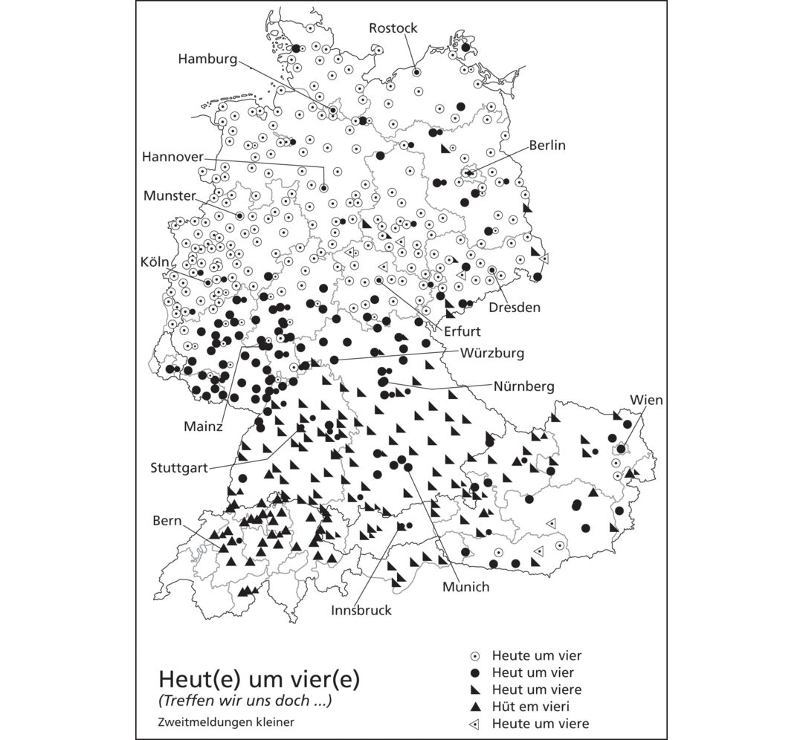
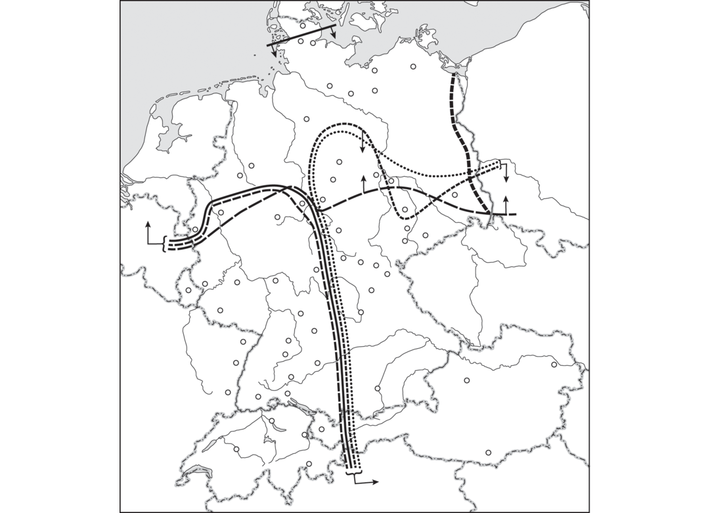
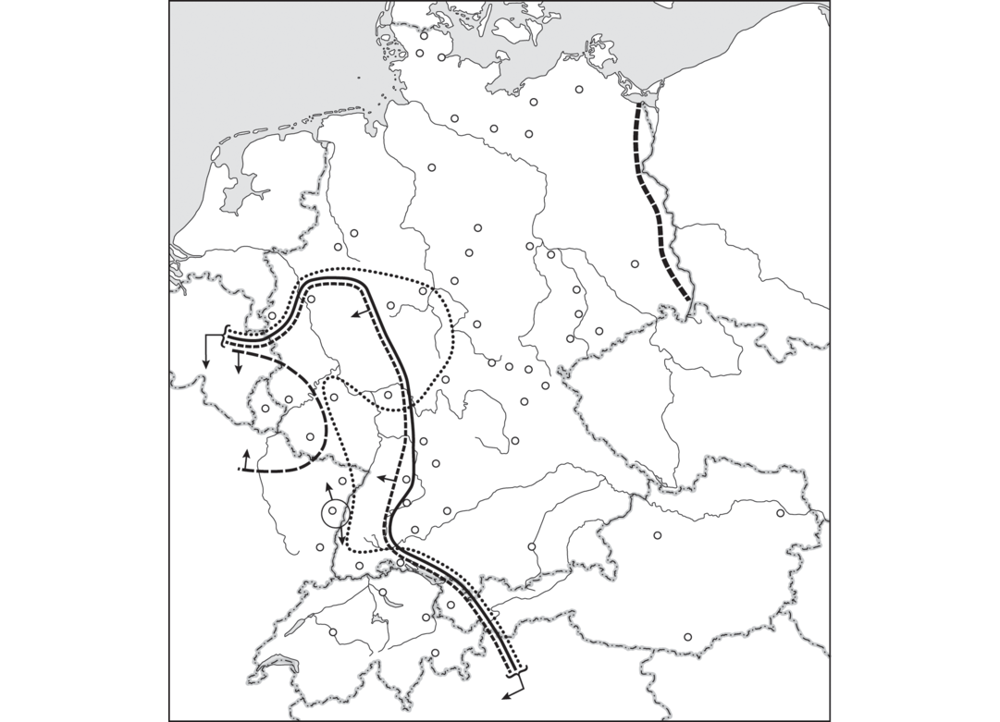
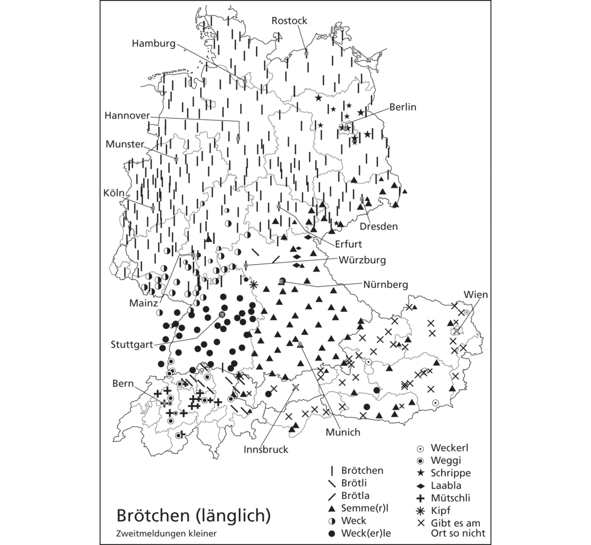
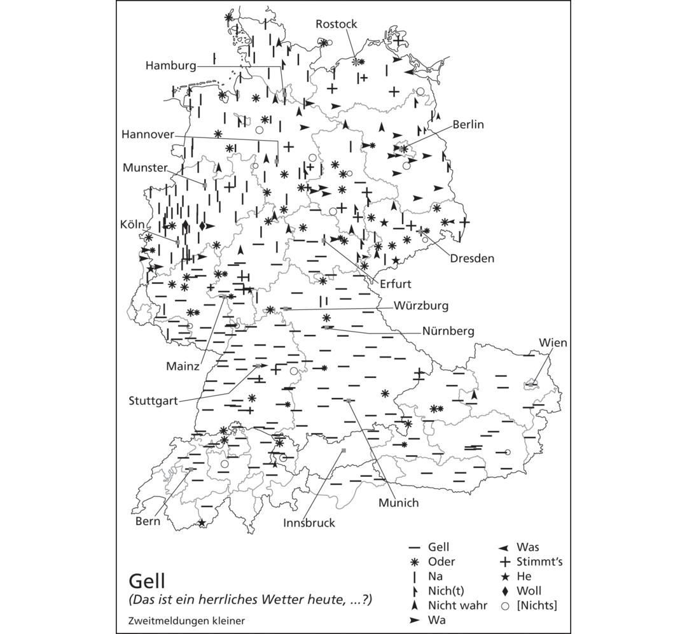

# [[page 736]] Chapter 31 The West Germanic Dialect Continuum

**Contributor(s):** William D. Keel

## 31.1 Introduction

The linguistic variation within the area of north central Europe traditionally labeled West Germanic can be considerable. While everyone is familiar with “the standard varieties of” Dutch and German, the terms cover a rich array of different spoken forms of the language. Peter Wiesinger (1980) devised a four-way classification of these spoken varieties that may be applied generally throughout the areal called Continental West Germanic: (i) the high or standard variety (*Standardsprache*); (ii) a broader regional colloquial variety (*Umgangssprache*); (iii) a narrow regional colloquial variety (*Verkehrsdialekt*); (iv) a localized base dialect (*Basisdialekt*). In this chapter, we will explore the varieties within the traditional base dialects that make up the Continental West Germanic dialect continuum. This continuum involves all aspects of the varieties in question: the sound system, its morphosyntactics, its lexicon.

Typically, only neighboring base dialects are mutually intelligible, while base dialects a great distance from one another are not. Low German varieties, Upper German varieties, and even some Middle German varieties when spoken as a base dialect may not be intelligible to people who know only Standard German. All West Germanic base dialects belong to the dialect continuum that includes High German (Middle and Upper German) and Low German. This West Germanic dialect continuum also includes the base varieties spoken in the area where Netherlandic serves as the high variety. There are also pockets of Frisian varieties belonging to West Germanic along the North Sea Coast (see Frisian at the end of this chapter). The terms “Low” and “High” German derive from the topography where these base dialects are spoken rather than from social conditions. Low German base dialects are thus found in the north in the lowlands (e.g., The Netherlands) along the seacoasts of the North and Baltic Seas; High [[page 737]] German base varieties include Middle German base dialects (in the Central Highlands) and Upper German base dialects in the pre-Alpine and Alpine region in the south.

This chapter will discuss the major characteristics defining Low, Middle and Upper German base dialects in West Central Europe, to include varieties associated with the continental West Germanic languages bordering on the core German-speaking countries of Germany, Switzerland, and Austria such as Dutch, Luxembourgish, or Alsatian. For a more in-depth overview of these dialects, the reader is referred to Keller (1961), Russ (1989), and Schirmunski (2010).

The continental West Germanic region roughly encompasses the territory of modern-day Germany, Austria, the German-speaking part of Switzerland, the Netherlands, the northern half of Belgium (Flanders), Liechtenstein, Luxembourg, and South Tyrol in northern Italy. The continuum also includes areas of neighboring countries where a variety of German is spoken: the southern border region of Denmark (North Schleswig), as well as enclaves of German in Bohemia (western Czech Republic), Slovenia, Hungary, and Romania among others. One should also note the presence of non-German/Low Franconian/Frisian enclaves within this West Germanic areal, e.g., Sorbian in eastern Germany, which is a West Slavic variety. The principal dialects are outlined on the map in Figure 31.1.

![[[page 739]] Map 31.1 Westgermanic Dialect Continuum: Low German varieties 1–11; Low Franconian (Dutch) varieties 12–20; Middle German varieties 21–28; Upper German varieties 29–32; Frisian varieties 33–35. https://commons.wikimedia.org/wiki/File:Deutsch-Niederl%C3%A4ndischer_Sprachraum_(nach_Werner_K%C3%B6nig).png.](images/putnam-ed-2020-cambridge-handbook-germanic-42186fig31-1.png)

The labeling of the dialects according to the extent of the spread of the characteristics of the second consonant shift led to the division into Low and High German and the division of the High German dialects into Middle and Upper German. The labels for the individual dialects are often based on the names of the early medieval Germanic tribes. These dialects can also be grouped and classified differently, which may be illustrated at the very least by the transitional dialects and areas of overlap and convergence existing between all dialects.

An example of an area of dialect convergence is the dialect known as Berlinerisch, which is widely used in the region of Brandenburg and which has both Low- and Middle-German linguistic characteristics.

The area of our focus is largely contained within the area that uses Modern Standard German as its high variety (Germany, Austria, Liechtenstein, South Tyrol, Switzerland, Luxembourg, and a few cantons in eastern Belgium). In the Netherlands and northern cantons of Belgium, that standard variety is Standard Dutch (*Algemeen Beschaafd Nederlands*). Standard Luxembourgish (*Lëtzebuergesch*) is also a high variety in the Grand Duchy of Luxembourg plus the region of Arlon in southeastern Belgium. Standard German itself is nowadays considered to have at least five regional standard varieties, largely divided along the boundaries for the dialectal varieties of West Germanic: (i) North German corresponding to the Low German dialect region; (ii) Middle German encompassing the central section [[page 738]] [[page 740]] of Germany from Luxembourg to Saxony; (iii) South German with the major states of Baden-Württemberg and Bavaria; (iv) Austrian German; and (v) Swiss German (cf. Knipf-Komlósi and Berend 2001).

From the beginning of recorded Central European history in the early Middle Ages, there was a realization that numerous varieties of “German” were spoken and written. The medieval German author Hugo von Trimberg (ca. 1230–1313) describes the linguistic variety in the German world (ignoring those in northern Germany) in his literary work *Der Renner* (ca. 1300, verses 22265–22276, www.staff.uni-marburg.de/~naeser/renner.htm) as follows (modern German translation lejastierras.blogspot.com/2011/08/von-mancherlei-sprache.html; English by the author):

```tsv
Swâben ir wörter spaltent,Die Franken ein teil si valtent,Die Beier si zezerrent,Die Düringe si ûf sperrent,Die Sahsen si bezückent,Die Rînliute si verdrückent,Die Mîsener si vol schürgent,Egerlant si swenkent,Oesterrîche si schrenkent,Stîrlant si baz lenkent,Kernde ein teil si senkent …	Die Schwaben spalten ihre Wörter,Die Franken falten sie teilweise,Die Bayern zerren sie auseinander,Die Thüringer sperren sie auf,Die Sachsen überlisten sie,Die Leute vom Rhein unterdrücken sie,Die Wetterauer würgen sie,Die Meißener stoßen sie völlig,Egerländer schleudern sie,Österreicher stellen sie schräg,Steierländer biegen sie besser,Kärntner senken sie teilweise.	The Swabians split their words,The Franks merge them partially,The Bavarians tear them apart,The Thuringians open them up,The Saxons circumvent them,The Rhinelanders suppress them,The Wetterauers choke them,The Meißeners shove them totally out,Egerlanders hurl them,Austrians skew them,Styrians turn them better,Carinthians lower them partially…
```

Some might read into this description of the Middle and Upper German dialects an attempt to describe the various vowel sounds in these varieties: some varieties diphthongizing vowels, others monophthongizing, lowering or raising vowels. As we shall see, some of those characterizations may have been close to reality and mirror the variation found today within the continuum.

The following discussion will reflect the varieties of West Germanic depicted on the map at Figure 31.1, which includes base varieties / dialects such as Low Prussian and Silesian, which, due to the displacement of the German-speaking population following the Second World War, are no longer part of that continuum.

## 31.2 Netherlandic and Low German

The northernmost group of dialects in Germany is termed Low German (often called Platt, Plattdeutsch or Low Saxon) and has the status of a regional [[page 741]] minority language in Europe. There is also an Institute for Low German Language in the city of Bremen, which promotes and helps maintain the use of Low German. The Low German varieties along the lower Rhine River, based on their distinctive characteristics, are classified as Low Franconian dialects. Closely related to these Low Franconian varieties in northwestern Germany are those dialects with Dutch (*Algemeen Beschaafd Nederlands*) as their standard language. The Dutch-speaking area of Central Europe includes the Netherlands and the northern cantons of Belgium, where the language is called Flemish, which extends historically into northeastern France (Dunkirk). The Flemish area in Belgium and the varieties in the southern, central and western areas of the Netherlands are part of the Low Franconian dialect area. The northeastern part of the Netherlands, however, is part of the Low Saxon/Low German dialect area. On the other hand, West Frisian in the northwest of the Netherlands as well as the North Frisian on the North Sea Coast of Schleswig-Holstein and the remnant of East Frisian (Saterland Frisian) in northwestern Germany are part of a separate West Germanic language group (see Frisian in Section 31.8).

“Low” varieties of West Germanic are found in the lowlands along the coasts of the North Sea and the Baltic Sea as noted earlier. The defining factor for all “Low” varieties of West Germanic is that they do not reflect the consonant changes of the High German consonant shift (see below). Internally, the “Low” West Germanic varieties are further divided into (northwestern) Dutch Low Franconian, West Low German and East Low German based on a feature of their verb morphology. A common characteristic of the verb in all of these varieties is the uniform ending for all three persons in the present indicative plural, as in (1) (see also the discussion of the morphological continuum later in this chapter).

(1) ```tsv
  Plural verbal inflection in Dutch and varieties of Low German **Dutch (Low Franconian)** [colspan=2]	**West Low German**	**East Low German**
  wij maken	‘we make’	wi maakt	wi make(n)
  jullie maken	‘you make’	ji maakt	ji make(n)
  zij maken	‘they make’	se maakt	se make(n)
  ```

### 31.2.1 Varieties of Low Franconian

As described above, the Low Franconian dialect continuum is located in the western, central, and southern Netherlands, the northern half of Belgium (Flanders), an area in northeastern France (French Flanders) and northwestern North Rhine-Westphalia along the Lower Rhine. This Low Franconian continuum includes such dialects as Hollandic, Limburgish and Brabantian as well as East and West Flemish in Belgium and Kleverländisch and Bergisch in northwestern Germany (see Figure 31.1). South Africa and Namibia also [[page 742]] exhibit the dialects of Afrikaans, which were possibly derived via creolization of the Low Franconian dialects spoken by the early European settlers in South Africa (see Markey 1982; Roberge, Chapter 35). Some Low Franconian varieties such as Limburgish are viewed today as regiolects (informed by Althaus et al. 1980: 458–464; Donaldson 1983; Brachin 1985; “Dialects” at en.wikipedia.org/wiki/Dutch_language; “Low German” at en.wikipedia.org/wiki/German_dialects); “Niederfränkisch” at de.wikipedia.org/wiki/ Deutsche_Dialekte.

### 31.2.2 Low German Dialects

Low German dialects have been spoken and written in northern Germany until the present day, especially in rural areas. From the late Middle Ages until the Early Modern period, varieties of Low German were also widely employed in written documents in northern Germany for legal and commercial purposes, e.g., the variety common in Lübeck was in essence the official language of the Hanseatic League throughout the Baltic and North Sea region. After the sixteenth century with the decline of the Hanseatic League and the massive influence of the High German Lutheran Bible in the aftermath of the Protestant Reformation, there was a near complete loss of written forms of Low German by the middle of the seventeenth century. Beginning in the mid-nineteenth century, a rebirth of literary writing in Low German came about through such authors as Fritz Reuter and Klaus Groth.

Despite efforts by some radio and television stations to broadcast in Low German (such as Norddeutscher Rundfunk with its popular shows “Talk op Platt” and “Die Welt op Platt”) and some newspapers publishing articles in Low German, the prognosis for the continuance of the Low German varieties is not good. Since 1800, mandatory schooling and the use of Standard German (High German) in schools have had a massive impact on the use of Low German varieties in everyday life. Often, only the older population is able to speak and understand the Low German varieties.

The dialects of Low German are subdivided as described above into West Low German and East Low German. Extending eastward from just west of the German-Dutch border, West Low German includes the dialects of the northeastern provinces Overijssel, Drenthe, Gelderland, and Groningen in the Netherlands. Within Germany, West Low Saxon is traditionally divided into Westphalian, Eastphalian, and North Low Saxon dialects with further subdivisions reflecting the specific usage in the northern German states of Schleswig-Holstein (e.g., Holsteinish and Schleswigish) and Lower Saxony (e.g., East Frisian and North Hannoverian).

The East Low German dialects developed from the varieties brought by medieval settlers from the West Low German region as they migrated across the northern German plain parallel to the Baltic Sea coast to establish new communities extending to the easternmost part of the Baltic Sea. East Low German includes Brandenburgish (Märkisch) and Mecklenburg- [[page 743]] Vorpommersch. Historically, East Pomeranian and Lower Prussian belonged to East Low German. Linguistically, the city dialect of Berlin, Berlinerisch, is a Middle-German/Low-German mixed dialect as noted earlier, and is associated along with Südmärkisch to both East Low German and East Middle German (see Althaus et al. 1980; Russ 1989; “Low German” at en.wikipedia.org/wiki/Low_German and en.wikipedia.org/wiki/German_dialects; “Niederdeutsche Mundarten” at de.wikipedia.org/wiki/Deutsche_Dialekte).

## 31.3 High German Dialects

The dialects to the south of the Low German group are defined by the impact of the Second or High German Consonant Shift. The High German Consonant shift did not occur at all in the varieties of Low German and Low Franconian, with isolated exceptions (e.g., *ich* instead of *ik* for the pronoun ‘I’ in Limburgish). In the Middle German dialects the shift took place to a limited extent, in Upper German dialects to a greater extent. This sound shift is generally believed to have occurred in the early Middle Ages (prior to the first written sources in the eighth century CE) in the southernmost regions of the Germanic (German) language area, spread gradually to the north and influenced the dialects to varying degrees. The precise origin and manner of spread of this consonant shift is not without controversy. In addition to the traditional view of a southern origin (see Sturtevant 1917; Salmons 2012), some see the origin in the border area between Low and High German with a more generalized spread into the southern varieties (see Prokosch 1917; Becker 1967). Still others view the consonant shift as originating in a more autochthonous pattern with many points of origin (see Schützeichel 1976). This High German consonant shift involves changes in consonants which are used to demarcate the linguistic boundary between Low and High German dialects, including the shifts in words such as German *machen* ‘make’ (*maken/machen*; the so-called Benrath Line) and *ich* ‘I’ (*ik/ich*, the so-called Ürdinger Line) (see Section 31.4).

### 31.3.1 Central or Middle German Dialects

Central or Middle German dialects are located in a broad area delimited on the north by the *maken/machen* isogloss (Benrath Line) and to the south by the *Appel/Apfel* ‘apple’ isogloss (Speyer Line). On the west, these varieties are limited by the boundary with French in northern Alsace and Lorraine as well as in southern Belgium and with Low Franconian in northeastern Belgium and the southern part of the Dutch province of Limburg. On the east, they border on Polish as well as Czech with the enclave of Sorbian in the extreme eastern part of Saxony. The Middle German dialects are traditionally divided into a western and eastern half. A bundle of isoglosses [[page 744]] separating West from East Central German runs through the area near the rivers Werra and Fulda in the border region of the states of Hesse and Thuringia. The isogloss separating western *Pund* from eastern *Fund* (for standard German *Pfund* ‘pound’) is considered the principal dividing line between East and West Middle German.

In Germany, West Middle German, the dialects are divided into Rhine Franconian with Hessian and Palatine (Mainz), Moselle Franconian (Trier) and Ripuarian (Cologne), to some extent reflecting the dominance of the medieval bishoprics associated with those cities. The variant of Moselle Franconian found in Luxembourg (Luxembourgish) has been developed into a written language and functions with German and French as an official language. West Middle German extends into the Saarland as well as large parts of Rhineland-Palatinate, Hesse, northwestern Baden-Württemberg, and southwestern North Rhine-Westphalia. Outside of Germany, there are West Middle German varieties in France (Lorraine and northern Alsace), Belgium (Eupen and Malmedy), and the southeastern tip of the Netherlands (Limburg).

East Middle German has several groups of closely related dialects including Thuringian and Upper Saxon, each with a number of sub-dialects, as well as Lusatian and South Märkisch varieties to the south of Berlin along the border with Poland. Historically, the dialects of the former province Silesia (now in Poland) and the so-called High Prussian (also formerly located in today’s northeastern Poland) were classified as East Middle German. The East Middle German varieties bordering on Czech in the south (Erzgebirgisch) exhibit the affricate *pf* in *Apfel* and *Pfund* as an exception to the general rule of *Appel* and *Fund* for East Middle German (informed by Althaus et al. 1980: 468–478; Russ 1989; “Mitteldeutsche Mundarten” at de.wikipedia.org/wiki/Deutsche_Dialekte).

### 31.3.2 Upper German Dialects

To the south of the Speyer Line (*Appel/Apfel* isogloss) all dialects are classified as Upper German, which in turn is differentiated into North, West and East Upper German. North Upper German is subdivided into East Franconian and South Franconian, and some would also include North Bavarian. West Upper German encompasses the Alemannic dialects and East Upper German the three divisions of the Bavarian dialects, North, Middle and South Bavarian. The Upper German dialects, including the High and Highest Alemannic in Switzerland as well as the South Bavarian dialects in Austria and Tyrol (northern Italy) are characterized by the most extensive realization of the products of the second sound shift (see Section 31.4).

South Franconian is located primarily in northern Baden-Württemberg, but also is located in small parts of the southern Palatinate and northern Alsace in France. East Franconian extends over a larger area in northern Bavaria, extends into southwestern Thuringia (to the Thuringian Forest) and into northeast Baden-Württemberg.

[[page 745]] Alemannic (West Upper German) dialects include the German varieties of Switzerland (*Schwyzertüütsch*), where some two-thirds of the Swiss speak an Alemannic variety. In neighboring Liechtenstein and in the Austrian province of Vorarlberg, dialects similar to Swiss German are also spoken. In Germany, Alemannic dialects can be found in most of the administrative district of Swabia in western Bavaria, southern Baden-Württemberg, and most of Alsace in eastern France (including Strasbourg). Alemannic is divided into Swabian, Low Alemannic varieties along the Rhine River and near Lake Constance as well as High and Highest Alemannic within Switzerland, reflecting the Alpine terrain in the extreme south of that country. Swabian varieties of Alemannic are separated from Bavarian by a bundle of isoglosses in the region known as the Lechrain (*see Sprechender Sprachatlas von Bayrisch-Schwaben*).

South Bavarian dialects are found primarily in the Austrian states of Kärnten, Tyrol and the southern part of Steiermark, as well as in the region of South Tyrol in Italy. Transitional dialects to Middle Bavarian are spoken in the rest of Steiermark as well as in southern parts of Salzburg and Burgenland. Middle Bavarian is spoken in the states of Upper and Lower Austria and in the northern parts of Salzburg and Burgenland. In the German federal state of Bavaria we find Middle Bavarian varieties in the administrative districts of Upper Bavaria and Lower Bavaria, but in the district of the Upper Palatinate the distinctive North Bavarian variety is spoken. The city dialects of Vienna, Austria, and Munich in Germany may be viewed as special urban types of Middle Bavarian dialects. The transition to East Franconian in the northern area of Upper German is gradual with the city dialect of Nürnberg playing a prominent role. A characteristic marker (shibboleth) of the Bavarian dialects is the second person plural pronoun that distinguishes them from both East Franconian to the north and Alemannic to the west: instead of variants of *ihr/euch* (nominative and oblique forms of *you*-plural), the corresponding Bavarian forms are *es/enk* (see map in König 2007: 156), with many internal variations (reflecting a retention of the dual second person pronouns reconstructed for the prehistoric Indoeuropean ancestor language) (informed by Althaus et al. 1980: 479–491; Russ 1989; “Oberdeutsche Dialekte” at de.wikipedia.org/wiki/Deutsche_Dialekte).

## 31.4 Consonant Continuum: The High German Consonant Shift

While vowel distinctions play a significant role in differentiating the dialects of the West Germanic continuum (see Section 31.5), the changes in the historic Germanic plosive consonants */p, t, k/ have served as the primary basis for classifying these dialects. The High German consonant shift or second Germanic consonant shift was a sound change that occurred in the southern region of the West Germanic dialect continuum. [[page 746]] As noted in Section 31.3, it is believed to have begun between the third and fifth centuries CE and was largely complete prior to the earliest written records produced in the late eighth and early ninth centuries (for instance, *Attila* the Hun [fifth century] appears in medieval written sources as *Etzel*). The historical language that emerges at this time in this southern region is traditionally called Old High German. The written forms of Old High German, with much regional variety, can be contrasted with the other continental West Germanic varieties such as Old Saxon, which was spoken and written in today’s Low German region. Old Saxon generally did not exhibit the shift in the consonants * /p, t, and k/. (Old) English also retained the older Germanic consonants as a rule. This consonant shift led to the regional differentiation of the numerous varieties in the West Germanic continuum where it occurred. However, as noted earlier, the precise manner in which these sound changes evolved and spread remains undetermined (see Sonderegger 1979; Speyer 2010; Salmons 2012).

The most widespread of these changes altered the Germanic voiceless stops */p, t, k/ in postvocalic position into the voiceless fricatives /f, s, x/ as in (2). This part of the consonant shift occurred throughout the Middle and Upper German region. The examples in (2) were selected to illustrate the consonant shift in cognate forms without regard to semantic differentiation, e.g., English *dapper* is cognate with German *tapfer*, but the meaning of the two words is quite different. The consonants remain unshifted in the English and Dutch examples while the corresponding consonants have shifted in the cognate German forms.

1. (2) High German consonant shift in postvocalic position

  ```tsv
  */p/ > /f/	English *up* vs. German *auf open* vs. *offen, sleep* vs. *schlafen, ship* vs. *Schiff, ripe* vs. *reif, sheep* vs. *Schaf, deep* vs. *tief, pepper* vs. *Pfeffer*
  */t/ > /s/	English *water* vs. German *Wasser; better* vs. *besser, nit* vs. *Nisse, foot* vs. *Fuss, nut* vs. *Nuss, eat* vs. *essen, hot* vs. *heiss, goat* vs. *Geiss*
  */k/ > /x/	English *make* vs. German *machen; token* vs. *Zeichen, break* vs. *brechen, book* vs. *Buch, like* vs. *gleichen, rich*/Dutch *rijk* vs. *reich*
  ```

The bundle of isoglosses delineating the northernmost extent of this shift is used to distinguish Low German / Low Franconian varieties to the north and High (Middle and Upper) German varieties to the south. This major linguistic boundary is frequently referred to as the Benrath Line (*Benrather Linie*) due its passage through the town of Benrath south of Düsseldorf where it crosses the Rhine River. Specifically, the Benrath Line is the boundary between unshifted */k/ in *maken* ‘make’ to the north and shifted *machen* to the south. Dialectal varieties to the north of this line are defined [[page 747]] as Low German or Low Franconian (Dutch/Flemish). These include the dialects noted earlier such as Westphalian, Eastphalian, Mecklenburgish, Pomeranian, Brandenburgish, Holsteinish, Schleswigish, among others. In the northwest of the High German area, primarily in the Middle Franconian dialects, one also finds exceptional unshifted forms such as *dat* ‘that’, *wat* ‘what’, *söken* ‘seek’, reflecting the modern German *das, was, suchen.*

In addition, Germanic */p, t, k/ became the affricates /pf, ts, kx/, respectively, in non-postvocalic environments defined as follows: in word-initial position /p-, t-, k-/; when lengthened /-pp-, –tt-, -kk-/; and following a resonant consonant (a liquid /lC, rC/ or a nasal /mC, nC/). After /l/ and /r/ the affricate frequently simplified to a voiceless fricative. The English and Dutch examples in (3) remain unshifted while the corresponding consonants in their German cognates have undergone the High German consonant shift.

1. (3) High German consonant shift in non-postvocalic position

  ```tsv
  */p/ > /p͡f	English pipe vs. German *Pfeife; help* vs. *helfen* (historically *helpfan*); *warp* vs. *werfen; path* vs. *Pfad; sharp* vs. *scharf; slip* vs. *schlüpfen; camp* vs. *Kampf; -thorpe* vs. *Dorf; dapper* vs. *tapfer.*
  */t/ > /t͡s/ (written ⟨z⟩ or ⟨tz⟩)	English *tide* vs. German *Zeit; smelt* vs. *schmelzen; sit* vs. *sitzen; holt* vs. *Holz; too/to* vs. *zu; slit* vs. *Schlitz; heart* vs. *Herz; two* vs. *zwei; twelve* vs. *zwölf; timber* vs. *Zimmer; tooth* vs. *Zahn; town* vs. *Zaun; toll* vs*. Zoll*
  */k/ > /k͡x/ (written ⟨(k)ch⟩)	English *child* (Dutch *kind*) vs. *Kchind; drink* vs. *trinkche; clean* vs. *chlini; cold* vs. *chalt; cow* vs. *Chue; cup* vs. *Chopf* (ch = kx; all shifted forms only in extreme south Upper German)
  ```

However, only the shift of */t/ to the corresponding affricate /ts/ spread throughout the Middle and Upper German dialects. The shift of */p/ to /pf/ is in turn only found in the Upper German dialects. The primary isogloss between Middle and Upper German, the *Appel/Apfel* line (‘apple’), is called the Speyer line (*Speyerer Linie*), since it crosses the Rhine River near the city of Speyer, which in West Middle German is paralleled by the line demarcating *Pund* to the north from *Pfund* to the south (‘pound’). However, this distinction becomes blurred in the East Middle German region, where one typically finds *Fund* and *Appel*, but in Erzgebirgisch in the southern part of the region *Pfund* and *Apfel*, more characteristic of Upper German.

The third group of the Germanic voiceless stops, */k/, is only realized as the affricate /kx/ in the extreme southern group of Upper German varieties (High and Highest Alemannic with South Bavarian). The isogloss bundle known as the Sundgau-Lake Constance Barrier, or *Kind/Kchind* line (‘child’), marks the division between the northern Alemannic and Middle Bavarian dialects without /kx/ and those exhibiting the velar affricate, at least in some forms, in Swiss German and partially in South Bavarian.

[[page 748]] In summary, the High German consonant shift has been used by linguists since the nineteenth century to classify the West Germanic dialects. The major isoglosses resulting from this historical consonant shift are used to delineate the major dialect regions such as Low German vs. High German or Middle German vs. Upper German as well as the varieties within the larger regions. Along the Rhine River, within West Middle German, the numerous isoglosses based on the consonant shift have produced the intriguing figure of an open fan when displayed on a map and given rise to the term known as the “Rhenish Fan” (*Rheinischer Fächer*). The shift of the voiceless Germanic stops to fricatives was realized in both Upper and Middle German, together with that of the dental stop to the affricate (*/t/ > /ts/). The shifts of */p, k/ to /pf, kx/ were only realized in Upper German, but in a graduated fashion with the shift of the velar stop limited to the extreme southern dialects, largely to Switzerland and southern Austria. The geographical distribution of each change can be quite complex. Not only do the individual consonants follow their own geographical distribution, but also individual words, at times, seem to follow their own patterns. As Jakob Grimm stated in 1819, “each word has its own history.” For example, the *ik*/*ich* line runs further north and west than the *maken/machen* line from the Lower Rhine of Germany into Belgium, creating a major division within Low Franconian: the dialects with unshifted /k/ are classified as North Low Franconian while those with shifted /k/ are classified South Low Franconian. Moving east, the two lines coincide across central Germany, and then the *ik/ich* line runs further south of the *maken/machen* line prior to reaching their eastern terminal points on the linguistic border with Poland. Berlinerisch exhibits *ik* and *machen*–reversing the situation in South Low Franconian. Yet both lines reflect the shift of the very same voiceless stop */k/ *>* /x/ in postvocalic position (see König 2007: 230–231).

### 31.4.1 High German Consonant Shift in West Middle German

South of the Benrath Line, one encounters a number of isoglosses, all based on the consonant shift described above (see Althaus et al. 1980: 469). The *Dorp/Dorf* line delineates the Ripuarian dialect centered on the city of Cologne from the Moselle Franconian, including Luxembourgish, which in turn is divided into North Moselle Franconian and South Moselle Franconian by the *op/auf* line. The next dialect region is often labelled Rhine Franconian (*Rheinfränkisch*), separated from Moselle Franconian by the isogloss *dat/das* with several subdivisions: The main division into Palatine (Pfälzisch) in the southwest and Hessian in the northeast is marked by the isogloss *fest/fescht*, which is not related to the consonant shift. Both Palatine and Hessian have a number of subregions within their areas. For instance, to the southwest we find Lorrainese [[page 749]] (Lothringisch), primarily in eastern France, and to the northeast Low Hessian – both of these sub-varieties are marked by the absence of the so-called New High German diphthongs ai/ei, au, eu/äu in place of the Middle High German long, high monophthongs *î* /*i*:/*, û* /*u*:/*, iu* /*y*:/ (see below). Also of interest is the division of Palatine into a western and eastern subvariety on the basis of the isogloss for the loss of the full ending in the past participle of strong verbs as in *gebroch/gebroche* ‘broken.’ Western Palatine dialects as well as western Moselle Franconian, including Luxembourgish, exhibit such past participles with no ending, while Eastern Palatine dialects have the final schwa. The major boundary separating West Middle German from Upper German varieties to the south is marked by the *Appel/Apfel* isogloss (together with the *Pund/Pfund* isogloss). This major isogloss, as noted above, is called the Speyer Line (*Speyerer Linie*).

### 31.4.2 High German Consonant Shift in East Middle German

Lying to the east of the West Middle German area, the eastern counterpart to the numerous varieties of West Middle German is traditionally split into the dialects of Thuringian in the western part and Upper Saxon in the east. Bordering Poland, one also finds Lusatian (closely related to the nearly extinct Silesian) and South Märkisch bordering on the Low German variety of Brandenburgish to the north. On the Czech border in the southeast, one can also distinguish Erzgebirgisch. With respect to the consonant shift discussed above, the East Middle German dialects generally follow the pattern of West Middle German group. The central and northern part of the East Middle German area, however, while retaining the unshifted reflex of */pp/ in *Appel*, exhibits a fricative reflex for an initial */p/ with a simple /f/ as in *Fund* ‘pound.’ This contrasts with both the retained stop characteristic of West Middle German and the affricate /pf/ characteristic of the Upper German dialects to the south. The *Pund/Fund* line offers a distinctive boundary between East and West Middle German all the way north to the Benrath Line, the boundary with the Low German dialects in the north. In addition, southern East Middle German varieties, such as Erzgebirgisch, exhibit the shift of initial */p/ and geminate */pp/ to the affricate /pf/ (*Pfund* instead of *Fund/Pund* ‘pound’; *Apfel* instead of *Appel* ‘apple’), thus sharing this feature with the Upper German dialects.

### 31.4. 3 High German Consonant Shift in Upper German

Consistency in the reflection of the affricate /pf/ in place of the Germanic initial and geminate */p/ is characteristic of all the Upper German dialects. This includes the Alemannic group in the southwest (Swabian, Badish, Alsatian, Swiss German), the Bavarian dialects in the southeast, including [[page 750]] Austria and South Tyrol, and the Upper Franconian dialects in the north of the Upper German region. The Swiss region as well as the southern Bavarian group of dialects also exhibit the shift of initial */k/ (and some post-consonantal */k/) to the affricate /kx/ (written *kch* or *ch*) as in the well-known isoglosses *Kchind* versus *Kind* ‘child’ or *trinkchan* versus *trinken* ‘to drink,’ characteristic of Swiss German and some Tyrolean dialects.

While not part of the High German Consonant shift, a significant consonantal marker of the southwestern German dialects should be mentioned here: the palatalization of /s/ to /ʃ/ (<sch>), especially when followed by /p/ or /t/. Palatalization of Germanic */s/ is common in initial position except in the northwestern area of the West Germanic continuum, e.g., *Schwester* ‘sister’ versus *swester/süster*. However, in the extreme southwest of the continuum (Alemannic and Rhine Franconian) */s/ palatalizes in medial environments as well: e.g., *fescht* versus *fest* ‘firm’; *geschtern* versus *gestern* ‘yesterday’; *Weschpe* versus *Wespe* ‘wasp’ and *Schweschter* versus *Schwester* ‘sister’ (see König 2007: 150–151).

## 31.5 Vowel Continuum

Peter Wiesinger (1970) utilized the development in the vowels of medieval German varieties to discern the dialect boundaries of the High German dialects, in essence describing the continuum of vocalic distinctions in these varieties of High German. The same vowels also have reflexes in the Low German and Low Franconian varieties as can be seen on the series of maps at Figures 31.2–31.6. The vowel systems of the West Germanic dialects constitute an important part of the distinctions between the dialects. A few of those vocalic differences are discussed below in Sections 31.5.1–31.5.3.











### 31.5.1 Diphthongization of Medieval High Long Vowels /i:, u:, y:/ (written î, û, iu)

Beginning in the twelfth century, there is evidence of new diphthongs in place of the historical long, high vowels /i:, u:, y:/ represented in the traditional orthography as < î >, <û>, <iu>, respectively (see maps in König 2007: 146–147). These new diphthongs may be represented as <ei, au, eu/äu> (with many orthographical variants). Thus medieval *hûs* ‘house’ becomes *Haus*; *hiuser* ‘houses’ becomes *Häuser*; *wîn* ‘wine’ becomes *Wein*. The new diphthongs begin to be realized throughout the southern half of the West Germanic area. Areas retaining the old monophthongs include the Low German varieties in the north, some bordering Middle German varieties just to the south of Low German such as Ripuarian (Cologne) and the southwest varieties of Upper German (Swiss German, Alsatian, Low Alemannic).

### [[page 751]] 31.5.2 Monophthongization of Medieval Diphthongs /iə, uə, yə/ (written <ie, uo, üe>)

In a similar fashion, a widespread monophthongization of the medieval diphthongs /iə, uə, yə/ (written <ie, uo, üe>) occurred in the Middle German varieties of the High German dialects (see maps in König 2007: 146, 148). Thus, medieval *bruoder* ‘brother’ became *Bruder*; *güete* ‘goodness’ became *Güte*; and *lieber* [liɘb-] ‘dear’ became *lieber* [li:b-]. Retained diphthongs are evident in the southern High German dialects such as Bavarian and Swiss German. In some dialects (North Bavarian, Central Hessian, Moselle Franconian) we also encounter forms that have been characterized as “toppled diphthongs” (*gestürzte Diphthonge*) or reversed diphthongs.

### 31.5.3 Unrounding of Front Rounded Vowels

A phenomenon widespread in the High German dialects is the unrounding of front rounded vowels in the transition from medieval to modern German varieties. Only the dialects of East Franconia (east of Frankfurt), the extreme southwest (High Alemannic / Swiss), and northwest (Ripuarian/Cologne, here showing an affinity with the neighboring Low German to the north) retain front rounded vowels in reflexes of medieval *mürede* ‘tired’. Again, several varieties in the middle of the region exhibit “reversed diphthongs” (*meid/moid*) as reflexes of the old diphthongs. Interestingly, the Low German and Dutch dialects generally retain the front rounded vowels except in the easternmost varieties (located in today’s Poland), such as Mennonite *Plautdietsch*, which were displaced following the Second World War (see map in Köng 2007: 148).

## 31.6 Morphological Continuum

A number of other phenomena in the realm of morphology also serve to divide the continuum.

### 31.6.1 Apocope – Loss of Final Schwa

A significant vocalic phenomenon that serves to divide the continuum of West Germanic varieties is the loss of final, unstressed vowels, typically schwa [ə]. As is illustrated by the map (at Figure 31.2), only dialects in a band from the Dutch border area in the northwest across northern Germany to the southeast part of the Middle German dialects retain unstressed schwa in final position as in forms such as *heute* ‘today’ (see also the map in König 2007: 159). While this changes the prosodic shape of many words, it also has a major impact on verb and noun morphology. A number of verb endings and case/plural forms in the noun are impacted. [[page 752]] For instance, some have attributed the loss of the preterite tense of verbs in part to the loss of final schwa, e.g., *arbeitete* versus *arbeitet ‘*worked’ with the apocopated past tense form now identical with the present tense form for the third person singular. The loss of final schwa has also triggered changes in the morphology of noun case and number. For instance, the loss of *-e* in the plural of *Tag/Tage* ‘day/days’ has led to adjustments in marking of the plural often by Umlaut: *Tag/Täg*.

[[page 753]] Other changes in the morphological components of the continuum have affected, for instance, both the grammar of nouns and pronouns (expression of case) and verb morphology (expression of number and tense).

### 31.6.2 Noun/Pronoun Case

An interesting distinction in the West Germanic dialect continuum is the treatment of the morphology of noun and pronoun case distinctions in the dialects. While Standard German retains a four-case distinction for masculine gender nouns (nominative – accusative – dative – genitive), the dialects have, in general, eliminated the genitive case while reducing the distinctions among the other three for definite and indefinite articles as well as personal pronouns. Shrier (1965) demonstrated that the forms for masculine articles and pronouns pattern quite distinctly. Varieties in the north, east, and southeast reflect the morphological distinction of a nominative versus a common oblique case for articles and pronouns in the masculine gender (merging the accusative/dative distinction, not unlike Modern English and Dutch in pronominal forms *he/him*). On the other hand, the varieties of the southwest exhibit a combined nominative/accusative form versus a distinct dative form. In some instances, dialects in this region exhibit the historical accusative as the common form (Luxembourgish); in others the nominative serves as the common case (Ripuarian). The two maps illustrate this phenomenon. The map at Figure 31.3 with arrows pointing to the north and east demarcates common accusative/dative forms in masculine noun phrases for (a) the definite article, (b) indefinite article, (c) personal pronoun, (d) adjective ending, and (e) first person personal pronoun. The areas with the common oblique forms for the masculine gender include the Bavarian, East Franconian, Thuringian, and Upper Saxon regions.

The map at Figure 31.4 illustrates the second pattern in which there is a common nominative/accusative form for the items in question and a distinct dative case for the masculine gender forms. The area demarcated is to the west of the lines on Figure 31.4, encompassing the western parts of the Rhineland, Luxembourg, Switzerland, and Baden-Württemberg.

### 31.6.3 Expression of Past Time

The “Upper German *Präteritumsschwund* (loss of simple preterite)” is one of the most important morphosyntactic changes in German dialects, in which the synthetic past tense (*ich ging* ‘I went’) is replaced by the analytic perfect tense (*ich bin gegangen* ‘I have gone’). Although this phenomenon has repeatedly been the subject of linguistic-historical, dialectological, and contrastive investigations, no precise documentation of the [[page 754]] “preterital borders” in the West Germanic continuum has yet been made, nor has a satisfactory explanation for this process been found. In general, however, we may characterize the Upper German varieties as not exhibiting the synthetic preterite forms at all. Middle German varieties exhibit sporadic instances of the synthetic preterite, especially in high frequency verbs such as modal auxiliaries, while the synthetic preterite has largely been retained in the Low German varieties (see map in König 2007: 163).

### 31.6.4 Plural Verb Endings

As noted above in the discussion of Low German verb forms, another aspect of verb morphology which creates distinctions in the continuum [[page 755]] of the West Germanic dialects is the present tense ending of plural verb forms across the three persons (first, second, third) (see König 2007: 158). Many of the Middle and Upper German dialects pattern like Standard German with a two-way distinction: first and third person ending in *-en* (or some variety of that) and the second person ending in *-t* or the like. This two-part system is also evidenced in the West Swiss dialects. Other dialects, nearly all of the Low German and the northern Low Franconian dialects as well as most of the southwestern High German dialects, exhibit the so-called “common plural” with one ending on all persons within the present tense plural conjugation. Distinctions are exhibited between West Low German and East Low German (*-et* versus *-en*) with the northern Low Franconian forms more typically ending in *-en* rather than like the neighboring West Low German forms. In the southwest of the Upper and some Middle German dialects we find a number of variants of the common [[page 756]] plural ending with some Swiss varieties exhibiting a longer *-ent* ending throughout the plural. A few High(est) Alemannic varieties even exhibit three distinct plural verb endings in the present tense, e.g., the dialect of Bosco Gurin in the canton of Ticino in Switzerland (Russ 1989).

## 31.7 Lexical Continuum

The West Germanic dialect continuum also displays a great variety of vocabulary differences. This can encompass a variety of different forms for a particular vocabulary item such as “bread roll” with forms such as *Rundstück* in the extreme north, *Brötchen* across the northern area, *Schrippe* concentrated in the region of Berlin, *Semmel* throughout the Bavarian/Austrian continuum and a form of *Wecken* in the southwest (Figure 31.5). It also includes different forms for the “tag question,” as in the English “It’s a beautiful day, isn’t it?” The variety of forms for the “tag” across the West Germanic continuum range from southern *gell* (plus its own variants) to *nicht, wa, stimmt’s, woll* and several others (Figure 31.6). Some vocabulary variants are restricted to a particular dialect such as the pronominal forms *es/enk* for ‘you plural nominative/oblique’ in Bavarian. Others extend across dialect boundaries and involve more of a regional vocabulary. The variety is almost limitless. For some examples, see the maps in König (2007:166–229, 232–242) and online in the excellent *Atlas zur deutschen Alltagssprache* (Elspaß and Möller 2003ff).

## 31.8 Frisian Varieties

Frisian is classified into three major divisions consisting of many subdialects. They belong to the North Sea branch of the West Germanic languages and are quite distinct from the neighboring members of the West Germanic continuum. Frisian was historically along the North Sea coast between the mouths of the Rhine and Elbe rivers and later also extending north from the mouth of the Eider River into southwestern Denmark. Today its varieties are still spoken by slightly more than 400,000 persons, especially in the Dutch province of Friesland, where the variety called West Frisian has been designated, together with Standard Dutch, as an official language. West Frisian is spoken in the Netherlands in the province of Friesland, on two of the offshore West Frisian Islands, as well as in four villages in the western part of the neighboring province of Groningen.

The second Frisian variety, Saterland Frisian or Saterlandic, is only spoken in four villages in the Saterland in a very small area of the administrative district of Cloppenburg in the north German state of Lower Saxony (Niedersachsen). The villages lie just outside the borders of the [[page 757]] administrative district of East Frisia, where, in addition to German, East Frisian Low Saxon, a variant of Low German influenced by East Frisian, is spoken.

The varieties which are commonly called North Frisian, the third division of Frisian, are spoken in the northernmost administrative district of Nordfriesland in the state of Schleswig-Holstein along the North Sea just south of the border with Denmark. These distinctive dialects are also spoken on the nearby North Frisian Islands of Sylt, Föhr, Amrum, and [[page 758]] the Halligen islands as well as on the island of Heligoland in the North Sea. Each North Frisian variety is typically only spoken in its limited location. Communication between speakers of neighboring North Frisian varieties is typically in Low German, High German or even Danish. Experts consider North Frisian – not unlike the situation with Romansh in Switzerland – to be a collection of a number of distinct dialects rather than a language, with the number of dialects hovering around seven (Russ 1989; Munske 2001; see also en.wikipedia.org/wiki/Frisian_languages).

## [[page 759]] 31.9 Conclusion

Each base variety within the areal of the West Germanic dialect continuum participates or does not participate to various degrees in each of the linguistic phenomena discussed above and many more. Some evidence hardly any of the major consonantal changes but do exhibit vocalic or morphosyntactic changes. Others exhibit nearly all of the consonantal changes, but retain historical vowel forms and morphology. Lexical variation among the dialects seems to find no limits. In sum, the study of the linguistic variation in the West Germanic base dialects is truly a “never-ending story.”
