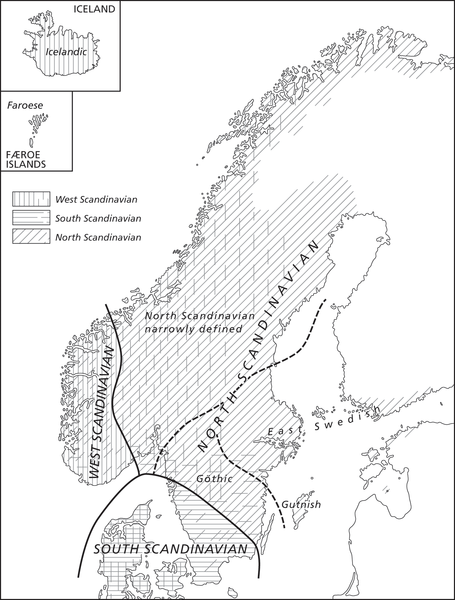
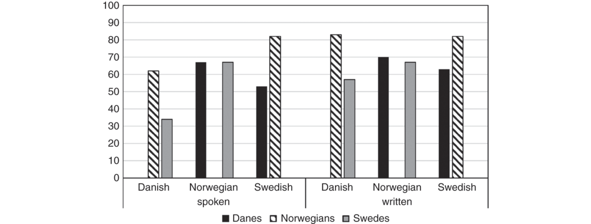

# [[page 761]] Chapter 32 The North Germanic Dialect Continuum

**Contributor(s):** Charlotte Gooskens

## 32.1 Introduction

The *North Germanic* languages belong to the Germanic language group along with the West Germanic and the extinct East Germanic languages. The North Germanic languages are also often referred to as the *Nordic languages*, a translation of the term mostly used by the speakers themselves and it refers to the closely related Germanic languages spoken in Denmark, Norway, Sweden, Finland, Iceland, and the Faroe Islands. Traditionally, the North Germanic language family is further subdivided genetically into *East Germanic* (Danish and Swedish) and *West Germanic* (Norwegian, Icelandic, and Faroese). Another subdivision is based on the present relationship between the languages and divides the languages into a *continental* group (Danish, Norwegian,¹ and Swedish) and an *insular* group (Icelandic and Faroese). Sometimes the term *Scandinavian* is used in a narrow sense to refer to the three mutually intelligible continental Scandinavian languages, while *Nordic* is used in a wider sense to include Icelandic and Faroese. In this chapter we will follow this terminology. Very diverse local dialects are spoken in the Nordic language area, especially in rural communities. Boundaries between dialect areas are gradual and form a dialect continuum that does not always coincide with national borders. In this chapter we will focus on the Scandinavian language continuum, but we will also discuss the position of Faroese and Icelandic within the Nordic language family.

## 32.2 The Origin and Development of the North Germanic Dialect Continuum

We can distinguish three periods in the history of the Nordic languages (Faarlund 1994: 38, Torp 2002: 19). The first period (Ancient Nordic) ends [[page 762]] around the seventh century. Our knowledge about this period stems from contemporary Roman and Greek authors and from ancient runic inscriptions. The language of the ancient Nordic people was extended over a considerable geographic area but still it appears to have been fairly homogeneous with no known or significant dialect differences.

During the second period, from the seventh to the fifteenth century (Old Nordic), the dialects still belonged to one dialect continuum and their speakers all lived in Scandinavia or had recently emigrated to the islands in the Atlantic Ocean, Great Britain, Normandy, Russia etc. The dialect differences were small enough for all Scandinavians to communicate without difficulty and the Nordic language was regarded as one language, referred to as *dǫnsk tunga* (Danish tongue) (Ottosson 2002: 789). From the end of the eighth century when Iceland and the Faroe Islands were colonized (the Viking Age), dialect differences started to show up that were large enough to justify a division into *West Nordic* (the varieties spoken on Iceland, the Faroe Islands, and Norway) and *East Nordic* (Sweden and Denmark). The colonization of Iceland and the Faroe Islands took place mainly from western Norway and the dialectal origin of the language of the emigrants can still be traced in modern Icelandic and Faroese.

Until around 1200 the differences between West and East Nordic were small, but the southern part of the language area started to change due to the economic influence from the Hanseatic League and the resulting extensive contact with the German language. This period is often referred to as “middle” (Venås 2002: 34–35), but Faarlund (1994: 39) notes that it is a period of transition and many changes at different times in different areas of Scandinavia so that it is not possible to talk about a uniform stage of Middle Scandinavian. However, Torp (1998: 34) suggests distinguishing a separate period in the history of the North Germanic languages between the years 1200 and 1500. In this period the innovations from the south and the large geographical distances and resulting diminishing amount of contact between Scandinavia and the islands in the Atlantic Ocean resulted in a gradual division of the language area into a northern part consisting of Icelandic, Faroese, Norwegian, and Swedish and a southern part (Danish). At this stage the differences between Norwegian, Faroese, and Icelandic were still very minimal. The changes usually took place from the south starting with Danish, followed by Swedish and East Norwegian, then West Norwegian and ending with Icelandic. The Danish pronunciation has undergone an exceptionally fast development during the last century (Brink and Lund 1975, Grønnum 1998) and generally speaking, Danish has been the most innovative of the Nordic languages. On the other hand Icelandic is considered the most conservative of the languages. Both insular Nordic languages have retained a complex inflectional morphology (Thráinsson et al. 2017). Torp (1982: 92) also suggested that there are two centers of innovation in Scandinavia: one in the [[page 763]] south where most innovations took place and one in the north that resulted in a division between inner (innovative) and outer (conservative) North Scandinavian.

In the modern Nordic languages we make a distinction between insular Nordic (Icelandic and Faroese) and Scandinavian (Danish, Norwegian, and Swedish). The spoken languages of these two groups are not mutually intelligible and the same goes for the two languages within the insular Nordic group. The Scandinavian languages on the other hand are still mutually intelligible with some effort. Within the Scandinavian group Torp (1998: 34) makes a distinction between North Scandinavian (Norwegian and Swedish) and South Scandinavian (Danish). We will return to investigations concerned with mutual intelligibility in Section 32.4.

In Figure 32.1 the standard family tree model for the Nordic languages is presented. Such a language tree (also *Stammbaum*, genetic, or cladistic model) is intended to show the genetic linguistic relationships between languages. The description of the periods in the history of the Nordic languages above makes clear that in the case of the Nordic languages this model is not a good reflection of the linguistic similarities and differences between the modern languages. The tree suggests that Norwegian is more closely related to Icelandic and Faroese than to Swedish and Danish. Inspired by Schmidt (1872), who acknowledged the large role played by patterns of language contact following from political and economic changes at different places in a dialect area, Torp (1982) proposed an alternative model of the development of the Nordic languages, the so-called wave model, where successive linguistic innovations are compared to waves on a water surface. The resulting model of the modern Nordic languages is shown in Figure 32.2, where the number of vertical lines illustrates how different the languages are, from one line (small dialectal differences) to four lines (mutually unintelligible).


## 32.3 Classification of the North Germanic Dialects

The many local Germanic dialects that exist today in the Nordic countries developed in the Middle Ages. As a result of the historical developments described above, the dialects are distributed over three different dialect [[page 764]] continua: an Icelandic, a Faroese, and a mainland Scandinavian continuum. The dialects in geographical dialect continua form chains of dialects with cumulative differences. This means that dialects spoken in adjacent villages are mutually intelligible. However, due to the cumulative effect of linguistic differences some dialects in a dialect continuum may be so different that they are no longer mutually intelligible.

The traditional Scandinavian dialects spoken in most of Denmark, Norway, Sweden, and the southwestern parts of Finland form a classical example of a dialect continuum that crosses geographical borders. The dialects differ in terms of how far they moved away from Old Scandinavian in various parts of the linguistic system (Faarlund 1994: 39). Since the boundaries between the dialect areas are gradual and do not always coincide with national borders, the traditional dialect division is sometimes somewhat arbitrary. Some of the dialects, such as those on the border between Norway and Sweden, especially parts of Bohuslän, Dalsland, western Värmland, western Dalarna, Härjedalen, Jämtland, and Scania, could be described as intermediate dialects of the national standard languages. The differences between the traditional dialects within the countries of Norway, Sweden, and Denmark are often larger than the differences across the borders, but the political independency of the countries and the strong influence of the standard languages, particularly in Denmark and Sweden, leads continental Scandinavian to be classified into Norwegian, Swedish, and Danish by most linguists. The concept *heteronomy* is used to refer to such a situation where dialects spoken in a certain part of a country are considered a dialect of the standard language of the country even though they may be more similar to dialects spoken in the neighboring country. For example, the present southern Sweden was part of Denmark until 1658 and the dialects spoken in this area were considered Danish dialects. After southern Sweden became part of Sweden the dialects spoken there were also classified as Swedish dialects even though they had not changed linguistically (Chambers and Trudgill 1998: 9–11).

Like most European languages, the Nordic languages have recently gone through processes of dialect leveling due to industrialization, urbanization, and migration and today, many traditional Scandinavian dialects have disappeared. Especially in Denmark many dialects are mostly extinct, with only the oldest generations and people living in the geographical periphery still speaking them, probably because of the increased mobility and negative stereotypes connected to dialects (Nyborg 2004). However, [[page 765]] there is still a lot of regional, social, and ethnic variation in the Danish language (Pedersen 2000). Most Danes speak a regional variety of Standard Danish and dialect speakers are mostly bilinguals and only use their dialect at home. In Sweden too, many traditional dialects have been under pressure, even though there is an increasing tolerance towards dialect speakers (Wentzel 2004). Rural, local dialects are disappearing and beeing replaced by varieties that can be situated on a scale between regional dialects and regional standard language. Only in some peripheral areas (especially Upper Dalarna, Norrbotten, and Gotland) local dialects are still spoken. The position of the Norwegian dialects is much stronger than in Sweden and Denmark. Dialects find significant support at all levels of Norwegian society from casual speech to teaching, broadcasting, and parliament. Students freely speak their local dialects in school. Even the Education Act states that they have the right to do so. It states that “in their choice of words and mode of expression, the teaching staff and the school leaders shall as far as possible take the spoken form used by the pupils into account” (Education Act 2014: chapter 2.5).

In comparison to the other Nordic languages the dialectal differences in Modern Icelandic are very minor in spite of the large geographical area that covers the Icelandic language area and the isolated living conditions of the inhabitants of Iceland during the centuries (Thráinsson 1994: 142). Most differences are phonetic (Kvaran 2005: 1743). Two major dialect surveys have been carried out in the twentieth century on Iceland with an interval of 40 years. Thráinsson and Árnason (1992) compared the results of these two investigations and concluded that the dialects that were spoken by the smallest numbers of people around 1940 had disappeared 40 years later and only the majority dialects such as the Reykjavik dialect had survived and spread to larger areas. The homogeneity of the Icelandic language has been explained by the strong literary traditions and the linguistic conservatism on the island (Árnason 2004).

The Faroese language, on the other hand, existed only as a spoken language until the middle of the nineteenth century. This is probably the explanation for the large degree of dialectal variation in Faroese. The differences are primarily phonetic and despite the small number of speakers and restricted geographical spread of the language it is easy to hear where a speaker is from. Still, the differences do not lead to any problems with mutual intelligibility (Barnes and Weyhe 1994: 190).

Each of the Scandinavian countries has a strong tradition of dialectological work that has resulted in large numbers of dialect maps showing the geographical distribution of particular phenomena (see Edlund 2010 for an overview of the geolinguistic mapping of Nordic languages). There are also dialect maps showing the classification and geographical distribution of the dialect areas in each of the countries e.g., Nielsen and Pedersen (1991) and dialect.dk (2016) for Danish, Sandøy (1996) and Skjekkeland (2005) for Norwegian, Wessén (1969), Elert (1994) and Dahl and Edlund [[page 766]] (2010) for Swedish, Språkinstitutet (2016) for Finland Swedish dialects, Árnason (2005) for Icelandic, and Thráinsson et al. (2004) for Faroese. However, as noted by for example Ringgaard (2002: 279) and Edlund (2010: 219–220), Scandinavian dialectologists have tended to stay within their own national borders and avoided a pan-Scandinavian or pan-Nordic approach. As a result, few dialect maps have been made showing the whole Scandinavian dialect continuum.

Traditional dialectologists present the geographical spread of dialectal features, for instance a particular word form or pronunciation, by drawing isoglosses (lines on a map between locations where speakers use different variants of a feature). A dialect division is said to be major if several isoglosses coincide (isogloss bundles). However, isoglosses usually only coincide approximately, resulting in different dialect areas with a transition zone in between reflecting the fact that the dialects belong to a dialect continuum. In Bandle (1973) a collection of dialect maps is presented, showing a large number of isoglosses and distributions of phonological and other linguistic characteristics of the dialects spoken in the Scandinavian language area. Bandle’s map 22 (see Figure 32.3) shows the characterization of the language area that he made on the basis of the isogloss bundles presented in the maps. He divides the language area into three major dialect areas, West Scandinavian, South Scandinavian, and North Scandinavian. The last one is subdivided into four areas. Inspection of the map makes clear that, in general, the dialect borders do not coincide with national borders.



Dialect maps such as the one presented by Bandle are based on a limited number of single linguistic features. Such isogloss maps are verifiable, but the motivation for the selection of the isoglosses remains unclear. The isogloss method cannot be applied without making subjective choices (Goossens 1977) and there are no principles to determine which isoglosses or which bundles should outrank others (Chambers and Trudgill 1998: 96–97). Dialectometric research has sought more satisfying characterizations by aggregating over a large number of linguistic features to express linguistic distances between dialects. The aggregating step has allowed the introduction of powerful quantitative techniques into dialectology in many language areas (for an overview see Nerbonne and Heeringa 2010) and dialectometric methods can find relationships in data sets that are too large and complex for manual analysis on an objective basis. These statistical techniques make it possible to draw dialect maps presenting dialect areas as continua rather than as areas separated by sharp borders. To carry out dialectometric measurements a large quantity of digital data is needed. In Scandinavia various dialect projects have been set up to collect corpora of dialect data, for example the Scandiasyn project (Johannessen et al. 2009), SweDia 2000 (Eriksson 2004), and Talko (Södergård and Leinonen 2017). However, these collections of data have only sporadically been used for creating dialect maps.

[[page 767]] An example of a dialectometric investigation is the analysis carried out by Leinonen (2010) of the vowel pronunciations of over one thousand Swedish speakers from the SweDia 2000 project. She used aggregate differences in vowel quality (formant measurements on nearly 20,000 vowel tokens) and subjected the result to factor analysis and multidimensional scaling. She then projected the results onto maps of Sweden showing the geographical distribution of vowel pronunciations. A comparison of the pronunciations of older and younger speakers showed that a large amount of variation is being lost in the ongoing process of dialect leveling. Gooskens and Heeringa (2004) measured [[page 768]] phonetic distances between 15 Norwegian dialects by means of the Levenshtein algorithm, a string edit distance measure that has proven to be a successful method for measuring phonetic distances between dialects in various language areas (Nerbonne and Heeringa 2010). They projected the distances onto a map of Norway. They also asked speakers of the 15 dialects to judge the distances between their own dialect and each of the other 14 dialects. The results showed a high correlation between the distances as perceived by the speakers themselves and objective dialectometric distance measurements. The classification of the Norwegian dialect area obtained from the two measures is rather similar. In both, a north-south division is found.

Trudgill (1986) suggests that dialect distances reflect mobility and social contact and that this explains the fact that dialects form continua with geographically remote areas being linguistically less similar than geographically close areas. If a place is geographically close, people are likely to go to this place more often and therefore language varieties spoken in villages that are geographically close have a greater chance of influencing each other than if there is a larger geographical distance between them. Nerbonne et al. (1996) found a high correlation (*r*=.67) between straight line geographic distances and linguistic distances between 350 Dutch dialects by means of the Levenshtein distance method. Gooskens and Heeringa (2004) found a considerably lower correlation (*r*=.22) between linguistic distance and geographic distance in the case of 52 Norwegian dialects. Differences in geography are likely to explain the difference between correlations in the Dutch and the Norwegian language areas. In the Netherlands it has always been rather easy to travel from place to place since there are hardly any natural obstacles such as mountains. In Norway on the other hand, is has been difficult to travel between villages due to the many mountains and in the past most of the traveling took place by boat along the coast. When correlating linguistic distances between Norwegian dialects with old traveling distances Gooskens (2005) got a higher correlation (*r*=.53). This is an indication that varieties spoken in places which are easily reached show a greater linguistic similarity to each other than varieties spoken in more isolated places and that this effect is still reflected in the distances between modern Norwegian dialects.

## 32.4 Linguistic Distances between North Germanic Languages

To categorize closely related language varieties Kloss (1967) introduced the terms *Ausbausprache* (language by development) and *Abstandsprache* (language by distance). An *Ausbausprache* is mostly an official national language with its own standardized form. It is often taught in schools and used as a written language for various social and political functions. In an *Ausbau* [[page 769]] definition, “languages” and “dialects” are defined in terms of their sociopolitical and cultural status rather than by independently identifiable structural entities. The official standard Scandinavian languages, Danish, Norwegian (Nynorsk and Bokmål), and Swedish, are an often mentioned example of *Ausbau* languages that are very closely related but still regarded as different languages because they are spoken in three different countries and have distinct, standardized forms, with their own orthographies, dictionaries, grammars, and literatures.

One language variety is called an *Abstand* language with respect to another language variety if the two are so different from each other that they can be considered different languages. Kloss (1967) did not specify exactly how to measure the differences between two language varieties objectively, probably because the necessary tools were not yet available. As discussed in Section 32.3, methods to measure linguistic distances objectively have now been developed by dialectometrists. In this section we will summarize research on linguistic differences between the Nordic languages.

Due to phonological innovations in the Danish language, the largest differences between Norwegian and Swedish on the one hand and Danish on the other hand are found at the phonetic level (Torp 1998: 69–70). Lexical, morphological, and syntactic differences between the Scandinavian languages are generally assumed to be small (Torp 1998: 105). Dialectometric measurement techniques make it possible to quantify linguistic distance between the languages and such measurements have confirmed the general impression expressed by Scandinavian linguists.

Torp (1998) found that only six percent of the 343 most frequent nouns in a corpus of Swedish newspapers are likely to cause problems to a Norwegian reader. Gooskens and Heeringa (2014) measured lexical distances (expressed as percentages of noncognates, i.e., words without a common etymological origin, in the fable *The North Wind and the Sun*) and phonetic distances (measured by means of the Levenshtein algorithm, see Section 32.3) between standard Danish and Norwegian (represented by the Oslo variety) and 18 Nordic language varieties (including standard Swedish, various Scandinavian dialects, and the variety of Torshavn as a representative for Faroese). The results confirmed the small lexical distances between the Scandinavian languages (all lower than 2.2 percent). The phonetic distances between Danish and Norwegian/Swedish are larger (21.6 and 23.5 percent) than between Norwegian and Swedish (18.5 percent). Both the lexical and the phonetic distances to Faroese are largest (lexical distance to Norwegian 13.8 percent and to Danish 13.7 percent, phonetic distances to Norwegian 25.2 percent and to Danish 27.8 percent), but a number of Swedish and Norwegian dialects are almost as phonetically deviant from standard Danish as Faroese. Unfortunately, the investigation did not include Icelandic. Dialectometric measurements within the insular Nordic language group have hardly been carried out so far, but [[page 770]] Gooskens and Heeringa (2005) showed that the distance between the Icelandic and the Faroese pronunciation is large and almost as large as the distances between these two languages and Swedish.

As mentioned, morphological and syntactic distances between the Scandinavian languages are generally assumed to be very small (Torp 1998: 105). Only recently, methods for measuring syntactic distances dialectometrically have been developed. Heeringa et al. (2017) measured syntactic distances between five Germanic languages (Danish, Dutch, English, German, and Swedish) by means of three different dialectometric methods. As expected, the results show that the syntactic distances between Swedish and Danish are smaller than between any of the other nine language pairs in the investigation.

Gooskens and Heeringa (in preparation) measured linguistic distances between 35 closely related European language pairs (national standard languages from the Germanic, Romance, and Slavic language families), including Swedish-Danish. Distances were only measured between language pairs within the same language family. The comparison of the Swedish-Danish distances to the distances between the other languages pairs can help to place the measurements in a larger perspective. The lexical and syntactic distances between Swedish and Danish are the lowest among the 35 language pairs in the investigation. However, compared to the other language pairs the phonetic distances are rather high. Twenty-three language pairs have smaller phonetic distances, including all Slavic, most of the Romance language pairs, and German-Dutch.

## 32.5 Mutual Intelligibility of North Germanic Languages and Dialects

As explained in Section 32.4, linguistic distance is one of the criteria for distinguishing between dialects and languages. The problem remains, however, that languages may differ to different extents in their lexicon, phonetics and phonology, morphology, and syntax. It is difficult to decide how much weight should be given to each of these linguistic dimensions when determining overall distance. Maybe to circumvent this problem, Trudgill (2000) introduced the intelligibility criterion and this has become the primary criterion among many linguists. According to this criterion, dialects are mutually intelligible varieties, whereas languages are so linguistically different that their speakers are unable to understand each other. From this it follows that a language is a collection of mutually intelligible dialects.

As became clear from the discussion of the Scandinavian dialect continuum in Section 32.2 and the linguistic differences in Section 32.4, the standard Scandinavian languages are so similar that with some effort speakers of Danish, Swedish, and Norwegian can communicate sufficiently well to sustain a meaningful exchange of information each using their own native [[page 771]] languages. Haugen (1966) introduced the term *semi-communication* for this manner of communicating. In later research other terms were coined, e.g., *receptive multilingualism* (Braunmüller 2007), *plurilingual communication* (Lüdi 2007), *intercomprehension* (Grin 2008), and *lingua receptiva* (Rehbein et al. 2012), see Ten Thije (2017) for a discussion of terminology. We will use the term *receptive multilingualism* in the remainder of this chapter. It is an alternative to other kinds of cross-border communication such as English (or another language) used as a lingua franca and offers many advantages, especially on the production side. People can express themselves more easily and more precisely in their mother tongue than in a later acquired language.

There is evidence that receptive multilingualism was a common means of communication between speakers of Germanic languages across the Nordic/non-Nordic border during the era of the Hanseatic League from about 1200 to 1550 (Braunmüller 1996). Today, receptive multilingualism is a common way of communicating in Scandinavia among speakers of Danish, Norwegian, and Swedish. Furthermore, it is supported by the Scandinavian governments as a way of uniting the countries (Nordic Language Convention 1987) and relatively much research on the mutual intelligibility among the mainland Scandinavian languages has been carried out. In Table 32.1 the results of the most important investigations including all the three Scandinavian languages are presented.

**Table 32.1 Results of five investigations on the mutual intelligibility between spoken and written Danish, Norwegian, and Swedish**

```tsv
Native lang. [colspan=2] [rowspan=3]	Target language [colspan=6]
Danish [colspan=2]	Norwegian [colspan=2]	Swedish [colspan=2]
Spoken	Written	Spoken	Written	Spoken	Written
Da	HaugenMaurudBøBörestamINS			7269639239	-894873	4043748029	-695665
No	HaugenMaurudBøBörestamINS	5073628046	-937581			7088809875	-897680
Sw	HaugenMaurudBøBörestamINS	4423324823	-694160	6148749161	-865658
```

Haugen (1953, 1966) was the first to investigate how well Scandinavians are able to understand each other’s languages. He distributed a questionnaire among 252 Danes, Norwegians and Swedes (88 percent male) whose names [[page 772]] were selected at random from the national telephone directories. The questionnaire contained several questions with regard to cross-language intelligibility, such as how well the participants could understand their Scandinavian neighbors when they met them for the first time, how well they understood the neighboring languages at the time of the investigation, and how well they thought their Scandinavian neighbors could understand them. The results showed that communication involving Norwegians is most successful (most scores were above 60 percent). Danish is a difficult language for both Norwegians (50 percent) and Swedes (44 percent). The lowest mutual intelligibility is found between Danes and Swedes (40 percent for Danes and 44 percent for Swedes, Haugen 1966: 289).

Haugen’s results were based on self-reports and he suggested that his data should be checked against functional tests. Maurud (1976) presented two spoken dialogues and three monologues to Danish, Norwegian, and Swedish participants and asked them six questions about the content of each text. Afterwards they were asked to translate twelve words in each of six written texts. The results confirm the high intelligibility of Norwegian among Danes. Swedes have difficulties with both Norwegian and Danish resulting in asymmetric intelligibility scores: 48 versus 88 percent correct answers to content questions in the case of Norwegian-Swedish mutual intelligibility and even lower (23 versus 43 percent) in the case of Swedish-Danish mutual intelligibility. The scores for written intelligibility are all higher than the scores for spoken intelligibility and show no asymmetries. Again, intelligibility involving Norwegian is especially high (all scores above 86 percent) and the Swedish-Danish mutual intelligibility is lowest (both 69 percent).

A weakness of Maurud’s (1976) study is that the Danish participants came from Copenhagen and the Swedish participants came from Stockholm. Copenhagen is closer to the Swedish border (30 km) than Stockholm is to the Danish border (570 km), so the Danes were likely to have had more exposure to Swedish than vice versa because they could more easily travel to the neighboring country and watch television in the neighboring language. When the investigation was carried out only inhabitants in the border areas had access to television programs from the other countries. Bø (1978) tested participants from the border area as well as from places outside the border area. He let secondary school pupils read and listen to a text and translate certain key words. In general, Bø’s (1978) results are similar to those of Maurud (1976). They confirm the asymmetry found between spoken Danish and Swedish (32 versus 74 percent). The mutual intelligibility between spoken Norwegian and Swedish is highest (74 and 80 percent). As expected the results of Bø’s investigation showed that participants who lived in a border region had fewer problems understanding the neighboring language than participants who lived outside a border region.

Börestam Uhlmann (1991) collected self-reports on the mutual intelligibility of Danish, Norwegian, and Swedish. Just as Haugen (1953, 1966), she [[page 773]] asked her participants (members of several Nordic language meetings) to estimate how well they understood the neighboring languages, to which the participants could answer “very well,” “fairly well,” and “very badly.” The self-reports elicited by Börestam Uhlmann (1991) confirmed the asymmetry between Danish and Swedish found by Maurud (1976) and Bø (48 versus 80 percent). A comparison of Haugen’s (1966) and Börestam Uhlmann’s results shows that Scandinavians seem to have become more positive about their ability to understand their neighboring languages. Several factors could explain this difference. Firstly, there is a time difference of about 30 years between the two investigations. Since the Scandinavian governments have promoted the use of receptive multilingualism, Börestam Uhlmann’s participants might have been more familiar with this way of communicating than Haugen’s participants. Secondly, the participant groups were different. Haugen (1966) selected random participants from telephone directories, while Börestam Uhlmann (1991) visited Nordic language meetings, where the participants were used to inter-Scandinavian communication.

The most recent large investigation of the mutual intelligibility of spoken and written Danish, Norwegian, and Swedish was carried out with support from the Nordic Culture Fund and is referred to as the INS-investigation. The results are reported in Delsing and Lundin Åkesson (2005). In contrast with earlier investigations the INS-investigation included the testing of the intelligibility of the three Scandinavian languages in all Nordic countries. It tested reading and listening comprehension of both adolescents and adults with different levels of education and with different language backgrounds. To measure intelligibility of spoken texts the researchers had secondary school students and their parents answer a number of open questions about a video fragment and a news item. To test intelligibility of written texts they had the participants read a newspaper article and translate key words in the text. The results in Table 32.1 are the results of the young native speakers in the three Scandinavian countries.² In general, the recent Scandinavian results are similar to results found in previous investigations. The INS results replicate the asymmetry between spoken Danish and Swedish found in most earlier investigations. Mutual intelligibility is highest between Norwegians and Swedes (61 and 58 percent correct answers for the Swedes and higher, 75 percent and 80 percent, for the Norwegians); Danish is hard to understand, especially for Swedish-speaking listeners (23 percent correct). Contrary to most previous research, there was also an asymmetric intelligibility between written Danish and written Swedish. To examine the influence of previous exposure to the test language, participants from two places in each country were scored. In general, [[page 774]] participants from places close to the border of the country where the test language was spoken performed better that participants living further away. This confirms the importance of exposure for the intelligibility of a closely related language as found by Bø (1978), even in the present-day situation where access to television from the neighboring countries is not restricted to the border areas. The parents of the adolescents also participated in the investigation and got higher scores on all tests than their children, especially among the Swedes and the Danes. It is possible that this can be explained by the fact that adults have had more exposure to the neighboring languages, but Delsing and Lundin Åkesson (2005: 143–144) also assume that political and cultural developments such as membership of the European Union, globalization, migration, increased mobility, and internationalization of the mass media explain the lower scores of the Swedish and Danish adolescents.

The investigations that have been carried out on the mutual intelligibility between Danish, Norwegian, and Swedish since the pioneering research by Haugen (1966) show similar overall trends. In Figure 32.4 we summarize the results by presenting the mean scores of the five investigations. In general Norwegians are better at understanding the neighboring languages than Danes and Swedes. Danish is the most difficult language to understand. Danes understand spoken Swedish better than Swedes understand Danish, but this asymmetry in not found in the written mode.



The five investigations cover a time frame of 40 years, but since the methods and the participants involved in the five studies are different it is not possible to compare the results directly and we do not know whether the level of mutual intelligibility in Scandinavia has changed. This means that there is no general way to express how well [[page 775]] Scandinavians understand each other’s languages. The results of Haugens’s (1966), Bø’s (1978), and Delsing and Lunding Åkesson’s (2005) investigations make clear that the amount of exposure that speakers of related languages have had to the languages spoken in the neighboring countries play an important role. This shows that it is important to pay attention to the geographical background when selecting participants for an investigation. As far as the intelligibility of the neighboring languages among Norwegians is concerned, it has often been mentioned that the Norwegian dialects command a strong position and that Norwegians are therefore used to listening to varieties that are different from their own variety (Torp 1998: 118). It has also been suggested that there is a relationship between intelligibility and attitudes towards the neighboring language, culture, and people (Haugen 1966; Delsing and Lundin Åkesson 2005; Gooskens 2006). However, it has not been possible, so far, to draw conclusions about the causality of the relationship between attitude and intelligibility. It is possible that people are positive toward a language if they find it easy to understand, but it is also possible that people make a greater effort to understand a language if they have a positive attitude toward the language, its speakers, and the country where it is spoken. It is generally assumed that Danes are more positive towards Swedes than the other way round because Sweden has for a long time been the most prosperous country with the largest population and this is part of the explanation for the asymmetric intelligibility found in most investigations on Swedish-Danish mutual intelligibility. Schüppert et al. (2016) showed that the large number of reduction processes in Danish may also be part of the explanation for the asymmetry. These reduction processes are hardly reflected in the Danish orthography and Schüppert (2011) showed that Danes can use their orthographic knowledge when decoding spoken Swedish cognates while this is much less the case for Swedes decoding Danish cognates.

Returning to the discussion of how to define a language in Section 32.4, it is difficult to decide whether the mutual intelligibility between Danish and Swedish is now so low that the two languages should be defined not only as *Ausbau* languages but also as *Abstand* languages. Predicting mutual intelligibility between two related languages from structural linguistic differences can only be done as long as the interlocutors have had no prior exposure to the other language (inherent intelligibility). Gooskens et al. (2018) measured the mutual intelligibility between 35 European language pairs (national standard languages from the Germanic, Romance, and Slavic language families), including Swedish-Danish (but not Norwegian). To analyze the results from participants who had not learned the languages at school and had had minimal exposure to the test language (inherited intelligibility) 11 language combinations had to be excluded from the data set. By comparing the results of mutual intelligibility of Swedish and Danish to the results of the remaining 23 language pairs the results can be [[page 776]] put into perspective. The results show that Swedish-Danish mutual intelligibility is higher than that of most other language pairs. Their mean scores on a spoken cloze test was 49.9 percent. The Czech participants had considerably higher scores when tested in their intelligibility of Slovak (87.5 percent)³ and the mean score for Slovenian-Croatian mutual intelligibility was also higher (53.4 percent). The Italian-Spanish mutual intelligibility was slightly lower (47.9 percent) and next came the Spanish-Portuguese mutual intelligibility (45.2 percent). These results still do not allow us to draw conclusions about the status of Danish and Swedish as *Abstand* languages, but it provides us with some indications of the level of mutual intelligibility compared to other language pairs in Europe.

As mentioned above, extra-linguistic factors seem to play an important role in explaining the level of mutual intelligibility in Scandinavia. However, linguistic distances also show a strong relation with intelligibility. Gooskens (2007) correlated spoken intelligibility data collected by Delsing and Lundin Åkesson (2005) with phonetic and lexical distances (see Section 32.4) and found a significant correlation with phonetic distances (*r* =.80, *p* <.001) but not with lexical distances (*r* = –.42, *p* =.111). Gooskens et al. (2008) investigated the role of phonetic and lexical distances in the intelligibility of 17 Scandinavian language varieties among young Danes from Copenhagen. They found significant correlations with both lexical (*r* =.86, *p* <.01) and phonetic distances (*r* =.64, *p* <.01), but a multiple regression analysis included only phonetic distances, which suggests that phonetic distance is a better predictor of intelligibility than lexical distances in the Scandinavian language area. To get a better impression of particular word characteristics that play a role in intelligibility Kürschner et al. (2008) tested the intelligibility of 384 frequent Swedish words among Danish subjects and correlated the results with 11 linguistic factors. In addition to phonetic distances, word length, different number of syllables than in Danish, foreign sounds not present in Danish, neighborhood density, word frequency, orthography, and the absence of the prosodic phenomenon of ‘stød’⁴ in Swedish had a significant influence on the level of intelligibility.

## 32.6 Conclusions and Desiderata for Future Research

In this chapter we have seen that the Nordic languages have developed from a common origin into three different dialect continua where six official standard languages are spoken, so-called *Ausbau* languages. Icelandic and Faroese are two *Abstand* languages and the Scandinavian [[page 777]] languages are mutually intelligible to such an extent that they are usually considered one *Abstand* language. However, the Danish pronunciation has changed considerably during the past century and is sometimes hard to understand for other Scandinavians, especially to Swedes with no prior exposure to the language. Since the first investigations of mutual intelligibility in Scandinavia there have been many changes in Scandinavian society and English often takes over as a lingua franca in the communication between people in the Nordic countries. The distance and intelligibility criterion introduced by Kloss for defining languages as opposed to dialects is problematic in cases like Danish and Swedish because it is not clear exactly how little intelligibility and precisely how large the distances on different linguistic levels should be for two languages to be considered *Abstand* languages. It would be of great value for language planning and policies in different countries to develop a standardized method for determining how to distinguish between dialects and languages, for example a standard intelligibility test or objective distance measurements with a standardized threshold.

Traditionally, Scandinavians communicate by means of receptive multilingualism. It is important for collaboration in Scandinavia that communication can take place in the Scandinavian languages rather than in a lingua franca such as English. Scandinavian authorities therefore strongly encourage cross-border communication in the native languages of the inhabitants. Also to the individual citizen there are many advantages of being able to express themselves in their own languages. Previous research (e.g., Hedquist 1985, Golubović 2016) has shown that in the case of closely related languages only very little exposure or a short course that makes speakers conscious of the most important differences and similarities between their native language and the language of the speaker can improve mutual intelligibility considerably. It is therefore of great importance to make people conscious about the advantages and possibilities of communicating with receptive multilingualism and to create opportunities for people to be exposed to the neighboring language and learn strategies for improving communication, for example through school exchange programs. To make such programs as efficient and successful as possible, more research is needed into what linguistic differences between the languages and what strategies the speakers should be taught to communicate efficiently in the receptive multilingualism mode.

Even though dialect leveling has taken place in many parts of Scandinavia, many dialects are still spoken and initiatives have been taken to collect and digitalize dialect corpora. With the many dialectometric methods that have recently been developed the following challenge will be to use the digital resources to characterize the dialects and develop maps covering the whole Scandinavian or Nordic area. Such pan-Scandinavian mappings across language boundaries may provide a safer [[page 778]] basis for interpretation and new insights into Nordic language history and the forces determining the spreading and vitality of the dialects spoken in the language area today. Dialectometrical studies can establish the geographical distribution of particular linguistic phenomena at various linguistic levels as well as at an aggregate level and help explaining the history, context, and dynamics of dialectal variation in the Nordic countries.

## Footnotes
