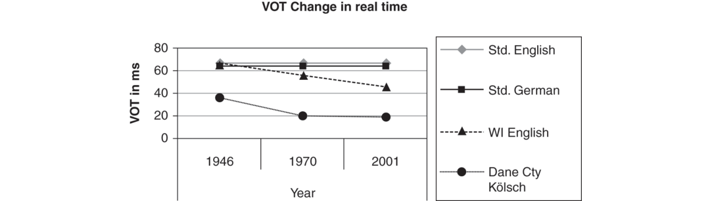
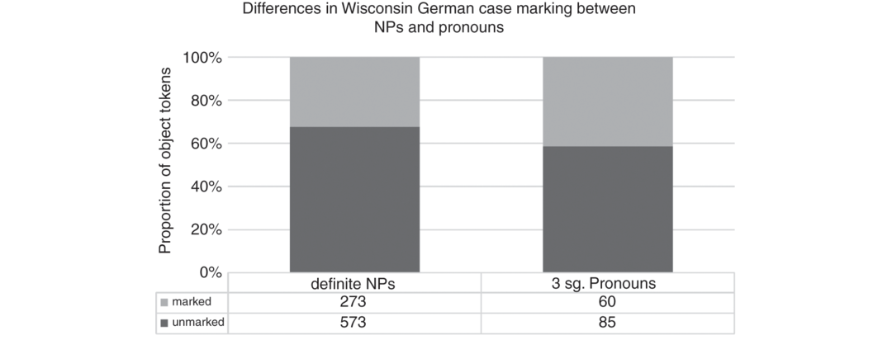
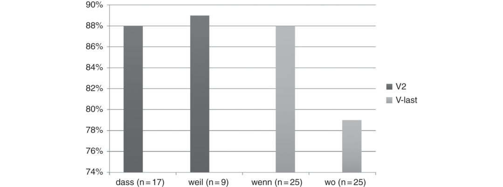

# [[page 783]] Chapter 33 Heritage Germanic Languages in North America

**Contributor(s):** Janne Bondi Johannessen and Michael T. Putnam

## 33.1 Introduction

In this chapter, we focus on varieties of Germanic languages, including Scandinavian varieties, acquired as a first language (L1), yet spoken outside of the region of origin. Such languages are commonly referred to as *heritage languages*, as explained by Rothman (2009: 156):

A language qualifies as a *heritage language* if it is a language spoken at home or otherwise readily available to young children, and crucially this language is not a dominant language of the larger (national) society. Like the acquisition of a primary language in monolingual situations and the acquisition of two or more languages in situations of societal bilingualism / multilingualism, the heritage language is acquired on the basis of an interaction with naturalistic input and whatever inborn linguistic mechanisms are at play in any instance of child language acquisition. Differently, however, there is the possibility that quantitative and qualitative differences in *heritage language* input and the introduction and influence of the societal majority language, as well as differences in literacy and formal education can result in what on the surface seems to be arrested development of the *heritage language* or attrition in adult bilingual knowledge.

America, and in particular, the Midwest, is home to heritage languages for a majority of the Germanic languages. Many are documented and discussed in Putnam (2011), Johannessen and Salmons (2015), Page and Putnam (2015), Johannessen (2018), as well as in numerous individual monographs and papers. Here we focus on structural aspects from varieties of heritage Norwegian and German spoken in the Midwestern US and [[page 784]] beyond. On occasion, when applicable, we will also refer to other Germanic heritage grammars to illustrate a particular point.

The heritage Germanic languages in America all belong to the traditional immigrant language category, as opposed to modern immigrant languages and indigenous heritage languages (Johannessen in progress), as well as minority languages (see Louden Chapter 34). Unlike some languages of Germanic ancestry, e.g., Mennonite Low German, Hutterite German, Pennsylvania Dutch, and Yiddish, that continue to be acquired and spoken as an L1 for future generations, most of today’s heritage languages are almost exclusively moribund. The eldest generation make up the vast majority of these varieties and is the final one with members who possess significant proficiency in the grammar. Additionally, we recognize that there are global varieties of heritage Germanic languages that extend well beyond the United States; however, due to time and space considerations, we focus here on varieties spoken in the Midwestern US. Although we acknowledge that there are some important differences between the American varieties of heritage Germanic compared with those in other countries – especially with respect to the particular sociolinguistic conditions and the typological similarity/distance between the two languages in contact – the similarities between these groups outweigh their differences. Studying traditional immigrant heritage languages often takes place from a comparative perspective: The mother language (in our case European Germanic languages) is used as a baseline against which one can measure variation and change. There are noted advantages and disadvantages to this approach; although it is advantageous to establish a means of comparison with a baseline language and/or dialect of origin, it comes at the expense of establishing a comparison fallacy between monolinguals and bilinguals (Cook 1997; Judy et al. 2018). This caveat notwithstanding, the comparative method represents common practice in this field of linguistic inquiry.

The study of structural aspects of heritage grammars is both rewarding and fascinating. Studies focusing on heritage grammars also force linguists to learn and investigate diachronic developments in synchronic forms, from periods where we know more about the language situation and the speakers, in instances where recordings from previous generations exist. The kinds of comparative study that heritage languages allow us to do, from comparing with the European baseline language to comparing with the language of the first immigrant generation or two, to comparing with genetically similar and different languages, can give us much knowledge of how languages change and what factors cause it. Comparisons with child language acquisition and those classified as moribund provide insight into factors like incomplete acquisition, attrition, and instances of restructuring. In addition to these studies whose focus primarily concerns the structure of these grammars, there exists additional sociolinguistic research on these communities. In this chapter, we offer a survey of [[page 785]] structural developments in the phonological, morphosyntactic, syntactic, and semantic/pragmatic developments of heritage German, heritage Norwegian, and examples from other Germanic languages. In the final section of this chapter we discuss theoretical challenges and controversies associated with research on heritage languages in these communities.

## 33.2 Phonology

We begin our overview by taking a closer look at phonological developments in these Germanic heritage grammars. The most comprehensive work on the phonology of Norwegian in America is Hjelde (1992), who compares the phonological system of the American heritage Norwegian dialect of Trøndsk with European Trøndsk. The Trøndsk heritage dialect has lost the feature [rounding] in the realization of /y/, yielding forms like [bɪː] for *by* ‘town’ and [mɪː] for *mye* ‘much’. However, importantly, there is still a slight phonetic difference between the realization of the delabialization product and the old /i/, resulting in minimal pairs such as [mɪː] *mye* ‘much’ and [miː] *mi* ‘my’ (Hjelde 1992: 42). Hjelde discusses the reasons for this change. Since American English does not have [rounding] as a distinctive feature, it is perhaps interference (transfer) from English that has caused this change. However, the new distinction in heritage Norwegian Trøndsk is now [spread lips], which is not a distinctive feature in American English. Hjelde (1992: 43) suggests that this new feature is just temporary, while the language is on its way to an American system, which has five degrees of distinctive mouth opening, in contrast to the Norwegian four.

The American English /ɪ/ has the same phonetic features as heritage Norwegian Trøndsk /e/, except that the latter has an additional feature, viz. [spread lips] (Hjelde 1992: 8–9). The /ɪ/ is never retained as such in loanwords into Trøndsk, but is replaced with allophones of existing phonemes. Some examples of loanwords illustrate this (the pronunciation of the loanword in Trøndsk is presented with phonetic transcription in square brackets): [i] as in *gipsy* [d͡ʒipsi], [iː] as in *beer* [biːr], [e] as in *brick* [bɹeks], [æ] as in *brickstone* [brækːstein], and even [ø] as in *crib* [krøb:a]. These findings are especially interesting seen next to the development of [y] to [ɪ] above, and show that the system as such remains intact, even with the addition of new words that have phonemes whose allophones are already in use.

The vibrant /r/ has also gone through a process of change, from an alveolar vibrant to an approximant /ɻ/, though not necessarily for all words and phonological contexts (Hjelde 1992: 44). Hjelde characterizes both phenomena as interference from English, though he stresses that the /r/ phoneme changes for other reasons, too. In European Norwegian this phoneme has undergone a transformation from alveolar to uvular in many dialects, partly for sociolinguistic reasons, but also because this [[page 786]] sound is speech-motorically difficult to produce and is thus one of the last to be mastered by children, making it vulnerable to interference. Hjelde also reports some reanalyses of the old phoneme flap /ɺ/ as an allophone of /r/. Though there are changes in the realization of the phonemes, it seems that the phonological system remains. Hjelde, then, suggests three factors for variation and change: speech motorics, sociolinguistics, and interference (transfer).

In other domains, such as Voice Onset Time (VOT) in Germanic dialects, not only do we see evidence of the retention of native-like contrast, but also lasting effects that the heritage L1 may potentially have on the dominant L2. Geiger and Salmons’s (2006) study of VOT-times in the Kölsch dialect spoken in Dane County, Wisconsin, reveals that the English spoken in this region by both monolinguals and bilinguals has had a long-term effect on the English spoken here.



In summary, research into the phonological aspects of heritage Germanic grammars demonstrates that these systems are highly resistant to (significant) change and attrition over the course of the lifespan.

## 33.3 Morphology and Morphosyntax

The inflection of loanwords has been the focus of study for many scholars (Haugen 1953, Hjelde 1992, Åfarli 2012, Grimstad et al. 2014, Riksem in press). Riksem (2018, section 6) uses the modern speech corpus CANS, Corpus of American Norwegian Speech (Johannessen 2015a), and finds nearly 1,000 English nouns used in heritage Norwegian conversations. Of these, 10 percent have (an American English) plural -*s*, while the rest are integrated into the Norwegian morphological system. The number of words with the English morphological suffix is so high that it could be argued that *-s* is a plural morpheme in heritage Norwegian (at least among those who use it).

[[page 787]] Hjelde (2015) studies changes in a Norwegian heritage dialect in a little town in the American Midwest, based on data from speakers born as far back as 1849 and as recently as 1961. There is some paradigmatic morphological leveling in the past tense suffix and instances of dative case. These changes suggest that a koinéization has been taking place, without having been completed (Hjelde 2015: 295). Eide and Hjelde (2015: 85) find some loss of finiteness morphology.

Johannessen and Larsson (2015) and Lohndal and Westergaard (2016) both discuss gender morphology with empirical evidence from the CANS corpus. Johannessen and Larsson (2015) look at noun phrase internal agreement, but also discuss noun declension, and show that there are many more deviations (relative to a European Norwegian baseline) in agreement in preposed determiners and adjectives than in the definiteness suffix, something that they attribute to complexity. Lohndal and Westergaard (2016) find that there is an overgeneralization of masculine gender in indefinite articles, and that the masculine targets more neuter than feminine nouns. Like Johannessen and Larsson, they find that the definiteness suffix is target-like. Thus, while nontarget gender forms can be found on preposed determiners and adjectives, the definite form is expressed as a suffix on the noun itself, and is rarely or never found with nontarget gender. Example (1) exemplifies a nontarget demonstrative determiner and a target noun: The speaker has used a masculine determiner (*denna*) with a neuter noun (*skolehus*). The definiteness on the noun has the correct neuter suffix (*-et*).

(1) ```tsv
  *denna*	*andre*	*skolehuset*
  this.<span class="sc">m.sg.def</span>	other. <span class="sc">def</span>	school.building. <span class="sc">n.sg.def</span>
  this other school building’ (target: *detta* ‘this’. <span class="sc">n.sg.def</span> ) [colspan=3]
  (westby_WI_06gm) [colspan=3]
  (from Johannessen and Larsson 2015: (7c)) [colspan=3]
  ```

While Johannessen and Larsson argue that the definiteness suffix also exhibits gender, Lohndal and Westergaard argue that the different morphological suffixes are nothing more than declension class markers (in addition to the definiteness), and conclude that gender is vulnerable to change. Both of these aforementioned studies have good arguments for their views, and new research is needed to ascertain how the data should finally be interpreted. Rødvand (2017) studied gender based not just on noun phrase-internal elements, but also on pronouns, in a group of speakers using elicitation techniques. She found that the speakers must be divided into different categories depending on their individual gender system. While half of the speakers have a three-gender system that is target-like, the rest have various versions of a less full system, for example one in which there are no longer feminine pronouns. She finds, like Lohndal and Westergaard, that there is massive overgeneralization of the masculine form. She also sees a connection between the definite suffix and [[page 788]] the gender system, again similar to the claims advanced by Johannessen and Larsson.

Research on the morphosyntactic case systems of heritage German varieties abounds, with a traditional focus on the paradigmatic loss of case markings first with articles, and eventually pronouns (e.g., Minronow 1957, Shrier 1965, Keel 1994, Boas 2009, among others). As an illustrative example, consider this history of Pennsylvania Dutch. In the literature on Pennsylvania Dutch, there are two primary dialects, a *sectarian* variant spoken by members of the Old Order Amish church, and *nonsectarian* variant that has largely become moribund over the course of the last century. The literature on case systems in Pennsylvania Dutch has observed an important distinction between the morphosyntactic case systems of these two groups of Pennsylvania Dutch-speakers. Over the course of the twentieth century nonsectarians, most of whom no longer speak the language on a regular basis, can be classified as heritage speakers. This situation contrasts with that of sectarian speakers, who still pass on the language to their children and are diglossic bilinguals. These sectarian speakers (i.e., the Old Order Amish) display a reduction in their case system from a three-tier distinction (nominative, accusative, and dative) to a two-tier distinction similar to English (nominative versus nonnominative/oblique). This pattern stands in opposition to what is found in the grammar of nonsectarian Pennsylvania Dutch, which has largely retained dative case marking, and thus, a three-tier paradigmatic distinction (Louden 1988, Huffines 1989). In addition to these patterns observed in the morphosyntax of Old Order Amish, the so-called Schwartzentruber Amish in Ohio, who broke away from the Old Order Amish in 1913, still actively use the dative case (and thus a three-tier distinction in their speech) (see, e.g., Louden 2016: 324, 352; p.c.). According to Louden (2016: 324), the Schwartzentrubers “in many areas have very little contact with non-Schwartzentrubers, both Amish and non-Amish”, thus “the use of English is therefore much less widespread […] hence it is not surprising that their Pennsylvania Dutch shows less structural influence from English.”

This discussion of the case system in varieties of Pennsylvania Dutch leads to a question that commonly resurfaces in studies focusing on morphosyntactic case in heritage varieties of German; namely, whether or not this perceived loss of morphosyntactic case markings is primarily attributed to internal or external language change (Keel 1994). The prevailing view is that this change is most likely driven by internal factors, given that similar instances of multi-generational case loss have taken place in the former Soviet Union, where Russian was the societal dominant second language (L2) (for an overview of this research, see Berend and Jedig 1991, Rosenberg 2003). If external factors, such as transfer, were mostly at play here, one would anticipate paradigmatic expansion rather than reduction, since Russian has more case distinctions than (dialectal varieties of) German.

[[page 789]] In addition to the oft-documented collapse of case paradigms in these heritage German varieties, there also exist studies that argue for expansion and restructuring. Keel (1994, 2015) calls to attention the creation of an ablative case in Volga German varieties spoken on the Great Plains of Kansas. Consider the following examples taken from the Volga German dialect spoken in Victoria (Herzog) in Ellis County, Kansas (data from Keel 2015: 135):

Standard German:

(2) 1. (a) Der Mann ist ***ins*** Wasser gefallen.

      the man.<span class="sc">ₙₒₘ</span> is in+the.<span class="sc"><sub>acc</sub></span> water fallen

      ‘The man fell into the water.’

    2. (b) Der Mann hat ***im*** Wasser gestanden.

      the man.<span class="sc">ₙₒₘ</span> has in+the.<span class="sc"><sub>dat</sub></span> water stood

      ‘The man stood in the water.’

Volga German dialect of Victoria / Ellis County, Kansas:

(3) (a) ```tsv
      Der Mann is ***in+den*** Wasser gefall.	(target: *ins*)
      the man.<span class="sc">ₙₒₘ</span> is in+the.<span class="sc"><sub>abl</sub></span> water fallen
      ‘The man fell into the water.’
      ```

    (b) ```tsv
      Der Mann hot ***in+den*** Wasser gestand.	(target*: im*)
      the man.<span class="sc">ₙₒₘ</span> has in+the.<span class="sc"><sub>abl</sub></span> water stood
      ‘The man stood in the water.’
      ```

In standard German – as well in most other dialect varieties – there is a distinction between the singular neuter accusative definite article *das* and its dative equivalent *dem*. In prepositional phrases that can be interpreted as either involving motion towards a goal or being stative, German marks the object of a preposition (i.e., the Ground in a Figure-Ground configuration) with accusative case in the former and dative in the latter. Compare this with the forms from Volga German; here the declined form for singular masculine accusative nouns (i.e., *den*) appears before a neuter noun, *Wasser* ‘water.’ Based on the fact the noun *Wasser* is a neuter form when it does not appear as an object of a preposition in this dialect of Volga German (cf. (2a) with (3a) and (2b) with (3b), respectively), we can conclude that the form *den* is a new case form (ablative). It is interesting to note, however, that emergence of this ablative class does not appear in all Volga German dialects in this isolated area; for example, whereas Johnson (1994) reports similar findings in the community of Schoenchen (also in Ellis County, Kansas), Khramova’s (2011) field work on the Volga German dialect spoken in neighboring Milberger (in Russell County, Kansas) documents the maintenance of dative forms. The creation of an ablative case in the Kansas Volga German dialects found in the communities of Schoenchen and Victoria (Herzog) are canonical examples of internal restructuring (see, e.g., Polinsky’s 2011 work on relative clauses in heritage [[page 790]] Russian). It is difficult to classify this shift as attrition or an expansion of the already existing paradigm; however, what is clear from examples such as these is that the common narrative of attrition and loss may be more complex than often assumed.

Recent research by Yager et al. (2015) and Yager (2016) has uncovered a somewhat surprising finding in connection with reported morphosyntactic case loss. In fact, rather than losing paradigmatic case distinctions, these studies show that multiple varieties of heritage German have developed innovative restructuring mappings between form and semantic and pragmatic meaning. In particular, the dative case adopts a more indexical discourse function along the lines of what is commonly observed in Differential Object Marking (DOM) in Romance and other language families (Bossong 1985, 1991; Aissen 2003). Yager et al. (2015) incorporates data from five distinct heritage German-speaking communities; i.e., data from three different Wisconsin heritage German varieties, Texas German, and Misionero German (a Palatinate variety spoken in the Misiones Province of Northern Argentina). Figure 33.2 from Yager et al. (2015: 6) shows that 32.2 percent of oblique definite noun phrases are marked with some form of morphosyntactic case, while third person singular pronouns are marked on 41.4 of all tokens, with the difference between these two proportions being statistically significant. Similar distributions were observed in the other two varieties of heritage German under investigation.



As Yager et al. (2015: 8) report, “The patterns observed in our data, though, cannot be explained simply in terms of direct influence from sociolinguistically dominant L2 grammars, i.e., English, rural vernacular Portuguese, and Spanish. […] Instead, we see a new, divergent grammatical property, the rise of DOM. As is often the case with DOM, its occurrence is tendential rather [[page 791]] than categorical.” Focusing exclusively on the varieties of Wisconsin heritage German in a more expansive study, Yager (2016) analyzed the case marking on nominal and pronominal tokens (n=5,191) of 21 speakers, coding for gender, number, case, article type, animacy, etc., elicited from semi-structured interviews. If DOM-effects are present, we would anticipate a higher frequency of case marking on pronouns when compared with full nouns since the former show a higher degree of definiteness and animacy. Indeed, this prediction is borne out in Yager’s (2016) findings, where elements classified as most definite did display a case marking versus those that were not (i.e., indefinite NPs). Yager’s findings are summarized in Table 33.1 below (adopted from Yager 2016: 251, Table 66).

**Table 33.1 Proportions of case marking on elements by definiteness**

```tsv
Degree of definiteness	Category	Frequency of case marking	Proportion of case-marked tokens
Most definite [rowspan=3]	**Personal pronouns**	81.8%	54/66
**Proper nouns**	62.5%	20/32
**Definite NPs**	64.7%	176/271
Least definite	**Indefinite NPs**	3.2%	1/31
```

In conclusion, Yager et al. (2015) and Yager (2016) make the case that appealing to incomplete acquisition for the rise of DOM-effects in these varieties of heritage German is unsatisfactory based on the fact that L1 German-speaking children acquire command of structural case marking by age three. Case is thus acquired so early in childhood that one must assume it is completely acquired. The treatment of morphosyntactic case highlights a larger debate in research on heritage languages and language attrition more generally; namely, whether or not instances such as these can correctly be considered as evidence for incomplete acquisition or some form of attrition. We return to this point in the final section of this paper (Section 33.6).

## 33.4 Syntax

### 33.4.1 Word Order Variation

While linguists studying the Scandinavian heritage languages in America during the twentieth century mainly looked at phonology and the lexicon, the empirical object of study has expanded, and word order is now a popular topic among linguists.

European Norwegian, like most Germanic languages (other than English), adheres to verb-second (V2) pattern in main clauses, i.e., the verb will always be the second constituent (see Vikner 1995, Chapter 16, for a detailed overview). This is independent of whether the first constituent is a subject or a topicalized constituent, and whether the verb is an auxiliary verb or a lexical verb, see (4).

(4) 1. a.

      ```tsv
      Jon	kjøpte	litt	mer	land	i går
      Jon	bought	little	more	land	in.yesterday
      ‘Jon bought some more land yesterday.’ [colspan=6]
      ```

    2. b.

      ```tsv
      I går	kjøpte	Jon	litt	mer	land
      in.yesterday	bought	Jon	little	more	land
      ‘Yesterday Jon bought some more land.’ [colspan=6]
      (Eide and Hjelde 2015: 68) [colspan=6]
      ```

Eide and Hjelde (2015) looked at old recordings of heritage Norwegian (recorded by Einar Haugen in the 1940s), and find no instances of nontarget word order. They compare this with the word order of a speaker in the 2010s, and find that she has target word order in subject-initial clauses, but an instability in nonsubject-initial clauses. While short and frequent clause-initial adverbs occur with V2, heavier fronted topics trigger V2 violations. Johannessen (2015b) also investigated the language production of one speaker. Unlike Eide and Hjelde she finds several examples of V2 violations in subject-initial sentences, see (5), but, like Eide and Hjelde, she finds that light adverbs trigger V2 more often than other sentence-initial adverbials, see (5)–(6): 92 percent of the clauses that have fronted light adverbs have target V2 word-order, but none of the heavier sentence-initial clausal adverbials, and few of the PP-initial ones.

(5) ```tsv
  Vi	bestandig	hadde	fisk	(target: *hadde bestandig*)
  we	always	had	fish
  ‘We always had fish.’ [colspan=5]
  (Johannessen 2015b: 60) [colspan=5]
  ```

(6) 1. a.

      ```tsv
      Da	fløtte	dem	til	Flekke	(target)
      	then	moved	they	to	Flekke
      ‘Then they moved to Flekke.’ [colspan=6]
      ```

    2. b.

      ```tsv
      I	skolen	vi	snakte	bare	engelsk	(target: *snakte vi*)
      in	school	we	talked	only	English
      ‘At school we only spoke English.’ [colspan=7]
      ```

    3. c.

      ```tsv
      Når	jeg	kom	tilbake,	jeg	kunne ikke gå bak	(target: *kunne jeg*)
      when	I	came	back	I	could not walk behind
      ‘When I came back, I couldn’t walk behind.’ [colspan=7]
      (Johannessen 2015b: 60–62) [colspan=7]
      ```

Both Eide and Hjelde (2015) and Johannessen (2015b) find that the speech of their informants shows a robust V2-pattern, and that topicalized sentences are more likely to have V2 if the constituent is small and frequent. Their speakers differ, however, in subject-initial clauses, where Eide and Hjelde’s speaker only has target-like word order, while Johannessen’s speaker has a nontarget V3-order if the sentence contains an adverb. These two speakers are interesting because their nontarget speech is systematic. However, it should be mentioned that Johannessen [[page 793]] chose her speaker precisely because this informant showed deviation from the V2-pattern in her language production. Johannessen’s goal was to test the *Regression Hypothesis* (Jakobsen 1941; Keijzer 2007, 2010). There are probably many heritage speakers that have a fully target-like V2-system, but this remains to be investigated.

Taranrød (2011) and Larsson and Johannessen (2015a, 2015b) investigate subordinate clause word order, particularly the order of relative clauses. They show that heritage Norwegian exhibits both V–Adv and Adv–V order, even from the same speaker, (7a, 7b), while in European Norwegian only the latter is found.¹

(7) 1. a.

      ```tsv
      … var [colspan=2]	mye	melk	der [colspan=2]	[som	**ble**	**ikke** [colspan=2]	brukt]
      was [colspan=2]	much	milk	there [colspan=2]	that	was	not [colspan=2]	used
      ‘Was a lot of milk there that wasn’t used.’ [colspan=11]
      ```

    2. b.

      ```tsv
      … [som [colspan=2]	**ikke** [colspan=2]	**tar** [colspan=2]	mer [colspan=2]	penger] [colspan=2]
      who [colspan=2]	not [colspan=2]	take [colspan=2]	more [colspan=2]	money [colspan=2]
      ‘Who don’t take out more money.’ [colspan=10]
      (Westby_WI_02gm, from Taranrød 2011: 51) [colspan=8]
      ```

In European Norwegian, then, main clause word order is V2 and subordinate clause word order V3 (also known as non-V2). This is generally explained as verb movement to the C position in main clauses, and blocking of verb movement by the presence of an overt complementizer in C in subordinate clauses. Larsson and Johannessen (2015a, 2015b) discuss the facts of the subordinate word order in heritage Norwegian, and after discarding explanations of transfer from English, and overgeneralizations of V2, conclude that they must be due to incomplete acquisition. These authors find that other facts support their conclusion in that it shows that the subordinate clause word order is acquired late in childhood, and that the relevant generation of heritage language speakers was disrupted in their learning of Norwegian by the massive and dominant influx of English input during the early formative years of linguistic development when they should have acquired the subordinate clause word order. Interestingly, these results contrast with Håkansson’s (1995) work on heritage Swedish affected by prolonged contact with English.

German also displays a difference between main clauses and subordinate clauses. It is known as “asymmetric V2”: While the finite verb is found in the second position in declarative matrix clauses, it is found as the right-most element in subordinate clauses (V(erb)-last). Perhaps surprisingly, the asymmetric word order commonly found in continental-European varieties of German is largely maintained in both the spoken and written registers of these heritage varieties of German. In particular, [[page 794]] Pennsylvania Dutch, which has co-existed with English for three centuries, has retained this distinction (Louden 1988, 2006; Fuller 1997; Gross 2005; Fitch 2011; Stolberg 2014). The same trend holds in most other intra-generational language contact situations; for example, Clyne (2003) and Clyne and Cain (2000) report that their data set, comprised of 39 second-generation Dutch-German-English trilinguals in Australia, only produced an overgeneralized SVO-ordering in subordinate clauses in approximately 5% of all observed cases (45/846) (Clyne 2003: 133).

In a recent study, Hopp and Putnam (2015) investigated the status of asymmetric V2 in a moribund variety of heritage German spoken in South Central Kansas, Moundridge Schweitzer German (MSG). MSG shares many affinities with Pennsylvania Dutch, since both have Palatinate heritage. Hopp and Putnam analyzed natural discourse and carried out an acceptability judgment task (AJT) to test the robustness of the V-last ordering in subordinate clauses. As one might expect, there is great variation regarding the word order of subordinate clauses in MSG (see Figure 33.3 below).



As reported by Hopp and Putnam (2015: 194), “Of the 101 subordinate clauses, 67 showed ambiguous or verb-final word order, which is compatible with (standard) German word order. […] In particular for syntagms such as [Aux/Modal + V[fin]] with *dass*-clauses, there existed a substantial amount of V2-ordering and a relatively minor amount of SVO.”² Hopp and Putnam broke down the subordinate clauses further according to which complementizer headed the clauses; i.e., finite declarative [[page 795]] clauses introduced by *dass* ‘that’ (n=17), clauses introduced by *weil* ‘because’ (n=9), clauses introduced by temporal complementizers such as *wenn* ‘when’ (n=25), relative clauses (n=25), and other types of subordinate clauses (n=25). In their production data, the MSG grammar prefers V2-orderings in subordinate clauses in those beginning with *weil* ‘because’ (8/9 = 89%) or *dass* ‘that’ (15/17 = 88%); however, the opposite preference (i.e., for V-last ordering) holds for relative clauses (19/25 = 79%) and those that are headed by the temporal complementizer *wenn* ‘when’ (22/25 = 88%). The examples in (8) below represent examples from natural speech (from Hopp and Putnam 2015: 195–6):

(8) 1. a.

      ```tsv
      *dass-*clause: [colspan=2]
      … dass da lieber Gott hot uns auch net alles genomm wie datthat the dear God has us also not everything taken like there‘that the dear God hasn’t taken everything away from us like [colspan=2]
      in Oklahoma.
      in Oklahoma
      in Oklahoma”
      (dass-Subj-Aux-Neg-IO-DO-PPart-PP / V2)	(MSG Participant 102)
      (target: *dass …. alles genomm hat*)
      ```

    2. b.

      ```tsv
      *weil-*clause:
      … weil ich duh nett Hochdeutsch redde.
      because I do/can not High German talk
      ‘because I can’t speak standard German.’
      (weil-Subj-Aux-DO-V / V2)	(MSG Participant 103)
      (target: *weil … redde duh)*
      ```

    3. c.

      ```tsv
      *wenn-*clause:
      … wenn mir erscht geheirat henn.
      when we first married have
      ‘when we first got married.’
      (C-Subj-PPart-Aux / V-last)	(MSG Participant 102)
      (target)
      ```

    4. d.

      ```tsv
      *relative* clause (headed by *wo*):
      … die wo in die Schul jetzt sin(d).
      those there in the school now are
      ‘those that are in school currently.’
      (RP-PP-Aux / V-last)	(MSG Participant 103)
      (target)
      ```

The finding that *dass*-clauses co-occurred predominantly with V2-ordering is quite surprising, as it is virtually unattested in other heritage varieties of [[page 796]] German.³ Hopp and Putnam’s AJT focused on the acceptability of various permutations of the order of the nonfinite verb in connection with subordinate clauses headed by *dass* ‘that.’ Each informant (n=48) heard 48 tokens and was asked to evaluate the well-formedeness/acceptability of each token. The scale, which ranged from 1 (totally unacceptable) to 6 (completely acceptable), revealed V2 was the preferred order, echoing the dominant pattern in the free narration.

As discussed in Section 33.3, recent studies by Yager et al. (2015) and Yager (2016) reveal that it is difficult to label the reduction in case morphology exclusively as a loss of structural options. Rather, these works point towards nuanced restructurings at the syntax-semantics/pragmatics interface. From this perspective, this restructuring process in these aforementioned communities regarding morphosyntactic case as well as the word order preferences in subordinate clauses in MSG can be viewed as a complexification effect in some ways; i.e., the preference of the nonfinite verb is determined by complementizer type rather than adopting the V2-ordering or simply retaining the V-last option.

### 33.4.2 Possessive Pronouns in Norwegian

In European Norwegian, possessive pronouns can be either prenominal or postnominal. Both are used in all dialects, but there are dialectal differences in their distribution, and there are pragmatic factors involved. Westergaard and Anderssen (2015) compare the use of possessives in bilingual children in Norway with heritage Norwegian speakers in the USA. A first hypothesis would be that heritage Norwegian speakers use the preposed possessive more, as a transfer phenomenon, given that English possessives are preposed. It turns out, however, that the heritage speakers use the postnominal possessive construction more than in Norway. This is unexpected given that it is more complex than the prenominal possessive, and most different from English. It is also different from the speech of young children. Westergaaard and Anderssen (2015: 26, 29–30) show that both monolingual Norwegian children and bilingual Norwegian-English children in Norway prefer the (syntactically simpler) preposed possessives. There is therefore no doubt that the heritage speakers have acquired the target grammar. They have looked at various factors, and suggest that the overall frequency of the postnominal posessive protects it from change. Examples from heritage Norwegian of both types are given in (9).

(9) 1. a.

      ```tsv
      schoolhouse’n	din
      school.house.<span class="sc">def</span>	your
      ‘your schoolhouse.’
      ```

    2. b. min bestmor

      my grandmother

      ‘my grandmother’

      (Westergaard and Anderssen 2015: 35–36)

In Anderssen and Westergaard (2017) possessive structures are compared with the noun phrase structure known as double or composite definiteness, which is the Norwegian phenomenon of “double definiteness” requiring an extraposed determiner whenever a definite noun is modified, also discussed in Johannessen (2015b). In European Norwegian, while definiteness is expressed as a suffix on noun phrases consisting of a nonmodified noun, (10a), an additional preposed definite determiner is required when the noun is modified by, for example, an adjective.

(10) 1. a. flagg-et

      flag-<span class="sc">n.sg.def</span>

      ‘the flag’

    2. b.

      ```tsv
      det	norske	flagget
      the.<span class="sc">def.sg.n</span>	Norwegian.<span class="sc">def</span>	flag-<span class="sc">n.sg.def</span>
      ‘the Norwegian flag’ [colspan=3]
      ```

A lot of variation is found with respect to this construction in heritage Norwegian; (11a) illustrates a nontarget phrase where the preposed determiner is missing, while (11b) illustrates a missing definiteness suffix on the noun.

(11) 1. a.

      ```tsv
      *norske	flagget	(target: *det norske flagget*)
      Norwegian.<span class="sc">def</span>	flag.<span class="sc">sg.def</span>
      ‘The Norwegian flag’ [colspan=3]
      ```

    2. b.

      ```tsv
      *den	store	building	(target: *den store buildingen*)
      the.<span class="sc">def.sg.m</span>	big.<span class="sc">def</span>	building.<span class="sc">sg</span>
      ‘The big building’ [colspan=4]
      (Johannessen 2015b: 58) [colspan=4]
      ```

However, it is a fact that heritage speakers differ with respect to their language production. Anderssen and Westergaard (2017) investigate whether speakers can be divided into three different groups, following Kupisch (2014), using the position of the possessive as a diagnostic: (i) one group that has the target-like distribution; (ii) one that shows cross-linguistic influence, i.e., has a predominantly English-like distribution (with preposed possessives) and (iii) one that has cross-linguistic hypercorrection, i.e. shows a predominantly Norwegian distribution, with [[page 798]] postposed possessives. The distribution of double definiteness constructions is expressed differently among three groups. Regarding the group with POSS–N as an English group, and the N–POSS as a Norwegian group, they find that the English group indeed produces significantly more structures in which the suffix is dropped, in contrast to the Norwegian and the Middle groups. They take this to indicate that the English group has cross-linguistic influence and the others have cross-linguistic hypercorrection.

## 33.5 Semantics and Pragmatics

An obvious place in which to find semantic change is in the lexicon. Changes in the lexicon from the baseline language to the heritage language are very noticeable to lay speakers as well as to linguists, and have been commented upon and studied by a wide range of people, from educated nonlinguists to linguists, for more than a 150 years, from the pastor Duus (1855–1858 [1958]), to Flom (1901, 1926), Flaten (1901), Haugen (1953), Hjelde (1992), to the twenty-first century: Johannessen and Laake (2012a, 2017), Åfarli et al. (2013), Grimstad et al. (2014), Annear and Speth (2015), Eide and Hjelde (2015), Hjelde and Johannessen (2017), Riksem (2018). It is interesting that many of the loanwords mentioned in these works have been stable for more than a hundred years. For example, the loanwords in (12) (replacing Norwegian words) are all documented in Haugen (1953), and thus existed in his recordings from the 1930s and 1940s.

(12) ```tsv
  Heritage	Modern
  Norwegian	Norwegian	English
  *farm**figgera ut**filda**grævel**grandchild**job**kidsa**krikken*	*gård**funnet ut**jordet**grus**barnebarn**jobb/arbeid**barna**bekken*	*farm**figured out**the field**gravel**grandchild**job**the kids**the creek*
  ```

Johannessen and Laake 2017: 14)

An additional domain at the syntax-semantics/pragmatics interface that may be susceptible to attrition and restructuring is anaphoric and logophoric binding. Previous research has demonstrated that binding relations in heritage L1 grammars can be altered (see, e.g., Cole et al. 1990; Gürel 2002, 2004, 2007; Kim et al. 2009). Putnam and Arnbjörnsdóttir (2015) show that heritage Icelandic as spoken in Eastern Manitoba, Canada, no longer licenses long-distance binding. Long-distance binding is possible in European Icelandic under certain conditions, but is never possible in [[page 799]] English. Compare (13a) with (13b) (data from Putnam and Arnbjörnsdóttir 2015: 208 and Thráinsson 2007: 466):

(13) 1. a. ***Greg₁** told Marsha [that she saw **himself₁** in the mirror].

    2. b. **Jón₁** heldur [að ég hafi logið að **sér₁**].

      John thinks that I have.<span class="sc">sbjt</span> lied to <span class="sc">anph.dat</span>

      ‘John thinks that I lied to him.’

Example (13a) confirms that anaphoric binding in English cannot cross a clausal boundary. In contrast, long-distance binding is possible in European Icelandic as long as an additional condition is met; namely, the verb in the subordinate clause must exhibit subjunctive mood marking, otherwise long-distance binding is not possible. In addition to the loss of long-distance binding in heritage Icelandic, Arnbjörnsdóttir (2006) and Putnam and Arnbjörnsdóttir (2015) noted the additional loss of verbal inflections for subjunctive mood. The remaining heritage Icelandic speakers often include the verb ***mundi*** ‘would’ to mark subjunctive mood in place of the various allomorphs (Note: the subjunctive mood from standard Icelandic appears below in [brackets]):

(14) 1. a. Hann skrifaða þeim að hann **mundi** [yrði] ekki vera

      he wrote them that he would not be

      kallaður í herinn.

      called into the army

      ‘He wrote to them that he would not be called into the army.’

    2. b. Ég **mundi** [vildi] ekki vanta að vera.

      I would not want to be

      ‘I would not want to be.’

According to Putnam and Arnbjörnsdóttir (2015), the loss of long-distance anaphoric binding is accompanied by the loss of inflectional categories to mark subjunctive mood in heritage Icelandic. Here we witness a reduction of grammatical complexity in multiple domains of grammar (i.e., morphosyntax, syntax, and semantics/pragmatics) that eliminates the possibility of long-distance binding relations.

## 33.6 Challenges and Controversies

This overview of the acquisition and further development of Germanic heritage languages and their effect on the grammar systems of these languages is the focus of ongoing research from multiple perspectives. Here we note some of the challenges and controversies surrounding the general research program of these heritage grammars. A particular challenge unique to these communities of speakers is that they are almost exclusively moribund (see Johannessen and Salmons 2015, and Page and Putnam 2015 for an overview of the sociolinguistic make up [[page 800]] of these communities). This contrasts with the situation that many minority language communities currently find themselves in (see, e.g., Louden, Chapter 34), where other factors such as religious affiliation and agrarian occupations have continued to foster the need of transmitting the socially less-dominant L1 to future generations. Heritage Germanic languages are spoken by the final generation of speakers of the community who are elderly and exhibit various degrees of proficiency in the grammar with respect to both comprehension and production capabilities. Any form of literacy of the heritage language is markedly rare, and possessed usually by clergy or those in the community who were educated beyond high school. These factors often shape and dictate the nature of the designed experiments beyond discourse and targeted narration tasks. In this vein, we see that the classification of grammars with the label “heritage” is heterodox, including research on multi-generational communities in which the “heritage speakers” consist of the youngest generation of speakers of the heritage L1 who still have contact with the eldest generation of speakers (see e.g., Bayram et al. 2019 for an overview of this state of affairs). The significant contrast in these “heritage language communities” poses difficulties for direct comparisons with some groups within this *intra*-heritage distinction. Future research in this area must take this into consideration.

The fact that the vast majority of remaining heritage Germanic speakers consists of elderly and moribund speakers means they can make important contributions to research on language, in particular bilinguals, in aging populations. Research directly focusing on cognitive aging and bilingualism has become an important and relevant topic, especially given the improvement of life expectancy (see, e.g., Keijzer 2007, 2010; Bialystok 2016; Blumenfeld et al. 2016; Ivanova et al. 2016; Keijzer and Schmid 2016; Rossi and Diaz 2016). Data from these communities will figure prominently in this growing body of research.

Finally, we come to the intensely debated nature of the acquisition and maintenance of heritage grammars across the lifespan. Seminal proposals by Polinsky (1997, 2006) and Montrul (2008) advanced the proposal that those acquiring a heritage grammar receiving limited or insufficient input in the period of their formative linguistic development may not have ultimately attained full proficiency in the heritage grammar, resulting in an *incompletely acquired* grammar. This contrasts with language attrition, which is viewed in this system as the difficulty in retrieving aspects of a fully-acquired grammar. This interpretation of heritage language acquisition and its further development has been challenged by some scholars who argue that heritage language acquisition is on equal footing with its monolingual counterpart but under different pressures due to conflicting source inputs (see, e.g., Rothman 2007, Pires and Rothman 2009, Pascual y Cabo and Rothman 2012, Putnam and Sánchez 2013, Perez-Cortes 2016, [[page 801]] Putnam et al. 2018). Even the term *incomplete acquisition* has come under fire (e.g., Kupisch and Rothman 2018) in this ongoing debate. Moving forward, one of the daunting challenges that faces researchers involved in the study of these heritage grammars is arriving at a more nuanced and detailed understanding of the differences between loss and attrition versus the restructuring of grammatical systems (if one can be ascertained at all). A second equally arduous task will be to determine whether or not one can reliably measure ultimate attainment of a grammar system; for example, see Montrul’s (2015) discussion of *incomplete mastery* of grammatical forms. Lastly, this research program should expand to include passive/recipient bilingual populations from these communities to come to a more comprehensive understanding of the possible asymmetries of the atrophy of production and comprehension of these heritage grammars under investigation (e.g., Peres-Cortez 2016).

## Footnotes
