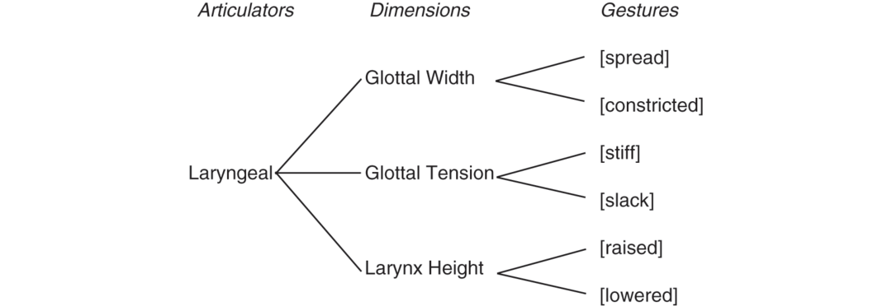

# [[page 119]] Chapter 6 Germanic Laryngeal Phonetics and Phonology

**Contributor(s):** Joseph Salmons

## 6.1 Introduction

This chapter examines Germanic laryngeal phonetics and phonology, focusing on assimilations and final neutralization. The contrast between sounds written *b* versus *p* or *v* versus *f* and their various assimilations (like English *-s* plurals, possessive *-s* or *-ed* past tense forms) and final neutralizations (in German or Dutch) are textbook examples in phonology, yet on closer examination these inform fundamental issues in the study of sound systems.

The chapter is organized as follows: Section 6.2 provides definitions and examples; Section 6.3 presents theoretical underpinnings, including Laryngeal Realism; Section 6.4 surveys selected patterns across Germanic; Section 6.5 notes open issues and directions for future research; and Section 6.6 summarizes laryngeal phonetic and phonological differences across Germanic.

## 6.2 The Basics

This section describes the basic physiology of laryngeal phonetics and phonology and introduces laryngeal contrasts.

Human beings use the larynx (‘voice box’) in speaking. This “complex structure composed of cartilages, muscles and various related tissues” was first described in detail by Leonardo Da Vinci (Kent 1997: 100, a good source on the relevant human anatomy). It contains [[page 120]] the vocal folds, pieces of mucous membrane on either side of the throat which can be opened to allow free airflow for breathing or brought together in different configurations to shape speech sounds. The opening between the folds is called the glottis. For present purposes, two states of the glottis are important. The first is when the folds are held close to one another so that, with sufficient airflow from the lungs, they vibrate steadily. This position is typical of vowels and sonorants in the world’s languages, an effect called ‘voicing’. The second is when the folds are held apart to inhibit vibration, creating, among other things, aspiration after word-initial /p, t, k/ in languages like Norwegian, German and English. (Usage varies by tradition, but many people use ‘phonation’ for how these states of the glottis shape speech sounds.)

I focus on two phonological features, those traditionally associated with voicing and aspiration.¹ Henton et al. (1992: 96) observe that “some contrasts, most notably those for phonation, use a large number of cues for each distinctive feature.” In Germanic and elsewhere, those cues include spectral information like changes in vowel formants next to obstruents (see Kingston and Diehl 2008 on a ‘low-frequency property’ associated with voicing) and various patterns of durational difference (Henton et al. 1992). Lisker (1986) lists 16 acoustic properties associated with voicing in English /b/ and expressly notes that the list is incomplete. In short, even where only one or two phonological features are involved, they can have a plethora of phonetic correlates.

The main phonetic measurement, especially since Lisker and Abramson 1964, has been Voice Onset Time (VOT). For stops, many researchers take the release of closure as a point of reference, when the lips part at the beginning of *bad* or when the tongue tip moves away from the alveolar ridge at the beginning of *times*. With aspiration, a gesture opening or spreading the glottis can inhibit vibration from the vocal folds coming together, creating a lag between release and voicing, or positive VOT. Vocal fold vibration before stop release is called prevoicing or negative VOT. If we have a gesture spreading the glottis, that can be timed variably relative to stop closure and release. The gesture can start before closure, creating preaspiration, for instance, systematically in several North Germanic varieties and variably in some West Germanic ones.

This discussion assumes regular, robust vocal fold vibration, but the physics and physiology are complicated. First, voicing can take place by virtue of the active configuration of the vocal folds. But with sufficient airflow and no particular laryngeal gesture, we can get vibration, ‘passive voicing’, such as when an English stop without laryngeal specification comes between two vowels, e.g., in *hobby*. [[page 121]] Second, oral closure downstream from the glottis makes voicing difficult: Voicing requires a pressure drop and enough air flow to create reliable vibration, yet air flow is by definition stopped downstream – pushing air through the glottis without an oral escape route. Finally, note that other configurations are possible and used in Germanic, if not generally for contrast, e.g., creaky voice (‘vocal fry’).

I focus on obstruents, consonants with enough constriction above the glottis (i.e., in the mouth, ‘supralaryngeally’) that airflow is impeded to cause frication (fricatives) or to stop airflow entirely (oral stops). In some languages, the larynx is not phonologically relevant to obstruents: In Hawaiian and Menominee, only one stop series exists, so /p/ lacks a counterpart /b/ or any other labial oral stop. Other languages – Otomí, Igbo, and Beja – have up to six different laryngeal contrasts, involving voicing, aspiration and glottalization, and combinations thereof. Almost all Germanic languages show two series, cross-linguistically the most common pattern, found in 162 of 317 languages surveyed by Maddieson (1984: 26). These are usually written in the Latin alphabet as <p, t, k> versus <b, d, g>, etc., and <f, s> versus <v, z>, etc. As discussed momentarily, we have reasons to analyze the distinction in different Germanic and other languages in two different ways: Using traditional symbols for the nonce, some languages actively spread the glottis on /p, t, k, f, s/ to contrast with plain or unmarked /b, d, g, v, z/; others instead use vocal fold vibration on /b, d, g, v, z/ to produce the distinction, leaving the other series unmarked. Here, I refer to both systems as laryngeal contrasts and the former as involving Glottal Width or [spread], yielding aspiration, and the latter Glottal Tension or [slack], yielding voicing.² The three types – ‘plain’, aspirated and voiced – are again the most widely reported series cross-linguistically (Maddieson 1984: 27).

Assimilation is possibly the most common process in sound systems, where sounds, typically adjacent ones, become more like each other (see Hall, Chapter 1). In laryngeal contrasts, we find consistent agreement in ‘static’ (i.e., non-alternating) clusters within syllables, where English allows [sp] and marginally allows [zb] (*spot, Sbarro*) but not *[zp] or *[sb]. Alternations provide clearer evidence. Famously, English’s limited morphological paradigms show very systematic laryngeal alternations, illustrated here with plurals. I use phonetic brackets since English orthography does not capture the pattern, writing [s] for sounds specified as [spread glottis] and [z] for those unmarked, written out as empty brackets [ ] (explained below):

1. [[page 122]] (1) English plurals

    a. ```tsv
      slip	slip[**s**]
      slit	slit[**s**]
      slick	slick[**s**]
      ```

    b. ```tsv
      bib	bib[**z**]
      bid	bid[**z**]
      big	big[**z**]³
      ```

    c. ```tsv
      lease	leas**[əz]**
      Liz	Liz**[əz]**
      leash	leash**[əz]**
      ```

Analyses vary but the most common approach assumes that the underlying representation of the plural marker is /z/ (Zwicky 1975), in traditional terms ‘voiced’ (= [ ] for us). The vowel insertion in (c) is not a direct concern but it presumably prevents sequences of similar consonants. For now, in our terms, the sibilant becomes [spread] by assimilation following an obstruent marked for [spread], which extends into the empty [ ] (in 1a).

German and many other languages allow a distinction between the two laryngeal series in initial and medial position, but not finally, as in (2).

1. (2) Positional laryngeal contrasts in Standard German

    a. ```tsv
      **G**abel ‘fork’	≠	**K**abel ‘cable’
      ```

    b. ```tsv
      Kra**g**en ‘collar’	≠	Kra**k**en ‘octopuses’
      ```

    c. ```tsv
      Sa**ck** [zak] ‘bag’	=	Ta**g** [taːk] ‘day’⁴
      ```

    d. ```tsv
      Sä**ck**e ‘bags’	≠	Ta**g**e ‘days’
      ```

Here too, alternations provide key evidence; both *Sack* and *Tag* end with a surface [k] in the standard language, but differ when inflection adds a final vowel: *Ta*[g]*e*.

Let us now contextualize this background within current phonological theory.

## 6.3 Theory and Analysis

We first need to take a stance on some fundamental issues in laryngeal phonology. The first issue is what features are involved and the second the nature of featural representation. All phonologically relevant states of the glottis for human languages can be captured using only three phonological dimensions: Glottal Width, Glottal Tension, Larynx Height (not discussed here) in the various attested combinations (Iverson and Salmons 1995, others). This system is developed by Avery and Idsardi (2001: 42, passim) as in (3).

1. [[page 123]] (3) Avery and Idsardi’s 2001 model of laryngeal phonology



This model seeks to make minimal assumptions about contrast, based on <span class="sc">phonological activity</span>, defined by Dresher and Zhang (2005: 52) as cases “for which we have positive evidence based on participation in phonological processes.” Consider an example of place features: Many see /t, d, n/ as unmarked for place ([ ]) but /p, b, m/ as marked for [labial]. On that view, [labial] can spread into [ ] but not vice versa, accounting for patterns like *in+possible* = *impossible*. In contrast, where we see *m* becoming *n*, these are instances of feature loss, like the widespread reduction of Germanic *-m* to *-n* in final position historically. Activity crucially involves the addition of structure while reduction involves its loss.

I follow Avery and Idsardi’s terminology (except when discussing authors who use [voice]) and transcribe to reflect this phonological analysis. That is, /p, t, k, s/ refer to laryngeally unmarked segments, /b, d, g, z/ imply the presence of a [slack] gesture, and where a [spread] gesture is posited, I use /pʰ, tʰ, kʰ, sʰ/. For example, English *thank* is rendered as /θʰæːŋkʰ/ and *do* as /tuː/, German *danke* as /tɑŋkʰə/ and Dutch *bedankt* as /bədaŋkt/. Here I will draw on assimilations, but there is other evidence of activity in Germanic (see discussion of Scots, below in this section). Co-occurrence restrictions and other patterns provide evidence in other languages.

Gestures are added during ‘completion’, and for English or German, Glottal Width is typically completed with [spread]. From there, contrasts can be enhanced or overdifferentiated phonetically by using a different dimension (predicted in the quote from Henton et al., Section 6.2). Avery and Idsardi develop the example of Japanese, a Glottal Tension language, enhancing with Glottal Width (2001: 53–54). This is captured in Vaux’s Law (Vaux 1998), which “entails that the unmarked fricative will acquire the dimension of Glottal Width, the default gesture of which is [spread]” (Iverson and Salmons 2003b). Similarly, Glottal Width systems can enhance laryngeal contrasts with Glottal Tension on the unmarked member, as exemplified below. This enhancing phonetic activity is layered on top of the basic contrast, which remains simply Glottal Tension. Enhancement is by definition not necessary and languages like Icelandic employ extremely [[page 124]] little glottal pulsing in obstruents. (See Keyser and Stevens 2006 on phonetic enhancement and D. C. Hall 2011 on the phonology.)

Our second issue is the nature of phonological representation, how dimensions or features are deployed. In many classic works, many or all features are binary (‘equipollent’), that is, have plus or minus values, e.g., traditional [+voiced] versus [-voiced]. Modern work pursues various kinds of underspecification, where some values are left blank. Much work since Lombardi (1995) treats laryngeal features as ‘privative’, either having a value or lacking one. This ‘unmarked’ or ‘plain’ value means that any specification is absent. (Wetzels and Mascaró 2001 argue against this, countered in Iverson and Salmons 2003a, Brown 2016.) Hestvik and Durvasula (2016) provide neurolinguistic evidence that phonological representation is sparser than phonetic representation, see also Park et al. 2010. In a language like Dutch, whose laryngeal system is built fundamentally around Glottal Tension, this yields a contrast between a [slack] gesture on /b/ and literally no laryngeal specification on /p/, written as [ ]. In formal systems, economy and parsimony are valued, speaking for this approach. In developing Dresher’s Contrastive Hierarchy (2009), Oxford (2015: 311) argues that “Privativity … makes the model maximally restrictive, since it predicts that only the marked values of contrastive features will be phonologically active.” We will see evidence in favor of this view below.

With those notions in hand, let us consider Laryngeal Realism, a term coined by Honeybone (2002, more widely known from Honeybone 2005) to capture the distinction made above, that languages like German (and around the world in Cantonese, Somali, and others) use Glottal Width completed with [spread] while languages like Dutch (and Hungarian, most Slavic and Romance languages) use Glottal Tension completed with [slack].⁵ This contrasts with the tradition, associated with work after Lisker and Abramson 1964 through Kingston and Diehl 1994 and beyond, which treats at least all of the Germanic languages as employing one feature, [voice], analyzed as unified phonologically with differences between our two types all carried on the back of the phonetics. More generally, Laryngeal Realism connects phonological representation with phonetic realization, but in a mediated way; the two levels neither completely disconnected from one another nor one predetermined by the other. As Eric Raimy put it recently, “Phonetics provides the menu from which phonology chooses.” Fully understanding sound patterns requires attention to both.

If we accept the above-described set of laryngeal gestures, their privativity and the notion of Laryngeal Realism, the picture for many Germanic systems can be characterized as in (4). Note the mismatch with orthographic representation in the first column. Again, /p, t, k, s/ mean laryngeally unmarked, /b, [[page 125]] d, g, z/ imply the presence of a [slack] gesture, and where a [spread] gesture is posited, I use /pʰ, tʰ, kʰ, sʰ/.

1. (4) Realist view of [spread] and [slack] systems in Germanic

  ```tsv
  	/p/	/b/	/pʰ/
  English	<b> [ ]		<p> [spread]
  Dutch	<p> [ ]	<b> [slack]
  ```

What is the justification for this distinction? We’ve already seen that there is a <span class="sc">phonetic</span> correlation in terms of actual aspiration and voicing: English-type languages show consistent lack of pulsing on [spread] obstruents and presence of aspiration on stops, with systematic phonological nuances discussed below. In contrast, the unmarked series shows great variation. English speakers vary regionally, stylistically, and otherwise in pulsing on these, while Icelandic generally lacks pulsing. Dutch-type languages show consistent pulsing on the [slack] segments (save for final devoicing and such).

For <span class="sc">phonology</span>, I have already mentioned the notion of ‘active’ features. An old-school [voice] analysis of English or German requires an aspiration rule for /p, t, k/ in the onset of many stressed syllables. Yet there is little or no aspiration in clusters of s +stop (*p*<sup>[h]</sup>*ot* versus *spot*, German *P*<sup>[h]</sup>*ass* ‘passport’ versus *Spaß* ‘fun’), which must be excepted from the rule, and no aspiration in stops followed by a sonorant, where instead the sonorant is devoiced: *p*[l̥]*an, t*[r̥]*ain, s*[n̥]*eeze* or *P*[l̥]*an* ‘plan’*, t*[r̥]*inken* ‘drink’*, Sch*[n̥]*ee* ‘snow’. That is, these forms require an additional rule of sonorant devoicing. Beyond saving us aspiration and sonorant devoicing rules, a [spread] analysis allows for sharing of the spread glottis gesture between the /s/ and stop, and sonorant devoicing falls out from the presence (and timing) of [spread] in the initial obstruents (Iverson and Salmons 1995). These types of phonological activity should, on many views, be encoded in the specification of the obstruents.

While early arguments were built on speaker intuitions of such patterns, they hold up in phonetic investigation. In German, voicelessness spreads progressively (rightward) over word boundaries where the first word ends in a [spread] obstruent and the second begins with an unspecified one. Taking data from test sentences containing (traditional) /t/ + /z/ or /v/ (e.g., “Benno ha**t W**älder und Seen gemalt”), Kuzla et al. (2007: 316) conclude that “A preceding voiceless obstruent (e.g., /t/) triggers assimilatory devoicing of /v, z/.” (See Jessen 1998 for a fuller accounting of patterns and previous research.)

In German and English, laryngeal assimilations change unmarked segments to [spread] and only where two unmarked obstruents are adjacent do we find what are traditionally called ‘voiced’ clusters. In plurals, in (1) above, past tense and possessive forms, in (5), or other English inflection, that is the case, based on the traditional analysis positing /d/ or /z/ rather than /t/ or /s/ (Zwicky 1975 and work since).

1. [[page 126]] (5) Past tense and possessive forms

    a. ```tsv
      walk	walke**d**	[kt]
      jog	jogge**d**	[gd]
      skate	skate**d**	[təd]
      ```

    b. ```tsv
      the book’**s** title	[ks]
      the blog’**s** title	[gz]
      the issue’**s** title	[ʃuz]
      ```

Here a simple progressive (rightward) spread of [spread] yields the correct outcome and the patterns comport with contractions (let us call this cliticization) like *what’s* and *it’s*, both with [ts] where the fricative is clearly underlyingly /z/. In privative terms on a traditional ‘voice’ account, as argued by Iverson and Salmons (1999), these facts “cannot even be described, because there is no way to refer to the absence of a feature under a privative theory of representation.”

English also shows limited patterns of voicelessness spreading leftward (regressively), as in these examples from derivational morphology and connected speech (again starting from Iverson and Salmons 1999):

1. (6) Regressive assimilations in English

    a. ```tsv
      In derivation [colspan=2]
      describe	description
      recede	recession
      ```

    b. ```tsv
      Over word boundaries [colspan=2]
      have to	[ft]
      has to	[st]
      ```

The direction of assimilation in English and German is progressive, but the same phenomenon spreads. All this strongly suggests that [spread] is the active feature.

Abercrombie (1967: 135–136) provides an interesting counterexample from “speakers of educated Scots,” who show regressive assimilation to [slack] in *blackboard* [gb] and *birthday* [ðd]. He concludes that “Such regressive assimilations of voice appear to be found in no other kind of English, though they are the regular thing in French, Dutch, and several other languages.”⁶ Iverson and Salmons 1999 analyze Scots as a Glottal Tension variety based on these assimilation patterns supported by basic phonetics, such as unaspirated /p, t, k/. Very different evidence comes from Youssef (2010), where a [slack] specification (his [Lowered Larynx]) blocks a lowering harmony.

Van Rooy and Wissing (2001: 325) raise regressive voice assimilations to the status of a general principle:

[[page 127]] The distinctive feature [voice] automatically entails the presence of regressive voicing assimilation in a particular language, provided that the feature [voice] is interpreted in the narrow sense of the actual presence of vocal fold vibration. This is evident from the widespread occurrence of regressive voicing assimilation in languages of the world that all happen to share the distinctive feature voice.

This generalization provides a key indication that languages using the gestures [spread] and [slack] differ phonologically as well as phonetically, and in a way that is not intuitively obvious: Our notion of phonological activity predicts what should spread, but not the direction of spread in and of itself.

Starting from Lombardi’s (1995) analysis, Zonneveld (2007) summarizes Dutch data on regressive voice assimilation, including forms like those in (7).

1. (7) Dutch regressive voicing assimilation (Zonneveld 2007: 10)


These data can be accounted for privatively by first applying final devoicing (in our terms, removing the gesture [slack]) to forms like *bloed* or *hand* and then applying ‘Spread-voice’ regressively, thus voicing and revoicing the first two examples.

Numerous languages, including Dutch, show stop-fricative asymmetries in their laryngeal behavior and the behavior of the preterit marker *-de* is especially difficult (e.g., Zonneveld 2007). While Dutch /b, d/ show expected phonetic voicing (again, there is no /g/) and assimilation patterns, fricative /z/ shows little pulsing and no regressive voice assimilation. /ɣ/ has so little pulsing that Allen (2016) suggests that contrast with /x/ may have been neutralized for some speakers. Moreover, he and others find relatively long VOTs on /p, t, k/ and some sonorant devoicing in clusters. Allen lays out a role for enhancement in the [ ] series and the set of cues exploited for the laryngeal distinction in Dutch appears particularly rich. While Netherlandic language history motivates the established asymmetries, work like Pinget 2015 suggests that sound change may be underway at present.

It should be clear by now that by no means was Laryngeal Realism posited simply on surface phonetic data, that is, that languages with aspirated /p, t, k/ are [spread] and those with modally voiced /b, d, g/ are [slack]. Phonetic evidence alone would be woefully inadequate for deciding the question. Some Germanic varieties, like my own Southern US English, ‘overmark’ the contrast with prevoicing on phonologically [[page 128]] unspecified /b, d, g/ as phonetic enhancement (see Jacewicz et al. 2009, or Docherty 2011 on British English). More important are patterns of laryngeal assimilation. My system of contrast is the same as that of other English speakers, as made clear by the fact that my assimilation patterns (in plurals and past tense forms, etc.) are those of the broader community. The case for Realism has been built on a broad set of evidence, including phonetic evidence beyond aspiration and glottal pulsing (like sonorant devoicing), phonology (assimilation patterns in particular), and patterns of variation, and integrated into typology (as already introduced), e.g., Iverson and Salmons 1995. Diachronic evidence also strongly supports a realist interpretation of Germanic laryngeal history (see Honeybone 2002, 2005; Iverson and Salmons 2003a, 2007, 2008, others). This chapter underscores the breadth of evidence involved.

Turning to final neutralization, we can define it simply as the loss of phonological distinction at some right edge, often word finally or in codas. German spelling reflects underlying forms, as in (2c) and (2d), or familiar examples like *Rad* ‘wheel, bike’ versus *Rat* ‘advice’, both with [t]. In the traditional broad interpretation of [voice], the name ‘final devoicing’ is warranted across the family, i.e., the analysis is removal of a specification of [voice]. Realism provides a richer set of options.⁷ Neutralizing Glottal Tension varieties do involve removal of [slack] (that is, in some sense actual devoicing), but Glottal Width varieties can neutralize either to the unmarked, by removal of [spread], or by the addition of [spread], a final fortition and an analysis implied in the indigenous German name for the process in that language, *Auslautverhärtung*, literally ‘final sound hardening.’⁸ It is clear that some languages of the world neutralize by insertion of [spread] to unmarked segments, including Kashmiri, Eastern Armenian, and Kashaya. Iverson and Salmons (2011) argue that German shows this pattern. (Some Germanic varieties show aspiration of final /p, t, k/, though not with neutralization, e.g., Swedish, per Riad 2014: 47.) Today, some varieties of American English are developing patterns of final laryngeal neutralization, see Purnell et al. (2005a, 2005b), so that *his* comes to merge with *hiss*, apparently by removal of [spread] (like Odenwald German, Section 6.4.3). Harris (2009) argues that final devoicing is lenition, a reasonable position for feature deletion but more difficult for insertion of [spread].

On this view, then, Germanic final neutralization falls into three distinct types, shown in (8), one feature addition and two feature removal.

1. [[page 129]] (8) Typology of Germanic final laryngeal neutralization

  ```tsv
  Dutch	Removal of [slack]
  German	Addition of [spread]
  Upper Midwestern English	Removal of [spread]
  ```

The history of German *Auslautverhärtung* has been investigated in most detail by Mihm (2004, 2007). Into the modern period, some varieties showed final distinctions and some varieties neutralize by removal of [spread] (see Section 6.4.3).

## 6.4 Comparative Overview

Issues of laryngeal phonetics and phonology have been extensively studied for all standardized modern Germanic languages as well as many dialects, even if rigorous comparative work is still rare (though see Allen 2016 for a comparison of Norwegian, Dutch, and Swiss German). This section sketches how particular varieties fit into the larger picture, covering each of the three branches of Germanic (East, North, and West) and illustrating both well-known and more recently investigated patterns in several languages: [spread] in Gothic, Swedish and Norwegian, Icelandic, and [slack] in Yiddish, West Frisian, and other systems found in some German dialects and Swiss German.

### 6.4.1 East Germanic

For practical purposes East Germanic is only represented by Gothic. Based on comparative evidence, Gothic is treated as a [spread] language with aspiration, though there is no evidence for this beyond spirant alternations in codas, like *giban* ‘to give’ ~ *fragift* ‘betrothal’, though another passage spells the same cluster <bt> (Miller 2019). We lack, for instance, clear evidence of progressive assimilation of [spread].

Gothic fricatives are written as <b, d, z> in medial positions versus <f, þ, s> in final position (leaving aside the velar). This is interpreted first as reflecting a stop-spirant alternation, where stops /b, d/ were realized as fricatives [β, ð] intervocalically, and secondly as a fricative fortition or devoicing process in final position as in (9a–9c), examples and discussion after Roberge 1983.

1. (9) Gothic fricative alternations and exceptions

    a. ```tsv
      *bi****d****jan* ‘to ask for’, inf.	*ba****þ*** 1–3.sg.pret.
      ```

    b. ```tsv
      riqi**z**is ‘darkness’, gen.sg.	*riqi****s*** nom.sg.
      ```

    c. ```tsv
      *hlai****b****a* ‘bread’, dat.sg.	*hlai****f****s* nom.sg.
      ```

    d. ```tsv
      *twali****b*** ‘twelve’ for expected	*twali****f***
      *haubi****d*** ‘head’ for expected	*haubi****þ***
      *min****z*** ‘less’ for expected	*min****s***
      ```

[[page 130]] This pattern is widespread but shows over 200 exceptions, concentrated in particular parts of the small corpus, illustrated in (d). The exceptions always involve reflexes of *b, *d, *z, rather than underlyingly ‘voiceless’ segments, so that *qi****þ****an* ‘to speak’, inf., only shows the 1–3.sg.pret. form *qa****þ***, never *qad (Roberge 1983: 110). Roberge concludes that the exceptional spellings are “vestiges of an older, presumably Wulfilian usage” (1983: 149). That is, Wulfila’s phonology had a laryngeal contrast in final position and neutralization took place in the scribal period, where scribes incompletely reconciled the differences between the *Vorlage* they worked from and their own Gothic phonology. Teasing out this chronology of change between the translation and the later manuscript we have today shows a nuanced form of familiar patterns of final neutralization, affecting fricatives but not stops.

Far more exotic in Gothic is the apparent laryngeal dissimilation in nonadjacent obstruents, known as Thurneysen’s Law, illustrated in (10) (after Collinge 1985: 183 and Suzuki 1992) with variants of the suffix reconstructed by Lehmann (1986: 110) as *-uƀni̯a.

1. (10) Thurneysen’s Law

  ```tsv
  fastu**b**ni ‘fasting’	waldu**f**ni ‘might’
  fráistu**b**ni ‘temptation’	wundu**f**ni ‘wound(ing)’
  witu**b**ni ‘knowledge’
  ```

One workable formulation of the generalization is Suzuki’s (1992: 29), that fricatives “following an unstressed vowel … dissimilated in a handful of derivational suffixes with the preceding root final consonant with respect to the feature [± voice].” That is, fricatives in certain suffixes changed their laryngeal specification to <span class="sc">disagree</span> with the specification of the last consonant in the root. While some examples certainly follow this pattern, there are many exceptions and what we see in the Gothic evidence reflects at best a shadow or compromised pattern. Suzuki reasonably stresses the interaction of the process with the fricative pattern discussed above as well as the (again, partial) loss of Verner’s Law, further complicated by morphological transparency/opacity.

Collinge (1985: 183) opens his discussion of Thurneysen’s Law by declaring that “Gothic is maddening in the variability in respect of voicing shown by its spirant consonants.” As Roberge shows, sufficient care in sifting the evidence can provide real progress, though much remains to be explained.

### 6.4.2 North Germanic

All North Germanic systems appear to be [spread]. Two examples show informative patterns, Swedish and Icelandic.

Swedish patterns are illustrated in (11) with preterit forms and past participles below, assuming underlying forms /-de₂/ and /-te/ respectively (Riad 2014: 102–103).

1. [[page 131]] (11) Assimilation in Swedish (slightly altered)

  ```tsv
  **Verb**	**Inflected**	**Form**	**Pattern**
  ```

    a. ```tsv
      bygga /byg<sup>μ</sup>-a₂/ [²‘bʏgːa]	bygg-de [²‘bʏgːdɛ]	pret.	agreement
      ‘to build’	bygg-t [bʏkːt]	p. part.	regr. assim.
      ```

    b. ```tsv
      köpa /ɕøp-ɑ₂/ [²‘ɕøːpʰa]	köp-te [²‘ɕø̞ʰpːtɛ]	pret.	agreement
      ‘to buy’	köp-t [ɕø̞ʰpːt]	p. part.	regr. assim.
      ```

While this looks like a simple case for [spread], another view treats Swedish as overmarked, requiring both active [spread] and [voice] to capture the evidence. Helgason and Ringen (2008) present data that Central Standard Swedish stops are realized with aspiration on one series and voicing on the other, leading them to conclude that Swedish contrasts involve both [spread] and [voice] as active features: “If prevoicing implicates the feature [voice] in phonetic representations and aspiration implicates [sg] [=[spread]], then Swedish would appear to have both” (2008: 625). However, recall the discussion in Section 6.3 regarding enhancement, where a laryngeally unmarked series can be enhanced with phonetic voicing. If we move beyond the basic phonetics, Helgason and Ringen report laryngeal assimilations typical of simple [spread] systems, testing clusters of various configurations like those above, covering, in their terms, fortis + fortis, fortis + lenis, lenis + fortis and lenis + lenis: “Stop clusters that have underlying (or historically) mixed voicing are entirely voiceless. Only clusters in which both stops are lenis are voiced” (2008: 622). In short, [spread] is phonologically active and voicing inert, a phonetic enhancement of the contrast (see also Riad 2014: 102).⁹

Beckman et al. (2011) provide another kind of argument for using both features for Swedish. Previous work shows that changes in speaking rate correlate with active features: “Slowing down causes longer aspiration in aspirating languages and longer prevoicing in voicing languages but no change in short-lag stops” (2011: 39). They find that both aspiration and prevoicing increase in Swedish slow speech, from which they conclude that both features are active. What has not been shown yet is that this is a phonological rather than a phonetic effect. That is, is the correlation with speaking rate an effect of phonological specification or a phonetic enhancement?

Norwegian patterns much like Swedish, though it seems that there is less phonetic voicing. Notable is the bidirectional spread of voicelessness, discussed by Kristoffersen (2000: 74–87).

Icelandic obstruents are voiceless phonetically, with stops distinguished by the presence or absence of pre- or postaspiration (Hansson 2003: 49–50, Árnason 2011: 99). Aside from /v/ and /j/, likely better [[page 132]] analyzed as approximants, fricatives do not show a laryngeal contrast initially (Árnason 2011: 106–107). Phonetic voicing is found only intervocalically and even there, /s/ does not normally voice. This presumably means that even the broadest understanding of [voice] cannot be invoked for this language.

Example (12a) shows the contrast in initial position, while (12b) shows neutralization differing by dialect, going to the unaspirated in the Southern (or “soft”) dialect but to the aspirated in the Northern (or “hard”) dialect. Intervocalic (here inter-sonorant) context is a common one for neutralization (e.g., in many German dialects), but the phonological neutralization going by dialect in two different directions, seems less common, reminiscent of the distinction drawn above between final neutralization by feature removal versus insertion.

1. (12) Aspiration in Icelandic (from Hansson 2003: 51)

    a. ```tsv
      [‘tʰiː.na]	*tína*	‘to pick’
      [‘tiː.na]	*dýna*	‘mattress’
      [‘kʰrau]	*krá*	‘pub’
      [‘krau]	*grá*	‘gray’ (fem.)
      ```

    b. ```tsv
      Southern	Northern
      [‘svɪːpa]	[‘svɪːpʰa]	*svipa*	‘whip’
      [‘hɛːtja]	[‘hɛːtʰja]	*hetja*	‘hero’
      [‘sɪːkrɪ]	[‘sɪːkʰrɪ]	*sykri*	‘sugar’ (dat.sg.)
      ```

Árnason writes that the “clear opposition between fortis (hard) and lenis (soft) consonants is only fully realized before a vowel and in the onset of word-initial syllables” (2011: 104). Árnason goes on to describe a pattern of ‘final devoicing’ to capture alternations like *dagur* ‘day’ nom.sg. versus *dag* ‘day’ acc.sg.: [taːɣʏr̥] versus [taːx] (2011: 236–237, elsewhere). More interesting though is prepausal context which can affect final obstruents (2011: 237, 302–303), and which Árnason sees as a marker of the right edge of prosodic boundaries. Perhaps the opposite pole within North Germanic is Danish, a clear [spread] language with rampant lenition (featural reduction) in its unmarked obstruents.

### 6.4.3 West Germanic

This branch shows wide diversity in its laryngeal phonetics and phonology. As sketched above, much of West Germanic uses Glottal Width as its dimension and a [spread] gesture (German and most kinds of English, along with Low German, North and East Frisian). Here I sketch some varieties that are Glottal Tension with [slack] (Yiddish, West Frisian) and then two varieties without a laryngeal contrast at all.

#### [[page 133]] 6.4.3.1 Yiddish

Slavic languages are classic Glottal Tension languages and Yiddish is as well, possibly due to intense, long-term contact with Slavic, perhaps involving language shift where Slavic-speaking Jews acquired Yiddish and imposed their native phonology and phonetics on an originally German-like [spread] system. Such a history leads us to expect complexity.

Kleine (2003: 262) describes the standard language as one where “Voiceless plosives are unaspirated or might occur with slight aspiration, mainly in final position, whereas voiced plosives are fully voiced in all positions.” Assimilation patterns are more complex than in many other [slack] languages, perhaps driven by historical language contact.

1. (13) Yiddish regressive laryngeal assimilation (Jacobs 2005: 120–121, 129–130)

    a. ```tsv
      Northeast Yiddish	Central and Southeast Yiddish [colspan=3]
      dos bux ‘the book’	do[z] bux [colspan=2]	du[s] biːəx
      fusbenkl ‘bench’	fu[z]bejnkl [colspan=2]	fiː[s]benkl
      ```

    b. ```tsv
      Alternations in Standard Yiddish [colspan=4]
      ši[d]əx ‘match’ [colspan=2]	ša[t]xn ‘matchmaker’ [colspan=2]
      [z]okn ‘old man’ [colspan=2]	[s]keijnəm ‘old men’ [colspan=2]
      ```

    c. ```tsv
      /v/ [colspan=4]
      s[v]ivə ‘environment’ [colspan=4]
      š[v]uə ‘oath’ [colspan=4]
      d[v]ojrə ‘Deborah’ [colspan=4]
      s[f]orəm ‘holy books’ [colspan=4]
      t[f]ilə ‘prayer’ [colspan=4]
      ```

In (13a) we see an expected regressive voicing assimilation, with differences across dialects, while (13b) shows regressive devoicing (which would be formally captured by delinking of a feature). Jacobs indicates “apparent exceptions” with regard to the facts in (13c). In various Germanic and other languages (including Slavic, key contact languages), /v/ behaves as an approximant rather than as a fricative, which may play a role here. More generally, Iverson and Salmons (2003a) argue that wrinkles in Dutch laryngeal assimilations are traceable to the language contact which led to the language becoming a [slack] language, with traces of its heritage still visible. Perhaps such a case could be made for Yiddish.

For final devoicing, Weinreich (2008: 435–436) argues that “Through the German determinant, facts of *Verhärtung* came into the German component of Yiddish.” King (1980) shows that Northeast Yiddish lost the rule, restoring the earlier state of affairs, so that *veg* ‘way’ surfaces with [g] in the singular and plural: *veg ~ vegən*. Jacobs (2005: 78) reviews work arguing for a cline from Western Yiddish with regular final devoicing through (apparently ill-understood) Central Yiddish patterns of variation.

[[page 134]] Following earlier work, Jacobs (2005: 130) summarizes the major dialect difference as between final neutralization in Central Yiddish versus Eastern Slavic-like anticipatory or regressive voicing assimilation in Northeast Yiddish. Thus *tog-student* ‘day student’ devoices in Central via final devoicing and in Northeast via voicing assimilation. But Southeast Yiddish lacks either process and /g/ surfaces as [g].

#### 6.4.3.2 West Frisian

This language patterns with [slack] varieties. For instance, Cohen et al. (1959: 116) see voicing as essentially the same as in Dutch. [slack] is the active phonological gesture, spreading regressively, including across word boundaries (Riemersma 1979: 62–70, Tiersma 1985: 27–28) into stop (14a) and fricative (14b) word-final forms as well as spreading into laryngeally unspecified /s/ in a reduced form of the pronoun for ‘she’ between sonorants (14c).

1. (14) West Frisian regressive laryngeal assimilations

    a. ```tsv
      op + dwaan	‘put on’	[obdwaːn]
      net dwaan	‘don’t do’	[ned dwaːn]
      ```

    b. ```tsv
      of bûter	‘or butter’	[ov butər]
      thús wéze	‘be home’	[tyz vɛːzə]
      ```

    c. ```tsv
      wie se	‘was she’	[viə zə]
      foel se	‘fell she’	[fuəl zə]
      ```

    d. ```tsv
      lêz-t	‘read + 3<span class="sc">sg</span>’	[lɛːst]
      hoeg-t	‘have to + 3<span class="sc">sg</span>’	[huəxt]
      ```

    e. ```tsv
      op dy	‘on that’	[op ti]
      wolst do	‘do you want’	[vost to]
      ```

Obstruent voicing is not licensed in final position so that, as in (d), clusters are resolved toward the voiceless. A more substantive wrinkle is illustrated in (e), where in a small set of function words beginning in *d* following a word ending in a voiced stop, “both often become voiceless” (1985: 27–28). This optional process looks like a reduction (removal of laryngeal specification) of the function word, i.e. it does not appear to be assimilation in the relevant sense. Instead, like the change of *m* to *n* introduced in Section 6.3, that is presumably a case of reduction or feature loss.

As just noted, the contemporary language shows final devoicing. Tiersma (1985: 30) gives evidence on the history:

[R]ecords indicate that final devoicing in Frisian is a phenomenon of recent origin. In the phonetic study of the language of Grou by Eijkman (1907: 19), *b* and *d* are said to be largely voiced at the end of a word. But in Sipma’s grammar (1913), there are signs that devoicing has started to set in. His transcriptions, although not entirely consistent, suggest that devoicing had taken place following long vowels, falling diphthongs, and liquids, but not after short vowels or rising diphthongs.

[[page 135]] Finally, we come to Germanic varieties without any contrast, in one instance by historical loss of laryngeal contrast and in the other due to transphonologization, a sound change followed by reinterpretation of an existing length contrast.

#### 6.4.3.3 Central German Dialects

In some German dialects, a widespread lenition process has eliminated laryngeal contrasts entirely or left contrasts only in very limited contexts. For instance, Odenwald German (Holsinger 2008) maintains a distinction in simple onsets before vowels where fortis can occur ([kʰabə] *Kappe* ‘hood’) but lenite elsewhere, including onset clusters and final position ([blug] ‘plow’). In others, like some varieties of East Franconian, there is no distinction at all, with all obstruents phonologically unmarked (‘lenis’ in the German tradition) and passive voicing occurring intervocalically (Rowley 1989: 400).

#### 6.4.3.4 Swiss German

In many varieties of Swiss German, there is no laryngeal distinction in consonants (see Schifferle 2010 on increasing aspiration in Zürich). Kraehenmann (2001: 111) writes, “As has been found for other Swiss German dialects …, laryngeal features such as voicing or aspiration do not take part in the underlying opposition or in the phonetic manifestation of the stops.” Instead, she argues, the distinction is carried entirely by duration (Kraehenmann 2003, Allen 2016). (I interpret length not as a segmental feature at all, but a structural pattern, represented here by two consonants following Purnell et al. 2019.) Contrasts are illustrated in (15).

1. (15) Alemannic singleton versus geminate contrasts (Kraehenmann 2001: 122)

    a. ```tsv
      initial	/pp/omfrit ‘French fries’	/p/ohne ‘bean’
      	/tt/urte ‘layer cake’	/t/otter ‘egg yolk’
      ```

    b. ```tsv
      medial	Su/pp/e ‘soup’	Stu/p/e ‘living room’
      	Tol/kk/e ‘smudge’	fol/k/ä ‘to obey’
      ```

    c. ```tsv
      final	schla/pp/ ‘limp’	Raa/p/ ‘raven’
      	al/tt/ ‘old’	Wal/t/ ‘forest’
      ```

The historical development of these patterns (especially Kraehenmann 2003) is noteworthy. Briefly, the High German or Second Consonant Shift eliminated old fortis stops (creating affricates or geminate fricatives) and old lenis contrasted singleton versus geminate, a distinction that was extended to initial position with the integration of Romance loanwords. In short, this is not a transphonologization of old laryngeal distinctions, but a maintained (and expanded) contrast.

[[page 136]] To conclude this section, we see overall rich diversity over time and space but patterns that appear to allow straightforward analyses under the tenets of both Laryngeal Realism and privativity. More importantly, this survey suggests how much work remains to be done with the tools available.

## 6.5 Further Issues

Some issues are unresolved or require further work, for instance:

1. 1. **Phonological activity** contrasts with **reduction**, or loss of structure, asymmetries that warrant further investigation. Similarly, underspecified segments pattern distinctly, not only as targets of activity, but likely showing greater phonetic variability and probably different patterns of reduction.

2. 2. **In phonetics, articulatory evidence** is needed. It would be particularly helpful to establish whether German final obstruents show an actual spread glottis gesture. Magnetic Resonance Imaging work underway at the University of Wisconsin–Madison should provide evidence.

3. 3. Whether **final neutralization is complete or incomplete** has long engendered discussion (Fourakis and Iverson 1984, Piroth and Janker 2004, Warner et al. 2006, especially Kharlamov 2014 on Russian).

4. 4. **Passive voicing** – vocal fold vibration in voicing-friendly environments without a phonological specification – is variable in Germanic. English and German have it, while Icelandic generally does not. What can we learn from these differences about phonetic enhancement?

5. 5. **Phonologically**, are there **overmarked systems**? Mixed systems do seem to exist, as argued by Iverson and Salmons (2003a) for Dutch. Cyran (2011) on Polish, and Ramsammy and Strycharczuk (2016) on Portuguese, argue expressly for more complexity in marking, beyond the discussion of Swedish in Section 6.4.

6. 6. Why do we have the patterns of **directionality of assimilation** we find? One might suspect that the duration of a glottal spreading gesture lasts longer than most single segments and that the variable timing here yields assimilations parallel to those of post- versus pre-aspiration. Those phonetic seeds could drive phonologization of assimilation. But regressive voice assimilation requires a different account, perhaps a tendency toward anticipatory voicing.

7. 7. Issues of **fricative versus approximant** were alluded to above for /v/ in Yiddish and /v, j/ in Icelandic (with parallels in Slavic and elsewhere). Those examples show nonparticipation in laryngeal assimilations reflecting likely approximant status. In other instances, we see what are usually approximants behaving like fricatives, in particular the devoicing of a phonetically fricative /r/ in some Yiddish dialects [[page 137]] (Jacobs 2005: 121). This has close parallels in some German varieties, e.g., those with velar [ɣ] for /r/, found in some west central areas, or uvular fricatives (see Hall 1993).

8. 8. **Social and historical context** matters. For instance, language contact is often suspected in changes in laryngeal phonetics and phonology, as noted above for the Dutch and Yiddish switches to [slack], the creation of some symmetry in Swiss German geminate distributions, but also in final devoicing in West Frisian, which Hoekstra (2001: 731) suspects “might be a case of Dutch interference.” Simon 2011 shows how bilinguals may promote such changes. Second, there is the possibility that variation in unspecified segments allows them to be used more readily to mark social or regional speech patterns, an idea being explored in follow-up work to Purnell et al. 2005a, 2005b.

In short, there is plenty to be done.

## 6.6 Conclusions

What have often been presented as simple issues of ‘voicing’, ‘voicing assimilation’, and ‘final devoicing’ have moved to the center of much discussion in phonetics, phonology, sound change, and other areas. I have argued that despite considerable diversity in the surface patterns, we actually have solid understanding of most fundamental issues, often in ways quite different from what was *communis opinio* only a decade or two ago.

The table below summarizes some findings of this chapter for selected Germanic languages and dialects. The first columns indicate whether there is robust aspiration of /p, t, k/ and allied fricatives, and whether there is full voicing of /b, d, g/ and allied fricatives. The third indicates whether there is assimilation to [spread] (i.e., voicelessness). The fourth reports whether there is regressive voice assimilation and the fifth shows whether there is final neutralization.

**Table 6.1 Summary of laryngeal phonetics, phonology, assimilation, and neutralization in Germanic**

```tsv
Glottal Width languages/dialects [colspan=7]
 [rowspan=2]	Phonetics [colspan=2]	Phonology [colspan=2]	 [colspan=2]
asp.	voicing	assimilation to [spread]	Regr. voice assim.	Final neutral.	Notes
English	✔	dial.	✔		dial.	Regr. some progr. assim.
Std. German	✔		✔		✔	Regr. some progr. assim.
Swedish	✔	✔	✔			Regr. some progr. assim.
Norwegian	✔		✔			Progr. and regr. assim.
Icelandic	✔		✔		✔
Gothic	?				fric.
**Glottal Tension languages/dialects** [colspan=7]
Dutch		✔		✔	✔	Stop/fricative asymmetries
Yiddish		✔		✔	dial.	Dialectal variation
W. Frisian		✔		✔	✔	Possible progr. [slack] assim.; del. of [slack] in reduction
‘Educated Scots’		✔		✔
**Other** [colspan=7]
E. Franconian						No distinction
Alemannic						Duration, not laryngeal
```

To sum up:

- There is a clear connection between phonetics and phonology: Glottal Tension languages show full voicing and Glottal Width languages show aspiration. Phonetic overmarking by enhancement is not uncommon but broadly variable as we might expect for a facultative pattern.

- Phonetics suggests where to look but phonological activity is the key, and we see clear differences between activity and reduction.

- We see a robust correlation between specification and assimilation patterns: Active features spread and unspecified values do not. Still, deletion, e.g., by reduction, can remove features.

- Directionality matters: Regressive assimilation appears broadly in Glottal Tension varieties, if not universally, while [spread] systems often show some bidirectionality. (This could be connected to the time [[page 138]] needed for a spread glottis gesture, which is longer than the duration of most single segments.)

- There appears to be no particular relationship between laryngeal contrast system and whether final neutralization takes place, just how.

There is no phonological unity across Germanic with regard to laryngeal patterns but two distinct and coherent sets, Glottal Width with [spread] and Glottal Tension with [slack]. Final neutralization occurs in both systems in a variety of different ways.

## Footnotes
