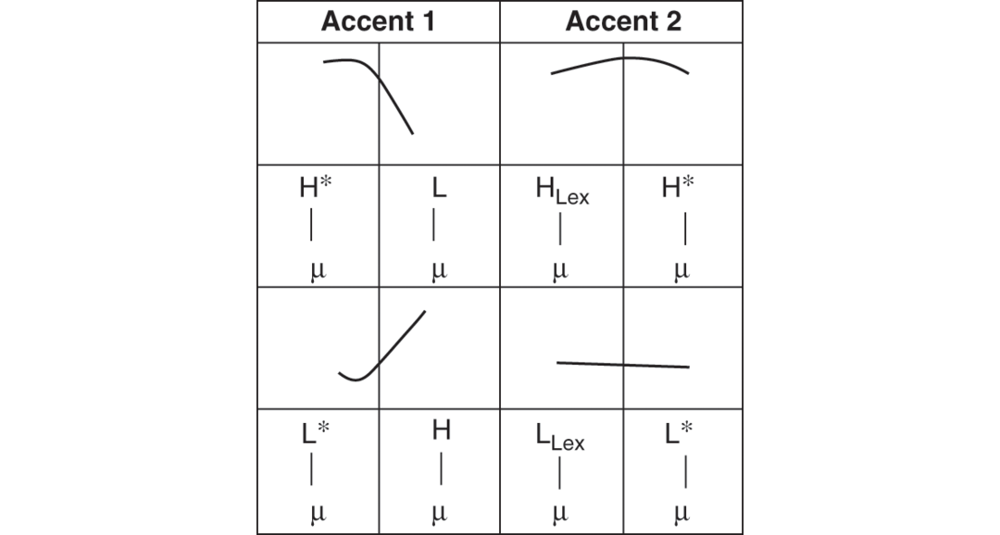
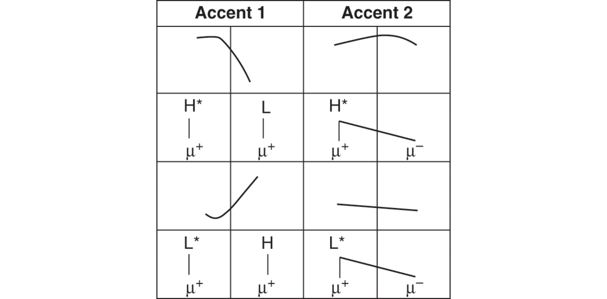
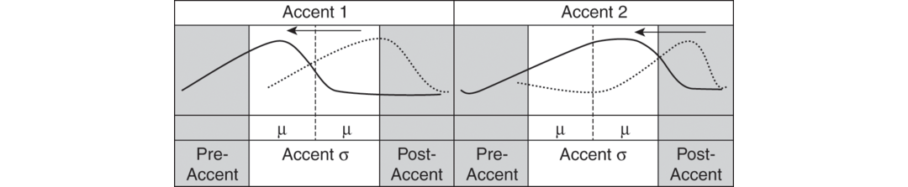
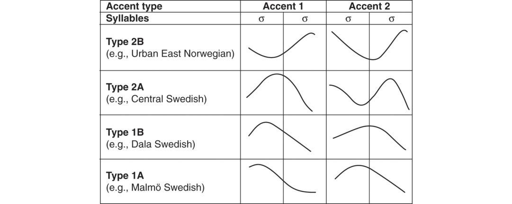
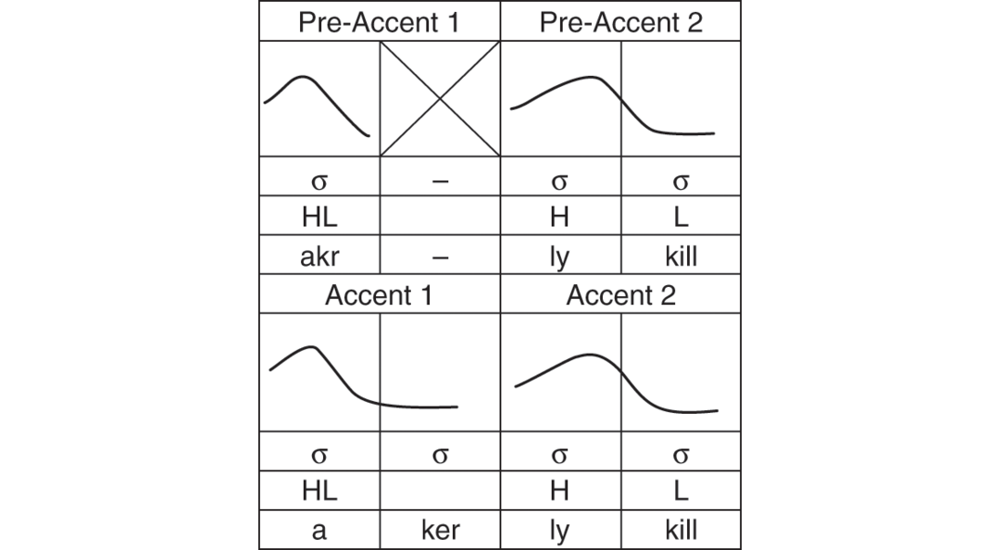
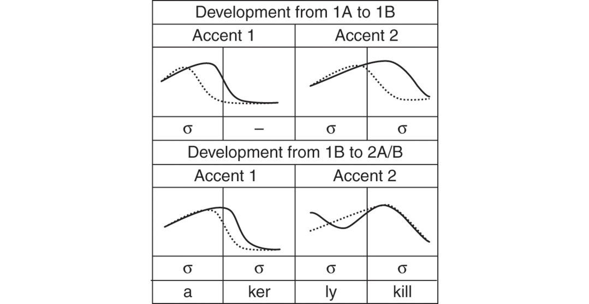

# [[page 143]] Chapter 7 Tone Accent in North and West Germanic

**Contributor(s):** Björn Köhnlein

## 7.1 Introduction

All Germanic languages use intonational tone to signal information status, sentential prominence, and prosodic boundaries (Féry, Chapter 28; O’Brien, Chapter 8). In most varieties, this usage of tone is considered to be purely postlexical, in the sense that tone does not distinguish lexical items. The alignment of intonational pitch accents *can* be a correlate of word stress, as in the isolation forms for the English noun ***im****port* versus the verb *im****port***; yet there are other correlates of stress (at least duration, vowel quality, intensity) that still make it possible to distinguish lexical items in the absence of pitch cues. Furthermore, such contrasts are always *between* syllables (<im> versus <port>) but never *within* them.

In some varieties of North and West Germanic, however, (primarily) tone-based oppositions exist within stressed syllables. The phenomenon is typically referred to as *tonal accent*. In North Germanic (often also called *Scandinavian*), tonal accent occurs in most varieties of Norwegian and Swedish, as well as in some varieties of Danish. In West Germanic, tone accent contrasts can be found in dialects spoken in Belgium, Germany, and the Netherlands. The West Germanic tone accent area does not coincide with any of the traditional West Germanic dialect areas but covers Ripuarian, Moselle Franconian, and Limburgian dialects. In the English literature on the subject, the area as a whole is often referred to with the cover term *Franconian*.¹

Intuitively, we can say that the tone accent oppositions in question are located “somewhere between tone and stress”. While *tone* refers to the distinctive function of pitch, the relationship with stress derives [[page 144]] from the fact that the tonal opposition is restricted to syllables carrying primary word stress (see Alber, Chapter 4, for a discussion of word stress in Germanic). In virtually all Germanic tone accent dialects that have been described so far, the opposition is between two accents (and never more), typically called Accent 1 and Accent 2 (Kristoffersen 2010, however, discusses the possibility of a third accent in Sollerön Swedish). A well-known minimal pair from Swedish is [¹andən] ‘the duck’ versus [²andən] ‘the spirit’ (accents are indicated with superscripts). The two items are segmentally identical but can be distinguished on the basis of their respective tonal contours. In Central Swedish, [¹andən] has a rising-falling (LHL) contour in isolation, while [²andən] is pronounced with an additional high tone at the beginning of the stressed syllable (HLHL). Furthermore, the rising-falling part of the contour (LHL) occurs in Accent 2 later than in Accent 1. As we shall see in the respective sections on North and West Germanic, however, the precise tonal realization of Accent 1 and Accent 2 can differ across dialects, sometimes in nontrivial ways.

This chapter will examine some general synchronic and diachronic properties of the Germanic tone accent systems (Section 7.2 on West Germanic, Section 7.3 on North Germanic). Note, however, that many central aspects concerning the synchronic and diachronic analysis of these systems are still under debate. Due to space limitations, I can only provide the very basics of some opposing synchronic and diachronic approaches. Furthermore, to avoid influence of personal bias, I will not provide detailed evaluations of different approaches.

I restrict the discussion to varieties of Germanic where tonal accent is uncontroversially attested in modern systems. For North Low Saxon, it has sometimes been claimed that tonal oppositions exist alongside a ternary quantity contrast. So far, detailed acoustic studies have been unable to substantiate these claims, which is not meant to suggest that there might not be a tonal opposition in at least some dialects (see, e.g., Prehn 2012, Höder 2014 for discussion). Furthermore, some scholars have argued that Frisian (Smith and van Leyden 2007, Versloot 2008) and Icelandic (Myrvoll and Skomedal 2010, Haukur Þorgeirsson 2013) had tonal accent at some point of their respective developments, but modern systems do not display accentual contrasts.

## 7.2 Tone Accent in West Germanic

### 7.2.1 The Present-Day Accent Contrast

#### 7.2.1.1 Basic Patterns

The tone accent opposition in West Germanic serves to distinguish lexical and grammatical units. Some minimal pairs from the Mayen dialect (Schmidt 1986) are provided in (1):

1. [[page 145]] (1) Tone accent minimal pairs from Mayen

    a. ```tsv
      [man¹] ‘basket’	[man²] ‘man’
      ```

    b. ```tsv
      [tɔuvə¹] ‘pigeons’	[tɔuvə²] ‘baptisms’
      ```

(1a) shows a monosyllabic lexical minimal pair, while (1b) demonstrates that disyllabic minimal pairs exist as well. In most dialects, the opposition is restricted to syllable rhymes with two sonorant units (long vowels, diphthongs, or short vowels plus sonorants; see van Oostendorp, Chapter 2, for a more detailed discussion of syllable structure in Germanic).² Within dialects, the precise tonal realization of the accents varies considerably depending on three factors: first, whether the item is in focus or occurs in a prefocal or postfocal context; second, whether the item occurs in phrase-final or nonfinal position; third, the expression of illocutionary force (declarative, interrogative, etc.).

Figure 7.1 shows realizations of Accent 1 and Accent 2 in Cologne (e.g., Gussenhoven and Peters 2004), a fairly prototypical West Germanic tone accent dialect, in nonfinal focus position. Dialects with Cologne-like realizations of the accents are commonly referred to as *Rule A*, a dialect classification based on Wiesinger (1970); see Section 7.2.1.2 for discussion of Rule B, another dialect type. In Rule A, declarative contours are generally falling, and interrogative contours are generally rising (often followed by a low boundary tone). The difference between Accent 1 and Accent 2 can usually be expressed as a contrast in the timing of the pitch movements – Accent 1 typically moves earlier than Accent 2. In nonfinal position, Accent 1 is realized with an early fall in the stressed syllable of declaratives, and as an early rise in interrogatives; Accent 2 has a high level tone with a late, post-tonic fall in declaratives, and a low level tone with a late, post-tonic rise in interrogatives.


While the contours in nonfinal positions (Figure 7.1) are similar across most Rule-A dialects, there is more variation in phrase-final realizations of Accent 2 (Accent 1 varies to a much smaller degree). For instance, in some dialects, such as present-day Cologne, Accent 2 will be realized with a high level tone and a relatively late fall in declaratives, similar to phrase-medial [[page 146]] realizations. In other dialects, Accent 2 will have a two-peaked, falling-rising contour, such as in Mayen (Schmidt 1986) or Roermond (Gussenhoven 2000). Since phrase-final tone accent syllables typically interact with intonational boundary tones, it is unsurprising that we find more variation in this context. Along these lines, we can regard nonfinal occurrences (as depicted in Figure 7.1 for Rule A) as default realizations, since they are unaffected by boundary signals. (Traditional dialectological descriptions, however, are typically restricted to realizations in isolation, which mimic the realizations in phrase-final position.) Considerable variation also occurs in prefocal and postfocal position, where we either find neutralization of the accent contrast or can observe diverse strategies to maintain the opposition across dialects – I will not treat such nonfocal realizations any further here; discussion of realizations out of focus for certain dialects can be found in, e.g., Schmidt (1986) for Mayen, Gussenhoven and Peters (2004) for Cologne, or Köhnlein (2011) for Arzbach.

While pitch is usually the main correlate of the accent opposition (e.g., Werth 2011), the tonal opposition between the accents is usually accompanied by other contrasts. The most widespread additional correlate of accent is duration (e.g., Gussenhoven and Peters 2004 for Cologne, Schmidt 1986 for overview). In modern systems, tone accent syllables with contour tones (falling, rising) typically have shorter duration than accent syllables with level tone (high, low); this correlation is discussed in detail in Köhnlein (2015a). Furthermore, Accent 1 can be accompanied by glottalization in some dialects; at least in Cologne, however, glottalization is restricted to realizations with falling tone (Gussenhoven and Peters 2004).

#### 7.2.1.2 Synchronic Tonal Typology

As indicated in Section 7.2.1.1, there is some variation in the realization of the accent contrast across dialects, such as differences in the phrase-final realization of Accent 2. There are, however, also more substantial cross-dialectal differences. Here, I focus on a particularly striking case of variation – a reversal of tonal melodies found in some dialects in the South East of the tone accent area (Rule B). Rule B has first been described in Bach (1921). Bach claimed that in the Arzbach dialect (a small village in the German Westerwald), speakers systematically pronounce items that have falling tone in other dialects with a high level tone, and items that have a high level tone in other dialects with falling tone.

In my own fieldwork (reported in Köhnlein 2011), I have been able to confirm Bach’s claims, although they had to be relativized. As shown in Figure 7.2, the Rule-B dialect of Arzbach indeed has reversed declarative contours in comparison to Rule A. That is, as observed by Bach, Accent 1 falls *earlier* than Accent 2 in Rule A, while Accent 1 falls *later* than Accent 2 in Rule B. In interrogatives, however, which Bach did not mention, the contours are *not* reversed, but resemble each other in the two areas: in both [[page 147]] Rule A and Rule B, the interrogative rise occurs earlier in Accent 1 than in Accent 2. In light of these novel facts, I have suggested in my work to refer to the difference between Rule A and Rule B as a *semi-reversal* of tonal contours. From a typological perspective, this semi-reversal is remarkable in various ways. On the one hand, tonal reversals between related language varieties are exceedingly rare across languages (Kingston 2011 for a case from Athabaskan). Furthermore, to the best of my knowledge, the Arzbach dialect is the only language variety described so far where we find an “alignment reversal” of word accents *within* the same system: Accent 1 *falls later* than Accent 2 in declaratives, but *rises earlier* than Accent 2 in interrogatives.


#### 7.2.1.3 Synchronic Lexical Distribution

By and large, the synchronic distribution of tonal accent can be derived from a Middle High German reference system (or some other, comparable reference system), which will be discussed in Section 7.2.1.4; yet later changes have obscured the original distribution, and the accent of individual items is often synchronically unpredictable (see also Hall, Chapter 1, for a discussion of synchronic segmental processes in Germanic). For instance, the difference between [tɔuf¹] ‘pigeon’ and [tɔuf²] ‘baptism’ must presumably be learned by present-day speakers. Yet there still are valid synchronic generalizations, two of which I mention below.

A strong generalization holds with regard to morphological alternations. As first explicitly stated in van Oostendorp (2005), grammatical accent minimal pairs always switch from Accent 2 in the simplex form to Accent 1 in the more complex form across dialects; I am not aware of a single counterexample. Two minimal pairs from Arzbach are given in (2); (2a) shows an alternation between an Accent-2 singular and an Accent-1 plural, and (2b) provides an example for the adjective meaning ‘broad’: the predicative form has Accent 2, and the corresponding attributive feminine and neuter singular forms have Accent 1 (*here*: neuter). (Attributive forms can be regarded as more complex than predicative forms since they sometimes also come with additional segmental material, as in the Arzbach form [brai¹də], which is used for masculine singulars and all plurals.)

(2) a. ```tsv
      [ʃtaːn²] ‘stone’	[ʃtaːn¹] ‘stones’
      ```

    b. ```tsv
      [ət is brait²] ‘it is broad’	[ən brait¹ haus²] ‘a.<span class="sc">nom</span> broad.<span class="sc">nom</span> house’
      ```

Furthermore, some modern dialects also show vocalic differences between the two accents. The most widespread pattern is that syllables with contour tones (typically Accent 1) tend to display more diphthongal realizations of vowels, whereas items with level tone (typically Accent 2) tend to have more monophthongal realizations (e.g., Dols 1953, Wiesinger 1970, Cajot 2006, Gussenhoven 2012, Köhnlein 2017). Two examples from the diphthongization of long high vowels under Accent 1 in Maastricht are given in (3). Such developments appear to be still ongoing in various dialects. This can be inferred from the discussion in Cajot (2006), as well as from Gussenhoven (2012), who describes an ongoing vowel split in Maastricht that affects certain mid vowels and that had not been mentioned in previous literature on the dialect.

(3) a. ```tsv
      [blɛif¹] ‘stay.1.PS.SG’	[bliː²və] ‘stay-INF’
      ```

    b. ```tsv
      [dɔuf¹] ‘pigeon.SG’	[duː²və] ‘pigeon-PL’
      ```

Notably, there are many aspects that still require more investigation across dialects. For instance, the accentuation patterns in compounds and loanwords are well studied for different varieties of North Germanic (see Section 7.3 above), but less so for West Germanic. It seems to be the case that members of compounds typically retain their accent in West Germanic, but deviant patterns may have escaped our attention so far (e.g., Jongen 1972 for Moresnet). We also know relatively little about the accent patterns in loanwords (yet see, e.g., Hermans 2012).

#### 7.2.1.4 Theoretical Analysis

The “traditional” theoretical approach to the analysis of West Germanic tonal accent, proposed in a series of papers by Gussenhoven and collaborators, operates under the assumption that there is a lexical tone contrast between the two accents. Accent 2 carries a lexical tone, and Accent 1 is the default. As a prototypical example, consider the tenets of the tonal analysis of the Cologne dialect, as provided in Gussenhoven and Peters (2004). The authors assume that Accent 1 is lexically toneless, which means that its surface structure will consist of intonational tones only. In phrase-medial position, this will be H*L for declaratives and L*H for interrogatives. The first tone links to the first mora of the accent syllable; the second tone goes to the second mora. As shown in Figure 7.3 (left side), this leads to a falling contour in declaratives and a rising contour in interrogatives.



Accent 2, then, has a lexical tone, which is realized on the first mora of the accent syllable. Since the ideal association of tones to moras is one-to-one, there is only space for one intonational tone on the second mora of the accent syllable. This is shown in Figure 7.3 (right side); the leftover [[page 149]] tone will be realized after the accent syllable. The lexical tone surfaces as H<sub>Lex</sub> in declaratives and as L<sub>Lex</sub> in interrogatives. According to Gussenhoven and Peters, the lexical tone changes its quality because it copies the value of the following intonational tone. As a consequence, we will get two identical tones in the accent syllables, which are realized with high level pitch in declaratives and with low level pitch in interrogatives, respectively.

In recent years, an alternative approach has emerged, where it is assumed that the essential difference between the accents is metrical, rather than tonal (e.g., Hermans 2012, Köhnlein 2016, Kehrein 2017). The main idea is that the tonal contours of Accent 1 and Accent 2 differ because metrical differences between the accents lead to diverse associations of intonational tones. Here, I briefly sketch the tenets of the analysis proposed in Köhnlein (2011, 2016, 2017); the precise implementation and representational assumptions differ in other approaches, but the general idea is similar.

Essentially, Köhnlein claims that tonal accent emerges because the two accents have different types of trochaic feet: Accent 1 is a syllabic trochee, and Accent 2 is a moraic trochee (the general concepts of syllabic and moraic trochees go back to Hayes 1995; see Smith, Chapter 3, for a more detailed discussion of foot structure in Germanic). The head of Accent 1, the syllabic trochee, is the *syllable* node, which dominates both moras in the accent syllable. Köhnlein assumes that being linked to the foot head makes these two moras metrically “strong.” In Figure 7.4, this is represented with two superscript pluses (µ⁺). The head of Accent 2, the moraic trochee, is not the syllable node but the first mora of the accent syllable; the second mora is the foot dependent. Therefore, only the first mora is metrically strong (µ⁺), but the second mora, which is not linked to a foot head, is weak (µ⁻).



[[page 150]] For Rule A dialects (such as Cologne), Köhnlein assumes that only strong moras can receive their “own” tone. Therefore, in Accent 2, the metrically strong first mora can license a tone while the weak second mora cannot support its own tone. Instead, the tone from the first mora will spread to the second mora, which results in a high level tone in declaratives, and a low level tone in interrogatives (the respective trailing tones are realized after the accent syllable, similar to the tonal approach). In Accent 1, each of the two moras in the tone accent syllable is strong, so each can license its own tone. Therefore, both tones (H*L in declaratives, L*H in interrogatives) can be realized in the accent syllable, leading to a falling and a rising tone, respectively (see Köhnlein 2016: section 4 for a discussion of how the analysis accounts for predictable quantity differences between the accents in some dialects and categorical differences in vowel/consonant quality).

### 7.2.2 Diachronic Development

As first established in Nörrenberg (1884), Accent 1 arose in stressed syllables under two conditions: either the syllable contained an originally long nonhigh vowel / opening diphthong, or the item was originally disyllabic with a voiced intervocalic consonant (here, “original” refers to a Middle High German reference system). All other contexts (monosyllabic words without an originally long nonhigh vowel / opening diphthong, disyllabic words with a voiceless intervocalic consonant) received Accent 2. (There is some variation across dialect areas, which we can ignore for our purposes; here I focus on Rule A.)

Bach (1921) discovered that the natural classes underlying Nörrenberg’s description are based on differences in intrinsic duration: Intrinsically longer vowels in the original system received Accent 1, whereas intrinsically shorter vowels received Accent 2. Bach bases his claim on two observations. On the one hand, vowels tend to be longer before lenis consonants [[page 151]] than before fortis consonants.³ This accounts for the differences in accentuation for long high vowels, closing diphthongs, short vowels plus sonorants, and lengthened vowels depending on the voicing quality of the following consonant (for a discussion of obstruent voicing in Germanic, see Salmons, Chapter 6; vowel quantity in Germanic is discussed in Page, Chapter 5). Furthermore, nonhigh vowels tend to be phonetically longer than high vowels, which captures the fact that all nonhigh long vowels have Accent 1.

Bach’s generalization has been accepted by most scholars, and has formed the basis for what I refer to as the *duration-based* approach to the tone accent genesis (e.g., Schmidt 2002; Köhnlein 2011, 2015a,2015b; Boersma 2017; see also de Vaan 1999). The most well-known alternative has been proposed by Gussenhoven (e.g., 2000, 2004, in press), whose scenario invokes multiple factors to account for different aspects of the distribution (homonym avoidance in noun paradigms, intrinsic F0 differences, among others); for critical evaluations of this approach see, e.g., Schmidt (2002), Boersma (2006), Köhnlein (2015a, 2015b); see Gussenhoven (2018) for a response to some of the criticisms.

Consider Figure 7.5 (adapted from Köhnlein 2015a: 243), which demonstrates how intrinsic durational differences may have facilitated the emergence of the tone accent contrast. The precise details of this scenario are based on my speculations, but they are perfectly compatible with other duration-based approaches. The stage before the genesis of the contrast is displayed with dashed rising contours in the stressed syllable of Accent 1 (left) and Accent 2 (right). The overall rising-falling intonational contour is chosen since this is the general interrogative intonation across all known modern dialects; in comparison, the declarative contours differ substantially across dialects (as, e.g., between Rule A and Rule B). This might be seen as an indication that the interrogative contours reflect a common old stage (Köhnlein 2013). As a matter of fact, there still are certain dialects that only display rising-falling contours in declaratives and interrogatives, resembling those shown in Figure 7.5 (e.g., Hasselt, Peters 2008).


Before the accent genesis (here referred to as “Pre-Accent” contours), the rise in the stressed syllable presumably started approximately at the same point for Pre-Accent 1 and Pre-Accent 2 and continued outside of the accent syllable. Since there was more time to realize a rising movement in relatively longer Pre-Accent-1 syllables (wider initial box in Figure 7.5) than in Pre-Accent-2 syllables (narrower box in Figure 7.5), the rise reached a higher end point in Pre-Accent-1 syllables than in Pre-Accent-2 syllables. These intrinsic pitch differences were at some point reinterpreted as a categorical tonal contrast, which extended the [[page 152]] differences between the contours (phonologization, Hyman 1976); this led to a rising tone for Accent 1 versus a low level tone for Accent 2. In Figure 7.5, this newly emerged tone accent contrast is represented with solid contours. The contrast became lexically distinctive after further developments. For instance, the Arzbach contrast between [ʃtain¹] ‘stones’ and [ʃtain²] ‘stone’ derives from the fact that the plural originally ended in schwa.

If we assume that dialects with contours such as in Figure 7.5 (as attested across the board in Hasselt, which is located at the North-Western border of the tone accent area) are the predecessor of modern Rule-A and Rule-B dialects, the question remains how the tonal reversal in declaratives may have come into existence. To the best of my knowledge, the only account that explicitly discusses the full set of relevant data is Köhnlein (2013, 2015b).⁴

In a nutshell, Köhnlein argues that the tonal reversal between Rule A and Rule B emerged when the two varieties changed the generally rising contours in stressed accent syllables (as displayed in Figure 7.5) to generally falling contours in declaratives; yet Rule A and Rule B used different adaptation strategies. The change from rising to falling intonation is in line with the observation that cross-linguistically (as well as in West Germanic), declaratives are more likely to have falling or high-level pitch accents, rather than low-level or rising pitch. Along these lines, the change created more prototypical intonation systems (see Köhnlein 2013 for a detailed discussion).

In Rule A, the alignment of the tonal contours was shifted leftwards, which moved the low pitch targets before the accent syllables and the high targets into the accent syllables for both Accent 1 and Accent 2. The process is displayed in Figure 7.6. Once more, the original contours are indicated with a dashed line, the modern Rule A contours with a solid line. The diachronic leftwards shift is indicated with an arrow.



[[page 153]] Instead of shifting the tonal contours leftward, Rule B introduced a high tone by raising the pitch at the beginning of stressed syllables. The process is shown in Figure 7.7. Dashed lines indicate the predecessor contours, solid lines display the outcome of the change; again, the arrow indicates the direction of the change. The different adaptation strategies, namely, the leftward shift of tonal contours (Rule A) versus syllable-initial pitch raising (Rule B) led to opposite tonal contours in the respective accent syllables. That is, in Rule A, we now find a fall for Accent 1 versus a high level tone for Accent 2, while Rule B has a high level tone for Accent 1, and a low level tone for Accent 2.


## 7.3 Tone Accent in North Germanic

### 7.3.1 The Present-Day Accent Contrast

#### 7.3.1.1 Basic Patterns

North Germanic tone accent systems can be found in varieties of Norwegian, Swedish, and some Danish dialects. The opposition is usually restricted to nonfinal syllables of polysyllabic words – with the exception of a few dialects, final stressed syllables (including all monosyllabic words) always receive Accent 1. Two surface minimal pairs from Central Swedish are provided in (4):

(4) 1. a. [¹andən] ‘duck-the’ [²andən] ‘spirit-the’

    2. b. [¹taŋkən] ‘tank-the’ [²taŋkən] ‘thought-the’

[[page 154]] A related phenomenon occurs in most varieties of Danish: A group of words, which largely correlate with Accent 1 from an etymological perspective, show glottalization in stressed syllables, the so-called *stød* (see Ejskjær 2005 for a typology and distributional variation across dialects). The occurrence of stød is restricted to the second mora of stressed syllables, but only if that mora is sonorous, i.e., a sonorant consonant or the second part of a long vowel. An example from Standard Danish is the difference between [tsæ:lə] ‘to count’, which does not have stød, and the corresponding imperative [tsæ:<sup>ʔ</sup>l] ‘count!’, which has stød (indicated with a glottal-stop superscript). Over the years, there have been debates as to whether stød should be regarded as a tonal phenomenon. Recent experimental investigations by Grønnum et al. (2013), however, suggest that pitch is not a reliable correlate of stød, whereas glottalization is. Due to space constraints, I will not discuss synchronic aspects of stød any further (yet see, e.g., Basbøll 2005, Itô and Mester 2015, Iosad 2016a for discussion and analysis). I return to stød in section Section 7.3.2, where I discuss the diachronic development of tonal accent in North Germanic.

In North Germanic varieties with tonal accent, the main correlate of the opposition between Accent 1 and Accent 2 is pitch. Figure 7.8 displays prototypical realizations of the accents from Central Swedish. In isolation, Accent 1 is realized with a one-peaked rising-falling contour. If a nonaccent syllable precedes Accent 1 (indicated with grey shading), we find a pitch fall into the accented syllable. Accent 2 has a two-peaked contour from the stressed syllable onward and a later timing of the rise-fall.


The first L in Accent 1 and the first H in Accent 2 are realized early in the respective accent syllables. The timing of the rest of the contour depends on various factors, such as the position of accent items in the intonational phrase. Furthermore, some tones are not always present, as first explicitly discussed in Bruce (1977). The prominence tone (H<sub>P</sub>) only occurs when accent items are realized in prominent phrasal positions, such as (but not limited to) focus (see also Myrberg and Riad 2015). The final low boundary tone (L%) surfaces only if the accent item occurs in the final position of an intonational phrase. The first L of Accent 1 and the initial HL sequence in Accent 2 are always realized. Consequently, there is no neutralization in nonprominent phrasal positions, unlike what we sometimes find in West Germanic (see Section 7.2.1.1). Note also that most North Germanic tone [[page 155]] accent systems do not use different pitch accents to signal pragmatic differences between, say, declaratives and interrogatives; yet phrase boundaries can be signaled with different boundary tones (e.g., Riad 2013: 257).

#### 7.3.1.2 Synchronic Tonal Typology

There has been extensive research on the synchronic typology of the North Germanic tone accents. Most of this research has been informed by Meyer (1937, 1954), who conducted a large number of phonetic studies on the realization of tonal accent across different varieties (with a focus on Swedish dialects); more recent collections of tone accent realizations in various Norwegian dialects can be found in the project *Norsk tonelagstypologi* “Norwegian tonal accent typology” (2000–2002) and in Hognestad (2012). Building on Meyer’s work, Gårding (1977) created a widely used Swedish accent typology. Gårding’s typology distinguishes two main factors: First of all, dialects are classified on the basis of whether Accent 2 is realized with one peak (symbolized with ‘1’) or with two peaks (symbolized with ‘2’). Furthermore, Gårding distinguishes dialects according to the timing of the melodies. The two main types are dialects where the realization of the accent melodies starts relatively early in accent syllables (symbolized with ‘A’) versus those where they start later (symbolized with ‘B’). A few examples of prototypical realizations of four dialect types are provided in Figure 7.9.



#### 7.3.1.3 Synchronic Distribution

An important aspect of the synchronic distribution of North Germanic tonal accent is that there are few, if any, lexical minimal pairs. Surface [[page 156]] minimal pairs typically also differ in their morphological structure. Consider the opposition between [¹and-ən] “duck-the” versus [²andə-n] “spirit-the” as an example (hyphens indicate morpheme boundaries). These forms can be distinguished only on the basis of their accent; yet the base form for [¹and-ən] is monosyllabic [¹and] “duck”, whereas the base form for [²andə-n] is disyllabic [²andə] “spirit”. Since monosyllables as well as polysyllabic words with final stress always take Accent 1 (see Section 7.2.1.1), this has led to claims in the (mostly earlier) literature that Accent 2 is a “signal” of polysyllabicity. This indeed works well for some parts of the vocabulary; yet the correlation is far from perfect. For instance, as pointed out in Riad (2013), there are various initially stressed disyllabic (loan) words that have Accent 1 in Swedish, such as ¹*fänrik* ‘lieutenant’ and or ¹*brandy* ‘id.’. The accent class of initially stressed disyllabic words interacts with the phonological make-up of the second, unstressed syllable. In Swedish, disyllabic words ending in unstressed /ə/ or /a/ (which correspond to the inflectional endings used in the language) typically have Accent 2 (e.g., *²ande, ²manga*), while other endings trigger Accent 1 (e.g., Bruce 1977). In Norwegian, only word-final unstressed /ə/ triggers Accent 2 in disyllabic words while other endings generally lead to Accent 1 (Kristoffersen 2000), an example being *²eple* ‘apple’. Furthermore, monomorphemic trisyllabic words with initial stress typically receive Accent 1, examples from Swedish being ¹*gigolo* ‘id.’ or ¹*polio* ‘id.’

A particularly strong factor in determining the present-day lexical distribution of the accents is morphology. Arguably the most well-known morphological property of North Germanic tone accent systems is the tendency to assign Accent 2 to compounds. The degree to which this happens, however, varies across dialects. In Eastern dialects (including Central Swedish), compounds always have Accent 2, independent of the accent of the individual members. This is often referred to as the “compound rule”, a term I shall adopt here.⁵ A few examples from Riad (2013) are given in (5). (5a) shows a compound where the first member has Accent 2. (5b) demonstrates that even inputs with only Accent-1 items result in Accent 2. (5c) shows that affixes which form an independent prosodic word (here: [heːt]) will also trigger the compound stress rule, because they have an independent stress.

1. (5) Compound accent in Stockholm Swedish (always Accent 2)

    1. a. [²sɔmːar] ‘summer’ + [¹loːv] ‘holiday’ → [²sɔmːarloːv] ‘summer break’

    2. b. [¹jʉːl] ‘Christmas’ + [¹loːv] ‘holiday’ → [²jʉːlloːv] ‘Christmas break’

    3. c. [ɡrʏmː] ‘cruel’ + [heːt] ‘<span class="sc">nominalizer</span>’ → [²ɡrʏmːheːt] ‘cruelty’

[[page 157]] Varieties in the West and South of the tone accent area tend to have more complex compound rules, in the sense that compounds (or compoundlike words) can have Accent 1 under certain circumstances. Here, I will restrict myself to a discussion of the compound rule in Urban East Norwegian, as given in (6). The examples are taken from Lahiri et al. (2005); see, e.g., Bruce (1973) for a discussion of compound stress in Malmö Swedish. In Urban East Norwegian, initially stressed compounds will always have Accent 2 if the first member has Accent 2, similar to Central Swedish (6a). Some first members that have Accent 1 in isolation, however, trigger Accent 1 in compounding, counter to the compound rule in Eastern dialects. This is true in particular for polysyllabic Accent 1 words, where the resulting compound will typically have Accent 1 (6b). The situation is more complicated for monosyllabic Accent -1 items, some of which trigger Accent 1 in compounds, while others do not. A striking example is the behavior of the homonyms *¹ball* ‘ball (dance event)’ versus *¹ball* ‘ball (object)’, both of which have predictable Accent 1 in isolation. When these forms surface as the first member of a compound, however, *¹ball* ‘dance event’ triggers Accent 1 (6c), whereas *¹ball* ‘object’ triggers Accent 2 (6d).

1. (6) Norwegian compounds (sometimes Accent 1, sometimes Accent 2)

    1. a. ²kirke ‘church’+ ¹tårn ‘tower’ → ²kirketårn ‘church tower’

    2. b. ¹aksje ‘stock’ + ²marked ‘market’ → ¹aksjemarked ‘stock market’

    3. c. ¹ball ‘ball (dance event)’ + ¹sal ‘room’ → ¹ballsal ‘ballroom’

    4. d. ¹ball ‘ball (object)’ + ¹spill ‘game’ → ²ballspill ‘ball game’

When it comes to affixation, North Germanic tone accent systems show certain prosodic effects that we also find in other Germanic languages, i.e., stress neutral, stress shifting, or stress attracting affixation. In addition, affixes in tone-accent systems can be accent neutral or accent inducing. Accent inducing suffixes can either induce Accent 1 or Accent 2. For instance, the verbal prefix *be-¹* always triggers Accent 1 in Swedish and Norwegian, even if a verb stem has Accent 2 when used in imperatives. *be-¹* also overrides the tonal specifications typically assigned by the [[page 158]] infinitive markers *²-a* (Swedish) and *²-e* (Norwegian). This is shown in Table 7.1 for the verb stems *stäm* (Swedish) and *stem* (Norwegian); data are from Lahiri et al. (2005).

**Table 7.1 Some effects of affixes on the accent class of words**

```tsv
IMPERATIVE	INFINITIVE	GLOSS
Swedish [colspan=3]
¹stäm	²stämma	‘tune’
be-¹stäm	be-¹stämma	‘decide’
Norwegian [colspan=3]
¹stem	²stemme	‘tune’
be-¹stem	be-¹stemme	‘decided’
```

#### 7.3.1.4 Theoretical Analysis

Over the years, various analyses of the North Germanic tone accent opposition have been proposed. In the most widespread approach, at least one of the accents is specified with a lexical tone. Some proponents of the tonal analysis have claimed that Accent 2 is the marked member of the opposition and thus carries a lexical tone (Accent 1 is then toneless, e.g., Riad 2013). Others have argued that Accent 1 is marked in the lexicon, and Accent 2 is lexically toneless (e.g., Lahiri et al. 2005). I will briefly describe the tonal mapping under these two privative approaches; again, I take Central Swedish as an example.

Riad (2013) argues that Accent 2 has a lexical high tone Hₗₑₓ that precedes the intonational tones. As indicated in Section 7.2.1.1, these intonational tones consist of a word tone L, which is always realized, followed by a prominence tone H<sub>P</sub>, which is restricted to prominent positions in the phrase, and a low boundary tone L%, which only occurs at the end of an intonational phrase. In isolation, Accent 2 will have a HₗₑₓLH<sub>P</sub>L% tonal contour. Accent 1, which lacks the lexical tone, will accordingly have a LH<sub>P</sub>L% contour without the initial lexical H. In the analysis by Lahiri et al. (2005), Accent 1 in Central Swedish is lexically marked with a lexical tone L<sub>Lex</sub>. In isolation, L<sub>Lex</sub> combines with H<sub>P</sub> and L%; this results in an LHL contour. Accent 2 starts with an intonational H* in the input, whose assignment is apparently blocked by L<sub>Lex</sub> in Accent 1 words. This H* then combines with the high prominence tone and the boundary L – since the resulting H*HL contour would violate the *Obligatory Contour Principle*, an epenthetic low tone Lₑₚₑₙ is inserted, which results in a H*LₑₚₑₙHL-contour. The two analyses are schematized in Figure 7.10.


A second type of analysis is the “timing approach”, where it is argued that the shape of the melodies is essentially identical, but their timing differs. In his groundbreaking work, Bruce (1977) has proposed that both accents are marked tonally in the lexicon, which does not necessarily provide a mechanism for default accentuation. Kristoffersen (2006) [[page 159]] proposes a related approach for urban East Norwegian. He regards Accent 1 as marked (in line with Lahiri et al. 2005), arguing that parts of a default intonational contour are prelinked in the lexicon for Accent 1 in a way that differs from the default tone assignment for Accent 2.

An approach that tries to derive accent assignment (largely) by rule has been proposed in Morén-Duolljá (2013). In a nutshell, Morén-Duolljá argues that Accent 1 is a monosyllabic foot, and Accent 2 a disyllabic foot. Morén-Duolljá’s main claim is that Accent 2 typically occurs when there are *two* underlying vowels, while Accent 1 occurs when there is *one* underlying vowel. Along these lines, [¹and-ən] (one underlying vowel, epenthetic schwa) will have Accent 1, and [²andə-n] will have Accent 2 (two underlying vowels). As pointed out by Morén-Duolljá (2013: 251), this metrical approach is comparable to Köhnlein’s analysis of West Germanic tonal accent (see Section 7.2.1.4). He notes, however, that his study concentrates on nominal paradigms and still needs to be extended to other parts of the grammar.

### 7.3.2 Diachronic Development

Opinions on how North Germanic tonal accent arose still vary widely. Roughly, we can identify two major debates. A first debate concerns the relationship of tonal accent and stød. While there is no doubt that the two phenomena are historically related, the question which of the two phenomena is older is still disputed. Over the past decades, most scholars seem to have converged on the idea that stød developed out of tonal accent (e.g., Ringgaard 1960, Riad 2000, Bye 2004, Iosad 2016b); yet Wetterlin and Lahiri (2015) have recently proposed a novel scenario in which they assume stød to be the predecessor of tonal accent, inspired by Liberman’s (1982) ‘stød-first’ approach. A second debate, discussed mostly among proponents of the “accent-first” approach, is between what Iosad (2016b) refers to as the “double-peak” approach (e.g., Riad 1998, 2000) and the “peak-delay” approach (e.g., Bye 2004, Iosad 2016b). Given space restrictions, I will only be able to briefly discuss the accent-first, double-peak approach (Riad 1998), the accent-first, peak-delay approach (Bye 2004, Hognestad 2007, Iosad 2016b), and the ‘stød-first’ approach by Wetterlin and Lahiri (2015).⁶

Riad’s accent-first, double-peak scenario builds on a general approach by Kock (1901), and more specifically on a paper by D’Alquen and Brown [[page 160]] (1992). D’Alquen and Brown argue that Proto-North-Germanic sequences of a stressed syllable plus two light syllables or two heavy syllables correlate with Accent 2. Originally monosyllabic words and words with stressed heavy syllables followed by one light syllable correlate with Accent 1. Along these lines, Riad (1998: 69) proposes that syncope (deletion of word-medial vowels, ca. 8th century AD) and the resolution of stress clashes (deletion of the second stress in adjacent stressed syllables) led to the modern-day difference between Accent 1 and Accent 2. The derivation of three representative words is shown in Table 7.2.

**Table 7.2 Basics of the North Germanic tone accent genesis in the “accent-first, double-peak” approach (Riad 1998)**

```tsv
Stage 1		Stage 2		Stage 3
doomijan	Syncope [rowspan=2]	døøman	Clash resolution [rowspan=2]	²døøma
H H	H H	H H
wordoo	Clash resolution [rowspan=2]	wordu	Syncope [rowspan=2]	¹ord
H H	H	H
gastiz	Syncope [rowspan=2]	gæstr	Epenthesis [rowspan=2]	¹gæster
H	H	H
```

As is typical of earlier Germanic, all items shown in Table 7.2 had main stress on the (stem-)initial syllable, which, according to Riad, was marked with a high tone. Riad furthermore assumes that **doomijan* and **wordoo* at some point had secondary stresses, which received an additional high tone. **doomijan* had a secondary stress on the third syllable (Stage 1). The two high tones were separated by a low tone, which resulted in a falling-rising HLH tonal contour. After syncope – a process that led to a change from **doomijan* (Stage 1) to *døøman* (Stage 2) – the word had two adjacent stressed syllables. In line with the cross-linguistic tendency that adjacent stressed syllables are dispreferred, the resulting stress clash was resolved by making the second syllable light (deletion of coda consonant, Stage 2 *døøman* to Stage 3 ²*døøma*). Riad assumes that after resolving the stress clash, the HLH melody was retained, which led to the double-peaked Accent 2 (²*døøma*). **wordoo*, which had an original secondary stress on the heavy second syllable, resolved the stress clash between Stage 1 and Stage 2. Since the word later received Accent 1 (*¹ord*, Stage 3), we have to assume that the high tone of the secondary stress was not retained after the stress clash was resolved. Lastly, **gastiz* did not have a secondary stress in Stage 1, and therefore only one high tone throughout its development. This means that resulting *gæster* received Accent 1 at Stage 3. One-peaked systems evolved later when the accent contours shifted leftward (comparable to the development of West Germanic Rule A, as discussed in Section 7.2.1.3). Stød, then, developed out of one-peaked systems when the falling pitch movement of Accent 1 was accompanied by a glottal closure, or possibly even replaced by it (Riad 2000).

[[page 161]] The accent-first, one-peaked approach, defended in, e.g., Oftedal (1952), Bye (2004), Hognestad (2007), and Iosad (2016b), maintains that the development of tonal accent occurred in Old Scandinavian (ca. AD 1000–1200). The main assumption is that monosyllabic and disyllabic words originally had a functionally redundant difference in the timing of intonational contours. An originally falling tonal contour HL was realized within one syllable in monosyllabic words, but spread across two syllables in disyllabic words; this corresponded most closely to modern dialects of type 1A. As a consequence of this alignment difference, the pitch peak in monosyllabic words (Figure 7.11, left side, Pre-Accent 1) occurred later than in disyllabic words (Figure 7.11, right side, Pre-Accent 2).



When some originally monosyllabic words became disyllabic through schwa epenthesis (*akr* > *aker*), they retained the original fall in the first syllable of the original monosyllabic form (Figure 7.11, left side, Accent 1). The tonal melody in ‘new’ disyllables thus differed from that of old disyllables (Figure 7.11, right side, Accent 2), which led to the tone-accent contrast.

Under the one-peaked approach, two-peaked Accent 2 would be the result of two independent processes, as depicted in Figure 7.12. First, in some varieties, the peaks of the two accents were delayed, and the peak of Accent 2 ended up in the second syllable; this led to 1B dialects (Figure 7.12, 1 A to 1B). At some point, some varieties introduced an additional high tone in the stressed syllable, which created double-peaked Accent 2 (Figure 7.12, 1 A to 2 A / B). Similar to Riad’s approach, the development of stød can be attributed to a reinterpretation of the falling tone.



A third proposal I will briefly discuss regards the emergence of tonal accent as a development out of stød. The general idea, originally put forward in Liberman (1982), has recently been elaborated on in Wetterlin and Lahiri (2015). In a nutshell, Wetterlin and Lahiri assume that after [[page 162]] encliticization of the definite articles *hinn / hitt*, the initial /h/ of these articles was glottalized following monosyllabic bimoraic nouns, but not after polysyllabic nouns. In Table 7.3 the overall developments are shown for the nouns *arm<sup>ʔ</sup>en* ‘arm’ (monosyllabic stem, stød develops) and *himmelen* ‘sky’ (disyllabic stem, no stød develops). Wetterlin and Lahiri (2015: 61) assume that glottalization reinforced the syllable boundary between the stem and the clitic, as a defense mechanism against the “danger of resyllabification and incorporation into the foot for directly preceding stressed syllables.” Since feet are maximally disyllabic, no such “danger” was present after unstressed (second) syllables of disyllabic stems.

**Table 7.3 Basics of the North Germanic tone accent genesis in the “stød-first” approach: development of stød versus no stød**

```tsv
Stage 1	Stage 2	Stage 3	Gloss
armr=<sup>ʔ</sup>inn	arm<sup>ʔ</sup>inn	arm<sup>ʔ</sup>en	arm=the
himinn=hinn	himinn=inn	himmelen	sky=the
```

At some point, the newly emerged glottal stop was reinterpreted as part of the stem (Stage 2, 3), and was then extended to all monosyllabic nouns. The opposition eventually became phonemic when some monosyllabic stød items became disyllabic as a consequence of vowel epenthesis (e.g., *fing<sup>ʔ</sup>r* ‘finger’ > *fing<sup>ʔ</sup>er* ‘finger’). Over time, stød was used in more morphological environments. Tonal accent came into existence when speakers of some varieties interpreted the glottal stop as either a high or a low tone. Thus, in this scenario, one-peaked and double-peaked tone accent dialects could have come into existence as (at least partially) independent developments. Wetterlin and Lahiri (2015: 64) point out, however, that they do not wish to make specific claims regarding the typology of tonal dialects.

## Footnotes
