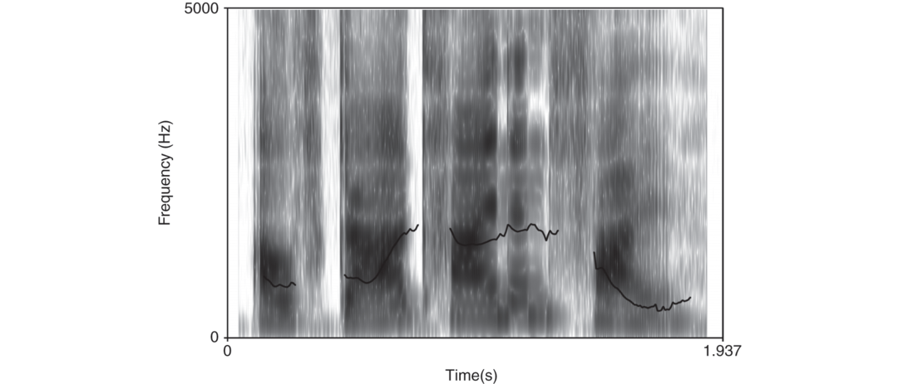
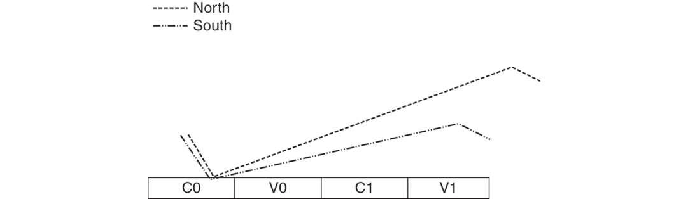
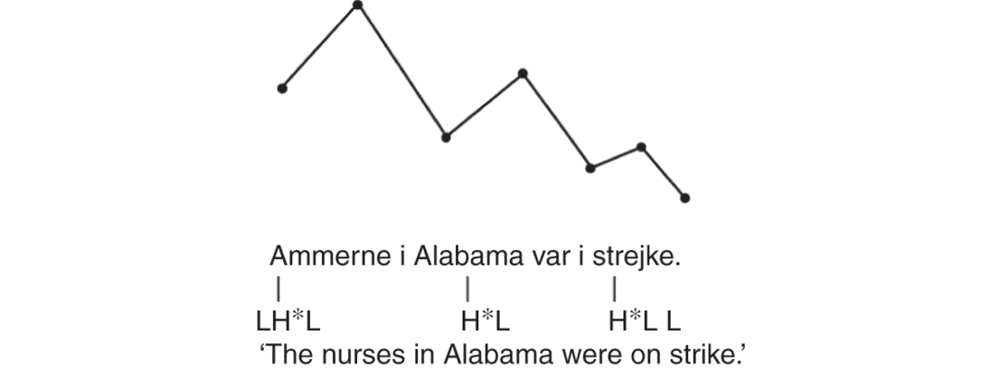
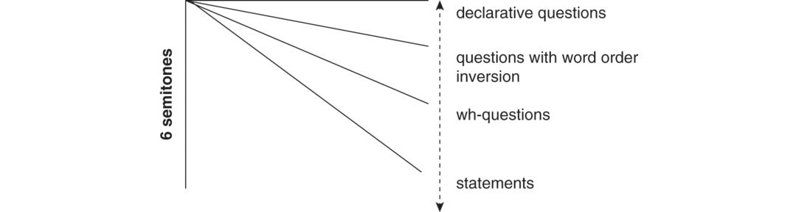
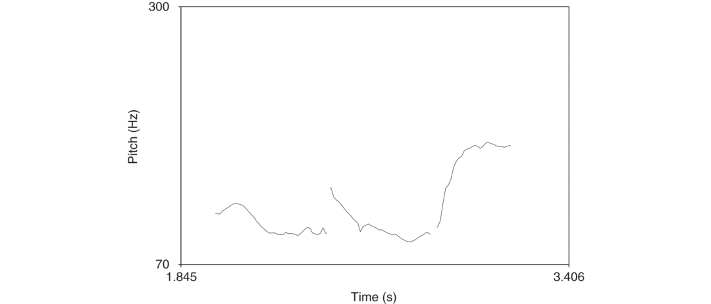
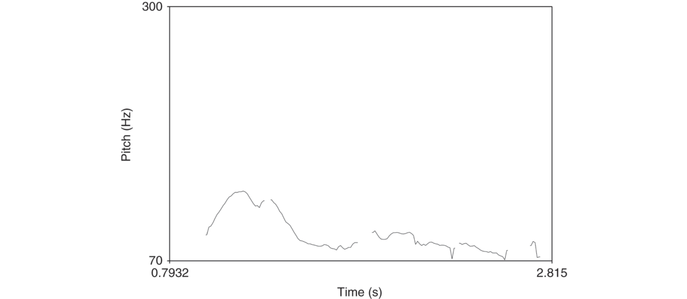

# [[page 167]] Chapter 8 Intonation in Germanic

**Contributor(s):** Mary Grantham O’Brien

## 8.1 Introduction

This contribution focuses on intonation, which listeners perceive as the tune – or the rises and falls – of an utterance. The unit of analysis is the intonation phrase (IP), which can range in length from a single word to a complete sentence (Benware 1986). In Germanic languages intonation is used for a range of linguistic functions including phrasing (i.e., dividing the speech stream into chunks), signaling sentence mode (i.e., distinguishing, for example, declaratives from yes / no questions), and highlighting information (i.e., focus). Pitch does not perform its work in isolation, but it functions in combination with loudness and lengthening cues. The Swedish example from Bruce and Granström (1993: 70) in (1) demonstrates how the insertion of an IP boundary, marked via ||, works to disambiguate otherwise ambiguous utterances.

(1) 1. a. Fast man offrade bonden || och löparen hälsade kungen.

      *But you sacrificed pawn and the bishop greeted the king*

      ‘But we sacrificed the pawn, and the bishop greeted the king.’

    2. b. Fast man offrade bonden och löparen || hälsade kungen.

      ‘Though we sacrificed the pawn and the bishop, the king greeted us.’

Intonation may also be used paralinguistically, for example, to express emotions. Consider how an English speaker might modulate intonation to show emotion when uttering the statement “It’s snowing again.” If the speaker recently purchased new skis, s/he might indicate excitement by raising the pitch on “snowing.” On the other hand, if the speaker must move a car from the street to enable the snow plow to clear the street, s/he might express frustration by lowering overall pitch and using monotone intonation. For the purposes of the present [[page 168]] contribution, I will not devote much attention to the paralinguistic uses of intonation.

This chapter will concentrate primarily on the grammatical role of intonation in West Germanic and North Germanic languages. Although the chapter mainly addresses standard varieties, some attention will be paid to dialectal variation. The chapter is organized as follows: Section 8.1 provides a basic overview of intonation and the ways in which it is investigated; Section 8.2 concentrates on declaratives across the languages in question; Section 8.3 focuses on the intonation of questions; Section 8.4 looks at special intonation contours; Section 8.5 provides a summary of illustrative research into listener judgments; and Section 8.6 offers an outlook for future research. The discussion of intonation presented here complements that in other chapters of this *Handbook of Germanic Linguistics*, especially Féry’s treatment of information structure and Köhnlein’s discussion of tone accents. Examination of both topics is therefore limited in this chapter.

## 8.2 The Fundamentals of Intonation Research

### 8.2.1 Analyzing Intonation

Bolinger (1978) described intonation as a “half-tamed savage.” Gussenhoven (2004: 49) explains this metaphor by distinguishing between the “discretely represented prosodic structure” (the tamed half) and the “unusually generous scope” that speakers have “in the implementation of fundamental frequency” when they speak (the untamed half). Consider yes / no questions in English. Although the default intonation contour ends in a rise, speakers may choose to produce this type of question with level pitch or even with a fall. The available research enables us to make generalizations about both the linguistic forms and functions of intonation.

It is possible to analyze intonation from different perspectives. Phonetic analyses examine the details of the acoustic correlate of pitch, fundamental frequency (F0). F0 is a measure of the frequency of vocal fold vibration, measured in Hertz (Hz). Pitch is perceived to be higher when a speaker’s vocal folds vibrate more quickly. Phonetic analyses of intonation often make use of pitch tracks like that in Figure 8.1, which is presented together with its corresponding spectrogram.



Pitch tracks, the black lines in the Figure 8.1, present frequency (y axis) over time (x axis). In Figure 8.1, we see that the pitch rises, remains level for some time, and then falls. Researchers performing phonetic analyses use measurements including F0 minima and maxima and pitch range, which is the difference between a speaker’s highest F0 and the baseline within an F0 contour. Phonological studies of [[page 169]] intonation focus on intonation systems and therefore make use of more abstract categories that capture the overall pitch contour and relative pitch height.

### 8.2.2 The Form and Meaning of Intonation

It is possible to make broad generalizations about roles of intonation contours in signaling sentence mode. Across the Germanic languages there is a tendency for declarative utterances and wh-questions to exhibit falling intonation and for yes / no questions to be produced with a rising contour (e.g., Benware 1986, Féry 1993, Árnason 1998, House 2005, Ambrazaitis 2009, Grønnum 2009). Continuation, for example, in the production of utterances containing a subordinate clause followed by an independent clause, is often signaled via a level or a rising contour (e.g., Delattre 1965, Féry 1993, Árnason 1998, Gibbon 1998, ’t Hart 1998).

There is one constituent in Germanic utterances that receives the primary emphasis. It is spoken more loudly, and its duration is longer. In the case of neutral utterances spoken “out of the blue” or in response to a question like “What’s happening?”, speakers tend to emphasize the last content word of the utterance. It is possible, however, to highlight another unit in an utterance through the use of intonational cues. Consider the Icelandic question-answer pairs from Dehé (2009: 16) in (2) and (3). In (2), the question requires the speaker to emphasize, or focus, the direct object, whereas in (3), the question requires focus on the verb. The emphasized constituent in both instances receives the sentence stress, the phonetic manifestation of which is referred to as the nuclear pitch accent.

1. [[page 170]] (2) Direct object focus

  Q: Hvað skrifaði María upp?

  ‘

  What did María write up?

  ’

  A: María skrifaði [söguna]

  Foc

  upp.

  María wrote story.

  DEF

  up

  ‘

  María wrote the story up.

  ’

2. (3) Verb focus

  Q: Hvað gerði María við söguna?

  ‘

  What did María do with the story?

  ’

  A: María [skrifaði]

  Foc

  söguna [upp]

  Foc

.

Discussion of intonation’s role in focus marking is taken up further in Féry, Chapter 28.

### 8.2.3 Central Terms

Together with stress and rhythm, intonation is classified as a suprasegmental, or prosodic, aspect of speech. Units of suprasegmental analysis can range from syllables to entire texts.¹ Of primary concern in linguistic analyses of intonation are the IP and the pitch movements associated with both the prominent syllable and the end of an IP. The IP tends to be delimited – especially in read speech – by a pause and lengthening of the final syllable. In addition, the IP tends to drop in amplitude at its end and is often followed by pitch resetting (e.g., Cruttenden 1986, Grabe 1998). In spontaneous utterances, however, it can be more difficult to delimit IPs (Cruttenden 1986), and they may or may not coincide with syntactic units (Benware 1986: 114).

Phonological models of intonation tend to fall into one of two categories: holistic and compositional. Holistic models such as the Fujisaki model (e.g., Fujisaki 1983) are based on the assumption that complete intonation contours carry meaning. Many of the compositional phonological models of intonation are based on the early work of Bruce (1977) on Stockholm Swedish, in which he demonstrates hierarchical structure of suprasegmental features. Importantly, he shows that intonation peaks are used to mark focus and that the basic units of intonation include word accents² (i.e., accent 1 and accent 2 for Swedish), sentence accent (i.e., the syllable in an IP that is emphasized), and terminal juncture (i.e., boundary signals). An example of the interplay between the levels is provided in (4). Here Bruce demonstrates that the difference in meaning of *stegen* between [[page 171]] (a) *vi brùkade klàra stégen* ‘we used to manage the steps’, (b) v*i brùkade klàra stègen* ‘we used to manage the ladder’, and (c) *vi brùkade klàraˌstegen* ‘we used the steps / the ladder of Klara’ is distinguished at a particular level in the hierarchy.

(4) (a) ```tsv
      vi brùkade klàra stégen [colspan=4]
      stress	-	+ - -	+ - + -
      word accent	-	+ - -	+ - + -
      accent II	-	+ - -	+ - - -
      sentence accent	-	+ - -	- - - -
      ```

    (b) ```tsv
      vi brùkade klàra stègen [colspan=4]
      stress	-	+ - -	+ - + -
      word accent	-	+ - -	+ - + -
      accent II	-	+ - -	+ - + -
      sentence accent	-	+ - -	- - - -
      ```

    (c) ```tsv
      vi brùkade klàraˌstegen [colspan=4]
      stress	-	+ - -	+ - + -
      word accent	-	+ - -	+ - - -
      accent II	-	+ - -	+ - - -
      sentence accent	-	+ - -	- - - -
      Bruce (1977: 15) [colspan=4]
      ```

An examination of all three utterances indicates that the stress assignment is the same. Utterances (a) and (b) are distinguished at the level of accent II, such that *klàra stègen* (‘ladder’) is realized as accent II + accent II in utterance (b). Utterance (c) is distinguished from the others at the level of word accent, where *klàraˌstegen* is realized as one unit. Bruce’s work inspired Pierrehumbert (1980), who posited a connection between the melody of the utterance on the one hand, and prominence and phrasing on the other (Arvanti in press). Ladd (1996) coined the term autosegmental-metrical (AM) to refer to descriptions of this type. Importantly, AM models distinguish between the phonological abstraction (i.e., the tones) and the phonetic realization of an utterance.

Within AM models every IP must minimally contain a nuclear pitch accent, that is, the most prominent syllable of that phrase. The nuclear pitch accent is usually accompanied by a pitch change. The syllable receiving the nuclear pitch accent is annotated as T*, where T is a tone that corresponds to a high (H) or low (L) target in the pitch contour (Féry 1993, Árnason 1998). The notions of high and low are assigned based on the extent to which a pitch excursion fits within a given speaker’s range. Each H* or L* is often either preceded or followed by a pitch movement. For example, L+H* indicates that the pitch preceding the high accented syllable is low, whereas an L*+H accent is low on the stressed syllable and rises following the low pitch. Finally, an IP is characterized by a boundary tone, that is the pitch at the end of the [[page 172]] contour, which can either be high (H%) or low (L%)³. An example of an AM annotation of a German utterance is provided in (5).

(5) ```tsv
  	H*	L%
  	|	|
  [Weil er sich an mir vollgefressen hat.] [colspan=3]
  *Because he himself on me stuffed has* [colspan=3]
  ‘Because he stuffed himself on me.’		von Heusinger (2008: 278)
  ```

The goal of AM annotations is to both model meaningful distinctions such as modality (e.g., declaratives versus interrogatives) and capture similarities within a given melody that may differ in terms of phonetic realization (e.g., the “hat pattern” described in Section 8.3.1) within a language or potentially across languages (Arvanti in press). There is a strong tradition of AM-based modelling of Germanic languages (e.g., GToBI for German, Grice and Baumann 2002; ToDI for Dutch, Gussenhoven 2010; ToBI for English, Beckman et al. 2005; the Lund Model for Swedish, Bruce et al. 1998). The annotations in this chapter are not attached to a particular annotation model.

Common topics of investigation in phonetic analyses of intonation include the timing and scaling of F0. Research investigating timing focuses on the alignment of a pitch high or low with a particular segmental anchor in the speech stream. For example, Atterer and Ladd (2004) and O’Brien and Gut (2011) investigated how German speakers align prenuclear pitch troughs (F0 minima) and peaks (F0 maxima). The results of Atterer and Ladd (2004) demonstrate that speakers of Northern and Southern German show different alignment patterns, and those of O’Brien and Gut (2011) show that German speakers tend to align pitch peaks differently in their first language (L1) and their second language (L2) English, with the alignment occurring later in English than in German. Participants in the study read sentences such as those in (6) and (7), from Atterer and Ladd (2004).

1. (6) Die **molli**ge Dame bezauberte durch ihr Lächeln.

  ‘The plump woman charmed with her laughter.’

2. (7) I need a **mono**syllabic word for my crossword puzzle.

The locations of F0 minima and maxima within the syllables in bold in (6) and (7) were averaged over 15 German sentences and 13 English sentences, all from Atterer and Ladd (2004). Figures 8.2 and 8.3 (revised from O’Brien 2013: 48–49) present differences in tonal alignment for German speakers from the North (Potsdam) and the South (Augsburg) in German and in English.




[[page 173]] Dehé (2010) examined F0 alignment in Icelandic, and Van de Ven and Gussenhoven (2011) and Lickley et al. (2005) investigated F0 alignment in Dutch. The results of studies investigating tonal alignment demonstrate salient cross-linguistic and regional variation.

Research into tonal scaling looks at the lowering and raising of high and low tones. Fox (1984) notes that wider pitch ranges can be used to attract attention and signal emphasis. Féry and Kügler (2008) found that German high tones are raised in narrow focus conditions, and they are lowered in prenuclear position. Gussenhoven and Rietveld (2000) looked at how F0 variations affect perceived prominence in Dutch, and they found evidence that listeners perceive a difference between low and high rises.

Although they all make use of intonation, not all Germanic languages have been classified as intonation languages, that is, languages in which intonation is used to convey meanings at the level of the utterance. According to many accounts, Swedish and Norwegian belong to another class of languages known as pitch accent languages, in which lexical tone is used to distinguish the meanings of words (Bailey 1990: 80; Kristoffersen 2003). Danish makes use of a kind of lexically specified creaky voice or glottal stop known as *stød*, to modify stress group patterns (Grønnum 1998). In these three languages as well as in certain dialects of Dutch (Gussenhoven and van der Vliet 1999) there is an interaction between intonation and these other prosodic features. Given these differences [[page 174]] across systems, researchers have failed to agree on an annotation system that captures the meaningful units and distinctions of all Germanic languages (e.g., Grønnum 1998, 2009). Annotations in this chapter therefore focus primarily on nuclear pitch accents and boundary tones.

### 8.2.4 Data Sources

Studies investigating intonation make use of a range of data types. Production data can include controlled, read speech samples to ensure both that speakers produce the kinds of utterances a researcher wishes to analyze and that utterances can be directly compared across speakers. Speakers may read sentences out of context (Atterer and Ladd 2004), sentences preceded by a particular context (Féry and Kügler 2008), or longer texts (Peters 2006). Grønnum (2009) notes that the data obtained from read speech samples may serve as the basis for studies investigating more spontaneous speech, and researchers’ careful preparation of read texts may enable meaningful cross-linguistic comparisons (Grabe 1998). At the other end of the spectrum are spontaneous utterances that are representative of casual speech produced by speakers in the real world. These can take the form of monologues (Grønnum 2009) or dialogues (House 2005). In order to minimize the variation in unscripted speech samples, researchers often choose to have speakers complete goal-oriented tasks such as map tasks that contain a series of previously identified landmarks (Lickley et al. 2005).

Given the complexities inherent in examinations of intonation, it is necessary to limit the scope of analyses, both in terms of the languages covered and the types of analyses presented. The languages chosen for this chapter include standard varieties and some regional varieties of German, Dutch, English, Icelandic, Danish, Norwegian, and Swedish. This contribution primarily focuses on the linguistic use of intonation in complete utterances, and it relies on research into both production and perception.

## 8.3 Declaratives

This section deals with phrase-final intonation in all new utterances. Although Féry (2008: 363) notes that broad focus utterances are uttered in an “informational vacuum,” they are important for providing the baseline for additional analyses. Fox (1984: 60) emphasizes the importance of establishing what is “normal” intonation and then analyzing other patterns on the basis thereof. As a first step we will focus on commonalities across the Germanic languages and will then move to specifics within each of the languages. In the case of some languages, especially German, we will highlight work that demonstrates regional variation.

[[page 175]] Across Germanic languages, there is a general tendency for a fall in fundamental frequency over the course of an utterance, or longer text.⁴ This has been demonstrated for German⁵ (Truckenbrodt 2004), Dutch (’t Hart 1998), English (Pierrehumbert 1980), Icelandic (Dehé 2009), Danish (Grønnum 2009), Swedish (Gårding 1998), and Norwegian (Kristoffersen 2000). An example of a downward trend in Danish is provided in (8).

1. (8)



It is also common to deaccent given information (i.e., the information that is recoverable from discourse, presupposed, or that the speaker believes is in the interlocutor’s foreground, Féry 1993: 17). This has been demonstrated for German (Baumann 2006), Dutch (Gussenhoven 2004), English (Ladd 1996), and Swedish (Myrberg and Riad 2015), although deaccenting is not obligatory in Icelandic (Dehé 2009, Árnason 2011).

### 8.3.1 German

Researchers investigating German intonation tend to agree that two tone levels, one high and the other low, are sufficient for an accurate description (e.g., Isačenko and Schädlich 1970, Féry 1993, Baumann 2006). If we combine the tones, we can describe contours as rising, falling, or level. Within German broad focus utterances, the last lexical word is emphasized, most often via a H*+L pitch accent, and a plain fall is the most common utterance-final movement (Féry 2008; Fox 1984). Although researchers concur that most intonation contours lack consistent meaning (e.g., Kohler 1992, Féry 1993: 106), there is general agreement that falling intonation signals finality, and it is used primarily with both unmarked statements and categorical assertions (Uhmann 1991, Kohler 1992, Gibbon 1998).

Continuation is marked within German with a rising slope (Delattre 1965, Pürschel 1975, Féry 1993) or level pitch (Fox 1984, Gibbon 1998). Kohler (1992), who proposes that rising intonation is also used in incomplete utterances and requests, equates rising intonation with an appeal to [[page 176]] the listener. When a speaker wishes to combine two IPs in a single German utterance, there are two main tendencies. Utterances made up of two independent clauses, both of relatively equal communicative value, which are conjoined with a coordinate conjunction, usually take the form of two declarative utterances. That is, the two independent IPs each end in a final fall (Fox 1984: 91). Utterances consisting of a subordinate clause followed by an independent clause take the form of a high boundary tone on the first IP followed by a fall in the second (Fox 1984: 92–93).

A number of recent studies have examined regional variation in intonation. Much of the research focuses on the realization of a particular feature in a specific variety, and Peters (2006) points to the importance of examining not only the forms, but also the functions of intonation across varieties. Kügler’s (2004) study on nuclear rises in Swabian German provides evidence for Sievers’ (1912) claim that the tonal system of Swabian has “inverted” nuclear accents as compared to those of Standard German. That is to say, whereas the default pitch accent for Standard German is H*+L, Swabian German’s default is L*+H. Bergman’s (2009) investigation of the “hat pattern” (i.e., a rise-fall contour) in Cologne German, based on 14 hours of spontaneous dialogue, unearthed 51 instances of the pattern. Although she found some overlap between the use of the contour in Standard German and Cologne German, Bergmann also discovered a great deal of variation in the phonetic realization of the contour as well as syntactic and information structural differences between its use in Standard and Cologne German. Leeman and Zuberbühler’s (2010) phonetic study of declarative contours in Swiss German dialects demonstrates that the primary differences across dialects is due to timing in simple declaratives.

Ulbrich (2004) compares intonation across speech samples produced by model speakers (i.e., newscasters) of Standard Swiss and German German. Acoustic analyses demonstrate slower speech and articulation rates, larger F0 intervals, and differences in peak location for the Swiss speakers. Ulbrich’s (2006) follow-up study looking at differences between spontaneous and semi-spontaneous data, demonstrates that the differences in pitch range between Swiss and German intonation may be due to the fact that German spoken in Germany has fewer and smaller syllable-internal F0 movements. Fitzpatrick-Cole’s (1999) findings surrounding the differences in default nuclear accents in Bern Swiss German and Northern Standard German are in line with those of Ulbrich (2004) and Kügler (2004). Importantly she found that the default accent in Bern is a rising accent (L*+H), whereas that of Northern Standard German is falling (H*+L). She points to this categorical difference as being phonological. Like Ulbrich (2004), she also found evidence for differences in peak alignment, with Bern speakers aligning F0 peaks later than Northern German speakers.

### [[page 177]] 8.3.2 Dutch

Analyses of Dutch declaratives show similar results to those of German (Gibbon 1998), although Dutch intonation may demonstrate relatively less F0 movement than German intonation (’t Hart 1998). ’t Hart’s (1998) comprehensive analysis, based on a range of data sources including isolated words in citation form, radio interviews, news bulletins, university lectures, and theater plays, suggests that the default intonation pattern of non-emphatic Dutch declaratives is a rise-fall. The most common pattern is the hat pattern, which may have either one or two pitch accents. Utterances with two pitch accents are often realized with high pitch on the intervening syllables such that the F0 contour between the stressed syllables is level, as in Figure 8.4.


Longer Dutch utterances may be broken up in various ways (’t Hart 1998). As in German, Dutch speakers often use the continuation rise, which involves a sustained high pitch after the nuclear pitch accent, followed by a falling boundary tone. Another option is a sustained low pitch followed by a continuation rise after a falling pitch accent. ’t Hart notes that this second option is common when a speaker wishes to create boundaries between two main clauses, whereas the first option (i.e., with the continuation rise) can be used to separate a subordinate and a main clause.

### 8.3.3 English

Among the West Germanic languages, English is usually described as having larger pitch movements than both German and Dutch (Gibbon 1998, Grabe 1998, ’t Hart 1998). This may be because English relies more on intonation than other Germanic languages do, due to its relatively set word order (Fox 1984, Gibbon 1998). In her comparison of Southern Standard British English and Northern Standard German, Grabe (1998) found similarities in the use of falling pitch accents, which she categorizes as H*+L in both languages. As with other Germanic languages, the basic contour of English declaratives is a fall with nuclear pitch accent on the final content word (Hirst 1998). Bolinger (1998) posits that Standard American English and Standard British English share a single intonation system, but a few of the important differences are taken up below.

### 8.3.4 Icelandic

Like other Germanic languages, Icelandic generally exhibits rightmost sentence stress in neutral declaratives (Dehé 2009). Falling pitch accents (H*L) are the most frequent, although rising accents (L*H) and monotonal [[page 178]] pitch accents (H*) and (L*) also exist (Dehé 2009). Árnason (2011) proposes that the use of the marked L*H contour indicates that a speaker is making a friendly suggestion. Declarative utterances tend to end with a low boundary tone, L% (Árnason 1998, Dehé 2009). Árnason (2011) reports that speakers from northern Iceland are more likely to use H% boundary tones, which may give the impression that speakers from the north show more anger or irritation (p. 325). In utterances composed of two IPs, the first tends to end with rising pitch, which can take the form of either L*H H% or H*L H% (Árnason 1998, 2011). This is used as a mark of nonfinality, as shown in (9).⁶

1. (9)


### 8.3.5 Danish

Although the overall contour is assigned at the IP, Danish intonation is directly influenced by the stress group or foot, which is composed of the stressed syllable and any following unstressed syllables (Grønnum 1998). The F0 pattern within a stress group tends to consist of a low stressed syllable, which is followed by a high, unstressed syllable and a series of low unstressed syllables. Although Grønnum (1998) notes that Copenhagen Danish does not have a compulsory default contour, the nuclear pitch accent of the IP tends to fall on the final element in Bornholm. An important feature of nuclear stress assignment is that instead of exhibiting a raised F0 peak, a nuclear pitch accent has the impact of lowering, shrinking, or deleting the F0 peaks in the surrounding stress groups. Figure 8.5, reproduced from Grønnum (2009: 600), demonstrates the relative slopes of [[page 179]] declaratives as opposed to wh-questions, questions with word order inversion, and declarative questions. Overall we see that the intonation pattern of declaratives is a relatively steep falling slope, especially when compared to the other utterance types.



### 8.3.6 Norwegian

Norwegian differs from the other Germanic languages in that there are unofficial norms, with East Norwegian intonation being widely studied (Fretheim and Nilsen 1989, Kristoffersen 2000). The options for differentiating meaning via intonation are rather limited in Norwegian, given the need to maintain lexical contrasts via tone accents (Kristoffersen 2000: 274). Kristoffersen (2000) and Fretheim and Nilsen (1989) indicate that focused elements are marked via a rising pitch movement, and this is most often followed by a falling movement. A feature that Norwegian shares with other Germanic languages is the use of a rising contour in non-final position (Fretheim and Nilsen 1989).

### 8.3.7 Swedish

Like Norwegian, Swedish makes use of tone to distinguish lexical items, and intonation and word accents interact (Meyer 1937). Gårding (1994) points out that it is important to distinguish between global intonation that stretches over a phrase and local accents and tones. It has been proposed that the interaction between tone and intonation limits the potential intonation contours in Swedish, but Ambrazaitis (2009) and Myrberg and Riad (2015) argue that because it is used for similar purposes including phrasing and accentuation, the intonation of Swedish is actually quite similar to that of West Germanic languages. According to Bailey (1990) and Bruce and Granström (1993), Swedish declaratives begin and end with L tones, and the last content word in the utterance is stressed by default (Gårding 1998). Declarative intonation contours tend to rise on the last stressed vowel, and the F0 maximum is realized in the vowel following the stressed syllable (Bailey 1990: 59). Ambrazaitis (2009) indicates that continuation is marked as a rise (LH%), which is similar to that of other Germanic languages.

## 8.4 Interrogatives

Interrogatives across the Germanic languages may take three forms: those that have a question word, those that are syntactically marked as yes / no questions, and those that make use of declarative word order, most often with an accompanying rise in pitch (Gunlogson 2002).

German questions tend to follow the basic pattern in Germanic: wh-questions tend to end in falling pitch, and interrogatives without [[page 180]] a question word tend to rise (Kohler 2004). The system is certainly much more complex than this, and there are exceptions to the general rules. Benware (1986: 112) indicates that wh-questions tend to rise in pitch if a speaker wishes the speaker to repeat a previous utterance, and Fox (1984) and Kohler (2004) note that rising patterns in such questions can indicate a speaker’s interest, friendliness, or openness. Interrogatives without question words may be produced with falling patterns to signal that a speaker is being “assertive” (Fox 1984: 62) or that he or she lacks interest (Kohler 2004).

’t Hart (1998) posits that there is no specific contour for questions in Dutch. He indicates that although they may end with a final rise, his corpus analysis indicates that speakers made use of rising intonation about half of the time. As in declaratives, the hat pattern is common in Dutch questions, as demonstrated in Figure 8.6. The results of a larger corpus analysis carried out by Rietveld et al. (2002) examined a total of 600 Dutch questions, 85 percent of which ended in H%.


English questions follow the same basic pattern as German and Dutch. Hirst (1998) notes that although it appears that rising intonation is generally used when speakers utter a question with declarative word order, this use of rising intonation is instead use to indicate that “a syntactic statement is being used pragmatically as a request for information” (1998: 65). See Bartels (1997) for a thorough discussion of intonation in English questions.

Árnason (2011) proposes that L*H L% is the form of neutral questions in Icelandic. Dehé’s (2009) study found that speakers of Icelandic tend to use H% in both yes/no- and wh-questions, a finding that aligns with Árnason’s (1998) proposal that H% is an indicator of non-finality. Dehé’s (2009: 27) analysis indicates that speakers of Icelandic may produce yes/no-questions with either an H%, to indicate a “friendly suggestion”, or an L% to indicate that the question is “matter of fact.”

Grønnum (1998: 140) describes the intonation contours of unmarked questions in Danish as “horizontal.” She proposes that intonation is assigned in questions in a trade-off relationship with syntax. That is to say, questions containing more syntactic (yes/no-questions) or lexical (question words) information tend to be produced with more falling intonation. This general finding is represented in the stylized intonation contour in Figure 8.5. In a study of 18 speakers from Cophenhagen, Grønnum (2009) found a relatively large number (N=139) of questions produced with declarative word order. Almost one third of those utterances (N=41) were produced with intonation that could not be perceptually distinguished from true declaratives.

[[page 181]] Fretheim and Nilsen (1989: 164) posit that there is no single question intonation in Norwegian, but they note that speakers tend to make use of “non-falling intonation” when they produce questions. The intonation that the speaker chooses signals to the listener that a speaker is either providing (falling intonation) or requesting (rising intonation) information (Fretheim and Nilsen 1989: 162). As in other Germanic languages it is possible to turn a Norwegian statement into a question via rising intonation.

Questions in Swedish optionally end with a final rise (Bailey 1990, House 2005), and this may be due to the fact that interrogatives are usually expressed via word order or lexical means (Gårding 1998, House 2005). Intonation can be used to mark interrogatives not marked via word order (Gårding 1998). Bailey (1990) found that Swedish questions exhibit an overall higher pitch range than statements, in line with the [raised peak] feature proposed by Ladd (1983). House (2005) investigated the use of phrase-final rises in Swedish wh-questions in computer-directed spontaneous speech. The August database (Gustafson et al. 1999), which served as the corpus for the study, included over 10,000 utterances produced primarily by speakers from central Sweden at a kiosk located in central Stockholm. The kiosk was set up to provide answers to questions about local attractions. The analyses of wh-questions indicated that 22 percent were produced with a final rise. Children produced the largest percentage of rises (32 percent), and women and men produced relatively fewer rises on questions (27 percent and 17 percent, respectively).

## 8.5 Special Contours

There is a tendency across Germanic languages for imperatives to be spoken with falling contours. Tag questions, which generally take the form of negative tags after positively worded statements and positive tags after negatively worded statements (Heinemann 2010: 2707), tend to be produced with rising intonation (e.g., ’t Hart 1998 for Dutch, Féry 1993 for German, Fretheim and Nilsen 1989 for Norwegian). Consider the Norwegian example in Figure 8.7 (Fretheim and Nilsen 1989: 168).



Fretheim and Nilsen (1989: 167) note that Norwegian tag questions may also be uttered falls, as in Figure 8.8. In this case, they are interpreted as “pessimistic” or implying finality.



Although there is a tendency across Germanic languages for imperatives to be spoken with falling contours, Kohler (1992) and Fox (1984) note that the meaning assigned to German imperatives depends on the boundary tone. Whereas a falling contour is the default, a slightly rising imperative is taken as a polite request, and when spoken with a high rise, an imperative takes on a note of insistence, urgency, or encouragement.

[[page 182]] Incomplete sentences such as greetings or those used when taking leave can be produced with a range of intonation patterns. Fox (1984) indicates that it is difficult to determine what the “normal” pattern in German is, since these utterances are incomplete sentences. He notes, for example, that the meaning of a greeting like *Morgen!* ‘Good morning!’ depends on the contour. If it spoken with a falling contour, it is interpreted as an assertion (e.g., as an answer to a question). When spoken with a rising [[page 183]] contour, it can be interpreted as a question or a challenge. Gibbon (1998) notes that many greetings are spoken in a level, chanting (or call) contour. This contour is often interpreted as unmarked when used for greetings, but the same contour can be used to signal a request for a repetition or “discourse repairs caused by mishearing” (Gibbon 1998: 91). Gibbon (1998: 91–92) provides examples of these, reproduced in (10).

1. (10) German stylized patterns

    1. a. Call


    2. b. Leave taking


    3. c. Request for louder repetition


    4. d. Repetition after mishearing


This description is similar to Kristoffersen’s (2000) findings regarding the East Norwegian calling contour, which is often used with names. It consists of two tones, the first one high and the following somewhat lower (H* on the stressed syllable, and!H on the following syllable).

A relatively recent trend in varieties of English intonation is the use of the high-rise terminal (HRT) contour, or “uptalk”, in declaratives. Transcribed as L*H-H% or H* H-H% (Barry 2007, Fletcher et al. 2002), it is characterized by either a substantially higher F0 or a rise in F0 in the final syllable of an utterance (Britain and Newmann 1992). In addition, HRTs tend to occur in succession, thereby functioning as a cohesive device (McLemore 1991: 100, Britain and Newmann 1992). Although early descriptions of HRTs tended to associate them with question intonation (Ching 1982), they have more recently been associated with continuation (Fletcher et al. 2002). Britain and Newmann’s (1992) study on the use of HRT among English speakers in New Zealand demonstrates that it tends to be used more frequently by women and younger speakers. Barry’s (2007) investigation into the use of HRTs among speakers of Southern Californian and Southern British English indicates that the pragmatic function of the HRT differs across the varieties: whereas London speakers used it to request verification of a listener’s comprehension at the end of an utterance, speakers from Southern California used it to extend turns.

Árnason (2011: 321) indicates, as noted above, that an H% can be used utterance internally to delimit IPs in Icelandic. He notes that the second IP [[page 184]] can also be left off of the utterance, leaving an H%-final IP. Although the meaning of the utterance remains the same, utterances of this type are interpreted as ironic statements. The example in (11) is an incomplete version of (9) above, and it can be interpreted ironically, meaning “John is (the opposite of) entertaining.”

1. (11)


## 8.6 Listener Judgments

Much of what we know about the meanings of intonation contours comes from listener judgments. That is, researchers investigate listeners’ ability to both assign meaning to particular contours and to distinguish among dialects on the basis of intonation cues.

Some studies have looked at listeners’ sensitivity to F0 differences. Remijsen and Van Heuven (2003) investigated whether listeners perceive Dutch statements and questions categorically, like they do segments, or whether differences in intonation are more continuous. Participants in the study completed both a classification task and a discrimination task. Although the results were characterized by a great deal of between-subject variation, the authors conclude that participants did indeed perceive the contrast categorically. In spite of what appears to be discriminatory precision, the authors conclude that intonation is not well suited for categorical perception research, given the range of meanings that can be assigned to a particular contour as well as the importance of assigning intonational meaning syntagmatically.

Some intonation research investigates the attitudinal meanings. Listeners in Rietveld et al. (2002) assigned ratings to Dutch questions that varied in pitch accents and final boundary tones. The results point to the importance of pitch levels in the assignment of scores, such that those scales that are associated in one way or another with dependence (e.g., surprise, appeal) contained the highest proportion of H tones throughout the utterances (i.e., %H, H*, H%). In addition to providing the analysis of Swedish wh-questions described above, House (2005) also carried out a perception study to determine whether questions produced with rises are intended for social interaction, as opposed to merely seeking information. Participants were presented with pairs of manipulated stimuli and were asked to choose the friendlier sounding of the pair of utterances. Those questions produced with a rise were judged as friendlier and indicated a higher level of social interest. He interprets the findings by appealing to Bell and Gustafson’s (1999) proposal that final rises are used to socialize and that final falls are used to [[page 185]] seek information (p. 273). Fretheim and Nilsen (1989) tested listeners’ responses to East Norwegian imperatives. They found a difference in attitudinal meaning assigned to falling and nonfalling terminals. Those produced with a rising tone addressed to an adult are interpreted as threats, and those produced with a fall are interpreted as a “friendly offer performed by a benevolent agent” (Fretheim and Nilsen 1989: 177).

Given the extent to which intonation features vary by language and by language variety, some perception research investigates whether listeners are able to classify speech as belonging to a particular variety. Grønnum (1994) investigated whether listeners could distinguish among six dialects of Danish. Although she was primarily interested in rhythmic differences across the varieties, the author found that the most important cue that the listeners relied upon in their judgments was F0 differences in nuclear pitch accent across the varieties. Gooskens (2005) explored how well Norwegians could identify Norwegian dialects when they were presented with two types of speech samples: complete samples with both segments and intonation intact and monotonized samples with intonation removed. Given participants’ difficulty with the task and their ability to better identify speech samples containing both segments and intonation, she concludes that Norwegian listeners rely primarily on intonation when identifying dialects.

## 8.7 Outlook

Improvements in speech recording and analysis software such as *Praat* (Boersma and Weenink 2019) make it possible for more robust data collection and acoustic analyses, and the use of similar annotation schemes makes it possible for researchers to compare languages and language varieties with more confidence than ever before. I expect that developments in text-to-speech systems like those described by, for example, Siebenhaar et al. (2004), and those included in Burkhardt (2017) will continue to provide researchers with important insights into the form and functions of intonation both within and across languages.

Intonation research is growing within the field of second language acquisition. Jilka (2000: 58) describes “intonational foreign accent” as a particular type of deviation from nativelike speech in which “intonation in the speech of a nonnative speaker must deviate to an extent that it is clearly inappropriate for what is considered native.” Gut’s (2009) corpus analysis provides important insights into the differences in the intonation systems of native and nonnative speakers of German and English. Importantly it also points to some of the more general issues that come with the analysis of nonnative intonation (e.g., the limits of AM annotations, the role of fluency, and the differences in task types). Although much of the research in the field of second language pronunciation is less interested in foreign accent and more concerned with what makes the speech of language learners intelligible [[page 186]] (Levis 2005), research has shown that prosodic deviations do indeed affect the ability of nonnative speakers to be understood (Hahn 2004). Nonetheless, there is a dearth of studies systematically investigating the extent to which a range of deviations in intonation produced by language learners affect understanding. When the insights gained from studies comparing the breadth of features and associated meanings of native speaker intonation and that of language learners (see, e.g., Grice and Baumann 2007) are combined with the technological developments described above, there is great potential for improvements in the tools that second language learners may use to become more comprehensible speakers.

## Footnotes
