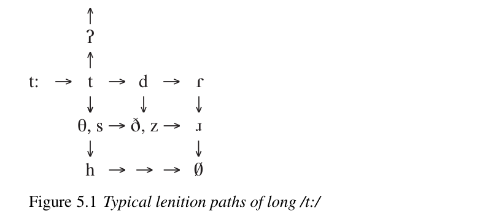

# Chapter 5: Sound change

<!-- pdf-page: 94; source-page: 78 -->

Spontaneous changes in pronunciation – for which “sound change” is, unexpectedly, the technical term – are the best understood type of language change. In this chapter we discuss the basic facts of sound change, the motivation of sound changes in phonetic terms, and their effects on a language’s phonological system; in the following chapter we will discuss the evolution of the phonological rules into which some sound changes develop.

<b>The trajectory of sound changes and the regularity of</b>

<b>sound change</b>

Every sound change must begin as an acquisition error which survives and is copied (see Chapter 2). Since the beginnings of that process are practically impossible to observe, we must infer the sources of those errors. At least the following are probable sources of new sound changes (see Ohala 1993, 2003 for amplification and much further discussion).

(a)

The child simply fails to learn a meaningful contrast between two

sounds, so that a merger of the sounds results. The widespread North

American English merger of /ɑ/ and /ɔ/ mentioned in Chapter 3, and

the merger of /ər/ and /ɔr/ in a child’s speech mentioned in Chapter 2,

are typical examples. Merger can of course result from each of the

other types of error (b) through (d) listed below; we list failure to

learn a contrast separately because it seems possible that in some

circumstances such a failure is not motivated by any of the other

factors listed. (b)

The child misinterprets recurrent performance errors as the outputs

of a variable phonological rule, which is therefore learned. This is a

probable scenario because the sound changes which are attested in

the historical record overlap significantly with typical performance

errors. Long-range metathesis, the transposition of two sounds not

adjacent in the stream of speech (as in Spanish<i> milagro</i> ‘miracle’ ←

medieval Latin<i> mīrāculum</i>¹), is an obvious candidate for this scenario;

so is haplology, dropping one of two syllables that begin with the same

<!-- pdf-page: 95; source-page: 79 -->

onset (as in North American English<i> prob’ly</i> for<i> probably</i>; see further

Chapter 6). But sound changes of other kinds might also begin this

way (see Browman and Goldstein 1991: 324–5). (c)

Because certain articulatory gestures or (more often) sequences of

gestures require unusually great effort and/or precise timing, the child

fails to learn to produce them, or to produce them consistently. A large

proportion of sound changes could arise this way. (d)

The child mistakes the acoustic signal of an articulation for the similar

acoustic signal of a quite different articulation. Aprocess like this must

underlie the replacement of /t/ with the glottal stop in syllable codas

in many varieties of English, for example; Blevins and Garrett have

also suggested that certain types of metathesis involving adjacent

consonants result from the misperception of acoustic cues spread

out over several segments (Blevins and Garrett 1998: 508–27 with

references). Ohala 1981 argues persuasively that many types of sound

change involve misperception on the part of the listener.

To one degree or another the motivations for these types of errors can be said to be phonetic. Type (d) is intelligible in acoustic terms, types (b) and (c) in articulatory terms; even mergers are phonetically motivated in that it is normally a pair of phonetically similar sounds that the child fails to learn to distinguish. Since we are often unable to determine exactly what type of error gave rise to a particular sound change, it makes sense to discuss the changes in phonetic terms, rather than in terms of the type of error involved, and we will do that in a later section of this chapter.

Once an innovation begins to be copied by other native speakers, it ceases to be an acquisition error and becomes a variable sound change. No doubt most errors never get this far on the evolutionary path to sound change, and many get no further. But if an incipient variable sound change is adopted as a marker of social identity (see Chapter 3), it will both spread through the community and apply more and more frequently in the speech of successive generations until it becomes categorical rather than variable. During this period native learners acquire not only the variable rule but the statistical pattern in which it applies and the rule’s fine phonetic conditioning. The rule gradually gains ground by the process discussed in Chapter 3, but it is not usually restructured or otherwise disrupted.

The most surprising aspect of this process is that,<i> unless some other pro-</i> <i>cess interferes</i>, a typical sound change does not develop lexical or grammatical exceptions as it progresses to completion within the speech community in which it arose. This phenomenon has been investigated most recently, and perhaps most thoroughly, by William Labov, whose argument is worth summarizing in some detail. Though lexical diffusion of sound changes – that is, the progression of a sound change by acquiring<i> positive</i> lexical exceptions, i.e. new words to which it applies – is often reported in the literature, Labov casts serious doubt on the

<!-- pdf-page: 96; source-page: 80 -->

prevalence of this phenomenon by investigating several of the apparently most secure examples in depth (Labov 1994: 424–37). He finds that one is actually a change in progress – possibly arrested before going to completion – in which detailed but regular phonetic conditioning appears to apply (ibid. pp. 444–51), some are actually cases of dialect borrowing (ibid. pp. 451–3), and still others are likely to reflect inconsistent suppression of a stigmatized sound change (ibid. pp. 453–4). The normal situation is that shifts in pronunciation are gradual, are subject to fine phonetic conditioning (ibid. pp. 455–71), and exhibit no lexical irregularities; that is confirmed by an extensive survey of sound changes in progress (ibid. pp. 443–4, 540–3, with references). Lexical diffusion of sound changes does occur, but only when sound changes are borrowed from one dialect into a closely related dialect (and lexical diffusion is not always the mechanism of spread even in those contact situations; see Labov 1994: 429–37).₂ Labov suggests that lexical irregularities are most likely to arise in the context of a contrast between discrete classes of vowels, such as the lax vs. tense contrast (ibid. pp. 526–31).

Working historical linguists with broad experience of language change are aware that the written record is fully consistent with Labov’s findings. Regular sound change is the norm; in fact, the regularity of sound change is statistically overwhelming. The following crude experiment gives a good idea of the numbers involved. The first 200 words of the glossary in an Old English (OE) textbook, Moore and Knott 1955, which survive in Modern English (ModE) were compared to their contemporary reflexes.₃ The shapes of at least 88 percent of the modern words inspected can be derived from those of the OE words<i> entirely</i> by regular sound changes and known morphological changes; thus the incidence of apparent phonological irregularity is not more than 12 percent over the past thousand years as measured by listed lexemes. Moreover, words exhibiting apparent irregularities typically exhibit only one each; and since the average length of the words in question is about four phonemes, the incidence of apparent phonological irregularity is not more than about 3 percent per millennium as measured by tokens of phonemes in a wordlist. Finally, it is actually surprising that these numbers should be so low, since standard English is the result of prolonged dialect contact in London from the thirteenth to the seventeenth centuries, and borrowing between dialects is a principal cause of phonological irregularities. We should expect the incidence of apparent phonological irregularities to be <i>even lower</i> in dialects that have not been subjected to such massive dialect contact. The observed regularity of sound change is a statistically robust pattern of facts.

The following hypothesis is the best available to account for this pattern of facts. Let the regularity of sound change be defined as follows:

either all examples of sound<i> x</i> in a dialect at the time of the change become<i> x</i><i>´</i>, or, if<i> x</i> becomes<i> x</i><i>´</i> only under certain conditions, those conditions can be stated

<i>entirely</i> in phonological terms.

<!-- pdf-page: 97; source-page: 81 -->

Table 5.1<i> Latin stressed</i> ē<i> in open syllables in French</i>

Latin

French

crēdere ‘to believe’

croire

/kruar/

dēbet ‘(s)he owes’

doit

/dua/ ‘(s)he must’

habēre ‘to have’

avoir

/avuar/

lēgem ‘law’

loi

/lua/

mē ‘me’

moi

/mua/

mēnsem ‘month’

mois

/mua/

movēre ‘to move’

mouvoir

/muvuar/

pēnsum ‘weighed’

poids

/pua/ ‘weight’

quīetum ‘at rest’

coi

/kua/ ‘quiet’

rēgem ‘king’

roi

/rua/

sē ‘himself’

soi

/sua/

sedēre ‘to sit’

seoir

/suar/ ‘to be fitting’

sērum ‘late hour’

soir

/suar/ ‘evening’

stēllam ‘star’

étoile

/etual/

tē ‘you (sg.)’

toi

/tua/ ‘you (sg. familiar)’

tēlam ‘warp, web’

toile

/tual/ ‘cloth’

tēnsam ‘stretched (fem.)’

toise

/tuaz/ ‘fathom’

valēre ‘to be well’

valoir

/valuar/ ‘to be worth’

vēla ‘sails, curtains’

voile

/vual/ ‘veil’

vēra ‘true things’

voire

/vuar/ ‘indeed’

vidēre ‘to see’

voir

/vuar/

The outcome of a sound change within the community in which it originated is completely regular in those terms, unless other, different processes interfere with the process of sound change before it has gone to completion. (See also the

Preface.)

Exemplifications of the overwhelming regularity of sound change over millennia are easy to find; the following is typical. When no special conditions obtain, Latin<i> ē</i> /e:/ in a stressed open syllable normally appears in French, one of Latin’s descendants, as the diphthong<i> oi</i> /ua/ (in which the second element is the syllable nucleus⁴); note the examples in Table 5.1 (the French words translate the Latin words except as noted).

Of course Latin /e:/ did not develop directly into French /ua/; the latter is the result of the last of a long series of changes, roughly as follows. When vowel length was lost in the western dialects of late Latin, long /e:/ merged with short /i/ (phonetically [ɪ]) in a higher mid vowel /e/ (distinct from the lower mid /ɛ/ that had developed out of Latin short /e/). In northern Gaul this new /e/ was diphthongized to /ei/ whenever it was stressed in an open syllable (as we know from eleventhcentury French documents, including the<i> Song of Roland</i>). Subsequently the first element of the diphthong, which was the syllable nucleus, was rounded and backed, so that by about the thirteenth century the Parisian pronunciation was /oi/ (much like the modern English diphthong). Then the second element of the

<!-- pdf-page: 98; source-page: 82 -->

Table 5.2<i> Latin stressed</i> ē<i> before nasals in French</i>

Latin

French

/r˜ɛ/

rēnem ‘kidney’

rein

/fr˜ɛ/ ‘bit’

frēnum ‘bridle’

frein

/pl˜ɛ/

plēnum ‘full (masc.)’

plein

/plɛn/

plēnam ‘full (fem.)’

pleine

/vɛn/

vēnam ‘vein’

veine

/pɛn/ ‘pain, trouble’

pēnam ‘punishment’

peine

diphthong was lowered and became the syllable nucleus; subsequently the first, now nonsyllabic, element was raised and the second element lowered again. The entire process can be represented as follows:

e:, ɪ  e  e̯i  ø̯i (or ə̯i)  o̯i  o ̯e  ̯oe  ̯ue  ̯uɛ  ̯ua. (1)

Because every one of these sound changes was regular, confrontation of the Latin and modern French words reveals a pervasive regular pattern.

Not all of those sound changes were unconditioned. We have already observed that the diphthongization of the vowel was conditioned by stress and by whether the vowel was syllable-final. The Old French shift of /ei/ to /oi/ was conditioned as well: it did not occur when a nasal consonant followed immediately, as the examples in Table 5.2 demonstrate. (The last item in Table 5.2 was<i> poenam</i> in Classical Latin, but its diphthong merged with<i> ē</i> in all the dialects ancestral to the surviving Romance languages.) As the modern forms show, further changes have occurred; for example, wherever the diphthong /ei/ was not backed it was subsequently monophthongized. Most importantly, vowels other than /a(:)/ in Latin final syllables were lost very early in the history of French, and the resulting word-final nasals nasalized preceding vowels and were eventually lost; but finalsyllable /a(:)/ was preserved as /ə/ for centuries, so that preceding nasals were intervocalic and survived.

So far we have been discussing only stressed Latin /e:/. Unstressed /e:/, when it survives at all, appears in modern French as /ə/; thus the infinitive<i> dēbēre</i> /de:be:re/ ‘to owe’, which was stressed on its penultimate syllable, became French<i> devoir</i> /dəvuar/ ‘to be obliged (to)’. Similarly, the French clitic pronouns<i> me</i> /mə/,<i> te</i> /tə/, <i>se</i> /sə/ are etymologically identical with<i> moi</i>,<i> toi</i>,<i> soi</i> – that is, both sets developed regularly from Latin<i> mē</i>,<i> tē</i>,<i> sē</i> – but the clitics exhibit the regular development of unstressed /e:/. In many phonological environments the /ə/ has been lost; for instance, the descendant of Latin<i> sēcūrum</i> ‘without worry’ was still disyllabic <i>seur</i> /sə.yr/ in Old French, but the /ə/ has been lost in modern French<i> sˆur</i> ‘certain, sure’ because it was followed immediately by a stressed vowel. In word-final position /e:/ had already been lost by the eleventh century; thus<i> hodīe</i> ‘today’ had become Old French monosyllabic<i> (h)ui</i>, the last element of Modern French <i>aujourd’hui</i>.

<!-- pdf-page: 99; source-page: 83 -->

As the reader can see, the development of Latin /e:/ in French has been complex but completely regular, since the operation of each sound change has been conditioned only by phonological factors. That is normal; similar patterns are pervasive in every language whose historical development can be traced.

We noted in Chapter 3 that the spread of sound changes across dialect boundaries is a significant source of irregular sound change outcomes. It should follow that irregular outcomes in a given language or dialect tend to involve specific sounds, namely those affected by a sound change that spread across a dialect boundary. The historical record corroborates that inference. As we saw in Chapter 3, the phonemic split of /æ/ in the English of the northeastern USA is a major locus of irregularity, probably resulting from borrowing of the tensing rule from dialect to dialect. At a much earlier date something similar seems to have happened to the outcomes of Middle English (ME) /o:/, which became /u:/ in the fifteenth century by the Great Vowel Shift, and unshifted /u:/ before labial consonants. The usual outcome in modern English is /u:/ or /uw/ (depending on the dialect and the phonemic analysis), e.g. in<i> food</i>,<i> fool</i>,<i> boot</i>,<i> coop</i>,<i> stoop</i>, etc. But we find shortened /ʊ/ in<i> foot</i>,<i> good</i>,<i> hood</i>,<i> stood</i>, etc. – variably in<i> room</i> and <i>roof</i> – and shortened and unrounded /ʌ/ in<i> blood</i>,<i> flood</i>,<i> glove</i>,<i> stud</i> (reflecting ME /o:/) and in<i> dove</i>,<i> gum</i>,<i> sup</i>, etc. (reflecting unshifted ME /u:/). Exactly what happened is difficult to determine from the historical evidence (see Jespersen 1909: 236–8, 332–5 for brief discussion), but the high incidence of irregularities in the reflexes of these vowels (but not others) makes it very likely that spread of a sound change between dialects was involved.

We now turn to an examination of the phonetic motivations for various types of sound change.

<b>Understanding sound change in phonetic terms</b>

It seems inadvisable to present the student with a long catalogue of types of sound change at this point; though it is necessary to acquaint oneself with the range of actually attested sound changes, that is best done in the context of dealing with the histories of particular languages. For a classification and discussion of sound changes in phonetic terms, the student should consult Hock 1991, chapters 5 through 7; also useful is K¨ummel 2007.

Instead we will consider the phonetic motivations for sound change, hoping to find explanations for the errors that become sound changes regardless of exactly how the errors are made (see above). The discussion will be easiest to follow if we structure it around an example; we choose lenition, a common and typical conditioned sound change.

Though the exact conditions on attested examples of lenition vary somewhat, prototypical lenitions are sound changes affecting consonants between vowels which result in less of an articulatory interruption between the vowels, in one

<!-- pdf-page: 100; source-page: 84 -->

↑

ʔ

↑

t:   →   t   →   d   →   ɾ

t

↓          ↓         ↓

↓

θ, s → ð, z →

θ, s

↓

↓

h   →  →  →

h

or more ways: voiceless consonants become voiced (since vowels are usually voiced); stops become shorter (thus interrupting the sequence of vowels more briefly), or become fricatives, or lose their buccal features and are replaced by the glottal stop /ʔ/; fricatives become approximants or (if voiceless) /h/; approximants, /h/, and /ʔ/ are lost. Thus the typical leniton paths of long /t:/ (dental or alveolar) can be diagrammed as in Figure 5.1 (see Hock 1991: 83).

Romance languages provide good examples of lenition. In most of the Po valley, in Gaul, and in most of the Iberian peninsula, the Latin voiceless stops /p, t, k/ were voiced between sonorants, including vowels; thus they appear as /b, d, g/ in those positions in Old Provenc¸al and in Brazilian Portuguese, for example. In Spanish a second lenition has also occurred, changing the new voiced stops to fricatives [, ð, ɣ] (though the spelling has not changed). The Spanish examples in Table 5.3 are typical.

Lenition is traditionally described as a type of “assimilation,” i.e. a sound change by which sounds become more like other sounds with which they are in contact in the stream of speech; but that is a description of the<i> result</i>, which may or may not shed light on what motivated the change. Given that this example of lenition must have begun either as a performance error or as an acquisition error, we want to ask why this was a “natural” error to make.

It might seem obvious that lenition is motivated by the increased ease of articulation that results from it; for instance, producing a voiced consonant between voiced vowels ought to involve less articulatory effort than switching from voicing (for the first vowel) to voicelessness (for the consonant), then back to voicing. But there are several reasons why ease of articulation is not a useful explanation for sound changes. Most straightforwardly, it is difficult to quantify articulatory effort, and in the absence of any rigorous way of doing so we often cannot determine whether one articulation requires less effort than another. For instance, does it require more or less effort to close off the oral cavity completely for a few milliseconds (a stop) than to hold an articulator close to the upper side of the cavity and force the air through the opening (a fricative)? Moreover, “ease” is not simply a matter of physics and physiology; the articulations of one’s native language are easier to produce than non-native articulations because one has

<!-- pdf-page: 101; source-page: 85 -->

Table 5.3<i> Lenition of Latin voiceless stops in</i>

<i>Spanish</i>

Latin

Spanish

acūtum ‘sharp’

agudo

aperīre ‘to open’

abrir

aquam ‘water’

agua

capillum ‘hair (of the head)’

cabello

capram ‘she-goat’

cabra

equam ‘mare’

yegua

fricāre ‘to rub’

fregar ‘to scour’

lacum ‘lake’

lago

latus ‘side’

lado

lupum ‘wolf’

lobo

marītum ‘husband’

marido

māteriam ‘timber’

madera ‘wood’

patrem ‘father’

padre

petram ‘rock’

piedra ‘stone’

rotam ‘wheel’

rueda

sapere ‘to be wise’

saber ‘to know’

secāre ‘to cut’

segar ‘to mow’

sēcūrum ‘without worry’

seguro ‘secure’

socerum ‘father-in-law’

suegro

learned them natively. That might not be a factor in errors made early in the process of native acquisition, but those are not typically the errors that survive into adolescent speech. Finally, and most awkwardly for the ease-of-articulation hypothesis, some sound changes clearly involve making more articulatory effort, not less; we will see some examples in the discussion of vowel rotations later in this chapter. We could suggest that they are motivated by a desire on the part of the speaker for clarity of articulation, or by an exaggerated expressiveness, or other factors. But the result will be that we have two different explanations tailor-made to account for<i> diametrically opposite</i> developments; with them we should be able to explain everything that can occur – and a hypothesis that can account for all possibilities, rather than explaining why we observe some and not others, is untestable and therefore not scientifically useful.

Better explanations for lenition and many other sound changes have emerged from work in the theory of Articulatory Phonology (see e.g. Browman and Goldstein 1991, Studdert-Kennedy and Goldstein 2003, both with references). Articulatory Phonology analyzes the phonological shapes of forms in terms of the gestures that speakers use to produce speech sounds; consequently it is an ideal approach for understanding the phonetic motivations of many sound changes.

A salient fact about speech gestures is that they overlap temporally (Browman and Goldstein 1991: 319–23). For instance, in pronouncing the syllable [ta] a

<!-- pdf-page: 102; source-page: 86 -->

tongue tip closed

tongue body low back

glottis open

[      t              a    ]

![Figure 5.2: Gestural score of the syllable [ta]](images/ringe-2013-historical-linguistics-fig5-2.png)

tongue tip closed

tongue body low back

glottis open

[      tʰ    a    ]

![Figure 5.3: Gestural score of the syllable [tʰa]](images/ringe-2013-historical-linguistics-fig5-3.png)

speaker begins with complete closure of the mouth (at the alveolar ridge), then shifts to a maximally open oral cavity; simultaneously the speaker begins with the vocal chords in position for a voiceless consonant, then shifts into the voiced position for the vowel. In principle, the alveolar closure and voiceless gesture are coterminous, the wide-open mouth and voicing gesture are coterminous, and the two transitions (from closed to open and voiceless to voiced) are simultaneous; the timing of the gestures must be precise, since each of the resulting segments is only a fraction of a second long. The “gestural score” in Figure 5.2 illustrates what should happen.

But speakers frequently make mistakes, including mistakes in the timing of gestures. If the laryngeal gesture of voicelessness is held too long (or the closure in the mouth opened too soon), a brief stretch of voiceless vowel (that is, [h]) will appear after the consonant, as in Figure 5.3. In other words, the [t] will become aspirated [tʰ] (Browman and Goldstein 1991: 321). Thus a change of voiceless stops into voiceless aspirated stops can be explained straightforwardly as the result of a<i> slippage in the timing of articulatory gestures</i>. Other similar cases include the assimilation of nasal consonants in place of articulation to following obstruents (in which the gesture for the obstruent is begun too early); palatalization, in which a front vocalic articulation is anticipated to such an extent that it becomes coextensive with a preceding consonant; “excrescence” of consonants, e.g. the appearance of [p] in the pronunciation of English<i> warmth</i> as [wɑɹmp] (in which the velum is closed too soon, Browman and Goldstein 1991: 326–7); and intrusive vowels (see especially Hall 2006).

Though it might not be immediately obvious, similar slippages can account for many instances of lenition. If the gesture which should produce a closure

<!-- pdf-page: 103; source-page: 87 -->

in the mouth between two vowels is significantly delayed (while the timing of all other gestures remains constant), there may not be enough time to make the closure which the speaker intends: short stops will be produced in place of long ones, hypershort stops (taps) in place of typical ones, fricatives (in which the articulator doesn’t quite reach the roof of the mouth) in place of stops, and so on (see Browman and Goldstein 1991: 325).

On the other hand, there are common types of sound change that are difficult to account for as the result of slippage in gestural timing. Among the best studied are vowel rotations in which tense vowels rise along a peripheral track while lax vowels fall along a nonperipheral track (see Labov 1994: 170–95); a stereotypical example is the pronunciation of /bæ̝:d dɔ:g/ as [bɪ·əd dʊ·əg] in some urban working-class dialects of the northeastern USA. While it is not completely impossible that those outcomes are the result of maintaining the gestures to produce tense vowels too long and those to produce lax vowels not long enough, that is not obviously correct. On the contrary, the fact that in the progress of such chain-shifts each new cohort of teenage girls pushes the changes a little further (see Chapter 3) suggests that sheer exaggeration is involved: speakers are<i> overshooting</i> the targets for tense vowels and<i> undershooting</i> the targets for lax vowels. Lenition could also result from target undershoot; Ní Chasaide

1989 offers a phonetically plausible analysis of voicing and fricativization as

a single process of undershoot. Other possible examples of target overshoot include the shift of [] to the dental stop [̪t] (in some North Frisian dialects, for example).

Apparently we must recognize both slippage in timing and target undershoot/overshoot as phonetic causes of sound change; at least some changes can be explained either way, though others are amenable to only one of those explanations. That seems disappointing; clearly more work on phonetic change is needed. However, the work in phonetics that we have cited reflects real progress in the understanding of sound change in two different ways. In the first place, even when we cannot say for certain which type of gestural error has caused a phonetic change, we can usually be confident that some gestural error is responsible. Secondly, we are<i> not</i> working with diametrically opposed principles that can explain everything and are thus not amenable to testing; we do not have a unitary articulatory explanation for sound change, but we do have some testable hypotheses.

Acoustic motivations for sound change are very different. A straightforward example is the change of velarized [ɫ] to [w] in recent centuries in Polish. Except for the fact that both articulations involve raising the back of the tongue toward the velum, the two are not similar: one is characterized by lowering the sides of the tongue (and perhaps a midline closure at the alveolar ridge), the other by lip-rounding. But the acoustic signatures of the two are surprisingly similar (Jonasson 1972: 1127–9), and it seems clear that misperception on the part of native learners led to the replacement of the one articulation with the other. Thus this speaker error actually originated as a hearer error.

<!-- pdf-page: 104; source-page: 88 -->

Table 5.4<i> Latin /kt/, /gn/ (</i>=<i> [ŋ</i><i>n</i><i>]</i><i>) in Romanian</i>

Latin

Romanian

coctus ‘cooked, ripe’

copt ‘ripe’

dīrēctus ‘straight’

drept ‘right, straight’

fapt˘a ‘deed’

facta ‘deeds’

frūctus ‘produce’

frupt ‘food that cannot be eaten during lent’

lac, lact- ‘milk’

lapte

nox, noct- ‘night’

noapte

octō ‘eight’

opt

cognātus ‘related’

cumnat ‘brother-in-law’

dignus ‘worthy’

demn ‘dignified, worthy’

lignum ‘(fire)wood’

lemn ‘wood’

pugnus ‘fist’

pumn

signum ‘sign’

semn

There are also acoustically motivated sound changes for which articulatory gestures can provide a partial explanation. For instance, it is certainly possible that the early Modern English change of [ɔʊx] to [ɔf] in words like<i> cough</i> occurred partly because of misperception of the velar articulation as a (fairly similar) labial; but it is also likely that lip-rounding persisted through the velar fricative (so that it was [xʷ] phonetically), and possible that that contributed to the misperception (see the discussion of Browman and Goldstein 1991: 328–9). A possibly similar case is the regular Romanian change of velars to labials when coronals follow immediately, as in Table 5.4 (note that Latin<i> gn</i> was phonetically [ŋn]).₅ Though they are somewhat similar acoustically, labials and velars are not ordinarily confused. However, when unreleased before coronals their acoustic signatures are overlaid with the signature of the following coronal, and it is reasonable to suppose that that can make them similar enough to be misperceived by some native learners.

Ohala 1981 points out that many sound changes could have involved failure on the part of a listener to “reconstruct” the articulatory gestures of the speaker (according to the motor theory of speech perception; see Chapter 1). One of Ohala’s many examples is especially informative because he shows that it could give rise to errors in opposite ways. When a back round vowel is followed immediately by a dental or alveolar, the resulting modification of the vowel’s formants causes the vowel to sound a bit fronted, even if it was produced in fully back position; thus [ut], for instances, sounds somewhat like [yt] (Ohala 1981: 179–80 with references). Normally the listener factors out the deformation and “reconstructs” [ut] as what the speaker intended (ibid. p. 182). Failure to reconstruct properly can lead the listener to hear [yt], and so to produce [yt] herself (ibid. p. 183). Alternatively, if the (first) speaker intentionally produces [yt], the listener can reconstruct too much and conclude that [ut] was intended;

<!-- pdf-page: 105; source-page: 89 -->

the listener will then produce [ut] as a hypercorrection. The range of sound changes that could have involved such processes is surprisingly wide, as Ohala demonstrates.

Much work on the phonetic motivations of sound changes remains to be done, and there are some attested sound changes that will always be difficult to motivate phonetically (see Goddard 1974 for some extreme examples). But it is clear that the native-learner errors that persist long enough to give rise to sound changes are usually phonetically “reasonable” mistakes; that is why most sound changes are “natural,” and why a large proportion of the phonological rules to which they give rise likewise seem natural. This has an interesting implication for the theory of phonology: the prevalence of natural phonological rules can be a simple consequence of their origins, having nothing to do with the grammar as such (see Buckley 2000, Buckley and Seidl 2005).

<b>The phonological effects of sound change</b>

During the period when a sound change is still in progress it is a variable rule of phonetic implementation. Once it has gone to completion, however, it can be integrated into the grammar in a number of ways.

If native-learner reanalysis is minimal, the sound change becomes a categorical phonological rule at the end of the ordered sequence of phonological rules. If more extensive reanalysis occurs, the sound change can be conflated with already existing rules or altered in other ways.

But it often happens that a new sound change doesn’t interact with the existing system of rules; and even if it does, in derivationally isolated words the effects of the sound change are likely to be learned as underlying, since those words participate in no surface alternations which would lead the native learner to conclude that what she hears is phonologically derived. Such cases are naturally of little interest to the phonologist. But for the comparative reconstruction of undocumented ancestral languages, or “protolanguages,” they are of the utmost importance, for the following reason. Only in derivationally isolated words can we be sure that the effects of regular sound change have not been altered by subsequent phonological or morphological changes (see Chapters 6 and 8). Thus it is only in such words that the patterns produced by regular sound change, which are the basis of comparative reconstruction, reliably survive unchanged for long periods of time.

In the following section we discuss in detail both the impact of sound changes on the basic pattern of contrasts among a language’s sounds and their impact on the system of phonological rules, attempting to give a more or less complete picture of how sound changes affect phonology. Subsequent changes in the phonological rules into which sound changes typically develop will be dealt with in Chapter 6.

<!-- pdf-page: 106; source-page: 90 -->

<b>Patterns of sound change: contrasts and rules</b>

A form not affected by any phonological rules is simply a memorized lexical item; it participates in the language’s phonology only in that its phonological shape is subject to the constraints governing the feature content and sequencing of segments and the structure of syllables. However, such isolated words do exhibit structure of another kind: their underlying segments and metrical features participate in the system of phonological contrasts by which one utterance is distinguished from another, and statements about the overall distribution of those contrasts can be made.

Facts about the distribution of contrasts are almost certainly not part of a native speaker’s grammar (a point which will repeatedly have interesting consequences). They are nevertheless of great interest to historical linguists because we are able to reconstruct protolanguages only by comparing the distributional patterns of contrasts in inherited words in two or more related languages (see Chapter 10). How sound changes alter the distribution of contrasts in a language is therefore of primary importance. The classic exposition is still Hoenigswald 1960: 86–98, which every historical linguist should internalize; here we offer a less formal summary of the most important points, with brief discussion of the consequences for systems of phonological rules.

An unconditioned sound change that affects only the phonetic realization of one or more non-alternating sounds obviously has no effect on the distribution of segments or on phonological rules; it simply substitutes one segment type for another. Typical examples include:

(2)

Proto-West Semitic *p, e.g. in *paqada ‘he has paid attention to’ (cf. Hebrew

<i>pāqad</i>)  Arabic /f/, e.g. in<i> faqada</i> ‘he has searched (in vain) for’ – without

merger, since there was no other source of /f/;

(3)

Proto-Polynesian *t, e.g. in *tapu ‘forbidden’ (cf. Tongan, Samoan, Maori

<i>tapu</i>) Hawaiian /k/, e.g. in<i> kapu</i> ‘forbidden’, again without merger because

Proto-Polynesian *k had already become /ʔ/ in Hawaiian;

Proto-West Germanic *w, e.g. in *wīn ‘wine’ (cf. OE<i> wīn</i>, ModE<i> wine</i> /wɑɪn/) (4)

High German /v/, e.g. in<i> Wein</i> /vɑɪn/ ‘wine’, again without merger;

and so on. Since the output of the sound change is necessarily learned as underlying, the segment inventory of the language changes, but the<i> pattern of contrasts</i> between the segments is not altered: the new segment contrasts with every other segment in the language that can occur in the same phonotactic position, just as the old segment did; moreover, it contrasts in exactly the same sets of forms. From the point of view of contrasts, the new segment<i> is</i> the old segment, with new phonetics.

If sounds that already participate in phonological rules are affected by a change of this kind, the result is necessarily more complex. The fifteenth-century English

<!-- pdf-page: 107; source-page: 91 -->

Table 5.5<i> The English Great Vowel Shift</i>

<i>c</i>. 1400

<i>c</i>. 1500

bi:tə

bəit

‘bite’

‘beet’

be:t

bi:t

bɛ:tə

‘beat’

be:t

aba:tə

aba:t ( abɛ:t)

‘abate’

bɔ:t

‘boat’

bo:t

‘boot’

bo:t

bu:t

abu:tə

abəut

‘about’

Great Vowel Shift (GVS) is a case in point. The GVS was a classic rotation of long or tense vowels, in which the long mid vowels rose and the long high vowels were diphthongized. The effects of the change can be illustrated with a nearminimal set of late ME words, as in Table 5.5. (The fronting of inherited /a:/ lagged significantly behind the rest of the shift and probably was not part of the same sound change. Various other changes occurred in subsequent centuries, as the reader can see by comparing the right-hand column with modern forms. See also Jespersen 1909: 231–47.) Except for the fact that inherited [u:] did not shift when immediately followed by a labial consonant (see Jespersen 1909: 236–8), this was an unconditioned sound change; thus very few mergers occurred, and the preexisting system of contrasts emerged largely intact.

However, the underlying long vowels that underwent this change were already inputs to a phonological rule which shortened them before many consonant clusters and whenever they were followed by two or more syllables in the same word. For instance, late ME underlying /i:/ had been shortened to [ɪ] in the inflectional forms and derived words in the right-hand column in Table 5.6, but not in those in the left-hand column, and in the same way late ME /e:/ was shortened to [ɛ].

After the unconditioned shift of surface [i:] to [əi] and of [e:] to [i:] had gone to completion – so that the forms in the left-hand column in Table 5.6 were [həid], [ʧəild], [fəiv], etc., and [ki:p], [fi:d], [gri:n], etc. – it might seem reasonable to suggest that in these sets of alternating forms, at least, native learners might still have posited underlying /i:/ and /e:/ respectively, deriving the forms in the left-hand column by a phonological rule more or less identical to the GVS and the forms in the right-hand column by the old shortening rule.

But what about words like (shifted) [əis] ‘ice’, [fəir] ‘fire’, [swəin] ‘pig’, [məin] ‘my, mine’, [di:r] ‘animal’, [kni:] ‘knee’, [hwi:l] ‘wheel’, [kwi:n] ‘queen’, [mi:] ‘me’, [hi:r] ‘here’, etc., which participated in no alternations with forms exhibiting shortened [ɪ] or [ɛ]? A generative linguist might still posit /i:/ and /e:/ respectively in such words, based on the overall pattern of vowels in the language, but native language learning is not the same thing as linguistic analysis. A child learning such words in the first two or three years of life could only conclude that their [əi] was underlying /əi/ and their [i:] was underlying /i:/. We propose the following <i>invariant transparency hypothesis</i> (ITH):

<!-- pdf-page: 108; source-page: 92 -->

Table 5.6<i> Part of the shortening rule in late Middle English</i>

[hi:də] ‘hide’

[hɪddə] ‘hid’ 1.

[ki:ðə] ‘make known’

[kɪddə] ‘made known’, [kɪə] ‘acquaintance’

[ʧi:ld] ‘child’

[ʧɪldərən] ‘children’

[fi:və] ‘five’

[fɪftə] ‘fifth’, [fɪfte:n] ‘fifteen’, [fɪfti] ‘fifty’

[wi:zə] ‘wise’

[wɪzdom] ‘wisdom’

[wi:ldə] ‘wild’

[wɪldərnəs] ‘uncultivated land’

[lɪnse:d] ‘flaxseed, linseed’

[li:n] ‘flax’

[hwi:t] ‘white’

[hwɪtsʊndei] ‘Whitsunday’ (the seventh Sunday after

Easter)

[kri:st] ‘Christ’

[krɪstəmassə] ‘Christmas’

[ke:pə] ‘keep’

[kɛptə] ‘kept’ 2.

[me:tə] ‘meet’

[mɛttə] ‘met’

[fe:də] ‘feed’

[fɛddə] ‘fed’

[de:mə] ‘judge’

[dɛm(p)tə] ‘judged’

[de:p] ‘deep’

[dɛpə] ‘depth’

[e:f] ‘thief’

[ɛftə] ‘theft’

[fre:nd] ‘friend’

[frɛndʃɪp] ‘friendship’

[ʃe:p] ‘sheep’

[ʃɛp(h)ɛrdə] ‘shepherd’

[gre:nə] ‘green’

[grɛnwɪʧ] ‘Greenwich’

Native learners in the developmental window for NLA do not posit abstract

forms if there is no alternation to account for; instead they project sur-

face segments, defined by the language’s system of distinctive features, into

underlying forms.⁶

This hypothesis may seem so obvious in the case at hand as to be trivial, but it will turn out to have important consequences in Chapter 6.

What would the native learner do upon learning enough alternating sets of forms to abduce the shortening rule? She might revise her analysis, and the result could be identical with the linguist’s analysis: underlying /i:/ and /e:/ with a shortening rule and a “GVS rule,” as suggested above. If the alternation between surface [əi] and [ɪ], and between surface [i:] and [ɛ], occurred in a large majority of the language’s lexemes, the abstract solution would indeed be optimal. But as every linguist who has worked with English ought to know, that is not the case; there is a large “critical mass” of non-alternating lexemes. It therefore seems overwhelmingly likely that a native learner would stick with her original analysis, concluding that the underlying vowel nuclei were /əi/ and /i:/. It would then be necessary to posit very complex shortening rules changing /əi/ to /ɪ/ and /i:/ to /ɛ/ in appropriate environments. Of course different native learners could have arrived at different analyses of the same system, but the less abstract analysis (with the more complex rules) is likely to have been the majority analysis.

How long those rules remained productive is unclear; we might suggest that the appearance of<i> width</i> as a neologism in the 1620s (competing with inherited

<!-- pdf-page: 109; source-page: 93 -->

Table 5.7<i> Palatalization in two Tocharian B verb paradigms</i>

Present

Preterite /nətka-/ ‘push’

act. 3sg., 3pl. n¨atkanam.

act. 3sg. ˜natka, 3pl. ˜nitkāre /ləma-/ ‘sit’

[suppletive; subj. act. 3sg.

act. 3sg. lyama, 3pl. lymāre

lāmam. , 3pl. lamam. ] /kəla-/ ‘bring’

act. 3sg. k¨allās.s.¨am. , 3pl.

act. 3sg. ´sala, 3pl. ´silāre;

k¨allāskem. ; med.-pass. 3sg.

med.-pass. 3sg. klāte, 3pl.

k¨allāst¨ar, 3pl. k¨allāskent¨ar

klānte /tərka-/ ‘let go’

act. 3sg., 3pl. t¨arkanam. ;

act. 3sg. carka, 3pl. c¨arkāre;

med.-pass. 3sg. t¨arkāte, 3pl.

med.-pass. 3sg. t¨arknāt¨ar,

3pl. t¨arknānt¨ar

t¨arkānte

<i>wideness</i>  OE<i> wīdness</i>) shows that at least some native learners were positing some sort of rule more than a century after the sound change had gone to completion. But in the long run the rules were almost certainly lost; that is strongly suggested by the fact that a native speaker of modern English who first encounters the word<i> midwifery</i> in writing, without having learned it in childhood, cannot say with confidence whether the vowel of its second syllable is [ɑɪ] or [ɪ]. (The standard pronunciation of<i> midwifery</i>, at least in North America, is in fact [ˈmɪdˌwɪfəɹi]; but one also hears [ɑɪ] in the second syllable, as the<i> OED</i> duly records. The inherited pronunciation, also recorded by the<i> OED</i>, was apparently [ˈmɪdɪfɹi]; we have never heard it.) Of course this is the same end result as if the vowels affected by the GVS had participated in no alternations, but the developments leading to that eventual result were quite different and more involved.

If the sounds that underwent the unconditioned sound change (without merger) had been the output instead of the input of a phonological rule, a different type of reanalysis would have occurred: the new sound change would have been conflated with the old rule. The Tocharian languages provide a convenient example. A pre-Proto-Tocharian sound change palatalized consonants (except *j – written<i> y</i> in Tocharian – and, probably, *r) when a front vocalic immediately followed. At first the palatalized consonants must have simply been pronounced with the front of the tongue raised toward the roof of the mouth, much like palatalized consonants in modern Russian. However, subsequent sound changes shifted the pronunciation of several; for instance, in the attested languages palatalized *tʲ has become an affricate [ʧʲ] or the like (written<i> c</i>), and palatalized *kʲ has become a fricative [ʃʲ] or the like (written<i> ´s</i>). Thus the palatalization rule in attested Tocharian B, for example, includes the subrules /t/ →[ʧʲ] and /k/ →[ʃʲ]. (Numerous other changes also occurred, so that the conditioning environments for the palatalization rule are morphological rather than phonological in the attested languages, but that does not affect the point at issue.) Note the Tocharian B examples in Table 5.7 (with surface forms given in conventional transliteration⁷). It can be seen that in

<!-- pdf-page: 110; source-page: 94 -->

Table 5.8<i> The loss of *w in Attic Greek</i>

Attic Greek

Proto-Greek /érgon/ ‘work’

(cf. Arkadian 	
 /wergon/)

*wérgon /éndon/ ‘inside’

*éndon /kalós/ ‘beautiful’

(cf. Boiotian neut. 	 /kalwon/)

*kalwós /homalós/ ‘level’

*homalós

*gʷasil ̂ɛ:wos /basiléɔ:s/‘king’s’

(cf. Mycenaean<i> qa-si-re-wo</i>) /póleɔ:s/ ‘city’s’

*pólɛ:jos

(loss of *j preceded loss of *w by several

centuries)

the active preterite (but not in the mediopassive) the initial consonant of the root is palatalized according to the subrules stated above.

Conditioned sound changes have no effect on contrasts or on underlying forms so long as no merger results; for instance, the voicing of // and /s/ in fully voiced environments after a stressed syllable in OE had no effect on underlying forms (and was not normally represented in writing). Sound changes of this type usually become new phonological rules with minimal reanalysis.

Unconditioned loss obviously does alter the distribution of contrasts (and the language’s phonotactics); this is one of the reasons why loss is conveniently thought of as “merger with zero” (Hoenigswald 1960: 91). The loss of Proto-Greek *w in the Attic dialect of Ancient Greek is a typical example. Not only was the inventory of consonants reduced by one; the number of vowel-initial words and word-internal hiatuses between vowels (both already very large) were increased, the number and incidence of consonant clusters were reduced, and so on. The examples in Table 5.8 illustrate the situation.

Conditioned loss has similar effects, but locally rather than globally; for instance, the loss of word-initial<i> k</i> before<i> n</i> in Early Modern English (rendering<i> knight</i> homonymous with<i> night</i>, for example) eliminated one word-initial consonant cluster and modestly increased the number of<i> n-</i>initial words, but the overall effect on the language was slight.

The impact of phonemic mergers on the distribution of contrasts likewise depends on the type of merger involved. The results are least interesting if the merger is unconditioned: a contrasting unit is eliminated, and the distribution of the merger product is simply the sum of the distributions of the inputs. If the inputs did not participate in any phonological rules, or if they were affected by the same rule(s) in a way that did not differentiate them, the only effect on the grammar is to reduce the number of underlying contrasts. A case in point is the pair of late ME long nonhigh front vowels /e:/ and /ɛ:/ (see above). Both were affected by the shortening rule, and the output of shortening in both cases was short /ɛ/; the following examples are typical:

a. [me:tə] ‘meet’, [mɛttə] ‘met’; [fe:də] ‘feed’, [fɛddə] ‘fed’ (5)

b. [mɛ:tə] ‘dream’, [mɛttə] ‘dreamed’; [lɛ:də] ‘lead’, [lɛddə] ‘led’

<!-- pdf-page: 111; source-page: 95 -->

(The verb [mɛ:tə] was actually impersonal, meaning ‘a dream occurred’; thus ‘I dreamed’ was [me: mɛttə], literally ‘a dream happened to me’.) In the fifteenth century the GVS shifted these long vowels to /i:/ and /e:/ respectively; in the sixteenth century they merged in some dialects (including the one ancestral to standard ModE) as /i:/. (That is why<i> beet</i> and<i> beat</i>,<i> see</i> and<i> sea</i>,<i> peel</i> and<i> peal</i>, etc., are now pairs of homonyms.) The only result of the merger was to reduce the number of underlying long vowels – and, incidentally, to simplify the shortening rule, since there was now only one input /i:/ that yielded short [ɛ].

If one of the inputs of an unconditioned merger is input to a phonological rule while the other is not, the result is naturally more complex; Algonkian languages provide an illustrative case. Proto-Algonkian had a consonant, usually reconstructed as * (because it survives in that shape in Arapaho and merges with *t in Cree), that was palatalized to *š before high front vocalics (Bloomfield 1946: 87, 92). In Fox * merged with *n, which underwent no such alternation.⁸ The result is that there are in effect two underlying<i> n</i>’s in Fox, an /n¹/ which does not alternate and an /n²/ which is palatalized to<i> š</i> before high front vocalics. Of course the latter can be assigned a different underlying identity; we present this maximally opaque solution to emphasize that there is no other difference between them. The examples below are typical (Bloomfield 1925: 225, Goddard 1994a; we have modernized the orthography):

Morpheme-final n¹

Morpheme-final n² (6)

/ata:hp-en¹-/ ‘pick (someone) up’:

/kan¹o:n²-/ ‘speak to’:

<i>e:h-ata:hpen-a:či</i> ‘he took hold of him’

<i>kano:n-e:wa</i> ‘he speaks to him’

<i>kano:š-i</i> ‘speak to him!’

<i>maw-ata:hpen-i</i> ‘go pick him up!’

/čapo:k-en¹-/ ‘dip (someone) in water’

/awan²-/ ‘take (someone) with one’

<i>čapo:ken-e:wa</i> ‘he dips him in water’

<i>ket-awan-a:pena</i> ‘you and I take him with us’

<i>ke-čapo:ken-i</i> ‘you (sg.) dip me in water’<i> ket-awaš-ipwa</i> ‘you (pl.) take me with you’

There seems to be no tendency to eliminate this opaque alternation in Fox, possibly because non-alternating /n¹/ and alternating /n²/ are both frequently encountered in the relevant environments: a large majority of relevant morphemes end in the latter, but the former occurs in the very common verb suffix /-en¹-/ ‘by hand’ (Bloomfield 1925: 225).

If the merger is conditioned, so that only some allophones of a phoneme merge with some other phoneme, the result is a systematic gap in the distribution of segments and of contrasts: in the merger environment the earlier contrast between the merged sounds is no longer possible, and only the single merger product occurs in that environment. Latin “rhotacism,” in which the (voiced) allophone of<i> s</i> between vowels merged with<i> r</i>, is the classic case. Note the examples of actually attested inherited<i> s</i> and<i> r</i> in a variety of phonotactic positions in

Table 5.9.₉ It can be seen that after the change had gone to completion<i> s</i> did not

occur between vowels, whereas the distribution of<i> r</i> had changed only in that

<!-- pdf-page: 112; source-page: 96 -->

Table 5.9<i> Inherited *s and *r in Latin</i>

Archaic Latin

Classical Latin

(<i>s</i> unchanged)

sakros ‘holy’

sacer

→

siet →sit

sīed ‘let it be’

"

deivōs ‘gods (acc.)’

dēos

"

iovestōd ‘rightly’

īustō

"

(<i>VsV</i> <i> VrV</i>)

iovesāt ‘calls to witness’

īurat

lasēs ‘tutelary gods’

larēs

"

rēcei /re:gei/ ‘for the king’

rēgī

(<i>r</i> unchanged)

satur ‘satisfied, sated’

satur

"

vircō /wirgo:/ ‘girl’

virgō

"

Castorei /kastorei/ ‘to Castor’

Castorī

"

kalātōrem ‘attendant (acc.)’

calātōrem

"

there were more intervocalic examples than previously. (Latin later acquired new intervocalic<i> s</i>’s by various processes.)

This sound change too became a phonological rule, but one whose output was identical with an underlying segment. Since Latin had a moderately complex inflectional system, there were numerous paradigms in which the rule operated, allowing native learners to recover both the rule and the underlying forms. The list of examples below could easily be expanded.

(7)

Verb suffixes and endings:

active infinitive<i> -re</i> ∼<i>-se</i>  *-si: present<i> amā-re</i> ‘to love’,<i> habē-re</i> ‘to

have’,<i> dīce-re</i> ‘to say’,<i> audī-re</i> ‘to hear’,<i> da-re</i> ‘to give’,<i> ī-re</i> ‘to go’,

etc., etc.; but<i> es-se</i> ‘to be’ and perfect infinitive<i> -is-se</i>

imperfect subjunctive -<i>rē-</i> ∼<i>-sē-</i>  *-sē-: to the present stems just listed,

impf. subj.<i> amā-rē-</i>,<i> habē-rē-</i>,<i> dīce-rē-</i>,<i> audī-rē-</i>,<i> da-rē-</i>,<i> ī-rē-</i>, and also

<i>fo-rē-</i> ‘would be’; but<i> es-sē-</i> ‘would be’ and pluperfect subj.<i> -is-sē-</i> (cf.

Oscan<b> fusíd</b> ‘(that) it should be’,<b> patensíns</b> ‘(that whenever) they open

(it)’)

(8)

Verb stems:

<i>s-</i> ∼<i>es-</i> ∼<i>er-</i> ‘be (pres. stem)’, e.g. in<i> s-unt</i> ‘they are’,<i> es-t</i> ‘it is’, pres.

subj.<i> s-ī-</i>, impf. subj.<i> es-sē-</i>, pres. inf.<i> es-se;</i> but ipf. indic.<i> er-ā-</i>, fut.

indic.<i> er-V-</i> (cf. Oscan pres. inf.<i> ezum;</i> Skt.<i> s-</i> ∼<i>as-</i>, e.g. in<i> ásati</i> ‘it will

be’ = Lat.<i> erit</i>)

<i>ger-e-re</i> ‘to carry’, perf.<i> ges-s-isse</i>, perf. participle<i> ges-tus</i>

<i>quer-ī</i> ‘to complain’, perf. ptc.<i> ques-tus</i>

<i>ūr-e-re</i> ‘to burn (trans.)’, perf.<i> us-s-isse</i>, perf. ptc.<i> us-tus</i> (cf. Skt.<i> ós.ati</i>

‘(s)he’s burning (it)’)

<i>haur-ī-re</i> ‘to draw (water)’, perf.<i> haus-isse</i>  *haus-s-, perf. ptc.<i> haus-tus</i>

(cf. Old Norse<i> ausa</i>)<i> haer-ē-re</i> ‘to cling’, perf.<i> haes-isse</i>  *hais-s-

<i>quaer-e-re</i> ‘to look for; to inquire’, perf.<i> quaesīv-isse</i>  *kwais-s . . . ,

perf. ptc.<i> quaesītus</i>

<!-- pdf-page: 113; source-page: 97 -->

(9)

Nouns:

a. Polysyllabic neuter s-stems with inherited ablaut. Example:<i> genus</i> ∼

<i>gener-</i> ‘lineage’, the latter alternant e.g. in gen. sg.<i> gener-is</i> (cf. Skt.

<i>jánas</i>, gen.<i> jánas-as</i>)

So also<i> foedus</i> ‘treaty’,<i> fūnus</i> ‘funeral’,<i> latus</i> ‘side’,<i> mūnus</i> ‘gift’,<i> onus</i>

‘load’,<i> opus</i> ‘work’,<i> pondus</i> ‘weight’,<i> scelus</i> ‘curse; crime’,<i> sīdus</i> ‘con-

stellation’,<i> ulcus</i> ‘sore’,<i> vellus</i> ‘fleece’,<i> viscus</i> ‘internal organ’,<i> vulnus</i>

‘wound’, and five others.

b. Polysyllabic neuter s-stems with levelled ablaut. Example:<i> corpus</i> ∼

<i>corpor-</i> ‘body’.

So also<i> decus</i> ‘distinction’,<i> facinus</i> ‘crime’,<i> faenus</i> ‘interest (on a loan)’,

<i>frīgus</i> ‘cold’,<i> lītus</i> ‘shore’,<i> nemus</i> ‘grove’,<i> pectus</i> ‘chest, breast’,<i> pecus</i>

‘herd, flock’,<i> penus</i> ‘provisions’,<i> stercus</i> ‘dung’,<i> tempus</i> ‘time’,<i> tenus</i>

‘snare’.

c. Non-neuter polysyllabic s-stems:<i> cinis</i> ∼<i>ciner-</i> (masc.) ‘ashes’,<i> pulvis</i> ∼

<i>pulver-</i> (masc.) ‘dust’,<i> lepus</i> ∼<i>lepor-</i> (masc.) ‘hare’,<i> lepōs</i> ∼<i>lepōr-</i>

(masc.) ‘pleasantness’,<i> Venus</i> ∼<i>Vener-</i> (fem.), name of the goddess of

sex;<i> Cerēs</i> ∼<i>Cerer-</i> (fem.), name of the grain goddess;<i> tellūs</i> ∼<i>tellūr-</i>

(fem.) ‘earth’ (poetic only), and a few others.

d. Neuter monosyllabic s-stems. Example:<i> aes</i> ∼<i>aer-</i> ‘bronze’ (cf. Skt.<i> áyas</i>

‘iron’).

So also<i> crūs</i> ‘leg’,<i> īus</i> ‘law, rights’,<i> ōs</i> ‘mouth’,<i> pūs</i> ‘pus’,<i> rūs</i> ‘country-

side’,<i> tūs</i> ‘incense’.

e. Non-neuter monosyllabic s-stems. Example:<i> mūs</i> ∼<i>mūr-</i>, e.g. gen. sg.

<i>mūr-is</i> (masc.) ‘mouse’ (cf. Skt.<i> m</i><i>´</i><i>ūs</i>, gen.<i> mūs.-ás</i>)

So also<i> glīs</i> (masc.) ‘dormouse’,<i> flōs</i> (masc.) ‘flower’,<i> glōs</i> (fem.) ‘sister-

in-law’,<i> mōs</i> (masc.) ‘custom’,<i> rōs</i> (masc.) ‘dew’.

Other common examples: adjectives<i> vetus</i> ∼<i>veter-</i> ‘old’,<i> mās</i> ∼<i>mar-</i> ‘male’; (10)

<i>herī</i> ‘yesterday’ :<i> hesternus</i> ‘of yesterday’.

Native learners would not have had any reason to believe that the surface<i> r</i>’s in the lexemes listed above were underlying and the<i> s</i>’s derived, because there were other, otherwise similar lexemes that exhibited surface<i> r</i> in all forms; for instance, contrasting with<i> īus</i> ‘right’,<i> īuris</i> ‘of right’ was<i> fūr</i> ‘thief’,<i> fūris</i> ‘of a thief’, and contrasting with<i> latus</i> ‘side’,<i> latere</i> ‘at the side’ was<i> later</i> ‘brick’, <i>latere</i> ‘with a brick’. Thus rhotacism was clearly a fully functioning phonological rule in Classical Latin. On the other hand, non-alternating intervocalic<i> r</i>’s  *s could only be learned as underlying /r/; examples include the surface<i> r</i>’s of<i> cūra</i> ‘care; administration’,<i> caret</i> ‘(s)he lacks’,<i> āra</i> ‘altar’, and genitive plural<i> -ārum</i>, etc. (Cf. Paelignian<i> coisatens</i> ‘they administered’, Oscan<b> kasit</b> ‘it is necessary’, <b>aasaí</b> ‘on the altar’, gen. pl.<b> -asúm</b>,<i> -azum</i>.)

The greatest effects on the distribution of contrastive units are caused by a conditioned split followed by a merger or loss that obscures the conditioning environment. Hoenigswald 1960: 93–4 calls this “secondary split,” since the split becomes contrastive only secondarily, upon the (partial) destruction of the

<!-- pdf-page: 114; source-page: 98 -->

Table 5.10<i> Secondary split of /</i><i>/ in late Middle English</i>

Old English

late Middle English

Modern English bæþ /bæ/ [bæ]

bath /ba/ [ba]

bath /bæ:/ baþian /baian/ [baðian]

bathe /ba:ə/ [ba:ðə]

bathe /beið/ clāþ /kla:/ [kla:]

clo(o)th /klɔ(:)/ [klɔ(:)]

cloth /klɔ/ ġeclāþian /jəkla:ian/ [jəkla:ðian]

clothe /klɔ:ə/ [klɔ:ðə]

clothe /kloʊð/ lāþ /la:/ [la:] ‘hateful’

lo(o)th /lɔ(:)/ [lɔ(:)]

lo(a)th /lɔ/, /loʊ/ lāþian /la:ian/ [la:ðian]

lothe /lɔ:ə/ [lɔ:ðə]

loathe /loʊð/ ‘cause loathing’ (impersonal)

conditioning environment. This is the usual way in which languages acquire new surface-contrastive units. The development of voiced fricative phonemes in English is a typical example. We noted above that // was voiced to [ð] in fully voiced environments after a stressed syllable in OE, but that the distribution of the voiced and voiceless allophones remained automatic. Eventually, though, parts of the environment for voicing were destroyed in some relevant words – typically by the loss of word-final /ə/ in the decades around 1400. Those developments introduced voiced [ð] into environments in which only voiceless [] had previously occurred; the two allophones thereby became surface-contrastive. Note the examples in Table 5.10.

Since at the time that the postconsonantal voiced environment was lost the dental fricative occurred almost exclusively in native words, this is an almost “pure” example of secondary split. In the examples given above the newly wordfinal [ð]’s were probably still derived from underlying // for a few generations, but the rule that derived them must now have been morphologically conditioned (roughly, “stem-final // is voiced in noun plurals and in derived verbs”). In the long run, of course, the rule was lost; it is doubtful at best that any dialect of modern English can be said to have a rule that voices underlying //. That is why we represent the /ð/’s in the right-hand column in Table 5.10 as underlying.

The most striking thing about secondary split is that the effects of a phonological rule persist even after the conditioning environment, or part of it, is destroyed. Why shouldn’t the rule cease operating, and the underlying segments reemerge on the surface, when the rule’s trigger is lost or compromised? The answer can only be that at least some native learners learn<i> non-alternating</i> outputs of phonological rules as underlying segments<i> even if their occurrence is completely predictable</i>, in accordance with the ITH advanced above. We will return to this important point in the next chapter.

<b>Sound change and rule ordering</b>

If the phonology of a language is formalized as a set of (partially) ordered rules, each new sound change is normally added to the ordered sequence

<!-- pdf-page: 115; source-page: 99 -->

Table 5.11<i> Counterfeeding of rhotacism and</i><i> [</i><i>ss</i><i>]</i> →<i>[</i><i>s</i><i>]</i><i> in Classical Latin</i>

Underlying forms

Surface forms

Meanings

/ges-e-t, ges-s-it/

gerit, gessit

‘(s)he wages, (s)he waged’ /hais-e:-t, hais-s-it/

haeret, haesit

‘it clings, it clung’ /kwat-i-t, kwat-s-it/

quatit, quassit

‘(s)he shakes, (s)he shook’

rīdet, rīsit /ri:d-e:-t, ri:d-s-it/

‘(s)he laughs, (s)he laughed’

lūdit, lūsit /lu:d-e-t, lu:d-s-it/

‘(s)he plays, (s)he played’ /sed-e:-se, sed-su-m/

sedēre, sessum

‘to sit’

lūdere, lūsum /lu:d-e-se, lu:d-su-m/

‘to play’

haerēre, haesum /hais-e:-se, hais-su-m/

‘to cling’

of rules at its end. This is most obvious when the new rule and an already existing rule stand in counterfeeding order, so that the new rule creates a sequence of sounds which the old rule would have altered (but does not because it does not apply again). The further history of Latin rhotacism provides a well-known example. As we noted above, it is clear that rhotacism was still a phonological rule in the first century BCE, recoverable by native learners from alternations in the surface outputs of the grammar. A new rule was then added to the grammar reducing geminate<i> ss</i> to single<i> s</i> immediately following a long vowel or diphthong. The instances of<i> s</i> which were the outputs of this rule were<i> not</i> inputs to rhotacism. Typical examples of paradigms with geminate<i> ss</i> and with degeminated<i> s</i> include those in Table 5.11.

Two relevant rules apply to ‘laughed’, etc.: first /ts/, /ds/ →[ss] (as in ‘shook’), then [ss] is reduced to [s] if anything other than a short vowel immediately precedes.₁₀ It can be seen that the rules are in counterfeeding order because the rule simplifying geminate [ss] was added to the grammar later than rhotacism (some centuries later, in fact). Many other similar examples can be adduced.

It is sometimes suggested that a rule can be added to the ordered sequence so as to apply<i> before</i> a preexisting rule. However, the few examples of this phenomenon that have been investigated in detail raise serious doubts about the possibility of such a development. Perhaps the best researched case is that of Dutch; the situation is as follows (see now Gress-Wright 2010; we are grateful to Jonathan Gress-Wright for helpful discussion).

We have very few Germanic documents from the low countries before the thirteenth century; adequate description must therefore begin with that period, conventionally called “Middle Dutch” (MD). By then word-final obstruents had already been devoiced and were usually written with symbols for voiceless consonants (Franck 1910: 78–80); the examples in Table 5.12 are typical. (In Table 5.12 we justify the Proto-West Germanic reconstructions by reference to outcomes in other daughter languages, as is usual in the specialist literature. In the last two examples the final consonants were phonetically fricatives [ɣ, ] in Proto-West Germanic.) The sound change of devoicing gave rise to a robust phonological

<!-- pdf-page: 116; source-page: 100 -->

Table 5.12<i> Word-final devoicing in Middle Dutch</i>

Middle Dutch

Proto-West Germanic

*gōd (OE, OS<i> gōd</i>, OHG<i> guot</i>) goet ‘good’

*handu (OE, OS<i> hand</i>, OHG<i> hant</i>) hant ‘hand’ wart ‘it became’  *ward

*warþ (OE<i> wear</i><i>þ</i>, OS, OHG<i> ward</i>) dinc [dɪŋk] ‘thing’

*þing (OE<i> þ</i><i>ing</i>, OS<i> thing</i>, OHG<i> ding</i>)

*sang (OE, OHG<i> sang</i>) sanc ‘(s)he sang’ dach [dax] ‘day’

*dag (OE<i> dæġ</i>, OS<i> dag</i>, OHG<i> tag</i>)

*gab (OHG<i> gab</i>; in this case OS<i> gaf</i> shares the gaf ‘(s)he gave’

Dutch change, while OE<i> ġeaf</i> exhibits

devoicing independently)

OS = Old Saxon, OHG = Old High German.

Table 5.13<i> Further word-final devoicing</i>

<i>in Modern Dutch</i>

Middle Dutch

Modern Dutch

ik schrijf [ɪk sxrɛif]

ic scrive ‘I write’

graaf [ɣra:f]

grave ‘count’

oog [o:x]

oghe ‘eye’

brug [brʏx]

brugghe ‘bridge’

beeld [be:lt]

beelde ‘picture’

ik vind [ɪk fɪnt]

ic vinde ‘I find’

ik heb [ɪk hɛp]

ic hebbe ‘I have’

rule; compare MD<i> goede</i> (pl.),<i> hande</i> ‘hands’,<i> worden</i> ‘they became’,<i> dinghe</i> ‘things’,<i> singhen</i> ‘to sing’,<i> daghe</i> ‘days’,<i> gˆaven</i> ‘they gave’, which show that all the lexemes listed had underlying voiced obstruents /d, g, ɣ, v/ in root-final position. Subsequently, in the transition from MD to Modern Dutch, many word-final /ə/’s (spelled<i> e</i>) were lost. Obstruents which became word-final by that loss have also been devoiced. The examples in Table 5.13 are typical.

It has been suggested that the already existing devoicing rule applied to these forms automatically as soon as /ə/ was lost, so that the rule deleting /ə/ was effectively added to the phonology at a point before the end of the sequence of ordered rules. (See the references in Goossens 1977: 3–4, nn. 5–6 and the extensive quote from Van Marle ibid. p. 5.)

However, there is actual evidence that that is not what happened. There are three geographical regions in the Dutch-speaking area in which loss of final /ə/ (“apocope”) did not occur (Goossens 1977: 7–8), and at the borders of all three are spoken village dialects in which apocope did occur,<i> but resulting word-final</i> <i>voiced obstruents had not been devoiced</i> at the time when those dialects were first described scientifically (ibid. pp. 8–12); in addition, there is an area along

<!-- pdf-page: 117; source-page: 101 -->

the southeastern border of the Dutch<i> Sprachraum</i> that exhibited the same peculiarity (ibid. pp. 12–13). Moreover, in at least two of these areas devoicing was spreading at the end of the nineteenth century, and voiced word-final obstruents were recessive variants (ibid. pp. 13–14). The map of the southern part of the Dutch/Flemish speech area on p. 11 of Goossens 1977 is especially eloquent: the distribution of villages with voiced word-final obstruents shows that they are relic areas around the margins of the region of apocope, and that devoicing has been spreading outward from the more central parts of that region. The only hypothesis that makes sense of this pattern is that there was a<i> second</i> regular sound change of devoicing after apocope had occurred, and that this second devoicing spread through the Dutch speech area like any other regular sound change. Evidently the first devoicing did not remain an automatic phonological rule when apocope occurred. That is a sobering result, because it follows that whenever we do not have evidence to show whether a natural sound change became a rule that applied automatically to the outputs of more recent rules we must consider the possibility that the natural change simply occurred a second time.

<b>The limitations of phonological contrast: “functional</b>

<b>load” and near-mergers</b>

Since mergers decrease the inventory of contrastive segments and lead to homophony, one might suppose that from at least some points of view they are dysfunctional (though see the discussion in Chapters 2 and 3). Chain shifts such as the English GVS, in which the phonemes of a single subsystem all shift in the same direction simultaneously so that no mergers occur, might then seem to be evidence of the<i> avoidance</i> of mergers in sound change. In the middle of the twentieth century this attractive idea was elaborated by André Martinet, who organized his hypothesis around the concept of “functional load” (see especially Martinet 1955). Robert King’s explanation of this concept is clear and concise:

The term functional load is customarily used in linguistics to describe

the extent and degree of contrast between linguistic units, usually phonemes.

In its simplest expression, functional load is a measure of the number of

minimal pairs which can be found for a given opposition. More gener-

ally, in phonology, it is a measure of the work which two phonemes (or

a distinctive feature) do in keeping utterances apart – in other words, a

gauge of the frequency with which two phonemes contrast in all possible

environments.

(King 1967: 831)

Martinet conjectured that phonemic oppositions with low functional load are more likely to be destroyed by merger than those with high functional load, other things being equal. That seems plausible. Consider the GVS, in which a whole subset of English vowels shifted in lockstep with almost no mergers. That entire

<!-- pdf-page: 118; source-page: 102 -->

set of vowels had a relatively high functional load; it is not difficult to construct a six- or seven-member (near-)minimal set to illustrate the change, as we did above. The GVS looks like a convincing illustration of Martinet’s thesis. Moreover, if the vowels shifted in tandem so as to avoid mergers, we might ask whether the lowest vowels began to be raised first (in which case the higher vowels must have moved to get out of the way, so to speak, and the chain shift was a “pushchain”) or the highest vowels were diphthongized first (in which case each lower vowel must have moved into vacated phonetic territory, and the chain shift was a “pull-chain”). A great deal of ink has been spilled over that question.

Unfortunately Martinet never provided any hard evidence to support his conjecture. The first serious test of the relevance of functional load to sound change was published in King 1967. King tested three specific hypotheses: “that, if all else is equal, sound change is more likely to start within oppositions bearing low functional loads” (the “weak point hypothesis,” ibid., pp. 834–5); “that, if all else is equal, and if (for whatever reason) there is a tendency for a phoneme <i>x</i> to merge with either of the two phonemes<i> y</i> or<i> z</i>, then that merger will occur for which the functional load of the merged opposition is smaller” (the “least resistance hypothesis,” ibid. p. 835); and “that, if an opposition<i> x</i> ࣔ<i>y</i> is destroyed by merger, then that phoneme will disappear in the merger for which the relative frequency of occurrence is smaller” (the “frequency hypothesis,” ibid. p. 535). His tests were the phonological development of Old Icelandic to Modern Icelandic, of Old Saxon to Middle Low German, of Middle High German to Modern High German, and of Middle High German to some dialects of Yiddish (ibid. p. 836). All three hypotheses failed the tests dramatically. The weak point hypothesis failed in nearly two-thirds of the relevant cases (thirteen out of twenty-one); the other two hypotheses were supported by about half the relevant cases – the proportion expected by random chance (ibid. pp. 847–8). King concluded that Martinet’s conjectures could not be proved and should be abandoned as unexplanatory. Recently Dinoj Surendran and Partha Niyogi have retested Martinet’s hypothesis computationally on a recent Cantonese consonant merger using a much more sophisticated definition of functional load (Surendran and Niyogi 2006: 44–5, 55–7). They, too, found no correlation between functional load and susceptibility to merger. That confirms the consensus of opinion among rigorous historical linguists that functional load has no demonstrable effect on mergers and should be disregarded in framing hypotheses about sound change.

The failure of functional load hypotheses shows that, though phonological contrast is important, there are limits to its relevance. Another phenomenon reinforces that conclusion in a surprising way. Though the loss of contrasts through merger is normally a fairly rapid process, often going to completion in a single generation, occasionally the outcome is more complex: the phonetic realizations of phonemes can overlap to a considerable extent – in extreme cases roughly half the tokens of a particular phoneme can be ambiguous in isolation – and the situation can persist for generations. This outcome is referred to as

<!-- pdf-page: 119; source-page: 103 -->

“near-merger.” The clearest and best-studied case is the system of tense front vowels in the vernacular English of Belfast (Milroy and Harris 1980). This is possible because native learners posit underlying forms not on the basis of one or a few tokens of a phonological unit, but based on the whole range of tokens that they hear; if the distribution of tokens is complex enough to penalize all simple solutions on a daily basis (see Chapter 2), a system of phonemes with overlapping phonetic realizations can be learned. (For information on a broader range of cases of near-merger, including the “Bill Peters phenomenon,” see Labov<i> et al</i>. 1991.)

This is important for historical linguists in a very specific way. The historical record of a near-merger can be difficult to distinguish from that of a genuine merger, especially if the writing system is inadequate to express all the underlying contrasts. If the near-merger is reversed by later sound changes, it can appear that a genuine merger that has gone to completion has been reversed. Since the latter is impossible<i> within a single dialect</i>, such a configuration of evidence can be interpreted to signify that the apparent merger was in fact a near-merger.

<b>Notes</b>

1 Spanish<i> milagro</i> cannot be directly inherited from Classical Latin<i> mīrāculum</i>, because in

that case regular sound changes would have given “<i>mirajo</i>”; therefore it must be a loan

from medieval Latin. A similar case is<i> peligro</i> ‘danger’ ←medieval Latin<i> perīculum</i>.

2 Because lexical diffusion of sound changes seems to be the most important way in which

irregularities can arise, it is important to remember that the<i> effects</i> of dialect borrowing

can persist for a long time, because the introduction of variable irregularities into a dialect

can give rise to subdialects distinguished by phonological irregularities, and that creates

the potential for further borrowing between the nearly, but not quite, identical subdialects

(see the discussion of the split of /æ/ in Chapter 3). The famous Chaozhou case discussed

by Wang and Lien 1993 apparently falls into this category. They seem to be suggesting

that such a situation is more or less universal; we believe that the results of modern

sociolinguistics suggest otherwise.

3 In identifying OE words surviving in ModE for the experiment reported in the text, ety-

mologically related words actually borrowed from Norse had to be excluded; the fact that

most surviving OE documents are written in the West Saxon dialect (which is thus the

basis of the glossary), while all the standard dialects of ModE are descended from Anglian

dialects of OE, also had to be taken into account. Different experimenters might have made

different decisions in detail, achieving slightly different results, but all reasonable counts

will give figures in the same ballpark.

4 We analyze the initial segments of, e.g., French<i> hier</i>,<i> huit</i>,<i> oiseau</i> as high vowels /i y u/

respectively, since there is no clear evidence that prevocalic high vowels and semivowels

contrast in that language, and some evidence that these segments are simply vowels (note

that they do not inhibit elision or<i> liaison</i>). Latin nominals are here given in the accusative

case, which is the etymological ancestor of the modern French forms. (So also in the

Spanish and Romanian examples.) All Latin<i> ē</i>’s in these examples are stressed; all the

French words are stressed on the last non-schwa vowel. The closed stressed syllables of

some forms had all become open by the time the first relevant sound change occurred;

for instance,<i> n</i> immediately before<i> s</i> had already been lost in Classical Latin (at first with

nasalization of the preceding vowel).

5 Romanian<i> ˘a</i> is a central mid vowel. The development of ‘milk’ must have involved at least

some paradigm restructuring. The Romanian direct case reflects the Latin nominative,

accusative, or both, but in Latin both the nominative and accusative of the neuter ‘milk’

<!-- pdf-page: 120; source-page: 104 -->

were<i> lac</i>; evidently the oblique stem<i> lact-</i> was leveled into the direct forms (as also in

Italian<i> latte</i>, French<i> lait</i>, Spanish<i> leche</i>, etc.).

6 We state the ITH carefully because it is difficult to define the phonological units that native

learners project into underlying forms; as we will see, not all are surface-contrastive. It does

appear that all are definable by the set of distinctive features that are employed to distinguish

underlying phonemes. The ITH is different from Kiparsky’s alternation condition (Kiparsky

1982a: 58–62); in some ways it is more constraining, since the alternation condition

prohibits absolute neutralization in phonological derivation – equivalent to prohibiting the

use of “concrete” distinctive features as diacritics – whereas the transparency hypothesis

demands that some degree of phonetic substance be projected into underlying forms.

7 The Tocharian languages were written in an Indian alphabet.<i> ´s</i> was a palatal or prepalatal

sibilant fricative;<i> ´s</i> and<i> c</i> were probably pronounced at the same point of articulation, given

that<i> ´s</i> is the only sibilant allowed to be the immediate left neighbor of<i> c</i>. (For instance, the

nominative singular of Tocharian B /məst´ə-/ ‘fist’, with an ending that palatalizes the /t/,

surfaces as<i> ma´sce</i>.) It is possible that<i> c</i> was a palatal stop, but an affricate is more likely.<i> ˜n</i>

was a palatal or palatalized nasal; the corresponding lateral was written<i> ly</i>.

8 Our account of the development of Proto-Algonkian * is simplified; what really happened

is the following. There were<i> three</i> relevant underlying consonants in Proto-Algonkian, as

follows:

<i>Underlying</i>

<i>Before *i, *y</i>

<i>Elsewhere</i>

*//

*[ʃ]

*[]

*[l]

*[l]

(or possibly */r/, = [r] in all environments)

*/l/

*[n]

*[n]

*/n/

In most Algonkian languages * first merged with *l as *l; the result was a system in

which some */l/ were palatalized to *[ʃ] before high front vocalics, while others were not.

Some languages leveled the alternation; others, including Fox, generalized it to all */l/’s.

Subsequently */l/ – which now always underwent palatalization in Fox – merged with

*/n/, giving the situation described in the text. For further details see Bloomfield 1946: 92,

Hockett 1981: 56–7, Goddard 1994b: 189–90.

9 Archaic Latin spelling of the velar stops was somewhat confused (for reasons having to do

with the origin of the Roman alphabet). The voiceless velar stop /k/ was variously spelled

<i>c</i>,<i> k</i>, and<i> q;</i> but the voiced stop /g/ was originally also spelled with<i> c</i> (i.e. with<i> gamma</i>,

e.g. in ‘king’ and ‘girl’ in the table), and it was some time before an additional letter was

devised to represent it. The final<i> -s</i> of<i> sakros</i> was lost by a different sound change not

relevant to our discussion.

10 In the last three examples in Table 5.11 the first form is the usual Latin present infinitive;

the second, called the “supine,” is used to express purpose when governed by a verb of

motion. The supine suffix was etymologically *-tu- but had been reanalyzed as /-su-/ in

some verbs, e.g.<i> manēre</i>,<i> mānsum</i> ‘to stay’,<i> fīgere</i>,<i> fīxum</i> ‘to insert’, etc.
