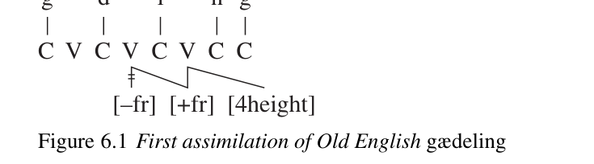
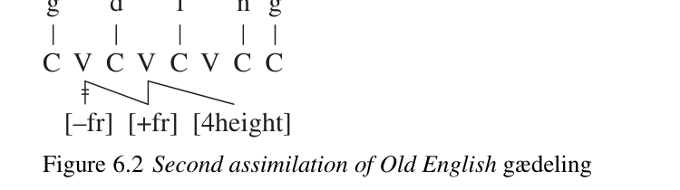
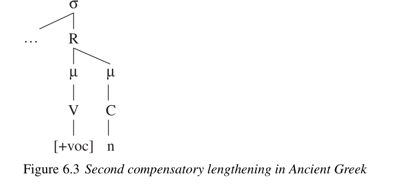
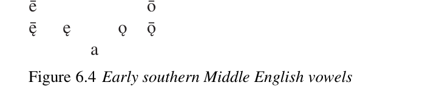

# Chapter 6: The evolution of phonological rules

<!-- pdf-page: 121; source-page: 105 -->

In the preceding chapter we focused on the process of sound change and the initial integration of a completed sound change into the grammar, keeping the discussion of phonological structure to a minimum. In this chapter we investigate the further development of the rules into which sound changes typically evolve – that is, change within the structured phonological system.

These developments can be discussed only in the context of a coherent model of phonology. We adopt a generalized version of generative phonology as developed in the 1970s and 1980s, with ordered rules, autosegments, and metrical structures. We are well aware that this approach has its limitations, but so does every other model of phonology; we have chosen this model because it is exceptionally convenient for the discussion of phonological change. (We have chosen not to work with Optimality Theory because it does not seem well adapted to the description of phonological change; see especially the critique of McMahon 2000: 57–128.)

In the first section below we illustrate some of the advantages of fully articulated modern phonology in describing the effects of sound change; readers who require a fuller introduction should consult, e.g., Goldsmith 1990 or Kenstowicz 1994. We then proceed to consider the evolution of phonological rules that have already become categorical.

<b>Sound change and formal phonology</b>

From the point of view of a historical linguist, a major advantage of autosegmental phonology is that it decomposes the traditional sequence of segments (i.e. consonants and vowels) into parallel “tiers,” each of which represents a different kind of phonological information. It is very often the case that the articulatory gestures which are so useful in understanding sound change (see the preceding chapter) translate more or less directly into operations on a specific phonological tier (see McCarthy 1988 with references; we are grateful to Eugene Buckley for helpful discussion of this section). This is especially apparent in dealing with distant assimilation between similar sounds which are separated in the string of segments by sounds of other types: the sounds participating in the change are in fact adjacent on the relevant tier because they share

<!-- pdf-page: 122; source-page: 106 -->

g

n g

C  V  C  V  C  V  C  C

[–fr]  [+fr]  [4height]

g

d

l

n g

C  V  C  V  C  V  C  C

[–fr]  [+fr]  [4height]

distinctive features. In Old English (OE), for example, the inherited word *gaduling ‘kinsman, companion’ (attested in that form in Old Saxon) became *gædyling: the high vowel of the second syllable was fronted because the vowel of the last syllable was high and front; then, since the second syllable now contained a high front vowel, the vowel of the first syllable was fronted too. (Eventually the word became<i> gædeling</i> by reduction of the most unstressed vowel; see Campbell 1962: 82.) Because the “melodic” tier, which represents the articulatory and acoustic features of speech sounds, is actually composed of several tiers of feature bundles, each containing a different group of related features, it is easy to capture the fact that the assimilation of the vowels ignored the intervening consonants, which had no frontness feature. The first assimilation can be represented as in

sented by an<i> n</i>-ary feature with values [1] (low) to [4] (high)), and the second as in

Of course the frontness feature must occupy a (sub-)tier of its own within the tier of vocalic features, but it does: since frontness, height, and rounding are articulatorily independent of each other, autosegmental phonology recognizes them as separate tiers. The tier analysis replicates faithfully the fact that the trajectory of the body of the tongue (which produces the vowels) is articulatorily independent of the consonants in this example, so that the vowels are actually adjacent and can easily assimilate to each other. (For a full representation of phonological tiers see e.g. the diagram in Schein and Steriade 1986: 695.)

Autosegmental phonology also gives an insightful account of the details of the Sanskrit retroflex assimilation rule. To make the analysis of Sanskrit retroflexion intelligible we must first describe the relevant subsystem of sounds in some detail – a task which is possible thanks to the extraordinary accuracy of the ancient Indian phonetic treatises (see Allen 1953). The [-cont] (i.e. stop) consonants of Sanskrit are produced at five places of articulation, phonetically bilabial, dental, retroflex, palatal, and velar; they have the following place-of-articulation features:

<!-- pdf-page: 123; source-page: 107 -->

<i>Bilabial Dental Retroflex Palatal Velar</i> (1)

[−cor]

[+cor] [+cor]

[+cor] [−cor]

[labial]

[+ant] [−ant]

[−ant] [dorsal]

[retr] All nasal stops are [+son, +vce]; the variety of laryngeal features associated with oral stops (which are [−son]) are not relevant here. The only underlying fricatives in the language (which are [−son, +cont]) are laryngeal (also not relevant) and sibilant; the sibilant fricatives have the following place features:

<i>Alveolar Retroflex Palatal</i> (2)

[+cor]

[+cor]

[+cor]

[+ant]

[−ant]

[−ant]

[retr] There are both syllabic and nonsyllabic l- and r-sounds, which are [+son, +cont]; the former are [+cor, +ant], the latter [+cor, −ant, retr].

The retroflex assimilation rule can be described informally as follows. When the dental nasal<i> n</i> follows a retroflex continuant (i.e.<i> s.</i>,<i> r</i>, or syllabic<i> r</i><i>̥</i> ) within the word and is itself immediately followed by a sonorant, it becomes retroflex<i> n.</i> – that is, it assimilates to the preceding retroflex continuant in place of articulation – unless another coronal intervenes. The effects can be seen by comparing two sets of deverbal neuter nouns formed with the suffix /-ana-/:†

a.<i> pácanam</i> ‘cooking implement’,<i> b</i><i>ʰ</i><i>ójanam</i> ‘nourishment’,<i> yójanam</i> ‘team (3)

(of draft animals)’,<i> sádanam</i> ‘seat’,<i> skámb</i><i>ʰ</i><i>anam</i> ‘supporting pillar’

b.<i> káran. am</i> ‘deed’,<i> kr</i><i>̥</i><i> pán. am</i> ‘lamentation’,<i> kráman. am</i> ‘stride’,<i> cáks.an. am</i>

‘appearance’ Examples in which retroflexion is blocked by a coronal are easy to find:

a.<i> nivártanam</i> ‘return’ (4)

(blocked by /t/)

b.<i> nr</i><i>̥</i><i> s. ádanam</i> ‘assembly of men’ (blocked by /d/)

c.<i> prarécanam</i> ‘remainder’

(blocked by the palatal stop /c/)

d.<i> vr</i><i>̥</i><i> jánam</i> ‘place’

(blocked by the palatal stop /j/)

e.<i> dár´sanam</i> ‘sight’

(blocked by the palatal fricative /´s/)

f.<i> pr</i><i>´</i><i>ān. anam</i> ‘breathing’

(blocked by<i> n.</i> , ←/n/ by this rule) But though<i> n.</i> blocks the assimilation from a distance, as the last example shows, it does not do so in contact; that is,<i> nn</i> is assimilated to<i> n. n.</i> , not half-assimilated to “<i>n. n</i>.” Note the following derivations of past participles formed with the suffix /-ná-/:

a. /tr̥ d-ná-/ →tr̥ nná- →<i>tr</i><i>̥</i><i> n. n. á-</i> ‘split’ (5)

b. /ni-sad-ná-/ →nis.adná- →nis.anná- →<i>nis.an. n. á-</i> ‘having sat down’ (Retroflexion of the sibilant is effected by the notorious “ruki-rule,” by which /s/ becomes retroflex immediately following dorsals, rhotics, and high vocalics.) Any analysis needs to account for all these details.

† In the standard transliteration of Sanskrit the retroflex consonants are represented by dental or alveolar symbols with a dot beneath. The voiced aspirates are breathy-voiced.

<!-- pdf-page: 124; source-page: 108 -->

An autosegmental account of the above is the following. The [+cor] segments occupy a tier of their own (cf. Schein and Steriade 1986: 695), and the assimilation takes place on that tier. The trigger is any segment that is [+cont, retr] and the target is any coronal nasal that is immediately followed by a sonorant; the rule links the feature [retr] rightward onto any target that is adjacent on the coronal tier, and [retr] automatically brings with it [−ant] (replacing any [+ant] feature that the target may have). The rule applies vacuously to nasals that are already [retr]. It fails to apply to the palatal nasal because of a phonotactic accident: the palatal nasal occurs only immediately preceding a palatal oral stop (which exempts it, since the target must be followed by sonorant) and in the cluster<i> j˜n</i> (in which the palatal stop<i> j</i> blocks the assimilation). It applies to geminate<i> nn</i> because on the coronal tier there is only one feature bundle [+nas, +son, −cont, +cor, +ant] which is linked to two C-slots on the CV-tier; this exemplifies the Obligatory Contour Principle (OCP), which states that adjacent identical units on the melodic tier are not allowed in lexical representations.

Strikingly, almost no detail of this analysis needs to be stipulated arbitrarily; nearly all points are straightforward consequences of the articulatory gestures involved in the sound change that gave rise to the rule. Coronals occupy a separate tier because the blade and tip of the tongue move more or less independently of the lips and the body of the tongue (which is manipulated in producing vocalic sounds). Retroflex continuants trigger the change because the gesture of a continuant can be prolonged, whereas the closure of a stop is released with a change in the direction of the articulatory gesture. Geminates are affected because a geminate is the result of a single gesture held for two timing units, not two separate gestures. The only point that might be difficult to motivate is the fact that only nasal stops, not also oral stops, are targets of the rule; possibly the reason for that restriction had something to do with the sociolinguistic pattern of spread of the original sound change.

Syllable structure, as described in metrical phonology, also plays a role in phonological rule systems because it plays a role in sound change. The type of rule called “compensatory lengthening” is a case in point. Various dialects of Ancient Greek provide three examples of compensatory lengthening; the most straightforward is the “second compensatory lengthening” (2CL), which operated in most of the dialects. By the (synchronic) 2CL<i> n</i> is lost before<i> s</i> and the vowel preceding the<i> n</i> is lengthened. The following examples from the Attic dialect are typical:¹

a. /mélan-s/ ‘black (nom. sg. masc.)’ →<i>méla:s</i>  (cf. nom. pl. masc. (6)

<i>mélanes</i> 
 etc.)

b. /spénd-sa-i/ ‘to pour a libation’ →<i>spénsai</i> →<i>spˆe:sai</i> 
 (cf.

<i>spénde:n</i> 
 ‘to be pouring a libation, to pour libations [repeat-

edly]’)

c. /hel-ónt-si/ ‘to those who have caught’ (dat. pl.) →<i>helónsi</i> →<i>helˆo:si</i>

(cf.<i> helóntes</i> 
 ‘those who have caught’ [nom. pl.])

d. /pánt-sa/ ‘all, whole’ (fem.) →<i>pánsa</i> →<i>pˆa:sa</i>  (cf. masc. nom. pl.

<i>pántes</i> 
)²

<!-- pdf-page: 125; source-page: 109 -->

σ

…

R

μ

μ

V

C

[+voc]

n

(A few dialects lack the 2CL, and forms with<i> ns</i> on the surface are actually attested; for instance,<i> spensai</i> 
 and<i> elonsi</i> 
 are attested in Cretan, and<i> pansa</i>  is attested in Thessalian.) In each of these examples the syllable rhyme is<i> Vn</i>, occupying two moras, at some point in the derivation, as in

the right (which thereby becomes a V-slot), and the<i> n</i> is delinked; the structure of the metrical tier does not change.

This rule too replicates what happened historically, but it replicates two sound changes, not just one. The vowel was probably nasalized before [n] was deleted; that was probably an automatic coarticulation, not a separate change (Ohala 1981: 181–2 with references, 186, 1993: 247–8). Failure to close the stop<i> n</i> between the open vowel and the relatively open fricative must at first have resulted in a long nasalized vowel; that was the first actual change. The second change was simply the loss of nasalization on vowels. Latin underwent a precisely similar set of sound changes, but in that case we have documentation of the intermediate stage: what we write as<i> mēnsa</i> ‘table’, for example, was underlyingly /mensa/ but phonetically [m ̃e:sa] (see Sturtevant 1940: 153–4, Allen 1978: 28– 9); nasalization of the vowel was maintained for some generations in some dialects but was eventually lost everywhere in the Latin speech area – whence, for example, Spanish<i> mesa</i> with no<i> n</i>. These examples illustrate how a whole sequence of sound changes can affect sounds in exactly the same environment, so that native learners are led to simplify the system by conflating them into a single rule.

All the phonological changes we have discussed so far are typical “bottomup” sound changes: they clearly began as low-level variable phonetic implementation rules, went to completion in the usual way (without acquiring lexical exceptions in the process), and were integrated into the grammar as phonological rules at the end of the sequence of ordered rules. But while the great majority of sound changes fit that description, it appears that some take place at a more abstract level of phonological structure. We discuss those cases next.

<!-- pdf-page: 126; source-page: 110 -->

<b>Change at the level of structure: abrupt sound changes</b>

In the mid-1980s Henry Hoenigswald made the following observation (p.c.): we need to account for the fact that while assimilation often gives rise to new feature bundle types (such as the voiced fricatives of Spanish), metathesis and dissimilation almost never do; their outputs are virtually always feature bundles already present in the language. In modern terms, they are structurepreserving in the narrowest sense. The most plausible account of this fact is the hypothesis that metathesis and dissimilation do not result from low-level phonetic implementation rules with gradient outputs, as most other new phonological rules do; apparently they occur within the system of categorical phonology, yielding categorically different outputs.

Metathesis seems at first to be the more obvious case, since the errors that give rise to it are evidently errors in the timing of phonological units which are already part of the language. The (inconsistent) metathesis of OE<i> græs</i> ‘grass’ to<i> gærs</i>, for example, must at first have resulted from the mistiming of two articulatory complexes already in the mental representation of native speakers, and the same is true of the metathesis that underlies Spanish<i> milagro</i> ‘miracle’ and<i> peligro</i> ‘danger’ (←medieval Latin<i> mīrāculum</i> ‘prodigy, miracle’ and<i> perīculum</i> ‘test, danger’ respectively). But metathesis of only some features in a bundle also occurs, and one might suppose that that could give rise to new bundles. That does not seem to be the case; in the examples known to us the resulting feature bundles are of already occurring types. We will describe them briefly here, since the matter is potentially of importance for the understanding of this type of sound change.

The Proto-Indo-European (PIE) word for ‘wolf’ is securely reconstructable as *w´l̥kwos (cf. Sanskrit<i> v´r</i><i>̥</i><i> kas</i>, Avestan<i> v</i><i>ə</i><i>hrkō</i>, Old Church Slavonic<i> vl˘uk˘u</i>, Lithuanian<i> vi</i><i> ̃</i><i>lkas</i>, Gothic<i> wulfs</i>), with a typologically unusual sequence of an initial nonsyllabic vowel followed by a syllabic lateral. In Greek<i> lúkos</i>  the syllabicity features have remained in place, but the residues of the bundles have undergone metathesis. The same thing has apparently happened in Latin<i> lupus</i> ‘wolf’ (the<i> p</i> probably shows that this word was borrowed from some other Italic language, since *kʷ does not normally become<i> p</i> in Latin).

A converse change has affected the PIE noun-forming suffix *-wr̥ , but not in the same daughter languages. In Greek this suffix developed normally to *-war; e.g. Homeric Greek<i> ˆe:dar</i> 
 ‘food’  *édwar (cf.<i> édmenai</i> 
 ‘to eat’). In Sanskrit, however, the suffix became<i> -ur</i> by metathesis of syllabicity, the rest of the bundles remaining in place; cf.<i> párur</i> ‘joint’  PIE *pér-wr̥ ‘transition’ (or the like; verb root *per- ‘go across/through’), also the source of Proto-Greek *pérwar  Homeric<i> pˆe:rar</i> 
 ‘end (of a rope)’. So also in Hittite, where we find, e.g.<i> pahhur</i> ‘fire’, dat.-loc.<i> pahhueni</i> ‘in the fire’  PIE *péh₂-wr̥ , *ph₂wén-i (Melchert 1994: 55). A similar change may have occurred in the Old Irish name<i> Olc</i>, if its original meaning was ‘wolf’ (McCone 1985).

<!-- pdf-page: 127; source-page: 111 -->

In the cases just sketched it is perhaps unsurprising that metathesis yielded already existing feature bundles, given how common syllabic<i> u</i> and nonsyllabic<i> r</i> and<i> l</i> are cross-linguistically. Much stranger are the metatheses that affected the word for ‘tongue’ in two less well-known daughters of PIE. The ancestral word can be reconstructed as *dn̥ ´gʰwéh₂- (see especially Peters 1991); it developed into Old Latin<i> dingua</i>₃ and Proto-Germanic *tungō-n- by regular sound changes (plus the addition of *-n- in Germanic; see Ringe 2006: 81, 90–2, 276), but in other daughters it has been subject to a fantastic variety of changes of other kinds for unclear reasons. In Oscan we would expect its outcome to be *dangvā- by regular sound change, since *n̥ became<i> an</i> in initial syllables (Meiser 1986: 69– 70), breathy-voiced stops became normal voiced stops after nasals (ibid. pp. 75– 7), and the remaining changes are trivial; instead we find (acc. sg.)<b> fangvam</b>. The initial<i> f</i> of this form can only reflect a breathy-voiced consonant, and that can be accounted for only by positing metathesis as follows:

PIE *dn̥ ´gʰwéh₂-  *dn̥ gʰwā- →*dʰn̥ gwā- <i> fangvā-</i> (7)

in which only the laryngeal features of the stops have switched placed in the sequence of feature bundles. A converse change may have affected this word in the prehistory of Tocharian. The attested forms and the reconstructable Proto-Tocharian form show that some sort of metathesis has occurred (see Peters 1991):

Tocharian A<i> k¨antu</i>, pl.<i> k¨antwā-˜n</i>, Tocharian B<i> kantwo</i>, dimin.<i> k¨antwā-´ske</i> (8)

Proto-Tocharian *kəntwá-, nom. sg. *kəntwó

One might suppose that the *d and *ǵʰ of the PIE word had simply been transposed. But PIE *d normally disappeared without a trace in Tocharian whenever a nonsyllabic immediately followed (cf. Ringe 1996b: 64–6 with references). We could suggest that the metathesis occurred only after the loss of *d before nonsyllabics, so that this *d escaped. But an alternative possibility is that only the place of articulation features underwent metathesis, leaving the laryngeal features in place (Ringe 1996b: 45–6):

PIE *dn̥ ´gʰwéh₂-  *dn̥ gʰw´ā- →*gn̥ dʰw´ā-  Proto-Tocharian *kəntwá- (9)

For this metathesis a parallel from the speech of young children can be cited. At about the age of 2 a daughter of one of the authors evolved a rule that if a word contained both a bilabial and a velar articulation, the bilabial must precede; laryngeal features, however, were not affected, so that<i> camel</i> (for instance) was pronounced [pʰæŋi] and<i> grape</i> was pronounced [breɪk].

In all the cases of metathesis discussed in the preceding paragraph, the metathesis of only some features in a bundle fails to yield a novel bundle. However, that might be because all three cases involve stop consonants, which tend crosslinguistically to occur in parallel series (see Blevins and Garrett 1998: 520, end of n. 8). A major desideratum of research into this obscure corner of phonological change is the identification of an example of one of two kinds: either (a) a partialfeature metathesis that does yield a novel feature bundle, or (b) such a metathesis

<!-- pdf-page: 128; source-page: 112 -->

Table 6.1<i> Latin /-li-/, /-āli-/, default realizations</i>

Derivational base

Derived adjective

capitālis ‘chief; punishable by death’ caput ‘head’ nāvis ‘ship’

nāvālis ‘naval’ specīes ‘appearance’

specīalis ‘individual’ ūniversus ‘whole’

ūniversālis ‘general, universal’ faucēs ‘throat’

faucāle ‘scarf’

Saturnālia ‘midwinter feast of Saturn’ Saturnus (mythical king of Latium) anima ‘soul’

animal ‘animal’ cīvis ‘citizen’

cīvīlis ‘of citizens’

virīlis ‘manly’ vir ‘man’

sella curūlis ‘magistrate’s chair’ currus ‘chariot’

that might be expected to yield a novel feature bundle but fails to do so. Either will be of theoretical interest.

Blevins and Garrett 1998: 512–22, 525–7 and 2004 suggest that metatheses involving inversion of consonants and vowels, and those involving the “migration” of laryngeal features from one consonant to a non-adjacent consonant, are acoustically motivated, resulting from learner reanalysis of acoustic cues whose underlying locus is misperceived because they are distributed over several segments (so already Ohala 1981: 189–91). That is possible, but it does not solve Hoenigswald’s riddle; even if the motivation of metathesis is phonetic in some cases, the point is that the result is<i> not</i> a low-level phonetic rule. Blevins and Garrett argue against an abstract analysis (1998: 519–20), suggesting that “[i]f linguistic change arises in first language acquisition . . . then it is hard to see why structure preservation should have any effect.” But only learner errors from late stages of acquisition, in which the adult grammar is more or less in place, survive into adult speech. Geoffrey Russom (p.c.) suggests that that is why these changes do not produce novel segments: the phonological system that has already been learned might be acting as a kind of filter to prohibit unfamiliar segments. Note also that the only violations of structure preservation that Blevins and Garrett cite involve creation of a novel<i> sequence</i> of segments, not of a novel feature bundle. Constraints on sequences of segments are notoriously hard to determine – for instance, the borrowing of<i> Vladimir</i> and coinage of<i> vroom</i> in English appear to have violated a sequencing constraint, yet they were unproblematic – and we need to consider the possibility that some such constraints are less than absolute. More work on all these problems is, of course, needed.

The outputs of dissimilation seem similarly constrained by the inventory of already existing feature bundle types. The best-known examples involve the interchange of rhotics and laterals. For instance, Latin inherited several adjectiveforming suffixes ending in<i> -li-</i>, the commonest of which is<i> -āli-</i>, and in the default case the suffixes surface unaltered, as in Table 6.1. However, if the derivational

<!-- pdf-page: 129; source-page: 113 -->

Table 6.2<i> Latin /-li-/, /-āli-/ with dissimilation</i>

Derivational base

Derived adjective

lūna ‘moon’

lūnāris ‘lunar’

cōnsul ‘chief magistrate’

cōnsulāris ‘of consular rank’

lūmen ‘light’

lūmināre ‘window-shutter’

plantāria ‘young saplings’

planta ‘graft, plant’

calx, calc- ‘heel’

calcar ‘spur’

pellīris ‘made of leather’

pellis ‘skin, hide’

Table 6.3<i> Latin /-āli-/, dissimilation blocked</i>

Derivational base

Derived adjective

līber ‘free’

līberālis ‘characteristic of a free person’

Flōra (the flower goddess)

Flōrālia ‘festival of Flora’

Lupercus (a minor deity)

Lupercal ‘grotto of Lupercus’

base contains an<i> l</i>, the<i> l</i> of the suffix dissimilates to<i> r</i>, as in Table 6.2. The dissimilation is blocked if an<i> r</i> intervenes between the two<i> l</i>’s, as in Table 6.3. It seems clear that in Latin there is a constraint against having two<i> l</i>’s adjacent (on the tier on which the melody of<i> l</i> resides) in derived environments; but it is striking that the constraint is observed by replacing suffixal<i> l</i> with the already existing trill<i> r</i> rather than dissimilating it to some novel segment (say, [ɹ] or [ð]). Dissimilations whose effects are projected directly into underlying representations are very similar; for instance, the dissimilation of<i> r</i>’s in Spanish<i> árbol</i> ‘tree’ Latin<i> arbor</i> likewise failed to yield a novel segment, and the same is true of the dissimilation of<i> d</i>’s that produced Latin<i> merīdīes</i> ‘midday’  *medii-dīes.₄ Equally striking is the dissimilatory loss of a segment in Hellenistic Greek<i> ag</i><i>ɛ</i><i>:ok</i><i>ʰ</i><i>énai</i>  !" ‘to have led’ from *agɛ:gokʰénai (modeled on older<i> en</i><i>ɛ</i><i>:nok</i><i>ʰ</i><i>énai</i> #!" ‘to have brought’ by lexical analogy) and<i> p</i><i>ʰ</i><i>a:tría:</i> $% ‘(religious) brotherhood’ <i> p</i><i>ʰ</i><i>ra:tría:</i> $%; apparently the complete loss of a segment is easier than creating a new segment by dissimilation. It is true (as Polly Jacobsen reminds us) that a novel segment occurring in only one lexeme would be such an anomaly that native learners would probably assume it was an error, but the case of the Latin suffix is a little different: a novel dissimilation product of /l/ would occur in only one morpheme, but the morpheme is productive and common, and segments restricted to a single derivational morpheme are known (see Bloomfield 1962: 9–10 for a Menomini example on the level of underlying form). Possibly the phonological system is acting as a filter in a rather different way. A dissimilation product of /l/, for example, would continue to be parsed as an allophone of /l/ unless it began to overlap with the realization of some other segment; thus a novel outcome could not, under ordinary circumstances, become phonologically independent and would not appear in the historical record.

<!-- pdf-page: 130; source-page: 114 -->

Further research on the nature of metathesis and dissimilation is clearly needed; for the moment we merely hold to the hypothesis stated at the beginning of this section, namely that these changes occur within the system of categorical phonological representations, not at the level of variable postlexical rules. In other words, they are not sound changes in the usual sense of the term – and that might ultimately be connected with the fact that they are so often irregular (cf. Hock 1991: 107–11).

Recently Ives Goddard has called attention to the fact that a wide range of regular sound changes which are<i> not</i> structure-preserving also do not appear to reflect low-level phonetic rules with gradient outputs. The most striking examples are unconditioned “saltatory” sound changes, in which the phonetics of a phoneme become very different in a single change. For instance, Proto-Polynesian *t has become<i> k</i> in most dialects of Hawaiian and in colloquial Samoan, and Proto-Algonkian *p became *k in the immediate ancestor of Arapaho and Gros Ventre (Goddard 2007: 118–19 with references). In both cases there were no conditioning factors and no merger (in the Polynesian languages cited because inherited *k had become the glottal stop, in Proto-Arapaho-Atsina because inherited *k had been lost unconditionally), and there is no evidence for any phonetically intermediate stage.

A somewhat different case is the conditioned sound change in the easterly dialects of Ancient Greek called the “third compensatory lengthening” (3CL, incidentally encountered in the Homeric Greek words for ‘food’ and ‘end (of a rope)’, cited above). In that sound change a sequence *VTw, where *T is a coronal consonant, was replaced by<i> V:T</i>; that is, the *w following the consonant was dropped and the vowel preceding the consonant was lengthened. For instance,

Proto-Greek *kalwós ‘beautiful’ (of which the neuter<i> kalwon</i> 	 is actually

attested in a Boiotian dialect inscription) appears as<i> ka:lós</i>  in the Ionic dialect of the Homeric poems (whose meter guarantees the length of the vowel in the first syllable). This was a completely regular sound change; nearly twenty lexemes were affected, and there are no counterexamples. No plausible intermediate stage can be proposed. Metathesis was not involved, since<i> aulós</i> & (the name of a shawm-like wind instrument) underwent no change; neither was gemination of the coronal, since<i> all´</i><i>ɛ</i><i>:loisi</i>  ' ‘to one another’ was also not affected. (All these words are well attested in Homer.) It looks as though the loss of *w was accompanied by a direct manipulation of the CV-skeleton, preserving the weight of the preceding syllable (so already Steriade 1982: 117–23). That was not a necessary development; in most dialects of Ancient Greek, including the very well-attested Attic, *w was lost without a trace (so that the example given above is<i> kalós</i>  with a short vowel in the first syllable – again guaranteed by numerous examples in metrical texts).

There has been no systematic study of how any of these types of change actually occur. Only such studies can reveal how these abrupt sound changes differ from the more familiar gradient sound changes and how the underlying structure of forms is involved.

<!-- pdf-page: 131; source-page: 115 -->

<b>Simplification of phonological rules</b>

In the discussion up to this point we have encountered some examples of the conflation of two or more sound changes into a single phonological rule. That is an obvious simplification of the grammar. The phonology of a language can also be simplified in other ways. We first discuss the simplification of individual phonological rules.

A striking example of rule simplification is provided by the Attic dialect of Ancient Greek. Because most endings of the Ancient Greek mediopassive perfect and pluperfect begin with consonants, and because many stems to which those endings are suffixed end in consonants, forms of those tenses provide numerous examples of the assimilation of consonants in contact at morpheme boundaries. The endings variously begin with /t/, /s/, /stʰ/, and /m/. (The “mediopassive” was used both as a passive and as an indirect reflexive; the pluperfect endings began with the same consonants as the corresponding perfect endings. On the inherited 3pl. see below.) The following ordered rules apply to the sequence of stem-final consonant plus ending-initial consonant(s):

dental stops →<i>s</i> before all the consonants in question; (a)

<i>ss</i> →<i>s</i>; (b)

<i>s</i> →/0 between consonants; (c) (d)

stops (which at this point in the derivation can only be bilabial or

velar) assimilate in voicing, aspiration, and nasality to an immediately

following stop (including nasal stops).⁵

In Table 6.4 the mediopassive perfect 2sg. indicative, 3sg. indicative, infinitive, and participle of six verbs, each ending in a different bilabial or velar stop, illustrate the effects of (d). The traditional spellings, which largely represent the surface contrasts well, obscure the parallelism of these paradigms in one respect: ⟨⟩“gm” is phonetically [ŋm], in accordance with the rule stated under (d) above. We know that because ancient Greek grammatical tradition called the velar nasal – written ⟨⟩“g” in all positions, even before velar stops – by the name (; and since the principle governing the names of consonants in the Greek alphabet is that the first consonant of the name should be the way the letter was pronounced, the name must have been [áŋma], and /g/ must have been [ŋ] before /m/ (cf. Sturtevant 1940: 64–5, Allen 1987: 35–9).

Most of the rules given above, including most of the rules conflated under (d), are completely general phonological rules of Attic Greek: not only do they apply to all derived forms, they also operate as “morpheme structure constraints” (MSCs) on underlying forms. For instance, the /kt<i>/</i> of<i> árktos</i> ( ‘bear’ is a possible sequence of stops, but *gt and *kʰt are not; the /pʰtʰ/ of<i> op</i><i>ʰ</i><i>t</i><i>ʰ</i><i>almós</i> )$ ‘eye’ is a possible sequence of stops, but *ptʰ and *btʰ are not; and so on. That is the usual situation when a phonological rule arose by regular

<!-- pdf-page: 132; source-page: 116 -->

dedegménos

dedékʰtʰai /de-dekʰ-/

dédeksai

"

dédektai

+ /dekʰ-/

diɛ:llagménos

!

‘be different’

!"

'

diɛ:llákʰtʰai /di-ɛ:llag-/

'+

di´ɛ:llaksai

di´ɛ:llaktai /di-allag-/

‘have been pursued’

de-diɔ:gménos

dedi ̂ɔ:kʰtʰai /de-diɔ:k-/

,"

%

dedíɔ:ksai

dedíɔ:ktai

%+ /diɔ:k-/

‘have been annointed’

alɛ:limménos

!

'

!%$

alɛ:lípʰtʰai /al-ɛ:lipʰ-/

'*

al´ɛ:lipsai

al´ɛ:liptai /aleipʰ-/

Table 6.4<i> Mediopassive perfect forms of six Ancient Greek verbs</i>

‘have been rubbed’

tetri:mménos

tetrˆı:pʰtʰai

$ /te-tri:b-/

*

tétri:psai

tétri:ptai /tri:b-/

‘have been entrusted’

epitetramménos

#

#

#
$

#*

epitetrápʰtʰai /epi-te-trap-/

epitétrapsai

epitétraptai /epi-trep-/ <i>Med. -pass. pf. stem</i>

<i>Indic. 2sg</i>.

<i>Indic. 3sg</i>.

<i>Meaning</i>

<i>Ptc</i>.

<i>Inf</i>.

<!-- pdf-page: 133; source-page: 117 -->

sound change. The rule assimilating bilabial and velar stops to following nasals, however, is a different story, to which we must now give our attention (see Sommerstein 1973: 21–3).

It is true that the only bilabial which can precede<i> m</i> in Attic Greek is<i> m</i>; the sequences *pm, *bm, and *pʰm do not occur. The subrule nasalizing bilabial stops before /m/ can be illustrated with numerous derived examples, of which some are adduced in (10).

a.<i> blémma</i>  ‘glance’ ←/blep-/ ‘look’ (10)

b.<i> trˆı:mma</i>  ‘experienced con man’ (*‘well-worn thing’) and<i> tri:mmós</i>

‘beaten path’ ←/tri:b-/ ‘rub’

c.<i> áleimma</i> (
 ‘ointment’ ←/aleipʰ-/ ‘anoint’

Intramorphemic examples of /mm/, illustrating that this is also an MSC, are not common, but at least<i> ámmos</i> ( ‘sand’ can be cited. This subrule, then, looks like the result of a regular sound change.

The sequence *bn is also excluded,<i> mn</i> occurring instead – one finds not only derived examples like<i> semnós</i> 
 ‘reverend, holy’ ←/seb-nó-s/ (cf.<i> sébe:n</i> ‘to worship’), but also intramorphemic examples such as<i> prúmna</i> ‘stern (of a ship)’. It also seems very likely that /gn/ was phonetically [ŋn] (at least intervocalically, see Sturtevant 1940: 64–5 with references; Allen 1987: 37 with n. 59 seems too hesitant to rely on the written evidence and phonetic likelihood), and there is good evidence that /gm/ was phonetically [ŋm] (see above). Thus the subrule nasalizing voiced bilabial and velar stops before nasals can also be the result of a regular sound change.

For other velar stops followed by<i> m</i> the situation is different. In other derived environments, including nouns productively derived from verb stems with the suffixes /-mat-/ and /-mó-/, all velar stops become [ŋ] before<i> m</i>, just as they do in the paradigm of the mediopassive perfect; thus nouns like those in (11) are precisely parallel to the derived nouns with [mm] listed above.

a.<i> dógma</i>  [dóŋma] ‘opinion, (legislative) decree’ ←/dok-/ ‘seem (11)

good, be resolved (by a legislature)’

b.<i> dí</i><i>ɔ</i><i>:gma</i> % [díɔ:ŋma] and<i> di</i><i>ɔ</i><i>:gmós</i>  [-ŋm-] ‘pursuit’ ←

/diɔ:k-/ ‘pursue’

c.<i> diállagma</i>  [diállaŋma] ‘changeling’ ←/di-allag-/ ‘exchange’

d.<i> táragma</i>  [táraŋma] ‘uneasiness, upset’ and<i> taragmós</i>

[-ŋm-] ‘confusion, turmoil’ ←/tarakʰ-/ ‘disturb’

But in underived words only /gm/ surfaces as [ŋm]; the voiceless velar stops (aspirated and unaspirated) surface unchanged, as in (12).

<i>akm´</i><i>ɛ</i><i>:</i>  ' ‘(highest) point’

<i>dok</i><i>ʰ</i><i>m´</i><i>ɛ</i><i>:</i> "' ‘span, handsbreadth’ (12)

<i>ákm</i><i>ɔ</i><i>:n</i> ( ‘anvil’

<i>aik</i><i>ʰ</i><i>m´</i><i>ɛ</i><i>:</i> -"' ‘spear-point’

<i>ikmás</i> - ‘moisture’

<i>lik</i><i>ʰ</i><i>mˆa:n</i> " ‘to flick the tongue’

<i>likmˆa:n</i>  ‘to winnow

(said of snakes)

(grain)’

<!-- pdf-page: 134; source-page: 118 -->

Since these forms are morphologically isolated, they must reflect the regular sound-change outcomes of these sequences.

Before<i> n</i> the situation is different again: both the bilabial and the velar voiceless stops (aspirated and unaspirated) surface unchanged, this time even in derived environments, as in (13).

a.<i> téknon</i>  ‘child’ ←/tek-/ ‘give birth’ (13)

b.<i> terpnós</i> 
 ‘pleasant’ ←/terp-/ ‘enjoy’

c.<i> sperk</i><i>ʰ</i><i>nós</i> 
" ‘hasty’ ←/sperkʰ-/ ‘hurry’

d.<i> strup</i><i>ʰ</i><i>nós</i> .$ ‘astringent’

((13d) exhibits the same suffix as the two adjectives that precede it in the list, though the root is otherwise unattested; it is a Greek “cranberry word.”)

Let us now assess this pattern of facts.

We can recognize the outcomes of two regular sound changes from the fact that they function as MSCs even in unanalyzable words: a rule changing all bilabial stops to<i> m</i> before<i> m</i>, which we can formalize as

[labial] →[+nasal] / __ [labial, +nasal],

and a change of all voiced noncoronal oral stops to nasals before nasals, thus:

[−cor, −cont, +vce] →[+nasal] / __ [+nasal].

Both rules apply to /bm/; it is not clear which applies first, and we do not know the order in which the sound changes that gave rise to those rules occurred. In addition, we have a rule that applies only in derived environments, namely

[velar] →[+nasal] / __ [labial, +nasal],

which changes other velar stops into the velar nasal before<i> m</i> (only). Operation only in derived environments is not characteristic of regular sound changes, but it is a known behavior of phonological rules. The conclusion seems inescapable: the nasalization of (all) velars before<i> m</i> in derived environments (only) did not result from regular sound change; instead it resulted from the extension of the rule nasalizing all bilabial stops before<i> m</i> (which<i> was</i> the reflex of a regular sound change). In terms of the rule itself this was a simplification: instead of applying to stops which were [labial], the rule now applied to all stops which were [−coronal]; in fact, if coronal stops had already become<i> s</i> before<i> m</i> (see above) by the point in the derivation at which this rule applied, the simplified rule could have applied to all stops before<i> m</i>.

But why should the rule changing bilabial stops to<i> m</i> before<i> m</i> have been simplified in this way? A further detail of the inflection of mediopassive perfects suggests a possible answer. The one member of the paradigm that had an ending beginning with a vowel was the 3pl. indicative, which originally ended in pf. <i>-atai</i>, plup.<i> -ato</i>. The relevant forms must originally have been made simply by combining the stem with the ending, so that the stem-final consonants would appear unaltered before these endings; but in attested forms a stem-final stop

<!-- pdf-page: 135; source-page: 119 -->

consonant which was not underlyingly aspirated was replaced by its aspirated counterpart before these two endings (!). In other words, the 3pl. endings had become underlying pf. /-hatai/, plup. /-hato/, and a rule combined the /h/ of the endings with stem-final labial and velar stops to yield [pʰ] and [kʰ] respectively on the surface. Attic examples are few, but since the same rule applied throughout the Attic-Ionic dialect group, we can also exemplify the rule from Herodotos (writing fifth-century East Ionic) and Homer (composing in a poetic dialect based on eighth-century East Ionic). Representative examples are listed in (14).

a.<i> epitetráp</i><i>ʰ</i><i>atai</i> #
$ ‘they are in the care (of), they have been (14)

entrusted (to)’<i> Iliad</i> 2.25, 62;<i> tetráp</i><i>ʰ</i><i>ato</i> 
$ ‘they kept facing’

<i>Iliad</i> 10.189 (verb root /trep-/, compound /epi-trep-/, see above)

b.<i> tetr</i><i>´</i><i>īp</i><i>ʰ</i><i>atai</i> 
´$ ‘they exhibit abrasion, they have been bruised’

Herodotos 2.93.3 (verb root /tri:b-/, see above)

c.<i> gegráp</i><i>ʰ</i><i>atai</i> 
$ ‘they are written’<i> IG</i> 1.57.10,<i> an</i>]<i>agegráp</i><i>ʰ</i><i>atai</i>

]
$ ‘they are enrolled’<i> IG</i> 1.66.2–3 (verb root /grapʰ-/

‘write’, compound /ana-grapʰ-/ ‘write up’)

d.<i> e:lík</i><i>ʰ</i><i>ato</i> 
-%" ‘they were wrapped’ Herodotos 7.90,<i> kate:lík</i><i>ʰ</i><i>ato</i>

%" (same meaning) 7.76 (verb root /(kat-)elik-/ ‘wind, wrap

(up)’)

e.<i> teták</i><i>ʰ</i><i>atai</i> 
" ‘they are drawn up’ (said of ships) Thouky-

dides 3.13.3;<i> antiteták</i><i>ʰ</i><i>atai</i>  
" ‘they are deployed against’

Xenophon,<i> Anabasis</i> 4.8.5 (verb root /tag-/ ‘arrange, marshall’ and cpd.)

f.<i> tetéuk</i><i>ʰ</i><i>atai</i> 

" ‘they have been made’<i> Iliad</i> 13.22 etc. (verb root

/teukʰ-/ ‘make, fashion (as a craftsman)’)

(There are quite a few other examples to roots ending in /-g-/, and a couple more to roots ending in /-pʰ-/ and /-kʰ-/.) We know that this was a prehistoric innovation of the Attic-Ionic dialect group: the endings were originally<i> -atai</i>, -<i>ato</i>  *-n̥ tai, *-n̥ to (with no underlying /h/), and they still retain those inherited shapes in some other dialects.<i> Together</i> the two innovations – the reanalysis of the 3pl. endings so that they began with /h/ and the extension of the nasalization rule to velars – rendered the inflection of mediopassive perfects ending in noncoronal stops completely uniform, so that all corresponding forms made to roots in labials rhymed and all corresponding forms made to roots in velars also rhymed, regardless of whether the underlying root-final stop was voiced, voiceless, or aspirated. Unfortunately we don’t know which innovation occurred first; but both appear to be the sort of learner errors that simplify the inflection of a relatively marginal morphological category characterized by unusual phonological complexity. No doubt the initial impetus for such an error was the fact that native learners did not hear the relevant forms often enough to learn them correctly, so that they produced (for example)<i> epitetráp</i><i>ʰ</i><i>atai</i> for *epitetrápatai and<i> dede</i><i>ŋ</i><i>ménos</i> for *dedekʰménos; but the effect was to simplify the inflectional system and, in the case of the nasalization rule, the phonology as well. The extension of the latter rule to productive word formation would then be natural enough.

<!-- pdf-page: 136; source-page: 120 -->

ī

ū

u

ē

ō

ē

˛

e˛

o˛

ō

˛

a

A rule simplification which must have had a rather different motivation can be cited from Middle English (ME). Sometime in the eleventh century the famous “trisyllabic shortening” rule entered the phonology of English; it shortened long vowels in stressed syllables provided that (a) the vowel was in at least the third syllable from the end of the word<i> or</i> (b) the vowel was followed by one of a large number of consonant clusters, including especially geminate consonants (Luick 1914–40: 324–30; the rule has already been introduced in the discussion of the GVS in Chapter 5). The examples in (15) (given as far as possible in late OE spelling, though it is known to have been somewhat archaizing) are typical.

a.<i> hīdan, hidde</i> ‘to hide, hid’ (15)

b.<i> Crīst, Cristesmæsse</i> ‘Christ, Christmas’

c.<i> fēdan, fedde</i> ‘to feed, fed’

d.<i> frēond, freondscipe</i> ‘friend, friendship’

e.<i> l</i><i>ǣ</i><i>dan, lædde</i> ‘to lead, led’

f.<i> hēafod, heafodu</i> ‘head, heads’

g.<i> gāst, gastlice</i> ‘spirit, spiritual’

h.<i> hāliġ, haliġdæġ</i> ‘holy, holy day’

i.<i> blōma</i> ‘ingot’,<i> blostma</i> ‘blossom’

j.<i> sū</i><i>þ</i><i>, su</i><i>ð</i><i>erne</i> ‘south, southern’

The outputs of this rule were then overlaid by several mergers and other shifts of vowels in most dialects:

short<i> æ</i> and<i> ea</i> merged with short<i> a</i> (ibid. pp. 346–52); (a)

long<i> ǣ</i> and<i> ēa</i> also merged, but became (or remained?) a lower mid (b)

vowel<i> ¯</i><i>ę</i> (i.e. /ɛ:/; ibid. pp. 341–5);

long<i> ā</i> was rounded and raised to lower mid<i> ǭ</i> (i.e., /ɔ:/; ibid. pp. 358– (c)

63).

(Some other changes had no effect on the rule.) The result was a system with five short vowels but six long vowels (and no long<i> ā</i>) in which both the lower mid vowels underwent shortening to<i> a</i>. The short mid vowels were lower mid (a point that will become important below); the system of surface contrasts is charted in

alternations between long lower mid vowels and<i> a</i> that survived for a significant period mostly involve verb paradigms in the case of the lower mid front vowel, but word-formation in the case of the lower mid round back vowel; typical examples are listed in (16):

<!-- pdf-page: 137; source-page: 121 -->

(16)

a.<i> l¯</i><i>ę</i><i>den, ladde</i> ‘to lead, led’

b.<i> r¯</i><i>ę</i><i>den, radde</i> ‘to read, read [past]’

c.<i> spr¯</i><i>ę</i><i>den, spradde</i> ‘to spread, spread [past]’

d.<i> m¯</i><i>ę</i><i>ten, matte</i> ‘to dream, dreamt’ (impersonal)

e.<i> l¯</i><i>ę</i><i>ven, lafde</i> ‘to leave, left’

f.<i> d¯</i><i>ę</i><i>len, dalte</i> ‘to distribute, distributed’

g.<i> cl¯</i><i>ę</i><i>ne, clansen</i> ‘clean, to cleanse’

h.<i> ch¯</i><i>ę</i><i>p, chapfare, chapman</i> ‘bargain, trade, merchant’

i.<i> g</i><i>ǭ</i><i>st, gastli</i> ‘spirit, spiritual’

j.<i> h</i><i>ǭ</i><i>li, halidai, halwen</i> ‘holy, holiday, to sanctify’

k.<i> wr</i><i>ǭ</i><i>th, wra</i><i>þþ</i><i>e</i> ‘angry, anger’

Native learners must have conflated all this into a single shortening rule, but that rule had to be complicated to include backing of<i> ¯</i><i>ę</i>, unrounding of<i> ǭ</i>, and lowering of both. (In principle one or the other of those long vowels could have been underlying /ā/, but the potential evidence for that seems so weak that it is hard to believe that native learners would have come to such a conclusion.)

The rounding of<i> ā</i> to<i> ǭ</i> began south of the Thames before 1200 and spread northwards to the Humber during the thirteenth century (Luick 1914–40: 358– 63). But already during that century the shortening rule began to be simplified: backing, unrounding, and lowering were eliminated, so that<i> ¯</i><i>ę</i> was shortened to<i> ˛e</i> and<i> ǭ</i> to<i> ǫ</i>. As expected, the simplification proceeded lexeme by lexeme, affecting inflection more completely than derivational morphology. All the past tenses in the above list exhibit alternative forms with<i> ˛e</i> (<i>ledde</i>,<i> redde</i>, etc.), which eventually crowded out the older forms with<i> a</i>;<i> clensen</i> also replaced<i> clansen</i>, and<i> holiday</i> replaced<i> halidai</i> (which survives only in the name<i> Halliday</i>), but otherwise the derived words with<i> a</i> survived as synchronically underived lexical relics: cf. Modern English<i> wrath</i>,<i> hallow</i>,<i> ghastly</i>,<i> Chapman</i>, and the derived verb <i>to chaffer</i>.

What is striking about this rule simplification is that it made the learning of inflectional morphology less straightforward. The crucial point is that there were no verbs with<i> ǭ</i> in the root that had past tenses to which shortening applied (note that ME<i> cladde</i> was the past not of<i> cl</i><i>ǭ</i><i>then</i> but of (Northern)<i> cl¯</i><i>ę</i><i>th(e)</i>, see the<i> OED</i> s.vv.<i> clead</i>,<i> clothe</i>); thus before the simplification of the rule a past tense with<i> a</i> in the root and no vowel between the root and the suffixal consonant (i.e. not ending in<i> -ede</i>) implied underlying<i> ¯</i><i>ę</i> in the root unambiguously. After the simplification of the rule, however, an otherwise identical past tense with<i> ˛e</i> in the root might imply either underlying<i> ¯</i><i>ę</i> or underlying<i> ē</i>; that is, since learners encountered both<i> l¯</i><i>ę</i><i>den</i>,<i> l˛edde</i> and<i> blēden</i>,<i> bl˛edde</i> ‘bleed, bled’, it might not be immediately obvious from a newly encountered past tense of this type what the rest of the paradigm should be. It appears that the simplification of the rule was an end in itself, so to speak, making the<i> phonology</i> of the language (only!) less complex.

It is possible that native learners were motivated to simplify the shortening rule by nothing more than the fact that the higher long vowels were shortened

<!-- pdf-page: 138; source-page: 122 -->

Table 6.5<i> Vowel length alternations in</i>

<i>thirteenth-century Midlands Middle English</i>

Shortening

Lengthening

/ī/ ∼[i]

/ē/ ∼[˛e]

/¯ę/ ∼[a]

/˛e/ ∼[¯ę]

/a/ ∼[ā]

/ǭ/ ∼[a]

/ǫ/ ∼[ǭ]

/ō/ ∼[ǫ]

/ū/ ∼[u]

more straightforwardly (/ī/ to<i> i</i>, /ū/ to<i> u</i>, /ē/ to<i> ˛e</i>, and /ō/ to<i> ǫ</i> – the last in very few examples, such as<i> gosling</i> and<i> goshawk</i>). Extension of this simple rule to /¯ę/ and /ǭ/ would automatically yield<i> ˛e</i> and<i> ǫ</i>, since there was no contrast between higher mid and lower mid short vowels. However, there was a further factor that might have encouraged learners to simplify the phonology in just this way. Also in the thirteenth century, but starting in the north and spreading southwards, stressed nonhigh short vowels in open syllables were lengthened; lengthening of<i> ˛e</i> and<i> ǫ</i> respectively yielded long lower mid<i> ¯</i><i>ę</i> and<i> ǭ</i>, giving rise to surface alternations between long lower mid vowels and short mid vowels rather than short<i> a</i> (Luick 1914–40: 397–404). The result in the Midlands dialects was the set of alternations given in Table 6.5<i> before</i> the simplification of the shortening rule (with underlying vowels between slashes and lower mid vowels marked with hooks). The lengthening alternations were virtually all leveled in one direction or the other, but they must have existed for at least a few generations; during that time it could have been easy for native learners to confuse the two sets of quantitative alternations involving long lower mid vowels and so reduce them to a single surface pattern – which was, of course, easier to learn even though it made verb inflection a little harder to learn.

A quite different type of rule simplification is explored in Buckley 2009. A number of sound changes known from the historical record appear to have been phonetically natural in only some of the environments in which they occurred. An example is the Old High German shift of inherited *þ (i.e. *//) to<i> d</i> (Buckley 2009: 51–3). There is some evidence for an intermediate stage *[ð] (spelled <i>dh</i>), so it seems clear that we are witnessing two sound changes, []  [ð] [d]; but whereas the second change, the occlusion of the fricative, is natural in any phonotactic position, the first change, voicing, is not natural in word-initial position. Nevertheless word-initial *þ did eventually become<i> d</i> in Old High German. The most plausible analysis is that the allophonic rule voicing *þ in voiced environments was generalized to apply in all environments. In this case (though not necessarily in other cases) the next generation of learners would surely have learned the fricative as underlyingly voiced /ð/ (see the following

<!-- pdf-page: 139; source-page: 123 -->

section). Simplification of rules by the generalization of output allophones may be more common than we are currently aware of; Buckley adduces several cases, including the notorious Old French (OF) palatalization of Latin<i> c</i> /k/ before low /a/, only some of whose allophones had been fronted (Buckley 2009: 35–51). This is yet another subject that would repay further study.

It seems unlikely that these examples exhaust the range of possible motivations for rule simplification; this is an area of historical linguistics in which more work is needed.

<b>Reordering of phonological rules and restructuring</b>

<b>of underlying forms</b>

Much of Paul Kiparsky’s earlier work on language change (collected in Kiparsky 1982a) explored the reordering of phonological rules as a possible mechanism of phonological change. He argued that in general the justification for rule reordering must be that it simplifies the grammar, but exactly how it amounts to simplification proved elusive. At various times he suggested that rules tend to be reordered so that they are employed in as many derivations as possible (Kiparsky 1982a: 37–41), or so that paradigmatic allomorphy is minimized (ibid. pp. 65–6), or so that “transparency” is maximized (ibid. pp. 75–9) – that is, the phonology does not produce surface outputs which appear to contradict any of the rules. None of these hypotheses was fully satisfactory; the second and third, which are both plausible, can give different results, so that one needs to consider which takes precedence in particular cases (ibid. pp. 76–7). However, Kiparsky’s approach was fundamentally sound in one crucial respect: he kept always in view the fact that any grammatical change must begin as a reanalysis on the part of native language learners. Let us examine a few possible cases of rule reordering from that perspective and see if we can make sense of their motivation from the learner’s point of view.

An apparently ineluctable case of rule reordering is revealed by a comparison of two closely related northeastern dialects of Swiss German, those of Schaffhausen (the tiny northernmost canton) and of Kesswil (in the neighboring canton of Thurgau; Kiparsky 1982a: 19–20, 29, 76–7). Like all other German dialects, these two have a rule of i-umlaut which reflects an eighth-century (or earlier) sound change. In the earliest stages of its development the i-umlaut rule fronted all back vowels, and also raised short /a/ to<i> e</i>, when a high front vocalic occurred in the following syllable. However, the loss of postconsonantal<i> j</i> and the merger of posttonic short vowels in<i> ə</i> had made the German i-umlaut rule opaque by the eleventh century, since its phonological triggers could no longer be learned; since then i-umlaut has had multiple morphological triggers in German. One of these is a noun plural marker which ultimately reflects Old High German<i> -i</i>.

<!-- pdf-page: 140; source-page: 124 -->

Table 6.6<i> Umlaut and /o/-lowering in Schaffhausen</i>

‘bow’

‘bows’

‘floor’

‘floors’

/bogə/

/bogə+PL/

/bodə/

/bodə+PL/

<i>Underlying form</i>

bøgə

bødə

<i>Umlaut</i>

bɔdə

<i>Lowering</i>

[bogə]

[bøgə]

[bɔdə]

[bødə]

<i>Surface form</i>

Table 6.7<i> /o/-lowering and umlaut in Kesswil</i>

‘bow’

‘bows’

‘floor’

‘floors’

/bogə/

/bogə+PL/

/bodə/

/bodə+PL/

<i>Underlying form</i>

bɔdə

bɔdə+PL

<i>Lowering</i>

bøgə

bœdə

<i>Umlaut</i>

[bogə]

[bøgə]

[bɔdə]

[bœdə]

<i>Surface form</i>

Much more recently the dialects of northeastern Switzerland underwent a sound change, and thereby acquired a rule, lowering /o/ to [ɔ] immediately preceding coronal obstruents and /r/ (see K¨onig 2001: 144–5); the rule does not lower [ø], the product of i-umlaut. In the dialect of Schaffhausen no further changes have occurred; thus the rules apply in their historical order, with the result that the plural of [bogə] ‘bow’, for example, is [bøgə] and the plural of [bɔdə] ‘floor’ is [bødə]. The relevant derivations are given in Table 6.6 (we give the plural marker in its abstract shape).

The dialect of Kesswil is similar, but it differs in one crucial point: in those paradigms in which it alternates with lowered [ɔ], the front vowel is lower mid [œ] rather than higher mid [ø]. The most straightforward way to account for this fact is the hypothesis that the rules have been reordered, as in Table 6.7. A skeptic might suggest that this is simply the result of a further sound change lowering <i>ø</i> in the same environments in which<i> o</i> had previously been lowered. But that cannot be the case, because non-alternating<i> ø</i> has not been affected (Enderlin 1913: 34). Thus the isolated word<i> frø</i><i>ʃʃ</i> ‘frog’, which is not derivationally related to any form containing a back vowel, exhibits higher<i> ø</i>, not lower<i> œ</i>, in the dialect of Kesswil; so does<i> gøtti</i> ‘godfather’, despite its apparent derivational relation to<i> g</i><i>ɔ</i><i>tt</i><i>ə</i> ‘godmother’. In these words the fronted vowel has been reanalyzed as underlying /ø/, and since the lowering rule does not apply to<i> ø</i>, they are not affected. A determined skeptic might counter that since the new lower mid front vowel appears only when it alternates with the lower mid back vowel, some sort of paradigmatic leveling must be to blame, even though its results appear to be purely phonological. But that cannot be true either, because of an interesting fact not mentioned by Kiparsky: not quite every [œ] is in alternation with [ɔ] in Kesswil. In particular, there is an impersonal verb<i> tœtt</i><i>ə</i><i>rl</i><i>ə</i>, which governs a dative experiencer, meaning ‘be afraid’. Since it exhibits a lower mid front

<!-- pdf-page: 141; source-page: 125 -->

Table 6.8<i> Derivation of</i> tœttərlə<i> in Kesswil</i>

‘be afraid’

/tottər+l+INF/

<i>Underlying form</i>

tɔttərlə

<i>Lowering</i>

tœttərlə

<i>Umlaut</i>

[tœttərlə]

<i>Surface form</i>

Table 6.9<i> Sound-change outcomes of</i>

<i>inherited back round vowels in Kesswil</i>

Inherited<i> u</i>

Inherited<i> o</i>

[o]

[ɔ]

Before<i> T, r</i>

[u]

[o]

Elsewhere

round vowel, one might expect to find in the lexicon a stem<i> t</i><i>ɔ</i><i>tt</i><i>ə</i><i>r-</i> with a back vowel in the root. But the only lexeme of such a shape quoted for this dialect is <i>t</i><i>ɔ</i><i>tt</i><i>ə</i><i>r</i> ‘eggyolk’ (Enderlin 1913: 33), which is most unlikely to be synchronically related to ‘be afraid’. A verb<i> tottere(n)</i> ‘to be afraid’ is known from other Swiss dialects, but it is absent from almost the whole of the Thurgau, including all the villages near Kesswil for which the standard references report forms (see Wanner<i> et al.</i> 1973 s.v.<i> Totter</i> II, coll. 2077–81); in the vicinity of Kesswil only the suffixed, umlauted form appears to occur. There is only one way to account for this striking fact: since the suffix /-l-/ triggers umlaut, native learners must have inferred that the underlying form of the root still exhibits a back vowel, and the derivation must be parallel to that of ‘floors’, as in Table 6.8. This would seem to be an open-and-shut case of rule reordering.

However, there is a further possibility that we have not considered: native learners might have projected the lowered back vowel into underlying forms as /ɔ/; that would have the same effect as reordering the rules, and since we already know that native learners project the outputs of rules into underlying forms, such an explanation should be preferred. To a linguist that might seem crazy, since the complementary distribution of [o] and [ɔ] should be completely obvious. But a closer look at the vowel inventory of Kesswil reveals that it is not obvious at all, for an unforeseen reason: not only was inherited<i> o</i> lowered to<i> ɔ</i> before coronal obstruents and<i> r</i>, inherited<i> u</i> was lowered to<i> o</i> before coronal obstruents,<i> n</i>, and <i>r</i> (Enderlin 1913: 35–7). Leaving aside the position before<i> n</i> (where inherited<i> o</i> was lengthened), we have the distribution of the reflexes of inherited vowels in

Table 6.9. Note that surface [o] appears in (roughly) the full range of phonological

environments. From such a distribution native learners could only have concluded that surface [o] is a single underlying phoneme /o/; that follows from the ITH (see the preceding chapter). But that would automatically entail setting up /u/ and /ɔ/ as underlying phonemes too, since both contrast with /o/ in unanalyzable

<!-- pdf-page: 142; source-page: 126 -->

words: cf. e.g.<i> torn</i> ‘tower’ vs.<i> t</i><i>ɔ</i><i>rn</i> ‘thorn’,<i> ro</i><i>ʃ</i><i>t</i> ‘waste pieces (of wood, etc.)’ vs.<i> r</i><i>ɔʃ</i><i>t</i> ‘rust’, and on the other hand<i> holts</i> ‘wood’ vs.<i> sults</i> ‘brawn, boar’s flesh’, <i>truxx</i><i>ə</i> ‘dry’ vs.<i> xnoxx</i><i>ə</i> ‘bone’,<i> fuxs</i> ‘fox’ vs.<i> oxs</i> ‘ox’ (perfect minimal pairs between<i> o</i> and<i> u</i> are hard to find). The distributions of /u/ and especially of /ɔ/ are oddly limited; but it seems clear that native learners do not always make use of distributional facts in positing underlying forms. We conclude that native learners in Kesswil did reanalyze [ɔ] as underlying /ɔ/ in precisely this way, with results which superficially resemble the results that rule reordering would yield.

Why, then, did native learners assume that the underlying root of<i> tœtterle</i> was /tɔttər-/ rather than /tottər-/? It turns out that the umlaut product of inherited <i>u</i> has remained [y] in Kesswil in most environments, including before coronal obstruents (Enderlin 1913: 37–8); as a result, the surface umlaut alternation before coronal obstruents is virtually always<i> o</i> ∼<i>y</i>, never “<i>o</i> ∼<i>ø</i>” (ibid. p. 39). Given that learners had projected [ɔ] and [o] before coronals into underlying forms as /ɔ/ and /o/, when they decided that the [ø] of<i> t¨otterle</i> was derived (and not underlying front /ø/), they could not imagine that it was the umlaut of /o/; the umlaut of /o/ could only have been [y] in such a word. The only alternative was /ɔ/, with the result described above.

But then why did the dialect of Schaffhausen not undergo the same changes? The answer is completely straightforward: in Schaffhausen inherited<i> u</i> was not lowered, regularly remaining as [u] in all positions (Wanner 1941: 29–30); thus it did not interfere with the distribution of [o] and [ɔ], and it remained clear to native learners that the latter two are simply allophones of /o/ (ibid. pp. 26–9). Since non-alternating examples of [o] and of [ɔ] do exist in Schaffhausen, this might appear to violate the ITH, but it need not: possibly this complementary distribution is so obvious that most native learners do restructure their grammars toward the end of native language acquisition (NLA), reanalyzing the /ɔ/ that they originally posited as /o/; possibly some native learners do hang onto /ɔ/, but the constellation of sociolinguistic events that would be necessary to generalize it has not yet appeared.

A further German example leads us to consider the process of learning German natively in more detail. A word-final obstruent devoicing rule entered the language around 1100 CE. The result was that in Middle High German (MHG) the endingless form of the adjective ‘long’, for example, was<i> lanc</i> [lɑŋk], while the inflected forms were<i> lange</i> [lɑŋgə],<i> langen</i> [lɑŋgən], etc. In the modern language [g] has been lost throughout most of the German-speaking area when it was immediately preceded by [ŋ] and and immediately followed by an obstruent, unstressed vowel, or morpheme boundary. In roughly the northern half of the country the two phonological rules still apply in their historical order (Wright 1907: 128), as in Table 6.10. In the more southerly dialects and in the standard language, however, the order of devoicing and g-loss has been switched, with the result that devoicing no longer has an opportunity to apply to any of the relevant forms, as in Table 6.11. This example has traditionally been a problem for purely phonological explanations of rule reordering, since the rules are

<!-- pdf-page: 143; source-page: 127 -->

Table 6.10<i> Devoicing and g-loss in</i>

<i>northern Germany</i>

Uninflected

Inflected

/lɑng/

/lɑng+ə/

<i>Underlying forms</i>

lɑŋg

lɑŋgə

<i>Nasal assimilation</i>

lɑŋk

<i>Final devoicing</i>

lɑŋə

<i>g-loss</i>

[lɑŋk]

[lɑŋə]

<i>Surface forms</i>

Table 6.11<i> g-loss and devoicing in</i>

<i>southern Germany</i>

Uninflected

Inflected

/lɑng/

/lɑng+ə/

<i>Underlying forms</i>

lɑŋg

lɑŋgə

<i>Nasal assimilation</i>

lɑŋ

lɑŋə

<i>g-loss</i>

<i>Final devoicing</i>

[lɑŋ]

[lɑŋə]

<i>Surface forms</i>

mutually bleeding (Kiparsky 1982a: 65–6, 102–5) and it is therefore difficult to see how reordering can simplify the phonology; it is often suggested that this is a good example of the elimination of alternations as a native-learner grammar optimization strategy (ibid.).

We might suggest that in this case, too, native learners have projected the absence of an oral stop into underlying forms, giving /lɑŋ/ ‘long’, for example. But it seems that that cannot be true, for the following reason. Prevocalic and morpheme-final surface [ŋ] in modern German not only exhibits the distributional restrictions of a cluster of nasal plus voiced stop, it is actually in complementary distribution with [ŋg], which appears on the surface in such words as<i> Tango</i>, <i>Ingrid</i>,<i> Angelika</i>,<i> Mongolien</i>, etc. before an unreduced vowel or a sonorant; further, an actual alternation between the two is discernible in such pairs as <i>Triangel</i> ([ŋ]) :<i> triangul¨ar</i> ([ŋg]). The arguments for deriving surface [ŋ] from underlying /ng/ are actually quite strong (Lessen Kloeke 1982: 116–22), and that would seem to preclude the hypothesis advanced at the beginning of this paragraph.

However, a further fact undermines this counterargument. Most of the German words in which [ŋg] occurs on the surface, and virtually all the alternating pairs, are unlikely to be learned by a child of preschool age. For instance, a young native learner of German will ordinarily hear not<i> Triangel</i> and<i> triangul¨ar</i>, the technical terms of geometry, but the usual words<i> Dreieck</i> and<i> dreieckig</i>. So for the first few years of native acquisition the evidence that surface [ŋ] might be underlying /ng/ boils down to the distributional facts which, as we have argued, native learners

<!-- pdf-page: 144; source-page: 128 -->

often overlook. Even if a child has a friend named<i> Angelika</i>, that isolated fact might not necessarily prevent her from sticking to the simple hypothesis that intervocalic and morpheme-final surface [ŋ] is underlyingly /ŋ/ for a long time. Eventually, of course, evidence for underlying /ng/ will accumulate until some adjustment of the grammar is required; but it is perfectly possible that by then, as Kiparsky observes in a different context, “the horses are already out of the barn” (Kiparsky 1982a: 230): isolated [ŋ] will remain underlyingly /ŋ/ and therefore ‘long’ will remain underlyingly /lɑŋ/ for this particular speaker.

Moreover, the existence of endingless [lɑŋk] ‘long’, familiar singular imperative [zɪŋk] ‘sing!’, etc., would not necessarily have been sufficient to make the scenario sketched above unlikely; if<i> Wange</i> ‘cheek’, etc., have been learned early in NLA as /vɑŋə/, etc., the child might very well account for the endingless forms in [-k] with a rule<i> adding</i> [-k] to /-ŋ/ word-finally.† The subsequent loss of such a rule would not be surprising. It seems possible that some such sequence of events in the past is responsible for the generalization of word-final [ŋ].

Finally, there is yet another possibility: the devoicing rule too was lost in most vernacular dialects of southern Germany, and it might not be an accident that both that loss and the loss of [-k] in such forms as<i> lang</i> occurred in approximately the same geographical area. So far as we can discover, it is not known which change occurred first. We need to reckon with the possibility that in many southern dialects the devoicing rule was lost before the reordering under discussion could occur, so that there was no reordering. In that case [lɑŋk] would have reverted to [lɑŋg] upon the loss of the devoicing rule, and [lɑŋg] could then have become [lɑŋ] by the new rule of g-loss. Subsequently forms like [lɑŋ] could have spread into dialects in which the devoicing rule had not yet been lost – a process not at all the same as rule reordering within a single dialect. Given the magnitude of these uncertainties, we cannot be sure what really happened in this apparent case of rule reordering.

The hypothesis that apparent examples of rule reordering are actually just the projection of rule outputs into underlying forms is worth considering simply because it is surprisingly difficult to find a watertight counterexample in which the restructuring of underlying forms<i> could not</i> have happened. Perhaps the most promising case is the Finnish example discussed in Kiparsky 1982c (originally published in 1973). We here summarize some of the crucial arguments very briefly; readers are urged to consult Kiparsky’s work for a fuller presentation.

In Proto-Baltic Finnic (PBF) the sequence *ti became *si by a sequence of sound changes; typical examples are adduced in Table 6.12. Subsequently Finnish acquired many new words containing the sequence<i> ti</i>; an obvious example is <i>¨aiti</i> ‘mother’, which was borrowed either from Gothic<i> ai</i><i>þ</i><i>ei</i> or from whatever language is the source of the Gothic word. However, the rule /t/ →<i>s</i> / __

† This is not an implausible alternative: one of the authors actually pronounces (variably) an excrescent [k] after the frequent English unstressed word-final coda [-ɪŋ], and such a pronunciation is not rare in New Jersey and on Long Island.

<!-- pdf-page: 145; source-page: 129 -->

Table 6.12<i> Assibilation in Proto-Baltic Finnic</i>

Proto-Finno-Ugric

PBF

Outcomes in daughters

*weti ‘water’

*wesi

Finnish, Estonian<i> vesi</i>

*k¨ati ‘hand’

*k¨asi

Finn., Est.<i> k¨asi</i>

*kakti ‘two’

*kaksi

Finn.<i> kaksi</i>, Est.<i> kaks</i>

*wi:ti ‘five’

*wi:si

Finn.<i> viisi</i>, Est.<i> viis</i>

Table 6.13<i> 3sg. simple past tense forms in Finnish</i>

‘(s)he wanted’

‘(s)he held’

/halut+i+/0/

/pit¨a+i+/0/

<i>Underlying form</i>

<i>Assibilation</i>

halus-i

–––—

<i>Vowel deletion</i>

–––—

pit-i

[halusi]

[piti]

<i>Surface form</i>

<i>i</i> continued to be part of the phonology of Finnish, applying only in derived environments. (The underlying stems of the Finnish words are /vete/, /k¨ate/, /kakte/, /viite/; the final<i> -i</i> of the endingless forms of these and many other nominals is the result of a vowel raising rule, so the assibilation environment is derived.) The deletion of stem-final unround short vowels before suffixes beginning with<i> i</i> also gave rise to new sequences<i> ti</i>; since these are normally not subject to the assibilation rule, the vowel deletion rule must be ordered after assibilation in an ordered rules framework. We here reproduce Kiparsky’s list of categories in which unassibilated<i> ti</i> occurs without exception, with his examples (Kiparsky 1982c: 171):

the past impersonal, e.g.<i> mentiin</i> ‘one went’ ←/men+t¨a+i+hen/; (a)

the conditional, e.g.<i> tuntisin</i> ‘I would know’ ←/tunte+isi+n/; (b)

derived verbs, e.g.<i> sotia</i> ‘to wage war’ ←/sota+i+taʔ/; (c)

derived adjectives, e.g.<i> vetinen</i> ‘watery’ ←/vete+i+nen/; (d)

derived nouns, e.g.<i> sontiainen</i> ‘dung beetle’ ←/sonta+iai+nen/; (e)

oblique plurals of nouns, e.g.<i> sotina</i> ‘during wars’ ←/sota+i+na/, (f)

<i>sotiin</i> ‘into wars’ ←/sota+i+hen/,<i> sodissa</i> ‘in wars’ ←/sota+i+ssa/.

For some verbs the same is true of the simple past in /-i/; thus there is a surface contrast between some verbs in which a sequence<i> ti</i> arises by vowel deletion and all those in which it arises by simple concatenation of morphemes, as in

Table 6.13. But there are other verbs in which assibilation does apply in the

simple past even though the sequence<i> ti</i> arose by vowel deletion, e.g.<i> piirsi</i> ‘(s)he drew’ ←/piirt¨a+i+/0/, and others in which it applies variably, e.g.<i> kiiti</i> ∼<i>kiisi</i> ‘(s)he sped’ ←/kiit¨a+i+/0/ (ibid. p. 167). The question is how to account for these facts.

<!-- pdf-page: 146; source-page: 130 -->

Kiparsky adduces philological and distributional evidence that the lastmentioned class of assibilated forms are innovations: documents of the sixteenth and seventeenth centuries exhibit more unassibilated forms of these verbs than does modern Finnish (ibid. pp. 168–9), and in productive formations of this type assibilation has become the rule (ibid. pp. 169–70). What we can recover about the chronology of sound changes points in the same direction. The assibilation rule is very old, applying throughout the Baltic Finnic dialect continuum and thus reconstructable for PBF (see e.g. Fromm and Sadeniemi 1956: 39–40); the rule dropping unround short vowels before<i> i</i> is the result of a much later sound change, so we should expect it to be ordered after assibilation and counterfeed it. Thus

Table 6.13 should reflect the inherited situation, and the spread of assibilation to

<i>piirsi</i>, etc. should be more recent. But what was the structural change in the grammar that gave that result? Reordering the rules, so that assibilation applied after vowel deletion – the reverse of the historical sequence of sound changes – would certainly do the trick. Two other details make that an attractive solution. One is the fact that the assibilation of past tenses with deleted stem vowels has clearly gained ground over time; another is that many of the “holdouts” whose past tenses still end in<i> -ti(-)</i> on the surface would become homonymous with the past tenses of other verbs if assibilation did apply to them (e.g.<i> kynti</i> ‘(s)he plowed’ would become homonymous with<i> kynsi</i> ‘(s)he scratched’, Kiparsky 1982c: 169). We might suggest that the rules have in fact been reordered, with some past tenses marked not to undergo the assibilation rule even though they now fit its structural description; we would expect such lexical marking to be lost gradually over time, and it would make sense for it to be lost more slowly in exactly those cases in which its loss would lead to ambiguity. (This is similar to a proposal that Kiparsky entertains but rejects.)

But what about the six grammatical categories in which<i> -ti-</i> arising by vowel deletion never undergoes assibilation? They could be marked exceptions too, grammatical rather than lexical and perhaps more likely to persist for that reason. But how could native learners fail to learn the original ordering of the rules (first assibilation, then vowel deletion counterfeeding it) when it is exemplified in a wide range of morphological environments? Evidently they have dissociated the assibilation rule in the past tense from the other cases; that is, they somehow failed to learn that the rule applied uniformly in all grammatical environments, and the rule has been fragmented (see below). It appears that one part of the fragmented rule has been reordered, though most have not.

But at this point our argument is in danger of being undermined. Apparently we have to recognize at least two synchronic assibilation rules. In that case, how do we know that the later rule is not just another regular sound change that was arrested before going to completion? That is always a possible solution to apparent cases of rule reordering (as Jon Stevens reminds us). In this case such a solution doesn’t seem particularly attractive, since there are many categories of forms that the new sound change (if that’s what it is) never affected. But without better knowledge of Finnish dialects we cannot exclude the possibility that this is a

<!-- pdf-page: 147; source-page: 131 -->

Table 6.14<i> /o:/-raising in Menomini</i>

Unraised /o:/

Raised /u:/

ko:n ‘snow’

ku:nyak ‘lumps of snow’ a:tɛʔno:hkɛw ‘he tells a sacred story’

a:tɛʔnu:hkuwɛw ‘he tells him a sacred

story’

pu:setuaʔ ‘when they embark’ po:set ‘when he embarks’ kan opo:senene:nan ‘he [obviative]

kan nepu:seni:nawan ‘we [exclusive]

does not embark’

did not embark’

sound change which began in some nonstandard dialect and spread slowly through a dialect continuum, much like the tensing of /æ/ in North American English (see Chapter 3). We doubt that more can be said without further evidence. Evidence about how the assibilation rule first began to broaden its range of application would be especially important but might no longer be recoverable, since the change began so far in the past.

Other apparent cases of reordering known to us either are sketchily described in the literature or are more complex and uncertain than those discussed above. In the present state of our knowledge it isn’t clear whether rule reordering per se is a possible type of phonological change. It is increasingly clear, however, that the projection of rule outputs into underlying forms is widespread even in circumstances in which a linguist might not expect it. We therefore turn to a discussion of that phenomenon in greater depth.

<b>Unexpected underlying forms</b>

In mid-twentieth-century Menomini, as recorded in Bloomfield 1962, the vowel [u:] did not occur underlyingly in normal native lexemes; it arose on the surface by raising of underlying /o:/ when a high vowel or a postconsonantal semivowel followed later in the word (ibid. p. 3). The pairs of examples in

Table 6.14 are typical (ibid. pp. 96, 106–7). It can be seen that surface [o:] and

[u:] were in complementary distribution.

But a number of “marginal” phenomena made this distribution less than perfect. For one thing, the borrowed lexemes<i> čo:h</i> ‘Joe’ and<i> ču:h</i> ‘Jew’ exhibited a contrast between these two vowels (Bloomfield 1962: 5), and since both were unanalyzable, /u:/ must have been underlying in the latter word. It looks like the contrast was the result of contact with English, and in the narrowest sense that is true; but why was it<i> possible</i> for speakers of Menomini to borrow this particular contrast, given that languages usually substitute their own phonemes for foreign ones in borrowed words? Moreover, there were also at least two native interjections with unexpected [u:], namely<i> čapu:</i><i>ʔ</i> ‘sploosh!’ and<i> ku:h</i>

<!-- pdf-page: 148; source-page: 132 -->

‘stop that!’. Conversely, there were two onomatopoeic roots whose multiple /o:/’s were marked not to undergo raising: cf.<i> o:ho:hatimow</i> ‘(s)he weeps aloud’, <i>o:ho:pi:w</i><i>ɛ</i><i>:kat</i> ‘there is a sound of whooping’ (ibid. p. 97).

From these additional facts about Menomini raising we seem forced to conclude that [u:] had somehow achieved phonological independence, so that it could be underlying /u:/ in interjections and loanwords,<i> even though</i> it was fully predictable on the surface, since its only source was the raising rule. We need to explain how that is possible.

The crucial fact seems to be that some Menomini [u:] did not alternate with [o:] because they were followed by a high vowel or a postconsonantal semivowel in every form of the lexeme in which they occurred. The examples in (17) below (from Bloomfield 1962, 1975) are typical.

su:niyan ‘coin’ (<i>obviative</i> su:niyanan,<i> plural</i> su:niyanak) (17)

mu:čehkih ‘blue jay’ (<i>pl</i>. mu:čehki:hsak)

tu:ti:s ‘snipe’ (<i>pl</i>. tu:ti:hsak ∼tu:ti:skok)

seka:ku:hsyah ‘onion’ (<i>pl</i>. seka:ku:hsyak)

nemu:hkehkwan ‘my eyebrow’ (kemu:hkehkwan ‘your eyebrow’, etc.)

nɛhtu:hkwan ‘my elbow’ (<i>pl</i>. nɛhtu:hkwanan; ohtu:hkwan ‘his/her elbow’,

etc.)

ku:wiči:ʔsow ‘she plays shinny’; ku:wiči:ʔsehɛw ‘she invites her to play

shinny’; ku:wiči:ʔsehewɛ:w ‘she gives a shinny game’; ku:wiči:ʔswanak

‘shinny bags’; ku:wiči:ʔswana:htek ‘shinny stick’; etc., etc.

In the early stages of language acquisition a native learner might be expected to posit underlying /u:/ because there is no alternation in the morpheme that would suggest any other underlying vowel, according to the ITH proposed in Chapter 5. Fuller information should eventually lead the learner to conclude that these [u:] are underlyingly /o:/ even though they do not alternate, since the appearance of [o:] and [u:] on the surface is fully predictable. But it seems clear that a critical mass of some generation of native learners of Menomini – probably in the nineteenth century – did not do that. Instead they projected non-alternating surface outcomes into underlying forms and stuck with that analysis. What is striking about this case is that the new contrast can be described with the existing phonological distinctive features of the language – also in accordance with the ITH – since underlying /e:/ and /i:/ clearly did contrast (and, in addition, /e:/ was also raised to [i:] by the same raising rule, Bloomfield 1962: 5). The result of this learner error was a theoretically superfluous<i> and covert</i> underlying /u:/ which was available for use in interjections and loanwords.

It is not as clear how the nascent contrast between /o:/ and /u:/ contributed to the failure of /o:ho:h-/ ‘call loudly’ and /o:ho:p-/ ‘whoop’ to undergo raising at all. We can at least say that if the alternation between surface [o:] and [u:] had remained fully transparent, those developments should not have been possible; thus the acquisition of /u:/ was part of the process that undermined the exceptionless surface alternation inhibiting those developments. But we might expect some

<!-- pdf-page: 149; source-page: 133 -->

further factor to be necessary to account for the failure of /o:/ to undergo the raising rule in the verb roots just cited; the fact that they are onomatopoeic seems relevant, but we do not know whether that is the whole story.

We strongly suspect that learner errors of this kind – positing underlying segments which are phonologically derivable just because they do not alternate in the morphemes in question – are very common, though they become detectable only when further changes occur. As in Menomini, loanwords sometimes reveal that rule outputs have become covertly autonomous by using them to render foreign phonemes. The borrowing of Spanish voiced stops into Northern Chiapas Zoque, discussed briefly in Chapter 4, is another relevant case. Voiced stops and affricates occurred always and only immediately following a nasal. There were some lexemes in which a stop or affricate was always voiced because a nasal always preceded; typical examples include<i> wendi</i> ‘candle’,<i> sundunu</i> ‘flannel moth caterpillar’,<i> t</i><i>əʔ</i><i>mbi</i><i>ʦ</i> ‘Geomys species’,<i> kan</i><i>ʣ</i><i>u</i> ‘first cousin’,<i> ka</i><i>ŋ</i><i>goja</i> ‘rabbit’. Positing underlying voiced stops in such words should have made it possible to borrow /b d g/ in other positions in Spanish loanwords. The eventual borrowing of such clusters as [mp], [nt] with voiceless stops (e.g. in<i> kampana h</i><i>ə</i><i>j</i><i>ə</i> ‘bell flower’ and<i> manta</i> ‘cloak’) could then have been facilitated by the underlying contrast between /p t k/ and /b d g/ in other positions, though it seems likely that extensive bilingualism is principally responsible for the unadjusted shapes of these loans. In other words, though this last phenomenon appears to be parallel to the odd non-raising of /o:/ in Menomini onomatopoeic roots, we have a plausible external explanation for the Zoque case.

A third example of this process, more thoroughly researched (because we have much more historical information), is the phonemic split of voiceless and voiced anterior fricatives in ME. In prehistoric OE the anterior fricatives *f, *þ (i.e. *[]), and *s had become voiced in fully voiced environments when the last preceding syllable nucleus was stressed (Luick 1914–40: 844–8, Campbell 1962: 179–80).⁶ Throughout the OE period the surface alternations [f] ∼[v], [] ∼[ð], [s] ∼[z] remained exceptionless and were seldom noted in spelling, since there were only three phonemes /f/, /þ/, /s/ under any analysis. However, in the generation before (n.b. not after) the Norman Conquest, OF words began to be borrowed into English; and OF had not only a sibilant which alternated in voicing much like the English one (e.g. [s] in<i> us</i> ‘use’ (noun), [z] in<i> user</i> ‘to use’) but also a nonalternating /s/, usually spelled<i> c</i>.₇ How the English pronounced this consonant in the earliest loanwords (such as<i> canceler</i> ‘chancellor’, borrowed in the reign of Edward the Confessor) cannot be discovered, as OE spelling conventions conceal it. But by the second half of the twelfth century French spelling conventions were becoming widely used, and we can be fairly certain that loanwords like<i> grace</i> (which first appears in the<i> Lambeth Homilies</i>) and<i> pece</i> ‘piece’ (first attested in the<i> Ancrene Riwle</i>, around 1200) were [grasə], [pe:sə], with intervocalic [s] immediately following a stressed vowel. Over the next couple of centuries a steadily increasing number of OF words with initial [v-] were borrowed into ME. These developments established an underlying contrast between /f/ and /v/, and

<!-- pdf-page: 150; source-page: 134 -->

Table 6.15<i> Alternating and non-alternating labiodental</i>

<i>fricatives in Old English</i>

‘woman’

‘boy’

sg.

pl.

sg.

pl.

<i>Nom</i>.

wī<b>f</b>

wī<b>f</b>

cna<i>f</i>a

cna<i>f</i>an

<i>Acc</i>.

wī<b>f</b>

wī<b>f</b>

cna<i>f</i>an

cna<i>f</i>an

<i>Gen</i>.

wī<i>f</i>es

wī<i>f</i>a

cna<i>f</i>an

cna<i>f</i>ena

<i>Dat</i>.

wī<i>f</i>e

wī<i>f</i>um

cna<i>f</i>an

cna<i>f</i>um

between /s/ and /z/, in much the same way as the borrowing of ‘Joe’ and ‘Jew’ had begun to establish an underlying contrast in twentieth-century Menomini. They did not, however, disrupt the fricative voicing rule, on which see further below.

An explanation parallel to the one advanced above for Menomini and Zoque can account for the English data. There were numerous OE lexemes that exemplified the surface alternation [f ∼v], but also numerous others that exhibited only [v] because the fricative occurred in a voiced environment in all forms. The pair of nouns whose paradigms are given in Table 6.15 illustrates the situation. We give the forms in standard OE orthography, with [f] in boldface and [v] in italics. It is at least reasonable to suppose that some native learners posited underlying /v/ for non-alternating surface [v], and that that was what made the borrowing of OF initial /v/ possible. The borrowing of OF intervocalic /s/<i> before</i> any other relevant changes had occurred is less easy to account for. The only non-alternating [s]’s in OE were word-initial, or adjacent to a voiceless consonant (including geminate /ss/), or word-finally in non-inflecting lexemes (such as the adverb<i> l</i><i>ǣ</i><i>s</i> ‘less’) or inflectional endings (e.g. gen. sg.<i> -es</i>) or suppletive forms (e.g.<i> is</i> ‘is’). Variant spellings seem to show that geminate<i> ss</i> could be reduced to (apparently voiceless) <i>s</i> in allegro forms such as<i> þ</i><i>isum</i> ‘to these’ (beside unreduced<i> þ</i><i>issum</i>), but that seems an inadequate basis for learners to posit non-alternating /s/. It looks as though positing non-alternating /z/ in such words as<i> pise</i> ‘pease’,<i> hæsel</i> ‘hazel’, <i>ōsle</i> ‘blackbird’, etc. contributed toward making the borrowing of non-alternating /s/ possible for native learners, though exactly how that happened is not clear; once again we must probably posit extensive bilingualism for the immediate context of such loans. It does seem clear, though, that the lexical marking of the /s/ of ME<i> grace</i>,<i> piece</i>, etc. not to undergo the voicing rule is structurally parallel to the lexical marking of Menomini /o:ho:h-/, /o:ho:p-/ not to undergo the raising rule; thus a more solid explanation of the origin of one exceptional case, if it can be found, will probably shed light on the other.

The subsequent development that most commonly reveals covert underlying segments is probably not word-borrowing, however, but the destruction of conditioning environments in the process of “secondary split,” discussed in Chapter 5. We noted there that when the conditioning environment for a phonological rule

<!-- pdf-page: 151; source-page: 135 -->

is destroyed, in whole or in part, we might reasonably expect the rule to cease working, so that the underlying segment reappears in place of the rule’s output. But that is not what usually happens; typically the rule’s output survives, and the destruction of the rule’s conditioning environment makes the output contrastive. The cases we have just discussed strongly suggest that rule outputs become contrastive in secondary split<i> because they were already potentially contrastive</i>, since native learners had projected them into underlying forms in lexemes in which they did not participate in surface alternations, according to the ITH.

<i>This is a testable hypothesis</i>. It should be possible to examine all known cases of secondary split to see whether the rule outputs which they made contrastive were non-alternating in some lexemes at the time of the split. If that was true in every case, our hypothesis will be confirmed; if there are exceptions, further study of the exceptions will lead either to refinement of the hypothesis or to its replacement by a better hypothesis. We leave this for future research.

<b>Rule fragmentation</b>

Though it is uncertain whether phonological rules in an ordered sequence can be reordered, it is clear that they can evolve in several other ways. We deal with such changes in the next few sections.

When the phonological environment of a phonological rule is destroyed or obscured by further sound changes, the rule becomes morphologically conditioned; unless it originally applied only in a single morphological environment (because that was the only morphological environment in which the phonological trigger occurred), it will now have multiple morphological triggers. Under those circumstances a single rule can develop into a group of similar but distinct rules, roughly one for each relevant morphological environment, by the accumulation of further changes in each of the environments. We will call this process the “fragmentation” of a rule.

Whether and how fragmentation occurs must ultimately depend on how hard the rule is to learn as a single phonological rule. We discuss contrasting examples, beginning with a rule that has not been fragmented.

We have referred above to the German i-umlaut rule, which became fully morphologically conditioned some nine centuries ago. In modern standard German the rule occurs in many morphological environments; a partial list of the more important ones is the following (see also Wright 1907: 148–59, 163–4, 169, Drosdowski 1984: 239–40):

before a noun plural marker /-ə/ ∼<i>-</i><i>/</i><i>0</i> (i.e.<i> -e</i> after stressed syllables and zero after

unstressed syllables) used with more than half of all masculine and about one-

quarter of feminine nouns; typical examples are (masc.)<i> Gast</i> ‘guest’, pl.<i> G¨aste,</i>

<i>Vater</i> ‘father’, pl.<i> V¨ater</i>, (fem.)<i> Hand</i> ‘hand’, pl.<i> H¨ande, Tochter</i> ‘daughter’,

pl.<i> T¨ochter</i>;

<!-- pdf-page: 152; source-page: 136 -->

before a noun plural marker<i> -er</i> used with about 20 percent of neuter and a few

masculine nouns, e.g. (neut.)<i> Haus</i> ‘house’, pl.<i> H¨auser</i>, (masc.)<i> Mann</i> ‘man’,

pl.<i> M¨anner</i>; in the comparative and superlative of about two dozen adjectives, e.g.<i> lang</i> ‘long’,

<i>l¨anger</i> ‘longer’,<i> das L¨angste</i> ‘the longest’; in the present indicative 2sg. and 3sg. of most strong verbs, e.g.<i> fahren</i> ‘travel’,

pres. 2sg.<i> f¨ahrst</i>, 3sg.<i> f¨ahrt</i>; in the past subjunctive of strong verbs, e.g. (3sg.)<i> f¨uhre</i> ‘would travel’; before a suffix<i> -e</i> which forms feminine abstract nouns from adjectives, e.g.<i> L¨ange</i>

‘length’; in neuter collectives formed with the prefix<i> ge-</i>, e.g.<i> Horn</i> ‘horn’,<i> Geh¨orn</i> ‘(set

of) antlers’; before the diminutive suffixes<i> -chen</i> and<i> -lein</i>; before the suffix<i> -ling</i>, which forms nouns denoting persons typified by the

characteristic denoted by the root word.

Yet the operation of the rule is identical in all cases: only the vowel of the root syllable is changed; back vowels are fronted, the low vowels are also raised, the diphthong /ɑʊ/ is replaced by [ɔʏ], and the diphthongs /ɑɪ/ and /ɔʏ/ are not affected (even though they have back nuclei). Evidently the uniformity and pervasiveness of the rule make it easy to learn, and it has not undergone any fragmentation. The only consequence of its multiple morphological triggers is that its lexical scope has shifted differently over time in different word classes; for instance, the number of nouns using the umlauting noun plural markers increased somewhat in MHG, then much more in subsequent centuries, whereas the number of adjectives with umlauted comparatives and superlatives increased in MHG but has fallen sharply in recent centuries (see e.g. Wright 1907: 169–71, 197–8).

A completely different case is “Grassmann’s Law” (GL) in Ancient Greek. The sound change which gave rise to this phonological rule deaspirated aspirated stops and deleted /h/ in syllable onsets if an aspirated stop followed anywhere in the same phonological word. The lexicalized effects of the sound change can be seen in numerous isolated words (the examples are all Attic):⁸

<i>péit</i><i>ʰ</i><i>etai</i> 
%
 ‘(s)he obeys, (s)he trusts’  *pʰeitʰ-e-  PIE *bʰeydʰ- (cf. (18)

Latin<i> fīdit</i> ‘(s)he trusts’; Gothic<i> beidan</i>, OE<i> bīdan</i> ‘to wait (for)’)

<i>p</i><i> ̂ɛ</i><i>:k</i><i>ʰ</i><i>us</i> ". ‘forearm’ *pʰá:kʰus PIE *bʰā´gʰus ‘arm’ (cf. OE<i> bōg</i> ‘arm,

shoulder, bough’)

<i>tˆeik</i><i>ʰ</i><i>os</i> 
" ‘wall’ *tʰéikʰos PIE *dʰey´gʰ- ‘make out of clay’ (cf. Oscan

acc. pl.<b> feíhúss</b> ‘walls’)

<i>kep</i><i>ʰ</i><i>al´</i><i>ɛ</i><i>:</i> 
$' ‘head’  *kʰepʰalá:  PIE *gʰebʰal- (cf. OHG<i> gebal</i> ‘skull’)

<i>ekek</i><i>ʰ</i><i>e:ría:</i> #
"
% ‘truce’  *hekʰe-kʰe:ría: ‘hold-hand’ (<i>ék</i><i>ʰ</i><i>e:n</i> "
 ‘to

hold’,<i> k</i><i>ʰ</i><i>é:r</i> "
% ‘hand’; see below on the initial *h- of the verb)

<i>akólout</i><i>ʰ</i><i>os</i>  . ‘following, accompanying, companion’  *ha-

kóloutʰos ‘one who walks the same path’ (<i>ha-</i> /- ‘same’,<i> kéleut</i><i>ʰ</i><i>os</i> 
.

‘path’)

<!-- pdf-page: 153; source-page: 137 -->

But in the synchronic grammar of Ancient Greek the operation of GL is far more restricted, and the single sound change has fragmented into several rather different rules, as follows.

The deaspiration rule of broadest application affects reduplicating syllables. These are frequently encountered because verbs beginning with single consonants or with clusters of a stop followed by a sonorant form their perfect stems in part by prefixing<i> Ce-</i>, where<i> C</i> is the initial consonant of the root. If the initial consonant of the root is aspirated, the consonant of the reduplicating syllable is deaspirated. The examples in (19) are typical (present and aorist infinitives of the same verbs are given in parentheses).

<i>tet</i><i>ʰ</i><i>nánai</i> 
 ‘to be dead’ ←/tʰe-tʰna-/ (<i>t</i><i>ʰ</i><i>n´</i><i>ɛ</i><i>:iske:n</i> '
† ‘to be (19)

dying’,<i> t</i><i>ʰ</i><i>anˆe:n</i> 
 ‘to die’)

<i>tet</i><i>ʰ</i><i>ukénai</i> 
. ‘to have sacrificed’ ←/tʰe-tʰu-k-/,<i> tet</i><i>ʰ</i><i>úst</i><i>ʰ</i><i>ai</i> 
 ‘to

have been sacrificed’ ←/tʰe-tʰu-/ (<i>t</i><i>ʰ</i><i>ú:e:n</i> ´0
 ‘to be sacrificing’,<i> t</i><i>ʰ</i><i>ˆu:sai</i>

‘to sacrifice’)

<i>pep</i><i>ʰɛ</i><i>:nénai</i> 
$! ‘to have appeared’ ←/pʰe-pʰa:n-/ (<i>p</i><i>ʰ</i><i>áinest</i><i>ʰ</i><i>ai</i> $%1

‘to seem; to clearly be’,<i> p</i><i>ʰ</i><i>an</i><i> ̂ɛ</i><i>:nai</i> $ ‘to appear’)

<i>pep</i><i>ʰ</i><i>eugénai</i> 
$
. ‘to have escaped’ ←/pʰe-pʰeug-/ (<i>p</i><i>ʰ</i><i>éuge:n</i> $

‘to be running away’,<i> p</i><i>ʰ</i><i>ugˆe:n</i> $.
 ‘to escape’)

<i>pep</i><i>ʰ</i><i>ulak</i><i>ʰ</i><i>énai</i>

$."

←

/pʰe-pʰulak-h-/,

‘to

have

guarded’

<i>pep</i><i>ʰ</i><i>ulák</i><i>ʰ</i><i>t</i><i>ʰ</i><i>ai</i> 
$." ‘to be on one’s guard’ ←/pʰe-pʰulak-/

(<i>p</i><i>ʰ</i><i>ulátte:n</i> $.
 ‘to guard’,<i> p</i><i>ʰ</i><i>uláksai</i> $.+ ‘to take account of’;

cf. noun /pʰúlak-/ $- ‘(a) guard’)

<i>kek</i><i>ʰɛ</i><i>:nénai</i> 
"! ‘to gape’ ←/kʰe-kʰa:n-/ (<i>k</i><i>ʰ</i><i>áske:n</i> "
 ‘to yawn’,

<i>k</i><i>ʰ</i><i>anˆe:n</i> "
 ‘to open the mouth’)

<i>kek</i><i>ʰ</i><i>r</i><i> ̂ɛ</i><i>:st</i><i>ʰ</i><i>ai</i> 
" ‘to use habitually’ ←/kʰe-kʰrɛ:-/ (<i>k</i><i>ʰ</i><i>r</i><i> ̂ɛ</i><i>:st</i><i>ʰ</i><i>ai</i> "

‘to use’,<i> k</i><i>ʰ</i><i>r´</i><i>ɛ</i><i>:sast</i><i>ʰ</i><i>ai</i> "' ‘to experience’)

(It can be seen that other sequences of aspirated consonants in these forms are <i>not</i> subject to the dissimilation rule.) There is also a small class of present stems reduplicated with<i> Ci-</i>, of which one has a root beginning with an aspirated consonant and so undergoes the dissimilation rule:

<i>tit</i><i>ʰ</i><i>énai</i>  ‘to put (repeatedly or distributively), to be putting’ ←/tʰi-tʰe-/ (20)

(aorist<i> t</i><i>ʰ</i><i>ˆe:nai</i> 
 ‘to put’)

A second aspirate dissimilation rule (?; see below) has a much more restricted scope: it applies to roots of the shape /tʰV-/ (only) before the passive aorist suffix /-tʰɛ:-/ (only). There are two such roots:

<i>tet</i><i>ʰ ̂ɛ</i><i>:nai</i> 
 ‘to be put’ ←/tʰe-tʰɛ:-/ (see above) (21)

<i>tut</i><i>ʰ ̂ɛ</i><i>:nai</i> . ‘to be sacrificed’ ←/tʰu-tʰɛ:-/ (see above)

† On the diphthong in the present ‘to be dying’ see Threatte 1996: 505.

<!-- pdf-page: 154; source-page: 138 -->

These two roots do not undergo aspirate dissimilation when followed by other suffixes or endings containing aspirated consonants; that can be seen from various forms of the aorist and present of ‘put’ and of the passive perfect of ‘sacrifice’:

<i>t</i><i>ʰ</i><i>ést</i><i>ʰ</i><i>e tà hópla</i> 
 2 3 ‘ground arms!’ (lit. ‘put your own weapons (22)

(down)’) ←/tʰe-stʰe/ (aorist stem /tʰe-/, 2pl. mediopassive /-stʰe/)

<i>et</i><i>ʰ</i><i>ést</i><i>ʰɛ</i><i>:n</i> #! ‘the two of them put (their own)’ ←/e-tʰe-stʰɛ:n/ (/e-/ past

indicative prefix (“augment”), /-stʰɛ:n/ 3du. mediopassive)

<i>tít</i><i>ʰ</i><i>est</i><i>ʰ</i><i>ai</i> %
 ‘to be putting (one’s own)’ ←/tʰi-tʰe-stʰai/ (/-stʰai/

mediopassive infinitive)

<i>tet</i><i>ʰ</i><i>úst</i><i>ʰ</i><i>ai</i> 
 ‘to have been sacrificed’ ←/tʰe-tʰu-´stʰai/ (see above)

Nor does the rule apply to other roots of the shape /CʰV-/ before the aorist passive suffix:

<i>k</i><i>ʰ</i><i>ut</i><i>ʰ ̂ɛ</i><i>:nai</i> ". ‘to be poured’ ←/kʰu-tʰɛ:-/ (/kʰew-/ ∼/kʰu-/ ‘pour’) (23)

Nor does it apply to other roots beginning with /tʰ-/ before the aorist passive suffix:

<i>t</i><i>ʰ</i><i>li:p</i><i>ʰ</i><i>t</i><i>ʰ ̂ɛ</i><i>:nai</i> $ ‘to be squeezed’ ←/tʰli:b-tʰɛ:-/ (<i>t</i><i>ʰ</i><i>lí:be:n</i> ´
 ‘to (24)

squeeze’,<i> t</i><i>ʰ</i><i>lˆı:psai</i> * ‘to oppress’)

<i>t</i><i>ʰ</i><i>raust</i><i>ʰ ̂ɛ</i><i>:nai</i> . ‘to be shattered’ ←/tʰraus-tʰɛ:-/ (<i>t</i><i>ʰ</i><i>ráue:n</i>

‘to break (something) up’,<i> t</i><i>ʰ</i><i>rˆausai</i>  ‘to destroy’)

Whether a process which applies to only two lexemes should be considered a synchronic rule is of course debatable; the examples might just as well be memorized individually. What matters in this context is that the phenomenon is one of the surviving fragments of an earlier phonological rule, regardless of its synchronic status. (On some other roots possibly beginning with /tʰ-/ see further below.)

A third fragment of the original rule, probably completely fossilized, is the dissimilation of the aspirates in the sequence /-tʰɛ:-tʰi/, the passive aorist suffix followed by the 2sg. imperative ending;† but in this case it is the second /tʰ/, not the first, that loses its aspiration, as in (25).

<i>ent</i><i>ʰ</i><i>u:m´</i><i>ɛ</i><i>:t</i><i>ʰɛ</i><i>:ti</i> #0'! ‘think about it!’ ←/en-tʰu:mɛ:-tʰɛ:-tʰi/ (25)

<i>h´</i><i>ɛ</i><i>:st</i><i>ʰɛ</i><i>:ti</i> 4! ‘enjoy it!’ ←/hɛ:d-tʰɛ:-tʰi/

<i>dialék</i><i>ʰ</i><i>t</i><i>ʰɛ</i><i>:ti</i> "! ‘talk it over!’ ←/dia-leg-tʰɛ:-tʰi/

<i>h</i><i>ɛ</i><i>:tt´</i><i>ɛ</i><i>:t</i><i>ʰɛ</i><i>:ti</i> 5'! ‘yield!’ ←/hɛ:tta:-tʰɛ:-tʰi/

The rationale seems to have been that the affix furthest from the root undergoes the dissimilation (a rough mirror image of the rule that dissimilates reduplicating syllables). Thus this phenomenon is probably a relic of a much earlier reanalysis of the phonological rule or of one of its fragments.

† An idiosyncracy of the passive aorist is that it selects active rather than mediopassive endings. Most of the plausible examples of passive aorist imperatives are made from passive “deponents,” i.e. verbs which are passive in form but not in meaning.

<!-- pdf-page: 155; source-page: 139 -->

A fourth class of related phenomena is more difficult to analyze. Six roots, including a basic noun, a basic adjective, and four verbs, exhibit a shape<i> t(R)VC</i><i>ʰ</i><i>-</i> when a vowel follows immediately, but a shape<i> t</i><i>ʰ</i><i>(R)VC-</i> when a consonant follows immediately; the forms in (26)–(31) are representative.

a. nom. pl.<i> trík</i><i>ʰ</i><i>es</i> %"
 ‘hairs’, gen. sg.<i> trik</i><i>ʰ</i><i>ós</i> ", etc., (26)

b. nom. sg.<i> t</i><i>ʰ</i><i>ríks</i> %+ ‘hair’, dat. pl.<i> t</i><i>ʰ</i><i>riksí</i> +%

a.<i> tak</i><i>ʰ</i><i>ús</i> " ‘swift’, (27)

b. comparative<i> t</i><i>ʰ</i><i>á:tt</i><i>ɔ</i><i>:n</i> ´ (<i>-tt-</i>  *-kj-)

a.<i> tap</i><i>ʰ ̂ɛ</i><i>:nai</i> $ ‘to get buried’ (28)

b.<i> t</i><i>ʰ</i><i>ápte:n</i> 
 ‘to be burying’,<i> t</i><i>ʰ</i><i>ápsai</i> * ‘to bury’,<i> tet</i><i>ʰ</i><i>áp</i><i>ʰ</i><i>t</i><i>ʰ</i><i>ai</i>

$ ‘to have been buried’

a.<i> trép</i><i>ʰ</i><i>e:n</i> $
 ‘to support, to raise (a child)’,<i> tetrop</i><i>ʰ</i><i>énai</i> 
$ ‘to (29)

have raised’,<i> trap</i><i>ʰ ̂ɛ</i><i>:nai</i> $ ‘to grow up’

b.<i> t</i><i>ʰ</i><i>répsai</i> * ‘to raise to maturity’,<i> tet</i><i>ʰ</i><i>ráp</i><i>ʰ</i><i>t</i><i>ʰ</i><i>ai</i> 
$ ‘to have been

raised’

a.<i> apo-trék</i><i>ʰ</i><i>e:n</i>  "
 ‘to run away; to run hard’ (30)

b.<i> apo-t</i><i>ʰ</i><i>réksest</i><i>ʰ</i><i>ai</i>  +
 ‘to be going to run hard’

a.<i> epi-tú:p</i><i>ʰ</i><i>est</i><i>ʰ</i><i>ai</i> # ´0$
 ‘to be burned up’,<i> epi-tup</i><i>ʰ ̂ɛ</i><i>:nai</i> #.$ (31)

‘to be consumed (by passion)’

b.<i> epi-tet</i><i>ʰ</i><i>ˆu:p</i><i>ʰ</i><i>t</i><i>ʰ</i><i>ai</i> #
$ ‘to be furious’

Historically all these roots were of the shape *tʰ(r)VCʰ-. The aspiration of the rootfinal stop was lost when another obstruent followed immediately; subsequently the aspiration of the initial *tʰ- was lost by dissimilation, but of course only when the root-final aspiration survived before a vowel. The rule deaspirating stops before a following obstruent is still needed in the grammar of Classical Attic to account for many verb forms, such as:

<i>grápsai</i> * ‘to write’ ←/grapʰ-s-/ (<i>gráp</i><i>ʰ</i><i>e:n</i> $
 ‘to be writing’) (32)

<i>bápte:n</i> 
 ‘to dip (repeatedly)’ ←/bapʰ-te-/ (<i>bap</i><i>ʰ ̂ɛ</i><i>:nai</i> $ ‘to

get dunked’)

(and, of course, the mediopassive perfect and pluperfect forms investigated in an earlier section of this chapter). It might seem that the most economical analysis would be to posit underlying forms of these roots with aspirated stops both initially and finally, to allow the last-mentioned rule to deaspirate their final stops before another obstruent, and to posit a further rule which subsequently dissimilates the first of two aspirated stops within a root.⁹

However, this is not the only possible analysis. It turns out that there were no inherited roots of the shape *t(r)VCʰ- (because of a PIE constraint on the shape of roots), and thus no contrast between roots of the shape *tʰ(r)VCʰ- and those of the shape *t(r)VCʰ-. It is therefore possible to posit underlying forms of the shape /t(r)VCʰ-/ for these roots, in effect projecting the effects of GL into underlying

<!-- pdf-page: 156; source-page: 140 -->

forms, and to complicate the rule which assimilates stops to an immediately following obstruent as follows:

when the root-final aspirated stop of a monosyllabic root is assimilated to

a following obstruent, its aspiration is linked to a /t/ in the onset of the

root-syllable, provided that that /t/ is not preceded by /s/.

(The condition is necessary to exempt the root /strepʰ-/ ‘turn’ [cf.<i> strépsai</i> * ‘to turn (something)’, etc.].) This seems just as plausible as the hypothesis of underlying two-aspirate roots. To the extent that native learners preferred this second alternative, they reanalyzed part of the original dissimilation rule into a rule of a very different kind.

It seems worth asking how such fragmentation of the aspirate dissimilation rule became possible. A complete answer does not seem attainable, but a partial answer can be found in the details of the language’s inherited structure. The deaspiration rule originally applied in a large number of different morphotactic environments, and in each it was gradually altered by the accumulation of small linguistic changes – all of which were contingent events. That the rule has largely been lost in compound lexemes is understandable, since they are constantly vulnerable to reanalysis and re-formation on the part of language learners; the English replacement of<i> halidai</i> by<i> holiday</i> and then (in the word’s original meaning) by <i>holy day</i> (at least in Catholic usage) is a comparable example. The other cases in which dissimilation originally applied were the following:

(a)

reduplicating syllables; (b)

the initial consonants of two-aspirate roots followed by vowel-initial

affixes; (c)

aspirates in nominal stems followed by the instrumental plural ending

<i>-p</i><i>ʰ</i><i>i</i> -$ or the adverb-forming suffixes<i> -t</i><i>ʰ</i><i>en</i> -
 ‘from’,<i> -t</i><i>ʰ</i><i>i</i> - ‘at’;

aspirates in verb stems followed by the aorist passive suffix<i> -t</i><i>ʰɛ</i><i>:-</i> (d)

-!-, the 2sg. imperative ending<i> -t</i><i>ʰ</i><i>i</i> -, mediopassive 1pl.<i> -met</i><i>ʰ</i><i>a</i>

-
, or any of several mediopassive endings beginning with<i> -st</i><i>ʰ</i><i>-</i>

--: infinitive<i> -st</i><i>ʰ</i><i>ai</i> -, 2pl.<i> -st</i><i>ʰ</i><i>e</i> -
, imperative 3sg. -<i>st</i><i>ʰɔ</i><i>:</i> -,

imp. 3nonsg.<i> -st</i><i>ʰɔ</i><i>:n</i> -, secondary 3du.<i> -st</i><i>ʰɛ</i><i>:n</i> -!, or default

2, 3du.<i> -st</i><i>ʰ</i><i>on</i> -.

It can be seen that the rule has largely ceased to apply to the cases listed under (c) and (d). It seems surprising that the rule has been so widely lost in productive inflection; but in fact most of the suffixes and endings listed under (c) and (d) were relatively peripheral to the system. The instrumental case underwent syntactic merger with the dative sometime between 1200 and 800 BCE; in Classical Attic <i>-p</i><i>ʰ</i><i>i</i> -$ no longer occurs, and even in the Homeric poems it is used as an alternative dative ending and an adverb-forming suffix. The other items listed under (c) are derivational suffixes of adverbs, a relatively marginal word class. Nearly half the endings listed under (d) mark duals and third-person imperatives, which are very peripheral categories; most of the rest are endings of the mediopassive,

<!-- pdf-page: 157; source-page: 141 -->

the “marked” voice. Active 2sg. imperative<i> -t</i><i>ʰ</i><i>i</i> - appears in only a minority of paradigms; in most the ending is zero. Only the passive aorist suffix is less marginal to the inflection of verbs – and it is only in that category that vestiges of the original aspirate dissimilation rule survive. These are all the sorts of categories in which native learners could easily make mistakes for lack of sufficient input, and since the mistakes involved non-application of a rule that obscured the shapes of morphemes, they evidently “made sense” and so survived and propagated.

The restriction of aspirate alternation in roots (whatever the correct analysis may be) to roots beginning with /tʰ-/ is much more striking. Greek did inherit roots of the shape *pʰ(r)VCʰ- and *kʰ(r)VCʰ-, but in them the unaspirated output<i> p-</i>, <i>k-</i> has been projected back into underlying forms; for instance, the active aorist of /peitʰ-/ (*pʰeitʰ-, see above) is<i> pˆeisai</i> 
 ‘to persuade’, not “<i>p</i><i>ʰ</i><i>ˆeisai</i>.” A possible reason is that among two-aspirate roots that were subject to the alternation (because they were sometimes followed by consonant-initial suffixes or endings) those beginning with /tʰ-/ happened to be more numerous. In any case, a learner hears examples of any particular lexeme less often than examples of a common and productive inflectional category; thus it is not surprising that the rule survived better in reduplicating syllables. Finally, one would expect the disintegration of such a phonological rule to leave opaque alternations in an isolated lexeme or two, and this one has; note the paradigm of ‘have, hold, get’:

<i>ék</i><i>ʰ</i><i>e:n</i> "
 ‘to hold, to have’,<i> hékse:n</i> 6+
 ‘to be going to hold/have’,<i> sk</i><i>ʰ</i><i>ˆe:n</i> (33)

"
 ‘to get’

The present and future clearly reflect earlier *hekʰ-e- (in which *h- was lost by aspirate dissimilation) and *hekʰ-se-. Their *h- reflects pre-Greek *s- before a sonorant (in this case, a vowel); in the aorist<i> sk</i><i>ʰ</i><i>-e-</i> the *s survives because it is followed by a stop. It is simply not credible that native learners of Classical Attic abduced rules from such a paradigm, given that the<i> h-</i> ∼<i>/</i><i>0-</i> alternation does not recur and the<i> s-</i> ∼<i>h-</i> alternation recurs only in the reduplicated stems of /sta(:)-/ ‘stand’; this is a lexical relic.

The reader can see that Greek aspirate dissimilation was much more vulnerable to fragmentation than German i-umlaut because it applied in fewer morphological environments, some of which were comparatively rare, and affected segments in more morphotactic environments – the German rule always alters the vowel of the root-syllable. Because its effects were scattered, different parts of aspirate dissimilation could be altered by different linguistic changes, and fragmentation was the result.

<b>Rule restriction and loss</b>

The application of rules can be restricted in a variety of ways. The fragmentation of the Greek aspirate dissimilation rule obviously involved

<!-- pdf-page: 158; source-page: 142 -->

increasing restrictions on parts of the original rule, for instance. But rules can also be restricted without losing their coherence; English provides an example.

As we noted two sections ago, late OE/early ME had inherited an automatic surface alternation between voiceless and voiced anterior fricatives, the voiceless fricatives being underlying. The alternation appeared frequently in final position in the stems of major lexemes, as well as in the derivation of verbs from nominals; the following ME examples are typical:

a.<i> wulf, wulfes</i> [wʊlf, wʊlvəs] ‘wolf, wolves’ (34)

<i>pa</i><i>þ</i><i>, pa</i><i>þ</i><i>es</i> [pa, paðəs] ‘path, paths’

<i>hūs, hūses</i> [hu:s, hu:zəs] ‘house, houses’

b.<i> half, halfe</i> [half, halvə] ‘half’ (adj.)

<i>wrā</i><i>þ</i><i>, wrā</i><i>þ</i><i>e</i> [wra:, wra:ðə] ‘angry’

<i>wīs, wīse</i> [wi:s, wi:zə] ‘wise’

c.<i> drīfen, drāf</i> [dri:vən, dra:f] ‘to drive, ((s)he) drove’

<i>que</i><i>þ</i><i>en, qua</i><i>þ</i> [kwɛðən, kwa] ‘to say, ((s)he) said’

<i>chēsen, ch¯</i><i>ę</i><i>s</i> [ʧe:zən, ʧɛ:s] ‘to choose, ((s)he) chose’

d.<i> l¯</i><i>ę</i><i>f, lēven</i> [lɛ:f, le:vən] ‘permission, to permit’

<i>ba</i><i>þ</i><i>, ba</i><i>þə</i><i>n</i> [ba, baðən] ‘bath, to bathe’

<i>hūs, hūsen</i> [hu:s, hu:zən] ‘house, to house’

The last part of this pattern was reinforced by borrowing from OF, which also had nominals ending in voiceless<i> f</i> and<i> s</i> and derived verbs exhibiting the corresponding voiced fricatives instead (e.g.<i> us</i> ‘use’ :<i> user</i> ‘to use’;<i> sauf</i> ‘safe’ : <i>sauver</i> ‘to save’). A significant number of such pairs was borrowed already in the thirteenth century, or even a bit earlier. For instance,<i> grief</i> :<i> grieve</i> and<i> strife</i> : <i>strive</i> appear in the<i> Ancrene Riwle</i>, written around 1200, and<i> advice</i> :<i> advise</i> in Robert of Gloucester’s chronicle of 1297; other thirteenth-century pairs include <i>safe</i> :<i> save</i>,<i> use</i> :<i> (to) use</i>, and<i> device</i> :<i> devise</i>; in the fourteenth century<i> relief</i> : <i>relieve</i> appears.

The first linguistic event that disrupted this consistent pattern was the borrowing from OF of words like<i> grace</i> [grasə] and<i> pece</i> [pe:sə] ‘piece’ in the second half of the twelfth century (discussed above), with voiceless [s] (written ⟨c⟩) between vowels). Those loanwords must have been lexically marked not to undergo the fricative voicing rule, but that did not disrupt the rule, which continued to apply in derived environments. The borrowing of French words with initial<i> v-</i> in the thirteenth century led to a clear contrast between underlying /f/ and /v/, at least in the East Midlands, which all subsequent native learners acquired, but that still had no effect on the rule. In fact, nouns ending in<i> -f</i> borrowed from OF before about 1350 were subject to the voicing rule:<i> beef</i>, which first appears in English around 1290, still has a plural<i> beeves</i>; the first attestation of<i> chief</i> is apparently <i>on the chive</i> ‘on the head’,<i> c.</i> 1330; and though the plural of<i> coif</i>, whose singular first appears in 1325, is not attested until the end of the fourteenth century (see below), we find<i> quaives</i> and<i> coives</i> in the seventeenth and eighteenth centuries

<!-- pdf-page: 159; source-page: 143 -->

(see the<i> OED</i> s.vv.). (The spelling of the other anterior fricatives does not reveal their voicing.)

In the middle of the fourteenth century word-final<i> -</i><i>ə</i> began to be lost, at first variably, in London English; that is when reverse spellings like<i> mouse</i> for /mu:s/ (with no final /-ə/) begin to appear, showing that word-final<i> -e</i> could be phonetically meaningless. The immediate result was that voiced fricatives now appeared word-finally on the surface. When the process of loss was complete, within a generation or so after 1400,₁₀ the voicing rule became significantly opaque, since the word-final alternation [-f] ∼[-v-ə] was now replaced by [-f] ∼ [-v]; and in fact it appears that such alternations as [half] ∼[halv] ‘half’ in adjectives did not survive long.

The voicing rule became opaque in all positions because of three sound changes that occurred in the fifteenth century, the first already underway in 1400: (a)

geminate fricatives, which had always been voiceless, were simplified

(Jespersen 1909: 146); (b)

fricatives were voiced when preceded by a fully unstressed syllable

(ibid. pp. 199–206);

the vowel of the default plural ending (which was now [-əz] by (c)

change (b)) was lost except when a sibilant preceded immediately

(ibid. pp. 188–9), and the ending [-z] was assimilated in voicing to a

preceding consonant. By the first change such plurals as<i> cuffes</i>,<i> mothes</i>,<i> masses</i> [kʊffəs, mɔəs, massəs] became [kʊfəs, mɔəs, masəs], with voiceless fricatives between vowels; the relative handful of such nouns must at first have been marked as exceptions to the voicing rule. But the second and third sound changes created the fully opaque situation that still persists (to some extent) in modern English, with /wulf/ and /pa/ subject to the voicing rule in the plural ([wʊlvz, paðz]) but /kuf/ and /mo/ exempt ([kʊfs, mɔs]). At that point the fricative voicing rule became vulnerable to being lost.

But the rule was not lost quickly, and in most dialects of English it still has not been lost completely. The rule still applies to noun plurals as follows. The only noun whose stem ends in /-s/ that is still subject to the rule is<i> house</i>. The rule affects only a few nouns in /-/, and there is considerable variation; one of the authors uses [ð], probably inconsistently, only in the plurals of<i> bath</i>,<i> path</i>, <i>mouth</i>,<i> sheath</i>, and<i> wreath</i>. However, about 40 percent of the monosyllabic nouns ending in /-f/ still undergo the voicing rule in most standard dialects of English. Not surprisingly, those that do are mostly inherited from OE (<i>half</i>,<i> calf</i>,<i> hoof</i>, <i>roof</i>,<i> thief</i>,<i> sheaf</i>,<i> leaf</i>,<i> knife</i>,<i> life</i>,<i> wife</i>,<i> loaf</i>,<i> wharf</i>,<i> turf</i>,<i> elf</i>,<i> self</i>,<i> wolf</i>);<i> beef</i> is so early a French loanword that its inclusion in this group is not surprising. However, at least two nouns borrowed later have also become subject to the rule. The plural of<i> shelf</i>, apparently borrowed from Low German late in the fourteenth century (when final /-ə/ was being lost), appears as<i> shelfes</i> and<i> shelves</i> in different manuscripts of Chaucer; both plurals continue to be found in the fifteenth century,

<!-- pdf-page: 160; source-page: 144 -->

but the the voiced plural eventually won out. The plural of<i> scarf</i>, which is first attested in the middle of the sixteenth century, was at first<i> scarfs</i>, and that form continues to occur down into the nineteenth century;<i> scarves</i> first appears in the middle of the eighteenth century and eventually became the norm. It thus seems clear that the rule remained marginally productive among noun plurals for many generations. On the other hand, many nouns in /-f/ that do not undergo the voicing rule in the plural entered the language after the rule became fully opaque; the list includes<i> skiff</i>,<i> clef</i>,<i> muff</i>,<i> ruff</i>,<i> fife</i>,<i> oaf</i>,<i> serf</i>, and a number of others. A few –<i> gaff</i>, <i>puff</i>,<i> cuff</i>, and apparently<i> reef</i> (originally<i> riff</i>) – contained geminate /ff/ in ME. A few others –<i> cough</i>,<i> trough</i>,<i> rough</i>, and<i> chough</i> – originally ended in /-aux/ or /-ɔux/ and acquired their modern /-f/ by a fifteenth- or sixteenth-century sound change (Jespersen 1909: 286–9; note that<i> laugh</i> was first used as a noun in the late seventeenth century,<i> tough</i> in the nineteenth, long after the rule had ceased to be fully productive).<i> Kerf</i> (OE<i> cyrf</i>) apparently is no longer subject to the voicing rule because its plural has always been rare;<i> cliff</i> (OE<i> clif</i>) was subject to the rule throughout the ME period except in the north, where /-ə/ was lost early and stem-final voiceless fricatives were generalized, and it is apparently the northern form that survives. A few alternating nouns have generalized /-v/ instead.<i> Grave</i> (OE<i> græf</i>) has apparently generalized an old dative in<i> -</i><i>ə</i> that survived in such phrases as<i> in grave</i>; the reasons why /-v/ was generalized in<i> drove</i> and<i> grove</i> (OE <i>drāf</i>,<i> grāf</i>) are not clear. The most interesting development has affected<i> staff</i> (OE <i>stæf</i>). The plural was<i> staffs</i> in the north, but<i> staves</i> for many speakers of London English well down into the modern period, though<i> staffs</i> began to compete with it in the sixteenth century. Eventually a lexical split occurred:<i> staffs</i> won out as the plural of<i> staff</i>, but a new singular<i> stave</i> was backformed to<i> staves</i> in the specialized meaning ‘wooden side-piece of a cask’.

In the derivation of verbs from nouns the rule no longer applies automatically; note that one<i> reefs</i> sails, that trees<i> leaf</i> out (since 1611 – they used to<i> leave</i> out, and one still<i> interleaves</i> pages), and so on. But though many of the examples with voicing go back to the fourteenth century or beyond, there are a few more modern additions. For instance, the noun<i> grease</i> was borrowed (from Old French<i> graisse</i>) with a non-alternating voiceless fricative (like<i> piece</i>), and the derived verb was still often spelled<i> to grece</i> at the beginning of the sixteenth century; an unambiguous example with a voiced fricative (spelled<i> z</i>!) first appears in 1575, and [s] and [z] have been in competition in that verb ever since.<i> To sheave</i> first appears in 1579,<i> to shelve</i> first in Shakespeare. Conversely, the noun corresponding to the verb<i> to believe</i> was originally also<i> believe</i>; the modern form<i> belief</i> begins to appear in the sixteenth century, backformed from the verb. (There are also more complex examples; see the<i> OED</i> s.vv.<i> close</i> v.,<i> proof</i>,<i> thieve</i>.) It seems clear that in derivation the fricative voicing rule remained at least partly productive in early Modern English, though it no longer seems to be so; it is now firmly restricted to a (fairly large) class of lexical items. But the rule is still coherent – it is the same rule for derived verbs as for noun plurals – and it is certainly not yet dead.

<!-- pdf-page: 161; source-page: 145 -->

A sharply contrasting case is the loss of the final devoicing rule in most of the southern dialects of German and in Yiddish. In most Swiss and Austrian dialects of German, in the dialects of southern Germany, and in Yiddish the rule has been lost completely; the only forms which still show its effects are those in which its output had been projected into underlying forms in the absence of alternations, such as Swiss<i> vek</i>, Yiddish<i> avek</i> ‘away’ (OHG<i> in weg</i> ‘on one’s way’). For instance, corresponding to standard German [tʰa:k, tʰa:gə] ‘day, days’ we find [tag, tag] in the Swiss dialect of Schaffhausen (Wanner 1941: 162) and Yiddish [tog, teg] (with an innovative umlauting plural, see above). It seems clear that such a paradigm as (nom.-acc. sg.) *ta:k, (nom.-acc. pl.) *ta:gə became *ta:k, *ta:g upon the loss of word-final *-ə, and that the devoicing rule was then lost because it was morphologically conditioned and therefore opaque. We need to ask how this process was different from the process of rule loss in the English case just discussed.

As in late ME, the loss of word-final *-ə was thoroughgoing in these dialects. For instance, though Yiddish has plenty of word-final<i> ə</i>’s, few reflect MHG <i>ə</i>’s (cf. Jacobs 2005: 102–4, 154–61). Yiddish nouns typically have no case endings, there are no noun plurals in<i> -</i><i>ə</i>, and no verb forms end in<i> -</i><i>ə</i>; quite a few attributive forms of adjectives do (ibid. pp. 172–3), but since they precede the noun, their<i> -</i><i>ə</i>’s are not phrase-final. It certainly looks like phrase-final *-ə was lost by a single sound change. The situation in Swiss German dialects is similar: though word-final<i> -</i><i>ə</i>’s do exist, most or all reflect earlier<i> -</i><i>ə</i><i>n</i> (even in the 1sg. pres. indic. of verbs; cf. e.g. Keller 1961: 55–9, 61–4, 66, 69–70, 97– 100, 102). Historical investigation reveals that inherited<i> -</i><i>ə</i> was lost in most of the southern dialects of German by the sound change known as “Upper German apocope” (ibid. pp. 44, 204). Apocope is first recorded in twelfth-century Bavarian documents (K¨onig 2001: 159); by the end of the fifteenth century it had spread throughout Bavaria, W¨urttemberg, and much of Switzerland and Austria (Besch 1967: 254–7). Since then it has spread across the Main and Rhine, down the Rhine, and to most of the southern border of the German-speaking area, as well as to Yiddish, leaving only isolated relic areas in southern Switzerland and southwestern Austria (K¨onig 2001: 159). In the eastern (i.e. Bavarian) half of the southern German-speaking area, the final devoicing rule has been lost in all and only those dialects in which word-final *-ə has been lost (Kranzmayer 1956: 79). In the western (i.e. Alemannic and Rhenish) half of the area, that is largely true as well (Jutz 1931: 177–8, 190, 225–8, Lessiak 1933: 35–6); for instance, all the High German dialects described in Keller 1961 have lost both final *-ə and the devoicing rule except for L¨etzeburjesch, the Rhenish dialect of Luxemburg, near the northwestern extremity of the High German speech area, which has generally lost *-ə but still shows devoicing.¹¹

We suggest that the loss of word-final /-ə/ in these dialects was relatively rapid, and that language learners therefore found it too hard to learn the resulting alternation between word-final voiceless and voiced stops, which was completely opaque phonologically. Note that this is exactly parallel to the loss of the

<!-- pdf-page: 162; source-page: 146 -->

Table 6.16<i> Some Maori verbs and</i>

<i>their derivatives</i>

Verb

Passive

Gerund

puritaŋa

puri ‘hold’

puritia

hopukaŋa

hopu ‘catch’

hopukia

kimihaŋa

kimi ‘look for’

kimihia

inumaŋa

inu ‘drink’

inumia

tatauŋia

tatauŋaŋa

tatau ‘count’

mauraŋa

mau ‘carry’

mauria

[-f] ∼[-v] alternation in English adjectives that likewise resulted from the loss of word-final /-ə/ and likewise appears to have been rapid. But the English fricative voicing rule applied in a wider range of environments. Why it should have been so hard for native language learners to acquire a word-final voicing alternation as a grammatical marker is not so clear; typologically it seems much less unusual than the Insular Celtic stem-initial consonant alternations, for example, which are likewise grammatically conditioned and have survived for centuries in all the languages in which they arose. Possibly the fact that many lexemes ended in non-alternating consonants encouraged the abandonment of the rule. As in so many cases, more work on this problem is needed.

A very different case of rule loss is provided by Maori, the Polynesian language of New Zealand. Like all Polynesian languages and most other Oceanic languages, Maori has no word-final consonants; all words end in vowels. But Proto-Austronesian, the earliest reconstructable ancestor of Oceanic, had numerous word-final consonants; in fact, most major lexemes were of the shape CVCVC. The loss of word-final consonants in Proto-Oceanic (or soon after that language began to diversify) gave rise to numerous alternations which still persist in many of the daughter languages, including Maori; note the Maori verbs and their derivatives in Table 6.16 (see Hohepa 1967: 106, 109–10, Hale 1973: 414–15). The stems of these verbs must once have been underlyingly /purit/, /hopuk/, etc. (or their ancestors), and the passive and gerund suffixes must have been /-ia/ and /-aŋa/ respectively; further, there must have been a rule deleting consonants word-finally. But that is no longer the correct analysis for modern Maori. Kenneth Hale’s summary of the relevant facts regarding the formation of the Maori passive is worth quoting in full (Hale 1973: 417):

(1) Stems which are basically nominal are often used verbally in spontaneous

discourse; when they are so used, in the passive, they regularly take the ending

/-tia/. (2) Derived causatives (formed with the prefix /whaka-/) take /-tia/ in

the passive even if the basic verb stem takes another alternant when not in

the causative. (3) There is a rule whereby certain adverbials are made to

agree in voice with the verbs they modify; these adverbials take /-tia/ in the

passive regardless of the shape of the passive ending which the verb itself

<!-- pdf-page: 163; source-page: 147 -->

takes. (4) Borrowings from English, including unassimilated consonant-final

ones, take the ending /-tia/ in the passive. (5) Compound verbs derived by

incorporating a noun from an adverbial phrase regularly form their passives

in /-tia/. (6) In general, /-tia/ can be used when the conventional passive

termination for a given verb is not remembered.

(An example of (1) is<i> wharetia</i> ‘be housed’ from<i> whare</i> ‘house’ [Hohepa 1967: 50].) The facts regarding the formation of gerunds are parallel (so far as the syntax of the language allows). It is clear from this pattern of facts that the entire system has been reanalyzed in Maori: lexemes end in vowels not only on the surface, but also underlyingly; the default alternants of the passive and gerund suffixes are /-tia/ and /-taŋa/ respectively, but closed classes of verbs instead use alternants beginning with other consonants (always the same consonant for both suffixes for any given verb). The rule deleting word-final consonants has been lost incidentally to this reanalysis, because there are no longer any word-final consonants (at any stage of the derivation) for it to delete (Kiparsky 1982a: 203).

The great differences between the three mechanisms of phonological rule loss discussed here suggest that rules might also be lost in other ways. Much more work must be done before we can suggest even a catalogue of typical mechanisms of rule loss.

<b>Morphological influence on the development</b>

<b>of phonological rules</b>

Modern High German has lost many instances of inherited wordfinal /-ə/, but the losses in recent centuries have been heavily conditioned by morphology. For instance, the dative singular ending /-ə/ has been lost almost completely within the past two centuries, the homonymous plural suffix has been retained with little or no variation, and one currently hears considerable variation in the pronunciation of the present indicative 1sg. ending – even though all three were already phonetically identical /-ə/ in MHG, more than half a millennium ago. This is not a typical case of regular sound change; but then what is it?

The development of<i> -</i><i>ə</i><i>n</i> in the southern and midland dialects of early ME was very similar. The merger of OE unstressed vowels in<i> ə</i> in the eleventh century (Luick 1914–40: 320, 489–92) and the late OE replacement of the inflectional ending<i> -um</i> by<i> -</i><i>ə</i><i>n</i> (ibid. pp. 923–4) made the inflectional ending<i> -</i><i>ə</i><i>n</i> exceptionally polyfunctional; it marked the following grammatical categories:

(35)

a. the oblique cases of the singular of n-stem nouns;

b. the plural of n-stem nouns, except the genitive plural (which ended in

<i>-</i><i>ə</i><i>n</i><i>ə</i>);

c. the dative singular masculine and neuter of strong adjectives;

d. most of the caseforms (singular and plural) of weak adjectives;

<!-- pdf-page: 164; source-page: 148 -->

e. the dative plural of all nouns and adjectives;

f. the plural of the subjunctive, both present and past, of all verbs;

g. the plural of the past indicative of all verbs;

h. the plural of the present indicative of a small, closed class of verbs, the

so-called “preterite-presents”;

i. the past participle of strong verbs;

j. the infinitive of all verbs.

Throughout the area south of the river Humber the<i> -n</i> of this inflectional syllable was lost variably; different early ME texts exhibit different degrees and patterns of loss, but in all the<i> -n</i> is missing more often in some grammatical categories than in others (Moore 1927: 232–4). By the early thirteenth century, when ME texts become extensive enough for more than tentative analysis, the loss of<i> -n</i> was well under way, so that they reveal little about the process of loss. However, Samuel Moore observed that the final<i> -n</i> of inflectional syllables is frequently omitted in twelfth-century copies of OE texts, evidently because the scribes no longer always pronounced it. His examination of the omission of<i> -n</i> in nominal endings in fifteen twelfth-century copies found substantially more omission in singular forms of n-stem nouns than in noun plurals in every text, and in some texts (though by no means all) substantially more omission of<i> -n</i> in weak adjective forms than in nouns (Moore 1927: 235–41). Since the loss of<i> -n</i> must have been greater in speech than in copies of older texts, it is clear that the process of loss must already have been well under way in the twelfth century and is likely to have begun before that. Omission of final<i> -n</i> in eleventh-century texts is uncommon, but there are enough examples to show that the process of loss had already begun, and the distribution of omissions is similar to that in twelfth-century copies (ibid. pp. 241–7). Evidently the loss of<i> -n</i> in unstressed syllables in English occurred over much more than a century, though the process probably was not as prolonged as the loss of<i> -</i><i>ə</i> in Modern High German.

These two cases are of interest because they are clear exceptions to the generalization that sound changes are conditioned only by phonological factors. In principle it would be possible to treat them as combinations of a sound change and morphological changes (“analogy”; so Moore 1927: 248–56 in considerable detail). But the fact that the morphological conditioning took place while the sound change was still in the variable stage seems significant. It is reasonable to hypothesize that morphological conditioning was possible in these cases<i> because</i> the variable stage of the sound change lasted for more than two or three generations (unlike the course of typical vowel rotations, for instance, and very unlike the course of typical mergers). Apparently if a sound change that affects a range of different inflectional markers stabilizes, even temporarily, at the variable stage for a long enough period, native learners can reanalyze the variation differently for different inflectional markers. It is not clear that the usual mechanisms of morphological change operate in these circumstances. For instance, if the loss of

<!-- pdf-page: 165; source-page: 149 -->

dative singular<i> -</i><i>ə</i> in modern German is supposed to be modeled on some other, related inflectional form, what form could that possibly be? The dative plural always ends in<i> -</i><i>ə</i><i>n</i>; nouns that have had no ending in the dative singular for some centuries are feminine and/or end in unstressed syllables, whereas dative singular -<i>ə</i> was restricted to masculines and neuters ending in a stressed syllable. It seems much more likely that native learners, presented with variation between<i> -</i><i>ə</i> and /0 for this category, increasingly decided that the ending was dispensable (whereas the noun plural ending, for example, was not).

The obvious question is what relation this phenomenon has to the structure of the grammar. Kiparsky proposed that “the morphology of a language is subject to overall paradigmatic conditions of a functional nature,” of which one consequence is that functionally important markers tend to be preserved in language change whereas redundant markers tend to be lost (Kiparsky 1982a: 88–99, including consideration of the two cases discussed here). But if changes begin as learner errors, it is not clear that we should expect them to bear any relation to the structure of adult native-speaker grammars.

On the other hand, the fact that native learners<i> can</i> reanalyze stable variable phonological rules along morphological lines might lead us to ask whether those rules are really superficial phonetic implementation rules, regardless of the fact that they obviously have gradient outputs. The answer is not obvious, if only because modern work in phonology and morphology shows that the relationship between the two is not hierarchical. Mismatches between phonological and morphological structure are commonplace; a standard example is the English adjective<i> unhappier</i>, which is phonologically [un][happier], with two stress-based feet, but morphologically [[[un][happy]]er] (the meaning is ‘more [not happy]’, not ‘not [more happy]’). The only way to account for this pervasive phenomenon is the hypothesis that phonology and morphosyntax are parallel computational systems complexly linked. We may therefore need to ask, in effect, how close to the phonetic surface a phonological process has to be in order to render it inaccessible to morphological analysis and manipulation on the part of native learners.

Some of these phenomena have recently been dealt with in the context of homophony avoidance by Jean-Franc¸ois Mondon (Mondon 2009). Mondon concludes that homophony avoidance is one of the strategies that native learners employ to minimize ambiguity in the language(s) they are learning. Since surface homophony of morphosyntactically distinct forms is a significant source of ambiguity, this NLA tactic can appear to cause morphological interference in the implementation of a sound change, even though the motivation for the use of the tactic was purely phonological (i.e. the preservation of a useful phonological contrast). An immediate desideratum for future work is to sort out which apparent examples of morphological interference in sound change can be explained as purely phonological in this way and which ones must reflect real morphological interference.

<!-- pdf-page: 166; source-page: 150 -->

In Chapter 8 we will address changes that are unarguably morphological in nature from a modern perspective. In order to do so, however, we must first discuss morphological structure in Chapter 7.

<b>Notes</b>

1 Though higher mid long vowels are spelled 
 and . in our standardized Ancient Greek

orthography, early inscriptions of many dialects, including Attic, spell them with single

vowel letters, which shows that they were not diphthongs; see Allen 1987: 69–79 for

discussion. Unfortunately there were also real diphthongs that are also spelled 
 and .;

one has to know all attested forms of a word to determine whether it contains a real or

a “spurious” diphthong. These long vowels and diphthongs merged early in the fourth

century BCE; that is the reason for the unetymological standard spellings.

2 The feminine suffix of ‘all’ (and many other adjectives) was originally *-ja; what its

underlying form in Classical Attic was is unclear. In our discussion of the 2CL we give it

as /-sa/ for simplicity’s sake, since it became<i> -sa</i> at some point in the derivation.

3 Classical Latin<i> lingua</i> appears to have been remodeled by lexical analogy with the unrelated

verb<i> lingere</i> ‘to lick’. A similar remodeling seems to have occurred independently in

Lithuanian and in Armenian.

4 That dissimilation in Iberian Latin ‘tree’ was intramorphemic seems surprising: we might

expect the two<i> r</i>’s of Latin<i> arbor</i> to have been a single melodic feature bundle linked to

two C-slots – note that Latin had no constraint against adjacent<i> r</i>’s – in which case the

dissimilation appears to be a violation of the Obligatory Contour Principle. However, see

the discussion of Kenstowicz 1994: 532–7 with references.

5 However, geminates (which do not arise in the inflection of these verb stems) apparently

have only a single aspiration feature, noted in writing on the second member, as in the

names<i> Sapp</i><i>ʰ</i><i>´</i><i>ɔ</i><i>:</i> 7$8 and<i> Bákk</i><i>ʰ</i><i>os</i> 9" (as one would expect, given that geminates

are not clusters but single articulations occupying two C-slots). That in turn suggests that

the aspiration of the first members of the clusters<i> p</i><i>ʰ</i><i>t</i><i>ʰ</i> $ and<i> k</i><i>ʰ</i><i>t</i><i>ʰ</i> " is real, though what its

phonetic realization was might be beyond recovery.

6 The conditioning of OE fricative voicing by stress seems peculiar, but the fact that the

abstract noun suffixes<i> -</i><i>þ</i><i>(u)</i> and<i> -s</i> did not undergo it, at a time when they must still have

been *-iþu and *-isi, seems to demand the restriction; so does the voicelessness of the

cluster in<i> bletsian</i> ‘to bless’  *blōdisōjan ‘to sprinkle with (sacrificial) blood’. It is also

clear that fricatives in the onsets of stressed syllables preceded by prefixes, e.g. in<i> beforan</i>

‘in front (of)’, were not voiced. The positive exceptions mentioned by Campbell (1962:

179–80) must reflect later episodes of intervocalic fricative voicing – of which there are

naturally few examples, since most potential inputs had already been voiced. This problem

would repay further study.

7 Great care is needed in assessing the impact of OF loanwords on ME phonology, for

several reasons. In the first place, some nouns now spelled with word-final<i> -ce</i> were

borrowed without word-final /-ə/; for instance,<i> pais</i> ‘peace’ is attested from 1154 and<i> vois</i>

‘voice’ from the 1290’s. On the other hand,<i> service</i> was probably first borrowed with [-zə]:

it appears as<i> serfise</i> in the entry of the<i> Peterborough Chronicle</i> for the year 1070 and as

<i>servise</i> in several twelfth-century compositions, and throughout the middle ages spellings

with<i> s</i> and with<i> c</i> both remain common (see the<i> OED</i> s.v.). Both spellings also occur in

OF, and it appears that some French dialects had /s/ and others /z/ in this word. In the

case of word-initial<i> v-</i> the pitfalls are different. South of the Thames and in the lower

Severn valley word-initial anterior fricatives were voiced sometime in the eleventh century

(Luick 1914–40: 933–8); thus OF loanwords with initial<i> v-</i> would not necessarily have

altered the phonology of those dialects (it would depend on how loanwords with initial<i> f-</i>

were treated). In the north the coexistence of spellings such as<i> voys</i> and<i> woys</i> for ‘voice’

strongly suggests that OF<i> v-</i> was borrowed into those dialects as /w/, again with no impact

<!-- pdf-page: 167; source-page: 151 -->

on the phonology of the language. The crucial evidence must thus come from the East

Midlands – and from before<i> c</i>. 1350, because around that time word-final /-ə/ began to

be lost, and that too would have created a contrast between voiced and voiceless anterior

fricatives. As it happens, quite a few OF loanwords with initial<i> v-</i> are attested from the

East Midlands between about 1250 and about 1340; they include at least<i> veil</i> (<i>Genesis</i>

<i>and Exodus</i>, ca. 1250),<i> venison</i> (<i>Havelok the Dane</i>, late thirteenth century),<i> vacant, vanity,</i>

<i>venomous, versle</i> (‘to sing psalms’),<i> very, vestiment, vile, violence, virgin, virtue, vision,</i>

<i>visit, void</i>, and<i> vow</i> (all in the works of Robert Manning of Brunne, active 1303–1338).

8 To evaluate the cognates cited from other languages the reader needs to know that in

word-initial position PIE aspirated stops became voiced stops in Germanic, but fricatives

in the Italic languages; in both cases the outcomes are etymologically unambiguous. The

Greek and Oscan nouns meaning ‘wall’ must originally have referred to earthen ramparts

or mud-brick walls; cf. also Sanskrit<i> deh</i><i>´</i><i>ī</i> ‘earthwork’,<i> déhat</i> ‘(s)he will daub’.

9 This “two-aspirate root” solution is not quite as simple as the text suggests. Note that stops

actually<i> assimilate</i> in voicing and aspiration to a following obstruent, as mediopassive

perfect infinitives in /-stʰai/ demonstrate, but that the aspiration of such an assimilated stop

does<i> not</i> trigger dissimilatory loss of the root-initial aspiration. This can be handled by

exception features (so e.g. Sommerstein 1973: 45–6), but an account which relies on the

fact that the aspiration is not strictly internal to the root (because it is also linked to a C-slot

outside the root) seems preferable.

10 Word-final<i> -e</i> must be consistently pronounced to make the verse of Chaucer, who died in

1400, scan; in the verse of his younger imitators there is no such consistency. The only

plausible explanation for this pattern of facts is that Chaucer was linguistically conservative

in this respect – that is, he made no use in his verse of the variable loss of /-ə/ that was

current in the speech of his generation – and that his imitators were not. For further details

see Jespersen 1909: 186–90.

11 There is a further fact that necessarily complicates any assessment of the loss of devoicing

in High German: most of the more northerly High German dialects, including the other

relevant dialects that Keller describes (Alsatian and the dialect of Darmstadt), have largely

merged the voiced and voiceless obstruents as a result of the “binnenhochdeutsche Konso-

nantenschw¨achung” (Lessiak 1933: 13); they could have lost the devoicing rule as a result

of that merger, and it is generally difficult to tell whether they lost it before the merger

occurred.
