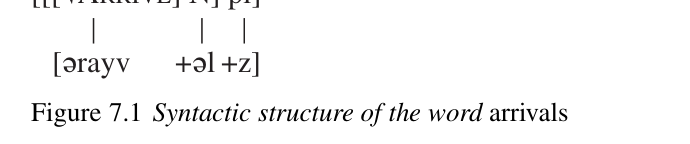

# Chapter 7: Morphology

<!-- pdf-page: 168; source-page: 152 -->

Traditional historical linguists have amassed a large body of facts about specific morphological changes in particular languages, yet there is very little literature on the subject that takes modern advances in theory into consideration. This chapter will briefly describe some aspects of a recent approach to morphology, Distributed Morphology (DM), in the generative tradition. In the following chapter we will use those concepts to analyze well-attested types of morphological change.

<b>Morphological theory and morphological change</b>

When it became clear in the 1870s that sound change is normally regular in phonological terms, historical linguists undertook to separate regular sound changes from other types of change in the forms of words. The latter were classed together as “analogy,” defined as the influence of forms on other forms. It became generally accepted that analogical change typically operates in terms of proportions between sets of forms. For instance, the replacement of English <i>besought</i> by<i> beseeched</i> (attested as an alternative at least since John Milton) can be explained by the following analogical proportion, given that the past tense of <i>preach</i> is<i> preached</i>:

<i>preach</i> :<i> preached</i> : :<i> beseech</i> : X; X =<i> beseeched</i>. (1)

But this approach was always empirically inadequate, because a substantial minority of morphological changes cannot be explained convincingly by proportions. For instance, the replacement of<i> digged</i> by<i> dug</i> (first as a past participle in the sixteenth century, then also as a finite past tense in the eighteenth), or of <i>sticked</i> by<i> stuck</i> (first in the sixteenth century), might conceivably be explained by proportional analogy with verbs like<i> sting</i> :<i> stung</i>, in spite of the fact that all the older examples have roots ending in nasals, and<i> struck</i> (seventeenth century) might originally have been the past participle of northern English<i> strick</i>, only later accepted into the paradigm of standard<i> strike</i> (cf. Seebold 1966: 18 with n. 49). But no proportion can be constructed to explain past tenses like<i> hung</i> (first in the sixteenth century) and<i> snuck</i> (nineteenth century, North American), because their roots<i> hang</i> and<i> sneak</i> do not contain the vowel /ɪ/. Conversely, it is not difficult to construct proportions that give utterly implausible results. For

<!-- pdf-page: 169; source-page: 153 -->

instance, the plural of<i> moose</i> (borrowed into English from Eastern Abnaki, an Algonkian language) is usually<i> moose</i>, apparently on the model of native <i>deer</i> :<i> deer</i>. A proportion<i> goose</i> :<i> geese</i> : :<i> moose</i> : X is just as acceptable formally, yet the result “<i>meese</i>” is a joke. Attempts to constrain this theory have been disappointing. Jerzy Kuryłowicz’s celebrated “laws” of analogy (Kuryłowicz 1949) are far from exceptionless; Witold Ma´nczak’s work on analogical tendencies (Ma´nczak 1958) provides plenty of good information on what is likely to happen but amounts to no more than a set of statistical observations.

Since 1960 further reasons to doubt the traditional approach to morphological change have accumulated. Many “analogical” changes can be shown to be phonological (see the preceding chapter). Others are fundamentally syntactic; for instance, the process by which the functions of the inherited dative, locative, and ablative cases were assigned to a single case (called the dative) in Proto-Germanic was a reduction in the number of morphosyntactic categories, not just a change in morphology. There are also purely morphological changes; for instance, in Old English (OE) a single ending came to be used for the nominative plural and accusative plural in each class of nominals (except the first- and second-person pronouns), a single set of forms came to be used for all three genders in the plural of pronouns and determiners, and the 3pl. form came to be used for all three persons in the plural of finite verb paradigms. But the morphosyntactic categories did not change, and for the most part these “syncretisms” cannot be explained as the result of sound changes; therefore they must have been purely morphological changes. A theory of linguistic change which does not distinguish between these different types of change cannot be correct. But the most serious shortcoming of the traditional approach is that it does not take native language acquisition (NLA) into account. It has long been clear that children acquire their native language(s) by constructing systems of rules. Since most changes in linguistic structure must begin as native-learner errors, a model of morphological change must be based on the systems of rules that native learners construct. Recently Charles Yang has investigated how well models based on surface analogy and on rules account for the actual performance of children in learning English irregular verbs (Yang 2002: 59–100). His rule-based model accounts for the pattern of the children’s errors much better than a surface analogy model.

Confronting actual studies of acquisition with data from the historical record leads almost immediately to interesting questions; here is an example. Reported morphological acquisition errors are mostly of two types: failure to express a morphosyntactic category that is obligatorily expressed in the target language, and overuse of default or other productive patterns of inflection. Use of forms which are incorrect in other ways appears to be rare. For instance, Xu and Pinker report that among 20,000 English past tense forms used by nine children drawn from several databases only 0.2 percent – one in every 500 – was an<i> incorrect</i> <i>irregular</i> form like<i> brung</i> (Xu and Pinker 1995: 531). This is not an isolated finding; studies of the acquisition of German and Italian yield similar results (Yang 2002: 69 with n. 7 and references). Yet the written record of English is

<!-- pdf-page: 170; source-page: 154 -->

littered with innovative irregular verb forms. Regular verbs that have become irregular within the attested history of English include at least<i> catch</i>,<i> dig</i>,<i> dream</i>, <i>kneel</i>,<i> ring</i>,<i> stick</i>,<i> string</i>,<i> strive</i>,<i> wear</i>, and in the USA<i> dive</i> (see the<i> OED</i> s.vv.; there are also several more involved examples). And those are only the innovative irregularities that have become part of the standard dialect; a full list of attested forms would be much longer. Some such forms have almost certainly arisen repeatedly. For instance, a past participle<i> brungen</i> occurs half a dozen times in OE poetry, and a corresponding<i> brung</i> occurs in traditional Appalachian ballads (as sung by Jean Ritchie), but there does not seem to be a continuous historical link between the two; such a past participle must somehow be a natural and repeatable error.

It will be easier to account for unexpected morphological innovations if we take several facts into account. First of all, it is not accurate to describe all the “weird past tense forms” of Xu and Pinker 1995 as irregular. A large proportion of non-default English past tense forms are formed by lexically restricted rules (Yang 2002: 59–100), and a large proportion of Xu and Pinker’s unexpected forms use just two of those rules, namely replacement of the the root syllable coda /-ɪŋ/ with /-æŋ/ and replacement of the root vowel /ɪ/ with /ʌ/ (Xu and Pinker 1995: 540–3). Genuine irregularization may be very rare, but the incorrect generalization of minor rules might not be.

Moreover, it is possible that studies of native acquisition errors are not counting events of the relevant kind. In order to become a historical change a native-learner error must persist beyond the window for NLA. What matters, then, is not how often children in general produce incorrect irregular past tenses, but<i> how many</i> <i>children</i> persist in using<i> even one</i> such form into middle childhood. Xu and Pinker did ask whether there are children who systematically irregularize, but found that “[t]he CHILDES transcripts simply do not contain enough samples from any child to rule out systematic irregularizations of particular verbs at particular ages by particular children” (Xu and Pinker 1995: 544). It might also be observed that a sample of nine children, or even several dozen children, is utterly inadequate: if even one in a thousand children produces such an innovative irregularity consistently, what we see in the historical record would not be surprising, and if one in a hundred does so we might well wonder why we do not find more forms of this type. In short, we might need much more data, and the sample might need to be constructed very differently.

The above is a very “quick and dirty” discussion of a straightforward problem in reconciling data from the historical record and data from NLA, yet it shows clearly that further study along the same lines is very likely to yield progress in solving old puzzles. Since progress can only be made within a coherent theory of morphology, we next need to ask what a theory of morphology needs to account for. (At this point readers who are familiar with only morphology-poor languages such as Modern English would do well to read the first two chapters of Spencer 1991, which present basic morphological concepts in a pretheoretical way.)

<!-- pdf-page: 171; source-page: 155 -->

<b>Morphological patterns</b>

We here offer a brief discussion of several basic ideas that became influential in generative thinking about morphology, some of which have been adopted by DM while others have been rejected.

Chomsky 1970 pointed out that there is a pervasive constellation of differences between English deverbal nouns like<i> destruction</i> and gerunds like<i> destroy-</i> <i>ing</i>, both in their syntactic behavior and in the way that they are formed; what is most relevant to morphology is that gerunds are formed by a single fully productive rule, while the formation of deverbal nouns is lexically idiosyncratic. It seemed to follow that while the formation of gerunds could be handled by the syntax, a different set of rules is needed for derivational morphology, and those rules ought to be located in the lexicon, where all the idiosyncrasies of the grammar are housed. The necessary enrichment of the lexicon (which obviously was not just a list) was explored in Jackendoff 1975 and Aronoff 1976; Paul Kiparsky evolved a theory, lexical phonology, in which morphological and phonological rules alternated in a cycle within the lexicon (Kiparsky 1982b).

The place of inflectional morphology in native-speaker grammars seemed less clear. Halle 1973 placed it too within the lexicon. But because inflection is, in effect, morphology which is relevant to the rules of syntax, locating it in the lexicon entails allowing complex interactions between syntactic rules and the lexicon. Obvious alternatives are to make inflection (or at least regular inflection) part of the syntax itself (see Spencer 1991: 205–8 with references) or to locate it among the rules of the phonology (see especially Anderson 1982). A range of variations on both approaches is discussed in Spencer 1991. Recognizing a separate component of the grammar to house inflection seems to have been resisted by appeal to Occam’s Razor (cf. Aronoff 1994: 165). Disagreements about the nature of inflection entailed disagreements about the theoretical status of inflectional paradigms. But regardless of one’s position on that question, it is possible to state a number of constraints on paradigms that hold up reasonably well cross-linguistically. That line of research was pursued especially by Andrew Carstairs-McCarthy; Carstairs 1987 is a full presentation of his arguments and conclusions. If paradigms are not a feature of grammars, some other explanation for the generalizations that can be made about them must be found.

A different set of questions bears on the relationship between form and meaning. Mark Aronoff pointed out that there are formal units that must be recognized as morphemes but have no definable meanings (Aronoff 1976: 11–15). An example is English /-si:v/ (or /-sijv/)<i> -ceive</i>, which must be a unit because it has an idiosyncratic allomorph /-sɛp-/<i> -cep-</i> that appears before obstruents; some examples of compounds of this morpheme are given in (2):

<!-- pdf-page: 172; source-page: 156 -->

(2)

a. conceive : conception, concept

b. deceive : deception, deceptive

c. perceive : perception, perceptive, percept

d. receive : reception, receptive, receptacle

(Note also<i> precept</i> and<i> contraception</i>.) But<i> -ceive</i> has no definable meaning; only its compounds have meanings, and there is no semantic common denominator between them. In inflectional paradigms we even encounter morphemes which are completely empty semantically. A standard example is the Navajo morpheme <i>yi-</i> which is prefixed to verbs if and only if there is no other vowel in the prefix complex to the right of the disjunct boundary (Kari 1976: 36–45, 104–14 with references); this “peg prefix” has a phonological function rather than a meaning. In so familiar a language as Latin we find a more complex example. Aronoff 1994: 34–9 argues persuasively that the “third stem” of a Latin verb – the fourth “principal part” – is a semantically empty stem to which a very diverse set of forms is constructed, and he points out that cases of this kind are good evidence for an autonomous module of morphology, not reducible to phonology and syntax.

Conversely, just as there are “pieces” of words with no meaning or function, so there are meanings and functions which are expressed not by any piece, but by a process. Familiar examples are English<i> men</i>,<i> women</i>,<i> feet</i>,<i> teeth</i>,<i> geese</i>,<i> mice</i>, <i>lice</i> and the large class of German plurals exemplified by<i> V¨ater</i>,<i> M¨utter</i>,<i> Br¨uder</i>, <i>T¨ochter</i>, in which plurality is indicated by changing the vowel of the root (in German by means of a pervasive phonological rule; see the preceding chapter). Almost every conceivable analysis of this last phenomenon has been proposed in the generative tradition at one time or another.

Finally, some account must be taken of the internal structure of words. There is a long line of work in the generative tradition on the constituent structure of derivationally complex words (see Spencer 1991: 183–90, 197–205 with references). A solid result of this line of research is that derivational morphology is hierarchical and can be represented by trees that share many of the properties of syntactic trees. Most strikingly, it is clear that one component of each derived word is the word’s “head,” which determines the lexical class of the word and interacts with the rules of syntax, including inflection; the head is normally the last category-changing affix that is added in derivation (Williams 1981, Spencer 1991: 184–7). For instance, the head of the verb<i> withstand</i> is the basic verb<i> stand</i>; the prefix<i> with-</i> does not change the lexical class of the lexeme, so that the structure of the word is [with+stand]V (i.e., it is compounded, not derived) and the past tense is<i> withstood</i>. However, because the verb<i> grandstand</i> is derived from the noun<i> grandstand</i> by zero affixation, the structure of this verb is [[grand+stand]N/0]V; the head is the zero affix, which triggers default past tense morphology, and as a result the past is<i> grandstanded</i> (see Spencer 1991: 184– 6). There are obvious similarities between these structures and syntactic phrase structure trees, and the link between the heads of words and the heads of X-bar

<!-- pdf-page: 173; source-page: 157 -->

phrases naturally awakens the suspicion that derivational morphology is in fact word-internal syntax.

The proposal that word formation might literally be syntax receives strong support from Mark Baker’s spectacular work on lexical incorporation (Baker 1988a). Baker argues persuasively that productively derived causatives, applicatives, antipassives, and possessor ascension constructions result from the incorporation into a verb of lexical heads which the verb dominates; he even suggests such an analysis for passives. Most importantly, Baker proposes the “Mirror Principle,” which states that the order of morphological affixation is identical to the order of syntactic operations because the affixes are the result of the syntactic operations (Baker 1985, 1988a: 12–15, 22–3). Though counterexamples to the Mirror Principle can be found, it is supported by a large majority of examples from a wide range of languages. Baker’s work makes sense of so much morphological structure as word-internal syntax that the hypothesis that all piecebased morphology is syntax becomes worth serious exploration. It appears that many of the inferences drawn from Chomsky 1970 were premature (see Siddiqi 2009: 10–13 with references).

A theory of morphology that accommodates all these facts and conclusions must analyze most morphology as syntax, yet recognize an autonomous module of morphology for those phenomena that cannot be syntactic; it must also give an account of morphological processes as well as pieces and must deal with a number of issues not raised above, such as the place of defaults in morphological systems and the existence of rigid “templates” in some inflectional systems (e.g. Semitic imperfective verbs, see Noyer 1997: 3–57). Above all, it must be a theory of the architecture of natural-language grammars, since syntax, phonology, autonomous morphology, and the lexicon are all involved. In our estimation the most promising approach that does all these things is Distributed Morphology.

<b>Some useful aspects of Distributed Morphology</b>

No book-length introduction to DM has yet appeared. Short introductions to the theory are Harley and Noyer 1999, Embick and Noyer 2007, Rolf Noyer’s web page “Distributed Morphology” (www.ling.upenn.edu/ ∼rnoyer/dm), and Siddiqi 2009: 7–26. Book-length discussions of particular issues in DM are Noyer 1997 and Siddiqi 2009. We do not here present a full description of the theory, for which the reader should consult the references given; instead we outline specific claims and analyses of DM which we find useful in explicating morphological change.

DM adopts the hypothesis that structure within words is hierarchical in the same way that sentential structure is, and that all hierarchical structures are generated by the syntax. Moreover, all syntactic structure, including morphosyntactic categories, is held to be autonomous and abstract. No syntactic structure

<!-- pdf-page: 174; source-page: 158 -->

is projected from lexemes, and no phonologically relevant material (such as the shapes of inflectional markers) is present in syntactic trees as generated; all such material is inserted after the tree is in place. This makes intuitive sense for a reason that every experienced linguist is aware of. Like the argument structures and case frames of (sentential) syntax, the structures of words are not idiosyncratic to the same degree that unanalyzable roots are idiosyncratic; in each language there is a fairly small number of fixed patterns into which compounds and derived lexemes fit, and affixes expressing comparable morphosyntactic categories are usually found in the same positions in the inflected word. If syntactic structure, external or internal, were projected from lexemes, we might expect a much greater variety of structures, given the highly idiosyncratic meanings of lexical material. Of course the word-internal structures and the word-external structures are often different in detail, but generating them with the same “machinery” is still the most economical approach.

This necessitates a substantial shift in the way we think about morphology. Most obviously, DM gives a complex answer to the thorny question, “What is a word?” Words have no theoretical status in DM; word boundaries are consequences of superficial morphological and phonological constraints which can differ substantially from language to language, and mismatches between hierarchical structure and word boundaries are not surprising. Anyone whose linguistic experience extends beyond a single family of languages or a single area of the world should find this realistic. Moreover, changes in exactly where the boundaries of words fall – such as the univerbation of postpositions with nouns, or the cutting loose of an inflectional marker as a clitic – are not exceptional phenomena requiring special explanations. We will return to these points in the following chapter.

DM modularizes the lexicon, much as the rules of the grammar fall into separate modules with different properties. Meaningful units, called “idioms,” are listed in an Encyclopedia; they can be roots, affixes, free-standing phonological words, or groups of words in construction with one another (i.e. idioms in the pretheoretical sense). By contrast, information about which phonological pieces can be inserted at which syntactic terminal nodes is given in a separate list, the Vocabulary. Some terminal nodes are marked with morphosyntactic categories, or bundles of such categories; for instance, the trees corresponding to the English words <i>dogs</i> and<i> feet</i> include a rightmost node marked [pl]. Other nodes, called root nodes, are filled with what are usually called members of the major word classes (verbs, nouns, adjectives). In the latter case the insertion of any of a large number of phonological strings will yield a grammatical utterance, but in the former case there is typically only one that will do. Morphemes for which there is no choice of what to insert are called “f-morphemes” (“functional morphemes”); those for which there is a choice are “l-morphemes” (“lexical morphemes”). They roughly correspond respectively to the grammatical markers and lexemes of other analyses. The Vocabulary is a list of all the phonological strings that can be inserted at syntactic terminal nodes, each string paired with a specification of

<!-- pdf-page: 175; source-page: 159 -->

[[[√ARRIVE] N] pl]

[ərayv

+əl +z]

the information that must be present at the syntactic terminal node at which it is inserted. For instance, the /-z/ of<i> dogs</i> is paired with the morphosyntactic feature [pl] which must be present at the node at which it is inserted, and that pairing is a Vocabulary item. Thus the Vocabulary encodes the sound-to-morphosyntax matchings of the language, and the Encyclopedia encodes the sound-to-meaning matchings of individual meaningful elements. Mismatches between sound units and morphosyntactic or semantic units are not exceptional, or even uncommon: consider the cross-linguistic prevalence of polysemy and of multiword idioms, and the notorious quirkiness in the meanings of derived words (emphasized by Jackendoff 1975). Presumably they are not even more common than they are because the system as a whole must be learnable.

The controversial distinction between inflection and derivation is not recognized as such by DM. It is a practically useful distinction in a large number of cases, but intermediate cases (such as participles and gerunds, especially in languages with rich nominal inflection) are so common that DM is surely right to abandon any attempt to draw a line between the two.

At the point of Vocabulary insertion a word thus has a double structure: a tree dominating terminal nodes with morphosyntactic information at each, and a string of phonological forms which are inserted at the nodes. Representing the tree by bracketing, the noun-deriving suffix by N, and the root by √we can represent the structure of English<i> arrivals</i> as in Figure 7.1. Whereas the syntactic structure is hierarchical – in other words, it’s a tree – the phonological structure is a one-dimensional ordered string at this point in the derivation. Phonological rules, some of them sensitive to the status of particular pieces of the string, can impose a hierarchical structure on the phonological representation, but any such structure is<i> not</i> simply read off the syntax. This analysis gives a maximally general and optimal account of the mismatches between syntactic constituent structure and phonological constituent structure noted by Williams 1981 and many others.

Two questions immediately arise. In cases where there is more than one Vocabulary item that is paired with the same morphosyntactic feature, how does the grammar determine which one is inserted? And how does the theory handle instances in which there is no one-to-one matching between morphosyntactic features and phonological strings? To both questions DM gives interesting answers that are relevant to morphological change. The most extensive and detailed discussion of these questions is still Noyer 1997, on which the following exposition is largely based. As usual, we will concentrate only on those findings of Noyer’s that are likely to be most useful in accounting for morphological changes.

<!-- pdf-page: 176; source-page: 160 -->

What happens in the morphological module of the grammar will be easiest to understand if we follow a hypothetical derivation from the output of syntax to the underlying phonological representation. In the default case Vocabulary insertion occurs at once, with one Vocabulary item inserted at each syntactic terminal node, but in more complex cases several quite different things can happen before Vocabulary insertion occurs. First, morphosyntactic features which are not present in the output of syntax can be added to nodes by a variety of operations that read the syntactic tree; these are called “dissociated morphemes” (Embick 1997: 7–8, 26–61). Depending in part on one’s model of syntax, these include concord or agreement markers, case features, and [passive], among others. Secondly, adjacent nodes can fuse into a single node which then bears all the morphosyntactic features of the fused nodes; familiar examples are the fused (gender-)numberand-case endings of nominals in conservative Indo-European languages. Thirdly, the addition of “empty” nodes can be required by morphological well-formedness conditions; these are often called “thematic” affixes, generalizing a traditional term of Indo-European philology. For instance, all but a tiny handful of Latin verbs have present stems that end in a functionless vowel which is often absent from the perfect stem:<i> -ā-</i> for the first conjugation,<i> -ē-</i> for the second,<i> -ī-</i> for the fourth, short<i> -i-</i> for the (fewer than twenty) third-conjugation verbs with citation forms in<i> -īo</i> or (deponent)<i> -ior</i>, and some other short vowel, possibly underspecified, for the remaining third-conjugation verbs (Aronoff 1994: 48–53 suggests /-e-/, while Embick and Halle 2003 opt for /-ɨ-/). It is reasonable to infer from that distributional fact that regular Latin present stems require the addition of an f-morpheme as a sister to the Root (or the Root plus any other present-stemforming affix, such as the nasal infix or the suffix<i> -ess-</i>), and that the “theme vowels” are inserted at that node. It is also possible for the morphology to specify that a particular type of morphological word must have a fixed number of affixes in specified positions relative to the Root – in effect, a template – as in the Classical Arabic imperfective (Noyer 1997: 3–57). Finally, feature impoverishment can occur before Vocabulary insertion. How those two processes interact is best explained in the light of an example; we choose the Ancient Greek mediopassive verb endings to illustrate.

Ancient Greek verb endings are fused suffixes that mark the person and number of the subject. There are two complete sets, traditionally called “primary” and “secondary.” The latter occur in the past tenses of the indicative (imperfect, aorist, and pluperfect) and in the optative mood; the primary tenses occur in nonpast indicative tenses and the subjunctive mood. There is also a set for the imperative mood which lacks first-person members, since the syntax does not generate first-person imperatives. Since the range of nonpast tenses is widest, we accept the hypothesis (implied by the traditional terminology) that the primary endings are the default endings.₁ Neither primary nor secondary endings directly express tense or mood; past tenses and the subjunctive and optative moods are clearly marked by other means, and the nonpast tense made from each stem is the default category. Thus the most economical analysis is that the secondary

<!-- pdf-page: 177; source-page: 161 -->

Table 7.1<i> Attic Greek mediopassive verb endings</i>

Primary

Secondary

Imperative

-

-mɛ:n

-!

sg.

1

-mai

—

-()

-()

-()

2

-(s)ai

-(s)o

-(s)o

-

-

-stʰɔ:

-

3

-tai

-to

-metʰa

-

-metʰa

-

du.

1

—

-stʰon

-

-stʰon

-

-stʰon

-

2

-stʰon

-

-stʰɛ:n

-!

-stʰɔ:n

-

3

-metʰa

-

-metʰa

-

pl.

1

—

-stʰe

-

-stʰe

-

-stʰe

-

2

-

-

-stʰɔ:n

-

3

-ntai

-nto

endings are inserted in the context of other markers. Whether the imperative endings directly express mood is not so clear. Since several are shared with other sets of endings, we adopt the hypothesis that they too are inserted in the context of an imperative marker, which occupies the position of the other mood suffixes but is zero.

The sets of mediopassive endings in the Attic dialect of<i> c.</i> 400 BCE are given in Table 7.1. (The presence or absence of /s/ in the 2sg. endings is a phonological complication which has nothing to do with the morphological processes at issue here.) It can be seen that there are a number of syncretisms – that is, instances in which different bundles of morphosyntactic features are expressed by the same ending – in this table. The question is how to account for them. DM does so in the context of a universally unmarked hierarchy of features, in which person is ranked higher than number, which in turn is ranked higher than gender and other features (Noyer 1997: lxxv; the hierarchy is not absolutely universal, but deviations from it on the part of particular languages are held to be marked). Also relevant to the analysis is the hypothesis that duals are special, marked types of plurals, with a feature complex [du pl], so that when no Vocabulary item marking the dual is available the grammar defaults to the unmarked plural (Noyer 1997: lxxv). This latter hypothesis is strongly supported by the Indo-European facts; in every ancient or medieval Indo-European language which has dual verb endings for only some person(s) and/or marks duals more widely on nominals than verbs or vice versa – namely, in Ancient Greek, Germanic, Old Irish, and Tocharian – one always defaults to the corresponding plural marker in the absence of a suitable dual. The same phenomenon appears in Classical Arabic (Noyer 1997: lxviii).

One syncretism in the table of endings above involves the nonsingular first person: dual is not distinguished from plural, and that is a general fact about Greek verb inflection. This fact can be accounted for by means of an impoverishment filter, informally stated as

*[1 du] / T,

<!-- pdf-page: 178; source-page: 162 -->

which prohibits feature bundles including first person and dual in finite verbs (i.e. in the presence of Tense; a more formal statement would specify that the filter applies when the finite verb has been Merged with Tense). The filter obviously applies after the fusion of terminal nodes, and it applies only to verb forms, since there are 1du. pronouns in Ancient Greek. The filter merely states that one of the relevant features must be changed, but since duals are marked [du pl], the redundant feature [du] is dropped, causing a default to plural. A similar solution might be proposed for the nonsingular third-person imperative endings, but in that case there is a further complication. Third-person finite verb forms are normally considered to be unmarked for person, since they exhibit default agreement (i.e. they agree with any subject NP that doesn’t include the speaker or the addressee). However, it seems clear that the second person is the default for imperatives, and that other persons must be marked. Therefore we can propose an impoverishment filter

*[3 du] / [imperative],

which will lead to the 3pl. ending being used for the 3du. as well. However, we will see below that a third-person feature may also be needed to handle the pattern of syncretism in primary and secondary endings.

The remaining syncretisms can be handled by a system of defaults. Vocabulary insertion obeys the “subset principle” (Halle 1997 – essentially the “elsewhere condition,” first employed by Pān.ini) as follows. A Vocabulary item must match all or a subset of the morphosyntactic features present at the terminal node at which it is inserted; if more than one Vocabulary item meets that description, the one that matches the greatest number of features must be chosen. (If a Vocabulary item is specified for any feature not present at the terminal node, it cannot be inserted at that node.) If the subset relation does not obtain between the features of two Vocabulary items, the one referring to the feature higher on the hierarchy is inserted first (Noyer 1997: 44–5). Bearing these principles in mind, the Vocabulary items of Table 7.1 might be ordered for insertion as listed below, with first person taking precedence over second, second over third (but see further below), and defaults last (thus plural after dual; see Noyer 1997: 42, 54).

-metʰa

1 pl

-mɛ:n

1 / secondary

-mai

1 -stʰe

2 pl

-(s)o

2 / secondary, imperative (see further below)

-(s)ai

2 -stʰɛ:n

3 du / secondary

-stʰɔ:n

3 pl / imperative

-nto

3 pl / secondary

-ntai

3 pl

<!-- pdf-page: 179; source-page: 163 -->

-stʰɔ:

3 / imperative

-to

3 / secondary

-tai

3 -stʰon

du

This will work, but the details are problematic in two ways. First, the ending<i> -(s)o</i> is to be inserted under two disjunct conditions (in categories for which secondary endings are appropriate and in imperatives); a more parsimonious analysis would make it the default ending. Since imperative endings seem unlikely to be default endings, that would entail making the secondary endings default endings. There is no doubt that at some earlier stage of the language they were exactly that, but the architecture of the Ancient Greek verb system suggests strongly that the primary endings have become default endings instead.₂ We might therefore ascribe the disjunction in the Vocabulary item<i> -(s)o</i> to its survival from an earlier organization of the system in which it made more sense. Much more worrisome is the fact that a feature “3” must be recognized not only in imperatives (see above) but in the other sets of person-and-number endings. This is necessary in order to specify (by the subset principle) that secondary 3du.<i> -sth</i><i>ɛ</i><i>:n</i> is an exception to the generalization that dual forms are marked by the default ending <i>-sthon;</i> that<i> -sthon</i> is a default ending is in turn suggested by the fact that it marks all second-person duals and the 3du. in categories that take primary endings. If we abandon the latter hypothesis, we will no longer need to mark<i> -sth</i><i>ɛ</i><i>:n</i> as an exception, and it will follow that we no longer need to recognize the third-person feature for non-imperative finite verbs. Our ordered list will then be:

-metʰa

1 pl

-mɛ:n

1 / secondary

-mai

1 -stʰon

2 du

-stʰe

2 pl

-(s)o

2 / secondary, imperative (see above)

-(s)ai

2 -stʰɔ:n

3 pl / imperative

-stʰɔ:

3 / imperative

-stʰɛ:n

du / secondary -stʰon

du -nto

pl / secondary -ntai

pl

<i>elsewhere</i> / secondary -to

<i>elsewhere</i> -tai

The last two endings (the 3sg. endings) are defaults in this analysis,<i> -to</i> being inserted when the relevant terminal node contains no features in the “secondary” context and<i> -tai</i> being inserted elsewhere. This accords better with the usual status

<!-- pdf-page: 180; source-page: 164 -->

of third-person verb forms cross-linguistically, but at the expense of recognizing two homonymous Vocabulary items which (suspiciously) just happen to be second-person dual and default dual.

We have presented these alternative analyses to make a point. As Indo-Europeanists have long suspected, there is no optimal analysis of the Ancient Greek person-and-number endings, nor of the similar systems to be found in other archaic Indo-European languages; not all the details “make sense,” and a modern analysis does not make much better sense of them. It does, however, suggest a reason why they might be vulnerable to change: different native learners are likely to have arrived at different grammars on the basis of the surface input data. Whether the specific alternative analyses that DM makes available lead to enlightening explanations of attested changes remains to be seen, but it is at least clear that any less precise analysis will be unable to make more than general suggestions about the reasons for particular changes.

The discussion of DM up to this point has focused on morphological “pieces”; we need to describe briefly how the theory handles “process morphology.” Since morphosyntactic features are generated at synctactic terminal nodes, it is not possible for [pl], for example, to be paired directly with the vowel change of English <i>feet</i>; instead there must be a zero affix (as in<i> sheep</i>,<i> deer</i>, etc.) accompanied by the vowel change. Processes like the latter are effected by “readjustment rules.” Noyer 1997: liii–lxii explores this hypothesis, suggests how it can be tested, and deals with some apparent counterexamples. (Note that this is fully compatible with experimental evidence bearing on how speakers of English learn and access irregular past tenses; see e.g. Yang 2002: 59–100, Stockall and Marantz 2006, both with references.)

How to handle suppletion in DM is an unresolved question. The suggestion that only f-morphemes can exhibit suppletion seems difficult to reconcile with the facts; for instance, it seems impossible that the suppletive verbs of Old Irish, which number at least fourteen, are all f-morphemes.₃ We will explore suppletion in the next chapter.

Finally, we should note that DM does not recognize paradigms as part of the grammar. To some extent they are an automatic consequence of the organization of morphology and to some extent they appear to result from constraints on learnability, as a brief review of the most important findings of Carstairs 1987 will show. The fact that paradigms can be constructed at all is a straightforward consequence of the fact that each root-morpheme can be in close construction with only a limited number of f-morphemes, so that the possible combinations can all be listed. The fact that each root selects only one of the possible exponents of a given morphosyntactic feature or feature bundle (Carstairs 1987: 31) is a straightforward consequence of the subset principle. Carstairs’ “paradigm economy principle,” according to which the number of paradigmatically distinct lexical classes is always at or close to the minimum made possible by the number of alternative inflectional endings (ibid. pp. 47–52), is of a quite different nature. The fact that Carstairs found it necessary to revise the principle several times,

<!-- pdf-page: 181; source-page: 165 -->

allowing for infractions of specific kinds (ibid. pp. 56–83), strongly suggests that it is not a consequence of any formal mechanism of grammar. However, it is clear that an inflectional system which complies with the paradigm economy principle is easier to learn, and it is therefore reasonable to hypothesize that the principle is somehow a consequence of native language acquisition. The most puzzling of Carstairs’ findings is the fact that a large majority of paradigms appear to obey the “peripherality constraint” (ibid. p. 193), according to which allomorphy is normally sensitive only to morphosyntactic features marked closer to the root – again, with some exceptions. As Carstairs notes (ibid. pp. 201–3), this does not follow from Baker’s “Mirror Principle,” though there seems to be some connection between the two. More study of these last points, especially by specialists in language acquisition, is needed; but it seems clear that none of them requires us to recognize paradigms as a part of native-speaker grammars.

In the following chapter we will examine a number of well-attested types of morphological change and attempt to analyze them in terms of the concepts of DM. Readers should be warned that for some types of change (such as the origin of lexical classes) simple examples are not to be found; we will do our best to offer as much information as may be needed to understand the changes under discussion, and that will sometimes be a large amount of information. This is unavoidable. Those who wish to study morphological change must get used to dealing with large and complex inflectional systems.

<b>Notes</b>

1 The pattern of category expressions which we exemplify by the Greek mediopassive endings

recurs in the active endings, but they exhibit much more conditioned allomorphy; thus the

mediopassive endings provide a simpler illustration. For simplicity we gloss over the fact

that these endings appear both in middle paradigms and in (most) passive paradigms;

that might also have to be accounted for by impoverishment, but until the nature of the

middle voice is better understood we prefer to reserve judgment. We treat each ending

as an indivisible unit in our analysis. It would also be possible to try to divide them into

smaller pieces to which individual morphosyntactic features might be assigned. However,

the resulting system would be full of complex irregularities; even the order of the markers

for voice and person/number would vary from ending to ending. For the sake of exposition

we prefer to use the simpler unitary analysis, though we recognize that splitting the endings

up might ultimately be correct and should be explored.

2 The strongest evidence that the Ancient Greek primary endings are the default endings

comes from the active voice of the optative mood of thematic and sigmatic stems. The

inherited 1sg. forms ended in - /-oia/ and *- */-saia/ (the former is actually attested

in Arkadian 
+
. /ekselaunoia/ ‘I would drive out’); but in nearly all the dialects for

which relevant forms are attested, 1sg. - /-a/ has been replaced by - /-mi/, so that the

attested forms end in - /-oimi/ and - /-saimi/. The optative is a category which

selects secondary endings (see the text above), but - /-mi/ is an inherited primary ending;

its spread to a secondary category shows that primary endings had become the default set

of endings by the time the change occurred.

3 Old Irish verbs that are unarguably suppletive include the following (cited in the present

indicative 3sg., as there is no infinitive): the copula<i> is</i> and the substantive verb<i> atá</i>, both ‘is’

(but used in different syntactic contexts);<i> ad</i><i>·</i><i>cí</i> ‘sees’,<i> agid</i> ‘drives’,<i> at</i><i>·</i><i>b</i><i>̇</i><i>aill</i> ‘dies’,<i> berid</i>

‘carries’,<i> do</i><i>·</i><i>beir</i> ‘gives’,<i> do</i><i>·</i><i>beir</i> ‘brings’ (the two verbs<i> do</i><i>·</i><i>beir</i> have different perfective

<!-- pdf-page: 182; source-page: 166 -->

paradigms, both suppletive),<i> do</i><i>·</i><i>tét</i> ‘comes’,<i> do</i><i>·</i><i>tuit</i> ‘falls’,<i> fo</i><i>·</i><i>ceird</i> ‘puts’,<i> fo</i><i>·</i><i>gaib</i> ‘finds’, <i>ibid</i> ‘drinks’, and<i> téit</i> ‘goes’; verbs which are suppletive under at least some analyses include<i> ad</i><i>·</i><i>cota</i> ‘obtains’,<i> bronnaid</i> ‘injures, damages’,<i> con</i><i>·</i><i>oí</i> ‘protects’,<i> do</i><i>·</i><i>bidci</i> ‘shoots, casts, hurls’,<i> gataid</i> ‘steals’,<i> ithid</i> ‘eats’,<i> tinaid</i> ‘melts’, and<i> tongid</i> ‘swears’. See Veselinovi´c

2003 for extensive discussion. Some other Indo-European languages also exhibit significant

amounts of suppletion; for instance, Ancient Greek and the Tocharian languages each have at least nine or ten suppletive verbs.
