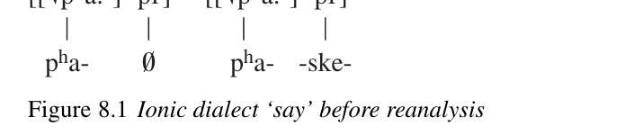
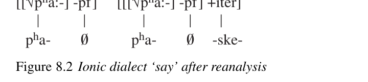
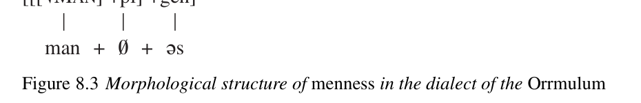

# Chapter 8: Morphological change

<!-- pdf-page: 183; source-page: 167 -->

Since the study of morphological change in a Distributed Morphology (DM) framework has hardly begun, we do not attempt to construct an overarching framework for this chapter; instead we treat topics of interest one by one, demonstrating how the machinery of DM helps explain morphological changes of different types.

<b>Resegmentation and reinterpretation of terminal nodes</b>

Reinterpretation of the feature content of word-internal syntactic terminal nodes by native learners is a universal type of change. English provides some straightforward examples. Modern English<i> -dom</i>,<i> -hood</i>,<i> -ship</i> are destressed forms of Old English (OE)<i> dōm</i> ‘judgment, rule, power’,<i> hād</i> ‘person, rank, station (in life)’,<i> scipe</i> ‘state, condition’ (the first surviving also as the noun<i> doom</i>). The shift from major lexeme to suffix did not happen directly. The following stages of development can be distinguished (see Meid 1967: 218–21).

Fully transparent compounds were formed; at this stage OE<i> wīsdōm</i>, (a)

for instance, still meant ‘wise judgment’ or ‘discretion’,<i> cynedōm</i>

‘royal authority’, and so on.¹ (b)

Learners reinterpreted the meanings of the compounds; thus they

acquired idiosyncratic meanings (Encyclopedia entries, in DM ter-

minology), in these cases ‘learning, knowledge, wisdom’ and ‘area

subject to royal authority, kingdom’ respectively. (c)

On the basis of the shifted meanings of the compounds, later gener-

ations of learners increasingly reinterpreted the second element as a

noun-forming suffix; eventually some began to use it productively, in

this case yielding, e.g.,<i> boredom, martyrdom</i>, and<i> officialdom</i>, among

other innovative forms (see the<i> OED</i> s.v.<i> -dom</i>). Stage (c) is almost inevitable if the lexemes which gave rise to the suffixes cease to be used as independent words or undergo substantial shifts in meaning, but that does not seem to be a necessary precondition for reanalysis. For instance, the adjective-forming suffix English -<i>ly</i>, German<i> -lich</i> reflects OE<i> līċ</i>, OHG<i> līh</i>, both ‘body’, and the oldest examples of such adjectives were compounds meaning

<!-- pdf-page: 184; source-page: 168 -->

‘shaped like X’ or ‘looking like X’, where X represents the first member of the compound (Meid 1967: 226–7); but whereas the independent English word has largely been lost (see the<i> OED</i> s.v.<i> lich</i>), the corresponding German word survives with only modestly restricted meaning as<i> Leiche</i> ‘corpse’ (see Kluge 1995 s.v.). This kind of interplay between major lexemes and affixes seems to be typical.

Functional morphemes are also subject to reinterpretation, as a sketch of the history of Ancient Greek /-ske-/ ∼/-sko-/ -
- ∼-- will demonstrate. The Greek suffix was inherited from Proto-Indo-European (PIE); in the parent language it seems to have formed iterative and habitual stems, of which at least the ones listed in (1) below are securely reconstructable (Zerdin 2000: 39–41, Ringe 2002: 418).²

a. *gʷm̥ -s´ké/ó- ‘be walking’ (‘take one step after another’; *gʷem- ‘step’) (1)

b. *ǵn̥ h₃-s´ké/ó- ‘know (a person)’ (‘recognize on sight’; *ǵneh₃- ‘recog-

nize’)

c. *h₁-s´ké/ó- ‘be (customarily), used to be’ (*h₁es- ‘be’)

d. *h₂i-s´ké/ó ‘keep looking for’ (*h₂eys- ‘look for’)

e. *mi-s´ké/ó- ‘be mixing’ (repetitive motion; *mey´k- ‘put together’)

f. *pr̥ -s´ké/ó- ‘keep asking’ (*pre´k- ‘ask’)

g. *ph₂-s´ké/ó- ‘pasture (animals)’ (‘protect habitually’; *peh₂- ‘protect’)

In Ancient Greek the function of this suffix had been generalized, so that it was just one of many affixes used to form imperfective aspect stems (traditionally called “present stems”). For instance, among the roughly two dozen such presents attested in the Homeric poems (our earliest substantial Greek texts) there is nothing<i> necessarily</i> iterative or habitual about<i> t</i><i>ʰ</i><i>r´</i><i>ɔ</i><i>:iske:n</i> 8
 ‘be leaping, each leap, leap repeatedly’,<i> pásk</i><i>ʰ</i><i>e:n</i> "
 ‘undergo, be suffering’, <i>mimn´</i><i>ɛ</i><i>:ske:n</i> '
 ‘be/keep reminding’, etc., and it is more than a little difficult to read such an interpretation into<i> t</i><i>ʰ</i><i>n´</i><i>ɛ</i><i>:iske:n</i> '
 ‘be dying’.

Two of these imperfective stems, however, coexisted with imperfectives that exhibited a zero affix (so-called “root-presents,” because it appears superficially that further inflectional markers are added to the verb root rather than to a fully characterized aspect stem), and the verbs in question were very common; the relevant stems are in (2):

a. /éske/ 
 ‘(s)he used to be, (s)he was’ : / ̂ɛ:en/ :
 ‘(s)he was’ (2)

(stem /e-ske-/ ∼/e-sko-/)

(stem /es-/ ∼/eh-/)

b. /épʰaske/ $
, /pʰáske/ $
 ‘(s)he : /épʰɛ:/ $! ‘(s)he said’

(stem /pʰɛ:-/ ∼/pʰa-/)

used to say, (s)he said’

(stem /pʰa-ske-/ ∼/pʰa-sko-/)

As the translations given suggest, these stems sometimes do and sometimes do not have a habitual meaning in Homer; while that is strictly true of any imperfective stem in Greek, these seem to have habitual force much more often than usual (Zerdin 2000: 311–16, 319–22), and that is probably the last vestige in Greek of the suffix’s original function before the reanalysis (see below). The

<!-- pdf-page: 185; source-page: 169 -->

[[√pʰa:-] -pf]

[[√pʰa:-] -pf]

pʰa-

pʰa-

-ske-

[[√pʰa:-] -pf]

[[[√pʰa:-] -pf] +iter]

pʰa-

pʰa-

-ske-

stem /eske-/ ∼/esko-/ was clearly inherited from PIE, being cognate with Palaic imperative<i> iska</i> ‘be!’, Old Latin<i> escit</i> ‘is’, and the Tocharian B copula 3sg.<i> star-</i>, 3pl.<i> skentar-</i> (see Keller 1985, Hackstein 1995: 277–82 with references, Zerdin 2000: 40, 310–11). The stem /pʰa-ske-/ ∼/pʰa-sko-/ has no clear cognates outside of Greek, but like clearly inherited stems of this type it has a respectably wide distribution within Greek; in particular, it provides the participle<i> p</i><i>ʰ</i><i>ásk</i><i>ɔ</i><i>:n</i> $ ‘saying’ for the stem /pʰɛ:-/ ∼/pʰa-/ ‘say’ in Classical Attic. This shows that it was not restricted to poetic language nor to the Ionic dialect; the significance of that fact will become clear immediately below.

It appears that in the Ionic dialect, in some generation prior to the composition of the Homeric poems, one or (more likely) both of these stems in<i> -ske/o-</i> was reanalyzed as follows (see Zerdin 2000: 282). Before the reanalysis ‘say’, for instance, had the terminal nodes and the phonological strings in Figure 8.1 assigned by Vocabulary insertion (abstracting away from the suffixal alternation between<i> e</i> and<i> o</i>). After the reanalysis the same stem had the structure diagrammed in Figure 8.2. In other words, native learners supposed that the root in the stem on the right actually had an imperfective zero suffix, and that the suffix<i> -ske/o-</i> was a further suffix with specifically iterative/habitual function; that amounted to a reinterpretation of<i> -ske/o-</i> in these two stems not only in terms of meaning, but also in terms of its position in the word-internal syntactic tree, since it was now added to fully characterized aspect stems. In the archaic Ionic dialect of the Homeric poems the suffix<i> -ske/o-</i> became productive in this new function, marking iterative/habitual stems derived from aspect stems. We find it added to more than ninety imperfective (“present”) stems and more than thirty perfective (“aorist”) stems (Zerdin 2000: 278–81); typical forms are<i> aristéueske</i> ‘he used to be preeminent’ (imperfective<i> aristeu-e-</i>  
.-
-) and<i> éiksaske</i> ;+
 ‘it would yield it (repeatedly)’ (perfective<i> eik-sa-</i> 
-+-). The status of <i>-ske/o-</i> as a fossilized marker of imperfective aspect (see above) was not affected by this creation of a new iterative/habitual<i> -ske/o-</i>. Productive iterative/habitual <i>-ske/o-</i> also occurs in the Ionic of Herodotos (cf. Zerdin 2000: 303–7), but there is no evidence that it ever spread beyond the Ionic dialect or survived beyond the Classical period.

<!-- pdf-page: 186; source-page: 170 -->

Interestingly, this reinterpretation of /-ske- ∼-sko-/ is probably more or less the reverse of one which occurred much earlier in the prehistory of Greek, in which the PIE iterative suffix was reinterpreted as an imperfective marker. Unfortunately that change cannot be reconstructed in comparable detail, since the structure of the PIE verb system cannot be reconstructed with enough certainty. That the new Ionic Greek suffix wound up with just about the same meaning as its distant ancestor probably reflects the (partial) survival of the old suffix’s original meaning in the only two inherited stems that could be reanalyzed to yield the new suffix.

A more involved example of reinterpretation gave rise to the English default adverb-forming suffix<i> -ly</i>. Etymologically this suffix is more or less descended from OE<i> -liċ</i> (and its Old Norse cognate<i> -lig-</i>, which occurred in Norse loans); but as we noted at the beginning of this section, that suffix originally formed adjectives, and there are still numerous English adjectives in<i> -ly</i> formed from nouns and some formed from other adjectives (<i>manly, kingly, timely, goodly,</i> <i>dastardly</i>, etc.; see the<i> OED</i> s.v.<i> -ly</i>¹). In OE the productive adverb-forming suffix was originally<i> -e</i> (cf. e.g.<i> beorhte</i> ‘brightly’,<i> lange</i> ‘for a long time’,<i> wīse</i> ‘wisely’,<i> grame</i> ‘angrily’, etc.), and of course it was added to adjectives in<i> -liċ</i> to yield adverbs in -<i>liċe</i> (e.g.<i> cyneliċ</i> ‘royal’ :<i> cyneliċe</i> ‘royally’;<i> lēofliċ</i> ‘lovable, lovely’ :<i> lēofliċe</i> ‘lovingly’). But we also find a few adverbs in<i> -liċe</i> for which we can quote no adjective in<i> -liċ</i>, only a basic adjective without the suffix<i> -liċ</i>. An example is<i> bealdliċe</i> ‘boldly’, apparently formed directly from<i> beald</i> ‘bold’ and in competition with<i> bealde</i>; even more striking is the pair<i> hwæt</i> ‘quick’ : <i>hwætliċe</i> ‘quickly’, to which we can quote neither an adjective *hwætliċ nor an adverb *hwate. That could reflect accidental gaps in our attestation of OE vocabulary; but since adjectives in<i> -liċ</i> were no longer being formed productively <i>from other adjectives</i> in OE (<i>OED</i>, s.v.<i> -ly</i>¹), the correct conclusion is probably that -<i>liċe</i> had been reanalyzed as an adverb-forming suffix and had begun to be used productively (so Campbell 1962: 275). Such a development must have begun as an error on the part of native learners who had (for example) heard the adjective <i>lēof</i> ‘beloved’ and the adverb<i> lēofliċe</i> but had not yet encountered the adjective <i>lēofliċ</i>. (There does not seem to be an adverb “<i>lēofe</i>.”) The adverb-forming suffix <i>-ly</i> gained ground in Middle English (ME), as productive formations typically do over time (<i>before</i> the loss of<i> -e</i>, which does not seem to have been an important factor).

These examples of feature reinterpretation also involve the resegmentation of forms, which merits further discussion. The most obvious type of resegmentation splits a single terminal into two, assigning partly new content to at least one of the two terminals and part of the phonological string to each. The fourteenthcentury development of such ME word pairs as<i> move</i> and<i> movable</i>, borrowed from French, that we noted in Chapter 4 involved such a split: a small class of lexemes (roots, in DM terms) was split into sequences of lexeme + suffix (root + f-morpheme), yielding an adjective-forming head<i> -able</i> with a meaning ‘which can be Xed’, because (a) all the split roots had a similar semantic structure, (b)

<!-- pdf-page: 187; source-page: 171 -->

they all ended in the same phonological string, and (c) the remainder of each could be identified, both semantically and phonologically, with another root.

Superficially similar to the process just described is backformation, which can be defined as the use of a word-formation process in reverse to derive a simpler word from a more complex one. The usual raw material for backformation is a word of which the head is a recognizable affix but the apparent root does not occur independently; a typical result is that the latter comes to be used without affixes as a head in its own right. This process, too, typically affects loanwords. For instance, the noun<i> donation</i> was borrowed into English from French (which had in turn borrowed it from Latin) in the fifteenth century; but while the noun-forming suffix <i>-ion</i> (or<i> -tion</i> or<i> -ation</i>), which was the word’s head, was already a prominent affix (Vocabulary item, in DM) at that date, the root appeared elsewhere only in the derived words<i> donative</i> and<i> donator</i>, which were also borrowed around the same time. In the nineteenth century native speakers backformed a verb<i> donate</i> to one of these lexemes, probably to<i> donation</i>, since that was by far the commonest; the verb appears first in print in 1845 in the USA. Many members of the large class of English verbs in<i> -ate</i> arose by the same process in earlier generations (see Jespersen 1954: 447).

The same process of reverse derivation can lead to a shift in the boundaries of affixes. For instance, the English verb<i> to orient</i> was borrowed from French early in the eighteenth century, and in the middle of the nineteenth century a noun <i>orientation</i> was derived from it. Almost at once a verb<i> orientate</i> was backformed to the noun, and in British English<i> orientate</i> has become standard (though in North America it is stigmatized). As this example shows, backformation tends to be maximally transparent. An even more striking example is the verb<i> self-destruct</i> (not “<i>self-destroy</i>”!), backformed to the noun<i> self-destruction</i> in the 1960s. Note that these examples do not involve reinterpretation.

Simpler shifts in the boundaries of affixes – the phonological strings manipulated by Vocabulary insertion in DM – are also common. Latin verb conjugation provides a typical example. Most “first conjugation” verbs (the class with present stems in<i> -ā-</i>) seem to be fairly recent creations, but the few that are old reflect very diverse origins (cf. Sihler 1995: 528–30). For instance, some were formed to roots ending in short *-a- by adding a suffix *-ye- ∼*-yo-; thus<i> sonā-</i> ‘resound’ reflects earlier *swena-e/o- from still earlier *swena-ye/o-, and its root *swenareflects PIE *swenh₂- and is cognate with Sanskrit<i> svani-</i>. (The root-final short vowel of ‘resound’ also appears in the past participle<i> sonitus</i>  *swena-to-s and the perfect stem<i> sonu-</i>  *swena-w- instead of expected “<i>sonātus</i>” and “<i>sonāv-</i>.”) But the largest class were derived from nouns ending in *-ā- by the addition of the suffix *-ye- ∼*-yo- (ibid. pp. 511–15). Though there are no clear examples with PIE etymologies, some are old enough to have cognates in other Italic languages; for instance,<i> cūrā-</i> ‘take care of, administer’ reflects prehistoric Latin *koisā-ye/o-, whose basis *koisā survives in the noun<i> cūra</i> ‘care, administration’ and whose formation is paralleled by Paelignian<i> coisa-</i> (of which the present infinitive, if attested, would be<i> *coisaom</i>; actually attested is the perfect

<!-- pdf-page: 188; source-page: 172 -->

3pl.<i> coisatens</i> ‘they administered,<i> cūrāvērunt</i>’). But the loss of intervocalic *y and the subsequent contraction of vowels (*-a-ye/o-  *-a-e/o-  *-ā-), or deletion of a short vowel after a long vowel (*-ā-ye/o-  *-ā-e/o-  *-ā-), made the original verb-forming suffix *-ye- ∼*-yo- unrecoverable by native learners. Its function was transferred to the contracted vowel<i> -ā-</i> (part of which was originally the last segment of the stems to which the original suffix had been added), and <i>-ā-</i> was then added to nouns of all stem classes to form verbs. For instance, we find<i> nōminā-</i> ‘name’ derived from the noun<i> nōmen</i>,<i> dōnā-</i> ‘give, present’ derived from<i> dōnum</i> ‘gift’ (stem<i> dōno-</i>), and so on. This development also occurred in related languages of ancient Italy; cf. e.g. Oscan<b> duunated</b>, Venetic<i> donasto</i> ‘(s)he gave,<i> dōnāvit</i>’.

As might be expected, ambiguity can also lead to shifts in the boundaries of phonological pieces; the Ancient Greek verb system offers a simple example. There was a class of perfective (“aorist”) stems formed with a suffix /-ɛ:-/ -!-, still largely intransitive in the Homeric poems, which acquired passive function; typical examples are /kʰar-ɛ:-/ "!- ‘rejoice’, /pʰan-ɛ:-/ $!- ‘appear’, /mig-ɛ:-/ !- ‘get mixed, have sex’, /hrag-ɛ:-/ <!- ‘get broken’. But already in Homer this inherited type is greatly outnumbered by an alternative type in /-tʰɛ:-/ -!with an identical pattern of inflection, e.g. /ager-tʰɛ:-/  
!- ‘be gathered’, /klin-tʰɛ:-/ !- ‘get bent, swerve’, /do-tʰɛ:-/ !- ‘be given’, /pelas-tʰɛ:-/ !- ‘approach’, /meikʰ-tʰɛ:-/ 
"!- ‘get mixed’ (apparently in competition with /mig-ɛ:-/; see Risch 1974: 250–4). The only plausible source for this longer suffix is resegmentation, the final /-tʰ-/ -- of some root having been reinterpreted as the initial consonant of the suffix; we need to find the source of this error. There is a handful of pairs of homonymous roots with and without final /-tʰ-/; an intransitive perfective stem made to the root with this final consonant might be mistaken for such a stem made to the alternative root without the final consonant, and resegmentation would follow automatically. The most plausible such pair is transitive /plɛ:-/ !- ‘fill’, which in the passive means ‘get filled’ and ‘be full’ (depending on the aspect of the stem), and intransitive /plɛ:tʰ-/ !- ‘be full’ (of which a perfective stem could only mean ‘get filled’). The difference in form and meaning is precisely what is required to account for the reinterpretation: an intransitive perfective *plɛ:tʰ-ɛ:- *!-!- ‘become full, get filled’ could easily be reinterpreted as *plɛ:-tʰɛ:- *!-!-, a marked intransitive perfective formed to the transitive root. Unfortunately *plɛ:tʰɛ:- did not survive to be attested (even in Homer); it was subsequently remodeled to /plɛ:stʰɛ:-/ !!by a more complex process which does not concern us here. (This explanation is essentially that of Chantraine 1925: 105–6, Risch 1974: 253–4, though we think we have identified a more plausible root as the starting point of the innovation.)

A similar, but more dramatic, type of resegmentation involves shifts in the boundaries of phonological words. The most familiar examples are provided by the “univerbation” of verbs and adverbial particles (“preverbs”) in conservative Indo-European (IE) languages. Such a process seems to have been arrested

<!-- pdf-page: 189; source-page: 173 -->

halfway in the case of the modern German “separable prefixes.” When the verb form is finite, the verb and the particle, which constitute an idiom (i.e., a multiroot Encyclopedia entry) with a specific and often idiosyncratic meaning (e.g. <i>auff¨uhren</i> ‘to perform’:<i> auf</i> ‘on, on top, up’,<i> f¨uhren</i> ‘to lead’), are distinct phonological words and are often separated, since the finite verb is the second major constituent while the particle remains at the end of the VP:

<i>f¨uhr-en</i>

<i>Sie</i>

<i>das Spiel auf</i>. (3)

they lead-3pl the play

up

‘They’re performing the play.’ However, when the verb form is a participle or infinitive, so that it does not move to second position, univerbation occurs:

<i>das Spiel auf-ge-f¨uhr-t</i>.

<i>Sie</i>

<i>hab-en</i> (4)

they have-3pl the play

up-ptcp-lead-ptcp

‘They performed the play.’

<i>das Spiel auf-f¨uhr-en</i>.

<i>Sie</i>

<i>werden</i> (5)

they become-3pl the play

up-lead-inf

‘They will perform the play.’ It is clear that<i> auff¨uhren</i> and<i> aufgef¨uhrt</i> are single phonological words because each exhibits only a single primary stress (on<i> auf-</i>). Interestingly, this is the second round of univerbation, so to speak, that has occurred in the history of German verbs. There is also a class of “inseparable prefixes” which are always unstressed and always part of the same phonological word as the verb root, e.g.:

<i>Ich zerlege den Braten</i>.<i> Ich wird den Braten zerlegen</i>. (6)

‘I’m carving the roast.’ ‘I’m going to carve the roast.’

<i>Ich gebrauche das W¨orterbuch</i>.<i> Ich habe das W¨orterbuch gebraucht</i>. (7)

‘I’m using the dictionary.’

‘I used the dictionary.’ These prefixes, too, were once independent particles which could be separated from the verb root. No direct ancestor of German is attested early enough to demonstrate that. However, in texts written in Gothic, a Germanic language fairly well attested from the fourth century which has left no descendants (so that it is a “great-aunt” of all modern Germanic languages), we do occasionally find clitics interposed between verb roots and prefixes which are inseparable in every other attested Germanic language, e.g.:

<i>frah-</i><i>/</i><i>0</i>

<i>ga-u-</i><i>ƕ</i><i>a-sē</i><i>ƕ</i><i>-i-</i><i>/</i><i>0</i>

<i>i-na</i> (8)

ask.pst-3sg him-acc.sg pfv-?-anything-see.pst-sbjv-3sg

‘he asked him whether he could see anything’ (<i>Gospel of Mark</i> 8.23) The verb is a form of<i> gasaí</i><i>ƕ</i><i>an</i> ‘to catch sight of, to see’, a compound of<i> saí</i><i>ƕ</i><i>an</i> ‘to see’ with the perfective preverb<i> ga-</i> (cognate with German<i> ge-</i>); between the prefix and the verb have been inserted not only the interrogative clitic<i> -u</i> but also the indefinite pronoun<i> ƕ</i><i>a</i>. Other examples can be cited, including some others with two clitics interposed; cf.

<!-- pdf-page: 190; source-page: 174 -->

<i>diz-uh-</i><i>þ</i><i>an-sat-</i><i>/</i><i>0</i>

<i>ij-ō-s</i>

<i>reirō</i> (9)

<i>jah usfilmei</i>

apart-and-then-sit.pst-3sg them-f-acc.pl shaking and amazement

‘for trembling and amazement seized them’ (ibid. 16.8)

with a conjunction and an adverb between the components of<i> dissitan</i> ‘to settle on’. Similar patterns of facts can be found in the development of the Ancient Greek verb system.

The kind of simple univerbation just discussed probably reflects a simple type of learner error: native learners suppose that complex idioms are single phonological words because their components are adjacent in a large proportion of the examples heard and because an idiom “ought to be” a “word” (given that so many Encyclopedia entries actually are). The “V2” constraint of German, which keeps the tensed verb and the particle non-adjacent in a large proportion of examples heard, is evidently the reason why univerbation of verb roots and separable prefixes has not become categorical in that language.

A more unusual type of univerbation transformed DPs composed of an adjective and a noun in an adverbial case into adverbs derived from the adjectives, the noun losing its lexical meaning completely in the process; that was how the Romance adverbs marked with the suffix<i> -mente</i> in Italian and Spanish,<i> -ment</i> in French, etc., arose. Several peculiarities of the formation converge on that account of its origin. The suffix is normally added to the feminine form of the adjective, though feminine is the marked gender in Romance languages and is not normally the basis of derived forms; that is difficult to explain unless the suffix were originally a feminine noun with which the adjective had to agree.³ The adverbial suffix appears “outside” of the (admittedly very few) other suffixes that adjectives can bear – that is, it is further from the root; note the following Italian pattern, which is both productive in that language and typical of Romance languages as a whole:

a.<i> chiara</i> ‘clear’ (fem.)

<i>chiarissima</i> ‘as clear as possible’ (fem.) (10)

b.<i> chiaramente</i> ‘clearly’<i> chiarissimamente</i> ‘as clearly as possible’ That is the position one would expect the adverbial suffix to occupy if it had originally been a separate word. Finally, and most strikingly, in some Romance languages the conjoined syntagm [ADV & ADV] is realized as [ADJ(fem) & ADJ(fem)-SUFFIX] (Meyer-L¨ubke 1895: 687). For instance, from the conjoined Spanish adjectives<i> temerario y loco</i> ‘wild and crazy’ is formed the conjoined adverb pair<i> temeraria y locamente</i> (not “<i>temerariamente y locamente</i>”). By far the most economical explanation of all these facts is that the suffix was originally a feminine noun. In fact it was Classical Latin<i> mēns</i>,<i> ment(i)-</i> ‘mind, judgment, opinion, feelings, intentions’, one of a fairly large number of nouns of general meaning used in descriptive phrases (Bauer 2010 with references). The phrases were in the ablative case, which has various adverbial meanings, including ‘with . . . ’ (in an abstract sense); the form of the phrases was<i> . . . ā</i> <i>mente</i> or<i> . . . ī mente</i> (depending on the lexical class of the adjective), and they meant ‘with . . . mind’ or ‘with . . . intentions’. The number of individual examples

<!-- pdf-page: 191; source-page: 175 -->

which can be plausibly explained by a very modest semantic shift is surprisingly large, e.g.<i> serēnā mente</i> ‘with cloudless mind’ →‘serenely’,<i> humilī mente</i> ‘with a submissive attitude’ →‘humbly’,<i> clārissimā mente</i> ‘with intentions most clear’ →‘as clearly as possible’. Though the noun survives in some Romance languages (e.g. Italian<i> mente</i> ‘mind’, Spanish plurale tantum<i> mientes</i> ‘thoughts’⁴), the ablative case survives in none, and that development might have contributed to the learner errors that must underly this univerbation.

An inverse process, in which an inflectional affix is “cut loose,” typically as a phrasal clitic, also occurs; the relatively recent history of English provides a notorious example. To understand what happened we need to begin with the OE situation. OE had a robust system of case-marking on nominals and a number of inflectional classes of nouns. Most (but not all) masculine and neuter nouns exhibited an ending<i> -es</i> in the genitive singular; so did all masculine and neuter “strong” adjectives (i.e., adjectives with no preceding determiner or possessive). Thus in phrases like<i> ō</i><i>ð</i><i>res mannes</i> ‘another man’s’ and<i> mīnes hūses</i> ‘of my house’ the ending appears on both noun and adjective because the nouns are masculine and neuter respectively and the syntax demands a strong adjective; but the adjective has a different ending in<i> þ</i><i>æs mōdigan mannes</i> ‘the brave man’s’ and<i> þ</i><i>æs hēan hūses</i> ‘of the lofty house’ because the syntactic context demands weak adjectives, and both noun and adjective have different endings in <i>æ</i><i>ð</i><i>elre cwēne</i> ‘of a noble queen’ because the noun is feminine. Genitive plurals ended in<i> -ena</i>,<i> -ra</i>, or<i> -a</i>. By the end of the OE period nouns were increasingly being inflected according to the majority masculine paradigm, with nominative– accusative plurals in<i> -as</i> and genitive singulars in<i> -es</i> (Clark 1958: xlix–li, lvii– lviii); in the entry of the<i> Peterborough Chronicle</i> for 1123, for instance, we find the phrase<i> þ</i><i>es cwēnes canceler</i> ‘the queen’s chancellor’ (ibid. p. 44; “standard” OE<i> þǣ</i><i>re cwēne cancelere</i>). By about 1200 uninflected adjectives and determiners before fully inflected nouns had become usual (Mossé 1952: 64, Jespersen 1954: 282, Bennett and Smithers 1968: xxvi–xxx), so that one finds<i> i</i><i> þ</i><i>iss middellærdess</i> <i>lif</i> ‘in this world’s life’,<i> onn eche lifess bokess writt</i> ‘in the roster of the book of eternal life’ in the<i> Orrmulum</i> (OE<i> in</i><i> þ</i><i>isses middanġeardes līf</i>,<i> on ēċes līfes</i> <i>bōce ġewrite</i>) and<i> a mihti kinges luve</i> ‘a mighty king’s love’,<i> efter kene cnihtes</i> <i>dea</i><i>ð</i> ‘after a bold knight’s death’ in the<i> Ancrene Riwle</i> (OE<i> mihtiġes cyninges</i> <i>lufu, æfter cēnes cnihtes dēa</i><i>ð</i><i>e</i>). That is important, because in a DP with a recognizable case marker only on the noun at its right edge it is ambiguous whether the ending forms a constituent with the noun root or with the DP as a whole – that is, whether it is an inflectional “ending” or a phrasal clitic. The most innovative dialect attested around 1200, that of the<i> Orrmulum</i>, has already undergone a further reanalysis: the genitive singular marker<i> -es</i> (spelled<i> -ess</i> by Orrm) is added to fully inflected plural forms, so that we find<i> manness</i> ‘man’s’, <i>menness</i> ‘men’s’ (though if the plural already ended in<i> -es</i> no further<i> -es</i> was added – exactly as in modern English; Bennett and Smithers 1968: xxvi–xxx). In this dialect the form<i> menness</i> already had the structure given in Figure 8.3. (The plural affix triggered vowel change in the root in this noun, as it still does.) Since

<!-- pdf-page: 192; source-page: 176 -->

[[[√MAN] +pl] +gen]

əs

man +

+

the old masc. and neut. gen. sg. ending now occurred only on nouns, typically at the right edge of the DP, and was now an “agglutinative” marker added at the end of a sequence of markers, it should have been reinterpretable as a clitic by native learners. Whether that had already happened in Orrm’s dialect is unclear; in such examples as<i> ure Laferrd Christess hird</i> ‘our Lord Christ’s company’, <i>i Davi</i><i>þþ</i><i> kingess chesstre</i> ‘in King David’s city’, the first two nouns might conceivably be analyzed as a compound. By the middle of the fifteenth century it was definitely occurring; Jespersen 1954: 283 cites from Caxton an example<i> of</i> <i>[</i><i>the quene his modr</i><i>]</i><i>es owne brestis</i>, in which the marker<i> -es</i> is clearly adjoined to the bracketed DP ‘the queen his mother’ as a whole. Caxton’s approximate contemporary Mallory, like earlier authors, still postposes a prepositional phrase, as in<i> the dukes wyf of Tyntagail</i> ‘the duke of Tintagel’s wife’ (Jespersen 1954: 286); the significance of that fact is not clear. But in any case examples with the clitic<i> ’s</i> following a DP-internal PP were normal a century or so later; examples like<i> the Duke of Gloucester’s purse</i> can be cited from Shakespeare and the other Elizabethan dramatists (Jespersen 1954: 287).

Implausible alternative analyses of this development have been proposed because of a conviction that the obvious solution is somehow “unnatural.” In particular, some linguists have tried to take seriously spellings like<i> for Jesus</i> <i>Christ his sake</i> (quoted from the<i> Book of Common Prayer</i> by Jespersen 1954: 301; note that Jespersen corrects to<i> Christès</i> pp. 301–2) as an indication that possessive<i> ’s</i> is historically a reduced form of<i> his</i>. It is true that in thirteenth-century ME one finds collocations of a noun followed by coreferential<i> his</i>, but only when the noun is the dative object of a verb or preposition; an example occurs in the well-known dream of King Arthur in Laʒamon’s<i> Brut</i>:

And ich i-grap mi sweord leofe mid mire leoft honde

and smæt of Modred is hafd þat it wond a þene veld.

A fairly literal translation is:

‘And I grasped my beloved sword with my left hand

and smote off Modred his head so that it rolled on the field.’

(The later manuscript reads<i> and smot of Modred his hefd</i>, which makes it clear that<i> is</i> in the earlier manuscript should be taken as the possessive pronoun, not the genitive ending; see Brandl and Zippel 1949: 3–4.) But if we agree that native learners acquire a coherent syntax of their language, we cannot also believe that such a collocation could be generalized out of context. For instance, in John of Trevisa’s late-fourteenth-century translation of the<i> Polychronicon</i> we read:

<!-- pdf-page: 193; source-page: 177 -->

Also, gentilmen children buþ y-tauʒt for to speke Freynsch fram tyme þat

a buþ y-rokked in here cradel and conneþ speke and playe wiþ a child hys

brouch; . . .

Literally:

‘Also, well-born children are taught to speak French from the time that they

are rocked in their cradle and can talk and play with a child’s toy; . . . ’

The object of<i> wi</i><i>þ</i> in this sentence is clearly<i> brouch</i> ‘toy’, and there is no governing verb or preposition to assign dative case to<i> child</i>; it follows that<i> child hys</i> can only be a spelling for<i> childes</i> ‘child’s’. Moreover, such spellings first become common in the fifteenth century (Brunner 1948: 51), when the only English dialect that still might have had a dative case was the archaic Kentish. Some scribes took the spelling<i> his</i> seriously and generalized from it, creating such monstrosities as the much-quoted heading<i> The wyf of Bathe hir tale</i>; but medieval scribes were not necessarily competent linguists, and what they wrote was not always linguistically real. (A similar example of scribal confusion are the forms of ‘eleven’ in Mallory’s works, in which the initial unstressed syllable was mistaken for the indefinite article [“<i>a leven</i>”] and subsequent scribes “corrected” the result to the ungrammatical “<i>an eleven</i>” [Ann Taylor, p.c.]. For comprehensive and thorough discussion see Allen 2008: 223–72.)

The development of an inflectional affix into a clitic seems unnatural only if we misconceive inflectional morphology as a kind of graveyard in which fossilized bits of phonology and syntax come to rest, cemented in place by the sheer opacity of the system. DM maintains that since the difference between affixes and clitics is a purely phonological one, it should be just as easy for an affix to become a clitic as vice versa. The historical record supports that hypothesis in the case of English<i> ’s</i>.

<b>Fusion, readjustment rules, and empty morphs</b>

In two types of cases a morphosyntactic property can fail to have any string of phonological segments associated with it alone: f-morphemes can be fused, so that two or more occupy a single head at which a single Vocabulary item is inserted; and a morphosyntactic property can be marked superficially by an alteration of some segment of the lexeme with no overt affix. Occasionally we encounter the converse situation, in which some string of phonological segments seems to have no identifiable function. In this section we briefly review the little that is known about the origins and development of these phenomena.

Fused markers of gender, number, and case are familiar because they are typical of IE languages, but they are not particularly common among the languages of the world. An unfortunate result of this distribution is that there are hardly

<!-- pdf-page: 194; source-page: 178 -->

any examples whose development out of an earlier, more transparent system we can observe in the historical record. For instance, the noun class prefixes of Niger-Congo (including Bantu) languages, which are unanalyzable markers both of number and of concord class, are reconstructable to such an early stage of the family’s prehistoric development that there is no clear indication of how they arose. Similarly, it is wholly mysterious why the PIE gen. sg. should have been marked by *-és (with ablaut variants *-os and *-s), but the gen. pl. by *-óHom (Ringe 2006: 41), two unanalyzable endings sharing no diagnostic phonological material. The changes that we are able to observe allow the following limited conclusions about such systems. First, once a system of fused markers has arisen it tends to persist; for instance, though the date of PIE remains a matter of dispute, most specialists would agree that the Russian system of fused nominal markers, directly descended from the PIE system, has persisted for at least five millennia with changes only in detail, not in the overall nature of the system. Secondly, the fact that regular sound changes can make the boundaries between markers unlearnable is one source of new fusions (not surprisingly). For instance, it is easy to show that in PIE the feminine gender of adjectives was marked by a clearly segmentable suffix that preceded the case-and-number endings (Ringe 2006: 50–2); but in the daughter languages phonological changes obscured the boundaries of that suffix, with the result that in Latin, for example, many feminine adjectives simply have “different endings” from their masculine and neuter counterparts – so that the endings now mark gender as well as number and case. Finally, because fused systems tend to persist, new unanalyzable items can apparently be attracted into them. A striking example is a PIE marker containing the distinctive breathy-voiced stop *-bʰ-, which must originally have meant something like ‘two sides’ since it appears in words meaning ‘both’ (Greek /ámpʰɔ:/ ($, Sanskrit<i> ub</i><i>ʰ</i><i>´</i><i>ā</i>, Proto-Germanic (PGmc.) *ba-, etc.; see Jasanoff 1976 for discussion). But it also appears in the instrumental plural ending *-bʰí (and perhaps in some other oblique nonsingular endings, though that is disputed); the connection between the two seems certain, since we can also reconstruct a fossilized adverb *h₂n̥ t-bʰí ‘on both sides’ (*h₂ent- ‘face, side’, see Jasanoff 1976: 124–7; reflexes include Greek /ampʰí/  $% and PGmc. *umbi  OE<i> ymbe</i> ‘around’). Yet the reconstructable instrumental singular ending is *-éh₁ (∼*-h₁), obviously of completely different origin. It looks like a postposition has been attracted into the case-and-number system and assigned a fused function. (A more complex and more definite hypothesis along the same lines can be found in Jasanoff 2009.)

Verb inflection tends to be both more complex and more transparent than nominal inflection. To the extent that fused markers occur, they are easier to explain in one respect. It seems natural for a single marker to express both the person and the number of the subject or object because very many languages have unanalyzable pronouns that likewise express both person and number. That person-and-number agreement markers were originally independent pronouns is probably a reasonable hypothesis in most instances. In a few cases we can actually demonstrate that subject pronouns have become agreement markers; for

<!-- pdf-page: 195; source-page: 179 -->

instance, within the last few centuries independent subject pronouns have become clitics marking agreement in most North Italian dialects (i.e. those north of the La Spezia–Rimini line) and in the Rhaeto-Romance languages Ladin and Friulian (see e.g. Haiman 1991, Poletto 1995, both with references). Though comparable documentation is lacking in most other cases, the obvious resemblance between pronouns and agreement markers in many language families (such as Athabaskan and IE) suggests that this is a fairly common type of reinterpretation of terminal nodes (see above).

In other respects fusion in verb endings seems to originate and behave in much the same ways as in nominal endings, so far as we can tell. Thus complex sets of fused verb endings have persisted for millennia in IE languages just as fused nominal endings have. Replacement of endings usually does not alter the system. For instance, in Latin the old passive 2pl. ending did not survive; instead it was replaced by a phrase consisting of the present passive participle and the 2pl. of ‘be’, so that the inherited 2pl. passive of<i> dūcere</i> ‘to lead’, for example, was replaced by

*dūc-i-min-ī es-tis (11)

lead-V-pass.ptcp-nom.pl be-2pl

‘being-led you-are’ (where “V” indicates the theme vowel; see the discussion in Chapter 7). But the present indicative of ‘be’ can be omitted in Latin, as in many conservative IE languages; when the present passive participle was lost in its original function, learners reinterpreted ellipses like<i> dūciminī</i> as 2pl. forms, and the result was a 2pl. passive ending<i> -minī</i> – unanalyzable, like many of the inherited endings (Buck 1933: 252).

The presence of “readjustment rules,” which alter phonological features of the lexeme in the presence of particular affixes (which can be /0), is a clear case of the morphologization of phonology. The eventual fate of i-umlaut in English is a case in point. Old English had an i-umlaut rule like that of modern German (see Chapter 6), with uniform effects on the vowels of root-syllables but multiple morphological triggers. The most important categories in which the OE rule applied were the following:

r

in the (mostly endingless) dative singular and nominative-accusative

plural of about two dozen nouns (Campbell 1962: 251–5, 257), e.g.

<i>bōc</i> ‘book’, dat. sg.<i> bēċ</i>, nom.-acc. pl.<i> bēċ</i>; r

in the comparative and superlative of about half a dozen adjectives

(ibid. pp. 273–4), e.g.<i> lang</i> ‘long’,<i> lengra, lenġest</i>; r

in all forms of regular class I weak verbs, which were probably still

being derived productively from nouns and adjectives in the OE period

(ibid. pp. 321–9), e.g.<i> fyllan</i> ‘to fill’, derived from<i> full</i>; r

in the dialects spoken south of the Thames, in the present indicative

2sg. and 3sg. of strong verbs (ibid. pp. 299–301), e.g.<i> stentst</i> ‘(you)

stand’,<i> stent</i> ‘((s)he) stands’, inf.<i> standan</i>;

<!-- pdf-page: 196; source-page: 180 -->

Table 8.1<i> Typical Old English examples of i-umlaut</i>

Base forms

Umlauted forms

<i>mūs</i> ‘mouse’,<i> tō</i><i>þ</i> ‘tooth’

<i>m</i> ¯<i>ys</i> ‘mice; to a mouse’,<i> tē</i><i>þ</i> ‘teeth; Nouns

with a tooth’

<i>fūs</i> ‘eager’,<i> blōd</i> ‘blood’

<i>f</i> ¯<i>ysan</i> ‘to urge’,<i> blēdan</i> ‘to bleed’ Weak verbs

<i>br</i> ¯<i>yc</i><i>þ</i> ‘uses’,<i> fēh</i><i>þ</i> ‘takes’

<i>brūcan</i> ‘to use’,<i> fōn</i> ‘to take’ Strong 3sg.

r

in a number of derivational categories, such as feminine abstract nouns

in<i> -</i><i>þ</i> formed from adjectives, e.g.<i> leng</i><i>þ</i>, derived from<i> lang</i>.

(The rule also applied, sometimes variably, in quite a few other forms, many of them more or less isolated.) The examples in Table 8.1 show that i-umlaut was still a single phonological rule in OE, with uniform effects much like those of the modern German rule.₅ In ME, however, the scope of the rule was steadily narrowed in the following ways. Even in the dialects south of the Thames the rule ceased to apply in strong verb paradigms; for instance, whereas the present indicative 3sg. of Kentish OE<i> healdan</i> ‘to hold’ was<i> helt</i> ‘holds’ (with i-umlaut of the root vowel, syncope of the ending, and assimilation /-d-þ/ →[t]), in Kentish ME documents of the thirteenth and fourteenth centuries we find not<i> helt</i> (with umlaut) but un-umlauted<i> halt</i> (with<i> a</i> <i> ea</i> by regular sound change). Class I weak verbs ceased to be productive; the surviving inherited examples derived from surviving nouns and adjectives gradually became fewer, and the semantics of some diverged from those of their bases. The lists of nouns and adjectives to which the rule applied also grew steadily shorter, and the derivational categories in which it applied ceased to be productive. The resulting pattern in modern English is the following. Seven nouns still have umlauted plurals (<i>women</i>,<i> men</i>, <i>feet</i>,<i> teeth</i>,<i> geese</i>,<i> mice</i>,<i> lice</i>), not counting a couple of archaisms (<i>kine</i>,<i> brethren</i>, the last in specialized religious usage); the only comparative and superlative still affected are<i> elder</i>,<i> eldest</i>, which are now restricted to use with kinship terms and in fixed phrases (<i>elder statesman</i>, etc.); the only inherited class I weak verbs whose relation to their bases is still clear are probably<i> feed</i>,<i> bleed</i>,<i> breed</i>,<i> tell</i> (if the relationship to<i> tale</i> is still felt) and the causatives<i> fill</i> and<i> fell</i>; and derivational examples have been reduced to<i> strength</i>,<i> length</i>,<i> breadth</i>, and perhaps a few more.₆ It seems impossible that native learners of modern English could still be learning a single phonological rule, or even several rules, from seventeen examples exhibiting nine different vowel changes. They must instead be learning readjustment rules for specific f-morphemes in construction with specific roots; that is what the OE i-umlaut rule has become in modern English.

Phonological strings that do not correspond to any morphosyntactic feature or any single derivational head are likewise the result of historical accidents. Latin verb inflection provides a clear example, the “third stem” (Aronoff 1994: 37–9), formed either from the root or from the present stem with a variety of suffixes containing<i> -t-</i> or<i> -s-</i>, e.g.<i> duc-t-</i> (<i>dūc-</i> ‘lead’),<i> lāp-s-</i> (<i>lāb-</i> ‘slip’),<i> am-ā-t-</i> (present

<!-- pdf-page: 197; source-page: 181 -->

stem<i> am-ā-</i>, root<i> am-</i> ‘love’). From the third stem are formed the perfect participle, which is passive unless the verb is deponent or intransitive (<i>ductus</i> ‘led’, <i>lāpsus</i> ‘having slipped’,<i> amātus</i> ‘loved’), the future active participle ‘about to X’ (<i>ductūrus</i>,<i> lāpsūrus</i>,<i> amātūrus</i>), a verbal noun called the “supine” which is used in two different and highly restricted syntactic environments (<i>mīlitēs ductum vēnī,</i> <i>sed difficile factū est</i> ‘I came to lead the troops, but it’s hard to do’), and a range of derivational formations (<i>ductim</i> ‘continuously’,<i> ductāre</i> ‘to bring [a bride] home’,<i> ductus</i> ‘line, shape’,<i> lāpsāre</i> ‘to stumble’,<i> lāpsus</i> ‘sliding motion, error’, <i>lāpsīo</i> ‘tendency’,<i> amātor</i> ‘lover’, etc.). Since there is no semantic or functional common denominator among these formations, the third-stem suffix is empty of content; yet it is a recognizable entity, consistently appearing as<i> -s-</i> with some roots,<i> -t-</i> with others,<i> -it-</i> with still others, and so on. The contingent events which gave rise to this situation can be summarized as follows. PIE had a large number of derivational suffixes beginning with *-t-, including verbal adjectives in *-tó-, derived action nouns in *-tu- and in *-ti-, and agent nouns in *-ter- (Ringe 2006: 61, 63). The first two were integrated into Latin verb inflection as the past participle and the supine respectively; the last three survive as masculine action nouns in <i>-tu-</i> (nominative singular<i> -tus</i>), feminine action nouns in<i> -tīon-</i> (nom. sg.<i> -tīo</i>), and masculine agent nouns in<i> -tōr-</i> (nom. sg.<i> -tor</i>); and a number of new formations were derived from these inherited ones within the separate prehistory of Latin. The same sound changes affected the initial<i> -t-</i>’s of all these suffixes, so that any phonological peculiarity in one was reflected in all the others; for instance, just as pre-Latin *kād-to-s ‘fallen’ became<i> cāssus</i>,† so also *kād-tu-s ‘(a) fall, event’ and *kād-tīo ‘(a) fall’ became<i> cāssus</i> and<i> -cāssīo</i> (the latter in compounds like <i>occāssīo</i> ‘favorable event, opportunity’). Native learners evidently reanalyzed the third-stem suffix as a unit, so that when the root<i> lāb-</i> ‘slip’ acquired a historically irregular third stem in<i> -s-</i> all the relevant formations were affected alike (as the examples cited above demonstrate).

<b>Syncretism</b>

The literature on syncretism is extensive (cf. Carstairs 1987: 87–102 with references), and various somewhat different definitions of the term are in use. We define syncretism as the systematic expression of distinct morphosyntactic features, or distinct sets of features at fused terminal nodes, by the same phonological string. Thus we restrict the term to mean homonymy of the exponents of functional morphemes (f-morphemes), as Carstairs does, and we accept his demonstration that systematic and accidental homonymy can be distinguished in a large proportion of instances (ibid. pp. 93–102), but we do not follow him in

† Latin geminate<i> ss</i> after long vowels and diphthongs was not simplified until the first century CE; we here use the older forms because they are more transparent.

<!-- pdf-page: 198; source-page: 182 -->

Table 8.2<i> 1pl. and 3pl. forms of an Old High German verb</i>

Pres. indic.

Pres. subj.

Past indic.

Past subj.

farēm

farēm

fuorīm

1pl.

fuorum

3pl.

farant

farēn

fuorun

fuorīn

Table 8.3<i> 1pl. and 3pl. forms of a Middle High German verb</i>

Pres. indic.

Pres. subj.

Past indic.

Past subj.

f¨ueren

1pl.

faren

faren

fuoren

3pl.

faren

faren

fuoren

f¨ueren

distinguishing “syncretism” in fused morphemes from “takeovers” in other cases (see further below).

How syncretisms arise and how they develop are separate questions which we will address in turn. The origins of some syncretisms are unknown because they are already present in the earliest stage of a language that can be reconstructed; well-known examples in the IE family are the syncretism of dative plural and ablative plural in all nominal paradigms and the syncretism of nominative and accusative (in each number) in all neuter nominal paradigms. Later syncretisms can be shown to have arisen in several different ways, as follows.

The most straightforward way in which homonymies of f-morphemes arise is through phonemic merger. Homonymies that arise by merger are of course accidental at first, but if they are pervasive enough, native learners can reinterpret them as systematic homonymies – that is, syncretisms. The attested history of German provides an example. In Old High German (OHG), 1pl. verb forms ended in<i> -m</i>;† 3pl. verb forms ended in<i> -nt</i> in the present indicative, but in<i> -n</i> in the past and the subjunctive. The starting point for the developments under discussion here can be exemplified by the strong verb<i> faran</i> ‘travel’, whose relevant forms are given in Table 8.2. Within the OHG period word-final<i> -m</i> in unstressed syllables became<i> -n</i> (Braune and Reiffenstein 2004: 120), giving rise to an accidental homonymy of 1pl. and 3pl. in the past and the subjunctive. Then in the Middle High German (MHG) period the indicative 3pl. ending<i> -nt</i> was replaced by the default 3pl. ending<i> -n</i> of the past indicative and the present and past subjunctive; this happened earliest in the northern High German dialects (“Middle German”; Paul<i> et al.</i> 1969: 186). The result was that<i> -n</i> expressed the feature bundles [1, pl] and [3, pl] in nearly all verb forms in the language. Since unstressed vowels had all merged, the partial paradigm of Table 8.2 had become the partial paradigm in

Table 8.3.

The exception was ‘be’, which had quite different forms in the 1pl. and 3pl. of the present indicative. In OHG these were 1pl.<i> birum</i> (<i> birun</i>) and 3pl.<i> sint</i>.

† In the present indicative this ending was in competition with an alternative<i> -mēs</i>, but<i> -m</i> ultimately won out; see Braune and Reiffenstein 2004: 261–3.

<!-- pdf-page: 199; source-page: 183 -->

Table 8.4<i> Classes of non-neuter nominals with nom.–acc. pl. syncretism in</i>

<i>Attic Greek</i>

Nouns

Adjectives, numerals

/pólis/  ‘city’

/trˆe:s/ 
 ‘three’ i-stems

/présbus/ . ‘ambassador’

/hɛ:dús/ 5 ‘pleasant’ u-stems

/tri´ɛ:rɛ:s/ '! ‘trireme’

/alɛ:tʰ´ɛ:s/  !' ‘true’ s-stems

/mé:sdɔ:n/ 
%= ‘bigger’ Comparative

—

Table 8.5<i> Actual and expected nom. and acc. pl. endings of the</i>

<i>Attic Greek classes of nominals with nom.–acc. pl. syncretism</i>

Actual ending

Expected ending

Type<i> pólis</i>

-<i>e:s</i> <i> *-ees</i>  *-eyes

<i>-e:s</i>

nom. pl.

<i>-i:s</i> <i> -ins</i>

<i>-e:s</i>

acc. pl.

Type<i> présbus</i>

-<i>e:s</i> <i> -ees</i>  *-ewes

<i>-e:s</i>

nom. pl.

<i>-u:s</i> <i> -uns</i>

<i>-e:s</i>

acc. pl.

Type<i> tri´</i><i>ɛ</i><i>:r</i><i>ɛ</i><i>:s</i>

-e:s  -ees  *-ehes

<i>-e:s</i>

nom. pl.

*-<i>ɛ</i><i>:s</i> <i> -eas</i>  *-ehas

<i>-e:s</i>

acc. pl.

Type<i> mé:sd</i><i>ɔ</i><i>:n</i>

<i>-o:s</i>  *-oes  *-ohes

<i>-o:s</i>

nom. pl.

*-<i>ɔ</i><i>:s</i>  *-oas  *-ohas

<i>-o:s</i>

acc. pl.

In MHG those forms at first survived as<i> birn</i> and<i> sint</i> respectively. However, in the thirteenth century the 1pl. form began to be replaced by other forms, one of which was 3pl. indicative<i> sint</i>, and this process too began in the northern dialects that had eliminated 3pl.<i> -nt</i> in all other verbs (Wright 1907: 274, Paul<i> et al.</i> 1969: 125–6); the eventual result was that modern German<i> sind</i> is both the 1pl. and the 3pl. form. In other words, native learners of MHG interpreted the homonymy of 1pl. and 3pl. forms as a systematic syncretism, since it was nearly exceptionless, and extended it to the present indicative of ‘be’ (eventually under the form of the 3pl., marked only for number).

Syncretisms that must be attributed to native-learner errors also seem to be frequent in the historical record. The Attic dialect of Ancient Greek offers an unusually clear set of examples (Ringe 1995: 52–6). Whereas the nom. pl. and acc. pl. of neuter nominals are always the same in Ancient Greek, the nom. pl. and acc. pl. of masculine and feminine nominals are nearly always different in form (often very different). However, in Classical Attic they are the same in four lexical classes of stems, namely those exemplified by the nominals in

Table 8.4.₇ A comparison of the actually occurring endings with those which

would be expected to have developed by sound change alone, given in Table 8.5,

<!-- pdf-page: 200; source-page: 184 -->

Table 8.6<i> Partial paradigm of a Latin third-conjugation verb</i>

Present

Future

Present

indicative

indicative

subjunctive

sg.

1

agō

agam

agam

agēs

agās

2

agis

3

agit

aget

agat

agēmus

agāmus

pl.

1

agimus

agētis

agātis

2

agitis

3

agunt

agent

agant

shows what has happened. In each of these lexical classes the expected nom. pl. and acc. pl. ended in<i> -s</i> preceded by a long vowel and differed only in the quality of those vowels, and in every instance the nom. pl. form took over acc. pl. function as well. The change must have begun as a learner error in one or more of these classes and spread to the rest; a reasonable guess is that the second class, in which the original vowels were very different, was the last to be affected. That this is a systematic syncretism is argued by its exceptionlessness: there are no attested Attic nominals with nom. pl. and acc. pl. ending in<i> -V:s</i> and distinguished only by the quality of the long<i> V:</i>. In fact the only remaining class of nominals with nom. pl. and acc. pl. distinguished only by the vowel in the ending was the very large class with nom. pl. in (short)<i> -es</i> and acc. pl. in (short)<i> -as</i>. One would expect them eventually to be affected by the same syncretism, and that is what happened: in the Attic koiné of the Hellenistic period we begin to find occasional examples of acc. pl.<i> -es</i> (the old nom. pl. ending) for expected<i> -as</i>, and in the second century BCE they become fairly common (Ringe 1995: 57 with references). The conservatism of the literary tradition ensures that acc. pl. <i>-as</i> continues to be written until the end of the ancient world and beyond, but we know that this syncretism eventually became categorical because in Modern Greek both the nom. pl. and the acc. pl. of this lexical class end in<i> -es</i> (see Householder<i> et al.</i> 1964: 46–52).

Often a combination of phonological changes and learner errors eventually leads to exceptionless syncretism; that is what happened in the late prehistory and early attested stages of the West Germanic languages, in which nom. pl. and acc. pl. forms became identical except in the first- and second-person pronouns (cf. the paradigms and discussion in van Helten 1890, Campbell 1962, Brunner 1965, Gallée 1993, Braune and Reiffenstein 2004; see Ringe 1995: 57–62 with references).

A quite different type of syncretism is observable in Latin verb inflection. For the most part the morphosyntactic categories of Latin verbs are very clearly marked, but in the future of the third and fourth conjugations we find an exception. The situation can best be appreciated by comparing the present indicative, future indicative, and present subjunctive active of a relevant verb, such as<i> agere</i> ‘to drive, to do’, given in Table 8.6. (The pattern is the same in the passive; only

<!-- pdf-page: 201; source-page: 185 -->

Table 8.7<i> Thematic present indicative and subjunctive of</i>

<i>an Ancient Greek verb</i>

Present indicative

Present subjunctive

/ágɔ:/

(

/ágɔ:/

(

sg.

1

(

/ágɛ:is/

(!

/ágeis/

2

(

/ágɛ:i/

(!

/ágei/

3

(

/ágɔ:men/

(

/ágomen/

pl.

1

(

/ágɛ:te/

(!

/ágete/

2

(.

/ágɔ:si/

(

/ágo:si/

3

the shapes of the endings are different.) While the stem vowel of the present indicative is variable and difficult to specify (see Chapter 7), that of the future indicative is normally long /-e:-/ and that of the present subjunctive is long /-a:-/, both vowels being shortened by general phonological rules before word-final<i> -m</i> and<i> -t</i> and before<i> nt</i>. However, the 1sg. of the future indicative is obviously the present subjunctive form, with /-a:-/ rather than /-e:-/. We need to explain why this one subjunctive form acquired future function as well.

A plausible motivation can be found in the reconstructable prehistory of the paradigm (Cowgill 1965: 44). The Latin future indicative is the PIE present subjunctive, which functioned both as a future and as a modal form in PIE. (The Latin subjunctives, in turn, are PIE optatives, a different modal form.) In the classes of PIE verbs that were ancestral to these Latin declensions, the subjunctive was formed by<i> lengthening</i> the stem vowel (Ringe 2006: 29–30). Compare the present indicative and subjunctive active of the Ancient Greek verb /áge:n/ (
 ‘to lead’, which is cognate with Latin<i> agere</i>, in Table 8.7. Though the endings are partly different from the Latin ones and some details are obscure, the subjunctive obviously has long /ɛ:/ ! ( PIE *ē) wherever the indicative has /e/ 
 and the subjunctive has long /ɔ:/  ( PIE *ō) wherever the indicative has /o/ . (The /o:/ of indicative 3pl.<i> -o:si</i> arose by the “second compensatory lengthening,” already encountered at the beginning of Chapter 6; inherited /-onsi/ - is actually attested in Arkadian inscriptions.) The Greek long /ɛ:/ ! is etymologically identical with the long /-e:-/ of the Latin future, which has been generalized at the expense of *-ō-. But in Greek the 1sg. present indicative and subjunctive are homonymous, because the 1sg. of the indicative, exceptionally, has a long vowel in the ending. The same was true in the prehistory of Latin, and that must be the motivation for the use of the 1sg. subjunctive as a 1sg. future: homonymy of future and subjunctive was less dysfunctional than homonymy of future and present indicative. Exactly how the change took place is not recoverable; possibly native speakers used ambiguous future 1sg. forms in *-ō and then clarified by repeating themselves using a subjunctive instead, so that native learners took the inherited future forms to be errors and the subjunctives to be the correct future forms.

<!-- pdf-page: 202; source-page: 186 -->

Table 8.8<i> The development of some gen. sg. and abl. sg. endings in Italic</i>

PIE†

Latin

Oscan

o-stems

<b>-eís</b>

gen. sg.

*-osyo?

-osio, -ī

*-ead  *-ād →*-ōd

-ōd  -ō

<b>-ud</b>

abl. sg. eh₂-stems

*-eh₂s  *-ās

-ās →-¯āı  -ae

<b>-as</b>

gen. sg.

*-eh₂s  *-ās

-ād  -ā

<b>-ad</b>

abl. sg. i-stems

<b>-eís</b>

gen. sg.

*-eys

-is

-īd  -ī

<b>-id</b>

abl. sg.

*-eys u-stems

-ous  -ūs

gen. sg.

*-ews

-ous

-ūd  -ū

abl. sg.

*-ews

-id

† The “PIE” stage given here is actually reconstructable only for the non-Anatolian,

non-Tocharian branches of the family (see Ringe 2006: 4–6).

However they arise, syncretisms tend to persist, probably for several reasons. On the one hand, syncretism of fused markers clearly reduces the burden on a learner’s memory (Carstairs 1987: 91–2, 109–14). On the other hand, learners typically do not find in the language they are learning the formal means to “undo” its syncretisms. In addition, the mere fact that children are so good at learning quirky morphology tends to militate against change. But there are a few known instances in which syncretisms have been reversed; one of the clearest involves the ablative singular in ancient Italic languages, including Latin. In PIE the ablative case had almost no distinctive markers. In the plural it was always syncretized with the dative, in the dual with the dative and instrumental; in the singular it was syncretized with the genitive in “athematic” nominals, one of the two large lexical classes (see Ringe 2006: 41–4, 50–2). Only in the “thematic” class of nominals (“o-stems,” the etymological source of the Latin “second declension”) did the ablative singular have a distinctive ending, which ended in *-d. Sanskrit preserves this inherited system virtually unchanged. In the Italic languages, however, the distinctive ablative singular marker was extended to further lexical classes of stems. Table 8.8 illustrates this by a comparison of some PIE, Latin, and Oscan endings.₈ Evidently the inherited o-stem abl. sg. ending was analyzable as underlying */-:d/, i.e. lengthening of the stem vowel plus /d/. Native learners apparently extracted it and used it to form distinctive abl. sg. endings for the other lexical classes of stems that ended in vowels – an obviously felicitous error.

Discussion of a couple of further examples of the undoing of syncretism, from Italian and Georgian, can be found in Carstairs 1987: 128–32.

<!-- pdf-page: 203; source-page: 187 -->

<b>Impoverishment, defaults, syncretism, and leveling</b>

In the preceding section we have avoided using the concept of impoverishment filters, and of morphological defaults generally, because it seems clear that not every instance of syncretism involves the generalization of default markers. A consideration of some straightforward case syncretisms will illustrate.

In all the cases of nominative–accusative syncretism that arose in the history of Attic Greek the nominative marker was generalized. We could plausibly suggest that the nominative is the unmarked case and that since the accusative case is the other “direct” case it is distinguished from the nominative only by the presence of an additional feature, noncommittally [+acc] for the purposes of this discussion. The syncretisms could then be represented by an impoverishment filter

*[acc pl] / X__,

where X is a root of the relevant lexical class; since an inherent feature such as [pl] ranks universally higher than a dissociated feature such as a case, the result would be the use of nom. pl. forms in acc. pl. functions. We could hypothesize that language learners posited that filter to account for the effects of their phonetic misperceptions and/or for adult errors which were not perceived as such. The same analysis will work for very many nom.–acc. syncretisms, including a large majority of the West Germanic examples (Ringe 1995: 57–62).

But there are also instances in which that analysis cannot be made to work because the accusative marker was generalized. Examples (ibid. pp. 56, 61–2) include:

Heraklean Greek nom.-acc.<i> tri:s</i>  ‘three’ (see above on the ending) (12)

OHG masculine a-stem noun nom.-acc. pl.<i> -a</i> (the old nom. pl. ending appar- (13)

ently survives in Old Saxon nom.-acc. pl.<i> -os</i>)

OHG feminine ō-stem nom.-acc. sg.<i> -a</i> (the old nom. sg. ending *-u  /0 (14)

survives in fem. strong adjectives)

OHG feminine ō-stem nom.-acc. pl.<i> -a</i> (the old nom. pl. ending<i> -o</i> survives (15)

as the nom.-acc. pl. ending of fem. strong adjectives)

Of course the<i> results</i> of these syncretisms can be analyzed as impoverishment, but that analysis became possible only after the syncretism was complete. In other words, there were two historical changes: first the accusative marker was generalized because of learner errors, then the new syncretism was (presumably) reanalyzed as impoverishment.

But though “inverse” cases like these prevent us from hypothesizing that syncretism always occurs by the (incorrect) acquisition of impoverishment filters, many syncretisms do involve the generalization of default markers, often by

<!-- pdf-page: 204; source-page: 188 -->

Table 8.9<i> Present indicative passive paradigms of ‘call’</i>

Gothic

Latin

Ancient Greek

/kalˆo:mai/ sg.

1

haitada

vocor

/kal ̂ɛ:i/

2

haitaza

vocāris

vocātur

/kalˆe:tai/

3

haitada du.

1

haitanda

—

—

/kalˆe:stʰon/

2

haitanda

—

/kalˆe:stʰon/

3

—

—

/kaló:metʰa/

vocāmur pl.

1

haitanda

/kalˆe:stʰe/

vocāminī

2

haitanda

3

haitanda

vocantur

/kalˆo:ntai/

means of straightforward impoverishment. The rest of this section will present and discuss a range of cases.

A spectacular example of syncretism by the generalization of defaults occurred repeatedly in the history and reconstructable prehistory of Germanic languages. The syncretism occurred first in the passive endings. Like Latin, PGmc. inherited a full set of mediopassive person-and-number endings from PIE but restricted them to passive function (in Germanic, though not in Latin, deponent verbs were also eliminated). Most of the attested daughters of PGmc. replaced the inherited passive forms with phrases, except for a few lexical relics, but in Gothic, the Germanic language which is adequately attested earliest, there is still a full passive paradigm in the present tense. When we compare the passive endings of Gothic with those of Latin or Greek, however, we get a surprise. Table 8.9 gives the present indicative passive of ‘call’ in Gothic (<i>haitan</i>), Latin (<i>vocāre</i>), and Ancient Greek (/kalˆe:n/ 
). (Person-and-number combinations which are never expressed by a distinctive ending in any paradigm in the language are represented here by blanks; all are duals, for which plurals are used instead by straightforward impoverishment [see Chapter 7].) The Gothic paradigm exhibits massive syncretism: its eight cells are filled by only three endings (as compared with seven in the present indicative active, in which the 3sg. and 2pl. have accidentally homonymous endings). The syncretism of 1sg. and 3sg. will be discussed below; here we are concerned with the syncretism of all the nonsingular forms. Their ending is the inherited 3pl. ending; its<i> -nd-</i> corresponds exactly to the<i> -nt-</i> of the Latin and Greek 3pl. endings. Since third-person forms are unmarked for person, and since duals are specially marked plurals, the 3pl. is the default nonsingular form, and this syncretism is a clear instance of defaulting to a maximally unmarked form when markers for more complex morphosyntactic features are lost. How that loss occurred is not so clear; possibly the relative rarity of passive forms did not provide native learners with enough examples, but we do not have enough evidence to advance any hypothesis with much confidence.

<!-- pdf-page: 205; source-page: 189 -->

Table 8.10<i> Present and past indicative paradigms in some West Germanic</i>

<i>languages</i>

Old English

Old Saxon

Old High German

Pres. indic.

weorþe

wirđu

sg.

1

wirdu

wirđis

2

wierst

wirdis

wierþ

wirđid

3

wirdit

weorþaþ

werđađ

werdumēs (→-ēm)

pl.

1

weorþaþ

werđađ

2

werdet

weorþaþ

werđađ

3

werdant Past indic.

wearþ

warđ

sg.

1

ward

2

wurde

wurdi

wurti

wearþ

warđ

3

ward

pl.

1

wurdon

wurdun

wurtum

2

wurdon

wurdun

wurtut

3

wurdon

wurdun

wurtun

A second instance of this syncretism, affecting all active finite paradigms, occurred in the northern West Germanic dialects long after PGmc. had diversified into several languages. By that point dual forms as well as passive forms had been lost. The effects of this second round of nonsingular syncretism can be seen by comparing typical present indicative and past indicative paradigms of OE and Old Saxon – the two northern West Germanic languages which are attested in the early Middle Ages – with their close relative OHG, as in Table 8.10. Our sample verb is the common strong verb ‘become’. (The subjunctive nonsingular forms were exactly like those of the past indicative, but with different vowels preceding the endings.) Again the inherited 3pl. form has come to be used with all nonsingular subjects (since the 1du. and 2du. subject pronouns are used with pl. verb forms in Germanic languages other than Gothic, as expected). In this case, however, we can suggest a possible scenario for the process of syncretism. The northern 3pl. present indicative ending was *-˜āþi  *-anþi, originally differing from OHG<i> -ant</i> *-andi only in the identity of its obstruent consonant. We might therefore expect the 2pl. ending (in all categories) to have been *-þ, differing from OHG<i> -t</i>  *-d in the same way. But that need not have been so: such “Verner’s Law alternants” occurred extensively in PGmc. verb endings, and a daughter language that generalized one particular alternant in one ending did not always generalize the same alternant in other endings. (For further explanation see Ringe 2006: 102–5, 182–4, with exemplification on pp. 237–9.) If the northern dialects generalized *-d in the 2pl., the relevant endings must have been as in Table 8.11. In the last three columns the plural forms differ only in their final consonants, and – crucially – the consonants of the 1pl. and 2pl. forms each differ from that of the 3pl. forms by only one distinctive feature (*d was always a stop in

<!-- pdf-page: 206; source-page: 190 -->

Table 8.11<i> Inherited pl. verb endings in northern West Germanic</i>

Pres. indic.

Pres. subj.

Past indic.

Past subj.

*-ēm

*-īm 1pl.

*-um

*-um 2pl.

*-id

*-ēd

*-ud

*-īd

*-¯ąþi

*-ēn

*-īn 3pl.

*-un

PWGmc.). Misperception of these consonants by native learners could have led to the generalization of a single form, and it is not surprising that the form not marked for person was generalized. The syncretism could then have spread to the present indicative, again with the “non-person” form generalized. The final result would have been learnable as an impoverishment filter.

A third, more limited instance of this syncretism was mentioned early in the preceding section. We noted that in late OHG the 1pl. and 3pl. endings of past and subjunctive verb paradigms fell together as<i> -n</i> by sound change, and that in MHG the leveling of 3pl.<i> -n</i> into the present indicative (replacing inherited<i> -nt</i>) rendered the 1pl. and 3pl. of all verb paradigms accidentally identical, except for the present indicative of ‘be’. The subsequent spread of 3pl.<i> sind</i> ‘(they) are’ to 1pl. function is yet another example of plural syncretism under the form of an inherited 3pl. (though the 2pl. familiar form remains the distinctive<i> seid</i>).

Intuitively these syncretisms make sense: if the morphosyntactic category “person” is no longer marked, the form not marked for person – i.e. the “thirdperson” form – should be used. But the feature hierarchy required is not the one suggested as a universal default by DM (see Chapter 7). In the default hierarchy person is higher than number; therefore a filter *[1 pl], for instance, should suppress [pl] in the prohibited feature bundle and lead to the use of the 1sg. form with 1pl. subjects, which is not what happened. It seems clear that in early Germanic languages the hierarchy of features was different, with number outranking person.

The reader should note that this does not necessarily have anything to do with the development of Germanic dual forms. In all the Germanic languages except Gothic, dual verb forms were lost in the prehistoric period, but 1du. and 2du. pronouns survived into the historical period (except in OHG) and were used with 1pl. and 2pl. verb forms respectively. Because duals were doubly marked as [du pl], a filter prohibiting the expression of [du] in finite verbs would cause default to the plural regardless of the feature hierarchy.

Note also that in all these Germanic syncretisms the nonsingular forms collectively are behaving more or less like what Carstairs-McCarthy calls a “slab,” i.e. a subparadigm corresponding to a superordinate morphosyntactic category (see Carstairs 1987: 77–83, where the concept is introduced and applied in a completely different way). That suggests that “slab behavior” in general might prove to be a consequence of the hierarchy of morphosyntactic features, a hypothesis that deserves further investigation.

<!-- pdf-page: 207; source-page: 191 -->

Table 8.12<i> Partial PIE paradigm of the determiner ‘that’</i>

Masc.

Neut.

Fem.

*tóy

*téh₂

*téh₂es nom. pl.

*téh₂ns (apparently *[t´ās]) acc. pl.

*tóns

*téh₂

*tóysoHom

*téh₂soHom gen. pl.

*tóymos

*téh₂mos dat. pl.

A further syncretism in the Gothic present passive might be the result of very different factors. The ending<i> -ada</i> of the 1sg. and 3sg. is the inherited 3sg. form – i.e., the default form for the entire paradigm; formally we can say that an impoverishment filter

*[1] / passive

has been acquired, so that the “personless” 3sg. form surfaces. (We know that this change happened within the separate prehistory of Gothic because a Runic Norse 1sg.<i> h</i><i>[</i><i>a</i><i>]</i><i>itē</i> ‘I am called’ with a quite different ending is attested [Krause 1971: 122].) It just so happens that the 1sg. and 3sg. of the (active) <i>past</i> indicative are always identical in Gothic (because of earlier sound changes); possibly native learners extended that pattern to the marginal present passive in the absence of sufficient evidence to the contrary – though in this case too we do not have enough evidence to be confident in our suggestions.

A cluster of syncretisms which is both easy to understand and straightforward to model (as impoverishment) is the erosion of gender marking in the plurals of adjectives and determiners in Germanic languages. PGmc. and its daughters had a rule that nouns of different genders which were conjoined triggered neuter plural concord (Streitberg 1920: 166 with references, Ringe 2006: 171); we can thus infer that the neuter gender was the default – at least for the purposes of concord – and the development of PIE paradigms in Germanic has to be evaluated in that light. In PIE all forms of feminine adjectives, quantifiers, and determiners were distinct from the corresponding forms of the other genders; masculines and neuters were usually distinct in the direct cases but identical in the oblique cases. In PGmc. that was still largely true, but one significant syncretism had developed: in the paradigms of determiners, quantifiers, and strong adjectives, in each of the oblique cases of the plural there was only a single form for all three genders, and it was the inherited masculine/neuter form. A comparison of the plural forms of the default determiner ‘that’ in the two protolanguages will illustrate (omitting oblique cases which were lost in PGmc. or whose markers are difficult to reconstruct); we present the PIE partial paradigm in Table 8.12 and the corresponding PGmc. paradigm in Table 8.13. (Vowels with two macrons are “trimoric” vowels; what their phonetic realization was is unclear. For discussion see Ringe 2006: 73–4 with references.) The sound changes which the PGmc. forms underwent are straightforward enough that the reader can see

<!-- pdf-page: 208; source-page: 192 -->

Table 8.13<i> Partial PGmc. paradigm of the determiner ‘that’</i>

Masc.

Neut.

Fem.

*þ¯ōz

*þai

*þō

nom. pl.

*þanz

*þō

*þōz

acc. pl.

*þaiz ̳̃o

gen. pl.

*þaimaz

dat. pl.

which PIE form is the ancestor of which PGmc. form. Conspicuously missing are fem. gen. pl. “*þōz ̳̃o” and dat. pl. “*þōmaz,” the expected reflexes of the PIE feminine forms; they have been replaced by the corresponding masculine/neuter forms with *-ai- (reflecting PIE *-óy-). The learner errrors which gave rise to this change are likely to have involved misanalyses of conjoined concord situations; the change can be represented as the acquisition of an impoverishment filter

*[fem obl] / [pl],

which would trigger defaulting to the neuter form in the oblique cases of the plural – provided that case outranks gender on the feature hierarchy.

The expected next step in this development would be gender syncretism in the direct cases of the plural as well, i.e. the simplification of the filter to *[fem pl] and the addition of a filter *[masc pl]. In PGmc. only the numeral ‘four’ had undergone that change. As expected, it is the PIE neuter form that survives: PGmc. nom.–acc. *fedwōr ‘four’ (all genders) reflects PIE neuter *kʷetw´ōr (Stiles 1985: 85–8, Ringe 2006: 204, 287). The earliest attested stages of most Germanic languages retain the PGmc. situation. However, in OE the third-person pronoun and the determiners also exhibit gender syncretism in the direct cases of the plural (see e.g. Campbell 1962: 289–92). Though the expected phonological developments of the inherited forms are not entirely clear, it appears that in the determiners the inherited masculine forms survive, while in the third-person pronoun there is variation between the inherited masculine and neuter forms; that probably indicates a shift in the default gender from neuter to masculine within the separate prehistory of OE.

In later stages of some Germanic languages gender syncretism in the plural became complete; modern German is an example. A similar development occurred independently in the history of Russian and of other Slavic languages. It appears that syncretism by the generalization of defaults is a widespread type of morphological change.

In different circumstances the generalization of a default marker can result in a type of change called “leveling.” Leveling can be defined as the elimination of an alternant which occurs in a specific morphosyntactic environment. An example which was mentioned in passing above will illustrate the process. In OHG the 3pl. ending was<i> -nt</i> in the present indicative but<i> -n</i> in the past indicative and the present

<!-- pdf-page: 209; source-page: 193 -->

and past subjunctive. Clearly<i> -n</i> was the default ending, since the categories in which it appeared had nothing in common except that they were 3pl. forms. Moreover, there was a small class of common verbs called “preterite-presents” whose present tenses were inflected like ordinary past tenses; in their paradigms all 3pl. forms ended in<i> -n</i>. Not surprisingly,<i> -n</i> replaced<i> -nt</i> within the MHG period, thus “leveling out” the functionless difference between the 3pl. endings. A precisely parallel change occurred in the Midlands dialects of ME, with default 3pl.<i> -en</i> replacing present indicative<i> -e</i><i>þ</i> (see Brunner 1948: 74–5, Mossé 1952: 76). Leveling of markers characteristic of one lexically determined inflectional class into another is commonplace, and it naturally leads to the erosion of lexical classes; examples will be given in a later section.

<b>Paradigms and suppletion</b>

The examples adduced in the last paragraph above involve the elimination of “suppletive” alternants, i.e. phonological strings which express the same morphosyntactic categories but do not have the same underlying phonological form. Among f-morphemes suppletion is so commonplace that it is seldom remarked on (see Carstairs 1987: 15, 147–8). But root-morphemes also occasionally exhibit suppletion; a familiar example is English<i> went</i>, the suppletive past tense of<i> go</i>. It turns out that suppletion among roots is harder to define than suppletion among f-morphemes. A typical traditional definition might be that forms made to different roots (or etymologically unrelated forms) belonging to the same paradigm are suppletive. Such a definition obviously depends on the concept of the paradigm. A paradigm, in turn, might be defined as a complete set of inflectional forms of a single lexeme – and that definition, in turn, depends on the concept of inflection. Unfortunately it proves impossible to draw a clear distinction between inflectional morphology and derivational morphology; there are plenty of instances that fall clearly into one category or the other, but also not a few that seem to be “borderline” in one way or another (see Carstairs 1987: 4–5 with references). This is one of the reasons that DM does not recognize the distinction – nor the linguistic reality of paradigms that depends on it. But in that case, how are we to define suppletion of roots?

A consideration of the suppletive verbs in use in Classical Attic Greek suggests one possible answer. Many are of the expected type, with tense-and-aspect stems formed from different roots that fit neatly into a single paradigm; in Table 8.14 are some typical partial paradigms. (The perfect stems and the aorist passive stem [from which the future passive stem is formed by further suffixation] are typically made to one or more of the roots exemplified by the stems listed here.) But there are also several sets of defective verbs in partial competition, none of which has a full paradigm of forms; in a sense they are suppletive, but together they do not make a single tidy paradigm. The most striking case involves verbs meaning ‘say’, presented in Table 8.15.

<!-- pdf-page: 210; source-page: 194 -->

Table 8.14<i> Some suppletive verbs in Attic Greek</i>

Aorist (nonpassive)

Present

Future (nonpassive)

/enenkˆe:n/ #

/pʰére:n/ $

/óise:n/ ; ‘carry, bring’

/idˆe:n/ -

/horˆa:n/

/ópsestʰai/ >* ‘see’

/pʰagˆe:n/ $

/estʰíe:n/ #%

/édestʰai/ ‘eat’

/helˆe:n/

/hairˆe:n/ ?

/hair´ɛ:se:n/ ?' ‘take’

/dramˆe:n/

/trékʰe:n/ "

/dramˆe:stʰai/ ‘run’

Table 8.15<i> ‘Say’ in Attic Greek</i>

Present

Fut. nonpass.

Aor. nonpass.

Perf. active

(/pʰ ̂ɛ:sai/ $) /pʰánai/ $

/pʰ´ɛ:se:n/ $'

— /lége:n/

/lékse:n/ +

(/léksai/ +)

—

/erˆe:n/ #

/eirɛ:kénai/ 
-! —

—

/eipˆe:n/ 
- —

—

—

The stems in parentheses are very rarely used in Classical Attic. (They do not occur at all in Attic inscriptions, which in some ways reflect Classical Attic speech more closely than literary documents [see Threatte 1996: 529–30, 619].) The aorist passives are /lekʰtʰ ̂ɛ:nai/ 
" and /hrɛ:tʰ ̂ɛ:nai/ <!; the perfect mediopassives are /lelékʰtʰai/ 
", /eir ̂ɛ:sthai/ 
-, and an isolated 3sg. imperative /pepʰástʰɔ:/ 
$ ‘let it be said’. A present /agoréue:n/  

, appearing mostly in compounds in place of /lége:n/, also occurs. By far the commonest stems are present /pʰánai/ and aorist /eipˆe:n/. Several verbs meaning ‘hit, beat’ present a similar picture of partial competition and partial suppletion; so do a pair meaning ‘ask’ and another pair meaning ‘sell’. All these examples show that suppletion of the familiar kind is part of a larger phenomenon: the inflected forms of defective lexemes<i> can</i> dovetail neatly to form a single paradigm, but they<i> need</i> <i>not</i> do so. We might therefore define suppletive lexemes as synonymous defective lexemes which are never in functional competition; such a definition would allow for a cline of intermediate situations between full competition and “clean” suppletion. This is yet another indication that paradigms are epiphenomena.

However, it seems possible that the “messy” situation just described is genuinely different from a case like English<i> go</i> :<i> went</i> :<i> gone</i>, in which there is clearly only a single verb in the native speaker’s grammar. If that is true, we might analyze the latter as follows in DM. We recognize only a single root Go, but unlike most roots, this one is paired in the Vocabulary with phonologically unrelated strings whose insertion is conditioned by the f-morphemes in construction with it: /wɛnt/ is inserted in the context of [past], but /goʊ/ in most other contexts. (The past participle /gɔn/ is clearly a form of /goʊ/, though the phonology is irregular.) As we will see immediately below, sets of defective lexemes like the Greek examples adduced above can develop into neat suppletive paradigms, and

<!-- pdf-page: 211; source-page: 195 -->

Table 8.16<i> ‘Go’ in Latin and three of its descendants</i>

Latin

Spanish

French

Italian

Pres. indic.

sg.

1

ēo

voy

vais

vado

īs

2

vas

vas

vai

3

it

va

va

va

īmus

pl.

1

vamos

allons

andiamo

ītis

2

vais

allez

andate

3

eunt

van

vont

vanno Pres. subj.

sg.

3

eat

vaya

aille

vada

īre Pres. inf.

ir

aller

andare Impf. indic.

ībat

sg.

3

iba

allait

andava Fut. indic.

sg.

3

ībit

irá

ira

andrà Perf. indic.

sg.

3

iit

fué

alla

andò

allé Perf. ptc.

itum

ido

andato

it seems likely that that occurs when native learners reanalyze them as single roots with the exceptional property just described.

Few examples of suppletion have arisen within the recorded history of languages. A clear example is the verb ‘go’ in Romance languages. Comparison of a partial paradigm in Latin and several of its descendants, given in Table 8.16, will show what has happened. The Latin verb was irregular but not suppletive, with a present stem /i:-/ ∼/e-/, a perfect stem /i-/, and a third stem /it-/. In late Latin it was partly replaced by<i> vādere</i> ‘to walk’ and partly by other verbs (<i>ambulāre</i> ‘to walk’ in parts of Gaul,<i> ambitāre</i> ‘to make a circuit’ in parts of Italy, etc.). In the long run, different patterns in the frequency of use must have led native learners to acquire some forms of each competing verb and not others in each area of the former Roman Empire. The inherited verb evidently survived best in the Iberian peninsula, but the most interesting survival is the French future<i> ira</i>. The Latin future tense was everywhere replaced by a phrase consisting of the infinitive and the present indicative of<i> habēre</i> ‘to have’; that is still the situation in Sardinian and in the Sicilian dialects of Italian, but elsewhere the phrase underwent univerbation. The French future thus contains a fossilized infinitive and shows that univerbation of the phrase preceded replacement of the inherited infinitive<i> īre</i> ‘to go’. That confirms what we would have suspected in any case: that the constitution of the Romance suppletive paradigms was a gradual and lengthy parallel process.

So far as we can reconstruct, a similar process gave rise to the multiple suppletive verbs of many conservative IE languages; but it appears that a particular

<!-- pdf-page: 212; source-page: 196 -->

development in the prehistory of that family made suppletion a more likely outcome. For the last common ancestor of the non-Anatolian subfamilies we can reconstruct many verbs with two or three stems expressing different aspects; for instance, it seems clear that PIE *telh₂- ‘lift’ had not only a basic perfective (“aorist”) with zero-affixation (3sg. *télh₂-t ‘(s)he lifted’) but also a nasal-infixed imperfective (“present;” 3sg. *tl̥-né-h₂-ti ‘(s)he’s lifting’) and a reduplicated stative (“perfect;” 3sg. *te-tólh₂-e ‘(s)he’s holding [it] up’). But there are also quite a few verb roots for which only a single aspect stem can be reconstructed; for instance, *bʰer- ‘carry’ seems to have made only an imperfective *bʰér-e/o-, and that is why ‘carry’ is suppletive in Latin, Ancient Greek, and both Tocharian languages. (See Ringe 2006: 24–41 for a sketch of the reconstructable system.) That seems puzzling until we examine the verb system of the Anatolian languages. A basic Anatolian verb has only one stem. It is possible to construct additional stems with specialized meanings (imperfective, causative, etc.), but each is clearly a derived lexeme; they do not all together constitute a single inflectional paradigm. It seems likely that Anatolian preserves the PIE system, more or less, and that the other daughters have incorporated an inherited system of lexical derivation into the inflection of their verbs.₉ In the course of such a development it would be natural for etymologically different verbs to be incorporated into a single inflectional paradigm for functional reasons, and we suggest that that is what happened.

Regardless of how they arise, suppletive paradigms tend to persist over long periods of time, even when parts of them are replaced. The inflection of ‘go’ in English illustrates this process. A present *gangan˜a ‘to go’ can be reconstructed for PGmc. (Seebold 1970: 213–6); a competing present *gān˜a (stem *gai- ∼*gā-) might or might not be reconstructable for PGmc. but had certainly entered the language by the Proto-West Germanic period (Seebold 1970: 216–17, Guðrún Þórhallsdóttir 1993: 35–7, Ringe 2006: 264–5). A past stem is reconstructable for neither verb; instead there was a past whose PGmc. shape is difficult to reconstruct but which certainly began with the sequence *ijj- (Seebold 1970: 174–6 with references). The same situation persists in OE prose: the present is usually <i>gān</i>, less often<i> gangan</i>, and the past is<i> ēode</i>, probably a remodeled reflex of the PGmc. suppletive past. In ME<i> g</i><i>ǭ</i><i>n</i> gradually out-competed<i> gang</i> (except in the north), but<i> yēde</i> survived as the suppletive past (see the<i> OED</i> s.v.<i> yode, yede</i> v.¹). In the fifteenth century, however, the latter was replaced by<i> went</i>, the past tense of <i>wend</i>, whose present subsequently ceased to be used; thus the PGmc. suppletion persists even though none of the modern forms is certainly a direct reflex of any of the PGmc. forms.

<b>Concord classes and lexical classes</b>

Suppletion of roots is an extreme case of irregularity in inflection; it is therefore not surprising that, though many languages exhibit a few cases of

<!-- pdf-page: 213; source-page: 197 -->

root-suppletion, not many exhibit more than a few. The division of lexemes into arbitrary classes for one or more inflectional purposes, which also complicates the grammar, seems to be more common, though different types of classes of lexemes are not equally so.

Concord classes of nouns appear to be a relatively common type of root-class. The familiar “genders” of IE and Afro-Asiatic languages are concord classes; so are the noun classes of Niger-Congo languages. Comparable systems are found in Algonkian and Northeast Caucasian languages and a wide range of other families; Aronoff 1994: 89–121 adduces examples from the Torricelli family (Arapesh) and the Lower Sepik family (Yimas) of New Guinea, and Corbett 1991 provides a good worldwide survey. The defining characteristic of concord classes is that adjectives and determiners which are part of the same DP as a noun, as well as third-person pronouns which corefer, are marked with its concord class marker; in some cases verbs are also marked for concord if the noun is the subject (or another argument; see the Chichewa examples in Chapter 1), and other patterns of concord-marking are occasionally found. Thus concord systems are one of the principal loci of “dissociated” morphemes (see Chapter 7) not generated by the syntax.

Very little is actually known about the origin of concord classes; they are typically in place in the earliest reconstructable stage of any language family that has them. It is reasonable to infer that concord markers were originally deictics and/or classifiers of some sort which underwent univerbation with phrasal heads (see Corbett 1991: 310–12 with references), but the evolution of a system of concord from such beginnings has not been observed. More can be said about how existing concord systems develop. The overall structures of concord systems seem to be stable over long periods of time, but changes in detail are not rare. Occasionally a new concord class is created, virtually always reflecting a transparent semantic classification (see Corbett 1991: 313). For instance, Russian has split each of its inherited three genders into “subgenders” on the semantic basis of animacy (ibid. pp. 165–8): the accusative plural is identical with the genitive plural if the noun is animate, but with the nominative plural if it is inanimate; the same pattern recurs in the singular of masculine nouns ending in a nonpalatalized consonant (though not in the singular of other genders, nor in the singular of other classes of masculine nouns). Note the partial paradigms in Table 8.17. See further Corbett 1991: 42–3, 165–8. This development apparently had a syntactic origin. Some direct objects are actually marked with the genitive case rather than the accusative in Russian, e.g. in negative sentences. This rule was extended to some singular nouns denoting male human beings in contexts in which the accusative was required, namely to those whose acc. sg. was identical with the nom. sg., as a means of marking the direct object more clearly; native learners reinterpreted these genitives as accusatives, and later generations of learners spread the pattern to masculine plurals, then to all plurals (Corbett 1991: 98–9 with references). Other Slavic languages have undergone similar developments; Old Church Slavonic exhibits only the beginning of the process, in which only masculine o-stems denoting free adult male human beings have an

<!-- pdf-page: 214; source-page: 198 -->

дитяти /dʲiˈtʲatʲi/

детей /dʲeˈtʲej/

детей /dʲeˈtʲej/

дитя /dʲiˈtʲa/

дитя /dʲiˈtʲa/

дети /ˈdʲetʲi/

Animate

‘child’

Neuter

лицо /lʲiˈʦo/

лицо /lʲiˈʦo/

лица /lʲiˈʦa/

лица /ˈlʲiʦa/

лица /ˈlʲiʦa/

Inanimate

лиц /lʲiʦ/

‘face’

жену /ʒeˈnu/

жёны /ˈʒonɨ/

жены /ʒeˈnɨ/

жена /ʒeˈna/

жён /ʒon/

жён /ʒon/

Animate

‘wife’

Feminine

руку /ˈruku/

руки /ruˈkʲi/

руки /ˈrukʲi/

руки /ˈrukʲi/

рука /ruˈka/

Inanimate

рук /ruk/

‘hand’

мужей /muˈʒej/

мужей /muˈʒej/

мужья /muʒˈja/

мужа /ˈmuʒa/

мужа /ˈmuʒa/

Table 8.17<i> Partial paradigms of some Russian nouns</i>

муж /muʒ/

‘husband’

Animate

Masculine

зубов /zuˈbov/

зубы /ˈzubɨ/

зубы /ˈzubɨ/

зуба /ˈzuba/

Inanimate

зуб /zub/

зуб /zub/

‘tooth’

nom.

nom.

gen.

gen.

acc.

acc.

sg.

pl.

<!-- pdf-page: 215; source-page: 199 -->

Table 8.18<i> Partial paradigms of some noun phrases in Tocharian B</i>

‘great king’ (masc.)

‘great queen’ (fem.)

‘large fire’ (neut.)

orotstsa lāntsa sg. nom.

orotstse walo

orotstse puwar obl.

orocce lānt

orotstsai lāntso

orocce puwar

orocci lā˜nc

orotstsana pwāra pl. nom.

orotstsana lantsona

oroccem. lānt¨am.

orotstsana pwāra obl.

orotstsana lantsona

Table 8.19<i> Partial paradigms of some noun phrases in Romanian</i>

‘the good man’ (m.)

‘the good house’ (f.)

‘the good thread’ (n.)

b˘arbatul bun

casa bun˘a sg.

firul bun pl.

b˘arbat¸ii buni

casele bune

firele bune

acc. sg. identical with the gen. sg. (Ronald Kim, p.c.). This process resembles the early Latin disambiguation of 1sg. future forms by the use of subjunctives (see above).

Reduction of the number of concord classes seems to be more common. The three genders of PIE have survived to the present in some daughters (e.g. Icelandic and German, Greek, and Slavic languages generally), but in others they have been reduced to two (non-neuter and neuter in mainland Scandinavian; masculine and feminine in, e.g., Baltic, Celtic, and most Romance languages), and in some daughters grammatical gender has been lost altogether (e.g. Armenian). This can only be the result of learner errors, occasioned by the phonological erosion of markers and/or preexisting gender syncretisms. In some cases, such as the wholesale transfer of late OE nouns into the masculine class (see below), the reduction of genders was apparently straightforward. A few cases can be shown to be more complex; one phenomenon in particular deserves mention.

In the Tocharian languages nouns are still classified into three genders, but neuter adjectives, determiners, and quantifiers exhibit a curious split syncretism: their endings are always identical with those of masculines in the singular and with those of feminines in the plural. In Table 8.18 we present three typical Tocharian B noun phrases in the nominative and oblique cases of the singular and plural. Since the two languages exhibit the same system in considerable detail, this development probably occurred in (or before) Proto-Tocharian. Astonishingly, the same pattern recurs in Romanian – a language whose speakers cannot have been in contact with those of Tocharian, since the latter were already in Central Asia by the time the Romans conquered the Balkans. In Table 8.19 we present three Romanian noun phrases in the direct case, singular and plural. The syncretism of neuter and masculine in the singular makes sense, since the two genders were originally distinguished only in the nominative and accusative cases, but the syncretism of neuter and feminine in the plural is difficult to account for; in particular, phonological mergers seem to have played no role in either Romanian

<!-- pdf-page: 216; source-page: 200 -->

or Tocharian. Evidently we must accept this as a “natural” way for gender systems to develop, though so far its rationale remains unclear. But there is a further fact of interest: Italian too exhibits relics of this development in a handful of common nouns, all descended from Latin neuters (e.g.<i> l’uovo</i> ‘the egg’, pl.<i> le uova</i>, Latin neut.<i> ōvum</i>;<i> il ginocchio</i> ‘knee’, pl.<i> le ginocchia</i>, diminutive of Latin neut.<i> genū</i>). There were more such relics in Old Italian. It thus appears that in Italian, at least, the reduction of three genders to two occurred after an initial stage in which a Romanian-type syncretism took place.

A quite different type of lexeme classes is exemplified by the “declensions” and “conjugations” of Latin grammar. These are not concord classes but arbitrary classes of lexemes which exhibit partly different inflectional markers for identical functions. Following Aronoff, we will simply call them “inflectional classes” (see Aronoff 1994: 64). Languages with a small number of well-defined inflectional classes occupy a kind of middle ground between those like Turkish or Greenlandic, in which most or all lexemes of each major lexical category are inflected alike, and those like Ancient Greek or Navajo, in which there are so many different patterns that recognizing inflectional classes is not always more useful than treating each lexeme separately. How lexical classes arise and develop can be illustrated by a very brief historical sketch of the Latin system.

The development of the Latin noun system was comparatively straightforward. In PIE there were already two lexical classes, “thematic” nouns, which ended in the ablauting vowel *-e- ∼*-o-, and “athematic” nouns, which ended in obstruents or sonorants (including the high vocalics *i and *u); their numberand-case endings were partly different, and athematic nouns exhibited half a dozen different patterns of accent and ablaut (i.e. vowel alternation within the root; see Ringe 2006: 41–50). The first change of importance was the split of the athematic class into four or five lexical classes,₁₀ which happened for the following reasons. Regular sound changes gradually obscured the boundaries between stems and endings and the original parallelism of the different subclasses of stems. For instance, among the non-neuter nominative plural forms, i-stem *-ey-es lost its intervocalic *y and contracted to<i> -ēs</i>, but u-stem *-ew-es *-owes (which eventually became Classical Latin<i> -ūs</i>). The development of dative singular endings was similar: i-stem *-ey-ey  *-ēy  *-ei ( Classical<i> -ī</i>) – identical with the consonant-stem ending *-ey <i> -ei</i> (cf. Old Latin<i> rēcei</i> ‘to the king’) – but u-stem *-ew-ey *-owei (Classical<i> -ūı</i>). Especially disruptive was the contraction of *-eh₂- and *-eh₂e- to *ā, the sound change which gave rise to a distinctive class of feminine ā-stems. At an early date (roughly, in Proto-Italic) a partial paradigm of the non-neuter athematic classes must have looked something like Table 8.20. The inflection of the classes is still obviously parallel, and it is still clear that the various classes of vowel stems underlyingly exhibit the consonantstem endings preceded by something further, but not all the details can still be handled by phonological rules that would be straightforward for native learners to acquire. There is thus an incipient divergence of one lexical class into four. The divergence of the ā-stems from the other classes was increased by morphological

<!-- pdf-page: 217; source-page: 201 -->

Table 8.20<i> Nascent stem classes of nouns in early Italic</i>

ā-stems

C-stems

i-stems

u-stems

*-s, /0

*-ā

sg.

nom.

*-is

*-us

acc.

*-em

*-im

*-um

*-ām

*-ās

gen.

*-es

*-eis

*-ous

*-āi

dat.

*-ei

*-ei

*-owei

*-ēs

*-ās

pl.

nom.

*-es

*-owes

*-ās

acc.

*-ens

*-ins

*-uns

changes from two sources, beginning already in the Proto-Italic period. On the one hand, the inflection of ā-stem nouns was influenced by the partly different inflection of ā-stem determiners; in particular, the genitive plural in *-āsōm, with its distinctive “pronominal” *-s-, spread to ā-stem nouns (whence Oscan<b> -asúm</b>, <i>-azum</i>, Classical Latin<i> -ārum</i>; cf. Skt.<i> t</i><i>´</i><i>āsām</i>, Homeric Greek /tá:ɔ:n/ ´ ‘of those (fem.)’  PIE *téh₂soHom). On the other hand, the fact that the largest class of adjectives had o-stem masculine and neuter forms, but ā-stem feminines, encouraged the repeated mutual influence of those two classes on each other. In the Proto-Italic period the syntactic merger of the instrumental case with the ablative led to the use of *-ois ( PIE instrumental plural *-ōys; cf. Oscan<b> -úís</b>, <i>-ois</i>) as the dative-ablative plural ending of o-stems; the corresponding ā-stem ending, which must have been *-āfos or the like,₁₁ with the same ending *-fos as the other athematic stems ( Latin<i> -bus</i>), was remodeled as *-ais (cf. Oscan <b>-aís</b>; by later sound changes both endings became Classical Latin<i> -īs</i>). Somewhat later, within the individual history of Latin, an ā-stem nominative plural *-ai (Classical<i> -ae</i>) was created on the model of o-stem *-oi ( Classical<i> -ī</i>);₁₂ later still the genitive singular<i> -ās</i> (which survives in<i> pater familīas</i> ‘father of (the) household’) was replaced by<i> -¯āı</i>, the o-stem ending evidently being tacked onto the stem vowel. By that point the ā-stems had lost all connection with the other athematic classes, and their inflection was roughly parallel to that of the o-stems.

It might be supposed that the i-stems, u-stems, and consonant stems would also have continued to diverge over time. The u-stems did become a separate “declension” (the “fourth”), but the i-stems and consonant-stems re-converged. (We know that they had become distinguishable classes in Proto-Italic because they are still largely separate in Oscan and Umbrian; see e.g. Buck 1928: 124–31.) That development might have been encouraged by the syncope of i-stem nom. sg. *-is to<i> -s</i> in disyllables when preceded by a heavy syllable ending in<i> -t-</i> or<i> -d-</i> (cf. Sommer 1948: 369–70), but for the most part the convergence was clearly the result of native-learner errors, specifically the confusion of similar-sounding endings with identical functions. The following changes occurred:

consonant-stem acc. sg.<i> -em</i> was leveled to most i-stems (though (a)

inherited i-stem<i> -im</i> survives as an alternative for a few nouns in the

Classical period);

<!-- pdf-page: 218; source-page: 202 -->

consonant-stem gen. sg. *-es (<i>-is</i>) was leveled to all i-stems, ousting (b)

inherited i-stem *-eis (the reverse happened in Oscan, see e.g. Buck

1928: 124–5);

consonant-stem abl. sg. *-i (<i> -e</i>) was leveled to most non-neuter (c)

i-stems, though the inherited i-stem ending *-īd (<i> -ī</i>) survives in

neuters (and adjectives), and as an alternative for a few non-neuter

nouns (e.g.<i> ignī</i> ‘with fire’);

i-stem non-neuter nom. pl.<i> -ēs</i> was leveled to all non-neuter consonant (d)

stems, ousting inherited *-es;

conversely, consonant-stem non-neuter acc. pl.<i> -ēs</i> was leveled to (e)

the i-stems, where it is still in competition with inherited<i> -īs</i> in the

Classical period;

i-stem dat.-abl. pl.<i> -ibus</i> was leveled to all consonant stems, ousting (f)

inherited *-bus.

The result was not a complete merger of the two classes; in Classical Latin neuter i-stems and consonant stems are still clearly distinguishable, and even non-neuter i-stems can still be distinguished from consonant stems by their gen. pl.<i> -ium</i> (vs. consonant-stem<i> -um</i>), optional acc. pl.<i> -īs</i>, and sometimes nom. sg.<i> -is</i> or<i> -ēs</i>. But the two classes have become so similar that it makes sense to treat them as subclasses of the “third declension.”

What generalizations can be made about this complex series of developments (including further details that we have glossed over here)? The broadest generalization is that the origin and development of lexical classes are the result of contingent events that have nothing to do with the classes themselves. Regular sound change plays a significant role, both in giving rise to lexical classes and in providing the raw material for learner errors that affect them. Also important are morphological changes that reflect the larger structure of the language (such as the functional relation between o-stems and ā-stems in adjective inflection). All these changes occur one at a time, so that the overall picture changes only slightly from one generation to the next; it is the cumulative effect of individual changes that increases or reduces the number and independence of lexical classes in the long run. Paradigms do not seem to play any clear role in these processes; on the contrary, many of the most important changes are those that cut across paradigms.

The development of lexical classes of Latin verbs was far more complex, and considerations of space forbid a detailed discussion here. A few observations, however, will give some idea of how the Latin “conjugations” arose. Though each conjugation includes verbs of several originally different types, the principal sources of first-, second-, and fourth-conjugation verbs were PIE derived presents. The first conjugation includes verbs in *-yé- ∼*-yó- derived from ā-stem nominals (see the discussion earlier in this chapter), a few old factitives in<i> -ā-</i>  PIE *-eh₂- (e.g.<i> novā-</i> ‘to renew’ = Hittite<i> newahh-</i>; cf. Latin<i> novos</i> ‘new’ = Hittite<i> nēwas</i>), and very many more recent denominatives; the second

<!-- pdf-page: 219; source-page: 203 -->

conjugation includes statives in<i> -ē-</i>  PIE *-éh₁- (e.g.<i> rubē-</i> ‘be red’ = Old Irish <i>ruidi-</i> ‘blush’, and cf. also OHG<i> rotē-</i> ‘be red’) and causatives and intensives in *-éye- ∼*-éyo- (e.g. Old Latin<i> lūcē-</i> ‘cause to shine’ = Sanskrit<i> rocáya-</i>); the fourth conjugation includes denominatives in *-(i)yé- ∼*-(i)yó- (most of which were created within the separate prehistory of Latin, but cf.<i> sepelī-</i> ‘bury’ = Sanskrit<i> saparyá-</i> ‘honor’). All these types of derived verbs had one thing in common in PIE: they formed only imperfective (“present”) stems. But in the prehistory of Italic, as in all the other non-Anatolian daughters, most verbs were eventually provided with a full range of three aspect stems (see Rix 1992: 225); moreover, the original aspect system gradually developed into a mixed aspect-and-tense system, so that the traditional appellations of the stems, “present, aorist, perfect,” become increasingly apt (and we will use them in the rest of this discussion). It appears that the innovative aorist stems of these derived verbs were formed by adding the inherited suffix *-s-; that formation might actually survive in Classical Latin in supposedly “contracted” forms like<i> amāstī</i> ‘you loved’ (Rix 1992: 226–7). But the perfects of these verbs were apparently periphrastic, constructed with a perfect active participle in *-wus-i- and appropriate forms of the verb ‘be’ (ibid. pp. 227–9). The participial suffix was added to the stem that preceded the perfect passive participle in *-to-; thus active *koisāwus- ‘having taken care of’ was parallel to passive *koisāto-, active *monewus- ‘having reminded’ to passive *moneto-, and so on. A complex and messy process of univerbation, of which not all the details have been worked out (ibid. pp. 229–37), led to a resegmentation in which the initial *-w- of the old participial suffix was reinterpreted as the suffix of the perfect stem. Finally, the functional distinction between aorist and the perfect collapsed, yielding a single “perfect” stem with both functions for each verb.₁₃ The result was three large classes of verbs with regular inflection:

(16)

1st conjugation 2nd conjugation

4th conjugation

Present stem<i> -ā-</i>  *-ā(ye)-

<i>-ē-</i>  *-ē-, *-eye-<i> -ī-</i>  *-iye-

<i>-u-</i>  *-e-w-¹⁴

Perfect stem<i> -ā-v-</i>

<i>-ī-v-</i>

Those classes are the crucial framework of the Latin system of conjugations. (Some underived verbs appear in the first, second, and fourth conjugations because various phonological developments resulted in their having present stems ending in long vowels; many originally derived verbs became synchronically underived lexemes when the words they had originally been derived from were lost, or when the link between base and derived verb became unrecoverable because of phonological or semantic changes.)

Of course it did not necessarily follow that most underived verbs would be reduced to a single conjugation, more or less, namely the third. But a completely different development contributed heavily to that outcome. PIE verb stems, like PIE noun stems, fell into two large classes, “thematic” stems which ended in an ablauting vowel *-e- ∼*-o- and “athematic” stems which ended in an obstruent or sonorant. In all the daughters except Anatolian and Tocharian, the thematic

<!-- pdf-page: 220; source-page: 204 -->

class has expanded at the expense of the athematic class, though the process has gone less far in Indo-Iranian and Greek than in the other daughters. In Latin the athematic present stems have been reduced to a handful of relics, and all other non-derived present stems are thematic; most of them constitute the third conjugation, and the inherited thematic vowel is the third-conjugation stem vowel. The third conjugation is still less homogeneous than the others. In addition to presents in which the stem vowel is simply added to the root, it includes some with initial reduplication or a nasal infix, and a productive subclass with a suffix <i>-sc-</i> (cognate with the Greek suffix discussed earlier in this chapter, but with inchoative meaning). The present-forming suffix *-ye- ∼*-yo- actually gave rise to a different stem vowel /-i-/ which has only partly merged with the old thematic vowel by sound change; that is why there is a subclass of “third-conjugation verbs in<i> -īo</i>.” The formation of the perfect stem is also diverse, partly because some third-conjugation perfects reflect inherited aorists while others reflect inherited perfects. But there is enough uniformity of inflection in the third conjugation to make it reasonable to regard it as a single lexical class with subclasses (not unlike the third declension).

The crucial factor in the development of Latin lexical classes of verbs can be summarized as follows. Classes of derived lexemes are typically productive, and they typically have uniform inflection. Their productivity ensures that over time they accumulate member lexemes (so long as they remain productive). In the long run they can become very large, and their sheer size can prompt the reorganization of an inflectional subsystem around them. In the course of such a development it is possible for one productive class to become a<i> default</i> lexical class to which new lexemes of the relevant lexical category are automatically assigned. That is the last phenomenon we will discuss in this section.

We note first that it is not necessary for a system of lexical classes to include a genuine default class. A system which clearly does not include one is the modern German system of noun inflection. (Our discussion is based on Drosdowski (ed.) 1984: 238–52; see also the detailed analysis of Wegener 1999.) German nouns are divided into lexical classes on the basis of plural formation, with subclasses based on the inflection of the singular. Native nouns ending in stressed syllables (mostly consonant-final) fall into four classes:

plural in<i> -</i><i>ə</i> without i-umlaut; Class 1:

plural in<i> -</i><i>ə</i> with i-umlaut (see Chapter 6); Class 2:

plural in<i> -</i><i>ə</i><i>r</i> with i-umlaut; Class 3:

plural in<i> -</i><i>ə</i><i>n</i> without i-umlaut. Class 4: Nouns ending in unstressed syllables fall into the same four classes, but the ending is adjusted by various phonological rules; for instance,<i> -</i><i>ə</i> is dropped after an unstressed syllable containing<i> ə</i> and after the diminutive suffix<i> -lein</i>, and<i> -</i><i>ə</i><i>n</i> is reduced to<i> -n</i> after an unstressed syllable containing<i> ə</i>. The assignment of nouns to the classes exhibits weak correlation with concord classes: plural class 1 includes a large number of masculines and a majority of neuters; class 2 includes

<!-- pdf-page: 221; source-page: 205 -->

a large number of masculines and a significant minority of feminines, but only a tiny handful of neuters; class 3 includes about 20 percent of the neuters and a few masculines; class 4 includes about three-quarters of the feminine nouns, a significant minority of masculines, and a few neuters. There is a fifth plural class, in<i> -s</i> (without i-umlaut), and its membership is interesting; it includes: r

nouns ending in an unstressed but unreduced vowel or diphthong (e.g.

<i>Opa</i> ‘grandpa’,<i> Risiko</i> ‘risk’), whether native or foreign; r

personal names; r

acronyms, abbreviations, and a few technical terms (e.g.<i> Hoch</i> ‘high’,

i.e. ‘high-pressure weather cell’); r

some compound nouns whose last element is not a noun (e.g.

<i>Stelldichein</i>‘rendezvous’, literally ‘put-yourself-in’); r

some loanwords from French, English, Netherlandic, and Low Ger-

man (e.g.<i> Deck</i>,<i> Park</i>,<i> Pier</i>;<i> Haff</i> ‘lagoon’). The last point, especially, might lead one to suppose that this is the default class, to which new nouns such as loanwords are automatically assigned. But two types of evidence argue strongly that that is not the case. In the first place, most foreign nouns in German have not been assigned to the class with plurals in<i> -s</i>. Most masculine and neuter loanwords belong to plural class 1 or 2 (pl.<i> Antiquare</i>,<i> Alt¨are</i>, <i>Generale</i> or<i> Gener¨ale</i>, etc.); most feminines belong to class 4 (pl.<i> Universit¨aten</i>, etc.), as do masculines ending in certain suffixes (pl.<i> Professoren</i>,<i> Kandidaten</i>, etc.). It is especially non-native-sounding loanwords from English and French that have plurals in<i> -s</i> (pl.<i> Hobbys</i>,<i> Gourmets</i>,<i> Hotels</i>, etc.), though some monosyllables do likewise (see above); a polysyllabic English loanword that sounds “German enough” is typically assigned to one of the other plural classes (e.g. pl. <i>Dschungel</i> or<i> Dschungeln</i> ‘jungles’, depending on the gender to which the noun is assigned – that varies, but the plural is always of a native type!). Secondly, an analysis of native-learner errors does not show any strong tendency to generalize <i>-s</i> (see especially the careful review of studies in D ˛abrowska 2001: 552–7). We are forced to conclude that the class of plurals in<i> -s</i> is a residual class, but not the default class. There is no genuine default class.

In English the situation is clearly different: the plural class in<i> -s</i> is both the default class and the majority class, and has been so since at least the twelfth century. That seems to have been the result of a straightforward development. Though early Latin loanwords in OE often retain their Latin genders and are assigned to an appropriate OE lexical class, some shifts do occur, and a shift into the masculine a-stem class with nom.-acc. pl. in<i> -as</i> is the most frequent (see Campbell 1962: 207–9), which suggests that that lexical class might already have been the default class for nouns. Among later Latin loanwords this shift becomes more pronounced (ibid. pp. 218–19), and the default status of that lexical class is fairly clear (see the discussion of the possessive clitic earlier in this chapter; for the OE facts cf. Wełna 1980). The reasons for this development are not clear, but it may be significant that the masculine a-stem class is the largest class of

<!-- pdf-page: 222; source-page: 206 -->

nouns in OE (though not a majority class), including about one-third of the native nouns in the language; that statistical fact might have led successive generations of native learners to posit it as the default class, and its continued productivity over time would naturally have led it to become the majority class as well.

A similar development among lexical classes of verbs is both very common and easy to motivate. We noted above that regular verbs of the Latin first conjugation are the most productive group; Aronoff 1994: 43 calculates that the first conjugation includes just over half the attested verbs of Classical Latin, and that

96 percent of them are completely regular. That is partly because they are nearly

all derived verbs – most are still obviously derived synchronically, and most of the rest originated as derived verbs – and partly for more specific reasons. Whereas synchronically derived verbs of the second conjugation are clearly statives, first-conjugation derived verbs are of all semantic types (including statives, e.g.<i> albicāre</i> ‘to be coated white’). The same is true of derived verbs of the fourth conjugation, but they are far fewer (not more than one-sixth as numerous, see Aronoff 1994: 43). That must ultimately be the result of an accident of history: at some point the first conjugation overtook the fourth in productivity, for reasons that cannot now be recovered. The result is that the first conjugation is the default lexical class of Latin verbs, to which loanwords are routinely assigned (e.g.<i> atticissāre</i> ‘to speak Attic Greek’ ←Greek /attikísde:n/  %=
, late Latin<i> baptizāre</i> ←Greek /baptísde:n/ %=
), and it has remained so in the Romance languages.

An exactly parallel development took place in the prehistory and history of English. PGmc. had half a dozen lexical classes of verbs, including strong verbs (basic verbs, corresponding closely to the Latin third declension), “class I” weak verbs with a present-stem suffix *-i- ∼*-ja- (mostly derived verbs, corresponding to the Latin fourth conjugation and part of the second), “class II” weak verbs (all derived, corresponding to the Latin first declension), and several smaller “weak” classes, each with specific semantics (see Ringe 2006: 235–60; the small closed classes are not relevant here). To judge from the reconstructable examples, all these classes – even the strong verbs – were productive in the PGmc. period and for some time subsequently (considering the distribution of strong verbs across daughter languages in Seebold 1970). But the relative productivity of the classes shifted over time, and the development of weak class II underwent an important shift. Originally verbs of that class had been formed only from feminine ō-stem nouns (just as Latin first-conjugation verbs had been formed only from feminine ā-stem nouns; see above). But already in the PGmc. period they had begun to be formed from nouns of other classes, from adjectives, and from basic verbs (see Ringe 2006: 255–6, 292). In all those areas they competed with weak verbs of class I. But the latter tended to have definable semantic relationships to their bases (factitives formed to adjectives, causatives formed to basic verbs; ibid. pp. 252–4), while the semantic relationship of a class II weak verb to its base was most often pragmatically defined. Class II therefore gradually overtook class I in productivity. By the time OE is actually attested it was clearly no longer possible

<!-- pdf-page: 223; source-page: 207 -->

Table 8.21<i> Case mergers in some daughters of PIE</i>

Ancestral system

Proto-Greek

Proto-Italic

Proto-Germanic

genitive

genitive

genitive

genitive ablative

genitive

ablative

dative instrumental

instrumental

ablative

instrumental dative

dative

dative

dative locative

dative

locative

dative

to create or borrow a new strong verb. Some Latin loans were still being assigned to weak class I (e.g.<i> āspendan</i> ‘to spend’ ←<i>expendere</i> ‘to weigh out’,<i> dihtan</i> ‘to arrange, to dictate’ ←<i>dictāre</i>), but most were assigned to weak class II (e.g. <i>offrian</i> ‘to offer’ ←<i>offerre</i>,<i> predician</i> ‘to preach’ ←<i>praedicāre</i>, etc.), and it is clear that weak class II was the default class of verbs. By this point the reader will have guessed that it is the source of the modern English class of “regular” verbs, which (like the class of nouns with plurals in<i> -s</i>) is both the default class and the majority class.

<b>The loss of morphosyntactic categories</b>

Finally, something should be said about the loss of morphosyntactic categories. We have seen above that the loss of duals and the reduction of the number of concord classes, for instance, can be modeled as impoverishment. Moreover, learner errors that might give rise to the relevant impoverishment filters are easy to imagine, since duals are a special (and much less frequently used) type of plural and concord classes are essentially arbitrary. The loss of most other types of categories, however, does not seem to be so simple.

It is well known that case systems have undergone extensive attrition in most (though not all) IE languages. It is often suggested that phonological changes which made the case endings progressively less distinct are responsible for that development. But it can be shown that several mergers of cases in various daughters of the family occurred so early that phonological mergers cannot be responsible. The relevant facts are as follows. The reconstructable case system of the last common ancestor of most IE languages – the ancestor of all the subgroups except Anatolian (and possibly Tocharian) – included eight cases, namely those actually attested in Sanskrit. In all the immediate daughters the direct cases – that is, the nominative, accusative, and vocative – remained distinct, as one would expect. In Proto-Greek (i.e., the ancestor of all the attested Greek dialects), Proto-Italic, and Proto-Germanic, the remaining five cases have undergone mergers as indicated in Table 8.21. None of these intermediate protolanguages had undergone<i> any</i> sound changes which ought to have obscured the distinctions between the case

<!-- pdf-page: 224; source-page: 208 -->

endings, yet each has merged at least one pair of cases. Moreover, further mergers occurred at an early period in the further development of these subgroups, before phonological erosion of the case endings had become extensive. The instrumental is attested as a separate case in Greek only in the Mycenaean dialect written in the Linear B syllabary before about 1200 BCE; in all later Greek dialects it has merged with the dative. In Gothic, the daughter of PGmc. that is well attested earliest (from the middle of the fourth century CE), the instrumental has likewise merged with the dative, though it survives (somewhat marginally) in the West Germanic languages attested in the eighth and ninth centuries. In Latin, though not in Oscan and Umbrian, the locative has likewise become a marginal case, its use restricted to a few frequently used nouns and certain types of place names; otherwise it has been replaced by various prepositions which govern the ablative.

What sort of learner errors could have given rise to these mergers? Misinterpretation of syncretism is an obvious candidate, and a plausible one for the mergers of the ablative case. The most bizarre feature of the inherited system – fully preserved in Sanskrit – was that the ablative had almost no distinctive markers: in the plural (and dual) it was always syncretized with the dative, while in the singular it was syncretized with the genitive except in the thematic lexical class (i.e., the o-stems), in which it did have a distinctive ending. It is reasonable to hypothesize that that situation led to the merger of the ablative with the genitive in Greek and with the dative in Germanic – two mergers which do not make much sense in semantic terms – through the repeated misparsing of ablative caseforms as forms of the other cases on the part of native learners. In Italic, on the other hand, those syncretisms clearly had no effect on the development of the system; on the contrary, in the singular the distinctive ablative ending was extended to all lexical classes (as described in an earlier section of this chapter), while in the plural the syncretism with the dative persisted even through the merger of ablative and instrumental – of which one consequence was the use of the inherited o-stem inst. pl. ending as an abl. pl.<i> and dat. pl</i>. ending! That merger, and the remaining mergers in Table 8.21, cannot be blamed on the misinterpretation of syncretisms. What must have happened instead is revealed by the way the locative case was subsequently restricted in Latin. All these languages developed prepositions; apparently inherited adverbs used with cases for greater precision (as still, for the most part, in Sanskrit) were reanalyzed as prepositions governing the cases. Thus some inherited cases came to be effectively in competition with various prepositions. Since we know that native learners overgeneralize productive patterns in various ways, and since the construction of prepositional phrases (like all phrase structure) is obviously productive, it is not surprising that prepositions might have encroached on inherited cases to such an extent that the cases were no longer learned. An indication that that is partly responsible for the loss of cases is the fact that the genitive and dative cases, which mark relationships – adnominal and indirect object respectively – that cannot be paraphrased with prepositional phrases in these languages, survived everywhere. The details of the process of merger are likely to have been idiosyncratic and complex in each instance, and

<!-- pdf-page: 225; source-page: 209 -->

we might not be able to reconstruct most of them, but the general picture is more or less clear.

Competition between practically alternative expressions can also be shown to be responsible for the loss of various categories of verb inflection. The aspect called the “perfect” in the non-Anatolian subgroups of IE is a case in point. It was originally a stative, with no implication about prior events; we know that because it is still a stative in attested Homeric Greek (see Chantraine 1927) and because numerous stative relics survive in Indo-Iranian, Germanic, Latin, and (especially) Classical Greek. But in all the daughters it developed into an “anterior” tense resembling the English present perfect, and in most it developed further into a simple past. That brought it into competition with the “aorist,” the inherited perfective past tense. The various daughters resolved the competition in various ways, e.g.: r

in Balto-Slavic and Armenian the perfect was lost and the aorist

survived; r

in Germanic the aorist was lost and the perfect survived; r

in Latin and Celtic the two were conflated into a preterite tense, which

for some lexemes was etymologically an aorist while for others it was

etymologically a perfect; r

in Sanskrit the two past tenses were redifferentiated, the perfect

becoming the the default past tense while the aorist referred to the

recent past. It can be seen that most of these developments involved loss of a category under competition. It is unclear how much of that development is attributable to shifts in adult usage and how much to learner errors, but it seems clear that both must have been involved.

As in every area of morphological change, more work needs to be done on the loss of morphosyntactic categories; but we have tried to lay out some general lines that such inquiries might pursue.

Our discussion of morphological change has been long and involved – more so than any other part of this book – but it should be clear that we have barely scratched the surface. On the one hand, morphology is the most idiosyncratic part of a language’s grammar, and in large and complex inflectional systems a large number of complex changes are possible. On the other hand, discussion of morphological change in a modern theoretical framework has barely begun. This is an area of historical linguistics to which we hope and expect that future generations will contribute very largely.

<b>Notes</b>

1 The first part of OE<i> cynedōm</i> is an archaic noun stem from which<i> cyning</i> is itself derived; see

the<i> OED</i> s.v.<i> kine-</i>₁ for discussion. In late OE the compound was regularized to<i> cyningdōm</i>.

2 On the semantics of this suffix see Zerdin 2000: 288–94. The PIE stems given all have “zero-

grade” roots, in which the underlying *e of the root has been deleted. In ‘be (customarily)’

<!-- pdf-page: 226; source-page: 210 -->

and ‘keep looking for’, underlying */ss/ has been reduced to surface *s by a regular

PIE phonological rule (Mayrhofer 1986: 120–1, Ringe 2006: 18); in ‘be mixing’ and

‘keep asking’, underlying */´ks´k/ has been reduced to surface *s´k by another regular PIE

phonological rule (Ringe 2006: 20).

3 French adverbs like<i> constamment</i> ‘contantly’, in which the suffix is apparently added to the

masculine form of the adjective (in this case<i> constant</i>) instead of the feminine (<i>constante</i>),

are in large part archaisms: in Old French, as in Latin, the feminine of present participles

was identical with the masculine. See Meyer-L¨ubke 1895: 687–8 for discussion.

4 The Spanish noun<i> mente</i> ‘mind’ must have been borrowed from written Latin at a later

date, since its stressed vowel has not undergone the regular “breaking” of short<i> e</i> (in

contrast to the stressed vowel of inherited<i> mientes</i>). How the suffix evaded breaking is not

entirely clear. Probably it acquired secondary stress when it was “demoted” from being a

separate phonological word and that inhibited breaking, since only fully stressed vowels

were subject to the sound change (cf.<i> pensar</i> ‘to think’ with stress on the second syllable,

but pres. 3sg.<i> piensa</i> ‘thinks’ with stress on the first syllable).

5 The West Saxon OE i-umlaut rule affected all the back vowels and diphthongs as follows:

<i>æ</i>,<i> a</i>,<i> o</i> →<i>e</i>;<i> u</i> →<i>y</i>;<i> ā</i> →<i>ǣ</i>;<i> ō</i> →<i>ē</i>;<i> ū</i> →¯<i>y</i>;<i> ea</i>,<i> eo</i> →<i>ie</i>;<i> ēa</i>,<i> ēo</i> →<i>īe</i>. In other dialects

the details were slightly different. In the text we exemplify the rule with West Saxon forms

exhibiting two common underlying vowels, neither of which happens to occur in the few

comparatives and superlatives to which the rule applies.

6 Among the inherited i-umlauted forms in Modern English,<i> set</i> and<i> lay</i> are still obviously

related to<i> sit</i> and<i> lie</i>, but the relationship is more indirect;<i> deal</i> and<i> heal</i> are no longer

usually associated with<i> dole</i> and<i> whole</i>;<i> deem</i> is obsolete;<i> filth</i> no longer seems to be

associated with<i> foul</i>;<i> health</i> is associated with<i> heal</i> rather than<i> whole</i>.

7 ‘Three’ is the only example of the first class of these stems that is not a noun. The

comparatives exemplified by ‘bigger’ are a closed class of about twenty members; they

usually have stems in<i> -n-</i>, but in these forms and a few others the<i> -n-</i> is lacking and the

vowels of stem and ending contract (see Smyth 1956: 78, 87–9).

Of the expected endings listed,<i> -i:s</i>,<i> -ees</i> (both classes),<i> -eas</i> are attested in other dialects,

including Homer;<i> -u:s</i> is attested as a variant reading in Homer (see Ringe 1995: 54–6);<i> -ins</i>

and<i> -uns</i> are attested in Cretan Doric; for *-eyes, *-ewes cf. Skt.<i> tráyas</i> ‘three’,<i> bahávas</i>

‘many’; for *-oes cf. Mycenaean Greek<i> me-zo-e</i> ‘bigger’ (Linear B syllabary, thirteenth

century BCE).

8 Latin gen. sg. ending<i> -osio</i> is attested on the Old Latin<i> Lapis Satricanus</i> (de Simone 1980:

81–3). On the origin of the usual ending<i> -ī</i> see Devine 1970, Nussbaum 1975: 127–30.

Oscan<b> -eís</b> is the i-stem ending, which has spread to the o-stems in the whole Sabellic

subgroup of Italic. The o-stem abl. sg. ending is reconstructed with an e-vowel to account

for Lithuanian gen. sg.<i> -o</i>  Proto-Baltic *-ā  post-PIE *-ād; on the origin of the ending

see Ringe 2006: 43 with references. Latin gen. sg.<i> -ās</i> survives only in a few fossilized

phrases, especially<i> pater familīas</i> ‘father of the household’. Uncontracted gen. sg.<i> -¯āı</i>, with

the<i> -ī</i> of the o-stems added to the stem vowel, is well attested in early Latin and is still used

occasionally for metrical purposes by Vergil. Latin abl. sg.<i> -ōd</i>,<i> -ād</i>,<i> -īd</i>,<i> -ūd</i> are attested in

Old Latin inscriptions. Latin i-stem gen. sg.<i> -is</i> is actually the old consonant-stem ending,

which has been generalized to all “third-declension” nominals. Oscan<i> -id</i> could be the

regular sound change outcome of *-ūd, but it could also be the old i-stem ending *-īd.

A similar extension of the thematic abl. sg. ending occurred in Hispano-Celtic, the Celtic

language spoken in northeastern Spain at the time of Roman contact (Villar 1997: 920–

5), and in Avestan, the ancient Iranian language in which the Parsi scriptures are written

(see e.g. Hoffmann and Forssman 2004: 116); the Italic, Celtic, and Iranian developments

differed in detail.

9 Melchert 1997 suggests that traces of an inherited inflectional contrast between perfective

and imperfective stems do survive in Anatolian, but in all his potential examples the

imperfective suffix is *-ye- ∼*-yo-; even if he is correct, the rest of the scenario sketched

here could be correct as well.

<!-- pdf-page: 227; source-page: 211 -->

10 The Latin “fifth declension” reflects an originally disparate collection of irregularities and

may have become a unified class fairly late; see e.g. Sommer 1948: 394–401, Ringe 1995:

50 with references. We omit it for simplicity’s sake.

11 The inherited ending *-āfos probably survives in Classical Latin fem.<i> dūabus</i> ‘to/with two’,

<i>ambābus</i> ‘to/with both’ (cf. Sommer 1948: 465); but similar forms of nouns, e.g.<i> fīlīabus</i>

‘to/with (the) daughters’, are probably later innovations, prompted by the practical need to

distinguish feminines from masculines (ibid. pp. 331–2).

12 Nom. pl. *-ai should also have become “<i>-ī</i> ” in polysyllables (cf. the development of *-ais);

Classical<i> -ae</i> was reintroduced from the monosyllabic determiner<i> hae</i> ‘these (fem.)’ and

interrogative/relative<i> quae</i> ‘which (pl. fem.)’.

13 The fact that subjunctives in embedded clauses sometimes follow “primary” sequence of

tenses and sometimes “secondary” sequence when the matrix verb is a perfect indicative

is one of the last vestiges of the distinction between perfect and aorist in Latin. Another

functional relic of the aorist is the use of the perfect subjunctive with<i> nē</i> in prohibitions

(e.g.<i> nē crēdiderīs</i> ‘don’t believe [it]!’).

14 Since in the suffix complex *-e-w- the *-w-, like the past participial suffix *-to-, is obviously

added to the first part of the causative present suffix *-eye-, we might expect also to find

perfects in “<i>-ēv-</i>” and past participles in “<i>-ētus</i>” made to stative presents. They may once

have existed – cf. the fossilized noun<i> acētum</i> ‘vinegar’, for instance, obviously derived

from<i> acē-</i> ‘be sharp’ – but because the two present suffixes had become indistinguishable,

a single formation was generalized in the other stems as well.
