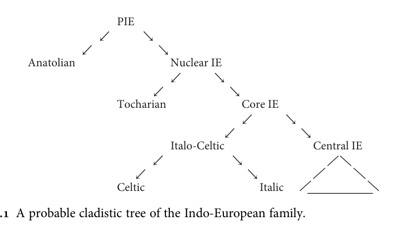

# §2.1 Introduction

<!-- pdf-page: 16 | printed-page: 5 -->

2

          Proto-Indo-European

2.1 Introduction
The earliest ancestor of English that is reconstructable by scientifically acceptable
methods is Proto-Indo-European, the ancestor of all the Indo-European languages.
As is usual with protolanguages of the distant past, we can’t say with certainty where
and when PIE was spoken, but evidence currently available points strongly to the
river valleys of Ukraine in the fifth millennium BC (the ‘steppe hypothesis’). The
archaeological evidence is laid out extensively in Anthony 2007, and the archaeo-
logical and linguistic evidence is discussed in Anthony and Ringe 2015. The most
prominent alternative, an origin in Anatolia as much as three millennia earlier, was
first proposed in Renfrew 1987; it has never been accepted by most IEists, though
some computational cladistic analyses, beginning with Gray and Atkinson 2003, have
found dates for PIE that are compatible with Renfrew’s hypothesis. However, Chang
et al. 2015 have shown that the addition of unobjectionable ‘ancestry constraints’ to
Gray and Atkinson’s model—for instance, the requirement that Latin be the ancestor
of the Romance languages in the phylogenetic tree—compresses the calculated time
depth so as to yield dates consistent with the steppe hypothesis instead. Most
strikingly, Haak et al. 2015 have demonstrated from ancient DNA evidence that
there was a massive migration from the steppes into Europe at exactly the time
that the steppe hypothesis posits (as well as an earlier migration from the eastern
Mediterranean). Further DNA evidence will almost certainly be forthcoming in the
near future, so the current picture is not necessarily final.
   Though there continue to be gaps in our knowledge of PIE, a remarkable propor-
tion of its grammar and vocabulary is securely reconstructable by the comparative
method. As might be expected from the way the method works, the phonology of the
language is relatively certain. Though syntactic reconstruction is in its infancy, some
points of PIE syntax are uncontroversial because the earliest-attested daughter
languages agree so well. Nominal morphology is also fairly robustly reconstructable,
with the exception of the pronouns, which continue to pose interesting problems.
Only the inflection of the verb causes serious difficulties for Indo-Europeanists, for
the following reason.

<!-- pdf-page: 17 | printed-page: 6 -->

6        Proto-Indo-European

   From the well-attested subfamilies of IE which were known at the end of the 19th
century—Indo-Iranian, Armenian, Greek, Albanian, Italic, Celtic, Germanic, and
Balto-Slavic—a coherent ancestral verb system can be reconstructed. The general
outlines of the system are already visible in Karl Brugmann’s classic Grundriss der
vergleichenden Grammatik der indogermanischen Sprachen (2nd ed., 1897–1916); in
recent decades Warren Cowgill, Helmut Rix, and other scholars have codified and
systematized that reconstruction along more modern lines. The result is perhaps the
standard reconstruction among more conservative Indo-Europeanists; it is sometimes
called the ‘Cowgill-Rix’ verb, though ‘Indo-Greek’ might be a more apt designation.1
Various versions of the Indo-Greek reconstruction can be found in Rix 1976 a: 190 ff.,
Rix et al. 2001, and the handbooks cited below. Unfortunately it is quite difficult to
derive the system of the Hittite verb—by far the best known Anatolian verb system,
and fortunately also the most archaic—from the Indo-Greek reconstruction of the PIE
verb by natural changes, and even the Tocharian verb system presents us with enough
puzzles and anomalies to raise the suspicion that the PIE verb system was rather
different. A thorough exploration of this question is Jasanoff 2003 a; a good summary
is Clackson 2007: 114–56. Though Jasanoff ’s reconstruction as a whole has not won
general acceptance, a number of his individual observations must be correct.
   Interestingly, there is by now a general consensus among Indo-Europeanists that
the Anatolian subfamily is, in effect, one half of the IE family, all the other subgroups
together forming the other half; and it is beginning to appear that within the non-
Anatolian subgroup, Tocharian is the outlier against all other subgroups (cf. Winter
1998, Ringe et al. 1998, Ringe 2000, Ringe, Warnow, and Taylor 2002 with references,
Jasanoff 2003 b). A probable cladistic tree of the IE family is roughly as in Figure 2.1.2
(On the Italo-Celtic subgroup see also Jasanoff 1997 and Weiss 2012, both with
references; for an attempt to sort out Proto-Italic and Proto-Italo-Celtic developments
see Schrijver 2006: 48–53.) The ‘Central’ subgroup includes Germanic, Balto-Slavic,
Indo-Iranian, Armenian, Greek, and probably Albanian; its internal subgrouping is still
very unclear, though it seems likely that Indo-Iranian, Balto-Slavic, and Germanic were
parts of a dialect chain at a very early date.
   Note the implications of this phylogeny for the reconstruction of the PIE verb. The
Indo-Greek verb is a reasonable reconstruction of the system for ‘Proto-Core IE’, and

    1
      In fact Cowgill strongly disagreed with at least one point in the conservative reconstruction, namely
the view that the Hittite hi-conjugation can be descended from a PIE perfect (see especially Cowgill 1979).
I therefore follow Clackson 2007: 115 in naming the model after the most conservative daughters on which
its reconstruction is based, altering his term ‘Greco-Aryan’ to eliminate the obsolete ‘Aryan’. For a good
discussion of the controversy see Clackson 2007: 115–51.
   2
      Since this cladistic tree is relatively new, there are no generally accepted names for many of the higher-
order internal nodes. Following Chang et al. 2015, I adopt ‘Nuclear IE’ for the non-Anatolian clade; the
other names are simply stopgaps.

<!-- pdf-page: 18 | printed-page: 7 -->

Introduction   7

                                 PIE
                             ↙         ↘
                         ↙                 ↘
             Anatolian                         Nuclear IE
                                               ↙        ↘
                                        ↙                   ↘
                                 Tocharian                      Core IE
                                                                ↙       ↘
                                                        ↙                    ↘
                                            Italo-Celtic                         Central IE
                                          ↙              ↘
                                     ↙                          ↘
                                 Celtic                             Italic

can even account for much of the ‘Proto-Nuclear IE’ system; it is only for the ancestor
of the whole family that it is seriously inadequate.
   That is fortunate for anyone proposing to write a history of English, because
Germanic is clearly one of the Central subgroups of the family. Though in this
revised edition I will discuss some of the problems to be faced in trying to reconcile
the Anatolian, Tocharian, and Core IE verb systems, my discussion of the develop-
ment of the Germanic verb in detail will start from Proto-Core IE.
   The consequences of this subgrouping for lexical reconstruction are also signifi-
cant. Because Anatolian is half the family, a word or morpheme cannot strictly be
reconstructed for PIE unless it has reflexes in at least one Anatolian language and at
least one non-Anatolian language, and since Anatolian is lexically divergent from the
other daughters and is not as well attested as some others, the number of items which
can be reconstructed for PIE with confidence is somewhat limited. On the other
hand, the phonologies of Proto-Nuclear IE, Proto-Core IE, and even Proto-Central
IE were almost identical to that of their ancestor PIE (so far as we can tell). Since we
are dealing with a subgroup of Central IE, it does not matter much how far back an
inherited item can be traced, and I will loosely cite as ‘PIE’ items which are
reconstructable for any of the internal nodes in the tree above except those restricted
to Italo-Celtic. Words confined to Germanic and Balto-Slavic, or to Germanic and
Italic and/or Celtic (which were clearly in contact at a very early date), will be cited as
‘post-PIE’.
   The rest of this chapter will present a brief sketch of PIE grammar as reconstructed
from the grammars of the daughter languages by standard application of the com-
parative method. In recent years a range of introductions to PIE have become
available, and the interested reader should consult them as well. Tichy 2006 provides
a concise introduction (mostly standard, though with a few idiosyncracies), including
a good bibliography; Meier-Brugger 2010 covers the same material in much more
detail. Clackson 2007 focusses instead on points that are still under discussion; his
