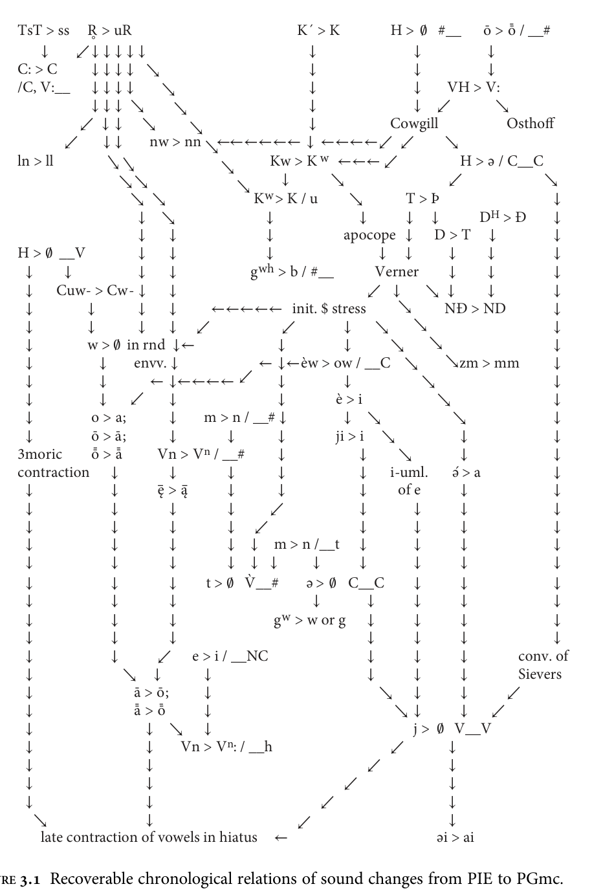

# §3.3 Restructurings of the inflectional morphology

3.3 Restructurings of the inflectional morphology
Some of the changes in inflectional morphology that characterize the development of
PGmc appear to have been straightforward (at least in retrospect), such as the loss of
most dual forms, the syncretism of genders in the oblique plural of some nominals, and
the leveling of ablaut in nominal inflection. By contrast, the complete restructuring of

<!-- pdf-page: 187 | printed-page: 176 -->

176    The development of Proto-Germanic

      TsT > ss R̥ > uR                                   Ḱ > K           H > 0/ #__ ō > ōˉ / __#
          ↓     ↙↓ ↓ ↓ ↓ ↓                                  ↓                 ↓             ↓
      C: > C      ↓↓↓↓ ↘                                    ↓                 ↓             ↓
      /C, V:__ ↓ ↓ ↓ ↓           ↘                          ↓                 ↓     VH > V:
                  ↓↓↓ ↘            ↘                        ↓                 ↓ ↙            ↘
                 ↙ ↓↓ ↘                ↘                    ↓             Cowgill              Osthoff
              ↙      ↓↓       nw > nn ↘←←←←←← ↓ ←←←←↙ ↙                             ↘
      ln > ll        ↘↘                     ↘       Kw > K w ←←← ↙                     H > ә / C__C
                        ↘↘                      ↘      ↓        ↘                   ↙               ↘
                          ↘ ↘                     Kw > K / u        ↘       T>Þ                       ↓
                            ↓ ↘                     ↓                 ↓     ↓ ↓            DH > Đ     ↓
                            ↓ ↓                     ↓              apocope ↓ D > T ↓                  ↓
      H > 0/ __V            ↓ ↓                     ↓                    ↓ ↓        ↓       ↓         ↓
       ↓      ↓             ↓ ↓                  g wh > b / #__         Verner      ↓       ↓         ↓
       ↓ Cuw- > Cw- ↓ ↓                                                ↙ ↓      ↘ ↓         ↓         ↓
       ↓          ↓         ↓ ↓           ←←←←← init. $ stress             ↘        NĐ > ND           ↓
       ↓          ↓         ↓ ↓ ↙                      ↙           ↓ ↘        ↘                       ↓
       ↓          w > 0/ in rnd ↓←                    ↓            ↓      ↘      ↘                    ↓
       ↓            ↓     envv. ↓                  ← ↓←èw > ow / __C ↘              ↘zm > mm          ↓
       ↓            ↓         ← ↓←←←← ↙               ↓            ↓            ↘                     ↓
       ↓            ↓ ↙           ↓                   ↓          è>i              ↘                   ↓
       ↓          o > a;          ↓      m > n / __# ↓             ↓ ↘               ↘                ↓
       ↓          ō > ā;          ↓           ↓       ↓          ji > i ↘              ↓              ↓
      3moric      ōˉ > ˉā      Vn > Vn / __#          ↓               ↓    ↘           ↓              ↓
      contraction ↓               ↓           ↓       ↓               ↓ i-uml.       ә́ > a           ↓
       ↓              ↓        ‒ę > ą‒        ↓       ↓               ↓    of e        ↓              ↓
       ↓              ↓           ↓           ↓     ↙                 ↓       ↓        ↓              ↓
       ↓              ↓           ↓           ↓ ↙                     ↓       ↓        ↓              ↓
       ↓              ↓           ↓           ↓ ↓ m > n /__t ↓                ↓        ↓              ↓
       ↓              ↓           ↓           ↓ ↓ ↓         ↓         ↓       ↓        ↓              ↓
       ↓              ↓           ↓      t > 0/ V̀__#      ә > 0/ C__C        ↓        ↓              ↓
       ↓              ↓           ↓                         ↓          ↓      ↓        ↓              ↓
       ↓              ↓           ↓                  g w > w or g ↓           ↓        ↓              ↓
       ↓              ↓           ↓                                    ↓      ↓        ↓              ↓
       ↓              ↓        ↙ e > i / __NC                          ↓      ↓        ↓        conv. of
       ↓                 ↘ ↓             ↓                             ↓      ↓        ↓        Sievers
       ↓                  ā > ō;         ↓                               ↘ ↓           ↓       ↙
       ↓                  āˉ > ōˉ        ↓                                ↘↓           ↓ ↙
       ↓                     ↓ ↘ ↓                                            j > 0/ V__V
       ↓                     ↓      Vn > Vn: / __h                        ↙         ↓
       ↓                     ↓                                         ↙            ↓
       ↓                     ↓                                     ↙                ↓
       ↓                     ↓                                ↙                     ↓
         ↘                   ↓                           ↙                          ↓
          late contraction of vowels in hiatus ←                                  әi > ai

the verb system clearly involved a complex series of changes that took place over many
generations; the acquisition of a set of two parallel paradigms for most adjectives was
also a development that cannot be explained as garden-variety simplification. Both
developments are uniquely characteristic of Germanic. The results of the restructuring
of verb inflection are immediately obvious in all attested Germanic languages

<!-- pdf-page: 188 | printed-page: 177 -->

Restructurings of the inflectional morphology               177

(including Modern English), rendering them instantly recognizable as Germanic; the
parallel paradigms of adjectives persist in the more conservative modern languages and
are robustly attested in the ‘Old’ stages of every Germanic language.
   This section will deal with those two large-scale developments; the following
section will treat the development of inflection in more detail, taking these restruc-
turings for granted.

3.3.1 The restructuring of the verb system
In the evolution of PGmc from Nuclear IE, by far the most important development
was an extensive restructuring of the verb system. The magnitude of the change can
be conveyed in a few sentences. In Nuclear IE, verb stems indicated aspect, and a verb
could have from one to three stems (not counting derived presents); in PGmc, verb
stems indicated tense, and almost all verbs had exactly two finite stems, a present and
a past. In Nuclear IE there were a large number of ways of forming present (i.e.,
imperfective) stems, as well as at least a few ways of forming aorist (i.e., perfective)
stems, and it appears that the choice of stem formations was lexically idiosyncratic
(as in Sanskrit and Greek); in PGmc there were only three past-tense markers and not
more than six ways of forming a present (a handful of irregular verbs excepted), and
present and past stem formations were correlated in such a way that the vast majority
of verbs fell into regular ‘conjugations’, as in Latin. In Nuclear IE, the non-active
voice was polyfunctional—hence its traditional name ‘mediopassive’—and there
were verbs that were lexically mediopassive (‘deponent’ verbs); in PGmc, the non-
active voice was restricted to passive function.
   This section will describe the most important changes that cumulatively accom-
plished the restructuring just described, insofar as they can be reconstructed.

3.3.1 (i) The semantic development of the Nuclear IE perfect (stative) and the loss of
the aorist indicative One of the most striking peculiarities of the PGmc verb system is
that two very different classes of stems are descended from the Nuclear IE perfect (i.e.,
stative).30 On the one hand, the past stems of all Germanic ‘strong’ verbs are etymo-
logically Nuclear IE or post-Nuclear IE perfects; on the other hand, the present stems of
fifteen verbs, traditionally called ‘preterite-present verbs’, also reflect (post-)Nuclear IE
perfects. The developments that must have given rise to such a situation are reconstruct-
able because similar developments are attested in the documented histories of other IE
languages. We can say with some confidence that what happened was the following.31
   Since the PIE perfect is reconstructable as a stative, on the basis of the Homeric
Greek situation and relics in Latin and Indo-Iranian, it is clear that the preterite-

  30
    On the function of the Nuclear IE perfect see 2.3.1 with footnote 17.
  31
    For a different reconstruction of the origin and development of preterite-present verbs see now
Tanaka 2011.

<!-- pdf-page: 189 | printed-page: 178 -->

178      The development of Proto-Germanic

presents preserve the original function of this stem-type (more or less). In fact nine of
them (60%) are clearly or arguably descended from PIE perfects, and all are stative in
meaning (cf. Benveniste 1949: 19–22):
   PIE *wóyde ‘(s)he knows’ (cf. Skt véda, Gk οἶδε /ôide/) > PGmc *wait (cf. Goth.
     wait, ON veit, OE wāt, OHG weiʒ );
   PIE *dhedhórse ‘(s)he dares’ (cf. Skt dadhárṣa) >! PGmc *(ga)dars (cf. Goth.
     gadars; OE dearr, OHG gitar have generalized *-rz- from the plural);
   PIE *memóne ‘(s)he has in mind’ (cf. Gk μέμονε /mémone/ ‘(s)he is eager’, Lat.
     meminit ‘(s)he remembers’) >! PGmc *man ‘(s)he thinks’, *gaman ‘(s)he remem-
     bers’ (cf. Goth. man, gaman, ON man ‘(s)he remembers’, OE man, ġeman);
   PIE *h₂ah₂nó(n)ḱe ‘(s)he is at / has reached’ (Skt ānāś́ a ~ ānáṃ śa; OIr. tánaic
     ‘(s)he arrived, (s)he came’ with prefix *to-) >! PGmc *ganah ‘it is enough’ (cf.
     Goth. ganah, OE ġeneah, OHG ginah);
                                                                                       ́
   PIE *h₂ah₂óyḱe ‘(s)he possesses’ (zero grade *h₂ah₂iḱ- >! *HiHiḱ- in Skt mid. īśe,
     reanalyzed as a present, Rix et al. 2001 s.v. *Heiḱ-) >! PGmc *aih (cf. Goth. aih,
     ON á, OE āh, OHG 3pl. eigun);
   PIE *h₂ah₂óghe ‘(s)he is upset’ (cf. OIr. ad·ágathar ‘(s)he is afraid’, remodeled as a
     present; for the meaning and the laryngeal cf. Gk pres. ἄχνυται /ákhnutai/ ‘(s)he
     is upset’) > PGmc *ō g ‘(s)he is afraid’ (cf. Goth. og);
   PIE *tetórpe ‘(s)he is satisfied’ (cf. Skt 3pl. tātr̥púr; for the root cf. Homeric Gk
     pres. τέρπεσθαι /térpesthai/ ‘to be satisfied’) >! PGmc *þarf ‘(s)he needs’ (cf.
     Goth., ON þarf, OE þearf, OHG darf);
   PIE *dhedhówghe ‘it is productive’ (not preserved outside of Gmc, but the seman-
     tics are exactly as expected (Meid 1971: 24–5); cf. pres. *dhéwghti ‘produces’,
     reflected in Skt dógdhi ‘(s)he ‘milks’ and (thematized) Homeric Gk τεύχει
     /téukhei/ ‘(s)he fashions’) >! PGmc *daug ‘it is useful’ (cf. Goth. daug, OE
     dēag, OHG toug);
   PIE *h₁eh₁óre ‘(s)he is there, (s)he has arrived’ (cf. Skt āŕ a ‘(s)he has come’)—or
     *h₁óre? (cf. Hitt. āri ‘(s)he arrives’)— >! PGmc *ar ‘(s)he is’ (?; cf. OE 2sg. eart,
     Mercian earþ, 3pl. Northumbrian arun; Old Swedish 3pl. aru).32
Interestingly, a tenth example, also stative in meaning, was clearly formed to a
present with a nasal infix within the separate prehistory of Germanic:
   PIE *ǵnoh₃- ‘to recognize’ (cf. Gk aor. ἔγνω /égnɔ:/ ‘(s)he recognized’): pres. *ǵn̥nóh₃ti
     ‘(s)he recognizes’ (cf. Skt jānāt́ i, OIr. ad·gnin, Toch. A 2sg. knānat, all with various
     remodelings) > pre-PGmc *gunnāt́ i; whence new pf. *gegónne (Mottausch 2013:

  32
     A possible alternative etymon of this verb is PIE *ar- ‘fit’ (see Bammesberger 2000 for discussion);
another is PIE *or- ‘rise’ (Patrick Stiles, p.c.).

<!-- pdf-page: 190 | printed-page: 179 -->

Restructurings of the inflectional morphology          179

     42, pace Harðarson 1993: 80–1) >! PGmc *kann ‘(s)he recognizes, (s)he knows
     how’ (cf. Goth., ON kann, OE cann, OHG kan).
This shows that the perfect in its inherited stative function remained productive for
some time in the development of Germanic.
   (It is less clear what to make of the remaining five preterite-present verbs recon-
structable for PGmc. Three of them have reasonably clear root-etymologies, but the
prehistory of the stem is not reconstructable because there is too little evidence from
other branches of IE:
  PIE root *h₃nah₂- ‘to benefit’ vel sim. (cf. Gk pres. ὀνίνησι /onínɛ:si/ ‘it benefits’
    (trans.)): a perfect similar in shape to that of ‘recognize’ was eventually formed
    and developed into PGmc *ann ‘(s)he grants’ (cf. ON ann ‘(s)he loves’, OE ann,
    OHG an);
  PIE root *mogh- ‘to be able’ (cf. OCS pres. možetŭ ‘(s)he can’, OIr. do·formaig ‘it
    adds, it increases’, mochtae ‘mighty’): ?pf. *memóghe (identical in meaning with
    the present? or is this the original inflection?) >! PGmc *mag ‘(s)he can’ (cf.
    Goth., OHG mag, ON má, OE mæġ);
  (post-)PIE root *skel- ‘to owe’ (cf. Old Lith. pres. 1sg. skelù): ?pf. >! PGmc *skal
    ‘(s)he owes’ (cf. Goth., ON skal, OE sċeal, OHG scal).
The etymologies of the remaining two are obscure in every way:

  PGmc *mōt ‘(s)he is allowed to’ (cf. OE mōt, OHG muoʒ ; Goth. gamot ‘(s)he finds
    room’);
  PGmc *lais ‘(s)he knows’ (cf. Goth. 1sg. lais); securely reconstructable because the
    derived causative *laizīþi ‘(s)he teaches’ is widely attested (cf. Goth. laiseiþ, OE
    lǣrþ, OHG lērit).

It is reasonable to conclude, with caution, that at least some of these must also be
innovations; that amounts to supporting evidence for the continued productivity of
the inherited type of perfect.)
   For the most part, however, the PIE perfect underwent an extensive semantic shift
of a type that seems to be characteristic of IE languages. The initial stage is well
attested in the history of Greek. In the Homeric poems (eighth century BC) nearly all
active perfects are still obviously stative (cf. e.g. Wackernagel 1904, Chantraine 1927),
and in Classical Attic (fifth–fourth centuries BC) there are still at least fifty stative
perfects in use; we find not only such demonstrably inherited examples as εἰδέναι
/eidénai/ ‘to know’, δεδιέναι /dediénai/ ‘to be afraid of ’, γεγονέναι /gegonénai/ ‘to
be . . . years old’, ἀπολωλέναι /apolɔ:lénai/ ‘to be doomed’, etc., but also some that
are not attested earlier but could be old, such as ἐρρωγέναι /errɔ:génai/ ‘to be broken’
and ἐρρῶσθαι /errɔ̂:sthai/ ‘to be strong’ (with imperative ἔρρωσο /érrɔ:so/ ‘farewell’).
But a large majority of the perfects in Classical Attic are obvious innovations and

<!-- pdf-page: 191 | printed-page: 180 -->

180      The development of Proto-Germanic

have meanings like that of a Modern English perfect; that is, they denote a past
action and its present result. We find ἀπεκτονέναι /apektonénai/ ‘to have killed’,
πεπομφέναι /pepomphénai/ ‘to have sent’, κεκλοφέναι /keklophénai/ ‘to have stolen’,
ἐνηνοχέναι /enɛ:nokhénai/ ‘to have brought’, δεδωκέναι /dedɔ:kénai/ ‘to have
given’, γεγραφέναι /gegraphénai/ ‘to have written’, ἠχέναι /ɛ:khénai/ ‘to have led’, and
many dozens more. Most are clearly new creations, but a few appear to be inherited
stems that have acquired the new ‘resultative’ meaning, such as λελοιπέναι /leloipénai/
‘to have left behind’ and ‘to be missing’ (the old stative meaning). A very similar
development must have occurred fairly early in the separate prehistory of Germanic.
   It appears that the function of the Greek perfect developed no further before the
formation was lost (see e.g. McKay 1965, 1980, Ringe 1984 b: 533–4). The Latin
perfect, on the other hand, has already developed further by the time that we have
enough material to make any determination about its function. Though a tiny
handful of Latin perfects are still stative (meminisse ‘to remember’, ōdisse ‘to hate’,
nōvisse ‘to recognize, to know (someone)’), most are used both as English-type
perfects and as simple past tenses (cecidit ‘(s)he has fallen’ and ‘(s)he fell’, etc.).33
While that is partly a consequence of the fact that the inherited perfect and aorist
have merged morphologically in Latin, it is natural in any case for an English-type
perfect to develop into a simple past. That is the stage that has been reached in Old
Irish, in which some active preterites are etymologically perfects and others are
aorists: whereas Lat. cecinit means both ‘(s)he sang’ and ‘(s)he has sung’, OIr. cechain
means only ‘(s)he sang’ (unless one prefixes a perfectivizing particle: ro·cechain ‘(s)he
has sung’). The same is true of Latin’s descendants, the Romance languages, as can be
seen from the perfect of the alternative verb ‘to sing’: Lat. cantāvit, ‘(s)he sang’ and
‘(s)he has sung’ > French chanta ‘((s)he) sang’, Spanish cantó ‘(s)he sang’ etc. In
French the same development has occurred one more time: the new periphrastic
perfect il/elle a chanté has in its turn developed into a simple past and is now the
stylistically neutral way of saying ‘(s)he sang’.
   A similar change occurred in pre-PGmc as well: most PIE and post-PIE perfects
have undergone the complete semantic development from stative through ‘resulta-
tive’ perfect (indicating a past action and its present result) to simple past. Probable
examples of inherited stative perfects that have been reinterpreted as resultative
perfects are few; four plausible examples are the following (given in the context of
the whole verb paradigm):
   PIE pres. *bhéydh-e/o- ‘to trust, to believe (someone)’ (cf. Lat. fīdere; Gk πείθεσθαι
     /péithesthai/ ‘to believe, to obey’), pf. *bhebhóydhe ‘(s)he is trusting / confident’
     (cf. Gk πέποιθε /pépoithe/) >! pre-PGmc pres. *bhéydh-e/o- ‘to wait for’, pf.
     *bhebhóydhe ‘(s)he has waited for’ >! PGmc pres. *bīdaną ‘to wait (for)’, past

  33
     That the Latin perfect triggers both primary and secondary sequence of tenses shows that this is not
simply an artefact of translation.

<!-- pdf-page: 192 | printed-page: 181 -->

Restructurings of the inflectional morphology             181

    *baid ‘(s)he waited (for)’ (cf. Goth. beidan, ON bíða, beið, OE bīdan, bād, OHG
    bītan, beit);
  PIE pres. *linékw- ~ *linkw- ‘to leave behind (severally or repeatedly), to be leaving
    behind’ (cf. Skt 3sg. riṇákti, 3pl. riñcánti, Lat. linquit, linquont), aor. *léykw-
    ~ *likw- ‘to leave behind’ (cf. Lat. pf. līquisse, Gk aor. λιπεῖν /lipê:n/), pf. *lelóykwe
    ‘(s)he is missing’ (cf. Gk λέλοιπε /léloipe/) >! pre-PGmc pres. *léykw-e/o- ‘to leave’
    (see 3.3.1 (ii)), pf. *lelóykwe ‘(s)he has left’ >! PGmc *līhwaną ‘to lend’, *laihw ‘(s)he
    lent’ (cf. Goth. leiƕan, OE līon, lāh, OHG līhan, lēh);
  PIE pres. *gwm̥ sḱé/ó- ‘to walk’ (cf. Gk βάσκειν /báske:n/, Skt 3sg. gácchati), aor.
    *gwém- ~ *gwm̥ - ‘to step’ (cf. Skt 3sg. ágan ‘(s)he has gone’), pf. *gwegwóme
    ‘(s)he has the feet planted’ (Skt jagām   ́ a ‘(s)he went’; for the meaning cf. Homeric
    Gk ἀμφιβέβηκας /amphibébɛ:kas/ ‘you stand astride’, made to the synonymous
    root *gwah₂-) >! pre-PGmc pres. *gwém-e/o- ‘to come’ (see 3.3.1 (ii)), pf.
    *gwegwóme ‘(s)he has come’ >! PGmc *kwemaną ‘to come’, *kwam ‘(s)he
    came’ (cf. Goth. qiman, qam, OHG queman, quam);
  PIE pres. *wert-, mostly thematized *wért-e/o- ‘to be turning’ (cf. Lat. vertere, Skt
    3sg. vártate), pf. *wewórte ‘is turned toward’ (cf. Skt ánu vavarta ‘he rolled
    after’) >! pre-PGmc *wért-e/o- ‘to turn into’. pf. *wewórte ‘it has turned
    into’ >! PGmc *werþaną ‘to become’, *warþ ‘it became’ (cf. Goth. waírþan,
    warþ, OE weorþan, wearþ).
More often it appears that a PGmc strong past is descended from an innovative
post-PIE or pre-PGmc perfect that probably had resultative force when it was
first formed; the following examples, with no stative cognates in any language, are
typical:
  post-PIE *bhebhóyde ‘(s)he has split’ (cf. Skt bibhéda ‘(s)he split’) >! PGmc *bait
    ‘(s)he bit’ (cf. Goth. bait, ON beit, OE bāt, OHG beiʒ );
  post-PIE *ǵeǵówse ‘(s)he has tasted’ (cf. Skt jujóṣa ‘(s)he enjoyed’) >! PGmc
    *kaus ‘(s)he tested’, PNWGmc ‘(s)he chose’ (cf. ON kaus, OE ċēas, OHG kōs);
  post-PIE *bhebhóndhe ‘(s)he has tied’ (cf. Skt babándha ‘(s)he tied’) >! PGmc
    *band ‘(s)he tied’ (cf. Goth., OE band, ON batt, OHG bant);
  post-PIE *sesóde ‘(s)he has sat down’ (cf. Skt sasād́ a ‘(s)he sat down’) >! PGmc
    *sat ‘(s)he sat’ (cf. Goth., ON sat, OE sæt, OHG saʒ );
  post-PIE *h₁eh₁óde ‘(s)he has eaten’, *h₁eh₁dēŕ ‘they have eaten’ (cf. Lat. ēdēre
    ‘they have eaten’, Benveniste 1949: 16–17) >! PGmc *ē̄t ‘(s)he ate’, *ētun ‘they
    ate’ (cf. Goth. et, etun, ON át, átu, OE ǣt, ǣton, OHG āʒ , āʒ un).
Of course many PGmc strong pasts do not exhibit such parallels in any other IE
language, though every detail of their formation shows clearly that as a class they
reflect pre-PGmc perfect stems.
   An important consequence of this semantic development was that the perfect
indicative and aorist indicative became isofunctional in pre-PGmc, and were

<!-- pdf-page: 193 | printed-page: 182 -->

182      The development of Proto-Germanic

therefore in competition. So far as can now be determined, the perfect ‘won out’
completely; in my opinion there are no plausible reflexes of the aorist indicative at all
in any Germanic language. (On the Northwest Germanic class VII strong pasts see
vol. ii, pp. 88–92 with references; on the West Germanic 2sg. strong past forms see
vol. ii, pp. 67–9.)

3.3.1 (ii) Loss of the perfective : imperfective and indicative : subjunctive oppositions
During the development of PGmc from PIE the contrast between imperfective and
perfective aspect was lost; in other words, the functional opposition between present
and aorist stems broke down. In the indicative, that would have brought the
imperfect (i.e., the past tense of the imperfective (present) stem) and the aorist (i.e.,
the past tense of the perfective (aorist) stem) into direct competition if this develop-
ment occurred when the aorist indicative was still in use. If the aorist indicative had
already been driven out of use by the perfect indicative (see above), then it brought
the imperfect and perfect indicatives into direct competition. Either way, the result
was that almost all PIE imperfects were lost. Only one, the imperfect of PIE ‘put’,
survived in Germanic, where the meaning of the verb had been shifted to ‘make’ and
eventually to ‘do’ (cf. the Latin root-cognate facere); it is attested as the past of an
independent verb ‘do’ in the West Germanic languages and as the suffix forming the
past tense of weak verbs throughout the family (see especially 3.3.1 (iv)).34 The
development of the singular indicative forms was relatively straightforward:
   PIE */dhédheh₁m/ = *dhédhēm (by Stang’s Law, see 2.2.4 (iv)) ‘I was putting’ (cf.
     Skt ádadhām, Gk ἐτίθην /etíthɛ:n/, both with the ‘augment’ prefix) > *dedę̄ >
     *dedą̄ (see 3.2.7 (i)) > PGmc *dedǭ ‘I did’ (cf. OS deda, OHG teta) and weak past
     1sg. *-dǭ (cf. Goth. -da, Early Runic -do, ON -ða, OE -de, OS -da, OHG -ta);
   PIE *dhédheh₁s ‘you were putting’ (cf. Skt ádadhās, Gk ἐτίθης /etíthɛ:s/) > PGmc
     *dedēz ‘you did’ (the ending of OS dedos has been remodeled) and weak past
     1sg. *-dēz (cf. Goth. -des, ON -ðir; OE -des(t), etc. exhibit remodeling);
   PIE *dhédheh₁d ‘(s)he was putting’ (cf. Skt ádadhāt, Gk ἐτίθη /etíthɛ:/) > PGmc
     *dedē ‘(s)he did’ (cf. OS deda, OHG teta with remodeling) and weak past 1sg.
     *-dē (cf. Goth. -da, Early Runic -de, ON -ði, OE -de, OS -de ~ -da, OHG
     remodeled -ta).
The remaining forms of the paradigm, however, eventually replaced the inherited
reduplicating vowel *e (syncopated in the suffix) with long *ē, probably in PGmc (but

   34
      The hypothesis that a post-PIE perfect underlies this PGmc. past (Hill 2004: 261–6) cannot easily
account for the weak past endings Goth. 2sg. -des, ON 2sg. -ðir, 3sg. -ði, while a conflation of perfect and
imperfect (Mottausch 2013: 29–35) is less likely than any descent from a single ancestral category, other
things being equal; attempting to derive the weak past suffix from some other stem of this verb (Hill 2004:
288–9) is uneconomical. On Early Runic talgidai see now Hill 2004: 287, fn. 84 with references, Ringe 2006:
191–2, and Schuhmann 2016.

<!-- pdf-page: 194 | printed-page: 183 -->

Restructurings of the inflectional morphology                    183

see further below). Long *ē is clearly attested in the Gothic weak past suffix -ded-, in
OHG pl. tātu-, subj. tātī- and OS dādu-, subj. dādi- ‘did’, and in OE poetic pl. dǣdon
‘did’ (Kim 2009: 10); it might or might not be reflected in Kentish OE subj. dē d̆ e
(which could reflect a Kentish development of dyde if its vowel is short) and
Northumbrian OE pl. dē don  ̆   (in competition with dydon, which is commoner).
The only plausible source for this *ē is the corresponding forms of class V strong
pasts.35 Exact proportional analogy cannot have been involved, since the vowels of
the indicative singular forms did not match; instead this change must reflect the
extension of a morphological rule to the past stem ‘did’. A plausible reconstruction of
the process would be the following:
   1) In class V strong pasts the root-vowel *a of the singular indicative was
      reanalyzed as basic to the paradigm. That is interesting, since the sg. indic.
      stem was not the default finite past stem—the stem to which the greatest range
      of forms was constructed—but was the stem of the 3sg. indic., the ‘psycho-
      logically basic’ form of the paradigm.
   2) The *ē of the remaining finite past forms was consequently derived by a rule
      ‘replace basic /a/ with /ē/ in the default stem of the past’, at first applicable only
      to this fairly small class of verbs.
   3) That rule was extended to the past ‘made/did’, which was THE ONLY OTHER
      PAST IN THE LANGUAGE with a singular indicative stem of the shape *CVT-,
      where *V is a short vowel and *T an obstruent. This extension would probably
      have been easier if sg. indic. *dedē-N, *dedē-z, *dedē-0/ had been resegmented
      as *ded-ę̄, *ded-ēz, *ded-ē (on the basis of pl. *ded-um, *ded-ud, *ded-un, the
      corresponding dual forms, and subjunctive *ded-ī-), but it is not clear that such
      a resegmentation would have been an absolute precondition for the extension
      of the rule; the mere fact that this unique past stem began with *CVT- might
      have been sufficient.
The 3pl. indicative illustrates these developments:
   PIE 3pl. *dhédhh₁n̥d ‘they were putting’ (cf. Skt ádadhur, with -ur replacing *-at, as in
     all other paradigms) > *dedun ! PGmc *dēdun ‘they did’ (cf. OS dādun, OHG
     tātun) and (?) weak past 3pl. *-dēdun (cf. Goth. -dedun, but see further below).
The development of *ē in class V strong pasts (see 3.4.3 (ii)) is therefore a terminus
post quem for this change.
  However, the OE evidence potentially complicates this picture. Kim 2009: 10
observes that the vowel of OE dyde can only reflect the umlauted *u of a past subj.

  35
      Strong pasts of class IV are less relevant here, since they too must have been remodeled on those of
class V, and (as Patrick Stiles reminds me) the chronological ordering of the two remodelings is not
recoverable.

<!-- pdf-page: 195 | printed-page: 184 -->

184      The development of Proto-Germanic

*dudī-, and we must therefore ask how such a form could have arisen. It is not
inconceivable that it arose within the separate prehistory of OE by lexical analogy
with such preterite-present stems as *skulī- (Prokosch 1939: 222),36 but Kim’s
suggestion (p. 16) that it implies a nonsg. indicative *dudu- seems at least as
plausible. Kim suggests a direct replacment of reduplicated *de-du- with *du-du-.
But if we ask what sort of stem was replaced by the default past stem with internal *ē
in PGmc strong verbs, the answer is probably a stem with internal *u, at least for
some verbs; that much is implied by such preterite-present default present stems
as *skul- ‘owe’, *mun- ‘think’, and *ganug- ‘be enough’. That is, PGmc *bērun ‘they
carried’ must have replaced an older *burun (cf. the past ptc. *buranaz), and PGmc
*lēgun ‘they lay’ might have replaced an older *lugun. It seems possible that the same
thing happened in ‘did’, so that the development was:
   *dedē- ~ *dedu- ~ *dedī- ! *dedē- ~ *dudu- ~ *dudī- ! *dedē- ~ *dēdu- ~ *dēdī-.
In that case it is possible that the final stage—the replacement of *u by *ē in the
default past stem of this verb—had not yet occurred in PGmc (so Lühr 1984: 49–50),
since a reflex of *u survives in OE.37 However, two considerations suggest that the *ē
is of PGmc date. One is that it is clearly attested in Gothic (in the weak past suffix)
and in OHG, two daughters which normally share archaisms but not innovations, so
that if the *ē is post-PGmc it would probably have to be a parallel development (less
likely, other things being equal). The other is that the replacement of *u by *ē in the
pasts of class V and even class IV strong verbs did occur in PGmc, and one might
expect this anomalous past stem to have followed suit. But in that case, if OE dyde is
not a comparatively late innovation, we apparently need to posit a PGmc stem *dedē-
~ *dēdu- ~ *dudī-, with *ē introduced into only part of the default past. Clearly the
last word on this complex of developments has not been said.
   Why this lone imperfect survived is not entirely clear. If the perfect had already
driven the aorist indicative out of use, it is not clear why ‘put (/make/do)’ did not
simply form an innovative perfect (or strong past); that is what happened in other IE
languages, even at a much earlier stage of development (cf. 3sg. Skt dadháu, Gk
τέθηκε /téthɛ:ke/, Oscan fut. pf. fefacust). If the contrast between the present and
aorist stems collapsed first, it is reasonable to ask why more imperfects did not ‘win
out’. At least we can suggest that two unusual characteristics of this stem have had
something to do with its survival. One is its maximally general meaning in Germanic:

  36
      Against other attempts to explain this *u see the convincing arguments of Kim 2009: 11.
  37
      It might be argued that even the initial replacement of *e with *u was not PGmc, since a default past
stem *dedu- is (sparsely) attested in WGmc: the vowel of deodan ‘(we) did’ in the OE Codex Aureus
inscription is almost certainly short (cf. Stiles 2010: 361 fn. 12), and the vowel of early OHG 3pl. dedun on
the Schretzheim bronze must be short. But it was always possible for native learners to level the sg. indic.
stem *ded- back into the other forms of this past, recreating a uniform stem, so that these forms could be
isolated parallel innovations; such a development is likely for Old Saxon pl. dedun.

<!-- pdf-page: 196 | printed-page: 185 -->

Restructurings of the inflectional morphology                       185

if the semantic development of ‘put’ to ‘make’ occurred earlier than the relevant
formal changes, the very basic status of the verb and (presumably) its great frequency
of use can have led to the atypical survival of this stem (though the details are not
reconstructable). The other relevant peculiarity is that while the past tense of the PIE
present stem *dhédheh₁- ~ *dhédhh₁- (i.e., the imperfect) survived as ‘did’ in PGmc,
the rest of that present stem (i.e., the present indicative and the modal forms)
apparently did not. The verb is attested as an independent lexeme only in West
Germanic (having be replaced by taujan < *tawjaną ‘to fit together’ in Gothic and
gøra < *garwijaną ‘to prepare’ in ON), but it seems clear that the PGmc present stem
of ‘do’ was athematic *dō- (cf. 1sg. Anglian OE dōm, OHG tuom). Unfortunately that
stem has no known PIE source; none of the suggested origins is problem-free (though
see Lühr 1984 for comprehensive discussion and Ringe 2012 for yet another sugges-
tion).38 In particular, note that the full-grade stem of the Hittite hi-conjugation
present dāi ‘(s)he puts’ reflects not *dhoh₁- but suffixed *dhoh₁-i- (Jasanoff
1979: 88–9; hence 1sg. tēhhi, with ē < *oi before h, and 3pl. tiyanzi, with zero-
grade *dhh₁-i-.) Until the puzzle of present *dō- is solved, the survival of a PIE
imperfect as PGmc ‘did’ will also remain at least somewhat puzzling.
   The PIE subjunctive mood (which survives in its modal functions in Greek, in its
temporal function as the Latin future tense, and in all functions in Vedic Sanskrit)
has also been lost in Germanic. It is clear that it was lost by functional merger with
the indicative, because a number of aorist subjunctive stems survived as present
indicatives in PGmc (Hoffmann 1955 b). That is, while the functional merger of
present subjunctive and present indicative simply led to the loss of the former, the
additional collapse of the aspectual opposition imperfective (present) : perfective
(aorist) brought the aorist SUBJUNCTIVE into competition with the old present
INDICATIVE, and in some instances the aorist subjunctive ‘won out’, becoming the
PGmc present indicative. The clear cases are those in which the PIE present was
formed with the suffix *-sḱé/ó- or was characterized by a nasal infix that could not be
reinterpreted as a suffix (see 3.4.3 (i)); so far as can be determined, those presents
were regularly replaced by the aorist subjunctive in PGmc. The following are the
clearest examples:39

  38
      The attempt of Hill 2004: 282–6 to derive *dō- from an aorist subjunctive cannot explain fact that the
West Germanic present is athematic; in addition, leveling of *ō throughout the paradigm would need to be
motivated.
   39
      Many of the much more numerous examples suggested in Mottausch 2013: 38–62 strike me as
implausible, mainly because both the reconstruction of the PIE verb that I accept and my overall
assessment of morphological (‘analogical’) change are much more conservative than his. However, it
does seem likely that PGmc *keusaną ‘to test’ (cf. Goth. kiusan; PNWGmc ‘to choose’, cf. ON kjósa, OE
ċēosan, OHG kiosan) is fully cognate with Vedic Skt aor. subj. jóṣati ‘(s)he will enjoy’ (Mottausch 2013: 41).

<!-- pdf-page: 197 | printed-page: 186 -->

186     The development of Proto-Germanic

  PIE *gwm̥ sḱéti ‘(s)he’s walking’ (cf. Skt gácchati, Gk βάσκει /báskei/, both ‘(s)he
    goes’), aor. subj. *gwém-e/o- (cf. Skt 3sg. gámat) > PGmc *kwemaną ‘to come’
    (cf. Goth. qiman, OHG queman; Hoffmann 1955 b: 91);
  PIE *bhinédsti ‘(s)he’s splitting (it)’, 3pl. *bhindénti (cf. Skt bhinátti, bhindánti;
    thematized in Lat. findit, findunt), aor. sub. *bhéyd-e/o- (cf. Skt 3sg. bhédati) >
    PGmc *bītaną ‘to bite’ (cf. Goth. beitan, ON bíta, OE bītan, OHG bīʒ an);
  PIE *sḱinédsti ‘(s)he’s cutting (it) off ’, 3pl. *sḱindénti (cf. Skt chinátti, chindánti;
    thematized in Lat. scindit, scindunt ‘(s)he splits, they split’), aor. sub. *sḱéyd-e/o- >
    PGmc *skītaną ‘to defecate’ (cf. ON skíta, ME shiten, MHG schîzen);
  PIE *linékwti ‘(s)he’s leaving (it)’, 3pl. *linkwénti (cf. Skt riṇákti, riñcánti; themat-
    ized in Lat. linquit, linquont), aor. subj. *léykw-e/o- (cf. Gk pres. λείπειν /léipe:n/) >
    PGmc *līhwaną ‘to lend’ (cf. Goth. leiƕan, OE līon, OHG līhan);
  PIE *Hrunépti ‘(s)he’s breaking (it)’ (thematized in Skt lumpáti, Lat. rumpit), aor.
    subj. *Hréwp-e/o- > PGmc *reufaną ‘to tear’ (cf. ON rjúfa).
The final elimination of the sk-presents, at least, cannot have been a very early
change, because two of them have left indirect reflexes in West Germanic languages.
It is clear enough that OE āscian, OS ēskon, OHG eiscōn ‘to ask’ (< PWGmc *aiskōn)
have something to do with the PIE present *Hisḱé/ó- ‘to look for, to seek’ (cf. Skt 3sg.
iccháti; root *Heys-, cf. Skt inf. éṣtụ m), and likewise that OHG forscōn ‘to investigate’
has something to do with the PIE present *pr̥sḱé/ó- ‘to ask’ (cf. Skt 3sg. pr̥ccháti, Lat.
poscere; root *preḱ-, cf. Lat. precēs ‘prayers’); but in both cases the verb is a class II
weak verb, certainly denominative, which must have been formed from a noun that
was in turn formed from the sk-present—necessarily in the post-PIE period, since
nominals were not normally formed from aspect stems in PIE. Unfortunately it is
difficult to draw more precise inferences about the date of the sk-presents’ demise.

3.3.1 (iii) The past passive participle Nuclear IE verb inflection included active and
mediopassive participles formed to aspect stems (see 2.3.3 (i)); the inherited system is
best preserved in Greek and Indo-Iranian. In various daughter languages Nuclear IE
verbal adjectives, a derivational category formed directly to the verb root, were also
eventually integrated into the verb paradigm as passive or intransitive participles.
The original situation is well preserved in Greek, whereas in Latin and in Sanskrit the
transition from adjective to participle has already occurred. For instance, Greek ἰτός
/itós/ (< *h₁itós, root *h₁ey- ‘go’) and βατός /batós/ (< *gwm̥ tós, root *gwem- ‘step’)
are still adjectives meaning ‘passable’, but in Sanskrit their cognates have become
participles, active in meaning because the verbs are intransitive (sūŕ ya úd-ite ‘the sun
having risen’; gatás ‘having gone’), and likewise in Latin, where they are used in
periphrasis with ‘be’ to make an impersonal passive perfect (itum est ‘someone went’;
ad quem propter diēī brevitātem perventum nōn est ‘but they didn’t get to him for lack
of time’, Cicero, Letters to Atticus 1.17.9). Similarly, Greek στατός /statós/ (< *sth₂tós,

<!-- pdf-page: 198 | printed-page: 187 -->

Restructurings of the inflectional morphology          187

root *stah₂- ‘stand’) means ‘stationary’, but its Sanskrit and Latin cognates are
participles (api-sthitás ‘having approached’; status ‘having been placed’); Greek
πιστός /pistós/ (< *bhidhstós, root *bheydh- ‘trust’) means ‘trustworthy’, but its
Latin cognate fīsus is a participle ‘having trusted’ (active in meaning because the
verb is deponent in the perfect); and so on. The Greek adjectives can sometimes have
similar meanings, especially in compounds; for instance, the second element of
θεόδοτος /theódotos/ ‘god-given’ is not only cognate with Latin datus but translates
it. It is also possible to find examples that demonstrate how the meanings can shade
into one another; for instance, though we are accustomed to translate Greek γνωτός
/gnɔ:tós/ as ‘known’, like the Latin participle nōtus, ‘recognizable’ would do just as
well. But the point is that in Nuclear IE, as in Greek, this was a category of derived
adjectives, not part of the verb paradigm, whereas in many other daughters the
formation has been integrated into the paradigm of the verb—that is, the adjectives
have become participles.
    Since verbal adjectives were formed to the verb root, there were originally none
corresponding to derived presents. In those languages in which they became parti-
ciples it was felt necessary to form them to derived presents (since a paradigm lacking
one or more members is defective), and in each language a range of strategies was
employed to do that. For instance, Sanskrit causatives in -áya- (< PIE *-éye/o-) make
past passive participles in -i-tá-, apparently adding the participial suffix to the zero
grade of the present stem-forming suffix; thus to veśáyati ‘(s)he makes enter’
(causative of viśáti ‘(s)he enters’) the past participle is veśitás, to sādáyati ‘(s)he
seats’ (causative of sīdatí   ‘(s)he sits’) the past participle is sāditás, and so on.
Denominatives in -a-yá- and (at least in Vedic) -ā-yá- do the same; thus we find
kathitás ‘narrated’ (kathayáti ‘(s)he narrates’), meghitás ‘clouded over’ (meghāyáti ‘it is
cloudy’), etc. But other denominatives add the suffix complex -itá- to the whole
present stem (minus its thematic vowel); thus kaṇḍ ūyáti ‘(s)he scratches’, for
instance, has a past participle kaṇḍ ūyitás. The Latin system is roughly the same.
Most verbs of the first and fourth conjugations, which contain a large proportion of
(originally) derived verbs, simply add the participial suffix to the present stem-
forming suffix (numerus ‘number’ ! numerāre ‘to count’ : numerātus; moenia
‘walls’ ! mūnīre ‘to fortify’ : mūnītus, and so on); third-conjugation denominatives
in -uere have participles in -ūtus (e.g. acus ‘needle’ ! acuere ‘to sharpen’ : acūtus; in
this case the verb was actually backformed to the participle, Weiss 2007: 374–5 with
references). But in the second conjugation, which also contains many originally
derived verbs, we find a pattern reminiscent of the Sanskrit causatives; for instance,
to the present monēre ‘to warn’ (< PIE causative *mon-éye/o- ‘cause to think’) the
perfect participle is monitus, with a short vowel. The second vowel of monitus was
originally *-e-, to judge from meretō ‘deservedly’ and Umbrian taçez ‘tacitus, silent’,
and the derivation of the paradigm was

<!-- pdf-page: 199 | printed-page: 188 -->

188    The development of Proto-Germanic

  pres. stem monē- < *mon-e-ye-,
  pf. stem monu- < *mon-e-w-,
  participle monitus < *mon-e-to-s

parallel to the corresponding forms of sonāre ‘to (re)sound’, namely

  pres. stem sonā- < *swena-ye-,
  pf. stem sonu- < *swena-w-,
  participle sonitus < *swena-to-s

(with pre-Lat. *swena- < PIE *swenH-, cf. Skt ipf. 3sg. asvanīt ‘it sounded’). These
facts will be relevant when we consider the development of participles in Germanic.
   PGmc was one of the daughters of Nuclear IE in which verbal adjectives became
past passive participles; but the outcome is different in detail from that of any other
daughter, which shows that the process was historically independent. Like Sanskrit
and Slavic (and unlike Latin), PGmc integrated both verbal adjectives in *-tó- and
those in *-nó- into the verb paradigm as participles, but in a distribution unique to
Germanic. Nearly all basic verbs acquired a past participle in *-nó- (later remodeled
to *-onó-, see 3.4.3 (ii)), whereas in Sanskrit that suffix was restricted to a small
minority of basic verbs whose roots ended in vowels or voiced nonlabial stops. All
PGmc derived verbs, and a few basic verbs (mostly with presents in *-ye/o-), acquired
past participles in *-tó- instead. The following examples of past participles formed to
basic verbs are typical:
  PIE *bhidnós ‘fissile’ (cf. Skt bhinnás ‘split’) ! *bhidonós > PGmc *bitanaz ‘bitten’
    (cf. Goth. bitans, ON bitinn, OE biten, OHG gibiʒʒ an);
  PIE *lugnós ‘fragile’ (cf. Skt rugnás ‘broken’) ! *lugonós > PGmc *lukanaz ‘torn
    out’ (cf. OHG arlohhan; OE locen ‘weeded’);
  PIE *bhudhnós ‘perceptible’ (vel sim.; contrast *bhudhstós in Skt buddhás ‘awake,
    aware’, Gk ἄπυστος /ápustos/ ‘unheard-of ’) ! *bhudhonós > PGmc *budanaz
    ‘offered’ (cf. ON boðinn, OE boden, OHG gibotan; Goth. anabudans ‘commanded’);
  PIE *bhr̥nós ‘portable’ (contrast Skt bhr̥tás ‘carried’) >! PGmc *buranaz ‘carried,
    born’ (cf. Goth. baúrans, ON borinn, OE boren, OHG giboran).

Basic verbs with solid PIE pedigrees and participles in *-tó- include at least the
following:

  PIE *wr̥ǵyéti ‘(s)he is working / making’, *wr̥ǵtós ‘workable’ (cf. Av. vərəziieiti, ptc.
    varštō) >! PGmc *wurkīþi ‘(s)he makes’, *wurhtaz ‘made’ (cf. Goth. waúrkeiþ,
    waúrhts, ON yrkir, ortr, OE wyrcþ, worht, OHG wurchit, giworaht);
  PIE *sah₂gieti ‘(s)he’s giving a sign’ (cf. Hitt. sākizzi; Lat. sāgīre ‘to sense keenly’) >
    PGmc *sōkīþi ‘(s)he seeks’, ptc. *sōhtaz ‘sought’ (cf. ON sœkir, sóttr, OE sēcþ,
    sōht, OHG suohhit, gisuoht).

<!-- pdf-page: 200 | printed-page: 189 -->

Restructurings of the inflectional morphology           189

(The other PGmc verbs that inflect according to the same pattern, with a present
stem in *-ye/o- and a participle in *-tó- suffixed directly to the root, might or might
not be underived.)
   PGmc derived verbs usually exhibited a vowel or a vowel-final suffix before the
participial suffix *-tó-. The situation seems clearest in the case of class II weak verbs.
Verbs of that class must at first have been derived only from nouns in *-ā- (< PIE
*-ah₂-); their present stems end in trimoric *-ō̄ - < *-āyé/ó- (and optative *-āyóy-;
Cowgill 1959, and see 3.2.6 (i)), but their participles seem to reflect *-ā-tó-, having
been formed by subtracting the denominative suffix *-yé/ó- and adding the partici-
pial suffix at a date before the loss of intervocalic *j. Their development can be
exemplified as follows:

  post-PIE *solpā ́ ‘ointment’ (see 3.2.4 (ii)) ! pres. *solpā-yé/ó- ‘anoint’ (see 3.2.6
    (i)) ! ptc. *solpā-tó-s > PGmc *salbō, *salbō -, *salbōdaz (cf. Goth. salbo-, salboþs
    (noun not attested), OE sealf, sealfa-, sealfod, OHG salba, salbō-, gisalbōt).

I have argued above (3.2.6 (i–ii)) that the statives of weak class III exhibit a similar
pattern, in this case because the present has been backformed to an older participle:
  post-PIE pres. *kh₂péh₁- ‘be holding’ (with the suffix of Lat. habēre but the root of
    capere) ! ptc. *kapətós ‘held’ ! pre-PGmc pres. *kapəyé- ~ *kapəyó- ‘hold’
    (see 3.2.6 (i)) > PGmc *habai- ~ *habja- ‘have, hold’, ptc. *habdaz ‘had, held’ (cf.
    Goth. habai-, OHG habē- for the e-grade of the pres. stem, OE hæbb- (with
    analogical elimination of i-umlaut) for the o-grade, OE hæfd for the ptc.).
The situation is much less clear for the factitives of class III, which are poorly attested,
and for the fientives of class IV; see 3.4.3 (i) for discussion of those classes. There is
also some uncertainty about class I weak verbs, but only concerning the etymological
origin of the vowel preceding the participial suffix. The problem can best be appre-
ciated by examining a number of examples of different derivational types.
   For denominatives formed to consonant-stem nouns with the suffix *-yé/ó-
(~ *-ié/ó- by Sievers’ Law, see 2.2.4 (ii)) the vowel before the participial suffix can
hardly have been anything other than *-i-, evidently the nonvocalic part of the
present-stem forming suffix. There are at least three good examples:
  PIE *h₂aḱ- ‘sharp’, *h₂áwsos ‘ear’ ! *h₂ḱ-h₂ows-iéti ‘(s)he is sharp-eared’ (cf. Gk
    ἀκούειν /akóue:n/ ‘to hear’) ! pre-PGmc *h₂ḱh₂ows-i-tós ‘heard’; > PGmc
    *hauzīþi, *hauzidaz (cf. ON heyrir, heyrðr, OE hīerþ, hīered, OHG hōrit, gihōrit;
    Goth. hauseiþ, hausiþs with analogical voiceless Verner’s Law alternant);
  PIE *h₁nēh́₃mn̥ ~ *h₁nóh₃mn̥- ‘name’, collective *h₁nóh₃mō ~ *h₁n̥h₃mn̥-´, (cf.
    Toch. B ñem, Lat. nōmen, etc.; see 3.2.1 (iii)) ! *h₁n̥h₃mn̥-yéti ‘(s)he names’ (cf.
    Gk ὀνομαίνει /onomáinei/) >! pre-PGmc *nōm        ́ ō- ~ *nomn-´, *nomn-iéti; !
                                            -
    *nomn-i-tós ‘named’; >! PGmc *namō, *namnīþi, *namnidaz (cf. Goth. namo,

<!-- pdf-page: 201 | printed-page: 190 -->

190    The development of Proto-Germanic

    namneiþ, namniþs, OE nama, nemneþ ~ nemþ, nemned, OHG namo, nemnit,
    ginemnit);
  post-PIE *bhr̥ǵh- ‘hill, mound’ (cf. OIr. brí-, brig- ‘hill’) ! *bhr̥ǵh-yéti ‘(s)he raises a
    mound over’ >! PGmc *burg- ‘fortress, walled city’ (cf. Goth. baúrgs, ON borg,
    OE, OHG burg) but *burgīþi ‘(s)he buries’, *burgidaz (cf. OE byrġ(e)þ, byrġed).
(A fourth such present survives in Germanic:
  PIE *h₁régwos ~ *h₁régwes- ‘darkness’ (cf. Skt rájas ‘empty space’, Gk ἔρεβος
    /érebos/ ‘hell’) ! *h₁regwes-yéti ‘it’s getting dark’ (cf. Skt rajasyáti, and note
    that this derivative preserves the original meaning) > PGmc *rekwaz ~ *rikwiz-,
    *rikwiziþi (cf. Goth. riqis, riqizeiþ).
However, it cannot be shown to have had a PGmc past participle—not surprisingly,
since it is both intransitive and impersonal.) Presumably denominatives formed from i-
stems also originally had *-i- before the participial suffix; there are at least two
examples formed to nominals that have reasonably good cognates outside Germanic:
  PIE *sáh₂ti-s ‘satiety’ (cf. Lith. sótis, OIr. sáith) ! *sah₂ti-(y)éti ‘it satisfies’ !
    *sah₂ti-tós > PGmc *sōþiz, *sōdīþi, *sōdidaz (cf. Goth. soþa (dat. sg.; stem class
    unclear), ga-soþeiþ, ga-soþiþs, the latter two with analogical voiceless Verner’s
    Law alternant);
  post-PIE *ko(m)moini-s ‘common’ (?; cf. Lat. commūnis) ! *ko(m)moini-(y)ónti
    ‘they hold in common’ ! *ko(m)moini-tós ‘held in common’ > PGmc *ga-
    mainiz, *gamainijanþi, *gamainidaz (why *g-?; but cf. Goth. gamains, gamain-
    jand, gamainiþs, OHG gimeini, gimeinent, gimeinit).
But when we consider denominatives formed to o-stems it becomes impossible to
determine whether the vowel before the participial suffix was *-i- (as in Sanskrit) or
*-e- (as in Latin). I cite the example with the best extra-Germanic cognate:
  PIE *somHós ‘same’ (cf. Skt samás, Gk ὁμός /homós/) ! *somHe-yéti ‘(s)he
    makes them the same’ (cf. Skt samayáti) ! ptc. *somHe-tós? or *somH-i-
    tós?; in either case, >! PGmc *sama-n- (weak inflection only), *samiþi (with
    the converse of Sievers’ Law, see 3.2.5 (ii)), *samidaz (cf. Goth. sama, samjiþ
    ‘conforms’, samiþs, ON sami, semr ‘puts in order’, samðr).
The same indeterminacy obtains for the participles of causatives in PIE *-éye/o-; note
the following examples:
  PIE *(pró) wortéyeti ‘(s)he turns it (forward)’ (cf. Skt vartáyati ‘(s)he rolls it’) !
    ptc. *(pro)worti-tós (like Skt vartitás)? or *(pro)worte-tós (like Lat. monitus,
    see above)?; in either case, >! PGmc *(fra)wardīþi ‘(s)he destroys’, ptc.
    *(fra)wardidaz (cf. Goth. frawardeiþ, frawardiþs, OE (for)wiert, (for)wierded);
  PIE *tonéyeti ‘(s)he extends (it)’ (cf. Skt tānáyati) ! ptc. *tonitós or *tonetós?; in
    either case, >! PGmc *þaniþi ‘(s)he stretches / extends’ (with the converse of

<!-- pdf-page: 202 | printed-page: 191 -->

Restructurings of the inflectional morphology         191

     Sievers’ Law), ptc. *þanidaz (cf. ON þenr, þanðr, OHG denit, gidenit; Goth.
     compound ufþanjiþ ‘(s)he strives’, ufþaniþs).

It can be seen that, even if the formation of past participles to class I weak verbs
was not originally uniform, it became so by the merger of unstressed *e and *i
(see 3.2.5 (iii)).

3.3.1 (iv) Derived verbs and the weak past PIE derived presents were not associated
with any aorist or perfect formations (cf. 2.3.3 (i) ad fin.). In some of the daughter
languages they eventually acquired aorists and/or perfects of inherited types (more or
less); for instance, the Classical Attic Greek present φυλάττειν /phulátte:n/ ‘to guard’
( noun φύλαξ /phúlaks/ ‘guard’) has acquired an s-aorist φυλάξαι /phuláksai/ and a
reduplicated perfect πεφυλαχέναι /pephulakhénai/, the present φιλεῖν /philê:n/ ‘to love’
( adjective φίλος /phílos/ ‘dear’) has likewise acquired an aorist φιλῆσαι /philɛ̂:sai/
and a perfect πεφιληκέναι /pephilɛ:kénai/, and so on. The alternative to such a
development was the use of periphrastic formations; for instance, though Sanskrit
has a causative formation not only for the present, where it is inherited (e.g. kāráyati
‘(s)he causes to do’), but also for the aorist (ácīkarat ‘(s)he has caused to do’),
the causative perfect is periphrastic (kārayām  ́ āś a ‘(s)he caused to do’). Some of
the periphrases eventually underwent univerbation to single forms; for instance,
Rix 1992 argues that the Latin perfects in -v- and -u-, which are characteristic of
(originally) derived verbs of the first, second, and fourth conjugations, reflect older
phrases composed of the inherited perfect active participle and the verb ‘be’.
   It seems clear that the PGmc ‘weak’ past developed by the univerbation of such a
periphrasis, which was employed in the first place because derived presents (i.e., the
presents of nearly all weak verbs) did not form perfects in PIE or pre-PGmc. That
much is agreed on by all serious specialists, but there is no consensus about the
details; almost every researcher who has dealt with the question has proposed a
different scenario, and discussion of the full range of proposals would multiply the
length of this section many times. The older literature is summarized and discussed
in Tops 1974; more recent alternatives to the account accepted here can be found in
Tops 1978, Lühr 1984, Jasanoff 1995, Hill 2004, 2010, Stiles 2010, and Mottausch
2013: 28–35. Moreover, though I see no reason to abandon the basic outlines of the
account presented in Ringe 2006: 179–92 and the first edition of this volume, the
observations of Kim 2009, Kiparsky 2009, and Stiles 2010 necessitate substantial
revisions of detail. I will first present the original version of my hypothesis, then
critique and modify it substantially in the light of the new evidence.
   That the lone surviving imperfect ‘did’ (see 3.3.1 (ii)) somehow became part of
the weak past is an old hypothesis (Loewe 1894: 371–6) suggested by the fact that
the anomalous alternation of the weak past suffix in Gothic (indic. sg. -d- but
otherwise -ded-) so closely matches the unique alternation of the stem of ‘did’ in
Old High German (indic. sg. tet- < *ded-, otherwise tāt- < *dēd-). But it is also

<!-- pdf-page: 203 | printed-page: 192 -->

192     The development of Proto-Germanic

clear that some other form must be involved as well, since in the small class of
irregular class I weak pasts exemplified by *wurhtē ‘(s)he made’, *wurhtēdun ‘they
made’, the suffixal *-t- can hardly reflect the initial *d- of ‘did’ (cf. Tops 1974:
44–86 with references). Wolfgang Meid suggested that it is the consonant of the
past participial suffix, and that the weak past reflects univerbation of the participle
with a following auxiliary verb (Meid 1971: 107–11). Jens Rasmussen was the first
to note that the weak past could have developed from a phrase of participle plus
imperfect by simple haplology (Rasmussen 1996); I arrived at the same conclusion
in ignorance of Rasmussen’s prior work (Ringe 2006: 179–92). According to this
hypothesis, the original meaning of the periphrasis must have been ‘made . . . Xed’,
for each verb X; in consequence the participle should originally have been inflec-
ted, agreeing with the direct object. But since the meaning of the auxiliary became
attenuated to the point that it was merely a vehicle for marking past tense, it
would not be surprising if agreement marking on the participle had been lost; one
would then expect to find default agreement, which in Germanic appears to be the
accusative singular neuter. Univerbation must have occurred after all those devel-
opments, and also after the remodeling of adjective inflection (see 3.3.2). The 3sg.
and 3pl. of typical periphrastic pasts would then have been the following just
before univerbation occurred:

  *wurhta dedē ‘(s)he made’
  *wurhta dēdun ‘they made’
  *frawardida dedē ‘(s)he destroyed’
  *frawardida dēdun ‘they destroyed’
  *salbōda dedē ‘(s)he anointed’
  *salbōda dēdun ‘they anointed’

(See 3.2.6 (iv) on the ending of the participles.) These phrases were affected by a
simple rule of haplology which can be stated as follows:
Beginning immediately to the right of the participial suffixal consonant, delete all successive
sequences of the shape *VT, where *V is a short vowel and *T is a coronal obstruent.

This is not a classical ‘regular sound change’, in the sense that it affected all such
sequences in the language, but it can have been regular in a different sense: probably
it was conditioned by the rate of speech, like most haplologies, and the surviving
PGmc weak past forms were probably originally allegro forms. The phrases listed
above apparently developed as follows (the sequences targeted for haplology are
parenthesized at the earlier stage):

  *wurht(a d)(ed)ē ‘(s)he made’ > *wurhtē (cf. Goth. waúrhta)
  *wurht(a d)ēdun ‘they made’ > *wurhtēdun (cf. Goth. waúrhtedun)
  *frawardid(a d)(ed)ē ‘(s)he destroyed’ > *frawardidē (cf. Goth. frawardida)

<!-- pdf-page: 204 | printed-page: 193 -->

Restructurings of the inflectional morphology                     193

   *frawardid(a d)ēdun ‘they destroyed’ > *frawardidēdun (cf. Goth. frawardidedun)
   *salbōd(a d)(ed)ē ‘(s)he anointed’ > *salbōdē (cf. Goth. salboda)
   *salbōd(a d)ēdun ‘they anointed’ > *salbōdēdun (cf. Goth. salbodedun)
The distinctive weak past of PGmc, which has no exact counterpart in any other IE
subgroup, was the result of those changes. Some analogical extension must also be
posited; for instance, fientive verbs, which probably had no past participles, must have
formed their finite past tenses on the model of other derived verbs, and such past tense
forms as *wissēdun ‘they knew’ (to the preterite-present *witaną ‘to know’) are almost
certainly the products of remodeling rather than of haplology affecting the sequence
*-ssa d-. If this hypothesis is correct, the PGmc suffix alternant *-dēd- must have been
eliminated in NWGmc, possibly by shortening of the (unstressed) vowel and a further
haplology, but more likely by leveling of the shorter alternant *-d- through the paradigm.
   However, the above scenario can be challenged on several grounds. Stiles 2010
raises the possibility that the longer suffix alternant -ded-, attested only in Gothic, is
actually a Gothic innovation. I originally discounted that possibility on the grounds
that the only possible source for such an innovation is PGmc *dēd- ‘did’,40 and it
seemed unlikely that an unstressed suffix could have been altered by lexical analogy
with a full word. But Kiparsky 2009 presents clear evidence that in early OHG weak
pasts were accented like COMPOUNDS, not like inflected forms:
   1) in class I weak pasts the vowel *-i- is syncopated after heavy syllables (e.g. tuomta
      ‘judged’), as in compounds (e.g. gasthūs ‘guesthouse’), not as in words with a single
      stress on the root (e.g. houbites ‘of a head’, hōnida ‘disgrace’, Kiparsky 2009: 110–12);
   2) weak past subjunctives do not exhibit i-umlaut (e.g. branti ‘would burn’), again
      like words with double stress (e.g. forstántnìssi ‘understanding’, kráftlīh̀ ‘power-
      ful’, ibid. pp. 113–14);
   3) in the Alemannic dialects the weak past subjunctive vowel is long even when
      word-final (e.g. brantī, ibid. pp. 114–16).
It is hard to see how weak past stems could have acquired compound accentuation
within the prehistory of OHG; they must have inherited it from PGmc, and it follows
that the univerbated weak past retained a secondary accent on its second component
throughout the PGmc period and beyond. But in that case a remodeling of weak past
*-d- on the basis of *ded- ~ *dēd- is plausible: a purely Gothic replacement of, e.g.,
*frawárdidèdun (or even *frawárdidùn) by *frawárdidēd̀ un under the influence of
*dēdun ‘they did’ is no more remarkable than the attested replacement of OE cynedōm
‘kingdom’ by cyningdōm under the influence of cyning ‘king’. In fact Kiparsky proposes

   40
      It should be emphasized that Stiles disagrees with that assessment; he believes that Gothic forms such
as tawidedun ‘they did’ can have resulted from a remodeling of *tawidun on the basis of pre-Gothic 3sg.
*tawidē—in effect, re-adding the weak past suffix to a fully characterized 3sg. form. I am not sure that that
hypothesis is plausible, though it is definitely possible.

<!-- pdf-page: 205 | printed-page: 194 -->

194      The development of Proto-Germanic

just such a scenario for the creation of the Alemannic weak past plural forms in -tōm,
-tōt, -tōn (Kiparsky 2009: 116–19). Moreover, Kim’s proposal that *dēd- replaced
*dud- in the past of ‘do’ is fully compatible with the alternative just outlined: if
univerbation of the weak past had not occurred when the stem of ‘did’ was still uniform
*ded-, it could have occurred when the latter was *dud-; in either case the haplology
suggested above would have yielded a uniform past tense suffix *-d- (Kim 2009: 18).
   Whether a definitive choice can be made from among the alternatives just outlined
is not yet clear to me.

3.3.1 (v) The passive In PIE the non-active voice was used not only in passive
clauses but also in reflexives (the ‘middle’ voice, see 2.3.1 ad fin.), and is therefore
called ‘mediopassive’; moreover, some verbs were lexically mediopassive, or ‘depon-
ent’. Hittite and the Tocharian languages preserve those details of the verb system
unchanged; so do Greek and the ancient Indo-Iranian languages, except that they
have begun to differentiate the passive from the middle. In the other daughters,
however, the system has been simplified in various ways; for instance, if a Latin verb
makes forms of both voices, the non-active voice is normally passive in function
(though there are still deponent verbs, which are typically described as ‘passive in
form but active in meaning’).
   In PGmc the non-active voice had become strictly passive,41 and deponent verbs
no longer existed. Moreover, since the PIE perfect was undifferentiated for voice, it is
not surprising to find that there was no morphological past passive in PGmc; all past
passive forms were periphrastic, constructed with the past participle and auxiliary
verbs (including ‘be’, as in Latin, but also ‘become’). Thus the passive forms of a
PGmc verb consisted of (a) the passive forms of the present and (b) the past
participle. In the daughters of PGmc the present passive was steadily eroded, until
in most the past participle was the only passive form remaining.

3.3.2 The double paradigm of adjectives
PGmc adjectives, like those in other western IE languages, were lexically vowel stems
for the most part; consonant-stem adjectives had largely been eliminated (the most
important class of ‘holdouts’ being the present participles in *-nd-). But nearly all

   41
      The discussion of Ferraresi 2005: 106–10 is seriously inaccurate. Gothic atsteigadau ‘let him come
down’ is an ACTIVE 3sg. imperative. Though Greek καὶ πᾶς εἰς αὐτὴν βιάζεται at Luke 16:16 is commonly
translated ‘and everyone forces his way in’ (cf. the New American Bible ‘and people of every sort are forcing
their way in’; King James ‘and every man presseth into it’), the Greek verb is ambiguous, and the Gothic
rendering nauþjada could in fact be a passive (roughly ‘is compelled (to go) into it’), as earlier scholars
seem to have assumed. The most likely ‘middle’ example is usskarjaindau ‘they may escape’ (King James:
‘recover themselves’), 2 Timothy 2:26, translating the Greek active ἀνανήψωσιν ‘they may sober up’(!); the
only other attestation of the verb is usskarjiþ izwis ‘sober yourselves up’ (Greek ἐκνήψατε) at 1 Corinthians
15:34, which shows that the verb is transitive. But even in the former passage a Gothic passive rendering
‘they may get sobered up’ is possible.

<!-- pdf-page: 206 | printed-page: 195 -->

Restructurings of the inflectional morphology           195

PGmc adjectives had also acquired a second, parallel inflectional paradigm, and these
new paradigms were n-stems. Moreover, even the older vowel-stem paradigms had
undergone a major innovation: their original endings, which had been those of
nouns, were largely replaced by those of the ‘pronominal adjectives,’ i.e. of quantifiers
that were inflected like the relative pronoun and largely like the determiner ‘that’
(Sievers 1876, McFadden 2003; see 2.3.6 (ii)). The vowel-stem paradigms with
pronominal endings are conventionally called ‘strong’, the n-stem paradigms
‘weak’. The following examples are typical:
                strong                            weak
  ‘alive’       *kwikwa-, fem. *kwikwō-           *kwikwan-, fem. *kwikwōn-
  ‘common’      *gamaini-, fem. *gamainijō-       *gamainijan-, fem. *gamainijōn-
  ‘heavy’       *kuru-, fem. *kurjō-              *kurjan- (?), fem. *kurjōn-
  ‘carrying’    *berand-, fem. *berandijō-        *berandan-, fem. *berandīn-
Such a double inflection of adjectives is paralleled in Balto-Slavic, but that subgroup
appends an inflected clitic *-jo- to fully inflected adjectives; the weak n-stem para-
digm is unique to Germanic.
    The most general rule governing the use of the strong and weak paradigms in attested
Germanic languages is that weak forms are used when the adjective is governed by a
determiner or possessive adjective, while strong forms are used in most other syntactic
environments. Such a distribution—an automatic consequence of the syntax—reveals
little about the original functional distinction between the two paradigms. Fortunately
there are a number of exceptions which reveal more about the original system.
Adjectives modifying nouns in direct address (therefore in the vocative case in Gothic
and PGmc) are often weak; so is the adjective ‘same’ (*saman-, see 3.3.1 (iii)). Those
instances have one thing in common: they modify definite NP’s.
    It is therefore reasonable to hypothesize that the n-stem suffix of the weak adjective
paradigm was originally a definite article—the first of several that arose within the
development of Germanic—and that its use with determiners was originally pleonastic,
much like Classical Attic Greek οὗτος ὁ ἀνήρ /hôutos ho anɛ:́ r/ ‘this man’, literally ‘this
the man’ (so e.g. Krause 1968: 173). That would also explain why in a few archaic
documents, most notably in Beowulf, we find weak adjectives used without determiners
of any kind (though more research is needed to determine whether the weak suffix is
still functioning as a definite article in those instances or whether the examples are
simply formulaic expressions of the oral poetic tradition in which the original function
of the n-stem suffix has been forgotten).
    It has been clear for more than a century that PGmc weak adjective inflection
developed from the PIE n-stem ‘individualizing’ suffix that also appears in Greek and
Latin names (originally nicknames) like Gk ἀγάθων /agáthɔ:n/ ‘the Good’ (ἀγαθός
/agathós/ ‘good’) and Lat. Catō ‘the Shrewd’ (catus ‘shrewd’); see e.g. Krause 1968:
175, Jasanoff 2002: 40 with references. (Kim 2008 provides a good overview of this
