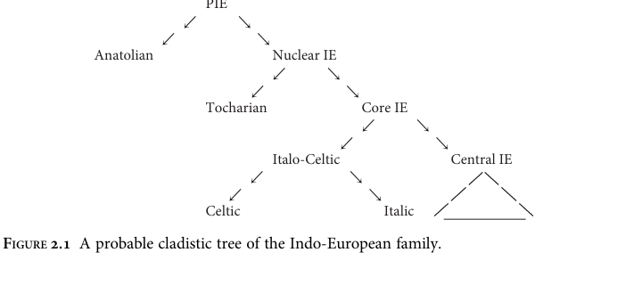

# Chapter 2: Proto-Indo-European

> Third-pass targeted technical cleanup corpus draft. Use page anchors for checking against the PDF.

## Transcription and normalization note

This third pass treats Chapter 2 primarily as PIE material and normalizes obvious PIE reconstructed forms to stable Unicode notation: `h₁`, `h₂`, `h₃`; `kʷ`, `gʷ`, `gʷʰ`; `bʰ`, `dʰ`, `gʰ`; and `ḱ`, `ǵ`. Identifiable Germanic-stage forms are handled conservatively, following the stage-sensitive policy developed for Chapters 3 and 4. Ambiguous or mixed-stage examples should be checked against the PDF before formal citation. This pass also targeted the PIE phonology tables, verb paradigms, noun paradigms, and Greek phonemic transcription artifacts that were highest-risk after the second pass.


<!-- p. 5; pdf-page 16 -->

## 2.1 Introduction

The earliest ancestor of English that is reconstructable by scientifically acceptable methods is Proto-Indo-European, the ancestor of all the Indo-European languages. As is usual with protolanguages of the distant past, we can’t say with certainty where and when PIE was spoken, but evidence currently available points strongly to the river valleys of Ukraine in the fifth millennium BC (the ‘steppe hypothesis’). The archaeological evidence is laid out extensively in Anthony 2007, and the archaeological and linguistic evidence is discussed in Anthony and Ringe 2015. The most prominent alternative, an origin in Anatolia as much as three millennia earlier, was first proposed in Renfrew 1987; it has never been accepted by most IEists, though some computational cladistic analyses, beginning with Gray and Atkinson 2003, have found dates for PIE that are compatible with Renfrew’s hypothesis. However, Chang et al. 2015 have shown that the addition of unobjectionable ‘ancestry constraints’ to Gray and Atkinson’s model—for instance, the requirement that Latin be the ancestor of the Romance languages in the phylogenetic tree—compresses the calculated time depth so as to yield dates consistent with the steppe hypothesis instead. Most strikingly, Haak et al. 2015 have demonstrated from ancient DNA evidence that there was a massive migration from the steppes into Europe at exactly the time that the steppe hypothesis posits (as well as an earlier migration from the eastern Mediterranean). Further DNA evidence will almost certainly be forthcoming in the near future, so the current picture is not necessarily final. Though there continue to be gaps in our knowledge of PIE, a remarkable proportion of its grammar and vocabulary is securely reconstructable by the comparative method. As might be expected from the way the method works, the phonology of the language is relatively certain. Though syntactic reconstruction is in its infancy, some points of PIE syntax are uncontroversial because the earliest-attested daughter languages agree so well. Nominal morphology is also fairly robustly reconstructable, with the exception of the pronouns, which continue to pose interesting problems. Only the inflection of the verb causes serious difficulties for Indo-Europeanists, for the following reason.


<!-- p. 6; pdf-page 17 -->

From the well-attested subfamilies of IE which were known at the end of the 19th century—Indo-Iranian, Armenian, Greek, Albanian, Italic, Celtic, Germanic, and Balto-Slavic—a coherent ancestral verb system can be reconstructed. The general outlines of the system are already visible in Karl Brugmann’s classic Grundriss der vergleichenden Grammatik der indogermanischen Sprachen (2nd ed., 1897–1916); in recent decades Warren Cowgill, Helmut Rix, and other scholars have codified and systematized that reconstruction along more modern lines. The result is perhaps the standard reconstruction among more conservative Indo-Europeanists; it is sometimes called the ‘Cowgill-Rix’ verb, though ‘Indo-Greek’ might be a more apt designation.1 Various versions of the Indo-Greek reconstruction can be found in Rix 1976a: 190 ff., Rix et al. 2001, and the handbooks cited below. Unfortunately it is quite difficult to derive the system of the Hittite verb—by far the best known Anatolian verb system, and fortunately also the most archaic—from the Indo-Greek reconstruction of the PIE verb by natural changes, and even the Tocharian verb system presents us with enough puzzles and anomalies to raise the suspicion that the PIE verb system was rather different. A thorough exploration of this question is Jasanoff 2003a; a good summary is Clackson 2007: 114–56. Though Jasanoff ’s reconstruction as a whole has not won general acceptance, a number of his individual observations must be correct. Interestingly, there is by now a general consensus among Indo-Europeanists that the Anatolian subfamily is, in effect, one half of the IE family, all the other subgroups together forming the other half; and it is beginning to appear that within the non-Anatolian subgroup, Tocharian is the outlier against all other subgroups (cf. Winter 1998, Ringe et al. 1998, Ringe 2000, Ringe, Warnow, and Taylor 2002 with references, Jasanoff 2003b). A probable cladistic tree of the IE family is roughly as in Figure 2.1.2 (On the Italo-Celtic subgroup see also Jasanoff 1997 and Weiss 2012, both with references; for an attempt to sort out Proto-Italic and Proto-Italo-Celtic developments see Schrijver 2006: 48–53.) The ‘Central’ subgroup includes Germanic, Balto-Slavic, Indo-Iranian, Armenian, Greek, and probably Albanian; its internal subgrouping is still very unclear, though it seems likely that Indo-Iranian, Balto-Slavic, and Germanic were parts of a dialect chain at a very early date. Note the implications of this phylogeny for the reconstruction of the PIE verb. The Indo-Greek verb is a reasonable reconstruction of the system for ‘Proto-Core IE’, and

> **Footnote 1.** In fact Cowgill strongly disagreed with at least one point in the conservative reconstruction, namely the view that the Hittite hi-conjugation can be descended from a PIE perfect (see especially Cowgill 1979). I therefore follow Clackson 2007: 115 in naming the model after the most conservative daughters on which its reconstruction is based, altering his term ‘Greco-Aryan’ to eliminate the obsolete ‘Aryan’. For a good discussion of the controversy see Clackson 2007: 115–51.

> **Footnote 2.** Since this cladistic tree is relatively new, there are no generally accepted names for many of the higher-order internal nodes. Following Chang et al. 2015, I adopt ‘Nuclear IE’ for the non-Anatolian clade; the other names are simply stopgaps.


<!-- p. 7; pdf-page 18 -->



> **Accessible note.** Ringe’s tree shows PIE splitting into Anatolian and Nuclear IE; Nuclear IE then splits into Tocharian and Core IE; Core IE then splits into Italo-Celtic and Central IE, with Italo-Celtic splitting into Celtic and Italic.

can even account for much of the ‘Proto-Nuclear IE’ system; it is only for the ancestor of the whole family that it is seriously inadequate. That is fortunate for anyone proposing to write a history of English, because Germanic is clearly one of the Central subgroups of the family. Though in this revised edition I will discuss some of the problems to be faced in trying to reconcile the Anatolian, Tocharian, and Core IE verb systems, my discussion of the development of the Germanic verb in detail will start from Proto-Core IE. The consequences of this subgrouping for lexical reconstruction are also significant. Because Anatolian is half the family, a word or morpheme cannot strictly be reconstructed for PIE unless it has reflexes in at least one Anatolian language and at least one non-Anatolian language, and since Anatolian is lexically divergent from the other daughters and is not as well attested as some others, the number of items which can be reconstructed for PIE with confidence is somewhat limited. On the other hand, the phonologies of Proto-Nuclear IE, Proto-Core IE, and even Proto-Central IE were almost identical to that of their ancestor PIE (so far as we can tell). Since we are dealing with a subgroup of Central IE, it does not matter much how far back an inherited item can be traced, and I will loosely cite as ‘PIE’ items which are reconstructable for any of the internal nodes in the tree above except those restricted to Italo-Celtic. Words confined to Germanic and Balto-Slavic, or to Germanic and Italic and/or Celtic (which were clearly in contact at a very early date), will be cited as ‘post-PIE’. The rest of this chapter will present a brief sketch of PIE grammar as reconstructed from the grammars of the daughter languages by standard application of the comparative method. In recent years a range of introductions to PIE have become available, and the interested reader should consult them as well. Tichy 2006 provides a concise introduction (mostly standard, though with a few idiosyncracies), including a good bibliography; Meier-Brugger 2010 covers the same material in much more detail. Clackson 2007 focusses instead on points that are still under discussion; his


<!-- p. 8; pdf-page 19 -->

chapter on the verb covers much of the same ground as my discussion in 2.3.3. Beekes 2011, like the older books referenced at the end of this paragraph, discusses historical linguistics in general as well as IE linguistics. Fortson 2009: 53–169 is a brief sketch comparable to this one; both his book and Mallory and Adams 2006 are much broader in scope than the other volumes mentioned, including much information on PIE archaeology and culture. Older treatments of PIE that are still worth consulting include Sihler 1995 and Szemerényi 1996. All the above books, except Clackson’s, present some version of the Indo-Greek verb. Beekes’ rejection of a PIE phoneme */a/ distances his treatment a bit from the others; Szemerényi’s reluctance to accept the PIE ‘laryngeals’ is by now obsolete, though his discussion of other points is valuable. Further information about particular topics can be found in the references cited below.

## 2.2 PIE phonology

A complete presentation of what is known about PIE phonology is beyond the scope of this book. Here I present only the main outlines and some of the more interesting quirks. The standard reference is Mayrhofer 1986, to which readers are referred for further information, with references, on every point discussed in this section. A more modern synthesis, making somewhat different judgments of some of the evidence and referring to much recent work in the field, can be found in Byrd 2015: 5-40.

The phonology of PIE was very unlike that of any modern IE language. The system of surface-contrastive sounds, in which I will cite PIE forms, was as follows:

```text
Obstruents:
             bilabial  coronal  palatal  velar  labiovelar  (glottal?)
voiceless    p         t        ḱ        k      kʷ
voiced       b         d        ǵ        g      gʷ
aspirated    bʰ        dʰ       ǵʰ       gʰ     gʷʰ
fricatives             s                         h₂          h₃ (?)   h₁

Sonorants:            High vowels:       Nonhigh vowels:
y (~ i)  w (~ u)      i      u           e      a      o
r (~ r̥)              ī      ū           ē      ā      ō
l (~ l̥)
n (~ n̥)
m (~ m̥)
```

There was also a system of pitch accent: one syllable of each phonological word exhibited high pitch on the surface, customarily marked with ´ in reconstructions. Numerous peculiarities of this system call for comment.


<!-- p. 9; pdf-page 20 -->

### 2.2.1 PIE obstruents

The palatal, velar, and labiovelar stops are collectively referred to as ‘dorsals’. Their exact pronunciation is not reconstructable; all we can say for certain is that the ‘palatals’ were pronounced further forward in the mouth than the others, and that the ‘labiovelars’ were pronounced with lip-rounding but were otherwise identical with the ‘velars’.3 That PIE possessed stops of all three types is no longer controversial, since Craig Melchert has demonstrated that the three-way contrast between the voiceless stops *ḱ, *k, and *kʷ is preserved in Luvian before front vowels (Melchert 1987, 2012b); for instance, we find Luvian ziyar ‘(s)he is lying down’ < PIE *ḱéyor, kīsa(i)- ‘to comb’ < *kes-, and kui ‘what?’ < *kʷíd. A further indication that the triple contrast is not some kind of artefact of the comparative method can be found in a simple constraint on the shape of PIE root-syllables: though a root could not contain oral stops at the same place of articulation both in its onset and in its coda,4 there were roots which contained both a palatal and a velar (*ḱenk- ‘to hang’, *kreḱ- ‘to strike’, *koḱso- ‘joint’) or both a palatal and a labiovelar (*kʷeḱ- ‘to catch sight of ’), and perhaps both a velar and a labiovelar (post-PIE *kneygʷʰ- ‘to bow’). The ‘voiced aspirate’ stops were probably breathy-voiced; their reflexes are still breathy-voiced in many modern Indic languages. The distribution of PIE stops was in some ways idiosyncratic. The voiced bilabial stop *b was unexpectedly rare—perhaps even rarer than *gʷʰ—though at least one example has reflexes in Anatolian and so can be reconstructed even for PIE proper (*leb- ‘lick’, cf. Melchert 1994a: 93).5 Most surprising of all was a series of constraints on the shapes of root-syllables. A root could not contain two voiced stops, nor could it contain both a voiceless stop and a voiced aspirate unless the former occured in a

> **Footnote 3.** In any case it is most unlikely that the ‘palatals’ were really palatal stops; in many IE languages they became velars, and as Michael Weiss pointed out to me many years ago, shifts of palatal stops to velars are at best very rare in the attested historical phonologies of natural human languages (so Kümmel 2007: 241–3). The palatals were also clearly the commonest dorsals (though not by a very wide margin), which suggests that they were typologically the unmarked set, i.e. probably really velars. I have retained the traditional terms, instead of replacing them with ‘velars, postvelars, labiopostvelars’, to avoid confusion. For further discussion see especially Kümmel 2007: 310–27.

> **Footnote 4.** Apparently this constraint classed *m with the bilabial oral stops; that is, there were no roots like ‘*pem-’ and ‘*mebʰ-’, including both a bilabial oral stop and *m. However, *n was not classed with the coronal oral stops, since we must reconstruct *nadʰ- ‘to tie’, *newd- ‘to push’, *ten- ‘to stretch’, etc. Three clear exceptions to the constraint, *tewd- ‘to beat’, *tend- ‘to cut’, and *méms- ‘meat’, are securely reconstructable; it is of course not surprising that they involve coronal stops and *m. Other apparent exceptions, such as *bʰrem- ‘to make a noise’, either appear to be onomatopoeic or are not securely reconstructable for PIE proper, so far as I am aware.

> **Footnote 5.** ‘River’ is sometimes reconstructed as *h₂ábon- < **h₂ép-h₃en-, presumably *‘containing running water’, in an attempt to connect it with Skt ā́pas ‘the waters’ (cf. Wodtko et al. 2008: 311–17). But while all the Italic and Celtic cognates are n-stems (or derived from n-stems), some of the Anatolian derivatives are not (Kloekhorst 2008 s.v. ḫapa-); therefore a reconstruction *h₂ábʰon- seems more likely. Germanic river names that might contain a cognate with PGmc *p < PIE *b (Neri 2009: 8 with references) are not a convincing counterargument, because the putative meaning of a name cannot be checked against other evidence.


<!-- p. 10; pdf-page 21 -->

root-initial cluster with *s. Thus among potential roots with an initial coronal and a final velar, only the following could have occurred:

```text
*tek-     *dek-       ——
*teg-     ——          *dʰeg-
——        *degʰ-      *dʰegʰ-
```

(Cf. the actually reconstructable roots *teḱ- ‘to produce’, *teg- ‘to cover’, *deḱ- ‘to accept’, *delǵʰ- ‘to be firm’, *dʰyoh₃gʷ- ‘to insert, to stab’, *dʰegʷʰ- ‘to burn’.) The types ‘*tegʰ-, *deg-, *dʰek-’ did not occur—though the type *stegʰ- did (cf. at least *spr̥dʰ- ‘contest’, *skabʰ- ‘to scrape’, *skabʰ- ‘to prop’, *sperǵʰ- ‘to hurry’, *stembʰH-6 ‘to prop’, *steygʰ- ‘to step’).

Both the supposed typological oddity of a system with voiced aspirates but no voiceless aspirates and the apparent dearth of parallels to the constraints just described have led some scholars to propose a ‘glottalic hypothesis’, according to which the PIE voiced stops were really ejectives, while the other manners of articulation were voiceless and voiced (perhaps with noncontrastive aspiration; see e.g. Gamkrelidze and Ivanov 1973). But a stop system with a similar set of contrasts is actually attested in the Indonesian language Kelabit (first reported in Blust 1974), and Madurese seems to have gone through a similar stage relatively recently;7 moreover, adopting the glottalic hypothesis makes it very difficult to account for the shapes of the oldest stratum of Iranian loanwords in Armenian, which the traditional reconstruction explains with ease (Meid 1987: 9-11). Most mainstream Indo-Europeanists have therefore rejected the glottalic hypothesis, or at least regard it as unproven (cf. e.g. Vine 1988).

The pronunciation of the three ‘laryngeals’ (symbolized as h’s with subscript numerals) can be reconstructed only approximately, and their position in the chart above should not be taken very seriously; note especially that the third laryngeal did not pattern like a labiovelar consonant. We can at least be confident that all the laryngeals were obstruents of some kind, because they behaved like obstruents with respect to the syllabification rules (see 2.2.4 (ii)). *h₂ was clearly a voiceless fricative pronounced far back in the mouth, to judge from its reflexes in the Anatolian languages (the only subgroup in which it usually survives as a consonant). *h₃ seems to have been voiced and apparently exhibited lip-rounding, to judge from the fact that it rounded adjacent short *e (see 2.2.4 (i)). For recent discussion of the phonetics of those two laryngeals see Melchert 2011 and Weiss, forthcoming. About

> **Footnote 6.** It is customary to write ‘*H’ for a laryngeal the precise identity of which cannot be reconstructed—a problem that recurs fairly often, since most daughter languages merged the laryngeals in many environments.

> **Footnote 7.** For much interesting discussion of these languages and their relevance for the reconstruction of PIE see Michael Weiss’ powerpoint presentation ‘The Cao Bang theory: some speculations on the prehistory of the PIE stop system’ at linguistics.cornell.edu/People/Weiss.cfm.


<!-- p. 11; pdf-page 22 -->

the pronunciation of *h₁ nothing can be said with certainty except that it was an obstruent. It should be clear that ‘laryngeals’ is an anachronistic misnomer, retained only because it has become standard in the field. For comprehensive discussion see Kümmel 2007: 327–36. There seem to have been very few constraints on the distribution of *s and the laryngeals, to judge from the reconstructability of such roots as *ses- ‘to be asleep’, *h₁yeh₁- ‘to make’, *h₁reh₁- ‘to row’, *h₃omh₃- ‘to swear’, *h₂weh₁- ‘to blow’, *h₂anh₁- ‘to breathe’, *h₂arh₃- ‘to plow’, etc., and full words like *h₂ánh₂t-s ‘duck’, *h₂áwh₂o-s ‘grandfather’, *h₁óh₃s ‘mouth’, *h₁nēh́₃-mn̥ ‘name’, and *h₂wl̥h₁-no- ‘wool’. *s was by far the commonest obstruent in the language; *h₂ was perhaps the second most common in a lexical count, though *t may have been commoner in speech because it occurred in so many suffixes and endings.

### 2.2.2 PIE sonorants and high vowels

One of the more unusual features of PIE phonology was the existence of a class of ‘sonorants’ (or ‘resonants’) whose syllabicity was determined by rule. They appear to have been underlyingly nonsyllabic; in fact, almost all the syllabic sonorants which are reconstructable for PIE can be derived from underlyingly nonsyllabic segments by the rules discussed in Section 2.2.4 (ii). The one clear exception to that generalization involves the high front vocalics. Though most of the short syllabic high vowels can be derived from underlying */y/ and */w/, there were a few examples of syllabic *i in positions where underlying */y/ should have surfaced as nonsyllabic *y; for instance, though nonsyllabic sonorants normally occurred in the context VC__V, where the first vowel was short and C indicates any single nonsyllabic, *i also occurred in that position. The clearest examples are derivatives from locatives in *-i, e.g. Rigvedic Skt trisyllabic ápyas (i.e. ápias) ‘in the water’ (adj.; Mayrhofer 1986: 161) and Gk πεδίον /pedíon/ ‘plain’ *‘(thing) at the foot (of the mountain)’ (Hoenigswald 1985). A possible widely attested example is *néwios ‘new’ (a derivative of *néwos ‘new’ with a suffix of unclear function; cf. Rigvedic Skt trisyllabic návyas—i.e., návias—and Welsh newydd < Proto-Celtic *nowi(y)os < *néwios). The syllabic *i of *néwios contrasted with the *y of *ályos ‘other’ and *sewyós ‘left(-hand)’ in the same prosodic environment (cf. Rigvedic Skt disyllabic savyás ‘left(-hand)’ and Welsh eil ‘other’ without the additional syllable of newydd). It seems that the *i of *néwios can only have been an underlying vowel */i/. (See Mayrhofer 1986: 160–1, 168 for discussion and further examples.) Though I know of no similar syllabification evidence for an underlying vowel */u/, there is another phenomenon which probably reflects PIE */u/. Though nearly all PIE roots contained a nonhigh vowel and were subject to the phonological rules collectively called ‘ablaut’ (see 2.2.4 (i)), there were a handful of non-ablauting roots, and the most securely reconstructable example is *bʰuH- (*bʰuh₂- ?) ‘to become’, with


<!-- p. 12; pdf-page 23 -->

invariant *u. Unless we wish to posit a root which never contained a vowel in PIE, we ought to recognize an underlying high vowel */u/ in this root. If the above analysis is correct, it makes the occurrence of *ī and *ū, which were likewise very rare, somewhat less puzzling: in addition to the (underlyingly nonsyllabic) sonorants, PIE had genuine high vowels, both long and short, though they were rare. As we will see in the next section, many other PIE underlying vowels were also surprisingly rare.

### 2.2.3 PIE nonhigh vowels

The PIE system of nonhigh vowels, simple as it seems on the surface, was probably even simpler underlyingly. The vowels exhibited extensive alternations in morphologically related forms according to the following patterns:

```text
ē ~ e ~ 0/ ~ o ~ ō
ā ~ a ~ 0/
```

It seems clear that */e/,*/a/ were the underlying segments in most cases, and that the other vowels were derived from them by various phonological rules, which had generally been morphologized to a greater or lesser extent (see 2.2.4 (i)). The system is referred to as ‘ablaut’; the alternants of each series are called ‘ablaut grades’, so that it is customary to speak of ‘e-grade, o-grade, zero grade’, and so on. Roots and words which appear to exhibit underlying */a/ are few enough that the ‘Leiden school’ has tried to explain them all away; Lubotsky 1989 is a comprehensive statement of that position. It is true that apparent *a following an obstruent might actually reflect underlying */h₂e/, unless the obstruent is an unaspirated stop and the word is attested in Indo-Iranian (in which *h₂ aspirated an immediately preceding stop). But *a following a sonorant is less easy to dispense with, since a sonorant preceding *h₂ ought to have become syllabic unless another syllabic preceded (see 2.2.4 (ii)). Moreover, *h₂ survives as h- in Hittite, Palaic, and Luvian and as x- in Lycian; thus a PIE word whose reflexes begin with a- in Latin and Greek but do not begin with a consonant in the Anatolian languages is most straightforwardly reconstructed with *a-. The following list includes a large proportion of the better examples of */a/ (not all of which would be reconstructed with */a/ by every Indo-Europeanist who accepts its existence): *ar- ‘to fit’, *ay- ‘to give’, *ay- ‘to be hot’, *aydʰ- ‘to burn (intr.)’, *bʰrag- ‘to break’, *h₂wap- ‘evil’, *Hyaǵ- ‘to worship’, *kan- ‘to sing’ (of birds), *karp- ‘to pluck’, *kaw- ‘to hit’, *kʷas- ‘to kiss’, *kʷath₂- ‘to bubble’, *ḱad- ‘to fall’, *ḱas- ‘grey’, *labʰ- ‘to take’, *lad- ‘beloved’, *maḱ- ‘long’, *nadʰ- ‘to tie’, *nas- ‘nose’, *plak- ‘to be pleasing’, *sak- ‘holy’, *sal- ‘to jump’, *sark- ‘to be whole’, *skabʰ- ‘to prop’, *skabʰ- ‘to scrape’, *stag- ‘to drip’, *tag- ‘to touch’, *war- ‘to burn (intr.)’, *swad- ‘pleasant, sweet’ (better */sweh₂d-/?); *albʰós ‘white’, *ályos ‘other’, *átta ‘dad’, *awl- ‘tube’, *bʰágos ‘a share’, *dáḱru ‘tear (i.e., eye-water)’, *dayh₂wēŕ


<!-- p. 13; pdf-page 24 -->

‘brother-in-law’, *gʰebʰal- ‘head’, *ǵʰáns ‘goose’, *kápros ‘male (animal)’, *kátus ‘fight’, *kawl- ‘shaft’, *laywós and *skaywós ‘left(-hand)’, *pláth₂us ‘wide’, *sáls ‘salt’, *sámh₂dʰos ‘sand’, *sasyóm ‘grain’, *sawsós ‘dry’, *smáḱru ‘beard’, *táwros ‘bull’, *wástu- ‘settlement’. (Cf. Melchert 1994a, Ringe 1996, Rix et al. 2001 passim, Wodtko et al. 2008 passim; the discussion of *swad- / */sweh₂d-/ by Seebold 1967a and Stang 1974 gives a good idea of the problems involved.) A large proportion of the words which exhibit a in the daughter languages can be shown to reflect PIE underlying */h₂e/, and many other examples are ambiguous. Since long vowels and *o which cannot be derived from underlying */e/ and */a/ were even rarer, it is clear that */e/ was overwhelmingly the most common underlying vowel, and the most common underlying segment, in PIE. Like the fairly large obstruent system, this is reminiscent of the situation in Northwest Caucasian languages, though the PIE system was typologically less extreme. Whether words could begin with vowels in PIE is unclear, since apparent initial vowels might actually have been preceded by *h₁, which was lost word-initially before a vowel in all the daughters (and so can be definitely reconstructed in that position only from related forms beginning with *h₁C-).

### 2.2.4 PIE phonological rules

A remarkable amount of the phonological rule system of PIE can be reconstructed. Only the most important rules are discussed here.

#### 2.2.4 (i) Ablaut and laryngeals

The default underlying vowel */e/ was replaced by

*o in a wide variety of morphological environments. Fuller details will be given in the discussion of PIE inflection and derivation (2.3 and 2.4); here I give only a general outline of the system. Some ablauting nouns exhibited *o in the root-syllable in the ‘strong’ cases (the nominative, accusative, and vocative), but *e or 0/ in the ‘weak’ cases (the remaining cases of the paradigm, roughly speaking); typical examples include *pód- ~ *ped- ‘foot’ and *ḱwón- ~ *ḱun- / *ḱwn̥- ‘dog’. The same pattern reappears in the indicative of some ablauting verb stems, in which the singular active had *o in the root, but the rest of the paradigm had *e or 0/ . In Hittite this pattern is characteristic of the most archaic stratum of the ‘hi-conjugation’ (e.g. sākki ‘(s)he knows’, sekkanzi ‘they know’ < *sók- ~ *sék-; dāi ‘(s)he puts’, tiyanzi ‘they put’ < *dʰóh₁-i- ~ *dʰh₁-i-). In Core IE (see above) it had become restricted to the ‘perfect’ stem; 0/ is usual in the weak forms (cf. e.g. *memóne ‘(s)he has in mind’, *memnēŕ ‘they have in mind’), but see Jasanoff 2003a: 32–3, 40–2 for relics of e-grade weak forms in Indo-Iranian. For PIE we must reconstruct surface *e in other types of noun and verb stems in exactly the same phonological environments in which the above types exhibited *o; thus it is clear that the o-grade rule had already been morphologized in PIE.


<!-- p. 14; pdf-page 25 -->

Some types of polysyllabic ablauting nouns and adjectives exhibited *o in the final syllable of the stem in the strong cases when that syllable was unaccented and followed by an overt ending (e.g. in acc. sg. *swésor-m̥ ‘sister’); it looks as though *o might have replaced 0/ in a position in which the latter had become inadmissible, though the phenomenon is not well understood. The pretonic root-syllables of derived causative verbs also appeared in the o-grade (e.g. in *woséyeti ‘(s)he clothes (someone)’), for reasons that are likewise not understood. A considerable number of derived nominals, especially thematic nouns, also exhibited o-grade roots. It is clear from the above that the o-grade rule was triggered by a disjunct set of morphological environments that had no apparent connection with one another. It appears that underlying */a/ did not undergo this rule. In all types of ablauting stems an underlying nonhigh vowel was often deleted when it was unaccented on the surface; the same zero-grade rule also applied frequently in derivation. The correlation between lack of surface accent and lack of a vowel was still fairly robust in PIE, and it is clear that lack of accent was the original environment in which the rule applied. However, reconstructable exceptions in both directions—i.e., cases in which the rule unexpectedly failed to apply, on the one hand, and zero-grade syllables which unexpectedly bore a surface accent, on the other—are numerous enough to demonstrate that the rule had already been at least partly morphologized in PIE. Instances of unaccented *o have been mentioned above; clear instances of unaccented *e in ablauting nouns include *pedés ‘of a foot’ (cf. Lat. pedis), *nébʰesos ‘of a cloud’ (cf. Homeric Gk νέφεος /népheos/; Hitt. nēpisas ‘of the sky’), etc. Instances of accented zero-grade syllables include *h₂r̥t́ ḱos ‘bear’ (the animal), *wl ḱ̥ wos ‘wolf ’, *septm̥ ́ ‘seven’, *n̥-́ ‘un-’, and instances of regularly syllabified */y/ and */w/ in such forms as *mustís ‘fist’ and *suh₃nús ‘offspring, son’; instances of *í and *ú that never alternated with *y and *w can, of course, have been underlying high vowels (see the discussion in 2.2.2). The ablaut pattern of the ‘thematic vowel’, a largely functionless morpheme that was the stem-final segment in large numbers of verb, noun, and adjective stems, was unique. It underwent the zero-grade rule only when immediately followed by some derivational suffixes (such as *-yó-, which formed adjectives from nouns). Moreover, the e- and o-grades of the thematic vowel appear to have been conditioned by the segment that followed immediately, but differently in verbs and in nominals. In verb stems the e-grade appeared word-finally (i.e., when there was no ending or a zero ending, e.g. in imperative 2sg. *wérye ‘say!’), before a Core IE e-grade subjunctive suffix (see below), and before coronal obstruents (which were very common in verb endings; cf. e.g. *wéryesi ‘you say’, *wéryeti ‘(s)he says’, etc.). The o-grade appeared elsewhere, including before *h₂ (cf. e.g. *wéryonti ‘they say’, *wéryomos ‘we say’, *wéryowos ‘the two of us say’, Nuclear IE *wéryoh₂ ‘I say’, Central IE *wéryoyd ‘(s)he would say’; on the ending of the last see 2.2.4 (iv)). In nominals the e-grade originally appeared only word-finally and before *h₂ (e.g. in voc. sg. *swéḱure ‘father-in-law!’


<!-- p. 15; pdf-page 26 -->

and neut. collective *werǵáh₂ ‘work’ (underlyingly /-éh₂/, see below)), while the o- grade appeared elsewhere, including before endings beginning with *e (e.g. in nom. sg. *swéḱuros and *wérǵom, and in dat. sg. *swéḱuroey ‘to/for (the) father-in-law’). Thus most forms of thematic nominals exhibited the o-grade of the thematic vowel, and for that reason thematic nominal stems are often called ‘o-stems’. There was at least one phonological rule (with morphological triggers) which length- ened vowels directly: in some ablauting nouns and adjectives and in a few types of ablauting verb stems, the root-vowel was lengthened in the strong cases and the indicative singular active respectively. Thus we are able to reconstruct *h₁nēh́₃mn̥ ~ *h₁nóh₃mn- ‘name’ (the latter with underlying */-é-/), *Hyēḱ wr̥ ~ *Hyékʷn- ‘liver’, *mēh́₁n̥ s ~ *méh₁n̥ s- ‘moon’, *mēḿ s ~ *méms- ‘meat’, *wēś u-s ~ *wésu- ‘good’, *h₁ēd́ -s-ti ‘(s)he’s eating’ but *h₁éd-n̥ti ‘they eat’, *wēḱ́ -ti ‘(s)he wants’ but *wéḱ-n̥ ti ‘they want’, *wēǵ́ h-s-t ‘(s)he brought it (in a vehicle)’ but *wéǵʰ-s-n̥d ‘they hauled it’, and likewise *nāś -h₁e ~ *nás- ‘nose, nostrils’, *wāś tu ~ *wástu- ‘settlement’ (cf. Narten 1968, Schindler 1975a: 5–6, 1975b: 262, Oettinger 1979: 100, Normier 1980: 254, 262 fn. 42, Strunk 1985, Ringe 1996: 70–1). Long vowels also arose by contraction of adjacent identical vowels or by compensatory lengthening. The latter process will be discussed in Section 2.2.4 (iv). Two instances of vowel contraction are worth noting here, and both require some explanation. In athematic verb stems the subjunctive mood (reconstructable for Proto-Nuclear IE) was marked by suffixing the thematic vowel; for instance, to aorist indicative *gʷém-d ‘(s)he stepped’, *gʷm-énd ‘they stepped’ corresponded subjunctive *gʷém-e-ti ‘(s)he will step’, *gʷém-o-nti ‘they will step’. (The subjunctive was the only category in which the thematic vowel had a grammatical function.) In the Core IE subjunctive of thematic stems the (meaningless) thematic vowel of the stem and the subjunctive vowel contracted into a long vowel; thus to present indicative *gʷm̥ -sḱé-ti ‘(s)he’s walking (i.e., stepping iteratively)’, *gʷm̥ -sḱó-nti ‘they’re walking’ corresponded subjunctive *gʷm̥ -sḱē-́ ti (= /-sḱé-e-ti/) ‘(s)he will walk’, *gʷm̥ -sḱō-́ nti (= /-sḱó-o-nti/) ‘they will walk’. The other instance of vowel contraction occurred in the context of a derivational process called ‘proto-vr̥ddʰi’. The rule seems originally to have worked as follows: an ablauting nominal stem was put in the zero grade, the vowel *e was inserted into it (not necessarily in the same position as its underlying vowel), and an accented thematic vowel was suffixed. For instance, to form a proto-vr̥ddʰi derivative from *dyew- ‘sky’ one took the zero grade *diw-, inserted *e to give *deyw- (sic), and so derived *deyw-ó-s ‘god’ (literally ‘skyling’). At some point this rule was extended to non-ablauting stems that already contained *e, and the two *e’s then contracted into a long vowel; for instance, from *swéḱuros ‘father-in-law’ was formed *swēḱurós ‘male member of father-in-law’s household’. This is the historical source of the derivational process called vr̥ddʰi in Sanskrit. The short e-grade vowel *e, but not any of the other vowels in the ablaut system, had distinctive allophones when adjacent to the second and third laryngeals. Next to


<!-- p. 16; pdf-page 27 -->

*h₂ it was *a, apparently indistinguishable from underlying */a/; next to *h₃ it was *o, apparently indistinguishable from underlying */o/. Thus underlying */h₂éwis/ ‘bird’ must have been pronounced approximately as *[χáwis], and */stéh₂t/ ‘(s)he stood up’ approximately as *[stáχt]; and we can’t be certain what underlying vowel the first *o of *h₃ósdos ‘branch’ reflects. (But the laryngeal had no effect on the *o of *h₂ḱ-h₂ows-iéti ‘(s)he’s sharp-eared’, so far as we can tell, nor on the *ē of *ēh́₂gʷʰ-ti ‘(s)he’s drinking’; cf. Beekes 1972, Eichner 1973, Jasanoff 1988a, Kimball 1988, Kim 2000a.) All the daughter languages, even in the Anatolian subfamily, show the effects of these ‘vowel-coloring’ rules. As might be expected, the coloring rules complicate the task of reconstruction considerably, and we are often constrained to rely on indirect inference in reconstructing PIE underlying forms. For example, we can be reasonably certain that the etymon of Toch. B āśäṃ ‘(s)he leads’, Skt ájati ‘(s)he drives’, Gk ἄγει /ágei/ ‘(s)he leads’, and Lat. agit ‘(s)he drives’ should be reconstructed as underlying */h₂éǵeti/ because a derived noun *h₂óǵmos ‘drive, path of driving’ is also reconstructable (cf. Gk ὄγμος /ógmos/ ‘furrow, swath, path of a heavenly body’), and underlying */a/ is not known to have been subject to the o-grade rule. On the other hand, the first syllable of *mah₂tēŕ ‘mother’ participates in no alternations of any kind, and though we are fairly certain that the word contained *h₂ (because of the parallel with *ph₂tēŕ ‘father’ and *dʰugʰ₂tēŕ ‘daughter’), we do not really know whether the vowel immediately preceding it was */e/ or */a/. If it was really somehow derived from a ‘nursery word’ of the mama-type, */a/ is actually more likely, as Michael Weiss observed to me many years ago. Since I write surface-contrastive segments in PIE forms, readers should remember that every *a next to *h₂ either is or could be underlying */e/. When it is clear that *o next to *h₃ is underlying */e/, that will be noted explicitly. How much reinterpretation by language learners the coloring rules caused within the PIE period is unclear. But the loss of laryngeals in most daughters certainly caused the outcomes of these rules to be reinterpreted as underlying, and a wholesale restructuring of the ablaut system necessarily resulted in every daughter language. Finally, it should be noted that laryngeals not adjacent to syllabics were apparently deleted by three different rules. A laryngeal which was separated from an o-grade vowel by a sonorant, but was in the same syllable as the o-grade vowel, was dropped (cf. Beekes 1969: 74–6, 238–42, 254–5, Nussbaum 1997 with references). For instance, whereas the laryngeal of *dʰeh₁- ‘put’ survived in the derived noun *dʰóh₁mos ‘thing put’ (cf. Gk θωμός /thɔ:mós/ ‘heap’ and OE dōm ‘judgment’, both with long vowels that reveal the prior presence of a laryngeal), that of *terh₁- ‘bore’ was dropped in *tórmos ‘borehole’ (cf. Gk τόρμος /tórmos/ ‘socket’ and OE þearm ‘intestine’). The most important application of this rule was in the Central IE thematic optative, in which the sequence */-o-yh₁-/ was reduced to *-oy- in most forms. Further, by ‘Pinault’s Rule’ laryngeals were dropped between an underlying


<!-- p. 17; pdf-page 28 -->

nonsyllabic and */y/ (in that order) if there was a preceding syllable in the same word (cf. Peters 1980: 81 fn. 38 with references and especially the comprehensive discussion of Pinault 1982); thus, though the present (i.e., imperfective) stem of *sneh₁- ‘twist, spin’ was *snéh₁ye/o-, with the laryngeal preserved (cf. Gk νῆι /nɛ̂:i/ ‘(s)he’s spinning’, the η of which can only reflect *ē < *eh₁, and OIr. sniïd ‘(s)he twists’, with i < *ī < *ē < *eh₁), that of *werh₁- ‘say’ was *wérye/o- (cf. Homeric Gk εἴρει /é:rei/ ‘(s)he says’), that of *h₂arh₃- ‘plow’ was *h₂árye/o- (cf. Lith. ãria ‘(s)he plows’), and so on. (A PIE present *wérh₁yeti would have given ‘ἐρέει’ in Homeric Greek, while *h₂árh₃yeti would have given ‘ária’ in Lithuanian.) Finally, it seems clear that a laryngeal was dropped if it was the second of four underlying nonsyllabics and was followed by a syllable boundary (Hackstein 2002 with references); thus, for example, the oblique stem of */dʰugʰ₂tér-/ ‘daughter’, underlyingly */dʰugʰ₂tr-´/, surfaced as *dʰugtr-´ with the laryngeal dropped (at a point in the derivation before the operation of Sievers’ Law, on which see Section 2.2.4 (ii)).

#### 2.2.4 (ii) Syllabification of sonorants

PIE syllabification is the topic of much

ongoing research; recent treatments include Cooper 2015 and Byrd 2015. The former treats selected topics, including the syllabification of sonorants, in depth; the latter attempts a unified explanation for all the (complex) phenomena, including Sievers’ Law (see further below). Here only the most essential outline will be sketched. In a large majority of cases the syllabification of sonorants can be predicted by a simple rule (Schindler 1977a: 56) as follows. Vowels were unalterably syllabic and obstruents (including laryngeals) unalterably nonsyllabic. Each sequence of one or more sonorants was syllabified as follows. If the rightmost member of the sequence was adjacent to a syllabic (i.e. a vowel, on the initial application of the rule), it remained nonsyllabic, but if not, it was assigned to a syllable peak. The rule then iterated from right to left, the output of each decision providing input to the next. Forms of *ḱwon- ‘dog’ neatly illustrate the process. The zero grade was underlyingly */ḱwn-/ (since full-grade forms show that the high vocalic was an alternating sonorant, not an underlying syllabic high vowel). The genitive singular */ḱwn-és/ ‘dog’s, of a dog’ was syllabified as follows: the *n was adjacent to a vowel and therefore remained nonsyllabic; consequently the *w was not adjacent to a syllabic, and it therefore surfaced as syllabic *u, giving *ḱunés (cf. Skt śúnas, Gk κυνός /kunós/). On the other hand, the locative plural */ḱwn-sú/ ‘among dogs’ was syllabified as follows: the *n was not adjacent to a vowel and therefore became syllabic *n̥; consequently the *w was adjacent to a syllabic and therefore remained nonsyllabic, giving *ḱwn̥ sú (cf. Skt śvásu). However, there were systematic exceptions to this rule. Most strikingly, the zero grade of the stem-forming nasal infix *-né- seems to exhibit only nonsyllabic reflexes in the daughter languages when a sonorant precedes; for instance, the zero grade of the Core IE present stem *linékʷ- ‘be leaving behind’ is always a reflex of *linkʷ-,


<!-- p. 18; pdf-page 29 -->

never of the ‘*l̥yn̥ kʷ-’ that the syllabification rule predicts. In addition, the i-stem and u-stem accusative endings are always sg. *-im, *-um, pl. *-ins, *-uns, likewise contrary to the general rule. The output of underlying *CRRValso regularly violates the rule if a sequence *CRR̥Coccurs elsewhere in the paradigm; for instance, gen. pl. *trióHom ‘of three’ exhibits the same syllabification as *trisú ‘among three’, though by rule ‘*tr̥yóHom’ would be expected. Of course morphological changes in the daughter languages might have obscured the original situation, but the fact that all attested reflexes of these forms violate the simple right-to-left rule argues strongly that the situation in PIE was more complex. For further discussion I refer the reader to Byrd 2015. The output of the basic syllabification rules was input to a further adjustment rule known as ‘Sievers’ Law’ (SL). The correct formulation of SL is still under discussion; see most recently Byrd 2015: 183–207 for an Optimality Theory analysis and Barber 2013 for the Greek evidence (both with full bibliography of earlier treatments, of which the most comprehensive is Seebold 1972). For the purposes of this sketch I will assume that SL was originally an exceptionless ‘natural’ phonological rule that applied to all sonorants in a simply statable environment; the reality in Central IE (as reflected in Rigvedic Sanskrit, for example) was almost certainly more complex. The maximally simple formulation is the following: if a nonsyllabic sonorant was immediately preceded by two or more nonsyllabics, or by a long vowel and a nonsyllabic, it was replaced by the corresponding syllabic sonorant. For instance, the adjective-forming suffix *-yó-8 appeared with nonsyllabic *y in *pedyós ‘of feet; on foot’ (of which the derivational basis was */ped-/ ‘foot’; cf. Gk πεζός /pesdós/ ‘on foot’, with ζ < *dy), but with syllabic *i in *neptiós ‘of grandsons’ (basis */nept-/ ‘grandson’; cf. Gk ἀνεψιός /anepsiós/ ‘cousin’ (with analogical ἀ-), Av. naptiiō ‘descendant’, late Church Slavonic netĭjĭ ‘nephew’). There seems likewise to have been a syllabic *i in *(h₂)ōwióm ‘egg’, possibly (though not certainly) a derivative of *h₂áwis ‘bird’. Similarly, the present-stem forming suffix *-yé- ~ *-yó- appeared with nonsyllabic *y in *wr̥ǵyéti ‘(s)he’s working’, but with syllabic *i in *h₂ḱh₂owsiéti ‘(s)he is sharp-eared’. The other sonorants seem to have behaved in a similar fashion in PIE, to judge from sychronically isolated forms in the daughter languages (though the rule remained productive in the attested daughter languages only in applying to */w/ and—especially—*/y/). For instance, */n/ remained nonsyllabic after a light syllable in *Hyaǵnós ‘reverend, worshipful’ (cf. Gk ἁγνός /hagnós/ ‘holy, chaste’, Skt yajñás ‘sacrifice’) but became syllabic after a heavy syllable in *pl t̥ h₂n̥ ós ‘broad’ (cf. Proto-Celtic *litanos ‘broad’ > OIr. lethan, Welsh llydan; superlative

> **Footnote 8.** There were probably two or more suffixes of this shape with different functions; for instance, the *-yó- of *pedyós ‘on foot’ might have been delocative, while that of *neptiós cannot have been (Barber 2013: 205; I am grateful to Michael Weiss for calling this to my attention). For present purposes what matters is that all were underlyingly *-yó-.


<!-- p. 19; pdf-page 30 -->

substantivized in Homeric Gk πλατάνιστος /platánistos/ ‘plane tree’, lit. ‘the broadest one’) and apparently in *dʰ₂pn̥ óm ‘sacrificial meal’ (cf. Gk δαπάνη /dapánɛ:/ ‘expense’, originally a collective with shifted accent). It should be emphasized that there was no ‘converse of SL’ replacing syllabic sonorants or high vowels with nonsyllabic sonorants after light syllables in PIE; the evidence against it (such as the reconstructable adjective *néwios ‘new’, cited above) is much stronger than the evidence against the glottalic hypothesis, for example (on which see above). See Barber 2013: 28–30 for discussion and references. A phenomenon called ‘Lindeman’s Law’ might originally have been a special case of SL affecting word-initial CR-clusters (where C indicates any nonsyllabic and R indicates a sonorant; Schindler 1977a: 64). In the case of monosyllabic forms which began underlyingly with /CR-/, we find cognates with reflexes of nonsyllabic sonorants and those with reflexes of syllabic sonorants in no particular pattern (Lindeman 1965); for instance, the accusative singular of the word meaning ‘sky, day’ seems to be reconstructable both as *dyēḿ (reflected, e.g., in Doric Gk acc. sg. Ζῆν-α /sdɛ̂:na/ ‘Zeus’) and as *diēḿ (reflected, e.g., in Lat. acc. sg. diem ‘day’). Both syllabifications of the Sanskrit reflex (dyāḿ , diāḿ ) are attested in the Rigveda. Lindeman’s Law apparently continued to apply to all sonorants at a much later period than SL. It could originally have been the result of SL applying within phrases and thus affecting word-initial CR-clusters, but that is difficult to establish (see the discussion of Barber 2013: 48, 52–65). In particular, the apparent restriction of the alternation to monosyllabic forms is odd and difficult to assess. If Lindeman’s Law was really a special case of SL, polysyllabic forms conceivably were affected by yet another PIE rule applying only to words and sensitive to word-length; possibly innovative rules in the daughter languages have obscured the picture; possibly the reflexes of the two alternants of underlyingly monosyllabic forms have simply survived better in the daughters. The labial sonorants exhibited a striking type of exceptional behavior: in the word- initial clusters *mn-, *mr-, *ml-, *my-, *wr-, and (therefore probably) *wl-, both sonorants were nonsyllabic; clearly reconstructable examples include *mréǵʰus ‘short’, *mléwHti ‘(s)he says’, *myewh₁- ‘move’, *wrah₂d- ‘root’, and the extended verb root *mnah₂- ‘think about’ (Neri 2009: 6–7). It is possible that at least some of the unalterably nonsyllabic sonorants were obstruents at some pre-PIE period; as Warren Cowgill observed to me more than thirty years ago, the fact that */b/ was so rare in PIE might imply that most pre-PIE *b’s had become *w.9 On the other hand, labial sonorants might simply have been exempt from the basic syllabification rule at some pre-PIE stage, in which case this phenomenon would simply be an archaism.

> **Footnote 9.** So also Schindler 1972b: 3, who however suggests **b > PIE *m.


<!-- p. 20; pdf-page 31 -->

#### 2.2.4 (iii) Some rules affecting obstruents

The contrast between velar and labiovelar

stops is not reconstructable next to *w, *u, or *ū; evidently it was neutralized in that position (cf. Weiss 1993: 153–65 with references, 1994: 137–9). We conventionally write velars (the unmarked member of the opposition). Thus from the ‘Caland’ root *h₁lengʷʰ- ‘light (in weight)’ were formed the adjectives *h₁ln̥ gʷʰrós (with the labiovelar preserved between *n̥ and *r; cf. Gk ἐλαφρός /elaphrós/) and *h₁léngʰus (with the corresponding velar next to *u; cf. Gk ἐλαχύς /elakhús/ ‘little’, Skt ragʰús ‘swift’, both reflecting remodeled *h₁ln̥ gʰús with a zero-grade root). The sibilant fricative */s/, which was underlyingly voiceless, seems to have been voiced to *[z] before voiced stops (e.g. in *nisdós ‘seat, lair, nest’); it probably also had a breathy-voiced allophone before breathy-voiced stops (e.g. in *misdʰó- ‘reward’). Underlying */ss/ was simplified to single *s. For instance, the 2sg. pres. indic. of ‘be’, composed of the stem *h₁ésand the personal ending *-si, surfaced as *h₁ési ‘you are’ (cf. Skt ási, Gk εἶ /êi/ < *éhi < *ési). The two */s/’s didn’t always belong to different morphemes; some become adjacent in zero-grade formations. For instance, *h₂áwses- ‘ear’ appeared with two zero-grade syllables before the nom.-acc. dual ending, and the underlying form */h₂uss-íh₁/ surfaced as *h₂usíh₁ ‘two ears’ (cf. Szemerényi 1967: 67–8). Geminate coronal stops apparently appeared on the surface only in nursery words (*átta ‘dad’; cf. Hitt. attas ‘father’, OCS otĭcĭ ‘father’ (with a diminutive suffix), and Lat. atta, Gk ἄττα /átta/, respectful terms of address for old men); possibly those were the only lexical items in which they were intramorphemic. Where two coronal stops were brought together by morphological processes, however, an *s was inserted between them. For instance, addition of the verbal adjective suffix *-tó- to the root *yewg- ‘join’ yielded *yugtós ‘joined’, but addition of the same suffix to *bʰeyd- ‘split’ yielded *bʰidstós ‘fissile’. The s-insertion rule still operates in Hittite (cf. e.g. adwēni ‘we eat’ but aztēni ‘you (pl.) eat’, where the ending is -tēni and z = /ts/); in the non- Anatolian daughters the complex clusters it created were simplified. I accept the suggestion that the s-insertion rule also operated in ‘thorn clusters’ in Proto-Core IE (as proposed in Merlingen 1957, 1962), possibly in Proto-Nuclear IE.10 There is no unanimity among specialists regarding the ‘thorn problem’,11 but since it is

> **Footnote 10.** I owe the exposition given here (and in more extended form in Ringe 2010) to a conversation with the late Jochem Schindler in 1991, in which he developed one of the points in Merlingen’s article with apparent approval. Since Schindler’s published work on the subject—all much earlier—is noncommittal, I cannot guarantee that he would endorse this account in detail, but I wish to emphasize that it is not my own, and that whatever in it proves to be correct should be attributed to Schindler.

> **Footnote 11.** The main source of disagreement is that the Indo-Iranian reflexes can be explained without positing either of the sound changes proposed by Merlingen (Mayrhofer 1983, Lipp 2009: 5–350, both with references). But we need to posit metathesis, at least, for Greek and Celtic; the crucial Celtic evidence is Cisalpine TeuoχTonion /de:wogdonion/ ‘of gods and men’ (Lejeune 1988: 26–37; I am grateful to Joseph Eska for the reference). Since Indo-Iranian is clearly more closely related to Greek than either is to Celtic, the most economical solution is to posit the suggested sound changes for their common ancestor. Only if


<!-- p. 21; pdf-page 32 -->

both a famous conundrum of IE comparative phonology and a point in which Proto-Core IE apparently differed from PIE, it seems best to describe it first from the point of view of the actual data, then to sketch what I think is the probable solution. (See also Ringe 2010 with references, to which should be added Pinault 2006b.) In the position after a dorsal stop, Sanskrit sibilants normally correspond to Greek -σ- /-s-/, while Sanskrit coronal stops normally correspond to Greek -τ- /-t-/ and -θ- /-th-/; for instance, Skt dákṣiṇ as  Gk δεξιός /deksiós/ ‘right(-hand)’ (< *deḱsi-), while Skt aṣtáụ = Gk ὀκτώ /oktɔ́:/ ‘eight’ (< *oḱtṓw). But there are also cognate pairs in which Sanskrit sibilants correspond to Greek -τ- or -θ-, e.g. Skt r̥ḱ ṣas = Gk ἄρκτος /árktos/ ‘bear’, Skt kṣam- = Gk χθον- /khthon-/ ‘earth’ (see Mayrhofer 1983 for an assessment). A century ago Karl Brugmann reconstructed the final segment of such clusters as ‘*þ’ (so that ‘bear’, for example, was ‘*r̥ḱ́ þos’); but since PIE *þ contrasted with both *s and the coronal stops, but occurred nowhere else in the language, Brugmann’s solution never seemed plausible. The discovery of Hittite and Tocharian provided new evidence suggesting that the thorn clusters were actually clusters of coronal plus dorsal, in that order; for instance, whereas ‘earth’ had been reconstructed as ‘*ǵʰþem-’, the Hittite nominative and accusative singular tēkan instead suggested *dʰ(e)ǵʰem- (cf. Schindler 1967a). These new data are the basis of a new hypothesis, first proposed in Merlingen 1957 and elaborated by Schindler (p.c. 1991), as follows: 1) The surface realization of thorn clusters in Proto-Core IE was actually *KTs (thus *h₂r̥ḱ́ tsos ‘bear’—cf. Hitt. hartaggas for the initial laryngeal—and locative *ǵʰdʰsém ‘on the ground’). 2) Underlyingly, however, these clusters were still */TK/. 3) The rules by which the underlying forms gave rise to the surface forms were: a) s-insertion (which must therefore have operated between a coronal stop and ANY following stop); b) metathesis, by which the dorsal was shifted from final position in the cluster to cluster-initial position. As might be expected, these rules gave rise to baroque alternations within paradigms, and the alternations tended to be removed by leveling and other kinds of reanalysis. For instance, the paradigm of ‘earth’ included nom.-acc. *dʰéǵʰōm (cf. Hitt. tēkan), loc. *ǵʰdʰsém (cf. Skt kṣámi) underlying */dʰǵʰém/; in addition, the stem of the h other oblique cases was *ǵ m-, in which the initial coronal was dropped when the obstruent cluster was immediately followed by a sonorant, e.g. in gen. *ǵʰmés (cf. Vedic Skt jmás). In some daughters the stem-shape of the locative, to which both rules had applied, was generalized (cf. e.g. Gk nom. χθών /khthɔ́:n/, Skt acc. kṣāḿ ); in

Indo-Iranian were a basal clade of the (Core) IE tree would a completely independent development of thorn clusters in that daughter be plausible.


<!-- p. 22; pdf-page 33 -->

others the simple palatal of the oblique stem was apparently generalized (cf. e.g. Lat. - humus and the derivatives Lat. homō ‘human being’, PGmc *gumō ‘man’). But metathesis of these clusters did not occur in Tocharian or Anatolian, and s-insertion may not have either. The only Tocharian evidence is Toch. A tkaṃ , B keṃ ‘earth’ < PToch. *tkënə, which clearly has not undergone metathesis; s-insertion also seems not to have applied, but since inherited *tsk > *tk in other forms in PToch., it is possible that *s was inserted by rule but subsequently removed by regular sound change (Jasanoff 1975: 111, Melchert 1977, Ringe 1996: 72, Pinault 2006b: 118–31). In the Anatolian subgroup, Hitt. hartaggas ‘bear’ and Cuneiform Luvian tiyamm-is ‘earth’ < *dʰǵʰémseem to show that neither s-insertion nor metathesis occurred in Proto-Anatolian.12 What happened to the reduplicated present stem *té-teḱ-ti ‘(s)he produces’ (root *teḱ-) in Core IE is especially instructive. The zero-grade forms were subject to the rules given immediately above; for instance the 3pl., underlyingly */té-tḱ-nti/, surfaced as *téḱtsn̥ ti in Core IE. Some daughters extracted *teḱtsand treated it as the underlying root.13 Indo-Iranian treated the form as the zero grade of the root and created a new full grade *tēḱ́ tsby adding another *e, which of course contracted with the one already present (see 2.2.4 (i)); hence 3pl. *téḱtsn̥ ti > Skt tákṣati but 3sg. *tēḱ́ ts-ti > tāś ̣tị ‘(s)he fashions’. Only Gk τίκτει /tíktei/ ‘she’s giving birth’ preserves the original reduplicated present, and it has been remodeled in ways typical of Greek: the reduplicating vowel has been replaced by *i, and a thematic stem has been constructed on the old zero grade of the athematic stem (thus *téteḱ- ~ *téḱts- ! *títeḱ- ~ *tíḱts- > *títek- ~ *tíkt- ! τικτ-ε- ~ τικτ-ο-). Clusters of obstruents undergo rules of voicing assimilation in all the daughters, but since most such rules are natural and could have arisen repeatedly, it is unclear whether they should be reconstructed for PIE. The most interesting example is ‘Bartholomae’s Law’, an Indo-Iranian rule by which breathy-voicing spreads rightward through a cluster of obstruents; for instance, in Sanskrit the addition of the past participial suffix /-tá-/ (< PIE verbal adjective *-tó-, see above) to the root /budh-/ ‘awaken’ (< PIE *bʰewdʰ-; Sanskrit roots are traditionally cited in the zero grade) gives buddʰá- ‘awake’. It is possible, but not certain, that the rule was inherited from PIE. Given the uncertainty surrounding the prehistory of these assimilation rules, I write unassimilated forms for PIE (*yugtós etc.). Various simplifications of consonant clusters occurred in PIE. It’s clear that *KsK clusters were simplified by loss of the first stop; for instance, the present of

> **Footnote 12.** Melchert 2003: 145–50 suggests that s-insertion affected TK-clusters subsequently in at least some environments in Cuneiform Luvian. That would have to be an independent development; see Ringe 2010: 335 for a possible Caddoan parallel.

> **Footnote 13.** Latin apparently added the thematic vowel (*téḱts-e-ti > texit ‘she weaves’)—if the Latin verb belongs here; for an alternative see Rix et al. 2001 s.v. 2*tek.


<!-- p. 23; pdf-page 34 -->

*preḱ- ‘ask’ (cf. Lat. precēs ‘prayers’), underlyingly */pr̥ḱ -sḱé/ó-/, surfaced as *pr̥sḱé-ti ‘(s)he keeps asking’ (cf. Lat. poscit ‘(s)he asks for’, Skt pr̥ccháti ‘she asks’). Some word- initial clusters of stops were simplified before some sonorants (syllabic or not); an obvious example is *ḱm̥ tóm ‘hundred’, evidently derived from */déḱm̥ t/ ‘ten’ but lacking the initial *d- (as in the oblique stem of ‘earth’ above). Further details are beyond the scope of this sketch.

#### 2.2.4 (iv) Auslautgesetze

It is likely that word-final */t/ was voiced when a vowel or

sonorant preceded (Hale 1994, Ringe 1997); thus the surface form of ‘ten’, cited immediately above, was probably *déḱm̥ d. This relatively unnatural rule still operated in Hittite and in Proto-Italic, and it is more likely that that reflects a common inheritance than a parallel innovation.14 The morphologized effects of some pre-PIE phonological rules affecting wordfinal sequences had a major impact on PIE nominal inflection. The most important of these rules is ‘Szemerényi’s Law’, by which the word-final sequences **-VRs and **-VRh₂ (at least) became *-V:R (where R symbolizes a nonvocalic sonorant, V a vowel, and : vowel length). These rules affected the nom. sg. forms of numerous masculine and feminine nouns, and the nom.-acc. of neuter collectives; for instance, **ph₂tér-s ‘father’ > *ph₂tēŕ (the reconstructable form). A word-final *-n that arose by this process was subsequently dropped, at least if the preceding segment was (unaccented) *ō (cf. Jasanoff 2002: 34–5); thus **tétḱons ‘craftsman’ > **tétḱōn > **tétḱō > *téḱtsō. We know that these rules had already been morphologized in PIE because (a) the resulting long vowel had begun to spread to other nom. sg. forms in which it was not phonologically justified (e.g. *pṓ ds ‘foot’), and (b) word-final sonorants other than *-n were sometimes dropped in nom. sg. forms (only; e.g. *sókʷh₂ō ‘companion’ was an i-stem, and its nom. sg. ought to have ended in **-oys, as George Cardona reminds me). For up-to-date discussion see Piwowarczyk 2015. Also fairly important was a complex of rules called ‘Stang’s Law’, by which wordfinal */-Vmm/, */-Vwm/, and apparently */-Vh₂m/ surfaced as *-V:m, and */Vyi/ became *V:y in final syllables; for instance, the acc. sg. of *dom- ‘house’ seems to have been *dōḿ instead of expected ‘*dómm̥ ’ (cf. also the acc. sg. of ‘earth’ cited above), that of *dyew- ‘day, sky’ was clearly *dyēḿ instead of ‘*dyéwm̥ ’, feminines in *-ah₂ had acc. sg. forms in *-ām, and i-stem loc. sg. */-ey-i/ became *-ēy. The same or similar rules appear to have applied before acc. pl. *-ns, ultimately giving forms in *-V:s, but the details are not completely clear. In utterance-final position laryngeals were lost, at least if a syllabic immediately preceded. Such a sandhi rule is recoverable from various phenomena in the Rigveda;

> **Footnote 14.** This has been adumbrated repeatedly in the literature; see e.g. Schwyzer 1939: 409, Szemerényi 1973: 60–1. If the first component of the Latin compound atavos ‘great-great-great-grandfather’ is identical with the adverb *ád (as suggested by Alan Nussbaum, p.c. to Michael Weiss), it is a further piece of supporting evidence. On the function of *ad see 2.3.4 (i).


<!-- p. 24; pdf-page 35 -->

in addition, vocatives were complete utterances, and it is clear that the final laryngeal of stems in *-ah₂ was lost in the voc. sg. (cf. Kuiper 1947: 210–12, 1961: 18). This rule was ordered after the laryngeal-coloring rules, so that in the vocatives in question the output was short *-a. This is the source of Greek vocatives in -τα /-ta/ to masc. ā-stems in -της /-tɛ:s/ (< -τᾱς        *-τᾱ), of OCS vocatives in -o (< *-a) to nouns in -a (< *-ā < *-ah₂ = */-eh₂/), and of Umbrian vocatives in -a to nouns in -o (< *-ā < *-ah₂).

### 2.2.5 PIE accent

A PIE word could contain at most one accented syllable. It seems clear that the surface instantiation of accent was high pitch (as attested in Vedic Sanskrit and Ancient Greek, both described by native grammarians), though in all the daughter languages this eventually evolved into prominence (‘stress’), and in many the system was eventually lost. The rules by which accent was assigned in PIE are still incompletely understood, but the following facts are fairly clear. In principle any syllable of a word could be accented. Thematic nominals (i.e., those ending in the thematic vowel; see 2.2.4 (i)) had the accent on the same syllable throughout the paradigm; thematic verb stems also have fixed accent in the attested languages, and most such stems, at least, clearly did in PIE as well. Some athematic verb stems and nominals exhibited fixed accent (mostly on the root), but most exhibited alternating accent; there were several patterns, but in all of them the surface accent was to the left in one group of forms (the nominative and accusative cases of nominals, the active singular of verbs) and to the right in the rest. It seems clear that stems and endings could be underlyingly accented or not, that the leftmost underlying accent surfaced, and that words with no underlying accent were assigned accent on the leftmost syllable by default; but not all the details have been worked out satisfactorily. There was a class of small particles, pronouns, and the like, called ‘clitics’, that never bore an accent. Much more surprisingly, there were rules applying in sentential contexts—therefore on the phrase level, at the end of the phonology—that deaccented major words. Vocatives were normally deaccented; so were finite verb forms in main clauses, though not in subordinate clauses. When such forms occurred sentence-initially, however, they were accented after all. Sentence-initial vocatives clearly received accent on their leftmost syllables by default. Sentence-initial finite verbs in main clauses apparently received whatever accent they would have borne in subordinate clauses—at least to judge from Vedic Sanskrit, the only daughter that preserves the inherited system more or less intact. This complex and unusual accent system has left extensive traces in Germanic languages, though the system itself had clearly been lost by the Proto-Germanic period.


<!-- p. 25; pdf-page 36 -->

## 2.3 PIE inflectional morphology

Proto-Core IE clearly had a large and complex inflectional system. Most of its inflectional morphology is preserved in Indo-Iranian; its nominal inflection is reasonably well preserved in Balto-Slavic and its verb inflection in Greek, and substantial parts of the system survive in other ancient and mediaeval IE languages, especially in Latin. The morphological history of Core IE languages is characterized for the most part by gradual loss of categories and inflectional classes among nominals and both loss and renewal in verb inflection. PIE also possessed a fairly large and complex inflectional system, but comparison of the Anatolian languages with Core IE suggests that the development from PIE to Proto-Core IE involved some increase in inflectional complexity with little loss. (The Tocharian languages lost much of the PIE system of nominal inflection, which limits their usefulness in assessing the PIE situation.) Since the development of PIE into Proto-Core IE is a subject of ongoing discussion and the reconstruction of the PIE inflectional system is uncertain in many points, my treatment of those earliest stages in the prehistory of English will be brief. I will then lay out the Proto-Core IE system in as much detail as possible and use it as the starting point for the separate development of Germanic.

### 2.3.1 PIE inflectional categories

```text
The classes of inflected lexemes in PIE included verbs, nouns, adjectives, pronouns,
determiners, and most quantifiers. All except verbs were inflected according to a
single system and are therefore grouped together as ‘nominals’; verb inflection was
considerably more complex than nominal inflection.
   All nominals were inflected for number and case. Singular, dual, and plural were
distinguished, the dual expressing ‘two’. Comparison of IE languages attested early
suggests that PIE nominals were inflected for nine cases, as follows.
  case             functions (not lexically governed)
  vocative         direct address
  nominative       subject of finite verb; complement of ‘be’, etc.
  accusative       (default) direct object of verb; extent, duration
  dative           indirect object; benefactive; possession (at least as predicate of
                   ‘be’); purpose
  genitive         complement of noun phrase: possession, partitive, measure
  instrumental     instrument; accompaniment
  ablative         motion from; separation
  locative         location, time at or within which
  allative         motion to or toward
```


<!-- p. 26; pdf-page 37 -->

The allative survives as such only in Old Hittite, but since a few Greek adverbs appear to be fossilized allatives, the case should be reconstructed for PIE. For instance, Homeric Gk χαμαί /khamái/ ‘to the ground’ evidently reflects the PIE allative *ǵʰmáh₂ (~ *ǵʰm̥ áh₂ by Lindeman’s Law) to which the ‘hic-et-nunc’ particle *-i has been suffixed; the caseform suvives in its original function in Old Hitt. taknā, whose stem has been remodeled. In Proto-Core IE the allative apparently underwent syntactic merger with the accusative.15 The ablative case poses a different and more intractable kind of problem which will be discussed at length below. Each noun was arbitrarily assigned to a concord class, called a ‘gender’. In Nuclear IE there were three genders, conventionally called masculine, feminine, and neuter. Whether the feminine gender was already present in PIE continues to be debated; see Melchert 2014b for a summary of the debate with numerous references and Kim 2014 for a recent proposal regarding the origin of the feminine. Anatolian has no feminine gender, and possible relics of an original feminine in the Anatolian languages are sparse and equivocal (see Hoffner and Melchert 2008: 64 with references); possible instances of feminine concord are especially uncertain (Melchert 2014b: 259 with references). The existence of a class of Lycian animate nouns in -a < *-ah₂ that indicate females (lada ‘wife’, kbatra ‘daughter’, and possibly xawa ‘sheep’, wawa ‘cow’; see Melchert 1994b: 231) suggests that *-h₂ might have marked feminine nouns in PIE, but some other such nouns indicate males (Melchert 2014b: 261–2 with references), and many archaic Nuclear IE languages exhibit, in addition to numerous feminines in *-ah₂ and *-ih₂ ~ *-yáh₂-, stems in *-ah₂ that are masculine. The suffix *-seris an archaic inflectional marker of feminine gender in the Core IE numerals ‘three’ and ‘four’ (see 2.3.6 (i)) and must have been inherited from the proximate ancestor of Core IE, but in Anatolian it is a suffix which derives nouns denoting females (Hoffner and Melchert 2008: 59), which suggests that it was still derivational in PIE. The most likely relic of a feminine gender in Anatolian is perhaps Hittite sia- ‘one’, which can have been backformed to the feminine reconstructable for Core IE (see 2.3.6 (i)). Since adjectives, determiners, and most quantifiers modifying a noun exhibited gender concord with the noun, and concord of number, case, and gender obtained under coreference (see 2.5), nominals other than nouns normally had parallel sets of case-and-number forms, one for each gender. Only in the 1stand 2nd-person and reflexive pronouns was gender concord not expressed in the inflectional morphology.

> **Footnote 15.** As Craig Melchert reminds me, the accusative is also occasionally used for motion to or towards in Old Hittite (Hoffner and Melchert 2008: 248–9), which suggests that it already had that function in PIE; whether there was any functional difference between the two in Old Hittite (or in PIE) is not clear. But the existence of such a fossil as Gk χαμαί seems to me to force the reconstruction of an allative case for the protolanguage.


<!-- p. 27; pdf-page 38 -->

Since there was also concord of person and number (but not gender) between a finite verb and its subject (see 2.5), finite forms of verbs were inflected for three persons and three numbers. Since PIE was a ‘null subject’ language, the subject was expressed only by the concord marking on the verb in very many clauses, and the hearer was obliged to recover its person and number from the inflection of the verb. The category of aspect was important in PIE verb inflection, but it appears that aspect was expressed by derivational rather than inflectional morphology, much as in modern Russian (though the Russian system is a much later, purely Slavic creation). In the Anatolian languages aspect is still expressed derivationally; for a good description of the Hittite system see Hoffner and Melchert 2008: 317–23. The PIE system was based on an opposition between perfective and imperfective stems; apparently most basic verbs were inherently perfective or imperfective—unlike the attested Hittite situation, in which most basic verbs are ‘neutral’ with respect to aspect—but a verb of either aspect could be derived from a basic verb of the other. A perfective stem denoted an event without reference to its internal structure, if any. The event might in fact have been complex, or repeated, or habitual, or taken a long time to complete; but by using a perfective verb the speaker indicated no interest in (or perhaps knowledge of) those details (cf. Comrie 1976). Since reference to present time includes the time of speaking, which imposes internal structure on the event, a perfective stem could not refer to present time; if it had a ‘present tense’, that tense would necessarily refer to something other than the actual present (e.g. the immediate future, or actions performed habitually). Though it is not usually remarked, many Modern English verbs actually exhibit this characteristic; we say, ‘Tomorrow I go on vacation’, or ‘I go to the beach once a year’, but if we are talking about the actual present we must use an explicitly imperfective form of ‘go’: ‘Vacation is over, so I am going home.’ A PIE imperfective verb did focus on the internal structure of an event; the event could extend over time during which something else happened, be repeated, be habitual, be attempted but not completed, be an action performed independently by several subjects or separately upon several objects, and so on. Stative verbs, which indicate a state rather than an action, are a special type of imperfective; there were certainly derived statives in PIE, but basic statives do not seem to have had any special morphological characteristics. Nuclear IE, the non-Anatolian half of the family, eventually reorganized the PIE derivational aspect system into a tighter inflectional system, in which a single verb could have two or three stems indicating different aspects. The perfective stem in this inflectional system is traditionally called the ‘aorist’; reconstructable examples (cited in 3sg. subject form) include *bʰúHt ‘it became’, *gʷémd ‘(s)he took a step’, *luktó ‘it got light’, *mr̥tó ‘(s)he disappeared / died’, *wēǵ́ hst ‘(s)he transported (it)’, *wéwked ‘(s)he said’, etc. The imperfective stem is traditionally (but rather unfortunately) called the ‘present’, even though there were both present and past tenses made from it; reconstructable examples include *gʷm̥sḱéti ‘(s)he’s walking’ (i.e., taking repeated


<!-- p. 28; pdf-page 39 -->

```text
steps), *ǵn̥ h₃sḱéti ‘(s)he recognizes’ (habitual), *h₂áǵeti ‘(s)he’s driving (them)’,
*bʰinédst ‘(s)he tried to split (it)’,16 *bʰoréyeti ‘(s)he’s carrying (it) around’, *spéḱyed
‘(s)he kept looking at (it)’, etc. Many ‘present’ stems were stative in meaning,
e.g. *h₁ésti ‘(s)he is’, *gʷíh₃weti ‘(s)he’s alive’, *ḱéyor ‘it’s lying flat’, *wéstor ‘(s)he’s
wearing’. But in the Nuclear IE aspect system there was also a third type of stem
with exclusively stative meaning,17 most unfortunately called the ‘perfect’; typical
examples include *wóyde ‘(s)he knows’, *dedwóye ‘(s)he’s afraid’, *stestóh₂a ‘(s)he’s
standing upright’, etc. While it is often clear which classes of Anatolian verbs
correspond to Nuclear IE ‘presents’ (imperfectives) and ‘aorists’ (perfectives), the
origin of the Nuclear IE ‘perfect’ (stative) is a problem that we will need to discuss in
more detail.
   PIE verbs clearly had two ‘moods’, indicative and imperative; the latter expressed
commands. There were two indicative ‘tenses’, present and past. Nuclear IE, at least,
had two further moods, ‘subjunctive’ and ‘optative’; the subjunctive was used to make
statements that the speaker wished to regard as less than fully realized or certain,
including (importantly) future events, while the optative was used to express the
wishes of the speaker (and perhaps in embedded clauses under certain circumstances). Whether the subjunctive and/or optative should be reconstructed for PIE
is uncertain, as they are completely absent from the Anatolian verb system.18 In any
case, since neither of those moods marked tense, the expression of tense was confined
to the indicative and was a subordinate detail of the Nuclear IE verb system. PIE also
```

> **Footnote 16.** To judge from the aspect system of Ancient Greek, imperfective verb forms could express attempted but not completed actions. See Comrie 1976 for discussion.

> **Footnote 17.** Many treatments of the PIE perfect suggest that it expressed states resulting from prior actions; a typical exposition of this ‘stative-resultative’ hypothesis is Szemerényi 1996: 293. (See now the extensive discussion of Randall and Jones 2015: 141–5, with references, to whom I owe the term just used.) But so far as I can see, any ‘resultative’ nuance of meaning can be lexical rather than grammatical. A perfect meaning ‘be broken’ derived from a change-of-state verb such as ‘break’ cannot avoid implying a prior action; a perfect meaning ‘know’ or ‘remember’ is much less likely to have any such implication. Only if we can show that particular perfects developed from pure statives to stative-resultatives do we have good evidence for a grammatical category expressing the latter—assuming that it can be shown to differ from the ‘résultatif ’ of Chantraine 1927.

> **Footnote 18.** Jasanoff 2003a: 182–4 argues that three Hittite 2sg. imperative forms in -si reflect haplologized subjunctives in *-s-e-si. On the one hand, some facts from other IE languages suggest as much: Cardona 1965 established that Vedic ‘imperatives’ in -si actually are subjunctives, since they are occasionally used in subordinate clauses; Szemerényi 1966 suggested haplology as the source of such forms; Jasanoff 1986 identified similar forms in Old Irish, where they are amenable to Szemerényi’s explanation; and Jasanoff 1987 argued for the existence of such a form in Tocharian. On the other hand, the pattern of attestation of indisputable subjunctives in *-e- ~ *-o- suggests that they are Nuclear IE innovations. In Tocharian they are still in competition with a formation of unclear origin (see Kim 2007, Ringe 2012 for suggestions), examples made directly to roots are fairly few, and the subjunctive vowel replaces a stem-final thematic vowel (cf. Ringe 2000: 131–6); only in Core IE is the ‘classical’ IE subjunctive in place. It seems prudent not to dismiss the possibility that the Hittite 2sg. imperatives in -si, and possibly the Toch. B päklyauṣ, A päklyoṣ ‘hear!’ as well, are of different origin; we might even ask whether Goth. ni ogs (þus) ‘do not be afraid!’ is a cognate formation.


<!-- p. 29; pdf-page 40 -->

had participles, which were adjectives but could be used to express subordinate clauses as nominalizations; the participial suffixes were attached to aspect stems. The final morphosyntactic category of the verb was ‘voice’. The default voice was the active. The ‘mediopassive’ voice was used (1) to mark the verb of a passive clause; (2) to mark reflexives and reciprocals;19 and (3) in certain lexically marked verbs, which are called ‘deponent verbs’. The Nuclear IE perfect (i.e. stative) had no mediopassive voice, to judge from the following distributional facts. In Tocharian the only direct reflex of the perfect is the preterite participle; it is indifferent to voice, being used both actively and passively. In Latin and Gothic, where the mediopassive has become largely or entirely passive in meaning, the reflexes of the perfect have no passive forms, which are supplied by phrases; Latin does not even have any (nonperiphrastic) deponent perfects. Only in Greek and Indo-Iranian are mediopassive perfects clearly attested, and while the formations are similar in exhibiting reduplication but no suffix, they can easily be parallel innovations.20

### 2.3.2 Formal expression of inflectional categories

```text
In nominals, number and case were expressed by ‘fused’ endings in which no
separate markers of number on the one hand and case on the other could be
distinguished; for instance, gen. sg. *-és ~ *-os ~ *-s and gen. pl. *-óHom shared
no distinguishable marker of the case ‘genitive’, and neither exhibited any distinguishable marker of number (cf. e.g. nom. pl. *-es, dat. pl. *-os, loc. pl. *-sú, etc.; it is
reasonable to suppose that the singular was unmarked). In those nominals that
expressed gender (i.e., all except nouns), feminine gender was normally expressed
in Nuclear IE by a derivational suffix which followed all other derivational suffixes
but preceded the case-and-number endings. Neuter gender was distinguished from
masculine (and, in nouns, feminine) only in the nominative, accusative, and vocative
cases, in which it exhibited different case-and-number endings; thus in those cases
the endings expressed gender as well. This organization of nominal inflection
persisted far down into the individual histories of the attested daughter languages.
   In PIE the inflection of verbs seems to have been similar: tense, the imperative
mood, voice, and the person and number of the subject were all marked by a
single set of fused polyfunctional morphemes called simply ‘endings’ because they
were the final element of a (finite) verb form. The participial suffixes occupied the
```

> **Footnote 19.** In Hittite the reflexives and reciprocals marked by mediopassive verbs are direct (Hoffner and Melchert 2008: 303). In Indo-Iranian and Greek, which have overt reflexive pronouns, they are usually ‘indirect’ reflexives, in which the subject is implied to perform the action of the verb for his or her own benefit. It seems likely that the Hittite situation is original, given that the reflexive pronouns of Core IE languages seem to have developed from a PIE 3rd-person pronoun (see 2.3.6 (iii)).

> **Footnote 20.** A tiny handful of Old Irish deponent suffixless preterites resemble the Indo-Iranian and Greek mediopassive perfects (Jasanoff 2003a: 31, 44), but since they are made to verbs with deponent presents they can easily be innovations.


<!-- p. 30; pdf-page 41 -->

same position as the finite verb endings. In the Anatolian languages this system persisted without change. In Nuclear IE, however, many of the affixes used to derive verbs from one another in PIE became inflectional markers of aspect, adding a new layer to the inflectional template of verbs. In addition, subjunctive and optative moods were marked by suffixes added to the aspect stem but preceding the endings, so that the structure of an inflected verb became root (+ aspect affix) (+ mood suffix) + ending Some daughters of Central IE also evolved a prefix *é-, called the ‘augment’, that marked past tense (in the indicative only). In those daughters there was a three-way opposition in the indicative of the present and aorist stems: (1) forms with primary endings, which marked them for present tense (only in the imperfective, for the reasons given above); (2) forms with secondary endings and the augment, which marked them for past tense; (3) forms with secondary endings but no augment, called ‘injunctives’, which were apparently unmarked for tense and were used where tense could be inferred from context. The augment is clearly attested in Greek, Phrygian, Armenian, and Indo-Iranian. In Greek it not only marks past-tense forms but is also affixed to the ‘gnomic aorist’, which makes statements that are asserted to be always true. From this odd pattern of facts Delfs 2006 argued convincingly that the augment was originally an evidential particle, citing parallels from Wintun languages. The fact that it still has two completely disjunct functions in Greek argues further that its incorporation into verb inflection was comparatively recent. Since it cannot be reconstructed as an inflectional affix even for Proto-Central IE with any confidence, I hypothesize that the augment was not part of the verb system of any ancestor of Proto-Germanic.

### 2.3.3 PIE verb inflection

This section will sketch those parts of the verb system reconstructable for PIE and describe in detail the verb system that can be reconstructed for Proto-Core IE. Since the latter is essentially the Indo-Greek verb, further information can be found in the handbooks cited at the end of 2.1 and in Rix et al. 2001 (though my reconstructions differ from theirs in various details, being in general more conservative than those of Rix et al.). For alternative reconstructions see Jasanoff 2003a, Mottausch 2003.

#### 2.3.3 (i) Verb stems: from derivation to inflection

PIE verb stems expressed aspect

and some other categories. They fell into two purely formal classes, called ‘athematic’ and ‘thematic’. The latter ended in the thematic vowel *-e- ~ *-o- (see 2.2.4 (i)); the former apparently always ended in a nonsyllabic. Some stems were affixless, while others were marked by one of a wide variety of affixes. PIE stem-forming affixes were part of the derivational morphology; in Nuclear IE many, but not all, became inflectional markers of aspect.


<!-- p. 31; pdf-page 42 -->

```text
   Comparison of Nuclear IE aspect-marking affixes with Anatolian derivational
affixes enables us to infer the PIE system and make further inferences about its
development in the daughters. The following equations of suffixes and an infix seem
straightforward:
               Hittite                                  Nuclear IE
  affix              function             affix                 function
  -ni(n)- (infix) causative               *-né- ~ *-n- (infix) present (= imperfective)
  -nu-              causative, factitive *-néw- ~ *-nu-       present
  -ske/a-           imperfective         *-sḱé/ó-            present
  -e-               stative, fientive     *-éh₁-               stative present
  -ahh-             factitive            *-(a)h₂-             factitive present
  -āi- < *-ah₂-yé- denominative          *-yé/ó-              denominative present
It is striking that while the affixes have different functions in Hittite, they are all used
to derive present (i.e., imperfective) stems in Nuclear IE. A very few Sanskrit
examples, such as inóti ‘(s)he lets go, (s)he drives’, derived from i- ‘go’, show that
the transitivizing function of the first two Hittite affixes was their original function;
how they came to be imperfectivizing in Nuclear IE is not clear. The last three affixes
in the table are still derivational in the Nuclear IE languages, but the first three have
become inflectional markers of the imperfective aspect.
    In addition, the cognates of several imperfective aspect markers of Nuclear IE
appear fossilized in various Anatolian verb stems. Reduplicated stems are not
uncommon; for instance, Hitt. mimmai ‘(s)he refuses’ (< *(s)he hesitates’) appears
to be cognate with Gk μίμνει /mímnei/ ‘(s)he’s waiting’ < *mi-mn-e/o-, while the
stem of Hitt. sissandu ‘let them seal (it)’ is cognate with that of Lat. serit ‘(s)he sows’,
both < *si-sh₁-e/o- ‘press (things) in (one after another)’. Two Nuclear IE derived
causative presents appear to have Hittite cognates: Hitt. lukkizzi ‘(s)he sets fire to’ =
Skt rocáyati ‘(s)he makes (it) give light’ < PIE *lowkéyeti; Hitt. wassezzi ‘(s)he clothes’
= Skt vāsáyati < PIE *woséyeti. Stems in *-ye/o- corresponding to Nuclear IE
presents are also represented; for instance, Hitt. weriyezzi ‘(s)he calls’ = Ionic Gk
εἴρει /é:rei/ ‘(s)he says’ < PIE *wéryeti, and Hitt. sākizzi ‘(s)he gives a sign’ = Lat. sāgit
‘(s)he senses keenly’21 < PIE *sah₂giéti. (For possible Hittite and Luvian survivals of
the imperfectivizing function of *-ye/o- see Melchert 1997b.)
    The only widespread perfective aspect marker in Nuclear IE was *-s-, the suffix of
the ‘sigmatic’ aorist. Whether any Anatolian verb stems exhibit a cognate of that affix
is disputed, but several plausible examples can be cited: Hitt. ganess- ‘recognize’
appears to be cognate with the stem of Toch. A kñasu ‘I recognized’, kñas-äṣt
‘you recognized’ < PIE *ǵnēh₃-s- (Schmidt and Winter 1992: 51–2, Hackstein 1993:
```

> **Footnote 21.** Actually attested is the infinitive sāgīre, quoted in the meaning ‘sentīre acūtē’ (Cicero, De divinatione I.65).


<!-- p. 32; pdf-page 43 -->

```text
151–6); Hitt. u-lesta ‘(s)he hid him/herself ’ seems to be more or less identical with
Skt ní a-leṣtạ ‘(s)he has hidden him/herself ’ < *ley-s-; Hitt. karszi ‘(s)he cuts’ might
be a stem-cognate of Gk ἔ-κερσε /é-kerse/ ‘(s)he sheared’, Hitt. pāsi ‘(s)he swallows’
could be a stem-cognate of Skt á-pās ‘(s)he has drunk’, and so on.
   The relation of the Hittite ‘hi-conjugation’ to the Nuclear IE perfect is much less
clear. Hittite active verbs fall into two arbitrary inflectional classes with different
endings in the singular, called ‘mi-conjugation’ and ‘hi-conjugation’ after their
present 1sg. endings. The endings of the mi-conjugation are for the most part clearly
cognate with those of the Nuclear IE present and aorist stems. The hi-conjugation
resembles the Nuclear IE perfect (i.e. stative), but it is the past tense endings of the
hi-conjugation that are cognate with the Nuclear IE perfect indicative endings.
Many scholars reconstruct the perfect for PIE; it is suggested that it survived as the
Anatolian hi-conjugation past, and that a present tense was backformed from it. But
unlike the perfect, the hi-conjugation is not stative in meaning, and stem-cognations
between Hittite hi-conjugation verbs and Nuclear IE perfects are few and doubtful.
Numerous other difficulties with the hypothesis that the perfect gave rise to the hi-conjugation are discussed in Jasanoff 2003a: 7–17, and in my opinion the hypothesis
does not survive Jasanoff ’s examination of it. The alternative is to reconstruct
something like the hi-conjugation for PIE; but before we discuss that alternative, a
further fact needs to be on the table.
   There is one other Nuclear IE category that has a hi-conjugation ending: the 1sg.
(only) of thematic present stems and subjunctives. We should expect the ending to be
*-o-mi, and that is in fact the source of Hitt. thematic pres. 1sg. -a-mi; but in Nuclear
IE we find *-o-h₂ instead, in which *-h₂ is the zero grade of perfect 1sg. *-h₂a, as
expected after the thematic vowel. Why just one ending of one stem-type should have
been replaced in this way is completely obscure, but the fact that the Nuclear IE
thematic ending is a present tense ending is important—especially in conjunction
with the fact that, unlike the Nuclear IE present (imperfective), the perfect (stative)
does not seem to have marked tense. The fact that the same ending shows up in the
Nuclear IE thematic present tense and the Hittite hi-conjugation past strongly
suggests that the PIE ancestor of the hi-conjugation also did not mark tense—
though in most other ways it did not resemble the Nuclear IE perfect.
   What further inferences can be made from this pattern of facts is not clear. Jasanoff
2003a reconstructs a very complex verb system for PIE, including ‘h₂e-conjugation’
presents (i.e. imperfectives) and aorists (perfectives) as well as a perfect and pluperfect,
but his reconstruction does not offer a convincing explanation for the pattern of facts
just rehearsed. Moreover, he effectively projects the Hittite system of two isofunctional
and lexically arbitrary conjugations back into PIE; and while we might settle for such a
reconstruction if necessary, we should first try to figure out what the original function
of the h₂e-paradigm could have been. That there was such a paradigm in PIE seems
beyond doubt. Two recent suggestions regarding its function—both connecting it with
```


<!-- p. 33; pdf-page 44 -->

```text
the Tocharian subjunctive—are Kim 2007 and Ringe 2012; whether either will
provide a way forward is not yet clear. What does seem clear is that (1) one class of
h₂e-paradigms—perhaps a small and unimportant one in PIE—survives as the Nuclear
IE perfect, probably with substantial innovations, and (2) the (fairly few) Nuclear IE
cognates of Hittite hi-conjugation verbs are distributed apparently at random across
the aspect stem types, suggesting that there was a wholesale reorganization of the verb
system in at least one half of the family and possibly in both.
   For the Proto-Core IE period a coherent system of aspect stems is solidly reconstructable, as described in the next few paragraphs.
   Present (imperfective) stems exhibited the widest variety of affixes. Basic presents
included at least the following types.
Athematic presents:
   • root-presents (i.e., affixless athematic presents), e.g. *h₁és- ~ *h₁s-´ ‘be’ (cf. Skt
     3sg. ás-ti, 3pl. s-ánti), *h₁ēd́ - ~ *h₁éd- ‘be eating’ (cf. Lat. 3sg. ēs-t, 3pl. ed-unt);22
   • athematic presents reduplicated with *Ce-, e.g. *dʰé-dʰeh₁- ~ *dʰé-dʰh₁-23 ‘be
     putting’ (cf. Skt 3sg. dádʰā-ti, 3pl. dádʰ-ati);
   • athematic presents reduplicated with *Ci-, e.g. *stí-stah₂- ~ *stí-sth₂- ‘be getting
     up (into a standing position)’ (cf. Gk 3sg. ἵστη-σι /hístɛ:-si/, 3pl. ἱστᾶσι /histâ:si/
     < *histá-anti);
   • nasal-infixed presents (with the infix *-né- ~ *-n-), e.g. *li-né-kʷ- ~ *li-n-kʷ-´
     ‘be leaving behind’ (cf. Skt 3sg. riṇ ák-ti, 3pl. riñc-ánti), *tl -̥ ná-h₂- ~ *tl -̥ n-h₂-´
     ‘be lifting’ (cf. OIr. 3sg. tlena-id ‘(s)he steals’);
   • presents with suffix *-néw- ~ *-nw- (~ *-nu-), e.g. *tn̥ -néw- ~ *tn̥ -nw-´ ‘be
     stretching’ (cf. Skt 3sg. tanó-ti, 3pl. tanv-ánti).
Thematic presents:
   • simple (i.e., affixless) thematic presents, e.g. *bʰér-e/o- ‘carry’ (cf. 3sg. Skt bʰára-ti,
     Gk φέρε-ι /phére-i/, etc.), *su(H)-é/ó- ‘push’ (?; cf. Skt 3sg. suváti ‘(s)he impels’);24
```

> **Footnote 22.** Many colleagues hold that athematic presents with ablaut *ē ~ *e, often called ‘Narten presents’, are derived, typically from roots that also make root-aorists; for a comprehensive exposition of that view see Kümmel 1998 and Melchert 2014a. On the other hand, at least some of the reconstructed present–aorist pairs are questionable (see Ringe 2012).

> **Footnote 23.** I remain unconvinced by the arguments of Lühr 1984 that this type of present exhibited o-grade of the root in the active singular. As I pointed out in Ringe 2001, of about 50 such presents reconstructed in Rix et al. 2001 only one—Hitt. wewakki ‘(s)he demands’—is attested with both reduplication and an o-grade root. The distribution of palatals and velars in Skt reduplicated presents is not reliable evidence, since a pattern of initial palatal in the reduplicating syllable and initial velar in the root has been generalized. The second vowel of OS dedos ‘you (sg.) did’ can reflect OHG influence; on the origin of *ō in the OHG paradigm see vol. ii, p. 76. For my own (tentative) suggestion about the origin of PGmc *dō- ‘make, do’ see Ringe 2012.

> **Footnote 24.** The latter is perhaps the best example with an unaccented zero-grade root, but it is far from certain; the most plausible cognates, Hitt. suwezzi ‘(s)he banishes’ and OIr. im·soí ‘(s)he turns it’, can reflect a present in *-yé/ó-.


<!-- p. 34; pdf-page 45 -->

```text
  • thematic presents reduplicated with *Ci-, e.g. *sí-sd-e/o- ‘be sitting down’
    (cf. 3sg. Gk ἵζε-ται /hísde-tai/, Lat. cōn-sīdi-t, etc.);
  • presents in *-sḱé- ~ *-sḱó-, e.g. *pr̥-sḱé/ó- ‘keep asking’ (root *preḱ-; cf. 3sg. Skt
    pr̥cchá-ti, Lat. posci-t ‘(s)he asks for’);
  • presents in *-yé- ~ *-yó-, e.g. *wr̥ǵ-yé/ó- ‘be working’ (cf. 3sg. Av. vərəziie-iti,
    Goth. waúrkei-þ);
  • presents in *-ye- ~ *-yo- (with accent on the root), e.g. *gʷʰédʰ-ye/o- ‘keep
    asking for’ (cf. 3sg. OIr. guidi-d, OPers. ȷ̌ adiya-tiy ‘(s)he prays’);
  • presents in *-se- ~ *-so-, e.g. *h₂lék-se/o- ‘protect’ (cf. 3sg. Skt rákṣa-ti, Hom.
    Gk ἀλέξε-ι /alékse-i/; probably originally desiderative *‘want to protect’,
    see below).
Derived presents included at least the following types.
Athematic derived presents:
  • statives in *-éh₁-, formed from ‘Caland’ roots that participated in a wide range of
    derivational processes, e.g. *h₁rudʰ-éh₁- ‘be red’ (cf. Lat. rubē-re ‘to blush’)
    *h₁rewdʰ- ‘red’; perhaps also from derived adjectives, e.g. *sil-éh₁- ‘be silent’
    (cf. Lat. silē-re)    *si-lo- ‘silent’;
  • factitives in *-h₂-, formed from adjectives, e.g. *néwa-h₂- ‘renew’ (cf. Lat. novā-re)
        *néwo- ‘new’.
Thematic derived presents:
  • transitives, including some causatives and iteratives, in *-éye- ~ *-éyo- (with
    o-grade root), formed from basic verbs, e.g. *sod-éye/o- ‘seat (someone)’ (cf. Skt
    3sg. sādáya-ti) *sed- ‘sit down’, *bʰor-éye/o- ‘be carrying around’ (cf. Gk 3sg.
    φορεῖ /phorêi/ < *phorée-i)      *bʰer- ‘carry’;
  • desideratives in *-(h₁)se- ~ *-(h₁)so-, with and without reduplication *Ci-,
    formed from basic verbs, e.g. *wéyd-se/o- ‘want to see’ (cf. Lat. vīse-re ‘to
    visit’)     *weyd- ‘catch sight of ’, *ḱí-ḱl -̥ h₁se/o- ‘try to conceal’ (cf. OIr. fut.
    3sg. céla-id ‘(s)he will hide’ < *kexlāti-s < *kiklāse-ti)          *ḱel- ‘hide’;
  • desideratives in *-syé- ~ *-syó-, formed from basic verbs, e.g. *bʰuH-syé/ó-
    ‘want to become’ (cf. Lith. fut. 1sg. būś iu ‘I will be’, ptc. būś iąs; remodeled in
    Skt fut. 3sg. bʰaviṣyá-ti);
  • denominatives in *-yé- ~ *-yó-, formed from nominals, e.g. *h₁regʷes-yé/ó- ‘get
    dark’      *h₁régʷes - ‘darkness’ (cf. Skt 3sg. rajasyá-ti); *somHe-yé/ó- ‘make
    (things) the same’ (cf. Skt 3sg. samayá-ti ‘(s)he puts in order’)                *somHó-
    ‘same’ (note the e-grade nominal stem vowel before the present-stem suffix);
  • (?) factitives in *-yé- ~ *-yó-, formed from adjectives, e.g. *h₁lewdʰero-yé/ó-
    ‘make free’ (cf. Gk ἐλευθεροῦν /eleutherô:n/ < * eleutheróe-en)              *h₁léwdʰero-
    ‘free’ (note the o-grade vowel before the suffix).
```


<!-- p. 35; pdf-page 46 -->

There were far fewer types of aorists; the following are reconstructable. Athematic aorists: • root-aorists, e.g. *gʷém- ~ *gʷm-´ ‘step’ (cf. Skt gam- ‘go’), *bʰuH- (*bʰuh₂- ?) ‘become’ (cf. Skt bʰū-); • s-aorists, e.g. *dēý ḱ-s- ~ *déyḱ-s- ‘point out’ (cf. Gk δεῖξαι /dêiksa-i/ ‘to show’), *wēǵ́ h-s- ~ *wéǵʰ-s- ‘transport in a vehicle’ (cf. Lat. vēx-isse ‘to have conveyed’). Thematic aorists: • simple thematic aorists, e.g. *h₁ludʰ-é/ó- ‘arrive’ (cf. 3sg. Hom. Gk ἤλυθε /ɛ:́ luthe/ ‘(s)he came’, OIr. luid ‘(s)he went’, Toch. B lac ‘(s)he went out’); • reduplicated thematic aorists, e.g. *wé-wk-e/o- ‘say’ (root *wekʷ-; cf. 3sg. Skt á-voca-t, Hom. Gk ἔ-ειπε /é-eipe/). It appears that a majority of aorists were root-aorists in PIE. Only a modest number of s-aorists are attested in as many as three subfamilies of IE. The thematic aorist listed is the only one attested in three subfamilies; moreover, since Cardona 1960 demonstrated that nearly all thematic aorists can be shown to be secondary developments of root-aorists in the individual histories of the daughters, we must reckon with the possibility that this one, too, was actually a root-aorist in PIE (though the fact that it is attested as a relic—and thus comparatively archaic—thematic preterite in Tocharian argues caution). About reduplicated thematic aorists we are even less certain: the example listed is well attested in Indo-Iranian and Greek, the two non- Anatolian daughters that preserve the greatest number of archaisms in the verb system, but it is the only one not restricted to a single daughter. There were even fewer types of perfect stems, all of which were athematic; the following are reconstructable: • root-perfects, e.g. *wóyd- ~ *wid-´ ‘know’ (cf. 3sg. Skt véda, Gk οἶδε /ôide/, Goth. wait); • reduplicated perfects, e.g. *me-món- ~ *me-mn-´ ‘have in mind’ (cf. 3sg. Hom. Gk μέμονε /mémone/ ‘(s)he desires’, Lat. meminit ‘(s)he remembers’, Goth. man ‘(s)he thinks so’). The root-perfect listed is the only one reconstructable; so far as we can tell, all other perfects were reduplicated. Note that all reconstructable stems of Core IE derived verbs (factitives, causatives, derived statives, denominatives) were present (imperfective) stems. There must have been a way of expressing the perfective aspect of derived verbs in Proto-Core IE, but we do not know what it was; probably it was a phrasal construction of some sort. The fact that derived verbs had only present stems would be very important for the development of the PGmc verb system.


<!-- p. 36; pdf-page 47 -->

#### 2.3.3 (ii) The Nuclear IE mood suffixes

PIE probably had no suffixes indicating

mood; the only moods certainly reconstructable for PIE are the indicative and imperative, in which the person/number/voice endings were suffixed directly to the stem. Nuclear IE clearly had subjunctive and optative moods marked by suffixes that followed the aspect suffixes (if any) but preceded the endings. The situation in Tocharian offers some clues to how the Nuclear IE system might have developed. In the Tocharian languages the subjunctive has a separate stem, parallel to the present and preterite stems (the latter reflecting inherited aorist stems). Some subjunctive stems are unlike anything in Core IE, but others exhibit the thematic vowel *-e- ~ *-o-, which in Core IE is used to mark the subjunctives of athematic aspect stems (see above). In fact, in Core IE the subjunctive of an athematic rootpresent or -aorist is formally identical with a simple thematic present, with an egrade root followed by the thematic vowel. It is therefore reasonable to suspect that athematic subjunctives and simple thematic presents share a common origin. Neither is clearly present in the Anatolian languages. Both are present in the Tocharian languages, but examples with good stem-cognates in Core IE are surprisingly few (Jasanoff 1998, Ringe 2000); in Core IE both are common and productive. That strongly suggests that both formations were recent innovations of Nuclear IE at the time that Tocharian separated from the ancestor of Core IE, and that both became increasingly common in Core IE as that subgroup developed. As might be expected, in Tocharian the optative is formed from the subjunctive stem by further suffixation. But if the subjunctive stem ends in the thematic vowel *-e- ~ *-o-, that vowel is deleted before the optative suffix is added—unlike in Central IE, where the final thematic vowel of an aspect stem is not deleted before the optative suffix. Moreover, many Tocharian present stems and subjunctive stems are identical, and it often appears that the subjunctive has been formed from the present; but if the present stem is thematic, the stem-final thematic vowel is deleted before the subjunctive thematic vowel is added—again unlike in Core IE. The reconstructable situation seems to be as follows:

```text
                              Tocharian        Core IE
  subjunctive:   athematic    *-e- ~ *-o-      *-e- ~ *-o-
                 thematic     *-e- ~ *-o-      *-ē- ~ *-ō- (see 2.2.4 (i))
  optative:      athematic    *-yéh₁- ~ *-ih₁- *-yéh₁- ~ *-ih₁-
                 thematic     *-ih₁- (?)       *-o-y(h₁)- (Central IE; see also below)
```

Since we know that in nominal derivation the thematic vowel was deleted before the suffix *-yó-, the deletion of the thematic vowel before the subjunctive and optative suffixes in Tocharian is plausibly an archaism, abandoned in the development of Core IE.


<!-- p. 37; pdf-page 48 -->

In Central IE the stems listed in the preceding section constructed subjunctive and optative stems as follows; I cite forms from some daughters (usually 3sg.) for some of the stems. indicative/imperative    subjunctive                      optative *h₁és- ~ *h₁s-´          *h₁és-e/o- (cf. Skt              *h₁s-iéh₁- ~ *h₁s-ih₁- (cf. Skt ásati, Lat. fut. erit)           syāt́ , Gk εἴη /éiɛ:/) *h₁ēd́ - ~ *h₁éd-        *h₁éd-e/o-(cf. Skt               *h₁éd-ih₁- (cf. Old Lat. 1sg. ádat)                            edim) *dʰé-dʰeh₁- ~ *dʰé-dʰh₁- *dʰé-dʰeh₁-e/o-                  *dʰé-dʰh₁-ih₁- (cf. Skt dádʰīta) *stí-stah₂- ~ *stí-sth₂- *stí-stah₂-e/o-                  *stí-sth₂-ih₁- (cf. Gk ἱσταίη /histáiɛ:/) *li-né-kʷ- ~ *li-n-kʷ-´          *li-né-kʷ-e/o-(cf. Skt *li-n-kʷ-iéh₁- ~ *li-n-kʷ-ih₁- 1du.riṇ ácāva) *tl -̥ ná-h₂- ~ *tl -̥ n-h₂-´    *tl -̥ ná-h₂-e/o-        *tl -̥ n-h₂-iéh₁- ~ *tl -̥ n-h₂-ih₁- *tn̥ -néw- ~ *tn̥ -nw-´          *tn̥ -néw-e/o- (cf. Skt *tn̥ -nu-yéh₁- ~ *tn̥ -nw-ih₁- 1du. tanávāvahai) *bʰér-e/o-                       *bʰér-ē/ō- (cf. Lat.     *bʰér-o-y(h₁)- (cf. Skt bʰáret, fut. feret)              Gk φέροι /phéroi/) *pr̥-sḱé/ó-                     *pr̥-sḱē/́ ō-́ (cf. Skt *pr̥-sḱó-y(h₁)- h ́ pr̥ccʰā́t) (etc.: all thematic stems formed the subjunctive by lengthening the thematic vowel and the optative with *-y(h₁)-, which selected the o-grade of the thematic vowel) *h₁rudʰ-éh₁-            *h₁rudʰ-éh₁-e/o-            *h₁rudʰ-éh₁-ih₁- (?) *néwa-h₂-               *néwa-h₂-e/o-               *néwa-h₂-ih₁- (?) *gʷém- ~ *gʷm-´         *gʷém-e/o- (cf. Skt gámat) *gʷm̥ -yéh₁- ~ *gʷm-ih₁-´ *bʰuH-                  *bʰúH-e/o- (cf. Skt bʰúvat) *bʰuH-yéh₁- ~ *bʰuH-ih₁-´ (cf. Skt bʰūyāt́ ) *dēý ḱ-s- ~ *déyḱ-s- *déyḱ-s-e/o-               *déyḱ-s-ih₁- (?) *wóyd- ~ *wid-´         *wéyd-e/o- (cf. Skt védati, *wid-yéh₁- ~ *wid-ih₁-´ Hom. Gk 1pl. εἴδομεν        (cf. Skt vidyāt́ ) /éidomen/) *me-món- ~ *me-mn-´ *me-mén-e/o-                    *me-mn̥-yéh₁- ~ *me-mn-ih₁-´ (cf. Skt mamanyāt́ ) (Direct evidence for s-aorist optatives is unimpressive;25 the evidence for modal forms made to derived athematic presents is also scanty.) As can be seen, the rules

> **Footnote 26.** It is true that the OIr. subjunctive suffix *-ā- could reflect earlier s-subjunctive *-ase-, which clearly appears in British Celtic, by regular sound change (Rix 1977, McCone 1991: 85-113). But Jasanoff 1994 argues strongly against that possibility on morphological grounds; in addition, he notes that Middle Welsh 3sg. el ‘(s)he may go’, which is completely isolated in its paradigm, can reflect a preform *elāt but not *elaset (op. cit. pp. 200, 205-7). There are also several probable Continental Celtic subjunctives that appear to exhibit a suffix -ā-. Though the lexical meaning of Hispano-Celtic aśeCaTi is not certainly recoverable, it is probably a subjunctive, since it occurs in a context which appears to be a set of prescriptions including also CaPiseTi and amPiTiśeTi, which must be either futures or s-subjunctives, and a number of apparent third-person imperatives in -Tus (Eska 1989: 20-2); the Gaulish form axat, in a healing charm quoted by Marcellus of Bordeaux (De medicamentis 8.171), is likewise probably a subjunctive, since a modal form would be expected in a charm and this is the only form in the (very short) charm that could be a verb. Gaulish lubijas (Lambert 2002: 131-2) is much less certain because the context is fragmentary, but of the interpretations that have been proposed a 2sg. subjunctive still seems the most plausible. I am grateful to Joseph Eska for calling the Continental Celtic forms and Jasanoff 1994 to my attention.

> **Footnote 25.** We might expect to find the s-aorist optative robustly attested in Indo-Iranian, but that is not the case. Instead of active s-aorist optatives we find root-aorist optatives in Vedic (Hoffmann 1967: 32), and a category called the precative seems to have been built on them (Hoffmann, op. cit.); middle s-aorist optatives and precatives are rare and clearly innovative (Narten 1964: 43-5, 67-8). S-aorist optatives in Avestan are also rare and often doubtful (Kellens 1984: 370, 372). The s-aorist itself clearly underwent considerable expansion in Vedic, demonstrably inherited examples being few (Narten, op. cit.). Some scholars have drawn the conclusion that the PIE s-aorist was rare and had no optative. But Indo-Iranian is not a basal subgroup in the IE cladistic tree, and the presence of reflexes of s-aorists in Tocharian and (probably) Hittite suggests that the s-aorist underwent a steep decline in Indo-Iranian followed by a re-expansion. The only other daughter in which we might expect to find s-aorist optatives surviving is Greek, in which they are an unproblematic part of the verb system. Further study of this question is needed.


<!-- p. 38; pdf-page 49 -->

for the construction of these secondary mood stems were straightforward. If the stem was athematic and ablauting, the subjunctive was made by suffixing the thematic vowel to the e-grade of the stem; if it was athematic but non-ablauting (like the derived statives and factitives, and *bʰuH- ‘become’), the thematic vowel was suffixed to the invariant stem; if the stem was thematic, the subjunctive vowel contracted with the stem-final thematic vowel, producing a long thematic vowel. Optatives were made by suffixing *-yéh₁- ~ *-ih₁- to athematic stems (though if the accent fell consistently to the left only the zero-grade of the optative suffix appeared); when this suffix was added to thematic stems the thematic vowel of the stem appeared in the o- grade and the suffix in the zero grade—with the result that the laryngeal was dropped whenever a nonsyllabic followed immediately (see 2.2.4 (i) ad fin.). In the dialects ancestral to Italic and Celtic the system of mood suffixes was the same, except that in place of the analyzable thematic optative complex *-o-y(h₁)- there appeared an unanalyzable *-ā- of unknown origin (Trubetzkoy 1926, Benveniste 1951, Jasanoff 1994).26 It seems unlikely that this opaque suffix replaced the transparent *-o-y(h₁)- of Central IE (as suggested by Jasanoff, op. cit. pp. 204–5), but replacement of the equally transparent Tocharian suffix seems almost as unlikely. This is an unsolved problem.

#### 2.3.3 (iii) Endings

The person/number/voice endings, including imperative end-

ings, reconstructable for PIE stems that did not follow the h₂e-paradigm are the following. (In general I accept the reconstructions of Warren Cowgill; see also Sihler 1995: 453–80, 570–2.)

optatives and precatives are rare and clearly innovative (Narten 1964: 43–5, 67–8). S-aorist optatives in Avestan are also rare and often doubtful (Kellens 1984: 370, 372). The s-aorist itself clearly underwent considerable expansion in Vedic, demonstrably inherited examples being few (Narten, op. cit.). Some scholars have drawn the conclusion that the PIE s-aorist was rare and had no optative. But Indo-Iranian is not a basal subgroup in the IE cladistic tree, and the presence of reflexes of s-aorists in Tocharian and (probably) Hittite suggests that the s-aorist underwent a steep decline in Indo-Iranian followed by a re-expansion. The only other daughter in which we might expect to find s-aorist optatives surviving is Greek, in which they are an unproblematic part of the verb system. Further study of this question is needed. 26 It is true that the OIr. subjunctive suffix *-ā- could reflect earlier s-subjunctive *-ase-, which clearly appears in British Celtic, by regular sound change (Rix 1977, McCone 1991: 85–113). But Jasanoff 1994 argues strongly against that possibility on morphological grounds; in addition, he notes that Middle Welsh 3sg. el ‘(s)he may go’, which is completely isolated in its paradigm, can reflect a preform *elāt but not *elaset (op. cit. pp. 200, 205–7). There are also several probable Continental Celtic subjunctives that appear to exhibit a suffix -ā-. Though the lexical meaning of Hispano-Celtic aśeCaTi is not certainly recoverable, it is probably a subjunctive, since it occurs in a context which appears to be a set of prescriptions including also CaPiseTi and amPiTiśeTi, which must be either futures or s-subjunctives, and a number of apparent third- person imperatives in -Tus (Eska 1989: 20–2); the Gaulish form axat, in a healing charm quoted by Marcellus of Bordeaux (De medicamentis 8.171), is likewise probably a subjunctive, since a modal form would be expected in a charm and this is the only form in the (very short) charm that could be a verb. Gaulish lubijas (Lambert 2002: 131–2) is much less certain because the context is fragmentary, but of the interpretations that have been proposed a 2sg. subjunctive still seems the most plausible. I am grateful to Joseph Eska for calling the Continental Celtic forms and Jasanoff 1994 to my attention.


<!-- p. 39; pdf-page 50 -->

```text
   active
        primary                     secondary                imperative         displaced iptv.27
   1sg. *-m-i                       *-m                      —
   2sg. *-s-i                       *-s                      0/ , *-dʰí         *-tṓd
   3sg. *-t-i                       *-t (*[-t ~ -d])         *-t-u (*-t-ow?)    *-tṓd
   1du. *-wós                       *-wé                     —
   2du. *-tés                       *-tóm                    *-tóm
   3du. *-tés                       *-tā́m                   *-tā́m
   1pl. *-mós                       *-mé                     —
   2pl. *-té                        *-té                     *-té
   3pl. *-ént-i ~ *-nt-i            *-ént (*[-énd])          *-ént-u ~ *-nt-u
                                    ~ *-nt (*[-nd])          (*-ént-ow ~ *-nt-ow?)
   mediopassive
          primary                    secondary                imperative
   1sg.   *-h₂á-r                    *-h₂á                    —
   2sg.   *-th₂á-r                   *-th₂á                   ???
   3sg.   *-ó-r / *-t-ó-r            *-ó / *-t-ó              ???
   1du.   *-wós-dʰh₂                 *-wé-dʰh₂                —
   2du.   ???                        ???                      ???
   3du.   ???                        ???                      ???
   1pl.   *-mós-dʰh₂                 *-mé-dʰh₂                —
   2pl.   *-dʰh₂ué28                 *-dʰh₂ué                 *-dʰh₂ué
   3pl.   *-ró-r / *-ntó-r           *-ró / *-ntó             ???
Some comments are necessary to make this system intelligible.
   In PIE the primary endings marked the nonpast of imperfective stems (at least),
while the secondary endings marked the past tenses of both imperfective and perfective
stems. The imperative endings were restricted to that mood. By Proto-Core IE, when
the aspect system was becoming inflectional and the subjunctive and optative moods
were in place, the distribution of endings was more complex. Secondary endings
characterized the optative mood and the past tenses of aorist stems (traditionally called
the ‘aorist indicative’ because there was no nonpast aorist indicative) and present stems
(the ‘imperfect indicative’). Primary endings marked the nonpast tense of present
stems (the ‘present indicative’) and probably the subjunctive mood. However, in
```

> **Footnote 27.** See Ringe 2007 with references.

> **Footnote 28.** This reconstruction is intended to account for the shape of Hitt. -ttuma: *-dʰh₂ue > *-dduwe > -ttuma by regular sound changes. Skt -dhva and (indirectly) Gk -σθε /-sthe/ presuppose a form without the laryngeal, but if the PIE ending was *-dʰwe we have no source for the Hittite -m-. The stop-plus-laryngeal cluster accounts simultaneously for Hitt. -ttand -m-, and the existence of the latter seems to show that Sievers’ Law operated after clusters of two obstruents in PIE, though it ceased to do so at some point in the development of Indo-Iranian (cf. Barber 2013: 30–7 with references).


<!-- p. 40; pdf-page 51 -->

```text
Nuclear IE thematic stems, including subjunctives, the primary 1sg. ending *-o-mi was
replaced by h₂e-paradigm *-o-h₂ for reasons that are not now recoverable.
    There are obvious similarities between the primary, secondary, and imperative
endings. Since the relations were somewhat different in the active and the mediopassive, I discuss them separately in that order.
    Except in the 2du. and 3du., which are puzzling, and leaving aside the 2sg.
imperative (see below), it is clear that the active secondary endings were the ‘basic’
members of the paradigm. In the sg. and the 3pl., the primary endings were normally
derived from the secondary endings by the addition of the ‘hic-et-nunc’ particle *-i.
In the 3sg. and 3pl., the imperative endings were derived from the secondary endings
by the addition of a parallel particle *-u (or *-ow; the daughters disagree). In the 2pl.
all three were the same, which may be an archaism or may simply reflect impoverishment in a relatively peripheral inflectional category. In the 2du. and 3du. it appears
that the secondary ending was likewise used in the imperative. In the 1du. and 1pl. it
looks as though a different particle was added to produce the primary endings,
though the details are obscure. The 2sg. imperative was apparently endingless, and
was probably the unmarked member of the imperative paradigm; *-dʰí seems to have
been some sort of emphatic particle added to originally endingless forms.
    The hic-et-nunc particle of the mediopassive seems to have been *-r rather than *-i;
it survives in Anatolian, Tocharian, and Italo-Celtic—all peripheral subgroups of the
family.29 In the Central daughters, however, including Germanic, it was replaced by
*-y, apparently reflecting the spread of active *-i to the mediopassive. In the 1du. and
1pl. it looks like the mediopassive endings were derived from the active ones by
suffixation of a particle following the (active) hic-et-nunc particle. In the 2pl., as in
the active, all three endings appear to have been the same. The unreconstructability
of mediopassive dual and imperative endings is an artefact of the defective attestation
of their reflexes: in effect, only Greek and Indo-Iranian (and, for the imperative,
Hittite) provide any evidence, and they disagree.
    Reflexes of the third-person mediopassive endings (primary) sg. *-ó-r, pl. *-ró-r,
(secondary) sg. *-ó, pl. *-ró appear only in a restricted set of verbs and forms in
```

> **Footnote 29.** There are a few late Phrygian examples of αδδακετορ and αββερετορ beside αδδακετ and αββερετ; they are usually taken to be mediopassive forms (Haas 1966: 226, Brixhe 2004: 785 with references). But they are used in exactly the same formulas as the forms without -ορ (Haas 1966: 119, 123–4), so that there is no evidence other than their shape that they are actually mediopassive; it is not impossible that their prehistory is completely different. (For further discussion see Sowa 2007: 75–7, whose solution presupposes a reconstruction of the PIE verb different from that proposed here.) If they really are mediopassive, they suggest an interesting hypothesis regarding the diversification of Core IE, namely that there was a dialect chain as follows: Italic – Celtic | Germanic – Balto-Slavic – Indo-Iranian – Greek – Phrygian, with a significant but incomplete break between Celtic and Germanic, and that the replacement of *-r by *-y in the mediopassive endings failed to occur at either end of the chain. Such a dialect chain would probably have to predate the geographical arrangement suggested in Cowgill 1986: 65.


<!-- p. 41; pdf-page 52 -->

```text
Anatolian and Indo-Iranian; it is clear that already in PIE they had largely been
replaced by the competing endings with sg. *-t-, pl. *-nt-, whose distinctive consonants have evidently been imported from the active. To judge from the situation in
Sanskrit, 3pl. *-ró survived longest in the optative.
   The underlyingly accented endings of the mediopassive and the nonsingular active
were accented on the surface if the stem was unaccented; otherwise they, like the
endings of the singular active, were unaccented on the surface (i.e., the leftmost
underlying accent of a verb form surfaced). The alternative forms of the active 3pl.
were distributed as follows. If the stem was athematic and unaccented, the accented
full-grade form of the ending surfaced; if the stem was accented or thematic or both,
the zero-grade form of the ending surfaced.
   The PIE h₂e-paradigm, and the Nuclear IE perfect (stative) that was descended
from it, exhibited an almost completely different set of endings in the indicative.
Exceptionally, primary and secondary (i.e., nonpast and past) were not distinguished,
nor were active and mediopassive. The endings can be reconstructed as follows:
   1sg.     *-h₂a
   2sg.     *-th₂a
   3sg.     *-e
   1du.     *-wé (*-wéH?; see the 1pl. below)
   2du.     ???
   3du.     ???
   1pl.     *-mé (*-méH?; see Jasanoff 2003a: 32)
   2pl.     *-é
   3pl.     *-ēŕ < **-érs (cf. Jasanoff 1988b: 71 fn. 3) ~ *-r̥s
The unaccented 3pl. ending must have been employed when the nonsingular stem
was e-grade and accented, though we do not have enough evidence to reconstruct
actual examples of such forms. The similarity between these endings and those of the
(secondary) mediopassive is obvious, though specialists are not agreed on what
inferences should be drawn from that fact. Once again the dual endings are not
reconstructable because Greek and Indo-Iranian disagree.
```

#### 2.3.3 (iv) Nonfinite forms

Most Core IE active participles were made with a hysterokinetic suffix *-ónt- ~ *-nt- (see 2.3.4 (ii)); mediopassive participles ended in a suffix *-mh₁nó-.30 (Both suffixes also survive in Anatolian and Tocharian, but not so clearly distributed according to voice.) The Nuclear IE perfect participle exhibited a different suffix *-wos- ~ *-us-; it has no clear Anatolian cognate.

> **Footnote 30.** This is the underlying form. It must have surfaced as *-m̥h₁nó- after the final nonsyllabic of athematic stems and as *-mno- after thematic stems (see 2.2.4. (i) ad fin. and 2.2.5), but early leveling in the daughters has disrupted that pattern.


<!-- p. 42; pdf-page 53 -->

A Core IE infinitive suffix *-dʰyo- (with case endings), suffixed to aspect-stems, is reconstructable, but not much is known about its distribution, since it survives only in Indo-Iranian and Italic (see Rix 1976b, Fortson 2012 with references); probably it was suffixed only to present stems. Most of the infinitives of the daughter languages were clearly caseforms of derived nouns in PIE, and of course those nouns were formed directly from the verb root rather than from aspect stems.

#### 2.3.3 (v) The architecture of Core IE verb paradigms

The system outlined in this section was first codified by the late Warren Cowgill, whose conclusions regarding the Core IE verb still seem to me to be largely correct.31 Verb roots appear usually to have constructed aspect stems according to the following pattern. If a basic verb made only one aspect stem, it was unaffixed; thus we find present *h₁és-ti ‘(s)he is’, *wés-tor ‘(s)he is wearing’, and *h₂áǵe-ti ‘(s)he is driving’ (none with any aorist or perfect), aorist *bʰúH-t ‘(s)he became’ and *h₁ludʰé-d ‘(s)he arrived’ (neither with any present or perfect), perfect *wóyd-e ‘(s)he knows’ (with no present or aorist). If a basic verb made two or three stems, either the present or the aorist was unaffixed, and the other of those two stems was affixed, as was the perfect. The following verbs illustrate the system (all forms are given in the 3sg.):

```text
present                             aorist                        perfect
*dʰé-dʰeh₁-ti ‘is putting’          *dʰéh₁-t ‘put’                —
*stí-stah₂-ti ‘is getting up’       *stáh₂-t ‘stood up’           *ste-stóh₂-a (*/-e/) ‘is standing’
*tl̥-ná-h₂-ti ‘is lifting’          *télh₂-t ‘lifted’             *te-tólh₂-a (*/-e/) ‘is holding up’
*sí-sd-eti ‘is getting seated’      *sédst (= */séd+t/)           —
                                    ‘sat down’
*gʷm̥-sḱé-ti ‘is walking’           *gʷém-d ‘stepped’             *gʷe-gʷóm-e ‘has the feet in place’
*ǵn̥h₁-yé-tor ‘is being born’       *ǵn̥h₁-tó ‘was born’          *ǵe-ǵónh₁-e ‘is…years old’
*wér-ye-ti ‘is saying’              *wérh₁-t ‘said’               —
*déyḱ-ti ‘is pointing out’          *dḗyḱ-s-t ‘pointed out’      —
*wéǵʰe-ti ‘is transporting’         *wḗǵʰ-s-t ‘transported’      —
*wértsti (= */wért+ti/) ‘is turning around’ —                     *we-wórt-e ‘is turned toward’
—                                   *h₂néḱ-t ‘reached’            *h₂a-h₂nóḱ-e ‘extends to’
```

Derived verbs made only present stems, which were always affixed. The system just outlined appears to be a coherent inflectional system, and it certainly became that in the daughters of Core IE; but there are indications that it <!-- p. 43; pdf-page 54 -->

was still a derivational system down into the prehistory of Greek—i.e., after Proto-Core IE had begun to diversify. Greek has more than twenty verbs that have simple thematic presents with e-grade roots and simple thematic aorists with zero-grade roots, but in every case only one of the two stems can be securely reconstructed for Proto-Core IE (Ringe 2012: 125-31). It appears that two aspect stems developed out of one in those cases. The most obvious example is the Greek present λείπειν /léipe:n/ ‘to leave behind (serially), to try to abandon’. Comparison of Skt pres. (3sg.) riṇákti and Lat. pres. linquere virtually forces us to reconstruct a nasal-infixed present for this verb, and it follows that Greek must have replaced that inherited present with a simple thematic present; but the only possible source for such an innovation is the aorist subjunctive, whose shape the Greek present replicates exactly. The simplest hypothesis is that at least a few aorist subjunctives became present stems in Greek (and then furnished a model for the remodeling of other verbs); but that is most unlikely to have happened in an inflectional system based on the opposition of present and aorist.32 It appears that the aspect system was still derivational even in Proto-Central IE, though at that point it would not continue to be for much longer.

There are other scattered indications in Nuclear IE that the aspect system was still derivational. Most strikingly, two presents and two aorists seem to be reconstructable for the root *ǵnoh₃- ‘recognize’: present *ǵn̥h₃-sḱé/ó- (Lat. nōscere, Gk γιγνώσκειν /gignɔ́:ske:n/ (with innovative reduplication), Old Persian subjunctive 3sg. xšnāsātiy) and nasal-infixed *ǵn̥-nó-h₃- ~ *ǵn̥-n-h₃-´ (Skt 3sg. jānā́ti, Toch. A 2sg. knānat) and aorist *ǵnóh₃- ~ *ǵn̥h₃-´ (Gk γνῶναι /gnɔ̂:nai/, Skt precative 3sg. jñeyā́s) and *ǵnḗh₃-s- ~ *ǵnóh₃-s- (Hitt. pres. ganeszi, Toch. A pret. 1sg. kñasu, 2sg. kñasäṣt). But it does appear that by the Proto-Central IE stage the verb system was on the verge of becoming inflectional, more or less in the shape hypothesized by Cowgill.

The following section will illustrate the Core IE verb system more fully with complete paradigms of several reconstructable verbs.

> **Footnote 31.** So far as I can discover, Cowgill published this explicitly only in Cowgill 1974: 435-6 (reprinted in Cowgill 2006a: 28-30); he was still of the same opinion in the early 1980s.

> **Footnote 32.** The superficially similar development in Germanic is much easier to motivate; see 3.3.1 (ii).

#### 2.3.3 (vi) Sample Proto-Central IE verb paradigms

In the finite categories of these paradigms the forms are given in the order 1sg., 2sg., 3sg., 1du., 2du., 3du., 1pl., 2pl., 3pl.; participles are given in the masc. nom. sg. and gen. sg., followed by a semicolon, then the fem. nom. sg. and gen. sg., except for o-stem participles, which are given in the masc. nom. sg. only. Infinitives are omitted, as are displaced imperatives. Asterisks have been omitted for typographical clarity. A consequence of our uncertainty regarding the reconstruction of the thematic optative (see 2.3.3 (ii)) is that even Core IE verb paradigms cannot always be given in full. Since Germanic clearly belonged to the Central group, I have given the paradigms ancestral to that group, with thematic optatives in *-oy(h₁)- and medio- passive primary endings in *-y, the latter replacing PIE *-r (see 2.3.3 (iii)).


<!-- p. 44; pdf-page 55 -->

```text
• h₁es- ‘be’ (root present only, active only)
  1ary indic.      2ary indic.      subjunctive          optative       imperative
  h₁ésmi           h₁ésm̥           h₁ésoh₂                   ́
                                                         h₁siēm         —
  h₁ési            h₁és             h₁ésesi              h₁siéh₁s       h₁és, h₁sdʰí
  h₁ésti           h₁ést            h₁éseti              h₁siéh₁t       h₁éstu
  h₁suós           h₁sué            h₁ésowos             h₁sih₁wé       —
  h₁stés           h₁stóm           h₁ésetes             h₁sih₁tóm      h₁stóm
  h₁stés           h₁stāḿ          h₁ésetes             h₁sih₁tāḿ     h₁stāḿ
  h₁sm̥ ós         h₁sm̥ é          h₁ésomos             h₁sih₁mé       —
  h₁sté            h₁sté            h₁ésete              h₁sih₁té       h₁sté
  h₁sénti          h₁sénd           h₁ésonti             h₁sih₁énd      h₁séntu
  participle h₁sónts, h₁sn̥tés; h₁sóntih₂, h₁sn̥tyáh₂s
• leykʷ- ‘leave behind’ (nasal-infixed present, root-aorist, reduplicated perfect)
  present stem, active:
  1ary indic.      2ary indic.     subjunctive           optative       imperative
  linékʷmi         linékʷm̥        linékʷoh₂             linkʷiēḿ       —
  linékʷsi         linékʷs         linékʷesi             linkʷiéh₁s     linékʷ, linkʷdʰí
  linékʷti         linékʷt         linékʷeti             linkʷiéh₁t     linékʷtu
  linkuós          linkué          linékʷowos            linkʷih₁wé     —
  linkʷtés         linkʷtóm        linékʷetes            linkʷih₁tóm    linkʷtóm
  linkʷtés         linkʷtāḿ       linékʷetes            linkʷih₁tāḿ   linkʷtāḿ
  linkʷm̥ ós       linkʷm̥ é       linékʷomos            linkʷih₁mé     —
  linkʷté          linkʷté         linékʷete             linkʷih₁té     linkʷté
  linkʷénti        linkʷénd        linékʷonti            linkʷih₁énd    linkʷéntu
  participle linkʷónts, linkʷn̥tés; linkʷóntih₂, linkʷn̥tyáh₂s
  present stem, mediopassive:
  1ary indic.      2ary indic.      subjunctive    optative       imperative
  linkʷh₂áy        linkʷh₂á         linékʷoh₂ay    linkʷih₁h₂á    —
  linkʷth₂áy       linkʷth₂á        linékʷeth₂ay   linkʷih₁th₂á   ???
  linkʷtóy         linkʷtó          linékʷetoy     linkʷih₁tó     ???
  linkuósdʰh₂      linkuédʰh₂       linékʷowosdʰh₂ linkʷih₁wédʰh₂ —
  ???              ???              ???            ???            ???
  ???              ???              ???            ???            ???
  linkʷm̥ ósdʰh₂   linkʷm̥ édʰh₂    linékʷomosdʰh₂  linkʷih₁médʰh₂  —
  linkʷdʰh₂ué      linkʷdʰh₂ué      linékʷedʰh₂ue linkʷih₁dʰh₂ué linkʷdʰh₂ué
  linkʷn̥tóy       linkʷn̥tó        linékʷontoy    linkʷih₁ró     ???
  participle linkʷm̥ h₁nós
```


<!-- p. 45; pdf-page 56 -->

```text
aorist stem, active:
2ary indic.    subjunctive          optative           imperative
léykʷm̥        léykʷoh₂             likʷyēḿ            —
léykʷs         léykʷesi             likʷyéh₁s          léykʷ, likʷdʰí
léykʷt         léykʷeti             likʷyéh₁t          léykʷtu
likʷé          léykʷowos            likʷih₁wé          —
likʷtóm        léykʷetes            likʷih₁tóm         likʷtóm
likʷtāḿ       léykʷetes            likʷih₁tāḿ        likʷtāḿ
likʷmé         léykʷomos            likʷih₁mé          —
likʷté         léykʷete             likʷih₁té          likʷté
likʷénd        léykʷonti            likʷih₁énd         likʷéntu
participle likʷónts, likʷn̥tés; likʷóntih₂, likʷn̥tyáh₂s
```

```text
aorist stem, mediopassive:
2ary indic.    subjunctive          optative           imperative
likʷh₂á        léykʷoh₂ay           likʷih₁h₂á         —
likʷth₂á       léykʷeth₂ay          likʷih₁th₂á        ???
likʷtó         léykʷetoy            likʷih₁tó          ???
likʷédʰh₂      léykʷowosdʰh₂        likʷih₁wédʰh₂      —
???            ???                  ???                ???
???            ???                  ???                ???
likʷmédʰh₂     léykʷomosdʰh₂        likʷih₁médʰh₂      —
likʷdʰh₂ué     léykʷedʰh₂ue         likʷih₁dʰh₂ué      likʷdʰh₂ué
likʷn̥tó       léykʷontoy           likʷih₁ró          ???
Participle likʷm̥ h₁nós
```

```text
perfect stem (active):
indicative      subjunctive           optative         imperative
lelóykʷh₂a      leléykʷoh₂            lelikʷyēḿ        —
lelóykʷth₂a     leléykʷesi            lelikʷyéh₁s      ???, lelikʷdʰí
lelóykʷe        leléykʷeti            lelikʷyéh₁t      ???
lelikʷé         leléykʷowos           lelikʷih₁wé      —
???             leléykʷetes           lelikʷih₁tóm     ???
???             leléykʷetes           lelikʷih₁tāḿ    ???
lelikʷmé        leléykʷomos           lelikʷih₁mé      —
lelikʷé         leléykʷete            lelikʷih₁té      ???
lelikʷēŕ       leléykʷonti           lelikʷih₁énd     ???
Participle lelikʷōś , lelikusés; lelikʷósih₂, lelikusyáh₂s
```


<!-- p. 46; pdf-page 57 -->

```text
• dʰeh₁- ‘put’ (reduplicated athematic present, root aorist)
  present stem, active:
  1ary indic. 2ary indic.        subjunctive    optative         imperative
  dʰédʰeh₁mi dʰédʰēm             dʰédʰeh₁oh₂    dʰédʰh₁ih₁m̥     —
  dʰédʰeh₁si dʰédʰeh₁s           dʰédʰeh₁esi    dʰédʰh₁ih₁s      dʰédʰeh₁, dʰédʰh₁dʰi
  dʰédʰeh₁ti dʰédʰeh₁t           dʰédʰeh₁eti    dʰédʰh₁ih₁t      dʰédʰeh₁tu
  dʰédʰh₁uos dʰédʰh₁ue           dʰédʰeh₁owos   dʰédʰh₁ih₁we     —
  dʰédʰh₁tes dʰédʰh₁tom          dʰédʰeh₁etes   dʰédʰh₁ih₁tom    dʰédʰh₁tom
  dʰédʰh₁tes dʰédʰh₁tām          dʰédʰeh₁etes   dʰédʰh₁ih₁tām    dʰédʰh₁tām
  dʰédʰh₁m̥ os dʰédʰh₁m̥ e       dʰédʰeh₁omos   dʰédʰh₁ih₁me     —
  dʰédʰh₁te    dʰédʰh₁te         dʰédʰeh₁ete    dʰédʰh₁ih₁te     dʰédʰh₁te
  dʰédʰh₁n̥ti dʰédʰh₁n̥d      dʰédʰeh₁onti   dʰédʰh₁ih₁end    dʰédʰh₁n̥tu
  participle dʰédʰh₁n̥ts, dʰédʰh₁n̥tos; dʰédʰh₁n̥tih₂, dʰédʰh₁n̥tyah₂s (?)
  present stem, mediopassive:
  1ary indic.             2ary indic.       subjunctive           optative
  dʰédʰh₁h₂ay             dʰédʰh₁h₂a        dʰédʰeh₁oh₂ay         dʰédʰh₁ih₁h₂a
  dʰédʰh₁th₂ay            dʰédʰh₁th₂a       dʰédʰeh₁eth₂ay        dʰédʰh₁ih₁th₂a
  dʰédʰh₁toy              dʰédʰh₁to         dʰédʰeh₁etoy          dʰédʰh₁ih₁to
  dʰédʰh₁uosdʰh₂          dʰédʰh₁uedʰh₂     dʰédʰeh₁owosdʰh₂      dʰédʰh₁ih₁wedʰh₂
  ???                     ???               ???                   ???
  ???                     ???               ???                   ???
  dʰédʰh₁m̥ osdʰh₂        dʰédʰh₁m̥ edʰh₂   dʰédʰeh₁omosdʰh₂      dʰédʰh₁ih₁medʰh₂
  dʰédʰh₁dʰh₂ue           dʰédʰh₁dʰh₂ue     dʰédʰeh₁edʰh₂ue       dʰédʰh₁ih₁dʰh₂ue
  dʰédʰh₁n̥toy            dʰédʰh₁n̥to       dʰédʰeh₁ontoy         dʰédʰh₁ih₁ro
  (and the only imperative form reconstructable is the 2pl., identical with the 2ary
  indicative)
  participle dʰédʰh₁m̥ h₁nos
  aorist stem, active:
  2ary indic.             subjunctive       optative               imperative
  dʰēḿ                  dʰéh₁oh₂          dʰh₁iēḿ               —
  dʰéh₁s                 dʰéh₁esi          dʰh₁iéh₁s              dʰéh₁, dʰh₁dʰí
  dʰéh₁t                  dʰéh₁eti          dʰh₁iéh₁t              dʰéh₁tu
  dʰh₁ué                  dʰéh₁owos         dʰh₁ih₁wé              —
  dʰh₁tóm                 dʰéh₁etes         dʰh₁ih₁tóm             dʰh₁tóm
  dʰh₁tāḿ                dʰéh₁etes         dʰh₁ih₁tāḿ            dʰh₁tāḿ
  dʰh₁m̥ é               dʰéh₁omos         dʰh₁ih₁mé              —
  dʰh₁té                  dʰéh₁ete          dʰh₁ih₁té              dʰh₁té
  dʰh₁énd                 dʰéh₁onti         dʰh₁ih₁énd             dʰh₁éntu
  participle dʰh₁ónts, dʰh₁n̥tés; dʰh₁óntih₂, dʰh₁n̥tyáh₂s
```


<!-- p. 47; pdf-page 58 -->

```text
  aorist stem, mediopassive:
  2ary indic.    subjunctive       optative          imperative
  dʰh₁h₂á        dʰéh₁oh₂ay        dʰh₁ih₁h₂á        —
  dʰh₁th₂á       dʰéh₁eth₂ay       dʰh₁ih₁th₂á       ???
  dʰh₁tó         dʰéh₁etoy         dʰh₁ih₁tó         ???
  dʰh₁uédʰh₂     dʰéh₁owosdʰh₂     dʰh₁ih₁wédʰh₂     —
  ???            ???               ???               ???
  ???            ???               ???               ???
  dʰh₁m̥ édʰh₂   dʰéh₁omosdʰh₂     dʰh₁ih₁médʰh₂     —
  dʰh₁dʰh₂ué     dʰéh₁edʰh₂ue      dʰh₁ih₁dʰh₂ué     dʰh₁dʰh₂ué
  dʰh₁n̥tó       dʰéh₁ontoy        dʰh₁ih₁ró         ???
  participle dʰh₁m̥ h₁nós
```

```text
• bher- ‘carry’ (simple thematic present)
  present stem, active:
  1ary indic.      2ary indic.     subjunctive      optative       imperative
  bʰéroh₂          bʰérom          bʰérōh₂          bʰéroyh₁m̥     —
  bʰéresi          bʰéres          bʰérēsi          bʰéroys        bʰére
  bʰéreti          bʰéred          bʰérēti          bʰéroyd        bʰéretu
  bʰérowos         bʰérowe         bʰérōwos         bʰéroywe       —
  bʰéretes         bʰéretom        bʰérētes         bʰéroytom      bʰéretom
  bʰéretes         bʰéretām        bʰérētes         bʰéroytām      bʰéretām
  bʰéromos         bʰérome         bʰérōmos         bʰéroyme       —
  bʰérete          bʰérete         bʰérēte          bʰéroyte       bʰérete
  bʰéronti         bʰérond         bʰérōnti         bʰéroyh₁end    bʰérontu
  participle bʰéronts, bʰérontos; bʰérontih₂, bʰérontiah₂s
  present stem, mediopassive:
  1ary indic.      2ary indic.     subjunctive      optative       imperative
  bʰéroh₂ay        bʰéroh₂a        bʰérōh₂ay        bʰéroyh₂a      —
  bʰéreth₂ay       bʰéreth₂a       bʰérēth₂ay       bʰéroyth₂a     ???
  bʰéretoy         bʰéreto         bʰérētoy         bʰéroyto       ???
  bʰérowosdʰh₂     bʰérowedʰh₂     bʰérōwosdʰh₂     bʰéroywedʰh₂   —
  ???              ???             ???              ???            ???
  ???              ???             ???              ???            ???
  bʰéromosdʰh₂     bʰéromedʰh₂     bʰérōmosdʰh₂     bʰéroymedʰh₂   —
  bʰéredʰh₂ue      bʰéredʰh₂ue     bʰérēdʰh₂ue      bʰéroydʰh₂ue   bʰéredʰh₂ue
  bʰérontoy        bʰéronto        bʰérōntoy        bʰéroyro       ???
  participle bʰéromnos (    /-o-mh₁no-s/)
```


<!-- p. 48; pdf-page 59 -->

```text
• gʷem- ‘step’ (sḱé-present, root aorist, reduplicated perfect; active only)
  present stem:
  1ary indic.        2ary indic.      subjunctive          optative          imperative
  gʷm̥sḱóh₂        gʷm̥sḱóm       gʷm̥sḱōh́₂        gʷm̥sḱóyh₁m̥    —
  gʷm̥sḱési        gʷm̥sḱés       gʷm̥sḱēś i        gʷm̥sḱóys       gʷm̥sḱé
  gʷm̥sḱéti        gʷm̥sḱéd       gʷm̥sḱēt́ i        gʷm̥sḱóyd       gʷm̥sḱétu
  gʷm̥sḱówos       gʷm̥sḱówe      gʷm̥sḱōẃ os    gʷm̥sḱóywe      —
  gʷm̥sḱétes       gʷm̥sḱétom      gʷm̥sḱḗtes         gʷm̥sḱóytom     gʷm̥sḱétom
  gʷm̥sḱétes       gʷm̥sḱétām     gʷm̥sḱēt́ es       gʷm̥sḱóytām     gʷm̥sḱétām
  gʷm̥sḱómos       gʷm̥sḱóme      gʷm̥sḱōḿ os   gʷm̥sḱóyme      —
  gʷm̥sḱéte        gʷm̥sḱéte      gʷm̥sḱēt́ e        gʷm̥sḱóyte      gʷm̥sḱéte
  gʷm̥sḱónti       gʷm̥sḱónd      gʷm̥sḱōń ti       gʷm̥sḱóyh₁end   gʷm̥sḱóntu
  participle gʷm̥sḱónts, gʷm̥sḱóntos; gʷm̥sḱóntih₂, gʷm̥sḱóntiah₂s
  aorist stem:
  2ary indic.          subjunctive          optative               imperative
  gʷēḿ 33             gʷémoh₂              gʷm̥yēḿ ̥             —
   gʷēḿ 34             gʷémesi              gʷm̥yéh₁s             gʷém, gʷm̥dʰí
  gʷémd35              gʷémeti              gʷm̥yéh₁t             gʷémtu
  gʷm̥wé              gʷémowos             gʷmih₁wé               —
  gʷm̥tóm             gʷémetes             gʷmih₁tóm              gʷm̥tóm
  gʷm̥tāḿ            gʷémetes             gʷmih₁tāḿ           gʷm̥tāḿ
  gʷm̥(m)é            gʷémomos             gʷmih₁mé               —
  gʷm̥té              gʷémete              gʷmih₁té               gʷm̥té
  gʷménd               gʷémonti             gʷmih₁énd              gʷméntu
  participle gʷmónts, gʷmn̥tés; gʷmóntih₂, gʷmn̥tyáh₂s
  perfect stem:
  indicative      subjunctive        optative           imperative
  gʷegʷómh₂a      gʷegʷémoh₂         gʷegʷm̥yēḿ       —
  gʷegʷómth₂a     gʷegʷémesi         gʷegʷm̥yéh₁s      ???, gʷegʷm̥dʰí
  gʷegʷóme       gʷegʷémeti        gʷegʷm̥yéh₁t      ???
  gʷegʷm̥wé       gʷegʷémowos       gʷegʷmih₁wé       —
  ???             gʷegʷémetes        gʷegʷmih₁tóm ???
  ???             gʷegʷémetes        gʷegʷmih₁tāḿ     ???
  gʷegʷm̥(m)é    gʷegʷémomos       gʷegʷmih₁mé       —
  gʷegʷmé         gʷegʷémete         gʷegʷmih₁té        ???
  gʷegʷmēŕ       gʷegʷémonti        gʷegʷmih₁énd ???
  participle gʷegʷm̥wōś , gʷegʷmusés; gʷegʷm̥wósih₂, gʷegʷmusyáh₂s
```

> **Footnote 33.** < *gʷém-m̥ by Stang’s Law.

> **Footnote 34.** < *gʷém-s by Szemerényi’s Law.

> **Footnote 35.** Possibly *gʷēń by assimilation and Szemerényi’s Law, cf. Kim 2001.


<!-- p. 49; pdf-page 60 -->

• weǵʰ- ‘transport (in a vehicle)’ (simple thematic present, s-aorist) present stem, active and mediopassive: exactly like that of *bʰer- (see above) aorist stem, active:

```text
  2ary indic.    subjunctive    optative         imperative
  wēǵ́ hsm̥     wéǵʰsoh₂      wéǵʰsih₁m̥      —
  wēǵ́ hs       wéǵʰsesi      wéǵʰsih₁s       wēǵ́ hs
  wēǵ́ hst      wéǵʰseti      wéǵʰsih₁t       wēǵ́ hstu
  wéǵʰsue       wéǵʰsowos     wéǵʰsih₁we      —
  wéǵʰstom      wéǵʰsetes     wéǵʰsih₁tom     wéǵʰstom
  wéǵʰstām      wéǵʰsetes     wéǵʰsih₁tām     wéǵʰstām
  wéǵʰsm̥ e     wéǵʰsomos     wéǵʰsih₁me      —
  wéǵʰste       wéǵʰsete      wéǵʰsih₁te      wéǵʰste
  wéǵʰsn̥d      wéǵʰsonti     wéǵʰsih₁end     wéǵʰsn̥tu
  participle wéǵʰsn̥ts, wéǵʰsn̥tos; wéǵʰsn̥tih₂, wéǵʰsn̥tyah₂s
  (The mediopassive of s-aorists has been remodeled everywhere that it survives;
  presumably it had an accented e-grade root and the expected suffixes and
  endings.)
```

Some generalizations about the above paradigms can be made. Thematic stems, including subjunctives, had fixed accent on the stem. In athematic stems the accent usually alternated, falling on the endings in the mediopassive and the nonsingular active, but on the preceding syllable in the singular active. However, s-aorists seem to have had fixed accent on the root, and it appears that there were a few root-presents that exhibited a similar pattern; and reduplicated presents (but not perfects) seem to have had fixed accent on the reduplicating syllable. No matter what the accentual pattern was, there was normally a difference in ablaut between the singular active and all other forms of athematic stems; the commoner attested patterns are exemplified in the above paradigms. Obviously the inflection of thematic stems was simpler and easier to learn. In the development of Germanic nearly all presents would become thematic.

### 2.3.4 PIE noun inflection

#### 2.3.4 (i) Endings

Like verb stems, nouns fell into two purely formal classes, athe-

matic and thematic, the latter ending in the thematic vowel. The inflection of thematic nouns was already at least slightly different from that of athematic nouns in PIE, but it seems clear that it became much more different in Nuclear IE. Not all the details can be recovered; in addition to gaps in the evidence, we have to reckon with the possibility that the paradigms of thematic and athematic nouns have converged in Anatolian. For a similar reconstruction of the endings (with different judgments on some points) see Kim 2012a.


<!-- p. 50; pdf-page 61 -->

```text
   The athematic endings reconstructable for PIE proper are the following:
                       singular                         plural                        dual
   vocative            -0/                              *-es                          *-h₁e, neuter *-ih₁
   nominative          *-s ~ -0/ , neuter -0/           *-es                          *-h₁e, neuter *-ih₁
   accusative          *-m, neuter -0/                  *-ns < **-ms36                *-h₁e, neuter *-ih₁
   genitive            *-és ~ *-s ! *-os                *-óHom (*H ≠ *h₂)
   dative              *-éy                             *-ós
   locative            -0/ ´ ! *-í                      *-sú (?)
   instrumental        *-éh₁ ~ *-h₁ (?)                 *-ís (?)
   allative            *-áh₂ (~ *-h₂ ?)                 ???
```

The endings reconstructed without question marks have left reasonably clear reflexes in Anatolian languages, especially Hittite, though the dual has been reduced to a few fossils (see Hoffner and Melchert 2008: 68 fn. 15 with references); note especially Hitt. dat. pl. -as = Lycian -e < *-os, Old Hitt. gen. pl. -an < *-oHom, and endingless locatives like Hitt. dagān ‘on the ground’. The thematic inst. sg. ending is indirectly attested in Hittite (see below); the loc. pl. ending is not attested in Anatolian, but it is well attested in Core IE and has no obvious source (as an adverbial ending, for example). The allative is attested as a productive case only in Old Hittite, and no plural forms are known. On the inst. pl. see below. It is clear that the endings of the direct cases were underlyingly unaccented, while those of the oblique cases were underlyingly accented but lost their accent whenever there was an accent to the left in the form (i.e., the leftmost underlying accent surfaced). One would expect ablaut to correlate with accent, but the directly reconstructable situation was no longer so straightforward. Of the singular oblique endings, the genitive showed extensive ablaut alternations which survive fairly well in the daughters. The instrumental ending ablauted too, but the distribution of the alternants is difficult to reconstruct, largely because most of our evidence comes from a single daughter, Indo-Iranian.37 For the dative ending only a full-grade form is reconstructable. In the plural the system of ablaut in endings had broken down completely; each ending appeared in only a single form, and there was evidently no longer any relation between ablaut and accent. Most of the zero-endings of the non-neuter nom. sg. arose by Szemerényi’s Law (see 2.2.4 (iv)) or are obviously analogical on those that did, but most stems in *-h₂ lacked an overt nom. sg. ending for reasons that are unclear. On the other hand, the voc. sg. and the neut. sg. direct cases were underlyingly endingless. The loc. sg. was rather different. It seems to have been characterized by an ending which had an underlying accent but no segmental portion to ‘carry’ it, with the result that the accent had to be linked leftward to the last syllable of the stem. Such a remarkable

> **Footnote 36.** For possible Hittite evidence that *-ms was still the PIE ending see Kim 2012b.

> **Footnote 37.** For that reason I hesitate to accept the hypothesis of Kim 2012a that the unexpected distribution of full-grade *-eh₁ shows that the ending was originally a postposition, though that is still likely on general grounds.


<!-- p. 51; pdf-page 62 -->

shape was of course unstable; though endingless locatives are securely attested in Hittite and (especially) in ancient Indo-Iranian languages, the loc. sg. tended to be recharacterized with the hic-et-nunc particle *-i, which eventually was reinterpreted as an accented ending *-í. The development of the proterokinetic i-stem loc. sg. **-éy-i > *-ēy by Stang’s Law (see 2.2.4 (iv)) shows that that process must have been underway in PIE (as Craig Melchert reminds me). Strikingly, no distinctive neut. pl. endings can be reconstructed. It appears that collectives derived with a suffix *-h₂, which were grammatically singular, effectively functioned as neut. plurals in PIE.38 Since Szemerényi’s Law affected sequences *-Rh₂ as well as *-Rs, the most archaic reconstructable collectives of r-stems and r/n-stems ended in *-ōr, while those of n-stems ended in *-ō. What happened to collectives in the daughters will be discussed below. The thematic endings should have been identical to the athematic endings, preceded by the thematic vowel *-o- ~ *-e-. Ablauting endings appeared in the zero grade; so did the non-neut. dual direct ending, according to all the Nuclear IE evidence, though there is no evidence that it ablauted in athematic stems. Not all the endings are clearly attested in the daughters; a reasonable reconstruction of those that are is the following: singular                     plural                    dual vocative           *-e, neuter *-o-m            *-o-es                    *-o-h₁, neuter *-o-y(h₁) nominative         *-o-s, neuter *-o-m          *-o-es                    *-o-h₁, neuter *-o-y(h₁) accusative         *-o-m, neuter *-o-m          *-o-ns     **-ōm39        *-o-h₁, neuter *-o-y(h₁) genitive           *-o-s                        *-o-oHom (?) dative             *-o-ey                       *-o-os (?) locative           (**-e !) *-e-y               ??? instrumental       *-o-h₁                       ??? allative           *-a-h₂ (*-o-h₂?)             ??? The one clear difference from athematic inflection is that the neut. direct case ends in *-m; that is guaranteed by the equation Hitt. iukan = Skt yugám = Gk ζυγόν /sdugón/ = Lat. iugum < PIE *yugóm ‘yoke’, a fossilized derivative of *yewg- ‘join’ made to a pattern that is not productive in any daughter. The gen. sg. might be expected to end in *-o-s, and in fact the Hitt. ending is -as (though that could be an athematic ending that has spread to thematic stems).40 Inst. sg. *-o-h₁ is probably attested in the Old Hittite connective particle ta (Rieken 1999b: 86). Dual *-o-h₁ and *-o-y(h₁) (the latter with loss of the laryngeal when no word-initial syllabic followed) are supported by evidence across Nuclear IE; dat. sg. *-o-ey (with contraction of the vowels in hiatus), and apparently

> **Footnote 38.** Similar phenomena occur in Arabic and Old Georgian, for example. For a comprehensive discussion of number systems see Corbett 2000.

> **Footnote 39.** This is the ending expected by Szemerényi’s law < **-oms. For possible evidence of the survival of *ō (at least) in this ending in PIE see Kim 2012b.

> **Footnote 40.** An ending *-osyo is also attested in Anatolian (see Melchert 2012a with discussion), but it seems originally to have been the pronominal ending (see further below).


<!-- p. 52; pdf-page 63 -->

nom.-voc. pl. *-o-es (likewise with contraction) are supported by evidence across Core IE. That the all. sg. ending was *-a-h₂ (with a zero-grade ending) and the gen. and dat. pl. were *-o-oHom and *-o-os (without ablaut) are guesses from the general behavior of sg. and pl. endings; Hitt. all. sg. -a and dat. pl. -as could reflect forms with or without contraction of vowel sequences, and in the gen. pl. the contraction of two vowels and of three would yield the same outcome in all the daughters. Only the endingless loc. sg. **-e is not securely attested anywhere, though it might survive in Gk τῆλε /tɛ̂:le/ ‘far’ (Alan Nussbaum, p.c. to Michael Weiss);41 but that must have been the original ending, because that is the only way to explain the e-grade vowel of the Oscan thematic loc. sg. -eí (in nominal forms the thematic vowel is e-grade when there is no ending, as in the voc. sg.). The high front vocalic in the attested ending must originally have been the hic-et-nunc particle *-i (see above). Most daughter languages seem not to have preserved even the extended ending *-ey, regularizing it to *-oy, though Hitt. dat.-loc. sg. -i and Indo-Iranian loc. sg. *-ai might reflect the older diphthong. The ablative case poses unique problems. The Anatolian languages exhibit an ablative suffix reconstructable as *-ti, thematic *-o-ti; it is both sg. and pl. (!) and was almost certainly an adverb-forming suffix. Elsewhere in the IE family such a suffix appears unambiguously only in Tocharian A, whose ‘secondary’ ablative ending -äṣ, suffixed to the oblique caseform of nouns, can reflect *-V-ti (Jasanoff 1987: 109–10).42 Anatolian also exhibits a suffix *-d, likewise indifferent to number, which marks the instrumental case of nouns and adjectives but also appears in Old Hitt. kēt ‘on this side of ’, which might originally have been an ablative (Melchert and Oettinger 2009: 54; but cf. Hoffner and Melchert 2008: 143). Melchert and Oettinger 2009 suggest that this was the original PIE ablative ending, that it appears also in the Sanskrit pronominal ablatives mát ‘from me’, asmát ‘from us’, etc., and that it is also connected with Core IE thematic abl. sg. *-e-ad. But the last is a transparent innovation (see below). The similarity of Old Hitt. kēt and the Sanskrit pronominal forms, and the fact that *-d is indifferent to number in both daughters, are much more striking; but the identification of kēt as an ablative is not secure, and it is possible that the Sanskrit forms are innovations using the only unambiguous ablative ending that the language possessed. Note also that, except for *-e-ad, reconstructable Proto-Core IE has no distinctive ablative endings at all for its nouns or adjectives.43

> **Footnote 41.** Harðarson 1995 instead suggests an athematic loc. sg., the final /-e/ of the Greek form reflecting the first laryngeal.

> **Footnote 42.** The -ä- of this ending, like most of the initial vowels of Toch. A secondary case endings, can reflect resegmentation of an originally stem-final vowel; that is why I suggest that only *-ti is inherited (following Jasanoff 2009: 139) rather than connecting the entire ending with PIE *éti ‘further, in addition’ (with Melchert and Oettinger 2009: 57).

> **Footnote 43.** An ending *-im appears in Latin adverbs such as illim ‘from there’ and in the Luvian ablatives of demonstrative pronouns zin, apin (Melchert and Oettinger 2009: 55–6), but it is not clear whether it became an actual case ending in any language but Luvian. Whether it is the source of the *-min Nuclear IE dat.-abl. pl. *-mos (see below) is also unclear.


<!-- p. 53; pdf-page 64 -->

```text
Under the circumstances I hesitate to reconstruct any ablative endings for PIE,
though it seems probable that the language had an ablative case.
   The evidence for inst. pl. *-is is much better. Jasanoff 2009: 141–2 adduces
Sanskrit, Greek and Latin adverbs in -is that are plausibly fossilized caseforms; a
number of the longer Core IE inst. pl. endings also end in -is (see below); and Joshua
Katz has plausibly explained the PGmc pronominal dative ending *-iz as an inst.
pl. ending (cf. Katz 1998: 118–21). Like inst. sg. *-éh₁ ~ *-h₁, inst. pl. *-is appears to
be an inherited case ending, parallel to dat. pl. *-os. Apparently those endings were
replaced by *-d, which might originally have been an adverb-forming suffix, in
Anatolian. That may seem surprising, but as we will see below, various endings
were also replaced by adverbial suffixes in Core IE languages.
   Because Tocharian lost much of its inherited case system (before constructing a
new system by the accretion of postpositions), it is unclear how much change had
occurred in the Proto-Nuclear IE system. For the reconstruction of Proto-Core IE we
have abundant material, but widespread disagreement among the daughters on some
points. The nature of the problem can be seen by comparing the athematic dat. pl.
and inst. pl. endings of various daughters:
                dat. pl.                       instr. pl.
  Latin         -bus < *-bʰos                  —
  Old Irish     -ib < *-bʰis (originally the inst. pl.)
  Gothic        -m       < *-mos and/or *-mis (the latter inst. pl.)
  Greek         (replaced by loc. pl.)         (Hom. adv. -φι,) Mycenaean -pi < *-bʰi
  Armenian      (replaced by gen. pl.)         -wkh < *-bʰi + particle
  OCS           -mŭ      < *-mos or *-mus -mi < *-mī(s)
  OLith.        -mus < *-mus                   -mìs < *-mīs
  Sanskrit      -bhyas < *-bʰyos               -bhis < *-bʰis
  Avestan       -biiō < *-bʰyos               -biš < *-bʰis
Though the resemblances are obvious, the details differ from subgroup to subgroup.
Most of the daughters seem to have preserved dat. pl. *-os and inst. pl. *-is in some
form, but they have inserted labial consonants between those endings and the stem.
The source of *-bʰ- is clearly the adverb-forming suffix *-bʰí (Jasanoff 2009: 139, cf.
Melchert and Oettinger 2009: 63–4); the latter has actually been pressed into service
as a case ending in Greek and Armenian, and there is a possible Tocharian relic in
Toch. B ṣp ‘and’ < *se-bʰi ‘with it’ (Ringe 2002). The source of *-m- is less clear;
Melchert and Oettinger 2009: 62–3 suggest an adverbial ending, while Katz’s discussion of Tocharian and Anatolian pronouns suggests that dat. pl. *-mos contains the
*-m- of the stressed oblique pronoun suffix *-mé and might actually survive in
enclitic plural (all persons) Toch. B -me, A -m (cf. Katz 1998: 154–66, 243–5,
248–51 with fn. 60). It is also unclear what system should be reconstructed for
Proto-Core IE. For the sake of concreteness I suggest the following set of athematic
```


<!-- p. 54; pdf-page 65 -->

```text
nominal endings for Proto-Core IE (given in an order which takes account of the
syncretisms among them):
                       singular                   plural                    dual
   vocative            -0/                        *-es, neuter *-h₂         *-h₁e, neuter *-ih₁
   nominative          *-s ~ -0/ , neuter -0/     *-es, neuter *-h₂         *-h₁e, neuter *-ih₁
   accusative          *-m, neuter -0/            *-ns, neuter *-h₂         *-h₁e, neuter *-ih₁
   instrumental        *-éh₁ ~ *-h₁               *-bʰís                    *-bʰV́ H or *-mV́ H
   dative              *-éy                       *-mós                     *-bʰV́ H or *-mV́ H
   ablative            *-és ~ *-s ~ *-os          *-mós                     *-bʰV́ H or *-mV́ H
   genitive            *-és ~ *-s ~ *-os          *-óHom                    *-ów(s) (*-óHs ?)44
   locative            -0/ ´                      *-sú                      *-ów(s)
The function of the inherited allative had been taken over by the accusative. If the
above reconstruction is correct, it implies that *-bʰ- (or, in Indo-Iranian, *-bʰy-)
spread at the expense of *-m- in most daughters, but *-m- spread at the expense of
*-bʰ- in Balto-Slavic and Germanic. The reconstruction of the inst.-dat.-abl. dual
ending is indeterminate because the only endings of the daughters that agree even
approximately are OCS -ma and Av. -biia (Skt -bʰyāḿ with an added particle); the
vowel of the ending must have been *o or *a, but any laryngeal could have followed,
and it is unclear what the initial consonant of the ending was.
   Note the widespread incidence of syncretism in this system.45 Though reconstruction of the dual endings is difficult, it seems clear that no more than three or four can
be reconstructed; of course it is not surprising that syncretism was most extensive in
the most ‘marked’ of the numbers. The nom. pl. and voc. pl. were always identical, as
were the dat. pl. and abl. pl.; the abl. sg. and gen. sg. were also identical—so that the
ablative did not have a distinctive ending in any number, though the pattern of
syncretisms still distinguished it as a separate case. Most strikingly of all, though the
neuter exhibited endings in the three direct cases (nom., acc., and voc.) that were
largely different from those of the masculine and feminine, there was only one neuter
```

> **Footnote 44.** This reconstruction rests on the Avestan ending -å, which (if inherited) would reflect Proto-Indo-Iranian *-ās; Avestan distinguishes the gen. du. from the loc. du. in -ō, which might reflect PIIr. *-au, to judge from Old Lith. dvíejau ‘in two’ (cf. Tichy 2006: 68, Beekes 2011: 217). But Sanskrit has -os, apparently < PIIr. *-aus, for both endings, and OCS has -u < Proto-Balto-Slavic *-au(s) for both; so the likelihood of a non-accidental syncretism arising twice independently must be weighed against the likelihood that Avestan has innovated, introducing an ending of unclear origin. Fortunately the question is unimportant for the prehistory of Germanic.

> **Footnote 45.** Throughout this book I use the term ‘syncretism’ in a purely descriptive sense: it designates a situation in which forms with different syntactic features exhibit the same inflectional markers. It does not imply that there was ever a time at which different inflectional markers were used. I distinguish syncretism from the syntactic merger of morphosyntactic categories, in which one category takes over all the functions of another, regardless of inflectional marking. For instance, in Latin the instrumental case has undergone syntactic merger with the ablative, and the dative and ablative cases exhibit syncretism in the plural—as they did already in PIE, the earliest reconstructable ancestor of Latin.


<!-- p. 55; pdf-page 66 -->

```text
ending for all three cases in each of the numbers. That pattern of syncretism in the
neuter persisted in almost all the daughters (including English) for as long as each
still distinguished a neuter gender and nominative and accusative cases. The other
syncretisms also had a significant impact on the development of the case-marking
system in the daughters.
   The thematic endings diverged from the athematic endings to a greater extent in
Proto-Core IE than they had in PIE:
                singular          plural                dual
   vocative     *-e, neuter *-o-m *-o-es, neuter *-a-h₂ *-o-h₁, neuter *-o-y(h₁)
   nominative *-o-s, neuter *-o-m *-o-es, neuter *-a-h₂ *-o-h₁, neuter *-o-y(h₁)
   accusative *-o-m, neuter *-o-m *-o-ns, neuter *-a-h₂ *-o-h₁, neuter *-o-y(h₁)
   instrumental *-o-h₁            *-ōys                 *-oh₁-bʰVH or *-oh₁-mVH ?
   dative       *-o-ey            *-oy-mos              *-oh₁-bʰVH or *-oh₁-mVH ?
   ablative     *-e-ad            *-oy-mos              *-oh₁-bʰVH or *-oh₁-mVH ?
   genitive     *-o-syo           *-o-oHom              *-oy-ow(s) ? (*-oy-oHs ?)
   locative     *-e-y             *-oy-su               *-oy-ow(s) ?
The following especially call for comment:
   1) The thematic abl. sg. had a distinctive ending, but it was obviously just the
      (original) endingless loc. sg. in *-e46 plus the adverb (postposition?) *ád (> Lat.
      ad ‘to, at’, OE æt ‘at’), which clearly did not mean ‘to’ in PIE (Kim 2012a: 123
      fn.4). This is yet another indication that the case system of PIE and its daughters
      developed partly by the accretion of postpositions or adverbs.
   2) The gen. sg. of thematic nouns is problematic. Proto-Tocharian *-nsë is of obscure
      origin; Italo-Celtic exhibits an ending *-ī, which appears to be an unanalyzable
      derivational morpheme (cf. Nussbaum 1975, Melchert 2014b: 268 with refer-
      ences), though Old Latin also exhibits -osio, and there are other Continental Celtic
      endings as well; the Central daughters seem to have generalized *-osyo, which
      I have therefore entered in the table of endings above. It is clear that *-osyo was
      originally the pronominal ending, a fact which fits with the following.
   3) Before the consonant-initial loc. pl. ending *-su and dat.-abl. pl. *-mos, the-
      matic stems seem to have exhibited an element *-y- which was homonymous
      with the pronominal masc. nom. pl. ending and was certainly imported from
      pronominal inflection. Jasanoff 2009: 145–8 argues convincingly that inst. pl.
      *-ōys reflects earlier *-oy-is (by Stang’s Law), and that the ultimate source of
      the element *-y- was an inherited collective *tóy ‘that (group)’ which was
      coopted for the masc. nom. pl. of the distal deictic (see 2.3.6 (ii)).
```

> **Footnote 46.** This seems to me more likely than an instrumental plus a postposition (suggested by Melchert and Oettinger 2009: 62). On the possible relation of *ád to other ablative endings see the discussion above.


<!-- p. 56; pdf-page 67 -->

Whether there was any similar element before the oblique dual endings is not clear. I have reconstructed *-oyfor the gen.-loc. and *-oh₁- for the inst.-dat.-abl. because that is what the Indo-Iranian evidence suggests, and it is clear that IIr. has preserved the distribution of *-oyin the plural best of all the daughters; but there is no guarantee that any daughter has not innovated in the dual, and my reconstruction should not be taken too seriously. Note what had happened by the Proto-Core IE period to the collectives that had originally functioned as the plurals of neuter nouns. Though their suffix *-h₂ was originally derivational, and was thus part of the stem, in neut. pl. function it had become restricted to the nom.-acc.-voc.—that is, it had become an inflectional ending—and the non-neut. pl. endings of the other cases had been extended to cover neut. plurals as well (cf. Jasanoff 2009: 144–5). The same pattern appears in Hittite, but the relatively large number of Hittite neuter a-stem nouns attested only as collectives (Hoffner and Melchert 2008: 82–3) suggests that that was at least partly a parallel development rather than a shared inheritance. However, it seems likely that in some athematic stems—at least in n-, r-, and r/n-stems—the collective suffix had already been reanalyzed as an ending at the PIE stage. Apparently the addition of collective *-h₂ triggered the accent and ablaut pattern typical of the direct cases of amphikinetic nominals (on which see below); for instance, the collective of *wódr̥ ‘water’ was **wédor-h₂ > PIE *wédōr ‘the waters’ (Schindler 1975a: 3–4; cf. Nussbaum 2014: 278–80 for possible nuances of meaning), that of *h₁nēh́₃mn̥ ‘name’ was **h₁néh₃mon-h₂ > *h₁nóh₃mō ‘nomenclature’ (or perhaps ‘pair of names, full name’, Nussbaum 2014: 297–8), and so on. It seems clear that a full amphikinetic inflection was constructed to those forms, and since the collective suffix had already become opaque (by Szemerényi’s Law, see above) in PIE, it is likely that the reanalysis occurred at that stage. Neuter plural subjects must nevertheless have continued to trigger singular concord with the verb, as their ancestors the collectives had done, because that rule of concord still operates in attested Hittite, Gāthā-Avestan, and Attic Greek (see e.g. Fortson 2009: 158 for some attested examples). For further discussion of this complex of problems, and its possible relationship to feminine gender in IE, see Neri and Schuhmann (eds.) 2014.

#### 2.3.4 (ii) Accent and ablaut patterns

Like athematic verb stems, athematic nouns

exhibited accent and ablaut alternations within the paradigm; but it is clear that the system of alternations was originally more elaborate in noun inflection. A comprehensive summary of the communis opinio can be found in Rieken 1999a; I here present only an outline of the system. It is necessary to distinguish between monosyllabic athematic nouns, traditionally called ‘root nouns’ (even when they are not derived from verb roots), and polysyllabic athematic nouns. Monosyllables exhibited two types of accent and ablaut alternations. The easier type to reconstruct, because it has survived robustly in Indo-Iranian and Greek (and


<!-- p. 57; pdf-page 68 -->

even become productive in the latter language), exhibited alternating accent: on the root in the direct cases, but on the endings in the oblique cases. Typical examples include (masc.) *h₂nér- ~ *h₂nr-´ ‘man’, (fem.) *wráh₂d- ~ *wr̥h₂d-´ ‘root’, (neut.) *ḱēŕ (< **ḱérd) ~ *ḱr̥d-´ ‘heart’. But there was also a type which had the accent on the root in all forms, but exhibited an ablaut alternation between the direct and oblique cases; this ‘acrostatic’ type was recognized only in the 1960’s, because it was already being eliminated by morphological change in PIE and has to be reconstructed from relics in the daughters (cf. Schindler 1967c, 1972a). Fairly clear examples of acrostatic monosyllables include (fem.) *dóm- ~ *dém- ‘house’ (whose archaic gen. sg. is well attested in reflexes of the fossilized phrase *déms pótis ‘master of the house’), *nókʷt- ~ *nékʷt- ‘night’, (neut.) *h₂óst ~ *h₂ást- ‘bone’, *mēḿ s ~ *méms- ‘meat’. Sometimes it is difficult to determine whether a noun was originally acrostatic from the reconstructable pattern of inflection. For instance, from (masc.) nom. sg. *pōd́ s, acc. sg. *pódm̥, gen. sg. *pedés, etc. ‘foot’, should we conclude that the original inflection was acrostatic *pód- ~ *pédand that the noun has been transferred into the alternating type without adjustment of the root-ablaut, or is it likelier that an inconvenient oblique stem *pd-´ was replaced by *ped-´ (a process for which probable parallels can be cited)? Polysyllabic nouns seem originally to have exhibited four different accent patterns (cf. Schindler 1975b: 262–4). Acrostatic polysyllables survive much better than acrostatic monosyllables, though their ablaut alternations are usually leveled in the daughters; representative examples include (masc.) *mēh́₁n̥ s- ~ *méh₁n̥ s- ‘moon’, (fem.) *h₂ówi- ~ *h₂áwi- ‘sheep’, (neut.) *h₁nēh́₃mn̥ ~ *h₁nóh₃mn- ‘name’ (*/-é-/), *Hyēḱ wr̥ ~ *Hyékʷn- ‘liver’, *ósr̥ ~ *ésn- ‘autumn’, *wāś tu ~ *wástu- ‘settlement’. Moreover, in late PIE there developed a new class of neuter s-stems with root-accent but clearly secondary ablaut (involving multiple full-grade syllables), and that type seems to have become productive; typical examples are *nébʰos ~ *nébʰes- ‘cloud’, *ḱléwos ~ *ḱléwes- ‘fame’, *ǵénh₁os ~ *ǵénh₁es- ‘lineage’, etc. The other three polysyllabic types exhibited alternating accent: on the leftmost syllable of the stem in the direct cases and on the endings in the oblique cases (‘amphikinetic’ accent); on the rightmost syllable of the stem in the direct cases and on the endings in the oblique cases (‘hysterokinetic’ accent); or on the penultimate syllable of the stem in the direct cases and on the rightmost syllable of the stem in the oblique cases (‘proterokinetic’ accent). Note that in every one of these patterns the accent was to the left in the direct cases and to the right in the oblique cases. The amphikinetic type appears to be the most archaic; isolated examples survive only in Hittite and the Indo-Iranian languages. Securely reconstructable amphikinetic nouns include, for instance, (masc.) *péntoh₂- ~ *pn̥ th₂-´ ‘path’,47 *léymon- ~ *limn-´

> **Footnote 47.** This is the usual reconstruction; Neri 2009: 7 suggests that it was an ‘individuative’ formed to a collective in *-h₂, which in turn was formed to a basic acrostatic noun *pónt- ~ *péntwhich survives in


<!-- p. 58; pdf-page 69 -->

‘lake’, (fem.) *dʰéǵʰōm ~ *ǵʰm-´ (loc. *ǵʰdʰsém, see 2.2.4 (iii)) ‘earth’, and neuter collectives such as *wédōr ~ *udn-´ ‘waters’ (cf. Schindler 1975a: 3–4). Interestingly, the inflection of masculine n-stems in Germanic appears to have evolved from an originally amphikinetic pattern (cf. Jasanoff 2002: 32–5), which suggests that this type of inflection had not yet been reduced to relics in Proto-Central IE. Hysterokinetic inflection is most familiar from the r-stem kinship terms, e.g. *ph₂tér- ~ *ph₂tr-´ ‘father’, *dʰugʰ₂tér- ~ *dʰugtr-´ (with laryngeal lost, see 2.2.4 (i)) ‘daughter’. But it seems clear that there were also a good many hysterokinetic n-stems, of which the most important in the development of Germanic was probably *uksén- ~ *uksn-´ ‘bull, ox’, and various others can be reconstructed, e.g. (fem.) *dn̥ ǵʰwáh₂- ~ *dn̥ ǵʰuh₂-´ ‘tongue’ (Peters 1991). Proterokinetic inflection may have been the most widespread type among polysyllabic athematic nouns in Proto-Core IE. Whole classes of nouns followed this accent paradigm, including, for instance, feminine nouns in */-tey-/48 (e.g. *dʰéh₁-ti- ~ *dʰh₁-téy- ‘act of putting’, *gʷém-ti- ~ *gʷm̥ -téy- ‘step, act of walking’, *mén-ti- ~ *mn̥ -téy- ‘thought’), masculine nouns in */-tew-/ (e.g. *ǵéws-tu- ~ *ǵus-téw- ‘taste’), most neuters in */-men-/ (e.g. *séh₁-mn̥ ~ *sh₁-mén- ‘seed’), most feminines in *-h₂- that were not derived from o-stems (e.g. *gʷénh₂- ~ *gʷnáh₂- ‘woman’, *h₁widʰéwh₂- ~ *h₁widʰwáh₂- ‘widow’), and a large number of neuter r/n-stems (e.g. *páh₂wr̥ ~ *ph₂uén- ‘fire’; cf. Schindler 1975a: 9–10). There was a conspicuous group of basic neuter nouns with o-grade direct cases which were originally acrostatic (ibid. pp. 4–8) but are reconstructable for Proto-Central IE as proterokinetic, e.g. *wódr̥ ~ *udén- ‘water’ (but cf. Hitt. inst. sg. wedand(a) < *wéd-n̥- (Craig Melchert, p.c.)), *móri ~ *mréy- ‘sea’, *ǵónu ~ *ǵnéw- ‘knee’ (but cf. Hitt. gēnu, Lat. genū), *dóru ~ *dréw- ‘tree, wood’.

OCS po˛tĭ and in Lat. pōns ‘bridge’. If that is true, the range of reference of the ultimate derivative and the base noun must have overlapped substantially—both could, in effect, mean ‘path’. But in that case the ablaut grade of the basic noun’s direct cases could easily have spread to the ultimate derivative by lexical analogy; the latter would then be *póntoh₂- ~ *pn̥ th₂-´, the reconstruction suggested in de Vaan 2008 s.v. pōns and in the first edition of this volume. In that case we cannot be sure that any reflex of the original base noun survives, since all the attested forms (including Old Prussian pintis, with a zero-grade root) can reflect *póntoh₂- ~ *pn̥ th₂-´. This is a good example of the tension between theory and evidence, and of the way that the attested evidence can underdetermine a reconstruction. 48 Lundquist (2015) observes that, though both oxytone and barytone forms of nouns of this class are attested in Vedic, the oxytone forms are almost invariably older; he suggests that the barytone forms are innovations and do not constitute evidence for an alternation of accent in this class of nouns. That might be true (though it needs to be remembered that the subdialects of later Vedic texts are not necessarily direct descendants of Rigvedic or of each other, so that the traditional interpretation of the pattern as leveling in different directions is not certainly false). But the reconstruction of nouns of this class as proterokinetic does not rest solely on the Vedic accent facts; a fossil such as PGmc *dēdiz ‘deed’, with a full-grade root but oxytone accent (to judge from the voiced Verner’s Law alternant of its suffix), is reasonable evidence for proterokinetic accent in Central IE.


<!-- p. 59; pdf-page 70 -->

None of this applied to thematic nouns, which had the accent on the same syllable throughout the paradigm, either on the thematic vowel (e.g. in (masc.) *deywós ‘god’, (fem.) *snusós ‘daughter-in-law’, (neut.) *yugóm ‘yoke’) or on the leftmost syllable of the stem (e.g. in (masc.) *éḱwos ‘horse’, (neut.) *wérǵom ‘work’). However, there was a derivational rule by which collectives were formed from o-stem nouns by the addition of the collective suffix *-h₂- and a shift of accent (so that from (masc.) *kʷékʷlo- ‘wheel’, for example, was formed a collective *kʷekʷlá-h₂- ‘set of wheels’); and in the daughter languages these collectives tended to be reinterpreted as neuter plurals and, in some cases, to be integrated into the paradigms of the nouns from which they had originally been formed. The result was a class of thematic nouns with an alternation of accent between singular and plural, and sometimes also a shift of gender in the plural (as in Lat. masc. locus ‘place’, pl. neut. loca). Various daughters leveled the alternations in different ways; for instance, in Greek the accent alternation is normally leveled (cf. Homeric masc. κύκλος /kúklos/ ‘wheel’, pl. neut. κύκλα /kúkla/), while in Slavic languages the gender is normally leveled (cf. e.g. Russian neut. m’ésto ‘place’, pl. m’está). There are traces of these phenomena in Germanic. Finally, feminines (some of which were originally collectives) were also formed from o-stem nouns with the suffix *-h₂-; these, too, had fixed accent (e.g. *dʰoHnáh₂- ‘grain’, *pl h̥́ 2mah₂- ‘flat hand, palm’).

#### 2.3.4 (iii) Sample Proto-Central IE noun paradigms

These are naturally much

```text
smaller than the verb paradigms and require less comment. I omit the oblique
cases of the dual, whose reconstruction is shaky in any case. Readers should bear
in mind that the plural paradigms given for neuter nouns were innovations that at
least partly postdated PIE; for several classes of stems in sonorants, at least, the
collectives were still derived singulars. Two such cases are noted in the paradigms
below. The accent given for vocative forms is the underlying accent dictated by the
accent-and-ablaut paradigm; on the surface vocatives were either accentless or
accented on the initial syllable (see 2.2.5).
               night (f.)     foot (m.)       root (f.)        star (m.)      heart (n.)
  singular
  nom.         nókʷts         pōd́ s          wráh₂ds          h₂stēŕ        ḱēŕ
  voc.         nókʷt          pód             wráh₂d           h₂stér         ḱēŕ
  acc.         nókʷtm̥        pódm̥           wráh₂dm̥         h₂stérm̥       ḱēŕ
  inst.        nékʷteh₁       pedéh₁          wr̥h₂déh₁        h₂str̥éh₁      ḱr̥déh₁
  dat.         nékʷtey        pedéy           wr̥h₂déy         h₂str̥éy       ḱr̥déy
  abl.-gen.    nékʷts         pedés           wr̥h₂dés         h₂str̥és       ḱr̥dés
  loc.         nékʷt(i)       péd(i)          wráh₂d(i)        h₂stér(i)      ḱēŕ (i)
  dual
  nom.-voc.-acc.   nókʷth₁e       pódʰ₁e          wráh₂dʰ₁e        h₂stérh₁e      ḱérdih₁
  …
```


<!-- p. 60; pdf-page 71 -->

```text
   plural
   nom.-voc. nókʷtes    pódes                     wráh₂des              h₂stéres           ḱérdʰ₂ (?)
   acc.      nókʷtn̥s   pódn̥s                    wráh₂dn̥s             h₂stérn̥s          ḱérdʰ₂ (?)
   inst.     nékʷtbʰís pedbʰís                  wr̥h₂dbʰís            h₂str̥bʰís         ḱr̥dbʰís
   dat.-abl. nékʷtm̥ os pedmós                    wr̥h₂dm̥ ós           h₂str̥mós          ḱr̥dmós
   gen.      nékʷtoHom pedóHom                    wr̥h₂dóHom            h₂str̥óHom         ḱr̥dóHom
   loc.      nékʷtsu    pedsú                     wr̥h₂dsú              h₂str̥sú           ḱr̥dsú
                                                                        (collective:)
                sheep (f.)      moon (m.)         name (n.)             names (n.)         lake (m.)
   singular
   nom.         h₂ówis          mēh́₁n̥s         h₁nēh́₃mn̥           h₁nóh₃mō      léymō
   voc.         h₂ówey          mēh́₁n̥s         h₁nēh́₃mn̥           h₁nóh₃mō      léymon
   acc.         h₂ówim          mēh́₁n̥sm̥       h₁nēh́₃mn̥           h₁nóh₃mō      léymonm̥
   inst.        h₂áwih₁         méh₁n̥seh₁        h₁nóh₃mn̥eh₁          h₁n̥h₃mnéh₁49 limnéh₁
   dat.         h₂áwyey         méh₁n̥sey         h₁nóh₃mn̥ey           h₁n̥h₃mnéy limnéy
   abl.-gen.    h₂áwis          méh₁n̥sos         h₁nóh₃mn̥(o)s         h₁n̥h₃mnés    limnés
                (! -yos)
   loc.         ???     méh₁n̥s(i)   h₁nóh₃mn̥(i)       h₁n̥h₃mén(i)                       limén(i)
   dual
   nom.-voc.-acc. h₂ówih₁e  mēh́₁n̥sh₁e h₁nēh́₃mn̥ih₁ (?)                                    léymonh₁e
   …
   plural
   nom.-voc. h₂óweyes   mēh́₁n̥ses                                                        léymones
   acc.       h₂ówins   mēh́₁n̥sn̥s                                                       léymonn̥s
   inst.      h₂áwibʰis méh₁n̥sbʰis                                                        limn̥bʰís
   dat.-abl. h₂áwimos méh₁n̥smos                                                           limn̥mós
   gen.       h₂áwyoHom méh₁n̥soHom                                                        limnóHom
   loc.       h₂áwisu   méh₁n̥su                                                           limn̥sú
                earth (f.)      thought (f.)      taste (m.)            sea (n.)           tree (n.)
   singular
   nom.     dʰéǵʰōm            méntis            ǵéwstus              móri               dóru
   voc.     dʰéǵʰom            méntey            ǵéwstew              móri               dóru
   acc.     dʰéǵʰōm            méntim            ǵéwstum              móri               dóru
```

> **Footnote 49.** The evidence of the daughters suggests that *m was nonsyllabic in this and the following two forms; see 2.2.4 (ii) ad fin.


<!-- p. 61; pdf-page 72 -->

```text
   inst.               ǵʰméh₁     mn̥tíh₁?50            ǵustúh₁?51       mriéh₁ ?         druéh₁ ?
                                   (mn̥tyéh₁?)            (ǵustuéh₁?)
   dat.                ǵʰméy      mn̥téyey               ǵustéwey          mréyey     dréwey
   abl.-gen.           ǵʰmés      mn̥téys                ǵustéws           mréys      dréws
                         loc.                ǵʰdʰsém(i) mn̥téy (-ēy)           ǵustéw(i)         mréy (-ēy) dréw(i)
   dual
   nom.-voc.-acc.                      méntih₁            ǵéwstuh₁          mórīh₁ (?) dórwih₁
   …
   plural
   nom.-voc.                           ménteyes   ǵéwstewes  mórih₂   dóruh₂
   acc.                                méntins    ǵéwstuns   mórih₂   dóruh₂
   inst.                               mn̥tíbʰis  ǵustúbʰis  mríbʰis  drúbʰis
   dat.-abl.                           mn̥tímos   ǵustúmos   mrímos   drúmos
   gen.                                mn̥téyoHom ǵustéwoHom mréyoHom dréwoHom
   loc.                                mn̥tísu    ǵustúsu    mrísu    drúsu
                                       (collective:)
                       seed (n.)       seed(s) (n.) sun (n.)52               woman (f.) widow (f.)
   singular
   nom.                séh₁mn̥         séh₁mō             sáh₂wl̥           gʷēń            h₁widʰéwh₂
   voc.                séh₁mn̥         séh₁mō             sáh₂wl̥           gʷēń            h₁widʰéwh₂
   acc.                séh₁mn̥         séh₁mō             sáh₂wl̥           gʷénh₂m̥         h₁widʰéwh₂m̥
   inst.               sh₁m̥ énh₁      sh₁m̥ néh₁         sh₂uéneh₁          gʷnáh₂h₁53       h₁widʰwáh₂h₁
```

> **Footnote 50.** The expected form is of course *mn̥ téyh₁, but no reflex of such a form is attested. Potential Vedic reflexes of both endings suggested here are attested, in fact for this word (matī ́ and matyā )́ . The former is clearly an archaism, appearing in the stereotyped cvi-formation (Schindler 1980: 391), though it is unclear how far back the ending goes in proterokinetic stems; it must have originated in acrostatic stems (Schindler 1975a: 4–5, 1975b: 262, Mayrhofer 1989: 15). For similar evidence of the relative antiquity of inst. sg. -vā ́ in proterokinetic u-stems see e.g. Nussbaum 2010: 271 with references. The productive proterokinetic endings -yā ,́ -vā ́ can have been favored by the obvious parallel with thematic -ā < *-oh₁; for that reason I hesitate to project *-éh₁ back into Proto-Core IE proterokinetic iand u-stems (pace Neri 2009: 7). I am grateful to Ronald Kim for helpful discussion of these points and those in the next footnote.

> **Footnote 51.** Vedic exhibits only inst. sg. forms in -vā ~ -uā (and innovative -unā) for u-stems, but -ū is attested in Gāthā-Avestan in vohū ‘good’, xratū ‘(spiritual) power’, the latter replaced in younger Avestan by xraθβā; it is reasonable to suspect that i-stems and u-stems developed in a parallel fashion and to reconstruct *-úh₁ (with caution) for Proto-Core IE.

> **Footnote 52.** A preform *sóh₂wl̥ might be suggested by Lat. sōl (masc.), but the latter more likely reflects *sh₂uōĺ derived amphikinetic *sáh₂wōl (Neri 2003: 232, Melchert 2014b: 263 fn. 8; I am grateful to Michael Weiss for calling this to my attention). Gatha-Avestan gen. sg. xvə̄ng < *sh₂uéns virtually guarantees that the basic noun was proterokinetic, and Vedic súar guarantees that it was neuter.

> **Footnote 53.** Such a form, ending in two laryngeals, seems improbable; but in Lithuanian the ostensibly more plausible disyllabic ending *-ah₂-ah₁ would have yielded ‘-õ’ with circumflex intonation, and in Germanic it would have yielded a trimoric vowel which would not have become *-u in Northwest Germanic. The attested endings, Lith. -à < *-ā ́ (with acute intonation) and PGmc. *-ō (bimoric) > Early Runic dat. sg. -u (Krause 1971: 117) and OHG dat. sg. -u, must reflect a single syllable with a syllable-final laryngeal, and if the inst. sg. ending was not simply lost after the suffix *-ah₂, we apparently need to reconstruct *-ah₂-h₁ for this ending.


<!-- p. 62; pdf-page 73 -->

```text
 dat.         sh₁m̥ éney    sh₁m̥ néy sh₂uéney      gʷnáh₂ey         h₁widʰwáh₂ay
 abl.-gen.    sh₁m̥ éns     sh₁m̥ nés   sh₂uéns     gʷnáh₂s          h₁widʰwáh₂s
 loc.         sh₁m̥ én(i)   sh₁m̥ én(i) sh₂uén(i)   gʷnáh₂(i)        h₁widʰwáh₂(i)
 dual
 nom.-voc.-acc.   séh₁mn̥ih₁                            gʷénh₂h₁e        h₁widʰéwh₂h₁e
 …
 plural
 nom.-voc.                                          gʷénh₂as   h₁widʰéwh₂as
 acc.                                               gʷénh₂n̥s  h₁widʰéwh₂n̥s
 inst.                                              gʷnáh₂bʰis h₁widʰwáh₂bʰis
```

```text
 dat.-abl.                                          gʷnáh₂mos h₁widʰwáh₂mos
 gen.                                               gʷnáh₂oHom h₁widʰwáh₂oHom
 loc.                                               gʷnáh₂su   h₁widʰwáh₂su
              father (m.) bull (m.)     dog (m.)    tooth (m.)       tongue (f.)
 singular
 nom.         ph₂tēŕ       uksēń      ḱwō ́       h₁dónts         dn̥ǵʰwáh₂s
 voc.         ph₂tér        uksén       ḱwón        h₁dónd          dn̥ǵʰwá
 acc.         ph₂térm̥      uksénm̥     ḱwónm̥      h₁dóntm̥        dn̥ǵʰwāḿ
 inst.        ph₂tr̥éh₁     uksn̥éh₁    ḱunéh₁      h₁dn̥téh₁       dn̥ǵʰuh₂áh₁
 dat.         ph₂tr̥éy      uksn̥éy     ḱunéy       h₁dn̥téy        dn̥ǵʰuh₂éy
 abl.-gen.    ph₂tr̥és      uksn̥és     ḱunés       h₁dn̥tés        dn̥ǵʰuh₂ás
 loc.         ph₂tér(i)     uksén(i)    ḱwén(i) (?) h₁dént(i) (?)   dn̥ǵʰwáh₂(i)
 dual
 nom.-voc.-acc.   ph₂térh₁e     uksénh₁e    ḱwónh₁e    h₁dónth₁e        dn̥ǵʰwáh₂h₁e
 …
 plural
 nom.-voc. ph₂téres   uksénes   ḱwónes             h₁dóntes         dn̥ǵʰwáh₂as
 acc.      ph₂térn̥s  uksénn̥s  ḱwónn̥s            h₁dóntn̥s        dn̥ǵʰwāś
 inst.     ph₂tr̥bʰís uksn̥bʰís ḱwn̥bʰís           h₁dn̥tbʰís       dn̥ǵʰuh₂bʰís
 dat.-abl. ph₂tr̥mós uksn̥mós ḱwn̥mós              h₁dn̥tmós        dn̥ǵʰuh₂mós
 gen.      ph₂tr̥óHom uksn̥óHom ḱunóHom            h₁dn̥tóHom       dn̥ǵʰuh₂óHom
 loc.      ph₂tr̥sú   uksn̥sú   ḱwn̥sú             h₁dn̥tsú         dn̥ǵʰuh₂sú
              field (m.)     nest (m.)   work (n.)   yoke (n.)        cloud (n.)
 singular
 nom.         h₂áǵros      nisdós      wérǵom     yugóm            nébʰos
 voc.         h₂áǵre       nisdé       wérǵom     yugóm            nébʰos
 acc.         h₂áǵrom      nisdóm      wérǵom     yugóm            nébʰos
 inst.        h₂áǵroh₁     nisdóh₁     wérǵoh₁    yugóh₁           nébʰeseh₁
```


<!-- p. 63; pdf-page 74 -->

```text
  dat.         h₂áǵroey    nisdóey       wérǵoey    yugóey        nébʰesey
  abl.         h₂áǵread    nisdéad       wérǵead    yugéad        nébʰesos
  gen.         h₂áǵrosyo   nisdósyo      wérǵosyo   yugósyo       nébʰesos
  loc.         h₂áǵrey     nisdéy        wérǵey     yugéy         nébʰes(i)
  dual
  nom.-voc.-acc.   h₂áǵroh₁    nisdóh₁       wérǵoyh₁   yugóyh₁       nébʰesih₁
  …
  plural
  nom.-voc. h₂áǵroes   nisdóes     wérǵah₂  yugáh₂                nébʰōs
  acc.      h₂áǵrons   nisdóns     wérǵah₂  yugáh₂                nébʰōs
  inst.     h₂áǵrōyś
                        nisdōys     wérǵōys  yugōý s              nébʰesbʰis
  dat.-abl. h₂áǵroymos nisdóymos wérǵoymos yugóymos               nébʰesmos
  gen.      h₂áǵrōHom nisdōH  ́ om wérǵōHom yugōH ́ om            nébʰesoHom
  loc.      h₂áǵroysu nisdóysu wérǵoysu yugóysu                   nébʰesu
               palm (f.)    grain (f.)
           singular                        plural
  nom.     plh̥́ 2mah₂      dʰoHnáh₂       plh̥́ 2mah₂as        dʰoHnáh₂as
  voc.     plh̥́ 2ma        dʰoHná         plh̥́ 2mah₂as        dʰoHnáh₂as
  acc.     plh̥́ 2mām       dʰoHnāḿ       plh̥́ 2mās           dʰoHnāś
  inst.    plh̥́ 2mah₂h₁    dʰoHnáh₂h₁     plh̥́ 2mah₂bʰis      dʰoHnáh₂bʰis
  dat.     plh̥́ 2mah₂ay    dʰoHnáh₂ay     plh̥́ 2mah₂mos       dʰoHnáh₂mos
  gen.     plh̥́ 2mah₂s     dʰoHnáh₂s      plh̥́ 2mah₂oHom      dʰoHnáh₂oHom
  loc.     plh̥́ 2mah₂(i)   dʰoHnáh₂(i)    plh̥́ 2mah₂su        dʰoHnáh₂su
(See 2.2.4 (iv) on the phonology of the vocative and accusative forms.) As usual, the
ablative was identical with the genitive in the singular and the dative in the plural.
The dual direct cases of these stems seem to have ended in *-ah₂-ih₁.
```

### 2.3.5 PIE adjective inflection

In principle adjectives were inflected like nouns, except that there were forms for each of the three genders. The masculine and neuter case-and-number forms were made directly to the adjective stem (and were therefore identical in the oblique cases). In Nuclear IE the feminine was characterized by a suffix, which was *-h₂- for o-stems and apparently */-yeh₂-/ (proterokinetic) for all athematic adjectives. The large and productive classes of adjectives were o-stems, u-stems (proterokinetic), active participles in */-ont-/ (hysterokinetic) made to athematic verb stems and in *-o-nt- (with fixed accent) made to thematic verb stems, and perfect participles in */-wos-/ (probably originally amphikinetic, but perhaps mostly hysterokinetic in Proto-Core IE).


<!-- p. 64; pdf-page 75 -->

```text
   The following paradigms were typical:
   ‘thin’ (u-stem, proterokinetic; the *a’s are underlyingly */e/)
                    masc.        neut.           fem.
   singular
   nom.             ténh₂us      ténh₂u          tn̥h₂áwih₂
   voc.             ténh₂u       ténh₂u          tn̥h₂áwi
   acc.             ténh₂um      ténh₂u          tn̥h₂áwih₂m̥
   inst.                   tn̥h₂uéh₁ ?           tn̥h₂wih₂áh₁ ?54
   dat.                    tn̥h₂áwey             tn̥h₂uyáh₂ay
   abl.-gen.               tn̥h₂áws              tn̥h₂uyáh₂s
   loc.                    tn̥h₂áw(i)            tn̥h₂uyáh₂(i)
   dual
   nom.-voc.-acc.       ténh₂uh₁     ténh₂uih₁       ???
   …
   plural
   nom.-voc.        ténh₂awes ténh₂uh₂           tn̥h₂áwih₂es
   acc.             ténh₂uns     ténh₂uh₂        tn̥h₂áwih₂n̥s
   inst.                   tn̥h₂úbʰis            tn̥h₂uyáh₂bʰis
   dat.-abl.               tn̥h₂úmos             tn̥h₂uyáh₂mos
   gen.                    tn̥h₂áwoHom           tn̥h₂uyáh₂oHom
   loc.                    tn̥h₂úsu              tn̥h₂uyáh₂su
   ‘being’ (active participle, hysterokinetic)55
                    masc.          neut.         fem.
   singular
   nom.             h₁sónts        h₁sónd        h₁sóntih₂
   voc.             h₁sónd         h₁sónd        h₁sónti
   acc.             h₁sóntm̥       h₁sónd        h₁sóntih₂m̥
   inst.                     h₁sn̥téh₁           h₁sn̥tih₂áh₁
   dat.                      h₁sn̥téy            h₁sn̥tyáh₂ay
   abl.-gen.                 h₁sn̥tés            h₁sn̥tyáh₂s
   loc.                      h₁sónt(i)           h₁sn̥tyáh₂(i)
   dual
   nom.-voc.-acc.       h₁sónth₁e h₁sóntih₁          h₁sóntih₂h₁e (?)
```

> **Footnote 54.** I here follow the suggestion of Jochem Schindler apud Jasanoff 2003a: 102 (noted by Neri 2009: 7); it is supported indirectly by the ā-stem endings of Vedic and OCS (see Jasanoff ’s discussion for details). Of course it is not guaranteed for Proto-Core IE, since Indo-Iranian and Balto-Slavic together represent only the eastern end of the Central IE subgroup, but we have even less evidence for any alternative.

> **Footnote 55.** This is the accent paradigm attested in Vedic and reconstructable for Greek. As Craig Melchert points out (p.c.), o-grade direct cases are unusual in hysterokinetic stems; that suggests that the original inflection was amphikinetic, though it is nowhere attested.


<!-- p. 65; pdf-page 76 -->

```text
  …
  plural
  nom.-voc.         h₁sóntes     h₁sōń d         h₁sóntih₂as
  acc.              h₁sóntn̥s    h₁sōń d         h₁sóntih₂n̥s
  inst.                    h₁sn̥tbʰís             h₁sn̥tyáh₂bʰis
  dat.-abl.                h₁sn̥tmós              h₁sn̥tyáh₂mos
  gen.                     h₁sn̥tóHom             h₁sn̥tyáh₂oHom
  loc.                     h₁sn̥tsú               h₁sn̥tyáh₂su
  ‘full’ (o-stem)
                    masc.         neut.           fem.
  singular
  nom.              pl̥h₁nós       pl̥h₁nóm     pl̥h₁náh₂
  voc.              pl̥h₁né        pl̥h₁nóm     pl̥h₁ná
  acc.              pl̥h₁nóm       pl̥h₁nóm     pl̥h₁nāḿ
  inst.                      pl̥h₁nóh₁           pl̥h₁náh₂h₁
  dat.                       pl̥h₁nóey           pl̥h₁náh₂ay
  abl.                       pl̥h₁néad           pl̥h₁náh₂s
  gen.                       pl̥h₁nósyo          pl̥h₁náh₂s
  loc.                       pl̥h₁néy            pl̥h₁náh₂(i)
  dual
  nom.-voc.-acc.        pl̥h₁nóh₁    pl̥h₁nóy(h₁)   pl̥h₁náh₂ih₁ (?)
  …
  plural
  nom.-voc.         pl̥h₁nóes     pl̥h₁náh₂     pl̥h₁náh₂es
  acc.              pl̥h₁nóns pl̥h₁náh₂         pl̥h₁nāś
  inst.             pl̥h₁nōý s                  pl̥h₁náh₂bʰis
  dat.-abl.         pl̥h₁nóymos                  pl̥h₁náh₂mos
  gen.              pl̥h₁nōH ́ om                pl̥h₁náh₂oHom
  loc.              pl̥h₁nóysu                   pl̥h₁náh₂su
```

### 2.3.6 The inflection of other PIE nominals

The remaining classes of nominals that were inflected in PIE included at least personal pronouns, anaphors, determiners, wh-elements (both interrogative and relative), and (most) quantifiers. The membership of that list is given in syntactic terms, but the inflectional system classified these stems differently. At least some quantifiers with relatively general meanings (such as ‘all’ and ‘many’) were inflected as ordinary adjectives, but others seem to have exhibited pronominal inflection (see below). Numerals were a more or less distinct inflectional class, many exhibiting formal peculiarities of one sort or another. The firstand second-person pronouns and the reflexive pronoun had a reduced inflectional system very unlike that of other


<!-- p. 66; pdf-page 77 -->

nominals. The remaining items of the above list largely shared inflectional peculiarities; their system of inflection is usually referred to as ‘pronominal inflection’ by Indo-Europeanists. In this section I will discuss those inflectional classes.

#### 2.3.6 (i) PIE numerals

It is fairly likely that PIE, like Proto-Algonkian, possessed

```text
more than one lexeme translatable by English ‘one’, though it is not possible to
reconstruct the semantics of the words in detail. An obviously archaic m-stem seems
likely to have been the basic numeral (I give the Proto-Core IE paradigm):
                 masc. neut.         fem.
   nom.            ́
                 sēm      sém        sémih₂
   voc.          sém       sém       sémi
   acc.          sēḿ     sém       sémih₂m̥
   inst.               sméh₁         syáh₂(a)h₁ ? (sih₂áh₁?)
   dat.                sméy          syáh₂ay
   abl.-gen.           smés          syáh₂s
   loc.                sém(i)        syáh₂(i)
The initial *sy- of the feminine oblique forms appears to reflect underlying */smy-/
(Gippert 2004 with references); the failure of */m/ to syllabify in this environment
might be another systematic peculiarity in the syllabification of labial sonorants (as
suggested by Gippert; see 2.2.4 (ii)), or it could be a fossilized relic of a pre-PIE
phonological system in which the syllabification rules were different. This word
survives as the ordinary numeral in Tocharian, Greek, Armenian, and probably
Hittite: Hittite sia- (Hoffner and Melchert 2008: 153–5) appears to have been backformed to the inherited feminine.56 It also obviously underlies the Latin adverb semel
‘once’. Most of the other languages have instead various derivatives of a stem *oy-,
which may originally have meant ‘single’ or the like:
   Skt ékas < *óykos;
   Av. aēuuō, Old Persian aiva < *óywos (cf. Gk οἶος /ôios/ ‘alone’);
   Lat. ūnus, OIr. óen, Welsh un, Goth. ains (and so all the Germanic languages),
     Old Prussian ains < *óynos (cf. Gk οἴνη /óinɛ:/ ‘one-spot (on dice)’).
It is clear that ‘two’ was inflected as a dual, and that its direct caseform was masc.
*dwóh₁, neut. *dwóy(h₁); it is not clear whether there was originally a separate
feminine stem, though the Central daughters seem to show a fem. direct caseform
*dwáh₂ih₁. The oblique forms are difficult to reconstruct, as is usual for duals.
```

> **Footnote 56.** Note that Armenian mi ‘one’ also reflects generalization of the feminine, though at a later stage of its development (cf. Gk fem. μία /mía/). The connection of the Hittite numeral with Tocharian A ṣyawas made by Pinault 2006a: 84, who however offers a completely different explanation; Hackstein 2005: 178–9 had already suggested a connection between the Tocharian form and Aiolic Greek fem. ἴα /ía/.


<!-- p. 67; pdf-page 78 -->

```text
In addition, there was an uninflected form *dwó (Cowgill 1985b), which might have
arisen by loss of the direct masc. case ending in pausa (see 2.2.4 (iv) ad fin.). It is also
clear that there was a parallel stem meaning ‘both’ (i.e., ‘all two’), which either was or
ended in *bʰó-. But while Germanic seems to reflect such a monosyllabic stem (cf.
Goth. bai etc.), the other languages exhibit compounds of various kinds: the commonest form is compounded with a form of *h₂ant- ‘forehead’ (Jasanoff 1976; cf.
Toch. B antapi, Toch. A masc. āmpi, fem. āmpuk, Gk ἄμφω /ámphɔ:/, Lat. ambō), but
we also find *(H)u- (Skt ubʰáu) and *(H)o- (OCS oba). It seems implausible that
Germanic—not a notably archaic daughter —preserves the original stem, but that
might be the case.
   With ‘three’ we are on firmer ground. In Proto-Core IE this numeral preserved an
extraordinarily archaic feminine in */-ser-/, clearly attested in Indo-Iranian and
Celtic:
                masc. neut.       fem.
  nom.-voc.     tréyes tríh₂      tisres (accent?)
  acc.          tríns     tríh₂   tisrn̥s (accent?)
  inst.             tribʰís       tisr̥bʰís
  dat.-abl.         trimós        tisr̥mós
  gen.              trióHom       tisróHom
  loc.              trisú         tisr̥sú
The accent of the fem. direct forms is doubtful. Sanskrit accents the endings, which is
hard to believe for the PIE nom. pl. and almost impossible for the acc. pl.; unfortunately neither Iranian nor Celtic preserves any unambiguous reflex of the original
accent. In the gen. pl. I have given the forms beginning with *tri- reconstructable
from the daughters, but that could be a parallel innovation for *tr̥y-.
   Proto-Core IE ‘four’ had a similarly archaic feminine stem:
                masc.        neut.        fem.
  nom.-voc.     kʷetwóres kʷetwōŕ       kʷétesres
  acc.          kʷetwórn̥s kʷetwōŕ       kʷétesrn̥s
  inst.             kʷetwr̥bʰís           kʷetesr̥bʰís
  dat.-abl.         kʷetwr̥mós            kʷetesr̥mós
  gen.              kʷeturóHom            kʷetesróHom
  loc.              kʷetwr̥sú             kʷetesr̥sú
The Tocharian forms of ‘four’ obviously reflect the same inherited word: TB śtwer,
TA śtwar < PToch. *śətwëŕ ə are sound-change reflexes of *kʷetwóres, while the fem.
form TB śtwāra, TA śtwār reflects PToch. *śətwërá, the masc. form with the addition
of neut. pl. *-a and a-umlaut of the preceding vowel. But the Anatolian languages
have a completely different word, Hitt. mēyawas and its cognates, which (strictly
speaking) renders the PIE form unreconstructable.
```


<!-- p. 68; pdf-page 79 -->

```text
   The subsequent numerals up through at least ‘nine’ were uninflected: we are
able to reconstruct *pénkʷe ‘five’, *swéḱs ‘six’, *septm̥ ́ ‘seven’, *oḱtōẃ ‘eight’, and
(with a bit more uncertainty) *(h₁)néwn̥ ‘nine’. Whether *déḱm̥ d ‘ten’ was productively inflected is unclear: in the daughters it isn’t, but the reconstructable
decads are recognizably inflected forms of ‘ten’. Thus *wīḱ́ m̥ tih₁ ‘twenty’ must be
**dwí-dḱm̥ t-ih₁ ‘two tens’ (cf. the discussion of Szemerényi 1960: 129–40, and note
the neuter dual ending), while the higher decads ended in an archaic neuter collective
     ́ d (Schindler 1967b: 240). ‘Hundred’, reconstructable as *ḱm̥ tóm, was a
*dḱōm
derivative of ‘ten’ (Risch 1962; **d- was lost by the same regular sound change that
dropped the initial dental stop in oblique cases of ‘earth’, see 2.2.4 (iii), 2.3.4 (ii, iii)).
Higher numerals cannot be securely reconstructed.
```

#### 2.3.6 (ii) PIE ‘pronominal’ inflection

The inflection of the determiner ‘that’ was

```text
unusual in a number of ways. I give the Proto-Core IE paradigm:
                  masc.         neut.         fem.
   singular
   nom.           só         tód              sáh₂
   acc.           tóm        tód́́
                                              tā m
   inst.             tóh₁ (tónoh₁?)57         ???
   dat.              tósmey                   tósyah₂ay
   abl.              tósmead (?)              tósyah₂s
   gen.              tósyo                    tósyah₂s
   loc.              tósmi                    tósyah₂(i)
   dual
   nom.-acc.      tóh₁          tóy(h₁)       ???
   …
   plural
   nom.           tóy       táh₂              táh₂as
   acc.           tóns      táh₂              tāś
   inst.             tōý s                   táh₂bʰis
   dat.-abl.         tóymos                   táh₂mos
   gen.              tóysoHom                 táh₂soHom
   loc.              tóysu                    táh₂su
The suppletion *só- ~ *tó- was completely unparalleled elsewhere in the inflectional system. It was in place already in Proto-Nuclear IE, since it appears in the
```

> **Footnote 57.** Rieken 1999b argues convincingly that PIE *tóh₁ underlies the Hittite connective ta. The longer form, confined to Central IE, is the probable source not only of OE þon, Goth. þana-, but also of the Old Persian pronominal ending -anā; it might also underlie Vedic ténā ~ téna, if the e of that form can have been introduced from inst. pl. tébhis.


<!-- p. 69; pdf-page 80 -->

```text
Tocharian deictics; whether it existed already in PIE is unclear, since this deictic
does not appear in Anatolian (Proto-Anatolian ‘that’ was *obós). Other peculiarities of this paradigm will reappear in various paradigms cited below: the endinglessness of the nom. sg. masc.; the neut. direct case ending *-d; the infixation
of *-sm- in most of the masc. and neut. sg. forms (but gen. sg. *-osyo—why?)
and of *-sy- in the fem. sg., almost certainly reflecting earlier compounding with
the numeral ‘one’ (Gippert 2004 with references; see the preceding section);
the nom. pl. masc. ending *-y, originally a collective suffix (Jasanoff 2009:
145–7); the reappearance of *-y- in the masc. and neut. oblique pl. forms; the
infixation of *-s-, which might be the zero grade of the gen. sg. ending (ibid. p. 145
fn. 15), in all the gen. pl. forms. Those are the signature of PIE ‘pronominal’
inflection.
   The relative pronoun *Hyó- was apparently inflected like ‘that’, except that the
nom. sg. masc. was ‘normal’ *Hyós. It appears that a number of quantifiers
and similar lexemes were also inflected in the same way; for instance, a neut.
nom.-acc. sg. *ályod ‘other’ is securely reconstructable from Lat. aliud, Gk ἄλλο
/állo/, Lydian aλad. The scope of this phenomenon is unclear, though its existence in the protolanguage is probable. Indo-Iranian and Italic preserve relics of
the system especially well; though the lexemes which are inflected according to
this ‘pronominal’ pattern are often not cognate, they typically include the basic
words for ‘other, other (of two), which (of two)?, every, any, one’—that is,
quantifiers which happen to have thematic stems. Various other daughters have
eliminated this peculiarity almost completely (including Greek, which makes
ἄλλο especially probative). The existence of these ‘pronominal adjectives’ had
far-reaching consequences for adjective inflection in Germanic, which will be
discussed in Section 3.3.2.
   A number of parallel pairs of stems seem to have existed in PIE, such that the
o-stem was used in adnominal function while the i/e-stem was used as a full NP
(Warren Cowgill, p.c. ca. 1980; cf. Sihler 1995: 395–400). The distinction between the
Latin interrogative pronoun quis ‘who?’ and interrogative adjective quī ‘which?’
apparently preserves the PIE situation, though elsewhere leveling has obscured it.
The pairs in question are the following:
                         adnominal     full NP
  3rd person pronoun     *o-           *i/e-
  determiner ‘this’      *ḱo-         *ḱi/e-
  interrogative          *kʷo-         *kʷi/e-
The o-stems were inflected like the relative pronoun (i.e., like the determiner ‘that’
except that the nom. sg. masc. ended in *-os). But the inflection of the i/e-stems
exhibited a type of ablaut otherwise unexampled in PIE. I give the Proto-Core IE
paradigm of the 3rd person pronoun:
```


<!-- p. 70; pdf-page 81 -->

```text
               masc.       neut.    fem.
  singular
  nom.         éy      íd           íh₂
  acc.         ím      íd           íh₂m̥
  inst.           íh₁               ???
  dat.            ésmey             ésyah₂ay
  abl.            ésmead (?)        ésyah₂s
  gen.            ésyo              ésyah₂s
  loc.            ésmi              ésyah₂(i)
  dual
  nom.-acc.    ???         ???      ???
  …
  plural
  nom.         éyes      íh₂        íh₂as (?)
  acc.         íns       íh₂        íh₂n̥s (?)
  inst.           éybʰis            íh₂bʰis
  dat.-abl.       éymos             íh₂mos
  gen.            éysoHom           íh₂soHom
  loc.            éysu              íh₂su
This pronoun occurred also as a clitic (i.e., unaccented); the difference seems to have
been that the accented form was weakly deictic, while the clitic form referred to an
entity already mentioned in the discourse. The interrogative, too, occurred as a clitic;
its clitic form was indefinite in meaning (*kʷid ‘something’ etc.). Apparently the
‘this’-determiner, like ‘that’, was always accented.
```

#### 2.3.6 (iii) PIE personal pronouns

The first- and second-person pronouns and the

```text
Core IE reflexive pronoun exhibited a unique type of inflection. It seems best first to give
the forms, then to comment. For further information the reader is referred especially to
Katz 1998, on which my account is based (though cf. also Sihler 1995: 369–82).
              1st person           2nd person         reflexive (Core IE)
  singular
  nom.        éǵʰ₂                túh₂
  acc.        emé ~ me             twé ~ te           swé ~ se
  gen.        méme ~ moy           téwe ~ toy         séwe ~ soy
  dat.        méǵʰye ~ moy        tébʰye ~ toy       sébʰye ~ soy
  dual
  nom.        wé                   yú
  oblique     n̥h₃mé ~ noh₃        uh₃wé ~ woh₃
  …
  plural
  nom.        wéy                  yū ́ (< **yúy ?)
  oblique     n̥smé ~ nos          uswé ~ wos
```


<!-- p. 71; pdf-page 82 -->

Every detail of these paradigms requires further discussion. The pronoun in the third column was reflexive only in Core IE. It was probably third-person reflexive, since probable cognates are third-person pronouns in Anatolian (Hitt. enclitic -se ‘to/from him/her/it’, Hoffner and Melchert 2008: 2135–6; -sis ‘his/her/its’, ibid. pp. 138–41) and the Toch. B conjunction ṣp ‘and’ plausibly reflects an inst. sg. *se-bʰi ‘with it’.58 In Indo-Iranian and Balto-Slavic it became a reflexive for all persons, but in the more westerly languages (as probably in Proto-Core IE) the reflexives of the first and second persons were the ordinary firstand second-person pronouns. The Core IE reflexive lacked a nominative; that is an indication that it was bound by the subject of the clause (as in very many daughters). It was morphologically singular by impoverishment: though it was bound by dual and plural subjects, the marked number features were deleted in the morphological component of the grammar, so that only singular forms surfaced. (See especially Noyer 1997 for a comprehensive discussion of morphosyntactic feature impoverishment.) It was also subject to gender impoverishment. The use of the reflexive in Latin and of German sich appears to have preserved these peculiarities faithfully. The inflection of the reflexive was clearly parallel to that of the 2nd person singular, the only difference being the initial *sinstead of 2sg. *t-. The inflection of the 1stand 2nd-person pronouns seems to have exhibited the following structural features. 1) They were subject to gender impoverishment. 2) Within each number, the nominative was formed from a separate stem. Consequently these were the only PIE nominals in which the acc. du. differed from the nom. du. 3) The singulars were formed from stems completely different from the nonsingulars. 4) There was some sort of relation between the dual and plural stems. It looks as though the nom. du. was endingless, and the nom. pl. was formed with the collective suffix *-y. But the relation of the oblique stems was more complex, the duals ending in *-h₃- while the plurals ended in *-s-. 5) The clitic accusative form of each pronoun seems to have been the endingless oblique stem. The stressed accusative was formed by the addition of a suffix, probably originally *-mé in the 1st person and *-wé in the others, to the zero grade of the stem (see the comprehensive discussion of Katz 1998: 89–99 with numerous references). In the 1sg. **mmé seems to have become *emé, which survives unchanged in Gk ἐμέ /emé/. 6) At least in the singular there were special genitive and dative forms that showed little resemblance to the caseforms of other nominals.

> **Footnote 58.** Anatolian does show traces of the use of this pronoun as a reflexive, but so far as I can see they can be innovations; see Yakubovich 2009: 161–96 for comprehensive exposition and analysis. I am grateful to Craig Melchert for helpful discussion of this point.


<!-- p. 72; pdf-page 83 -->

7) Most strikingly, the case system was greatly impoverished; only four cases can be reconstructed in the singular, and in the nonsingular we cannot even do that. As Katz observes, this last characteristic is likely to be an extreme archaism, dating to a period when the PIE case system was not so fully developed. Germanic preserves the overall organization of the PIE pronoun system well; indeed, its general outlines are still visible in most modern Germanic languages.

## 2.4 PIE derivational morphology

The system of PIE word formation was also very elaborate; Brugmann 1906 spends more than 500 pages listing and exemplifying its formal machinery. The following paragraphs discuss only some of the most important derivational types, together with a few that would later prove important in the development of Germanic.

### 2.4.1 Compounding

In the more archaic IE daughter languages one encounters combinations of verbs and adverbs (or ‘preverbs’) that exhibit meanings which are not transparently compositional. Evidently PIE possessed such ‘compound verbs’, but it is not clear that any of their idiosyncratic meanings in the daughters should be projected back into PIE. For instance, reflexes of Core IE *pró bherexhibit a wide range of derived meanings, some of which are shared by more than one daughter language: ‘offer, present’ in Sanskrit and Greek, ‘reveal, display’ in Greek and Latin, ‘carry off ’ in Greek and Gothic, and so on; but since all can be derived straightforwardly from the etymological meaning *‘carry forward’, the latter could easily have been the only meaning of the phrase in Proto-Core IE. In all the daughters at least some of these phrases have become lexemes with idiosyncratic meanings even if they are not yet single phonological words (like Modern English ‘get up’, ‘get out’, etc., though the English examples are of much more recent origin). In most attested IE languages these compounds have also undergone univerbation to single phonological words, but in the three that are well attested earliest—Hittite, Vedic Sanskrit, and Homeric Greek—univerbation is still in progress, and the pattern is rather different in each. It therefore seems most likely that these were still phrases in PIE and all its daughters down through Proto-Central IE. By contrast, PIE nominal compounds, including adjectives and nouns that were derived from compound verbs, were typically single phonological words. Adjectives could be preceded by a wide variety of adverbial prefixes, of which the most widely attested are *n̥ - ‘un-’, *h₁su- ‘good’, *dus- ‘bad’, and *sēmi- ‘half ’. There seem to have been several types of compound nouns; they are usually classified by meaning according to a system worked out by the Sanskrit grammarians more than two millennia ago. Determinative compounds were one of the most important types. In


<!-- p. 73; pdf-page 84 -->

PIE derivational morphology 73

a determinative the final member of the compound is a noun which refers directly to what the compound denotes; the preceding member can be an adjective, as in the modern English example blackbird (a kind of bird which is black), or a noun, as in werewolf (a man who can also be a wolf; cf. OE wer ‘man’). Exocentric compounds, often referred to as bahuvrīhi compounds (the Sanskrit term), were the other most important type. In a bahuvrīhi the final noun characterizes, but does not refer to, what the compound denotes; a typical English example is tenderfoot (literally, a person whose feet are tender (because he isn’t used to backpacking)—NOT a tender foot, which would be the case if the compound were a determinative). Few actual PIE examples of these compounds are reconstructable, for the simple reason that nominal compounding remained exuberantly productive in most of the daughters (including Germanic), with new compounds steadily replacing older ones. But we can at least reconstruct the Proto-Central IE compound adjective *n̥ǵ whdhsitos ‘imperishable’ (and even a phrase *n̥ǵ whdhsitom ḱléwos ‘imperishable fame’, with reflexes both in the Rigveda and in Homer), and several scholars have seen that Homeric Gk ῑ᾿ οχέαιρα /i:okhéaira/, an epithet of Artemis, is probably the same word as the Vedic Skt bahuvrīhi íṣuhastas ‘arrowhand’, i.e. ‘with arrows in his/her hand(s)’; the PIE word must have been something like (fem.) *ísuǵʰesrih₂ (Heubeck 1956, Peters 1980: 223–8, both with references). Also important were agentive nominal compounds in which the final element was a verb root and the prior element the object of the verb; this is the type exemplified by Vedic Skt vr̥tra-hán- ‘slayer of Vr̥tra’ and Lat. au-cep-s ‘birdcatcher’. This formation survived in Germanic, but with remodeling of the final element (see 4.2.1, 4.4).

### 2.4.2 PIE derivational suffixes

The suffixes by which verbs were derived from other verbs and nominals are listed in 2.3.3 (i), since the result of such derivation was in every case a distinctive type of present (imperfective) aspect stem. Nominal derivation was much more elaborate, as the following sections will show.

#### 2.4.2 (i) PIE noun-forming suffixes

The proto-vr̥ddhi derivational process is

described in 2.2.4 (i), since it involved a (very unusual) morphologized phonological rule. The collective suffix *-h₂- is discussed at the end of Section 2.3.4 (ii), because it was often integrated into noun paradigms as a neuter nom.-acc. pl. ending. In some cases collectives might have been reinterpreted as feminine singulars; in many of the daughters, including Germanic, a large proportion of feminine *-ah₂-stems belong to derivational classes that could have originated as collectives. Large and productive classes of thematic nouns with o-grade roots (which I symbolize as R(o)) were formed from verb stems. The type R(ó)-o- (masc.) and its collective R(o)-áh₂- (fem.) denoted the action of the verb; the type R(o)-ó- (masc.),


<!-- p. 74; pdf-page 85 -->

which was probably restricted to the final element of compounds, denoted the agent. Typical examples include *ǵónh₁-o-s, collective *ǵonh₁-áh₂ ‘begetting, birth, offspring’ (Gk γόνος, γονή /gónos, gonɛ:́ / ‘offspring’; Skt jánas ‘creature, person’, janā ́ ‘birth’), *-ǵonh₁-ó-s ‘begetter’ (Gk compound τεκνογόνος /teknogónos/ ‘begetting children’ with typically shifted accent), all derived from *ǵenh₁- ‘to beget, to bear (a child)’; *dʰrógʰos ‘(act of) running’ (Gk τρόχος /trókhos/ ‘circular course’), *dʰrogʰós ‘runner, wheel’ (apparently decompound; cf. Gk τροχός /trokhós/, OIr. droch, both ‘wheel’), from *dʰregʰ- ‘to run’; *sóngʷʰos ‘chant’ (PGmc *sangwaz ‘song’), collective *songʷʰáh₂ (Gk ὀμφή /omphɛ:́ / ‘divine voice’) from *sengʷʰ- ‘to chant’. Similar collectives were also made with zero-grade roots, e.g. *bʰugáh₂ ‘flight, escape’ (Gk φυγή /phugɛ:́ /, Lat. fuga) from *bʰewg- ‘to run away, to flee’. Other types of nouns derived with the thematic vowel also existed, though they may not have been productive; obvious examples are the neuters *yugóm ‘yoke’ (Hitt. iukan, Skt yugám, etc.) from *yewg- ‘to join’ and *wérǵom ‘work’ (Gk ἔργον /érgon/, PGmc *werką) from *werǵ- ‘to work’. As can be seen from the cognates cited, nouns denoting actions tend also to denote the results of those actions; there is no clear dividing line between them. Neuter s-stems with accented e-grade roots were also action/result nouns. Wellattested examples include *ǵénh₁os ~ *ǵénh₁es- ‘family, lineage’ (Skt jánas, Gk γένος /génos/, Latin genus) from *ǵénh₁- ‘to beget’; *ḱléwos ~ *ḱléwes- ‘fame’ (Skt śrávas, Gk κλέος /kléos/) from *ḱlew- ‘to hear’; *wékʷos ~ *wékʷes- ‘word’ (Skt vácas, Gk ἔπος /épos/) from *wekʷ- ‘to say’; etc. Another class of action/result nouns were proterokinetic neuters in *-men-. Typical examples include *néwmn̥ ~ *numén- ‘nod’ (Gk νεῦμα /nêuma/, Lat. nūmen) from *new- ‘to nod’ and *séh₁mn̥ ~ *sh₁mén- ‘seed’ (Lat. sēmen, OCS sěmę) from *seh₁- ‘to sow’. This class seems to have made amphikinetic collectives; thus the collective of the latter was *séh₁mō ~ *sh₁mn-´ (OHG sāmo). Still another group of these nouns were masculine, with the thematic suffix *-mo-. Two ablaut classes, R(ó)-moand R(0/ )-mó-, were well represented. To the former belonged, e.g., *tórmos ‘borehole’ (Gk τόρμος /tórmos/; PGmc *þarmaz ‘intestine’) from *terh₁- ‘to bore’; an example of the latter is *dʰuh₂mós ‘smoke’ (Skt dʰūmás, Lat. fūmus) from *dʰuh₂- ‘to smoke’. Two large and productive groups of action nouns, feminines in *-tiand masculines in *-tu-, had proterokinetic inflection; caseforms of both developed into infinitives in various daughter languages. Typical examples include *gʷém-ti-s ~ *gʷm̥ -téy- ‘step’ (Skt gátis, Gk βάσις /básis/; cf. Lat. con-venti-ō, Goth. ga-qumþ-s ‘assembly’, lit. ‘coming together’); *mér-ti-s ~ *mr̥-téy- ‘death’ (Lat. mors, morti-, Lith. mirtìs); *pér-tu-s ~ *pr̥-téw- ‘crossing’ (Av. pərətuš; Lat. portus ‘port’, PGmc *ferþuz ‘fjord’ and *furduz ‘ford’). Additional examples have been cited in 2.3.4 (ii). Neuter nouns denoting instruments were formed with four similar suffixes, *-tro-, *-tlo-, *-dʰro-, and *-dʰlo-; the root seems usually to have been accented and e-grade. Typical examples include *h₂árh₃trom ‘plow’ (Gk ἄροτρον /árotron/, OIr. arathar);


<!-- p. 75; pdf-page 86 -->

PIE derivational morphology 75

*póh₃tlom ‘drinking-cup’ (Lat. pōculum); *kréydʰrom ‘sieve’ (Lat. crībrum); *syúHdʰlom ‘awl’ (OCS šilo; the collective appears in Lat. sūbula). Masculine agent nouns were made with a suffix *-ter-; both amphikinetic and hysterokinetic inflection seem to be reconstructable, though the accent and ablaut relations have become confused in the daughters. An example of the former is *ǵénh₁tōr ‘parent’ (Gk γενέτωρ /genétɔ:r/, Lat. genitor); the latter underlies such examples as Gk δοτήρ /dotɛ:́ r/ ‘giver’. Abstract nouns were derived from adjectives with a variety of suffixes. There was a large group in *-tah₂, e.g. *h₂yuHn̥ táh₂ ‘youth’ (Lat. iuventa, Goth. junda). At least some of these nouns made to o-stem adjectives ended in *-étah₂; cf. e.g. Skt nagnátā ‘nakedness’ (to nagnás ‘naked’) and Goth. hauhiþa ‘height’ (to hauhs ‘high’). That type was to have a long and productive history in Germanic. Also well attested is a suffix *-tāt- (*-tah₂t-?), e.g. in *néwotāt-s ‘newness’ (Lat. novitās; Gk νεότης /neótɛ:s/ ‘youth’). By contrast, *-tūt- (*-túHt-?) is restricted to Italic, Celtic, and Germanic; cf. e.g. Lat. iuventūs ‘youth’, OIr. óentu ‘unity’, Goth. mikildūþs ‘greatness’.

#### 2.4.2 (ii) PIE adjective-forming suffixes

An extensive derivational system called the

Caland system (after the Sanskritist who first noticed some of the connections) can be reconstructed for PIE. At the center of the Caland system were proterokinetic adjectives in *-u-, isofunctional thematic adjectives in *-ró- with zero-grade roots, and adjective stems in *-i- (likewise with zero-grade roots) that appear in compounds. (The system also included, for example, neuter s-stem action nouns (see Section 2.4.2 (i)) and derived stative presents (see 2.3.3 (i)).) Occasionally a complete set of such adjectives can be reconstructed for PIE. For instance, *h₂r̥ǵ-ró-s ‘white’ survives in Vedic Skt r̥jrás and Homeric Gk ἀργός /argós/; the synonymous u-stem *h₂árǵ-u- ~ *h₂r̥ǵ-éwis attested in Toch. B ārkʷi; and the compounding stem *h₂r̥ǵiappears in Homeric Gk pl. ἀργίποδες /argípodes/ ‘swift-footed’ (lit. *‘sparklingfoots’) and Skt r̥jipyás ‘eagle’ (lit. *‘white-backed’; the second element is the zero grade of *op- ‘back’, cf. Aischylos, Agamemnon 115).59 (The i-stem may not originally have been confined to compounds, to judge from Hitt. harkis ‘white’.) For ‘deep’ we are likewise able to reconstruct both PIE *dʰubrós (cf. Toch. B tapre ‘high’) and *dʰéwbus ~ *dʰubéw- (cf. Lith. dubùs ‘hollow’; apparently transferred into the thematic class in PGmc *deupaz ‘deep’). More often one member of a Caland word-family survives especially well; for instance, there are widespread reflexes of *h₁rudʰrós ‘red’ (Gk ἐρυθρός /eruthrós/, Lat. ruber, late Church Slavonic rŭdrŭ, Toch. B ratre) and of *gʷráh₂u-s ~ *gʷr̥h₂áw- ‘heavy’ (Skt gurús, Gk βαρύς /barús/, Lat. gravis, Goth. kaúrus).

> **Footnote 59.** That PIE *op- ~ *ep- might have meant ‘(animal’s) back’ was suggested to me by Warren Cowgill ca. 1980.


<!-- p. 76; pdf-page 87 -->

The Caland system was a system of ‘primary’ derivation, operating on roots. The most important PIE ‘secondary’ adjective suffix, forming adjectives from nouns, was thematic *-yó-. The thematic vowel of an underlying noun was zeroed before this suffix. For instance, from *kóros ‘cutting, section, division’ (Old Persian kāra ‘people, army’; Lith. kãras ‘war’) was formed *kóryos ‘detached’, substantivized in the northern languages to mean ‘detachment, war party’ (Lith. kãrias, PGmc *harjaz ‘army’; OIr. cuire ‘company, host’); from *h₂áǵros ‘meadow, field’ (Skt ájras, Gk ἀγρός /agrós/, Lat. ager, PGmc *akraz) was formed (*h₂áǵr̥yos !) *h₂áǵrios ‘characteristic of meadows/fields’ (Skt ajryás; Gk ἄγριος /ágrios/ ‘wild’); and so on. Otherwise the suffix was simply added to the noun stem, e.g. *diwyós ‘heavenly’ (Skt divyás, Homeric Gk δῖος /dî:os/) from *dyew- ‘sky’, (*ph₂tr̥yós !) *ph₂triós ‘fatherly’ (Skt pítryas, Gk πάτριος /pátrios/, Lat. patrius) from *ph₂ter- ‘father’, etc. Verbal adjectives with zero-grade roots were derived by means of the thematic suffixes *-tó-, *-nó-, and *-wó-. The last of these seems to have been rare, though an example which survived very widely was *gʷih₃wós ‘alive’ (Skt jīvás, Lat. vīvos, PGmc *kʷikʷaz, etc.). By contrast, *-tó- became the suffix of perfect participles in Latin, and both *-tó- and *-nó- acquired a similar function in Indo-Iranian, Balto-Slavic, and Germanic; for examples see 3.3.1 (iii). There seems to have been a system of contrastive adjective suffixes in PIE. Adjectives in *-eroapparently meant ‘X (as opposed to its antonym)’; those in *-moor *-m̥ omeant ‘X (as opposed to everything else)’. Typical examples are *éperos ‘behind’ (Skt áparas; neut. in OIr. prep. íar ‘after’) and *pr̥Hmós ‘furthest forward’ (Lith. pìrmas; remodeled in PGmc *frumō̄ ‘first’). There were also forms of these suffixes extended with *-t-, namely *-tero-, e.g. in *énteros ‘inside’ (Skt ántaras; Lat. comparative interior ‘further in’), and *-tm̥ o-, e.g. in *éntm̥ os ‘inmost’ (Skt ántamas, Lat. intimus). There was an important class of athematic adjectives in *-wentmeaning ‘having X’ (where X is the noun to which the suffix was added); cf. e.g. Skt putrá-vant- ‘having sons’ (putrá-s ‘son’), Gk χαρί-εντ- /kharí-ent-/ ‘graceful, lovely’ (χάρι-ς /khári-s/ ‘grace, loveliness’). This class is well represented in Anatolian, Indo-Iranian, Greek, and Tocharian (a distribution which guarantees its antiquity, even though specific examples are hard to reconstruct). Finally, it is clear that two formally similar but functionally distinct suffixes have been important in the development of the daughter languages. One, apparently underlyingly */-en-/, was used to ‘individualize’ adjectives; it appears in Latin cognomina (originally nicknames) such as Catō ‘the Shrewd’ (catus ‘shrewd’) and eventually gave rise to the ‘weak’ inflection of adjectives in Germanic (see 3.3.2). The other, underlyingly */-Hen-/, had a function similar to *-went- (see the preceding paragraph); it is well represented in Indo-Iranian (Hoffmann 1955a) and appears in Latin cognomina such as Nāsō ‘Bignose’ (*‘having a nose’, cf. nāsus ‘nose’).


<!-- p. 77; pdf-page 88 -->

#### 2.4.2 (iii) Derivational suffixes that eventually became inflectional

Several PIE

derivational suffixes were integrated into the inflectional system in numerous daughter languages. By far the most important were the collective suffix *-h₂- (see 2.3.4 (i) ad fin.) and the feminine suffixes *-h₂-, which formed feminines in *-ah₂- from ostems, and *´-ih₂- ~ *-yáh₂-, which formed feminines from athematic stems and induced proterokinetic inflection. Numerous examples of fem. *-ah₂- can be found among the adjectives of all the more archaic non-Anatolian languages; *-ih₂- ~ *-yáh₂- survives robustly in Greek, Indo-Iranian, Balto-Slavic, and Germanic, always with some innovations. For examples see 2.3.5. In Core IE, at the latest, there was an elative suffix *-yos- ~ *-isderiving adjectives that meant something like ‘exceptionally X’, where X was the meaning of the basic adjective. This suffix apparently induced amphikinetic inflection; for example, from *h₁wér-u-s ~ *h₁ur-éw- ‘broad’ (Skt urús, Gk εὐρύς /eurús/, both with zero grade of the root generalized) was constructed *h₁wér-yos- ~ *h₁ur-is-´ ‘unusually broad’ (Skt várīyas- ‘broader’). Note that the suffix was added directly to the root; evidently it was part of the Caland system. In all the daughters in which this suffix survived it has become a comparative suffix. Superlatives were subsequently formed from it, in *-is-m̥oin Italic and Celtic, but in *-is-toin the other daughters (cf. Skt váriṣtḥ as ‘broadest’).

## 2.5 PIE syntax

By now it is clear that the syntax of a natural human language is an autonomous system of rules not derived from the language’s inflectional morphology.60 It follows that the Classical tradition, which treats syntax as the interface between inflection and ‘meaning’, is fundamentally misconceived. In this section I will use a generalized

> **Footnote 60.** This is easy to demonstrate. For instance, modern standard German, like some other languages, has ‘dummy subjects’ whose semantic content is zero, e.g. Es regnet heute. ‘It’s raining today.’ (cf. French: Il pleut aujourd’hui.) Es gibt keine Ausnahmen. ‘There are no exceptions.’ (cf. French: Il n’y a pas d’exceptions.) We know that they are subjects because when some other constituent is fronted in a main clause the dummy subject appears after the verb: Heute regnet es. Keine Ausnahmen gibt es. But German also has dummy topics, e.g.: Es wird hier getanzt. ‘There’s dancing here.’ (Literally: ‘It is danced here.’) Dummy topics do not appear after the verb: Hier wird getanzt. Either phenomenon is a good argument for autonomous syntax; to differentiate between the two a theory of autonomous syntax is absolutely necessary.


<!-- p. 78; pdf-page 89 -->

transformational framework which I hope will be familiar from basic introductions to syntax.61 Unfortunately the reconstruction of autonomous syntax is very difficult. The best discussion of the reasons for that disappointing state of affairs is Walkden 2014: 47–64, to which the interested reader is referred. Here I will outline the scholarly consensus about the syntax of PIE; it is fragmentary, but a good deal better than nothing. A similar outline, with examples, can be found in Fortson 2009: 152–68; Clackson 2007: 157–86 offers a discussion of selected topics in greater depth, also with examples. Kiparsky (1995) suggested that, since neither Hittite nor Vedic Sanskrit seems to possess an obvious complementizer,62 no CP-projection can be reconstructed for PIE. But since it has become clear that phrase structures cannot be projected from lexemes, even from ‘functional heads’ (as was supposed in the late 1980’s), the reconstruction of a CP does not depend on the reconstruction of a particular complementizer (cf. Newton 2005: 97).63 In fact it is difficult to see what projection in a subordinate clause Old Hittite takku ‘if ’ or mān ‘when’ can occupy if it is not Comp (see Hoffner and Melchert 2008: 414–29 for the facts), and the same can be said of Rigvedic yát ‘if, when’. The same position (which Kiparsky calls ‘Focus’) is apparently the landing site for WHelements in most early IE languages: Mark Hale demonstrated that fully 90% of Vedic interrogative and relative pronouns occur clause-initially, and that virtually all of the remaining examples occur immediately following a single constituent that has been topicalized (Hale 1987: 8–24). For instance, in the Vedic clause: brahmā ́ kó vaḥ saparyati? ‘Which priest honors you (pl.)?’ (Rigveda VIII.7.20c, cited by Hale 1987: 10)

the interrogative kó ‘which?’ has been moved into clause-initial CP, and the noun brahmā ́ ‘priest’ is still further to the left because it is topicalized. It seems clear that we must reconstruct a CP for PIE, optionally dominated by at least a TopP into which a topic can be moved, so that the topic normally precedes everything else. Whether we can be more specific is not so clear. For one thing, the system might have been more complex, with multiple focus positions (see especially the discussion of Newton 2005: 97–100); for another, it now appears that in Hittite interrogatives, at least, can occupy more than one focus position in the clause (see Goedegebuure

> **Footnote 61.** For an introduction to the latest version of generative syntax, ‘Minimalism’, see e.g. Radford 2004. For current purposes any version since about 1980 will be adequate; a good introduction to the earliest version of generative syntax that can handle all relevant phenomena is Haegeman 1991.

> **Footnote 62.** Hitt. kuit is actually used as a complementizer, though there seem to be no Old Hittite examples (Hoffner and Melchert 2008: 414, 426).

> **Footnote 63.** In fact this is true under any assumptions about phrase structure, since the recorded history of languages shows that complementizers replace one another fairly frequently with no impact on the structures that host them.


<!-- p. 79; pdf-page 90 -->

```text
2009), and it is possible that the same was true of PIE. It also appears that
both adjoined and embedded relative clauses were present in Old Hittite (see
Probert 2006); the implications of that fact for the reconstruction of PIE syntax
are not clear.
   It is of course not surprising that topics have been moved to the leftmost position
in the clause in ancient IE languages (and almost certainly were in PIE as well), but
the position of the Comp node to the left is interesting because it contrasts with the
‘headedness’ of the rest of the clause. In Hittite, both Tocharian languages, and Vedic
prose the unmarked word order of the verb phrase (i.e. the lexical verb and its
objects) and of the ‘inflection’-phrase is head-final; the basic schema is Comp–S–O–
V–T, where T (‘Tense’) marks the position of the finite verb and V the position of
nonfinite members of the verb phrase (if any). Typical examples include the
following:
   Hittite:
                                          LÚ.MEŠ
   n=us                 LUGAL-us…                APIN.LÁ    iyanun.
   ptcl=them-ACC        king-NOM…         farmers           make-PAST-1SG
   ‘I, the king, made them farmers.’ (cited in Hoffner and Melchert 2008: 247)
   Tocharian B:
   kuce tu pwārntse yarke          yamaṣṣeñcañ           ṣeyeṃ ,     tu     yparwe
   what that fire-GEN reverence do-PRES-PTC-NOMPL be-IPF-3PL that at-first
   tuwak        kottarcce                pelaikne ākṣtsi       añmassu kakā-me
   that-EMPH family-ADJ-OBL law teach-INF desirous call-PRET-3SG-them
   weñā-meś:
   say-PRET-3SG-them-ALL
   ‘In as much as they had been doing reverence to fire, he therefore, desiring to
   teach them this, the family law, called them and said to them:’64 (Berlin 108b9)
   Vedic prose:
   téna ͜        asmíṃ l loké              dʰr̥táḥ   purástāt     prāý aṇ aṃ
   that-INST     this-LOC world-LOC held-NOM east-from approach-ACC
   kuryāt.
   make-AOR-OPT-3SG
   ‘For that reason, firmly established in this world, let him make the approach from
   the east.’ (Maitrāyaṇ ī-Saṃhitā 3.6.1)
The same is true of the ostentatiously straightforward Latin of Julius Caesar’s
Bellum Gallicum; by a statistical analysis of double-object clauses Ann Taylor has
```

> **Footnote 64.** The object pronouns attached to the verbs are clitics which do not ‘count’ as separate phonological words.


<!-- p. 80; pdf-page 91 -->

```text
demonstrated that Homeric Greek was underlyingly verb-final (Taylor 1990: 91–5),
and Fortson notes that traditional sayings in Homer, like those of Vedic, are normally
verb-final (Fortson 2009: 156–7). It seems clear that the underlying word order of
clauses that we must reconstruct for PIE is the one given above.
   Surface word order was clearly much more variable, however.65 We would expect
it to have been possible to extrapose heavy constituents to the right, beyond the
tensed verb, so as to avoid the parsing problems posed by center embedding;
‘dislocation’ to the left would also be unsurprising. (See Hoffner and Melchert
2008: 406–9 for Hittite examples of these processes and Fortson 2009: 159–61 for
general discussion.) But in addition conservative daughters of PIE exhibit one or
more ‘scrambling’ rules, by which constituents of the sentence can be reordered for
pragmatic reasons; recent work suggests that this might amount to movement into
further topic and focus positions between the complementizer and the verb (cf. e.g.
Ermisch 2007). The result can be an unusual permutation of words even in straightforward prose, e.g. in Cicero’s letters:
  Ad eōrum voluntātem mihī                    conciliandam
  to their        will-ACC        me-DAT win-over-PASS-FUT-PTC-FEM-ACC
  maximō                    mihī       tē            ūsuī         fore          videō.
  great-SUP-MASC-DAT me-DAT you-ACC utility-DAT be-FUT-INF see-1SG
  ‘I see that you will be of the greatest utility to me for winning their good will for me.’
  (Cicero, To Atticus 1.2)
in which maximō ‘greatest’, which modifies ūsuī ‘utility’, has been fronted to a
position immediately after the participial embedded clause. It is very likely that
such rules existed in PIE as well. Ancient Greek exhibits even more extreme movement, routinely separating the constituents of noun phrases and apparently moving
sequences that are not constituents even in straightforward prose. Agbayani and
Golston 2010 demonstrate that such ‘hyperbaton’ cannot be syntactic in nature and
make a strong argument that it is phonological. Whether similar movement processes operated in PIE is not clear.
  The internal word order of noun phrases in PIE was probably also head-final.
Tocharian noun phrases are almost as relentlessly head-final as clauses; Clackson
2007: 166 points out that the fossilization of PIE *déms pótis ‘head of household’,
with the genitive preceding the head noun, as δεσπότης /despótɛ:s/ in Greek (and of a
similar phrase in Lith. vie ̃špats) likewise suggests underlyingly head-final noun
phrases in the protolanguage. But the daughters diverge to a significant degree, and
more work on the order of elements in noun phrases will certainly be needed.
```

> **Footnote 65.** I am grateful to Joseph Eska for helpful discussion of this paragraph and for several references.


<!-- p. 81; pdf-page 92 -->

Case is assigned to noun phrases in at least three ways in conservative daughters, and the PIE system must have been much the same. ‘Structural’ case assignment depended on the syntactic environment of the noun phrase. Thus subjects of finite verbs were assigned nominative case; direct objects of verbs were assigned accusative case by their governing verbs in the default instance (see further below); noun phrase complements of noun phrases were assigned genitive case by government by N; and the indirect object of verbs like ‘give’ was probably assigned dative case structurally (whatever the structure of those verb phrases may have been). It is likely that some verbs assigned case to their objects by lexical rather than structural government; for instance, since verbs meaning ‘remember’ take genitive objects in many daughter languages, there is a reasonable probability that at least one such verb did so in PIE as well. Adjectives may also have assigned case lexically to the complements of their adjective phrases. Whether PIE possessed adpositions is difficult to say (see below), but if it did, they must have assigned case to their objects. Finally, it seems clear that in many instances case was assigned semantically (i.e., expressed a particular meaning directly). Number and case clearly ‘percolated’ from a DP node to all constituents of the noun phrase not dominated by intermediate DP nodes; thus adjectives and determiners in a noun phrase, for example, were marked with the same number and case as the head noun. Adjectives, determiners, and most quantifiers modifying a noun exhibited gender concord with the noun. In addition, concord of number and gender obtained under coreference. One peculiar detail of case assignment seems to be an instance of ‘conjunction reduction’. In Vedic a pair of conjoined vocatives is normally replaced by a vocative and a nominative; the paradigm example is Vāý av Índraś ca ‘O Vayu and Indra’. Since there is also one Greek example in Homer, Ζεῦ πάτερ…Ἠέλιός τε /sdêu páter…ɛ:éliós te/ ‘O Zeus and Helios’ (Iliad 3.277), it seems clear that this construction was inherited at least from Central IE (Fortson 2009: 156); it apparently shows that the nominative was the default case. Typical of all the more archaic languages are ‘absolute’ constructions, in which a noun phrase and a participle in an oblique case are the equivalent of a subordinate clause; a stereotyped Latin example is the ablative absolute hīs rēbus gestīs, literally ‘with these things done’, meaning ‘when these things had been done’. The attested languages that have undergone relatively little merger of cases use different cases in this way: the ablative in Latin, the locative in Sanskrit, the dative in Old Church Slavonic. It seems likely that PIE used several cases, with different meanings or implications, in absolute constructions. Whether PIE possessed adpositions has sometimes been questioned. If some of the oblique case endings ultimately reflect adverbs (see 2.3.4 (i)), it is almost certain that the adverbs had first become postpositions, since that is the usual intermediate stage between adverb and inflectional ending (as Patrick Stiles reminds me). The extensive set of adverbs which were used with the oblique cases (Brugmann 1911: 758–930)


<!-- p. 82; pdf-page 93 -->

could have been modifiers of NPs which were assigned case directly, but it seems at least as likely that they were adpositions. Among Anatolianists there appears to be a consensus that some Hittite local adverbs preceded by nouns in some cases are actual postpositions, but there are also areas of disagreement (see Hoffner and Melchert 2008: 297–301, with references p. 294, and Melchert 2009). The situation in Vedic Sanskrit appears to be similar. It seems clear that in all daughters at least some inherited adverbs eventually developed into genuine adpositions. In the Tocharian languages a number of postpositions have become case-marking clitics (the ‘secondary’ case system), typically appended to entire phrases (‘Gruppenflexion’); there are also independent postpositions and a few prepositions. If any adverbs had become adpositions already in PIE, or even in Proto-Core IE, they are much more likely to have been postpositions than prepositions; that is in line with the overall head-final syntax of the language and the direct testimony of Hittite and Tocharian. The fact that some case endings appear originally to have been postpositions (see 2.3.4 (i)) points in the same direction. Many of the same adverbs that eventually became adpositions also appear as particles in verb-plus-particle constructions in the more conservative IE languages. Eventually the particles became lexical prefixes in all the daughters (a process called ‘univerbation’), but that was clearly an independent development, since it is still incomplete in Hittite, Vedic, and Homeric Greek. Even the creation of verb-plusparticle lexemes in the first place might have been a parallel development, since it was repeated much later—and independently—in German and English (German verbs with ‘separable prefixes’ and English constructions of the type get up). Though there were no comparative or superlative forms of adjectives in PIE nor (probably) in Proto-Core IE, there must have been a syntactic construction expressing comparison. One might expect the standard of comparison to have been in the ablative, as in Vedic and Latin, but Hittite uses the dative-locative instead (Hoffner and Melchert 2008: 273–6). Whether PIE had reflexive pronouns is unclear—it seems possible that mediopassive forms of transitive verbs were the only way to express reflexive objects—but Proto-Core IE clearly did. To judge from the situation in the attested daughters, binding of reflexive pronouns at that stage occurred only within the clause. There was concord of person and number (but not gender) between a finite verb and its subject. It seems clear that PIE was a ‘null subject’ language, like all its earliest attested daughters (and many later descendants, such as modern Spanish); probably unstressed direct and indirect objects could also be null on the surface, as in Hittite (Hoffner and Melchert 2008: 277) and Gothic (Walkden 2014: 164). Mediopassive forms of transitive verbs were also used in passive clauses, as in Hittite, Tocharian, Vedic, Greek, Latin, etc. It is likely that this was an innovation in PIE, the inherited middle, which was originally reflexive, being used also to express the passive (a process that repeated itself, with other morphological means, much later in Romance


<!-- p. 83; pdf-page 94 -->

and Slavic). The agent of a passive clause was probably in the instrumental case, as argued in Jamison 1979 and Melchert 2016, since that is usual in Vedic Sanskrit and apparently also in Old Hittite (Hoffner and Melchert 2008: 269). In all the most archaic daughters the present indicative of ‘be’ can be omitted, resulting in clauses with no overt verb. These are sometimes called ‘nominal’ clauses. For examples from several languages see Fortson 2009: 158. A striking feature of PIE syntax was clitic floating, traditionally called ‘Wackernagel’s Law’, by which clitics, including clitic pronouns, moved to a position immediately to the right of the first constituent in the clause. Recent work on archaic IE languages has shown that more than one movement process is involved, and in fact more than one landing site can be identified structurally; see especially Hale 1987 and Taylor 1990 for extended discussion, and Fortson 2009: 161–3 for a brief summary with examples. Hittite, Vedic, and Ancient Greek preserve Wackernagel’s Law particularly well, though it is also observable to some extent in other early attested daughters.

## 2.6 The PIE lexicon

In addition to the derivational types discussed in earlier sections of this chapter, at least several hundred underived PIE lexemes can be reconstructed. Unfortunately there is no good, up-to-date comparative dictionary of PIE. Pokorny 1959 is badly out of date; moreover, it errs extravagantly on the side of inclusion, listing every word known to the author that might conceivably reflect a PIE lexeme if one’s etymological standards are not too strict. Rix et al. 2001 is a great improvement, but it covers only nonderived verbs; moreover, the authors persist in listing items that are attested in only one daughter, so that a nonspecialist must read through the volume to get an accurate idea of what is securely reconstructable for PIE. Wodtko et al. 2008 is comprehensive for what it covers, but it includes only a selection of PIE nouns (admittedly a large and interesting selection). Under the circumstances it is still advisable to consult the best etymological dictionaries of the more archaic daughters as well. Reconstruction of the PIE lexicon can tell us a good deal about the culture of the protolanguage’s speakers; Fortson 2009: 16–47 provides a good introduction. The most difficult problem is assessing the gaps that we inevitably find. For instance, it comes as no surprise that there was no PIE word for ‘iron’, since there are numerous indications that PIE was spoken before the Iron Age. But what about the fact that there is also no reconstructable word for ‘finger’? Obviously speakers of the language had fingers, and they must have had a word for them; the fact that we cannot reconstruct it can only be the result of its loss in all the major subgroups (or all but one). The hard fact is that linguistic evidence relentlessly degrades and disappears over time, and that imposes an inexorable limit on what can be reconstructed.
