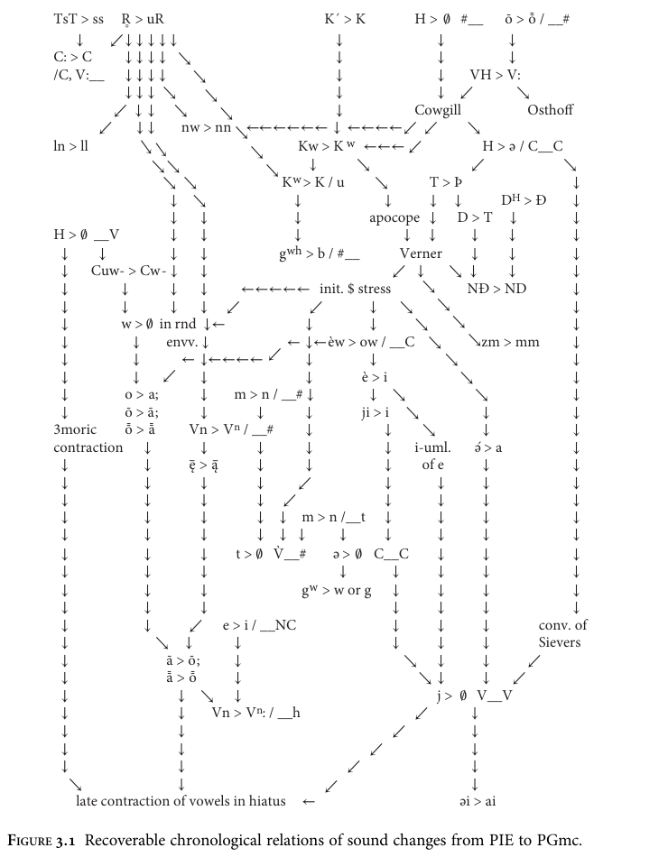

# Chapter 3: The development of Proto-Germanic

> Third-pass stage-sensitive corpus draft. Use page anchors for checking against the PDF.


## Transcription and normalization note

This pass corrects the over-normalization of Germanic labiovelar notation from the second pass. PIE and Proto-Core/Proto-Central IE reconstructions generally retain Unicode notation such as `*kʷ`, `*gʷ`, and `*gʷʰ`. Explicit pre-PGmc, PGmc, and later Germanic-stage forms use Ringe-style `*kw`, `*gw`, and `*hw`. Unlabeled transitional forms are checked conservatively and may still require PDF verification before citation.


<!-- p. 84; pdf-page 95 -->


## 3.1 Introduction


PIE was probably spoken some 6,000 years ago, conceivably even earlier. Even the last common ancestor of Germanic and Italo-Celtic was probably spoken at least 5,000 years ago. Proto-Germanic, by contrast, is unlikely to have been spoken before about 2,500 years ago (ca. 500 BC). Thus a generous half of the reconstructable development of English occurred before the PGmc period. The consequences of that fact are clear enough on an intuitive level. A student who has studied only Germanic languages typically finds the grammar of PIE very unfamiliar, perhaps even bewildering or intimidating. On the other hand, the grammar of PGmc, while it exhibits plenty of curious archaisms, is recognizably similar in outline even to the grammar of modern German. As might be expected, the extensive changes that occurred in the development from PIE to PGmc are not evenly distributed throughout the grammar. Little syntactic change can be demonstrated. A significant reorganization of nominal inflection took place. Sound changes were much more extensive; more than forty regular sound changes can be reconstructed, and their relative chronology is partly recoverable. But the most striking changes affected the system of verb inflection, which was completely reorganized and drastically altered in detail. In consequence, a Germanic language is today immediately recognizable by the inflection of its verbs. This chapter will discuss in some detail the changes that occurred as PIE developed into PGmc.


### 3.1.1 Linguistics and archaeology


The definition of ‘Proto-Germanic’ used throughout this book is determined by the methodology of comparative linguistics: it is the last common ancestor of the adequately attested Gmc languages, as reconstructed from those attested languages by application of the comparative method. Reconstructed PGmc appears to have been more or less a single dialect; to some extent that can be an artefact of the comparative method, but the scarcity of potential dialect differences in our reconstructions argues that the apparent unity of PGmc is not very different from historical reality.


<!-- p. 85; pdf-page 96 -->


That is not the only possible definition of PGmc; for instance, the ‘Protogermanisch’ of Euler 2009 is a somewhat earlier stage of development of that language. In addition, the archaeology of northern Europe in the last millennium BC is well enough understood that probable Germanic speech communities can be identified in the archaeological record, with the result that an archaeological definition of ‘Proto-Germanic’ is also possible. It seems advisable to offer a brief discussion of the correlation between linguistics and archaeology in this case.1


There is a consensus that the Jastorf culture, which extended from southern Denmark to central Germany, is the earliest archaeologically defined culture identifiable as Germanic, because an archaeological continuity between the Jastorf culture, its successors and offshoots, and populations known from Roman sources to have been Germanic can be demonstrated (Keiling 1976: 83–7).2 This raises a problem that is not always appreciated. Early Jastorf, at the end of the seventh century BC, is almost certainly too early for the last common ancestor of the attested languages; but later Jastorf culture and its successors occupy so much territory that their populations are most unlikely to have spoken a single dialect (cf. Euler 2009: 41–2), even granting that the expansion of the culture was relatively rapid (as suggested by Wolfram 2004: 54). It follows that our reconstructed PGmc was only one of the dialects spoken by peoples identified archaeologically, or by the Romans, as ‘Germans’; the remaining Germanic peoples spoke sister dialects of ‘PGmc’. It follows further that the absence of some typically Germanic characteristic—such as the sound changes called Grimm’s Law (see 3.2.4(i))—in recorded Germanic proper names cannot be used to date PGmc changes, since the relevant changes could have occurred in those dialects at dates different from those at which they occurred in our reconstructed PGmc. It seems worth asking whether we can determine the geographical location of reconstructed PGmc among the probable Germanic speech communities. An answer is suggested by the principle of dialect geography that, other things being equal, the area of origin is the area of greatest diversity. The oldest split between the attested languages is between East Germanic and the rest (see 4.1); and since various East Germanic tribes are believed to have begun their migrations from islands in the Baltic Sea, while North and West Germanic peoples occupy Denmark and adjacent parts of Germany at the earliest dates when they can be identified, the PGmc of this book was probably spoken near the western end of the Baltic. More than that cannot be said with confidence.


> **Footnote 1.** For much further discussion of this topic, with different aims and from a somewhat different perspective, see Euler 2009: 12–57 with references.

> **Footnote 2.** However, caution is necessary in drawing inferences from that fact. Jastorf culture, though recognizably a single culture, was not uniform (Keiler 1976: 95). Moreover, we cannot simply assume that the boundaries of speech communities and material cultures coincided (cf. Pohl 2000: 49–50, Wolfram 2004: 54). The most that we can say is that the linguistic ancestors of the speakers of PGmc probably occupied at least part of the Jastorf culture area. How they got there is a separate question for which there seems to be no hard archaeological evidence; for a tentative suggestion see Euler 2009: 48–50.


<!-- p. 86; pdf-page 97 -->


## 3.2 Regular sound changes


I discuss sound change first for a simple reason. Cognate words and affixes can be recognized only by the regular sound correspondences that result from regular sound change; reliance on general phonetic similarity inevitably leads to errors. Therefore, if the reader is to understand the discussion of morphological development in any detail, (s)he must first be given the basic sound change ‘tools’ with which to recognize the Germanic reflexes of PIE words and inflectional markers. A less-than-perfect result is that we cannot discuss the development in strictly chronological order, even when the relative chronology of a sound change and a morphological change can be recovered. I will group the characteristic Germanic sound changes in sets, arranged partly thematically and partly chronologically. In each case I will discuss the relative chronology of interacting sound changes to the extent that it can be reconstructed. Readers who are not primarily interested in sound change and who want a quick overview of the large-scale phonological differences between PIE and PGmc should read at least Sections 3.2.1(ii) and (v), 3.2.2(i), 3.2.4(i) and (ii), 3.2.5(iii) and (iv), and 3.2.7(i).


### 3.2.1 The elimination of laryngeals, and related developments of vowels


More than any other development, the loss of the ‘laryngeal’ consonants of PIE altered the phonological typology and the phonotactics of IE languages. But though the laryngeals have been lost in every daughter of the family except (in part) Anatolian, the details are different enough from daughter to daughter to show that this was an independent parallel development. Still, the loss of laryngeals was apparently an early complex of changes in most daughters, and that is certainly the case in Germanic.


#### 3.2.1 (i) Cowgill’s Law


Though the reflexes of laryngeals in Germanic are usually vocalic (when not nil), it is possible that in a few environments at least some laryngeals became PGmc *k. This is sometimes called ‘Cowgill’s Law’, since Warren Cowgill made the best case for such a development (Cowgill 1965: 143 fn. 1, 170 fn. 58, 178 fn. 72, 1985b: 27). Cowgill suggested that at least *h₃ became PGmc *k when between a sonorant and *w (in that order); a reasonable case can be made for the suggestion that *h₂ underwent the same development. Here are the examples:


```text
PIE *n̥h₃mé ‘us two’ ! *n̥h₃wé (Katz 1998: 89–99, 212–17; cf. Skt āvā́m, Gk *nōwé
> νώ /nɔ́:/) > *unkʷé, to which was formed dat. *unkʷís; the two > *unkʷé,
*unkʷís > PGmc *unk, *unkiz (with regular loss of labialization, see 3.2.3(ii); cf.
Goth. ugkis, ON okkr, OE unc); this is essentially the scenario of Katz 1998: 224;
PIE *gʷih₃wós ‘alive’ (cf. Skt jīvás, Lat. vīvos, and with analogical full-grade root
Gk ζωός /sdɔ:ós/) > *kʷikʷós > PGmc *kwikwaz (cf. ON kvikr, OE cwic).
```


<!-- p. 87; pdf-page 98 -->


Less certain is an example with *h₂:


```text
PIE *dayh₂wḗr ‘brother-in-law’ (?; Normier 1977: 182, and similarly Huld 1988;
cf. Skt devā́, Homeric Gk *dayawḗr > δᾱήρ /da:ɛ́:r/) > *taikʷḗr >! PGmc
*taikuraz (remodeled on the analogy of *swehuraz ‘father-in-law’; cf. OE
tācor, OHG zeihhur).
```


Surprisingly, there seem to be no clear counterexamples. In the paradigm of such an adjective as *ténh₂u- ‘thin’, for instance, a sequence *nh₂w or *n̥h₂w never occurred: the masc. and neut. stem was *ténh₂u- ~ *tn̥h₂áw-, while the fem. stem was *tn̥h₂áwih₂- ~ *tn̥h₂uyáh₂-. But the eventual development of this adjective in PGmc shows that at some point morphological change did give rise to a sequence *nh₂w or its reflex (Heidermanns 1986: 282–3, 287; see 3.2.6(iii)). Cowgill’s Law must have occurred before that development in ‘thin’ and words of similar shape. Cowgill’s proposal has given rise to hot debate, but most of the objections are not cogent. The original proposal, made by William Austin, included a larger number of more questionable examples (Austin 1946), and that has led some critics to damn the idea altogether; but obviously objections to Austin’s proposal are not validly applied to Cowgill’s greatly constrained revision. Skeptics have observed that Goth. qius, qiwa- ‘alive’ shows loss of the laryngeal (a fairly common development in Germanic and the other western branches of the family), and since the same development is clearly attested in OIr. béo, Welsh byw < Proto-Celtic *biwos, they have argued that the PGmc development of this word is less than clear. But we cannot exclude the possibility that pre-Gothic *kwiwaz reflects a dissimilatory loss of the second occlusion in PGmc *kwikwaz. Finally, it is true that PGmc *taikuraz has been remodeled on the analogy of *swehuraz, but that does not account for its *k; and while it is also true that the ᾱof the Homeric Greek cognate can be explained as an outcome of *ai before a front vowel (cf. Forssman 1966: 122–3, Peters 1989: 277, 302), a solution that can explain both the Greek vowel (ᾱ< *aya < *ayh₂) and the Germanic consonant (*aik < *ayh₂ before *w) surely ought to be preferred—all the more so since the change of *ai to ᾱbefore front vowels is not regular in Homeric Greek (a ‘Tendenz’, Forssman, loc. cit).3 For the pronoun there is no other plausible solution, as Katz has seen. I therefore tentatively accept Cowgill’s Law.


> **Footnote 3.** It must be emphasized that sporadic sound changes are always unlikely and should be accepted only when there is no choice. Of course it is always possible that these Homeric forms are Atticisms in the text, with regular Attic ᾱfor *αι before a front vowel (though no one seems to have suggested that). But although Homeric Gk δαίρων certainly could conceal an earlier *δαιϝρων with no reflex of a laryngeal (Chantraine 1973: 216), neither such a form nor the late epigraphical dat. sg. δαιρί (see Liddell, Scott, et al. 1968 s.v. δᾱήρ) shows that the forms with a full-grade suffix must have contained a sequence *-αιϝ-; as Olav Hackstein reminds me, the zero-grade stem *dayh₂wr- should have lost its laryngeal regularly already in PIE (see 2.2.4(i)), and it is unclear how we should expect the resulting allomorphy to have been remodeled in Greek.


<!-- p. 88; pdf-page 99 -->


As ‘us two’ demonstrates, Cowgill’s Law occurred before the merger of *Kʷ with labiovelars and the subsequent delabialization of the same next to *u (see 3.2.3(ii)). If ‘brother-in-law’ is a valid example, it must also have occurred before the epenthesis of *ə next to laryngeals between nonsyllabics, which it bleeds. It follows that it occurred before Grimm’s Law (see 3.2.4(i) and 3.2.8); its output must therefore have been *g, which Grimm’s Law shifted to *k. That suggests that these laryngeals might have been voiced velar fricatives immediately before Cowgill’s Law applied, which is plausible. If ‘brother-in-law’ is not a valid example, the sound change might have occurred after Grimm’s Law, but in that case its input must have been a sound which was neither input nor output to Grimm’s Law, which seems less likely. The conditioning environment for Cowgill’s Law seems very strange; but it would be much more natural if the loss of word-initial laryngeals and the contraction of laryngeals with preceding nonhigh vowels had already occurred. In that case the only laryngeals still surviving before *w would be those discussed in this section, and the rule would simply be that laryngeals (or at least the second and third) became stops when *w immediately followed. I tentatively accept that relative chronology.


#### 3.2.1 (ii) The loss of laryngeals word-initially and next to nonhigh vowels


Word-initial laryngeals immediately followed by consonants were lost in all the daughters of PIE except Anatolian, Greek, Armenian, and Phrygian. Germanic examples are easy to find:


```text
PIE *h₁ln̥gʷʰrós ‘light (in weight)’ (cf. Gk ἐλαφρός /elaphrós/ ‘light, nimble’)
> PGmc *lungraz ‘swift’ (cf. OS lungar ‘powerful’; OE adv. lungre ‘quickly,
soon’);
PIE *h₁dónt- ‘tooth’ (lit. *‘eater’ (*‘biter’?); cf. Aiolic Gk pl. ἔδοντες /édontes/, Skt
dánt-) > PGmc *tanþ- (cf. ON to˛nn, OE tōþ);
PIE *h₂stér- ‘star’ (cf. Hitt. hasterz, Gk ἀστέρ- /astér-/) >! PGmc *sternan- (cf.
Goth. staírno, OE steorra);
PIE *h₂wl̥h₁nah₂ ‘wool’ (cf. Hitt. hulana-, Skt ū́rṇā, Lat. lāna, Lith. pl. vìlnos) >
*wulnō > PGmc *wullō (cf. Goth. wulla, OE wull);
PIE *h₂wes- ‘to stay the night’ (cf. Homeric Gk aor. *awésai > ἀέσαι /aésai/; Skt
vásati ‘remains’) > PGmc *wesaną ‘to stay, to be’ (cf. Goth. wisan, OE wesan);
PIE *h₃bʰrúHs ‘eyebrow’ (cf. Gk ὀφρῡ́ς /ophrú:s/, Skt bhrū́s) > *brūz ! PGmc
*brūwō (cf. OE brū);
PIE *h₃nogʰ(w)- ‘claw, nail’ (cf. Gk ὄνυχ- /ónukh-/, Lith. nãgas) >! PGmc *naglaz
(cf. ON nagl, OE næġl).
```


Laryngeals immediately followed by nonhigh vowels, whether word-initial or not, were also lost; the allophones of PIE */e/ which the laryngeals had induced (*[a] next to *h₂, *[o] next to *h₃) thereby became fully contrastive. Since the same change occurred in most daughters, it is often difficult to determine whether or not a


<!-- p. 89; pdf-page 100 -->


particular word had a laryngeal in it in PIE (especially in the case of *h₁). The following examples relevant to Germanic, some with laryngeals and some without, seem reasonably certain:


```text
PIE *h₁esti ‘(s)he is’ (cf. Gk ἐστι /esti/, Lat. est; for the laryngeal cf. Skt ā́sat- ‘not
existing’ < *ń̥-h₁s-n̥t-) > *esti > PGmc *isti (cf. Goth. ist, OE is);
PIE *h₁ed- ‘to eat’ (cf. Homeric Gk ἔδειν /éde:n/, Lat. edere; for the laryngeal cf.
‘tooth’ above) > PGmc *etaną (cf. Goth. itan, OE etan);
PIE *en ‘in’ (cf. Gk ἐν /en/, Old Lat. en > Lat. in; cf. also Hitt. andan, Gk ἔνδον
/éndon/ ‘inside’; no laryngeal in Vedic Skt jm-án ‘on the earth’4) > PGmc *in (cf.
Goth., OE in);
PIE *ep- ~ *op- ‘back’ (Hitt. āppa ‘back, again’, āppan ‘behind, after’; Gk ἐπί /epí/
‘on’; Skt r̥jipyás ‘eagle’ < *h₂r̥ǵi-p-yó-s ‘white-back’ with no evidence of laryngeal) > PGmc *eb- ‘back’ in Goth. ibdalja ‘descent, downslope’, ibuks ‘turned
backwards’;
PIE *h₂ánti ! *h₂antí ‘on the surface (lit. ‘forehead’), in front of’ (Hitt. hānz ‘in
front’ and analogically remodeled hantī ‘apart’; Lat. ante ‘in front of’; Gk ἀντί
/antí/ ‘instead of’) > PGmc *andi ‘in addition’ ! PWGmc ‘and’ (cf. OE and,
OHG enti; on the early loss of *-i in the OE form see vol. ii, pp. 55–7);
PIE *h₂áǵeti ‘(s)he is driving’ (cf. Skt ájati, Lat. agit; for the laryngeal cf. the ablaut
of Gk ὄγμος /ógmos/ ‘furrow’) > PGmc *akidi ‘(s)he goes in a vehicle’ (cf. ON
inf. aka; ?also OE acan ‘to ache’, Seebold 1970: 75);
PIE *h₂ówis ~ *h₂áwi- ‘sheep’ (Kimball 1987: 189; cf. Lycian acc. sg. xawã, Toch.
B āu ‘ewe’ (Kim 2000b), Skt ávis, Lat. ovis) > PGmc *awiz (cf. Goth. awistr
‘sheepfold’);
PIE *h₂ḱ-h₂ows-iéti ‘(s)he is sharp-eared’ (cf. Gk ἀκούειν /akóue:n/ ‘to hear’) >
*kowsiéti > PGmc *hauzīþi ‘(s)he hears’ (cf. Goth. hauseiþ, OE hīerþ);
PIE *átta5 ‘dad’ (cf. Gk ἄττα /átta/, Lat. atta, both used as respectful forms of
address for old men; Hitt. attas ‘father’) >! PGmc *attō̄ (cf. Goth. atta ‘father’);
PIE *ályos ‘other’ (cf. Lydian aλa-, Gk ἄλλος /állos/, Lat. alius) > PGmc *aljaz
(cf. Goth. alja-);
PIE *h₃órō, *h₃óron- ~*h₃r̥n- ‘eagle’ (cf. Hitt. hāras, hāran-; Gk ὄρνῑς /órni:s/ ‘bird’)
>! *orō, *orn- > PGmc *arō̄̄, *arn- (cf. Goth. ara, OE earn, OHG aro, arn);
PIE *h₃ósdos ‘branch’ (cf. Gk ὄζος /ósdos/; Hitt. hasduēr ‘twigs, brush’) > *ósdos >
PGmc *astaz (cf. Goth. asts, OHG ast);
PIE *órsos ‘arse’ (Hitt. ārras, Gk ὄρρος /órros/) > PGmc *arsaz (cf. OE ears);
```


> **Footnote 4.** I am grateful to Michael Weiss for alerting me to this form.

> **Footnote 5.** This is the only reconstructable PIE word in which *s was not inserted between the two coronal stops. That might be because it was a ‘nursery word’, but note also that it is the only intramorphemic example of adjacent coronal stops, and it would not be surprising if the s-insertion rule applied only in derived environments.


<!-- p. 90; pdf-page 101 -->


```text
PIE *somHós ‘same’ (cf. Skt samás, with the first a not lengthened by Brugmann’s
Law; Gk ὁμός /homós/) >! PGmc *sama-n- (usually with weak inflection;
cf. Goth. sama, OHG samo).
```


If the laryngeal was preceded by a high vowel, a semivowel developed between the vowels in hiatus:


```text
PIE *priHós ‘beloved’ (cf. Skt priyás, root prī- < *priH-) > PGmc *frijaz ‘free’
(cf. Goth. freis, stem frija-).
```


Examples of laryngeals between nonhigh vowels will be given and discussed below. Laryngeals immediately preceded by a nonhigh vowel in the same syllable were likewise lost, and the laryngeal-induced allophones of */e/ likewise became fully contrastive, but in these cases the vowel was also lengthened. Except in word-final position, these new long vowels appear to have merged with the inherited nonhigh long vowels. The following examples, some with laryngeals and some without, are typical:6


```text
PIE *seh₁- ‘to sow’, *séh₁mn̥ ‘seed’ (cf. Lat. pf. sēvisse, sēmen, OCS sěti, sěmę),
collective *séh₁mō > PGmc *sēaną,*sēmō̄ (cf. Goth. saian, OHG sāen, sāmo);
PIE *dʰéh₁ti- ~ *dʰh₁téy- ‘act of putting’ (cf. Gk θέσις /thésis/; Av. zraz-dāti-
‘belief ’ (lit. ‘putting faith’), Skt vásu-dhiti- ‘bestowal of goods’) >! *dʰētís >
PGmc *dēdiz ‘deed’ (cf. OE dǣd; Goth. missadeþs ‘misdeed, sin’);
PIE *méh₁tis ‘measure’ (cf. Lat. derived vb. mētīrī ‘to measure’) > PGmc *mēþiz
(cf. OE mǣþ);
PIE *gʷḗn ‘woman (nom. sg.)’ (OIr. bé; cf. Jasanoff 1989) >! PGmc *kwēniz ‘wife’
(cf. Goth. qens; OE cwēn ‘queen’);
PIE *sēmi- ‘half-’ (cf. Gk ἡμι- /hɛ:mi-/, Lat. sēmi-; probably a vr̥ddhi derivative of
*sem- ‘one’) > PGmc *sēmi- (cf. OHG sāmi-);
(post-)PIE *swēḱurós ‘of a father-in-law’ (vr̥ddhi deriv., cf. Skt śvāśuras) > PGmc
*swēguraz ‘brother-in-law’ (cf. OHG swāgur);
PIE *pah₂- ‘to protect’ (cf. Hitt. iptv. 2sg. pahsi) > *pā- > *fō- in PGmc *fōdrą
‘sheath’ (cf. Goth. fodr, OE fōdor);
PIE *wráh₂d- ~ *wr̥h₂d- ‘root’ (cf. Lat. rādīx) > *wrād- ~ *wurd- > PGmc *wrōt- ~
*wurt- (cf. Goth. waúrts, ON rót; OE wyrt ‘plant’);
PIE *kah₂ros ‘dear, beloved’ (cf. Lat. cārus; root *kah₂- ‘love’, cf. Skt kā-) > PGmc
*hōraz ‘lover’ ! ‘adulterer’ (cf. Goth. hors, ON hórr);
```


> **Footnote 6.** For the most part, examples with laryngeals and those without have to be distinguished inferentially. Roots with apparently final long vowels, and words derived from them, must contain a laryngeal because PIE roots had to end in a consonant. Inherited long vowels appear in acrostatic nominals and vr̥ddhi derivatives (see 2.2.4(i)) and in forms affected by Szemerényi’s Law (see 2.2.4(iv)). Possible Gmc examples of inherited *ā with external cognates are all more or less uncertain.


<!-- p. 91; pdf-page 102 -->


```text
PIE *swā́dus ‘pleasant, sweet’ (*swáh₂dus?; cf. Skt svādús, Gk ἡδύς /hɛ:dús/) >
PGmc *swōtuz ! NWGmc *swōtijaz (cf. ON sœtr, OE swēte);
PIE *bʰāǵʰus ‘arm’ (*-ah₂-?; cf. Skt bāhús; Gk πῆχυς /pɛ̂:khus/ ‘forearm’) > PGmc
*bōguz ‘upper arm, shoulder’ (cf. ON bógr, OE bōg);
(post-)PIE *wātís ‘seer’ (cf. Lat. vātēs, OIr. fáith; vr̥ddhi deriv. if related to Skt 3sg.
api-vátati ‘(s)he understands’) >! PGmc *wōdaz ‘possessed, crazy’ (cf. Goth.
woþs, OE wōd);
PIE *dʰóh₁mos ‘thing put’ (cf. Gk θωμός /thɔ:mós/ ‘heap’) > PGmc *dōmaz
‘judgment’ (cf. Goth. doms, OE dōm);
PIE *h₁óh₃s ‘mouth’ (cf. Skt ā́s, Lat. ōs; Hitt. ais has been remodeled) >! PGmc
*ōsaz ‘mouth (of a river)’ (cf. ON óss);
post-PIE *bʰloh₃- ‘bloom, flower’ (cf. Lat. flōs ‘flower’) > PGmc *blō- (cf. Goth.
bloma ‘flower’, OE blōstm(a) ‘flower’, blōwan ‘to bloom’);
PIE *pṓds ‘foot (nom. sg.)’ (cf. Skt pā́t, Doric Gk πώς /pɔ́:s/) > PGmc *fōt-
(cf. Goth. fotus, OE fōt);
PIE *kʷetwṓr ‘four (neut.)’ (cf. Skt catvā́ri, Lat. quattuor) >! PGmc *fedwōr
(initial labial probably by lexical analogy with ‘five’; cf. Goth. fidwor, OE fēower);
(post-)PIE *nōdos ‘knot’ (cf. Lat. nōdus; vr̥ddhi deriv. to *nod- in PGmc *natją ‘net’,
cf. Goth. nati, OE nett), coll. *nōdah₂ > PGmc *nōtō ‘net’ (cf. ON nót ‘dragnet’).
```


When a laryngeal was lost between nonhigh vowels, the result must at first have been two vowels in hiatus. As in other IE languages, contraction of the adjacent vowels followed. In Germanic, however, the results of these contractions were not ordinary long vowels, but ‘overlong’ or ‘trimoric’ vowels. For the most part these exceptional long vowels eventually merged with the ordinary long vowels, but trimoric *ō̄̄ in word-final syllables can be shown to have remained distinct from ordinary *ō and from nasalized *ǭ (Stiles 1988). The sound correspondences between the principal older Germanic languages show that very clearly:


```text
PGmc
Gothic
Old Norse
Old English
Old High German
*-ō
-a
*-u > -0/
-u ~ -0/
-u ~ -0/
*-ǭ
-a
-a
-æ > -e
-a
*-ō̄̄, *-ǭ̄
-o
-a
-a
-o
*-ōz
-os
-ar
-æ > -e
-a
*-ō̄z
-os
-ar
-a
-o
```


As might be expected, the crucial examples occur exclusively in inflectional syllables. Note the following:


```text
PIE gen. pl. *-oHom (cf. Skt -ām (often disyllabic in the Rigveda), Gk -ῶν /-ɔ̂:n/,
Lith. -ų̃) > PGmc *-ǭ̄ (cf. Goth. (fem.) -o, OE -a, OHG -o);
PIE ah₂-stem nom. pl. *-ah₂as (cf. Skt -ās, Lith. -õs) > PGmc *-ō̄z (cf. Goth. -os, OE
-a, OHG (adj.) -o).
```


<!-- p. 92; pdf-page 103 -->


There is also at least one example, possibly two, of a contraction of adjacent vowels that cannot be shown to have been separated by a laryngeal in PIE:


```text
PIE o-stem abl. sg. *-ead > PGmc *-ō̄̄ in adverbs such as Goth. þaþro ‘from there’
(Patrick Stiles, p.c.);
PIE o-stem nom. pl. masc. *-oes (cf. Skt -ās, Oscan -ús) > PGmc *-ō̄̄z (?; cf. Goth.
-os, ON -ar, but see the discussion in 4.3.4(i)).
```


Contrast the ordinary ō-vowels in the following endings, which were not originally disyllabic:


```text
PIE thematic pres. indic. 1sg. *-oh₂ (cf. Lat. -ō, Lith. -ù) > PGmc *-ō (cf. Goth. -a,
ON 0/, OHG, Anglian OE -u);
PIE ah₂-stem nom. sg. *-ah₂ (cf. Skt -ā, Lith. -à) > PGmc *-ō (cf. Goth. -a, ON 0/
with u-umlaut, OE -u ~ 0/);
PIE ah₂-stem acc. sg. *-ām (see 2.2.4(iv) on the phonology; cf. Skt -ām, Lat. -am) >
PGmc *-ǭ (cf. Goth. -a, OE -e, OHG -a);
PIE ah₂-stem acc. pl. *-ās (see 2.2.4(iv) on the phonology; cf. Skt -ās) > PGmc *-ōz
(cf. Goth. -os, OE -e, OHG -a).
```


The chronological relations of these changes are largely obscure, but it seems clear that they were among the earliest pre-PGmc sound changes. Though trimoric vowels are detectable by comparative reconstruction from the attested languages only in word-final syllables, there is no indication that early contractions of vowels in hiatus yielded any other outcome in any position in the word. Note that examples of trimoric vowels occur before word-final nasals (which were lost early, see 3.2.2 (ii)), before word-final *-d (whose reflex was lost much later, see 3.2.6(iv)), and before word-final *-s, which persisted (as *-z) long beyond the PGmc period; that suggests that there were no restrictions on their occurrence. We are occasionally able to infer PGmc *ō̄ and *ē̄ in word-internal positions when the PIE origin of the vowel is known. For further discussion and examples see Stiles 1988. Very surprisingly, PIE *-ō in absolute word-final position yielded not bimoric *-ō but trimoric *-ō̄ in PGmc (Jasanoff 2002: 35–8). The only examples are the nom. sg. of masc. n-stems, which in Germanic survives unaltered only in the West Germanic languages, and the nom.-acc. of neuter n-stem collectives, which became neuter plural in most daughters but singular in Germanic:


```text
PIE *h₃érō ‘eagle (nom. sg.)’ (cf. Hitt. hāras with added -s; the original ending survives
in Lat. n-stem nom. sg. -ō, though this word does not) > PGmc *arō̄ (cf. OHG aro);
PIE *séh₁mō ‘seed (collective)’ > PGmc *sēmō̄ (cf. OHG sāmo);
PIE *h₁nóh₃mō ‘set of names’ (cf. Skt pl. nā́mā) > *nṓmō >! PGmc *namō̄ ‘name’
(with analogical introduction of a root vowel shortened by Osthoff ’s Law, see
Section 3.2.1(iii); cf. Goth. namo, OE nama, OHG namo).
```


<!-- p. 93; pdf-page 104 -->


It follows that the contrast between bimoric and trimoric vowels arose in prePGmc either when the first contractions of vowels in hiatus occurred or when word-final *-VH developed into bimoric long vowels, whichever happened first. (Contractions of vowel sequences which arose later gave rise to trimoric vowels only when one of the input vowels was long; otherwise they resulted in bimoric vowels (see 3.2.6(i)).) It is difficult to determine what the phonetic difference between PGmc bimoric and trimoric vowels was. Nonfinal trimoric vowels might actually have been disyllabic sequences of vowels in hiatus for some time, though long survival of sequences of identical vowels in hiatus is not particularly plausible. On the other hand, the contrast between word-final *-ō̄ < PIE *-ō and word-final *-ō < PIE *-oH and *-ah₂ suggests a difference in intonation like that of Balto-Slavic, the PGmc bimoric vowels corresponding to Balto-Slavic vowels with acute intonation and the PGmc trimoric vowels corresponding to Balto-Slavic vowels with circumflex intonation. In fact the correspondence is almost exact, since in Balto-Slavic original long vowels acquired circumflex accent when word-final (Jasanoff 2002: 36–8); it is possible, though not certain, that this is a historically shared innovation which occurred in the last common ancestor of those two daughters. It has been suggested repeatedly that the Balto-Slavic acute intonation was actually glottalization of the syllable nucleus—an especially plausible hypothesis given that some acute syllables are glottalized in Latvian (cf. e.g. Jasanoff 1996: 1, 2004: 251, Kim 2002: 117)—and we might be tempted to suggest that the same was true of PGmc bimoric vowels; since the PIE laryngeals could have become glottal stops before being lost, that solution appears plausible. It is awkward that PIE nonfinal long vowels which did not result from laryngeal lengthening also appear in PGmc as bimoric, to judge from the outcomes of long ō-vowels in West Germanic (e.g. in ‘four’, *feuwar < *fewwār (see vol. ii, pp. 58–60) < PGmc *fedwōr < PIE neut. *kʷetwṓr, with no laryngeal), since it is difficult to see why they should have been glottalized. But such PIE long vowels also appear with acute intonation in BaltoSlavic in nonfinal syllables (cf. e.g. Jasanoff 1996: 1–2). Finally, the eventual outcomes of word-final examples in the attested languages provide a little potential evidence for the phonetics of these vowels in PGmc. The North and West Germanic differences in vowel quality are difficult to interpret, but in Gothic the pattern is clear: word-final short vowels (except *u) were lost, word-final bimoric vowels became short, and word-final trimoric vowels became ordinary long vowels. It appears that, to a first approximation, all word-final vowels were reduced by one mora in Gothic—hence the designation ‘trimoric’ for the third set of vowels. How to reconcile that result with the other considerations discussed in this paragraph is still a matter of debate among specialists. As I noted at the end of 3.2.1(i), the conditioning of Cowgill’s Law makes better sense if the losses of laryngeals discussed in this section preceded it.


<!-- p. 94; pdf-page 105 -->


#### 3.2.1 (iii) Osthoff’s Law


A phonological rule that is most conveniently discussed at this point, even though it does not have to do directly with laryngeals, is Osthoff’s Law. Among Indo-Europeanists, Osthoff ’s Law is a cover term for rules that shortened long vowels when they were followed by a sonorant which was in turn followed by another consonant. (Osthoff ’s Law usually did not apply before word-final sonorants, which were presumably extrametrical in archaic IE languages.) The details differ from language to language, but it is clear that some version of Osthoff ’s Law applied in Greek, Latin, and Celtic, but not in Tocharian or Indo-Iranian. Osthoff’s Law probably applied in Germanic as well, but cogent examples are surprisingly few. In some ways the best is ‘name’, in spite of the fact that its inflection has been remodeled by morphological changes. The development of ‘name’ in Germanic can be outlined briefly as follows. Most IE languages exhibit o-vowels of some sort between the (first) *n and the *m of ‘name’, but Tocharian preserves a clear reflex of *ē. Those two facts are most easily reconciled by positing *h₃ immediately before the *m and acrostatic inflection for the word. The Tocharian form should then reflect the direct cases of the singular, in which the *ē of the root would not have been colored by the laryngeal (Ringe 1996: 8 with references):


```text
PIE *h₁nḗh₃mn̥ > *nḗmn̥ > Proto-Tocharian *ñémə > Toch. A ñom, B ñem.
```


The Hittite and Latin forms, on the other hand, must reflect the oblique stem, with a short *e which the laryngeal would have colored:


```text
PIE *h₁nóh₃mn̥- > *nṓmn̥- > Hitt. lāman, Lat. nōmen.
```


Skt nā́ma could reflect both ablaut grades (since all nonhigh vowels merged in IndoIranian), and its ‘columnar’ accent on the initial syllable might reflect the PIE acrostatic inflection directly. Various other daughters shifted this word into other ablaut paradigms. In Germanic, however, what seems to have survived is the PIE collective, which was amphikinetic; the expected development would have been the following:


```text
PIE *h₁nóh₃mō, *h₁n̥h₃mn-´ (*h₁n̥h₃mn̥-´?) > *nṓmō̄, *unmn-´ (*unmun-´?).
```


It seems clear that the *nam- of the actual PGmc form cannot have developed by sound change alone. However, we can account for it if we posit that (1) the initial syllable of the direct form was leveled into the oblique forms—a common and expected development— and (2) the *-n- of the suffix was (or became) nonsyllabic, as in Sanskrit. The development will then have been the following:


```text
pre-PGmc *nṓmō, *nōmn-´ > *nṓmō, *nomn-´ (by Osthoff’s Law) ! *nómō,
*nomn-´ (by leveling) > PGmc *namō̄, *namn- (cf. Goth. namo, pl. namna, OE
nama, OHG namo; the ON a-stem sg. nafn was backformed from the plural).
```


<!-- p. 95; pdf-page 106 -->


This appears to be the only way to account for the *a of the PGmc initial syllable. It follows that Osthoff’s Law operated after tautosyllabic *VH had become long vowels. An additional probable example of Osthoff ’s Law is ‘heel’:


```text
PIE *pḗrs-n- ‘heel’ (cf. Skt pā́rṣṇis) > PGmc *fersn- ~ *ferzn- (cf. ō-stem Goth.
faírzna, OHG fersana, i-stem OE fiersn).
```


But the different Verner’s Law alternants exhibited by the East and West Germanic forms argue caution, since that pattern suggests that this remained an ablauting noun in PGmc, and it is possible that short *e was inherited in some forms. PGmc *mimzą ‘meat’ (cf. Goth. mimz) is an uncertain example of Osthoff ’s Law for the same reason; PGmc *amsaz ‘shoulder’ (cf. Goth. acc. pl. amsans) is uncertain because the daughters in which it could not have undergone Osthoff ’s Law disagree on the length of the first-syllable vowel. (For further discussion of those two words see 3.2.6(iii).) ‘Wind’ is equally uncertain, but for a much more complex reason. The PIE word was the participle of an archaic acrostatic root-present meaning ‘blow’; it survives as such in Hittite:


```text
PIE *h₂wéh₁n̥ts ‘wind’ > Hitt. hūwanz (Melchert 1994a: 54 with references).
```


In other daughters it was remodeled as an o-stem. Indo-Iranian preserves it without further change:


```text
PIE *h₂wéh₁n̥ts ! *h₂wéh₁n̥tos > Proto-Indo-Iranian *váatas > Skt vā́tas (still
scanned as three syllables in some passages of the Rigveda).
```


At least in Tocharian the o-stem was remodeled further as *wēntos, no doubt because it was still clearly related to *h₂wéh₁- ‘blow’, which had become *wē- before consonant-initial endings. We are certain of that because only an intermediate *ē can account for the further developments of the first-syllable vowel:


```text
post-PIE *wēntos > Proto-Tocharian *wyentë > Toch. A want, B yente.
```


The same post-PIE preform can of course account for Lat. ventus, Welsh gwynt,7 and PGmc *windaz (with regular raising of *e before a tautosyllabic nasal, see 3.2.7(ii); cf. Goth. winds, ON vindr, OE wind, OHG wint); if that is correct, the word is another example of Osthoff’s Law in Germanic, and we can also say that it was accented on


> **Footnote 7.** There are two different lines of development that could have led to Welsh gwynt, as Michael Weiss reminds me. Possibly post-PIE *wēntos > Proto-Celtic *wīntos > Welsh gwynt; but if the Proto-Celtic form had instead been *wentos (see the text immediately below), it too should have yielded Welsh gwynt (cf. Schrijver 1995: 27–30). But we can be certain that Osthoff ’s Law applied in Celtic after the change of (post-)PIE *ē to *ī because of OIr. pret. 3sg. as·rubart ‘(s)he has said’. As Warren Cowgill observed to me ca. 1980, the raising of the perfective prefix ro- to ru- shows that the following syllable originally contained a high vowel; it can only have been Proto-Celtic *bīrt < *bīrst < post-PIE s-aorist *bʰḗr-s-t (cf. Watkins 1962: 162–74). The stressed vowel of as·bert ‘(s)he said’, etc., can of course have been introduced by leveling from the present and subjunctive.


<!-- p. 96; pdf-page 107 -->


the thematic vowel (because Verner’s Law has applied, see 3.2.4(ii)). But we cannot completely exclude the possibility that loss of the medial laryngeal in such a form as *h₂weh₁n̥tós resulted in a sequence *en directly, with no lengthening of the vowel. The same objection can be raised in the case of ‘young’, which will be discussed in detail in section 3.2.2(i). Finally, there is the extraordinary case of ‘stand’. Though its past tense exhibits a stem-final *-d- in the West Germanic languages (cf. e.g. OE 3sg. stōd, pl. stōdon), *-þ has been generalized in Gothic (cf. e.g. 3pl. stoþun ‘they were standing’, atstoþun ‘they confronted’, 2pl. gastoþuþ ‘you have stood firm’, 1pl. afstoþum ‘we have renounced’, opt. 3sg. afstoþi ‘(that) it might depart’), which makes it very unlikely that the voiceless fricative of Goth. 3sg. stoþ ‘(s)he stood’ arose within the separate history of Gothic by word-final devoicing. Evidently we must reconstruct a PGmc past 3sg., 1sg. *stōþ, default stem *stōd- with the Verner’s Law alternation (see 3.2.4 (ii)), reflecting pre-PGmc *stā́t- ~ *stāt-´. The PGmc present *standaną was apparently backformed to the past with the nasal infix (Seebold 1970: 461) and suffixal accent (whence its stem-final *-d-). Its vowel might have been shortened by Osthoff’s Law, but we cannot exclude the possibility that the present stem was based on a zerograde root *stat-´ (see 4.3.3(i.f)).


#### 3.2.1 (iv) Other developments of laryngeals


The development of tautosyllabic laryngeals immediately following nonvocalic syllabic sonorants is best discussed in connection with the development of those sonorants; I therefore postpone it to section 3.2.2(i). Here I will outline the development of laryngeals in other positions not adjacent to nonhigh vowels. To some extent laryngeals in contact with high vowels developed just as they did when in contact with nonhigh vowels. When the vowel followed, the laryngeal was lost:


```text
PIE *h₂wap- ‘evil’ (cf. Hitt. huwappas, Melchert 1994a: 147) suffixed in *h₂upélos >
PGmc *ubilaz ‘evil, bad’ (Watkins 1969: 30; cf. Goth. ubils, OE yfel);
PIE *pélh₁u ‘much (neut.)’ (cf. OIr. il; Skt purú with remodeled ablaut) > PGmc
*felu (cf. Goth., OHG filu, ON fjo˛l-);
PIE *gʷráh₂u- ~ *gʷr̥h₂áw- ‘heavy’ (cf. Lat. gravis) ! *gʷr̥h₂ús (cf. Skt gurús,
Gk βαρύς /barús/) > PGmc *kuruz (cf. Goth. kaúrus);
PIE *stáh₂uros ‘pole, stake’ (?; cf. Gk σταυρός /staurós/) > PGmc *stauraz (cf. ON
staurr).
```


All the examples before *i that I have been able to discover were intervocalic. In some the vowels contracted after the laryngeal was lost:


```text
PIE *wi-h₁itós ‘gone apart, gone away’ (cf. Skt vītás = vi-itás; Lat. deriv. vītāre
‘to avoid’) > PGmc *wīdaz ‘far away’ (cf. ON víðr, OE wīd; see Heidermanns
1993: 678–9);
```


<!-- p. 97; pdf-page 108 -->


```text
PIE *pró-h₁itos ‘gone forth’ (cf. Skt prétas ‘deceased’) > PGmc *fraiþaz ‘fugitive’
(cf. OHG freidi with change of stem class; see Heidermanns 1993: 207–8);
post-PIE *máh₂istos ‘biggest, greatest’ (cf. Oscan gen. sg. fem. maimas with
different superlative suffix, OIr. már ‘big, great’) > PGmc *maistaz (cf. Goth.
maists, OHG meist).
```


There is no indication that the contracted vowels and diphthongs were trimoric. One probable example was subsequently affected by a minor sound change discussed in 3.2.5(ii) ad fin.:


```text
PIE *h₁su-Hiǵnós ‘good to venerate’ (cf. Skt su-, Homeric Gk ἐϋ- /eu-/ ‘good, well’;
Skt yajñás ‘sacrifice’, Gk ἁγνός ‘pure’ with full-grade *Hyaǵ-) > *suignós > PGmc
*swiknaz ‘pure’ (cf. Goth. swikns).
```


When the vowel preceded, the development was less uniform: aside from the Cowgill’s Law examples (on which see 3.2.1(i)), there seem to be two different developments. Usually the laryngeal was lost with compensatory lengthening of the preceding vowel:


```text
PIE *priHtós ‘beloved’ (cf. Skt prītás) > PGmc *frīdaz (cf. ON fríðr ‘beautiful’);
PIE *wélih₁s optative 2sg. ‘you would want’ (cf. Lat. velīs) > PGmc *wilīz ‘you want’
(cf. Goth. wileis);
PIE yah₂-stem nom. sg. *-ih₂ (cf. Skt -ī, Gk -ια /-ia/) > PGmc *-ī, e.g. in *bandī
‘fetter’ (cf. Goth. bandi, OE bend);
PIE *kʷyeh₁- ‘rest’, derived noun *kʷyéh₁tis (cf. Lat. quiēs; Old Persian šiyātiš
‘peace’), zero grade *kʷih₁- in PGmc *hwīlō ‘time’ (cf. Goth. ƕeila, OE hwīl);
PIE *túh₂ ‘you (nom. sg.)’ (cf. Lat. tū; laryngeal inferred from the parallel with ‘I’,
cf. Skt ah-ám ‘I’, tvám (2syll., i.e. tu-ám) ‘you’) > PGmc *þū (cf. Goth., OE þū);
PIE *bʰuH- ‘become’ (cf. aorist 3sg. Skt ábhūt, Gk ἔφῡ/éphu:/), innovative pres.
*bʰuH-ye/o- (cf. Gk φῡ́εσθαι /phú:esthai/, Lat. fierī; Þórhallsdóttir 1993: 152–6) >
PGmc *būaną ‘dwell’ (cf. ON búa, OE būan);
PIE *h₃bʰrúHs ‘eyebrow’ (cf. Gk ὀφρῡ́ς /ophrú:s/, Skt bhrū́s) > *brūz ! PGmc
*brūwō (cf. OE brū).
```


Occasionally, however, the laryngeal is simply lost without lengthening of the vowel:


```text
PIE *wih₁rós ‘young’ (cf. Toch. A wir) ! ‘warrior’ (cf. Skt vīrás) ! ‘man’ (cf. Lith.
výras) >! PGmc *wiraz (cf. Goth. waír, ON verr; OE and OHG wer exhibit an
irregular, and therefore unexpected, lowering of PGmc *i to e);
PIE *suh₃nús ‘offspring’ (cf. Skt sū́te ‘she’s giving birth’) ! ‘son’ (cf. Skt sūnús) >!
PGmc *sunuz (cf. Goth. sunus, OE sunu);
PIE *luH- ‘untie’ (cf. Gk λῡ́ειν /lú:e:n/, Skt 3sg. lunā́ti ‘(s)he cuts (a rope)’) in PGmc
*lunaz ‘ransom’ (Goth. acc. sg. lun; cf. Finnish loan lunnas and OE derived verb
ālynnan ‘to let go’).
```


<!-- p. 98; pdf-page 109 -->


The first of these words exhibits the same peculiarity in Italic and Celtic; the short vowels of ‘son’ and ‘ransom’ reappear in other derivatives of the same roots in various languages (e.g. Skt sutás ‘son’, OIr. u-stem suth ‘fetus’; Gk λύτρον /lútron/ ‘ransom’, etc.). Probably the short *u’s in the latter two word-families are the result of morphological resegmentation or reanalysis. The same explanation will account for some other, less certain examples (such as PGmc *friþuz ‘peace’, cf. *frīdaz ‘beloved’ above). For ‘man’, which is derivationally isolated in most IE languages, some other explanation is needed. There was certainly no regular sound change that could have shortened these vowels. (On Goth. qius ‘alive’ see 3.2.1(i).) As might be expected, word-initial laryngeals before other syllabic sonorants were apparently dropped:


```text
PIE *h₂n̥tbʰí ‘on both sides of ’ ?> *h₂m̥ bhí (cf. Gk ἀμφί /amphí/, Lat. ambi-) >
PGmc *umbi ‘around’ (cf. OE ymbe).
```


An epenthetic *ə seems to have been inserted next to noninitial laryngeals that were not adjacent to any syllabic; subsequently the laryngeals were lost, leaving the *ə as their effective reflex. When the *ə was in a word-initial syllable, it eventually merged with *a:


```text
PIE *pʰ₂tḗr ‘father’ (cf. Skt pitā́, Lat. pater) > *pətḗr > PGmc *fadēr (cf. ON faðir,
OE fæder);
PIE *kʰ₂piéti ‘(s)he is grasping’ (cf. Gk κάπτειν /kápte:n/ ‘to gulp down’, Lat.
capere, capi- ‘take’; zero-grade root, cf. Gk κώπη /kɔ́:pɛ:/ ‘handle’ < *koh₂p-, and
see Rix et al. 2001 s.v. *keh₂p-) > PGmc *habiþi, *habja- ‘lift’ (cf. ON hefja, OE
hebban; Goth. hafjan with analogical voiceless Verner’s Law alternant);
PIE *stáh₂ti- ~ *stʰ₂téy- ‘act of standing, place to stand’, ! *stʰ₂tís (cf. Skt sthitís)
> PGmc *stadiz ‘place’ (cf. Goth. staþs, OE stede).
```


In most noninitial syllables the *ə was eventually lost; see 3.2.6(ii) for further discussion of that development. In one word a laryngeal seems to be reflected by PGmc *u:


```text
PIE *h₂ánh₂t- ‘duck’ (cf. Lat. anat-, Lith. ántis) > PGmc *anud- (cf. OHG anut, OE
i-stem ened).
```


It is at least conceivable that laryngeals between consonants are regularly reflected by *u in word-final syllables (Bennett 1978: 14–15), though one can hardly draw such a conclusion from one example; a second potential example, PGmc *meluk- ‘milk’, is not probative because there is no clear evidence for a laryngeal in the coda of the PIE root which it reflects (see Rix et al. 2001 s.v. *h₂melǵ-). The example ‘lift’ shows that the epenthesis of *ə, which created a light initial syllable in that stem, must have preceded the reanalysis of Sievers’ Law (see 3.2.5(ii)). Further chronological observations will be made in Section 3.2.6(ii).


<!-- p. 99; pdf-page 110 -->


In PIE laryngeals had already been lost between a nonsyllabic and *y if at least one syllable preceded in the word (see 2.2.4(i)). However, it appears that in one class of PGmc present stems *ə was leveled into that position; see 3.2.6(ii) for further discussion of that phenomenon and subsequent developments. Finally, it is often suggested that intervocalic *RH sequences yielded geminate sonorants in PGmc (cf. e.g. Lehmann 1965: 213–15), but the only examples with convincing etymologies are PGmc *keww- ‘chew’ < PIE *gyewH- and PGmc *swell- ‘swell’ < PIE *swelH-; see 4.3.3(i.b, c) for discussion.


#### 3.2.1 (v) The effect of laryngeal developments on ablaut


The developments described here, especially those in Section 3.2.1(ii), had a profound effect on the system of ablaut. That can be seen by comparing the PIE root-internal alternations on the left with the corresponding PGmc alternations on the right, after all laryngeals had been lost. (I omit the lengthened grades, which were rare in roots.)


```text
PIE root-ablaut alternations:
pre-PGmc root-ablaut alternations:
a ~ 0/
>
a ~ 0/
e ~ 0/ ~ o
>
e ~ 0/ ~ o
h₁e ~ h₁ ~ h₁o
>
e ~ 0/ ~ o
/h₂e/ = h₂a ~ h₂ ~ h₂o
>
a ~ 0/ ~ o
/h₃e/ = h₃o ~ h₃ ~ h₃o
>
o ~ 0/ ~ o
eh₁ ~ h₁ ~ oh₁
>
ē ~ a/0/ ~ ō
/eh₂/ = ah₂ ~ h₂ ~ oh₂
>
ā ~ a/0/ ~ ō
/eh₃/ = oh₃ ~ h₃ ~ oh₃
>
ō ~ a/0/ ~ ō
```


Except for the first line, the alternations on the left are identical; most of those on the right are at least partly different. In the new system there were six underlying vowels, three short and three long; all were subject to the o-grade rule. In roots in which the laryngeal had originally preceded the vowel it was usually word-initial and was therefore lost. The zero grade of roots with long vowels at first contained *ə, but the loss of *ə in noninitial syllables, and its change to *a in initial syllables, introduced a further complication. The vast majority of roots now exhibited the following alternations:


```text
short series:
long series:
e ~ 0/ ~ o
ē ~ a/0/ ~ ō
a ~ 0/ ~ o
ā ~ a/0/ ~ ō
o ~ 0/ ~ o
ō ~ a/0/ ~ ō
```


The set e ~ 0/ ~ o was still by far the commonest lexically. This system was further altered by the development of syllabic sonorants (on which see 3.2.2(i)) and by the merger of the a- and o-vowels (3.2.7(i)). For examples of the eventual PGmc outcomes see 4.2.2(ii) and 4.3.3(i.d–g).


<!-- p. 100; pdf-page 111 -->


### 3.2.2 Changes affecting sonorants


#### 3.2.2 (i) Syllabic sonorants


The nonvocalic syllabic sonorants of PIE developed into sequences of *u plus the corresponding syllabic sonorant; that is, *m̥ > *um, *n̥ > *un, *l̥> *ul, and *r̥ > *ur. This change cannot be shown to have followed any other regular sound change. Some fifty isolated examples illustrate this sound change, including the following:


```text
PIE *sm̥ H- ‘summer’ (cf. OIr. sam, Av. ham-) >! PGmc *sumaraz (cf. OE sumor);
PIE *gʷémti- ~ *gʷm̥ téy- ‘step’ ! *gʷḿ̥ ti- ~ *gʷm̥ téy- ‘going, coming’ (cf. Skt
gátis, Lat. con-ventiō ‘coming together’) > PGmc *kumþi- ~ *kumdi- ‘coming’
(cf. Goth. ga-qumþs ‘assembly’ with restored labiovelar, ON sam-kund ‘feast’)
PIE *déḱm̥ d ‘ten’ (cf. Skt dáśa, Lat. decem, Lith. dẽšimt) > PGmc *tehun (cf. Goth.
taíhun);
PIE *ḱm̥ tóm ‘hundred’ (cf. Skt śatám, Lat. centum, Lith. šim̃tas) > PGmc *hundą
(cf. Goth. pl. hunda, OE hundred);
PIE *h₂n̥tbʰí ‘on both sides of ’ ?> *h₂m̥ bhí (cf. Gk ἀμφί /amphí/, Lat. ambi-) >
PGmc *umbi ‘around’ (cf. OE ymbe);
PIE *n̥- ‘un-’ (cf. Skt a-, Gk ἀ- /a-/, Lat. in-) > PGmc *un- (cf. Goth., OE un-);
PIE *n̥tér ‘inside’ (cf. Lat. inter ‘between’) and *n̥dʰér ‘under’ (cf. Lat. īnfrā, Skt
adhás) > PGmc *undar (*under?) ‘under; among’ (cf. OE under);
PIE *dn̥ǵʰwáh₂- ‘tongue’ (cf. Old Lat. dingua) >! PGmc *tungōn- (cf. Goth. tuggo,
OE tunge; the Gmc form has been remodeled as an n-stem);
PIE *h₁ln̥gʷʰrós ‘light (in weight)’ (cf. Gk ἐλαφρός /elaphrós/ ‘light, nimble’) >
PGmc *lungraz ‘swift’ (cf. OS lungar ‘powerful’; OE adv. lungre ‘quickly, soon’);
PIE *wĺ̥kʷos ‘wolf ’ (cf. Skt vŕ̥kas, Lith. vil ̃kas) >! PGmc *wulfaz (cf. Goth. wulfs,
OE wulf; the labial after the *l is irregular);
PIE *kl̥do- ‘wood’ (cf. Gk κλάδος ‘branch’) > PGmc *hultą ‘grove, woods’ (cf. ON,
OE holt);
PIE *sl̥k- ‘thing that drags’ (zero-grade agent noun, cf. Gk ἕλκειν /hélke:n/ ‘to drag’,
Lat. sulcus ‘furrow’) > PGmc *sulh- ‘plow’ (cf. OE sulh);
PIE *spr̥dʰ- ‘contest’ (cf. Skt spr̥dh-) > PGmc *spurd- ‘racecourse’ (cf. Goth. spaúrds);
PIE *wr̥ǵyéti ‘is working’ (cf. Av. vərəziieiti) >! PGmc *wurkīþi ‘works, makes’
(the suffix has been adjusted by the reanalysis of Sievers’ Law, see 3.2.5(ii); cf.
Goth. waúrkeiþ);
PIE *bʰr̥stís ‘sharp point’ (cf. Skt bhr̥ṣṭís) > PGmc *burstiz ‘bristle’ (cf. ON burst,
OE byrst);
PIE *mréǵʰu- ~ *mr̥ǵʰéw- ‘short’ (cf. Lat. brevis) ! *mr̥ǵʰús (cf. Gk βραχύς) >
PGmc *murguz (cf. OE myrġe ‘merry’,8 OHG murg);
```


> **Footnote 8.** The semantic development seems to have been ‘short’ ! ‘shortening the time, making the time seem short’ ! ‘entertaining’; the word is not used to describe people before the 14th c. (see the OED s.v. merry). A similar shift in meaning is observable in German Kurzweil ‘pastime’.


<!-- p. 101; pdf-page 112 -->


```text
PIE *dr̥ḱtós ‘visible’ (cf. Skt dr̥ṣṭás ‘seen’) > PGmc *turhtaz ‘bright’ (cf. OE torht);
(post-)PIE *ḱr̥n- ‘horn’ (cf. Skt śŕ̥ṅgam, Lat. cornū; see Nussbaum 1986: 11–14)
>! PGmc *hurną (cf. Goth. haúrn, OE horn);
post-PIE *wŕ̥mis ‘worm’ (cf. Lat. vermis; most IE languages reflect *kʷŕ̥mis, cf. e.g.
OIr. cruim, Skt kŕ̥mis, Lith. kirmėlė ̃) > PGmc *wurmiz ‘worm, serpent’ (cf. Goth.
waúrms, OE wyrm);
post-PIE *bʰr̥ǵʰ- ‘hill’ (cf. OIr. brí, brig-; the root is PIE ‘high’) > PGmc *burg- ‘hillfort’ (cf. Goth. baúrgs, OE burg, both ‘town’).
```


Tautosyllabic laryngeals immediately following these sounds have been lost without a trace in PGmc. There are about a dozen clear example, including:


```text
PIE *ǵn̥h₁tós ‘born’ (cf. Skt jātás, Lat. nātus, Homeric Gk κασίγνητος /kasígnɛ:tos/
‘brother’, lit. ‘co-gnātus’) > PGmc *-kundaz ‘of... origin’ (cf. Goth. aírþakunds
‘of earthly origin’, OE godcund ‘divine’);
PIE *pl̥h₁nós ‘full’ (cf. Skt pūrṇás, Lith. pìlnas) > *pulnos > PGmc *fullaz (cf. Goth.
fulls, OE full);
PIE *h₂wl̥h₁nah₂ ‘wool’ (cf. Hitt. hulana-, Skt ū́rṇā, Lat. lāna, Lith. pl. vìlnos) >
*wulnā > PGmc *wullō (cf. Goth. wulla, OE wull);
PIE *dl̥h₁gʰós ‘long’ (cf. Skt dīrghás, OCS dlŭgŭ) > PGmc *tulgaz ‘firm’ (cf. Goth.
tulgus ‘firm, steadfast’ (*‘long-lasting’), transferred into the u-stems; OE adv.
tulge ‘firmly’);
PIE *pĺ̥h₂mah₂ ‘flat hand’ (cf. Homeric Gk παλάμη /palámɛ:/, OIr. lám ‘hand’) >
PGmc *fulmō (cf. OE folm (poetic));
PIE *wr̥h₁tóm ‘said’ (neut.; for the verb cf. Palaic wērti ‘calls’, for the laryngeal cf.
Gk *wrē- in e.g. ῥῆμα /hrɛ̂:ma/ ‘word’) > PGmc *wurdą ‘word’ (cf. Goth. waúrd,
OE word);
PIE *ǵr̥h₂nóm ‘crushed, ground’ (neut.; cf. Skt jīrṇám ‘worn out’, Lat. grānum
‘grain’) > PGmc *kurną ‘grain’ (cf. Goth. kaúrn, OE corn);
PIE *kr̥Htís ‘wickerwork’ (cf. Lat. crātēs) > PGmc *hurdiz (cf. Goth. haúrds ‘door’,
OE diminutive hyrdel);
PIE *pr̥Hmós ‘first’ (cf. Lith. pìrmas; parallel *pr̥Hwós in e.g. Skt pū́rvas, Toch.
B pärweṣṣe) > *purmós >! PGmc *fruma-n- (cf. Goth. fruma, OE forma).
```


This is mildly surprising, since in most well-attested daughters of PIE these sequences exhibit outcomes clearly different from those of other syllabic sonorants. The loss of these laryngeals might be easier to explain if syllabic sonorants became *uR before any of the changes affecting laryngeals. The laryngeals would then have been between nonsyllabics; they would have acquired an epenthetic *ə and subsequently have been lost, leaving the *ə as their effective reflex (see 3.2.1(ii)); and finally the *ə itself would have been lost, since it could never have been in a word-initial syllable (see 3.2.6 (ii)). Two other pieces of evidence might seem to support this line of reasoning. First, the


<!-- p. 102; pdf-page 113 -->


fact that syllabic sonorants never became nonsyllabic even after the loss of an immediately following laryngeal brought them into contact with a vowel (as in ‘summer’, the first example adduced above) might suggest that they had become *uR before the loss of the laryngeals. Secondly, the development of ‘young’ might be easier to account for if the sound changes occurred in the order suggested here, as follows:


```text
PIE *h₂yuHn̥ḱós ‘young’ (cf. Skt yuvaśás; Lat. iuvencus ‘steer’, i.e. ‘young bull’) >
*yuunkós > *yūnkós (with loss of the laryngeal and vowel contraction) > *yunkós
(by Osthoff’s Law, see 3.2.1(iii)) > PGmc *jungaz (cf. Goth. juggs, OE iung, ġeong).
```


Unfortunately none of these arguments is watertight. Though it does appear that Osthoff ’s Law operated in Germanic (see 3.2.1(iii)), we cannot exclude the possibility that the medial laryngeal in ‘young’ was lost first and that the resulting sequence *un̥ was automatically resyllabified to *un. Nor would it follow that such a sequence as *n̥a, likewise generated by the loss of a laryngeal, would necessary be resyllabified to *na; it might remain disyllabic (like similar sequences generated by Sievers’ Law; see 2.2.4(ii)) and become *una later by the sound change under discussion. Finally, the scenario for the loss of laryngeals with which I began this paragraph is not the only one possible. The development of syllabic sonorants in Balto-Slavic was apparently similar to that in Germanic, except that the intonation of the resulting syllable was different depending on whether or not a tautosyllabic laryngeal followed; for instance, PIE *wĺ̥kʷos ‘wolf ’ > Lith. vil ̃kas, but PIE *h₂wl̥h₁nah₂ ‘wool’ >! Lith. (pl.) vìlnos. The same development could conceivably have occurred in Germanic, the intonation contrasts being lost subsequently; in fact, the PGmc contrast between bimoric and trimoric long vowels actually suggests as much (see 3.2.1(ii)). In short, we cannot securely date the change of syllabic sonorants to *uR relative to the changes that affected laryngeals. It is clear that this change fed the reanalysis of Sievers’ Law (cf. the example ‘work’ in the list above), but since the latter might have operated as a surface filter, chronological inferences from that fact are not completely secure. The resolution of syllabic sonorants probably did precede the change of *ln to *ll (cf. ‘full’ and ‘wool’); it necessarily preceded the delabialization of labiovelars next to *u (cf. ‘tongue’, and see 3.2.3(ii)) and the loss of word-final *-n with nasalization of the preceding vowel (see Section 3.2.2(ii)). Though the development of syllabic sonorants is best illustrated by the isolated examples cited above (since they are unlikely to have been altered by morphological change or lexical analogy), it is much more important for its impact on the system of ablaut. Consider the following developments:


```text
PIE ablaut alternations:
pre-PGmc ablaut alternations:
e ~ 0/ ~ o
>
e ~ 0/ ~ o
ey ~ i ~ oy
>
ey ~ i ~ oy
ew ~ u ~ ow
>
ew ~ u ~ ow
```


<!-- p. 103; pdf-page 114 -->


```text
er ~ r̥ ~ or
>
er ~ ur ~ or
el ~ l̥ ~ ol
>
el ~ ul ~ ol
en ~ n̥ ~ on
>
en ~ un ~ on
em ~ m̥ ~ om
>
em ~ um ~ om
```


Once again, the left column simply gives seven examples of the same alternations. But the change of nonvocalic syllabic sonorants to *uR disrupted the parallelism of the surface outputs, making the nonvocalic examples vulnerable to reanalysis by language learners, since in them the zero-grade vowel appeared to be *u rather than zero. That had important consequences for verb inflection (see 4.2.2(ii) and 4.3.3(i.a–c)). A less important, but still interesting, consequence for PGmc ablaut was the following. A set of alternations like


```text
re ~ r̥ ~ ro
```


with a nonvocalic sonorant preceding the underlying vowel, became


```text
re ~ ur ~ ro
```


as a result of this sound change. Pressure to reanalyze such an outcome must have been considerable, and in some cases we can show that reanalysis did occur. The most obvious example is the Germanic verb ‘break’. Though it has no exact cognates in other branches of the family, it looks as though it ought to reflect *bʰreg-, perhaps a lexical conflation of *bʰeg- (well attested in Indo-Iranian and Armenian) and *bʰrag- (well attested in Latin and Old Irish). By regular sound change


```text
*bʰreg- ~ *bʰr̥g- ~ *bʰrog- > *brek- ~ *burk- ~ *brak-
```


but adjustment of the zero grade gave


```text
*brek- ~ *bruk- ~ *brak-
```


e.g. in *brekaną ‘to break’, *brak ‘(s)he broke’, *brukanaz ‘broken’ (cf. Goth. brikan, brak, brukans, OE brecan, bræc, brocen). Reanalysis of *u as the zero-grade vowel has led naturally to its transposition with the *r, so that it occupies the underlying vowelslot of the lexeme. It is also striking that the third class of PGmc strong verbs includes not only those whose roots end in (pre-)PGmc *eRC, but also those ending in *eCC where neither consonant is a sonorant; that is unexpected, since in this class the default past stem and past participle exhibit a *u which arose from syllabic sonorants by the sound change discussed in this section. However, inspection of the verbs in question reveals a surprising fact: nearly all have roots of the shape *CReCC- (see 4.3.3(i.c)). It seems clear that the zero-grade stems of these verbs too underwent a sequence of changes


```text
*CCR̥C- > *CuRCC- ! *CRuCC-.
```


<!-- p. 104; pdf-page 115 -->


#### 3.2.2 (ii) Auslautgesetze affecting nasals


PIE word-final *-m became *-n in PGmc. Since most examples were subsequently lost with nasalization of the preceding vowel (see below), the evidence for this change is largely inferential; nevertheless it is certain, for the following reasons. In the first place, it is likely that PIE acc. sg. masc. *tóm ‘that’ in its temporal meaning ‘at that (time)’ (cf. Lat. tum) actually survives in Goth. þan ‘then’; if that is true, the loss of word-final *-n must have affected only polysyllables. Secondly, a number of pronominal forms were suffixed with a particle of obscure origin (> PGmc *-ǭ) after the change of *-m to *-n (but before its loss if it was lost in monosyllables). Note the following examples, all of which are acc. sg. masc.:


```text
PIE *tóm ‘that’ > *tón >! PGmc *þanǭ (cf. Goth. þana, OE þone);
PIE *kʷóm ‘which?’ > *kʷón ‘whom?’ >! PGmc *hwanǭ (cf. Goth. ƕana, OE
hwone);
PIE *ḱím ‘this’ > *kín >! PGmc *hinǭ (cf. OE hine ‘him’, Goth. und hina dag
‘until this day’);
PIE *ím ‘him’ > *ín >! PGmc *inǭ (cf. Goth. ina).
```


Since PIE word-final *-m̥ apparently became *-un (and then PGmc *-ų, see below), we might suggest that this change followed the change of syllabic sonorants to *uR; but it also seems possible that a change of *-m to *-n would entail a change of *-m̥ to *-n̥ if syllabic sonorants still existed. Thus this change, too, cannot be shown to have occurred after any other. After the resolution of syllabic sonorants into *uR and the change of word-final *-m to *-n, word-final *-n was lost with nasalization of the preceding vowel in polysyllables. For forms ending in PGmc *-ǭ this can be proved, since that word-final nasalized vowel has distinctive reflexes in West Germanic (OHG -a, OE -e, etc.); for the other vowels it must be inferred. Inflectional paradigms provide a variety of examples:


```text
PIE *yugóm ‘yoke’ (cf. Skt yugám, Lat. iugum) > *yugón > PGmc *juką (cf. Goth.
juk, OE ġeoc; the vowel has been lost in all the literary languages, but is still
written in Early Runic, e.g. horna ‘horn’ on the horn of Gallehus);
PIE *wĺ̥kʷom ‘wolf (acc. sg.)’ (cf. Skt vŕ̥kam, Lat. lupum) >! *wúlpon > PGmc
*wulfą (cf. Goth., OE wulf );
PIE *h₂wl̥h₁nām ‘wool (acc. sg.)’ (see 2.2.4(iv) on the phonology; cf. Skt ū́rṇām,
Lat. lānam) > *wúlnān > PGmc *wullǭ (cf. Goth. wulla, OE wulle);
PIE *stáh₂tim ‘act of standing, place to stand (acc. sg.)’, remodeled as *stʰ₂tím (cf.
Skt sthitím) > PGmc *stadį ‘place’ (cf. Goth. staþ, OE stede);
(post-)PIE *suh₃núm ‘offspring (acc. sg.)’ (cf. Skt sūnúm ‘son’) >! PGmc *sunų
(with short root-vowel for unclear reasons; cf. Goth. sunu, OE sunu);
PIE *dʰédʰēm ‘I was putting’ (see 2.2.4(iv) on the phonology; cf. Skt ádadhām, Gk
ἐτίθην /etíthɛ:n/, both with the ‘augment’ prefix) > *dedę̄ > PGmc (*dedą̄ >)
*dedǭ ‘I did’ (cf. OS deda, and see 3.2.7(i)).
```


<!-- p. 105; pdf-page 116 -->


It seems almost certain that *-n̥ and *-m̥ became *-un and then PGmc *-ų from two pieces of evidence, both provided by the handful of monosyllabic consonant-stem nouns that Germanic languages preserve. Most such nouns are feminine; the usual exceptions are *mann- ‘human being’, *fōt- ‘foot’, and *tanþ- ~ *tund- ‘tooth’, which are masculine. In Gothic the latter two stems have become u-stems, and it is difficult to see how that could have happened if they had not shared salient case endings with the u-stems. They certainly shared the acc. pl. ending (because PIE *-n̥s > PGmc *-unz) and perhaps also the dat. pl. and inst. pl. (in which *-m- after a heavy syllable should have undergone Sievers’ Law to become *-m̥ - > *-um-); but their transfer to the u-stems is easier to explain if they also had an acc. sg. in *-ų < *-un < PIE *-m̥. The second piece of evidence is provided by Old Norse and involves feminine nouns of this class. Most are inflected in the singular like ō-stems, with u-umlaut in all forms except the gen. sg. (Noreen 1923: 283–5). While the simple fact that they are feminines is obviously responsible in part for this development, it is easier to understand if their acc. sg. originally ended in *-ų (so Gordon and Taylor 1962: 273). The same circumstance would also make it easier to account for the vowel of ON nótt ‘night’, which exhibits a degree of rounding and raising caused by u-umlaut and nasalization jointly (Noreen 1923: 105–6). It should follow that ‘seven’ and ‘nine’ ended in *-ų in PGmc, but they did not; they clearly ended in *-un. This is the result of lexical analogy among numerals adjacent (or nearly so) in the sequence of counting, a very common type of change. In ‘ten’ a PGmc outcome *-un is expected (cf. Szemerényi 1960: 42):


```text
PIE *déḱm̥ d ‘ten’ (cf. Skt dáśa, Lat. decem, Lith. dẽšimt) > *dékund > *téhunt (by
Grimm’s Law, see 3.2.4(i)) > PGmc *tehun (cf. Goth. taíhun; see 3.2.6(iv)).
```


It would not be surprising if the ending of ‘ten’ had spread to ‘nine’, giving a development such as the following (cf. Szemerényi 1960: 127 fn. 53):


```text
PIE *(h₁)néwn̥ ‘nine’ (cf. Skt náva, Gk ἐννέα /ennéa/; Lat. novem, but cf. -n- in
nōnus ‘ninth’) > *néwun ! *néwunt >! PGmc *ne(w)un (cf. Goth. niun, ON
níu, OHG niun, all with i regularly from PGmc *e; OE nigon reflects a northern
WGmc *nigun whose origin is unclear).
```


The same thing must have happened in ‘seven’, and in that case it led to a much more drastic change, namely the dissimilatory loss of the inherited medial *-t- (cf. Szemerényi 1960: 35 with references, and especially Stiles 1985–6, part 3, pp. 6–7):


```text
PIE *septḿ̥ ‘seven’ (cf. Skt saptá, Lat. septem) > *septún > *seftún (by Grimm’s
Law) ! *seftúnt ! *sefúnt > PGmc *sebun (by Verner’s Law, see 3.2.4(ii);
cf. Goth. sibun, OE seofon).
```


That effectively eliminated the best evidence for the outcome of word-final syllabic nasals, forcing us to reconstruct their development inferentially.


<!-- p. 106; pdf-page 117 -->


As these examples show, the loss of word-final *-n with nasalization of the preceding vowel must have preceded the loss of *-t (see 3.2.6(iv)), which gave rise to new word-final *-n which were not lost in PGmc.


### 3.2.3 Changes affecting obstruents


#### 3.2.3 (i) Coronal clusters


The PIE surface cluster *tst, reflecting underlying */T+t/ (see 2.2.4(iii)), appears in PGmc as *ss. Examples are comparatively few, and many appear to be lexical relics; note the following:


```text
PIE *widstós ‘known’ (cf. OIr. ro·fess ‘it has been known’; *wóyde ‘(s)he knows’,
cf. Skt véda, Gk οἶδε /ôide/, PGmc *wait) > PGmc *(ga)wissaz ‘certain’ (cf. OE
ġewiss; Goth. unwiss ‘uncertain’);
PIE *sedstós ‘seated’ (*sed- ‘to sit down’, cf. Lat. sedēre, PGmc *sitjaną) > PGmc
*sessaz ‘seat’ (cf. ON, OE sess);
PIE *wédʰstis ‘act of joining’ (*wedʰ- ‘to join’, cf. PGmc *(ga)wedaną; Skt vádhram
‘leather strap’, Welsh gwedd ‘yoke’) > PGmc *ga-wissiz ‘joint’ (cf. Goth. gawiss);
pre-PGmc *gwétstis ‘act of speaking’ (PGmc *kweþaną ‘to say’) > PGmc *ga-kwissiz
‘agreement’ (cf. Goth. gaqiss ‘mutual consent’, OE ġecwiss ‘conspiracy’);
pre-PGmc *kwh₁dstós ‘sharpened’ (PGmc *hwētaną ‘to strike’, *hwatjaną ‘to
sharpen’) > PGmc *hwassaz ‘sharp’ (cf. ON hvass, OE hwæss);
pre-PGmc *klatstóm ‘(thing) loaded’ (PGmc *hlaþaną ‘to load’) > PGmc *hlassą
‘load’ (cf. ON hlass).
```


The outcome of this sound change was simplified to *s when a long vowel, a diphthong, or a consonant immediately preceded (either by a further sound change or by a preexisting phonotactic constraint operating as a surface filter):9


```text
pre-Gmc *káydstis ‘act of calling’ (PGmc *haitaną ‘to call, to command’) > PGmc
*haisiz ‘command’ (cf. OE hǣs);
pre-PGmc *pn̥tstós (meaning difficult to determine, but derived from the ancestor
of PGmc *finþaną ‘to find’) > PGmc *funsaz ‘ready to go, hastening’ (cf. ON
fúss, OE fūs, OHG funs);
pre-PGmc *(h₁)ēdstos ‘eaten’ (cf. Lat. ēsus?; but the long vowel is likely to be a
Germanic innovation, see below) > PGmc *ēsaz ‘food; carrion’ (cf. OE ǣs).
```


There are a handful of further examples, some of them uncertain. The actual changes that gave these outcomes were probably *Tst > *tst > *ts > *ss (> *s). They are difficult to date and could have occurred indefinitely early in the independent history of Germanic. Italic and Celtic show the same outcomes of these PIE clusters, but it seems clear that the changes were parallel developments rather


> **Footnote 9.** PGmc *wīsaz ‘wise’, adduced here in the first edition, is unlikely to have contained a ‘double dental’ cluster; see Heidermanns 1993: 664–5 for discussion.


<!-- p. 107; pdf-page 118 -->


than historically shared changes, if only because an intermediate stage is clearly attested in Gaulish (at a time when Latin had long completed the process). At least the last example cited exhibits an ablaut pattern unexpected in PIE, and its long vowel may actually reflect a fairly late stage in the reorganization of PGmc verb inflection (see 3.4.3(ii)); but it does not follow that the sequence of changes began so late, because the pattern of derivation might have remained productive, as it did in Latin (in which case some of the preforms given above may be anachronistic). For discussion of the examples in more detail (and some modestly different judgments) see Hill 2003: 74–8.


#### 3.2.3 (ii) The reorganization of dorsal stops


The PIE ‘palatal’ and ‘velar’ stops (see 2.2.1) merged as velars. The origin of a particular example of PGmc *k, *g, or *h can be determined only by finding a good cognate in one of the daughters of PIE that preserves the contrast between palatals and velars (Indo-Iranian, Balto-Slavic, Armenian, Albanian, or the Luvian subgroup of Anatolian), but clear examples are not hard to find. Perhaps fifty examples of PIE *ḱ, and perhaps forty of PIE and post-PIE *k, can be shown to have survived in PGmc; many other PGmc words could reflect one or the other. Merger of *ḱ and *k apparently produced at least one pair of PGmc homonyms:


```text
PIE *póyḱos ‘decorated’ vel sim. (cf. Skt puru-péśas ‘multiform’, Av. paēsō ‘leprous’, Gk ποικίλος ‘variegated’) > PGmc *faihaz (cf. Goth. filufaihs ‘manifold’,
OE fāh);
(post-)PIE *póykos10 ‘hostile’ (cf. Lith. paĩkas ‘stupid’, OIr. óech ‘enemy’) > PGmc
*faihaz (cf. OE fāh, OHG gi-fēh).
```


Examples of the reflexes of both voiceless stops in similar phonological environments are common:


```text
PIE *ḱérd- ~ *ḱr̥d- ‘heart’ (cf. Lith. širdìs, Gk καρδίᾱ, Lat. cor, cord-, all zero-grade)
>! PGmc *hertōn- (cf. Goth. haírto, OE heorte);
post-PIE *kerdʰah₂ ‘herd’ (cf. OCS črěda) > PGmc *herdō (cf. Goth. haírda, OE
heord);
PIE *ḱoyros ‘gray’ (cf. OCS sěrŭ) > PGmc *hairaz ‘gray-haired’ (cf. OE hār, OHG
hēr);
post-PIE *koylos ‘healthy’ (cf. OCS cělŭ) > PGmc *hailaz (cf. Goth. hails, OE hāl);
```


> **Footnote 10.** It is customary to connect these words with the isolated Skt píśunas ‘slanderous’, suggesting that the root ended in palatal *ḱ (Heidermanns 1993: 184) and that the root-final k of the Baltic cognates is irregular (as a few Baltic examples of k < *ḱ clearly are). However, Mayrhofer 1986–2001 s.v. píśuna emphasizes that the Skt word, the structure and meaning of which are not clear, is not clearly related to the Baltic and Germanic words.


<!-- p. 108; pdf-page 119 -->


```text
PIE *h₂ḱ-h₂ows-iéti11 ‘(s)he is sharp-eared’ (cf. Gk ἀκούειν /akóue:n/ ‘to hear’) >
*kowsiéti > PGmc *hauzīþi ‘(s)he hears’ (cf. Goth. hauseiþ, OE hīerþ);
PIE *kaw- ‘to strike’ (cf. Lith. káuti ‘to smite’, Toch. B kautsi ‘to kill’) > PGmc
*hawwaną ‘to chop’ (cf. ON ho˛ggva, OE hēawan);
PIE *ḱlew- ‘to hear’ with derivs. *ḱléwmn̥ ‘hearing’, *ḱléwtrom ‘means of hearing’
(cf. Skt śrav-, śrótram ‘ear’, Av. srauu-, sraoma, sraoθrəm ‘singing’) > PGmc
*hleuman- ‘hearing’, *hleuþrą ‘noise’ (cf. Goth. hliuma, OE hlēoþor, OHG
hliodar);
PIE *klep- ‘to steal’ (cf. inf. Toch. B kälypītsi, Gk κλέπτειν /klépte:n/; Old Prussian
auklipts ‘hidden’, OCS poklopŭ ‘cover’) > PGmc *hlefaną (cf. Goth. hlifan);
PIE *pórḱos ‘pig’ (cf. Lat. porcus; Lith. par̃šas ‘barrow’) > PGmc *farhaz ‘piglet’ (cf.
OE fearh, OHG farah);
PIE *lówkos ‘clearing’ (cf. Lith. laũkas ‘field’, Lat. lūcus ‘grove’) > PGmc *lauhaz
(cf. OE lēah ‘meadow’, OHG lōh ‘copse, grove’);
PIE *deḱs- ‘right(-hand)’ (cf. Gk δεξιός /deksiós/, Skt dakṣiṇás, Av. dašinō) >
PGmc *tehswaz (cf. Goth. taíhswa, OHG zeso, zesawēr);
PIE *uksḗn ‘bull, ox’ (cf. Toch. B okso, Skt ukṣā́, Av. uxša) >! PGmc *uhsō̄̄
(ending remodeled; cf. OE oxa, Goth. gen. pl. aúhsne);
post-PIE *peḱ-t- ‘comb’ (cf. Lat. pectere; Lith. pèšti ‘to pluck’ exhibits the same root
without *-t-) > PGmc *fehtaną ‘to fight’ (cf. OE feohtan, OHG fehtan);
PIE *plekt- ‘plait’ (Lat. plectere, OCS 3sg. pletetŭ, the latter with *kt because *ḱt > št
in OCS) > PGmc *flehtaną (cf. OHG flehtan).
```


There are a few words exhibiting reflexes of both *ḱ and *k:


```text
PIE *ḱonk- ‘to hang’ (cf. pres. 3sg. Hitt. gānki ‘(s)he hangs (it)’, Skt śáṅkate ‘(s)he
is indecisive, worries’) > PGmc *hanhaną (cf. Goth. hāhan ‘to suspend (judgment)’, OE hōn, OHG hāhan);
PIE *kr̥ḱós ‘emaciated’ (cf. Skt kr̥śás) ! *kŕ̥ḱos ‘emaciation’ > PGmc *hurhaz
‘starvation’ (cf. ON horr);
PIE *ḱākʰ₂- ‘branch’ (?; cf. Skt śā́khā; Lith. šakà apparently exhibits *a, but the
exact relationships in this word-family are unclear) > PGmc *hōhō̄ ‘plow’ (cf.
Goth. hoha).
```


Between fifteen and twenty examples each of PIE *ǵ and *g can be shown to have survived in PGmc. Not surprisingly, pairs of examples in similar phonological environments are less numerous, but there are some:


```text
PIE *ǵómbʰos ‘row of teeth’ (cf. Skt pl. jámbhāsas, Lith. žam̃bas ‘tooth’, Gk γόμφος
/gómphos/ ‘peg’) > PGmc *kambaz ‘comb’ (cf. ON kambr, OE camb);
```


> **Footnote 11.** The first part of this compound is the zero grade of *h₂aḱ- ‘sharp’, cf. Skt áśris ‘sharp point’.


<!-- p. 109; pdf-page 120 -->


```text
PIE *gol- ‘cold’ (o-grade; cf. Lat. gelū, Lith. gelumà ‘frost’) in PGmc *kalaną ‘to be
cold, to freeze’ (cf. ON kala, OE calan) and *kaldaz ‘cold’ (cf. Goth. kalds, ON
kaldr, OE ċeald);
PIE *ǵews- ‘to taste’ (cf. Gk γεύεσθαι, Skt subj. 3sg. jóṣati ‘he will enjoy’) > PGmc
*keusaną ‘to test’ (cf. Goth. kiusan, OE ċēosan ‘to choose’);
PIE *gyewH- ‘to chew’ (cf. OCS žŭvati, Toch. B śwātsi ‘to eat’) > PGmc *kewwaną
(cf. OE ċēowan, OHG kiuwan);
PIE *ǵónu ~ *ǵénu- ‘knee’ (cf. Hitt. gēnu, Lat. genū, Skt jā́nu, Gk γόνυ /gónu/) !
Central IE *ǵónu ~ *ǵnéw- >! PGmc *knewą (cf. Goth. kniu, OE cnēo);
post-PIE *gnét- ~ *gn̥t-´ ‘to press, to squeeze’ (cf. OCS 3sg. gnetetŭ ‘(s)he
oppresses’) > *kneþ- ~ *kund- ! PGmc *knudaną ‘to knead’ (cf. Old Swedish
knodha; ablaut regularized in OE cnedan, OHG knetan);
PIE *yewǵ- ‘to be agitated’ vel sim. (cf. Av. 3sg. yaozaiti ‘(s)he gets excited’) >
PGmc *jeukāną ‘to quarrel’ (cf. Goth. jiukan);
PIE *lewg- ‘to break’ (cf. Skt 3sg. rujáti, past ptc. rugnás) > PGmc *leukaną ‘to
pluck’ (cf. OHG arliohhan);
PIE *wérǵom ‘work’, *wr̥ǵyéti ‘(s)he works’ (cf. Gk ἔργον /érgon/, Av. vərəziieiti) >
PGmc *werką (cf. ON verk, OE weorc), *wurkīþi (cf. Goth. waúrkeiþ, OE
wyrcþ);
PIE *yugóm ‘yoke’ (cf. Skt yugám, Lat. iugum) > PGmc *juką (cf. OE ġeoc, Goth.
juk ‘yoke (of oxen), pair’).
```


Between twenty and thirty examples each of *ǵʰ and *gʰ can be shown to have survived in PGmc. There are several pairs of examples in similar phonological environments:


```text
post-PIE *ǵʰorHnáh₂ ‘intestines’ (cf. Lith. žárna) > PGmc *garnō (cf. ON go˛rn);
post-PIE *gʰórdʰos ‘enclosure’ (cf. OCS gradŭ ‘town’, Skt gr̥hám ‘house’ with zerograde root) > PGmc *gardaz (cf. Goth. gards ‘house’, OE ġeard);
PIE *ǵʰélwos ‘yellow’ (cf. Lith. žel ̃vas ‘greenish’; Lat. helvos ‘bay (horse)’ < *ǵʰélswos or the like, Michael Weiss, p.c.) > PGmc *gelwaz (cf. OE ġeolu, OHG gelo);
post-PIE *gʰeldʰ- ‘to pay’ (OCS 3sg. žlědetŭ ‘(s)he repays’) > PGmc *geldaną (cf.
Goth. fra-gildan, OE ġieldan);
PIE *ǵʰreh₁d- ‘cry out’ vel sim. (cf. Skt hrā́date ‘it resounds’) > PGmc *grētaną ‘to
weep’ (cf. Goth. gretan, ON gráta);
post-PIE *gʰreyb- ‘to grasp’ (cf. Lith. griẽbti ‘to make a grab for’) > PGmc *grīpaną
(cf. Goth. greipan, OE grīpan);
PIE *wéǵʰeti ‘(s)he’s transporting (it)’ (cf. Skt váhati (aor. ávāṭ with reflex of palatal
cluster), Lat. vehit) > PGmc *wigidi ‘(s)he moves’ (cf. OE wiġþ, OHG wigit);
PIE *légʰyeti ‘(s)he’s lying down (eventive)’ (cf. OCS ležitŭ (stative), Homeric Gk
aor. λέκτο /lékto/ ‘(s)he lay down’) >! PGmc *ligiþi (stative; cf. OE liġþ, OHG
ligit, and see 3.4.3(i) ad fin. on the ending);
```


<!-- p. 110; pdf-page 121 -->


```text
PIE *h₃méyǵʰeti ‘(s)he’s urinating’ (cf. Skt méhati (past ptc. mīḍhás with reflex of
palatal cluster), Gk ὀμείχει /oméikhei/) > PGmc *mīgidi (cf. OE mīġþ);
PIE *stéygʰeti ‘(s)he’s walking’ (cf. Gk στείχει /stéikhei/; Skt stigh-, pres. 3sg. prá
stiṅnoti ‘(s)he makes progress’) > PGmc *stīgidi ‘(s)he climbs’ (cf. Goth. steigiþ,
OE stīġþ);
PIE *séǵʰos ~ *séǵʰes- ‘control’ (cf. Skt sáhas, Av. hazō, both ‘power, dominance’)
> PGmc *segaz ~ *sigiz- ‘victory’ (cf. Goth. sigis, OE siġe ~ sigor);
PIE *h₂ágʰos ~ *h₂ágʰes- ‘emotional distress’ (cf. Gk ἄχος; for the velar cf. Skt aghás
‘bad-tempered, evil’) > PGmc *agaz ~ *agiz- ‘fear’ (cf. Goth agis, OE eġe);
PIE *h₂ánǵʰus ‘constricted’ (cf. Skt aṃhús, OCS o˛zŭkŭ) > PGmc *anguz ~ *angw-
‘narrow’ (cf. Goth. aggwus, OE enġe);
post-PIE *wongʰ- (*wangʰ-?) ‘plain, field’ (cf. Old Prussian wangus) > PGmc
*wangaz (cf. Goth. waggs, OE wang).
```


One PGmc word exhibits reflexes of both these inherited consonants:


```text
post-PIE *ǵʰolgʰo- ‘pole’ (cf. Lith. žalgà) > PGmc *galgō̄̄ ‘gallows’ (cf. Goth. galga
‘cross’, OE ġealga).
```


This merger is a natural change which occurred independently in at least four other daughters: Hittite (but not the Luvian subgroup of Anatolian), Tocharian, ItaloCeltic, and Greek. It could have occurred indefinitely early in pre-Gmc; it preceded the change discussed in the next paragraph. Labiovelars and sequences of velar plus *w merged (Heidermanns 1986: 278–82, 285–7). Since *Kʷ-sequences were rare in PIE, a large proportion of the Germanic examples developed from sequences of palatal plus *w (see the preceding paragraph) or by Cowgill’s Law (see 3.2.1(i)). Note the following pairs of *Kʷ-sequences and labiovelars:


```text
PIE *kʷatʰ₂- ‘foam’ (cf. Skt 3sg. kváthati ‘it boils’) > PGmc *hwaþ- (cf. Goth. ƕaþo
‘foam’, OE hwaþerian ‘to foam’);
PIE *kʷóteros ‘which (of two)?’ (cf. Gk πότερος /póteros/, Skt katarás) > PGmc
*hwaþaraz (*-eraz?; cf. Goth. ƕaþar, OE hwæþer);
PIE *éḱwos ‘horse’ (cf. Skt áśvas, Lat. equos) > *ékʷos > PGmc *ehwaz (cf. OE eoh;
Goth. aíƕatundi ‘thornbush’, lit. *‘horse-tootʰ’);
PIE aor. subj. *léykʷeti ‘(s)he will leave (it)’ (cf. Gk pres. indic. λείπει /léipei/ ‘(s)he
is leaving (it)’; but the original pres. was nasal-infixed, Skt riṇákti, Lat. linquit) >
PGmc *līhwidi ‘(s)he lends’ (cf. Goth. leiƕiþ, OE līehþ);
PIE *dn̥ǵʰwáh₂- ‘tongue’ (cf. Old Lat. dingua; for the palatal cf. OCS językŭ  <
*dn̥ǵʰuh₂-kó- with irregular loss of the initial consonant) > *dungʰwā- (see 3.2.1
(ii), 3.2.2(i), and the preceding paragraph) > *dungʷʰā- > *dungʰā- (see the
following paragraph) >! PGmc *tungōn- (remodeled as n-stem; cf. Goth.
tuggo, OE tunge);
```


<!-- p. 111; pdf-page 122 -->


```text
PIE *h₁ln̥gʷʰrós ‘light (in weight)’ (cf. Gk ἐλαφρός /elaphrós/ ‘light, nimble’; for
the nasal cf. full-grade superlative *h₁léngʷʰistos > Av. rənǰištō ‘swiftest’) >
*lungʷʰrós > PGmc *lungraz ‘swift’ (cf. OS lungar ‘powerful’; OE adv. lungre
‘quickly, soon’).
```


For the Cowgill’s Law examples it is more difficult to find close parallels with labiovelars, since the PIE labiovelar with which their sequences eventually merged was the relatively rare *gʷ. However, note the following:


```text
PIE *gʷih₃wós ‘alive’ (cf. Skt jīvás, Lat. vīvos, and with analogical full-grade root
Gk ζωός /sdɔ:ós/) > *kʷikʷaz PGmc *kwikwaz (cf. ON kvikr, OE cwic);
PIE *h₁régʷos ~ *h₁régʷes- ‘darkness’ (cf. Skt rájas ‘empty space’, Gk ἔρεβος
/érebos/ ‘hell’; for the meaning cf. the related formation *h₁r̥gʷónt- in Toch.
B erkeṃt ‘black (obl. sg. masc.)’) > PGmc *rekwaz ~ *rikwiz- (cf. Goth. riqis).
```


There are also at least two examples involving the feminines of u-stems:


```text
PIE *h₂ánǵʰus, fem. *h₂n̥ǵʰéwih₂ ‘constricted’ (cf. Skt aṃhús, OIr. compound
cumung ‘narrow’) >! pre-PGmc *angʰus, *angʰwī > PGmc *anguz, *angwī
‘narrow’ (cf. Goth. aggwus with leveling of the labiovelar into the masc.; aggwiþa
‘tribulation’, etc.);
post-PIE *magʰus ‘boy’ (cf. Goth. magus, OE magu ‘son’, Ogham Irish magu-, OIr.
mug ‘slave’), deriv. *magʰwī ‘girl’ > *magʷʰī > PGmc *mawī (cf. Goth. mawi).
```


Three considerations suggest that the outcomes of this merger were labiovelars rather than *Kʷ-sequences: (1) the change discussed in the following paragraph would have been more natural if it applied to labiovelars, and it did apply to the outcomes of this merger; (2) the fact that the reflexes of labiovelars could occur word-finally in PGmc would have been much more natural if they were still labiovelars at that stage; and (3) in Gothic, the only fairly well-attested Germanic language written in an alphabet devised for it by a native speaker, the reflexes of PGmc *hw and *kw are written with single symbols, usually transcribed ƕ and q respectively. (PGmc *gw survived only after a homorganic nasal and was rare; thus the fact that it is not written with a single symbol in Gothic need not be significant. The fact that there are no Runic symbols for labiovelars also need not be significant; the arrangement of the runes in three sets of eight shows clearly enough that considerations other than the accurate representation of PGmc phonemes were important in the invention of that alphabet.) Labiovelars were delabialized next to *u. This probably reflects the persistence of the PIE rule, operating as a surface filter. All the certain new examples involve *u that developed from syllabic sonorants (see 3.2.2(i)), and some also involve labiovelars that arose by the merger discussed in the preceding paragraph. Interestingly, labiovelars were delabialized when preceded by the sequence *un (so already Normier 1977: 182 with fn. 28); that demonstrates that *n had a rounded velar allophone


<!-- p. 112; pdf-page 123 -->


before labiovelars (as might be expected), and that the entire consonant cluster underwent the change (as the Obligatory Contour Principle predicts). Note the following examples (cf. also the discussion of Seebold 1967b):


```text
PIE *gʷráh₂u- ~ *gʷr̥h₂áw- ‘heavy’ (cf. Lat. gravis) ! *gʷr̥h₂ús (cf. Skt gurús, Gk
βαρύς /barús/) > *gʷurús > PGmc *kuruz (cf. Goth. kaúrus);
PIE *gʷʰénti- ~ *gʷʰn̥tí- ‘(act of) killing, (a) blow’ (cf. Skt hatís; for the labiovelar
cf. Hitt. kuēnzi 3sg. ‘(s)he kills’) ! *gʷʰń̥tis > *gʷʰúntis > PGmc *gunþiz ‘battle’
(cf. ON gunnr ~ guðr; OE gūþ has been remodeled as an ō-stem);
PIE *dn̥ǵʰwáh₂- ‘tongue’ (cf. Old Lat. dingua) > *dungʰwā- > *dungʷʰā- > *dungʰā-
>! PGmc *tungōn- (remodeled as an n-stem; cf. Goth. tuggo, OE tunge);
PIE *n̥h₃mé ‘us two’ ! *n̥h₃wé (Katz 1998: 89–99, 212–17; cf. Skt āvā́-m, Gk
*nōwé > νώ /nɔ́:/) > *ungʷé (see 3.2.1(i)), to which was formed dat. *ungʷís;
the two > *unkʷé, *unkʷís (by the sound change discussed above and Grimm’s
Law) > PGmc *unk, *unkiz (cf. Goth. ugkis, ON okkr, OE unc; ‘you two (obl.)’
was remodeled on the basis of this pronoun as *inkʷ, *inkʷiz before the loss of
labialization, cf. Goth. igqis, ON ykkr, OE inc);
PIE *h₁ln̥gʷʰrós ‘light (in weight)’ (cf. Gk ἐλαφρός /elaphrós/ ‘light, nimble’) >
*lungʷʰrós > PGmc *lungraz ‘swift’ (cf. OS lungar ‘powerful’; OE adv. lungre
‘quickly, soon’); but since the labialization would subsequently have been lost in
OE, OS, and OHG anyway, this example is not probative.
```


The example ‘battle’ shows that this change bled, and thus preceded, the change of PIE word-initial *gʷʰ to PGmc *b (see 3.2.4(iii)). There is also a probable example in which the labiovelar was brought into contact with a u-vowel by loss of a laryngeal with compensatory lengthening:


```text
(post-)PIE *bʰruHgʷ- ‘use, enjoy’ (cf. Lat. fruī < *frūvī, ptc. frūctus) > *bʰrūgʷ- >
PGmc *brūkaną (cf. OE brūcan, OHG brūhhan; Goth. brūkjan has been remodeled on the basis of the verb’s weak past).
```


Of course if the apparent labiovelar of the Latin verb is original, the velar of the Latin noun frūgēs (mostly pl.) ‘produce’, (dat. sg.) frūgī ‘moderate’ (a fossilized idiom), and their derivatives must be explained as secondary developments. (Other forms of this word-family in Latin and Umbrian are etymologically ambiguous.) But a nom. sg. *frūx, potentially < *bʰrūgʷs, must once have been commonplace and can have been reanalyzed to yield a velar-final root-noun, whereas all forms of the present stem of the verb had a vowel immediately following the root. Not surprisingly, labiovelars are sometimes restored in derivationally transparent environments in the attested languages, especially in Gothic; thus we find, e.g., Goth. ussuggwuþ ‘you have read’ ( PGmc *sung- < PIE *sn̥gʷʰ-, zero grade of *sengʷʰ- ‘chant’ > PGmc *singwaną ‘to sing’ > Goth. siggwan), gaqumþs ‘assembly, conventiō’ ( PGmc *kum-þi-z < PIE *gʷm̥ -, zero grade of *gʷem- ‘step’ > PGmc *kwemaną ‘to


<!-- p. 113; pdf-page 124 -->


come’ > Goth. qiman), and so on; note also aggwus ‘narrow’ (see above), in which the labiovelar arose from *ǵʰw in oblique forms. Finally, labiovelars were delabialized before *t. One clear example was inherited from PIE:


```text
PIE *nókʷt- ~ *nékʷt- ‘night’ (cf. Gk νύξ /núks/, νυκτ- /nukt-/ with raising of *o
next to a labiovelar; Hitt. nekuz mēhur ‘evening time’) > *nókt- > PGmc *naht-
(cf. Goth. nahts, OHG naht).
```


I can find no clear Germanic examples of labiovelars before *s. Unfortunately none of the changes discussed in this section interacted crucially with any part of Grimm’s Law, the series of shifts in the manner of articulation of stops which is the most salient feature of the Germanic subgroup (see 3.2.4(i)), so that the relative chronology of these changes and Grimm’s Law is unrecoverable.


### 3.2.4 Grimm’s Law and Verner’s Law


These two sound changes deserve to be treated separately from the foregoing, not only because they are the most obvious (and best-known) sound changes that occurred in the development of PGmc from PIE, but also because they completely transformed the Germanic system of obstruents. The first part of Grimm’s Law must have followed the changes which eliminated *h₂, since that consonant was clearly an obstruent in PIE but did not prevent an immediately following voiceless stop from becoming a fricative (see below). Verner’s Law must have followed that part of Grimm’s Law, since it operated on its outputs.


#### 3.2.4 (i) Grimm’s Law


Grimm’s Law is sometimes presented as a ‘chain shift’ whose component sound changes occurred together. Possible support for that hypothesis is the fact that no sound change can be shown to have occurred between any of the components of Grimm’s Law (see 3.2.4(v) on a potential exception). But since Grimm’s Law was among the earliest Germanic sound changes, and since the other early changes that involved single non-laryngeal obstruents affected only the place of articulation and rounding of dorsals (see 3.2.3(ii)), that could be an accident. Moreover, recent work in historical phonology has led me to reconsider the formulation of Verner’s Law, which entails a reformulation of part of Grimm’s Law in such a way that it cannot be a chain shift; see the end of this section and 3.2.4(ii) for discussion. Grimm’s Law consists of three sound changes. By one of those changes PIE voiceless stops became PGmc fricatives, provided that they were not immediately preceded by another obstruent (usually *s, but sometimes another stop). It seems overwhelmingly likely that the fricatives originally exhibited the same place of articulation as the stops from which they developed; in other words, there is no reason to believe that this sound change was automatically accompanied by any change in


<!-- p. 114; pdf-page 125 -->


place of articulation. Thus the original changes will have been *[p] > *[ɸ], (*/t/ =) *[t̪] > *[θ], and so on; if it is true that PIE ‘palatals’ were really velars, while PIE ‘velars’ were really postvelars (see 2.2.1), it is even possible that this part of Grimm’s Law preceded the merger of those PIE sounds, so that (*/ḱ/ =) *[k] > *[x], (*/k/ =) *[q] > *[χ], (*/kʷ/ =) *[qw] > *[χw]. In all the attested Germanic languages, however, further phonetic changes have occurred. The dorsal fricatives have everywhere become *[h] and *[hw] in word-initial position, but Latin spellings of sixth-century Frankish names with Ch- (probably [x]) suggest that that was a late parallel development, and the borrowing of a few Frankish words beginning with hl-, hr- into French with fl-, fr- points in the same direction (see e.g. Kluge and Seebold 1995 s.v. Flanke; thanks to Patrick Stiles and Konrad Badenheuer for calling this to my attention). Eventually the dorsal fricatives became *[h] and *[hw] whenever they were not immediately followed by an obstruent or a word boundary, but that is obviously a post-PGmc development, because intervocalic examples that became word-final in PWGmc were still pronounced as velars in OE. The labial fricative tended to become labiodental, but that too must be a post-PGmc development, at least in part: it is fairly likely that Gothic f was still bilabial (to judge from the fact that word-final devoicing of bilabial fricative b yielded f ), and in ON this fricative remained bilabial when immediately followed by t (and is therefore written p in that position in our standardized orthography). The traditional spellings for the PGmc outcomes of this part of Grimm’s Law are *f, *þ, *h, *hw, and I will continue to use them throughout this book; but the reader should remember that they are not intended to be representations of the actual phonetics of the PGmc phonemes. Words exemplifying this change are numerous. The following word-initial examples are typical:


```text
PIE *pṓds ‘foot (nom. sg.)’ (cf. Skt pā́t, Doric Gk πώς /pɔ́:s/) > PGmc *fōt-
(cf. Goth. fotus, OE fōt);
PIE *pélh₁u ‘much (neut.)’ (cf. OIr. il; Skt purú with remodeled ablaut) > PGmc
*felu (cf. Goth., OHG filu, ON fjo˛l-);
PIE *pl̥h₁nós ‘full’ (cf. Skt pūrṇás, Lith. pìlnas) > PGmc *fullaz (cf. Goth. fulls, OE
full);
PIE *pr̥Hmós ‘first’ (cf. Lith. pìrmas; parallel *pr̥Hwós in e.g. Skt pū́rvas, Toch.
B pärweṣṣe) >! PGmc *fruma-n- (cf. Goth. fruma, OE forma);
PIE *péḱu ‘livestock’ (cf. Lat. pecū, Skt páśu) > PGmc *fehu ‘livestock, wealth’
(cf. Goth. faíhu, OE feoh);
PIE *pénkʷe ‘five’ (cf. Skt páñca, Gk πέντε /pénte/) > PGmc *fimf (cf. Goth. fimf,
OE fīf; the word-final labial is irregular);
PIE *pró ‘in front, forward’ (cf. Skt prá, Gk πρό /pró/) > PGmc *fra- (cf. Goth. fra-,
OE for-);
PIE *tóm ‘that’ (acc. sg. masc.) >! PGmc *þanǭ (cf. Goth. þana, OE þone);
```


<!-- p. 115; pdf-page 126 -->


```text
PIE *tórmos ‘borehole’ (cf. Gk τόρμος /tórmos/ ‘socket’) > PGmc *þarmaz ‘intestine’ (cf. ON þarmr, OE þearm);
PIE *tríns ‘three (acc. masc.)’ (cf. Skt trī ́n, Lat. trīs) > PGmc *þrinz (cf. Goth. þrins,
OHG drī);
post-PIE *teḱslah₂ ‘ax’ (cf. OCS tesla) >! PGmc *þehslōn- (cf. ON þexla, OHG
dehsala);
PIE *ḱím ‘this’ (acc. sg. masc.; cf. Lith. šį ̃) >! PGmc *hinǭ (cf. OE hine ‘him’,
Goth. und hina dag ‘until this day’);
PIE *ḱérd- ~ *ḱr̥d- ‘heart’ (cf. Lat. cord-, Lith. širdìs) >! PGmc *hertōn- (cf. Goth.
haírto, OE heorte);
PIE *h₂ḱ-h₂ows-iéti ‘(s)he is sharp-eared’ (cf. Gk ἀκούειν /akóue:n/ ‘to hear’) >
*kowsiéti > PGmc *hauzīþi ‘(s)he hears’ (cf. Goth. hauseiþ, OE hīerþ);
(post-)PIE *ḱr̥n- ‘horn’ (cf. Skt śŕ̥ṅgam, Lat. cornū; see Nussbaum 1986: 11–14)
>! PGmc *hurną (cf. Goth. haúrn, OE horn);
PIE *kátus ‘fight’ (cf. OIr. cath ‘battle’, Russian CS kotora ‘quarrel’) > PGmc
*haþuz ‘battle’ (cf. OE heaþu-, OHG hadu-; ON Ho˛ðr, name of the god of
battle);
PIE *kus-dʰo- ‘treasure’ (cf. Lat. custōs ‘guardian’, Gk κύσθος /kústhos/ ‘vulva’) >
PGmc *huzdą (cf. Goth. huzd, OE hord);
PIE *kóryos ‘detachment’ (OIr. cuire ‘company’; Lith. kãrias ‘army’) > PGmc
*harjaz ‘army’ (cf. Goth. harjis, OE here);
PIE *klep- ‘to steal’ (cf. inf. Toch. B kälypītsi, Gk κλέπτειν /klépte:n/) > PGmc
*hlefaną (cf. Goth. hlifan);
post-PIE *kólsos ‘neck’ (cf. OLat. collus) > PGmc *halsaz (cf. Goth. hals, OE heals);
PIE *kʷóm ‘which? (acc. sg. masc.; cf. Skt kám ‘which?, whom?’)’ > *kʷón ‘whom?’
>! PGmc *hwanǭ (cf. Goth. ƕana, OE hwone);
PIE *kʷóteros ‘which (of two)?’ (cf. Gk πότερος /póteros/; Skt katarás) > PGmc
*hwaþaraz (*-eraz?; cf. Goth. ƕaþar, OE hwæþer);
PIE *kʷékʷlos ‘wheel’ (cf. Gk κύκλος /kúklos/, Vedic Skt acc. cakrám) > PGmc
*hwehwlaz (cf. ON hvél, OE hwēol).
```


Word-medial examples are also easy to find.12 In addition to *klep-, *kátus, *kʷóteros, *péḱu, and *kʷékʷlos, cited above, note the following:


```text
PIE *swépnos ‘sleep’ (cf. Skt svápnas) > PGmc *swefnaz ‘sleep, dream’ (cf. ON
svefn, OE swefn);
PIE *népōts ‘grandson’ (cf. Lat. nepōs, Skt nápāt) >! PGmc *nefō̄ ‘grandson,
nephew’ (remodeled as an n-stem; cf. OE nefa, OHG nefo);
```


> **Footnote 12.** However, the distribution of examples is very far from even. For instance, there are about 80 etymologizable examples each of PGmc *f and *þ, but while more than three-quarters of the former are word-initial, less than 40% of the latter are.


<!-- p. 116; pdf-page 127 -->


```text
PIE *bʰráh₂tēr ‘brother’ (cf. Skt bhrā́tā, Lat. frāter) > PGmc *brōþēr (cf. Goth.
broþar, OE brōþor);
PIE *nítyos ‘(one’s) own’ (cf. Skt nítyas) > PGmc *niþjaz ‘relative, kinsman’
(cf. Goth. niþjis, ON niðr);
PIE *ánteros ‘other (of two), second’ (cf. Lith. añtras ‘second’; apparently a
derivative of *ályos ‘other’ with an archaic *l ~ *n alternation)13 > PGmc
*anþaraz (*-eraz?; cf. Goth. anþar, OE ōþer);
PIE *wert- ‘to turn’ (cf. Lat. vertere, Skt pres. 3sg. vártate ‘it rolls’) > PGmc
*werþaną ‘to become’ (cf. Goth. waírþan, OE weorþan);
PIE *pórḱos ‘pig’ (cf. Lat. porcus, Lith. par̃šas ‘barrow’) > PGmc *farhaz ‘piglet’
(cf. OE fearh, OHG farah);
PIE *déḱm̥ d ‘ten’ (cf. Skt dáśa, Lat. decem, Lith. dẽšimt) > PGmc *tehun (cf. Goth.
taíhun);
PIE *swéḱuros ‘father-in-law’ (cf. Skt śváśuras, Lat. socer) > PGmc *swehuraz
(cf. OE swēor, OHG swehur);
PIE *swéḱs14 ‘six’ (cf. Gk ἕξ, Boiotian ϝέξ) ! *séḱs (by lexical analogy with *septḿ̥
‘seven’; cf. Lat. sex) > PGmc *sehs (cf. Goth. saíhs, OHG sehs);
PIE *éḱwos ‘horse’ (cf. Skt áśvas, Lat. equos) > *ékʷos > PGmc *ehwaz (cf. OE eoh
(poetic), Goth. aíƕatundi ‘thornbush’, lit. *‘horse-tootʰ’);
PIE *lówkos ‘clearing’ (cf. Lith. laũkas ‘field’, Lat. lūcus ‘grove’) > PGmc *lauhaz
(cf. OE lēah ‘meadow’, OHG lōh ‘copse, grove’);
PIE *uksḗn ‘bull, ox’ (cf. Toch. B okso, Skt ukṣā́, Av. uxša) >! PGmc *uhsō̄̄
(ending remodeled; cf. OE oxa, Goth. gen. pl. aúhsne);
post-PIE *márkos ‘horse’ (cf. Welsh march) > PGmc *marhaz (cf. OE mearh
(poetic), OHG marah);
post-PIE *alk- ‘sacred place’ (cf. Lith. al ̃kas ‘sacred grove’) > PGmc *alh- ‘temple’
(cf. Goth. alhs, OE ealh);
PIE aor. subj. *léykʷeti ‘(s)he will leave (it)’ (cf. Gk pres. indic. λείπει /léipei/ ‘(s)he
is leaving (it)’) > PGmc *līhwidi ‘(s)he lends’ (cf. Goth. leiƕiþ, OE līehþ);
post-PIE *ákʷah₂ ‘running water’ (cf. Lat. aqua ‘water’) > PGmc *ahwō ‘river’
(cf. Goth. aƕa, OE ēa, OHG aha).
```


However, a PIE voiceless stop immediately preceded by another obstruent was not affected by Grimm’s Law. The preceding obstruent did undergo Grimm’s Law if it was a stop; thus PIE *pt > PGmc *ft, and PIE *ḱt, *kt, *kʷt all > *ht (see 3.2.3(ii) ad fin.):


> **Footnote 13.** Neri 2009: 7 suggests that a derivation from *h₂ant- ‘forehead, front’ is more plausible, but the meaning of the word does not support such an etymology. A connection with Skt ántaras ‘inner’ (sic!, not ‘other’) or OCS onŭ ‘that’ seems equally unpromising.

> **Footnote 14.** This numeral is sometimes reconstructed as *kswéḱs on the basis of Av. xšuuaš and Welsh chwech; but unetymological x- before sibilants is common in Iranian languages, and the Welsh numeral can reflect the same sort of assimilation as Skt ṣáṭ.


<!-- p. 117; pdf-page 128 -->


```text
PIE *kʰ₂ptós ‘grabbed’ (cf. Lat. captus ‘taken, caught’) > PGmc *haftaz ‘bound’ (cf.
OE hæft, OHG haft);
PIE *néptih₂ ‘granddaughter’ (cf. Skt naptī ́, Lat. neptis) > PGmc *niftī ‘granddaughter, niece’ (cf. ON nipt, OE nift);
PIE *oḱtṓw ‘eight’ (cf. Skt aṣṭáu, Lat. octō) > PGmc *ahtōu (cf. Goth. ahtau, OE
eahta);
PIE *dr̥ḱtós ‘visible’ (cf. Skt dr̥ṣṭás ‘seen’) > PGmc *turhtaz ‘bright’ (cf. OE torht);
post-PIE *h₂ank-t- ‘outlawry’ (cf. OIr. écht ‘murder’; for the root cf. Hitt. henkan
‘destruction’) > PGmc *anhtō (cf. OE ōht ‘persecution’, OHG āht ‘persecution,
outlawry’);
PIE *nókʷt- ~ *nékʷt- ‘night’ (cf. Gk νύξ /núks/, νυκτ- /nukt-/; Hitt. nekuz mēhur
‘evening time’) > *nókt- > PGmc *naht- (cf. Goth. nahts, OHG naht).
```


If PIE *tst and/or *ts survived when Grimm’s Law occurred, their initial *t’s would presumably have been shifted to *þ; since the eventual outcome would almost certainly have been PGmc *ss in any case, we cannot date, relative to Grimm’s Law, any of the changes that affected those clusters. More numerous are clusters of PIE *s and a stop; the following are typical:


```text
PIE *spr̥dʰ- ‘contest’ (cf. Skt spr̥dh-) > PGmc *spurd- ‘racecourse’ (cf. Goth.
spaúrds);
PIE *spr̥-n-h₁- ‘be kicking’ (cf. Lat. spernere ‘to despise, to reject’, pf. sprēvisse) >
PGmc *spurnaną ‘to kick, to trample’ (cf. OE spurnan);
PIE *h₂stér- ‘star’ (cf. Hitt. hasterz, Gk ἀστέρ- /astér-/) >! PGmc *sternan-
(cf. Goth. staírno, OE steorra);
PIE *stáh₂ti- ~ *stʰ₂téy- ‘act of standing, place to stand’ ! *stʰ₂tís (cf. Skt sthitís) >
PGmc *stadiz ‘place’ (cf. Goth. staþs, OE stede);
PIE *stéygʰeti ‘(s)he’s walking’ (cf. Gk στείχει /stéikhei/; Skt stigh-, pres. 3sg. prá
stiṅnoti ‘(s)he makes progress’) > PGmc *stīgidi ‘(s)he climbs’ (cf. Goth. steigiþ,
OE stīġþ);
PIE *h₁esti ‘(s)he is’ (cf. Gk ἐστι /esti/, Lat. est) > PGmc *isti (cf. Goth., OHG ist);
PIE *gʰóstis ‘stranger’ (cf. Lat. hostis ‘enemy’, OCS gostĭ ‘guest’) > PGmc *gastiz
‘guest’ (cf. Goth. gasts, OE ġiest);
PIE *sḱéydeti ‘(s)he will cut (it) off ’ (cf. Rigvedic Skt mā́ chedma ‘may we not
break’) > PGmc *skītidi ‘(s)he defecates’ (cf. ModHG scheißt, ON skítr with
ending replaced; seldom attested in the older Gmc documents);
(post-)PIE *skabʰeti ‘(s)he’s scratching’ (cf. Lat. scabit) > PGmc *skabidi ‘(s)he
shaves’ (cf. Goth. skabiþ, OE sċæfþ);
post-PIE *pisk- ‘fish’ (cf. Lat. piscis) > PGmc *fiskaz (cf. Goth. fisks, OE fisċ).
```


The examples ‘brother’ and ‘taken / caught’ show that *h₂ was no longer an obstruent in contact with following stops when Grimm’s Law affected the latter. PGmc *attō̄


<!-- p. 118; pdf-page 129 -->


‘dad’ (see 3.2.3(i)) presumably escaped Grimm’s Law because of the Obligatory Contour Principle (since the second *t could not undergo the change).15


By the second change subsumed under Grimm’s Law PIE voiced stops became PGmc voiceless stops. Since this change and the one just described are in counterfeeding order, they must have occurred either simultaneously or in the chronological order implied by the order of presentation here. Since there seem to have been no restrictions on this stage of Grimm’s Law, I give examples in various phonotactic positions together (though see also 3.2.4(iv)). Examples involving PIE *b are rare both because it was the rarest PIE consonant and because one widespread example, *píbeti ‘(s)he’s drinking’, happens not to survive in Germanic. In addition to *déḱm̥ d, *dr̥ḱtós, *pṓds, *ḱérd-, and *sḱéydeti, cited above, note the following:


```text
PIE *dʰéwbu- ~ *dʰubéw- ‘deep’ (cf. Lith. dubùs ‘hollow’; *dʰubrós in Toch.
B tapre ‘high’) >! PGmc *deupaz (cf. Goth. diups, OE dēop);
PIE *leb- ‘lip’ (cf. Lat. labrum; Hitt. lilipai ‘(s)he licks’) > PGmc *lep- ~ *lip- (cf. OE
lippa);
PIE *treb- ~ *tr̥b- ‘building’ (cf. OIr. atreba ‘(s)he dwells’; secondary zero grade in
Lat. trabs ‘beam’) in PGmc *þurpą ‘farmstead, village’ (cf. ON þorp; Goth. þaúrp
‘field’);
post-PIE *gʰreyb- ‘to grab, to grasp’ (cf. Lith. griẽbti ‘to grasp at, make a grab for’)
> PGmc *grīpaną (cf. Goth. greipan, OE grīpan);
PIE *dn̥ǵʰwáh₂- ‘tongue’ (cf. Old Lat. dingua) >! PGmc *tungōn- (cf. Goth. tuggo,
OE tunge; the Gmc form has been remodeled as an n-stem);
PIE *h₁dónt- ~ *h₁dn̥t- ‘tooth’ (cf. Skt dánt- ~ dat-) > PGmc *tanþ- ~ *tund- (cf.
ON to˛nn, OE tōþ; Goth. tunþus ‘tooth’, aíƕatundi ‘thornbush’, lit. *‘horsetootʰ’);
PIE *dóru ~ *dréw- ‘tree, wood’ (cf. Skt dā́ru, gen. sg. drós) >! PGmc *trewą (cf.
OE trēo; Goth. dat. pl. triwam ‘with clubs’);
PIE *dwóh₁ ‘two’ (masc. nom.-acc.; cf. Skt dvā́, Homeric Gk δύω /dúɔ:/) > ?PGmc
*twō, possibly in OE twœ̅ġen > twēġen (*twō inō??; cf. van Helten 1906: 91–3,
Ross and Berns 1992: 568–9, but see also 3.4.5(ii)): or >! ?PGmc *twai (with
plural inflection, cf. Goth twai);
PIE *ad ‘at’ (cf. Lat. ad) > PGmc *at (cf. Goth. at, OE æt);
PIE *kʷód ‘which? (neut.)’ (cf. Lat. quod; Vedic Skt kád ‘what?’) > PGmc *hwat
‘what?’ (cf. ON hvat, OE hwæt);
```


> **Footnote 15.** The suggestion of Neri 2009: 7–8 that PIE *atta should have become PGmc ‘*assa’ or the like if it had been inherited is clearly incorrect; only ‘double dental’ clusters into which *s had been inserted by a PIE phonological rule underwent that change, and this word clearly contained no *s (cf. Hitt. attas ‘father’, not ‘aztas’). That geminates often do not undergo sound changes which affect nongeminate consonants is well known, whether or not one wishes to account for that behavior in one’s phonological theory.


<!-- p. 119; pdf-page 130 -->


```text
PIE *h₁ed- ‘to eat’ (cf. Homeric Gk ἔδειν /éde:n/, Lat. edere) > PGmc *etaną
(cf. Goth. itan, OE etan);
PIE *wráh₂d- ~ *wr̥h₂d- ‘root’ (cf. Lat. rādīx) > *wrād- ~ *wurd- > PGmc *wrōt- ~
*wurt- (cf. Goth. waúrts, ON rót, OE wyrt ‘plant’);
PIE *swā́dus ‘pleasant, sweet’ (*swáh₂dus?; cf. Skt svādús, Gk ἡδύς /hɛ:dús/) >
PGmc *swōtuz ! PNWGmc *swōtijaz (cf. ON sœtr, OE swēte);
PIE *wóyde ‘(s)he knows’ (cf. Skt véda, Gk οἶδε /ôide/) > PGmc *wait (cf. Goth.
wait, OE wāt);
PIE *ǵn̥h₁tós ‘born’ (cf. Skt jātás, Lat. nātus, Homeric Gk κασίγνητος /kasígnɛ:tos/
‘brother’, lit. ‘co-gnātus’) > PGmc *-kundaz (cf. Goth. aírþakunds ‘of earthly
origin’, OE godcund ‘divine’);
PIE *ǵr̥h₂nóm ‘crushed, ground’ (neut.; cf. Skt jīrṇám ‘worn out’, Lat. grānum
‘grain’) > PGmc *kurną ‘grain’ (cf. Goth. kaúrn, OE corn);
PIE *ǵómbʰos ‘row of teeth’ (cf. Skt pl. jámbhāsas; Gk γόμφος /gómphos/ ‘peg’) >
PGmc *kambaz ‘comb’ (cf. ON kambr, OE camb);
Proto-Central IE *ǵónu ~ *ǵnéw- ‘knee’ (cf. Skt jā́nu, Gk γόνυ /gónu/) >! PGmc
*knewą (cf. Goth. kniu, OE cnēo);
PIE *h₂áǵeti ‘(s)he is driving’ (cf. Skt ájati, Lat. agit) > PGmc *akidi ‘(s)he goes in a
vehicle’ (cf. ON inf. aka; ?also OE acan ‘to ache’, Seebold 1970: 75);
PIE *h₂áǵros ‘pasture’ ! ‘field’ (cf. Skt ájras, Lat. ager) > PGmc *akraz (cf. Goth.
akrs, OE æcer);
PIE *wérǵom ‘work’ (cf. Gk ἔργον /érgon/; for the palatal cf. the related verb in Av.
vərəziieiti ‘(s)he works’) > PGmc *werką (cf. ON verk, OE weorc);
PIE *éǵʰ₂ ‘I’ (cf. Skt ahám, Lat. ego, both with innovative second syllables) > PGmc
*ek, unstressed *ik (cf. ON ek, OE iċ);
PIE *gol- ‘cold’ (o-grade; cf. Lat. gelū, Lith. gelumà ‘frost’) in PGmc *kalaną ‘to be
cold, to freeze’ (cf. ON kala, OE calan) and *kaldaz ‘cold’ (cf. Goth. kalds, ON
kaldr, OE ċeald);
PIE *glewbʰ- ‘to split’ (cf. Lat. glūbere ‘to peel’, Gk γλύφειν ‘to carve’, Old Prussian
gleuptene ‘moldboard’) > PGmc *kleubaną (cf. ON kljúfa, OE clēofan, OHG
klioban);
PIE *yugóm ‘yoke’ (cf. Skt yugám, Lat. iugum) > PGmc *juką (cf. OE ġeoc, Goth.
juk ‘yoke (of oxen), pair’);
post-PIE *tong- ‘to perceive, to think’ (cf. dialectal Lat. tongitiō ‘nōtiō, idea’, OIr.
tongid ‘(s)he swears’) > PGmc *þank- in *þankijaną ‘to think’ (cf. Goth. þagkjan,
OE þenċan), *þankaz ‘thanks’ (cf. Goth. acc. þagk, OE þanc);
PIE subjunctive *gʷémeti ‘(s)he will step’ (cf. Skt gámat, Hoffmann 1955b) >
PGmc *kwimidi ‘(s)he comes’ (cf. Goth. qimiþ, OHG quimit; on the shift in
function see 3.3.1(ii));
PIE *gʷḗn ‘woman (nom. sg.)’ (OIr. bé; cf. Jasanoff 1989) >! PGmc *kwēniz ‘wife’
(cf. Goth. qens, OE cwēn ‘queen’);
```


<!-- p. 120; pdf-page 131 -->


```text
PIE *gʷih₃wós ‘alive’ (cf. Skt jīvás, Lat. vīvos, and with analogical full-grade root
Gk ζωός /sdɔ:ós/) > *kʷikʷós > PGmc *kwikwaz (cf. ON kvikr, OE cwic);
PIE *gʷráh₂u- ~ *gʷr̥h₂áw- ‘heavy’ (cf. Lat. gravis) ! *gʷr̥h₂ús (cf. Skt gurús, Gk
βαρύς /barús/) > PGmc *kuruz (cf. Goth. kaúrus);
PIE *h₁régʷos ~ *h₁régʷes- ‘darkness’ (cf. Skt rájas ‘empty space’, Gk ἔρεβος
/érebos/ ‘hell’; for the meaning cf. the related formation *h₁r̥gʷóntin Toch. B erkeṃt ‘black (obl. sg. masc.)’) > PGmc *rekwaz ~ *rikwiz-
(cf. Goth. riqis);
PIE *h₃óngʷn̥ ‘ointment’ (cf. Lat. unguen), collective *h₃óngʷō > PGmc *ankwō̄
(Jasanoff 2002: 35; cf. OHG ancho ‘butter’; on the development of the labiovelar
see vol. ii, pp. 48–50, 214–15).
```


It seems clear that an *s immediately preceding any of these stops adjusted in voicing as this change occurred, to judge from clear examples of PIE *sd:


```text
PIE *h₃ósdos ‘branch’ (cf. Gk ὄζος /ósdos/, Hitt. hasduēr ‘twigs, brush’) > *ósdos >
PGmc *astaz (cf. Goth. asts, OHG ast);
PIE *nisdós ‘seat’ (*ni-sd- ‘down-sit-’, cf. Arm. nist, Skt nīḍás), ‘nest’ (cf. Lat. nīdus,
OIr. net, Welsh nyth) > PGmc *nistaz ‘nest’ (*nestaz??; that is the form reconstructable from OE, OS, OHG nest—the word does not occur in North or East
Germanic—but the lowering of the vowel in OE is puzzling).
```


Finally, the breathy-voiced stops of PIE became PGmc voiced fricatives *[β], *[ð], *[ɣ], *[ɣw], conventionally written *b, *d, *g, *gw (see below for discussion). Because this sound change did not affect voiceless consonants or produce stops, its chronology relative to the first two parts of Grimm’s Law cannot be recovered. I here give examples only for the PIE labial, coronal, palatal, and velar stops; discussion of the labiovelar is postponed until Section 3.2.4(iii), since in most positions it underwent further changes before the PGmc period. In addition to *bʰráh₂tēr, *skabʰeti, *ǵómbʰos, *glewbʰ-, *dʰéwbu-, *spr̥dʰ-, *kus-dʰo- *dn̥ǵʰwáh₂-, *gʰreyb-, *gʰóstis, and *stéygʰeti, cited above, note the following:


```text
PIE *bʰéreti ‘(s)he’s carrying’ (cf. Skt bhárati, Lat. fert) > PGmc *biridi (cf. Goth.
baíriþ, OE birþ);
PIE subjunctive *bʰéydeti ‘(s)he will split’ (cf. Skt bhédati) > PGmc *bītidi ‘(s)he
bites’ (cf. Goth. beitiþ, OE bītt);
PIE *bʰuH- ‘to become’ (cf. aorist 3sg. Skt ábhūt, Gk ἔφῡ/éphu:/) ! pres. *bʰuHye/o- (cf. Þórhallsdóttir 1993: 152–63 with references) > PGmc *būaną ‘to dwell’
(cf. ON búa, OE būan);
PIE *h₃bʰrúHs ‘eyebrow’ (cf. Gk ὀφρῡ́ς /ophrú:s/, Skt bhrū́s) > *brūz ! PGmc
*brūwō (cf. OE brū);
PIE *bʰāǵʰus ‘arm’ (*-ah₂-?; cf. Skt bāhús; Gk πῆχυς /pɛ̂:khus/ ‘forearm’) > PGmc
*bōguz ‘upper arm, shoulder’ (cf. ON bógr, OE bōg);
```


<!-- p. 121; pdf-page 132 -->


```text
post-PIE *bʰr̥ǵʰ- ‘height, hill’ (cf. OIr. brí, brig-) > PGmc *burg- ‘hill-fort’ (cf.
Goth. baúrgs, OE burg, both ‘town’);
PIE *webʰ(H)- ‘to weave’ (cf. Skt vabh(i)-, Toch. B /wəpa-/) > PGmc *webaną
(cf. OE wefan, OHG weban);
PIE *h₂n̥tbʰí ‘on both sides of’ ?> *h₂m̥ bhí (cf. Gk ἀμφί /amphí/, Lat. ambi-) >
PGmc *umbi ‘around’ (cf. OE ymbe);
PIE *dʰéh₁ti- ~ *dʰh₁téy- ‘act of putting’ (cf. Gk θέσις /thésis/; Av. zraz-dāti-
‘belief ’ (lit. ‘putting faith’), Skt vásu-dhiti- ‘bestowal of goods’) >! *dʰētís >
PGmc *dēdiz ‘deed’ (cf. OE dǣd, Goth. missadēþs ‘misdeed, sin’);
PIE *dʰóh₁mos ‘thing put’ (cf. Gk θωμός /thɔ:mós/ ‘heap’) > PGmc *dōmaz
‘judgment’ (cf. Goth. doms, OE dōm);
PIE *dʰugʰ₂tḗr ‘daughter’ (cf. Skt duhitā́, Gk θυγάτηρ /thugátɛ:r/) > PGmc *duhtēr
(cf. Goth. daúhtar, OE dohtor);
PIE *dʰwór- ~ *dʰur- ‘door’ (cf. Gk θύρᾱ/thúra:/, Lat. pl. forēs) > PGmc *dur- (cf.
OE duru, OHG turi; also Goth. daúr, OE dor, both ‘gate’);
PIE *h₁widʰéwh₂ ~ *h₁widʰwáh₂- ‘widow’ (cf. Skt vidhávā, Lat. vidua) >! PGmc
*widuwōn- (cf. Goth. widuwo, OE widuwe);
PIE *médʰyos ‘middle’ (cf. Skt mádhyas, Lat. medius) > PGmc *midjaz (cf. Goth.
midjis, OE midd);
PIE *sámh₂dʰos ‘sand’ (cf. Gk ἄμαθος /ámathos/) > *sámədʰos > *sámdʰos > PGmc
*samdaz (sic; cf. MHG sam(b)t beside ON sandr, OE sand, OHG sant, and see
3.2.6(ii));
PIE *misdʰó- ‘reward’ (cf. Gk μισθός /misthós/; Skt mīḍhám ‘prize’) > PGmc
*mizdō (cf. OE mēd ~ meord; Goth. mizdo has been remodeled as an n-stem);16
```


```text
PIE *ǵʰáns ‘goose’ (cf. Gk χήν /khɛ́:n/, Lith. žąsìs) > PGmc *gans (cf. OE gōs, OHG
gans);
PIE *ǵʰélwos ‘yellow’ (cf. Lith. žel ̃vas ‘greenish’; Lat. helvos ‘bay (horse)’ < *ǵʰélswos or the like, Michael Weiss, p.c.) > PGmc *gelwaz (cf. OE ġeolu, OHG gelo);
PIE *wéǵʰeti ‘(s)he’s transporting (it)’ (cf. Skt váhati (aor. ávāṭ with reflex of
palatal cluster), Lat. vehit) > PGmc *wigidi ‘(s)he moves’ (cf. OE wiġþ, OHG
wigit);
PIE *mréǵʰu- ~ *mr̥ǵʰéw- ‘short’ (cf. Lat. brevis) ! *mr̥ǵʰús (cf. Gk βραχύς) >
PGmc *murguz (cf. OE myrġe ‘merry’, OHG murg);
PIE *gʰebʰal- ‘head’ (cf. Gk κεφαλή /kephalɛ́:/, Toch. A śpāl) > PGmc *gebal- ‘skull’
(cf. OHG gebal);
post-PIE *gʰayd- ‘goat’ (cf. Lat. haedus ‘kid’) > PGmc *gait- (cf. Goth. gaits, OE
gāt);
```


> **Footnote 16.** Ad vol. ii, p. 84: the shape of OHG miata shows that the (post-PWGmc) loss of *z must have preceded the High German consonant shift; I am grateful to Patrick Stiles for pointing that out.


<!-- p. 122; pdf-page 133 -->


```text
PIE *dl̥h₁gʰós ‘long’ (cf. Skt dīrghás, OCS dlŭgŭ) > PGmc *tulgaz ‘firm’ (cf. Goth.
tulgus ‘firm, steadfast’ (*‘long-lasting’), transferred into the u-stems; OE adv.
tulge ‘firmly’);
PIE *légʰyeti ‘(s)he’s lying down (eventive)’ (cf. OCS ležitŭ (stative), Homeric Gk
aor. λέκτο /lékto/ ‘(s)he lay down’) >! PGmc *ligiþi (stative; cf. OE liġþ, OHG
ligit, and see 3.4.3(i) ad fin. on the ending);
PIE *h₃nogʰ(w)- ‘claw, nail’ (cf. Gk ὄνυχ- /ónukh-/, Lith. nãgas) >! PGmc *naglaz
(cf. ON nagl, OE næġl).
```


In the first edition of this volume I suggested that this third part of Grimm’s Law yielded voiced obstruents with stop and fricative allophones, and that when fricatives were subsequently voiced by Verner’s Law (see 3.2.4(ii)) they automatically acquired stop allophones in the same pattern as the preexisting voiced obstruents. In other words, I believed that it was possible for Verner’s Law to be added to the sequence of ordered phonological rules before the end of the sequence, so that the preexisting rules governing stop and fricative allophones of voiced obstruents automatically applied to Verner’s Law outputs. However, recent work by Jonathan Gress-Wright strongly suggests that such a sequence of events is possible only if the new rule creates relatively few outputs that violate the preexisting pattern of surface allophones; in that case native learners can conclude that the unexpected allophones are errors, and their ‘correction’ of the errors effectively orders the new rule before the last rule in the sequence (see the discussion of Gress-Wright 2010: 115–42). Apparent cases in the historical record in which a new rule that would have created a widespread new pattern of allophones was added before the end of the sequence either are ambiguous or actually involve a sequence of sound changes x – y – x, where x is an easily repeatable sound change that was in fact repeated, giving the illusion that y was added to the sequence before x (see e.g. Goossens 1977 on Netherlandic devoicing and apocope of final schwa). Since Verner’s Law would have created widespread exceptions to the pattern of stop and fricative allophones if the latter had already been in place (yielding numerous examples of *[ð] after *[n̪] and *[l̪], for example), a relative chronology in which Verner’s Law followed the creation of stop allophones is probably impossible. It follows that the third part of Grimm’s Law must have yielded voiced fricatives, and that the sound change(s) yielding stop allophones followed both this part of Grimm’s Law and Verner’s Law.


#### 3.2.4 (ii) Verner’s Law and the elimination of contrastive accent


After the PIE voiceless stops had become voiceless fricatives by Grimm’s Law, they became voiced by Verner’s Law if they were not word-initial and were surrounded by voiced sounds (or were word-final after a vowel) and the last preceding syllable nucleus was unaccented; *s was also affected, and became voiced *z under the same


<!-- p. 123; pdf-page 134 -->


conditions (cf. Schaffner 2001: 57–60). I postpone discussion of the labiovelar to Section 3.2.4(iii). There are about a hundred lexical examples, of which the following are typical:


```text
PIE *upér(i) ‘over, above’ (cf. Skt upári, Gk ὑπέρ /hupér/) > *ufér, *uféri > PGmc
*ubar (*uber?), *ubiri (cf. OHG obar-, ubiri, OE ofer, ON yfir);
PIE *kʰ₂piéti ‘(s)he grasps’ (cf. Lat. capit ‘(s)he takes’, Gk κάπτει /káptei/ ‘(s)he
gulps down’) > *kafjéþi > PGmc *habiþi ‘(s)he lifts’ (OE hefeþ, inf. hebban;
voiceless alternant leveled back into the present stem, and j leveled in from
forms in -ja-, in Goth. hafjiþ);
PIE *selp- ‘to anoint’, attested mostly in derived nouns (cf. Skt sarpís ‘ghee’, Toch.
B ṣalype ‘oil, fat’); derived action/result noun *sólpos ‘anointing, ointment’,
collective *solpáh₂ > *solfā́ > PGmc *salbō̄ ‘ointment’ (cf. OE sealf, OHG
salba), derived verb *salbō̄̄ną ‘to anoint’ (cf. Goth. salbon);
PIE *septḿ̥ ‘seven’ (cf. Skt saptá, Lat. septem) > *seftún ! *seftúnt (by lexical
analogy with *téhunt ‘ten’) > *sefúnt > PGmc *sebun (see Stiles 1985–6, part 3,
pp. 6–7; cf. Goth. sibun, OE seofon);
PIE *pʰ₂tḗr ‘father’ (cf. Skt pitā́, Lat. pater) > *faþēr > PGmc *fadēr (cf. Goth.
vocative fadar, ON faðir, OE fæder);
PIE *mah₂tḗr ‘mother’ (cf. Skt mātā́, Lat. māter) > *māþḗr > PGmc *mōdēr (cf. ON
móðir, OE mōdor);
PIE *kʷetwṓr ‘four (neut.)’ (cf. Skt catvā́ri, Lat. quattuor) >! *feþwṓr (initial labial
probably by lexical analogy with ‘five’) > PGmc *fedwōr (cf. Goth. fidwor, OE
fēower);
PIE *ḱm̥ tóm ‘hundred’ (cf. Skt śatám, Lat. centum, Lith. šim̃tas) > *hunþón >
PGmc *hundą (cf. Goth. pl. hunda, OE hundred);
PIE *h₂ánh₂t- ‘duck’ (cf. Lat. anat-, Lith. ántis) > *ánuþ- > PGmc *anud- (cf. OHG
anut, OE i-stem ened);
PIE *wr̥h₁tóm ‘said’ (neut.; see 3.2.2(i)) > *wurþón > PGmc *wurdą ‘word’
(cf. Goth. waúrd, OE word);
PIE *tewtáh₂ ‘tribe, people’ (cf. Oscan touto, OIr. túath, Lith. tautà) > *þeuþā́ >
PGmc *þeudō (cf. Goth. þiuda, OE þēod);
post-PIE *kartús ‘sharp’ vel sim. (cf. Lith. kartùs ‘bitter’) > *harþús > PGmc
*harduz ‘hard’ (cf. Goth. hardus, OE heard);
PIE *sweḱrúh₂ ‘mother-in-law’ (cf. Skt śvaśrū́s) > *swehrū́ > PGmc *swegrū? or
>! *swegrō?; in either case, > PWGmc *swegru (cf. OE sweġer, OHG swigar);
PIE *maḱrós ‘long’ (cf. Gk μακρός, Lat. macer ‘thin’) > *mahrós > PGmc *magraz
‘lean, emaciated’ (cf. ON magr, OE mæġer);
PIE *h₂yuHn̥ḱós ‘young’ (cf. Skt yuvaśás; Lat. iuvencus ‘steer’, i.e. ‘young bull’) >
*yunhós > PGmc *jungaz (cf. Goth. juggs, OE iung, ġeong);
PIE *h₂ánkō ~ *h₂n̥kn-´ ‘bend’ ! *h₂ankṓ (cf. Gk ἀγκών /ankɔ́:n/ ‘elbow’) > *anhṓ >
PGmc *angō̄ ‘sharp point’ (cf. ON angi ‘spine, prickle’, OE anga ‘sting, goad’);
```


<!-- p. 124; pdf-page 135 -->


```text
post-PIE *woykáh₂ ‘combativeness’ vel sim. (cf. Lith. viekà ‘strength’; collective
action noun to *weyk- ‘fight’, see 4.3.3(i.a)) > *woihā́ > PGmc *waigō ‘strength’
(cf. ON veig);
PIE *snusós ‘daughter-in-law’ (cf. Gk νυός /nuós/) ! *snusáh₂ (cf. Skt snuṣā́) >
PGmc *snuzō (cf. OE snoru, OHG snura);
PIE *h₂ḱ-h₂ows-iéti ‘(s)he is sharp-eared’ (cf. Gk ἀκούειν /akóue:n/ ‘to hear’) >
PGmc *hauzīþi ‘(s)he hears’ (cf. OE hīerþ, OHG hōrit; Goth. hauseiþ has a
voiceless fricative apparently by lexical analogy with ‘ear’);
PIE *woséyeti ‘(s)he clothes (someone)’ (cf. Hitt. wassezzi, Skt vāsáyati) > *wozijiþi
>! PGmc *waziþi (cf. OE wereþ, OHG werit; Goth. wasjiþ with -s- by lexical
analogy, as in ‘hear’);
PIE *mḗms ~ *méms- (cf. Skt mā́s, Toch. B pl. misa) ! *mēmsóm (cf. Skt
māṃsám) or *memsóm (see 3.2.1(iii)) > PGmc *mimzą (cf. Goth. mimz);
PIE *h₁régʷos ~ *h₁régʷes- ‘darkness’ (cf. Skt rájas ‘empty space’, Gk ἔρεβος
/érebos/ ‘hell’; for the meaning cf. the related formation *h₁r̥gʷónt- in Toch. B
erkeṃt ‘black (obl. sg. masc.)’) > PGmc *rekwaz ~ *rikwiz- (cf. Goth. riqis, gen.
riqizis, ON røkkr);
PIE *dus- ‘bad’ (cf. Skt duṣ-, Gk δυσ- /dus-/) > PGmc *tuz- (cf. Goth. tuzwerjan ‘to
doubt’, Anglian OE torbeġēte ‘hard to get’).
```


At least one pair of similar words provides a neat illustration of the dependence of Verner’s Law on the position of the accent:


```text
PIE *h₂ánkulah₂ ‘thong’ (cf. Gk ἀγκύλη /ankúlɛ:/ ‘noose, javelin-strap, bowstring’,
with the accent shifted one syllable to the right because the final syllable
contains a long vowel) > PGmc *anhulō ‘strap’ (cf. ON ál, OE ōl-ðwong);
PIE *h₂ankulós ‘bent, crooked’ (cf. Gk ἀγκύλος /ankúlos/, with the accent shifted
one syllable to the left by Wheeler’s Law) > PGmc *angulaz ‘fishhook’ (cf. ON
o˛ngull, OE angel, OHG angul).
```


The second example is conclusive because the accent of the Greek word would not have been shifted if it had fallen on the first syllable; the first is at least consistent with the reconstruction given. Examples of alternations between voiced and voiceless fricatives in verb paradigms, and reconstructable alternations in noun paradigms, will be dealt with in appropriate contexts below. Verner’s Law also created at least one pair of PGmc homonyms:


```text
PIE *n̥tér ‘inside’ (cf. Lat. inter ‘between’) and *n̥dʰér ‘under’ (cf. Lat. īnfrā, Skt
adhás) > PGmc *undar (*under?) ‘under; among’ (cf. OE under, OHG untar,
both with both meanings).
```


Since the first part of Grimm’s Law followed the loss of laryngeals, so did Verner’s Law; cf. also ‘father’, ‘mother’, and ‘duck’ in the above list. Determining whether


<!-- p. 125; pdf-page 136 -->


Verner’s Law followed the contraction of vowels in hiatus depends on finding a clear example of the purely phonological development of a PIE sequence *V´(H)VC, where *C is a consonant that could have undergone Verner’s Law. Not all the examples adduced in Schaffner 2001: 59–60 seem equally convincing, but PIE *pró-h₁itos ‘gone forth’ > PGmc *fraiþaz ‘fugitive’ (see 3.2.1(iv)) establishes that contraction occurred first. (The example PIE *-oes, including *-óes, > PGmc *-ō̄z, adduced in Section 3.2.1(ii), is not probative, since *-z was generalized at the expense of *-s in the endings of polysyllabic nominals in PGmc. In any case the unexpected appearance of -s in this ending in northern West Germanic makes the example uncertain; see 4.3.4(i) for discussion.) There is surprising evidence that Verner’s Law followed the apocope of word-final nonhigh vowels (see 3.2.5(i)); the only example is the pronoun ‘us’, but it appears to be clinching. The development of personal pronouns will be discussed in detail in 3.4.5(iv); here it is sufficient to note that in pre-PGmc the PIE stressed oblique 1pl. *n̥smé was replaced by *n̥swé (on the model of 2pl. *uswé), which then developed as follows:


```text
post-PIE *n̥swé ‘us’ > *unswé > *úns (with retraction of the accent upon apocope,
bleeding Verner’s Law) > PGmc *uns (cf. Goth., OHG uns).
```


The only way to account for the voiceless *s of all the attested forms is to posit a shift of the accent to the preceding vowel before Verner’s Law occurred; and the only plausible motivation for such a shift is the loss of the word-final vowel, which had originally borne the accent. There are two potential counterexamples to this hypothesis, both of which are prepositions / preverbs:


```text
?PIE *apó ‘away’ (cf. Gk ἀπό /apó/, ἄπο /ápo/17 ‘from’, Skt ápa ‘away’) > *afó > ?
*abó > PGmc *ab ~ *aba (cf. Goth. af, ab-u, OE of, OHG ab ~ aba);
?PIE *supó ‘under, near’ (cf. Toch. B spe ‘near’, Gk ὑπό /hupó/, ὕπο /húpo/ ‘under’)
! *upó (under the influence of *upér(i) ‘over’; cf. Skt úpa) > *ufó > ?*ubó >
PGmc *ub (~ *uba) ‘under’ (cf. Goth. uf, ub-uh).
```


But neither of these counterexamples is probative. For one thing, OHG preserves an alternant of the first in which apocope has not occurred, probably because it was


> **Footnote 17.** Whether the accent of ἀπό and ὑπό is linguistically real is not clear. These words usually appear as proclitics before the case-marked nominals which they govern, and in that environment their acute accents are replaced by grave—i.e., their surface phonological forms are accentless. Before enclitics (such as τε ‘and’) they do exhibit acute accents on their final syllables, but those accents can be attributed to the enclitic. When they follow the nominal which they govern, we find instead barytone ἄπο and ὕπο—which might be the underlying forms, and which agree in accent with the Skt cognates. Consequently it is not at all clear that PIE forms in accented *-ó should be reconstructed; I have done so here only for the sake of making an argument a fortiori.


<!-- p. 126; pdf-page 137 -->


proclitic. Moreover, it is clear from a third example that words of this class could be destressed at some point before Verner’s Law occurred:


```text
PIE *éti ‘in addition’ (cf. Gk ἔτι /éti/) > *éþi(-)> *eþi(-) > *edi(-) > PGmc *idi(-)
‘but, and’ (cf. Lat. et ‘and’), ‘counter-, re-’ (cf. Goth. id-, OHG iti-; OE
ed- exhibits an unexpected vowel, while the fricative of Goth. iþ can be the
result of word-final devoicing).
```


Obviously the same destressing could have affected the ancestors of PGmc *ab and *ub. Relatively isolated examples of the sort adduced above are important for establishing the fact that a regular sound change occurred, but the major impact of Verner’s Law on PGmc grammar was that it introduced a widespread alternation between voiceless and voiced fricatives. That alternation will concern us repeatedly in the sections on inflectional morphology. Though the phonetic mechanism of Verner’s Law is not fully understood, it seems clear that the contrastive accent which pre-PGmc had inherited from PIE must have become a (predominantly) stress accent in order to trigger such a voicing. However, after Verner’s Law had run its course contrastive accent was lost; stress then fell by default on the initial syllable of the phonological word. Since that destroyed the original phonological conditioning factor for Verner’s Law, the alternations just mentioned became morphologically conditioned. Not surprisingly, their subsequent history has been a story of gradual loss; in modern English, for instance, only a few fossilized relics of the Verner’s Law alternations remain. At some point after Verner’s Law occurred, the voiced fricatives that it produced, as well as those which were the output of the third part of Grimm’s Law, developed stop allophones. The pattern of allophony is not clear in every detail, because it was noncontrastive and has to be deduced from the corresponding patterns in the attested daughters. (The comparative method gives mathematically certain results only for contrasts.) So far as we can tell, the PGmc allophony was the following. All these phonemes except *z were stops immediately after homorganic nasal consonants; *b and *d, but not *g, were also stops word-initially (see the next section on *gw); *d was also a stop immediately after *l and *z. The allophony of *d after *r is unclear; in Gothic it behaves like a stop (e.g. not devoicing word-finally, so that the nom.-acc. sg. of ‘word’ is waúrd, not “waúrþ”), but in Old Norse it is a fricative (so that ‘word’, for example, is orð). WGmc is no help on this point, since PGmc *d became a stop in all positions in that subgroup. Verner’s Law must also have occurred before most of the sound changes which removed *gw from the language, since *gw which arose by Verner’s Law were treated in the same way as those that reflected PIE *gʷʰ. In the next section I will discuss that complex of changes. Finally, two alternative accounts of Verner’s Law, both of which I believe to be mistaken, should be mentioned briefly here.


<!-- p. 127; pdf-page 138 -->


There seems to be a widespread belief among theoretical phonologists that Verner’s Law applied to a somewhat different set of forms in Gothic because in the Gmc dialect ancestral to that language unique accentual developments had occurred before Verner’s Law applied. The evidence for that view is the fact that the Verner’s Law alternation is absent from Gothic strong verbs and most preterite-present verbs (see 4.2.1). However, there is at least one Gothic strong verb, skaidan ‘to separate’, in which the voiced alternant, not the voiceless one, was generalized (see Feist 1939 s.v., Seebold 1970: 402–4), and the alternation is still observable in the paradigm of the preterite-present aigan ‘to have’, though it is being leveled out (see Braune and Heidermanns 2004: 170). Those facts are best explained by the traditional view, namely that Verner’s Law operated in the ancestor of Gothic exactly as it did in the ancestor of the other Germanic languages because those ancestors were one and the same at the time the sound change occurred, and that the divergence of Gothic is due to later rule loss (and/or paradigmatic leveling). See Bernhardsson 2001 for further discussion. The proposal of Vennemann 1985 (adopted by, e.g., Euler 2009: 61–4, Noske 2012) is more radical. He suggests that the PIE voiceless stops first became aspirated, that they then merged with the PIE voiced aspirated stops (i.e., the breathy-voiced stops) in Verner’s Law environments, and that only then did the sequence of sound changes called Grimm’s Law occur. That is less likely because it requires that the Verner’s Law development of *s to *z be something other than simple voicing, and there is no evidence for that; the hypothesis favored by Occam’s razor is that Verner’s Law affected voiceless fricatives uniformly.


#### 3.2.4 (iii) The elimination of *gw


PIE *gʷʰ became pre-PGmc *gw by Grimm’s Law, at least in most environments (see below), and the voicing of pre-PGmc *hw by Verner’s Law also yielded *gw in the first instance. However, by the PGmc period most examples of this consonant had been eliminated by further sound changes. The most important work on this problem is Seebold 1967b, on which this section is largely based, though I have not invariably adopted his solutions. Note that many of the etymologies that have been adduced for one phonological outcome or another are doubtful; like Seebold, I have tried to use as evidence examples that seem to me relatively certain.18


In word-initial position PIE *gʷʰ became PGmc *b, except when it had already been delabialized by a following *u (see 3.2.3(ii)). Examples are few, since this PIE stop was relatively rare:


> **Footnote 18.** This is the principal reason that I reject the hypothesis of Witczak 2012. Note in particular that I connect PGmc *warmaz ‘warm’ (ON varmr, OE wearm, OHG warm; cf. Goth. warmjan ‘to warm’) with Hitt. warnuzzi ‘(s)he burns (it)’, not with Av. garəmō ‘warm’, etc. On the necessity of choosing one’s etymologies carefully see the introduction to this revision ad fin.


<!-- p. 128; pdf-page 139 -->


```text
PIE *gʷʰédʰyeti ‘(s)he is asking for’ (cf. Av. ǰaδiieiti, OIr. guidid; Gk ποθεῖ/pothêi/
‘(s)he longs for’ is probably denominative) >! PGmc *bidiþi, inf. *bidjaną (cf.
Goth. bidjiþ, bidjan, OE bitt, biddan, and see 3.4.3(i) ad fin.);
PIE *gʷʰen- ‘strike, kill’ (cf. pres. 3sg. Skt hánti, Hitt. kuēnzi), o-grade *gʷʰon- (cf.
Gk φόνος /phónos/ ‘murder’) in PGmc derived nouns *banō̄ ‘murderer’ (cf. ON
bani, OE bana), *banjō ‘wound’ (cf. Goth. banja, OE benn);
PIE *gʷʰreh₁- ‘smell’ (cf. Skt ghrā-) > PGmc *brē- in OE brǣþ ‘smell, vapor’, MHG
bræhen ‘to smell’.
```


There is also a possible example of PIE *ǵʰw, which would have merged with *gʷʰ


(see 3.2.3(ii)):


```text
PIE *ǵʰwḗr- ~ *ǵʰwér- ‘wild animal’ (cf. Gk θήρ /thɛ́:r/, Lith. žvėrìs; Lat. ferus ‘wild’)
> PGmc *berō̄ ‘bear’ (cf. OE bera, OHG bero).
```


This Germanic word is usually said to reflect a root *bʰer- ‘brown’; but while that is plausible semantically (in light of later historical developments in various languages), an actual PIE word of that shape and meaning is not recoverable, whereas ‘wild animal’ is securely reconstructable. The etymology given above should therefore perhaps be preferred (pace Seebold 1967b: 115). It is difficult to specify precisely the intermediate stages that led to this result. Since there seems to be a ‘phonological conspiracy’ to eliminate *gw from the consonant inventory of PGmc, it would be reasonable to suggest that the shift to labial articulation followed Grimm’s Law, the development being *gwʰ > *gw > *b. However, we cannot completely exclude the possibility that this rare consonant was eliminated in word-initial position before the relevant part of Grimm’s Law occurred, so that the development was *gwʰ > *bʰ > *b instead. All we can say for certain is that the shift followed the delabialization of labiovelars next to *u, which bled it (see 3.2.3(ii)). In word-internal position it seems clear that Grimm’s Law applied before anything else happened, so that *gwʰ > *gw; in addition, Verner’s Law clearly voiced pre-PGmc *hw to *gw. It is the subsequent development of that outcome that concerns us here. Immediately following a (homorganic) nasal, *gw survived in PGmc. There is one certain example that has not been delabialized next to *u:


```text
PIE *sengʷʰ- ‘to speak solemnly’ (cf. OCS sętŭ ‘(s)he says’), derived noun *sóngʷʰos
(collective *songʷʰáh₂ > *honkʷhā́ > Gk ὀμφή /omphɛ́:/ ‘divine voice’) > PGmc
*singwaną ‘to sing’, *sangwaz ‘song’ (cf. Goth. siggwan, ON syngva, OF siunga;
labialization lost regularly in OE, OS, OHG singan; Goth. saggws, ON so˛ngr, OF
song, OE song ~ sang, OS, OHG sang, with regular loss of labialization in all
the WGmc languages and some shifts of stem class (i-stem in Gothic, neut.
in OHG)).
```


The shape of a further possible example is somewhat problematic:


<!-- p. 129; pdf-page 140 -->


```text
post-PIE *ringʷʰ- ‘quick’ (?; cf. Gk adv. ῥίμφα /hrímpha/ ‘swiftly, lightly’) > PGmc
*ringw- (cf. OF adv. ring ‘quickly’, OHG ringi ‘light, slight’; also Goth. un-manariggws ‘wild, uncontrollable’?).
```


The problem is that PIE words beginning with *r- (as opposed to *Hr-) are not certainly reconstructable, and Gk ῥ- /hr-/ normally reflects either *wr-, which survived in Gmc, or *sr-, which became PGmc *str- (see 3.2.6(iii)). Elsewhere either the labialization or the occlusion was lost, apparently already in PGmc; in most environments the latter change occurred, resulting in *w. It seems clear that this was the regular development intervocalically, to judge from the one certain Grimm’s Law example:


```text
PIE *sneygʷʰ- ‘to snow’ (cf. Gk νείφειν /néiphe:n/, Old Lat. pres. 3sg. nīvit), action /
result noun *snóygʷʰos (cf. Lith sniẽgas, OCS sněgŭ) > PGmc *snīwidi ‘it’s
snowing’, *snaiwaz ‘snow’ (cf. ON snýr, OHG snīwit; Goth. snaiws, ON snjór,
OE snāw, OHG snēo).
```


There are also three good examples of the outcome of Verner’s Law:


```text
PIE aor. subj. *léykʷeti ‘(s)he will leave (it)’ (Gk pres. indic. λείπει /léipei/ ‘(s)he is
leaving (it)’; see 3.2.3(ii)) > PGmc *līhwidi ‘(s)he lends’ (cf. Goth. leiƕiþ): PIE
verbal adj. *likʷnós remodeled in pre-PGmc ptc. *lihwonós > *ligwonós > PGmc
*liwanaz ‘lent’ (cf. OHG giliwan);
PIE aor. subj. *séykʷeti ‘(s)he will filter’ (cf. late Rigvedic Skt pres. indic. sécate ‘(s)he
moistens’, beside frequent siñcáti and aor. 3pl. asican) > PGmc *sīhwidi ‘(s)he filters’
(cf. OHG sīhit): PIE verbal adj. *sikʷnós remodeled in pre-PGmc ptc. *sihwonós >
*sigwonós > PGmc *siwanaz ‘filtered’ (cf. OE siwen, OHG bisiwan ‘parched’);
PIE *sekʷ- ‘to see’ (cf. Alb. sheh ‘(s)he sees’; Hitt. sākuwa ‘eyes’) > PGmc *sehwaną
(cf. Goth. saíƕan): (post-)PIE verbal adj. *sekʷnós remodeled in pre-PGmc ptc.
*sehwonós > *segwonós > PGmc *sewanaz ‘seen’ (cf. OE sewen, OHG gisewan).
```


On the other hand, there seems to be a clear counterexample in which all the NWGmc languages exhibit -g-:


```text
post-PIE *kneygʷʰ- ‘to bend, to droop’ (cf. Lat. cōnīvēre ‘to close the eyes’) > PGmc
‘to bow’: *hnīwaną (cf. Goth. hneiwan)? or *hnīganą (cf. ON hníga, OF hnīga,
OE, OS hnīgan, OHG nīgan)?
```


Since this is a verb (like all the other clear examples), it is reasonable to suppose that analogical leveling has occurred in different directions in the different daughters; Seebold 1967b: 122 therefore suggests that the NWGmc languages have leveled the *-g- that ought to have occurred before *-u- in the indicative dual and plural of the past tense, while Gothic has leveled the *-w- that ought to have occurred everywhere else. That solution has the great merit of refusing to accept a sporadic


<!-- p. 130; pdf-page 141 -->


sound change (a very rare type of phenomenon), but it would be more plausible if *-g- had occurred in a greater variety of environments. In fact *-h- should have occurred before past indic. 2sg. *-t (cf. 3.2.3(ii) ad fin., 3.2.4(iv)), and in that position it could have been interpreted as underlying */-g-/ by native learners. But it is also worth asking whether *-g was not also the regular outcome in the endingless past indic. 1sg. and 3sg.—thus in the entire past indicative—which would have made its propagation through the rest of the paradigm by reanalysis much more likely. This seems possible, since some other instances of the delabialization of *gw to *g followed Verner’s Law, which followed the loss of word-final nonhigh vowels (see below, and cf. 3.2.8). Immediately before sonorants the PGmc outcome was likewise *w, forming u-diphthongs with the preceding vowel. There are at least three solid examples:


```text
PIE *negʷʰró- ‘kidney’ (cf. pl. Gk νεφροί /nephrói/, Praenestine Lat. nefrōnēs) >!
PGmc *neurō̄̄ (n-stem, like the Latin word; cf. ON nýra, OHG nioro);
post-PIE *sekʷnís ‘sight’ (derived from ‘see’, cf. immediately above) > *sehwnís >
*segwnís > PGmc *siuniz (cf. Goth. siuns ‘face’, OE sīen);
PIE *kʷékʷlos ‘wheel’ (cf. Gk κύκλος /kúklos/; Toch. B kokale ‘chariot’) > PGmc
*hwehwlaz (cf. ON hvél, OE hwēol); but PIE collective *kwekwláh₂ (cf. Homeric
Gk pl. κύκλα /kúkla/, Skt neut. sg. cakrám) > PGmc *hweula- (cf. ON hjól).
```


Here too there is a counterexample: whereas one might expect the Verner’s Law variant also to have resulted in OE hwēol, we find in addition not only hweowul (in which the vocalic segment before the l has been reanalyzed as consonantal), but also hweogol (with an apparent alternative outcome of pre-PGmc *gw). However, in this case it is possible to argue that the OE g is the result of a late reanalysis. It can only have been the perception that the word exhibited a Verner’s Law alternation which caused learners of some pre-OE generation to reinterpret the *u as a *w in hweowul (which in time led also to the insertion of an epenthetic vowel). But word-medial *hw merged with *h in West Germanic (see vol. ii, pp. 50, 214–15), and the Verner’s Law alternation *h ~ *w was gradually replaced lexically by the more common *h ~ *g; for instance, while *w survives in the participles ‘seen’ and ‘filtered’ cited above, the partciple ‘lent’, which ought to have been OE *liwen, actually appears as onliġen. I can see no reason why the g of hweogol might not have arisen in the same way within the separate history of OE. Before *j the situation is more complex. There is a clear example of (*w >) *u:


```text
post-PIE *ákʷah₂ ‘running water’ (cf. Lat. aqua ‘water’) > PGmc *ahwō ‘river’
(cf. Goth. aƕa, OE ēa, OHG aha): pre-PGmc derived noun *ahwjā́ ‘island’ >
*agwjā́ > PGmc *aujō (cf. ON ey, OE īeġ).
```


But there are also two good examples of *g before *j:


```text
PGmc *sagjaz ‘retainer, warrior’ (cf. ON seggr, OE seċġ), which appears to be cognate
with Lat. socius ‘ally’ and must be a derivative of PIE *sekʷ- ‘accompany, follow’
```


<!-- p. 131; pdf-page 142 -->


```text
(cf. pres. 3sg. Skt sácate, Lat. sequitur) to which Grimm’s Law and Verner’s Law
have applied;
PGmc *sagjaną ‘to say’ (cf. ON seg(g)ja, OE seċġan), which is clearly a derivative of
PIE *sekʷ- ‘to say’ (cf. Homeric Gk iptv. 2sg. ἔννεπε /énnepe/ ‘tell!’ < *en-hekʷ-,
Lat. inquit ‘(s)he said’ < *en-skʷ-, Lith. sakýti ‘to say’) to which Grimm’s Law
and Verner’s Law have applied.
```


Closer inspection of these latter two examples reveals an interesting fact: in both there is reason to believe that the reflex of a laryngeal might have intervened between the *g and the *j in pre-PGmc.19 We must therefore ask whether that fact can account for their divergent reflex of *gw. As I will argue in 3.2.6(i), a reflex of the first laryngeal, which at the time was probably a vowel *ə, was leveled into the suffix of class III weak presents at some point within the prehistory of Germanic, and it must have separated the *gw of this verb from the following *j. But we have seen that intervocalic *gw became *w; why did that change not affect ‘say’? A plausible phonetic rationale for its development to *g instead can be suggested: possibly underlying */gwə/ was realized phonetically as *[ɣŭ], with a hypershort u-vowel that, in effect, delabialized the labiovelar (see 3.2.3 (ii) ad fin.). Thus ‘say’ is not obviously inconsistent with ‘island’ (see above). But the case of ‘retainer’ gives rise to further doubts. If Lat. socius were the only plausible cognate, we might reconstruct a PIE *sokʷyós and conclude that we had a straightforward example of PGmc *g < *gw before *j. But the Indo-Iranian cognates reveal a much more complex prehistory for this word. Skt sákhā ‘companion’ is an athematic noun which preserves part of the inherited amphikinetic ablaut pattern (cf. Pinault 1982: 171–2):


```text
nom. sg. sákhā < PIE *sókʷh₂ō
acc. sg. sákhāyam  *sákʰ₂āy-a < PIE *sókʷh₂oy-m̥
dat. sg. sákhye < *sákʰ₂y-ay  < PIE *skʷh₂i-éy
```


The corresponding Avestan forms likewise reflect Proto-Indo-Iranian *kʰ < PIE *kʷh₂. Clearly the suffix with which this noun was derived was */-h₂ey-/, and the laryngeal should not have been dropped in any form of the noun because whenever it was immediately followed by the */y/ there was no preceding syllable in the word (see 2.2.4(i) ad fin.). It seems possible that this noun could have been shifted into the


> **Footnote 19.** It needs to be emphasized that the ungeminated g of the usual ON form segja does not justify any inference that there was a vowel between the g and the j in the immediate prehistory of Norse. Gemination of velars between a short vowel and j led to alternations between single and geminate consonants in most paradigms, which were leveled in one direction or the other; in fact seggja does occur, though it is early and rare (Noreen 1923: 203–4). The case of vekja ‘wake (someone) up’ (rarely vekkja) is precisely similar, and it certainly reflects PGmc. *wakjaną with *k and *j in contact.


<!-- p. 132; pdf-page 143 -->


thematic class in the ancestor of PGmc late enough to escape the loss of laryngeals before *y, so that the immediate preform was *sokwəyós, and the sequence *-kwə- can have developed according to the scenario suggested for ‘say’ above. But there is good reason to doubt that. Though it is not clear whether Lat. socius, which appears to be perfectly cognate with the PGmc word, could reflect a form with a laryngeal before its *y, a Homeric Greek denominative verb derived from an identical thematized noun shows clearly that the laryngeal has been dropped, since in Greek *h₂ would have survived as α:


```text
Homeric Gk ἀοσσεῖν /aossê:n/ ‘to help’ < *ha-hokye-ye- ‘be a companion of ’ <
*sm̥ -sokʷye-yé-  *sm̥ - ‘same’, *sokʷyó- ‘companion’ (see 2.3.3(i) on the
derivational pattern).
```


Of course the creation of a thematized noun *sokʷyó- cannot literally be a shared innovation of Greek and Germanic, because they share no common ancestor that Indo-Iranian does not also share. But the fact that Greek apparently thematized this noun at a date when laryngeals were still regularly dropped between a consonant and *y if a syllable preceded makes it more likely that Germanic did the same. In that case this word is probably a good example of the delabialization of *gʷ before *j after all, and its development should have been as follows:


```text
PIE *sókʷh₂oy- ~ *skʷh₂i-´ (cf. Skt sákhā) ! *sokʷyós (cf. Lat. socius) > *sogʷjós >
PGmc *sagjaz (cf. ON seggr, OE seċġ).
```


And since even the analogically introduced *ə in the present stem of ‘say’ had been lost by the PGmc stage (see 3.2.6(ii)), and the delabialization of *gw could have occurred after its loss, it is simplest to regard ‘say’ as a parallel example. It follows that we must reevaluate ‘island’. Since the word from which it was derived survived in PGmc was *ahwō ‘river’, its *-w- can be explained as the result of morphological reanalysis—especially since an alternation between *-hw- and *-wsurvived elsewhere in PGmc (e.g. in the paradigm of ‘see’). The hypothesis that best accounts for all the facts is that *gw was delabialized to *g before *j, and that in ‘island’ *g was replaced by PGmc *w because of the word’s continued derivational link to ‘river’. Finally, there is the case of ON ylgr ‘she-wolf ’, the only Germanic word of that meaning that has not been reshaped by lexical analogy with PGmc *wulfaz ‘wolf ’. To judge from its Skt cognate vr̥kī ́s, the word originally exhibited a feminine suffix containing underlying */i/ which did not ablaut, but it is clear that in the prehistory of Germanic that suffix was replaced with the more familiar ablauting *-yáh₂- ~ *-ih₂-. The development of the word must have been approximately the following:


```text
PIE *wl̥kʷíh₂- (cf. Skt vr̥kī ́s) ! *wl̥kʷíh₂ ~ *wl̥kʷyáh₂- >! *wulgʷī ́~ *wulgʷiā́- >
PGmc *wulg(w)ī ~ *wulg(w)ijō- > *ulg(w)i ~ *ulg(w)jō- >! ON ylgr (with
analogical nom. sg. -r), gen. ylgjar, etc.
```


<!-- p. 133; pdf-page 144 -->


The question is when and why the delabialization of the labiovelar occurred. Schaffner 2001: 62 suggests that this, too, is an example of regular delabialization before *j in the oblique cases (with leveling into the nom. sg.), but there is a chronological problem. By the PGmc period Sievers’ Law had reapplied to former sequences of syllabic sonorant plus *Cy, since resolution of the sonorants into *uR-sequences had made their syllables heavy (see 3.2.5(ii)); thus by that point the labiovelar was no longer followed by *j, but by *ij. The most likely explanation for this development is that Sievers’ Law was operating as a surface filter, so that the adjustment occurred automatically when syllabic sonorants were resolved. But in that case the delabialization of *gw, and therefore also Grimm’s Law and Verner’s Law, must have occurred before the resolution of the sonorants. That seems unlikely, but not impossible, since nothing in the reconstructable relative chronology of sound changes clearly contradicts it (see 3.2.8). But this is the only relevant example, and unfortunately there is an alternative explanation: a surviving labiovelar would have been delabialized in any case within the separate history of Norse when it ceased to be followed by syllabic vowels and came into contact with following -r and -j-. We must therefore consider the possibility that *gw survived in PGmc not only after a nasal but also after *l. That is mildly surprising, since (unlike the nasal) the lateral should not have been homorganic, but it is possible; it does suggest, however, that *gw should have survived after any nonvocalic sonorant. Other good examples after *l do not seem to exist (cf. Schaffner 2001: 214–17). Of potential examples after *r, the best is ‘arrow’ (Schaffner 2001: 387–9). Its only good extra-Germanic cognates are Lat. arcus ‘bow’ and its derivatives, whose antecedents are frankly uncertain, but at least the Germanic facts are clear:


```text
PGmc *arhwō ‘arrow’ is reflected in OE earh, with deriv. in Goth. arƕaznos
‘arrows’; the voiced Verner’s Law alternant *arwō- is reflected in ON o˛r, pl.
o˛rvar, and Northumbrian OE arwe (with analogical shifts of stem class in both
the OE forms, see Schaffner loc. cit.).
```


Possible corroboration of this outcome after *r is given by ON fjo˛rvi ‘life (dat. sg.)’ (see Schaffner 2001: 190–1); forms of the same word-family with PGmc *g (ibid. pp. 191–2) can reflect delabialization before *u. How are we to judge this pattern of facts? There are at least three reasonable alternative explanations, none of which can be excluded. Either


```text
1) the chronology implied by Schaffner’s explanation of the g of ON ylgr is correct, or
2) post-Verner’s Law *gw regularly became PGmc *w after *r but remained
unchanged after both *n and *l; or, most interestingly,
3) post-Verner’s Law *gw regularly remained in PGmc after all nonvocalic sonorants, but in the two examples after *r—botʰ of which participated in Verner’s
Law alternations—the unusual alternation *hw ~ *gw was replaced by the
productive *hw ~ *w (cf. *w in ‘island’, cited above).
```


It appears that this point of PGmc historical phonology must remain uncertain.


<!-- p. 134; pdf-page 145 -->


#### 3.2.4 (iv) Related changes of obstruents


Here I will discuss a number of sound changes which affected (or may have affected) stops and which bear some relation to Grimm’s Law and Verner’s Law. No matter what their manner of articulation was in PIE, labial and dorsal stops appear in PGmc as *f and *h respectively when followed immediately by *s or *t. There are a few fully fossilized examples of voiced and breathy-voiced stops:20


```text
PIE *h₃r̥ǵtós ! *h₃reǵtós ‘straight’ (cf. Lat. rēctus ‘straight’, ptc. of regere ‘to guide’;
for the root cf. Gk ὀρέγειν /orége:n/ ‘to reach’, Lith. rę́žti ‘to reach’) > PGmc
*rehtaz ‘straight, right’ (cf. Goth. raíhts, OHG reht);
PIE *h₂wégseti ‘(s)he increases (it)’ (cf. Homeric Gk ἀέξει /aéksei/; root *h₂weg-,
cf. zero grade *h₂ug- in Skt ugrás ‘strong’, from which a new full grade *h₂awgʷas created analogically, cf. Lat. augēre ‘to increase’, PGmc *aukaną ‘to increase’
> Goth. aukan, ON auka): at some point the present was resegmented to yield a
new root *h₂wegs-, o-grade *h₂wogs-, whence PGmc *wahsijaną (cf. Goth.
wahsjan) ‘to grow’;
PIE *wobʰsah₂ ‘wasp’ (cf. Old Prussian wobse, Balochi gvabz; ?Av. vaβžakō, name
of a daēvic animal; apparently derived from *webʰ- ‘weave’, see 3.2.4(i)) >
PGmc *wafsō (cf. OHG wafsa; OE wæfs has been transferred into the masc.
a-stems);
PIE *h₁lengʷʰ- ‘light’ (e.g. in *h₁ln̥gʷʰrós, see 3.2.1(ii); cf. also Av. rənǰištō
‘swiftest’ < *h₁léngʷʰistos) suffixed with *-to- (formation unclear) in PGmc
*linhtaz ‘light(weight)’ (cf. Goth. leihts, OE līoht).
```


More numerous are nominals derived from verbs, especially verbal nouns in *-ti-. Many are derived from verbs that have no good extra-Germanic cognates, and a large number are sparsely attested in documents of the ‘Old’ stage. The better-attested examples include the following:


```text
PIE *webʰ(H)- ‘to weave’ (cf. Skt vabh(i)-, Toch. B /wəpa-/) > PGmc *webaną
(cf. ON vefa, OE wefan, OHG weban): ?PIE *wébʰtis > PGmc *wiftiz ‘act of
weaving’ (cf. OE wift ‘weft’, OHG gewift ‘fabric’);
PIE *glewbʰ- ‘to split’ (cf. Lat. glūbere ‘to peel’) > PGmc *kleubaną (cf. ON kljúfa,
OE clēofan, OHG klioban): PGmc *kluftiz ‘act of splitting’ (cf. OE ġeclyft ‘cleft’,
OHG pl. clufti ‘shears’);
PIE *mogʰ- ‘to be able’ (cf. OCS mogo˛ ‘I can’, OIr. mochtae ‘powerful’, Skt maghám
‘possessions’) > PGmc *mag ‘(s)he can’ (cf. Goth., OHG mag, ON má, OE mæġ):
PGmc *mahtiz ‘power’ (cf. Goth. mahts, OE miht, OHG maht);
```


> **Footnote 20.** The PIE word for ‘axle’ is sometimes reconstructed as *h₂aǵ-s- on the supposition that it is derived from *h₂aǵ- ‘to drive’, but such a derivation is not obvious (Seebold 1970: 74) and all the cognates support a surface reconstruction *h₂aḱs- (cf. Skt ákṣas, Lat. axis, Lith. ašìs, OE eax, etc.).


<!-- p. 135; pdf-page 146 -->


```text
post-PIE *dʰrewgʰ- (cf. *dʰrowgʰos in Lith. draũgas, OCS drugŭ ‘friend’) > PGmc
*dreuganą ‘serve, be a retainer’ (cf. Goth. driugan ‘to campaign’, OE drēogan ‘to
act, to accomplish’): PGmc *druhtiz ‘band of retainers’ (cf. ON drótt, OE dryht,
OHG truht; Goth. gadraúhts ‘soldier’), *druhtinaz ‘lord’ (ON dróttinn, OE
dryhten, OHG truhtin);
PGmc *drībaną ‘to drive’ (cf. Goth. dreiban, ON drífa, OE drīfan, OHG trīban):
PGmc *driftiz ‘act of driving’ (cf. ON dript ‘snowdrift’, OHG trift ‘influence’);
PGmc *ganganą ‘to go’ (cf. Goth. gaggan, ON ganga, OE, OHG gangan): PGmc
*ganhtiz ‘act of going’ (cf. Goth. innatgāhts, ON gátt ‘entrance’; OHG bettegāht
‘going to bed’);
PGmc *gebaną ‘to give’ (cf. Goth. giban, ON gefa, OE ġiefan, OHG geban): PGmc
*giftiz ‘gift’ (cf. OHG gift; Goth. fragifts ‘grant’, ON gipt ‘luck’; with shift of stem
class, OE pl. ġifta ‘wedding’);
PGmc *seukaną ‘to be sick’ (cf. Goth. siukan), *seukaz ‘sick’ (cf. Goth. siuks, ON
sjúkr, OE sēoc, OHG sioh): PGmc *suhtiz ‘sickness’ (cf. Goth. pl. saúhteis,
ON sótt, OHG suht);
PGmc *skapjaną ‘to create, to make’ (cf. Goth. gaskapjan, ON skepja, OE sċieppan,
OHG skephen): PGmc *gaskaftiz ‘creation’ (cf. Goth. gaskafts, OE ġesċeaft, OHG
giscaft).
```


This pattern of attestation strongly suggests that the formation, and thus the phonological rule, was productive, and that is confirmed by a well-attested example formed from a borrowed verb:


```text
Lat. scrībere ‘to write’ ! PWGmc *skrīban (cf. OHG, OS scrīban, OF skrīva; OE
sċrīfan ‘to prescribe’): PWGmc *skrifti ‘writing’ (cf. OHG scrift ‘writing, scripture’, OF scrift ‘writing, manuscript’, OE sċrift ‘confession’; ON skript ‘embroidered picture’ looks suspiciously like a loanword from WGmc).
```


Note also the following well-attested formations:


```text
(post-)PIE *weg- ‘to wake’ (?; cf. Lat. vigil ‘awake’), o-grade *wog- in PGmc
*waknō- ~ *wakna- ‘to wake up (intr.)’ (cf. OE wæcnan, ON vakna), *wakjaną
‘to wake up (tr.)’ (cf. Goth. uswakjan, ON vekja, OE weċċan, OHG wecken):
PGmc *wahtwō ‘night watch’ (Goth. dat. pl. wahtwom, OHG wahta);
PGmc *slīkaną ‘to slide, to slip’ (cf. OHG slīhhan ‘to creep’; ON slíkisteinn
‘whetstone’): *slihtaz ‘smooth’ (cf. Goth. slaíhts, ON sléttr, OHG sleht; OE
adv. eorþslihtes ‘thick on the ground’);
PIE *h₃méyǵʰeti ‘(s)he’s urinating’ (cf. Skt méhati, Gk ὀμείχει /oméikhei/) > PGmc
*mīgidi (cf. ON mígr, OE mīġþ): PGmc *mihs- ‘urine’ (variously extended in
attested words for ‘dung’: Goth. maíhstus, OE meox, mixen, OS mehs, OHG
mixin, mist).
```


<!-- p. 136; pdf-page 147 -->


Finally, there are a few past participles that show the effects of the same phonological rule:


```text
PIE *wr̥ǵyéti ‘(s)he is working’ (cf. Av. vərəziieiti) >! PGmc *wurkīþi ‘(s)he works,
makes’ (cf. Goth. waúrkeiþ, OE wyrcþ, OHG wurchit): verbal adj. *wr̥ǵtós ‘worked,
fashioned’ > PGmc *wurhtaz ‘made’ (cf. Goth. waúrhts, OE worht, OHG
giworaht);
PIE *sah₂gieti ‘(s)he gives a sign’ (cf. Hitt. sākizzi, Lat. sāgīre ‘to sense keenly’;
slightly different formations in OIr. saigid ‘(s)he goes after’, Gk ἡγεῖται
/hɛ:gê:tai/ ‘(s)he is leading’) > PGmc *sōkīþi ‘(s)he seeks’ (cf. Goth. sokeiþ,
ON sœkir, OE sēcþ, OHG suohhit): PGmc *sōhtaz ‘sought’ (cf. ON sóttr, OE
sōht, OHG gisuoht);
post-PIE *tong- ‘to perceive, to think’ (cf. Praenestine Lat. tongitiō ‘nōtiō, idea’,
OIr. tongid ‘(s)he swears’) > PGmc *þank- in *þankijaną ‘to think’ (cf. Goth.
þagkjan, ON þekkja ‘perceive’, OE þenċan, OHG denchen): PGmc *þanhtaz
‘thought’ (cf. ON þáttr ‘perceived’, OE þōht, OHG gidāht);
PGmc *þunkijaną ‘to seem’ (intrans. to the preceding, with zero-grade root;
cf. Goth. þugkjan, ON þykkja, OE þynċan, OHG dunchen): PGmc *þunhtaz
‘seemed’ (cf. ON þóttr, OE þūht, OHG gidūht);
PGmc *bugjaną ‘to buy’ (cf. Goth. bugjan, OE byċġan): PGmc *buhtaz ‘bought’
(cf. Goth. baúhts, OE boht);
PGmc *bringaną ‘to bring’ (cf. Goth. briggan, OE, OHG bringan): PGmc *branhtaz
‘brought’ (cf. OE brōht, OHG brāht).
```


It is difficult to reconstruct the sequence of sound changes by which this robust phonological rule came into existence. Voiced stops could have been devoiced before *t and *s already in PIE, so far as the comparative evidence can tell us; but breathy-voiced stops could not have been, since in Indo-Iranian they survive in that position (and their breathy voice spreads rightward through the cluster by a sound change called Bartholomae’s Law). The simplest scenario is that all stops were devoiced before voiceless obstruents in pre-Germanic (as in most other IE languages) before Grimm’s Law occurred, and thus underwent Grimm’s Law, but various other sequences of changes can be posited that will yield the same outcome.


#### 3.2.4 (v) Two disputed sound changes


It remains to mention two proposed prePGmc sound changes which I do not accept. The first is, in my opinion, simply mistaken; the second is unclear. More than 130 years ago Friedrich Kluge suggested that numerous PGmc forms with unexpected root-final *pp, *tt, *kk had arisen from forms with pre-PGmc *ƀn, *ðn, *ǥn (i.e., with the fricative outcomes of Verner’s Law and the first and third parts of Grimm’s Law, before voiced stop allophones arose—see 3.2.4(ii) ad fin.) if a


<!-- p. 137; pdf-page 148 -->


stressed syllabic did not immediately precede (Kluge 1884: 168–76). He was even able to suggest a relative chronology of the parts of Grimm’s Law and Verner’s Law that would render such an outcome natural: after the first and third parts of Grimm’s Law and Verner’s Law had run their course, the resulting sequences *ƀn, *ðn, *ǥn assimilated to *bb, *dd, *gg when immediately following an unstressed syllabic; finally the second part of Grimm’s Law, which devoiced stops, occurred, changing those sequences to *pp, *tt, *kk (ibid. pp. 173–5). This hypothesis, called ‘Kluge’s Law’, is clever and plausible, but it is very weakly supported by the facts, as follows. I begin with examples that constrain the formulation of Kluge’s Law. The restriction of Kluge’s Law to position following an unstressed syllabic is forced by at least the following secure etymologies:


```text
PIE *swépnos ‘sleep’ (cf. Skt svápnas) > PGmc *swefnaz ‘sleep, dream’ (cf. ON
svefn, OE swefn);
post-PIE *átnos ‘year’ (cf. Lat. annus) > PGmc *aþnaz (cf. Goth. dat. pl. aþnam);
PIE *pŕ̥ḱ-n- ‘speckled’ (cf. Skt pŕ̥śnis) > PGmc *furhnō ‘trout’ (cf. OE forn, OHG
forhana).
```


Other PGmc words with voiceless fricatives immediately followed by *n, including OHG lēhan ‘loan’ < PGmc *laihwną, Goth. rahnjan ‘to reckon’, and the complex of words represented in Gothic by acc. sg. aúhn ‘oven’ support that conclusion (Kluge 1884: 168–9). The e-grade roots of some other examples with sonorants in the root likewise tend to support it, since they should originally have accented roots (though none has an exact cognate outside Germanic):


```text
post-PIE *lewgʰ- ‘to tell a lie’ (cf. OCS lŭgati) > PGmc *leuganą (cf. Goth. liugan,
OE lēogan), derived noun *leugna- (only in Goth. acc. sg. liugn, but the
formation is not productive, so the example is probably inherited);
PGmc *regną ‘rain’ (cf. Goth. rign, OE reġn);
PGmc *stebnō ‘voice’ (if not < *stemn-, see fn. 21; cf. Goth. stibna, OE stefn).
```


Kluge did not suggest that PGmc *p, *t, *k < PIE *b, *d, *ǵ/*g were geminated by his sound change, apparently because he worked with a PIE alternation between voiceless and voiced stops (Kluge 1884: 80–1) that is no longer accepted. In any case, there is a probable example of PGmc *kn < (post-)PIE *ǵn immediately following an unstressed syllabic:


```text
PIE *h₁su-Hiǵnós ‘good to venerate’ (cf. Skt su-, Homeric Gk ἐϋ- /eu-/ ‘good, well’;
Skt yajñás ‘sacrifice’, Gk ἁγνός ‘pure’ with full-grade *Hyaǵ-) > *suignós > PGmc
*swiknaz ‘pure’ (cf. Goth. swikns).
```


If Kluge’s Law is not a mirage, it must have applied only to the outcomes of PIE voiceless and breathy-voiced stops plus *n when an unstressed syllabic preceded.


<!-- p. 138; pdf-page 149 -->


```text
But there are also counterexamples to that formulation. The following three21
```


seem especially convincing:


```text
PIE *dʰ₂pn̥óm ‘sacrificial meal’ (cf. Gk. δαπάνη ‘expense’, orig. collective with
productively shifted accent; orig. meaning in Lat. daps) ! post-PIE *dʰ₂pnóm
(cf. Lat. damnum ‘expense’) > PGmc *tabną ‘sacrifice’ (cf. ON tafn);
PGmc *siuniz ‘sight’ (Goth. siuns, ON sýn, OE sīen, etc.) < *seǥwniz  < *sehwnís,
cf. *sehwaną ‘to see’ (Goth. saíƕan, ON sjá, OE sēon, OHG sehan, etc.);
PGmc (?) *þegnaz ‘servant, retainer’ (ON þegn, OE þeġn, OS thegan, OHG degan).
```


The last example is not certainly reconstructable for PGmc, since there is no Gothic cognate; but if it is really connected with Gk. τέκνον /téknon/ ‘child’ (Lühr 1980: 258), its *g seems to show that the accent fell on the suffix in pre-PGmc, and in that case it is a counterexample. What is the evidence for Kluge’s Law, then, and how can the counterexamples be explained away? There seem to be exactly two Germanic words with geminate stops that have plausible cognates with a suffix *-nó- outside Germanic:


```text
PNWGmc *lokkaz ‘lock (of hair)’ (cf. ON lokkr, OE locc, OHG lok, etc.) could be a
substantivization of an adjective cognate with Lith. lùgnas ‘flexible’;
PNWGmc *lokkō̄ną ‘to entice’ (cf. ON lokka, OE loccian, OHG lockōn) could be
derived from an adjective cognate with Lith. palùgnas ‘flattering, insincere’, or
from one cognate with Lith. palugnùs ‘pleasing’.
```


The former is often connected with Gk λύγος /lúgos/ ‘withy’—but Greek γ reflects PIE *g, not *gʰ, and we have already seen a better example of pre-PGmc *gn in which Kluge’s Law did not operate. In any case, two examples whose semantics are not entirely straightforward are an inadequate basis for postulating a regular sound change. Both Kluge and later proponents have attempted to increase the empirical basis for the sound change by suggesting that geminate stops seem to be especially common among n-stems; it is suggested that the alternation of the n-stem suffix *-´C-e/on- ~ *-C-n-´ (where *C is a root-final stop and *´ indicates the position of the accent) became *-´C-e/on- ~ *-CC-´ by Kluge’s Law, and the resulting alternation between root-final *-C- and geminate *-CC- was leveled in both directions (Kluge 1884:


> **Footnote 21.** A possible fourth example is PGmc *ebnaz ‘level, even’ (cf. Goth. ibns, ON jafn), which might reflect (post-)PIE *epnós (Heidermanns 1993: 172); however, Schaffner 2000proposes an alternative preform *emnós. Schaffner’s proposal has the major advantage of connecting the PGmc word (and some British Celtic cognates) with Skt amnás ‘just now; right away’, but it requires a PGmc sound change *mn > *bn which is difficult to verify. Forms and derivatives of *namō̄ ‘name’ beginning *namn- are not counterexamples, since *m could have been reintroduced from intervocalic position; but we would have to explain the consonantism of PGmc *faimnijōn- ‘girl’ (cf. ON feima ‘shy girl’, OE fǣmne) by assuming that its derivational base *faiman- (cf. Gk ποιμήν /poimɛ́:n/ ‘shepherd’) survived beyond the point at which the sound change occurred. Of course that could be true, and there seem to be no other potential counterexamples to the proposed sound change, but there are no other solid examples either.


<!-- p. 139; pdf-page 150 -->


169–70, Lühr 1980: 251–3). But a survey of nouns and adjectives reconstructable for PGmc and its immediate daughters shows a different pattern of distribution. The only examples of PGmc geminate stops that survive in Gothic are atta ‘father’ < PGmc *attō̄, which exhibited an anomalous geminate already in PIE (see 3.2.4(i)), and skatts ‘coin’ < PGmc *skattaz, a word of obscure etymology (see Feist 1939 s.v.); in fact those are the only examples of geminate stops that are strictly reconstructable for PGmc, unless we admit the two with possible Lithuanian cognates discussed above. Examples reconstructable for PNWGmc include *hattuz ‘hat’ (ON ho˛ttr, OE hætt); *kroppaz ‘lump, hump’ (ON kroppr, OE cropp ‘bunch; bird’s crop’, OHG kropf ‘trunk (of the body)’); *bu/okkaz ‘male goat’ (ON bokkr ~ bukkr, OE n-stem bucca, OHG bok), which resembles words of similar meaning in various other IE languages but has no exact cognates; *flekkaz ‘spot’ (ON flekkr, OHG flek); *flikkiją ‘flitch (of bacon)’ (ON flikki, OE fliċċe); *flokkaz ‘multitude, flock’ (ON flokkr, OE flocc); *frakkaz ‘aggressive’ (ON frakkr ‘undaunted’, OE fræc ‘greedy’); *smokkaz ‘shirt’ (ON smokkr, OE smoc); *stokkaz ‘stump’ (ON stokkr, OE stocc, OHG stok); *stukkiją ‘piece’ (ON stykki, OE styċċe, OHG stucki). None of those listed so far are reconstructable as n-stems. Actual n-stems include PNWGmc *hnakkō̄ ‘nape of the neck’ (ON hnakki, OHG nacko); *rakkō̄ ‘sailyard ring’ (ON rakki, OE racca); PWGmc *droppō ‘drop’ (OE droppa, OHG tropfo); OF rogga, OS, OHG roggo ‘rye’; and a number of words with variable gemination, e.g. OE cnotta ‘knot’ vs. OHG knodo ‘knuckle’; OHG knappo (late knabo) ‘lad’ vs. OE cnafa ~ cnapa; and a handful of less widespread forms (Kluge 1884: 171–2, 176–7, Lühr 1980: 250–3). The numbers are probably too small for statistical analysis, but there is no obvious preponderance of geminates among n-stems, and thus no clear support for Kluge’s Law. Proponents of the sound change also adduce putative examples in which the *Cncluster was immediately preceded by a nonsyllabic or a long vowel, so that the outcome *pp, *tt, *kk was degeminated. But those examples are also problematic. For instance, here are the two that have potential cognates with an n-suffix outside of Germanic:


```text
PGmc *deupaz ‘deep’ (Goth. diups, ON djúpr, OE dēop, OHG tiof) ? < *dʰubʰnós,
cf. Gaulish dubno-, OIr. domun ‘world’ ( ‘earth’  ‘ground’)?
PNWGmc *erpaz ‘dark brown’ (ON jarpr, OE eorp, OHG erpf) ? < *(H)r̥bhnós,
cf. Gk. ὄρφνη /órphnɛ:/ ‘darkness’?
```


But how are we to explain the full-grade roots of the Gmc adjectives, given that adjectives in *-nó- had zero-grade roots? The former is better explained as an original u-stem *dʰéwbu- ~ *dʰubéw- (cf. Lith. dubùs ‘hollow’), with the full-grade root generalized, subsequently shifted into the a-stems—or even as inherited *dʰewbos (innovative formation, but cf. Gk λευκός /leukós/ ‘white’); the latter has no obvious cognates. Lühr’s analysis of PGmc *wēpną ‘weapon’ (Lühr 1980: 253–4) is no better,


<!-- p. 140; pdf-page 151 -->


since it requires positing an unattested n-stem noun and an implausible semantic development; the occasional spellings with -bn- and -mn- that she notes are better explained as poorly attested dialect developments of an uncommon consonant cluster. Other examples show no trace of *-n- anywhere. Finally, how can we explain away the actual counterexamples, such as *þegnaz ‘retainer’, cited above? Lühr 1980: 254–8 suggests that Kluge’s Law applied only if the immediately following syllabic nucleus was accented; if both the preceding syllabic and the following one were unaccented, the assimilation did not take place. She also claims that the fientive presents of weak class IV, which always exhibit a suffix beginning with *-n- after a zero-grade root (see 4.3.3(ii.g)), originally exhibited a complex suffix *-nō-jé/ó-, so that their root-final consonants were not vulnerable to Kluge’s Law; further, she suggests that the shape of *þegnaz was influenced by the class II weak verb derived from it. All those assumptions are questionable, and they do not dispose of all the counterexamples. It seems clear that specialists who have rejected Kluge’s Law are correct. But then how are we to account for all those Northwest Germanic geminates? Perusal of the numerous examples scattered throughout Seebold 1970 strongly suggests that they have been generated by some sort of sound symbolism, which Seebold calls ‘IntensivGemination’.22


The other disputed sound change can be disposed of more briefly. It has been suggested that PGmc *wulfaz ‘wolf ’ < PIE *wĺ̥kʷos (see 3.2.2(i)) and/or its fem. nom. sg. *wulbī < *wl̥kʷíh₂ (if the g of ON ylgr is really the result of leveling, see 3.2.4(iii)) and PGmc *twalib- ‘twelve’ (cf. Goth. twalif, twalib-) < *-likw- (cf. Lith. dvýlika) are evidence for a regular change of labiovelars to labials when *w preceded (cf. Seebold 1970: 531, Schaffner 2001: 62); such a sound change would also allow us to regard PGmc *werpaną ‘to throw’ (cf. Goth. waírpan, OE weorpan, etc.) as the regular reflex of the post-PIE *wergʷ- which appears in OCS vrĭgo˛ ‘I throw’, inf. vrĕšti (Seebold 1970: 559). But there are too few examples to create any confidence that the sound change was regular, and too many counterexamples: ON ylgr is a counterexample unless one particular relative chronology is right (see 3.2.4(iii)), and there are a handful of WGmc verb forms that appear ultimately to be derived from PIE *wokʷ- ‘voice’ but exhibit root-final -h- and -g- rather than a labial (Seebold 1970: 531). Trying to broaden this ‘sound law’ only creates further problems. For instance, PGmc *fimf ‘five’ < PIE *pénkʷe is a potential example if we allow any preceding labial to trigger the change, but in that case *ferhu- ~ *ferhw- ‘world’ (cf. Goth. faírƕus ‘world’, ON dat. sg. fjo˛rvi ‘life’) becomes a further counterexample. Clearly we are not looking


> **Footnote 22.** It needs to be emphasized that sound symbolism is very widespread in Germanic languages; Bloomfield 1933: 245 gives a page of relatively recent English examples, which can be multiplied many times over, and the distribution of strong verbs across languages in Seebold 1970 is comprehensible only if many are sound-symbolic innovations.


<!-- p. 141; pdf-page 152 -->


at a regular sound change, and since the reasons for irregular phonological change are not usually recoverable, the only prudent course is to suspend judgment.


### 3.2.5 Sievers’ Law and unstressed syllables


In this section I discuss a number of sound changes that followed, or probably followed, the shift of stress to the initial syllable of the word, as well as specifically Germanic developments of Sievers’ Law, which interacted with those changes in a number of ways.


#### 3.2.5 (i) The apocope of nonhigh short vowels


Except in monosyllabic words and (to some extent) in proclitics, PIE word-final nonhigh short vowels were lost. Not surprisingly, most of the examples involve inflectional endings:


```text
PIE *pénkʷe ‘five’ (cf. Skt páñca, Gk πέντε /pénte/) >! *femf > PGmc *fimf (cf.
Goth. fimf, OE fīf ); on the replacement of the labiovelar by a labial see the end of
the preceding section;
PIE o-stem voc. sg. *-e, e.g. in *wĺ̥kʷe ‘wolf!’ (cf. Skt vŕ̥ka, Gk λύκε /lúke/), >
PGmc -0/, e.g. in *wulf (cf. endingless Goth. voc. þiudan ‘king!’);
PIE act. 2pl. *-te, e.g. in *bʰérete ‘you (pl.) are carrying’ (cf. Gk φέρετε /phérete/), >
PGmc *-d, e.g. in *birid (cf. Goth. baíriþ);
PIE pf. 1pl. *-mé ~ *-m̥ é, e.g. in *widmé ‘we know’ (cf. Skt vidmá), ?> PGmc *-um
(apparently with generalization of the heavy Sievers’ Law alternant under the
influence of the 3pl., see 3.2.5(ii)), e.g. in *witum ‘we know’ (cf. Goth. witum);
PIE pf. 3sg. *-e, e.g. in *wóyde ‘(s)he knows’ (cf. Skt véda, Gk οἶδε /ôide/), > PGmc
-0/, e.g. in *wait (cf. Goth. wait, OE wāt);
PIE pf. 1sg. *-h₂a, e.g. in *wóydʰ₂a ‘I know’ (cf. Skt véda, Gk οἶδα /ôida/; for the
laryngeal cf. Luvian past 1sg. -hha), > *-a > PGmc -0/, e.g. in *wait (cf. Goth.
wait, OE wāt);
PIE *apo ‘away’ (cf. Skt ápa; Gk ἀπό /apó/ ‘from’) > PGmc *ab ~ *aba (see 3.2.4(ii)
on the application of Verner’s Law; cf. Goth. af, ab-u, OE of, OHG ab ~ aba);
PIE *supo ‘under, near’ (cf. Lat. sub; Toch. B spe ‘near’) ! *upo (under the
influence of *upér(i) ‘over’; cf. Skt úpa) > PGmc *ub ‘under’ (see 3.2.4(ii) on
the application of Verner’s Law; cf. Goth. uf, ub-uh).
```


A nonsyllabic vocalic sonorant immediately preceding the final vowel was also lost if a consonant immediately preceded (Cowgill, p.c. ca. 1980):23


```text
PIE *tósyo ‘of that (masc./neut)’ (cf. Skt tásya, Homeric Gk τοῖο /tôio/) > PGmc
*þas (cf. OE þæs);
```


> **Footnote 23.** Occam’s razor makes this simple sound change preferable to the complex special conditions suggested by Neri 2009: 8.


<!-- p. 142; pdf-page 153 -->


```text
PIE *kʷésyo ‘whose?’ (cf. Homeric Gk τεῖο /têio/) > PGmc *hwes (cf. Goth. ƕis,
OHG wes);
PIE *n̥smé ‘us’ (see 3.4.5(iv)) ! *n̥swé > *unswé > *úns (see 3.2.4(ii)) > PGmc
*uns (cf. Goth., OHG uns);
PIE *wé ‘we two’ ! *wé-dwo (Cowgill 1985b: 15–16 with references; cf. Lith. mùdu ‘we two’) > PGmc *wet, unstressed *wit (see 3.2.5(iii); cf. Goth., OE wit).
```


This part of the sound change should have caused the loss of postconsonantal *y in ostem voc. sg. and pres. iptv. 2sg. forms in *-ye; but, not surprisingly, an apparent reflex of *y was reintroduced in those categories by paradigmatic leveling. Also not surprisingly, the loss of vowels did not affect monosyllables:


```text
PIE *né ‘not’ (cf. Skt ná) > PGmc *ne, unstressed *ni (see 3.2.5(iii); cf. Goth. ni, OE ne);
PIE *só ‘that (nom. sg. masc.)’ (cf. Skt sá, Gk ὁ/ho/) > PGmc *sa (cf. Goth. sa).
```


However, enclitics, which were not phonological words, were affected:


```text
PIE *kʷe ‘and’ (postposed clitic; cf. Skt ca, Gk τε /te/, Lat -que) > PGmc *-hw
```


```text
(cf. Goth. postvocalic -h ~ postconsonantal -uh).
```


Determining the relative chronology of this change is difficult. Probably it followed the loss of prevocalic laryngeals; but strictly speaking that cannot be proved, since any postconsonantal laryngeal ‘stranded’ in word-final position by this change would have been lost in any case (see 3.2.1(iv)), and there seem to be no Germanic reflexes of PIE word-final *-VHV that cannot have been altered by reanalysis. The relative chronology of apocope and the loss of word-final coronal stops is a complex problem that will be taken up in 3.2.6(iv). Two chronological inferences seem certain, however. The *s of ‘us’ can be explained only by positing that apocope of the final sequence *-wé was accompanied by an automatic shift of stress to the preceding syllable before Verner’s Law occurred (see 3.2.4(ii)). Further, it is clear that PIE *-i was not apocopated; a certain example is the preposition / adverb:


```text
PIE *upéri ‘over, above’ (cf. Skt upári) > PGmc *ubiri (cf. OHG ubiri, ON yfir),
```


in which only a surviving *-i can have caused umlaut of the preceding *e in PGmc (see 3.2.5(iii–iv)); contrast:


```text
PIE *upér ‘over, above’ (cf. Gk ὑπέρ /hupér/) > PGmc *ubar (*uber?; cf. OHG obar,
OE ofer),
```


the alternative form to which the ‘hic-et-nunc’ particle *-i had not been added. It follows that the apocope of PIE *-e must have preceded the raising of unstressed *e, including the *e of final syllables, to *i (see 3.2.5(iii)).


<!-- p. 143; pdf-page 154 -->


It has been claimed that apocope occurred only in the post-PGmc period, on the evidence of a supposed form wraita ‘I wrote’ in an Early Runic inscription (Antonsen 1975: 52–3). That is impossible; the verb of this inscription is unnam ‘I undertook’, with apocope of *-a (Krause 1971: 159, Schulte 2007: 404 with references). In fact the subsequent development of strong past 1sg. and 3sg. forms in ON demonstrates that word-final short nonhigh vowels were lost earlier than other final syllable rhymes (Noreen 1923: 161). Stops which became word-final by the sound change discussed in this section were devoiced; thus we find, for example:


```text
post-PIE *bʰebʰóndʰe ‘(s)he has tied’ (cf. Skt babándha) >! PGmc *band ‘(s)he
tied’ (cf. Goth., OE band) > *bant > ON batt;
post-PIE *bʰéndʰe ‘tie!’ > PGmc *bind (cf. Goth., OE bind) > *bint > *bett ! ON
bitt.
```


Stops which became word-final by subsequent losses of syllable rhymes were not devoiced in ON; cf. the following:


```text
post-PIE *landʰom ‘open area’ (cf. OIr. land, which must reflect a collective in
*-ah₂ because it is a fem. ā-stem) > PGmc *landą ‘land’ (cf. Goth., OE land) >
ON land.
```


Of course the -nd of the latter can be explained as the result of leveling from other forms of the paradigm; but leveling was also possible in verb paradigms, and it is not plausible that all the nominal examples should have been leveled while numerous examples in verbs survived.


#### 3.2.5 (ii) Developments of Sievers’ Law


The outputs of Sievers’ Law were of course inherited from PIE. Clear Sievers’ Law examples of most sonorants are difficult to find, but those involving *y are numerous; the following examples with light roots are typical. (Note that in various of these examples Gothic has restored or introduced a sequence ji by various reanalyses; see further 3.2.6(i). On the voiceless fricatives of the verb endings see 3.4.3(i) ad fin.)


```text
PIE *gʷʰédʰyeti ‘(s)he is asking for’, *gʷʰédʰyonti ‘they are asking for’ (see 3.2.4
(iii)) >! PGmc *bidiþi, *bidjanþi (cf. Goth. bidjiþ, bidjand, OE bitt, biddaþ);
PIE *légʰyeti ‘(s)he’s lying down’, *légʰyonti ‘they’re lying down’ (eventive; see
3.2.4(i) ad fin.) >! PGmc *ligiþi, *ligjanþi (cf. OE liġþ, liċġaþ);
PIE *h₂áryeti ‘he’s plowing’, *h₂áryonti ‘they’re plowing’ (cf. Lith. ãria, OCS orjetŭ,
orjo˛tŭ) >! PGmc *ariþi, *arjanþi (cf. OE ereþ, eriaþ, Goth. ptc. arjands);
PIE *médʰyos ‘middle’ (cf. Skt mádhyas, Lat. medius) > PGmc *midjaz (cf. Goth.
midjis, OE midd);
PIE *ályos ‘other’ (cf. Lydian aλa-, Gk ἄλλος /állos/, Lat. alius) > PGmc *aljaz (cf.
Goth. alja-);
```


<!-- p. 144; pdf-page 155 -->


```text
PIE *nítyos ‘(one’s) own’ (cf. Skt nítyas) > PGmc *niþjaz ‘relative, kinsman’
(cf. Goth. niþjis; OE pl. niþþas ‘people’);
PIE *kóryos ‘detachment’ (OIr. cuire ‘company’; Lith. kãrias ‘army’) > PGmc
*harjaz ‘army’ (cf. Goth. harjis, OE here).
```


There is at least one oxytone example with a cognate outside Germanic:


```text
PIE derived intransitive *bʰr̥-yé- ~ *bʰr̥-yó- ‘be being carried’ (cf. Skt passive pres.
bhriyáte ‘it is carried’) > PGmc *burjaną ‘to be begotten/born, to begin; to be
fitting’ (ON byrja, OE ġebyrian ‘to happen, to be fitting’, OHG giburen ‘to arrive,
to happen’).
```


The following examples with heavy roots are typical:


```text
PIE *sah₂gieti ‘(s)he gives a sign’, *sah₂gionti ‘they give a sign’ (cf. Hitt. sākizzi,
sākianzi; Lat. sāgīre ‘to sense keenly’; see 3.2.4(iv)) > PGmc *sōkīþi ‘(s)he seeks’,
*sōkijanþi ‘they seek’ (cf. Goth. sokeiþ, sokjand, OE sēcþ, sēċaþ);
PIE *h₂ḱʰ₂owsiéti ‘(s)he is sharp-eared’, *h₂ḱʰ₂owsiónti ‘they are sharp-eared’
(cf. Gk ἀκούειν /akóue:n/ ‘to hear’) > PGmc *hauzīþi ‘(s)he hears’, *hauzijanþi
‘they hear’ (cf. Goth. hauseiþ, hausjand, OE hīerþ, hīeraþ);
post-PIE *h₂antíos24 ‘in front’ (derived from loc. sg. *h₂antí, like Gk ἐναντίος
‘opposite’, Hoenigswald 1985: 168; Skt ántyas ‘last’ can be derived from
*h₂ánti, with more archaic accent) > PGmc *andijaz ‘end’ (cf. Goth. andeis,
OE ende);
post-PIE *h₃orbʰiom ‘inheritance’ (cf. OIr. orbe; see Weiss 2006: 256–8 on this
family of words) > PGmc *arbiją (cf. Goth. arbi, OE ierfe).
```


At some point in the development of PGmc before the sound changes affecting *j, the automatic offglide between *i and a following vowel was reanalyzed as a separate segment; thus the reflexes of PIE prevocalic *y ~ *i are PGmc *j ~ *ij. (The spelling *j rather than *y is simply a matter of traditional orthography; there was no change in the sound, so far as we can tell.) But there is also good evidence that Sievers’ Law continued to be a productive rule in the prehistory of Germanic. The resolution of nonvocalic syllabic sonorants into *uR-sequences created new heavy syllables, and Sievers’ Law reapplied at least to *y immediately following those syllables. There is at least one example inherited from PIE:


```text
PIE *wr̥ǵyéti ‘(s)he is working’, *wr̥ǵyónti ‘they are working’ (cf. Av. vərəziieiti,
vərəzinti) > *wurgiéti, *wurgiónti > PGmc *wurkīþi ‘(s)he works/makes’, *wurkijanþi ‘they work/make’ (cf. Goth. waúrkeiþ, waúrkjand, OE wyrcþ, wyrċaþ).
```


> **Footnote 24.** As Neri 2009: 8 points out, a preform *h₂antiós can also account for both the Gk and the Gmc forms, but comparison with Gk πεδίον ‘plain’ (Hoenigswald 1985) suggests the accentuation adopted here.


<!-- p. 145; pdf-page 156 -->


A further example that could predate PGmc considerably is the following:


```text
pre-PGmc *tn̥gyéti ‘it is perceived’, *tn̥gyónti ‘they are perceived’ (root *tong- ‘to
perceive’, see 3.2.4(iv)) > *tungiéti, *tungiónti > PGmc *þunkīþi ‘it seems’,
*þunkijanþi ‘they seem’ (cf. Goth. þugkeiþ, þugkjand, OE þyncþ, þynċaþ).
```


Though the pre-Germanic stem formation of this latter example cannot be known for certain, it seems most likely that it was a derived intransitive in *-yé/ó-, historically connected with the derived passive presents in -yá- of Sanskrit (cf. PGmc *burjaną, cited above); if that is true, then Sievers’ Law has reapplied to it too. In its reapplication or continuing productivity Sievers’ Law contrasts sharply with the sound change creating voiced stop allophones, which I argued must have applied only once, after Verner’s Law had run its course (3.2.4(ii)). The difference reflects a distributional fact: whereas Verner’s Law would have created many counterexamples to the voiced stop rule if the latter had already been in existence, the resolution of syllabic sonorants (*R̥ > *uR, see 3.2.2(i)) created only a few surface violations of Sievers’ Law. The two cited above are the only reasonably certain examples. Two other possible examples are PGmc *murgijaną ‘to shorten’ (cf. Goth. ga-maúrgjan) and *þurzijaną ‘to dry out’ (cf. Goth. þaúrsjan ‘to thirst’, OE past ptc. þyrred), whose present-stem suffix almost certainly reflects PIE *-yé- ~ *-yó- because they were formed from u-stem Caland adjectives (cf. Gk βραχύς ‘short’, Goth. þaúrsus ‘dry’); but we cannot be certain that they were not created in PGmc after the resolution of syllabic sonorants had run its course. Other potential examples, such as PGmc *fullijaną ‘to fill’ (cf. Goth. fulljan, OE fyllan), can reflect PIE *-e-yé- ~ *-e-yóbecause they are formed from o-stems (in this case PGmc *fullaz, see 3.2.2(i)). For further discussion see Byrd 2015: 183–207, who formalizes Sievers’ Law as a postlexical rule; the discussion of Schulte 2007: 406–7 is also relevant and interesting. How long Sievers’ Law remained productively applicable to other sonorants is unclear. It seems reasonably likely that PGmc past 1pl. *-um reflects the heavy Sievers’ Law alternant of PIE pf. 1pl. *-mé (see Section 3.2.5(i)), but the PGmc 3pl. ending *-un is also an obvious source for generalization of a stem vowel *-u- in the past, and the 1pl. ending might have acquired a *-u- from that source even without a heavy Sievers’ Law alternant. Other heavy Sievers’ Law alternants seem to have been eliminated. For instance, ON tafn ‘sacrifice’ < PGmc *tabną must reflect PIE *dʰ₂pn̥óm ‘sacrificial meal’ (cf. Gk δαπάνη ‘expense’, originally a collective), but it exhibits nonsyllabic *-n-, like Lat. damnum ‘expense’. The shapes of such PGmc words as *hunhruz ‘hunger’ and *unhtwōn- ‘dawn’ strongly suggest that Sievers’ Law ceased to apply to sonorants other than *j rather early. So far as our evidence goes, it appears that Sievers’ Law became a rule applicable only to *j (= PIE *y) at some point in the prehistory of Germanic. It is clear that there was no converse of Sievers’ Law, changing *i to *y after a light syllable, in PIE; but in pre-PGmc such a rule did begin to apply before the sound


<!-- p. 146; pdf-page 157 -->


changes affecting *j occurred. There is at least one clear example with a good PIE pedigree:


```text
PIE *néwios ‘new’ (cf. Welsh newydd, Skt návias, spelled návyas but often scanned
as three syllables in the Rigveda; alternative form of *néwos, cf. Hitt. nēwas, Lat.
novos) > PGmc *niwjaz (cf. Goth. niujis, OHG niuwi with geminate *ww
reflecting PGmc *wj).
```


If, as seems likely, Sievers’ Law also induced syllabic *i after word-initial *CHCsequences in PIE, then the same process occurred in the Germanic present of ‘lift’:


```text
PIE *kʰ₂piéti ‘(s)he is grasping’, *kʰ₂piónti ‘they are grasping’ (see 3.2.1(iv)) >
*kapyéti, *kapyónti (as also in Lat. capit ‘(s)he takes’, capiunt ‘they take’) >
PGmc *habiþi ‘(s)he lifts’, *habjanþi ‘they lift’ (cf. Goth. hafjiþ, hafjand, OE
hefeþ, hebbaþ).
```


There is also an example that must reflect some leveling:


```text
PIE *h₂ḱiáh₂ ‘sharpness, sharp edge’ (cf. Lat. aciēs, with typical interchange
between the 1st and 5th declensions) >! PGmc *agjō (cf. ON egg, OE eċġ,
OHG ecka).
```


In both the Latin and the Gmc forms the word-initial laryngeal should have been lost by regular sound change, and the attested initial vowel must have been leveled in from related full-grade forms. These forms apparently reflect a reanalysis of Sievers’ Law so that it applied in both directions, so to speak; the converse of Sievers’ Law is unlikely ever to have been a separate rule. Such a reanalysis is hard to date. For instance, we cannot be confident that it began to apply only after the laryngeal in ‘lift’ had developed into a vowel, since if the reanalysis had already occurred the converse of Sievers’ Law would have applied as soon as the *a, or rather *ə, arose (see 3.2.1(iv)). The revised Sievers’ Law, operating in both directions, continued to apply for a considerable period of time; we will have occasion to return to it in discussing inflectional morphology. The Lindeman’s Law alternation between initial *CR- and *CR̥- in monosyllabic words (see 2.2.4(ii)) seems to have been resolved in favor of nonsyllabic *CR-. However, since this appears to have been a special case of Sievers’ Law, since the only clear example involved the sequence *dw- ~ *du-, and since it appears that *w ceased to be affected by Sievers’ Law anyway (see immediately above), exactly what happened is far from clear. The example is ‘two’:


```text
PIE *dwóh₁ ‘two’ (masc. nom.-acc.; cf. Skt dvā́, Homeric Gk δύω /dúɔ:/) > ?PGmc
*twō, possibly in OE twœ̅ġen > twēġen (*twō inō??; cf. van Helten 1906: 91–3,
Ross and Berns 1992: 568–9, but see also 3.4.5(ii)); or >! ?PGmc *twai (with
plural inflection, cf. Goth twai).
```


<!-- p. 147; pdf-page 158 -->


But that is not the whole story. It is clear that the PIE word for ‘pig’ was *suH- or *sū- (cf. Gk ὗς /hû:s/, Lat. sūs) with a derived adjective *suHīno- or *suīno- ‘of pigs’ (cf. Lat. suīnus). In Germanic the neuter of the adjective became the word for ‘pig’, and its phonological shape is somewhat unexpected:


```text
PIE neut. *su(H)īnom ‘of pigs’ > PGmc *swīną ‘pig’ (cf. Goth. swein, OE swīn).
```


The same sound change has apparently affected an originally compound adjective:


```text
PIE *h₁su-Hiǵnós ‘good to venerate’ (cf. Skt su-, Homeric Gk ἐϋ- /eu-/ ‘good, well’;
Skt yajñás ‘sacrifice’, Gk ἁγνός ‘pure’ with full-grade *Hyaǵ-) > *suignós > PGmc
*swiknaz ‘pure’ (cf. Goth. swikns).
```


These two examples suggest that word-initial *CuV- became PGmc *CwV-. That in turn helps to account for the shape of ‘fire’ in Germanic. It seems clear that the PGmc word reflects the PIE amphikinetic collective (Schindler 1975a: 10), which apparently developed as follows (cf. 4.3.4(i)):


```text
PIE *páh₂wōr ~ *pʰ₂un-´ ! *pʰ₂uṓr ~ *pʰ₂un-´ (cf. Toch. B puwar, pwār-; see
Ringe 1996: 17–18) > *puwōr ~ *pun- > *pwōr ~ *pun- > PGmc *fōr ~ *fun- (see
3.2.6(i); cf. Goth. fon ~ funin-, with suffixal n generalized and the obl. stem
recharacterized with -in-, cf. watin- ‘water’).
```


On the other hand, this complicates any account of OHG disyllabic fuïr (see 4.3.4(i) and vol. ii, p. 119).


#### 3.2.5 (iii) The raising of unstressed *e; unstressed *ew


After stress had been shifted to the initial syllables of polysyllabic words (see 3.2.4(ii)), unstressed *e was raised to *i, merging with inherited *i, unless *w in the syllable coda or *r followed immediately. Before illustrating this change with examples I think it necessary to discuss the evidence for it, which is not completely straightforward. Most unfortunately, PGmc *e and *i later merged unconditionally in Gothic, yielding [e] (spelled aí) before r, h, and ƕ, but [i] in all other positions. (The tiny handful of exceptions can be explained by other sound changes and changes of other kinds; see e.g. Cercignani 1984, Braune and Heidermanns 2004: 39–40 with references.) It is clear that the ancestor of Gothic first underwent the more limited merger of unstressed *e and *i discussed here, both because Gothic exhibits a divergent outcome of unstressed *e before r (see below) and because this merger was followed by other sound changes that are clearly reflected in Gothic, notably the loss of intervocalic *j and the subsequent contraction of unstressed vowels in hiatus (see 3.2.6(i)); thus there is little doubt that the merger of unstressed *e and *i was a pre-PGmc sound change. But because of the later, more sweeping merger in Gothic, forms from that language cannot be adduced as direct evidence for this change. In North and West Germanic, on the other hand, numerous


<!-- p. 148; pdf-page 159 -->


unstressed vowels have been lost, including many that might provide evidence for this change. Fortunately all those languages underwent sound changes collectively called ‘i-umlaut’, by which vowels were fronted and/or raised when a high front vocalic occurred in the following syllable. In fact raising of *e before a high front vocalic, with or without consonants intervening, had already occurred in pre-PGmc (see 3.2.5(iv)); in Norse and northern WGmc, i-umlaut of other vowels occurred before the loss of most unstressed *i. Much of our evidence, then, will consist of ON and OE forms which have endings that contained *e in PIE but which also exhibit raising of stressed *e or i-umlaut, thus demonstrating that the *e in those PIE endings had been raised to *i in PGmc. However, that is still not the whole story. In each language the effects of e-raising and i-umlaut were undone by paradigmatic leveling in some morphological categories, thus eliminating potential evidence. Moreover, the reflexes of PIE high front vocalics also triggered i-umlaut, so that a form containing both an unstressed *e and an *i in successive syllables, or a sequence *ye or *ey, cannot be a probative example of the raising of unstressed *e if the evidence for raising is i-umlaut. Taken together, these considerations eliminate a startlingly large proportion of the potential evidence for the raising of unstressed *e in PGmc. For instance, the PIE present tense endings 2sg. *-esi, 3sg. *-eti unarguably developed into PGmc *-izi and *-idi respectively, and both trigger i-umlaut in North and West Germanic; but was their *e raised by the change under discussion here or umlauted by the following *i? PIE present 2pl. *-ete, which lost its final vowel early (see 3.2.5(i)), is not so ambiguous, and I expect it to have yielded PGmc *-id by the sound changes I accept and so to have triggered raising of stressed *e and i-umlaut in verb roots. But in ON both e-raising and i-umlaut have been eliminated from the plural forms of the present by paradigmatic leveling, and in northern WGmc the plural forms of all verb categories underwent syncretism, such that only the 3pl. endings survive. In OHG too stressed e-raising and i-umlaut have largely been eliminated from 2pl. verb forms by leveling; for instance, whereas the pres. indic. 2pl. of OHG neman ‘to take’ should be ‘nimit’ < PGmc *nimid < PIE *némete ‘you (pl.) share’ (cf. Gk νέμετε /némete/ ‘you (pl.) distribute’), it is usually nemet instead. Fortunately a dozen forms in the early Bavarian Monsee fragments still exhibit the ending -it, which still affects the vowel of the preceding syllable; for instance, we find quidit ‘you (pl.) say’ and ferit ‘you (pl.) go’ in place of the usual quedet, faret (Braune and Reiffenstein 2004: 263; I am grateful to Patrick Stiles for calling this to my attention). Those forms are unequivocal evidence for the raising of unstressed *e in the pres. indic. 2pl. In spite of these difficulties there are enough unarguable examples to demonstrate that unstressed *e was raised to *i in pre-PGmc, as the following list (and the discussion in 3.2.6(i)) will show. But it will be necessary at least to ask whether the change might not have been as exceptionless as I here suggest. I will address that question at the end of this section.


<!-- p. 149; pdf-page 160 -->


```text
Most of the examples are in noninitial syllables of polysyllabic words:
```


```text
PIE consonant-stem gen. sg. *-és and nom. pl. *-es >! *-ez > PGmc *-iz, e.g.: PIE
*mū́s ‘mouse’, gen. sg. *mūsés, nom. pl. *mū́ses (cf. Skt mū́s, mūṣás, mū́ṣas, Gk
μῦς /mû:s/, nom. pl. μῦες /mû:es/, Lat. mūs, gen. sg. mūris) > PGmc *mūs, gen.
sg. *mūsiz (with Verner’s Law alternants leveled), nom. pl. *mūsiz (cf. OE mūs,
nom. pl. mȳs); the same endings in PGmc gen. sg. *burgiz ‘hill-fort’s’, nom. pl.
*burgiz ‘hill-forts’ (cf. OE byrġ, byrġ ‘town’s, towns’);
PIE neut. s-stem suffix *-os ~ *-es- > PGmc *-az ~ *-iz-, e.g.: PIE *h₂ágʰos ~
*h₂ágʰes- ‘emotional distress’ (cf. Homeric Gk ἄχος /ákhos/, gen. sg. ἄχεος
/ákheos/) > PGmc *agaz ~ *agiz- ‘fear’ (cf. Goth. agis (remodeled as a neut.
a-stem), OE eġe (remodeled as a masc. i-stem));
late PIE *-étah₂, suffix forming abstract nouns from adjs. (cf. Skt nagn-átā
‘nakedness’; for the medial vowel cf. also Gk ἀρετή /aretɛ́:/ ‘virtue’, etc.), >
*-eþā > PGmc *-iþō, e.g. in *mēriþō ‘report, news’ (cf. Goth. meriþa, ON
mærð ‘praise, fame’, OE mǣrþ ‘fame’, OHG mārida);
PIE *uksḗn ~ *uksén- ~ *uksn̥-´ ‘bull’ (cf. Skt ukṣā́, acc. sg. ukṣáṇam, gen. sg.
ukṣṇás) >! PGmc *uhsō̄ (nom. sg. remodeled; cf. OE oxa, OHG ohso) ~ *uhsin-
(cf. ON yxn-) ~ *uhsn- (cf. Goth. gen. pl. aúhsne);
late PIE diminutive suffix *-el- (cf. Lat. -ol- ~ -ul-, e.g. in fīliolus ‘little son’, rotula ‘little
wheel’) > PGmc *-il-, e.g. in *mawilōn- ‘little girl’ (cf. Goth. mawilo, ON meyla);
(post-)PIE nom. pl. *suh₃néwes ‘offspring, sons’ (cf. Skt sūnávas ‘sons’; for the
vowels cf. Gk masc. nom. pl. βαρέες ‘heavy’) >! PGmc *suniwiz (cf. Goth.
sunjus, ON synir).
```


Other, less certain examples can be cited, but the above seem solid (pace Lloyd 1961). There are also some examples in unstressed alternants of personal pronouns:


```text
PIE *éǵʰ₂ ‘I’ (cf. Skt ahám, Lat. ego, both with innovative second syllables) > PGmc
*ek, unstressed *ik (cf. ON ek but OE iċ, OHG ih);
PIE *emé ge ‘me!’ (with enclitic emphasizing particle, cf. Gk ἐμέγε /emége/) >! PGmc
acc. *mek, unstressed *mik ‘me’ (cf. Anglian OE mec but ON mik, OHG mih).
```


If these examples are taken into account, it appears that the raising of unstressed *e occurred in more or less the full range of consonantal environments, except before *r. Since it can be shown that this change preceded the raising of stressed *e (see Section 3.2.5(iv)), the raising of unstressed *e before PIE *y (= PGmc *j) is best regarded as part of this change, even though it would also have been effected by a more general raising of *e before high front vocalics. The clearest examples are derived causative verbs, such as:


```text
PIE *wortéyeti ‘(s)he turns it’, *wortéyonti ‘they turn it’ (cf. Skt vartáyati, vartáyanti) > *wordijidi, *wordijondi >! PGmc *(fra-)wardīþi, *(fra-)wardijanþi
```


<!-- p. 150; pdf-page 161 -->


```text
‘(s)he, they ruin it’ (*‘turn it wrong’; cf. Goth. frawardeiþ, frawardjand, OE
(for)wiert, (for)wierdaþ, OHG arwertit, arwertent, and see 3.4.3(i) on the endings).
```


This suffix was affected by the converse of Sievers’ Law (see 3.2.5(ii)); the following example is typical:


```text
PIE *woséyeti ‘(s)he clothes’, *woséyonti ‘they clothe’ (cf. Hitt. wassezzi, wassanzi,
Skt vāsáyati, vāsáyanti) > *wozijidi, *wozijondi >! *wozjidi, *wozjondi >!
PGmc *waziþi, *wazjanþi (cf. Goth. wasjiþ, wasjand, OE wereþ, weriaþ, OHG
werit, werient).
```


In these cases the evidence of Gothic (and ON, though it is more complex) is important, since in West Germanic the difference between the resulting two types of verbs was partly obscured (see vol. ii, pp. 69–71). Though it is clear that this raising did not occur before *r, it is less clear what the PGmc outcome of unstressed *e before *r was. Consider the following example, which is typical:


```text
PIE *ánteros ‘other (of two)’ (apparently a derivative of *ályos ‘other’ with an
archaic *l ~ *n alternation) > PGmc *anþaraz (*-eraz?, see below; cf. Goth.
anþar, ON annarr, OE ōþer, OF ōther, OS ōđar, OHG andar).
```


The regular Gothic and ON reflex is a. The OS and OHG spellings are variable, but a is a frequent variant. Only in northern WGmc (‘Anglo-Frisian’) do we typically find e— and that is precisely the area in which PGmc *a was fronted (except before nasals) and typically appears as e when unstressed (see vol. ii, p. 152). It is reasonable to infer from this pattern of evidence that unstressed *e was lowered to *a before *r already in PGmc. Such an inference is not entirely secure, because the lowering (a natural phonetic change) can also have occurred independently in the individual histories of the languages; that could account for the inconsistent spellings of OHG. Note also that two Latin loanwords in Gothic, lukarn ‘lamp’  lucerna and karkara ‘prison’ carcer, appear to exhibit the effects of the lowering; should we conclude that a change of PGmc unstressed *er to Goth. ar followed the borrowing of those words into Gothic, or is this a case of ‘sound substitution’ prompted by the lack of unstressed *e in Gothic at the time the borrowings occurred? A definitive answer to any of these questions seems unattainable. In any case *e clearly remained unchanged before *r until after the raising of *e by a following high front vocalic had occurred (see Section 3.2.5(iv)). I will write PGmc *-ar- in relevant forms, giving *-er- as a possible alternative. Another gap in the pattern also needs to be accounted for. Examples of unstressed *iw from *ew are regularly encountered in caseforms of u-stem nominals; in addition to nom. pl. *-iwiz noted above, cf. Goth. gen. pl. suniwe and ON dat. sg. -i < *-ī < Early Runic -iu < *-iwi (cf. Noreen 1923: 121, 272–4, Krause 1971: 118). But none of the examples are tautosyllabic; before consonants and word-finally we find only *au,


<!-- p. 151; pdf-page 162 -->


e.g. in gen. sg. *sunauz ‘son’s’ (cf. Goth. sunaus, ON sonar, OE suna) and voc. sg. *-au (cf. Goth. sunau). It is customary to posit PIE o-grade *ow as the ancestor of this diphthong. But a modern understanding of PIE ablaut leads us to expect *e, not *o, in these forms. Moreover, the other daughter languages in which we find reflexes of *ow—namely Italic, Celtic, and Balto-Slavic—are those in which *ew is known to have become *ow by regular sound change. The best way to account for the Gmc facts is to posit a regular change of unstressed tautosyllabic *ew to *ow (Bazell 1937: 4, Rasmussen 1983: 207–8 fn. 10, 214–15). Since that change bled the raising of unstressed *e, it ought to have preceded it; it would also be most natural if it preceded the merger of *o with *a. Like the raising of unstressed *e, it must have followed the fixation of stress on initial syllables. It has been suggested that the raising of unstressed *e to *i was even more limited than the above discussion suggests (see Lloyd 1961). That seems much less likely, for several reasons. Most significantly, no clear phonological constraints on the raising can be stated (cf. the wide range of environments exhibited by the certain cases above); the suggestion of Lloyd 1961: 850–1 that the raising was blocked by a following syllable containing a nonhigh vowel seems to me to be contradicted by some of the examples cited above, and even if it were not, the amount of analogical leveling required to eliminate the alternant *-ez- from the neuter s-stem suffix, for example, would be very great. But the only alternative is to posit an irregular sound change—always an unlikely option. Moreover, the apparent counterexamples to the raising (Lloyd, loc. cit.) are almost entirely confined to OHG, which raises the suspicion that they are later developments specific to OHG. In fact, it is not difficult to propose an OHG sound change that will account for them: after the effects of i-umlaut were leveled out in the morphosyntactic categories in question, *i can have been lowered to e after syllables containing a low or lower mid vowel—a suggestion that is especially plausible because it is known (from the subsequent history of High German vowels) that PGmc *e, which on this hypothesis was introduced into the nonfinal syllables of these forms by leveling, was actually lower than the e that developed by i-umlaut of *a.


#### 3.2.5 (iv) Raising of *e by following high front vocalics


After the preceding change had occurred, *e was raised to *i if a high front vocalic followed in the same or an immediately succeding syllable. The relative chronology of those two changes is guaranteed by the development of s-stem neuter nouns with post-PIE *e in the root syllable:


```text
PIE *séǵʰos ~ *séǵʰes- ‘control, power’ (cf. Skt sáhas, Av. hazō; the verb from
which this noun is derived survives in Gk ἔχειν /ékhe:n/ ‘to hold, to have’) >
*segaz ~ *segiz- > PGmc *segaz ~ *sigiz- ‘victory’ (cf. Goth. sigis, reanalyzed as
an neut. a-stem; ON sigr, OE siġe, OHG sigi-, reanalyzed as masc. i-stems).
```


<!-- p. 152; pdf-page 163 -->


There are numerous other examples, many triggered by PIE *i or *y; note the following:


```text
PIE *bʰéresi ‘you are carrying’, *bʰéreti ‘(s)he is carrying’ (cf. Skt bhárasi, bhárati,
OCS bereši, beretŭ) > *berizi, *beridi > PGmc *birizi, *biridi (cf. OE birst, birþ,
OHG biris, birit);
PIE *gʷʰédʰyeti ‘(s)he is asking for’, *gʷʰédʰyonti ‘they are asking for’ (cf. Av.
ǰaδiieiti, ǰaδiieinti) > *bedjidi, *bedjondi >! PGmc *bidiþi, *bidjanþi (cf. OE
bitt, biddaþ, OHG bitit, bittent);
PIE *mélid, *mélit- ‘honey’ (cf. Hitt. milit, Luvian mallit, Gk μέλι /méli/, μέλιτ-
/mélit-/) > *melit, *melid- > PGmc *mili, *milid- (cf. Goth. miliþ; OE mildēaw
‘honeydew’, OHG militou ‘mildew’);
PIE *néwios ‘new’ (cf. Welsh newydd, Skt návias; alternate form of *néwos, cf. Hitt.
nēwas, Gk νέος /néos/ ‘young’) > PGmc *niwjaz (cf. Goth. niujis, OE nīewe,
OHG niuwi);
PIE *médʰyos ‘middle’ (cf. Skt mádhyas, Lat. medius) > PGmc *midjaz (cf. Goth.
midjis, ON miðr, OE midd, OHG mitti).
```


Assuming that this was a phonetically natural change, it should also have affected tautosyllabic *ey, giving *ī. That is the case, and examples are likewise numerous; cf. the following:


```text
PIE *deywós ‘god’ (cf. Skt devás, Lat. deus, dīv-) > PGmc *Tīwaz, name of the war
god (cf. OE Tīw in Tīwes-dæġ ‘diēs Mārtis, Tuesday’);
PIE *h₃méyǵʰonti ‘they’re urinating’ (cf. Skt méhanti, Gk ὀμείχουσι /oméikho:si/) >
PGmc *mīgandi (cf. OE mīgaþ);
PIE *bʰéydʰonti ‘they trust’ (vel sim.; cf. Lat. fīdunt ‘they trust’, Gk (mid.) πείθονται
/péithontai/ ‘they believe’) > PGmc *bīdandi ‘they wait (for)’ (cf. Goth. beidand,
ON bíða, OE bīdaþ, OHG bītant).
```


As the last example (indeed the whole first class of strong verbs) shows, this part of the change is clearly reflected in Gothic (‘ei’ being merely an orthographic device to represent /ī/, as loanwords demonstrate).25


Since stressed *i and *e merged in Gothic, we cannot demonstrate directly that this raising occurred in PGmc, but there is (admittedly tenuous) indirect evidence that it did. Raising of *e is crucially ordered before the loss of intervocalic *j, because *j was not lost when preceded by *i < *e and followed by any other vowel, but was lost if the both the preceding and the following vowels were *i (see 3.2.6(i)). A case


> **Footnote 25.** As Neri 2009: 8 (with references) points out, the word teiva[ (in Etruscan script) on Negau helmet B is probably etymologically identical with the first PGmc word cited above, and it does not exhibit monophthongization of the diphthong. However, it does not follow that the monophthongization had not occurred in Proto-Germanic as defined in this book (see 3.1.1).


<!-- p. 153; pdf-page 164 -->


of prevocalic *ey in an initial syllable should therefore be probative, and in fact there is one:


```text
PIE *tréyes ‘three’ (nom. masc.; cf. Skt tráyas, Gk τρεῖς /trê:s/) > *þréjes > *þrejiz >
*þrijiz > PGmc *þrīz (cf. ON þrír, OHG drī; OE þrīe has added the strong adj.
nom. pl. ending).
```


Unfortunately the Gothic nominative *þreis is unattested. However, such a form is reconstructed by all specialists; moreover, the conditions on the loss of *j and subsequent vowel contractions are the same in Gothic as in all other Gmc languages, which strongly suggests that those changes had occurred in PGmc—from which it follows that the raising of stressed *i, which must have preceded them, had occurred in PGmc too. Unless further evidence is forthcoming, that is the most probable hypothesis, though it is not completely certain.26


The proposal that Germanic ‘*ē2’ reflects inherited *ey is without merit; see Ringe 1984a for fuller discussion.


### 3.2.6 Loss of *j, *w, and *ə; *uj > *ij; miscellaneous consonant changes


The sound changes discussed in the first two subsections of this section are among the most complex and obscure in the prehistory of Germanic, and there is no consensus regarding them. I here present the scenario that I accept; it is based heavily on Cowgill 1959, Bennett 1962, Hock 1973, Dishington 1978, and Þórhallsdóttir 1993. The sound changes discussed in the third subsection are ‘minor’ sound changes, affecting few forms. The fourth subsection discusses an Auslautgesetz whose exact formulation and chronology have been uncertain; I believe that I adduce hitherto overlooked evidence that helps to settle the question.


#### 3.2.6 (i) Loss of *j and *w


PIE *y survives word-initially in PGmc, traditionally spelled *j; examples are fairly few but certain. Note especially the following:


```text
PIE *yes- ‘boil’ (cf. Skt yásyati ‘it foams’, Gk ζεῖν /sdê:n/ ‘to boil’ < *dzeh-e-) >
PGmc *jesaną ‘to ferment’ (cf. OHG jesan);
PIE *yugóm ‘yoke’ (cf. Skt yugám, Lat. iugum) > PGmc *juką (cf. Goth. juk ‘yoke
(of oxen), pair’, OE ġeoc, OHG joh);
PIE *yū́ ‘you (pl.)’ (cf. Skt yūyám) ! *yū́s (recharacterized, cf. Lith. jũs, Av.
yūžəm) > PGmc *jūz (cf. Goth. jūs; OE ġē, etc. have been remodeled on ‘we’);
```


> **Footnote 26.** The isolated Norse forms adduced by Harðarson 2001: 67–9 do not establish that the raising had not occurred in Norse. Early Runic Sigimaraz and the names containing forms of *winiz ‘friend’ exhibit the raising (Krause 1971: 65–6); for ON the evidence is extensive, including not only sigr and vinr but also, e.g., miðr, nýr (< *niwjaz), virki, birti, firn, gipt, fégirni, hirðir, biðja, sitja, liggja, and class I weak verbs such as sigla (Noreen 1923: 57). It seems worth asking whether the unexpected e in Harðarson’s handful of forms might not somehow be connected with the failure of i-umlaut in talðr < *talidaz etc.


<!-- p. 154; pdf-page 165 -->


```text
PIE *h₂yuHn̥ḱós ‘young’ (cf. Skt yuvaśás, Lat. iuvencus ‘steer’, i.e. ‘young bull’) >
PGmc *jungaz (cf. Goth. juggs, OE iung ~ ġeong, OHG jung);
PIE relative pronoun *Hyó- (cf. Skt yás, Gk ὅς /hós/) + *kʷe ‘and’ (see 3.2.5(i); for
the formation cf. Lat. quo-que ‘also’) > PGmc *jahw ‘and’ (cf. Goth. jah; OE
ġe... ġe ‘both... and’).
```


Before consonants—i.e., in the diphthongs *ay and *oy—*y also survived, traditionally written ‘*i’; see 3.2.7(i) for examples. In noninitial position before a vowel, however, (*y =) *j was lost in a complex pattern as follows:


```text
word-internally *j was lost,
except when immediately preceded by a consonant, *i, or *ə,
unless *i immediately followed (in which case it was lost after all).
```


The outcomes can be listed schematically as follows:


```text
*Cji > *Ci;
other *CjV > *CjV;
*iji > *ii (> *ī);
other *ijV > *ijV;
*əji > *əi;
other *əjV > *jV;
all other *VjV > *VV.
```


Even a cursory glance at this table suggests that the pattern of outcomes was not the result of a single natural phonetic change (cf. Þórhallsdóttir 1993: 22 fn. 32), and in fact that can be demonstrated. The crucial point is the behavior of *ə. It seems clear enough that a preceding *i ‘protected’ *j from loss if any other vowel followed, because it was the syllabic that shared all the features of *j; but why should *ə, which was not particularly like *j, have protected it as well? The outcome *jV < *əjV would make much more sense if *ə between nonsyllabics had already been lost by the time *j was dropped between vowels other than *i. But *ə does survive in the sequence *əji, in which *j was lost instead. It is possible that there were no sequences *-əjo- because the laryngeals that *ə should reflect had already been eliminated in that position by de Saussure’s Law (so Neri 2009: 8; see 2.2.4(i) ad fin.). But the weak class III stative present stems in which *-əje- alternated with *-əjo-, ultimately yielding PGmc *-ai- ~ *-ja-, were not inherited unchanged from PIE; indeed they could not have been, because Pinault’s rule should have deleted laryngeals between a nonsyllabic and *y. Evidently *ə was introduced into position before *-je- ~ *-jo- by leveling, as suggested below, and we must account for the development of the resulting sequences *-əje- ~ *-əjo-. The simplest chronology of changes that will give all the observed outcomes is the following:


```text
1) *j was lost before *i;
2) *ə was lost between nonsyllabics;
3) *j was lost between vowels unless the preceding vowel was *i.
```


<!-- p. 155; pdf-page 166 -->


That is the chronology that I adopt. I will give examples of these changes together with examples of related forms in which *j was preserved (to the extent that such forms exist), since that will show most clearly the consequences of the loss of *j for PGmc inflectional morphology. The loss of *j between a consonant and *i occurred in the forms of j-presents of light roots in which the thematic vowel was in the e-grade (see 3.4.3(i) ad fin. on the endings):


```text
PIE *gʷʰédʰyeti ‘(s)he is asking for’, *gʷʰédʰyonti ‘they are asking for’ (see 3.2.4
(iii)) > *bidjidi, *bidjondi >! PGmc *bidiþi, *bidjanþi (cf. Goth. bidjiþ, bidjand,
ON biðr, biðja, OE bitt, biddaþ, OHG bitit, bittent);
PIE *légʰyeti ‘(s)he’s lying down’, *légʰyonti ‘they’re lying down’ (eventive; see
3.2.4(i) ad fin.) > *ligjidi, *ligjondi >! PGmc *ligiþi, *ligjanþi (cf. OE liġþ,
liċġaþ, OHG ligit, liggent; ON inf. liggja);
PIE *h₂áryeti ‘he’s plowing’, *h₂áryonti ‘they’re plowing’ (see 3.2.5(ii)) > *arjidi,
*arjondi >! PGmc *ariþi, *arjanþi (cf. OE ereþ, eriaþ, OHG erit, erient; Goth.
ptc. arjands);
PIE *kʰ₂piéti ‘(s)he is grasping’, *kʰ₂piónti ‘they are grasping’ (see 3.2.1(iv)) >!
*kapyéti, *kapyónti (as also in Lat. capit ‘(s)he takes’, capiunt ‘they take’) >
*habjiþi, *habjonþi > PGmc *habiþi ‘(s)he lifts’, *habjanþi ‘they lift’ (cf. Goth.
hafjiþ, hafjand, ON hefr, hefja, OE hefeþ, hebbaþ, OHG hefit, heffent);
PIE *woséyeti ‘(s)he clothes’, *woséyonti ‘they clothe’ (cf. Hitt. wassezzi, wassanzi,
Skt vāsáyati, vāsáyanti) > *wozijidi, *wozijondi >! *wozjidi, *wozjondi >!
PGmc *waziþi, *wazjanþi (cf. Goth. wasjiþ, wasjand, OE wereþ, weriaþ, OHG
werit, werient).
```


That *j was lost before *i is indicated by the following. In WGmc *j caused the gemination of any preceding consonant except *r and *z (see vol. ii, pp. 50–3); in ON a similar gemination of the velars *k and *g (only) occurred. In verbs of the classes just listed we do find gemination when the stem vowel was *a, but not when it was *i. Gothic does show -ji- ~ -ja- in these verbs, but -j- can easily have been reintroduced before -i- by leveling. Of course it is conceivable that this particular loss of *j occurred only in NWGmc; but since *j was lost before *i in all other environments, and since the loss is reflected in several Gothic forms and classes of forms (see below), it is much more likely to have occurred in pre-PGmc. Preservation of *j between consonants and vowels other than *i is also demonstrated, of course, by numerous nominals:


```text
PIE *médʰyos ‘middle’ (cf. Skt mádhyas, Lat. medius) > PGmc *midjaz (cf. Goth.
midjis, OE midd);
PIE *ályos ‘other’ (cf. Lydian aλa-, Gk ἄλλος /állos/, Lat. alius) > PGmc *aljaz (cf.
Goth. alja-);
```


<!-- p. 156; pdf-page 167 -->


```text
PIE *nítyos ‘(one’s) own’ (cf. Skt nítyas) > PGmc *niþjaz ‘relative, kinsman’ (cf.
Goth. niþjis; OE pl. niþþas ‘people’);
PIE *kóryos ‘detachment’ (OIr. cuire ‘company’; Lith. kãrias ‘army’) > PGmc
*harjaz ‘army’ (cf. Goth. harjis, OE here, pl. herġas);
PIE *néwios ‘new’ (cf. Welsh newydd, Skt návias, see 3.2.5(i)) > PGmc *niwjaz
(cf. Goth. niujis, OHG niuwi with geminate *ww reflecting PGmc *wj).
```


Note again the West Germanic gemination of consonants (other than *r and *z) triggered by *j. The -ji- of these Gothic examples is likewise the result of leveling, though in this case the process was somewhat different: just as PGmc *-az > Goth. -s, so PGmc *-jaz > Goth. *-is (the *j becoming a syllable nucleus), and -j- was then reintroduced from the oblique forms. The loss of *j between two *i’s occurred in the forms of j-presents of heavy roots in which the thematic vowel was in the e-grade. The two *i’s then contracted to PGmc *ī:


```text
PIE *sah₂gieti ‘(s)he gives a sign’, *sah₂gionti ‘they give a sign’ (cf. Hitt. sākizzi,
sākianzi; Lat. sāgīre ‘to sense keenly’; see 3.2.4(iv)) > *sākijiþi, *sākijonþi >
PGmc *sōkīþi ‘(s)he seeks’, *sōkijanþi ‘they seek’ (cf. Goth. sokeiþ, sokjand, OE
sēcþ, sēċaþ);
PIE *h₂ḱʰ₂owsiéti ‘(s)he is sharp-eared’, *h₂ḱʰ₂owsiónti ‘they are sharp-eared’ (cf.
Gk ἀκούειν /akóue:n/ ‘to hear’) > *hauzijiþi, *hauzijonþi > PGmc *hauzīþi ‘(s)he
hears’, *hauzijanþi ‘they hear’ (cf. Goth. hauseiþ, hausjand, OE hīerþ, hīeraþ);
PIE *wr̥ǵyéti ‘(s)he is working’, *wr̥ǵyónti ‘they are working’ (cf. Av. vərəziieiti,
vərəzinti) > *wurgiéti, *wurgiónti > *wurkijiþi, *wurkijonþi > PGmc *wurkīþi
‘(s)he works/makes’, *wurkijanþi ‘they work/make’ (cf. Goth. waúrkeiþ, waúrkjand, OE wyrcþ, wyrċaþ);
PIE *wortéyeti ‘(s)he turns it’, *wortéyonti ‘they turn it’ (cf. Skt vartáyati, vartáyanti) > *wordijidi, *wordijondi >! PGmc *(fra-)wardīþi, *(fra-)wardijanþi
‘(s)he, they ruin it’ (*‘turn it wrong’; cf. Goth. frawardeiþ, frawardjand, OE
(for)wiert, (for)wierdaþ, OHG arwertit, arwertent).
```


The same change affected *iji-sequences in nominal forms:


```text
PIE masc. nom. pl. *tréyes ‘three’ (cf. Skt tráyas, Lat. trēs) > *þrijiz > PGmc *þrīz
(cf. ON þrír, OHG drī; OE þrīe with added ending);
PIE nom. pl. *gʰósteyes ‘strangers’ (cf. Lat. hostēs ‘enemies’, with the same contraction as in trēs) > *gostijiz > PGmc *gastīz ‘guests’ (cf. Goth. gasteis, ON
gestir, OHG gesti).
```


Note that Gothic exhibits both the loss of *j and the contraction. The Gothic evidence is important, since suffixal vowels were reduced in various ways in North and West Germanic.


<!-- p. 157; pdf-page 168 -->


Preservation of *j between *i and vowels other than *i is again demonstrated by nominals, of which the following are typical:


```text
PIE *priHós ‘beloved, happy’ (cf. Skt priyás‘beloved’, verb prīṇā́ti ‘(s)he gladdens’)
! ‘free’ (cf. Welsh rhydd) > PGmc *frijaz (cf. Goth. freis, frija-, OHG frī);
post-PIE *h₂antíos ‘in front’ (see 3.2.5(ii)) > PGmc *andijaz ‘end’ (cf. Goth. andeis,
ON endir, OE ende, OHG enti);
post-PIE *h₃orbʰiom ‘inheritance’ (see 3.2.5(ii)) > PGmc *arbiją (cf. Goth. arbi,
OE ierfe, OHG erbi).
```


Note that though all the literary languages exhibit reflexes of *-ī(z) < *-ij(z) < *-ijaz, *-iją in these words, the PGmc endings are well attested in Early Runic (Krause 1971: 117), e.g. in nom. sg. Holtijaz ‘from Holt’, acc. sg. makija ‘sword’. Cf. also the class II weak verb derived from the first example in the above list:


```text
PIE *priHah₂yé/ó- (cf. Skt priyāyáte ‘(s)he reconciles’) > PGmc *frijō̄ną ‘to love’
(see below on the shape of the suffix; cf. Goth. frijon).
```


A few other similar verbs can be cited (Þórhallsdóttir 1993: 23–6). While the statements in the preceding paragraphs reflect a consensus, there is no unanimity regarding the fate of *j after *ə, because virtually all examples occur in the present stems of class III weak verbs, whose PGmc shape and ultimate origin are still a matter of dispute. I here present the conclusions that I accept; see also 3.4.3(i). It seems clear that the PIE stative present-stem suffix *-éh₁- always occurred accented in the e-grade; that is why we find invariant -ē- in Latin second-conjugation stative presents, e.g.:


```text
PIE *h₁rudʰéh₁- ‘to be red, to blush’ (cf. OIr. 3sg. ruidid < *rudī- < *rudʰē-) > Lat.
rubēre;
post-PIE *takéh₁- or *tHkéh₁- ‘to be silent’ (see below) > Lat. tacēre.
```


But it seems clear that in Germanic this non-ablauting athematic suffix was replaced by the thematic suffix complex *-ə-yé- ~ *-ə-yó- (Bennett 1962: 135–8). Though the *ə of this complex is evidently the reflex of a laryngeal, the development must have been post-PIE, since laryngeals had been lost by Pinault’s rule between a nonsyllabic and *y in the protolanguage when a syllable preceded (see 2.2.4(iii)). The most plausible scenario for this development is the following: when verbal adjectives in *-tó- became passive participles, they began to be formed to derived present stems, which had formerly made no nonfinite forms; at the time when that occurred, the participial suffix still productively induced zero grade of immediately preceding morphemes, so that the result was a suffix complex *-h₁-tó-; the latter developed to *-ə-tó- by regular sound change (see 3.2.1(iv)); finally, present stems in *-ə-yé- ~ *-ə-yó- were backformed to the participles, ousting the original athematic presents (see Ringe 1991: 83–91, 1996: 56–8; I no longer believe that this formation is reflected


<!-- p. 158; pdf-page 169 -->


in Tocharian, but it seems to be required for Gmc). It is the subsequent development of those new thematic presents that we must now consider. There is a fairly wide consensus that after the sequence *-əyé- had become *-əjitʰe *j was lost, yielding a diphthong *əi that then merged with *ai:


```text
pre-PGmc *takəyé- ‘be silent’ (see above) > *þagəji- > *þagəi- > PGmc *þagai- (cf.
OHG dagēt ‘(s)he is silent’; Goth. þahaiþ has unexpectedly introduced the
voiceless Verner’s Law alternant, apparently by lexical analogy with a related
word that is not attested (pace Bernhardsson 2001: 45, 252, 281–2)).
```


This explains why (as Bennett 1962: 138–9 notes) -ai- appears in all and only those forms of the Gothic present paradigm in which an e-grade thematic vowel is expected (though it has also been leveled into the finite past and past participle in Gothic, and throughout the paradigm of the verb in OHG). What happened to the alternant *-əyó- is much less clear. It must have become pre-PGmc *-əja-, but whether that sequence survived in PGmc, or became *-ja-, or became *-əa- which then developed into *-a-, is disputed because the evidence of the daughter languages is conflicting. We find the following:


```text
Goth. has -a- in the o-grade forms of all class III weak presents;
ON has *-a- in most, but *-ja- in segja (seggja) ‘to say’ and þegja ‘to be silent’;
OE has *-ja- in all, but the class has been reduced to a handful of relics; so also in
OF and OS;
OHG has generalized e-grade -ē- < *-ai-, but with relics suggesting a prehistory like
that of northern WGmc (Braune and Reiffenstein 2004: 302, §368Anm. 2).
```


Bennett (loc. cit.) suggests that the Gothic and majority ON development was phonologically regular, reflecting the last alternative sound change scenario sketched immediately above. But relic formations are more likely to preserve regular sound-change outcomes, and both the ON minority paradigm and the few surviving class III weak presents in OE and the other northern WGmc languages clearly qualify as relics (so Hock 1973: 332–3, Dishington 1978). I therefore accept the view that the sequence *əja yielded *ja by regular sound change; the development of the o-grade stem alternant of ‘be silent’ will then have been approximately the following:


```text
pre-PGmc *takəyó- ‘be silent’ (see above) > *þagəja- > PGmc *þagja- (cf. ON 3pl.
þegja ‘they are silent’),
```


and the development of the present of ‘say’ will have been:


```text
pre-PGmc *sokwəyé- ~ *sokwəyó- ‘say’ > *sagwəi- ~ *sagwəja- (see 3.2.4(iii)) >
*sagwai- ~ *sagja- ! PGmc *sagai- (cf. OHG sagēt ‘(s)he says’) ~ *sagja- (cf. ON
seg(g)ja, OE seċġaþ ‘they say’).
```


<!-- p. 159; pdf-page 170 -->


Note that the unrounding of *gw before *j must have followed the loss of *ə, and that the resulting *g must have been leveled into the remaining forms of the paradigm. The j-less forms of Gothic and ON class III weak presents will be discussed in 3.4.3(i). It seems clear from the evidence presented in Þórhallsdóttir 1993that *j was lost between all other pairs of vowels. Note especially the following examples (all cited by Þórhallsdóttir):


```text
PIE thematic optative 1sg. *-oyh₁-m̥ (cf. Arkadian Gk -οια /-oia/ and, with
analogically added -m, Skt -eyam) > *-oyun > PGmc *-aų (Bammesberger
1981: 80–1; cf. Goth. -au, e.g. in baírau ‘I may carry’);
PIE thematic optative 3pl. *-oyh₁-end (cf. Gk -οιεν /-oien/)> *-oyin > PGmc *-ain
(Bammesberger 1981: 82; cf. OHG -ēn, OE -en, e.g. respectively in berēn, beren;
extended with a particle in Goth. -aina, e.g. in baíraina);
PIE *áyeri ‘in the morning’ (cf. Av. aiiarə ‘day’, Gk ᾱ῎ριστον /á:riston/ ‘breakfast’ <
*ayeri-h₁d-s-to- ‘eaten in the morning’) > *ajiri > PGmc *airi ‘early’ (cf. Goth.
air, ON ár, OE ǣr, OHG ēr);
PIE *áyos ~ *áyes- ‘copper’ (cf. Skt áyas ‘metal, iron’ Lat. aes ‘bronze’; I suggest the
meaning of the protoform on the grounds that PIE was clearly spoken in the
Neolithic period) > *ajaz ~ *ajiz- >! PGmc *aiz ‘bronze’ (cf. Goth. aiz, ON eir,
OE ār, OHG ēr);
PIE *stah₂- ‘to stand’ (cf. aor. 3sg. Skt ásthāt, Gk ἔστη /éstɛ:/‘(s)he stood up’),
innovative pres. *stʰ₂-yé/ó- or stative *stʰ₂-h₁yé/ó- (cf. OCS 3sg. stojitŭ;
Þórhallsdóttir 1993: 35–6, citing Cowgill 1973: 296) > *staja- ~ *staji- > PGmc
*stā- ~ *stai- (cf. OF, OS, OHG stān beside OHG stēn);
PIE *bʰuH- ‘to become’ (cf. aorist 3sg. Skt ábhūt, Gk ἔφῡ/éphu:/), innovative pres.
*bʰuH-ye/o- (cf. Gk φῡ́εσθαι, Lat. fierī; Þórhallsdóttir 1993: 152–6) > *būji- ~
*būja- ‘be’ > PGmc *būi- ~ *būa- ‘dwell’ (cf. ON búa, 3sg. býr, OE būan, 3sg.
bȳþ);
PIE pres. *snéh₁ye/o- ‘to spin’ (cf. Gk νῆν /nɛ̂:n/, Lat. nēre; Skt snā́yati ‘(s)he
wraps’, OIr. sniïd ‘(s)he twists’) >! PGmc *nēï- ~ *nēa- ‘sew’ (cf. OHG nāen ~
nāwen);
PIE pres. *h₂wḗh₁- ~ *h₂wéh₁- ‘to blow’ (cf. 3sg. Skt vā́ti, Homeric Gk ἄησι /áɛ:si/)
>! *h₂wéh₁ye/o- (cf. OCS 3sg. vějetŭ) > *wēji ~ *wēja- > PGmc *wēï- ~ *wēa-
(cf. Goth. waian, OE 3sg. wǣweþ);
PIE *seh₁- ‘to sow’ (cf. Lat. perf. sēvit ‘(s)he sowed’), innovative pres. *séh₁ye/o- (cf.
3sg. Lith. sė́ja, OCS sĕjetŭ) > *sēji- ~ *sēja- > PGmc *sēï- ~ *sēa- (cf. Goth. saian,
ON sá, 3sg. sær, OE sāwan, 3sg. sǣwþ, OHG sā(j)en ~ sāwen).
```


Þórhallsdóttir 1993argues convincingly that the various semivowels found before the thematic vowel in West Germanic languages are secondary developments, none directly reflecting PGmc *j. There are many other potential examples among


<!-- p. 160; pdf-page 171 -->


vowel-final strong verbs, but the above are especially useful because a present in *-ye/owas either inherited from PIE or can be paralleled in other daughter languages. The example ‘stand’ is especially interesting because it reveals two things about the relative chronology of the sound changes. First, *ə in initial syllables must have become *a before the loss of intervocalic *j; the most plausible point for such a development is after the accent became fixed on the first syllables of phonological words (see 3.2.4(ii)). Secondly, it is striking that the contraction product of *aa in this stem is not *ō; it follows that the contraction must have occurred after the shift of inherited *ā to *ō, which can be shown to have been a very late sound change (see 3.2.7below). I will argue in 3.4.3(i) that factitive presents of the 3rd weak class exhibit the same outcome. The inflection of class II weak presents provides an example of the loss of *j between various pairs of unstressed vowels, as Cowgill 1959demonstrated. Forms of the PGmc present *salbō̄ną ‘anoint’ illustrate the outcomes:


```text
PIE *sólpos ‘ointment’, collective *solpáh₂ (see 3.2.4(ii)), (post-PIE) denominative
*solpah₂yé/ó- ‘anoint’: indic. 3sg. *solpah₂yéti > *salbājiþi > PGmc *salbō̄þi (cf.
Goth. salboþ, OE sealfaþ, OHG salbōt);
indic. 3pl. *solpah₂yónti > *salbājanþi > PGmc *salbō̄nþi (cf. Goth. salbond, OHG
salbōnt);
opt. 3sg. *solpah₂yóyd > *salbājait > PGmc *salbō̄ (cf. Goth., OHG salbo);
opt. 3pl. *solpah₂yóyh₁end > *salbājajint > PGmc *salbō̄n (cf. Goth. salbona, OHG
salbōn);
opt. 1sg. *solpah₂yóyh₁m̥ > *salbājajun > PGmc *salbǭ̄ (cf. Goth., OHG salbo).
```


Note that the pre-PGmc sequences *āji, *āja, *ājai, *ājaji, *ājaju all eventuated in PGmc trimoric *ō̄, which was also the outcome of much older contractions (see 3.2.1 (ii)). For the opt. 1sg. and 3sg. that is demonstrated by the fact that the resulting word-final vowel is not shortened in Gothic and appears in OHG as (short) -o rather than -a, and for the indic. 3sg. it is demonstrated by the quality of the surviving internal vowel (not fronted in OE, not unrounded in OHG); other forms could be analogical, but there is no reason to suppose that they are (except for the imperative 2sg., whose PIE *-e should have been lost by sound change long before any contraction could occur). On the other hand, there is no evidence that trimoric vowels resulted from this late contraction when the input was two shortvowels; in that respect it differs from the early contraction discussed in 3.2.1(ii). Since leveling was continuously possible, none of these forms can provide any direct evidence about the relative chronology of Osthoff ’s Law (see 3.2.1(iii)). It is worth remarking that *j was not lost after *w; that is, at the time when the loss of intervocalic *j occurred, the second segment of the diphthongs *au and *iu was structurally a semivowel *w rather than a vowel *u. Thus there was no loss of *j in *niwjaz ‘new’ (cited above), nor in *hawją ‘grass, hay’ (cf. Goth. hawi, OE hīeġ, etc.),


<!-- p. 161; pdf-page 172 -->


nor in *tawjaną ‘to fit together’ (cf. Goth. taujan ‘to make’) nor *siwjaną ‘to sew’ (cf. Goth. siujan). Whether we should expect *j to have been lost after *j is not clear, given that it was largely preserved after *i (see above); in any case, there was no degemination in such forms as *wajjuz ‘wall’ (cf. Goth. -waddjus, ON veggr, etc.) and *twajjǭ̄ ‘of two’ (cf. Goth. twaddje, ON tveggja, etc.).27


No examples of the sequence *uj are reconstructable for PGmc, but there are also no examples of prevocalic *u after which *j might have been lost. Hill 2012accounts for those gaps neatly by suggesting that a regular change of *u to *i before *j, proposed long ago for Italic and Celtic, also occurred in Germanic and Baltic, and that in Germanic it occurred before the loss of intervocalic *j. The Gmc evidence for such a sound change is not all equally good. The fact that denominative verbs made to u-stems exhibit the usual class I weak suffix *-(i)ja- can reflect a regular sound change *-uj- > *-ij- (Hill 2012: 11–12), but the formation could also be analogical— especially since all the examples except *hungrijaną ‘be hungry’ are factitives derived from adjectives, a productive subclass of these verbs (see 4.3.3(ii.c)). The oblique feminine stem in *-ijō- of u-stem adjectives can reflect the same sound change, but the account of Heidermanns 1986, relying only on the nom. sg. in *-w-ih₂, can also account for the observed pattern of evidence, admittedly with more leveling; see 3.4.5(i) for fuller discussion. But Hill’s scenario is the only one that offers a credible account of the perfective present stem *bi-, which is therefore the crucial evidence for this sound change. The development of that unique stem will be discussed in 3.4.3(iii). There is some evidence that *w was lost between round vowels, but there are few examples, and there is no clear connection with the loss of *j. The most striking piece of evidence is Goth. 1du. -os, which should be a reflex of PIE thematic *-o-wos; the most straightforward way to account for this ending is to posit that the *w was lost and the adjacent o-vowels subsequently contracted:


```text
PIE them. 1du. *-o-wos, e.g. in *bʰérowos ‘the two of us are carrying’ (cf. Skt
bhárāvas), > *-oos > *-ōs > PGmc *-ōz, e.g. in *berōz (cf. Goth. baíros).
```


If this was a natural sound change, it must have occurred before the unrounding of *o to *a in pre-PGmc (see 3.2.7(i)). But it cannot be the case that *w was lost between all pairs of o-vowels; note the following counterexample:


```text
PGmc *hrawaz ‘raw’ (cf. ON hrár, OE hrēaw, OHG rō) < (post-)PIE *krowh₂os,
derivative of *kréwh₂s ‘raw meat’ (cf. Skt kravís, Gk κρέας /kréas/ ‘meat’).
```


> **Footnote 27.** The only apparent counterexample to this loss of intervocalic *j is *ajuk- ‘eternal’ (cf. Goth. ajukdūþs ‘eternity’, OE ēċe ‘eternal’). Þórhallsdóttir (apud Weiss 1994: 147–8) suggests that this morpheme reflects *aiwu-k-, with *w introduced by lexical analogy with *aiwiz ‘(long) time, eternity’ (cf. Goth. aiws).


<!-- p. 162; pdf-page 173 -->


However, this and the (few) other counterexamples all have one thing in common: one o-vowel or the other was in a root-syllable, which was stressed by rule after the PIE contrastive accent was lost. (That also applies to the preform of PGmc *frawardijaną ‘to ruin’ if that compound had been formed early enough to be a potential input to the sound change under discussion; see above for citation of the comparative evidence, which is somewhat equivocal.) It appears that *w was lost between short *o’s only when both were unaccented. The same restriction may not have affected cases involving other round vowels. In PGmc ‘nine’ *w might have been lost in the sequence *ewu:


```text
PIE *(h₁)néwn̥ ‘nine’ (cf. Skt náva, Gk ἐννέα /ennéa/; Lat. novem, but cf. -n- in
nōnus ‘ninth’) > *néwun ! *néwunt >! PGmc *ne(w)un (cf. Goth. niun, ON
níu, OHG niun).
```


There is one example of the loss of *w between a labial and a round vowel (cf. 4.3.4(i)):


```text
PIE *páh₂wōr ~ *pʰ₂un-´ ! *pʰ₂uṓr ~ *pʰ₂un-´ (cf. Toch. B puwar, pwār-; see
Ringe 1996: 17–18) > *puwōr ~ *pun- > *pwōr ~ *pun- > PGmc *fōr ~ *fun- (see
3.2.5(ii); cf. Goth. fon ~ funin-, with suffixal n generalized and the obl. stem
recharacterized with -in-, cf. watin- ‘water’).
```


ON sól ‘sun’ is a more complex case. It appears to be identical with Lat. sōl; true, the Latin word is a masc. consonant stem while the ON word is feminine, with i- and ōstem forms, but its gender could be a Gmc innovation (induced by contrast with ‘moon’, which is masculine), and its attested inflection would then eventually follow. The Latin word probably reflects a preform *sh₂uṓl (see 2.3.4. (iii), fn. 51, with references). On the other hand, PIE neut. *sáh₂wl̥ should have become (pre-)PGmc *sōwul, which would also yield the ON form. The latter derivation is much more likely, since Goth. sauil ‘sun’ shows that the word was neuter in PGmc.28 But the oldest attested form of the ON word is soulu, preserved in the 10th-c. Codex Leidensis (Noreen 1923: 76); it apparently shows that the vowels of *sōwul had not contracted, which in turn suggests strongly that *w had not been lost in this word in PGmc. It is most unlikely that the loss of *w was a single sound change, since the environments in which it was lost were very different from one another, though nothing in the reconstructable relative chronology excludes that possibility (see 3.2.8).


> **Footnote 28.** The gender of OE sōl, attested once in the Paris Psalter, is indeterminate; OE sōlmerca ‘sundial’ on the 11th-c. Kirkdale sundial is probably an ON loan.


<!-- p. 163; pdf-page 174 -->


#### 3.2.6 (ii) Loss of surviving *ə


I argued above that noninitial laryngeals not adjacent to any syllabic became *ə, which became *a in initial syllables but disappeared in most other positions (see 3.2.1(iv)). We must now discuss how and when those *ə’s were lost. Clear examples inherited from PIE are rare, but the following can be cited:


```text
PIE *sámh₂dʰos ‘sand’ (cf. Gk ἄμαθος /ámathos/) > *sámədʰos > *sámdʰos > PGmc
*samdaz (sic; cf. ON sandr, OE sand, OHG sant, but also MHG sam(b)t);
PIE *éǵʰ₂ ‘I’ (cf. Skt ahám, Lat. ego, both with innovative second syllables) > PGmc
*ek, unstressed *ik (cf. Goth. ik, ON ek, OE iċ, OHG ih), but cf. also Early Runic
-ika, -eka, OHG ihha, Plattdeutsch /ikə/.
```


Because the final vowel in the disyllabic forms of ‘I’ survives in High and Low German, it must have been a PGmc long vowel (cf. Feist 1939 s.v. ik), not a short vowel reflecting a laryngeal; perhaps the likeliest explanation is that it reflects a particle optionally cliticized to the pronoun. The rare MHG variant sam(b)t is more surprising, since it shows that the PGmc form of ‘sand’ was actually *samdaz and that the assimilation of the nasal to the following stop occurred independently in the development of the daughter languages. A word which probably does not reflect the loss of *ə by regular sound change within the separate history of Germanic is the following:


```text
PIE *dʰugʰ₂tḗr ‘daughter’ (cf. Skt duhitā́, Gk θυγάτηρ /thugáte:r/, Toch. B tkācer,
Lycian acc. kbatrã), oblique stem *dʰugtr̥-´ (with regular loss of the laryngeal,
Hackstein 2002: 5; cf. Gaulish duxtir, Oscan futír, Armenian dowstr, Lith. duktė̃,
all with loss of the laryngeal leveled throughout the paradigm) > *dʰugətḗr ~
*dʰuktr-´ >! PGmc *duhtēr ~ *duhtr- (cf. Goth. daúhtar, ON dóttir, OE
dohtor, OHG tohter).
```


For discussion and further examples of the PIE rule that eliminated the laryngeal in the oblique stem see 2.2.4(i) and Hackstein 2002 with references; widespread loss of the laryngeal in this word was noted already by G. Schmidt 1973. The most important examples of the loss of *ə occur in the paradigms of class III weak verbs, in which the *ə was a post-PIE innovation (see 3.2.6(i)). The past participles are relatively straightforward:


```text
pre-PGmc *sokwətós ‘said’ > *sagədaz > PGmc *sagdaz (cf. ON sagðr, OE sæġd, OS
sagd);
pre-PGmc *kapətós ‘held’ > *habədaz > PGmc *habdaz ‘had’ (cf. ON hafðr, OE
hæfd, OS habd).
```


Pre-PGmc *takətós ‘silent’ must therefore have become PGmc *þagdaz; but within the area that preserves participles of this shape unaltered, the verb survives only in


<!-- p. 164; pdf-page 175 -->


ON, where its participle—occurring only in the neuter, since the verb is intransitive—has been remodeled as þagat, with a default suffix. The fact that Verner’s Law has applied to all the internal stops of these forms shows that *ə survived beyond the time when Verner’s Law occurred, since otherwise the outcomes would have been *ht, *ft. On the other hand, no attested language preserves any trace of the *ə, and it should not have undergone the regular syncope of internal short vowels in OE in the most basic forms of the paradigm (the nom. and acc. sg. masc. and neut.), whose final syllables had already been lost in PWGmc. It therefore appears that these *ə’s had been lost already in the PGmc period. The case of the corresponding infinitives (and other forms of the present with an o-grade thematic vowel) is similar. Since ‘have’ has undergone complex analogical changes, our best witness for the sound-change outcome is ‘say’ (and, in ON, its rhyming opposite ‘be silent’). Note the pattern of outcomes:


```text
pre-PGmc *sokwəyó- ‘say’, *takəyó- ‘be silent’ > PGmc (inf.) *sagjaną, *þagjaną >
ON seg(g)ja, þegja, OE seċġan.
```


Compare the inherited simple *-ye/o-present:


```text
PIE *légʰyo- ‘lie down’ (see 3.2.4(i) ad fin.) > PGmc (inf.) *ligjaną > ON liggja, OE
liċġan.
```


Though ON has leveled single -g- into the o-grade forms of ‘say’ from pres. indic. 3sg. segir etc., and geminate -gg- into the e-grade forms of ‘lie’ (e.g. 3sg. liggr), there are enough relics (such as early Old Icelandic seggja and Old Norwegian ligr) to show that the same sound changes affected both verbs. There is thus no evidence that these *ə too were not lost already in the PGmc period.


#### 3.2.6 (iii) Assimilation and excrescence in consonant clusters


A number of ‘minor’ sound changes in the prehistory of Germanic involved the assimilation of consonants in contact. At least two, the change of *nw to *nn and that of *ln to *ll, can be shown to have followed the resolution of syllabic sonorants (see 3.2.2(i)). There are several clear examples of PGmc *nn from earlier *nw, most involving paradigmatic leveling:


```text
PIE *ténh₂u-s ~ *tn̥h₂áw- ‘thin’ (cf. Lat. tenuis, Gk ταναός /tanaós/ ‘stretched,
long’), fem. *tn̥h₂áw-ih₂ ~ *tn̥h₂u-yáh₂- ! masc. *tn̥h₂ú-s ~ *tn̥h₂áw-, fem.
*tn̥h₂w-íh₂ ~ *tn̥h₂w-iáh₂- (cf. Skt tanús, fem. tanvī ́, tanviā́-) > masc. *þunuz,
fem. *þunwī ~ *þunwijā- >! PGmc masc. *þunnuz, fem. *þunnī ~ *þunnijō-
(cf. ON þunnr); in PWGmc a masc. *þunnijaz > *þunnī was backformed to the
fem. (cf. OE þynne, OHG dunni);
PIE *ǵḗnu-s ~ *ǵénw- ‘jaw’ (cf. Toch. A dual śanweṃ, Gk γένυς /génus/) >! PGmc
*kinnuz ‘cheek’ (cf. Goth. kinnus, ON kinn; OE ċinn ‘chin’);
```


<!-- p. 165; pdf-page 176 -->


```text
PIE *mánu-s ~ *mánw- ‘person’ (cf. Skt mánus) >! PGmc *mann- (cf. Goth.
manna, OE mann);
PIE pres. *mi-néw- ~ *mi-nw-´ ‘to lessen’ (cf. Skt 3sg. minóti, Lat. minuere),
apparently also the basis for some nominal formations (cf. Lat. adv. minus
‘less’) > PGmc *minn- in *minnizō̄ ‘less’, *minnistaz ‘least’ (cf. Goth. minniza,
minnists, OHG minniro, minnisto).
```


There are also three secure examples of *ll from earlier *ln, and two others that are probable:


```text
PIE *pl̥h₁nós ‘full’ (cf. Skt pūrṇás, Lith. pìlnas) > *pulnos > PGmc *fullaz (cf. Goth.
fulls, OE full);
PIE *h₂wl̥h₁nah₂ ‘wool’ (cf. Hitt. hulana-, Skt ū́rṇā, Lat. lāna, Lith. pl. vìlnos) >
*wulnā > PGmc *wullō (cf. Goth. wulla, OE wull);
PIE *kl̥Hnís ‘hill’ (cf. Lat. collis) > *kulnis > PGmc *hulliz (cf. OE hyll); a different
ablaut grade of the same root (and a slightly different suffix) appears in Lith.
kálnas ‘mountain’ < *kólHnos;
post-PIE *pel-n- ‘skin’ (cf. Lat. pellis < *pelnis) > PGmc *fellą (cf. OE fell ‘animal
skin, hide’, Goth. þrūtsfill ‘leprosy’);
post-PIE *ol- ‘all’ (cf. OIr. uile < Prehistoric Irish *olias < *olyos) in pre-PGmc
*olnos (?) > PGmc *allaz (cf. Goth. alls, OE eall).
```


At least some Germanic strong verbs with roots in -nn- and -ll- probably reflect stems that have undergone these sound changes, though the details of individual cases are largely obscure. These changes must be ordered after the resolution of syllabic sonorants to *uR sequences because in ‘thin’, ‘full’, ‘wool’, and ‘hill’ the first of the two sonorants in the assimilating clusters resulted from that resolution. In all four of these examples there was also a laryngeal immediately following the syllabic sonorant in PIE. If it could be established that the chronology of changes was (1) resolution of syllabic sonorants, (2) epenthesis of *ə next to laryngeals, with subsequent loss of the laryngeals, and (3) loss of *ə in noninitial syllables (see 3.2.6(ii)), these assimilations would also be ordered after the last of those changes. However, it cannot be excluded that laryngeals after syllabic sonorants were lost in some other way, possibly related to the resolution of the sonorants (see 3.2.2(i)). A number of forms exhibit assimilation of a nasal to an immediately following stop:


```text
PIE *déḱm̥ d ‘ten’ (cf. Skt dáśa, Lat. decem, Lith. de ̃šimt) > *tehunt > PGmc *tehun
(cf. Goth. taíhun);
PIE *ḱm̥ tóm ‘hundred’ (cf. Skt śatám, Lat. centum, Lith. šim̃tas) > PGmc *hundą
(cf. Goth. pl. hunda, OE hundred);
PIE *h₂n̥tbʰí ‘on both sides of’ ?> *h₂m̥ bhí (cf. Gk ἀμφί /amphí/, Lat. ambi-) >
PGmc *umbi ‘around’ (cf. OE ymbe).
```


<!-- p. 166; pdf-page 177 -->


Once again all the examples involve syllabic sonorants; but in this instance we cannot argue that the assimilation must have followed their resolution, because it does not depend on syllable structure and could easily have affected syllabic sonorants if such sounds still existed in the language. (The Latin and Greek cognates suggest that the loss of *t and assimilation of the nasal in ‘around’ could have occurred well before the independent development of Germanic began.) On the other hand, PGmc *samdaz ‘sand’ (discussed in 3.2.6(ii)) shows that assimilation in ‘ten’ and ‘hundred’ had occurred before the loss of *ə, since the *md of ‘sand’ survived beyond the end of the PGmc period. Interestingly, *m was not assimilated to a following *s,29 as the following forms demonstrate:


```text
PIE *mḗms- ~ *méms- ‘meat’ (cf. the Skt derivative māṃsám for the consonants;
the short vowel appears also in Toch. B (pl.) misa, cf. mit ‘honey’ < *médʰu) >!
*mēmsóm or *memsóm (see 3.2.1(iii)) > PGmc *mimzą (cf. Goth. mimz);
PIE *ómsos ‘shoulder’ (cf. Skt áṃsas) > PGmc *amsaz (cf. Goth. acc. pl. amsans).
```


PGmc exhibits a geminate *mm in a number of forms in which PIE clearly had *sm. A direct change *sm > *mm is unlikely, to judge from a small but widespread group of Gmc nouns like OHG rosmo ‘rust’ (post-PIE *h₁rudʰ-smen-, cf. Meid 1967: 129). Moreover, the pres. indic. of ‘be’ provides positive evidence that the immediate ancestor of PGmc *mm was the voiced Verner’s Law alternant *zm. That the PGmc forms developed from PIE unaccented main-clause alternants (see 2.2.5) is demonstrated by the operation of Verner’s Law in the 3pl. (PIE *h₁senti > *senþi > *sendi > PGmc *sindi, cf. Goth. sind, OE sindon). The development of the 1sg. should therefore have been the following:


```text
PIE *h₁esmi ‘I am’ (cf. Skt asmi, Gk εἰμι /e:mi/) > *esmi > *ezmi > PGmc *immi (cf.
Goth. im, ON em; OHG bim has analogical b- from the perfective present).
```


The same development should have occurred in the enclitic loc. sg. form of the 3sg. masc. and neut. pronoun:


```text
PIE *esmi ‘on him/it’ (cf. Skt asmin) ! *esmoy (with o-stem *-oy, see 2.3.4(i)) >
*ezmai > PGmc dat. sg. *immai (cf. Goth. imma; OHG imu has substituted the
instrumental ending).
```


From there *mm must have spread to (originally stressed) dat. sg. *þammai ‘to that (one)’, *himmai ‘to this (one)’, etc. It is possible that inherited *mn was dissimilated to *bn in PGmc; see fn. 21 (Section 3.2.4(v)) for discussion, a possible example, and a counterexample. One example of the excrescence of a stop between a continuant and a sonorant can be dated to PGmc: PIE *sr > *str. There are at least two certain examples:


> **Footnote 29.** Unless the PIE acc. pl. ending should be reconstructed as *-ms (see 2.3.4(i) with fn. 36and references); in that case forms like Goth. dagans ‘days’ show that *m was assimilated to word-final *-s (only), probably in PGmc.


<!-- p. 167; pdf-page 178 -->


```text
PIE *srew- ‘to flow’ (cf. Skt srávati ‘it flows’, Gk ῥεῖ/hrêi/ < *hréwei) in derived
noun *srówmos ‘stream’ > PGmc *straumaz (cf. ON straumr, OE strēam);
PIE *h₂áwsōs ‘dawn’ ! *h₂usṓs (cf. Skt uṣā́s, Homeric Gk ἠώς /ɛ:ɔ́:s/) with postPIE derived stem *ausrā- (cf. Lith. aušrà) >! PGmc *austrōn- ‘festival of the
dawn goddess’ (cf. OE Ēastron, OHG Ōstrūn, both ‘Easter’).
```


PGmc *swestēr ‘sister’ (OE sweostor, OHG swester) is not a certain example of this sound change (regardless of the ablaut of its suffix), since it could owe its *-t- to lexical analogy with *duhtēr ‘daughter’ (and *mōdēr < PIE *mah₂tḗr ‘mother’, if the analogy occurred before Grimm’s Law operated); on the other hand, it is possible that the application of this sound change to such forms as dat. sg. *swésrey, which should have become pre-PGmc *swéstrei > PGmc *swistrī, prompted the shift of ‘sister’ into the class of relationship terms in *-ter- (Stiles 1984b: 121–2).


#### 3.2.6 (iv) Loss of word-final *t


It is clear that PGmc *tehun ‘ten’ has lost the final *-d of PIE *déḱm̥ d (see 3.2.6(iii)). The loss of the stop must have occurred after, or at the earliest at the same time as, word-final *-n was lost (with nasalization of the preceding vowel, see 3.2.2(ii)), since the final *-n of ‘ten’ has not been lost. Since the loss of *-n followed the resolution of syllabic sonorants and the change of word-final *-m to *-n, the loss of the stop must also have followed those changes, according to the following chronology:


```text
syllabic sonorants > *uR
word-final *-m > *-n
```


```text
loss of word-final *-n
```


```text
loss of word-final coronal stops
```


Either word-final *-m must then have become *-n a second time, or else the assimilation of the nasal to the stop occurred before the stop was lost; the latter is the more economical hypothesis, since we know that such an assimilation occurred in any case (see ‘hundred’ in 3.2.6(iii)), and is therefore somewhat more likely. A few other clear examples of the loss of word-final coronal stops can be cited, mostly from third-person verb endings:


```text
PIE thematic opt. 3sg. *-oyd, e.g. in *bʰéroyd ‘(s)he would carry’ (cf. Skt bháret) >
PGmc *-ai, e.g. in *berai (cf. Goth. baírai, OE bere);
PIE thematic opt. 3pl. *-oyh₁end, e.g. in *bʰéroyh₁end ‘they would carry’ (no
daughter language preserves the final stop, which is reconstructed from
the internal pattern of PIE endings, but for the rest of the form cf. Gk φέροιεν
/phéroien/) > *-ajin > PGmc *-ain (see 3.2.6(i)), e.g. in *berain (cf. Goth.
baíraina, OE beren, OHG berēn);
PIE impf. 3sg. *dʰédʰeh₁t ‘(s)he was putting’ (or *-d after *h₁?; in either case, cf. Skt
ádadhāt with augment *é-) >! *dʰédʰēd > PGmc *dedē ‘(s)he did’ (cf. OHG
```


<!-- p. 168; pdf-page 179 -->


```text
teta; also weak past 3sg. Goth. -da, Early Runic -de, ON -ði, OE -de, OHG -ta,
see 3.3.1(iv));
PIE impf. 3pl. *dʰédʰh₁n̥d ‘they were putting’ (cf. Skt ádadhur, with the usual
replacement of zero-grade 3pl. *-at, preserved in Avestan daδat̰; for the final
stop cf. also Faliscan fifiqod ‘they made’, i.e. [-ond]) > *dedun ! PGmc *dēdun
‘they did’ (cf. OHG tātun; also weak past 3pl. Goth. -dedun, see 3.3.1(iv)); this
must also be the source of 3pl. *-un in the strong past;
PIE thematic abl. sg. *-e-ad (cf. Proto-East Baltic thematic gen. sg. *-ā > Lith. -o,
Latvian -a; replaced by *-ōd in Italic, cf. Oscan -úd, Old Lat. -ōd) > PGmc
adverb ending *-ō̄, e.g. in *þaþrō̄ ‘from there, from then on’ (cf. Goth. þaþro);
PIE *mélid, *mélit- ‘honey’ (cf. Hitt. milit, Luvian mallit, Gk μέλι /méli/, μέλιτ-
/mélit-/) > PGmc *mili, *milid- (cf. OE mil-dēaw ‘honeydew’, OHG mili-tou
‘mildew’; in Goth. miliþ the final cons. of the oblique stem has been leveled into
the nom.-acc. sg.).
```


The loss does not appear to have affected monosyllables; cf. especially:


```text
PIE *ád ‘at’ (cf. Lat. ad) > PGmc *at (cf. Goth., ON at, OE æt, OHG aʒ);
PIE *tód ‘that’ (nom.-acc. sg. neut., cf. Skt tát) > PGmc *þat (cf. ON þat, OE þæt,
OHG daʒ).
```


However, it appears that the distinctive neuter ending of *tód was lost in polysyllables; the evidence is indirect but conclusive. Note that the Gothic shapes of the nom.-acc. sg. neut. pronouns and determiners fail to match those of the other Germanic languages:


```text
PIE *kʷód ‘which?’ (cf. Lat. quod) > PGmc *hwat ‘what?’ > ON hvat, OE hwæt,
OHG waʒ; but Gothic has ƕa;
PIE *tód ‘that’ (cf. Skt tát) > PGmc *þat > ON þat, OE þæt, OHG daʒ; but Gothic
has þata;
PIE *ḱíd ‘this’ > PGmc *hit > OE hit ‘it’; but Gothic has und hita ‘until now’;
PIE *íd ‘it’ (cf. Lat. id) > PGmc *it > OHG iʒ; but Gothic has ita.
```


In the latter three examples Gothic has evidently appended to the inherited form a particle similar to the one that appears more widely in the acc. sg. masc. (cf. PGmc *þanǭ ‘that’ > Goth. þana, OE þone), but the endinglessness of Goth. ‘what’ is unique and surprising. It must have been remodeled on something else. The only possible model is the neut. nom.-acc. sg. ending of the strong adjective, and such a change is inherently likely because an approximately reverse change—spread of the ending of ‘that’ to neut. nom.-acc. sg. strong adjectives— occurred in ON, and optionally in Gothic and OHG (though not in OE). The inherited neut. nom.-acc. sg. ending of strong adjectives is generally supposed to have been PGmc *-ą < PIE *-om, but that is not what we should expect. The


<!-- p. 169; pdf-page 180 -->


endings of the PGmc strong adjective are for the most part those of the PIE ‘pronominal’ adjectives (Sievers 1876, McFadden 2003); thus we should expect this ending to be a reflex of PIE *-od (as in Gk ἄλλο /állo/, Lat. aliud < PIE *ályod; cf. Cowgill 2006b: 526–7). If *-d was lost first, and word-final nonhigh vowels were subsequently dropped, this form would have been endingless (like the voc. sg. of masc. o-stems); but if those two changes occurred in the other order, *-od should have yielded PGmc *-a. Goth. ƕa is thus indirect evidence for ordering the loss of *-d in polysyllables after the apocope of word-final nonhigh vowels (see 3.2.5(i)); PGmc *wet ‘we two’ < *wédwo and PGmc *wait ‘(s)he knows’ < *wóyde etc., were not affected, just as *hwat < *kwód etc. were not affected, because all the relevant forms were monosyllables. If this line of reasoning is correct, it constrains our reconstruction of the development of 2pl. verb forms. The starting and ending points are clear enough:


```text
PIE act. 2pl. *-te, e.g. in *bʰérete ‘you (pl.) are carrying’ (cf. Gk φέρετε /phérete/), >
*-þ > PGmc *-d, e.g. in *birid (cf. Goth. baíriþ).
```


Since all active 2pl. verb forms ended in *-te, which should have developed identically in all of them, their consonant could not have been restored on the model of other forms. So long as *-t remained a stop, it is difficult to see why it was not lost, and one might be led to conclude that the loss of word-final coronal stops preceded, or at least did not follow, the apocope of nonhigh short vowels (Hollifield 1980: 32–3). But it is clear that the consonant in question became *þ by Grimm’s Law (and then *d by Verner’s Law). If the loss of PIE *-d occurred after the earliest stage of Grimm’s Law (see 3.2.4(i)), the consonant of the 2pl. ending might have survived because it was no longer a stop but a fricative—a clearly natural scenario. On the other hand, the case of ‘did’ seems to show that, if *-t had not been voiced word-finally after laryngeals in PIE, it was replaced by *-d through leveling after *VH sequences had become long vowels. Since loss of PIE *-d occurred only in polysyllables, it makes sense to order it also after the fixation of stress on the initial syllable, by which time it was probably *-t. I therefore propose the following relative chronology:


syllabic sonorants > *uR word-final *-m > *-n apocope


```text
Grimm’s Law (1)
```


```text
loss of word-final *-n
```


```text
Verner’s Law
```


```text
init. syll. stress
```


```text
loss of word-final *-t in unstressed syllables
```


<!-- p. 170; pdf-page 181 -->


### 3.2.7 Other changes of vowels


A considerable number of sound changes that affected PGmc vowels can be shown to have occurred late in the prehistory of the subgroup; some might even have occurred after the unity of PGmc had begun to disintegrate. Most of the sound changes discussed in this section fall into that category (see the chart in 3.2.8).


#### 3.2.7 (i) Mergers of nonhigh back vowels


An obvious characteristic of Germanic as a whole is that the inherited contrast between a- and o-vowels has been lost. The short nonhigh nonfront vowels (including those colored by the second and third laryngeals in PIE) appear straightforwardly as PGmc *a. Examples can be multiplied almost ad libitum; the following are representative:


```text
PIE *átta ‘dad’ (cf. Gk ἄττα /átta/, Lat. atta, both used as respectful forms of
address for old men; Hitt. attas ‘father’) >! PGmc *attō̄ (cf. Goth. atta ‘father’);
PIE *h₂áǵros ‘pasture’ ! ‘field’ (cf. Skt ájras, Lat. ager) > PGmc *akraz (cf. Goth.
akrs, OE æcer);
PIE *h₂ówis ~ *h₂áwi- ‘sheep’ (Kimball 1987: 189; cf. Lycian acc. sg. xawã, Toch.
B āu ‘ewe’ (Kim 2000b), Skt ávis, Lat. ovis) > PGmc *awiz (cf. Goth. awistr
‘sheepfold’);
PIE *h₃órō, *h₃óron- ~*h₃r̥n- ‘eagle’ (cf. Hitt. hāras, hāran-; Gk ὄρνῑς /órni:s/ ‘bird’)
>! *orō, *orn- > PGmc *arō̄, *arn- (cf. Goth. ara, OE earn, OHG aro, arn);
PIE *h₃ósdos ‘branch’ (cf. Gk ὄζος /ósdos/, Hitt. hasduēr ‘twigs, brush’) > *ósdos >
PGmc *astaz (cf. Goth. asts, OHG ast);
PIE *órsos ‘arse’ (Hitt. ārras, Gk ὄρρος /órros/) > PGmc *arsaz (cf. OE ears);
PIE *kátus ‘fight’ (cf. OIr. cath ‘battle’; Luvian kattawatnallis ‘plaintiff’) > PGmc
*haþuz ‘battle’ (cf. OE heaþu-, OHG hadu-; ON Ho˛ðr, name of the god of
battle);
PIE *sámh₂dʰos ‘sand’ (cf. Gk ἄμαθος /ámathos/) > *sámədʰos > PGmc *samdaz
(cf. ON sandr, OE sand);
PIE *ǵʰáns ‘goose’ (cf. Gk χήν /khɛ́:n/, Lith. žąsìs) > PGmc *gans (cf. OE gōs, OHG
gans);
PIE *kápros ‘male’ (cf. Gk κάπρος /kápros/ ‘boar’, Lat. caper ‘he-goat’) > PGmc
*hafraz ‘he-goat’ (cf. ON hafr, OE hæfer);
PIE *dayh₂wḗr ‘brother-in-law’ (Normier 1977: 182, Huld 1988; cf. Skt devā́,
Homeric Gk *dayawḗr > δᾱήρ /da:ɛ́:r/) > *taikʷēr >! PGmc *taikuraz (remodeled by lexical analogy with *swehuraz ‘father-in-law’; cf. OE tācor, OHG
zeihhur);
post-PIE *káykos ‘one-eyed’ (cf. OIr. cáech, Lat. caecus ‘blind’) > PGmc *haihaz
(cf. Goth. haihs);
PIE *kaw(H)- ‘to strike’ (cf. Lith. káuti ‘to beat’, Toch. B kautsi ‘to kill’) > PGmc
*hawwaną ‘to chop’ (cf. ON ho˛ggva, OE hēawan);
```


<!-- p. 171; pdf-page 182 -->


```text
PIE *gʰóstis ‘stranger’ (cf. Lat. hostis ‘enemy’, OCS gostĭ ‘guest’) > PGmc *gastiz
‘guest’ (cf. Goth. gasts, OE ġiest);
PIE *ḱonk- ‘to hang’ (cf. pres. 3sg. Hitt. gānki; Skt śáṅkate ‘is indecisive, worries’) >
PGmc *hanhaną (cf. Goth. hāhan ‘to suspend (judgment)’, OE hōn, OHG
hāhan);
PIE *ǵómbʰos ‘row of teeth’ (cf. Skt pl. jámbhāsas; Gk γόμφος /gómphos/ ‘peg’) >
PGmc *kambaz ‘comb’ (cf. ON kambr, OE camb);
PIE *wóyde ‘(s)he knows’ (cf. Skt véda, Gk οἶδε /ôide/) > PGmc *wait (cf. Goth.
wait, OE wāt);
PIE *lówkos ‘clearing’ (cf. Lith. laũkas ‘field’, Lat. lūcus ‘grove’) > PGmc *lauhaz
(cf. OE lēah ‘meadow’, OHG lōh ‘copse, grove’).
```


I have argued that this merger must have followed a change of unstressed tautosyllabic *ew to *ow, which in turn must have followed the shift of stress to initial syllables (see 3.2.5(iii) ad fin.). The long a- and o-vowels appear as PGmc (bimoric) *ō and (trimoric) *ō̄, the latter reflecting original disyllabic sequences and PIE word-final *-ō (see 3.2.1(ii)). However, in this case there is some evidence that the merger at first yielded *ā (and therefore also *ā̄), with rounding and raising occurring only later. The most convincing piece of evidence is Gothic Rūmoneis ‘Romans’, reflecting earlier *Rūmōnīz. The latter was obviously borrowed from Lat. Rōmānī; but if the language had a vowel *ō when the borrowing took place, why was it not used to render Latin ō? The shape of the loanword makes sense, however, if at the time of the borrowing the language had an *ā but no *ō; in that case *ū should have been the best choice to represent Latin ō, the word must have been borrowed as *Rūmānīz, and the subsequent shift of *ā to *ō is responsible for the shape of the reconstructable form (cf. already Streitberg 1896: 48–9). We might then try to estimate the date of the latter sound change from the probable date of the borrowing. The latest possible date for direct contact between Romans and Germans is 113 BC, when the Cimbri and Teutones, in the course of an extensive raid into southern Europe, defeated a Roman army at the battle of Noreia (in southern Austria). Unfortunately we do not know what sort of trade contacts, mediated or unmediated, existed before that time. The most we can say is that the third and second centuries bcare probably the period in which the borrowing occurred. That there was still a single Germanic language (in any sense) at that time is unlikely (see 3.1.1); the expansion of the Germanic tribes throughout central Europe was already underway, and it is very likely that at least substantial dialect divergence had already occurred. It appears that the rounding of *ā to *ō (and of *ā̄ to *ō̄) was among the latest sound changes that affected our reconstructed PGmc, and that change probably spread to it through an already diversified dialect continuum. On the other hand, the merger of inherited *ā and *ō as *ā probably was part of


<!-- p. 172; pdf-page 183 -->


the same change as the merger of the corresponding short vowels. The whole course of development can be illustrated by the following typical examples:


```text
PIE *pah₂- ‘to protect’ (cf. Hitt. iptv. 2sg. pahsi) > *pā- > *fā- > *fō- in PGmc *fōdrą
‘sheath’ (cf. Goth. fodr, OE fōdor);
PIE *kah₂ros ‘dear, beloved’ (cf. Lat. cārus; root *kah₂- ‘love’, cf. Skt kā-) > *kāros >
*hāraz > PGmc *hōraz ‘lover’ ! ‘adulterer’ (cf. Goth. hors, ON hórr);
PIE *bʰāǵʰus ‘arm’ (*-ah₂-?; cf. Skt bāhús; Gk πῆχυς /pɛ̂:khus/ ‘forearm’) > *bāguz
> PGmc *bōguz ‘upper arm, shoulder’ (cf. ON bógr, OE bōg);
(post-)PIE *wātís ‘seer’ (cf. Lat. vātēs, OIr. fáith; vr̥ddhi deriv. if related to Skt 3sg.
api-vátati ‘(s)he understands’) >! *wādaz > PGmc *wōdaz ‘possessed, crazy’
(cf. Goth. woþs, OE wōd);
PIE *dʰóh₁mos ‘thing put’ (cf. Gk θωμός /thɔ:mós/ ‘heap’) > *dōmos > *dāmaz >
PGmc *dōmaz ‘judgment’ (cf. Goth. doms, OE dōm);
post-PIE *bʰloh₃- ‘bloom, flower’ (cf. Lat. flōs ‘flower’) > *blō- > *blā- > PGmc
*blō- (cf. Goth. bloma ‘flower’, OE blōstm(a) ‘flower’, blōwan ‘to bloom’);
PIE *pṓds ‘foot (nom. sg.)’ (cf. Skt pā́t, Doric Gk πώς /pɔ́:s/) > *fāt- > PGmc *fōt-
(cf. Goth. fotus, OE fōt);
PIE *kʷetwṓr ‘four (neut.)’ (cf. Skt catvā́ri, Lat. quattuor) >! *fedwār > PGmc
*fedwōr (cf. Goth. fidwor, OE fēower);
PIE *h₂wl̥h₁nah₂ ‘wool’ (cf. Hitt. hulana-, Skt ū́rṇā, Lat. lāna, Lith. pl. vìlnos) >
*wulnā > *wullā > PGmc *wullō (cf. Goth. wulla, OE wull);
PIE *h₂wl̥h₁nām ‘wool (acc.)’ > *wulnām > *wullą̄ > PGmc *wullǭ (cf. Goth. wulla,
OE wulle);
PIE thematic pres. indic. 1sg. *-oh₂ (cf. Lat. -ō, Lith. -ù) > *-ō > *-ā > PGmc *-ō
(cf. Goth. -a, ON 0/, OHG, Anglian OE -u);
PIE *h₁nóh₃mō ‘nomenclature, names (collective)’ (cf. Skt pl. nā́mā) > *nōmō >!
*namā̄ (see 3.2.1(iii)) > PGmc *namō̄ (cf. Goth. namo, OE nama, OHG namo);
PIE ah₂-stem nom. pl. masc. *-ah₂as (cf. Skt -ās, Lith. -õs) > *-ā̄z > PGmc *-ō̄z (cf.
Goth. -os, OE -a, OHG (adj.) -o);
PIE gen. pl. *-oHom (cf. Skt -ām (often disyllabic in the Rigveda), Lith. -ų̃) > *-ą̄̄
```


```text
> PGmc *-ǭ̄ (cf. Goth. (fem.) -o, OE -a, OHG -o).
```


As a result of these mergers, (pre-)PGmc had a ‘square’ vowel system in which the qualitative differences between the vowels can be minimally described by the oppositions high: nonhigh and front: nonfront. Moreover, the qualitative ablaut system of PIE became a system in which, for the most part, the nonhigh vowels *e and *a alternated with each other and with zero. Finally, a regular sound change which has not been generally recognized (though cf. Bazell 1937: 5) can account for the anomalous stem vowel in the 1sg. of the past


<!-- p. 173; pdf-page 184 -->


‘did’, which is also the source of the weak past suffix (see 3.3.1(iv)). It is clear enough that the stem reflects the PIE imperfect of ‘put’; note the third-person forms:


```text
PIE impf. 3sg. *dʰédʰeh₁t (or *-d) ‘(s)he was putting’ (see 3.2.6(iv)) > *dʰédʰēd >
PGmc *dedē ‘(s)he did’ (cf. OHG teta and weak past 3sg. Goth. -da, Early Runic
-de, ON -ði, OE -de, OHG -ta);
PIE impf. 3pl. *dʰédʰh₁n̥d ‘they were putting’ (see 3.2.6(iv)) > *dedun ! PGmc
*dēdun ‘they did’ (cf. OHG tātun and weak past 3pl. Goth. -dedun).
```


However, the 1sg. unexpectedly ends in PGmc *-ǭ. Since the expected ending *-ę̄ would be the only clear PGmc example of a word-final long nasalized e-vowel, positing a sound change by which it became *-ǭ is unarguably consistent with the observed regularity of sound change; but the phonetics of the change appear improbable. They are considerably better if *-ę̄ actually became *-ą̄ in the first instance. If that change occurred early enough, the resulting *-ą̄ can have been shifted to *-ǭ by the late sound change discussed in the preceding paragraphs; that is the chronology illustrated in the chart in 3.2.8. However, Patrick Stiles has observed that there is another alternative: even if long ā-vowels had already been rounded, it is possible that *[-ɑ̃:] would have been reinterpreted as */-ǭ/ in unstressed final syllables by language learners. In that case the change under discussion must have followed the fixation of stress on initial syllables, but need not have preceded any other pre-PGmc sound change. In either case the development of this form must have been the following:


```text
PIE */dʰédʰeh₁m/ ‘I was putting’ (see 3.2.2(ii)) = *dʰédʰēm > *dedę̄ > *dedą̄ > PGmc
*dedǭ ‘I did’ (cf. OS deda and weak past 1sg. Goth. -da, Early Runic -do, ON -ða).
```


A further possible example is the 1sg. present optative of ‘be’:


```text
PIE *h₁siḗm ‘I would be’ (cf. Skt syā́m, Gk εἴην /eíɛ:n/) > *siję̄ > *siją̄ > PGmc *sijǭ
(?cf. early ON sjá, OE sīe; but the former might have been remodeled on the
thematic pres. opt. 1sg., like Goth. sijau, while the latter might have been
remodeled on the 3sg., like OHG sī and later ON sé).
```


In any case this sound change must have taken place after the loss of word-final *-n with nasalization of preceding vowels. For further discussion see Ringe 2006: 192–6.


#### 3.2.7 (ii) Late developments of *VNC-sequences


Late in the development of PGmc inherited *e was raised to *i when followed by a nasal in the syllable coda (though not before a nasal which was in turn followed by a vowel). Examples are fairly easy to find:


```text
PIE *en ‘in’ (cf. Gk ἐν /en/, Old Lat. en > Lat. in; cf. also Hitt. andan, Gk ἔνδον
/éndon/ ‘inside’) > PGmc *in (cf. Goth., OE in);
PIE *pénkʷe ‘five’ (cf. Skt páñca, Gk πέντε /pénte/) > PGmc *fimf (cf. Goth. fimf,
OE fīf );
```


<!-- p. 174; pdf-page 185 -->


```text
PIE *ǵḗnu-s ~ *ǵénw- ‘jaw’ (cf. Toch. A dual śanweṃ, Gk γένυς /génus/) >!
*genwu- > PGmc *kinnuz ‘cheek’ (cf. Goth. kinnus, ON kinn, OE ċinn ‘chin’);
PIE *méms- ‘meat’ (see 3.2.6(iii)) >! *memsóm > PGmc *mimzą (cf. Goth.
mimz);
PIE *sengʷʰ- ‘speak solemnly’ (see 3.2.4(iii)) > PGmc *singwaną ‘to sing’ (cf. Goth.
siggwan, OE, OHG singan);
PIE *bʰendʰ- ‘tie’ (cf. Skt bandh-) > PGmc *bindaną (cf. Goth., OE bindan);
post-PIE *h₂weh₁n̥tós or *wēntós ‘wind’ (see 3.2.1(iii)) > *wentós > PGmc
*windaz (cf. Goth. winds, OE wind).
```


In this case too we know that the change was fairly late because of a loanword: Finnish rengas ‘ring’ was clearly borrowed from a preform of PGmc *hringaz (with the normal sound-substitutions, cf. Finn. kuningas ‘king’  PGmc *kuningaz) at a date prior to the raising of *e before tautosyllabic nasals took place, and since most Germanic loanwords in Finnish reflect a state of the language not noticeably more archaic than reconstructable PGmc, it is reasonable to infer that the raising was a late change. It preceded only the change discussed in the following paragraph. Finally, it is likely that PGmc *VN-sequences were realized phonetically as long nasalized vowels immediately before *h, since (1) the outcome is a long vowel in all the daughter languages and (2) the low vowel was rounded, like other nasalized low vowels, in the northernmost dialects of WGmc (‘Anglo-Frisian’; see the discussion in vol. ii, ch. 5). Again examples are easy to find, though few have solid PIE pedigrees:


```text
PIE *ḱonk- ‘to hang’ (cf. 3sg. Hitt. gānki; Skt śáṅkate ‘is indecisive, worries’) >
PGmc *hanhaną = *[xɑ̃:xanɑ̃] (cf. Goth. hāhan ‘to suspend (judgment)’, OE
hōn, OHG hāhan);
PIE *h₁lengʷʰ- ‘light’ (e.g. in *h₁ln̥gʷʰrós, see 3.2.1(ii); cf. also Av. rənǰištō
‘swiftest’ < *h₁léngʷʰistos) suffixed with *-to- (formation unclear) in PGmc
*linhtaz ‘light(weight)’ = *[li ̃:xtaz] (cf. Goth. leihts, OE līoht);
post-PIE *tenk- ‘to fit, to adapt’ (?; cf. Lith. teñka ‘it belongs’) > PGmc *þinhaną ‘to
thrive’ = *[θĩ:xanɑ̃] (cf. Goth. þeihan, OHG dīhan);
PGmc *þanhtaz ‘thought’ (see 3.2.4(iv)) = *[θɑ̃:xtaz] (cf. ON þáttr ‘perceived’, OE
þōht, OHG gidāht);
PGmc *þunhtaz ‘seemed’ (see 3.2.4(iv)) = *[θũ:xtaz] (cf. ON þóttr, OE þūht, OHG
gidūht);
PGmc *branhtaz ‘brought’ = *[brɑ̃:xtaz] (cf. OE brōht, OHG brāht; pres. *bringaną,
cf. Goth. briggan, OE, OHG bringan);
PGmc *hunhruz (= *[xũ:xruz]) ~ *hungru- ‘hunger’ (cf. Goth. hūhrus but OE
hungor);
PGmc *junhizō̄ ‘younger’ = *[jũ:xizo::] (cf. Goth. jūhiza; base adj. *jungaz, cf.
Goth. juggs, OE iung ~ ġeong).
```


<!-- p. 175; pdf-page 186 -->


Note that this change must have followed both the raising of *e before tautosyllabic nasals (which fed it) and the rounding and raising of inherited *ā to *ō (which it counterfed). It was probably the latest phonological innovation shared by all the attested Germanic languages, and as such it could have spread through an already well-differentiated dialect continuum.


### 3.2.8 Chronological overview


It is most convenient to express the recoverable chronological relations of the sound changes in a chart, as in Figure 3.1. However, it must be remembered that such a chart is inevitably oversimplified, since it cannot express differing degrees of likelihood or take account of plausible alternatives (to note only the two most obvious shortcomings). Therefore this chart is best used in conjunction with the text above, not as a substitute for it. In the above chart I express sound changes in the usual generative notation, in which / introduces the environment in which the change occurs and __ marks the position of the input in the environment; if there is no __, the change occurred when the input was adjacent to the environment. I use the following abbreviations for phonological features etc.:


```text
C
nonsyllabic
# word boundary
H
laryngeal
$ syllable
K
velar
:
length
K´
palatal
´
stressed
Kw
labiovelar
`
unstressed
T
voiceless stop
n nasalized
D
voiced stop
Dh
breathy-voiced stop
Þ
voiceless fricative
Đ
voiced fricative
R
sonorant
V
syllabic
```


In the statement “m > n /__t”, “t” stands for any coronal stop (but not fricative *s).


## 3.3 Restructurings of the inflectional morphology


Some of the changes in inflectional morphology that characterize the development of PGmc appear to have been straightforward (at least in retrospect), such as the loss of most dual forms, the syncretism of genders in the oblique plural of some nominals, and the leveling of ablaut in nominal inflection. By contrast, the complete restructuring of


<!-- p. 176; pdf-page 187 -->




> **Figure 3.1 corpus note.** The original is an arrow diagram showing recoverable relative-chronological relations among sound changes from PIE to PGmc. The PDF text layer flattens the arrows and columns unreliably, so this third-pass Markdown uses the rendered figure image as the authoritative transcription target. Major labeled nodes include `TsT > ss`, `R̥ > uR`, `Ḱ > K`, `H > ∅ / #__`, `ō > ō̄ / __#`, Cowgill’s Law, Osthoff’s Law, `H > ə / C__C`, `T > Þ`, `D > T`, `Dʰ > Đ`, Verner’s Law, initial stress, apocope, `gwʰ > b / #__`, `gw > w or g`, i-umlaut of `e`, convergence of Sievers’ Law, and late contraction of vowels in hiatus. For exact arrow dependencies, consult the linked figure image.


the verb system clearly involved a complex series of changes that took place over many generations; the acquisition of a set of two parallel paradigms for most adjectives was also a development that cannot be explained as garden-variety simplification. Both developments are uniquely characteristic of Germanic. The results of the restructuring of verb inflection are immediately obvious in all attested Germanic languages


<!-- p. 177; pdf-page 188 -->


(including Modern English), rendering them instantly recognizable as Germanic; the parallel paradigms of adjectives persist in the more conservative modern languages and are robustly attested in the ‘Old’ stages of every Germanic language. This section will deal with those two large-scale developments; the following section will treat the development of inflection in more detail, taking these restructurings for granted.


### 3.3.1 The restructuring of the verb system


In the evolution of PGmc from Nuclear IE, by far the most important development was an extensive restructuring of the verb system. The magnitude of the change can be conveyed in a few sentences. In Nuclear IE, verb stems indicated aspect, and a verb could have from one to three stems (not counting derived presents); in PGmc, verb stems indicated tense, and almost all verbs had exactly two finite stems, a present and a past. In Nuclear IE there were a large number of ways of forming present (i.e., imperfective) stems, as well as at least a few ways of forming aorist (i.e., perfective) stems, and it appears that the choice of stem formations was lexically idiosyncratic (as in Sanskrit and Greek); in PGmc there were only three past-tense markers and not more than six ways of forming a present (a handful of irregular verbs excepted), and present and past stem formations were correlated in such a way that the vast majority of verbs fell into regular ‘conjugations’, as in Latin. In Nuclear IE, the non-active voice was polyfunctional—hence its traditional name ‘mediopassive’—and there were verbs that were lexically mediopassive (‘deponent’ verbs); in PGmc, the nonactive voice was restricted to passive function. This section will describe the most important changes that cumulatively accomplished the restructuring just described, insofar as they can be reconstructed.


#### 3.3.1 (i) The semantic development of the Nuclear IE perfect (stative) and the loss of


the aorist indicative One of the most striking peculiarities of the PGmc verb system is that two very different classes of stems are descended from the Nuclear IE perfect (i.e., stative).30 On the one hand, the past stems of all Germanic ‘strong’ verbs are etymologically Nuclear IE or post-Nuclear IE perfects; on the other hand, the present stems of fifteen verbs, traditionally called ‘preterite-present verbs’, also reflect (post-)Nuclear IE perfects. The developments that must have given rise to such a situation are reconstructable because similar developments are attested in the documented histories of other IE languages. We can say with some confidence that what happened was the following.31


Since the PIE perfect is reconstructable as a stative, on the basis of the Homeric Greek situation and relics in Latin and Indo-Iranian, it is clear that the preterite-


> **Footnote 30.** On the function of the Nuclear IE perfect see 2.3.1with footnote 17.

> **Footnote 31.** For a different reconstruction of the origin and development of preterite-present verbs see now Tanaka 2011.


<!-- p. 178; pdf-page 189 -->


presents preserve the original function of this stem-type (more or less). In fact nine of them (60%) are clearly or arguably descended from PIE perfects, and all are stative in meaning (cf. Benveniste 1949: 19–22):


```text
PIE *wóyde ‘(s)he knows’ (cf. Skt véda, Gk οἶδε /ôide/) > PGmc *wait (cf. Goth.
wait, ON veit, OE wāt, OHG weiʒ);
PIE *dʰedʰórse ‘(s)he dares’ (cf. Skt dadhárṣa) >! PGmc *(ga)dars (cf. Goth.
gadars; OE dearr, OHG gitar have generalized *-rz- from the plural);
PIE *memóne ‘(s)he has in mind’ (cf. Gk μέμονε /mémone/ ‘(s)he is eager’, Lat.
meminit ‘(s)he remembers’) >! PGmc *man ‘(s)he thinks’, *gaman ‘(s)he remembers’ (cf. Goth. man, gaman, ON man ‘(s)he remembers’, OE man, ġeman);
PIE *h₂ah₂nó(n)ḱe ‘(s)he is at / has reached’ (Skt ānā́śa ~ ānáṃśa; OIr. tánaic
‘(s)he arrived, (s)he came’ with prefix *to-) >! PGmc *ganah ‘it is enough’ (cf.
Goth. ganah, OE ġeneah, OHG ginah);
PIE *h₂ah₂óyḱe ‘(s)he possesses’ (zero grade *h₂ah₂iḱ- >! *HiHiḱ- in Skt mid. ī ́śe,
reanalyzed as a present, Rix et al. 2001 s.v. *Heiḱ-) >! PGmc *aih (cf. Goth. aih,
ON á, OE āh, OHG 3pl. eigun);
PIE *h₂ah₂ógʰe ‘(s)he is upset’ (cf. OIr. ad·ágathar ‘(s)he is afraid’, remodeled as a
present; for the meaning and the laryngeal cf. Gk pres. ἄχνυται /ákhnutai/ ‘(s)he
is upset’) > PGmc *ō̄g ‘(s)he is afraid’ (cf. Goth. og);
PIE *tetórpe ‘(s)he is satisfied’ (cf. Skt 3pl. tātr̥púr; for the root cf. Homeric Gk
pres. τέρπεσθαι /térpesthai/ ‘to be satisfied’) >! PGmc *þarf ‘(s)he needs’ (cf.
Goth., ON þarf, OE þearf, OHG darf);
PIE *dʰedʰówgʰe ‘it is productive’ (not preserved outside of Gmc, but the semantics are exactly as expected (Meid 1971: 24–5); cf. pres. *dʰéwgʰti ‘produces’,
reflected in Skt dógdhi ‘(s)he ‘milks’ and (thematized) Homeric Gk τεύχει
/téukhei/ ‘(s)he fashions’) >! PGmc *daug ‘it is useful’ (cf. Goth. daug, OE
dēag, OHG toug);
PIE *h₁eh₁óre ‘(s)he is there, (s)he has arrived’ (cf. Skt ā́ra ‘(s)he has come’)—or
*h₁óre? (cf. Hitt. āri ‘(s)he arrives’)— >! PGmc *ar ‘(s)he is’ (?; cf. OE 2sg. eart,
Mercian earþ, 3pl. Northumbrian arun; Old Swedish 3pl. aru).32
```


Interestingly, a tenth example, also stative in meaning, was clearly formed to a present with a nasal infix within the separate prehistory of Germanic:


```text
PIE *ǵnoh₃- ‘to recognize’ (cf. Gk aor. ἔγνω /égnɔ:/ ‘(s)he recognized’): pres. *ǵn̥nóh₃ti
‘(s)he recognizes’ (cf. Skt jānā́ti, OIr. ad·gnin, Toch. A 2sg. knānat, all with various
remodelings) > pre-PGmc *gunnā́ti; whence new pf. *gegónne (Mottausch 2013:
```


> **Footnote 32.** A possible alternative etymon of this verb is PIE *ar- ‘fit’ (see Bammesberger 2000 for discussion); another is PIE *or- ‘rise’ (Patrick Stiles, p.c.).


<!-- p. 179; pdf-page 190 -->


```text
42, pace Harðarson 1993: 80–1) >! PGmc *kann ‘(s)he recognizes, (s)he knows
how’ (cf. Goth., ON kann, OE cann, OHG kan).
```


This shows that the perfect in its inherited stative function remained productive for some time in the development of Germanic. (It is less clear what to make of the remaining five preterite-present verbs reconstructable for PGmc. Three of them have reasonably clear root-etymologies, but the prehistory of the stem is not reconstructable because there is too little evidence from other branches of IE:


```text
PIE root *h₃nah₂- ‘to benefit’ vel sim. (cf. Gk pres. ὀνίνησι /onínɛ:si/ ‘it benefits’
(trans.)): a perfect similar in shape to that of ‘recognize’ was eventually formed
and developed into PGmc *ann ‘(s)he grants’ (cf. ON ann ‘(s)he loves’, OE ann,
OHG an);
PIE root *mogʰ- ‘to be able’ (cf. OCS pres. možetŭ ‘(s)he can’, OIr. do·formaig ‘it
adds, it increases’, mochtae ‘mighty’): ?pf. *memógʰe (identical in meaning with
the present? or is this the original inflection?) >! PGmc *mag ‘(s)he can’ (cf.
Goth., OHG mag, ON má, OE mæġ);
(post-)PIE root *skel- ‘to owe’ (cf. Old Lith. pres. 1sg. skelù): ?pf. >! PGmc *skal
‘(s)he owes’ (cf. Goth., ON skal, OE sċeal, OHG scal).
```


The etymologies of the remaining two are obscure in every way:


```text
PGmc *mōt ‘(s)he is allowed to’ (cf. OE mōt, OHG muoʒ; Goth. gamot ‘(s)he finds
room’);
PGmc *lais ‘(s)he knows’ (cf. Goth. 1sg. lais); securely reconstructable because the
derived causative *laizīþi ‘(s)he teaches’ is widely attested (cf. Goth. laiseiþ, OE
lǣrþ, OHG lērit).
```


It is reasonable to conclude, with caution, that at least some of these must also be innovations; that amounts to supporting evidence for the continued productivity of the inherited type of perfect.) For the most part, however, the PIE perfect underwent an extensive semantic shift of a type that seems to be characteristic of IE languages. The initial stage is well attested in the history of Greek. In the Homeric poems (eighth century BC) nearly all active perfects are still obviously stative (cf. e.g. Wackernagel 1904, Chantraine 1927), and in Classical Attic (fifth–fourth centuries BC) there are still at least fifty stative perfects in use; we find not only such demonstrably inherited examples as εἰδέναι /eidénai/ ‘to know’, δεδιέναι /dediénai/ ‘to be afraid of’, γεγονέναι /gegonénai/ ‘to be... years old’, ἀπολωλέναι /apolɔ:lénai/ ‘to be doomed’, etc., but also some that are not attested earlier but could be old, such as ἐρρωγέναι /errɔ:génai/ ‘to be broken’ and ἐρρῶσθαι /errɔ̂:sthai/ ‘to be strong’ (with imperative ἔρρωσο /érrɔ:so/ ‘farewell’). But a large majority of the perfects in Classical Attic are obvious innovations and


<!-- p. 180; pdf-page 191 -->


have meanings like that of a Modern English perfect; that is, they denote a past action and its present result. We find ἀπεκτονέναι /apektonénai/ ‘to have killed’, πεπομφέναι /pepomphénai/ ‘to have sent’, κεκλοφέναι /keklophénai/ ‘to have stolen’, ἐνηνοχέναι /enɛ:nokhénai/ ‘to have brought’, δεδωκέναι /dedɔ:kénai/ ‘to have given’, γεγραφέναι /gegraphénai/ ‘to have written’, ἠχέναι /ɛ:khénai/ ‘to have led’, and many dozens more. Most are clearly new creations, but a few appear to be inherited stems that have acquired the new ‘resultative’ meaning, such as λελοιπέναι /leloipénai/ ‘to have left behind’ and ‘to be missing’ (the old stative meaning). A very similar development must have occurred fairly early in the separate prehistory of Germanic. It appears that the function of the Greek perfect developed no further before the formation was lost (see e.g. McKay 1965, 1980, Ringe 1984b: 533–4). The Latin perfect, on the other hand, has already developed further by the time that we have enough material to make any determination about its function. Though a tiny handful of Latin perfects are still stative (meminisse ‘to remember’, ōdisse ‘to hate’, nōvisse ‘to recognize, to know (someone)’), most are used both as English-type perfects and as simple past tenses (cecidit ‘(s)he has fallen’ and ‘(s)he fell’, etc.).33


While that is partly a consequence of the fact that the inherited perfect and aorist have merged morphologically in Latin, it is natural in any case for an English-type perfect to develop into a simple past. That is the stage that has been reached in Old Irish, in which some active preterites are etymologically perfects and others are aorists: whereas Lat. cecinit means both ‘(s)he sang’ and ‘(s)he has sung’, OIr. cechain means only ‘(s)he sang’ (unless one prefixes a perfectivizing particle: ro·cechain ‘(s)he has sung’). The same is true of Latin’s descendants, the Romance languages, as can be seen from the perfect of the alternative verb ‘to sing’: Lat. cantāvit, ‘(s)he sang’ and ‘(s)he has sung’ > French chanta ‘((s)he) sang’, Spanish cantó ‘(s)he sang’ etc. In French the same development has occurred one more time: the new periphrastic perfect il/elle a chanté has in its turn developed into a simple past and is now the stylistically neutral way of saying ‘(s)he sang’. A similar change occurred in pre-PGmc as well: most PIE and post-PIE perfects have undergone the complete semantic development from stative through ‘resultative’ perfect (indicating a past action and its present result) to simple past. Probable examples of inherited stative perfects that have been reinterpreted as resultative perfects are few; four plausible examples are the following (given in the context of the whole verb paradigm):


```text
PIE pres. *bʰéydʰ-e/o- ‘to trust, to believe (someone)’ (cf. Lat. fīdere; Gk πείθεσθαι
/péithesthai/ ‘to believe, to obey’), pf. *bʰebʰóydʰe ‘(s)he is trusting / confident’
(cf. Gk πέποιθε /pépoithe/) >! pre-PGmc pres. *bʰéydʰ-e/o- ‘to wait for’, pf.
*bʰebʰóydʰe ‘(s)he has waited for’ >! PGmc pres. *bīdaną ‘to wait (for)’, past
```


> **Footnote 33.** That the Latin perfect triggers both primary and secondary sequence of tenses shows that this is not simply an artefact of translation.


<!-- p. 181; pdf-page 192 -->


```text
*baid ‘(s)he waited (for)’ (cf. Goth. beidan, ON bíða, beið, OE bīdan, bād, OHG
bītan, beit);
PIE pres. *linékʷ- ~ *linkʷ- ‘to leave behind (severally or repeatedly), to be leaving
behind’ (cf. Skt 3sg. riṇákti, 3pl. riñcánti, Lat. linquit, linquont), aor. *léykʷ-
~ *likʷ- ‘to leave behind’ (cf. Lat. pf. līquisse, Gk aor. λιπεῖν /lipê:n/), pf. *lelóykʷe
‘(s)he is missing’ (cf. Gk λέλοιπε /léloipe/) >! pre-PGmc pres. *léykw-e/o- ‘to leave’
(see 3.3.1(ii)), pf. *lelóykʷe ‘(s)he has left’ >! PGmc *līhwaną ‘to lend’, *laihw ‘(s)he
lent’ (cf. Goth. leiƕan, OE līon, lāh, OHG līhan, lēh);
PIE pres. *gʷm̥ sḱé/ó- ‘to walk’ (cf. Gk βάσκειν /báske:n/, Skt 3sg. gácchati), aor.
*gʷém- ~ *gʷm̥ - ‘to step’ (cf. Skt 3sg. ágan ‘(s)he has gone’), pf. *gʷegʷóme
‘(s)he has the feet planted’ (Skt jagā́ma ‘(s)he went’; for the meaning cf. Homeric
Gk ἀμφιβέβηκας /amphibébɛ:kas/ ‘you stand astride’, made to the synonymous
root *gʷah₂-) >! pre-PGmc pres. *gwém-e/o- ‘to come’ (see 3.3.1(ii)), pf.
*gʷegʷóme ‘(s)he has come’ >! PGmc *kwemaną ‘to come’, *kwam ‘(s)he
came’ (cf. Goth. qiman, qam, OHG queman, quam);
PIE pres. *wert-, mostly thematized *wért-e/o- ‘to be turning’ (cf. Lat. vertere, Skt
3sg. vártate), pf. *wewórte ‘is turned toward’ (cf. Skt ánu vavarta ‘he rolled
after’) >! pre-PGmc *wért-e/o- ‘to turn into’. pf. *wewórte ‘it has turned
into’ >! PGmc *werþaną ‘to become’, *warþ ‘it became’ (cf. Goth. waírþan,
warþ, OE weorþan, wearþ).
```


More often it appears that a PGmc strong past is descended from an innovative post-PIE or pre-PGmc perfect that probably had resultative force when it was first formed; the following examples, with no stative cognates in any language, are typical:


```text
post-PIE *bʰebʰóyde ‘(s)he has split’ (cf. Skt bibhéda ‘(s)he split’) >! PGmc *bait
‘(s)he bit’ (cf. Goth. bait, ON beit, OE bāt, OHG beiʒ);
post-PIE *ǵeǵówse ‘(s)he has tasted’ (cf. Skt jujóṣa ‘(s)he enjoyed’) >! PGmc
*kaus ‘(s)he tested’, PNWGmc ‘(s)he chose’ (cf. ON kaus, OE ċēas, OHG kōs);
post-PIE *bʰebʰóndʰe ‘(s)he has tied’ (cf. Skt babándha ‘(s)he tied’) >! PGmc
*band ‘(s)he tied’ (cf. Goth., OE band, ON batt, OHG bant);
post-PIE *sesóde ‘(s)he has sat down’ (cf. Skt sasā́da ‘(s)he sat down’) >! PGmc
*sat ‘(s)he sat’ (cf. Goth., ON sat, OE sæt, OHG saʒ);
post-PIE *h₁eh₁óde ‘(s)he has eaten’, *h₁eh₁dḗr ‘they have eaten’ (cf. Lat. ēdēre
‘they have eaten’, Benveniste 1949: 16–17) >! PGmc *ē̄t ‘(s)he ate’, *ētun ‘they
ate’ (cf. Goth. et, etun, ON át, átu, OE ǣt, ǣton, OHG āʒ, āʒun).
```


Of course many PGmc strong pasts do not exhibit such parallels in any other IE language, though every detail of their formation shows clearly that as a class they reflect pre-PGmc perfect stems. An important consequence of this semantic development was that the perfect indicative and aorist indicative became isofunctional in pre-PGmc, and were


<!-- p. 182; pdf-page 193 -->


therefore in competition. So far as can now be determined, the perfect ‘won out’ completely; in my opinion there are no plausible reflexes of the aorist indicative at all in any Germanic language. (On the Northwest Germanic class VII strong pasts see vol. ii, pp. 88–92 with references; on the West Germanic 2sg. strong past forms see vol. ii, pp. 67–9.)


#### 3.3.1 (ii) Loss of the perfective: imperfective and indicative: subjunctive oppositions


During the development of PGmc from PIE the contrast between imperfective and perfective aspect was lost; in other words, the functional opposition between present and aorist stems broke down. In the indicative, that would have brought the imperfect (i.e., the past tense of the imperfective (present) stem) and the aorist (i.e., the past tense of the perfective (aorist) stem) into direct competition if this development occurred when the aorist indicative was still in use. If the aorist indicative had already been driven out of use by the perfect indicative (see above), then it brought the imperfect and perfect indicatives into direct competition. Either way, the result was that almost all PIE imperfects were lost. Only one, the imperfect of PIE ‘put’, survived in Germanic, where the meaning of the verb had been shifted to ‘make’ and eventually to ‘do’ (cf. the Latin root-cognate facere); it is attested as the past of an independent verb ‘do’ in the West Germanic languages and as the suffix forming the past tense of weak verbs throughout the family (see especially 3.3.1(iv)).34 The development of the singular indicative forms was relatively straightforward:


```text
PIE */dʰédʰeh₁m/ = *dʰédʰēm (by Stang’s Law, see 2.2.4(iv)) ‘I was putting’ (cf.
Skt ádadhām, Gk ἐτίθην /etíthɛ:n/, both with the ‘augment’ prefix) > *dedę̄ >
*dedą̄ (see 3.2.7(i)) > PGmc *dedǭ ‘I did’ (cf. OS deda, OHG teta) and weak past
1sg. *-dǭ (cf. Goth. -da, Early Runic -do, ON -ða, OE -de, OS -da, OHG -ta);
PIE *dʰédʰeh₁s ‘you were putting’ (cf. Skt ádadhās, Gk ἐτίθης /etíthɛ:s/) > PGmc
*dedēz ‘you did’ (the ending of OS dedos has been remodeled) and weak past
1sg. *-dēz (cf. Goth. -des, ON -ðir; OE -des(t), etc. exhibit remodeling);
PIE *dʰédʰeh₁d ‘(s)he was putting’ (cf. Skt ádadhāt, Gk ἐτίθη /etíthɛ:/) > PGmc
*dedē ‘(s)he did’ (cf. OS deda, OHG teta with remodeling) and weak past 1sg.
*-dē (cf. Goth. -da, Early Runic -de, ON -ði, OE -de, OS -de ~ -da, OHG
remodeled -ta).
```


The remaining forms of the paradigm, however, eventually replaced the inherited reduplicating vowel *e (syncopated in the suffix) with long *ē, probably in PGmc (but


> **Footnote 34.** The hypothesis that a post-PIE perfect underlies this PGmc. past (Hill 2004: 261–6) cannot easily account for the weak past endings Goth. 2sg. -des, ON 2sg. -ðir, 3sg. -ði, while a conflation of perfect and imperfect (Mottausch 2013: 29–35) is less likely than any descent from a single ancestral category, other things being equal; attempting to derive the weak past suffix from some other stem of this verb (Hill 2004: 288–9) is uneconomical. On Early Runic talgidai see now Hill 2004: 287, fn. 84with references, Ringe 2006: 191–2, and Schuhmann 2016.


<!-- p. 183; pdf-page 194 -->


see further below). Long *ē is clearly attested in the Gothic weak past suffix -ded-, in OHG pl. tātu-, subj. tātī- and OS dādu-, subj. dādi- ‘did’, and in OE poetic pl. dǣdon ‘did’ (Kim 2009: 10); it might or might not be reflected in Kentish OE subj. dē ̆de (which could reflect a Kentish development of dyde if its vowel is short) and Northumbrian OE pl. dē ̆don (in competition with dydon, which is commoner). The only plausible source for this *ē is the corresponding forms of class V strong pasts.35 Exact proportional analogy cannot have been involved, since the vowels of the indicative singular forms did not match; instead this change must reflect the extension of a morphological rule to the past stem ‘did’. A plausible reconstruction of the process would be the following:


```text
1) In class V strong pasts the root-vowel *a of the singular indicative was
reanalyzed as basic to the paradigm. That is interesting, since the sg. indic.
stem was not the default finite past stem—the stem to which the greatest range
of forms was constructed—but was the stem of the 3sg. indic., the ‘psychologically basic’ form of the paradigm.
2) The *ē of the remaining finite past forms was consequently derived by a rule
‘replace basic /a/ with /ē/ in the default stem of the past’, at first applicable only
to this fairly small class of verbs.
3) That rule was extended to the past ‘made/did’, which was the only other
pastinthelanguagewith a singular indicative stem of the shape *CVT-,
where *V is a short vowel and *T an obstruent. This extension would probably
have been easier if sg. indic. *dedē-N, *dedē-z, *dedē-0/ had been resegmented
as *ded-ę̄, *ded-ēz, *ded-ē (on the basis of pl. *ded-um, *ded-ud, *ded-un, the
corresponding dual forms, and subjunctive *ded-ī-), but it is not clear that such
a resegmentation would have been an absolute precondition for the extension
of the rule; the mere fact that this unique past stem began with *CVT- might
have been sufficient.
```


The 3pl. indicative illustrates these developments:


```text
PIE 3pl. *dʰédʰh₁n̥d ‘they were putting’ (cf. Skt ádadhur, with -ur replacing *-at, as in
all other paradigms) > *dedun ! PGmc *dēdun ‘they did’ (cf. OS dādun, OHG
tātun) and (?) weak past 3pl. *-dēdun (cf. Goth. -dedun, but see further below).
```


The development of *ē in class V strong pasts (see 3.4.3(ii)) is therefore a terminus post quem for this change. However, the OE evidence potentially complicates this picture. Kim 2009: 10 observes that the vowel of OE dyde can only reflect the umlauted *u of a past subj.


> **Footnote 35.** Strong pasts of class IV are less relevant here, since they too must have been remodeled on those of class V, and (as Patrick Stiles reminds me) the chronological ordering of the two remodelings is not recoverable.


<!-- p. 184; pdf-page 195 -->


*dudī-, and we must therefore ask how such a form could have arisen. It is not inconceivable that it arose within the separate prehistory of OE by lexical analogy with such preterite-present stems as *skulī- (Prokosch 1939: 222),36 but Kim’s suggestion (p. 16) that it implies a nonsg. indicative *dudu- seems at least as plausible. Kim suggests a direct replacment of reduplicated *de-du- with *du-du-. But if we ask what sort of stem was replaced by the default past stem with internal *ē in PGmc strong verbs, the answer is probably a stem with internal *u, at least for some verbs; that much is implied by such preterite-present default present stems as *skul- ‘owe’, *mun- ‘think’, and *ganug- ‘be enough’. That is, PGmc *bērun ‘they carried’ must have replaced an older *burun (cf. the past ptc. *buranaz), and PGmc *lēgun ‘they lay’ might have replaced an older *lugun. It seems possible that the same thing happened in ‘did’, so that the development was:


```text
*dedē- ~ *dedu- ~ *dedī- ! *dedē- ~ *dudu- ~ *dudī- ! *dedē- ~ *dēdu- ~ *dēdī-.
```


In that case it is possible that the final stage—the replacement of *u by *ē in the default past stem of this verb—had not yet occurred in PGmc (so Lühr 1984: 49–50), since a reflex of *u survives in OE.37 However, two considerations suggest that the *ē is of PGmc date. One is that it is clearly attested in Gothic (in the weak past suffix) and in OHG, two daughters which normally share archaisms but not innovations, so that if the *ē is post-PGmc it would probably have to be a parallel development (less likely, other things being equal). The other is that the replacement of *u by *ē in the pasts of class V and even class IV strong verbs did occur in PGmc, and one might expect this anomalous past stem to have followed suit. But in that case, if OE dyde is not a comparatively late innovation, we apparently need to posit a PGmc stem *dedē- ~ *dēdu- ~ *dudī-, with *ē introduced into only part of the default past. Clearly the last word on this complex of developments has not been said. Why this lone imperfect survived is not entirely clear. If the perfect had already driven the aorist indicative out of use, it is not clear why ‘put (/make/do)’ did not simply form an innovative perfect (or strong past); that is what happened in other IE languages, even at a much earlier stage of development (cf. 3sg. Skt dadháu, Gk τέθηκε /téthɛ:ke/, Oscan fut. pf. fefacust). If the contrast between the present and aorist stems collapsed first, it is reasonable to ask why more imperfects did not ‘win out’. At least we can suggest that two unusual characteristics of this stem have had something to do with its survival. One is its maximally general meaning in Germanic:


> **Footnote 36.** Against other attempts to explain this *u see the convincing arguments of Kim 2009: 11.

> **Footnote 37.** It might be argued that even the initial replacement of *e with *u was not PGmc, since a default past stem *dedu- is (sparsely) attested in WGmc: the vowel of deodan ‘(we) did’ in the OE Codex Aureus inscription is almost certainly short (cf. Stiles 2010: 361 fn. 12), and the vowel of early OHG 3pl. dedun on the Schretzheim bronze must be short. But it was always possible for native learners to level the sg. indic. stem *ded- back into the other forms of this past, recreating a uniform stem, so that these forms could be isolated parallel innovations; such a development is likely for Old Saxon pl. dedun.


<!-- p. 185; pdf-page 196 -->


if the semantic development of ‘put’ to ‘make’ occurred earlier than the relevant formal changes, the very basic status of the verb and (presumably) its great frequency of use can have led to the atypical survival of this stem (though the details are not reconstructable). The other relevant peculiarity is that while the past tense of the PIE present stem *dʰédʰeh₁- ~ *dʰédʰh₁- (i.e., the imperfect) survived as ‘did’ in PGmc, the rest of that present stem (i.e., the present indicative and the modal forms) apparently did not. The verb is attested as an independent lexeme only in West Germanic (having be replaced by taujan < *tawjaną ‘to fit together’ in Gothic and gøra < *garwijaną ‘to prepare’ in ON), but it seems clear that the PGmc present stem of ‘do’ was athematic *dō- (cf. 1sg. Anglian OE dōm, OHG tuom). Unfortunately that stem has no known PIE source; none of the suggested origins is problem-free (though see Lühr 1984 for comprehensive discussion and Ringe 2012 for yet another suggestion).38 In particular, note that the full-grade stem of the Hittite hi-conjugation present dāi ‘(s)he puts’ reflects not *dʰoh₁- but suffixed *dʰoh₁-i- (Jasanoff 1979: 88–9; hence 1sg. tēhhi, with ē < *oi before h, and 3pl. tiyanzi, with zerograde *dʰh₁-i-.) Until the puzzle of present *dō- is solved, the survival of a PIE imperfect as PGmc ‘did’ will also remain at least somewhat puzzling. The PIE subjunctive mood (which survives in its modal functions in Greek, in its temporal function as the Latin future tense, and in all functions in Vedic Sanskrit) has also been lost in Germanic. It is clear that it was lost by functional merger with the indicative, because a number of aorist subjunctive stems survived as present indicatives in PGmc (Hoffmann 1955b). That is, while the functional merger of present subjunctive and present indicative simply led to the loss of the former, the additional collapse of the aspectual opposition imperfective (present): perfective (aorist) brought the aorist subjunctiveinto competition with the old present indicative, and in some instances the aorist subjunctive ‘won out’, becoming the PGmc present indicative. The clear cases are those in which the PIE present was formed with the suffix *-sḱé/ó- or was characterized by a nasal infix that could not be reinterpreted as a suffix (see 3.4.3(i)); so far as can be determined, those presents were regularly replaced by the aorist subjunctive in PGmc. The following are the clearest examples:39


> **Footnote 38.** The attempt of Hill 2004: 282–6 to derive *dō- from an aorist subjunctive cannot explain fact that the West Germanic present is athematic; in addition, leveling of *ō throughout the paradigm would need to be motivated. 39 Many of the much more numerous examples suggested in Mottausch 2013: 38–62 strike me as implausible, mainly because both the reconstruction of the PIE verb that I accept and my overall assessment of morphological (‘analogical’) change are much more conservative than his. However, it does seem likely that PGmc *keusaną ‘to test’ (cf. Goth. kiusan; PNWGmc ‘to choose’, cf. ON kjósa, OE ċēosan, OHG kiosan) is fully cognate with Vedic Skt aor. subj. jóṣati ‘(s)he will enjoy’ (Mottausch 2013: 41).


<!-- p. 186; pdf-page 197 -->


```text
PIE *gʷm̥ sḱéti ‘(s)he’s walking’ (cf. Skt gácchati, Gk βάσκει /báskei/, both ‘(s)he
goes’), aor. subj. *gʷém-e/o- (cf. Skt 3sg. gámat) > PGmc *kwemaną ‘to come’
(cf. Goth. qiman, OHG queman; Hoffmann 1955b: 91);
PIE *bʰinédsti ‘(s)he’s splitting (it)’, 3pl. *bʰindénti (cf. Skt bhinátti, bhindánti;
thematized in Lat. findit, findunt), aor. sub. *bʰéyd-e/o- (cf. Skt 3sg. bhédati) >
PGmc *bītaną ‘to bite’ (cf. Goth. beitan, ON bíta, OE bītan, OHG bīʒ an);
PIE *sḱinédsti ‘(s)he’s cutting (it) off ’, 3pl. *sḱindénti (cf. Skt chinátti, chindánti;
thematized in Lat. scindit, scindunt ‘(s)he splits, they split’), aor. sub. *sḱéyd-e/o- >
PGmc *skītaną ‘to defecate’ (cf. ON skíta, ME shiten, MHG schîzen);
PIE *linékʷti ‘(s)he’s leaving (it)’, 3pl. *linkʷénti (cf. Skt riṇákti, riñcánti; thematized in Lat. linquit, linquont), aor. subj. *léykʷ-e/o- (cf. Gk pres. λείπειν /léipe:n/) >
PGmc *līhwaną ‘to lend’ (cf. Goth. leiƕan, OE līon, OHG līhan);
PIE *Hrunépti ‘(s)he’s breaking (it)’ (thematized in Skt lumpáti, Lat. rumpit), aor.
subj. *Hréwp-e/o- > PGmc *reufaną ‘to tear’ (cf. ON rjúfa).
```


The final elimination of the sk-presents, at least, cannot have been a very early change, because two of them have left indirect reflexes in West Germanic languages. It is clear enough that OE āscian, OS ēskon, OHG eiscōn ‘to ask’ (< PWGmc *aiskōn) have something to do with the PIE present *Hisḱé/ó- ‘to look for, to seek’ (cf. Skt 3sg. iccháti; root *Heys-, cf. Skt inf. éṣṭum), and likewise that OHG forscōn ‘to investigate’ has something to do with the PIE present *pr̥sḱé/ó- ‘to ask’ (cf. Skt 3sg. pr̥ccháti, Lat. poscere; root *preḱ-, cf. Lat. precēs ‘prayers’); but in both cases the verb is a class II weak verb, certainly denominative, which must have been formed from a noun that was in turn formed from the sk-present—necessarily in the post-PIE period, since nominals were not normally formed from aspect stems in PIE. Unfortunately it is difficult to draw more precise inferences about the date of the sk-presents’ demise.


#### 3.3.1 (iii) The past passive participle


Nuclear IE verb inflection included active and mediopassive participles formed to aspect stems (see 2.3.3(i)); the inherited system is best preserved in Greek and Indo-Iranian. In various daughter languages Nuclear IE verbal adjectives, a derivational category formed directly to the verb root, were also eventually integrated into the verb paradigm as passive or intransitive participles. The original situation is well preserved in Greek, whereas in Latin and in Sanskrit the transition from adjective to participle has already occurred. For instance, Greek ἰτός /itós/ (< *h₁itós, root *h₁ey- ‘go’) and βατός /batós/ (< *gʷm̥ tós, root *gʷem- ‘step’) are still adjectives meaning ‘passable’, but in Sanskrit their cognates have become participles, active in meaning because the verbs are intransitive (sū́rya úd-ite ‘the sun having risen’; gatás ‘having gone’), and likewise in Latin, where they are used in periphrasis with ‘be’ to make an impersonal passive perfect (itum est ‘someone went’; ad quem propter diēī brevitātem perventum nōn est ‘but they didn’t get to him for lack of time’, Cicero, Letters to Atticus 1.17.9). Similarly, Greek στατός /statós/ (< *stʰ₂tós,


<!-- p. 187; pdf-page 198 -->


root *stah₂- ‘stand’) means ‘stationary’, but its Sanskrit and Latin cognates are participles (api-sthitás ‘having approached’; status ‘having been placed’); Greek πιστός /pistós/ (< *bʰidʰstós, root *bʰeydʰ- ‘trust’) means ‘trustworthy’, but its Latin cognate fīsus is a participle ‘having trusted’ (active in meaning because the verb is deponent in the perfect); and so on. The Greek adjectives can sometimes have similar meanings, especially in compounds; for instance, the second element of θεόδοτος /theódotos/ ‘god-given’ is not only cognate with Latin datus but translates it. It is also possible to find examples that demonstrate how the meanings can shade into one another; for instance, though we are accustomed to translate Greek γνωτός /gnɔ:tós/ as ‘known’, like the Latin participle nōtus, ‘recognizable’ would do just as well. But the point is that in Nuclear IE, as in Greek, this was a category of derived adjectives, not part of the verb paradigm, whereas in many other daughters the formation has been integrated into the paradigm of the verb—that is, the adjectives have become participles. Since verbal adjectives were formed to the verb root, there were originally none corresponding to derived presents. In those languages in which they became participles it was felt necessary to form them to derived presents (since a paradigm lacking one or more members is defective), and in each language a range of strategies was employed to do that. For instance, Sanskrit causatives in -áya- (< PIE *-éye/o-) make past passive participles in -i-tá-, apparently adding the participial suffix to the zero grade of the present stem-forming suffix; thus to veśáyati ‘(s)he makes enter’ (causative of viśáti ‘(s)he enters’) the past participle is veśitás, to sādáyati ‘(s)he seats’ (causative of sī ́dati ‘(s)he sits’) the past participle is sāditás, and so on. Denominatives in -a-yá- and (at least in Vedic) -ā-yá- do the same; thus we find kathitás ‘narrated’ (kathayáti ‘(s)he narrates’), meghitás ‘clouded over’ (meghāyáti ‘it is cloudy’), etc. But other denominatives add the suffix complex -itá- to the whole present stem (minus its thematic vowel); thus kaṇḍūyáti ‘(s)he scratches’, for instance, has a past participle kaṇḍūyitás. The Latin system is roughly the same. Most verbs of the first and fourth conjugations, which contain a large proportion of (originally) derived verbs, simply add the participial suffix to the present stemforming suffix (numerus ‘number’ ! numerāre ‘to count’: numerātus; moenia ‘walls’ ! mūnīre ‘to fortify’: mūnītus, and so on); third-conjugation denominatives in -uere have participles in -ūtus (e.g. acus ‘needle’ ! acuere ‘to sharpen’: acūtus; in this case the verb was actually backformed to the participle, Weiss 2007: 374–5 with references). But in the second conjugation, which also contains many originally derived verbs, we find a pattern reminiscent of the Sanskrit causatives; for instance, to the present monēre ‘to warn’ (< PIE causative *mon-éye/o- ‘cause to think’) the perfect participle is monitus, with a short vowel. The second vowel of monitus was originally *-e-, to judge from meretō ‘deservedly’ and Umbrian taçez ‘tacitus, silent’, and the derivation of the paradigm was


<!-- p. 188; pdf-page 199 -->


```text
pres. stem monē- < *mon-e-ye-,
pf. stem monu- < *mon-e-w-,
participle monitus < *mon-e-to-s
```


parallel to the corresponding forms of sonāre ‘to (re)sound’, namely


```text
pres. stem sonā- < *swena-ye-,
pf. stem sonu- < *swena-w-,
participle sonitus < *swena-to-s
```


(with pre-Lat. *swena- < PIE *swenH-, cf. Skt ipf. 3sg. asvanīt ‘it sounded’). These facts will be relevant when we consider the development of participles in Germanic. PGmc was one of the daughters of Nuclear IE in which verbal adjectives became past passive participles; but the outcome is different in detail from that of any other daughter, which shows that the process was historically independent. Like Sanskrit and Slavic (and unlike Latin), PGmc integrated both verbal adjectives in *-tó- and those in *-nó- into the verb paradigm as participles, but in a distribution unique to Germanic. Nearly all basic verbs acquired a past participle in *-nó- (later remodeled to *-onó-, see 3.4.3(ii)), whereas in Sanskrit that suffix was restricted to a small minority of basic verbs whose roots ended in vowels or voiced nonlabial stops. All PGmc derived verbs, and a few basic verbs (mostly with presents in *-ye/o-), acquired past participles in *-tó- instead. The following examples of past participles formed to basic verbs are typical:


```text
PIE *bʰidnós ‘fissile’ (cf. Skt bhinnás ‘split’) ! *bʰidonós > PGmc *bitanaz ‘bitten’
(cf. Goth. bitans, ON bitinn, OE biten, OHG gibiʒʒan);
PIE *lugnós ‘fragile’ (cf. Skt rugnás ‘broken’) ! *lugonós > PGmc *lukanaz ‘torn
out’ (cf. OHG arlohhan; OE locen ‘weeded’);
PIE *bʰudʰnós ‘perceptible’ (vel sim.; contrast *bʰudʰstós in Skt buddhás ‘awake,
aware’, Gk ἄπυστος /ápustos/ ‘unheard-of’) ! *bʰudʰonós > PGmc *budanaz
‘offered’ (cf. ON boðinn, OE boden, OHG gibotan; Goth. anabudans ‘commanded’);
PIE *bʰr̥nós ‘portable’ (contrast Skt bhr̥tás ‘carried’) >! PGmc *buranaz ‘carried,
born’ (cf. Goth. baúrans, ON borinn, OE boren, OHG giboran).
```


Basic verbs with solid PIE pedigrees and participles in *-tó- include at least the following:


```text
PIE *wr̥ǵyéti ‘(s)he is working / making’, *wr̥ǵtós ‘workable’ (cf. Av. vərəziieiti, ptc.
varštō) >! PGmc *wurkīþi ‘(s)he makes’, *wurhtaz ‘made’ (cf. Goth. waúrkeiþ,
waúrhts, ON yrkir, ortr, OE wyrcþ, worht, OHG wurchit, giworaht);
PIE *sah₂gieti ‘(s)he’s giving a sign’ (cf. Hitt. sākizzi; Lat. sāgīre ‘to sense keenly’) >
PGmc *sōkīþi ‘(s)he seeks’, ptc. *sōhtaz ‘sought’ (cf. ON sœkir, sóttr, OE sēcþ,
sōht, OHG suohhit, gisuoht).
```


<!-- p. 189; pdf-page 200 -->


(The other PGmc verbs that inflect according to the same pattern, with a present stem in *-ye/o- and a participle in *-tó- suffixed directly to the root, might or might not be underived.) PGmc derived verbs usually exhibited a vowel or a vowel-final suffix before the participial suffix *-tó-. The situation seems clearest in the case of class II weak verbs. Verbs of that class must at first have been derived only from nouns in *-ā- (< PIE *-ah₂-); their present stems end in trimoric *-ō̄- < *-āyé/ó- (and optative *-āyóy-; Cowgill 1959, and see 3.2.6(i)), but their participles seem to reflect *-ā-tó-, having been formed by subtracting the denominative suffix *-yé/ó- and adding the participial suffix at a date before the loss of intervocalic *j. Their development can be exemplified as follows:


```text
post-PIE *solpā́ ‘ointment’ (see 3.2.4(ii)) ! pres. *solpā-yé/ó- ‘anoint’ (see 3.2.6
(i)) ! ptc. *solpā-tó-s > PGmc *salbō, *salbō̄-, *salbōdaz (cf. Goth. salbo-, salboþs
(noun not attested), OE sealf, sealfa-, sealfod, OHG salba, salbō-, gisalbōt).
```


I have argued above (3.2.6(i–ii)) that the statives of weak class III exhibit a similar pattern, in this case because the present has been backformed to an older participle:


```text
post-PIE pres. *kʰ₂péh₁- ‘be holding’ (with the suffix of Lat. habēre but the root of
capere) ! ptc. *kapətós ‘held’ ! pre-PGmc pres. *kapəyé- ~ *kapəyó- ‘hold’
(see 3.2.6(i)) > PGmc *habai- ~ *habja- ‘have, hold’, ptc. *habdaz ‘had, held’ (cf.
Goth. habai-, OHG habē- for the e-grade of the pres. stem, OE hæbb- (with
analogical elimination of i-umlaut) for the o-grade, OE hæfd for the ptc.).
```


The situation is much less clear for the factitives of class III, which are poorly attested, and for the fientives of class IV; see 3.4.3(i) for discussion of those classes. There is also some uncertainty about class I weak verbs, but only concerning the etymological origin of the vowel preceding the participial suffix. The problem can best be appreciated by examining a number of examples of different derivational types. For denominatives formed to consonant-stem nouns with the suffix *-yé/ó- (~ *-ié/ó- by Sievers’ Law, see 2.2.4(ii)) the vowel before the participial suffix can hardly have been anything other than *-i-, evidently the nonvocalic part of the present-stem forming suffix. There are at least three good examples:


```text
PIE *h₂aḱ- ‘sharp’, *h₂áwsos ‘ear’ ! *h₂ḱ-h₂ows-iéti ‘(s)he is sharp-eared’ (cf. Gk
ἀκούειν /akóue:n/ ‘to hear’) ! pre-PGmc *h₂ḱʰ₂ows-i-tós ‘heard’; > PGmc
*hauzīþi, *hauzidaz (cf. ON heyrir, heyrðr, OE hīerþ, hīered, OHG hōrit, gihōrit;
Goth. hauseiþ, hausiþs with analogical voiceless Verner’s Law alternant);
PIE *h₁nḗh₃mn̥ ~ *h₁nóh₃mn̥- ‘name’, collective *h₁nóh₃mō ~ *h₁n̥h₃mn̥-´, (cf.
Toch. B ñem, Lat. nōmen, etc.; see 3.2.1(iii)) ! *h₁n̥h₃mn̥-yéti ‘(s)he names’ (cf.
Gk ὀνομαίνει /onomáinei/) >! pre-PGmc *nṓmō- ~ *nomn-´, *nomn-iéti; !
*nomn-i-tós ‘named’; >! PGmc *namō-, *namnīþi, *namnidaz (cf. Goth. namo,
```


<!-- p. 190; pdf-page 201 -->


```text
namneiþ, namniþs, OE nama, nemneþ ~ nemþ, nemned, OHG namo, nemnit,
ginemnit);
post-PIE *bʰr̥ǵʰ- ‘hill, mound’ (cf. OIr. brí-, brig- ‘hill’) ! *bʰr̥ǵʰ-yéti ‘(s)he raises a
mound over’ >! PGmc *burg- ‘fortress, walled city’ (cf. Goth. baúrgs, ON borg,
OE, OHG burg) but *burgīþi ‘(s)he buries’, *burgidaz (cf. OE byrġ(e)þ, byrġed).
```


(A fourth such present survives in Germanic:


```text
PIE *h₁régʷos ~ *h₁régʷes- ‘darkness’ (cf. Skt rájas ‘empty space’, Gk ἔρεβος
/érebos/ ‘hell’) ! *h₁regʷes-yéti ‘it’s getting dark’ (cf. Skt rajasyáti, and note
that this derivative preserves the original meaning) > PGmc *rekwaz ~ *rikwiz-,
*rikʷiziþi (cf. Goth. riqis, riqizeiþ).
```


However, it cannot be shown to have had a PGmc past participle—not surprisingly, since it is both intransitive and impersonal.) Presumably denominatives formed from istems also originally had *-i- before the participial suffix; there are at least two examples formed to nominals that have reasonably good cognates outside Germanic:


```text
PIE *sáh₂ti-s ‘satiety’ (cf. Lith. sótis, OIr. sáith) ! *sah₂ti-(y)éti ‘it satisfies’ !
*sah₂ti-tós > PGmc *sōþiz, *sōdīþi, *sōdidaz (cf. Goth. soþa (dat. sg.; stem class
unclear), ga-soþeiþ, ga-soþiþs, the latter two with analogical voiceless Verner’s
Law alternant);
post-PIE *ko(m)moini-s ‘common’ (?; cf. Lat. commūnis) ! *ko(m)moini-(y)ónti
‘they hold in common’ ! *ko(m)moini-tós ‘held in common’ > PGmc *gamainiz, *gamainijanþi, *gamainidaz (why *g-?; but cf. Goth. gamains, gamainjand, gamainiþs, OHG gimeini, gimeinent, gimeinit).
```


But when we consider denominatives formed to o-stems it becomes impossible to determine whether the vowel before the participial suffix was *-i- (as in Sanskrit) or *-e- (as in Latin). I cite the example with the best extra-Germanic cognate:


```text
PIE *somHós ‘same’ (cf. Skt samás, Gk ὁμός /homós/) ! *somHe-yéti ‘(s)he
makes them the same’ (cf. Skt samayáti) ! ptc. *somHe-tós? or *somH-itós?; in either case, >! PGmc *sama-n- (weak inflection only), *samiþi (with
the converse of Sievers’ Law, see 3.2.5(ii)), *samidaz (cf. Goth. sama, samjiþ
‘conforms’, samiþs, ON sami, semr ‘puts in order’, samðr).
```


The same indeterminacy obtains for the participles of causatives in PIE *-éye/o-; note the following examples:


```text
PIE *(pró) wortéyeti ‘(s)he turns it (forward)’ (cf. Skt vartáyati ‘(s)he rolls it’) !
ptc. *(pro)worti-tós (like Skt vartitás)? or *(pro)worte-tós (like Lat. monitus,
see above)?; in either case, >! PGmc *(fra)wardīþi ‘(s)he destroys’, ptc.
*(fra)wardidaz (cf. Goth. frawardeiþ, frawardiþs, OE (for)wiert, (for)wierded);
PIE *tonéyeti ‘(s)he extends (it)’ (cf. Skt tānáyati) ! ptc. *tonitós or *tonetós?; in
either case, >! PGmc *þaniþi ‘(s)he stretches / extends’ (with the converse of
```


<!-- p. 191; pdf-page 202 -->


```text
Sievers’ Law), ptc. *þanidaz (cf. ON þenr, þanðr, OHG denit, gidenit; Goth.
compound ufþanjiþ ‘(s)he strives’, ufþaniþs).
```


It can be seen that, even if the formation of past participles to class I weak verbs was not originally uniform, it became so by the merger of unstressed *e and *i (see 3.2.5(iii)).


#### 3.3.1 (iv) Derived verbs and the weak past


PIE derived presents were not associated with any aorist or perfect formations (cf. 2.3.3(i) ad fin.). In some of the daughter languages they eventually acquired aorists and/or perfects of inherited types (more or less); for instance, the Classical Attic Greek present φυλάττειν /phulátte:n/ ‘to guard’ ( noun φύλαξ /phúlaks/ ‘guard’) has acquired an s-aorist φυλάξαι /phuláksai/ and a reduplicated perfect πεφυλαχέναι /pephulakhénai/, the present φιλεῖν /philê:n/ ‘to love’ ( adjective φίλος /phílos/ ‘dear’) has likewise acquired an aorist φιλῆσαι /philɛ̂:sai/ and a perfect πεφιληκέναι /pephilɛ:kénai/, and so on. The alternative to such a development was the use of periphrastic formations; for instance, though Sanskrit has a causative formation not only for the present, where it is inherited (e.g. kāráyati ‘(s)he causes to do’), but also for the aorist (ácīkarat ‘(s)he has caused to do’), the causative perfect is periphrastic (kārayā́m ā́sa ‘(s)he caused to do’). Some of the periphrases eventually underwent univerbation to single forms; for instance, Rix 1992argues that the Latin perfects in -v- and -u-, which are characteristic of (originally) derived verbs of the first, second, and fourth conjugations, reflect older phrases composed of the inherited perfect active participle and the verb ‘be’. It seems clear that the PGmc ‘weak’ past developed by the univerbation of such a periphrasis, which was employed in the first place because derived presents (i.e., the presents of nearly all weak verbs) did not form perfects in PIE or pre-PGmc. That much is agreed on by all serious specialists, but there is no consensus about the details; almost every researcher who has dealt with the question has proposed a different scenario, and discussion of the full range of proposals would multiply the length of this section many times. The older literature is summarized and discussed in Tops 1974; more recent alternatives to the account accepted here can be found in Tops 1978, Lühr 1984, Jasanoff 1995, Hill 2004, 2010, Stiles 2010, and Mottausch 2013: 28–35. Moreover, though I see no reason to abandon the basic outlines of the account presented in Ringe 2006: 179–92 and the first edition of this volume, the observations of Kim 2009, Kiparsky 2009, and Stiles 2010necessitate substantial revisions of detail. I will first present the original version of my hypothesis, then critique and modify it substantially in the light of the new evidence. That the lone surviving imperfect ‘did’ (see 3.3.1(ii)) somehow became part of the weak past is an old hypothesis (Loewe 1894: 371–6) suggested by the fact that the anomalous alternation of the weak past suffix in Gothic (indic. sg. -d- but otherwise -ded-) so closely matches the unique alternation of the stem of ‘did’ in Old High German (indic. sg. tet- < *ded-, otherwise tāt- < *dēd-). But it is also


<!-- p. 192; pdf-page 203 -->


clear that some other form must be involved as well, since in the small class of irregular class I weak pasts exemplified by *wurhtē ‘(s)he made’, *wurhtēdun ‘they made’, the suffixal *-t- can hardly reflect the initial *d- of ‘did’ (cf. Tops 1974: 44–86 with references). Wolfgang Meid suggested that it is the consonant of the past participial suffix, and that the weak past reflects univerbation of the participle with a following auxiliary verb (Meid 1971: 107–11). Jens Rasmussen was the first to note that the weak past could have developed from a phrase of participle plus imperfect by simple haplology (Rasmussen 1996); I arrived at the same conclusion in ignorance of Rasmussen’s prior work (Ringe 2006: 179–92). According to this hypothesis, the original meaning of the periphrasis must have been ‘made... Xed’, for each verb X; in consequence the participle should originally have been inflected, agreeing with the direct object. But since the meaning of the auxiliary became attenuated to the point that it was merely a vehicle for marking past tense, it would not be surprising if agreement marking on the participle had been lost; one would then expect to find default agreement, which in Germanic appears to be the accusative singular neuter. Univerbation must have occurred after all those developments, and also after the remodeling of adjective inflection (see 3.3.2). The 3sg. and 3pl. of typical periphrastic pasts would then have been the following just before univerbation occurred:


```text
*wurhta dedē ‘(s)he made’
*wurhta dēdun ‘they made’
*frawardida dedē ‘(s)he destroyed’
*frawardida dēdun ‘they destroyed’
*salbōda dedē ‘(s)he anointed’
*salbōda dēdun ‘they anointed’
```


(See 3.2.6(iv) on the ending of the participles.) These phrases were affected by a simple rule of haplology which can be stated as follows:


Beginning immediately to the right of the participial suffixal consonant, delete all successive sequences of the shape *VT, where *V is a short vowel and *T is a coronal obstruent.


This is not a classical ‘regular sound change’, in the sense that it affected all such sequences in the language, but it can have been regular in a different sense: probably it was conditioned by the rate of speech, like most haplologies, and the surviving PGmc weak past forms were probably originally allegro forms. The phrases listed above apparently developed as follows (the sequences targeted for haplology are parenthesized at the earlier stage):


```text
*wurht(a d)(ed)ē ‘(s)he made’ > *wurhtē (cf. Goth. waúrhta)
*wurht(a d)ēdun ‘they made’ > *wurhtēdun (cf. Goth. waúrhtedun)
*frawardid(a d)(ed)ē ‘(s)he destroyed’ > *frawardidē (cf. Goth. frawardida)
```


<!-- p. 193; pdf-page 204 -->


```text
*frawardid(a d)ēdun ‘they destroyed’ > *frawardidēdun (cf. Goth. frawardidedun)
*salbōd(a d)(ed)ē ‘(s)he anointed’ > *salbōdē (cf. Goth. salboda)
*salbōd(a d)ēdun ‘they anointed’ > *salbōdēdun (cf. Goth. salbodedun)
```


The distinctive weak past of PGmc, which has no exact counterpart in any other IE subgroup, was the result of those changes. Some analogical extension must also be posited; for instance, fientive verbs, which probably had no past participles, must have formed their finite past tenses on the model of other derived verbs, and such past tense forms as *wissēdun ‘they knew’ (to the preterite-present *witaną ‘to know’) are almost certainly the products of remodeling rather than of haplology affecting the sequence *-ssa d-. If this hypothesis is correct, the PGmc suffix alternant *-dēd- must have been eliminated in NWGmc, possibly by shortening of the (unstressed) vowel and a further haplology, but more likely by leveling of the shorter alternant *-d- through the paradigm. However, the above scenario can be challenged on several grounds. Stiles 2010 raises the possibility that the longer suffix alternant -ded-, attested only in Gothic, is actually a Gothic innovation. I originally discounted that possibility on the grounds that the only possible source for such an innovation is PGmc *dēd- ‘did’,40 and it seemed unlikely that an unstressed suffix could have been altered by lexical analogy with a full word. But Kiparsky 2009presents clear evidence that in early OHG weak pasts were accented like compounds, not like inflected forms:


```text
1) in class I weak pasts the vowel *-i- is syncopated after heavy syllables (e.g. tuomta
‘judged’), as in compounds (e.g. gasthūs ‘guesthouse’), not as in words with a single
stress on the root (e.g. houbites ‘of a head’, hōnida ‘disgrace’, Kiparsky 2009: 110–12);
2) weak past subjunctives do not exhibit i-umlaut (e.g. branti ‘would burn’), again
like words with double stress (e.g. forstántnìssi ‘understanding’, kráftlī ̀h ‘powerful’, ibid. pp. 113–14);
3) in the Alemannic dialects the weak past subjunctive vowel is long even when
word-final (e.g. brantī, ibid. pp. 114–16).
```


It is hard to see how weak past stems could have acquired compound accentuation within the prehistory of OHG; they must have inherited it from PGmc, and it follows that the univerbated weak past retained a secondary accent on its second component throughout the PGmc period and beyond. But in that case a remodeling of weak past *-d- on the basis of *ded- ~ *dēd- is plausible: a purely Gothic replacement of, e.g., *frawárdidèdun (or even *frawárdidùn) by *frawárdidḕdun under the influence of *dēdun ‘they did’ is no more remarkable than the attested replacement of OE cynedōm ‘kingdom’ by cyningdōm under the influence of cyning ‘king’. In fact Kiparsky proposes


> **Footnote 40.** It should be emphasized that Stiles disagrees with that assessment; he believes that Gothic forms such as tawidedun ‘they did’ can have resulted from a remodeling of *tawidun on the basis of pre-Gothic 3sg. *tawidē—in effect, re-adding the weak past suffix to a fully characterized 3sg. form. I am not sure that that hypothesis is plausible, though it is definitely possible.


<!-- p. 194; pdf-page 205 -->


just such a scenario for the creation of the Alemannic weak past plural forms in -tōm, -tōt, -tōn (Kiparsky 2009: 116–19). Moreover, Kim’s proposal that *dēd- replaced *dud- in the past of ‘do’ is fully compatible with the alternative just outlined: if univerbation of the weak past had not occurred when the stem of ‘did’ was still uniform *ded-, it could have occurred when the latter was *dud-; in either case the haplology suggested above would have yielded a uniform past tense suffix *-d- (Kim 2009: 18). Whether a definitive choice can be made from among the alternatives just outlined is not yet clear to me.


#### 3.3.1 (v) The passive


In PIE the non-active voice was used not only in passive clauses but also in reflexives (the ‘middle’ voice, see 2.3.1ad fin.), and is therefore called ‘mediopassive’; moreover, some verbs were lexically mediopassive, or ‘deponent’. Hittite and the Tocharian languages preserve those details of the verb system unchanged; so do Greek and the ancient Indo-Iranian languages, except that they have begun to differentiate the passive from the middle. In the other daughters, however, the system has been simplified in various ways; for instance, if a Latin verb makes forms of both voices, the non-active voice is normally passive in function (though there are still deponent verbs, which are typically described as ‘passive in form but active in meaning’). In PGmc the non-active voice had become strictly passive,41 and deponent verbs no longer existed. Moreover, since the PIE perfect was undifferentiated for voice, it is not surprising to find that there was no morphological past passive in PGmc; all past passive forms were periphrastic, constructed with the past participle and auxiliary verbs (including ‘be’, as in Latin, but also ‘become’). Thus the passive forms of a PGmc verb consisted of (a) the passive forms of the present and (b) the past participle. In the daughters of PGmc the present passive was steadily eroded, until in most the past participle was the only passive form remaining.


### 3.3.2 The double paradigm of adjectives


PGmc adjectives, like those in other western IE languages, were lexically vowel stems for the most part; consonant-stem adjectives had largely been eliminated (the most important class of ‘holdouts’ being the present participles in *-nd-). But nearly all


> **Footnote 41.** The discussion of Ferraresi 2005: 106–10 is seriously inaccurate. Gothic atsteigadau ‘let him come down’ is an active 3sg. imperative. Though Greek καὶπᾶς εἰς αὐτὴν βιάζεται at Luke 16: 16is commonly translated ‘and everyone forces his way in’ (cf. the New American Bible ‘and people of every sort are forcing their way in’; King James ‘and every man presseth into it’), the Greek verb is ambiguous, and the Gothic rendering nauþjada could in fact be a passive (roughly ‘is compelled (to go) into it’), as earlier scholars seem to have assumed. The most likely ‘middle’ example is usskarjaindau ‘they may escape’ (King James: ‘recover themselves’), 2Timothy 2: 26, translating the Greek active ἀνανήψωσιν ‘they may sober up’(!); the only other attestation of the verb is usskarjiþ izwis ‘sober yourselves up’ (Greek ἐκνήψατε) at 1Corinthians 15: 34, which shows that the verb is transitive. But even in the former passage a Gothic passive rendering ‘they may get sobered up’ is possible.


<!-- p. 195; pdf-page 206 -->


PGmc adjectives had also acquired a second, parallel inflectional paradigm, and these new paradigms were n-stems. Moreover, even the older vowel-stem paradigms had undergone a major innovation: their original endings, which had been those of nouns, were largely replaced by those of the ‘pronominal adjectives,’ i.e. of quantifiers that were inflected like the relative pronoun and largely like the determiner ‘that’ (Sievers 1876, McFadden 2003; see 2.3.6(ii)). The vowel-stem paradigms with pronominal endings are conventionally called ‘strong’, the n-stem paradigms ‘weak’. The following examples are typical:


```text
strong
weak
‘alive’
*kwikwa-, fem. *kwikwō-
*kwikwan-, fem. *kwikwōn-
‘common’
*gamaini-, fem. *gamainijō-
*gamainijan-, fem. *gamainijōn-
‘heavy’
*kuru-, fem. *kurjō-
*kurjan- (?), fem. *kurjōn-
‘carrying’
*berand-, fem. *berandijō-
*berandan-, fem. *berandīn-
```


Such a double inflection of adjectives is paralleled in Balto-Slavic, but that subgroup appends an inflected clitic *-jo- to fully inflected adjectives; the weak n-stem paradigm is unique to Germanic. The most general rule governing the use of the strong and weak paradigms in attested Germanic languages is that weak forms are used when the adjective is governed by a determiner or possessive adjective, while strong forms are used in most other syntactic environments. Such a distribution—an automatic consequence of the syntax—reveals little about the original functional distinction between the two paradigms. Fortunately there are a number of exceptions which reveal more about the original system. Adjectives modifying nouns in direct address (therefore in the vocative case in Gothic and PGmc) are often weak; so is the adjective ‘same’ (*saman-, see 3.3.1(iii)). Those instances have one thing in common: they modify definite NP’s. It is therefore reasonable to hypothesize that the n-stem suffix of the weak adjective paradigm was originally a definite article—the first of several that arose within the development of Germanic—and that its use with determiners was originally pleonastic, much like Classical Attic Greek οὗτος ὁἀνήρ /hôutos ho anɛ́:r/ ‘this man’, literally ‘this the man’ (so e.g. Krause 1968: 173). That would also explain why in a few archaic documents, most notably in Beowulf, we find weak adjectives used without determiners of any kind (though more research is needed to determine whether the weak suffix is still functioning as a definite article in those instances or whether the examples are simply formulaic expressions of the oral poetic tradition in which the original function of the n-stem suffix has been forgotten). It has been clear for more than a century that PGmc weak adjective inflection developed from the PIE n-stem ‘individualizing’ suffix that also appears in Greek and Latin names (originally nicknames) like Gk ἀγάθων /agáthɔ:n/ ‘the Good’ (ἀγαθός /agathós/ ‘good’) and Lat. Catō ‘the Shrewd’ (catus ‘shrewd’); see e.g. Krause 1968: 175, Jasanoff 2002: 40 with references. (Kim 2008provides a good overview of this


<!-- p. 196; pdf-page 207 -->


phenomenon with further references.) The syntactic developments involved are not entirely clear, because it is not clear (for example) whether lexemes marked with the suffix had always been adjectives which could appear attributively within the NP or were originally nouns in apposition (therefore separate NPs) which were reanalyzed as attributive adjectives. It is also unclear whether this phenomenon has anything to do with the spread of ‘pronominal’ inflection to all strong adjectives in PGmc.


## 3.4 The development of inflectional morphology in detail


The following sections will discuss the development of each PIE inflectional class in PGmc, in the same order as they are treated in Section 2.3. The large-scale restructurings already discussed in Section 3.3will largely be assumed in what follows. Since it is scarcely possible to describe the development of a system without reference to the states at the beginning and end of the development, readers may find it helpful to consult the corresponding sections of Chapters 2and 4while reading this chapter.


### 3.4.1 Changes in inflectional categories


The inherited classes of inflected lexemes remained the same, as did their inflectional classification into nominals and verbs. Two notable simplifications in the set of nominal categories occurred. The dual was largely lost, surviving only in the first- and second-person pronouns and perhaps in the quantifiers ‘two’ and ‘both’. However, there was a further indirect relic of the dual. When a masculine and a feminine noun were conjoined, an adjective modifying both was neuter plural. That peculiar rule of concord probably arose by native learner reinterpretation of dual forms as follows. The PIE nom.-acc. dual masculine of o-stems (probably the default stem-class of nouns) ended in *-oh₁; the nom.-acc. plural neuter of o-stems ended in *-ah₂. The regular phonological development of those two endings was as follows:


```text
*-oh₁ > *-ō (see 3.2.1(ii)) > *-ā > *-ō (see 3.2.7(i));
*-ah₂ > *-ā (see 3.2.1(ii)) > *-ā > *-ō (see 3.2.7(i)).
```


It can be seen that the two endings merged in *-ā during the development of PGmc Apparently that led some language learners to reinterpret masculine dual predicates, agreeing with conjoined subjects of different genders, as neuter plural predicates, and generalization of that reanalysis led to the PGmc concord rule. We can infer that the merger of the endings must have preceded the loss of the dual in most third-person contexts; thus the latter change cannot have occurred very early in the development of PGmc (see 3.2.8). The other simplification occurred in the case system: the dative, ablative, and locative cases underwent syntactic merger, yielding a ‘dative’ case with the functions of all three. PGmc case assignment was


<!-- p. 197; pdf-page 208 -->


similar to that of PIE, except that PGmc almost certainly had prepositions, which assigned case to their objects. Because of the restructuring discussed in 3.3.1, PGmc verb inflection was organized around the category tense, with a simple opposition between present and past. Since the dual survived in nominals only in the first- and second-person pronouns, it is not surprising that 3du. endings were lost (their function being taken over by the 3pl.). Since only one non-indicative, non-imperative mood survived, it is usually called the subjunctive, though it was actually a (completely straightforward) reflex of the PIE optative. Not surprisingly, the imperative mood was restricted to the present tense. Voice had been simplified to a simple opposition between active and passive (see 3.3.1(v)). PGmc acquired a present (active) infinitive, but otherwise it simplified the system of nonfinite forms to a present active and a past passive participle.


### 3.4.2 Changes in the formal expression of inflectional categories


Possibly the most pervasive change in the expression of inflectional categories was one that is usually taken for granted: many morpheme boundaries that must have been more or less obvious in PIE shifted or were obscured in the development to PGmc. This happened somewhat differently, and for somewhat different reasons, in nominals and in verbs. Ablaut in the root-syllables of nominals was almost completely leveled, being thereby restricted to suffixal syllables and endings; within the latter, some ablaut grades were generalized at the expense of others. In addition, various sound changes affecting unaccented (i.e., noninitial) syllables tended both to obscure morpheme boundaries in those syllables and to disrupt the parallelism between inflectional classes (‘declensions’). Finally, the paradigms of different stem classes influenced one another in some details. The cumulative effect of these changes can be seen by comparing some case-and-number forms of three PIE proterokinetic nominals: an i-stem noun, a u-stem noun, and a feminine adjective in *-yah₂-. In PIE the paradigms of all three were obviously parallel:


```text
‘putting’
‘tasting’
‘heavy’ (fem.)
nom. sg.
*dʰéh₁-ti-s
*ǵéws-tu-s
*gʷr̥h₂-áw-ih₂
acc. sg.
*dʰéh₁-ti-m
*ǵéws-tu-m
*gʷr̥h₂-áw-ih₂-m̥
gen. sg.
*dʰh₁-téy-s
*ǵus-téw-s
*gʷr̥h₂-u-yáh₂-s
...
nom. pl.
*dʰéh₁-tey-es
*ǵéws-tew-es
*gʷr̥h₂-áw-yah₂-as
acc. pl.
*dʰéh₁-ti-ns
*ǵéws-tu-ns
*gʷr̥h₂-áw-ih₂-n̥s
gen. pl.
*dʰh₁-téy-oHom
*ǵus-téw-oHom
*gʷr̥h₂-u-yáh₂-oHom
...
```


<!-- p. 198; pdf-page 209 -->


In PGmc that was no longer obvious:


```text
‘deed’
‘test’
‘heavy’ (fem.)
nom. sg.
*dēd-iz
*kust-uz
*kur-ī (?)
acc. sg.
*dēd-į
*kust-ų
*kur-jǭ
gen. sg.
*dēd-īz
*kust-auz
*kur-jōz
...
nom. pl.
*dēd-īz
*kust-iwiz
*kur-jō‑z
acc. pl.
*dēd-inz
*kust-unz
*kur-jōz
gen. pl.
*dēd-ijǭ̄
*kust-iwǭ̄
*kur-jǭ‒
```


```text
...
```


One result of these changes is suggested by the hyphens in the second table: the final segment(s) of the stems had probably been reanalyzed as part of the case-and-number endings, so that instead of a small number of inflectional classes mostly characterized by ablaut-and-accent paradigms there were now a somewhat larger number of classes characterized by different sets of endings containing different vowels (the ‘a-stems’, ‘ō-stems, ‘i-stems’, and so on of the traditional grammars).42


Thus the situation resembled that of Latin, with a number of more or less arbitrary declensions. In those nominals that expressed gender, feminine gender was still expressed by a suffix, but that was now fused with the case-and-number endings; thus to a considerable extent feminine nominals simply had ‘different endings’ from those of the other genders. In verbs the details of the process were somewhat different. Athematic present stems were almost completely eliminated; that automatically eliminated ablaut in root syllables within the present paradigm, since the only ablaut within the paradigms of thematic stems was ablaut of the thematic vowel. In addition, the thematic vowel contracted with a following optative suffix, and in derived presents in *-yé- ~ *-yó- also with vowels preceding the *-y- (which was lost, for the most part; see 3.2.6 (i)). The result was a set of ‘conjugations’ which differed mainly in the vowels or sequences of vocalics which immediately preceded the person-and-number endings. However, most of those endings remained clearly segmentable, since they began with consonants. Once again the situation was reminiscent of that in Latin (except that the subjunctive endings, which reflected the secondary endings of the PIE optative, remained largely distinct from those of the indicative, which reflected the PIE primary endings).


> **Footnote 42.** A similar reanalysis almost certainly occurred Latin, as suggested by Carstairs 1987passim, CarstairsMcCarthy 1991: 231–7, Aronoff 1994: 79–85, and many others; the alternative analysis of these systems, according to which the original stem-final vowels remained part of the stem (e.g. Hall 1946, Householder 1947 for Latin), is probably too abstract to reflect accurately what native learners must have learned. Note that the reanalysis suggested here accounts easily for the transfer of lexical items between classes (e.g. the Latin 2nd and 4th declensions, or the Gothic a- and i-stems), while the alternative analysis does not.


<!-- p. 199; pdf-page 210 -->


The past tense was a very different story. In derived verbs the finite past was marked by an obviously segmentable suffix, but in basic verbs the past stem was distinguished from that of the present by ablaut (or, less often, reduplication, or both), and in most there was also ablaut within the finite past stem. These markers are formal relics of the PIE perfect. It thus seems clear that the development of the perfect into the past tense of PGmc basic verbs was largely responsible for the elaborate system of ablaut classes that are a prominent feature of Germanic ‘strong’ verb inflection. The past participle likewise betrays its origin by a formal anomaly: while it was marked by mere suffixation in derived verbs, in basic verbs it also sometimes exhibited a distinctive ablaut grade of the root, because it was originally a derived adjective formed directly from the verb root. Neither the PIE perfect nor the imperfect which eventually became the weak past suffix had any stem vowel, and their endings were originally quite different. But in PGmc the endings of strong and weak past stems had become largely identical, and a new stem vowel *-u- spread through the nonsingular of the indicative (starting from the 3pl. and perhaps the 1pl. and 1du.); those are unsurprising regularizations of the system. There were a few small classes of underived verbs whose inflectional paradigms varied from the system just described. The most important were the ‘preteritepresents’, whose present stems were inflected like the finite past stems of basic verbs and whose past stems (including the past participle) were inflected like the past stems of derived verbs. ‘Go’, ‘be’, ‘do’, and ‘want to’ were anomalous in various ways (see 3.4.3(iii)).


### 3.4.3 Changes in verb inflection


In addition to the sweeping reorganization that has been described in 3.3.1, numerous more restricted changes took place in the development of the PGmc verb system. This section will examine them in some detail. Readers might be well advised to look ahead to Section 4.3.3, in which the PGmc verb system is described at length, in order to make the discussion more immediately intelligible.


#### 3.4.3 (i) The present system


Section 3.3.1(ii) has described how some classes of PIE affixed presents of basic verbs were eliminated through competition with their aorist subjunctives, which were constructed exactly like simple thematic presents. That is only part of the picture. Almost all basic verbs have been provided with simple thematic presents in PGmc by one means or another. Athematic root presents were thematized directly, and it was usually the full grade of the root that was generalized; for instance, *HréwdH- ~ *HrudH- ‘to weep’ (cf. Skt 3sg. róditi, 3pl. rudánti) was thematized as *rewd-e/o- > PGmc *riut-i- ~ *reut-a- (cf. OE rēotan, OHG rioʒan), and *h₁ḗd- ~ *h₁éd- ‘to be eating’ (cf. Lat. 3sg. ēst, 3pl. edunt) was thematized as *ed-e/o- > PGmc *iti- ~ *eta- (cf. Goth. itan, OE etan, etc.). Very occasionally the zero grade was chosen; a clear example is *dʰéyǵʰ- ~ *dʰiǵʰ- ‘to be making (out of clay)’,


<!-- p. 200; pdf-page 211 -->


which was thematized as *dʰigʰ-e/o- > PGmc *dig-i/a- (cf. Goth. ptc. dat. sg. þamma digandin ‘to him who made [the pot]’). Some of the PGmc strong presents with roots in *-nn- might reflect reanalysis of PIE presents in *-néw- ~ *-nw- with the zero grade of the suffix, but straightforward examples are elusive. Reduplicated presents were all replaced in one way or another, except for the imperfect that underlies the past tense ‘did’. Two types of PIE affixed presents did survive in substantial numbers, namely nasal-infixed presents whose infix could be reanalyzed as a suffix and presents in *-ye/o-. The largest class of the former are the PGmc fientive presents of the fourth weak class, which will be discussed below, but a number also survive among strong verbs. Many are found in the first strong class (e.g. *gīn-i/a- ‘to yawn, to gape’). An innovative example is *frig-ni- ~ *freg-na- ‘to ask for’; *stand-i/a- ‘to stand’ is a unique nasal-infixed monster, apparently built to its own innovative past stem (see 3.2.1(iii)). Basic presents in *-ye/o- seem usually to have become parts of strong verb paradigms if their root vowel was *e, or if it was (PGmc) *a followed by a single consonant or by two obstruents; other basic verbs with the same present suffix typically acquired weak past tenses (see 4.3.3). The inflection of the classes of presents that developed from PIE affixed presents differed from the inflection of simple thematic presents most obviously in their stem vowels. The alternants of the thematic vowel and the optative suffix, given in the first line of the following table, were reflected as indicated below in the other classes:


```text
e-grade
o-grade
1sg.&1du.
subjunctive
simple thematic
-i-
-a-
-ō-
-aij-presents
-i- / -ī-
-ja- / -ija-
-jō- / -ijō-
-jai- / -ijaiweak class II
-ō--
-ō--
-ō--
-ō-wk. cl. III statives
-ai-
-ja-
-jō-
-jaiwk. cl. III factitives
-ai-
-ā-
???
???
wk. cl. IV fientives
-nō-
-na-
???
-nai-?
```


The uniform stem vowel of class II weak verbs is accounted for exceptionlessly by the sound changes discussed in 3.2.6(i). Its only certain etymological source was the PIE nominal suffix *-ah₂- plus the denominative present suffix *-yé/ó-,43 though at some point it was reanalyzed as a denominative suffix in its own right (and eventually even acquired deverbative functions, cf. Meid 1967: 240–3). The developments of the other stem vowels call for varying amounts of comment; I begin with the least controversial.


> **Footnote 43.** There might have been a few factitives in *-ah₂- (Michael Weiss, p.c.); a plausible example that could be old is *hulō̄ną ‘to hollow out’ (cf. Goth. us-hulon, ON hola, OHG holōn), derived from *hulaz ‘hollow’ (cf. ON holr, OE, OHG hol).


<!-- p. 201; pdf-page 212 -->


The ‘j-present’ suffix, which was characteristic of class I weak verbs and strong j-presents, had several etymological sources which were not all phonologically identical, but its development is well understood. In underived verbs it reflects PIE *-ye/o- and *-yé/ó-, subject to Sievers’ Law, which was readjusted to accommodate sound changes that altered the weight of the root (see 3.2.5(ii)). In some derived verbs the suffix likewise represents *-yé/ó- ~ *-ié/ó- with the Sievers’ Law outcomes readjusted (see 3.3.1(iii) ad fin.); all those verbs became regular class I weak verbs. In verbs derived from o-stem nominals the suffix probably reflects *-e-yé/ó-, and in causatives derived from verbs it definitely reflects *-éye/o- (see 3.3.1(iii)). Both those suffix complexes should have given *-ī- ~ *-ija- by sound change. However, in those cases too the converse of Sievers’ Law was applied after light syllables. The result was a completely uniform class of j-present stems in which the suffix was always *-i- ~ *-ja- after light roots and always *-ī- ~ *-ija- after heavy roots. The development of derived fientive presents—class IV weak verbs in the traditional classification—was more complex but is still fairly well understood. The comparative Germanic facts can be summarized as follows. In Gothic the present is inflected like a strong present, with a suffix -ni- ~ -na-, but the past suffix is preceded by -no-, reflecting *-nō- (or, in principle, *-nō̄-, though that would be contrary to the usual pattern of weak past tense formation). That last detail is significant, because fientives, being intransitive, had no past participles in Gothic and perhaps not in PGmc; it is therefore likely that they formed their weak past stems not by univerbation with a participle, but by analogy to those of the other classes, necessarily using morphological material from the inherited present stem. It it reasonable to infer that there was once a suffix alternant *-nō- in the present stem (or, conceivably, *-nō̄-, since that would be reflected by *-nō- before the past suffix, as in class II weak verbs). That is indirectly confirmed by Old Norse, the other language in which this class of verbs remained common and productive. In ON these verbs are inflected entirely like class II weak verbs, and that development is easiest to understand if the present stem inherited a suffix alternant containing a long o-vowel. (PGmc *ō and *ō̄ merged in ON except word-finally.) In West Germanic these verbs survive only as lexical relics, and OHG offers no help in reconstructing their phonology, since in that language they typically appear as class III weak verbs, for reasons that are complex. But the two most obvious northern WGmc relics (on whose etymologies see further below) exhibit a striking divergence of development. ‘Learn’ is a class II weak verb (OE liornian, OF lernia; cf. also OS lernunga ‘instruction’, with the deverbal suffix proper to that class of presents, and note that PGmc *ō and *ō̄ merged in West Germanic except in final syllables), but ‘wake up’ is inflected like a strong present (OE wæcnan). (The OE past is strong too, but that can easily be an innovation.) It seems clear that we ought to reconstruct for PGmc a present stem in which a suffix *-nō- alternated with *-nV-, where ‘*V’ is some short vowel, and that the long-vowel alternant was made the basis of


<!-- p. 202; pdf-page 213 -->


the finite past stem. We need to find a plausible etymological source for such a present paradigm. Only one plausible source exists, and it requires some explanation. PIE possessed a class of athematic presents with a nasal infix; the infix appeared immediately before the final consonant of the zero-grade root as *-né- in those forms in which a fullgrade stem would be expected and as *-n- in those forms in which a zero-grade stem would be expected. The present paradigm of *leykʷ- ‘leave behind’ in 2.3.3(ii) is typical; note that the infix has been added to the zero grade *likʷ-, giving a present stem *li-né-kʷ- ~ *li-n-kʷ-´. Since ‘laryngeals’ were ordinary consonants in PIE, nasal-infixed presents were made to laryngeal-final roots in the same way; an example is *tl̥-ná-h₂- ~ *tl̥-n-h₂-´, the present of *telh₂- ‘lift’ (cited in 2.3.3(i)). But in most daughter languages the contraction of laryngeals with preceding tautosyllabic vowels (see 3.2.1(ii)), and the loss of laryngeals in most other environments, greatly obscured the underlying structure of nasal-infixed presents to laryngeal-final roots, rendering it difficult for learners to recover; the usual result was reanalysis of the infix and the following laryngeal as a suffix (Skt -nā́- ~ -n(ī)-, OIr. -na-, etc.). Moreover, because the second laryngeal was by far the commonest of the three, the shape of the suffix yielded by roots with a final *h₂ was generalized, at least in most daughters. Here is how such a development should have played out in Germanic, according to the known regular sound changes. I begin with the inherited present active paradigm of ‘lift’, omitting the dual forms; I first put them through the regular developments of laryngeals and of syllabic sonorants (see 3.2.2(i)), which were clearly early sound changes:


```text
*tl̥-ná-h₂-mi
>
*tulnā́mi
*tl̥-ná-h₂-si
>
*tulnā́si
*tl̥-ná-h₂-ti
>
*tulnā́ti
*tl̥-n-h₂-mós
>
*tulnəmós
*tl̥-n-h₂-té
>
*tulnəté
*tl̥-n-h₂-énti
>
*tulnánti
```


Note that already at this stage the nasal and the vowel that followed it could have been reanalyzed as a suffix in this and all presents formed to roots of the shape *CeRH-, because laryngeals were lost without a trace after syllabic sonorants (see 3.2.2(i)). That is, because PIE *telh₂- ~ *tl̥h₂- > *telə- ~ *tul-, it was now possible for learners to reanalyze the *tul- of this paradigm as the whole root, in which case *-nā́- ~ *-nə- ~ *-ná- could only be a suffix. The new suffix could then spread in two ways: nasal-infixed presents made to roots ending in *-CH- (where *C was not a sonorant) could be reanalyzed as suffixed presents (with appropriate readjustments of their shape), and the suffix could be used to form new presents to roots of all shapes. It is therefore the subsequent development of the shape of the suffix that is now of interest.


<!-- p. 203; pdf-page 214 -->


The (active) singular alternant *-nā́- would eventually have become PGmc *-nō- (see 3.2.7(i)); the 2sg. and 3sg. must have been *-nōsi and *-nōþi in PGmc (see below on the voiceless fricatives of their endings). The vowel of the 3pl. suffix-and-ending complex *-nánti would have fallen together with that of the thematic 3pl. ending *-onti when short *a and *o merged (ibid.). However, it is also possible that the same result was effected much earlier by morphological change, namely the replacement of athematic 3pl. *-énti by thematic *-ónti (a change attested in Latin). Either way, PGmc should have inherited an alternating suffix *-nō- ~ *-na-. It is highly likely that the suffix alternant *-na- would have spread to the 1pl., giving PGmc *-na-maz, since 3pl. and 1pl. normally shared a stem vowel in PGmc verb paradigms. What happened in the 1sg. is less clear; there is no reason that an athematic *-nō-mi could not have survived in PGmc, though such a suffix-and-ending complex is nowhere attested. What happened in the 2pl. is unrecoverable; one can imagine that *-na- was simply leveled through the plural, or that *-nō- was reinterpreted as an e-grade alternant and thus spread to the 2pl. (as the table at the beginning of this section suggests, without much conviction), or even that the plural became ‘thematic’, so that the PGmc 2pl. was *-ni-þ. In any case, it is clear that the attested pattern of facts can be explained by the scenario sketched here, which in its broad outlines is the standard explanation. Verbs of this class that are solidly reconstructable for PGmc are listed in 4.3.3(ii.e). As can be seen, most are deverbative, though there is one denominative as well. The example *liznō- ~ *lizna- ‘learn’, lexically fossilized in West Germanic, is important because it demonstrates that verb roots, in addition to being in the zero grade, exhibited root-final voiced fricatives in this class of verbs, showing clearly that the pre-PGmc accent fell on the suffix. All reconstructable examples are fientive—and that is the greatest puzzle of this class of derived verbs, since the attested examples give no hint of how the formation might have acquired such a function. It has been suggested that they are actually derived from the verbal adjective in *-nó-, the ultimate source of the strong past participle (Feist 1939: 4 with references); but while that might account for their meanings, it makes it much more difficult to account for the alternating athematic suffix which must be reconstructed for PGmc.44


The development of stative verbs of the 3rd weak class is much more controversial; for the most part I accept the hypotheses of Bennett 1962 and Hock 1973, which have been discussed in part in earlier sections (see 3.2.6(i–ii) and 3.3.1(iii)). Briefly, the development of the stative present suffix must have been the following. PIE derived stative presents were athematic, with an invariant suffix *-éh₁-. At an early point in the separate development of Germanic, past participles in *-h₁-tó- were formed to those presents, and that suffix complex developed regularly into *-ə-tó-. Presents in *-ə-yé- ~ *-ə-yó- were subsequently backformed to the participles, and their suffix


> **Footnote 44.** For a different account of these Germanic verbs, based on a reconstruction of the PIE verb that I find too speculative, see Gorbachov 2007: 63–149.


<!-- p. 204; pdf-page 215 -->


developed by regular sound change into *-ai- ~ *-ja-. That paradigm survives intact in the ON relic verbs segja ‘say’ and þegja ‘be silent’ and is presupposed by the northern WGmc relics of weak class III (vol. ii, pp. 93–4). In OHG the e-grade alternant -ē- < *-ai- was generalized, evidently on the model of weak class II invariant -ō-. In Gothic, and in the majority ON type, the o-grade of the suffix was ousted by the corresponding alternant of the factitive suffix, to which we now turn. Dishington 1976first established that the 3rd weak class of verbs includes a handful of denominative factitives, meaning ‘make X’ where X is the adjective from which the verb is derived. There are half a dozen clear Gothic examples, two of which have OHG cognates, as well as one remarkable ON fossil:


```text
Goth. ana-, ga-þiwan ‘to enslave’ = OHG dewēn ‘to humiliate’ < PGmc *þewai-,
derived from *þewa- ‘slave’;
Goth. arman ‘to pity’ = OHG ir-b-armēn < PGmc *armai-, derived from *arma-
‘poor’ (orig. *‘to consider poor’ or *‘to treat as poor’);
Goth. ga-ainan ‘to separate’, derived from ain- ‘one’;
Goth. fastan ‘to hold fast, to maintain’, derived from PGmc *fasta- ‘fixed’ (the
adjective is not attested in Gothic, but cf. witodafasteis ‘expert in (Mosaic) law’);
Goth. sweran ‘to honor’, derived from swer- ‘honored’ (< PGmc *swēra- ‘heavy’);
Goth. weihan ‘to sanctify’, derived from weih- ‘holy’;
ON vara ‘to lead one to expect’ (used impersonally, e.g. varir mik ‘I expect’),
derived from varr ‘aware’ (thus originally *‘to make one aware of’).
```


The OHG cognates, the ON example, and Goth. fastan show that the formation is inherited; on the other hand, Goth. sweran shows that it continued to be at least marginally productive well down into the independent history of Gothic, since the base adjective means ‘honored’ only in that language. (In OHG—the only WGmc language in which the third weak class is large and productive—the leveling of the suffix alternant -ē- < *-ai- through the paradigm has made the stative and factitive types identical.) The problem is to find an etymology for the factitive suffix—which can hardly have been identical with the stative suffix to begin with, given the gross difference in meaning between them—and (simultaneously) a reason why it should have become similar enough to the stative suffix for the two classes to merge into one. James Dishington has suggested a connection with the Greek o-contract presents, which (if they are inherited) must reflect a suffix *-o-yé- ~ *-o-yó- and are factitive in meaning (cf. especially Dishington 1976: 859 with references); Craig Melchert has identified a class of Anatolian denominatives that appear to reflect a similar suffix (Melchert 1997a: 136–7), which suggests that the type could be inherited from PIE.45


> **Footnote 45.** However, the prehistory of this class is not likely to have been as simple as this brief discussion might imply. The attested Anatolian forms reflect analogical retraction of the accent (cf. Melchert 1997a: 135). Elizabeth Tucker has explored the Greek formation in detail, pointing out that it actually reflects two


<!-- p. 205; pdf-page 216 -->


So far as I can see, that will account for the PGmc factitives very well indeed. A suffix *-o-yé- would certainly give PGmc *-ai- by regular sound change (see 3.2.6(i)), which provides a ‘pivot’ for the merger of the factitive and stative classes. The o-grade alternant *-o-yó- should have become *-aja-, and the *j would then have dropped, just as it did in the PGmc present stem *stai- ~ *stā- < *staji- ~ *staja- (Þórhallsdóttir 1993: 35–6, citing Cowgill 1973: 296; see 3.2.6(i) ad fin.). The resulting suffix *-ai- ~ *-ā- is apparently exactlywhat we find in Gothic, though of course the alphabet provides no way of marking the length of the o-grade vowel. What the optative suffix, or the vowel of the 1sg. and 1du., should have been is very unclear. If the above is correct, we need to motivate the merger of the stative and factitive classes in Gothic and ON in some detail. That it occurred is not surprising, since the suffixes of the two classes shared an e-grade alternant and since both classes seem to have become comparatively small (especially the factitives, which were in competition with deadjectival presents of the first weak class). What is surprising is that in both languages the classes merged under the form of the factitives, even though statives are about five times as common in Gothic and are overwhelmingly more common in ON. It seems virtually certain that the merger must have occurred when factitives were relatively more common—and as Ilya Yakubovich observes (p.c. 2011), that can only have been before the PGmc period. Yakubovich therefore suggests the following highly plausible scenario. At some point in the development of PGmc most statives adopted the inflection of the factitive class; the chief exceptions that retained the *-ai- ~ *-ja- suffix were the verbs that still retain it in ON and/or WGmc, namely ‘have’, ‘live’, ‘say’, and ‘be silent’, and perhaps a few others such as ‘follow’ (identifiable because they have been shifted in whole or in part into the first weak class, which also has a suffix alternant *-ja-). That is the scenario that I adopt in this revised edition. There is one further complication that needs to be mentioned. Nelson Goering points out that the only verb that exhibits the *-ai- ~ *-ja- suffix both in ON and in WGmc is ‘say’, which is not stative (nor factitive) in meaning; and that raises the possibility that the *-ai- ~ *-ja- inflection was originally peculiar just to this verb, not to the stative subclass (Goering 2012: 32–7). It would have to follow that this unique


separate formations, an ‘instrumental’ class formed from nouns that exhibits perfect passive forms in Homer and in Mycenaean and a purely factitive class formed from adjectives that exhibits no early perfect forms (Tucker 1981: 16–19). The former appears to be connected to a widespread class of pseudo-verbal adjectives in *-tó-, while the latter does not. As can be seen from the list above, the Germanic examples are all strictly factitive, and most are formed from adjectives. Thus the connection between these presents and derived nominals in *-ōtó- suggested in Dishington 1976: 859–62 may be an illusion. In any case it seems increasingly unlikely that the Greek present stem is a purely Greek innovation (pace Tucker 1981: 15 with references p. 30fn. 4). The paucity of Homeric examples can perhaps be explained in discourse terms; if the number is small enough, the idiosyncrasies noted in Tucker 1981: 32 fn. 28with references might even be statistical accidents. Much more work on this problem is needed.


<!-- p. 206; pdf-page 217 -->


inflection was extended to ‘live’ and ‘have’ in WGmc,46 and I can’t see how to motivate such a change, but Goering’s observation makes my reconstruction of the prehistory of weak class III even less certain. I turn now to the endings. The indicative passive endings clearly reflect the innovative ‘Central’ dialect endings with final *-y rather than *-r (as already discussed in 2.3.3(iii) and exemplified in 2.3.3(vi)). The 2sg. ending reflects *-soy, remodeled on 3sg. *-toy, as in Indo-Iranian and Greek (modulo details). The third-person imperative endings seem to have a final segment reflecting *-ow, like the corresponding Old Irish forms but unlike the corresponding Indo-Iranian forms, which have *-u; Hittite -u could reflect either. In other words:


```text
OIr. berat ‘let them carry’ < Proto-Insular Celtic *berontō < *bʰérontow;
Goth. baírandau ‘let them carry’ likewise < *bʰérontow;
Skt bhárantu ‘let them carry’ < *bʰérontu; so also sántu ‘let them be’ < *h₁séntu;
Hitt. asandu ‘let them be’ < *h₁séntu or *h₁séntow.
```


Obviously we cannot be certain what the PIE situation was. It would be natural to assume that Sanskrit and Avestan preserve the original situation, because (1) they are attested so much earlier than Gothic and Old Irish that the latter two languages are more likely to have innovated (having had much more time to do so), and (2) some Indo-Europeanists suspect that Germanic and Celtic might for a time have been in close enough contact to share morphological innovations. But those are not overwhelming arguments. The appearance of a similar final segment in the passive subjunctive endings (e.g. in Goth. haitaidau ‘he should be called’, Luke 1: 60) is puzzling; one would have expected secondary mediopassive endings in *-o, which would have been lost by regular sound change. The source of this *-ow is completely obscure. Should we suppose that the PGmc sequence *-au actually reflects *-o-Hu or the like, with an appended particle? A number of syncretisms and levelings have occurred, but for the most part they ‘make sense’ in terms of the system. The primary 2du. ending has obviously been generalized to the subjunctive and imperative (and, as we will see, to the past); since the 2du. is the most marginal person-and-number category in the system, leveling of some sort is not surprising. The generalization of o-grade *-a- as the default thematic vowel in the 2du., the 3rd-person imperatives, and the passive, if it had occurred already by the PGmc period, can also be attributed to the relatively marginal status of those categories (Cowgill 1985a); all three survive only in Gothic (with one fossilized


> **Footnote 46.** We also have to explain why *hugjaną ‘to think’ has a class III preterite in northern WGmc, why ‘follow’ in OE is both fylġan and folgian, etc. On the other hand, the very great frequency of *habai- in the attested languages is not a factor; it needs to be remembered that the basic verb meaning ‘have’ was originally pret.-pres. *aiganą, and that *habai- meant ‘hold’ (while *haldaną meant ‘keep (animals), pasture’).


<!-- p. 207; pdf-page 218 -->


exception: OE hātte ‘(s)he is called’, ON heiti ‘I am called’, etc.), and Cowgill suggests that they were moribund in that language. Again, some leveling might have been expected, and leveling of either grade of the vowel should be unsurprising. More striking is the syncretism of persons in the passive: so far as the evidence of the daughters can tell us, there was only a single form for all nonsingular person-and-number categories, reflecting the inherited form of the 3pl. But that appears to be a natural type of development in a Germanic verb system; we will meet it again in northern WGmc, where it occurred much later in the active (vol. ii, pp. 158–60). An obscure but important detail concerns the shape of some of the personal endings. In the table of strong verb endings at the beginning of 4.3.3(i) are listed a considerable number of endings with the voiced fricatives *-z- and *-d-, or the cluster *-nd-, immediately after the thematic vowel. All those voiced obstruents developed from PIE *-s- and *-t- by Verner’s Law. But in many classes of derived verbs (and a handful of basic verbs) the PIE accent fell on the thematic vowel, so that a voiceless fricative is expected instead. It is clear that both Verner’s Law alternants occurred in PGmc, since the voiceless fricatives have been generalized in OE (for the most part), but the voiced fricatives in Gothic. (The much later word-final devoicing of fricatives in Gothic has obscured that development; but when enclitic particles are attached to a verb form, the underlying voiced fricative appears on the surface. ON has probably also generalized the voiced alternants, though in the case of *d we can’t tell because of further sound changes. The other languages exhibit a more mixed pattern.) Thus we must also reconstruct a set of PGmc endings pres. indic. 2sg. *-si, 3sg. *-þi, 3pl. *-nþi, subj. 2sg. *-s, and so on. The expected distribution of the two sets of endings across the present stem classes, according to where the accent fell in PIE (or pre-PGmc), is the following. Large classes that should have exhibited endings of the type in question are marked with an asterisk.


```text
1) Endings with voiced Verner’s Law alternants.
*unaffixed strong presents: the vast majority;
strong j-presents: at least *bidjaną ‘to ask (for)’, *ligjaną ‘to lie’, *sitjaną ‘to sit’,
*arjaną ‘to plow’, *hlahjaną ‘to laugh’, and *skaþjaną ‘to harm’, either because
the PIE or pre-PGmc etymon was root-accented or because a root-final
voiceless fricative is reconstructable for PGmc;
strong nasal-affixed presents: none? (though cf. Seebold 1970: 394–5, 502, 531);
unaffixed weak presents: completely unclear;
class I weak presents with anomalous past tenses: possibly *þankijaną ‘to
perceive’ and *sōkijaną ‘to look for’;
*regular class I weak presents: causatives (a large and productive class);
class II weak presents: probably none;
class III and IV weak presents: none.
```


<!-- p. 208; pdf-page 219 -->


```text
2) Endings with voiceless Verner’s Law alternants.
unaffixed strong presents: *diganą ‘to knead’, *wiganą ‘to fight’, *stikaną ‘to
stab’, *wulaną ‘to boil’, *knudaną ‘to knead’, *trudaną ‘to tread’; whether the
strong class II presents with *ū in the root belong here is unclear;
strong j-presents: at least *habjaną ‘to lift’ and *sabjaną ‘to notice’;
strong nasal-affixed presents: at least *fregnaną ‘to ask’ and *standaną ‘to stand’;
unaffixed weak presents: completely unclear;
class I weak presents with anomalous past tenses: at least *wurkijaną ‘to work’,
*þunkijaną ‘to seem’, *bugjaną ‘to buy’;
*regular class I weak presents: denominatives (a large and productive class);
*class II weak presents: probably all;
*class III and IV weak presents: all.
```


Such a complex distribution is most unlikely to have survived the loss of contrastive accent; there must have been substantial leveling. The weak classes II, III, and IV, which included only derived verbs, should have exhibited the voiceless alternants without exception, and there is no reason to suppose that they did not keep them. An overwhelming proportion of affixless strong verbs should have exhibited the voiced endings, and it is reasonable to suppose that they were generalized to the few that were exceptions. The regular class I weak presents were much more evenly balanced, with a large and productive class of causatives that ought to have exhibited the voiced alternants and an even larger and more productive class of denominatives that ought to have exhibited the voiceless alternants. What happened in that class is necessarily somewhat unclear. I hypothesize that the voiceless alternants were generalized because (1) they were eventually generalized to all verbs in the northern WGmc languages, which presupposes a solid ‘base’ of inherited verbs from which to generalize them, but (2) the derived presents of weak classes III and IV were largely lost in those same languages, and it seems unlikely that weak class II alone would be a sufficient base from which voiceless alternants could spread; also, (3) most class I weak presents were obviously derived presents, and the other classes of derived presents exhibited the voiceless alternants. But it should be remembered that none of these arguments is clinching; in particular, voiceless alternants could in principle have been generalized from a small group of very common anomalous verbs with monosyllabic stems (especially ‘do’). What happened in the small classes of presents is even less clear. Since I need to cite verb forms throughout this book, it is necessary to make some simplifying assumptions about the generalization of the voiced and voiceless endings in PGmc. The obvious alternatives are (1) to assume that voiced endings were generalized in strong verbs and voiceless endings in weak verbs, and (2) to assume that voiced endings were generalized in presents whose stem vowel was the simple thematic vowel *-i- ~ *-a-, nearly all of which were strong, and voiceless endings in all others, most of which were weak. I have preferred the second alternative for two


<!-- p. 209; pdf-page 220 -->


reasons. In the first place, the ‘strong vs. weak’ classification is based on the formation of the past, not the present; but it is the present endings that are in question. Secondly, it seems clear that a hard-and-fast division of verbs into strong and weak ‘conjugations’ became increasingly dominant over time; it is reasonable to suppose that the cross-classification of present and past types was much more obvious in PGmc than it would later be, so that one would expect the types of presents to exhibit more autonomy at that early period. Readers should remember not to take my decision too seriously. Finally, a word should be said about nonfinite forms. The present participle was formed with a suffix *-a-nd- that directly reflects PIE (active) *-o-nt-. (One would also expect a voiceless alternant *-a-nþ-, but *-nþ- seems to be attested only in fossilized nominals.) The present infinitive, like those of nearly all other IE languages, clearly reflects a PIE derived verbal noun. But whereas neuter verbal nouns in *-no-m are reasonably well attested (cf. e.g. Lat. dōnum, Skt dā́nam < PIE *déh₃-no-m ‘gift’), they were formed directly to the root in PIE, not to aspect stems. In PGmc the formation has apparently been adjusted so as to include the thematic present stem vowel; thus we have pre-PGmc *-o-no-m > PGmc *-aną.


#### 3.4.3 (ii) The past system


Though it is true that the PGmc strong past is in all essentials a descendant of the PIE perfect, that simple statement glosses over drastic changes in the inflectional morphology of the paradigm. The most important development can be summarized in a few words. Virtually all PIE perfects were reduplicated, but in six of the seven classes of PGmc strong verbs the past is not reduplicated. A discussion of the changes in stem formation that occurred in the prehistory of Germanic is best structured around that observation. PIE roots of the shape *C(C)eRC- (where *R is any sonorant) underlie the first three classes of PGmc strong verbs. Their finite pasts developed in a more or less uniform fashion, as the following pair of tables shows.


```text
Post-PIE perfects:
indic. sg. stem
default stem
*bʰe-bʰóyd-
~
*bʰe-bʰid-´
‘have split’
*ǵe-ǵóws-
~
*ǵe-ǵus-´
‘have tasted’
*bʰe-bʰóndʰ-
~
*bʰe-bʰn̥dʰ-´
‘have tied’
*we-wórt-
~
*we-wr̥t-´
‘have turned’
```


```text
PGmc pasts descended from the above:
indic. sg. stem
default stem
*bait-
~
*bit-
‘bit’
*kaus-
~
*kuz-
‘chose’
*band-
~
*bund-
‘tied’
*warþ-
~
*wurd-
‘became’
```


<!-- p. 210; pdf-page 221 -->


As can be seen, the reduplicating syllable has simply been dropped. That appears to be the normal development for the pasts of roots with an internal underlying *e, provided that the stem (minus reduplication) eventuated in a PGmc form that constituted a syllable. As a result the default past stem of these verbs has become identical with the zero-grade root that appears in the past participle (originally a derived adjective, not part of the perfect system; see 3.3.1(iii)). The pasts of roots with underlying *e that ended in a single consonant developed more complexly. It is simplest to begin with the only PGmc strong verb with rootinitial *e-, namely ‘eat’:


```text
indic. sg. stem
default stem
Post-PIE perfect
*h₁e-h₁ód-
~
*h₁e-h₁d-´
PGmc past
*ē-t-
~
*ēt-
```


It is clear that the default past stem has developed by regular sound change. But it also appears that the indicative singular stem developed by sound change, namely by contraction of the reduplicating vowel with that of the root—which would make it an exception to the generalization noted above. The most likely explanation for such a development is that the contraction occurred before the period during which reduplicating syllables were dropped. Since contraction of vowels after the loss of laryngeals demonstrably gave ‘trimoric’ vowels in final syllables (see 3.2.1(ii)), it is reasonable to suppose that the result was a trimoric vowel in this case as well, though the distinction does not persist in any attested daughter. The pasts of other roots of the shape *C(C)eC- (where root-final *C is not a sonorant) developed differently; the following are typical.


```text
Post-PIE perfects:
indic. sg. stem
default stem
*gʰe-gʰóbʰ-
~
*gʰe-gʰbʰ-´
‘have given’
*gʷʰe-gʷʰódʰ-
~
*gʷʰe-gʷʰdʰ-´
‘have asked for’
```


```text
PGmc pasts:
indic. sg. stem
default stem
*gab-
~
*gēb-
‘gave’
*bad-
~
*bēd-
‘asked for’
```


In the indicative singular stem the reduplication has been lost, as expected. But loss of the reduplication in the default stem would have yielded a nonsyllabic stem, and it appears that instead the entire form, including the reduplication, has been remodeled (Cowgill, p.c. ca. 1979). The process by which that occurred is unclear. In examples like the above, exhibiting unusual consonant clusters, sound change might have played some role, but the obvious source for the PGmc *ē of these stems is the corresponding stem of ‘eat’. It is true that a single verb, however


<!-- p. 211; pdf-page 222 -->


common, is a very small basis on which to remodel a whole class (unless the verb has a very general meaning, like ‘be’ or ‘do’); but we do not know that ‘eat’ was the only strong verb with initial *e- that ever existed—we only know that it is the only one that survived to be attested in the daughter languages. Remodeling on the basis of class VI (see below) is also possible (Patrick Stiles, p.c.). In any case, at least some remodeling must be posited, because a good many of these verbs had consonant clusters that should have caused no problems in their default stems; the following examples are typical.


```text
Post-PIE perfects:
indic. sg. stem
default stem
*se-sód-
~
*se-sd-´
‘have sat down’
*le-lógʰ-
~
*le-lgʰ-´
‘have lain down’
*we-wóǵʰ-
~
*we-wǵʰ-´
‘have transported’
```


```text
PGmc pasts:
indic. sg. stem
default stem
*sat-
~
(*sest- !) *sēt-
‘sat’
*lag-
~
(*lelg- !) *lēg-
‘lay’
*wag-
~
(*weug- !) *wēg-
‘moved’
```


In consequence of these developments the default stem did not share an ablaut grade with the past participle. The verbal adjectives of *CeC-roots (where neither *C was a sonorant) almost certainly exhibited the e-grade of the root already in (late) PIE, so that their development into PGmc participles was straightforward:


```text
PIE *gʷʰedʰ-nó-s ‘that can be asked for’ >! PGmc *bedanaz ‘asked for’.
```


At some point the corresponding formations from roots containing sonorants, which did have zero-grade roots, were adjusted to fit that paradigm; for instance, either PIE *uǵʰnós ‘transportable’ was replaced by *weǵʰnós, or its pre-PGmc descendant *uganaz was replaced by PGmc *weganaz. At least one root of the shape *CReC- resisted that development: PGmc ‘broken’ was *brukanaz *burkanaz  < post-PIE *bʰr̥gnós. On the other hand, the participle of *wrekaną ‘drive (out)’ was *wrekanaz, to judge from the agreement of Gothic, ON, and OE. For the participle of *drepaną ‘hit’ the evidence is conflicting; for other relevant participles it is insufficient. The pasts of roots of the shape *C(C)eR- ultimately developed in much the same way. The past participles descended from their verbal adjectives did retain zero grade of the root; thus, for example, PIE *bʰr̥-nó-s ‘portable’ >! PGmc *buranaz ‘carried, born(e)’. Since at least one alternant of the default stem yielded a syllabic stem even


<!-- p. 212; pdf-page 223 -->


when the reduplicating syllable was subtracted, one might have expected a development like the following:


```text
indic. sg. stem
default stem
Post-PIE perfect
*bʰe-bʰór-
~
*bʰe-bʰr-´ ~ *bʰe-bʰr̥-´
‘have carried’
PGmc past
*bar-
~
*bur-
‘carried’
```


Such a default stem is actually attested only in the presents of preterite-present verbs (*mun- ‘remember’, *skul- ‘owe’); the corresponding default strong pasts have all been replaced by the type *bēr-. Evidently these default stems were remodeled on those of the similar class with roots that ended in obstruents. The pasts of verbs whose roots did not contain underlying *e in (pre-)PGmc developed very differently. The most puzzling class are those that contained underlying *a followed by a single consonant or by a cluster of obstruents. Enough of the present stems have good stem-cognates outside Germanic to show that their *a reflects all phonologically possible sources, as follows:


```text
1) PIE *h₂a:
*aki/a- ‘drive (a vehicle)’ < PIE *h₂áǵe/o- ‘drive (animals), lead’ (Lat. agere, Gk
ἄγειν /áge:n/, etc.);
*ali/a- ‘raise (a child)’ < PIE *h₂ále/o- (Lat. alere, OIr. 3sg. ailid);
*ani/a- ‘breathe’ (inferred from Goth. past uz-on ‘he expired’)  < PIE *h₂ánh₁-
(Skt 3sg. ániti; for the identity of the laryngeals cf. Gk ἄνεμος /ánemos/ ‘wind’).
2) (post-)PIE *a:
*skabi/a- ‘shave’ < PIE *skabʰe/o- ‘scratch’ (Lat. scabere);
*dragi/a- ‘pull, drag’ < post-PIE *dʰragʰe/o- (probably, cf. Lat. trahere).
3) PIE laryngeals:
*habi- ~ *habja- ‘lift’ < PIE *kʰ₂pié/ó- ‘seize’ (Lat. capere, capi- ‘to take’, Gk
κάπτειν /kápte:n/ ‘to gulp down’);
4) PIE *o:
*mali/a- ‘grind’ < post-PIE *mólh₂a/o- (Lat. molere, Lith. 3sg. mãla)  PIE *mólh₂-
~ *mélh₂- (Hitt. 3sg. mallai; cf. also OIr. 3sg. melid, etc.; Jasanoff 1979: 83–4);
*swari- ~ *swarja- ‘swear’ < PIE intensive (?) *sworéye/o- ‘speak emphatically’
(only possible reconstruction, see below; *swer- clearly in Oscan dat. sg.
sverruneí (title of an official), Toch. B ṣarm, A ṣurm ‘cause’ (with *sw
palatalized to *ṣwy by following *e); cf. also the zero-grade past participle
OE sworen, OS sworan, OHG gisworan, very unusual for a verb of this class,
and see Forssman 1999 for comprehensive discussion).
5) Secondary zero grade:
*flahi/a- ‘skin’, with secondary zero grade to *flēh- < post-PIE *pleh₁ḱ- (Lith.
plė́šti ‘to tear, pluck, peel’).
```


Less clear examples of every type except the first can also be adduced. For instance, it is clear that *kali/a- ‘freeze’ must reflect PIE *gol-, given Lat. gelū and Lith. gelumà ‘frost’,


<!-- p. 213; pdf-page 224 -->


though the formation of the stem is unrecoverable; if *baki/a- ‘bake’ is related to Gk φώγειν /phɔ́:ge:n/ ‘to roast’ it must reflect *bʰh₃g-; *wadi/a- ‘wade’ can only reflect either *wadʰ- or a secondary zero grade, given the long vowel in Lat. vādere ‘to go’, and so on. It is surprising that the strong verb ‘swear’ reflects a derived present, yet there seems to be no way to escape that conclusion (Forssman 1999). It was clearly a j-present in PGmc; only Gothic exhibits a simple thematic present, which is an obvious innovation (as also in ‘sit’ and ‘lie’). It clearly had an o-grade root, to judge not only from cognates elsewhere but also from the West Germanic zerograde past participles; the latter might not directly reflect a PGmc form (which might have been *suranaz), but they are common enough to suggest that the PGmc verb did have a zero-grade participle, and the OE derived noun manswora ‘perjurer’ points in the same direction (cf. Seebold 1970: 480–2). Possibly the verb became strong because it was neither a causative nor a denominative. A second possible example of the same phenomenon is the strong verb ‘grow’, whose present should probably be reconstructed as PGmc *wahsijaną (cf. Goth. wahsjan and the rare weak verbs Old Swedish væxa, Norwegian vexa, Seebold 1970: 532) instead of *wahsaną (cf. ON vaxa, OE weaxan, OF waxa, OS, OHG wahsan); its etymon is apparently a post-PIE intensive stem *h₂wogséye/o- made to a root abstracted from the present *h₂wég-se/o- ‘to increase’ (cf. Homeric Gk ἀέξειν /aékse:n/), parallel to but historically unconnected with the Sanskrit causative vakṣáyati ‘(s)he makes (it) grow’. Obviously roots of such diverse phonological antecedents cannot originally have exhibited the same pattern of ablaut, but a unitary strong paradigm had been created for them by the PGmc period (with the possible exception of ‘plow’, on which see further below). I exemplify the paradigm with two common verbs whose origins are problematic in various ways:


```text
pres. inf.
past 3sg.
past 3pl.
past ptc.
*faraną
*fōr (*fō-r?)
*fōrun
*faranaz
‘go, travel’
*slahaną
*slōh (*slō-h?)
*slōgun
*slaganaz
‘hit, kill’
```


This ablaut pattern is very different from most of those we have already seen, but it does closely resemble that of ‘eat’, which suggests that vowel-initial verbs which had been laryngeal-initial in PIE might have played a role in establishing it. As it happens, three such verbs of this class are known to have been inherited. Their post-PIE perfects and the pasts descended from them can be reconstructed as follows:


```text
Post-PIE perfects:
indic. sg. stem
default stem
*h₂a-h₂óǵ-
~
*h₂a-h₂ǵ-
‘have driven’
*h₂a-h₂ól-
~
*h₂a-h₂l-´
‘have raised (a child)’
*h₂a-h₂ónh₁-
~
*h₂a-h₂n̥h₁-´
‘have breathed’
```


<!-- p. 214; pdf-page 225 -->


```text
PGmc pasts:
indic. sg. stem
default stem
*ō-k-
~
*ōk-
‘drove’
*ō-l-
~
*ōl-
‘raised (a child)’
*ō-n-
~
*ōn-
‘breathed’
```


The development of the indicative singular stems was evidently the same as in the case of ‘eat’ (see above). It is possible that this ablaut system simply spread to consonant-initial pasts, giving paradigms like *fō̄r- ~ *fōr and *slō̄h- ~ *slōg- (see above), but that is not the only alternative. Consider the expected shape of the past stems of verbs whose underlying *a reflects a PIE laryngeal:


```text
indic. sg. stem
default stem
Post-PIE perfect
*ke-kóh₂p-
~
*ke-kʰ₂p -´
‘have seized’
PGmc past
*hōf-
~
(*hab- !) *hōb-
‘lifted’
```


One would expect the reduplication to have been lost in the usual way (see the beginning of this section); the result should have been an alternation *ō ~ *a within the past paradigm, and that could easily have been adjusted to non-alternating *ō in at least two ways: either by leveling within the paradigm, or by extending the ablaut rule that yielded *ō in the default past stems of vowel-initial verbs. In short, we do not know exactly how the unitary *ō of these pasts in the attested languages arose, but there is no lack of plausible sources for it, and its spread to verbs in which it did not originally occur is not surprising. The *a in the root-syllables of the past participles must have arisen in roots of the shape *CaC- (whose zero grade would have been nonsyllabic) and *CeHC- (in which zero-grade *CHC- > *CaC-) and have spread from those verbs to the others in much the same way. The remaining PGmc strong verbs are those with root-internal *ē, *ō, *ai, and *au, and those whose roots contain *aR followed by a consonant. The pasts of those that were consonant-initial (the vast majority) retained the inherited reduplicating syllable *Ce-; the rule of reduplication was extended to vowel-initial verbs as well, giving a reduplicating syllable *e- which arose too late to contract with the following vowel in PGmc. (Attested are Goth. af-aíaik ‘(s)he disavowed’ < PGmc *eaik; Goth. aíauk, ON jók ‘(s)he increased’ < PGmc *eauk; ON jós ‘(s)he drew (water)’ < PGmc *eaus.) A minor puzzle is *arjaną ‘plow’, which might have belonged to this class. The present was clearly inherited:


```text
*ari- ~ *arja- ‘plow’ < PIE *h₂árye/o-, root *h₂arh₃- (3sg. MIr. airid, Lith. ãria, OCS
orjetŭ; with restored laryngeal Gk ἀροῦν /arô:n/, Lat. arāre).
```


It is attested in almost all the older languages (Goth. arjan, ON erja, OE erian, OF era, OHG erien), but in most of the languages its past is weak (the default for j-presents, therefore not necessarily old), while no Gothic past is attested. Only in


<!-- p. 215; pdf-page 226 -->


OHG is a strong past attested; it is usually (3pl.) ierun < (?)*earun, but in some glosses a past stem uor- seems to be attested; that raises the possibility that this verb originally belonged to class VI, and that ier- is a late, purely High German innovation (see the discussion of Matzel 1989). Since the roots of most reduplicating verbs did not ablaut at all in PGmc, their retention of reduplication is not surprising, as it was the only clear marker of the past. A subset of the roots with internal *ē did have o-grade forms with *ō in the past, and it might therefore seem surprising that they did not drop the reduplicating syllable. However, Alfred Bammesberger and Jay Jasanoff have seen that in these verbs *ō must have been restricted to the past indicative singular, the default past stem exhibiting a zero-grade root with no internal vowel, and that accounts for their retention of reduplication (Bammesberger 1980: 7–8, Jasanoff 2008: 244). The direct evidence for this is the Anglian OE past tenses reord ‘advised’ and leort  < *lelt ‘let go, allowed’, which have generalized the default past stem and from which the formation was extended to other pasts of strong class VII (e.g. heht ‘commanded’). Six of these verbs can be reconstructed for PGmc; I here give the present infinitive and the past 3sg. and 3pl.:


```text
*lētaną, *lelōt, *leltun ‘let go, allow’ < PIE *leh₁d- ‘release’ (?; Albanian 3sg. lodh ‘it
tires (him) out’), pre-Gmc pf. *le-lóh₁d- ~ *le-lh₁d-´;
*rēdaną, *rerōd, *rerdun ‘advise, plan’ < PIE *Hreh₁d- (cf. o-grade derived press.
in OCS raditi ‘worry about’, OIr. 3sg. ráidid ‘speaks’), pre-Gmc pf. *re-róh₁d-
~ *re-rh₁d-´;
*wēaną, *wewō, *wewun ‘blow [of the wind]’ < PIE *h₂weh₁-, pres. 3sg.
*h₂wḗh₁ti (Skt vā́ti, Homeric Gk ἄησι /áɛ:si/);
*sēaną, *sezō, *sezun (see below) ‘sow’ < PIE *seh₁- (cf. Lat. pf. 3sg. sēvit);
*tēkaną, *tetōk (see below on the default past stem) ‘touch’ < post-PIE *deh₁g-
(cf. Toch. B tek-; Ringe 1991: 105–15);
*grētaną, *gegrōt ‘weep’ (cf. Skt hrā́date ‘it sounds’; see below on the default past
stem).
```


In the last two examples we encounter the same problem as with roots of the shape *C(R)eC-: the default past stem of ‘touch’ should be *te-tk-, which exhibits an anomalous consonant cluster, and that of ‘weep’ should be *ge-gurt-, which departs from the usual pattern. It seems likely that in these two cases the o-grade root of the past indic. sg. had already been leveled into the default stem in PGmc. All six verbs exhibit that leveling in Gothic. Otherwise the o-grade appears only in Old Swedish past 3sg. lōt, 3pl. lōto and ON tók ‘took’, 3pl. tóku; it is very likely that ON pres. taka ‘to take’ (taka á ‘to touch’) was backformed to the past stem because *ō had been leveled through it, effectively creating a class VI past. Two final details of strong past stem formation involve Verner’s Law. First, since the PIE accent fell on the root in the indicative singular but on some subsequent


<!-- p. 216; pdf-page 227 -->


syllable in every other form (including the verbal adjectives in *-nó- that underlie the PGmc participles), we should expect to find the Verner’s Law alternation in verbs with underlying root-final voiceless fricatives. It is clear that the alternation was still fully regular in PGmc: the past singular indicative (and, usually, the whole present stem) retained the underlying root-final voiceless fricative on the surface, but in all the rest of the past paradigm it was replaced by the corresponding voiced obstruent. The Verner’s Law alternation is preserved fairly well in the older WGmc languages and to a limited extent in ON, but not in Gothic, which has leveled it almost (but not quite) completely in favor of the underlying voiceless fricative in strong verb paradigms. Secondly, since the reduplicating syllable was not accented in PIE, one might expect an underlying root-initialvoiceless fricative to have been voiced as well after a reduplicating syllable (at least in those forms in which the reduplication survives). At least two such stems are attested, Goth. gasaízlep ‘has fallen asleep’ (beside saíslep ‘he was asleep’ and anasaíslepun ‘(who) have fallen asleep’ with leveling) and ON sera ‘(I) sowed’ (the usual past of sá ‘sow’; contrast Goth. saíso). The strong past infixes -Vr- of ON and OHG must have begun their precarious careers with the reanalysis of such forms (cf. e.g. ON gnera ‘rubbed’ to pres. gnúa, OHG anasterōʒ ‘knocked against’ to pres. stōʒan, vol. ii, p. 92; see Noreen 1923: 340, Braune and Reiffenstein 2004: 291–2 with references). It is striking that all these relics and the innovations based on them involve the voicing of *s to *z; it would be reasonable to infer that the Verner’s Law alternation of other root-initial fricatives had already been leveled out in PGmc. The origin of the weak past has been discussed in 3.3.1(iv). The endings of the PGmc past are mostly of transparent origin. There was no imperative or passive. The subjunctive endings were the same as those of the present, but the mood suffix preceding them was *-ī-, reflecting the zero-grade alternant *-ih₁- of the PIE athematic optative suffix *-yéh₁- ~ *-ih₁-. Given that the PGmc subjunctive reflects the PIE optative and that the past reflects the (athematic) PIE perfect and an athematic imperfect, that is exactly what we expect to find. Though the full-grade alternant originally occurred in the indicative singular, leveling in favor of zero-grade *-ī- is not surprising; cf. the Latin replacement of siem, siēs, siet by sim, sīs, sit. The indicative endings had become the same for the strong and weak pasts except in the singular. Most of the singular endings developed entirely by regular sound change, but the development of the strong 2sg. ending was not so simple. The PIE ending *-tʰ₂a became *-ta and then lost its vowel by apocope (see 3.2.5(i)). But it should also have undergone Grimm’s Law (see 3.2.4(i)) and the sound changes that affected clusters of coronal obstruents (see 2.3.3(i)). The result should have been *-ss when the root ended in a coronal stop, *-t after noncoronal stops and *-s-, and *-þ in virtually all other cases (Heidermanns 2007: 58). It is not surprising that *-t was restored analogically in the first class of cases (e.g. in *bais-t ‘you bit’, underlyingly


<!-- p. 217; pdf-page 228 -->


*/bait+t/), since otherwise the forms would have been opaque. But *-t has also spread to almost all other strong verbs and preterite-presents, nearly ousting *-þ; this can only be a consequence of the fact that a large majority of strong verb roots ended in obstruents (cf. Seebold 1970: 42–65). The ending *-þ is indirectly attested in ON skall < *skalþ ‘you shall’ and in munn ‘you will’ (as if < *munþ), as well as in Anglian OE ‘you are’, Mercian earþ, Northumbrian arþ (Heidermanns 2007: 59–60). In West Saxon OE -t has spread even to the latter form, giving eart. The fact that *-t has become so nearly universal in the attested languages strongly suggests that it had already become the default ending in PGmc. For further discussion see especially Hill 2003: 83–8 and Heidermanns 2007. Of the nonsingular endings, 3pl. *-un is the ending of *dēdun ‘they did’ and unambiguously reflects the ending of PIE impf. *dʰédʰh₁n̥d ‘they were putting’; it is the one feature of weak past inflection which has clearly spread to the strong past, ousting the 3pl. ending of the PIE perfect (which contained an *r: cf. Lat. -ēre < *-ēr-i  *-ēr, Hitt. past 3pl. -ēr, both reflecting PIE *-ḗr < pre-PIE **-érs, Jasanoff 1988b: 71 fn. 3; Skt -úr, Av. -ərəš < PIE zero-grade *-r̥s). It has been resegmented as *-u-n, apparently on the basis of subjunctive 3pl. *-n, and the resulting theme vowel *-u- has spread to 1pl. *-u-m, 2pl. *-u-d, and the duals. (It is possible that 1pl. *-um partly reflects the heavy Sievers’ Law alternant *-m̥ é of the PIE ending *-mé and thus contributed to the development of that theme vowel; the corresponding 1du. alternant *-ué might conceivably have played a role as well.) 2pl. *-d reflects the PIE ending characteristic of all active categories except the pf. indic., so that its appearance here too is not surprising (and is paralleled in most other IE languages in which the perfect survives). 2du. *-u-diz (Goth. -u-ts) has spread from the present, perhaps via the subjunctive. The 1du. ending was clearly inherited, but its phonological development is not entirely clear because we do not know whether Goth. 1du. -u— the only attested reflex—was a short vowel (presumably < PGmc *-u < PIE *-ué) or a long vowel (< PGmc *-ū = */-u-w/). The development of the past participle from PIE verbal adjectives has been described in 3.3.1(iii). The one puzzling question, left unanswered in that section, is how the verbal adjective suffix *-nó- was remodeled to *-onó-, the immediate source of the PGmc strong past participle suffix *-ana- (see below on the alternant *-ina-). It used to be thought that the Skt athematic mediopassive participle suffix -āná-, which of course appears in the mediopassive perfect paradigm of that language, was an exact cognate, but a better understanding of PIE participle suffixes has made that seem very unlikely. It is now clear that the PIE mediopassive participle suffix was *-mh₁nó-, since that is the only shape that can account both for Gk -μενο- (/-meno-/) and Tocharian B -mane, A -māṃ (Klingenschmitt 1975: 161–3). But when immediately preceded by a consonant (as would always be the case in athematic paradigms) the initial sonorant of this suffix must have been syllabic; and *-m̥ h₁nó- > Proto-Indo-Iranian *-āná- > Skt -āná- by regular sound change.


<!-- p. 218; pdf-page 229 -->


Moreover, though PIE thematic *-o-mh₁no- > Gk -όμενο- (/-ómeno-/), Toch. B -emane, Av. -aməna-, Middle Indic -amīna- by regular sound change, Skt -amānareflects the influence of the athematic alternant. (On the Middle Indic form see Mayrhofer 1981: 434–5; I am grateful to Elizabeth Tucker for the reference.) Everything fits, including the fact that these are all participles formed from aspect stems, and there is no room for a suffix *-onó-. The simplest and most direct explanation for the first vowel of pre-PGmc *-onó- is that it was introduced from the pre-PGmc infinitive suffix *-onom, in which it was simply the thematic present stem vowel (see 3.4.3(i) ad fin.). However, the motivation for such a development remains obscure, since the two formations were not similar in structure or in meaning. Moreover, there is a good deal of evidence for a competing variant *-ina-, apparently < pre-PGmc *-eno-, conceivably cognate with OCS -enŭ: numerous Old Frisian strong past participles exhibit unequivocal reflexes of PGmc *-ina- (cf. Mottausch 2013: 22–3); so do more than a dozen OE examples (Campbell 1962: 77, 307); Early Runic attests only -inaz, and that seems to be the preform of ON -inn—though the latter triggers lowering of *u to o, as though it were *-anaz (Krause 1971: 107–8); even in Gothic, which (like OHG) exhibits only reflexes of *-anaz in its participles, we find fulgins ‘hidden’, evidently a fossilized participle of filhan (note the voiced Verner’s Law alternant!). Early Runic minino ‘my’ (acc. sg. masc.) and Anglian OE enne ‘one’ (acc. sg. masc.) < pre-OE *aininǣ strongly suggest that PNWGmc *a was raised to *i if it was between two nasals and a high front vocalic preceded (vol. ii, pp. 18–19), but that will not account for the shape of these participles. On the other hand, the vowel of the preceding root syllable might have something to do with the distribution: Mottausch points out that ON -inn does not lower the i of the preceding syllable in class I (Mottausch 2013: 24), which suggests that in that class the participial suffix was *-inaz. For further discussion see especially Mottausch 2013: 22–6 with references; for a somewhat different analysis see Harðarson 2001: 69–74. It seems unlikely that the last word has been said about this phenomenon.


#### 3.4.3 (iii) Small classes of verbs


The most substantial small class of verbs in PGmc were the preterite-presents, whose origin has been described in 3.3.1(i). Because they reflect PIE perfects that have retained their stative meaning, their presents are inflected like strong pasts. Not surprisingly, they have been provided with weak past systems. Since many were (or became) very common verbs, their unusual inflection had a major impact on developments in some daughter languages, including English. Two present stems meaning ‘stand’ are reconstructable for PGmc; *standi/a- was clearly strong, while *stai- ~ *stā- was an anomalous j-present (*sta-ji- ~ *sta-jabefore the loss of intervocalic *j). Only one past, strong *stōþ- ~ *stōd-, seems to be reconstructable. It looks as though the strong present had been formed from the past


<!-- p. 219; pdf-page 230 -->


with a nasal infix, which is bizarre enough; even stranger is the fact that the past looks as though it were somehow internally reduplicated (pre-PGmc *stā-t- to root *stā-??).47 The alternative present actually makes sense as a j-present made to the zero-grade root (or a stative?; see Rix et al. 2001 s.v. *steh₂-) and might be inherited. The present of ‘go’ presents a similar puzzle, with strong *gangi/a- and weak *gai- ~ *gā- apparently in competition; but in this case the root etymologies of the verbs are not very impressive (cf. Seebold 1970: 213–17), so that we are less well able to suggest what might have happened to give such a result. Most remarkably, the past of ‘go’ was a suppletive form, beginning with *ijj-, that must somehow reflect the usual PIE root *h₁ey- ‘go’ (which in PIE formed only an athematic root-present). Its inflection cannot be reconstructed, because Gothic and Old English, the only languages that preserve the stem, disagree: Gothic has a weak past iddj- ~ iddjed-, evidently analogical since it does not exhibit the first of the expected coronal obstruents (ddj being simply the Gothic reflex of *jj); OE weak ēode has somehow added the normal weak past suffix to the inherited form. The details of the etymology of *ijj- are also unclear; for inconclusive discussion see e.g. Seebold 1970: 174–6(and note that, while the solution of Cowgill 1960 is not fully plausible, the premises underlying Seebold’s objections to it are themselves questionable). There remain only three verbs that retained their PIE athematic present inflection in PGmc. The easiest to describe is ‘want’. Unlike every other present in the language, it has undergone syncretism of the indicative and subjunctive, under the form of the subjunctive; to put it differently, one invariably said ‘I would like’ rather than (the inherited indicative) ‘I want’. That development must have begun as a form of politeness which became so habitual that it lost its original force. Because it was athematic its (subjunctive) stem vowel was *-ī-; in fact, the PGmc present stem *wil-īis perfectly cognate with the Latin present subjunctive stem vel-ī- < *wél-ih₁- (since the Latin subjunctive, like the Gmc subjunctive, reflects the PIE optative). Not surprisingly, the verb had been provided with a weak past. ‘Do’ can be reconstructed only inferentially for PGmc, because only the WGmc languages have preserved the verb, and their present paradigm is clearly something etymologically different from its expected Nuclear IE antecedent. The Germanic verb was clearly a lexical descendant of PIE ‘put’, but whereas the Nuclear IE present was reduplicated *dʰé-dʰeh₁- ~ *dʰé-dʰh₁-, the PWGmc present stem was a uniform *dō-. It is at least clear that its weak past *ded- ~ *dēd- reflects the PIE imperfect (see 3.3.1(ii)); it is the source of all the other weak pasts, as described in 3.3.1(iv).


> **Footnote 47.** I am reluctant to accept the conjecture of Bammesberger 1986: 51–2, Mottausch 2013: 76–7 that PGmc *stōþ ‘(s)he stood’ is simply the inherited aorist 3sg. *stáh₂t, and that the 3sg. ending *-t was reinterpreted as part of the root. Note that any such reinterpretation must have occurred before the replacement of *-t by *-d after the vowel *ā that developed from *ah₂ (see 3.2.6(iv), 3.3.1(ii)); but the earlier such a remodeling must be posited, the less likely it is that a personal ending would have been reinterpreted in this way.


<!-- p. 220; pdf-page 231 -->


As usual in IE languages, ‘be’ was the most irregular verb. Its past was suppletive, being simply the strong past of *wesaną ‘to remain’ (< PIE *h₂wes- ‘stay overnight, camp’), and it appears that the present imperative, infinitive, and participle of that verb were also used for ‘be’ in PGmc. The present indicative and subjunctive, however, reflected the inherited PIE verb. The subjunctive stem, (sg.) *sijē- ~ (nonsg.) *sī-, was a direct reflex of PIE opt. *h₁s-iéh₁- ~ *h₁s-ih₁-´. Not all the indicative forms can be reconstructed securely, but those that can be indicate that the PIE clitic (accentless) forms survived in PGmc. Note the application of Verner’s Law:


```text
PIE
(VL)
PGmc
1sg.
*h₁es-mi
>
*ezmi
>
*izmi >
*immi
2sg.
*h₁esi
>
*ezi
>
*izi
3sg.
*h₁es-ti
>
*isti
3pl.
*h₁s-enti
>
*senþi >
*sendi
>
*sindi
```


For the remaining nonsingular forms Gothic has a stem siju- with what look like past endings; this appears to be a backformation from the subjunctive influenced by preterite-presents, though the details are not completely clear. In northern WGmc these forms have been lost by syntactic merger with the 3pl. But it is probable that OHG and ON preserve the original PGmc forms:


```text
1pl. ON erum, OHG birum  < PGmc *izum
2pl. ON eruð, OHG birut  < PGmc *izud
```


(OHG b- has spread from the perfective present, on which see below.) It appears that an underlying stem */iz-/ was abstracted from the singular forms and provided with typical preterite-present endings. That almost certainly happened in pre-PGmc, for the following reason. After *izmi had become *immi the only remaining form from which *iz- could be extracted was the 2sg., and that is probably too small a basis for such a change; but when the 1sg. was still *izmi it would have been natural to construct a stem *iz- from the non-3rd-person singular forms and build the corresponding forms of the plural on it (Patrick Stiles, p.c. 2010). In addition to the usual present of ‘be’, the WGmc languages have a perfective present formed to a stem *bi- which can only be a descendant of PIE *bʰuH- ‘become’. Recently Eugen Hill has offered a persuasive explanation of this formerly puzzling stem. While the regular sound-change outcome of *bʰuH- was clearly *būin PGmc, many IE languages exhibit reflexes of this root with the laryngeal lost or the vowel shortened; clear examples include Oscan fust ‘(s)he will be’ and Lat. futūrus ‘going to be’. Hill suggests that a present in *-ye/o- constructed to such a shortened root should have developed as follows:


```text
pre-PGmc 3sg. *bʰuyéti, 3pl. *bʰuyónti > *bijeþi, *bijonþi (Hill 2012: 6–13; see
3.2.6(i)) > *bijiþi, *bijonþi > PGmc *bīþi, *bijanþi (Hill 2012: 14–16; I have
opted for slightly different details).
```


<!-- p. 221; pdf-page 232 -->


This accounts for all the facts except the fact that the vowel of OE 3sg. biþ, 2sg. bist (and the corresponding forms in other WGmc languages) is short; but that can easily be a result of destressing, which is especially plausible in a 3sg. form of ‘be’ (Hill 2012: 14–15). The only remaining puzzle is that PGmc also had a verb *būaną ‘to dwell’ which reflects the same type of present constructed to the same root, but without shortening of the vowel (see 3.2.6(i) and 4.3.3(ii.a)). Apparently the reflex of PIE *bʰuH- ‘become’ underwent a lexical split into *bū- ‘dwell’ and *bu- ‘be’ well before the PGmc period.


### 3.4.4 Changes in noun inflection


So far as we can tell, the complex ablaut system of PIE athematic nouns had largely been lost in PGmc. That is not very surprising, since the PIE system was conditioned by accent alternations and the only trace of the latter surviving in PGmc was the Verner’s Law alternation of fricatives. Moreover, the PIE case-and-number endings had become fused with stem vowels to a considerable extent in PGmc because of sound changes (see 3.4.2). For those reasons it makes sense to classify Germanic nouns according to the original final segments of their stems.


#### 3.4.4 (i) The development of noun stem classes


The a-stems, reflecting PIE thematic nouns (o-stems), are the largest class in attested Germanic languages and probably were already so in PGmc. Feminines did not survive. The corresponding class of feminine nouns in PGmc was the ō-stems, reflecting PIE stems in *-ah₂-; more than a hundred are reconstructable for PGmc. (Thus it is not surprising that PIE *snusós ‘daughter-in-law’ was remodeled as an ō-stem in PGmc *snuzō.) Though virtually all nouns in *-ah₂- had been derived in PIE, typically by suffixing feminine or collective *-h₂- to thematic stems in *-e-, many PGmc ō-stems were synchronically basic lexemes. There was also a small class of feminines in *-ī ~ -jō- (about ten are reconstructable), reflecting PIE derived feminines in *-ih₂- ~ *-yáh₂-; the suffix alternant *-ī had become restricted to the nominative and vocative singular in PGmc. PIE i-stems and u-stems survived as substantial lexical classes in PGmc, though feminine u-stems and neuters of both classes seem to have been few. More than a hundred i-stems and about fifty u-stems are reconstructable for PGmc. One of the most striking innovations in Germanic noun inflection is the large increase in the number of n-stems. About fifty masculines are reconstructable for PGmc, though only six have cognates elsewhere; nearly all, plus a few inherited neuters, seem to reflect a PIE amphikinetic type (Jasanoff 1980: 376, 2002: 32–4), with nom. sg. (and neuter acc. sg.) in *-ō̄ < PIE *-ō, a suffix alternant *-in- in the gen. and dat. sg. that can only reflect PIE loc. sg. *-én, and suffix alternants *-n- and *-an- (reflecting PIE *-on-) generalized in most other forms. By contrast, all the feminines seem to have been made by adding *-n- to stems that already ended in vowels. About thirty PGmc nouns in *-ōn- are reconstructable and about forty in *-īn-; all the latter are derived


<!-- p. 222; pdf-page 233 -->


abstracts except *aiþīn- ‘nurse’. Some neuters were also n-stem extensions of originally unsuffixed nouns. The reasons for these developments remain obscure. Most other classes of consonant-stem nouns in PGmc were clearly small. The r-stems had apparently been reduced to the five nuclear kinship terms that still survive in Modern English. Of the neuter r/n-stems, which were a large class in PIE, only ‘water’ and ‘fire’ survived in PGmc; like the inherited neuter n-stems, they seem to reflect amphikinetic collectives. The archaic l/n-stem ‘sun’ may have survived as such in PGmc, though its inflection is difficult to reconstruct. More than twenty neuter stems in *-az ~ *-iz- can be reconstructed inferentially for PGmc; they reflect PIE acrostatic neuters in *-os ~ *-es-. The largest PGmc class of consonant stems aside from the n-stems was clearly the class of nouns with no synchronically identifiable suffixal syllable or segment (sometimes loosely referred to as ‘root nouns’, though not all of them are derived from verb roots); more than two dozen can be reconstructed for PGmc, and the class might have been larger than that. (The indeterminacy is due partly to the fact that some original members have been shifted into other classes in all the attested languages, including even Gothic, while in ON numerous nouns of other classes have adopted the consonant-stem pattern of inflection. The most up-to-date treatment of this class is Griepentrog 1995.) A large majority of these nouns seem to have been inherited. Most have generalized a single ablaut grade; we find basic full-grade stems (*gans- ‘goose’ < *ǵʰáns-, *meluk- ‘milk’  < *h₂mélǵ-, *nas- ‘nose’ < *nás-), at least one o-grade stem (*naht- ‘night’ < *nókwt-), zero-grade stems (*burg- ‘fort’ < *bʰr̥ǵʰ- ‘hill’, *dur- ‘door’ < *dʰur-, *furh- ‘furrow’ < *pr̥k-, *spurd- ‘racecourse’ < *spr̥dʰ-), and at least one stem that has generalized the lengthened grade of the nom. sg. (*fōt- ‘foot’  < *pód- ~ *ped-, nom. sg. *pṓd-s). As expected, there are a few that cannot be shown to have ablauted even in PIE (e.g. *mūs- ‘mouse’ < *mūs- and *gait- ‘goat’ < *gʰayd-, cf. Lat. haedus ‘kid’). However, at least two of these nouns apparently preserved their PIE ablaut alternations in PGmc:


```text
PIE *h₁dónt- ~ *h₁dn̥t- ‘tooth’ (cf. Skt dánt- ~ dat-, Gk ὀδόντ- /odónt-/, Lat. dent-) >
PGmc *tanþ- (cf. ON tann-, OE tōþ) ~ *tund- (surviving unaltered only in Goth.
aíƕatundi ‘thornbush’, lit. *‘horse-tootʰ’, but cf. also Goth. tunþus ‘tooth’);
PIE *wráh₂d- ~ *wr̥h₂d- ‘root’ (cf. Lat. rādīx) > PGmc *wrōt- (cf. ON rót) ~ *wurt-
(cf. Goth. waúrts, ON urt, OE wyrt, OHG wurz, all remodeled as i-stems and the
latter three with meaning shifting or shifted to ‘herb, plant’).
```


(Of course ‘tooth’ was originally a participle—see 3.2.1(ii) ad init.—but by the PGmc period it must have been an unanalyzable fossil.) The pattern of attestation suggests that ‘root’ might have lost its ablaut within the PGmc period, but later parallel development in the daughters cannot be excluded (pace Griepentrog 1995: 458–61). There is also an example that might reflect either inflectional or derivational ablaut (see Feist 1939 s.v. brusts with references, Griepentrog 1995: 463–71):


<!-- p. 223; pdf-page 234 -->


```text
(post-)PIE *bʰréws- ~ *bʰrus- ‘belly’ (cf. Russian brjúxo < *bʰréws-o- but OIr. brú,
gsg. bronn < *bʰrus-ō, *bʰrus-n-os) >! PGmc *breus-t- (cf. ON brjóst, OE
brēost, OF briāst) ~ *brus-t- (cf. Goth. brusts, OHG, OF brust) ‘breast’—but note
that the full-grade nouns are neuter while the zero-grade nouns are feminine
(except in OF, where brust is likewise neuter), suggesting a derivational relationship (basic fem.) *bʰrus-t-´ ! (neut. collective) *bʰréws-t-ah₂ (cf. Griepentrog 1995: 469–70).
```


Finally, there is one major puzzle. It is clear that the basic PIE word for ‘bovine’ was an acrostatic noun (cf. Szemerényi 1956: 199–201) with nom. sg. *gʷṓw-s, acc. sg. *gʷṓm (< pre-PIE **gʷówm̥ by Stang’s Law), oblique *gʷéw- (replaced in all the daughters by *gʷow-), nom. pl. *gʷów-es, acc. pl. *gʷṓs (also by Stang’s Law). What we find in Germanic is a stem *kū- in the more northerly languages (OF kū, OE cū, ON kýr < *kū-z) but *kwō- in the south (OS kō, OHG kuo). The latter can have been generalized from the accusative forms (Griepentrog 1995: 243 with references), but the source of the former remains unclear (cf. the inconclusive discussion of Griepentrog 1995: 242–50); of the expected default stem ‘*kwau-’ there is no trace. Of course *kū- might reflect a pre-PGmc sequence of regular sound changes (roughly *gwow- > *gwuw- > *gū- > *kū-), with a raising of *o to *u between a labiovelar and *w (in that order) at a time before *o merged with *a; but if so, this is the only example. Michael Weiss (p.c.) tentatively suggests lexical analogy with *sū- ‘sow’, noting that the same two words appear to have influenced one another in Italic; that strikes me as plausible, given that ON kýr and sýr rhyme in all forms. About half a dozen disyllabic consonant stems ending in *þ or *d are reconstructable for PGmc. A few are inherited, but—somewhat surprisingly—they do not always reflect PIE stems ending in *t, as one would have expected. One inherited noun seems to have preserved suffixal ablaut in PGmc:


```text
PIE *léwkot- ~ *lukt-´ ‘light’ (cf. Hitt. lukkatt- ‘dawn’, Kloekhorst 2008 s.v.) >!
PGmc *leuhad- ~ *leuht- (cf. Goth. liuhaþ, liuhad-, OE lēoht, OHG lioht, all
remodeled as neut. a-stems).
```


Two others do not ablaut in Gmc:


```text
PIE *mélit- ‘honey’ (cf. Hitt. milit, Gk μέλι, μέλιτ-) > PGmc *mili ~ *milid- (cf.
Goth. miliþ, OE mildēaw ‘nectar’, OHG militou ‘mildew’);
PIE *h₂ánh₂t- ‘duck’ (cf. Lat. anas, anat-, literary Boiotian Gk νᾶσσα /nâ:ssa/) >!
PGmc *anud- (cf. ON o˛nd, OE ened, OHG anut).
```


One has become an n-stem in Gmc:


```text
PIE *népot- ‘grandson’ (cf. Skt nápāt, Lat. nepōs) >! PGmc *nefan- (cf. ON nefi,
OE nefa, OHG nefo).
```


<!-- p. 224; pdf-page 235 -->


On the other hand, two s-stems have become PGmc dental obstruent stems, and one of them has undergone lexical split, giving rise to an n-stem as well:


```text
PIE *wéydwos- ‘knowing’ (pf. ptc. masc., cf. Gk εἰδώς) >! PGmc *wītwōd-
‘witness’ (cf. Goth. weitwods);
PIE *méh₁n̥s- ‘moon, month’ (cf. Skt mā́s, Gk μήν ‘month’, Lat. mēnsis ‘month’) !
*méh₁nos- (cf. Lith. mė́nuo ‘month’) >! PGmc *mēnōþ- ‘month’ (cf. Goth.
menoþs, ON mánaðr, OE mōnaþ, OHG mānōd), but also >! PGmc *mēnan-
‘moon’ (cf. Goth. mena, ON (poetic) máni, OE mōna, OHG māno).
```


It seems clear that there has been substantial interchange between stem types when the vowel immediately preceding the stem-final consonant was *o in the strong stemalternant and the gender of the noun was masculine: s-stems were eliminated in favor of other types, and there was also some tendency for stems in coronal stops to become n-stems. One probable reason for these developments is that the nom. sg. forms of the interchanging types were similar. It is reasonable to suppose that PIE nom. sg. *népōt-s, for instance, became *népōs (as it also did in Latin), and that would make the remodeling of *mḗnōs and *wéydwōs as t-stems easier. But to explain why ‘nephew’ and ‘moon’ have become n-stems we must apparently posit a further change, namely the spread of n-stem nom. sg. *-ō (> PGmc *-ō̄) to other nouns with a similar ablaut pattern; such a change is plausible, since it is actually attested in Lithuanian (cf. e.g. mė́nuo ~ mė́nes- ‘month’). Further details seem to be unrecoverable. Finally, we must at least ask whether there was a class of PGmc consonant-stems in *-nd- ultimately reflecting substantived PIE present (active) participles. In every ‘Old’ Germanic language the productive formation of participles has been remodeled, leaving a relic class of nouns in *-nd-. However, note that the daughter languages have not undergone the same remodeling of participles. In Gothic, for instance, the masculines and neuters have (largely) become n-stems, and the feminines have adopted a corresponding inflection in *-īn-; in West Germanic, on the other hand, masculine and neuter forms in *-ija- have apparently been backformed to the inherited feminines in *-ī ~ *-ijō-. It therefore seems likeliest that PGmc present participles were still consonant-stem adjectives ending in *-nd-, with derived feminines in in *-nd-ī ~ *-nd-ijō-. It then becomes a matter of speculation whether such a PGmc participle as *frijō̄nd- ‘loving’ was already being used also in its attested derived function as a noun ‘friend’, and it seems more than a little rash to project back into PGmc the later class of fossilized agent nouns in -nd-.


#### 3.4.4 (ii) Changes in inflectional endings


To a considerable extent the reconstructable inflectional endings of PGmc nouns are sound-change reflexes of the corresponding PIE endings. However, some changes have come about by (1) the functional merger of the ablative and locative cases with the dative, (2) the ‘analogical’ influence of various endings on each other, (3) the phonological fusion of stem-vowels and


<!-- p. 225; pdf-page 236 -->


endings, and (4) the influence of the ‘pronominal’ endings on those of the adjectives and ultimately of the nouns. Since the only distinctive ablative ending in PIE was thematic *-e-ad (see 2.3.4(i)), it is not very surprising that it did not survive in its original function in PGmc (though it probably underlies the final vowel of the PGmc adverb suffix *-þrō̄ preserved in Goth. þaþro ‘from there’ etc.; see Braune and Heidermanns 2004: 177). Conversely, the syncretism of dat. pl. and abl. pl. in PIE might have contributed to the functional merger of dative and ablative in PGmc. The pattern of survival of dative and locative endings is more interesting. In the plural the old dative(-ablative) ending *-mos48 (on which see Hajnal 1995: 327–7, Katz 1998: 248–51) ousted the locative ending *-su, so that all PGmc dat. pl. forms except the 1st- and 2nd-person pronouns ended in *-maz. In the singular a PGmc ō-stem ending *-ō̄i < dat. sg. *-ah₂-ay is probably guaranteed by Goth. -ai, which cannot reflect the short PGmc loc. sg. *-ai that would probably have developed from PIE *-ah₂-i. On the other hand, the corresponding a-stem ending has to be reconstructed as PGmc *-ai, which clearly reflects a post-PIE loc. sg. *-oy  PIE *-e-y (whereas the PIE dat. sg. *-o-ey would have given PGmc ‘*-ō̄i’).49 The loss of the consonant-stem dat. sg. ending in Gothic shows that the PGmc ending in that stem class was short *-i < (late or post-)PIE loc. sg. *-i rather than long *-ī < PIE dat. sg. *-ey. Thus there are enough unambiguous cases to show that both dative and locative endings survived in the singular in dative function, even though some PGmc endings may not be etymologically unequivocal. An important development in the PGmc case system was the replacement of the (late or post-)PIE inst. pl. ending *-bʰis (or its reflex *-biz) by *-mis (or its reflex *-miz), evidently under the influence of dat. pl. *-mos (or its reflex *-maz). As a result the two ‘oblique’ plural endings were distinguished only by the vowels of their final syllables; the eventual loss of those vowels in all the daughter languages led to their homonymy (except insofar as i-umlaut had occurred, e.g. in OE dat. pl. twǣm ‘two’), and that may have contributed to the functional merger of the dative and instrumental cases. That is true even of the a-stems, since the anomalous PIE inst. pl. *-ōys (which would probably have given PGmc ‘*-aiz’) was regularized to *-a-miz, so far as


> **Footnote 48.** The NWGmc a-stem dat. pl. ending -um does not show that the PGmc ending was *-muz, pace Beekes 2011: 188; see vol. ii, pp. 17–18, for the full pattern of facts. Even if dat. pl. *-mus should be reconstructed for pre-PGmc and pre-Proto-Balto-Slavic, it could be a late innovation restricted to those northern dialects.

> **Footnote 49.** The suggestion of Walde 1900: 6–8 that various Germanic a-stem dat. sg. endings reflect a PGmc. ending *-ē, which in turn reflects a (post-laryngeal) PIE o-stem loc. sg. ending of the same shape, is without merit. Walde was unaware that the Lithuanian loc. sg. in -è, which he cites as cognate, is a late innovation (the inherited o-stem ending *-ey or *-oy surviving in the adverb namiẽ ‘at home’; see Stang 1966: 182–3). Nor is an inst. sg. ending *-ē any better, since it is clear from Norse and West Germanic evidence that the PGmc. o-stem inst. sg. ending was *-ō. On the other hand, not only WGmc *-ē and ON -e > -i, but also Goth. -a, can easily reflect PGmc. *-ai (cf. also pres. passive 3sg. Goth. -da < PGmc. *-dai < post-PIE *-toy). Of course the other, related problems discussed in Walde 1900 and Hollifield 1980require alternative solutions.


<!-- p. 226; pdf-page 237 -->


we can tell by reconstruction from the daughter languages. Most other morphological changes seem to have been modest in scope. For instance, the ablaut of the consonant-stem gen. sg. ending was eliminated in favor of an invariant PGmc ending *-iz ( < PIE *-és); the thematic neuter nom.-acc. pl. *-ō (< PIE *-ah₂) seems to have spread to neuter nouns of other stem-classes, and it is possible that there was some spread of other a-stem endings as well already in PGmc. One simple leveling, however, was the most far-reaching of all. Just as Verner’s Law gave rise to two parallel sets of verb endings containing coronal fricatives (see 3.4.3(i) ad fin.), it must have given rise to alternative noun endings ending in *-s and *-z, and there must have been a large number of such pairs, since noun endings terminating in sibilants were very common in PGmc. But in reconstructable PGmc we normally find the alternants in *-z, which had apparently been leveled throughout the system. There is only one exception to that generalization: the PGmc a-stem gen. sg. ending was *-as. By far the easiest explanation for this anomaly is that *-as is not the sound-change reflex of PIE *-osyo in noun paradigms, but a (re)importation of the ending of the determiner *þas < PIE *tósyo, in which the Verner’s Law voicing would not be expected to have occurred. Presumably the pronominal ending spread first to the inflection of strong adjectives (see 3.3.2) and from there to a-stem nouns. This simple explanation is all the more compelling because a similar analogical change can be demonstrated to have occurred again in the individual histories of Gothic and OHG. In those languages the a-stem gsg. ending is not a reflex of the *-as which we find preserved in Runic Norse -as and early OE -æs; instead we find reflexes of *-es, which cannot be original on two quite different grounds. First, if the ending were inherited it would have to reflect an o-stem gsg. ‘*-esyo’, and no such ending is securely attested in any other IE language (Cowgill 2006b: 524–5; as Cowgill observes, OCS česo reflects the gsg. *kʷésyo of PIE *kʷi- ~ *kʷe-, not the corresponding form of *kʷo-, see 2.3.6(ii)). Secondly, in OHG the vowel of the ending -es has clearly not been raised to i even though it must have been unstressed (see 3.2.5 (iii)); it follows that the ending must have been introduced into noun paradigms after the PGmc raising of unstressed *e. (In Gothic the wholesale merger of *i and *e renders that argument moot.) In short, an a-stem gsg. ending *-es must be analogical, and it is not hard to see how it was introduced into noun paradigms. In both Gothic and OHG the strong adjective gsg. ending also reflects *-es; thus the noun ending can have spread from the adjective paradigm. Further, in both languages the gsg. of the default demonstrative reflects *þes (Goth. þis, OHG des); thus the adjective ending can have spread from the demonstrative. But the latter cannot be original either, because no PIE ‘*tésyo’ is reconstructable; instead the ending of *þes ‘of that’ must have been introduced from PGmc *es ‘of him, of it’ (Goth. is, OHG neut. es) and *hwes ‘of whom?’ (Goth. ƕis, OHG wes; Cowgill 2006b: 528–9). The last-mentioned change, which was the first in the historical sequence, also occurred in ON (where we


<!-- p. 227; pdf-page 238 -->


find þess formed on the model of hvess, Cowgill, loc. cit.), though there seems to be no evidence that it went any farther than that. I wish to emphasize that, if one’s reconstruction of PIE is coherent, the explanation just outlined is obvious; that it has not become standard in our handbooks can be attributed partly to too little knowledge of PIE at large on the part of too many Germanic specialists, partly to a tendency to project alternative reconstructions back into the protolanguage (as if it were not a normal human language with a coherent grammar), and partly to an outmoded Neogrammarian reluctance to accept morphological changes (as though they were somehow not as good as regular sound changes). But if we must explain all those examples of *-es by the process just outlined, there is no reason not to explain the puzzling PGmc gen. sg. ending *-as by an earlier occurrence of the same process. It is of course interesting that precisely that analogical pressure should have begun to operate already in PGmc. The general restructuring discussed in 3.4.2made possible a range of morphological changes in the daughters of PGmc that would previously have been improbable, if not impossible. In particular, because Germanic nouns were distributed among increasingly arbitrary inflectional classes with increasingly opaque endings, the transfer of individual nouns from one stem-class to another became a major trend in all the attested languages.


### 3.4.5 Changes in the inflection of other nominals


Though I have grouped these together for convenience, the changes that each class underwent were very different, as the following paragraphs will show.


#### 3.4.5 (i) Changes in adjective inflection


The most important innovation in adjective inflection—the double-paradigm system, one paradigm exhibiting pronominal endings while the other was n-stem—has already been described in 3.3.2. However, many details of that innovation remain somewhat problematic, for the following reason. The PIE pronominal adjectives whose endings spread to all (strong) adjectives in PGmc were all thematic, so far as our evidence can tell us. Transfer of their endings to thematic adjectives therefore involved no difficulties; and it seems that a large majority of PGmc adjectives were in fact thematic. However, PGmc also inherited i-stem and u-stem adjectives, as well as active present participles in *-nt- (> PGmc *-nd-); at least twenty i-stems and a dozen u-stems are reconstructable, and the participles were of course completely productive. How or even whether the thematic pronominal endings were attached to these stems remains unclear, because the evidence of the attested daughters is slender and difficult to evaluate. A description of the evidence for the participles will show what we are up against. In PIE these were consonant-stems in *-nt- with feminines in *-ih₂- ~ *-yah₂-; participles made to thematic stems ended in *-o-nt- with feminines in *-o-nt-ih₂-


<!-- p. 228; pdf-page 239 -->


~ *-o-nt-iah₂- (with proterokinetic ablaut of the fem. suffix, but accent fixed on the verb stem). One would expect to find PGmc participles in *-and- with feminines in *-andī ~ *-andijō-. The fossilized masculine participles that have become nouns in the daughter languages (such as *frijō̄nd- ‘friend’) are indeed consonant stems, and that strongly suggests that the PGmc participles exhibited the inflection just described. But every daughter has innovated. In Gothic and ON present participles are always inflected weak (except that there is an alternative Goth. nom. sg. masc. in -and-s), and the fem. stem is (weak) *-and-īn-, no doubt reflecting the inherited nom. sg. fem. in *-ī. WGmc present participles are inflected both strong and weak, but the stems end in *-and-ija-, fem. *-and-ijō-; evidently the masc. and neut. paradigms were backformed to the inherited feminine. Thus we have reasonable evidence that present participles could be inflected strong in PGmc, but hardly any evidence for what the strong endings were. Evidence for the i- and u-stems is almost as poor. Only Gothic recognizably preserves those inflectional classes. The Gothic pattern of inflection is easy enough to describe: the nom. sg., and the acc. sg. neut., preserve non-pronominal endings; all the other forms (insofar as they are attested) are made to alternative stems in -ja-. We could project that pattern back into PGmc, but two details argue caution. One is that even the fem. nom. sg. forms end in (i-stem) -s and (u-stem) -us, though the inherited ending must have been *-ī < PIE *-ih₂. The other is that the default masc. and neut. stem in -ja- was almost certainly backformed to fem. -jō- < PIE *-yah₂-. Those innovations might or might not have occurred already by the PGmc period. Perhaps the fairest assessment is that, though we know what these paradigms looked like in PIE and how they have developed in the attested Germanic languages, we do not have enough evidence to reconstruct exactly what stage of development had been reached by the PGmc period. At least one detail regarding the formation of feminines from u-stem adjectives can probably be recovered. The *-nn- of PGmc *þunnuz ‘thin’ probably reflects *-nw-, and the most likely source for such a cluster is a feminine in *-w-ī; the same fem. formation is probably responsible for the unexpected rounding of the velar consonants in Goth. aggwus ‘narrow’ etc. (Heidermanns 1986: 284–8). That is what we might expect on etymological grounds (cf. e.g. Skt svādvī ́‘pleasant’, masc. svādús). Yet the feminines of Gothic u-stem adjectives of other shapes exhibit no trace of *-w-: we find acc. sg. þaúrsja ‘withered’, nom. pl. kaúrjos ‘heavy-handed’. We might infer that the feminine stem was leveled into the masculine when the relationship between the two was opaque (as it must have been in the case of *þunnī), and that the resulting pattern, with the feminine marked only by the suffix *-ī ~ *-ijō-, was generalized to all u-stem adjectives (Heidermanns, loc. cit.). However, it is easier to explain the attested forms if we start from PIE fem. oblique stem in *-u-yáh₂- and accept Hill’s sound change *-uj- > *-ij-, by which the stem complex would become *-ijō- without any need of leveling (Hill 2012: 12–13).


<!-- p. 229; pdf-page 240 -->


Finally, PGmc adjectives had certainly acquired a comparative and superlative; in fact that development might have occurred long before the PGmc period, since all the more closely related subgroups of IE exhibit a similar system. The superlative in PGmc *-ista- < PIE *-is-to- is completely straightforward. In the comparative the zero-grade suffix *-is- has been generalized, and only the weak inflection is found; since the pre-Verner’s Law accent apparently fell on the root syllable (as in Vedic Sanskrit), the comparative suffix was effectively *-iz-an-, with a fem. in *-iz-īnindirectly reflecting the inherited fem. nom. sg. in *-ih₂.


#### 3.4.5 (ii) Changes in the system of numerals


The reconstruction of PGmc numeral inflection poses a number of serious problems, but many details are clear. *sem- ‘one’ does not survive; PGmc *ainaz ‘one’ reflects PIE *óynos ‘single (?)’, which is also the usual word for ‘one’ in Italic, Celtic, and probably Balto-Slavic (to judge from Old Prussian ains; the other languages have remodeled the word). ‘Two’ is inflected as a plural in the attested languages, but it is at least possible that traces of its original dual inflection are detectable (cf. Ross and Berns 1991: 562–9 with references, but also Cowgill 1985b: 14–15; see 4.3.6(i) for further discussion). The feminine stem of ‘three’ has been replaced by the default stem *tri- > *þri-. ‘Four’ underwent gender syncretism: only the neut. forms survived, and they were used for all three genders (see Stiles 1985–6). The initial consonant of ‘four’ has clearly been replaced by that of ‘five’; similar lexical analogies have affected several other PGmc numerals:


```text
PIE *swéḱs ‘six’ (cf. Av. xšuuaš, Boiotian Gk ϝεξ /(h)wéks/, Welsh chwech) ! *séḱs
(cf. Lat. sex) under the influence of ‘seven’; > PGmc *sehs (cf. Goth. saíhs, OHG
sehs);
PIE *septḿ̥ ‘seven’ (cf. Skt saptá, Lat. septem) > *seftún ! *seftúnt under the
influence of ‘ten’ and ‘nine’ (see below); > *sefúnt > PGmc *sebun (cf. Goth.
sibun, OE seofon; see 3.2.2(ii) and Stiles 1985–6, part 3, pp. 6–7);
PIE *(h₁)néwn̥ ‘nine’ (cf. Skt náva, Gk ἐννέα /ennéa/, Lat. novem—but cf. -n- in
nōnus ‘ninth’) > *néwun ! *néwunt under the influence of ‘ten’; > PGmc
*ne(w)un (cf. Goth., OHG niun; if the *-t had not been added the *-n would
have been lost, cf. 3.2.2(ii)).
```


Very surprisingly, ‘eleven’ and ‘twelve’ were compounds *aina-lif- (cf. OHG einlif; or *-b-?, cf. Goth. dat. pl. ainlibim) and *twa-lif- (cf. OHG zwelif; or *-b-?, cf. Goth. twalib-wintrus ‘twelve years old’); neither the last consonant nor the vowel that must have followed it is securely reconstructable. There is general agreement that the literal meanings must originally have been *‘one left over’, *‘two left over’, but even the etymology of the second part is unclear. The only parallels within IE, Lithuanian vienúolika ‘eleven’ and dvýlika ‘twelve’, suggest *-likw-, the zero grade of PIE *leykʷ- ‘leave behind’. A better phonological match would be *-lip-, the zero grade of PIE *leyp- ‘be left over’ (cf. Toch. B lipetär ‘is left over’, OCS prilĭpĕti ‘to adhere to’),


<!-- p. 230; pdf-page 241 -->


which also survived in PGmc in the verbs *bilībaną ‘remain’ (cf. OHG bilīban) and *libnō̄ną ‘be left over’ (cf. ON lifna; Goth. aflifnan shows an analogical voiceless Verner’s Law alternant). Unfortunately it is clear that root-final labiovelars do occasionally appear as labials in PGmc (cf. 3.2.4(iv) ad fin.), and that renders the etymology of the second element of these compounds indeterminate. So far as the attested languages can tell us, the numerals 13 through 19 were expressed by collocations or compounds of the units and ‘ten’, apparently without any word for ‘and’ (cf. the Latin situation). The history of the decads in Germanic was complex; the best discussion available is still Szemerényi 1960: 27–44. The following account is based on Szemerényi’s, though I have updated it. Most of the terms for decads were eventually replaced by PGmc phrases (see below), but before that happened the inherited forms underwent extensive remodeling, as follows. The PIE decads from ‘thirty’ through ‘ninety’ were compounds reflecting pre-PIE phrases of units and *dḱṓmd, the archaic plural of *déḱm̥ d ‘ten’. That form survives as such only in Toch. B -ka, A -k (Schindler 1967b: 240, Ringe 1996: 74), but a remodeled neut. pl. *dḱomtah₂ clearly survives in Gk -κοντα /-konta/ and Lat. -gintā (the latter further remodeled on the basis of vīgintī ‘twenty’). Whatever changes might have affected this fossilized morpheme in Germanic, one would expect it to have resulted in PGmc *-ganþ- or (more likely) *-hand-. Instead we find *-hund-. That is not likely to be the word for ‘hundred’, but it could easily have spread from ‘twenty’ (as in Latin, see above), since PIE *wī ́ḱm̥ tih₁ ‘twenty’ must have become *wīhundī by the regular Germanic sound changes. Exactly what happened to ‘thirty’ and ‘forty’ before they were replaced by PGmc phrases is no longer recoverable, but the prehistory of ‘fifty’ can be reconstructed in some detail:


```text
pre-PIE *pénkʷe dḱṓmd ‘five tens’ > PIE *penkʷēḱōmd ‘fifty’ (Szemerényi 1960:
15, 24; cf. Toch. B piśāka, Ringe 1996: 162–3) ! *penkʷēḱomtah₂ (cf. Gk
πεντήκοντα /pentɛ́:konta/) >! pre-PGmc *fimfēhund-.
```


Since ‘five’ had become endingless *fimf by the loss of word-final nonhigh short vowels (see 3.2.5(i)), the *-ē- that had arisen by compensatory lengthening many centuries before was resegmented as a linking vowel. It spread to ‘sixty’, giving *sehsēhund-, then to ‘seventy’ at a time when ‘seven’ still ended in *-t (see above). But when ‘seven’ lost its final stop a reanalysis became possible:


```text
pre-PGmc *sebunt-ēhund- ‘seventy’ ! PGmc *sebun-tēhund-, cf. PGmc *sebun
‘seven’.
```


The new element *-tēhund- then spread to ‘eighty’ and ‘ninety’. Gothic preserves that stage of development, exhibiting sibuntehund ‘seventy’, ahtautehund ‘eighty’, niuntehund ‘ninety’. In fact Gothic has extended the pattern further, so that we also find taíhuntehund ‘one hundred’, and OE hundtēontiġ suggests that that had already


<!-- p. 231; pdf-page 242 -->


happened in PGmc. (On the other hand, a neuter noun *hundą ‘hundred’ < PIE *ḱm̥ tóm is also widely attested; cf. Goth. pl. hunda, OE hund, OS pl. hund, OHG pl. hunt.) Subsequently the decads ‘twenty’ through ‘sixty’ were replaced by phrases of units and a plural noun *tigiwiz ‘decads’ (acc. *tegunz etc.) whose stem *tegu- was evidently a form of *tehun ‘ten’, though the details of its development are difficult to recover.50 Eventually this periphrastic formation was extended to all the decads throughout Germanic, but in Gothic and the oldest stages of West Germanic that has not yet happened, which shows that it had not happened in PGmc. (It has happened in Old Norse, but Norse is adequately attested only much later than the other languages.) As Jens Ulff-Møller observes (p.c.), the discontinuity between ‘twelve’ and ‘thirteen’, taken together with the discontinuity between ‘sixty’ and ‘seventy’, suggests for PGmc the duodecimal system of counting that is still well attested in ON (Ulff-Møller 1991). Not surprisingly, multiples of 100seem to have been expressed by phrases composed of units and the plural of *hundą ‘hundred’ in PGmc. Whether PIE or any of its immediate daughters had a word for ‘thousand’ is unclear; Skt sahásram, Av. hazaŋrəm, and Ionic Gk χε̄´λιοι /khé:lioi/ all reflect compounds or derivatives of a stem *ǵʰéslo- which must have existed in the last common parent of Greek and IndoIranian, but so long as the subgrouping of the daughters of Central IE remains uncertain, we cannot be sure that Germanic or any other branch of the family also inherited such a form.51 In any case, the PGmc word was clearly *þūsundī; its only (approximate) cognates are found in Balto-Slavic (cf. OCS tysęšta, Lith. tū́kstantis; see Neri 2009: 8 for a possible etymology, and cf. Gorbachov 2014: 31–2 on Lith. -st-). Most Germanic ordinals are formed with a suffix reconstructable as (post-)PIE *-tó-, though *þridja-n- ‘third’ exhibits *-tió-, roughly as in Skt tr̥tī́yas and Lat. tertius. On the pre-Germanic history of these forms see Szemerényi 1960: 67–94. As in many IE languages, ‘first’ and ‘second’ were etymologically unrelated to their cardinals. ‘Second’ was expressed by *anþaraz (*-er-?) ‘other (of two)’. ‘First’ belongs to a widespread family of IE forms that clearly have something to do with adverbs meaning ‘in front’:


```text
PGmc *fruman- ‘first’ (cf. Goth. fruma, OE forma)  < *furma- < (post-)PIE
*pr̥Hmó- (cf. Lith. pìrmas), parallel to *pr̥Hwó- (cf. Skt pū́rvas, Toch.
B pärweṣṣe); more distantly related are Lat. prīmus, Paelignian prismu (fem.) <
*prīsmo-, etc.
```


> **Footnote 50.** See Neri 2003: 182 fn. 521with references for one suggestion.

> **Footnote 51.** It is customary to suggest that Lat. mīlle ‘thousand’ reflects a dephrasal compound *smih₂-ǵʰeslih₂, ‘having one thousand’ (de Vaan 2008 s.v.) or the like (cf. Sommer 1948: 471 for a slightly different alternative), but the proposed etymon is a feminine phrase, whereas the Latin noun is neuter. The only real support for the etymology is the meaning and the internal -ll-.


<!-- p. 232; pdf-page 243 -->


#### 3.4.5 (iii) Changes in the pronominal endings


While the preservation of ‘pronominal’ inflection is certainly an archaism in Germanic, the actual shapes of the endings have undergone a series of innovations which can be summarized as follows. (For discussion in greater depth see especially Cowgill 2006b, on which this account relies.) Most striking is the outcome of PIE *-s- in these endings. In the masculine and neuter gen. sg. forms *þas ‘of that’, *hwas ~ *hwes ‘whose?’, *es ‘his, its’, *hes ‘of this’ the voiceless Verner’s Law alternant survives, but in all other forms the voiced alternant *-z- appears. The latter is expected in the enclitic forms of the 3rd-person pronoun (and of the interrogative used as an indefinite); it must first have been generalized in the 3rd-person pronoun and then have spread to the other lexical items that exhibit this type of inflection. In the same way (*-zm- >) *-mm- ousted *-sm- throughout the system. Almost equally striking is the complete elimination of direct reflexes of *-sy- in these endings. A ‘confrontation’ of two reconstructable PIE and PGmc forms will show what has happened:


```text
PIE
PGmc
‘of that (fem.)’
*tósyah₂s
*þaizōz
‘her(s)’
*esyah₂s (encl.)
*ezōz
```


In the former there appears to have been a metathesis of the sibilant and the semivowel; in the latter the semivowel is simply gone. At least in the former case we can suggest that the influence of a related form is responsible for the change. The masc./neut. gen. pl. form developed as follows:


```text
PIE *tóysoHom ‘of them’ > *þaisǭ̄ ! *þaizǭ̄.
```


Since this form was also generalized to the feminine (see below), it is reasonable to suggest that its sequence *-aiz- has replace the expected *-azj- of the fem. oblique singular forms through some sort of learner error. The generalization of *(-)ez- in the i/e-stem pronouns (including PGmc gen. pl. *ezǭ̄ ‘their(s)’, whose initial vowel does not reflect the diphthong of PIE *eysoHom) must have required more than one paradigmatic leveling; the details do not seem to be recoverable. One of the biggest surprises of PGmc pronominal inflection is the fact that gender syncretism apparently had already occurred in the oblique cases of the plural; at least, it has occurred in all the daughter languages, and in exactly the same way, so that the most economical hypothesis is to suppose that it had already occurred in PGmc. The specific changes were simple enough—the masculine and neuter forms were generalized to the feminine too—but the development seems significant because it was the first in a series of changes, probably occurring many generations apart, that eventually eroded gender marking of plurals in the daughter languages. Most of the remaining changes in pronominal inflection seem fairly straightforward; for instance, some of the feminine and neuter forms of *i/e-stem


<!-- p. 233; pdf-page 244 -->


pronouns seem to have been built to an innovative stem in *-ija-, apparently with the stem vowel of ‘that’, and the masc./neut. dat. sg. forms ended in *-mm-ai, with the loc. sg. ending of a-stem nouns replacing inherited *-i. Two changes seem a bit more surprising. For reasons that are not at all clear the masc. acc. sg. forms have been extended with a particle *-ǭ of unclear origin. Most remarkably of all, the fem. nom. sg. of the 3rd-person pronoun was not *ī, as might have been expected, but *sī. Presumably the initial *s- of ‘that’ had spread to this form, though it is not clear why that should have happened. Alternatively, it is possible that the form has some etymological connection with the Vedic acc. sg. sīm (which is used for all genders) and/or Old Irish sí (though the Irish feminine pronoun had an *s- in all its forms, to judge from the infixed and suffixed forms). These remain unsolved problems.


#### 3.4.5 (iv) Changes in personal pronouns


The most recent treatment of the complex development of these forms, and by far the best, is Katz 1998, on which the following discussion is heavily based (though I have sometimes preferred slightly different alternatives to those suggested by Katz). It is most convenient to begin with the plural and dual forms. Recall that the reconstructable PIE paradigms are the following:


```text
1st person
2nd person
plural
nom.
wéy
yū́
obl.
n̥smé ~ nos
uswé ~ wos
dual
nom.
wé
yú
obl.
n̥h₃mé ~ noh₃
uh₃wé ~ woh₃
```


The enclitic forms have left no trace in Germanic. The stressed forms developed as follows. The development of the nominatives was comparatively straightforward. The 1pl. has undergone the least analogical alteration:


```text
PIE *wéy ‘we’ (cf. Skt vay-ám) ! *wéy-es (with the default nom. pl. ending, cf.
Hitt. wēs) > PGmc *wīz (cf. Goth. weis) ~ *wiz (with reduction of the vowel
when unstressed, cf. ON vér, OE wē, OHG wir).
```


At some point the new ending of the 1pl. spread to the 2pl. as well; the PGmc outcome was apparently *jūz (cf. Goth. jūs). The simple parallelism of the PGmc forms is consistent with an analogical change very late in the prehistory of the language, but it is also possible that the ending was extended to the 2pl. at a much earlier date and in a rather different shape (e.g. *yúw-es > *juwiz??), and that the shape of the 2pl. was subsequently altered at least once under the continued influence of the 1pl. The duals were extended by the addition of uninflected *dwo ‘two’ (Cowgill 1985b: 15–16; cf. the paralleldevelopment of Lith.mù-du, jù-du) and then developed by regular soundchange:


<!-- p. 234; pdf-page 245 -->


```text
PIE *wé ‘we two’, *yú ‘you two’ (cf. Skt vā́m < *va-ám (1x in the Rigveda), yuv-ám)
! *wé-dwo, *yú-dwo > PGmc *wét ~ *wit (by apocope, see 3.2.5(i); cf. Goth.,
OE wit), *jut (not actually attested in any daughter, though the Gothic form was
almost certainly *jut, cf. Braune and Heidermanns 2004: 133).
```


The development of the oblique forms was much more complex. In some ways the most important innovation was the replacement of *-mé in the first-person forms by the *-wé that was originally characteristic of the second-person forms (cf. Katz 1998: 125–6, 210–17, 224). Once that had occurred, the 1du. accusative developed by regular sound change:


```text
PIE *n̥h₃mé ! *n̥h₃wé (cf. Skt āvā́m < *āva-ám, Gk νώ /nɔ́:/ < *nōwé) > *unkʷé
(by Cowgill’s Law, see 3.2.1(i)) > *unkʷé (see 3.2.3(ii)) > *unk (by unrounding
and apocope, see 3.2.3(ii) and 3.2.5(i); cf. OE unc).
```


It is also likely that the 1pl. accusative developed by regular sound change:


```text
PIE *n̥smé (cf. Aiolic Gk ἄμμε /ámme/; Skt asmā́n has added a default acc. pl.
ending) ! *n̥swé > *unswé > *úns (with retraction of the accent upon apocope,
bleeding Verner’s Law; see 3.2.4(ii)) > PGmc *uns (cf. Goth., OHG uns).
```


However—and very importantly for the development of Germanic pronouns—even before the replacement of *-mé by *-wé an innovative instrumental plural *n̥s-mís was created (Katz 1998: 118–21). That is not likely to have been a simple process. In particular, a dative plural *n̥s-mós was probably the initial innovation, given the salience of datives among the personal pronouns, and the instrumental *n̥s-mís was subsequently formed to that model. But it is the inst. pl. that survives, in dative function, in the attested languages, and its *-iz spread to the dat. sg. already in PGmc (thus demonstrating, incidentally, that the syncretism of those two cases had begun even in the PGmc period). In any case, once the (dat. and) inst. pl. was in place the first-person plural and dual forms developed in tandem, as follows: (1) the ending *-mís was extended to the dual as well; (2) the replacement of *-mé by *-wé triggered a parallel change of *-mís to *-wís (yielding a unique (dat.-)inst. pl. ending); (3) the reduction and loss of *-w- in the 1du. gave rise to an ending *-is, or (after leveling of the voiced Verner’s Law alternants in nominals) *-iz; (4) finally, the 1pl. was adjusted on the model of the 1du., so that in both the pattern was that the dative was formed by adding *-iz to the accusative. The entire process can be summarized as follows:


```text
PIE *n̥smé; *n̥h₃mé ! *n̥smé, *n̥smís; *n̥h₃mé ! *n̥smé, *n̥smís; *n̥h₃mé, *n̥h₃mís
! *n̥swé, *n̥smís; *n̥h₃wé, *n̥h₃mís
! *n̥swé, *n̥swís; *n̥h₃wé, *n̥h₃wís
> *unswé, *unswís; *unkʷé, *unkʷís (see 3.2.1(i), 3.2.2(i))
> *unswé, *unswís; *unkʷé, *unkʷís (see 3.2.3(ii))
```


<!-- p. 235; pdf-page 246 -->


```text
>
*úns, *unswís; *únkʷ, *unkʷís (see 3.2.5(i))
>
*uns, *unzwis; *unk, *unkis (delabialization and Verner’s Law, see 3.2.3(ii)
and 3.2.4(ii))
! PGmc *uns, *unsiz; *unk, *unkiz (replacement of *-zw-, which was now
unsupported within this paradigm, and generalization of *-z in nominals).
```


Though this is a strikingly long series of changes, each was simple and natural; moreover, it can be seen that a large central part of the sequence were regular sound changes. The 2pl. pronoun was strongly influenced by the 1pl., but Katz argues that the initial stage of its development, too, was an idiosyncratic change: PIE *uswé underwent aphaeresis of its initial vowel (presumably first in certain sandhi environments), yielding *swé (Katz 1998: 102–5, 110–12). That would be hard to believe, were it not for the fact that there is an impeccable parallel elsewhere in the IE family. In Greek and Indo-Iranian, at least, PIE *uswé was replaced by *usmé (cf. Aiolic Gk ὔμμε /úmme/); that is, the first-person element *-mé replaced *-wé (the reverse of what happened in pre-Germanic). In Indic the *y- of the nominative spread to the oblique as well, so that we find, for example, Skt acc. pl. yuṣmā́n in place of expected *uṣmā́n. Avestan exhibits a corresponding stem yušma-,but there isalso a competing stem xšmain which the initial vowel has been lost. (The source of the initial x- remains unclear, but cf. Av. xšuuaš ‘six’ < PIE *swéḱs.) Katz has argued persuasively that a similar loss of word-initial vowels inthis and other pronouns occurred invarious other branches of the family, and pre-Gmc *swé is a typical example. Apparently *swé eventually acquired an initial prothetic *i-. Alternatively, *uswé underwent dissimilation to *iswé (Michael Weiss, p.c.). In either case an inst. pl. in *-ís was also formed on the model of the 1pl. The development of the oblique 2pl. can be summarized as follows:


```text
PIE *uswé > *swé > *iswé ! *iswé, *iswís (cf. the 1pl.)
> *ís (?), *iswís (see 3.2.5(i))
> *is (?), *izwis (Verner’s Law, see 3.2.4(ii))
! *is (?), *izwiz (generalization of *-z)
! *izwiz (or *iz??), *izwiz (cf. Goth. acc. and dat. izwis).
```


The inherited accusative should have become *is, like 1pl. *uns, but no such form can be reconstructed for PGmc. Apparently it did not survive because it was too dissimilar from the rest of the paradigm; probably it was replaced by the (dat.-)inst. pl. *izwiz, though an analogical *iz or the like is perhaps not completely out of the question. The PGmc oblique 2du. pronoun acc. *inkw, (dat.-)inst. *inkwiz need have nothing directly to do with PIE *uh₃wé; it can have been formed to the model of 1du. *unkʷ, *unkʷiz using the initial *i- of the 2pl. at some point before the labiovelar of the 1du. was unrounded.


<!-- p. 236; pdf-page 247 -->


The development of the singular pronouns was much more straightforward. PGmc nom. 1sg. *ék (unstressed *ik) and 2sg. *þū are the sound-change reflexes of the PIE forms. The accusatives 1sg. *mék, 2sg. *þék, reflexive *sék (unstressed *mik, *þik, *sik) reflect the PIE clitic forms plus the PIE particle *-ge, which was also used to emphasize (some) personal pronouns in Ancient Greek.52 The datives 1sg. *miz, 2sg. *þiz, reflexive *siz are by far the most surprising; they must have acquired their odd ending from the (dat.-)inst. pl. forms. Finally, all the PGmc genitive forms of the personal pronouns are actually forms of possessive adjectives, as (independently) in Latin.


## 3.5 Changes in syntax


The principal question regarding syntactic change in Germanic is whether PGmc had evolved significantly away from its PIE configuration in the direction of the rather different systems actually attested in Germanic languages. The most comprehensive discussion of several specific issues, with extensive references, is Walkden 2014, on which this section depends in part. There are several reasons to believe that clauses remained underlyingly tense-final in PGmc:


```text
1) main clauses with final tensed verbs are attested in Early Runic, e.g.
ek hlewagastiz holtijaz horna tawido
‘I, Hlewagast (son?) of Holt, made the horn.’ (Krause 1971: 148);
2) in Old English, Old Saxon, and Old High German main clauses the tensed verb
can be clause-final, though that pattern is comparatively infrequent (Walkden
2014: 94–107); in fact in the earliest OE prose text of which a copy survives, the
laws of Æthelbeorht of Kent (Liebermann 1903: 3–8), which must have been
first written down before 616, the tensed verb occurs last in nearly all clauses;53
```


```text
3) in the same three languages subordinate clauses commonly, though not uniformly, exhibit clause-final tensed verbs;
4) the tensed verb is still clause-final in modern High German, though it surfaces
in that position only in (most) subordinate clauses.
```


(See below on the limited Gothic evidence.) However, Walkden 2014: 65–92 establishes that in Proto-Northwest Germanic, at the latest, there was a rule fronting the tensed verb to some position in the left periphery of the clause, though the system did not invariably front only one


> **Footnote 52.** The analysis and prehistory of Venetic acc. mego are too uncertain to shed any light on Gmc developments.

> **Footnote 53.** Admittedly most of the main clauses consist only of a direct object and a verb, and since the direct object is the penalty to be paid it might conceivably have been fronted. But a main clause like þrym lēudgeldum hine man forġelde (ibid. p. 7, no. 64) does seem to be non-trivially tense-final.


<!-- p. 237; pdf-page 248 -->


constituent to the left of the tensed verb; in other words, the output was ‘V2or V3’ rather than strictly V2. Such a system is robustly attested in OE and OHG, not only in main clauses, where the rule is dominant, but also to some extent in subordinate clauses. It was only later that High German acquired a strict V2rule for main clauses, and it seems clear that the rather strict V2of Old Saxon and of Old Norse (the latter adequately attested much later than the other ‘Old’ languages) is likewise an innovation. Whether a similar rule can be reconstructed for PGmc depends, of course, on the Gothic evidence. Unfortunately all surviving Gothic documents of any consequence were translated from Greek, and it is clear that the translator(s) worked by a strict rule: each major word of the original text must be rendered by a major word or phrase of the target language in the same order, unless the result would be completely ungrammatical. Thus our Gothic evidence is restricted to those instances in which the translator felt it impossible to follow the Greek order exactly. The fullest treatment to date is Eyþórsson 1995: 18–179, whose conclusions are limited but interesting and suggestive. Eyþórsson notes that when a single Greek tensed verb form is translated into Gothic by a phrase of any kind involving another major lexeme, the Gothic tensed verb normally appears last, e.g. (Eyþórsson 1995: 20–2; Gothic examples are cited from Snædal 1998):


```text
haubiþwundan brāhtedun ‘they rendered him head-wounded’ = ἐκεφαλίωσαν
‘they gave him a head-wound’ Mark 12: 4
lofam slohun ‘they hit him with their palms’ = ἐρράπισαν ‘they slapped him’
Matthew 26: 67, Mark 14: 65
sada waírþan = χορτασθῆναι ‘to be filled/satisfied’ Mark 7: 27
(þar-uh sa andbahts meins) wisan habaiþ = (ἐκεῖὁδιάκονος ὁἐμὸς) ἔσται ‘(there
my servant) shall be’ John 12: 26
```


In addition, when a finite form of the verb ‘be’ not present in the Greek is used it is normally phrase-final:


```text
þo þoei leikis sind ‘those (things) which are of flesh’ = τὰτῆς σαρκός ‘the (things) of
the flesh’ Romans 8: 5
```


In such cases a pronoun usually immediately precedes the tensed verb:


```text
jah aírþai þuk gaïbnjand = καὶἐδαφιοῦσίν σε ‘and they will raze you to the ground’
Luke 19: 44
ik in aljana izwis brigga = ἐγὼπαραζηλώσω ὑμᾶς ‘I will make you (pl.) jealous’
Romans 10: 19
```


This is fully consistent with an underlyingly clause-final tensed verb, which is not surprising.


<!-- p. 238; pdf-page 249 -->


However, when a single Greek tensed verb form is translated into Gothic by a tensed verb and a pronoun, the pronoun normally follows the tensed verb, e.g. (Eyþórsson 1995: 29; I adduce additional examples):


```text
ushaíhāh sik = ἀπήγξατο ‘he hanged himself ’ Matthew 27: 5
iþ jabai sa ungalaubjands skaidiþ sik, skaidai. = εἰδὲὁἄπιστος χωρίζεται, χωριζέσθω.
‘but if the unbeliever separates him/herself [from his/her spouse], let him/her
separate.’ 1Corinthians 7: 15
wesun-uþ þan imma neƕjandans sik allai motarjos = ἦσαν δὲαὐτῷἐγγίζοντες
```


```text
πάντες οἱτελῶναι ‘now all the tax collectors were approaching him’ Luke 15: 1
jah gawandjandans sik apaústaúleis usspillodedun imma swa filu swe gatawidedun.
= καὶὑποστρέψαντες οἱἀπόστολοι διηγήσαντο αὐτῷὅσα ἐποίησαν. ‘And upon
returning the apostles related to him all that they had done.’ Luke 9: 10
þarei leik, jaindre galisand sik arans. = ὅπου τὸσῶμα, ἐκεῖκαὶοἱἀετοὶἐπισυ-
```


```text
ναχθήσον-ται. ‘Where the body (is), there also the eagles will be gathered.’
Matthew 24: 28
graban ni mag, bidjan skama mik. = σκάπτειν οὐκ ἰσχύω, ἐπαιτεῖν αἰσχύνομαι. ‘I’m
not strong enough to dig; I’m ashamed to beg.’ Luke 16: 3
```


These pronouns are certainly enclitic, since in two passages they immediately follow a constituent in COMP, in contrast to the Greek word order (cf. Eyþórsson 1995: 31):


```text
jabai mik frijoþ = ἐὰν ἀγαπᾶτέ με ‘if you (pl.) love me’ John 14: 15
akei qimiþ ƕeila þanuh izwis ni þanaseiþs in gajukom rodja = ἔρχεται ὥρα ὅτε
```


```text
οὐκέτι ἐν παροιμίαις λαλήσω ὑμῖν ‘a time is coming when I will no longer speak
to you (pl.) in parables’ John 16: 25
```


It is crosslinguistically unusual for clitic pronouns to follow a clause-final tensed verb; therefore the examples in which a Greek verb is translated by a Gothic verb followed by a pronoun strongly suggest that there was some leftward movement of the tensed verb in Gothic. Since the earliest such rule in WGmc is the ‘V2or V3’ rule, it is likely that that was the case in Gothic as well, and it is reasonable to conclude (with caution) that such a rule probably already existed in PGmc. Clauses with fronted WH-elements are an exception to the above generalization: in all the earliest-attested Gmc languages they are overwhelmingly V2, with the verb immediately following the fronted interrogative (Walkden 2014: 114–15 with examples and references). Exceptions are rare, and some are problematic; see especially Walkden 2014: 116–56 for discussion of this and other matters regarding interrogatives. All the attested Gmc languages have prepositions governing particular cases, and there is no reason not to reconstruct such a situation for PGmc. Many of the adverbs which had given rise to those prepositions also occurred as modifiers of verbs in verbplus-particle constructions (see 2.4.1and 2.5). At least some of these had become fully lexicalized in PGmc; for instance, *bilībaną ‘to be left over’ never occurs without


<!-- p. 239; pdf-page 250 -->


*bi- in any daughter, and *fraleusaną ‘to lose’ likewise never lacks its prefix *fra-. In all the daughters most of these ‘preverbs’ and their verbs have become single phonological words,54 and it would not be unreasonable to attribute that ‘univerbation’ already to PGmc. However, one detail of the Gothic system argues caution. The clitics -uh ~ -h ‘and’ and -u ‘?’ are normally attached to the first word in a clause, often enough to the verb, e.g.:


```text
jah insandida twans siponje seinaize qaþ-uh du im ‘and he sent two of his disciples
and said to them’ Mark 14: 13
maguts-u driggkan stikl þanei ik driggka? ‘can you (du.) drink the cup that I will
drink?’ Mark 10: 38
```


However, if the verb is compound the clitic is inserted between the preverb and the root:


```text
þata rodida Iesus uz-uh-hof augona seina du himina ‘so spoke Jesus, and he raised
his eyes to heaven’ John 17: 1
ga-u-laubjats þatei magjau þata taujan? ‘do you (du.) believe that I can do this?’
Matthew 9: 28
```


There are no exceptions.55 Thus univerbation is not quite complete in Gothic; it cannot have been more complete in PGmc, and it might have been less so, since eventual univerbation of verb-plus-particle constructions has occurred independently in Greek, Latin, etc. and could have occurred at least partly independently in the daughters of PGmc. It is clear that Gothic was a ‘null subject’ language in which pronominal subjects need not have been, and usually were not, expressed; there are several pieces of indirect evidence arguing that in that respect the translator was not simply following the Greek (Walkden 2014: 158–64). Null subjects also occur at low frequency in Old Norse, Old Saxon, Old High German, and the Anglian dialects of Old English (ibid. pp. 164–95).56 It follows that PGmc was a null subject language of some sort; for an


> **Footnote 54.** The few exceptions to this generalization in the attested languages usually include ūt ‘out’ (cf. Walkden 2014: 95–6 with references); more study of these ‘separable’ preverbs is needed. In ON the univerbated preverbs have nearly all been lost, and most of the particles that occur with verbs appear to be innovations; the same is clearly true of the separable prefixes of Modern High German.

> **Footnote 55.** In addition, the only attested example of -ba ‘if ’ (the usual word is non-clitic jabai) occurs in the same position:


```text
saei galaubeiþ du mis, þauh ga-ba-dauþniþ, libaid ‘he who believes in me, even if he dies, will live’
John 11: 25
```


There is also one example of -ƕa ‘something’ interposed:


```text
frah ina ga-u-ƕa-seƕi ‘he asked him whether he could see anything’ Mark 8: 23
```


> **Footnote 56.** In addition the laws of Æthelbeorht of Kent, which must originally have been composed in the (nonAnglian) Kentish dialect, contain numerous examples of null subjects; that is consistent with their early date.


<!-- p. 240; pdf-page 251 -->


attempt to reconstruct the PGmc situation in more detail see the extensive discussion of Walkden 2014: 195–226. For minor changes that affected word-classes and inflectional categories see 3.4.1 and 3.4.2.


## 3.6 Lexical changes


Changes in derivational morphology and in the lexicon were substantial, but all were of universal types that can be summarized in a few words: old derivational formations became fossilized and were replaced by new ones; new words replaced old words; shifts in the meanings of numerous words occurred. All these changes are best appreciated by a direct comparison of the PGmc situation with its PIE antecedent; they will therefore be addressed at the end of Chapter 4.
