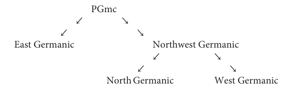

# Chapter 4: Proto-Germanic

> Second-pass stage-sensitive corpus draft. Use page anchors for checking against the PDF.

## Transcription and normalization note

This pass preserves Ringe-style Proto-Germanic and later Germanic notation, especially `kw`, `gw`, and `hw`. Clear PIE forms receive limited normalization such as `h₁`, `h₂`, `h₃`, and, when explicitly marked as PIE, superscript labiovelar notation. Mixed or ambiguous transitional forms are intentionally conservative and should be checked against the PDF before formal citation.
Second-pass note: this file keeps PGmc/Germanic `kw`, `gw`, and `hw` in ordinary ASCII even where the printed PDF visually raises the `w`; PIE and clearly pre-Germanic Indo-Europeanist forms are normalized more aggressively. This is intended to preserve the practical distinction established in the Chapter 3 pilot.


<!-- p. 241; pdf-page 252 -->

## 4.1 Introduction

Though some details remain obscure, on the whole it is easier to reconstruct PGmc than PIE, simply because the daughters of PGmc had been diverging for much less long before being recorded. We can also say with reasonable confidence that PGmc was spoken in or near Schleswig and areas immediately to the south a few centuries earlier than the Zeitwende, but probably not earlier than about 500 BC (see 3.1.1; cf. de Vries 1960: 45–9, Mallory 1989: 84–7). The subgrouping of Germanic is relatively uncontroversial. A rigorous cladistic analysis gives the following evolutionary tree:



> **Accessible note.** Ringe’s tree shows PGmc splitting into East Germanic and Northwest Germanic; Northwest Germanic then splits into North Germanic and West Germanic.

As the only well-attested East Germanic language is Gothic, little can be said about the internal subgrouping of that branch of the family. Whether there was ever a more or less unitary Northwest Germanic language has been a matter of dispute. In my opinion the number of significant innovations which North and West Germanic unarguably share, though admittedly small, is large enough to justify positing such a unity (see vol. ii, pp. 10–24). By contrast, the innovations shared by East and North Germanic are extremely few and can have resulted from parallel development, while those supposedly shared by East Germanic and the more southerly dialects of West Germanic are actually shared retentions which prove nothing (cf. e.g. Krause 1968: 48–52). That North Germanic is itself a unitary subgroup is completely obvious, as all its dialects shared a long series of innovations, some of them very striking (see Noreen 1923 passim). That the same is true of West Germanic has been denied, but I argue in vol. ii, pp. 41–81, that all the West Germanic languages share several unusual innovations which virtually force us to posit a West Germanic clade. (See also Stiles 2013 on the complex WGmc situation.) On the other hand, the internal subgrouping of both North Germanic and West Germanic is very ‘messy’, and it seems clear that each of those subfamilies diversified into a network of dialects which remained in contact for a considerable period of time (in some cases right up to the present).


<!-- p. 242; pdf-page 253 -->

## 4.2 PGmc phonology

```text
Unlike the phonology of PIE, that of PGmc resembles those of modern western
European languages in a general way. The system of surface-contrastive sounds was
the following:
   Consonants:
     bilabial         dental     alveolar      velar      labiovelar
     p                t                        k          kw
     b                d          z             g          gw
     f                þ          s             h          hw
     m                n
                      l          r
   Vocalics:
     nonsyllabic        short           long1            trimoric
                                                         -
     j                  i e             ī ē              ē
                            a               ā
                                                         -
      w                 u               ū ō              ō
*ā occurred only in the present-stem suffix *-ai- ~ *-ā- (at least in the short present of
‘stand’, probably also in weak class III; see 4.3.3 (ii.f )).
   Nasalization of vowels in PGmc poses an interesting problem of analysis. It is clear
that vowel-plus-*n sequences were realized as long nasalized vowels before *h and
*hw (see below), but native speakers could easily have recovered the underlying
sequences.2 The problem is that nasalized vowels also occurred word-finally. We
are able to reconstruct a contrast between non-nasal *-ō and nasalized *-ǭ because
they yielded systematically different outcomes in NWGmc (see vol. ii, pp. 15–16,
58–60), e.g.:
   nom. sg. PGmc *wullō ‘wool’ (> PNWGmc *wullu, cf. ON ull, OE wull) < *wulnā <
                                             ́ ā),
       PIE *h₂wl̥h₁nah₂ (cf. Lat. lāna, Skt ūrṇ
```

> **Footnote 1.** The reconstruction of an ‘*ē2’, supposedly higher than *ē, is an error; see Ringe 1984a for discussion.

> **Footnote 2.** Neri 2009: 9 seems to be objecting that if nasalized vowels were contrastive word-finally, the nasalized vowels before *h and *hw must also have been contrastive. But that would be true only if phonemes must be defined by surface contrasts, and then only under the assumption of ‘biuniqueness’, which was rejected by theoretical phonologists in the 1970’s (at the latest). In the context of modern phonology Neri’s refusal to accept even minimally abstract underlying forms cannot be accepted.


<!-- p. 243; pdf-page 254 -->

```text
     PGmc *ahslō ‘shoulder’ (> PNWGmc *ahslu, cf. ON o˛xl, OE eaxl) < post-PIE
        *aǵslā (cf. Lat. āla ‘wing’),
     PGmc *snuzō ‘daughter-in-law’ (> PNWGmc *snuzu, cf. ON snør, OE snoru,
        OHG snur) < post-PIE *snusā́ (cf. Skt snuṣā)́ PIE *snusós (cf. Gk νυός /nuós/)
  vs. acc. sg. PGmc *wullǭ (> PWGmc *wullā, cf. OE wulle, OHG wulla) < *wulnām
        < PIE *h₂wl̥h₁nām (cf. Lat. lānam, Skt ūrṇ́ ām),
     PGmc *ahslǭ (> PWGmc *ahslā, cf. OE eaxle, OHG ahsala) < post-PIE *aǵslām
        (cf. Lat. ālam ‘wing’),
     PGmc *snuzǭ (> PWGmc *snuzā, cf. OE snore, OHG snura) < post-PIE
        *snusām ́ (cf. Skt snuṣām)
                                  ́    PIE *snusóm (cf. Gk νυόν /nuón/);
```

Since PGmc nasalized *-ǭ reflects (post-)PIE long vowels followed by word-final *-m, it is simplest to assume, in the absence of contradictory evidence, that PIE *-om, *-im, *-um likewise yielded PGmc *-ą, *-į, *-ų respectively in polysyllables, though no daughter preserves any reflex of the nasalization (see 3.2.2 (ii)). Of course we could analyze all these word-final nasal vowels as underlying vowels plus *-m or *-n, were it not for two awkward facts: the development of monosyllables reveals that word-final *-m merged with *-n (see 3.2.2 (ii)), and there were actual sequences of PGmc word-final *-un in polysyllables, preserved unchanged in Gothic and Early Runic and throughout West Germanic (see 3.2.6 (iv)). In other words, there was apparently a three-way contrast:

```text
  PGmc *fehu ‘livestock’ (cf. OHG fihu; Goth. faíhu ‘property’) < PIE *péḱu,
     PGmc *felu ‘much’ (cf. Goth., OHG filu) < PIE *pélh₁u
  vs. PGmc *sunų acc. sg. ‘son’ (cf. Goth., OE sunu) < PIE *suh₃núm ‘offspring’,
     PGmc *nahtų acc. sg. ‘night’ (cf. ON nótt with nasal-labial umlaut) < PIE
     *nókʷtm̥
  vs. PGmc *tehun ‘ten’ (cf. Goth. taíhun) < PIE *déḱm̥d,
     PGmc *dēdun ‘they did’ (cf. OHG tātun, Goth. weak past 3pl. -dedun) < PIE
     *dʰédʰh₁n̥d ‘they were putting’.
```

If we posit PGmc underlying */-un/ for surface *-ų, we will have to posit underlying */-unt/ or the like for surface *-un; but it seems clear that word-final *-t < PIE *-d was lost in PGmc (see 3.2.6 (iv)), and after its loss there would be no reason for native learners to analyze surface *-un as anything but underlying */-un/, which should force the projection of word-final nasal vowels into underlying forms in the absence of complicating factors. Whether native learners actually did that must remain uncertain. This is a good example of how the poverty of the information retrievable for protolanguages gives rise to systematic gaps in our analyses of them. It is also customary to reconstruct for PGmc diphthongs *ai, *au, *eu (the latter alternating with *[iu], see 4.2.2 (i)), but so far as I can determine these were simply sequences of phonemes */aj/, */aw/, */ew/ (~ *[iw]). It is therefore not surprising that


<!-- p. 244; pdf-page 255 -->

rare sequences *ōu, *ō̄i—i.e., */ōw/, */ō̄j/—apparently also occurred word-finally (see 4.3.6 (i) and 4.3.4 (i) respectively). It is even possible that word-final sequences */īw/, */ajw/ occurred in 1du. subjunctive forms (see 4.3.3 (i)). The traditional spellings *ai, *au, *eu, *iu remain convenient both because they are familiar from older work and because PGmc diphthongs developed as unitary syllable nuclei in the daughter languages in most instances. I will continue to use them, except that I write *jj, *ww, *wj because those sequences underwent distinctive changes in various daughters. Readers should remember that *ai etc. are conventional spellings for */aj/ etc. Stress was not contrastive in PGmc: the initial syllable of a phonological word was always stressed (perhaps with systematic exceptions, if compound verbs were already undergoing univerbation; see 4.4.1).

### 4.2.1 PGmc consonant alternations

```text
The obstruents in the first row of the table above were voiceless stops. It is possible
that the dental stop had become alveolar and that all were aspirated when initial in
the onset of stressed syllables (since those changes have occurred in all the modern
daughters). But as those particular phonetic changes are exceptionally natural and
repeatable, we cannot suggest with any confidence that either had already occurred
by the PGmc stage.
   The obstruents in the third row were voiceless fricatives in every position. The
consonants conventionally written /h/ and /hw/ were probably still [x] and [xw]
even word-initially, to judge from Frankish names transcribed with ch- and from
French loanwords such as flanc ‘flank’ < Frankish *xlanka (cf. ON hlekkr ‘link,
chain’; see 3.2.4 (i)). It is likely that */f/ was still bilabial, though it eventually
became labiodental in all the daughters (except, probably, Gothic, where it alternated with bilabial b).
   The obstruents of the second row were voiced in every position. */z/ was a sibilant
fricative in all positions, and */gw/ apparently occurred only after a homorganic
nasal (see below), in which position it was a stop, but the others probably exhibited a
well-defined allomorphy as follows. After homorganic nasals all were stops; */d/ was
also a stop after */l/ and */z/. (If its stop allophone had become alveolar, then it may
also have been a stop after */r/, but that is very uncertain. Gothic exhibits that
allomorphy, but the reflex of */d/ after */r/ is a fricative in ON. In WGmc *d had
become a stop in all positions; see vol. ii, p. 42.) */b/ and */d/ were also stops word-initially. In all other positions these consonants were fricatives; apparently */g/ was a
fricative even word-initially, to judge from its outcomes in OE, OF, and modern
Netherlandic. Thus this allophony was like that of modern Spanish in general,
though not in every detail.
   The allophony of */n/ was complex. Immediately preceding velar and labiovelar
stops it was a velar nasal *[ŋ]; it is likely that it was also rounded before the labiovelars.
```


<!-- p. 245; pdf-page 256 -->

Immediately preceding the fricatives */h/ and */hw/, however, */n/ was realized as nasalization and lengthening of the preceding vowel (see 3.2.7 (ii)). Perhaps because these fricatives alternated with other dorsals (see below) before which */n/ was fully consonantal, the nasal apparently remained easy for language learners to recover; the following examples are typical:

```text
  *hunhruz ~ *hungru- ‘hunger’ (cf. Goth. hūhrus but ON hungr, OE hungor, OHG
     hungar);
  *fanhaną ‘to seize’, past ptc. *fanganaz (cf. ON fá, fenginn, OE fōn, fangen, OHG
     fāhan, gifangan; Goth. has leveled the alternation in fāhan, fāhans);
  *þinhaną ‘to thrive’, past ptc. *þunganaz (cf. OE þīon, þungen; the other languages
     have remodeled the inflection as a result of sound changes);
  *bringaną ‘to bring’, *branhtē ‘(s)he brought’ (cf. Goth. briggan, brāhta, OE
     bringan, brōhte, OHG bringan, brāhta);
  *þunkijaną ‘to seem’, *þunhtē ‘it seemed’ (cf. Goth. þugkjan, þūhta, ON þykkja,
     þótti, OE þynċan, þūhte, OHG dunken, dūhta).
```

```text
The situation must have been stable, as the nasalization persisted down into the
separate history of the Anglo-Frisian dialect group (see vol. ii, pp. 142–3).
   The alternation between voiceless fricatives and voiced obstruents (and between
*hw and *w) resulting from Verner’s Law was pervasive and important in PGmc. It
seems clear that the voiceless fricatives were underlying and were voiced by a rule
with multiple morphological triggers. Numerous examples in the conjugation of
strong verbs will appear in 4.3.3 (i). Derivational examples were probably just as
common; the following word-classes may serve as examples.
   The root-final fricatives of derived causative verbs were voiced by Verner’s Law;
note the following examples:
  PGmc *swabjaną ‘to put to sleep’ (cf. ON svefja ‘to smooth’, OE swebban ‘to kill’,
    OHG inswebben ‘to fall asleep’) *swefaną ‘to fall asleep; to sleep’ (cf. ON sofa,
    OE swefan; PIE *swep- ‘fall asleep’);
  PGmc *frawardijaną ‘to destroy’ (cf. Goth. frawardjan, OE (for)wierdan)
    *frawerþaną ‘to perish’ (cf. Goth. frawaírþan, OE forweorþan; PIE *wert-
    ‘turn’, *pró ‘forward’);
  PGmc *nazjaną ‘to save’ (cf. OE nerian; OHG nerien ‘to support’; Goth. nasjan ‘to
    save’ has been remodeled on the basic verb)       *nesaną ‘to survive’ (cf. Goth.
    ganisan, OE nesan, OHG ginesan; PIE *nes- ‘return home’);
  PGmc *laizijaną ‘to teach’ (cf. OE lǣran, OHG lēren; Goth. laisjan has been
    remodeled on the basic verb)     *lais ‘I know’ (cf. Goth. lais);
  PGmc *hlōgijaną ‘to cause to laugh’ (cf. ON hlœgja; Goth. ufhlohjan has been
    remodeled on the basic verb)       *hlahjaną ‘to laugh’ (cf. Goth. hlahjan, ON
    hlæja, OE hliehhan).
```


<!-- p. 246; pdf-page 257 -->

A fossilized causative also exhibited the effects of Verner’s Law:

```text
  PGmc *sandijaną ‘to send’ (cf. Goth. sandjan, ON senda, OE sendan, OHG senten)
       *sinþ- ‘go’, which does not survive as a verb but occurs in the derived noun
    *sinþaz ‘way, journey’ (cf. OE sīþ; Goth. ainamma sinþa ‘one time, once’ etc.).
```

This is not surprising, considering that the PIE causative suffix was *-éye/o-, with the accent following the root. Derived fientives likewise showed the effects of Verner’s Law, to judge from a few examples that have escaped remodeling:

```text
  PGmc *liznō- ~ *lizna- ‘to learn’ (cf. OE liornian, OHG lirnēn, lernēn)         *lais
    ‘I know’ (cf. Goth. lais);
  PGmc *þurznō- ~ *þurzna- ‘to dry out (intr.), to wither’ (cf. ON þorna; Goth.
    gaþaúrsnan has been remodeled on the basic verb)             *þersaną ‘to dry out’
    (attested only in Goth. past ptc. gaþaúrsans ‘withered’, but cf. Homeric Gk
    middle τέρσεσθαι /térsesthai/ ‘to dry out’; PIE *ters- ‘dry’);
  (post-)PGmc *flagnō- ~ *flagna- ‘to be skinned’ (cf. ON flagna ‘to be peeled’)
    *flahaną ‘to skin’ (cf. ON flá, OE flēan);
  (post-)PGmc *tugnō- ~ *tugna- ‘to be led / pulled’ (cf. ON togna ‘to get longer’)
    *teuhaną ‘to lead, to pull’ (cf. Goth. tiuhan, OE tēon, OHG ziohan; post-PIE
    *dewk- ‘lead’).
```

```text
Again, this is not surprising, since the post-PIE suffix *-náh₂- ~ *-nh₂-´ always had
the accent following the root.
  It is harder to show that particular examples of relevant nominal formations are
inherited from PGmc, but the consistency with which some exhibit the effects
of Verner’s Law argues that their types are inherited. Here belong deverbative
masc. n-stem agent nouns:
```

```text
  (*-kuzō- ‘tester’ >) WGmc *-kozō ‘chooser’ (cf. OE wiþercora ‘rebel’) *keusaną ‘to
     test’, NWGmc ‘to choose’ (cf. Goth. kiusan, ON kjósa, OE ċēosan, OHG kiosan);
  (*-luzō- ‘loser’ >) WGmc *-lozō (cf. OE hlēowlora ‘without protection’) *fraleusaną
     ‘to lose’ (cf. Goth. fraliusan, OE forlēosan, OHG farliosan);
  (*-slagō- ‘killer’ in) WGmc *mann-slagō ‘murderer’ (cf. OE manslaga, OHG
     manslago)        *slahaną ‘to kill’ (cf. Goth., OHG slahan);
  (*-tugō- ‘leader’ in) WGmc *hari-togō ‘commander of a (late Roman) mobile field
     force, dux’ (cf. OE heretoga, OHG herizogo; ON hertogi ‘duke’ is almost certainly
     a loanword; *hari < PGmc *harjaz ‘army’)          *teuhaną ‘to lead’ (see above).
```

```text
Many neuter a-stem action and result nouns exhibit the alternation:
  (post-)PGmc *fangą ‘grasp, (act of) taking’ (cf. ON fang; OE fang ‘booty’)
    *fanhaną ‘to take’ (cf. Goth., OHG fāhan, ON fá, OE fōn);
```


<!-- p. 247; pdf-page 258 -->

```text
  (post-)PGmc *fruzą ‘frost’ (cf. OHG fror)       *freusaną ‘to freeze’ (cf. ON frjósa,
    OE frēosan, OHG friosan; PIE *prews- ‘burn’);
  (post-)PGmc *hruzą ‘(a) fall’ (cf. ON hrør ‘corpse’, OE ġehror ‘death’) *hreusaną
    ‘to fall’ (cf. OE hrēosan);
  (post-)PGmc *lidą ‘expedition’ (cf. ON lið ‘retainers; vessel’, OE lid ‘ship’)
    *līþaną ‘to go’ (cf. Goth. galeiþan, ON líða, OE līþan).
The same is true of feminine ō-stem nouns with similar meanings:
  (post-)PGmc *falgō ‘entry’ (cf. OHG falga ‘occasion, opportunity’)          *felhaną ‘to
    enter’ (or ‘to put in’?: cf. Goth. filhan, ON fela ‘to hide’; OE fēolan ‘to penetrate’;
    OHG felahan ‘to store up’);
  (post-)PGmc *laidō ‘way’ (cf. ON leið, OE lād, OHG leita)               *līþaną ‘to go’
    (see above);
  (post-)PGmc *nazō ‘survival, rescue’ (cf. OHG nara ‘redemption’)            *nesaną ‘to
    survive’ (see above);
  (post-)PGmc *taugō ‘pulling’ (cf. ON taug, OE tēag ‘rope’)           *teuhaną ‘to pull’
    (see above).
The last class are clearly descended from PIE derivatives in *-áh₂ with o-grade roots
(preserved most obviously in the Greek type τομή /tomɛ:́ / ‘cutting, cut end’
τέμνειν /témne:n/ ‘to cut’). The PIE antecedents of the other two classes are less
clear, but the preponderance of zero-grade roots among them makes it unsurprising
that their pre-PGmc ancestors apparently exhibited accent on the suffix.
   A considerable number of other derivational classes and isolated words also show
the effects of Verner’s Law; but the examples adduced above are sufficient to
demonstrate that the Verner’s Law alternation was a productive phonological rule
with morphological triggers in Proto-Germanic, and that it was the morphologized
descendent of the Verner’s Law sound change. Derivational examples involving *hw
are naturally rare, since that consonant was rare word-internally; the best-attested is:
  PGmc *siuniz (cf. Goth. siuns ‘face’, OE sīen ‘appearance’)            *sehwaną ‘to see’
    (cf. Goth. saíƕan),
with surface *[iu]      *eu (see below) = */ew/       */ehw/ by Verner’s Law.
   Immediately before *t all labials were replaced by *f and all dorsals by *h; a range of
derivational examples is adduced in 3.2.4 (iv), to which can be added such inflectional forms as past 2sg. *gaft ‘you gave’ (cf. Goth., ON gaft; *gebaną ‘to give’) and
pres. 2sg. *maht ‘you can’ (cf. OE meaht, OHG maht; *maganą ‘to be able’). The
treatment of dentals before *t was more complex. Before 2sg. *-t they were replaced
by *s, e.g. in *waist ‘you know’ (cf. Goth. waist, OE wāst; *witaną ‘to know’), *baust
‘you offered’ (cf. Goth. anabaust ‘you commanded’; *beudaną ‘to offer’), *kwast ‘you
said’ (cf. Goth. qast; *kweþaną ‘to say’; see further 4.3.3). In derivation the reflex of the
```


<!-- p. 248; pdf-page 259 -->

entire cluster is often *ss, simplified to *s except after a short vowel (see 3.2.3 (i)). But there are also some examples of *st; among the better attested are the following:

```text
  *blōstrą ‘sacrifice’ (cf. OHG bluostar; Goth. gudblostreis ‘worshipper of God’)
    *blōtaną ‘to sacrifice’ (cf. Goth. blotan, OE blōtan);
  *gelstrą ‘tax’ (cf. Goth. gilstr, OHG gelstar) *geldaną ‘to pay’ (cf. Goth. fragildan,
    OE ġieldan);
  *hlastiz ‘load’ (cf. OE hlæst, OF hlest, OHG last)         *hlaþaną ‘to load’ (cf. ON
    hlaða, OHG ladan);
  *hrustiz ‘cover’ (cf. OE hyrst ‘adornment’, OHG hrust ‘armor’)          *hreudaną ‘to
    cover’ (attested only in OE past hrēad, ptc. hroden and ON hroðinn ‘plated’);
  *rustaz ‘rust’ (cf. OE rust, OHG rost)        *reudaną ‘to redden’ (cf. ON rjóða; OE
    rēodan ‘to slay’).
```

It is usually suggested that the suffixes of these formations began with *-st- (so Seebold 1970 passim); but it is also possible that they reflect a new phonological rule */T+t/ ! *st that had begun to compete with the inherited rule */T+t/ ! *ss (pace Meid 1967: 166). For discussion in depth (and some modestly different conclusions) see Hill 2003: 93–217.

### 4.2.2 PGmc vocalic alternations

Alternations between vocalics were both more numerous and more varied than those between consonants. Several, collectively referred to as ablaut, were inherited from PIE, in which they were already conditioned by morphology to a large extent; not surprisingly, their conditioning in PGmc was entirely morphological. But there were also a few pervasive alternations between surface-constrastive vocalics that were entirely phonological, and it is to those that I turn first.

#### 4.2.2 (i) Automatic alternations between vocalics

In unstressed syllables PGmc

```text
underlying */e/ was raised to *i unless *r followed immediately (cf. 3.2.5 (iii)). This
rule could operate only on those elements that could occur both stressed and
unstressed in the sentence, since otherwise its output *i must have been reinterpreted
as underlying by native-language learners. The obvious examples are a few pronoun
forms:
  PGmc *ék ~ *ik ‘I’ (cf. ON ek but OE iċ, OHG ih);
  PGmc *mék ~ *mik ‘me (acc.)’ (cf. Anglian OE mec but ON mik, OHG mih);
  PGmc *þék ~ *þik ‘you (sg. acc.)’ (cf. Anglian OE þec but ON þik, OHG dih).
The striking fact that ON and OE have generalized stressed and unstressed forms in a
cross-classifying pattern is perhaps the best evidence for suggesting that such a rule
still existed in PGmc. On the PIE antecedents of these forms see 3.4.5 (iii).
```


<!-- p. 249; pdf-page 260 -->

```text
   PGmc underlying */e/ was also raised to *i if a high front vocalic occurred in the
following syllable (cf. 3.2.5 (iv)). This rule created a pervasive alternation between
surface *e and *i in stressed syllables in paradigms in which the following syllable
sometimes contained *i and sometimes some other vowel—above all, in the present
indicative and imperative of simple thematic verbs (for the most part, strong verbs).
The singular and plural present indicative active forms of ‘carry’ are a textbook
example:
  1sg.   *berō         (cf. Anglian OE beoru)
  2sg.   *birizi       (cf. OE birst, OHG biris)
  3sg.   *biridi       (cf. OE birþ, OHG birit)
  1pl.   *beramaz      (cf. OHG berumēs)
  2pl.   *birid
  3pl.   *berandi      (cf. OE beraþ, OHG berant)
Naturally this rule affected the sequence */ew/.
   Somewhat surprisingly, OE preserves this alternation in verb roots best of all the
daughters of PGmc. In Gothic *e and *i have merged by unconditioned sound
change; in ON the alternation has been leveled completely in favor of *e. In OHG
the raising of word-final *ō to *u (vol. ii, pp. 15–16) caused a further raising of *e to i
in the preceding syllable, so that the OHG 1sg. form is biru and the entire singular
exhibits i in the root; perhaps as a consequence of that development, e was leveled
throughout the plural, so that the 2pl. is usually beret, though a few relic forms like quidit
‘you (pl.) say’ are attested in the very early Monsee fragments (Braune and Reiffenstein
2004: 263). But since there is reasonably clear evidence for the sound change underlying
this rule (see 3.2.5 (iv)), and since the deviations in the daughter languages’ reflexes can
be explained unproblematically, I reconstruct the rule for PGmc.
   The nonsyllabic high front vocalic *j also triggered this raising, with the result that
j-presents of strong class V exhibited surface *i in the root throughout their present
stems. The following examples are especially clear:
  PGmc *sitjaną ‘to sit’ (cf. ON sitja, OE sittan, OHG sizzen),
    but PGmc *etaną ‘to eat’ (cf. ON eta, OE etan, OHG eʒʒ an);
  PGmc *ligjaną ‘to lie’ (cf. ON liggja, OE liċġan, OHG liggen),
    but PGmc *weganą ‘to move’ (cf. ON vega, OE, OHG wegan).
Other examples are more isolated morphologically.
   Probably the same sound change was responsible for the change of pre-PGmc *ey
to *ī (see 3.2.5 (iv)). Whether that remained part of the synchronic PGmc rule of
e-raising is doubtful; see 4.2.2 (ii) for further discussion.
   In word-medial position between a consonant and a vowel there was an exceptionless alternation of high front vocalics, such that *j occurred after sequences of a short
```


<!-- p. 250; pdf-page 261 -->

vowel plus a single nonsyllabic (‘light syllables’), whereas *ij occurred after consonant clusters and sequences of a long vowel or diphthong plus a single nonsyllabic (‘heavy syllables’). This rule is the Germanic reflex of Sievers’ Law (see 2.2.4 (ii), 3.2.5 (ii)). Examples are very numerous; the following are typical. Nominals with *j after light syllables:

```text
  PGmc *harjaz ‘army’ (cf. Goth. harjis, ON herr, OE here, OHG heri);
  PGmc *midjaz ‘middle’ (cf. Goth. midjis, ON miðr, OE midd, OHG mitti);
  PGmc *niwjaz (*niujaz) ‘new’ (cf. Goth. niujis, ON nýr, OE nīewe, OHG niuwi);
  PGmc *badją ‘bed’ (cf. Goth. badi, OE bedd, OHG betti);
  PGmc *hawją (*haują) ‘grass, hay’ (cf. Goth. hawi, ON hey, OE hīeġ, OHG hewi,
    houwi);
  PGmc *fergunją ‘mountain’ (cf. Goth. faírguni; OE *fiergen- in compounds,
    see vol. ii, p. 253);
  PGmc *haljō ‘hell’ (cf. Goth. halja, ON hel, OE hell, OHG hella);
  PGmc *sibjō ‘relationship’ (cf. Goth. sibja, OE sibb, OHG sippea).
```

Nominals with *ij after heavy syllables:

```text
  PGmc *hirdijaz ‘herdsman’ (cf. Goth. haírdeis, ON hirðir, OE hierde, OHG hirti);
  PGmc *lēkijaz ‘physician’ (cf. Goth. lekeis, OE lǣċe, OHG lāhhi);
  PGmc *rīkiją ‘kingdom, power’ (cf. Goth. reiki, ON ríki, OE rīċe, OHG rīhhi).
```

Present stems with *j after light syllables:

```text
  PGmc *warjaną ‘to protect’ (cf. Goth. warjan, ON verja, OE werian, OHG werien);
  PGmc *hazjaną ‘to praise’ (cf. Goth. hazjan, OE herian);
  PGmc *bidjaną ‘to ask for’ (cf. Goth. bidjan, ON biðja, OE biddan, OHG bitten);
  PGmc *siwjaną (*siujaną) ‘to sew’ (cf. Goth. siujan, ON sýja, OE sīewan, OHG
    siuwen);
  PGmc *saljaną ‘to hand over’ (cf. ON selja, OE sellan, OHG sellen; Goth. saljan ‘to
    sacrifice’);
  PGmc *skapjaną ‘to make’ (cf. Goth. gaskapjan, ON skepja, OE sċieppan, OHG
    skephen);
  PGmc *framjaną ‘to further’ (cf. ON fremja; OE fremman ‘to make’; OHG frem-
    men ‘to accomplish’).
```

Present stems with *ij after heavy syllables:

```text
  PGmc *timrijaną ‘to build’ (cf. Goth. timrjan, ON timbra, OE timbran, OHG
    zimberen);
  PGmc *laizijaną ‘to teach’ (cf. Goth. laisjan, OE lǣran, OHG lēren);
  PGmc *laidijaną ‘to lead’ (cf. OE lǣdan, OHG leiten; ON leiða ‘to accompany’);
  PGmc *garwijaną ‘to prepare’ (cf. ON gøra, OE ġierwan, OHG garwen);
```


<!-- p. 251; pdf-page 262 -->

```text
   PGmc *dailijaną ‘to divide’ (cf. Goth. dailjan, ON deila, OE dǣlan, OHG teilen);
   PGmc *wōpijaną ‘to cry out’ (cf. Goth. wopjan, ON œpa; OE wēpan, OHG wuofen
     ‘to weep’);
   PGmc *dōmijaną ‘to judge’ (cf. Goth. domjan, ON dœma, OE dēman, OHG
     tuomen).
(See further below on forms in which *i followed.)
  The evidence for this alternation has been partly obscured by further changes in the
daughter languages as follows. In Gothic the contrast survives when the following
vowel was lost before a word-final consonant; otherwise the shortening of word-final *ī
and the syncope of *i before *jV have led to a merger of the two types. In other words,
   *-Cjaz > *-Ciz > *-Cis (! -Cjis, see below), whereas *-Cijaz > *-Cīz > -Ceis; but
   *-Cją > -Ci, and apparently *-Ciją > *-Cī > -Ci; further,
   surviving *-CijV- > -CjV- = -CjV- < *-CjV.
In ON the contrast between the two types largely survives: when the following vowel
was lost, postconsonantal *j > 0/ whereas *ij > i; when the following vowel survives,
postconsonantal *j likewise survives, but *ij does not (except after velars, where it
appears as j). In the WGmc languages the outcomes before a surviving vowel are
roughly like those of ON, the most important difference being that *Cj > CC when
C ≠ r (vol. ii, pp. 50–3);3 when the following vowel was lost, the situation has been
complicated by further changes (vol. ii, pp. 14–15, 46–7).
    Because the alternation of *j and *ij was exceptionless (in both directions, so to
speak), it is not clear which alternant was underlying; possibly different native language
learners abduced different grammars on this point. But in any case the output of the
rule was input to a further rule by which *j was dropped before *i; resulting sequences
*ii were contracted to *ī by still another rule. The result was that *jV (where *V ≠ *i)
alternated not with ‘*ji’ but simply with *i, while *ijV alternated not with ‘*iji’ but with
*ī. The indicative 3sg. and 3pl. forms of some j-presents will illustrate.
Verbs with light root-syllables:
   PGmc *wariþi ‘protects’, 3pl. *warjanþi (cf. OE wereþ, weriaþ, OHG werit,
     werient);
   PGmc *haziþi ‘praises’, 3pl. *hazjanþi (cf. OE hereþ, heriaþ);
   PGmc *bidiþi ‘asks for’, 3pl. *bidjanþi (cf. OE bitt, biddaþ, OHG bitit, bittent);
   PGmc *saliþi ‘hands over’, 3pl. *saljanþi (cf. OE selþ, sellaþ, OHG selit, sellent);
   PGmc *framiþi ‘furthers’, 3pl. *framjanþi (cf. OE fremeþ, fremmaþ, OHG fremit,
     fremment).
```

> **Footnote 3.** The (inconsistent) OHG change of *rj to rr is usually considered a later, specifically OHG development; see Braune and Reiffenstein 2004: 99.


<!-- p. 252; pdf-page 263 -->

```text
Verbs with heavy root-syllables:
  PGmc *laizīþi ‘teaches’, 3pl. *laizijanþi (cf. Goth. laiseiþ, laisjand);
  PGmc *garwīþi ‘prepares’, 3pl. *garwijanþi (cf. ON gørir, gøra, OE ġiereþ, ġierwaþ);
  PGmc *hauzīþi ‘hears’, 3pl. *hauzijanþi (cf. Goth. hauseiþ, hausjand, ON heyrir,
    heyra);
  PGmc *þunkīþi ‘seems’, 3pl. *þunkijanþi (cf. Goth. þugkeiþ, þugkjand, ON þykkir,
    þykkja);
  PGmc *rignīþi ‘it’s raining’ (cf. Goth. rigneiþ, ON rignir).
The evidence for this pattern in the daughter languages has been fragmented by
subsequent changes. Gothic and ON exhibit clear reflexes of *ī for expected ‘*iji’ after
heavy syllables; in WGmc, however, the alternation between *ī (after heavy syllables)
and *i (after light syllables) was leveled in favor of *i (Cowgill 1959: 8; see vol. ii,
pp. 69–71). After light syllables Gothic actually has ji (bidjiþ etc.), and it is sometimes
supposed that PGmc exhibited similar forms. However, on this point the testimony
of Gothic cannot be trusted, because Gothic has introduced j analogically even before
i which is itself a reflex of PGmc *j. For instance, the development of the nom. sg.
masc. of the adjective ‘middle’ in Gothic was the following:
  PIE *médʰyos ‘middle’, stem *médʰyo- > PGmc *midjaz, *midja- > pre-Goth.
    *midiz, *midja- ! *midjiz, *midja- > Goth. midjis, midja-.
And since the sequence ji in these nominal forms MUST be the result of leveling, the
sequence ji in verb forms obviously CAN be. In addition, the remodeling of the j-presents
*ligjaną ‘to lie’, *sitjaną ‘to sit’, and *swarjaną ‘to swear’ as simple thematic presents ligan,
sitan, swaran in Gothic is easier to explain if their pres. indic. 3sg. forms ended in *-iþi (>
Goth. -iþ), since that should have been the pivotal form of the paradigm. ON is unhelpful
in these cases, as the entire vocalic sequence is syncopated. In WGmc, however, it is clear
that the relevant forms exhibited *i, not *ji, because a preceding consonant is not
geminated (vol. ii, pp. 50–3). Of course it is possible that postconsonantal *j was lost
before *i very early in the separate history of WGmc, before gemination occurred; but the
fact that *j was lost in so many other environments already in PGmc suggests that this
loss, too, occurred in the protolanguage (cf. Þórhallsdóttir 1993: 4–10 with references).
   PGmc */e/ was raised to *i before a nasal in the coda of the same syllable. It is
possible that this remained a rule recoverable by native-language learners, since it
was the only development that split the otherwise unitary third class of strong verbs;
thus a learner would have found:
  PGmc *bindaną ‘to tie’, pres. 3sg. *bindidi, past 3sg. *band, 3pl. *bundun beside
  PGmc *helpaną ‘to help’, pres. 3sg. *hilpidi, past 3sg. *halp, 3pl. *hulpun,
  PGmc *werpaną ‘to throw’, pres. 3sg. *wirpidi, past 3sg. *warp, 3pl. *wurpun,
leading to the recovery of underlying */bend-/ ‘tie’ (cf. Seebold 1970 passim).
```


<!-- p. 253; pdf-page 264 -->

#### 4.2.2 (ii) Ablaut

The ablaut system inherited from PIE remained a system of

living rules (with various modifications) in the inflection of PGmc strong verbs. Ablaut in verb inflection will be discussed in greater detail in 4.3.3 (i). However, the system also remained pervasive in derivational morphology. Derivational ablaut and its relation to the ablaut system of strong verb inflection will be discussed in this section. From a historical viewpoint, derivational ablaut relationships are interesting particularly in two types of cases. On the one hand are those which cannot be explained as regular sound-change developments of PIE patterns, and which therefore reveal something about the restructuring of derivational rules in (pre-)PGmc. On the other hand are those which differ from the patterns usual in strong verb inflection. The latter are the cases listed in Seebold 1970 as ‘außerhalb der Ablautreihe’. Some seem to be archaisms, better explained in PIE than in PGmc terms; others seem to be innovations (as are also some of the regular inflectional patterns). The following discussion will pay particular attention to the types of cases just enumerated. The vast majority of strong verbs inflecting according to the first three traditional classes reflect the basic PIE pattern *e ~ *o ~ 0/ followed by a tautosyllabic sonorant. The PGmc outcomes were the following:

```text
  īC ~ aiC ~ iC                (class I)
  euC (/iuC) ~ auC ~ uC        (class II)
  eww (/iww) ~ aww ~ uw        (")
  iNC ~ aNC ~ uNC              (class III)
  erC (/irC) ~ arC ~ urC       (")
  elC (/ilC) ~ alC ~ ulC       (")
The sound-change source of PGmc *ww in the third type is not clear (see 4.3.3 (i.b)),
but in any case the ablaut pattern ‘makes sense’ in PGmc terms.
  In addition, a small number of roots ending in two consonants neither of which
was a sonorant exhibited a pattern exactly like that of the last two lines above, i.e.
```

```text
  eCC (/iCC) ~ aCC ~ uCC        (class III)
```

In this last type the third grade (i.e., the functional zero grade, found in the default past stem and the past participle) must reflect at least modest remodeling, since the first of the root-final consonants was not a sonorant which would have become syllabic in the zero grade, so that there is no regular sound-change source for PGmc *u (see 3.2.2 (i)). Fewer than a dozen such verbs are attested in the ‘Old’ Germanic languages, as follows (cf. Seebold 1970 passim).

Attested (or clear derivatives attested) in Gothic and at least one other language:


<!-- p. 254; pdf-page 265 -->

```text
   *flehtaną ‘to plait’, *þreskaną ‘to thresh’, *wreskwaną ‘to grow, to bear fruit’; probably
     *hneskwaną ‘to soften, to wear away’ (*-sk-?; see Heidermanns 1993: 299–300).
Attested in ON and WGmc:
   *bregdaną ‘to brandish’, *brestaną ‘to burst’.
Attested in ON only:
   gnesta ‘to make a sudden loud sound’.
Attested widely in WGmc:
   PWGmc *fehtan ‘to fight’, *hrespan ‘to tear’, *leskan ‘to be extinguished’.
Attested only in OE:
   streġdan ‘to strew’.
It is very striking that all these verb roots but one exhibit a sequence *Re (where *R is
any coronal sonorant), of which the zero grade should be *uR by sound change; the
attested zero grade of those roots can have arisen by a metathesis which brought the
anomalous order of sonorant and vowel into line with the order in the other ablaut
grades (see 3.2.2 (i) ad fin.). The extension of the resulting pattern to ‘fight’ would
then have been an almost trivial lexical analogy.
    An odd variant of class II ablaut should also be mentioned here. Strong verbs with
*ū in place of expected *eu in the present—thus exhibiting a pattern
   ūC ~ auC ~ uC           (class II)—
are fairly common in older Germanic languages (see Seebold 1970: 48). However,
surprisingly few are reconstructable for PGmc. An unarguable example is *lūkaną ‘to
close’, attested with ū in Gothic, ON, OE, OF, OS, and OHG; one might also make
a case for *sūganą ‘to suck’, which apparently has some connection with Lat. sūgere,4
and perhaps also *sūpaną ‘to drink’, the failure of both to appear in our Gothic
corpus being plausibly attributable to accident. But most examples are clearly
confined to ON and/or the northern WGmc languages, often beside forms with
*eu in Gothic and/or OHG (see vol. ii, pp. 39–40, for details; *brūkaną ‘to need, to
enjoy’ does not appear to have been a strong verb in PGmc, see 3.4.3 (i) and 4.3.3 (ii.
a)). It seems reasonable to suggest that the post-PGmc examples reflect an incipient
reanalysis of the ablaut system, a new *ū having been created as an obvious parallel to
class I *ī because the latter was no longer analyzable as underlying */ej/ (Prokosch
```

> **Footnote 4.** It is at best highly doubtful whether the final consonant of the Latin root can reflect *ǵʰ or *gʰ, as the PGmc. final consonant must; as Neri 2009: 9 notes, one would expect a Latin cognate to exhibit an intervocalic h. The OE byform sūcan looks like a better fit for the Latin word, but since it is confined to OE it is almost certainly a post-PGmc. innovation.


<!-- p. 255; pdf-page 266 -->

```text
1939: 150, Nielsen 1985: 202–3 with references). Whether that process had already
begun in PGmc is unclear. Neither *lūkaną nor *sūpaną has any plausible extra-Germanic cognates, while those of *sūganą are formally problematic (cf. Seebold
1970: 398) and in part ambiguous (for instance, note that the ū of Lat. sūgere could
conceivably reflect *ew). Under the circumstances the most we can say is that either a
reanalysis of the system had already begun or a handful of verb roots with inherited
*ū had been attracted into the system; and if the latter is what happened, then of
course that could have helped provoke a (later) reanalysis.
   The most striking general fact about the ablaut patterns discussed above is a
negative one. Though Seebold 1970 lists some 300 strong verbs belonging to the
first three classes, most with at least a few derivatives and some with very many, NOT
ONE derivative exhibits an ablaut grade not mentioned above.5 The greatest irregularity is the vacillation between *eu and *ū, and it is no more salient in derivation
than in inflection. It seems fair to say that these particular ablaut rules remained very
stable throughout the Germanic family for more than a millennium after PGmc
began to diversify.
   Most strong verbs of the fourth class exhibit roots ending in sonorants. They
originally exhibited the same ablaut as the third class, with the syllabic form of the
zero grade generalized (so as to yield a syllabic root-form in every case); thus the
outcome should have been
   eR (/iR) ~ aR ~ uR          (class IV).
That is exactly what we find in the case of the preterite-presents *man ‘(s)he has in
mind’, *skal ‘(s)he owes’, and their derivatives. However, normal strong verbs have
acquired a further ablaut grade *ēR, which appears in the default past stem, by the
processes described in 3.4.3 (ii); as a result, their ablaut system is
   eR (/iR) ~ aR ~ ēR ~ uR            (class IV),
and there are consequently two competing ‘functional zero grades’ which can appear
in lexemes derived from these verb roots. Examination of all the derivatives listed in
Seebold 19706 reveals an interesting pattern of facts. In the older Germanic languages
altogether derivatives with the old zero grade in *uR still outnumber those with
innovative *ēR by a ratio of five to two (51 examples vs. 20). However, examples with
*ēR do appear in all the languages, and their numbers appear to reflect the size of a
language’s attested corpus, roughly speaking (so that there are between nine and
twelve each from ON, OE, and OHG, but only three or four each from the much
```

> **Footnote 5.** There is some interchange between the classes because of disruptive sound changes, e.g. among OE contract verbs.

> **Footnote 6.** I do not take into account the derivatives of the anomalous zero-grade present *wulaną ‘to boil’, all of which likewise reflect a root-form *wul- (see Seebold 1970: 552).


<!-- p. 256; pdf-page 267 -->

```text
smaller corpora of Gothic, OF, and OS). This suggests that derivatives in *ēR were
already a regular feature of PGmc. Because of the striking regularity of the Germanic
ablaut system, there are many ways in which *ēR could have spread from inflection to
derivation. Some of these examples might actually reflect (post-)PIE vr̥ddhi formations with inherited *ē (as argued by Darms 1978: 93–102), but that will account for
only a fraction of the examples listed in Seebold 1970, most of which were clearly
Germanic innovations.7
   Roots ending in *eC (where *C was an obstruent) fall into several potentially
different ablaut classes which I will discuss separately: those with no initial consonant
or with an initial obstruent (only), those with an initial sonorant, and those with an
initial CR-cluster.
   Roots of the shape *(C)eC- (where *C ≠ *R) have no inherited zero grade in PGmc,
the full grade with *e functioning as zero grade in the past participle while the new
functional zero grade *ē occurs in the default past stem; thus their ablaut schema is
   eC (/iC) ~ aC ~ ēC         (class V).
Fewer than a dozen such roots are reconstructable, and only *et- ‘eat’ and *set- ‘sit’
make more than a few derivatives; nevertheless all three ablaut grades are well
represented. Note that *at-, which did not survive in the paradigm of ‘eat’ because
it contracted with the reduplicating syllable (see 3.4.3 (ii)), is well attested in that
verb’s derivatives. The *ō of OE sōt (nt.) ‘soot’ is startling. The word is almost
certainly derived from *set- ‘sit’, like a number of other northern European words
for the same substance (cf. Holthausen 1963: 307), though none of the latter is an
exact cognate. Inherited ō-grades in root-syllables are rare, but if this is a Germanic
innovation, it is not obvious what the model for it could have been; the formation
remains puzzling (cf. Darms 1978: 296–8).
   Roots of the shape *ReC- might be expected to exhibit an inherited syllabic zero
grade, since they contain sonorants which could be syllabic in PIE. All the normal
strong verbs of this shape, however, belong to class V, and their derivatives exhibit
exactly the same ablaut grades as those of the group just discussed. (There is even a
puzzling ō-grade derivative—ON œsa ‘to agitate’ < *jōzijaną, derived from *jesaną
‘to boil’—which Darms 1978 does not discuss, no doubt because it could be purely
deverbal.) However, the lone preterite-present with a root of this shape exhibits a
quite different ablaut pattern. The inflectional ablaut is *ganah ~ *ganug-, past
*ganuh-t- ‘be sufficient’. In *-nug- we have the expected inherited zero grade
(*-nug- < *-nuh-´ (by Verner’s Law)         *-unh-8 (by morphological remodeling on
```

> **Footnote 7.** The only anomaly that is not covered by the discussion of this paragraph is the odd family of *snew- ‘hurry’, *snū- ‘twist, turn’ (Seebold 1970: 446–7). Bammesberger 1976 makes a fairly plausible case for short vowels in the OE forms, but that does not solve all the problems.

> **Footnote 8.** As Patrick Stiles notes (p.c.), this remodeling must have preceded the development of long nasalized vowels in *Vnh-sequences.


<!-- p. 257; pdf-page 268 -->

```text
the full grade) < *-unk- < PIE *h₂n̥ḱ-, zero grade of *h₂neḱ- ‘reach’). It is not
surprising that the few transparent derivatives of this root exhibit that zero grade
(Seebold 1970: 355). But the most widespread and important derivative is the adj.
*ganōgaz ‘enough’, well attested throughout the family; and once again it exhibits a
long ō-grade which is difficult to explain. What is most striking in this case is that
there is neither evidence for any kind of long ē-grade (whether inherited or innovative) nor any likelihood that such a thing ever existed (recall that preterite-presents to
*CeR-roots also fail to exhibit any such ablaut grade). We are more or less forced to
conclude that this is an inherited lengthened grade—at least pre-Germanic, though of
course not necessarily PIE. (The explanation of Darms 1978: 267, according to which
the adjective was backformed to a causative *ganōgijaną of the type discussed below,
strikes me as implausible; *ganōgijaną seems much likelier to be a denominative
formed from the adjective.)
   The final group of verb roots in *eC is those of the shape *CReC. They are
heterogeneous in terms of inflectional ablaut class: *brekaną ‘break’ clearly belonged
to class IV (past ptc. *brukanaz), but the rest either clearly belonged to class V (with
*e in the past ptc.) or else the daughter languages do not agree on which class they
belong to. However, a few of the latter do have derivatives with zero-grade *u in the
root (e.g. OE drype ‘stroke, blow’, ON troð ‘tread’ = OE trod ‘track’, OE trodu ‘step’ =
OHG trota ‘winepress’), and it seems clear that these are archaisms. There is also a
verb root of this group with unusual inflection and ablaut, namely
  ‘ask’   *freg-   ~   *frah-     ~   *frēg-   (~ *fursk-),
reflecting PIE *preḱ-. The ancient zero grade given in parentheses has been
completely lexicalized; it appears only in OHG forskōn ‘to investigate’, which is
obviously denominative. The (lost) noun from which it was formed must in turn
have been made to the PIE present stem *pr̥sḱé/ó- (see 2.3.3 (i)). (There is also an
OS and OHG fergōn ‘to beseech, to plead for’ the shape of whose root is difficult to
explain.) Finally, though it has long been believed that ON sœfa ‘to kill, to
sacrifice’, derived from *swef- ‘sleep’ (see above), is cognate with Lat. sōpīre ‘put
to sleep’, Michael Weiss has made a strong case that the Latin verb is actually a
denominative (Weiss 2016), and it appears that the ON verb might be a doublet of
svæfa ‘to lull to sleep’ (Kroonen 2012 s.v. *swēbjan-, as developed by Weiss 2016:
470, fn. 3).
   Roots ending in *-aC- (where *C includes sonorants) have a simpler system of
inflectional ablaut, the only derived grade exhibiting *ō (and/or *ō- —the two have
merged in root syllables in all the daughters); thus the system is
  aC ~ ōC (ō- C)    (class VI).
Here also belongs the lone root ending in *-a-, namely *sta- ‘stand’ (Seebold 1970:
464–5). Deviations from the expected ablaut pattern are of two kinds: not only do we
```


<!-- p. 258; pdf-page 269 -->

```text
occasionally find other ablaut grades, we also find *a in some forms in which *ō
might be expected. I turn to the latter phenomenon first.
   Because derived causative presents exhibited o-grade roots in PIE, and because the
indicative sg. of the Germanic past reflects the o-grade indicative sg. of the PIE
perfect in the first five ablaut classes, it appears as though PGmc causatives are
formed from the indic. sg. past stem in a large majority of cases. It is therefore no
surprise to find causatives to verbs of this class that exhibit *-ōC- in the root; at least
the following can be cited:
  *fōrijaną ‘to lead, to bring’ (cf. ON fœra, OF fēra, OS fōrian, OHG fuoren; OE fēran
     has become intransitive)         *faraną ‘to travel, to go’;
  *gōlijaną ‘to cause to sing’ (?; cf. Goth. goljan ‘to greet’, ON gœla ‘to make laugh’)
         *galaną ‘to sing’;
  *hlōgijaną ‘to make laugh’ (cf. Goth. ufhlohjan, ON hlœgja) *hlahjaną ‘to laugh’;
  *kōlijaną ‘to cool’ (cf. ON kœla, OE cēlan, OF kēla, OHG kuolen)           *kalaną ‘to
     freeze’;
  *stōdijaną ‘to stand (something) up’ (cf. Goth. anastodjan ‘to begin’, ON stœða ‘to
     establish’) *standaną ‘to stand’ (with nasal infix); in this example (though not
     in the others) *ō can reflect post-PIE *-oh₂-.
But there are also at least two causatives that retain *a in the root:
  *farjaną ‘to make go, to carry across’ (cf. ON ferja, OE ferian; Goth. farjan, OS
     ferian, OHG ferien ‘sail’)  *faraną ‘to travel, to go’;
  *wakjaną ‘to wake (someone) up’ (cf. Goth. uswakjan, ON vekja, OE weċċan, OS
     wekkian, OHG wecken) *wak- (in *wakā- ~ *wakja- ‘to be awake’, *waknō- ~
     *wakna- ‘to wake up’).
(There are quite a few such verbs that do not appear to be causative in meaning;
whether they were originally causatives is usually unclear.) This *a is of course the
inherited o-grade vowel: this is an archaic type. It is very striking that *far- makes
causatives of both types, and interesting that only the older one is attested in Gothic,
the most divergent daughter, which suggests that only it goes back to PGmc;
unfortunately this pattern of attestation could easily be an accident. Whether any
nominals exhibit *a in place of expected *ō is unclear.
   Derivational ablaut grades that do not appear in the inflectional system are
found especially among roots ending in sonorants. Most exhibit zero-grade *u
(e.g. OE ȳst ‘storm’ < *unstiz (*an- ‘breathe’), manswora ‘perjurer’, ON kylr
‘cold(ness)’, mylja ‘to pulverize’), though note also *melwą ‘meal’ (ON mjo˛l, OE
melu, etc.) and other e-grade derivatives of *malaną ‘to grind’. This is not
surprising, since the roots in question are reflexes of PIE roots with underlying
*e (preceded by *h₂ in the roots which became vowel-initial in PGmc). This is
another set of archaisms.
```


<!-- p. 259; pdf-page 270 -->

```text
    Cases of *u in derivatives of roots beginning with *R or *CR are much rarer.
To *slah- ‘hit, kill’ we find only Goth. slaúhts ‘slaughter’; though the root has no
convincing etymology (so that we cannot say for certain whether such an ablaut
grade should be expected), the early attestation and isolation of the form suggest that
it is an archaism, reflecting PGmc *sluhtiz *sulh-ti- (with metathesis of *u and the
sonorant on the basis of the full grade, as usual). To *grab- ‘dig’ we find only OHG
gruft ‘den’ and perhaps grubilōn ‘to brood, to ponder’; this distribution does not
particularly suggest an archaism, but the root did have an underlying */e/ in (post-)
PIE (cf. OCS grebetŭ ‘(s)he rows’), so an inherited zero grade is not out of the
question. On the other hand, the ON weak verb muga ‘to be able’, derived from
the preterite-present *mag ‘(s)he can’, is certainly an innovation; *u tends to spread
in the inflection of preterite-presents over time, and such a development is attested
for ON (cf. Noreen 1923: 352).
    Finally, there are a couple of NWGmc examples of *ā (as if < PGmc *ē) in roots of
this shape (see Seebold 1970: 441, 461); presumably they are innovations, though the
details are unclear.
    Among the reduplicating strong verbs of class VII the most interesting group are
those with internal *ē. Of the seven verbs whose pasts are attested in Gothic, six
replaced that vowel with *ō ~ 0/ in the past;9 their ablaut pattern was thus
   ē ~ ō ~ 0/     (class VII).
The remaining verb, slepan ‘to sleep’, does not ablaut. Preterites to the remaining
roots of this class are not attested in Gothic, and whether they exhibited ablaut
cannot be determined from the remodeled NWGmc past stems which are attested.
Somewhat surprisingly, the ablaut of derivatives does not correlate well with that of
the inflectional paradigms. About half of these verbs either make no derivatives or
make only derivatives with *ē. The rest (of all inflectional types) make derivatives
with *a in the root at least as often as with root-internal *ō. Though the origin of
particular examples is not always clear, it appears that this pattern, as a whole, reflects
the usual PIE ablaut grades followed by the first laryngeal, with PGmc *a reflecting
PIE *h₁ between nonsyllabics in initial syllables. Here too belongs the odd verb *dō-
‘make, do’, past *ded- ~ *dēd-, whose only derivatives are *dēdiz ‘deed’ and *dōmaz
‘judgment’ (both well attested in every Germanic language; see Seebold 1970: 157–8).
   Other class VII strong verbs did not exhibit inflectional ablaut in PGmc. Those
with *ō in the root also fail to exhibit any derivational ablaut. (Apparent counterexamples, which are very few, are amenable to alternative explanations.) For the most
part those with *ai, *au, *al, or *an in the root also exhibit no derivational ablaut.
However, there are some plausible zero-grade derivatives (see Seebold 1970 passim):
```

> **Footnote 9.** There is also an uncertain example laíloun ‘they insulted’, whose present is not attested; see Seebold 1970: 324 for potential cognates.


<!-- p. 260; pdf-page 271 -->

```text
  OHG skidōn ‘separate’       skeidan < *skaiþaną ‘separate’;
  OE spittan ‘spit’    spātan < *spaitaną ‘spit’;
  ON svipr ‘assault’; ON svipa, OE swipe ‘whip’; ON svipa ‘spin around’; ON svipall
   ‘changeable’; OE swipor ‘easy, clever’ and OHG swepfarlīhho ‘nimbly, craftily’;
   OE swift ‘swift’, all    *swaipaną ‘swing, wave’;
  OE butorflēoge ‘butterfly’       bēatan < *bautaną ‘beat’ (?; cf. Seebold 1970:91, but
   see also Kluge and Seebold 1995 s.v. Schmetterling);
  OHG loffōn ‘overflow’       loufan < *hlaupaną ‘run’;
  OHG erstuzzen ‘shy away’        stōʒan < *stautaną ‘knock’;
  OHG sulza ‘brine’      salzan < *saltaną ‘salt’.
There are even a few e-grade forms (ibid.):
  *skīdą ‘billet, shingle’ (cf. ON skíð, OE sċīd, OF skīd, OHG scīt)   *skaiþaną;
  Goth. midjasweipains ‘deluge’        *swaipaną;
  Goth. spilda, ON flagspilda, spjald ‘board’, OE speld ‘wood-chip’, cf. OHG spaltan
    ‘split’ noun spalt (not attested elsewhere).
These do not all seem to represent the same phenomenon. The large number of
examples reflecting *swīp- ~ *swip- must be connected with the odd fact that the
corresponding verb has a past of class I in ON even though its present belongs to
class VII; a reasonable guess would be that there were originally two strong verbs
belonging to this etymological family (though why that should be so is not clear). The
last word-family listed above shows an unusual geographical split, with *a in OHG
but *e ~ *i elsewhere. The other examples are difficult to judge. Zero-grade forms are
numerous enough to raise a suspicion that at least some of these verbs might once
have had default past stems with zero-grade rather than ‘a-grade’ roots.
   Finally, it seems clear that the inherited pattern of derivation with lengthened-grade roots (‘vr̥ddhi’) was no longer productive in PGmc; Darms 1978 has assembled
all the more plausible examples (with much other relevant material), and they appear
to be fossils.
```

## 4.3 PGmc inflectional morphology

### 4.3.1 Inflectional categories of PGmc

The classes of inflected lexemes in PGmc included verbs, nouns, adjectives, pronouns, determiners, and most quantifiers. All except verbs were inflected according to a single system and are therefore grouped together as ‘nominals’; verb inflection was modestly more complex than nominal inflection. As in PIE, all nominals were inflected for number and case. Singular and plural were distinguished for all nominals; the dual survived only in the firstand secondperson pronouns and perhaps in the quantifiers ‘two’ and ‘both’.


<!-- p. 261; pdf-page 272 -->

```text
  Case was assigned to noun phrases in PGmc in the same ways as in PIE, and
number and case ‘percolated’ in the same way. PGmc prepositions assigned case to
their objects. There were six nominal cases with the following functions:
  case            functions
  vocative        direct address
  nominative      subject of finite verb; complement of ‘be’, etc.
  accusative      (default) direct object of verb; motion toward; object of prepositions
  dative          indirect object; position; standard of comparison; object of prepositions
  genitive        complement of noun phrase; object of prepositions; partitive
  instrumental    instrument; object of prepositions
The PIE system of noun class concord (gender) remained unchanged in PGmc.
Concord of person and number (but not gender) obtained between a finite verb
and its subject. PGmc continued to be a null subject language (see 3.5).
   PGmc verb inflection was organized around the category tense. Every verb had a
nonpast stem, traditionally called ‘present’, and a finite past stem, as well as a past
participle. Each of the finite tense stems exhibited forms for the indicative mood and
a mood usually called ‘subjunctive’, though it was descended from the PIE optative;
the present stem also had an imperative mood. In addition, there was a (present)
infinitive and a present participle. There were different active and passive forms only
in the present indicative and subjunctive; the present imperative, infinitive, and
participle, as well as the entire finite past system, was active only, while the past
participle was passive. Other passive categories must have been expressed periphrastically, as in the attested daughter languages.
```

### 4.3.2 The formal expression of PGmc inflectional categories

In nominals, number and case were expressed by ‘fused’ endings. The system resembled that of Latin, with a number of more or less arbitrary declensions. In those nominals that expressed gender, the feminine suffix had fused with the case-and-number endings and might no longer have been segmentable. Neuter gender continued to be distinguished from masculine only in the nominative, accusative, and vocative cases, in which it exhibited different case-and-number endings. The present stem of an underived verb usually exhibited the underlying form of the lexical root (unaffected by ablaut, the Verner’s Law alternation, etc.), followed by a stem vowel reflecting the PIE thematic vowel, which in turn was followed by endings expressing the person and number of the subject (or the infinitive, or the participial suffix), with special endings for passives and for the imperative mood. The subjunctive mood was marked partly by replacing the stem vowel with *-ai-, but the endings were also mostly different from those of the indicative. The finite past stems of most underived verbs exhibited initial reduplication and/or an ablaut grade


<!-- p. 262; pdf-page 273 -->

of the root different from that of the present; in a large majority of the latter cases, the singular indicative also exhibited an ablaut grade different from that of the rest of the past paradigm. Indicative endings—largely different from those of the present—were added directly to the stem in the singular; otherwise the stem vowel was *-u-. The subjunctive suffix was *-ī-, which was followed by the same endings as in the present subjunctive. The past participles of underived verbs exhibited a distinctive suffix, with an ablaut grade of the root usually (though not always) identical either with that of the default past tense stem or with that of the present stem. The present stems of derived verbs exhibited a variety of suffixes, all consisting of or ending in vowels and nearly all distinct from the simple thematic stem vowel typical of underived verbs. The subjunctive suffix and all the endings were more or less the same as for basic verbs (modulo fusion with the stem vowel and the Verner’s Law alternants of endings). The finite past stem was constructed by adding the pasttense suffix *-T-, or possibly *-T- ~ *-Tēd- (usually *-d-, or possibly *-d- ~ *-dēd-) to a base that was usually slightly different from the present stem; the subjunctive suffix and the endings were mostly the same as for basic verbs, though the singular endings of the indicative were different. The past participle was similarly constructed, except that the suffix was *-Ta- (usually *-da-). There were a few small classes of underived verbs whose inflectional paradigms varied from the system just described. The most important were the ‘preteritepresents’, whose present stems were inflected like the finite past stems of most basic verbs and whose past stems (including the past participle) were inflected like the past stems of derived verbs. At least ‘be’, ‘go’, ‘want to’, and ‘do’ were anomalous; the first two were suppletive.

### 4.3.3 PGmc verb inflection

```text
In PGmc, as in Latin (but not Greek or Sanskrit), most verbs belonged to one of
several large inflectional classes. Verbs can be classified as follows on the basis of stem
formation.
    I. Strong verbs (including most underived verbs).
       A. Unaffixed thematic presents, stem vowel *-i- ~ *-a- < PIE *-e- ~ *-o-.
           (This subclass included the vast majority of strong verbs.)
       B. Presents in *-i- ~ *-ja- < PIE *-ye- ~ *-yo- (after a ligʰt syllable) or *-ī- ~
          *-ija- < PIE *-ie- ~ *-io- (after a heavy syllable, by Sievers’ Law; about ten
          verbs of this subclass are reconstructable for PGmc).
       C. Thematic presents with a nasal affix (a few relics).
   II. Weak verbs.
       A. Unsuffixed thematic present, past with no vowel before the suffix (at most
           three verbs reconstructable: *bringaną, past *branhtē ‘bring’; *brūkaną,
           past *brūhtē ‘use’; possibly *būaną, past *būdē ‘dwell’).
```


<!-- p. 263; pdf-page 274 -->

```text
      B. Presents in *-i- ~ *-ja- or *-ī- ~ *-ija-, past with no vowel before the suffix
         (five verbs reconstructable, e.g. *wurkijaną ‘make’, past *wurhtē).
      C. Presents in *-i- ~ *-ja- or *-ī- ~ *-ija-, past with *-i- before the suffix
         (the normal ‘first weak’ class, large and productive).
      D. Presents in *-ō- - < *-āye- ~ *āyo-, past with *-ō- before the suffix
          (the ‘second weak’ class, probably large and certainly productive).
      E. Presents in *-ai- ~ *-ja- < *-əye- ~ *-əyo-, past with no vowel before
         the suffix (a relic class of statives, part of the ‘third weak’ class).
      F. Presents in *-ai- ~ *-ā- < *-oye- ~ *-oyo-, past possibly with *-a- before the
         suffix (factitives and a large class of statives, part of the ‘third weak’ class).
      G. Presents in *-nō- ~ *-na-, ultimately < PIE *-ná-h₂- ~ *-n̥-h₂-, past
          apparently with *-nō- before the suffix (fientives, the ‘fourth weak’ class).
 III. Preterite-present verbs (fifteen reconstructable).
 IV. Anomalous verbs. These included at least the suppletive ‘be’ (with a unique
      athematic present) and ‘go’ (with a strong present but a suppletive past), as
      well as ‘want (to)’ (of which the pres. indic. was an old optative; the past was
      weak) and ‘do’ (of which the past was the old imperfect; the athematic pres.
      survives only in West Germanic). Alternative presents of ‘stand’ and ‘go’
      perhaps belonged here as well.
The large classes were IA (which was only marginally productive but contained a large
majority of underived verbs), IIC, IID, IIF, and IIG (all of which were productive),
but—as is usual in IE languages—many very common verbs belonged to the small
classes.
```

#### 4.3.3 (i) Strong verbs

The classification given above is based on stem-forming

affixes. A more detailed picture of the system is obtained if one first separates the strong verbs into lexical classes on the basis of the ablaut patterns of their root syllables. That is the system used in traditional grammars, and I will also use it here. This initial section will describe aspects of the system that are common to all strong verbs; the idiosyncrasies of each class of verbs will then be described in separate sections. Every strong verb had four stems (not necessarily all different from one another): a present stem, from which all forms of the present tense were made; a past indicative singular stem; a default past stem, from which the remaining finite past forms were made; and a past participle. Each stem was distinguished by an ablaut grade of the root and/or initial reduplication, determined by the lexical class of the verb and the identity of the stem; the past participle was also marked by a suffix *-an-a- (~ *-in-a-, see 3.4.4 (ii)). If the root ended underlyingly in a voiceless fricative, that fricative was replaced by the corresponding voiced obstruent in the default past stem and the past participle; that alternation, sometimes called ‘grammatical change’, was the


<!-- p. 264; pdf-page 275 -->

```text
synchronic residue of Verner’s Law in strong verb inflection. It is customary to
exemplify the four stems by listing the ‘principal parts’ of a strong verb, namely the
present infinitive, the past indicative 3sg., the past indicative 3pl., and the past
participle.
  The vast majority of strong verbs exhibited the following combinations of stem-vowel and endings in the present:
             indicative    subjunctive   imperative
  active                                              infinitive -a-ną
  sg. 1      -ō            -a-ų          —            participle -a-nd-
      2      -i-zi         -ai-z         0/
      3      -i-di         -ai-0/        -a-dau
  du.1       -ōz (?)       -ai-w (?)     —
      2      -a-diz (?)    -ai-diz (?)   -a-diz (?)
  pl. 1      -a-maz        -ai-m         —
      2      -i-d          -ai-d         -i-d
      3      -a-ndi        -ai-n         -a-ndau
  passive
  sg. 1      -ō- i? -ai?   ???           —
      2      -a-zai        -ai-zau?      —
      3      -a-dai        -ai-dau?      —
  du., pl.   -a-ndai       -ai-ndau?     —
The reconstruction of the dual, passive, and 3rd-person imperative endings is not
fully secure, because (with the exception of the fossilized passive ‘be called’) they are
attested only in Gothic, and we cannot be sure that every innovation appearing in
Gothic was already present in PGmc. The 2du. ending is especially unclear because it
is possible that its shape in Gothic resulted from a Gothic sound change whose effects
were eliminated by morphological change in other, less isolated morphemes. I here
assume that Goth. 2du. -ts reflects *-þs < *-diz, with a shift of *þ to a stop before
word-final -s that was eliminated by paradigmatic leveling elsewhere (pace Krause
1968: 261). It is also possible that the generalization of the o-grade thematic vowel -a-
in passives, duals, and 3rd-person imperatives had not yet occurred in PGmc, and
that the syncretism of persons in the nonsingular passive was likewise a post-PGmc
development. On the other hand, it seems clear that Goth. pres. indic. 1pl. -m must
reflect *-mz < *-maz, with loss of word-final *-z after -m-, both because the same
change is reflected in the dative plural and because Early Runic inscriptions prove
that the latter category did end in *-mVz. It is also very likely that the Gothic
subjunctive endings 1du. -aiwa, 1pl. -aima, 3pl. -aina, in which -a must reflect an
earlier long vowel, are innovations, since the 1pl. and 3pl. subjunctive endings in the
other Germanic languages show no trace of a final long vowel. It seems to follow that
```


<!-- p. 265; pdf-page 276 -->

the PGmc 1du. ending was *-aiw, i.e. */-aj-w/; I assume for the sake of simplicity that such a word-final sequence was possible in PGmc, but it might not have been—in which case the shape of the ending is unclear. The endings of j-presents were the following (if one accepts the conjecture about the distribution of Verner’s Law alternants advanced at the end of 3.4.3 (i)). Verbs with light roots:

```text
             indicative        subjunctive     imperative
  active                                                      infinitive -ja-ną
  sg. 1      -j-ō              -ja-ų           —              participle -ja-nd- (-ja-nþ- ?)
      2      -i-si             -jai-s          -i (?)
      3      -i-þi             -jai-0/         -ja-þau
  du. 1      -j-ōs (?)         -jai-w (?)      —
      2      -ja-þiz (?)       -jai-þiz (?)    -ja-þiz (?)
  pl. 1      -ja-maz           -jai-m          —
      2      -i-þ              -jai-þ          -i-þ
      3      -ja-nþi           -jai-n          -ja-nþau
  passive
  sg. 1      -jō- i? -jai?     ???             —
      2      -ja-sai           -jai-sau?       —
      3      -ja-þai           -jai-þau?       —
  du., pl.   -ja-nþai          -jai-nþau?      —
Verbs with heavy roots:
             indicative        subjunctive     imperative
  active                                                      infinitive -ija-ną
  sg. 1      -ij-ō             -ija-ų          —              participle -ija-nd- (-ija-nþ- ?)
      2      -ī-si             -ijai-s         -ī
      3      -ī-þi             -ijai-0/        -ija-þau
  du. 1      -ij-ōs (?)        -ijai-w         —
      2      -ija-þiz (?)      -ijai-þiz (?)   -ija-þiz (?)
             indicative        subjunctive     imperative
  pl. 1      -ija-maz          -ijai-m         —
      2      -ī-þ              -ijai-þ         -ī-þ
      3      -ija-nþi          -ijai-n         -ija-nþau
  passive
  sg. 1      -ijō- i? -ijai?   ???             —
      2      -ija-sai          -ijai-sau?      —
      3      -ija-þai          -ijai-þau?      —
  du., pl.   -ija-nþai         -ijai-nþau?     —
```


<!-- p. 266; pdf-page 277 -->

```text
All strong verbs exhibited the following combinations of stem-vowel and endings in
the finite past (which exhibited only active forms):
              indicative     subjunctive
   sg. 1      0/             -ij-ų (?; or -ı ̄ ̨ ??)
       2      -t             -ī-z
       3      0/             -ī-0/
   du. 1      -ū (?)         -ī-w
       2      -u-diz (?)     -ī-diz (?)
   pl. 1      -u-m           -ī-m
       2      -u-d           -ī-d
       3      -u-n           -ī-n
```

##### 4.3.3 (i.a) The first strong class

```text
The majority ablaut pattern of this class was pres. *ī, past indic. sg. *ai, default past *i,
past ptc. *i; the root normally ended in a consonant (but see further below). About
thirty verbs of this majority type are securely reconstructable for PGmc.10 Typical
examples, for which I give the principal parts, include:
   *bītaną, *bait, *bitun, *bitanaz ‘bite’ (cf. Goth. beitan, bait, bitun, bitans; ON bíta,
     beit, bitu, bitinn; OE bītan, bāt, biton, biten; OHG bīʒan, beiʒ, biʒʒun,
     gibiʒʒan);
   *bīdaną, *baid, *bidun, *bidanaz ‘wait (for)’ (cf. Goth. beidan; ON bíða, beið, biðu,
     beðinn; OE bīdan, bād, bidon, biden; OHG bītan, beit, bitun);
   *snīþaną, *snaiþ, *snidun, *snidanaz ‘cut’ (cf. Goth. sneiþan, snaiþ, *sniþun,
     sniþans; ON sníða, sneið, sniðu, sniðinn; OE snīþan, snāþ, snidon, sniden;
     OHG snīdan, sneid, snitun, gisnitan).
About an equal number of well-attested examples are restricted to various subgroups
of the family.
   It appears that there were no verbs of this class with roots ending in the geminate
sonorant characteristic of the class (i.e., in *-ijj-), in contrast to the second and third
classes (see the following two sections).
   Three verbs of this class seem to have had zero-grade presents with *i rather than *ī
in the root. The reconstruction of these verbs is more than usually inferential, but
their principal parts in PGmc must have been:
   *diganą, *daig, *digun, *diganaz ‘knead, make out of clay’ (see below);
```

> **Footnote 10.** The numbers given in this and subsequent sections are necessarily approximations. A lexeme that is ‘securely reconstructable’ for PGmc. is by definition one which (a) is attested, or at least has an attested derivative, in Gothic (the most divergent daughter) and at least one other Gmc language, and/or (b) has good cognates outside the Gmc. subgroup. Accidents of attestation inevitably give rise to uncertainty in numerous cases.


<!-- p. 267; pdf-page 278 -->

```text
   *stikaną, *staik, *stikun, *stikanaz ‘stab, stick’ (see below);
   *wiganą, *waih, *wigun, *wiganaz ‘fight’ (cf. Goth. weihan, waih; ON vega (~ viga),
      vá, vágu, veginn (~ viginn); OE ġewegan, Beowulf 2400, ptc. forweġen, Maldon
      228; OHG ubarwehan, ptc. ubarwehan).
The first of these verbs is attested only in Gothic, and its only attested present form is
the pres. ptc. dat. sg. (weak) digandin (translating Gk πλάσαντι); but the form is
unambiguous, and the verb was clearly inherited from PIE (cf. Seebold 1970: 151–2).
Since the Skt root-present almost certainly reflects the PIE inflection, we must
suppose that in this case (exceptionally) the verb was thematized in Gmc on the
basis of zero-grade rather than full-grade forms. ‘Fight’ is attested in every ‘Old’ Gmc
language; its inflection has generally been regularized, but differently in each daughter, so that the original inflection is easy to recover (cf. Seebold 1970: 544–5). Two
details of its form are noteworthy: the root clearly exhibited final */h/ underlyingly,
which underwent the Verner’s Law voicing in the present stem because the following
thematic vowel had originally been accented (as in Skt presents of the type tudáti);
and the present stem is a perfect etymological match for OIr. fichid—a rare example
of a tudáti-type present appearing in more than one branch of the IE family. The
example ‘stick’ survives as a verb only in WGmc, where the short vowel of its present
stem has been lowered to e and the verb has been shifted into the fifth or even the
fourth ablaut class (Seebold 1970: 467). But the vast majority of the verb’s putative
derivatives are clearly derived from a verb of class I (ibid. pp. 467–8), and Gk στίζειν
/stísde:n/ ‘to tattoo’ is the most convincing external cognate (ibid. p. 471).
   No PGmc class I j-presents are reconstructable. However, at least three PGmc
verbs—*kīnaną ‘sprout’, *gīnaną ‘yawn, gape’, and *skīnaną ‘shine’—must originally
have had present stems formed with a nasal suffix, apparently thematic *-ni- ~ *-na-.
To be sure, only one attested inflectional form of any of these verbs lacks the nasal,
namely Goth. past ptc. (nt. nom.-acc. sg.) uskijanata ‘having sprouted’; otherwise
*-n- has been reanalyzed as the root-final consonant. However, each of these verbs
has a substantial number of derivatives that lack the *-n- (cf. Seebold 1970: 220, 291,
410), showing that it was an inflectional morpheme for much of the independent
prehistory of PGmc.11 Since the spread of *-n- through the paradigm was probably a
repeatable innovation, the situation in PGmc is not recoverable with certainty. The
original formation of these presents is also somewhat unclear. From a PIE standpoint
one would expect to find zero-grade roots before the nasal suffix, and one might even
expect that suffix to have been fientive *-nō- ~ *-na- (see 3.4.3 (i)). A few isolated
facts suggest as much: Goth. past 3sg. uskeinoda ‘it sprouted’ (the only attested past
```

> **Footnote 11.** A few verbs of this shape that are not attested in Gothic and do not have secure external cognates also exhibit a possible derivative or two each without *-n-, which at least suggests that these word-families might already have been part of the PGmc. lexicon; see Seebold 1970: 171, 280, 484.


<!-- p. 268; pdf-page 279 -->

```text
form of that particular verb); class II weak OE ġinian, OS ginon ‘to yawn’; and a few
nominal derivatives with *-in- made from each of the verbs. But at least one fully
‘regular’ paradigm of this subclass is reconstructable for PGmc, namely
  *skīnaną, *skain, *skinun, *skinanaz ‘shine, appear’ (cf. Goth. skeinan, biskain; ON
    skína, skein, skinu, skininn; OE sċīnan, sċān, sċinon; OHG skīnan, skein, skinun,
    giskinan).
The evidence does not seem to support more definite conclusions.
```

##### 4.3.3 (i.b) The second strong class

```text
The majority ablaut pattern of this class was pres. *eu (~ *[iu]), past indic. sg. *au,
default past *u, past ptc. *u; the root always ended in a consonant. About thirty verbs
of this type, too, are securely reconstructable for PGmc. Typical examples include:
  *geutaną, *gaut, *gutun, *gutanaz ‘pour’ (cf. Goth. giutan, ptc. gutans; ON gjóta, gaut,
     gutu, gotinn; OE ġēotan, ġēat, guton, goten; OHG gioʒan, gōʒ, guʒʒun, gigoʒʒan);
  *kleubaną, *klaub, *klubun, *klubanaz ‘split’ (cf. ON kljúfa, klauf, klufu, klofinn;
     OE clēofan, clēaf, clufon, clofen; OHG klioban, kloub, klubun; cognate with Lat.
     glūbere ‘peel’);
  *teuhaną, *tauh, *tugun, *tuganaz ‘lead, pull’ (cf. Goth. tiuhan, tauh, taúhun,
     taúhans; OE tēon, tēah, tugon, togen; OHG ziohan, zōh, zugun, gizogan).
About twenty other well-attested examples are restricted to various subgroups of the
family.
   In at least three securely reconstructable examples—*blewwaną ‘beat’, *brewwaną
‘brew’, and *kewwaną ‘chew’—the consonant closing the root is identical with the
preceding sonorant. The inflection of this subtype seems to have been regular, e.g.
  *kewwaną, *kaww, *ku(w)un, *kuwanaz ‘chew’ (cf. ON tyggva, to˛gg, tuggu, tug-
    ginn; OE ċēowan, ċēaw, cuwon, cowen; OHG kiuwan, kou, kuwun, gikuwan;
    cognate with Toch. B śwātsi ‘eat’).
(Two further examples, *hnewwaną ‘knock’ and *hrewwaną ‘cause regret’, are
restricted to NWGmc; both are very well attested.) The etymological source of
these *ww remains unclear; it has often been suggested that they reflect *wH (cf.
e.g. Lehmann 1965: 213–15), but of the putative PIE etyma only *gyewH- ‘chew’ can
actually be shown to have ended in a laryngeal. (Almost all the other supposed
Germanic reflexes of laryngeals listed in Lehmann 1965 are likewise questionable or
even indefensible.)
   No ‘normal’ zero-grade presents of class II appear anywhere in Germanic. However, presents with *ū in place of the usual *eu are surprisingly common, especially in
the northern dialects of WGmc (see 4.2.2 (ii) and vol. ii, pp. 39–40). But only one is
securely reconstructable for PGmc:
```


<!-- p. 269; pdf-page 280 -->

```text
   *lūkaną, *lauk, *lukun, *lukanaz ‘close’ (cf. Goth. galūkan, galauk, galukun, galu-
      kans; ON lúka, lauk, luku, lokinn; OE lūcan, lēac, lucon, locan; OHG bilūhhan,
      bilouh, biluhhun, bilohhan).
Since this verb has no secure non-Gmc cognates, the source of its *ū is unknown.
   Neither j-presents nor nasal presents appear in class II.
```

##### 4.3.3 (i.c) The third strong class

```text
This class had already been split in PGmc by the superficial rule raising *e to *i before
tautosyllabic nasals. I deal first with the subclass of roots in *iNC, then with those in
*elC and *erC; roots ending in two obstruents will be discussed at the end of the
section.
   The ablaut pattern of the nasal subclass was pres. *iN, past indic. sg. *aN, default
past *uN, past ptc. *uN; the root always ended in a consonant. About twenty verbs of
this type are securely reconstructable for PGmc (including those ending in geminate
nasals; see below). Typical examples include:
   *finþaną, *fanþ, *fundun, *fundanaz ‘find’ (cf. Goth. finþan, fanþ, funþun; ON
     finna, fann, fundu, fundinn; OE findan, fand, fundon, funden; OHG findan,
     fand, funtun, funtan);
   *drinkaną, *drank, *drunkun, *drunkanaz ‘drink’ (cf. Goth. drigkan, dragk, drug-
     kun, drugkans; ON drekka, drakk, drukku, drukkinn; OE drincan, dranc, drun-
     con, druncen; OHG trinkan, trank, trunkun, gitrunkan);
   *brinnaną, *brann, *brunnun, *brunnanaz ‘burn (intr.)’ (cf. Goth. brinnan, brann;
     ON brenna (~ brinna), brann, brunnu, brunninn; OE birnan, barn, burnon,
     burnen; OHG brinnan, brann, brunnun, gibrunnan).
Some thirty further well-attested examples are restricted to various subgroups of
the family.
   In this subclass roots ending in geminates are common; they include about a third
of the securely reconstructable examples (including the only one ending in a labial,
*swimmaną ‘swim’). Since most of the roots in question have no clear outside
cognates, the etymological source of these geminates is difficult to determine.
In one case, however, it seems fairly likely that PGmc *nn reflects earlier *nw
(cf. Seebold 1970: 376–7): *rinnaną ‘run; flow’ is likely to be cognate either with
Skt r̥ṇóti ‘goes, arises’ (in which case *(H)r̥-nw- > *urnw- ! *runw- >! *rinn-), or
else (approximately) with Skt riṇāt́ i ‘flows’ (with a different nasal suffix; in which case
*ri-nw- > *rinn-, and the latter was reinterpreted as underlying */renn-/).12
```

> **Footnote 12.** The fact that most zero-grade derivatives of this stem exhibit a single *-n- (Seebold 1970: 376) might be taken as an indication that the suffix was originally *-nH-, not *-nw-; in that case the second Skt verb cited could be the more plausible cognate.


<!-- p. 270; pdf-page 281 -->

```text
   There were no minority present formations in this subclass.
   The ablaut pattern of the non-nasal subclass was pres. *eR (~ *[iR]), past indic. sg.
*aR, default past *uR, past ptc. *uR; the root normally ended in a consonant (though
see further below). About fifteen verbs of this type are securely reconstructable for
PGmc. Typical examples include:
  *werþaną, *warþ, *wurdun, *wurdanaz ‘become’ (cf. Goth. waírþan, warþ,
    waúrþun, waúrþans; ON verða, varð, urðu, orðinn; OE weorþan, wearþ, wur-
    don, worden; OHG werdan, ward, wurtun, giwortan);
  *berganą, *barg, *burgun, *burganaz ‘save, hide’ (cf. Goth. baírgan; ON bjarga,
    barg, burgu, borginn; OE beorgan, bearg, burgon, borgen; OHG bergan, barg,
    burgun, giborgan);
  *geldaną, *gald, *guldun, *guldanaz ‘pay’ (cf. Goth. fragildan, ptc. fraguldans; ON
    gjalda, galt, guldu, goldinn; OE ġieldan, ġeald, guldon, golden; OHG geltan, galt,
    gultun, gigoltan);
  *helpaną, *halp, *hulpun, *hulpanaz ‘help’ (cf. Goth. hilpan, halp; ON hjalpa, halp,
    hulpu, holpinn; OE helpan, healp, hulpon, holpen; OHG helfan, half, hulfun,
    giholfan).
Another two dozen well-attested examples are confined to various subgroups of
the family.
   Verbs with roots in *ll are fairly well attested in the daughter languages, but the
only one securely reconstructable for PGmc seems to be *swellaną ‘swell’; Melchert
2005 makes a reasonable case that its PIE ancestor was *swelH-, though most of the
cognates mean ‘be arrogant’.
   Though there are no simple thematic presents with zero-grade roots nor
j-presents in this subclass, one nasal-suffixed present, namely *spurnaną ‘kick,
stomp on’, is reconstructable for PGmc or its immediate ancestor, and a second,
*murnaną ‘lament, mourn’, might be. The first of these verbs is attested only in
NWGmc, and in every language the original present suffix *-n- has spread to the
other stems of the verb (to the extent that they occur, Seebold 1970: 453); but all
the derivatives lack the *-n- (ibid. p. 454), the zero-grade root is exactly what
would be expected in a nasal-infixed present, and the Gmc present is an unproblematic reflex of PIE *spr̥-né-h₁- ~ *spr̥-n-h₁-. Whether the present suffix had
already been leveled into the rest of the paradigm in PGmc cannot be determined.
The second example is more problematic. Only OE murnan is actually inflected as
a strong verb; Goth. maúrnan and OHG mornēn belong to the third weak class,
and OE, OS weak class II mornian (OS also mornon) can reflect an earlier verb of
that class. Yet the verb unquestionably exhibited a present-stem forming suffix
(since PIE roots could not end in two sonorants), and development of such a
present into a class III weak verb in PGmc would be unparalleled. That is perhaps
as much as can usefully be said.
```


<!-- p. 271; pdf-page 282 -->

```text
  It is striking that roots ending in *eCC, where both consonants are obstruents, also
belong to this ablaut class. Four or five such verbs are reconstructable for PGmc:
  *þreskaną, *þrask, *þruskun, *þruskanaz ‘thresh’ (cf. Goth. þriskan; OE þerscan,
     þærsc, þurscon, þorscen; OHG dreskan, *drask, druskun, gidroskan);
  *wreskwaną, *wraskw, *wruskun, *wruskwanaz ‘grow’ (cf. Goth. gawrisqand ‘they
     bear fruit’; ON ptc. roskinn ‘grown’);
  *flehtaną, *flaht, *fluhtun, *fluhtanaz ‘plait’ (OHG flehtan, flaht, fluhtun, giflohtan;
     OE cpd. flohtenfōt ‘with webbed feet’; Goth. derived noun dat. pl. flahtom
     ‘(with) braids’; cognate with Lat. plectere);
  *fehtaną, *faht, *fuhtun, *fuhtanaz ‘fight’ (OE feohtan, feaht, fuhton, fohten; OHG
     fehtan, faht, fuhtun, gifohtan; cognate with Lat. pectere ‘comb; thrash’).
A verb *hnesk(w)aną ‘soften’ can probably be inferred from the OHG ptc. fernoscenen
‘worn, rubbed’ and the adjective *hnaskuz ‘soft’ (cf. Goth. hnasqus, OE hnesċe).
All the examples but ‘fight’ begin with CR-clusters; it seems clear that the *u of the
zero-grade forms originally arose from a syllabic sonorant, and that the sequence
*uR was adjusted on the model of the full-grade forms (e.g. *pl̥kt- > *fulht- ! *fluht-;
see 3.2.2 (i), 4.2.2 (ii)). Seven more examples of roots of this type are well attested in
various subgroups of the family; very strikingly, all but one begin with CR-clusters,
and the remaining example, PWGmc *leskan ‘be extinguished’, begins with a sonorant. Under the circumstances it is not very surprising that zero-grade *u has been
extended to ‘fight’.
```

##### 4.3.3 (i.d) The fourth strong class

```text
Most of the verbs of this class exhibited roots ending in sonorants. So few are securely
reconstructable for PGmc that it seems reasonable to give a complete list:
  *beraną, *bar, *bērun, *buranaz ‘carry, bear’ (cf. Goth. baíran, bar, berun, baúrans;
     ON bera, bar, báru, borinn; OE beran, bær, bǣron, boren; OHG beran, bar,
     bārun, giboran);
  *teraną, *tar, *tērun, *turanaz ‘tear’ (cf. Goth. gataíran, gatar, *gaterun, gataúrans;
     OE teran, tær, tǣron, toren; OHG zeran, *zar, zārun, gizoran);
  *skeraną, *skar, *skērun, *skuranaz ‘shear’ (cf. ON skera, skar, skáru, skorinn; OE
     sċieran, sċear, sċēaron, sċoren; OHG skeran, *skar, skārun, giskoran; cognate
     with Gk κείρειν /ké:re:n/);
  *stelaną, *stal, *stēlun, *stulanaz ‘steal’ (cf. Goth. stilan; ON stela, stal, stálu,
     stolinn; OE stelan, stæl, stǣlon, stolen; OHG stelan, stal, stālun, gistolan);
  *dwelaną, *dwal, *dwēlun, *d(w)ulanaz ‘be confused’ (cf. OHG ar-twelan, in-twal,
     ar-twālun, gi-twolan ‘be sluggish’; OE ptc. ġedwolen ‘confused’; Goth. derivative
     dwals ‘foolish’);
  *helaną, *hal, *hēlun, *hulanaz ‘hide’ (cf. OE helan, hæl, hǣlon, holen; OHG helan,
     hal, hālun, giholan; cognate with OIr. 3sg. ceilid);
```


<!-- p. 272; pdf-page 283 -->

```text
  *kwemaną, *kwam, *kwēmun, *kumanaz ‘come’ (cf. Goth. qiman, qam, qemun,
     qumans; ON koma, kom, kvámu, kominn; OE cuman, cōm, cōmon, cumen;
     OHG queman, quam, quāmun, queman; see also below);
  *nemaną, *nam, *nēmun, *numanaz ‘take’ (cf. Goth. niman, nam, nemun,
     numans; ON nema, nam, námu, numinn; OE niman, nam, nāmon, numen;
     OHG neman, nam, nāmun, ginoman);
  *temaną, *tam, *tēmun, *tumanaz ‘fit’ (cf. Goth. gatiman; OHG zeman, zam,
     zāmun);
  *stenaną, *stan, *stēnun, *stunanaz ‘sigh, groan’ (cf. OE stenan, stæn; cognate with
     Gk στένειν /sténe:n/).
A zero-grade present of this class was probably *wulaną ‘boil’ (vel sim.), which
survives only in Gothic and is there attested only in the present. With the exception
of *dwelaną and *stelaną, all these verbs have good PIE etymologies. It is possible that
a verb *bremaną ‘roar’ should also be reconstructed for PGmc; the reconstruction
rests on a single OHG form, a derived class I weak verb, and some names of insects,
but Lat. fremere appears to be a perfect cognate (cf. Seebold 1970: 135). Other
possible examples are still less certain. PNWGmc *kwelaną ‘suffer’ may or may not
have outside cognates (ibid. pp. 313–14); the same can be said of PWGmc *þweran
‘stir up’ (ibid. p. 528) and OHG sweran ‘be painful, smart’ (ibid. p. 494). A couple of
examples are completely confined to the ‘continental’ WGmc languages and so are of
no relevance here. It seems clear that this is largely a class of inherited verbs that has
undergone very little expansion in several millennia of development.
   The only other verb that clearly belonged to this ablaut class in PGmc exhibits a
root of the shape *CReC-:
  *brekaną, *brak, *brēkun, *brukanaz ‘break’ (cf. Goth. brikan, brak, *brekun,
    brukans; OE brecan, bræc, brǣcon, brocen; OHG brehhan, brah, brāhhun,
    gibrohhan).
All the ‘Old’ Gmc languages except ON (which has lost the verb)13 exhibit reflexes of
*u in the past ptc.; it seems clear that the *u arose from the syllabic sonorant that one
would expect in zero-grade forms (originally including the default past stem; see the
preceding section with references). However, this was not the only PGmc root of
such a shape. The ablaut class membership of the others is a complex problem that
will be discussed at the end of the following section.
```

##### 4.3.3 (i.e) The fifth strong class and some ambivalent verbs

In strong class V belong most roots ending in *-eC-, where *C is an obstruent. They fall naturally into several subclasses, which will be discussed in turn.

> **Footnote 13.** The shape of OF bretsen ‘broken’ is etymologically ambiguous, but *brukinaz is a possible preform.


<!-- p. 273; pdf-page 284 -->

```text
   The only vowel-initial example—in fact, the only strong verb beginning with
*e- —was the inherited basic verb meaning ‘eat’:
  *etaną, *ē- t, *ētun, *etanaz (cf. Goth. itan, et, etun; ON eta, át, átu, etinn; OE etan,
     ǣt, ǣton, eten; OHG eʒʒan, āʒ, āʒun, gieʒʒan).
It appears that the reduplicating syllable had contracted with the root in the past
indic. sg. (see 3.4.3 (ii)).
   Otherwise the default ablaut pattern for this class was pres. *e (~ *[i]), past indic.
sg. *a, default past *ē, past ptc. *e—identical with that of the fourth class, except that
the past ptc. exhibits an e-grade root.
   The largest class of these verbs exhibited roots of the shape *CeC-. Some seventeen
simple thematic presents with default ablaut can be reconstructed for PGmc, and
fourteen of them have clear PIE etymologies. The following are typical:
  *gebaną, *gab, *gēbun, *gebanaz ‘give’ (cf. Goth. giban, gaf, gebun, gibans; ON gefa,
     gaf, gáfu, gefinn; OE ġiefan, ġeaf, ġēafon, ġiefen; OHG geban, gab, gābun, gigeban);
  *k eþaną, *kwaþ, *kwēdun, *kwedanaz ‘say’ (cf. Goth. qiþan, qaþ, qeþun, qiþans;
    w
```

```text
     ON kveða, kvað, kváðu, kveðinn; OE cweþan, cwæþ, cwǣdon, cweden; OHG
     quedan, quad, quātun, giquetan);
  *sehwaną, *sahw, *sēgun (subj. *sēwī-), *sewanaz ‘see’ (cf. Goth. saíƕan, saƕ,
     seƕun, saíƕans; ON sjá, sá, sá(g)u, sénn; OE sēon, seah, sāwon, sewen; OHG
     sehan, sah, sāhun, gisewan);
  *wesaną, *was, *wēzun ‘stay, be’ (cf. Goth. wisan, was, wesun; ON vesa (! vera),
     vas (! var), váru, verit; OE wesan, wæs, wǣron; OHG wesan, was, wārun).
Three further examples are confined to WGmc. Once again we are in the presence of
an old class that has undergone very little expansion.
  Three verbs of this class reconstructable for PGmc exhibited j-presents, and all
three have good PIE etymologies:
  *bidjaną, *bad, *bēdun, *bedanaz ‘ask for’ (cf. Goth. bidjan, baþ, bedun; ON biðja,
     bað, báðu, beðinn; OE biddan, bæd, bǣdon, beden; OHG bitten, bat, bātun,
     gibetan; see 3.2.4 (iii));
  *ligjaną, *lag, *lēgun, *leganaz ‘lie’ (cf. Goth. ligan, lag; ON liggja, lá, lágu, leginn;
     OE liċġan, læġ, lǣgon, leġen; OHG liggen, lag, lāgun, gilegan; see 3.2.3 (ii));
  *sitjaną, *sat, *sētun, *setanaz ‘sit’ (cf. Goth. sitan, sat, setun; ON sitja, sat, sátu,
     setinn; OE sittan, sæt, sǣton, seten; OHG sizzen, saʒ , sāʒun, giseʒʒan; for the
     root cf. Skt aor. 3sg. ásadat ‘(s)he has sat down’, Lat. stative sedēre ‘to be sitting’).
The last two have been remodeled as simple thematic presents in Gothic (ligan,
sitan). A fourth example, *þigjaną ‘receive’, appears to have been a NWGmc innovation. Note that the presence of the *j has raised the root vowel to *i throughout the
present stem of these verbs.
```


<!-- p. 274; pdf-page 285 -->

```text
   There were no other minority present types among roots of this shape.
   Roots of the shape *CReC- pose some complex problems. I noted above that
‘break’ clearly belonged to class IV in PGmc. At least one such verb clearly belonged
to class V:
   *wrekaną, *wrak, *wrēkun, *wrekanaz ‘drive (out), pursue’ (cf. Goth. wrikan, wrak,
     wrekun, wrikans; ON reka, rak, ráku, rekinn; OE wrecan, wræc, wrǣcon, wrecen;
     OHG rehhan, rah, rāhhun, girohhan).
The past ptc. with internal *e is securely reconstructable on the basis of Goth.
wrikans, ON rekinn, and OE wrecen (Seebold 1970: 568–9); OHG disagrees with
girohhan, but it will be seen below that verbs of this type almost always belong to class
IV in OHG, and that could be an innovation. For other PGmc verbs of this type the
evidence is insufficient to permit the reconstruction of the past participle. PGmc
*swefaną ‘sleep’ (< PIE *swep- ‘fall asleep’) survives only in ON sofa and poetic OE
swefan; ON ptc. sofinn could reflect either *sweb- or *sub-, and the OE past ptc. is not
attested (Seebold 1970: 482). For *hlefaną ‘steal’ (< PIE *klep-) we have only Goth.
pres. hlifan and past subj. 3sg. hlefi (ibid. p. 261). PGmc *hreþaną ‘sift’, though it has
good Celtic and Baltic cognates, survives only in OHG redan, of which the past ptc. is
not attested (ibid. p. 274). Other examples are restricted to various subgroups of the
family. In OHG they usually (though not invariably) belong to class IV; in ON and
OE they usually belong to class V. The most evenly balanced example is PNWGmc
*drepaną ‘hit, kill’, which belongs to class IV in OHG (past. ptc. gitroffan), class V in
ON (past ptc. drepinn), and vacillates in OE (past ptc. drepen and dropen); the OS
past ptc. is not attested, and OF lacks the verb (Seebold 1970: 166).
   Two roots of this shape seem to have exhibited zero-grade presents in PGmc (and
therefore to have belonged to class IV, since an e-grade past participle would be very
unlikely), namely *trudaną ‘step on, tread’ and *knudaną ‘knead’. The former is
solidly attested in the non-WGmc languages:
   Goth. trudan, —, —, trudans;
   ON troða, trað, tráðu, troðinn.
(Seebold 1970: 505). In WGmc, however, we find a class V verb:
   OE tredan, træd, trǣdon, treden;
   OF treda, —, —, treden;
   OHG tretan, trat, trātun, gitretan.
Even the OHG verb14 belongs unambiguously to the fifth class. Since the anomalous
zero-grade present must be original, the WGmc e-grade present can only be an
```

> **Footnote 14.** Apparently omitted from Seebold 1970: 505 by mistake, since he lists it in his summary table (p. 58) and lists OHG compounds of it (pp. 505–6).


<!-- p. 275; pdf-page 286 -->

```text
innovation; apparently this verb was shifted into the fifth class in WGmc by sheer
‘pattern pressure’ based on the shape of its root, perhaps starting from its derivatives.
The case of ‘knead’ is similar, though the data are sketchier:
  Old Swedish knodha, —, —, —;
  OE cnedan, —, cnǣdon, cneden;
  OS —, —, —, giknedan;
  OHG knetan, knat, —, giknetan
(cf. Seebold 1970: 303–4).
   Finally, class V included one verb with a nasal suffix that is securely reconstructable for PGmc:
  *fregnaną, *frah, *frēgun, *freganaz ‘ask’ (cf. Goth. fraíhnan, frah, frehun, fraíhans;
     ON fregna, frá, frágu, freginn; OE friġnan, fræġn, frugnon, frugnen; OS past
     fragn, frugnun).
The reflexes of this verb have undergone extensive analogical remodeling, especially
in WGmc (Seebold 1970: 208–9), but the shape of the PGmc paradigm is not
doubtful. It is striking that an e-grade root occurred not only in the past ptc. but
also in the present, even though the Verner’s Law voicing of the root-final consonant
shows that the suffix must originally have been accented (which might lead us to
expect a zero-grade root).
```

##### 4.3.3 (i.f) The sixth strong class

```text
It seems likely that in the vowel-initial verbs of this class—namely *akaną ‘drive’,
*alaną ‘nourish, rear (a child)’, and *ananą ‘breathe’—the reduplicating syllable and
root syllable contracted to a trimoric vowel in the past indic. sg. stem; a typical PGmc
paradigm would then have been
  *akaną, *ō- k, *ōkun, *akanaz ‘drive’ (cf. ON aka, ók, óku, ekinn; cognate with Lat.
    agere ‘drive, do’, Gk ἄγειν /áge:n/ ‘lead’).
Though ‘drive’ is attested only in ON (and OE?; see Seebold 1970: 75) and ‘breathe’
must be inferred from the single Gothic form uzon ‘he expired’, all three have solid
PIE etymologies.
   So far as can be determined, the ablaut pattern of the remaining verbs of this class
in PGmc was pres. *a, past *ō, past ptc. *a. About 14 verbs with simple thematic
presents to roots of the shape *C(C)aC- are reconstructable for PGmc; the following
are typical:
  *faraną, *fōr, *fōrun, *faranaz ‘travel, go’ (cf. Goth. faran; ON fara, fór, fóru,
     farinn; OE faran, fōr, fōron, faren; OHG faran, fuor, fuorun, gifaran);
  *slahaną, *slōh, *slōgun, *slaganaz ‘hit, kill’ (cf. Goth. slahan, sloh, slohun; ON slá, sló,
     slógu, sleginn; OE slēan, slōg, slōgon, slæġen; OHG slahan, sluog, sluogun, gislagan);
```


<!-- p. 276; pdf-page 287 -->

```text
  *hlaþaną, *hlōþ, *hlōdun, *hladanaz ‘load’ (cf. Goth. ptc. afhlaþans; ON hlaða,
    hlóð, hlóðu, hlaðinn; OE hladan, hlōd, hlōdon, hladen; OHG ladan, luod,
    luodun, giladan);
  *wadaną, *wōd, *wōdun, *wadanaz ‘wade, walk’ (ON vaða, óð, óðu, vaðinn; OE
    wadan, wōd, wōdon, waden; OHG watan, wuot, *wuotun, giwatan; cognate with
    Lat. vādere ‘walk, go’).
```

As can be seen, the shape of the root does not affect the ablaut. About half as many well-attested examples are confined to particular subgroups of the family. j-presents are common in this ablaut class; the following are securely reconstructable for PGmc:

```text
  *swarjaną, *swōr, *swōrun, *s(w)uranaz ‘swear’ (cf. Goth. swaran, swor; ON sverja,
     sór, sóru, svarinn; OE swerian, swōr, swōron, sworen; OHG swerien, swuor,
     swuorun, gisworan);
  *habjaną, *hōf, *hōbun, *habanaz ‘lift’ (cf. Goth. hafjan, hof, hofun, hafans; ON
     hefja, hóf, hófu, hafinn; OE hebban, hōf, hōfun, hafen; OHG heffen, huob,
     huobun, gihaban);
  *-sabjaną, *-sōf, *-sōbun, *-sabanaz ‘notice’ (OHG in-seffen, -suob, suobun; OS
     af-sebbian, -sōf, -sōƀun; cognate with Lat. sapere ‘taste; discern’);
  *kwabjaną, *kwōb, *kwōbun, *kwabanaz ‘dunk, submerge’ (cf. ON kvefja (> kefja),
     ptc. kafinn; apparently cognate with Gk βάπτειν /bápte:n/ < PIE *gʷʰ₂bʰ-ié/ó-);
  *skaþjaną, *skōþ, *skōdun, *skadanaz ‘hurt, harm’ (cf. Goth. skaþjan, skoþ, skoþun;
     OE sċeþþan, sċōd, sċōdon, sċaþen);
  *skapjaną, *skōp, *skōpun, *skapanaz ‘make, fashion’ (cf. Goth. ga-skapjan, -skop,
     -skopun, -skapans; ON skepja, skóp, skópu; OE sċieppan, sċōp, sċōpon, sċapen;
     OHG skepfen, skuof, skuofun, giskaffan);
  *hlahjaną, *hlōh, *hlōgun ‘laugh’ (cf. Goth. hlahjan, *hloh, hlohun; ON hlæja, hló,
     hlógu, hleginn; OE hliehhan, hlōg, hlōgon);
  *fraþjaną, *frōþ, *frōdun, *fradanaz ‘understand’ (cf. Goth. fraþjan, froþ, froþun;
     deriv. *frōdaz ‘wise’ is pan-Gmc);
  *wahsijaną, *wōhs, *wōhsun, *wahsanaz ‘grow’ (cf. Goth. wahsjan, wohs, *wohsun,
     us-wahsans; ON vaxa (~ vexa), óx, óxu, vaxinn; OE weaxan, wēox, wēoxon,
     waxen; OHG wahsan, wuohs, wuohsun, giwahsan).
```

On the odd distribution of Verner’s Law alternants in many of these verbs see vol. ii, pp. 99–101. The first verb listed above has a zero-grade past ptc. in WGmc and probably had one in PGmc; it has been remodeled as a simple thematic present in Gothic. The last example appears as a simple thematic verb in WGmc and partly in ON, but not in Gothic (Seebold 1970: 532); both the pattern of attestation and the fact that the j-present can be explained as a PIE derived present (with an o-grade


<!-- p. 277; pdf-page 288 -->

root) suggest that the j-present is old. The only apparently innovative j-present in this class of strong verbs is PWGmc *stapjan ‘step’. The only unarguable nasal-infixed present of PGmc also belonged to this ablaut class: *standaną, *stōþ, *stōdun, *stadanaz ‘stand’ (cf. Goth. standan, stoþ, stoþun; ON standa, stóð, stóðu, staðinn; OE standan, stōd, stōdon, standen; OHG stantan, stuont, stuontun, stantan). While this verb obviously reflects PIE *stah₂- ‘stand’, its formation is more than a little unclear. The past stem appears to reflect pre-PGmc *stāt- (< *stah₂-t-?; see 3.4.3 (iii) with fn. 45); the past ptc. (preserved in ON staðinn) appears to reflect the corresponding form with a short vowel, *stat- (< *sth₂-t-?). The nasal appears to have been infixed to form the present stem (see 3.2.1 (iii)). No exact parallels from other subgroups of IE can be cited. Other nasal-affixed presents of this class are much more uncertain. OE wæcnan ‘wake up’ is a strong verb, but both its fientive meaning and ON weak class II vakna suggest that we ought to reconstruct a PGmc class IV weak verb *wak-nō- ~ *wakna-. (Goth. pres. ptc. gawaknands ‘(upon) awakening’ is morphologically ambiguous.) For an even less certain example see Seebold 1970: 531.

##### 4.3.3 (i.g) The seventh strong class

This is a residual category, unified by a single morphological feature: finite pasts of this class were still reduplicated in Gothic and must have been so in PGmc as well. I will first deal with the reduplicating syllable and then treat subclasses of verbs, defined by the shape of their root-syllables, in turn. The basic shape of the reduplicating syllable was the initial consonant of the root followed by the vowel *e. Clusters of *s followed by a stop were reduplicated in their entirety; otherwise only the initial consonant was reduplicated, even if another consonant (in practice always a sonorant) followed. If there was no initial consonant, the reduplicating syllable was simply *e-. Except for the last detail, the reduplicating rule was inherited from PIE without change. Since the accent originally fell on the root, not the reduplicating syllable, Verner’s Law ought to have applied to root-initial voiceless fricatives. In the case of *s we can show that it did: in Gothic we find gasaízlep ‘he fell asleep’ beside saíslep ‘he slept’; ON sera ‘I sowed’ can only reflect PGmc *sezō; and the curious OHG infix -eroccasionally found in the pasts of a number of these verbs probably reflects sequences *-e-rand *-e-z- (which would have merged by regular sound change) reinterpreted and generalized (see vol. ii, p. 92 with references). In the case of the other fricatives, however, there is no trace of the Verner’s Law alternation, so that we must reconstruct restored root-initial voiceless fricatives for PGmc. That is probably realistic: since *z was the only voiced obstruent that arose ONLY by Verner’s Law, the *s ~ *z alternation should have been more transparent than the other outputs of the rule,


<!-- p. 278; pdf-page 289 -->

```text
and it is reasonable to suppose that the (morphologized) Verner’s Law rule might
have been more resistant to loss in the case of the sibilants for that reason. In what
follows I will assume that only the alternation *s ~ *z survived in reduplication
in PGmc.
   Of the nine strong verbs with root-internal *ē reconstructable for PGmc, six can be
shown to have replaced that vowel with *ō in the past indicative singular, because
such forms are actually attested in Gothic (the only daughter that regularly preserves
reduplication); an occasional Old Swedish past lōt ‘(s)he allowed’ confirms that.
On the other hand, the default past stem probably exhibited a vowelless root syllable,
as in a handful of Anglian OE stems (see 3.4.3 (ii) with references). The verbs
in question are reconstructable as follows; I give only the Gothic and Anglian
OE cognates for the first two verbs, the Gothic and ON cognates for the third,
and the Gothic cognates for the rest, since those languages alone preserve the
reduplication:
  *lētaną, *lelōt, *leltun, *lētanaz ‘let go, allow’ (cf. Goth. letan, laílot, laílotun, letans;
     Mercian OE *forlētan, -leort, -leortun, -lēten);
  *rēdaną, *rerōd, *rerdun, *rēdanaz ‘advise’ (cf. Goth. garedan, -raíroþ, *-raírodun,
     -redans; Mercian OE ond-rēdan, -reord, -reordun);
  *sēaną, *sezō, *sezun, *sēanaz ‘sow’ (cf. Goth. saian, saíso, *saísoun, saíans; ON sá,
     seri, seru, sáinn);
  *wēaną, *wewō, *wewun ‘blow’ (of wind; cf. Goth. waian, *waíwo, waíwoun);
  *tēkaną, *tetōk, *tetkun? (*tetōkun?), *tēkanaz ‘touch’ (cf. Goth. tekan, taítok,
     taítokun);
  *grētaną, *gegrōt, ??? (*gegrōtun?) ‘weep’ (cf. Goth. gretan, gaígrot, gaígrotun).
In addition, *hwētaną ‘push (continuously), drive out’, though it does not survive in
Gothic, probably belonged to this group, since a derived verb with root-internal *ō is
attested (Goth. ƕotjan, ON hœta ‘threaten’, formally parallel to ON grœta ‘cause to
weep’). On the other hand, at least one verb of this shape did not ablaut, to judge
from its Gothic paradigm:
  *slēpaną, *sezlēp, *sezlēpun ‘sleep’ (cf. Goth. slepan, saíslep ~ gasaízlep,
     gasaíslepun).
The past of the remaining reconstructable verb, *blēsaną ‘blow [with the breath]’, is
not reconstructable with certainty, because it is not attested in Gothic and (like all
reduplicating pasts) has been drastically remodeled in NWGmc (see vol. ii,
pp. 88–92). It is true that there are no derivatives of this verb with internal *ō;
but that is likewise true not only of *slēpaną, which does not ablaut, but also of
*lētaną, *rēdaną, and *sēaną, which do. (*tēkaną and *wēaną have no reconstructable PGmc derivatives; though *windaz ‘wind’ is of course etymologically related to
the latter, it must already have been a fossilized noun by the PGmc period.) About
```


<!-- p. 279; pdf-page 290 -->

```text
eight more strong verbs with root-internal *ē are well attested in various subgroups
of the family.
   All the remaining strong verbs of class VII exhibit no ablaut. About thirty are
reconstructable for PGmc. The following are typical; I give cognates with attested
reduplication where any exist, otherwise a selection:
  *hwōpaną, *hwehwōp, *hwehwōpun ‘boast’ (cf. Goth. ƕopan, ƕaíƕop);
  *rōaną, *rerō, *rerōun, *rōanaz ‘row’ (cf. ON róa, reri, reru, róinn);
  *haitaną, *hehait, *hehaitun, *haitanaz ‘call’ (cf. Goth. haitan, haíhait, haíhaitun,
     haitans; Northumbrian OE *ġehāta, -heht, -hehtun, -hāten);
  *skaiþaną, *skeskaiþ, *skeskaidun, *skaidanaz ‘separate’ (cf. Goth. skaidan, skaís-
     kaiþ, skaískaidun);
  *aukaną, *eauk, *eaukun, *aukanaz ‘increase’ (cf. Goth. aukan, aíauk; ON auka,
     jók, jóku, aukinn);
  *hawwaną, *hehaww, *hehawwun, *hawwanaz ‘chop’ (cf. ON ho˛ggva, hjó, hjoggu,
     ho˛ggvinn; OE hēawan, hēow, hēowun, hēawen);
  *falþaną, *fefalþ, *fefaldun, *faldanaz ‘fold’ (cf. Goth. faífalþ; ON falda, felt, feldu,
     faldinn);
  *staldaną, *stestald, *stestaldun, *staldanaz ‘possess’ (cf. Goth. ga-staldan,
     -staístald);
  *fanhaną, *fefanh, *fefangun, *fanganaz ‘take, seize’ (cf. Goth. fāhan, faífāh,
     faífāhun, fāhans; OE fōn, fēng, fēngon, fangen).
Half as many again are well attested in various subgroups of the family.
  Two j-presents of class VII are reconstructable for PGmc with reasonable
certainty:
  *hrōpijaną, *hehrōp, *hehrōpun ‘call’ (cf. OE hrōpan, hrēop, hrēopon; Goth. weak
    hropjan, hropida, hropidedun);
  *wōpijaną, *wewōp, *wewōpun ‘cry out’ (cf. OE wēpan, wēop, wēopon; Goth. weak
    wopjan, wopida, wopidedun).
It is true that these verbs are strong only in WGmc, and only the second (which
usually means ‘weep’) is a j-present; both Goth. hropjan, wopjan ‘call’ and ON hrœpa
‘reproach’, œpa ‘cry out’ are class I weak verbs. However, since transfer of a j-present
into the first weak class is surely an easily repeatable change, it seems reasonable to
reconstruct both verbs as strong j-presents for PGmc.
   Finally, a word must be said about PGmc *arjaną ‘plow’. In ON, OE, and OF its
reflexes are regular class I weak verbs, which can of course reflect (at least partly
independent) innovations. In Gothic we have only the present. In OHG, however, we
find an indic. 3pl. ierun, which is unambiguously a class VII strong past, but also
forms of a stem uor- that seems to be a class VI preterite instead (Matzel 1989). What
the PGmc situation was can only be guessed at.
```


<!-- p. 280; pdf-page 291 -->

#### 4.3.3 (ii) Weak verbs

The present stems of the various classes of weak verbs differ

```text
too much to be treated together conveniently. However, all weak verbs share the
formation of the finite past and past participle and distinctive past indicative singular
endings.
   The weak past ptc. was always an a/ō-stem adjective, and the suffix was usually
*-da- (see below for exceptions). The same dental obstruent was the first segment of
the finite past suffix. The (default) suffix and the endings of the finite past were
probably the following:
           indicative      subjunctive
  sg. 1    -d-ǭ            -d-ij-ų (-d-į ̄ ?)
      2    -d-ēz           -d-ī-z
      3    -d-ē            -d-ī-0/
  du. 1    -d-ū (?)        -d-ī-w
      2    -d-u-diz (?)    -d-ī-diz (?)
  pl. 1    -d-u-m          -d-ī-m
      2    -d-u-d          -d-ī-d
      3    -d-u-n          -d-ī-n
It is possible that the suffix was *-dēd- rather than just *-d- in the subjunctive and in
the nonsingular indicative; see 3.3.1 (iv) for discussion. It can be seen that the endings
differed from those of the strong past only in the indicative singular. Since the
inflection of the entire finite past can be predicted from a single form, it is not
necessary to list more than one form as a ‘principal part’ of a weak verb; I use the
indicative 3sg.
   The following sections will treat the various classes of PGmc weak verbs in turn.
```

##### 4.3.3 (ii.a) Weak verbs with simple thematic presents

```text
For the endings of the present see 4.3.3 (i). This was already a rare relic type in PGmc;
at most three examples are reconstructable:
  *bringaną, *branhtē, *branhtaz ‘bring’ (cf. Goth. briggan, brāhta; OE bringan,
    brōhte, brōht; OHG bringan, brāhta, brāht);
  *brūkaną, *brūhtē, *brūhtaz ‘need’ (cf. Goth. brūkjan, brūhta; OE brūcan, brēac,
    brucon, brocen; OHG brūhhan, —, gibrūhhit);
  *būaną, *būdē ‘dwell’ (cf. Goth. bauan, bauaida; ON búa, bjó, bjoggu, búinn;
    OE būan, būde, būn; OHG būan, būta).
The comparative evidence for this type is far from uniform. ‘Bring’ exhibits this
anomalous paradigm in all the daughters (except ON, which lost the verb), though
there are various byforms which are obviously analogical innovations (strong pasts
and past participles and j-presents; see Seebold 1970: 136–7). ‘Need’ has acquired a
j-present in Gothic; in OE it is a strong verb; in OHG its past ptc. is weak, and a weak
```


<!-- p. 281; pdf-page 292 -->

past brūchte also appears in MHG (an OHG strong past participle is doubtfully attested once; see Seebold 1970: 140–1). ‘Dwell’ is a much less certain case. The OE and OHG past stems support the reconstruction given above, though there is also an isolated OHG past indic. 3pl. biruun that can only reflect a class VII strong past. In ON the past is strong; in Gothic we find a class III weak past bauaida. No past forms are attested in OS, and the verb fails to appear in OF. Thus the reconstruction given above is not certain, though it seems to me to be the most plausible alternative. Note that the past stems of all these verbs were formed with no vowel between the root and the suffix. That is also true of the next group to be discussed.

##### 4.3.3 (ii.b) Class I weak verbs with no linking vowel in the past

```text
All class I weak verbs have j-presents; see 4.3.3 (i) for the endings. Exactly five with no
linking vowel before the past suffix are reconstructable for PGmc; all are well attested
in the oldest daughters (though there have been some regularizations, see below).
They were very similar formally:
  *bugjaną, *buhtē, *buhtaz ‘buy’ (cf. Goth. bugjan, baúhta, frabaúhts; OE byċġan,
    bohte, boht; ON byggja, bugði, bugðr ‘lend, rent out’ has regularized the past and
    past ptc.);
  *sōkijaną, *sōhtē, *sōhtaz ‘look for, seek’ (cf. Goth. sokjan, sokida; ON sœkja, sótti,
    sóttr; OE sēċan, sōhte, sōht; OHG suohhen, suohta, gisuohhit);
  *wurkijaną, *wurhtē, *wurhtaz ‘work, make’ (cf. Goth. waúrkjan, waúrhta; ON
    yrkja, orti, ortr; OE wyrċan, worhte, worht; OHG wurken, worahta, giworaht);
  *þankijaną, *þanhtē, *þanhtaz ‘think’ (cf. Goth. þagkjan, þāhta; ON þekkja, þátti
    (poet.) ~ þekði, þekðr ‘perceive’; OE þenċan, þōhte, þōht; OHG denken, dāhta,
    gidāht ~ gidenkit);
  *þunkijaną, *þunhtē, *þunhtaz ‘seem’ (cf. Goth. þugkjan, þūhta; ON þykkja, þótti,
    þóttr; OE þynċan, þūhte, þūht; OHG dunken, dūhta, gidūht).
The last two were obviously related derivationally, though the relationship was unique.
  In the NWGmc languages this class of verbs underwent a surprising expansion;
the details differ from language to language. For further discussion see vol. ii,
pp. 71–5, 97–9.
```

##### 4.3.3 (ii.c) Regular class I weak verbs

These had present stems exactly like those of the preceding class, but past stems in *-idand past participles in *-ida-. This was a very large and productive class of verbs in PGmc. There were several derivational types. More than two dozen causatives of this class derived from strong verbs are securely reconstructable for PGmc; since many more examples are confined to various subgroups of the family, it is clear that this was a productive type. Those made from roots with internal *e or *ē exhibit *a or *ō (< PIE *o or *oh₁ respectively) in the


<!-- p. 282; pdf-page 293 -->

root; root-final voiceless fricatives are voiced by the Verner’s Law rule. The following examples are typical:

```text
  *atjaną, *atidē, *atidaz ‘cause to eat’ *etaną ‘eat’ (cf. Goth. fra-atjan ‘to distribute
     for eating’, OE ettan ‘to put (land) to grazing’);
  *brannijaną, *brannidē, *brannidaz ‘burn’ (trans.)          *brinnaną ‘burn’ (intr.) (cf.
     Goth. ga-brannjan, ON brenna, OE bærnan, OHG brennen);
  *drankijaną ‘cause to drink’       *drinkaną ‘drink’ (cf. Goth. dragkjan, ON drekkja,
     OE drenċan, OHG trenken);
  *lagjaną ‘lay’ *ligjaną ‘lie’ (cf. Goth. lagjan, ON leggja, OE leċġan, OHG leggen);
  *laizijaną ‘teach’     pret.-pres. *lais ‘I know’ (cf. Goth. laisjan, OE lǣran, OHG
     lēren);
  *(bi)laibijaną ‘leave’     *bilībaną ‘be left over’ (cf. Goth. bilaibjan, ON leifa, OE
     lǣfan, OHG leiben);
  *nazjaną ‘save’      *nesaną ‘survive’ (cf. Goth. nasjan, OE nerian, OHG nerien);
  *raizijaną ‘raise’    *rīsaną ‘rise’ (cf. Goth. urraisjan, ON reisa, OE rǣran);
  *satjaną ‘seat, set’     *sitjaną ‘sit’ (cf. Goth. satjan, ON setja, OE settan, OHG
     sezzen);
  *frawardijaną ‘destroy’          *frawerþaną ‘perish’ (cf. Goth. frawardjan, OE
     forwierdan);
  *grōtijaną ‘cause to weep’       *grētaną ‘weep’ (cf. ON grœta);
  *wakjaną ‘awaken’ (tr.)         *wak-, cf. *wakā- ~ *wakai- ‘be awake’ (cf. Goth.
     uswakjan, ON vekja, OE weċċan, OHG wecken);
  *farjaną ‘carry across’     *faraną ‘travel, go’ (cf. Goth. farjan, ON ferja, OE ferian,
     OHG ferien);
  *fōrijaną ‘lead, bring’ *faraną (cf. ON fœra, OE fēran ‘travel, go’, OHG fuoren);
  *hlōgijaną ‘cause to laugh’       *hlahjaną ‘laugh’ (cf. Goth. ufhlohjan, ON hlœgja).
```

(On the ablaut of the last few examples see 4.2.2 (ii).) Already in PGmc there seem to have been some fossilized causatives derived from basic verbs no longer in use; fairly clear examples include:

```text
  *sandijaną ‘send’     *sinþ-, cf. *sinþaz ‘journey’ (Seebold 1970: 394–5; cf. Goth.
     sandjan, ON senda, OE sendan, OHG senten);
  *tandijaną ‘kindle’      *tinþ-, cf. ON tinna ‘flint’ (Seebold 1970: 502; cf. Goth.
     tandjan, OE ontendan);
  *tawjaną ‘make’ *‘fit together’ (trans.), root PIE *dewh₂- ‘fit’ (intrans.) (cf. Goth.
     taujan, Early Runic past 1sg. tawido; Toch. B tswetär ‘it fits’, Gk δύνασθαι
     /dúnasthai/ ‘be able’, Ringe 1996: 31 with references);
  *wazjaną ‘clothe, dress’ < PIE *woséye/o-, caus. of *wéstor ‘(s)he’s wearing’ (cf.
     Goth. wasjan, ON verja, OE werian, OHG werien; 3sg. Skt. vāsáyati, Hitt.
     wassezzi).
```


<!-- p. 283; pdf-page 294 -->

```text
There are also some derived verbs of this shape that seem to differ little in meaning
from their bases; presumably they reflect (as a class) the PIE intensives and iteratives
which were identical in form with causatives.15 The following seem reasonably clear
(cf. Meid 1967: 247):
   *draibijaną ‘drive’   *drībaną (cf. Goth. draibjan, ON dreifa, OE drǣfan, OHG
     treiben);
   *wagjaną ‘move’     *weganą (cf. Goth. wagjan, OE weċġan, OHG weggen);
   *waljaną ‘choose’    *wiljaną ‘want’ (cf. Goth. waljan, ON velja, OHG wellen);
   *wrakjaną ‘drive (out)’    *wrekaną (cf. Goth. wrakjan).
However, some caution is necessary in judging examples of this type. In Gothic, at
least, the difference between a basic strong verb and a derived class I verb can be a
simple matter of transitivity, e.g. gastigqan ‘knock’ vs. gastagqjan ‘knock on’ (Feist
1939 s.vv. gastagqjan, stigqan). Other cases are less clear; for instance, the semantic
relationship between *windaną ‘wind, wrap’ and *wandijaną ‘turn’ (trans.) had
obviously undergone some sort of idiosyncratic development, but the extra-Gmc
cognates are not clear enough to allow us to reconstruct it with certainty (see Seebold
1970: 554–6).
   Denominatives of this class were also common and productive. Those derived
from adjectives were usually factitive, e.g.:
   *daudijaną ‘kill’    *daudaz ‘dead’ (cf. Goth. dauþjan, ON deyða);
   *fullijaną ‘fill’   *fullaz ‘full’ (cf. Goth. fulljan, ON fylla, OE fyllan, OHG fullen);
   *furhtijaną ‘frighten’     *furhtaz ‘afraid’ (cf. Goth. faúrhtjan, OE āfyrhtan, OHG
      furhten);
   *garwijaną ‘prepare’ *garwaz ‘ready’ (cf. ON gøra, OE ġierwan, OHG garawen);
   *hailijaną ‘heal’     *hailaz ‘whole, healthy’ (cf. Goth. hailjan, OE hǣlan, OHG
      heilen);
   *lausijaną ‘release’    *lausaz ‘empty, loose, free’ (cf. Goth. lausjan, ON leysa, OE
      līesan, OHG lōsen);
   *warmijaną ‘heat, warm’         *warmaz ‘warm’ (cf. Goth. warmjan, ON verma, OE
      wierman, OHG warmen).
```

> **Footnote 15.** I am not persuaded by the attempt of Kölligan 2004 to derive causatives from iteratives, either historically or synchronically. He adduces no case in which one can actually be shown to have developed into the other over time in a well-attested language. His ‘comitative’, which is intended to be a kind of halfway house between the two, seems to be attested only in Tupí-Guaraní languages—where it is formally distinct from ordinary causatives! Kölligan does demonstrate that many languages appear to use the same morphological machinery to derive (some) verbs of both types, but the reasons for that could be very various—and could be determined only by work in depth on the languages in question, not by a quick and superficial survey. In my opinion the question of why PIE used the same derivational machinery to derive both remains open.


<!-- p. 284; pdf-page 295 -->

```text
The semantics of those derived from nouns seem to have been governed by the
semantics of the noun, e.g.:
  *dailijaną ‘divide’ *dailiz ‘part’ (cf. Goth. dailjan, ON deila, OE dǣlan, OHG teilen);
  *dōmijaną ‘judge’ *dōmaz ‘judgment’ (cf. Goth. domjan, ON dœma, OE dēman,
     OHG tuomen);
  *laistijaną ‘follow’   *laistaz ‘track’ (cf. Goth. laistjan, OE lǣstan, OHG leisten);
  *namnijaną ‘name’ *namō- ~ *namin- ~ *namn- ‘name’ (cf. Goth. namnjan, ON
     nefna, OE nemnan, OHG nemnen);
  *rikwizjaną ‘get dark’    *rekwaz ~ *rikwiz- ‘darkness’ (cf. Goth. riqizjan; Skt pres.
     3sg. rajasyáti).
At least one denominative was already fully fossilized in PGmc:
  *hauzijaną ‘hear’ < PIE *h₂ḱ-h₂ows-ié/ó- ‘be sharp-eared’ (cf. Goth. hausjan, ON
    heyra, OE hīeran, OHG hōren).
In some cases it is difficult to determine whether a class I weak verb was derived from
any of its associated nouns or whether they were all derived from the verb; typical
examples are *gaumijaną ‘notice, pay attention to’ and *wrōgijaną ‘accuse’ (see Feist
1939 s.vv. gaumjan, wrohjan).
   Finally, a considerable number of these verbs are not well enough understood
etymologically to allow confident statements about their derivational status; solidly
reconstructable examples include *hazjaną ‘praise’, *huljaną ‘cover’, *saljaną ‘offer,
give’, and *warjaną ‘ward off, defend’. At least one, *siwjaną ‘sew’, is the reflex of a
PIE present in *-ye/o- whose reconstruction poses complex problems (cf. e.g. Feist
1939 s.v. siujan).
```

##### 4.3.3 (ii.d) Class II weak verbs

```text
Because of the pre-PGmc loss of intervocalic *j and the subsequent contraction of the
vowels thus brought into hiatus, the stem vowel of presents of this class was trimoric *ō-
(see Cowgill 1959); the past suffix complex was *-ō-d- (or possibly *-ō-d- ~ *-ō-dēd-),
while the past ptc. ended in *-ō-da-. The endings of the present were the following:
             indicative     subjunctive    imperative
  active                                                  infinitive -ō- -ną
  sg. 1      -ō-            -ǭ̄            —              participle -ō- -nd- (-ō- -nþ- ?)
      2      -ō- -si        -ō- -s         -ō-
      3      -ō- -þi        -ō- -0/        -ō- -þau
  du. 1      -ō- s (?)      -ō- -w         —
      2      -ō- -þiz (?)   -ō- -þiz (?)   -ō- -þiz (?)
  pl. 1      -ō- -maz       -ō- -m         —
      2      -ō- -þ         -ō- -þ         -ō- -þ
      3      -ō- -nþi       -ō- -n         -ō- -nþau
```


<!-- p. 285; pdf-page 296 -->

```text
  passive
  sg. 1      -ō- i       ???            —
      2      -ō- -sai    -ō- -sau?      —
      3      -ō- -þai    -ō- -þau?      —
  du., pl.   -ō- -nþai   -ō- -nþau?     —
(The original final vowel of the imperative 2sg. should have been lost before the loss
of *j and contraction, but it seems clear that the contraction product *ō- had been
leveled into that form already in PGmc.)
   The oldest members of this class must have been denominatives formed from
ō-stem nouns; reconstructable examples include:
  *karō- ną ‘worry about’     *karō ‘worry’ (cf. Goth. karon, OE carian, OHG karōn
     ‘lament’);
  *laþō- ną ‘invite’   *laþō ‘invitation’ (cf. Goth. laþon, ON laða, OE laþian, OHG
     ladōn);
  *salbō- ną ‘anoint’    *salbō ‘ointment, salve’ (cf. Goth. salbon, OE sealfian, OHG
     salbōn);
  *gasibjō- ną ‘reconcile’    *sibjō ‘relationship, friendship’ (cf. Goth. gasibjon, OE
     ġesibbian);
  *sweglō- ną ‘play the flute’     *sweglō ‘flute’ (cf. Goth. swiglon, OHG swegalōn).
But already in the PGmc period verbs of this class were being formed from nouns of
other stem classes, and especially from adjectives, e.g.:
  *aljanō- ną ‘be zealous’        *aljaną ‘zeal’ (cf. Goth. aljanon, OE elnian, OHG
     ellinōn);
  *fiskō- ną ‘fish, catch fish’ *fiskaz ‘fish’ (cf. Goth. fiskon, OE fiscian, OHG fiskōn);
  *friþō- ną ‘make peace’      *friþuz ‘peace’ (cf. Goth. gafriþon, ON friða, OE friþian,
     OHG gefridōn ‘protect’);
  *hulō- ną ‘hollow out’      *hulaz ‘hollow’ (cf. Goth. ushulon, ON hola, OE holian,
     OHG holōn);
  *galīkō- ną ‘compare’      *galīkaz ‘similar’ (cf. Goth. galeikon, OE ġelīcian);
          -
  *werþōną ‘value’       *werþaz ‘worth’ (adj.; cf. Goth. waírþon, OE weorþian, OHG
     giwerdōn);
  *aiginō- ną (~ *-an-) ‘appropriate, possess’       *aiganaz ~ *-inaz ‘possessed, (one’s)
     own’ (cf. Goth. gaaiginon, ON eigna, OE āgnian, OHG eiginōn);
  *faginō- ną ~ *-an- ‘be glad’ *faganaz ~ *-inaz ‘glad’ (cf. Goth. faginon, ON fagna,
     OE fæġnian, OHG faganōn ~ feginōn).
There are a few ambiguous examples, for instance:
  *wundō- ną ‘wound’ *wundō ‘(a) wound’? or *wundaz ‘wounded’? (cf. Goth.
    gawundon, OE wundian, OHG wuntōn).
```


<!-- p. 286; pdf-page 297 -->

```text
Also in the PGmc period at least two deverbal patterns had developed, one with *a in
the root and the other with *e, though reconstructable examples are few:
  *hwarbō- ną ‘go here and there, wander’ (cf. Goth. ƕarbon, ON hvarfa, OE hwear-
    fian, OS hwarbon)        *hwerbaną ‘turn’;
  *wlaitō- ną ‘look around’ (cf. Goth. wlaiton, ON leita, OE wlātian ‘stare at’)
    *wlītaną ‘look’;
  *metō- ną ‘think over’ (cf. Goth. miton, OE ġeðancmetian, OHG widarmeʒʒōn
    ‘compare’)       *metaną ‘measure’.
There were a few fossilized verbs, no longer analyzable in PGmc, e.g.:
  *frijō- ną ‘love’ < (post?-)PIE *priHah₂yé/ó- (cf. Goth. frijon, OE frīoġan; Skt
     priyāyáte ‘(s)he reconciles’);
  *wratō- ną ‘travel’ (cf. Goth. wraton, ON rata ‘wander around’; etymology?).
But the most important characteristic of this class was that new denominatives
belonging to it could be formed freely.
```

##### 4.3.3 (ii.e) Relic stative verbs of weak class III

```text
Unlike the classes discussed above, this class of verbs was well defined semantically as
well as formally. If the arguments presented in Section 3.4.3 (i) are correct, the
original present stem vowel of the stative class was *-ai- ~ *-ja-, and both past *-d-
(or *-d- ~ *-dēd-) and past ptc. *-da- were added to the root syllable with no linking
vowel. The endings of the present were the following:
           indicative    subjunctive    imperative
  active                                              infinitive -ja-ną
  sg. 1    -j-ō          -ja-ų          —             participle -ja-nd- (-ja-nþ- ?)
      2    -ai-si        -jai-s         -ai
      3    -ai-þi        -jai-0/        -ja-þau
  du. 1    -j-ōs (?)     -jai-w         —
      2    -ja-þiz (?)   -jai-þiz (?)   -ja-þiz (?)
  pl. 1    -ja-maz       -jai-m         —
      2    -ai-þ         -jai-þ         -ai-þ
      3    -ja-nþi       -jai-n         -ja-nþau
(In this class too the imperative 2sg. is likely to reflect analogical leveling, though the
details are unclear.)
   It is unclear whether Sievers’ Law was extended to apply to the *-j- of this suffix;
as it happens, there is only one reconstructable class III weak verb in which it could
have applied. In what follows I have assumed that it did, since it was otherwise
exceptionless in PGmc; if that is correct, then every *-j- in the above table should
actually be *-(i)j-.
```


<!-- p. 287; pdf-page 298 -->

```text
   It is only for a minority of statives that the above inflection can be reconstructed
for PGmc; the attested distribution of verbs strongly suggests that already in PGmc
most statives had adopted the inflection of the factitive class, described in the
following section (Ilya Yakubovich, p.c.). The following seem still to have had present
stems in *-ai- ~ *-ja-, to judge from ON and northern WGmc relics:
  *sagjaną, *sagdē, *sagdaz ‘say’ (cf. ON segja, OE seċġan; Lith. sakýti);
  *þagjaną ‘be silent’ (cf. ON þegja vs. Goth. þahan; Lat. tacēre);
  *libjaną ‘live’ (cf. OE libban vs. Goth. liban, ON lifa; OCS prilĭpĕti ‘adhere’);
  *habjaną ‘hold, have’ (OE habban, OS hebbian vs. Goth. haban, ON hafa; the root
     is that of the strong verb *habjaną ‘lift’ = Lat. capere ‘take’);
  *fulgijaną ‘follow’ (cf. ON fylgja (class I), OE fylġan (class I) ~ folgian (class II),
     OHG folgēn).
A further example that probably belongs here is *hugjaną ‘think’. In Gothic and Old
Norse, and for the most part in Old High German, it is an ordinary class I weak verb.
In northern WGmc the present stem likewise belongs to class I, but the past is (3sg.)
OE hogde, OS hogda < *hogdē < PGmc *hugdē, an unambiguous class III form
(so also residually in OHG, Braune and Reiffenstein 2004: 294). That could have been
the PGmc inflection, in which case the verb was unique, but it is also possible that
it was a stative belonging to the group discussed here.
```

##### 4.3.3 (ii.f) Weak class III, majority type

```text
The inflection of this class was originally proper to factitives, which survive as a recognizable subclass only in Gothic. If the arguments presented in Section 3.4.3 (i) are correct, the
past ended in *-ad- (or *-ad- ~ *-adēd-) and the past ptc. in *-ada-; the inflection of the
present, to the extent that it can be reconstructed at all, exhibit a suffix complex *-ai- ~ *-ā-:
              indicative    subjunctive     imperative
  active                                                   infinitive -ā-ną
  sg. 1       -ō-           -???            —              participle -ā-nd- (-ā-nþ- ?)
      2       -ai-si        -???-s          -ai
      3       -ai-þi        -???-0/         -ā-þau
  du. 1       -ō- s (?)     -???-w          —
      2       -ā-þiz (?)    -???-þiz (?)    -ā-þiz (?)
  pl. 1       -ā-maz        -???-m          —
      2       -ai-þ         -???-þ          -ai-þ
      3       -ā-nþi        -???-n          -ā-nþau
  passive
  sg. 1       ???           ???             —
      2       -ā-sai        -???-sau        —
      3       -ā-þai        -???-þau        —
  du., pl.    -ā-nþai       -???-nþau       —
```


<!-- p. 288; pdf-page 299 -->

```text
The suffix of the subjunctive is difficult to reconstruct; it should be the sound-change
outcome of pre-PGmc *-a-jai-, which should in the first instance have contracted to
*-āi-; but (1) the further development of that diphthong is unknown, and (2) in any
case it could have been replaced by leveling (as the imperative 2sg. ending almost
certainly was).
   Only two Gothic factitives have clear cognates in another daughter (namely
OHG), so strictly speaking they are the only examples reconstructable for PGmc:
  *armāną ‘pity’ (*‘consider poor’)      *armaz ‘poor’ (cf. Goth. arman, OHG
    ir-b-armēn);
  *þewāną ‘enslave, subject’      *þewaz ‘slave’ (cf. Goth. gaþiwan, OE þeowian
    (shifted into class II), OHG dewēn ‘humiliate’).
However, the fact that this type obviously became unproductive very early in the
separate history of NWGmc might reasonably lead us to project the single ON
example back into PGmc, with due caution:
  *warāną ‘make aware’            *waraz ‘aware’ (cf. ON mik varir ‘I suspect’).
However, it seems clear that most statives had adopted this inflection already by the
PGmc period; that is the only plausible way to explain why all Gothic and most ON
verbs of weak class III belong to this subclass, since the few attested factitives can
hardly have exerted much influence on the much more numerous surviving statives
(Ilya Yakubovich, p.c.).16 Even some fossilized statives belong here:
  *silāną ‘be still’ (cf. Goth. anasilan; Lat. silēre);
  *þulāną ‘endure’ (cf. Goth. þulan, ON þola, OE þolian, OHG dolēn);
  *fijāną ‘hate’ (cf. Goth. fijan, ON fjá, OE ġefīoġan, OHG fīēn);
  *hatāną ‘hate’ (cf. Goth. hatan, ON hata, OE hatian, OHG haʒʒēn; not obviously
     derived from z-stem noun *hataz ~ *hatiz-).
So do transparently derived statives, which survive especially in Gothic and
OHG. Some of the reconstructable examples are deverbal:
  *hangāną ‘hang’ (intr.)    *hanhaną ‘hang’ (trans.) (cf. Goth. past hāhaida, ON
    hanga, OE hangian, OHG hangēn);
  *wakāną ‘be awake’      *wak- in class I *wakjaną ‘awaken’ (trans.), class IV *wak-
    nō- ~ *wak-na- ‘wake up’ (intr.) (cf. Goth. wakan, ON vaka, OE wacian, OHG
    wahhēn);
```

> **Footnote 16.** Unfortunately OHG is unhelpful, since the suffix alternant -ē- < *-ai-, common to both types, has been leveled through the paradigm.


<!-- p. 289; pdf-page 300 -->

```text
  *witāną ‘observe, pay attention to’, possibly        *wītaną ‘look after; reproach’—
    unless this is a fossilized cognate of Lat. vidēre ‘see’ (cf. Goth. past witaida, ON
    vita, OE bewitian, OHG giwiʒʒ ēn).
Others were denominative:
  *fastāną ‘fast’ (*‘resist the temptation to eat’, cf. Dishington 1976: 857)    *fastaz
     ‘fixed, firm’ (cf. Goth. fastan, OHG fastēn);
  *līkāną ‘be pleasing’        *galīkaz ‘similar’ (cf. Goth. leikan, ON líka, OE līcian,
     OHG līhhēn);
  *rūnāną ‘conspire, whisper’ (*‘be secret’)           *rūnō ‘secret’ (cf. ON rúna, OE
     rūnian, OHG rūnēn; Goth. deriv. birūnains ‘plot’);
  *surgāną ‘be sad’       *surgō ‘worry, sorrow’ (cf. Goth. saúrgan, OE sorgian, OHG
     sorgēn).
One appears to have been an inherited stative formed to a Caland root, probably still
interpretable as derived in PGmc, but not necessarily with a clear derivational basis:
  *rudāną ‘be red’ < PIE *h₁rudʰ-éh₁-, related to PGmc *reudaną ‘redden’,
    *raudaz ‘red’ (cf. OHG rotēn).
```

##### 4.3.3 (ii.g) Class IV weak verbs

```text
This remained a separate class of verbs only in Gothic; in ON (and WGmc, to the extent
that they survived at all) their inflection became exactly like that of weak class II or (in
OHG) weak class III. It is clear that the past suffix was *-nōd- (or *-nōd- ~ *-nōdēd-); it
seems unlikely that these fientive verbs already had past participles in PGmc. In Gothic
the present stem suffix is *-n- followed by the thematic vowel, but the development of the
class in NWGmc suggests that that was not the case in PGmc. Since the PIE suffix
complex that gave rise to the PGmc present stem suffix should have given PGmc *-nō- ~
*-na-, it is reasonable to suppose that that was the shape of the morpheme in PGmc (see
Section 3.4.3 (i)). Unfortunately the distribution of suffix alternants is difficult to recover,
and it does not seem helpful to give even a tentative table of endings here.
   Verbs of this class were fientive in meaning. At least six deverbative examples are
securely reconstructable for PGmc:
  PGmc *libnō- ~ *libna- ‘be left over’ (ON lifna ‘to survive’; Goth. aflifnan ‘to be
    left over’ has introduced a voiceless fricative by reanalysis), made to the root of
    *bi-lībaną ‘to stay’ and stative *libjaną ‘to live’;
  PGmc *fra-luznō- ~ *fra-luzna- ‘become lost’ (Goth. fralusnan ‘to become lost’, ON
    losna ‘to dissolve’, both with voiceless fricatives by reanalysis), to *fra-leusaną ‘lose’;
  PGmc *þurznō- ~ *þurzna- ‘dry out (intr.), wither’ (cf. ON þorna; Goth. gaþaúrs-
    nan has been remodeled on the basic verb), to *þersaną ‘to dry out’ (attested
    only in Goth. past ptc. gaþaúrsans ‘withered’, but cf. Homeric Gk middle
    τέρσεσθαι /térsesthai/ ‘to dry out’; PIE *ters- ‘dry’);
```


<!-- p. 290; pdf-page 301 -->

```text
  PGmc *ga-sturknō- ~ *ga-sturkna- ‘dry up (intr.), thicken’ (Goth. gastaúrknan;
    ON storkna ‘become thick, coagulate’, OHG ptc. gistorchanēt ‘congealed’), to
    *ga-sterkaną ‘cause to harden’, of which only the ptc. is actually attested in the
    daughters;
  PGmc *waknō- ~ *wakna- ‘wake up (intr.)’ (Goth. gawaknan, ON vakna, OE
    wæcnan), to the root of causative *wakjaną ‘wake (someone) up’ and stative
    *wakāną ‘be awake’;
  PGmc *liznō- ~ *lizna- ‘learn’ (OE liornian, OHG lirnēn, lernēn), to the root of
    *lais ‘I know’ and causative *laizijaną ‘teach’.
So is at least one denominative example:
  PGmc *kwikwnō- ~ *kwikwna- ‘come to life’ (ON kvikna; Goth. ga-qiunan ‘revive’
    shows dissimilation of the stops), to adj. *kwikwaz ‘alive’.
There is also a reconstructable example derived from a root which otherwise appears
only in Indo-Iranian (?; see e.g. Feist 1939 s.v. batiza):
  PGmc *(ga-)batnō- ~ *(ga-)batna- ‘get better’ (Goth. gabatnan, ON batna), to the
    root of *batizō- ‘better’ (Goth. batiza, ON betri, etc.).
```

#### 4.3.3 (iii) Preterite-present verbs

This archaic class, though it always remained

```text
small, has been very important in the morphosyntactic development of those
Germanic languages that still survive. For an alternative treatment see Tanaka 2011.
   Fifteen of these verbs are reconstructable for PGmc (a couple of them just barely).
Their presents were conjugated like strong pasts, not because they had developed
from strong pasts but because both those categories had developed from the PIE
perfect (see Section 3.3.1 (i)). Their finite pasts and past participles were weak, but
there were various anomalies in the shape of the suffix.
   Though most of these verbs can be assigned to one or another of the strong ablaut
classes, there are so few of them, and they exhibit so many anomalies, that it makes
more sense to treat them entirely in their own terms. In this section I will list the
reconstructable verbs with their principal parts—infinitive, pres. 3sg., past 3sg., and
past ptc. (if any)—and give fairly full present paradigms for those that are well attested
and not defective. Formally similar verbs will be grouped together in an ad hoc fashion.
For many of these verbs infinitives are not attested in some languages; they have been
supplied (with an asterisk) on the basis of pres. indic. plural forms and participles.
   Preterite-presents with roots of the shape *(C)eRC- exhibited considerable uniformity of inflection, except for the formation of the past and past ptc.:
  *witaną, *wait, *wissē, *wissaz ‘know’ (cf. Goth. witan, wait, wissa; ON vita, veit,
    vissi, vitaðr; OE witan, wāt, wisse ~ wiste, witen; OHG wiʒʒan, weiʒ, wissa ~
    westa, giwiʒʒan; original past ptc. in *gawissaz ‘certain’, cf. ON viss, OE ġewiss,
    OHG giwis, also Goth. unwiss ‘uncertain’);
```


<!-- p. 291; pdf-page 302 -->

```text
   *duganą, *daug, *duhtē ‘be useful’ (cf. Goth. daug; OE *dugan, dēag, dohte; OHG
     *tugan, toug, tohta);
   *þurbaną, *þarf, *þurftē, *þurftaz ‘need’ (cf. Goth. *þaúrban, þarf, þaúrfta; ON
     þurfa, þarf, þurfti, þurft; OE þurfan, þearf, þorfte; OHG durfan, darf, dorfta; also
     Goth. þaúrfts ‘necessary’);
   *durzaną, *dars, *durstē ‘dare’ (cf. Goth. ga-daúrsan, -dars, -daúrsta; OE *durran,
     dearr, dorste; OHG *giturran, gitar, gitorsta);
   *kunnaną, *kann, *kunþē, *kunþaz ‘recognize, know how’ (cf. Goth. kunnan,
     kann, kunþa; ON kunna, kann, kunni, kunnat; OE cunnan, cann, cūþe, oncun-
     nen; OHG kunnan, kann, konda; orig. past ptc. in *kunþaz ‘known’, cf. Goth.
     kunþs, ON kunnr ~ kuðr, OE cūþ, OHG kund);
   *unnaną, *ann, *unþē ‘grant’ (cf. ON unna, ann, unni, un(na)t ‘love’; OE unnan,
     ann, ūþe, ġeunnen; OHG unnan, an, onda).
A synopsis of the inflection of their present stems can be given as follows:
   indic.
   1/3sg.    *wait          *daug          *þarf           *dars           *kann
   2sg.      *waist         *dauht         *þarft          *darst          *kan(n)t
   3pl.      *witun         *dugun         *þurbun         *durzun         *kunnun
   subj.     *witī-         *dugī-         *þurbī-         *durzī-         *kunnī-
   ptc.      *witand-       *dugand-       *þurband-       *durzand-       *kunnand-
So far as can be determined, *unnaną rhymed with *kunnaną in all forms; the *-þ- of
the past and past ptc., which presupposes a pre-Verner’s Law accent on the root
syllable, is unexplained.17 A further example parallel to *wait was *lais ‘I know’,
attested only in Gothic, only in that form, and only in a single passage.
   Preterite-presents made to light roots with (original) internal *e were even more
uniform in inflection:
   *munaną, *man, *mundē ‘have in mind’, *ga- ‘remember’ (cf. Goth. gamunan,
     man, munda; ON muna, man, munða, munaðr; OE ġemunan, ġeman, ġemunde,
     ġemunen);
   *skulaną, *skal, *skuldē, *skuldaz ‘owe’ (cf. Goth. *skulan, skal, skulda; ON skulu,
     skal, skyldi; OE *sċulan, sċeal, sċolde; OHG skolan, skal, skolda; orig. past ptc. in
     Goth. skulds ‘permitted’);
   *ganuganą, *ganah, *ganuhtē ‘be sufficient’ (cf. Goth. ganah; OE *ġenugan, ġeneah,
     ġenohte; OHG ginah).
```

> **Footnote 17.** For an attempt to explain this and other peculiarities of the inflection of this verb see Tanaka 2011: 145–80.


<!-- p. 292; pdf-page 303 -->

```text
The last of these probably had only 3rd-person forms. The paradigms can be
constructed from the principal parts without difficulty. An isolated relic of another
verb of this type is Mercian OE earð, Northumbrian arð ‘you are’ < PGmc *arþ, with
a strikingly archaic 2sg. ending that recurs in early ON skall < *skalþ ‘you owe, you
are obliged’ (Heidermanns 2007: 58–60), later replaced by regular skalt. Other forms
of *ar- (for which see Seebold 1970: 80–1) reflect innovations of various kinds.
   There were a few preterite-presents that did not ablaut in PGmc:
   *maganą, *mag, *mahtē ‘be able’ (cf. Goth. *magan, mag, mahta; ON mega, má,
      mátti, mátt; OE *magan, mæġ, meahte; OHG magan, mag, mahta);
   *mōtaną, *mōt, *mōsē ‘be allowed’ (cf. Goth. *gamotan, gamot, gamosta ‘have
      room’; OE *mōtan, mōt, mōste; OHG *muoʒan, muoʒ, muosa);
   *aiganą, *aih, *aihtē ‘have, possess’ (cf. Goth. *aigan, aih, aihta; ON eiga, á, átti,
      áttr; OE āgan, āh, āhte; OHG 3pl. eigun).
Very striking is the past of ‘be allowed’, in which a double dental has developed into
*ss (as in ‘know’, see above) and has then been simplified to *s after a long vowel; the
form is preserved only in OHG muosa. The only other forms that seem noteworthy
are pres. 2sg. *maht, *mōst, *aiht.
   Finally, there was a preterite-present meaning ‘fear’ that is preserved only in
Gothic. Though it exhibits a uniform long o in the root in Gothic, it is vowel-initial
and therefore may have had a trimoric contracted vowel in the pres. indic. sg. in
PGmc (like vowel-initial strong class VI pasts; see Sections 3.4.3 (ii), 4.3.3 (i.f)). The
principal parts would then have been *ōganą, *ō- g, *ōhtē ‘be afraid’ (cf. Goth. *ogan,
og, ohta). The pres. indic. 2sg., which happens not to be attested in Gothic, must have
been *ō- ht.
   But there is also an unusual 2sg. form which appears in the Gothic prohibition ni
ogs þus ‘do not be afraid’. Since the ending is nonsyllabic in Gothic, it must reflect
either PGmc *-s or PGmc *-iz < *-es;18 it looks like a morphological cognate of a
Vedic injunctive (i.e., a form with secondary endings but no augment to mark the
past), which is similarly used with the prohibitive negative mā ́ < PIE *mē.́ Since this is
the only such form attested in any Germanic language, no PGmc category can really
be reconstructed; we have no idea whether this was already completely fossilized in
```

> **Footnote 18.** Jasanoff 2003: 35 argues that the ending was PGmc. *-s, and further that the form is evidence for a PIE category ‘pluperfect’, and not (for example) an old subjunctive. That is conceivable, but hardly compelling. Note that (1) the contention that a direct replacement of the injunctive by the optative should be preferred to the more complex scenario ‘injunctive ! subjunctive ! optative’ is far from clinching, especially considering that this development had at least a millennium and a half in which to occur; (2) in Ancient Greek the construction *mē ́ + injunctive has actually been replaced by μή + aorist subjunctive; and (3) some PIE subjunctives do survive in PGmc (see 3.3.1 (ii)). A better argument against the suggestion that Goth. ogs is an old subjunctive might be the fact that its ending cannot reflect *-esi (though the fact that subjunctives with secondary endings do occur in Vedic Sanskrit robs that argument, too, of its probativeness). The precise etymology of Goth. ogs remains an open question.


<!-- p. 293; pdf-page 304 -->

PGmc or was still part of a larger paradigm of forms. This is a reminder of how much PGmc lexicon and grammar might have been so thoroughly lost as to be unreconstructable. A great deal of information about the subsequent development of this class of verbs in Germanic can be found in Birkmann 1987.

#### 4.3.3 (iv) Anomalous verbs

Not surprisingly, the basic verbs ‘be’, ‘want’, and ‘do’, as

```text
well as an alternative present meaning ‘stand’ and a present and a past meaning ‘go’,
did not fit into any of the above categories. They will here be described in turn,
insofar as they are reconstructable.
   The finite forms of the usual present stem of ‘be’ were inherited from PIE; the
indicative forms, at least, reflected PIE clitic (i.e., unaccented) forms. The paradigm
can be reconstructed in part as follows (see the standard grammars for the comparative evidence):
           indicative   subjunctive
  1sg.     *immi        *sijǭ (?)
  2sg.     *izi         *sijēs
  3sg.     *isti        *sijē
  1du.     *izū         *sīw
  2du.     *izudiz      *sīdiz (?)
  1pl.     *izum        *sīm
  2pl.     *izud        *sīþ
  3pl.     *sindi       *sīn
The subjunctive forms given here are the ones that should have developed from the
PIE forms by sound change. In OHG the plural forms survive more or less intact, and
their stem sī- has been leveled into the singular. In Gothic the singular stem *sijē- has
been remodeled as sijai- (cf. thematic pres. subj. -ai-) and has then been leveled into
the nonsingular. The 1sg. form given here might survive in older ON sjá and OE sīe.
The non-3rd person nonsingular forms of the indicative are reconstructed inferentially (see the discussion in 3.4.3 (iii)).
   It appears that there was also an alternative present of ‘be’ formed to the stem *bī-
(Hill 2012; see 3.4.3 (iii) on the etymology of this stem). This stem survives only in
WGmc (in destressed form, with a shortened vowel), and remains functionally
distinct only in OE; in the other WGmc languages its paradigm has been conflated
with the one described above. It is usually said that in OE this stem is used to express
future states or states that are always true (Campbell 1962: 350), and those do not
appear to constitute a natural class. But both are in fact typical uses of PERFECTIVE
presents, since actions or states with no internal structure are in practice incompatible with those going on at the moment of speaking; thus in Russian perfective
presents normally express future tense, while in English non-progressive presents
```


<!-- p. 294; pdf-page 305 -->

of non-stative verbs are typically used to express actions always or habitually performed or not performed (I don’t smoke vs. I’m not smoking (now)). It is a reasonable inference that this stem was a perfective present already in PGmc. Both these verb roots were defective in PGmc: for the usual present only finite forms can be reconstructed, while for *bī- it is at least clear that no non-present forms are anywhere attested. In all the daughters the remaining forms of the verb were supplied by the strong verb *wesaną ‘remain, stay’, and that is the situation we must reconstruct for PGmc. The present of the verb ‘want’ was unique in that its indicative and subjunctive had undergone syncretism under the form of the subjunctive; in other words, PGmc ‘I want’ etc. were etymologically ‘I would like’ etc.—evidently a fossilized form of politeness. The pres. subj. suffix was athematic *-ī-, as in the past subj.; thus the stem *wilī- was a perfect cognate of Lat. pres. subj. velī-. The paradigm is easy to reconstruct:

```text
    sg.              du.            pl.
  1 wiljų (-į̄?)     wilīw          wilīm
  2 wilīz            wilīdiz (?)    wilīd
  3 wilī             —              wilīn
```

```text
A thematic pres. inf. *wiljaną and ptc. *wiljand- were constructed to this paradigm;
the past was weak *wel-d- (or *wel-d- ~ *wel-dēd-). This paradigm is preserved
essentially unchanged in Gothic; elsewhere it has been remodeled, but cf. especially
Old Saxon past (3sg.) welde, OHG pres. indic. 2&3sg. wili, OE 3sg. wile.
   The most basic verb meaning ‘make, do’, by contrast, is difficult to reconstruct.
The finite past was apparently *ded- ~ *dēd- (see 3.3.1 (iv)). Unfortunately the
present survives only in WGmc; there its stem is *dō-. Since the OHG and Anglian
OE forms are clearly athematic, that is probably the inflection that we must reconstruct for PGmc; the indicative must have been:
```

```text
    sg.             du.             pl.
  1 dōmi            (dōwaz?)        dōmaz
  2 dōsi            dōþiz (?)       dōþ
  3 dōþi            —               dōnþi
```

The subjunctive paradigm has been recharacterized with thematic endings in the more northerly languages, but not in the oldest OHG documents, which exhibit contracted forms; the original inflection seems likely to have been:

```text
    sg.             du.             pl.
  1 dǭ̄             dō- w (?)       dō- m
  2 dō- z           dō- diz (?)     dō- d
  3 dō-             —               dō- n
```


<!-- p. 295; pdf-page 306 -->

```text
The other pres. forms seem to have been imperative 2sg. *dō, 2pl. *dōþ, inf. *dōną
(*dō- ną?), ptc. *dōnd- (*dōnþ-??; *-ō- -?), more or less as one would expect. Surprisingly, all the languages agree in exhibiting a strong past ptc., which can be reconstructed as *dēnaz or (less likely) *dōnaz.19
   Alternative presents meaning ‘stand’ and ‘go’ are reasonably well attested in
WGmc (the latter also in Old Swedish and perhaps in Crimean Gothic; see Seebold
1970: 464–5, 216–17). Guðrún Þórhallsdóttir has demonstrated that these are contracted presents in *-ji- ~ *-ja-, the *j having been lost intervocalically (Þórhallsdóttir
1993: 35–7 with references); the outcomes were clearly PGmc *stai- ~ *stā- and
*gai- ~ *gā-. PGmc probably preserved the original distribution of stem-alternants,
though most daughters do not. In the OHG dialects the vocalic alternation has been
leveled and the verbs are inflected athematically, no doubt under the influence of ‘do’
(Braune and Reiffenstein 2004: 311–12); in OE, where only ‘go’ survives, the alternant *gai- has been generalized, and the verb is inflected as though further thematic endings had
contracted with that stem (again like ‘do’). Old Saxon might preserve the old alternation
best—if we can trust the distribution of a very small number of examples. We find the
following (normalizing the spelling of consonantal endings; cf. Gallée 1993: 113):
   inf.      stān              gān
   ptc.      —                 gānde (1×)
   indic.
   2sg.      stēs (2×)         —
   3sg.      stēð ~ stād       begēd (1×)
   pl.       stād              —
It is striking that the 2sg. and 3sg., which ought to reflect *staisi, *staiþi, and *gaiþi,
usually appear with ē < *ai, while in all the other forms we find stā- and gā- as expected.
   Finally, there was a defective finite past meaning ‘went’. In Gothic it appears as indic.
1sg., 3sg. iddja with a default stem iddjed-, thus partially assimilated to the weak past
paradigm; in OE it has been provided with a weak suffix and appears as ēode. In both
languages it functions as a suppletive past; in Gothic the other forms are supplied by
gaggan, in OE usually by gān (but also occasionally by gangan). The precise etymology
and development of this stem remain obscure; see e.g. Brunner 1965: 360, Seebold
1970: 1746, Braune and Heidermanns 2004: 173, all with references.
```

> **Footnote 19.** The crucial evidence for *dēnaz (> PWGmc *dān) is OHG gitān, OS indān, tōgidānemo (Gallée 1993: 271). On the other hand, OS andōn, (gi)duan probably reflect *dōnaz, leveled in from the present stem (Hill 2004: 284), since PWGmc *ā was not usually rounded before a surviving nasal consonant in OS (vol. ii, p. 143). OE dōn is ambiguous; on the difficult Old Frisian forms see van Helten 1890: 241. It is not inconceivable that PWGmc *ā was leveled into the participle from the default past stem, but it seems more likely that an e-grade past ptc. was inherited (as in class V strong verbs). It does not follow that some form of the present stem must also have exhibited *ē (pace Hill 2004: 285); the verb is unique, and inferences based on the inflection of other verbs cannot be secure.


<!-- p. 296; pdf-page 307 -->

#### 4.3.3 (v) Sample verb paradigms

The PGmc verb system was so much more regular

and uniform than that of PIE that it does not seem strictly necessary to give verb paradigms in addition to the above discussion. I give some here both in the hope that they might be convenient and in order to facilitate comparison with those given in Section 2.3.3 (vi). Representative strong verbs are *līhwaną ‘lend’ (< PIE ‘leave’), *werþaną ‘become’ (< PIE ‘turn’), *kwemaną ‘come’ (< PIE ‘step’), *bidjaną ‘ask for’, and *lētaną ‘let’. I give their paradigms in parallel. Note that the past subj. 1sg., pres. and past indic. 1du., all the 2du., and all the passive subjunctive endings are somewhat uncertain.

```text
  pres. inf.       līhwaną            werþaną     kwemaną     bidjaną            lētaną
  pres. ptc.       līhwand-           werþand-    kwemand-    bidjand-           lētand-
  pres. indic. act.
  sg. 1            līhwō              werþō       kwemō       bidjō              lētō
      2            līhwizi            wirþizi     kwimizi     bidisi             lētizi
      3            līhwidi            wirþidi     kwimidi     bidiþi             lētidi
  du. 1            līhwōz             werþōz      kwemōz      bidjōz             lētōz
      2            līhwadiz           werþadiz    kwemadiz    bidjaþiz           lētadiz
  pl. 1            līhwamaz           werþamaz    kwemamaz    bidjamaz           lētamaz
      2            līhwid             wirþid      kwimid      bidiþ              lētid
      3            līhwandi           werþandi    kwemandi    bidjanþi           lētandi
  pres. subj. act.
  sg. 1            līhwaų             werþaų      kwemaų      bidjaų             lētaų
      2            līhwaiz            werþaiz     kwemaiz     bidjais            lētaiz
      3            līhwai             werþai      kwemai      bidjai             lētai
  du. 1            līhwaiw            werþaiw     kwemaiw     bidjaiw            lētaiw
      2            līhwaidiz          werþaidiz   kwemaidiz   bidjaiþiz          lētaidiz
  pl. 1            līhwaim            werþaim     kwemaim     bidjaim            lētaim
      2            līhwaid            werþaid     kwemaid     bidjaiþ            lētaid
      3            līhwain            werþain     kwemain     bidjain            lētain
  pres. imptv.
  sg. 2            līhw               werþ        kwem        bidi (?)           lēt
      3            līhwadau           werþadau    kwemadau    bidjaþau           lētadau
  du. 2            līhwadiz           werþadiz    kwemadiz    bidjaþiz           lētadiz
  pl. 2            līhwid             wirþid      kwimid      bidiþ              lētid
      3            līhwandau          werþandau   kwemandau   bidjanþau          lētandau
  pres. indic. pass.
  sg. 1            līhwō- i? (-ai?)                           bidjō- i? (-ai?)   lētō- i? (-ai?)
      2            līhwazai                                   bidjasai           lētazai
      3            līhwadai                                   bidjaþai           lētadai
  du. & pl.        līhwandai                                  bidjanþai          lētandai
```


<!-- p. 297; pdf-page 308 -->

```text
  pres. subj. pass.
  sg. 1           ???                                      ???            ???
      2           līhwaizau                                bidjaisau      lētaizau
      3           līhwaidau                                bidjaiþau      lētaidau
  du. & pl.       līhwaindau                               bidjainþau     lētaindau
  past indic.
  sg. 1           laihw         warþ         kwam          bad            lelōt
      2           laiht         warst        kwamt         bast           lelōst
      3           laihw         warþ         kwam          bad            lelōt
  du. 1           ligū          wurdū        kwēmū         bēdū           leltū
      2           ligudiz       wurdudiz     kwēmudiz      bēdudiz        leltudiz
  pl. 1           ligum         wurdum       kwēmum        bēdum          leltum
      2           ligud         wurdud       kwēmud        bēdud          leltud
      3           ligun         wurdun       kwēmun        bēdun          leltun
  past subj.
  sg. 1           liwjų         wurdijų      kwēmijų       bēdijų         leltijų
      2           liwīz         wurdīz       kwēmīz        bēdīz          leltīz
      3           liwī          wurdī        kwēmī         bēdī           leltī
  du. 1           liwīw         wurdīw       kwēmīw        bēdīw          leltīw
      2           liwīdiz       wurdīdiz     kwēmīdiz      bēdīdiz        leltīdiz
  pl. 1           liwīm         wurdīm       kwēmīm        bēdīm          leltīm
      2           liwīd         wurdīd       kwēmīd        bēdīd          leltīd
      3           liwīn         wurdīn       kwēmīn        bēdīn          leltīn
  past ptc.       liwanaz       wurdanaz     kumanaz       bedanaz        lētanaz
```

Representative weak verbs (of the larger and more securely reconstructable classes) are *sōkijaną ‘look for’, *lagjaną ‘lay’, *dōmijaną ‘judge’, *salbō- ną ‘anoint’, and *sagjaną ‘say’; their paradigms, too, are given in parallel. The same uncertainties regarding endings obtain as for the strong verbs given above. Note further that the past suffix might have been *-dēd- (or *-tēd-) rather than *-d- (or *-t-) except in the indicative singular.

```text
  pres. inf.    sōkijaną       lagjaną      dōmijaną        salbō- ną    sagjaną
  pres. ptc.    sōkijand-      lagjand-     dōmijand-       salbō- nd-   sagjand-
  pres. indic. act.
  sg. 1         sōkijō         lagjō        dōmijō          salbō-       sagjō
      2         sōkīsi         lagisi       dōmīsi          salbō- si    sagaisi
      3         sōkīþi         lagiþi       dōmīþi          salbō- þi    sagaiþi
  du. 1         sōkijōs        lagjōs       dōmijōs         salbō- s     sagjōs
      2         sōkijaþiz      lagjaþiz     dōmijaþiz       salbō- þiz   sagjaþiz
  pl. 1         sōkijamaz      lagjamaz     dōmijamaz       salbō- maz   sagjamaz
```


<!-- p. 298; pdf-page 309 -->

```text
      2         sōkīþ             lagiþ            dōmīþ             salbō- þ    sagaiþ
      3         sōkijanþi         lagjanþi         dōmijanþi         salbōnþi    sagjanþi
  pres. subj. act.
  sg. 1         sōkijaų           lagjaų           dōmijaų           salbǭ̄      sagjaų
      2         sōkijais          lagjais          dōmijais          salbō- s    sagjais
      3         sōkijai           lagjai           dōmijai           salbō-      sagjai
  du. 1         sōkijaiw          lagjaiw          dōmijaiw          salbō- w    sagjaiw
      2         sōkijaiþiz        lagjaiþiz        dōmijaiþiz        salbō- þiz  sagjaiþiz
  pl. 1         sōkijaim          lagjaim          dōmijaim          salbō- m    sagjaim
      2         sōkijaiþ          lagjaiþ          dōmijaiþ          salbō- þ    sagjaiþ
      3         sōkijain          lagjain          dōmijain          salbō- n    sagjain
  pres. imptv.
  sg. 2         sōkī              lagi (?)         dōmī              salbō-      sagai
      3         sōkijaþau         lagjaþau         dōmijaþau         salbōþau    sagjaþau
  du. 2         sōkijaþiz         lagjaþiz         dōmijaþiz         salbō- þiz  sagjaþiz
  pl. 2         sōkīþ             lagiþ            dōmīþ             salbō- þ    sagaiþ
      3         sōkijanþau        lagjanþau        dōmijanþau        salbō- nþau sagjanþau
  pres. indic. pass.
  sg. 1         sōkijō- i? (-ai?) lagjō- i? (-ai?) dōmijō- i? (-ai?) salbō- i    sagjō- i? (-ai?)
      2         sōkijasai         lagjasai         dōmijasai         salbō- sai  sagjasai
      3         sōkijaþai         lagjaþai         dōmijaþai         salbō- þai  sagjaþai
  du.,pl.       sōkijanþai        lagjanþai        dōmijanþai        salbō- nþai sagjanþai
  pres. subj. pass.
  sg. 1         ???               ???              ???               ???         ???
      2         sōkijaisau        lagjaisau        dōmijaisau        salbō- sau  sagjaisau
      3         sōkijaiþau        lagjaiþau        dōmijaiþau        salbō- þau  sagjaiþau
  du.,pl.       sōkijainþau       lagjainþau       dōmijainþau       salbō- nþau sagjainþau
  past indic.
  sg. 1         sōhtǭ             lagidǭ           dōmidǭ            salbōdǭ     sagdǭ
      2         sōhtēz            lagidēz          dōmidēz           salbōdēz    sagdēz
      3         sōhtē             lagidē           dōmidē            salbōdē     sagdē
  du. 1         sōhtū             lagidū           dōmidū            salbōdū     sagdū
      2         sōhtudiz          lagidudiz        dōmidudiz         salbōdudiz  sagdudiz
  pl. 1         sōhtum            lagidum          dōmidum           salbōdum    sagdum
      2         sōhtud            lagidud          dōmidud           salbōdud    sagdud
      3         sōhtun            lagidun          dōmidun           salbōdun    sagdun
  past subj.
  sg. 1         sōhtijų           lagidijų         dōmidijų          salbōdijų   sagdijų
      2         sōhtīz            lagidīz          dōmidīz           salbōdīz    sagdīz
      3         sōhtī             lagidī           dōmidī            salbōdī     sagdī
```


<!-- p. 299; pdf-page 310 -->

```text
  du. 1        sōhtīw         lagidīw       dōmidīw         salbōdīw     sagdīw
      2        sōhtīdiz       lagidīdiz     dōmidīdiz       salbōdīdiz   sagdīdiz
  pl. 1        sōhtīm         lagidīm       dōmidīm         salbōdīm     sagdīm
      2        sōhtīd         lagidīd       dōmidīd         salbōdīd     sagdīd
      3        sōhtīn         lagidīn       dōmidīn         salbōdīn     sagdīn
  past ptc.    sōhtaz         lagidaz       dōmidaz         salbōdaz     sagdaz
```

### 4.3.4 PGmc noun inflection

For a much fuller discussion of PGmc noun inflection, similar to this one but with some different decisions in detail, see Bammesberger 1980. Noun inflection was both simpler and more opaque in PGmc than in PIE. Most ablaut alternations had been eliminated (though the Verner’s Law alternation seems to have persisted in the inflection of some nouns—see further below). Thematic nouns had become much more common; in addition, stems ending in semivowels and laryngeals had given rise to further classes of stems ending in vowels. Stem-final vowels and endings had become fused to a considerable extent. Among the consonant stems, stems in *-nhad been reduced to a few types but had become (or remained) common; other types of consonant stems had become relatively rare. Nouns inflected for two numbers, singular and plural, in PGmc, and there were six cases: vocative, nominative, accusative, genitive, dative, and instrumental. The old syncretisms of PIE persisted: the nom. pl. and voc. pl. were always identical, and the nom., acc., and voc. of each number were identical for neuter nouns. As in PIE, each noun was assigned to one of three concord classes (‘genders’).

#### 4.3.4 (i) Stem classes and endings

The distribution of PGmc stem classes and

concord classes is reminiscent of the situation in Latin: a-stems (< PIE o-stems): masculine, neuter; ō-stems (< PIE ah₂-stems): feminine; ī/jō-stems (< PIE ih₂/yah₂-stems): feminine; i-stems: all three genders (few neuters); u-stems: all three genders (few neuters, fairly few feminines); n-stems: all three genders (few neuters); r/n-stems: neuter (two); r-stems: masculine, feminine (five); z-stems: neuter; other consonant stems: all three genders (few neuters). The a-stems were by far the largest class, masculines apparently being more numerous than neuters. The inflection of stem classes will be discussed in turn, similar classes being treated together.


<!-- p. 300; pdf-page 311 -->

```text
  The a-stems and ō-stems functioned more or less as a single class, the latter
supplying the missing feminine gender of the former; in addition, most ī-stem
endings were like those of the ō-stems, so that it is reasonable to treat those classes
together. The reconstructable endings are the following:
              masc. -a-         neut. -a-   fem. -ō-    fem. -ī/jō-
  sg. nom.    -az               -ą          -ō          -ī
      voc.    0/                -ą          -ō          -ī
      acc.    -ą                -ą          -ǭ          -(i)jǭ
      gen.                -as               -ōz         -(i)jōz
      dat.                -ai               -ō- i (?)   -(i)jō- i (?)
      inst.               -ō                -ō          -(i)jō
  pl. n-v.    -ōsiz ~ -ōziz? -ō             -ō- z       -(i)jō- z
      acc.    -anz            -ō            -ōz         -(i)jōz
      gen.                -ǭ̄               -ǭ̄         -(i)jǭ̄
      dat.              -amaz               -ōmaz       -(i)jōmaz
      inst.             -amiz               -ōmiz       -(i)jōmiz
There are some obvious regularities in these paradigms, but on the whole the endings
are idiosyncratic fused morphemes.
   By far the most difficult ending to reconstruct is the masc. nom. pl. of the a-stems.
The comparanda are: Goth. -os, Runic Norse -aR < Early Runic *-ōz (Krause 1971:
116), ON -ar, OF -ar, OE -as, OS -os. All the WGmc languages have undergone
syncretism of the nom. pl. and acc. pl. ending in this stem class; it seems clear that
OHG -a is actually the inherited acc. pl. ending, and unfortunately the rarer OF
ending -a can also be the old acc. pl. (Patrick Stiles, p.c.). Of the endings we have to
reconstruct from, Goth. -os, Early Runic *-ōz, and ON -ar are all compatible with a
possible PGmc *-ō- z < PIE *-o-es, the expected ending. OE -as and OS -os, however,
appear to demand *-ō- s, and OF -ar is compatible with neither, since word-final *-z
should have been lost in polysyllables instead of becoming r (vol. ii, pp. 43–4).
A possible solution is to reconstruct *-ō- z ~ *-ō- s for PGmc, but since a-stem gen.
sg. *-as is almost certainly a pronominal ending (see 3.4.4 (ii)), this nom. pl. ending
would be the only nominal ending in which the voiced Verner’s Law alternant *-z
had not been generalized word-finally (cf. Bammesberger 1990: 40)—and we would
still have no explanation for OF -ar. An alternative solution is to reconstruct PGmc
*-ōsiz ~ *-ōziz (or *-ō- siz ~ *-ō- ziz; Bammesberger 1990: 44 with references), with an
*-s- ~ *-z- alternation which is not word-final and might therefore have survived in
PGmc; an obvious parallel is Vedic Skt -āsas (in competition with -ās) in precisely
this class of nouns. Either alternant would yield Goth. -os, and the voiced alternant
might yield the Norse endings. In WGmc the outcome would at first be *-ōsi ~ *-ōzi
(vol. ii, pp. 43–4); then the *-i would be lost after an unstressed heavy syllable (vol. ii,
pp. 55–7); the long o-vowel would retain its rounding, regardless of whether it was
```


<!-- p. 301; pdf-page 312 -->

```text
trimoric, because it was not in an INHERITED final syllable (vol. ii, pp. 58–60), and the
attested endings would develop by regular sound change.
   The problem with this solution is how to motivate the PGmc disyllabic ending.
If the PIE ending was *-o-es, there should have been no reason to recharacterize it as
‘*-o-es-es’ so long as the dimorphemic nature of the ending was recoverable; and
since PGmc *ō- < *oe did not merge with *ō, the ending should have remained
relatively transparent in PGmc.20 An alternative is to reconstruct the PIE nom.
pl. ending as *-h₁es; the o-stem form could then be *-o-h₁s > *-ōs, motivating the
recharacterization to *-ōs-es. In that case *h₁ should not have blocked lengthening of
*o by Brugmann’s Law in Indo-Iranian, cf. Skt gāv́ as ‘cows’ < *gwów-(h₁)es. But that
makes it difficult to explain the short vowel of the Skt causative janáyati ‘he begets’,
which can reflect *ǵonh₁éyeti by regular sound change if *h₁ did block Brugmann’s
Law (as Michael Weiss reminds me).
   But other solutions are no better. In vol. ii, pp. 116, 162–3 I suggested that the -s
of the OE and OS endings was a clitic; that might not be impossible, but I can
suggest no such source for OF -r. An ON source for OF -ar is highly unlikely,
because transfer of inflectional endings between languages is very difficult
(see Ringe and Eska 2013: 63–76). In this edition I will adopt the solution of
Bammesberger 1990 (and quite a few earlier scholars) because it causes the fewest
problems for Germanic, but the reader should remember that it is not completely
problem-free.
   A striking fact about these stem classes is that in each there were at least a few
nouns exhibiting the Verner’s Law alternation. (For much fuller discussion of this
phenomenon see Schaffner 2001 and Mottausch 2011.21) In the ī/jō-stems this is
expected, since they exhibited the proterokinetic accent alternation in PIE (see 2.3.4
(ii)). Perhaps the best reconstructable example for PGmc is ‘ax’. The data of the
attested languages, with their proximate preforms, are the following:
   Goth. aqizi (1x, nom. sg.) < *akwizī;
   ON øx < *akwisi(z) or *akusi(z), and o˛x < *akus (early loss of *-i?), all                    < *akwisī /
     *akusī;
   Mercian OE æces < *æcysi < *akusi < *akusī;22
   OS acus, OHG achus < *akusi < *akusī.
```

> **Footnote 20.** It is true that opacity is not absolutely necessary for remodeling, as Michael Weiss points out— nonstandard English plurals such as feets are an obvious example of the double marking of forms already clearly marked—but recharacterization of a clearly marked form seems much less likely.

> **Footnote 21.** I am not convinced that the rules of analogical change proposed in Mottausch 2011 are realistic (and, as usual, I reject a proportion of his etymologies). I prefer to work with the inherited accent shift of collectives, which is uncontroversial at least for Central IE, and individual lexical analogies. Mottausch also has recourse to the latter (op. cit. p. 119).

> **Footnote 22.** West Saxon æcs exhibits an unexplained syncope after a light syllable.


<!-- p. 302; pdf-page 313 -->

```text
It seems clear that Gothic and NWGmc have leveled the Verner’s Law alternation
in different directions; the distribution of *kwi and *ku is considerably less clear.
But since the word ought originally to have exhibited proterokinetic inflection (if it is
old enough), a reasonable conjecture is that its PGmc inflection and etymology were
the following:
   PGmc *akwisī ~ *akuzjō- < *agwésī ~ *agusjā-́ < post-PIE *agʷés-ih₂ ~ *agus-yáh₂-
     (cf. Mottausch 2011: 97).23
A similar PGmc paradigm must be the source of Goth. dat. sg. ubizwai ‘hall’ (1×),
ON ups ‘vestibule’, OE yfes ‘eaves’, OHG obisa ~ obasa ‘entrance hall’, but the details
are much harder to recover. For the most part, alternations of this type had already
been leveled by the PGmc period; for instance, PIE *h₁widʰéw-h₂ ~ *h₁widʰw-áh₂-
‘widow’ (cf. OIr. fedb vs. OCS vĭdova; Lionel Joseph, p.c. ca. 1980) appears in PGmc
in the ‘compromise form’ *widuwō-n-, with a full-grade stem vowel (extended by
*-n-) and a medial syllable that seems to owe its syllabicity to one PIE alternant and
the identity of its vowel to the other.
   It is also not very surprising that a large proportion of these alternating nouns are
neuter a-stems, e.g.:
   *blōþa- ~ *blōda- ‘blood’ (cf. Goth. bloþ- (prevocalic) vs. OE blōd, OHG bluot);24
   *gulþa- ~ *gulda- ‘gold’ (cf. Goth. gulþ-, ON gull, OHG gold vs. OE gold);
   *tahra- ~ *tagra- ‘tear’ (cf. ON tár, OE tēar, OHG zahar vs. Goth. tagr; the WGmc
      words have been transferred into the masc. concord class);
   *glasa- ~ *glaza- ‘glass’ (cf. OE glæs, OHG glas vs. ON gler).
As I noted in 2.3.4 (ii), the neuter nom.-acc. plurals of the daughters of PIE were
originally derived collectives, and the derivational rule involved a shift of accent; thus
the reflex of alternating accent in these paradigms is no surprise.
   Masculine examples are typically less certain, but at least two of the best probably
reflect a prehistory similar to that of the neuters:
   *hwehwla- ~ *hweula- ‘wheel’ (cf. OE hwēol, ON hvél vs. OE hweowol, ON hjól;
     both ON forms are neuter) < PIE *kʷékʷlos, collective *kwekwláh₂;
   *ansa- ~ *anza- ‘beam’ (cf. ON áss vs. Goth. dat. sg. anza): etymology obscure (see
     Neri 2009: 9 for a suggestion), but a collective of ‘beam’ is expected.
These are comparable to Latin masc. locus ‘place’, pl. neut. loca.
```

> **Footnote 23.** It is customary to compare this word with Gk ἀξίνη /aksí:nɛ:/ and Lat. ascia, but there are phonological problems with both equations; see Feist 1939: 54.

> **Footnote 24.** In evaluating these examples it is important to remember that PGmc. *d became OHG t, while PGmc. *þ became OHG d.


<!-- p. 303; pdf-page 314 -->

```text
   The rare examples to be found among feminine ō-stems are generally harder to
assess; two examples with comparatively good etymologies will illustrate the problems. Two different explanations are possible in the case of
   *nēþlō- ~ *nēdlō- ‘needle’ (cf. Goth. neþla, ON nál, OHG nādala vs. OE nǣdl).
It seems clear that this name of a tool has been formed from a verb root with one of
the PIE suffixes normally used to form instrument nouns (though the source of
PGmc *nē- ‘sew’ is slightly uncertain: if it reflects PIE *sneh₁- ‘spin’, why has the *s-
been lost?). But PIE possessed two such suffixes containing an *l, namely *-tlo- and
*-dhlo-; it is at least possible that the forms with PGmc *þ reflect the former and those
with *d the latter. Moreover, instrument nouns were normally thematic neuters, but
this PGmc noun is a feminine ō-stem, reflecting a (post-)PIE stem in *-ah₂-; the
likeliest explanation is that the PGmc noun actually reflects an older collective, and it
is possible that one alternant reflects the accent of the collective and the other the
accent of the derivational base noun. This example is easy to explain, then, but we
cannot be certain which explanation is correct. The other example is simply puzzling:
   *fersnō- ~ *ferznō- ‘heel’ (?; cf. OS fersna, OHG fersana vs. Goth. faírzna—but also
      OE i-stem fiersn, see further below).
In terms of stem class the external cognates fall into two groups: Homeric Gk πτέρνη
/ptérnɛ:/ ‘heel’ (and Lat. perna ‘ham’, if related) agrees with Gothic and the continental WGmc languages, while Skt has an i-stem pārṣ      ́ ṇis ‘heel’, agreeing with OE.
There is no obvious reason for the difference—in particular, the *ah₂-stem does not
look like a collective formed from an i-stem—and we must probably conclude that
the word has changed its stem class in at least two languages by lexical analogy. The
most economical hypothesis is that it was originally an *ah₂-stem; does it therefore
exhibit alternating accent because it was originally a derived collective? If it had
originally been an i-stem, an accent alternation is expected—except that the long
vowel in the root of the Skt form suggests an acrostatic accent paradigm, the one
athematic type in which the accent does not alternate. In fact, the consensus of
Sanskrit, Greek, and WGmc is that the word had fixed accent on the root, and only
Gothic contradicts that. This suggests that a purely Gothic explanation for the
difference should be sought, but it is not clear what that would be. (See Mottausch
2011: 136 for discussion and references.)
   The i-stem and u-stem paradigms were still similar enough to be treated together
conveniently:25
```


<!-- p. 304; pdf-page 315 -->

```text
                 m./f. -i- neut. -i-         m./f. -u- neut. -u-
   sg. nom.      -iz         -i              -uz         -u
       voc.      -ī?         -i              -au         -u
       acc.      -į          -i              -ų          -u
       gen.           -īz (-aiz?)                   -auz
       dat.           -ī? (-ai??)                   -iwi
       inst.          -ī                            -ū
   pl. n-v.      -īz         ???             -iwiz       ???
       acc.      -inz        ???             -unz        ???
       gen.           -ijǭ̄                         -iwǭ̄
       dat.           -imaz                         -umaz
       inst.          -imiz                         -umiz
```

Securely reconstructable neuters of these stem classes include *mari ‘sea’ (which does not survive as a neut. i-stem in any daughter), *fehu ‘cattle, property’, and *felu ‘much’ (a noun, like ModE ‘a lot’, see Neri 2003: 208-14); other probable examples are *medu ‘mead’ (which is masc. in NWGmc but has neuter external cognates—the word is not attested in Gothic) and *līþu, the name of some sort of alcoholic drink (neuter in most daughters; u-stem, but not clearly neuter, in Gothic). No distinctive neut. pl. forms are attested in any daughter.

The greatest puzzle in the inflection of these stem classes is the ablaut grade of the stem vowel in the gen. sg. and dat. sg. The evidence of the daughters is conflicting:

```text
i-stem gen. sg.: OHG (fem.) -i,26 early OE -i (1x, Brunner 1965: 218) < PGmc *-īz,
   but Goth. (fem.) -ais, ON -ar27 < *-aiz;

i-stem dat. sg.: ON 0/ < PGmc *-ī (or is this an old instrumental?—see below),
   but otherwise no evidence: Goth. (fem.) -ai must reflect something longer than
   PGmc *-ai, which should have become Goth. ‘-a’ (cf. the passive endings);
   OHG (fem.) -i must likewise reflect something longer than PGmc *-ī; all other
   endings are clearly analogical on other paradigms;

u-stem gen. sg.: Goth. -aus, ON -ar, OE -a < PGmc *-auz;

u-stem dat. sg.: ON -i (Early Runic -iu), early OHG -iu < PGmc *-iwi,
   but Goth. -au, OE -a < *-awi.
```


> **Footnote 25.** I am not convinced that the Gothic ‘reverse spellings’ with au for u and vice versa reveal amphikinetic inflection or any other type of PGmc paradigm than the one reconstructed here (pace Neri 2003: 174–8, Braune and Heidermanns 2004: 101–2, §105 Anm. 2 with references). Hesitation between the spellings hui and haui in the singular endings of u-stem nouns can reflect (1) merger of unstressed u and (shortened) au in late Gothic and (2) a conservative spelling tradition which usually maintained the graphic distinction but failed in this case. On the development of u-stems in NWGmc see vol. ii passim, especially pp. 57–8.

> **Footnote 26.** The fact that this -i is consistently short does not tell against this etymology, given that nom. pl. -i, which can only reflect *-īz, is also consistently short (Braune and Reiffenstein 2004: 201).

> **Footnote 27.** The objection of Neri 2009: 9 that ON i-stem gen. sg. -ar cannot reflect *-aiz, but must instead reflect spread of the u-stem ending, is mistaken. As noted in vol. ii, pp. 25–6 (with references), there is Early Runic evidence for -az (n.b. not -oz) in this category; apparently contradictory verb endings in -er > -ir can reflect leveling on other forms of the same paradigms with *-ai- > *-ē- > -e- > -i-.


<!-- p. 305; pdf-page 316 -->

```text
(For a different assessment of these forms see now Hansen 2014.) In addition, ON
has a u-stem dat. sg. with no ending and u-umlaut of the root syllable, which can only
reflect a PGmc inst. sg. in *-ū; but that suggests that the corresponding ON i-stem
ending might also be an old instrumental (see above). The most economical reconstruction is that only the u-stem gen. sg. *-auz exhibited *a in PGmc, and that
that ablaut grade spread partly to the corresponding i-stem ending and partly to
the u-stem dat. sg. in the daughters; that is the scenario that I tentatively accept.
   The reconstruction of the voc. sg. is also uncertain. Aside from a doubtful Early
Runic example (Krause 1971: 118, 163), all the evidence is from Gothic. For the
u-stems both -u and -au are well attested (Braune and Heidermanns 2004: 101–2, but
see fn. 25 above); for the i-stems we have only endingless masculine forms, which
might reflect PGmc *-i but can equally well have been remodeled on the a-stems.
   Finally, fairly few distinctive gen. pl. forms are attested. The rare OE i-stem ending
-iġ(e)a matches OHG -io and the ON subtype bekkja (see Noreen 1923: 266, 268–9);
Gothic has remodeled the ending. Conversely, Goth. u-stem gen. pl. -iwe is virtually
our only evidence for the stem-vowel ablaut of that ending.
   Since many of these nouns exhibited alternating accent in PIE, we expect to find at
least some Verner’s Law alternations in PGmc, and we do (Mottausch 2011: 15–21,
26–9). For instance, most reflexes of PIE verbal abstracts in *-ti-, which exhibited
proterokinetic ablaut, show either *-þ- or *-d- in all the Gmc languages, but a few
show both:
   *arþi- ~ *ardi- ‘plowing’ (cf. OE ierþ vs. OHG art; OF raeferd ‘predatory plowing’);
   *gaburþi- ~ *gaburdi- ‘birth’ (cf. Goth. gabaúrþ-i- vs. OHG giburt; OE ġebyrd
     ‘birth; destiny’);28
   *kumþi- ~ *kumdi- ‘coming’ (cf. Goth. gaqumþ-i- ‘assembly’ vs. ON samkund
     ‘feast’);
   *mēþi- ~ *mēdi- ‘mowing’ (cf. OE mǣþ vs. OHG amāt ‘second mowing’);
   *nauþi- ~ *naudi- ‘compulsion, distress’ (cf. Goth. nauþ-i- vs. OE nīed, OHG nōt,
     and Goth. compounds in naudi-);
   *skulþi- ~ *skuldi- ‘debt’ (cf. OHG sculd vs. OE sċyld; ON skyld ‘tax’).
In these cases Gothic generalizes the voiceless alternant (though in many others, e.g.
missaded-i- ‘misdeed’, mannased-i- ‘humankind’, it does not), and it would be
tempting to suggest that the result of word-final devoicing in the nom. sg. and acc.
sg. has been leveled through the Gothic paradigms; but the occasional appearance of
*þ in WGmc forms shows that at least some of these *þ are of PGmc date.
```

> **Footnote 28.** In ON both consonants became ð in most noninitial environments. Both the shape and the restricted meaning of ModE birth suggest that it is a Scandinavian loan, though it is possible that the OE word exerted some influence; see Björkman 1900: 162.


<!-- p. 306; pdf-page 317 -->

Other examples are more isolated. One especially involves a word with a complex suffix (Mottausch 2001: 26):

```text
  *hunhru- ~ *hungru- ‘hunger’ (cf. Goth. hūhrus vs. ON hungr, OE hungor, OHG
    hungar) with derived verb *hungrijaną (cf. Goth. huggrjan, OE hyngran, etc.).
```

—unless the NWGmc nouns were backformed to the verb. At least one example might have undergone lexical split already by the PGmc period (cf. Mottausch 2011: 27):

```text
  PIE *pértu- ~ *pr̥téw- ‘crossing’ (cf. Av. pərətuš, Welsh rhyd ‘ford’; Lat. portus
    ‘port’) >! PGmc *ferþuz ‘inlet’ (cf. ON fjo˛rðr) and *furduz ‘ford’ (cf. OE ford,
    OHG furt).
```

(It seems less likely that the split occurred as late as the diversification of NWGmc, though that cannot be ruled out completely.) Consonant-stem nouns seem to have exhibited the following endings, at least for the most part:

```text
            sg.               pl.
  nom.      0/ ~ -z (~ -s?)   -iz
  voc.      ???               -iz
  acc.      -ų                -unz
  gen.      -iz               -ǭ̄
  dat.      -i                -maz
  inst.     (-ē?)             -miz
```

(The inst. sg. ending given is the one that is etymologically expected, but it is not certainly attested in any Germanic language. Whether there was a nom. sg. alternant *-s depends on whether the leveling of Verner’s Law alternants in favor of *-z in nominal endings affected all monosyllabic nouns, a detail which is unrecoverable.) The only large class of PGmc consonant-stem nouns was the n-stems. All the feminines were innovative formations, but at least some of the masculines and neuters were inherited. Vocatives do not seem to be reconstructable. It is clear that the nom. sg. of masculines and inherited neuters (and, therefore, also the acc. sg. of the latter) ended in *-ō- < PIE *-ō (Jasanoff 2002: 33–8). Gothic preserves that ending in neuters, WGmc in masculines (and has therefore transferred the few inherited neuters into the masc. concord class). But the PGmc nom. sg. of feminines and of innovative neuters cannot be reconstructed, because all the attested endings can be the result of analogical leveling in the daughters, as can the masc. nom. sg. forms of Gothic and ON (see Stiles 1984a: 16–18 with references, Jasanoff 2002: 38–43). Specifically: in Gothic, masc. -a can have been remodeled on acc. sg. -an, nom.-acc. pl. -ans; fem. -o can have been remodeled on acc. sg. -on, nom.-acc. pl. -ons, and neut. nom.-acc. sg. -o can have been remodeled on nom.-acc. pl. -ona;


<!-- p. 307; pdf-page 318 -->

```text
   in Early Runic, masc. -a (-ą ?) was the result of the same remodeling as in Gothic,
      but that vowel was subsequently lost by regular sound change, and a new -i was
      added on the model of the ijan-stems (see Lid 1952, Syrett 1994: 134–52, and
      Stiles, loc. cit.); the number of the latter was substantial, cf. Noreen 1923: 277–8,
      and for comparative data Braune and Heidermanns 2004: 103, Meid 1967:
      96–8;29
   throughout NWGmc the fem. and neut. nom. sg. are reconstructable as *-ǭ, but
      since the entire fem. oblique and the nom.-acc. pl. neut. exhibited stems in *-ōn-,
      that can easily be the result of NWGmc paradigmatic leveling.
This is a good example of how morphological remodeling can make reconstruction
impossible.
   For the most part, the masc. and neut. n-stem suffix was *-in- in the oblique cases
of the sg., but *-an- in other forms; it seems clear that in the neut. nom.-acc. pl. it was
*-ōn-. However, the inherited neuters—a very small class, including only *namō-
‘name’, *sēmō- ‘seed’, *ankwō- ‘butter’ (Jasanoff 2002: 35), and probably *wīmō- ‘osier’
(cf. MLG wīme)—seem to have exhibited zero-grade *-n- in at least some cases of the
plural. Both the fact that ON nafn has been remodeled as an a-stem30 and the Goth.
dat. pl. namnam suggest that a-stem endings had spread to those plurals already in
PGmc. Finally, it is clear that at least some masculines also exhibited zero-grade *-n-
in at least some plural forms. Surviving Gothic examples of gen. pls. are aúhsne ‘of
oxen’ and abne ‘of husbands’. It is not surprising that there is also a dat. pl. abnam;
but acc. pl. aúhsnuns is a striking archaism, showing not only a zero-grade suffix but
also the expected consonant-stem ending, which has otherwise been eliminated from
the n-stems in Gothic (Braune and Heidermanns 2004: 104). On the other hand, the
ON plural stem yxn- ‘oxen’ (Noreen 1923: 277) must reflect *uhsin- because of the
i-umlaut of its root. These considerations strongly suggest that the inherited n-stem
paradigm still exhibited substantial suffixal ablaut, in part lexically determined,
though not all the details are reconstructable.
   Since the inherited n-stems were polysyllabic consonant-stem nouns in PIE, we
expect to find Verner’s Law relics of original accent alternations especially among the
```

> **Footnote 29.** The alternative holds that the Early Runic ending -a reflects PGmc *-ē(n) (see e.g. Nedoma 2005, Schulte 2007: 405, Neri 2009: 5–6); but in that case the vowel must have remained front enough to develop into ON -e (> -i). That is inherently implausible. Note further that from the coexistence of -o and -a as nom. sg. endings for some centuries in Runic Norse it does not follow that the latter was not an innovative replacement of the former; morphological replacements can take generations to go to completion, the competing variants being temporarily distributed along geographical and/or sociolinguistic lines (as noted by Nedoma 2005: 162). Early Runic swestar (which can reflect a vocative, Stiles 1984a) is not good evidence for a < *ē.

> **Footnote 30.** I do not find plausible the suggestion of Schulte 2007: 405–6 (with references) that ON nafn was remodeled in order to avoid homonymy with the outcome of *ganamnan- ‘namesake’ when the prefix of the latter was lost. In general, I believe that homonymy avoidance has been hugely overrated as a cause of linguistic change (other than lexical loss).


<!-- p. 308; pdf-page 319 -->

```text
masculines. (See Mottausch 2011: 39–72 for extensive discussion.) We find a few in
each gender class, e.g.:
  *hasan- ~ *hazan- ‘hare, rabbit’ (masc., cf. OHG haso vs. OE hara, ON heri);
  *ausan- ~ *auzan- ‘ear’ (neut., cf. Goth. auso vs. ON eyra, OE ēare, OHG ōra).
By far the most bizarre example is a feminine noun in which the Verner’s Law rule
has apparently been extended to an obstruent cluster:31
  *askōn- ~ *azgōn- ‘ashes’ (fem., cf. ON, OHG aska, OE asce vs. Goth. azgo).
Since all feminine n-stems that have plausible etymologies appear to have been
formed simply by suffixing *-n- to older stems in *-ā- or *-ī- (cf. PGmc *tungōn- =
Old Lat. dingua ‘tongue’, etc.), this is doubly unexpected. We seem forced to the
conclusion that the Verner’s Law alternation was actually productive in pre-PGmc n-
stems, though there is not enough surviving material to reconstruct exactly what
happened.
   The class of r-stems had apparently been reduced to five nuclear kinship terms,
inflected identically, in PGmc: the masculines *fadēr ‘father’, *brōþēr ‘brother’, and
the feminines *mōdēr ‘mother’, *swestēr ‘sister’, *duhtēr ‘daughter’. The direct cases
of the singular seem to have exhibited the shapes expected of hysterokinetic stems
(nom. sg. *-ēr, acc. sg. *-arų (*-erų?), voc. sg. *-ar (*-er?), cf. Stiles 1984a, 1988), and
WGmc nom.-acc. pl. forms such as OE fæder and OHG fater probably require the
reconstruction of a full-grade suffix at least in the nom. pl., though the details of their
development are difficult to recover; otherwise the zero grade of the suffix seems to
have been generalized. The gen. sg. ended in *-urz (or perhaps *-uraz, Bammesberger
1990: 207), to judge from Anglian OE fadur and ON fo˛ður, ultimately reflecting PIE
acrostatic *-r̥s and cognate with Skt -ur (e.g. in bhrāt́ ur ‘brother’s’). Goth. dat. pl.
-rum suggests that the *-u- of acc. pl. *-r-unz (< post-PIE *-r-n̥s) had begun to be
generalized in the plural. For further discussion see vol. ii, pp. 281–3.
   Two of the distinctive neuter r/n-stems of PIE, ‘water’ and ‘fire’, survived in
Germanic. The inherited stem-final alternation between consonants had not yet
been leveled in PGmc, but the situation is not fully reconstructable from Germanic
evidence; it is necessary to begin from the reconstructable PIE paradigms. It seems
clear that PIE ‘water’ had a nom.-acc. sg. *wódr̥ and an oblique stem *wédn̥- which
was replaced in most daughters by *udén- (see 2.3.4 (ii)); the collective was nom.-acc.
*wédōr (cf. Hitt. widār with shifted accent) ! *udōŕ (cf. Gk ὕδωρ with default accent
```

> **Footnote 31.** Neri 2009: 9 seems to be objecting to the notion that Goth. azgo can be the result of regular sound change, but that is not what I am suggesting here. It should by now be uncontroversial that phonological rules which are the result of regular sound change can be extended to environments in which they were never Lautgesetzlich; see Ringe and Eska 2013: 115–19 for an example that can be explained in no other way.


<!-- p. 309; pdf-page 320 -->

```text
for neuters), probably with an oblique stem *udn-´ (Schindler 1975a). As in the case
of n-stem neuters, it is the collective that survives in PGmc as the nom.-acc. sg., but
the o-grade root *wat- < *wod- has been generalized. The result was apparently
PGmc nom.-acc. sg. *watōr, gen. sg. *watiniz (*watinz?), dat. sg. *watini. A plural
(which evidently functioned as a collective) was apparently made to a stem *wat-n-,
parallel to the plural of ‘name’ (see above). Gothic nearly preserves this paradigm, the
only innovation being the remodeling of the nom.-acc. sg. as an n-stem: nom. sg.
wato, gen. watins, dat. watin, dat. pl. watnam (the only plural form attested). In ON
the word was remodeled as a neuter a-stem vatn, starting from the plural (precisely as
in the case of ‘name’), though there is also a rare early form vatr (Noreen 1923: 254);
whether Old Swedish vætur might preserve the PGmc nom.-acc. sg. form is not clear
to me. PWGmc *watar (cf. OE wæter, OHG waʒʒar, etc.) reflects the inherited nom.-
acc. *watōr. The development of ‘fire’ was more complex and less easy to reconstruct.
The PIE word was *páh₂wr̥, obl. *ph₂uén-, with a collective *páh₂wōr, obl. *ph₂un-´
(Schindler 1975a). The attested Germanic forms are Gothic fon, gen. funins, dat.
funin; ON fúrr ~ fýrr (inflected as a masc. i-stem); and WGmc *fuïr (inflected as a
neut. a-stem), which is the source of OE fȳr, OHG fuïr (> fiur, i.e. /f ǖ r/), etc. Gothic
fon must reflect an immediate preform *fō- r (< PIE *páh₂wr̥ or *páh₂wōr) or *fōr
(reflecting post-PIE *ph₂uōŕ , see 3.2.6 (i)). Since PGmc neuters inherited from PIE
normally reflect collectives, and since neuters of this type do not usually preserve
their full-grade initial syllables outside of Anatolian, the most likely scenario is the
following:
  PIE coll. *páh₂wōr ! *ph₂uōŕ (cf. Toch. B puwar, Ringe 1996: 17–18) > *puōŕ >
    PGmc *fuwōr > *fwōr (see 3.2.5 (ii)) > PGmc *fōr (see 3.2.6 (i)).
Goth. oblique funin- apparently reflects PIE collective obl. *ph₂un-´, the sound-change outcome *fun- having been recharacterized with an n-stem suffix; it probably
cannot be the reflex of PIE *ph₂uén-, unless the sound-change outcome *fuwin- or
*fuïn- was remodeled to *funin- before word-initial *Cuw- became *Cw- (see 3.2.5
(ii)). The last-mentioned sound change makes PWGmc *fuïr- difficult to account for:
why is it not *fwir-? A possible solution is that *funin- already existed in PGmc, that
its first *n was lost by dissimilation, and that the resulting post-PGmc *fuïn- was then
remodeled to *fuïr- (cf. ‘water’ above).
   ‘Sun’ is the only reconstructable PIE neuter l/n-stem. The nom.-acc. sg. seems to
have been *sáh₂wl̥ (see 3.2.6 (i)); the oblique stem seems to have been *sh₂uén- (e.g.
in gen. sg. *sh₂uén-s, cf. Gatha-Avestan xvə̄ng). The former can easily be the source of
the ON noun:
  PIE *sáh₂wl̥ > PGmc *sōwul >! *sōwulō > early ON soulu > ON sól.
The Gothic neuter noun sauil, attested twice, seems to show leveling of the oblique
suffix ablaut *-e- into the direct form in *-l, though the details are hard to recover.
```


<!-- p. 310; pdf-page 321 -->

But all the Gmc languages also attest an n-stem noun *sunnōn- (Goth. sunno, ON, OHG sunna, OE sunne); it is normally feminine, evidently because ‘moon’ is masculine (cf. the converse in Latin), though a neuter dat. sg. sunnin attested twice in Gothic suggests that this word too was originally neuter (cf. Braune and Heidermanns 2004: 105 with references). It must somehow be a reflex of PIE *sh₂uén-, which in the first instance should have become *suwen- > *swen- (see 3.2.6 (i)). Apparently it was remodeled to *sunwen-, but how to account for that is basically a test of one’s ingenuity. Though the inflection of the neuter z-stems survives scarcely anywhere in the attested daughter languages, it can be reconstructed for PGmc partly from the disagreements between the daughters and partly by reference to reconstructable PIE. The following are plausibly reconstructable (cf. Meid 1967: 131–3; the a-stems cited are neuter unless noted otherwise, and the -r of the ON examples is part of the stem):

```text
  *agaz ~ *agiz- ‘fear’ (Goth. a-stem agis, OE i-stem eġe; OHG egislīh ‘horrible’; cf.
     Homeric Gk ἄχος /ákhos/ ‘(emotional) pain’);
  *ahaz ~ *ahiz- ‘ear (of grain)’ (a-stem OE ēar, OHG ehir; cf. Lat. acus ‘chaff ’;
     a-stem Goth. ahs, ON ax might reflect a different preform);
  *aiz ‘bronze’ (! a-stem *aizą > Goth. aiz, ON eir, OE ār, OHG ēr; cf. Lat. aes, Skt
     áyas ‘metal, iron’);
  *ajjaz ~ *ajjiz- ‘egg’ (?; a-stem ON egg, but pl. OE ǣġru, OHG eigir);
  *baraz ~ *bariz- ‘barley’ (ON a-stem barr, OE i-stem bere; Goth. barizeins ‘made of
     barley’; cf. Lat. far, farr- ‘spelt’);
  *felaz ~ *filiz- ‘cliff ’ (?; ON fjall ~ fell < *felzą, remodeled as an a-stem; OHG felis);
  *hataz ~ *hatiz- ‘hatred’ (a-stem Goth. hatis, ON hatr; OE i-stem hete, OHG masc.
     a-stem haʒ);
  *hlaiwaz ~ *hlaiwiz- ‘grave’ (a-stem even in Early Runic (Krause 1971: 142), but
     note OHG pl. lēwir and Goth. derivative (pl.) hlaiwasnos ‘tombs’);
  *hōnaz ~ *hōniz- ‘chicken’ (OHG pl. huonir, cf. ON collective hœns);
  *hraiwaz ~ *hraiwiz- ‘corpse’ (a-stem ON hræ, OE hrāw ~ hrǣw, OHG rēo, pl.
     rēwir; cf. also Goth. hraiwadūbo ‘turtledove’)
  *hrōþaz ~ *-iz- ‘victory, glory’ (ON masc. hróðr, poetic OE hrēþ ‘victory’ and
     hrōþor ‘benefit’);
  *jeukaz ~ *jiukiz- ‘acre’ (MHG jiuch; cf. Lat. pl. iūgera; Gk ζεῦγος /sdêugos/ ‘yoke
     (of oxen)’, the measure being originally as much as could be plowed with a pair
     of oxen in a specified time);
  *kalbaz ~ *kalbiz- ‘calf ’ (ON masc. kalfr, OE ċealf, OHG kalb, pl. kelbir);
  *lambaz ~ *lambiz- ‘lamb’ (OE lamb, pl. lambru, OHG lamb, pl. lembir, but also
     the Finnish loan lammas ~ lampah-; Goth., ON lamb are normal a-stems);
  *rekwaz ~ *rikwiz- ‘darkness’ (a-stem Goth. riqis, ON røkkr; cf. Skt rájas ‘empty
     space’, Gk ἔρεβος /érebos/ ‘hell’);
```


<!-- p. 311; pdf-page 322 -->

```text
   *remaz ~ *rimiz- ‘rest’ (Goth. a-stem rimis; probably < PIE *h₁rémos, cf. Skt
      rámate ‘(s)he rests’, Gk ἠρεμέστερος /ɛ:remésteros/ ‘quieter’);
   *salaz ~ *saliz- ‘hall’ (ON masc. salr, poetic OE masc. sele and neut. sæl = OHG
      sal);
   *segaz ~ *sigiz- ‘victory’ (a-stem Goth. sigis, masc. OE sigor, ON sigr (gen. sg. sigrs
      and sigrar-, Noreen 1923: 250), i-stem OE siġe, OHG sigi-, u-stem OHG sigu; cf.
      Skt sáhas);
   *setaz ~ *sitiz- ‘seat’ (ON a-stem setr; cf. Homeric Gk ἕδος /hédos/);
   *þinhaz ~ *þingiz- ‘appointed time’ (?; Goth. þeihs, pl. þeihsa; a-stem ‘assembly’,
      ON, OE þing, OHG ding);
   *wīhaz ~ *-iz- ‘settlement’ (Goth. weihs, pl. weihsa; cf. Skt. deriv. veśā ś ‘neighbor’).
The stem-forms reconstructed are those expected etymologically, but there are
enough examples of zero-grade suffixes and voiceless Verner’s Law alternants to
suggest that the PGmc situation was more complex, though the details are difficult to
recover. PGmc *aiz exhibits no suffix ablaut; that is not surprising, since the sound-change outcomes of PIE *áyos ~ *áyes- would have been *āz ~ *aiz-, with an unusual
vowel alternation.32 These nouns must have had the endings characteristic of
consonant-stems in PGmc: thus, for example, sg. nom.-acc. *segaz, gen. *sigiziz,
dat. *sigizi; pl. nom.-acc. *sigizō (probably), gen. *sigizǭ̄, etc., though no daughter
preserves such a paradigm.
   Monosyllabic consonant stems survive far better in the daughter languages, particularly in Gothic, OE, and ON (in the last of which they have undergone dramatic
expansion as a class). Scarcely any neuters are reconstructable. Among the hardest
forms to reconstruct is the nom. sg.: the ending should have been *-z (or *-s, since *-z
might not have been generalized to all monosyllables), but the forms have been
remodeled in all the daughters. The inst. sg. is also unrecoverable. Otherwise the
reconstruction of these paradigms poses few problems. The endings are generally
those expected by regular sound change; gen. sg. *-iz apparently reflects PIE *-és with
the usual leveling of the Verner’s Law alternation in favor of the voiced alternant. At
least one monosyllabic noun, ‘tooth’, still exhibited paradigmatic ablaut in PGmc: all
the NWGmc forms presuppose *tanþ-, while Gothic exhibits a u-stem tunþus and a
derived noun aíƕatundi ‘thornbush’ (lit. *‘horse-tooth’). Most monosyllabic nouns
clearly did not ablaut, however.
   Finally, there were at least a few polysyllabic consonant stems in addition to
the classes discussed above. Reconstructable examples include the masculines
*mēnōþ- ‘month’ and *wītwōd- ‘witness’, feminine *magaþ- ‘girl’, and neuter *leuhad
~ *leuht- ‘light’. PIE neuter *mélid ~ *mélit- ‘honey’ apparently survived in PGmc as
```

> **Footnote 32.** An alternative possibility is that this noun actually reflects a preform *áys or *h₂áys, as Lat. aes must (Michael Weiss, p.c.).


<!-- p. 312; pdf-page 323 -->

*mili ~ *milid-; its reflexes in the daughters are Goth. miliþ (1x, acc. sg.; stem class?) and the first element of OE mildēaw ‘honeydew’, OHG militou ‘mildew’, which appears to be the old nom.-acc. sg.

#### 4.3.4 (ii) Sample noun paradigms

```text
              day (m.)     army (m.)        herdsman (m.) yoke (n.)        gift (f.)
   singular
   nom.       dagaz        harjaz           hirdijaz       juką            gebō
   voc.       dag          hari (?)         hirdī (?)      juką            gebō
   acc.       dagą         harją            hirdiją        juką            gebǭ
   gen.       dagas        harjas           hirdijas       jukas           gebōz
   dat.       dagai        harjai           hirdijai       jukai           gebō- i (?)
   inst.      dagō         harjō            hirdijō        jukō            gebō
  plural
  n.-v.       dagōziz?         harjōziz?    hirdijōziz?    jukō            gebō- z
  acc.        daganz           harjanz      hirdijanz      jukō            gebōz
  gen.        dagǭ̄            harjǭ̄       hirdijǭ̄       jukǭ̄           gebǭ̄
  dat.        dagamaz          harjamaz     hirdijamaz     jukamaz         gebōmaz
  inst.       dagamiz          harjamiz     hirdijamiz     jukamiz         gebōmiz
              fetter (f.)      guest (m.)   deed (f.)      son (m.)        livestock (n.)
  singular
  nom.        bandī            gastiz       dēdiz          sunuz           fehu
  voc.        bandī            gastī?       dēdī?          sunau           fehu
  acc.        bandijǭ          gastį        dēdį           sunų            fehu
  gen.        bandijōz         gastīz       dēdīz          sunauz          fehauz
  dat.        bandijō- i (?)   gastī        dēdī           suniwi          fehiwi
  inst.       bandijō          gastī        dēdī           sunū            fehū
  plural
  n.-v.       bandijō- z       gastīz       dēdīz          suniwiz
  acc.        bandijōz         gastinz      dēdinz         sununz
  gen.        bandijǭ̄         gastijǭ̄     dēdijǭ̄        suniwǭ̄
  dat.        bandijōmaz       gastimaz     dēdimaz        sunumaz
  inst.       bandijōmiz       gastimiz     dēdimiz        sunumiz
              human (m.)       name (n.)    eye (n.)       tongue (f.)     height (f.)
  sg. nom.    gumō-            namō-        ???            ???             ???
      acc.    gumanų           namō-        ???            tungōnų         hauhīnų
      gen.    guminiz          naminiz      auginiz        tungōniz        hauhīniz
      dat.    gumini           namini       augini         tungōni         hauhīni
      inst.   ???              ???          ???            ???             ???
```


<!-- p. 313; pdf-page 324 -->

```text
  pl. nom.    gumaniz        namnō     augōnō                tungōniz       hauhīniz
      acc.    gumanunz       namnō     augōnō                tungōnunz      hauhīnunz
      gen.    gumanǭ̄        namnǭ̄    auganǭ̄               tungōnǭ̄       hauhīnǭ̄
      dat.    gumammaz       namnamaz? augammaz              tungōmaz       hauhīmaz
      inst.   gumammiz       namnamiz? augammiz              tungōmiz       hauhīmiz
              ‘brother’ (m.) ‘foot’ (m.)    ‘tooth’ (m.)     ‘night’ (f.)   ‘mouse’ (f.)
  sg. nom.    brōþēr         fōts? (fōs?)   tanþs? (tans?)   nahts? (nahs?) mūs
      voc.    brōþar         ???            ???              ???            ???
      acc.    brōþarų        fōtų           tanþų            nahtų          mūsų
      gen.    brōþurz        fōtiz          tundiz           nahtiz         mūsiz
      dat.    brōþri         fōti           tundi            nahti          mūsi
      inst.   ???            ???            ???              ???            ???
  pl. n.-v.   brōþiriz       fōtiz          tanþiz           nahtiz         mūsiz
      acc.    brōþrunz       fōtunz         tanþunz          nahtunz        mūsunz
      gen.    brōþrǭ ̄       fōtǭ̄          tundǭ̄           nahtǭ ̄        mūsǭ̄
      dat.    brōþrumaz fōtumaz?            tundumaz?        nahtumaz?      mūsumaz?
      inst.   brōþrumiz fōtumiz?            tundumiz?        nahtumiz?      mūsumiz?
```

### 4.3.5 PGmc adjective inflection

```text
A unique characteristic of Germanic is the inflection of most adjectives in two
parallel paradigms, conventionally called ‘strong’ and ‘weak’. The origins of this
system were explored in 3.3.2; in this section I will present the PGmc system insofar
as it is reconstructable. PGmc had also developed a system of comparison for
adjectives, which will likewise be described here.
   In every Germanic language there are some adjectives that are always inflected
according to the strong paradigm; they typically include possessive adjectives, many
quantifiers, *anþaraz ‘other, second’, and a few other adjectives of similar meaning
(such as *midjaz ‘middle’, *ganōgaz ‘enough’; cf. Braune and Heidermanns 2004:
115, Brunner 1965: 236). Conversely, only weak inflection is found for *samō- ‘same’,
ordinals from ‘third’ up, comparatives, and the fossilized formations in *-umō- (cf.
Braune and Heidermanns 2004: 122, Brunner loc. cit.). The situation in PGmc must
have been similar.
```

#### 4.3.5 (i) Strong adjective inflection

Except for present participles in *-nd- (and

possibly the fossilized participle ‘true’, on which see the end of this section), all PGmc strong adjectives seem to have been vowel stems. A large majority exhibited masculine and neuter paradigms in *-aand feminines in *-ō-, those two inflectional classes functioning as a single class for adjectives. Thus the situation roughly resembled that encountered in Latin. The inflection of the a/ō-stems can be reconstructed with certainty, with the exception of one or two details. The lexeme ‘good’ can serve as an example:


<!-- p. 314; pdf-page 325 -->

```text
                masc.    neut. fem.
  sg. nom.      gōdaz    gōda gōdō
      acc.      gōdanō gōda gōdǭ
      gen.        gōdas        gōdaizōz
      dat.        gōdammai     gōdaizō- i (?)
      inst.       gōdana (?)   gōdaizō
  pl. nom.      gōdai    gōdō gōdō- z
      acc.      gōdanz gōdō gōdōz
      gen.            gōdaizǭ̄
      dat.            gōdaimaz
      inst.           gōdaimiz
The endings are those of PIE ‘pronominal’ adjectives (McFadden 2003; see 4.3.6 (ii)).
Note especially that the nom.-acc. sg. neut. can be reconstructed as *-a, which can
reflect PIE *-od; it is not necessarily the noun ending *-ą < PIE *-om. The masc.-neut.
inst. sg. is difficult to reconstruct; probably the best evidence is the first element of the
Gothic compound adverb þanamais ‘further, thereafter’ (= OE þon mā ‘more than
that’). No vocatives are reconstructable: in Gothic the few examples are identical with
the nom. even in the masc. sg.; adjectives which are complements of noun phrases
used in direct address are often inflected according to the weak paradigm (Braune
and Heidermanns 2004: 115), though not invariably (cf. Stiles 1984a: 24–6).
   It is remarkable that all the attested daughters exhibit syncretism of all three genders
in the oblique cases of the plural (except that Gothic has recharacterized the gen.
pl. with the innovative opposition fem. -o : non-fem. -e, and in the Skeireins—only—
the fem. dat. pl. ends in -om, Braune and Heidermanns 2004: 11633). Presumably that
syncretism had already occurred in PGmc.
   Except for the northern dialects of WGmc, all the daughters exhibit longer
alternative forms of the neut. nom.-acc. sg. In Gothic we find both goþ and godata,
in OHG both guot and guotaʒ; in ON there is only the longer form, in this case gott
(masc. góðr). In OHG there seems to be no functional difference between the two
(Braune and Reiffenstein 2004: 219); in Gothic the longer form is found much more
often on quantifiers, possessive adjectives, and other ‘pronominal’ words (such as
sums ‘some, a certain’) than on typical adjectives, but it appears in no clear syntactic
pattern, as the exhaustive discussion of Ratkus 2015 makes clear. The preform of the
longer ending is difficult to reconstruct: *-atō would give both the Gothic and the
OHG forms (because the final *-ō would have become *-u in NWGmc and would
eventually have been lost); but such a preform should trigger u-umlaut in ON, and we
never find that development in these forms. On the other hand, *-at would account
for the ON and OHG forms, but not for the additional vowel of the Gothic ending.
```

> **Footnote 33.** Unless the three examples in -om are actually weak adjectives; see Bennett 1960: 34.


<!-- p. 315; pdf-page 326 -->

This strongly suggests that the longer ending is a parallel innovation, Gothic exhibiting -ata because in that language the neut. nom.-acc. sg. determiner is þata, while the other languages exhibit *-at because they preserved inherited *þat unextended. In fact the pattern of facts laid out in Ratkus 2015 could be interpreted to mean that in Gothic -ata was a recent innovation, was in competition with the endingless form, and was still spreading in Wulfila’s generation; Ratkus draws somewhat different conclusions in part because he interprets the endingless form as nominal rather than pronominal (see above). If the scenario just suggested is correct, northern WGmc is most conservative in this particular point. i-stem and u-stem adjectives are also attested in Gothic and must have existed in PGmc. It seems clear that they formed feminines in *-ī ~ *-(i)jō-, with the strong fem. endings given above (except for the nom. sg.); but otherwise their inflection is difficult to reconstruct (see 3.4.5 (i)). There were several derivational types of i-stems (cf. Heidermanns 1993: 45, 56–62, 67–70, 82): some were formed directly to verb roots, not all of which survive in Gmc as such (e.g. *brūkiz ‘useful’, *brukiz ‘brittle’, *sēliz ‘good-natured’); others exhibit a suffix *-nior *-ri- (e.g. *hrainiz ‘clean’, *grōniz ‘green’, *skauniz ‘beautiful’; *witriz ‘wise’, *diuriz ‘dear’); a considerable number were compounds, and it is possible that that type was productive (cf. Lat. arma ‘weapons’ : inermis ‘unarmed’; e.g. *gamainiz ‘common’, *gatēmiz ‘fitting’, *andanēmiz ‘pleasant’, *aljakuniz ‘alien’). By contrast, u-stem adjectives were almost all inherited basic words, originally belonging to the PIE ‘Caland system’ of derivation (ibid. pp. 43, 62); reconstructable are e.g. *þursuz ~ *þurzu- ‘dry, withered’, *kuruz ‘heavy’, *harduz ‘hard’, *anguz ‘narrow’ (*/-gw-/), *þunnuz ‘thin’, *swōtuz ‘sweet’, *kwerruz ‘friendly’, *sīþuz ‘late’, *hnaskuz ‘soft’ (*/-kw-/). See also Meid 1967 passim. Present participles in *-ndalso formed their feminines with *-ī ~ *-ijō-. Their paradigm is likewise difficult to reconstruct because it was remodeled in every daughter language (see 3.4.5 (i)). In all the daughters at least a few masc. participles have been substantived (typically including *frijō- nd- ‘friend’ and *fijānd- ‘enemy’), and in that function they exhibit the endings of consonant-stem nouns; it seems possible that they exhibited such endings in strong adjective function in PGmc. Finally, it is possible that the fossilized participle of ‘be’, which had come to mean ‘true’ in PGmc, still exhibited traces of its old ablaut and accent alternations; if so, its stem will have been *sanþ- ~ *sund-, with a fem. *sundī ~ *sundijō- (cf. ‘tooth’ in 4.3.4 (i)). The uncertainties regarding the strong inflection of participles naturally apply to this word as well.

#### 4.3.5 (ii) Weak adjective inflection

In all the daughter languages, and so presum-

ably in PGmc, the weak adjective paradigm is identical with that of derived n-stem nouns. Thus *gōdaz, for example, had a weak masc. *gōdō- with oblique stem *gōdan- ~ *gōdin-; a weak neut. with the same oblique stem, a nom.-acc. pl. *gōdōnō, and a nom.-acc. sg. that is difficult to reconstruct (possibly *gōdǭ); and a weak fem. with a


<!-- p. 316; pdf-page 327 -->

stem *gōdōnand a nom. sg. that is likewise difficult to reconstruct (possibly *gōdǭ). The paradigm can be constructed from the n-stem examples of nouns in 4.3.4 (ii). It seems clear that the weak feminine inflection of present participles differed from the system just described in having a stem in *-īnrather than *-ōn- (to judge from the testimony of Gothic and ON), evidently because the strong feminine was formed with the suffix *-ī ~ *-ijō-. That raises the question of how the weak paradigms of i-stem and u-stem adjectives were formed, given that they seem to have exhibited the same strong fem. suffix. In Gothic, the only daughter in which they might have preserved a distinctive paradigm, the masc. and neut. are formed like those of ja-stems and the fem. like those of jō-stems; there is no trace of a fem. in -ein-. Whether that reflects the PGmc situation or is an innovation is uncertain.

#### 4.3.5 (iii) Comparison of adjectives

The most usual comparative suffix in PGmc

```text
seems to have been *-iz-Vn- (i.e., *-iz- plus weak inflection); the suffix *-iz is clearly the
zero grade of the PIE elative suffix *-yos- ~ *-is-, preserved also in the Lat. adverb magis
‘more’. Like present participles, comparatives exhibited weak feminines in *-īn-. The
superlative was constructed with the same suffix followed by another, namely *-is-ta-
(cf. Gk -ιστο- /-isto-/) and had both strong and weak forms, like an ordinary adjective.
At least one adjective exhibited the Verner’s Law alternation between the positive and
the other forms, implying that the pre-Gmc accent fell on the root in the comparative
and superlative; that tallies with the similar accentuation of cognate forms in Vedic
Sanskrit. The following reconstructable paradigms are typical:
  positive    comparative     superlative
  *jungaz     *junhizō-       *junhistaz     ‘young’
  *langaz     *langizō-       *langistaz     ‘long’
  *hauhaz     *hauhizō-       *hauhistaz     ‘high’
  *hrainiz    *hrainizō-      *hrainistaz    ‘clean’
  *harduz     *hardizō-       *hardistaz     ‘hard’
Note especially examples in which an obvious suffix has been deleted before the
addition of the comparative and superlative suffixes (as also in Vedic Sanskrit):
  positive    comparative     superlative
  *niwjaz     *niwizō-        *niwistaz     ‘new’
  *irzijaz    *irzizō-        *irzistaz     ‘astray’
  *sinīgaz    *sinizō-        *sinistaz     ‘old’
It appears that all (i)ja-stems followed this pattern. The original comparison paradigm
of *felu ‘much’ might have been irregular. The comparative and superlative survive
only in ON fleiri, flestr and might have been altered by lexical analogy with meiri, mestr
‘bigger, biggest’ (see below). But some ultimate connection with Lat. plūs, plūrimus
(Old Lat. adv. ploirumē) and Gk πλέων /pléɔ:n/, πλεῖστος /plêistos/ remains likely.
```


<!-- p. 317; pdf-page 328 -->

```text
  Some a-stem adjectives instead had comparatives in *-ō- z-an- and superlatives in
  -
*-ōs-ta-, the original suffix having contracted with a preceding vowel. (The exact
preform of these formations is not recoverable; it seems clear that this suffix complex
spread by morphological remodeling.) Reconstructable examples include:
  positive      comparative     superlative
  *armaz        *armō- zō-      *armō- staz      ‘poor’
  *frōdaz       *frōdō- zō-     *frōdō- staz     ‘wise’
  *hailagaz     *hailagō- zō-   *hailagō- staz   ‘holy’
This eventually became the default pattern in most daughters, though it is not in
Gothic.
  At least four adjectives exhibited suppletive comparison. The securely reconstructable paradigms are the following:
  positive     comparative      superlative
  *mikilaz     *maizō-          *maistaz         ‘big’
  *lītilaz     *minnizō-        *minnistaz       ‘little’
  *gōdaz       *batizō-         *batistaz        ‘good’
  *ubilaz      *wirsizō-        *wirsistaz       ‘bad’
This may not have been the whole story, however. In Gothic there is attested once a
completely isolated comparative iusiza which appears to mean ‘better’ (ni und waíht
iusiza ist skalka (Galatians 4.1) ‘not at all better is [he] than a slave’ [?; or ‘he is not at
all different from a slave’, οὐδὲν διαφέρει δούλου?]). This is reminiscent of Ancient
Greek, in which we find several comparatives meaning ‘better’ in use in a single
dialect; the same could have been true of PGmc, though we do not have enough
evidence to reconstruct such a situation with confidence.
   One of the reconstructable words for ‘old’ (etymologically *‘fully grown’) also
poses an interesting puzzle, but one for which a probable solution can be suggested. In Gothic we find alþeis, alþiza, alþists (as if < PGmc *alþijaz etc.); in
PWGmc we instead have *ald, *aldirō, *aldist (as if < PGmc *aldaz, *aldizō- ,
*aldistaz). ON comparative ellri is cognate with the Gothic form (the shape of
superlative elztr is etymologically indeterminate), but the positive has been
replaced by the innovative gamall. The probable PGmc paradigm was *aldaz,
*alþizō- , *alþistaz, with the same Verner’s Law alternation as *jungaz ‘young’
(and probably modeled on the latter, since the two were antonyms). Gothic has
probably remodeled the positive on the other forms (as an ija-stem, possibly under
the influence of *niwjaz ‘new’, Neri 2009: 10); in WGmc the remodeling has
proceeded in the other direction, and in ON the comparative and superlative
survived when the positive was replaced.
   That comparatives and superlatives were originally independent lexemes is demonstrated not only by the old suppletive paradigms, but also by the fact that in all the
```


<!-- p. 318; pdf-page 329 -->

daughters we find comparative and superlative adjectives formed to various adverbs to which no positive adjective is also formed; an example found in several languages is *airizō- ‘former’ (Goth. airiza, OE ǣrra, OHG ēriro), formed to *airi ‘before’. Finally, there were a handful of weak adjectives made to stems in *-uma-n- (Neri 2009: 10) that were more or less comparative in meaning; the greatest variety is preserved in Gothic. Reconstructable examples are *frumō- ‘first’ (Goth. fruma, OE forma, OS formo); *aftumō- ‘last’ (Goth. aftuma ‘latter’, aftumists ‘last’, OE æftemest ‘last’); *uhumō- ‘highest’ (Goth. aúhuma ‘higher’, aúhumists ‘highest’, OE ȳmest ‘highest’); *innumō- ‘inner, inmost’ (Goth. innuma; OE innemest). These are reminiscent of such Latin examples as summus ‘highest’; but whereas in Italic and Celtic the suffix *-m̥ owas integrated into the paradigm of comparison as the superlative suffix, in Germanic that function was instead adopted by *-to-, leaving *-m̥ omarginal to the system.

### 4.3.6 The inflection of other PGmc nominals

These are grouped together simply because they are small, closed classes that do not readily fit into any of the categories already discussed.

#### 4.3.6 (i) Numerals

The numeral ‘one’, PGmc *ainaz, was inflected like an ordinary

strong adjective. Plural forms in the meaning ‘some’ are attested in various daughters; so are weak forms in the meaning ‘alone’. Both those usages could have existed already in PGmc. Reconstructing the inflection of ‘two’ is extremely difficult. The dat. and inst. are reconstructable as *twaimaz and *twaimiz (i.e., with normal strong endings) on the testimony of all the languages. The gen. was clearly *twajjǭ̄ (cf. Goth. twaddje, ON tveggja, OHG zweio), with an unparalleled *jj before the ending. Beyond that the languages diverge. Cowgill has argued persuasively that Gothic neuter nom.-acc. twa reflects an old uninflected form (Cowgill 1985b: 13–14).34 OS neuter nom.-acc. twē can hardly reflect anything other than PGmc *twai < PIE neut. dual nom.-acc. *dwóy(h₁) (ibid. p. 19). Most of the other attested forms are clearly inflected as plurals, but that can easily be a parallel innovation. Possibly we should posit a relic dual inflection for ‘two’ in PGmc, as well as an uninflected form of uncertain function. Further evidence for dual inflection, however, is elusive. It has been usual to reconstruct the preform of OE twēġen, Northumbrian twœ̄ġen as *twō-jVnō or the like (cf. Ross and Berns 1992: 568–9 with references), reflecting a PGmc masc. dual nom.-acc. *twō < PIE *dwóh₁. Seebold has made a strong case for the contention that the vowel in

> **Footnote 34.** The fact that *twa occurs as a neuter (and probably a feminine in OHG, Cowgill 1985b: 16–18) shows that it is not simply inflected masc. *dwóh₁ with loss of the laryngeal in pausa, pace Neri 2009: 10; the same argument applies to Gk δύο /dúo/, the normal form for all three genders (ibid. p. 13).


<!-- p. 319; pdf-page 330 -->

```text
the first syllable of these OE forms was actually short in some dialects (Seebold 1968);
but his explanation of the metrical length which had led Sievers to posit a long vowel
in the first place (ibid. pp. 426–8) is unconvincing. Under the circumstances we
cannot safely rely on the OE forms to support any argument. In short, we are unable
to reconstruct the nom. and acc. forms of PGmc ‘two’ with confidence.
   There was clearly a form of the collective ‘both’ that rhymed with ‘two’; its stem
was *ba-. But extended forms of this word are also attested widely in the daughters:
we find Goth. ba- and bajoþ-, ON báðir (inflected as a normal strong adj., except that
the neut. nom.-acc. was báði and the gen. was the unextended beggja), OF bēthe, OS
bēðia, OHG bēde, beide; only OE lacks such an extended form. The formations do not
correspond perfectly and must therefore have been at least partially independent
parallel developments.
   By contrast, ‘three’ was an ordinary i-stem. Its inflection can be reconstructed
without difficulty:
            masc.-fem.      neut.
  nom.      þrīz            þrijō
  acc.      þrinz           þrijō
  gen.            þrijǭ̄
  dat.             þrimaz
  inst.            þrimiz
It is striking that this quantifier does not exhibit ‘pronominal’ endings.
   The PGmc inflection of ‘four’ has been convincingly reconstructed by Stiles
1985–6. All three genders had undergone syncretism under the form of the PIE
neuter; thus there was only one set of forms:
  nom.-acc.      fedwōr
  gen.           fedurǭ̄
  dat.           fedurmaz
  inst.          fedurmiz
(cf. NOWELE 7.18). At some point, however, the oblique pl. endings *-imaz, *-imiz
began to spread from ‘three’ to ‘four’ and higher numerals (ibid. pp. 13–14). Since the
(limited) i-stem paradigm that resulted is attested both in Gothic and in WGmc, it
would be simplest to suppose that this development had already begun in PGmc
(ibid. pp. 18–19), though it is natural enough that parallel innovation cannot be
excluded.35
```

> **Footnote 35.** The ON paradigm, which differentiates gender in the nom. and acc., is innovative; see Stiles, NOWELE 6.95–104, 7.19.


<!-- p. 320; pdf-page 331 -->

The succeeding numerals up through ‘twelve’ can be reconstructed as follows (except that the endings of ‘eleven’ and ‘twelve’ are unrecoverable):

```text
  ‘five’     *fimf       ‘nine’     *ne(w)un
  ‘six’     *sehs      ‘ten’      *tehun
  ‘seven’   *sebun     ‘eleven’   *ainalif- (*-b-?)
  ‘eight’   *ahtōu     ‘twelve’   *twalif- (*-b-?)
These were uninflected, at least when preceding a noun within a noun phrase, though
they eventually acquired i-stem endings in some syntactic environments (see above).
‘Thirteen’ through ‘nineteen’ were compounds of units and *-tehun ‘ten’, though not
all the details are clear. In particular, the languages disagree on the compounding
form of ‘three’ (masc. acc. in ON, Noreen 1923: 193; neut. in OE, Brunner 1965: 254;
masc. nom.-acc. in OHG, Braune and Reiffenstein 2004: 236; ‘thirteen’ is unfortunately unattested in Gothic). A reasonable guess is that these are all replacements for
an original compounding form of ‘three’, probably *þri-. ‘Fourteen’ was certainly
constructed with the compounding form of ‘four’, and must have been *feþurtehun
(cf. Stiles 1985–6, NOWELE 7.25–7). The remaining forms can only have been
*fimftehun, *sehstehun, etc.
   The formation of the decads was bizarre (see Szemerényi 1960: 27–44). Up
through ‘sixty’ the terms were phrases composed of units and the plural of a
masc. u-stem noun *teguz ‘decad’, thus *twai (twō?) tigiwiz, *þrīz tigiwiz, *fedwōr
tigiwiz, *fimf tigiwiz, *sehs tigiwiz; naturally these phrases were fully inflected.
Beyond that point the decads were compounds: *sebuntēhundą, *ahtō(tē)hundą,
*ne(w)untēhundą; in all the daughters they are uninflected, and I have therefore
reconstructed forms with a neut. nom.-acc. sg. ending, though the PGmc situation could have been different. ‘Hundred’ was a neuter a-stem noun *hundą,
apparently fully inflected. ‘Thousand’ was a fem. ī/ijō-stem *þūsundī, likewise
fully inflected.
   As in many IE languages, the lower ordinals were suppletive or irregular but
the higher ordinals were constructed by rule. The reconstructable forms are *frumō-
‘first’ (weak adj.), *anþaraz ‘second’ (also ‘other (of two)’; strong adj.), *þridjō- ‘third’
(weak adj., so all subsequent ordinals), *feurþō- (Stiles 1985–6, NOWELE 3.5–6),
*fimftō- , *sehstō- , *sebundō- , *ahtudō- (*ahtōþō- ?; the daughters disagree), *ne(w)undō- ,
*tehundō- , *ainaliftō- , *twaliftō- , etc.
   Other sets of numerals—distributives, multiplicatives, and so on—no doubt
existed in PGmc but are of little importance in a history of English.
```

#### 4.3.6 (ii) ‘Pronominal’ inflection

By far the most important member of this inflec-

tional class was the unmarked demonstrative ‘that’; its inflection exerted repeated analogical influence on adjective and noun inflection in PGmc and its daughters. The reconstructable paradigm is the following:


<!-- p. 321; pdf-page 332 -->

```text
              masc. neut.         fem.
  sg. nom.    sa      þat         sō
  acc.        þanǭ þat            þǭ
  gen.            þas             þaizōz
  dat.            þammai          þaizō- i (?)
  inst.           þana (?)        þaizō
  pl. nom.    þai     þō          þō- z
  acc.        þanz    þō          þōz
  gen.                þaizǭ̄
  dat.                þaimaz
  inst.               þaimiz
The initial alternation of *s- and *þ- was inherited from PIE. The endings were nearly
identical with those of the strong adjective. Note the gender syncretism in the oblique pl.
   ‘This’ was *hi- ~ *he-; in the daughters it is preserved in that meaning only in fixed
phrases in Gothic and OHG, though in northern WGmc it became the 3rd-person
pronoun. The original 3rd-person pronoun, preserved in Gothic and OHG, rhymed
with ‘this’ but lacked the initial *h-. Both paradigms were inherited from PIE. The
inflection of the 3rd-person pronoun was the following:
              masc. neut.       fem.
  sg. nom.    iz      it        sī
  acc.        inǭ     it        ijǭ
  gen.            es            ezōz
  dat.            immai         ezō- i (?)
  inst.           ???           ezō
  pl. nom.    īz      ijō       ijō- z
  acc.        inz     ijō       ijōz
  gen.                ezǭ̄
  dat.                imaz
  inst.               imiz
I have reconstructed *e- in forms in which it would be expected from a PIE
viewpoint, but hard evidence for its persistence in Gmc can be cited only for the
non-fem. gen. sg. (OHG neut. gen. sg. es; in Gothic, of course, *i and *e merged by
regular sound change). It is possible that *(-)ez- had been replaced by *(-)iz- in this
pronoun and in *hi- ~ *he- ‘this’ already in PGmc. However, some developments in
the daughters are easier to explain if we suppose that *e persisted beyond the PGmc
period (see vol. ii, pp. 22–3). Note that the initial consonant of ‘that’ has spread to
‘she’ in the fem. nom. sg., a development that also occurred in Celtic (probably
independently), where it spread to the entire paradigm.
   It seems clear that PGmc inherited both the interrogative pronoun *kwi- ~ *kwe-
‘who?, what?’ and the interrogative adjective *kwo- ‘which?’. But at some point the
```


<!-- p. 322; pdf-page 333 -->

```text
difference in function was lost, so that both contributed forms to the paradigm of the
pronoun. Only singular forms are reconstructable:
              masc.         neut.           fem.
   nom.       hwaz (hwiz?) hwat             hwō
   acc.       hwanǭ         hwat            hwǭ
                   w     w
   gen.          h es (h as?)               hwezōz
   dat.          hwammai                    hwezō- i (?)
   inst.         hwē, hwī                   hwezō
(The feminine paradigm rests solely on the testimony of Gothic, but comparable
paradigms are attested in other IE languages.)36 This is one of very few PGmc
paradigms for which it is difficult to avoid reconstructing doublets. To be sure, OE
gen. sg. hwæs is isolated and could be an innovation, and the generalization of (h)we- throughout the OHG masc. paradigm is clearly innovative (though it would be easier
to explain if there had been an i-stem nom. sg. to start with). But a neuter inst. sg. ƕe
is solidly attested in Gothic, while an alternative *hwī has left reflexes throughout
NWGmc (OE hwȳ, ON neut. dat. hví, and probably OHG (h)wiu).
   Other PGmc pronominals were inflected as strong adjectives; they included at least
*sumaz ‘some’, *hwarjaz ‘which?’, *hwaþaraz ‘which (of two)?’, and at least one
demonstrative in *-na- whose exact shape is difficult to reconstruct. A considerable
number of pronominals in the daughters are constructed from the above paradigms
with clitic particles, and it seems likely that PGmc did the same, though the details are
not recoverable. The PIE relative pronoun did not survive; apparently demonstratives and pronouns with clitics were used to introduce relative clauses in PGmc.
```

#### 4.3.6 (iii) Pronouns (proper)

The best discussion is Katz 1998, to which the reader

```text
is referred. I here give the reconstructable PGmc paradigms.
                  1st person       2nd person         3rd reflexive
  sg. nom.        ék ~ ik          þū
      acc.        mék ~ mik        þék ~ þik          sék ~ sik
      dat.        miz              þiz                siz
  du. nom.        wét ~ wit        jut
      acc.        unk              inkw
      dat.        unkiz            inkwiz
  pl. nom.        wīź ~ wiz       jūz
      acc.        uns              izwiz (iz ??)
      dat.        unsiz            izwiz
```

> **Footnote 36.** The syntactic peculiarities in the use of the Gothic feminine forms described by Matzel 1983 are difficult to evaluate; they do raise the possibility that the Gothic fem. is an innovation, but they might also be the result of its obsolescence.


<!-- p. 323; pdf-page 334 -->

The strikingly reduced paradigm is typical of archaic IE languages, as Katz’s study shows in detail. The reflexive pronoun was probably bound by NPs of all numbers, as in Latin. Possession was normally expressed not by genitive forms but by derived adjectives, which were inflected according to the strong paradigm. These are reconstructable as 1sg. *mīnaz, 2sg. *þīnaz, 3rd reflexive *sīnaz, 1du. *unkaraz, 2du. *inkwaraz, 1pl. *unsaraz, 2pl. *izwaraz. Other uses of the genitive seem to have been expressed by forms of these adjectives with default inflection, i.e. neut. acc. sg.; thus ‘they waited for me’, with an object in the genitive, was probably expressed as *mīna bidun. Again the Latin situation is similar.

## 4.4 PGmc word formation

The system of word formation continued to be large and complex; only some of the more important details can be treated here. For further information see especially Meid 1967.

### 4.4.1 Compounding

It seems clear that at least some combinations of verb and preverb had become separate lexemes in PGmc, because some such compounds are widely attested in the daughters with distinctive meanings; but it is also clear that univerbation of the finite forms of compound verbs was still incomplete, because in Gothic clitics still intervene between preverb and verb. See 3.5 ad fin. for discussion and examples. The PIE system of nominal compounding survived in PGmc without substantial alteration. It appears that, as in Latin, compound adjectives were often i-stems (see 4.3.5 (i) for examples). Agentive compounds ending in verb roots continued to be formed, but instead of root-nouns the final elements were now n-stems formed to the zero grade of the verb root (if it ablauted); examples have been adduced in 4.2.1 (in the discussion of Verner’s Law).

### 4.4.2 PGmc derivational suffixes

As in PIE, many types of verbs were derived with suffixes which characterized distinctive inflectional classes; they have been discussed in 4.3.3 (ii). However, there were also a number of longer verb-forming suffixes in PGmc. Verbs in *-atjaną (weak class I) are attested in Gothic and well attested in WGmc. Typical Gothic examples include lauhatjan ‘to flash’ (of lightning; cf. OHG lohazzen (-ō-?) ‘to be fiery’ and lougizzen ‘to flash’, neither of which matches the Gothic form perfectly) and swogatjan ‘to sigh’; WGmc examples are discussed in vol. ii, pp. 129–30. The attestation of verbs in *-isō- ną (weak class II) exhibits a similar pattern: in Gothic we find only walwison ‘to roll’, while WGmc examples (vol. ii, pp. 130–1) are more


<!-- p. 324; pdf-page 335 -->

numerous. At least one verb in *-inō- ną (weak class II) can be reconstructed for PGmc, namely *lēkinō- ną ‘to heal’ (Goth. lekinon, ON lækna, OE lācnian, OHG lāhhinōn), derived from *lēkijaz ‘physician’ (Goth. lekeis, OE lǣċe, OHG lāhhi). Other examples, all derived from nouns denoting human beings, are attested in Gothic (e.g. reikinon ‘to rule’, skalkinon ‘to serve’, horinon ‘to commit adultery’); the WGmc pattern of derivation was different and presumably innovative (see vol. ii, p. 131).

#### 4.4.2 (i) PGmc noun-forming suffixes

Most of the PIE types mentioned in 2.4.2 (i)

have left at least traces in Germanic, but for the most part new formations have become productive. This section will concentrate especially on the latter. Few PIE agent nouns of the type exemplified by Gk τροχός survived in PGmc, but action/result nouns of the type τρόχος are fairly well represented; in addition to such examples as *snaiwaz ‘snow’ (Goth. snaiws, OE snāw) and *daigaz ‘dough’ (Goth. daigs, OE dāg), which could have been inherited from PIE, we find others such as *baugaz ‘(arm-)ring’ (ON baugr, OE bēag) whose derivational bases (in this case *beuganą ‘to bend’) have no extra-Germanic cognates. The corresponding oxytone feminines, representing PIE collectives, are also well attested; examples have been adduced in 4.2.1 (in the discussion of Verner’s Law). But derived nouns of both classes with e-grade roots are also not rare; in fact, two of the most widely attested deverbative nouns are *gebō ‘gift’ (Goth. giba, OE ġiefu) and *helpō ‘help’ (ON hjalp, OE help). Neuter a-stem action nouns are even more numerous; all ablaut grades of the root are found, though zero grades seem to predominate (see 4.2.1 for examples). A new and productive formation were masculine nouns made by adding originally stressed *-ito the zero grade of the roots; typical examples include *kumiz ‘coming’ (Goth. qums, OE cyme), *runiz ‘running’ (Goth. runs, OE ryne), *kwidiz ‘saying’ (ON kviðr, OE cwide, with e-grade functioning as zero grade between obstruents), and *slagiz ‘stroke, blow’ (Goth. slahs, OE sleġe, from a largely non-ablauting root; note the Verner’s Law voicing in the last two examples). PGmc z-stems, which reflect PIE acrostatic neuters in *-es-, survived in some numbers (see 4.3.4 (i)), but it is not clear that the class remained productive. PIE neuters in *-menscarcely survived at all, but there was a new class of masculine nouns in *-man-; well-attested examples include *blōmō- ‘flower’ (Goth. bloma, ON blómi), *malmō- ‘sand’ (Goth. malma, cf. OE mealmiht ‘sandy’), *skīmō- ‘light’ (*skīnaną ‘to shine’; Goth. skeima, OE sċīma), and *hleumō- ‘hearing’ (whose base verb probably did not survive in Germanic; Goth. hliuma).37 The relation between the two formations remains unclear; the masculines look like an amphikinetic type,

> **Footnote 37.** OHG irhleonēm, which glosses Latin gregāriīs on page 142 of the Abrogans glossary, appears to reflect a past participle *uzhlewanaz ‘heard of, renowned’; but it is possible that this was a fossilized adjective already in PGmc. I am grateful to Patrick Stiles for alerting me to this form and for helpful discussion.


<!-- p. 325; pdf-page 336 -->

```text
but a few amphikinetic neuter collectives appear to have survived in PGmc too
(notably *sēmō- ‘seed’, OHG sāmo; cf. the discussion of Jasanoff 2002).
   PIE feminine action nouns in *-ti- (> PGmc *-þi- ~ *-di- ~ *-ti- ~ *-(s)si-)
remained common and productive; examples have been adduced in 4.3.4 (i), 3.2.3
(i), and especially 3.2.4 (iv). The corresponding masculines in *-tu- were less common on the whole (though cf. e.g. *lustuz ‘desire’, *dauþuz ‘death’, and *flōduz
‘flood’), but action nouns in *-ō-þu- formed from class II weak verbs remained
common and productive (e.g. *fiskōþuz ‘fishing’ to *fiskō- ną ‘to fish’). A similar suffix
complex was *-assu-. It is usually suggested that it originally formed nouns of this
type to verbs in *-atjaną (see the discussion of Meid 1967: 159–62), and one such
derivation might still be discernible: from the verb *ebnatjaną ‘to level’ (cf. OE
emnettan) was apparently derived *ebnassus ‘leveling’ (cf. OE emness, efness, Goth.
ibnassus). But the attested reflexes of the noun actually mean ‘levelness’, as though it
were derived directly from the adj. *ebnaz ‘level’; so if this suffix was originally
deverbal, it had become decoupled from its derivational base already in PGmc. In
Gothic it became associated with class II weak verbs, especially those in -inon (see the
end of the preceding subsection); thus we find lekinassus ‘healing’, horinassus
‘adultery’, and so on. In WGmc it underwent an important reanalysis and expansion
(see vol. ii, pp. 131–2). Hill 2006: 45–8 points out that the distribution of attested
examples of *-assu- actually matches that of Old Irish denominative -as somewhat
better, and on that basis he posits a historical connection between the two.38
   Inherited instrument nouns and their collectives survived fairly well in PGmc (e.g.
*rōþrą ‘oar’, ON róðr, OE rōþor; *hlīþrō ‘lean-to, tent’, Goth. hleiþra); there was also a
competing formation in *-ila- (masc., e.g. two words for ‘cord’: *tugilaz, ON tygill, OE
tyġel; *bandilaz, ON bendill, OHG bentil). A homonymous suffix was used to form
diminutives (e.g. neut. *kurnilą ‘little grain’, OE cyrnel); when the noun denoted a
person, the suffix was extended to n-stem *-ilan-, *-ilōn- (e.g. *mawilōn- ‘little girl’,
Goth. mawilo, ON meyla).
   The PIE agent noun suffix *-ter- scarcely survives in Germanic. It seems to have
been replaced, in the first instance, by *-(i)ja-, of which a few examples survive in
Gothic (e.g. faúramaþleis ‘chief, leader’, derived from maþljan ‘to speak’); but it was
the extended n-stem form *-(i)jan- that became productive in PGmc. Most examples
seem to have been formed from nouns (*murþrijō- ‘murderer’ to *murþrą ‘murder’,
*fiskijō- ‘fisherman’ to *fiskaz ‘fish’, *gudjō- ‘priest’ to *gudą ‘god’, etc.), though there
are also some examples at the end of verbal compounds (e.g. *-numjō- ‘taker’ in Goth.
```

> **Footnote 38.** However, Hill’s suggestion (p. 48) that the suffix was actually borrowed from Celtic into East and West Germanic is inconsistent with everything we know about the transfer of derivational morphemes from one language to another. They are not normally borrowed; rather, a words that exhibit a derivational morpheme are borrowed, and those loanwords are then analyzed so as to ‘cut loose’ the morpheme for further use with native bases (Ringe and Eska 2013: 71–2). Hill’s scenario would be much more plausible if we could identify an actual Celtic loanword into Germanic which exhibits the suffix.


<!-- p. 326; pdf-page 337 -->

arbinumja ‘heir’, OHG nōtnumeo ‘robber’). The n-stem deverbal nouns that usually occurred at the ends of such compounds (see 4.2.1 and 4.4.1) were eventually extracted to form deverbal agentives more generally; a few examples are found already in Gothic (e.g. nuta ‘fisherman’ to niutan ‘to gain’, skula ‘debtor’ to skulan ‘to owe’), but it is not clear whether such decompounding had already begun in PGmc. There were several PGmc suffixes that formed abstract nouns, mostly feminine. The inherited suffix *-dūþisurvives only in Gothic (gamaindūþs ‘community’, ajukdūþs ‘eternity’, etc.) and might already have been unproductive in PGmc. By contrast, inherited *-iþō- remained very productive (cf. *hauhiþō ‘height’, Goth. hauhiþa, OE hīehþu; *triwwiþō ‘trustworthiness’, *mildiþō ‘gentleness’, etc.); it competed with an equally productive suffix *-īnwhich was a Germanic innovation (cf. *hauhīn- ‘height’, Goth. hauhei, OHG hōhī; *managīn- ‘multitude’, etc.). A number of neuter abstracts in *-(i)jacan also be reconstructed (e.g. *rīkiją ‘kingship, kingdom’, *arbiją ‘inheritance’, *þiubiją ‘theft’).

#### 4.4.2 (ii) PGmc adjective-forming suffixes

Both the Caland system and the PIE

```text
suffix *-yó- have left only lexical relics in Germanic, as have most of the other
adjective-forming suffixes that were prominent in PIE. A partial exception is PIE
*-tó-. In addition to numerous lexicalized examples, mostly formed to verb roots
(*daudaz ‘dead’, *kaldaz ‘cold’, *rehtaz ‘straight’, etc.; cf. Meid 1967: 142, Krause
1968: 177), denominal formations in *-ōda-, sometimes extended as *-ōdija-, are
well attested; typical examples are *huf(a)rōdaz ‘hump-backed’ (OE hoferod, OHG
hoferōt; *huf(a)raz ‘hump’) and *hringōdijaz ‘ringed’ (OS hringodi; *hringaz ‘ring’).
Though there seem to be no Gothic examples, these ‘pseudo-participles’ were clearly
inherited, as examples can be cited from other branches of the family (e.g. Lat.
barbātus ‘bearded’, Homeric Gk ἀπύρωτος /apúrɔ:tos/ ‘untouched by fire’).
   A suffix *-isko- is widespread in the European branches of IE, but its function is
difficult to determine. In Greek such a suffix is used to make diminutives. In PGmc
*-iska- formed adjectives of characteristic (e.g. *manniskaz ‘human’, *þiudiskaz ‘tribal’).
   Whether a suffix *-īno- or *-eyno- should be reconstructed for PIE is not clear
(cf. Brugmann 1906: 273–9); Italic, Balto-Slavic, and Germanic provide especially
numerous examples, but parallel development and/or post-PIE contact might
account for the pattern of data. In any case, adjectives of material in *-īna- were
clearly very common in PGmc (e.g. *gulþīnaz ‘golden’, *stainīnaz ‘of stone’, *irþīnaz
‘of earth’, etc.).
   A number of innovative suffixes ending in *-ga- likewise became very productive
in PGmc. Probably the most widespread, and the most important for the history of
English, was *-aga- (e.g. *stainagaz ‘stony’, *mōdagaz ‘angry’, *hailagaz ‘holy’); there
are also reconstructable examples in *-uga- (e.g. *handugaz ‘dexterous, capable,
clever’) and in *-īga- (e.g. *mahtīgaz ‘powerful’).
```


<!-- p. 327; pdf-page 338 -->

```text
   It is possible that already in the PGmc period two lexemes which had been the
second members of compounds were already developing into adjective-forming
suffixes, since all the daughter languages show such a development (Meid 1967:
226–7). An element *-sama- ‘same’ developed into an adjective-forming suffix at
such an early date that the process can no longer be reconstructed; at least one
example is reconstructable for PGmc:
  PGmc *lustusamaz ‘longed-for’ > Goth. lustusams, OS, OHG lustsam ‘gratifying,
    pleasant’; with further suffix in ON lystisamligr ‘delightful’, OE lustsumliċ
    ‘pleasant’;
a further example might fail to be attested in Gothic by chance:
  P(NW)Gmc *friþusamaz ‘peaceful’ > ON friðsamr, OHG fridusam.
The PGmc noun *līką ‘body’ was the second member of numerous bahuvrīhi
compounds in which it meant ‘shape, form’. In all the attested Germanic languages,
including Gothic, it has become a suffix meaning ‘of . . . kind’. Several examples are
reconstructable for PGmc, e.g.:
  PGmc *swalīkaz ‘of such a kind’ (cf. Goth. swaleiks, ON slíkr, OE swelċ, OHG
    sulīh, with the phonology of allegro forms in all the daughters except Gothic);
  PGmc *hwalīkaz, *hwilīkaz ‘of what kind?’ (Goth. ƕileiks, ON hvílíkr, OE hwelċ,
    hwilċ ‘which’, OHG welīh ‘what kind of, which’);
  PGmc *leubalīkaz ‘desirable, lovely’ (cf. Goth. liubaleiks, OE lēofliċ, OHG lioblīh).
Note also the adverb *aljalīkō- , comparative *-ō- z ‘differently’ (cf. Goth. aljaleiko, -os,
ON elligar ‘otherwise’, OE ellicor ‘otherwise’, OHG ellīhhōr ‘further’).
```

#### 4.4.2 (iii) The formation of adverbs

It is usually assumed that the Gothic adverb

suffix -ba was inherited from PGmc (cf. e.g. Meid 1967: 139), but its distribution actually suggests that it is a Gothic innovation; for a detailed summary of the facts and an attempted etymology see Heidermanns 1996. PGmc deadjectival adverbs in trimoric *-ō- are securely reconstructable (e.g. *galīkō- ‘similarly’). Comparative adverbs ended in *-iz and *-ō- z, the usual comparative suffixes minus the n-stem extension (see 4.3.5 (iii)). Reconstructable examples include especially the suppletive ones (*maiz ‘more’, *minniz ‘less’, *batiz ‘better’, *wirsiz ‘worse’), but cf. also *framiz ‘further’, *haldiz ‘rather’, *nēhwiz ‘nearer’, *aljalīkō- z ‘otherwise’, etc. For superlative adverbs the acc. sg. neut. of the adjective seems to have been used. PGmc clearly had an elaborate system of adverbs denoting place, formed from the pronominal stems *þa-, *hi-, *hwaand a range of adverbial roots; a reference grammar of any early Germanic language will give a good idea of the system (see e.g. Krause 1968: 206, Braune and Heidermanns 2004: 177, Brunner 1965: 251).


<!-- p. 328; pdf-page 339 -->

## 4.5 PGmc syntax

The study of PGmc syntax is still in its infancy. In the current state of the field it is best approached in terms of developments away from PIE syntax (which has actually received more attention), as exemplified in Section 3.5, and in terms of the syntax of the attested languages; see vol. ii, Chapter 8, for a description of the syntax of OE. The best interim study by far is Walkden 2014, to which the reader is referred for much further information.

## 4.6 The PGmc lexicon

```text
Shifts in the meanings of words and the replacement of old lexemes by new ones are
universal types of language change; it is therefore not surprising that the lexicon of
PGmc, like that of all IE languages, included many words of doubtful or unknown
origin (e.g. *blōþą ‘blood’, *bainą ‘bone’, *handuz ‘hand’, *regną ‘rain’, *stainaz
‘stone’, *gōdaz ‘good’, *drinkaną ‘to drink’, etc.). Much more interesting are PGmc
lexemes that can be shown to have been borrowed from other languages, because
they reveal something about the prehistory of PGmc; that is the phenomenon that
will be discussed here.
   Celtic loanwords in PGmc included at least *rīk- ‘king’, *īsarną ‘iron’, *ambahtaz
‘servant’, *brunjōn- ‘mailshirt’, *lēkijaz (*lē- kijaz?) ‘physician’, *gīslaz ‘hostage’,
*Rīnaz ‘Rhine’, and *walhaz ‘foreigner’ (an adaptation of the Celtic tribal name
that appears in Latin as Volcae). The first is identifiable as Celtic because of its
vowel: if it were cognate with Lat. rēx, rēg- the PGmc vowel would be *ē, but in Celtic
(alone among the languages of ancient Europe) *ē merged with *ī. The same
argument might apply to ‘iron’, if was originally a vr̥ddhi-derivative of PIE *ésh₂r̥
‘blood’ (Cowgill 1986: 68, fn. 10). The other loans are identifiable as distinctively
Celtic words or formations. ‘Physician’ appears to reflect *leagis, the preform of OIr.
liaig; if the vowel sequence *ea was treated like native vowel sequences (which of
course is not certain), the PGmc word might have had a trimoric vowel in its root
syllable. ‘King’, ‘physician’, and ‘foreigner’ were clearly borrowed before Grimm’s
Law applied; since the *b’s and *g of the other words reflect, or could reflect, original
breathy-voiced stops, it is possible that all these words were borrowed before
Grimm’s Law applied. The preponderance of words indicating social and political
relations (including warfare) is obvious, suggesting that the Celts enjoyed a higher
level of ‘civilization’ at the time of the loans. There are also quite a few words shared
only by Celtic and Germanic, which might or might not be loanwords; typical
examples include *tūną ‘fortified enclosure’, *aiþaz ‘oath’, *rūnō ‘secret’, *marhaz
‘horse’, and *rīdaną ‘to ride’. For further discussion see de Vries 1960.
   Latin loanwords in PGmc were, by contrast, very few (though the daughter
languages exhibit very many). In addition to *Rūmōnīz ‘Romans’ (see 3.2.7 (i),
```


<!-- p. 329; pdf-page 340 -->

probable examples include *pundą ‘pound’, *katilaz ‘kettle’, a family of words denoting trade made to a root *kaup- (cf. Lat. caupō ‘merchant’), and perhaps a few others. These words were clearly borrowed after Grimm’s Law had run its course; it is striking that all have something to do with trade. The fact that a number of fairly early Latin loans are found only in the more southerly languages (typically Gothic and OHG) strongly suggests that they were borrowed after the PGmc period; *kaisaraz ‘emperor’ must also be a post-PGmc loan for obvious historical reasons. PGmc exhibited few loanwords from more easterly languages; Baltic and Slavic seem to have borrowed words from Germanic rather than the other way around (though there are some distinctive shared words that do not appear to be loans; cf. the discussion of ‘eleven’, ‘twelve’, and ‘thousand’ in 3.4.5 (ii)). An obvious loan from Iranian is PGmc *paþaz ‘path’ (see Mayrhofer 1970), clearly borrowed after Grimm’s Law had run its course; a probable second example is *wurstwą ‘work’, whose *-smakes no sense in Germanic terms but could reflect Iranian *š (cf. Av. vərəštuua-; Warren Cowgill, p.c. ca. 1980). Two pre-Grimm’s Law loans from some more easterly language are *hanapiz ‘hemp’ (cf. Gk κάνναβις /kánnabis/, borrowed from a language spoken somewhere to the north of Greece) and *paidō ‘cloak’ (cf. Gk βαίτη /báitɛ:/ ‘shepherd’s cloak’, likewise a loanword).
