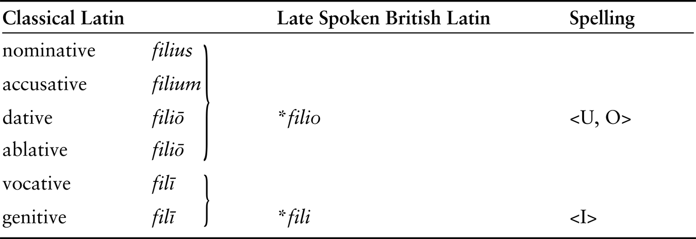
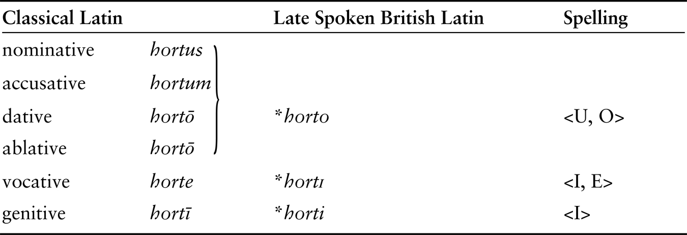
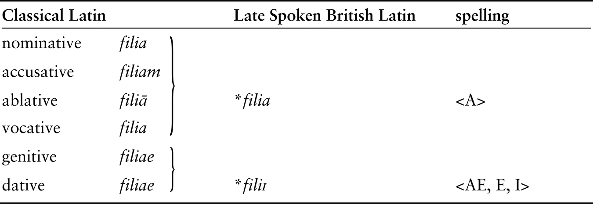
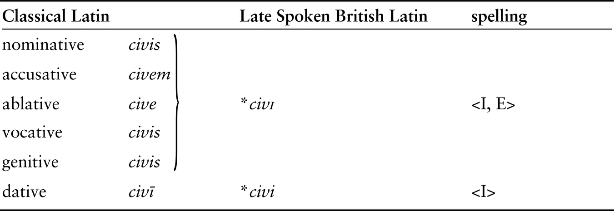
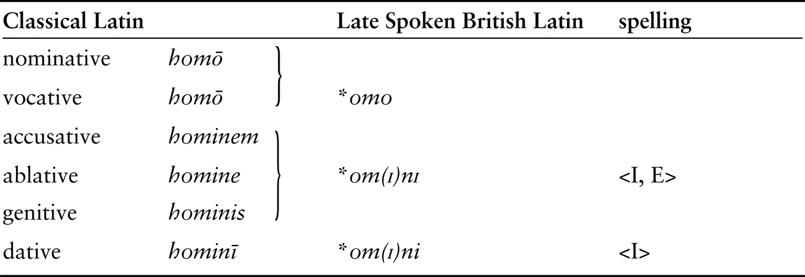

## 5. THE LINGUISTIC MAP OF PRE-ANGLO-SAXON ENGLAND

As there are sophisticated methods for its reconstruction, the common ancestor language of Welsh, Cornish, and Breton is so accessible that with a bit of practice we would be able to strike up a conversation with a second-century British Celt in his native language and explain to him how his language had changed—quite dramatically as a matter of fact—by the end of the sixth century. But this confidence in our capabilities does not stretch beyond the British Celtic that was spoken in the west of Britain, since it is from there that the languages come on which our reconstruction depends (i.e. Wales, Cornwall, and, in the case of Breton, probably also Devon). In the absence of any knowledge about the peculiarities of the Celtic dialects that were spoken in, say, Kent, Essex, and East Anglia and around York, it has usually been assumed that changes in western British Celtic also affected those British Celtic dialects in the far east. This is another example of a reasonable assumption: it is a fact that Celtic was spoken from east to west Britain when the Romans established their rule and that under Roman rule the travel of people, products, and ideas from the southeast to other parts of the country would generally have been unimpeded, probably more so than ever before. Unimpeded traffic and contact of speakers tend to slow down processes of change that would lead to dialectal fragmentation, and also to encourage the development of a dialect continuum: a chain of dialects in which mutual understanding, from one village to the next, would be ensured. In such a continuum, linguistic innovations would gradually spread along traffic axes from the economic and political centres in the east towards the less densely populated west and north. The western areas in which Welsh, Breton, and Cornish arose would be the logical terminus of those linguistic innovations, so developments that would start in the east might arrive in the west a few generations later. Given the plausibility of this scenario, why cast doubt on the idea that the lost eastern British Celtic was essentially identical to western British Celtic?

Two recently advanced hypotheses have shaken the idea that western British Celtic may be used as a proxy for the language with which the Anglo-Saxons engaged in the east: the language of the east may well have been Late Spoken Latin rather than Celtic (II.5.1), and the little we know about eastern British Celtic points to it being closer to the Continental Celtic language of Gaul than to western British Celtic (II.5.2). Both issues require detailed attention.

### 5.1. Spoken Latin in Britain

Generally speaking, Latin successfully eliminated almost all other languages within the confines of the Western Roman Empire, the exceptions being three languages that survived in relatively remote areas: Albanian, probably in the higher reaches of the Balkans; Basque in the Pyrenees; and Celtic, which survived only in the extreme west and north of Britain, where Welsh, Cornish, and Breton originate. There is no a priori reason to think that Britain, being an island far away from Rome’s centres of power, was so superficially Romanized that Latin would just be the language of the political and military elite. Most of Britain formed part of the Roman Empire for no less than 350 years. Culturally and economically, Britain’s southeast saw the development of a Roman civil society, which included such features as towns, temples, rural villas as foci of agricultural activity, and a dense network of roads. Latin was the means of written expression for the elite, as hundreds of monumental inscriptions indicate, but also for the man in the street, who reported the loss or theft of petty objects to the goddess Minerva Sulis of Aquae Sulis (Bath) in written Latin. The Romanized British southeast is known as the ‘Lowland Zone’, which runs southeast of an approximate line that connects Dorchester, Bath, Gloucester, and Wroxeter and bends sharply eastwards towards Lincoln, then northwards past York until it hits Hadrian’s Wall near Corbridge. By contrast, the ‘Highland Zone’, which largely consists of the moorlands, uplands, and rugged coastal areas of Devon and Cornwall, Wales, the Pennines, Yorkshire, and Cumbria, was culturally only superficially Romanized, with emphasis on the military.[^en2_14]

The general assumption, therefore, is that in the Lowland Zone, at least, Latin was probably more than a thin upper-class veneer over a largely Celtic-speaking society. There is a specifically linguistic reason, too. Western (i.e. Highland) British Celtic underwent a period of rapid and deep changes in its sound system and its morphology in the two centuries that followed the collapse of Roman rule in Britain. Most of these changes are strikingly similar to changes affecting Late Spoken Latin in western Europe during the same period. One might think that Celtic and Latin developed in tandem because Celtic with a Latin accent had high status: Latin, after all, was the official language of the politically and culturally powerful Roman Empire as well as of the Christian state religion, and speakers of Celtic may have wanted to sound as Latin as possible in order to be associated with that power. But it is almost certain that after the collapse of Roman power in Britain speakers of Latin had exceptionally low social status. That conclusion is arrived at by considering Latin loanwords in western (Highland) British Celtic. Virtually all of them—there are hundreds—date from the Roman period. The influx of loanwords almost completely came to a halt by the fifth and sixth centuries, precisely during the period when the sound system and the syntax of Highland British Celtic became Latinized. The Latinization of the British Celtic sound system but not of the lexicon strongly indicates that it resulted from low-status speakers of Latin rapidly shifting to high-status Celtic and in the process retaining a Latin accent but avoiding the use of Latin words. This is a reversal of the situation in previous centuries, when Celtic speakers shifted to Latin.

The surprising thing is that this low-status Celtic variety with a Latin accent became so successful in spreading itself that all surviving varieties of Highland British Celtic (Welsh, Cornish, and Breton) are packed with its Latinate features. How is that possible, if it was spoken by low-status speakers, who are not as a rule linguistic role models? Only if speakers of Latinate Celtic were so numerous that they would have swamped the speakers of other varieties of Celtic. This linguistic scenario evokes images of large numbers of destitute Latin-speaking refugees from the Lowland Zone entering the Highland Zone before the gradual advance of the Anglo-Saxon warrior-settlers in the fifth and sixth centuries. What is relevant to the present discussion of the linguistic map of pre-Anglo-Saxon Britain is that by the end of the Roman period the east was apparently home to a population of Latin speakers large enough to swamp the population of Celtic speakers in the west by the fifth and sixth centuries. How large is impossible to say: given that the Lowland Zone was more densely populated than the Highland Zone, a population large enough to outnumber the Highland Zone natives might still be a small proportion of the entire Lowland Zone population. Nor is it possible to say from which parts of the Lowland Zone these migrants originated. At the very least, Latin-Celtic bilingualism must have been widespread in the Lowland Zone; at the most, Latin may have almost completely displaced Celtic altogether (but we shall see that there are other considerations pointing to the survival of Celtic in the southeast: II.5.3 and II.5.4).[^en2_15]

The conclusion is that the Anglo-Saxons initially may have met with speakers of Latin rather than Celtic, which has obvious implications for an explanation of the absence of Celtic influence on Anglo-Saxon: maybe there was no Celtic influence because the Anglo-Saxons met hardly any speakers of Celtic because the latter had become speakers of Latin over the preceding centuries. This conclusion transforms the question about Celtic influence in Old English into a question about British Latin influence in Old English, which brings along its own complexities. The little that is known about the way in which Latin in Britain developed after the first century suggests that it did not differ substantially from the late Latin of Gaul, which ultimately became French (see section II.5.2 below).[^en2_16]

There is tentative evidence from place names that indicates that British Celtic had a different status from Latin in the Lowland Zone. Richard Coates has pointed out that a number of British Celtic words which survive as English place names have peculiar features. They tend to occur in simple names, such as <i>Creech</i> and <i>Crick</i> (Welsh <i>crug</i> ‘barrow’), <i>Penn</i> (Welsh <i>penn</i> ‘head, end’), <i>Ross</i> and <i>Roos</i> (Welsh <i>rhos</i> ‘headland’), and <i>Avon</i> (Welsh <i>afon</i> ‘river’). What they never do is form the second element of early English generic compounds of the type *<i>Long-creech</i>, however, nor do they enter the Old English lexicon as loanwords. That suggests that these British Celtic terms were borrowed into Old English as names denoting specific landscape features rather than as ordinary nouns (Coates 2007: 181). Direct contact between British Celtic and Anglo-Saxon is not required to explain the presence of these British Celtic words in Old English: it is enough to assume that British Celtic donated the place names consisting of those terms to Latin, and Latin then donated them to Anglo-Saxon. By contrast, a number of Latin place-name elements do form generic compounds together with Old English terms and often enter the Old English lexicon. Examples are Old English <i>strǣt</i> ‘street’ (Latin <i>strāta</i>), <i>ceaster</i> ‘fortification, town’ (Latin <i>castrum</i>), <i>camp</i> ‘open land’ (Latin <i>campus</i>), * <i>eccles</i> ‘church’ (Latin <i>ecclēsia</i>), and *<i>funta</i> ‘well’ (Latin <i>fontāna</i>). The status of these terms in Old English suggests direct contact between Anglo-Saxon and Latin (Parsons 2011: 126–127). The place-name evidence therefore seems to indicate that at least in some parts of the Lowland Zone Anglo-Saxon was in direct contact with Latin and borrowed place names from Latin rather than from British Celtic.[^en2_17]

### 5.2. The Latin Inscriptions of Early Medieval Britain

So far, we have seen mostly indirect evidence pointing to the survival of spoken Latin in Britain during the early medieval period. But there is also a corpus of well over 300 Latin inscriptions from Britain that can be dated between about AD 500 and 1200.[^en2_18] They are known as the ‘Early Christian’ or ‘Celtic’ inscriptions of Britain, though it is not clear whether the people who produced them were all Christians (many of them certainly were) or speakers of Celtic (many names in the inscriptions are of Celtic origin). The inscriptions are found mainly in Wales and Cornwall; some are from southern Scotland, Man, Herefordshire, Somerset, Devon, and Dorset (where all four are from Wareham). The area forms a wide northern and western arch, which includes the Highland Zone as well as adjacent areas of the Lowland Zone, which Anglo-Saxon occupation did not reach until around AD 600.

#### 5.2.1. Was Late Latin Spoken in Britain during the Early Middle Ages?

Although the language of the inscriptions clearly is Latin, it is not immediately evident that the inscriptions were carved or commissioned by people who spoke Latin. One consideration is that the use of Latin grammatical cases in the inscriptions does not conform to Classical Latin standards at all. Another reason to doubt whether the inscriptions were produced by Latin speakers is that they appear on gravestones and almost all show variations on a small number of standard phrases that do not presuppose more knowledge of Latin amongst the early medieval bereaved than does the appearance of R.I.P. (<i>requiescat in pace</i> ‘may (s)he rest in peace’) on modern gravestones. One formula consists of the name of the deceased, usually followed by his or her affiliation (‘son of X’, ‘wife of Y’), which appears in the Latin genitive case. The genitive denotes possession, in this case of the grave:

| 1. CIIC 373/ECMW 171 | SEVERINI FILI SEVERI |
| --- | --- |
|  | ‘(grave) of Severinus, son of Severus’ |

By Classical Latin standards of grammar and spelling, this inscription is completely correct.

In another widespread formula, the name of the deceased appears in the nominative case, which denotes the subject of a clause, and is combined with <i>hic iacet/iacit</i> ‘here lies’:

| 2. CIIC 392/ECMW 77 | VERACIVS PBR HIC IACIT |
| --- | --- |
|  | ‘Veracius the priest lies here’ |

<i>PBR</i> is an abbreviation of Latin <i>presbyter</i> ‘priest’. The grammatical structure of this sentence is also correct by Classical standards.

In many inscriptions, however, the use of the Classical Latin grammatical cases is blatantly incorrect. An example:

| 3. CIIC 387/ECMW 95 | FIGVLINI FILI LOCVLITI HIC IACIT |
| --- | --- |
|  | ‘Figulinus son of Loculitus lies here’ |

By Classical Latin standards, the subject of the clause, ‘Figulinus, son’, should be in the nominative (<i>Figulinus filius</i>) rather than in the genitive. One way of explaining this oddity goes as follows: ‘The writer (as is often the case in this tradition) knows the Latin funerary formula <i>hic iacet</i>, but has no control over the Latin case system. From his familiarity with epitaphs written in the genitive throughout but without a verb [as in example 1] he made the incorrect deduction that <i>-i</i> endings were the norm for Latin even if there was a verb’ (Adams 2007: 618).’[^en2_19] A similar confusion underlies the following text:

| 4. CIIC 334/54 | CATACVS HIC IACIT FILIVS TEGERNACVS |
| --- | --- |
|  | ‘Catacus lies here, the son of Tigernacus’ |

In J. N. Adams’ words again (2007: 618): ‘The writer has failed to put the name of the father [<i>Tegernacus</i>] into the genitive but has used the nominative instead (…). Here we see a classic feature of imperfect learning: the writer knows a single case form and puts it to more syntactic uses than one.’[^en2_20]

| 5. CIIC 376/174 | VENNISETLI FILIVS ERCAGNI |
| --- | --- |
|  | ‘(grave) of Vennisetlus, son of Ercagnus’ |

In this example, <i>Vennisetli</i> is in the genitive, but <i>filius</i>, which should agree in case with <i>Vennisetli</i>, appears in the nominative instead of the genitive <i>fili</i>. Adams states (2007: 619): ‘Some writers knew the nominative form of <i>filius</i>, but this knowledge was not accompanied by an ability to make the name and <i>filius</i> agree.’ On the basis of texts such as these, Adams concludes: ‘By the time when these inscriptions were written Latin was all but a dead language. Parallels … can be cited from the Roman period itself for the attempt to keep a dead language going for the writing of funerary inscriptions, because it was felt to be appropriate that a respected language should be used for epitaphs even after genuine knowledge of that language had been lost.’ In a nutshell, the medieval Latin inscriptions of Britain offer no evidence for the survival of spoken Latin in Britain, but rather the opposite: they show that spoken Latin had died out amongst the writers who carved the inscriptions.

This is certainly a possibility, but it is useful to ask oneself how compelling the idea is. Let us compare a parallel situation in the history of the Irish language. Consider the following phrases in Irish, which illustrate some of the developments that occurred in the period straddling the boundary between Old Irish (600–900) and Middle Irish (900–1200):

| Old Irish: | 1. <i>Ailbe daltae Maíni</i> ‘Ailbe, foster son of Maíne’ |
| --- | --- |

The two forms ending in <i>-e</i> are Old Irish nominatives, and the one in <i>-i</i> is a genitive. This phrase is formed correctly according to Old Irish grammar and spelling. The same phrase with the same meaning may appear in Middle Irish in a variety of spellings. I cite only three:

| Middle Irish: | 2. <i>Ailbe daltae Maíni</i> (= Old Irish) |
| --- | --- |
|  | 3. <i>Ailbi daltai Maíne</i> |
|  | 4. <i>Ailbi daltae Maíni</i> |

An interpretation of these data along lines similar to Adams’ reading of the British Latin evidence would run as follows. Some writers of Middle Irish still had a good enough grasp of the language to produce the phrase using the correct case forms, as in example 2. Others, apparently, were hopelessly confused, using the genitives <i>Ailbi</i> and <i>daltai</i> where nominatives would be correct, and the nominative <i>Maíne</i> instead of the expected genitive <i>Maíni</i> (example 3). Others again had lost their sense of grammatical agreement and aligned a genitive <i>Ailbi</i> with a nominative <i>daltae</i> (example 4). Such maltreatment of the grammatical cases must surely mean that to the scribes of 3 and 4 Irish was a dead language?

No, it does not. A correct assessment of the Middle Irish phenomena is possible if we know how the Irish language changed between the Old and Middle Irish periods. One of the key developments that characterize Middle Irish is that all Old Irish word-final unstressed vowels, including <i>-e</i> and <i>-i</i>, had become /ə/.[^en2_21] So the Old Irish phrase <i>Ailb</i> [e] <i>dalta</i> [e] <i>Maín</i> [i] had come to be pronounced as <i>Ailb</i> [ə] <i>dalta</i> [ə] <i>Maín</i> [ə]. This phonetic development obliterated the Old Irish difference between the nominative and the genitive of all three words. The loss of this difference does not conform to Old Irish standards but is in complete alignment with the rules of Middle Irish. In the absence of a normative Middle Irish spelling system, it did not matter whether a scribe wrote word-final <i>-e</i> or <i>-i</i> (or for that matter <i>-iu</i>, <i>-eo</i>, <i>-ea</i>) because that did not interfere with the language as it was spoken, for all were pronounced /ə/. In the same sense it would not matter whether we write English <i>beat</i> or <i>beet</i>, or <i>would</i> or <i>wood</i>, for both spellings of those pairs are pronounced identically.

If we apply this analogy to the Latin inscriptions of Britain, the ‘confusion’ between, say, the nominative <i>Tegernacus</i> and the genitive <i>Tegernaci</i> could be the result of a sound change in British Latin that obliterated the difference between <i>-us</i> and <i>-i</i> in final syllables, turning both into something like /ə/. This is just a possibility, and we have no reason to suppose that vowels in final syllables actually turned into /ə/ in British Latin. But the change is not implausible, given that the closely related Latin of France did turn the vowels of final syllables into /ə/ or zero during the early medieval period, and all Romance languages lost the Latin genitive case at a very early date. The point I am making is that the confusion of grammatical cases we observe in the medieval Latin inscriptions of Britain is closely comparable to the phenomenon observed in Middle Irish texts. If the latter is readily explainable as the result of a sound change occurring between Old and Middle Irish rather than the extinction of Irish, why, then, should we exclude the possibility that Latin in Britain simply changed from Classical to medieval British Latin rather than becoming extinct? It would be illogical to assume that a bad command of Classical Latin in the British inscriptions necessarily means that Latin in Britain had become extinct by the early medieval period, just as it is illogical to assume that a bad command of Old Irish amongst Middle Irish scribes necessarily implies that Irish had died out: the language had just moved on to a different phase of its development.

So in trying to answer the question whether Latin was still a living, spoken language amongst those who made the early medieval Latin inscriptions of Britain we are back to square one. Yet it is possible to make headway by studying the inscriptions more closely and by shifting the frame of reference from Classical Latin written standards to the standards of the Latin that was spoken in late Antiquity and the early medieval period. This is the language called Late Spoken Latin. Our knowledge of Late Spoken Latin comes from three sources:

- Violations of Classical Latin grammar and spelling in late Antique and early medieval Latin inscriptions: the rule of thumb is that if these inscriptions show grammatical forms and spellings in a correct Classical Latin form, that does not mean that Latin had stayed the same. Such ‘correct’ grammatical forms and spellings just point to the fact that the author was well educated in the norms and practices of writing Classical Latin; only if he slipped up and deviated from the Classical norm do we obtain potentially valuable information: either he just made a stonemason’s mistake (e.g. when he wrote <i>ihc</i> instead of <i>hic</i> ‘here’, swapping letters), which is uninformative, or he let on that the Latin he spoke was actually different from the Latin he wrote (e.g. when he wrote <i>cives</i> instead of <i>civis</i> ‘citizen’, betraying that in speech /i/ and /e/ in final syllables had merged into /I/, which could be spelled as either <e> or <i>).
- Similar violations in Latin texts in early medieval manuscripts.
- Linguistic reconstructions based on our knowledge of the development of Romance languages such as French, Spanish, and Italian, to which Late Spoken Latin is ancestral.

Late Spoken Latin codifies many of the sweeping changes that affected Latin between the Classical period of the first century BC and the earliest manuscript attestations of French, Spanish, and Italian in the centuries around AD 1000. Let us begin by returning to inscription number 2:

| 2. CIIC 392/ECMW 77 | VERACIVS PBR HIC IACIT |
| --- | --- |
|  | ‘Veracius the priest lies here’ |

The grammar and spelling of this inscription conform to Classical Latin standards, with one exception, which is where things start to become interesting: Classical Latin ‘lies’ is not <i>iacit</i> (which exists but means ‘throws’) but <i>iacet</i>. In fact, almost all of the Celtic Latin inscriptions that contain the formula show <i>iacit</i> rather than <i>iacet</i>, so that this cannot be just a stonemason’s mistake. One explanation for <i>iacit</i> is that the stonemason or the person who commissioned him simply did not know Latin well enough and therefore confused the two very similar verbs. Another, more interesting take on the matter is that the confusion of <i>iacit</i> and <i>iacet</i> would have made perfect sense to any speaker of Late Spoken Latin. In Classical Latin, <i>iacit</i> [’jakit] ‘throws’ and <i>iacet</i> [’jaket] ‘lies’ were pronounced differently, and this pronunciation difference is reflected in spelling. In Late Spoken Latin, however, both had merged as [’jātʃ It], as a result of three sound changes:[^en2_22]

- [k] became [tʃ] before front vowels (i.e. vowels such as <i>e</i> and <i>i</i>, which are produced by moving the tongue forward from its neutral resting position).
- Short vowels became long vowels if they were both stressed and followed by a single consonant + a vowel, as is the case with <i>a</i> in <i>iacit</i> and <i>iacet.</i>
- In final unstressed syllables, the difference between the vowels [e] (< Classical Latin <i>ĕ</i>) and [I] (< Classical Latin <i>ĭ</i>) disappeared: they merged into one single vowel, which was probably pronounced as [I];[^en2_23] this affected the final syllables of Classical Latin <i>iacet</i> and <i>iacit</i>, which as a result became identical.

So in Late Spoken Latin, [’jātʃ It] meant both ‘throws’ and ‘lies’. But in view of the conservative nature of Latin orthography, which tended to adhere to Classical Latin norms of spelling throughout Antiquity and the medieval period, [’jātʃ It] continued to be spelled as <i>iacet</i> if it meant ‘lies’ and as <i>iacit</i> if it meant ‘throws’—unless, that is, a scribe slipped up, not because he wrote bad Latin (<i>iacet</i> and <i>iacit</i> are both appropriate spellings of what was pronounced as [’jātʃ It]), but because he was insufficiently aware of the spelling conventions of Classical Latin. In this sense, the spelling of ‘lies’ as <i>iacit</i> instead of <i>iacet</i> is comparable to spelling English <i>meat</i> as <i>meet</i>.

Rather than just being a mistake, therefore, the spelling <i>iacit</i> for Classical Latin <i>iacet</i> ‘lies’, which occurs in this and many other Celtic Latin inscriptions, may well reflect developments in Late Spoken Latin because it agrees with what we know about that language. If so, the spelling <i>iacit</i> suggests the presence of speakers of Late Spoken Latin in western Britain around approximately 500. The corpus of inscriptions shows yet another variation in the formula <i>hic iacet</i> that points in the same direction:

| 6. CIIC 353/ECMW 127 | TRENACATVS IC IACIT FILIVS MAGLAGNI |
| --- | --- |
|  | ‘here lies Trenacatus, son of Maglagnus’ |

Instead of <i>hic</i> ‘here’ the inscription reads <i>ic</i>.[^en2_24] This also shows interference of spoken Latin: the sound [h] was lost in Latin at an early stage, probably already by the first century BC, but the standardized orthography held on to writing <i>h</i> in words that used to have it, such as <i>hīc</i>. After the third century AD, <i>h</i> was frequently omitted in words that originally had it and added to words that originally did not, a liberty that persisted in early medieval manuscripts.[^en2_25] The spelling <i>ic</i> in our inscription betrays the influence of spoken Latin. The <i>Trenacatus</i> inscription, which is from Llanwenos, Wales, and dates from around AD 500, is interesting for other reasons, too. It forms part of a group of bilingual Latin-Irish inscriptions. The Irish part, which is written in the curious Irish Ogam script, contains only the name of the deceased in the Irish genitive singular: ‘(grave) of Trenacatas’. The name, with its <i>-a-</i> in the second syllable, is Irish rather than Latin or British Celtic. The inscription belongs to the trilingual environment of the Irish settlements in Wales, where Irish and British Celtic were spoken as well as, presumably, Latin.

So <i>ic</i> and <i>iacit</i> instead of <i>hic</i> and <i>iacet</i> indicate that Late Spoken Latin was used in western Britain in the fifth and sixth centuries. If this were all the evidence for spoken Latin in post-Roman Britain, the extent to which Latin was still spoken could have been very small: all it requires for the introduction of the <i>hic iacet</i> formula and its <i>ic iacit</i> variant is one or two trend-setting stonemasons who spoke a bit of Late Spoken Latin or imported the formula with its variations <i>ic</i> and <i>iacit</i> from, say, Gaul, as well as a large number of Welsh stonemasons copying their linguistic behaviour. But there is more to be gleaned from the inscriptions if we study non-formulaic words.

| 7. CIIC 391/ECMW 78 | SENACVS PRSBR HIC IACIT CVM MULTITUDNEM FRATRUM |
| --- | --- |
|  | ‘Senacus the priest lies here with a multitude of brethren’ |

The significant portion is <i>cum multitudnem fratrum</i> ‘with a multitude of brethren’, which in Classical Latin would have been <i>cum multitudine fratrum</i>. The first conspicuous feature is the loss of <i>-i-</i> in <i>multitud(i)nem</i>. This may be a simple mistake by a stonemason who forgot to carve the letter, but it is also possible that the vowel was lost in speech by a process called syncope: the rule in early medieval French is that in a word in which the stressed syllable was followed by two unstressed syllables, the first unstressed syllable was lost if it was followed by a single consonant (<i>multi’tudinem > multi’tudnem</i>, where’ denotes stress on the following vowel). It is impossible to decide which of the two explanations is correct.

The second issue is that in Classical Latin the preposition <i>cum</i> ‘with’ is followed by the ablative case (<i>multitudine</i>) rather than the accusative case (<i>multitudinem</i>). In all of Late Spoken Latin, word-final <i>-m</i> at the end of a word consisting of more than one syllable had invariably been lost in speech. So it was purely a matter of spelling whether <i>-m</i> was written or not, and a matter of education whether it was written in conformity with Classical Latin rules or not. Writing <i>cum multitudnem</i> with an <i>-m</i> does not conform to Classical standards, but it is an easy mistake to make for anyone speaking Late Spoken Latin: the use of an accusative <i>multitudnem</i> instead of an ablative <i>multitudine</i> is a typical trait of Late Spoken Latin, when the accusative had ousted the ablative as the case that was used after prepositions.[^en2_26]

Another case of an omitted word-final <i>-m</i> is SINGNO for Classical Latin <i>signum</i> ‘sign’ (CIIC 427b/ECMW 301). This shows two other features which are readily explained against a Late Spoken Latin background. The spelling <o> for <u> in the final syllable is common in late Antique and early medieval Latin texts,[^en2_27] and the spelling <ngn> reflects the spoken Latin development of <i>gn</i> to <i>ŋn</i>.[^en2_28]

Other developments seen in the British Latin inscriptions that make sense if they were inspired by Late Spoken Latin are the development of Classical Latin <i>ae</i> to <i>e</i> and the spelling of Classical Latin stressed long <i>ē</i> as <i>.[^en2_29]

All of those Late Spoken Latin developments are widespread in areas in which Latin developed into a Romance language, and particularly in Gaul, where Latin turned into French during the early medieval period. Being critical, one could still downplay the significance of those features in British Latin and say that they were imported by immigrant scribes from Gaul, along with the <i>hic iacet</i> formula, rather than reflecting native British Latin usage. But there is one feature for which that explanation is impossible: the loss of word-final <i>-s</i>. In Late Spoken Latin, loss of <i>-s</i> occurred in Italy and in the area in which Rumanian originated but not in western Europe, where <i>-s</i> was retained.[^en2_30] Omission of <i>-s</i> in later Latin inscriptions from Gaul is relatively rare and more likely to be scribal than phonetic.[^en2_31] In the British Latin inscriptions of the early medieval period, however, there are so many instances of the loss of <i>-s</i> that they are unlikely to be just scribal errors:

1. <i>-o</i> instead of Classical Latin <i>-us</i>
  - CIIC 381/ECMW 87 ALIORTVS ELMETIACO ‘Aliortus Elmetiacus’
  - CIIC 328/ECMW 44 [R]VGNIATO [FI]LI VENDONI ‘(?)rugniatus son of Vendon(i)us’
  - CIIC 394/ECMW 103 FVIT [C]ONSOBRINO MA[G]LI MAGISTRATI ‘he was cousin (<i>consobrinus</i>) of Maglus the magistrate’
  - CIIC 325/ECMW 33 VASSO PAVLINI ‘servant (<i>vassus</i>) of Paulinus’
  - CIIC 435/ ECMW 315 LATIO ‘Lat(t)ius’?
2. <i>-e</i> and <i>-i</i> instead of Classical Latin <i>-is</i>
  - CIIC 394/ECMW 103 VENEDOTIS CIVE ‘Venedotian citizen’ (Classical Latin <i>Venedotis civis</i>)
  - CIIC 402/ECMW 184 MVLIER BONA NOBILI ‘good and noble (<i>nobilis</i>) wife’
  - CIIC 408/ECMW 229 PRONEPVS ETERNALI ‘great-grandson of Eternalis’ (Classical Latin <i>pronepos Aeternalis</i>)
  - CIIC 413/ECMW 272 CAELEXTI MONEDORIGI ‘(grave) of Caelestis, son of Monedorix’ (Classical Latin <i>Caelestis Monedorigis</i>)
  - CIIC 435/ECMW 315 CLVTORIGI ‘(grave) of Clutorix’ (Classical Latin <i>Clutorigis</i>)
  - CIIC 455/ECMW 403 CAMVLLORIGI ‘(grave) of Camulorix’ (Classical Latin <i>Camulorigis</i>)
  - CIIC 515/Scot. 9 DVO FILII LIBERALI[^en2_32] ‘two sons of Liberalis (<i>Liberalis</i>)’

The loss of word-final <i>-s</i> in early medieval British Latin would also explain the hypercorrect addition of <i>-s</i> in CIIC 393/ECMW 101 IN HOC CONGERIES LAPIDVM ‘in this heap of stones’ (Classical Latin <i>in hoc congerie lapidum</i>). The relevance of the loss of final <i>-s</i> to the question of the survival of Latin in Britain lies in the fact that this feature cannot possibly have been imported into Britain by incidental visitors from nearby areas in which Latin was spoken: in those areas (France, Spain, Portugal) word-final <i>-s</i> was preserved. In the Latinity of western Europe, loss of <i>-s</i> is characteristic of British Latin and of British Latin alone, where it may have been caused by the influence of British Celtic. What better evidence for the survival of British Latin as a spoken language in the early medieval period?[^en2_33]

#### 5.2.2. The Collapse of the Classical Latin Case System in British Latin

With this conclusion in mind, let us return to the issue of the confusion of the nominative in <i>-us</i> with the genitive in <i>-ī</i>. We have seen a number of sound changes that probably affected the Late Spoken Latin of Britain, most of them along with western European Late Spoken Latin. None would account for the confusion of <i>-us</i> and <i>-ī</i>, however: <i>-us</i> lost its <i>-s</i>, and <i>u</i> in final syllables merged with Latin <i>ō</i>, but there is no evidence in the corpus to suggest that <i>-u</i> was confused with <i>-ī</i> as a result of a sound change of final vowels to something like /ə/. So the possible parallel with Old and Middle Irish, which was explained earlier, breaks down. If it is not sound change that can be made responsible for the-<i>us</i>/<i>-ī</i> confusion, we need to explore the possibility that grammatical change is involved. In this context it is relevant to point out that a similar confusion of nominative and genitive can be observed in a different class of nouns, viz. the feminines ending in <i>-a</i>:

> CIIC 320/ECMW 26 CVLIDOR[I?] IACIT ET ORVVITE MVLIERI SECUNDI […?][^en2_34]
>
> > ‘Culidorus? / Culidorix? lies (here) and Orfita (his) second wife’
> >
> > (Classical Latin: <i>Culidorus</i>? / <i>Culidorix</i>? <i>iacet et Orfita mulier secunda</i>)

This is a possible example of a cross of the formula <i>nominative hic iacet</i> ‘X lies here’ and the formula <i>genitive</i> ‘(grave) of X’. ORVVITE is the genitive <i>Orfitae</i>, agreeing with the genitive <i>mulieri(s)</i> ‘wife’. <i>Secundi</i> is usually taken to be the genitive of the name of the father of <i>Culidor</i>-: <i>Secundi</i> [<i>fili</i>] ‘son of Secundus’, but this is unlikely for two reasons. The normal order in these British inscriptions is *<i>fili Secundi</i>, and placing this phrase so far away from <i>Culidor</i> [<i>i</i>] is curious. The possibility I have chosen is to take <i>secundi</i> as an alternative spelling of <i>secunde</i>,[^en2_35] which developed regularly from earlier <i>secundae</i>.[^en2_36] Another example of the spelling <i>-i</i> for what originally was <i>-ae</i> can be found in CIIC 419/ECMW 284:

> FILIAE SALVIA[N]I HIC IACIT VE[.]MAIE VXSOR TIGIRNICI ET FILIE EIVS ONERATI [HIC IA]CIT RIGOHENE []OCETI []ACI
>
> > ‘the daughter of Salvianus lies here, Ve[.]maia wife of Tigirnicus, and his (her?) honoured daughter [here? li]es, Rigohena …’

As in the preceding inscription, the two formulae were mixed: the subject of <i>hic iacit</i> is in the genitive instead of the nominative. The subject genitives are <i>filiae</i>, <i>Ve</i> [.] <i>maie = Ve</i> [.] <i>maiae</i> and <i>onerati = honoratae</i>, and <i>Rigohene = Rigohenae</i>.[^en2_37] The same mixture of the formulae can be found in the following two inscriptions:

> CIIC 401/ECMW 183 BROHOMAGLI IATTI IC IACIT ET VXOR EIVS CAVNE
>
> > ‘Brohomaglus (son) of Iattus lies here and his wife Cauna’

Here the genitive <i>Caune = Caunae</i> replaces the nominative <i>Cauna</i>.

> CIIC 451/ECMW 401 TVNCCETACE VXSOR DAARI HIC IACIT
>
> > ‘Tuncetaca, wife of Darius, lies here’

The genitive <i>Tunccetace</i> = <i>Tuncetacae</i> replaces the nominative. Notice that in both inscriptions the word <i>uxor = uxsor</i> ‘wife’, which should agree in case with the genitives <i>Caunae</i> and <i>Tuncetacae</i>, is in the old nominative.

So just as the masculine genitive in-<i>i</i> (phonetically long <i>ī</i>) is used instead of the nominative in <i>-us</i>, the feminine genitive in <i>-ae</i> is used instead of the nominative in <i>-a</i>. In neither case do we have reason to believe that the confusion was the result of sound change. An unexpected source offers a clue towards what is going on: Welsh.

Welsh contains hundreds of Latin loanwords. Among them is the Latin personal name, ultimately of Greek origin, <i>Ambrosius</i>. This appears in Medieval Welsh in two very well-attested forms: <i>Emreis</i> and <i>Emrys</i>. A number of regular sound changes have been involved in turning the Latin source form into its Welsh descendants, but we shall focus on just one: the development of Latin <i>-o-</i> into Welsh <i>-ei-</i> and <i>-y-</i>. This development falls under the heading of so-called final <i>i</i>-affection, which means that the vowel *<i>ī</i> or the consonant *<i>j</i> in the final syllable of the word changes the vowel of the preceding syllable. The handbooks on the history of the Welsh language are unclear about the conditions under which final <i>i</i>-affection operating on *<i>o</i> produced Welsh <i>ei</i> or <i>y</i>, but the basic rules are straightforward and come to light when we study a number of examples:

1. *<i>o > ei</i>
  1. Proto-British *<i>korkjos</i> > Middle Welsh <i>keirch</i> ‘oats’ (cognate with Old Irish <i>corcae</i> ‘oats’)
  2. Latin <i>spolium ></i> Proto-British *<i>spoljon ></i> Middle Welsh <i>yspeil</i> ‘booty’
  3. Latin <i>solea</i> ‘sole’ or <i>solium</i> ‘seat’ > Proto-British *<i>solja</i>, *<i>soljon</i> > Middle Welsh <i>seil</i> ‘foundation’
  4. Latin * <i>Lōndonium</i> > Middle Welsh <i>Llundein</i>[^en2_38]
2. *<i>o > y</i>
  1. Proto-British masculine plurals that ended in *<i>-ī</i> turn *<i>o</i> in the preceding syllable into <i>y</i>: e.g. <i>corn</i> ‘horn’, plural <i>kyrn</i> < Proto-British *<i>kornī</i>; similarly, <i>llory</i> ‘cudgel’, plural <i>llyry</i>; also in Latin loanwords: <i>escob</i> ‘bishop’, plural <i>esgyb</i>; <i>abostol</i> ‘apostle’, plural <i>ebestyl</i>; <i>pont</i> ‘bridge’, plural <i>pynt</i>
  2. Latin <i>Salomō ></i> Proto-British *<i>Salomī</i> > Middle Welsh <i>Selyf</i>
  3. Proto-British *<i>Touto-rīgs</i> (lit. ‘tribal king’) > Middle Welsh <i>Tudyr</i>
  4. Proto-British *<i>Maglo-kū</i> (lit. ‘princely hound’) > *<i>Maglo-kī</i> > Middle Welsh <i>Meilyg</i>

On the basis of these forms, it seems that *<i>o</i> regularly became <i>ei</i> if the final syllable contained *<i>j</i> (1–4), while it became <i>y</i> before an *<i>ī</i> (5–8). There are a number of possible counterexamples, but they are unconvincing: Latin <i>memoria</i> ‘memory’ <i>></i> *<i>memorjā</i> > Middle Welsh <i>myfyr</i> (not \*\*<i>myfeir</i>) and <i>historia</i> ‘history, story’ > *<i>istorjā</i> > Middle Welsh <i>ystyr</i> (not \*\* <i>ysteir</i>) are irregular in any case because the syllable *<i>-jā</i> never causes final <i>i</i>-affection.[^en2_39] Proto-Celtic *<i>gdonjos</i> ‘man, mortal’ turns up as Middle Welsh <i>dyn</i>, but the intermediate stage may well have been *<i>dunjos</i> in British Celtic before <i>i</i>-affection operated: the development of *<i>o</i> to *<i>u</i> before a nasal consonant is widespread in Welsh although the exact rules are difficult to pin down.[^en2_40] Hence *<i>gdonjos ></i> *<i>dunjos > dyn</i> illustrates the behaviour of *<i>u</i> rather than *<i>o</i> under <i>i</i>-affection.

The only words that continue to provide problems are the pair <i>Emreis</i> and <i>Emrys</i>. The general rule predicts that <i>Ambrosius ></i> *<i>Ambrosjos</i> should regularly become <i>Emreis</i>. The alternative form <i>Emrys</i> presupposes a final syllable without *<i>j</i> but with long *<i>ī</i>. This does exist, not in British Celtic, but in the Latin inflected paradigm: the Latin vocative and the Latin genitive of <i>Ambrosius</i> are both <i>Ambrosī</i>, and this would yield Middle Welsh <i>Emrys</i>. Since prehistoric Welsh, like Late Spoken Latin, lost the system of nominal cases, it is in general unlikely that it would preserve two case forms of the same word. But <i>Ambrosius</i> is in one respect a special type of noun, for it is a personal name, and personal names in languages with a case system occur frequently in the vocative, which is the case used when addressing a person (‘(hey) Ambrose!’). Because of that frequency and because of the widespread fact that personal names often have a formal beside an informal form (think of <i>Ted</i>, <i>Bob</i> beside <i>Edward</i>, <i>Robert</i>), it is not unlikely that <i>Emrys</i> reflects the petrified Latin vocative rather than the genitive. An exact parallel is the Scottish personal name <i>Hamish</i>, which goes back to the Scots Gaelic vocative <i>a Sheumais</i> (Anglo-Irish <i>Seamus</i> reflects the nominative of the same name). A similar example is the Middle Welsh name <i>Pyr</i>, which reflects the Latin vocative <i>Porī</i> rather than the nominative <i>Porius</i> (the latter would have become the unattested Middle Welsh form * <i>Peir</i>).

The relevance of all this to the confusion of the nominative in <i>-us</i> and genitive in <i>-ī</i> in British Latin inscriptions can now be revealed. Latin <i>Ambrosius</i> and <i>Ambrosī</i> were both borrowed into Welsh, the latter not because it was a genitive but because it was a vocative; this vocative happens to have the same form as the genitive (exactly as in the case of Scots <i>Hamish</i>). If a grammatical case system breaks down, as it did in Late Spoken Latin and in contemporary British Celtic, confusion of the nominative (the case of the subject) and vocative (the case of the addressee) is psychologically a relatively small step because the addressee commonly refers to the same person as the subject of the clause, as it does in examples 2 and 3 although not in 4:

1. <i>John helps me.</i> (<i>John</i> = subject = nominative)
2. <i>John, help me!</i> (<i>John</i> = vocative = the same person as the subject = nominative)
3. <i>John, can you help me?</i> (<i>John</i> = vocative = the same person as the subject <i>you</i> = nominative)
4. <i>John, can I help you?</i> (<i>John</i> = vocative = the same person as the object = accusative)

The vocatives in sentences of type 2–3 show a functional similarity to the nominative in type 1, which is not shared by the genitive in any of its functions (usually possession). Hence if a case system breaks down, as it did in Late Spoken Latin, this functional similarity can easily lead to a merger of the nominative and vocative. This is especially relevant to the British Latin inscriptions: personal names and kinship terms form the bulk of the words attested, and vocatives are used particularly frequently in the case of personal names and kinship terms, like Latin <i>filius</i> ‘son’, vocative <i>filī</i>. So we can formulate the hypothesis that it is the vocative <i>filī</i> that bridged the functional gap between the nominative <i>filius</i> and the genitive <i>filī</i> and enabled speakers of Late Spoken Latin in Britain to use <i>filius</i> and <i>filī</i> interchangeably in nominative and genitive functions. The point of this hypothesis is that it provides a linguistically reasonable account for the confusion of the nominative <i>filius</i> and genitive <i>filī</i> in the corpus of inscriptions. Rather than demonstrating scribal incompetence, the confusion <i>filius</i> / <i>filī</i> is a natural development given what we know about the development of Late Spoken Latin in general.

All this accounts for the confusion of the nominative and vocative = genitive of nouns ending in <i>-ius</i>, such as <i>filius</i> and the personal names <i>Lovernius</i>, <i>Carausius</i>, and <i>Veracius</i>, which occur in the corpus. But how about the very frequent nouns ending in simple <i>-us</i>, such as <i>Catacus</i> and <i>Paulinus</i>, which originally had a vocative ending in <i>-e</i>, which was different from the genitive ending in <i>-ī</i>? And what about feminine nouns ending in <i>-a</i>, such as <i>Potentina</i> and <i>Avitoria</i>, whose vocative was <i>-a</i>, too, but whose genitive ended in-<i>ae</i>? In both categories of nouns, we find that the nominative and genitive were confused in the British Latin corpus, but in neither could the vocative have had a mediating role.

This is a good moment to bring various strands together and to gauge the extent to which the sound changes that affected the final syllables of Late Spoken Latin in Britain can be made responsible for the collapse of the British Latin case system. We have already met a number of the sound changes involved:

1. Word-final <i>-s</i> and <i>-m</i> were lost.
2. Classical Latin <i>ŭ</i> and <i>ō</i> merged in final syllables; I write the product of the merger as <i>o</i>, while in the inscriptions it was spelled as <O, U>.
3. In final syllables, Classical Latin <i>ae</i>, <i>ĕ</i>, and <i>ĭ</i> merged completely in all known varieties of Late Spoken Latin, and the interchange of <i>ae</i>, <i>e</i>, and <i>i</i> in the British inscriptions strongly suggests that the same merger affected British Latin; the product of the merger will be written as <i>I</i> (pronounced like <i>i</i> in English <i>kin</i>); this was spelled as <E, I>.
4. In a large number of Romance languages, Classical Latin-<i>ī</i> in final syllables affected vowels in the preceding syllable, according to language-specific rules. This suggests that for a while <i>-ī</i> remained distinct from-<i>I</i>, which did not have those effects. In British Latin, the reflex of <i>-ī</i> was consistently spelled as <I>, while <i>I</i> was spelled as <I> or <E>, suggesting that British Latin kept the two sounds apart as well.[^en2_41] I shall write the reflex of <i>-ī</i> as <i>-i</i>.

These sound changes affected the Classical Latin nominal paradigms as follows:[^en2_42]

*I. type <i>filius</i> ‘son’*

*II. type <i>hortus</i> ‘garden’*

*III. type <i>filia</i> ‘daughter’*

*IV. type <i>civis</i> ‘citizen’*

*V. type <i>homō</i> ‘citizen’*

The Late Spoken British Latin column in these paradigms immediately renders visible the devastating effects of sound change: while each Classical Latin paradigm had four to five different forms in order to distinguish six different grammatical cases, British Latin retained only two to three different forms to perform the same job. Moreover, each type had its own pattern of syncretism: nominative, accusative, and ablative were expressed by the same forms in types I, II, III, and IV, but in type V there was one form expressing nominative and vocative and two others that expressed the other cases. Genitive and vocative had merged in types I and IV, but the other types had combined the form of the genitive with one or more of the other cases according to patterns unique to each type. A final weakness is that types II, IV, and V distinguished cases by means of the phonetically minimal opposition between *<i>-i</i> and *<i>-I</i>, an opposition that readily disappeared during the early medieval period in the closest cognates of British Latin on the Continent (i.e. French, Occitan, Spanish, and Portuguese). We possess too little information about British Latin to be able to trace the following steps in the gradual breakdown of the British Latin cases, but they must have involved both sound change and analogy. Given the weaknesses listed above, it would be a natural development if the pattern of type I was extended to type II (nom./acc./abl./dat. <i>horto</i> beside gen./voc. <i>horti</i>), and if the pattern of case syncretism in types I and II (one form expressing gen./voc.) was extended to type III (nom./acc./abl./dat. <i>filia</i> beside gen./voc. <i>filiI</i>). The language of the medieval British inscriptions may in fact reflect exactly this system.

This interpretation of the development of the British Latin case system is heavily predicated on the idea that changes in the sound system of British Latin strongly suggest that the language survived as a spoken language well into the early medieval period, as was argued above. That idea automatically entails that we are justified in explaining the confusion of Classical Latin cases in the inscriptions in terms of natural changes in a living language. The correctness of that approach lies in the fact that it is so easy to reconstruct a chain of natural changes that lead to case confusion, based on the little we know about Late Spoken British Latin.

#### 5.2.3. Conclusion

The approach taken here departs markedly from the widespread idea that the medieval British Latin inscriptions were carved by people who had lost nearly all connections with their Roman past and made a bad job of imitating good Latin. Even as meticulous and careful a scholar as Kenneth Jackson could label the engravers as ‘lazy or ignorant’ (1953: 188). That assessment makes as much sense as stating that Jackson wrote Modern English because he was apparently too lazy or ignorant to write Old English.

The language of the British Latin inscriptions of the early medieval period has all the hallmarks of being the product of a British community of Latin speakers that had survived the troubles of the fifth and early sixth centuries. At the same time, we see these Latin speakers in the process of gradually merging with local western British communities of speakers of British Celtic (most names that are commemorated are Celtic, and many show British Celtic sound changes) as well as speakers of Irish (as attested by the corpus of bilingual Irish-Latin epitaphs). It is this Latin community that gradually switched languages and became speakers of British Celtic, thoroughly Latinizing the sound structure of that language in the process (II.5.1).

### 5.3. Lowland British Celtic

Sources for Lowland British Celtic are very scarce indeed. There is one Roman-age inscription, which can halfway be interpreted, and a number of place names.

#### 5.3.1. The Bath ‘Pendant’

The presence of Latin in the Lowland Zone by the end of the Roman period was itself the result of a language shift from British Celtic to Latin. Among the 120 or so inscriptions on pewter sheets that have been found in the sanctuary of Minerva in Aquae Sulis (Bath) are the only two Celtic inscriptions of Roman Britain. One of them has become known as the Bath pendant. It is a small, round piece of pewter with an ear, on which a crude inscription consisting of seven lines has been scratched. Because of the ear, the object may have served as a pendant, but it looks rather like the lid of a seal box or of a small perfume or oil flask.[^en2_43] The text reads:[^en2_44]

> ADIXOUI / DEUINA / DEUEDA / ANDAGIN / UINDIORIX / CUAMIIN / AI

Efforts to read this text as either garbled Latin or an early form of Celtic have had to rely on a large portion of free speculation, in the sense that assumptions are made which lack parallels elsewhere in the late Latin or early Celtic corpora of texts. The situation has improved somewhat since the recent discovery of two Gaulish inscriptions on the Continent, which provide the Bath pendant with a new and interesting linguistic context. One is an inscribed roof tile found in 1997 during excavations in Châteaubleau (near Provins, east of Paris, just north of the Seine), the other a text on a small rolled-up sheet of gold, which has come to light in Baudecet (Gembloux, near Namur, Belgium). Both are relatively late texts, dating from the later second to early third century AD; both come from northern Gaul, an area in which only very few Celtic inscriptions have been found; and they share a peculiar innovation in the vowel system, whereby long vowels turn into diphthongs:

1. Long close[^en2_45] vowels become mid-to-close diphthongs, probably only in word-final position *<i>ī</i> > <i>ei</i> (Châteaubleau: *<i>nī</i> > <i>nei</i> ‘not’) *<i>ū > ou</i> (Châteaubleau: *<i>-ū >-ou</i> 1st person singular of verbs: <i>gniíou</i> ‘(may) do’, <i>cluiou</i> ‘(may) hear’; Baudecet: *<i>pannū</i> > <i>panou</i> ‘metal sheet, pan’, an <i>o</i>-stem dative singular)

Another possible example is Châteaubleau * <i>pāpī s(t)orī > papi ssorei</i> ‘of every <i>ssoros</i>’, an <i>o</i>-stem genitive singular of *<i>pāpos</i> ‘every’ and a noun <i>ssoros</i> of unknown meaning. If the rule is formulated correctly, one wonders why the word-final *<i>-ī</i> of *<i>pāpī</i> did not become <i>-ei</i>. Perhaps the proposed analysis is incorrect, or this is an instance of conservative orthography. Another case of non-diphthongization is <i>-umi</i> in Châteaubleau <i>íegumi</i> and <i>liíumi</i>, both first person singular presents originally ending in * <i>-ū</i> to which another first person singular marker, *<i>-mi</i>, was added, so that *<i>-ū</i> was not word-final and hence not diphthongized.

1. Long mid vowels become close-to-mid diphthongs, apparently without restriction *<i>ē > ie</i> (Châteaubleau: *<i>ēg-</i> > <i>íeg-</i> ‘?cry out, accuse’ in first person singular present <i>íegumi</i>, <i>íegui</i>, second person plural subjunctive <i>íexsete</i>, and other forms of this frequent verb; contrast Old Irish <i>éigid</i> ‘cry out’ < *<i>ēg-</i>)? *<i>ō ></i> *<i>uo > ua</i> (Châteaubleau: * <i>moinā ></i> *<i>mōnā > muana</i> ‘gifts’, if that is what it means; contrast Old Irish <i>moín</i> ‘gift’)

If we assume that the Bath pendant shares these developments, two problematic forms and thereby the interpretation of the text as a whole suddenly fall into place.

(a) <i>Adixoui</i> can be interpreted as a first person singular verb, <i>adix-ou</i>, with the first person singular ending <i>-ou</i> coming from earlier Celtic * <i>-ū</i>. This ending was followed by a puzzling element <i>-i</i>. However, the combination is also attested on the Châteaubleau tile in the form <i>íegui</i>. This consists of the verbal stem <i>íeg-</i>, which probably means something like ‘cry out’, the first person singular ending <i>ū</i>, and the mysterious <i>i</i>. <i>Adixoui</i> differs from <i>íegui</i> in showing diphthongization of * <i>ū > ou</i> in spite of the fact that *<i>-ū</i> is not word-final, which could be accounted for in two ways. Either the sound law *<i>ū > ou</i> had wider application in the language of the Bath pendant. Or the sound law and condition were the same, but an analogy caused the word-final first person singular ending <i>-ou</i> to be introduced into all first person singular forms, including those with a following particle, according to the motto ‘one function, one form’:

|  | 1 singular |  | 1 singular + particle |
| --- | --- | --- | --- |
| Châteaubleau | (clui-)ou | ≠ | (íeg-)u-i |
| Bath | *<i>(adix-)ou</i> | = | (adix-)ou-i |

The particle <i>-i</i> may well be the same as the first person singular particle <i>-mi</i> which we find in Châteaubleau and elsewhere (Gaulish <i>íegumi</i> beside <i>íegui</i>, Châteaubleau; <i>uediíumí</i> ‘I pray’, Chamalières; Middle Welsh <i>kenif</i> ‘I sing’ < *<i>kan-ū-mi</i>): in Celtic, all consonants between vowels were subject to so-called lenition, which changed the <i>m</i> in *<i>-ūmi</i> to [ṽ].[^en2_46] In the Latin-based orthography of these Gaulish inscriptions, <ui> and <umi> would be equally appropriate renderings of what phonetically was [uːṽi]; accordingly, Bath’s <oui> represents [ouṽi].

While the interpretation of this form as a first person singular verb can be plausibly established, it is unclear what the verbal stem is and what it means. The stem <i>adix-</i> could be the Latin perfect stem <i>addīx-</i> of the verb <i>addīcere</i> ‘to dedicate’, in which case <i>adixoui</i> means ‘I have dedicated’,[^en2_47] or it could be a native Celtic subjunctive *<i>ad-dig-s-</i> meaning perhaps something like ‘let me fix, curse’ (Mullen 2007: 39).

(b) The other word in the text from Bath that can be understood in the light of the Châteaubleau tile is <i>cuamiinai</i>. This has a mysterious sequence <i>cua</i> which hitherto defied explanation.[^en2_48] It can now be interpreted as /kua/ from earlier * <i>kō</i> according to rule 2. Just as Châteaubleau’s <i>muana</i> reflects earlier *<i>mōnā <</i> *<i>moinā</i>, so <i>cuamiinai</i> may reflect *<i>kōmiināi</i> < *<i>koimiināi</i>. That would make perfect sense as a dative singular of the Celtic diminutive noun *<i>koimignā</i> ‘dearest, honey’, which could also be used as a personal name—assuming, that is, that in the language of Bath, as in surviving British Celtic, *<i>-gn-</i> regularly became *<i>-jn-</i>. The entire inscription could be translated tentatively as either a dedicatory text: ‘I, Vindiorix, have dedicated, o divine Deveda, an <i>andagin</i> to Cuamiina’; or as a curse: ‘Let me, Vindiorix, fix an <i>andagin</i> on (i.e. “let me curse”) Cuamiina, o divine Deveda’.

It is always best to be suspicious of full translations of Roman-age Celtic inscriptions because they usually result from informed speculation and educated guesses. So it is in this case. Yet the point of the exercise is not to insist that the full translation is correct but to establish that reasonable sense can be made of the Bath pendant, provided, that is, we assume that its language had undergone the same diphthongizations affecting long vowels as the language of Châteaubleau and Baudecet. Crucially, these diphthongizations did not affect Highland British Celtic. So the surprising conclusion is that the language of the Bath pendant is less like the Highland Celtic dialects that were spoken a few miles up the road than like the Celtic dialects spoken hundreds of miles away across the Channel, in northern Gaul. This strongly suggests that Lowland British Celtic differed from Highland British Celtic.

One might object that the Bath pendant looks like northern Gaulish because it was written not by a Briton but by a northern Gaulish visitor to the shrine of Minerva in Bath. That is a possibility that cannot be dismissed. However, the Bath texts in general are written on cheap material and deal with petty affairs, which at least suggests local provenance.

In northern Gaul, the rise of the diphthongs <i>ei</i>, <i>ou</i>, <i>ie</i>, and <i>ua</i> in the Gaulish language goes hand in hand with the rise of the same diphthongs in the local dialects of Late Spoken Latin, as in the following examples:

| Latin | Late Spoken Latin | Old French |
| --- | --- | --- |
| <i>pĭlum</i> ‘hair’ | > *<i>pēlu > *peilu</i> | > <i>peil</i> |
| <i>lŭpa</i> ‘she-wolf’ | > <i>*lọba > *louba</i> | > louve |
| <i>bĕne</i> ‘well’ | > <i>*bɛ̄ne >*biene</i> | > bien |
| <i>hŏmō</i> ‘man’ | > <i>*ɔ̄mo > *uomo</i> | > uem |

This diphthongization is widespread in Late Spoken Latin (French, Proven-çal, North Italian, Rhaeto-Romance; the <i>uo</i> and <i>ie</i> diphthongs also occur in Spain and middle and southern Italy). It is strictly local in Celtic, occurring only in areas that were bilingual in Celtic and Latin (Lowland British Celtic, late northern Gaulish). Hence the proclivity towards developing the system of diphthongs in Celtic may well have arisen in bilingual Latin-Celtic communities, where speakers copied the diphthongal pronunciation from their Latin into their Celtic speech. In view of this hypothesis and the general observation that British Late Spoken Latin was very similar to the Late Spoken Latin of Gaul, it stands to reason that British Latin had also developed the diphthongal system, even though British Latin written sources give no indication that it had.

#### 5.3.2 More on Lowland British Celtic: Southeastern Place Names

The purpose of this digression is not just to highlight the oldest British text in a native language but mainly to establish whether reconstructed Highland British Celtic is a good proxy for the lost Lowland British Celtic with which the Anglo-Saxon colonists would have come into contact in eastern Britain. The test we performed was to compare what can be known about Lowland British Celtic through the Bath pendant with reconstructed Highland British Celtic. The outcome is that Highland British Celtic is not a good proxy for Lowland British Celtic but that northern Gaulish is—were it not for the fact that we know next to nothing about northern Gaulish.

Another way in which we can gauge the degree to which Lowland British Celtic resembled Highland British Celtic is by studying sound changes that occurred in Celtic place names which survived in the Lowland Zone. As long as such place names were being used by speakers of Celtic, they would undergo sound changes that affected the local variety of Celtic. Such sound changes are the smoking gun that shows that Celtic was still being spoken locally when the sound changes occurred. If, say, the area switched to Latin sometime during the Roman period, local place names would enter the local Latin dialect and undergo Latin sound changes. Finally, as the area switched to (pre-) Old English, typically Old English sound changes would affect the local place names. For example, the Old English river name <i>Bregent</i>, the modern <i>Brent</i> in Middlesex, seems to show that its second <i>-e-</i>, which at an earlier stage was *<i>-a-</i>, had undergone so-called Highland British Celtic final <i>i</i>-affection; that is, the original Celtic name *<i>Brigantī</i> became *<i>Brigentī</i> in Celtic. Subsequently, the name was adopted in Anglo-Saxon and became Old English <i>Bregent</i>. So it would seem that this toponym, which is squarely in the southeastern part of the Lowland Zone, arose in a type of Celtic that, like Highland Celtic, underwent final <i>i</i>-affection (Jackson 1953: 602). This kind of evidence is tricky, however, for Old English underwent a very similar sound change, called <i>i</i>-umlaut, which would have had the same effect (Parsons 2011: 133). So <i>Bregent</i> provides no evidence for the kind of Celtic that was spoken in Middlesex.

More problematic is the series <i>Andover</i>, <i>Candover</i>, and <i>Micheldever</i> in Hampshire. These names reflect Old English <i>-defer</i>, which ultimately goes back to Celtic *<i>-dubrī</i>, meaning ‘waters’. The usual assumption is that the first <i>-e-</i> in Old English <i>-defer</i> requires the operation of Highland Celtic final <i>i-</i> affection of the Welsh type: *<i>duvrī ></i> *<i>dyvr(ī)</i> (with <i>y</i> pronounced as in French <i>tu</i> ‘you’) > *<i>dIvr(ī)</i> (with <i>I</i> as in <i>hit</i>), which was then adopted into Anglo-Saxon as <i>-defer</i> (Jackson 1953: 602). This particular case would seem to be stronger than <i>Bregent</i> because Old English <i>i</i>-umlaut should not have produced <i>-defer</i> but rather <i>-dyfer</i> (Parsons 2011: 133). Unfortunately, the assumption that <i>-defer</i> unambiguously shows Highland British Celtic <i>i-</i> affection is built on quicksand: the geographically closest Highland Celtic dialects are those of Devon and Cornwall, which survive as Breton and Cornish, and these show that the vowel <i>-y-</i> in such words as *<i>-dyvr(ī)</i> was retained until the ninth or tenth century (Schrijver 2011b: 20). That means that if the Anglo-Saxons adopted the names from a type of Celtic that had undergone Highland British <i>i</i>-affection, it should have still been * <i>-dyvr</i> rather than *<i>-dIvr.</i> This *<i>-dyvr</i> would turn up as Old English <i>-dyfer</i> rather than the attested <i>-defer</i>. So the idea that the Hampshire names in <i>-defer</i> show Highland Celtic <i>i-</i> affection is just as problematic as the idea that they show Old English <i>i-</i> umlaut. It seems, however, that the initial problem has been overrated: <i>-defer</i> is unstressed in Old English, and <i>y</i> regularly became <i>e</i> in unstressed position (e.g. Campbell 1977: 82–83). Hence * <i>-dyvr</i>, irrespective of whether it shows Celtic <i>i</i>-affection or English <i>i-</i> umlaut, became-<i>defer</i> quite regularly. Whatever the details, the evidence for the Highland Celtic nature of this name has evaporated.[^en2_49]

#### 5.3.3 The Name of London: Evidence for Lowland British Celtic or Late Spoken Latin?

The number of pre-Anglo-Saxon place names in the southeast that survived the transition from Roman to Anglo-Saxon Britain is very small. The one with the highest profile is no doubt <i>London</i>. At the same time, both its etymology and its transmission are bedevilled with problems; these require an extensive discussion because London offers a valuable but hitherto unrecognized piece of information for the linguistic map of late Roman Britain.

In Roman sources, the name is attested as <i>Londinium</i> and, rarely in late Antique sources, <i>Lundinium</i>. In early medieval sources, Latin forms beginning with <i>London-</i> and <i>Lundon-</i> turn up. Old English has <i>Lunden</i>, and Middle Welsh <i>Llundein</i>.[^en2_50] The history of the name abounds with difficulties at almost every stage of its development.

First of all, the origin and etymology are obscure. Richard Coates has undertaken a brave attempt to reconstruct it as Celtic *<i>Lowonidonjon</i>, meaning something like ‘place at Boat River’ or ‘overflowing river’ (Coates and Breeze 2000: 27), which he traces back ultimately to an ancient European language that survives only in place names spread throughout Europe, so-called Old European. Whatever the merits of this reconstruction, it is clear that on the way from the reconstructed *<i>Lowonid-</i> to the attested Latin <i>Lond-</i> neither the loss of the <i>-o-</i> in the second syllable nor that of the <i>-i-</i> in the third syllable are explicable on the basis of our vast knowledge of Highland British Celtic sound changes. I shall let the etymology rest for the moment and return to it at the end of this section.

For the moment, let us concentrate on the transmission of the name from one language to another, because this brings us closer to the pre-Anglo-Saxon linguistic map. A general problem is that the medieval Welsh and English forms are impossible to derive from Roman-age Latin <i>Londinium =</i> Celtic *<i>Londinjon</i>, with <i>-i-</i> in the second syllable. The opinion of linguists has tended to favour an alternative form *<i>Londonium =</i> *<i>Londonjon</i>, which allegedly is capable of generating Welsh <i>Llundein</i> and Old English <i>Lunden</i>. But this is not the case.

The Welsh name <i>Llundein</i> is attested from the early ninth century onwards (<i>Lundein</i> occurs in Nennius’ <i>Historia Brittonum</i>). The only sound whose history is not problematic is the Welsh voiceless <i>Ll-</i>, which developed regularly from an earlier single *<i>l</i> at the beginning of the word. The first problem concerns the origin of the <i>-u-</i> in Welsh <i>Llundein.</i> Celtic scholars have observed that the change from Latin <i>Lond-</i> to Welsh <i>Llund-</i> can be explained only if the Roman-period form was *<i>Lōnd-</i>, with a long *<i>-ō-</i>: compare, for example, Latin <i>Rōmānus</i>, which became Welsh <i>Rhufawn</i>. However, reconstructing long *<i>-ō-</i> is impossible for another reason: neither Latin nor Celtic nor Germanic tolerated long vowels before a consonant group consisting of a nasal and a plosive, such as <i>-nd-.</i> In such cases, an originally long vowel was regularly shortened.[^en2_51] So a form *<i>Lōndinium</i> cannot have existed. That means that <i>Londinium</i> did not originally have a long *<i>-ō-</i> and that the <i>-u-</i> of Middle Welsh <i>Llundein</i> cannot have resulted from regular, known rules of Welsh sound change. This does not really come as a shock because it has been known for a long time that if it had complied with regular sound change, Latin <i>Lond-</i> should have become Welsh *<i>Llunn-</i> rather than <i>Llund-</i> (compare the regular treatment in words like <i>descendere</i> > Middle Welsh <i>diskynn</i> ‘descend’). A third problem is that the sequence *<i>-nj-</i> at the end of the second syllable should probably have regularly become *<i>-nn-</i> in Welsh, and this would have happened so early that the *<i>j</i> could not cause <i>i</i>-infection of the vowel of the preceding syllable (Schrijver 1995a: 324). That in turn means that the Welsh <i>-ei-</i> cannot possibly be connected with Roman-age forms, be they * <i>Londinjon</i> or *<i>Londonjon.</i>

The only reasonable explanation for the problems facing Middle Welsh <i>Llundein</i> is to assume that it escaped regular sound changes because it was borrowed so late that it could not possibly take part in those changes anymore. That means that the name must have been borrowed well after almost all of the hundreds of Latin loanwords in British Celtic, which came in until the end of the Romano-British period (around 400). This brings us to a date of borrowing after approximately AD 600, when sound changes such as (Latin) *<i>ō ></i> (Welsh) <i>u</i>, *<i>nj ></i> *<i>nn</i>, and *<i>nd ></i> *<i>nn</i> had already stopped operating.[^en2_52] Since <i>Llundein</i> must therefore be a borrowing, and a late one at that, the question arises from which language it was borrowed: was it from Old English, from Lowland British Celtic, or from Late Spoken Latin?

A problem that has already been addressed on the basis of Welsh <i>Llundein</i> concerns the vowel (or rather vowels) in the second syllable of Roman-age * <i>Londinjon</i>, *<i>Londonijon</i>: neither explains Middle Welsh <i>Llundein</i>, as we saw earlier, and likewise neither explains Old English <i>Lunden-</i>: whether it be based on * <i>Londinjon</i> or * <i>Londonjon</i>, and whether we assume a British Celtic or Latin intermediary, it seems that the form that should have come out in Old English is *<i>Lynd-</i> rather than <i>Lunden</i> because according to all scenarios the first syllable should have undergone Old English <i>i</i>-umlaut of *<i>u</i> to *<i>y</i> (cf. Parsons 2011: 133).

As so often, problems provide keys to a solution. The first key is that since Middle Welsh <i>Llundein</i> was borrowed after around AD 600, there must have been available to seventh-century speakers of Welsh a name for London that was pronounced such that it was borrowed as <i>Llundein</i>. The second key is that Old English <i>Lunden-</i> is based on a form that prevented <i>i</i>-umlaut of *<i>u</i> to *<i>y</i> from happening in the first syllable. Both keys open the door to a basic form of the name that must have approximated *<i>Lundein-</i>: that form explains the Welsh borrowing immediately, and it accounts for the absence of <i>i</i>-umlaut of the first syllable in Old English (*<i>ei</i> does not cause <i>i</i>-umlaut). This is encouraging, but how is it possible to make linguistic sense of *<i>Lundein-</i>? As it happens, there are two possible scenarios, both of which make eminent sense.

(1) <i>Lundein-</i> is Lowland British Celtic.

This presupposes that the early Latin form <i>Londinium</i> is a spelling for <i>Londīnium</i>, with long <i>-ī-</i> in the second syllable. <i>Londīnium</i> is a Latinization of earlier Celtic *<i>Londīnjon.</i> This became <i>Lundīnjon</i> by the regular British Celtic and Gaulish development of *<i>o ></i> *<i>u</i> before nasal + plosive (in this case, *<i>ond ></i> *<i>und</i>). In the mouths of speakers of Lowland British Celtic, <i>-ī-</i> subsequently became <i>-ei-</i> (see II.5.3.1), so the name came to be pronounced as *<i>Lundeinjon</i>. After the loss of final syllables, what remained was * <i>Lundein</i>, which is exactly what is needed to explain the Welsh form as well as the Old English form. If this account is correct, there are two important corollaries:

- Lowland British Celtic must have survived long enough to have donated its name for London That must mean that even in the highly Romanized southeast, Latin had not supplanted Celtic altogether by 400. It also means that the Lowland British Celtic name persisted at least until the seventh century, when it was adopted into Highland British Celtic.
  - to the Anglo-Saxons, probably at an early date around 400, given the importance of the town
  - to seventh-century speakers of Highland British Celtic (Welsh)
- The fact that *<i>Londīnion</i> became *<i>Lundein</i> places the development of *<i>ī</i> to *<i>ei</i> firmly in Britain. That implies that the diphthongization of long vowels that is attested on the Bath pendant and in two northern Gaulish inscriptions (II.5.3.1) is indeed native to Lowland British Celtic, a conclusion that could be doubted as long as the only British attestation was the eminently transportable Bath pendant.

(2) <i>Lundein</i> is Late Spoken British Latin.

In the discussion of the language of the Bath pendant (II.5.3.1), it was observed that British Latin probably evolved the same set of diphthongs (<i>ei</i>, <i>ou</i>, <i>ie</i>, <i>uo</i>) as the Late Spoken Latin of Gaul. This is relevant to the assessment of the history of <i>Lundein</i>. In the Latin of Gaul, a Classical Latin short stressed <i>ĭ</i> had become *<i>ei</i> if it was followed by a single consonant plus a vowel. The example shown in II.5.3.1 was Latin <i>pĭlum</i>, which developed into *<i>peilu</i>, whence Old French <i>peil</i> and Modern French <i>poil</i> ‘hair’. If we suppose that its <i>-i-</i> was short, this development may be applied to Latin <i>Londĭnium</i>: according to the rules of Classical Latin stress placement, <i>-ĭ-</i> was stressed, and it was followed by a single consonant plus a vowel (<i>-ni-</i>). So in British Latin <i>Londinium</i> became * <i>Londeiniu</i>. Subsequently, final <i>-iu</i> was lost, and the <i>-o-</i>, which was positioned before a nasal plus plosive (<i>-nd-</i>), regularly became closed <i>-</i> ʊ-(as happened in prehistoric French), leading to early medieval British Latin *<i>Lʊndein.</i> If this interpretation is correct, we have lost the evidence for the retention of Lowland British Celtic in the southeast and have traded this in for evidence for the retention of spoken British Latin of the French kind.

I see no way of resolving whether *<i>Lundein</i> originated in Lowland British Celtic or in Late Spoken British Latin. The choice depends on the answer to the question whether the Roman-age Latin form was <i>Londīnium</i> or <i>Londĭnium</i>, which as far as I can see cannot be decided. That is unfortunate. But what we have been able to establish regardless are three plausible ideas.

- The name of London was transmitted to English and Welsh in oral rather than written form: only in this way can the transmission of pronounced but never written [ei] be understood
- The people who informed the Anglo-Saxons and the Highland Britons about the name of the Roman town on the Thames themselves spoke either Latin of the French type or Celtic of the Gaulish type
- Either way, on the evidence of London the local population of the southeast did not speak the Highland British Celtic we know so well from Welsh, Cornish, and Breton.

Although it is not relevant to the present theme—the linguistic map of pre-Anglo-Saxon Britain around AD 400—I cannot resist the temptation to close this discussion of the name <i>London</i> with a speculation about its ultimate origin. The formation of <i>Londinium</i>, with its second part <i>-inium</i>, is reminiscent of the Romano-Celtic names of Cirencester, <i>Corinium</i>, and, on the opposite side of the North Sea, of <i>Helinium</i>, the estuary of the river Maas in the southwest of the present-day Netherlands. While the etymology of <i>Corinium</i> is not clear, <i>Helinium</i> probably contains the Celtic word for ‘estuary, swamp’, *<i>hel-</i> from earlier *<i>sel-</i>, followed by the Celtic suffix * <i>-injo-</i>, feminine *<i>-injā</i>, which forms specific, singular nouns derived from general collective nouns (e.g. *<i>lukotes</i> ‘mice in general’, *<i>lukot-injā</i> ‘a single, specific mouse’ > Middle Welsh <i>llygot</i> ‘mice’, <i>llygodenn</i> ‘a mouse’).[^en2_53] The first part of the name, <i>lond-</i>, looks very much like the Proto-Indo-European verbal root *<i>lend</i>h <i>-</i>, meaning ‘to sink, to cause to sink’ and, figuratively, ‘to be subdued, to subdue’.[^en2_54] In the surviving Celtic languages, there are two nominal representatives of that root:

- *<i>landā</i>, denoting ‘low-lying, uncultivated land’ (e.g. Middle Welsh <i>llann</i>, Old Irish <i>land</i>, which are related to the corresponding Germanic term in English <i>land</i> and German <i>Land</i>); this preserves the literal meaning
- *<i>londos</i> ‘subduing’, whence ‘fierce’, continues the figurative meaning (Old Irish <i>lond</i>).

It seems conceivable that <i>lond-</i> in <i>Londinium</i> is the same item as *<i>londos</i> but preserves the literal rather than the figurative meaning: ‘going under’, whence ‘submerging, flooding’. So <i>Londinium</i> would reflect an earlier Celtic *<i>Londinjon</i>, meaning ‘place that floods (periodically, tidally)’. That would be an apt descriptive name: before the embankments of the Thames were created, much of London was at the mercy of its tidal regime.[^en2_55]

This brings us back to the main question that we tried to answer before we became distracted by the name of London: does the place name evidence of the Lowland Zone provide information about the type of British Celtic that was spoken there? The answer, after the discussion of London, is that the Celtic dialect of the southeast was either British Latin or Lowland British Celtic rather than Highland British Celtic.

Matters may have been different in a strip of land just east of the Highland Zone, where Highland British Celtic developments seem to turn up. We will have occasion to turn to that issue in the following section.

### 5.4. What Eastern Britons Spoke around 400

After this lengthy survey of the thorny evidence for the pre-Anglo-Saxon linguistic map of the Lowland Zone, it is time to summarize the conclusions. When Anglo-Saxon settlers first engaged with native Britons in eastern Britain, those Britons spoke either Late British Latin or Lowland British Celtic or both. Since those languages disappeared without leaving substantial traces in the written record, we know next to nothing about them. It is possible to reconstruct a few details of sound changes and developments of the case system of British Latin, but that is all. Of Lowland British Celtic we know only that it underwent a number of diphthongizations of long vowels. Yet what little we know suggests that both languages show strong connections across the Channel, with the Latin and Celtic of northern Gaul. Reconstructed Highland British Celtic, of which much more is known because it underlies the surviving British Celtic languages Welsh, Cornish, and Breton, has turned out to be an imperfect proxy for lost Lowland British Celtic.

The traditional claim that the Old English language was not influenced by the language of the pre-Anglo-Saxon inhabitants of Britain is based on a confrontation of Old English and Highland British Celtic, which has turned out to be irrelevant. We have been searching for a language contact situation that never existed, based on incorrect premises. The correct way of posing the question is to ask whether Old English was influenced by Lowland British Celtic and/or by Late Spoken British Latin. Since we know next to nothing about either language, the question seems impossible to answer. We may be pleased with the amount of acuteness and discernment that was invested in reaching this conclusion, but that hardly makes up for the inability to make further headway. But before that conclusion can be embraced, we may try to approach the issue from a different perspective: is there anything in the Old English language itself that betrays that it may have been in contact with another language?
