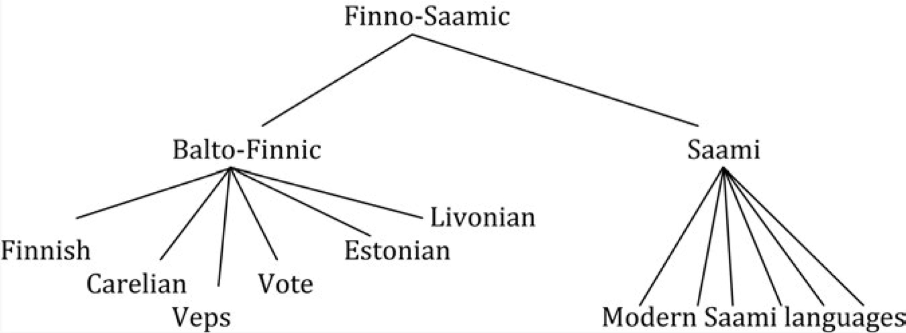
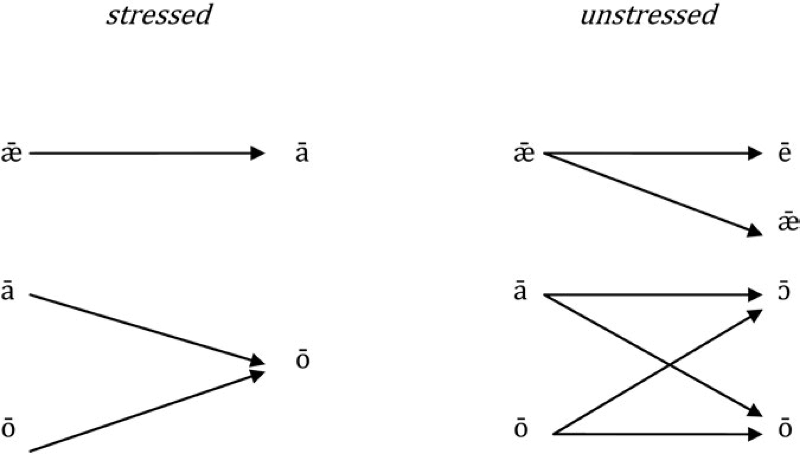
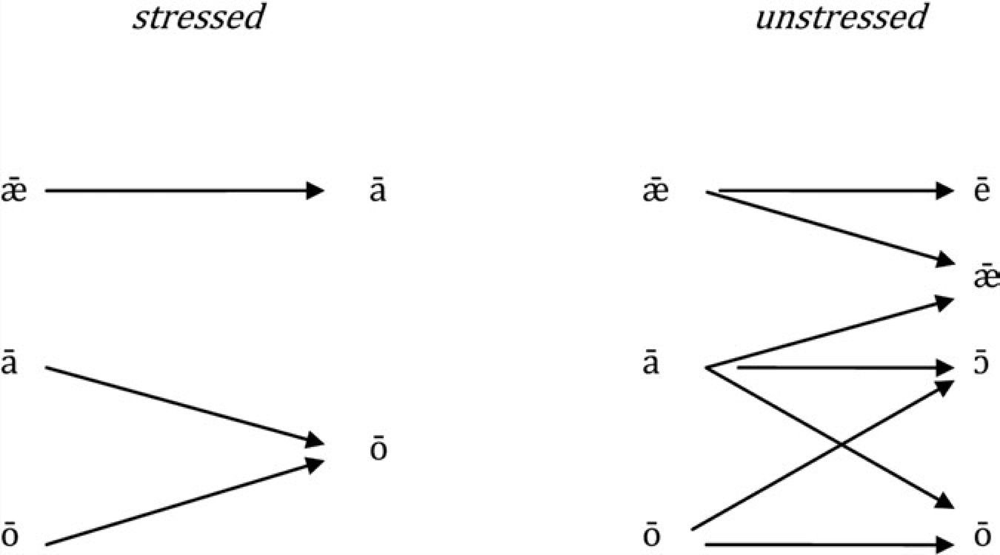
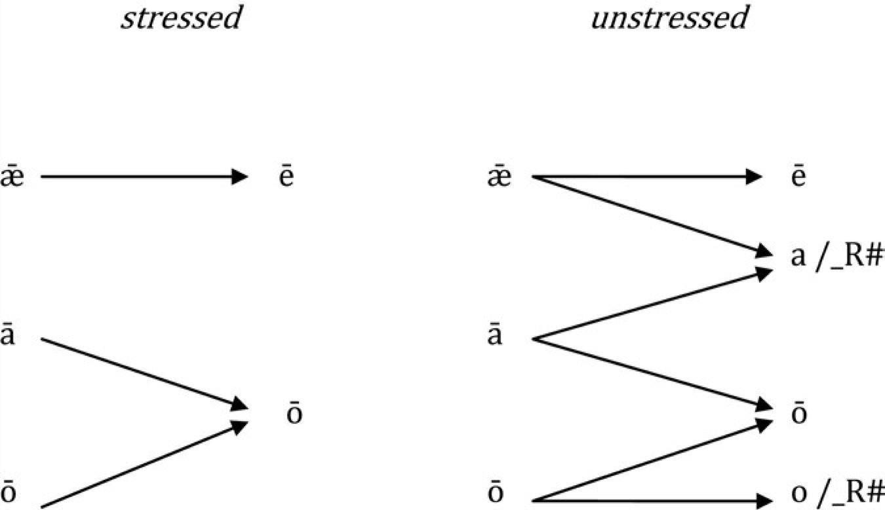
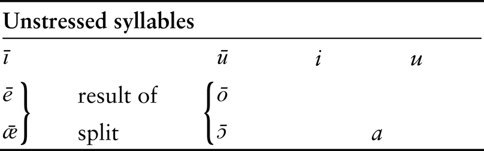
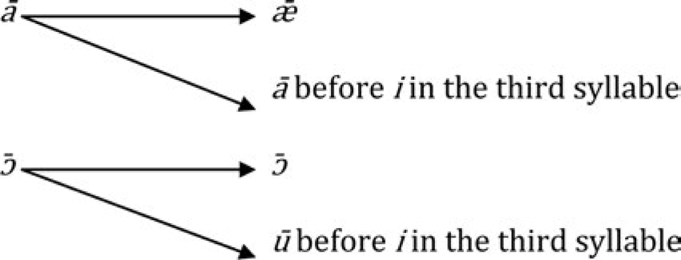

# V. Beginnings

DOI: 10.4324/9780203001912-5

## 1. THE DAWN OF GERMANIC

In the preceding chapters, the foundational events that gave rise to the English, Dutch, and German languages have been found to be intimately connected with the assimilation of populations that originally spoke Celtic, Latin, or both. The linguistic demonstration of this assimilation presented in this book is new, but the idea that Germanic is, relatively speaking, a newcomer in Britain as well as in the Netherlands and Germany is not. Amongst historical linguists and archaeologists who have devoted attention to the issue, there is widespread agreement that the place where the Germanic branch of Indo-European originated is northern Europe, to be more precise, probably northernmost Germany, Denmark, and southern Sweden.[^en5_1] It is well known that the origin of English involved a population movement from that area because we happen to possess enough historical sources to that effect, as well as archaeological evidence that settlements in Denmark dwindled at a time when colonization events affected England. The coming of Germanic to the Netherlands and central and southern Germany is largely a matter of prehistory, which probably belongs to the last centuries BC. Movements further south continued off and on for many centuries until their culmination in the period of the Great Migrations of the third to sixth centuries AD. Where Germanic flowed into the later Roman Empire, the available data may suffice to reconstruct its disappearance or expansion, the latter usually at the expense of Latin or Celtic. In fact, knowing which languages were spoken by people who later came to adopt Germanic is invaluable for reconstructing the histories of English, Dutch, and German. That type of information is lacking for the other Germanic languages. The Germanic language first known to have come into intensive contact with the Roman Empire is Gothic, which was imported as a result of incursions and mass immigrations from the middle of the third century AD onwards. While the Gothic language is Germanic and ultimately comes from the northern Germanic homeland, those Goths who entered the Roman Empire came from the steppe area of eastern Europe (Ukraine, Rumania, Hungary). Their culture was very much a steppe culture, based on rapid mobility and good horsemanship. We know nothing about the ways in which life on the steppes shaped the Gothic language, simply because we know next to nothing about the languages with which it came into contact there. The further north we move, the greater becomes the distance to the Roman Empire and the graver the dearth of data about the linguistic situation before the Germanic expansion. That is why the origins of Frisian and Saxon are omitted from this book.

Given the originally southern Scandinavian homeland of Germanic, we might be excused for supposing that the Scandinavian branch of Germanic, which consists of the medieval and modern languages Swedish, Danish, Norwegian, Icelandic, and Faeroese, is the type of Germanic that stayed at home, as it were. If that were so, North Germanic—as the Scandinavian Germanic languages are known collectively—would show far fewer traces of language contact and shift than its southern sisters. This preconception may be correct for Danish and southern Swedish, but Norwegian and northern Swedish are definitely the result of a northern expansion whose beginnings we cannot date but which continued well into the modern period, with the gradual demise of the Saami languages in northern Scandinavia. Saami influence on Norwegian and Swedish dialects is considerable.[^en5_2] The population movements that resulted in Faeroese and Icelandic took place during the Viking period, during the last two centuries of the first millennium AD. We know that Iceland was uninhabited, apart from the odd Irish monk, when it was discovered in the ninth century; it was subsequently quickly settled by the Norse from Norway and the British Isles, so language contact may have played an insignificant role in shaping the ways in which Old Norse changed into Icelandic, although we do know that a significant proportion of the earliest settlers of Iceland came from Ireland and bore Irish names, suggesting they may have brought their language with them to Iceland.

As we delve down deeper, beyond the medieval period and the great migrations of late Antiquity, even beyond Caesar’s conquest of Gaul around the middle of the first century BC, historical sources about the speakers of Germanic dry up completely. Yet this is the murky world that the present chapter addresses, dealing as it does with the origin of Germanic itself.

## 2. BALTO-FINNIC

The origins of the Germanic subfamily of Indo-European cannot be understood without acknowledging its interactions with a language group that has been its long-time neighbour: the Finnic subgroup of the Uralic language family. Indo-European and Uralic are linked to one another in two ways: they are probably related to one another in deep time—how deep is impossible to say[^en5_3]—and Indo-European has been a constant source from which words were borrowed into Uralic languages, from the fourth millennium BC up to the present day.[^en5_4] The section of the Uralic family that has always remained in close proximity to the Indo-European dialects which eventually turned into Germanic is Finnic. I use the term <i>Finnic</i> with a slightly idiosyncratic meaning: it covers the Finno-Saamic protolanguage and both of its children, Saami and Balto-Finnic. The Saamic or Lappish branch comprises about ten different modern languages that were traditionally spoken by hunter-gatherers and reindeer breeders of central and northern Scandinavia, Finland, and adjacent parts of Russia.[^en5_5] The other branch, Balto-Finnic, consists of the national languages Finnish and Estonian as well as four smaller languages: Livonian, Vote, Carelian, and Veps.

*<i>Figure 5.1</i> The Finnic family tree (simplified)*

Historically, Saami was spoken throughout central and eastern Scandinavia, including southern Finland, while Balto-Finnic was at home in a wide arc spanning the southeastern Baltic, from the lakes Ladoga and Onega via St Petersburg to Estonia and Latvia. The early medieval expansions of Finnish into Finland and Karelia, and, presumably, the expansion of Germanic into western Scandinavia, have driven Saami further northwards.

Linguistically, the relationship between Indo-European and Uralic has always been asymmetrical. While hundreds of loanwords flowed into Uralic languages from Indo-European languages such as Germanic, Balto-Slavic, Iranian, and Proto-Indo-European itself, hardly any Uralic loanwords have entered the Indo-European languages (apart from a few relatively late dialectal loans into e.g. Russian and the Scandinavian languages). This strongly suggests that Uralic speakers have always been more receptive to ideas coming from Indo-European–speaking areas than the other way around. This inequality probably began when farming and the entire way of life that accompanies it reached Uralic-speaking territory via Indo-European–speaking territory, so that Uralic speakers, who traditionally were hunter-gatherers of the mixed and evergreen forest zone of northeastern Europe and gradually switched to an existence as sedentary farmers, were more likely to pick up ideas and the words that go with them from Indo-European than from anywhere else. Farming requires a different mind-set from a hunter-gatherer existence. Farmers are generally sedentary, model the landscape, and have an agricultural calendar to determine their actions. Hunter-gatherers of the northern forest zone are generally nomadic, and rather than themselves modelling the natural environment they are modelled by it: their calendar depends on when and where a particular natural resource is available. Given such differences and seeing that farming allows the accumulation of wealth and the rise of social inequality unparallelled in northern hunter-gatherer societies, farmers who happened to speak Indo-European may well have looked upon hunter-gatherers who happened to speak Uralic as outsiders at best and inferior beings at worst, with the result that hunter-gatherers’ ideas as well as the words they used for them were simply never embraced in farming communities. Another factor is that successful agriculture can feed a much larger population than a hunter-gatherer existence, so that hunter-gatherers will always be greatly outnumbered by farmers. If in northeastern Europe hunter-gatherers predominantly spoke Uralic while farmers predominantly spoke Indo-European, the demographic situation alone would render it much more likely that Uralic would adopt Indo-European linguistic features than the other way around.

All of this is no doubt a simplification of the thousands of years of associations between speakers of Uralic and speakers of Indo-European, but the loanword evidence strongly suggests that by and large relations between the two groups were highly unequal. The single direction in which loanwords flowed, and the mass of loanwords involved, can be compared with the relation between Latin and the vernacular languages in the Roman Empire, almost all of which disappeared in favour of Latin. It is therefore certain that groups of Uralic speakers switched to Indo-European. The question is whether we can trace those groups and, more particularly, whether Finnic speakers switching to Indo-European were involved in creating the Indo-European dialect we now know as Germanic.

Since there are good reasons to assume that language shifts from Uralic to Indo-European have indeed occurred, it is tempting to embrace that idea wholeheartedly and by so doing to prejudice the results of the investigation. For instance, if we were to observe that the sound structures of Finnic and Proto-Germanic became similar—which is indeed the case—it would be easy to imagine that what we are witnessing is speakers of Finnic shifting and importing a Finnic sound structure into Germanic. In this light it is a sobering thought that specialists in Uralic linguistics have consistently not accounted for Finnic and Germanic convergence in this way. What they have assumed is that Balto-Finnic speakers adopted a Germanic pronunciation of Finnic and thus took Indo-European influence one step further beyond the mere adoption of masses of Germanic loanwords, as previous generations of speakers had done. This would be the linguistic counterpart of the cultural split that divided the Finno-Saamic speech community into by and large Balto-Finnic farmers, who modelled their existence on their Germanic-speaking neighbouring farmers, and Saami hunter-gatherers, who clung to the traditional Finno-Saamic way of life. By giving Balto-Finnic a Germanic pronunciation, Balto-Finnic speakers started on a slippery slope that might well have ended in wholesale adoption of Germanic and language death for Balto-Finnic, but this is clearly not what happened. What did happen, apparently, is that Finnic speakers had enough access to the way in which Germanic speakers pronounced Balto-Finnic in order to model their own pronunciation of Balto-Finnic on it. In other words, Balto-Finns conversed with bilingual speakers of Germanic and Balto-Finnic whose pronunciation of both was essentially Germanic. But access to the Germanic language itself was not sufficient to allow Balto-Finns to become bilingual themselves, either because social segregation prevented this or because contact with Germanic was severed before widespread bilingualism set in. This limited access to Germanic would allow us to understand why Balto-Finnic did not go the way of the vernacular languages that came in contact with Latin in the Roman Empire, where access to Latin was open to almost everybody and massive language shift in favour of Latin ensued.

Before we become too enthralled by this scenario, let us take a closer look at the linguistic data on which it is based.

## 3. CONVERGENCE TO WHAT?

The idea that Finnic speakers shifted to Germanic may be very different historically from the alternative idea that Finnic speakers imported a Germanic accent, and the former scenario would certainly leave a very different genetic footprint from the latter, but it is difficult to distinguish the two on the basis of the linguistic traces they leave. What both have in common is that the sound structures of Finnic and Germanic, which started from very different beginnings, apparently came to resemble one another significantly. If that is what we observe, we must conclude that both languages converged as a result of contact. That would be an important first conclusion, on which an argument can then be built that allows a choice between the option that Finnic speakers shifted to Germanic and the option that they borrowed a Germanic pronunciation. Success in taking this first step is based on our ability to establish, first, whether both languages converged at a certain stage of their prehistories and, second, whether convergence was so significant that it points to contact with one another.

### 3.1. Consonants

During the approximately five to six millennia that separate Proto-Uralic from Modern Finnish, there was only one episode during which the consonantal system underwent a dramatic overhaul. This episode separates the Finno-Saamic protolanguage, which is phonologically extremely conservative, from the Balto-Finnic protolanguage, which is very innovative. The initial state is the Finno-Saamic consonantal system, which can be reconstructed as follows:[^en5_6]

**Table: <i>Finno-Saamic consonants</i>**

| labials | dentals | alveolars | palatals | velars |
| --- | --- | --- | --- | --- |
| <i>P</i> | <i>t</i> | <i>č</i> | <i>ć</i> | <i>k</i> |
| <i>PP</i> | <i>tt</i> | <i>čč</i> | <i>ćć</i> | <i>kk</i> |
|  | <i>s</i> | <i>š</i> | <i>ś</i> |  |
|  | <i>ð</i> |  | <i>ð́</i> | <i>γ</i> |
| <i>m</i> | <i>n</i> |  | <i>ń</i> | <i>ŋ</i> |
|  | <i>l</i> |  | <i>ĺ</i> |  |
|  | <i>r</i> |  |  |  |
| <i>V</i> |  |  | <i>j</i> |  |

(Pronunciations: <i>č</i> is pronounced as in <i><u>ch</u>ur<u>ch</u></i>, and <i>čč</i> is its long counterpart; <i>š</i> is pronounced as in <i>shirt</i>, and <i>ð</i> as in <i><u>th</u>at</i>. The whole palatal series marked with is formed by pronouncing the corresponding consonant together with <i>j</i> [as in <i><u>y</u>oung</i>]: <i>ń</i> as in <i><u>n</u>ew</i>, <i>ĺ</i> as in <i><u>l</u>ewd</i>. The consonants <i>ć</i>, <i>ćć</i>, <i>ś</i>, and <i>ð́</i> do not exist in English: <i>ć</i> approximates <i><u>t</u>une</i>, but be sure to insert an [s] between the [t] and [j]-parts, so [tsjun], but avoid pronouncing this as <i>tshoon</i>, or [tšun]; and <i>ćć</i> is the long counterpart of <i>ć</i>. The consonant <i>ś</i> can be formed on the basis of <i><u>t</u>une</i>, pronounced [tsjun], but omitting the [t]. <i>ð́</i> is the voiced counterpart of <i>Mat<u>th</u>ew</i>. The voiced velar fricative <i>γ</i> does not exist in English: it is the voiced counterpart of Scots <i>lo<u>ch</u></i>. The consonant <i>ŋ</i> is pronounced as in <i>ha<u>ng</u></i>.)

By the time Finno-Saamic developed into Balto-Finnic, the consonant system was very different:

**Table: <i>Balto-Finnic consonants</i>**

| labials | dentals | alveolars | palatals | velars |
| --- | --- | --- | --- | --- |
| <i>p</i> | <i>t</i> | <i>–</i> | <i>–</i> | <i>k</i> |
| <i>PP</i> | <i>tt</i> | <i>–</i> | <i>–</i> | <i>kk</i> |
|  | <i>c, cc</i> |  |  |  |
|  | <i>s, ss</i> | <i>–</i> | <i>–</i> | <i>h</i> |
| <i>m, mm</i> | <i>n, nn</i> |  | <i>–</i> | <i>–</i> |
|  | <i>l, ll</i> |  | <i>–</i> |  |
|  | <i>r</i> |  |  |  |
| <i>v</i> |  |  | <i>j</i> |  |

In Balto-Finnic, the entire palatal series has been lost, apart from <i>j</i>, and the contrast between dentals and alveolars has disappeared: out of three different <i>s</i>-sounds only one remains. The fricatives <i>ð</i> and <i>γ</i> have been lost, and so has the velar nasal <i>ŋ.</i> The only increase has been in the number of long (geminate) consonants by the appearance of <i>ss</i>, <i>mm</i>, <i>nn</i>, and <i>ll</i>.

The loss of separate alveolar and palatal series and the disappearance of <i>ŋ</i> could be conceived as convergences towards Proto-Germanic, which lacked such consonants. This is not obvious for the loss of the voiced fricatives <i>γ</i>, <i>ð</i>, which Proto-Germanic did possess. However, this way of comparing Balto-Finnic and Germanic is flawed in an important respect: what we are doing is assessing convergence by comparing the dynamic development from Finno-Saamic to Balto-Finnic to the static system of Proto-Germanic, as if Proto-Germanic is not itself the result of a set of changes to the ancestral Pre-Germanic consonantal system. If we wish to find out whether there was convergence and which language converged on which, what we should do, therefore, is to compare the dynamic development of Finno-Saamic to Balto-Finnic to the dynamic development of Pre-Germanic to Proto-Germanic, because only that procedure will allow us to state whether Balto-Finnic moved towards Proto-Germanic, or Proto-Germanic moved towards Balto-Finnic, or both moved towards a third language.

The Pre-Germanic consonantal system can be reconstructed as follows:[^en5_7]

| labials | dentals | palatals | velars | labiovelars |
| --- | --- | --- | --- | --- |
| <i>p</i> | <i>t</i> | <i>k’</i> | <i>k</i> | <i>kw</i> |
| <i>b/p’</i> | <i>d/t’</i> | <i>g’/ḱ’</i> | <i>g/ḱ</i> | <i>gw/k’w</i> |
| <i>bh/ph</i> | <i>dh/th</i> | <i>gh́/ḱh</i> | <i>gh/kh</i> | <i>gwh/kwh</i> |
|  | <i>s</i> |  |  |  |
| <i>m</i> | <i>n</i> |  |  |  |
| <i>w</i> |  | <i>j</i> |  |  |
|  | <i>l</i> |  |  |  |
|  | <i>r</i> |  |  |  |

The slashes in the second and third rows indicate the uncertainty about the Proto-Indo-European nature of the sounds involved. The first row is relatively uncontroversial: they are the voiceless unaspirated plosives, whose English equivalents can be found in <i>s<u>p</u>am</i>, <i>s<u>t</u>and</i>, <i>s<u>k</u>ew</i> (i.e. <i>k</i> pronounced simultaneously with [j]), <i>s<u>c</u>an</i>, and <i>s<u>qu</u>eek</i>, respectively.[^en5_8]

According to classical Indo-Europeanists’ reconstruction, the second row contains the voiced plosives, as in English <i><u>b</u>urp</i>, <i><u>d</u>ot</i>, <i><u>g</u>ift</i> (but make sure to pronounce <i>g</i> with a simultaneous [j], as in <i>e<u>ggy</u>olk</i>), <i><u>g</u>ame</i>, and <i><u>Gw</u>en</i>. The so-called glottalic theory, however, states that these were glottalic consonants; that is, they resemble <i>p</i>, <i>t</i>, <i>ḱ</i>, <i>k</i>, <i>k</i>w pronounced with a glottal stop immediately before (so-called preglottalized) or after them (so-called ejective; a glottal stop is the sound heard in the middle of the Cockney pronunciation of e.g. <i>water</i> [wɔʔɐ], and a preglottalized <i>t</i> is present in the Queen’s English pronunciation of the same word, [wɔː ̕ tə]). This glottalization is marked by the symbol [̕]. Finally, the third row contains plosives which according to the traditional reconstruction were voiced and aspirated (aspirated <i>b</i>h pronounced approximately as in <i>clu<u>bh</u>ouse</i>), but according to the glottalic theory, these were either voiceless aspirated plosives (as in English <i><u>p</u>ark</i>, <i><u>t</u>ent</i>, etc.) or simple voiced plosives (as in <i><u>b</u>urp</i>, <i><u>d</u>ot</i>, etc.). The majority of Indo-Europeanists adhere to the traditional reconstructions (the first sound of each pair in the diagram), which indeed effortlessly account for the data in most Indo-European languages. A few others, however, stress the importance of the glottalic theory for explaining the data of a small number of Indo-European languages, of which the Germanic branch is one. This is not the place to go into the pros and cons of the glottalic theory. The controversy is mentioned here only to illustrate how difficult it is to give a relatively accurate phonetic reconstruction of the difference between the three rows of plosives. In what follows, I shall stick to the traditional symbolism for the sake of convenience (hence <i>p</i>, <i>b</i>, <i>b</i>h rather than <i>p</i>, <i>p̕</i>, <i>p</i>h), but this is not intended to prejudice the reader against the glottalic theory.

On its way to Proto-Germanic, the Pre-Germanic consonantal system changed considerably as a result of six sound changes:

1. the merger of the palatals and velars into velar * <i>k</i>, <i>g</i>, <i>g</i>h
2. the rule known as Verner’s law, which turned voiceless *<i>p</i>, <i>t</i>, <i>k</i>, <i>s</i> into *<i>b</i>h, <i>d</i>h, <i>g</i>h, <i>z</i> if they were preceded by an unstressed syllable: *<i>wurt-ónos ></i> *<i>wurd</i>h <i>-ónoz ></i> (by no. 4 and the rule that turned each *<i>o</i> into *<i>a</i>) * <i>wurdanaz</i> > Old English <i>worden</i> (past participle ‘become’)[^en5_9]
3. the rule known as Kluge’s law, which turned voiced plosives followed by <i>n</i> into double plosives: *<i>stub</i>h <i>-n- ></i> *<i>stubb- ></i> (by no. 4) *<i>stupp- ></i> Old English <i>stoppian</i> ‘to stop’ (compare Sanskrit <i>stubhnā́ti</i> ‘stops, stupefies’)[^en5_10]
4. the so-called Germanic consonant shift, also named Grimm’s law, which affected all plosives (so the first three rows in the Pre-Germanic diagram):
  - voiceless *<i>p</i>, <i>t</i>, <i>k</i>, <i>k</i>w became the voiceless fricatives *<i>f</i>, <i>θ</i>, <i>h</i>, <i>hw</i>
  - voiced *<i>b</i>, <i>d</i>, <i>g</i>, <i>g</i>w became voiceless aspirated *<i>p</i>h, <i>t</i>h, <i>k</i>h, <i>k</i>wh
  - voiced *<i>bb</i>, <i>dd</i>, <i>gg</i> (see no. 3) became voiceless aspirated *<i>pp</i>h, <i>tt</i>h, <i>kk</i>h
  - *<i>b</i>h, <i>d</i>h, <i>g</i>h became voiced * <i>b</i>, <i>d</i>, <i>g</i> (after vowels: *<i>v</i>, <i>ð</i>, <i>γ</i>); the fate of *<i>g</i>wh is disputed
5. the development of <i>t + t</i> to <i>ss</i>[^en5_11]
6. various developments that produced <i>nn</i>, <i>rr</i>, <i>ll</i>, <i>ww</i>, and <i>jj</i>.

What resulted was the following Proto-Germanic consonant system:

| labials | dentals | velars | palatals | labiovelars |
| --- | --- | --- | --- | --- |
| <i>P</i> | <i>t</i> | <i>k</i> |  | <i>kw</i> |
| <i>PP</i> | <i>tt</i> | <i>kk</i> |  | <i>kkw</i> |
| <i>b/v</i> | <i>d/ð</i> | <i>g/γ</i> |  |  |
| <i>(bb</i> | <i>dd</i> | <i>gg)</i> |  |  |
| <i>f</i> | <i>θ</i> | <i>h</i> |  | <i>hw</i> |
|  | <i>s, z</i> |  |  |  |
|  | <i>ss</i> |  |  |  |
| <i>m (mm)</i> | <i>n, nn</i> |  |  |  |
|  | <i>l, ll</i> |  |  |  |
|  | <i>r, rr</i> |  |  |  |
| <i>w, ww</i> |  |  | <i>j, jj</i> |  |

The third row (<i>b</i>/<i>v</i>, <i>d</i>/<i>ð</i>, <i>g</i>/<i>γ</i>) consists of pairs of sounds: by and large, the second member of each pair occurs after vowels, while the first member occurs in other positions. Since their distribution is therefore complementary (i.e. automatically determined by the phonetic environment), each pair represents a single phoneme.

All Germanic languages possess long voiced plosives (<i>bb</i>, <i>dd</i>, <i>gg</i>), but it is unclear to what extent these already existed in Proto-Germanic. Therefore, they have been put between parentheses. The same goes for <i>mm</i>.

We are now in a better position to answer the question whether Proto-Germanic and Balto-Finnic have converged. Three striking developments affected both languages:

- Both languages lost the palatalized series of consonants (apart from <i>j</i>), which in both languages became non-palatalized.
- Both languages developed an extensive set of long (geminate) consonants; Pre-Germanic had none, while Finno-Saamic already had a few.
- Both languages developed an <i>h.</i>

These similarities between the languages are considerable. Since both have innovated, it is impossible to decide which language converged on which. If more was known about the chronologies of the developments, a decision might have been possible: if, for instance, Proto-Germanic had undergone all three developments before Balto-Finnic did, we might conclude that Balto-Finnic adapted itself to Proto-Germanic. But for all we know the developments in Balto-Finnic could have preceded those in Germanic, in which case Germanic adapted itself to Balto-Finnic. Either way, we would be at a loss trying to understand what caused the developments to occur in the language that underwent them first. The idea that perhaps both languages moved towards a lost third language, whose speakers may have been assimilated to both Balto-Finnic and Germanic, provides a fuller explanation but suffers from the drawback that it shifts the full burden of the explanation to a mysterious ‘language X’ that is called upon only in order to explain the developments in Proto-Germanic and Balto-Finnic. That comes dangerously close to circular reasoning.

Perhaps it is useful to concentrate for a moment on the differences between developments in Balto-Finnic and Germanic. Balto-Finnic lost the fricatives <i>ð</i> and <i>γ</i>, which it had no business losing if Germanic had been at the helm, an impression that is strengthened by the fact that in both languages <i>ð</i> and <i>γ</i> occurred only after vowels. Balto-Finnic lost the opposition between the three <i>s</i>-sounds it inherited from Finno-Saamic (<i>s</i>, <i>š</i>, <i>ś</i>) and ended up with the same single <i>s</i> that Germanic inherited from Proto-Indo-European. This looks like Balto-Finnic modelling itself on Germanic, but since Germanic had not inherited any oppositions in this department that it could lose, appearances may deceive. In fact, Balto-Finnic stubbornly held on to its <i>c</i> and <i>cc</i>, which were alien to Germanic. All in all, the case for Balto-Finnic being the result of convergence upon Germanic is rather weak.

The case for Germanic being the result of a convergence upon Balto-Finnic is even weaker, it seems: Germanic inherited and remodelled but did not give up a distinction between voiceless and voiced consonants (<i>p-b</i>, <i>t-d</i>, <i>k-g</i>, <i>s-z</i>), which Balto-Finnic did not possess. If Germanic had acquired a Balto-Finnic pronunciation, which would happen if speakers of Balto-Finnic switched to Germanic, one might expect that Germanic would have lost the opposition between voiced and voiceless plosives because this opposition was foreign to Balto-Finnic. This is in fact how a strong Modern Finnish accent in, say, English manifests itself.

But this could also be a case of deceiving appearances: a closer look at this particular problem unexpectedly reveals a striking similarity between both languages, which has been flying under the radar so far in this chapter: Balto-Finnic consonant gradation and Verner’s law in Germanic.

### 3.2. CONSONANT GRADATION AND VERNER’S LAW

As we have seen in the preceding section, Verner’s law is a sound change that affected originally voiceless consonants, so *<i>p</i>, <i>t</i>, <i>k</i>, <i>ḱ</i>, <i>k</i>w, <i>s</i> of the Pre-Germanic system. These normally became the Proto-Germanic voiceless fricatives *<i>f</i>, <i>θ</i>, <i>h</i>, <i>h</i>, <i>hw</i>, <i>s</i>, respectively. But if *<i>p</i>, <i>t</i>, <i>k</i> etc. were preceded by an originally unstressed syllable, Verner’s law intervened and they were turned into voiced consonants. Those voiced consonants merged with the series *<i>b</i>h, <i>d</i>h, <i>g</i>h of the Pre-Germanic system and therefore subsequently underwent all changes that the latter did, turning out as *<i>b</i> / <i>v</i>, *<i>d</i> / <i>ð</i>, <i>g</i> / <i>γ</i> in the Proto-Germanic system (that is, <i>v</i>, <i>ð</i>, <i>γ</i> after a vowel and <i>b</i>, <i>d</i>, <i>g</i> in all other environments in the word). When *<i>s</i> was affected by Verner’s Law, a new phoneme *<i>z</i> arose. In a diagram:

| Pre-Germanic | Proto-Germanic after originally unstressed syllable (Verner’s law) | Proto-Germanic in other environments |
| --- | --- | --- |
| <i>*p</i> | > <i>*b/v</i> | > <i>*f</i> |
| <i>*t</i> | > <i>*d/ð</i> | > <i>*θ</i> |
| <i>*k, *ḱ</i> | > <i>*g/γ</i> | > <i>*h</i> |
| <i>*kw</i> | no clear examples | > <i>*hw</i> |
| <i>*s</i> | > <i>*z</i> | > <i>*s</i> |

So the development was governed by the position of the stress in the word. Stress did not yet fall in the later, Proto-Germanic position, which almost invariably was on the first syllable, but in the older, Indo-European stress position. In Proto-Indo-European, stress could fall on any syllable and often moved within paradigms, e.g. *<i>breh₂tḗr</i>, genitive singular *<i>breh₂trós</i> ‘brother’ contrasting with *<i>méh₂tēr</i>, genitive singular *<i>méh₂</i> <i>trs</i> ‘mother’. Verner’s law fossilized this old movable stress indirectly, by turning it into an alternation of consonants. This alternation was preserved best in the oldest Germanic languages. Such fossils were preserved predominantly in the strong verbs. Here are a few examples:[^en5_12]

| Pre-Germanic |  | Proto-Germanic |  |
| --- | --- | --- | --- |
| <i>*doúke</i> ‘(s)he pulled, led’ | > | <i>*tau<u>h</u>e</i> | > Old English <i>tēah</i> |
| <i>* du<u>k</u>únd</i> ‘they pulled, led’ | > | <i>* tu<u>γ</u>unt</i> | > Old English <i>tugon</i> |
| <i>*wór<u>t</u>e</i> ‘(s)he turned’ | > | <i>*war<u>θ</u>e</i> | > Old English <i>wearð</i> |
| <i>*wur<u>t</u>únd</i> ‘they turned’ | > | <i>*wur<u>d</u>unt</i> | > Old English <i>wurdon</i> |
| <i>*wó<u>s</u>e</i> ‘(s)he stayed, was’ | > | <i>*wa<u>s</u>e</i> | > Old English <i>was</i> |
| <i>*wē<u>s</u>únd</i> ‘they stayed, were’ | > | <i>*wē<u>z</u>unt</i> | > Old English <i>wceœ̅ron</i> |

In the third person singular of each form, Verner’s law did not apply because the syllable preceding the middle consonant was stressed in Pre-Germanic, so the Proto-Germanic outcomes are <i>-h</i> / <i>θ</i> / <i>s-</i>. By contrast, in the third person plural forms, the first syllable was originally unstressed, and therefore Verner’s law affected the middle consonant, which was turned into <i>-γ</i> / <i>ð</i> / <i>z-</i>. This stress alternation within the paradigm was the general rule in the Pre-Germanic past tense of strong verbs, which goes back to the Proto-Indo-European perfect. The perfect along with its movable stress is preserved in Vedic Sanskrit, which has e.g. third singular perfect <i>véda</i> ‘(s)he has found out, (s)he knows’, third plural perfect <i>vidúr</i> ‘they have found out, they know’. Modern English has completely lost the effects of Verner’s law in the past tense of strong verbs, with the exception of <i>(s)he wa<u>s</u></i>, <i>they we<u>r</u>e</i>.

While it is very common in the history of European languages for stress to influence the development of vowels, it only very rarely affected consonants in this part of the world. Verner’s law is a striking exception. It resembles a development which, on a much larger scale, affected Finno-Saamic: consonant gradation.

Consonant gradation is a complex process. There are two kinds of gradation. One is called rhythmic gradation, the other syllable gradation.[^en5_13] Rhythmic gradation affects consonants depending on whether they stand after a stressed or an unstressed syllable. Stress (indicated as ́) is generally on the first syllable, and there is a secondary stress (indicated as `) on each following uneven syllable. After each uneven (= stressed) syllable, a consonant appears in the so-called strong grade, while after each even (= unstressed) syllable the consonant assumes the so-called weak grade. In the Finno-Saamic word *<i>oíketàta</i>, therefore, the *<i>k</i> and the second *<i>t</i> are in the strong grade, while the first *<i>t</i> is in the weak grade. Whether a consonant is in the strong or weak grade determines its precise outcome in the various Finno-Saamic languages: each language has its own outcomes, but the rule governing them is the same. In Finnish, for instance, strong grades are unchanged, while weak grades change. So in *<i>oíke<u>t</u>àta</i> the <i>k</i> and the second <i>t</i> are strong grades and remain the same, while the first <i>t</i> is a weak grade and changes via *<i>d > ð</i> to zero. The result is Finnish <i>oikeata</i>. This is the partitive case (ending in <i>-ta</i>) of the adjective <i>oikea</i> ‘right’. If we form the partitive case from the word <i>kukka</i> ‘flower’, however, the ending <i>-ta</i> changes its form because now <i>t</i> is in the weak grade, following as it does an even, unstressed syllable: Finno-Saamic *<i>kúkkata</i> becomes Finnish <i>kukkaa</i>. In all Finno-Saamic languages, rhythmic gradation has become phonemic and fossilized. The connection between rhythmic gradation and Verner’s law is relatively straightforward: both processes involve changing a voiceless consonant after an unstressed syllable.

The other type of gradation is syllabic gradation. This affects consonants that are not already in the weak grade as a result of rhythmic gradation (so consonants between an uneven and an even syllable, such as the <i>k</i> and second <i>t</i> in Finno-Saamic *<i>oiketata</i>, as well as the long consonants <i>pp</i>, <i>tt</i>, <i>kk</i> after an even syllable). Syllabic gradation of consonants depends on whether the following syllable ends in a vowel (an open syllable) or in a consonant (a closed syllable). A consonant before an open syllable assumes the strong grade, while it takes on the weak grade before a closed syllable. So in the reconstructed Finno-Saamic word *<i>oi<u>k</u>e<u>t</u>a<u>t</u>a</i>, rhythmic gradation had already put the first <i>t</i> in the weak grade (*<i>oíkedàta</i>), so only <i>k</i> and the second <i>t</i> are free to undergo syllabic gradation. Both consonants appear in the strong grade because both begin an open syllable (<i>ke</i> and <i>ta</i>). This entails that in Finnish they remain unchanged: *<i>oiketata</i> becomes *<i>oike-data</i> > Finnish <i>oikeata</i>. Similarly, Finno-Saamic * <i>leipä</i> ‘bread’ has a genitive *<i>leipän</i>. In both forms, the *<i>p</i> is left in the strong grade by rhythmic gradation (<i>p</i> follows an uneven = stressed syllable). When syllabic gradation ensues, the *<i>p</i> in * <i>leipä</i> is in the strong grade (the syllable ends in <i>-ä</i>, so is open), while the *<i>p</i> in *<i>leipän</i> is weak grade (the syllable ends in <i>-än</i>, so is closed). In Finnish, the strong grade remains the same, while the weak grade changes: the Modern Finnish forms are <i>leipä</i>, genitive <i>leivän</i>. Syllabic gradation affects every word that has one of the consonants <i>p</i>, <i>pp</i>, <i>t</i>, <i>tt</i>, <i>k</i>, <i>kk</i>, or <i>s</i>, in other words, all voiceless obstruents. Here follow a few Finnish examples which show the effects of syllabic gradation and its dependence on whether the following syllable is closed or open:

**Table: <i>Syllabic gradation in Finnish</i>**

| nominative | genitive (‘of…’) | <b>inessive</b> (‘in…’) |
| --- | --- | --- |
| <i>kylpy</i> ‘bath’ | <i>kylvyn</i> | <i>kylvyssä</i> |
| <i>loppu</i> ‘end’ | <i>lopun</i> | <i>lopussa</i> |
| <i>koti</i> ‘home’ | <i>kodin</i> | <i>kodissa</i> |
| <i>katto</i> ‘roof’ | <i>katon</i> | <i>katossa</i> |
| <i>joki</i> ‘river’ | <i>joen</i> | <i>joessa</i> |
| <i>viikko</i> ‘week’ | <i>viikon</i> | <i>viikossa</i> |
| <i>mies</i> ‘man’ | <i>miehen</i> | <i>miehessä</i> |
| <i>hammas</i> ‘tooth’ | <i>hampaan</i> (< <i>*hampahan</i>) | <i>hampaassa</i> (< <i>*hampahassa</i>) |
| <i>kuningas</i> ‘king’ | <i>kuninkaan</i> (< <i>*-ahan)</i> | <i>kuninkaassa</i> (<*-<i>ahassa</i>) |
| <i>vapaa</i> ‘free’ | <i>vapaan</i> | <i>vapaassa</i> |

As the last three examples show, syllabic gradation in Finnish is no longer entirely predictable on the basis of whether the following syllable is open or closed: <i>hampaan</i> has a strong-grade- <i>p-</i> in front of a closed syllable <i>-aan</i>. This problem was caused by the loss of <i>*h</i> in the earlier form <i>*hampahan</i>, with an open second syllable (the form with <i>-h-</i> still exists in Karelian).

As we saw earlier, rhythmic gradation is connected to stress. Syllabic gradation has less to do with stress than with articulatory energy: given two syllables and an equal amount of energy spent on the production of each of them, a consonant that starts a long (closed) syllable, such as *<i>p</i> in * <i>leipän</i>, is allotted less energy than a consonant that starts a short (open) syllable, as in <i>leipä</i>. Hence *<i>p</i> in *<i>leipän</i> has the tendency to lose articulatory force and become weakened to *<i>b ></i> *<i>v</i>, whence the attested Finnish form <i>leivän</i>.

Those who have remarked upon the close similarity of gradation to Verner’s law have tended to compare Verner’s law to both forms of gradation because on a deeper level stress and articulatory energy are related phenomena (e.g. Koivulehto and Vennemann 1996, with references). Yet Germanic in no way shows a counterpart to syllabic gradation, while it does show a counterpart to rhythmic gradation: Verner’s law.

The origin and age of gradation in the Finno-Saamic languages have been a bone of contention for a very long time. All Finno-Saamic languages either preserve gradation (Saami, Finnish, Vote, Estonian) or have lost it recently (Veps and Livonian), so there is much to say for reconstructing it back to the Finno-Saamic protolanguage. However, the details of the application of especially syllabic gradation differ from language to language to such an extent that many linguists have doubted the idea of a common inheritance.[^en5_14] The deepest differences are between Balto-Finnic on the one hand and Saami on the other:

- In Balto-Finnic, only voiceless obstruents (*<i>p</i>, <i>pp</i>, <i>t</i>, <i>tt</i>, <i>k</i>, <i>kk</i>, s) are affected, while in Saami almost all consonants and consonant groups are affected. For instance, Finno-Saamic *<i>kala</i>, genitive *<i>kalan</i> ‘fish’ turns up unchanged in Finnish <i>kala</i>, <i>kalan</i>, so without gradation of the *<i>-l-</i>. In Saami, however, *- <i>l-</i> did undergo gradation, and *<i>kala</i>, <i>kalan</i> have become northern Saami <i>guolle</i>, <i>guole</i>, respectively, with an alternation of long and short <i>-l-</i> and loss of the final <i>-n</i> of the genitive that originally triggered the weak grade.
- In Balto-Finnic, strong-grade consonants remain the same, while weak-grade consonants are weakened: they become voiced, and in some languages spirantized, and some drop out altogether. In Saami, the situation is normally reversed: strong grades change, while weak grades either remain the same or are weakened. Contrast the development of Finno-Saamic *<i>appi</i> ‘father-in-law’, genitive *<i>appin</i>, which in Finnish became <i>appi</i>, <i>apin</i> (weakening of the weak grade of *<i>pp</i>), while in northern Saami it surfaces as <i>vuohppá</i>, <i>vuohpá</i> (where the strong-grade *<i>pp</i> became *<i>ppp</i> before turning into <i>hhp</i> [written <hpp>], while the weak-grade *<i>pp</i> remained and later became <i>hp</i> [written <hp>]).

These different ways in which gradation affects consonants in the individual languages are very real, but they should not be overemphasized: underlying them is a basic unity consisting of the two gradation rules (rhythmic and syllabic) and their ordering (rhythmic gradation precedes syllabic gradation). This unity is so detailed and specific, and similar phenomena are so rare in the languages of the world, that it is most unlikely that gradation arose independently in Saami and Balto-Finnic (Helimski 1995). Gradation, therefore, was inherited from the Finno-Saamic protolanguage. In fact, the origin of gradation probably goes back all the way to the Uralic protolanguage. Eugene Helimski (1995) has shown convincingly that the same gradation rules can be found in a part of the Uralic family that is as distant from Finno-Saamic as it can possibly be: the Samoyed language Nganasan. This language, spoken by a few hundred people on the Tajmyr Peninsula, the northernmost part of central Siberia, shows both rhythmic and syllabic gradation, as in the following examples:

| Proto-North Samoyed | > | Nganasan |
| --- | --- | --- |
| <i>*putətə</i> ‘trunk’ | > | <i>hütəðə</i> |
| <i>*putətə-tə-ta</i> ‘trunk for him’ | > | <i>hütəðtəðu</i> |

In these forms, the second and fourth *<i>t</i> of the Proto-North Samoyed reconstructions are in the weak grade because of rhythmic gradation (weak grade after an even syllable),[^en5_15] while the first and third *<i>t</i> are in the strong grade (strong grade after an uneven syllable). Then syllabic gradation kicks in, which affects the first and third *<i>t</i> (syllabic gradation affects only consonants that have been left in the strong grade by rhythmic gradation): since both <i>t</i>’s head an open syllable, they are in the strong grade, which means they remain unchanged in Nganasan. Other examples of Nganasan syllabic gradation (SG = strong grade; WG = weak grade; <i>d́</i> is pronounced as in <i><u>d</u>uke</i>, <i>ð</i> as in <i><u>th</u>is</i>, <i>ʔ</i> as in Cockney <i>water</i> [wɑʔɐ]):

| nominative singular | nominative plural |
| --- | --- |
| <i>kuhu</i> ‘skin’ (SG) | <i>kubu?</i> (WG) |
| <i>basa</i> ‘metal, money’ (SG) | <i>bad’a?</i> (WG) |
| <i>kəntə</i> ‘sledge’ (SG) | <i>kəndə?</i> (WG) |
| <i>kaðar</i> ‘light’ (WG) | <i>katarə?</i> (SG) |

The interplay of rhythmic and syllabic gradation with other developments in Nganasan has reached an exquisite degree of complexity that even goes beyond the spectacular effects of gradation in Saami. One single underlying suffix, *<i>-famfu-</i>, which expresses that what one says is hearsay, assumes twelve different forms, which can be as different from one another as- <i>baŋhu-</i> and <i>-h</i>j <i>ahɨ-</i> (Helimski 1995: 50). But behind all this complexity are the same gradation rules as found in Finno-Saamic. We can therefore repeat for Proto-Uralic the argument that persuaded us earlier that gradation in Saami and Balto-Finnic must go back to the common Finno-Saamic protolanguage: the similarity of the gradation rules in Nganasan to those in Finno-Saamic is so specific and so detailed, and the phenomenon of gradation so rare in the languages of the world, that gradation must be reconstructed for the Uralic protolanguage.

These Nganasan data complement the toolkit that we need to form an opinion on the relation between Finno-Saamic gradation and Verner’s law in Germanic. The prevailing opinion among scholars of Finnic is (a) that Verner’s law is so remarkably like gradation that there must be a causal connection between the two, and (b) that Germanic influence on Finnic is so pervasive that this must be another example: Finnic gradation is the result of a Germanic accent in Finnic.[^en5_16]

It is possible to share the former conviction: Verner’s law turns all voiceless obstruents (Pre-Germanic *<i>p</i>, <i>t</i>, <i>k</i>, <i>ḱ</i>, <i>k</i>w, <i>s</i>) into voiced obstruents (ultimately Proto-Germanic *<i>b</i> / <i>v</i>, <i>d</i> / <i>ð</i>, <i>g</i> / <i>γ</i>, <i>g</i> / <i>γ</i>, <i>gw</i>, <i>z</i>) after a Pre-Germanic unstressed syllable. Rhythmic gradation turns all voiceless obstruents after an unstressed syllable into weak-grade consonants, which means that *<i>p</i>, <i>t</i>, <i>k</i>, <i>s</i> become Finnic *<i>b</i> / <i>v</i>, <i>d</i> / <i>ð</i>, <i>g</i> / <i>γ</i>, <i>z</i>. This is striking. Given the geographical proximity of Balto-Finnic and Germanic and given the rare occurrence of stress-related consonant changes in European languages, it would be unreasonable to think that Verner’s law and rhythmic gradation have nothing to do with one another.

It is very hard to accept, however, that gradation is the result of copying Verner’s law into Finnic. First of all, Verner’s law, which might account for rhythmic gradation, in no way accounts for syllabic gradation in Finnic. And, second, gradation can be shown to be an inherited feature of Finnic which goes all the way back to Proto-Uralic. Once one acknowledges that Verner’s law and gradation are causally linked and that gradation cannot be explained as a result of copying Verner’s law into Finnic, there remains only one possibility: Verner’s law is a copy of Finnic rhythmic gradation into Germanic. That means that we have finally managed to find what we were looking for all along: a Finnic sound feature in Germanic that betrays that Finnic speakers shifted to Germanic and spoke Germanic with a Finnic accent. The consequence of this idea is dramatic: since Verner’s law affected all of Germanic, all of Germanic has a Finnic accent.

On the basis of this evidence for Finnic speakers shifting to Germanic, it is possible to ascribe other, less specifically Finnic traits in Germanic to the same source. The most obvious trait is the fixation of the main stress on the initial syllable of the word. Initial stress is inherited in Finno-Saamic but was adopted in Germanic only after the operation of Verner’s law, quite probably under Finnic influence. The consonantal changes described in section V.3.1 can be attributed to Finnic with less confidence. The best case can be made for the development of geminate (double) consonants in Germanic, which did not inherit any of them, while Finno-Saamic inherited *<i>pp</i>, <i>tt</i>, <i>kk</i>, <i>cc</i> and took their presence as a cue to develop other geminates such as *<i>nn</i> and *<i>ll</i>. Possibly geminates developed so easily in Proto-Germanic because Finnic speakers (who switched to Germanic) were familiar with them.

Other consonantal changes, such as the loss of the palatalized series in both Germanic and Balto-Finnic and the elimination of the different <i>s-</i> and <i>c</i>-phonemes, might have occurred for the same reason: if Balto-Finnic had undergone them earlier than Germanic, which we do not know, they could have constituted part of the Balto-Finnic accent in Germanic. An alternative take on those changes starts from the observation that they all constitute simplifications of an older, richer system of consonants. While simplifications can be and often are caused by language shift if the new speakers lacked certain phonemes in their original language, simplifications do not require an explanation by shift: languages are capable of simplifying a complex system all by themselves. Yet the similarities between the simplifications in Germanic and in Balto-Finnic are so obvious that one would not want to ascribe their co-occurrence to accidental circumstances.

It is possible that the spread of a language among new groups of speakers can by itself lead to simplifications of the kind observed, even if the language at the expense of which the new language is spreading does not inspire the simplifications directly. The extreme simplification of Latin morphology when it spread amongst the inhabitants of the Western Roman Empire, for instance, was not inspired by the native languages of those inhabitants but by the mere fact of Latin’s rapid spread. Accordingly, the Germanic consonantal system may well have been simplified because of its spread amongst a large population of new speakers, who happened to be Balto-Finns. And the Balto-Finnic consonantal system may have been simplified because contact with Germanic was so intense that not only its lexicon but also its sound structure converged.

Finally, we may briefly consider Germanic’s iconic sound development, the Germanic consonant shift. Let us remind ourselves of the details, which were presented in V.3.1:

> The so-called Germanic consonant shift, also named Grimm’s law, affected all plosives:
>
> - voiceless *<i>p</i>, <i>t</i>, <i>k</i>, <i>k</i>w became voiceless fricatives *<i>f</i>, <i>θ</i>, <i>h</i>, <i>hw</i>
> - voiced *<i>b</i>, <i>d</i>, <i>g</i>, <i>g</i>w became voiceless aspirated *<i>p</i>h, <i>t</i>h, <i>k</i>h, <i>k</i>wh
> - voiced *<i>bb</i>, <i>dd</i>, <i>gg</i> became voiceless aspirated *<i>pp</i>h, <i>tt</i>h, <i>kk</i>h
> - *<i>b</i>h, <i>d</i>h, <i>g</i>h became voiced * <i>b</i>, <i>d</i>, <i>g</i> (after vowels: *<i>v</i>, <i>ð</i>, <i>γ</i>); the fate of *<i>g</i>wh is disputed

It has been observed frequently that the last rule of the shift, whereby *<i>b</i>h, <i>d</i>h, <i>g</i>h became voiced * <i>b</i>, <i>d</i>, <i>g</i> (after vowels: *<i>v</i>, <i>ð</i>, <i>γ</i>) may not be altogether correctly formulated because it is doubtful whether truly voiced *<i>b</i>, <i>d</i>, <i>g</i> ensued or rather so-called voiceless lenis *<i>b̥</i>, <i>d̥</i>, <i>g̊</i>. A voiceless lenis is produced with reduced muscular tension in the vocal tract (like voiced <i>b</i>, <i>d</i>, <i>g</i>) but without the swinging of the vocal cords that produces voiced consonants (so like voiceless <i>p</i>, <i>t</i>, <i>k</i>). To the average ear they sound halfway between <i>b</i>, <i>d</i>, <i>g</i> and <i>p</i>, <i>t</i>, <i>k</i>. Voiceless lenis pronunciation of <i>b</i>, <i>d</i>, <i>g</i> is typical of the majority of German and Scandinavian dialects, so may well have been inherited from Proto-Germanic. Voiceless lenis is also the pronunciation that has been assumed to underlie the weak grades of Finno-Saamic single * <i>p</i>, <i>t</i>, <i>k</i>. If Proto-Germanic *<i>b</i>, <i>d</i>, <i>g</i> were indeed voiceless lenis, the single most striking result of the Germanic consonant shift is that it eliminated the phonological difference between voiced and voiceless consonants that Germanic had inherited from Proto-Indo-European (according to the classical reconstruction of Proto-Indo-European at least: see V.3.1, the Pre-Germanic diagram of consonants). Since neither Finno-Saamic nor Balto-Finnic possessed a phonological difference between voiced and voiceless obstruents, its loss in Proto-Germanic can be regarded as yet another example of a Finnic feature in Germanic.

As a counterweight against this idea that the Germanic consonant shift was inspired by the Finnic sound system, one may argue that the Germanic shift resulted in consonants that look decidedly un-Finnic: the fricatives *<i>f</i> and <i>θ</i> and the aspirated * <i>p</i>h, <i>t</i>h, <i>k</i>h. The observation is correct, but the question is what un-Finnic means precisely. We have seen that Finno-Saamic inherited *<i>p</i>, <i>t</i>, <i>k</i> and *<i>pp</i>, <i>tt</i>, <i>kk</i>, and that both series were affected by gradation:

**Table: <i>Finno-Saamic Gradation</i>**

| strong grade: | <i>*pp</i> | <i>*tt</i> | <i>*kk</i> |
| --- | --- | --- | --- |
| weak grade: | <i>*p̆p</i> | <i>*t̆t</i> | <i>*k̆k</i> |
| strong grade: | <i>*p</i> | <i>*t</i> | <i>*k</i> |
| weak grade: | <i>v*b̥</i> | <i>*d̥</i> | <i>*g̊</i> |

The symbol [̆] in *<i>p̆p</i>, *<i>t̆</i>t, *k<i>̆</i>k denotes a shortened, more lenis version of *<i>pp</i>, *<i>tt</i>, *<i>kk</i>. It is interesting to observe how differently various Finno-Saamic languages dealt with this fourfold opposition. Here are the data for *<i>pp</i> and *<i>p</i> (*<i>tt</i>, *<i>t</i>, *<i>kk</i>, *<i>k</i> behave similarly):

|  | Finno-Saamic | Proto-Saami[^en5_17] | Estonian | Finnish | Veps |
| --- | --- | --- | --- | --- | --- |
| strong grade: | <i>*pp</i> | <i>*hhp</i> | <i>pp</i> | <i>pp</i> | <i>p</i> |
| weak grade: | <i>*p̆p</i> | <i>*hp</i> | <i>p</i> | <i>p</i> | <i>pv</i> |
| strong grade: | <i>*p</i> | <i>*p</i> | <i>b</i> | <i>p</i> | <i>b</i> |
| weak grade: | <i>*b̥</i> | <i>*b̥</i> | <i>v</i> | <i>v</i> | <i>b</i> |

Proto-Saami, a number of modern Saami languages, and Estonian retained and phonemicized the fourfold opposition, but they did so in very different ways: Saami by retaining and even expanding consonant length and introducing pre-aspiration, and Estonian by retaining consonant length and introducing voice opposition (<i>p</i> versus <i>b</i>). Finnish reduced the four oppositions to three by merging the weak-grade *<i>p̆p</i> with the strong-grade *<i>p</i>. In Veps, gradation disappeared by the merging of the strong and weak grades of *<i>pp</i> and *<i>p</i>, respectively. What this diagram shows is that the Finno-Saamic languages coped with having four different voiceless <i>p</i>-sounds in rather different ways: Finnish lost one, and Veps two of them, while Saami and Estonian preserved the difference between all four but with very different results. We may well speculate that speakers of Balto-Finnic who switched to Germanic exploited the four Balto-Finnic <i>p-</i>, <i>t-</i>, and <i>k-</i> sounds to render their Proto-Germanic counterparts and subsequently modified their pronunciation in much the same way as Saami did, with the difference that Proto-Germanic turned simple *<i>p</i>, <i>t</i>, <i>k</i> into *<i>f</i>, <i>θ</i>, <i>h</i>:

|  | Finno-Saamic | Proto-Saami[^en5_18] | Proto-Germanic |
| --- | --- | --- | --- |
| strong grade: | <i>*pp</i> | <i>*hhp</i> | <i>*pph(< *bb</i>) |
| weak grade: | <i>*p̆p</i> | <i>*hp</i> | <i>ph(< *b)</i> |
| strong grade: | <i>*p</i> | <i>*p</i> | <i>*p > *f(< *p)</i> |
| weak grade: | <i>*b̥</i> | <i>*b̥</i> | <i>*b̥/v(< *bh)</i> |

It is clear that this account of the first Germanic consonant shift as yet another example of Finnic influence is to some degree speculative. The point I am making is not that the Germanic consonant shift must be explained on the basis of Finnic influence, like Verner’s law and word-initial stress, only that it can be explained in this way, just like other features of the Germanic sound system discussed earlier, such as the loss of palatalized consonants and the rise of geminates.

A consequence of this account of the origins of the Proto-Germanic consonantal system is that the transition from Pre-Germanic to Proto-Germanic was entirely directed by Finnic. Or, to put it in less subtle words: Indo-European consonants became Germanic consonants when they were pronounced by Finnic speakers.

### 3.3. BALTO-FINNIC AND GERMANIC VOWELS

Since Finnic speakers who turned to Germanic obviously had to cope not only with Germanic consonants but also with Germanic vowels, it is useful to consider whether the vowel systems of Balto-Finnic and Germanic show traces of convergence, too.

While the consonantal systems of Proto-Germanic and Balto-Finnic were the result of considerable changes, the vowel systems of both languages remained relatively stable.

**Table: <i>Finno-Saamic vowels</i>**

| first syllable |  |  |  |  | other syllables |  |
| --- | --- | --- | --- | --- | --- | --- |
| short |  |  | long |  | short |  |
| <i>I</i> | <i>y</i> | <i>u</i> | <i>ī</i> | <i>ū</i> | <i>i</i> | <i>ɨ</i> |
| <i>e</i> |  | <i>o</i> | <i>ē</i> | <i>ō</i> |  |  |
| <i>æ</i> |  | <i>a</i> |  |  | <i>æ</i> | <i>a</i> |

The symbol <i>y</i> denotes phonetic [y], as in German <i>Brücke</i>. The symbol <i>æ</i> is [æ], as in English <i>h<u>a</u>t</i>. In non-initial syllables, the appearance of <i>a</i> and <i>ɨ</i>, on the one hand, and <i>æ</i> and <i>i</i>, on the other, was determined by which vowel stood in the first syllable: after a front vowel (<i>i</i>, <i>e</i>, <i>æ</i>, <i>y</i>, <i>ī</i>, <i>ē</i>), <i>æ</i> or <i>i</i> appeared; after all other vowels it was <i>a</i> or <i>ɨ</i>. This phenomenon is called vowel harmony. Vowel harmony survives in Modern Finnish: contrast <i>kot<u>a</u></i> ‘hut’, <i>ol<u>u</u>t</i> ‘beer’ with <i>kes<u>ä</u></i> ‘summer’, <i>väv<u>y</u></i> ‘son-in-law’, with <i>ä =</i> [æ].

Three changes occurred between Finno-Saamic and Balto-Finnic:

- the rise of <i>ø</i> (phonetically [ø], as in German <i>hören</i> ‘to hear’), from unknown sources
- the addition of long <i>ȳ</i>, <i>ø̄</i>, <i>ǣ</i>, and <i>ā</i> to the long vowel system, which evenly balanced the long and short vowel systems[^en5_19]
- the enlargement of the vowel system in non-initial syllables, so that it exactly matched the set of short vowels occurring in first syllables.[^en5_20]

**Table: <i>Balto-Finnic vowels</i>**

| first syllable |  |  |  |  |  | other syllables |  |  |
| --- | --- | --- | --- | --- | --- | --- | --- | --- |
| short |  |  | long |  |  | short |  |  |
| <i>i</i> | <i>y</i> | <i>u</i> | <i>ī</i> | <i>ȳ</i> | <i>ū</i> | <i>i</i> | <i>y</i> | <i>u</i> |
| <i>e</i> | <i>ø</i> | <i>o</i> | <i>ē</i> | <i>ø̄</i> | <i>ō</i> | <i>e</i> | <i>ø</i> | <i>o</i> |
| <i>æ</i> |  | <i>a</i> | <i>ǣ</i> |  | <i>ā</i> | <i>æ</i> |  | <i>a</i> |

We may now turn to Germanic. The Pre-Germanic vowel system was quite different from that of Finno-Saamic and altogether as unremarkable as vowel systems can be:

**Table: <i>Pre-Germanic</i>**

| short |  |  | long |  |  |
| --- | --- | --- | --- | --- | --- |
| <i>i</i> |  | <i>u</i> | <i>ī</i> |  | <i>ū</i> |
| <i>e</i> |  | <i>o</i> | <i>ē</i> |  | <i>ō</i> |
|  | <i>a</i> |  |  | <i>ā</i> |  |

By Proto-Germanic times, the short vowel system had been reduced and the long vowel system extended:

**Table: <i>Proto-Germanic</i>**

| short |  |  | long[^en5_21] |  |  |
| --- | --- | --- | --- | --- | --- |
| <i>i</i> |  | <i>u</i> | <i>ī</i> |  | <i>ū</i> |
| <i>e</i> |  | <i>a</i> | <i>ē</i> |  | <i>ō</i> |
|  |  |  | <i>ǣ</i> |  | <i>ā</i> |

It should be immediately evident that the vowel systems of Balto-Finnic and Proto-Germanic are very dissimilar. There is not a trace of one system converging on the other. Interestingly, however, the Proto-Germanic system does show a striking resemblance but to a completely different linguistic group: the Proto-Germanic vowel system is identical to the Proto-Baltic vowel system. Baltic is a subgroup of the Indo-European family whose preserved members are the modern languages Lithuanian and Latvian and extinct Old Prussian. Its closest Indo-European cognate is Slavic. Since Baltic was probably the eastern neighbour of Germanic along the southern coasts of the Baltic Sea, contact between the two Indo-European subgroups may well have been intensive, and consequently convergence is quite plausible.

It would seem that the comparison of the Proto-Germanic and Balto-Finnic vowel systems is much less helpful than the comparison of the consonantal systems, but that would be a prejudiced position: divergences are as informative as convergences in language contact studies. In this particular case, comparison of the vowel systems is of great value because it enables us to decide what the nature of the Balto-Finnic and Proto-Germanic language contact was. Remember that there were two opposing theories about that contact situation. One states that the sound system of Balto-Finnic became adapted to that of Proto-Germanic because speakers of Balto-Finnic adopted a Germanic pronunciation: they abandoned the Finno-Saamic consonants that were lacking in Germanic (e.g. the palatalized series) and introduced others that Germanic did possess (a number of geminates, e.g. <i>nn</i>, <i>ll</i>). We have already observed that this point of view is highly problematic if we wish to understand consonantal changes as a whole, and we can now see that it is well nigh impossible in light of the vowel systems. The argument proceeds as follows. If changes between Finno-Saamic and Balto-Finnic were indeed propelled by an unconscious desire on the part of Balto-Finnic speakers to adopt a Germanic pronunciation, it would be absurd that Balto-Finnic speakers were quite successful in getting rid of almost all consonants that Germanic speakers could not pronounce but could not find it in their hearts to throw out any of the vowels that were beyond Germanic speakers’ competence— and even made things worse by creating more such vowels (<i>ø</i>, <i>ø̄</i>, <i>ǣ</i>, <i>ȳ</i>). We may conclude that changes between Finno-Saamic and Balto-Finnic were emphatically not propelled by a desire on the part of Balto-Finnic speakers to adopt a Germanic pronunciation (Kallio 2000: 95–96).

The alternative scenario is one according to which a group of speakers of Balto-Finnic were in such intensive contact with speakers of Pre-Germanic that they first became bilingual and then switched to Pre-Germanic, which in the process became Proto-Germanic because those new speakers preserved a Balto-Finnic pronunciation when speaking Pre-Germanic. We have seen that Verner’s law in Germanic was a copy of Finnic rhythmic gradation and that the Germanic consonant shift may have been triggered by new speakers’ inability to cope with the difference between voiced and voiceless plosives. So the developments in the consonantal system are by and large in favour of Finnic speakers switching to Germanic. Now let us consider the vowel changes from this perspective: was there anything in the Pre-Germanic and Proto-Germanic vowel systems that Balto-Finnic speakers would have difficulty coping with, so that they could leave a Balto-Finnic accent in Germanic? The answer is a clear no: both the Pre-Germanic and the Proto-Germanic vowel systems are subsets of the larger Finno-Saamic and even larger Balto-Finnic vowel systems. On the basis of their own linguistic background, therefore, Balto-Finnic speakers would have no difficulty in pronouncing Germanic vowels more or less correctly as native Germanic speakers did. In other words: if Finnic speakers switched to Germanic, the absence of any noticeable effect on the Germanic vowel system is entirely as expected. This clinches the decision between the two scenarios about the nature of Germanic-Finnic language contact: in all probability, Balto-Finnic speakers switched to Germanic and introduced a Balto-Finnic accent into Germanic. A Balto-Finnic accent is what defines Germanic: there is no Germanic without a Balto-Finnic accent.

### 3.4. Conclusion on the Origin of Germanic

The Finnic-Germanic contact situation has turned out to be of a canonical type. To Finnic speakers, people who spoke prehistoric Germanic and its ancestor, Pre-Germanic, must have been role models. Why they were remains unclear. In the best traditions of Uralic–Indo-European contacts, Finnic speakers adopted masses of loanwords from (Pre-)Germanic. Some Finnic speakers even went a crucial step further and became bilingual: they spoke Pre-Germanic according to the possibilities offered by the Finnic sound system, which meant they spoke with a strong accent. The accent expressed itself as radical changes in the Pre-Germanic consonantal system and no changes in the Pre-Germanic vowel system. This speech variety became very successful and turned an Indo-European dialect into what we now know as Germanic. Bilingual speakers became monolingual speakers of Germanic.

What we do not know is for how long Finnic-Germanic bilingualism persisted. It is possible that it lasted for some time because both partners grew more alike even with respect to features whose origin we cannot assign to either of them (loss of palatalized consonants): this suggests, perhaps, that both languages became more similar because generally they were housed in the same brain. What we can say with more confidence is that the bilingual situation ultimately favoured Germanic over Finnic: loanwords continued to flow in one direction only, from Germanic to Finnic, hence it is clear that Germanic speakers remained role models.

This is as far as the linguistic evidence can take us for the moment. It is almost certain that the social context in which bilingualism became widespread and Germanic arose is intimately tied up with the life of farming communities in the northeastern European forest zone: there is general agreement that that was the mode of life shared by early Germanic and Balto-Finnic speakers. By contrast, the closest cognate of Balto-Finnic, Saami, adopted Germanic loanwords but shows no trace of its speakers having gone through a bilingual stage on anything near the scale that Balto-Finnic speakers did; also, prehistoric Saami speakers were hunter-gatherers, not farmers.

Yet this is not the last that is to be said about Saami, for it seems that Saami was involved in an extraordinary way with the earliest stages of the break-up of the Germanic languages, approximately during the first centuries AD. This is the theme of the next section.

## 4. SAAMI AND THE BREAK-UP OF GERMANIC

Once Germanic had arisen in a northeastern European zone of contact between Indo-European and Balto-Finnic, probably in the course of the first millennium BC, it began to spread. This spread was tremendously successful and lasted throughout the first millennium AD, bringing Germanic languages from Poland to the British Isles and from northern Scandinavia to Spain, North Africa, and the Balkans. As a result of this spectacular increase in territory and numbers of speakers, Germanic inevitably began to fragment into dialects as distances between speakers grew and contacts with different languages became prominent, as we have seen in earlier chapters. This section deals with the earliest stages of that fragmentation and with the way in which the history of the Saami languages is implicated in the break-up.

### 4.1. Proto-Germanic Retains the Difference between *ā and *ō

For centuries, the Proto-Germanic system of consonants remained relatively stable throughout the Germanic-speaking world. It is in the vowel system that the first cracks began to manifest themselves. The inherited Proto-Germanic vowel system was as follows:

**Table: <i>Proto-Germanic</i>**

| short |  |  | long |  |  |
| --- | --- | --- | --- | --- | --- |
| <i>i</i> |  | <i>u</i> | <i>ī</i> |  | <i>ū</i> |
| <i>e</i> |  | <i>a</i> | <i>ē</i> |  | <i>ō</i> |
|  |  |  | <i>ǣ</i> |  | <i>ā</i> |

The only controversial item in this reconstruction is *<i>ā</i>: it is usually assumed that *<i>ā</i> had merged with *<i>ō</i> in Proto-Germanic. That is definitely correct in stressed syllables, which are usually the first syllable of the word because the stress almost always falls on the first syllable. The merger can be seen in the following examples:

| Pre-Germanic | Proto-Germanic | Old Norse | English |
| --- | --- | --- | --- |
| <i>*bhrā́tēr</i> | <i>*brōθǣr</i> | <i>bróðir</i> | <i>brother</i> |
| <i>*mātḗr</i> | <i>*mōdǣr</i> | <i>móðir</i> | <i>mother</i> |
| <i>*bhlōmōn</i> | <i>*blōmō</i> | <i>blómi</i> | <i>bloom</i> |
| <i>*plōtús</i> | <i>*flōduz</i> | <i>flóð</i> | <i>flood</i> |

However, outside of the first, stressed syllable the situation is different. This is not immediately obvious: the Germanic languages are notorious for the complicated developments that vowels have undergone in middle and final syllables. Each Germanic language has its individual set of rules that govern the behaviour of vowels in unstressed syllables. Those rules are so difficult to uncover that linguists have been quarrelling about some of them for over a century.

In the oldest stages of the West Germanic languages (this is the group that comprises English, Frisian, Dutch, Saxon, and High German), Proto-Germanic *<i>ō</i> and *<i>ā</i> remained distinct in one specific phonetic context: in a final syllable originally closed by a consonant. The difference can be observed in the following examples:

1. Pre-Germanic long *<i>ō</i> occurs in a number of final syllables: Old English Old Saxon Old High German <i>*bhlōm-ōn</i> ‘flower’ <i>blōm-a</i> <i>blōm-o</i> <i>bluom-o</i> <i>*ghut-ōm</i> ‘of gods’ <i>god-a</i> <i>god-o</i> <i>got-o</i> <i>*dhogh-ōses</i> ‘days’ <i>dag-as</i> <i>dag-os</i> –
2. Pre-Germanic long *<i>ā</i> occurs in case forms of <i>ā</i>-stem nouns, such as *<i>teut-ā</i> ‘people’: Old English Old Saxon Old High German <i>*teut-ām</i> (accusative) <i>Þēod-e</i> <i>thiod-æ</i> <i>diot-a</i> <i>*teut-ās</i> (genitive) <i>Þēod-e</i> <i>thiod-æ</i> <i>diot-a</i> <i>*teut-ās</i> (nominative plural) <i>Þēod-e</i> <i>thiod-æ</i> –

The examples illustrate that *<i>ō</i> and *<i>ā</i> before a consonant in final syllables became- <i>a</i> and- <i>e</i>, respectively, in Old English. In Old Saxon, they became <i>-o</i> and <i>-æ</i>, respectively, and in Old High German <i>-o</i> and <i>-a</i>. In other words, *<i>ō</i>

and *<i>ā</i> both changed in West Germanic, but they did not merge. If they were still kept different in West Germanic, *<i>ō</i> and *<i>ā</i> must inevitably have been different vowels in its parent language, Proto-Germanic. We can apply that conclusion to the Proto-Germanic reconstructions of the above-mentioned words (please ignore the consonantal changes, which are irrelevant here):

| Pre-Germanic |  | Proto-Germanic |
| --- | --- | --- |
| <i>*bhlōm-ōn</i> ‘flower’ | > | <i>*blōm-ōn</i> |
| <i>*ghut-ōm</i> ‘of gods’ | > | <i>’cgud-ōn</i> |
| <i>*dhogh-ōses</i> ‘days’ | > | <i>*dag-ōsz</i> |
| <i>*teut-ām</i> ‘people’ | > | <i>*Þeud-ān</i> (not <i>*Þeud-ōn)</i> |
| <i>*teut-as</i> | > | <i>*Þeud-āz</i> (not <i>*Þeud-ōz)</i> |
| <i>*teut-as</i> | > | <i>*Þeud-āz</i> (not <i>*Þeud-ōz)</i> |

The idea that <i>*ō</i> and <i>*ā</i> were still different vowels in Proto-Germanic and that this difference solves many of the difficulties which would otherwise be encountered if one wishes to find the sound laws governing the behaviour of word-final syllables in Germanic languages is called the Qualitative Theory. The theory dates back to Hermann Möller (1880) and was refined by Jellinek (1891) and Van Wijk (1907–1908). Van Wijk already complained that the Qualitative Theory was at risk of being dismissed improperly, and in spite of his eloquent defence it did indeed disappear from the handbooks and from most Germanicists’ memory soon after.[^en5_22] The Qualitative Theory is one of many examples in the history of Germanic linguistics in which major advances made by nineteenth-century scholars require careful excavation from under the pressing and sometimes confusing weight of subsequent literature on the subject.

The inherited difference between *<i>ā</i> and *<i>ō</i> was preserved in one other phonetic context: in stressed syllables before a word-final nasal (<i>n</i> or <i>m</i>). Old * <i>ā</i> is attested in the accusative feminine singular of the pronoun ‘that’, which was Pre-Germanic *<i>tā-m</i> (here as elsewhere, *<i>-m</i> is the ending of the accusative singular). This developed into Proto-Germanic *<i>θā-n</i> and subsequently into Old Norse <i>þá</i> and Old English <i>þā</i> (both [θaː]) ‘that, her’. This can be contrasted with the Germanic reflexes of the Indo-European word for ‘cow’, *<i>g</i>w <i>ou-s</i>, accusative singular *<i>g</i>w <i>ō-m</i>. All Germanic forms, including English <i>cow</i> and German <i>Kuh</i>, are based on *<i>g</i>w <i>ō-m</i>, which became Proto-Germanic *<i>k</i>w <i>ō-n</i>: Old Norse <i>kýr</i>, Old English <i>cū</i>, and Old High German <i>chuo</i> all go back to a Proto-Germanic paradigm consisting of an innovated nominative *<i>k</i>w <i>ō</i> and an inherited accusative *<i>k</i>w <i>ō-n</i>. The crucial point is that the pair *<i>tā-m ></i> Proto-Germanic *<i>θā-n</i> and *<i>g</i>w <i>ō-m</i> > Proto-Germanic *<i>k</i>w <i>ō-n</i> shows that inherited *<i>ō</i> and *<i>ā</i> had remained distinct in Proto-Germanic because if they had merged it would be impossible to explain the distinct vowels in the North and West Germanic languages.[^en5_23]

### 4.2. Early Germanic Differentiation: Long Vowels in Unstressed Syllables

The upshot is, therefore, that Proto-Germanic, the common ancestor of all Germanic languages, still possessed six different long vowel phonemes:

| <i>ī</i> | <i>ū</i> |
| --- | --- |
| <i>ē</i> | <i>ō</i> |
| <i>ǣ</i> | <i>ā</i> |

All long vowels occurred in stressed (i.e. initial) and unstressed syllables alike, with the probable exception of *<i>ē</i>, which seems to have occurred only in stressed syllables. That symmetrical state of affairs was going to change dramatically during the earliest stages of the fragmentation of Germanic, when the foundations of the later differentiation into North, West, and East Germanic were laid.

<b>North Germanic</b> is the dialectal group to which Icelandic, Faeroese, Norwegian, Swedish, and Danish belong. Its earliest textual representatives are a very patchy record of inscriptions in the Runic alphabet, which span most of the first millennium AD, and the fully attested Old Norse (or Old Icelandic) literary language, which appears from the eleventh century onwards. To all intents and purposes, the earliest stage of Old Norse can be regarded as equivalent to the ancestor of all North Germanic languages, Proto-North Germanic. Therefore, and also because of its full attestation, Old Norse is an ideal pivot from which to trace back the earliest developments that separated North Germanic from Proto-Germanic.

The changes on which we will concentrate here involve the mutual relationship between the vowels *<i>ǣ</i>, *<i>ā</i>, and *<i>ō</i>. What is remarkable is that this threesome undergoes different developments in stressed and unstressed syllables. In stressed syllables, *<i>ā</i> and *<i>ō</i> merge as *<i>ō</i>, while *<i>ǣ</i> becomes new *<i>ā</i>:[^en5_24]

| Proto-Germanic <i>*brā0ǣr</i> | > Old Norse <i>bróðir</i> ‘brother’ |
| --- | --- |
| Proto-Germanic <i>*flōdð</i> | > Old Norse <i>flób</i> ‘flood’ |
| Proto-Germanic <i>*sǣdan</i> | > Old Norse <i>sáð</i> ‘seed’ |

In unstressed syllables, the development was different, but this cannot be observed directly because unstressed syllables underwent many subsequent changes on their way to Old Norse. Two different treatments can be distinguished:

(1) At the absolute end of the word (i.e. without any consonant following), *<i>-ā</i> and *<i>-ō</i> merged as *<i>-ū</i>. Examples:

> Proto-Germanic *<i>sagā</i> ‘saw’ > *<i>sagū</i> (> Old Norse <i>sǫg</i>)
>
> Proto-Germanic *<i>k</i>w <i>ō</i> ‘cow’ > *<i>kū</i> (> Old Norse <i>kýr</i>)

There are no secure examples that illustrate the behaviour of *<i>-ǣ</i> at the end of the word.

(2) In all other unstressed phonetic environments, developments were different.

(2a) It seems that *<i>ǣ</i> was split into *<i>ē</i> and *<i>ǣ</i> before other developments ensued:

| *ǣ > *ē | Proto-Germanic <i>*braθǣr > *brōθēr</i> (>; Old Norse <i>bróðir</i> ‘brother’) |
| --- | --- |
|  | Proto-Germanic <i>*baridǣz > *baridēz</i> (> Old Norse <i>barðir</i> ‘you struck’) |
|  | Proto-Germanic <i>*wakǣdǣt > *wakēdēt</i> (> Old Norse <i>vakði</i> ‘(s)he was awake‘)[^en5_25] |
| ? > *ǣ | Proto-Germanic <i>*wakǣdaz > *wakǣdaz</i> (> Old Norse <i>vakaðr</i> ‘been awake’) |

It is unclear what governed this split. Possibly the low vowel <i>*a</i> in the final syllable of * <i>wakǣ daz</i> was responsible for <i>*ǣ</i> remaining unchanged, just as the non-low vowel in the final syllable of <i>*wakǣ dǣt</i> may have caused medial <i>*ǣ</i> to have become non-low <i>*ē</i>.[^en5_26]

(2b) Unstressed *<i>ō</i> merged with unstressed *<i>ā</i>, but the resulting vowel was split in two: *<i>ɔ̄</i> and *<i>ō</i>:

| *ō > *ɔ̄ | Proto-Germanic <i>*spak-ōz-ǣn > *spakɔ̄zē</i> (> Old Norse <i>spakari</i> ‘more sensible’) |
| --- | --- |
|  | Proto-Germanic <i>*baridōn > *baridɔ̄</i> (> Old Norse <i>barða</i> ‘I struck’)[^en5_27] |
| *ā > *ɔ̄ | Proto-Germanic *<i>kallādaz > *kallɔ̄daz</i> (> Old Norse <i>kalladr</i> ‘called’, masculine) |
|  | Proto-Germanic <i>*kallādǣz</i> > <i>*kallɔ̄dēz</i> (> Old Norse <i>kallaðir</i> ‘you called’) |
| *ō > *ō | Proto-Germanic <i>*hertōnā > *hertōnū</i> (> Old Norse <i>hjǫrtu</i> ‘hearts’) |
| *ā > *ō | Proto-Germanic <i>*sagānun > *sagōnu</i> (> Old Norse <i>sǫgu</i> ‘story’, accusative) |
|  | Proto-Germanic <i>*kallādā > *kallōdū</i> (> Old Norse <i>kǫlluð</i> ‘called’, feminine) |

Here, too, it is not altogether clear what caused the split, but the material seems to suggest that a * <i>u</i> in the third syllable caused long *<i>ā</i> and *<i>ō</i> to have become *<i>ō</i>.

The following chart may be a helpful summary of the North Germanic developments:

*<i>Figure 5.2</i> From Proto-Germanic to North Germanic*

The development of Proto-Germanic *<i>ǣ</i>, *<i>ā</i>, and *<i>ō</i> in <b>West Germanic</b> was similar but not entirely identical. West Germanic is the dialectal group that includes English, Frisian, Dutch, Low German (or Saxon), and High German. Its earliest written sources are a very sparse record of short texts written in the Runic alphabet and spanning the best part of the first millennium. After about 700, Old English, Old Saxon, Old Low Franconian (Dutch), and Old High German begin to appear, followed only in the later medieval period by Old Frisian. These languages have passed through numerous sound developments when they first see the light of day in medieval manuscripts, and many of those developments affect the vowels of unstressed syllables.

West Germanic shows a different development of long vowels in stressed and unstressed syllables. In stressed syllables, developments were identical to those observed in North Germanic: *<i>ā</i> and *<i>ō</i> merged as *<i>ō</i>, which in Old High German (OHG) became <i>uo</i>. Proto-Germanic *<i>ǣ</i> became *<i>ā</i>. The exception to the latter development is that the so-called Ingwaeonic dialects (Old English and Old Frisian) show <i>ǣ</i>. This is either preserved Proto-Germanic * <i>ǣ</i> or a local innovation which can be ascribed to contact with Celtic dialects (Schrijver 1999). Examples:

| Proto-Germanic <i>*brāθǣr</i> | > OHG <i>bruoder</i> ‘brother’ |
| --- | --- |
| Proto-Germanic <i>*flōduz</i> | > OHG <i>fluot</i> ‘flood’ |
| Proto-Germanic <i>*sǣdan</i> | > OHG <i>sāt</i> ‘seed’ |

In unstressed syllables, the development was different, but as in the case of North Germanic this cannot be observed directly because unstressed syllables underwent many subsequent changes on their way to the attested languages. Two different treatments can be distinguished:

(1) At the absolute end of the word (i.e. without any consonant following), *<i>-ā</i> and *<i>-ō</i> merged as *<i>-ū</i>. Examples:

> Proto-Germanic *<i>sagā</i> ‘saw’ > *<i>sagū</i> (> Old English <i>sagu</i>)
>
> Proto-Germanic *<i>berō</i> ‘I carry’ > *<i>birū</i> (> OHG <i>biru</i>)

This development was shared with North Germanic.

(2a) In all other phonetic environments, it seems that *<i>ǣ</i> never became *<i>ā</i>, as in stressed syllables, but was split into West Germanic *<i>ǣ</i> and *<i>ē</i> before other developments ensued. West Germanic *<i>ǣ</i> subsequently became <i>æ</i> (spelled <e, a>) in Old Saxon (OS) and <i>e</i> in Old English (OE). In OHG *<i>ǣ</i> became <i>ē</i> or <i>e</i> before a preserved consonant, and <i>a</i> at the end of the word.

| *ǣ > *ǣ | Proto-Germanic <i>*brāθǣr</i> > <i>*brōθǣr</i> (> OS <i>brōđar</i>, OHG <i>bruoder</i>‘brother’) |
| --- | --- |
|  | Proto-Germanic <i>*nazidǣt > *nazidǣ</i> (> OS, OE <i>nerede</i>, OHG <i>nerita</i> ‘cured’) |
|  | Proto-Germanic <i>*wakǣdǣt</i> > <i>*wakǣdǣ</i>(> OHG <i>wahhēta</i> ‘was awake’) |
|  | Proto-Germanic <i>*wakǣdaz > *wakǣdaz</i> (> OHG <i>giwahhēt</i> ‘been awake’) |
| *<i>ǣ</i> > *<i>ē</i> | Proto-Germanic *<i>awǣdian</i> > *<i>awēdia</i> (> OHG <i>ewit</i> ‘flock of sheep’) |

In West Germanic, the split of *<i>ǣ</i> into *<i>ǣ</i> and *<i>ē</i> occurred along different lines than in North Germanic: in North Germanic, the normal reflex was *<i>ē</i>, while exceptional *<i>ǣ</i> was probably conditioned by a low vowel *<i>a</i> in the following syllable. In West Germanic, by contrast, the normal reflex was *<i>ǣ</i>, and the single example of *<i>ē</i> was conditioned by a high vowel *<i>i</i> in the third syllable.[^en5_28] What both branches have in common is that the split occurred at all, that it occurred only in unstressed syllables, and that a vowel in the third syllable seems to determine the split.

(2b) In West Germanic, the development of unstressed *<i>ā</i> and *<i>ō</i> is complicated by the fact that two forces exerted their influence:

1. *<i>ā</i> and *<i>ō</i> remained distinct in old final syllables if the consonant that originally followed them was lost: *<i>gebān</i> ‘gift’ (accusative), *<i>gebāz</i> ‘gift’ (genitive) both became OHG <i>geba</i>; *<i>gumōn</i> ‘man’, on the other hand, became OHG <i>gumo</i>. This is the Qualitative Theory of final syllables in Germanic, which was discussed in V.4.1.
2. *<i>ā</i> and *<i>ō</i> merged in unstressed syllables before a preserved consonant. The resulting vowel split again into *<i>ɔ̄</i> (> OHG <i>ō</i>) and *<i>ō</i> (> OHG <i>ū</i>), in a way that is strongly reminiscent of North Germanic: *ō > *ɔ̄ Proto-Germanic <i>*leub-ōz-ōn > *leubɔ̄zɔ̄</i> (> OHG <i>liobōro</i> ‘dearer’) *ā > *ɔ̄ Proto-Germanic *<i>salbādaz > *salbɔ̄daz</i> (> OHG <i>salbōt</i> ‘anointed’) Proto-Germanic <i>*salbādōz</i> > <i>*salbɔ̄dɔ̄z</i> (> OHG <i>salbōtō-s</i> ‘you anointed’) *ō > *ō Proto-Germanic <i>*hertōnā > *hertōnū</i> (> OHG <i>herzun</i> ‘hearts’) *ā > *ō Proto-Germanic <i>*tungānun > *tungōnu</i> (> OHG <i>zungūn</i> ‘tongue’, accusative)

As in North Germanic, the reflex *<i>ō</i> seems to have been determined by the presence of the vowel *<i>u</i> in the following syllable.

The upshot of this dizzying array of developments is presented in the following diagram:

*<i>Figure 5.3</i> From Proto-Germanic to West Germanic*

The similarity of West Germanic developments to those in North Germanic is striking. The diagram is identical to that for North Germanic, with one exception: the line connecting unstressed *<i>ā</i> to *<i>ǣ</i> (reflecting the Qualitative Theory) is missing in North Germanic. The vowel system that emerges in West Germanic is identical to the vowel system emerging in North Germanic, but the ways leading to those vowel systems are slightly different: the splits of unstressed *<i>ǣ</i>, *<i>ā</i>, and *<i>ō</i> are triggered by vowels in the following syllable in both West and North Germanic, but they differ in the sense that the North Germanic splits are partly caused by different vowels than the splits in West Germanic.

That developments could have moved in an entirely different direction is shown by Gothic, the only well-known representative of the <b>East Germanic</b> subgroup. Gothic hived off from the core of Germanic at a very early date and ended up in southern Europe by the fourth century. The sources of that early period indicate the following developments:

*<i>Figure 5.4</i> From Proto-Germanic to Gothic*

In Gothic, long vowels in stressed syllables developed in essentially the same way as in unstressed syllables, with the exception that in unstressed syllables long vowels were shortened before a resonant (*<i>n</i>, *<i>r</i>, *<i>j</i>, or *<i>w</i>, symbolized by R) at the end of the word (the symbols /_R# mean: ‘before a resonant at the end of the word’).[^en5_29] In West and North Germanic, by contrast, long vowels in unstressed syllables developed quite differently from those in stressed syllables. Hence Gothic differs considerably from North and West Germanic in this respect. We have also seen that the obvious similarities between North and West Germanic cannot disguise differences of detail. Therefore, all these developments of the unstressed long vowels cannot have occurred in the common ancestor of all of Germanic, Proto-Germanic, but belong to the early histories of the separate branches.

### 4.3. Early Germanic Dialectal Vowel Systems

Now that the complex developments of the long vowels in unstressed syllables have been disentangled, it is possible to compare the overall vowel systems of the earliest stages of North Germanic, West Germanic, and Gothic. They are compared at the stage when the split of the long unstressed vowels had already occurred, as explained in V.4.2, but not yet the many early medieval vowel changes such as <i>i-</i> umlaut, syncope, apocope, etc., which follow rules that are different for each individual language. This chronology is reasonable: the split of unstressed long vowels must have preceded those later developments for two reasons:

- The unstressed long vowel split is identical in all West Germanic languages, unlike <i>i</i>-umlaut, etc., so it belongs to an early period at which West Germanic was not yet differentiated.
- The unstressed long vowel split was governed by the presence of particular vowels in Proto-Germanic third syllables; the loss of short vowels in third syllables is generally assumed to have occurred very early in the history of the Germanic languages.[^en5_30]

The starting point of the comparison is the Proto-Germanic vowel system:

| long |  | short |  |
| --- | --- | --- | --- |
| <i>ī</i> | <i>ū</i> | <i>i</i> | <i>u</i> |
| <i>ē</i> | <i>ō</i> | <i>e</i> | <i>a</i> |
| <i>ǣ</i> | <i>ā</i> |  |  |

In early North Germanic and West Germanic, through slightly different developments in each, this had become the following more complex system:

| Stressed syllables |  |  |  |  |  |
| --- | --- | --- | --- | --- | --- |
| <i>ī</i> |  | <i>ū</i> | <i>i</i> |  | <i>u</i> |
| <i>ē</i> |  | <i>ō</i> | <i>e</i> |  | <i>[o]</i> |
|  | <i>ā</i> |  |  | <i>a</i> |  |

In Gothic, however, the system was just a simplification of the Proto-Germanic system:

| Stressed and unstressed syllables |  |  |  |  |  |
| --- | --- | --- | --- | --- | --- |
| <i>ī</i> |  | <i>ū</i> | <i>i</i> |  | <i>u</i> |
| <i>ē</i> |  | <i>ō</i> |  |  |  |
|  | <i>ā</i> |  |  | <i>a</i> |  |

There are two theoretical and therefore non-compelling reasons to suppose that developments in North and West Germanic were not motivated by internal mechanisms of change but rather by language contact. One reason is that the North and West Germanic systems are considerably more complex and asymmetrical than the Proto-Germanic system, which is something that languages normally avoid if left to their own devices. The second reason is that North and West Germanic were pulled into the same, unexpected direction but the sound laws underlying that direction were rather different, as if developments unfolded independently in North and West Germanic but according to the same invisible master plan. This is typically what would happen in a language contact scenario, if a population switched to Germanic and in the process introduced sound features of its first language into Germanic.

By a stroke of good fortune, this theoretical scenario receives confirmation from the fact that there is another language in geographical proximity that underwent very similar changes to its vowel system: Saami.

### 4.4. Saami Vowels

The Saami languages are straightforward members of the Uralic language family and form a group that is closely related to the Balto-Finnic languages, which we met in section V.2. The modern Saami languages stem from a common ancestor, Proto-Saami, which can be dated approximately to the beginning of the Common Era. Proto-Saami itself is the sister of Balto-Finnic, and their common ancestor is Finno-Saamic, of unknown date. Proto-Saami differed considerably from Finno-Saamic. In fact, Proto-Saami is the result of the most drastic changes in the entire Uralic language family. Most of those changes involve the sound system.[^en5_31] The Finno-Saamic vowel system was introduced in section V.3.3:

**Table: <i>Finno-Saamic vowels</i>**

| first syllable |  |  |  |  | other syllables |  |  |
| --- | --- | --- | --- | --- | --- | --- | --- |
| short |  |  | long |  | short |  |  |
| <i>i</i> | <i>y</i> | <i>u</i> | <i>ī</i> | <i>ū</i> | <i>i</i> | <i>˜</i> | <i>ɨ</i> |
| <i>e</i> |  | <i>o</i> | <i>ē</i> | <i>ō</i> |  |  |  |
| <i>æ</i> |  | <i>a</i> |  |  | <i>æ</i> | <i>˜</i> | <i>a</i> |

The main developments that ensued are as follows:

1. The Saami branch lost <i>y</i> (pronounced as in French <i>pur</i>), turning it into <i>i</i>. It gained a vowel <i>ɔ</i> in the second syllable, which developed from a vowel + *<i>w</i>.
2. Then it lost vowel harmony, whereby the quality of the vowel of the first syllable determined whether other syllables showed <i>i</i>, <i>æ</i> (which they did if the first syllable contained one of the front vowels: <i>i</i>, <i>e</i>, <i>æ</i>, <i>ī</i>, <i>ē</i>) or <i>ɨ</i>, <i>a</i> (which they did if the first syllable contained one of the back vowels: <i>u</i>, <i>o</i>, <i>a</i>, <i>ū</i>, <i>ō</i>). Vowel harmony is preserved in Finnish (e.g. <i>kylässä</i> ‘in the village’, <i>kalassa</i> ‘in the fish’). As a result of the loss of vowel harmony, the difference between *<i>i</i> and *<i>ɨ</i> and between *<i>æ</i> and *<i>a</i> disappeared: only *<i>i</i> and *<i>a</i> remained. Instead of vowel harmony, Saami adopted its opposite counterpart, umlaut, which means that the quality of a vowel in a non-initial syllable determines the quality of the initial syllable. Examples comprise Finno-Saamic *<i>kolmi ></i> *<i>kulmi</i> ‘three’ (> North Saami <i>golbma</i>) and Finno-Saamic *<i>kota ></i> *<i>kɔta</i> ‘hut’ (> North Saami <i>goahti</i>): the close vowel <i>i</i> in the second syllable of *<i>kolmi</i> causes the mid vowel <i>o</i> in the first syllable to become close <i>u</i>; and the open vowel <i>a</i> in the second syllable of *<i>kota</i> causes the mid vowel <i>o</i> to become the open vowel <i>ɔ</i>.
3. The low vowels *<i>æ</i>, *<i>a</i>, and *<i>ɔ</i> became long *<i>ǣ</i>, *<i>ā</i>, and *<i>ɔ̄.</i>

By now, Proto-Saami had arrived at the following vowel system, which can be called Proto-Saami 1:

| first syllable |  |  |  | other syllables |
| --- | --- | --- | --- | --- |
| short |  | long |  | short |
| <i>i</i> | <i>u</i> | <i>ī</i> | <i>ū</i> | <i>i</i> |
| <i>e</i> | <i>o</i> | <i>ē</i> | <i>ō</i> | <i>ɔ̄</i> |
|  |  | <i>ǣ</i> | <i>ā</i> | <i>ā</i> |

This system is practically identical to the Proto-Germanic vowel system, from which it differs in two respects:

- the system in non-first syllables is much reduced
- where Proto-Germanic has short <i>a</i>, Proto-Saami 1 has short <i>o</i>.

The following developments take Proto-Saami on a course which is strikingly like North and West Germanic (Proto-Saami 2).

1. In first syllables only, *<i>ā</i> became *<i>ō</i>, and *<i>ǣ</i> became *<i>ā</i>. This is identical to what happened to those vowels in North and West Germanic first syllables.
2. In other syllables, the long vowels *<i>ā</i> and *<i>ɔ̄</i> split into two (Sammallahti 1998: 184–185):

*<i>Figure 5.5</i>*

Both the split and the conditioning factor of a vowel in the third syllable are strongly reminiscent of the splits of <i>*ǣ</i> and <i>*ō</i> in non-initial syllables in North and West Germanic.

This is as far as the striking similarities in the early developments of Proto-Saami and North and West Germanic go.[^en5_32] At some later stage, Proto-Saami loses the distinctions in vowel length: all close vowels become short, and all mid and open vowels become long. Quality differences take the place of quantity differences: the old distinction between <i>ī</i> and <i>i</i> becomes one between <i>i</i> (as in <i>beef</i>) and <i>I</i> (as in <i>hit</i>), for instance. This development fore-shadows vowel changes that affect medieval Germanic but precedes them by many centuries.

All those Proto-Saami developments have a strikingly Germanic ring to them.

1. The loss of <i>y</i> could be motivated by the absence of that sound in Germanic.
2. The loss of vowel harmony and its replacement by umlaut introduces a Germanic feature into Saamic.
3. The lengthening of *<i>æ</i>, *<i>a</i>, and *<i>ɔ</i> to *<i>ǣ</i>, *<i>ā</i>, and *<i>ɔ̄</i> brings the Saamic vowel system closer to that of Proto-Germanic.
4. The development of *<i>ā</i> and *<i>ǣ</i> in stressed syllables matches Germanic changes.
5. So does the split of *<i>ā</i> and *<i>ɔ̄</i> in unstressed syllables.

Yet it is impossible to ascribe those changes to Germanic influence. Umlaut is indeed widespread in Germanic, as in *<i>gastiz</i> > Old Norse <i>gestr</i> and *<i>handuz</i> > Old Norse <i>hǫnd</i>. But Proto-Saami umlaut is much earlier than the medieval umlaut of Germanic, and it is of a different nature as well, affecting only vowel height and not frontness/backness as in Germanic, so Proto-Saami umlaut is unlikely to have been caused by contact with Germanic. And, most important of all, just as umlaut is an innovation in Proto-Saami it is an innovation in Germanic. Similarly, the vowel changes in points (3)–(5) are innovations in both Germanic and Saami.

This state of affairs is key to understanding its origin: what we are witnessing is neither Saamic converging on Germanic, nor Germanic converging on Saamic. Rather, both languages seem to converge on something else that underlies them. What can that something else be?

### 4.5. A Lost Substratum

Important recent research by Ante Aikio[^en5_33] has revealed that the presence of Saami languages in middle and northern Scandinavia, northern Finland, and the Kola Peninsula is the result of an expansion that can be dated as recently as the Common Era. This expansion started from a Saami home-land in southern Finland and adjacent regions of northwestern Russia, probably under the pressure of the northward spread of farming communities that spoke Finnish. The particularly early borrowing of loanwords from Germanic into Proto-Saami suggests that Proto-Saami was in contact with Germanic when it was still in its southern Finnish homeland. That suggests a Germanic presence in southeastern Sweden and perhaps southwestern Finland as well, which fits in with ideas about the prehistoric expansion of Germanic. Since we have seen in section V.2 that Germanic arose in close contact with Balto-Finnic and since we now know that Balto-Finnic was intrusive in Finland, that particular contact zone probably lay on the southern shores of the Baltic Sea. So the Germanic that came into contact with Proto-Saami in Finland was probably itself the result of a northward expansion from the Germanic homeland.

For reasons unknown, Saami was very successful in spreading northwards and westwards among Scandinavian subarctic hunter-gatherer communities during the first millennium. When it did so, it replaced languages that were spoken there earlier. Those languages contributed massively to the Saami lexicon: Lehtiranta (1989) estimated that about 40 to 50 percent of the earliest Saami lexical stock lacks an etymology.[^en5_34]

Similar figures have been proposed for the earliest Germanic lexicon, suggesting contact with an unknown donor language on the southern shores of the Baltic, at the expense of which Germanic spread westwards and northwards. No attempts have as yet been made to systematically study the early borrowed layers in Germanic and Saami, let alone compare them with one another, which is unfortunate. My impression is that there is very little overlap between the two, so that for the time being it is reasonable to suggest that we are dealing with at least two different contact languages, which, given the vast geographical area involved (Poland to Finnmark) and the nature of the terrain, is no surprise. Against this background, the challenge is to make sense of the convergence between Proto-Saami, on the one hand, and North and West Germanic, on the other.

What seems clear is that the peculiar treatment of long vowels in stressed syllables and unstressed syllables, which marks the convergence of Saami and Germanic, is not Proto-Germanic (Gothic escaped it) but dialectal Germanic, so it is a feature associated with the spread of Germanic into new territory, approximately during the first centuries AD. The same developments in Saami, by contrast, are common to all of Saami, so they occurred in the Saami protolanguage, i.e. probably when it was still in southern Finland. Proto-Saami differed so tremendously from its ancestor, Finno-Saamic, that one could say it had changed its phonological type altogether. That by itself is indicative of a language shift; that is, Proto-Saami probably arose when a population speaking a language with a completely different sound system switched to Finno-Saamic, in the process giving rise to Proto-Saamic. So we conclude that North and West Germanic spread and Saami arose at the expense of a language or languages that shared a peculiar vowel system, whose features were impressed upon North and West Germanic as well as Saami. That ‘language X’ was probably spoken around the beginning of the Common Era on the northern and southern shores of the western Baltic Sea. It may have extended further, but information about this is lacking.

Apart from these very specific features of the vowel system of language X, Saami and Germanic share other early features whose roots may be ascribed to language X:

(1) The rise of umlaut (i.e. unstressed vowels influencing the quality of the stressed vowel in the first syllable), which has already been discussed.

(2) The development of complex consonant alternations in the position straddling the first and second syllable of the word. The root of these alternations lies in Finno-Saamic gradation (see V.3.2), as in Finno-Saamic *<i>kota</i>, genitive *<i>kod̥an</i> ‘hut’. In Saami, this developed into <i>goahti</i>, genitive <i>goađi</i>. Typically for Saamic, the final <i>-n</i> of the genitive was lost, but its effect on gradation remained. So the consonantal alternation between first and second syllables has taken on morphological significance: the difference between a nominative and a genitive case in Saami is marked not by a case ending but by the type of consonant between the first and second syllable. Originally, gradation affected only *<i>p</i>, *<i>t</i>, *<i>k</i>, *<i>pp</i>, *<i>tt</i>, *<i>kk</i>, a situation that is preserved in Finnish. Saami extended gradation to all consonants and introduced phonological complications, such as pre-aspiration (<i>ht</i> < <i>t</i> in <i>goahti</i>) and loss of nasals. It also introduced a third degree of consonantal length, one of the features for which Saami is famous amongst linguists: North Saami, for instance, differentiates between three different lengths of <i>l</i>: <i>čálit</i> ‘make (him/her) write!’, <i>čállit</i> ‘to write’, and <i>čál’lit</i> ‘writers’, where <i>l’l</i> indicates overlong <i>l</i>.[^en5_35]

Finno-Saamic gradation is responsible for Verner’s law in Germanic (V.3.2). Apart from that, Germanic has used other means to create excessively complex alternations of consonants between the first and second syllable. Compare the following series of related words:

| <i>*dūb-</i> | Old Norse <i>dúfa</i> ‘to immerse’ |
| --- | --- |
| <i>*dubb-</i> | Norwegian <i>dubba</i> ‘to stoop’, Middle Dutch <i>dubben</i> ‘to immerse’ |
| <i>*dūp-</i> | Dutch <i>duipen</i> ‘to hang one’s head’ |
| <i>*dupp-</i> | High German <i>düppen</i>, Norwegian <i>duppa</i> ‘to nod’ |
| <i>*duff-</i> | Faeroese <i>duffa</i> ‘to bob up and down (of a ship)’ |
| <i>*dump-</i> | Norwegian, English, Danish <i>dump</i> ‘hole, pit, pond’ |
|  | East Frisian <i>dumpen</i> ‘to dive’[^en5_36] |

It is possible to account for all these derivatives of Indo-European *<i>d</i>h <i>ub</i>h <i>-</i> ‘deep’ on the basis of a small number of Germanic sound laws and analogies, as has been shown by Kroonen (2009: 61), just as it is possible to account for the extreme complexity of Saami gradation on the basis of Saami sound laws. Yet it is impossible to understand based on Saami and Germanic themselves why those languages have bothered to create this type of complexity at all and why they have put it to use to express morphological and semantic differences. It may well be that this is yet another feature that Saami and Germanic introduced when the population that spoke language X was assimilated.

Because of its remarkable consonantal features, I have called language X the ‘language of geminates’.[^en5_37] This is just a convenient label: it is unclear whether one or more languages are involved, or whether it is a phonological and morphological profile of a number of languages that happen to have been spoken in northern Europe, irrespective of their mutual affiliations. On a more abstract level, the rise of umlaut and the introduction of consonantal alternations at the end of the first syllable fall under a common heading: both involve a tendency to express morphological distinctions (such as case and number in nouns, and tense, mood, person, and number in verbs) in or around the first syllable rather than by suffixes and endings. This tendency distinguishes Saami from Balto-Finnic, North and West Germanic from Proto-Germanic, and, further to the west, Irish from Continental Celtic. Consider the following nominal paradigms, which illustrate this northern European syndrome:

|  | Old Irish | Old Icelandic |  | Saami |
| --- | --- | --- | --- | --- |
| nominative | <i>f´er</i> ‘man’ | <i>fjǫrðr</i> ‘fjord’ | nom. | <i>giehta</i> ‘hand’ |
| accusative | <i>f´er</i> | <i>fjǫrð</i> | gen.-acc. | <i>gieđa</i> |
| genitive | <i>f´ir´</i> | <i>fjarðar</i> | illative | <i>gīhtii</i> |
| dative | <i>f´iur</i> | <i>firði</i> | locative | <i>gieđas</i> |

It is remarkable that the northern European syndrome cuts right across three language families. It seems that any language that happened to venture into northern Europe during the first millennium fell victim to this syndrome, irrespective of its affiliation. What this suggests is that the languages spoken in the vast area between Finland and Ireland shared a common phonological basis that was alien to Indo-European and Uralic but left its imprint on those languages as soon as northern European populations switched to them.

This is where the story of Germanic must end—not because we have reached the boundaries of what can be known about the origins of Germanic, but because our present state of knowledge does not allow us to drive away the mists that engulf Germanic beyond the point we have reached so far. Future clarity can be expected in two directions.

There is much more information about the ‘language of geminates’ that can be gleaned from the languages that replaced it. Loanword studies have only just started to yield results, and systematic investigations have yet to be undertaken. If the language of geminates has left phonological traces, it probably also left its mark on the syntax of northern European languages, but nobody knows what to look for because nobody has ever tried. The other direction in which progress can be made is one that traces Pre-Germanic further back in time, across the two to three millennia that separate it from Proto-Indo-European. This inevitably means raking up the old question of the exact nature of the relationship between Germanic and Balto-Slavic, and it also means reassessing the most ancient loanwords that Uralic languages have adopted from the ancestor of Germanic. These are big questions, and at every new step of the way the number of languages that the traveller is supposed to master in order to answer them increases, while at the same time the chances of finding evidence of language contact become more remote.
