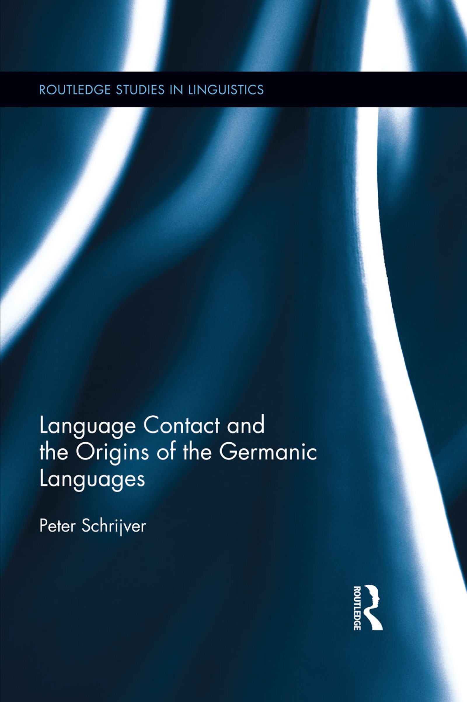

*Cover: Language Contact and the Origins of the Germanic Languages, Routledge Studies in Linguistics, written by Peter Schrijver, published by Routledge, Taylor and Francis Group.*

# Language Contact and the Origins of the Germanic Languages

History, archaeology, and human evolutionary genetics provide us with an increasingly detailed view of the origins and development of the peoples that live in northwestern Europe. This book aims to restore the key position of historical linguistics in this debate by treating the history of the Germanic languages as a history of its speakers. It focuses on the role that language contact has played in creating the Germanic languages, between the first millennium BC and the crucially important early medieval period. Chapters on the origins of English, German, Dutch, and the Germanic language family as a whole illustrate how the history of the sounds of these languages provide a key that unlocks the secret of their genesis: speakers of Latin, Celtic, and Balto-Finnic switched to speaking Germanic and in the process introduced a ‘foreign accent’ that caught on and spread at the expense of types of Germanic that were not affected by foreign influence. The book is aimed at linguists, historians, archaeologists, and anyone who is interested in what languages can tell us about the origins of their speakers.

<b>Peter Schrijver</b> is professor of Celtic languages and culture at the University of Utrecht. He is a historical linguist working on ancient and medieval languages in Europe. His publications include <i>Studies in British Celtic Historical Phonology</i> and <i>Celtic Influence in Old English</i>.

# Routledge Studies in Linguistics

<b>1 Polari—The Lost Language of Gay Men</b>

<i>Paul Baker</i>

<b>2 The Linguistic Analysis of Jokes</b>

<i>Graeme Ritchie</i>

<b>3 The Irish Language in Ireland</b>

From Goídel to Globalisation

<i>Diarmait Mac Giolla Chríost</i>

<b>4 Conceptualizing Metaphors</b>

On Charles Peirce’s Marginalia

<i>Ivan Mladenov</i>

<b>5 The Linguistics of Laughter</b>

A Corpus-assisted Study of Laughter-talk

<i>Alan Partington</i>

<b>6 The Communication of Leadership</b>

The Design of Leadership Style

<i>Jonathan Charteris-Black</i>

<b>7 Semantics and Pragmatics of False Friends</b>

<i>Pedro J. Chamizo-Domínguez</i>

<b>8 Style and Ideology in Translation</b>

Latin American Writing in English

<i>Jeremy Munday</i>

<b>9 Lesbian Discourses</b>

Images of a Community

<i>Veronika Koller</i>

<b>10 Structure in Language</b>

A Dynamic Perspective

<i>Thomas Berg</i>

<b>11 Metaphor and Reconciliation</b>

The Discourse Dynamics of Empathy in Post-Conflict Conversations

<i>Lynne J. Cameron</i>

<b>12 Relational Semantics and the Anatomy of Abstraction</b>

<i>Tamar Sovran</i>

<b>13 Language Contact and the Origins of the Germanic Languages</b>

<i>Peter Schrijver</i>

# Language Contact and the Origins of the Germanic Languages

Peter Schrijver

*Logo: Routledge, Taylor and Francis Group, London and New York*

First published 2014 by Routledge 605 Third Avenue, New York, NY 10017 Simultaneously published in the UK by Routledge 2 Park Square, Milton Park, Abingdon, Oxon OX14 4RN

<i>Routledge is an imprint of the Taylor & Francis Group, an informa business</i>

© 2014 Taylor & Francis

The right of Peter Schrijver to be identified as author of this work has been asserted by him/her in accordance with sections 77 and 78 of the Copyright, Designs and Patents Act 1988.

All rights reserved. No part of this book may be reprinted or reproduced or utilized in any form or by any electronic, mechanical, or other means, now known or hereafter invented, including photocopying and recording, or in any information storage or retrieval system, without permission in writing from the publishers.

<b>Trademark Notice</b>: Product or corporate names may be trademarks or registered trademarks, and are used only for identification and explanation without intent to infringe.

<i>Library of Congress Cataloging-in-Publication Data</i>

Schrijver, Peter.

Language contact and the origins of the Germanic languages / Peter

Schrijver.

pages cm. — (Routledge Studies in Linguistics; 13)

Includes bibliographical references and index.

1. Languages in contact. 2. Germanic languages—Etymology.

3. Germanic languages—Grammar, Comparative. 4. Germanic

languages—Grammar, Historical. I. Title.

PD582.S37 2013

430—dc23

2013017509

ISBN: 978-0-415-35548-3 (hbk)

ISBN: 978-0-203-00191-2 (ebk)

DOI: 10.4324/9780203001912

Typeset in Sabon

by Apex CoVantage, LLC

# Contents

- <i>Preface</i>

1. <b>Introduction</b>
  1. What This Book Is and Is Not About
  2. Language Contact and Language Change
  3. Language Contact in Deep Time
  4. The Comparative Method
2. <b>The Rise of English</b>
  1. Languages Competing for Speakers: English as a Killer Language
  2. The Anglo-Saxon Settlements
  3. The Vanishing of the Celts as Seen by Linguists
  4. The Reconstruction of British Celtic
  5. The Linguistic Map of Pre-Anglo-Saxon England
  6. Old English as Evidence for a Substratum in Old English
  7. Tracking Down the Substratum Language under Old English
  8. The Origin of Irish
  9. The Celtic Influence on Old English
  10. Synthesis
3. <b>The Origin of High German</b>
  1. Introduction
  2. German and Dutch
  3. The High German Consonant Shift
  4. Making Sense of the HGCS
  5. Sociolinguistics in the Rhineland, and Langobardian and Romance in Northern Italy
  6. Explaining the HGCS in General
  7. Germanic and Latin up North
4. <b>The Origins of Dutch</b>
  1. Non-Aspiration of <i>p, t, k</i>
  2. <i>i</i>-Umlaut in Eastern and Western Dutch
  3. Western Dutch
  4. Coastal Dutch
  5. Spontaneous Vowel Fronting
  6. Coastal Dutch, Western Dutch, Central Dutch, and Eastern Dutch
  7. Western Dutch as an Internally Motivated System
  8. Western Dutch as the Product of Contact between Coastal Dutch and Eastern Dutch
  9. Spoken Latin in the Low Countries
  10. Northern Old French Vowel Systems
  11. Spontaneous Fronting in Northern French and in Dutch
  12. Romance Fronting and Germanic <i>i</i>-Umlaut
  13. Language and History in the Low Countries
  14. Towards Modern Dutch
5. <b>Beginnings</b>
  1. The Dawn of Germanic
  2. Balto-Finnic
  3. Convergence to What?
  4. Saami and the Break-Up of Germanic
6. <b>Conclusions</b>

- <i>Notes</i>
- <i>Bibliography</i>
- <i>Index</i>

# Preface

This book is written for anyone who wants to know more about the earliest history of one of the most successful language families in the world, both in terms of numbers of speakers and in terms of the ideas expressed by those speakers during the last 1300 years: Germanic. The idea behind this book is that the English, Dutch, and German languages, and indeed the Germanic family as a whole, are founded on the input of people who did not originally speak Germanic but switched to it in the course of time. Additionally, I hope to show how studying language can contribute to our knowledge of the history of its speakers, and in this sense the book is intended not only for an audience of linguists but also for historians and archaeologists. Readers are not required to have any previous knowledge of linguistics, for all important concepts and the methodology of language reconstruction will be explained to them. This does not mean, however, that this book is an easy read throughout. Although I have aimed at maximum clarity, complex matters – and there are some to be found here – cannot be made simpler than they are, although they can be presented more simply than they usually are. It is my hope that anyone with genuine interest in language history and a little bit of time on their hands can understand everything I have written.

I have not striven to present the current consensus on language contact and the rise of the Germanic languages, first of all because there is none and, secondly, because presenting consensus in historical linguistics is a dreary and sterile business. Instead, I have concentrated on full and coherent argumentation regarding the theme of the book, so that readers who agree or disagree with what I write will be able to understand and formulate why. This effort entails that the book is not at all comprehensive: many ideas that over the years have been expressed in print about the origins of the Germanic languages are left unmentioned, not necessarily because I find them incorrect, but because they are not germane to the issues raised in the book.

This book has been long in the making, and I have done my utmost to test the patience of some of my colleagues and of the publisher. There are various reasons for the delay, apart from my inveterate optimism in planning ahead and the fact that academic life itself has a habit of interfering with work. In spite of the crushing weight of published scholarship on the history of the Germanic languages, where an article published in 1870 is usually as relevant as one published last year, there is actually very little accumulated knowledge on which to fall back if one wishes to find out about the role that language contact has played in the early history of the Germanic languages. Another reason for the delay is the vastness and complex nature of the linguistic material involved. Anyone who has tried to master the historical phonologies of Old English or Dutch will know what I am talking about, and the reader will get a bitter taste of it in the chapter about Dutch. By definition, language contact involves more than one language, and in the case of early Germanic, the contact languages lie outside Germanic. Hence, one may spend the best part of one’s life studying Germanic philology and not be able to write one sensible word about the theme of this book. Latin, the earliest stages of the Romance languages, Irish, British Celtic, Finnish, and Saami are the contact languages that will make an appearance in this book, and more than a glancing acquaintance with all of them was required in order to assess their contribution to Germanic.

A major advantage of a long gestation period is that it has given me the opportunity to try out, in various talks and in specialist publications, some of the ideas that will be presented here (see in particular Schrijver 2002, 2009, 2011a). All reactions, which varied from matter-of-fact criticism to mild enthusiasm and roaring silence, have been taken on board to the best of my abilities.

My thanks are due to Lisette Gabriëls, who read the manuscript before publication and suggested many improvements, and to Willem Vermeer, who has been my mentor and subsequently my partner in crime in ancient language contact studies.
