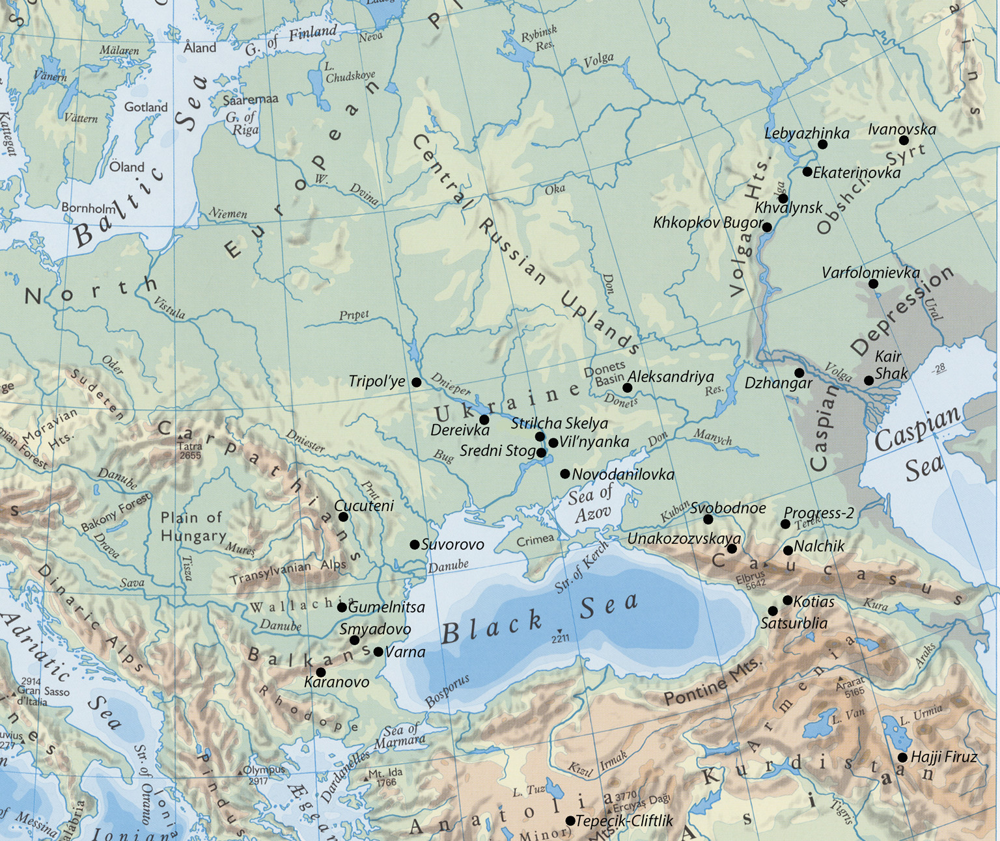
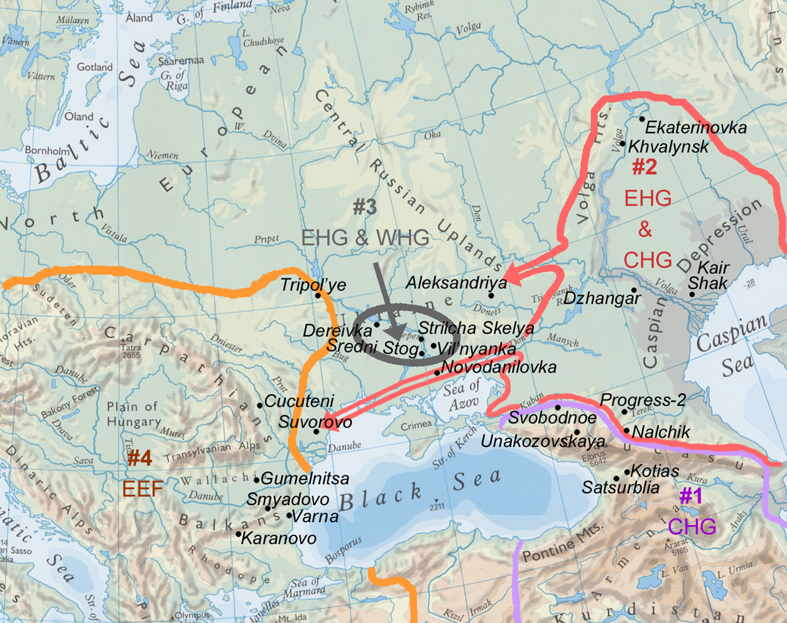

# Chapter 1: Ancient DNA, Mating Networks, and the Anatolian Split

## 1 Introduction

The last three years of ancient DNA (aDNA) studies have revolutionized the topics about which we have solid information from past populations.1 We can now say with some certainty who was related to whom, and how closely they were related, subjects that previously were largely speculative in reference to ancient populations. Because each person carries a genetic record of descent from hundreds2 of recognizable individual ancestors (up to 10 generations back) and many more broadly defined ancestral groups, the whole genomes of a few individuals can reveal the histories of substantial populations. Applied to large samples of individuals, statistical characterizations of genetic relationships can identify migrations, reveal their demographic structure, and describe ancient mating networks—a new category of measurable human relationships. Again, these topics previously were debated or unknowable. The difficult problem of defining language groups and language borders in prehistoric landscapes, deemed a hopeless waste of time (or worse) using traditional archaeological methods (Demoule et al. 2008; Karl 2010; Sims-Williams 2012; Falileyev 2015), can and should be re-visited with these new tools. But the methodological breakthroughs that made it possible to quickly analyze whole genomes from large samples of prehistoric individuals were attained only after 2012, and the results were not in print before 2015, as the citations

1 Abbreviations: aDNA: ancient DNA; ANE: Ancient North Eurasian; CHG: Caucasus HunterGatherer; DDII Dnieper-Donets II; EBA: Early Bronze Age; EHG Eastern Hunter-Gatherer; IE: Indo-European; LBK: Linearbandkeramik/Linear Pottery Culture; MtDNA: mitochondrian DNA; PIE: Proto-Indo-European; WHG: Western Hunter-Gatherer. 2 The number of distinct ancestors 10 generations before ego would be 1024 if no relatives ever married each other, but marriages between people who share a common ancestor are ubiquitous, and they reduce the number of distinct ancestors (a process called pedigree collapse) by a quantity that depends on marriage patterns, so the potential 1024 is never attained.

<!-- source-pdf-page: 34; source-page: 22 -->

below attest, so we are early in the process of exploring the implications and limitations of this new data. In this essay I review the relevance of four genetically defined mating networks for the subject of the first and oldest split in the Indo-European (IE) language family, the separation of the language community that was ancestral to the Anatolian IE languages. Because mating networks are a new kind of phenomenon, first I should define this term.

## 2 Mating Networks, Culture, and Language

Even at this early stage in aDNA studies, one strongly supported conclusion about the inter-regional connectivity of ancient humans is clear: there was more “structure” in the geographic distribution of ancient populations than there is in modern populations (Pickrell & Reich 2014; Lazaridis et al. 2016: Fig. 3; Reich 2018; Scerri et al. 2018). Ten thousand years ago the number of humans was much lower, regional populations were more isolated genetically (and linguistically), and there was less gene flow between them, than we find today—at least in Eurasia, the continent most heavily sampled so far. These conditions created regional populations with distinctive combinations of genetic traits, referred to here as mating networks. Mating networks can be seen most clearly during chronological periods of low gene flow between largely isolated human populations—such as the peak of the last glacial period about 20,000 years ago. Even these isolated populations that lived during the glacial maximum showed genetic traces of earlier migrations and admixtures, so isolation was episodic, and no single mating network represented any kind of “pure” population. They just happened to survive the last Ice Age in different places. Because languages usually were learned from the same parental sources that provided genes, languages probably showed at least an equivalent level of regional patterning and diversity. But genes could be shared through occasional acts while language sharing required regular face-to-face interaction and maintenance. Mating networks knitted together widely scattered human groups who ranged over large, ecologically diverse regions, where each mountain range or broad river was a potential impediment to language sharing. For these reasons we might expect ancient languages to exhibit even more regional “structure” than genes (Nettles 1998; Robb 1993; Anthony 2007: 114–116; Mallory 2008). When large population movements flowed across previously separate mating networks, like the migrations of pioneer farmers from Neolithic western Anatolia into Europe about 6500–5000 BC (Haak et al. 2015; Lazaridis et

<!-- source-pdf-page: 35; source-page: 23 -->

al. 2016) or the Yamnaya expansions from the steppes into Europe and Asia about 3000–2000 BC (Haak et al. 2015; Allentoft et al. 2015; Damgaard et al. 2018; Narasimhan et al. 2018), new languages must have moved with them. Some archaeologists (Terrell 2018; Golitko 2015) seem to think that any discussion that links archaeology, genes, and language must adopt the simplest of equations between archaeological cultures, biological populations, and linguistic-ethnic groups in a dangerous replay of early 20th-century racial history. But kinship, material culture, and language need not be analyzed through early 20th-century stereotypes (see Saarikivi & Lavento 2012 or Orton 2012). Also, race and genetic ancestry are obviously different things (Anthony & Brown 2017: 28–30). Race is a social construct based on variable, culturally defined phenotypic and behavioral stereotypes with no serious attention to their genetic expression; and genetic ancestry is a statistical construct based on the frequency of shared base pairs between individual genomes with little regard for their phenotypic or behavioral expression. Skin color is a powerful element in the cultural construct of race, but the genes for skin color are a minor part of the 3.2 billion base pairs comprising the whole human genome. Our acute attention to skin color and its entanglement with modern concepts of race makes it easy for us to assume that any study that includes skin-color genes must be about them, but in fact these genes have almost no effect on how individuals are combined into mating networks, lineages, and other kinds of groups in genetic ancestry studies. It might be naïve to hope that this will insulate genetic ancestry studies from the modern politics of race, but it is wrong in both senses of the word to equate genetic ancestry studies with racism (Terrell 2018). The most important new facts revealed by aDNA are not about archaeological cultures and their assumed social or biological correlates, but about migrations and the structure of prehistoric mating networks. When migration brought populations from distinct mating networks into contact, they repeatedly created and maintained persistent, centuries-long marriage exclusion borders rather than freely admixing with their new neighbors and trading partners. I do not suggest replacing a free-flowing, border-less, networked model of human relations with its opposite, maximally structured stereotype. But borders have been seen in anthropological archaeology primarily as zones of cultural hybridity and invention (Stark 1998; Parker & Rodseth 2005; Stockhammer 2012), not as zones of exclusion, so this newly revealed ancient reluctance to exchange mates is a surprise, and demands our attention. Material types and styles, which sometimes were widely shared, can now be compared with mating networks, which we are just beginning to perceive through samples that are still too few.

<!-- source-pdf-page: 36; source-page: 24 -->

We also should distinguish between genetic mating networks, the subject of this essay, and cultural models of kinship relations. Culturally defined kinship obligations and structures were fundamental elements in ancient social organization. Gaining the ability to perceive actual genetic mating networks might therefore seem to be a major advance in understanding prehistoric social organizations. It is, but with reservations. The cultural extension of kinship to non-kin is a ubiquitous custom among humans, and that is one important difference between culturally and genetically defined mating networks—cultural notions of kinship are malleable. Nevertheless, actual “blood” relationships through shared ancestors explain many aspects of tribal socio-political behavior, and genetic mating networks do describe actual relationships through shared ancestors, so genetic mating networks give us important insights into the underlying genetic architecture of culturally defined kinship networks. However, most of the mating networks described here operated on a scale probably larger than was recognized or referenced culturally among ancient societies. All of Mesolithic Europe contained only three or four mating networks 10,000 years ago, and already they had met each other and blended into a rough cline. After the initial events of admixture between them had passed into myth, we might be able to detect their once-distinct origins better than they could, or cared to know. In contrast, some regions rich in concentrated natural resources developed distinctive local genetic populations that mated endogamously, as seems to have happened around the Dnieper Rapids (Mating Network #3 below). In this case the genetically defined network was actively maintained and small enough in geographic scale to have been recognized culturally. In addition to small-scale (possibly cultural) genetic mating networks, there is another situation where genetic mating networks might coincide with cultural notions of kinship. This is when previously isolated populations came into contact through migration. At contact, their accumulated physical and cultural differences probably were recognized, named, and negotiated. David Reich described the genetic difference between the indigenous hunter-gatherers of western Europe and the in-migrating Anatolian farmers who carried farming into Europe between 6500–5000 BC as about the same as the difference between modern Western Europeans and East Asians, implying that they had recognizably different phenotypes, languages, and customs. These differences seem to have been recognized culturally upon contact, as the incoming migrants and indigenous hunter-gatherers mutually avoided marriage with each other in spite of sometimes robust trade exchanges of material goods and types during the initial centuries of interaction (Haak et al. 2015; Reich 2018: 101–102; Groneborn 2014). Genetic mating networks and cultural concepts of

<!-- source-pdf-page: 37; source-page: 25 -->

kinship might have been roughly aligned for hundreds of years on a persistent genetic border like this that also was a persistent economic and cultural border. In such cases, where intermarriage was avoided, the border probably was linguistic as well (Anthony 2007: 108–116). Of course, over the very long term, all were dynamic phenomena, and shifted through admixture and politics and time.

## 3 A Steppe Homeland for Late Proto-Indo-European (PIE): Summary of the Argument

I assume here that late Proto-Indo-European (PIE) (classic PIE in Kloekhorst 2016)—the parent of all known IE language branches except Anatolian— existed as a variable, innovation-sharing language community after 3500 BC in the Pontic–Caspian steppes north of the Black and Caspian Seas (Map 1). This temporal and geographic solution is supported by a growing body of ancient DNA evidence (Allentoft et al. 2016; Haak et al. 2015; Lazaridis et al. 2018), and by other arguments, including the presence of a wheel/wagon vocabulary in late PIE (Mallory & Adams 2006: 247–249; Anthony & Ringe 2015; Anthony & Brown 2017; Kristiansen 2017; Kristiansen et al. 2017). The term “innovation-sharing” describes the late PIE language community because at least ten innovations in phonology and morphology (Lehrman 2002) distinguished late PIE from the older language phase (archaic PIE, or Indo-Hittite) preserved uniquely within the Anatolian branch of IE languages. All ten had been shared and incorporated into speech, along with the wheel/wagon vocabulary, across the late Proto-Indo-European language community before it began to fragment into its known daughters. The rapid expansion of the steppe Yamnaya population about 3300–2700BC from the Pontic–Caspian steppes into both Europe and Asia currently represents the best archaeological and genetic vector for the expansion and multiple separations of late PIE populations and dialects (Anthony 2007; Haak et al. 2015; Kristiansen 2017). Wooden parts of wagons found in Yamnaya graves in the steppes are among the oldest wheeled vehicles. The oldest dated wheel in the steppes is from a four-wheeled wagon buried in a kurgan grave at the cemetery of Sharakhalsun 6, Russia, in the North Caucasus steppes, dated 3336–3105 cal BCE (4500±40 BP, GIN-12401), the same age as a wheel from the Ljubljana marshes that was previously thought to be the oldest wheel (Reinhold et al. 2017). The late PIE expansion can be dated after 3500BC (after the invention and diffusion of wheeled vehicles) by the wheel/wagon vocabulary in late PIE, and before 2500 BC by inscriptions indicating that Anatolian (Hittite),

<!-- source-pdf-page: 38; source-page: 26 -->

Greek (Linear B), and Indic (Mitanni) existed as three quite different branches
by 2000–1500 BC. The Yamnaya archaeo-genetic expansion is dated independently to the same chronological window, 3500–2500BC, so the chronological conjunction of the expansions of late PIE and the expansions of the Yamnaya people is supported independently by archaeological, genetic, and linguistic evidence. All ancient and modern IE-speaking populations that have been sampled genetically have revealed ancestry from steppe populations—except in Anatolia. Genetic ancestry from the steppes was found in both rich and poor Mycenaean graves averaging 13–18% of their ancestry, in a political context ruled by Greek-speakers who wrote in Linear B; but not in Minoan graves on Crete, probably mostly non-IE speakers who wrote in Linear A (Lazaridis et al. 2017: 217). Steppe ancestry averaging 22% was found in 31 ancient South Asians dated 1200–800 BC from the Swat valley, but was not found in individuals dated before 2000 BC, probably associated with the Harappan civilization, indicating the arrival of this suite of genes in South Asia during the 2nd millennium BC (Narasimhan et al. 2018). IE-speakers in modern South Asia have more steppe ancestry than non-IE speakers. The part of Europe that shows the least steppe ancestry, the Mediterranean region, also exhibited the highest diversity of nonIE languages when inscriptions began to appear after 700BC (Ringe 2013: 206– 207). The modern European population with the least steppe ancestry occupies an island, Sardinia, where a non-IE language, Paleo-Sardinian (arguably related to Basque), was spoken in antiquity (Blasco Ferrer 2011). Sardinians, among all modern European populations sampled (Haak et al. 2015), have both the least steppe ancestry and the most genetic affinity to the Neolithic farmers who brought domesticated plants and animals to Europe and the Mediterranean before 5500 BC, almost certainly non-IE speakers (Anthony & Ringe 2015). Steppe ancestry has been identified in all tested populations that arguably spoke or speak IE languages, except Bronze Age Anatolia, which remains lightly sampled. No ancient individual from a Hittite-identified city has yielded aDNA, partly because cremation was a widespread custom. Damgaard et al. (2018) sampled individuals who arguably were Hittites in a Hattic city, but their Hittite identity is uncertain. If we had aDNA from a cemetery associated with a Hittite or Luwian-speaking ancient city or fortress this paper would be much shorter. Absent that data, we cannot say when the genetic ancestors of the Hittites entered Anatolia or what they looked like genetically. The Yamnaya archaeological culture is associated more firmly with late PIE languages and genes, so we can begin there and work back towards early PIE.

<!-- source-pdf-page: 39; source-page: 27 -->

## 4 Hunter-Gatherer Populations and Their Contributions to Yamnaya Ancestry

What can we know about the DNA of the Indo-Hittite-speaking people who separated from the archaic PIE language community perhaps a thousand years before the Yamnaya era, whose language ultimately developed into Hittite, Luwian, and the other Anatolian IE languages? Yamnaya ancestry constrains pre-Yamnaya ancestry to a certain extent. Yamnaya genomes contained two principal genetic components derived from two distinct mating networks: a majority component derived from a mating network that evolved in the northern forest zone; and a minority component derived from a southern mating network in the Caucasus or northwestern Iran. In addition, Yamnaya genomes exhibit a small third component derived from Neolithic farmers in Europe. The northern component was designated Eastern Hunter-Gatherer or EHG (Haak et al. 2015). EHG is merely a label, first applied to hunter-gatherer samples, but it could be used for any genetically similar individuals regardless of their subsistence economy. The EHG genetic type was first defined by Haak et al. (2015: 208) on the basis of two genetically similar hunter-gatherers from Lebyazhinka IV near Samara and Oleni Ostrov in Lake Onega near the Baltic in Russia, both dated to the mid-sixth millennium BC. Additional samples have shown that Eastern Hunter-Gatherers ranged from the Urals to the Baltic and moved down the river valleys into the steppes north of the Black and Caspian Seas. The EHG mating network was a Holocene, western regional survival of a much larger Upper Paleolithic mating network called Ancient North Eurasian (ANE), first recognized in Upper Paleolithic humans who had lived near Lake Baikal, at a site called Mal’ta about 24,000 years ago and at another site, Aftonova Gora, about 16,000 years ago (Raghavan et al. 2014). Interconnected mating networks distributed variants of the ANE genetic type across northern Eurasia during the Upper Paleolithic, when mammoths roamed across Siberia (Pavelková Řičánková 2014). These networks extended into North America on the east (where ANE averages 15–40% of Native American genomes) and into the Pontic–Caspian steppes and the Baltic forests on the west, where ANE averaged about 70% of the genomes of the EHG mating network (Haak et al. 2015). EHG averaged about 50% of the ancestry of the Yamnaya populations that have been studied to date (Haak et al. 2015; Allentoft et al. 2015; Damgaard et al. 2018). To identify steppe ancestry among the Hittites in Anatolia, geneticists would look for EHG. Up to now, we have not seen a Bronze Age Anatolian individual

<!-- source-pdf-page: 40; source-page: 28 -->

with EHG ancestry, so an intrusion into Anatolia by a population derived ultimately from the steppes is not identified genetically. The western part of Europe was occupied by a genetically distinct group of hunter-gatherers, named Western Hunter-Gatherers (WHG). This mating network emerged in Europe during the last glacial period, and eventually was distributed from Britain to the Carpathians. WHG genomes exhibited little affinity with the Paleolithic ANE, whereas EHG genomes showed very strong affinity with ANE. This contrast indicates a period of low gene flow between the WHG and EHG ancestral populations, probably during the last peak in glacial activity about 20,000 years ago. The frontier between WHG and EHG in eastern Europe was a broad zone that extended from the lower Danube valley (Iron Gates Mesolithic people were mostly WHG with some EHG ancestry) to the forests west of the Dnieper River to the western Baltic (Mathieson et al. 2018). WHG ancestry played little or no role in the evolution of the Yamnaya mating network.

<!-- source-pdf-page: 41; source-page: 29 -->

The other important component of Yamnaya ancestry came not from the west, but from the south, originally from a third hunter-gatherer population that was genetically so different from the EHG and WHG that it must have remained isolated from them during most of the Upper Paleolithic (Jones et al. 2015: Fig. 2). This third group occupied the Caucasus Mountains and western Iran and was initially designated Caucasus Hunter-Gatherer (CHG). The name is derived from the location where it was first identified (Jones et al. 2015), not from the idea that the CHG type originated in the Caucasus Mountains. The first sites where CHG was defined were a late Upper Paleolithic burial at Satsurblia in western Georgia dated 11,200 BC and a Mesolithic grave at Kotias in western Georgia dated 7800–7500BC. These individuals were later found to be quite similar genetically to hunter-gatherers dated 9100–8600 BC from level IIIb at Hotu Cave and from nearby Belt Cave in northern Iran on the southeastern Caspian coast, located 1300km southeast of the Georgian sites and in a very different ecological setting (Lazaridis et al. 2016). People with primarily CHG ancestry also lived 750km southwest of Hotu Cave, at Early Neolithic Ganj Dareh near Kermanshah, dated 7000BC (Lazaridis et al. 2016). Because people with CHG ancestry lived on the northern (Hotu Cave) and southern (Ganj Dareh) margins of the western Iranian plateau, a similar CHG population probably was distributed across western Iran and the Caucasus at the beginning of the Neolithic, about 8000 BC. In recent papers CHG ancestry is sometimes designated “Ganj Dareh” or “Iran-N” (for Iran-Neolithic) or “CHG/Iran” but these various labels do not designate a different genetic type or variant—they refer to the same genetically defined mating network, including Hotu Cave (Caspian Sea coast) and Kotias Cave (Georgia), which here is CHG. Diluted CHG ancestry appeared in some Neolithic individuals at TepecikÇiftlik in central Anatolia dated 6500 BC. Tepecik-Çiftlik can be seen as the far western edge, the western tail of the curve of the CHG mating network, around 6500 BC (Kliniç et al. 2017). Most of the genetic ancestry of the Neolithic farmers from Tepecik-Çiftlik was derived from local Anatolian Farmers, who lived in central and western Anatolia and were genetically distinct from the CHG populations in the Caucasus and western Iran. Variation existed within the CHG group. The Late Upper Paleolithic/Mesolithic individuals from Georgia exhibited a little admixture with an EHG population, probably reflecting contact with the EHG populations in the steppes north of the North Caucasus Mountains, or possibly indicating penetration into the mountains by some EHG explorers. We do not know exactly where or when the CHG element that was a robust part of Yamnaya ancestry entered the steppes—an important question.

<!-- source-pdf-page: 42; source-page: 30 -->

The presence of CHG by itself in a Bronze Age Anatolian sample would not indicate steppe ancestry, because CHG was present in Anatolia during the Neolithic. A nearly 1/1 combination of CHG and EHG was the defining feature of Yamnaya ancestry as it was first defined (Haak et al. 2015; Allentoft et al. 2015).

## 5 The Caucasian Scenario for the Ancestry of the Hittites

If the EHG/CHG Yamnaya admixture happened in the steppes long before the Yamnaya period, then Yamnaya ancestry (and language) could have evolved entirely in the steppes. In this case the Anatolian branch could have separated from an older, pre-Yamnaya steppe population that already exhibited a mixture of CHG/EHG ancestries, through a migration from the steppes toward Anatolia. A suitable migration can be identified archaeologically, flowing from the Pontic steppes into the Danube valley and the Balkans about 4400–4200 BC, contemporary with the burning and abandonment of dozens, possibly hundreds of tell settlements and the sudden end of Old European traditions associated with the Varna-Gumelnitsa-Karanovo VI cultures (Govedarica & Kaiser 1996; Anthony 2007: 230–262; Ivanova 2007; Dergachev 2007; Bicbaev 2010). The Suvorovo-culture migrants from the steppes are not yet sampled for aDNA. Archaeologically, they seem to have admixed with the local population to produce the post-Gumelnitsa Cernavoda I culture. We also have no genetic samples from this important culture. The later Cernavoda III culture exchanged material culture styles with northwest Anatolia (Nikolova 2008), so an archaeological vector (really more than one) can connect the steppes with southeastern Europe, and southeastern Europe with Anatolia long before the initial appearance of Hittite names in documents dated 1900–1800BC at Kanesh. But the absence of any EHG ancestry in the initial handful of Bronze Age individuals from Anatolia (Damgaard et al. 2018; Kristiansen et al. 2018) is now seen as evidence against a steppe origin for the Hittites’ genetic ancestors. If, on the other hand, the Yamnaya admixture required an extra component of CHG genes from the south, then that southern donor region could have contributed its language with its genes, particularly if economic, political, and technological innovations were introduced to the steppes by that same southern population—a description that was thought to fit the Maikop culture of the North Caucasus and its relationship with the steppes around 3500 BC, just before Yamnaya began. In that case the North Caucasian homeland of the CHG donor population (Maikop) could also have been the source of the Anatolian branch of IE languages, which could have entered Anatolia from the northeast,

<!-- source-pdf-page: 43; source-page: 31 -->

through Transcaucasia, although this region in later times was home to largely non-IE languages such as Urartian and Hurrian. Reich (2018: 107–109, 120) and Kristiansen et al. (2018) suggested that a Caucasian homeland for archaic PIE (pre-Maikop and Maikop) could be combined with a steppe homeland for late PIE (Yamnaya), if Yamnaya could be derived culturally and genetically (and then, arguably also linguistically) from Maikop. Yamnaya clearly had southern (CHG) genetic ancestry and was influenced culturally by Maikop, adopting several new technologies from Maikop—arsenical bronze-making, bivalve casting molds, cast copper tanged daggers, cast copper shaft-hole axes, and possibly wheeled vehicles (Korenevskii 2012; Kohl 2007: 72–86). But it was unknown whether Maikop could have been the genetic source of CHG ancestry in Yamnaya, because a good sample of Maikop and older genomes from graves in the North Caucasus piedmont and steppes had not been published. A very recent paper by Wang et al. (2019) changed that. The Wang et al. paper presented new data on ancient DNA from Maikop and pre-Maikop graves in the North Caucasus. The Maikop culture represented the northwestern frontier of the enormous expansion in trade for metals, gem stones, timber, and other commodities that emanated from the world’s first cities during the fourth millennium BC, called the Uruk Expansion (Rothman 2014; Algaze 2005). The richest Maikop graves contained Mesopotamian symbols of power (golden lions, not native to the North Caucasus, paired with golden bulls; rosettes; and cylinder seals) as well as new metal types (arsenical bronzes) and technologies (shaft-hole axes, bivalve molds) that were borrowed by Yamnaya people after about 3300 BC (Korenevskii 1980; Chernykh 1992: 88; Ivanova 2012). Wheelmade pottery first appeared on the steppe margins with Maikop, and the oldest dated wheeled vehicle in the steppes was found in a grave in the North Caucasus steppes in a region where Maikop and Yamnaya cultural practices hybridized (Reinhold et al. 2017: Wang et al. 2019: Supplementary Information). Maikop kurgans copied earlier and simpler Eneolithic steppe burial mounds (Korenevskii 2012), but the richest Maikop burial mounds were much larger and more monumental than any of the graves they copied, and their grand scale might have inspired the widespread adoption of kurgan graves across the Pontic–Caspian steppes during the Yamnaya period. But where did the Maikop people come from? Were they Mesopotamian immigrants exploring the gold and silver resources of the North Caucasus Mountains? And did they intermarry with steppe people just before the Yamnaya culture appeared in the steppes? Wang et al. (2019) found that individuals from both rich and poor Maikop graves had ancestries inherited from earlier Eneolithic farmers in the North

<!-- source-pdf-page: 44; source-page: 32 -->

Caucasus piedmont. The first farmers in the North Caucasus piedmont came from the south, probably from western Georgia and Abkhazia, today home to Northwest Caucasian languages. They are called the Darkveti–Meshoko culture by Trifonov in Wang et al. (2018), and are the ideal archaeological candidate for the founders of the Northwest Caucasian language family. From sites like Darkveti Cave on the Georgia/Abkhazia side of the mountains, a region where northwest Caucasian languages are spoken today, they migrated over the North Caucasus ridge into the upper Belaya river valley, the other principal region where Northwest Caucasian languages are spoken today. Their earliest known arrival is dated about 4600–4500 BC at Unakozovskaya Cave in the upper Belaya River valley (Wang et al. 2018). Rapidly afterward, walled agricultural settlements such as Meshoko spread down the Belaya valley to the edge of the steppes (Svobodnoe) before 4000 BC. They established farming (wheat) and domesticated animal herding (cattle, pigs, sheep & goats) in the northwest Caucasus region, and also founded the genetic mating network that later would characterize the people of the Maikop culture, their direct descendants. Their Y-chromosome (paternal) haplogroups were L, J, and G2, which were typical of southern males, but generally were not shared with northern steppe males. They showed an admixture of ancestries, largely CHG, but with about 30–40 % Anatolian Farmer ancestry, which had spread into the Caucasus from the west after about 5000 BC. A similar admixture characterized most of the sampled people who lived across Transcaucasia in the fourth millennium BC, associated with the Kura-Araxes culture. This Maikop/Kura-Araxes genetic admixture played only a minor role, if any, in the formation of Yamnaya ancestry, because the 30–40% Anatolian Farmer component was not seen in steppe ancestries. Maikop cannot be regarded as the source of “southern” CHG ancestry in Yamnaya because Maikop genomes had too much ancestry from Anatolian Farmer populations. Yamnaya genomes had only 10–18 % Anatolian Farmer ancestry, and Wang et al. (2019) identified most of that as derived from Europe, from Globular Amphorae and late Tripol’ye populations. If Wang et al (2019: 9) are correct that Yamnaya and all later steppe populations “deviate from the [pre-Yamnaya steppe population] towards European populations in the West” then Caucasus populations are left to play only a small role in Yamnaya ancestry. Yamnaya men had almost exclusively R1b Y-haplogroups, and pre-Yamnaya Eneolithic Volga–Caspian–Caucasus steppe men were principally R1b, with a significant Q1a minority. Maikop men did not father a significant number of Yamnaya males. If there was any Maikop gene flow into Yamnaya, it could have been through a small number of Maikop females whose 30–40 % Anatolian Farmer ancestry was diluted in their descendants, and whose skeletons have not yet been found or analyzed.

<!-- source-pdf-page: 45; source-page: 33 -->

If Maikop people rarely married into or mated with or were taken as concubines by Yamnaya people, then one of the most powerful vectors of language shift—intermarriage between people from different language groups— is removed. It then becomes more difficult to derive the Yamnaya language, presumed to be late PIE, from Maikop. In any case, Maikop is geographically more likely to represent the ancestor of today’s Northwest Caucasian languages, as argued above. If Maikop was not the source of the CHG in Yamnaya, then another alternative could be that CHG ancestry came from an unknown and undocumented southern source that entered the steppes at an unknown time. But the dataless places where such a source could be hidden are shrinking. A previously unknown genetic population actually was identified in Wang et al. (2019), but it was a peculiar relict-seeming group related to Paleo Siberians and American Indians (Kennewick) that had survived isolated somewhere in the Caspian steppes or perhaps in the North Caucasus Mountains. The Maikop people did admix with this previously isolated Siberian/Kennewick population in graves labeled “Steppe Maikop” in Wang et al. (2019). But this just makes it clearer that a cultural choice motivated the Maikop people to exclude marriages with Yamnaya and pre-Yamnaya people specifically, even while exchanges of material goods, ideas, and technologies continued. Neither the Maikop nor the North Caucasus/Siberian/Kennewick population can be the source of most of the CHG ancestry in Yamnaya. In order to narrow down when and where CHG ancestry entered the steppes, we must widen our geographic frame beyond the Caucasus.

## 6 Four Eneolithic Mating Networks in the Pontic–Caspian Steppes

Four mating networks in the Pontic–Caspian region are relevant for determining Yamnaya genetic ancestry and origins. The first mating network was that of Eneolithic farmers and the later Maikop people in the forested zone of the North Caucasus Mountains, just described. The second mating network linked together populations in the middle Volga steppes (Khvalynsk) and the North Caucasus steppe foothills (Progress-2), a north-south distance of over 1000 km taking in the Volga steppes, Caspian steppes, North Caucasus steppes, and the lower Don steppes. The third mating network was much smaller, connecting cemeteries in the middle Dnieper region about 200 km apart. The middle Dnieper was a strategic ecotone richly endowed with Eneolithic cemeteries, so while small, the region is important. The fourth network linked together the Neolithic and Copper Age or Eneolithic farmers of southeastern Europe, who

<!-- source-pdf-page: 46; source-page: 34 -->

subsisted on rainfall agriculture, lived in large farming villages and towns, and were quite distinct from the first three. We have important voids in the DNA evidence, one of being the absence of any samples from the coastal part of the Pontic steppes in Ukraine, a potential bridge between the steppes and Network
#4, and it will be critical to study such samples in the future.

### 6.1 Mating Network # 1: The North Caucasus Network, 4500–4000 BC

The Eneolithic farmers of the North Caucasus Mountains, the parent population of the later Maikop population, appeared in the upper Belaya River drainage on the north side of the North Caucasus Mountains around 4600– 4400 BC (the age of Eneolithic graves in Unakozovskaya Cave). They crossed the mountains from western Georgia and Abkhazia on the south side, carrying with them a genetic admixture that subsequently linked populations on both sides of the North Caucasus ridge (Wang et al. 2019). An inviting low gap (maximum 2000 m elevation) leads directly into the upper Belaya headwaters from near Sochi and Adler on the Black Sea coast. The North Caucasus ridge forms a permanently glaciated wall up to 5400m high (at Mt Elbrus) for a solid 350km east of the eastern peak (Mt. Chugush) that defines this gap. Therefore this gap is the first place explorers in western Georgia moving westward along the southern mountain foothills could have easily crossed the mountains to their north side. Visible from the south as a depression between two glaciercapped peaks (Mt. Chugush on the east and Mt. Fisht on the west, each rising to ca. 3000m), the pass to the upper Belaya River is so steep and winding that no paved road exists today, but summer hikers regularly backpack through the area. This geographic feature could explain why the oldest Eneolithic sites on the north side of the North Caucasus are found in the upper Belaya valley, why the oldest and richest Maikop graves are located there, and why Maikop and Meshoko populations were so similar genetically to those on the south side of the North Caucasus. Eneolithic agricultural settlements (Meshoko, Yasenova Polyana) and rockshelter occupations (Unakozovskaya Cave) were clustered in the upper Belaya but extended down the Belaya River valley to the steppe border (Svobodnoe). The Eneolithic farmers built protective walls around their agricultural villages (earth at Svobodnoe, stone at Meshoko), herded pigs and cattle, and traded material goods and ideas with the steppe population but did not marry them. The huge Maikop chieftan’s kurgan (early Maikop, 3600–3300 BC) was erected in the middle Belaya valley, and the even richer Klady or Novosvobodnaya kurgan cemetery (late Maikop, 3300–2900 BC) was erected not far from Maikop. Because they came from a genetically and geographically distinct population, and avoided marriage with the steppe population of Mating Network #2, it is

<!-- source-pdf-page: 47; source-page: 35 -->

likely that both the Svobodnoe-Meshoko people and their Maikop descendants spoke a Caucasus-derived language distinct from that of the steppes.
### 6.2 Mating Network # 2: The Volga-Caucasus Network 4500–4000 BC

A population showing a mixture of EHG and CHG ancestries existed in the Volga-Caucasus steppes during the Eneolithic period. This Yamnaya-like admixture was established before 4500 BC, the approximate date of Khvalynsk. Published samples (Mathieson et al 2018; Wang et al 2019) from two cemeteries 1000km apart, Progress-2 and Khvalynsk, dated about 4500–4300 BC, define this population, and a third published sample might be added to the very end of this period from Aleksandriya in eastern Ukraine, dated about 4000 BC. Samples from two other Volga-steppe Eneolithic cemeteries, Ekaterinovka Mys and Khlopkov Bugor, are now under study at the Reich lab at Harvard but are not published. They exhibit dominant EHG ancestry, typical of this mating network, with CHG. The percentage of CHG ancestry declines southto-north, from Progress-2, where CHG is 30–50 %, to Khvalynsk (CHG 20–

<!-- source-pdf-page: 48; source-page: 36 -->

30%) to Ekaterinovka (perhaps 5%, but not yet published). Eneolithic individuals generally had less CHG than Yamnaya, but their EHG/CHG admixture ranges overlapped with those from Yamnaya samples, according to Wang et al. 2019: Figure 2C. The Khvalynsk-Progress-2 mating network makes a plausible genetic ancestor for Yamnaya, but Yamnaya was more homogeneous genetically than the Eneolithic cemeteries, particularly in male genetic traits on the Y-chromosome. Most Khvalynsk males belonged to Y-chromosome haplogroup R1b1a, like almost all Yamnaya males, but at least five Khvalynsk males, including some very richly endowed, were Q1a1b. Single males were R1a1, J1, and I2a2a. The Q1a1b males probably were linked to the north, where this haplogroup is found in ancient samples from Siberia, the Altai Mountains, and across the forest zone to the Baltic. The J1 male at Khvalynsk probably was linked to the south, since he belonged to the same Y-haplogroup as the CHG type specimen from Satsurblia Cave in Georgia, confirming affinity with CHG in the Khvalynsk population. The I2a2a male was descended from a haplogroup common among Mesolithic WHG’s in the Danube valley, and the R1a1 male belonged to a minority type within the EHG. But Yamnaya individuals chosen for kurgan burial seem to have been drawn from a narrower subset of these, almost all of them R1b1a, suggesting that those buried under Yamnaya kurgans in the Pontic–Caspian steppes belonged to a restricted patrilineal group of some kind—probably a clan or related set of clans. The samples from the North Caucasus steppes came from three Eneolithic graves at Progress-2 and Vonyuchka, both dated about 4300–4100 BC (4336– 4173 cal BCE/5397±28 BP/MAMS-110563; and 4233–4047 cal BCE/5304±25 BP/ MAMS-11210). These three males were very similar genetically to Khvalynsk males—they showed a mixture of EHG/CHG ancestry and Y-chromosome haplogroups R1b1 and Q1a2, closely related to the most common haplogroups at Khvalynsk, R1b1 and Q1a1b (Wang et al. 2019). They lived near the SvobodnoeMeshoko farmers higher up in the North Caucasus mountain valleys, but showed no genetic connections with them. They exhibited higher proportions of CHG than at Khvalynsk, overlapping the Yamnaya proportions. Finally, one individual from a Sredni Stog culture cemetery on the Donets River at Aleksandriya in eastern Ukraine is dated 4000 BC (4045–3974 cal BCE/ 5215±20 BP/PSUAMS-2832). He exhibited about 70–80 % CHG/EHG ancestry, like Khvalynsk and Progress-2, but also about 20 % Neolithic farmer ancestry of the type that spread from western Anatolia into Europe with the advent of farming. His Y-chromosome haplogroup was R1a–Z93, similar to the later Sintashta culture and to South Asian Indo-Aryans, and he is the earliest known sample to show the genetic adaptation to digesting milk in adults, lactase per-

<!-- source-pdf-page: 49; source-page: 37 -->

sistence (I3910-T). The Sredni Stog culture has for decades been recognized (Telegin et al. 2001) as an Eneolithic predecessor of Yamnaya in Ukraine that also showed links with Khvalynsk in the Russian steppes (similar grave rituals) and with the European farmer cultures to the west (copper trade). This Sredni Stog individual was much more admixed with European farmers than any previous sample in the steppes. His primary ancestry showed the expansion westward of Network #2 into the North Pontic steppes. These samples indicate that a mating network with mixed EHG/CHG ancestry, a good candidate for an ancestor to Yamnaya, occupied the 1000 km of steppes between the middle Volga and the North Caucasus foothills during the late Eneolithic, 4500–4000 BC. By 4000 BC, a significant component of Euro-

<!-- source-pdf-page: 50; source-page: 38 -->

pean farmer ancestry had spread eastward to Aleksandriya in eastern Ukraine. With the addition of European farmer ancestry (similar to Anatolian farmer ancestry), the genetic cocktail typical of the Yamnaya culture was formed in eastern Ukraine (and perhaps elsewhere) many centuries before the Yamnaya culture began. This is not surprising from an archaeological perspective. S.N. Korenevskii (2012; 2016: 11) already identified the Eneolithic archaeological cultures of this steppe region (Khvalynsk, Sredni Stog, and steppe Caucasus) as the extended proto-Yamnaya community within which the practice of erecting a burial mound, a kurgan, first appeared within the steppes, though not at Khvalynsk. The body pose and grave ritual at the Khvalynsk cemetery, without mounds, was recognized as similar to the Nalchik cemetery in the North Caucasus, with mounds, by the archaeologists who excavated Khvalynsk in 1977 (Agapov, Vasiliev & Pestrikova 1990; Vasliev 2003: 74). Nalchik was excavated mostly before World War II, but the grave rituals there (body posed on the back with raised knees, ochre on the grave floor, shape of the grave pit, N-NE orientation, and even some artifact types) were similar to Khvalynsk, as well as other cemetery sites on the lower and middle Volga excavated later (Anthony 2007: 186–187; Vasiliev 1981, 2003). As we receive more aDNA samples from Eneolithic cemeteries in the Volga–Caspian–Caucasus steppes it is anticipated that they will exhibit variants of this same EHG/CHG genetic ancestry, admixed with European farmer ancestry after about 4000BC. We still do not know when or where CHG people first entered the steppes, but it was definitely before 4500BC. Hunter-gatherer populations of the CHG type probably migrated northward into the steppes from the southern end of the Caspian Sea, perhaps during the early Holocene, and were integrated into EHG mating networks that extended down the Volga from the forest zone, producing a hybrid steppe population that was fairly homogeneous genetically from the middle Volga to the North Caucasus steppes by 4500–4300 BC. But at 4500 BC they had not yet married into the emerging cattle-keepers whose biggest cemeteries were on the Dnieper Rapids, far to the west, as we will see below.
### 6.3 Mating Network # 3: The Middle Dnieper Network 5000–4500BC

Three early Eneolithic cemeteries on the Dnieper River, Dereivka-1, Vil’nyanka, and Vovnigi, yielded aDNA that was notably different from Khvalynsk and Progress-2 (Mathieson et al. 2018; Jones et al 2017). Two of the three Dnieper cemeteries, Dereivka_1 and Vil’nyanka, together yielded aDNA from 31 graves; the third, Vovnigi, yielded a single individual, for a total of 32. All three cemeteries can be attributed to the Dnieper-Donets II (DDII) culture, so had sim-

<!-- source-pdf-page: 51; source-page: 39 -->

ilar artifacts and rituals (Lillie et al. 2009; Anthony 2007: 174–182; Telegin & Potekhina 1987). Human bones from the two heavily sampled cemeteries are dated about 5400–4800 BC, not adjusting for reservoir effects. Their true age might be more like 5100–4500 BC, centuries older than Khvalynsk. The Vovnigi individual was dated 4500–4400BC, so about contemporary with Khvalynsk. Dnieper-Donets II cemeteries were large and contained bodies laid out in extended positions beside each other in trenches or long pits, some of which contained three or four layers of superimposed skeletons. This mortuary ritual was different from that of Khvalynsk and Progress-2, as was the DnieperDonets II pottery distinct from Khvalynsk ceramics. Dereivka-1 was located in the transitional forest-steppe ecological zone, 100km north of the Dnieper Rapids, and Vil’nyanka and Vovnigi were located in the steppes beside the Dnieper Rapids. The Rapids (flooded today by dams) fell 50m in elevation from north to south over a distance of 90 km in seven named whitewater falls. They were strategic fishing places and river crossings, and were the first place in the Pontic–Caspian steppes to attract populations that created formal cemeteries, beginning in the early Mesolithic about 11,000– 10,500 BC (Lillie et al. 2009; Jones et al 2017: Supp. Mat. p. 9). At the whole-genome level all three DDII cemetery populations were very similar to each other. They were also similar to the Mesolithic population of the Dnieper Rapids, but the Mesolithic fishers had less WHG ancestry than their DDII fisher-herder descendants. The Dnieper region seems to have experienced an influx of WHG ancestry between the Mesolithic and Neolithic, perhaps when European farmers moved into former WHG territories in Moldova and Romania, pushing the indigenous people eastward. All 32 tested DDII individuals were admixtures of EHG (primarily) and WHG (variable minor amounts) with no CHG ancestry. The absence of CHG distinguishes the middle Dnieper populations from the Volga-Caucasus mating network to the east. Looking at Y-chromosome haplogroups (Mathieson et al. 2018: Supplementary Data), the Dereivka males were largely R1b1a with a few I2a2a, similar to Khvalynsk, but without the Q1a2 element that comprised an important minority at Khvalynsk; and also without the J1 individual that linked Khvalynsk to the Caucasus. Vil’nyanka was surprisingly homogeneous, as all of the tested males had I2a2a or a less defined variant of I ancestry. This again was more typical of WHG than EHG populations, perhaps suggesting that the Neolithic– Eneolithic increase in WHG admixture in the Dnieper region was sex-biased toward WHG males. At Vil’nyanka at least one grave, 38, contained the burned bones of a sacrificed domesticated bull (Anthony 2007: 179; Telegin & Potekhina 1987: 113).

<!-- source-pdf-page: 52; source-page: 40 -->

The domesticated stock from which this animal came probably originated among Linear Pottery villages in the east Carpathian foothills, from where domesticated cattle slowly spread eastward into steppe communities after 5500 BC. The people buried at Vil’nyanka might have enjoyed domesticated beef, but they showed no trace of genetic admixture with European farmers. They seem to have harbored a European farmer captive or refugee at Dereivka-1, where DNA revealed a single anomalous male in Grave 102, not the expected EHG/WHG admixture seen in all other graves, but instead a 100 % European farmer of the Linear Pottery–Tripol’ye genetic type (Mathieson et al. 2018: 200). He was a captive, trader, or refugee who left no genetic imprint on his hosts. His radiocarbon date was a little later than most of the others at Dereivka-1 (4949–4799BC, 5995±25BP/PSUAMS-2303) so perhaps he was buried when the cemetery was in decline. He was found at the end of a row of eight, the other seven apparently indigenous EHG/WHG individuals buried shoulder-to-shoulder (graves 95–102)—his adopted family/owners? Captivetaking would not be unexpected (Cameron 2016) between a population of immigrant Linear Pottery–Tripol’ye farmers and indigenous former huntergatherers (WHG/EHG) who were beginning to adopt the herding aspect of the farmers’ economy. The earliest dated admixture between European farmers and Network #3 was a female in the Dereivka-1 cemetery. She was dated 1500 years after the Eneolithic graves, so was an isolated burial in a long-abandoned cemetery directly dated 3600–3400 BC, just before the Yamnaya kurgan-grave horizon spread across the steppes (grave 73, 3634–3377 cal BCE/4725±25 BP/UCIAMS-186349). She showed about 20% European farmer ancestry, similar to the Aleksandriya individual dated 4000 BC; but she showed less CHG than Aleksandriya and more Dereivka-1 ancestry, not surprising for a Dnieper valley sample (Mathieson et al. 2018: 200). Her mtDNA group was J2b1, which was rare in both European farmer and EHG/WHG populations. No DD II individual showed ancestry from the European farmer populations to the west, or CHG ancestry from the herders to its east. They were a distinct, locally derived population that seems to have limited its mating network to the rich, strategic region it occupied, centered on the Rapids. We do not have samples from the coastal steppes below the Rapids, so we do not know the southern border of this mating network. But it would not be surprising if they spoke a different language from that of the Volga-Caucasus steppes, which is beginning to look like the region where the genetic type associated with IE languages appeared earliest.

<!-- source-pdf-page: 53; source-page: 41 -->

### 6.4 Mating Network # 4: European Farmers and Admixture

with the Steppe 4600–4300BC Most of the 48 individuals that yielded aDNA from 16 Neolithic and Copper Age (Eneolithic) cemeteries in Bulgaria and Romania exhibited standard European farmer ancestries (Mathieson et al. 2018). They were descended mostly from Neolithic west Anatolian Farmers and probably spoke languages derived from Neolithic western Anatolia. Some showed admixtures with the former indigenous population, WHG, usually less than 10 % of their ancestry, indicating occasional and remote hunter-gatherer ancestors (Mathieson et al. 2018). But two individuals had significant steppe ancestry of the Volga-Caspian EHG/CHG type (Network #2); and a third, the richest grave at Varna, probably had distant ancestry of this type. These individuals are dated 4650–4450 BC (Krauss et al. 2016: 282). A few families in the tell towns of northeastern Bulgaria at their peak period of development had ancestors from Network #2—certainly a surprise. It must be stressed that 95% of the Neolithic and Chalcolithic individuals tested showed no identifiable steppe ancestry. Two of the five graves at Varna I that yielded aDNA, or 40 % of those successfully sampled, had or probably had EHG & CHG ancestry. The least secure case is described first. The famous golden male in Grave 43, now dated about 4550–4450 BC (MAMS 15095/5662 ± 27), was buried in the latest (sixth) phase of the cemetery (Krauss et al. 2016: 282), with seven heavy copper implements, more than 1000 gold items, ornaments made of the shells of Spondylus and imported minerals, and highly sophisticated flint tools. His steppe ancestry was not strong enough to make him a statistically significant outlier from the European farmer population, but Grave 43 did deviate away from European farmer central values in the direction of EHG/CHG, suggesting a distant ancestor who was genetically from the Volga-Caucasus EHG/CHG mating network. The second individual from Varna that showed steppe ancestry was in one of the oldest graves, grave 158, assigned to phase 1 of the cemetery, dated 4711–4550 BC, possibly 200 years older than Grave 43 (5787±30BP/OxA-13688; 5755±24 BP/MAMS-30944) (Mathieson et al. 2018: Supplementary Data Table and Supplementary Information p. 14). Grave 158 contained the remains of a 5–6-year-old girl who had about 20% steppe ancestry of EHG/CHG type, enough to make her a statistically significant outlier from her Neolithic/Copper Age European farmer population (Mathieson et al. 2018: 201). Her steppe ancestry was consistent with a grandparent or great-grandparent from the Volga-Caucasus steppes. She was furnished with Varna-culture ceramic vessels and large quantities of Varna-culture ornaments made of Spondylus and beads of various minerals—a rich grave in its phase (Mathieson 2018, Supplementary Materials, p. 14). Her mtDNA haplogroup was H7a1, like a woman

<!-- source-pdf-page: 54; source-page: 42 -->

in the Yunatsite tell in Bulgaria and another buried in a Neolithic Impressoware site in Croatia (Mathieson 2018: Supplementary Data Table), and unlike any steppe MtDNA lineage. This indicates that her maternal ancestry was a local farmer lineage, so her steppe ancestor more probably was male. Steppe ancestry does not seem to have hindered people at Varna from achieving high status. The third individual with steppe ancestry was buried at Smyadovo, Bulgaria, in a grave much like the others in this Late Copper Age cemetery. Grave 29 contained a male 20–25 years old, posed like the others in a grave like the others, buried with a flint tool, two typical ceramic vessels, and beads of serpentine, bone and Spondylus—a well-equipped grave. Like the girl in Grave 158 at Varna, he had about 20% steppe CHG/EHG ancestry, enough to make him a statistically significant outlier. Grave 29 was dated 4550–4455 BC (5680±30 BP/ Beta-432803), about the same age as Varna Grave 43. His MtDNA haplogroup was HV15, not a common haplogroup in ancient Europe, but variants of HV do occur in Middle Neolithic European sites, so his matriline could be considered a European farmer type. His Y-chromosome haplogroup could not be defined closely, but it was a variant of R, quite common in the steppes. Again, his steppe ancestor more likely was a male, and again, his steppe ancestry was not an impediment to being buried in a well-equipped grave. A scenario that would be consistent with these observations would be for some higher-status Old European families in northeastern Bulgaria to have accepted a small number of steppe males as marriage partners to secure peaceful interactions and exchanges under the umbrella of kinship. These marriages were infrequent or absent everywhere except Varna. If they involved only higher-status families, this could explain why the three steppe-related individuals at Varna and Smyadovo had well-equipped graves—it was because they belonged to elite families, and only elite families in northeastern Bulgaria had steppe ancestors. Whatever rules or conditions prevented European farmers from mating with steppe people elsewhere were dropped in these exceptional cases. The admixed offspring remained in the Varna region and identified as members of their native elite families. Alliance-making, or relational wealth (Mulder et al. 2010: 37–39) is one of the principal foundations of power in tribal societies. Steppe kinship perhaps was seen as an advantageous element of relational wealth in some Varna leaders. It is intriguing that the type of steppe ancestry that appeared in Varna and Smyadovo was the Volga-Caucasus type, EHG/CHG (I. Mathieson, personal communication), not the middle Dnieper type, EHG/WHG. The middle Dnieper is much closer to Varna. People with middle Dnieper-type ancestry (Network #3) continued to live in that region until well after the Varna

<!-- source-pdf-page: 55; source-page: 43 -->

period, since the female from Dereivka dated 3800–3600BC still had mostly Neolithic Dereivka-1 ancestry. People in the Dnieper Rapids region certainly acquired many copper artifacts from Old Europe during the “Skelya” period, 4500–4200 BC, a period of increased trade between the steppes and southeastern Europe named by Rassamakin (2002) after a site on the Dnieper Rapids, Stril’cha Skelya (not sampled for DNA). But Mating Network #2, the VolgaCaucasus genetic type, appeared in Varna; not Mating Network # 3, the middle Dnieper type. The Sredni Stog grave at Aleksandriya shows that before 4000 BC, people with primarily Volga-Caucasus ancestry, EHG/CHG, occupied the steppes west of the Don. Perhaps they moved through the coastal steppes south of the Rapids to meet and seal agreements with elite families who lived in the tell towns of the lower Danube. Khvalynsk-type ancestry, which contained the essential elements of Yamnaya ancestry (EHG/CHG with R1b1), except for the European farmer component, expanded across the steppes from east to west with the Sredni Stog culture.

## 7 The 4300 BC Event and the Anatolian Split

Dueling archaeological scenarios have envisioned migrations from the steppes into southeastern Europe, as described above, and from southeastern Europe into the steppes. This dispute can now be revisited with evidence from aDNA. In the farmer-into-the-steppes scenario, European farmers migrated in large numbers from Tripol’ye C1 super-towns (larger in area than Uruk-phase cities) in modern Moldova and Ukraine into the steppes about 3500 BC. This Tripol’yeto-the-steppe migration was partly responsible for the origin of the Yamnaya culture, regarded in this theory as a semi-pastoral outgrowth of the more advanced Tripol’ye culture on one side and the metal-rich Maikop culture on the other (Mileto et al. 2017; Kaiser 2010; Kohl 2007: 236–237; Manzura 2005; Rassamakin 1999, 2002). This set of ideas overturned and replaced Gimbutas’s (1963, 1977) long-criticized hypothesis that IE-speaking mounted nomads rode on horseback westward out of the steppes and into Europe. Rassamakin (1999, 2002) and Manzura (2005) proposed and defended in detail the archaeological foundation for this theory, giving concrete archaeological support to a more abstract western critique of migration theories in general. However, the farmer>steppe theory also denied any agency or originality to steppe societies, particularly those in the Volga steppes, painting them as peripheral, egalitarian, unwarlike, horse-less, sedentary hunters and hoe cultivators, and unimaginative imitators of more advanced neighboring cultures: “… the Volga zone was a region that received innovations and was not a point

<!-- source-pdf-page: 56; source-page: 44 -->

of origin …” (Rassamakin 1999: 108). The indigenous steppe herders prior to the hypothesized migration of 3500 BC were, in P. Kohl’s phrase, “impoverished cowboys” (Kohl 2007: 237). In this theory the Skelya period about 4500–4200 BC witnessed the transfer of copper metallurgy from Varna and Tripol’ye to the Dnieper Rapids, making the Rapids region the dominant center of a Pontic– Caspian trade system; followed by a hiatus in exchanges after the decline of the Varna-Karanovo VI cultures; and ending with a major demographic expansion of European farmers into the steppes about 3500–3000 BC. The low level of European farmer ancestry (10–18 %) in Yamnaya individuals from the Ukrainian, Volga, and North Caucasus steppes, combined with the low level of potential Maikop ancestry in Yamnaya genomes discussed above, speaks strongly against this theory as it relates to the origin of the Yamnaya population. No demographic wave of European farmers or Maikop pastoralists flowed into the steppes; on the contrary, most of the Yamnaya population was derived primarily from older steppe populations. I have argued elsewhere (Anthony 2013; 2016) against the characterization of Eneolithic steppe pastoralism as “primitive” or “unsophisticated” during the first two millennia of steppe pastoralism, 5500–3500 BC; or as focused exclusively on cattle imported from Tripol’ye after 3500BC. Eneolithic (pre-Yamnaya) steppe pastoralism was not universally primitive or anything else; it varied from region to region. In some places, including Khvalynsk and the middle Volga region, domesticated animals were more important as a ritual currency used in funeral feasts than in the daily diet (Anthony 2013), but this is far from an “unsophisticated” (Mileto et al. 2017: 72) use of domesticated animals. Before and after Yamnaya appeared, some sites were sheep-dominant and others were cattle-dominant—cattle were not the universal mainstay of all Yamnaya or Early Bronze Age (EBA) economies (Anthony 2016: 22–23). The 3500 BC date for the admixture of significant European farmer ancestry into the steppe populations must also be wrong, because European farmer ancestry was present at Aleksandriya in eastern Ukraine in a person who died about 4000 BC (before the biggest Tripol’ye C1 towns appeared). This earlier date for admixture with European farmers favors the second theory. The second theory hypothesizes a migration of steppe people of the Suvorovo culture (a Danube-delta group of graves probably derived from the Sredni Stog culture in Ukraine) into the Danube valley about 4400–4200 BC, consistent with European farmer admixture at Aleksandriya at 4000 BC (Gheorgiu 1994; Govedarica & Kaiser 1996; Ivanova 2007; Anthony 2007; Dergachev 2007; Heyd 2016). In addition to creating the Suvorovo graves in the steppes north of the Danube delta, some steppe migrants also apparently moved into the Balkans, the eastern Carpathian Basin, and Transylvania (Alexandrov 2010;

<!-- source-pdf-page: 57; source-page: 45 -->

Gogâltan & Ignat 2011). Gimbutas proposed a similar migration, her Wave 1 of IE expansions (Gimbutas 1963, 1977), but in my estimation her Wave 1 went too far geographically and its motivations were poorly articulated (Anthony 2007: 230–262). Dergachev (2007), however, accepted her description of this event as essentially correct. It begins archaeologically with the appearance of Suvorovotype graves in the Danube delta about 4400–4300BC and ends with the end of Karanovo VI and Gumelnitsa A2 and of almost all of the material culture traditions they embodied about 4300–4200 BC. One of the hallmarks of the Suvorovo (Telegin et al. 2002) or Skelya (Rassamakin 1999) period was the appearance of new kinds of polished stone mace heads made in specific Volga-Caspian steppe styles, different from Dnieper mace-head styles, in both Cucuteni–Tripol’ye towns and in the tell towns in the lower Danube and the Balkans (Karanovo VI). This transfer of Volga-Caucasus polished stone mace styles accompanied a contemporary transfer of VolgaCaucasus genes into the leading families of northeast Bulgaria. At the same time, copper from the Balkans flowed into steppe communities. Hundreds of copper ornaments apparently made from Balkan ores were recovered from Eneolithic graves in the Dnieper-Azov steppes, where they are associated with Skelya and Sredni Stog cultures; and at Khvalynsk on the Volga, 373 copper ornaments were recovered from 27 graves among 201 excavated (14 % of graves), the largest copper assemblage from a fifth-millennium BCE site anywhere in the steppes (Agapov 2010). At least five Khvalynsk ornaments examined by Ryndina (2010: 239–240) must have been imported from southeastern Europe as finished objects. Balkan-derived copper also reached both Svobodnoe (Courcier 2014: 586) and Progress-2-type steppe graves in the North Caucasus (Korenevskii 2016). Ornaments of Balkan copper, exotic ornamental shells (Glycemeris, Antalis), long lamellar flint blades, polished stone maces, and perhaps people and animals were exchanged across the Pontic–Caspian steppes from Varna to Khvalynsk and Svobodnoe. But Eneolithic regional marriage networks exhibited persistent structure while material and technological exchanges flowed between the marriage blocks. This period of exchange, interaction, and migration was followed by a catastrophic culture change that accompanied the abandonment of all tell settlements in the lower Danube valley and the Balkans and the end of their material culture traditions about 4300–4200BC (Todorova 1995; Ivanova 2007; Nikolova 2008; Gogâltan & Ignat 2011; Georgieva 2014). In the following centuries the immigrants from the steppes seem, from archaeological evidence, to have mixed with the remnants of the tell populations to become the steppeinfluenced but admixed Cernavoda I culture. (Again, we have no aDNA yet from this important population.)

<!-- source-pdf-page: 58; source-page: 46 -->

The language of the Suvorovo migrants and of their Cernavoda I descendants is unknown, and their DNA has not been reported. At this early moment in the publication of aDNA, it seems to me that the most likely place for the archaic PIE (Indo-Hittite) homeland would be in the Volga-Caucasus steppes east of the Don, where the oldest admixture of EHG and CHG occurred in the fifth millennium BC or earlier; from which the Varna chiefs accepted a few mates; and where Yamnaya ancestry emerged in the fourth millennium BC. An archaic dialect of PIE, the parent of Anatolian, could have moved from the Volga-Don region into the Danube valley with the Suvorovo migrants and their Volga-Caucasus-style stone maces. Limited movements from southeastern Europe into northwestern Anatolia might have occurred immediately after the collapse of Old European towns in the Balkans, before 4000 BC, although the cited evidence is thin (Georgiev 2014). Or, the steppe immigrants could remain in the Balkans for a millennium until the Baden-Cernavoda III and Troy I period around 3100–3000 BC, when archaeology shows more robust material connections between Bulgaria and northwest Anatolia (Nikolova 2014; Krauss et al. 2016). This EBA date would fit with the estimate from Kloekhorst (2018) that Proto-Anatolian was spoken about 3000 BC. But by 3000 BC the original steppe genes would have been diluted by a millennium or more of admixture in southeastern Europe before the move into Anatolia, and then another millennium of admixture in Anatolia before the first Hittite names appeared in documents. The EHG signal in Bronze Age Anatolia might be very weak when and if it is found. On the other hand, recent aDNA studies should make all archaeologists wary of depending too much on archaeology to solve questions about migration. In particular, we cannot expect to equate ancient migrations with the introduction of an easily recognizable archaeological material culture derived from the homeland of the migrants. Sometimes that happened, but migrants often used material culture in inventive ways that concealed their origin, perhaps intentionally, which only aDNA can then reveal. The most surprising recent cautionary case was the origin of Corded Ware. The Corded Ware material culture package looked like it was indigenous to northern Europe using excellent archaeological methods that were well-matched to explanatory theories (Furholt 2015). But aDNA (Allentoft et al. 2015; Haak et al. 2015) showed that the Corded Ware people clearly were migrants who came overwhelmingly, more than 70% of their ancestry, from a Yamnaya steppe origin genetically. Their migrant origin was obscured by their shift from Yamnaya to Corded Ware material cultures probably within a century (3000–2900 BC) at the beginning of a major expansion of range. Corded Ware material culture incorporated specific artifact types (globular amphorae, polished stone hammer-axes) taken from

<!-- source-pdf-page: 59; source-page: 47 -->

indigenous Middle Neolithic cultures in northern Europe. It could be seen as a material advertisement by the Corded Ware migrants directed at their Yamnaya parents and grandparents, warning of new political alliances with indigenous Middle Neolithic populations—an active material statement of political separation that contained pointed references to new allies. Whatever it represented, the creation of the Corded Ware package was an active and creative use of material culture to forge a new cultural identity among migrants who had separated themselves geographically from their parent group, although they remained genetically and probably linguistically much alike. A major regional shift in material culture occurred in the middle of a migration stream, like a dye introduced to a river. The introduction of the dye (the material culture shift) was an important, even critical cultural event, but it did not change the biological species in the river fundamentally. So the search for an archaeological signal of a migration into Anatolia is interesting, but we must depend on aDNA, and hope that it tells a clear story, if we are to decide whether Hittites had biological ancestry that flowed out of the steppes, like other populations that spoke or speak IE languages.
